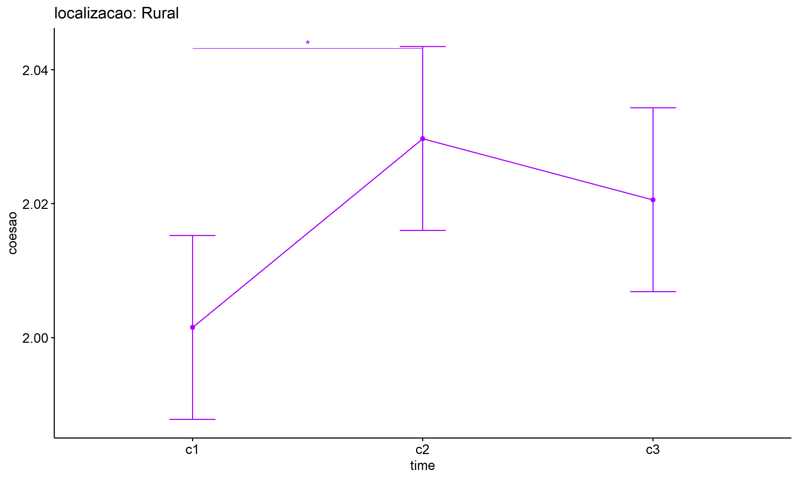

ANOVA test for coesao
================
Geiser C. Challco <geiser@alumni.usp.br>

- [ANOVA: coesao ~ time](#anova-coesao--time)
  - [Data Preparation](#data-preparation)
  - [Summary Statistics](#summary-statistics)
  - [ANOVA Computation](#anova-computation)
  - [PairWise Computation](#pairwise-computation)
- [ANOVA: coesao ~ time\*gender +
  Error(id/time)](#anova-coesao--timegender--erroridtime)
  - [Data Preparation](#data-preparation-1)
    - [Check assumptions: Identifying
      Outliers](#check-assumptions-identifying-outliers)
    - [Check assumptions: Normality
      Test](#check-assumptions-normality-test)
    - [Summary Statistics](#summary-statistics-1)
  - [ANOVA Computation](#anova-computation-1)
  - [ANOVA Computation after removing non.normal
    data](#anova-computation-after-removing-nonnormal-data)
  - [PairWise Computation](#pairwise-computation-1)
  - [PairWise Computation after removing non.normal
    data](#pairwise-computation-after-removing-nonnormal-data)
- [ANOVA: coesao ~ time\*localizacao +
  Error(id/time)](#anova-coesao--timelocalizacao--erroridtime)
  - [Data Preparation](#data-preparation-2)
    - [Check assumptions: Identifying
      Outliers](#check-assumptions-identifying-outliers-1)
    - [Check assumptions: Normality
      Test](#check-assumptions-normality-test-1)
    - [Summary Statistics](#summary-statistics-2)
  - [ANOVA Computation](#anova-computation-2)
  - [ANOVA Computation after removing non.normal
    data](#anova-computation-after-removing-nonnormal-data-1)
  - [PairWise Computation](#pairwise-computation-2)
  - [PairWise Computation after removing non.normal
    data](#pairwise-computation-after-removing-nonnormal-data-1)
- [ANOVA: coesao ~ time\*regiao +
  Error(id/time)](#anova-coesao--timeregiao--erroridtime)
  - [Data Preparation](#data-preparation-3)
    - [Check assumptions: Identifying
      Outliers](#check-assumptions-identifying-outliers-2)
    - [Check assumptions: Normality
      Test](#check-assumptions-normality-test-2)
    - [Summary Statistics](#summary-statistics-3)
  - [ANOVA Computation](#anova-computation-3)
  - [ANOVA Computation after removing non.normal
    data](#anova-computation-after-removing-nonnormal-data-2)
  - [PairWise Computation](#pairwise-computation-3)
  - [PairWise Computation after removing non.normal
    data](#pairwise-computation-after-removing-nonnormal-data-2)
- [ANOVA: coesao ~ time\*porte +
  Error(id/time)](#anova-coesao--timeporte--erroridtime)
  - [Data Preparation](#data-preparation-4)
    - [Check assumptions: Identifying
      Outliers](#check-assumptions-identifying-outliers-3)
    - [Check assumptions: Normality
      Test](#check-assumptions-normality-test-3)
    - [Summary Statistics](#summary-statistics-4)
  - [ANOVA Computation](#anova-computation-4)
  - [ANOVA Computation after removing non.normal
    data](#anova-computation-after-removing-nonnormal-data-3)
  - [PairWise Computation](#pairwise-computation-4)
  - [PairWise Computation after removing non.normal
    data](#pairwise-computation-after-removing-nonnormal-data-3)

``` r
dat <- read_excel("../data/data.xlsx", sheet = "alunos_ef14")

escolas <- read_excel("../data/data.xlsx", sheet = "escolas")
edat <- merge(dat, escolas, by = "cod_escola", all.x = T)
```

# ANOVA: coesao ~ time

## Data Preparation

``` r
data <- edat[,c("aluno_id","ciclo","coesao")]
data <- data[data$ciclo %in% c("Primeiro Ciclo","Segundo Ciclo","Terceiro Ciclo"),]
data$ciclo <- factor(data$ciclo, c("Primeiro Ciclo","Segundo Ciclo","Terceiro Ciclo"))
data <- unique(data)

wdat <- spread(data, ciclo, coesao)
wdat <- wdat[complete.cases(wdat),]
colnames(wdat) <- c("id","c1","c2","c3")

ldat <- gather(wdat, key = time, value = coesao, c1,c2,c3) %>%
  convert_as_factor(id, time)
ldat <- rshinystatistics::remove_group_data(ldat, "coesao", "time", n.limit = 30)
```

## Summary Statistics

``` r
(sdat <- ldat %>% group_by(time) %>%
   get_summary_stats(coesao, type = "mean_sd"))
```

    ## # A tibble: 3 × 5
    ##   time  variable     n  mean    sd
    ##   <fct> <fct>    <dbl> <dbl> <dbl>
    ## 1 c1    coesao    2773  2.00 0.089
    ## 2 c2    coesao    2773  2.02 0.213
    ## 3 c3    coesao    2773  2.02 0.208

| time | variable |    n |  mean |    sd |
|:-----|:---------|-----:|------:|------:|
| c1   | coesao   | 2773 | 2.005 | 0.089 |
| c2   | coesao   | 2773 | 2.022 | 0.213 |
| c3   | coesao   | 2773 | 2.021 | 0.208 |

## ANOVA Computation

``` r
(res.aov <- anova_test(ldat, dv = coesao, wid = id, within = time))
```

    ## ANOVA Table (type III tests)
    ## 
    ## $ANOVA
    ##   Effect DFn  DFd     F       p p<.05   ges
    ## 1   time   2 5544 8.694 0.00017     * 0.002
    ## 
    ## $`Mauchly's Test for Sphericity`
    ##   Effect     W                                                                       p p<.05
    ## 1   time 0.895 0.000000000000000000000000000000000000000000000000000000000000000000139     *
    ## 
    ## $`Sphericity Corrections`
    ##   Effect   GGe        DF[GG]    p[GG] p[GG]<.05   HFe        DF[HF]    p[HF] p[HF]<.05
    ## 1   time 0.905 1.81, 5016.46 0.000296         * 0.905 1.81, 5019.55 0.000295         *

| Effect | DFn |  DFd |     F |   p | p\<.05 |   ges |
|:-------|----:|-----:|------:|----:|:-------|------:|
| time   |   2 | 5544 | 8.694 |   0 | \*     | 0.002 |

| Effect |     W |   p | p\<.05 |
|:-------|------:|----:|:-------|
| time   | 0.895 |   0 | \*     |

| Effect |   GGe | DF\[GG\]      | p\[GG\] | p\[GG\]\<.05 |   HFe | DF\[HF\]      | p\[HF\] | p\[HF\]\<.05 |
|:-------|------:|:--------------|--------:|:-------------|------:|:--------------|--------:|:-------------|
| time   | 0.905 | 1.81, 5016.46 |       0 | \*           | 0.905 | 1.81, 5019.55 |       0 | \*           |

## PairWise Computation

``` r
(pwc <- ldat %>% emmeans_test(coesao ~ time, detailed = T, p.adjust.method = "bonferroni"))
```

    ## # A tibble: 3 × 14
    ##   term  .y.    group1 group2 null.value estimate      se    df conf.low conf.high statistic        p    p.adj p.adj.signif
    ## * <chr> <chr>  <chr>  <chr>       <dbl>    <dbl>   <dbl> <dbl>    <dbl>     <dbl>     <dbl>    <dbl>    <dbl> <chr>       
    ## 1 time  coesao c1     c2              0 -0.0176  0.00482  8316 -0.0270   -0.00813    -3.65  0.000266 0.000797 ***         
    ## 2 time  coesao c1     c3              0 -0.0160  0.00482  8316 -0.0255   -0.00660    -3.33  0.000871 0.00261  **          
    ## 3 time  coesao c2     c3              0  0.00153 0.00482  8316 -0.00791   0.0110      0.318 0.750    1        ns

| term | .y.    | group1 | group2 | null.value | estimate |    se |   df | conf.low | conf.high | statistic |     p | p.adj | p.adj.signif |
|:-----|:-------|:-------|:-------|-----------:|---------:|------:|-----:|---------:|----------:|----------:|------:|------:|:-------------|
| time | coesao | c1     | c2     |          0 |   -0.018 | 0.005 | 8316 |   -0.027 |    -0.008 |    -3.648 | 0.000 | 0.001 | \*\*\*       |
| time | coesao | c1     | c3     |          0 |   -0.016 | 0.005 | 8316 |   -0.025 |    -0.007 |    -3.330 | 0.001 | 0.003 | \*\*         |
| time | coesao | c2     | c3     |          0 |    0.002 | 0.005 | 8316 |   -0.008 |     0.011 |     0.318 | 0.750 | 1.000 | ns           |

``` r
pwc <- add_xy_position(pwc, x = "time", fun = "mean_se")
ggline(get_emmeans(pwc), x = "time", y = "emmean", ylab = "coesao") +
  geom_errorbar(aes(ymin = conf.low, ymax = conf.high), width = 0.2) +
  stat_pvalue_manual(pwc, hide.ns = T, tip.length = F)
```

<!-- -->

# ANOVA: coesao ~ time\*gender + Error(id/time)

## Data Preparation

``` r
data <- edat[,c("aluno_id","gender","ciclo","coesao")]
data <- data[data$ciclo %in% c("Primeiro Ciclo","Segundo Ciclo","Terceiro Ciclo"),]
data$ciclo <- factor(data$ciclo, c("Primeiro Ciclo","Segundo Ciclo","Terceiro Ciclo"))
data <- unique(data)

wdat <- spread(data, ciclo, coesao)
wdat <- wdat[complete.cases(wdat),]
colnames(wdat) <- c("id","gender","c1","c2","c3")

ldat <- gather(wdat, key = time, value = coesao, c1,c2,c3) %>%
  convert_as_factor(id, time)
ldat <- remove_group_data(ldat, "coesao", c("time", "gender"), n.limit = 30)
ldat$gender <- factor(ldat$gender, sort(unique(ldat$gender)))
```

### Check assumptions: Identifying Outliers

``` r
outliers <- identify_outliers(group_by(ldat, time, gender), coesao)
(outliers <- outliers[outliers$is.extreme == T,])
```

    ## # A tibble: 70 × 6
    ##    gender time  id                   coesao is.outlier is.extreme
    ##    <fct>  <fct> <fct>                 <dbl> <lgl>      <lgl>     
    ##  1 Female c1    6ErXFZRYzinfqyPAqEOm    3   TRUE       TRUE      
    ##  2 Female c1    IZ2Xmfi9jueckwdzfkiG    3   TRUE       TRUE      
    ##  3 Female c1    Zd0PsCueY8uUv5kZj7tr    3   TRUE       TRUE      
    ##  4 Male   c1    1uixvrMfKulaomVh0MKa    2.5 TRUE       TRUE      
    ##  5 Male   c1    JRyGpNQA6mOEl1nzl1af    3   TRUE       TRUE      
    ##  6 Male   c1    Kaj54imycuE0bbwH7xlD    3   TRUE       TRUE      
    ##  7 Male   c1    kZlm8iMhlqv4fNmAx0fG    5   TRUE       TRUE      
    ##  8 Male   c1    W8iXxSmW48zvfJyikMZb    4   TRUE       TRUE      
    ##  9 Male   c1    Y7HozU436KQ0wqdBGugu    4   TRUE       TRUE      
    ## 10 Female c2    0mGtUd2Axg2fjQmYZ4CC    3   TRUE       TRUE      
    ## # ℹ 60 more rows

| gender | time | id                   | coesao | is.outlier | is.extreme |
|:-------|:-----|:---------------------|-------:|:-----------|:-----------|
| Female | c1   | 6ErXFZRYzinfqyPAqEOm |    3.0 | TRUE       | TRUE       |
| Female | c1   | IZ2Xmfi9jueckwdzfkiG |    3.0 | TRUE       | TRUE       |
| Female | c1   | Zd0PsCueY8uUv5kZj7tr |    3.0 | TRUE       | TRUE       |
| Male   | c1   | 1uixvrMfKulaomVh0MKa |    2.5 | TRUE       | TRUE       |
| Male   | c1   | JRyGpNQA6mOEl1nzl1af |    3.0 | TRUE       | TRUE       |
| Male   | c1   | Kaj54imycuE0bbwH7xlD |    3.0 | TRUE       | TRUE       |
| Male   | c1   | kZlm8iMhlqv4fNmAx0fG |    5.0 | TRUE       | TRUE       |
| Male   | c1   | W8iXxSmW48zvfJyikMZb |    4.0 | TRUE       | TRUE       |
| Male   | c1   | Y7HozU436KQ0wqdBGugu |    4.0 | TRUE       | TRUE       |
| Female | c2   | 0mGtUd2Axg2fjQmYZ4CC |    3.0 | TRUE       | TRUE       |
| Female | c2   | 0s3deREPA9RavbkKFl8V |    4.0 | TRUE       | TRUE       |
| Female | c2   | 15L3e6gDZk0Q4DrCQShh |    4.0 | TRUE       | TRUE       |
| Female | c2   | 81FewGpSwiofkrv96gr7 |    5.0 | TRUE       | TRUE       |
| Female | c2   | EqNpFnKTbLOWH4nmuu6d |    4.0 | TRUE       | TRUE       |
| Female | c2   | G4NIt8gEc7nfeQ9k2OkL |    4.0 | TRUE       | TRUE       |
| Female | c2   | i5EZ8Ck9IgDueyMbw55v |    3.0 | TRUE       | TRUE       |
| Female | c2   | kul5iFehNLtjWOsTrHGE |    3.0 | TRUE       | TRUE       |
| Female | c2   | o37AYGpzYvr7Id55c0Yk |    4.0 | TRUE       | TRUE       |
| Female | c2   | oGUJyWRMYYbF9PNegJZh |    4.0 | TRUE       | TRUE       |
| Female | c2   | oZGikUZv1vS2jPYRz3LE |    4.0 | TRUE       | TRUE       |
| Female | c2   | PEnvwpI4hxp6PbjGmGZ9 |    2.5 | TRUE       | TRUE       |
| Female | c2   | VEvdWw5qRcZu8cqcVZEW |    4.0 | TRUE       | TRUE       |
| Female | c2   | X8eOpiPuKfI4GXxjOsOM |    4.0 | TRUE       | TRUE       |
| Female | c2   | xk7eC5haTYuFQaJovsBZ |    4.0 | TRUE       | TRUE       |
| Female | c2   | xK8qTeI9z4KzyJVqLhM8 |    4.0 | TRUE       | TRUE       |
| Female | c2   | xQIlV1qQiNpzi4Bna9Ut |    4.0 | TRUE       | TRUE       |
| Female | c2   | YTYFFWzK4C7ejf1X1TUB |    4.0 | TRUE       | TRUE       |
| Male   | c2   | cuknOzzwN4oCRum5U5ph |    5.0 | TRUE       | TRUE       |
| Male   | c2   | G7bqQeqXmsQ3kiJNeYlz |    3.0 | TRUE       | TRUE       |
| Male   | c2   | HsQF2J0r79mHSWNe4l6n |    4.0 | TRUE       | TRUE       |
| Male   | c2   | hv8yuaYbgJIx5H3apsBZ |    4.0 | TRUE       | TRUE       |
| Male   | c2   | i0y5fLoykv6ldZ0ieepl |    3.0 | TRUE       | TRUE       |
| Male   | c2   | j31LU8Xwm0EQ7Mihkhjj |    4.0 | TRUE       | TRUE       |
| Male   | c2   | JW2zutCY9roE0mfz8gz4 |    4.0 | TRUE       | TRUE       |
| Male   | c2   | qyt5dpIrCcmnZfDJIazf |    4.0 | TRUE       | TRUE       |
| Male   | c2   | UBZS3XibJ1p2Kxzu5Mjs |    2.5 | TRUE       | TRUE       |
| Male   | c2   | W8iXxSmW48zvfJyikMZb |    4.0 | TRUE       | TRUE       |
| Male   | c2   | wgOGhRdGeAbGeHUAguQ5 |    5.0 | TRUE       | TRUE       |
| Male   | c2   | wQnhAn0Gfye5OP5zaTgh |    4.0 | TRUE       | TRUE       |
| Male   | c2   | wuumviqqlrNK6QzeoJPr |    4.0 | TRUE       | TRUE       |
| Male   | c2   | XxtCdGkKAnQOx88fyxk4 |    3.0 | TRUE       | TRUE       |
| Female | c3   | 5feCOxk9AidRBPnsBHCE |    3.0 | TRUE       | TRUE       |
| Female | c3   | 6bEKmKQpOuvY6PSQvzqj |    4.0 | TRUE       | TRUE       |
| Female | c3   | 7pR91qd7LX1X2Chwr4xQ |    4.0 | TRUE       | TRUE       |
| Female | c3   | CCVIt7MPeYMUOCCyBxPh |    4.0 | TRUE       | TRUE       |
| Female | c3   | cOCdJff1IOVxOznhBCWn |    4.0 | TRUE       | TRUE       |
| Female | c3   | i5EZ8Ck9IgDueyMbw55v |    5.0 | TRUE       | TRUE       |
| Female | c3   | m5yRlxfIj73j4ossfTOB |    5.0 | TRUE       | TRUE       |
| Female | c3   | mbcncvg5dOFa9ZRsRhZf |    4.0 | TRUE       | TRUE       |
| Female | c3   | OvwAQTWkdj8SYpPS8dgn |    4.0 | TRUE       | TRUE       |
| Female | c3   | Pj0bkt0GAUBSA1FoPcc2 |    5.0 | TRUE       | TRUE       |
| Female | c3   | PwZy7Lbc45vuNd5du72A |    4.0 | TRUE       | TRUE       |
| Female | c3   | T0gqf1WAgr62eUu6WPHq |    4.0 | TRUE       | TRUE       |
| Female | c3   | u65Z834z75LDIy0slvaX |    5.0 | TRUE       | TRUE       |
| Female | c3   | vaOhaNww5ga5d9G6Cftj |    4.0 | TRUE       | TRUE       |
| Female | c3   | xADstL8Txh6OaomMZXC4 |    3.0 | TRUE       | TRUE       |
| Female | c3   | xk7eC5haTYuFQaJovsBZ |    4.0 | TRUE       | TRUE       |
| Male   | c3   | 1uixvrMfKulaomVh0MKa |    4.0 | TRUE       | TRUE       |
| Male   | c3   | 8edbRBvoAhVAiLZ3h3E2 |    5.0 | TRUE       | TRUE       |
| Male   | c3   | CnDHyGy00t97Hh8JGKqg |    3.0 | TRUE       | TRUE       |
| Male   | c3   | E3u63riyMFS8A2cNBnvC |    3.0 | TRUE       | TRUE       |
| Male   | c3   | EtUjsyq1GNevicwMDXlw |    3.5 | TRUE       | TRUE       |
| Male   | c3   | FkJFrnPezc8Ng4SSMx1z |    4.0 | TRUE       | TRUE       |
| Male   | c3   | G1fSZJ6Ea4VhHH2OjGQ3 |    4.0 | TRUE       | TRUE       |
| Male   | c3   | GN5vxU0haHKd9W22JGyk |    4.0 | TRUE       | TRUE       |
| Male   | c3   | HsQF2J0r79mHSWNe4l6n |    3.0 | TRUE       | TRUE       |
| Male   | c3   | j31LU8Xwm0EQ7Mihkhjj |    4.0 | TRUE       | TRUE       |
| Male   | c3   | QAyx2z41ILLaMN0o7pjc |    3.0 | TRUE       | TRUE       |
| Male   | c3   | sNrMxxYCTthTxBfrZZuD |    4.0 | TRUE       | TRUE       |
| Male   | c3   | TKvc4Eu2XaDXYPxuS7Qn |    4.0 | TRUE       | TRUE       |

### Check assumptions: Normality Test

``` r
(normality.df <- normality.test.per.groups(ldat, "coesao", c("time", "gender")))
```

    ##      var variable time gender    n  skewness  kurtosis symmetry statistic     method p p.signif normality
    ## 1 coesao   coesao   c1 Female 1363  0.000000   0.00000 few data        NA       <NA> 1     <NA>        NO
    ## 2 coesao   coesao   c1   Male 1240 18.713532 379.69982       NO  2701.757 D'Agostino 0     ****         -
    ## 3 coesao   coesao   c2 Female 1363  9.448351  91.40936       NO  2081.307 D'Agostino 0     ****         -
    ## 4 coesao   coesao   c2   Male 1240 10.827407 123.13114       NO  2053.555 D'Agostino 0     ****         -
    ## 5 coesao   coesao   c3 Female 1363 10.024252 103.85392       NO  2154.073 D'Agostino 0     ****         -
    ## 6 coesao   coesao   c3   Male 1240 11.041866 128.92563       NO  2076.347 D'Agostino 0     ****         -

| var    | variable | time | gender |    n | skewness | kurtosis | symmetry | statistic | method     |   p | p.signif | normality |
|:-------|:---------|:-----|:-------|-----:|---------:|---------:|:---------|----------:|:-----------|----:|:---------|:----------|
| coesao | coesao   | c1   | Female | 1363 |    0.000 |    0.000 | few data |        NA | NA         |   1 | NA       | NO        |
| coesao | coesao   | c1   | Male   | 1240 |   18.714 |  379.700 | NO       |  2701.757 | D’Agostino |   0 | \*\*\*\* | \-        |
| coesao | coesao   | c2   | Female | 1363 |    9.448 |   91.409 | NO       |  2081.307 | D’Agostino |   0 | \*\*\*\* | \-        |
| coesao | coesao   | c2   | Male   | 1240 |   10.827 |  123.131 | NO       |  2053.555 | D’Agostino |   0 | \*\*\*\* | \-        |
| coesao | coesao   | c3   | Female | 1363 |   10.024 |  103.854 | NO       |  2154.073 | D’Agostino |   0 | \*\*\*\* | \-        |
| coesao | coesao   | c3   | Male   | 1240 |   11.042 |  128.926 | NO       |  2076.347 | D’Agostino |   0 | \*\*\*\* | \-        |

``` r
(non.ids <- unique(do.call(
  c, lapply(which(normality.df$normality == 'NO'), FUN = function(i) {
  idx = which(ldat$time == normality.df$time[i] &
                ldat$gender == normality.df$gender[i])
  getNonNormal(ldat$"coesao"[idx], ldat$id[idx])
}))))
```

    ## NULL

``` r
if (length(non.ids) > 0)
  ldat2 <- ldat[!ldat$id %in% non.ids,]
```

### Summary Statistics

``` r
(sdat <- ldat %>% group_by(time, gender) %>%
   get_summary_stats(coesao, type = "mean_sd"))
```

    ## # A tibble: 6 × 6
    ##   gender time  variable     n  mean    sd
    ##   <fct>  <fct> <fct>    <dbl> <dbl> <dbl>
    ## 1 Female c1    coesao    1363  2.00 0.047
    ## 2 Male   c1    coesao    1240  2.01 0.124
    ## 3 Female c2    coesao    1363  2.02 0.216
    ## 4 Male   c2    coesao    1240  2.02 0.206
    ## 5 Female c3    coesao    1363  2.02 0.238
    ## 6 Male   c3    coesao    1240  2.02 0.186

| gender | time | variable |    n |  mean |    sd |
|:-------|:-----|:---------|-----:|------:|------:|
| Female | c1   | coesao   | 1363 | 2.002 | 0.047 |
| Male   | c1   | coesao   | 1240 | 2.008 | 0.124 |
| Female | c2   | coesao   | 1363 | 2.024 | 0.216 |
| Male   | c2   | coesao   | 1240 | 2.021 | 0.206 |
| Female | c3   | coesao   | 1363 | 2.025 | 0.238 |
| Male   | c3   | coesao   | 1240 | 2.018 | 0.186 |

``` r
if (length(non.ids) > 0)
  (sdat <- ldat2 %>% group_by(time, gender) %>%
      get_summary_stats(coesao, type = "mean_sd"))
```

| gender | time | variable |    n |  mean |    sd |
|:-------|:-----|:---------|-----:|------:|------:|
| Female | c1   | coesao   | 1363 | 2.002 | 0.047 |
| Male   | c1   | coesao   | 1240 | 2.008 | 0.124 |
| Female | c2   | coesao   | 1363 | 2.024 | 0.216 |
| Male   | c2   | coesao   | 1240 | 2.021 | 0.206 |
| Female | c3   | coesao   | 1363 | 2.025 | 0.238 |
| Male   | c3   | coesao   | 1240 | 2.018 | 0.186 |

## ANOVA Computation

``` r
(res.aov <- anova_test(ldat, dv = coesao, wid = id, between = gender, within = time))
```

    ## ANOVA Table (type III tests)
    ## 
    ## $ANOVA
    ##        Effect DFn  DFd     F        p p<.05       ges
    ## 1      gender   1 2601 0.124 0.725000       0.0000179
    ## 2        time   2 5202 8.018 0.000334     * 0.0020000
    ## 3 gender:time   2 5202 0.834 0.434000       0.0002000
    ## 
    ## $`Mauchly's Test for Sphericity`
    ##        Effect     W                                                                 p p<.05
    ## 1        time 0.898 0.000000000000000000000000000000000000000000000000000000000000132     *
    ## 2 gender:time 0.898 0.000000000000000000000000000000000000000000000000000000000000132     *
    ## 
    ## $`Sphericity Corrections`
    ##        Effect   GGe        DF[GG]    p[GG] p[GG]<.05   HFe        DF[HF]    p[HF] p[HF]<.05
    ## 1        time 0.907 1.81, 4719.56 0.000543         * 0.908 1.82, 4722.67 0.000541         *
    ## 2 gender:time 0.907 1.81, 4719.56 0.425000           0.908 1.82, 4722.67 0.425000

| Effect      | DFn |  DFd |     F |     p | p\<.05 |   ges |
|:------------|----:|-----:|------:|------:|:-------|------:|
| gender      |   1 | 2601 | 0.124 | 0.725 |        | 0.000 |
| time        |   2 | 5202 | 8.018 | 0.000 | \*     | 0.002 |
| gender:time |   2 | 5202 | 0.834 | 0.434 |        | 0.000 |

| Effect      |     W |   p | p\<.05 |
|:------------|------:|----:|:-------|
| time        | 0.898 |   0 | \*     |
| gender:time | 0.898 |   0 | \*     |

| Effect      |   GGe | DF\[GG\]      | p\[GG\] | p\[GG\]\<.05 |   HFe | DF\[HF\]      | p\[HF\] | p\[HF\]\<.05 |
|:------------|------:|:--------------|--------:|:-------------|------:|:--------------|--------:|:-------------|
| time        | 0.907 | 1.81, 4719.56 |   0.001 | \*           | 0.908 | 1.82, 4722.67 |   0.001 | \*           |
| gender:time | 0.907 | 1.81, 4719.56 |   0.425 |              | 0.908 | 1.82, 4722.67 |   0.425 |              |

## ANOVA Computation after removing non.normal data

``` r
if (length(non.ids) > 0)
  (res.aov2 <- anova_test(ldat2, dv = coesao, wid = id, between = gender , within = time))
```

## PairWise Computation

``` r
(pwc <- ldat %>% group_by(time) %>%
   emmeans_test(coesao ~ gender, detailed = T, p.adjust.method = "bonferroni"))
```

    ## # A tibble: 3 × 15
    ##   time  term   .y.    group1 group2 null.value estimate      se    df conf.low conf.high statistic     p p.adj p.adj.signif
    ## * <fct> <chr>  <chr>  <chr>  <chr>       <dbl>    <dbl>   <dbl> <dbl>    <dbl>     <dbl>     <dbl> <dbl> <dbl> <chr>       
    ## 1 c1    gender coesao Female Male            0 -0.00546 0.00714  7803 -0.0195    0.00854    -0.765 0.445 0.445 ns          
    ## 2 c2    gender coesao Female Male            0  0.00328 0.00714  7803 -0.0107    0.0173      0.459 0.646 0.646 ns          
    ## 3 c3    gender coesao Female Male            0  0.00680 0.00714  7803 -0.00720   0.0208      0.952 0.341 0.341 ns

| time | term   | .y.    | group1 | group2 | null.value | estimate |    se |   df | conf.low | conf.high | statistic |     p | p.adj | p.adj.signif |
|:-----|:-------|:-------|:-------|:-------|-----------:|---------:|------:|-----:|---------:|----------:|----------:|------:|------:|:-------------|
| c1   | gender | coesao | Female | Male   |          0 |   -0.005 | 0.007 | 7803 |   -0.019 |     0.009 |    -0.765 | 0.445 | 0.445 | ns           |
| c2   | gender | coesao | Female | Male   |          0 |    0.003 | 0.007 | 7803 |   -0.011 |     0.017 |     0.459 | 0.646 | 0.646 | ns           |
| c3   | gender | coesao | Female | Male   |          0 |    0.007 | 0.007 | 7803 |   -0.007 |     0.021 |     0.952 | 0.341 | 0.341 | ns           |

``` r
(emms <- get_emmeans(pwc))
```

    ## # A tibble: 6 × 8
    ##   time  gender emmean      se    df conf.low conf.high method      
    ##   <fct> <fct>   <dbl>   <dbl> <dbl>    <dbl>     <dbl> <chr>       
    ## 1 c1    Female   2.00 0.00493  7803     1.99      2.01 Emmeans test
    ## 2 c1    Male     2.01 0.00517  7803     2.00      2.02 Emmeans test
    ## 3 c2    Female   2.02 0.00493  7803     2.01      2.03 Emmeans test
    ## 4 c2    Male     2.02 0.00517  7803     2.01      2.03 Emmeans test
    ## 5 c3    Female   2.02 0.00493  7803     2.02      2.03 Emmeans test
    ## 6 c3    Male     2.02 0.00517  7803     2.01      2.03 Emmeans test

| time | gender | emmean |    se |   df | conf.low | conf.high | method       |
|:-----|:-------|-------:|------:|-----:|---------:|----------:|:-------------|
| c1   | Female |  2.002 | 0.005 | 7803 |    1.993 |     2.012 | Emmeans test |
| c1   | Male   |  2.008 | 0.005 | 7803 |    1.998 |     2.018 | Emmeans test |
| c2   | Female |  2.024 | 0.005 | 7803 |    2.014 |     2.034 | Emmeans test |
| c2   | Male   |  2.021 | 0.005 | 7803 |    2.010 |     2.031 | Emmeans test |
| c3   | Female |  2.025 | 0.005 | 7803 |    2.015 |     2.035 | Emmeans test |
| c3   | Male   |  2.018 | 0.005 | 7803 |    2.008 |     2.028 | Emmeans test |

``` r
pwc <- add_xy_position(pwc, x = "time", fun = "mean_se", dodge = 0.25)
pd <- position_dodge(width = 0.25)
ggline(emms, x = "time", y = "emmean", color = "gender",
       palette = c("#FF007F","#4D4DFF"),
       position = pd, ylab = "coesao") +
  geom_errorbar(aes(ymin = conf.low, ymax = conf.high, color = gender),
                position = pd, width = 0.2) +
  stat_pvalue_manual(pwc, hide.ns = T, tip.length = F, linetype = 1)
```

<!-- -->

``` r
(pwc <- ldat %>% group_by(gender) %>%
    emmeans_test(coesao ~ time, detailed = T, p.adjust.method = "bonferroni"))
```

    ## # A tibble: 6 × 15
    ##   gender term  .y.    group1 group2 null.value estimate      se    df conf.low conf.high statistic       p   p.adj p.adj.signif
    ## * <fct>  <chr> <chr>  <chr>  <chr>       <dbl>    <dbl>   <dbl> <dbl>    <dbl>     <dbl>     <dbl>   <dbl>   <dbl> <chr>       
    ## 1 Female time  coesao c1     c2              0 -0.0216  0.00697  7803  -0.0353  -0.00798    -3.11  0.00191 0.00573 **          
    ## 2 Female time  coesao c1     c3              0 -0.0227  0.00697  7803  -0.0364  -0.00908    -3.26  0.00111 0.00332 **          
    ## 3 Female time  coesao c2     c3              0 -0.00110 0.00697  7803  -0.0148   0.0126     -0.158 0.875   1       ns          
    ## 4 Male   time  coesao c1     c2              0 -0.0129  0.00731  7803  -0.0272   0.00142    -1.77  0.0775  0.232   ns          
    ## 5 Male   time  coesao c1     c3              0 -0.0105  0.00731  7803  -0.0248   0.00384    -1.43  0.151   0.454   ns          
    ## 6 Male   time  coesao c2     c3              0  0.00242 0.00731  7803  -0.0119   0.0167      0.331 0.741   1       ns

| gender | term | .y.    | group1 | group2 | null.value | estimate |    se |   df | conf.low | conf.high | statistic |     p | p.adj | p.adj.signif |
|:-------|:-----|:-------|:-------|:-------|-----------:|---------:|------:|-----:|---------:|----------:|----------:|------:|------:|:-------------|
| Female | time | coesao | c1     | c2     |          0 |   -0.022 | 0.007 | 7803 |   -0.035 |    -0.008 |    -3.105 | 0.002 | 0.006 | \*\*         |
| Female | time | coesao | c1     | c3     |          0 |   -0.023 | 0.007 | 7803 |   -0.036 |    -0.009 |    -3.263 | 0.001 | 0.003 | \*\*         |
| Female | time | coesao | c2     | c3     |          0 |   -0.001 | 0.007 | 7803 |   -0.015 |     0.013 |    -0.158 | 0.875 | 1.000 | ns           |
| Male   | time | coesao | c1     | c2     |          0 |   -0.013 | 0.007 | 7803 |   -0.027 |     0.001 |    -1.766 | 0.077 | 0.232 | ns           |
| Male   | time | coesao | c1     | c3     |          0 |   -0.010 | 0.007 | 7803 |   -0.025 |     0.004 |    -1.435 | 0.151 | 0.454 | ns           |
| Male   | time | coesao | c2     | c3     |          0 |    0.002 | 0.007 | 7803 |   -0.012 |     0.017 |     0.331 | 0.741 | 1.000 | ns           |

``` r
(emms <- get_emmeans(pwc))
```

    ## # A tibble: 6 × 8
    ##   gender time  emmean      se    df conf.low conf.high method      
    ##   <fct>  <fct>  <dbl>   <dbl> <dbl>    <dbl>     <dbl> <chr>       
    ## 1 Female c1      2.00 0.00493  7803     1.99      2.01 Emmeans test
    ## 2 Female c2      2.02 0.00493  7803     2.01      2.03 Emmeans test
    ## 3 Female c3      2.02 0.00493  7803     2.02      2.03 Emmeans test
    ## 4 Male   c1      2.01 0.00517  7803     2.00      2.02 Emmeans test
    ## 5 Male   c2      2.02 0.00517  7803     2.01      2.03 Emmeans test
    ## 6 Male   c3      2.02 0.00517  7803     2.01      2.03 Emmeans test

| gender | time | emmean |    se |   df | conf.low | conf.high | method       |
|:-------|:-----|-------:|------:|-----:|---------:|----------:|:-------------|
| Female | c1   |  2.002 | 0.005 | 7803 |    1.993 |     2.012 | Emmeans test |
| Female | c2   |  2.024 | 0.005 | 7803 |    2.014 |     2.034 | Emmeans test |
| Female | c3   |  2.025 | 0.005 | 7803 |    2.015 |     2.035 | Emmeans test |
| Male   | c1   |  2.008 | 0.005 | 7803 |    1.998 |     2.018 | Emmeans test |
| Male   | c2   |  2.021 | 0.005 | 7803 |    2.010 |     2.031 | Emmeans test |
| Male   | c3   |  2.018 | 0.005 | 7803 |    2.008 |     2.028 | Emmeans test |

``` r
emms.gg <- emms[which(emms$gender == "Female"),]
if (nrow(emms.gg) > 0)
  ggline(emms.gg, x = "time", y = "emmean", color = "#FF007F", ylab = "coesao") +
    geom_errorbar(aes(ymin = conf.low, ymax = conf.high),
                  width = 0.2, color = "#FF007F") +
    stat_pvalue_manual(
      add_xy_position(pwc[which(pwc$gender == "Female"),],
                      x = "time", fun = "mean_se"),
      hide.ns = T, color = "#FF007F", tip.length = F) +
    labs(title = "gender: Female")+
    theme(legend.text = element_blank())
```

<!-- -->

``` r
emms.gg <- emms[which(emms$gender == "Male"),]
if (nrow(emms.gg) > 0)
  ggline(emms.gg, x = "time", y = "emmean", color = "#4D4DFF", ylab = "coesao") +
    geom_errorbar(aes(ymin = conf.low, ymax = conf.high),
                  width = 0.2, color = "#4D4DFF") +
    stat_pvalue_manual(
      add_xy_position(pwc[which(pwc$gender == "Male"),],
                      x = "time", fun = "mean_se"),
      hide.ns = T, color = "#4D4DFF", tip.length = F) +
    labs(title = "gender: Male")+
    theme(legend.text = element_blank())
```

<!-- -->

## PairWise Computation after removing non.normal data

``` r
if (length(non.ids) > 0)
  (pwc2 <- ldat2 %>% group_by(time) %>%
     emmeans_test(coesao ~ gender, detailed = T, p.adjust.method = "bonferroni"))
```

``` r
if (length(non.ids) > 0)
  (emms2 <- get_emmeans(pwc2))
```

``` r
if (length(non.ids) > 0) {
  pwc2 <- add_xy_position(pwc2, x = "time", fun = "mean_se", dodge = 0.25)
  pd2 <- position_dodge(width = 0.25)
  
  ggline(emms2, x = "time", y = "emmean", color = "gender",
         palette = c("#FF007F","#4D4DFF"),
         position = pd, ylab = "coesao") +
    geom_errorbar(aes(ymin = conf.low, ymax = conf.high, color = gender),
                position = pd, width = 0.2) +
    stat_pvalue_manual(pwc2, hide.ns = T, tip.length = F, linetype = 1)
}
```

``` r
if (length(non.ids) > 0)
  (pwc2 <- ldat2 %>% group_by(gender) %>%
     emmeans_test(coesao ~ time, detailed = T, p.adjust.method = "bonferroni"))
```

``` r
if (length(non.ids) > 0)
  (emms2 <- get_emmeans(pwc2))
```

``` r
if (length(non.ids) > 0) {
  emms.gg <- emms2[which(emms2$gender == "Female"),]
  if (nrow(emms.gg) > 0)
    ggline(emms.gg, x = "time", y = "emmean", color = "#FF007F", ylab = "coesao") +
    geom_errorbar(aes(ymin = conf.low, ymax = conf.high),
                  width = 0.2, color = "#FF007F") +
    stat_pvalue_manual(
      add_xy_position(pwc[which(pwc$gender == "Female"),],
                      x = "time", fun = "mean_se"),
      hide.ns = T, color = "#FF007F", tip.length = F) +
    labs(title = "gender: Female") +
    theme(legend.text = element_blank())
}
```

``` r
if (length(non.ids) > 0) {
  emms.gg <- emms2[which(emms2$gender == "Male"),]
  if (nrow(emms.gg) > 0)
    ggline(emms.gg, x = "time", y = "emmean", color = "#4D4DFF", ylab = "coesao") +
    geom_errorbar(aes(ymin = conf.low, ymax = conf.high),
                  width = 0.2, color = "#4D4DFF") +
    stat_pvalue_manual(
      add_xy_position(pwc[which(pwc$gender == "Male"),],
                      x = "time", fun = "mean_se"),
      hide.ns = T, color = "#4D4DFF", tip.length = F) +
    labs(title = "gender: Male") +
    theme(legend.text = element_blank())
}
```

# ANOVA: coesao ~ time\*localizacao + Error(id/time)

## Data Preparation

``` r
data <- edat[,c("aluno_id","localizacao","ciclo","coesao")]
data <- data[data$ciclo %in% c("Primeiro Ciclo","Segundo Ciclo","Terceiro Ciclo"),]
data$ciclo <- factor(data$ciclo, c("Primeiro Ciclo","Segundo Ciclo","Terceiro Ciclo"))
data <- unique(data)

wdat <- spread(data, ciclo, coesao)
wdat <- wdat[complete.cases(wdat),]
colnames(wdat) <- c("id","localizacao","c1","c2","c3")

ldat <- gather(wdat, key = time, value = coesao, c1,c2,c3) %>%
  convert_as_factor(id, time)
ldat <- remove_group_data(ldat, "coesao", c("time", "localizacao"), n.limit = 30)
ldat$localizacao <- factor(ldat$localizacao, sort(unique(ldat$localizacao)))
```

### Check assumptions: Identifying Outliers

``` r
outliers <- identify_outliers(group_by(ldat, time, localizacao), coesao)
(outliers <- outliers[outliers$is.extreme == T,])
```

    ## # A tibble: 73 × 6
    ##    localizacao time  id                   coesao is.outlier is.extreme
    ##    <fct>       <fct> <fct>                 <dbl> <lgl>      <lgl>     
    ##  1 Rural       c1    Kaj54imycuE0bbwH7xlD    3   TRUE       TRUE      
    ##  2 Urbana      c1    1uixvrMfKulaomVh0MKa    2.5 TRUE       TRUE      
    ##  3 Urbana      c1    6ErXFZRYzinfqyPAqEOm    3   TRUE       TRUE      
    ##  4 Urbana      c1    IZ2Xmfi9jueckwdzfkiG    3   TRUE       TRUE      
    ##  5 Urbana      c1    JRyGpNQA6mOEl1nzl1af    3   TRUE       TRUE      
    ##  6 Urbana      c1    kZlm8iMhlqv4fNmAx0fG    5   TRUE       TRUE      
    ##  7 Urbana      c1    W8iXxSmW48zvfJyikMZb    4   TRUE       TRUE      
    ##  8 Urbana      c1    Y7HozU436KQ0wqdBGugu    4   TRUE       TRUE      
    ##  9 Urbana      c1    Zd0PsCueY8uUv5kZj7tr    3   TRUE       TRUE      
    ## 10 Rural       c2    15L3e6gDZk0Q4DrCQShh    4   TRUE       TRUE      
    ## # ℹ 63 more rows

| localizacao | time | id                   | coesao | is.outlier | is.extreme |
|:------------|:-----|:---------------------|-------:|:-----------|:-----------|
| Rural       | c1   | Kaj54imycuE0bbwH7xlD |   3.00 | TRUE       | TRUE       |
| Urbana      | c1   | 1uixvrMfKulaomVh0MKa |   2.50 | TRUE       | TRUE       |
| Urbana      | c1   | 6ErXFZRYzinfqyPAqEOm |   3.00 | TRUE       | TRUE       |
| Urbana      | c1   | IZ2Xmfi9jueckwdzfkiG |   3.00 | TRUE       | TRUE       |
| Urbana      | c1   | JRyGpNQA6mOEl1nzl1af |   3.00 | TRUE       | TRUE       |
| Urbana      | c1   | kZlm8iMhlqv4fNmAx0fG |   5.00 | TRUE       | TRUE       |
| Urbana      | c1   | W8iXxSmW48zvfJyikMZb |   4.00 | TRUE       | TRUE       |
| Urbana      | c1   | Y7HozU436KQ0wqdBGugu |   4.00 | TRUE       | TRUE       |
| Urbana      | c1   | Zd0PsCueY8uUv5kZj7tr |   3.00 | TRUE       | TRUE       |
| Rural       | c2   | 15L3e6gDZk0Q4DrCQShh |   4.00 | TRUE       | TRUE       |
| Rural       | c2   | 81FewGpSwiofkrv96gr7 |   5.00 | TRUE       | TRUE       |
| Rural       | c2   | G7bqQeqXmsQ3kiJNeYlz |   3.00 | TRUE       | TRUE       |
| Rural       | c2   | hv8yuaYbgJIx5H3apsBZ |   4.00 | TRUE       | TRUE       |
| Rural       | c2   | JW2zutCY9roE0mfz8gz4 |   4.00 | TRUE       | TRUE       |
| Rural       | c2   | kul5iFehNLtjWOsTrHGE |   3.00 | TRUE       | TRUE       |
| Rural       | c2   | o37AYGpzYvr7Id55c0Yk |   4.00 | TRUE       | TRUE       |
| Rural       | c2   | UBZS3XibJ1p2Kxzu5Mjs |   2.50 | TRUE       | TRUE       |
| Rural       | c2   | VEvdWw5qRcZu8cqcVZEW |   4.00 | TRUE       | TRUE       |
| Rural       | c2   | X8eOpiPuKfI4GXxjOsOM |   4.00 | TRUE       | TRUE       |
| Rural       | c2   | xK8qTeI9z4KzyJVqLhM8 |   4.00 | TRUE       | TRUE       |
| Urbana      | c2   | 0mGtUd2Axg2fjQmYZ4CC |   3.00 | TRUE       | TRUE       |
| Urbana      | c2   | 0s3deREPA9RavbkKFl8V |   4.00 | TRUE       | TRUE       |
| Urbana      | c2   | a2JWo5QSfW1gg6TPg2pB |   5.00 | TRUE       | TRUE       |
| Urbana      | c2   | cuknOzzwN4oCRum5U5ph |   5.00 | TRUE       | TRUE       |
| Urbana      | c2   | EqNpFnKTbLOWH4nmuu6d |   4.00 | TRUE       | TRUE       |
| Urbana      | c2   | G4NIt8gEc7nfeQ9k2OkL |   4.00 | TRUE       | TRUE       |
| Urbana      | c2   | HsQF2J0r79mHSWNe4l6n |   4.00 | TRUE       | TRUE       |
| Urbana      | c2   | i0y5fLoykv6ldZ0ieepl |   3.00 | TRUE       | TRUE       |
| Urbana      | c2   | i5EZ8Ck9IgDueyMbw55v |   3.00 | TRUE       | TRUE       |
| Urbana      | c2   | j31LU8Xwm0EQ7Mihkhjj |   4.00 | TRUE       | TRUE       |
| Urbana      | c2   | oGUJyWRMYYbF9PNegJZh |   4.00 | TRUE       | TRUE       |
| Urbana      | c2   | oZGikUZv1vS2jPYRz3LE |   4.00 | TRUE       | TRUE       |
| Urbana      | c2   | PEnvwpI4hxp6PbjGmGZ9 |   2.50 | TRUE       | TRUE       |
| Urbana      | c2   | qyt5dpIrCcmnZfDJIazf |   4.00 | TRUE       | TRUE       |
| Urbana      | c2   | W8iXxSmW48zvfJyikMZb |   4.00 | TRUE       | TRUE       |
| Urbana      | c2   | wgOGhRdGeAbGeHUAguQ5 |   5.00 | TRUE       | TRUE       |
| Urbana      | c2   | wQnhAn0Gfye5OP5zaTgh |   4.00 | TRUE       | TRUE       |
| Urbana      | c2   | wuumviqqlrNK6QzeoJPr |   4.00 | TRUE       | TRUE       |
| Urbana      | c2   | X9BgDKcFZTw3krcWBdWW |   2.25 | TRUE       | TRUE       |
| Urbana      | c2   | xk7eC5haTYuFQaJovsBZ |   4.00 | TRUE       | TRUE       |
| Urbana      | c2   | xQIlV1qQiNpzi4Bna9Ut |   4.00 | TRUE       | TRUE       |
| Urbana      | c2   | XxtCdGkKAnQOx88fyxk4 |   3.00 | TRUE       | TRUE       |
| Urbana      | c2   | YTYFFWzK4C7ejf1X1TUB |   4.00 | TRUE       | TRUE       |
| Rural       | c3   | CnDHyGy00t97Hh8JGKqg |   3.00 | TRUE       | TRUE       |
| Rural       | c3   | mbcncvg5dOFa9ZRsRhZf |   4.00 | TRUE       | TRUE       |
| Rural       | c3   | PfTab7CnJIl6lys2Cxuq |   2.50 | TRUE       | TRUE       |
| Rural       | c3   | Pj0bkt0GAUBSA1FoPcc2 |   5.00 | TRUE       | TRUE       |
| Rural       | c3   | PwZy7Lbc45vuNd5du72A |   4.00 | TRUE       | TRUE       |
| Rural       | c3   | sNrMxxYCTthTxBfrZZuD |   4.00 | TRUE       | TRUE       |
| Rural       | c3   | vaOhaNww5ga5d9G6Cftj |   4.00 | TRUE       | TRUE       |
| Rural       | c3   | xADstL8Txh6OaomMZXC4 |   3.00 | TRUE       | TRUE       |
| Urbana      | c3   | 1uixvrMfKulaomVh0MKa |   4.00 | TRUE       | TRUE       |
| Urbana      | c3   | 5feCOxk9AidRBPnsBHCE |   3.00 | TRUE       | TRUE       |
| Urbana      | c3   | 6bEKmKQpOuvY6PSQvzqj |   4.00 | TRUE       | TRUE       |
| Urbana      | c3   | 7pR91qd7LX1X2Chwr4xQ |   4.00 | TRUE       | TRUE       |
| Urbana      | c3   | 8edbRBvoAhVAiLZ3h3E2 |   5.00 | TRUE       | TRUE       |
| Urbana      | c3   | CCVIt7MPeYMUOCCyBxPh |   4.00 | TRUE       | TRUE       |
| Urbana      | c3   | cOCdJff1IOVxOznhBCWn |   4.00 | TRUE       | TRUE       |
| Urbana      | c3   | E3u63riyMFS8A2cNBnvC |   3.00 | TRUE       | TRUE       |
| Urbana      | c3   | EtUjsyq1GNevicwMDXlw |   3.50 | TRUE       | TRUE       |
| Urbana      | c3   | FkJFrnPezc8Ng4SSMx1z |   4.00 | TRUE       | TRUE       |
| Urbana      | c3   | G1fSZJ6Ea4VhHH2OjGQ3 |   4.00 | TRUE       | TRUE       |
| Urbana      | c3   | GN5vxU0haHKd9W22JGyk |   4.00 | TRUE       | TRUE       |
| Urbana      | c3   | HsQF2J0r79mHSWNe4l6n |   3.00 | TRUE       | TRUE       |
| Urbana      | c3   | i5EZ8Ck9IgDueyMbw55v |   5.00 | TRUE       | TRUE       |
| Urbana      | c3   | j31LU8Xwm0EQ7Mihkhjj |   4.00 | TRUE       | TRUE       |
| Urbana      | c3   | m5yRlxfIj73j4ossfTOB |   5.00 | TRUE       | TRUE       |
| Urbana      | c3   | OvwAQTWkdj8SYpPS8dgn |   4.00 | TRUE       | TRUE       |
| Urbana      | c3   | QAyx2z41ILLaMN0o7pjc |   3.00 | TRUE       | TRUE       |
| Urbana      | c3   | T0gqf1WAgr62eUu6WPHq |   4.00 | TRUE       | TRUE       |
| Urbana      | c3   | TKvc4Eu2XaDXYPxuS7Qn |   4.00 | TRUE       | TRUE       |
| Urbana      | c3   | u65Z834z75LDIy0slvaX |   5.00 | TRUE       | TRUE       |
| Urbana      | c3   | xk7eC5haTYuFQaJovsBZ |   4.00 | TRUE       | TRUE       |

### Check assumptions: Normality Test

``` r
(normality.df <- normality.test.per.groups(ldat, "coesao", c("time", "localizacao")))
```

    ##      var variable time localizacao    n  skewness  kurtosis symmetry statistic     method p p.signif normality
    ## 1 coesao   coesao   c1       Rural  656  0.000000   0.00000 few data        NA       <NA> 1     <NA>        NO
    ## 2 coesao   coesao   c1      Urbana 2117 22.053959 543.72143       NO 4898.0494 D'Agostino 0     ****         -
    ## 3 coesao   coesao   c2       Rural  656  8.677536  77.97302       NO  985.1212 D'Agostino 0     ****         -
    ## 4 coesao   coesao   c2      Urbana 2117 10.975597 125.84966       NO 3481.7099 D'Agostino 0     ****         -
    ## 5 coesao   coesao   c3       Rural  656 10.845903 124.74385       NO 1120.7492 D'Agostino 0     ****         -
    ## 6 coesao   coesao   c3      Urbana 2117 10.887873 123.98421       NO 3466.6526 D'Agostino 0     ****         -

| var    | variable | time | localizacao |    n | skewness | kurtosis | symmetry | statistic | method     |   p | p.signif | normality |
|:-------|:---------|:-----|:------------|-----:|---------:|---------:|:---------|----------:|:-----------|----:|:---------|:----------|
| coesao | coesao   | c1   | Rural       |  656 |    0.000 |    0.000 | few data |        NA | NA         |   1 | NA       | NO        |
| coesao | coesao   | c1   | Urbana      | 2117 |   22.054 |  543.721 | NO       |  4898.049 | D’Agostino |   0 | \*\*\*\* | \-        |
| coesao | coesao   | c2   | Rural       |  656 |    8.678 |   77.973 | NO       |   985.121 | D’Agostino |   0 | \*\*\*\* | \-        |
| coesao | coesao   | c2   | Urbana      | 2117 |   10.976 |  125.850 | NO       |  3481.710 | D’Agostino |   0 | \*\*\*\* | \-        |
| coesao | coesao   | c3   | Rural       |  656 |   10.846 |  124.744 | NO       |  1120.749 | D’Agostino |   0 | \*\*\*\* | \-        |
| coesao | coesao   | c3   | Urbana      | 2117 |   10.888 |  123.984 | NO       |  3466.653 | D’Agostino |   0 | \*\*\*\* | \-        |

``` r
(non.ids <- unique(do.call(
  c, lapply(which(normality.df$normality == 'NO'), FUN = function(i) {
  idx = which(ldat$time == normality.df$time[i] &
                ldat$localizacao == normality.df$localizacao[i])
  getNonNormal(ldat$"coesao"[idx], ldat$id[idx])
}))))
```

    ## NULL

``` r
if (length(non.ids) > 0)
  ldat2 <- ldat[!ldat$id %in% non.ids,]
```

### Summary Statistics

``` r
(sdat <- ldat %>% group_by(time, localizacao) %>%
   get_summary_stats(coesao, type = "mean_sd"))
```

    ## # A tibble: 6 × 6
    ##   localizacao time  variable     n  mean    sd
    ##   <fct>       <fct> <fct>    <dbl> <dbl> <dbl>
    ## 1 Rural       c1    coesao     656  2.00 0.039
    ## 2 Urbana      c1    coesao    2117  2.00 0.1  
    ## 3 Rural       c2    coesao     656  2.03 0.243
    ## 4 Urbana      c2    coesao    2117  2.02 0.202
    ## 5 Rural       c3    coesao     656  2.02 0.203
    ## 6 Urbana      c3    coesao    2117  2.02 0.21

| localizacao | time | variable |    n |  mean |    sd |
|:------------|:-----|:---------|-----:|------:|------:|
| Rural       | c1   | coesao   |  656 | 2.002 | 0.039 |
| Urbana      | c1   | coesao   | 2117 | 2.005 | 0.100 |
| Rural       | c2   | coesao   |  656 | 2.030 | 0.243 |
| Urbana      | c2   | coesao   | 2117 | 2.020 | 0.202 |
| Rural       | c3   | coesao   |  656 | 2.021 | 0.203 |
| Urbana      | c3   | coesao   | 2117 | 2.021 | 0.210 |

``` r
if (length(non.ids) > 0)
  (sdat <- ldat2 %>% group_by(time, localizacao) %>%
      get_summary_stats(coesao, type = "mean_sd"))
```

| localizacao | time | variable |    n |  mean |    sd |
|:------------|:-----|:---------|-----:|------:|------:|
| Rural       | c1   | coesao   |  656 | 2.002 | 0.039 |
| Urbana      | c1   | coesao   | 2117 | 2.005 | 0.100 |
| Rural       | c2   | coesao   |  656 | 2.030 | 0.243 |
| Urbana      | c2   | coesao   | 2117 | 2.020 | 0.202 |
| Rural       | c3   | coesao   |  656 | 2.021 | 0.203 |
| Urbana      | c3   | coesao   | 2117 | 2.021 | 0.210 |

## ANOVA Computation

``` r
(res.aov <- anova_test(ldat, dv = coesao, wid = id, between = localizacao, within = time))
```

    ## ANOVA Table (type III tests)
    ## 
    ## $ANOVA
    ##             Effect DFn  DFd     F        p p<.05       ges
    ## 1      localizacao   1 2771 0.174 0.677000       0.0000234
    ## 2             time   2 5542 8.395 0.000229     * 0.0020000
    ## 3 localizacao:time   2 5542 0.851 0.427000       0.0001920
    ## 
    ## $`Mauchly's Test for Sphericity`
    ##             Effect     W                                                                       p p<.05
    ## 1             time 0.895 0.000000000000000000000000000000000000000000000000000000000000000000131     *
    ## 2 localizacao:time 0.895 0.000000000000000000000000000000000000000000000000000000000000000000131     *
    ## 
    ## $`Sphericity Corrections`
    ##             Effect   GGe        DF[GG]    p[GG] p[GG]<.05   HFe       DF[HF]    p[HF] p[HF]<.05
    ## 1             time 0.905 1.81, 5014.32 0.000389         * 0.905 1.81, 5017.4 0.000388         *
    ## 2 localizacao:time 0.905 1.81, 5014.32 0.417000           0.905 1.81, 5017.4 0.417000

| Effect           | DFn |  DFd |     F |     p | p\<.05 |   ges |
|:-----------------|----:|-----:|------:|------:|:-------|------:|
| localizacao      |   1 | 2771 | 0.174 | 0.677 |        | 0.000 |
| time             |   2 | 5542 | 8.395 | 0.000 | \*     | 0.002 |
| localizacao:time |   2 | 5542 | 0.851 | 0.427 |        | 0.000 |

| Effect           |     W |   p | p\<.05 |
|:-----------------|------:|----:|:-------|
| time             | 0.895 |   0 | \*     |
| localizacao:time | 0.895 |   0 | \*     |

| Effect           |   GGe | DF\[GG\]      | p\[GG\] | p\[GG\]\<.05 |   HFe | DF\[HF\]     | p\[HF\] | p\[HF\]\<.05 |
|:-----------------|------:|:--------------|--------:|:-------------|------:|:-------------|--------:|:-------------|
| time             | 0.905 | 1.81, 5014.32 |   0.000 | \*           | 0.905 | 1.81, 5017.4 |   0.000 | \*           |
| localizacao:time | 0.905 | 1.81, 5014.32 |   0.417 |              | 0.905 | 1.81, 5017.4 |   0.417 |              |

## ANOVA Computation after removing non.normal data

``` r
if (length(non.ids) > 0)
  (res.aov2 <- anova_test(ldat2, dv = coesao, wid = id, between = localizacao , within = time))
```

## PairWise Computation

``` r
(pwc <- ldat %>% group_by(time) %>%
   emmeans_test(coesao ~ localizacao, detailed = T, p.adjust.method = "bonferroni"))
```

    ## # A tibble: 3 × 15
    ##   time  term        .y.    group1 group2 null.value estimate      se    df conf.low conf.high statistic     p p.adj p.adj.signif
    ## * <fct> <chr>       <chr>  <chr>  <chr>       <dbl>    <dbl>   <dbl> <dbl>    <dbl>     <dbl>     <dbl> <dbl> <dbl> <chr>       
    ## 1 c1    localizacao coesao Rural  Urbana          0 -3.91e-3 0.00802  8313 -0.0196     0.0118  -0.487   0.626 0.626 ns          
    ## 2 c2    localizacao coesao Rural  Urbana          0  1.00e-2 0.00802  8313 -0.00571    0.0257   1.25    0.212 0.212 ns          
    ## 3 c3    localizacao coesao Rural  Urbana          0  3.13e-5 0.00802  8313 -0.0157     0.0157   0.00391 0.997 0.997 ns

| time | term        | .y.    | group1 | group2 | null.value | estimate |    se |   df | conf.low | conf.high | statistic |     p | p.adj | p.adj.signif |
|:-----|:------------|:-------|:-------|:-------|-----------:|---------:|------:|-----:|---------:|----------:|----------:|------:|------:|:-------------|
| c1   | localizacao | coesao | Rural  | Urbana |          0 |   -0.004 | 0.008 | 8313 |   -0.020 |     0.012 |    -0.487 | 0.626 | 0.626 | ns           |
| c2   | localizacao | coesao | Rural  | Urbana |          0 |    0.010 | 0.008 | 8313 |   -0.006 |     0.026 |     1.248 | 0.212 | 0.212 | ns           |
| c3   | localizacao | coesao | Rural  | Urbana |          0 |    0.000 | 0.008 | 8313 |   -0.016 |     0.016 |     0.004 | 0.997 | 0.997 | ns           |

``` r
(emms <- get_emmeans(pwc))
```

    ## # A tibble: 6 × 8
    ##   time  localizacao emmean      se    df conf.low conf.high method      
    ##   <fct> <fct>        <dbl>   <dbl> <dbl>    <dbl>     <dbl> <chr>       
    ## 1 c1    Rural         2.00 0.00701  8313     1.99      2.02 Emmeans test
    ## 2 c1    Urbana        2.01 0.00390  8313     2.00      2.01 Emmeans test
    ## 3 c2    Rural         2.03 0.00701  8313     2.02      2.04 Emmeans test
    ## 4 c2    Urbana        2.02 0.00390  8313     2.01      2.03 Emmeans test
    ## 5 c3    Rural         2.02 0.00701  8313     2.01      2.03 Emmeans test
    ## 6 c3    Urbana        2.02 0.00390  8313     2.01      2.03 Emmeans test

| time | localizacao | emmean |    se |   df | conf.low | conf.high | method       |
|:-----|:------------|-------:|------:|-----:|---------:|----------:|:-------------|
| c1   | Rural       |  2.002 | 0.007 | 8313 |    1.988 |     2.015 | Emmeans test |
| c1   | Urbana      |  2.005 | 0.004 | 8313 |    1.998 |     2.013 | Emmeans test |
| c2   | Rural       |  2.030 | 0.007 | 8313 |    2.016 |     2.043 | Emmeans test |
| c2   | Urbana      |  2.020 | 0.004 | 8313 |    2.012 |     2.027 | Emmeans test |
| c3   | Rural       |  2.021 | 0.007 | 8313 |    2.007 |     2.034 | Emmeans test |
| c3   | Urbana      |  2.021 | 0.004 | 8313 |    2.013 |     2.028 | Emmeans test |

``` r
pwc <- add_xy_position(pwc, x = "time", fun = "mean_se", dodge = 0.25)
pd <- position_dodge(width = 0.25)
ggline(emms, x = "time", y = "emmean", color = "localizacao",
       palette = c("#AA00FF","#00CCCC"),
       position = pd, ylab = "coesao") +
  geom_errorbar(aes(ymin = conf.low, ymax = conf.high, color = localizacao),
                position = pd, width = 0.2) +
  stat_pvalue_manual(pwc, hide.ns = T, tip.length = F, linetype = 1)
```

<!-- -->

``` r
(pwc <- ldat %>% group_by(localizacao) %>%
    emmeans_test(coesao ~ time, detailed = T, p.adjust.method = "bonferroni"))
```

    ## # A tibble: 6 × 15
    ##   localizacao term  .y.    group1 group2 null.value  estimate      se    df conf.low conf.high statistic       p  p.adj
    ## * <fct>       <chr> <chr>  <chr>  <chr>       <dbl>     <dbl>   <dbl> <dbl>    <dbl>     <dbl>     <dbl>   <dbl>  <dbl>
    ## 1 Rural       time  coesao c1     c2              0 -0.0282   0.00991  8313  -0.0476 -0.00878     -2.85  0.00443 0.0133
    ## 2 Rural       time  coesao c1     c3              0 -0.0191   0.00991  8313  -0.0385  0.000367    -1.92  0.0545  0.163 
    ## 3 Rural       time  coesao c2     c3              0  0.00915  0.00991  8313  -0.0103  0.0286       0.923 0.356   1     
    ## 4 Urbana      time  coesao c1     c2              0 -0.0143   0.00552  8313  -0.0251 -0.00348     -2.59  0.00959 0.0288
    ## 5 Urbana      time  coesao c1     c3              0 -0.0151   0.00552  8313  -0.0259 -0.00430     -2.74  0.00615 0.0184
    ## 6 Urbana      time  coesao c2     c3              0 -0.000827 0.00552  8313  -0.0116  0.00998     -0.150 0.881   1     
    ## # ℹ 1 more variable: p.adj.signif <chr>

| localizacao | term | .y.    | group1 | group2 | null.value | estimate |    se |   df | conf.low | conf.high | statistic |     p | p.adj | p.adj.signif |
|:------------|:-----|:-------|:-------|:-------|-----------:|---------:|------:|-----:|---------:|----------:|----------:|------:|------:|:-------------|
| Rural       | time | coesao | c1     | c2     |          0 |   -0.028 | 0.010 | 8313 |   -0.048 |    -0.009 |    -2.846 | 0.004 | 0.013 | \*           |
| Rural       | time | coesao | c1     | c3     |          0 |   -0.019 | 0.010 | 8313 |   -0.038 |     0.000 |    -1.923 | 0.054 | 0.163 | ns           |
| Rural       | time | coesao | c2     | c3     |          0 |    0.009 | 0.010 | 8313 |   -0.010 |     0.029 |     0.923 | 0.356 | 1.000 | ns           |
| Urbana      | time | coesao | c1     | c2     |          0 |   -0.014 | 0.006 | 8313 |   -0.025 |    -0.003 |    -2.591 | 0.010 | 0.029 | \*           |
| Urbana      | time | coesao | c1     | c3     |          0 |   -0.015 | 0.006 | 8313 |   -0.026 |    -0.004 |    -2.741 | 0.006 | 0.018 | \*           |
| Urbana      | time | coesao | c2     | c3     |          0 |   -0.001 | 0.006 | 8313 |   -0.012 |     0.010 |    -0.150 | 0.881 | 1.000 | ns           |

``` r
(emms <- get_emmeans(pwc))
```

    ## # A tibble: 6 × 8
    ##   localizacao time  emmean      se    df conf.low conf.high method      
    ##   <fct>       <fct>  <dbl>   <dbl> <dbl>    <dbl>     <dbl> <chr>       
    ## 1 Rural       c1      2.00 0.00701  8313     1.99      2.02 Emmeans test
    ## 2 Rural       c2      2.03 0.00701  8313     2.02      2.04 Emmeans test
    ## 3 Rural       c3      2.02 0.00701  8313     2.01      2.03 Emmeans test
    ## 4 Urbana      c1      2.01 0.00390  8313     2.00      2.01 Emmeans test
    ## 5 Urbana      c2      2.02 0.00390  8313     2.01      2.03 Emmeans test
    ## 6 Urbana      c3      2.02 0.00390  8313     2.01      2.03 Emmeans test

| localizacao | time | emmean |    se |   df | conf.low | conf.high | method       |
|:------------|:-----|-------:|------:|-----:|---------:|----------:|:-------------|
| Rural       | c1   |  2.002 | 0.007 | 8313 |    1.988 |     2.015 | Emmeans test |
| Rural       | c2   |  2.030 | 0.007 | 8313 |    2.016 |     2.043 | Emmeans test |
| Rural       | c3   |  2.021 | 0.007 | 8313 |    2.007 |     2.034 | Emmeans test |
| Urbana      | c1   |  2.005 | 0.004 | 8313 |    1.998 |     2.013 | Emmeans test |
| Urbana      | c2   |  2.020 | 0.004 | 8313 |    2.012 |     2.027 | Emmeans test |
| Urbana      | c3   |  2.021 | 0.004 | 8313 |    2.013 |     2.028 | Emmeans test |

``` r
emms.gg <- emms[which(emms$localizacao == "Rural"),]
if (nrow(emms.gg) > 0)
  ggline(emms.gg, x = "time", y = "emmean", color = "#AA00FF", ylab = "coesao") +
    geom_errorbar(aes(ymin = conf.low, ymax = conf.high),
                  width = 0.2, color = "#AA00FF") +
    stat_pvalue_manual(
      add_xy_position(pwc[which(pwc$localizacao == "Rural"),],
                      x = "time", fun = "mean_se"),
      hide.ns = T, color = "#AA00FF", tip.length = F) +
    labs(title = "localizacao: Rural")+
    theme(legend.text = element_blank())
```

<!-- -->

``` r
emms.gg <- emms[which(emms$localizacao == "Urbana"),]
if (nrow(emms.gg) > 0)
  ggline(emms.gg, x = "time", y = "emmean", color = "#00CCCC", ylab = "coesao") +
    geom_errorbar(aes(ymin = conf.low, ymax = conf.high),
                  width = 0.2, color = "#00CCCC") +
    stat_pvalue_manual(
      add_xy_position(pwc[which(pwc$localizacao == "Urbana"),],
                      x = "time", fun = "mean_se"),
      hide.ns = T, color = "#00CCCC", tip.length = F) +
    labs(title = "localizacao: Urbana")+
    theme(legend.text = element_blank())
```

<!-- -->

## PairWise Computation after removing non.normal data

``` r
if (length(non.ids) > 0)
  (pwc2 <- ldat2 %>% group_by(time) %>%
     emmeans_test(coesao ~ localizacao, detailed = T, p.adjust.method = "bonferroni"))
```

``` r
if (length(non.ids) > 0)
  (emms2 <- get_emmeans(pwc2))
```

``` r
if (length(non.ids) > 0) {
  pwc2 <- add_xy_position(pwc2, x = "time", fun = "mean_se", dodge = 0.25)
  pd2 <- position_dodge(width = 0.25)
  
  ggline(emms2, x = "time", y = "emmean", color = "localizacao",
         palette = c("#AA00FF","#00CCCC"),
         position = pd, ylab = "coesao") +
    geom_errorbar(aes(ymin = conf.low, ymax = conf.high, color = localizacao),
                position = pd, width = 0.2) +
    stat_pvalue_manual(pwc2, hide.ns = T, tip.length = F, linetype = 1)
}
```

``` r
if (length(non.ids) > 0)
  (pwc2 <- ldat2 %>% group_by(localizacao) %>%
     emmeans_test(coesao ~ time, detailed = T, p.adjust.method = "bonferroni"))
```

``` r
if (length(non.ids) > 0)
  (emms2 <- get_emmeans(pwc2))
```

``` r
if (length(non.ids) > 0) {
  emms.gg <- emms2[which(emms2$localizacao == "Rural"),]
  if (nrow(emms.gg) > 0)
    ggline(emms.gg, x = "time", y = "emmean", color = "#AA00FF", ylab = "coesao") +
    geom_errorbar(aes(ymin = conf.low, ymax = conf.high),
                  width = 0.2, color = "#AA00FF") +
    stat_pvalue_manual(
      add_xy_position(pwc[which(pwc$localizacao == "Rural"),],
                      x = "time", fun = "mean_se"),
      hide.ns = T, color = "#AA00FF", tip.length = F) +
    labs(title = "localizacao: Rural") +
    theme(legend.text = element_blank())
}
```

``` r
if (length(non.ids) > 0) {
  emms.gg <- emms2[which(emms2$localizacao == "Urbana"),]
  if (nrow(emms.gg) > 0)
    ggline(emms.gg, x = "time", y = "emmean", color = "#00CCCC", ylab = "coesao") +
    geom_errorbar(aes(ymin = conf.low, ymax = conf.high),
                  width = 0.2, color = "#00CCCC") +
    stat_pvalue_manual(
      add_xy_position(pwc[which(pwc$localizacao == "Urbana"),],
                      x = "time", fun = "mean_se"),
      hide.ns = T, color = "#00CCCC", tip.length = F) +
    labs(title = "localizacao: Urbana") +
    theme(legend.text = element_blank())
}
```

# ANOVA: coesao ~ time\*regiao + Error(id/time)

## Data Preparation

``` r
data <- edat[,c("aluno_id","regiao","ciclo","coesao")]
data <- data[data$ciclo %in% c("Primeiro Ciclo","Segundo Ciclo","Terceiro Ciclo"),]
data$ciclo <- factor(data$ciclo, c("Primeiro Ciclo","Segundo Ciclo","Terceiro Ciclo"))
data <- unique(data)

wdat <- spread(data, ciclo, coesao)
wdat <- wdat[complete.cases(wdat),]
colnames(wdat) <- c("id","regiao","c1","c2","c3")

ldat <- gather(wdat, key = time, value = coesao, c1,c2,c3) %>%
  convert_as_factor(id, time)
ldat <- remove_group_data(ldat, "coesao", c("time", "regiao"), n.limit = 30)
ldat$regiao <- factor(ldat$regiao, sort(unique(ldat$regiao)))
```

### Check assumptions: Identifying Outliers

``` r
outliers <- identify_outliers(group_by(ldat, time, regiao), coesao)
(outliers <- outliers[outliers$is.extreme == T,])
```

    ## # A tibble: 73 × 6
    ##    regiao       time  id                   coesao is.outlier is.extreme
    ##    <fct>        <fct> <fct>                 <dbl> <lgl>      <lgl>     
    ##  1 Centro-Oeste c1    6ErXFZRYzinfqyPAqEOm    3   TRUE       TRUE      
    ##  2 Centro-Oeste c1    Zd0PsCueY8uUv5kZj7tr    3   TRUE       TRUE      
    ##  3 Nordeste     c1    1uixvrMfKulaomVh0MKa    2.5 TRUE       TRUE      
    ##  4 Nordeste     c1    IZ2Xmfi9jueckwdzfkiG    3   TRUE       TRUE      
    ##  5 Nordeste     c1    Kaj54imycuE0bbwH7xlD    3   TRUE       TRUE      
    ##  6 Nordeste     c1    kZlm8iMhlqv4fNmAx0fG    5   TRUE       TRUE      
    ##  7 Sudeste      c1    W8iXxSmW48zvfJyikMZb    4   TRUE       TRUE      
    ##  8 Sudeste      c1    Y7HozU436KQ0wqdBGugu    4   TRUE       TRUE      
    ##  9 Sul          c1    JRyGpNQA6mOEl1nzl1af    3   TRUE       TRUE      
    ## 10 Nordeste     c2    15L3e6gDZk0Q4DrCQShh    4   TRUE       TRUE      
    ## # ℹ 63 more rows

| regiao       | time | id                   | coesao | is.outlier | is.extreme |
|:-------------|:-----|:---------------------|-------:|:-----------|:-----------|
| Centro-Oeste | c1   | 6ErXFZRYzinfqyPAqEOm |   3.00 | TRUE       | TRUE       |
| Centro-Oeste | c1   | Zd0PsCueY8uUv5kZj7tr |   3.00 | TRUE       | TRUE       |
| Nordeste     | c1   | 1uixvrMfKulaomVh0MKa |   2.50 | TRUE       | TRUE       |
| Nordeste     | c1   | IZ2Xmfi9jueckwdzfkiG |   3.00 | TRUE       | TRUE       |
| Nordeste     | c1   | Kaj54imycuE0bbwH7xlD |   3.00 | TRUE       | TRUE       |
| Nordeste     | c1   | kZlm8iMhlqv4fNmAx0fG |   5.00 | TRUE       | TRUE       |
| Sudeste      | c1   | W8iXxSmW48zvfJyikMZb |   4.00 | TRUE       | TRUE       |
| Sudeste      | c1   | Y7HozU436KQ0wqdBGugu |   4.00 | TRUE       | TRUE       |
| Sul          | c1   | JRyGpNQA6mOEl1nzl1af |   3.00 | TRUE       | TRUE       |
| Nordeste     | c2   | 15L3e6gDZk0Q4DrCQShh |   4.00 | TRUE       | TRUE       |
| Nordeste     | c2   | 81FewGpSwiofkrv96gr7 |   5.00 | TRUE       | TRUE       |
| Nordeste     | c2   | a2JWo5QSfW1gg6TPg2pB |   5.00 | TRUE       | TRUE       |
| Nordeste     | c2   | cuknOzzwN4oCRum5U5ph |   5.00 | TRUE       | TRUE       |
| Nordeste     | c2   | EqNpFnKTbLOWH4nmuu6d |   4.00 | TRUE       | TRUE       |
| Nordeste     | c2   | G7bqQeqXmsQ3kiJNeYlz |   3.00 | TRUE       | TRUE       |
| Nordeste     | c2   | hv8yuaYbgJIx5H3apsBZ |   4.00 | TRUE       | TRUE       |
| Nordeste     | c2   | i5EZ8Ck9IgDueyMbw55v |   3.00 | TRUE       | TRUE       |
| Nordeste     | c2   | JW2zutCY9roE0mfz8gz4 |   4.00 | TRUE       | TRUE       |
| Nordeste     | c2   | kul5iFehNLtjWOsTrHGE |   3.00 | TRUE       | TRUE       |
| Nordeste     | c2   | o37AYGpzYvr7Id55c0Yk |   4.00 | TRUE       | TRUE       |
| Nordeste     | c2   | oGUJyWRMYYbF9PNegJZh |   4.00 | TRUE       | TRUE       |
| Nordeste     | c2   | oZGikUZv1vS2jPYRz3LE |   4.00 | TRUE       | TRUE       |
| Nordeste     | c2   | qyt5dpIrCcmnZfDJIazf |   4.00 | TRUE       | TRUE       |
| Nordeste     | c2   | UBZS3XibJ1p2Kxzu5Mjs |   2.50 | TRUE       | TRUE       |
| Nordeste     | c2   | VEvdWw5qRcZu8cqcVZEW |   4.00 | TRUE       | TRUE       |
| Nordeste     | c2   | wgOGhRdGeAbGeHUAguQ5 |   5.00 | TRUE       | TRUE       |
| Nordeste     | c2   | wQnhAn0Gfye5OP5zaTgh |   4.00 | TRUE       | TRUE       |
| Nordeste     | c2   | X8eOpiPuKfI4GXxjOsOM |   4.00 | TRUE       | TRUE       |
| Nordeste     | c2   | xQIlV1qQiNpzi4Bna9Ut |   4.00 | TRUE       | TRUE       |
| Nordeste     | c2   | XxtCdGkKAnQOx88fyxk4 |   3.00 | TRUE       | TRUE       |
| Sudeste      | c2   | 0mGtUd2Axg2fjQmYZ4CC |   3.00 | TRUE       | TRUE       |
| Sudeste      | c2   | G4NIt8gEc7nfeQ9k2OkL |   4.00 | TRUE       | TRUE       |
| Sudeste      | c2   | HsQF2J0r79mHSWNe4l6n |   4.00 | TRUE       | TRUE       |
| Sudeste      | c2   | i0y5fLoykv6ldZ0ieepl |   3.00 | TRUE       | TRUE       |
| Sudeste      | c2   | j31LU8Xwm0EQ7Mihkhjj |   4.00 | TRUE       | TRUE       |
| Sudeste      | c2   | PEnvwpI4hxp6PbjGmGZ9 |   2.50 | TRUE       | TRUE       |
| Sudeste      | c2   | W8iXxSmW48zvfJyikMZb |   4.00 | TRUE       | TRUE       |
| Sudeste      | c2   | wuumviqqlrNK6QzeoJPr |   4.00 | TRUE       | TRUE       |
| Sudeste      | c2   | X9BgDKcFZTw3krcWBdWW |   2.25 | TRUE       | TRUE       |
| Sudeste      | c2   | xk7eC5haTYuFQaJovsBZ |   4.00 | TRUE       | TRUE       |
| Sudeste      | c2   | xK8qTeI9z4KzyJVqLhM8 |   4.00 | TRUE       | TRUE       |
| Sudeste      | c2   | YTYFFWzK4C7ejf1X1TUB |   4.00 | TRUE       | TRUE       |
| Sul          | c2   | 0s3deREPA9RavbkKFl8V |   4.00 | TRUE       | TRUE       |
| Centro-Oeste | c3   | T0gqf1WAgr62eUu6WPHq |   4.00 | TRUE       | TRUE       |
| Nordeste     | c3   | 1uixvrMfKulaomVh0MKa |   4.00 | TRUE       | TRUE       |
| Nordeste     | c3   | 5feCOxk9AidRBPnsBHCE |   3.00 | TRUE       | TRUE       |
| Nordeste     | c3   | 8edbRBvoAhVAiLZ3h3E2 |   5.00 | TRUE       | TRUE       |
| Nordeste     | c3   | CCVIt7MPeYMUOCCyBxPh |   4.00 | TRUE       | TRUE       |
| Nordeste     | c3   | E3u63riyMFS8A2cNBnvC |   3.00 | TRUE       | TRUE       |
| Nordeste     | c3   | G1fSZJ6Ea4VhHH2OjGQ3 |   4.00 | TRUE       | TRUE       |
| Nordeste     | c3   | GN5vxU0haHKd9W22JGyk |   4.00 | TRUE       | TRUE       |
| Nordeste     | c3   | i5EZ8Ck9IgDueyMbw55v |   5.00 | TRUE       | TRUE       |
| Nordeste     | c3   | m5yRlxfIj73j4ossfTOB |   5.00 | TRUE       | TRUE       |
| Nordeste     | c3   | PfTab7CnJIl6lys2Cxuq |   2.50 | TRUE       | TRUE       |
| Nordeste     | c3   | Pj0bkt0GAUBSA1FoPcc2 |   5.00 | TRUE       | TRUE       |
| Nordeste     | c3   | sNrMxxYCTthTxBfrZZuD |   4.00 | TRUE       | TRUE       |
| Nordeste     | c3   | vaOhaNww5ga5d9G6Cftj |   4.00 | TRUE       | TRUE       |
| Nordeste     | c3   | xADstL8Txh6OaomMZXC4 |   3.00 | TRUE       | TRUE       |
| Norte        | c3   | QAyx2z41ILLaMN0o7pjc |   3.00 | TRUE       | TRUE       |
| Sudeste      | c3   | 6bEKmKQpOuvY6PSQvzqj |   4.00 | TRUE       | TRUE       |
| Sudeste      | c3   | CnDHyGy00t97Hh8JGKqg |   3.00 | TRUE       | TRUE       |
| Sudeste      | c3   | EtUjsyq1GNevicwMDXlw |   3.50 | TRUE       | TRUE       |
| Sudeste      | c3   | FkJFrnPezc8Ng4SSMx1z |   4.00 | TRUE       | TRUE       |
| Sudeste      | c3   | HsQF2J0r79mHSWNe4l6n |   3.00 | TRUE       | TRUE       |
| Sudeste      | c3   | j31LU8Xwm0EQ7Mihkhjj |   4.00 | TRUE       | TRUE       |
| Sudeste      | c3   | mbcncvg5dOFa9ZRsRhZf |   4.00 | TRUE       | TRUE       |
| Sudeste      | c3   | TKvc4Eu2XaDXYPxuS7Qn |   4.00 | TRUE       | TRUE       |
| Sudeste      | c3   | u65Z834z75LDIy0slvaX |   5.00 | TRUE       | TRUE       |
| Sudeste      | c3   | xk7eC5haTYuFQaJovsBZ |   4.00 | TRUE       | TRUE       |
| Sul          | c3   | 7pR91qd7LX1X2Chwr4xQ |   4.00 | TRUE       | TRUE       |
| Sul          | c3   | cOCdJff1IOVxOznhBCWn |   4.00 | TRUE       | TRUE       |
| Sul          | c3   | OvwAQTWkdj8SYpPS8dgn |   4.00 | TRUE       | TRUE       |
| Sul          | c3   | PwZy7Lbc45vuNd5du72A |   4.00 | TRUE       | TRUE       |

### Check assumptions: Normality Test

``` r
(normality.df <- normality.test.per.groups(ldat, "coesao", c("time", "regiao")))
```

    ##       var variable time       regiao    n  skewness  kurtosis symmetry statistic     method p p.signif normality
    ## 1  coesao   coesao   c1 Centro-Oeste  216  0.000000   0.00000 few data        NA       <NA> 1     <NA>        NO
    ## 2  coesao   coesao   c1     Nordeste 1499 29.807435 977.94683       NO  3965.874 D'Agostino 0     ****         -
    ## 3  coesao   coesao   c1        Norte  202  0.000000   0.00000 few data        NA       <NA> 1     <NA>        NO
    ## 4  coesao   coesao   c1      Sudeste  693  0.000000   0.00000 few data        NA       <NA> 1     <NA>        NO
    ## 5  coesao   coesao   c1          Sul  163  0.000000   0.00000 few data        NA       <NA> 1     <NA>        NO
    ## 6  coesao   coesao   c2 Centro-Oeste  216  0.000000   0.00000 few data        NA       <NA> 1     <NA>        NO
    ## 7  coesao   coesao   c2     Nordeste 1499  9.556198  95.13390       NO  2299.772 D'Agostino 0     ****         -
    ## 8  coesao   coesao   c2        Norte  202  0.000000   0.00000 few data        NA       <NA> 1     <NA>        NO
    ## 9  coesao   coesao   c2      Sudeste  693  8.470779  71.40835       NO  1019.684 D'Agostino 0     ****         -
    ## 10 coesao   coesao   c2          Sul  163  0.000000   0.00000 few data        NA       <NA> 1     <NA>        NO
    ## 11 coesao   coesao   c3 Centro-Oeste  216  0.000000   0.00000 few data        NA       <NA> 1     <NA>        NO
    ## 12 coesao   coesao   c3     Nordeste 1499 12.113679 153.47328       NO  2620.902 D'Agostino 0     ****         -
    ## 13 coesao   coesao   c3        Norte  202  0.000000   0.00000 few data        NA       <NA> 1     <NA>        NO
    ## 14 coesao   coesao   c3      Sudeste  693  9.125863  86.83345       NO  1069.108 D'Agostino 0     ****         -
    ## 15 coesao   coesao   c3          Sul  163  0.000000   0.00000 few data        NA       <NA> 1     <NA>        NO

| var    | variable | time | regiao       |    n | skewness | kurtosis | symmetry | statistic | method     |   p | p.signif | normality |
|:-------|:---------|:-----|:-------------|-----:|---------:|---------:|:---------|----------:|:-----------|----:|:---------|:----------|
| coesao | coesao   | c1   | Centro-Oeste |  216 |    0.000 |    0.000 | few data |        NA | NA         |   1 | NA       | NO        |
| coesao | coesao   | c1   | Nordeste     | 1499 |   29.807 |  977.947 | NO       |  3965.874 | D’Agostino |   0 | \*\*\*\* | \-        |
| coesao | coesao   | c1   | Norte        |  202 |    0.000 |    0.000 | few data |        NA | NA         |   1 | NA       | NO        |
| coesao | coesao   | c1   | Sudeste      |  693 |    0.000 |    0.000 | few data |        NA | NA         |   1 | NA       | NO        |
| coesao | coesao   | c1   | Sul          |  163 |    0.000 |    0.000 | few data |        NA | NA         |   1 | NA       | NO        |
| coesao | coesao   | c2   | Centro-Oeste |  216 |    0.000 |    0.000 | few data |        NA | NA         |   1 | NA       | NO        |
| coesao | coesao   | c2   | Nordeste     | 1499 |    9.556 |   95.134 | NO       |  2299.772 | D’Agostino |   0 | \*\*\*\* | \-        |
| coesao | coesao   | c2   | Norte        |  202 |    0.000 |    0.000 | few data |        NA | NA         |   1 | NA       | NO        |
| coesao | coesao   | c2   | Sudeste      |  693 |    8.471 |   71.408 | NO       |  1019.684 | D’Agostino |   0 | \*\*\*\* | \-        |
| coesao | coesao   | c2   | Sul          |  163 |    0.000 |    0.000 | few data |        NA | NA         |   1 | NA       | NO        |
| coesao | coesao   | c3   | Centro-Oeste |  216 |    0.000 |    0.000 | few data |        NA | NA         |   1 | NA       | NO        |
| coesao | coesao   | c3   | Nordeste     | 1499 |   12.114 |  153.473 | NO       |  2620.902 | D’Agostino |   0 | \*\*\*\* | \-        |
| coesao | coesao   | c3   | Norte        |  202 |    0.000 |    0.000 | few data |        NA | NA         |   1 | NA       | NO        |
| coesao | coesao   | c3   | Sudeste      |  693 |    9.126 |   86.833 | NO       |  1069.108 | D’Agostino |   0 | \*\*\*\* | \-        |
| coesao | coesao   | c3   | Sul          |  163 |    0.000 |    0.000 | few data |        NA | NA         |   1 | NA       | NO        |

``` r
(non.ids <- unique(do.call(
  c, lapply(which(normality.df$normality == 'NO'), FUN = function(i) {
  idx = which(ldat$time == normality.df$time[i] &
                ldat$regiao == normality.df$regiao[i])
  getNonNormal(ldat$"coesao"[idx], ldat$id[idx])
}))))
```

    ## NULL

``` r
if (length(non.ids) > 0)
  ldat2 <- ldat[!ldat$id %in% non.ids,]
```

### Summary Statistics

``` r
(sdat <- ldat %>% group_by(time, regiao) %>%
   get_summary_stats(coesao, type = "mean_sd"))
```

    ## # A tibble: 15 × 6
    ##    regiao       time  variable     n  mean    sd
    ##    <fct>        <fct> <fct>    <dbl> <dbl> <dbl>
    ##  1 Centro-Oeste c1    coesao     216  2.01 0.096
    ##  2 Nordeste     c1    coesao    1499  2.00 0.087
    ##  3 Norte        c1    coesao     202  2    0    
    ##  4 Sudeste      c1    coesao     693  2.01 0.107
    ##  5 Sul          c1    coesao     163  2.01 0.078
    ##  6 Centro-Oeste c2    coesao     216  2    0    
    ##  7 Nordeste     c2    coesao    1499  2.03 0.241
    ##  8 Norte        c2    coesao     202  2    0    
    ##  9 Sudeste      c2    coesao     693  2.03 0.221
    ## 10 Sul          c2    coesao     163  2.01 0.157
    ## 11 Centro-Oeste c3    coesao     216  2.01 0.136
    ## 12 Nordeste     c3    coesao    1499  2.02 0.205
    ## 13 Norte        c3    coesao     202  2.00 0.07 
    ## 14 Sudeste      c3    coesao     693  2.03 0.23 
    ## 15 Sul          c3    coesao     163  2.05 0.31

| regiao       | time | variable |    n |  mean |    sd |
|:-------------|:-----|:---------|-----:|------:|------:|
| Centro-Oeste | c1   | coesao   |  216 | 2.009 | 0.096 |
| Nordeste     | c1   | coesao   | 1499 | 2.004 | 0.087 |
| Norte        | c1   | coesao   |  202 | 2.000 | 0.000 |
| Sudeste      | c1   | coesao   |  693 | 2.006 | 0.107 |
| Sul          | c1   | coesao   |  163 | 2.006 | 0.078 |
| Centro-Oeste | c2   | coesao   |  216 | 2.000 | 0.000 |
| Nordeste     | c2   | coesao   | 1499 | 2.027 | 0.241 |
| Norte        | c2   | coesao   |  202 | 2.000 | 0.000 |
| Sudeste      | c2   | coesao   |  693 | 2.027 | 0.221 |
| Sul          | c2   | coesao   |  163 | 2.012 | 0.157 |
| Centro-Oeste | c3   | coesao   |  216 | 2.009 | 0.136 |
| Nordeste     | c3   | coesao   | 1499 | 2.018 | 0.205 |
| Norte        | c3   | coesao   |  202 | 2.005 | 0.070 |
| Sudeste      | c3   | coesao   |  693 | 2.027 | 0.230 |
| Sul          | c3   | coesao   |  163 | 2.049 | 0.310 |

``` r
if (length(non.ids) > 0)
  (sdat <- ldat2 %>% group_by(time, regiao) %>%
      get_summary_stats(coesao, type = "mean_sd"))
```

| regiao       | time | variable |    n |  mean |    sd |
|:-------------|:-----|:---------|-----:|------:|------:|
| Centro-Oeste | c1   | coesao   |  216 | 2.009 | 0.096 |
| Nordeste     | c1   | coesao   | 1499 | 2.004 | 0.087 |
| Norte        | c1   | coesao   |  202 | 2.000 | 0.000 |
| Sudeste      | c1   | coesao   |  693 | 2.006 | 0.107 |
| Sul          | c1   | coesao   |  163 | 2.006 | 0.078 |
| Centro-Oeste | c2   | coesao   |  216 | 2.000 | 0.000 |
| Nordeste     | c2   | coesao   | 1499 | 2.027 | 0.241 |
| Norte        | c2   | coesao   |  202 | 2.000 | 0.000 |
| Sudeste      | c2   | coesao   |  693 | 2.027 | 0.221 |
| Sul          | c2   | coesao   |  163 | 2.012 | 0.157 |
| Centro-Oeste | c3   | coesao   |  216 | 2.009 | 0.136 |
| Nordeste     | c3   | coesao   | 1499 | 2.018 | 0.205 |
| Norte        | c3   | coesao   |  202 | 2.005 | 0.070 |
| Sudeste      | c3   | coesao   |  693 | 2.027 | 0.230 |
| Sul          | c3   | coesao   |  163 | 2.049 | 0.310 |

## ANOVA Computation

``` r
(res.aov <- anova_test(ldat, dv = coesao, wid = id, between = regiao, within = time))
```

    ## ANOVA Table (type III tests)
    ## 
    ## $ANOVA
    ##        Effect DFn  DFd     F     p p<.05      ges
    ## 1      regiao   4 2768 1.654 0.158       0.000892
    ## 2        time   2 5536 3.234 0.039     * 0.000731
    ## 3 regiao:time   8 5536 1.195 0.298       0.001000
    ## 
    ## $`Mauchly's Test for Sphericity`
    ##        Effect     W                                                                       p p<.05
    ## 1        time 0.895 0.000000000000000000000000000000000000000000000000000000000000000000142     *
    ## 2 regiao:time 0.895 0.000000000000000000000000000000000000000000000000000000000000000000142     *
    ## 
    ## $`Sphericity Corrections`
    ##        Effect   GGe        DF[GG] p[GG] p[GG]<.05   HFe        DF[HF] p[HF] p[HF]<.05
    ## 1        time 0.905 1.81, 5008.65 0.044         * 0.905 1.81, 5011.73 0.044         *
    ## 2 regiao:time 0.905 7.24, 5008.65 0.301           0.905 7.24, 5011.73 0.301

| Effect      | DFn |  DFd |     F |     p | p\<.05 |   ges |
|:------------|----:|-----:|------:|------:|:-------|------:|
| regiao      |   4 | 2768 | 1.654 | 0.158 |        | 0.001 |
| time        |   2 | 5536 | 3.234 | 0.039 | \*     | 0.001 |
| regiao:time |   8 | 5536 | 1.195 | 0.298 |        | 0.001 |

| Effect      |     W |   p | p\<.05 |
|:------------|------:|----:|:-------|
| time        | 0.895 |   0 | \*     |
| regiao:time | 0.895 |   0 | \*     |

| Effect      |   GGe | DF\[GG\]      | p\[GG\] | p\[GG\]\<.05 |   HFe | DF\[HF\]      | p\[HF\] | p\[HF\]\<.05 |
|:------------|------:|:--------------|--------:|:-------------|------:|:--------------|--------:|:-------------|
| time        | 0.905 | 1.81, 5008.65 |   0.044 | \*           | 0.905 | 1.81, 5011.73 |   0.044 | \*           |
| regiao:time | 0.905 | 7.24, 5008.65 |   0.301 |              | 0.905 | 7.24, 5011.73 |   0.301 |              |

## ANOVA Computation after removing non.normal data

``` r
if (length(non.ids) > 0)
  (res.aov2 <- anova_test(ldat2, dv = coesao, wid = id, between = regiao , within = time))
```

## PairWise Computation

``` r
(pwc <- ldat %>% group_by(time) %>%
   emmeans_test(coesao ~ regiao, detailed = T, p.adjust.method = "bonferroni"))
```

    ## Warning: Expected 2 pieces. Additional pieces discarded in 12 rows [1, 2, 3, 4, 11, 12, 13, 14, 21, 22, 23, 24].

    ## # A tibble: 30 × 15
    ##    time  term   .y.    group1   group2  null.value  estimate      se    df conf.low conf.high statistic     p p.adj p.adj.signif
    ##  * <fct> <chr>  <chr>  <chr>    <chr>        <dbl>     <dbl>   <dbl> <dbl>    <dbl>     <dbl>     <dbl> <dbl> <dbl> <chr>       
    ##  1 c1    regiao coesao Centro   Oeste            0  0.00559  0.0131   8304  -0.0200    0.0312    0.428  0.669     1 ns          
    ##  2 c1    regiao coesao Centro   Oeste            0  0.00926  0.0176   8304  -0.0252    0.0437    0.527  0.598     1 ns          
    ##  3 c1    regiao coesao Centro   Oeste            0  0.00349  0.0140   8304  -0.0239    0.0309    0.249  0.803     1 ns          
    ##  4 c1    regiao coesao Centro   Oeste            0  0.00312  0.0186   8304  -0.0334    0.0396    0.168  0.867     1 ns          
    ##  5 c1    regiao coesao Nordeste Norte            0  0.00367  0.0134   8304  -0.0227    0.0300    0.273  0.785     1 ns          
    ##  6 c1    regiao coesao Nordeste Sudeste          0 -0.00210  0.00824  8304  -0.0183    0.0140   -0.255  0.799     1 ns          
    ##  7 c1    regiao coesao Nordeste Sul              0 -0.00247  0.0148   8304  -0.0315    0.0265   -0.167  0.868     1 ns          
    ##  8 c1    regiao coesao Norte    Sudeste          0 -0.00577  0.0143   8304  -0.0339    0.0223   -0.402  0.687     1 ns          
    ##  9 c1    regiao coesao Norte    Sul              0 -0.00613  0.0189   8304  -0.0432    0.0309   -0.325  0.745     1 ns          
    ## 10 c1    regiao coesao Sudeste  Sul              0 -0.000363 0.0156   8304  -0.0310    0.0302   -0.0232 0.981     1 ns          
    ## # ℹ 20 more rows

| time | term   | .y.    | group1   | group2  | null.value | estimate |    se |   df | conf.low | conf.high | statistic |     p | p.adj | p.adj.signif |
|:-----|:-------|:-------|:---------|:--------|-----------:|---------:|------:|-----:|---------:|----------:|----------:|------:|------:|:-------------|
| c1   | regiao | coesao | Centro   | Oeste   |          0 |    0.006 | 0.013 | 8304 |   -0.020 |     0.031 |     0.428 | 0.669 | 1.000 | ns           |
| c1   | regiao | coesao | Centro   | Oeste   |          0 |    0.009 | 0.018 | 8304 |   -0.025 |     0.044 |     0.527 | 0.598 | 1.000 | ns           |
| c1   | regiao | coesao | Centro   | Oeste   |          0 |    0.003 | 0.014 | 8304 |   -0.024 |     0.031 |     0.249 | 0.803 | 1.000 | ns           |
| c1   | regiao | coesao | Centro   | Oeste   |          0 |    0.003 | 0.019 | 8304 |   -0.033 |     0.040 |     0.168 | 0.867 | 1.000 | ns           |
| c1   | regiao | coesao | Nordeste | Norte   |          0 |    0.004 | 0.013 | 8304 |   -0.023 |     0.030 |     0.273 | 0.785 | 1.000 | ns           |
| c1   | regiao | coesao | Nordeste | Sudeste |          0 |   -0.002 | 0.008 | 8304 |   -0.018 |     0.014 |    -0.255 | 0.799 | 1.000 | ns           |
| c1   | regiao | coesao | Nordeste | Sul     |          0 |   -0.002 | 0.015 | 8304 |   -0.031 |     0.027 |    -0.167 | 0.868 | 1.000 | ns           |
| c1   | regiao | coesao | Norte    | Sudeste |          0 |   -0.006 | 0.014 | 8304 |   -0.034 |     0.022 |    -0.402 | 0.687 | 1.000 | ns           |
| c1   | regiao | coesao | Norte    | Sul     |          0 |   -0.006 | 0.019 | 8304 |   -0.043 |     0.031 |    -0.325 | 0.745 | 1.000 | ns           |
| c1   | regiao | coesao | Sudeste  | Sul     |          0 |    0.000 | 0.016 | 8304 |   -0.031 |     0.030 |    -0.023 | 0.981 | 1.000 | ns           |
| c2   | regiao | coesao | Centro   | Oeste   |          0 |   -0.027 | 0.013 | 8304 |   -0.053 |    -0.001 |    -2.070 | 0.039 | 0.385 | ns           |
| c2   | regiao | coesao | Centro   | Oeste   |          0 |    0.000 | 0.018 | 8304 |   -0.034 |     0.034 |     0.000 | 1.000 | 1.000 | ns           |
| c2   | regiao | coesao | Centro   | Oeste   |          0 |   -0.027 | 0.014 | 8304 |   -0.054 |     0.000 |    -1.936 | 0.053 | 0.530 | ns           |
| c2   | regiao | coesao | Centro   | Oeste   |          0 |   -0.012 | 0.019 | 8304 |   -0.049 |     0.024 |    -0.659 | 0.510 | 1.000 | ns           |
| c2   | regiao | coesao | Nordeste | Norte   |          0 |    0.027 | 0.013 | 8304 |    0.001 |     0.053 |     2.010 | 0.045 | 0.445 | ns           |
| c2   | regiao | coesao | Nordeste | Sudeste |          0 |    0.000 | 0.008 | 8304 |   -0.016 |     0.016 |    -0.005 | 0.996 | 1.000 | ns           |
| c2   | regiao | coesao | Nordeste | Sul     |          0 |    0.015 | 0.015 | 8304 |   -0.014 |     0.044 |     0.997 | 0.319 | 1.000 | ns           |
| c2   | regiao | coesao | Norte    | Sudeste |          0 |   -0.027 | 0.014 | 8304 |   -0.055 |     0.001 |    -1.886 | 0.059 | 0.593 | ns           |
| c2   | regiao | coesao | Norte    | Sul     |          0 |   -0.012 | 0.019 | 8304 |   -0.049 |     0.025 |    -0.650 | 0.516 | 1.000 | ns           |
| c2   | regiao | coesao | Sudeste  | Sul     |          0 |    0.015 | 0.016 | 8304 |   -0.016 |     0.045 |     0.947 | 0.344 | 1.000 | ns           |
| c3   | regiao | coesao | Centro   | Oeste   |          0 |   -0.009 | 0.013 | 8304 |   -0.035 |     0.017 |    -0.696 | 0.486 | 1.000 | ns           |
| c3   | regiao | coesao | Centro   | Oeste   |          0 |    0.004 | 0.018 | 8304 |   -0.030 |     0.039 |     0.245 | 0.806 | 1.000 | ns           |
| c3   | regiao | coesao | Centro   | Oeste   |          0 |   -0.017 | 0.014 | 8304 |   -0.045 |     0.010 |    -1.247 | 0.212 | 1.000 | ns           |
| c3   | regiao | coesao | Centro   | Oeste   |          0 |   -0.040 | 0.019 | 8304 |   -0.076 |    -0.003 |    -2.140 | 0.032 | 0.324 | ns           |
| c3   | regiao | coesao | Nordeste | Norte   |          0 |    0.013 | 0.013 | 8304 |   -0.013 |     0.040 |     0.996 | 0.319 | 1.000 | ns           |
| c3   | regiao | coesao | Nordeste | Sudeste |          0 |   -0.008 | 0.008 | 8304 |   -0.025 |     0.008 |    -1.013 | 0.311 | 1.000 | ns           |
| c3   | regiao | coesao | Nordeste | Sul     |          0 |   -0.031 | 0.015 | 8304 |   -0.060 |    -0.002 |    -2.077 | 0.038 | 0.378 | ns           |
| c3   | regiao | coesao | Norte    | Sudeste |          0 |   -0.022 | 0.014 | 8304 |   -0.050 |     0.006 |    -1.516 | 0.130 | 1.000 | ns           |
| c3   | regiao | coesao | Norte    | Sul     |          0 |   -0.044 | 0.019 | 8304 |   -0.081 |    -0.007 |    -2.337 | 0.019 | 0.195 | ns           |
| c3   | regiao | coesao | Sudeste  | Sul     |          0 |   -0.022 | 0.016 | 8304 |   -0.053 |     0.008 |    -1.433 | 0.152 | 1.000 | ns           |

``` r
(emms <- get_emmeans(pwc))
```

    ## # A tibble: 15 × 8
    ##    time  regiao       emmean      se    df conf.low conf.high method      
    ##    <fct> <fct>         <dbl>   <dbl> <dbl>    <dbl>     <dbl> <chr>       
    ##  1 c1    Centro-Oeste   2.01 0.0122   8304     1.99      2.03 Emmeans test
    ##  2 c1    Nordeste       2.00 0.00463  8304     1.99      2.01 Emmeans test
    ##  3 c1    Norte          2.00 0.0126   8304     1.98      2.02 Emmeans test
    ##  4 c1    Sudeste        2.01 0.00681  8304     1.99      2.02 Emmeans test
    ##  5 c1    Sul            2.01 0.0141   8304     1.98      2.03 Emmeans test
    ##  6 c2    Centro-Oeste   2.00 0.0122   8304     1.98      2.02 Emmeans test
    ##  7 c2    Nordeste       2.03 0.00463  8304     2.02      2.04 Emmeans test
    ##  8 c2    Norte          2.00 0.0126   8304     1.98      2.02 Emmeans test
    ##  9 c2    Sudeste        2.03 0.00681  8304     2.01      2.04 Emmeans test
    ## 10 c2    Sul            2.01 0.0141   8304     1.98      2.04 Emmeans test
    ## 11 c3    Centro-Oeste   2.01 0.0122   8304     1.99      2.03 Emmeans test
    ## 12 c3    Nordeste       2.02 0.00463  8304     2.01      2.03 Emmeans test
    ## 13 c3    Norte          2.00 0.0126   8304     1.98      2.03 Emmeans test
    ## 14 c3    Sudeste        2.03 0.00681  8304     2.01      2.04 Emmeans test
    ## 15 c3    Sul            2.05 0.0141   8304     2.02      2.08 Emmeans test

| time | regiao       | emmean |    se |   df | conf.low | conf.high | method       |
|:-----|:-------------|-------:|------:|-----:|---------:|----------:|:-------------|
| c1   | Centro-Oeste |  2.009 | 0.012 | 8304 |    1.985 |     2.033 | Emmeans test |
| c1   | Nordeste     |  2.004 | 0.005 | 8304 |    1.995 |     2.013 | Emmeans test |
| c1   | Norte        |  2.000 | 0.013 | 8304 |    1.975 |     2.025 | Emmeans test |
| c1   | Sudeste      |  2.006 | 0.007 | 8304 |    1.992 |     2.019 | Emmeans test |
| c1   | Sul          |  2.006 | 0.014 | 8304 |    1.979 |     2.034 | Emmeans test |
| c2   | Centro-Oeste |  2.000 | 0.012 | 8304 |    1.976 |     2.024 | Emmeans test |
| c2   | Nordeste     |  2.027 | 0.005 | 8304 |    2.018 |     2.036 | Emmeans test |
| c2   | Norte        |  2.000 | 0.013 | 8304 |    1.975 |     2.025 | Emmeans test |
| c2   | Sudeste      |  2.027 | 0.007 | 8304 |    2.014 |     2.040 | Emmeans test |
| c2   | Sul          |  2.012 | 0.014 | 8304 |    1.985 |     2.040 | Emmeans test |
| c3   | Centro-Oeste |  2.009 | 0.012 | 8304 |    1.985 |     2.033 | Emmeans test |
| c3   | Nordeste     |  2.018 | 0.005 | 8304 |    2.009 |     2.027 | Emmeans test |
| c3   | Norte        |  2.005 | 0.013 | 8304 |    1.980 |     2.030 | Emmeans test |
| c3   | Sudeste      |  2.027 | 0.007 | 8304 |    2.013 |     2.040 | Emmeans test |
| c3   | Sul          |  2.049 | 0.014 | 8304 |    2.022 |     2.077 | Emmeans test |

``` r
pwc <- add_xy_position(pwc, x = "time", fun = "mean_se", dodge = 0.25)
pd <- position_dodge(width = 0.25)
ggline(emms, x = "time", y = "emmean", color = "regiao",
       palette = c("#0073C2FF","#EFC000FF","#868686FF","#CD534CFF","#7AA6DCFF"),
       position = pd, ylab = "coesao") +
  geom_errorbar(aes(ymin = conf.low, ymax = conf.high, color = regiao),
                position = pd, width = 0.2) +
  stat_pvalue_manual(pwc, hide.ns = T, tip.length = F, linetype = 1)
```

<!-- -->

``` r
(pwc <- ldat %>% group_by(regiao) %>%
    emmeans_test(coesao ~ time, detailed = T, p.adjust.method = "bonferroni"))
```

    ## # A tibble: 15 × 15
    ##    regiao term  .y.   group1 group2 null.value  estimate      se    df conf.low conf.high statistic       p   p.adj p.adj.signif
    ##  * <fct>  <chr> <chr> <chr>  <chr>       <dbl>     <dbl>   <dbl> <dbl>    <dbl>     <dbl>     <dbl>   <dbl>   <dbl> <chr>       
    ##  1 Centr… time  coes… c1     c2              0  9.26e- 3 0.0173   8304 -0.0246    0.0431   5.36e- 1 5.92e-1 1       ns          
    ##  2 Centr… time  coes… c1     c3              0  1.88e-16 0.0173   8304 -0.0338    0.0338   1.09e-14 1.00e+0 1       ns          
    ##  3 Centr… time  coes… c2     c3              0 -9.26e- 3 0.0173   8304 -0.0431    0.0246  -5.36e- 1 5.92e-1 1       ns          
    ##  4 Norde… time  coes… c1     c2              0 -2.33e- 2 0.00655  8304 -0.0362   -0.0105  -3.56e+ 0 3.68e-4 0.00110 **          
    ##  5 Norde… time  coes… c1     c3              0 -1.47e- 2 0.00655  8304 -0.0275   -0.00183 -2.24e+ 0 2.51e-2 0.0754  ns          
    ##  6 Norde… time  coes… c2     c3              0  8.67e- 3 0.00655  8304 -0.00417   0.0215   1.32e+ 0 1.86e-1 0.557   ns          
    ##  7 Norte  time  coes… c1     c2              0 -2.95e-16 0.0178   8304 -0.0350    0.0350  -1.65e-14 1.00e+0 1       ns          
    ##  8 Norte  time  coes… c1     c3              0 -4.95e- 3 0.0178   8304 -0.0399    0.0300  -2.77e- 1 7.82e-1 1       ns          
    ##  9 Norte  time  coes… c2     c3              0 -4.95e- 3 0.0178   8304 -0.0399    0.0300  -2.77e- 1 7.82e-1 1       ns          
    ## 10 Sudes… time  coes… c1     c2              0 -2.13e- 2 0.00964  8304 -0.0402   -0.00239 -2.21e+ 0 2.72e-2 0.0817  ns          
    ## 11 Sudes… time  coes… c1     c3              0 -2.09e- 2 0.00964  8304 -0.0398   -0.00203 -2.17e+ 0 2.99e-2 0.0898  ns          
    ## 12 Sudes… time  coes… c2     c3              0  3.61e- 4 0.00964  8304 -0.0185    0.0193   3.74e- 2 9.70e-1 1       ns          
    ## 13 Sul    time  coes… c1     c2              0 -6.13e- 3 0.0199   8304 -0.0451    0.0328  -3.09e- 1 7.58e-1 1       ns          
    ## 14 Sul    time  coes… c1     c3              0 -4.29e- 2 0.0199   8304 -0.0819   -0.00399 -2.16e+ 0 3.07e-2 0.0921  ns          
    ## 15 Sul    time  coes… c2     c3              0 -3.68e- 2 0.0199   8304 -0.0758    0.00214 -1.85e+ 0 6.40e-2 0.192   ns

| regiao       | term | .y.    | group1 | group2 | null.value | estimate |    se |   df | conf.low | conf.high | statistic |     p | p.adj | p.adj.signif |
|:-------------|:-----|:-------|:-------|:-------|-----------:|---------:|------:|-----:|---------:|----------:|----------:|------:|------:|:-------------|
| Centro-Oeste | time | coesao | c1     | c2     |          0 |    0.009 | 0.017 | 8304 |   -0.025 |     0.043 |     0.536 | 0.592 | 1.000 | ns           |
| Centro-Oeste | time | coesao | c1     | c3     |          0 |    0.000 | 0.017 | 8304 |   -0.034 |     0.034 |     0.000 | 1.000 | 1.000 | ns           |
| Centro-Oeste | time | coesao | c2     | c3     |          0 |   -0.009 | 0.017 | 8304 |   -0.043 |     0.025 |    -0.536 | 0.592 | 1.000 | ns           |
| Nordeste     | time | coesao | c1     | c2     |          0 |   -0.023 | 0.007 | 8304 |   -0.036 |    -0.011 |    -3.563 | 0.000 | 0.001 | \*\*         |
| Nordeste     | time | coesao | c1     | c3     |          0 |   -0.015 | 0.007 | 8304 |   -0.028 |    -0.002 |    -2.240 | 0.025 | 0.075 | ns           |
| Nordeste     | time | coesao | c2     | c3     |          0 |    0.009 | 0.007 | 8304 |   -0.004 |     0.022 |     1.324 | 0.186 | 0.557 | ns           |
| Norte        | time | coesao | c1     | c2     |          0 |    0.000 | 0.018 | 8304 |   -0.035 |     0.035 |     0.000 | 1.000 | 1.000 | ns           |
| Norte        | time | coesao | c1     | c3     |          0 |   -0.005 | 0.018 | 8304 |   -0.040 |     0.030 |    -0.277 | 0.782 | 1.000 | ns           |
| Norte        | time | coesao | c2     | c3     |          0 |   -0.005 | 0.018 | 8304 |   -0.040 |     0.030 |    -0.277 | 0.782 | 1.000 | ns           |
| Sudeste      | time | coesao | c1     | c2     |          0 |   -0.021 | 0.010 | 8304 |   -0.040 |    -0.002 |    -2.209 | 0.027 | 0.082 | ns           |
| Sudeste      | time | coesao | c1     | c3     |          0 |   -0.021 | 0.010 | 8304 |   -0.040 |    -0.002 |    -2.171 | 0.030 | 0.090 | ns           |
| Sudeste      | time | coesao | c2     | c3     |          0 |    0.000 | 0.010 | 8304 |   -0.019 |     0.019 |     0.037 | 0.970 | 1.000 | ns           |
| Sul          | time | coesao | c1     | c2     |          0 |   -0.006 | 0.020 | 8304 |   -0.045 |     0.033 |    -0.309 | 0.758 | 1.000 | ns           |
| Sul          | time | coesao | c1     | c3     |          0 |   -0.043 | 0.020 | 8304 |   -0.082 |    -0.004 |    -2.161 | 0.031 | 0.092 | ns           |
| Sul          | time | coesao | c2     | c3     |          0 |   -0.037 | 0.020 | 8304 |   -0.076 |     0.002 |    -1.853 | 0.064 | 0.192 | ns           |

``` r
(emms <- get_emmeans(pwc))
```

    ## # A tibble: 15 × 8
    ##    regiao       time  emmean      se    df conf.low conf.high method      
    ##    <fct>        <fct>  <dbl>   <dbl> <dbl>    <dbl>     <dbl> <chr>       
    ##  1 Centro-Oeste c1      2.01 0.0122   8304     1.99      2.03 Emmeans test
    ##  2 Centro-Oeste c2      2.00 0.0122   8304     1.98      2.02 Emmeans test
    ##  3 Centro-Oeste c3      2.01 0.0122   8304     1.99      2.03 Emmeans test
    ##  4 Nordeste     c1      2.00 0.00463  8304     1.99      2.01 Emmeans test
    ##  5 Nordeste     c2      2.03 0.00463  8304     2.02      2.04 Emmeans test
    ##  6 Nordeste     c3      2.02 0.00463  8304     2.01      2.03 Emmeans test
    ##  7 Norte        c1      2.00 0.0126   8304     1.98      2.02 Emmeans test
    ##  8 Norte        c2      2.00 0.0126   8304     1.98      2.02 Emmeans test
    ##  9 Norte        c3      2.00 0.0126   8304     1.98      2.03 Emmeans test
    ## 10 Sudeste      c1      2.01 0.00681  8304     1.99      2.02 Emmeans test
    ## 11 Sudeste      c2      2.03 0.00681  8304     2.01      2.04 Emmeans test
    ## 12 Sudeste      c3      2.03 0.00681  8304     2.01      2.04 Emmeans test
    ## 13 Sul          c1      2.01 0.0141   8304     1.98      2.03 Emmeans test
    ## 14 Sul          c2      2.01 0.0141   8304     1.98      2.04 Emmeans test
    ## 15 Sul          c3      2.05 0.0141   8304     2.02      2.08 Emmeans test

| regiao       | time | emmean |    se |   df | conf.low | conf.high | method       |
|:-------------|:-----|-------:|------:|-----:|---------:|----------:|:-------------|
| Centro-Oeste | c1   |  2.009 | 0.012 | 8304 |    1.985 |     2.033 | Emmeans test |
| Centro-Oeste | c2   |  2.000 | 0.012 | 8304 |    1.976 |     2.024 | Emmeans test |
| Centro-Oeste | c3   |  2.009 | 0.012 | 8304 |    1.985 |     2.033 | Emmeans test |
| Nordeste     | c1   |  2.004 | 0.005 | 8304 |    1.995 |     2.013 | Emmeans test |
| Nordeste     | c2   |  2.027 | 0.005 | 8304 |    2.018 |     2.036 | Emmeans test |
| Nordeste     | c3   |  2.018 | 0.005 | 8304 |    2.009 |     2.027 | Emmeans test |
| Norte        | c1   |  2.000 | 0.013 | 8304 |    1.975 |     2.025 | Emmeans test |
| Norte        | c2   |  2.000 | 0.013 | 8304 |    1.975 |     2.025 | Emmeans test |
| Norte        | c3   |  2.005 | 0.013 | 8304 |    1.980 |     2.030 | Emmeans test |
| Sudeste      | c1   |  2.006 | 0.007 | 8304 |    1.992 |     2.019 | Emmeans test |
| Sudeste      | c2   |  2.027 | 0.007 | 8304 |    2.014 |     2.040 | Emmeans test |
| Sudeste      | c3   |  2.027 | 0.007 | 8304 |    2.013 |     2.040 | Emmeans test |
| Sul          | c1   |  2.006 | 0.014 | 8304 |    1.979 |     2.034 | Emmeans test |
| Sul          | c2   |  2.012 | 0.014 | 8304 |    1.985 |     2.040 | Emmeans test |
| Sul          | c3   |  2.049 | 0.014 | 8304 |    2.022 |     2.077 | Emmeans test |

``` r
emms.gg <- emms[which(emms$regiao == "Centro-Oeste"),]
if (nrow(emms.gg) > 0)
  ggline(emms.gg, x = "time", y = "emmean", color = "#0073C2FF", ylab = "coesao") +
    geom_errorbar(aes(ymin = conf.low, ymax = conf.high),
                  width = 0.2, color = "#0073C2FF") +
    stat_pvalue_manual(
      add_xy_position(pwc[which(pwc$regiao == "Centro-Oeste"),],
                      x = "time", fun = "mean_se"),
      hide.ns = T, color = "#0073C2FF", tip.length = F) +
    labs(title = "regiao: Centro-Oeste")+
    theme(legend.text = element_blank())
```

<!-- -->

``` r
emms.gg <- emms[which(emms$regiao == "Nordeste"),]
if (nrow(emms.gg) > 0)
  ggline(emms.gg, x = "time", y = "emmean", color = "#EFC000FF", ylab = "coesao") +
    geom_errorbar(aes(ymin = conf.low, ymax = conf.high),
                  width = 0.2, color = "#EFC000FF") +
    stat_pvalue_manual(
      add_xy_position(pwc[which(pwc$regiao == "Nordeste"),],
                      x = "time", fun = "mean_se"),
      hide.ns = T, color = "#EFC000FF", tip.length = F) +
    labs(title = "regiao: Nordeste")+
    theme(legend.text = element_blank())
```

<!-- -->

``` r
emms.gg <- emms[which(emms$regiao == "Norte"),]
if (nrow(emms.gg) > 0)
  ggline(emms.gg, x = "time", y = "emmean", color = "#868686FF", ylab = "coesao") +
    geom_errorbar(aes(ymin = conf.low, ymax = conf.high),
                  width = 0.2, color = "#868686FF") +
    stat_pvalue_manual(
      add_xy_position(pwc[which(pwc$regiao == "Norte"),],
                      x = "time", fun = "mean_se"),
      hide.ns = T, color = "#868686FF", tip.length = F) +
    labs(title = "regiao: Norte")+
    theme(legend.text = element_blank())
```

<!-- -->

``` r
emms.gg <- emms[which(emms$regiao == "Sudeste"),]
if (nrow(emms.gg) > 0)
  ggline(emms.gg, x = "time", y = "emmean", color = "#CD534CFF", ylab = "coesao") +
    geom_errorbar(aes(ymin = conf.low, ymax = conf.high),
                  width = 0.2, color = "#CD534CFF") +
    stat_pvalue_manual(
      add_xy_position(pwc[which(pwc$regiao == "Sudeste"),],
                      x = "time", fun = "mean_se"),
      hide.ns = T, color = "#CD534CFF", tip.length = F) +
    labs(title = "regiao: Sudeste")+
    theme(legend.text = element_blank())
```

<!-- -->

``` r
emms.gg <- emms[which(emms$regiao == "Sul"),]
if (nrow(emms.gg) > 0)
  ggline(emms.gg, x = "time", y = "emmean", color = "#7AA6DCFF", ylab = "coesao") +
    geom_errorbar(aes(ymin = conf.low, ymax = conf.high),
                  width = 0.2, color = "#7AA6DCFF") +
    stat_pvalue_manual(
      add_xy_position(pwc[which(pwc$regiao == "Sul"),],
                      x = "time", fun = "mean_se"),
      hide.ns = T, color = "#7AA6DCFF", tip.length = F) +
    labs(title = "regiao: Sul")+
    theme(legend.text = element_blank())
```

<!-- -->

## PairWise Computation after removing non.normal data

``` r
if (length(non.ids) > 0)
  (pwc2 <- ldat2 %>% group_by(time) %>%
     emmeans_test(coesao ~ regiao, detailed = T, p.adjust.method = "bonferroni"))
```

``` r
if (length(non.ids) > 0)
  (emms2 <- get_emmeans(pwc2))
```

``` r
if (length(non.ids) > 0) {
  pwc2 <- add_xy_position(pwc2, x = "time", fun = "mean_se", dodge = 0.25)
  pd2 <- position_dodge(width = 0.25)
  
  ggline(emms2, x = "time", y = "emmean", color = "regiao",
         palette = c("#0073C2FF","#EFC000FF","#868686FF","#CD534CFF","#7AA6DCFF"),
         position = pd, ylab = "coesao") +
    geom_errorbar(aes(ymin = conf.low, ymax = conf.high, color = regiao),
                position = pd, width = 0.2) +
    stat_pvalue_manual(pwc2, hide.ns = T, tip.length = F, linetype = 1)
}
```

``` r
if (length(non.ids) > 0)
  (pwc2 <- ldat2 %>% group_by(regiao) %>%
     emmeans_test(coesao ~ time, detailed = T, p.adjust.method = "bonferroni"))
```

``` r
if (length(non.ids) > 0)
  (emms2 <- get_emmeans(pwc2))
```

``` r
if (length(non.ids) > 0) {
  emms.gg <- emms2[which(emms2$regiao == "Centro-Oeste"),]
  if (nrow(emms.gg) > 0)
    ggline(emms.gg, x = "time", y = "emmean", color = "#0073C2FF", ylab = "coesao") +
    geom_errorbar(aes(ymin = conf.low, ymax = conf.high),
                  width = 0.2, color = "#0073C2FF") +
    stat_pvalue_manual(
      add_xy_position(pwc[which(pwc$regiao == "Centro-Oeste"),],
                      x = "time", fun = "mean_se"),
      hide.ns = T, color = "#0073C2FF", tip.length = F) +
    labs(title = "regiao: Centro-Oeste") +
    theme(legend.text = element_blank())
}
```

``` r
if (length(non.ids) > 0) {
  emms.gg <- emms2[which(emms2$regiao == "Nordeste"),]
  if (nrow(emms.gg) > 0)
    ggline(emms.gg, x = "time", y = "emmean", color = "#EFC000FF", ylab = "coesao") +
    geom_errorbar(aes(ymin = conf.low, ymax = conf.high),
                  width = 0.2, color = "#EFC000FF") +
    stat_pvalue_manual(
      add_xy_position(pwc[which(pwc$regiao == "Nordeste"),],
                      x = "time", fun = "mean_se"),
      hide.ns = T, color = "#EFC000FF", tip.length = F) +
    labs(title = "regiao: Nordeste") +
    theme(legend.text = element_blank())
}
```

``` r
if (length(non.ids) > 0) {
  emms.gg <- emms2[which(emms2$regiao == "Norte"),]
  if (nrow(emms.gg) > 0)
    ggline(emms.gg, x = "time", y = "emmean", color = "#868686FF", ylab = "coesao") +
    geom_errorbar(aes(ymin = conf.low, ymax = conf.high),
                  width = 0.2, color = "#868686FF") +
    stat_pvalue_manual(
      add_xy_position(pwc[which(pwc$regiao == "Norte"),],
                      x = "time", fun = "mean_se"),
      hide.ns = T, color = "#868686FF", tip.length = F) +
    labs(title = "regiao: Norte") +
    theme(legend.text = element_blank())
}
```

``` r
if (length(non.ids) > 0) {
  emms.gg <- emms2[which(emms2$regiao == "Sudeste"),]
  if (nrow(emms.gg) > 0)
    ggline(emms.gg, x = "time", y = "emmean", color = "#CD534CFF", ylab = "coesao") +
    geom_errorbar(aes(ymin = conf.low, ymax = conf.high),
                  width = 0.2, color = "#CD534CFF") +
    stat_pvalue_manual(
      add_xy_position(pwc[which(pwc$regiao == "Sudeste"),],
                      x = "time", fun = "mean_se"),
      hide.ns = T, color = "#CD534CFF", tip.length = F) +
    labs(title = "regiao: Sudeste") +
    theme(legend.text = element_blank())
}
```

``` r
if (length(non.ids) > 0) {
  emms.gg <- emms2[which(emms2$regiao == "Sul"),]
  if (nrow(emms.gg) > 0)
    ggline(emms.gg, x = "time", y = "emmean", color = "#7AA6DCFF", ylab = "coesao") +
    geom_errorbar(aes(ymin = conf.low, ymax = conf.high),
                  width = 0.2, color = "#7AA6DCFF") +
    stat_pvalue_manual(
      add_xy_position(pwc[which(pwc$regiao == "Sul"),],
                      x = "time", fun = "mean_se"),
      hide.ns = T, color = "#7AA6DCFF", tip.length = F) +
    labs(title = "regiao: Sul") +
    theme(legend.text = element_blank())
}
```

# ANOVA: coesao ~ time\*porte + Error(id/time)

## Data Preparation

``` r
data <- edat[,c("aluno_id","porte","ciclo","coesao")]
data <- data[data$ciclo %in% c("Primeiro Ciclo","Segundo Ciclo","Terceiro Ciclo"),]
data$ciclo <- factor(data$ciclo, c("Primeiro Ciclo","Segundo Ciclo","Terceiro Ciclo"))
data <- unique(data)

wdat <- spread(data, ciclo, coesao)
wdat <- wdat[complete.cases(wdat),]
colnames(wdat) <- c("id","porte","c1","c2","c3")

ldat <- gather(wdat, key = time, value = coesao, c1,c2,c3) %>%
  convert_as_factor(id, time)
ldat <- remove_group_data(ldat, "coesao", c("time", "porte"), n.limit = 30)
ldat$porte <- factor(ldat$porte, sort(unique(ldat$porte)))
```

### Check assumptions: Identifying Outliers

``` r
outliers <- identify_outliers(group_by(ldat, time, porte), coesao)
(outliers <- outliers[outliers$is.extreme == T,])
```

    ## # A tibble: 73 × 6
    ##    porte                                       time  id                   coesao is.outlier is.extreme
    ##    <fct>                                       <fct> <fct>                 <dbl> <lgl>      <lgl>     
    ##  1 Entre 201 e 500 matrículas de escolarização c1    JRyGpNQA6mOEl1nzl1af    3   TRUE       TRUE      
    ##  2 Entre 201 e 500 matrículas de escolarização c1    Kaj54imycuE0bbwH7xlD    3   TRUE       TRUE      
    ##  3 Entre 201 e 500 matrículas de escolarização c1    W8iXxSmW48zvfJyikMZb    4   TRUE       TRUE      
    ##  4 Entre 201 e 500 matrículas de escolarização c1    Y7HozU436KQ0wqdBGugu    4   TRUE       TRUE      
    ##  5 Entre 51 e 200 matrículas de escolarização  c1    1uixvrMfKulaomVh0MKa    2.5 TRUE       TRUE      
    ##  6 Entre 51 e 200 matrículas de escolarização  c1    6ErXFZRYzinfqyPAqEOm    3   TRUE       TRUE      
    ##  7 Entre 51 e 200 matrículas de escolarização  c1    IZ2Xmfi9jueckwdzfkiG    3   TRUE       TRUE      
    ##  8 Mais de 1000 matrículas de escolarização    c1    kZlm8iMhlqv4fNmAx0fG    5   TRUE       TRUE      
    ##  9 Mais de 1000 matrículas de escolarização    c1    Zd0PsCueY8uUv5kZj7tr    3   TRUE       TRUE      
    ## 10 Até 50 matrículas de escolarização          c2    hv8yuaYbgJIx5H3apsBZ    4   TRUE       TRUE      
    ## # ℹ 63 more rows

| porte                                        | time | id                   | coesao | is.outlier | is.extreme |
|:---------------------------------------------|:-----|:---------------------|-------:|:-----------|:-----------|
| Entre 201 e 500 matrículas de escolarização  | c1   | JRyGpNQA6mOEl1nzl1af |   3.00 | TRUE       | TRUE       |
| Entre 201 e 500 matrículas de escolarização  | c1   | Kaj54imycuE0bbwH7xlD |   3.00 | TRUE       | TRUE       |
| Entre 201 e 500 matrículas de escolarização  | c1   | W8iXxSmW48zvfJyikMZb |   4.00 | TRUE       | TRUE       |
| Entre 201 e 500 matrículas de escolarização  | c1   | Y7HozU436KQ0wqdBGugu |   4.00 | TRUE       | TRUE       |
| Entre 51 e 200 matrículas de escolarização   | c1   | 1uixvrMfKulaomVh0MKa |   2.50 | TRUE       | TRUE       |
| Entre 51 e 200 matrículas de escolarização   | c1   | 6ErXFZRYzinfqyPAqEOm |   3.00 | TRUE       | TRUE       |
| Entre 51 e 200 matrículas de escolarização   | c1   | IZ2Xmfi9jueckwdzfkiG |   3.00 | TRUE       | TRUE       |
| Mais de 1000 matrículas de escolarização     | c1   | kZlm8iMhlqv4fNmAx0fG |   5.00 | TRUE       | TRUE       |
| Mais de 1000 matrículas de escolarização     | c1   | Zd0PsCueY8uUv5kZj7tr |   3.00 | TRUE       | TRUE       |
| Até 50 matrículas de escolarização           | c2   | hv8yuaYbgJIx5H3apsBZ |   4.00 | TRUE       | TRUE       |
| Até 50 matrículas de escolarização           | c2   | xK8qTeI9z4KzyJVqLhM8 |   4.00 | TRUE       | TRUE       |
| Entre 201 e 500 matrículas de escolarização  | c2   | 0s3deREPA9RavbkKFl8V |   4.00 | TRUE       | TRUE       |
| Entre 201 e 500 matrículas de escolarização  | c2   | cuknOzzwN4oCRum5U5ph |   5.00 | TRUE       | TRUE       |
| Entre 201 e 500 matrículas de escolarização  | c2   | EqNpFnKTbLOWH4nmuu6d |   4.00 | TRUE       | TRUE       |
| Entre 201 e 500 matrículas de escolarização  | c2   | G4NIt8gEc7nfeQ9k2OkL |   4.00 | TRUE       | TRUE       |
| Entre 201 e 500 matrículas de escolarização  | c2   | HsQF2J0r79mHSWNe4l6n |   4.00 | TRUE       | TRUE       |
| Entre 201 e 500 matrículas de escolarização  | c2   | i5EZ8Ck9IgDueyMbw55v |   3.00 | TRUE       | TRUE       |
| Entre 201 e 500 matrículas de escolarização  | c2   | j31LU8Xwm0EQ7Mihkhjj |   4.00 | TRUE       | TRUE       |
| Entre 201 e 500 matrículas de escolarização  | c2   | oGUJyWRMYYbF9PNegJZh |   4.00 | TRUE       | TRUE       |
| Entre 201 e 500 matrículas de escolarização  | c2   | qyt5dpIrCcmnZfDJIazf |   4.00 | TRUE       | TRUE       |
| Entre 201 e 500 matrículas de escolarização  | c2   | UBZS3XibJ1p2Kxzu5Mjs |   2.50 | TRUE       | TRUE       |
| Entre 201 e 500 matrículas de escolarização  | c2   | VEvdWw5qRcZu8cqcVZEW |   4.00 | TRUE       | TRUE       |
| Entre 201 e 500 matrículas de escolarização  | c2   | W8iXxSmW48zvfJyikMZb |   4.00 | TRUE       | TRUE       |
| Entre 201 e 500 matrículas de escolarização  | c2   | wQnhAn0Gfye5OP5zaTgh |   4.00 | TRUE       | TRUE       |
| Entre 201 e 500 matrículas de escolarização  | c2   | wuumviqqlrNK6QzeoJPr |   4.00 | TRUE       | TRUE       |
| Entre 201 e 500 matrículas de escolarização  | c2   | X9BgDKcFZTw3krcWBdWW |   2.25 | TRUE       | TRUE       |
| Entre 201 e 500 matrículas de escolarização  | c2   | xk7eC5haTYuFQaJovsBZ |   4.00 | TRUE       | TRUE       |
| Entre 201 e 500 matrículas de escolarização  | c2   | xQIlV1qQiNpzi4Bna9Ut |   4.00 | TRUE       | TRUE       |
| Entre 201 e 500 matrículas de escolarização  | c2   | XxtCdGkKAnQOx88fyxk4 |   3.00 | TRUE       | TRUE       |
| Entre 201 e 500 matrículas de escolarização  | c2   | YTYFFWzK4C7ejf1X1TUB |   4.00 | TRUE       | TRUE       |
| Entre 501 e 1000 matrículas de escolarização | c2   | a2JWo5QSfW1gg6TPg2pB |   5.00 | TRUE       | TRUE       |
| Entre 501 e 1000 matrículas de escolarização | c2   | G7bqQeqXmsQ3kiJNeYlz |   3.00 | TRUE       | TRUE       |
| Entre 501 e 1000 matrículas de escolarização | c2   | wgOGhRdGeAbGeHUAguQ5 |   5.00 | TRUE       | TRUE       |
| Entre 51 e 200 matrículas de escolarização   | c2   | 0mGtUd2Axg2fjQmYZ4CC |   3.00 | TRUE       | TRUE       |
| Entre 51 e 200 matrículas de escolarização   | c2   | 15L3e6gDZk0Q4DrCQShh |   4.00 | TRUE       | TRUE       |
| Entre 51 e 200 matrículas de escolarização   | c2   | 81FewGpSwiofkrv96gr7 |   5.00 | TRUE       | TRUE       |
| Entre 51 e 200 matrículas de escolarização   | c2   | i0y5fLoykv6ldZ0ieepl |   3.00 | TRUE       | TRUE       |
| Entre 51 e 200 matrículas de escolarização   | c2   | JW2zutCY9roE0mfz8gz4 |   4.00 | TRUE       | TRUE       |
| Entre 51 e 200 matrículas de escolarização   | c2   | kul5iFehNLtjWOsTrHGE |   3.00 | TRUE       | TRUE       |
| Entre 51 e 200 matrículas de escolarização   | c2   | o37AYGpzYvr7Id55c0Yk |   4.00 | TRUE       | TRUE       |
| Entre 51 e 200 matrículas de escolarização   | c2   | oZGikUZv1vS2jPYRz3LE |   4.00 | TRUE       | TRUE       |
| Entre 51 e 200 matrículas de escolarização   | c2   | PEnvwpI4hxp6PbjGmGZ9 |   2.50 | TRUE       | TRUE       |
| Entre 51 e 200 matrículas de escolarização   | c2   | X8eOpiPuKfI4GXxjOsOM |   4.00 | TRUE       | TRUE       |
| Até 50 matrículas de escolarização           | c3   | CnDHyGy00t97Hh8JGKqg |   3.00 | TRUE       | TRUE       |
| Até 50 matrículas de escolarização           | c3   | mbcncvg5dOFa9ZRsRhZf |   4.00 | TRUE       | TRUE       |
| Até 50 matrículas de escolarização           | c3   | sNrMxxYCTthTxBfrZZuD |   4.00 | TRUE       | TRUE       |
| Entre 201 e 500 matrículas de escolarização  | c3   | 5feCOxk9AidRBPnsBHCE |   3.00 | TRUE       | TRUE       |
| Entre 201 e 500 matrículas de escolarização  | c3   | 7pR91qd7LX1X2Chwr4xQ |   4.00 | TRUE       | TRUE       |
| Entre 201 e 500 matrículas de escolarização  | c3   | CCVIt7MPeYMUOCCyBxPh |   4.00 | TRUE       | TRUE       |
| Entre 201 e 500 matrículas de escolarização  | c3   | cOCdJff1IOVxOznhBCWn |   4.00 | TRUE       | TRUE       |
| Entre 201 e 500 matrículas de escolarização  | c3   | E3u63riyMFS8A2cNBnvC |   3.00 | TRUE       | TRUE       |
| Entre 201 e 500 matrículas de escolarização  | c3   | EtUjsyq1GNevicwMDXlw |   3.50 | TRUE       | TRUE       |
| Entre 201 e 500 matrículas de escolarização  | c3   | G1fSZJ6Ea4VhHH2OjGQ3 |   4.00 | TRUE       | TRUE       |
| Entre 201 e 500 matrículas de escolarização  | c3   | GN5vxU0haHKd9W22JGyk |   4.00 | TRUE       | TRUE       |
| Entre 201 e 500 matrículas de escolarização  | c3   | HsQF2J0r79mHSWNe4l6n |   3.00 | TRUE       | TRUE       |
| Entre 201 e 500 matrículas de escolarização  | c3   | i5EZ8Ck9IgDueyMbw55v |   5.00 | TRUE       | TRUE       |
| Entre 201 e 500 matrículas de escolarização  | c3   | j31LU8Xwm0EQ7Mihkhjj |   4.00 | TRUE       | TRUE       |
| Entre 201 e 500 matrículas de escolarização  | c3   | m5yRlxfIj73j4ossfTOB |   5.00 | TRUE       | TRUE       |
| Entre 201 e 500 matrículas de escolarização  | c3   | OvwAQTWkdj8SYpPS8dgn |   4.00 | TRUE       | TRUE       |
| Entre 201 e 500 matrículas de escolarização  | c3   | Pj0bkt0GAUBSA1FoPcc2 |   5.00 | TRUE       | TRUE       |
| Entre 201 e 500 matrículas de escolarização  | c3   | xADstL8Txh6OaomMZXC4 |   3.00 | TRUE       | TRUE       |
| Entre 201 e 500 matrículas de escolarização  | c3   | xk7eC5haTYuFQaJovsBZ |   4.00 | TRUE       | TRUE       |
| Entre 501 e 1000 matrículas de escolarização | c3   | 6bEKmKQpOuvY6PSQvzqj |   4.00 | TRUE       | TRUE       |
| Entre 501 e 1000 matrículas de escolarização | c3   | FkJFrnPezc8Ng4SSMx1z |   4.00 | TRUE       | TRUE       |
| Entre 501 e 1000 matrículas de escolarização | c3   | QAyx2z41ILLaMN0o7pjc |   3.00 | TRUE       | TRUE       |
| Entre 501 e 1000 matrículas de escolarização | c3   | T0gqf1WAgr62eUu6WPHq |   4.00 | TRUE       | TRUE       |
| Entre 501 e 1000 matrículas de escolarização | c3   | TKvc4Eu2XaDXYPxuS7Qn |   4.00 | TRUE       | TRUE       |
| Entre 501 e 1000 matrículas de escolarização | c3   | u65Z834z75LDIy0slvaX |   5.00 | TRUE       | TRUE       |
| Entre 501 e 1000 matrículas de escolarização | c3   | vaOhaNww5ga5d9G6Cftj |   4.00 | TRUE       | TRUE       |
| Entre 51 e 200 matrículas de escolarização   | c3   | 1uixvrMfKulaomVh0MKa |   4.00 | TRUE       | TRUE       |
| Entre 51 e 200 matrículas de escolarização   | c3   | 8edbRBvoAhVAiLZ3h3E2 |   5.00 | TRUE       | TRUE       |
| Entre 51 e 200 matrículas de escolarização   | c3   | PfTab7CnJIl6lys2Cxuq |   2.50 | TRUE       | TRUE       |
| Entre 51 e 200 matrículas de escolarização   | c3   | PwZy7Lbc45vuNd5du72A |   4.00 | TRUE       | TRUE       |

### Check assumptions: Normality Test

``` r
(normality.df <- normality.test.per.groups(ldat, "coesao", c("time", "porte")))
```

    ##       var variable time                                        porte    n  skewness  kurtosis symmetry statistic     method p
    ## 1  coesao   coesao   c1           Até 50 matrículas de escolarização   83  0.000000   0.00000 few data        NA       <NA> 1
    ## 2  coesao   coesao   c1  Entre 201 e 500 matrículas de escolarização 1529  0.000000   0.00000 few data        NA       <NA> 1
    ## 3  coesao   coesao   c1 Entre 501 e 1000 matrículas de escolarização  618  0.000000   0.00000 few data        NA       <NA> 1
    ## 4  coesao   coesao   c1   Entre 51 e 200 matrículas de escolarização  473  0.000000   0.00000 few data        NA       <NA> 1
    ## 5  coesao   coesao   c1     Mais de 1000 matrículas de escolarização   70  0.000000   0.00000 few data        NA       <NA> 1
    ## 6  coesao   coesao   c2           Até 50 matrículas de escolarização   83  0.000000   0.00000 few data        NA       <NA> 1
    ## 7  coesao   coesao   c2  Entre 201 e 500 matrículas de escolarização 1529  9.833397  98.58799       NO 2380.4499 D'Agostino 0
    ## 8  coesao   coesao   c2 Entre 501 e 1000 matrículas de escolarização  618  0.000000   0.00000 few data        NA       <NA> 1
    ## 9  coesao   coesao   c2   Entre 51 e 200 matrículas de escolarização  473  8.122717  69.53789       NO  699.6161 D'Agostino 0
    ## 10 coesao   coesao   c2     Mais de 1000 matrículas de escolarização   70  0.000000   0.00000 few data        NA       <NA> 1
    ## 11 coesao   coesao   c3           Até 50 matrículas de escolarização   83  0.000000   0.00000 few data        NA       <NA> 1
    ## 12 coesao   coesao   c3  Entre 201 e 500 matrículas de escolarização 1529 11.161430 131.50333       NO 2558.5981 D'Agostino 0
    ## 13 coesao   coesao   c3 Entre 501 e 1000 matrículas de escolarização  618 10.117282 106.01860       NO 1018.4871 D'Agostino 0
    ## 14 coesao   coesao   c3   Entre 51 e 200 matrículas de escolarização  473 12.935984 174.10814       NO  907.8485 D'Agostino 0
    ## 15 coesao   coesao   c3     Mais de 1000 matrículas de escolarização   70  0.000000   0.00000 few data        NA       <NA> 1
    ##    p.signif normality
    ## 1      <NA>        NO
    ## 2      <NA>        NO
    ## 3      <NA>        NO
    ## 4      <NA>        NO
    ## 5      <NA>        NO
    ## 6      <NA>        NO
    ## 7      ****         -
    ## 8      <NA>        NO
    ## 9      ****         -
    ## 10     <NA>        NO
    ## 11     <NA>        NO
    ## 12     ****         -
    ## 13     ****         -
    ## 14     ****         -
    ## 15     <NA>        NO

| var    | variable | time | porte                                        |    n | skewness | kurtosis | symmetry | statistic | method     |   p | p.signif | normality |
|:-------|:---------|:-----|:---------------------------------------------|-----:|---------:|---------:|:---------|----------:|:-----------|----:|:---------|:----------|
| coesao | coesao   | c1   | Até 50 matrículas de escolarização           |   83 |    0.000 |    0.000 | few data |        NA | NA         |   1 | NA       | NO        |
| coesao | coesao   | c1   | Entre 201 e 500 matrículas de escolarização  | 1529 |    0.000 |    0.000 | few data |        NA | NA         |   1 | NA       | NO        |
| coesao | coesao   | c1   | Entre 501 e 1000 matrículas de escolarização |  618 |    0.000 |    0.000 | few data |        NA | NA         |   1 | NA       | NO        |
| coesao | coesao   | c1   | Entre 51 e 200 matrículas de escolarização   |  473 |    0.000 |    0.000 | few data |        NA | NA         |   1 | NA       | NO        |
| coesao | coesao   | c1   | Mais de 1000 matrículas de escolarização     |   70 |    0.000 |    0.000 | few data |        NA | NA         |   1 | NA       | NO        |
| coesao | coesao   | c2   | Até 50 matrículas de escolarização           |   83 |    0.000 |    0.000 | few data |        NA | NA         |   1 | NA       | NO        |
| coesao | coesao   | c2   | Entre 201 e 500 matrículas de escolarização  | 1529 |    9.833 |   98.588 | NO       |  2380.450 | D’Agostino |   0 | \*\*\*\* | \-        |
| coesao | coesao   | c2   | Entre 501 e 1000 matrículas de escolarização |  618 |    0.000 |    0.000 | few data |        NA | NA         |   1 | NA       | NO        |
| coesao | coesao   | c2   | Entre 51 e 200 matrículas de escolarização   |  473 |    8.123 |   69.538 | NO       |   699.616 | D’Agostino |   0 | \*\*\*\* | \-        |
| coesao | coesao   | c2   | Mais de 1000 matrículas de escolarização     |   70 |    0.000 |    0.000 | few data |        NA | NA         |   1 | NA       | NO        |
| coesao | coesao   | c3   | Até 50 matrículas de escolarização           |   83 |    0.000 |    0.000 | few data |        NA | NA         |   1 | NA       | NO        |
| coesao | coesao   | c3   | Entre 201 e 500 matrículas de escolarização  | 1529 |   11.161 |  131.503 | NO       |  2558.598 | D’Agostino |   0 | \*\*\*\* | \-        |
| coesao | coesao   | c3   | Entre 501 e 1000 matrículas de escolarização |  618 |   10.117 |  106.019 | NO       |  1018.487 | D’Agostino |   0 | \*\*\*\* | \-        |
| coesao | coesao   | c3   | Entre 51 e 200 matrículas de escolarização   |  473 |   12.936 |  174.108 | NO       |   907.849 | D’Agostino |   0 | \*\*\*\* | \-        |
| coesao | coesao   | c3   | Mais de 1000 matrículas de escolarização     |   70 |    0.000 |    0.000 | few data |        NA | NA         |   1 | NA       | NO        |

``` r
(non.ids <- unique(do.call(
  c, lapply(which(normality.df$normality == 'NO'), FUN = function(i) {
  idx = which(ldat$time == normality.df$time[i] &
                ldat$porte == normality.df$porte[i])
  getNonNormal(ldat$"coesao"[idx], ldat$id[idx])
}))))
```

    ## NULL

``` r
if (length(non.ids) > 0)
  ldat2 <- ldat[!ldat$id %in% non.ids,]
```

### Summary Statistics

``` r
(sdat <- ldat %>% group_by(time, porte) %>%
   get_summary_stats(coesao, type = "mean_sd"))
```

    ## # A tibble: 15 × 6
    ##    porte                                        time  variable     n  mean    sd
    ##    <fct>                                        <fct> <fct>    <dbl> <dbl> <dbl>
    ##  1 Até 50 matrículas de escolarização           c1    coesao      83  2    0    
    ##  2 Entre 201 e 500 matrículas de escolarização  c1    coesao    1529  2.00 0.081
    ##  3 Entre 501 e 1000 matrículas de escolarização c1    coesao     618  2    0    
    ##  4 Entre 51 e 200 matrículas de escolarização   c1    coesao     473  2.00 0.069
    ##  5 Mais de 1000 matrículas de escolarização     c1    coesao      70  2.06 0.376
    ##  6 Até 50 matrículas de escolarização           c2    coesao      83  2.05 0.309
    ##  7 Entre 201 e 500 matrículas de escolarização  c2    coesao    1529  2.02 0.209
    ##  8 Entre 501 e 1000 matrículas de escolarização c2    coesao     618  2.01 0.175
    ##  9 Entre 51 e 200 matrículas de escolarização   c2    coesao     473  2.04 0.259
    ## 10 Mais de 1000 matrículas de escolarização     c2    coesao      70  2    0    
    ## 11 Até 50 matrículas de escolarização           c3    coesao      83  2.06 0.326
    ## 12 Entre 201 e 500 matrículas de escolarização  c3    coesao    1529  2.02 0.206
    ## 13 Entre 501 e 1000 matrículas de escolarização c3    coesao     618  2.02 0.219
    ## 14 Entre 51 e 200 matrículas de escolarização   c3    coesao     473  2.02 0.191
    ## 15 Mais de 1000 matrículas de escolarização     c3    coesao      70  2    0

| porte                                        | time | variable |    n |  mean |    sd |
|:---------------------------------------------|:-----|:---------|-----:|------:|------:|
| Até 50 matrículas de escolarização           | c1   | coesao   |   83 | 2.000 | 0.000 |
| Entre 201 e 500 matrículas de escolarização  | c1   | coesao   | 1529 | 2.004 | 0.081 |
| Entre 501 e 1000 matrículas de escolarização | c1   | coesao   |  618 | 2.000 | 0.000 |
| Entre 51 e 200 matrículas de escolarização   | c1   | coesao   |  473 | 2.005 | 0.069 |
| Mais de 1000 matrículas de escolarização     | c1   | coesao   |   70 | 2.057 | 0.376 |
| Até 50 matrículas de escolarização           | c2   | coesao   |   83 | 2.048 | 0.309 |
| Entre 201 e 500 matrículas de escolarização  | c2   | coesao   | 1529 | 2.022 | 0.209 |
| Entre 501 e 1000 matrículas de escolarização | c2   | coesao   |  618 | 2.011 | 0.175 |
| Entre 51 e 200 matrículas de escolarização   | c2   | coesao   |  473 | 2.035 | 0.259 |
| Mais de 1000 matrículas de escolarização     | c2   | coesao   |   70 | 2.000 | 0.000 |
| Até 50 matrículas de escolarização           | c3   | coesao   |   83 | 2.060 | 0.326 |
| Entre 201 e 500 matrículas de escolarização  | c3   | coesao   | 1529 | 2.020 | 0.206 |
| Entre 501 e 1000 matrículas de escolarização | c3   | coesao   |  618 | 2.023 | 0.219 |
| Entre 51 e 200 matrículas de escolarização   | c3   | coesao   |  473 | 2.016 | 0.191 |
| Mais de 1000 matrículas de escolarização     | c3   | coesao   |   70 | 2.000 | 0.000 |

``` r
if (length(non.ids) > 0)
  (sdat <- ldat2 %>% group_by(time, porte) %>%
      get_summary_stats(coesao, type = "mean_sd"))
```

| porte                                        | time | variable |    n |  mean |    sd |
|:---------------------------------------------|:-----|:---------|-----:|------:|------:|
| Até 50 matrículas de escolarização           | c1   | coesao   |   83 | 2.000 | 0.000 |
| Entre 201 e 500 matrículas de escolarização  | c1   | coesao   | 1529 | 2.004 | 0.081 |
| Entre 501 e 1000 matrículas de escolarização | c1   | coesao   |  618 | 2.000 | 0.000 |
| Entre 51 e 200 matrículas de escolarização   | c1   | coesao   |  473 | 2.005 | 0.069 |
| Mais de 1000 matrículas de escolarização     | c1   | coesao   |   70 | 2.057 | 0.376 |
| Até 50 matrículas de escolarização           | c2   | coesao   |   83 | 2.048 | 0.309 |
| Entre 201 e 500 matrículas de escolarização  | c2   | coesao   | 1529 | 2.022 | 0.209 |
| Entre 501 e 1000 matrículas de escolarização | c2   | coesao   |  618 | 2.011 | 0.175 |
| Entre 51 e 200 matrículas de escolarização   | c2   | coesao   |  473 | 2.035 | 0.259 |
| Mais de 1000 matrículas de escolarização     | c2   | coesao   |   70 | 2.000 | 0.000 |
| Até 50 matrículas de escolarização           | c3   | coesao   |   83 | 2.060 | 0.326 |
| Entre 201 e 500 matrículas de escolarização  | c3   | coesao   | 1529 | 2.020 | 0.206 |
| Entre 501 e 1000 matrículas de escolarização | c3   | coesao   |  618 | 2.023 | 0.219 |
| Entre 51 e 200 matrículas de escolarização   | c3   | coesao   |  473 | 2.016 | 0.191 |
| Mais de 1000 matrículas de escolarização     | c3   | coesao   |   70 | 2.000 | 0.000 |

## ANOVA Computation

``` r
(res.aov <- anova_test(ldat, dv = coesao, wid = id, between = porte, within = time))
```

    ## ANOVA Table (type III tests)
    ## 
    ## $ANOVA
    ##       Effect DFn  DFd     F     p p<.05      ges
    ## 1      porte   4 2768 1.075 0.367       0.000580
    ## 2       time   2 5536 0.944 0.389       0.000214
    ## 3 porte:time   8 5536 1.935 0.051       0.002000
    ## 
    ## $`Mauchly's Test for Sphericity`
    ##       Effect     W                                                                        p p<.05
    ## 1       time 0.893 0.0000000000000000000000000000000000000000000000000000000000000000000203     *
    ## 2 porte:time 0.893 0.0000000000000000000000000000000000000000000000000000000000000000000203     *
    ## 
    ## $`Sphericity Corrections`
    ##       Effect   GGe        DF[GG] p[GG] p[GG]<.05   HFe        DF[HF] p[HF] p[HF]<.05
    ## 1       time 0.904 1.81, 5002.95 0.381           0.904 1.81, 5006.02 0.381          
    ## 2 porte:time 0.904 7.23, 5002.95 0.058           0.904 7.23, 5006.02 0.058

| Effect     | DFn |  DFd |     F |     p | p\<.05 |   ges |
|:-----------|----:|-----:|------:|------:|:-------|------:|
| porte      |   4 | 2768 | 1.075 | 0.367 |        | 0.001 |
| time       |   2 | 5536 | 0.944 | 0.389 |        | 0.000 |
| porte:time |   8 | 5536 | 1.935 | 0.051 |        | 0.002 |

| Effect     |     W |   p | p\<.05 |
|:-----------|------:|----:|:-------|
| time       | 0.893 |   0 | \*     |
| porte:time | 0.893 |   0 | \*     |

| Effect     |   GGe | DF\[GG\]      | p\[GG\] | p\[GG\]\<.05 |   HFe | DF\[HF\]      | p\[HF\] | p\[HF\]\<.05 |
|:-----------|------:|:--------------|--------:|:-------------|------:|:--------------|--------:|:-------------|
| time       | 0.904 | 1.81, 5002.95 |   0.381 |              | 0.904 | 1.81, 5006.02 |   0.381 |              |
| porte:time | 0.904 | 7.23, 5002.95 |   0.058 |              | 0.904 | 7.23, 5006.02 |   0.058 |              |

## ANOVA Computation after removing non.normal data

``` r
if (length(non.ids) > 0)
  (res.aov2 <- anova_test(ldat2, dv = coesao, wid = id, between = porte , within = time))
```

## PairWise Computation

``` r
(pwc <- ldat %>% group_by(time) %>%
   emmeans_test(coesao ~ porte, detailed = T, p.adjust.method = "bonferroni"))
```

    ## # A tibble: 30 × 15
    ##    time  term  .y.    group1    group2 null.value  estimate      se    df conf.low conf.high statistic      p p.adj p.adj.signif
    ##  * <fct> <chr> <chr>  <chr>     <chr>       <dbl>     <dbl>   <dbl> <dbl>    <dbl>     <dbl>     <dbl>  <dbl> <dbl> <chr>       
    ##  1 c1    porte coesao Até 50 m… Entre…          0 -3.92e- 3 0.0202   8304  -0.0435   3.57e-2 -1.94e- 1 0.846  1     ns          
    ##  2 c1    porte coesao Até 50 m… Entre…          0  5.30e-15 0.0210   8304  -0.0411   4.11e-2  2.53e-13 1.00   1     ns          
    ##  3 c1    porte coesao Até 50 m… Entre…          0 -5.29e- 3 0.0213   8304  -0.0471   3.66e-2 -2.48e- 1 0.804  1     ns          
    ##  4 c1    porte coesao Até 50 m… Mais …          0 -5.71e- 2 0.0291   8304  -0.114   -9.10e-5 -1.96e+ 0 0.0496 0.496 ns          
    ##  5 c1    porte coesao Entre 20… Entre…          0  3.92e- 3 0.00855  8304  -0.0128   2.07e-2  4.59e- 1 0.646  1     ns          
    ##  6 c1    porte coesao Entre 20… Entre…          0 -1.36e- 3 0.00944  8304  -0.0199   1.71e-2 -1.44e- 1 0.885  1     ns          
    ##  7 c1    porte coesao Entre 20… Mais …          0 -5.32e- 2 0.0219   8304  -0.0962  -1.02e-2 -2.43e+ 0 0.0152 0.152 ns          
    ##  8 c1    porte coesao Entre 50… Entre…          0 -5.29e- 3 0.0110   8304  -0.0268   1.62e-2 -4.82e- 1 0.630  1     ns          
    ##  9 c1    porte coesao Entre 50… Mais …          0 -5.71e- 2 0.0226   8304  -0.101   -1.28e-2 -2.53e+ 0 0.0115 0.115 ns          
    ## 10 c1    porte coesao Entre 51… Mais …          0 -5.19e- 2 0.0230   8304  -0.0969  -6.83e-3 -2.26e+ 0 0.0240 0.240 ns          
    ## # ℹ 20 more rows

| time | term  | .y.    | group1                                       | group2                                       | null.value | estimate |    se |   df | conf.low | conf.high | statistic |     p | p.adj | p.adj.signif |
|:-----|:------|:-------|:---------------------------------------------|:---------------------------------------------|-----------:|---------:|------:|-----:|---------:|----------:|----------:|------:|------:|:-------------|
| c1   | porte | coesao | Até 50 matrículas de escolarização           | Entre 201 e 500 matrículas de escolarização  |          0 |   -0.004 | 0.020 | 8304 |   -0.044 |     0.036 |    -0.194 | 0.846 | 1.000 | ns           |
| c1   | porte | coesao | Até 50 matrículas de escolarização           | Entre 501 e 1000 matrículas de escolarização |          0 |    0.000 | 0.021 | 8304 |   -0.041 |     0.041 |     0.000 | 1.000 | 1.000 | ns           |
| c1   | porte | coesao | Até 50 matrículas de escolarização           | Entre 51 e 200 matrículas de escolarização   |          0 |   -0.005 | 0.021 | 8304 |   -0.047 |     0.037 |    -0.248 | 0.804 | 1.000 | ns           |
| c1   | porte | coesao | Até 50 matrículas de escolarização           | Mais de 1000 matrículas de escolarização     |          0 |   -0.057 | 0.029 | 8304 |   -0.114 |     0.000 |    -1.963 | 0.050 | 0.496 | ns           |
| c1   | porte | coesao | Entre 201 e 500 matrículas de escolarização  | Entre 501 e 1000 matrículas de escolarização |          0 |    0.004 | 0.009 | 8304 |   -0.013 |     0.021 |     0.459 | 0.646 | 1.000 | ns           |
| c1   | porte | coesao | Entre 201 e 500 matrículas de escolarização  | Entre 51 e 200 matrículas de escolarização   |          0 |   -0.001 | 0.009 | 8304 |   -0.020 |     0.017 |    -0.144 | 0.885 | 1.000 | ns           |
| c1   | porte | coesao | Entre 201 e 500 matrículas de escolarização  | Mais de 1000 matrículas de escolarização     |          0 |   -0.053 | 0.022 | 8304 |   -0.096 |    -0.010 |    -2.428 | 0.015 | 0.152 | ns           |
| c1   | porte | coesao | Entre 501 e 1000 matrículas de escolarização | Entre 51 e 200 matrículas de escolarização   |          0 |   -0.005 | 0.011 | 8304 |   -0.027 |     0.016 |    -0.482 | 0.630 | 1.000 | ns           |
| c1   | porte | coesao | Entre 501 e 1000 matrículas de escolarização | Mais de 1000 matrículas de escolarização     |          0 |   -0.057 | 0.023 | 8304 |   -0.101 |    -0.013 |    -2.526 | 0.012 | 0.115 | ns           |
| c1   | porte | coesao | Entre 51 e 200 matrículas de escolarização   | Mais de 1000 matrículas de escolarização     |          0 |   -0.052 | 0.023 | 8304 |   -0.097 |    -0.007 |    -2.258 | 0.024 | 0.240 | ns           |
| c2   | porte | coesao | Até 50 matrículas de escolarização           | Entre 201 e 500 matrículas de escolarização  |          0 |    0.026 | 0.020 | 8304 |   -0.014 |     0.066 |     1.292 | 0.196 | 1.000 | ns           |
| c2   | porte | coesao | Até 50 matrículas de escolarização           | Entre 501 e 1000 matrículas de escolarização |          0 |    0.037 | 0.021 | 8304 |   -0.004 |     0.078 |     1.758 | 0.079 | 0.787 | ns           |
| c2   | porte | coesao | Até 50 matrículas de escolarização           | Entre 51 e 200 matrículas de escolarização   |          0 |    0.013 | 0.021 | 8304 |   -0.029 |     0.055 |     0.624 | 0.533 | 1.000 | ns           |
| c2   | porte | coesao | Até 50 matrículas de escolarização           | Mais de 1000 matrículas de escolarização     |          0 |    0.048 | 0.029 | 8304 |   -0.009 |     0.105 |     1.656 | 0.098 | 0.978 | ns           |
| c2   | porte | coesao | Entre 201 e 500 matrículas de escolarização  | Entre 501 e 1000 matrículas de escolarização |          0 |    0.011 | 0.009 | 8304 |   -0.006 |     0.028 |     1.257 | 0.209 | 1.000 | ns           |
| c2   | porte | coesao | Entre 201 e 500 matrículas de escolarização  | Entre 51 e 200 matrículas de escolarização   |          0 |   -0.013 | 0.009 | 8304 |   -0.031 |     0.006 |    -1.358 | 0.175 | 1.000 | ns           |
| c2   | porte | coesao | Entre 201 e 500 matrículas de escolarização  | Mais de 1000 matrículas de escolarização     |          0 |    0.022 | 0.022 | 8304 |   -0.021 |     0.065 |     1.007 | 0.314 | 1.000 | ns           |
| c2   | porte | coesao | Entre 501 e 1000 matrículas de escolarização | Entre 51 e 200 matrículas de escolarização   |          0 |   -0.024 | 0.011 | 8304 |   -0.045 |    -0.002 |    -2.150 | 0.032 | 0.316 | ns           |
| c2   | porte | coesao | Entre 501 e 1000 matrículas de escolarização | Mais de 1000 matrículas de escolarização     |          0 |    0.011 | 0.023 | 8304 |   -0.033 |     0.056 |     0.501 | 0.617 | 1.000 | ns           |
| c2   | porte | coesao | Entre 51 e 200 matrículas de escolarização   | Mais de 1000 matrículas de escolarização     |          0 |    0.035 | 0.023 | 8304 |   -0.010 |     0.080 |     1.519 | 0.129 | 1.000 | ns           |
| c3   | porte | coesao | Até 50 matrículas de escolarização           | Entre 201 e 500 matrículas de escolarização  |          0 |    0.040 | 0.020 | 8304 |    0.001 |     0.080 |     1.993 | 0.046 | 0.463 | ns           |
| c3   | porte | coesao | Até 50 matrículas de escolarização           | Entre 501 e 1000 matrículas de escolarização |          0 |    0.038 | 0.021 | 8304 |   -0.004 |     0.079 |     1.793 | 0.073 | 0.731 | ns           |
| c3   | porte | coesao | Até 50 matrículas de escolarização           | Entre 51 e 200 matrículas de escolarização   |          0 |    0.044 | 0.021 | 8304 |    0.003 |     0.086 |     2.080 | 0.038 | 0.376 | ns           |
| c3   | porte | coesao | Até 50 matrículas de escolarização           | Mais de 1000 matrículas de escolarização     |          0 |    0.060 | 0.029 | 8304 |    0.003 |     0.117 |     2.070 | 0.038 | 0.385 | ns           |
| c3   | porte | coesao | Entre 201 e 500 matrículas de escolarização  | Entre 501 e 1000 matrículas de escolarização |          0 |   -0.003 | 0.009 | 8304 |   -0.019 |     0.014 |    -0.317 | 0.752 | 1.000 | ns           |
| c3   | porte | coesao | Entre 201 e 500 matrículas de escolarização  | Entre 51 e 200 matrículas de escolarização   |          0 |    0.004 | 0.009 | 8304 |   -0.014 |     0.023 |     0.434 | 0.665 | 1.000 | ns           |
| c3   | porte | coesao | Entre 201 e 500 matrículas de escolarização  | Mais de 1000 matrículas de escolarização     |          0 |    0.020 | 0.022 | 8304 |   -0.023 |     0.063 |     0.910 | 0.363 | 1.000 | ns           |
| c3   | porte | coesao | Entre 501 e 1000 matrículas de escolarização | Entre 51 e 200 matrículas de escolarização   |          0 |    0.007 | 0.011 | 8304 |   -0.015 |     0.028 |     0.620 | 0.535 | 1.000 | ns           |
| c3   | porte | coesao | Entre 501 e 1000 matrículas de escolarização | Mais de 1000 matrículas de escolarização     |          0 |    0.023 | 0.023 | 8304 |   -0.022 |     0.067 |     1.002 | 0.317 | 1.000 | ns           |
| c3   | porte | coesao | Entre 51 e 200 matrículas de escolarização   | Mais de 1000 matrículas de escolarização     |          0 |    0.016 | 0.023 | 8304 |   -0.029 |     0.061 |     0.690 | 0.490 | 1.000 | ns           |

``` r
(emms <- get_emmeans(pwc))
```

    ## # A tibble: 15 × 8
    ##    time  porte                                        emmean      se    df conf.low conf.high method      
    ##    <fct> <fct>                                         <dbl>   <dbl> <dbl>    <dbl>     <dbl> <chr>       
    ##  1 c1    Até 50 matrículas de escolarização             2.00 0.0197   8304     1.96      2.04 Emmeans test
    ##  2 c1    Entre 201 e 500 matrículas de escolarização    2.00 0.00459  8304     1.99      2.01 Emmeans test
    ##  3 c1    Entre 501 e 1000 matrículas de escolarização   2.00 0.00721  8304     1.99      2.01 Emmeans test
    ##  4 c1    Entre 51 e 200 matrículas de escolarização     2.01 0.00825  8304     1.99      2.02 Emmeans test
    ##  5 c1    Mais de 1000 matrículas de escolarização       2.06 0.0214   8304     2.02      2.10 Emmeans test
    ##  6 c2    Até 50 matrículas de escolarização             2.05 0.0197   8304     2.01      2.09 Emmeans test
    ##  7 c2    Entre 201 e 500 matrículas de escolarização    2.02 0.00459  8304     2.01      2.03 Emmeans test
    ##  8 c2    Entre 501 e 1000 matrículas de escolarização   2.01 0.00721  8304     2.00      2.03 Emmeans test
    ##  9 c2    Entre 51 e 200 matrículas de escolarização     2.03 0.00825  8304     2.02      2.05 Emmeans test
    ## 10 c2    Mais de 1000 matrículas de escolarização       2.00 0.0214   8304     1.96      2.04 Emmeans test
    ## 11 c3    Até 50 matrículas de escolarização             2.06 0.0197   8304     2.02      2.10 Emmeans test
    ## 12 c3    Entre 201 e 500 matrículas de escolarização    2.02 0.00459  8304     2.01      2.03 Emmeans test
    ## 13 c3    Entre 501 e 1000 matrículas de escolarização   2.02 0.00721  8304     2.01      2.04 Emmeans test
    ## 14 c3    Entre 51 e 200 matrículas de escolarização     2.02 0.00825  8304     2.00      2.03 Emmeans test
    ## 15 c3    Mais de 1000 matrículas de escolarização       2.00 0.0214   8304     1.96      2.04 Emmeans test

| time | porte                                        | emmean |    se |   df | conf.low | conf.high | method       |
|:-----|:---------------------------------------------|-------:|------:|-----:|---------:|----------:|:-------------|
| c1   | Até 50 matrículas de escolarização           |  2.000 | 0.020 | 8304 |    1.961 |     2.039 | Emmeans test |
| c1   | Entre 201 e 500 matrículas de escolarização  |  2.004 | 0.005 | 8304 |    1.995 |     2.013 | Emmeans test |
| c1   | Entre 501 e 1000 matrículas de escolarização |  2.000 | 0.007 | 8304 |    1.986 |     2.014 | Emmeans test |
| c1   | Entre 51 e 200 matrículas de escolarização   |  2.005 | 0.008 | 8304 |    1.989 |     2.021 | Emmeans test |
| c1   | Mais de 1000 matrículas de escolarização     |  2.057 | 0.021 | 8304 |    2.015 |     2.099 | Emmeans test |
| c2   | Até 50 matrículas de escolarização           |  2.048 | 0.020 | 8304 |    2.010 |     2.087 | Emmeans test |
| c2   | Entre 201 e 500 matrículas de escolarização  |  2.022 | 0.005 | 8304 |    2.013 |     2.031 | Emmeans test |
| c2   | Entre 501 e 1000 matrículas de escolarização |  2.011 | 0.007 | 8304 |    1.997 |     2.025 | Emmeans test |
| c2   | Entre 51 e 200 matrículas de escolarização   |  2.035 | 0.008 | 8304 |    2.019 |     2.051 | Emmeans test |
| c2   | Mais de 1000 matrículas de escolarização     |  2.000 | 0.021 | 8304 |    1.958 |     2.042 | Emmeans test |
| c3   | Até 50 matrículas de escolarização           |  2.060 | 0.020 | 8304 |    2.022 |     2.099 | Emmeans test |
| c3   | Entre 201 e 500 matrículas de escolarização  |  2.020 | 0.005 | 8304 |    2.011 |     2.029 | Emmeans test |
| c3   | Entre 501 e 1000 matrículas de escolarização |  2.023 | 0.007 | 8304 |    2.009 |     2.037 | Emmeans test |
| c3   | Entre 51 e 200 matrículas de escolarização   |  2.016 | 0.008 | 8304 |    2.000 |     2.032 | Emmeans test |
| c3   | Mais de 1000 matrículas de escolarização     |  2.000 | 0.021 | 8304 |    1.958 |     2.042 | Emmeans test |

``` r
pwc <- add_xy_position(pwc, x = "time", fun = "mean_se", dodge = 0.25)
pd <- position_dodge(width = 0.25)
ggline(emms, x = "time", y = "emmean", color = "porte",
       palette = c("#0073C2FF","#EFC000FF","#868686FF","#CD534CFF","#7AA6DCFF"),
       position = pd, ylab = "coesao") +
  geom_errorbar(aes(ymin = conf.low, ymax = conf.high, color = porte),
                position = pd, width = 0.2) +
  stat_pvalue_manual(pwc, hide.ns = T, tip.length = F, linetype = 1)
```

<!-- -->

``` r
(pwc <- ldat %>% group_by(porte) %>%
    emmeans_test(coesao ~ time, detailed = T, p.adjust.method = "bonferroni"))
```

    ## # A tibble: 15 × 15
    ##    porte   term  .y.   group1 group2 null.value  estimate      se    df conf.low conf.high statistic       p  p.adj p.adj.signif
    ##  * <fct>   <chr> <chr> <chr>  <chr>       <dbl>     <dbl>   <dbl> <dbl>    <dbl>     <dbl>     <dbl>   <dbl>  <dbl> <chr>       
    ##  1 Até 50… time  coes… c1     c2              0 -4.82e- 2 0.0278   8304 -0.103     0.00638 -1.73e+ 0 0.0835  0.250  ns          
    ##  2 Até 50… time  coes… c1     c3              0 -6.02e- 2 0.0278   8304 -0.115    -0.00567 -2.16e+ 0 0.0305  0.0915 ns          
    ##  3 Até 50… time  coes… c2     c3              0 -1.20e- 2 0.0278   8304 -0.0666    0.0425  -4.33e- 1 0.665   1      ns          
    ##  4 Entre … time  coes… c1     c2              0 -1.81e- 2 0.00649  8304 -0.0309   -0.00543 -2.80e+ 0 0.00515 0.0155 *           
    ##  5 Entre … time  coes… c1     c3              0 -1.60e- 2 0.00649  8304 -0.0287   -0.00331 -2.47e+ 0 0.0135  0.0406 *           
    ##  6 Entre … time  coes… c2     c3              0  2.13e- 3 0.00649  8304 -0.0106    0.0148   3.28e- 1 0.743   1      ns          
    ##  7 Entre … time  coes… c1     c2              0 -1.13e- 2 0.0102   8304 -0.0313    0.00867 -1.11e+ 0 0.267   0.801  ns          
    ##  8 Entre … time  coes… c1     c3              0 -2.27e- 2 0.0102   8304 -0.0427   -0.00265 -2.22e+ 0 0.0264  0.0793 ns          
    ##  9 Entre … time  coes… c2     c3              0 -1.13e- 2 0.0102   8304 -0.0313    0.00867 -1.11e+ 0 0.267   0.801  ns          
    ## 10 Entre … time  coes… c1     c2              0 -2.96e- 2 0.0117   8304 -0.0525   -0.00674 -2.54e+ 0 0.0112  0.0335 *           
    ## 11 Entre … time  coes… c1     c3              0 -1.06e- 2 0.0117   8304 -0.0334    0.0123  -9.06e- 1 0.365   1      ns          
    ## 12 Entre … time  coes… c2     c3              0  1.90e- 2 0.0117   8304 -0.00383   0.0419   1.63e+ 0 0.103   0.308  ns          
    ## 13 Mais d… time  coes… c1     c2              0  5.71e- 2 0.0303   8304 -0.00228   0.117    1.88e+ 0 0.0595  0.178  ns          
    ## 14 Mais d… time  coes… c1     c3              0  5.71e- 2 0.0303   8304 -0.00228   0.117    1.88e+ 0 0.0595  0.178  ns          
    ## 15 Mais d… time  coes… c2     c3              0  4.47e-15 0.0303   8304 -0.0594    0.0594   1.47e-13 1.00    1      ns

| porte                                        | term | .y.    | group1 | group2 | null.value | estimate |    se |   df | conf.low | conf.high | statistic |     p | p.adj | p.adj.signif |
|:---------------------------------------------|:-----|:-------|:-------|:-------|-----------:|---------:|------:|-----:|---------:|----------:|----------:|------:|------:|:-------------|
| Até 50 matrículas de escolarização           | time | coesao | c1     | c2     |          0 |   -0.048 | 0.028 | 8304 |   -0.103 |     0.006 |    -1.731 | 0.083 | 0.250 | ns           |
| Até 50 matrículas de escolarização           | time | coesao | c1     | c3     |          0 |   -0.060 | 0.028 | 8304 |   -0.115 |    -0.006 |    -2.164 | 0.031 | 0.092 | ns           |
| Até 50 matrículas de escolarização           | time | coesao | c2     | c3     |          0 |   -0.012 | 0.028 | 8304 |   -0.067 |     0.043 |    -0.433 | 0.665 | 1.000 | ns           |
| Entre 201 e 500 matrículas de escolarização  | time | coesao | c1     | c2     |          0 |   -0.018 | 0.006 | 8304 |   -0.031 |    -0.005 |    -2.798 | 0.005 | 0.015 | \*           |
| Entre 201 e 500 matrículas de escolarização  | time | coesao | c1     | c3     |          0 |   -0.016 | 0.006 | 8304 |   -0.029 |    -0.003 |    -2.470 | 0.014 | 0.041 | \*           |
| Entre 201 e 500 matrículas de escolarização  | time | coesao | c2     | c3     |          0 |    0.002 | 0.006 | 8304 |   -0.011 |     0.015 |     0.328 | 0.743 | 1.000 | ns           |
| Entre 501 e 1000 matrículas de escolarização | time | coesao | c1     | c2     |          0 |   -0.011 | 0.010 | 8304 |   -0.031 |     0.009 |    -1.110 | 0.267 | 0.801 | ns           |
| Entre 501 e 1000 matrículas de escolarização | time | coesao | c1     | c3     |          0 |   -0.023 | 0.010 | 8304 |   -0.043 |    -0.003 |    -2.220 | 0.026 | 0.079 | ns           |
| Entre 501 e 1000 matrículas de escolarização | time | coesao | c2     | c3     |          0 |   -0.011 | 0.010 | 8304 |   -0.031 |     0.009 |    -1.110 | 0.267 | 0.801 | ns           |
| Entre 51 e 200 matrículas de escolarização   | time | coesao | c1     | c2     |          0 |   -0.030 | 0.012 | 8304 |   -0.052 |    -0.007 |    -2.538 | 0.011 | 0.034 | \*           |
| Entre 51 e 200 matrículas de escolarização   | time | coesao | c1     | c3     |          0 |   -0.011 | 0.012 | 8304 |   -0.033 |     0.012 |    -0.906 | 0.365 | 1.000 | ns           |
| Entre 51 e 200 matrículas de escolarização   | time | coesao | c2     | c3     |          0 |    0.019 | 0.012 | 8304 |   -0.004 |     0.042 |     1.632 | 0.103 | 0.308 | ns           |
| Mais de 1000 matrículas de escolarização     | time | coesao | c1     | c2     |          0 |    0.057 | 0.030 | 8304 |   -0.002 |     0.117 |     1.885 | 0.059 | 0.178 | ns           |
| Mais de 1000 matrículas de escolarização     | time | coesao | c1     | c3     |          0 |    0.057 | 0.030 | 8304 |   -0.002 |     0.117 |     1.885 | 0.059 | 0.178 | ns           |
| Mais de 1000 matrículas de escolarização     | time | coesao | c2     | c3     |          0 |    0.000 | 0.030 | 8304 |   -0.059 |     0.059 |     0.000 | 1.000 | 1.000 | ns           |

``` r
(emms <- get_emmeans(pwc))
```

    ## # A tibble: 15 × 8
    ##    porte                                        time  emmean      se    df conf.low conf.high method      
    ##    <fct>                                        <fct>  <dbl>   <dbl> <dbl>    <dbl>     <dbl> <chr>       
    ##  1 Até 50 matrículas de escolarização           c1      2.00 0.0197   8304     1.96      2.04 Emmeans test
    ##  2 Até 50 matrículas de escolarização           c2      2.05 0.0197   8304     2.01      2.09 Emmeans test
    ##  3 Até 50 matrículas de escolarização           c3      2.06 0.0197   8304     2.02      2.10 Emmeans test
    ##  4 Entre 201 e 500 matrículas de escolarização  c1      2.00 0.00459  8304     1.99      2.01 Emmeans test
    ##  5 Entre 201 e 500 matrículas de escolarização  c2      2.02 0.00459  8304     2.01      2.03 Emmeans test
    ##  6 Entre 201 e 500 matrículas de escolarização  c3      2.02 0.00459  8304     2.01      2.03 Emmeans test
    ##  7 Entre 501 e 1000 matrículas de escolarização c1      2.00 0.00721  8304     1.99      2.01 Emmeans test
    ##  8 Entre 501 e 1000 matrículas de escolarização c2      2.01 0.00721  8304     2.00      2.03 Emmeans test
    ##  9 Entre 501 e 1000 matrículas de escolarização c3      2.02 0.00721  8304     2.01      2.04 Emmeans test
    ## 10 Entre 51 e 200 matrículas de escolarização   c1      2.01 0.00825  8304     1.99      2.02 Emmeans test
    ## 11 Entre 51 e 200 matrículas de escolarização   c2      2.03 0.00825  8304     2.02      2.05 Emmeans test
    ## 12 Entre 51 e 200 matrículas de escolarização   c3      2.02 0.00825  8304     2.00      2.03 Emmeans test
    ## 13 Mais de 1000 matrículas de escolarização     c1      2.06 0.0214   8304     2.02      2.10 Emmeans test
    ## 14 Mais de 1000 matrículas de escolarização     c2      2.00 0.0214   8304     1.96      2.04 Emmeans test
    ## 15 Mais de 1000 matrículas de escolarização     c3      2.00 0.0214   8304     1.96      2.04 Emmeans test

| porte                                        | time | emmean |    se |   df | conf.low | conf.high | method       |
|:---------------------------------------------|:-----|-------:|------:|-----:|---------:|----------:|:-------------|
| Até 50 matrículas de escolarização           | c1   |  2.000 | 0.020 | 8304 |    1.961 |     2.039 | Emmeans test |
| Até 50 matrículas de escolarização           | c2   |  2.048 | 0.020 | 8304 |    2.010 |     2.087 | Emmeans test |
| Até 50 matrículas de escolarização           | c3   |  2.060 | 0.020 | 8304 |    2.022 |     2.099 | Emmeans test |
| Entre 201 e 500 matrículas de escolarização  | c1   |  2.004 | 0.005 | 8304 |    1.995 |     2.013 | Emmeans test |
| Entre 201 e 500 matrículas de escolarização  | c2   |  2.022 | 0.005 | 8304 |    2.013 |     2.031 | Emmeans test |
| Entre 201 e 500 matrículas de escolarização  | c3   |  2.020 | 0.005 | 8304 |    2.011 |     2.029 | Emmeans test |
| Entre 501 e 1000 matrículas de escolarização | c1   |  2.000 | 0.007 | 8304 |    1.986 |     2.014 | Emmeans test |
| Entre 501 e 1000 matrículas de escolarização | c2   |  2.011 | 0.007 | 8304 |    1.997 |     2.025 | Emmeans test |
| Entre 501 e 1000 matrículas de escolarização | c3   |  2.023 | 0.007 | 8304 |    2.009 |     2.037 | Emmeans test |
| Entre 51 e 200 matrículas de escolarização   | c1   |  2.005 | 0.008 | 8304 |    1.989 |     2.021 | Emmeans test |
| Entre 51 e 200 matrículas de escolarização   | c2   |  2.035 | 0.008 | 8304 |    2.019 |     2.051 | Emmeans test |
| Entre 51 e 200 matrículas de escolarização   | c3   |  2.016 | 0.008 | 8304 |    2.000 |     2.032 | Emmeans test |
| Mais de 1000 matrículas de escolarização     | c1   |  2.057 | 0.021 | 8304 |    2.015 |     2.099 | Emmeans test |
| Mais de 1000 matrículas de escolarização     | c2   |  2.000 | 0.021 | 8304 |    1.958 |     2.042 | Emmeans test |
| Mais de 1000 matrículas de escolarização     | c3   |  2.000 | 0.021 | 8304 |    1.958 |     2.042 | Emmeans test |

``` r
emms.gg <- emms[which(emms$porte == "Até 50 matrículas de escolarização"),]
if (nrow(emms.gg) > 0)
  ggline(emms.gg, x = "time", y = "emmean", color = "#0073C2FF", ylab = "coesao") +
    geom_errorbar(aes(ymin = conf.low, ymax = conf.high),
                  width = 0.2, color = "#0073C2FF") +
    stat_pvalue_manual(
      add_xy_position(pwc[which(pwc$porte == "Até 50 matrículas de escolarização"),],
                      x = "time", fun = "mean_se"),
      hide.ns = T, color = "#0073C2FF", tip.length = F) +
    labs(title = "porte: Até 50 matrículas de escolarização")+
    theme(legend.text = element_blank())
```

<!-- -->

``` r
emms.gg <- emms[which(emms$porte == "Entre 201 e 500 matrículas de escolarização"),]
if (nrow(emms.gg) > 0)
  ggline(emms.gg, x = "time", y = "emmean", color = "#EFC000FF", ylab = "coesao") +
    geom_errorbar(aes(ymin = conf.low, ymax = conf.high),
                  width = 0.2, color = "#EFC000FF") +
    stat_pvalue_manual(
      add_xy_position(pwc[which(pwc$porte == "Entre 201 e 500 matrículas de escolarização"),],
                      x = "time", fun = "mean_se"),
      hide.ns = T, color = "#EFC000FF", tip.length = F) +
    labs(title = "porte: Entre 201 e 500 matrículas de escolarização")+
    theme(legend.text = element_blank())
```

<!-- -->

``` r
emms.gg <- emms[which(emms$porte == "Entre 501 e 1000 matrículas de escolarização"),]
if (nrow(emms.gg) > 0)
  ggline(emms.gg, x = "time", y = "emmean", color = "#868686FF", ylab = "coesao") +
    geom_errorbar(aes(ymin = conf.low, ymax = conf.high),
                  width = 0.2, color = "#868686FF") +
    stat_pvalue_manual(
      add_xy_position(pwc[which(pwc$porte == "Entre 501 e 1000 matrículas de escolarização"),],
                      x = "time", fun = "mean_se"),
      hide.ns = T, color = "#868686FF", tip.length = F) +
    labs(title = "porte: Entre 501 e 1000 matrículas de escolarização")+
    theme(legend.text = element_blank())
```

<!-- -->

``` r
emms.gg <- emms[which(emms$porte == "Entre 51 e 200 matrículas de escolarização"),]
if (nrow(emms.gg) > 0)
  ggline(emms.gg, x = "time", y = "emmean", color = "#CD534CFF", ylab = "coesao") +
    geom_errorbar(aes(ymin = conf.low, ymax = conf.high),
                  width = 0.2, color = "#CD534CFF") +
    stat_pvalue_manual(
      add_xy_position(pwc[which(pwc$porte == "Entre 51 e 200 matrículas de escolarização"),],
                      x = "time", fun = "mean_se"),
      hide.ns = T, color = "#CD534CFF", tip.length = F) +
    labs(title = "porte: Entre 51 e 200 matrículas de escolarização")+
    theme(legend.text = element_blank())
```

<!-- -->

``` r
emms.gg <- emms[which(emms$porte == "Mais de 1000 matrículas de escolarização"),]
if (nrow(emms.gg) > 0)
  ggline(emms.gg, x = "time", y = "emmean", color = "#7AA6DCFF", ylab = "coesao") +
    geom_errorbar(aes(ymin = conf.low, ymax = conf.high),
                  width = 0.2, color = "#7AA6DCFF") +
    stat_pvalue_manual(
      add_xy_position(pwc[which(pwc$porte == "Mais de 1000 matrículas de escolarização"),],
                      x = "time", fun = "mean_se"),
      hide.ns = T, color = "#7AA6DCFF", tip.length = F) +
    labs(title = "porte: Mais de 1000 matrículas de escolarização")+
    theme(legend.text = element_blank())
```

<!-- -->

## PairWise Computation after removing non.normal data

``` r
if (length(non.ids) > 0)
  (pwc2 <- ldat2 %>% group_by(time) %>%
     emmeans_test(coesao ~ porte, detailed = T, p.adjust.method = "bonferroni"))
```

``` r
if (length(non.ids) > 0)
  (emms2 <- get_emmeans(pwc2))
```

``` r
if (length(non.ids) > 0) {
  pwc2 <- add_xy_position(pwc2, x = "time", fun = "mean_se", dodge = 0.25)
  pd2 <- position_dodge(width = 0.25)
  
  ggline(emms2, x = "time", y = "emmean", color = "porte",
         palette = c("#0073C2FF","#EFC000FF","#868686FF","#CD534CFF","#7AA6DCFF"),
         position = pd, ylab = "coesao") +
    geom_errorbar(aes(ymin = conf.low, ymax = conf.high, color = porte),
                position = pd, width = 0.2) +
    stat_pvalue_manual(pwc2, hide.ns = T, tip.length = F, linetype = 1)
}
```

``` r
if (length(non.ids) > 0)
  (pwc2 <- ldat2 %>% group_by(porte) %>%
     emmeans_test(coesao ~ time, detailed = T, p.adjust.method = "bonferroni"))
```

``` r
if (length(non.ids) > 0)
  (emms2 <- get_emmeans(pwc2))
```

``` r
if (length(non.ids) > 0) {
  emms.gg <- emms2[which(emms2$porte == "Até 50 matrículas de escolarização"),]
  if (nrow(emms.gg) > 0)
    ggline(emms.gg, x = "time", y = "emmean", color = "#0073C2FF", ylab = "coesao") +
    geom_errorbar(aes(ymin = conf.low, ymax = conf.high),
                  width = 0.2, color = "#0073C2FF") +
    stat_pvalue_manual(
      add_xy_position(pwc[which(pwc$porte == "Até 50 matrículas de escolarização"),],
                      x = "time", fun = "mean_se"),
      hide.ns = T, color = "#0073C2FF", tip.length = F) +
    labs(title = "porte: Até 50 matrículas de escolarização") +
    theme(legend.text = element_blank())
}
```

``` r
if (length(non.ids) > 0) {
  emms.gg <- emms2[which(emms2$porte == "Entre 201 e 500 matrículas de escolarização"),]
  if (nrow(emms.gg) > 0)
    ggline(emms.gg, x = "time", y = "emmean", color = "#EFC000FF", ylab = "coesao") +
    geom_errorbar(aes(ymin = conf.low, ymax = conf.high),
                  width = 0.2, color = "#EFC000FF") +
    stat_pvalue_manual(
      add_xy_position(pwc[which(pwc$porte == "Entre 201 e 500 matrículas de escolarização"),],
                      x = "time", fun = "mean_se"),
      hide.ns = T, color = "#EFC000FF", tip.length = F) +
    labs(title = "porte: Entre 201 e 500 matrículas de escolarização") +
    theme(legend.text = element_blank())
}
```

``` r
if (length(non.ids) > 0) {
  emms.gg <- emms2[which(emms2$porte == "Entre 501 e 1000 matrículas de escolarização"),]
  if (nrow(emms.gg) > 0)
    ggline(emms.gg, x = "time", y = "emmean", color = "#868686FF", ylab = "coesao") +
    geom_errorbar(aes(ymin = conf.low, ymax = conf.high),
                  width = 0.2, color = "#868686FF") +
    stat_pvalue_manual(
      add_xy_position(pwc[which(pwc$porte == "Entre 501 e 1000 matrículas de escolarização"),],
                      x = "time", fun = "mean_se"),
      hide.ns = T, color = "#868686FF", tip.length = F) +
    labs(title = "porte: Entre 501 e 1000 matrículas de escolarização") +
    theme(legend.text = element_blank())
}
```

``` r
if (length(non.ids) > 0) {
  emms.gg <- emms2[which(emms2$porte == "Entre 51 e 200 matrículas de escolarização"),]
  if (nrow(emms.gg) > 0)
    ggline(emms.gg, x = "time", y = "emmean", color = "#CD534CFF", ylab = "coesao") +
    geom_errorbar(aes(ymin = conf.low, ymax = conf.high),
                  width = 0.2, color = "#CD534CFF") +
    stat_pvalue_manual(
      add_xy_position(pwc[which(pwc$porte == "Entre 51 e 200 matrículas de escolarização"),],
                      x = "time", fun = "mean_se"),
      hide.ns = T, color = "#CD534CFF", tip.length = F) +
    labs(title = "porte: Entre 51 e 200 matrículas de escolarização") +
    theme(legend.text = element_blank())
}
```

``` r
if (length(non.ids) > 0) {
  emms.gg <- emms2[which(emms2$porte == "Mais de 1000 matrículas de escolarização"),]
  if (nrow(emms.gg) > 0)
    ggline(emms.gg, x = "time", y = "emmean", color = "#7AA6DCFF", ylab = "coesao") +
    geom_errorbar(aes(ymin = conf.low, ymax = conf.high),
                  width = 0.2, color = "#7AA6DCFF") +
    stat_pvalue_manual(
      add_xy_position(pwc[which(pwc$porte == "Mais de 1000 matrículas de escolarização"),],
                      x = "time", fun = "mean_se"),
      hide.ns = T, color = "#7AA6DCFF", tip.length = F) +
    labs(title = "porte: Mais de 1000 matrículas de escolarização") +
    theme(legend.text = element_blank())
}
```
