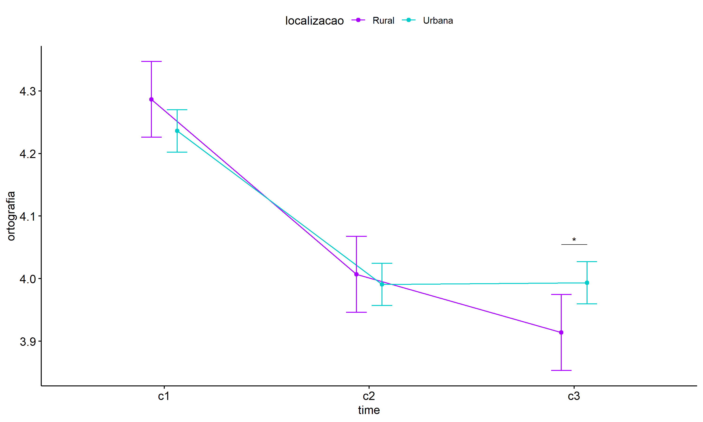

ANOVA test for ortografia
================
Geiser C. Challco <geiser@alumni.usp.br>

- [ANOVA: ortografia ~ time](#anova-ortografia--time)
  - [Data Preparation](#data-preparation)
  - [Summary Statistics](#summary-statistics)
  - [ANOVA Computation](#anova-computation)
  - [PairWise Computation](#pairwise-computation)
- [ANOVA: ortografia ~ time\*gender +
  Error(id/time)](#anova-ortografia--timegender--erroridtime)
  - [Data Preparation](#data-preparation-1)
    - [Check assumptions: Identifying
      Outliers](#check-assumptions-identifying-outliers)
    - [Check assumptions: Normality
      Test](#check-assumptions-normality-test)
    - [Summary Statistics](#summary-statistics-1)
  - [ANOVA Computation](#anova-computation-1)
  - [ANOVA Computation after removing non.normal
    data](#anova-computation-after-removing-nonnormal-data)
  - [PairWise Computation](#pairwise-computation-1)
  - [PairWise Computation after removing non.normal
    data](#pairwise-computation-after-removing-nonnormal-data)
- [ANOVA: ortografia ~ time\*localizacao +
  Error(id/time)](#anova-ortografia--timelocalizacao--erroridtime)
  - [Data Preparation](#data-preparation-2)
    - [Check assumptions: Identifying
      Outliers](#check-assumptions-identifying-outliers-1)
    - [Check assumptions: Normality
      Test](#check-assumptions-normality-test-1)
    - [Summary Statistics](#summary-statistics-2)
  - [ANOVA Computation](#anova-computation-2)
  - [ANOVA Computation after removing non.normal
    data](#anova-computation-after-removing-nonnormal-data-1)
  - [PairWise Computation](#pairwise-computation-2)
  - [PairWise Computation after removing non.normal
    data](#pairwise-computation-after-removing-nonnormal-data-1)
- [ANOVA: ortografia ~ time\*regiao +
  Error(id/time)](#anova-ortografia--timeregiao--erroridtime)
  - [Data Preparation](#data-preparation-3)
    - [Check assumptions: Identifying
      Outliers](#check-assumptions-identifying-outliers-2)
    - [Check assumptions: Normality
      Test](#check-assumptions-normality-test-2)
    - [Summary Statistics](#summary-statistics-3)
  - [ANOVA Computation](#anova-computation-3)
  - [ANOVA Computation after removing non.normal
    data](#anova-computation-after-removing-nonnormal-data-2)
  - [PairWise Computation](#pairwise-computation-3)
  - [PairWise Computation after removing non.normal
    data](#pairwise-computation-after-removing-nonnormal-data-2)
- [ANOVA: ortografia ~ time\*porte +
  Error(id/time)](#anova-ortografia--timeporte--erroridtime)
  - [Data Preparation](#data-preparation-4)
    - [Check assumptions: Identifying
      Outliers](#check-assumptions-identifying-outliers-3)
    - [Check assumptions: Normality
      Test](#check-assumptions-normality-test-3)
    - [Summary Statistics](#summary-statistics-4)
  - [ANOVA Computation](#anova-computation-4)
  - [ANOVA Computation after removing non.normal
    data](#anova-computation-after-removing-nonnormal-data-3)
  - [PairWise Computation](#pairwise-computation-4)
  - [PairWise Computation after removing non.normal
    data](#pairwise-computation-after-removing-nonnormal-data-3)

``` r
dat <- read_excel("../data/data.xlsx", sheet = "alunos_ef14")

escolas <- read_excel("../data/data.xlsx", sheet = "escolas")
edat <- merge(dat, escolas, by = "cod_escola", all.x = T)
```

# ANOVA: ortografia ~ time

## Data Preparation

``` r
data <- edat[,c("aluno_id","ciclo","ortografia")]
data <- data[data$ciclo %in% c("Primeiro Ciclo","Segundo Ciclo","Terceiro Ciclo"),]
data$ciclo <- factor(data$ciclo, c("Primeiro Ciclo","Segundo Ciclo","Terceiro Ciclo"))
data <- unique(data)

wdat <- spread(data, ciclo, ortografia)
wdat <- wdat[complete.cases(wdat),]
colnames(wdat) <- c("id","c1","c2","c3")

ldat <- gather(wdat, key = time, value = ortografia, c1,c2,c3) %>%
  convert_as_factor(id, time)
ldat <- rshinystatistics::remove_group_data(ldat, "ortografia", "time", n.limit = 30)
```

## Summary Statistics

``` r
(sdat <- ldat %>% group_by(time) %>%
   get_summary_stats(ortografia, type = "mean_sd"))
```

    ## # A tibble: 3 × 5
    ##   time  variable       n  mean    sd
    ##   <fct> <fct>      <dbl> <dbl> <dbl>
    ## 1 c1    ortografia  2773  4.25 0.783
    ## 2 c2    ortografia  2773  4.00 0.805
    ## 3 c3    ortografia  2773  3.98 0.788

| time | variable   |    n |  mean |    sd |
|:-----|:-----------|-----:|------:|------:|
| c1   | ortografia | 2773 | 4.248 | 0.783 |
| c2   | ortografia | 2773 | 3.995 | 0.805 |
| c3   | ortografia | 2773 | 3.975 | 0.788 |

## ANOVA Computation

``` r
(res.aov <- anova_test(ldat, dv = ortografia, wid = id, within = time))
```

    ## ANOVA Table (type III tests)
    ## 
    ## $ANOVA
    ##   Effect DFn  DFd       F                                                       p p<.05   ges
    ## 1   time   2 5544 120.578 0.00000000000000000000000000000000000000000000000000055     * 0.024
    ## 
    ## $`Mauchly's Test for Sphericity`
    ##   Effect     W     p p<.05
    ## 1   time 0.998 0.091      
    ## 
    ## $`Sphericity Corrections`
    ##   Effect   GGe     DF[GG]                                                    p[GG] p[GG]<.05   HFe     DF[HF]
    ## 1   time 0.998 2, 5534.45 0.000000000000000000000000000000000000000000000000000668         * 0.999 2, 5538.43
    ##                                                      p[HF] p[HF]<.05
    ## 1 0.000000000000000000000000000000000000000000000000000616         *

| Effect | DFn |  DFd |       F |   p | p\<.05 |   ges |
|:-------|----:|-----:|--------:|----:|:-------|------:|
| time   |   2 | 5544 | 120.578 |   0 | \*     | 0.024 |

| Effect |     W |     p | p\<.05 |
|:-------|------:|------:|:-------|
| time   | 0.998 | 0.091 |        |

| Effect |   GGe | DF\[GG\]   | p\[GG\] | p\[GG\]\<.05 |   HFe | DF\[HF\]   | p\[HF\] | p\[HF\]\<.05 |
|:-------|------:|:-----------|--------:|:-------------|------:|:-----------|--------:|:-------------|
| time   | 0.998 | 2, 5534.45 |       0 | \*           | 0.999 | 2, 5538.43 |       0 | \*           |

## PairWise Computation

``` r
(pwc <- ldat %>% emmeans_test(ortografia ~ time, detailed = T, p.adjust.method = "bonferroni"))
```

    ## # A tibble: 3 × 14
    ##   term  .y.        group1 group2 null.value estimate     se    df conf.low conf.high statistic        p    p.adj p.adj.signif
    ## * <chr> <chr>      <chr>  <chr>       <dbl>    <dbl>  <dbl> <dbl>    <dbl>     <dbl>     <dbl>    <dbl>    <dbl> <chr>       
    ## 1 time  ortografia c1     c2              0   0.253  0.0213  8316   0.212     0.295     11.9   1.96e-32 5.87e-32 ****        
    ## 2 time  ortografia c1     c3              0   0.274  0.0213  8316   0.232     0.315     12.9   1.87e-37 5.60e-37 ****        
    ## 3 time  ortografia c2     c3              0   0.0201 0.0213  8316  -0.0216    0.0618     0.945 3.45e- 1 1   e+ 0 ns

| term | .y.        | group1 | group2 | null.value | estimate |    se |   df | conf.low | conf.high | statistic |     p | p.adj | p.adj.signif |
|:-----|:-----------|:-------|:-------|-----------:|---------:|------:|-----:|---------:|----------:|----------:|------:|------:|:-------------|
| time | ortografia | c1     | c2     |          0 |    0.253 | 0.021 | 8316 |    0.212 |     0.295 |    11.909 | 0.000 |     0 | \*\*\*\*     |
| time | ortografia | c1     | c3     |          0 |    0.274 | 0.021 | 8316 |    0.232 |     0.315 |    12.853 | 0.000 |     0 | \*\*\*\*     |
| time | ortografia | c2     | c3     |          0 |    0.020 | 0.021 | 8316 |   -0.022 |     0.062 |     0.945 | 0.345 |     1 | ns           |

``` r
pwc <- add_xy_position(pwc, x = "time", fun = "mean_se")
ggline(get_emmeans(pwc), x = "time", y = "emmean", ylab = "ortografia") +
  geom_errorbar(aes(ymin = conf.low, ymax = conf.high), width = 0.2) +
  stat_pvalue_manual(pwc, hide.ns = T, tip.length = F)
```

<!-- -->

# ANOVA: ortografia ~ time\*gender + Error(id/time)

## Data Preparation

``` r
data <- edat[,c("aluno_id","gender","ciclo","ortografia")]
data <- data[data$ciclo %in% c("Primeiro Ciclo","Segundo Ciclo","Terceiro Ciclo"),]
data$ciclo <- factor(data$ciclo, c("Primeiro Ciclo","Segundo Ciclo","Terceiro Ciclo"))
data <- unique(data)

wdat <- spread(data, ciclo, ortografia)
wdat <- wdat[complete.cases(wdat),]
colnames(wdat) <- c("id","gender","c1","c2","c3")

ldat <- gather(wdat, key = time, value = ortografia, c1,c2,c3) %>%
  convert_as_factor(id, time)
ldat <- remove_group_data(ldat, "ortografia", c("time", "gender"), n.limit = 30)
ldat$gender <- factor(ldat$gender, sort(unique(ldat$gender)))
```

### Check assumptions: Identifying Outliers

``` r
outliers <- identify_outliers(group_by(ldat, time, gender), ortografia)
(outliers <- outliers[outliers$is.extreme == T,])
```

    ## [1] gender     time       id         ortografia is.outlier is.extreme
    ## <0 rows> (or 0-length row.names)

| gender | time | id  | ortografia | is.outlier | is.extreme |
|:-------|:-----|:----|-----------:|:-----------|:-----------|

### Check assumptions: Normality Test

``` r
(normality.df <- normality.test.per.groups(ldat, "ortografia", c("time", "gender")))
```

    ##          var   variable time gender    n    skewness  kurtosis symmetry statistic     method p p.signif normality
    ## 1 ortografia ortografia   c1 Female 1363 -0.41963447 -1.313531      YES  4167.404 D'Agostino 0     ****         -
    ## 2 ortografia ortografia   c1   Male 1240 -0.54840529 -1.217621       NO  1122.772 D'Agostino 0     ****         -
    ## 3 ortografia ortografia   c2 Female 1363  0.04187135 -1.459263      YES 11000.609 D'Agostino 0     ****         -
    ## 4 ortografia ortografia   c2   Male 1240 -0.06277344 -1.540326      YES  7722.163 D'Agostino 0     ****         -
    ## 5 ortografia ortografia   c3 Female 1363  0.04940529 -1.412475      YES 14964.370 D'Agostino 0     ****         -
    ## 6 ortografia ortografia   c3   Male 1240 -0.02373261 -1.452463      YES 10548.408 D'Agostino 0     ****         -

| var        | variable   | time | gender |    n | skewness | kurtosis | symmetry | statistic | method     |   p | p.signif | normality |
|:-----------|:-----------|:-----|:-------|-----:|---------:|---------:|:---------|----------:|:-----------|----:|:---------|:----------|
| ortografia | ortografia | c1   | Female | 1363 |   -0.420 |   -1.314 | YES      |  4167.404 | D’Agostino |   0 | \*\*\*\* | \-        |
| ortografia | ortografia | c1   | Male   | 1240 |   -0.548 |   -1.218 | NO       |  1122.772 | D’Agostino |   0 | \*\*\*\* | \-        |
| ortografia | ortografia | c2   | Female | 1363 |    0.042 |   -1.459 | YES      | 11000.609 | D’Agostino |   0 | \*\*\*\* | \-        |
| ortografia | ortografia | c2   | Male   | 1240 |   -0.063 |   -1.540 | YES      |  7722.163 | D’Agostino |   0 | \*\*\*\* | \-        |
| ortografia | ortografia | c3   | Female | 1363 |    0.049 |   -1.412 | YES      | 14964.370 | D’Agostino |   0 | \*\*\*\* | \-        |
| ortografia | ortografia | c3   | Male   | 1240 |   -0.024 |   -1.452 | YES      | 10548.408 | D’Agostino |   0 | \*\*\*\* | \-        |

``` r
(non.ids <- unique(do.call(
  c, lapply(which(normality.df$normality == 'NO'), FUN = function(i) {
  idx = which(ldat$time == normality.df$time[i] &
                ldat$gender == normality.df$gender[i])
  getNonNormal(ldat$"ortografia"[idx], ldat$id[idx])
}))))
```

    ## NULL

``` r
if (length(non.ids) > 0)
  ldat2 <- ldat[!ldat$id %in% non.ids,]
```

### Summary Statistics

``` r
(sdat <- ldat %>% group_by(time, gender) %>%
   get_summary_stats(ortografia, type = "mean_sd"))
```

    ## # A tibble: 6 × 6
    ##   gender time  variable       n  mean    sd
    ##   <fct>  <fct> <fct>      <dbl> <dbl> <dbl>
    ## 1 Female c1    ortografia  1363  4.22 0.784
    ## 2 Male   c1    ortografia  1240  4.28 0.783
    ## 3 Female c2    ortografia  1363  3.96 0.794
    ## 4 Male   c2    ortografia  1240  4.02 0.817
    ## 5 Female c3    ortografia  1363  3.96 0.781
    ## 6 Male   c3    ortografia  1240  4.00 0.79

| gender | time | variable   |    n |  mean |    sd |
|:-------|:-----|:-----------|-----:|------:|------:|
| Female | c1   | ortografia | 1363 | 4.219 | 0.784 |
| Male   | c1   | ortografia | 1240 | 4.280 | 0.783 |
| Female | c2   | ortografia | 1363 | 3.964 | 0.794 |
| Male   | c2   | ortografia | 1240 | 4.023 | 0.817 |
| Female | c3   | ortografia | 1363 | 3.956 | 0.781 |
| Male   | c3   | ortografia | 1240 | 4.002 | 0.790 |

``` r
if (length(non.ids) > 0)
  (sdat <- ldat2 %>% group_by(time, gender) %>%
      get_summary_stats(ortografia, type = "mean_sd"))
```

| gender | time | variable   |    n |  mean |    sd |
|:-------|:-----|:-----------|-----:|------:|------:|
| Female | c1   | ortografia | 1363 | 4.219 | 0.784 |
| Male   | c1   | ortografia | 1240 | 4.280 | 0.783 |
| Female | c2   | ortografia | 1363 | 3.964 | 0.794 |
| Male   | c2   | ortografia | 1240 | 4.023 | 0.817 |
| Female | c3   | ortografia | 1363 | 3.956 | 0.781 |
| Male   | c3   | ortografia | 1240 | 4.002 | 0.790 |

## ANOVA Computation

``` r
(res.aov <- anova_test(ldat, dv = ortografia, wid = id, between = gender, within = time))
```

    ## ANOVA Table (type III tests)
    ## 
    ## $ANOVA
    ##        Effect DFn  DFd       F                                                    p p<.05       ges
    ## 1      gender   1 2601   7.394 0.00700000000000000014571677198205179593060165643692     * 0.0010000
    ## 2        time   2 5202 112.489 0.00000000000000000000000000000000000000000000000149     * 0.0240000
    ## 3 gender:time   2 5202   0.086 0.91800000000000003819167204710538499057292938232422       0.0000188
    ## 
    ## $`Mauchly's Test for Sphericity`
    ##        Effect     W     p p<.05
    ## 1        time 0.998 0.072      
    ## 2 gender:time 0.998 0.072      
    ## 
    ## $`Sphericity Corrections`
    ##        Effect   GGe     DF[GG]                                                p[GG] p[GG]<.05   HFe     DF[HF]
    ## 1        time 0.998 2, 5191.48 0.00000000000000000000000000000000000000000000000184         * 0.999 2, 5195.46
    ## 2 gender:time 0.998 2, 5191.48 0.91700000000000003730349362740525975823402404785156           0.999 2, 5195.46
    ##                                                 p[HF] p[HF]<.05
    ## 1 0.0000000000000000000000000000000000000000000000017         *
    ## 2 0.9180000000000000381916720471053849905729293823242

| Effect      | DFn |  DFd |       F |     p | p\<.05 |   ges |
|:------------|----:|-----:|--------:|------:|:-------|------:|
| gender      |   1 | 2601 |   7.394 | 0.007 | \*     | 0.001 |
| time        |   2 | 5202 | 112.489 | 0.000 | \*     | 0.024 |
| gender:time |   2 | 5202 |   0.086 | 0.918 |        | 0.000 |

| Effect      |     W |     p | p\<.05 |
|:------------|------:|------:|:-------|
| time        | 0.998 | 0.072 |        |
| gender:time | 0.998 | 0.072 |        |

| Effect      |   GGe | DF\[GG\]   | p\[GG\] | p\[GG\]\<.05 |   HFe | DF\[HF\]   | p\[HF\] | p\[HF\]\<.05 |
|:------------|------:|:-----------|--------:|:-------------|------:|:-----------|--------:|:-------------|
| time        | 0.998 | 2, 5191.48 |   0.000 | \*           | 0.999 | 2, 5195.46 |   0.000 | \*           |
| gender:time | 0.998 | 2, 5191.48 |   0.917 |              | 0.999 | 2, 5195.46 |   0.918 |              |

## ANOVA Computation after removing non.normal data

``` r
if (length(non.ids) > 0)
  (res.aov2 <- anova_test(ldat2, dv = ortografia, wid = id, between = gender , within = time))
```

## PairWise Computation

``` r
(pwc <- ldat %>% group_by(time) %>%
   emmeans_test(ortografia ~ gender, detailed = T, p.adjust.method = "bonferroni"))
```

    ## # A tibble: 3 × 15
    ##   time  term   .y.        group1 group2 null.value estimate     se    df conf.low conf.high statistic      p  p.adj p.adj.signif
    ## * <fct> <chr>  <chr>      <chr>  <chr>       <dbl>    <dbl>  <dbl> <dbl>    <dbl>     <dbl>     <dbl>  <dbl>  <dbl> <chr>       
    ## 1 c1    gender ortografia Female Male            0  -0.0612 0.0311  7803   -0.122 -0.000278     -1.97 0.0490 0.0490 *           
    ## 2 c2    gender ortografia Female Male            0  -0.0593 0.0311  7803   -0.120  0.00157      -1.91 0.0562 0.0562 ns          
    ## 3 c3    gender ortografia Female Male            0  -0.0458 0.0311  7803   -0.107  0.0151       -1.47 0.141  0.141  ns

| time | term   | .y.        | group1 | group2 | null.value | estimate |    se |   df | conf.low | conf.high | statistic |     p | p.adj | p.adj.signif |
|:-----|:-------|:-----------|:-------|:-------|-----------:|---------:|------:|-----:|---------:|----------:|----------:|------:|------:|:-------------|
| c1   | gender | ortografia | Female | Male   |          0 |   -0.061 | 0.031 | 7803 |   -0.122 |     0.000 |    -1.969 | 0.049 | 0.049 | \*           |
| c2   | gender | ortografia | Female | Male   |          0 |   -0.059 | 0.031 | 7803 |   -0.120 |     0.002 |    -1.910 | 0.056 | 0.056 | ns           |
| c3   | gender | ortografia | Female | Male   |          0 |   -0.046 | 0.031 | 7803 |   -0.107 |     0.015 |    -1.473 | 0.141 | 0.141 | ns           |

``` r
(emms <- get_emmeans(pwc))
```

    ## # A tibble: 6 × 8
    ##   time  gender emmean     se    df conf.low conf.high method      
    ##   <fct> <fct>   <dbl>  <dbl> <dbl>    <dbl>     <dbl> <chr>       
    ## 1 c1    Female   4.22 0.0214  7803     4.18      4.26 Emmeans test
    ## 2 c1    Male     4.28 0.0225  7803     4.24      4.32 Emmeans test
    ## 3 c2    Female   3.96 0.0214  7803     3.92      4.01 Emmeans test
    ## 4 c2    Male     4.02 0.0225  7803     3.98      4.07 Emmeans test
    ## 5 c3    Female   3.96 0.0214  7803     3.91      4.00 Emmeans test
    ## 6 c3    Male     4.00 0.0225  7803     3.96      4.05 Emmeans test

| time | gender | emmean |    se |   df | conf.low | conf.high | method       |
|:-----|:-------|-------:|------:|-----:|---------:|----------:|:-------------|
| c1   | Female |  4.219 | 0.021 | 7803 |    4.177 |     4.261 | Emmeans test |
| c1   | Male   |  4.280 | 0.022 | 7803 |    4.236 |     4.324 | Emmeans test |
| c2   | Female |  3.964 | 0.021 | 7803 |    3.922 |     4.006 | Emmeans test |
| c2   | Male   |  4.023 | 0.022 | 7803 |    3.979 |     4.067 | Emmeans test |
| c3   | Female |  3.956 | 0.021 | 7803 |    3.914 |     3.998 | Emmeans test |
| c3   | Male   |  4.002 | 0.022 | 7803 |    3.958 |     4.046 | Emmeans test |

``` r
pwc <- add_xy_position(pwc, x = "time", fun = "mean_se", dodge = 0.25)
pd <- position_dodge(width = 0.25)
ggline(emms, x = "time", y = "emmean", color = "gender",
       palette = c("#FF007F","#4D4DFF"),
       position = pd, ylab = "ortografia") +
  geom_errorbar(aes(ymin = conf.low, ymax = conf.high, color = gender),
                position = pd, width = 0.2) +
  stat_pvalue_manual(pwc, hide.ns = T, tip.length = F, linetype = 1)
```

<!-- -->

``` r
(pwc <- ldat %>% group_by(gender) %>%
    emmeans_test(ortografia ~ time, detailed = T, p.adjust.method = "bonferroni"))
```

    ## # A tibble: 6 × 15
    ##   gender term  .y.    group1 group2 null.value estimate     se    df conf.low conf.high statistic        p    p.adj p.adj.signif
    ## * <fct>  <chr> <chr>  <chr>  <chr>       <dbl>    <dbl>  <dbl> <dbl>    <dbl>     <dbl>     <dbl>    <dbl>    <dbl> <chr>       
    ## 1 Female time  ortog… c1     c2              0  0.255   0.0303  7803   0.196     0.315      8.41  4.67e-17 1.40e-16 ****        
    ## 2 Female time  ortog… c1     c3              0  0.263   0.0303  7803   0.204     0.322      8.68  4.92e-18 1.48e-17 ****        
    ## 3 Female time  ortog… c2     c3              0  0.00795 0.0303  7803  -0.0515    0.0674     0.262 7.93e- 1 1   e+ 0 ns          
    ## 4 Male   time  ortog… c1     c2              0  0.257   0.0318  7803   0.195     0.319      8.08  7.24e-16 2.17e-15 ****        
    ## 5 Male   time  ortog… c1     c3              0  0.278   0.0318  7803   0.216     0.341      8.76  2.36e-18 7.09e-18 ****        
    ## 6 Male   time  ortog… c2     c3              0  0.0215  0.0318  7803  -0.0408    0.0838     0.677 4.99e- 1 1   e+ 0 ns

| gender | term | .y.        | group1 | group2 | null.value | estimate |    se |   df | conf.low | conf.high | statistic |     p | p.adj | p.adj.signif |
|:-------|:-----|:-----------|:-------|:-------|-----------:|---------:|------:|-----:|---------:|----------:|----------:|------:|------:|:-------------|
| Female | time | ortografia | c1     | c2     |          0 |    0.255 | 0.030 | 7803 |    0.196 |     0.315 |     8.414 | 0.000 |     0 | \*\*\*\*     |
| Female | time | ortografia | c1     | c3     |          0 |    0.263 | 0.030 | 7803 |    0.204 |     0.322 |     8.676 | 0.000 |     0 | \*\*\*\*     |
| Female | time | ortografia | c2     | c3     |          0 |    0.008 | 0.030 | 7803 |   -0.051 |     0.067 |     0.262 | 0.793 |     1 | ns           |
| Male   | time | ortografia | c1     | c2     |          0 |    0.257 | 0.032 | 7803 |    0.195 |     0.319 |     8.084 | 0.000 |     0 | \*\*\*\*     |
| Male   | time | ortografia | c1     | c3     |          0 |    0.278 | 0.032 | 7803 |    0.216 |     0.341 |     8.760 | 0.000 |     0 | \*\*\*\*     |
| Male   | time | ortografia | c2     | c3     |          0 |    0.022 | 0.032 | 7803 |   -0.041 |     0.084 |     0.677 | 0.499 |     1 | ns           |

``` r
(emms <- get_emmeans(pwc))
```

    ## # A tibble: 6 × 8
    ##   gender time  emmean     se    df conf.low conf.high method      
    ##   <fct>  <fct>  <dbl>  <dbl> <dbl>    <dbl>     <dbl> <chr>       
    ## 1 Female c1      4.22 0.0214  7803     4.18      4.26 Emmeans test
    ## 2 Female c2      3.96 0.0214  7803     3.92      4.01 Emmeans test
    ## 3 Female c3      3.96 0.0214  7803     3.91      4.00 Emmeans test
    ## 4 Male   c1      4.28 0.0225  7803     4.24      4.32 Emmeans test
    ## 5 Male   c2      4.02 0.0225  7803     3.98      4.07 Emmeans test
    ## 6 Male   c3      4.00 0.0225  7803     3.96      4.05 Emmeans test

| gender | time | emmean |    se |   df | conf.low | conf.high | method       |
|:-------|:-----|-------:|------:|-----:|---------:|----------:|:-------------|
| Female | c1   |  4.219 | 0.021 | 7803 |    4.177 |     4.261 | Emmeans test |
| Female | c2   |  3.964 | 0.021 | 7803 |    3.922 |     4.006 | Emmeans test |
| Female | c3   |  3.956 | 0.021 | 7803 |    3.914 |     3.998 | Emmeans test |
| Male   | c1   |  4.280 | 0.022 | 7803 |    4.236 |     4.324 | Emmeans test |
| Male   | c2   |  4.023 | 0.022 | 7803 |    3.979 |     4.067 | Emmeans test |
| Male   | c3   |  4.002 | 0.022 | 7803 |    3.958 |     4.046 | Emmeans test |

``` r
emms.gg <- emms[which(emms$gender == "Female"),]
if (nrow(emms.gg) > 0)
  ggline(emms.gg, x = "time", y = "emmean", color = "#FF007F", ylab = "ortografia") +
    geom_errorbar(aes(ymin = conf.low, ymax = conf.high),
                  width = 0.2, color = "#FF007F") +
    stat_pvalue_manual(
      add_xy_position(pwc[which(pwc$gender == "Female"),],
                      x = "time", fun = "mean_se"),
      hide.ns = T, color = "#FF007F", tip.length = F) +
    labs(title = "gender: Female")+
    theme(legend.text = element_blank())
```

<!-- -->

``` r
emms.gg <- emms[which(emms$gender == "Male"),]
if (nrow(emms.gg) > 0)
  ggline(emms.gg, x = "time", y = "emmean", color = "#4D4DFF", ylab = "ortografia") +
    geom_errorbar(aes(ymin = conf.low, ymax = conf.high),
                  width = 0.2, color = "#4D4DFF") +
    stat_pvalue_manual(
      add_xy_position(pwc[which(pwc$gender == "Male"),],
                      x = "time", fun = "mean_se"),
      hide.ns = T, color = "#4D4DFF", tip.length = F) +
    labs(title = "gender: Male")+
    theme(legend.text = element_blank())
```

<!-- -->

## PairWise Computation after removing non.normal data

``` r
if (length(non.ids) > 0)
  (pwc2 <- ldat2 %>% group_by(time) %>%
     emmeans_test(ortografia ~ gender, detailed = T, p.adjust.method = "bonferroni"))
```

``` r
if (length(non.ids) > 0)
  (emms2 <- get_emmeans(pwc2))
```

``` r
if (length(non.ids) > 0) {
  pwc2 <- add_xy_position(pwc2, x = "time", fun = "mean_se", dodge = 0.25)
  pd2 <- position_dodge(width = 0.25)
  
  ggline(emms2, x = "time", y = "emmean", color = "gender",
         palette = c("#FF007F","#4D4DFF"),
         position = pd, ylab = "ortografia") +
    geom_errorbar(aes(ymin = conf.low, ymax = conf.high, color = gender),
                position = pd, width = 0.2) +
    stat_pvalue_manual(pwc2, hide.ns = T, tip.length = F, linetype = 1)
}
```

``` r
if (length(non.ids) > 0)
  (pwc2 <- ldat2 %>% group_by(gender) %>%
     emmeans_test(ortografia ~ time, detailed = T, p.adjust.method = "bonferroni"))
```

``` r
if (length(non.ids) > 0)
  (emms2 <- get_emmeans(pwc2))
```

``` r
if (length(non.ids) > 0) {
  emms.gg <- emms2[which(emms2$gender == "Female"),]
  if (nrow(emms.gg) > 0)
    ggline(emms.gg, x = "time", y = "emmean", color = "#FF007F", ylab = "ortografia") +
    geom_errorbar(aes(ymin = conf.low, ymax = conf.high),
                  width = 0.2, color = "#FF007F") +
    stat_pvalue_manual(
      add_xy_position(pwc[which(pwc$gender == "Female"),],
                      x = "time", fun = "mean_se"),
      hide.ns = T, color = "#FF007F", tip.length = F) +
    labs(title = "gender: Female") +
    theme(legend.text = element_blank())
}
```

``` r
if (length(non.ids) > 0) {
  emms.gg <- emms2[which(emms2$gender == "Male"),]
  if (nrow(emms.gg) > 0)
    ggline(emms.gg, x = "time", y = "emmean", color = "#4D4DFF", ylab = "ortografia") +
    geom_errorbar(aes(ymin = conf.low, ymax = conf.high),
                  width = 0.2, color = "#4D4DFF") +
    stat_pvalue_manual(
      add_xy_position(pwc[which(pwc$gender == "Male"),],
                      x = "time", fun = "mean_se"),
      hide.ns = T, color = "#4D4DFF", tip.length = F) +
    labs(title = "gender: Male") +
    theme(legend.text = element_blank())
}
```

# ANOVA: ortografia ~ time\*localizacao + Error(id/time)

## Data Preparation

``` r
data <- edat[,c("aluno_id","localizacao","ciclo","ortografia")]
data <- data[data$ciclo %in% c("Primeiro Ciclo","Segundo Ciclo","Terceiro Ciclo"),]
data$ciclo <- factor(data$ciclo, c("Primeiro Ciclo","Segundo Ciclo","Terceiro Ciclo"))
data <- unique(data)

wdat <- spread(data, ciclo, ortografia)
wdat <- wdat[complete.cases(wdat),]
colnames(wdat) <- c("id","localizacao","c1","c2","c3")

ldat <- gather(wdat, key = time, value = ortografia, c1,c2,c3) %>%
  convert_as_factor(id, time)
ldat <- remove_group_data(ldat, "ortografia", c("time", "localizacao"), n.limit = 30)
ldat$localizacao <- factor(ldat$localizacao, sort(unique(ldat$localizacao)))
```

### Check assumptions: Identifying Outliers

``` r
outliers <- identify_outliers(group_by(ldat, time, localizacao), ortografia)
(outliers <- outliers[outliers$is.extreme == T,])
```

    ## [1] localizacao time        id          ortografia  is.outlier  is.extreme 
    ## <0 rows> (or 0-length row.names)

| localizacao | time | id  | ortografia | is.outlier | is.extreme |
|:------------|:-----|:----|-----------:|:-----------|:-----------|

### Check assumptions: Normality Test

``` r
(normality.df <- normality.test.per.groups(ldat, "ortografia", c("time", "localizacao")))
```

    ##          var   variable time localizacao    n     skewness  kurtosis symmetry statistic     method p p.signif normality
    ## 1 ortografia ortografia   c1       Rural  656 -0.533483683 -1.125731       NO   288.873 D'Agostino 0     ****         -
    ## 2 ortografia ortografia   c1      Urbana 2117 -0.461894496 -1.311400      YES  7470.133 D'Agostino 0     ****         -
    ## 3 ortografia ortografia   c2       Rural  656 -0.034769014 -1.519656      YES  4937.646 D'Agostino 0     ****         -
    ## 4 ortografia ortografia   c2      Urbana 2117 -0.004075367 -1.496387      YES 14020.153 D'Agostino 0     ****         -
    ## 5 ortografia ortografia   c3       Rural  656  0.145514048 -1.477469      YES  5908.747 D'Agostino 0     ****         -
    ## 6 ortografia ortografia   c3      Urbana 2117 -0.016164403 -1.425302      YES 19151.936 D'Agostino 0     ****         -

| var        | variable   | time | localizacao |    n | skewness | kurtosis | symmetry | statistic | method     |   p | p.signif | normality |
|:-----------|:-----------|:-----|:------------|-----:|---------:|---------:|:---------|----------:|:-----------|----:|:---------|:----------|
| ortografia | ortografia | c1   | Rural       |  656 |   -0.533 |   -1.126 | NO       |   288.873 | D’Agostino |   0 | \*\*\*\* | \-        |
| ortografia | ortografia | c1   | Urbana      | 2117 |   -0.462 |   -1.311 | YES      |  7470.133 | D’Agostino |   0 | \*\*\*\* | \-        |
| ortografia | ortografia | c2   | Rural       |  656 |   -0.035 |   -1.520 | YES      |  4937.646 | D’Agostino |   0 | \*\*\*\* | \-        |
| ortografia | ortografia | c2   | Urbana      | 2117 |   -0.004 |   -1.496 | YES      | 14020.153 | D’Agostino |   0 | \*\*\*\* | \-        |
| ortografia | ortografia | c3   | Rural       |  656 |    0.146 |   -1.477 | YES      |  5908.747 | D’Agostino |   0 | \*\*\*\* | \-        |
| ortografia | ortografia | c3   | Urbana      | 2117 |   -0.016 |   -1.425 | YES      | 19151.936 | D’Agostino |   0 | \*\*\*\* | \-        |

``` r
(non.ids <- unique(do.call(
  c, lapply(which(normality.df$normality == 'NO'), FUN = function(i) {
  idx = which(ldat$time == normality.df$time[i] &
                ldat$localizacao == normality.df$localizacao[i])
  getNonNormal(ldat$"ortografia"[idx], ldat$id[idx])
}))))
```

    ## NULL

``` r
if (length(non.ids) > 0)
  ldat2 <- ldat[!ldat$id %in% non.ids,]
```

### Summary Statistics

``` r
(sdat <- ldat %>% group_by(time, localizacao) %>%
   get_summary_stats(ortografia, type = "mean_sd"))
```

    ## # A tibble: 6 × 6
    ##   localizacao time  variable       n  mean    sd
    ##   <fct>       <fct> <fct>      <dbl> <dbl> <dbl>
    ## 1 Rural       c1    ortografia   656  4.29 0.752
    ## 2 Urbana      c1    ortografia  2117  4.24 0.792
    ## 3 Rural       c2    ortografia   656  4.01 0.814
    ## 4 Urbana      c2    ortografia  2117  3.99 0.803
    ## 5 Rural       c3    ortografia   656  3.91 0.8  
    ## 6 Urbana      c3    ortografia  2117  3.99 0.784

| localizacao | time | variable   |    n |  mean |    sd |
|:------------|:-----|:-----------|-----:|------:|------:|
| Rural       | c1   | ortografia |  656 | 4.287 | 0.752 |
| Urbana      | c1   | ortografia | 2117 | 4.236 | 0.792 |
| Rural       | c2   | ortografia |  656 | 4.007 | 0.814 |
| Urbana      | c2   | ortografia | 2117 | 3.991 | 0.803 |
| Rural       | c3   | ortografia |  656 | 3.914 | 0.800 |
| Urbana      | c3   | ortografia | 2117 | 3.993 | 0.784 |

``` r
if (length(non.ids) > 0)
  (sdat <- ldat2 %>% group_by(time, localizacao) %>%
      get_summary_stats(ortografia, type = "mean_sd"))
```

| localizacao | time | variable   |    n |  mean |    sd |
|:------------|:-----|:-----------|-----:|------:|------:|
| Rural       | c1   | ortografia |  656 | 4.287 | 0.752 |
| Urbana      | c1   | ortografia | 2117 | 4.236 | 0.792 |
| Rural       | c2   | ortografia |  656 | 4.007 | 0.814 |
| Urbana      | c2   | ortografia | 2117 | 3.991 | 0.803 |
| Rural       | c3   | ortografia |  656 | 3.914 | 0.800 |
| Urbana      | c3   | ortografia | 2117 | 3.993 | 0.784 |

## ANOVA Computation

``` r
(res.aov <- anova_test(ldat, dv = ortografia, wid = id, between = localizacao, within = time))
```

    ## ANOVA Table (type III tests)
    ## 
    ## $ANOVA
    ##             Effect DFn  DFd       F                                                 p p<.05        ges
    ## 1      localizacao   1 2771   0.034 0.85399999999999998134825318629737012088298797607       0.00000531
    ## 2             time   2 5542 103.616 0.00000000000000000000000000000000000000000000662     * 0.02100000
    ## 3 localizacao:time   2 5542   4.252 0.01400000000000000029143354396410359186120331287     * 0.00087000
    ## 
    ## $`Mauchly's Test for Sphericity`
    ##             Effect     W     p p<.05
    ## 1             time 0.998 0.094      
    ## 2 localizacao:time 0.998 0.094      
    ## 
    ## $`Sphericity Corrections`
    ##             Effect   GGe     DF[GG]                                            p[GG] p[GG]<.05   HFe     DF[HF]
    ## 1             time 0.998 2, 5532.57 0.0000000000000000000000000000000000000000000078         * 0.999 2, 5536.55
    ## 2 localizacao:time 0.998 2, 5532.57 0.0140000000000000002914335439641035918612033129         * 0.999 2, 5536.55
    ##                                               p[HF] p[HF]<.05
    ## 1 0.00000000000000000000000000000000000000000000728         *
    ## 2 0.01400000000000000029143354396410359186120331287         *

| Effect           | DFn |  DFd |       F |     p | p\<.05 |   ges |
|:-----------------|----:|-----:|--------:|------:|:-------|------:|
| localizacao      |   1 | 2771 |   0.034 | 0.854 |        | 0.000 |
| time             |   2 | 5542 | 103.616 | 0.000 | \*     | 0.021 |
| localizacao:time |   2 | 5542 |   4.252 | 0.014 | \*     | 0.001 |

| Effect           |     W |     p | p\<.05 |
|:-----------------|------:|------:|:-------|
| time             | 0.998 | 0.094 |        |
| localizacao:time | 0.998 | 0.094 |        |

| Effect           |   GGe | DF\[GG\]   | p\[GG\] | p\[GG\]\<.05 |   HFe | DF\[HF\]   | p\[HF\] | p\[HF\]\<.05 |
|:-----------------|------:|:-----------|--------:|:-------------|------:|:-----------|--------:|:-------------|
| time             | 0.998 | 2, 5532.57 |   0.000 | \*           | 0.999 | 2, 5536.55 |   0.000 | \*           |
| localizacao:time | 0.998 | 2, 5532.57 |   0.014 | \*           | 0.999 | 2, 5536.55 |   0.014 | \*           |

## ANOVA Computation after removing non.normal data

``` r
if (length(non.ids) > 0)
  (res.aov2 <- anova_test(ldat2, dv = ortografia, wid = id, between = localizacao , within = time))
```

## PairWise Computation

``` r
(pwc <- ldat %>% group_by(time) %>%
   emmeans_test(ortografia ~ localizacao, detailed = T, p.adjust.method = "bonferroni"))
```

    ## # A tibble: 3 × 15
    ##   time  term        .y.   group1 group2 null.value estimate     se    df conf.low conf.high statistic      p  p.adj p.adj.signif
    ## * <fct> <chr>       <chr> <chr>  <chr>       <dbl>    <dbl>  <dbl> <dbl>    <dbl>     <dbl>     <dbl>  <dbl>  <dbl> <chr>       
    ## 1 c1    localizacao orto… Rural  Urbana          0   0.0505 0.0354  8313  -0.0189    0.120      1.43  0.154  0.154  ns          
    ## 2 c2    localizacao orto… Rural  Urbana          0   0.0160 0.0354  8313  -0.0534    0.0854     0.453 0.651  0.651  ns          
    ## 3 c3    localizacao orto… Rural  Urbana          0  -0.0794 0.0354  8313  -0.149    -0.0101    -2.24  0.0248 0.0248 *

| time | term        | .y.        | group1 | group2 | null.value | estimate |    se |   df | conf.low | conf.high | statistic |     p | p.adj | p.adj.signif |
|:-----|:------------|:-----------|:-------|:-------|-----------:|---------:|------:|-----:|---------:|----------:|----------:|------:|------:|:-------------|
| c1   | localizacao | ortografia | Rural  | Urbana |          0 |    0.051 | 0.035 | 8313 |   -0.019 |     0.120 |     1.427 | 0.154 | 0.154 | ns           |
| c2   | localizacao | ortografia | Rural  | Urbana |          0 |    0.016 | 0.035 | 8313 |   -0.053 |     0.085 |     0.453 | 0.651 | 0.651 | ns           |
| c3   | localizacao | ortografia | Rural  | Urbana |          0 |   -0.079 | 0.035 | 8313 |   -0.149 |    -0.010 |    -2.244 | 0.025 | 0.025 | \*           |

``` r
(emms <- get_emmeans(pwc))
```

    ## # A tibble: 6 × 8
    ##   time  localizacao emmean     se    df conf.low conf.high method      
    ##   <fct> <fct>        <dbl>  <dbl> <dbl>    <dbl>     <dbl> <chr>       
    ## 1 c1    Rural         4.29 0.0309  8313     4.23      4.35 Emmeans test
    ## 2 c1    Urbana        4.24 0.0172  8313     4.20      4.27 Emmeans test
    ## 3 c2    Rural         4.01 0.0309  8313     3.95      4.07 Emmeans test
    ## 4 c2    Urbana        3.99 0.0172  8313     3.96      4.02 Emmeans test
    ## 5 c3    Rural         3.91 0.0309  8313     3.85      3.97 Emmeans test
    ## 6 c3    Urbana        3.99 0.0172  8313     3.96      4.03 Emmeans test

| time | localizacao | emmean |    se |   df | conf.low | conf.high | method       |
|:-----|:------------|-------:|------:|-----:|---------:|----------:|:-------------|
| c1   | Rural       |  4.287 | 0.031 | 8313 |    4.226 |     4.347 | Emmeans test |
| c1   | Urbana      |  4.236 | 0.017 | 8313 |    4.202 |     4.270 | Emmeans test |
| c2   | Rural       |  4.007 | 0.031 | 8313 |    3.946 |     4.067 | Emmeans test |
| c2   | Urbana      |  3.991 | 0.017 | 8313 |    3.957 |     4.025 | Emmeans test |
| c3   | Rural       |  3.914 | 0.031 | 8313 |    3.853 |     3.974 | Emmeans test |
| c3   | Urbana      |  3.993 | 0.017 | 8313 |    3.960 |     4.027 | Emmeans test |

``` r
pwc <- add_xy_position(pwc, x = "time", fun = "mean_se", dodge = 0.25)
pd <- position_dodge(width = 0.25)
ggline(emms, x = "time", y = "emmean", color = "localizacao",
       palette = c("#AA00FF","#00CCCC"),
       position = pd, ylab = "ortografia") +
  geom_errorbar(aes(ymin = conf.low, ymax = conf.high, color = localizacao),
                position = pd, width = 0.2) +
  stat_pvalue_manual(pwc, hide.ns = T, tip.length = F, linetype = 1)
```

<!-- -->

``` r
(pwc <- ldat %>% group_by(localizacao) %>%
    emmeans_test(ortografia ~ time, detailed = T, p.adjust.method = "bonferroni"))
```

    ## # A tibble: 6 × 15
    ##   localizacao term  .y.        group1 group2 null.value estimate     se    df conf.low conf.high statistic        p    p.adj
    ## * <fct>       <chr> <chr>      <chr>  <chr>       <dbl>    <dbl>  <dbl> <dbl>    <dbl>     <dbl>     <dbl>    <dbl>    <dbl>
    ## 1 Rural       time  ortografia c1     c2              0  0.280   0.0437  8313  0.194      0.365      6.40  1.69e-10 5.06e-10
    ## 2 Rural       time  ortografia c1     c3              0  0.373   0.0437  8313  0.287      0.458      8.52  1.85e-17 5.55e-17
    ## 3 Rural       time  ortografia c2     c3              0  0.0930  0.0437  8313  0.00725    0.179      2.13  3.35e- 2 1.01e- 1
    ## 4 Urbana      time  ortografia c1     c2              0  0.245   0.0243  8313  0.198      0.293     10.1   9.98e-24 2.99e-23
    ## 5 Urbana      time  ortografia c1     c3              0  0.243   0.0243  8313  0.195      0.290      9.97  2.76e-23 8.29e-23
    ## 6 Urbana      time  ortografia c2     c3              0 -0.00248 0.0243  8313 -0.0502     0.0452    -0.102 9.19e- 1 1   e+ 0
    ## # ℹ 1 more variable: p.adj.signif <chr>

| localizacao | term | .y.        | group1 | group2 | null.value | estimate |    se |   df | conf.low | conf.high | statistic |     p | p.adj | p.adj.signif |
|:------------|:-----|:-----------|:-------|:-------|-----------:|---------:|------:|-----:|---------:|----------:|----------:|------:|------:|:-------------|
| Rural       | time | ortografia | c1     | c2     |          0 |    0.280 | 0.044 | 8313 |    0.194 |     0.365 |     6.396 | 0.000 | 0.000 | \*\*\*\*     |
| Rural       | time | ortografia | c1     | c3     |          0 |    0.373 | 0.044 | 8313 |    0.287 |     0.458 |     8.522 | 0.000 | 0.000 | \*\*\*\*     |
| Rural       | time | ortografia | c2     | c3     |          0 |    0.093 | 0.044 | 8313 |    0.007 |     0.179 |     2.126 | 0.034 | 0.101 | ns           |
| Urbana      | time | ortografia | c1     | c2     |          0 |    0.245 | 0.024 | 8313 |    0.198 |     0.293 |    10.073 | 0.000 | 0.000 | \*\*\*\*     |
| Urbana      | time | ortografia | c1     | c3     |          0 |    0.243 | 0.024 | 8313 |    0.195 |     0.290 |     9.971 | 0.000 | 0.000 | \*\*\*\*     |
| Urbana      | time | ortografia | c2     | c3     |          0 |   -0.002 | 0.024 | 8313 |   -0.050 |     0.045 |    -0.102 | 0.919 | 1.000 | ns           |

``` r
(emms <- get_emmeans(pwc))
```

    ## # A tibble: 6 × 8
    ##   localizacao time  emmean     se    df conf.low conf.high method      
    ##   <fct>       <fct>  <dbl>  <dbl> <dbl>    <dbl>     <dbl> <chr>       
    ## 1 Rural       c1      4.29 0.0309  8313     4.23      4.35 Emmeans test
    ## 2 Rural       c2      4.01 0.0309  8313     3.95      4.07 Emmeans test
    ## 3 Rural       c3      3.91 0.0309  8313     3.85      3.97 Emmeans test
    ## 4 Urbana      c1      4.24 0.0172  8313     4.20      4.27 Emmeans test
    ## 5 Urbana      c2      3.99 0.0172  8313     3.96      4.02 Emmeans test
    ## 6 Urbana      c3      3.99 0.0172  8313     3.96      4.03 Emmeans test

| localizacao | time | emmean |    se |   df | conf.low | conf.high | method       |
|:------------|:-----|-------:|------:|-----:|---------:|----------:|:-------------|
| Rural       | c1   |  4.287 | 0.031 | 8313 |    4.226 |     4.347 | Emmeans test |
| Rural       | c2   |  4.007 | 0.031 | 8313 |    3.946 |     4.067 | Emmeans test |
| Rural       | c3   |  3.914 | 0.031 | 8313 |    3.853 |     3.974 | Emmeans test |
| Urbana      | c1   |  4.236 | 0.017 | 8313 |    4.202 |     4.270 | Emmeans test |
| Urbana      | c2   |  3.991 | 0.017 | 8313 |    3.957 |     4.025 | Emmeans test |
| Urbana      | c3   |  3.993 | 0.017 | 8313 |    3.960 |     4.027 | Emmeans test |

``` r
emms.gg <- emms[which(emms$localizacao == "Rural"),]
if (nrow(emms.gg) > 0)
  ggline(emms.gg, x = "time", y = "emmean", color = "#AA00FF", ylab = "ortografia") +
    geom_errorbar(aes(ymin = conf.low, ymax = conf.high),
                  width = 0.2, color = "#AA00FF") +
    stat_pvalue_manual(
      add_xy_position(pwc[which(pwc$localizacao == "Rural"),],
                      x = "time", fun = "mean_se"),
      hide.ns = T, color = "#AA00FF", tip.length = F) +
    labs(title = "localizacao: Rural")+
    theme(legend.text = element_blank())
```

<!-- -->

``` r
emms.gg <- emms[which(emms$localizacao == "Urbana"),]
if (nrow(emms.gg) > 0)
  ggline(emms.gg, x = "time", y = "emmean", color = "#00CCCC", ylab = "ortografia") +
    geom_errorbar(aes(ymin = conf.low, ymax = conf.high),
                  width = 0.2, color = "#00CCCC") +
    stat_pvalue_manual(
      add_xy_position(pwc[which(pwc$localizacao == "Urbana"),],
                      x = "time", fun = "mean_se"),
      hide.ns = T, color = "#00CCCC", tip.length = F) +
    labs(title = "localizacao: Urbana")+
    theme(legend.text = element_blank())
```

<!-- -->

## PairWise Computation after removing non.normal data

``` r
if (length(non.ids) > 0)
  (pwc2 <- ldat2 %>% group_by(time) %>%
     emmeans_test(ortografia ~ localizacao, detailed = T, p.adjust.method = "bonferroni"))
```

``` r
if (length(non.ids) > 0)
  (emms2 <- get_emmeans(pwc2))
```

``` r
if (length(non.ids) > 0) {
  pwc2 <- add_xy_position(pwc2, x = "time", fun = "mean_se", dodge = 0.25)
  pd2 <- position_dodge(width = 0.25)
  
  ggline(emms2, x = "time", y = "emmean", color = "localizacao",
         palette = c("#AA00FF","#00CCCC"),
         position = pd, ylab = "ortografia") +
    geom_errorbar(aes(ymin = conf.low, ymax = conf.high, color = localizacao),
                position = pd, width = 0.2) +
    stat_pvalue_manual(pwc2, hide.ns = T, tip.length = F, linetype = 1)
}
```

``` r
if (length(non.ids) > 0)
  (pwc2 <- ldat2 %>% group_by(localizacao) %>%
     emmeans_test(ortografia ~ time, detailed = T, p.adjust.method = "bonferroni"))
```

``` r
if (length(non.ids) > 0)
  (emms2 <- get_emmeans(pwc2))
```

``` r
if (length(non.ids) > 0) {
  emms.gg <- emms2[which(emms2$localizacao == "Rural"),]
  if (nrow(emms.gg) > 0)
    ggline(emms.gg, x = "time", y = "emmean", color = "#AA00FF", ylab = "ortografia") +
    geom_errorbar(aes(ymin = conf.low, ymax = conf.high),
                  width = 0.2, color = "#AA00FF") +
    stat_pvalue_manual(
      add_xy_position(pwc[which(pwc$localizacao == "Rural"),],
                      x = "time", fun = "mean_se"),
      hide.ns = T, color = "#AA00FF", tip.length = F) +
    labs(title = "localizacao: Rural") +
    theme(legend.text = element_blank())
}
```

``` r
if (length(non.ids) > 0) {
  emms.gg <- emms2[which(emms2$localizacao == "Urbana"),]
  if (nrow(emms.gg) > 0)
    ggline(emms.gg, x = "time", y = "emmean", color = "#00CCCC", ylab = "ortografia") +
    geom_errorbar(aes(ymin = conf.low, ymax = conf.high),
                  width = 0.2, color = "#00CCCC") +
    stat_pvalue_manual(
      add_xy_position(pwc[which(pwc$localizacao == "Urbana"),],
                      x = "time", fun = "mean_se"),
      hide.ns = T, color = "#00CCCC", tip.length = F) +
    labs(title = "localizacao: Urbana") +
    theme(legend.text = element_blank())
}
```

# ANOVA: ortografia ~ time\*regiao + Error(id/time)

## Data Preparation

``` r
data <- edat[,c("aluno_id","regiao","ciclo","ortografia")]
data <- data[data$ciclo %in% c("Primeiro Ciclo","Segundo Ciclo","Terceiro Ciclo"),]
data$ciclo <- factor(data$ciclo, c("Primeiro Ciclo","Segundo Ciclo","Terceiro Ciclo"))
data <- unique(data)

wdat <- spread(data, ciclo, ortografia)
wdat <- wdat[complete.cases(wdat),]
colnames(wdat) <- c("id","regiao","c1","c2","c3")

ldat <- gather(wdat, key = time, value = ortografia, c1,c2,c3) %>%
  convert_as_factor(id, time)
ldat <- remove_group_data(ldat, "ortografia", c("time", "regiao"), n.limit = 30)
ldat$regiao <- factor(ldat$regiao, sort(unique(ldat$regiao)))
```

### Check assumptions: Identifying Outliers

``` r
outliers <- identify_outliers(group_by(ldat, time, regiao), ortografia)
(outliers <- outliers[outliers$is.extreme == T,])
```

    ## [1] regiao     time       id         ortografia is.outlier is.extreme
    ## <0 rows> (or 0-length row.names)

| regiao | time | id  | ortografia | is.outlier | is.extreme |
|:-------|:-----|:----|-----------:|:-----------|:-----------|

### Check assumptions: Normality Test

``` r
(normality.df <- normality.test.per.groups(ldat, "ortografia", c("time", "regiao")))
```

    ##           var   variable time       regiao    n     skewness   kurtosis symmetry   statistic     method                  p
    ## 1  ortografia ortografia   c1 Centro-Oeste  216 -0.342913254 -1.3586267      YES   288.92412 D'Agostino 0.0000000000000000
    ## 2  ortografia ortografia   c1     Nordeste 1499 -0.494381791 -1.2634945      YES  2196.10213 D'Agostino 0.0000000000000000
    ## 3  ortografia ortografia   c1        Norte  202 -1.395409106  0.5193422       NO    45.35812 D'Agostino 0.0000000001414521
    ## 4  ortografia ortografia   c1      Sudeste  693 -0.355474960 -1.3443227      YES  2556.27465 D'Agostino 0.0000000000000000
    ## 5  ortografia ortografia   c1          Sul  163 -0.204695649 -1.4327855      YES   318.54708 D'Agostino 0.0000000000000000
    ## 6  ortografia ortografia   c2 Centro-Oeste  216 -0.197450011 -1.3088393      YES   189.57990 D'Agostino 0.0000000000000000
    ## 7  ortografia ortografia   c2     Nordeste 1499  0.007644823 -1.4880321      YES 10606.57695 D'Agostino 0.0000000000000000
    ## 8  ortografia ortografia   c2        Norte  202 -0.252998744 -1.6295708      YES  1938.40111 D'Agostino 0.0000000000000000
    ## 9  ortografia ortografia   c2      Sudeste  693  0.050378634 -1.4553752      YES  6962.79922 D'Agostino 0.0000000000000000
    ## 10 ortografia ortografia   c2          Sul  163  0.086006954 -1.7046500      YES  1490.31331 D'Agostino 0.0000000000000000
    ## 11 ortografia ortografia   c3 Centro-Oeste  216 -0.253384484 -1.2256371      YES   110.94111 D'Agostino 0.0000000000000000
    ## 12 ortografia ortografia   c3     Nordeste 1499  0.069261886 -1.4796963      YES 10933.31889 D'Agostino 0.0000000000000000
    ## 13 ortografia ortografia   c3        Norte  202 -0.553294023 -1.2002769       NO    94.73474 D'Agostino 0.0000000000000000
    ## 14 ortografia ortografia   c3      Sudeste  693  0.093511596 -1.3383681      YES  2223.97763 D'Agostino 0.0000000000000000
    ## 15 ortografia ortografia   c3          Sul  163  0.295587957 -1.3134765      YES   120.70346 D'Agostino 0.0000000000000000
    ##    p.signif normality
    ## 1      ****         -
    ## 2      ****         -
    ## 3      ****         -
    ## 4      ****         -
    ## 5      ****        QQ
    ## 6      ****         -
    ## 7      ****         -
    ## 8      ****         -
    ## 9      ****         -
    ## 10     ****        QQ
    ## 11     ****         -
    ## 12     ****         -
    ## 13     ****         -
    ## 14     ****         -
    ## 15     ****        QQ

| var        | variable   | time | regiao       |    n | skewness | kurtosis | symmetry | statistic | method     |   p | p.signif | normality |
|:-----------|:-----------|:-----|:-------------|-----:|---------:|---------:|:---------|----------:|:-----------|----:|:---------|:----------|
| ortografia | ortografia | c1   | Centro-Oeste |  216 |   -0.343 |   -1.359 | YES      |   288.924 | D’Agostino |   0 | \*\*\*\* | \-        |
| ortografia | ortografia | c1   | Nordeste     | 1499 |   -0.494 |   -1.263 | YES      |  2196.102 | D’Agostino |   0 | \*\*\*\* | \-        |
| ortografia | ortografia | c1   | Norte        |  202 |   -1.395 |    0.519 | NO       |    45.358 | D’Agostino |   0 | \*\*\*\* | \-        |
| ortografia | ortografia | c1   | Sudeste      |  693 |   -0.355 |   -1.344 | YES      |  2556.275 | D’Agostino |   0 | \*\*\*\* | \-        |
| ortografia | ortografia | c1   | Sul          |  163 |   -0.205 |   -1.433 | YES      |   318.547 | D’Agostino |   0 | \*\*\*\* | QQ        |
| ortografia | ortografia | c2   | Centro-Oeste |  216 |   -0.197 |   -1.309 | YES      |   189.580 | D’Agostino |   0 | \*\*\*\* | \-        |
| ortografia | ortografia | c2   | Nordeste     | 1499 |    0.008 |   -1.488 | YES      | 10606.577 | D’Agostino |   0 | \*\*\*\* | \-        |
| ortografia | ortografia | c2   | Norte        |  202 |   -0.253 |   -1.630 | YES      |  1938.401 | D’Agostino |   0 | \*\*\*\* | \-        |
| ortografia | ortografia | c2   | Sudeste      |  693 |    0.050 |   -1.455 | YES      |  6962.799 | D’Agostino |   0 | \*\*\*\* | \-        |
| ortografia | ortografia | c2   | Sul          |  163 |    0.086 |   -1.705 | YES      |  1490.313 | D’Agostino |   0 | \*\*\*\* | QQ        |
| ortografia | ortografia | c3   | Centro-Oeste |  216 |   -0.253 |   -1.226 | YES      |   110.941 | D’Agostino |   0 | \*\*\*\* | \-        |
| ortografia | ortografia | c3   | Nordeste     | 1499 |    0.069 |   -1.480 | YES      | 10933.319 | D’Agostino |   0 | \*\*\*\* | \-        |
| ortografia | ortografia | c3   | Norte        |  202 |   -0.553 |   -1.200 | NO       |    94.735 | D’Agostino |   0 | \*\*\*\* | \-        |
| ortografia | ortografia | c3   | Sudeste      |  693 |    0.094 |   -1.338 | YES      |  2223.978 | D’Agostino |   0 | \*\*\*\* | \-        |
| ortografia | ortografia | c3   | Sul          |  163 |    0.296 |   -1.313 | YES      |   120.703 | D’Agostino |   0 | \*\*\*\* | QQ        |

``` r
(non.ids <- unique(do.call(
  c, lapply(which(normality.df$normality == 'NO'), FUN = function(i) {
  idx = which(ldat$time == normality.df$time[i] &
                ldat$regiao == normality.df$regiao[i])
  getNonNormal(ldat$"ortografia"[idx], ldat$id[idx])
}))))
```

    ## NULL

``` r
if (length(non.ids) > 0)
  ldat2 <- ldat[!ldat$id %in% non.ids,]
```

### Summary Statistics

``` r
(sdat <- ldat %>% group_by(time, regiao) %>%
   get_summary_stats(ortografia, type = "mean_sd"))
```

    ## # A tibble: 15 × 6
    ##    regiao       time  variable       n  mean    sd
    ##    <fct>        <fct> <fct>      <dbl> <dbl> <dbl>
    ##  1 Centro-Oeste c1    ortografia   216  4.17 0.783
    ##  2 Nordeste     c1    ortografia  1499  4.26 0.784
    ##  3 Norte        c1    ortografia   202  4.60 0.659
    ##  4 Sudeste      c1    ortografia   693  4.18 0.784
    ##  5 Sul          c1    ortografia   163  4.11 0.793
    ##  6 Centro-Oeste c2    ortografia   216  4.09 0.759
    ##  7 Nordeste     c2    ortografia  1499  3.98 0.803
    ##  8 Norte        c2    ortografia   202  4.14 0.857
    ##  9 Sudeste      c2    ortografia   693  3.97 0.788
    ## 10 Sul          c2    ortografia   163  3.94 0.87 
    ## 11 Centro-Oeste c3    ortografia   216  4.13 0.745
    ## 12 Nordeste     c3    ortografia  1499  3.95 0.8  
    ## 13 Norte        c3    ortografia   202  4.28 0.776
    ## 14 Sudeste      c3    ortografia   693  3.92 0.759
    ## 15 Sul          c3    ortografia   163  3.81 0.758

| regiao       | time | variable   |    n |  mean |    sd |
|:-------------|:-----|:-----------|-----:|------:|------:|
| Centro-Oeste | c1   | ortografia |  216 | 4.171 | 0.783 |
| Nordeste     | c1   | ortografia | 1499 | 4.257 | 0.784 |
| Norte        | c1   | ortografia |  202 | 4.602 | 0.659 |
| Sudeste      | c1   | ortografia |  693 | 4.182 | 0.784 |
| Sul          | c1   | ortografia |  163 | 4.107 | 0.793 |
| Centro-Oeste | c2   | ortografia |  216 | 4.094 | 0.759 |
| Nordeste     | c2   | ortografia | 1499 | 3.980 | 0.803 |
| Norte        | c2   | ortografia |  202 | 4.136 | 0.857 |
| Sudeste      | c2   | ortografia |  693 | 3.966 | 0.788 |
| Sul          | c2   | ortografia |  163 | 3.942 | 0.870 |
| Centro-Oeste | c3   | ortografia |  216 | 4.130 | 0.745 |
| Nordeste     | c3   | ortografia | 1499 | 3.952 | 0.800 |
| Norte        | c3   | ortografia |  202 | 4.282 | 0.776 |
| Sudeste      | c3   | ortografia |  693 | 3.925 | 0.759 |
| Sul          | c3   | ortografia |  163 | 3.810 | 0.758 |

``` r
if (length(non.ids) > 0)
  (sdat <- ldat2 %>% group_by(time, regiao) %>%
      get_summary_stats(ortografia, type = "mean_sd"))
```

| regiao       | time | variable   |    n |  mean |    sd |
|:-------------|:-----|:-----------|-----:|------:|------:|
| Centro-Oeste | c1   | ortografia |  216 | 4.171 | 0.783 |
| Nordeste     | c1   | ortografia | 1499 | 4.257 | 0.784 |
| Norte        | c1   | ortografia |  202 | 4.602 | 0.659 |
| Sudeste      | c1   | ortografia |  693 | 4.182 | 0.784 |
| Sul          | c1   | ortografia |  163 | 4.107 | 0.793 |
| Centro-Oeste | c2   | ortografia |  216 | 4.094 | 0.759 |
| Nordeste     | c2   | ortografia | 1499 | 3.980 | 0.803 |
| Norte        | c2   | ortografia |  202 | 4.136 | 0.857 |
| Sudeste      | c2   | ortografia |  693 | 3.966 | 0.788 |
| Sul          | c2   | ortografia |  163 | 3.942 | 0.870 |
| Centro-Oeste | c3   | ortografia |  216 | 4.130 | 0.745 |
| Nordeste     | c3   | ortografia | 1499 | 3.952 | 0.800 |
| Norte        | c3   | ortografia |  202 | 4.282 | 0.776 |
| Sudeste      | c3   | ortografia |  693 | 3.925 | 0.759 |
| Sul          | c3   | ortografia |  163 | 3.810 | 0.758 |

## ANOVA Computation

``` r
(res.aov <- anova_test(ldat, dv = ortografia, wid = id, between = regiao, within = time))
```

    ## ANOVA Table (type III tests)
    ## 
    ## $ANOVA
    ##        Effect DFn  DFd      F                           p p<.05   ges
    ## 1      regiao   4 2768 18.210 0.0000000000000089100000000     * 0.011
    ## 2        time   2 5536 51.553 0.0000000000000000000000656     * 0.011
    ## 3 regiao:time   8 5536  3.252 0.0010000000000000000208167     * 0.003
    ## 
    ## $`Mauchly's Test for Sphericity`
    ##        Effect     W     p p<.05
    ## 1        time 0.998 0.106      
    ## 2 regiao:time 0.998 0.106      
    ## 
    ## $`Sphericity Corrections`
    ##        Effect   GGe        DF[GG]                       p[GG] p[GG]<.05   HFe        DF[HF]                       p[HF]
    ## 1        time 0.998    2, 5527.02 0.0000000000000000000000707         * 0.999    2, 5531.01 0.0000000000000000000000684
    ## 2 regiao:time 0.998 7.99, 5527.02 0.0010000000000000000208167         * 0.999 7.99, 5531.01 0.0010000000000000000208167
    ##   p[HF]<.05
    ## 1         *
    ## 2         *

| Effect      | DFn |  DFd |      F |     p | p\<.05 |   ges |
|:------------|----:|-----:|-------:|------:|:-------|------:|
| regiao      |   4 | 2768 | 18.210 | 0.000 | \*     | 0.011 |
| time        |   2 | 5536 | 51.553 | 0.000 | \*     | 0.011 |
| regiao:time |   8 | 5536 |  3.252 | 0.001 | \*     | 0.003 |

| Effect      |     W |     p | p\<.05 |
|:------------|------:|------:|:-------|
| time        | 0.998 | 0.106 |        |
| regiao:time | 0.998 | 0.106 |        |

| Effect      |   GGe | DF\[GG\]      | p\[GG\] | p\[GG\]\<.05 |   HFe | DF\[HF\]      | p\[HF\] | p\[HF\]\<.05 |
|:------------|------:|:--------------|--------:|:-------------|------:|:--------------|--------:|:-------------|
| time        | 0.998 | 2, 5527.02    |   0.000 | \*           | 0.999 | 2, 5531.01    |   0.000 | \*           |
| regiao:time | 0.998 | 7.99, 5527.02 |   0.001 | \*           | 0.999 | 7.99, 5531.01 |   0.001 | \*           |

## ANOVA Computation after removing non.normal data

``` r
if (length(non.ids) > 0)
  (res.aov2 <- anova_test(ldat2, dv = ortografia, wid = id, between = regiao , within = time))
```

## PairWise Computation

``` r
(pwc <- ldat %>% group_by(time) %>%
   emmeans_test(ortografia ~ regiao, detailed = T, p.adjust.method = "bonferroni"))
```

    ## Warning: Expected 2 pieces. Additional pieces discarded in 12 rows [1, 2, 3, 4, 11, 12, 13, 14, 21, 22, 23, 24].

    ## # A tibble: 30 × 15
    ##    time  term   .y.   group1 group2 null.value estimate     se    df conf.low conf.high statistic        p    p.adj p.adj.signif
    ##  * <fct> <chr>  <chr> <chr>  <chr>       <dbl>    <dbl>  <dbl> <dbl>    <dbl>     <dbl>     <dbl>    <dbl>    <dbl> <chr>       
    ##  1 c1    regiao orto… Centro Oeste           0  -0.0860 0.0573  8304 -0.198      0.0264    -1.50  1.34e- 1 1   e+ 0 ns          
    ##  2 c1    regiao orto… Centro Oeste           0  -0.431  0.0771  8304 -0.582     -0.280     -5.59  2.31e- 8 2.31e- 7 ****        
    ##  3 c1    regiao orto… Centro Oeste           0  -0.0104 0.0614  8304 -0.131      0.110     -0.170 8.65e- 1 1   e+ 0 ns          
    ##  4 c1    regiao orto… Centro Oeste           0   0.0639 0.0817  8304 -0.0962     0.224      0.783 4.34e- 1 1   e+ 0 ns          
    ##  5 c1    regiao orto… Norde… Norte           0  -0.345  0.0590  8304 -0.461     -0.229     -5.85  5.22e- 9 5.22e- 8 ****        
    ##  6 c1    regiao orto… Norde… Sudes…          0   0.0756 0.0362  8304  0.00468    0.146      2.09  3.67e- 2 3.67e- 1 ns          
    ##  7 c1    regiao orto… Norde… Sul             0   0.150  0.0649  8304  0.0226     0.277      2.31  2.10e- 2 2.10e- 1 ns          
    ##  8 c1    regiao orto… Norte  Sudes…          0   0.421  0.0630  8304  0.297      0.544      6.68  2.54e-11 2.54e-10 ****        
    ##  9 c1    regiao orto… Norte  Sul             0   0.495  0.0829  8304  0.332      0.657      5.97  2.47e- 9 2.47e- 8 ****        
    ## 10 c1    regiao orto… Sudes… Sul             0   0.0743 0.0685  8304 -0.0600     0.209      1.08  2.78e- 1 1   e+ 0 ns          
    ## # ℹ 20 more rows

| time | term   | .y.        | group1   | group2  | null.value | estimate |    se |   df | conf.low | conf.high | statistic |     p | p.adj | p.adj.signif |
|:-----|:-------|:-----------|:---------|:--------|-----------:|---------:|------:|-----:|---------:|----------:|----------:|------:|------:|:-------------|
| c1   | regiao | ortografia | Centro   | Oeste   |          0 |   -0.086 | 0.057 | 8304 |   -0.198 |     0.026 |    -1.500 | 0.134 | 1.000 | ns           |
| c1   | regiao | ortografia | Centro   | Oeste   |          0 |   -0.431 | 0.077 | 8304 |   -0.582 |    -0.280 |    -5.592 | 0.000 | 0.000 | \*\*\*\*     |
| c1   | regiao | ortografia | Centro   | Oeste   |          0 |   -0.010 | 0.061 | 8304 |   -0.131 |     0.110 |    -0.170 | 0.865 | 1.000 | ns           |
| c1   | regiao | ortografia | Centro   | Oeste   |          0 |    0.064 | 0.082 | 8304 |   -0.096 |     0.224 |     0.783 | 0.434 | 1.000 | ns           |
| c1   | regiao | ortografia | Nordeste | Norte   |          0 |   -0.345 | 0.059 | 8304 |   -0.461 |    -0.229 |    -5.846 | 0.000 | 0.000 | \*\*\*\*     |
| c1   | regiao | ortografia | Nordeste | Sudeste |          0 |    0.076 | 0.036 | 8304 |    0.005 |     0.146 |     2.090 | 0.037 | 0.367 | ns           |
| c1   | regiao | ortografia | Nordeste | Sul     |          0 |    0.150 | 0.065 | 8304 |    0.023 |     0.277 |     2.309 | 0.021 | 0.210 | ns           |
| c1   | regiao | ortografia | Norte    | Sudeste |          0 |    0.421 | 0.063 | 8304 |    0.297 |     0.544 |     6.680 | 0.000 | 0.000 | \*\*\*\*     |
| c1   | regiao | ortografia | Norte    | Sul     |          0 |    0.495 | 0.083 | 8304 |    0.332 |     0.657 |     5.970 | 0.000 | 0.000 | \*\*\*\*     |
| c1   | regiao | ortografia | Sudeste  | Sul     |          0 |    0.074 | 0.069 | 8304 |   -0.060 |     0.209 |     1.084 | 0.278 | 1.000 | ns           |
| c2   | regiao | ortografia | Centro   | Oeste   |          0 |    0.114 | 0.057 | 8304 |    0.001 |     0.226 |     1.984 | 0.047 | 0.473 | ns           |
| c2   | regiao | ortografia | Centro   | Oeste   |          0 |   -0.042 | 0.077 | 8304 |   -0.193 |     0.109 |    -0.550 | 0.582 | 1.000 | ns           |
| c2   | regiao | ortografia | Centro   | Oeste   |          0 |    0.127 | 0.061 | 8304 |    0.007 |     0.248 |     2.077 | 0.038 | 0.379 | ns           |
| c2   | regiao | ortografia | Centro   | Oeste   |          0 |    0.152 | 0.082 | 8304 |   -0.009 |     0.312 |     1.855 | 0.064 | 0.637 | ns           |
| c2   | regiao | ortografia | Nordeste | Norte   |          0 |   -0.156 | 0.059 | 8304 |   -0.272 |    -0.040 |    -2.645 | 0.008 | 0.082 | ns           |
| c2   | regiao | ortografia | Nordeste | Sudeste |          0 |    0.014 | 0.036 | 8304 |   -0.057 |     0.085 |     0.379 | 0.705 | 1.000 | ns           |
| c2   | regiao | ortografia | Nordeste | Sul     |          0 |    0.038 | 0.065 | 8304 |   -0.089 |     0.165 |     0.582 | 0.560 | 1.000 | ns           |
| c2   | regiao | ortografia | Norte    | Sudeste |          0 |    0.170 | 0.063 | 8304 |    0.046 |     0.293 |     2.697 | 0.007 | 0.070 | ns           |
| c2   | regiao | ortografia | Norte    | Sul     |          0 |    0.194 | 0.083 | 8304 |    0.031 |     0.356 |     2.339 | 0.019 | 0.194 | ns           |
| c2   | regiao | ortografia | Sudeste  | Sul     |          0 |    0.024 | 0.069 | 8304 |   -0.110 |     0.158 |     0.352 | 0.725 | 1.000 | ns           |
| c3   | regiao | ortografia | Centro   | Oeste   |          0 |    0.178 | 0.057 | 8304 |    0.066 |     0.290 |     3.108 | 0.002 | 0.019 | \*           |
| c3   | regiao | ortografia | Centro   | Oeste   |          0 |   -0.153 | 0.077 | 8304 |   -0.304 |    -0.001 |    -1.979 | 0.048 | 0.478 | ns           |
| c3   | regiao | ortografia | Centro   | Oeste   |          0 |    0.205 | 0.061 | 8304 |    0.084 |     0.325 |     3.335 | 0.001 | 0.009 | \*\*         |
| c3   | regiao | ortografia | Centro   | Oeste   |          0 |    0.320 | 0.082 | 8304 |    0.160 |     0.480 |     3.915 | 0.000 | 0.001 | \*\*\*       |
| c3   | regiao | ortografia | Nordeste | Norte   |          0 |   -0.331 | 0.059 | 8304 |   -0.446 |    -0.215 |    -5.603 | 0.000 | 0.000 | \*\*\*\*     |
| c3   | regiao | ortografia | Nordeste | Sudeste |          0 |    0.027 | 0.036 | 8304 |   -0.044 |     0.097 |     0.734 | 0.463 | 1.000 | ns           |
| c3   | regiao | ortografia | Nordeste | Sul     |          0 |    0.142 | 0.065 | 8304 |    0.014 |     0.269 |     2.182 | 0.029 | 0.291 | ns           |
| c3   | regiao | ortografia | Norte    | Sudeste |          0 |    0.357 | 0.063 | 8304 |    0.234 |     0.481 |     5.674 | 0.000 | 0.000 | \*\*\*\*     |
| c3   | regiao | ortografia | Norte    | Sul     |          0 |    0.472 | 0.083 | 8304 |    0.310 |     0.635 |     5.698 | 0.000 | 0.000 | \*\*\*\*     |
| c3   | regiao | ortografia | Sudeste  | Sul     |          0 |    0.115 | 0.069 | 8304 |   -0.019 |     0.250 |     1.680 | 0.093 | 0.930 | ns           |

``` r
(emms <- get_emmeans(pwc))
```

    ## # A tibble: 15 × 8
    ##    time  regiao       emmean     se    df conf.low conf.high method      
    ##    <fct> <fct>         <dbl>  <dbl> <dbl>    <dbl>     <dbl> <chr>       
    ##  1 c1    Centro-Oeste   4.17 0.0536  8304     4.07      4.28 Emmeans test
    ##  2 c1    Nordeste       4.26 0.0203  8304     4.22      4.30 Emmeans test
    ##  3 c1    Norte          4.60 0.0554  8304     4.49      4.71 Emmeans test
    ##  4 c1    Sudeste        4.18 0.0299  8304     4.12      4.24 Emmeans test
    ##  5 c1    Sul            4.11 0.0617  8304     3.99      4.23 Emmeans test
    ##  6 c2    Centro-Oeste   4.09 0.0536  8304     3.99      4.20 Emmeans test
    ##  7 c2    Nordeste       3.98 0.0203  8304     3.94      4.02 Emmeans test
    ##  8 c2    Norte          4.14 0.0554  8304     4.03      4.24 Emmeans test
    ##  9 c2    Sudeste        3.97 0.0299  8304     3.91      4.02 Emmeans test
    ## 10 c2    Sul            3.94 0.0617  8304     3.82      4.06 Emmeans test
    ## 11 c3    Centro-Oeste   4.13 0.0536  8304     4.02      4.23 Emmeans test
    ## 12 c3    Nordeste       3.95 0.0203  8304     3.91      3.99 Emmeans test
    ## 13 c3    Norte          4.28 0.0554  8304     4.17      4.39 Emmeans test
    ## 14 c3    Sudeste        3.92 0.0299  8304     3.87      3.98 Emmeans test
    ## 15 c3    Sul            3.81 0.0617  8304     3.69      3.93 Emmeans test

| time | regiao       | emmean |    se |   df | conf.low | conf.high | method       |
|:-----|:-------------|-------:|------:|-----:|---------:|----------:|:-------------|
| c1   | Centro-Oeste |  4.171 | 0.054 | 8304 |    4.066 |     4.276 | Emmeans test |
| c1   | Nordeste     |  4.257 | 0.020 | 8304 |    4.217 |     4.297 | Emmeans test |
| c1   | Norte        |  4.602 | 0.055 | 8304 |    4.494 |     4.711 | Emmeans test |
| c1   | Sudeste      |  4.182 | 0.030 | 8304 |    4.123 |     4.240 | Emmeans test |
| c1   | Sul          |  4.107 | 0.062 | 8304 |    3.986 |     4.228 | Emmeans test |
| c2   | Centro-Oeste |  4.094 | 0.054 | 8304 |    3.989 |     4.199 | Emmeans test |
| c2   | Nordeste     |  3.980 | 0.020 | 8304 |    3.940 |     4.020 | Emmeans test |
| c2   | Norte        |  4.136 | 0.055 | 8304 |    4.028 |     4.245 | Emmeans test |
| c2   | Sudeste      |  3.966 | 0.030 | 8304 |    3.908 |     4.025 | Emmeans test |
| c2   | Sul          |  3.942 | 0.062 | 8304 |    3.821 |     4.063 | Emmeans test |
| c3   | Centro-Oeste |  4.130 | 0.054 | 8304 |    4.025 |     4.235 | Emmeans test |
| c3   | Nordeste     |  3.952 | 0.020 | 8304 |    3.912 |     3.991 | Emmeans test |
| c3   | Norte        |  4.282 | 0.055 | 8304 |    4.174 |     4.391 | Emmeans test |
| c3   | Sudeste      |  3.925 | 0.030 | 8304 |    3.866 |     3.984 | Emmeans test |
| c3   | Sul          |  3.810 | 0.062 | 8304 |    3.689 |     3.931 | Emmeans test |

``` r
pwc <- add_xy_position(pwc, x = "time", fun = "mean_se", dodge = 0.25)
pd <- position_dodge(width = 0.25)
ggline(emms, x = "time", y = "emmean", color = "regiao",
       palette = c("#0073C2FF","#EFC000FF","#868686FF","#CD534CFF","#7AA6DCFF"),
       position = pd, ylab = "ortografia") +
  geom_errorbar(aes(ymin = conf.low, ymax = conf.high, color = regiao),
                position = pd, width = 0.2) +
  stat_pvalue_manual(pwc, hide.ns = T, tip.length = F, linetype = 1)
```

    ## Warning: Removed 4 rows containing non-finite values (`stat_bracket()`).

<!-- -->

``` r
(pwc <- ldat %>% group_by(regiao) %>%
    emmeans_test(ortografia ~ time, detailed = T, p.adjust.method = "bonferroni"))
```

    ## # A tibble: 15 × 15
    ##    regiao term  .y.   group1 group2 null.value estimate     se    df conf.low conf.high statistic        p    p.adj p.adj.signif
    ##  * <fct>  <chr> <chr> <chr>  <chr>       <dbl>    <dbl>  <dbl> <dbl>    <dbl>     <dbl>     <dbl>    <dbl>    <dbl> <chr>       
    ##  1 Centr… time  orto… c1     c2              0   0.0775 0.0758  8304 -0.0710    0.226       1.02  3.06e- 1 9.18e- 1 ns          
    ##  2 Centr… time  orto… c1     c3              0   0.0417 0.0758  8304 -0.107     0.190       0.550 5.82e- 1 1   e+ 0 ns          
    ##  3 Centr… time  orto… c2     c3              0  -0.0359 0.0758  8304 -0.184     0.113      -0.474 6.36e- 1 1   e+ 0 ns          
    ##  4 Norde… time  orto… c1     c2              0   0.277  0.0288  8304  0.221     0.334       9.64  7.11e-22 2.13e-21 ****        
    ##  5 Norde… time  orto… c1     c3              0   0.306  0.0288  8304  0.249     0.362      10.6   3.16e-26 9.49e-26 ****        
    ##  6 Norde… time  orto… c2     c3              0   0.0285 0.0288  8304 -0.0279    0.0849      0.992 3.21e- 1 9.64e- 1 ns          
    ##  7 Norte  time  orto… c1     c2              0   0.466  0.0784  8304  0.313     0.620       5.95  2.79e- 9 8.38e- 9 ****        
    ##  8 Norte  time  orto… c1     c3              0   0.320  0.0784  8304  0.167     0.474       4.09  4.43e- 5 1.33e- 4 ***         
    ##  9 Norte  time  orto… c2     c3              0  -0.146  0.0784  8304 -0.300     0.00755    -1.86  6.24e- 2 1.87e- 1 ns          
    ## 10 Sudes… time  orto… c1     c2              0   0.215  0.0423  8304  0.132     0.298       5.09  3.63e- 7 1.09e- 6 ****        
    ## 11 Sudes… time  orto… c1     c3              0   0.257  0.0423  8304  0.174     0.340       6.07  1.34e- 9 4.03e- 9 ****        
    ## 12 Sudes… time  orto… c2     c3              0   0.0414 0.0423  8304 -0.0416    0.124       0.978 3.28e- 1 9.84e- 1 ns          
    ## 13 Sul    time  orto… c1     c2              0   0.165  0.0872  8304 -0.00584   0.336       1.89  5.84e- 2 1.75e- 1 ns          
    ## 14 Sul    time  orto… c1     c3              0   0.298  0.0872  8304  0.127     0.469       3.41  6.49e- 4 1.95e- 3 **          
    ## 15 Sul    time  orto… c2     c3              0   0.132  0.0872  8304 -0.0386    0.303       1.52  1.29e- 1 3.87e- 1 ns

| regiao       | term | .y.        | group1 | group2 | null.value | estimate |    se |   df | conf.low | conf.high | statistic |     p | p.adj | p.adj.signif |
|:-------------|:-----|:-----------|:-------|:-------|-----------:|---------:|------:|-----:|---------:|----------:|----------:|------:|------:|:-------------|
| Centro-Oeste | time | ortografia | c1     | c2     |          0 |    0.078 | 0.076 | 8304 |   -0.071 |     0.226 |     1.023 | 0.306 | 0.918 | ns           |
| Centro-Oeste | time | ortografia | c1     | c3     |          0 |    0.042 | 0.076 | 8304 |   -0.107 |     0.190 |     0.550 | 0.582 | 1.000 | ns           |
| Centro-Oeste | time | ortografia | c2     | c3     |          0 |   -0.036 | 0.076 | 8304 |   -0.184 |     0.113 |    -0.474 | 0.636 | 1.000 | ns           |
| Nordeste     | time | ortografia | c1     | c2     |          0 |    0.277 | 0.029 | 8304 |    0.221 |     0.334 |     9.639 | 0.000 | 0.000 | \*\*\*\*     |
| Nordeste     | time | ortografia | c1     | c3     |          0 |    0.306 | 0.029 | 8304 |    0.249 |     0.362 |    10.631 | 0.000 | 0.000 | \*\*\*\*     |
| Nordeste     | time | ortografia | c2     | c3     |          0 |    0.029 | 0.029 | 8304 |   -0.028 |     0.085 |     0.992 | 0.321 | 0.964 | ns           |
| Norte        | time | ortografia | c1     | c2     |          0 |    0.466 | 0.078 | 8304 |    0.313 |     0.620 |     5.950 | 0.000 | 0.000 | \*\*\*\*     |
| Norte        | time | ortografia | c1     | c3     |          0 |    0.320 | 0.078 | 8304 |    0.167 |     0.474 |     4.086 | 0.000 | 0.000 | \*\*\*       |
| Norte        | time | ortografia | c2     | c3     |          0 |   -0.146 | 0.078 | 8304 |   -0.300 |     0.008 |    -1.864 | 0.062 | 0.187 | ns           |
| Sudeste      | time | ortografia | c1     | c2     |          0 |    0.215 | 0.042 | 8304 |    0.132 |     0.298 |     5.091 | 0.000 | 0.000 | \*\*\*\*     |
| Sudeste      | time | ortografia | c1     | c3     |          0 |    0.257 | 0.042 | 8304 |    0.174 |     0.340 |     6.069 | 0.000 | 0.000 | \*\*\*\*     |
| Sudeste      | time | ortografia | c2     | c3     |          0 |    0.041 | 0.042 | 8304 |   -0.042 |     0.124 |     0.978 | 0.328 | 0.984 | ns           |
| Sul          | time | ortografia | c1     | c2     |          0 |    0.165 | 0.087 | 8304 |   -0.006 |     0.336 |     1.893 | 0.058 | 0.175 | ns           |
| Sul          | time | ortografia | c1     | c3     |          0 |    0.298 | 0.087 | 8304 |    0.127 |     0.469 |     3.411 | 0.001 | 0.002 | \*\*         |
| Sul          | time | ortografia | c2     | c3     |          0 |    0.132 | 0.087 | 8304 |   -0.039 |     0.303 |     1.518 | 0.129 | 0.387 | ns           |

``` r
(emms <- get_emmeans(pwc))
```

    ## # A tibble: 15 × 8
    ##    regiao       time  emmean     se    df conf.low conf.high method      
    ##    <fct>        <fct>  <dbl>  <dbl> <dbl>    <dbl>     <dbl> <chr>       
    ##  1 Centro-Oeste c1      4.17 0.0536  8304     4.07      4.28 Emmeans test
    ##  2 Centro-Oeste c2      4.09 0.0536  8304     3.99      4.20 Emmeans test
    ##  3 Centro-Oeste c3      4.13 0.0536  8304     4.02      4.23 Emmeans test
    ##  4 Nordeste     c1      4.26 0.0203  8304     4.22      4.30 Emmeans test
    ##  5 Nordeste     c2      3.98 0.0203  8304     3.94      4.02 Emmeans test
    ##  6 Nordeste     c3      3.95 0.0203  8304     3.91      3.99 Emmeans test
    ##  7 Norte        c1      4.60 0.0554  8304     4.49      4.71 Emmeans test
    ##  8 Norte        c2      4.14 0.0554  8304     4.03      4.24 Emmeans test
    ##  9 Norte        c3      4.28 0.0554  8304     4.17      4.39 Emmeans test
    ## 10 Sudeste      c1      4.18 0.0299  8304     4.12      4.24 Emmeans test
    ## 11 Sudeste      c2      3.97 0.0299  8304     3.91      4.02 Emmeans test
    ## 12 Sudeste      c3      3.92 0.0299  8304     3.87      3.98 Emmeans test
    ## 13 Sul          c1      4.11 0.0617  8304     3.99      4.23 Emmeans test
    ## 14 Sul          c2      3.94 0.0617  8304     3.82      4.06 Emmeans test
    ## 15 Sul          c3      3.81 0.0617  8304     3.69      3.93 Emmeans test

| regiao       | time | emmean |    se |   df | conf.low | conf.high | method       |
|:-------------|:-----|-------:|------:|-----:|---------:|----------:|:-------------|
| Centro-Oeste | c1   |  4.171 | 0.054 | 8304 |    4.066 |     4.276 | Emmeans test |
| Centro-Oeste | c2   |  4.094 | 0.054 | 8304 |    3.989 |     4.199 | Emmeans test |
| Centro-Oeste | c3   |  4.130 | 0.054 | 8304 |    4.025 |     4.235 | Emmeans test |
| Nordeste     | c1   |  4.257 | 0.020 | 8304 |    4.217 |     4.297 | Emmeans test |
| Nordeste     | c2   |  3.980 | 0.020 | 8304 |    3.940 |     4.020 | Emmeans test |
| Nordeste     | c3   |  3.952 | 0.020 | 8304 |    3.912 |     3.991 | Emmeans test |
| Norte        | c1   |  4.602 | 0.055 | 8304 |    4.494 |     4.711 | Emmeans test |
| Norte        | c2   |  4.136 | 0.055 | 8304 |    4.028 |     4.245 | Emmeans test |
| Norte        | c3   |  4.282 | 0.055 | 8304 |    4.174 |     4.391 | Emmeans test |
| Sudeste      | c1   |  4.182 | 0.030 | 8304 |    4.123 |     4.240 | Emmeans test |
| Sudeste      | c2   |  3.966 | 0.030 | 8304 |    3.908 |     4.025 | Emmeans test |
| Sudeste      | c3   |  3.925 | 0.030 | 8304 |    3.866 |     3.984 | Emmeans test |
| Sul          | c1   |  4.107 | 0.062 | 8304 |    3.986 |     4.228 | Emmeans test |
| Sul          | c2   |  3.942 | 0.062 | 8304 |    3.821 |     4.063 | Emmeans test |
| Sul          | c3   |  3.810 | 0.062 | 8304 |    3.689 |     3.931 | Emmeans test |

``` r
emms.gg <- emms[which(emms$regiao == "Centro-Oeste"),]
if (nrow(emms.gg) > 0)
  ggline(emms.gg, x = "time", y = "emmean", color = "#0073C2FF", ylab = "ortografia") +
    geom_errorbar(aes(ymin = conf.low, ymax = conf.high),
                  width = 0.2, color = "#0073C2FF") +
    stat_pvalue_manual(
      add_xy_position(pwc[which(pwc$regiao == "Centro-Oeste"),],
                      x = "time", fun = "mean_se"),
      hide.ns = T, color = "#0073C2FF", tip.length = F) +
    labs(title = "regiao: Centro-Oeste")+
    theme(legend.text = element_blank())
```

<!-- -->

``` r
emms.gg <- emms[which(emms$regiao == "Nordeste"),]
if (nrow(emms.gg) > 0)
  ggline(emms.gg, x = "time", y = "emmean", color = "#EFC000FF", ylab = "ortografia") +
    geom_errorbar(aes(ymin = conf.low, ymax = conf.high),
                  width = 0.2, color = "#EFC000FF") +
    stat_pvalue_manual(
      add_xy_position(pwc[which(pwc$regiao == "Nordeste"),],
                      x = "time", fun = "mean_se"),
      hide.ns = T, color = "#EFC000FF", tip.length = F) +
    labs(title = "regiao: Nordeste")+
    theme(legend.text = element_blank())
```

<!-- -->

``` r
emms.gg <- emms[which(emms$regiao == "Norte"),]
if (nrow(emms.gg) > 0)
  ggline(emms.gg, x = "time", y = "emmean", color = "#868686FF", ylab = "ortografia") +
    geom_errorbar(aes(ymin = conf.low, ymax = conf.high),
                  width = 0.2, color = "#868686FF") +
    stat_pvalue_manual(
      add_xy_position(pwc[which(pwc$regiao == "Norte"),],
                      x = "time", fun = "mean_se"),
      hide.ns = T, color = "#868686FF", tip.length = F) +
    labs(title = "regiao: Norte")+
    theme(legend.text = element_blank())
```

<!-- -->

``` r
emms.gg <- emms[which(emms$regiao == "Sudeste"),]
if (nrow(emms.gg) > 0)
  ggline(emms.gg, x = "time", y = "emmean", color = "#CD534CFF", ylab = "ortografia") +
    geom_errorbar(aes(ymin = conf.low, ymax = conf.high),
                  width = 0.2, color = "#CD534CFF") +
    stat_pvalue_manual(
      add_xy_position(pwc[which(pwc$regiao == "Sudeste"),],
                      x = "time", fun = "mean_se"),
      hide.ns = T, color = "#CD534CFF", tip.length = F) +
    labs(title = "regiao: Sudeste")+
    theme(legend.text = element_blank())
```

<!-- -->

``` r
emms.gg <- emms[which(emms$regiao == "Sul"),]
if (nrow(emms.gg) > 0)
  ggline(emms.gg, x = "time", y = "emmean", color = "#7AA6DCFF", ylab = "ortografia") +
    geom_errorbar(aes(ymin = conf.low, ymax = conf.high),
                  width = 0.2, color = "#7AA6DCFF") +
    stat_pvalue_manual(
      add_xy_position(pwc[which(pwc$regiao == "Sul"),],
                      x = "time", fun = "mean_se"),
      hide.ns = T, color = "#7AA6DCFF", tip.length = F) +
    labs(title = "regiao: Sul")+
    theme(legend.text = element_blank())
```

<!-- -->

## PairWise Computation after removing non.normal data

``` r
if (length(non.ids) > 0)
  (pwc2 <- ldat2 %>% group_by(time) %>%
     emmeans_test(ortografia ~ regiao, detailed = T, p.adjust.method = "bonferroni"))
```

``` r
if (length(non.ids) > 0)
  (emms2 <- get_emmeans(pwc2))
```

``` r
if (length(non.ids) > 0) {
  pwc2 <- add_xy_position(pwc2, x = "time", fun = "mean_se", dodge = 0.25)
  pd2 <- position_dodge(width = 0.25)
  
  ggline(emms2, x = "time", y = "emmean", color = "regiao",
         palette = c("#0073C2FF","#EFC000FF","#868686FF","#CD534CFF","#7AA6DCFF"),
         position = pd, ylab = "ortografia") +
    geom_errorbar(aes(ymin = conf.low, ymax = conf.high, color = regiao),
                position = pd, width = 0.2) +
    stat_pvalue_manual(pwc2, hide.ns = T, tip.length = F, linetype = 1)
}
```

``` r
if (length(non.ids) > 0)
  (pwc2 <- ldat2 %>% group_by(regiao) %>%
     emmeans_test(ortografia ~ time, detailed = T, p.adjust.method = "bonferroni"))
```

``` r
if (length(non.ids) > 0)
  (emms2 <- get_emmeans(pwc2))
```

``` r
if (length(non.ids) > 0) {
  emms.gg <- emms2[which(emms2$regiao == "Centro-Oeste"),]
  if (nrow(emms.gg) > 0)
    ggline(emms.gg, x = "time", y = "emmean", color = "#0073C2FF", ylab = "ortografia") +
    geom_errorbar(aes(ymin = conf.low, ymax = conf.high),
                  width = 0.2, color = "#0073C2FF") +
    stat_pvalue_manual(
      add_xy_position(pwc[which(pwc$regiao == "Centro-Oeste"),],
                      x = "time", fun = "mean_se"),
      hide.ns = T, color = "#0073C2FF", tip.length = F) +
    labs(title = "regiao: Centro-Oeste") +
    theme(legend.text = element_blank())
}
```

``` r
if (length(non.ids) > 0) {
  emms.gg <- emms2[which(emms2$regiao == "Nordeste"),]
  if (nrow(emms.gg) > 0)
    ggline(emms.gg, x = "time", y = "emmean", color = "#EFC000FF", ylab = "ortografia") +
    geom_errorbar(aes(ymin = conf.low, ymax = conf.high),
                  width = 0.2, color = "#EFC000FF") +
    stat_pvalue_manual(
      add_xy_position(pwc[which(pwc$regiao == "Nordeste"),],
                      x = "time", fun = "mean_se"),
      hide.ns = T, color = "#EFC000FF", tip.length = F) +
    labs(title = "regiao: Nordeste") +
    theme(legend.text = element_blank())
}
```

``` r
if (length(non.ids) > 0) {
  emms.gg <- emms2[which(emms2$regiao == "Norte"),]
  if (nrow(emms.gg) > 0)
    ggline(emms.gg, x = "time", y = "emmean", color = "#868686FF", ylab = "ortografia") +
    geom_errorbar(aes(ymin = conf.low, ymax = conf.high),
                  width = 0.2, color = "#868686FF") +
    stat_pvalue_manual(
      add_xy_position(pwc[which(pwc$regiao == "Norte"),],
                      x = "time", fun = "mean_se"),
      hide.ns = T, color = "#868686FF", tip.length = F) +
    labs(title = "regiao: Norte") +
    theme(legend.text = element_blank())
}
```

``` r
if (length(non.ids) > 0) {
  emms.gg <- emms2[which(emms2$regiao == "Sudeste"),]
  if (nrow(emms.gg) > 0)
    ggline(emms.gg, x = "time", y = "emmean", color = "#CD534CFF", ylab = "ortografia") +
    geom_errorbar(aes(ymin = conf.low, ymax = conf.high),
                  width = 0.2, color = "#CD534CFF") +
    stat_pvalue_manual(
      add_xy_position(pwc[which(pwc$regiao == "Sudeste"),],
                      x = "time", fun = "mean_se"),
      hide.ns = T, color = "#CD534CFF", tip.length = F) +
    labs(title = "regiao: Sudeste") +
    theme(legend.text = element_blank())
}
```

``` r
if (length(non.ids) > 0) {
  emms.gg <- emms2[which(emms2$regiao == "Sul"),]
  if (nrow(emms.gg) > 0)
    ggline(emms.gg, x = "time", y = "emmean", color = "#7AA6DCFF", ylab = "ortografia") +
    geom_errorbar(aes(ymin = conf.low, ymax = conf.high),
                  width = 0.2, color = "#7AA6DCFF") +
    stat_pvalue_manual(
      add_xy_position(pwc[which(pwc$regiao == "Sul"),],
                      x = "time", fun = "mean_se"),
      hide.ns = T, color = "#7AA6DCFF", tip.length = F) +
    labs(title = "regiao: Sul") +
    theme(legend.text = element_blank())
}
```

# ANOVA: ortografia ~ time\*porte + Error(id/time)

## Data Preparation

``` r
data <- edat[,c("aluno_id","porte","ciclo","ortografia")]
data <- data[data$ciclo %in% c("Primeiro Ciclo","Segundo Ciclo","Terceiro Ciclo"),]
data$ciclo <- factor(data$ciclo, c("Primeiro Ciclo","Segundo Ciclo","Terceiro Ciclo"))
data <- unique(data)

wdat <- spread(data, ciclo, ortografia)
wdat <- wdat[complete.cases(wdat),]
colnames(wdat) <- c("id","porte","c1","c2","c3")

ldat <- gather(wdat, key = time, value = ortografia, c1,c2,c3) %>%
  convert_as_factor(id, time)
ldat <- remove_group_data(ldat, "ortografia", c("time", "porte"), n.limit = 30)
ldat$porte <- factor(ldat$porte, sort(unique(ldat$porte)))
```

### Check assumptions: Identifying Outliers

``` r
outliers <- identify_outliers(group_by(ldat, time, porte), ortografia)
(outliers <- outliers[outliers$is.extreme == T,])
```

    ## [1] porte      time       id         ortografia is.outlier is.extreme
    ## <0 rows> (or 0-length row.names)

| porte | time | id  | ortografia | is.outlier | is.extreme |
|:------|:-----|:----|-----------:|:-----------|:-----------|

### Check assumptions: Normality Test

``` r
(normality.df <- normality.test.per.groups(ldat, "ortografia", c("time", "porte")))
```

    ##           var   variable time                                        porte    n     skewness   kurtosis symmetry    statistic
    ## 1  ortografia ortografia   c1           Até 50 matrículas de escolarização   83 -0.157410456 -0.9397954      YES     7.174839
    ## 2  ortografia ortografia   c1  Entre 201 e 500 matrículas de escolarização 1529 -0.489289003 -1.2589036      YES  2132.321145
    ## 3  ortografia ortografia   c1 Entre 501 e 1000 matrículas de escolarização  618 -0.504070715 -1.2400825       NO   565.640290
    ## 4  ortografia ortografia   c1   Entre 51 e 200 matrículas de escolarização  473 -0.490717005 -1.3242759      YES   886.768440
    ## 5  ortografia ortografia   c1     Mais de 1000 matrículas de escolarização   70 -0.324550542 -1.5797862      YES   114.536964
    ## 6  ortografia ortografia   c2           Até 50 matrículas de escolarização   83  0.031257890 -1.4928804      YES    95.707738
    ## 7  ortografia ortografia   c2  Entre 201 e 500 matrículas de escolarização 1529  0.039110728 -1.4673170      YES 11680.203034
    ## 8  ortografia ortografia   c2 Entre 501 e 1000 matrículas de escolarização  618 -0.131152720 -1.4829655      YES  5540.188734
    ## 9  ortografia ortografia   c2   Entre 51 e 200 matrículas de escolarização  473 -0.051476454 -1.5775245      YES  3322.384633
    ## 10 ortografia ortografia   c2     Mais de 1000 matrículas de escolarização   70  0.140447382 -1.7007470      YES   435.718652
    ## 11 ortografia ortografia   c3           Até 50 matrículas de escolarização   83  0.385393827 -1.2972996      YES    34.967299
    ## 12 ortografia ortografia   c3  Entre 201 e 500 matrículas de escolarização 1529 -0.030583465 -1.4413386      YES 13254.264004
    ## 13 ortografia ortografia   c3 Entre 501 e 1000 matrículas de escolarização  618  0.006128105 -1.4456027      YES  7127.343068
    ## 14 ortografia ortografia   c3   Entre 51 e 200 matrículas de escolarização  473  0.187662950 -1.3780443      YES  2451.520451
    ## 15 ortografia ortografia   c3     Mais de 1000 matrículas de escolarização   70 -0.275565347 -1.5660967      YES   103.342815
    ##        method                p p.signif normality
    ## 1  D'Agostino 0.02766963979876        *        NO
    ## 2  D'Agostino 0.00000000000000     ****         -
    ## 3  D'Agostino 0.00000000000000     ****         -
    ## 4  D'Agostino 0.00000000000000     ****         -
    ## 5  D'Agostino 0.00000000000000     ****        NO
    ## 6  D'Agostino 0.00000000000000     ****        NO
    ## 7  D'Agostino 0.00000000000000     ****         -
    ## 8  D'Agostino 0.00000000000000     ****         -
    ## 9  D'Agostino 0.00000000000000     ****         -
    ## 10 D'Agostino 0.00000000000000     ****        NO
    ## 11 D'Agostino 0.00000002552392     ****        NO
    ## 12 D'Agostino 0.00000000000000     ****         -
    ## 13 D'Agostino 0.00000000000000     ****         -
    ## 14 D'Agostino 0.00000000000000     ****         -
    ## 15 D'Agostino 0.00000000000000     ****        NO

| var        | variable   | time | porte                                        |    n | skewness | kurtosis | symmetry | statistic | method     |     p | p.signif | normality |
|:-----------|:-----------|:-----|:---------------------------------------------|-----:|---------:|---------:|:---------|----------:|:-----------|------:|:---------|:----------|
| ortografia | ortografia | c1   | Até 50 matrículas de escolarização           |   83 |   -0.157 |   -0.940 | YES      |     7.175 | D’Agostino | 0.028 | \*       | NO        |
| ortografia | ortografia | c1   | Entre 201 e 500 matrículas de escolarização  | 1529 |   -0.489 |   -1.259 | YES      |  2132.321 | D’Agostino | 0.000 | \*\*\*\* | \-        |
| ortografia | ortografia | c1   | Entre 501 e 1000 matrículas de escolarização |  618 |   -0.504 |   -1.240 | NO       |   565.640 | D’Agostino | 0.000 | \*\*\*\* | \-        |
| ortografia | ortografia | c1   | Entre 51 e 200 matrículas de escolarização   |  473 |   -0.491 |   -1.324 | YES      |   886.768 | D’Agostino | 0.000 | \*\*\*\* | \-        |
| ortografia | ortografia | c1   | Mais de 1000 matrículas de escolarização     |   70 |   -0.325 |   -1.580 | YES      |   114.537 | D’Agostino | 0.000 | \*\*\*\* | NO        |
| ortografia | ortografia | c2   | Até 50 matrículas de escolarização           |   83 |    0.031 |   -1.493 | YES      |    95.708 | D’Agostino | 0.000 | \*\*\*\* | NO        |
| ortografia | ortografia | c2   | Entre 201 e 500 matrículas de escolarização  | 1529 |    0.039 |   -1.467 | YES      | 11680.203 | D’Agostino | 0.000 | \*\*\*\* | \-        |
| ortografia | ortografia | c2   | Entre 501 e 1000 matrículas de escolarização |  618 |   -0.131 |   -1.483 | YES      |  5540.189 | D’Agostino | 0.000 | \*\*\*\* | \-        |
| ortografia | ortografia | c2   | Entre 51 e 200 matrículas de escolarização   |  473 |   -0.051 |   -1.578 | YES      |  3322.385 | D’Agostino | 0.000 | \*\*\*\* | \-        |
| ortografia | ortografia | c2   | Mais de 1000 matrículas de escolarização     |   70 |    0.140 |   -1.701 | YES      |   435.719 | D’Agostino | 0.000 | \*\*\*\* | NO        |
| ortografia | ortografia | c3   | Até 50 matrículas de escolarização           |   83 |    0.385 |   -1.297 | YES      |    34.967 | D’Agostino | 0.000 | \*\*\*\* | NO        |
| ortografia | ortografia | c3   | Entre 201 e 500 matrículas de escolarização  | 1529 |   -0.031 |   -1.441 | YES      | 13254.264 | D’Agostino | 0.000 | \*\*\*\* | \-        |
| ortografia | ortografia | c3   | Entre 501 e 1000 matrículas de escolarização |  618 |    0.006 |   -1.446 | YES      |  7127.343 | D’Agostino | 0.000 | \*\*\*\* | \-        |
| ortografia | ortografia | c3   | Entre 51 e 200 matrículas de escolarização   |  473 |    0.188 |   -1.378 | YES      |  2451.520 | D’Agostino | 0.000 | \*\*\*\* | \-        |
| ortografia | ortografia | c3   | Mais de 1000 matrículas de escolarização     |   70 |   -0.276 |   -1.566 | YES      |   103.343 | D’Agostino | 0.000 | \*\*\*\* | NO        |

``` r
(non.ids <- unique(do.call(
  c, lapply(which(normality.df$normality == 'NO'), FUN = function(i) {
  idx = which(ldat$time == normality.df$time[i] &
                ldat$porte == normality.df$porte[i])
  getNonNormal(ldat$"ortografia"[idx], ldat$id[idx])
}))))
```

    ##   [1] "ZHNhk1zpmerLG8ISdloo" "xLpKyTYqyZhy4OOTSCAv" "y744fkAaj9kAhrO7WEmG" "EoSBVqfBw7krU0Sy514T" "Y3XBjvabRWZddSn1PBSa"
    ##   [6] "fbG1AkJFlVZGXT8Fznxj" "wzpfVmENuwkQHmrYv7Vs" "gdYDn3FmbtplSEE6Ttms" "wmMgYtTDXMi7lGWVukYs" "hzUS30DyaGMI0MoQIp0n"
    ##  [11] "w1UKSuycUulqH56YxN5l" "V98ktNWyqK4ADAVVpxer" "sTippTVv5SmFwvxR2sfF" "iyJp1j8H7ijZjVKqhnpU" "sPlCk5k5bGSTg4uIsOGE"
    ##  [16] "ScTMK6tLs91Uic7qY4rP" "RVaGBDw53Pq5sv8Rv3f1" "kZlm8iMhlqv4fNmAx0fG" "OyqOutO5F9qOBjOC8hjG" "nZWlEakTBujRX1QWHj37"
    ##  [21] "NYutDluJkRSft54Q6Dsk" "OULhcpjSyljgpMZP22Ar" "NuWkLkYYRuA125qcnk4r" "nKMTyMsfm4eOVhncYSKR" "NGCQanKdT1it8UlBNgmW"
    ##  [26] "pJbc9u9ZPKVj4ttAwF9y" "Nd63Mjq1veJlg4HVTjuL" "pqXkPZEqOMf2xM8dbV6d" "ijRxNrSrW0oX4pjrOD7X" "sm3UUkWTyL97enxw2JbY"
    ##  [31] "I519hq7xEO1Hoh2ibKjC" "SoGp0lIq4pc911ctmbB1" "i3TcORTWUFCvTPk4psJY" "TLeQnhQ2DIQj5KoUID1J" "HM6lELrDJUQlU8CLhlxB"
    ##  [36] "FPMFe1s9iSBxoJXvsTAR" "doi9DyLKXwHMkMGgBLyY" "twslhfIr8UZf4GsZbRoY" "Cpw7toBsqavz223WZOD6" "1DlydHhFt2IkhBETPR4s"
    ##  [41] "uB4uyNIZ6LxFYhb9JhLg" "C1zjWQ3pmwKkP6zRXwwe" "Zd0PsCueY8uUv5kZj7tr" "2eTy4XnB3HL1Lip3fbQn" "z0H60Zv5mbFaxB0nRZS9"
    ##  [46] "2rhshpLTwB8n26xWIGLY" "ucifu1IbqUXkNcZenoiF" "UkMXrk8JLJryPIlwTUa2" "YUmfeTL6DDynUZSxTKc3" "8J6zVzXwczhDoIz6ZH9H"
    ##  [51] "9k9BI8mCq3fddmKjDwxN" "bnhrGtK2gNr4ms56nqKJ" "ygCWEOBsngyfEt5hGLmw" "0bDRQAUpq62jJm9vcptp" "0w3VhiMf67CbcpR6aZCL"
    ##  [56] "1ZE6i0Is22PBIAZbrM0J" "xF20f9CYWcEP8kspJSfO" "6N2ACmyrqNBgfOvicubH" "7e17sU1jHAY3gBDyza9l" "BGXXXnQoaKaHn2dkhSeE"
    ##  [61] "T2uwQcqrdXIilUfr6OCA" "CCkKOhn0UVSkJHbSjgzS" "CqVZ3Xy9b3ZuT26PuLpa" "dESFdovgEOeqMIXSwXsu" "Rw0335zUaR2w467v8I7t"
    ##  [66] "ewKlsdM2p1FOYevFZJEB" "HAmR7jtNTKSPCYAtjMLv" "hhm3dmBw9wzrZNM837xU" "QlXsQ3d9CVjdZHyW2pLC" "hPDFOwmBzlak2RcrNhzR"
    ##  [71] "hv8yuaYbgJIx5H3apsBZ" "ZG9XMMLDSBGcLPgDh0pb" "xAo0TzCEx1bIrmjqKgbj" "lddMiu2T00HFwgQ7tqoQ" "Lbwu9s0newf9Wi294FdL"
    ##  [76] "6uO7HtHYJP6LkaXhdG2j" "8SQzDjxkh749gTXUJN73" "xq4dYP59DlllbZEPXy4Y" "X8sa3nNhiwDUJH6wF7Ha" "AANHvkEfT5JbfSUOPRXs"
    ##  [81] "anmGFIGq40zqZcqOEcal" "HSX3YOtyIg0ZOh76zqlN" "Kb2dP0jiNWmYejxfbhLa" "kxDlIW2yUzDrEogK8TaZ" "M7T19VXht72RWQicQ4oB"
    ##  [86] "nrctDKnNeBPAy3FWmN34" "YYk7kVbKPFXpi3VNYSOH" "YFJYxK0iPG5KhhI763RV" "i0dLtUz8nm5JgjV0jkAL" "SC3MjpxyURHXOGZUgVSZ"
    ##  [91] "4fSdH8m80yxwok1ooZYh" "4wF2BE9B6wMnsfueM9hc" "6Mt8Oh7bYeXEkrmnaFAx" "7gsjMtGuUxQPUSVFnNcm" "7kzLr5BSKvlLa1ADxTNX"
    ##  [96] "8QJX5P6FygYXzjqA5njF" "Bf6X3bHfDcJsJ9YdyqJH" "DZ99GflNBKeztsmqzhAZ" "gZXmphJ8jrUySX3i0ORd" "hOmouhZRJ53dvfn3tBsJ"
    ## [101] "iutpBZMAtM92qcbyCDHB" "jpPIl2t5D6FdHU28Vkzn" "krjfBBPR9DydnBgQSQ1n" "kxdgoHtp7sPis1wwXN9e" "MvrXfUanbVWpI0EsMTR6"
    ## [106] "nFCWCX4KlAfWmHKc43rd" "QEFho4YwQCAlMwhIddNB" "zpmhcXzEeOxKL6kXYe02" "4I9HUdacJ2o5s1pDQ65V" "Aar1QFPu6EAVyD9BDnA3"

``` r
if (length(non.ids) > 0)
  ldat2 <- ldat[!ldat$id %in% non.ids,]
```

### Summary Statistics

``` r
(sdat <- ldat %>% group_by(time, porte) %>%
   get_summary_stats(ortografia, type = "mean_sd"))
```

    ## # A tibble: 15 × 6
    ##    porte                                        time  variable       n  mean    sd
    ##    <fct>                                        <fct> <fct>      <dbl> <dbl> <dbl>
    ##  1 Até 50 matrículas de escolarização           c1    ortografia    83  4.14 0.66 
    ##  2 Entre 201 e 500 matrículas de escolarização  c1    ortografia  1529  4.25 0.784
    ##  3 Entre 501 e 1000 matrículas de escolarização c1    ortografia   618  4.26 0.776
    ##  4 Entre 51 e 200 matrículas de escolarização   c1    ortografia   473  4.25 0.802
    ##  5 Mais de 1000 matrículas de escolarização     c1    ortografia    70  4.17 0.847
    ##  6 Até 50 matrículas de escolarização           c2    ortografia    83  3.95 0.799
    ##  7 Entre 201 e 500 matrículas de escolarização  c2    ortografia  1529  3.97 0.795
    ##  8 Entre 501 e 1000 matrículas de escolarização c2    ortografia   618  4.06 0.803
    ##  9 Entre 51 e 200 matrículas de escolarização   c2    ortografia   473  4.02 0.83 
    ## 10 Mais de 1000 matrículas de escolarização     c2    ortografia    70  3.92 0.871
    ## 11 Até 50 matrículas de escolarização           c3    ortografia    83  3.76 0.766
    ## 12 Entre 201 e 500 matrículas de escolarização  c3    ortografia  1529  4.00 0.787
    ## 13 Entre 501 e 1000 matrículas de escolarização c3    ortografia   618  3.98 0.79 
    ## 14 Entre 51 e 200 matrículas de escolarização   c3    ortografia   473  3.90 0.779
    ## 15 Mais de 1000 matrículas de escolarização     c3    ortografia    70  4.13 0.841

| porte                                        | time | variable   |    n |  mean |    sd |
|:---------------------------------------------|:-----|:-----------|-----:|------:|------:|
| Até 50 matrículas de escolarização           | c1   | ortografia |   83 | 4.145 | 0.660 |
| Entre 201 e 500 matrículas de escolarização  | c1   | ortografia | 1529 | 4.250 | 0.784 |
| Entre 501 e 1000 matrículas de escolarização | c1   | ortografia |  618 | 4.263 | 0.776 |
| Entre 51 e 200 matrículas de escolarização   | c1   | ortografia |  473 | 4.251 | 0.802 |
| Mais de 1000 matrículas de escolarização     | c1   | ortografia |   70 | 4.171 | 0.847 |
| Até 50 matrículas de escolarização           | c2   | ortografia |   83 | 3.952 | 0.799 |
| Entre 201 e 500 matrículas de escolarização  | c2   | ortografia | 1529 | 3.966 | 0.795 |
| Entre 501 e 1000 matrículas de escolarização | c2   | ortografia |  618 | 4.061 | 0.803 |
| Entre 51 e 200 matrículas de escolarização   | c2   | ortografia |  473 | 4.017 | 0.830 |
| Mais de 1000 matrículas de escolarização     | c2   | ortografia |   70 | 3.921 | 0.871 |
| Até 50 matrículas de escolarização           | c3   | ortografia |   83 | 3.765 | 0.766 |
| Entre 201 e 500 matrículas de escolarização  | c3   | ortografia | 1529 | 3.998 | 0.787 |
| Entre 501 e 1000 matrículas de escolarização | c3   | ortografia |  618 | 3.985 | 0.790 |
| Entre 51 e 200 matrículas de escolarização   | c3   | ortografia |  473 | 3.899 | 0.779 |
| Mais de 1000 matrículas de escolarização     | c3   | ortografia |   70 | 4.129 | 0.841 |

``` r
if (length(non.ids) > 0)
  (sdat <- ldat2 %>% group_by(time, porte) %>%
      get_summary_stats(ortografia, type = "mean_sd"))
```

    ## # A tibble: 15 × 6
    ##    porte                                        time  variable       n  mean    sd
    ##    <fct>                                        <fct> <fct>      <dbl> <dbl> <dbl>
    ##  1 Até 50 matrículas de escolarização           c1    ortografia    40  4.22 0.64 
    ##  2 Entre 201 e 500 matrículas de escolarização  c1    ortografia  1529  4.25 0.784
    ##  3 Entre 501 e 1000 matrículas de escolarização c1    ortografia   618  4.26 0.776
    ##  4 Entre 51 e 200 matrículas de escolarização   c1    ortografia   473  4.25 0.802
    ##  5 Mais de 1000 matrículas de escolarização     c1    ortografia     3  4.17 0.289
    ##  6 Até 50 matrículas de escolarização           c2    ortografia    40  4    0.698
    ##  7 Entre 201 e 500 matrículas de escolarização  c2    ortografia  1529  3.97 0.795
    ##  8 Entre 501 e 1000 matrículas de escolarização c2    ortografia   618  4.06 0.803
    ##  9 Entre 51 e 200 matrículas de escolarização   c2    ortografia   473  4.02 0.83 
    ## 10 Mais de 1000 matrículas de escolarização     c2    ortografia     3  4.33 0.289
    ## 11 Até 50 matrículas de escolarização           c3    ortografia    40  4.1  0.709
    ## 12 Entre 201 e 500 matrículas de escolarização  c3    ortografia  1529  4.00 0.787
    ## 13 Entre 501 e 1000 matrículas de escolarização c3    ortografia   618  3.98 0.79 
    ## 14 Entre 51 e 200 matrículas de escolarização   c3    ortografia   473  3.90 0.779
    ## 15 Mais de 1000 matrículas de escolarização     c3    ortografia     3  4.33 0.577

| porte                                        | time | variable   |    n |  mean |    sd |
|:---------------------------------------------|:-----|:-----------|-----:|------:|------:|
| Até 50 matrículas de escolarização           | c1   | ortografia |   40 | 4.225 | 0.640 |
| Entre 201 e 500 matrículas de escolarização  | c1   | ortografia | 1529 | 4.250 | 0.784 |
| Entre 501 e 1000 matrículas de escolarização | c1   | ortografia |  618 | 4.263 | 0.776 |
| Entre 51 e 200 matrículas de escolarização   | c1   | ortografia |  473 | 4.251 | 0.802 |
| Mais de 1000 matrículas de escolarização     | c1   | ortografia |    3 | 4.167 | 0.289 |
| Até 50 matrículas de escolarização           | c2   | ortografia |   40 | 4.000 | 0.698 |
| Entre 201 e 500 matrículas de escolarização  | c2   | ortografia | 1529 | 3.966 | 0.795 |
| Entre 501 e 1000 matrículas de escolarização | c2   | ortografia |  618 | 4.061 | 0.803 |
| Entre 51 e 200 matrículas de escolarização   | c2   | ortografia |  473 | 4.017 | 0.830 |
| Mais de 1000 matrículas de escolarização     | c2   | ortografia |    3 | 4.333 | 0.289 |
| Até 50 matrículas de escolarização           | c3   | ortografia |   40 | 4.100 | 0.709 |
| Entre 201 e 500 matrículas de escolarização  | c3   | ortografia | 1529 | 3.998 | 0.787 |
| Entre 501 e 1000 matrículas de escolarização | c3   | ortografia |  618 | 3.985 | 0.790 |
| Entre 51 e 200 matrículas de escolarização   | c3   | ortografia |  473 | 3.899 | 0.779 |
| Mais de 1000 matrículas de escolarização     | c3   | ortografia |    3 | 4.333 | 0.577 |

## ANOVA Computation

``` r
(res.aov <- anova_test(ldat, dv = ortografia, wid = id, between = porte, within = time))
```

    ## ANOVA Table (type III tests)
    ## 
    ## $ANOVA
    ##       Effect DFn  DFd      F                  p p<.05   ges
    ## 1      porte   4 2768  1.730 0.1410000000000000       0.001
    ## 2       time   2 5536 31.241 0.0000000000000322     * 0.006
    ## 3 porte:time   8 5536  2.227 0.0230000000000000     * 0.002
    ## 
    ## $`Mauchly's Test for Sphericity`
    ##       Effect     W    p p<.05
    ## 1       time 0.998 0.07      
    ## 2 porte:time 0.998 0.07      
    ## 
    ## $`Sphericity Corrections`
    ##       Effect   GGe        DF[GG]              p[GG] p[GG]<.05   HFe        DF[HF]              p[HF] p[HF]<.05
    ## 1       time 0.998    2, 5525.38 0.0000000000000339         * 0.999    2, 5529.37 0.0000000000000333         *
    ## 2 porte:time 0.998 7.98, 5525.38 0.0230000000000000         * 0.999 7.99, 5529.37 0.0230000000000000         *

| Effect     | DFn |  DFd |      F |     p | p\<.05 |   ges |
|:-----------|----:|-----:|-------:|------:|:-------|------:|
| porte      |   4 | 2768 |  1.730 | 0.141 |        | 0.001 |
| time       |   2 | 5536 | 31.241 | 0.000 | \*     | 0.006 |
| porte:time |   8 | 5536 |  2.227 | 0.023 | \*     | 0.002 |

| Effect     |     W |    p | p\<.05 |
|:-----------|------:|-----:|:-------|
| time       | 0.998 | 0.07 |        |
| porte:time | 0.998 | 0.07 |        |

| Effect     |   GGe | DF\[GG\]      | p\[GG\] | p\[GG\]\<.05 |   HFe | DF\[HF\]      | p\[HF\] | p\[HF\]\<.05 |
|:-----------|------:|:--------------|--------:|:-------------|------:|:--------------|--------:|:-------------|
| time       | 0.998 | 2, 5525.38    |   0.000 | \*           | 0.999 | 2, 5529.37    |   0.000 | \*           |
| porte:time | 0.998 | 7.98, 5525.38 |   0.023 | \*           | 0.999 | 7.99, 5529.37 |   0.023 | \*           |

## ANOVA Computation after removing non.normal data

``` r
if (length(non.ids) > 0)
  (res.aov2 <- anova_test(ldat2, dv = ortografia, wid = id, between = porte , within = time))
```

    ## ANOVA Table (type III tests)
    ## 
    ## $ANOVA
    ##       Effect DFn  DFd     F     p p<.05      ges
    ## 1      porte   4 2658 0.778 0.539       0.000504
    ## 2       time   2 5316 1.133 0.322       0.000243
    ## 3 porte:time   8 5316 1.581 0.125       0.001000
    ## 
    ## $`Mauchly's Test for Sphericity`
    ##       Effect     W    p p<.05
    ## 1       time 0.997 0.03     *
    ## 2 porte:time 0.997 0.03     *
    ## 
    ## $`Sphericity Corrections`
    ##       Effect   GGe        DF[GG] p[GG] p[GG]<.05   HFe        DF[HF] p[HF] p[HF]<.05
    ## 1       time 0.997 1.99, 5302.09 0.322           0.998    2, 5306.06 0.322          
    ## 2 porte:time 0.997 7.98, 5302.09 0.125           0.998 7.99, 5306.06 0.125

| Effect     | DFn |  DFd |     F |     p | p\<.05 |   ges |
|:-----------|----:|-----:|------:|------:|:-------|------:|
| porte      |   4 | 2658 | 0.778 | 0.539 |        | 0.001 |
| time       |   2 | 5316 | 1.133 | 0.322 |        | 0.000 |
| porte:time |   8 | 5316 | 1.581 | 0.125 |        | 0.001 |

| Effect     |     W |    p | p\<.05 |
|:-----------|------:|-----:|:-------|
| time       | 0.997 | 0.03 | \*     |
| porte:time | 0.997 | 0.03 | \*     |

| Effect     |   GGe | DF\[GG\]      | p\[GG\] | p\[GG\]\<.05 |   HFe | DF\[HF\]      | p\[HF\] | p\[HF\]\<.05 |
|:-----------|------:|:--------------|--------:|:-------------|------:|:--------------|--------:|:-------------|
| time       | 0.997 | 1.99, 5302.09 |   0.322 |              | 0.998 | 2, 5306.06    |   0.322 |              |
| porte:time | 0.997 | 7.98, 5302.09 |   0.125 |              | 0.998 | 7.99, 5306.06 |   0.125 |              |

## PairWise Computation

``` r
(pwc <- ldat %>% group_by(time) %>%
   emmeans_test(ortografia ~ porte, detailed = T, p.adjust.method = "bonferroni"))
```

    ## # A tibble: 30 × 15
    ##    time  term  .y.        group1   group2 null.value estimate     se    df conf.low conf.high statistic     p p.adj p.adj.signif
    ##  * <fct> <chr> <chr>      <chr>    <chr>       <dbl>    <dbl>  <dbl> <dbl>    <dbl>     <dbl>     <dbl> <dbl> <dbl> <chr>       
    ##  1 c1    porte ortografia Até 50 … Entre…          0 -1.06e-1 0.0892  8304  -0.281     0.0691  -1.19    0.236     1 ns          
    ##  2 c1    porte ortografia Até 50 … Entre…          0 -1.18e-1 0.0926  8304  -0.300     0.0633  -1.28    0.202     1 ns          
    ##  3 c1    porte ortografia Até 50 … Entre…          0 -1.06e-1 0.0942  8304  -0.291     0.0787  -1.12    0.261     1 ns          
    ##  4 c1    porte ortografia Até 50 … Mais …          0 -2.69e-2 0.128   8304  -0.279     0.225   -0.209   0.834     1 ns          
    ##  5 c1    porte ortografia Entre 2… Entre…          0 -1.22e-2 0.0377  8304  -0.0862    0.0617  -0.324   0.746     1 ns          
    ##  6 c1    porte ortografia Entre 2… Entre…          0 -9.25e-5 0.0417  8304  -0.0817    0.0816  -0.00222 0.998     1 ns          
    ##  7 c1    porte ortografia Entre 2… Mais …          0  7.90e-2 0.0968  8304  -0.111     0.269    0.816   0.414     1 ns          
    ##  8 c1    porte ortografia Entre 5… Entre…          0  1.21e-2 0.0484  8304  -0.0827    0.107    0.251   0.802     1 ns          
    ##  9 c1    porte ortografia Entre 5… Mais …          0  9.12e-2 0.0998  8304  -0.104     0.287    0.914   0.361     1 ns          
    ## 10 c1    porte ortografia Entre 5… Mais …          0  7.91e-2 0.101   8304  -0.120     0.278    0.780   0.435     1 ns          
    ## # ℹ 20 more rows

| time | term  | .y.        | group1                                       | group2                                       | null.value | estimate |    se |   df | conf.low | conf.high | statistic |     p | p.adj | p.adj.signif |
|:-----|:------|:-----------|:---------------------------------------------|:---------------------------------------------|-----------:|---------:|------:|-----:|---------:|----------:|----------:|------:|------:|:-------------|
| c1   | porte | ortografia | Até 50 matrículas de escolarização           | Entre 201 e 500 matrículas de escolarização  |          0 |   -0.106 | 0.089 | 8304 |   -0.281 |     0.069 |    -1.186 | 0.236 | 1.000 | ns           |
| c1   | porte | ortografia | Até 50 matrículas de escolarização           | Entre 501 e 1000 matrículas de escolarização |          0 |   -0.118 | 0.093 | 8304 |   -0.300 |     0.063 |    -1.276 | 0.202 | 1.000 | ns           |
| c1   | porte | ortografia | Até 50 matrículas de escolarização           | Entre 51 e 200 matrículas de escolarização   |          0 |   -0.106 | 0.094 | 8304 |   -0.291 |     0.079 |    -1.124 | 0.261 | 1.000 | ns           |
| c1   | porte | ortografia | Até 50 matrículas de escolarização           | Mais de 1000 matrículas de escolarização     |          0 |   -0.027 | 0.128 | 8304 |   -0.279 |     0.225 |    -0.209 | 0.834 | 1.000 | ns           |
| c1   | porte | ortografia | Entre 201 e 500 matrículas de escolarização  | Entre 501 e 1000 matrículas de escolarização |          0 |   -0.012 | 0.038 | 8304 |   -0.086 |     0.062 |    -0.324 | 0.746 | 1.000 | ns           |
| c1   | porte | ortografia | Entre 201 e 500 matrículas de escolarização  | Entre 51 e 200 matrículas de escolarização   |          0 |    0.000 | 0.042 | 8304 |   -0.082 |     0.082 |    -0.002 | 0.998 | 1.000 | ns           |
| c1   | porte | ortografia | Entre 201 e 500 matrículas de escolarização  | Mais de 1000 matrículas de escolarização     |          0 |    0.079 | 0.097 | 8304 |   -0.111 |     0.269 |     0.816 | 0.414 | 1.000 | ns           |
| c1   | porte | ortografia | Entre 501 e 1000 matrículas de escolarização | Entre 51 e 200 matrículas de escolarização   |          0 |    0.012 | 0.048 | 8304 |   -0.083 |     0.107 |     0.251 | 0.802 | 1.000 | ns           |
| c1   | porte | ortografia | Entre 501 e 1000 matrículas de escolarização | Mais de 1000 matrículas de escolarização     |          0 |    0.091 | 0.100 | 8304 |   -0.104 |     0.287 |     0.914 | 0.361 | 1.000 | ns           |
| c1   | porte | ortografia | Entre 51 e 200 matrículas de escolarização   | Mais de 1000 matrículas de escolarização     |          0 |    0.079 | 0.101 | 8304 |   -0.120 |     0.278 |     0.780 | 0.435 | 1.000 | ns           |
| c2   | porte | ortografia | Até 50 matrículas de escolarização           | Entre 201 e 500 matrículas de escolarização  |          0 |   -0.015 | 0.089 | 8304 |   -0.189 |     0.160 |    -0.163 | 0.870 | 1.000 | ns           |
| c2   | porte | ortografia | Até 50 matrículas de escolarização           | Entre 501 e 1000 matrículas de escolarização |          0 |   -0.109 | 0.093 | 8304 |   -0.291 |     0.072 |    -1.182 | 0.237 | 1.000 | ns           |
| c2   | porte | ortografia | Até 50 matrículas de escolarização           | Entre 51 e 200 matrículas de escolarização   |          0 |   -0.065 | 0.094 | 8304 |   -0.250 |     0.119 |    -0.695 | 0.487 | 1.000 | ns           |
| c2   | porte | ortografia | Até 50 matrículas de escolarização           | Mais de 1000 matrículas de escolarização     |          0 |    0.030 | 0.128 | 8304 |   -0.221 |     0.282 |     0.236 | 0.813 | 1.000 | ns           |
| c2   | porte | ortografia | Entre 201 e 500 matrículas de escolarização  | Entre 501 e 1000 matrículas de escolarização |          0 |   -0.095 | 0.038 | 8304 |   -0.169 |    -0.021 |    -2.513 | 0.012 | 0.120 | ns           |
| c2   | porte | ortografia | Entre 201 e 500 matrículas de escolarização  | Entre 51 e 200 matrículas de escolarização   |          0 |   -0.051 | 0.042 | 8304 |   -0.133 |     0.031 |    -1.222 | 0.222 | 1.000 | ns           |
| c2   | porte | ortografia | Entre 201 e 500 matrículas de escolarização  | Mais de 1000 matrículas de escolarização     |          0 |    0.045 | 0.097 | 8304 |   -0.145 |     0.235 |     0.464 | 0.642 | 1.000 | ns           |
| c2   | porte | ortografia | Entre 501 e 1000 matrículas de escolarização | Entre 51 e 200 matrículas de escolarização   |          0 |    0.044 | 0.048 | 8304 |   -0.051 |     0.139 |     0.909 | 0.364 | 1.000 | ns           |
| c2   | porte | ortografia | Entre 501 e 1000 matrículas de escolarização | Mais de 1000 matrículas de escolarização     |          0 |    0.140 | 0.100 | 8304 |   -0.056 |     0.336 |     1.400 | 0.162 | 1.000 | ns           |
| c2   | porte | ortografia | Entre 51 e 200 matrículas de escolarização   | Mais de 1000 matrículas de escolarização     |          0 |    0.096 | 0.101 | 8304 |   -0.103 |     0.295 |     0.945 | 0.345 | 1.000 | ns           |
| c3   | porte | ortografia | Até 50 matrículas de escolarização           | Entre 201 e 500 matrículas de escolarização  |          0 |   -0.233 | 0.089 | 8304 |   -0.408 |    -0.058 |    -2.613 | 0.009 | 0.090 | ns           |
| c3   | porte | ortografia | Até 50 matrículas de escolarização           | Entre 501 e 1000 matrículas de escolarização |          0 |   -0.220 | 0.093 | 8304 |   -0.401 |    -0.038 |    -2.372 | 0.018 | 0.177 | ns           |
| c3   | porte | ortografia | Até 50 matrículas de escolarização           | Entre 51 e 200 matrículas de escolarização   |          0 |   -0.133 | 0.094 | 8304 |   -0.318 |     0.051 |    -1.416 | 0.157 | 1.000 | ns           |
| c3   | porte | ortografia | Até 50 matrículas de escolarização           | Mais de 1000 matrículas de escolarização     |          0 |   -0.364 | 0.128 | 8304 |   -0.615 |    -0.112 |    -2.829 | 0.005 | 0.047 | \*           |
| c3   | porte | ortografia | Entre 201 e 500 matrículas de escolarização  | Entre 501 e 1000 matrículas de escolarização |          0 |    0.014 | 0.038 | 8304 |   -0.060 |     0.088 |     0.361 | 0.718 | 1.000 | ns           |
| c3   | porte | ortografia | Entre 201 e 500 matrículas de escolarização  | Entre 51 e 200 matrículas de escolarização   |          0 |    0.100 | 0.042 | 8304 |    0.018 |     0.181 |     2.394 | 0.017 | 0.167 | ns           |
| c3   | porte | ortografia | Entre 201 e 500 matrículas de escolarização  | Mais de 1000 matrículas de escolarização     |          0 |   -0.130 | 0.097 | 8304 |   -0.320 |     0.059 |    -1.347 | 0.178 | 1.000 | ns           |
| c3   | porte | ortografia | Entre 501 e 1000 matrículas de escolarização | Entre 51 e 200 matrículas de escolarização   |          0 |    0.086 | 0.048 | 8304 |   -0.009 |     0.181 |     1.780 | 0.075 | 0.751 | ns           |
| c3   | porte | ortografia | Entre 501 e 1000 matrículas de escolarização | Mais de 1000 matrículas de escolarização     |          0 |   -0.144 | 0.100 | 8304 |   -0.340 |     0.052 |    -1.442 | 0.149 | 1.000 | ns           |
| c3   | porte | ortografia | Entre 51 e 200 matrículas de escolarização   | Mais de 1000 matrículas de escolarização     |          0 |   -0.230 | 0.101 | 8304 |   -0.429 |    -0.031 |    -2.269 | 0.023 | 0.233 | ns           |

``` r
(emms <- get_emmeans(pwc))
```

    ## # A tibble: 15 × 8
    ##    time  porte                                        emmean     se    df conf.low conf.high method      
    ##    <fct> <fct>                                         <dbl>  <dbl> <dbl>    <dbl>     <dbl> <chr>       
    ##  1 c1    Até 50 matrículas de escolarização             4.14 0.0869  8304     3.97      4.31 Emmeans test
    ##  2 c1    Entre 201 e 500 matrículas de escolarização    4.25 0.0202  8304     4.21      4.29 Emmeans test
    ##  3 c1    Entre 501 e 1000 matrículas de escolarização   4.26 0.0318  8304     4.20      4.33 Emmeans test
    ##  4 c1    Entre 51 e 200 matrículas de escolarização     4.25 0.0364  8304     4.18      4.32 Emmeans test
    ##  5 c1    Mais de 1000 matrículas de escolarização       4.17 0.0946  8304     3.99      4.36 Emmeans test
    ##  6 c2    Até 50 matrículas de escolarização             3.95 0.0869  8304     3.78      4.12 Emmeans test
    ##  7 c2    Entre 201 e 500 matrículas de escolarização    3.97 0.0202  8304     3.93      4.01 Emmeans test
    ##  8 c2    Entre 501 e 1000 matrículas de escolarização   4.06 0.0318  8304     4.00      4.12 Emmeans test
    ##  9 c2    Entre 51 e 200 matrículas de escolarização     4.02 0.0364  8304     3.95      4.09 Emmeans test
    ## 10 c2    Mais de 1000 matrículas de escolarização       3.92 0.0946  8304     3.74      4.11 Emmeans test
    ## 11 c3    Até 50 matrículas de escolarização             3.77 0.0869  8304     3.59      3.94 Emmeans test
    ## 12 c3    Entre 201 e 500 matrículas de escolarização    4.00 0.0202  8304     3.96      4.04 Emmeans test
    ## 13 c3    Entre 501 e 1000 matrículas de escolarização   3.98 0.0318  8304     3.92      4.05 Emmeans test
    ## 14 c3    Entre 51 e 200 matrículas de escolarização     3.90 0.0364  8304     3.83      3.97 Emmeans test
    ## 15 c3    Mais de 1000 matrículas de escolarização       4.13 0.0946  8304     3.94      4.31 Emmeans test

| time | porte                                        | emmean |    se |   df | conf.low | conf.high | method       |
|:-----|:---------------------------------------------|-------:|------:|-----:|---------:|----------:|:-------------|
| c1   | Até 50 matrículas de escolarização           |  4.145 | 0.087 | 8304 |    3.974 |     4.315 | Emmeans test |
| c1   | Entre 201 e 500 matrículas de escolarização  |  4.250 | 0.020 | 8304 |    4.211 |     4.290 | Emmeans test |
| c1   | Entre 501 e 1000 matrículas de escolarização |  4.263 | 0.032 | 8304 |    4.200 |     4.325 | Emmeans test |
| c1   | Entre 51 e 200 matrículas de escolarização   |  4.251 | 0.036 | 8304 |    4.179 |     4.322 | Emmeans test |
| c1   | Mais de 1000 matrículas de escolarização     |  4.171 | 0.095 | 8304 |    3.986 |     4.357 | Emmeans test |
| c2   | Até 50 matrículas de escolarização           |  3.952 | 0.087 | 8304 |    3.781 |     4.122 | Emmeans test |
| c2   | Entre 201 e 500 matrículas de escolarização  |  3.966 | 0.020 | 8304 |    3.927 |     4.006 | Emmeans test |
| c2   | Entre 501 e 1000 matrículas de escolarização |  4.061 | 0.032 | 8304 |    3.999 |     4.124 | Emmeans test |
| c2   | Entre 51 e 200 matrículas de escolarização   |  4.017 | 0.036 | 8304 |    3.946 |     4.089 | Emmeans test |
| c2   | Mais de 1000 matrículas de escolarização     |  3.921 | 0.095 | 8304 |    3.736 |     4.107 | Emmeans test |
| c3   | Até 50 matrículas de escolarização           |  3.765 | 0.087 | 8304 |    3.595 |     3.935 | Emmeans test |
| c3   | Entre 201 e 500 matrículas de escolarização  |  3.998 | 0.020 | 8304 |    3.959 |     4.038 | Emmeans test |
| c3   | Entre 501 e 1000 matrículas de escolarização |  3.985 | 0.032 | 8304 |    3.922 |     4.047 | Emmeans test |
| c3   | Entre 51 e 200 matrículas de escolarização   |  3.899 | 0.036 | 8304 |    3.827 |     3.970 | Emmeans test |
| c3   | Mais de 1000 matrículas de escolarização     |  4.129 | 0.095 | 8304 |    3.943 |     4.314 | Emmeans test |

``` r
pwc <- add_xy_position(pwc, x = "time", fun = "mean_se", dodge = 0.25)
pd <- position_dodge(width = 0.25)
ggline(emms, x = "time", y = "emmean", color = "porte",
       palette = c("#0073C2FF","#EFC000FF","#868686FF","#CD534CFF","#7AA6DCFF"),
       position = pd, ylab = "ortografia") +
  geom_errorbar(aes(ymin = conf.low, ymax = conf.high, color = porte),
                position = pd, width = 0.2) +
  stat_pvalue_manual(pwc, hide.ns = T, tip.length = F, linetype = 1)
```

<!-- -->

``` r
(pwc <- ldat %>% group_by(porte) %>%
    emmeans_test(ortografia ~ time, detailed = T, p.adjust.method = "bonferroni"))
```

    ## # A tibble: 15 × 15
    ##    porte  term  .y.   group1 group2 null.value estimate     se    df conf.low conf.high statistic        p    p.adj p.adj.signif
    ##  * <fct>  <chr> <chr> <chr>  <chr>       <dbl>    <dbl>  <dbl> <dbl>    <dbl>     <dbl>     <dbl>    <dbl>    <dbl> <chr>       
    ##  1 Até 5… time  orto… c1     c2              0   0.193  0.123   8304  -0.0481    0.434      1.57  1.17e- 1 3.50e- 1 ns          
    ##  2 Até 5… time  orto… c1     c3              0   0.380  0.123   8304   0.139     0.620      3.09  2.02e- 3 6.07e- 3 **          
    ##  3 Até 5… time  orto… c2     c3              0   0.187  0.123   8304  -0.0542    0.428      1.52  1.29e- 1 3.86e- 1 ns          
    ##  4 Entre… time  orto… c1     c2              0   0.284  0.0286  8304   0.228     0.340      9.92  4.56e-23 1.37e-22 ****        
    ##  5 Entre… time  orto… c1     c3              0   0.252  0.0286  8304   0.196     0.308      8.81  1.55e-18 4.65e-18 ****        
    ##  6 Entre… time  orto… c2     c3              0  -0.0319 0.0286  8304  -0.0880    0.0242    -1.11  2.66e- 1 7.97e- 1 ns          
    ##  7 Entre… time  orto… c1     c2              0   0.201  0.0450  8304   0.113     0.290      4.47  7.82e- 6 2.35e- 5 ****        
    ##  8 Entre… time  orto… c1     c3              0   0.278  0.0450  8304   0.190     0.366      6.17  7.00e-10 2.10e- 9 ****        
    ##  9 Entre… time  orto… c2     c3              0   0.0766 0.0450  8304  -0.0117    0.165      1.70  8.91e- 2 2.67e- 1 ns          
    ## 10 Entre… time  orto… c1     c2              0   0.233  0.0515  8304   0.132     0.334      4.53  5.96e- 6 1.79e- 5 ****        
    ## 11 Entre… time  orto… c1     c3              0   0.352  0.0515  8304   0.251     0.453      6.84  8.64e-12 2.59e-11 ****        
    ## 12 Entre… time  orto… c2     c3              0   0.119  0.0515  8304   0.0178    0.220      2.31  2.11e- 2 6.33e- 2 ns          
    ## 13 Mais … time  orto… c1     c2              0   0.250  0.134   8304  -0.0123    0.512      1.87  6.18e- 2 1.85e- 1 ns          
    ## 14 Mais … time  orto… c1     c3              0   0.0429 0.134   8304  -0.219     0.305      0.320 7.49e- 1 1   e+ 0 ns          
    ## 15 Mais … time  orto… c2     c3              0  -0.207  0.134   8304  -0.469     0.0552    -1.55  1.22e- 1 3.65e- 1 ns

| porte                                        | term | .y.        | group1 | group2 | null.value | estimate |    se |   df | conf.low | conf.high | statistic |     p | p.adj | p.adj.signif |
|:---------------------------------------------|:-----|:-----------|:-------|:-------|-----------:|---------:|------:|-----:|---------:|----------:|----------:|------:|------:|:-------------|
| Até 50 matrículas de escolarização           | time | ortografia | c1     | c2     |          0 |    0.193 | 0.123 | 8304 |   -0.048 |     0.434 |     1.569 | 0.117 | 0.350 | ns           |
| Até 50 matrículas de escolarização           | time | ortografia | c1     | c3     |          0 |    0.380 | 0.123 | 8304 |    0.139 |     0.620 |     3.088 | 0.002 | 0.006 | \*\*         |
| Até 50 matrículas de escolarização           | time | ortografia | c2     | c3     |          0 |    0.187 | 0.123 | 8304 |   -0.054 |     0.428 |     1.519 | 0.129 | 0.386 | ns           |
| Entre 201 e 500 matrículas de escolarização  | time | ortografia | c1     | c2     |          0 |    0.284 | 0.029 | 8304 |    0.228 |     0.340 |     9.920 | 0.000 | 0.000 | \*\*\*\*     |
| Entre 201 e 500 matrículas de escolarização  | time | ortografia | c1     | c3     |          0 |    0.252 | 0.029 | 8304 |    0.196 |     0.308 |     8.807 | 0.000 | 0.000 | \*\*\*\*     |
| Entre 201 e 500 matrículas de escolarização  | time | ortografia | c2     | c3     |          0 |   -0.032 | 0.029 | 8304 |   -0.088 |     0.024 |    -1.113 | 0.266 | 0.797 | ns           |
| Entre 501 e 1000 matrículas de escolarização | time | ortografia | c1     | c2     |          0 |    0.201 | 0.045 | 8304 |    0.113 |     0.290 |     4.473 | 0.000 | 0.000 | \*\*\*\*     |
| Entre 501 e 1000 matrículas de escolarização | time | ortografia | c1     | c3     |          0 |    0.278 | 0.045 | 8304 |    0.190 |     0.366 |     6.173 | 0.000 | 0.000 | \*\*\*\*     |
| Entre 501 e 1000 matrículas de escolarização | time | ortografia | c2     | c3     |          0 |    0.077 | 0.045 | 8304 |   -0.012 |     0.165 |     1.701 | 0.089 | 0.267 | ns           |
| Entre 51 e 200 matrículas de escolarização   | time | ortografia | c1     | c2     |          0 |    0.233 | 0.051 | 8304 |    0.132 |     0.334 |     4.531 | 0.000 | 0.000 | \*\*\*\*     |
| Entre 51 e 200 matrículas de escolarização   | time | ortografia | c1     | c3     |          0 |    0.352 | 0.051 | 8304 |    0.251 |     0.453 |     6.837 | 0.000 | 0.000 | \*\*\*\*     |
| Entre 51 e 200 matrículas de escolarização   | time | ortografia | c2     | c3     |          0 |    0.119 | 0.051 | 8304 |    0.018 |     0.220 |     2.306 | 0.021 | 0.063 | ns           |
| Mais de 1000 matrículas de escolarização     | time | ortografia | c1     | c2     |          0 |    0.250 | 0.134 | 8304 |   -0.012 |     0.512 |     1.868 | 0.062 | 0.185 | ns           |
| Mais de 1000 matrículas de escolarização     | time | ortografia | c1     | c3     |          0 |    0.043 | 0.134 | 8304 |   -0.219 |     0.305 |     0.320 | 0.749 | 1.000 | ns           |
| Mais de 1000 matrículas de escolarização     | time | ortografia | c2     | c3     |          0 |   -0.207 | 0.134 | 8304 |   -0.469 |     0.055 |    -1.548 | 0.122 | 0.365 | ns           |

``` r
(emms <- get_emmeans(pwc))
```

    ## # A tibble: 15 × 8
    ##    porte                                        time  emmean     se    df conf.low conf.high method      
    ##    <fct>                                        <fct>  <dbl>  <dbl> <dbl>    <dbl>     <dbl> <chr>       
    ##  1 Até 50 matrículas de escolarização           c1      4.14 0.0869  8304     3.97      4.31 Emmeans test
    ##  2 Até 50 matrículas de escolarização           c2      3.95 0.0869  8304     3.78      4.12 Emmeans test
    ##  3 Até 50 matrículas de escolarização           c3      3.77 0.0869  8304     3.59      3.94 Emmeans test
    ##  4 Entre 201 e 500 matrículas de escolarização  c1      4.25 0.0202  8304     4.21      4.29 Emmeans test
    ##  5 Entre 201 e 500 matrículas de escolarização  c2      3.97 0.0202  8304     3.93      4.01 Emmeans test
    ##  6 Entre 201 e 500 matrículas de escolarização  c3      4.00 0.0202  8304     3.96      4.04 Emmeans test
    ##  7 Entre 501 e 1000 matrículas de escolarização c1      4.26 0.0318  8304     4.20      4.33 Emmeans test
    ##  8 Entre 501 e 1000 matrículas de escolarização c2      4.06 0.0318  8304     4.00      4.12 Emmeans test
    ##  9 Entre 501 e 1000 matrículas de escolarização c3      3.98 0.0318  8304     3.92      4.05 Emmeans test
    ## 10 Entre 51 e 200 matrículas de escolarização   c1      4.25 0.0364  8304     4.18      4.32 Emmeans test
    ## 11 Entre 51 e 200 matrículas de escolarização   c2      4.02 0.0364  8304     3.95      4.09 Emmeans test
    ## 12 Entre 51 e 200 matrículas de escolarização   c3      3.90 0.0364  8304     3.83      3.97 Emmeans test
    ## 13 Mais de 1000 matrículas de escolarização     c1      4.17 0.0946  8304     3.99      4.36 Emmeans test
    ## 14 Mais de 1000 matrículas de escolarização     c2      3.92 0.0946  8304     3.74      4.11 Emmeans test
    ## 15 Mais de 1000 matrículas de escolarização     c3      4.13 0.0946  8304     3.94      4.31 Emmeans test

| porte                                        | time | emmean |    se |   df | conf.low | conf.high | method       |
|:---------------------------------------------|:-----|-------:|------:|-----:|---------:|----------:|:-------------|
| Até 50 matrículas de escolarização           | c1   |  4.145 | 0.087 | 8304 |    3.974 |     4.315 | Emmeans test |
| Até 50 matrículas de escolarização           | c2   |  3.952 | 0.087 | 8304 |    3.781 |     4.122 | Emmeans test |
| Até 50 matrículas de escolarização           | c3   |  3.765 | 0.087 | 8304 |    3.595 |     3.935 | Emmeans test |
| Entre 201 e 500 matrículas de escolarização  | c1   |  4.250 | 0.020 | 8304 |    4.211 |     4.290 | Emmeans test |
| Entre 201 e 500 matrículas de escolarização  | c2   |  3.966 | 0.020 | 8304 |    3.927 |     4.006 | Emmeans test |
| Entre 201 e 500 matrículas de escolarização  | c3   |  3.998 | 0.020 | 8304 |    3.959 |     4.038 | Emmeans test |
| Entre 501 e 1000 matrículas de escolarização | c1   |  4.263 | 0.032 | 8304 |    4.200 |     4.325 | Emmeans test |
| Entre 501 e 1000 matrículas de escolarização | c2   |  4.061 | 0.032 | 8304 |    3.999 |     4.124 | Emmeans test |
| Entre 501 e 1000 matrículas de escolarização | c3   |  3.985 | 0.032 | 8304 |    3.922 |     4.047 | Emmeans test |
| Entre 51 e 200 matrículas de escolarização   | c1   |  4.251 | 0.036 | 8304 |    4.179 |     4.322 | Emmeans test |
| Entre 51 e 200 matrículas de escolarização   | c2   |  4.017 | 0.036 | 8304 |    3.946 |     4.089 | Emmeans test |
| Entre 51 e 200 matrículas de escolarização   | c3   |  3.899 | 0.036 | 8304 |    3.827 |     3.970 | Emmeans test |
| Mais de 1000 matrículas de escolarização     | c1   |  4.171 | 0.095 | 8304 |    3.986 |     4.357 | Emmeans test |
| Mais de 1000 matrículas de escolarização     | c2   |  3.921 | 0.095 | 8304 |    3.736 |     4.107 | Emmeans test |
| Mais de 1000 matrículas de escolarização     | c3   |  4.129 | 0.095 | 8304 |    3.943 |     4.314 | Emmeans test |

``` r
emms.gg <- emms[which(emms$porte == "Até 50 matrículas de escolarização"),]
if (nrow(emms.gg) > 0)
  ggline(emms.gg, x = "time", y = "emmean", color = "#0073C2FF", ylab = "ortografia") +
    geom_errorbar(aes(ymin = conf.low, ymax = conf.high),
                  width = 0.2, color = "#0073C2FF") +
    stat_pvalue_manual(
      add_xy_position(pwc[which(pwc$porte == "Até 50 matrículas de escolarização"),],
                      x = "time", fun = "mean_se"),
      hide.ns = T, color = "#0073C2FF", tip.length = F) +
    labs(title = "porte: Até 50 matrículas de escolarização")+
    theme(legend.text = element_blank())
```

<!-- -->

``` r
emms.gg <- emms[which(emms$porte == "Entre 201 e 500 matrículas de escolarização"),]
if (nrow(emms.gg) > 0)
  ggline(emms.gg, x = "time", y = "emmean", color = "#EFC000FF", ylab = "ortografia") +
    geom_errorbar(aes(ymin = conf.low, ymax = conf.high),
                  width = 0.2, color = "#EFC000FF") +
    stat_pvalue_manual(
      add_xy_position(pwc[which(pwc$porte == "Entre 201 e 500 matrículas de escolarização"),],
                      x = "time", fun = "mean_se"),
      hide.ns = T, color = "#EFC000FF", tip.length = F) +
    labs(title = "porte: Entre 201 e 500 matrículas de escolarização")+
    theme(legend.text = element_blank())
```

<!-- -->

``` r
emms.gg <- emms[which(emms$porte == "Entre 501 e 1000 matrículas de escolarização"),]
if (nrow(emms.gg) > 0)
  ggline(emms.gg, x = "time", y = "emmean", color = "#868686FF", ylab = "ortografia") +
    geom_errorbar(aes(ymin = conf.low, ymax = conf.high),
                  width = 0.2, color = "#868686FF") +
    stat_pvalue_manual(
      add_xy_position(pwc[which(pwc$porte == "Entre 501 e 1000 matrículas de escolarização"),],
                      x = "time", fun = "mean_se"),
      hide.ns = T, color = "#868686FF", tip.length = F) +
    labs(title = "porte: Entre 501 e 1000 matrículas de escolarização")+
    theme(legend.text = element_blank())
```

<!-- -->

``` r
emms.gg <- emms[which(emms$porte == "Entre 51 e 200 matrículas de escolarização"),]
if (nrow(emms.gg) > 0)
  ggline(emms.gg, x = "time", y = "emmean", color = "#CD534CFF", ylab = "ortografia") +
    geom_errorbar(aes(ymin = conf.low, ymax = conf.high),
                  width = 0.2, color = "#CD534CFF") +
    stat_pvalue_manual(
      add_xy_position(pwc[which(pwc$porte == "Entre 51 e 200 matrículas de escolarização"),],
                      x = "time", fun = "mean_se"),
      hide.ns = T, color = "#CD534CFF", tip.length = F) +
    labs(title = "porte: Entre 51 e 200 matrículas de escolarização")+
    theme(legend.text = element_blank())
```

<!-- -->

``` r
emms.gg <- emms[which(emms$porte == "Mais de 1000 matrículas de escolarização"),]
if (nrow(emms.gg) > 0)
  ggline(emms.gg, x = "time", y = "emmean", color = "#7AA6DCFF", ylab = "ortografia") +
    geom_errorbar(aes(ymin = conf.low, ymax = conf.high),
                  width = 0.2, color = "#7AA6DCFF") +
    stat_pvalue_manual(
      add_xy_position(pwc[which(pwc$porte == "Mais de 1000 matrículas de escolarização"),],
                      x = "time", fun = "mean_se"),
      hide.ns = T, color = "#7AA6DCFF", tip.length = F) +
    labs(title = "porte: Mais de 1000 matrículas de escolarização")+
    theme(legend.text = element_blank())
```

<!-- -->

## PairWise Computation after removing non.normal data

``` r
if (length(non.ids) > 0)
  (pwc2 <- ldat2 %>% group_by(time) %>%
     emmeans_test(ortografia ~ porte, detailed = T, p.adjust.method = "bonferroni"))
```

    ## # A tibble: 30 × 15
    ##    time  term  .y.        group1   group2 null.value estimate     se    df conf.low conf.high statistic     p p.adj p.adj.signif
    ##  * <fct> <chr> <chr>      <chr>    <chr>       <dbl>    <dbl>  <dbl> <dbl>    <dbl>     <dbl>     <dbl> <dbl> <dbl> <chr>       
    ##  1 c1    porte ortografia Até 50 … Entre…          0 -2.54e-2 0.127   7974  -0.273     0.223   -0.201   0.841     1 ns          
    ##  2 c1    porte ortografia Até 50 … Entre…          0 -3.77e-2 0.129   7974  -0.290     0.215   -0.292   0.770     1 ns          
    ##  3 c1    porte ortografia Até 50 … Entre…          0 -2.55e-2 0.130   7974  -0.280     0.229   -0.196   0.844     1 ns          
    ##  4 c1    porte ortografia Até 50 … Mais …          0  5.83e-2 0.473   7974  -0.868     0.985    0.123   0.902     1 ns          
    ##  5 c1    porte ortografia Entre 2… Entre…          0 -1.22e-2 0.0376  7974  -0.0860    0.0616  -0.325   0.745     1 ns          
    ##  6 c1    porte ortografia Entre 2… Entre…          0 -9.25e-5 0.0416  7974  -0.0815    0.0814  -0.00223 0.998     1 ns          
    ##  7 c1    porte ortografia Entre 2… Mais …          0  8.38e-2 0.456   7974  -0.811     0.979    0.184   0.854     1 ns          
    ##  8 c1    porte ortografia Entre 5… Entre…          0  1.21e-2 0.0483  7974  -0.0824    0.107    0.252   0.801     1 ns          
    ##  9 c1    porte ortografia Entre 5… Mais …          0  9.60e-2 0.457   7974  -0.800     0.992    0.210   0.834     1 ns          
    ## 10 c1    porte ortografia Entre 5… Mais …          0  8.39e-2 0.457   7974  -0.813     0.981    0.183   0.855     1 ns          
    ## # ℹ 20 more rows

| time | term  | .y.        | group1                                       | group2                                       | null.value | estimate |    se |   df | conf.low | conf.high | statistic |     p | p.adj | p.adj.signif |
|:-----|:------|:-----------|:---------------------------------------------|:---------------------------------------------|-----------:|---------:|------:|-----:|---------:|----------:|----------:|------:|------:|:-------------|
| c1   | porte | ortografia | Até 50 matrículas de escolarização           | Entre 201 e 500 matrículas de escolarização  |          0 |   -0.025 | 0.127 | 7974 |   -0.273 |     0.223 |    -0.201 | 0.841 | 1.000 | ns           |
| c1   | porte | ortografia | Até 50 matrículas de escolarização           | Entre 501 e 1000 matrículas de escolarização |          0 |   -0.038 | 0.129 | 7974 |   -0.290 |     0.215 |    -0.292 | 0.770 | 1.000 | ns           |
| c1   | porte | ortografia | Até 50 matrículas de escolarização           | Entre 51 e 200 matrículas de escolarização   |          0 |   -0.026 | 0.130 | 7974 |   -0.280 |     0.229 |    -0.196 | 0.844 | 1.000 | ns           |
| c1   | porte | ortografia | Até 50 matrículas de escolarização           | Mais de 1000 matrículas de escolarização     |          0 |    0.058 | 0.473 | 7974 |   -0.868 |     0.985 |     0.123 | 0.902 | 1.000 | ns           |
| c1   | porte | ortografia | Entre 201 e 500 matrículas de escolarização  | Entre 501 e 1000 matrículas de escolarização |          0 |   -0.012 | 0.038 | 7974 |   -0.086 |     0.062 |    -0.325 | 0.745 | 1.000 | ns           |
| c1   | porte | ortografia | Entre 201 e 500 matrículas de escolarização  | Entre 51 e 200 matrículas de escolarização   |          0 |    0.000 | 0.042 | 7974 |   -0.082 |     0.081 |    -0.002 | 0.998 | 1.000 | ns           |
| c1   | porte | ortografia | Entre 201 e 500 matrículas de escolarização  | Mais de 1000 matrículas de escolarização     |          0 |    0.084 | 0.456 | 7974 |   -0.811 |     0.979 |     0.184 | 0.854 | 1.000 | ns           |
| c1   | porte | ortografia | Entre 501 e 1000 matrículas de escolarização | Entre 51 e 200 matrículas de escolarização   |          0 |    0.012 | 0.048 | 7974 |   -0.082 |     0.107 |     0.252 | 0.801 | 1.000 | ns           |
| c1   | porte | ortografia | Entre 501 e 1000 matrículas de escolarização | Mais de 1000 matrículas de escolarização     |          0 |    0.096 | 0.457 | 7974 |   -0.800 |     0.992 |     0.210 | 0.834 | 1.000 | ns           |
| c1   | porte | ortografia | Entre 51 e 200 matrículas de escolarização   | Mais de 1000 matrículas de escolarização     |          0 |    0.084 | 0.457 | 7974 |   -0.813 |     0.981 |     0.183 | 0.855 | 1.000 | ns           |
| c2   | porte | ortografia | Até 50 matrículas de escolarização           | Entre 201 e 500 matrículas de escolarização  |          0 |    0.034 | 0.127 | 7974 |   -0.214 |     0.282 |     0.266 | 0.790 | 1.000 | ns           |
| c2   | porte | ortografia | Até 50 matrículas de escolarização           | Entre 501 e 1000 matrículas de escolarização |          0 |   -0.061 | 0.129 | 7974 |   -0.314 |     0.191 |    -0.475 | 0.635 | 1.000 | ns           |
| c2   | porte | ortografia | Até 50 matrículas de escolarização           | Entre 51 e 200 matrículas de escolarização   |          0 |   -0.017 | 0.130 | 7974 |   -0.272 |     0.238 |    -0.133 | 0.894 | 1.000 | ns           |
| c2   | porte | ortografia | Até 50 matrículas de escolarização           | Mais de 1000 matrículas de escolarização     |          0 |   -0.333 | 0.473 | 7974 |   -1.260 |     0.593 |    -0.705 | 0.481 | 1.000 | ns           |
| c2   | porte | ortografia | Entre 201 e 500 matrículas de escolarização  | Entre 501 e 1000 matrículas de escolarização |          0 |   -0.095 | 0.038 | 7974 |   -0.169 |    -0.021 |    -2.519 | 0.012 | 0.118 | ns           |
| c2   | porte | ortografia | Entre 201 e 500 matrículas de escolarização  | Entre 51 e 200 matrículas de escolarização   |          0 |   -0.051 | 0.042 | 7974 |   -0.132 |     0.031 |    -1.225 | 0.221 | 1.000 | ns           |
| c2   | porte | ortografia | Entre 201 e 500 matrículas de escolarização  | Mais de 1000 matrículas de escolarização     |          0 |   -0.367 | 0.456 | 7974 |   -1.262 |     0.528 |    -0.804 | 0.421 | 1.000 | ns           |
| c2   | porte | ortografia | Entre 501 e 1000 matrículas de escolarização | Entre 51 e 200 matrículas de escolarização   |          0 |    0.044 | 0.048 | 7974 |   -0.051 |     0.139 |     0.911 | 0.362 | 1.000 | ns           |
| c2   | porte | ortografia | Entre 501 e 1000 matrículas de escolarização | Mais de 1000 matrículas de escolarização     |          0 |   -0.272 | 0.457 | 7974 |   -1.168 |     0.624 |    -0.595 | 0.552 | 1.000 | ns           |
| c2   | porte | ortografia | Entre 51 e 200 matrículas de escolarização   | Mais de 1000 matrículas de escolarização     |          0 |   -0.316 | 0.457 | 7974 |   -1.213 |     0.581 |    -0.691 | 0.490 | 1.000 | ns           |
| c3   | porte | ortografia | Até 50 matrículas de escolarização           | Entre 201 e 500 matrículas de escolarização  |          0 |    0.102 | 0.127 | 7974 |   -0.146 |     0.350 |     0.804 | 0.421 | 1.000 | ns           |
| c3   | porte | ortografia | Até 50 matrículas de escolarização           | Entre 501 e 1000 matrículas de escolarização |          0 |    0.115 | 0.129 | 7974 |   -0.137 |     0.368 |     0.895 | 0.371 | 1.000 | ns           |
| c3   | porte | ortografia | Até 50 matrículas de escolarização           | Entre 51 e 200 matrículas de escolarização   |          0 |    0.201 | 0.130 | 7974 |   -0.053 |     0.456 |     1.549 | 0.121 | 1.000 | ns           |
| c3   | porte | ortografia | Até 50 matrículas de escolarização           | Mais de 1000 matrículas de escolarização     |          0 |   -0.233 | 0.473 | 7974 |   -1.160 |     0.693 |    -0.494 | 0.622 | 1.000 | ns           |
| c3   | porte | ortografia | Entre 201 e 500 matrículas de escolarização  | Entre 501 e 1000 matrículas de escolarização |          0 |    0.014 | 0.038 | 7974 |   -0.060 |     0.087 |     0.362 | 0.717 | 1.000 | ns           |
| c3   | porte | ortografia | Entre 201 e 500 matrículas de escolarização  | Entre 51 e 200 matrículas de escolarização   |          0 |    0.100 | 0.042 | 7974 |    0.018 |     0.181 |     2.400 | 0.016 | 0.164 | ns           |
| c3   | porte | ortografia | Entre 201 e 500 matrículas de escolarização  | Mais de 1000 matrículas de escolarização     |          0 |   -0.335 | 0.456 | 7974 |   -1.230 |     0.560 |    -0.734 | 0.463 | 1.000 | ns           |
| c3   | porte | ortografia | Entre 501 e 1000 matrículas de escolarização | Entre 51 e 200 matrículas de escolarização   |          0 |    0.086 | 0.048 | 7974 |   -0.008 |     0.181 |     1.785 | 0.074 | 0.744 | ns           |
| c3   | porte | ortografia | Entre 501 e 1000 matrículas de escolarização | Mais de 1000 matrículas de escolarização     |          0 |   -0.349 | 0.457 | 7974 |   -1.245 |     0.547 |    -0.763 | 0.446 | 1.000 | ns           |
| c3   | porte | ortografia | Entre 51 e 200 matrículas de escolarização   | Mais de 1000 matrículas de escolarização     |          0 |   -0.435 | 0.457 | 7974 |   -1.332 |     0.462 |    -0.951 | 0.342 | 1.000 | ns           |

``` r
if (length(non.ids) > 0)
  (emms2 <- get_emmeans(pwc2))
```

    ## # A tibble: 15 × 8
    ##    time  porte                                        emmean     se    df conf.low conf.high method      
    ##    <fct> <fct>                                         <dbl>  <dbl> <dbl>    <dbl>     <dbl> <chr>       
    ##  1 c1    Até 50 matrículas de escolarização             4.23 0.125   7974     3.98      4.47 Emmeans test
    ##  2 c1    Entre 201 e 500 matrículas de escolarização    4.25 0.0202  7974     4.21      4.29 Emmeans test
    ##  3 c1    Entre 501 e 1000 matrículas de escolarização   4.26 0.0318  7974     4.20      4.32 Emmeans test
    ##  4 c1    Entre 51 e 200 matrículas de escolarização     4.25 0.0363  7974     4.18      4.32 Emmeans test
    ##  5 c1    Mais de 1000 matrículas de escolarização       4.17 0.456   7974     3.27      5.06 Emmeans test
    ##  6 c2    Até 50 matrículas de escolarização             4.00 0.125   7974     3.76      4.24 Emmeans test
    ##  7 c2    Entre 201 e 500 matrículas de escolarização    3.97 0.0202  7974     3.93      4.01 Emmeans test
    ##  8 c2    Entre 501 e 1000 matrículas de escolarização   4.06 0.0318  7974     4.00      4.12 Emmeans test
    ##  9 c2    Entre 51 e 200 matrículas de escolarização     4.02 0.0363  7974     3.95      4.09 Emmeans test
    ## 10 c2    Mais de 1000 matrículas de escolarização       4.33 0.456   7974     3.44      5.23 Emmeans test
    ## 11 c3    Até 50 matrículas de escolarização             4.10 0.125   7974     3.86      4.34 Emmeans test
    ## 12 c3    Entre 201 e 500 matrículas de escolarização    4.00 0.0202  7974     3.96      4.04 Emmeans test
    ## 13 c3    Entre 501 e 1000 matrículas de escolarização   3.98 0.0318  7974     3.92      4.05 Emmeans test
    ## 14 c3    Entre 51 e 200 matrículas de escolarização     3.90 0.0363  7974     3.83      3.97 Emmeans test
    ## 15 c3    Mais de 1000 matrículas de escolarização       4.33 0.456   7974     3.44      5.23 Emmeans test

| time | porte                                        | emmean |    se |   df | conf.low | conf.high | method       |
|:-----|:---------------------------------------------|-------:|------:|-----:|---------:|----------:|:-------------|
| c1   | Até 50 matrículas de escolarização           |  4.225 | 0.125 | 7974 |    3.980 |     4.470 | Emmeans test |
| c1   | Entre 201 e 500 matrículas de escolarização  |  4.250 | 0.020 | 7974 |    4.211 |     4.290 | Emmeans test |
| c1   | Entre 501 e 1000 matrículas de escolarização |  4.263 | 0.032 | 7974 |    4.200 |     4.325 | Emmeans test |
| c1   | Entre 51 e 200 matrículas de escolarização   |  4.251 | 0.036 | 7974 |    4.179 |     4.322 | Emmeans test |
| c1   | Mais de 1000 matrículas de escolarização     |  4.167 | 0.456 | 7974 |    3.273 |     5.061 | Emmeans test |
| c2   | Até 50 matrículas de escolarização           |  4.000 | 0.125 | 7974 |    3.755 |     4.245 | Emmeans test |
| c2   | Entre 201 e 500 matrículas de escolarização  |  3.966 | 0.020 | 7974 |    3.927 |     4.006 | Emmeans test |
| c2   | Entre 501 e 1000 matrículas de escolarização |  4.061 | 0.032 | 7974 |    3.999 |     4.123 | Emmeans test |
| c2   | Entre 51 e 200 matrículas de escolarização   |  4.017 | 0.036 | 7974 |    3.946 |     4.088 | Emmeans test |
| c2   | Mais de 1000 matrículas de escolarização     |  4.333 | 0.456 | 7974 |    3.439 |     5.227 | Emmeans test |
| c3   | Até 50 matrículas de escolarização           |  4.100 | 0.125 | 7974 |    3.855 |     4.345 | Emmeans test |
| c3   | Entre 201 e 500 matrículas de escolarização  |  3.998 | 0.020 | 7974 |    3.959 |     4.038 | Emmeans test |
| c3   | Entre 501 e 1000 matrículas de escolarização |  3.985 | 0.032 | 7974 |    3.922 |     4.047 | Emmeans test |
| c3   | Entre 51 e 200 matrículas de escolarização   |  3.899 | 0.036 | 7974 |    3.827 |     3.970 | Emmeans test |
| c3   | Mais de 1000 matrículas de escolarização     |  4.333 | 0.456 | 7974 |    3.439 |     5.227 | Emmeans test |

``` r
if (length(non.ids) > 0) {
  pwc2 <- add_xy_position(pwc2, x = "time", fun = "mean_se", dodge = 0.25)
  pd2 <- position_dodge(width = 0.25)
  
  ggline(emms2, x = "time", y = "emmean", color = "porte",
         palette = c("#0073C2FF","#EFC000FF","#868686FF","#CD534CFF","#7AA6DCFF"),
         position = pd, ylab = "ortografia") +
    geom_errorbar(aes(ymin = conf.low, ymax = conf.high, color = porte),
                position = pd, width = 0.2) +
    stat_pvalue_manual(pwc2, hide.ns = T, tip.length = F, linetype = 1)
}
```

<!-- -->

``` r
if (length(non.ids) > 0)
  (pwc2 <- ldat2 %>% group_by(porte) %>%
     emmeans_test(ortografia ~ time, detailed = T, p.adjust.method = "bonferroni"))
```

    ## # A tibble: 15 × 15
    ##    porte term  .y.   group1 group2 null.value  estimate     se    df conf.low conf.high statistic        p    p.adj p.adj.signif
    ##  * <fct> <chr> <chr> <chr>  <chr>       <dbl>     <dbl>  <dbl> <dbl>    <dbl>     <dbl>     <dbl>    <dbl>    <dbl> <chr>       
    ##  1 Até … time  orto… c1     c2              0  2.25e- 1 0.177   7974  -0.121     0.571   1.27e+ 0 2.03e- 1 6.08e- 1 ns          
    ##  2 Até … time  orto… c1     c3              0  1.25e- 1 0.177   7974  -0.221     0.471   7.08e- 1 4.79e- 1 1   e+ 0 ns          
    ##  3 Até … time  orto… c2     c3              0 -1.00e- 1 0.177   7974  -0.446     0.246  -5.66e- 1 5.71e- 1 1   e+ 0 ns          
    ##  4 Entr… time  orto… c1     c2              0  2.84e- 1 0.0286  7974   0.228     0.340   9.94e+ 0 3.63e-23 1.09e-22 ****        
    ##  5 Entr… time  orto… c1     c3              0  2.52e- 1 0.0286  7974   0.196     0.308   8.83e+ 0 1.29e-18 3.87e-18 ****        
    ##  6 Entr… time  orto… c2     c3              0 -3.19e- 2 0.0286  7974  -0.0879    0.0241 -1.12e+ 0 2.64e- 1 7.93e- 1 ns          
    ##  7 Entr… time  orto… c1     c2              0  2.01e- 1 0.0449  7974   0.113     0.290   4.48e+ 0 7.44e- 6 2.23e- 5 ****        
    ##  8 Entr… time  orto… c1     c3              0  2.78e- 1 0.0449  7974   0.190     0.366   6.19e+ 0 6.38e-10 1.91e- 9 ****        
    ##  9 Entr… time  orto… c2     c3              0  7.66e- 2 0.0449  7974  -0.0115    0.165   1.70e+ 0 8.83e- 2 2.65e- 1 ns          
    ## 10 Entr… time  orto… c1     c2              0  2.33e- 1 0.0514  7974   0.133     0.334   4.54e+ 0 5.66e- 6 1.70e- 5 ****        
    ## 11 Entr… time  orto… c1     c3              0  3.52e- 1 0.0514  7974   0.251     0.453   6.85e+ 0 7.71e-12 2.31e-11 ****        
    ## 12 Entr… time  orto… c2     c3              0  1.19e- 1 0.0514  7974   0.0181    0.219   2.31e+ 0 2.08e- 2 6.24e- 2 ns          
    ## 13 Mais… time  orto… c1     c2              0 -1.67e- 1 0.645   7974  -1.43      1.10   -2.58e- 1 7.96e- 1 1   e+ 0 ns          
    ## 14 Mais… time  orto… c1     c3              0 -1.67e- 1 0.645   7974  -1.43      1.10   -2.58e- 1 7.96e- 1 1   e+ 0 ns          
    ## 15 Mais… time  orto… c2     c3              0  2.86e-15 0.645   7974  -1.26      1.26    4.43e-15 1.00e+ 0 1   e+ 0 ns

| porte                                        | term | .y.        | group1 | group2 | null.value | estimate |    se |   df | conf.low | conf.high | statistic |     p | p.adj | p.adj.signif |
|:---------------------------------------------|:-----|:-----------|:-------|:-------|-----------:|---------:|------:|-----:|---------:|----------:|----------:|------:|------:|:-------------|
| Até 50 matrículas de escolarização           | time | ortografia | c1     | c2     |          0 |    0.225 | 0.177 | 7974 |   -0.121 |     0.571 |     1.274 | 0.203 | 0.608 | ns           |
| Até 50 matrículas de escolarização           | time | ortografia | c1     | c3     |          0 |    0.125 | 0.177 | 7974 |   -0.221 |     0.471 |     0.708 | 0.479 | 1.000 | ns           |
| Até 50 matrículas de escolarização           | time | ortografia | c2     | c3     |          0 |   -0.100 | 0.177 | 7974 |   -0.446 |     0.246 |    -0.566 | 0.571 | 1.000 | ns           |
| Entre 201 e 500 matrículas de escolarização  | time | ortografia | c1     | c2     |          0 |    0.284 | 0.029 | 7974 |    0.228 |     0.340 |     9.945 | 0.000 | 0.000 | \*\*\*\*     |
| Entre 201 e 500 matrículas de escolarização  | time | ortografia | c1     | c3     |          0 |    0.252 | 0.029 | 7974 |    0.196 |     0.308 |     8.828 | 0.000 | 0.000 | \*\*\*\*     |
| Entre 201 e 500 matrículas de escolarização  | time | ortografia | c2     | c3     |          0 |   -0.032 | 0.029 | 7974 |   -0.088 |     0.024 |    -1.116 | 0.264 | 0.793 | ns           |
| Entre 501 e 1000 matrículas de escolarização | time | ortografia | c1     | c2     |          0 |    0.201 | 0.045 | 7974 |    0.113 |     0.290 |     4.484 | 0.000 | 0.000 | \*\*\*\*     |
| Entre 501 e 1000 matrículas de escolarização | time | ortografia | c1     | c3     |          0 |    0.278 | 0.045 | 7974 |    0.190 |     0.366 |     6.188 | 0.000 | 0.000 | \*\*\*\*     |
| Entre 501 e 1000 matrículas de escolarização | time | ortografia | c2     | c3     |          0 |    0.077 | 0.045 | 7974 |   -0.011 |     0.165 |     1.705 | 0.088 | 0.265 | ns           |
| Entre 51 e 200 matrículas de escolarização   | time | ortografia | c1     | c2     |          0 |    0.233 | 0.051 | 7974 |    0.133 |     0.334 |     4.542 | 0.000 | 0.000 | \*\*\*\*     |
| Entre 51 e 200 matrículas de escolarização   | time | ortografia | c1     | c3     |          0 |    0.352 | 0.051 | 7974 |    0.251 |     0.453 |     6.854 | 0.000 | 0.000 | \*\*\*\*     |
| Entre 51 e 200 matrículas de escolarização   | time | ortografia | c2     | c3     |          0 |    0.119 | 0.051 | 7974 |    0.018 |     0.219 |     2.312 | 0.021 | 0.062 | ns           |
| Mais de 1000 matrículas de escolarização     | time | ortografia | c1     | c2     |          0 |   -0.167 | 0.645 | 7974 |   -1.431 |     1.097 |    -0.258 | 0.796 | 1.000 | ns           |
| Mais de 1000 matrículas de escolarização     | time | ortografia | c1     | c3     |          0 |   -0.167 | 0.645 | 7974 |   -1.431 |     1.097 |    -0.258 | 0.796 | 1.000 | ns           |
| Mais de 1000 matrículas de escolarização     | time | ortografia | c2     | c3     |          0 |    0.000 | 0.645 | 7974 |   -1.264 |     1.264 |     0.000 | 1.000 | 1.000 | ns           |

``` r
if (length(non.ids) > 0)
  (emms2 <- get_emmeans(pwc2))
```

    ## # A tibble: 15 × 8
    ##    porte                                        time  emmean     se    df conf.low conf.high method      
    ##    <fct>                                        <fct>  <dbl>  <dbl> <dbl>    <dbl>     <dbl> <chr>       
    ##  1 Até 50 matrículas de escolarização           c1      4.23 0.125   7974     3.98      4.47 Emmeans test
    ##  2 Até 50 matrículas de escolarização           c2      4.00 0.125   7974     3.76      4.24 Emmeans test
    ##  3 Até 50 matrículas de escolarização           c3      4.10 0.125   7974     3.86      4.34 Emmeans test
    ##  4 Entre 201 e 500 matrículas de escolarização  c1      4.25 0.0202  7974     4.21      4.29 Emmeans test
    ##  5 Entre 201 e 500 matrículas de escolarização  c2      3.97 0.0202  7974     3.93      4.01 Emmeans test
    ##  6 Entre 201 e 500 matrículas de escolarização  c3      4.00 0.0202  7974     3.96      4.04 Emmeans test
    ##  7 Entre 501 e 1000 matrículas de escolarização c1      4.26 0.0318  7974     4.20      4.32 Emmeans test
    ##  8 Entre 501 e 1000 matrículas de escolarização c2      4.06 0.0318  7974     4.00      4.12 Emmeans test
    ##  9 Entre 501 e 1000 matrículas de escolarização c3      3.98 0.0318  7974     3.92      4.05 Emmeans test
    ## 10 Entre 51 e 200 matrículas de escolarização   c1      4.25 0.0363  7974     4.18      4.32 Emmeans test
    ## 11 Entre 51 e 200 matrículas de escolarização   c2      4.02 0.0363  7974     3.95      4.09 Emmeans test
    ## 12 Entre 51 e 200 matrículas de escolarização   c3      3.90 0.0363  7974     3.83      3.97 Emmeans test
    ## 13 Mais de 1000 matrículas de escolarização     c1      4.17 0.456   7974     3.27      5.06 Emmeans test
    ## 14 Mais de 1000 matrículas de escolarização     c2      4.33 0.456   7974     3.44      5.23 Emmeans test
    ## 15 Mais de 1000 matrículas de escolarização     c3      4.33 0.456   7974     3.44      5.23 Emmeans test

| porte                                        | time | emmean |    se |   df | conf.low | conf.high | method       |
|:---------------------------------------------|:-----|-------:|------:|-----:|---------:|----------:|:-------------|
| Até 50 matrículas de escolarização           | c1   |  4.225 | 0.125 | 7974 |    3.980 |     4.470 | Emmeans test |
| Até 50 matrículas de escolarização           | c2   |  4.000 | 0.125 | 7974 |    3.755 |     4.245 | Emmeans test |
| Até 50 matrículas de escolarização           | c3   |  4.100 | 0.125 | 7974 |    3.855 |     4.345 | Emmeans test |
| Entre 201 e 500 matrículas de escolarização  | c1   |  4.250 | 0.020 | 7974 |    4.211 |     4.290 | Emmeans test |
| Entre 201 e 500 matrículas de escolarização  | c2   |  3.966 | 0.020 | 7974 |    3.927 |     4.006 | Emmeans test |
| Entre 201 e 500 matrículas de escolarização  | c3   |  3.998 | 0.020 | 7974 |    3.959 |     4.038 | Emmeans test |
| Entre 501 e 1000 matrículas de escolarização | c1   |  4.263 | 0.032 | 7974 |    4.200 |     4.325 | Emmeans test |
| Entre 501 e 1000 matrículas de escolarização | c2   |  4.061 | 0.032 | 7974 |    3.999 |     4.123 | Emmeans test |
| Entre 501 e 1000 matrículas de escolarização | c3   |  3.985 | 0.032 | 7974 |    3.922 |     4.047 | Emmeans test |
| Entre 51 e 200 matrículas de escolarização   | c1   |  4.251 | 0.036 | 7974 |    4.179 |     4.322 | Emmeans test |
| Entre 51 e 200 matrículas de escolarização   | c2   |  4.017 | 0.036 | 7974 |    3.946 |     4.088 | Emmeans test |
| Entre 51 e 200 matrículas de escolarização   | c3   |  3.899 | 0.036 | 7974 |    3.827 |     3.970 | Emmeans test |
| Mais de 1000 matrículas de escolarização     | c1   |  4.167 | 0.456 | 7974 |    3.273 |     5.061 | Emmeans test |
| Mais de 1000 matrículas de escolarização     | c2   |  4.333 | 0.456 | 7974 |    3.439 |     5.227 | Emmeans test |
| Mais de 1000 matrículas de escolarização     | c3   |  4.333 | 0.456 | 7974 |    3.439 |     5.227 | Emmeans test |

``` r
if (length(non.ids) > 0) {
  emms.gg <- emms2[which(emms2$porte == "Até 50 matrículas de escolarização"),]
  if (nrow(emms.gg) > 0)
    ggline(emms.gg, x = "time", y = "emmean", color = "#0073C2FF", ylab = "ortografia") +
    geom_errorbar(aes(ymin = conf.low, ymax = conf.high),
                  width = 0.2, color = "#0073C2FF") +
    stat_pvalue_manual(
      add_xy_position(pwc[which(pwc$porte == "Até 50 matrículas de escolarização"),],
                      x = "time", fun = "mean_se"),
      hide.ns = T, color = "#0073C2FF", tip.length = F) +
    labs(title = "porte: Até 50 matrículas de escolarização") +
    theme(legend.text = element_blank())
}
```

<!-- -->

``` r
if (length(non.ids) > 0) {
  emms.gg <- emms2[which(emms2$porte == "Entre 201 e 500 matrículas de escolarização"),]
  if (nrow(emms.gg) > 0)
    ggline(emms.gg, x = "time", y = "emmean", color = "#EFC000FF", ylab = "ortografia") +
    geom_errorbar(aes(ymin = conf.low, ymax = conf.high),
                  width = 0.2, color = "#EFC000FF") +
    stat_pvalue_manual(
      add_xy_position(pwc[which(pwc$porte == "Entre 201 e 500 matrículas de escolarização"),],
                      x = "time", fun = "mean_se"),
      hide.ns = T, color = "#EFC000FF", tip.length = F) +
    labs(title = "porte: Entre 201 e 500 matrículas de escolarização") +
    theme(legend.text = element_blank())
}
```

<!-- -->

``` r
if (length(non.ids) > 0) {
  emms.gg <- emms2[which(emms2$porte == "Entre 501 e 1000 matrículas de escolarização"),]
  if (nrow(emms.gg) > 0)
    ggline(emms.gg, x = "time", y = "emmean", color = "#868686FF", ylab = "ortografia") +
    geom_errorbar(aes(ymin = conf.low, ymax = conf.high),
                  width = 0.2, color = "#868686FF") +
    stat_pvalue_manual(
      add_xy_position(pwc[which(pwc$porte == "Entre 501 e 1000 matrículas de escolarização"),],
                      x = "time", fun = "mean_se"),
      hide.ns = T, color = "#868686FF", tip.length = F) +
    labs(title = "porte: Entre 501 e 1000 matrículas de escolarização") +
    theme(legend.text = element_blank())
}
```

<!-- -->

``` r
if (length(non.ids) > 0) {
  emms.gg <- emms2[which(emms2$porte == "Entre 51 e 200 matrículas de escolarização"),]
  if (nrow(emms.gg) > 0)
    ggline(emms.gg, x = "time", y = "emmean", color = "#CD534CFF", ylab = "ortografia") +
    geom_errorbar(aes(ymin = conf.low, ymax = conf.high),
                  width = 0.2, color = "#CD534CFF") +
    stat_pvalue_manual(
      add_xy_position(pwc[which(pwc$porte == "Entre 51 e 200 matrículas de escolarização"),],
                      x = "time", fun = "mean_se"),
      hide.ns = T, color = "#CD534CFF", tip.length = F) +
    labs(title = "porte: Entre 51 e 200 matrículas de escolarização") +
    theme(legend.text = element_blank())
}
```

<!-- -->

``` r
if (length(non.ids) > 0) {
  emms.gg <- emms2[which(emms2$porte == "Mais de 1000 matrículas de escolarização"),]
  if (nrow(emms.gg) > 0)
    ggline(emms.gg, x = "time", y = "emmean", color = "#7AA6DCFF", ylab = "ortografia") +
    geom_errorbar(aes(ymin = conf.low, ymax = conf.high),
                  width = 0.2, color = "#7AA6DCFF") +
    stat_pvalue_manual(
      add_xy_position(pwc[which(pwc$porte == "Mais de 1000 matrículas de escolarização"),],
                      x = "time", fun = "mean_se"),
      hide.ns = T, color = "#7AA6DCFF", tip.length = F) +
    labs(title = "porte: Mais de 1000 matrículas de escolarização") +
    theme(legend.text = element_blank())
}
```

<!-- -->
