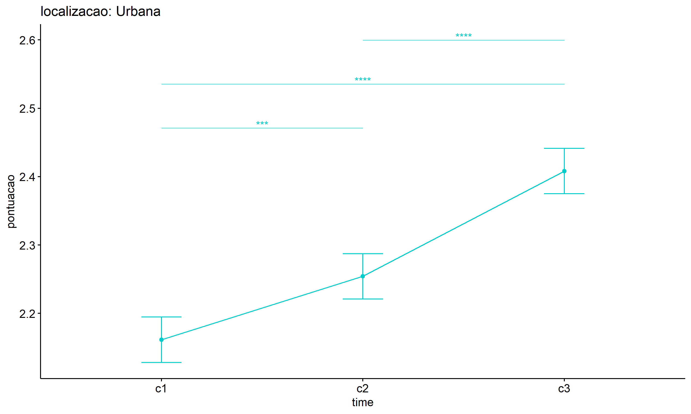

ANOVA test for pontuacao
================
Geiser C. Challco <geiser@alumni.usp.br>

- [ANOVA: pontuacao ~ time](#anova-pontuacao--time)
  - [Data Preparation](#data-preparation)
  - [Summary Statistics](#summary-statistics)
  - [ANOVA Computation](#anova-computation)
  - [PairWise Computation](#pairwise-computation)
- [ANOVA: pontuacao ~ time\*gender +
  Error(id/time)](#anova-pontuacao--timegender--erroridtime)
  - [Data Preparation](#data-preparation-1)
    - [Check assumptions: Identifying
      Outliers](#check-assumptions-identifying-outliers)
    - [Check assumptions: Normality
      Test](#check-assumptions-normality-test)
    - [Summary Statistics](#summary-statistics-1)
  - [ANOVA Computation](#anova-computation-1)
  - [ANOVA Computation after removing non.normal
    data](#anova-computation-after-removing-nonnormal-data)
  - [PairWise Computation](#pairwise-computation-1)
  - [PairWise Computation after removing non.normal
    data](#pairwise-computation-after-removing-nonnormal-data)
- [ANOVA: pontuacao ~ time\*localizacao +
  Error(id/time)](#anova-pontuacao--timelocalizacao--erroridtime)
  - [Data Preparation](#data-preparation-2)
    - [Check assumptions: Identifying
      Outliers](#check-assumptions-identifying-outliers-1)
    - [Check assumptions: Normality
      Test](#check-assumptions-normality-test-1)
    - [Summary Statistics](#summary-statistics-2)
  - [ANOVA Computation](#anova-computation-2)
  - [ANOVA Computation after removing non.normal
    data](#anova-computation-after-removing-nonnormal-data-1)
  - [PairWise Computation](#pairwise-computation-2)
  - [PairWise Computation after removing non.normal
    data](#pairwise-computation-after-removing-nonnormal-data-1)
- [ANOVA: pontuacao ~ time\*regiao +
  Error(id/time)](#anova-pontuacao--timeregiao--erroridtime)
  - [Data Preparation](#data-preparation-3)
    - [Check assumptions: Identifying
      Outliers](#check-assumptions-identifying-outliers-2)
    - [Check assumptions: Normality
      Test](#check-assumptions-normality-test-2)
    - [Summary Statistics](#summary-statistics-3)
  - [ANOVA Computation](#anova-computation-3)
  - [ANOVA Computation after removing non.normal
    data](#anova-computation-after-removing-nonnormal-data-2)
  - [PairWise Computation](#pairwise-computation-3)
  - [PairWise Computation after removing non.normal
    data](#pairwise-computation-after-removing-nonnormal-data-2)
- [ANOVA: pontuacao ~ time\*porte +
  Error(id/time)](#anova-pontuacao--timeporte--erroridtime)
  - [Data Preparation](#data-preparation-4)
    - [Check assumptions: Identifying
      Outliers](#check-assumptions-identifying-outliers-3)
    - [Check assumptions: Normality
      Test](#check-assumptions-normality-test-3)
    - [Summary Statistics](#summary-statistics-4)
  - [ANOVA Computation](#anova-computation-4)
  - [ANOVA Computation after removing non.normal
    data](#anova-computation-after-removing-nonnormal-data-3)
  - [PairWise Computation](#pairwise-computation-4)
  - [PairWise Computation after removing non.normal
    data](#pairwise-computation-after-removing-nonnormal-data-3)

``` r
dat <- read_excel("../data/data.xlsx", sheet = "alunos_ef14")

escolas <- read_excel("../data/data.xlsx", sheet = "escolas")
edat <- merge(dat, escolas, by = "cod_escola", all.x = T)
```

# ANOVA: pontuacao ~ time

## Data Preparation

``` r
data <- edat[,c("aluno_id","ciclo","pontuacao")]
data <- data[data$ciclo %in% c("Primeiro Ciclo","Segundo Ciclo","Terceiro Ciclo"),]
data$ciclo <- factor(data$ciclo, c("Primeiro Ciclo","Segundo Ciclo","Terceiro Ciclo"))
data <- unique(data)

wdat <- spread(data, ciclo, pontuacao)
wdat <- wdat[complete.cases(wdat),]
colnames(wdat) <- c("id","c1","c2","c3")

ldat <- gather(wdat, key = time, value = pontuacao, c1,c2,c3) %>%
  convert_as_factor(id, time)
ldat <- rshinystatistics::remove_group_data(ldat, "pontuacao", "time", n.limit = 30)
```

## Summary Statistics

``` r
(sdat <- ldat %>% group_by(time) %>%
   get_summary_stats(pontuacao, type = "mean_sd"))
```

    ## # A tibble: 3 × 5
    ##   time  variable      n  mean    sd
    ##   <fct> <fct>     <dbl> <dbl> <dbl>
    ## 1 c1    pontuacao  2773  2.16 0.58 
    ## 2 c2    pontuacao  2773  2.25 0.748
    ## 3 c3    pontuacao  2773  2.43 0.962

| time | variable  |    n |  mean |    sd |
|:-----|:----------|-----:|------:|------:|
| c1   | pontuacao | 2773 | 2.160 | 0.580 |
| c2   | pontuacao | 2773 | 2.252 | 0.748 |
| c3   | pontuacao | 2773 | 2.428 | 0.962 |

## ANOVA Computation

``` r
(res.aov <- anova_test(ldat, dv = pontuacao, wid = id, within = time))
```

    ## ANOVA Table (type III tests)
    ## 
    ## $ANOVA
    ##   Effect DFn  DFd      F                                           p p<.05  ges
    ## 1   time   2 5544 89.894 0.00000000000000000000000000000000000000379     * 0.02
    ## 
    ## $`Mauchly's Test for Sphericity`
    ##   Effect     W                                          p p<.05
    ## 1   time 0.939 0.0000000000000000000000000000000000000232     *
    ## 
    ## $`Sphericity Corrections`
    ##   Effect   GGe        DF[GG]                                     p[GG] p[GG]<.05   HFe        DF[HF]
    ## 1   time 0.943 1.89, 5227.08 0.000000000000000000000000000000000000447         * 0.943 1.89, 5230.52
    ##                                       p[HF] p[HF]<.05
    ## 1 0.000000000000000000000000000000000000424         *

| Effect | DFn |  DFd |      F |   p | p\<.05 |  ges |
|:-------|----:|-----:|-------:|----:|:-------|-----:|
| time   |   2 | 5544 | 89.894 |   0 | \*     | 0.02 |

| Effect |     W |   p | p\<.05 |
|:-------|------:|----:|:-------|
| time   | 0.939 |   0 | \*     |

| Effect |   GGe | DF\[GG\]      | p\[GG\] | p\[GG\]\<.05 |   HFe | DF\[HF\]      | p\[HF\] | p\[HF\]\<.05 |
|:-------|------:|:--------------|--------:|:-------------|------:|:--------------|--------:|:-------------|
| time   | 0.943 | 1.89, 5227.08 |       0 | \*           | 0.943 | 1.89, 5230.52 |       0 | \*           |

## PairWise Computation

``` r
(pwc <- ldat %>% emmeans_test(pontuacao ~ time, detailed = T, p.adjust.method = "bonferroni"))
```

    ## # A tibble: 3 × 14
    ##   term  .y.       group1 group2 null.value estimate     se    df conf.low conf.high statistic        p    p.adj p.adj.signif
    ## * <chr> <chr>     <chr>  <chr>       <dbl>    <dbl>  <dbl> <dbl>    <dbl>     <dbl>     <dbl>    <dbl>    <dbl> <chr>       
    ## 1 time  pontuacao c1     c2              0  -0.0912 0.0209  8316   -0.132   -0.0502     -4.36 1.32e- 5 3.97e- 5 ****        
    ## 2 time  pontuacao c1     c3              0  -0.267  0.0209  8316   -0.308   -0.226     -12.8  4.79e-37 1.44e-36 ****        
    ## 3 time  pontuacao c2     c3              0  -0.176  0.0209  8316   -0.217   -0.135      -8.42 4.39e-17 1.32e-16 ****

| term | .y.       | group1 | group2 | null.value | estimate |    se |   df | conf.low | conf.high | statistic |   p | p.adj | p.adj.signif |
|:-----|:----------|:-------|:-------|-----------:|---------:|------:|-----:|---------:|----------:|----------:|----:|------:|:-------------|
| time | pontuacao | c1     | c2     |          0 |   -0.091 | 0.021 | 8316 |   -0.132 |    -0.050 |    -4.359 |   0 |     0 | \*\*\*\*     |
| time | pontuacao | c1     | c3     |          0 |   -0.267 | 0.021 | 8316 |   -0.308 |    -0.226 |   -12.779 |   0 |     0 | \*\*\*\*     |
| time | pontuacao | c2     | c3     |          0 |   -0.176 | 0.021 | 8316 |   -0.217 |    -0.135 |    -8.420 |   0 |     0 | \*\*\*\*     |

``` r
pwc <- add_xy_position(pwc, x = "time", fun = "mean_se")
ggline(get_emmeans(pwc), x = "time", y = "emmean", ylab = "pontuacao") +
  geom_errorbar(aes(ymin = conf.low, ymax = conf.high), width = 0.2) +
  stat_pvalue_manual(pwc, hide.ns = T, tip.length = F)
```

<!-- -->

# ANOVA: pontuacao ~ time\*gender + Error(id/time)

## Data Preparation

``` r
data <- edat[,c("aluno_id","gender","ciclo","pontuacao")]
data <- data[data$ciclo %in% c("Primeiro Ciclo","Segundo Ciclo","Terceiro Ciclo"),]
data$ciclo <- factor(data$ciclo, c("Primeiro Ciclo","Segundo Ciclo","Terceiro Ciclo"))
data <- unique(data)

wdat <- spread(data, ciclo, pontuacao)
wdat <- wdat[complete.cases(wdat),]
colnames(wdat) <- c("id","gender","c1","c2","c3")

ldat <- gather(wdat, key = time, value = pontuacao, c1,c2,c3) %>%
  convert_as_factor(id, time)
ldat <- remove_group_data(ldat, "pontuacao", c("time", "gender"), n.limit = 30)
ldat$gender <- factor(ldat$gender, sort(unique(ldat$gender)))
```

### Check assumptions: Identifying Outliers

``` r
outliers <- identify_outliers(group_by(ldat, time, gender), pontuacao)
(outliers <- outliers[outliers$is.extreme == T,])
```

    ## # A tibble: 988 × 6
    ##    gender time  id                   pontuacao is.outlier is.extreme
    ##    <fct>  <fct> <fct>                    <dbl> <lgl>      <lgl>     
    ##  1 Female c1    0wDHSyctDDkjP6OPE3c8       5   TRUE       TRUE      
    ##  2 Female c1    1DlydHhFt2IkhBETPR4s       3.5 TRUE       TRUE      
    ##  3 Female c1    2dPipf6cnqDHy9qCzjpa       4.5 TRUE       TRUE      
    ##  4 Female c1    2l9eL5QVtUNWf7HSZPbv       3.5 TRUE       TRUE      
    ##  5 Female c1    3roHN14ps3mqIKTOGrvj       3   TRUE       TRUE      
    ##  6 Female c1    46nUNvt4sDOPsC9jnkiG       4.5 TRUE       TRUE      
    ##  7 Female c1    4UY0Zge7bWrXHTAaYi3U       4   TRUE       TRUE      
    ##  8 Female c1    55GlwifTTyiOSKTB9vc9       5   TRUE       TRUE      
    ##  9 Female c1    5AeP0IQ84CerIQVenp2G       3   TRUE       TRUE      
    ## 10 Female c1    5feCOxk9AidRBPnsBHCE       5   TRUE       TRUE      
    ## # ℹ 978 more rows

| gender | time | id                   | pontuacao | is.outlier | is.extreme |
|:-------|:-----|:---------------------|----------:|:-----------|:-----------|
| Female | c1   | 0wDHSyctDDkjP6OPE3c8 |     5.000 | TRUE       | TRUE       |
| Female | c1   | 1DlydHhFt2IkhBETPR4s |     3.500 | TRUE       | TRUE       |
| Female | c1   | 2dPipf6cnqDHy9qCzjpa |     4.500 | TRUE       | TRUE       |
| Female | c1   | 2l9eL5QVtUNWf7HSZPbv |     3.500 | TRUE       | TRUE       |
| Female | c1   | 3roHN14ps3mqIKTOGrvj |     3.000 | TRUE       | TRUE       |
| Female | c1   | 46nUNvt4sDOPsC9jnkiG |     4.500 | TRUE       | TRUE       |
| Female | c1   | 4UY0Zge7bWrXHTAaYi3U |     4.000 | TRUE       | TRUE       |
| Female | c1   | 55GlwifTTyiOSKTB9vc9 |     5.000 | TRUE       | TRUE       |
| Female | c1   | 5AeP0IQ84CerIQVenp2G |     3.000 | TRUE       | TRUE       |
| Female | c1   | 5feCOxk9AidRBPnsBHCE |     5.000 | TRUE       | TRUE       |
| Female | c1   | 6IoOZmGw52LYlznSYXzK |     3.000 | TRUE       | TRUE       |
| Female | c1   | 6N2ACmyrqNBgfOvicubH |     3.500 | TRUE       | TRUE       |
| Female | c1   | 6Xlhq905iNT5kvJFoSW5 |     5.000 | TRUE       | TRUE       |
| Female | c1   | 7AaMrLZQiyhSoBaer5VH |     3.500 | TRUE       | TRUE       |
| Female | c1   | 7n7TdyIH0Wy2Z2on0Ud0 |     3.500 | TRUE       | TRUE       |
| Female | c1   | 9mRn1JOOCatsDmbYOqzt |     3.500 | TRUE       | TRUE       |
| Female | c1   | A8Rx15QryUqDDm8ooiZr |     3.000 | TRUE       | TRUE       |
| Female | c1   | bHXfcIqlNewfok2pEeOS |     3.000 | TRUE       | TRUE       |
| Female | c1   | BVzdfGW6eV1mum8ys73f |     4.000 | TRUE       | TRUE       |
| Female | c1   | CiV1upa4BM58OvTZsu01 |     5.000 | TRUE       | TRUE       |
| Female | c1   | CS7y5BCxFuWSVdvF9C6M |     3.000 | TRUE       | TRUE       |
| Female | c1   | CThb9hYfLyhY7ywFw2mh |     3.000 | TRUE       | TRUE       |
| Female | c1   | cy0oZFPyT8aGHBq7CR9A |     3.500 | TRUE       | TRUE       |
| Female | c1   | CzO1FzJvMlj6CVXnAlpY |     3.500 | TRUE       | TRUE       |
| Female | c1   | D3xqy0zcDXd1HoRlfrXr |     5.000 | TRUE       | TRUE       |
| Female | c1   | dgvqWTQka7lptc3Ft09o |     3.000 | TRUE       | TRUE       |
| Female | c1   | DoMZSYO7aDBRKg8orI37 |     5.000 | TRUE       | TRUE       |
| Female | c1   | dSM9U89FZYdICjBucW8v |     3.000 | TRUE       | TRUE       |
| Female | c1   | EnpxBGI0eFl7hhdpiN9b |     3.500 | TRUE       | TRUE       |
| Female | c1   | F1YXi4gyL0gXObB3MN8t |     3.500 | TRUE       | TRUE       |
| Female | c1   | F5Ux4BYYqSnMt1Om6Trf |     3.500 | TRUE       | TRUE       |
| Female | c1   | g0SSATlv7RDhoBk6jsCz |     3.500 | TRUE       | TRUE       |
| Female | c1   | G2SUhDEavPTLyA8yz9AL |     3.500 | TRUE       | TRUE       |
| Female | c1   | G4NIt8gEc7nfeQ9k2OkL |     3.500 | TRUE       | TRUE       |
| Female | c1   | GPsn9wgK5IpfjHgx51CV |     5.000 | TRUE       | TRUE       |
| Female | c1   | H8te97gR9TCOM0CiCXj1 |     3.500 | TRUE       | TRUE       |
| Female | c1   | I1x9Y5cYi4OfnwWUeTXz |     4.000 | TRUE       | TRUE       |
| Female | c1   | I3Y9HqQRGkhNu3XWatTZ |     5.000 | TRUE       | TRUE       |
| Female | c1   | I5SKdDmPvNCpOHCfh7Is |     4.000 | TRUE       | TRUE       |
| Female | c1   | I61sdI4ZJKyLGpto00Hp |     3.000 | TRUE       | TRUE       |
| Female | c1   | ICT5OJhIcmEb63T8ABDH |     4.000 | TRUE       | TRUE       |
| Female | c1   | ILLLmfTkvRhj4GN2qXRV |     5.000 | TRUE       | TRUE       |
| Female | c1   | IMO5YVt49VumNCOFiPUo |     3.500 | TRUE       | TRUE       |
| Female | c1   | iPWgss5n5My8lpksQ1nX |     5.000 | TRUE       | TRUE       |
| Female | c1   | ixToGS5nyKWTy1PjTzZW |     3.000 | TRUE       | TRUE       |
| Female | c1   | Jgsj4or0goDAXdQU3UwR |     3.000 | TRUE       | TRUE       |
| Female | c1   | jKNiDbIOy8LIHxDf17Ak |     5.000 | TRUE       | TRUE       |
| Female | c1   | jVbbowshsqkUpPuGSIMu |     4.000 | TRUE       | TRUE       |
| Female | c1   | KDT00sr0k2TiKHuntF3l |     5.000 | TRUE       | TRUE       |
| Female | c1   | KPMkDhksSiEWVEIUT1LG |     3.500 | TRUE       | TRUE       |
| Female | c1   | KvTsJCQZ5Yt1CkELwDzz |     3.500 | TRUE       | TRUE       |
| Female | c1   | KWsflPBHSK0g0ZYy9I1L |     5.000 | TRUE       | TRUE       |
| Female | c1   | l5sTSHss3SNnOty4Ko0Q |     5.000 | TRUE       | TRUE       |
| Female | c1   | lBKudZGCo7u15a05qRde |     5.000 | TRUE       | TRUE       |
| Female | c1   | LoE5IKxrl9hZ2YelbeiL |     4.000 | TRUE       | TRUE       |
| Female | c1   | lt4Za0V8VmneMBIicN4R |     3.000 | TRUE       | TRUE       |
| Female | c1   | LYSaRmPNFloeBvE87PDF |     3.500 | TRUE       | TRUE       |
| Female | c1   | M0lkgyBZrlqP3viSI9fR |     3.500 | TRUE       | TRUE       |
| Female | c1   | m5yRlxfIj73j4ossfTOB |     5.000 | TRUE       | TRUE       |
| Female | c1   | mGHWD0TjGvhGeLKfQg2g |     4.000 | TRUE       | TRUE       |
| Female | c1   | mTHECr46GWhULXodWXzn |     3.500 | TRUE       | TRUE       |
| Female | c1   | MTyNplLkcaNxd9NT392Q |     3.500 | TRUE       | TRUE       |
| Female | c1   | N3zF1kdLVvTXfbcXiMqe |     3.500 | TRUE       | TRUE       |
| Female | c1   | NK3ECSGcmI5l1RXmrUwD |     3.000 | TRUE       | TRUE       |
| Female | c1   | OHaKe4sjqJUk42rC4AUJ |     3.500 | TRUE       | TRUE       |
| Female | c1   | pca9LmykrugFnjsHp7MR |     5.000 | TRUE       | TRUE       |
| Female | c1   | pDNFXjYX3Cn2inX68ur1 |     3.000 | TRUE       | TRUE       |
| Female | c1   | Pjhg1YOjTYNN8OkFzI4x |     5.000 | TRUE       | TRUE       |
| Female | c1   | PwZy7Lbc45vuNd5du72A |     3.500 | TRUE       | TRUE       |
| Female | c1   | PXCxhApxGzewplNswxgH |     3.500 | TRUE       | TRUE       |
| Female | c1   | PZc0aYIU1wWnGIkRzREr |     3.500 | TRUE       | TRUE       |
| Female | c1   | pZxmwQTfOi8xnuIarrUn |     3.500 | TRUE       | TRUE       |
| Female | c1   | QasU7a9JiIu1XHAPVJk9 |     3.000 | TRUE       | TRUE       |
| Female | c1   | qVl319vNWmdlbLUGjntP |     5.000 | TRUE       | TRUE       |
| Female | c1   | rijPm1LRjDwEh0XEZEeR |     4.000 | TRUE       | TRUE       |
| Female | c1   | RpgNX7SP1NEeT5BsZTaD |     4.000 | TRUE       | TRUE       |
| Female | c1   | Rq2OTnqvauiedrQ0PVcm |     3.500 | TRUE       | TRUE       |
| Female | c1   | RRLcsx8LINTcst1Q4YOn |     3.500 | TRUE       | TRUE       |
| Female | c1   | Ru3SPRo97iXBvXbvneKh |     5.000 | TRUE       | TRUE       |
| Female | c1   | sa8AQqPbKPPFsfdZ6x0G |     3.500 | TRUE       | TRUE       |
| Female | c1   | T534WjZcq1FLuM0deNJw |     4.000 | TRUE       | TRUE       |
| Female | c1   | tMvrlvyWFo29zGNXpFyE |     3.500 | TRUE       | TRUE       |
| Female | c1   | TPB06PAovFuelCYvgcj3 |     3.500 | TRUE       | TRUE       |
| Female | c1   | TSs8WbcckJouUpzuR0nn |     3.500 | TRUE       | TRUE       |
| Female | c1   | tsxmT2k2dEcoFpQCuGuh |     5.000 | TRUE       | TRUE       |
| Female | c1   | TuwLSARYD5MEskM6EzjS |     4.000 | TRUE       | TRUE       |
| Female | c1   | ubEDQx27vt3yGuwIsx0h |     4.000 | TRUE       | TRUE       |
| Female | c1   | uFSAWdonFPjVNBML0dt6 |     3.000 | TRUE       | TRUE       |
| Female | c1   | UKLVcE0VqppSSC8hDubG |     5.000 | TRUE       | TRUE       |
| Female | c1   | UTcQeAJVgrgjSdUJBAKT |     3.000 | TRUE       | TRUE       |
| Female | c1   | V9NKVqvKAS7ZtQU9nRtp |     3.500 | TRUE       | TRUE       |
| Female | c1   | vc8pPoYau2AIAuCQJipW |     5.000 | TRUE       | TRUE       |
| Female | c1   | VQYzehh7apBzVcJS1Cb1 |     3.500 | TRUE       | TRUE       |
| Female | c1   | wefcYCTqKwxh8S4qGLoI |     5.000 | TRUE       | TRUE       |
| Female | c1   | xAo0TzCEx1bIrmjqKgbj |     3.500 | TRUE       | TRUE       |
| Female | c1   | xG2Z9gaPgwiRw7YIbYzr |     3.000 | TRUE       | TRUE       |
| Female | c1   | Xq3402VdKr7fuvkfZchf |     5.000 | TRUE       | TRUE       |
| Female | c1   | xWYQwXV8LGaEABUetLg9 |     5.000 | TRUE       | TRUE       |
| Female | c1   | xZ5yKSWaJFp2osYZSjqL |     5.000 | TRUE       | TRUE       |
| Female | c1   | yKvft7tvobpHJjOuBtnA |     3.500 | TRUE       | TRUE       |
| Female | c1   | YorI9iQuCy98R062SSFM |     3.500 | TRUE       | TRUE       |
| Female | c1   | yPgzV9EpgilbSUd62qg3 |     3.500 | TRUE       | TRUE       |
| Female | c1   | YTYFFWzK4C7ejf1X1TUB |     5.000 | TRUE       | TRUE       |
| Female | c1   | Zd0PsCueY8uUv5kZj7tr |     5.000 | TRUE       | TRUE       |
| Female | c1   | zpmhcXzEeOxKL6kXYe02 |     3.500 | TRUE       | TRUE       |
| Female | c1   | ZqNakY2Tj9BtlYElbFyD |     5.000 | TRUE       | TRUE       |
| Female | c1   | zrB88tfKAfbkkQmqnQX0 |     5.000 | TRUE       | TRUE       |
| Female | c1   | zrJ1HlCb8WnWqe0AELEs |     4.000 | TRUE       | TRUE       |
| Female | c1   | zu9ITSnIAecxMpJmNxCE |     5.000 | TRUE       | TRUE       |
| Male   | c1   | 0OzfHdzDSzAB1syzSzb8 |     5.000 | TRUE       | TRUE       |
| Male   | c1   | 0snZiNyJSvQ3y78pNyZ8 |     5.000 | TRUE       | TRUE       |
| Male   | c1   | 0w3VhiMf67CbcpR6aZCL |     5.000 | TRUE       | TRUE       |
| Male   | c1   | 1j6UeRYoeJDXM0grwZCJ |     3.500 | TRUE       | TRUE       |
| Male   | c1   | 1PlxEF4tmJySD3G46PLB |     3.500 | TRUE       | TRUE       |
| Male   | c1   | 1Z1Qz8zDaMkaAz1Ah80K |     5.000 | TRUE       | TRUE       |
| Male   | c1   | 42WvKYOHdVI1hIxd9ZJl |     4.000 | TRUE       | TRUE       |
| Male   | c1   | 4hmXg2uo4wxSAX9SaxpN |     3.500 | TRUE       | TRUE       |
| Male   | c1   | 5P3WYdHfZOaNtqeKJ9QA |     5.000 | TRUE       | TRUE       |
| Male   | c1   | 5zZ1GeniMVX6uMy5Wsj5 |     4.500 | TRUE       | TRUE       |
| Male   | c1   | 6oE4k979jigSP7Zbs2m1 |     3.500 | TRUE       | TRUE       |
| Male   | c1   | 6T5xYwUo6kDjNVlSqng5 |     3.500 | TRUE       | TRUE       |
| Male   | c1   | 7nfO1ouMUuN7IzvlCKr0 |     3.500 | TRUE       | TRUE       |
| Male   | c1   | 87xGodW9Z9oWGGf26blt |     5.000 | TRUE       | TRUE       |
| Male   | c1   | 8edbRBvoAhVAiLZ3h3E2 |     5.000 | TRUE       | TRUE       |
| Male   | c1   | 9k9BI8mCq3fddmKjDwxN |     3.500 | TRUE       | TRUE       |
| Male   | c1   | A5EETpEr617bpnSh1wp6 |     3.500 | TRUE       | TRUE       |
| Male   | c1   | A5zmrPXJaIUaT9ZimRSl |     3.500 | TRUE       | TRUE       |
| Male   | c1   | AIzwxJCfbDsO8ZT4ZZ4h |     3.000 | TRUE       | TRUE       |
| Male   | c1   | atGEQplKO1omiu3hdOkr |     3.500 | TRUE       | TRUE       |
| Male   | c1   | AVWl60C3KAjiEIcqp9lr |     3.000 | TRUE       | TRUE       |
| Male   | c1   | aYAQUiYlVOIN61eDlDXu |     3.500 | TRUE       | TRUE       |
| Male   | c1   | b9PlhVhdvhl9EPK9QVCv |     5.000 | TRUE       | TRUE       |
| Male   | c1   | bicRuWjKBX2nhWEdR2gT |     3.500 | TRUE       | TRUE       |
| Male   | c1   | c7FNBhkR4ZErkYH51DzO |     4.000 | TRUE       | TRUE       |
| Male   | c1   | cao1agmzaedA3s0PVAPS |     5.000 | TRUE       | TRUE       |
| Male   | c1   | CApu4sPxX6TUOXcVd5Q4 |     3.000 | TRUE       | TRUE       |
| Male   | c1   | CCkKOhn0UVSkJHbSjgzS |     5.000 | TRUE       | TRUE       |
| Male   | c1   | cIhnYNVfowgfcTauxObB |     5.000 | TRUE       | TRUE       |
| Male   | c1   | cJoqgrk6T3HsA9EOVe7D |     5.000 | TRUE       | TRUE       |
| Male   | c1   | CnDHyGy00t97Hh8JGKqg |     3.500 | TRUE       | TRUE       |
| Male   | c1   | cuknOzzwN4oCRum5U5ph |     3.500 | TRUE       | TRUE       |
| Male   | c1   | D1HfJKTVqjrpCJx97l3v |     5.000 | TRUE       | TRUE       |
| Male   | c1   | DFTbWP0xF5gxFgxEN0dL |     3.000 | TRUE       | TRUE       |
| Male   | c1   | dieaAtUumyYxX7zGb7Sb |     4.000 | TRUE       | TRUE       |
| Male   | c1   | DKEsQosaERswlkB803hB |     3.500 | TRUE       | TRUE       |
| Male   | c1   | e6D4hL1p05rSyq02kgfm |     4.000 | TRUE       | TRUE       |
| Male   | c1   | E8XEhNJhfANZZtqHam0A |     3.000 | TRUE       | TRUE       |
| Male   | c1   | EH16G0VfiN4uQlaY2bU0 |     3.500 | TRUE       | TRUE       |
| Male   | c1   | ErZtw56ciW4nusb5tVVu |     2.750 | TRUE       | TRUE       |
| Male   | c1   | ETyWmmt6JYMQVyYo8Byu |     5.000 | TRUE       | TRUE       |
| Male   | c1   | F0uIuYIMqDNN0q6Z3ZuD |     3.000 | TRUE       | TRUE       |
| Male   | c1   | fLBBrxUStMx7WiPdI0Dm |     5.000 | TRUE       | TRUE       |
| Male   | c1   | FSILT6Pa2OIvuB8IcM3r |     3.000 | TRUE       | TRUE       |
| Male   | c1   | fTT51ooRMooqYQS36Jv0 |     3.500 | TRUE       | TRUE       |
| Male   | c1   | g1dgNJfnnfRiVAHnsqS4 |     3.500 | TRUE       | TRUE       |
| Male   | c1   | G5WjH8t1I6LAiAOCuM2v |     3.500 | TRUE       | TRUE       |
| Male   | c1   | h2BzjDoNMVvqAiEZrZTW |     3.000 | TRUE       | TRUE       |
| Male   | c1   | HfOmAUZAmC2ZnLZ73SW4 |     3.500 | TRUE       | TRUE       |
| Male   | c1   | hqq5nMI9CFAEYxxJZFVT |     3.000 | TRUE       | TRUE       |
| Male   | c1   | i6M2WLEfaiylCRyZ9XnE |     3.500 | TRUE       | TRUE       |
| Male   | c1   | itsWtmzCltg61pPPzQce |     3.500 | TRUE       | TRUE       |
| Male   | c1   | iutpBZMAtM92qcbyCDHB |     3.500 | TRUE       | TRUE       |
| Male   | c1   | iXqE1bAFPsYn56jTzZQS |     5.000 | TRUE       | TRUE       |
| Male   | c1   | J2xCnjFPxFB61qc76V3F |     5.000 | TRUE       | TRUE       |
| Male   | c1   | JdRySX8i3hE3pxcYyUcf |     3.000 | TRUE       | TRUE       |
| Male   | c1   | JznuNOD85FqSrUcA6xz4 |     5.000 | TRUE       | TRUE       |
| Male   | c1   | KR3xuTy812tVchW2MefO |     5.000 | TRUE       | TRUE       |
| Male   | c1   | L0pSsw4UaYnFftPWiFKb |     4.000 | TRUE       | TRUE       |
| Male   | c1   | lCYes8OkzcR0MPaPCtVg |     3.000 | TRUE       | TRUE       |
| Male   | c1   | Mzzqk4BB56ocxoMpsVAH |     5.000 | TRUE       | TRUE       |
| Male   | c1   | na894eePLyXWdv6YXjl6 |     3.000 | TRUE       | TRUE       |
| Male   | c1   | nnPTfCmTsFmqbk9q3PJG |     3.500 | TRUE       | TRUE       |
| Male   | c1   | np4SQ0mAQTKMSrkKOcdO |     4.000 | TRUE       | TRUE       |
| Male   | c1   | NW7xi0uw2xX7J2ch6WFX |     5.000 | TRUE       | TRUE       |
| Male   | c1   | o7ojk9dShuXKPcejeErG |     4.500 | TRUE       | TRUE       |
| Male   | c1   | oafpBD8HTXvsKOiHN7p8 |     3.500 | TRUE       | TRUE       |
| Male   | c1   | OjMXOEOmsdoOKX2sn4W0 |     3.500 | TRUE       | TRUE       |
| Male   | c1   | OmU7KYznecrHRwmZf47Q |     3.000 | TRUE       | TRUE       |
| Male   | c1   | OSW1T9qXlVs1JipYYT2q |     3.500 | TRUE       | TRUE       |
| Male   | c1   | OUG1wau4l1G1NoVMv0R9 |     3.500 | TRUE       | TRUE       |
| Male   | c1   | PKoPTKC1RrGaREkbINPf |     3.500 | TRUE       | TRUE       |
| Male   | c1   | PMsVKgnivLJr3CQYAKsP |     3.500 | TRUE       | TRUE       |
| Male   | c1   | PqW3vWjH69npz9vqggMX |     5.000 | TRUE       | TRUE       |
| Male   | c1   | qbpdhqIdqf7n3lmU2n4I |     3.500 | TRUE       | TRUE       |
| Male   | c1   | R7yCqYgzTa9KdpJQ4uXb |     5.000 | TRUE       | TRUE       |
| Male   | c1   | rlDJNHNeB1Wa5T2vzGxv |     5.000 | TRUE       | TRUE       |
| Male   | c1   | RlqnAYUyOdC7g4eDY9UO |     5.000 | TRUE       | TRUE       |
| Male   | c1   | rooKwkvjlZD4g9utHU9Y |     5.000 | TRUE       | TRUE       |
| Male   | c1   | S1nh3dG8ke0WXMnYKs8S |     5.000 | TRUE       | TRUE       |
| Male   | c1   | ShlGdXTxjxY5elm8BIsc |     3.500 | TRUE       | TRUE       |
| Male   | c1   | sM3c4noBIP8hnYWA6pAe |     4.000 | TRUE       | TRUE       |
| Male   | c1   | snoeXZt7a8Ds16UvPGhk |     5.000 | TRUE       | TRUE       |
| Male   | c1   | sRR37KpbkBZSh9H2UpSB |     4.000 | TRUE       | TRUE       |
| Male   | c1   | Swge4GG9Qmg1w9YaAeDP |     3.500 | TRUE       | TRUE       |
| Male   | c1   | TABveJnXO5hRaweFnAMh |     5.000 | TRUE       | TRUE       |
| Male   | c1   | TKvc4Eu2XaDXYPxuS7Qn |     3.000 | TRUE       | TRUE       |
| Male   | c1   | uCBI6gnllsawWJlgqkr5 |     5.000 | TRUE       | TRUE       |
| Male   | c1   | ug0vfwlQo0sEyRBpO9kC |     3.500 | TRUE       | TRUE       |
| Male   | c1   | V6mPhqYzZnhhkJ8biQrK |     3.500 | TRUE       | TRUE       |
| Male   | c1   | whgR2j3Go6DAaVNwNLom |     3.500 | TRUE       | TRUE       |
| Male   | c1   | wJgBRtIUF5VG22EJXZKz |     4.000 | TRUE       | TRUE       |
| Male   | c1   | wseUz0r0pXpxrHc3Z3cA |     5.000 | TRUE       | TRUE       |
| Male   | c1   | XeSX4FsDK2KmCwATUvcu |     3.500 | TRUE       | TRUE       |
| Male   | c1   | xF20f9CYWcEP8kspJSfO |     3.500 | TRUE       | TRUE       |
| Male   | c1   | xgWi8MM2PHEEfdjn61b7 |     5.000 | TRUE       | TRUE       |
| Male   | c1   | xmtNEz12lXmE9RzmND2z |     3.500 | TRUE       | TRUE       |
| Male   | c1   | xqa8hxyoceOYPa6hVhPj |     3.000 | TRUE       | TRUE       |
| Male   | c1   | XR80QrMN57TjohHYFg5d |     3.500 | TRUE       | TRUE       |
| Male   | c1   | xUKKiLMXz1z5e7g1kX4m |     5.000 | TRUE       | TRUE       |
| Male   | c1   | Y3cuEkTVSedwuUI5fZZa |     5.000 | TRUE       | TRUE       |
| Male   | c1   | Y7HozU436KQ0wqdBGugu |     3.500 | TRUE       | TRUE       |
| Male   | c1   | yFanVr0wjzYIwTfw1vFK |     3.500 | TRUE       | TRUE       |
| Male   | c1   | YGFQKoYPc6RiqZx6hmSy |     3.500 | TRUE       | TRUE       |
| Male   | c1   | yqs7nmUksI91LaUrmSVZ |     3.500 | TRUE       | TRUE       |
| Male   | c1   | YxfFrbwSijoyTMWGIYqQ |     5.000 | TRUE       | TRUE       |
| Male   | c1   | YZl0xc1Gu4ixxN2rOCtH |     5.000 | TRUE       | TRUE       |
| Male   | c1   | ZdpC4Xaxucxlaqa0o7wm |     5.000 | TRUE       | TRUE       |
| Male   | c1   | zPOwHw0YDzGIreCfW6KG |     4.000 | TRUE       | TRUE       |
| Male   | c1   | zzT4tM9ebxCI7Pwpo045 |     3.500 | TRUE       | TRUE       |
| Female | c2   | 0JP4C8o7n2HYsnPDx4qx |     3.500 | TRUE       | TRUE       |
| Female | c2   | 0TuX5r0ZBcaeQmhDsIAf |     5.000 | TRUE       | TRUE       |
| Female | c2   | 1gvgnHo5onRSLXTnds8W |     3.500 | TRUE       | TRUE       |
| Female | c2   | 1rGKIQ7fdZBOxxGdPFrp |     3.500 | TRUE       | TRUE       |
| Female | c2   | 3blV58eQPso7qpxg13MF |     5.000 | TRUE       | TRUE       |
| Female | c2   | 3jxsoSEwtsVRAiKCqYDt |     5.000 | TRUE       | TRUE       |
| Female | c2   | 3Wk09G0GMQzlDHl6p9Lz |     5.000 | TRUE       | TRUE       |
| Female | c2   | 3WvSQRVfYSeH8PCOQB0n |     3.500 | TRUE       | TRUE       |
| Female | c2   | 3XOQzgoErsKmvF4VxZjc |     5.000 | TRUE       | TRUE       |
| Female | c2   | 4AM4nonwJ45LiMy6b4lp |     5.000 | TRUE       | TRUE       |
| Female | c2   | 4nqGEweDryFFoQ2MF5ft |     4.000 | TRUE       | TRUE       |
| Female | c2   | 5l1OLNAprJvzHRinnoF0 |     3.500 | TRUE       | TRUE       |
| Female | c2   | 6bEKmKQpOuvY6PSQvzqj |     4.000 | TRUE       | TRUE       |
| Female | c2   | 6Xlhq905iNT5kvJFoSW5 |     5.000 | TRUE       | TRUE       |
| Female | c2   | 7lWk6FSvCZ1UZHDtI9G9 |     5.000 | TRUE       | TRUE       |
| Female | c2   | 7pR91qd7LX1X2Chwr4xQ |     4.000 | TRUE       | TRUE       |
| Female | c2   | 8Bl9iWhaLEWHlHQpdoz7 |     5.000 | TRUE       | TRUE       |
| Female | c2   | 8jXS39U6Aje4RlDntJHg |     3.500 | TRUE       | TRUE       |
| Female | c2   | 8krb2zmmVacG3OnTu0cA |     3.500 | TRUE       | TRUE       |
| Female | c2   | 8p6QYQYkfhR3QOACXZvj |     3.000 | TRUE       | TRUE       |
| Female | c2   | 8sNNEBfY9FXrwwecC4pS |     5.000 | TRUE       | TRUE       |
| Female | c2   | 8Vvs2qgszBTCpwNZXh9K |     5.000 | TRUE       | TRUE       |
| Female | c2   | 8yBy0FH1qFD9FyvE9xoe |     5.000 | TRUE       | TRUE       |
| Female | c2   | 94MRHXyGpTPfXmtR6Rm2 |     3.000 | TRUE       | TRUE       |
| Female | c2   | A8Rx15QryUqDDm8ooiZr |     5.000 | TRUE       | TRUE       |
| Female | c2   | af5RMKVP6cKJILwrcjxR |     3.000 | TRUE       | TRUE       |
| Female | c2   | afv4bETijhDkrYfHuG6R |     4.000 | TRUE       | TRUE       |
| Female | c2   | ahHqNPxM9dDITA6mjtpB |     3.500 | TRUE       | TRUE       |
| Female | c2   | AUp01jGBKvRyiH5yAcYg |     3.500 | TRUE       | TRUE       |
| Female | c2   | B3iobdMKEEGUWEuZHd5o |     3.500 | TRUE       | TRUE       |
| Female | c2   | BM98aWRgRUB3MQEk7yOm |     4.000 | TRUE       | TRUE       |
| Female | c2   | bnhrGtK2gNr4ms56nqKJ |     5.000 | TRUE       | TRUE       |
| Female | c2   | bxxcpVcdJ03akf9XTPVs |     5.000 | TRUE       | TRUE       |
| Female | c2   | c8RIadbNTfdfToYr3JOu |     5.000 | TRUE       | TRUE       |
| Female | c2   | CBjbMGhWFUocJQM5DDq9 |     4.000 | TRUE       | TRUE       |
| Female | c2   | CGGLIUVzLwf9T4m1UDZv |     5.000 | TRUE       | TRUE       |
| Female | c2   | cW7cv3V52Z2k5sOxaIPc |     5.000 | TRUE       | TRUE       |
| Female | c2   | cZdSApGX8iwWXmmiH4fI |     5.000 | TRUE       | TRUE       |
| Female | c2   | d1JgyezU4pt7F4SebGoe |     4.000 | TRUE       | TRUE       |
| Female | c2   | D3zCmRj97N1xSw2RGyIX |     4.000 | TRUE       | TRUE       |
| Female | c2   | dCPfML2azPAOx7s4eHfR |     3.500 | TRUE       | TRUE       |
| Female | c2   | dSM9U89FZYdICjBucW8v |     5.000 | TRUE       | TRUE       |
| Female | c2   | e1nlLe6lCBYUzF23dTrW |     4.000 | TRUE       | TRUE       |
| Female | c2   | E6fXR3JLCDlEEya7NoFm |     3.500 | TRUE       | TRUE       |
| Female | c2   | EcAgL4tVyGSoqslrQjcI |     3.500 | TRUE       | TRUE       |
| Female | c2   | efGqYqTmvxysOA8bmE9u |     4.000 | TRUE       | TRUE       |
| Female | c2   | EnpxBGI0eFl7hhdpiN9b |     5.000 | TRUE       | TRUE       |
| Female | c2   | f1DVcYmWhcCJevHERY3J |     5.000 | TRUE       | TRUE       |
| Female | c2   | F5Ux4BYYqSnMt1Om6Trf |     5.000 | TRUE       | TRUE       |
| Female | c2   | ffnFAMZehkOjgmmGyq3E |     5.000 | TRUE       | TRUE       |
| Female | c2   | FJMDgMPQ2jPwY8jZiFBH |     5.000 | TRUE       | TRUE       |
| Female | c2   | G6w5RiWtWQbT4xtExf7d |     5.000 | TRUE       | TRUE       |
| Female | c2   | gBmp7DCcMF8YynwrJWmq |     5.000 | TRUE       | TRUE       |
| Female | c2   | Gh1rShY4yNhECjGTZCjK |     5.000 | TRUE       | TRUE       |
| Female | c2   | GLiaONiGLGsIMU5p88Cl |     3.667 | TRUE       | TRUE       |
| Female | c2   | gXrrOtiEmHKiOUVVyX38 |     5.000 | TRUE       | TRUE       |
| Female | c2   | gzBUwnjjYHnioTnd4stC |     3.000 | TRUE       | TRUE       |
| Female | c2   | H8te97gR9TCOM0CiCXj1 |     3.000 | TRUE       | TRUE       |
| Female | c2   | h9Xfxwcdbw4aOyXpmXzb |     3.500 | TRUE       | TRUE       |
| Female | c2   | hcMHfjgGtVOBlWeqw37Q |     5.000 | TRUE       | TRUE       |
| Female | c2   | he6IcM0jDfN2KkoAqieY |     3.500 | TRUE       | TRUE       |
| Female | c2   | HtKEVjUVTft3YPkGhyqi |     5.000 | TRUE       | TRUE       |
| Female | c2   | I1x9Y5cYi4OfnwWUeTXz |     4.000 | TRUE       | TRUE       |
| Female | c2   | I6ZCrdQMaOdo9ltkC1r2 |     5.000 | TRUE       | TRUE       |
| Female | c2   | IMO5YVt49VumNCOFiPUo |     3.500 | TRUE       | TRUE       |
| Female | c2   | ISi6UsapYVTkOUciYdCR |     5.000 | TRUE       | TRUE       |
| Female | c2   | iTGlJcN6wa85aKfGD31J |     3.500 | TRUE       | TRUE       |
| Female | c2   | IuDnrjshS6LmyvE5oQLm |     5.000 | TRUE       | TRUE       |
| Female | c2   | IXZlZBy7uRBHUFPQg8hX |     5.000 | TRUE       | TRUE       |
| Female | c2   | jGesTMYpGOc4DJQ77fHt |     3.000 | TRUE       | TRUE       |
| Female | c2   | jipIzfMPngc6Se2mEtoO |     3.500 | TRUE       | TRUE       |
| Female | c2   | jkLYbxqo03ZJfOYCiaRm |     3.000 | TRUE       | TRUE       |
| Female | c2   | jljcKPNPjBo1MdiK1ffQ |     3.500 | TRUE       | TRUE       |
| Female | c2   | jVbbowshsqkUpPuGSIMu |     4.000 | TRUE       | TRUE       |
| Female | c2   | k1Byic1gWlgNIFT8qDpn |     5.000 | TRUE       | TRUE       |
| Female | c2   | k2S15ANRrwJKgCuiwaKC |     3.000 | TRUE       | TRUE       |
| Female | c2   | K3la9byFQsBzKaukPsOq |     3.500 | TRUE       | TRUE       |
| Female | c2   | kF7XKL6TIoHCyeDsRHfI |     3.500 | TRUE       | TRUE       |
| Female | c2   | kknluC3ysHPx8uvtttCn |     4.000 | TRUE       | TRUE       |
| Female | c2   | kxDlIW2yUzDrEogK8TaZ |     5.000 | TRUE       | TRUE       |
| Female | c2   | KxltaXnk31onNRVrLE5Y |     3.500 | TRUE       | TRUE       |
| Female | c2   | l4gydYyytruchBwTqEB6 |     4.000 | TRUE       | TRUE       |
| Female | c2   | LC67V5LShu6RMdyHjAJx |     3.500 | TRUE       | TRUE       |
| Female | c2   | LCm4vFJ1xlRTL3juZnuJ |     4.000 | TRUE       | TRUE       |
| Female | c2   | Lkj3iKKqlIBS7UHzz6mD |     5.000 | TRUE       | TRUE       |
| Female | c2   | mg9Hz7wizYmC8ZROis8p |     5.000 | TRUE       | TRUE       |
| Female | c2   | mOjSZUKwIGnOHPFJuxou |     5.000 | TRUE       | TRUE       |
| Female | c2   | mTxfHO37mmdyGuVi0AcC |     4.000 | TRUE       | TRUE       |
| Female | c2   | MTyNplLkcaNxd9NT392Q |     5.000 | TRUE       | TRUE       |
| Female | c2   | MxgQUA6KrQnZN4Fm7oCW |     3.500 | TRUE       | TRUE       |
| Female | c2   | N9cRf5BDMjp45ygmrq1a |     5.000 | TRUE       | TRUE       |
| Female | c2   | nFCWCX4KlAfWmHKc43rd |     4.000 | TRUE       | TRUE       |
| Female | c2   | NhlE2lu4s6rzYNLgKLCC |     4.000 | TRUE       | TRUE       |
| Female | c2   | nI311xKanqD5k4XdM5QB |     4.000 | TRUE       | TRUE       |
| Female | c2   | NiBOt9OUO2x3fZe7eXO0 |     5.000 | TRUE       | TRUE       |
| Female | c2   | NJuhIhcV6SgR0FBfCWdk |     3.000 | TRUE       | TRUE       |
| Female | c2   | NmoXltFQ3nBPcq2Azq0i |     3.500 | TRUE       | TRUE       |
| Female | c2   | Ny4Dp3ng8VzQahLyR8Mq |     5.000 | TRUE       | TRUE       |
| Female | c2   | nzvht5CC1LdaErde51DY |     3.500 | TRUE       | TRUE       |
| Female | c2   | oDwXT8tBgAYK4vSHZU3P |     5.000 | TRUE       | TRUE       |
| Female | c2   | oGUJyWRMYYbF9PNegJZh |     5.000 | TRUE       | TRUE       |
| Female | c2   | OvVHL1G4dRp8rMb2RIF9 |     3.500 | TRUE       | TRUE       |
| Female | c2   | pDNFXjYX3Cn2inX68ur1 |     5.000 | TRUE       | TRUE       |
| Female | c2   | pJbc9u9ZPKVj4ttAwF9y |     4.000 | TRUE       | TRUE       |
| Female | c2   | Pjhg1YOjTYNN8OkFzI4x |     3.000 | TRUE       | TRUE       |
| Female | c2   | pkFNtaKBdbUsYSrekUQh |     3.000 | TRUE       | TRUE       |
| Female | c2   | PnZwZ3XZ3YjQEejFWjO3 |     4.000 | TRUE       | TRUE       |
| Female | c2   | pqXkPZEqOMf2xM8dbV6d |     5.000 | TRUE       | TRUE       |
| Female | c2   | Puj0Lljgb9yE7UxApjnK |     5.000 | TRUE       | TRUE       |
| Female | c2   | pX3oKxaMTnCJ8g1GtRWG |     2.750 | TRUE       | TRUE       |
| Female | c2   | Q57VKIby7HyFcMffDEzl |     5.000 | TRUE       | TRUE       |
| Female | c2   | R2ky5jzikEXvYkO0gqyU |     5.000 | TRUE       | TRUE       |
| Female | c2   | RCY3F2HtV0DPrs21Q5KB |     3.000 | TRUE       | TRUE       |
| Female | c2   | rSevjS6uMrjCEt33h7jL |     3.500 | TRUE       | TRUE       |
| Female | c2   | ru8FeSLbIyeIQy9f3Ur8 |     3.500 | TRUE       | TRUE       |
| Female | c2   | RuLO4wjZ8eP202TWX6R8 |     4.000 | TRUE       | TRUE       |
| Female | c2   | S04BvJLoDV9mtuYhqSTF |     4.000 | TRUE       | TRUE       |
| Female | c2   | ScmLumR6WUA4APWBqXFX |     4.000 | TRUE       | TRUE       |
| Female | c2   | SFojZKDHvdJbhHKzsN2I |     4.000 | TRUE       | TRUE       |
| Female | c2   | SGoosoZhcVXdpsyLbBsb |     3.500 | TRUE       | TRUE       |
| Female | c2   | sLeIgBxDIZhj2XI6uNW0 |     5.000 | TRUE       | TRUE       |
| Female | c2   | sSEiBqKCIt9z1Qg8SihU |     5.000 | TRUE       | TRUE       |
| Female | c2   | T0gqf1WAgr62eUu6WPHq |     5.000 | TRUE       | TRUE       |
| Female | c2   | T534WjZcq1FLuM0deNJw |     5.000 | TRUE       | TRUE       |
| Female | c2   | tfmKp0SXpwvJkZn03aN4 |     4.000 | TRUE       | TRUE       |
| Female | c2   | trOCyMFe6S3DDEhf2HL7 |     5.000 | TRUE       | TRUE       |
| Female | c2   | TSs8WbcckJouUpzuR0nn |     5.000 | TRUE       | TRUE       |
| Female | c2   | TuwLSARYD5MEskM6EzjS |     3.500 | TRUE       | TRUE       |
| Female | c2   | u5hJDswFRptq4y76Kutb |     3.500 | TRUE       | TRUE       |
| Female | c2   | UarNTpxWceiYSVcbER9V |     5.000 | TRUE       | TRUE       |
| Female | c2   | UDaiNlek9wEgVE3tdaDK |     3.000 | TRUE       | TRUE       |
| Female | c2   | uHY3xzZ4b6EbvaFcpgiG |     5.000 | TRUE       | TRUE       |
| Female | c2   | UKL1xcfRBHZh1RmpT28W |     5.000 | TRUE       | TRUE       |
| Female | c2   | uO9nfkLEYn0z361QEH7Q |     5.000 | TRUE       | TRUE       |
| Female | c2   | UpctgaJMOEgDuI3wov8S |     3.500 | TRUE       | TRUE       |
| Female | c2   | uqX7aPoHn8tMaKAp9y3I |     3.000 | TRUE       | TRUE       |
| Female | c2   | UTcQeAJVgrgjSdUJBAKT |     5.000 | TRUE       | TRUE       |
| Female | c2   | uXrGgSVZ1ZKfQuJ3neSu |     3.500 | TRUE       | TRUE       |
| Female | c2   | UYeJm6eVWY656Cr2i9eU |     4.000 | TRUE       | TRUE       |
| Female | c2   | v5KF7y11Ncyud2q4dKmD |     3.000 | TRUE       | TRUE       |
| Female | c2   | V9NKVqvKAS7ZtQU9nRtp |     3.000 | TRUE       | TRUE       |
| Female | c2   | vysmHaeXologjTfN9h8W |     5.000 | TRUE       | TRUE       |
| Female | c2   | WKxFXpseomxCYgOSyrdB |     4.000 | TRUE       | TRUE       |
| Female | c2   | WSRSxbb9igUPQVN86BSH |     5.000 | TRUE       | TRUE       |
| Female | c2   | X8eOpiPuKfI4GXxjOsOM |     5.000 | TRUE       | TRUE       |
| Female | c2   | xCgFRSJhxUFZEqK4qpC9 |     5.000 | TRUE       | TRUE       |
| Female | c2   | Xfs4ydu0jiJkaDwInzXx |     5.000 | TRUE       | TRUE       |
| Female | c2   | xgjVK7rnOUUArvnA4ZiQ |     5.000 | TRUE       | TRUE       |
| Female | c2   | xk7eC5haTYuFQaJovsBZ |     5.000 | TRUE       | TRUE       |
| Female | c2   | XzMIZjd0GDHSpif5ypWf |     3.500 | TRUE       | TRUE       |
| Female | c2   | yhWIPCpcvG86y5eANPQw |     5.000 | TRUE       | TRUE       |
| Female | c2   | YorI9iQuCy98R062SSFM |     3.000 | TRUE       | TRUE       |
| Female | c2   | ZDsN200AOSuZkmxgcc8n |     4.000 | TRUE       | TRUE       |
| Female | c2   | zGMOcEW4JkmkLh0LrlvC |     5.000 | TRUE       | TRUE       |
| Female | c2   | ZMFqkdswODYdw2Od5Y4m |     3.500 | TRUE       | TRUE       |
| Female | c2   | zqSde1r6leyecbET0INz |     5.000 | TRUE       | TRUE       |
| Female | c2   | zrB88tfKAfbkkQmqnQX0 |     5.000 | TRUE       | TRUE       |
| Male   | c2   | 06Bn8YtIRZhSlyTbpIVd |     3.500 | TRUE       | TRUE       |
| Male   | c2   | 0ioxUa4GY85PBXxV5EHL |     5.000 | TRUE       | TRUE       |
| Male   | c2   | 0w3VhiMf67CbcpR6aZCL |     5.000 | TRUE       | TRUE       |
| Male   | c2   | 1g6aBXXFdmJWTIwXaf4A |     5.000 | TRUE       | TRUE       |
| Male   | c2   | 1KTN8KwyWSigGGMFIG9F |     5.000 | TRUE       | TRUE       |
| Male   | c2   | 1l2CPmeR5hbmhcJoY5Gs |     4.000 | TRUE       | TRUE       |
| Male   | c2   | 1ZE6i0Is22PBIAZbrM0J |     5.000 | TRUE       | TRUE       |
| Male   | c2   | 2eFfyVVi6PFZAieFgek6 |     5.000 | TRUE       | TRUE       |
| Male   | c2   | 2gOTOJWpjODv0nBxtJgU |     5.000 | TRUE       | TRUE       |
| Male   | c2   | 2LZl45PBKhwXOHrdCMrT |     4.000 | TRUE       | TRUE       |
| Male   | c2   | 2Mvl0siGmos3P6uCJoI6 |     4.000 | TRUE       | TRUE       |
| Male   | c2   | 2rhshpLTwB8n26xWIGLY |     5.000 | TRUE       | TRUE       |
| Male   | c2   | 2wBgWJVF1mK6rnsBiZ99 |     5.000 | TRUE       | TRUE       |
| Male   | c2   | 3ETydorel7bIDQKYclir |     2.750 | TRUE       | TRUE       |
| Male   | c2   | 3yyME6BKuMMgDiylvD4A |     3.000 | TRUE       | TRUE       |
| Male   | c2   | 4c2L4JZDESKg7M7hq9zF |     5.000 | TRUE       | TRUE       |
| Male   | c2   | 4gepVdqUGSJq9eKKqU4U |     4.000 | TRUE       | TRUE       |
| Male   | c2   | 4hmXg2uo4wxSAX9SaxpN |     3.000 | TRUE       | TRUE       |
| Male   | c2   | 4YvgQr8wLRUBYe2RPYRg |     3.500 | TRUE       | TRUE       |
| Male   | c2   | 5FECOHWVHUzVvgKqrTVr |     4.000 | TRUE       | TRUE       |
| Male   | c2   | 6uO7HtHYJP6LkaXhdG2j |     4.000 | TRUE       | TRUE       |
| Male   | c2   | 7oMa4rTQHqYylatrbMjS |     5.000 | TRUE       | TRUE       |
| Male   | c2   | 8edbRBvoAhVAiLZ3h3E2 |     5.000 | TRUE       | TRUE       |
| Male   | c2   | 8GRRowomccTgY63JK0hV |     3.000 | TRUE       | TRUE       |
| Male   | c2   | 8PyXW7ejCnDsMsEjrlsy |     3.000 | TRUE       | TRUE       |
| Male   | c2   | 8ut3nFf76sUfvfiWDI3d |     3.500 | TRUE       | TRUE       |
| Male   | c2   | 9rUvuHbCJWwf4TNQIy0q |     5.000 | TRUE       | TRUE       |
| Male   | c2   | A5zmrPXJaIUaT9ZimRSl |     3.500 | TRUE       | TRUE       |
| Male   | c2   | AghcHny4g8yvYOnLyedZ |     4.000 | TRUE       | TRUE       |
| Male   | c2   | ao9Hy7cVw5W6MXhO5Ylm |     3.500 | TRUE       | TRUE       |
| Male   | c2   | atydp19vM0PjiOQCWemR |     3.000 | TRUE       | TRUE       |
| Male   | c2   | BcQGlB6ZORM7EMpuhJEB |     3.500 | TRUE       | TRUE       |
| Male   | c2   | bhjmEJ6VVi4MrO6sQRO8 |     3.500 | TRUE       | TRUE       |
| Male   | c2   | bicRuWjKBX2nhWEdR2gT |     5.000 | TRUE       | TRUE       |
| Male   | c2   | c7FNBhkR4ZErkYH51DzO |     4.000 | TRUE       | TRUE       |
| Male   | c2   | cc25HCnEnnC4gkIg2HeO |     5.000 | TRUE       | TRUE       |
| Male   | c2   | cuknOzzwN4oCRum5U5ph |     5.000 | TRUE       | TRUE       |
| Male   | c2   | d78FW2LeEQ1zVALsO8FL |     3.333 | TRUE       | TRUE       |
| Male   | c2   | DGGmoPjTK7fZE5lqCWSA |     3.500 | TRUE       | TRUE       |
| Male   | c2   | DmzTbIYJpxJm9o8FEyCL |     2.500 | TRUE       | TRUE       |
| Male   | c2   | eKNF6EdIBYr2bZIgYfpt |     5.000 | TRUE       | TRUE       |
| Male   | c2   | EXP9vzjLIJFDlyiQt1hn |     3.000 | TRUE       | TRUE       |
| Male   | c2   | FkJFrnPezc8Ng4SSMx1z |     5.000 | TRUE       | TRUE       |
| Male   | c2   | FONlcJrLSfC2Vcv5cdXq |     5.000 | TRUE       | TRUE       |
| Male   | c2   | fW68u0jwzlkxulzQwT2Z |     3.500 | TRUE       | TRUE       |
| Male   | c2   | fzZ4lRGPzFkiWYhrSgl2 |     3.500 | TRUE       | TRUE       |
| Male   | c2   | GAEVtgOgvNASXuwIPENX |     3.000 | TRUE       | TRUE       |
| Male   | c2   | ggH0twWM1TpDTguT2sSU |     3.500 | TRUE       | TRUE       |
| Male   | c2   | gRiK9OMij8RxayU0KCFv |     3.000 | TRUE       | TRUE       |
| Male   | c2   | HgsFEsaY9YsriSIpYxVp |     4.500 | TRUE       | TRUE       |
| Male   | c2   | HqTgiqhYnEvVciVol3PS |     5.000 | TRUE       | TRUE       |
| Male   | c2   | hR3jogjEJ55985M8LP0m |     3.500 | TRUE       | TRUE       |
| Male   | c2   | HsQF2J0r79mHSWNe4l6n |     5.000 | TRUE       | TRUE       |
| Male   | c2   | HSX3YOtyIg0ZOh76zqlN |     5.000 | TRUE       | TRUE       |
| Male   | c2   | hUdYnYUAHQZnpWcANrgG |     3.500 | TRUE       | TRUE       |
| Male   | c2   | i6M2WLEfaiylCRyZ9XnE |     5.000 | TRUE       | TRUE       |
| Male   | c2   | IQPUeCnKtb8vtbVSQH78 |     3.500 | TRUE       | TRUE       |
| Male   | c2   | iSIgLPCScY5Oq0MlhbEz |     3.500 | TRUE       | TRUE       |
| Male   | c2   | ITZKcm29e0hwUQiiDtaF |     5.000 | TRUE       | TRUE       |
| Male   | c2   | iXqE1bAFPsYn56jTzZQS |     4.000 | TRUE       | TRUE       |
| Male   | c2   | Iy3Q4VZAPE7yypxlEgZV |     4.000 | TRUE       | TRUE       |
| Male   | c2   | j31LU8Xwm0EQ7Mihkhjj |     5.000 | TRUE       | TRUE       |
| Male   | c2   | jAiMK7DZCL1iihjqQCYa |     5.000 | TRUE       | TRUE       |
| Male   | c2   | jluj5xvOGZKLLMoQOzYZ |     5.000 | TRUE       | TRUE       |
| Male   | c2   | JmKGEFyVZnIRSzkWkGSo |     5.000 | TRUE       | TRUE       |
| Male   | c2   | K3oo1Kn5UlJH6lIGaZTL |     5.000 | TRUE       | TRUE       |
| Male   | c2   | Kb2dP0jiNWmYejxfbhLa |     5.000 | TRUE       | TRUE       |
| Male   | c2   | kNuv5fLANLjcLk61Y3Hy |     5.000 | TRUE       | TRUE       |
| Male   | c2   | lCYes8OkzcR0MPaPCtVg |     5.000 | TRUE       | TRUE       |
| Male   | c2   | LJrBpSpYOJUxZWUehnpX |     3.500 | TRUE       | TRUE       |
| Male   | c2   | LMrt1klH9kXyo7kH4gB8 |     3.000 | TRUE       | TRUE       |
| Male   | c2   | MO5oCAGyztcuEpHPXGxD |     3.500 | TRUE       | TRUE       |
| Male   | c2   | mp70aTuAiwYmhEHntRfm |     3.500 | TRUE       | TRUE       |
| Male   | c2   | Mv8Pv2YBEg4SX5h40YAU |     5.000 | TRUE       | TRUE       |
| Male   | c2   | NeTVigmziJYDbm91R7bu |     5.000 | TRUE       | TRUE       |
| Male   | c2   | nFsxxsoaSvQj36xogauW |     5.000 | TRUE       | TRUE       |
| Male   | c2   | NxEhBT0ZChu4oRR5q6bd |     3.500 | TRUE       | TRUE       |
| Male   | c2   | nZK9NUDQSwfWTTfSeqPH |     5.000 | TRUE       | TRUE       |
| Male   | c2   | o7ojk9dShuXKPcejeErG |     3.000 | TRUE       | TRUE       |
| Male   | c2   | oafpBD8HTXvsKOiHN7p8 |     5.000 | TRUE       | TRUE       |
| Male   | c2   | OiJwZNTmMiomnpFEIgBN |     3.000 | TRUE       | TRUE       |
| Male   | c2   | OPSryN3lFrgt23pW1Kyr |     4.000 | TRUE       | TRUE       |
| Male   | c2   | OSW1T9qXlVs1JipYYT2q |     5.000 | TRUE       | TRUE       |
| Male   | c2   | OTNUMYnL8AF930i7Db8H |     3.500 | TRUE       | TRUE       |
| Male   | c2   | P9AwuXDOfU9p4qi5n9gh |     5.000 | TRUE       | TRUE       |
| Male   | c2   | PcCAxi0p6euojiJIfx6n |     5.000 | TRUE       | TRUE       |
| Male   | c2   | POrdA7nL1UalGMTkaST1 |     4.000 | TRUE       | TRUE       |
| Male   | c2   | pOZO9oAcxPz33Ypnsv2X |     2.500 | TRUE       | TRUE       |
| Male   | c2   | pPtBnahAGm9PbDJyJDEm |     5.000 | TRUE       | TRUE       |
| Male   | c2   | pZMb3wRIGqegiYoO2EUV |     3.000 | TRUE       | TRUE       |
| Male   | c2   | Q3CCnrZoSPx08SF7zj3N |     3.500 | TRUE       | TRUE       |
| Male   | c2   | qlQnX21ByGDabhAiIbdF |     5.000 | TRUE       | TRUE       |
| Male   | c2   | QWZGR164QoEvdqudnbNc |     3.667 | TRUE       | TRUE       |
| Male   | c2   | QZPVHfxoHeSODX4WxDH0 |     5.000 | TRUE       | TRUE       |
| Male   | c2   | r5URwdOIcMbVldQPbAMR |     3.500 | TRUE       | TRUE       |
| Male   | c2   | RjkvH8puhUdiKlPQh35M |     5.000 | TRUE       | TRUE       |
| Male   | c2   | rknK8GEk9H27CI9GSt4V |     2.667 | TRUE       | TRUE       |
| Male   | c2   | rl7XnlZhgfZTw3XY5h6x |     3.000 | TRUE       | TRUE       |
| Male   | c2   | rooKwkvjlZD4g9utHU9Y |     3.500 | TRUE       | TRUE       |
| Male   | c2   | RU6W5zawYsr9WEMqiDC2 |     5.000 | TRUE       | TRUE       |
| Male   | c2   | S0LVazmDpEh8rVoCxP4g |     3.500 | TRUE       | TRUE       |
| Male   | c2   | SGq1mGldk7M0iVR7h3yH |     4.000 | TRUE       | TRUE       |
| Male   | c2   | ShlGdXTxjxY5elm8BIsc |     4.000 | TRUE       | TRUE       |
| Male   | c2   | Sm4gpj8RjMHjlV4AwIr1 |     3.000 | TRUE       | TRUE       |
| Male   | c2   | sskvo6I63Q9d3BgoJmGS |     5.000 | TRUE       | TRUE       |
| Male   | c2   | svs0eqvIhdJvctpRT2LJ |     5.000 | TRUE       | TRUE       |
| Male   | c2   | sXB3m8f7P40lRXYwY22p |     3.000 | TRUE       | TRUE       |
| Male   | c2   | tCMK9dUXFJmayRmKTY9f |     5.000 | TRUE       | TRUE       |
| Male   | c2   | teq92jHOEodMqBOESrth |     3.500 | TRUE       | TRUE       |
| Male   | c2   | Tgd299LdNogWvRKcynSh |     5.000 | TRUE       | TRUE       |
| Male   | c2   | tXGNGWecc3EHQEF08BXl |     2.750 | TRUE       | TRUE       |
| Male   | c2   | UaBRzohcAqFW1qjmBSvw |     3.000 | TRUE       | TRUE       |
| Male   | c2   | uBZrxZoAPkrJfB6nox7O |     5.000 | TRUE       | TRUE       |
| Male   | c2   | uOuZmEduBixCuPtF10dv |     4.000 | TRUE       | TRUE       |
| Male   | c2   | v4NaY6TWYcpu9RoVkXwS |     5.000 | TRUE       | TRUE       |
| Male   | c2   | vCC3nTZphL0vITkOGcBP |     5.000 | TRUE       | TRUE       |
| Male   | c2   | vF1wv9aDV5UGHKuqCkC3 |     3.500 | TRUE       | TRUE       |
| Male   | c2   | VmxBlxq5QmahlMS1J9y6 |     4.000 | TRUE       | TRUE       |
| Male   | c2   | vSolOA78V6l7oYJ1h4LA |     3.500 | TRUE       | TRUE       |
| Male   | c2   | W8iXxSmW48zvfJyikMZb |     5.000 | TRUE       | TRUE       |
| Male   | c2   | WcaFnyTs2jyODcXLIWQo |     3.500 | TRUE       | TRUE       |
| Male   | c2   | wEQJ2aDSSra0Br2LERtP |     5.000 | TRUE       | TRUE       |
| Male   | c2   | WhqfsLGl9DO44D8fd3Lh |     2.750 | TRUE       | TRUE       |
| Male   | c2   | wSjwY5eBTqgIzBqdtazC |     5.000 | TRUE       | TRUE       |
| Male   | c2   | wxyQb8UYLyuIeyTuqWHK |     4.000 | TRUE       | TRUE       |
| Male   | c2   | x8RS71OtXJuAgr6iBhcb |     4.000 | TRUE       | TRUE       |
| Male   | c2   | YAjRLL4Bd2nV1EigssjM |     5.000 | TRUE       | TRUE       |
| Male   | c2   | ygdicz3svMOl4mNIiwtJ |     2.500 | TRUE       | TRUE       |
| Male   | c2   | ygFJxqySABX8ax57ihIq |     3.500 | TRUE       | TRUE       |
| Male   | c2   | YxfFrbwSijoyTMWGIYqQ |     2.750 | TRUE       | TRUE       |
| Male   | c2   | z3p6Ot4uvkPmGXOS9D3e |     5.000 | TRUE       | TRUE       |
| Male   | c2   | z8prffkp6rNi3DHUnjGo |     5.000 | TRUE       | TRUE       |
| Male   | c2   | ZbfrKhrqRpZ0ISt57sPn |     5.000 | TRUE       | TRUE       |
| Male   | c2   | ZDTm2eT7x0GgUMEUbnt3 |     5.000 | TRUE       | TRUE       |
| Male   | c2   | ZFjyLFTCim7WZrtYy2tK |     2.750 | TRUE       | TRUE       |
| Male   | c2   | zpSmP0TcgRomOyzVzbqF |     4.000 | TRUE       | TRUE       |
| Male   | c2   | zPWlocgrVt4Mfvr0UwaQ |     3.000 | TRUE       | TRUE       |
| Male   | c2   | zTy6HFHPmEcSiEQFnFfi |     3.500 | TRUE       | TRUE       |
| Male   | c2   | ZxXM5i8LJuwsHkSt2SMX |     5.000 | TRUE       | TRUE       |
| Male   | c2   | zzT4tM9ebxCI7Pwpo045 |     5.000 | TRUE       | TRUE       |
| Female | c3   | 06Vps080bCd2ORWNulNM |     5.000 | TRUE       | TRUE       |
| Female | c3   | 0RcoTM8hDTCRz53xkhWB |     3.000 | TRUE       | TRUE       |
| Female | c3   | 0s3deREPA9RavbkKFl8V |     5.000 | TRUE       | TRUE       |
| Female | c3   | 0TuX5r0ZBcaeQmhDsIAf |     5.000 | TRUE       | TRUE       |
| Female | c3   | 12jZHvX32WJ4t8qQybyG |     4.000 | TRUE       | TRUE       |
| Female | c3   | 1A2mocpG7GSFNtfkfwOO |     5.000 | TRUE       | TRUE       |
| Female | c3   | 1gvgnHo5onRSLXTnds8W |     5.000 | TRUE       | TRUE       |
| Female | c3   | 1OMEscRI3SgUmUQo7NNf |     3.500 | TRUE       | TRUE       |
| Female | c3   | 1RqExrKLXWJfuaXhaZ6G |     3.000 | TRUE       | TRUE       |
| Female | c3   | 2hRYk5Ant545stWX17Xb |     3.500 | TRUE       | TRUE       |
| Female | c3   | 2qbgEyCWhU8ChVoKwmf5 |     4.000 | TRUE       | TRUE       |
| Female | c3   | 3roHN14ps3mqIKTOGrvj |     5.000 | TRUE       | TRUE       |
| Female | c3   | 3Ugm6wd42djxxIa9v8nX |     4.000 | TRUE       | TRUE       |
| Female | c3   | 3WvSQRVfYSeH8PCOQB0n |     5.000 | TRUE       | TRUE       |
| Female | c3   | 43ctltzwaY2ChTtDIwxj |     5.000 | TRUE       | TRUE       |
| Female | c3   | 4KHHEYjMyMuMUSgMFBWA |     5.000 | TRUE       | TRUE       |
| Female | c3   | 4qhLORujF60MqIPVLUaZ |     3.500 | TRUE       | TRUE       |
| Female | c3   | 4yfL5oD3wSgUl76whOak |     3.500 | TRUE       | TRUE       |
| Female | c3   | 53wwkxtWpNW5sqGU32Kc |     5.000 | TRUE       | TRUE       |
| Female | c3   | 5VDTmb4kGRlJV9SdulWs |     3.500 | TRUE       | TRUE       |
| Female | c3   | 6090saQrYzpBFoyIbwpH |     5.000 | TRUE       | TRUE       |
| Female | c3   | 62x5O6xfmnZBubJOM1Hf |     3.500 | TRUE       | TRUE       |
| Female | c3   | 6bEKmKQpOuvY6PSQvzqj |     5.000 | TRUE       | TRUE       |
| Female | c3   | 6bilKfhgwjZLq47wbAdZ |     4.000 | TRUE       | TRUE       |
| Female | c3   | 6ErXFZRYzinfqyPAqEOm |     5.000 | TRUE       | TRUE       |
| Female | c3   | 6FCFqUVYC1AJfWtajcGB |     5.000 | TRUE       | TRUE       |
| Female | c3   | 6vmON0nfnwyIpP3NDD87 |     3.500 | TRUE       | TRUE       |
| Female | c3   | 6Xq4LeahCPnI2sZLyCEb |     4.000 | TRUE       | TRUE       |
| Female | c3   | 6zAoYaCiBz0ok4UtPFa7 |     3.500 | TRUE       | TRUE       |
| Female | c3   | 7pR91qd7LX1X2Chwr4xQ |     5.000 | TRUE       | TRUE       |
| Female | c3   | 7QdmUXiS7buOngwYdftX |     5.000 | TRUE       | TRUE       |
| Female | c3   | 81FewGpSwiofkrv96gr7 |     5.000 | TRUE       | TRUE       |
| Female | c3   | 8Dc0GfjGxBF84nq5FeJ7 |     3.000 | TRUE       | TRUE       |
| Female | c3   | 8lfWsRb6bqeqiqAn2iPn |     3.000 | TRUE       | TRUE       |
| Female | c3   | 8sNNEBfY9FXrwwecC4pS |     5.000 | TRUE       | TRUE       |
| Female | c3   | 8yBy0FH1qFD9FyvE9xoe |     4.000 | TRUE       | TRUE       |
| Female | c3   | 9lNtpPrfhHbUHX7Ff5Dr |     4.000 | TRUE       | TRUE       |
| Female | c3   | 9nDNbGAxUQJFDsQcSmGW |     3.500 | TRUE       | TRUE       |
| Female | c3   | 9nhqVnxEClrv6oukggQk |     5.000 | TRUE       | TRUE       |
| Female | c3   | 9w7fsQmTt0KXHULPLQeu |     4.000 | TRUE       | TRUE       |
| Female | c3   | A8Rx15QryUqDDm8ooiZr |     5.000 | TRUE       | TRUE       |
| Female | c3   | AdNbdYIygOtPurZV3Lhr |     5.000 | TRUE       | TRUE       |
| Female | c3   | af5RMKVP6cKJILwrcjxR |     5.000 | TRUE       | TRUE       |
| Female | c3   | ahHqNPxM9dDITA6mjtpB |     5.000 | TRUE       | TRUE       |
| Female | c3   | arzMQDCfknRKRhM92ejp |     5.000 | TRUE       | TRUE       |
| Female | c3   | awZFQmkhBmBuFJiqV584 |     4.000 | TRUE       | TRUE       |
| Female | c3   | B3iobdMKEEGUWEuZHd5o |     5.000 | TRUE       | TRUE       |
| Female | c3   | Bf6X3bHfDcJsJ9YdyqJH |     5.000 | TRUE       | TRUE       |
| Female | c3   | BNZfqw7XySxL88fdeSei |     5.000 | TRUE       | TRUE       |
| Female | c3   | bTi5Y0whPRCDwo8sROSd |     4.000 | TRUE       | TRUE       |
| Female | c3   | bXcDzsLedzCkI9NdHElu |     4.000 | TRUE       | TRUE       |
| Female | c3   | bxxcpVcdJ03akf9XTPVs |     5.000 | TRUE       | TRUE       |
| Female | c3   | C2oQcql6mvlGfsqeZFsp |     5.000 | TRUE       | TRUE       |
| Female | c3   | caBw1yIwyPNhQpF4YjDL |     3.500 | TRUE       | TRUE       |
| Female | c3   | CCVIt7MPeYMUOCCyBxPh |     5.000 | TRUE       | TRUE       |
| Female | c3   | CgvAFLYBdj9BcT4wqIMs |     5.000 | TRUE       | TRUE       |
| Female | c3   | Ck70vWbCBr3wFBqc9LHX |     4.000 | TRUE       | TRUE       |
| Female | c3   | cOCdJff1IOVxOznhBCWn |     4.000 | TRUE       | TRUE       |
| Female | c3   | ctPckNjlaNbES9mZqihR |     3.500 | TRUE       | TRUE       |
| Female | c3   | cydOGNsA77RCWBtBqYh5 |     5.000 | TRUE       | TRUE       |
| Female | c3   | CzO1FzJvMlj6CVXnAlpY |     5.000 | TRUE       | TRUE       |
| Female | c3   | D3zCmRj97N1xSw2RGyIX |     5.000 | TRUE       | TRUE       |
| Female | c3   | D8KSabtZJPDlGt2oRAxv |     5.000 | TRUE       | TRUE       |
| Female | c3   | dA8lMeqqjFwYggPWeRI5 |     3.500 | TRUE       | TRUE       |
| Female | c3   | dJQJl5Fk0r29tPHPdig0 |     3.500 | TRUE       | TRUE       |
| Female | c3   | DP1fbT1lGhLiBnOFILLi |     4.000 | TRUE       | TRUE       |
| Female | c3   | DUJcrDJVlBT5gdZcX8kW |     5.000 | TRUE       | TRUE       |
| Female | c3   | e1nlLe6lCBYUzF23dTrW |     5.000 | TRUE       | TRUE       |
| Female | c3   | E2jTuh41VkW1C5nyboQw |     3.000 | TRUE       | TRUE       |
| Female | c3   | EBMDgLkcJkEgSpFetGpS |     3.500 | TRUE       | TRUE       |
| Female | c3   | eJIS5phShRkrssLcQEFX |     4.000 | TRUE       | TRUE       |
| Female | c3   | ekllZawCf4RQutj72q1A |     4.000 | TRUE       | TRUE       |
| Female | c3   | EMORp3nCPXaJhIqh4uj7 |     3.500 | TRUE       | TRUE       |
| Female | c3   | ENJRVpm8juAbCQseoj2s |     4.000 | TRUE       | TRUE       |
| Female | c3   | EPBscW5i2roxoVnzK6Z0 |     5.000 | TRUE       | TRUE       |
| Female | c3   | eq0Rj5zuFcDJ5FYBpA5I |     3.500 | TRUE       | TRUE       |
| Female | c3   | eTHbhcDVMzjc2GKsLY79 |     5.000 | TRUE       | TRUE       |
| Female | c3   | EtrejQdfLyl5fL5oKgM6 |     5.000 | TRUE       | TRUE       |
| Female | c3   | EYteZfZgcZ2VSCZ8iKWl |     5.000 | TRUE       | TRUE       |
| Female | c3   | f1DVcYmWhcCJevHERY3J |     5.000 | TRUE       | TRUE       |
| Female | c3   | F5Ux4BYYqSnMt1Om6Trf |     4.000 | TRUE       | TRUE       |
| Female | c3   | f8lbqRJeObyskQrt1pLC |     3.500 | TRUE       | TRUE       |
| Female | c3   | fCbOJlY4s8hncfy108S2 |     5.000 | TRUE       | TRUE       |
| Female | c3   | ffnFAMZehkOjgmmGyq3E |     3.500 | TRUE       | TRUE       |
| Female | c3   | Fi4GbIUCONhurKvVuApq |     5.000 | TRUE       | TRUE       |
| Female | c3   | fqi7Zhx1xxuFYDiPFCRn |     4.000 | TRUE       | TRUE       |
| Female | c3   | fSsgVZJs5RC5hmMb5dmz |     5.000 | TRUE       | TRUE       |
| Female | c3   | g6NpZa7qfNr4u2gcV0gv |     3.500 | TRUE       | TRUE       |
| Female | c3   | gg2eAzivpClhTi3MMhGx |     3.500 | TRUE       | TRUE       |
| Female | c3   | GLbL26syhWrE6nY7bFbA |     4.000 | TRUE       | TRUE       |
| Female | c3   | GLKzlnyRO6XaTD3Jojzv |     3.500 | TRUE       | TRUE       |
| Female | c3   | GPKNql6mLSl2GTOcrfly |     5.000 | TRUE       | TRUE       |
| Female | c3   | gxJPyFA0RVy0KUeig6Og |     4.000 | TRUE       | TRUE       |
| Female | c3   | gXltZ1xUukXCmx7pkwyZ |     5.000 | TRUE       | TRUE       |
| Female | c3   | gXrrOtiEmHKiOUVVyX38 |     5.000 | TRUE       | TRUE       |
| Female | c3   | H8te97gR9TCOM0CiCXj1 |     5.000 | TRUE       | TRUE       |
| Female | c3   | h9Xfxwcdbw4aOyXpmXzb |     3.500 | TRUE       | TRUE       |
| Female | c3   | hcMHfjgGtVOBlWeqw37Q |     5.000 | TRUE       | TRUE       |
| Female | c3   | hfL2fVW6sKi5RgvDyKXW |     5.000 | TRUE       | TRUE       |
| Female | c3   | Hg8iN2vzo1ksCskFMPj3 |     4.000 | TRUE       | TRUE       |
| Female | c3   | HM6lELrDJUQlU8CLhlxB |     5.000 | TRUE       | TRUE       |
| Female | c3   | HQJ8wDnsOl7g7vfg59eO |     5.000 | TRUE       | TRUE       |
| Female | c3   | hRZ3W07vIGZqIgKr5aa4 |     4.000 | TRUE       | TRUE       |
| Female | c3   | HUNY4qKcEeSVTk8wGHro |     5.000 | TRUE       | TRUE       |
| Female | c3   | hvtN8o8mo2xBuJvisujo |     5.000 | TRUE       | TRUE       |
| Female | c3   | I519hq7xEO1Hoh2ibKjC |     5.000 | TRUE       | TRUE       |
| Female | c3   | i5EZ8Ck9IgDueyMbw55v |     5.000 | TRUE       | TRUE       |
| Female | c3   | I61sdI4ZJKyLGpto00Hp |     5.000 | TRUE       | TRUE       |
| Female | c3   | I6ZCrdQMaOdo9ltkC1r2 |     3.500 | TRUE       | TRUE       |
| Female | c3   | ICT5OJhIcmEb63T8ABDH |     5.000 | TRUE       | TRUE       |
| Female | c3   | IcZt7QUc4OD7AirNP2X7 |     4.000 | TRUE       | TRUE       |
| Female | c3   | iiM2iLDGfLDnbfRHOvFj |     5.000 | TRUE       | TRUE       |
| Female | c3   | ilaonY9dkNTEKeTCWqFO |     5.000 | TRUE       | TRUE       |
| Female | c3   | ILLLmfTkvRhj4GN2qXRV |     5.000 | TRUE       | TRUE       |
| Female | c3   | IMO5YVt49VumNCOFiPUo |     3.500 | TRUE       | TRUE       |
| Female | c3   | iPWgss5n5My8lpksQ1nX |     5.000 | TRUE       | TRUE       |
| Female | c3   | IPYD6S6Gd5Xxfp42shfa |     3.500 | TRUE       | TRUE       |
| Female | c3   | IthkBA4EMs87510oqhHH |     5.000 | TRUE       | TRUE       |
| Female | c3   | IuDnrjshS6LmyvE5oQLm |     3.500 | TRUE       | TRUE       |
| Female | c3   | ivFllXWfEslU3cxgCA9Q |     3.500 | TRUE       | TRUE       |
| Female | c3   | iX345M9KQ9N4Kry5sBE2 |     5.000 | TRUE       | TRUE       |
| Female | c3   | ixToGS5nyKWTy1PjTzZW |     5.000 | TRUE       | TRUE       |
| Female | c3   | J8rJoGMeQwsg9NJWs0T6 |     5.000 | TRUE       | TRUE       |
| Female | c3   | j8Veec9MuDzxfRE357f6 |     3.000 | TRUE       | TRUE       |
| Female | c3   | JawONxka5rqPA3VUmMQ6 |     3.000 | TRUE       | TRUE       |
| Female | c3   | jbfUYgUV1IQaJBbJcsbQ |     5.000 | TRUE       | TRUE       |
| Female | c3   | JDeRubbYGgzQ8zoCYPkK |     3.500 | TRUE       | TRUE       |
| Female | c3   | jGesTMYpGOc4DJQ77fHt |     3.500 | TRUE       | TRUE       |
| Female | c3   | jipIzfMPngc6Se2mEtoO |     5.000 | TRUE       | TRUE       |
| Female | c3   | JKWf7sGxzhaGCpawL6E1 |     5.000 | TRUE       | TRUE       |
| Female | c3   | jpPIl2t5D6FdHU28Vkzn |     3.500 | TRUE       | TRUE       |
| Female | c3   | jun7qgJhfjNUaQApJ5ms |     3.000 | TRUE       | TRUE       |
| Female | c3   | JxX3nksd9DRPbsDAtYWe |     3.500 | TRUE       | TRUE       |
| Female | c3   | k4dskXNNlc2s0qDSigl6 |     3.000 | TRUE       | TRUE       |
| Female | c3   | kffQMq8uCfHTlsJoIXoI |     5.000 | TRUE       | TRUE       |
| Female | c3   | kknluC3ysHPx8uvtttCn |     4.000 | TRUE       | TRUE       |
| Female | c3   | kMWVsSIAhEciAnDMqWIy |     4.000 | TRUE       | TRUE       |
| Female | c3   | kxDlIW2yUzDrEogK8TaZ |     5.000 | TRUE       | TRUE       |
| Female | c3   | kxgVSkWgUMuhBuLVsqVJ |     3.500 | TRUE       | TRUE       |
| Female | c3   | l9JlYSVhqeWFpBnESiTF |     4.000 | TRUE       | TRUE       |
| Female | c3   | Lkj3iKKqlIBS7UHzz6mD |     3.500 | TRUE       | TRUE       |
| Female | c3   | LoZKugyJ3b5t8Tj2t64F |     5.000 | TRUE       | TRUE       |
| Female | c3   | LqXZaVWT9FdJpQfgzVUe |     4.000 | TRUE       | TRUE       |
| Female | c3   | LuhmiTBoZGshyAVBZxhT |     3.500 | TRUE       | TRUE       |
| Female | c3   | lzuiDrI8u0GXOVzvbbdw |     5.000 | TRUE       | TRUE       |
| Female | c3   | m5Ka0ZzAUazMzIFy3vsd |     3.500 | TRUE       | TRUE       |
| Female | c3   | m5yRlxfIj73j4ossfTOB |     5.000 | TRUE       | TRUE       |
| Female | c3   | mbcncvg5dOFa9ZRsRhZf |     5.000 | TRUE       | TRUE       |
| Female | c3   | mbl44u4YjfPW1tr9rn6h |     5.000 | TRUE       | TRUE       |
| Female | c3   | mg9Hz7wizYmC8ZROis8p |     5.000 | TRUE       | TRUE       |
| Female | c3   | MKDm8EQM8YmmEYeUWp3V |     3.500 | TRUE       | TRUE       |
| Female | c3   | MrvVY0Sl711n0iDO8PGz |     5.000 | TRUE       | TRUE       |
| Female | c3   | mTHECr46GWhULXodWXzn |     4.000 | TRUE       | TRUE       |
| Female | c3   | mTJUD9rYV4BuRJg7dDT3 |     3.500 | TRUE       | TRUE       |
| Female | c3   | mTxfHO37mmdyGuVi0AcC |     5.000 | TRUE       | TRUE       |
| Female | c3   | MUc3qGx1A0WHNgpBGhXF |     4.000 | TRUE       | TRUE       |
| Female | c3   | N3pSX4RTu368rCEfmcbO |     5.000 | TRUE       | TRUE       |
| Female | c3   | N9cRf5BDMjp45ygmrq1a |     3.500 | TRUE       | TRUE       |
| Female | c3   | nDzyRZRejJMAANi2uX72 |     4.000 | TRUE       | TRUE       |
| Female | c3   | nH2ELwss2fVROhy262H1 |     4.000 | TRUE       | TRUE       |
| Female | c3   | nI311xKanqD5k4XdM5QB |     5.000 | TRUE       | TRUE       |
| Female | c3   | NiBOt9OUO2x3fZe7eXO0 |     5.000 | TRUE       | TRUE       |
| Female | c3   | NK3ECSGcmI5l1RXmrUwD |     3.500 | TRUE       | TRUE       |
| Female | c3   | nq3BpIiJrIusr21T3qZD |     3.500 | TRUE       | TRUE       |
| Female | c3   | nr7aCc4Y1CON350bs02G |     3.000 | TRUE       | TRUE       |
| Female | c3   | NudgAXrN7PT8EiGwjm46 |     3.500 | TRUE       | TRUE       |
| Female | c3   | Ohybd9PcLtaB5zGOxHRu |     5.000 | TRUE       | TRUE       |
| Female | c3   | ojJtSj7kBimLhmp95CQB |     5.000 | TRUE       | TRUE       |
| Female | c3   | oN0ADw4gTFoLF4lFHvIG |     3.500 | TRUE       | TRUE       |
| Female | c3   | OVeb1kkXnZDRHADEnuiG |     3.000 | TRUE       | TRUE       |
| Female | c3   | OvVHL1G4dRp8rMb2RIF9 |     5.000 | TRUE       | TRUE       |
| Female | c3   | OvwAQTWkdj8SYpPS8dgn |     5.000 | TRUE       | TRUE       |
| Female | c3   | OWpdq5UxSdQcIhLK60hC |     4.000 | TRUE       | TRUE       |
| Female | c3   | oWxcWoHy05m6vPxMnTkk |     3.500 | TRUE       | TRUE       |
| Female | c3   | p67KslC0SdpayMWeJgoV |     3.000 | TRUE       | TRUE       |
| Female | c3   | PdGP3GVwxljvKeW07xkS |     5.000 | TRUE       | TRUE       |
| Female | c3   | pHKVHcBr54KlIgOzLPuV |     3.500 | TRUE       | TRUE       |
| Female | c3   | Pj0bkt0GAUBSA1FoPcc2 |     5.000 | TRUE       | TRUE       |
| Female | c3   | Pjhg1YOjTYNN8OkFzI4x |     3.500 | TRUE       | TRUE       |
| Female | c3   | pkFNtaKBdbUsYSrekUQh |     5.000 | TRUE       | TRUE       |
| Female | c3   | pNlkHfQQS4iAH4ujgMUN |     4.000 | TRUE       | TRUE       |
| Female | c3   | pqXkPZEqOMf2xM8dbV6d |     5.000 | TRUE       | TRUE       |
| Female | c3   | ptbqYFvpKFtDah8AfQCT |     4.000 | TRUE       | TRUE       |
| Female | c3   | pTV47e5SRTCxuzCP9cLM |     5.000 | TRUE       | TRUE       |
| Female | c3   | PwZy7Lbc45vuNd5du72A |     5.000 | TRUE       | TRUE       |
| Female | c3   | pX3oKxaMTnCJ8g1GtRWG |     5.000 | TRUE       | TRUE       |
| Female | c3   | PYgJrQUTZMawKHCSA6X7 |     5.000 | TRUE       | TRUE       |
| Female | c3   | pZxmwQTfOi8xnuIarrUn |     3.500 | TRUE       | TRUE       |
| Female | c3   | Q15clc5UxsVnlVzIemGt |     3.500 | TRUE       | TRUE       |
| Female | c3   | QEexGPjcigH7dYsFeS3X |     5.000 | TRUE       | TRUE       |
| Female | c3   | qqGrEjWTv0dU2TXMj8Rc |     5.000 | TRUE       | TRUE       |
| Female | c3   | QwmyIAlce9w9CqJvFAS1 |     4.000 | TRUE       | TRUE       |
| Female | c3   | QYTt79UHmaJSsiaUWdtX |     5.000 | TRUE       | TRUE       |
| Female | c3   | R30CbcxLKbUIEyoQAUlq |     3.500 | TRUE       | TRUE       |
| Female | c3   | rarFtfi661uAcOHDE8u7 |     3.500 | TRUE       | TRUE       |
| Female | c3   | RCY3F2HtV0DPrs21Q5KB |     3.500 | TRUE       | TRUE       |
| Female | c3   | RkRJsrzuZjQPcgr9Bu7D |     5.000 | TRUE       | TRUE       |
| Female | c3   | RuLO4wjZ8eP202TWX6R8 |     4.000 | TRUE       | TRUE       |
| Female | c3   | ScmLumR6WUA4APWBqXFX |     5.000 | TRUE       | TRUE       |
| Female | c3   | SIMY0SqCFW5CZyzHVm0n |     5.000 | TRUE       | TRUE       |
| Female | c3   | sm3UUkWTyL97enxw2JbY |     4.000 | TRUE       | TRUE       |
| Female | c3   | sTippTVv5SmFwvxR2sfF |     5.000 | TRUE       | TRUE       |
| Female | c3   | SU6czOtKve6SjqEn1eC5 |     5.000 | TRUE       | TRUE       |
| Female | c3   | tb4kw6Lmi4ZsDNndXhGN |     4.000 | TRUE       | TRUE       |
| Female | c3   | Tk2K3QhlHplGLyvx33jV |     5.000 | TRUE       | TRUE       |
| Female | c3   | tLzZRiwr1hspbKn9rr0t |     5.000 | TRUE       | TRUE       |
| Female | c3   | TPB06PAovFuelCYvgcj3 |     3.000 | TRUE       | TRUE       |
| Female | c3   | trOCyMFe6S3DDEhf2HL7 |     5.000 | TRUE       | TRUE       |
| Female | c3   | TSs8WbcckJouUpzuR0nn |     5.000 | TRUE       | TRUE       |
| Female | c3   | tVMilOzYDlVoWwNezYUi |     3.500 | TRUE       | TRUE       |
| Female | c3   | tZe8HJ3W7yqoWG4vIaEM |     5.000 | TRUE       | TRUE       |
| Female | c3   | U7kt0t5dMFgueHXtrjQ8 |     5.000 | TRUE       | TRUE       |
| Female | c3   | uArLW6AdMafUZXz7Yqx0 |     4.000 | TRUE       | TRUE       |
| Female | c3   | udPJzxrHwj4I6Bv4PsHJ |     4.000 | TRUE       | TRUE       |
| Female | c3   | ul0PgHFaS5fXGvdx1O9S |     5.000 | TRUE       | TRUE       |
| Female | c3   | umPV3cpL70zNr6WceNWS |     5.000 | TRUE       | TRUE       |
| Female | c3   | UpctgaJMOEgDuI3wov8S |     5.000 | TRUE       | TRUE       |
| Female | c3   | uPT7xBZlOwpo8tetkPSp |     5.000 | TRUE       | TRUE       |
| Female | c3   | Uw9TTHYQm43ueZv7TUSA |     4.000 | TRUE       | TRUE       |
| Female | c3   | vaOhaNww5ga5d9G6Cftj |     4.000 | TRUE       | TRUE       |
| Female | c3   | VkZ6rh12P4aLY7fGeYVD |     5.000 | TRUE       | TRUE       |
| Female | c3   | vpVrCTky8mhyq25gz9KB |     5.000 | TRUE       | TRUE       |
| Female | c3   | VUb9JoWCM5Rk3soqf8uW |     3.500 | TRUE       | TRUE       |
| Female | c3   | vysmHaeXologjTfN9h8W |     4.000 | TRUE       | TRUE       |
| Female | c3   | VZ5nCFXzmtQ05LLhwHqf |     5.000 | TRUE       | TRUE       |
| Female | c3   | W1n0n9K7aJfFR168KYBN |     5.000 | TRUE       | TRUE       |
| Female | c3   | w7548cNc0knlzDezHzBq |     5.000 | TRUE       | TRUE       |
| Female | c3   | wcIujz4o56dsZBNRkvdS |     4.000 | TRUE       | TRUE       |
| Female | c3   | wHIU5dJxq3cdideZ3E5a |     5.000 | TRUE       | TRUE       |
| Female | c3   | WnJzvWgvQHzDZLiIUqRs |     5.000 | TRUE       | TRUE       |
| Female | c3   | wyflXzSSeyktziFYZdSl |     4.000 | TRUE       | TRUE       |
| Female | c3   | xADstL8Txh6OaomMZXC4 |     5.000 | TRUE       | TRUE       |
| Female | c3   | xG2Z9gaPgwiRw7YIbYzr |     3.000 | TRUE       | TRUE       |
| Female | c3   | xk7eC5haTYuFQaJovsBZ |     3.500 | TRUE       | TRUE       |
| Female | c3   | xK8qTeI9z4KzyJVqLhM8 |     5.000 | TRUE       | TRUE       |
| Female | c3   | XqCPh4HcNeWRilPnZ7BJ |     4.000 | TRUE       | TRUE       |
| Female | c3   | Xv4iyh1Z4e6Acccb4Ets |     3.000 | TRUE       | TRUE       |
| Female | c3   | YQtoU4PWZZUp1oQjjZVU |     5.000 | TRUE       | TRUE       |
| Female | c3   | YTYFFWzK4C7ejf1X1TUB |     3.500 | TRUE       | TRUE       |
| Female | c3   | yWDiOVmkvy5t7Hwq7kH3 |     4.000 | TRUE       | TRUE       |
| Female | c3   | ZdIw3J8bxMpb9RHdvc2o |     5.000 | TRUE       | TRUE       |
| Female | c3   | ZfBF8JPpH2OhUCpuH4BN |     5.000 | TRUE       | TRUE       |
| Female | c3   | ZfWtRBxapaAIJIRq2Vq5 |     5.000 | TRUE       | TRUE       |
| Female | c3   | zGMOcEW4JkmkLh0LrlvC |     4.000 | TRUE       | TRUE       |
| Female | c3   | ZI9wNv0qBKoM6uKk20hY |     5.000 | TRUE       | TRUE       |
| Female | c3   | zjwtgmvpt40zalgMDwFc |     5.000 | TRUE       | TRUE       |
| Female | c3   | ZMFqkdswODYdw2Od5Y4m |     5.000 | TRUE       | TRUE       |
| Female | c3   | ZomZAA194k4oRw8eCC4P |     3.500 | TRUE       | TRUE       |
| Female | c3   | zqSde1r6leyecbET0INz |     5.000 | TRUE       | TRUE       |
| Female | c3   | zrB88tfKAfbkkQmqnQX0 |     4.000 | TRUE       | TRUE       |
| Female | c3   | ZtkJBxsf8eb6LOURVh2p |     5.000 | TRUE       | TRUE       |
| Female | c3   | zY0gW9VU6jIVO5SiA7CC |     5.000 | TRUE       | TRUE       |
| Male   | c3   | 03prrbuQMUZ1aXaNSpNg |     5.000 | TRUE       | TRUE       |
| Male   | c3   | 0ioxUa4GY85PBXxV5EHL |     5.000 | TRUE       | TRUE       |
| Male   | c3   | 0KkoDjILlv1r9GlBiM4G |     5.000 | TRUE       | TRUE       |
| Male   | c3   | 0snZiNyJSvQ3y78pNyZ8 |     5.000 | TRUE       | TRUE       |
| Male   | c3   | 0TpJIqYwGLiWXtI7SfS4 |     5.000 | TRUE       | TRUE       |
| Male   | c3   | 13fdHVWOWq2M68PrcPIp |     5.000 | TRUE       | TRUE       |
| Male   | c3   | 1PlxEF4tmJySD3G46PLB |     5.000 | TRUE       | TRUE       |
| Male   | c3   | 1uixvrMfKulaomVh0MKa |     5.000 | TRUE       | TRUE       |
| Male   | c3   | 1ZE6i0Is22PBIAZbrM0J |     5.000 | TRUE       | TRUE       |
| Male   | c3   | 2eTy4XnB3HL1Lip3fbQn |     3.500 | TRUE       | TRUE       |
| Male   | c3   | 2gOTOJWpjODv0nBxtJgU |     5.000 | TRUE       | TRUE       |
| Male   | c3   | 2wBgWJVF1mK6rnsBiZ99 |     5.000 | TRUE       | TRUE       |
| Male   | c3   | 3ajgkVWABlKXn2M8i6nE |     5.000 | TRUE       | TRUE       |
| Male   | c3   | 3DdYC9Dpykr9Mtg6YR91 |     5.000 | TRUE       | TRUE       |
| Male   | c3   | 3GLSPl9yjzTptTGlBNiN |     5.000 | TRUE       | TRUE       |
| Male   | c3   | 3JjL2aVL6LaW1jYp70Ph |     3.500 | TRUE       | TRUE       |
| Male   | c3   | 4fSdH8m80yxwok1ooZYh |     5.000 | TRUE       | TRUE       |
| Male   | c3   | 4gepVdqUGSJq9eKKqU4U |     4.000 | TRUE       | TRUE       |
| Male   | c3   | 5dTW1T1ER6Ig8ZOhKC2q |     3.500 | TRUE       | TRUE       |
| Male   | c3   | 5jZ482LvWdYhZCw9kw4v |     4.000 | TRUE       | TRUE       |
| Male   | c3   | 67OZnVg6i2P9C6aaYo9r |     5.000 | TRUE       | TRUE       |
| Male   | c3   | 6bNkEbFDSzULzSg8lQ3m |     5.000 | TRUE       | TRUE       |
| Male   | c3   | 6ICRgE0rvAmB7lOuAmyQ |     3.500 | TRUE       | TRUE       |
| Male   | c3   | 6nv50KSMvZnPb9qxT5WQ |     5.000 | TRUE       | TRUE       |
| Male   | c3   | 6uO7HtHYJP6LkaXhdG2j |     5.000 | TRUE       | TRUE       |
| Male   | c3   | 6xovhyxrooDvapRfozKf |     4.000 | TRUE       | TRUE       |
| Male   | c3   | 7AsCrRYMyhVRQHX4kZdc |     5.000 | TRUE       | TRUE       |
| Male   | c3   | 7nfO1ouMUuN7IzvlCKr0 |     3.000 | TRUE       | TRUE       |
| Male   | c3   | 8edbRBvoAhVAiLZ3h3E2 |     5.000 | TRUE       | TRUE       |
| Male   | c3   | 8wybyUZuGQnCWXZqUuos |     5.000 | TRUE       | TRUE       |
| Male   | c3   | 8za17lzkIuMjRXXpMrMH |     3.500 | TRUE       | TRUE       |
| Male   | c3   | 8ZrNk5Qy15yxjIvxgYTI |     3.500 | TRUE       | TRUE       |
| Male   | c3   | 9bC9CLd9V3so9eqYUi3z |     4.000 | TRUE       | TRUE       |
| Male   | c3   | 9Bo6kzLoY4fMAk0rmncN |     3.500 | TRUE       | TRUE       |
| Male   | c3   | 9k9BI8mCq3fddmKjDwxN |     5.000 | TRUE       | TRUE       |
| Male   | c3   | A5zmrPXJaIUaT9ZimRSl |     3.500 | TRUE       | TRUE       |
| Male   | c3   | AH1sCf7O5jOA17AZz4Sv |     3.500 | TRUE       | TRUE       |
| Male   | c3   | AmerU5JsGxhj1ABeNqNx |     3.500 | TRUE       | TRUE       |
| Male   | c3   | anmGFIGq40zqZcqOEcal |     4.000 | TRUE       | TRUE       |
| Male   | c3   | AOPm2hrgIi21mhz4AWVa |     4.000 | TRUE       | TRUE       |
| Male   | c3   | atydp19vM0PjiOQCWemR |     3.500 | TRUE       | TRUE       |
| Male   | c3   | BcQGlB6ZORM7EMpuhJEB |     5.000 | TRUE       | TRUE       |
| Male   | c3   | BGXXXnQoaKaHn2dkhSeE |     4.000 | TRUE       | TRUE       |
| Male   | c3   | bHobujEJH9Ye5qPYW9o3 |     3.500 | TRUE       | TRUE       |
| Male   | c3   | bkSG2ELC7LzImsiQ1CtG |     5.000 | TRUE       | TRUE       |
| Male   | c3   | BmlG2Ru6d2oECCkX0RIT |     3.500 | TRUE       | TRUE       |
| Male   | c3   | BNDYuuV1CprbGUHuuTWA |     4.000 | TRUE       | TRUE       |
| Male   | c3   | BpIlsAPyIjMafKWsuIR1 |     4.000 | TRUE       | TRUE       |
| Male   | c3   | C9yrnovcTaV6PYqDq8Hh |     5.000 | TRUE       | TRUE       |
| Male   | c3   | CCkKOhn0UVSkJHbSjgzS |     5.000 | TRUE       | TRUE       |
| Male   | c3   | CfPh0QiXtxgd2yCGAKUO |     3.500 | TRUE       | TRUE       |
| Male   | c3   | CnDHyGy00t97Hh8JGKqg |     4.000 | TRUE       | TRUE       |
| Male   | c3   | CrAn9A99EVjpioSIPfms |     3.500 | TRUE       | TRUE       |
| Male   | c3   | CrDcphIpiMOgm0cYEuxw |     5.000 | TRUE       | TRUE       |
| Male   | c3   | csAIMjKcgvv3bFbaGEa9 |     5.000 | TRUE       | TRUE       |
| Male   | c3   | CUr5w2LPd0WLEdkAq7VQ |     5.000 | TRUE       | TRUE       |
| Male   | c3   | D1HfJKTVqjrpCJx97l3v |     5.000 | TRUE       | TRUE       |
| Male   | c3   | D5ZRR3Ps7EtPoEi233KU |     5.000 | TRUE       | TRUE       |
| Male   | c3   | dBlo0AwHuiC5vwUZqfJe |     5.000 | TRUE       | TRUE       |
| Male   | c3   | dieaAtUumyYxX7zGb7Sb |     5.000 | TRUE       | TRUE       |
| Male   | c3   | DmzTbIYJpxJm9o8FEyCL |     3.000 | TRUE       | TRUE       |
| Male   | c3   | dwAfCgqC59AwYvBM2HEQ |     4.000 | TRUE       | TRUE       |
| Male   | c3   | DwTeMtAHL6Xl0Wvt0djz |     5.000 | TRUE       | TRUE       |
| Male   | c3   | E2ATsCpvXlGvoIuV8Rw8 |     4.000 | TRUE       | TRUE       |
| Male   | c3   | E8XEhNJhfANZZtqHam0A |     4.000 | TRUE       | TRUE       |
| Male   | c3   | edsO15qwgEcHZYs53VSn |     5.000 | TRUE       | TRUE       |
| Male   | c3   | EfG6x9puTT2YH9f12KWQ |     5.000 | TRUE       | TRUE       |
| Male   | c3   | eKNF6EdIBYr2bZIgYfpt |     5.000 | TRUE       | TRUE       |
| Male   | c3   | ErZtw56ciW4nusb5tVVu |     3.000 | TRUE       | TRUE       |
| Male   | c3   | ewdzVSCOicbohSC0N3a3 |     4.000 | TRUE       | TRUE       |
| Male   | c3   | F0uIuYIMqDNN0q6Z3ZuD |     3.500 | TRUE       | TRUE       |
| Male   | c3   | F6SabmHKUu6XswZuiXeA |     5.000 | TRUE       | TRUE       |
| Male   | c3   | faZEP9emsHKHPITLqnHj |     4.000 | TRUE       | TRUE       |
| Male   | c3   | fDvadZl517Acs8ORUZAf |     5.000 | TRUE       | TRUE       |
| Male   | c3   | feK5Sn6Tx0BkC8yWbs09 |     3.500 | TRUE       | TRUE       |
| Male   | c3   | G1fSZJ6Ea4VhHH2OjGQ3 |     5.000 | TRUE       | TRUE       |
| Male   | c3   | G2AEsSt4t4zN8yANjZ6c |     4.000 | TRUE       | TRUE       |
| Male   | c3   | G7bqQeqXmsQ3kiJNeYlz |     5.000 | TRUE       | TRUE       |
| Male   | c3   | GaixfRTaHdeXkQujJJrz |     3.500 | TRUE       | TRUE       |
| Male   | c3   | GjVL7tJU1T8eCkN3mbrd |     3.500 | TRUE       | TRUE       |
| Male   | c3   | GRfzvfMZn7GiCgHSW9Iz |     5.000 | TRUE       | TRUE       |
| Male   | c3   | GRXCU0bF6TElSKj1QNCL |     3.500 | TRUE       | TRUE       |
| Male   | c3   | H0avyiwHogzmBypXgTwD |     4.000 | TRUE       | TRUE       |
| Male   | c3   | H5F4r5nnGQTG1FzfyxrY |     3.500 | TRUE       | TRUE       |
| Male   | c3   | HdPQVhyRWcp5iPlYI7lk |     3.500 | TRUE       | TRUE       |
| Male   | c3   | hHdFTd6UEuufNe964mcz |     5.000 | TRUE       | TRUE       |
| Male   | c3   | hIMdGoOfUiZGzF6OaRWX |     5.000 | TRUE       | TRUE       |
| Male   | c3   | hPFNzOgrM7n6OTJcKZy2 |     3.500 | TRUE       | TRUE       |
| Male   | c3   | hqq5nMI9CFAEYxxJZFVT |     5.000 | TRUE       | TRUE       |
| Male   | c3   | HREsIMkFXvKrAaEtVpuK |     5.000 | TRUE       | TRUE       |
| Male   | c3   | HsQF2J0r79mHSWNe4l6n |     3.500 | TRUE       | TRUE       |
| Male   | c3   | HtZtYxSbCTf1YGKUWjMm |     5.000 | TRUE       | TRUE       |
| Male   | c3   | hzUS30DyaGMI0MoQIp0n |     4.000 | TRUE       | TRUE       |
| Male   | c3   | i6M2WLEfaiylCRyZ9XnE |     5.000 | TRUE       | TRUE       |
| Male   | c3   | IJ7Q5718UZyN3GcE0gas |     3.500 | TRUE       | TRUE       |
| Male   | c3   | IQWlTe08jWXnhPuY4Db1 |     4.000 | TRUE       | TRUE       |
| Male   | c3   | iSIgLPCScY5Oq0MlhbEz |     3.500 | TRUE       | TRUE       |
| Male   | c3   | iutpBZMAtM92qcbyCDHB |     4.000 | TRUE       | TRUE       |
| Male   | c3   | Iy3Q4VZAPE7yypxlEgZV |     5.000 | TRUE       | TRUE       |
| Male   | c3   | jB07JuCnF0cqL9A4H9AV |     5.000 | TRUE       | TRUE       |
| Male   | c3   | JdRySX8i3hE3pxcYyUcf |     3.500 | TRUE       | TRUE       |
| Male   | c3   | jfsOn7gTkNKxI342o9a9 |     5.000 | TRUE       | TRUE       |
| Male   | c3   | JmKGEFyVZnIRSzkWkGSo |     3.500 | TRUE       | TRUE       |
| Male   | c3   | jP2nYSdWXBqkugGjxKV4 |     3.000 | TRUE       | TRUE       |
| Male   | c3   | Jsajj2fjuYJNHIk5aako |     5.000 | TRUE       | TRUE       |
| Male   | c3   | JSoaRuc9zGh6ic1QoQSW |     5.000 | TRUE       | TRUE       |
| Male   | c3   | JSvHxiJstu91jFThXk6p |     5.000 | TRUE       | TRUE       |
| Male   | c3   | jtV4n68j6GVN8qNq5JYK |     5.000 | TRUE       | TRUE       |
| Male   | c3   | k9c8WvuByplGpGhnnbb9 |     5.000 | TRUE       | TRUE       |
| Male   | c3   | Kb2dP0jiNWmYejxfbhLa |     5.000 | TRUE       | TRUE       |
| Male   | c3   | kifyGVAfMTF5hQBzNd1R |     3.500 | TRUE       | TRUE       |
| Male   | c3   | kmSNQVhG8YYlYyHUo7e5 |     5.000 | TRUE       | TRUE       |
| Male   | c3   | kObUZBI495uRQT4rritv |     5.000 | TRUE       | TRUE       |
| Male   | c3   | kRf6lgTdQZxoNS44uiib |     3.500 | TRUE       | TRUE       |
| Male   | c3   | L0gX2yfP95da5eDy6w4E |     5.000 | TRUE       | TRUE       |
| Male   | c3   | LSOWrW4dOhXZ9uMW17va |     3.500 | TRUE       | TRUE       |
| Male   | c3   | LxqeE6TiTs0QSXlTGao9 |     5.000 | TRUE       | TRUE       |
| Male   | c3   | m5AeVuITWa7uCAG6h1Qh |     3.500 | TRUE       | TRUE       |
| Male   | c3   | MeasMDnZNsD6LuosTxnt |     5.000 | TRUE       | TRUE       |
| Male   | c3   | mMgPRogPOxPYN1LJr3zA |     5.000 | TRUE       | TRUE       |
| Male   | c3   | MuJCYQ2aKWaJuTpC1mDU |     3.500 | TRUE       | TRUE       |
| Male   | c3   | MvrXfUanbVWpI0EsMTR6 |     5.000 | TRUE       | TRUE       |
| Male   | c3   | N2lpoJnRk0y0QdG6HYcN |     5.000 | TRUE       | TRUE       |
| Male   | c3   | na894eePLyXWdv6YXjl6 |     4.000 | TRUE       | TRUE       |
| Male   | c3   | ngaKTp3TN60pUoJfcm5v |     4.000 | TRUE       | TRUE       |
| Male   | c3   | nMRFxJxrvv1jXcoI24aC |     4.000 | TRUE       | TRUE       |
| Male   | c3   | NvNm1xaPB3KHPReTSrMD |     5.000 | TRUE       | TRUE       |
| Male   | c3   | NxekPjCsQs3Lmx1EaNHI |     5.000 | TRUE       | TRUE       |
| Male   | c3   | nZK9NUDQSwfWTTfSeqPH |     4.000 | TRUE       | TRUE       |
| Male   | c3   | OgALLmt19rGLgCnddCM3 |     5.000 | TRUE       | TRUE       |
| Male   | c3   | OjMXOEOmsdoOKX2sn4W0 |     5.000 | TRUE       | TRUE       |
| Male   | c3   | OVh9gh8oHGaCDvSma86y |     5.000 | TRUE       | TRUE       |
| Male   | c3   | P8szKluf3GPOMQYZsdmy |     5.000 | TRUE       | TRUE       |
| Male   | c3   | P9AwuXDOfU9p4qi5n9gh |     3.500 | TRUE       | TRUE       |
| Male   | c3   | pBF0d4ijLd0WkOJzq2T4 |     3.000 | TRUE       | TRUE       |
| Male   | c3   | pjs5HY9zlJWRlCywitI3 |     3.500 | TRUE       | TRUE       |
| Male   | c3   | posPfuH8HzAtPFhEphfK |     3.000 | TRUE       | TRUE       |
| Male   | c3   | pPNG2HuM9kiYaFShxows |     3.500 | TRUE       | TRUE       |
| Male   | c3   | Pv4QG6G9y8aRl2YLfRlq |     5.000 | TRUE       | TRUE       |
| Male   | c3   | Q2zIqpZTrvVCMOaKQlNf |     3.500 | TRUE       | TRUE       |
| Male   | c3   | QAyx2z41ILLaMN0o7pjc |     3.000 | TRUE       | TRUE       |
| Male   | c3   | QEFho4YwQCAlMwhIddNB |     5.000 | TRUE       | TRUE       |
| Male   | c3   | QkmyQNafeP4ooeIKUmC2 |     3.500 | TRUE       | TRUE       |
| Male   | c3   | Qnlo6YbyzM1L84DAjuHv |     3.500 | TRUE       | TRUE       |
| Male   | c3   | qVQyK4HKVktKbMAKaaas |     4.000 | TRUE       | TRUE       |
| Male   | c3   | QX2uYYKb3XPlpRbQrB1s |     5.000 | TRUE       | TRUE       |
| Male   | c3   | qx8k5YQmpsoG1dwRkmIk |     3.000 | TRUE       | TRUE       |
| Male   | c3   | QZPVHfxoHeSODX4WxDH0 |     5.000 | TRUE       | TRUE       |
| Male   | c3   | rknK8GEk9H27CI9GSt4V |     3.500 | TRUE       | TRUE       |
| Male   | c3   | rlDJNHNeB1Wa5T2vzGxv |     5.000 | TRUE       | TRUE       |
| Male   | c3   | RlqnAYUyOdC7g4eDY9UO |     5.000 | TRUE       | TRUE       |
| Male   | c3   | RU6W5zawYsr9WEMqiDC2 |     5.000 | TRUE       | TRUE       |
| Male   | c3   | RVzVTnnx0B9w35UU19MS |     4.000 | TRUE       | TRUE       |
| Male   | c3   | Rzoi39y2Q7VNrjK4QdD5 |     4.000 | TRUE       | TRUE       |
| Male   | c3   | S1nh3dG8ke0WXMnYKs8S |     5.000 | TRUE       | TRUE       |
| Male   | c3   | sDzLj4lMQHjF48gWCYGp |     5.000 | TRUE       | TRUE       |
| Male   | c3   | Sm4gpj8RjMHjlV4AwIr1 |     3.500 | TRUE       | TRUE       |
| Male   | c3   | sNrMxxYCTthTxBfrZZuD |     4.000 | TRUE       | TRUE       |
| Male   | c3   | sRR37KpbkBZSh9H2UpSB |     5.000 | TRUE       | TRUE       |
| Male   | c3   | sV9mhY7G3TGd1YYuX6Tn |     3.500 | TRUE       | TRUE       |
| Male   | c3   | sXB3m8f7P40lRXYwY22p |     5.000 | TRUE       | TRUE       |
| Male   | c3   | tgBvTqAPMhnAiERmqoaU |     5.000 | TRUE       | TRUE       |
| Male   | c3   | TJDORb74sDdayngsNm4B |     4.000 | TRUE       | TRUE       |
| Male   | c3   | tnnTpuU5i12L0KI1K4v3 |     5.000 | TRUE       | TRUE       |
| Male   | c3   | toAdNoRrJkuWuVcJG3Sk |     5.000 | TRUE       | TRUE       |
| Male   | c3   | TRlm6LOgJs6e8ojQI6Sl |     5.000 | TRUE       | TRUE       |
| Male   | c3   | tTZqf6a85u7I90Zxw7nQ |     5.000 | TRUE       | TRUE       |
| Male   | c3   | TupwpKp0mSf2xCyx7nhJ |     5.000 | TRUE       | TRUE       |
| Male   | c3   | tXGNGWecc3EHQEF08BXl |     3.500 | TRUE       | TRUE       |
| Male   | c3   | u2lBuegiLRvy4L73KfaO |     4.000 | TRUE       | TRUE       |
| Male   | c3   | uCBI6gnllsawWJlgqkr5 |     5.000 | TRUE       | TRUE       |
| Male   | c3   | ug6KLR9Zt89tfF7KKjDr |     5.000 | TRUE       | TRUE       |
| Male   | c3   | UiL1HSTkcU8feKke2wpp |     5.000 | TRUE       | TRUE       |
| Male   | c3   | UlRr70RF5lC1YdleNMsh |     5.000 | TRUE       | TRUE       |
| Male   | c3   | upTFWKaz5B2glzA89GK8 |     5.000 | TRUE       | TRUE       |
| Male   | c3   | v4NaY6TWYcpu9RoVkXwS |     5.000 | TRUE       | TRUE       |
| Male   | c3   | V64vU1pvSGg9YY83fGa2 |     4.000 | TRUE       | TRUE       |
| Male   | c3   | vCC3nTZphL0vITkOGcBP |     5.000 | TRUE       | TRUE       |
| Male   | c3   | VCRvL14THKB4t5wjAPf7 |     5.000 | TRUE       | TRUE       |
| Male   | c3   | vdDUZAvljeAfNLcAYbHT |     4.000 | TRUE       | TRUE       |
| Male   | c3   | vKbXqDVZd3XI4Q59xESP |     5.000 | TRUE       | TRUE       |
| Male   | c3   | VMf7UKjc7cG7poogQBWN |     4.000 | TRUE       | TRUE       |
| Male   | c3   | VmxBlxq5QmahlMS1J9y6 |     5.000 | TRUE       | TRUE       |
| Male   | c3   | vSolOA78V6l7oYJ1h4LA |     5.000 | TRUE       | TRUE       |
| Male   | c3   | wbD8yLFkNtL13gxP852K |     4.000 | TRUE       | TRUE       |
| Male   | c3   | WcaFnyTs2jyODcXLIWQo |     5.000 | TRUE       | TRUE       |
| Male   | c3   | wEQJ2aDSSra0Br2LERtP |     4.000 | TRUE       | TRUE       |
| Male   | c3   | wf0v2mo3wtJsolYy5uzg |     5.000 | TRUE       | TRUE       |
| Male   | c3   | wqyvzSMjbRkEikTVAx1O |     3.500 | TRUE       | TRUE       |
| Male   | c3   | wSjwY5eBTqgIzBqdtazC |     5.000 | TRUE       | TRUE       |
| Male   | c3   | wuumviqqlrNK6QzeoJPr |     5.000 | TRUE       | TRUE       |
| Male   | c3   | wwoAVqyiFqInjjPtpsBC |     5.000 | TRUE       | TRUE       |
| Male   | c3   | X6qBqxm9VW0IxeGmQ7kf |     5.000 | TRUE       | TRUE       |
| Male   | c3   | xeOo8PO61pUeFuPR9Kvs |     4.000 | TRUE       | TRUE       |
| Male   | c3   | XeSX4FsDK2KmCwATUvcu |     5.000 | TRUE       | TRUE       |
| Male   | c3   | xF20f9CYWcEP8kspJSfO |     5.000 | TRUE       | TRUE       |
| Male   | c3   | xgsvQ7Wz54S4fkw1Ckur |     5.000 | TRUE       | TRUE       |
| Male   | c3   | XJ7ipDixomJ8NPJa43wZ |     5.000 | TRUE       | TRUE       |
| Male   | c3   | xm6v1bguvxWBLFGv8i8L |     3.500 | TRUE       | TRUE       |
| Male   | c3   | xokT6vcs9ufiDqNHMFDj |     5.000 | TRUE       | TRUE       |
| Male   | c3   | XR80QrMN57TjohHYFg5d |     4.000 | TRUE       | TRUE       |
| Male   | c3   | Xrf5Lbt8nP2dhJXjSxjO |     5.000 | TRUE       | TRUE       |
| Male   | c3   | xU7WK9uLv6NWfJW35InB |     5.000 | TRUE       | TRUE       |
| Male   | c3   | XxtCdGkKAnQOx88fyxk4 |     3.500 | TRUE       | TRUE       |
| Male   | c3   | y744fkAaj9kAhrO7WEmG |     3.000 | TRUE       | TRUE       |
| Male   | c3   | Y9PxsL2qTH9BxR710eCx |     5.000 | TRUE       | TRUE       |
| Male   | c3   | YAjRLL4Bd2nV1EigssjM |     5.000 | TRUE       | TRUE       |
| Male   | c3   | Ycy1yVbEtOQA64UcyFeO |     3.500 | TRUE       | TRUE       |
| Male   | c3   | yersdkzgN1t3oO7zNNNA |     5.000 | TRUE       | TRUE       |
| Male   | c3   | yFanVr0wjzYIwTfw1vFK |     3.500 | TRUE       | TRUE       |
| Male   | c3   | ygFJxqySABX8ax57ihIq |     3.500 | TRUE       | TRUE       |
| Male   | c3   | YgGEJYCWDSeDnvYxUZi0 |     5.000 | TRUE       | TRUE       |
| Male   | c3   | YpDOJC3mruPoNST6IPNS |     5.000 | TRUE       | TRUE       |
| Male   | c3   | yuQxSYP8P0Ad4ogL8QBS |     5.000 | TRUE       | TRUE       |
| Male   | c3   | yXbzWUVR81B7MQ8LwRpx |     3.500 | TRUE       | TRUE       |
| Male   | c3   | yYZ2VAXzaf7uWXCIxVVz |     5.000 | TRUE       | TRUE       |
| Male   | c3   | Z9TpomcsILd3IESmp9BA |     4.000 | TRUE       | TRUE       |
| Male   | c3   | zg5IwGo38AjBGOYGps5b |     5.000 | TRUE       | TRUE       |
| Male   | c3   | ZOoxA8p6u1yPVIqTfvah |     3.500 | TRUE       | TRUE       |
| Male   | c3   | zzT4tM9ebxCI7Pwpo045 |     5.000 | TRUE       | TRUE       |

### Check assumptions: Normality Test

``` r
(normality.df <- normality.test.per.groups(ldat, "pontuacao", c("time", "gender")))
```

    ##         var  variable time gender    n skewness  kurtosis symmetry statistic     method p p.signif normality
    ## 1 pontuacao pontuacao   c1 Female 1363 3.863873 14.466811       NO 1091.3292 D'Agostino 0     ****         -
    ## 2 pontuacao pontuacao   c1   Male 1240 3.611507 12.356043       NO  933.4536 D'Agostino 0     ****         -
    ## 3 pontuacao pontuacao   c2 Female 1363 2.885631  6.957836       NO  802.5152 D'Agostino 0     ****         -
    ## 4 pontuacao pontuacao   c2   Male 1240 3.048396  8.011967       NO  779.4828 D'Agostino 0     ****         -
    ## 5 pontuacao pontuacao   c3 Female 1363 1.955615  2.179243       NO  472.2414 D'Agostino 0     ****         -
    ## 6 pontuacao pontuacao   c3   Male 1240 2.000985  2.338453       NO  445.5795 D'Agostino 0     ****         -

| var       | variable  | time | gender |    n | skewness | kurtosis | symmetry | statistic | method     |   p | p.signif | normality |
|:----------|:----------|:-----|:-------|-----:|---------:|---------:|:---------|----------:|:-----------|----:|:---------|:----------|
| pontuacao | pontuacao | c1   | Female | 1363 |    3.864 |   14.467 | NO       |  1091.329 | D’Agostino |   0 | \*\*\*\* | \-        |
| pontuacao | pontuacao | c1   | Male   | 1240 |    3.612 |   12.356 | NO       |   933.454 | D’Agostino |   0 | \*\*\*\* | \-        |
| pontuacao | pontuacao | c2   | Female | 1363 |    2.886 |    6.958 | NO       |   802.515 | D’Agostino |   0 | \*\*\*\* | \-        |
| pontuacao | pontuacao | c2   | Male   | 1240 |    3.048 |    8.012 | NO       |   779.483 | D’Agostino |   0 | \*\*\*\* | \-        |
| pontuacao | pontuacao | c3   | Female | 1363 |    1.956 |    2.179 | NO       |   472.241 | D’Agostino |   0 | \*\*\*\* | \-        |
| pontuacao | pontuacao | c3   | Male   | 1240 |    2.001 |    2.338 | NO       |   445.580 | D’Agostino |   0 | \*\*\*\* | \-        |

``` r
(non.ids <- unique(do.call(
  c, lapply(which(normality.df$normality == 'NO'), FUN = function(i) {
  idx = which(ldat$time == normality.df$time[i] &
                ldat$gender == normality.df$gender[i])
  getNonNormal(ldat$"pontuacao"[idx], ldat$id[idx])
}))))
```

    ## NULL

``` r
if (length(non.ids) > 0)
  ldat2 <- ldat[!ldat$id %in% non.ids,]
```

### Summary Statistics

``` r
(sdat <- ldat %>% group_by(time, gender) %>%
   get_summary_stats(pontuacao, type = "mean_sd"))
```

    ## # A tibble: 6 × 6
    ##   gender time  variable      n  mean    sd
    ##   <fct>  <fct> <fct>     <dbl> <dbl> <dbl>
    ## 1 Female c1    pontuacao  1363  2.16 0.571
    ## 2 Male   c1    pontuacao  1240  2.18 0.612
    ## 3 Female c2    pontuacao  1363  2.26 0.759
    ## 4 Male   c2    pontuacao  1240  2.24 0.731
    ## 5 Female c3    pontuacao  1363  2.44 0.965
    ## 6 Male   c3    pontuacao  1240  2.42 0.963

| gender | time | variable  |    n |  mean |    sd |
|:-------|:-----|:----------|-----:|------:|------:|
| Female | c1   | pontuacao | 1363 | 2.156 | 0.571 |
| Male   | c1   | pontuacao | 1240 | 2.177 | 0.612 |
| Female | c2   | pontuacao | 1363 | 2.257 | 0.759 |
| Male   | c2   | pontuacao | 1240 | 2.240 | 0.731 |
| Female | c3   | pontuacao | 1363 | 2.435 | 0.965 |
| Male   | c3   | pontuacao | 1240 | 2.425 | 0.963 |

``` r
if (length(non.ids) > 0)
  (sdat <- ldat2 %>% group_by(time, gender) %>%
      get_summary_stats(pontuacao, type = "mean_sd"))
```

| gender | time | variable  |    n |  mean |    sd |
|:-------|:-----|:----------|-----:|------:|------:|
| Female | c1   | pontuacao | 1363 | 2.156 | 0.571 |
| Male   | c1   | pontuacao | 1240 | 2.177 | 0.612 |
| Female | c2   | pontuacao | 1363 | 2.257 | 0.759 |
| Male   | c2   | pontuacao | 1240 | 2.240 | 0.731 |
| Female | c3   | pontuacao | 1363 | 2.435 | 0.965 |
| Male   | c3   | pontuacao | 1240 | 2.425 | 0.963 |

## ANOVA Computation

``` r
(res.aov <- anova_test(ldat, dv = pontuacao, wid = id, between = gender, within = time))
```

    ## ANOVA Table (type III tests)
    ## 
    ## $ANOVA
    ##        Effect DFn  DFd      F                                        p p<.05        ges
    ## 1      gender   1 2601  0.013 0.91000000000000003108624468950438313186       0.00000184
    ## 2        time   2 5202 82.982 0.00000000000000000000000000000000000334     * 0.01900000
    ## 3 gender:time   2 5202  0.467 0.62700000000000000177635683940025046468       0.00011200
    ## 
    ## $`Mauchly's Test for Sphericity`
    ##        Effect     W                                      p p<.05
    ## 1        time 0.943 0.000000000000000000000000000000000488     *
    ## 2 gender:time 0.943 0.000000000000000000000000000000000488     *
    ## 
    ## $`Sphericity Corrections`
    ##        Effect   GGe       DF[GG]                                  p[GG] p[GG]<.05   HFe        DF[HF]
    ## 1        time 0.946 1.89, 4920.1 0.000000000000000000000000000000000214         * 0.946 1.89, 4923.57
    ## 2 gender:time 0.946 1.89, 4920.1 0.615999999999999992006394222698872909           0.946 1.89, 4923.57
    ##                                    p[HF] p[HF]<.05
    ## 1 0.000000000000000000000000000000000203         *
    ## 2 0.615999999999999992006394222698872909

| Effect      | DFn |  DFd |      F |     p | p\<.05 |   ges |
|:------------|----:|-----:|-------:|------:|:-------|------:|
| gender      |   1 | 2601 |  0.013 | 0.910 |        | 0.000 |
| time        |   2 | 5202 | 82.982 | 0.000 | \*     | 0.019 |
| gender:time |   2 | 5202 |  0.467 | 0.627 |        | 0.000 |

| Effect      |     W |   p | p\<.05 |
|:------------|------:|----:|:-------|
| time        | 0.943 |   0 | \*     |
| gender:time | 0.943 |   0 | \*     |

| Effect      |   GGe | DF\[GG\]     | p\[GG\] | p\[GG\]\<.05 |   HFe | DF\[HF\]      | p\[HF\] | p\[HF\]\<.05 |
|:------------|------:|:-------------|--------:|:-------------|------:|:--------------|--------:|:-------------|
| time        | 0.946 | 1.89, 4920.1 |   0.000 | \*           | 0.946 | 1.89, 4923.57 |   0.000 | \*           |
| gender:time | 0.946 | 1.89, 4920.1 |   0.616 |              | 0.946 | 1.89, 4923.57 |   0.616 |              |

## ANOVA Computation after removing non.normal data

``` r
if (length(non.ids) > 0)
  (res.aov2 <- anova_test(ldat2, dv = pontuacao, wid = id, between = gender , within = time))
```

## PairWise Computation

``` r
(pwc <- ldat %>% group_by(time) %>%
   emmeans_test(pontuacao ~ gender, detailed = T, p.adjust.method = "bonferroni"))
```

    ## # A tibble: 3 × 15
    ##   time  term   .y.       group1 group2 null.value estimate     se    df conf.low conf.high statistic     p p.adj p.adj.signif
    ## * <fct> <chr>  <chr>     <chr>  <chr>       <dbl>    <dbl>  <dbl> <dbl>    <dbl>     <dbl>     <dbl> <dbl> <dbl> <chr>       
    ## 1 c1    gender pontuacao Female Male            0  -0.0209 0.0307  7803  -0.0811    0.0392    -0.681 0.496 0.496 ns          
    ## 2 c2    gender pontuacao Female Male            0   0.0172 0.0307  7803  -0.0429    0.0774     0.562 0.574 0.574 ns          
    ## 3 c3    gender pontuacao Female Male            0   0.0100 0.0307  7803  -0.0501    0.0702     0.327 0.744 0.744 ns

| time | term   | .y.       | group1 | group2 | null.value | estimate |    se |   df | conf.low | conf.high | statistic |     p | p.adj | p.adj.signif |
|:-----|:-------|:----------|:-------|:-------|-----------:|---------:|------:|-----:|---------:|----------:|----------:|------:|------:|:-------------|
| c1   | gender | pontuacao | Female | Male   |          0 |   -0.021 | 0.031 | 7803 |   -0.081 |     0.039 |    -0.681 | 0.496 | 0.496 | ns           |
| c2   | gender | pontuacao | Female | Male   |          0 |    0.017 | 0.031 | 7803 |   -0.043 |     0.077 |     0.562 | 0.574 | 0.574 | ns           |
| c3   | gender | pontuacao | Female | Male   |          0 |    0.010 | 0.031 | 7803 |   -0.050 |     0.070 |     0.327 | 0.744 | 0.744 | ns           |

``` r
(emms <- get_emmeans(pwc))
```

    ## # A tibble: 6 × 8
    ##   time  gender emmean     se    df conf.low conf.high method      
    ##   <fct> <fct>   <dbl>  <dbl> <dbl>    <dbl>     <dbl> <chr>       
    ## 1 c1    Female   2.16 0.0212  7803     2.11      2.20 Emmeans test
    ## 2 c1    Male     2.18 0.0222  7803     2.13      2.22 Emmeans test
    ## 3 c2    Female   2.26 0.0212  7803     2.22      2.30 Emmeans test
    ## 4 c2    Male     2.24 0.0222  7803     2.20      2.28 Emmeans test
    ## 5 c3    Female   2.44 0.0212  7803     2.39      2.48 Emmeans test
    ## 6 c3    Male     2.43 0.0222  7803     2.38      2.47 Emmeans test

| time | gender | emmean |    se |   df | conf.low | conf.high | method       |
|:-----|:-------|-------:|------:|-----:|---------:|----------:|:-------------|
| c1   | Female |  2.156 | 0.021 | 7803 |    2.114 |     2.197 | Emmeans test |
| c1   | Male   |  2.177 | 0.022 | 7803 |    2.133 |     2.220 | Emmeans test |
| c2   | Female |  2.257 | 0.021 | 7803 |    2.216 |     2.299 | Emmeans test |
| c2   | Male   |  2.240 | 0.022 | 7803 |    2.196 |     2.283 | Emmeans test |
| c3   | Female |  2.435 | 0.021 | 7803 |    2.394 |     2.477 | Emmeans test |
| c3   | Male   |  2.425 | 0.022 | 7803 |    2.382 |     2.469 | Emmeans test |

``` r
pwc <- add_xy_position(pwc, x = "time", fun = "mean_se", dodge = 0.25)
pd <- position_dodge(width = 0.25)
ggline(emms, x = "time", y = "emmean", color = "gender",
       palette = c("#FF007F","#4D4DFF"),
       position = pd, ylab = "pontuacao") +
  geom_errorbar(aes(ymin = conf.low, ymax = conf.high, color = gender),
                position = pd, width = 0.2) +
  stat_pvalue_manual(pwc, hide.ns = T, tip.length = F, linetype = 1)
```

<!-- -->

``` r
(pwc <- ldat %>% group_by(gender) %>%
    emmeans_test(pontuacao ~ time, detailed = T, p.adjust.method = "bonferroni"))
```

    ## # A tibble: 6 × 15
    ##   gender term  .y.    group1 group2 null.value estimate     se    df conf.low conf.high statistic        p    p.adj p.adj.signif
    ## * <fct>  <chr> <chr>  <chr>  <chr>       <dbl>    <dbl>  <dbl> <dbl>    <dbl>     <dbl>     <dbl>    <dbl>    <dbl> <chr>       
    ## 1 Female time  pontu… c1     c2              0  -0.101  0.0300  7803   -0.160  -0.0425      -3.38 7.33e- 4 2.20e- 3 **          
    ## 2 Female time  pontu… c1     c3              0  -0.280  0.0300  7803   -0.338  -0.221       -9.33 1.33e-20 3.98e-20 ****        
    ## 3 Female time  pontu… c2     c3              0  -0.178  0.0300  7803   -0.237  -0.120       -5.95 2.73e- 9 8.19e- 9 ****        
    ## 4 Male   time  pontu… c1     c2              0  -0.0630 0.0314  7803   -0.125  -0.00148     -2.01 4.47e- 2 1.34e- 1 ns          
    ## 5 Male   time  pontu… c1     c3              0  -0.249  0.0314  7803   -0.310  -0.187       -7.92 2.79e-15 8.38e-15 ****        
    ## 6 Male   time  pontu… c2     c3              0  -0.186  0.0314  7803   -0.247  -0.124       -5.91 3.60e- 9 1.08e- 8 ****

| gender | term | .y.       | group1 | group2 | null.value | estimate |    se |   df | conf.low | conf.high | statistic |     p | p.adj | p.adj.signif |
|:-------|:-----|:----------|:-------|:-------|-----------:|---------:|------:|-----:|---------:|----------:|----------:|------:|------:|:-------------|
| Female | time | pontuacao | c1     | c2     |          0 |   -0.101 | 0.030 | 7803 |   -0.160 |    -0.042 |    -3.378 | 0.001 | 0.002 | \*\*         |
| Female | time | pontuacao | c1     | c3     |          0 |   -0.280 | 0.030 | 7803 |   -0.338 |    -0.221 |    -9.332 | 0.000 | 0.000 | \*\*\*\*     |
| Female | time | pontuacao | c2     | c3     |          0 |   -0.178 | 0.030 | 7803 |   -0.237 |    -0.120 |    -5.954 | 0.000 | 0.000 | \*\*\*\*     |
| Male   | time | pontuacao | c1     | c2     |          0 |   -0.063 | 0.031 | 7803 |   -0.125 |    -0.001 |    -2.007 | 0.045 | 0.134 | ns           |
| Male   | time | pontuacao | c1     | c3     |          0 |   -0.249 | 0.031 | 7803 |   -0.310 |    -0.187 |    -7.916 | 0.000 | 0.000 | \*\*\*\*     |
| Male   | time | pontuacao | c2     | c3     |          0 |   -0.186 | 0.031 | 7803 |   -0.247 |    -0.124 |    -5.909 | 0.000 | 0.000 | \*\*\*\*     |

``` r
(emms <- get_emmeans(pwc))
```

    ## # A tibble: 6 × 8
    ##   gender time  emmean     se    df conf.low conf.high method      
    ##   <fct>  <fct>  <dbl>  <dbl> <dbl>    <dbl>     <dbl> <chr>       
    ## 1 Female c1      2.16 0.0212  7803     2.11      2.20 Emmeans test
    ## 2 Female c2      2.26 0.0212  7803     2.22      2.30 Emmeans test
    ## 3 Female c3      2.44 0.0212  7803     2.39      2.48 Emmeans test
    ## 4 Male   c1      2.18 0.0222  7803     2.13      2.22 Emmeans test
    ## 5 Male   c2      2.24 0.0222  7803     2.20      2.28 Emmeans test
    ## 6 Male   c3      2.43 0.0222  7803     2.38      2.47 Emmeans test

| gender | time | emmean |    se |   df | conf.low | conf.high | method       |
|:-------|:-----|-------:|------:|-----:|---------:|----------:|:-------------|
| Female | c1   |  2.156 | 0.021 | 7803 |    2.114 |     2.197 | Emmeans test |
| Female | c2   |  2.257 | 0.021 | 7803 |    2.216 |     2.299 | Emmeans test |
| Female | c3   |  2.435 | 0.021 | 7803 |    2.394 |     2.477 | Emmeans test |
| Male   | c1   |  2.177 | 0.022 | 7803 |    2.133 |     2.220 | Emmeans test |
| Male   | c2   |  2.240 | 0.022 | 7803 |    2.196 |     2.283 | Emmeans test |
| Male   | c3   |  2.425 | 0.022 | 7803 |    2.382 |     2.469 | Emmeans test |

``` r
emms.gg <- emms[which(emms$gender == "Female"),]
if (nrow(emms.gg) > 0)
  ggline(emms.gg, x = "time", y = "emmean", color = "#FF007F", ylab = "pontuacao") +
    geom_errorbar(aes(ymin = conf.low, ymax = conf.high),
                  width = 0.2, color = "#FF007F") +
    stat_pvalue_manual(
      add_xy_position(pwc[which(pwc$gender == "Female"),],
                      x = "time", fun = "mean_se"),
      hide.ns = T, color = "#FF007F", tip.length = F) +
    labs(title = "gender: Female")+
    theme(legend.text = element_blank())
```

<!-- -->

``` r
emms.gg <- emms[which(emms$gender == "Male"),]
if (nrow(emms.gg) > 0)
  ggline(emms.gg, x = "time", y = "emmean", color = "#4D4DFF", ylab = "pontuacao") +
    geom_errorbar(aes(ymin = conf.low, ymax = conf.high),
                  width = 0.2, color = "#4D4DFF") +
    stat_pvalue_manual(
      add_xy_position(pwc[which(pwc$gender == "Male"),],
                      x = "time", fun = "mean_se"),
      hide.ns = T, color = "#4D4DFF", tip.length = F) +
    labs(title = "gender: Male")+
    theme(legend.text = element_blank())
```

<!-- -->

## PairWise Computation after removing non.normal data

``` r
if (length(non.ids) > 0)
  (pwc2 <- ldat2 %>% group_by(time) %>%
     emmeans_test(pontuacao ~ gender, detailed = T, p.adjust.method = "bonferroni"))
```

``` r
if (length(non.ids) > 0)
  (emms2 <- get_emmeans(pwc2))
```

``` r
if (length(non.ids) > 0) {
  pwc2 <- add_xy_position(pwc2, x = "time", fun = "mean_se", dodge = 0.25)
  pd2 <- position_dodge(width = 0.25)
  
  ggline(emms2, x = "time", y = "emmean", color = "gender",
         palette = c("#FF007F","#4D4DFF"),
         position = pd, ylab = "pontuacao") +
    geom_errorbar(aes(ymin = conf.low, ymax = conf.high, color = gender),
                position = pd, width = 0.2) +
    stat_pvalue_manual(pwc2, hide.ns = T, tip.length = F, linetype = 1)
}
```

``` r
if (length(non.ids) > 0)
  (pwc2 <- ldat2 %>% group_by(gender) %>%
     emmeans_test(pontuacao ~ time, detailed = T, p.adjust.method = "bonferroni"))
```

``` r
if (length(non.ids) > 0)
  (emms2 <- get_emmeans(pwc2))
```

``` r
if (length(non.ids) > 0) {
  emms.gg <- emms2[which(emms2$gender == "Female"),]
  if (nrow(emms.gg) > 0)
    ggline(emms.gg, x = "time", y = "emmean", color = "#FF007F", ylab = "pontuacao") +
    geom_errorbar(aes(ymin = conf.low, ymax = conf.high),
                  width = 0.2, color = "#FF007F") +
    stat_pvalue_manual(
      add_xy_position(pwc[which(pwc$gender == "Female"),],
                      x = "time", fun = "mean_se"),
      hide.ns = T, color = "#FF007F", tip.length = F) +
    labs(title = "gender: Female") +
    theme(legend.text = element_blank())
}
```

``` r
if (length(non.ids) > 0) {
  emms.gg <- emms2[which(emms2$gender == "Male"),]
  if (nrow(emms.gg) > 0)
    ggline(emms.gg, x = "time", y = "emmean", color = "#4D4DFF", ylab = "pontuacao") +
    geom_errorbar(aes(ymin = conf.low, ymax = conf.high),
                  width = 0.2, color = "#4D4DFF") +
    stat_pvalue_manual(
      add_xy_position(pwc[which(pwc$gender == "Male"),],
                      x = "time", fun = "mean_se"),
      hide.ns = T, color = "#4D4DFF", tip.length = F) +
    labs(title = "gender: Male") +
    theme(legend.text = element_blank())
}
```

# ANOVA: pontuacao ~ time\*localizacao + Error(id/time)

## Data Preparation

``` r
data <- edat[,c("aluno_id","localizacao","ciclo","pontuacao")]
data <- data[data$ciclo %in% c("Primeiro Ciclo","Segundo Ciclo","Terceiro Ciclo"),]
data$ciclo <- factor(data$ciclo, c("Primeiro Ciclo","Segundo Ciclo","Terceiro Ciclo"))
data <- unique(data)

wdat <- spread(data, ciclo, pontuacao)
wdat <- wdat[complete.cases(wdat),]
colnames(wdat) <- c("id","localizacao","c1","c2","c3")

ldat <- gather(wdat, key = time, value = pontuacao, c1,c2,c3) %>%
  convert_as_factor(id, time)
ldat <- remove_group_data(ldat, "pontuacao", c("time", "localizacao"), n.limit = 30)
ldat$localizacao <- factor(ldat$localizacao, sort(unique(ldat$localizacao)))
```

### Check assumptions: Identifying Outliers

``` r
outliers <- identify_outliers(group_by(ldat, time, localizacao), pontuacao)
(outliers <- outliers[outliers$is.extreme == T,])
```

    ## # A tibble: 1,047 × 6
    ##    localizacao time  id                   pontuacao is.outlier is.extreme
    ##    <fct>       <fct> <fct>                    <dbl> <lgl>      <lgl>     
    ##  1 Rural       c1    0w3VhiMf67CbcpR6aZCL       5   TRUE       TRUE      
    ##  2 Rural       c1    1j6UeRYoeJDXM0grwZCJ       3.5 TRUE       TRUE      
    ##  3 Rural       c1    1PlxEF4tmJySD3G46PLB       3.5 TRUE       TRUE      
    ##  4 Rural       c1    2l9eL5QVtUNWf7HSZPbv       3.5 TRUE       TRUE      
    ##  5 Rural       c1    3roHN14ps3mqIKTOGrvj       3   TRUE       TRUE      
    ##  6 Rural       c1    4UY0Zge7bWrXHTAaYi3U       4   TRUE       TRUE      
    ##  7 Rural       c1    6N2ACmyrqNBgfOvicubH       3.5 TRUE       TRUE      
    ##  8 Rural       c1    6T5xYwUo6kDjNVlSqng5       3.5 TRUE       TRUE      
    ##  9 Rural       c1    7n7TdyIH0Wy2Z2on0Ud0       3.5 TRUE       TRUE      
    ## 10 Rural       c1    810Nxa9nOxSTQkQcLDhH       3.5 TRUE       TRUE      
    ## # ℹ 1,037 more rows

| localizacao | time | id                   | pontuacao | is.outlier | is.extreme |
|:------------|:-----|:---------------------|----------:|:-----------|:-----------|
| Rural       | c1   | 0w3VhiMf67CbcpR6aZCL |     5.000 | TRUE       | TRUE       |
| Rural       | c1   | 1j6UeRYoeJDXM0grwZCJ |     3.500 | TRUE       | TRUE       |
| Rural       | c1   | 1PlxEF4tmJySD3G46PLB |     3.500 | TRUE       | TRUE       |
| Rural       | c1   | 2l9eL5QVtUNWf7HSZPbv |     3.500 | TRUE       | TRUE       |
| Rural       | c1   | 3roHN14ps3mqIKTOGrvj |     3.000 | TRUE       | TRUE       |
| Rural       | c1   | 4UY0Zge7bWrXHTAaYi3U |     4.000 | TRUE       | TRUE       |
| Rural       | c1   | 6N2ACmyrqNBgfOvicubH |     3.500 | TRUE       | TRUE       |
| Rural       | c1   | 6T5xYwUo6kDjNVlSqng5 |     3.500 | TRUE       | TRUE       |
| Rural       | c1   | 7n7TdyIH0Wy2Z2on0Ud0 |     3.500 | TRUE       | TRUE       |
| Rural       | c1   | 810Nxa9nOxSTQkQcLDhH |     3.500 | TRUE       | TRUE       |
| Rural       | c1   | 87xGodW9Z9oWGGf26blt |     5.000 | TRUE       | TRUE       |
| Rural       | c1   | atGEQplKO1omiu3hdOkr |     3.500 | TRUE       | TRUE       |
| Rural       | c1   | bicRuWjKBX2nhWEdR2gT |     3.500 | TRUE       | TRUE       |
| Rural       | c1   | CApu4sPxX6TUOXcVd5Q4 |     3.000 | TRUE       | TRUE       |
| Rural       | c1   | CCkKOhn0UVSkJHbSjgzS |     5.000 | TRUE       | TRUE       |
| Rural       | c1   | CnDHyGy00t97Hh8JGKqg |     3.500 | TRUE       | TRUE       |
| Rural       | c1   | CS7y5BCxFuWSVdvF9C6M |     3.000 | TRUE       | TRUE       |
| Rural       | c1   | D1HfJKTVqjrpCJx97l3v |     5.000 | TRUE       | TRUE       |
| Rural       | c1   | D3xqy0zcDXd1HoRlfrXr |     5.000 | TRUE       | TRUE       |
| Rural       | c1   | dieaAtUumyYxX7zGb7Sb |     4.000 | TRUE       | TRUE       |
| Rural       | c1   | DKEsQosaERswlkB803hB |     3.500 | TRUE       | TRUE       |
| Rural       | c1   | ETyWmmt6JYMQVyYo8Byu |     5.000 | TRUE       | TRUE       |
| Rural       | c1   | fTT51ooRMooqYQS36Jv0 |     3.500 | TRUE       | TRUE       |
| Rural       | c1   | g1dgNJfnnfRiVAHnsqS4 |     3.500 | TRUE       | TRUE       |
| Rural       | c1   | GPsn9wgK5IpfjHgx51CV |     5.000 | TRUE       | TRUE       |
| Rural       | c1   | gZXmphJ8jrUySX3i0ORd |     3.500 | TRUE       | TRUE       |
| Rural       | c1   | I61sdI4ZJKyLGpto00Hp |     3.000 | TRUE       | TRUE       |
| Rural       | c1   | iutpBZMAtM92qcbyCDHB |     3.500 | TRUE       | TRUE       |
| Rural       | c1   | iXqE1bAFPsYn56jTzZQS |     5.000 | TRUE       | TRUE       |
| Rural       | c1   | J2xCnjFPxFB61qc76V3F |     5.000 | TRUE       | TRUE       |
| Rural       | c1   | JznuNOD85FqSrUcA6xz4 |     5.000 | TRUE       | TRUE       |
| Rural       | c1   | KvTsJCQZ5Yt1CkELwDzz |     3.500 | TRUE       | TRUE       |
| Rural       | c1   | LYSaRmPNFloeBvE87PDF |     3.500 | TRUE       | TRUE       |
| Rural       | c1   | Mzzqk4BB56ocxoMpsVAH |     5.000 | TRUE       | TRUE       |
| Rural       | c1   | NK3ECSGcmI5l1RXmrUwD |     3.000 | TRUE       | TRUE       |
| Rural       | c1   | np4SQ0mAQTKMSrkKOcdO |     4.000 | TRUE       | TRUE       |
| Rural       | c1   | OHaKe4sjqJUk42rC4AUJ |     3.500 | TRUE       | TRUE       |
| Rural       | c1   | OmU7KYznecrHRwmZf47Q |     3.000 | TRUE       | TRUE       |
| Rural       | c1   | PwZy7Lbc45vuNd5du72A |     3.500 | TRUE       | TRUE       |
| Rural       | c1   | qVl319vNWmdlbLUGjntP |     5.000 | TRUE       | TRUE       |
| Rural       | c1   | rijPm1LRjDwEh0XEZEeR |     4.000 | TRUE       | TRUE       |
| Rural       | c1   | RpgNX7SP1NEeT5BsZTaD |     4.000 | TRUE       | TRUE       |
| Rural       | c1   | S1nh3dG8ke0WXMnYKs8S |     5.000 | TRUE       | TRUE       |
| Rural       | c1   | ShlGdXTxjxY5elm8BIsc |     3.500 | TRUE       | TRUE       |
| Rural       | c1   | snoeXZt7a8Ds16UvPGhk |     5.000 | TRUE       | TRUE       |
| Rural       | c1   | tsxmT2k2dEcoFpQCuGuh |     5.000 | TRUE       | TRUE       |
| Rural       | c1   | xAo0TzCEx1bIrmjqKgbj |     3.500 | TRUE       | TRUE       |
| Rural       | c1   | xF20f9CYWcEP8kspJSfO |     3.500 | TRUE       | TRUE       |
| Rural       | c1   | xZ5yKSWaJFp2osYZSjqL |     5.000 | TRUE       | TRUE       |
| Rural       | c1   | zpmhcXzEeOxKL6kXYe02 |     3.500 | TRUE       | TRUE       |
| Rural       | c1   | ZqNakY2Tj9BtlYElbFyD |     5.000 | TRUE       | TRUE       |
| Rural       | c1   | zzT4tM9ebxCI7Pwpo045 |     3.500 | TRUE       | TRUE       |
| Urbana      | c1   | 0OzfHdzDSzAB1syzSzb8 |     5.000 | TRUE       | TRUE       |
| Urbana      | c1   | 0snZiNyJSvQ3y78pNyZ8 |     5.000 | TRUE       | TRUE       |
| Urbana      | c1   | 0wDHSyctDDkjP6OPE3c8 |     5.000 | TRUE       | TRUE       |
| Urbana      | c1   | 1DlydHhFt2IkhBETPR4s |     3.500 | TRUE       | TRUE       |
| Urbana      | c1   | 1Z1Qz8zDaMkaAz1Ah80K |     5.000 | TRUE       | TRUE       |
| Urbana      | c1   | 2dPipf6cnqDHy9qCzjpa |     4.500 | TRUE       | TRUE       |
| Urbana      | c1   | 42WvKYOHdVI1hIxd9ZJl |     4.000 | TRUE       | TRUE       |
| Urbana      | c1   | 46nUNvt4sDOPsC9jnkiG |     4.500 | TRUE       | TRUE       |
| Urbana      | c1   | 4hmXg2uo4wxSAX9SaxpN |     3.500 | TRUE       | TRUE       |
| Urbana      | c1   | 55GlwifTTyiOSKTB9vc9 |     5.000 | TRUE       | TRUE       |
| Urbana      | c1   | 5AeP0IQ84CerIQVenp2G |     3.000 | TRUE       | TRUE       |
| Urbana      | c1   | 5feCOxk9AidRBPnsBHCE |     5.000 | TRUE       | TRUE       |
| Urbana      | c1   | 5P3WYdHfZOaNtqeKJ9QA |     5.000 | TRUE       | TRUE       |
| Urbana      | c1   | 5zZ1GeniMVX6uMy5Wsj5 |     4.500 | TRUE       | TRUE       |
| Urbana      | c1   | 6IoOZmGw52LYlznSYXzK |     3.000 | TRUE       | TRUE       |
| Urbana      | c1   | 6oE4k979jigSP7Zbs2m1 |     3.500 | TRUE       | TRUE       |
| Urbana      | c1   | 6Xlhq905iNT5kvJFoSW5 |     5.000 | TRUE       | TRUE       |
| Urbana      | c1   | 7AaMrLZQiyhSoBaer5VH |     3.500 | TRUE       | TRUE       |
| Urbana      | c1   | 7nfO1ouMUuN7IzvlCKr0 |     3.500 | TRUE       | TRUE       |
| Urbana      | c1   | 8edbRBvoAhVAiLZ3h3E2 |     5.000 | TRUE       | TRUE       |
| Urbana      | c1   | 9k9BI8mCq3fddmKjDwxN |     3.500 | TRUE       | TRUE       |
| Urbana      | c1   | 9mRn1JOOCatsDmbYOqzt |     3.500 | TRUE       | TRUE       |
| Urbana      | c1   | A5EETpEr617bpnSh1wp6 |     3.500 | TRUE       | TRUE       |
| Urbana      | c1   | A5zmrPXJaIUaT9ZimRSl |     3.500 | TRUE       | TRUE       |
| Urbana      | c1   | A8Rx15QryUqDDm8ooiZr |     3.000 | TRUE       | TRUE       |
| Urbana      | c1   | AIzwxJCfbDsO8ZT4ZZ4h |     3.000 | TRUE       | TRUE       |
| Urbana      | c1   | AVWl60C3KAjiEIcqp9lr |     3.000 | TRUE       | TRUE       |
| Urbana      | c1   | aYAQUiYlVOIN61eDlDXu |     3.500 | TRUE       | TRUE       |
| Urbana      | c1   | b9PlhVhdvhl9EPK9QVCv |     5.000 | TRUE       | TRUE       |
| Urbana      | c1   | bHXfcIqlNewfok2pEeOS |     3.000 | TRUE       | TRUE       |
| Urbana      | c1   | BVzdfGW6eV1mum8ys73f |     4.000 | TRUE       | TRUE       |
| Urbana      | c1   | c7FNBhkR4ZErkYH51DzO |     4.000 | TRUE       | TRUE       |
| Urbana      | c1   | cao1agmzaedA3s0PVAPS |     5.000 | TRUE       | TRUE       |
| Urbana      | c1   | cIhnYNVfowgfcTauxObB |     5.000 | TRUE       | TRUE       |
| Urbana      | c1   | CiV1upa4BM58OvTZsu01 |     5.000 | TRUE       | TRUE       |
| Urbana      | c1   | cJoqgrk6T3HsA9EOVe7D |     5.000 | TRUE       | TRUE       |
| Urbana      | c1   | CThb9hYfLyhY7ywFw2mh |     3.000 | TRUE       | TRUE       |
| Urbana      | c1   | cuknOzzwN4oCRum5U5ph |     3.500 | TRUE       | TRUE       |
| Urbana      | c1   | cy0oZFPyT8aGHBq7CR9A |     3.500 | TRUE       | TRUE       |
| Urbana      | c1   | CzO1FzJvMlj6CVXnAlpY |     3.500 | TRUE       | TRUE       |
| Urbana      | c1   | DFTbWP0xF5gxFgxEN0dL |     3.000 | TRUE       | TRUE       |
| Urbana      | c1   | dgvqWTQka7lptc3Ft09o |     3.000 | TRUE       | TRUE       |
| Urbana      | c1   | DoMZSYO7aDBRKg8orI37 |     5.000 | TRUE       | TRUE       |
| Urbana      | c1   | dSM9U89FZYdICjBucW8v |     3.000 | TRUE       | TRUE       |
| Urbana      | c1   | e6D4hL1p05rSyq02kgfm |     4.000 | TRUE       | TRUE       |
| Urbana      | c1   | E8XEhNJhfANZZtqHam0A |     3.000 | TRUE       | TRUE       |
| Urbana      | c1   | EH16G0VfiN4uQlaY2bU0 |     3.500 | TRUE       | TRUE       |
| Urbana      | c1   | EnpxBGI0eFl7hhdpiN9b |     3.500 | TRUE       | TRUE       |
| Urbana      | c1   | erFWuFkPr2piNKvHuKrD |     3.500 | TRUE       | TRUE       |
| Urbana      | c1   | ErZtw56ciW4nusb5tVVu |     2.750 | TRUE       | TRUE       |
| Urbana      | c1   | F0uIuYIMqDNN0q6Z3ZuD |     3.000 | TRUE       | TRUE       |
| Urbana      | c1   | F1YXi4gyL0gXObB3MN8t |     3.500 | TRUE       | TRUE       |
| Urbana      | c1   | F5Ux4BYYqSnMt1Om6Trf |     3.500 | TRUE       | TRUE       |
| Urbana      | c1   | fLBBrxUStMx7WiPdI0Dm |     5.000 | TRUE       | TRUE       |
| Urbana      | c1   | FSILT6Pa2OIvuB8IcM3r |     3.000 | TRUE       | TRUE       |
| Urbana      | c1   | fYdCcJ7bZK6yZ56CrFvT |     3.500 | TRUE       | TRUE       |
| Urbana      | c1   | g0SSATlv7RDhoBk6jsCz |     3.500 | TRUE       | TRUE       |
| Urbana      | c1   | G2SUhDEavPTLyA8yz9AL |     3.500 | TRUE       | TRUE       |
| Urbana      | c1   | G4NIt8gEc7nfeQ9k2OkL |     3.500 | TRUE       | TRUE       |
| Urbana      | c1   | G5WjH8t1I6LAiAOCuM2v |     3.500 | TRUE       | TRUE       |
| Urbana      | c1   | gJ0C0RfO7ejXBbdVvVY6 |     5.000 | TRUE       | TRUE       |
| Urbana      | c1   | h2BzjDoNMVvqAiEZrZTW |     3.000 | TRUE       | TRUE       |
| Urbana      | c1   | H8te97gR9TCOM0CiCXj1 |     3.500 | TRUE       | TRUE       |
| Urbana      | c1   | HfOmAUZAmC2ZnLZ73SW4 |     3.500 | TRUE       | TRUE       |
| Urbana      | c1   | hqq5nMI9CFAEYxxJZFVT |     3.000 | TRUE       | TRUE       |
| Urbana      | c1   | hYPdOXJKJKbKUNIQx91a |     3.000 | TRUE       | TRUE       |
| Urbana      | c1   | I1x9Y5cYi4OfnwWUeTXz |     4.000 | TRUE       | TRUE       |
| Urbana      | c1   | I3Y9HqQRGkhNu3XWatTZ |     5.000 | TRUE       | TRUE       |
| Urbana      | c1   | I5SKdDmPvNCpOHCfh7Is |     4.000 | TRUE       | TRUE       |
| Urbana      | c1   | i6M2WLEfaiylCRyZ9XnE |     3.500 | TRUE       | TRUE       |
| Urbana      | c1   | ICT5OJhIcmEb63T8ABDH |     4.000 | TRUE       | TRUE       |
| Urbana      | c1   | ILLLmfTkvRhj4GN2qXRV |     5.000 | TRUE       | TRUE       |
| Urbana      | c1   | IMO5YVt49VumNCOFiPUo |     3.500 | TRUE       | TRUE       |
| Urbana      | c1   | iPWgss5n5My8lpksQ1nX |     5.000 | TRUE       | TRUE       |
| Urbana      | c1   | itsWtmzCltg61pPPzQce |     3.500 | TRUE       | TRUE       |
| Urbana      | c1   | ixToGS5nyKWTy1PjTzZW |     3.000 | TRUE       | TRUE       |
| Urbana      | c1   | JdRySX8i3hE3pxcYyUcf |     3.000 | TRUE       | TRUE       |
| Urbana      | c1   | Jgsj4or0goDAXdQU3UwR |     3.000 | TRUE       | TRUE       |
| Urbana      | c1   | jKNiDbIOy8LIHxDf17Ak |     5.000 | TRUE       | TRUE       |
| Urbana      | c1   | jVbbowshsqkUpPuGSIMu |     4.000 | TRUE       | TRUE       |
| Urbana      | c1   | KDT00sr0k2TiKHuntF3l |     5.000 | TRUE       | TRUE       |
| Urbana      | c1   | KPMkDhksSiEWVEIUT1LG |     3.500 | TRUE       | TRUE       |
| Urbana      | c1   | KR3xuTy812tVchW2MefO |     5.000 | TRUE       | TRUE       |
| Urbana      | c1   | KWsflPBHSK0g0ZYy9I1L |     5.000 | TRUE       | TRUE       |
| Urbana      | c1   | L0pSsw4UaYnFftPWiFKb |     4.000 | TRUE       | TRUE       |
| Urbana      | c1   | l5sTSHss3SNnOty4Ko0Q |     5.000 | TRUE       | TRUE       |
| Urbana      | c1   | lBKudZGCo7u15a05qRde |     5.000 | TRUE       | TRUE       |
| Urbana      | c1   | lCYes8OkzcR0MPaPCtVg |     3.000 | TRUE       | TRUE       |
| Urbana      | c1   | LoE5IKxrl9hZ2YelbeiL |     4.000 | TRUE       | TRUE       |
| Urbana      | c1   | lt4Za0V8VmneMBIicN4R |     3.000 | TRUE       | TRUE       |
| Urbana      | c1   | M0lkgyBZrlqP3viSI9fR |     3.500 | TRUE       | TRUE       |
| Urbana      | c1   | m5yRlxfIj73j4ossfTOB |     5.000 | TRUE       | TRUE       |
| Urbana      | c1   | mGHWD0TjGvhGeLKfQg2g |     4.000 | TRUE       | TRUE       |
| Urbana      | c1   | mTHECr46GWhULXodWXzn |     3.500 | TRUE       | TRUE       |
| Urbana      | c1   | MTyNplLkcaNxd9NT392Q |     3.500 | TRUE       | TRUE       |
| Urbana      | c1   | N3zF1kdLVvTXfbcXiMqe |     3.500 | TRUE       | TRUE       |
| Urbana      | c1   | na894eePLyXWdv6YXjl6 |     3.000 | TRUE       | TRUE       |
| Urbana      | c1   | nnPTfCmTsFmqbk9q3PJG |     3.500 | TRUE       | TRUE       |
| Urbana      | c1   | NW7xi0uw2xX7J2ch6WFX |     5.000 | TRUE       | TRUE       |
| Urbana      | c1   | o7ojk9dShuXKPcejeErG |     4.500 | TRUE       | TRUE       |
| Urbana      | c1   | oafpBD8HTXvsKOiHN7p8 |     3.500 | TRUE       | TRUE       |
| Urbana      | c1   | OjMXOEOmsdoOKX2sn4W0 |     3.500 | TRUE       | TRUE       |
| Urbana      | c1   | OSW1T9qXlVs1JipYYT2q |     3.500 | TRUE       | TRUE       |
| Urbana      | c1   | OUG1wau4l1G1NoVMv0R9 |     3.500 | TRUE       | TRUE       |
| Urbana      | c1   | pca9LmykrugFnjsHp7MR |     5.000 | TRUE       | TRUE       |
| Urbana      | c1   | pDNFXjYX3Cn2inX68ur1 |     3.000 | TRUE       | TRUE       |
| Urbana      | c1   | Pjhg1YOjTYNN8OkFzI4x |     5.000 | TRUE       | TRUE       |
| Urbana      | c1   | PKoPTKC1RrGaREkbINPf |     3.500 | TRUE       | TRUE       |
| Urbana      | c1   | PMsVKgnivLJr3CQYAKsP |     3.500 | TRUE       | TRUE       |
| Urbana      | c1   | PqW3vWjH69npz9vqggMX |     5.000 | TRUE       | TRUE       |
| Urbana      | c1   | PXCxhApxGzewplNswxgH |     3.500 | TRUE       | TRUE       |
| Urbana      | c1   | PZc0aYIU1wWnGIkRzREr |     3.500 | TRUE       | TRUE       |
| Urbana      | c1   | pZxmwQTfOi8xnuIarrUn |     3.500 | TRUE       | TRUE       |
| Urbana      | c1   | QasU7a9JiIu1XHAPVJk9 |     3.000 | TRUE       | TRUE       |
| Urbana      | c1   | qbpdhqIdqf7n3lmU2n4I |     3.500 | TRUE       | TRUE       |
| Urbana      | c1   | qzTs8WTlyWt08Vt1JvtQ |     3.500 | TRUE       | TRUE       |
| Urbana      | c1   | R7yCqYgzTa9KdpJQ4uXb |     5.000 | TRUE       | TRUE       |
| Urbana      | c1   | rlDJNHNeB1Wa5T2vzGxv |     5.000 | TRUE       | TRUE       |
| Urbana      | c1   | RlqnAYUyOdC7g4eDY9UO |     5.000 | TRUE       | TRUE       |
| Urbana      | c1   | rooKwkvjlZD4g9utHU9Y |     5.000 | TRUE       | TRUE       |
| Urbana      | c1   | Rq2OTnqvauiedrQ0PVcm |     3.500 | TRUE       | TRUE       |
| Urbana      | c1   | RRLcsx8LINTcst1Q4YOn |     3.500 | TRUE       | TRUE       |
| Urbana      | c1   | RSlTFKjyVNQt7KnDNG0u |     3.500 | TRUE       | TRUE       |
| Urbana      | c1   | Ru3SPRo97iXBvXbvneKh |     5.000 | TRUE       | TRUE       |
| Urbana      | c1   | sa8AQqPbKPPFsfdZ6x0G |     3.500 | TRUE       | TRUE       |
| Urbana      | c1   | sM3c4noBIP8hnYWA6pAe |     4.000 | TRUE       | TRUE       |
| Urbana      | c1   | sRR37KpbkBZSh9H2UpSB |     4.000 | TRUE       | TRUE       |
| Urbana      | c1   | Swge4GG9Qmg1w9YaAeDP |     3.500 | TRUE       | TRUE       |
| Urbana      | c1   | T534WjZcq1FLuM0deNJw |     4.000 | TRUE       | TRUE       |
| Urbana      | c1   | TABveJnXO5hRaweFnAMh |     5.000 | TRUE       | TRUE       |
| Urbana      | c1   | TKvc4Eu2XaDXYPxuS7Qn |     3.000 | TRUE       | TRUE       |
| Urbana      | c1   | tMvrlvyWFo29zGNXpFyE |     3.500 | TRUE       | TRUE       |
| Urbana      | c1   | TPB06PAovFuelCYvgcj3 |     3.500 | TRUE       | TRUE       |
| Urbana      | c1   | TSs8WbcckJouUpzuR0nn |     3.500 | TRUE       | TRUE       |
| Urbana      | c1   | TuwLSARYD5MEskM6EzjS |     4.000 | TRUE       | TRUE       |
| Urbana      | c1   | ubEDQx27vt3yGuwIsx0h |     4.000 | TRUE       | TRUE       |
| Urbana      | c1   | uCBI6gnllsawWJlgqkr5 |     5.000 | TRUE       | TRUE       |
| Urbana      | c1   | uFSAWdonFPjVNBML0dt6 |     3.000 | TRUE       | TRUE       |
| Urbana      | c1   | ug0vfwlQo0sEyRBpO9kC |     3.500 | TRUE       | TRUE       |
| Urbana      | c1   | UKLVcE0VqppSSC8hDubG |     5.000 | TRUE       | TRUE       |
| Urbana      | c1   | UTcQeAJVgrgjSdUJBAKT |     3.000 | TRUE       | TRUE       |
| Urbana      | c1   | V6mPhqYzZnhhkJ8biQrK |     3.500 | TRUE       | TRUE       |
| Urbana      | c1   | V9NKVqvKAS7ZtQU9nRtp |     3.500 | TRUE       | TRUE       |
| Urbana      | c1   | vc8pPoYau2AIAuCQJipW |     5.000 | TRUE       | TRUE       |
| Urbana      | c1   | VQYzehh7apBzVcJS1Cb1 |     3.500 | TRUE       | TRUE       |
| Urbana      | c1   | wefcYCTqKwxh8S4qGLoI |     5.000 | TRUE       | TRUE       |
| Urbana      | c1   | whgR2j3Go6DAaVNwNLom |     3.500 | TRUE       | TRUE       |
| Urbana      | c1   | wJgBRtIUF5VG22EJXZKz |     4.000 | TRUE       | TRUE       |
| Urbana      | c1   | wseUz0r0pXpxrHc3Z3cA |     5.000 | TRUE       | TRUE       |
| Urbana      | c1   | XeSX4FsDK2KmCwATUvcu |     3.500 | TRUE       | TRUE       |
| Urbana      | c1   | xG2Z9gaPgwiRw7YIbYzr |     3.000 | TRUE       | TRUE       |
| Urbana      | c1   | xgWi8MM2PHEEfdjn61b7 |     5.000 | TRUE       | TRUE       |
| Urbana      | c1   | xmtNEz12lXmE9RzmND2z |     3.500 | TRUE       | TRUE       |
| Urbana      | c1   | Xq3402VdKr7fuvkfZchf |     5.000 | TRUE       | TRUE       |
| Urbana      | c1   | xqa8hxyoceOYPa6hVhPj |     3.000 | TRUE       | TRUE       |
| Urbana      | c1   | XR80QrMN57TjohHYFg5d |     3.500 | TRUE       | TRUE       |
| Urbana      | c1   | xUKKiLMXz1z5e7g1kX4m |     5.000 | TRUE       | TRUE       |
| Urbana      | c1   | xWYQwXV8LGaEABUetLg9 |     5.000 | TRUE       | TRUE       |
| Urbana      | c1   | Y3cuEkTVSedwuUI5fZZa |     5.000 | TRUE       | TRUE       |
| Urbana      | c1   | Y7HozU436KQ0wqdBGugu |     3.500 | TRUE       | TRUE       |
| Urbana      | c1   | yFanVr0wjzYIwTfw1vFK |     3.500 | TRUE       | TRUE       |
| Urbana      | c1   | YGFQKoYPc6RiqZx6hmSy |     3.500 | TRUE       | TRUE       |
| Urbana      | c1   | yKvft7tvobpHJjOuBtnA |     3.500 | TRUE       | TRUE       |
| Urbana      | c1   | YorI9iQuCy98R062SSFM |     3.500 | TRUE       | TRUE       |
| Urbana      | c1   | yPgzV9EpgilbSUd62qg3 |     3.500 | TRUE       | TRUE       |
| Urbana      | c1   | yqs7nmUksI91LaUrmSVZ |     3.500 | TRUE       | TRUE       |
| Urbana      | c1   | YTYFFWzK4C7ejf1X1TUB |     5.000 | TRUE       | TRUE       |
| Urbana      | c1   | YxfFrbwSijoyTMWGIYqQ |     5.000 | TRUE       | TRUE       |
| Urbana      | c1   | YZl0xc1Gu4ixxN2rOCtH |     5.000 | TRUE       | TRUE       |
| Urbana      | c1   | Zd0PsCueY8uUv5kZj7tr |     5.000 | TRUE       | TRUE       |
| Urbana      | c1   | ZdpC4Xaxucxlaqa0o7wm |     5.000 | TRUE       | TRUE       |
| Urbana      | c1   | zPOwHw0YDzGIreCfW6KG |     4.000 | TRUE       | TRUE       |
| Urbana      | c1   | zrB88tfKAfbkkQmqnQX0 |     5.000 | TRUE       | TRUE       |
| Urbana      | c1   | zrJ1HlCb8WnWqe0AELEs |     4.000 | TRUE       | TRUE       |
| Urbana      | c1   | zu9ITSnIAecxMpJmNxCE |     5.000 | TRUE       | TRUE       |
| Rural       | c2   | 0w3VhiMf67CbcpR6aZCL |     5.000 | TRUE       | TRUE       |
| Rural       | c2   | 1gvgnHo5onRSLXTnds8W |     3.500 | TRUE       | TRUE       |
| Rural       | c2   | 1ZE6i0Is22PBIAZbrM0J |     5.000 | TRUE       | TRUE       |
| Rural       | c2   | 2gOTOJWpjODv0nBxtJgU |     5.000 | TRUE       | TRUE       |
| Rural       | c2   | 2wBgWJVF1mK6rnsBiZ99 |     5.000 | TRUE       | TRUE       |
| Rural       | c2   | 3jxsoSEwtsVRAiKCqYDt |     5.000 | TRUE       | TRUE       |
| Rural       | c2   | 3XOQzgoErsKmvF4VxZjc |     5.000 | TRUE       | TRUE       |
| Rural       | c2   | 7oMa4rTQHqYylatrbMjS |     5.000 | TRUE       | TRUE       |
| Rural       | c2   | 8jXS39U6Aje4RlDntJHg |     3.500 | TRUE       | TRUE       |
| Rural       | c2   | 8sNNEBfY9FXrwwecC4pS |     5.000 | TRUE       | TRUE       |
| Rural       | c2   | 8ut3nFf76sUfvfiWDI3d |     3.500 | TRUE       | TRUE       |
| Rural       | c2   | af5RMKVP6cKJILwrcjxR |     3.000 | TRUE       | TRUE       |
| Rural       | c2   | AghcHny4g8yvYOnLyedZ |     4.000 | TRUE       | TRUE       |
| Rural       | c2   | ahHqNPxM9dDITA6mjtpB |     3.500 | TRUE       | TRUE       |
| Rural       | c2   | AUp01jGBKvRyiH5yAcYg |     3.500 | TRUE       | TRUE       |
| Rural       | c2   | BcQGlB6ZORM7EMpuhJEB |     3.500 | TRUE       | TRUE       |
| Rural       | c2   | bicRuWjKBX2nhWEdR2gT |     5.000 | TRUE       | TRUE       |
| Rural       | c2   | BM98aWRgRUB3MQEk7yOm |     4.000 | TRUE       | TRUE       |
| Rural       | c2   | CBjbMGhWFUocJQM5DDq9 |     4.000 | TRUE       | TRUE       |
| Rural       | c2   | cW7cv3V52Z2k5sOxaIPc |     5.000 | TRUE       | TRUE       |
| Rural       | c2   | D3zCmRj97N1xSw2RGyIX |     4.000 | TRUE       | TRUE       |
| Rural       | c2   | dESFdovgEOeqMIXSwXsu |     3.500 | TRUE       | TRUE       |
| Rural       | c2   | DnO4jcQLjmp6OZ15Qnyw |     4.000 | TRUE       | TRUE       |
| Rural       | c2   | efGqYqTmvxysOA8bmE9u |     4.000 | TRUE       | TRUE       |
| Rural       | c2   | ey1dPZ6oy134PkSs4ZDO |     5.000 | TRUE       | TRUE       |
| Rural       | c2   | FJMDgMPQ2jPwY8jZiFBH |     5.000 | TRUE       | TRUE       |
| Rural       | c2   | FONlcJrLSfC2Vcv5cdXq |     5.000 | TRUE       | TRUE       |
| Rural       | c2   | h9Xfxwcdbw4aOyXpmXzb |     3.500 | TRUE       | TRUE       |
| Rural       | c2   | hUdYnYUAHQZnpWcANrgG |     3.500 | TRUE       | TRUE       |
| Rural       | c2   | i84ihNmDZFogrHoxo3Im |     3.000 | TRUE       | TRUE       |
| Rural       | c2   | IQPUeCnKtb8vtbVSQH78 |     3.500 | TRUE       | TRUE       |
| Rural       | c2   | iSIgLPCScY5Oq0MlhbEz |     3.500 | TRUE       | TRUE       |
| Rural       | c2   | iTGlJcN6wa85aKfGD31J |     3.500 | TRUE       | TRUE       |
| Rural       | c2   | ITZKcm29e0hwUQiiDtaF |     5.000 | TRUE       | TRUE       |
| Rural       | c2   | iXqE1bAFPsYn56jTzZQS |     4.000 | TRUE       | TRUE       |
| Rural       | c2   | jGesTMYpGOc4DJQ77fHt |     3.000 | TRUE       | TRUE       |
| Rural       | c2   | jljcKPNPjBo1MdiK1ffQ |     3.500 | TRUE       | TRUE       |
| Rural       | c2   | jluj5xvOGZKLLMoQOzYZ |     5.000 | TRUE       | TRUE       |
| Rural       | c2   | JmKGEFyVZnIRSzkWkGSo |     5.000 | TRUE       | TRUE       |
| Rural       | c2   | k1Byic1gWlgNIFT8qDpn |     5.000 | TRUE       | TRUE       |
| Rural       | c2   | MePraql0XSzwJi42Obwf |     3.500 | TRUE       | TRUE       |
| Rural       | c2   | mOjSZUKwIGnOHPFJuxou |     5.000 | TRUE       | TRUE       |
| Rural       | c2   | N9cRf5BDMjp45ygmrq1a |     5.000 | TRUE       | TRUE       |
| Rural       | c2   | nFCWCX4KlAfWmHKc43rd |     4.000 | TRUE       | TRUE       |
| Rural       | c2   | NhlE2lu4s6rzYNLgKLCC |     4.000 | TRUE       | TRUE       |
| Rural       | c2   | NiBOt9OUO2x3fZe7eXO0 |     5.000 | TRUE       | TRUE       |
| Rural       | c2   | nzvht5CC1LdaErde51DY |     3.500 | TRUE       | TRUE       |
| Rural       | c2   | oDwXT8tBgAYK4vSHZU3P |     5.000 | TRUE       | TRUE       |
| Rural       | c2   | PfTab7CnJIl6lys2Cxuq |     4.500 | TRUE       | TRUE       |
| Rural       | c2   | RU6W5zawYsr9WEMqiDC2 |     5.000 | TRUE       | TRUE       |
| Rural       | c2   | ru8FeSLbIyeIQy9f3Ur8 |     3.500 | TRUE       | TRUE       |
| Rural       | c2   | ShlGdXTxjxY5elm8BIsc |     4.000 | TRUE       | TRUE       |
| Rural       | c2   | sSEiBqKCIt9z1Qg8SihU |     5.000 | TRUE       | TRUE       |
| Rural       | c2   | svs0eqvIhdJvctpRT2LJ |     5.000 | TRUE       | TRUE       |
| Rural       | c2   | tw7Ctq5qyPE214vFOFjq |     3.500 | TRUE       | TRUE       |
| Rural       | c2   | UaBRzohcAqFW1qjmBSvw |     3.000 | TRUE       | TRUE       |
| Rural       | c2   | UarNTpxWceiYSVcbER9V |     5.000 | TRUE       | TRUE       |
| Rural       | c2   | uBZrxZoAPkrJfB6nox7O |     5.000 | TRUE       | TRUE       |
| Rural       | c2   | uHY3xzZ4b6EbvaFcpgiG |     5.000 | TRUE       | TRUE       |
| Rural       | c2   | UKL1xcfRBHZh1RmpT28W |     5.000 | TRUE       | TRUE       |
| Rural       | c2   | UpctgaJMOEgDuI3wov8S |     3.500 | TRUE       | TRUE       |
| Rural       | c2   | WcaFnyTs2jyODcXLIWQo |     3.500 | TRUE       | TRUE       |
| Rural       | c2   | wcqg0kZ9Dn7SD7uVGbmL |     3.500 | TRUE       | TRUE       |
| Rural       | c2   | WKxFXpseomxCYgOSyrdB |     4.000 | TRUE       | TRUE       |
| Rural       | c2   | X8eOpiPuKfI4GXxjOsOM |     5.000 | TRUE       | TRUE       |
| Rural       | c2   | x8RS71OtXJuAgr6iBhcb |     4.000 | TRUE       | TRUE       |
| Rural       | c2   | xCgFRSJhxUFZEqK4qpC9 |     5.000 | TRUE       | TRUE       |
| Rural       | c2   | z3p6Ot4uvkPmGXOS9D3e |     5.000 | TRUE       | TRUE       |
| Rural       | c2   | ZbfrKhrqRpZ0ISt57sPn |     5.000 | TRUE       | TRUE       |
| Rural       | c2   | zzT4tM9ebxCI7Pwpo045 |     5.000 | TRUE       | TRUE       |
| Urbana      | c2   | 06Bn8YtIRZhSlyTbpIVd |     3.500 | TRUE       | TRUE       |
| Urbana      | c2   | 0ioxUa4GY85PBXxV5EHL |     5.000 | TRUE       | TRUE       |
| Urbana      | c2   | 0JP4C8o7n2HYsnPDx4qx |     3.500 | TRUE       | TRUE       |
| Urbana      | c2   | 0TuX5r0ZBcaeQmhDsIAf |     5.000 | TRUE       | TRUE       |
| Urbana      | c2   | 1g6aBXXFdmJWTIwXaf4A |     5.000 | TRUE       | TRUE       |
| Urbana      | c2   | 1KTN8KwyWSigGGMFIG9F |     5.000 | TRUE       | TRUE       |
| Urbana      | c2   | 1l2CPmeR5hbmhcJoY5Gs |     4.000 | TRUE       | TRUE       |
| Urbana      | c2   | 1rGKIQ7fdZBOxxGdPFrp |     3.500 | TRUE       | TRUE       |
| Urbana      | c2   | 2eFfyVVi6PFZAieFgek6 |     5.000 | TRUE       | TRUE       |
| Urbana      | c2   | 2LZl45PBKhwXOHrdCMrT |     4.000 | TRUE       | TRUE       |
| Urbana      | c2   | 2Mvl0siGmos3P6uCJoI6 |     4.000 | TRUE       | TRUE       |
| Urbana      | c2   | 2rhshpLTwB8n26xWIGLY |     5.000 | TRUE       | TRUE       |
| Urbana      | c2   | 3blV58eQPso7qpxg13MF |     5.000 | TRUE       | TRUE       |
| Urbana      | c2   | 3ETydorel7bIDQKYclir |     2.750 | TRUE       | TRUE       |
| Urbana      | c2   | 3Wk09G0GMQzlDHl6p9Lz |     5.000 | TRUE       | TRUE       |
| Urbana      | c2   | 3WvSQRVfYSeH8PCOQB0n |     3.500 | TRUE       | TRUE       |
| Urbana      | c2   | 3yyME6BKuMMgDiylvD4A |     3.000 | TRUE       | TRUE       |
| Urbana      | c2   | 4AM4nonwJ45LiMy6b4lp |     5.000 | TRUE       | TRUE       |
| Urbana      | c2   | 4c2L4JZDESKg7M7hq9zF |     5.000 | TRUE       | TRUE       |
| Urbana      | c2   | 4gepVdqUGSJq9eKKqU4U |     4.000 | TRUE       | TRUE       |
| Urbana      | c2   | 4hmXg2uo4wxSAX9SaxpN |     3.000 | TRUE       | TRUE       |
| Urbana      | c2   | 4nqGEweDryFFoQ2MF5ft |     4.000 | TRUE       | TRUE       |
| Urbana      | c2   | 4YvgQr8wLRUBYe2RPYRg |     3.500 | TRUE       | TRUE       |
| Urbana      | c2   | 5FECOHWVHUzVvgKqrTVr |     4.000 | TRUE       | TRUE       |
| Urbana      | c2   | 5l1OLNAprJvzHRinnoF0 |     3.500 | TRUE       | TRUE       |
| Urbana      | c2   | 6bEKmKQpOuvY6PSQvzqj |     4.000 | TRUE       | TRUE       |
| Urbana      | c2   | 6uO7HtHYJP6LkaXhdG2j |     4.000 | TRUE       | TRUE       |
| Urbana      | c2   | 6Xlhq905iNT5kvJFoSW5 |     5.000 | TRUE       | TRUE       |
| Urbana      | c2   | 7lWk6FSvCZ1UZHDtI9G9 |     5.000 | TRUE       | TRUE       |
| Urbana      | c2   | 7pR91qd7LX1X2Chwr4xQ |     4.000 | TRUE       | TRUE       |
| Urbana      | c2   | 8Bl9iWhaLEWHlHQpdoz7 |     5.000 | TRUE       | TRUE       |
| Urbana      | c2   | 8edbRBvoAhVAiLZ3h3E2 |     5.000 | TRUE       | TRUE       |
| Urbana      | c2   | 8GRRowomccTgY63JK0hV |     3.000 | TRUE       | TRUE       |
| Urbana      | c2   | 8krb2zmmVacG3OnTu0cA |     3.500 | TRUE       | TRUE       |
| Urbana      | c2   | 8p6QYQYkfhR3QOACXZvj |     3.000 | TRUE       | TRUE       |
| Urbana      | c2   | 8PyXW7ejCnDsMsEjrlsy |     3.000 | TRUE       | TRUE       |
| Urbana      | c2   | 8Vvs2qgszBTCpwNZXh9K |     5.000 | TRUE       | TRUE       |
| Urbana      | c2   | 8x1O4EwGS3PLQhs7ljBM |     5.000 | TRUE       | TRUE       |
| Urbana      | c2   | 8yBy0FH1qFD9FyvE9xoe |     5.000 | TRUE       | TRUE       |
| Urbana      | c2   | 94MRHXyGpTPfXmtR6Rm2 |     3.000 | TRUE       | TRUE       |
| Urbana      | c2   | 9rUvuHbCJWwf4TNQIy0q |     5.000 | TRUE       | TRUE       |
| Urbana      | c2   | 9ZgjvRy0pzK2NOHnuf9Q |     3.500 | TRUE       | TRUE       |
| Urbana      | c2   | A5zmrPXJaIUaT9ZimRSl |     3.500 | TRUE       | TRUE       |
| Urbana      | c2   | A8Rx15QryUqDDm8ooiZr |     5.000 | TRUE       | TRUE       |
| Urbana      | c2   | afv4bETijhDkrYfHuG6R |     4.000 | TRUE       | TRUE       |
| Urbana      | c2   | ao9Hy7cVw5W6MXhO5Ylm |     3.500 | TRUE       | TRUE       |
| Urbana      | c2   | aR7V5XO0gQIUDcJnvpER |     4.000 | TRUE       | TRUE       |
| Urbana      | c2   | atydp19vM0PjiOQCWemR |     3.000 | TRUE       | TRUE       |
| Urbana      | c2   | B3iobdMKEEGUWEuZHd5o |     3.500 | TRUE       | TRUE       |
| Urbana      | c2   | bhjmEJ6VVi4MrO6sQRO8 |     3.500 | TRUE       | TRUE       |
| Urbana      | c2   | bnhrGtK2gNr4ms56nqKJ |     5.000 | TRUE       | TRUE       |
| Urbana      | c2   | bxxcpVcdJ03akf9XTPVs |     5.000 | TRUE       | TRUE       |
| Urbana      | c2   | c7FNBhkR4ZErkYH51DzO |     4.000 | TRUE       | TRUE       |
| Urbana      | c2   | c8RIadbNTfdfToYr3JOu |     5.000 | TRUE       | TRUE       |
| Urbana      | c2   | cc25HCnEnnC4gkIg2HeO |     5.000 | TRUE       | TRUE       |
| Urbana      | c2   | CGGLIUVzLwf9T4m1UDZv |     5.000 | TRUE       | TRUE       |
| Urbana      | c2   | cuknOzzwN4oCRum5U5ph |     5.000 | TRUE       | TRUE       |
| Urbana      | c2   | cZdSApGX8iwWXmmiH4fI |     5.000 | TRUE       | TRUE       |
| Urbana      | c2   | d1JgyezU4pt7F4SebGoe |     4.000 | TRUE       | TRUE       |
| Urbana      | c2   | d78FW2LeEQ1zVALsO8FL |     3.333 | TRUE       | TRUE       |
| Urbana      | c2   | dCPfML2azPAOx7s4eHfR |     3.500 | TRUE       | TRUE       |
| Urbana      | c2   | DGGmoPjTK7fZE5lqCWSA |     3.500 | TRUE       | TRUE       |
| Urbana      | c2   | DmzTbIYJpxJm9o8FEyCL |     2.500 | TRUE       | TRUE       |
| Urbana      | c2   | dSM9U89FZYdICjBucW8v |     5.000 | TRUE       | TRUE       |
| Urbana      | c2   | e1nlLe6lCBYUzF23dTrW |     4.000 | TRUE       | TRUE       |
| Urbana      | c2   | E6fXR3JLCDlEEya7NoFm |     3.500 | TRUE       | TRUE       |
| Urbana      | c2   | EcAgL4tVyGSoqslrQjcI |     3.500 | TRUE       | TRUE       |
| Urbana      | c2   | eJDGpLsooEaszwDWmzb7 |     3.500 | TRUE       | TRUE       |
| Urbana      | c2   | eKNF6EdIBYr2bZIgYfpt |     5.000 | TRUE       | TRUE       |
| Urbana      | c2   | EnpxBGI0eFl7hhdpiN9b |     5.000 | TRUE       | TRUE       |
| Urbana      | c2   | EXP9vzjLIJFDlyiQt1hn |     3.000 | TRUE       | TRUE       |
| Urbana      | c2   | f1DVcYmWhcCJevHERY3J |     5.000 | TRUE       | TRUE       |
| Urbana      | c2   | F5Ux4BYYqSnMt1Om6Trf |     5.000 | TRUE       | TRUE       |
| Urbana      | c2   | ffnFAMZehkOjgmmGyq3E |     5.000 | TRUE       | TRUE       |
| Urbana      | c2   | FkJFrnPezc8Ng4SSMx1z |     5.000 | TRUE       | TRUE       |
| Urbana      | c2   | fW68u0jwzlkxulzQwT2Z |     3.500 | TRUE       | TRUE       |
| Urbana      | c2   | fzZ4lRGPzFkiWYhrSgl2 |     3.500 | TRUE       | TRUE       |
| Urbana      | c2   | G6w5RiWtWQbT4xtExf7d |     5.000 | TRUE       | TRUE       |
| Urbana      | c2   | GAEVtgOgvNASXuwIPENX |     3.000 | TRUE       | TRUE       |
| Urbana      | c2   | gBmp7DCcMF8YynwrJWmq |     5.000 | TRUE       | TRUE       |
| Urbana      | c2   | ggH0twWM1TpDTguT2sSU |     3.500 | TRUE       | TRUE       |
| Urbana      | c2   | Gh1rShY4yNhECjGTZCjK |     5.000 | TRUE       | TRUE       |
| Urbana      | c2   | GLiaONiGLGsIMU5p88Cl |     3.667 | TRUE       | TRUE       |
| Urbana      | c2   | gRiK9OMij8RxayU0KCFv |     3.000 | TRUE       | TRUE       |
| Urbana      | c2   | gXrrOtiEmHKiOUVVyX38 |     5.000 | TRUE       | TRUE       |
| Urbana      | c2   | gzBUwnjjYHnioTnd4stC |     3.000 | TRUE       | TRUE       |
| Urbana      | c2   | H8te97gR9TCOM0CiCXj1 |     3.000 | TRUE       | TRUE       |
| Urbana      | c2   | hcMHfjgGtVOBlWeqw37Q |     5.000 | TRUE       | TRUE       |
| Urbana      | c2   | he6IcM0jDfN2KkoAqieY |     3.500 | TRUE       | TRUE       |
| Urbana      | c2   | HgsFEsaY9YsriSIpYxVp |     4.500 | TRUE       | TRUE       |
| Urbana      | c2   | HNgjkRedBh1UIBu01VKY |     5.000 | TRUE       | TRUE       |
| Urbana      | c2   | hoNI3ulvaHufPbg9a08V |     5.000 | TRUE       | TRUE       |
| Urbana      | c2   | HqTgiqhYnEvVciVol3PS |     5.000 | TRUE       | TRUE       |
| Urbana      | c2   | hR3jogjEJ55985M8LP0m |     3.500 | TRUE       | TRUE       |
| Urbana      | c2   | HsQF2J0r79mHSWNe4l6n |     5.000 | TRUE       | TRUE       |
| Urbana      | c2   | HSX3YOtyIg0ZOh76zqlN |     5.000 | TRUE       | TRUE       |
| Urbana      | c2   | HtKEVjUVTft3YPkGhyqi |     5.000 | TRUE       | TRUE       |
| Urbana      | c2   | hYPdOXJKJKbKUNIQx91a |     3.000 | TRUE       | TRUE       |
| Urbana      | c2   | I1x9Y5cYi4OfnwWUeTXz |     4.000 | TRUE       | TRUE       |
| Urbana      | c2   | i6M2WLEfaiylCRyZ9XnE |     5.000 | TRUE       | TRUE       |
| Urbana      | c2   | I6ZCrdQMaOdo9ltkC1r2 |     5.000 | TRUE       | TRUE       |
| Urbana      | c2   | IMO5YVt49VumNCOFiPUo |     3.500 | TRUE       | TRUE       |
| Urbana      | c2   | ISi6UsapYVTkOUciYdCR |     5.000 | TRUE       | TRUE       |
| Urbana      | c2   | IuDnrjshS6LmyvE5oQLm |     5.000 | TRUE       | TRUE       |
| Urbana      | c2   | IXZlZBy7uRBHUFPQg8hX |     5.000 | TRUE       | TRUE       |
| Urbana      | c2   | Iy3Q4VZAPE7yypxlEgZV |     4.000 | TRUE       | TRUE       |
| Urbana      | c2   | iyJp1j8H7ijZjVKqhnpU |     4.000 | TRUE       | TRUE       |
| Urbana      | c2   | j31LU8Xwm0EQ7Mihkhjj |     5.000 | TRUE       | TRUE       |
| Urbana      | c2   | jAiMK7DZCL1iihjqQCYa |     5.000 | TRUE       | TRUE       |
| Urbana      | c2   | jipIzfMPngc6Se2mEtoO |     3.500 | TRUE       | TRUE       |
| Urbana      | c2   | jkLYbxqo03ZJfOYCiaRm |     3.000 | TRUE       | TRUE       |
| Urbana      | c2   | jVbbowshsqkUpPuGSIMu |     4.000 | TRUE       | TRUE       |
| Urbana      | c2   | k2S15ANRrwJKgCuiwaKC |     3.000 | TRUE       | TRUE       |
| Urbana      | c2   | K3la9byFQsBzKaukPsOq |     3.500 | TRUE       | TRUE       |
| Urbana      | c2   | K3oo1Kn5UlJH6lIGaZTL |     5.000 | TRUE       | TRUE       |
| Urbana      | c2   | Kb2dP0jiNWmYejxfbhLa |     5.000 | TRUE       | TRUE       |
| Urbana      | c2   | kF7XKL6TIoHCyeDsRHfI |     3.500 | TRUE       | TRUE       |
| Urbana      | c2   | kknluC3ysHPx8uvtttCn |     4.000 | TRUE       | TRUE       |
| Urbana      | c2   | kNuv5fLANLjcLk61Y3Hy |     5.000 | TRUE       | TRUE       |
| Urbana      | c2   | kxDlIW2yUzDrEogK8TaZ |     5.000 | TRUE       | TRUE       |
| Urbana      | c2   | KxltaXnk31onNRVrLE5Y |     3.500 | TRUE       | TRUE       |
| Urbana      | c2   | l4gydYyytruchBwTqEB6 |     4.000 | TRUE       | TRUE       |
| Urbana      | c2   | LC67V5LShu6RMdyHjAJx |     3.500 | TRUE       | TRUE       |
| Urbana      | c2   | LCm4vFJ1xlRTL3juZnuJ |     4.000 | TRUE       | TRUE       |
| Urbana      | c2   | lCYes8OkzcR0MPaPCtVg |     5.000 | TRUE       | TRUE       |
| Urbana      | c2   | LJrBpSpYOJUxZWUehnpX |     3.500 | TRUE       | TRUE       |
| Urbana      | c2   | Lkj3iKKqlIBS7UHzz6mD |     5.000 | TRUE       | TRUE       |
| Urbana      | c2   | LMrt1klH9kXyo7kH4gB8 |     3.000 | TRUE       | TRUE       |
| Urbana      | c2   | mg9Hz7wizYmC8ZROis8p |     5.000 | TRUE       | TRUE       |
| Urbana      | c2   | MO5oCAGyztcuEpHPXGxD |     3.500 | TRUE       | TRUE       |
| Urbana      | c2   | mp70aTuAiwYmhEHntRfm |     3.500 | TRUE       | TRUE       |
| Urbana      | c2   | mTxfHO37mmdyGuVi0AcC |     4.000 | TRUE       | TRUE       |
| Urbana      | c2   | MTyNplLkcaNxd9NT392Q |     5.000 | TRUE       | TRUE       |
| Urbana      | c2   | Mv8Pv2YBEg4SX5h40YAU |     5.000 | TRUE       | TRUE       |
| Urbana      | c2   | MxgQUA6KrQnZN4Fm7oCW |     3.500 | TRUE       | TRUE       |
| Urbana      | c2   | NeTVigmziJYDbm91R7bu |     5.000 | TRUE       | TRUE       |
| Urbana      | c2   | nFsxxsoaSvQj36xogauW |     5.000 | TRUE       | TRUE       |
| Urbana      | c2   | nI311xKanqD5k4XdM5QB |     4.000 | TRUE       | TRUE       |
| Urbana      | c2   | NJuhIhcV6SgR0FBfCWdk |     3.000 | TRUE       | TRUE       |
| Urbana      | c2   | Nm6WeD34RnKIBjlDrkaO |     5.000 | TRUE       | TRUE       |
| Urbana      | c2   | NmoXltFQ3nBPcq2Azq0i |     3.500 | TRUE       | TRUE       |
| Urbana      | c2   | NxEhBT0ZChu4oRR5q6bd |     3.500 | TRUE       | TRUE       |
| Urbana      | c2   | Ny4Dp3ng8VzQahLyR8Mq |     5.000 | TRUE       | TRUE       |
| Urbana      | c2   | nZK9NUDQSwfWTTfSeqPH |     5.000 | TRUE       | TRUE       |
| Urbana      | c2   | o7ojk9dShuXKPcejeErG |     3.000 | TRUE       | TRUE       |
| Urbana      | c2   | oafpBD8HTXvsKOiHN7p8 |     5.000 | TRUE       | TRUE       |
| Urbana      | c2   | OFdiPqPJPxmPU4WwbQv7 |     5.000 | TRUE       | TRUE       |
| Urbana      | c2   | oGUJyWRMYYbF9PNegJZh |     5.000 | TRUE       | TRUE       |
| Urbana      | c2   | OiJwZNTmMiomnpFEIgBN |     3.000 | TRUE       | TRUE       |
| Urbana      | c2   | OPSryN3lFrgt23pW1Kyr |     4.000 | TRUE       | TRUE       |
| Urbana      | c2   | OSW1T9qXlVs1JipYYT2q |     5.000 | TRUE       | TRUE       |
| Urbana      | c2   | OTNUMYnL8AF930i7Db8H |     3.500 | TRUE       | TRUE       |
| Urbana      | c2   | OvVHL1G4dRp8rMb2RIF9 |     3.500 | TRUE       | TRUE       |
| Urbana      | c2   | oxPJ1AKMkKQIkhlYJlv5 |     3.000 | TRUE       | TRUE       |
| Urbana      | c2   | P9AwuXDOfU9p4qi5n9gh |     5.000 | TRUE       | TRUE       |
| Urbana      | c2   | PcCAxi0p6euojiJIfx6n |     5.000 | TRUE       | TRUE       |
| Urbana      | c2   | pDNFXjYX3Cn2inX68ur1 |     5.000 | TRUE       | TRUE       |
| Urbana      | c2   | pJbc9u9ZPKVj4ttAwF9y |     4.000 | TRUE       | TRUE       |
| Urbana      | c2   | Pjhg1YOjTYNN8OkFzI4x |     3.000 | TRUE       | TRUE       |
| Urbana      | c2   | pkFNtaKBdbUsYSrekUQh |     3.000 | TRUE       | TRUE       |
| Urbana      | c2   | PnZwZ3XZ3YjQEejFWjO3 |     4.000 | TRUE       | TRUE       |
| Urbana      | c2   | POrdA7nL1UalGMTkaST1 |     4.000 | TRUE       | TRUE       |
| Urbana      | c2   | pOZO9oAcxPz33Ypnsv2X |     2.500 | TRUE       | TRUE       |
| Urbana      | c2   | pPtBnahAGm9PbDJyJDEm |     5.000 | TRUE       | TRUE       |
| Urbana      | c2   | pqXkPZEqOMf2xM8dbV6d |     5.000 | TRUE       | TRUE       |
| Urbana      | c2   | Puj0Lljgb9yE7UxApjnK |     5.000 | TRUE       | TRUE       |
| Urbana      | c2   | pX3oKxaMTnCJ8g1GtRWG |     2.750 | TRUE       | TRUE       |
| Urbana      | c2   | pZMb3wRIGqegiYoO2EUV |     3.000 | TRUE       | TRUE       |
| Urbana      | c2   | Q3CCnrZoSPx08SF7zj3N |     3.500 | TRUE       | TRUE       |
| Urbana      | c2   | Q57VKIby7HyFcMffDEzl |     5.000 | TRUE       | TRUE       |
| Urbana      | c2   | qlQnX21ByGDabhAiIbdF |     5.000 | TRUE       | TRUE       |
| Urbana      | c2   | QWZGR164QoEvdqudnbNc |     3.667 | TRUE       | TRUE       |
| Urbana      | c2   | qXTbctZqWWGjKtZpvSzg |     3.500 | TRUE       | TRUE       |
| Urbana      | c2   | QZPVHfxoHeSODX4WxDH0 |     5.000 | TRUE       | TRUE       |
| Urbana      | c2   | R2ky5jzikEXvYkO0gqyU |     5.000 | TRUE       | TRUE       |
| Urbana      | c2   | r5URwdOIcMbVldQPbAMR |     3.500 | TRUE       | TRUE       |
| Urbana      | c2   | RCY3F2HtV0DPrs21Q5KB |     3.000 | TRUE       | TRUE       |
| Urbana      | c2   | RjkvH8puhUdiKlPQh35M |     5.000 | TRUE       | TRUE       |
| Urbana      | c2   | rknK8GEk9H27CI9GSt4V |     2.667 | TRUE       | TRUE       |
| Urbana      | c2   | rl7XnlZhgfZTw3XY5h6x |     3.000 | TRUE       | TRUE       |
| Urbana      | c2   | rooKwkvjlZD4g9utHU9Y |     3.500 | TRUE       | TRUE       |
| Urbana      | c2   | rSevjS6uMrjCEt33h7jL |     3.500 | TRUE       | TRUE       |
| Urbana      | c2   | RSlTFKjyVNQt7KnDNG0u |     5.000 | TRUE       | TRUE       |
| Urbana      | c2   | RuLO4wjZ8eP202TWX6R8 |     4.000 | TRUE       | TRUE       |
| Urbana      | c2   | S04BvJLoDV9mtuYhqSTF |     4.000 | TRUE       | TRUE       |
| Urbana      | c2   | S0LVazmDpEh8rVoCxP4g |     3.500 | TRUE       | TRUE       |
| Urbana      | c2   | ScmLumR6WUA4APWBqXFX |     4.000 | TRUE       | TRUE       |
| Urbana      | c2   | SFojZKDHvdJbhHKzsN2I |     4.000 | TRUE       | TRUE       |
| Urbana      | c2   | SGoosoZhcVXdpsyLbBsb |     3.500 | TRUE       | TRUE       |
| Urbana      | c2   | SGq1mGldk7M0iVR7h3yH |     4.000 | TRUE       | TRUE       |
| Urbana      | c2   | sLeIgBxDIZhj2XI6uNW0 |     5.000 | TRUE       | TRUE       |
| Urbana      | c2   | Sm4gpj8RjMHjlV4AwIr1 |     3.000 | TRUE       | TRUE       |
| Urbana      | c2   | SoGp0lIq4pc911ctmbB1 |     5.000 | TRUE       | TRUE       |
| Urbana      | c2   | sskvo6I63Q9d3BgoJmGS |     5.000 | TRUE       | TRUE       |
| Urbana      | c2   | sXB3m8f7P40lRXYwY22p |     3.000 | TRUE       | TRUE       |
| Urbana      | c2   | T0gqf1WAgr62eUu6WPHq |     5.000 | TRUE       | TRUE       |
| Urbana      | c2   | T534WjZcq1FLuM0deNJw |     5.000 | TRUE       | TRUE       |
| Urbana      | c2   | tCMK9dUXFJmayRmKTY9f |     5.000 | TRUE       | TRUE       |
| Urbana      | c2   | teq92jHOEodMqBOESrth |     3.500 | TRUE       | TRUE       |
| Urbana      | c2   | tfmKp0SXpwvJkZn03aN4 |     4.000 | TRUE       | TRUE       |
| Urbana      | c2   | Tgd299LdNogWvRKcynSh |     5.000 | TRUE       | TRUE       |
| Urbana      | c2   | trOCyMFe6S3DDEhf2HL7 |     5.000 | TRUE       | TRUE       |
| Urbana      | c2   | TSs8WbcckJouUpzuR0nn |     5.000 | TRUE       | TRUE       |
| Urbana      | c2   | TuwLSARYD5MEskM6EzjS |     3.500 | TRUE       | TRUE       |
| Urbana      | c2   | tXGNGWecc3EHQEF08BXl |     2.750 | TRUE       | TRUE       |
| Urbana      | c2   | u5hJDswFRptq4y76Kutb |     3.500 | TRUE       | TRUE       |
| Urbana      | c2   | UDaiNlek9wEgVE3tdaDK |     3.000 | TRUE       | TRUE       |
| Urbana      | c2   | uO9nfkLEYn0z361QEH7Q |     5.000 | TRUE       | TRUE       |
| Urbana      | c2   | uOuZmEduBixCuPtF10dv |     4.000 | TRUE       | TRUE       |
| Urbana      | c2   | uqX7aPoHn8tMaKAp9y3I |     3.000 | TRUE       | TRUE       |
| Urbana      | c2   | UTcQeAJVgrgjSdUJBAKT |     5.000 | TRUE       | TRUE       |
| Urbana      | c2   | uXrGgSVZ1ZKfQuJ3neSu |     3.500 | TRUE       | TRUE       |
| Urbana      | c2   | UYeJm6eVWY656Cr2i9eU |     4.000 | TRUE       | TRUE       |
| Urbana      | c2   | v4NaY6TWYcpu9RoVkXwS |     5.000 | TRUE       | TRUE       |
| Urbana      | c2   | v5KF7y11Ncyud2q4dKmD |     3.000 | TRUE       | TRUE       |
| Urbana      | c2   | V9NKVqvKAS7ZtQU9nRtp |     3.000 | TRUE       | TRUE       |
| Urbana      | c2   | vCC3nTZphL0vITkOGcBP |     5.000 | TRUE       | TRUE       |
| Urbana      | c2   | vF1wv9aDV5UGHKuqCkC3 |     3.500 | TRUE       | TRUE       |
| Urbana      | c2   | VmxBlxq5QmahlMS1J9y6 |     4.000 | TRUE       | TRUE       |
| Urbana      | c2   | vSolOA78V6l7oYJ1h4LA |     3.500 | TRUE       | TRUE       |
| Urbana      | c2   | vysmHaeXologjTfN9h8W |     5.000 | TRUE       | TRUE       |
| Urbana      | c2   | W8iXxSmW48zvfJyikMZb |     5.000 | TRUE       | TRUE       |
| Urbana      | c2   | wAdhjRHCCyiW6GtcGaQE |     5.000 | TRUE       | TRUE       |
| Urbana      | c2   | wEQJ2aDSSra0Br2LERtP |     5.000 | TRUE       | TRUE       |
| Urbana      | c2   | WhqfsLGl9DO44D8fd3Lh |     2.750 | TRUE       | TRUE       |
| Urbana      | c2   | wSjwY5eBTqgIzBqdtazC |     5.000 | TRUE       | TRUE       |
| Urbana      | c2   | WSRSxbb9igUPQVN86BSH |     5.000 | TRUE       | TRUE       |
| Urbana      | c2   | wxyQb8UYLyuIeyTuqWHK |     4.000 | TRUE       | TRUE       |
| Urbana      | c2   | X9BgDKcFZTw3krcWBdWW |     2.750 | TRUE       | TRUE       |
| Urbana      | c2   | Xfs4ydu0jiJkaDwInzXx |     5.000 | TRUE       | TRUE       |
| Urbana      | c2   | xgjVK7rnOUUArvnA4ZiQ |     5.000 | TRUE       | TRUE       |
| Urbana      | c2   | xk7eC5haTYuFQaJovsBZ |     5.000 | TRUE       | TRUE       |
| Urbana      | c2   | XzMIZjd0GDHSpif5ypWf |     3.500 | TRUE       | TRUE       |
| Urbana      | c2   | YAjRLL4Bd2nV1EigssjM |     5.000 | TRUE       | TRUE       |
| Urbana      | c2   | ygdicz3svMOl4mNIiwtJ |     2.500 | TRUE       | TRUE       |
| Urbana      | c2   | ygFJxqySABX8ax57ihIq |     3.500 | TRUE       | TRUE       |
| Urbana      | c2   | yhWIPCpcvG86y5eANPQw |     5.000 | TRUE       | TRUE       |
| Urbana      | c2   | YorI9iQuCy98R062SSFM |     3.000 | TRUE       | TRUE       |
| Urbana      | c2   | YxfFrbwSijoyTMWGIYqQ |     2.750 | TRUE       | TRUE       |
| Urbana      | c2   | z8prffkp6rNi3DHUnjGo |     5.000 | TRUE       | TRUE       |
| Urbana      | c2   | ZDsN200AOSuZkmxgcc8n |     4.000 | TRUE       | TRUE       |
| Urbana      | c2   | ZDTm2eT7x0GgUMEUbnt3 |     5.000 | TRUE       | TRUE       |
| Urbana      | c2   | ZFjyLFTCim7WZrtYy2tK |     2.750 | TRUE       | TRUE       |
| Urbana      | c2   | zGMOcEW4JkmkLh0LrlvC |     5.000 | TRUE       | TRUE       |
| Urbana      | c2   | ZMFqkdswODYdw2Od5Y4m |     3.500 | TRUE       | TRUE       |
| Urbana      | c2   | zpSmP0TcgRomOyzVzbqF |     4.000 | TRUE       | TRUE       |
| Urbana      | c2   | zPWlocgrVt4Mfvr0UwaQ |     3.000 | TRUE       | TRUE       |
| Urbana      | c2   | zqSde1r6leyecbET0INz |     5.000 | TRUE       | TRUE       |
| Urbana      | c2   | zrB88tfKAfbkkQmqnQX0 |     5.000 | TRUE       | TRUE       |
| Urbana      | c2   | zTy6HFHPmEcSiEQFnFfi |     3.500 | TRUE       | TRUE       |
| Urbana      | c2   | ZxXM5i8LJuwsHkSt2SMX |     5.000 | TRUE       | TRUE       |
| Rural       | c3   | 1gvgnHo5onRSLXTnds8W |     5.000 | TRUE       | TRUE       |
| Rural       | c3   | 1OE4fvPj9Y2Q9Bnwr0xz |     5.000 | TRUE       | TRUE       |
| Rural       | c3   | 1PlxEF4tmJySD3G46PLB |     5.000 | TRUE       | TRUE       |
| Rural       | c3   | 1RqExrKLXWJfuaXhaZ6G |     3.000 | TRUE       | TRUE       |
| Rural       | c3   | 1ZE6i0Is22PBIAZbrM0J |     5.000 | TRUE       | TRUE       |
| Rural       | c3   | 2gOTOJWpjODv0nBxtJgU |     5.000 | TRUE       | TRUE       |
| Rural       | c3   | 2wBgWJVF1mK6rnsBiZ99 |     5.000 | TRUE       | TRUE       |
| Rural       | c3   | 3JjL2aVL6LaW1jYp70Ph |     3.500 | TRUE       | TRUE       |
| Rural       | c3   | 3roHN14ps3mqIKTOGrvj |     5.000 | TRUE       | TRUE       |
| Rural       | c3   | 4fSdH8m80yxwok1ooZYh |     5.000 | TRUE       | TRUE       |
| Rural       | c3   | 4qhLORujF60MqIPVLUaZ |     3.500 | TRUE       | TRUE       |
| Rural       | c3   | 4yfL5oD3wSgUl76whOak |     3.500 | TRUE       | TRUE       |
| Rural       | c3   | 5dTW1T1ER6Ig8ZOhKC2q |     3.500 | TRUE       | TRUE       |
| Rural       | c3   | 5jZ482LvWdYhZCw9kw4v |     4.000 | TRUE       | TRUE       |
| Rural       | c3   | 5VDTmb4kGRlJV9SdulWs |     3.500 | TRUE       | TRUE       |
| Rural       | c3   | 6090saQrYzpBFoyIbwpH |     5.000 | TRUE       | TRUE       |
| Rural       | c3   | 7AsCrRYMyhVRQHX4kZdc |     5.000 | TRUE       | TRUE       |
| Rural       | c3   | 81FewGpSwiofkrv96gr7 |     5.000 | TRUE       | TRUE       |
| Rural       | c3   | 8sNNEBfY9FXrwwecC4pS |     5.000 | TRUE       | TRUE       |
| Rural       | c3   | 8za17lzkIuMjRXXpMrMH |     3.500 | TRUE       | TRUE       |
| Rural       | c3   | 9bC9CLd9V3so9eqYUi3z |     4.000 | TRUE       | TRUE       |
| Rural       | c3   | 9Bo6kzLoY4fMAk0rmncN |     3.500 | TRUE       | TRUE       |
| Rural       | c3   | 9nDNbGAxUQJFDsQcSmGW |     3.500 | TRUE       | TRUE       |
| Rural       | c3   | AdNbdYIygOtPurZV3Lhr |     5.000 | TRUE       | TRUE       |
| Rural       | c3   | af5RMKVP6cKJILwrcjxR |     5.000 | TRUE       | TRUE       |
| Rural       | c3   | ahHqNPxM9dDITA6mjtpB |     5.000 | TRUE       | TRUE       |
| Rural       | c3   | awZFQmkhBmBuFJiqV584 |     4.000 | TRUE       | TRUE       |
| Rural       | c3   | aXzpUr4CzTewJ4Sr2KEy |     5.000 | TRUE       | TRUE       |
| Rural       | c3   | B0WIeds47d7YQfemyKy8 |     5.000 | TRUE       | TRUE       |
| Rural       | c3   | BcQGlB6ZORM7EMpuhJEB |     5.000 | TRUE       | TRUE       |
| Rural       | c3   | Bf6X3bHfDcJsJ9YdyqJH |     5.000 | TRUE       | TRUE       |
| Rural       | c3   | BGXXXnQoaKaHn2dkhSeE |     4.000 | TRUE       | TRUE       |
| Rural       | c3   | bkSG2ELC7LzImsiQ1CtG |     5.000 | TRUE       | TRUE       |
| Rural       | c3   | C2oQcql6mvlGfsqeZFsp |     5.000 | TRUE       | TRUE       |
| Rural       | c3   | caBw1yIwyPNhQpF4YjDL |     3.500 | TRUE       | TRUE       |
| Rural       | c3   | CCkKOhn0UVSkJHbSjgzS |     5.000 | TRUE       | TRUE       |
| Rural       | c3   | CfPh0QiXtxgd2yCGAKUO |     3.500 | TRUE       | TRUE       |
| Rural       | c3   | CnDHyGy00t97Hh8JGKqg |     4.000 | TRUE       | TRUE       |
| Rural       | c3   | D1HfJKTVqjrpCJx97l3v |     5.000 | TRUE       | TRUE       |
| Rural       | c3   | D3zCmRj97N1xSw2RGyIX |     5.000 | TRUE       | TRUE       |
| Rural       | c3   | dA8lMeqqjFwYggPWeRI5 |     3.500 | TRUE       | TRUE       |
| Rural       | c3   | dieaAtUumyYxX7zGb7Sb |     5.000 | TRUE       | TRUE       |
| Rural       | c3   | dwAfCgqC59AwYvBM2HEQ |     4.000 | TRUE       | TRUE       |
| Rural       | c3   | DwTeMtAHL6Xl0Wvt0djz |     5.000 | TRUE       | TRUE       |
| Rural       | c3   | E2jTuh41VkW1C5nyboQw |     3.000 | TRUE       | TRUE       |
| Rural       | c3   | EtrejQdfLyl5fL5oKgM6 |     5.000 | TRUE       | TRUE       |
| Rural       | c3   | EYteZfZgcZ2VSCZ8iKWl |     5.000 | TRUE       | TRUE       |
| Rural       | c3   | f8lbqRJeObyskQrt1pLC |     3.500 | TRUE       | TRUE       |
| Rural       | c3   | faZEP9emsHKHPITLqnHj |     4.000 | TRUE       | TRUE       |
| Rural       | c3   | FMfNx6Tsi0nHuauclOQ7 |     5.000 | TRUE       | TRUE       |
| Rural       | c3   | fqi7Zhx1xxuFYDiPFCRn |     4.000 | TRUE       | TRUE       |
| Rural       | c3   | G7bqQeqXmsQ3kiJNeYlz |     5.000 | TRUE       | TRUE       |
| Rural       | c3   | GRfzvfMZn7GiCgHSW9Iz |     5.000 | TRUE       | TRUE       |
| Rural       | c3   | GRXCU0bF6TElSKj1QNCL |     3.500 | TRUE       | TRUE       |
| Rural       | c3   | H0avyiwHogzmBypXgTwD |     4.000 | TRUE       | TRUE       |
| Rural       | c3   | h9Xfxwcdbw4aOyXpmXzb |     3.500 | TRUE       | TRUE       |
| Rural       | c3   | hfL2fVW6sKi5RgvDyKXW |     5.000 | TRUE       | TRUE       |
| Rural       | c3   | hHdFTd6UEuufNe964mcz |     5.000 | TRUE       | TRUE       |
| Rural       | c3   | hvtN8o8mo2xBuJvisujo |     5.000 | TRUE       | TRUE       |
| Rural       | c3   | I61sdI4ZJKyLGpto00Hp |     5.000 | TRUE       | TRUE       |
| Rural       | c3   | ilaonY9dkNTEKeTCWqFO |     5.000 | TRUE       | TRUE       |
| Rural       | c3   | iSIgLPCScY5Oq0MlhbEz |     3.500 | TRUE       | TRUE       |
| Rural       | c3   | iutpBZMAtM92qcbyCDHB |     4.000 | TRUE       | TRUE       |
| Rural       | c3   | j8Veec9MuDzxfRE357f6 |     3.000 | TRUE       | TRUE       |
| Rural       | c3   | jGesTMYpGOc4DJQ77fHt |     3.500 | TRUE       | TRUE       |
| Rural       | c3   | JmKGEFyVZnIRSzkWkGSo |     3.500 | TRUE       | TRUE       |
| Rural       | c3   | jpPIl2t5D6FdHU28Vkzn |     3.500 | TRUE       | TRUE       |
| Rural       | c3   | Jsajj2fjuYJNHIk5aako |     5.000 | TRUE       | TRUE       |
| Rural       | c3   | JSvHxiJstu91jFThXk6p |     5.000 | TRUE       | TRUE       |
| Rural       | c3   | JxX3nksd9DRPbsDAtYWe |     3.500 | TRUE       | TRUE       |
| Rural       | c3   | kMWVsSIAhEciAnDMqWIy |     4.000 | TRUE       | TRUE       |
| Rural       | c3   | kObUZBI495uRQT4rritv |     5.000 | TRUE       | TRUE       |
| Rural       | c3   | L0gX2yfP95da5eDy6w4E |     5.000 | TRUE       | TRUE       |
| Rural       | c3   | m5AeVuITWa7uCAG6h1Qh |     3.500 | TRUE       | TRUE       |
| Rural       | c3   | mbcncvg5dOFa9ZRsRhZf |     5.000 | TRUE       | TRUE       |
| Rural       | c3   | MePraql0XSzwJi42Obwf |     3.500 | TRUE       | TRUE       |
| Rural       | c3   | MvrXfUanbVWpI0EsMTR6 |     5.000 | TRUE       | TRUE       |
| Rural       | c3   | N2lpoJnRk0y0QdG6HYcN |     5.000 | TRUE       | TRUE       |
| Rural       | c3   | N9cRf5BDMjp45ygmrq1a |     3.500 | TRUE       | TRUE       |
| Rural       | c3   | ngaKTp3TN60pUoJfcm5v |     4.000 | TRUE       | TRUE       |
| Rural       | c3   | NiBOt9OUO2x3fZe7eXO0 |     5.000 | TRUE       | TRUE       |
| Rural       | c3   | NK3ECSGcmI5l1RXmrUwD |     3.500 | TRUE       | TRUE       |
| Rural       | c3   | nr7aCc4Y1CON350bs02G |     3.000 | TRUE       | TRUE       |
| Rural       | c3   | NvNm1xaPB3KHPReTSrMD |     5.000 | TRUE       | TRUE       |
| Rural       | c3   | NxekPjCsQs3Lmx1EaNHI |     5.000 | TRUE       | TRUE       |
| Rural       | c3   | ojJtSj7kBimLhmp95CQB |     5.000 | TRUE       | TRUE       |
| Rural       | c3   | OWpdq5UxSdQcIhLK60hC |     4.000 | TRUE       | TRUE       |
| Rural       | c3   | P8szKluf3GPOMQYZsdmy |     5.000 | TRUE       | TRUE       |
| Rural       | c3   | PdGP3GVwxljvKeW07xkS |     5.000 | TRUE       | TRUE       |
| Rural       | c3   | pHKVHcBr54KlIgOzLPuV |     3.500 | TRUE       | TRUE       |
| Rural       | c3   | Pj0bkt0GAUBSA1FoPcc2 |     5.000 | TRUE       | TRUE       |
| Rural       | c3   | pTV47e5SRTCxuzCP9cLM |     5.000 | TRUE       | TRUE       |
| Rural       | c3   | Pv4QG6G9y8aRl2YLfRlq |     5.000 | TRUE       | TRUE       |
| Rural       | c3   | PwZy7Lbc45vuNd5du72A |     5.000 | TRUE       | TRUE       |
| Rural       | c3   | QEFho4YwQCAlMwhIddNB |     5.000 | TRUE       | TRUE       |
| Rural       | c3   | qVQyK4HKVktKbMAKaaas |     4.000 | TRUE       | TRUE       |
| Rural       | c3   | RU6W5zawYsr9WEMqiDC2 |     5.000 | TRUE       | TRUE       |
| Rural       | c3   | RVzVTnnx0B9w35UU19MS |     4.000 | TRUE       | TRUE       |
| Rural       | c3   | S1nh3dG8ke0WXMnYKs8S |     5.000 | TRUE       | TRUE       |
| Rural       | c3   | sDzLj4lMQHjF48gWCYGp |     5.000 | TRUE       | TRUE       |
| Rural       | c3   | sNrMxxYCTthTxBfrZZuD |     4.000 | TRUE       | TRUE       |
| Rural       | c3   | tgU0kaZP9pRnxah0S6uy |     5.000 | TRUE       | TRUE       |
| Rural       | c3   | TJDORb74sDdayngsNm4B |     4.000 | TRUE       | TRUE       |
| Rural       | c3   | tLzZRiwr1hspbKn9rr0t |     5.000 | TRUE       | TRUE       |
| Rural       | c3   | tTZqf6a85u7I90Zxw7nQ |     5.000 | TRUE       | TRUE       |
| Rural       | c3   | UlRr70RF5lC1YdleNMsh |     5.000 | TRUE       | TRUE       |
| Rural       | c3   | UpctgaJMOEgDuI3wov8S |     5.000 | TRUE       | TRUE       |
| Rural       | c3   | upTFWKaz5B2glzA89GK8 |     5.000 | TRUE       | TRUE       |
| Rural       | c3   | vaOhaNww5ga5d9G6Cftj |     4.000 | TRUE       | TRUE       |
| Rural       | c3   | VCRvL14THKB4t5wjAPf7 |     5.000 | TRUE       | TRUE       |
| Rural       | c3   | VUb9JoWCM5Rk3soqf8uW |     3.500 | TRUE       | TRUE       |
| Rural       | c3   | w7548cNc0knlzDezHzBq |     5.000 | TRUE       | TRUE       |
| Rural       | c3   | wbD8yLFkNtL13gxP852K |     4.000 | TRUE       | TRUE       |
| Rural       | c3   | WcaFnyTs2jyODcXLIWQo |     5.000 | TRUE       | TRUE       |
| Rural       | c3   | wcqg0kZ9Dn7SD7uVGbmL |     5.000 | TRUE       | TRUE       |
| Rural       | c3   | wf0v2mo3wtJsolYy5uzg |     5.000 | TRUE       | TRUE       |
| Rural       | c3   | X6qBqxm9VW0IxeGmQ7kf |     5.000 | TRUE       | TRUE       |
| Rural       | c3   | xADstL8Txh6OaomMZXC4 |     5.000 | TRUE       | TRUE       |
| Rural       | c3   | xF20f9CYWcEP8kspJSfO |     5.000 | TRUE       | TRUE       |
| Rural       | c3   | xgsvQ7Wz54S4fkw1Ckur |     5.000 | TRUE       | TRUE       |
| Rural       | c3   | xK8qTeI9z4KzyJVqLhM8 |     5.000 | TRUE       | TRUE       |
| Rural       | c3   | xm6v1bguvxWBLFGv8i8L |     3.500 | TRUE       | TRUE       |
| Rural       | c3   | XqCPh4HcNeWRilPnZ7BJ |     4.000 | TRUE       | TRUE       |
| Rural       | c3   | Y9PxsL2qTH9BxR710eCx |     5.000 | TRUE       | TRUE       |
| Rural       | c3   | yersdkzgN1t3oO7zNNNA |     5.000 | TRUE       | TRUE       |
| Rural       | c3   | yWDiOVmkvy5t7Hwq7kH3 |     4.000 | TRUE       | TRUE       |
| Rural       | c3   | ZfWtRBxapaAIJIRq2Vq5 |     5.000 | TRUE       | TRUE       |
| Rural       | c3   | zg5IwGo38AjBGOYGps5b |     5.000 | TRUE       | TRUE       |
| Rural       | c3   | zY0gW9VU6jIVO5SiA7CC |     5.000 | TRUE       | TRUE       |
| Rural       | c3   | zzT4tM9ebxCI7Pwpo045 |     5.000 | TRUE       | TRUE       |
| Urbana      | c3   | 03prrbuQMUZ1aXaNSpNg |     5.000 | TRUE       | TRUE       |
| Urbana      | c3   | 06Vps080bCd2ORWNulNM |     5.000 | TRUE       | TRUE       |
| Urbana      | c3   | 0ioxUa4GY85PBXxV5EHL |     5.000 | TRUE       | TRUE       |
| Urbana      | c3   | 0KkoDjILlv1r9GlBiM4G |     5.000 | TRUE       | TRUE       |
| Urbana      | c3   | 0RcoTM8hDTCRz53xkhWB |     3.000 | TRUE       | TRUE       |
| Urbana      | c3   | 0s3deREPA9RavbkKFl8V |     5.000 | TRUE       | TRUE       |
| Urbana      | c3   | 0snZiNyJSvQ3y78pNyZ8 |     5.000 | TRUE       | TRUE       |
| Urbana      | c3   | 0TpJIqYwGLiWXtI7SfS4 |     5.000 | TRUE       | TRUE       |
| Urbana      | c3   | 0TuX5r0ZBcaeQmhDsIAf |     5.000 | TRUE       | TRUE       |
| Urbana      | c3   | 12jZHvX32WJ4t8qQybyG |     4.000 | TRUE       | TRUE       |
| Urbana      | c3   | 13fdHVWOWq2M68PrcPIp |     5.000 | TRUE       | TRUE       |
| Urbana      | c3   | 1A2mocpG7GSFNtfkfwOO |     5.000 | TRUE       | TRUE       |
| Urbana      | c3   | 1OMEscRI3SgUmUQo7NNf |     3.500 | TRUE       | TRUE       |
| Urbana      | c3   | 1uixvrMfKulaomVh0MKa |     5.000 | TRUE       | TRUE       |
| Urbana      | c3   | 2eTy4XnB3HL1Lip3fbQn |     3.500 | TRUE       | TRUE       |
| Urbana      | c3   | 2hRYk5Ant545stWX17Xb |     3.500 | TRUE       | TRUE       |
| Urbana      | c3   | 2qbgEyCWhU8ChVoKwmf5 |     4.000 | TRUE       | TRUE       |
| Urbana      | c3   | 2Th9YtZcVjN8OLdgRUws |     3.000 | TRUE       | TRUE       |
| Urbana      | c3   | 3ajgkVWABlKXn2M8i6nE |     5.000 | TRUE       | TRUE       |
| Urbana      | c3   | 3DdYC9Dpykr9Mtg6YR91 |     5.000 | TRUE       | TRUE       |
| Urbana      | c3   | 3GLSPl9yjzTptTGlBNiN |     5.000 | TRUE       | TRUE       |
| Urbana      | c3   | 3Ugm6wd42djxxIa9v8nX |     4.000 | TRUE       | TRUE       |
| Urbana      | c3   | 3WvSQRVfYSeH8PCOQB0n |     5.000 | TRUE       | TRUE       |
| Urbana      | c3   | 43ctltzwaY2ChTtDIwxj |     5.000 | TRUE       | TRUE       |
| Urbana      | c3   | 4gepVdqUGSJq9eKKqU4U |     4.000 | TRUE       | TRUE       |
| Urbana      | c3   | 4KHHEYjMyMuMUSgMFBWA |     5.000 | TRUE       | TRUE       |
| Urbana      | c3   | 53wwkxtWpNW5sqGU32Kc |     5.000 | TRUE       | TRUE       |
| Urbana      | c3   | 5L0i2IEXTfnYHY8uygsP |     3.500 | TRUE       | TRUE       |
| Urbana      | c3   | 62x5O6xfmnZBubJOM1Hf |     3.500 | TRUE       | TRUE       |
| Urbana      | c3   | 67OZnVg6i2P9C6aaYo9r |     5.000 | TRUE       | TRUE       |
| Urbana      | c3   | 6bEKmKQpOuvY6PSQvzqj |     5.000 | TRUE       | TRUE       |
| Urbana      | c3   | 6bilKfhgwjZLq47wbAdZ |     4.000 | TRUE       | TRUE       |
| Urbana      | c3   | 6bNkEbFDSzULzSg8lQ3m |     5.000 | TRUE       | TRUE       |
| Urbana      | c3   | 6ErXFZRYzinfqyPAqEOm |     5.000 | TRUE       | TRUE       |
| Urbana      | c3   | 6FCFqUVYC1AJfWtajcGB |     5.000 | TRUE       | TRUE       |
| Urbana      | c3   | 6ICRgE0rvAmB7lOuAmyQ |     3.500 | TRUE       | TRUE       |
| Urbana      | c3   | 6nv50KSMvZnPb9qxT5WQ |     5.000 | TRUE       | TRUE       |
| Urbana      | c3   | 6uO7HtHYJP6LkaXhdG2j |     5.000 | TRUE       | TRUE       |
| Urbana      | c3   | 6vmON0nfnwyIpP3NDD87 |     3.500 | TRUE       | TRUE       |
| Urbana      | c3   | 6xovhyxrooDvapRfozKf |     4.000 | TRUE       | TRUE       |
| Urbana      | c3   | 6Xq4LeahCPnI2sZLyCEb |     4.000 | TRUE       | TRUE       |
| Urbana      | c3   | 6zAoYaCiBz0ok4UtPFa7 |     3.500 | TRUE       | TRUE       |
| Urbana      | c3   | 7nfO1ouMUuN7IzvlCKr0 |     3.000 | TRUE       | TRUE       |
| Urbana      | c3   | 7pR91qd7LX1X2Chwr4xQ |     5.000 | TRUE       | TRUE       |
| Urbana      | c3   | 7QdmUXiS7buOngwYdftX |     5.000 | TRUE       | TRUE       |
| Urbana      | c3   | 8Dc0GfjGxBF84nq5FeJ7 |     3.000 | TRUE       | TRUE       |
| Urbana      | c3   | 8edbRBvoAhVAiLZ3h3E2 |     5.000 | TRUE       | TRUE       |
| Urbana      | c3   | 8lfWsRb6bqeqiqAn2iPn |     3.000 | TRUE       | TRUE       |
| Urbana      | c3   | 8wybyUZuGQnCWXZqUuos |     5.000 | TRUE       | TRUE       |
| Urbana      | c3   | 8x1O4EwGS3PLQhs7ljBM |     5.000 | TRUE       | TRUE       |
| Urbana      | c3   | 8yBy0FH1qFD9FyvE9xoe |     4.000 | TRUE       | TRUE       |
| Urbana      | c3   | 8ZrNk5Qy15yxjIvxgYTI |     3.500 | TRUE       | TRUE       |
| Urbana      | c3   | 9k9BI8mCq3fddmKjDwxN |     5.000 | TRUE       | TRUE       |
| Urbana      | c3   | 9lNtpPrfhHbUHX7Ff5Dr |     4.000 | TRUE       | TRUE       |
| Urbana      | c3   | 9nhqVnxEClrv6oukggQk |     5.000 | TRUE       | TRUE       |
| Urbana      | c3   | 9w7fsQmTt0KXHULPLQeu |     4.000 | TRUE       | TRUE       |
| Urbana      | c3   | A5zmrPXJaIUaT9ZimRSl |     3.500 | TRUE       | TRUE       |
| Urbana      | c3   | A8Rx15QryUqDDm8ooiZr |     5.000 | TRUE       | TRUE       |
| Urbana      | c3   | AH1sCf7O5jOA17AZz4Sv |     3.500 | TRUE       | TRUE       |
| Urbana      | c3   | AmerU5JsGxhj1ABeNqNx |     3.500 | TRUE       | TRUE       |
| Urbana      | c3   | anmGFIGq40zqZcqOEcal |     4.000 | TRUE       | TRUE       |
| Urbana      | c3   | AOPm2hrgIi21mhz4AWVa |     4.000 | TRUE       | TRUE       |
| Urbana      | c3   | arzMQDCfknRKRhM92ejp |     5.000 | TRUE       | TRUE       |
| Urbana      | c3   | atydp19vM0PjiOQCWemR |     3.500 | TRUE       | TRUE       |
| Urbana      | c3   | B2ajldZFZRvMbsFGZbxg |     5.000 | TRUE       | TRUE       |
| Urbana      | c3   | B3iobdMKEEGUWEuZHd5o |     5.000 | TRUE       | TRUE       |
| Urbana      | c3   | B6xIvjauiVhTb6iysf2q |     3.500 | TRUE       | TRUE       |
| Urbana      | c3   | bHobujEJH9Ye5qPYW9o3 |     3.500 | TRUE       | TRUE       |
| Urbana      | c3   | BmlG2Ru6d2oECCkX0RIT |     3.500 | TRUE       | TRUE       |
| Urbana      | c3   | BNDYuuV1CprbGUHuuTWA |     4.000 | TRUE       | TRUE       |
| Urbana      | c3   | BNZfqw7XySxL88fdeSei |     5.000 | TRUE       | TRUE       |
| Urbana      | c3   | BpIlsAPyIjMafKWsuIR1 |     4.000 | TRUE       | TRUE       |
| Urbana      | c3   | bTi5Y0whPRCDwo8sROSd |     4.000 | TRUE       | TRUE       |
| Urbana      | c3   | bXcDzsLedzCkI9NdHElu |     4.000 | TRUE       | TRUE       |
| Urbana      | c3   | bxxcpVcdJ03akf9XTPVs |     5.000 | TRUE       | TRUE       |
| Urbana      | c3   | C9yrnovcTaV6PYqDq8Hh |     5.000 | TRUE       | TRUE       |
| Urbana      | c3   | CCVIt7MPeYMUOCCyBxPh |     5.000 | TRUE       | TRUE       |
| Urbana      | c3   | CgvAFLYBdj9BcT4wqIMs |     5.000 | TRUE       | TRUE       |
| Urbana      | c3   | Ck70vWbCBr3wFBqc9LHX |     4.000 | TRUE       | TRUE       |
| Urbana      | c3   | cOCdJff1IOVxOznhBCWn |     4.000 | TRUE       | TRUE       |
| Urbana      | c3   | CrAn9A99EVjpioSIPfms |     3.500 | TRUE       | TRUE       |
| Urbana      | c3   | CrDcphIpiMOgm0cYEuxw |     5.000 | TRUE       | TRUE       |
| Urbana      | c3   | csAIMjKcgvv3bFbaGEa9 |     5.000 | TRUE       | TRUE       |
| Urbana      | c3   | cSyRnui4Al6UpZ9ZyE3P |     3.000 | TRUE       | TRUE       |
| Urbana      | c3   | ctPckNjlaNbES9mZqihR |     3.500 | TRUE       | TRUE       |
| Urbana      | c3   | CUr5w2LPd0WLEdkAq7VQ |     5.000 | TRUE       | TRUE       |
| Urbana      | c3   | cydOGNsA77RCWBtBqYh5 |     5.000 | TRUE       | TRUE       |
| Urbana      | c3   | CzO1FzJvMlj6CVXnAlpY |     5.000 | TRUE       | TRUE       |
| Urbana      | c3   | D5ZRR3Ps7EtPoEi233KU |     5.000 | TRUE       | TRUE       |
| Urbana      | c3   | D8KSabtZJPDlGt2oRAxv |     5.000 | TRUE       | TRUE       |
| Urbana      | c3   | dBlo0AwHuiC5vwUZqfJe |     5.000 | TRUE       | TRUE       |
| Urbana      | c3   | DFNYak7rpBZ2BrT75mKx |     5.000 | TRUE       | TRUE       |
| Urbana      | c3   | dJQJl5Fk0r29tPHPdig0 |     3.500 | TRUE       | TRUE       |
| Urbana      | c3   | DmzTbIYJpxJm9o8FEyCL |     3.000 | TRUE       | TRUE       |
| Urbana      | c3   | DP1fbT1lGhLiBnOFILLi |     4.000 | TRUE       | TRUE       |
| Urbana      | c3   | DUJcrDJVlBT5gdZcX8kW |     5.000 | TRUE       | TRUE       |
| Urbana      | c3   | e1nlLe6lCBYUzF23dTrW |     5.000 | TRUE       | TRUE       |
| Urbana      | c3   | E2ATsCpvXlGvoIuV8Rw8 |     4.000 | TRUE       | TRUE       |
| Urbana      | c3   | E8XEhNJhfANZZtqHam0A |     4.000 | TRUE       | TRUE       |
| Urbana      | c3   | EBMDgLkcJkEgSpFetGpS |     3.500 | TRUE       | TRUE       |
| Urbana      | c3   | edsO15qwgEcHZYs53VSn |     5.000 | TRUE       | TRUE       |
| Urbana      | c3   | EfG6x9puTT2YH9f12KWQ |     5.000 | TRUE       | TRUE       |
| Urbana      | c3   | eJIS5phShRkrssLcQEFX |     4.000 | TRUE       | TRUE       |
| Urbana      | c3   | ekllZawCf4RQutj72q1A |     4.000 | TRUE       | TRUE       |
| Urbana      | c3   | eKNF6EdIBYr2bZIgYfpt |     5.000 | TRUE       | TRUE       |
| Urbana      | c3   | EMORp3nCPXaJhIqh4uj7 |     3.500 | TRUE       | TRUE       |
| Urbana      | c3   | ENJRVpm8juAbCQseoj2s |     4.000 | TRUE       | TRUE       |
| Urbana      | c3   | EPBscW5i2roxoVnzK6Z0 |     5.000 | TRUE       | TRUE       |
| Urbana      | c3   | eq0Rj5zuFcDJ5FYBpA5I |     3.500 | TRUE       | TRUE       |
| Urbana      | c3   | erFWuFkPr2piNKvHuKrD |     5.000 | TRUE       | TRUE       |
| Urbana      | c3   | ErZtw56ciW4nusb5tVVu |     3.000 | TRUE       | TRUE       |
| Urbana      | c3   | eTHbhcDVMzjc2GKsLY79 |     5.000 | TRUE       | TRUE       |
| Urbana      | c3   | ewdzVSCOicbohSC0N3a3 |     4.000 | TRUE       | TRUE       |
| Urbana      | c3   | F0uIuYIMqDNN0q6Z3ZuD |     3.500 | TRUE       | TRUE       |
| Urbana      | c3   | f1DVcYmWhcCJevHERY3J |     5.000 | TRUE       | TRUE       |
| Urbana      | c3   | F5Ux4BYYqSnMt1Om6Trf |     4.000 | TRUE       | TRUE       |
| Urbana      | c3   | F6SabmHKUu6XswZuiXeA |     5.000 | TRUE       | TRUE       |
| Urbana      | c3   | F8lY2lLEjOEFgrcFoIDq |     4.000 | TRUE       | TRUE       |
| Urbana      | c3   | F9lac31IqtPSdlIMFR2Z |     4.000 | TRUE       | TRUE       |
| Urbana      | c3   | fCbOJlY4s8hncfy108S2 |     5.000 | TRUE       | TRUE       |
| Urbana      | c3   | fDvadZl517Acs8ORUZAf |     5.000 | TRUE       | TRUE       |
| Urbana      | c3   | feK5Sn6Tx0BkC8yWbs09 |     3.500 | TRUE       | TRUE       |
| Urbana      | c3   | ffnFAMZehkOjgmmGyq3E |     3.500 | TRUE       | TRUE       |
| Urbana      | c3   | Fi4GbIUCONhurKvVuApq |     5.000 | TRUE       | TRUE       |
| Urbana      | c3   | fSsgVZJs5RC5hmMb5dmz |     5.000 | TRUE       | TRUE       |
| Urbana      | c3   | G1fSZJ6Ea4VhHH2OjGQ3 |     5.000 | TRUE       | TRUE       |
| Urbana      | c3   | G2AEsSt4t4zN8yANjZ6c |     4.000 | TRUE       | TRUE       |
| Urbana      | c3   | g6NpZa7qfNr4u2gcV0gv |     3.500 | TRUE       | TRUE       |
| Urbana      | c3   | GaixfRTaHdeXkQujJJrz |     3.500 | TRUE       | TRUE       |
| Urbana      | c3   | gg2eAzivpClhTi3MMhGx |     3.500 | TRUE       | TRUE       |
| Urbana      | c3   | GjVL7tJU1T8eCkN3mbrd |     3.500 | TRUE       | TRUE       |
| Urbana      | c3   | GLbL26syhWrE6nY7bFbA |     4.000 | TRUE       | TRUE       |
| Urbana      | c3   | GLKzlnyRO6XaTD3Jojzv |     3.500 | TRUE       | TRUE       |
| Urbana      | c3   | GPKNql6mLSl2GTOcrfly |     5.000 | TRUE       | TRUE       |
| Urbana      | c3   | GWQN2L9hVYsUdDjaFvSw |     5.000 | TRUE       | TRUE       |
| Urbana      | c3   | gxJPyFA0RVy0KUeig6Og |     4.000 | TRUE       | TRUE       |
| Urbana      | c3   | gXltZ1xUukXCmx7pkwyZ |     5.000 | TRUE       | TRUE       |
| Urbana      | c3   | gXrrOtiEmHKiOUVVyX38 |     5.000 | TRUE       | TRUE       |
| Urbana      | c3   | H5F4r5nnGQTG1FzfyxrY |     3.500 | TRUE       | TRUE       |
| Urbana      | c3   | H8te97gR9TCOM0CiCXj1 |     5.000 | TRUE       | TRUE       |
| Urbana      | c3   | hbGcxkhsoYOewenkB55n |     4.000 | TRUE       | TRUE       |
| Urbana      | c3   | hcMHfjgGtVOBlWeqw37Q |     5.000 | TRUE       | TRUE       |
| Urbana      | c3   | HdPQVhyRWcp5iPlYI7lk |     3.500 | TRUE       | TRUE       |
| Urbana      | c3   | Hg8iN2vzo1ksCskFMPj3 |     4.000 | TRUE       | TRUE       |
| Urbana      | c3   | hIMdGoOfUiZGzF6OaRWX |     5.000 | TRUE       | TRUE       |
| Urbana      | c3   | HjmVu05AheRw9SzOFvQz |     5.000 | TRUE       | TRUE       |
| Urbana      | c3   | HM6lELrDJUQlU8CLhlxB |     5.000 | TRUE       | TRUE       |
| Urbana      | c3   | hPFNzOgrM7n6OTJcKZy2 |     3.500 | TRUE       | TRUE       |
| Urbana      | c3   | HQJ8wDnsOl7g7vfg59eO |     5.000 | TRUE       | TRUE       |
| Urbana      | c3   | hqq5nMI9CFAEYxxJZFVT |     5.000 | TRUE       | TRUE       |
| Urbana      | c3   | HREsIMkFXvKrAaEtVpuK |     5.000 | TRUE       | TRUE       |
| Urbana      | c3   | hRZ3W07vIGZqIgKr5aa4 |     4.000 | TRUE       | TRUE       |
| Urbana      | c3   | HsQF2J0r79mHSWNe4l6n |     3.500 | TRUE       | TRUE       |
| Urbana      | c3   | HtZtYxSbCTf1YGKUWjMm |     5.000 | TRUE       | TRUE       |
| Urbana      | c3   | HUNY4qKcEeSVTk8wGHro |     5.000 | TRUE       | TRUE       |
| Urbana      | c3   | hzUS30DyaGMI0MoQIp0n |     4.000 | TRUE       | TRUE       |
| Urbana      | c3   | I519hq7xEO1Hoh2ibKjC |     5.000 | TRUE       | TRUE       |
| Urbana      | c3   | i5EZ8Ck9IgDueyMbw55v |     5.000 | TRUE       | TRUE       |
| Urbana      | c3   | i6M2WLEfaiylCRyZ9XnE |     5.000 | TRUE       | TRUE       |
| Urbana      | c3   | I6ZCrdQMaOdo9ltkC1r2 |     3.500 | TRUE       | TRUE       |
| Urbana      | c3   | ICT5OJhIcmEb63T8ABDH |     5.000 | TRUE       | TRUE       |
| Urbana      | c3   | IcZt7QUc4OD7AirNP2X7 |     4.000 | TRUE       | TRUE       |
| Urbana      | c3   | iiM2iLDGfLDnbfRHOvFj |     5.000 | TRUE       | TRUE       |
| Urbana      | c3   | IJ7Q5718UZyN3GcE0gas |     3.500 | TRUE       | TRUE       |
| Urbana      | c3   | ILLLmfTkvRhj4GN2qXRV |     5.000 | TRUE       | TRUE       |
| Urbana      | c3   | IMO5YVt49VumNCOFiPUo |     3.500 | TRUE       | TRUE       |
| Urbana      | c3   | IpT6m7yJFNEZ8tzpmj2U |     5.000 | TRUE       | TRUE       |
| Urbana      | c3   | iPWgss5n5My8lpksQ1nX |     5.000 | TRUE       | TRUE       |
| Urbana      | c3   | IPYD6S6Gd5Xxfp42shfa |     3.500 | TRUE       | TRUE       |
| Urbana      | c3   | IQWlTe08jWXnhPuY4Db1 |     4.000 | TRUE       | TRUE       |
| Urbana      | c3   | IthkBA4EMs87510oqhHH |     5.000 | TRUE       | TRUE       |
| Urbana      | c3   | IuDnrjshS6LmyvE5oQLm |     3.500 | TRUE       | TRUE       |
| Urbana      | c3   | ivFllXWfEslU3cxgCA9Q |     3.500 | TRUE       | TRUE       |
| Urbana      | c3   | iX345M9KQ9N4Kry5sBE2 |     5.000 | TRUE       | TRUE       |
| Urbana      | c3   | ixToGS5nyKWTy1PjTzZW |     5.000 | TRUE       | TRUE       |
| Urbana      | c3   | Iy3Q4VZAPE7yypxlEgZV |     5.000 | TRUE       | TRUE       |
| Urbana      | c3   | J8rJoGMeQwsg9NJWs0T6 |     5.000 | TRUE       | TRUE       |
| Urbana      | c3   | JawONxka5rqPA3VUmMQ6 |     3.000 | TRUE       | TRUE       |
| Urbana      | c3   | jB07JuCnF0cqL9A4H9AV |     5.000 | TRUE       | TRUE       |
| Urbana      | c3   | jbfUYgUV1IQaJBbJcsbQ |     5.000 | TRUE       | TRUE       |
| Urbana      | c3   | JDeRubbYGgzQ8zoCYPkK |     3.500 | TRUE       | TRUE       |
| Urbana      | c3   | JdRySX8i3hE3pxcYyUcf |     3.500 | TRUE       | TRUE       |
| Urbana      | c3   | jfsOn7gTkNKxI342o9a9 |     5.000 | TRUE       | TRUE       |
| Urbana      | c3   | jipIzfMPngc6Se2mEtoO |     5.000 | TRUE       | TRUE       |
| Urbana      | c3   | JKWf7sGxzhaGCpawL6E1 |     5.000 | TRUE       | TRUE       |
| Urbana      | c3   | jP2nYSdWXBqkugGjxKV4 |     3.000 | TRUE       | TRUE       |
| Urbana      | c3   | JSoaRuc9zGh6ic1QoQSW |     5.000 | TRUE       | TRUE       |
| Urbana      | c3   | jtV4n68j6GVN8qNq5JYK |     5.000 | TRUE       | TRUE       |
| Urbana      | c3   | jun7qgJhfjNUaQApJ5ms |     3.000 | TRUE       | TRUE       |
| Urbana      | c3   | k4dskXNNlc2s0qDSigl6 |     3.000 | TRUE       | TRUE       |
| Urbana      | c3   | k9c8WvuByplGpGhnnbb9 |     5.000 | TRUE       | TRUE       |
| Urbana      | c3   | Kb2dP0jiNWmYejxfbhLa |     5.000 | TRUE       | TRUE       |
| Urbana      | c3   | kffQMq8uCfHTlsJoIXoI |     5.000 | TRUE       | TRUE       |
| Urbana      | c3   | kifyGVAfMTF5hQBzNd1R |     3.500 | TRUE       | TRUE       |
| Urbana      | c3   | kknluC3ysHPx8uvtttCn |     4.000 | TRUE       | TRUE       |
| Urbana      | c3   | kkO73xMDlPCfmzIGbxtV |     4.000 | TRUE       | TRUE       |
| Urbana      | c3   | kmSNQVhG8YYlYyHUo7e5 |     5.000 | TRUE       | TRUE       |
| Urbana      | c3   | kRf6lgTdQZxoNS44uiib |     3.500 | TRUE       | TRUE       |
| Urbana      | c3   | kxDlIW2yUzDrEogK8TaZ |     5.000 | TRUE       | TRUE       |
| Urbana      | c3   | kxgVSkWgUMuhBuLVsqVJ |     3.500 | TRUE       | TRUE       |
| Urbana      | c3   | l9JlYSVhqeWFpBnESiTF |     4.000 | TRUE       | TRUE       |
| Urbana      | c3   | Lkj3iKKqlIBS7UHzz6mD |     3.500 | TRUE       | TRUE       |
| Urbana      | c3   | LoZKugyJ3b5t8Tj2t64F |     5.000 | TRUE       | TRUE       |
| Urbana      | c3   | LqXZaVWT9FdJpQfgzVUe |     4.000 | TRUE       | TRUE       |
| Urbana      | c3   | LSOWrW4dOhXZ9uMW17va |     3.500 | TRUE       | TRUE       |
| Urbana      | c3   | LuhmiTBoZGshyAVBZxhT |     3.500 | TRUE       | TRUE       |
| Urbana      | c3   | LxqeE6TiTs0QSXlTGao9 |     5.000 | TRUE       | TRUE       |
| Urbana      | c3   | lzuiDrI8u0GXOVzvbbdw |     5.000 | TRUE       | TRUE       |
| Urbana      | c3   | m5Ka0ZzAUazMzIFy3vsd |     3.500 | TRUE       | TRUE       |
| Urbana      | c3   | m5yRlxfIj73j4ossfTOB |     5.000 | TRUE       | TRUE       |
| Urbana      | c3   | mbl44u4YjfPW1tr9rn6h |     5.000 | TRUE       | TRUE       |
| Urbana      | c3   | MeasMDnZNsD6LuosTxnt |     5.000 | TRUE       | TRUE       |
| Urbana      | c3   | mg9Hz7wizYmC8ZROis8p |     5.000 | TRUE       | TRUE       |
| Urbana      | c3   | MKDm8EQM8YmmEYeUWp3V |     3.500 | TRUE       | TRUE       |
| Urbana      | c3   | mMgPRogPOxPYN1LJr3zA |     5.000 | TRUE       | TRUE       |
| Urbana      | c3   | MrvVY0Sl711n0iDO8PGz |     5.000 | TRUE       | TRUE       |
| Urbana      | c3   | mTHECr46GWhULXodWXzn |     4.000 | TRUE       | TRUE       |
| Urbana      | c3   | mTJUD9rYV4BuRJg7dDT3 |     3.500 | TRUE       | TRUE       |
| Urbana      | c3   | mTxfHO37mmdyGuVi0AcC |     5.000 | TRUE       | TRUE       |
| Urbana      | c3   | MUc3qGx1A0WHNgpBGhXF |     4.000 | TRUE       | TRUE       |
| Urbana      | c3   | MuJCYQ2aKWaJuTpC1mDU |     3.500 | TRUE       | TRUE       |
| Urbana      | c3   | N3pSX4RTu368rCEfmcbO |     5.000 | TRUE       | TRUE       |
| Urbana      | c3   | na894eePLyXWdv6YXjl6 |     4.000 | TRUE       | TRUE       |
| Urbana      | c3   | nDzyRZRejJMAANi2uX72 |     4.000 | TRUE       | TRUE       |
| Urbana      | c3   | nH2ELwss2fVROhy262H1 |     4.000 | TRUE       | TRUE       |
| Urbana      | c3   | nI311xKanqD5k4XdM5QB |     5.000 | TRUE       | TRUE       |
| Urbana      | c3   | nMRFxJxrvv1jXcoI24aC |     4.000 | TRUE       | TRUE       |
| Urbana      | c3   | nq3BpIiJrIusr21T3qZD |     3.500 | TRUE       | TRUE       |
| Urbana      | c3   | NudgAXrN7PT8EiGwjm46 |     3.500 | TRUE       | TRUE       |
| Urbana      | c3   | nZK9NUDQSwfWTTfSeqPH |     4.000 | TRUE       | TRUE       |
| Urbana      | c3   | OgALLmt19rGLgCnddCM3 |     5.000 | TRUE       | TRUE       |
| Urbana      | c3   | Ohybd9PcLtaB5zGOxHRu |     5.000 | TRUE       | TRUE       |
| Urbana      | c3   | OjMXOEOmsdoOKX2sn4W0 |     5.000 | TRUE       | TRUE       |
| Urbana      | c3   | oN0ADw4gTFoLF4lFHvIG |     3.500 | TRUE       | TRUE       |
| Urbana      | c3   | OVeb1kkXnZDRHADEnuiG |     3.000 | TRUE       | TRUE       |
| Urbana      | c3   | OVh9gh8oHGaCDvSma86y |     5.000 | TRUE       | TRUE       |
| Urbana      | c3   | OvVHL1G4dRp8rMb2RIF9 |     5.000 | TRUE       | TRUE       |
| Urbana      | c3   | OvwAQTWkdj8SYpPS8dgn |     5.000 | TRUE       | TRUE       |
| Urbana      | c3   | oWxcWoHy05m6vPxMnTkk |     3.500 | TRUE       | TRUE       |
| Urbana      | c3   | p67KslC0SdpayMWeJgoV |     3.000 | TRUE       | TRUE       |
| Urbana      | c3   | P9AwuXDOfU9p4qi5n9gh |     3.500 | TRUE       | TRUE       |
| Urbana      | c3   | pBF0d4ijLd0WkOJzq2T4 |     3.000 | TRUE       | TRUE       |
| Urbana      | c3   | Pjhg1YOjTYNN8OkFzI4x |     3.500 | TRUE       | TRUE       |
| Urbana      | c3   | pjs5HY9zlJWRlCywitI3 |     3.500 | TRUE       | TRUE       |
| Urbana      | c3   | pkFNtaKBdbUsYSrekUQh |     5.000 | TRUE       | TRUE       |
| Urbana      | c3   | pNlkHfQQS4iAH4ujgMUN |     4.000 | TRUE       | TRUE       |
| Urbana      | c3   | posPfuH8HzAtPFhEphfK |     3.000 | TRUE       | TRUE       |
| Urbana      | c3   | pPNG2HuM9kiYaFShxows |     3.500 | TRUE       | TRUE       |
| Urbana      | c3   | pqXkPZEqOMf2xM8dbV6d |     5.000 | TRUE       | TRUE       |
| Urbana      | c3   | pswB7kUvU4nFPMlaO31o |     4.000 | TRUE       | TRUE       |
| Urbana      | c3   | ptbqYFvpKFtDah8AfQCT |     4.000 | TRUE       | TRUE       |
| Urbana      | c3   | pX3oKxaMTnCJ8g1GtRWG |     5.000 | TRUE       | TRUE       |
| Urbana      | c3   | PYgJrQUTZMawKHCSA6X7 |     5.000 | TRUE       | TRUE       |
| Urbana      | c3   | pZxmwQTfOi8xnuIarrUn |     3.500 | TRUE       | TRUE       |
| Urbana      | c3   | Q15clc5UxsVnlVzIemGt |     3.500 | TRUE       | TRUE       |
| Urbana      | c3   | Q2zIqpZTrvVCMOaKQlNf |     3.500 | TRUE       | TRUE       |
| Urbana      | c3   | QAyx2z41ILLaMN0o7pjc |     3.000 | TRUE       | TRUE       |
| Urbana      | c3   | QEexGPjcigH7dYsFeS3X |     5.000 | TRUE       | TRUE       |
| Urbana      | c3   | QkmyQNafeP4ooeIKUmC2 |     3.500 | TRUE       | TRUE       |
| Urbana      | c3   | Qnlo6YbyzM1L84DAjuHv |     3.500 | TRUE       | TRUE       |
| Urbana      | c3   | qoyfwWbl8xzbmC9YDxVc |     3.500 | TRUE       | TRUE       |
| Urbana      | c3   | qqGrEjWTv0dU2TXMj8Rc |     5.000 | TRUE       | TRUE       |
| Urbana      | c3   | QwmyIAlce9w9CqJvFAS1 |     4.000 | TRUE       | TRUE       |
| Urbana      | c3   | QX2uYYKb3XPlpRbQrB1s |     5.000 | TRUE       | TRUE       |
| Urbana      | c3   | qx8k5YQmpsoG1dwRkmIk |     3.000 | TRUE       | TRUE       |
| Urbana      | c3   | QYTt79UHmaJSsiaUWdtX |     5.000 | TRUE       | TRUE       |
| Urbana      | c3   | QZPVHfxoHeSODX4WxDH0 |     5.000 | TRUE       | TRUE       |
| Urbana      | c3   | R30CbcxLKbUIEyoQAUlq |     3.500 | TRUE       | TRUE       |
| Urbana      | c3   | rarFtfi661uAcOHDE8u7 |     3.500 | TRUE       | TRUE       |
| Urbana      | c3   | RCY3F2HtV0DPrs21Q5KB |     3.500 | TRUE       | TRUE       |
| Urbana      | c3   | RHspjH778tig3tLoF6wp |     5.000 | TRUE       | TRUE       |
| Urbana      | c3   | rknK8GEk9H27CI9GSt4V |     3.500 | TRUE       | TRUE       |
| Urbana      | c3   | RkRJsrzuZjQPcgr9Bu7D |     5.000 | TRUE       | TRUE       |
| Urbana      | c3   | rlDJNHNeB1Wa5T2vzGxv |     5.000 | TRUE       | TRUE       |
| Urbana      | c3   | RlqnAYUyOdC7g4eDY9UO |     5.000 | TRUE       | TRUE       |
| Urbana      | c3   | ru2UNCeoZyx6GhVXeKMH |     4.000 | TRUE       | TRUE       |
| Urbana      | c3   | RuLO4wjZ8eP202TWX6R8 |     4.000 | TRUE       | TRUE       |
| Urbana      | c3   | Rzoi39y2Q7VNrjK4QdD5 |     4.000 | TRUE       | TRUE       |
| Urbana      | c3   | ScmLumR6WUA4APWBqXFX |     5.000 | TRUE       | TRUE       |
| Urbana      | c3   | SIMY0SqCFW5CZyzHVm0n |     5.000 | TRUE       | TRUE       |
| Urbana      | c3   | sm3UUkWTyL97enxw2JbY |     4.000 | TRUE       | TRUE       |
| Urbana      | c3   | Sm4gpj8RjMHjlV4AwIr1 |     3.500 | TRUE       | TRUE       |
| Urbana      | c3   | sRR37KpbkBZSh9H2UpSB |     5.000 | TRUE       | TRUE       |
| Urbana      | c3   | sTippTVv5SmFwvxR2sfF |     5.000 | TRUE       | TRUE       |
| Urbana      | c3   | SU6czOtKve6SjqEn1eC5 |     5.000 | TRUE       | TRUE       |
| Urbana      | c3   | sV9mhY7G3TGd1YYuX6Tn |     3.500 | TRUE       | TRUE       |
| Urbana      | c3   | sXB3m8f7P40lRXYwY22p |     5.000 | TRUE       | TRUE       |
| Urbana      | c3   | tb4kw6Lmi4ZsDNndXhGN |     4.000 | TRUE       | TRUE       |
| Urbana      | c3   | tgBvTqAPMhnAiERmqoaU |     5.000 | TRUE       | TRUE       |
| Urbana      | c3   | Tk2K3QhlHplGLyvx33jV |     5.000 | TRUE       | TRUE       |
| Urbana      | c3   | tnnTpuU5i12L0KI1K4v3 |     5.000 | TRUE       | TRUE       |
| Urbana      | c3   | toAdNoRrJkuWuVcJG3Sk |     5.000 | TRUE       | TRUE       |
| Urbana      | c3   | TPB06PAovFuelCYvgcj3 |     3.000 | TRUE       | TRUE       |
| Urbana      | c3   | TRlm6LOgJs6e8ojQI6Sl |     5.000 | TRUE       | TRUE       |
| Urbana      | c3   | trOCyMFe6S3DDEhf2HL7 |     5.000 | TRUE       | TRUE       |
| Urbana      | c3   | TSs8WbcckJouUpzuR0nn |     5.000 | TRUE       | TRUE       |
| Urbana      | c3   | TupwpKp0mSf2xCyx7nhJ |     5.000 | TRUE       | TRUE       |
| Urbana      | c3   | tVMilOzYDlVoWwNezYUi |     3.500 | TRUE       | TRUE       |
| Urbana      | c3   | tXGNGWecc3EHQEF08BXl |     3.500 | TRUE       | TRUE       |
| Urbana      | c3   | tZe8HJ3W7yqoWG4vIaEM |     5.000 | TRUE       | TRUE       |
| Urbana      | c3   | u2lBuegiLRvy4L73KfaO |     4.000 | TRUE       | TRUE       |
| Urbana      | c3   | U7kt0t5dMFgueHXtrjQ8 |     5.000 | TRUE       | TRUE       |
| Urbana      | c3   | uArLW6AdMafUZXz7Yqx0 |     4.000 | TRUE       | TRUE       |
| Urbana      | c3   | uCBI6gnllsawWJlgqkr5 |     5.000 | TRUE       | TRUE       |
| Urbana      | c3   | udPJzxrHwj4I6Bv4PsHJ |     4.000 | TRUE       | TRUE       |
| Urbana      | c3   | ug6KLR9Zt89tfF7KKjDr |     5.000 | TRUE       | TRUE       |
| Urbana      | c3   | UiL1HSTkcU8feKke2wpp |     5.000 | TRUE       | TRUE       |
| Urbana      | c3   | ul0PgHFaS5fXGvdx1O9S |     5.000 | TRUE       | TRUE       |
| Urbana      | c3   | umPV3cpL70zNr6WceNWS |     5.000 | TRUE       | TRUE       |
| Urbana      | c3   | uPT7xBZlOwpo8tetkPSp |     5.000 | TRUE       | TRUE       |
| Urbana      | c3   | Uw9TTHYQm43ueZv7TUSA |     4.000 | TRUE       | TRUE       |
| Urbana      | c3   | v4NaY6TWYcpu9RoVkXwS |     5.000 | TRUE       | TRUE       |
| Urbana      | c3   | V64vU1pvSGg9YY83fGa2 |     4.000 | TRUE       | TRUE       |
| Urbana      | c3   | vCC3nTZphL0vITkOGcBP |     5.000 | TRUE       | TRUE       |
| Urbana      | c3   | vdDUZAvljeAfNLcAYbHT |     4.000 | TRUE       | TRUE       |
| Urbana      | c3   | vKbXqDVZd3XI4Q59xESP |     5.000 | TRUE       | TRUE       |
| Urbana      | c3   | VkZ6rh12P4aLY7fGeYVD |     5.000 | TRUE       | TRUE       |
| Urbana      | c3   | VMf7UKjc7cG7poogQBWN |     4.000 | TRUE       | TRUE       |
| Urbana      | c3   | VmxBlxq5QmahlMS1J9y6 |     5.000 | TRUE       | TRUE       |
| Urbana      | c3   | vpVrCTky8mhyq25gz9KB |     5.000 | TRUE       | TRUE       |
| Urbana      | c3   | vSolOA78V6l7oYJ1h4LA |     5.000 | TRUE       | TRUE       |
| Urbana      | c3   | vysmHaeXologjTfN9h8W |     4.000 | TRUE       | TRUE       |
| Urbana      | c3   | VZ5nCFXzmtQ05LLhwHqf |     5.000 | TRUE       | TRUE       |
| Urbana      | c3   | W1n0n9K7aJfFR168KYBN |     5.000 | TRUE       | TRUE       |
| Urbana      | c3   | wcIujz4o56dsZBNRkvdS |     4.000 | TRUE       | TRUE       |
| Urbana      | c3   | wEQJ2aDSSra0Br2LERtP |     4.000 | TRUE       | TRUE       |
| Urbana      | c3   | wHIU5dJxq3cdideZ3E5a |     5.000 | TRUE       | TRUE       |
| Urbana      | c3   | WnJzvWgvQHzDZLiIUqRs |     5.000 | TRUE       | TRUE       |
| Urbana      | c3   | wqyvzSMjbRkEikTVAx1O |     3.500 | TRUE       | TRUE       |
| Urbana      | c3   | wSjwY5eBTqgIzBqdtazC |     5.000 | TRUE       | TRUE       |
| Urbana      | c3   | wuumviqqlrNK6QzeoJPr |     5.000 | TRUE       | TRUE       |
| Urbana      | c3   | wwoAVqyiFqInjjPtpsBC |     5.000 | TRUE       | TRUE       |
| Urbana      | c3   | wyflXzSSeyktziFYZdSl |     4.000 | TRUE       | TRUE       |
| Urbana      | c3   | xeOo8PO61pUeFuPR9Kvs |     4.000 | TRUE       | TRUE       |
| Urbana      | c3   | XeSX4FsDK2KmCwATUvcu |     5.000 | TRUE       | TRUE       |
| Urbana      | c3   | xG2Z9gaPgwiRw7YIbYzr |     3.000 | TRUE       | TRUE       |
| Urbana      | c3   | XJ7ipDixomJ8NPJa43wZ |     5.000 | TRUE       | TRUE       |
| Urbana      | c3   | xk7eC5haTYuFQaJovsBZ |     3.500 | TRUE       | TRUE       |
| Urbana      | c3   | xokT6vcs9ufiDqNHMFDj |     5.000 | TRUE       | TRUE       |
| Urbana      | c3   | XR80QrMN57TjohHYFg5d |     4.000 | TRUE       | TRUE       |
| Urbana      | c3   | Xrf5Lbt8nP2dhJXjSxjO |     5.000 | TRUE       | TRUE       |
| Urbana      | c3   | xU7WK9uLv6NWfJW35InB |     5.000 | TRUE       | TRUE       |
| Urbana      | c3   | Xv4iyh1Z4e6Acccb4Ets |     3.000 | TRUE       | TRUE       |
| Urbana      | c3   | XxtCdGkKAnQOx88fyxk4 |     3.500 | TRUE       | TRUE       |
| Urbana      | c3   | y744fkAaj9kAhrO7WEmG |     3.000 | TRUE       | TRUE       |
| Urbana      | c3   | YAjRLL4Bd2nV1EigssjM |     5.000 | TRUE       | TRUE       |
| Urbana      | c3   | Ycy1yVbEtOQA64UcyFeO |     3.500 | TRUE       | TRUE       |
| Urbana      | c3   | yFanVr0wjzYIwTfw1vFK |     3.500 | TRUE       | TRUE       |
| Urbana      | c3   | ygFJxqySABX8ax57ihIq |     3.500 | TRUE       | TRUE       |
| Urbana      | c3   | YgGEJYCWDSeDnvYxUZi0 |     5.000 | TRUE       | TRUE       |
| Urbana      | c3   | YpDOJC3mruPoNST6IPNS |     5.000 | TRUE       | TRUE       |
| Urbana      | c3   | YQtoU4PWZZUp1oQjjZVU |     5.000 | TRUE       | TRUE       |
| Urbana      | c3   | YTYFFWzK4C7ejf1X1TUB |     3.500 | TRUE       | TRUE       |
| Urbana      | c3   | yuQxSYP8P0Ad4ogL8QBS |     5.000 | TRUE       | TRUE       |
| Urbana      | c3   | yXbzWUVR81B7MQ8LwRpx |     3.500 | TRUE       | TRUE       |
| Urbana      | c3   | yYZ2VAXzaf7uWXCIxVVz |     5.000 | TRUE       | TRUE       |
| Urbana      | c3   | Z9TpomcsILd3IESmp9BA |     4.000 | TRUE       | TRUE       |
| Urbana      | c3   | ZdIw3J8bxMpb9RHdvc2o |     5.000 | TRUE       | TRUE       |
| Urbana      | c3   | ZfBF8JPpH2OhUCpuH4BN |     5.000 | TRUE       | TRUE       |
| Urbana      | c3   | zGMOcEW4JkmkLh0LrlvC |     4.000 | TRUE       | TRUE       |
| Urbana      | c3   | ZI9wNv0qBKoM6uKk20hY |     5.000 | TRUE       | TRUE       |
| Urbana      | c3   | zjwtgmvpt40zalgMDwFc |     5.000 | TRUE       | TRUE       |
| Urbana      | c3   | ZMFqkdswODYdw2Od5Y4m |     5.000 | TRUE       | TRUE       |
| Urbana      | c3   | ZomZAA194k4oRw8eCC4P |     3.500 | TRUE       | TRUE       |
| Urbana      | c3   | ZOoxA8p6u1yPVIqTfvah |     3.500 | TRUE       | TRUE       |
| Urbana      | c3   | Zq65QdbIuVnL5lXFkqJc |     5.000 | TRUE       | TRUE       |
| Urbana      | c3   | zqSde1r6leyecbET0INz |     5.000 | TRUE       | TRUE       |
| Urbana      | c3   | zrB88tfKAfbkkQmqnQX0 |     4.000 | TRUE       | TRUE       |
| Urbana      | c3   | ZtkJBxsf8eb6LOURVh2p |     5.000 | TRUE       | TRUE       |

### Check assumptions: Normality Test

``` r
(normality.df <- normality.test.per.groups(ldat, "pontuacao", c("time", "localizacao")))
```

    ##         var  variable time localizacao    n skewness  kurtosis symmetry statistic     method p p.signif normality
    ## 1 pontuacao pontuacao   c1       Rural  656 3.852353 14.384650       NO  540.6278 D'Agostino 0     ****         -
    ## 2 pontuacao pontuacao   c1      Urbana 2117 3.796220 13.894317       NO 1649.6513 D'Agostino 0     ****         -
    ## 3 pontuacao pontuacao   c2       Rural  656 2.978527  7.510042       NO  412.4541 D'Agostino 0     ****         -
    ## 4 pontuacao pontuacao   c2      Urbana 2117 2.926480  7.249011       NO 1255.1070 D'Agostino 0     ****         -
    ## 5 pontuacao pontuacao   c3       Rural  656 1.775399  1.408875       NO  197.4729 D'Agostino 0     ****         -
    ## 6 pontuacao pontuacao   c3      Urbana 2117 2.061510  2.630534       NO  789.2738 D'Agostino 0     ****         -

| var       | variable  | time | localizacao |    n | skewness | kurtosis | symmetry | statistic | method     |   p | p.signif | normality |
|:----------|:----------|:-----|:------------|-----:|---------:|---------:|:---------|----------:|:-----------|----:|:---------|:----------|
| pontuacao | pontuacao | c1   | Rural       |  656 |    3.852 |   14.385 | NO       |   540.628 | D’Agostino |   0 | \*\*\*\* | \-        |
| pontuacao | pontuacao | c1   | Urbana      | 2117 |    3.796 |   13.894 | NO       |  1649.651 | D’Agostino |   0 | \*\*\*\* | \-        |
| pontuacao | pontuacao | c2   | Rural       |  656 |    2.979 |    7.510 | NO       |   412.454 | D’Agostino |   0 | \*\*\*\* | \-        |
| pontuacao | pontuacao | c2   | Urbana      | 2117 |    2.926 |    7.249 | NO       |  1255.107 | D’Agostino |   0 | \*\*\*\* | \-        |
| pontuacao | pontuacao | c3   | Rural       |  656 |    1.775 |    1.409 | NO       |   197.473 | D’Agostino |   0 | \*\*\*\* | \-        |
| pontuacao | pontuacao | c3   | Urbana      | 2117 |    2.062 |    2.631 | NO       |   789.274 | D’Agostino |   0 | \*\*\*\* | \-        |

``` r
(non.ids <- unique(do.call(
  c, lapply(which(normality.df$normality == 'NO'), FUN = function(i) {
  idx = which(ldat$time == normality.df$time[i] &
                ldat$localizacao == normality.df$localizacao[i])
  getNonNormal(ldat$"pontuacao"[idx], ldat$id[idx])
}))))
```

    ## NULL

``` r
if (length(non.ids) > 0)
  ldat2 <- ldat[!ldat$id %in% non.ids,]
```

### Summary Statistics

``` r
(sdat <- ldat %>% group_by(time, localizacao) %>%
   get_summary_stats(pontuacao, type = "mean_sd"))
```

    ## # A tibble: 6 × 6
    ##   localizacao time  variable      n  mean    sd
    ##   <fct>       <fct> <fct>     <dbl> <dbl> <dbl>
    ## 1 Rural       c1    pontuacao   656  2.16 0.575
    ## 2 Urbana      c1    pontuacao  2117  2.16 0.581
    ## 3 Rural       c2    pontuacao   656  2.24 0.743
    ## 4 Urbana      c2    pontuacao  2117  2.25 0.75 
    ## 5 Rural       c3    pontuacao   656  2.49 1.03 
    ## 6 Urbana      c3    pontuacao  2117  2.41 0.938

| localizacao | time | variable  |    n |  mean |    sd |
|:------------|:-----|:----------|-----:|------:|------:|
| Rural       | c1   | pontuacao |  656 | 2.157 | 0.575 |
| Urbana      | c1   | pontuacao | 2117 | 2.161 | 0.581 |
| Rural       | c2   | pontuacao |  656 | 2.243 | 0.743 |
| Urbana      | c2   | pontuacao | 2117 | 2.254 | 0.750 |
| Rural       | c3   | pontuacao |  656 | 2.491 | 1.033 |
| Urbana      | c3   | pontuacao | 2117 | 2.408 | 0.938 |

``` r
if (length(non.ids) > 0)
  (sdat <- ldat2 %>% group_by(time, localizacao) %>%
      get_summary_stats(pontuacao, type = "mean_sd"))
```

| localizacao | time | variable  |    n |  mean |    sd |
|:------------|:-----|:----------|-----:|------:|------:|
| Rural       | c1   | pontuacao |  656 | 2.157 | 0.575 |
| Urbana      | c1   | pontuacao | 2117 | 2.161 | 0.581 |
| Rural       | c2   | pontuacao |  656 | 2.243 | 0.743 |
| Urbana      | c2   | pontuacao | 2117 | 2.254 | 0.750 |
| Rural       | c3   | pontuacao |  656 | 2.491 | 1.033 |
| Urbana      | c3   | pontuacao | 2117 | 2.408 | 0.938 |

## ANOVA Computation

``` r
(res.aov <- anova_test(ldat, dv = pontuacao, wid = id, between = localizacao, within = time))
```

    ## ANOVA Table (type III tests)
    ## 
    ## $ANOVA
    ##             Effect DFn  DFd      F                                      p p<.05      ges
    ## 1      localizacao   1 2771  1.110 0.291999999999999981792342396147432737       0.000150
    ## 2             time   2 5542 77.757 0.000000000000000000000000000000000496     * 0.017000
    ## 3 localizacao:time   2 5542  2.409 0.089999999999999996669330926124530379       0.000544
    ## 
    ## $`Mauchly's Test for Sphericity`
    ##             Effect    W                                          p p<.05
    ## 1             time 0.94 0.0000000000000000000000000000000000000384     *
    ## 2 localizacao:time 0.94 0.0000000000000000000000000000000000000384     *
    ## 
    ## $`Sphericity Corrections`
    ##             Effect   GGe        DF[GG]                                p[GG] p[GG]<.05   HFe        DF[HF]
    ## 1             time 0.943 1.89, 5226.78 0.0000000000000000000000000000000294         * 0.944 1.89, 5230.22
    ## 2 localizacao:time 0.943 1.89, 5226.78 0.0929999999999999993338661852249061           0.944 1.89, 5230.22
    ##                                  p[HF] p[HF]<.05
    ## 1 0.0000000000000000000000000000000282         *
    ## 2 0.0929999999999999993338661852249061

| Effect           | DFn |  DFd |      F |     p | p\<.05 |   ges |
|:-----------------|----:|-----:|-------:|------:|:-------|------:|
| localizacao      |   1 | 2771 |  1.110 | 0.292 |        | 0.000 |
| time             |   2 | 5542 | 77.757 | 0.000 | \*     | 0.017 |
| localizacao:time |   2 | 5542 |  2.409 | 0.090 |        | 0.001 |

| Effect           |    W |   p | p\<.05 |
|:-----------------|-----:|----:|:-------|
| time             | 0.94 |   0 | \*     |
| localizacao:time | 0.94 |   0 | \*     |

| Effect           |   GGe | DF\[GG\]      | p\[GG\] | p\[GG\]\<.05 |   HFe | DF\[HF\]      | p\[HF\] | p\[HF\]\<.05 |
|:-----------------|------:|:--------------|--------:|:-------------|------:|:--------------|--------:|:-------------|
| time             | 0.943 | 1.89, 5226.78 |   0.000 | \*           | 0.944 | 1.89, 5230.22 |   0.000 | \*           |
| localizacao:time | 0.943 | 1.89, 5226.78 |   0.093 |              | 0.944 | 1.89, 5230.22 |   0.093 |              |

## ANOVA Computation after removing non.normal data

``` r
if (length(non.ids) > 0)
  (res.aov2 <- anova_test(ldat2, dv = pontuacao, wid = id, between = localizacao , within = time))
```

## PairWise Computation

``` r
(pwc <- ldat %>% group_by(time) %>%
   emmeans_test(pontuacao ~ localizacao, detailed = T, p.adjust.method = "bonferroni"))
```

    ## # A tibble: 3 × 15
    ##   time  term        .y.   group1 group2 null.value estimate     se    df conf.low conf.high statistic      p  p.adj p.adj.signif
    ## * <fct> <chr>       <chr> <chr>  <chr>       <dbl>    <dbl>  <dbl> <dbl>    <dbl>     <dbl>     <dbl>  <dbl>  <dbl> <chr>       
    ## 1 c1    localizacao pont… Rural  Urbana          0 -0.00442 0.0348  8313  -0.0726    0.0638    -0.127 0.899  0.899  ns          
    ## 2 c2    localizacao pont… Rural  Urbana          0 -0.0110  0.0348  8313  -0.0792    0.0572    -0.317 0.751  0.751  ns          
    ## 3 c3    localizacao pont… Rural  Urbana          0  0.0827  0.0348  8313   0.0145    0.151      2.38  0.0175 0.0175 *

| time | term        | .y.       | group1 | group2 | null.value | estimate |    se |   df | conf.low | conf.high | statistic |     p | p.adj | p.adj.signif |
|:-----|:------------|:----------|:-------|:-------|-----------:|---------:|------:|-----:|---------:|----------:|----------:|------:|------:|:-------------|
| c1   | localizacao | pontuacao | Rural  | Urbana |          0 |   -0.004 | 0.035 | 8313 |   -0.073 |     0.064 |    -0.127 | 0.899 | 0.899 | ns           |
| c2   | localizacao | pontuacao | Rural  | Urbana |          0 |   -0.011 | 0.035 | 8313 |   -0.079 |     0.057 |    -0.317 | 0.751 | 0.751 | ns           |
| c3   | localizacao | pontuacao | Rural  | Urbana |          0 |    0.083 | 0.035 | 8313 |    0.015 |     0.151 |     2.377 | 0.017 | 0.017 | \*           |

``` r
(emms <- get_emmeans(pwc))
```

    ## # A tibble: 6 × 8
    ##   time  localizacao emmean     se    df conf.low conf.high method      
    ##   <fct> <fct>        <dbl>  <dbl> <dbl>    <dbl>     <dbl> <chr>       
    ## 1 c1    Rural         2.16 0.0304  8313     2.10      2.22 Emmeans test
    ## 2 c1    Urbana        2.16 0.0169  8313     2.13      2.19 Emmeans test
    ## 3 c2    Rural         2.24 0.0304  8313     2.18      2.30 Emmeans test
    ## 4 c2    Urbana        2.25 0.0169  8313     2.22      2.29 Emmeans test
    ## 5 c3    Rural         2.49 0.0304  8313     2.43      2.55 Emmeans test
    ## 6 c3    Urbana        2.41 0.0169  8313     2.37      2.44 Emmeans test

| time | localizacao | emmean |    se |   df | conf.low | conf.high | method       |
|:-----|:------------|-------:|------:|-----:|---------:|----------:|:-------------|
| c1   | Rural       |  2.157 | 0.030 | 8313 |    2.097 |     2.217 | Emmeans test |
| c1   | Urbana      |  2.161 | 0.017 | 8313 |    2.128 |     2.195 | Emmeans test |
| c2   | Rural       |  2.243 | 0.030 | 8313 |    2.184 |     2.303 | Emmeans test |
| c2   | Urbana      |  2.254 | 0.017 | 8313 |    2.221 |     2.287 | Emmeans test |
| c3   | Rural       |  2.491 | 0.030 | 8313 |    2.431 |     2.550 | Emmeans test |
| c3   | Urbana      |  2.408 | 0.017 | 8313 |    2.375 |     2.441 | Emmeans test |

``` r
pwc <- add_xy_position(pwc, x = "time", fun = "mean_se", dodge = 0.25)
pd <- position_dodge(width = 0.25)
ggline(emms, x = "time", y = "emmean", color = "localizacao",
       palette = c("#AA00FF","#00CCCC"),
       position = pd, ylab = "pontuacao") +
  geom_errorbar(aes(ymin = conf.low, ymax = conf.high, color = localizacao),
                position = pd, width = 0.2) +
  stat_pvalue_manual(pwc, hide.ns = T, tip.length = F, linetype = 1)
```

<!-- -->

``` r
(pwc <- ldat %>% group_by(localizacao) %>%
    emmeans_test(pontuacao ~ time, detailed = T, p.adjust.method = "bonferroni"))
```

    ## # A tibble: 6 × 15
    ##   localizacao term  .y.       group1 group2 null.value estimate     se    df conf.low conf.high statistic        p    p.adj
    ## * <fct>       <chr> <chr>     <chr>  <chr>       <dbl>    <dbl>  <dbl> <dbl>    <dbl>     <dbl>     <dbl>    <dbl>    <dbl>
    ## 1 Rural       time  pontuacao c1     c2              0  -0.0861 0.0430  8313   -0.170  -0.00184     -2.00 4.52e- 2 1.36e- 1
    ## 2 Rural       time  pontuacao c1     c3              0  -0.334  0.0430  8313   -0.418  -0.250       -7.76 9.23e-15 2.77e-14
    ## 3 Rural       time  pontuacao c2     c3              0  -0.248  0.0430  8313   -0.332  -0.163       -5.76 8.67e- 9 2.60e- 8
    ## 4 Urbana      time  pontuacao c1     c2              0  -0.0927 0.0239  8313   -0.140  -0.0458      -3.87 1.08e- 4 3.23e- 4
    ## 5 Urbana      time  pontuacao c1     c3              0  -0.247  0.0239  8313   -0.294  -0.200      -10.3  9.32e-25 2.80e-24
    ## 6 Urbana      time  pontuacao c2     c3              0  -0.154  0.0239  8313   -0.201  -0.107       -6.43 1.33e-10 4.00e-10
    ## # ℹ 1 more variable: p.adj.signif <chr>

| localizacao | term | .y.       | group1 | group2 | null.value | estimate |    se |   df | conf.low | conf.high | statistic |     p | p.adj | p.adj.signif |
|:------------|:-----|:----------|:-------|:-------|-----------:|---------:|------:|-----:|---------:|----------:|----------:|------:|------:|:-------------|
| Rural       | time | pontuacao | c1     | c2     |          0 |   -0.086 | 0.043 | 8313 |   -0.170 |    -0.002 |    -2.003 | 0.045 | 0.136 | ns           |
| Rural       | time | pontuacao | c1     | c3     |          0 |   -0.334 | 0.043 | 8313 |   -0.418 |    -0.250 |    -7.764 | 0.000 | 0.000 | \*\*\*\*     |
| Rural       | time | pontuacao | c2     | c3     |          0 |   -0.248 | 0.043 | 8313 |   -0.332 |    -0.163 |    -5.761 | 0.000 | 0.000 | \*\*\*\*     |
| Urbana      | time | pontuacao | c1     | c2     |          0 |   -0.093 | 0.024 | 8313 |   -0.140 |    -0.046 |    -3.874 | 0.000 | 0.000 | \*\*\*       |
| Urbana      | time | pontuacao | c1     | c3     |          0 |   -0.247 | 0.024 | 8313 |   -0.294 |    -0.200 |   -10.306 | 0.000 | 0.000 | \*\*\*\*     |
| Urbana      | time | pontuacao | c2     | c3     |          0 |   -0.154 | 0.024 | 8313 |   -0.201 |    -0.107 |    -6.432 | 0.000 | 0.000 | \*\*\*\*     |

``` r
(emms <- get_emmeans(pwc))
```

    ## # A tibble: 6 × 8
    ##   localizacao time  emmean     se    df conf.low conf.high method      
    ##   <fct>       <fct>  <dbl>  <dbl> <dbl>    <dbl>     <dbl> <chr>       
    ## 1 Rural       c1      2.16 0.0304  8313     2.10      2.22 Emmeans test
    ## 2 Rural       c2      2.24 0.0304  8313     2.18      2.30 Emmeans test
    ## 3 Rural       c3      2.49 0.0304  8313     2.43      2.55 Emmeans test
    ## 4 Urbana      c1      2.16 0.0169  8313     2.13      2.19 Emmeans test
    ## 5 Urbana      c2      2.25 0.0169  8313     2.22      2.29 Emmeans test
    ## 6 Urbana      c3      2.41 0.0169  8313     2.37      2.44 Emmeans test

| localizacao | time | emmean |    se |   df | conf.low | conf.high | method       |
|:------------|:-----|-------:|------:|-----:|---------:|----------:|:-------------|
| Rural       | c1   |  2.157 | 0.030 | 8313 |    2.097 |     2.217 | Emmeans test |
| Rural       | c2   |  2.243 | 0.030 | 8313 |    2.184 |     2.303 | Emmeans test |
| Rural       | c3   |  2.491 | 0.030 | 8313 |    2.431 |     2.550 | Emmeans test |
| Urbana      | c1   |  2.161 | 0.017 | 8313 |    2.128 |     2.195 | Emmeans test |
| Urbana      | c2   |  2.254 | 0.017 | 8313 |    2.221 |     2.287 | Emmeans test |
| Urbana      | c3   |  2.408 | 0.017 | 8313 |    2.375 |     2.441 | Emmeans test |

``` r
emms.gg <- emms[which(emms$localizacao == "Rural"),]
if (nrow(emms.gg) > 0)
  ggline(emms.gg, x = "time", y = "emmean", color = "#AA00FF", ylab = "pontuacao") +
    geom_errorbar(aes(ymin = conf.low, ymax = conf.high),
                  width = 0.2, color = "#AA00FF") +
    stat_pvalue_manual(
      add_xy_position(pwc[which(pwc$localizacao == "Rural"),],
                      x = "time", fun = "mean_se"),
      hide.ns = T, color = "#AA00FF", tip.length = F) +
    labs(title = "localizacao: Rural")+
    theme(legend.text = element_blank())
```

<!-- -->

``` r
emms.gg <- emms[which(emms$localizacao == "Urbana"),]
if (nrow(emms.gg) > 0)
  ggline(emms.gg, x = "time", y = "emmean", color = "#00CCCC", ylab = "pontuacao") +
    geom_errorbar(aes(ymin = conf.low, ymax = conf.high),
                  width = 0.2, color = "#00CCCC") +
    stat_pvalue_manual(
      add_xy_position(pwc[which(pwc$localizacao == "Urbana"),],
                      x = "time", fun = "mean_se"),
      hide.ns = T, color = "#00CCCC", tip.length = F) +
    labs(title = "localizacao: Urbana")+
    theme(legend.text = element_blank())
```

<!-- -->

## PairWise Computation after removing non.normal data

``` r
if (length(non.ids) > 0)
  (pwc2 <- ldat2 %>% group_by(time) %>%
     emmeans_test(pontuacao ~ localizacao, detailed = T, p.adjust.method = "bonferroni"))
```

``` r
if (length(non.ids) > 0)
  (emms2 <- get_emmeans(pwc2))
```

``` r
if (length(non.ids) > 0) {
  pwc2 <- add_xy_position(pwc2, x = "time", fun = "mean_se", dodge = 0.25)
  pd2 <- position_dodge(width = 0.25)
  
  ggline(emms2, x = "time", y = "emmean", color = "localizacao",
         palette = c("#AA00FF","#00CCCC"),
         position = pd, ylab = "pontuacao") +
    geom_errorbar(aes(ymin = conf.low, ymax = conf.high, color = localizacao),
                position = pd, width = 0.2) +
    stat_pvalue_manual(pwc2, hide.ns = T, tip.length = F, linetype = 1)
}
```

``` r
if (length(non.ids) > 0)
  (pwc2 <- ldat2 %>% group_by(localizacao) %>%
     emmeans_test(pontuacao ~ time, detailed = T, p.adjust.method = "bonferroni"))
```

``` r
if (length(non.ids) > 0)
  (emms2 <- get_emmeans(pwc2))
```

``` r
if (length(non.ids) > 0) {
  emms.gg <- emms2[which(emms2$localizacao == "Rural"),]
  if (nrow(emms.gg) > 0)
    ggline(emms.gg, x = "time", y = "emmean", color = "#AA00FF", ylab = "pontuacao") +
    geom_errorbar(aes(ymin = conf.low, ymax = conf.high),
                  width = 0.2, color = "#AA00FF") +
    stat_pvalue_manual(
      add_xy_position(pwc[which(pwc$localizacao == "Rural"),],
                      x = "time", fun = "mean_se"),
      hide.ns = T, color = "#AA00FF", tip.length = F) +
    labs(title = "localizacao: Rural") +
    theme(legend.text = element_blank())
}
```

``` r
if (length(non.ids) > 0) {
  emms.gg <- emms2[which(emms2$localizacao == "Urbana"),]
  if (nrow(emms.gg) > 0)
    ggline(emms.gg, x = "time", y = "emmean", color = "#00CCCC", ylab = "pontuacao") +
    geom_errorbar(aes(ymin = conf.low, ymax = conf.high),
                  width = 0.2, color = "#00CCCC") +
    stat_pvalue_manual(
      add_xy_position(pwc[which(pwc$localizacao == "Urbana"),],
                      x = "time", fun = "mean_se"),
      hide.ns = T, color = "#00CCCC", tip.length = F) +
    labs(title = "localizacao: Urbana") +
    theme(legend.text = element_blank())
}
```

# ANOVA: pontuacao ~ time\*regiao + Error(id/time)

## Data Preparation

``` r
data <- edat[,c("aluno_id","regiao","ciclo","pontuacao")]
data <- data[data$ciclo %in% c("Primeiro Ciclo","Segundo Ciclo","Terceiro Ciclo"),]
data$ciclo <- factor(data$ciclo, c("Primeiro Ciclo","Segundo Ciclo","Terceiro Ciclo"))
data <- unique(data)

wdat <- spread(data, ciclo, pontuacao)
wdat <- wdat[complete.cases(wdat),]
colnames(wdat) <- c("id","regiao","c1","c2","c3")

ldat <- gather(wdat, key = time, value = pontuacao, c1,c2,c3) %>%
  convert_as_factor(id, time)
ldat <- remove_group_data(ldat, "pontuacao", c("time", "regiao"), n.limit = 30)
ldat$regiao <- factor(ldat$regiao, sort(unique(ldat$regiao)))
```

### Check assumptions: Identifying Outliers

``` r
outliers <- identify_outliers(group_by(ldat, time, regiao), pontuacao)
(outliers <- outliers[outliers$is.extreme == T,])
```

    ## # A tibble: 1,029 × 6
    ##    regiao       time  id                   pontuacao is.outlier is.extreme
    ##    <fct>        <fct> <fct>                    <dbl> <lgl>      <lgl>     
    ##  1 Centro-Oeste c1    1Z1Qz8zDaMkaAz1Ah80K       5   TRUE       TRUE      
    ##  2 Centro-Oeste c1    5P3WYdHfZOaNtqeKJ9QA       5   TRUE       TRUE      
    ##  3 Centro-Oeste c1    9k9BI8mCq3fddmKjDwxN       3.5 TRUE       TRUE      
    ##  4 Centro-Oeste c1    AIzwxJCfbDsO8ZT4ZZ4h       3   TRUE       TRUE      
    ##  5 Centro-Oeste c1    AVWl60C3KAjiEIcqp9lr       3   TRUE       TRUE      
    ##  6 Centro-Oeste c1    CiV1upa4BM58OvTZsu01       5   TRUE       TRUE      
    ##  7 Centro-Oeste c1    CzO1FzJvMlj6CVXnAlpY       3.5 TRUE       TRUE      
    ##  8 Centro-Oeste c1    dgvqWTQka7lptc3Ft09o       3   TRUE       TRUE      
    ##  9 Centro-Oeste c1    fLBBrxUStMx7WiPdI0Dm       5   TRUE       TRUE      
    ## 10 Centro-Oeste c1    FSILT6Pa2OIvuB8IcM3r       3   TRUE       TRUE      
    ## # ℹ 1,019 more rows

| regiao       | time | id                   | pontuacao | is.outlier | is.extreme |
|:-------------|:-----|:---------------------|----------:|:-----------|:-----------|
| Centro-Oeste | c1   | 1Z1Qz8zDaMkaAz1Ah80K |     5.000 | TRUE       | TRUE       |
| Centro-Oeste | c1   | 5P3WYdHfZOaNtqeKJ9QA |     5.000 | TRUE       | TRUE       |
| Centro-Oeste | c1   | 9k9BI8mCq3fddmKjDwxN |     3.500 | TRUE       | TRUE       |
| Centro-Oeste | c1   | AIzwxJCfbDsO8ZT4ZZ4h |     3.000 | TRUE       | TRUE       |
| Centro-Oeste | c1   | AVWl60C3KAjiEIcqp9lr |     3.000 | TRUE       | TRUE       |
| Centro-Oeste | c1   | CiV1upa4BM58OvTZsu01 |     5.000 | TRUE       | TRUE       |
| Centro-Oeste | c1   | CzO1FzJvMlj6CVXnAlpY |     3.500 | TRUE       | TRUE       |
| Centro-Oeste | c1   | dgvqWTQka7lptc3Ft09o |     3.000 | TRUE       | TRUE       |
| Centro-Oeste | c1   | fLBBrxUStMx7WiPdI0Dm |     5.000 | TRUE       | TRUE       |
| Centro-Oeste | c1   | FSILT6Pa2OIvuB8IcM3r |     3.000 | TRUE       | TRUE       |
| Centro-Oeste | c1   | KPMkDhksSiEWVEIUT1LG |     3.500 | TRUE       | TRUE       |
| Centro-Oeste | c1   | pDNFXjYX3Cn2inX68ur1 |     3.000 | TRUE       | TRUE       |
| Centro-Oeste | c1   | QasU7a9JiIu1XHAPVJk9 |     3.000 | TRUE       | TRUE       |
| Centro-Oeste | c1   | qbpdhqIdqf7n3lmU2n4I |     3.500 | TRUE       | TRUE       |
| Centro-Oeste | c1   | qzTs8WTlyWt08Vt1JvtQ |     3.500 | TRUE       | TRUE       |
| Centro-Oeste | c1   | whgR2j3Go6DAaVNwNLom |     3.500 | TRUE       | TRUE       |
| Centro-Oeste | c1   | xG2Z9gaPgwiRw7YIbYzr |     3.000 | TRUE       | TRUE       |
| Centro-Oeste | c1   | Xq3402VdKr7fuvkfZchf |     5.000 | TRUE       | TRUE       |
| Centro-Oeste | c1   | XR80QrMN57TjohHYFg5d |     3.500 | TRUE       | TRUE       |
| Centro-Oeste | c1   | Zd0PsCueY8uUv5kZj7tr |     5.000 | TRUE       | TRUE       |
| Centro-Oeste | c1   | zPOwHw0YDzGIreCfW6KG |     4.000 | TRUE       | TRUE       |
| Nordeste     | c1   | 0snZiNyJSvQ3y78pNyZ8 |     5.000 | TRUE       | TRUE       |
| Nordeste     | c1   | 0w3VhiMf67CbcpR6aZCL |     5.000 | TRUE       | TRUE       |
| Nordeste     | c1   | 0wDHSyctDDkjP6OPE3c8 |     5.000 | TRUE       | TRUE       |
| Nordeste     | c1   | 1j6UeRYoeJDXM0grwZCJ |     3.500 | TRUE       | TRUE       |
| Nordeste     | c1   | 1PlxEF4tmJySD3G46PLB |     3.500 | TRUE       | TRUE       |
| Nordeste     | c1   | 2dPipf6cnqDHy9qCzjpa |     4.500 | TRUE       | TRUE       |
| Nordeste     | c1   | 2l9eL5QVtUNWf7HSZPbv |     3.500 | TRUE       | TRUE       |
| Nordeste     | c1   | 3roHN14ps3mqIKTOGrvj |     3.000 | TRUE       | TRUE       |
| Nordeste     | c1   | 42WvKYOHdVI1hIxd9ZJl |     4.000 | TRUE       | TRUE       |
| Nordeste     | c1   | 55GlwifTTyiOSKTB9vc9 |     5.000 | TRUE       | TRUE       |
| Nordeste     | c1   | 5feCOxk9AidRBPnsBHCE |     5.000 | TRUE       | TRUE       |
| Nordeste     | c1   | 5zZ1GeniMVX6uMy5Wsj5 |     4.500 | TRUE       | TRUE       |
| Nordeste     | c1   | 6N2ACmyrqNBgfOvicubH |     3.500 | TRUE       | TRUE       |
| Nordeste     | c1   | 6T5xYwUo6kDjNVlSqng5 |     3.500 | TRUE       | TRUE       |
| Nordeste     | c1   | 7AaMrLZQiyhSoBaer5VH |     3.500 | TRUE       | TRUE       |
| Nordeste     | c1   | 810Nxa9nOxSTQkQcLDhH |     3.500 | TRUE       | TRUE       |
| Nordeste     | c1   | 87xGodW9Z9oWGGf26blt |     5.000 | TRUE       | TRUE       |
| Nordeste     | c1   | 8edbRBvoAhVAiLZ3h3E2 |     5.000 | TRUE       | TRUE       |
| Nordeste     | c1   | atGEQplKO1omiu3hdOkr |     3.500 | TRUE       | TRUE       |
| Nordeste     | c1   | b9PlhVhdvhl9EPK9QVCv |     5.000 | TRUE       | TRUE       |
| Nordeste     | c1   | bHXfcIqlNewfok2pEeOS |     3.000 | TRUE       | TRUE       |
| Nordeste     | c1   | bicRuWjKBX2nhWEdR2gT |     3.500 | TRUE       | TRUE       |
| Nordeste     | c1   | BVzdfGW6eV1mum8ys73f |     4.000 | TRUE       | TRUE       |
| Nordeste     | c1   | cao1agmzaedA3s0PVAPS |     5.000 | TRUE       | TRUE       |
| Nordeste     | c1   | cIhnYNVfowgfcTauxObB |     5.000 | TRUE       | TRUE       |
| Nordeste     | c1   | cJoqgrk6T3HsA9EOVe7D |     5.000 | TRUE       | TRUE       |
| Nordeste     | c1   | cuknOzzwN4oCRum5U5ph |     3.500 | TRUE       | TRUE       |
| Nordeste     | c1   | D1HfJKTVqjrpCJx97l3v |     5.000 | TRUE       | TRUE       |
| Nordeste     | c1   | D3xqy0zcDXd1HoRlfrXr |     5.000 | TRUE       | TRUE       |
| Nordeste     | c1   | DFTbWP0xF5gxFgxEN0dL |     3.000 | TRUE       | TRUE       |
| Nordeste     | c1   | DoMZSYO7aDBRKg8orI37 |     5.000 | TRUE       | TRUE       |
| Nordeste     | c1   | dSM9U89FZYdICjBucW8v |     3.000 | TRUE       | TRUE       |
| Nordeste     | c1   | EH16G0VfiN4uQlaY2bU0 |     3.500 | TRUE       | TRUE       |
| Nordeste     | c1   | EnpxBGI0eFl7hhdpiN9b |     3.500 | TRUE       | TRUE       |
| Nordeste     | c1   | ETyWmmt6JYMQVyYo8Byu |     5.000 | TRUE       | TRUE       |
| Nordeste     | c1   | F1YXi4gyL0gXObB3MN8t |     3.500 | TRUE       | TRUE       |
| Nordeste     | c1   | fTT51ooRMooqYQS36Jv0 |     3.500 | TRUE       | TRUE       |
| Nordeste     | c1   | fYdCcJ7bZK6yZ56CrFvT |     3.500 | TRUE       | TRUE       |
| Nordeste     | c1   | g1dgNJfnnfRiVAHnsqS4 |     3.500 | TRUE       | TRUE       |
| Nordeste     | c1   | G2SUhDEavPTLyA8yz9AL |     3.500 | TRUE       | TRUE       |
| Nordeste     | c1   | gJ0C0RfO7ejXBbdVvVY6 |     5.000 | TRUE       | TRUE       |
| Nordeste     | c1   | GPsn9wgK5IpfjHgx51CV |     5.000 | TRUE       | TRUE       |
| Nordeste     | c1   | gZXmphJ8jrUySX3i0ORd |     3.500 | TRUE       | TRUE       |
| Nordeste     | c1   | h2BzjDoNMVvqAiEZrZTW |     3.000 | TRUE       | TRUE       |
| Nordeste     | c1   | H8te97gR9TCOM0CiCXj1 |     3.500 | TRUE       | TRUE       |
| Nordeste     | c1   | HfOmAUZAmC2ZnLZ73SW4 |     3.500 | TRUE       | TRUE       |
| Nordeste     | c1   | I5SKdDmPvNCpOHCfh7Is |     4.000 | TRUE       | TRUE       |
| Nordeste     | c1   | I61sdI4ZJKyLGpto00Hp |     3.000 | TRUE       | TRUE       |
| Nordeste     | c1   | iutpBZMAtM92qcbyCDHB |     3.500 | TRUE       | TRUE       |
| Nordeste     | c1   | iXqE1bAFPsYn56jTzZQS |     5.000 | TRUE       | TRUE       |
| Nordeste     | c1   | J2xCnjFPxFB61qc76V3F |     5.000 | TRUE       | TRUE       |
| Nordeste     | c1   | jKNiDbIOy8LIHxDf17Ak |     5.000 | TRUE       | TRUE       |
| Nordeste     | c1   | JznuNOD85FqSrUcA6xz4 |     5.000 | TRUE       | TRUE       |
| Nordeste     | c1   | KDT00sr0k2TiKHuntF3l |     5.000 | TRUE       | TRUE       |
| Nordeste     | c1   | KvTsJCQZ5Yt1CkELwDzz |     3.500 | TRUE       | TRUE       |
| Nordeste     | c1   | KWsflPBHSK0g0ZYy9I1L |     5.000 | TRUE       | TRUE       |
| Nordeste     | c1   | lBKudZGCo7u15a05qRde |     5.000 | TRUE       | TRUE       |
| Nordeste     | c1   | LoE5IKxrl9hZ2YelbeiL |     4.000 | TRUE       | TRUE       |
| Nordeste     | c1   | LYSaRmPNFloeBvE87PDF |     3.500 | TRUE       | TRUE       |
| Nordeste     | c1   | m5yRlxfIj73j4ossfTOB |     5.000 | TRUE       | TRUE       |
| Nordeste     | c1   | mGHWD0TjGvhGeLKfQg2g |     4.000 | TRUE       | TRUE       |
| Nordeste     | c1   | Mzzqk4BB56ocxoMpsVAH |     5.000 | TRUE       | TRUE       |
| Nordeste     | c1   | na894eePLyXWdv6YXjl6 |     3.000 | TRUE       | TRUE       |
| Nordeste     | c1   | NK3ECSGcmI5l1RXmrUwD |     3.000 | TRUE       | TRUE       |
| Nordeste     | c1   | nnPTfCmTsFmqbk9q3PJG |     3.500 | TRUE       | TRUE       |
| Nordeste     | c1   | np4SQ0mAQTKMSrkKOcdO |     4.000 | TRUE       | TRUE       |
| Nordeste     | c1   | NW7xi0uw2xX7J2ch6WFX |     5.000 | TRUE       | TRUE       |
| Nordeste     | c1   | OHaKe4sjqJUk42rC4AUJ |     3.500 | TRUE       | TRUE       |
| Nordeste     | c1   | OmU7KYznecrHRwmZf47Q |     3.000 | TRUE       | TRUE       |
| Nordeste     | c1   | OUG1wau4l1G1NoVMv0R9 |     3.500 | TRUE       | TRUE       |
| Nordeste     | c1   | pca9LmykrugFnjsHp7MR |     5.000 | TRUE       | TRUE       |
| Nordeste     | c1   | PMsVKgnivLJr3CQYAKsP |     3.500 | TRUE       | TRUE       |
| Nordeste     | c1   | PXCxhApxGzewplNswxgH |     3.500 | TRUE       | TRUE       |
| Nordeste     | c1   | qVl319vNWmdlbLUGjntP |     5.000 | TRUE       | TRUE       |
| Nordeste     | c1   | rijPm1LRjDwEh0XEZEeR |     4.000 | TRUE       | TRUE       |
| Nordeste     | c1   | rlDJNHNeB1Wa5T2vzGxv |     5.000 | TRUE       | TRUE       |
| Nordeste     | c1   | rooKwkvjlZD4g9utHU9Y |     5.000 | TRUE       | TRUE       |
| Nordeste     | c1   | RpgNX7SP1NEeT5BsZTaD |     4.000 | TRUE       | TRUE       |
| Nordeste     | c1   | Ru3SPRo97iXBvXbvneKh |     5.000 | TRUE       | TRUE       |
| Nordeste     | c1   | S1nh3dG8ke0WXMnYKs8S |     5.000 | TRUE       | TRUE       |
| Nordeste     | c1   | sa8AQqPbKPPFsfdZ6x0G |     3.500 | TRUE       | TRUE       |
| Nordeste     | c1   | snoeXZt7a8Ds16UvPGhk |     5.000 | TRUE       | TRUE       |
| Nordeste     | c1   | T534WjZcq1FLuM0deNJw |     4.000 | TRUE       | TRUE       |
| Nordeste     | c1   | TPB06PAovFuelCYvgcj3 |     3.500 | TRUE       | TRUE       |
| Nordeste     | c1   | TSs8WbcckJouUpzuR0nn |     3.500 | TRUE       | TRUE       |
| Nordeste     | c1   | tsxmT2k2dEcoFpQCuGuh |     5.000 | TRUE       | TRUE       |
| Nordeste     | c1   | uCBI6gnllsawWJlgqkr5 |     5.000 | TRUE       | TRUE       |
| Nordeste     | c1   | ug0vfwlQo0sEyRBpO9kC |     3.500 | TRUE       | TRUE       |
| Nordeste     | c1   | UKLVcE0VqppSSC8hDubG |     5.000 | TRUE       | TRUE       |
| Nordeste     | c1   | V6mPhqYzZnhhkJ8biQrK |     3.500 | TRUE       | TRUE       |
| Nordeste     | c1   | vc8pPoYau2AIAuCQJipW |     5.000 | TRUE       | TRUE       |
| Nordeste     | c1   | wefcYCTqKwxh8S4qGLoI |     5.000 | TRUE       | TRUE       |
| Nordeste     | c1   | wseUz0r0pXpxrHc3Z3cA |     5.000 | TRUE       | TRUE       |
| Nordeste     | c1   | xAo0TzCEx1bIrmjqKgbj |     3.500 | TRUE       | TRUE       |
| Nordeste     | c1   | XeSX4FsDK2KmCwATUvcu |     3.500 | TRUE       | TRUE       |
| Nordeste     | c1   | xF20f9CYWcEP8kspJSfO |     3.500 | TRUE       | TRUE       |
| Nordeste     | c1   | xgWi8MM2PHEEfdjn61b7 |     5.000 | TRUE       | TRUE       |
| Nordeste     | c1   | xqa8hxyoceOYPa6hVhPj |     3.000 | TRUE       | TRUE       |
| Nordeste     | c1   | xWYQwXV8LGaEABUetLg9 |     5.000 | TRUE       | TRUE       |
| Nordeste     | c1   | xZ5yKSWaJFp2osYZSjqL |     5.000 | TRUE       | TRUE       |
| Nordeste     | c1   | YorI9iQuCy98R062SSFM |     3.500 | TRUE       | TRUE       |
| Nordeste     | c1   | YxfFrbwSijoyTMWGIYqQ |     5.000 | TRUE       | TRUE       |
| Nordeste     | c1   | ZqNakY2Tj9BtlYElbFyD |     5.000 | TRUE       | TRUE       |
| Nordeste     | c1   | zzT4tM9ebxCI7Pwpo045 |     3.500 | TRUE       | TRUE       |
| Norte        | c1   | 5AeP0IQ84CerIQVenp2G |     3.000 | TRUE       | TRUE       |
| Norte        | c1   | 9mRn1JOOCatsDmbYOqzt |     3.500 | TRUE       | TRUE       |
| Norte        | c1   | A5EETpEr617bpnSh1wp6 |     3.500 | TRUE       | TRUE       |
| Norte        | c1   | CS7y5BCxFuWSVdvF9C6M |     3.000 | TRUE       | TRUE       |
| Norte        | c1   | CThb9hYfLyhY7ywFw2mh |     3.000 | TRUE       | TRUE       |
| Norte        | c1   | iPWgss5n5My8lpksQ1nX |     5.000 | TRUE       | TRUE       |
| Norte        | c1   | PqW3vWjH69npz9vqggMX |     5.000 | TRUE       | TRUE       |
| Norte        | c1   | Rq2OTnqvauiedrQ0PVcm |     3.500 | TRUE       | TRUE       |
| Norte        | c1   | Swge4GG9Qmg1w9YaAeDP |     3.500 | TRUE       | TRUE       |
| Norte        | c1   | TuwLSARYD5MEskM6EzjS |     4.000 | TRUE       | TRUE       |
| Norte        | c1   | ubEDQx27vt3yGuwIsx0h |     4.000 | TRUE       | TRUE       |
| Norte        | c1   | VQYzehh7apBzVcJS1Cb1 |     3.500 | TRUE       | TRUE       |
| Sudeste      | c1   | 1DlydHhFt2IkhBETPR4s |     3.500 | TRUE       | TRUE       |
| Sudeste      | c1   | 46nUNvt4sDOPsC9jnkiG |     4.500 | TRUE       | TRUE       |
| Sudeste      | c1   | 4hmXg2uo4wxSAX9SaxpN |     3.500 | TRUE       | TRUE       |
| Sudeste      | c1   | 4UY0Zge7bWrXHTAaYi3U |     4.000 | TRUE       | TRUE       |
| Sudeste      | c1   | 6IoOZmGw52LYlznSYXzK |     3.000 | TRUE       | TRUE       |
| Sudeste      | c1   | 6oE4k979jigSP7Zbs2m1 |     3.500 | TRUE       | TRUE       |
| Sudeste      | c1   | 6Xlhq905iNT5kvJFoSW5 |     5.000 | TRUE       | TRUE       |
| Sudeste      | c1   | 7nfO1ouMUuN7IzvlCKr0 |     3.500 | TRUE       | TRUE       |
| Sudeste      | c1   | A5zmrPXJaIUaT9ZimRSl |     3.500 | TRUE       | TRUE       |
| Sudeste      | c1   | A8Rx15QryUqDDm8ooiZr |     3.000 | TRUE       | TRUE       |
| Sudeste      | c1   | aYAQUiYlVOIN61eDlDXu |     3.500 | TRUE       | TRUE       |
| Sudeste      | c1   | c7FNBhkR4ZErkYH51DzO |     4.000 | TRUE       | TRUE       |
| Sudeste      | c1   | CCkKOhn0UVSkJHbSjgzS |     5.000 | TRUE       | TRUE       |
| Sudeste      | c1   | CnDHyGy00t97Hh8JGKqg |     3.500 | TRUE       | TRUE       |
| Sudeste      | c1   | cy0oZFPyT8aGHBq7CR9A |     3.500 | TRUE       | TRUE       |
| Sudeste      | c1   | dieaAtUumyYxX7zGb7Sb |     4.000 | TRUE       | TRUE       |
| Sudeste      | c1   | E8XEhNJhfANZZtqHam0A |     3.000 | TRUE       | TRUE       |
| Sudeste      | c1   | erFWuFkPr2piNKvHuKrD |     3.500 | TRUE       | TRUE       |
| Sudeste      | c1   | ErZtw56ciW4nusb5tVVu |     2.750 | TRUE       | TRUE       |
| Sudeste      | c1   | F0uIuYIMqDNN0q6Z3ZuD |     3.000 | TRUE       | TRUE       |
| Sudeste      | c1   | F5Ux4BYYqSnMt1Om6Trf |     3.500 | TRUE       | TRUE       |
| Sudeste      | c1   | g0SSATlv7RDhoBk6jsCz |     3.500 | TRUE       | TRUE       |
| Sudeste      | c1   | G4NIt8gEc7nfeQ9k2OkL |     3.500 | TRUE       | TRUE       |
| Sudeste      | c1   | G5WjH8t1I6LAiAOCuM2v |     3.500 | TRUE       | TRUE       |
| Sudeste      | c1   | hqq5nMI9CFAEYxxJZFVT |     3.000 | TRUE       | TRUE       |
| Sudeste      | c1   | hYPdOXJKJKbKUNIQx91a |     3.000 | TRUE       | TRUE       |
| Sudeste      | c1   | I1x9Y5cYi4OfnwWUeTXz |     4.000 | TRUE       | TRUE       |
| Sudeste      | c1   | I3Y9HqQRGkhNu3XWatTZ |     5.000 | TRUE       | TRUE       |
| Sudeste      | c1   | i6M2WLEfaiylCRyZ9XnE |     3.500 | TRUE       | TRUE       |
| Sudeste      | c1   | ILLLmfTkvRhj4GN2qXRV |     5.000 | TRUE       | TRUE       |
| Sudeste      | c1   | IMO5YVt49VumNCOFiPUo |     3.500 | TRUE       | TRUE       |
| Sudeste      | c1   | ixToGS5nyKWTy1PjTzZW |     3.000 | TRUE       | TRUE       |
| Sudeste      | c1   | JdRySX8i3hE3pxcYyUcf |     3.000 | TRUE       | TRUE       |
| Sudeste      | c1   | Jgsj4or0goDAXdQU3UwR |     3.000 | TRUE       | TRUE       |
| Sudeste      | c1   | jVbbowshsqkUpPuGSIMu |     4.000 | TRUE       | TRUE       |
| Sudeste      | c1   | KR3xuTy812tVchW2MefO |     5.000 | TRUE       | TRUE       |
| Sudeste      | c1   | L0pSsw4UaYnFftPWiFKb |     4.000 | TRUE       | TRUE       |
| Sudeste      | c1   | l5sTSHss3SNnOty4Ko0Q |     5.000 | TRUE       | TRUE       |
| Sudeste      | c1   | lCYes8OkzcR0MPaPCtVg |     3.000 | TRUE       | TRUE       |
| Sudeste      | c1   | lt4Za0V8VmneMBIicN4R |     3.000 | TRUE       | TRUE       |
| Sudeste      | c1   | mTHECr46GWhULXodWXzn |     3.500 | TRUE       | TRUE       |
| Sudeste      | c1   | MTyNplLkcaNxd9NT392Q |     3.500 | TRUE       | TRUE       |
| Sudeste      | c1   | N3zF1kdLVvTXfbcXiMqe |     3.500 | TRUE       | TRUE       |
| Sudeste      | c1   | o7ojk9dShuXKPcejeErG |     4.500 | TRUE       | TRUE       |
| Sudeste      | c1   | oafpBD8HTXvsKOiHN7p8 |     3.500 | TRUE       | TRUE       |
| Sudeste      | c1   | OSW1T9qXlVs1JipYYT2q |     3.500 | TRUE       | TRUE       |
| Sudeste      | c1   | Pjhg1YOjTYNN8OkFzI4x |     5.000 | TRUE       | TRUE       |
| Sudeste      | c1   | PZc0aYIU1wWnGIkRzREr |     3.500 | TRUE       | TRUE       |
| Sudeste      | c1   | pZxmwQTfOi8xnuIarrUn |     3.500 | TRUE       | TRUE       |
| Sudeste      | c1   | R7yCqYgzTa9KdpJQ4uXb |     5.000 | TRUE       | TRUE       |
| Sudeste      | c1   | RlqnAYUyOdC7g4eDY9UO |     5.000 | TRUE       | TRUE       |
| Sudeste      | c1   | ShlGdXTxjxY5elm8BIsc |     3.500 | TRUE       | TRUE       |
| Sudeste      | c1   | sM3c4noBIP8hnYWA6pAe |     4.000 | TRUE       | TRUE       |
| Sudeste      | c1   | TABveJnXO5hRaweFnAMh |     5.000 | TRUE       | TRUE       |
| Sudeste      | c1   | TKvc4Eu2XaDXYPxuS7Qn |     3.000 | TRUE       | TRUE       |
| Sudeste      | c1   | tMvrlvyWFo29zGNXpFyE |     3.500 | TRUE       | TRUE       |
| Sudeste      | c1   | uFSAWdonFPjVNBML0dt6 |     3.000 | TRUE       | TRUE       |
| Sudeste      | c1   | UTcQeAJVgrgjSdUJBAKT |     3.000 | TRUE       | TRUE       |
| Sudeste      | c1   | V9NKVqvKAS7ZtQU9nRtp |     3.500 | TRUE       | TRUE       |
| Sudeste      | c1   | wJgBRtIUF5VG22EJXZKz |     4.000 | TRUE       | TRUE       |
| Sudeste      | c1   | xmtNEz12lXmE9RzmND2z |     3.500 | TRUE       | TRUE       |
| Sudeste      | c1   | xUKKiLMXz1z5e7g1kX4m |     5.000 | TRUE       | TRUE       |
| Sudeste      | c1   | Y3cuEkTVSedwuUI5fZZa |     5.000 | TRUE       | TRUE       |
| Sudeste      | c1   | Y7HozU436KQ0wqdBGugu |     3.500 | TRUE       | TRUE       |
| Sudeste      | c1   | yFanVr0wjzYIwTfw1vFK |     3.500 | TRUE       | TRUE       |
| Sudeste      | c1   | YGFQKoYPc6RiqZx6hmSy |     3.500 | TRUE       | TRUE       |
| Sudeste      | c1   | yKvft7tvobpHJjOuBtnA |     3.500 | TRUE       | TRUE       |
| Sudeste      | c1   | yPgzV9EpgilbSUd62qg3 |     3.500 | TRUE       | TRUE       |
| Sudeste      | c1   | yqs7nmUksI91LaUrmSVZ |     3.500 | TRUE       | TRUE       |
| Sudeste      | c1   | YTYFFWzK4C7ejf1X1TUB |     5.000 | TRUE       | TRUE       |
| Sudeste      | c1   | YZl0xc1Gu4ixxN2rOCtH |     5.000 | TRUE       | TRUE       |
| Sudeste      | c1   | ZdpC4Xaxucxlaqa0o7wm |     5.000 | TRUE       | TRUE       |
| Sudeste      | c1   | zpmhcXzEeOxKL6kXYe02 |     3.500 | TRUE       | TRUE       |
| Sudeste      | c1   | zrJ1HlCb8WnWqe0AELEs |     4.000 | TRUE       | TRUE       |
| Sudeste      | c1   | zu9ITSnIAecxMpJmNxCE |     5.000 | TRUE       | TRUE       |
| Sul          | c1   | 0OzfHdzDSzAB1syzSzb8 |     5.000 | TRUE       | TRUE       |
| Sul          | c1   | 7n7TdyIH0Wy2Z2on0Ud0 |     3.500 | TRUE       | TRUE       |
| Sul          | c1   | CApu4sPxX6TUOXcVd5Q4 |     3.000 | TRUE       | TRUE       |
| Sul          | c1   | DKEsQosaERswlkB803hB |     3.500 | TRUE       | TRUE       |
| Sul          | c1   | e6D4hL1p05rSyq02kgfm |     4.000 | TRUE       | TRUE       |
| Sul          | c1   | ICT5OJhIcmEb63T8ABDH |     4.000 | TRUE       | TRUE       |
| Sul          | c1   | itsWtmzCltg61pPPzQce |     3.500 | TRUE       | TRUE       |
| Sul          | c1   | M0lkgyBZrlqP3viSI9fR |     3.500 | TRUE       | TRUE       |
| Sul          | c1   | OjMXOEOmsdoOKX2sn4W0 |     3.500 | TRUE       | TRUE       |
| Sul          | c1   | PKoPTKC1RrGaREkbINPf |     3.500 | TRUE       | TRUE       |
| Sul          | c1   | PwZy7Lbc45vuNd5du72A |     3.500 | TRUE       | TRUE       |
| Sul          | c1   | RRLcsx8LINTcst1Q4YOn |     3.500 | TRUE       | TRUE       |
| Sul          | c1   | RSlTFKjyVNQt7KnDNG0u |     3.500 | TRUE       | TRUE       |
| Sul          | c1   | sRR37KpbkBZSh9H2UpSB |     4.000 | TRUE       | TRUE       |
| Sul          | c1   | zrB88tfKAfbkkQmqnQX0 |     5.000 | TRUE       | TRUE       |
| Centro-Oeste | c2   | 06Bn8YtIRZhSlyTbpIVd |     3.500 | TRUE       | TRUE       |
| Centro-Oeste | c2   | 2LZl45PBKhwXOHrdCMrT |     4.000 | TRUE       | TRUE       |
| Centro-Oeste | c2   | 3ETydorel7bIDQKYclir |     2.750 | TRUE       | TRUE       |
| Centro-Oeste | c2   | 3Wk09G0GMQzlDHl6p9Lz |     5.000 | TRUE       | TRUE       |
| Centro-Oeste | c2   | 4YvgQr8wLRUBYe2RPYRg |     3.500 | TRUE       | TRUE       |
| Centro-Oeste | c2   | 7lWk6FSvCZ1UZHDtI9G9 |     5.000 | TRUE       | TRUE       |
| Centro-Oeste | c2   | 8krb2zmmVacG3OnTu0cA |     3.500 | TRUE       | TRUE       |
| Centro-Oeste | c2   | 8p6QYQYkfhR3QOACXZvj |     3.000 | TRUE       | TRUE       |
| Centro-Oeste | c2   | 8Vvs2qgszBTCpwNZXh9K |     5.000 | TRUE       | TRUE       |
| Centro-Oeste | c2   | atydp19vM0PjiOQCWemR |     3.000 | TRUE       | TRUE       |
| Centro-Oeste | c2   | bnhrGtK2gNr4ms56nqKJ |     5.000 | TRUE       | TRUE       |
| Centro-Oeste | c2   | c8RIadbNTfdfToYr3JOu |     5.000 | TRUE       | TRUE       |
| Centro-Oeste | c2   | cc25HCnEnnC4gkIg2HeO |     5.000 | TRUE       | TRUE       |
| Centro-Oeste | c2   | fW68u0jwzlkxulzQwT2Z |     3.500 | TRUE       | TRUE       |
| Centro-Oeste | c2   | gzBUwnjjYHnioTnd4stC |     3.000 | TRUE       | TRUE       |
| Centro-Oeste | c2   | hR3jogjEJ55985M8LP0m |     3.500 | TRUE       | TRUE       |
| Centro-Oeste | c2   | HSX3YOtyIg0ZOh76zqlN |     5.000 | TRUE       | TRUE       |
| Centro-Oeste | c2   | iyJp1j8H7ijZjVKqhnpU |     4.000 | TRUE       | TRUE       |
| Centro-Oeste | c2   | kknluC3ysHPx8uvtttCn |     4.000 | TRUE       | TRUE       |
| Centro-Oeste | c2   | kxDlIW2yUzDrEogK8TaZ |     5.000 | TRUE       | TRUE       |
| Centro-Oeste | c2   | l4gydYyytruchBwTqEB6 |     4.000 | TRUE       | TRUE       |
| Centro-Oeste | c2   | LCm4vFJ1xlRTL3juZnuJ |     4.000 | TRUE       | TRUE       |
| Centro-Oeste | c2   | OTNUMYnL8AF930i7Db8H |     3.500 | TRUE       | TRUE       |
| Centro-Oeste | c2   | pDNFXjYX3Cn2inX68ur1 |     5.000 | TRUE       | TRUE       |
| Centro-Oeste | c2   | pqXkPZEqOMf2xM8dbV6d |     5.000 | TRUE       | TRUE       |
| Centro-Oeste | c2   | pX3oKxaMTnCJ8g1GtRWG |     2.750 | TRUE       | TRUE       |
| Centro-Oeste | c2   | R2ky5jzikEXvYkO0gqyU |     5.000 | TRUE       | TRUE       |
| Centro-Oeste | c2   | SoGp0lIq4pc911ctmbB1 |     5.000 | TRUE       | TRUE       |
| Centro-Oeste | c2   | sXB3m8f7P40lRXYwY22p |     3.000 | TRUE       | TRUE       |
| Centro-Oeste | c2   | T0gqf1WAgr62eUu6WPHq |     5.000 | TRUE       | TRUE       |
| Centro-Oeste | c2   | uqX7aPoHn8tMaKAp9y3I |     3.000 | TRUE       | TRUE       |
| Centro-Oeste | c2   | vSolOA78V6l7oYJ1h4LA |     3.500 | TRUE       | TRUE       |
| Centro-Oeste | c2   | XzMIZjd0GDHSpif5ypWf |     3.500 | TRUE       | TRUE       |
| Centro-Oeste | c2   | ygFJxqySABX8ax57ihIq |     3.500 | TRUE       | TRUE       |
| Centro-Oeste | c2   | ZDsN200AOSuZkmxgcc8n |     4.000 | TRUE       | TRUE       |
| Centro-Oeste | c2   | zTy6HFHPmEcSiEQFnFfi |     3.500 | TRUE       | TRUE       |
| Nordeste     | c2   | 0ioxUa4GY85PBXxV5EHL |     5.000 | TRUE       | TRUE       |
| Nordeste     | c2   | 0w3VhiMf67CbcpR6aZCL |     5.000 | TRUE       | TRUE       |
| Nordeste     | c2   | 1g6aBXXFdmJWTIwXaf4A |     5.000 | TRUE       | TRUE       |
| Nordeste     | c2   | 1gvgnHo5onRSLXTnds8W |     3.500 | TRUE       | TRUE       |
| Nordeste     | c2   | 1KTN8KwyWSigGGMFIG9F |     5.000 | TRUE       | TRUE       |
| Nordeste     | c2   | 1l2CPmeR5hbmhcJoY5Gs |     4.000 | TRUE       | TRUE       |
| Nordeste     | c2   | 1rGKIQ7fdZBOxxGdPFrp |     3.500 | TRUE       | TRUE       |
| Nordeste     | c2   | 1ZE6i0Is22PBIAZbrM0J |     5.000 | TRUE       | TRUE       |
| Nordeste     | c2   | 2gOTOJWpjODv0nBxtJgU |     5.000 | TRUE       | TRUE       |
| Nordeste     | c2   | 2wBgWJVF1mK6rnsBiZ99 |     5.000 | TRUE       | TRUE       |
| Nordeste     | c2   | 3blV58eQPso7qpxg13MF |     5.000 | TRUE       | TRUE       |
| Nordeste     | c2   | 3jxsoSEwtsVRAiKCqYDt |     5.000 | TRUE       | TRUE       |
| Nordeste     | c2   | 4c2L4JZDESKg7M7hq9zF |     5.000 | TRUE       | TRUE       |
| Nordeste     | c2   | 4gepVdqUGSJq9eKKqU4U |     4.000 | TRUE       | TRUE       |
| Nordeste     | c2   | 4nqGEweDryFFoQ2MF5ft |     4.000 | TRUE       | TRUE       |
| Nordeste     | c2   | 5l1OLNAprJvzHRinnoF0 |     3.500 | TRUE       | TRUE       |
| Nordeste     | c2   | 7oMa4rTQHqYylatrbMjS |     5.000 | TRUE       | TRUE       |
| Nordeste     | c2   | 8Bl9iWhaLEWHlHQpdoz7 |     5.000 | TRUE       | TRUE       |
| Nordeste     | c2   | 8edbRBvoAhVAiLZ3h3E2 |     5.000 | TRUE       | TRUE       |
| Nordeste     | c2   | 8jXS39U6Aje4RlDntJHg |     3.500 | TRUE       | TRUE       |
| Nordeste     | c2   | 8sNNEBfY9FXrwwecC4pS |     5.000 | TRUE       | TRUE       |
| Nordeste     | c2   | 8ut3nFf76sUfvfiWDI3d |     3.500 | TRUE       | TRUE       |
| Nordeste     | c2   | 94MRHXyGpTPfXmtR6Rm2 |     3.000 | TRUE       | TRUE       |
| Nordeste     | c2   | 9rUvuHbCJWwf4TNQIy0q |     5.000 | TRUE       | TRUE       |
| Nordeste     | c2   | af5RMKVP6cKJILwrcjxR |     3.000 | TRUE       | TRUE       |
| Nordeste     | c2   | afv4bETijhDkrYfHuG6R |     4.000 | TRUE       | TRUE       |
| Nordeste     | c2   | AghcHny4g8yvYOnLyedZ |     4.000 | TRUE       | TRUE       |
| Nordeste     | c2   | ahHqNPxM9dDITA6mjtpB |     3.500 | TRUE       | TRUE       |
| Nordeste     | c2   | ao9Hy7cVw5W6MXhO5Ylm |     3.500 | TRUE       | TRUE       |
| Nordeste     | c2   | aR7V5XO0gQIUDcJnvpER |     4.000 | TRUE       | TRUE       |
| Nordeste     | c2   | AUp01jGBKvRyiH5yAcYg |     3.500 | TRUE       | TRUE       |
| Nordeste     | c2   | BcQGlB6ZORM7EMpuhJEB |     3.500 | TRUE       | TRUE       |
| Nordeste     | c2   | bhjmEJ6VVi4MrO6sQRO8 |     3.500 | TRUE       | TRUE       |
| Nordeste     | c2   | bicRuWjKBX2nhWEdR2gT |     5.000 | TRUE       | TRUE       |
| Nordeste     | c2   | BM98aWRgRUB3MQEk7yOm |     4.000 | TRUE       | TRUE       |
| Nordeste     | c2   | bxxcpVcdJ03akf9XTPVs |     5.000 | TRUE       | TRUE       |
| Nordeste     | c2   | CBjbMGhWFUocJQM5DDq9 |     4.000 | TRUE       | TRUE       |
| Nordeste     | c2   | CGGLIUVzLwf9T4m1UDZv |     5.000 | TRUE       | TRUE       |
| Nordeste     | c2   | cuknOzzwN4oCRum5U5ph |     5.000 | TRUE       | TRUE       |
| Nordeste     | c2   | cW7cv3V52Z2k5sOxaIPc |     5.000 | TRUE       | TRUE       |
| Nordeste     | c2   | D3zCmRj97N1xSw2RGyIX |     4.000 | TRUE       | TRUE       |
| Nordeste     | c2   | dCPfML2azPAOx7s4eHfR |     3.500 | TRUE       | TRUE       |
| Nordeste     | c2   | dESFdovgEOeqMIXSwXsu |     3.500 | TRUE       | TRUE       |
| Nordeste     | c2   | DGGmoPjTK7fZE5lqCWSA |     3.500 | TRUE       | TRUE       |
| Nordeste     | c2   | DnO4jcQLjmp6OZ15Qnyw |     4.000 | TRUE       | TRUE       |
| Nordeste     | c2   | dSM9U89FZYdICjBucW8v |     5.000 | TRUE       | TRUE       |
| Nordeste     | c2   | e1nlLe6lCBYUzF23dTrW |     4.000 | TRUE       | TRUE       |
| Nordeste     | c2   | EcAgL4tVyGSoqslrQjcI |     3.500 | TRUE       | TRUE       |
| Nordeste     | c2   | efGqYqTmvxysOA8bmE9u |     4.000 | TRUE       | TRUE       |
| Nordeste     | c2   | eJDGpLsooEaszwDWmzb7 |     3.500 | TRUE       | TRUE       |
| Nordeste     | c2   | eKNF6EdIBYr2bZIgYfpt |     5.000 | TRUE       | TRUE       |
| Nordeste     | c2   | EnpxBGI0eFl7hhdpiN9b |     5.000 | TRUE       | TRUE       |
| Nordeste     | c2   | EXP9vzjLIJFDlyiQt1hn |     3.000 | TRUE       | TRUE       |
| Nordeste     | c2   | ey1dPZ6oy134PkSs4ZDO |     5.000 | TRUE       | TRUE       |
| Nordeste     | c2   | f1DVcYmWhcCJevHERY3J |     5.000 | TRUE       | TRUE       |
| Nordeste     | c2   | FJMDgMPQ2jPwY8jZiFBH |     5.000 | TRUE       | TRUE       |
| Nordeste     | c2   | FONlcJrLSfC2Vcv5cdXq |     5.000 | TRUE       | TRUE       |
| Nordeste     | c2   | GAEVtgOgvNASXuwIPENX |     3.000 | TRUE       | TRUE       |
| Nordeste     | c2   | gXrrOtiEmHKiOUVVyX38 |     5.000 | TRUE       | TRUE       |
| Nordeste     | c2   | H8te97gR9TCOM0CiCXj1 |     3.000 | TRUE       | TRUE       |
| Nordeste     | c2   | h9Xfxwcdbw4aOyXpmXzb |     3.500 | TRUE       | TRUE       |
| Nordeste     | c2   | hcMHfjgGtVOBlWeqw37Q |     5.000 | TRUE       | TRUE       |
| Nordeste     | c2   | HNgjkRedBh1UIBu01VKY |     5.000 | TRUE       | TRUE       |
| Nordeste     | c2   | hoNI3ulvaHufPbg9a08V |     5.000 | TRUE       | TRUE       |
| Nordeste     | c2   | hUdYnYUAHQZnpWcANrgG |     3.500 | TRUE       | TRUE       |
| Nordeste     | c2   | i84ihNmDZFogrHoxo3Im |     3.000 | TRUE       | TRUE       |
| Nordeste     | c2   | IQPUeCnKtb8vtbVSQH78 |     3.500 | TRUE       | TRUE       |
| Nordeste     | c2   | ISi6UsapYVTkOUciYdCR |     5.000 | TRUE       | TRUE       |
| Nordeste     | c2   | iSIgLPCScY5Oq0MlhbEz |     3.500 | TRUE       | TRUE       |
| Nordeste     | c2   | iTGlJcN6wa85aKfGD31J |     3.500 | TRUE       | TRUE       |
| Nordeste     | c2   | ITZKcm29e0hwUQiiDtaF |     5.000 | TRUE       | TRUE       |
| Nordeste     | c2   | IuDnrjshS6LmyvE5oQLm |     5.000 | TRUE       | TRUE       |
| Nordeste     | c2   | iXqE1bAFPsYn56jTzZQS |     4.000 | TRUE       | TRUE       |
| Nordeste     | c2   | jAiMK7DZCL1iihjqQCYa |     5.000 | TRUE       | TRUE       |
| Nordeste     | c2   | jGesTMYpGOc4DJQ77fHt |     3.000 | TRUE       | TRUE       |
| Nordeste     | c2   | jljcKPNPjBo1MdiK1ffQ |     3.500 | TRUE       | TRUE       |
| Nordeste     | c2   | jluj5xvOGZKLLMoQOzYZ |     5.000 | TRUE       | TRUE       |
| Nordeste     | c2   | JmKGEFyVZnIRSzkWkGSo |     5.000 | TRUE       | TRUE       |
| Nordeste     | c2   | k1Byic1gWlgNIFT8qDpn |     5.000 | TRUE       | TRUE       |
| Nordeste     | c2   | K3la9byFQsBzKaukPsOq |     3.500 | TRUE       | TRUE       |
| Nordeste     | c2   | K3oo1Kn5UlJH6lIGaZTL |     5.000 | TRUE       | TRUE       |
| Nordeste     | c2   | Kb2dP0jiNWmYejxfbhLa |     5.000 | TRUE       | TRUE       |
| Nordeste     | c2   | kNuv5fLANLjcLk61Y3Hy |     5.000 | TRUE       | TRUE       |
| Nordeste     | c2   | MePraql0XSzwJi42Obwf |     3.500 | TRUE       | TRUE       |
| Nordeste     | c2   | mg9Hz7wizYmC8ZROis8p |     5.000 | TRUE       | TRUE       |
| Nordeste     | c2   | mOjSZUKwIGnOHPFJuxou |     5.000 | TRUE       | TRUE       |
| Nordeste     | c2   | MxgQUA6KrQnZN4Fm7oCW |     3.500 | TRUE       | TRUE       |
| Nordeste     | c2   | N9cRf5BDMjp45ygmrq1a |     5.000 | TRUE       | TRUE       |
| Nordeste     | c2   | NeTVigmziJYDbm91R7bu |     5.000 | TRUE       | TRUE       |
| Nordeste     | c2   | nFCWCX4KlAfWmHKc43rd |     4.000 | TRUE       | TRUE       |
| Nordeste     | c2   | NhlE2lu4s6rzYNLgKLCC |     4.000 | TRUE       | TRUE       |
| Nordeste     | c2   | nI311xKanqD5k4XdM5QB |     4.000 | TRUE       | TRUE       |
| Nordeste     | c2   | NiBOt9OUO2x3fZe7eXO0 |     5.000 | TRUE       | TRUE       |
| Nordeste     | c2   | Nm6WeD34RnKIBjlDrkaO |     5.000 | TRUE       | TRUE       |
| Nordeste     | c2   | NmoXltFQ3nBPcq2Azq0i |     3.500 | TRUE       | TRUE       |
| Nordeste     | c2   | NxEhBT0ZChu4oRR5q6bd |     3.500 | TRUE       | TRUE       |
| Nordeste     | c2   | nZK9NUDQSwfWTTfSeqPH |     5.000 | TRUE       | TRUE       |
| Nordeste     | c2   | nzvht5CC1LdaErde51DY |     3.500 | TRUE       | TRUE       |
| Nordeste     | c2   | oDwXT8tBgAYK4vSHZU3P |     5.000 | TRUE       | TRUE       |
| Nordeste     | c2   | oGUJyWRMYYbF9PNegJZh |     5.000 | TRUE       | TRUE       |
| Nordeste     | c2   | OPSryN3lFrgt23pW1Kyr |     4.000 | TRUE       | TRUE       |
| Nordeste     | c2   | PcCAxi0p6euojiJIfx6n |     5.000 | TRUE       | TRUE       |
| Nordeste     | c2   | PfTab7CnJIl6lys2Cxuq |     4.500 | TRUE       | TRUE       |
| Nordeste     | c2   | pJbc9u9ZPKVj4ttAwF9y |     4.000 | TRUE       | TRUE       |
| Nordeste     | c2   | PnZwZ3XZ3YjQEejFWjO3 |     4.000 | TRUE       | TRUE       |
| Nordeste     | c2   | POrdA7nL1UalGMTkaST1 |     4.000 | TRUE       | TRUE       |
| Nordeste     | c2   | pPtBnahAGm9PbDJyJDEm |     5.000 | TRUE       | TRUE       |
| Nordeste     | c2   | Q57VKIby7HyFcMffDEzl |     5.000 | TRUE       | TRUE       |
| Nordeste     | c2   | QWZGR164QoEvdqudnbNc |     3.667 | TRUE       | TRUE       |
| Nordeste     | c2   | qXTbctZqWWGjKtZpvSzg |     3.500 | TRUE       | TRUE       |
| Nordeste     | c2   | QZPVHfxoHeSODX4WxDH0 |     5.000 | TRUE       | TRUE       |
| Nordeste     | c2   | r5URwdOIcMbVldQPbAMR |     3.500 | TRUE       | TRUE       |
| Nordeste     | c2   | rl7XnlZhgfZTw3XY5h6x |     3.000 | TRUE       | TRUE       |
| Nordeste     | c2   | rooKwkvjlZD4g9utHU9Y |     3.500 | TRUE       | TRUE       |
| Nordeste     | c2   | rSevjS6uMrjCEt33h7jL |     3.500 | TRUE       | TRUE       |
| Nordeste     | c2   | RU6W5zawYsr9WEMqiDC2 |     5.000 | TRUE       | TRUE       |
| Nordeste     | c2   | ru8FeSLbIyeIQy9f3Ur8 |     3.500 | TRUE       | TRUE       |
| Nordeste     | c2   | S04BvJLoDV9mtuYhqSTF |     4.000 | TRUE       | TRUE       |
| Nordeste     | c2   | S0LVazmDpEh8rVoCxP4g |     3.500 | TRUE       | TRUE       |
| Nordeste     | c2   | SGoosoZhcVXdpsyLbBsb |     3.500 | TRUE       | TRUE       |
| Nordeste     | c2   | sLeIgBxDIZhj2XI6uNW0 |     5.000 | TRUE       | TRUE       |
| Nordeste     | c2   | sSEiBqKCIt9z1Qg8SihU |     5.000 | TRUE       | TRUE       |
| Nordeste     | c2   | sskvo6I63Q9d3BgoJmGS |     5.000 | TRUE       | TRUE       |
| Nordeste     | c2   | T534WjZcq1FLuM0deNJw |     5.000 | TRUE       | TRUE       |
| Nordeste     | c2   | tCMK9dUXFJmayRmKTY9f |     5.000 | TRUE       | TRUE       |
| Nordeste     | c2   | teq92jHOEodMqBOESrth |     3.500 | TRUE       | TRUE       |
| Nordeste     | c2   | tfmKp0SXpwvJkZn03aN4 |     4.000 | TRUE       | TRUE       |
| Nordeste     | c2   | TSs8WbcckJouUpzuR0nn |     5.000 | TRUE       | TRUE       |
| Nordeste     | c2   | tw7Ctq5qyPE214vFOFjq |     3.500 | TRUE       | TRUE       |
| Nordeste     | c2   | UaBRzohcAqFW1qjmBSvw |     3.000 | TRUE       | TRUE       |
| Nordeste     | c2   | UarNTpxWceiYSVcbER9V |     5.000 | TRUE       | TRUE       |
| Nordeste     | c2   | uBZrxZoAPkrJfB6nox7O |     5.000 | TRUE       | TRUE       |
| Nordeste     | c2   | uHY3xzZ4b6EbvaFcpgiG |     5.000 | TRUE       | TRUE       |
| Nordeste     | c2   | UKL1xcfRBHZh1RmpT28W |     5.000 | TRUE       | TRUE       |
| Nordeste     | c2   | uO9nfkLEYn0z361QEH7Q |     5.000 | TRUE       | TRUE       |
| Nordeste     | c2   | uOuZmEduBixCuPtF10dv |     4.000 | TRUE       | TRUE       |
| Nordeste     | c2   | UpctgaJMOEgDuI3wov8S |     3.500 | TRUE       | TRUE       |
| Nordeste     | c2   | UYeJm6eVWY656Cr2i9eU |     4.000 | TRUE       | TRUE       |
| Nordeste     | c2   | v5KF7y11Ncyud2q4dKmD |     3.000 | TRUE       | TRUE       |
| Nordeste     | c2   | vysmHaeXologjTfN9h8W |     5.000 | TRUE       | TRUE       |
| Nordeste     | c2   | WcaFnyTs2jyODcXLIWQo |     3.500 | TRUE       | TRUE       |
| Nordeste     | c2   | wcqg0kZ9Dn7SD7uVGbmL |     3.500 | TRUE       | TRUE       |
| Nordeste     | c2   | wEQJ2aDSSra0Br2LERtP |     5.000 | TRUE       | TRUE       |
| Nordeste     | c2   | WKxFXpseomxCYgOSyrdB |     4.000 | TRUE       | TRUE       |
| Nordeste     | c2   | wSjwY5eBTqgIzBqdtazC |     5.000 | TRUE       | TRUE       |
| Nordeste     | c2   | wxyQb8UYLyuIeyTuqWHK |     4.000 | TRUE       | TRUE       |
| Nordeste     | c2   | X8eOpiPuKfI4GXxjOsOM |     5.000 | TRUE       | TRUE       |
| Nordeste     | c2   | x8RS71OtXJuAgr6iBhcb |     4.000 | TRUE       | TRUE       |
| Nordeste     | c2   | xCgFRSJhxUFZEqK4qpC9 |     5.000 | TRUE       | TRUE       |
| Nordeste     | c2   | Xfs4ydu0jiJkaDwInzXx |     5.000 | TRUE       | TRUE       |
| Nordeste     | c2   | xgjVK7rnOUUArvnA4ZiQ |     5.000 | TRUE       | TRUE       |
| Nordeste     | c2   | yhWIPCpcvG86y5eANPQw |     5.000 | TRUE       | TRUE       |
| Nordeste     | c2   | YorI9iQuCy98R062SSFM |     3.000 | TRUE       | TRUE       |
| Nordeste     | c2   | YxfFrbwSijoyTMWGIYqQ |     2.750 | TRUE       | TRUE       |
| Nordeste     | c2   | z3p6Ot4uvkPmGXOS9D3e |     5.000 | TRUE       | TRUE       |
| Nordeste     | c2   | z8prffkp6rNi3DHUnjGo |     5.000 | TRUE       | TRUE       |
| Nordeste     | c2   | ZbfrKhrqRpZ0ISt57sPn |     5.000 | TRUE       | TRUE       |
| Nordeste     | c2   | ZDTm2eT7x0GgUMEUbnt3 |     5.000 | TRUE       | TRUE       |
| Nordeste     | c2   | zGMOcEW4JkmkLh0LrlvC |     5.000 | TRUE       | TRUE       |
| Nordeste     | c2   | zpSmP0TcgRomOyzVzbqF |     4.000 | TRUE       | TRUE       |
| Nordeste     | c2   | zqSde1r6leyecbET0INz |     5.000 | TRUE       | TRUE       |
| Nordeste     | c2   | ZxXM5i8LJuwsHkSt2SMX |     5.000 | TRUE       | TRUE       |
| Nordeste     | c2   | zzT4tM9ebxCI7Pwpo045 |     5.000 | TRUE       | TRUE       |
| Norte        | c2   | 0JP4C8o7n2HYsnPDx4qx |     3.500 | TRUE       | TRUE       |
| Norte        | c2   | 2Mvl0siGmos3P6uCJoI6 |     4.000 | TRUE       | TRUE       |
| Norte        | c2   | 9ZgjvRy0pzK2NOHnuf9Q |     3.500 | TRUE       | TRUE       |
| Norte        | c2   | B3iobdMKEEGUWEuZHd5o |     3.500 | TRUE       | TRUE       |
| Norte        | c2   | E6fXR3JLCDlEEya7NoFm |     3.500 | TRUE       | TRUE       |
| Norte        | c2   | HgsFEsaY9YsriSIpYxVp |     4.500 | TRUE       | TRUE       |
| Norte        | c2   | kF7XKL6TIoHCyeDsRHfI |     3.500 | TRUE       | TRUE       |
| Norte        | c2   | LC67V5LShu6RMdyHjAJx |     3.500 | TRUE       | TRUE       |
| Norte        | c2   | OvVHL1G4dRp8rMb2RIF9 |     3.500 | TRUE       | TRUE       |
| Norte        | c2   | P9AwuXDOfU9p4qi5n9gh |     5.000 | TRUE       | TRUE       |
| Norte        | c2   | Q3CCnrZoSPx08SF7zj3N |     3.500 | TRUE       | TRUE       |
| Norte        | c2   | SGq1mGldk7M0iVR7h3yH |     4.000 | TRUE       | TRUE       |
| Norte        | c2   | svs0eqvIhdJvctpRT2LJ |     5.000 | TRUE       | TRUE       |
| Norte        | c2   | TuwLSARYD5MEskM6EzjS |     3.500 | TRUE       | TRUE       |
| Norte        | c2   | u5hJDswFRptq4y76Kutb |     3.500 | TRUE       | TRUE       |
| Norte        | c2   | vF1wv9aDV5UGHKuqCkC3 |     3.500 | TRUE       | TRUE       |
| Sudeste      | c2   | 2eFfyVVi6PFZAieFgek6 |     5.000 | TRUE       | TRUE       |
| Sudeste      | c2   | 2rhshpLTwB8n26xWIGLY |     5.000 | TRUE       | TRUE       |
| Sudeste      | c2   | 3WvSQRVfYSeH8PCOQB0n |     3.500 | TRUE       | TRUE       |
| Sudeste      | c2   | 3yyME6BKuMMgDiylvD4A |     3.000 | TRUE       | TRUE       |
| Sudeste      | c2   | 4AM4nonwJ45LiMy6b4lp |     5.000 | TRUE       | TRUE       |
| Sudeste      | c2   | 4hmXg2uo4wxSAX9SaxpN |     3.000 | TRUE       | TRUE       |
| Sudeste      | c2   | 5FECOHWVHUzVvgKqrTVr |     4.000 | TRUE       | TRUE       |
| Sudeste      | c2   | 6bEKmKQpOuvY6PSQvzqj |     4.000 | TRUE       | TRUE       |
| Sudeste      | c2   | 6uO7HtHYJP6LkaXhdG2j |     4.000 | TRUE       | TRUE       |
| Sudeste      | c2   | 6Xlhq905iNT5kvJFoSW5 |     5.000 | TRUE       | TRUE       |
| Sudeste      | c2   | 8GRRowomccTgY63JK0hV |     3.000 | TRUE       | TRUE       |
| Sudeste      | c2   | 8PyXW7ejCnDsMsEjrlsy |     3.000 | TRUE       | TRUE       |
| Sudeste      | c2   | 8x1O4EwGS3PLQhs7ljBM |     5.000 | TRUE       | TRUE       |
| Sudeste      | c2   | 8yBy0FH1qFD9FyvE9xoe |     5.000 | TRUE       | TRUE       |
| Sudeste      | c2   | A5zmrPXJaIUaT9ZimRSl |     3.500 | TRUE       | TRUE       |
| Sudeste      | c2   | A8Rx15QryUqDDm8ooiZr |     5.000 | TRUE       | TRUE       |
| Sudeste      | c2   | c7FNBhkR4ZErkYH51DzO |     4.000 | TRUE       | TRUE       |
| Sudeste      | c2   | cZdSApGX8iwWXmmiH4fI |     5.000 | TRUE       | TRUE       |
| Sudeste      | c2   | d1JgyezU4pt7F4SebGoe |     4.000 | TRUE       | TRUE       |
| Sudeste      | c2   | d78FW2LeEQ1zVALsO8FL |     3.333 | TRUE       | TRUE       |
| Sudeste      | c2   | DmzTbIYJpxJm9o8FEyCL |     2.500 | TRUE       | TRUE       |
| Sudeste      | c2   | F5Ux4BYYqSnMt1Om6Trf |     5.000 | TRUE       | TRUE       |
| Sudeste      | c2   | ffnFAMZehkOjgmmGyq3E |     5.000 | TRUE       | TRUE       |
| Sudeste      | c2   | FkJFrnPezc8Ng4SSMx1z |     5.000 | TRUE       | TRUE       |
| Sudeste      | c2   | fzZ4lRGPzFkiWYhrSgl2 |     3.500 | TRUE       | TRUE       |
| Sudeste      | c2   | G6w5RiWtWQbT4xtExf7d |     5.000 | TRUE       | TRUE       |
| Sudeste      | c2   | gBmp7DCcMF8YynwrJWmq |     5.000 | TRUE       | TRUE       |
| Sudeste      | c2   | ggH0twWM1TpDTguT2sSU |     3.500 | TRUE       | TRUE       |
| Sudeste      | c2   | Gh1rShY4yNhECjGTZCjK |     5.000 | TRUE       | TRUE       |
| Sudeste      | c2   | GLiaONiGLGsIMU5p88Cl |     3.667 | TRUE       | TRUE       |
| Sudeste      | c2   | gRiK9OMij8RxayU0KCFv |     3.000 | TRUE       | TRUE       |
| Sudeste      | c2   | HqTgiqhYnEvVciVol3PS |     5.000 | TRUE       | TRUE       |
| Sudeste      | c2   | HsQF2J0r79mHSWNe4l6n |     5.000 | TRUE       | TRUE       |
| Sudeste      | c2   | HtKEVjUVTft3YPkGhyqi |     5.000 | TRUE       | TRUE       |
| Sudeste      | c2   | hYPdOXJKJKbKUNIQx91a |     3.000 | TRUE       | TRUE       |
| Sudeste      | c2   | I1x9Y5cYi4OfnwWUeTXz |     4.000 | TRUE       | TRUE       |
| Sudeste      | c2   | i6M2WLEfaiylCRyZ9XnE |     5.000 | TRUE       | TRUE       |
| Sudeste      | c2   | I6ZCrdQMaOdo9ltkC1r2 |     5.000 | TRUE       | TRUE       |
| Sudeste      | c2   | IMO5YVt49VumNCOFiPUo |     3.500 | TRUE       | TRUE       |
| Sudeste      | c2   | IXZlZBy7uRBHUFPQg8hX |     5.000 | TRUE       | TRUE       |
| Sudeste      | c2   | Iy3Q4VZAPE7yypxlEgZV |     4.000 | TRUE       | TRUE       |
| Sudeste      | c2   | j31LU8Xwm0EQ7Mihkhjj |     5.000 | TRUE       | TRUE       |
| Sudeste      | c2   | jipIzfMPngc6Se2mEtoO |     3.500 | TRUE       | TRUE       |
| Sudeste      | c2   | jkLYbxqo03ZJfOYCiaRm |     3.000 | TRUE       | TRUE       |
| Sudeste      | c2   | jVbbowshsqkUpPuGSIMu |     4.000 | TRUE       | TRUE       |
| Sudeste      | c2   | k2S15ANRrwJKgCuiwaKC |     3.000 | TRUE       | TRUE       |
| Sudeste      | c2   | KxltaXnk31onNRVrLE5Y |     3.500 | TRUE       | TRUE       |
| Sudeste      | c2   | lCYes8OkzcR0MPaPCtVg |     5.000 | TRUE       | TRUE       |
| Sudeste      | c2   | LJrBpSpYOJUxZWUehnpX |     3.500 | TRUE       | TRUE       |
| Sudeste      | c2   | Lkj3iKKqlIBS7UHzz6mD |     5.000 | TRUE       | TRUE       |
| Sudeste      | c2   | LMrt1klH9kXyo7kH4gB8 |     3.000 | TRUE       | TRUE       |
| Sudeste      | c2   | MO5oCAGyztcuEpHPXGxD |     3.500 | TRUE       | TRUE       |
| Sudeste      | c2   | mp70aTuAiwYmhEHntRfm |     3.500 | TRUE       | TRUE       |
| Sudeste      | c2   | mTxfHO37mmdyGuVi0AcC |     4.000 | TRUE       | TRUE       |
| Sudeste      | c2   | MTyNplLkcaNxd9NT392Q |     5.000 | TRUE       | TRUE       |
| Sudeste      | c2   | Mv8Pv2YBEg4SX5h40YAU |     5.000 | TRUE       | TRUE       |
| Sudeste      | c2   | nFsxxsoaSvQj36xogauW |     5.000 | TRUE       | TRUE       |
| Sudeste      | c2   | NJuhIhcV6SgR0FBfCWdk |     3.000 | TRUE       | TRUE       |
| Sudeste      | c2   | Ny4Dp3ng8VzQahLyR8Mq |     5.000 | TRUE       | TRUE       |
| Sudeste      | c2   | o7ojk9dShuXKPcejeErG |     3.000 | TRUE       | TRUE       |
| Sudeste      | c2   | oafpBD8HTXvsKOiHN7p8 |     5.000 | TRUE       | TRUE       |
| Sudeste      | c2   | OiJwZNTmMiomnpFEIgBN |     3.000 | TRUE       | TRUE       |
| Sudeste      | c2   | OSW1T9qXlVs1JipYYT2q |     5.000 | TRUE       | TRUE       |
| Sudeste      | c2   | oxPJ1AKMkKQIkhlYJlv5 |     3.000 | TRUE       | TRUE       |
| Sudeste      | c2   | Pjhg1YOjTYNN8OkFzI4x |     3.000 | TRUE       | TRUE       |
| Sudeste      | c2   | pkFNtaKBdbUsYSrekUQh |     3.000 | TRUE       | TRUE       |
| Sudeste      | c2   | pOZO9oAcxPz33Ypnsv2X |     2.500 | TRUE       | TRUE       |
| Sudeste      | c2   | Puj0Lljgb9yE7UxApjnK |     5.000 | TRUE       | TRUE       |
| Sudeste      | c2   | pZMb3wRIGqegiYoO2EUV |     3.000 | TRUE       | TRUE       |
| Sudeste      | c2   | qlQnX21ByGDabhAiIbdF |     5.000 | TRUE       | TRUE       |
| Sudeste      | c2   | RCY3F2HtV0DPrs21Q5KB |     3.000 | TRUE       | TRUE       |
| Sudeste      | c2   | RjkvH8puhUdiKlPQh35M |     5.000 | TRUE       | TRUE       |
| Sudeste      | c2   | rknK8GEk9H27CI9GSt4V |     2.667 | TRUE       | TRUE       |
| Sudeste      | c2   | RuLO4wjZ8eP202TWX6R8 |     4.000 | TRUE       | TRUE       |
| Sudeste      | c2   | ScmLumR6WUA4APWBqXFX |     4.000 | TRUE       | TRUE       |
| Sudeste      | c2   | SFojZKDHvdJbhHKzsN2I |     4.000 | TRUE       | TRUE       |
| Sudeste      | c2   | ShlGdXTxjxY5elm8BIsc |     4.000 | TRUE       | TRUE       |
| Sudeste      | c2   | Sm4gpj8RjMHjlV4AwIr1 |     3.000 | TRUE       | TRUE       |
| Sudeste      | c2   | trOCyMFe6S3DDEhf2HL7 |     5.000 | TRUE       | TRUE       |
| Sudeste      | c2   | tXGNGWecc3EHQEF08BXl |     2.750 | TRUE       | TRUE       |
| Sudeste      | c2   | UDaiNlek9wEgVE3tdaDK |     3.000 | TRUE       | TRUE       |
| Sudeste      | c2   | UTcQeAJVgrgjSdUJBAKT |     5.000 | TRUE       | TRUE       |
| Sudeste      | c2   | uXrGgSVZ1ZKfQuJ3neSu |     3.500 | TRUE       | TRUE       |
| Sudeste      | c2   | v4NaY6TWYcpu9RoVkXwS |     5.000 | TRUE       | TRUE       |
| Sudeste      | c2   | V9NKVqvKAS7ZtQU9nRtp |     3.000 | TRUE       | TRUE       |
| Sudeste      | c2   | vCC3nTZphL0vITkOGcBP |     5.000 | TRUE       | TRUE       |
| Sudeste      | c2   | VmxBlxq5QmahlMS1J9y6 |     4.000 | TRUE       | TRUE       |
| Sudeste      | c2   | W8iXxSmW48zvfJyikMZb |     5.000 | TRUE       | TRUE       |
| Sudeste      | c2   | wAdhjRHCCyiW6GtcGaQE |     5.000 | TRUE       | TRUE       |
| Sudeste      | c2   | WhqfsLGl9DO44D8fd3Lh |     2.750 | TRUE       | TRUE       |
| Sudeste      | c2   | WSRSxbb9igUPQVN86BSH |     5.000 | TRUE       | TRUE       |
| Sudeste      | c2   | X9BgDKcFZTw3krcWBdWW |     2.750 | TRUE       | TRUE       |
| Sudeste      | c2   | xk7eC5haTYuFQaJovsBZ |     5.000 | TRUE       | TRUE       |
| Sudeste      | c2   | YAjRLL4Bd2nV1EigssjM |     5.000 | TRUE       | TRUE       |
| Sudeste      | c2   | ygdicz3svMOl4mNIiwtJ |     2.500 | TRUE       | TRUE       |
| Sudeste      | c2   | ZFjyLFTCim7WZrtYy2tK |     2.750 | TRUE       | TRUE       |
| Sudeste      | c2   | ZMFqkdswODYdw2Od5Y4m |     3.500 | TRUE       | TRUE       |
| Sudeste      | c2   | zPWlocgrVt4Mfvr0UwaQ |     3.000 | TRUE       | TRUE       |
| Sul          | c2   | 0TuX5r0ZBcaeQmhDsIAf |     5.000 | TRUE       | TRUE       |
| Sul          | c2   | 3XOQzgoErsKmvF4VxZjc |     5.000 | TRUE       | TRUE       |
| Sul          | c2   | 7pR91qd7LX1X2Chwr4xQ |     4.000 | TRUE       | TRUE       |
| Sul          | c2   | he6IcM0jDfN2KkoAqieY |     3.500 | TRUE       | TRUE       |
| Sul          | c2   | OFdiPqPJPxmPU4WwbQv7 |     5.000 | TRUE       | TRUE       |
| Sul          | c2   | RSlTFKjyVNQt7KnDNG0u |     5.000 | TRUE       | TRUE       |
| Sul          | c2   | Tgd299LdNogWvRKcynSh |     5.000 | TRUE       | TRUE       |
| Sul          | c2   | zrB88tfKAfbkkQmqnQX0 |     5.000 | TRUE       | TRUE       |
| Centro-Oeste | c3   | 62x5O6xfmnZBubJOM1Hf |     3.500 | TRUE       | TRUE       |
| Centro-Oeste | c3   | 6ErXFZRYzinfqyPAqEOm |     5.000 | TRUE       | TRUE       |
| Centro-Oeste | c3   | 9k9BI8mCq3fddmKjDwxN |     5.000 | TRUE       | TRUE       |
| Centro-Oeste | c3   | anmGFIGq40zqZcqOEcal |     4.000 | TRUE       | TRUE       |
| Centro-Oeste | c3   | atydp19vM0PjiOQCWemR |     3.500 | TRUE       | TRUE       |
| Centro-Oeste | c3   | CzO1FzJvMlj6CVXnAlpY |     5.000 | TRUE       | TRUE       |
| Centro-Oeste | c3   | D5ZRR3Ps7EtPoEi233KU |     5.000 | TRUE       | TRUE       |
| Centro-Oeste | c3   | fCbOJlY4s8hncfy108S2 |     5.000 | TRUE       | TRUE       |
| Centro-Oeste | c3   | fSsgVZJs5RC5hmMb5dmz |     5.000 | TRUE       | TRUE       |
| Centro-Oeste | c3   | H5F4r5nnGQTG1FzfyxrY |     3.500 | TRUE       | TRUE       |
| Centro-Oeste | c3   | HM6lELrDJUQlU8CLhlxB |     5.000 | TRUE       | TRUE       |
| Centro-Oeste | c3   | hPFNzOgrM7n6OTJcKZy2 |     3.500 | TRUE       | TRUE       |
| Centro-Oeste | c3   | HUNY4qKcEeSVTk8wGHro |     5.000 | TRUE       | TRUE       |
| Centro-Oeste | c3   | I519hq7xEO1Hoh2ibKjC |     5.000 | TRUE       | TRUE       |
| Centro-Oeste | c3   | kknluC3ysHPx8uvtttCn |     4.000 | TRUE       | TRUE       |
| Centro-Oeste | c3   | kxDlIW2yUzDrEogK8TaZ |     5.000 | TRUE       | TRUE       |
| Centro-Oeste | c3   | kxgVSkWgUMuhBuLVsqVJ |     3.500 | TRUE       | TRUE       |
| Centro-Oeste | c3   | LoZKugyJ3b5t8Tj2t64F |     5.000 | TRUE       | TRUE       |
| Centro-Oeste | c3   | LSOWrW4dOhXZ9uMW17va |     3.500 | TRUE       | TRUE       |
| Centro-Oeste | c3   | LuhmiTBoZGshyAVBZxhT |     3.500 | TRUE       | TRUE       |
| Centro-Oeste | c3   | MeasMDnZNsD6LuosTxnt |     5.000 | TRUE       | TRUE       |
| Centro-Oeste | c3   | pqXkPZEqOMf2xM8dbV6d |     5.000 | TRUE       | TRUE       |
| Centro-Oeste | c3   | pX3oKxaMTnCJ8g1GtRWG |     5.000 | TRUE       | TRUE       |
| Centro-Oeste | c3   | Q2zIqpZTrvVCMOaKQlNf |     3.500 | TRUE       | TRUE       |
| Centro-Oeste | c3   | sV9mhY7G3TGd1YYuX6Tn |     3.500 | TRUE       | TRUE       |
| Centro-Oeste | c3   | sXB3m8f7P40lRXYwY22p |     5.000 | TRUE       | TRUE       |
| Centro-Oeste | c3   | TupwpKp0mSf2xCyx7nhJ |     5.000 | TRUE       | TRUE       |
| Centro-Oeste | c3   | u2lBuegiLRvy4L73KfaO |     4.000 | TRUE       | TRUE       |
| Centro-Oeste | c3   | uPT7xBZlOwpo8tetkPSp |     5.000 | TRUE       | TRUE       |
| Centro-Oeste | c3   | vSolOA78V6l7oYJ1h4LA |     5.000 | TRUE       | TRUE       |
| Centro-Oeste | c3   | xG2Z9gaPgwiRw7YIbYzr |     3.000 | TRUE       | TRUE       |
| Centro-Oeste | c3   | XR80QrMN57TjohHYFg5d |     4.000 | TRUE       | TRUE       |
| Centro-Oeste | c3   | ygFJxqySABX8ax57ihIq |     3.500 | TRUE       | TRUE       |
| Centro-Oeste | c3   | YQtoU4PWZZUp1oQjjZVU |     5.000 | TRUE       | TRUE       |
| Nordeste     | c3   | 06Vps080bCd2ORWNulNM |     5.000 | TRUE       | TRUE       |
| Nordeste     | c3   | 0ioxUa4GY85PBXxV5EHL |     5.000 | TRUE       | TRUE       |
| Nordeste     | c3   | 0KkoDjILlv1r9GlBiM4G |     5.000 | TRUE       | TRUE       |
| Nordeste     | c3   | 0snZiNyJSvQ3y78pNyZ8 |     5.000 | TRUE       | TRUE       |
| Nordeste     | c3   | 0TpJIqYwGLiWXtI7SfS4 |     5.000 | TRUE       | TRUE       |
| Nordeste     | c3   | 12jZHvX32WJ4t8qQybyG |     4.000 | TRUE       | TRUE       |
| Nordeste     | c3   | 1gvgnHo5onRSLXTnds8W |     5.000 | TRUE       | TRUE       |
| Nordeste     | c3   | 1OE4fvPj9Y2Q9Bnwr0xz |     5.000 | TRUE       | TRUE       |
| Nordeste     | c3   | 1PlxEF4tmJySD3G46PLB |     5.000 | TRUE       | TRUE       |
| Nordeste     | c3   | 1RqExrKLXWJfuaXhaZ6G |     3.000 | TRUE       | TRUE       |
| Nordeste     | c3   | 1uixvrMfKulaomVh0MKa |     5.000 | TRUE       | TRUE       |
| Nordeste     | c3   | 1ZE6i0Is22PBIAZbrM0J |     5.000 | TRUE       | TRUE       |
| Nordeste     | c3   | 2gOTOJWpjODv0nBxtJgU |     5.000 | TRUE       | TRUE       |
| Nordeste     | c3   | 2qbgEyCWhU8ChVoKwmf5 |     4.000 | TRUE       | TRUE       |
| Nordeste     | c3   | 2wBgWJVF1mK6rnsBiZ99 |     5.000 | TRUE       | TRUE       |
| Nordeste     | c3   | 3DdYC9Dpykr9Mtg6YR91 |     5.000 | TRUE       | TRUE       |
| Nordeste     | c3   | 3JjL2aVL6LaW1jYp70Ph |     3.500 | TRUE       | TRUE       |
| Nordeste     | c3   | 3roHN14ps3mqIKTOGrvj |     5.000 | TRUE       | TRUE       |
| Nordeste     | c3   | 4fSdH8m80yxwok1ooZYh |     5.000 | TRUE       | TRUE       |
| Nordeste     | c3   | 4gepVdqUGSJq9eKKqU4U |     4.000 | TRUE       | TRUE       |
| Nordeste     | c3   | 4qhLORujF60MqIPVLUaZ |     3.500 | TRUE       | TRUE       |
| Nordeste     | c3   | 4yfL5oD3wSgUl76whOak |     3.500 | TRUE       | TRUE       |
| Nordeste     | c3   | 5jZ482LvWdYhZCw9kw4v |     4.000 | TRUE       | TRUE       |
| Nordeste     | c3   | 6090saQrYzpBFoyIbwpH |     5.000 | TRUE       | TRUE       |
| Nordeste     | c3   | 6bNkEbFDSzULzSg8lQ3m |     5.000 | TRUE       | TRUE       |
| Nordeste     | c3   | 6nv50KSMvZnPb9qxT5WQ |     5.000 | TRUE       | TRUE       |
| Nordeste     | c3   | 7AsCrRYMyhVRQHX4kZdc |     5.000 | TRUE       | TRUE       |
| Nordeste     | c3   | 7QdmUXiS7buOngwYdftX |     5.000 | TRUE       | TRUE       |
| Nordeste     | c3   | 81FewGpSwiofkrv96gr7 |     5.000 | TRUE       | TRUE       |
| Nordeste     | c3   | 8Dc0GfjGxBF84nq5FeJ7 |     3.000 | TRUE       | TRUE       |
| Nordeste     | c3   | 8edbRBvoAhVAiLZ3h3E2 |     5.000 | TRUE       | TRUE       |
| Nordeste     | c3   | 8sNNEBfY9FXrwwecC4pS |     5.000 | TRUE       | TRUE       |
| Nordeste     | c3   | 8za17lzkIuMjRXXpMrMH |     3.500 | TRUE       | TRUE       |
| Nordeste     | c3   | 9bC9CLd9V3so9eqYUi3z |     4.000 | TRUE       | TRUE       |
| Nordeste     | c3   | 9nhqVnxEClrv6oukggQk |     5.000 | TRUE       | TRUE       |
| Nordeste     | c3   | AdNbdYIygOtPurZV3Lhr |     5.000 | TRUE       | TRUE       |
| Nordeste     | c3   | af5RMKVP6cKJILwrcjxR |     5.000 | TRUE       | TRUE       |
| Nordeste     | c3   | ahHqNPxM9dDITA6mjtpB |     5.000 | TRUE       | TRUE       |
| Nordeste     | c3   | arzMQDCfknRKRhM92ejp |     5.000 | TRUE       | TRUE       |
| Nordeste     | c3   | awZFQmkhBmBuFJiqV584 |     4.000 | TRUE       | TRUE       |
| Nordeste     | c3   | aXzpUr4CzTewJ4Sr2KEy |     5.000 | TRUE       | TRUE       |
| Nordeste     | c3   | B0WIeds47d7YQfemyKy8 |     5.000 | TRUE       | TRUE       |
| Nordeste     | c3   | B6xIvjauiVhTb6iysf2q |     3.500 | TRUE       | TRUE       |
| Nordeste     | c3   | BcQGlB6ZORM7EMpuhJEB |     5.000 | TRUE       | TRUE       |
| Nordeste     | c3   | Bf6X3bHfDcJsJ9YdyqJH |     5.000 | TRUE       | TRUE       |
| Nordeste     | c3   | BGXXXnQoaKaHn2dkhSeE |     4.000 | TRUE       | TRUE       |
| Nordeste     | c3   | bkSG2ELC7LzImsiQ1CtG |     5.000 | TRUE       | TRUE       |
| Nordeste     | c3   | BmlG2Ru6d2oECCkX0RIT |     3.500 | TRUE       | TRUE       |
| Nordeste     | c3   | BpIlsAPyIjMafKWsuIR1 |     4.000 | TRUE       | TRUE       |
| Nordeste     | c3   | bTi5Y0whPRCDwo8sROSd |     4.000 | TRUE       | TRUE       |
| Nordeste     | c3   | bxxcpVcdJ03akf9XTPVs |     5.000 | TRUE       | TRUE       |
| Nordeste     | c3   | caBw1yIwyPNhQpF4YjDL |     3.500 | TRUE       | TRUE       |
| Nordeste     | c3   | CCVIt7MPeYMUOCCyBxPh |     5.000 | TRUE       | TRUE       |
| Nordeste     | c3   | CfPh0QiXtxgd2yCGAKUO |     3.500 | TRUE       | TRUE       |
| Nordeste     | c3   | CrDcphIpiMOgm0cYEuxw |     5.000 | TRUE       | TRUE       |
| Nordeste     | c3   | CUr5w2LPd0WLEdkAq7VQ |     5.000 | TRUE       | TRUE       |
| Nordeste     | c3   | cydOGNsA77RCWBtBqYh5 |     5.000 | TRUE       | TRUE       |
| Nordeste     | c3   | D1HfJKTVqjrpCJx97l3v |     5.000 | TRUE       | TRUE       |
| Nordeste     | c3   | D3zCmRj97N1xSw2RGyIX |     5.000 | TRUE       | TRUE       |
| Nordeste     | c3   | dA8lMeqqjFwYggPWeRI5 |     3.500 | TRUE       | TRUE       |
| Nordeste     | c3   | dBlo0AwHuiC5vwUZqfJe |     5.000 | TRUE       | TRUE       |
| Nordeste     | c3   | dwAfCgqC59AwYvBM2HEQ |     4.000 | TRUE       | TRUE       |
| Nordeste     | c3   | DwTeMtAHL6Xl0Wvt0djz |     5.000 | TRUE       | TRUE       |
| Nordeste     | c3   | e1nlLe6lCBYUzF23dTrW |     5.000 | TRUE       | TRUE       |
| Nordeste     | c3   | E2jTuh41VkW1C5nyboQw |     3.000 | TRUE       | TRUE       |
| Nordeste     | c3   | EBMDgLkcJkEgSpFetGpS |     3.500 | TRUE       | TRUE       |
| Nordeste     | c3   | EfG6x9puTT2YH9f12KWQ |     5.000 | TRUE       | TRUE       |
| Nordeste     | c3   | ekllZawCf4RQutj72q1A |     4.000 | TRUE       | TRUE       |
| Nordeste     | c3   | eKNF6EdIBYr2bZIgYfpt |     5.000 | TRUE       | TRUE       |
| Nordeste     | c3   | EMORp3nCPXaJhIqh4uj7 |     3.500 | TRUE       | TRUE       |
| Nordeste     | c3   | EPBscW5i2roxoVnzK6Z0 |     5.000 | TRUE       | TRUE       |
| Nordeste     | c3   | EtrejQdfLyl5fL5oKgM6 |     5.000 | TRUE       | TRUE       |
| Nordeste     | c3   | EYteZfZgcZ2VSCZ8iKWl |     5.000 | TRUE       | TRUE       |
| Nordeste     | c3   | f1DVcYmWhcCJevHERY3J |     5.000 | TRUE       | TRUE       |
| Nordeste     | c3   | F6SabmHKUu6XswZuiXeA |     5.000 | TRUE       | TRUE       |
| Nordeste     | c3   | F8lY2lLEjOEFgrcFoIDq |     4.000 | TRUE       | TRUE       |
| Nordeste     | c3   | F9lac31IqtPSdlIMFR2Z |     4.000 | TRUE       | TRUE       |
| Nordeste     | c3   | FMfNx6Tsi0nHuauclOQ7 |     5.000 | TRUE       | TRUE       |
| Nordeste     | c3   | fqi7Zhx1xxuFYDiPFCRn |     4.000 | TRUE       | TRUE       |
| Nordeste     | c3   | G1fSZJ6Ea4VhHH2OjGQ3 |     5.000 | TRUE       | TRUE       |
| Nordeste     | c3   | g6NpZa7qfNr4u2gcV0gv |     3.500 | TRUE       | TRUE       |
| Nordeste     | c3   | G7bqQeqXmsQ3kiJNeYlz |     5.000 | TRUE       | TRUE       |
| Nordeste     | c3   | GaixfRTaHdeXkQujJJrz |     3.500 | TRUE       | TRUE       |
| Nordeste     | c3   | gg2eAzivpClhTi3MMhGx |     3.500 | TRUE       | TRUE       |
| Nordeste     | c3   | GRXCU0bF6TElSKj1QNCL |     3.500 | TRUE       | TRUE       |
| Nordeste     | c3   | GWQN2L9hVYsUdDjaFvSw |     5.000 | TRUE       | TRUE       |
| Nordeste     | c3   | gxJPyFA0RVy0KUeig6Og |     4.000 | TRUE       | TRUE       |
| Nordeste     | c3   | gXrrOtiEmHKiOUVVyX38 |     5.000 | TRUE       | TRUE       |
| Nordeste     | c3   | H0avyiwHogzmBypXgTwD |     4.000 | TRUE       | TRUE       |
| Nordeste     | c3   | H8te97gR9TCOM0CiCXj1 |     5.000 | TRUE       | TRUE       |
| Nordeste     | c3   | h9Xfxwcdbw4aOyXpmXzb |     3.500 | TRUE       | TRUE       |
| Nordeste     | c3   | hbGcxkhsoYOewenkB55n |     4.000 | TRUE       | TRUE       |
| Nordeste     | c3   | hcMHfjgGtVOBlWeqw37Q |     5.000 | TRUE       | TRUE       |
| Nordeste     | c3   | hHdFTd6UEuufNe964mcz |     5.000 | TRUE       | TRUE       |
| Nordeste     | c3   | hIMdGoOfUiZGzF6OaRWX |     5.000 | TRUE       | TRUE       |
| Nordeste     | c3   | HQJ8wDnsOl7g7vfg59eO |     5.000 | TRUE       | TRUE       |
| Nordeste     | c3   | HREsIMkFXvKrAaEtVpuK |     5.000 | TRUE       | TRUE       |
| Nordeste     | c3   | HtZtYxSbCTf1YGKUWjMm |     5.000 | TRUE       | TRUE       |
| Nordeste     | c3   | hvtN8o8mo2xBuJvisujo |     5.000 | TRUE       | TRUE       |
| Nordeste     | c3   | i5EZ8Ck9IgDueyMbw55v |     5.000 | TRUE       | TRUE       |
| Nordeste     | c3   | I61sdI4ZJKyLGpto00Hp |     5.000 | TRUE       | TRUE       |
| Nordeste     | c3   | ilaonY9dkNTEKeTCWqFO |     5.000 | TRUE       | TRUE       |
| Nordeste     | c3   | IpT6m7yJFNEZ8tzpmj2U |     5.000 | TRUE       | TRUE       |
| Nordeste     | c3   | IQWlTe08jWXnhPuY4Db1 |     4.000 | TRUE       | TRUE       |
| Nordeste     | c3   | iSIgLPCScY5Oq0MlhbEz |     3.500 | TRUE       | TRUE       |
| Nordeste     | c3   | IuDnrjshS6LmyvE5oQLm |     3.500 | TRUE       | TRUE       |
| Nordeste     | c3   | iutpBZMAtM92qcbyCDHB |     4.000 | TRUE       | TRUE       |
| Nordeste     | c3   | ivFllXWfEslU3cxgCA9Q |     3.500 | TRUE       | TRUE       |
| Nordeste     | c3   | iX345M9KQ9N4Kry5sBE2 |     5.000 | TRUE       | TRUE       |
| Nordeste     | c3   | J8rJoGMeQwsg9NJWs0T6 |     5.000 | TRUE       | TRUE       |
| Nordeste     | c3   | j8Veec9MuDzxfRE357f6 |     3.000 | TRUE       | TRUE       |
| Nordeste     | c3   | jfsOn7gTkNKxI342o9a9 |     5.000 | TRUE       | TRUE       |
| Nordeste     | c3   | jGesTMYpGOc4DJQ77fHt |     3.500 | TRUE       | TRUE       |
| Nordeste     | c3   | JKWf7sGxzhaGCpawL6E1 |     5.000 | TRUE       | TRUE       |
| Nordeste     | c3   | JmKGEFyVZnIRSzkWkGSo |     3.500 | TRUE       | TRUE       |
| Nordeste     | c3   | jpPIl2t5D6FdHU28Vkzn |     3.500 | TRUE       | TRUE       |
| Nordeste     | c3   | Jsajj2fjuYJNHIk5aako |     5.000 | TRUE       | TRUE       |
| Nordeste     | c3   | JSvHxiJstu91jFThXk6p |     5.000 | TRUE       | TRUE       |
| Nordeste     | c3   | jun7qgJhfjNUaQApJ5ms |     3.000 | TRUE       | TRUE       |
| Nordeste     | c3   | JxX3nksd9DRPbsDAtYWe |     3.500 | TRUE       | TRUE       |
| Nordeste     | c3   | k4dskXNNlc2s0qDSigl6 |     3.000 | TRUE       | TRUE       |
| Nordeste     | c3   | k9c8WvuByplGpGhnnbb9 |     5.000 | TRUE       | TRUE       |
| Nordeste     | c3   | Kb2dP0jiNWmYejxfbhLa |     5.000 | TRUE       | TRUE       |
| Nordeste     | c3   | kkO73xMDlPCfmzIGbxtV |     4.000 | TRUE       | TRUE       |
| Nordeste     | c3   | kMWVsSIAhEciAnDMqWIy |     4.000 | TRUE       | TRUE       |
| Nordeste     | c3   | kObUZBI495uRQT4rritv |     5.000 | TRUE       | TRUE       |
| Nordeste     | c3   | kRf6lgTdQZxoNS44uiib |     3.500 | TRUE       | TRUE       |
| Nordeste     | c3   | L0gX2yfP95da5eDy6w4E |     5.000 | TRUE       | TRUE       |
| Nordeste     | c3   | m5yRlxfIj73j4ossfTOB |     5.000 | TRUE       | TRUE       |
| Nordeste     | c3   | mbl44u4YjfPW1tr9rn6h |     5.000 | TRUE       | TRUE       |
| Nordeste     | c3   | MePraql0XSzwJi42Obwf |     3.500 | TRUE       | TRUE       |
| Nordeste     | c3   | mg9Hz7wizYmC8ZROis8p |     5.000 | TRUE       | TRUE       |
| Nordeste     | c3   | mMgPRogPOxPYN1LJr3zA |     5.000 | TRUE       | TRUE       |
| Nordeste     | c3   | MuJCYQ2aKWaJuTpC1mDU |     3.500 | TRUE       | TRUE       |
| Nordeste     | c3   | MvrXfUanbVWpI0EsMTR6 |     5.000 | TRUE       | TRUE       |
| Nordeste     | c3   | N2lpoJnRk0y0QdG6HYcN |     5.000 | TRUE       | TRUE       |
| Nordeste     | c3   | N3pSX4RTu368rCEfmcbO |     5.000 | TRUE       | TRUE       |
| Nordeste     | c3   | N9cRf5BDMjp45ygmrq1a |     3.500 | TRUE       | TRUE       |
| Nordeste     | c3   | na894eePLyXWdv6YXjl6 |     4.000 | TRUE       | TRUE       |
| Nordeste     | c3   | ngaKTp3TN60pUoJfcm5v |     4.000 | TRUE       | TRUE       |
| Nordeste     | c3   | nH2ELwss2fVROhy262H1 |     4.000 | TRUE       | TRUE       |
| Nordeste     | c3   | nI311xKanqD5k4XdM5QB |     5.000 | TRUE       | TRUE       |
| Nordeste     | c3   | NiBOt9OUO2x3fZe7eXO0 |     5.000 | TRUE       | TRUE       |
| Nordeste     | c3   | NK3ECSGcmI5l1RXmrUwD |     3.500 | TRUE       | TRUE       |
| Nordeste     | c3   | nr7aCc4Y1CON350bs02G |     3.000 | TRUE       | TRUE       |
| Nordeste     | c3   | NxekPjCsQs3Lmx1EaNHI |     5.000 | TRUE       | TRUE       |
| Nordeste     | c3   | nZK9NUDQSwfWTTfSeqPH |     4.000 | TRUE       | TRUE       |
| Nordeste     | c3   | Ohybd9PcLtaB5zGOxHRu |     5.000 | TRUE       | TRUE       |
| Nordeste     | c3   | oN0ADw4gTFoLF4lFHvIG |     3.500 | TRUE       | TRUE       |
| Nordeste     | c3   | OVeb1kkXnZDRHADEnuiG |     3.000 | TRUE       | TRUE       |
| Nordeste     | c3   | OVh9gh8oHGaCDvSma86y |     5.000 | TRUE       | TRUE       |
| Nordeste     | c3   | OWpdq5UxSdQcIhLK60hC |     4.000 | TRUE       | TRUE       |
| Nordeste     | c3   | P8szKluf3GPOMQYZsdmy |     5.000 | TRUE       | TRUE       |
| Nordeste     | c3   | PdGP3GVwxljvKeW07xkS |     5.000 | TRUE       | TRUE       |
| Nordeste     | c3   | Pj0bkt0GAUBSA1FoPcc2 |     5.000 | TRUE       | TRUE       |
| Nordeste     | c3   | pNlkHfQQS4iAH4ujgMUN |     4.000 | TRUE       | TRUE       |
| Nordeste     | c3   | posPfuH8HzAtPFhEphfK |     3.000 | TRUE       | TRUE       |
| Nordeste     | c3   | pTV47e5SRTCxuzCP9cLM |     5.000 | TRUE       | TRUE       |
| Nordeste     | c3   | Pv4QG6G9y8aRl2YLfRlq |     5.000 | TRUE       | TRUE       |
| Nordeste     | c3   | Q15clc5UxsVnlVzIemGt |     3.500 | TRUE       | TRUE       |
| Nordeste     | c3   | QEexGPjcigH7dYsFeS3X |     5.000 | TRUE       | TRUE       |
| Nordeste     | c3   | QEFho4YwQCAlMwhIddNB |     5.000 | TRUE       | TRUE       |
| Nordeste     | c3   | qoyfwWbl8xzbmC9YDxVc |     3.500 | TRUE       | TRUE       |
| Nordeste     | c3   | qVQyK4HKVktKbMAKaaas |     4.000 | TRUE       | TRUE       |
| Nordeste     | c3   | QwmyIAlce9w9CqJvFAS1 |     4.000 | TRUE       | TRUE       |
| Nordeste     | c3   | QX2uYYKb3XPlpRbQrB1s |     5.000 | TRUE       | TRUE       |
| Nordeste     | c3   | QZPVHfxoHeSODX4WxDH0 |     5.000 | TRUE       | TRUE       |
| Nordeste     | c3   | R30CbcxLKbUIEyoQAUlq |     3.500 | TRUE       | TRUE       |
| Nordeste     | c3   | rarFtfi661uAcOHDE8u7 |     3.500 | TRUE       | TRUE       |
| Nordeste     | c3   | RkRJsrzuZjQPcgr9Bu7D |     5.000 | TRUE       | TRUE       |
| Nordeste     | c3   | rlDJNHNeB1Wa5T2vzGxv |     5.000 | TRUE       | TRUE       |
| Nordeste     | c3   | ru2UNCeoZyx6GhVXeKMH |     4.000 | TRUE       | TRUE       |
| Nordeste     | c3   | RU6W5zawYsr9WEMqiDC2 |     5.000 | TRUE       | TRUE       |
| Nordeste     | c3   | RVzVTnnx0B9w35UU19MS |     4.000 | TRUE       | TRUE       |
| Nordeste     | c3   | S1nh3dG8ke0WXMnYKs8S |     5.000 | TRUE       | TRUE       |
| Nordeste     | c3   | sDzLj4lMQHjF48gWCYGp |     5.000 | TRUE       | TRUE       |
| Nordeste     | c3   | sNrMxxYCTthTxBfrZZuD |     4.000 | TRUE       | TRUE       |
| Nordeste     | c3   | tb4kw6Lmi4ZsDNndXhGN |     4.000 | TRUE       | TRUE       |
| Nordeste     | c3   | tgU0kaZP9pRnxah0S6uy |     5.000 | TRUE       | TRUE       |
| Nordeste     | c3   | TJDORb74sDdayngsNm4B |     4.000 | TRUE       | TRUE       |
| Nordeste     | c3   | Tk2K3QhlHplGLyvx33jV |     5.000 | TRUE       | TRUE       |
| Nordeste     | c3   | tLzZRiwr1hspbKn9rr0t |     5.000 | TRUE       | TRUE       |
| Nordeste     | c3   | toAdNoRrJkuWuVcJG3Sk |     5.000 | TRUE       | TRUE       |
| Nordeste     | c3   | TPB06PAovFuelCYvgcj3 |     3.000 | TRUE       | TRUE       |
| Nordeste     | c3   | TSs8WbcckJouUpzuR0nn |     5.000 | TRUE       | TRUE       |
| Nordeste     | c3   | uArLW6AdMafUZXz7Yqx0 |     4.000 | TRUE       | TRUE       |
| Nordeste     | c3   | uCBI6gnllsawWJlgqkr5 |     5.000 | TRUE       | TRUE       |
| Nordeste     | c3   | ug6KLR9Zt89tfF7KKjDr |     5.000 | TRUE       | TRUE       |
| Nordeste     | c3   | UlRr70RF5lC1YdleNMsh |     5.000 | TRUE       | TRUE       |
| Nordeste     | c3   | umPV3cpL70zNr6WceNWS |     5.000 | TRUE       | TRUE       |
| Nordeste     | c3   | UpctgaJMOEgDuI3wov8S |     5.000 | TRUE       | TRUE       |
| Nordeste     | c3   | upTFWKaz5B2glzA89GK8 |     5.000 | TRUE       | TRUE       |
| Nordeste     | c3   | V64vU1pvSGg9YY83fGa2 |     4.000 | TRUE       | TRUE       |
| Nordeste     | c3   | vaOhaNww5ga5d9G6Cftj |     4.000 | TRUE       | TRUE       |
| Nordeste     | c3   | vdDUZAvljeAfNLcAYbHT |     4.000 | TRUE       | TRUE       |
| Nordeste     | c3   | vKbXqDVZd3XI4Q59xESP |     5.000 | TRUE       | TRUE       |
| Nordeste     | c3   | VkZ6rh12P4aLY7fGeYVD |     5.000 | TRUE       | TRUE       |
| Nordeste     | c3   | vpVrCTky8mhyq25gz9KB |     5.000 | TRUE       | TRUE       |
| Nordeste     | c3   | VUb9JoWCM5Rk3soqf8uW |     3.500 | TRUE       | TRUE       |
| Nordeste     | c3   | vysmHaeXologjTfN9h8W |     4.000 | TRUE       | TRUE       |
| Nordeste     | c3   | VZ5nCFXzmtQ05LLhwHqf |     5.000 | TRUE       | TRUE       |
| Nordeste     | c3   | W1n0n9K7aJfFR168KYBN |     5.000 | TRUE       | TRUE       |
| Nordeste     | c3   | w7548cNc0knlzDezHzBq |     5.000 | TRUE       | TRUE       |
| Nordeste     | c3   | wbD8yLFkNtL13gxP852K |     4.000 | TRUE       | TRUE       |
| Nordeste     | c3   | WcaFnyTs2jyODcXLIWQo |     5.000 | TRUE       | TRUE       |
| Nordeste     | c3   | wcqg0kZ9Dn7SD7uVGbmL |     5.000 | TRUE       | TRUE       |
| Nordeste     | c3   | wEQJ2aDSSra0Br2LERtP |     4.000 | TRUE       | TRUE       |
| Nordeste     | c3   | wf0v2mo3wtJsolYy5uzg |     5.000 | TRUE       | TRUE       |
| Nordeste     | c3   | wSjwY5eBTqgIzBqdtazC |     5.000 | TRUE       | TRUE       |
| Nordeste     | c3   | wyflXzSSeyktziFYZdSl |     4.000 | TRUE       | TRUE       |
| Nordeste     | c3   | X6qBqxm9VW0IxeGmQ7kf |     5.000 | TRUE       | TRUE       |
| Nordeste     | c3   | xADstL8Txh6OaomMZXC4 |     5.000 | TRUE       | TRUE       |
| Nordeste     | c3   | xeOo8PO61pUeFuPR9Kvs |     4.000 | TRUE       | TRUE       |
| Nordeste     | c3   | XeSX4FsDK2KmCwATUvcu |     5.000 | TRUE       | TRUE       |
| Nordeste     | c3   | xF20f9CYWcEP8kspJSfO |     5.000 | TRUE       | TRUE       |
| Nordeste     | c3   | XJ7ipDixomJ8NPJa43wZ |     5.000 | TRUE       | TRUE       |
| Nordeste     | c3   | xm6v1bguvxWBLFGv8i8L |     3.500 | TRUE       | TRUE       |
| Nordeste     | c3   | xokT6vcs9ufiDqNHMFDj |     5.000 | TRUE       | TRUE       |
| Nordeste     | c3   | XqCPh4HcNeWRilPnZ7BJ |     4.000 | TRUE       | TRUE       |
| Nordeste     | c3   | XxtCdGkKAnQOx88fyxk4 |     3.500 | TRUE       | TRUE       |
| Nordeste     | c3   | Y9PxsL2qTH9BxR710eCx |     5.000 | TRUE       | TRUE       |
| Nordeste     | c3   | Ycy1yVbEtOQA64UcyFeO |     3.500 | TRUE       | TRUE       |
| Nordeste     | c3   | yersdkzgN1t3oO7zNNNA |     5.000 | TRUE       | TRUE       |
| Nordeste     | c3   | YpDOJC3mruPoNST6IPNS |     5.000 | TRUE       | TRUE       |
| Nordeste     | c3   | yWDiOVmkvy5t7Hwq7kH3 |     4.000 | TRUE       | TRUE       |
| Nordeste     | c3   | Z9TpomcsILd3IESmp9BA |     4.000 | TRUE       | TRUE       |
| Nordeste     | c3   | ZdIw3J8bxMpb9RHdvc2o |     5.000 | TRUE       | TRUE       |
| Nordeste     | c3   | ZfBF8JPpH2OhUCpuH4BN |     5.000 | TRUE       | TRUE       |
| Nordeste     | c3   | ZfWtRBxapaAIJIRq2Vq5 |     5.000 | TRUE       | TRUE       |
| Nordeste     | c3   | zg5IwGo38AjBGOYGps5b |     5.000 | TRUE       | TRUE       |
| Nordeste     | c3   | zGMOcEW4JkmkLh0LrlvC |     4.000 | TRUE       | TRUE       |
| Nordeste     | c3   | ZI9wNv0qBKoM6uKk20hY |     5.000 | TRUE       | TRUE       |
| Nordeste     | c3   | ZomZAA194k4oRw8eCC4P |     3.500 | TRUE       | TRUE       |
| Nordeste     | c3   | Zq65QdbIuVnL5lXFkqJc |     5.000 | TRUE       | TRUE       |
| Nordeste     | c3   | zqSde1r6leyecbET0INz |     5.000 | TRUE       | TRUE       |
| Nordeste     | c3   | ZtkJBxsf8eb6LOURVh2p |     5.000 | TRUE       | TRUE       |
| Nordeste     | c3   | zY0gW9VU6jIVO5SiA7CC |     5.000 | TRUE       | TRUE       |
| Nordeste     | c3   | zzT4tM9ebxCI7Pwpo045 |     5.000 | TRUE       | TRUE       |
| Norte        | c3   | 2hRYk5Ant545stWX17Xb |     3.500 | TRUE       | TRUE       |
| Norte        | c3   | 2Th9YtZcVjN8OLdgRUws |     3.000 | TRUE       | TRUE       |
| Norte        | c3   | 3Ugm6wd42djxxIa9v8nX |     4.000 | TRUE       | TRUE       |
| Norte        | c3   | 6ICRgE0rvAmB7lOuAmyQ |     3.500 | TRUE       | TRUE       |
| Norte        | c3   | AH1sCf7O5jOA17AZz4Sv |     3.500 | TRUE       | TRUE       |
| Norte        | c3   | B3iobdMKEEGUWEuZHd5o |     5.000 | TRUE       | TRUE       |
| Norte        | c3   | G2AEsSt4t4zN8yANjZ6c |     4.000 | TRUE       | TRUE       |
| Norte        | c3   | hfL2fVW6sKi5RgvDyKXW |     5.000 | TRUE       | TRUE       |
| Norte        | c3   | iPWgss5n5My8lpksQ1nX |     5.000 | TRUE       | TRUE       |
| Norte        | c3   | IPYD6S6Gd5Xxfp42shfa |     3.500 | TRUE       | TRUE       |
| Norte        | c3   | OvVHL1G4dRp8rMb2RIF9 |     5.000 | TRUE       | TRUE       |
| Norte        | c3   | P9AwuXDOfU9p4qi5n9gh |     3.500 | TRUE       | TRUE       |
| Norte        | c3   | pPNG2HuM9kiYaFShxows |     3.500 | TRUE       | TRUE       |
| Norte        | c3   | QAyx2z41ILLaMN0o7pjc |     3.000 | TRUE       | TRUE       |
| Norte        | c3   | udPJzxrHwj4I6Bv4PsHJ |     4.000 | TRUE       | TRUE       |
| Norte        | c3   | xgsvQ7Wz54S4fkw1Ckur |     5.000 | TRUE       | TRUE       |
| Sudeste      | c3   | 03prrbuQMUZ1aXaNSpNg |     5.000 | TRUE       | TRUE       |
| Sudeste      | c3   | 0RcoTM8hDTCRz53xkhWB |     3.000 | TRUE       | TRUE       |
| Sudeste      | c3   | 13fdHVWOWq2M68PrcPIp |     5.000 | TRUE       | TRUE       |
| Sudeste      | c3   | 1A2mocpG7GSFNtfkfwOO |     5.000 | TRUE       | TRUE       |
| Sudeste      | c3   | 1OMEscRI3SgUmUQo7NNf |     3.500 | TRUE       | TRUE       |
| Sudeste      | c3   | 2eTy4XnB3HL1Lip3fbQn |     3.500 | TRUE       | TRUE       |
| Sudeste      | c3   | 3ajgkVWABlKXn2M8i6nE |     5.000 | TRUE       | TRUE       |
| Sudeste      | c3   | 3GLSPl9yjzTptTGlBNiN |     5.000 | TRUE       | TRUE       |
| Sudeste      | c3   | 3WvSQRVfYSeH8PCOQB0n |     5.000 | TRUE       | TRUE       |
| Sudeste      | c3   | 43ctltzwaY2ChTtDIwxj |     5.000 | TRUE       | TRUE       |
| Sudeste      | c3   | 4KHHEYjMyMuMUSgMFBWA |     5.000 | TRUE       | TRUE       |
| Sudeste      | c3   | 53wwkxtWpNW5sqGU32Kc |     5.000 | TRUE       | TRUE       |
| Sudeste      | c3   | 5L0i2IEXTfnYHY8uygsP |     3.500 | TRUE       | TRUE       |
| Sudeste      | c3   | 6bEKmKQpOuvY6PSQvzqj |     5.000 | TRUE       | TRUE       |
| Sudeste      | c3   | 6FCFqUVYC1AJfWtajcGB |     5.000 | TRUE       | TRUE       |
| Sudeste      | c3   | 6uO7HtHYJP6LkaXhdG2j |     5.000 | TRUE       | TRUE       |
| Sudeste      | c3   | 6vmON0nfnwyIpP3NDD87 |     3.500 | TRUE       | TRUE       |
| Sudeste      | c3   | 6xovhyxrooDvapRfozKf |     4.000 | TRUE       | TRUE       |
| Sudeste      | c3   | 6Xq4LeahCPnI2sZLyCEb |     4.000 | TRUE       | TRUE       |
| Sudeste      | c3   | 6zAoYaCiBz0ok4UtPFa7 |     3.500 | TRUE       | TRUE       |
| Sudeste      | c3   | 7nfO1ouMUuN7IzvlCKr0 |     3.000 | TRUE       | TRUE       |
| Sudeste      | c3   | 8lfWsRb6bqeqiqAn2iPn |     3.000 | TRUE       | TRUE       |
| Sudeste      | c3   | 8wybyUZuGQnCWXZqUuos |     5.000 | TRUE       | TRUE       |
| Sudeste      | c3   | 8x1O4EwGS3PLQhs7ljBM |     5.000 | TRUE       | TRUE       |
| Sudeste      | c3   | 8yBy0FH1qFD9FyvE9xoe |     4.000 | TRUE       | TRUE       |
| Sudeste      | c3   | 8ZrNk5Qy15yxjIvxgYTI |     3.500 | TRUE       | TRUE       |
| Sudeste      | c3   | 9lNtpPrfhHbUHX7Ff5Dr |     4.000 | TRUE       | TRUE       |
| Sudeste      | c3   | A5zmrPXJaIUaT9ZimRSl |     3.500 | TRUE       | TRUE       |
| Sudeste      | c3   | A8Rx15QryUqDDm8ooiZr |     5.000 | TRUE       | TRUE       |
| Sudeste      | c3   | AmerU5JsGxhj1ABeNqNx |     3.500 | TRUE       | TRUE       |
| Sudeste      | c3   | AOPm2hrgIi21mhz4AWVa |     4.000 | TRUE       | TRUE       |
| Sudeste      | c3   | B2ajldZFZRvMbsFGZbxg |     5.000 | TRUE       | TRUE       |
| Sudeste      | c3   | bHobujEJH9Ye5qPYW9o3 |     3.500 | TRUE       | TRUE       |
| Sudeste      | c3   | BNZfqw7XySxL88fdeSei |     5.000 | TRUE       | TRUE       |
| Sudeste      | c3   | bXcDzsLedzCkI9NdHElu |     4.000 | TRUE       | TRUE       |
| Sudeste      | c3   | C9yrnovcTaV6PYqDq8Hh |     5.000 | TRUE       | TRUE       |
| Sudeste      | c3   | CCkKOhn0UVSkJHbSjgzS |     5.000 | TRUE       | TRUE       |
| Sudeste      | c3   | CgvAFLYBdj9BcT4wqIMs |     5.000 | TRUE       | TRUE       |
| Sudeste      | c3   | Ck70vWbCBr3wFBqc9LHX |     4.000 | TRUE       | TRUE       |
| Sudeste      | c3   | CnDHyGy00t97Hh8JGKqg |     4.000 | TRUE       | TRUE       |
| Sudeste      | c3   | CrAn9A99EVjpioSIPfms |     3.500 | TRUE       | TRUE       |
| Sudeste      | c3   | csAIMjKcgvv3bFbaGEa9 |     5.000 | TRUE       | TRUE       |
| Sudeste      | c3   | cSyRnui4Al6UpZ9ZyE3P |     3.000 | TRUE       | TRUE       |
| Sudeste      | c3   | ctPckNjlaNbES9mZqihR |     3.500 | TRUE       | TRUE       |
| Sudeste      | c3   | D8KSabtZJPDlGt2oRAxv |     5.000 | TRUE       | TRUE       |
| Sudeste      | c3   | DFNYak7rpBZ2BrT75mKx |     5.000 | TRUE       | TRUE       |
| Sudeste      | c3   | dieaAtUumyYxX7zGb7Sb |     5.000 | TRUE       | TRUE       |
| Sudeste      | c3   | dJQJl5Fk0r29tPHPdig0 |     3.500 | TRUE       | TRUE       |
| Sudeste      | c3   | DmzTbIYJpxJm9o8FEyCL |     3.000 | TRUE       | TRUE       |
| Sudeste      | c3   | DP1fbT1lGhLiBnOFILLi |     4.000 | TRUE       | TRUE       |
| Sudeste      | c3   | E2ATsCpvXlGvoIuV8Rw8 |     4.000 | TRUE       | TRUE       |
| Sudeste      | c3   | E8XEhNJhfANZZtqHam0A |     4.000 | TRUE       | TRUE       |
| Sudeste      | c3   | edsO15qwgEcHZYs53VSn |     5.000 | TRUE       | TRUE       |
| Sudeste      | c3   | eJIS5phShRkrssLcQEFX |     4.000 | TRUE       | TRUE       |
| Sudeste      | c3   | ENJRVpm8juAbCQseoj2s |     4.000 | TRUE       | TRUE       |
| Sudeste      | c3   | eq0Rj5zuFcDJ5FYBpA5I |     3.500 | TRUE       | TRUE       |
| Sudeste      | c3   | erFWuFkPr2piNKvHuKrD |     5.000 | TRUE       | TRUE       |
| Sudeste      | c3   | ErZtw56ciW4nusb5tVVu |     3.000 | TRUE       | TRUE       |
| Sudeste      | c3   | eTHbhcDVMzjc2GKsLY79 |     5.000 | TRUE       | TRUE       |
| Sudeste      | c3   | F0uIuYIMqDNN0q6Z3ZuD |     3.500 | TRUE       | TRUE       |
| Sudeste      | c3   | F5Ux4BYYqSnMt1Om6Trf |     4.000 | TRUE       | TRUE       |
| Sudeste      | c3   | faZEP9emsHKHPITLqnHj |     4.000 | TRUE       | TRUE       |
| Sudeste      | c3   | fDvadZl517Acs8ORUZAf |     5.000 | TRUE       | TRUE       |
| Sudeste      | c3   | feK5Sn6Tx0BkC8yWbs09 |     3.500 | TRUE       | TRUE       |
| Sudeste      | c3   | ffnFAMZehkOjgmmGyq3E |     3.500 | TRUE       | TRUE       |
| Sudeste      | c3   | Fi4GbIUCONhurKvVuApq |     5.000 | TRUE       | TRUE       |
| Sudeste      | c3   | GjVL7tJU1T8eCkN3mbrd |     3.500 | TRUE       | TRUE       |
| Sudeste      | c3   | GLbL26syhWrE6nY7bFbA |     4.000 | TRUE       | TRUE       |
| Sudeste      | c3   | GLKzlnyRO6XaTD3Jojzv |     3.500 | TRUE       | TRUE       |
| Sudeste      | c3   | GPKNql6mLSl2GTOcrfly |     5.000 | TRUE       | TRUE       |
| Sudeste      | c3   | gXltZ1xUukXCmx7pkwyZ |     5.000 | TRUE       | TRUE       |
| Sudeste      | c3   | HdPQVhyRWcp5iPlYI7lk |     3.500 | TRUE       | TRUE       |
| Sudeste      | c3   | Hg8iN2vzo1ksCskFMPj3 |     4.000 | TRUE       | TRUE       |
| Sudeste      | c3   | HjmVu05AheRw9SzOFvQz |     5.000 | TRUE       | TRUE       |
| Sudeste      | c3   | hqq5nMI9CFAEYxxJZFVT |     5.000 | TRUE       | TRUE       |
| Sudeste      | c3   | hRZ3W07vIGZqIgKr5aa4 |     4.000 | TRUE       | TRUE       |
| Sudeste      | c3   | HsQF2J0r79mHSWNe4l6n |     3.500 | TRUE       | TRUE       |
| Sudeste      | c3   | hzUS30DyaGMI0MoQIp0n |     4.000 | TRUE       | TRUE       |
| Sudeste      | c3   | i6M2WLEfaiylCRyZ9XnE |     5.000 | TRUE       | TRUE       |
| Sudeste      | c3   | I6ZCrdQMaOdo9ltkC1r2 |     3.500 | TRUE       | TRUE       |
| Sudeste      | c3   | iiM2iLDGfLDnbfRHOvFj |     5.000 | TRUE       | TRUE       |
| Sudeste      | c3   | IJ7Q5718UZyN3GcE0gas |     3.500 | TRUE       | TRUE       |
| Sudeste      | c3   | ILLLmfTkvRhj4GN2qXRV |     5.000 | TRUE       | TRUE       |
| Sudeste      | c3   | IMO5YVt49VumNCOFiPUo |     3.500 | TRUE       | TRUE       |
| Sudeste      | c3   | ixToGS5nyKWTy1PjTzZW |     5.000 | TRUE       | TRUE       |
| Sudeste      | c3   | Iy3Q4VZAPE7yypxlEgZV |     5.000 | TRUE       | TRUE       |
| Sudeste      | c3   | jB07JuCnF0cqL9A4H9AV |     5.000 | TRUE       | TRUE       |
| Sudeste      | c3   | jbfUYgUV1IQaJBbJcsbQ |     5.000 | TRUE       | TRUE       |
| Sudeste      | c3   | JDeRubbYGgzQ8zoCYPkK |     3.500 | TRUE       | TRUE       |
| Sudeste      | c3   | JdRySX8i3hE3pxcYyUcf |     3.500 | TRUE       | TRUE       |
| Sudeste      | c3   | jipIzfMPngc6Se2mEtoO |     5.000 | TRUE       | TRUE       |
| Sudeste      | c3   | jP2nYSdWXBqkugGjxKV4 |     3.000 | TRUE       | TRUE       |
| Sudeste      | c3   | JSoaRuc9zGh6ic1QoQSW |     5.000 | TRUE       | TRUE       |
| Sudeste      | c3   | kffQMq8uCfHTlsJoIXoI |     5.000 | TRUE       | TRUE       |
| Sudeste      | c3   | kifyGVAfMTF5hQBzNd1R |     3.500 | TRUE       | TRUE       |
| Sudeste      | c3   | kmSNQVhG8YYlYyHUo7e5 |     5.000 | TRUE       | TRUE       |
| Sudeste      | c3   | Lkj3iKKqlIBS7UHzz6mD |     3.500 | TRUE       | TRUE       |
| Sudeste      | c3   | LqXZaVWT9FdJpQfgzVUe |     4.000 | TRUE       | TRUE       |
| Sudeste      | c3   | LxqeE6TiTs0QSXlTGao9 |     5.000 | TRUE       | TRUE       |
| Sudeste      | c3   | lzuiDrI8u0GXOVzvbbdw |     5.000 | TRUE       | TRUE       |
| Sudeste      | c3   | m5Ka0ZzAUazMzIFy3vsd |     3.500 | TRUE       | TRUE       |
| Sudeste      | c3   | mbcncvg5dOFa9ZRsRhZf |     5.000 | TRUE       | TRUE       |
| Sudeste      | c3   | MKDm8EQM8YmmEYeUWp3V |     3.500 | TRUE       | TRUE       |
| Sudeste      | c3   | MrvVY0Sl711n0iDO8PGz |     5.000 | TRUE       | TRUE       |
| Sudeste      | c3   | mTHECr46GWhULXodWXzn |     4.000 | TRUE       | TRUE       |
| Sudeste      | c3   | mTJUD9rYV4BuRJg7dDT3 |     3.500 | TRUE       | TRUE       |
| Sudeste      | c3   | mTxfHO37mmdyGuVi0AcC |     5.000 | TRUE       | TRUE       |
| Sudeste      | c3   | MUc3qGx1A0WHNgpBGhXF |     4.000 | TRUE       | TRUE       |
| Sudeste      | c3   | nDzyRZRejJMAANi2uX72 |     4.000 | TRUE       | TRUE       |
| Sudeste      | c3   | nMRFxJxrvv1jXcoI24aC |     4.000 | TRUE       | TRUE       |
| Sudeste      | c3   | nq3BpIiJrIusr21T3qZD |     3.500 | TRUE       | TRUE       |
| Sudeste      | c3   | NudgAXrN7PT8EiGwjm46 |     3.500 | TRUE       | TRUE       |
| Sudeste      | c3   | OgALLmt19rGLgCnddCM3 |     5.000 | TRUE       | TRUE       |
| Sudeste      | c3   | ojJtSj7kBimLhmp95CQB |     5.000 | TRUE       | TRUE       |
| Sudeste      | c3   | p67KslC0SdpayMWeJgoV |     3.000 | TRUE       | TRUE       |
| Sudeste      | c3   | pBF0d4ijLd0WkOJzq2T4 |     3.000 | TRUE       | TRUE       |
| Sudeste      | c3   | pHKVHcBr54KlIgOzLPuV |     3.500 | TRUE       | TRUE       |
| Sudeste      | c3   | Pjhg1YOjTYNN8OkFzI4x |     3.500 | TRUE       | TRUE       |
| Sudeste      | c3   | pjs5HY9zlJWRlCywitI3 |     3.500 | TRUE       | TRUE       |
| Sudeste      | c3   | pkFNtaKBdbUsYSrekUQh |     5.000 | TRUE       | TRUE       |
| Sudeste      | c3   | pswB7kUvU4nFPMlaO31o |     4.000 | TRUE       | TRUE       |
| Sudeste      | c3   | ptbqYFvpKFtDah8AfQCT |     4.000 | TRUE       | TRUE       |
| Sudeste      | c3   | PYgJrQUTZMawKHCSA6X7 |     5.000 | TRUE       | TRUE       |
| Sudeste      | c3   | pZxmwQTfOi8xnuIarrUn |     3.500 | TRUE       | TRUE       |
| Sudeste      | c3   | QkmyQNafeP4ooeIKUmC2 |     3.500 | TRUE       | TRUE       |
| Sudeste      | c3   | Qnlo6YbyzM1L84DAjuHv |     3.500 | TRUE       | TRUE       |
| Sudeste      | c3   | qqGrEjWTv0dU2TXMj8Rc |     5.000 | TRUE       | TRUE       |
| Sudeste      | c3   | qx8k5YQmpsoG1dwRkmIk |     3.000 | TRUE       | TRUE       |
| Sudeste      | c3   | QYTt79UHmaJSsiaUWdtX |     5.000 | TRUE       | TRUE       |
| Sudeste      | c3   | RCY3F2HtV0DPrs21Q5KB |     3.500 | TRUE       | TRUE       |
| Sudeste      | c3   | RHspjH778tig3tLoF6wp |     5.000 | TRUE       | TRUE       |
| Sudeste      | c3   | rknK8GEk9H27CI9GSt4V |     3.500 | TRUE       | TRUE       |
| Sudeste      | c3   | RlqnAYUyOdC7g4eDY9UO |     5.000 | TRUE       | TRUE       |
| Sudeste      | c3   | RuLO4wjZ8eP202TWX6R8 |     4.000 | TRUE       | TRUE       |
| Sudeste      | c3   | Rzoi39y2Q7VNrjK4QdD5 |     4.000 | TRUE       | TRUE       |
| Sudeste      | c3   | ScmLumR6WUA4APWBqXFX |     5.000 | TRUE       | TRUE       |
| Sudeste      | c3   | SIMY0SqCFW5CZyzHVm0n |     5.000 | TRUE       | TRUE       |
| Sudeste      | c3   | sm3UUkWTyL97enxw2JbY |     4.000 | TRUE       | TRUE       |
| Sudeste      | c3   | Sm4gpj8RjMHjlV4AwIr1 |     3.500 | TRUE       | TRUE       |
| Sudeste      | c3   | sTippTVv5SmFwvxR2sfF |     5.000 | TRUE       | TRUE       |
| Sudeste      | c3   | SU6czOtKve6SjqEn1eC5 |     5.000 | TRUE       | TRUE       |
| Sudeste      | c3   | tgBvTqAPMhnAiERmqoaU |     5.000 | TRUE       | TRUE       |
| Sudeste      | c3   | tnnTpuU5i12L0KI1K4v3 |     5.000 | TRUE       | TRUE       |
| Sudeste      | c3   | TRlm6LOgJs6e8ojQI6Sl |     5.000 | TRUE       | TRUE       |
| Sudeste      | c3   | trOCyMFe6S3DDEhf2HL7 |     5.000 | TRUE       | TRUE       |
| Sudeste      | c3   | tXGNGWecc3EHQEF08BXl |     3.500 | TRUE       | TRUE       |
| Sudeste      | c3   | UiL1HSTkcU8feKke2wpp |     5.000 | TRUE       | TRUE       |
| Sudeste      | c3   | v4NaY6TWYcpu9RoVkXwS |     5.000 | TRUE       | TRUE       |
| Sudeste      | c3   | vCC3nTZphL0vITkOGcBP |     5.000 | TRUE       | TRUE       |
| Sudeste      | c3   | VCRvL14THKB4t5wjAPf7 |     5.000 | TRUE       | TRUE       |
| Sudeste      | c3   | VMf7UKjc7cG7poogQBWN |     4.000 | TRUE       | TRUE       |
| Sudeste      | c3   | VmxBlxq5QmahlMS1J9y6 |     5.000 | TRUE       | TRUE       |
| Sudeste      | c3   | wcIujz4o56dsZBNRkvdS |     4.000 | TRUE       | TRUE       |
| Sudeste      | c3   | WnJzvWgvQHzDZLiIUqRs |     5.000 | TRUE       | TRUE       |
| Sudeste      | c3   | wqyvzSMjbRkEikTVAx1O |     3.500 | TRUE       | TRUE       |
| Sudeste      | c3   | wuumviqqlrNK6QzeoJPr |     5.000 | TRUE       | TRUE       |
| Sudeste      | c3   | wwoAVqyiFqInjjPtpsBC |     5.000 | TRUE       | TRUE       |
| Sudeste      | c3   | xk7eC5haTYuFQaJovsBZ |     3.500 | TRUE       | TRUE       |
| Sudeste      | c3   | xK8qTeI9z4KzyJVqLhM8 |     5.000 | TRUE       | TRUE       |
| Sudeste      | c3   | xU7WK9uLv6NWfJW35InB |     5.000 | TRUE       | TRUE       |
| Sudeste      | c3   | Xv4iyh1Z4e6Acccb4Ets |     3.000 | TRUE       | TRUE       |
| Sudeste      | c3   | y744fkAaj9kAhrO7WEmG |     3.000 | TRUE       | TRUE       |
| Sudeste      | c3   | YAjRLL4Bd2nV1EigssjM |     5.000 | TRUE       | TRUE       |
| Sudeste      | c3   | yFanVr0wjzYIwTfw1vFK |     3.500 | TRUE       | TRUE       |
| Sudeste      | c3   | YTYFFWzK4C7ejf1X1TUB |     3.500 | TRUE       | TRUE       |
| Sudeste      | c3   | yXbzWUVR81B7MQ8LwRpx |     3.500 | TRUE       | TRUE       |
| Sudeste      | c3   | yYZ2VAXzaf7uWXCIxVVz |     5.000 | TRUE       | TRUE       |
| Sudeste      | c3   | zjwtgmvpt40zalgMDwFc |     5.000 | TRUE       | TRUE       |
| Sudeste      | c3   | ZMFqkdswODYdw2Od5Y4m |     5.000 | TRUE       | TRUE       |
| Sudeste      | c3   | ZOoxA8p6u1yPVIqTfvah |     3.500 | TRUE       | TRUE       |
| Sul          | c3   | 0s3deREPA9RavbkKFl8V |     5.000 | TRUE       | TRUE       |
| Sul          | c3   | 0TuX5r0ZBcaeQmhDsIAf |     5.000 | TRUE       | TRUE       |
| Sul          | c3   | 67OZnVg6i2P9C6aaYo9r |     5.000 | TRUE       | TRUE       |
| Sul          | c3   | 7pR91qd7LX1X2Chwr4xQ |     5.000 | TRUE       | TRUE       |
| Sul          | c3   | C2oQcql6mvlGfsqeZFsp |     5.000 | TRUE       | TRUE       |
| Sul          | c3   | DUJcrDJVlBT5gdZcX8kW |     5.000 | TRUE       | TRUE       |
| Sul          | c3   | GRfzvfMZn7GiCgHSW9Iz |     5.000 | TRUE       | TRUE       |
| Sul          | c3   | ICT5OJhIcmEb63T8ABDH |     5.000 | TRUE       | TRUE       |
| Sul          | c3   | IthkBA4EMs87510oqhHH |     5.000 | TRUE       | TRUE       |
| Sul          | c3   | jtV4n68j6GVN8qNq5JYK |     5.000 | TRUE       | TRUE       |
| Sul          | c3   | NvNm1xaPB3KHPReTSrMD |     5.000 | TRUE       | TRUE       |
| Sul          | c3   | OjMXOEOmsdoOKX2sn4W0 |     5.000 | TRUE       | TRUE       |
| Sul          | c3   | OvwAQTWkdj8SYpPS8dgn |     5.000 | TRUE       | TRUE       |
| Sul          | c3   | PwZy7Lbc45vuNd5du72A |     5.000 | TRUE       | TRUE       |
| Sul          | c3   | sRR37KpbkBZSh9H2UpSB |     5.000 | TRUE       | TRUE       |
| Sul          | c3   | tTZqf6a85u7I90Zxw7nQ |     5.000 | TRUE       | TRUE       |
| Sul          | c3   | tZe8HJ3W7yqoWG4vIaEM |     5.000 | TRUE       | TRUE       |
| Sul          | c3   | U7kt0t5dMFgueHXtrjQ8 |     5.000 | TRUE       | TRUE       |
| Sul          | c3   | ul0PgHFaS5fXGvdx1O9S |     5.000 | TRUE       | TRUE       |
| Sul          | c3   | wHIU5dJxq3cdideZ3E5a |     5.000 | TRUE       | TRUE       |
| Sul          | c3   | Xrf5Lbt8nP2dhJXjSxjO |     5.000 | TRUE       | TRUE       |
| Sul          | c3   | YgGEJYCWDSeDnvYxUZi0 |     5.000 | TRUE       | TRUE       |
| Sul          | c3   | yuQxSYP8P0Ad4ogL8QBS |     5.000 | TRUE       | TRUE       |

### Check assumptions: Normality Test

``` r
(normality.df <- normality.test.per.groups(ldat, "pontuacao", c("time", "regiao")))
```

    ##          var  variable time       regiao    n skewness   kurtosis symmetry  statistic     method                p p.signif
    ## 1  pontuacao pontuacao   c1 Centro-Oeste  216 3.669552 13.2742115       NO  191.41939 D'Agostino 0.00000000000000     ****
    ## 2  pontuacao pontuacao   c1     Nordeste 1499 4.032944 15.4232482       NO 1239.65369 D'Agostino 0.00000000000000     ****
    ## 3  pontuacao pontuacao   c1        Norte  202 4.668751 22.8431340       NO  225.02856 D'Agostino 0.00000000000000     ****
    ## 4  pontuacao pontuacao   c1      Sudeste  693 3.269873 10.2359903       NO  487.17388 D'Agostino 0.00000000000000     ****
    ## 5  pontuacao pontuacao   c1          Sul  163 3.373890 11.1181949       NO  140.05366 D'Agostino 0.00000000000000     ****
    ## 6  pontuacao pontuacao   c2 Centro-Oeste  216 2.367880  4.3280903       NO  114.63148 D'Agostino 0.00000000000000     ****
    ## 7  pontuacao pontuacao   c2     Nordeste 1499 2.935448  7.1862904       NO  896.17672 D'Agostino 0.00000000000000     ****
    ## 8  pontuacao pontuacao   c2        Norte  202 3.650972 13.1232306       NO  180.12222 D'Agostino 0.00000000000000     ****
    ## 9  pontuacao pontuacao   c2      Sudeste  693 2.733582  6.1566186       NO  394.23606 D'Agostino 0.00000000000000     ****
    ## 10 pontuacao pontuacao   c2          Sul  163 4.369820 17.5986902       NO  176.00592 D'Agostino 0.00000000000000     ****
    ## 11 pontuacao pontuacao   c3 Centro-Oeste  216 2.207955  3.2647685       NO  102.16867 D'Agostino 0.00000000000000     ****
    ## 12 pontuacao pontuacao   c3     Nordeste 1499 2.135960  2.8517267       NO  589.57352 D'Agostino 0.00000000000000     ****
    ## 13 pontuacao pontuacao   c3        Norte  202 3.780874 13.7616622       NO  185.41536 D'Agostino 0.00000000000000     ****
    ## 14 pontuacao pontuacao   c3      Sudeste  693 1.562603  0.8242693       NO  169.12515 D'Agostino 0.00000000000000     ****
    ## 15 pontuacao pontuacao   c3          Sul  163 1.397808  0.2055612       NO   36.25813 D'Agostino 0.00000001338588     ****
    ##    normality
    ## 1          -
    ## 2          -
    ## 3          -
    ## 4          -
    ## 5         QQ
    ## 6          -
    ## 7          -
    ## 8          -
    ## 9          -
    ## 10        QQ
    ## 11         -
    ## 12         -
    ## 13         -
    ## 14         -
    ## 15        QQ

| var       | variable  | time | regiao       |    n | skewness | kurtosis | symmetry | statistic | method     |   p | p.signif | normality |
|:----------|:----------|:-----|:-------------|-----:|---------:|---------:|:---------|----------:|:-----------|----:|:---------|:----------|
| pontuacao | pontuacao | c1   | Centro-Oeste |  216 |    3.670 |   13.274 | NO       |   191.419 | D’Agostino |   0 | \*\*\*\* | \-        |
| pontuacao | pontuacao | c1   | Nordeste     | 1499 |    4.033 |   15.423 | NO       |  1239.654 | D’Agostino |   0 | \*\*\*\* | \-        |
| pontuacao | pontuacao | c1   | Norte        |  202 |    4.669 |   22.843 | NO       |   225.029 | D’Agostino |   0 | \*\*\*\* | \-        |
| pontuacao | pontuacao | c1   | Sudeste      |  693 |    3.270 |   10.236 | NO       |   487.174 | D’Agostino |   0 | \*\*\*\* | \-        |
| pontuacao | pontuacao | c1   | Sul          |  163 |    3.374 |   11.118 | NO       |   140.054 | D’Agostino |   0 | \*\*\*\* | QQ        |
| pontuacao | pontuacao | c2   | Centro-Oeste |  216 |    2.368 |    4.328 | NO       |   114.631 | D’Agostino |   0 | \*\*\*\* | \-        |
| pontuacao | pontuacao | c2   | Nordeste     | 1499 |    2.935 |    7.186 | NO       |   896.177 | D’Agostino |   0 | \*\*\*\* | \-        |
| pontuacao | pontuacao | c2   | Norte        |  202 |    3.651 |   13.123 | NO       |   180.122 | D’Agostino |   0 | \*\*\*\* | \-        |
| pontuacao | pontuacao | c2   | Sudeste      |  693 |    2.734 |    6.157 | NO       |   394.236 | D’Agostino |   0 | \*\*\*\* | \-        |
| pontuacao | pontuacao | c2   | Sul          |  163 |    4.370 |   17.599 | NO       |   176.006 | D’Agostino |   0 | \*\*\*\* | QQ        |
| pontuacao | pontuacao | c3   | Centro-Oeste |  216 |    2.208 |    3.265 | NO       |   102.169 | D’Agostino |   0 | \*\*\*\* | \-        |
| pontuacao | pontuacao | c3   | Nordeste     | 1499 |    2.136 |    2.852 | NO       |   589.574 | D’Agostino |   0 | \*\*\*\* | \-        |
| pontuacao | pontuacao | c3   | Norte        |  202 |    3.781 |   13.762 | NO       |   185.415 | D’Agostino |   0 | \*\*\*\* | \-        |
| pontuacao | pontuacao | c3   | Sudeste      |  693 |    1.563 |    0.824 | NO       |   169.125 | D’Agostino |   0 | \*\*\*\* | \-        |
| pontuacao | pontuacao | c3   | Sul          |  163 |    1.398 |    0.206 | NO       |    36.258 | D’Agostino |   0 | \*\*\*\* | QQ        |

``` r
(non.ids <- unique(do.call(
  c, lapply(which(normality.df$normality == 'NO'), FUN = function(i) {
  idx = which(ldat$time == normality.df$time[i] &
                ldat$regiao == normality.df$regiao[i])
  getNonNormal(ldat$"pontuacao"[idx], ldat$id[idx])
}))))
```

    ## NULL

``` r
if (length(non.ids) > 0)
  ldat2 <- ldat[!ldat$id %in% non.ids,]
```

### Summary Statistics

``` r
(sdat <- ldat %>% group_by(time, regiao) %>%
   get_summary_stats(pontuacao, type = "mean_sd"))
```

    ## # A tibble: 15 × 6
    ##    regiao       time  variable      n  mean    sd
    ##    <fct>        <fct> <fct>     <dbl> <dbl> <dbl>
    ##  1 Centro-Oeste c1    pontuacao   216  2.17 0.588
    ##  2 Nordeste     c1    pontuacao  1499  2.15 0.586
    ##  3 Norte        c1    pontuacao   202  2.10 0.436
    ##  4 Sudeste      c1    pontuacao   693  2.19 0.607
    ##  5 Sul          c1    pontuacao   163  2.16 0.538
    ##  6 Centro-Oeste c2    pontuacao   216  2.34 0.822
    ##  7 Nordeste     c2    pontuacao  1499  2.25 0.759
    ##  8 Norte        c2    pontuacao   202  2.14 0.513
    ##  9 Sudeste      c2    pontuacao   693  2.29 0.783
    ## 10 Sul          c2    pontuacao   163  2.13 0.595
    ## 11 Centro-Oeste c3    pontuacao   216  2.38 0.915
    ## 12 Nordeste     c3    pontuacao  1499  2.39 0.945
    ## 13 Norte        c3    pontuacao   202  2.16 0.579
    ## 14 Sudeste      c3    pontuacao   693  2.55 1.04 
    ## 15 Sul          c3    pontuacao   163  2.61 1.11

| regiao       | time | variable  |    n |  mean |    sd |
|:-------------|:-----|:----------|-----:|------:|------:|
| Centro-Oeste | c1   | pontuacao |  216 | 2.174 | 0.588 |
| Nordeste     | c1   | pontuacao | 1499 | 2.150 | 0.586 |
| Norte        | c1   | pontuacao |  202 | 2.101 | 0.436 |
| Sudeste      | c1   | pontuacao |  693 | 2.195 | 0.607 |
| Sul          | c1   | pontuacao |  163 | 2.163 | 0.538 |
| Centro-Oeste | c2   | pontuacao |  216 | 2.336 | 0.822 |
| Nordeste     | c2   | pontuacao | 1499 | 2.251 | 0.759 |
| Norte        | c2   | pontuacao |  202 | 2.144 | 0.513 |
| Sudeste      | c2   | pontuacao |  693 | 2.286 | 0.783 |
| Sul          | c2   | pontuacao |  163 | 2.132 | 0.595 |
| Centro-Oeste | c3   | pontuacao |  216 | 2.375 | 0.915 |
| Nordeste     | c3   | pontuacao | 1499 | 2.394 | 0.945 |
| Norte        | c3   | pontuacao |  202 | 2.158 | 0.579 |
| Sudeste      | c3   | pontuacao |  693 | 2.553 | 1.036 |
| Sul          | c3   | pontuacao |  163 | 2.613 | 1.113 |

``` r
if (length(non.ids) > 0)
  (sdat <- ldat2 %>% group_by(time, regiao) %>%
      get_summary_stats(pontuacao, type = "mean_sd"))
```

| regiao       | time | variable  |    n |  mean |    sd |
|:-------------|:-----|:----------|-----:|------:|------:|
| Centro-Oeste | c1   | pontuacao |  216 | 2.174 | 0.588 |
| Nordeste     | c1   | pontuacao | 1499 | 2.150 | 0.586 |
| Norte        | c1   | pontuacao |  202 | 2.101 | 0.436 |
| Sudeste      | c1   | pontuacao |  693 | 2.195 | 0.607 |
| Sul          | c1   | pontuacao |  163 | 2.163 | 0.538 |
| Centro-Oeste | c2   | pontuacao |  216 | 2.336 | 0.822 |
| Nordeste     | c2   | pontuacao | 1499 | 2.251 | 0.759 |
| Norte        | c2   | pontuacao |  202 | 2.144 | 0.513 |
| Sudeste      | c2   | pontuacao |  693 | 2.286 | 0.783 |
| Sul          | c2   | pontuacao |  163 | 2.132 | 0.595 |
| Centro-Oeste | c3   | pontuacao |  216 | 2.375 | 0.915 |
| Nordeste     | c3   | pontuacao | 1499 | 2.394 | 0.945 |
| Norte        | c3   | pontuacao |  202 | 2.158 | 0.579 |
| Sudeste      | c3   | pontuacao |  693 | 2.553 | 1.036 |
| Sul          | c3   | pontuacao |  163 | 2.613 | 1.113 |

## ANOVA Computation

``` r
(res.aov <- anova_test(ldat, dv = pontuacao, wid = id, between = regiao, within = time))
```

    ## ANOVA Table (type III tests)
    ## 
    ## $ANOVA
    ##        Effect DFn  DFd      F                        p p<.05   ges
    ## 1      regiao   4 2768  8.507 0.0000008070000000000000     * 0.005
    ## 2        time   2 5536 45.241 0.0000000000000000000324     * 0.010
    ## 3 regiao:time   8 5536  4.254 0.0000414999999999999991     * 0.004
    ## 
    ## $`Mauchly's Test for Sphericity`
    ##        Effect     W                                         p p<.05
    ## 1        time 0.941 0.000000000000000000000000000000000000348     *
    ## 2 regiao:time 0.941 0.000000000000000000000000000000000000348     *
    ## 
    ## $`Sphericity Corrections`
    ##        Effect   GGe        DF[GG]                   p[GG] p[GG]<.05   HFe        DF[HF]                 p[HF] p[HF]<.05
    ## 1        time 0.944 1.89, 5228.19 0.000000000000000000308         * 0.945 1.89, 5231.65 0.0000000000000000003         *
    ## 2 regiao:time 0.944 7.56, 5228.19 0.000063399999999999996         * 0.945 7.56, 5231.65 0.0000631000000000000         *

| Effect      | DFn |  DFd |      F |   p | p\<.05 |   ges |
|:------------|----:|-----:|-------:|----:|:-------|------:|
| regiao      |   4 | 2768 |  8.507 |   0 | \*     | 0.005 |
| time        |   2 | 5536 | 45.241 |   0 | \*     | 0.010 |
| regiao:time |   8 | 5536 |  4.254 |   0 | \*     | 0.004 |

| Effect      |     W |   p | p\<.05 |
|:------------|------:|----:|:-------|
| time        | 0.941 |   0 | \*     |
| regiao:time | 0.941 |   0 | \*     |

| Effect      |   GGe | DF\[GG\]      | p\[GG\] | p\[GG\]\<.05 |   HFe | DF\[HF\]      | p\[HF\] | p\[HF\]\<.05 |
|:------------|------:|:--------------|--------:|:-------------|------:|:--------------|--------:|:-------------|
| time        | 0.944 | 1.89, 5228.19 |       0 | \*           | 0.945 | 1.89, 5231.65 |       0 | \*           |
| regiao:time | 0.944 | 7.56, 5228.19 |       0 | \*           | 0.945 | 7.56, 5231.65 |       0 | \*           |

## ANOVA Computation after removing non.normal data

``` r
if (length(non.ids) > 0)
  (res.aov2 <- anova_test(ldat2, dv = pontuacao, wid = id, between = regiao , within = time))
```

## PairWise Computation

``` r
(pwc <- ldat %>% group_by(time) %>%
   emmeans_test(pontuacao ~ regiao, detailed = T, p.adjust.method = "bonferroni"))
```

    ## Warning: Expected 2 pieces. Additional pieces discarded in 12 rows [1, 2, 3, 4, 11, 12, 13, 14, 21, 22, 23, 24].

    ## # A tibble: 30 × 15
    ##    time  term   .y.       group1   group2 null.value estimate     se    df conf.low conf.high statistic     p p.adj p.adj.signif
    ##  * <fct> <chr>  <chr>     <chr>    <chr>       <dbl>    <dbl>  <dbl> <dbl>    <dbl>     <dbl>     <dbl> <dbl> <dbl> <chr>       
    ##  1 c1    regiao pontuacao Centro   Oeste           0   0.0235 0.0565  8304  -0.0872    0.134      0.416 0.677     1 ns          
    ##  2 c1    regiao pontuacao Centro   Oeste           0   0.0721 0.0760  8304  -0.0768    0.221      0.949 0.342     1 ns          
    ##  3 c1    regiao pontuacao Centro   Oeste           0  -0.0216 0.0605  8304  -0.140     0.0970    -0.356 0.722     1 ns          
    ##  4 c1    regiao pontuacao Centro   Oeste           0   0.0110 0.0805  8304  -0.147     0.169      0.137 0.891     1 ns          
    ##  5 c1    regiao pontuacao Nordeste Norte           0   0.0486 0.0582  8304  -0.0654    0.163      0.836 0.403     1 ns          
    ##  6 c1    regiao pontuacao Nordeste Sudes…          0  -0.0451 0.0357  8304  -0.115     0.0248    -1.26  0.206     1 ns          
    ##  7 c1    regiao pontuacao Nordeste Sul             0  -0.0125 0.0640  8304  -0.138     0.113     -0.195 0.845     1 ns          
    ##  8 c1    regiao pontuacao Norte    Sudes…          0  -0.0937 0.0621  8304  -0.215     0.0280    -1.51  0.131     1 ns          
    ##  9 c1    regiao pontuacao Norte    Sul             0  -0.0611 0.0817  8304  -0.221     0.0991    -0.748 0.455     1 ns          
    ## 10 c1    regiao pontuacao Sudeste  Sul             0   0.0326 0.0676  8304  -0.0999    0.165      0.482 0.630     1 ns          
    ## # ℹ 20 more rows

| time | term   | .y.       | group1   | group2  | null.value | estimate |    se |   df | conf.low | conf.high | statistic |     p | p.adj | p.adj.signif |
|:-----|:-------|:----------|:---------|:--------|-----------:|---------:|------:|-----:|---------:|----------:|----------:|------:|------:|:-------------|
| c1   | regiao | pontuacao | Centro   | Oeste   |          0 |    0.024 | 0.056 | 8304 |   -0.087 |     0.134 |     0.416 | 0.677 | 1.000 | ns           |
| c1   | regiao | pontuacao | Centro   | Oeste   |          0 |    0.072 | 0.076 | 8304 |   -0.077 |     0.221 |     0.949 | 0.342 | 1.000 | ns           |
| c1   | regiao | pontuacao | Centro   | Oeste   |          0 |   -0.022 | 0.060 | 8304 |   -0.140 |     0.097 |    -0.356 | 0.722 | 1.000 | ns           |
| c1   | regiao | pontuacao | Centro   | Oeste   |          0 |    0.011 | 0.081 | 8304 |   -0.147 |     0.169 |     0.137 | 0.891 | 1.000 | ns           |
| c1   | regiao | pontuacao | Nordeste | Norte   |          0 |    0.049 | 0.058 | 8304 |   -0.065 |     0.163 |     0.836 | 0.403 | 1.000 | ns           |
| c1   | regiao | pontuacao | Nordeste | Sudeste |          0 |   -0.045 | 0.036 | 8304 |   -0.115 |     0.025 |    -1.264 | 0.206 | 1.000 | ns           |
| c1   | regiao | pontuacao | Nordeste | Sul     |          0 |   -0.012 | 0.064 | 8304 |   -0.138 |     0.113 |    -0.195 | 0.845 | 1.000 | ns           |
| c1   | regiao | pontuacao | Norte    | Sudeste |          0 |   -0.094 | 0.062 | 8304 |   -0.215 |     0.028 |    -1.509 | 0.131 | 1.000 | ns           |
| c1   | regiao | pontuacao | Norte    | Sul     |          0 |   -0.061 | 0.082 | 8304 |   -0.221 |     0.099 |    -0.748 | 0.455 | 1.000 | ns           |
| c1   | regiao | pontuacao | Sudeste  | Sul     |          0 |    0.033 | 0.068 | 8304 |   -0.100 |     0.165 |     0.482 | 0.630 | 1.000 | ns           |
| c2   | regiao | pontuacao | Centro   | Oeste   |          0 |    0.085 | 0.056 | 8304 |   -0.026 |     0.195 |     1.496 | 0.135 | 1.000 | ns           |
| c2   | regiao | pontuacao | Centro   | Oeste   |          0 |    0.192 | 0.076 | 8304 |    0.043 |     0.341 |     2.528 | 0.011 | 0.115 | ns           |
| c2   | regiao | pontuacao | Centro   | Oeste   |          0 |    0.050 | 0.060 | 8304 |   -0.069 |     0.168 |     0.822 | 0.411 | 1.000 | ns           |
| c2   | regiao | pontuacao | Centro   | Oeste   |          0 |    0.204 | 0.081 | 8304 |    0.046 |     0.362 |     2.530 | 0.011 | 0.114 | ns           |
| c2   | regiao | pontuacao | Nordeste | Norte   |          0 |    0.108 | 0.058 | 8304 |   -0.006 |     0.222 |     1.849 | 0.065 | 0.645 | ns           |
| c2   | regiao | pontuacao | Nordeste | Sudeste |          0 |   -0.035 | 0.036 | 8304 |   -0.105 |     0.035 |    -0.977 | 0.328 | 1.000 | ns           |
| c2   | regiao | pontuacao | Nordeste | Sul     |          0 |    0.119 | 0.064 | 8304 |   -0.006 |     0.245 |     1.862 | 0.063 | 0.626 | ns           |
| c2   | regiao | pontuacao | Norte    | Sudeste |          0 |   -0.142 | 0.062 | 8304 |   -0.264 |    -0.021 |    -2.294 | 0.022 | 0.218 | ns           |
| c2   | regiao | pontuacao | Norte    | Sul     |          0 |    0.012 | 0.082 | 8304 |   -0.149 |     0.172 |     0.143 | 0.887 | 1.000 | ns           |
| c2   | regiao | pontuacao | Sudeste  | Sul     |          0 |    0.154 | 0.068 | 8304 |    0.022 |     0.287 |     2.280 | 0.023 | 0.226 | ns           |
| c3   | regiao | pontuacao | Centro   | Oeste   |          0 |   -0.019 | 0.056 | 8304 |   -0.129 |     0.092 |    -0.329 | 0.742 | 1.000 | ns           |
| c3   | regiao | pontuacao | Centro   | Oeste   |          0 |    0.217 | 0.076 | 8304 |    0.068 |     0.366 |     2.851 | 0.004 | 0.044 | \*           |
| c3   | regiao | pontuacao | Centro   | Oeste   |          0 |   -0.178 | 0.060 | 8304 |   -0.296 |    -0.059 |    -2.937 | 0.003 | 0.033 | \*           |
| c3   | regiao | pontuacao | Centro   | Oeste   |          0 |   -0.238 | 0.081 | 8304 |   -0.396 |    -0.081 |    -2.962 | 0.003 | 0.031 | \*           |
| c3   | regiao | pontuacao | Nordeste | Norte   |          0 |    0.235 | 0.058 | 8304 |    0.121 |     0.349 |     4.043 | 0.000 | 0.001 | \*\*\*       |
| c3   | regiao | pontuacao | Nordeste | Sudeste |          0 |   -0.159 | 0.036 | 8304 |   -0.229 |    -0.089 |    -4.461 | 0.000 | 0.000 | \*\*\*\*     |
| c3   | regiao | pontuacao | Nordeste | Sul     |          0 |   -0.220 | 0.064 | 8304 |   -0.345 |    -0.094 |    -3.435 | 0.001 | 0.006 | \*\*         |
| c3   | regiao | pontuacao | Norte    | Sudeste |          0 |   -0.394 | 0.062 | 8304 |   -0.516 |    -0.273 |    -6.352 | 0.000 | 0.000 | \*\*\*\*     |
| c3   | regiao | pontuacao | Norte    | Sul     |          0 |   -0.455 | 0.082 | 8304 |   -0.615 |    -0.295 |    -5.569 | 0.000 | 0.000 | \*\*\*\*     |
| c3   | regiao | pontuacao | Sudeste  | Sul     |          0 |   -0.061 | 0.068 | 8304 |   -0.193 |     0.072 |    -0.900 | 0.368 | 1.000 | ns           |

``` r
(emms <- get_emmeans(pwc))
```

    ## # A tibble: 15 × 8
    ##    time  regiao       emmean     se    df conf.low conf.high method      
    ##    <fct> <fct>         <dbl>  <dbl> <dbl>    <dbl>     <dbl> <chr>       
    ##  1 c1    Centro-Oeste   2.17 0.0528  8304     2.07      2.28 Emmeans test
    ##  2 c1    Nordeste       2.15 0.0200  8304     2.11      2.19 Emmeans test
    ##  3 c1    Norte          2.10 0.0546  8304     1.99      2.21 Emmeans test
    ##  4 c1    Sudeste        2.20 0.0295  8304     2.14      2.25 Emmeans test
    ##  5 c1    Sul            2.16 0.0608  8304     2.04      2.28 Emmeans test
    ##  6 c2    Centro-Oeste   2.34 0.0528  8304     2.23      2.44 Emmeans test
    ##  7 c2    Nordeste       2.25 0.0200  8304     2.21      2.29 Emmeans test
    ##  8 c2    Norte          2.14 0.0546  8304     2.04      2.25 Emmeans test
    ##  9 c2    Sudeste        2.29 0.0295  8304     2.23      2.34 Emmeans test
    ## 10 c2    Sul            2.13 0.0608  8304     2.01      2.25 Emmeans test
    ## 11 c3    Centro-Oeste   2.38 0.0528  8304     2.27      2.48 Emmeans test
    ## 12 c3    Nordeste       2.39 0.0200  8304     2.35      2.43 Emmeans test
    ## 13 c3    Norte          2.16 0.0546  8304     2.05      2.27 Emmeans test
    ## 14 c3    Sudeste        2.55 0.0295  8304     2.49      2.61 Emmeans test
    ## 15 c3    Sul            2.61 0.0608  8304     2.49      2.73 Emmeans test

| time | regiao       | emmean |    se |   df | conf.low | conf.high | method       |
|:-----|:-------------|-------:|------:|-----:|---------:|----------:|:-------------|
| c1   | Centro-Oeste |  2.174 | 0.053 | 8304 |    2.070 |     2.277 | Emmeans test |
| c1   | Nordeste     |  2.150 | 0.020 | 8304 |    2.111 |     2.189 | Emmeans test |
| c1   | Norte        |  2.101 | 0.055 | 8304 |    1.994 |     2.209 | Emmeans test |
| c1   | Sudeste      |  2.195 | 0.029 | 8304 |    2.137 |     2.253 | Emmeans test |
| c1   | Sul          |  2.163 | 0.061 | 8304 |    2.043 |     2.282 | Emmeans test |
| c2   | Centro-Oeste |  2.336 | 0.053 | 8304 |    2.232 |     2.439 | Emmeans test |
| c2   | Nordeste     |  2.251 | 0.020 | 8304 |    2.212 |     2.290 | Emmeans test |
| c2   | Norte        |  2.144 | 0.055 | 8304 |    2.037 |     2.251 | Emmeans test |
| c2   | Sudeste      |  2.286 | 0.029 | 8304 |    2.228 |     2.344 | Emmeans test |
| c2   | Sul          |  2.132 | 0.061 | 8304 |    2.013 |     2.251 | Emmeans test |
| c3   | Centro-Oeste |  2.375 | 0.053 | 8304 |    2.271 |     2.479 | Emmeans test |
| c3   | Nordeste     |  2.394 | 0.020 | 8304 |    2.354 |     2.433 | Emmeans test |
| c3   | Norte        |  2.158 | 0.055 | 8304 |    2.051 |     2.265 | Emmeans test |
| c3   | Sudeste      |  2.553 | 0.029 | 8304 |    2.495 |     2.610 | Emmeans test |
| c3   | Sul          |  2.613 | 0.061 | 8304 |    2.494 |     2.733 | Emmeans test |

``` r
pwc <- add_xy_position(pwc, x = "time", fun = "mean_se", dodge = 0.25)
pd <- position_dodge(width = 0.25)
ggline(emms, x = "time", y = "emmean", color = "regiao",
       palette = c("#0073C2FF","#EFC000FF","#868686FF","#CD534CFF","#7AA6DCFF"),
       position = pd, ylab = "pontuacao") +
  geom_errorbar(aes(ymin = conf.low, ymax = conf.high, color = regiao),
                position = pd, width = 0.2) +
  stat_pvalue_manual(pwc, hide.ns = T, tip.length = F, linetype = 1)
```

    ## Warning: Removed 3 rows containing non-finite values (`stat_bracket()`).

<!-- -->

``` r
(pwc <- ldat %>% group_by(regiao) %>%
    emmeans_test(pontuacao ~ time, detailed = T, p.adjust.method = "bonferroni"))
```

    ## # A tibble: 15 × 15
    ##    regiao term  .y.   group1 group2 null.value estimate     se    df conf.low conf.high statistic        p    p.adj p.adj.signif
    ##  * <fct>  <chr> <chr> <chr>  <chr>       <dbl>    <dbl>  <dbl> <dbl>    <dbl>     <dbl>     <dbl>    <dbl>    <dbl> <chr>       
    ##  1 Centr… time  pont… c1     c2              0  -0.162  0.0747  8304   -0.308  -0.0156     -2.17  3.01e- 2 9.02e- 2 ns          
    ##  2 Centr… time  pont… c1     c3              0  -0.201  0.0747  8304   -0.348  -0.0550     -2.70  7.02e- 3 2.11e- 2 *           
    ##  3 Centr… time  pont… c2     c3              0  -0.0394 0.0747  8304   -0.186   0.107      -0.527 5.98e- 1 1   e+ 0 ns          
    ##  4 Norde… time  pont… c1     c2              0  -0.101  0.0284  8304   -0.157  -0.0454     -3.56  3.69e- 4 1.11e- 3 **          
    ##  5 Norde… time  pont… c1     c3              0  -0.243  0.0284  8304   -0.299  -0.188      -8.59  1.04e-17 3.13e-17 ****        
    ##  6 Norde… time  pont… c2     c3              0  -0.142  0.0284  8304   -0.198  -0.0869     -5.03  5.13e- 7 1.54e- 6 ****        
    ##  7 Norte  time  pont… c1     c2              0  -0.0421 0.0772  8304   -0.193   0.109      -0.545 5.86e- 1 1   e+ 0 ns          
    ##  8 Norte  time  pont… c1     c3              0  -0.0569 0.0772  8304   -0.208   0.0945     -0.737 4.61e- 1 1   e+ 0 ns          
    ##  9 Norte  time  pont… c2     c3              0  -0.0149 0.0772  8304   -0.166   0.137      -0.192 8.48e- 1 1   e+ 0 ns          
    ## 10 Sudes… time  pont… c1     c2              0  -0.0908 0.0417  8304   -0.173  -0.00905    -2.18  2.95e- 2 8.85e- 2 ns          
    ## 11 Sudes… time  pont… c1     c3              0  -0.358  0.0417  8304   -0.439  -0.276      -8.57  1.18e-17 3.55e-17 ****        
    ## 12 Sudes… time  pont… c2     c3              0  -0.267  0.0417  8304   -0.348  -0.185      -6.40  1.68e-10 5.03e-10 ****        
    ## 13 Sul    time  pont… c1     c2              0   0.0307 0.0860  8304   -0.138   0.199       0.357 7.21e- 1 1   e+ 0 ns          
    ## 14 Sul    time  pont… c1     c3              0  -0.451  0.0860  8304   -0.619  -0.282      -5.24  1.61e- 7 4.82e- 7 ****        
    ## 15 Sul    time  pont… c2     c3              0  -0.482  0.0860  8304   -0.650  -0.313      -5.60  2.20e- 8 6.59e- 8 ****

| regiao       | term | .y.       | group1 | group2 | null.value | estimate |    se |   df | conf.low | conf.high | statistic |     p | p.adj | p.adj.signif |
|:-------------|:-----|:----------|:-------|:-------|-----------:|---------:|------:|-----:|---------:|----------:|----------:|------:|------:|:-------------|
| Centro-Oeste | time | pontuacao | c1     | c2     |          0 |   -0.162 | 0.075 | 8304 |   -0.308 |    -0.016 |    -2.169 | 0.030 | 0.090 | ns           |
| Centro-Oeste | time | pontuacao | c1     | c3     |          0 |   -0.201 | 0.075 | 8304 |   -0.348 |    -0.055 |    -2.696 | 0.007 | 0.021 | \*           |
| Centro-Oeste | time | pontuacao | c2     | c3     |          0 |   -0.039 | 0.075 | 8304 |   -0.186 |     0.107 |    -0.527 | 0.598 | 1.000 | ns           |
| Nordeste     | time | pontuacao | c1     | c2     |          0 |   -0.101 | 0.028 | 8304 |   -0.157 |    -0.045 |    -3.563 | 0.000 | 0.001 | \*\*         |
| Nordeste     | time | pontuacao | c1     | c3     |          0 |   -0.243 | 0.028 | 8304 |   -0.299 |    -0.188 |    -8.588 | 0.000 | 0.000 | \*\*\*\*     |
| Nordeste     | time | pontuacao | c2     | c3     |          0 |   -0.142 | 0.028 | 8304 |   -0.198 |    -0.087 |    -5.026 | 0.000 | 0.000 | \*\*\*\*     |
| Norte        | time | pontuacao | c1     | c2     |          0 |   -0.042 | 0.077 | 8304 |   -0.193 |     0.109 |    -0.545 | 0.586 | 1.000 | ns           |
| Norte        | time | pontuacao | c1     | c3     |          0 |   -0.057 | 0.077 | 8304 |   -0.208 |     0.094 |    -0.737 | 0.461 | 1.000 | ns           |
| Norte        | time | pontuacao | c2     | c3     |          0 |   -0.015 | 0.077 | 8304 |   -0.166 |     0.137 |    -0.192 | 0.848 | 1.000 | ns           |
| Sudeste      | time | pontuacao | c1     | c2     |          0 |   -0.091 | 0.042 | 8304 |   -0.173 |    -0.009 |    -2.177 | 0.029 | 0.088 | ns           |
| Sudeste      | time | pontuacao | c1     | c3     |          0 |   -0.358 | 0.042 | 8304 |   -0.439 |    -0.276 |    -8.574 | 0.000 | 0.000 | \*\*\*\*     |
| Sudeste      | time | pontuacao | c2     | c3     |          0 |   -0.267 | 0.042 | 8304 |   -0.348 |    -0.185 |    -6.396 | 0.000 | 0.000 | \*\*\*\*     |
| Sul          | time | pontuacao | c1     | c2     |          0 |    0.031 | 0.086 | 8304 |   -0.138 |     0.199 |     0.357 | 0.721 | 1.000 | ns           |
| Sul          | time | pontuacao | c1     | c3     |          0 |   -0.451 | 0.086 | 8304 |   -0.619 |    -0.282 |    -5.245 | 0.000 | 0.000 | \*\*\*\*     |
| Sul          | time | pontuacao | c2     | c3     |          0 |   -0.482 | 0.086 | 8304 |   -0.650 |    -0.313 |    -5.601 | 0.000 | 0.000 | \*\*\*\*     |

``` r
(emms <- get_emmeans(pwc))
```

    ## # A tibble: 15 × 8
    ##    regiao       time  emmean     se    df conf.low conf.high method      
    ##    <fct>        <fct>  <dbl>  <dbl> <dbl>    <dbl>     <dbl> <chr>       
    ##  1 Centro-Oeste c1      2.17 0.0528  8304     2.07      2.28 Emmeans test
    ##  2 Centro-Oeste c2      2.34 0.0528  8304     2.23      2.44 Emmeans test
    ##  3 Centro-Oeste c3      2.38 0.0528  8304     2.27      2.48 Emmeans test
    ##  4 Nordeste     c1      2.15 0.0200  8304     2.11      2.19 Emmeans test
    ##  5 Nordeste     c2      2.25 0.0200  8304     2.21      2.29 Emmeans test
    ##  6 Nordeste     c3      2.39 0.0200  8304     2.35      2.43 Emmeans test
    ##  7 Norte        c1      2.10 0.0546  8304     1.99      2.21 Emmeans test
    ##  8 Norte        c2      2.14 0.0546  8304     2.04      2.25 Emmeans test
    ##  9 Norte        c3      2.16 0.0546  8304     2.05      2.27 Emmeans test
    ## 10 Sudeste      c1      2.20 0.0295  8304     2.14      2.25 Emmeans test
    ## 11 Sudeste      c2      2.29 0.0295  8304     2.23      2.34 Emmeans test
    ## 12 Sudeste      c3      2.55 0.0295  8304     2.49      2.61 Emmeans test
    ## 13 Sul          c1      2.16 0.0608  8304     2.04      2.28 Emmeans test
    ## 14 Sul          c2      2.13 0.0608  8304     2.01      2.25 Emmeans test
    ## 15 Sul          c3      2.61 0.0608  8304     2.49      2.73 Emmeans test

| regiao       | time | emmean |    se |   df | conf.low | conf.high | method       |
|:-------------|:-----|-------:|------:|-----:|---------:|----------:|:-------------|
| Centro-Oeste | c1   |  2.174 | 0.053 | 8304 |    2.070 |     2.277 | Emmeans test |
| Centro-Oeste | c2   |  2.336 | 0.053 | 8304 |    2.232 |     2.439 | Emmeans test |
| Centro-Oeste | c3   |  2.375 | 0.053 | 8304 |    2.271 |     2.479 | Emmeans test |
| Nordeste     | c1   |  2.150 | 0.020 | 8304 |    2.111 |     2.189 | Emmeans test |
| Nordeste     | c2   |  2.251 | 0.020 | 8304 |    2.212 |     2.290 | Emmeans test |
| Nordeste     | c3   |  2.394 | 0.020 | 8304 |    2.354 |     2.433 | Emmeans test |
| Norte        | c1   |  2.101 | 0.055 | 8304 |    1.994 |     2.209 | Emmeans test |
| Norte        | c2   |  2.144 | 0.055 | 8304 |    2.037 |     2.251 | Emmeans test |
| Norte        | c3   |  2.158 | 0.055 | 8304 |    2.051 |     2.265 | Emmeans test |
| Sudeste      | c1   |  2.195 | 0.029 | 8304 |    2.137 |     2.253 | Emmeans test |
| Sudeste      | c2   |  2.286 | 0.029 | 8304 |    2.228 |     2.344 | Emmeans test |
| Sudeste      | c3   |  2.553 | 0.029 | 8304 |    2.495 |     2.610 | Emmeans test |
| Sul          | c1   |  2.163 | 0.061 | 8304 |    2.043 |     2.282 | Emmeans test |
| Sul          | c2   |  2.132 | 0.061 | 8304 |    2.013 |     2.251 | Emmeans test |
| Sul          | c3   |  2.613 | 0.061 | 8304 |    2.494 |     2.733 | Emmeans test |

``` r
emms.gg <- emms[which(emms$regiao == "Centro-Oeste"),]
if (nrow(emms.gg) > 0)
  ggline(emms.gg, x = "time", y = "emmean", color = "#0073C2FF", ylab = "pontuacao") +
    geom_errorbar(aes(ymin = conf.low, ymax = conf.high),
                  width = 0.2, color = "#0073C2FF") +
    stat_pvalue_manual(
      add_xy_position(pwc[which(pwc$regiao == "Centro-Oeste"),],
                      x = "time", fun = "mean_se"),
      hide.ns = T, color = "#0073C2FF", tip.length = F) +
    labs(title = "regiao: Centro-Oeste")+
    theme(legend.text = element_blank())
```

<!-- -->

``` r
emms.gg <- emms[which(emms$regiao == "Nordeste"),]
if (nrow(emms.gg) > 0)
  ggline(emms.gg, x = "time", y = "emmean", color = "#EFC000FF", ylab = "pontuacao") +
    geom_errorbar(aes(ymin = conf.low, ymax = conf.high),
                  width = 0.2, color = "#EFC000FF") +
    stat_pvalue_manual(
      add_xy_position(pwc[which(pwc$regiao == "Nordeste"),],
                      x = "time", fun = "mean_se"),
      hide.ns = T, color = "#EFC000FF", tip.length = F) +
    labs(title = "regiao: Nordeste")+
    theme(legend.text = element_blank())
```

<!-- -->

``` r
emms.gg <- emms[which(emms$regiao == "Norte"),]
if (nrow(emms.gg) > 0)
  ggline(emms.gg, x = "time", y = "emmean", color = "#868686FF", ylab = "pontuacao") +
    geom_errorbar(aes(ymin = conf.low, ymax = conf.high),
                  width = 0.2, color = "#868686FF") +
    stat_pvalue_manual(
      add_xy_position(pwc[which(pwc$regiao == "Norte"),],
                      x = "time", fun = "mean_se"),
      hide.ns = T, color = "#868686FF", tip.length = F) +
    labs(title = "regiao: Norte")+
    theme(legend.text = element_blank())
```

<!-- -->

``` r
emms.gg <- emms[which(emms$regiao == "Sudeste"),]
if (nrow(emms.gg) > 0)
  ggline(emms.gg, x = "time", y = "emmean", color = "#CD534CFF", ylab = "pontuacao") +
    geom_errorbar(aes(ymin = conf.low, ymax = conf.high),
                  width = 0.2, color = "#CD534CFF") +
    stat_pvalue_manual(
      add_xy_position(pwc[which(pwc$regiao == "Sudeste"),],
                      x = "time", fun = "mean_se"),
      hide.ns = T, color = "#CD534CFF", tip.length = F) +
    labs(title = "regiao: Sudeste")+
    theme(legend.text = element_blank())
```

<!-- -->

``` r
emms.gg <- emms[which(emms$regiao == "Sul"),]
if (nrow(emms.gg) > 0)
  ggline(emms.gg, x = "time", y = "emmean", color = "#7AA6DCFF", ylab = "pontuacao") +
    geom_errorbar(aes(ymin = conf.low, ymax = conf.high),
                  width = 0.2, color = "#7AA6DCFF") +
    stat_pvalue_manual(
      add_xy_position(pwc[which(pwc$regiao == "Sul"),],
                      x = "time", fun = "mean_se"),
      hide.ns = T, color = "#7AA6DCFF", tip.length = F) +
    labs(title = "regiao: Sul")+
    theme(legend.text = element_blank())
```

<!-- -->

## PairWise Computation after removing non.normal data

``` r
if (length(non.ids) > 0)
  (pwc2 <- ldat2 %>% group_by(time) %>%
     emmeans_test(pontuacao ~ regiao, detailed = T, p.adjust.method = "bonferroni"))
```

``` r
if (length(non.ids) > 0)
  (emms2 <- get_emmeans(pwc2))
```

``` r
if (length(non.ids) > 0) {
  pwc2 <- add_xy_position(pwc2, x = "time", fun = "mean_se", dodge = 0.25)
  pd2 <- position_dodge(width = 0.25)
  
  ggline(emms2, x = "time", y = "emmean", color = "regiao",
         palette = c("#0073C2FF","#EFC000FF","#868686FF","#CD534CFF","#7AA6DCFF"),
         position = pd, ylab = "pontuacao") +
    geom_errorbar(aes(ymin = conf.low, ymax = conf.high, color = regiao),
                position = pd, width = 0.2) +
    stat_pvalue_manual(pwc2, hide.ns = T, tip.length = F, linetype = 1)
}
```

``` r
if (length(non.ids) > 0)
  (pwc2 <- ldat2 %>% group_by(regiao) %>%
     emmeans_test(pontuacao ~ time, detailed = T, p.adjust.method = "bonferroni"))
```

``` r
if (length(non.ids) > 0)
  (emms2 <- get_emmeans(pwc2))
```

``` r
if (length(non.ids) > 0) {
  emms.gg <- emms2[which(emms2$regiao == "Centro-Oeste"),]
  if (nrow(emms.gg) > 0)
    ggline(emms.gg, x = "time", y = "emmean", color = "#0073C2FF", ylab = "pontuacao") +
    geom_errorbar(aes(ymin = conf.low, ymax = conf.high),
                  width = 0.2, color = "#0073C2FF") +
    stat_pvalue_manual(
      add_xy_position(pwc[which(pwc$regiao == "Centro-Oeste"),],
                      x = "time", fun = "mean_se"),
      hide.ns = T, color = "#0073C2FF", tip.length = F) +
    labs(title = "regiao: Centro-Oeste") +
    theme(legend.text = element_blank())
}
```

``` r
if (length(non.ids) > 0) {
  emms.gg <- emms2[which(emms2$regiao == "Nordeste"),]
  if (nrow(emms.gg) > 0)
    ggline(emms.gg, x = "time", y = "emmean", color = "#EFC000FF", ylab = "pontuacao") +
    geom_errorbar(aes(ymin = conf.low, ymax = conf.high),
                  width = 0.2, color = "#EFC000FF") +
    stat_pvalue_manual(
      add_xy_position(pwc[which(pwc$regiao == "Nordeste"),],
                      x = "time", fun = "mean_se"),
      hide.ns = T, color = "#EFC000FF", tip.length = F) +
    labs(title = "regiao: Nordeste") +
    theme(legend.text = element_blank())
}
```

``` r
if (length(non.ids) > 0) {
  emms.gg <- emms2[which(emms2$regiao == "Norte"),]
  if (nrow(emms.gg) > 0)
    ggline(emms.gg, x = "time", y = "emmean", color = "#868686FF", ylab = "pontuacao") +
    geom_errorbar(aes(ymin = conf.low, ymax = conf.high),
                  width = 0.2, color = "#868686FF") +
    stat_pvalue_manual(
      add_xy_position(pwc[which(pwc$regiao == "Norte"),],
                      x = "time", fun = "mean_se"),
      hide.ns = T, color = "#868686FF", tip.length = F) +
    labs(title = "regiao: Norte") +
    theme(legend.text = element_blank())
}
```

``` r
if (length(non.ids) > 0) {
  emms.gg <- emms2[which(emms2$regiao == "Sudeste"),]
  if (nrow(emms.gg) > 0)
    ggline(emms.gg, x = "time", y = "emmean", color = "#CD534CFF", ylab = "pontuacao") +
    geom_errorbar(aes(ymin = conf.low, ymax = conf.high),
                  width = 0.2, color = "#CD534CFF") +
    stat_pvalue_manual(
      add_xy_position(pwc[which(pwc$regiao == "Sudeste"),],
                      x = "time", fun = "mean_se"),
      hide.ns = T, color = "#CD534CFF", tip.length = F) +
    labs(title = "regiao: Sudeste") +
    theme(legend.text = element_blank())
}
```

``` r
if (length(non.ids) > 0) {
  emms.gg <- emms2[which(emms2$regiao == "Sul"),]
  if (nrow(emms.gg) > 0)
    ggline(emms.gg, x = "time", y = "emmean", color = "#7AA6DCFF", ylab = "pontuacao") +
    geom_errorbar(aes(ymin = conf.low, ymax = conf.high),
                  width = 0.2, color = "#7AA6DCFF") +
    stat_pvalue_manual(
      add_xy_position(pwc[which(pwc$regiao == "Sul"),],
                      x = "time", fun = "mean_se"),
      hide.ns = T, color = "#7AA6DCFF", tip.length = F) +
    labs(title = "regiao: Sul") +
    theme(legend.text = element_blank())
}
```

# ANOVA: pontuacao ~ time\*porte + Error(id/time)

## Data Preparation

``` r
data <- edat[,c("aluno_id","porte","ciclo","pontuacao")]
data <- data[data$ciclo %in% c("Primeiro Ciclo","Segundo Ciclo","Terceiro Ciclo"),]
data$ciclo <- factor(data$ciclo, c("Primeiro Ciclo","Segundo Ciclo","Terceiro Ciclo"))
data <- unique(data)

wdat <- spread(data, ciclo, pontuacao)
wdat <- wdat[complete.cases(wdat),]
colnames(wdat) <- c("id","porte","c1","c2","c3")

ldat <- gather(wdat, key = time, value = pontuacao, c1,c2,c3) %>%
  convert_as_factor(id, time)
ldat <- remove_group_data(ldat, "pontuacao", c("time", "porte"), n.limit = 30)
ldat$porte <- factor(ldat$porte, sort(unique(ldat$porte)))
```

### Check assumptions: Identifying Outliers

``` r
outliers <- identify_outliers(group_by(ldat, time, porte), pontuacao)
(outliers <- outliers[outliers$is.extreme == T,])
```

    ## # A tibble: 1,025 × 6
    ##    porte                              time  id                   pontuacao is.outlier is.extreme
    ##    <fct>                              <fct> <fct>                    <dbl> <lgl>      <lgl>     
    ##  1 Até 50 matrículas de escolarização c1    0w3VhiMf67CbcpR6aZCL       5   TRUE       TRUE      
    ##  2 Até 50 matrículas de escolarização c1    6N2ACmyrqNBgfOvicubH       3.5 TRUE       TRUE      
    ##  3 Até 50 matrículas de escolarização c1    CCkKOhn0UVSkJHbSjgzS       5   TRUE       TRUE      
    ##  4 Até 50 matrículas de escolarização c1    CnDHyGy00t97Hh8JGKqg       3.5 TRUE       TRUE      
    ##  5 Até 50 matrículas de escolarização c1    gZXmphJ8jrUySX3i0ORd       3.5 TRUE       TRUE      
    ##  6 Até 50 matrículas de escolarização c1    iutpBZMAtM92qcbyCDHB       3.5 TRUE       TRUE      
    ##  7 Até 50 matrículas de escolarização c1    ShlGdXTxjxY5elm8BIsc       3.5 TRUE       TRUE      
    ##  8 Até 50 matrículas de escolarização c1    xAo0TzCEx1bIrmjqKgbj       3.5 TRUE       TRUE      
    ##  9 Até 50 matrículas de escolarização c1    xF20f9CYWcEP8kspJSfO       3.5 TRUE       TRUE      
    ## 10 Até 50 matrículas de escolarização c1    zpmhcXzEeOxKL6kXYe02       3.5 TRUE       TRUE      
    ## # ℹ 1,015 more rows

| porte                                        | time | id                   | pontuacao | is.outlier | is.extreme |
|:---------------------------------------------|:-----|:---------------------|----------:|:-----------|:-----------|
| Até 50 matrículas de escolarização           | c1   | 0w3VhiMf67CbcpR6aZCL |     5.000 | TRUE       | TRUE       |
| Até 50 matrículas de escolarização           | c1   | 6N2ACmyrqNBgfOvicubH |     3.500 | TRUE       | TRUE       |
| Até 50 matrículas de escolarização           | c1   | CCkKOhn0UVSkJHbSjgzS |     5.000 | TRUE       | TRUE       |
| Até 50 matrículas de escolarização           | c1   | CnDHyGy00t97Hh8JGKqg |     3.500 | TRUE       | TRUE       |
| Até 50 matrículas de escolarização           | c1   | gZXmphJ8jrUySX3i0ORd |     3.500 | TRUE       | TRUE       |
| Até 50 matrículas de escolarização           | c1   | iutpBZMAtM92qcbyCDHB |     3.500 | TRUE       | TRUE       |
| Até 50 matrículas de escolarização           | c1   | ShlGdXTxjxY5elm8BIsc |     3.500 | TRUE       | TRUE       |
| Até 50 matrículas de escolarização           | c1   | xAo0TzCEx1bIrmjqKgbj |     3.500 | TRUE       | TRUE       |
| Até 50 matrículas de escolarização           | c1   | xF20f9CYWcEP8kspJSfO |     3.500 | TRUE       | TRUE       |
| Até 50 matrículas de escolarização           | c1   | zpmhcXzEeOxKL6kXYe02 |     3.500 | TRUE       | TRUE       |
| Entre 201 e 500 matrículas de escolarização  | c1   | 0OzfHdzDSzAB1syzSzb8 |     5.000 | TRUE       | TRUE       |
| Entre 201 e 500 matrículas de escolarização  | c1   | 0snZiNyJSvQ3y78pNyZ8 |     5.000 | TRUE       | TRUE       |
| Entre 201 e 500 matrículas de escolarização  | c1   | 0wDHSyctDDkjP6OPE3c8 |     5.000 | TRUE       | TRUE       |
| Entre 201 e 500 matrículas de escolarização  | c1   | 1j6UeRYoeJDXM0grwZCJ |     3.500 | TRUE       | TRUE       |
| Entre 201 e 500 matrículas de escolarização  | c1   | 2l9eL5QVtUNWf7HSZPbv |     3.500 | TRUE       | TRUE       |
| Entre 201 e 500 matrículas de escolarização  | c1   | 3roHN14ps3mqIKTOGrvj |     3.000 | TRUE       | TRUE       |
| Entre 201 e 500 matrículas de escolarização  | c1   | 42WvKYOHdVI1hIxd9ZJl |     4.000 | TRUE       | TRUE       |
| Entre 201 e 500 matrículas de escolarização  | c1   | 46nUNvt4sDOPsC9jnkiG |     4.500 | TRUE       | TRUE       |
| Entre 201 e 500 matrículas de escolarização  | c1   | 4hmXg2uo4wxSAX9SaxpN |     3.500 | TRUE       | TRUE       |
| Entre 201 e 500 matrículas de escolarização  | c1   | 55GlwifTTyiOSKTB9vc9 |     5.000 | TRUE       | TRUE       |
| Entre 201 e 500 matrículas de escolarização  | c1   | 5AeP0IQ84CerIQVenp2G |     3.000 | TRUE       | TRUE       |
| Entre 201 e 500 matrículas de escolarização  | c1   | 5feCOxk9AidRBPnsBHCE |     5.000 | TRUE       | TRUE       |
| Entre 201 e 500 matrículas de escolarização  | c1   | 5zZ1GeniMVX6uMy5Wsj5 |     4.500 | TRUE       | TRUE       |
| Entre 201 e 500 matrículas de escolarização  | c1   | 6IoOZmGw52LYlznSYXzK |     3.000 | TRUE       | TRUE       |
| Entre 201 e 500 matrículas de escolarização  | c1   | 6Xlhq905iNT5kvJFoSW5 |     5.000 | TRUE       | TRUE       |
| Entre 201 e 500 matrículas de escolarização  | c1   | 7AaMrLZQiyhSoBaer5VH |     3.500 | TRUE       | TRUE       |
| Entre 201 e 500 matrículas de escolarização  | c1   | 7nfO1ouMUuN7IzvlCKr0 |     3.500 | TRUE       | TRUE       |
| Entre 201 e 500 matrículas de escolarização  | c1   | A5EETpEr617bpnSh1wp6 |     3.500 | TRUE       | TRUE       |
| Entre 201 e 500 matrículas de escolarização  | c1   | A5zmrPXJaIUaT9ZimRSl |     3.500 | TRUE       | TRUE       |
| Entre 201 e 500 matrículas de escolarização  | c1   | AIzwxJCfbDsO8ZT4ZZ4h |     3.000 | TRUE       | TRUE       |
| Entre 201 e 500 matrículas de escolarização  | c1   | AVWl60C3KAjiEIcqp9lr |     3.000 | TRUE       | TRUE       |
| Entre 201 e 500 matrículas de escolarização  | c1   | aYAQUiYlVOIN61eDlDXu |     3.500 | TRUE       | TRUE       |
| Entre 201 e 500 matrículas de escolarização  | c1   | b9PlhVhdvhl9EPK9QVCv |     5.000 | TRUE       | TRUE       |
| Entre 201 e 500 matrículas de escolarização  | c1   | bHXfcIqlNewfok2pEeOS |     3.000 | TRUE       | TRUE       |
| Entre 201 e 500 matrículas de escolarização  | c1   | BVzdfGW6eV1mum8ys73f |     4.000 | TRUE       | TRUE       |
| Entre 201 e 500 matrículas de escolarização  | c1   | c7FNBhkR4ZErkYH51DzO |     4.000 | TRUE       | TRUE       |
| Entre 201 e 500 matrículas de escolarização  | c1   | CS7y5BCxFuWSVdvF9C6M |     3.000 | TRUE       | TRUE       |
| Entre 201 e 500 matrículas de escolarização  | c1   | cuknOzzwN4oCRum5U5ph |     3.500 | TRUE       | TRUE       |
| Entre 201 e 500 matrículas de escolarização  | c1   | cy0oZFPyT8aGHBq7CR9A |     3.500 | TRUE       | TRUE       |
| Entre 201 e 500 matrículas de escolarização  | c1   | CzO1FzJvMlj6CVXnAlpY |     3.500 | TRUE       | TRUE       |
| Entre 201 e 500 matrículas de escolarização  | c1   | DFTbWP0xF5gxFgxEN0dL |     3.000 | TRUE       | TRUE       |
| Entre 201 e 500 matrículas de escolarização  | c1   | dgvqWTQka7lptc3Ft09o |     3.000 | TRUE       | TRUE       |
| Entre 201 e 500 matrículas de escolarização  | c1   | e6D4hL1p05rSyq02kgfm |     4.000 | TRUE       | TRUE       |
| Entre 201 e 500 matrículas de escolarização  | c1   | E8XEhNJhfANZZtqHam0A |     3.000 | TRUE       | TRUE       |
| Entre 201 e 500 matrículas de escolarização  | c1   | ErZtw56ciW4nusb5tVVu |     2.750 | TRUE       | TRUE       |
| Entre 201 e 500 matrículas de escolarização  | c1   | F0uIuYIMqDNN0q6Z3ZuD |     3.000 | TRUE       | TRUE       |
| Entre 201 e 500 matrículas de escolarização  | c1   | F1YXi4gyL0gXObB3MN8t |     3.500 | TRUE       | TRUE       |
| Entre 201 e 500 matrículas de escolarização  | c1   | F5Ux4BYYqSnMt1Om6Trf |     3.500 | TRUE       | TRUE       |
| Entre 201 e 500 matrículas de escolarização  | c1   | fLBBrxUStMx7WiPdI0Dm |     5.000 | TRUE       | TRUE       |
| Entre 201 e 500 matrículas de escolarização  | c1   | FSILT6Pa2OIvuB8IcM3r |     3.000 | TRUE       | TRUE       |
| Entre 201 e 500 matrículas de escolarização  | c1   | fTT51ooRMooqYQS36Jv0 |     3.500 | TRUE       | TRUE       |
| Entre 201 e 500 matrículas de escolarização  | c1   | fYdCcJ7bZK6yZ56CrFvT |     3.500 | TRUE       | TRUE       |
| Entre 201 e 500 matrículas de escolarização  | c1   | g1dgNJfnnfRiVAHnsqS4 |     3.500 | TRUE       | TRUE       |
| Entre 201 e 500 matrículas de escolarização  | c1   | G2SUhDEavPTLyA8yz9AL |     3.500 | TRUE       | TRUE       |
| Entre 201 e 500 matrículas de escolarização  | c1   | G4NIt8gEc7nfeQ9k2OkL |     3.500 | TRUE       | TRUE       |
| Entre 201 e 500 matrículas de escolarização  | c1   | gJ0C0RfO7ejXBbdVvVY6 |     5.000 | TRUE       | TRUE       |
| Entre 201 e 500 matrículas de escolarização  | c1   | h2BzjDoNMVvqAiEZrZTW |     3.000 | TRUE       | TRUE       |
| Entre 201 e 500 matrículas de escolarização  | c1   | hYPdOXJKJKbKUNIQx91a |     3.000 | TRUE       | TRUE       |
| Entre 201 e 500 matrículas de escolarização  | c1   | I1x9Y5cYi4OfnwWUeTXz |     4.000 | TRUE       | TRUE       |
| Entre 201 e 500 matrículas de escolarização  | c1   | I3Y9HqQRGkhNu3XWatTZ |     5.000 | TRUE       | TRUE       |
| Entre 201 e 500 matrículas de escolarização  | c1   | I5SKdDmPvNCpOHCfh7Is |     4.000 | TRUE       | TRUE       |
| Entre 201 e 500 matrículas de escolarização  | c1   | i6M2WLEfaiylCRyZ9XnE |     3.500 | TRUE       | TRUE       |
| Entre 201 e 500 matrículas de escolarização  | c1   | ILLLmfTkvRhj4GN2qXRV |     5.000 | TRUE       | TRUE       |
| Entre 201 e 500 matrículas de escolarização  | c1   | IMO5YVt49VumNCOFiPUo |     3.500 | TRUE       | TRUE       |
| Entre 201 e 500 matrículas de escolarização  | c1   | itsWtmzCltg61pPPzQce |     3.500 | TRUE       | TRUE       |
| Entre 201 e 500 matrículas de escolarização  | c1   | JdRySX8i3hE3pxcYyUcf |     3.000 | TRUE       | TRUE       |
| Entre 201 e 500 matrículas de escolarização  | c1   | jKNiDbIOy8LIHxDf17Ak |     5.000 | TRUE       | TRUE       |
| Entre 201 e 500 matrículas de escolarização  | c1   | jVbbowshsqkUpPuGSIMu |     4.000 | TRUE       | TRUE       |
| Entre 201 e 500 matrículas de escolarização  | c1   | KDT00sr0k2TiKHuntF3l |     5.000 | TRUE       | TRUE       |
| Entre 201 e 500 matrículas de escolarização  | c1   | KPMkDhksSiEWVEIUT1LG |     3.500 | TRUE       | TRUE       |
| Entre 201 e 500 matrículas de escolarização  | c1   | KR3xuTy812tVchW2MefO |     5.000 | TRUE       | TRUE       |
| Entre 201 e 500 matrículas de escolarização  | c1   | KvTsJCQZ5Yt1CkELwDzz |     3.500 | TRUE       | TRUE       |
| Entre 201 e 500 matrículas de escolarização  | c1   | L0pSsw4UaYnFftPWiFKb |     4.000 | TRUE       | TRUE       |
| Entre 201 e 500 matrículas de escolarização  | c1   | lCYes8OkzcR0MPaPCtVg |     3.000 | TRUE       | TRUE       |
| Entre 201 e 500 matrículas de escolarização  | c1   | LoE5IKxrl9hZ2YelbeiL |     4.000 | TRUE       | TRUE       |
| Entre 201 e 500 matrículas de escolarização  | c1   | lt4Za0V8VmneMBIicN4R |     3.000 | TRUE       | TRUE       |
| Entre 201 e 500 matrículas de escolarização  | c1   | M0lkgyBZrlqP3viSI9fR |     3.500 | TRUE       | TRUE       |
| Entre 201 e 500 matrículas de escolarização  | c1   | m5yRlxfIj73j4ossfTOB |     5.000 | TRUE       | TRUE       |
| Entre 201 e 500 matrículas de escolarização  | c1   | mGHWD0TjGvhGeLKfQg2g |     4.000 | TRUE       | TRUE       |
| Entre 201 e 500 matrículas de escolarização  | c1   | mTHECr46GWhULXodWXzn |     3.500 | TRUE       | TRUE       |
| Entre 201 e 500 matrículas de escolarização  | c1   | Mzzqk4BB56ocxoMpsVAH |     5.000 | TRUE       | TRUE       |
| Entre 201 e 500 matrículas de escolarização  | c1   | N3zF1kdLVvTXfbcXiMqe |     3.500 | TRUE       | TRUE       |
| Entre 201 e 500 matrículas de escolarização  | c1   | na894eePLyXWdv6YXjl6 |     3.000 | TRUE       | TRUE       |
| Entre 201 e 500 matrículas de escolarização  | c1   | nnPTfCmTsFmqbk9q3PJG |     3.500 | TRUE       | TRUE       |
| Entre 201 e 500 matrículas de escolarização  | c1   | np4SQ0mAQTKMSrkKOcdO |     4.000 | TRUE       | TRUE       |
| Entre 201 e 500 matrículas de escolarização  | c1   | o7ojk9dShuXKPcejeErG |     4.500 | TRUE       | TRUE       |
| Entre 201 e 500 matrículas de escolarização  | c1   | oafpBD8HTXvsKOiHN7p8 |     3.500 | TRUE       | TRUE       |
| Entre 201 e 500 matrículas de escolarização  | c1   | OjMXOEOmsdoOKX2sn4W0 |     3.500 | TRUE       | TRUE       |
| Entre 201 e 500 matrículas de escolarização  | c1   | OSW1T9qXlVs1JipYYT2q |     3.500 | TRUE       | TRUE       |
| Entre 201 e 500 matrículas de escolarização  | c1   | OUG1wau4l1G1NoVMv0R9 |     3.500 | TRUE       | TRUE       |
| Entre 201 e 500 matrículas de escolarização  | c1   | pca9LmykrugFnjsHp7MR |     5.000 | TRUE       | TRUE       |
| Entre 201 e 500 matrículas de escolarização  | c1   | Pjhg1YOjTYNN8OkFzI4x |     5.000 | TRUE       | TRUE       |
| Entre 201 e 500 matrículas de escolarização  | c1   | PqW3vWjH69npz9vqggMX |     5.000 | TRUE       | TRUE       |
| Entre 201 e 500 matrículas de escolarização  | c1   | PXCxhApxGzewplNswxgH |     3.500 | TRUE       | TRUE       |
| Entre 201 e 500 matrículas de escolarização  | c1   | PZc0aYIU1wWnGIkRzREr |     3.500 | TRUE       | TRUE       |
| Entre 201 e 500 matrículas de escolarização  | c1   | pZxmwQTfOi8xnuIarrUn |     3.500 | TRUE       | TRUE       |
| Entre 201 e 500 matrículas de escolarização  | c1   | QasU7a9JiIu1XHAPVJk9 |     3.000 | TRUE       | TRUE       |
| Entre 201 e 500 matrículas de escolarização  | c1   | qzTs8WTlyWt08Vt1JvtQ |     3.500 | TRUE       | TRUE       |
| Entre 201 e 500 matrículas de escolarização  | c1   | R7yCqYgzTa9KdpJQ4uXb |     5.000 | TRUE       | TRUE       |
| Entre 201 e 500 matrículas de escolarização  | c1   | RlqnAYUyOdC7g4eDY9UO |     5.000 | TRUE       | TRUE       |
| Entre 201 e 500 matrículas de escolarização  | c1   | rooKwkvjlZD4g9utHU9Y |     5.000 | TRUE       | TRUE       |
| Entre 201 e 500 matrículas de escolarização  | c1   | Rq2OTnqvauiedrQ0PVcm |     3.500 | TRUE       | TRUE       |
| Entre 201 e 500 matrículas de escolarização  | c1   | RRLcsx8LINTcst1Q4YOn |     3.500 | TRUE       | TRUE       |
| Entre 201 e 500 matrículas de escolarização  | c1   | RSlTFKjyVNQt7KnDNG0u |     3.500 | TRUE       | TRUE       |
| Entre 201 e 500 matrículas de escolarização  | c1   | Ru3SPRo97iXBvXbvneKh |     5.000 | TRUE       | TRUE       |
| Entre 201 e 500 matrículas de escolarização  | c1   | TABveJnXO5hRaweFnAMh |     5.000 | TRUE       | TRUE       |
| Entre 201 e 500 matrículas de escolarização  | c1   | tMvrlvyWFo29zGNXpFyE |     3.500 | TRUE       | TRUE       |
| Entre 201 e 500 matrículas de escolarização  | c1   | TuwLSARYD5MEskM6EzjS |     4.000 | TRUE       | TRUE       |
| Entre 201 e 500 matrículas de escolarização  | c1   | uCBI6gnllsawWJlgqkr5 |     5.000 | TRUE       | TRUE       |
| Entre 201 e 500 matrículas de escolarização  | c1   | uFSAWdonFPjVNBML0dt6 |     3.000 | TRUE       | TRUE       |
| Entre 201 e 500 matrículas de escolarização  | c1   | vc8pPoYau2AIAuCQJipW |     5.000 | TRUE       | TRUE       |
| Entre 201 e 500 matrículas de escolarização  | c1   | wefcYCTqKwxh8S4qGLoI |     5.000 | TRUE       | TRUE       |
| Entre 201 e 500 matrículas de escolarização  | c1   | wJgBRtIUF5VG22EJXZKz |     4.000 | TRUE       | TRUE       |
| Entre 201 e 500 matrículas de escolarização  | c1   | wseUz0r0pXpxrHc3Z3cA |     5.000 | TRUE       | TRUE       |
| Entre 201 e 500 matrículas de escolarização  | c1   | XeSX4FsDK2KmCwATUvcu |     3.500 | TRUE       | TRUE       |
| Entre 201 e 500 matrículas de escolarização  | c1   | xG2Z9gaPgwiRw7YIbYzr |     3.000 | TRUE       | TRUE       |
| Entre 201 e 500 matrículas de escolarização  | c1   | xgWi8MM2PHEEfdjn61b7 |     5.000 | TRUE       | TRUE       |
| Entre 201 e 500 matrículas de escolarização  | c1   | xmtNEz12lXmE9RzmND2z |     3.500 | TRUE       | TRUE       |
| Entre 201 e 500 matrículas de escolarização  | c1   | xqa8hxyoceOYPa6hVhPj |     3.000 | TRUE       | TRUE       |
| Entre 201 e 500 matrículas de escolarização  | c1   | Y3cuEkTVSedwuUI5fZZa |     5.000 | TRUE       | TRUE       |
| Entre 201 e 500 matrículas de escolarização  | c1   | Y7HozU436KQ0wqdBGugu |     3.500 | TRUE       | TRUE       |
| Entre 201 e 500 matrículas de escolarização  | c1   | yFanVr0wjzYIwTfw1vFK |     3.500 | TRUE       | TRUE       |
| Entre 201 e 500 matrículas de escolarização  | c1   | YGFQKoYPc6RiqZx6hmSy |     3.500 | TRUE       | TRUE       |
| Entre 201 e 500 matrículas de escolarização  | c1   | YTYFFWzK4C7ejf1X1TUB |     5.000 | TRUE       | TRUE       |
| Entre 201 e 500 matrículas de escolarização  | c1   | YZl0xc1Gu4ixxN2rOCtH |     5.000 | TRUE       | TRUE       |
| Entre 201 e 500 matrículas de escolarização  | c1   | ZdpC4Xaxucxlaqa0o7wm |     5.000 | TRUE       | TRUE       |
| Entre 201 e 500 matrículas de escolarização  | c1   | zPOwHw0YDzGIreCfW6KG |     4.000 | TRUE       | TRUE       |
| Entre 201 e 500 matrículas de escolarização  | c1   | ZqNakY2Tj9BtlYElbFyD |     5.000 | TRUE       | TRUE       |
| Entre 201 e 500 matrículas de escolarização  | c1   | zrB88tfKAfbkkQmqnQX0 |     5.000 | TRUE       | TRUE       |
| Entre 201 e 500 matrículas de escolarização  | c1   | zu9ITSnIAecxMpJmNxCE |     5.000 | TRUE       | TRUE       |
| Entre 501 e 1000 matrículas de escolarização | c1   | 1PlxEF4tmJySD3G46PLB |     3.500 | TRUE       | TRUE       |
| Entre 501 e 1000 matrículas de escolarização | c1   | 2dPipf6cnqDHy9qCzjpa |     4.500 | TRUE       | TRUE       |
| Entre 501 e 1000 matrículas de escolarização | c1   | 87xGodW9Z9oWGGf26blt |     5.000 | TRUE       | TRUE       |
| Entre 501 e 1000 matrículas de escolarização | c1   | 9mRn1JOOCatsDmbYOqzt |     3.500 | TRUE       | TRUE       |
| Entre 501 e 1000 matrículas de escolarização | c1   | A8Rx15QryUqDDm8ooiZr |     3.000 | TRUE       | TRUE       |
| Entre 501 e 1000 matrículas de escolarização | c1   | cIhnYNVfowgfcTauxObB |     5.000 | TRUE       | TRUE       |
| Entre 501 e 1000 matrículas de escolarização | c1   | cJoqgrk6T3HsA9EOVe7D |     5.000 | TRUE       | TRUE       |
| Entre 501 e 1000 matrículas de escolarização | c1   | CThb9hYfLyhY7ywFw2mh |     3.000 | TRUE       | TRUE       |
| Entre 501 e 1000 matrículas de escolarização | c1   | D1HfJKTVqjrpCJx97l3v |     5.000 | TRUE       | TRUE       |
| Entre 501 e 1000 matrículas de escolarização | c1   | DoMZSYO7aDBRKg8orI37 |     5.000 | TRUE       | TRUE       |
| Entre 501 e 1000 matrículas de escolarização | c1   | dSM9U89FZYdICjBucW8v |     3.000 | TRUE       | TRUE       |
| Entre 501 e 1000 matrículas de escolarização | c1   | EH16G0VfiN4uQlaY2bU0 |     3.500 | TRUE       | TRUE       |
| Entre 501 e 1000 matrículas de escolarização | c1   | EnpxBGI0eFl7hhdpiN9b |     3.500 | TRUE       | TRUE       |
| Entre 501 e 1000 matrículas de escolarização | c1   | erFWuFkPr2piNKvHuKrD |     3.500 | TRUE       | TRUE       |
| Entre 501 e 1000 matrículas de escolarização | c1   | g0SSATlv7RDhoBk6jsCz |     3.500 | TRUE       | TRUE       |
| Entre 501 e 1000 matrículas de escolarização | c1   | G5WjH8t1I6LAiAOCuM2v |     3.500 | TRUE       | TRUE       |
| Entre 501 e 1000 matrículas de escolarização | c1   | HfOmAUZAmC2ZnLZ73SW4 |     3.500 | TRUE       | TRUE       |
| Entre 501 e 1000 matrículas de escolarização | c1   | hqq5nMI9CFAEYxxJZFVT |     3.000 | TRUE       | TRUE       |
| Entre 501 e 1000 matrículas de escolarização | c1   | ICT5OJhIcmEb63T8ABDH |     4.000 | TRUE       | TRUE       |
| Entre 501 e 1000 matrículas de escolarização | c1   | iPWgss5n5My8lpksQ1nX |     5.000 | TRUE       | TRUE       |
| Entre 501 e 1000 matrículas de escolarização | c1   | iXqE1bAFPsYn56jTzZQS |     5.000 | TRUE       | TRUE       |
| Entre 501 e 1000 matrículas de escolarização | c1   | ixToGS5nyKWTy1PjTzZW |     3.000 | TRUE       | TRUE       |
| Entre 501 e 1000 matrículas de escolarização | c1   | Jgsj4or0goDAXdQU3UwR |     3.000 | TRUE       | TRUE       |
| Entre 501 e 1000 matrículas de escolarização | c1   | JznuNOD85FqSrUcA6xz4 |     5.000 | TRUE       | TRUE       |
| Entre 501 e 1000 matrículas de escolarização | c1   | NW7xi0uw2xX7J2ch6WFX |     5.000 | TRUE       | TRUE       |
| Entre 501 e 1000 matrículas de escolarização | c1   | pDNFXjYX3Cn2inX68ur1 |     3.000 | TRUE       | TRUE       |
| Entre 501 e 1000 matrículas de escolarização | c1   | PMsVKgnivLJr3CQYAKsP |     3.500 | TRUE       | TRUE       |
| Entre 501 e 1000 matrículas de escolarização | c1   | rlDJNHNeB1Wa5T2vzGxv |     5.000 | TRUE       | TRUE       |
| Entre 501 e 1000 matrículas de escolarização | c1   | sa8AQqPbKPPFsfdZ6x0G |     3.500 | TRUE       | TRUE       |
| Entre 501 e 1000 matrículas de escolarização | c1   | sM3c4noBIP8hnYWA6pAe |     4.000 | TRUE       | TRUE       |
| Entre 501 e 1000 matrículas de escolarização | c1   | Swge4GG9Qmg1w9YaAeDP |     3.500 | TRUE       | TRUE       |
| Entre 501 e 1000 matrículas de escolarização | c1   | TKvc4Eu2XaDXYPxuS7Qn |     3.000 | TRUE       | TRUE       |
| Entre 501 e 1000 matrículas de escolarização | c1   | TPB06PAovFuelCYvgcj3 |     3.500 | TRUE       | TRUE       |
| Entre 501 e 1000 matrículas de escolarização | c1   | TSs8WbcckJouUpzuR0nn |     3.500 | TRUE       | TRUE       |
| Entre 501 e 1000 matrículas de escolarização | c1   | ug0vfwlQo0sEyRBpO9kC |     3.500 | TRUE       | TRUE       |
| Entre 501 e 1000 matrículas de escolarização | c1   | UTcQeAJVgrgjSdUJBAKT |     3.000 | TRUE       | TRUE       |
| Entre 501 e 1000 matrículas de escolarização | c1   | V6mPhqYzZnhhkJ8biQrK |     3.500 | TRUE       | TRUE       |
| Entre 501 e 1000 matrículas de escolarização | c1   | V9NKVqvKAS7ZtQU9nRtp |     3.500 | TRUE       | TRUE       |
| Entre 501 e 1000 matrículas de escolarização | c1   | Xq3402VdKr7fuvkfZchf |     5.000 | TRUE       | TRUE       |
| Entre 501 e 1000 matrículas de escolarização | c1   | XR80QrMN57TjohHYFg5d |     3.500 | TRUE       | TRUE       |
| Entre 501 e 1000 matrículas de escolarização | c1   | xUKKiLMXz1z5e7g1kX4m |     5.000 | TRUE       | TRUE       |
| Entre 501 e 1000 matrículas de escolarização | c1   | xWYQwXV8LGaEABUetLg9 |     5.000 | TRUE       | TRUE       |
| Entre 501 e 1000 matrículas de escolarização | c1   | yKvft7tvobpHJjOuBtnA |     3.500 | TRUE       | TRUE       |
| Entre 501 e 1000 matrículas de escolarização | c1   | YorI9iQuCy98R062SSFM |     3.500 | TRUE       | TRUE       |
| Entre 501 e 1000 matrículas de escolarização | c1   | zrJ1HlCb8WnWqe0AELEs |     4.000 | TRUE       | TRUE       |
| Entre 51 e 200 matrículas de escolarização   | c1   | 1Z1Qz8zDaMkaAz1Ah80K |     5.000 | TRUE       | TRUE       |
| Entre 51 e 200 matrículas de escolarização   | c1   | 4UY0Zge7bWrXHTAaYi3U |     4.000 | TRUE       | TRUE       |
| Entre 51 e 200 matrículas de escolarização   | c1   | 5P3WYdHfZOaNtqeKJ9QA |     5.000 | TRUE       | TRUE       |
| Entre 51 e 200 matrículas de escolarização   | c1   | 6oE4k979jigSP7Zbs2m1 |     3.500 | TRUE       | TRUE       |
| Entre 51 e 200 matrículas de escolarização   | c1   | 6T5xYwUo6kDjNVlSqng5 |     3.500 | TRUE       | TRUE       |
| Entre 51 e 200 matrículas de escolarização   | c1   | 7n7TdyIH0Wy2Z2on0Ud0 |     3.500 | TRUE       | TRUE       |
| Entre 51 e 200 matrículas de escolarização   | c1   | 810Nxa9nOxSTQkQcLDhH |     3.500 | TRUE       | TRUE       |
| Entre 51 e 200 matrículas de escolarização   | c1   | 8edbRBvoAhVAiLZ3h3E2 |     5.000 | TRUE       | TRUE       |
| Entre 51 e 200 matrículas de escolarização   | c1   | atGEQplKO1omiu3hdOkr |     3.500 | TRUE       | TRUE       |
| Entre 51 e 200 matrículas de escolarização   | c1   | bicRuWjKBX2nhWEdR2gT |     3.500 | TRUE       | TRUE       |
| Entre 51 e 200 matrículas de escolarização   | c1   | cao1agmzaedA3s0PVAPS |     5.000 | TRUE       | TRUE       |
| Entre 51 e 200 matrículas de escolarização   | c1   | CApu4sPxX6TUOXcVd5Q4 |     3.000 | TRUE       | TRUE       |
| Entre 51 e 200 matrículas de escolarização   | c1   | D3xqy0zcDXd1HoRlfrXr |     5.000 | TRUE       | TRUE       |
| Entre 51 e 200 matrículas de escolarização   | c1   | dieaAtUumyYxX7zGb7Sb |     4.000 | TRUE       | TRUE       |
| Entre 51 e 200 matrículas de escolarização   | c1   | DKEsQosaERswlkB803hB |     3.500 | TRUE       | TRUE       |
| Entre 51 e 200 matrículas de escolarização   | c1   | ETyWmmt6JYMQVyYo8Byu |     5.000 | TRUE       | TRUE       |
| Entre 51 e 200 matrículas de escolarização   | c1   | GPsn9wgK5IpfjHgx51CV |     5.000 | TRUE       | TRUE       |
| Entre 51 e 200 matrículas de escolarização   | c1   | H8te97gR9TCOM0CiCXj1 |     3.500 | TRUE       | TRUE       |
| Entre 51 e 200 matrículas de escolarização   | c1   | I61sdI4ZJKyLGpto00Hp |     3.000 | TRUE       | TRUE       |
| Entre 51 e 200 matrículas de escolarização   | c1   | J2xCnjFPxFB61qc76V3F |     5.000 | TRUE       | TRUE       |
| Entre 51 e 200 matrículas de escolarização   | c1   | KWsflPBHSK0g0ZYy9I1L |     5.000 | TRUE       | TRUE       |
| Entre 51 e 200 matrículas de escolarização   | c1   | l5sTSHss3SNnOty4Ko0Q |     5.000 | TRUE       | TRUE       |
| Entre 51 e 200 matrículas de escolarização   | c1   | lBKudZGCo7u15a05qRde |     5.000 | TRUE       | TRUE       |
| Entre 51 e 200 matrículas de escolarização   | c1   | LYSaRmPNFloeBvE87PDF |     3.500 | TRUE       | TRUE       |
| Entre 51 e 200 matrículas de escolarização   | c1   | MTyNplLkcaNxd9NT392Q |     3.500 | TRUE       | TRUE       |
| Entre 51 e 200 matrículas de escolarização   | c1   | NK3ECSGcmI5l1RXmrUwD |     3.000 | TRUE       | TRUE       |
| Entre 51 e 200 matrículas de escolarização   | c1   | OHaKe4sjqJUk42rC4AUJ |     3.500 | TRUE       | TRUE       |
| Entre 51 e 200 matrículas de escolarização   | c1   | OmU7KYznecrHRwmZf47Q |     3.000 | TRUE       | TRUE       |
| Entre 51 e 200 matrículas de escolarização   | c1   | PKoPTKC1RrGaREkbINPf |     3.500 | TRUE       | TRUE       |
| Entre 51 e 200 matrículas de escolarização   | c1   | PwZy7Lbc45vuNd5du72A |     3.500 | TRUE       | TRUE       |
| Entre 51 e 200 matrículas de escolarização   | c1   | qbpdhqIdqf7n3lmU2n4I |     3.500 | TRUE       | TRUE       |
| Entre 51 e 200 matrículas de escolarização   | c1   | qVl319vNWmdlbLUGjntP |     5.000 | TRUE       | TRUE       |
| Entre 51 e 200 matrículas de escolarização   | c1   | rijPm1LRjDwEh0XEZEeR |     4.000 | TRUE       | TRUE       |
| Entre 51 e 200 matrículas de escolarização   | c1   | RpgNX7SP1NEeT5BsZTaD |     4.000 | TRUE       | TRUE       |
| Entre 51 e 200 matrículas de escolarização   | c1   | S1nh3dG8ke0WXMnYKs8S |     5.000 | TRUE       | TRUE       |
| Entre 51 e 200 matrículas de escolarização   | c1   | snoeXZt7a8Ds16UvPGhk |     5.000 | TRUE       | TRUE       |
| Entre 51 e 200 matrículas de escolarização   | c1   | sRR37KpbkBZSh9H2UpSB |     4.000 | TRUE       | TRUE       |
| Entre 51 e 200 matrículas de escolarização   | c1   | T534WjZcq1FLuM0deNJw |     4.000 | TRUE       | TRUE       |
| Entre 51 e 200 matrículas de escolarização   | c1   | tsxmT2k2dEcoFpQCuGuh |     5.000 | TRUE       | TRUE       |
| Entre 51 e 200 matrículas de escolarização   | c1   | ubEDQx27vt3yGuwIsx0h |     4.000 | TRUE       | TRUE       |
| Entre 51 e 200 matrículas de escolarização   | c1   | UKLVcE0VqppSSC8hDubG |     5.000 | TRUE       | TRUE       |
| Entre 51 e 200 matrículas de escolarização   | c1   | VQYzehh7apBzVcJS1Cb1 |     3.500 | TRUE       | TRUE       |
| Entre 51 e 200 matrículas de escolarização   | c1   | whgR2j3Go6DAaVNwNLom |     3.500 | TRUE       | TRUE       |
| Entre 51 e 200 matrículas de escolarização   | c1   | xZ5yKSWaJFp2osYZSjqL |     5.000 | TRUE       | TRUE       |
| Entre 51 e 200 matrículas de escolarização   | c1   | yPgzV9EpgilbSUd62qg3 |     3.500 | TRUE       | TRUE       |
| Entre 51 e 200 matrículas de escolarização   | c1   | yqs7nmUksI91LaUrmSVZ |     3.500 | TRUE       | TRUE       |
| Entre 51 e 200 matrículas de escolarização   | c1   | YxfFrbwSijoyTMWGIYqQ |     5.000 | TRUE       | TRUE       |
| Entre 51 e 200 matrículas de escolarização   | c1   | zzT4tM9ebxCI7Pwpo045 |     3.500 | TRUE       | TRUE       |
| Mais de 1000 matrículas de escolarização     | c1   | 1DlydHhFt2IkhBETPR4s |     3.500 | TRUE       | TRUE       |
| Mais de 1000 matrículas de escolarização     | c1   | 9k9BI8mCq3fddmKjDwxN |     3.500 | TRUE       | TRUE       |
| Mais de 1000 matrículas de escolarização     | c1   | CiV1upa4BM58OvTZsu01 |     5.000 | TRUE       | TRUE       |
| Mais de 1000 matrículas de escolarização     | c1   | Zd0PsCueY8uUv5kZj7tr |     5.000 | TRUE       | TRUE       |
| Até 50 matrículas de escolarização           | c2   | 0w3VhiMf67CbcpR6aZCL |     5.000 | TRUE       | TRUE       |
| Até 50 matrículas de escolarização           | c2   | 1ZE6i0Is22PBIAZbrM0J |     5.000 | TRUE       | TRUE       |
| Até 50 matrículas de escolarização           | c2   | dESFdovgEOeqMIXSwXsu |     3.500 | TRUE       | TRUE       |
| Até 50 matrículas de escolarização           | c2   | i84ihNmDZFogrHoxo3Im |     3.000 | TRUE       | TRUE       |
| Até 50 matrículas de escolarização           | c2   | jljcKPNPjBo1MdiK1ffQ |     3.500 | TRUE       | TRUE       |
| Até 50 matrículas de escolarização           | c2   | nFCWCX4KlAfWmHKc43rd |     4.000 | TRUE       | TRUE       |
| Até 50 matrículas de escolarização           | c2   | ShlGdXTxjxY5elm8BIsc |     4.000 | TRUE       | TRUE       |
| Até 50 matrículas de escolarização           | c2   | tw7Ctq5qyPE214vFOFjq |     3.500 | TRUE       | TRUE       |
| Entre 201 e 500 matrículas de escolarização  | c2   | 06Bn8YtIRZhSlyTbpIVd |     3.500 | TRUE       | TRUE       |
| Entre 201 e 500 matrículas de escolarização  | c2   | 0JP4C8o7n2HYsnPDx4qx |     3.500 | TRUE       | TRUE       |
| Entre 201 e 500 matrículas de escolarização  | c2   | 0TuX5r0ZBcaeQmhDsIAf |     5.000 | TRUE       | TRUE       |
| Entre 201 e 500 matrículas de escolarização  | c2   | 1g6aBXXFdmJWTIwXaf4A |     5.000 | TRUE       | TRUE       |
| Entre 201 e 500 matrículas de escolarização  | c2   | 1l2CPmeR5hbmhcJoY5Gs |     4.000 | TRUE       | TRUE       |
| Entre 201 e 500 matrículas de escolarização  | c2   | 1rGKIQ7fdZBOxxGdPFrp |     3.500 | TRUE       | TRUE       |
| Entre 201 e 500 matrículas de escolarização  | c2   | 2gOTOJWpjODv0nBxtJgU |     5.000 | TRUE       | TRUE       |
| Entre 201 e 500 matrículas de escolarização  | c2   | 2LZl45PBKhwXOHrdCMrT |     4.000 | TRUE       | TRUE       |
| Entre 201 e 500 matrículas de escolarização  | c2   | 2Mvl0siGmos3P6uCJoI6 |     4.000 | TRUE       | TRUE       |
| Entre 201 e 500 matrículas de escolarização  | c2   | 3ETydorel7bIDQKYclir |     2.750 | TRUE       | TRUE       |
| Entre 201 e 500 matrículas de escolarização  | c2   | 3yyME6BKuMMgDiylvD4A |     3.000 | TRUE       | TRUE       |
| Entre 201 e 500 matrículas de escolarização  | c2   | 4AM4nonwJ45LiMy6b4lp |     5.000 | TRUE       | TRUE       |
| Entre 201 e 500 matrículas de escolarização  | c2   | 4c2L4JZDESKg7M7hq9zF |     5.000 | TRUE       | TRUE       |
| Entre 201 e 500 matrículas de escolarização  | c2   | 4gepVdqUGSJq9eKKqU4U |     4.000 | TRUE       | TRUE       |
| Entre 201 e 500 matrículas de escolarização  | c2   | 4hmXg2uo4wxSAX9SaxpN |     3.000 | TRUE       | TRUE       |
| Entre 201 e 500 matrículas de escolarização  | c2   | 4nqGEweDryFFoQ2MF5ft |     4.000 | TRUE       | TRUE       |
| Entre 201 e 500 matrículas de escolarização  | c2   | 5l1OLNAprJvzHRinnoF0 |     3.500 | TRUE       | TRUE       |
| Entre 201 e 500 matrículas de escolarização  | c2   | 6Xlhq905iNT5kvJFoSW5 |     5.000 | TRUE       | TRUE       |
| Entre 201 e 500 matrículas de escolarização  | c2   | 7oMa4rTQHqYylatrbMjS |     5.000 | TRUE       | TRUE       |
| Entre 201 e 500 matrículas de escolarização  | c2   | 7pR91qd7LX1X2Chwr4xQ |     4.000 | TRUE       | TRUE       |
| Entre 201 e 500 matrículas de escolarização  | c2   | 8GRRowomccTgY63JK0hV |     3.000 | TRUE       | TRUE       |
| Entre 201 e 500 matrículas de escolarização  | c2   | 8jXS39U6Aje4RlDntJHg |     3.500 | TRUE       | TRUE       |
| Entre 201 e 500 matrículas de escolarização  | c2   | 8p6QYQYkfhR3QOACXZvj |     3.000 | TRUE       | TRUE       |
| Entre 201 e 500 matrículas de escolarização  | c2   | 8PyXW7ejCnDsMsEjrlsy |     3.000 | TRUE       | TRUE       |
| Entre 201 e 500 matrículas de escolarização  | c2   | 8yBy0FH1qFD9FyvE9xoe |     5.000 | TRUE       | TRUE       |
| Entre 201 e 500 matrículas de escolarização  | c2   | 9rUvuHbCJWwf4TNQIy0q |     5.000 | TRUE       | TRUE       |
| Entre 201 e 500 matrículas de escolarização  | c2   | A5zmrPXJaIUaT9ZimRSl |     3.500 | TRUE       | TRUE       |
| Entre 201 e 500 matrículas de escolarização  | c2   | AghcHny4g8yvYOnLyedZ |     4.000 | TRUE       | TRUE       |
| Entre 201 e 500 matrículas de escolarização  | c2   | ao9Hy7cVw5W6MXhO5Ylm |     3.500 | TRUE       | TRUE       |
| Entre 201 e 500 matrículas de escolarização  | c2   | atydp19vM0PjiOQCWemR |     3.000 | TRUE       | TRUE       |
| Entre 201 e 500 matrículas de escolarização  | c2   | AUp01jGBKvRyiH5yAcYg |     3.500 | TRUE       | TRUE       |
| Entre 201 e 500 matrículas de escolarização  | c2   | BcQGlB6ZORM7EMpuhJEB |     3.500 | TRUE       | TRUE       |
| Entre 201 e 500 matrículas de escolarização  | c2   | BM98aWRgRUB3MQEk7yOm |     4.000 | TRUE       | TRUE       |
| Entre 201 e 500 matrículas de escolarização  | c2   | bxxcpVcdJ03akf9XTPVs |     5.000 | TRUE       | TRUE       |
| Entre 201 e 500 matrículas de escolarização  | c2   | c7FNBhkR4ZErkYH51DzO |     4.000 | TRUE       | TRUE       |
| Entre 201 e 500 matrículas de escolarização  | c2   | CBjbMGhWFUocJQM5DDq9 |     4.000 | TRUE       | TRUE       |
| Entre 201 e 500 matrículas de escolarização  | c2   | CGGLIUVzLwf9T4m1UDZv |     5.000 | TRUE       | TRUE       |
| Entre 201 e 500 matrículas de escolarização  | c2   | cuknOzzwN4oCRum5U5ph |     5.000 | TRUE       | TRUE       |
| Entre 201 e 500 matrículas de escolarização  | c2   | d1JgyezU4pt7F4SebGoe |     4.000 | TRUE       | TRUE       |
| Entre 201 e 500 matrículas de escolarização  | c2   | d78FW2LeEQ1zVALsO8FL |     3.333 | TRUE       | TRUE       |
| Entre 201 e 500 matrículas de escolarização  | c2   | DmzTbIYJpxJm9o8FEyCL |     2.500 | TRUE       | TRUE       |
| Entre 201 e 500 matrículas de escolarização  | c2   | e1nlLe6lCBYUzF23dTrW |     4.000 | TRUE       | TRUE       |
| Entre 201 e 500 matrículas de escolarização  | c2   | E6fXR3JLCDlEEya7NoFm |     3.500 | TRUE       | TRUE       |
| Entre 201 e 500 matrículas de escolarização  | c2   | EcAgL4tVyGSoqslrQjcI |     3.500 | TRUE       | TRUE       |
| Entre 201 e 500 matrículas de escolarização  | c2   | efGqYqTmvxysOA8bmE9u |     4.000 | TRUE       | TRUE       |
| Entre 201 e 500 matrículas de escolarização  | c2   | eKNF6EdIBYr2bZIgYfpt |     5.000 | TRUE       | TRUE       |
| Entre 201 e 500 matrículas de escolarização  | c2   | EXP9vzjLIJFDlyiQt1hn |     3.000 | TRUE       | TRUE       |
| Entre 201 e 500 matrículas de escolarização  | c2   | F5Ux4BYYqSnMt1Om6Trf |     5.000 | TRUE       | TRUE       |
| Entre 201 e 500 matrículas de escolarização  | c2   | ffnFAMZehkOjgmmGyq3E |     5.000 | TRUE       | TRUE       |
| Entre 201 e 500 matrículas de escolarização  | c2   | FONlcJrLSfC2Vcv5cdXq |     5.000 | TRUE       | TRUE       |
| Entre 201 e 500 matrículas de escolarização  | c2   | fW68u0jwzlkxulzQwT2Z |     3.500 | TRUE       | TRUE       |
| Entre 201 e 500 matrículas de escolarização  | c2   | fzZ4lRGPzFkiWYhrSgl2 |     3.500 | TRUE       | TRUE       |
| Entre 201 e 500 matrículas de escolarização  | c2   | G6w5RiWtWQbT4xtExf7d |     5.000 | TRUE       | TRUE       |
| Entre 201 e 500 matrículas de escolarização  | c2   | GAEVtgOgvNASXuwIPENX |     3.000 | TRUE       | TRUE       |
| Entre 201 e 500 matrículas de escolarização  | c2   | gBmp7DCcMF8YynwrJWmq |     5.000 | TRUE       | TRUE       |
| Entre 201 e 500 matrículas de escolarização  | c2   | ggH0twWM1TpDTguT2sSU |     3.500 | TRUE       | TRUE       |
| Entre 201 e 500 matrículas de escolarização  | c2   | GLiaONiGLGsIMU5p88Cl |     3.667 | TRUE       | TRUE       |
| Entre 201 e 500 matrículas de escolarização  | c2   | gRiK9OMij8RxayU0KCFv |     3.000 | TRUE       | TRUE       |
| Entre 201 e 500 matrículas de escolarização  | c2   | gzBUwnjjYHnioTnd4stC |     3.000 | TRUE       | TRUE       |
| Entre 201 e 500 matrículas de escolarização  | c2   | h9Xfxwcdbw4aOyXpmXzb |     3.500 | TRUE       | TRUE       |
| Entre 201 e 500 matrículas de escolarização  | c2   | hcMHfjgGtVOBlWeqw37Q |     5.000 | TRUE       | TRUE       |
| Entre 201 e 500 matrículas de escolarização  | c2   | he6IcM0jDfN2KkoAqieY |     3.500 | TRUE       | TRUE       |
| Entre 201 e 500 matrículas de escolarização  | c2   | HgsFEsaY9YsriSIpYxVp |     4.500 | TRUE       | TRUE       |
| Entre 201 e 500 matrículas de escolarização  | c2   | hoNI3ulvaHufPbg9a08V |     5.000 | TRUE       | TRUE       |
| Entre 201 e 500 matrículas de escolarização  | c2   | HqTgiqhYnEvVciVol3PS |     5.000 | TRUE       | TRUE       |
| Entre 201 e 500 matrículas de escolarização  | c2   | hR3jogjEJ55985M8LP0m |     3.500 | TRUE       | TRUE       |
| Entre 201 e 500 matrículas de escolarização  | c2   | HsQF2J0r79mHSWNe4l6n |     5.000 | TRUE       | TRUE       |
| Entre 201 e 500 matrículas de escolarização  | c2   | hYPdOXJKJKbKUNIQx91a |     3.000 | TRUE       | TRUE       |
| Entre 201 e 500 matrículas de escolarização  | c2   | I1x9Y5cYi4OfnwWUeTXz |     4.000 | TRUE       | TRUE       |
| Entre 201 e 500 matrículas de escolarização  | c2   | i6M2WLEfaiylCRyZ9XnE |     5.000 | TRUE       | TRUE       |
| Entre 201 e 500 matrículas de escolarização  | c2   | I6ZCrdQMaOdo9ltkC1r2 |     5.000 | TRUE       | TRUE       |
| Entre 201 e 500 matrículas de escolarização  | c2   | IMO5YVt49VumNCOFiPUo |     3.500 | TRUE       | TRUE       |
| Entre 201 e 500 matrículas de escolarização  | c2   | IQPUeCnKtb8vtbVSQH78 |     3.500 | TRUE       | TRUE       |
| Entre 201 e 500 matrículas de escolarização  | c2   | ISi6UsapYVTkOUciYdCR |     5.000 | TRUE       | TRUE       |
| Entre 201 e 500 matrículas de escolarização  | c2   | ITZKcm29e0hwUQiiDtaF |     5.000 | TRUE       | TRUE       |
| Entre 201 e 500 matrículas de escolarização  | c2   | IuDnrjshS6LmyvE5oQLm |     5.000 | TRUE       | TRUE       |
| Entre 201 e 500 matrículas de escolarização  | c2   | IXZlZBy7uRBHUFPQg8hX |     5.000 | TRUE       | TRUE       |
| Entre 201 e 500 matrículas de escolarização  | c2   | j31LU8Xwm0EQ7Mihkhjj |     5.000 | TRUE       | TRUE       |
| Entre 201 e 500 matrículas de escolarização  | c2   | jAiMK7DZCL1iihjqQCYa |     5.000 | TRUE       | TRUE       |
| Entre 201 e 500 matrículas de escolarização  | c2   | jkLYbxqo03ZJfOYCiaRm |     3.000 | TRUE       | TRUE       |
| Entre 201 e 500 matrículas de escolarização  | c2   | jVbbowshsqkUpPuGSIMu |     4.000 | TRUE       | TRUE       |
| Entre 201 e 500 matrículas de escolarização  | c2   | k1Byic1gWlgNIFT8qDpn |     5.000 | TRUE       | TRUE       |
| Entre 201 e 500 matrículas de escolarização  | c2   | k2S15ANRrwJKgCuiwaKC |     3.000 | TRUE       | TRUE       |
| Entre 201 e 500 matrículas de escolarização  | c2   | K3la9byFQsBzKaukPsOq |     3.500 | TRUE       | TRUE       |
| Entre 201 e 500 matrículas de escolarização  | c2   | K3oo1Kn5UlJH6lIGaZTL |     5.000 | TRUE       | TRUE       |
| Entre 201 e 500 matrículas de escolarização  | c2   | kF7XKL6TIoHCyeDsRHfI |     3.500 | TRUE       | TRUE       |
| Entre 201 e 500 matrículas de escolarização  | c2   | kknluC3ysHPx8uvtttCn |     4.000 | TRUE       | TRUE       |
| Entre 201 e 500 matrículas de escolarização  | c2   | kNuv5fLANLjcLk61Y3Hy |     5.000 | TRUE       | TRUE       |
| Entre 201 e 500 matrículas de escolarização  | c2   | KxltaXnk31onNRVrLE5Y |     3.500 | TRUE       | TRUE       |
| Entre 201 e 500 matrículas de escolarização  | c2   | l4gydYyytruchBwTqEB6 |     4.000 | TRUE       | TRUE       |
| Entre 201 e 500 matrículas de escolarização  | c2   | LC67V5LShu6RMdyHjAJx |     3.500 | TRUE       | TRUE       |
| Entre 201 e 500 matrículas de escolarização  | c2   | lCYes8OkzcR0MPaPCtVg |     5.000 | TRUE       | TRUE       |
| Entre 201 e 500 matrículas de escolarização  | c2   | LJrBpSpYOJUxZWUehnpX |     3.500 | TRUE       | TRUE       |
| Entre 201 e 500 matrículas de escolarização  | c2   | Lkj3iKKqlIBS7UHzz6mD |     5.000 | TRUE       | TRUE       |
| Entre 201 e 500 matrículas de escolarização  | c2   | LMrt1klH9kXyo7kH4gB8 |     3.000 | TRUE       | TRUE       |
| Entre 201 e 500 matrículas de escolarização  | c2   | MO5oCAGyztcuEpHPXGxD |     3.500 | TRUE       | TRUE       |
| Entre 201 e 500 matrículas de escolarização  | c2   | mp70aTuAiwYmhEHntRfm |     3.500 | TRUE       | TRUE       |
| Entre 201 e 500 matrículas de escolarização  | c2   | mTxfHO37mmdyGuVi0AcC |     4.000 | TRUE       | TRUE       |
| Entre 201 e 500 matrículas de escolarização  | c2   | Mv8Pv2YBEg4SX5h40YAU |     5.000 | TRUE       | TRUE       |
| Entre 201 e 500 matrículas de escolarização  | c2   | MxgQUA6KrQnZN4Fm7oCW |     3.500 | TRUE       | TRUE       |
| Entre 201 e 500 matrículas de escolarização  | c2   | nI311xKanqD5k4XdM5QB |     4.000 | TRUE       | TRUE       |
| Entre 201 e 500 matrículas de escolarização  | c2   | NJuhIhcV6SgR0FBfCWdk |     3.000 | TRUE       | TRUE       |
| Entre 201 e 500 matrículas de escolarização  | c2   | Nm6WeD34RnKIBjlDrkaO |     5.000 | TRUE       | TRUE       |
| Entre 201 e 500 matrículas de escolarização  | c2   | NmoXltFQ3nBPcq2Azq0i |     3.500 | TRUE       | TRUE       |
| Entre 201 e 500 matrículas de escolarização  | c2   | Ny4Dp3ng8VzQahLyR8Mq |     5.000 | TRUE       | TRUE       |
| Entre 201 e 500 matrículas de escolarização  | c2   | nZK9NUDQSwfWTTfSeqPH |     5.000 | TRUE       | TRUE       |
| Entre 201 e 500 matrículas de escolarização  | c2   | o7ojk9dShuXKPcejeErG |     3.000 | TRUE       | TRUE       |
| Entre 201 e 500 matrículas de escolarização  | c2   | oafpBD8HTXvsKOiHN7p8 |     5.000 | TRUE       | TRUE       |
| Entre 201 e 500 matrículas de escolarização  | c2   | oDwXT8tBgAYK4vSHZU3P |     5.000 | TRUE       | TRUE       |
| Entre 201 e 500 matrículas de escolarização  | c2   | OFdiPqPJPxmPU4WwbQv7 |     5.000 | TRUE       | TRUE       |
| Entre 201 e 500 matrículas de escolarização  | c2   | oGUJyWRMYYbF9PNegJZh |     5.000 | TRUE       | TRUE       |
| Entre 201 e 500 matrículas de escolarização  | c2   | OiJwZNTmMiomnpFEIgBN |     3.000 | TRUE       | TRUE       |
| Entre 201 e 500 matrículas de escolarização  | c2   | OPSryN3lFrgt23pW1Kyr |     4.000 | TRUE       | TRUE       |
| Entre 201 e 500 matrículas de escolarização  | c2   | OSW1T9qXlVs1JipYYT2q |     5.000 | TRUE       | TRUE       |
| Entre 201 e 500 matrículas de escolarização  | c2   | OTNUMYnL8AF930i7Db8H |     3.500 | TRUE       | TRUE       |
| Entre 201 e 500 matrículas de escolarização  | c2   | oxPJ1AKMkKQIkhlYJlv5 |     3.000 | TRUE       | TRUE       |
| Entre 201 e 500 matrículas de escolarização  | c2   | P9AwuXDOfU9p4qi5n9gh |     5.000 | TRUE       | TRUE       |
| Entre 201 e 500 matrículas de escolarização  | c2   | PcCAxi0p6euojiJIfx6n |     5.000 | TRUE       | TRUE       |
| Entre 201 e 500 matrículas de escolarização  | c2   | Pjhg1YOjTYNN8OkFzI4x |     3.000 | TRUE       | TRUE       |
| Entre 201 e 500 matrículas de escolarização  | c2   | pOZO9oAcxPz33Ypnsv2X |     2.500 | TRUE       | TRUE       |
| Entre 201 e 500 matrículas de escolarização  | c2   | pX3oKxaMTnCJ8g1GtRWG |     2.750 | TRUE       | TRUE       |
| Entre 201 e 500 matrículas de escolarização  | c2   | pZMb3wRIGqegiYoO2EUV |     3.000 | TRUE       | TRUE       |
| Entre 201 e 500 matrículas de escolarização  | c2   | Q3CCnrZoSPx08SF7zj3N |     3.500 | TRUE       | TRUE       |
| Entre 201 e 500 matrículas de escolarização  | c2   | Q57VKIby7HyFcMffDEzl |     5.000 | TRUE       | TRUE       |
| Entre 201 e 500 matrículas de escolarização  | c2   | QWZGR164QoEvdqudnbNc |     3.667 | TRUE       | TRUE       |
| Entre 201 e 500 matrículas de escolarização  | c2   | qXTbctZqWWGjKtZpvSzg |     3.500 | TRUE       | TRUE       |
| Entre 201 e 500 matrículas de escolarização  | c2   | QZPVHfxoHeSODX4WxDH0 |     5.000 | TRUE       | TRUE       |
| Entre 201 e 500 matrículas de escolarização  | c2   | RCY3F2HtV0DPrs21Q5KB |     3.000 | TRUE       | TRUE       |
| Entre 201 e 500 matrículas de escolarização  | c2   | rknK8GEk9H27CI9GSt4V |     2.667 | TRUE       | TRUE       |
| Entre 201 e 500 matrículas de escolarização  | c2   | rooKwkvjlZD4g9utHU9Y |     3.500 | TRUE       | TRUE       |
| Entre 201 e 500 matrículas de escolarização  | c2   | RSlTFKjyVNQt7KnDNG0u |     5.000 | TRUE       | TRUE       |
| Entre 201 e 500 matrículas de escolarização  | c2   | ru8FeSLbIyeIQy9f3Ur8 |     3.500 | TRUE       | TRUE       |
| Entre 201 e 500 matrículas de escolarização  | c2   | SFojZKDHvdJbhHKzsN2I |     4.000 | TRUE       | TRUE       |
| Entre 201 e 500 matrículas de escolarização  | c2   | sLeIgBxDIZhj2XI6uNW0 |     5.000 | TRUE       | TRUE       |
| Entre 201 e 500 matrículas de escolarização  | c2   | Sm4gpj8RjMHjlV4AwIr1 |     3.000 | TRUE       | TRUE       |
| Entre 201 e 500 matrículas de escolarização  | c2   | sSEiBqKCIt9z1Qg8SihU |     5.000 | TRUE       | TRUE       |
| Entre 201 e 500 matrículas de escolarização  | c2   | sskvo6I63Q9d3BgoJmGS |     5.000 | TRUE       | TRUE       |
| Entre 201 e 500 matrículas de escolarização  | c2   | sXB3m8f7P40lRXYwY22p |     3.000 | TRUE       | TRUE       |
| Entre 201 e 500 matrículas de escolarização  | c2   | tCMK9dUXFJmayRmKTY9f |     5.000 | TRUE       | TRUE       |
| Entre 201 e 500 matrículas de escolarização  | c2   | tfmKp0SXpwvJkZn03aN4 |     4.000 | TRUE       | TRUE       |
| Entre 201 e 500 matrículas de escolarização  | c2   | Tgd299LdNogWvRKcynSh |     5.000 | TRUE       | TRUE       |
| Entre 201 e 500 matrículas de escolarização  | c2   | TuwLSARYD5MEskM6EzjS |     3.500 | TRUE       | TRUE       |
| Entre 201 e 500 matrículas de escolarização  | c2   | tXGNGWecc3EHQEF08BXl |     2.750 | TRUE       | TRUE       |
| Entre 201 e 500 matrículas de escolarização  | c2   | u5hJDswFRptq4y76Kutb |     3.500 | TRUE       | TRUE       |
| Entre 201 e 500 matrículas de escolarização  | c2   | UaBRzohcAqFW1qjmBSvw |     3.000 | TRUE       | TRUE       |
| Entre 201 e 500 matrículas de escolarização  | c2   | UarNTpxWceiYSVcbER9V |     5.000 | TRUE       | TRUE       |
| Entre 201 e 500 matrículas de escolarização  | c2   | uBZrxZoAPkrJfB6nox7O |     5.000 | TRUE       | TRUE       |
| Entre 201 e 500 matrículas de escolarização  | c2   | UDaiNlek9wEgVE3tdaDK |     3.000 | TRUE       | TRUE       |
| Entre 201 e 500 matrículas de escolarização  | c2   | uO9nfkLEYn0z361QEH7Q |     5.000 | TRUE       | TRUE       |
| Entre 201 e 500 matrículas de escolarização  | c2   | uOuZmEduBixCuPtF10dv |     4.000 | TRUE       | TRUE       |
| Entre 201 e 500 matrículas de escolarização  | c2   | uqX7aPoHn8tMaKAp9y3I |     3.000 | TRUE       | TRUE       |
| Entre 201 e 500 matrículas de escolarização  | c2   | uXrGgSVZ1ZKfQuJ3neSu |     3.500 | TRUE       | TRUE       |
| Entre 201 e 500 matrículas de escolarização  | c2   | UYeJm6eVWY656Cr2i9eU |     4.000 | TRUE       | TRUE       |
| Entre 201 e 500 matrículas de escolarização  | c2   | v4NaY6TWYcpu9RoVkXwS |     5.000 | TRUE       | TRUE       |
| Entre 201 e 500 matrículas de escolarização  | c2   | v5KF7y11Ncyud2q4dKmD |     3.000 | TRUE       | TRUE       |
| Entre 201 e 500 matrículas de escolarização  | c2   | vF1wv9aDV5UGHKuqCkC3 |     3.500 | TRUE       | TRUE       |
| Entre 201 e 500 matrículas de escolarização  | c2   | VmxBlxq5QmahlMS1J9y6 |     4.000 | TRUE       | TRUE       |
| Entre 201 e 500 matrículas de escolarização  | c2   | vSolOA78V6l7oYJ1h4LA |     3.500 | TRUE       | TRUE       |
| Entre 201 e 500 matrículas de escolarização  | c2   | W8iXxSmW48zvfJyikMZb |     5.000 | TRUE       | TRUE       |
| Entre 201 e 500 matrículas de escolarização  | c2   | wAdhjRHCCyiW6GtcGaQE |     5.000 | TRUE       | TRUE       |
| Entre 201 e 500 matrículas de escolarização  | c2   | wEQJ2aDSSra0Br2LERtP |     5.000 | TRUE       | TRUE       |
| Entre 201 e 500 matrículas de escolarização  | c2   | WhqfsLGl9DO44D8fd3Lh |     2.750 | TRUE       | TRUE       |
| Entre 201 e 500 matrículas de escolarização  | c2   | wSjwY5eBTqgIzBqdtazC |     5.000 | TRUE       | TRUE       |
| Entre 201 e 500 matrículas de escolarização  | c2   | WSRSxbb9igUPQVN86BSH |     5.000 | TRUE       | TRUE       |
| Entre 201 e 500 matrículas de escolarização  | c2   | wxyQb8UYLyuIeyTuqWHK |     4.000 | TRUE       | TRUE       |
| Entre 201 e 500 matrículas de escolarização  | c2   | X9BgDKcFZTw3krcWBdWW |     2.750 | TRUE       | TRUE       |
| Entre 201 e 500 matrículas de escolarização  | c2   | Xfs4ydu0jiJkaDwInzXx |     5.000 | TRUE       | TRUE       |
| Entre 201 e 500 matrículas de escolarização  | c2   | xgjVK7rnOUUArvnA4ZiQ |     5.000 | TRUE       | TRUE       |
| Entre 201 e 500 matrículas de escolarização  | c2   | xk7eC5haTYuFQaJovsBZ |     5.000 | TRUE       | TRUE       |
| Entre 201 e 500 matrículas de escolarização  | c2   | XzMIZjd0GDHSpif5ypWf |     3.500 | TRUE       | TRUE       |
| Entre 201 e 500 matrículas de escolarização  | c2   | ygdicz3svMOl4mNIiwtJ |     2.500 | TRUE       | TRUE       |
| Entre 201 e 500 matrículas de escolarização  | c2   | ygFJxqySABX8ax57ihIq |     3.500 | TRUE       | TRUE       |
| Entre 201 e 500 matrículas de escolarização  | c2   | z3p6Ot4uvkPmGXOS9D3e |     5.000 | TRUE       | TRUE       |
| Entre 201 e 500 matrículas de escolarização  | c2   | ZDsN200AOSuZkmxgcc8n |     4.000 | TRUE       | TRUE       |
| Entre 201 e 500 matrículas de escolarização  | c2   | ZDTm2eT7x0GgUMEUbnt3 |     5.000 | TRUE       | TRUE       |
| Entre 201 e 500 matrículas de escolarização  | c2   | ZFjyLFTCim7WZrtYy2tK |     2.750 | TRUE       | TRUE       |
| Entre 201 e 500 matrículas de escolarização  | c2   | ZMFqkdswODYdw2Od5Y4m |     3.500 | TRUE       | TRUE       |
| Entre 201 e 500 matrículas de escolarização  | c2   | zPWlocgrVt4Mfvr0UwaQ |     3.000 | TRUE       | TRUE       |
| Entre 201 e 500 matrículas de escolarização  | c2   | zqSde1r6leyecbET0INz |     5.000 | TRUE       | TRUE       |
| Entre 201 e 500 matrículas de escolarização  | c2   | zrB88tfKAfbkkQmqnQX0 |     5.000 | TRUE       | TRUE       |
| Entre 201 e 500 matrículas de escolarização  | c2   | zTy6HFHPmEcSiEQFnFfi |     3.500 | TRUE       | TRUE       |
| Entre 201 e 500 matrículas de escolarização  | c2   | ZxXM5i8LJuwsHkSt2SMX |     5.000 | TRUE       | TRUE       |
| Entre 501 e 1000 matrículas de escolarização | c2   | 0ioxUa4GY85PBXxV5EHL |     5.000 | TRUE       | TRUE       |
| Entre 501 e 1000 matrículas de escolarização | c2   | 1gvgnHo5onRSLXTnds8W |     3.500 | TRUE       | TRUE       |
| Entre 501 e 1000 matrículas de escolarização | c2   | 2eFfyVVi6PFZAieFgek6 |     5.000 | TRUE       | TRUE       |
| Entre 501 e 1000 matrículas de escolarização | c2   | 2wBgWJVF1mK6rnsBiZ99 |     5.000 | TRUE       | TRUE       |
| Entre 501 e 1000 matrículas de escolarização | c2   | 3blV58eQPso7qpxg13MF |     5.000 | TRUE       | TRUE       |
| Entre 501 e 1000 matrículas de escolarização | c2   | 3Wk09G0GMQzlDHl6p9Lz |     5.000 | TRUE       | TRUE       |
| Entre 501 e 1000 matrículas de escolarização | c2   | 3WvSQRVfYSeH8PCOQB0n |     3.500 | TRUE       | TRUE       |
| Entre 501 e 1000 matrículas de escolarização | c2   | 4YvgQr8wLRUBYe2RPYRg |     3.500 | TRUE       | TRUE       |
| Entre 501 e 1000 matrículas de escolarização | c2   | 6bEKmKQpOuvY6PSQvzqj |     4.000 | TRUE       | TRUE       |
| Entre 501 e 1000 matrículas de escolarização | c2   | 7lWk6FSvCZ1UZHDtI9G9 |     5.000 | TRUE       | TRUE       |
| Entre 501 e 1000 matrículas de escolarização | c2   | 8Bl9iWhaLEWHlHQpdoz7 |     5.000 | TRUE       | TRUE       |
| Entre 501 e 1000 matrículas de escolarização | c2   | 8sNNEBfY9FXrwwecC4pS |     5.000 | TRUE       | TRUE       |
| Entre 501 e 1000 matrículas de escolarização | c2   | 8ut3nFf76sUfvfiWDI3d |     3.500 | TRUE       | TRUE       |
| Entre 501 e 1000 matrículas de escolarização | c2   | 8Vvs2qgszBTCpwNZXh9K |     5.000 | TRUE       | TRUE       |
| Entre 501 e 1000 matrículas de escolarização | c2   | 8x1O4EwGS3PLQhs7ljBM |     5.000 | TRUE       | TRUE       |
| Entre 501 e 1000 matrículas de escolarização | c2   | 94MRHXyGpTPfXmtR6Rm2 |     3.000 | TRUE       | TRUE       |
| Entre 501 e 1000 matrículas de escolarização | c2   | 9ZgjvRy0pzK2NOHnuf9Q |     3.500 | TRUE       | TRUE       |
| Entre 501 e 1000 matrículas de escolarização | c2   | A8Rx15QryUqDDm8ooiZr |     5.000 | TRUE       | TRUE       |
| Entre 501 e 1000 matrículas de escolarização | c2   | afv4bETijhDkrYfHuG6R |     4.000 | TRUE       | TRUE       |
| Entre 501 e 1000 matrículas de escolarização | c2   | ahHqNPxM9dDITA6mjtpB |     3.500 | TRUE       | TRUE       |
| Entre 501 e 1000 matrículas de escolarização | c2   | aR7V5XO0gQIUDcJnvpER |     4.000 | TRUE       | TRUE       |
| Entre 501 e 1000 matrículas de escolarização | c2   | B3iobdMKEEGUWEuZHd5o |     3.500 | TRUE       | TRUE       |
| Entre 501 e 1000 matrículas de escolarização | c2   | bhjmEJ6VVi4MrO6sQRO8 |     3.500 | TRUE       | TRUE       |
| Entre 501 e 1000 matrículas de escolarização | c2   | cc25HCnEnnC4gkIg2HeO |     5.000 | TRUE       | TRUE       |
| Entre 501 e 1000 matrículas de escolarização | c2   | cZdSApGX8iwWXmmiH4fI |     5.000 | TRUE       | TRUE       |
| Entre 501 e 1000 matrículas de escolarização | c2   | DGGmoPjTK7fZE5lqCWSA |     3.500 | TRUE       | TRUE       |
| Entre 501 e 1000 matrículas de escolarização | c2   | DnO4jcQLjmp6OZ15Qnyw |     4.000 | TRUE       | TRUE       |
| Entre 501 e 1000 matrículas de escolarização | c2   | dSM9U89FZYdICjBucW8v |     5.000 | TRUE       | TRUE       |
| Entre 501 e 1000 matrículas de escolarização | c2   | eJDGpLsooEaszwDWmzb7 |     3.500 | TRUE       | TRUE       |
| Entre 501 e 1000 matrículas de escolarização | c2   | EnpxBGI0eFl7hhdpiN9b |     5.000 | TRUE       | TRUE       |
| Entre 501 e 1000 matrículas de escolarização | c2   | ey1dPZ6oy134PkSs4ZDO |     5.000 | TRUE       | TRUE       |
| Entre 501 e 1000 matrículas de escolarização | c2   | FkJFrnPezc8Ng4SSMx1z |     5.000 | TRUE       | TRUE       |
| Entre 501 e 1000 matrículas de escolarização | c2   | Gh1rShY4yNhECjGTZCjK |     5.000 | TRUE       | TRUE       |
| Entre 501 e 1000 matrículas de escolarização | c2   | HNgjkRedBh1UIBu01VKY |     5.000 | TRUE       | TRUE       |
| Entre 501 e 1000 matrículas de escolarização | c2   | HtKEVjUVTft3YPkGhyqi |     5.000 | TRUE       | TRUE       |
| Entre 501 e 1000 matrículas de escolarização | c2   | iSIgLPCScY5Oq0MlhbEz |     3.500 | TRUE       | TRUE       |
| Entre 501 e 1000 matrículas de escolarização | c2   | iXqE1bAFPsYn56jTzZQS |     4.000 | TRUE       | TRUE       |
| Entre 501 e 1000 matrículas de escolarização | c2   | Iy3Q4VZAPE7yypxlEgZV |     4.000 | TRUE       | TRUE       |
| Entre 501 e 1000 matrículas de escolarização | c2   | jipIzfMPngc6Se2mEtoO |     3.500 | TRUE       | TRUE       |
| Entre 501 e 1000 matrículas de escolarização | c2   | JmKGEFyVZnIRSzkWkGSo |     5.000 | TRUE       | TRUE       |
| Entre 501 e 1000 matrículas de escolarização | c2   | MePraql0XSzwJi42Obwf |     3.500 | TRUE       | TRUE       |
| Entre 501 e 1000 matrículas de escolarização | c2   | N9cRf5BDMjp45ygmrq1a |     5.000 | TRUE       | TRUE       |
| Entre 501 e 1000 matrículas de escolarização | c2   | nFsxxsoaSvQj36xogauW |     5.000 | TRUE       | TRUE       |
| Entre 501 e 1000 matrículas de escolarização | c2   | NiBOt9OUO2x3fZe7eXO0 |     5.000 | TRUE       | TRUE       |
| Entre 501 e 1000 matrículas de escolarização | c2   | NxEhBT0ZChu4oRR5q6bd |     3.500 | TRUE       | TRUE       |
| Entre 501 e 1000 matrículas de escolarização | c2   | OvVHL1G4dRp8rMb2RIF9 |     3.500 | TRUE       | TRUE       |
| Entre 501 e 1000 matrículas de escolarização | c2   | pDNFXjYX3Cn2inX68ur1 |     5.000 | TRUE       | TRUE       |
| Entre 501 e 1000 matrículas de escolarização | c2   | pkFNtaKBdbUsYSrekUQh |     3.000 | TRUE       | TRUE       |
| Entre 501 e 1000 matrículas de escolarização | c2   | PnZwZ3XZ3YjQEejFWjO3 |     4.000 | TRUE       | TRUE       |
| Entre 501 e 1000 matrículas de escolarização | c2   | pPtBnahAGm9PbDJyJDEm |     5.000 | TRUE       | TRUE       |
| Entre 501 e 1000 matrículas de escolarização | c2   | qlQnX21ByGDabhAiIbdF |     5.000 | TRUE       | TRUE       |
| Entre 501 e 1000 matrículas de escolarização | c2   | R2ky5jzikEXvYkO0gqyU |     5.000 | TRUE       | TRUE       |
| Entre 501 e 1000 matrículas de escolarização | c2   | r5URwdOIcMbVldQPbAMR |     3.500 | TRUE       | TRUE       |
| Entre 501 e 1000 matrículas de escolarização | c2   | RjkvH8puhUdiKlPQh35M |     5.000 | TRUE       | TRUE       |
| Entre 501 e 1000 matrículas de escolarização | c2   | rl7XnlZhgfZTw3XY5h6x |     3.000 | TRUE       | TRUE       |
| Entre 501 e 1000 matrículas de escolarização | c2   | rSevjS6uMrjCEt33h7jL |     3.500 | TRUE       | TRUE       |
| Entre 501 e 1000 matrículas de escolarização | c2   | RU6W5zawYsr9WEMqiDC2 |     5.000 | TRUE       | TRUE       |
| Entre 501 e 1000 matrículas de escolarização | c2   | RuLO4wjZ8eP202TWX6R8 |     4.000 | TRUE       | TRUE       |
| Entre 501 e 1000 matrículas de escolarização | c2   | S04BvJLoDV9mtuYhqSTF |     4.000 | TRUE       | TRUE       |
| Entre 501 e 1000 matrículas de escolarização | c2   | S0LVazmDpEh8rVoCxP4g |     3.500 | TRUE       | TRUE       |
| Entre 501 e 1000 matrículas de escolarização | c2   | ScmLumR6WUA4APWBqXFX |     4.000 | TRUE       | TRUE       |
| Entre 501 e 1000 matrículas de escolarização | c2   | SGq1mGldk7M0iVR7h3yH |     4.000 | TRUE       | TRUE       |
| Entre 501 e 1000 matrículas de escolarização | c2   | T0gqf1WAgr62eUu6WPHq |     5.000 | TRUE       | TRUE       |
| Entre 501 e 1000 matrículas de escolarização | c2   | teq92jHOEodMqBOESrth |     3.500 | TRUE       | TRUE       |
| Entre 501 e 1000 matrículas de escolarização | c2   | trOCyMFe6S3DDEhf2HL7 |     5.000 | TRUE       | TRUE       |
| Entre 501 e 1000 matrículas de escolarização | c2   | TSs8WbcckJouUpzuR0nn |     5.000 | TRUE       | TRUE       |
| Entre 501 e 1000 matrículas de escolarização | c2   | UKL1xcfRBHZh1RmpT28W |     5.000 | TRUE       | TRUE       |
| Entre 501 e 1000 matrículas de escolarização | c2   | UpctgaJMOEgDuI3wov8S |     3.500 | TRUE       | TRUE       |
| Entre 501 e 1000 matrículas de escolarização | c2   | UTcQeAJVgrgjSdUJBAKT |     5.000 | TRUE       | TRUE       |
| Entre 501 e 1000 matrículas de escolarização | c2   | V9NKVqvKAS7ZtQU9nRtp |     3.000 | TRUE       | TRUE       |
| Entre 501 e 1000 matrículas de escolarização | c2   | WcaFnyTs2jyODcXLIWQo |     3.500 | TRUE       | TRUE       |
| Entre 501 e 1000 matrículas de escolarização | c2   | wcqg0kZ9Dn7SD7uVGbmL |     3.500 | TRUE       | TRUE       |
| Entre 501 e 1000 matrículas de escolarização | c2   | WKxFXpseomxCYgOSyrdB |     4.000 | TRUE       | TRUE       |
| Entre 501 e 1000 matrículas de escolarização | c2   | xCgFRSJhxUFZEqK4qpC9 |     5.000 | TRUE       | TRUE       |
| Entre 501 e 1000 matrículas de escolarização | c2   | YAjRLL4Bd2nV1EigssjM |     5.000 | TRUE       | TRUE       |
| Entre 501 e 1000 matrículas de escolarização | c2   | YorI9iQuCy98R062SSFM |     3.000 | TRUE       | TRUE       |
| Entre 501 e 1000 matrículas de escolarização | c2   | z8prffkp6rNi3DHUnjGo |     5.000 | TRUE       | TRUE       |
| Entre 501 e 1000 matrículas de escolarização | c2   | zGMOcEW4JkmkLh0LrlvC |     5.000 | TRUE       | TRUE       |
| Entre 501 e 1000 matrículas de escolarização | c2   | zpSmP0TcgRomOyzVzbqF |     4.000 | TRUE       | TRUE       |
| Entre 51 e 200 matrículas de escolarização   | c2   | 1KTN8KwyWSigGGMFIG9F |     5.000 | TRUE       | TRUE       |
| Entre 51 e 200 matrículas de escolarização   | c2   | 3jxsoSEwtsVRAiKCqYDt |     5.000 | TRUE       | TRUE       |
| Entre 51 e 200 matrículas de escolarização   | c2   | 3XOQzgoErsKmvF4VxZjc |     5.000 | TRUE       | TRUE       |
| Entre 51 e 200 matrículas de escolarização   | c2   | 5FECOHWVHUzVvgKqrTVr |     4.000 | TRUE       | TRUE       |
| Entre 51 e 200 matrículas de escolarização   | c2   | 8edbRBvoAhVAiLZ3h3E2 |     5.000 | TRUE       | TRUE       |
| Entre 51 e 200 matrículas de escolarização   | c2   | 8krb2zmmVacG3OnTu0cA |     3.500 | TRUE       | TRUE       |
| Entre 51 e 200 matrículas de escolarização   | c2   | af5RMKVP6cKJILwrcjxR |     3.000 | TRUE       | TRUE       |
| Entre 51 e 200 matrículas de escolarização   | c2   | bicRuWjKBX2nhWEdR2gT |     5.000 | TRUE       | TRUE       |
| Entre 51 e 200 matrículas de escolarização   | c2   | c8RIadbNTfdfToYr3JOu |     5.000 | TRUE       | TRUE       |
| Entre 51 e 200 matrículas de escolarização   | c2   | cW7cv3V52Z2k5sOxaIPc |     5.000 | TRUE       | TRUE       |
| Entre 51 e 200 matrículas de escolarização   | c2   | D3zCmRj97N1xSw2RGyIX |     4.000 | TRUE       | TRUE       |
| Entre 51 e 200 matrículas de escolarização   | c2   | dCPfML2azPAOx7s4eHfR |     3.500 | TRUE       | TRUE       |
| Entre 51 e 200 matrículas de escolarização   | c2   | f1DVcYmWhcCJevHERY3J |     5.000 | TRUE       | TRUE       |
| Entre 51 e 200 matrículas de escolarização   | c2   | FJMDgMPQ2jPwY8jZiFBH |     5.000 | TRUE       | TRUE       |
| Entre 51 e 200 matrículas de escolarização   | c2   | gXrrOtiEmHKiOUVVyX38 |     5.000 | TRUE       | TRUE       |
| Entre 51 e 200 matrículas de escolarização   | c2   | H8te97gR9TCOM0CiCXj1 |     3.000 | TRUE       | TRUE       |
| Entre 51 e 200 matrículas de escolarização   | c2   | hUdYnYUAHQZnpWcANrgG |     3.500 | TRUE       | TRUE       |
| Entre 51 e 200 matrículas de escolarização   | c2   | iTGlJcN6wa85aKfGD31J |     3.500 | TRUE       | TRUE       |
| Entre 51 e 200 matrículas de escolarização   | c2   | jGesTMYpGOc4DJQ77fHt |     3.000 | TRUE       | TRUE       |
| Entre 51 e 200 matrículas de escolarização   | c2   | jluj5xvOGZKLLMoQOzYZ |     5.000 | TRUE       | TRUE       |
| Entre 51 e 200 matrículas de escolarização   | c2   | LCm4vFJ1xlRTL3juZnuJ |     4.000 | TRUE       | TRUE       |
| Entre 51 e 200 matrículas de escolarização   | c2   | mg9Hz7wizYmC8ZROis8p |     5.000 | TRUE       | TRUE       |
| Entre 51 e 200 matrículas de escolarização   | c2   | mOjSZUKwIGnOHPFJuxou |     5.000 | TRUE       | TRUE       |
| Entre 51 e 200 matrículas de escolarização   | c2   | MTyNplLkcaNxd9NT392Q |     5.000 | TRUE       | TRUE       |
| Entre 51 e 200 matrículas de escolarização   | c2   | NeTVigmziJYDbm91R7bu |     5.000 | TRUE       | TRUE       |
| Entre 51 e 200 matrículas de escolarização   | c2   | NhlE2lu4s6rzYNLgKLCC |     4.000 | TRUE       | TRUE       |
| Entre 51 e 200 matrículas de escolarização   | c2   | nzvht5CC1LdaErde51DY |     3.500 | TRUE       | TRUE       |
| Entre 51 e 200 matrículas de escolarização   | c2   | PfTab7CnJIl6lys2Cxuq |     4.500 | TRUE       | TRUE       |
| Entre 51 e 200 matrículas de escolarização   | c2   | POrdA7nL1UalGMTkaST1 |     4.000 | TRUE       | TRUE       |
| Entre 51 e 200 matrículas de escolarização   | c2   | Puj0Lljgb9yE7UxApjnK |     5.000 | TRUE       | TRUE       |
| Entre 51 e 200 matrículas de escolarização   | c2   | SGoosoZhcVXdpsyLbBsb |     3.500 | TRUE       | TRUE       |
| Entre 51 e 200 matrículas de escolarização   | c2   | svs0eqvIhdJvctpRT2LJ |     5.000 | TRUE       | TRUE       |
| Entre 51 e 200 matrículas de escolarização   | c2   | T534WjZcq1FLuM0deNJw |     5.000 | TRUE       | TRUE       |
| Entre 51 e 200 matrículas de escolarização   | c2   | uHY3xzZ4b6EbvaFcpgiG |     5.000 | TRUE       | TRUE       |
| Entre 51 e 200 matrículas de escolarização   | c2   | vCC3nTZphL0vITkOGcBP |     5.000 | TRUE       | TRUE       |
| Entre 51 e 200 matrículas de escolarização   | c2   | vysmHaeXologjTfN9h8W |     5.000 | TRUE       | TRUE       |
| Entre 51 e 200 matrículas de escolarização   | c2   | X8eOpiPuKfI4GXxjOsOM |     5.000 | TRUE       | TRUE       |
| Entre 51 e 200 matrículas de escolarização   | c2   | x8RS71OtXJuAgr6iBhcb |     4.000 | TRUE       | TRUE       |
| Entre 51 e 200 matrículas de escolarização   | c2   | yhWIPCpcvG86y5eANPQw |     5.000 | TRUE       | TRUE       |
| Entre 51 e 200 matrículas de escolarização   | c2   | YxfFrbwSijoyTMWGIYqQ |     2.750 | TRUE       | TRUE       |
| Entre 51 e 200 matrículas de escolarização   | c2   | ZbfrKhrqRpZ0ISt57sPn |     5.000 | TRUE       | TRUE       |
| Entre 51 e 200 matrículas de escolarização   | c2   | zzT4tM9ebxCI7Pwpo045 |     5.000 | TRUE       | TRUE       |
| Mais de 1000 matrículas de escolarização     | c2   | 2rhshpLTwB8n26xWIGLY |     5.000 | TRUE       | TRUE       |
| Mais de 1000 matrículas de escolarização     | c2   | 6uO7HtHYJP6LkaXhdG2j |     4.000 | TRUE       | TRUE       |
| Mais de 1000 matrículas de escolarização     | c2   | bnhrGtK2gNr4ms56nqKJ |     5.000 | TRUE       | TRUE       |
| Mais de 1000 matrículas de escolarização     | c2   | HSX3YOtyIg0ZOh76zqlN |     5.000 | TRUE       | TRUE       |
| Mais de 1000 matrículas de escolarização     | c2   | iyJp1j8H7ijZjVKqhnpU |     4.000 | TRUE       | TRUE       |
| Mais de 1000 matrículas de escolarização     | c2   | Kb2dP0jiNWmYejxfbhLa |     5.000 | TRUE       | TRUE       |
| Mais de 1000 matrículas de escolarização     | c2   | kxDlIW2yUzDrEogK8TaZ |     5.000 | TRUE       | TRUE       |
| Mais de 1000 matrículas de escolarização     | c2   | pJbc9u9ZPKVj4ttAwF9y |     4.000 | TRUE       | TRUE       |
| Mais de 1000 matrículas de escolarização     | c2   | pqXkPZEqOMf2xM8dbV6d |     5.000 | TRUE       | TRUE       |
| Mais de 1000 matrículas de escolarização     | c2   | SoGp0lIq4pc911ctmbB1 |     5.000 | TRUE       | TRUE       |
| Entre 201 e 500 matrículas de escolarização  | c3   | 06Vps080bCd2ORWNulNM |     5.000 | TRUE       | TRUE       |
| Entre 201 e 500 matrículas de escolarização  | c3   | 0RcoTM8hDTCRz53xkhWB |     3.000 | TRUE       | TRUE       |
| Entre 201 e 500 matrículas de escolarização  | c3   | 0s3deREPA9RavbkKFl8V |     5.000 | TRUE       | TRUE       |
| Entre 201 e 500 matrículas de escolarização  | c3   | 0snZiNyJSvQ3y78pNyZ8 |     5.000 | TRUE       | TRUE       |
| Entre 201 e 500 matrículas de escolarização  | c3   | 0TuX5r0ZBcaeQmhDsIAf |     5.000 | TRUE       | TRUE       |
| Entre 201 e 500 matrículas de escolarização  | c3   | 1OE4fvPj9Y2Q9Bnwr0xz |     5.000 | TRUE       | TRUE       |
| Entre 201 e 500 matrículas de escolarização  | c3   | 1OMEscRI3SgUmUQo7NNf |     3.500 | TRUE       | TRUE       |
| Entre 201 e 500 matrículas de escolarização  | c3   | 2gOTOJWpjODv0nBxtJgU |     5.000 | TRUE       | TRUE       |
| Entre 201 e 500 matrículas de escolarização  | c3   | 2qbgEyCWhU8ChVoKwmf5 |     4.000 | TRUE       | TRUE       |
| Entre 201 e 500 matrículas de escolarização  | c3   | 2Th9YtZcVjN8OLdgRUws |     3.000 | TRUE       | TRUE       |
| Entre 201 e 500 matrículas de escolarização  | c3   | 3ajgkVWABlKXn2M8i6nE |     5.000 | TRUE       | TRUE       |
| Entre 201 e 500 matrículas de escolarização  | c3   | 3DdYC9Dpykr9Mtg6YR91 |     5.000 | TRUE       | TRUE       |
| Entre 201 e 500 matrículas de escolarização  | c3   | 3JjL2aVL6LaW1jYp70Ph |     3.500 | TRUE       | TRUE       |
| Entre 201 e 500 matrículas de escolarização  | c3   | 3roHN14ps3mqIKTOGrvj |     5.000 | TRUE       | TRUE       |
| Entre 201 e 500 matrículas de escolarização  | c3   | 4gepVdqUGSJq9eKKqU4U |     4.000 | TRUE       | TRUE       |
| Entre 201 e 500 matrículas de escolarização  | c3   | 4qhLORujF60MqIPVLUaZ |     3.500 | TRUE       | TRUE       |
| Entre 201 e 500 matrículas de escolarização  | c3   | 5jZ482LvWdYhZCw9kw4v |     4.000 | TRUE       | TRUE       |
| Entre 201 e 500 matrículas de escolarização  | c3   | 5L0i2IEXTfnYHY8uygsP |     3.500 | TRUE       | TRUE       |
| Entre 201 e 500 matrículas de escolarização  | c3   | 62x5O6xfmnZBubJOM1Hf |     3.500 | TRUE       | TRUE       |
| Entre 201 e 500 matrículas de escolarização  | c3   | 67OZnVg6i2P9C6aaYo9r |     5.000 | TRUE       | TRUE       |
| Entre 201 e 500 matrículas de escolarização  | c3   | 6bilKfhgwjZLq47wbAdZ |     4.000 | TRUE       | TRUE       |
| Entre 201 e 500 matrículas de escolarização  | c3   | 6bNkEbFDSzULzSg8lQ3m |     5.000 | TRUE       | TRUE       |
| Entre 201 e 500 matrículas de escolarização  | c3   | 6FCFqUVYC1AJfWtajcGB |     5.000 | TRUE       | TRUE       |
| Entre 201 e 500 matrículas de escolarização  | c3   | 6ICRgE0rvAmB7lOuAmyQ |     3.500 | TRUE       | TRUE       |
| Entre 201 e 500 matrículas de escolarização  | c3   | 6nv50KSMvZnPb9qxT5WQ |     5.000 | TRUE       | TRUE       |
| Entre 201 e 500 matrículas de escolarização  | c3   | 6vmON0nfnwyIpP3NDD87 |     3.500 | TRUE       | TRUE       |
| Entre 201 e 500 matrículas de escolarização  | c3   | 7AsCrRYMyhVRQHX4kZdc |     5.000 | TRUE       | TRUE       |
| Entre 201 e 500 matrículas de escolarização  | c3   | 7nfO1ouMUuN7IzvlCKr0 |     3.000 | TRUE       | TRUE       |
| Entre 201 e 500 matrículas de escolarização  | c3   | 7pR91qd7LX1X2Chwr4xQ |     5.000 | TRUE       | TRUE       |
| Entre 201 e 500 matrículas de escolarização  | c3   | 7QdmUXiS7buOngwYdftX |     5.000 | TRUE       | TRUE       |
| Entre 201 e 500 matrículas de escolarização  | c3   | 8Dc0GfjGxBF84nq5FeJ7 |     3.000 | TRUE       | TRUE       |
| Entre 201 e 500 matrículas de escolarização  | c3   | 8lfWsRb6bqeqiqAn2iPn |     3.000 | TRUE       | TRUE       |
| Entre 201 e 500 matrículas de escolarização  | c3   | 8yBy0FH1qFD9FyvE9xoe |     4.000 | TRUE       | TRUE       |
| Entre 201 e 500 matrículas de escolarização  | c3   | 8za17lzkIuMjRXXpMrMH |     3.500 | TRUE       | TRUE       |
| Entre 201 e 500 matrículas de escolarização  | c3   | 8ZrNk5Qy15yxjIvxgYTI |     3.500 | TRUE       | TRUE       |
| Entre 201 e 500 matrículas de escolarização  | c3   | 9w7fsQmTt0KXHULPLQeu |     4.000 | TRUE       | TRUE       |
| Entre 201 e 500 matrículas de escolarização  | c3   | A5zmrPXJaIUaT9ZimRSl |     3.500 | TRUE       | TRUE       |
| Entre 201 e 500 matrículas de escolarização  | c3   | AdNbdYIygOtPurZV3Lhr |     5.000 | TRUE       | TRUE       |
| Entre 201 e 500 matrículas de escolarização  | c3   | AH1sCf7O5jOA17AZz4Sv |     3.500 | TRUE       | TRUE       |
| Entre 201 e 500 matrículas de escolarização  | c3   | arzMQDCfknRKRhM92ejp |     5.000 | TRUE       | TRUE       |
| Entre 201 e 500 matrículas de escolarização  | c3   | atydp19vM0PjiOQCWemR |     3.500 | TRUE       | TRUE       |
| Entre 201 e 500 matrículas de escolarização  | c3   | awZFQmkhBmBuFJiqV584 |     4.000 | TRUE       | TRUE       |
| Entre 201 e 500 matrículas de escolarização  | c3   | BcQGlB6ZORM7EMpuhJEB |     5.000 | TRUE       | TRUE       |
| Entre 201 e 500 matrículas de escolarização  | c3   | BmlG2Ru6d2oECCkX0RIT |     3.500 | TRUE       | TRUE       |
| Entre 201 e 500 matrículas de escolarização  | c3   | BNDYuuV1CprbGUHuuTWA |     4.000 | TRUE       | TRUE       |
| Entre 201 e 500 matrículas de escolarização  | c3   | BpIlsAPyIjMafKWsuIR1 |     4.000 | TRUE       | TRUE       |
| Entre 201 e 500 matrículas de escolarização  | c3   | bTi5Y0whPRCDwo8sROSd |     4.000 | TRUE       | TRUE       |
| Entre 201 e 500 matrículas de escolarização  | c3   | bXcDzsLedzCkI9NdHElu |     4.000 | TRUE       | TRUE       |
| Entre 201 e 500 matrículas de escolarização  | c3   | bxxcpVcdJ03akf9XTPVs |     5.000 | TRUE       | TRUE       |
| Entre 201 e 500 matrículas de escolarização  | c3   | C9yrnovcTaV6PYqDq8Hh |     5.000 | TRUE       | TRUE       |
| Entre 201 e 500 matrículas de escolarização  | c3   | CCVIt7MPeYMUOCCyBxPh |     5.000 | TRUE       | TRUE       |
| Entre 201 e 500 matrículas de escolarização  | c3   | CgvAFLYBdj9BcT4wqIMs |     5.000 | TRUE       | TRUE       |
| Entre 201 e 500 matrículas de escolarização  | c3   | cOCdJff1IOVxOznhBCWn |     4.000 | TRUE       | TRUE       |
| Entre 201 e 500 matrículas de escolarização  | c3   | CrAn9A99EVjpioSIPfms |     3.500 | TRUE       | TRUE       |
| Entre 201 e 500 matrículas de escolarização  | c3   | csAIMjKcgvv3bFbaGEa9 |     5.000 | TRUE       | TRUE       |
| Entre 201 e 500 matrículas de escolarização  | c3   | cSyRnui4Al6UpZ9ZyE3P |     3.000 | TRUE       | TRUE       |
| Entre 201 e 500 matrículas de escolarização  | c3   | ctPckNjlaNbES9mZqihR |     3.500 | TRUE       | TRUE       |
| Entre 201 e 500 matrículas de escolarização  | c3   | cydOGNsA77RCWBtBqYh5 |     5.000 | TRUE       | TRUE       |
| Entre 201 e 500 matrículas de escolarização  | c3   | CzO1FzJvMlj6CVXnAlpY |     5.000 | TRUE       | TRUE       |
| Entre 201 e 500 matrículas de escolarização  | c3   | D5ZRR3Ps7EtPoEi233KU |     5.000 | TRUE       | TRUE       |
| Entre 201 e 500 matrículas de escolarização  | c3   | dBlo0AwHuiC5vwUZqfJe |     5.000 | TRUE       | TRUE       |
| Entre 201 e 500 matrículas de escolarização  | c3   | DFNYak7rpBZ2BrT75mKx |     5.000 | TRUE       | TRUE       |
| Entre 201 e 500 matrículas de escolarização  | c3   | dJQJl5Fk0r29tPHPdig0 |     3.500 | TRUE       | TRUE       |
| Entre 201 e 500 matrículas de escolarização  | c3   | DmzTbIYJpxJm9o8FEyCL |     3.000 | TRUE       | TRUE       |
| Entre 201 e 500 matrículas de escolarização  | c3   | DUJcrDJVlBT5gdZcX8kW |     5.000 | TRUE       | TRUE       |
| Entre 201 e 500 matrículas de escolarização  | c3   | dwAfCgqC59AwYvBM2HEQ |     4.000 | TRUE       | TRUE       |
| Entre 201 e 500 matrículas de escolarização  | c3   | e1nlLe6lCBYUzF23dTrW |     5.000 | TRUE       | TRUE       |
| Entre 201 e 500 matrículas de escolarização  | c3   | E2ATsCpvXlGvoIuV8Rw8 |     4.000 | TRUE       | TRUE       |
| Entre 201 e 500 matrículas de escolarização  | c3   | E8XEhNJhfANZZtqHam0A |     4.000 | TRUE       | TRUE       |
| Entre 201 e 500 matrículas de escolarização  | c3   | EBMDgLkcJkEgSpFetGpS |     3.500 | TRUE       | TRUE       |
| Entre 201 e 500 matrículas de escolarização  | c3   | edsO15qwgEcHZYs53VSn |     5.000 | TRUE       | TRUE       |
| Entre 201 e 500 matrículas de escolarização  | c3   | EfG6x9puTT2YH9f12KWQ |     5.000 | TRUE       | TRUE       |
| Entre 201 e 500 matrículas de escolarização  | c3   | eKNF6EdIBYr2bZIgYfpt |     5.000 | TRUE       | TRUE       |
| Entre 201 e 500 matrículas de escolarização  | c3   | EPBscW5i2roxoVnzK6Z0 |     5.000 | TRUE       | TRUE       |
| Entre 201 e 500 matrículas de escolarização  | c3   | eq0Rj5zuFcDJ5FYBpA5I |     3.500 | TRUE       | TRUE       |
| Entre 201 e 500 matrículas de escolarização  | c3   | ErZtw56ciW4nusb5tVVu |     3.000 | TRUE       | TRUE       |
| Entre 201 e 500 matrículas de escolarização  | c3   | ewdzVSCOicbohSC0N3a3 |     4.000 | TRUE       | TRUE       |
| Entre 201 e 500 matrículas de escolarização  | c3   | EYteZfZgcZ2VSCZ8iKWl |     5.000 | TRUE       | TRUE       |
| Entre 201 e 500 matrículas de escolarização  | c3   | F0uIuYIMqDNN0q6Z3ZuD |     3.500 | TRUE       | TRUE       |
| Entre 201 e 500 matrículas de escolarização  | c3   | F5Ux4BYYqSnMt1Om6Trf |     4.000 | TRUE       | TRUE       |
| Entre 201 e 500 matrículas de escolarização  | c3   | F6SabmHKUu6XswZuiXeA |     5.000 | TRUE       | TRUE       |
| Entre 201 e 500 matrículas de escolarização  | c3   | F8lY2lLEjOEFgrcFoIDq |     4.000 | TRUE       | TRUE       |
| Entre 201 e 500 matrículas de escolarização  | c3   | F9lac31IqtPSdlIMFR2Z |     4.000 | TRUE       | TRUE       |
| Entre 201 e 500 matrículas de escolarização  | c3   | fCbOJlY4s8hncfy108S2 |     5.000 | TRUE       | TRUE       |
| Entre 201 e 500 matrículas de escolarização  | c3   | fDvadZl517Acs8ORUZAf |     5.000 | TRUE       | TRUE       |
| Entre 201 e 500 matrículas de escolarização  | c3   | feK5Sn6Tx0BkC8yWbs09 |     3.500 | TRUE       | TRUE       |
| Entre 201 e 500 matrículas de escolarização  | c3   | ffnFAMZehkOjgmmGyq3E |     3.500 | TRUE       | TRUE       |
| Entre 201 e 500 matrículas de escolarização  | c3   | Fi4GbIUCONhurKvVuApq |     5.000 | TRUE       | TRUE       |
| Entre 201 e 500 matrículas de escolarização  | c3   | FMfNx6Tsi0nHuauclOQ7 |     5.000 | TRUE       | TRUE       |
| Entre 201 e 500 matrículas de escolarização  | c3   | fqi7Zhx1xxuFYDiPFCRn |     4.000 | TRUE       | TRUE       |
| Entre 201 e 500 matrículas de escolarização  | c3   | G1fSZJ6Ea4VhHH2OjGQ3 |     5.000 | TRUE       | TRUE       |
| Entre 201 e 500 matrículas de escolarização  | c3   | gg2eAzivpClhTi3MMhGx |     3.500 | TRUE       | TRUE       |
| Entre 201 e 500 matrículas de escolarização  | c3   | GjVL7tJU1T8eCkN3mbrd |     3.500 | TRUE       | TRUE       |
| Entre 201 e 500 matrículas de escolarização  | c3   | GLKzlnyRO6XaTD3Jojzv |     3.500 | TRUE       | TRUE       |
| Entre 201 e 500 matrículas de escolarização  | c3   | GWQN2L9hVYsUdDjaFvSw |     5.000 | TRUE       | TRUE       |
| Entre 201 e 500 matrículas de escolarização  | c3   | gxJPyFA0RVy0KUeig6Og |     4.000 | TRUE       | TRUE       |
| Entre 201 e 500 matrículas de escolarização  | c3   | gXltZ1xUukXCmx7pkwyZ |     5.000 | TRUE       | TRUE       |
| Entre 201 e 500 matrículas de escolarização  | c3   | H5F4r5nnGQTG1FzfyxrY |     3.500 | TRUE       | TRUE       |
| Entre 201 e 500 matrículas de escolarização  | c3   | h9Xfxwcdbw4aOyXpmXzb |     3.500 | TRUE       | TRUE       |
| Entre 201 e 500 matrículas de escolarização  | c3   | hbGcxkhsoYOewenkB55n |     4.000 | TRUE       | TRUE       |
| Entre 201 e 500 matrículas de escolarização  | c3   | hcMHfjgGtVOBlWeqw37Q |     5.000 | TRUE       | TRUE       |
| Entre 201 e 500 matrículas de escolarização  | c3   | HdPQVhyRWcp5iPlYI7lk |     3.500 | TRUE       | TRUE       |
| Entre 201 e 500 matrículas de escolarização  | c3   | hfL2fVW6sKi5RgvDyKXW |     5.000 | TRUE       | TRUE       |
| Entre 201 e 500 matrículas de escolarização  | c3   | Hg8iN2vzo1ksCskFMPj3 |     4.000 | TRUE       | TRUE       |
| Entre 201 e 500 matrículas de escolarização  | c3   | hIMdGoOfUiZGzF6OaRWX |     5.000 | TRUE       | TRUE       |
| Entre 201 e 500 matrículas de escolarização  | c3   | hPFNzOgrM7n6OTJcKZy2 |     3.500 | TRUE       | TRUE       |
| Entre 201 e 500 matrículas de escolarização  | c3   | HQJ8wDnsOl7g7vfg59eO |     5.000 | TRUE       | TRUE       |
| Entre 201 e 500 matrículas de escolarização  | c3   | HREsIMkFXvKrAaEtVpuK |     5.000 | TRUE       | TRUE       |
| Entre 201 e 500 matrículas de escolarização  | c3   | hRZ3W07vIGZqIgKr5aa4 |     4.000 | TRUE       | TRUE       |
| Entre 201 e 500 matrículas de escolarização  | c3   | HsQF2J0r79mHSWNe4l6n |     3.500 | TRUE       | TRUE       |
| Entre 201 e 500 matrículas de escolarização  | c3   | HtZtYxSbCTf1YGKUWjMm |     5.000 | TRUE       | TRUE       |
| Entre 201 e 500 matrículas de escolarização  | c3   | hvtN8o8mo2xBuJvisujo |     5.000 | TRUE       | TRUE       |
| Entre 201 e 500 matrículas de escolarização  | c3   | i5EZ8Ck9IgDueyMbw55v |     5.000 | TRUE       | TRUE       |
| Entre 201 e 500 matrículas de escolarização  | c3   | i6M2WLEfaiylCRyZ9XnE |     5.000 | TRUE       | TRUE       |
| Entre 201 e 500 matrículas de escolarização  | c3   | I6ZCrdQMaOdo9ltkC1r2 |     3.500 | TRUE       | TRUE       |
| Entre 201 e 500 matrículas de escolarização  | c3   | IcZt7QUc4OD7AirNP2X7 |     4.000 | TRUE       | TRUE       |
| Entre 201 e 500 matrículas de escolarização  | c3   | iiM2iLDGfLDnbfRHOvFj |     5.000 | TRUE       | TRUE       |
| Entre 201 e 500 matrículas de escolarização  | c3   | IJ7Q5718UZyN3GcE0gas |     3.500 | TRUE       | TRUE       |
| Entre 201 e 500 matrículas de escolarização  | c3   | ILLLmfTkvRhj4GN2qXRV |     5.000 | TRUE       | TRUE       |
| Entre 201 e 500 matrículas de escolarização  | c3   | IMO5YVt49VumNCOFiPUo |     3.500 | TRUE       | TRUE       |
| Entre 201 e 500 matrículas de escolarização  | c3   | IpT6m7yJFNEZ8tzpmj2U |     5.000 | TRUE       | TRUE       |
| Entre 201 e 500 matrículas de escolarização  | c3   | IPYD6S6Gd5Xxfp42shfa |     3.500 | TRUE       | TRUE       |
| Entre 201 e 500 matrículas de escolarização  | c3   | IthkBA4EMs87510oqhHH |     5.000 | TRUE       | TRUE       |
| Entre 201 e 500 matrículas de escolarização  | c3   | IuDnrjshS6LmyvE5oQLm |     3.500 | TRUE       | TRUE       |
| Entre 201 e 500 matrículas de escolarização  | c3   | ivFllXWfEslU3cxgCA9Q |     3.500 | TRUE       | TRUE       |
| Entre 201 e 500 matrículas de escolarização  | c3   | J8rJoGMeQwsg9NJWs0T6 |     5.000 | TRUE       | TRUE       |
| Entre 201 e 500 matrículas de escolarização  | c3   | j8Veec9MuDzxfRE357f6 |     3.000 | TRUE       | TRUE       |
| Entre 201 e 500 matrículas de escolarização  | c3   | JawONxka5rqPA3VUmMQ6 |     3.000 | TRUE       | TRUE       |
| Entre 201 e 500 matrículas de escolarização  | c3   | JDeRubbYGgzQ8zoCYPkK |     3.500 | TRUE       | TRUE       |
| Entre 201 e 500 matrículas de escolarização  | c3   | JdRySX8i3hE3pxcYyUcf |     3.500 | TRUE       | TRUE       |
| Entre 201 e 500 matrículas de escolarização  | c3   | jfsOn7gTkNKxI342o9a9 |     5.000 | TRUE       | TRUE       |
| Entre 201 e 500 matrículas de escolarização  | c3   | jP2nYSdWXBqkugGjxKV4 |     3.000 | TRUE       | TRUE       |
| Entre 201 e 500 matrículas de escolarização  | c3   | jtV4n68j6GVN8qNq5JYK |     5.000 | TRUE       | TRUE       |
| Entre 201 e 500 matrículas de escolarização  | c3   | jun7qgJhfjNUaQApJ5ms |     3.000 | TRUE       | TRUE       |
| Entre 201 e 500 matrículas de escolarização  | c3   | k4dskXNNlc2s0qDSigl6 |     3.000 | TRUE       | TRUE       |
| Entre 201 e 500 matrículas de escolarização  | c3   | k9c8WvuByplGpGhnnbb9 |     5.000 | TRUE       | TRUE       |
| Entre 201 e 500 matrículas de escolarização  | c3   | kknluC3ysHPx8uvtttCn |     4.000 | TRUE       | TRUE       |
| Entre 201 e 500 matrículas de escolarização  | c3   | kkO73xMDlPCfmzIGbxtV |     4.000 | TRUE       | TRUE       |
| Entre 201 e 500 matrículas de escolarização  | c3   | kmSNQVhG8YYlYyHUo7e5 |     5.000 | TRUE       | TRUE       |
| Entre 201 e 500 matrículas de escolarização  | c3   | kMWVsSIAhEciAnDMqWIy |     4.000 | TRUE       | TRUE       |
| Entre 201 e 500 matrículas de escolarização  | c3   | kObUZBI495uRQT4rritv |     5.000 | TRUE       | TRUE       |
| Entre 201 e 500 matrículas de escolarização  | c3   | kxgVSkWgUMuhBuLVsqVJ |     3.500 | TRUE       | TRUE       |
| Entre 201 e 500 matrículas de escolarização  | c3   | l9JlYSVhqeWFpBnESiTF |     4.000 | TRUE       | TRUE       |
| Entre 201 e 500 matrículas de escolarização  | c3   | Lkj3iKKqlIBS7UHzz6mD |     3.500 | TRUE       | TRUE       |
| Entre 201 e 500 matrículas de escolarização  | c3   | LoZKugyJ3b5t8Tj2t64F |     5.000 | TRUE       | TRUE       |
| Entre 201 e 500 matrículas de escolarização  | c3   | LqXZaVWT9FdJpQfgzVUe |     4.000 | TRUE       | TRUE       |
| Entre 201 e 500 matrículas de escolarização  | c3   | LSOWrW4dOhXZ9uMW17va |     3.500 | TRUE       | TRUE       |
| Entre 201 e 500 matrículas de escolarização  | c3   | LuhmiTBoZGshyAVBZxhT |     3.500 | TRUE       | TRUE       |
| Entre 201 e 500 matrículas de escolarização  | c3   | LxqeE6TiTs0QSXlTGao9 |     5.000 | TRUE       | TRUE       |
| Entre 201 e 500 matrículas de escolarização  | c3   | lzuiDrI8u0GXOVzvbbdw |     5.000 | TRUE       | TRUE       |
| Entre 201 e 500 matrículas de escolarização  | c3   | m5yRlxfIj73j4ossfTOB |     5.000 | TRUE       | TRUE       |
| Entre 201 e 500 matrículas de escolarização  | c3   | MKDm8EQM8YmmEYeUWp3V |     3.500 | TRUE       | TRUE       |
| Entre 201 e 500 matrículas de escolarização  | c3   | mMgPRogPOxPYN1LJr3zA |     5.000 | TRUE       | TRUE       |
| Entre 201 e 500 matrículas de escolarização  | c3   | mTHECr46GWhULXodWXzn |     4.000 | TRUE       | TRUE       |
| Entre 201 e 500 matrículas de escolarização  | c3   | mTJUD9rYV4BuRJg7dDT3 |     3.500 | TRUE       | TRUE       |
| Entre 201 e 500 matrículas de escolarização  | c3   | mTxfHO37mmdyGuVi0AcC |     5.000 | TRUE       | TRUE       |
| Entre 201 e 500 matrículas de escolarização  | c3   | MUc3qGx1A0WHNgpBGhXF |     4.000 | TRUE       | TRUE       |
| Entre 201 e 500 matrículas de escolarização  | c3   | MuJCYQ2aKWaJuTpC1mDU |     3.500 | TRUE       | TRUE       |
| Entre 201 e 500 matrículas de escolarização  | c3   | N2lpoJnRk0y0QdG6HYcN |     5.000 | TRUE       | TRUE       |
| Entre 201 e 500 matrículas de escolarização  | c3   | na894eePLyXWdv6YXjl6 |     4.000 | TRUE       | TRUE       |
| Entre 201 e 500 matrículas de escolarização  | c3   | nDzyRZRejJMAANi2uX72 |     4.000 | TRUE       | TRUE       |
| Entre 201 e 500 matrículas de escolarização  | c3   | nH2ELwss2fVROhy262H1 |     4.000 | TRUE       | TRUE       |
| Entre 201 e 500 matrículas de escolarização  | c3   | nI311xKanqD5k4XdM5QB |     5.000 | TRUE       | TRUE       |
| Entre 201 e 500 matrículas de escolarização  | c3   | nMRFxJxrvv1jXcoI24aC |     4.000 | TRUE       | TRUE       |
| Entre 201 e 500 matrículas de escolarização  | c3   | nr7aCc4Y1CON350bs02G |     3.000 | TRUE       | TRUE       |
| Entre 201 e 500 matrículas de escolarização  | c3   | NudgAXrN7PT8EiGwjm46 |     3.500 | TRUE       | TRUE       |
| Entre 201 e 500 matrículas de escolarização  | c3   | nZK9NUDQSwfWTTfSeqPH |     4.000 | TRUE       | TRUE       |
| Entre 201 e 500 matrículas de escolarização  | c3   | Ohybd9PcLtaB5zGOxHRu |     5.000 | TRUE       | TRUE       |
| Entre 201 e 500 matrículas de escolarização  | c3   | OjMXOEOmsdoOKX2sn4W0 |     5.000 | TRUE       | TRUE       |
| Entre 201 e 500 matrículas de escolarização  | c3   | oN0ADw4gTFoLF4lFHvIG |     3.500 | TRUE       | TRUE       |
| Entre 201 e 500 matrículas de escolarização  | c3   | OVeb1kkXnZDRHADEnuiG |     3.000 | TRUE       | TRUE       |
| Entre 201 e 500 matrículas de escolarização  | c3   | OvwAQTWkdj8SYpPS8dgn |     5.000 | TRUE       | TRUE       |
| Entre 201 e 500 matrículas de escolarização  | c3   | OWpdq5UxSdQcIhLK60hC |     4.000 | TRUE       | TRUE       |
| Entre 201 e 500 matrículas de escolarização  | c3   | oWxcWoHy05m6vPxMnTkk |     3.500 | TRUE       | TRUE       |
| Entre 201 e 500 matrículas de escolarização  | c3   | P9AwuXDOfU9p4qi5n9gh |     3.500 | TRUE       | TRUE       |
| Entre 201 e 500 matrículas de escolarização  | c3   | pBF0d4ijLd0WkOJzq2T4 |     3.000 | TRUE       | TRUE       |
| Entre 201 e 500 matrículas de escolarização  | c3   | Pj0bkt0GAUBSA1FoPcc2 |     5.000 | TRUE       | TRUE       |
| Entre 201 e 500 matrículas de escolarização  | c3   | Pjhg1YOjTYNN8OkFzI4x |     3.500 | TRUE       | TRUE       |
| Entre 201 e 500 matrículas de escolarização  | c3   | pjs5HY9zlJWRlCywitI3 |     3.500 | TRUE       | TRUE       |
| Entre 201 e 500 matrículas de escolarização  | c3   | posPfuH8HzAtPFhEphfK |     3.000 | TRUE       | TRUE       |
| Entre 201 e 500 matrículas de escolarização  | c3   | pPNG2HuM9kiYaFShxows |     3.500 | TRUE       | TRUE       |
| Entre 201 e 500 matrículas de escolarização  | c3   | pswB7kUvU4nFPMlaO31o |     4.000 | TRUE       | TRUE       |
| Entre 201 e 500 matrículas de escolarização  | c3   | pX3oKxaMTnCJ8g1GtRWG |     5.000 | TRUE       | TRUE       |
| Entre 201 e 500 matrículas de escolarização  | c3   | PYgJrQUTZMawKHCSA6X7 |     5.000 | TRUE       | TRUE       |
| Entre 201 e 500 matrículas de escolarização  | c3   | pZxmwQTfOi8xnuIarrUn |     3.500 | TRUE       | TRUE       |
| Entre 201 e 500 matrículas de escolarização  | c3   | Q15clc5UxsVnlVzIemGt |     3.500 | TRUE       | TRUE       |
| Entre 201 e 500 matrículas de escolarização  | c3   | Q2zIqpZTrvVCMOaKQlNf |     3.500 | TRUE       | TRUE       |
| Entre 201 e 500 matrículas de escolarização  | c3   | QEexGPjcigH7dYsFeS3X |     5.000 | TRUE       | TRUE       |
| Entre 201 e 500 matrículas de escolarização  | c3   | QkmyQNafeP4ooeIKUmC2 |     3.500 | TRUE       | TRUE       |
| Entre 201 e 500 matrículas de escolarização  | c3   | qoyfwWbl8xzbmC9YDxVc |     3.500 | TRUE       | TRUE       |
| Entre 201 e 500 matrículas de escolarização  | c3   | qqGrEjWTv0dU2TXMj8Rc |     5.000 | TRUE       | TRUE       |
| Entre 201 e 500 matrículas de escolarização  | c3   | qVQyK4HKVktKbMAKaaas |     4.000 | TRUE       | TRUE       |
| Entre 201 e 500 matrículas de escolarização  | c3   | QX2uYYKb3XPlpRbQrB1s |     5.000 | TRUE       | TRUE       |
| Entre 201 e 500 matrículas de escolarização  | c3   | QYTt79UHmaJSsiaUWdtX |     5.000 | TRUE       | TRUE       |
| Entre 201 e 500 matrículas de escolarização  | c3   | QZPVHfxoHeSODX4WxDH0 |     5.000 | TRUE       | TRUE       |
| Entre 201 e 500 matrículas de escolarização  | c3   | R30CbcxLKbUIEyoQAUlq |     3.500 | TRUE       | TRUE       |
| Entre 201 e 500 matrículas de escolarização  | c3   | RCY3F2HtV0DPrs21Q5KB |     3.500 | TRUE       | TRUE       |
| Entre 201 e 500 matrículas de escolarização  | c3   | rknK8GEk9H27CI9GSt4V |     3.500 | TRUE       | TRUE       |
| Entre 201 e 500 matrículas de escolarização  | c3   | RkRJsrzuZjQPcgr9Bu7D |     5.000 | TRUE       | TRUE       |
| Entre 201 e 500 matrículas de escolarização  | c3   | RlqnAYUyOdC7g4eDY9UO |     5.000 | TRUE       | TRUE       |
| Entre 201 e 500 matrículas de escolarização  | c3   | ru2UNCeoZyx6GhVXeKMH |     4.000 | TRUE       | TRUE       |
| Entre 201 e 500 matrículas de escolarização  | c3   | Rzoi39y2Q7VNrjK4QdD5 |     4.000 | TRUE       | TRUE       |
| Entre 201 e 500 matrículas de escolarização  | c3   | Sm4gpj8RjMHjlV4AwIr1 |     3.500 | TRUE       | TRUE       |
| Entre 201 e 500 matrículas de escolarização  | c3   | sV9mhY7G3TGd1YYuX6Tn |     3.500 | TRUE       | TRUE       |
| Entre 201 e 500 matrículas de escolarização  | c3   | sXB3m8f7P40lRXYwY22p |     5.000 | TRUE       | TRUE       |
| Entre 201 e 500 matrículas de escolarização  | c3   | tgBvTqAPMhnAiERmqoaU |     5.000 | TRUE       | TRUE       |
| Entre 201 e 500 matrículas de escolarização  | c3   | Tk2K3QhlHplGLyvx33jV |     5.000 | TRUE       | TRUE       |
| Entre 201 e 500 matrículas de escolarização  | c3   | tLzZRiwr1hspbKn9rr0t |     5.000 | TRUE       | TRUE       |
| Entre 201 e 500 matrículas de escolarização  | c3   | tnnTpuU5i12L0KI1K4v3 |     5.000 | TRUE       | TRUE       |
| Entre 201 e 500 matrículas de escolarização  | c3   | TRlm6LOgJs6e8ojQI6Sl |     5.000 | TRUE       | TRUE       |
| Entre 201 e 500 matrículas de escolarização  | c3   | tXGNGWecc3EHQEF08BXl |     3.500 | TRUE       | TRUE       |
| Entre 201 e 500 matrículas de escolarização  | c3   | tZe8HJ3W7yqoWG4vIaEM |     5.000 | TRUE       | TRUE       |
| Entre 201 e 500 matrículas de escolarização  | c3   | U7kt0t5dMFgueHXtrjQ8 |     5.000 | TRUE       | TRUE       |
| Entre 201 e 500 matrículas de escolarização  | c3   | uArLW6AdMafUZXz7Yqx0 |     4.000 | TRUE       | TRUE       |
| Entre 201 e 500 matrículas de escolarização  | c3   | uCBI6gnllsawWJlgqkr5 |     5.000 | TRUE       | TRUE       |
| Entre 201 e 500 matrículas de escolarização  | c3   | ug6KLR9Zt89tfF7KKjDr |     5.000 | TRUE       | TRUE       |
| Entre 201 e 500 matrículas de escolarização  | c3   | ul0PgHFaS5fXGvdx1O9S |     5.000 | TRUE       | TRUE       |
| Entre 201 e 500 matrículas de escolarização  | c3   | UlRr70RF5lC1YdleNMsh |     5.000 | TRUE       | TRUE       |
| Entre 201 e 500 matrículas de escolarização  | c3   | uPT7xBZlOwpo8tetkPSp |     5.000 | TRUE       | TRUE       |
| Entre 201 e 500 matrículas de escolarização  | c3   | upTFWKaz5B2glzA89GK8 |     5.000 | TRUE       | TRUE       |
| Entre 201 e 500 matrículas de escolarização  | c3   | Uw9TTHYQm43ueZv7TUSA |     4.000 | TRUE       | TRUE       |
| Entre 201 e 500 matrículas de escolarização  | c3   | v4NaY6TWYcpu9RoVkXwS |     5.000 | TRUE       | TRUE       |
| Entre 201 e 500 matrículas de escolarização  | c3   | V64vU1pvSGg9YY83fGa2 |     4.000 | TRUE       | TRUE       |
| Entre 201 e 500 matrículas de escolarização  | c3   | vdDUZAvljeAfNLcAYbHT |     4.000 | TRUE       | TRUE       |
| Entre 201 e 500 matrículas de escolarização  | c3   | vKbXqDVZd3XI4Q59xESP |     5.000 | TRUE       | TRUE       |
| Entre 201 e 500 matrículas de escolarização  | c3   | VkZ6rh12P4aLY7fGeYVD |     5.000 | TRUE       | TRUE       |
| Entre 201 e 500 matrículas de escolarização  | c3   | VmxBlxq5QmahlMS1J9y6 |     5.000 | TRUE       | TRUE       |
| Entre 201 e 500 matrículas de escolarização  | c3   | vpVrCTky8mhyq25gz9KB |     5.000 | TRUE       | TRUE       |
| Entre 201 e 500 matrículas de escolarização  | c3   | vSolOA78V6l7oYJ1h4LA |     5.000 | TRUE       | TRUE       |
| Entre 201 e 500 matrículas de escolarização  | c3   | VUb9JoWCM5Rk3soqf8uW |     3.500 | TRUE       | TRUE       |
| Entre 201 e 500 matrículas de escolarização  | c3   | VZ5nCFXzmtQ05LLhwHqf |     5.000 | TRUE       | TRUE       |
| Entre 201 e 500 matrículas de escolarização  | c3   | W1n0n9K7aJfFR168KYBN |     5.000 | TRUE       | TRUE       |
| Entre 201 e 500 matrículas de escolarização  | c3   | wbD8yLFkNtL13gxP852K |     4.000 | TRUE       | TRUE       |
| Entre 201 e 500 matrículas de escolarização  | c3   | wcIujz4o56dsZBNRkvdS |     4.000 | TRUE       | TRUE       |
| Entre 201 e 500 matrículas de escolarização  | c3   | wEQJ2aDSSra0Br2LERtP |     4.000 | TRUE       | TRUE       |
| Entre 201 e 500 matrículas de escolarização  | c3   | wf0v2mo3wtJsolYy5uzg |     5.000 | TRUE       | TRUE       |
| Entre 201 e 500 matrículas de escolarização  | c3   | wHIU5dJxq3cdideZ3E5a |     5.000 | TRUE       | TRUE       |
| Entre 201 e 500 matrículas de escolarização  | c3   | wqyvzSMjbRkEikTVAx1O |     3.500 | TRUE       | TRUE       |
| Entre 201 e 500 matrículas de escolarização  | c3   | wSjwY5eBTqgIzBqdtazC |     5.000 | TRUE       | TRUE       |
| Entre 201 e 500 matrículas de escolarização  | c3   | wuumviqqlrNK6QzeoJPr |     5.000 | TRUE       | TRUE       |
| Entre 201 e 500 matrículas de escolarização  | c3   | wwoAVqyiFqInjjPtpsBC |     5.000 | TRUE       | TRUE       |
| Entre 201 e 500 matrículas de escolarização  | c3   | wyflXzSSeyktziFYZdSl |     4.000 | TRUE       | TRUE       |
| Entre 201 e 500 matrículas de escolarização  | c3   | X6qBqxm9VW0IxeGmQ7kf |     5.000 | TRUE       | TRUE       |
| Entre 201 e 500 matrículas de escolarização  | c3   | xADstL8Txh6OaomMZXC4 |     5.000 | TRUE       | TRUE       |
| Entre 201 e 500 matrículas de escolarização  | c3   | XeSX4FsDK2KmCwATUvcu |     5.000 | TRUE       | TRUE       |
| Entre 201 e 500 matrículas de escolarização  | c3   | xG2Z9gaPgwiRw7YIbYzr |     3.000 | TRUE       | TRUE       |
| Entre 201 e 500 matrículas de escolarização  | c3   | xgsvQ7Wz54S4fkw1Ckur |     5.000 | TRUE       | TRUE       |
| Entre 201 e 500 matrículas de escolarização  | c3   | XJ7ipDixomJ8NPJa43wZ |     5.000 | TRUE       | TRUE       |
| Entre 201 e 500 matrículas de escolarização  | c3   | xk7eC5haTYuFQaJovsBZ |     3.500 | TRUE       | TRUE       |
| Entre 201 e 500 matrículas de escolarização  | c3   | xm6v1bguvxWBLFGv8i8L |     3.500 | TRUE       | TRUE       |
| Entre 201 e 500 matrículas de escolarização  | c3   | xokT6vcs9ufiDqNHMFDj |     5.000 | TRUE       | TRUE       |
| Entre 201 e 500 matrículas de escolarização  | c3   | Xv4iyh1Z4e6Acccb4Ets |     3.000 | TRUE       | TRUE       |
| Entre 201 e 500 matrículas de escolarização  | c3   | XxtCdGkKAnQOx88fyxk4 |     3.500 | TRUE       | TRUE       |
| Entre 201 e 500 matrículas de escolarização  | c3   | Ycy1yVbEtOQA64UcyFeO |     3.500 | TRUE       | TRUE       |
| Entre 201 e 500 matrículas de escolarização  | c3   | yFanVr0wjzYIwTfw1vFK |     3.500 | TRUE       | TRUE       |
| Entre 201 e 500 matrículas de escolarização  | c3   | ygFJxqySABX8ax57ihIq |     3.500 | TRUE       | TRUE       |
| Entre 201 e 500 matrículas de escolarização  | c3   | YgGEJYCWDSeDnvYxUZi0 |     5.000 | TRUE       | TRUE       |
| Entre 201 e 500 matrículas de escolarização  | c3   | YQtoU4PWZZUp1oQjjZVU |     5.000 | TRUE       | TRUE       |
| Entre 201 e 500 matrículas de escolarização  | c3   | YTYFFWzK4C7ejf1X1TUB |     3.500 | TRUE       | TRUE       |
| Entre 201 e 500 matrículas de escolarização  | c3   | yuQxSYP8P0Ad4ogL8QBS |     5.000 | TRUE       | TRUE       |
| Entre 201 e 500 matrículas de escolarização  | c3   | yXbzWUVR81B7MQ8LwRpx |     3.500 | TRUE       | TRUE       |
| Entre 201 e 500 matrículas de escolarização  | c3   | yYZ2VAXzaf7uWXCIxVVz |     5.000 | TRUE       | TRUE       |
| Entre 201 e 500 matrículas de escolarização  | c3   | Z9TpomcsILd3IESmp9BA |     4.000 | TRUE       | TRUE       |
| Entre 201 e 500 matrículas de escolarização  | c3   | ZdIw3J8bxMpb9RHdvc2o |     5.000 | TRUE       | TRUE       |
| Entre 201 e 500 matrículas de escolarização  | c3   | ZfBF8JPpH2OhUCpuH4BN |     5.000 | TRUE       | TRUE       |
| Entre 201 e 500 matrículas de escolarização  | c3   | ZI9wNv0qBKoM6uKk20hY |     5.000 | TRUE       | TRUE       |
| Entre 201 e 500 matrículas de escolarização  | c3   | zjwtgmvpt40zalgMDwFc |     5.000 | TRUE       | TRUE       |
| Entre 201 e 500 matrículas de escolarização  | c3   | ZMFqkdswODYdw2Od5Y4m |     5.000 | TRUE       | TRUE       |
| Entre 201 e 500 matrículas de escolarização  | c3   | ZOoxA8p6u1yPVIqTfvah |     3.500 | TRUE       | TRUE       |
| Entre 201 e 500 matrículas de escolarização  | c3   | Zq65QdbIuVnL5lXFkqJc |     5.000 | TRUE       | TRUE       |
| Entre 201 e 500 matrículas de escolarização  | c3   | zqSde1r6leyecbET0INz |     5.000 | TRUE       | TRUE       |
| Entre 201 e 500 matrículas de escolarização  | c3   | zrB88tfKAfbkkQmqnQX0 |     4.000 | TRUE       | TRUE       |
| Entre 201 e 500 matrículas de escolarização  | c3   | ZtkJBxsf8eb6LOURVh2p |     5.000 | TRUE       | TRUE       |
| Entre 201 e 500 matrículas de escolarização  | c3   | zY0gW9VU6jIVO5SiA7CC |     5.000 | TRUE       | TRUE       |
| Entre 501 e 1000 matrículas de escolarização | c3   | 03prrbuQMUZ1aXaNSpNg |     5.000 | TRUE       | TRUE       |
| Entre 501 e 1000 matrículas de escolarização | c3   | 0ioxUa4GY85PBXxV5EHL |     5.000 | TRUE       | TRUE       |
| Entre 501 e 1000 matrículas de escolarização | c3   | 12jZHvX32WJ4t8qQybyG |     4.000 | TRUE       | TRUE       |
| Entre 501 e 1000 matrículas de escolarização | c3   | 1gvgnHo5onRSLXTnds8W |     5.000 | TRUE       | TRUE       |
| Entre 501 e 1000 matrículas de escolarização | c3   | 1PlxEF4tmJySD3G46PLB |     5.000 | TRUE       | TRUE       |
| Entre 501 e 1000 matrículas de escolarização | c3   | 2hRYk5Ant545stWX17Xb |     3.500 | TRUE       | TRUE       |
| Entre 501 e 1000 matrículas de escolarização | c3   | 2wBgWJVF1mK6rnsBiZ99 |     5.000 | TRUE       | TRUE       |
| Entre 501 e 1000 matrículas de escolarização | c3   | 3Ugm6wd42djxxIa9v8nX |     4.000 | TRUE       | TRUE       |
| Entre 501 e 1000 matrículas de escolarização | c3   | 3WvSQRVfYSeH8PCOQB0n |     5.000 | TRUE       | TRUE       |
| Entre 501 e 1000 matrículas de escolarização | c3   | 43ctltzwaY2ChTtDIwxj |     5.000 | TRUE       | TRUE       |
| Entre 501 e 1000 matrículas de escolarização | c3   | 4KHHEYjMyMuMUSgMFBWA |     5.000 | TRUE       | TRUE       |
| Entre 501 e 1000 matrículas de escolarização | c3   | 4yfL5oD3wSgUl76whOak |     3.500 | TRUE       | TRUE       |
| Entre 501 e 1000 matrículas de escolarização | c3   | 53wwkxtWpNW5sqGU32Kc |     5.000 | TRUE       | TRUE       |
| Entre 501 e 1000 matrículas de escolarização | c3   | 6090saQrYzpBFoyIbwpH |     5.000 | TRUE       | TRUE       |
| Entre 501 e 1000 matrículas de escolarização | c3   | 6bEKmKQpOuvY6PSQvzqj |     5.000 | TRUE       | TRUE       |
| Entre 501 e 1000 matrículas de escolarização | c3   | 6xovhyxrooDvapRfozKf |     4.000 | TRUE       | TRUE       |
| Entre 501 e 1000 matrículas de escolarização | c3   | 6Xq4LeahCPnI2sZLyCEb |     4.000 | TRUE       | TRUE       |
| Entre 501 e 1000 matrículas de escolarização | c3   | 8sNNEBfY9FXrwwecC4pS |     5.000 | TRUE       | TRUE       |
| Entre 501 e 1000 matrículas de escolarização | c3   | 8wybyUZuGQnCWXZqUuos |     5.000 | TRUE       | TRUE       |
| Entre 501 e 1000 matrículas de escolarização | c3   | 8x1O4EwGS3PLQhs7ljBM |     5.000 | TRUE       | TRUE       |
| Entre 501 e 1000 matrículas de escolarização | c3   | 9nhqVnxEClrv6oukggQk |     5.000 | TRUE       | TRUE       |
| Entre 501 e 1000 matrículas de escolarização | c3   | A8Rx15QryUqDDm8ooiZr |     5.000 | TRUE       | TRUE       |
| Entre 501 e 1000 matrículas de escolarização | c3   | ahHqNPxM9dDITA6mjtpB |     5.000 | TRUE       | TRUE       |
| Entre 501 e 1000 matrículas de escolarização | c3   | AmerU5JsGxhj1ABeNqNx |     3.500 | TRUE       | TRUE       |
| Entre 501 e 1000 matrículas de escolarização | c3   | AOPm2hrgIi21mhz4AWVa |     4.000 | TRUE       | TRUE       |
| Entre 501 e 1000 matrículas de escolarização | c3   | aXzpUr4CzTewJ4Sr2KEy |     5.000 | TRUE       | TRUE       |
| Entre 501 e 1000 matrículas de escolarização | c3   | B0WIeds47d7YQfemyKy8 |     5.000 | TRUE       | TRUE       |
| Entre 501 e 1000 matrículas de escolarização | c3   | B2ajldZFZRvMbsFGZbxg |     5.000 | TRUE       | TRUE       |
| Entre 501 e 1000 matrículas de escolarização | c3   | B3iobdMKEEGUWEuZHd5o |     5.000 | TRUE       | TRUE       |
| Entre 501 e 1000 matrículas de escolarização | c3   | B6xIvjauiVhTb6iysf2q |     3.500 | TRUE       | TRUE       |
| Entre 501 e 1000 matrículas de escolarização | c3   | bHobujEJH9Ye5qPYW9o3 |     3.500 | TRUE       | TRUE       |
| Entre 501 e 1000 matrículas de escolarização | c3   | BNZfqw7XySxL88fdeSei |     5.000 | TRUE       | TRUE       |
| Entre 501 e 1000 matrículas de escolarização | c3   | caBw1yIwyPNhQpF4YjDL |     3.500 | TRUE       | TRUE       |
| Entre 501 e 1000 matrículas de escolarização | c3   | CfPh0QiXtxgd2yCGAKUO |     3.500 | TRUE       | TRUE       |
| Entre 501 e 1000 matrículas de escolarização | c3   | Ck70vWbCBr3wFBqc9LHX |     4.000 | TRUE       | TRUE       |
| Entre 501 e 1000 matrículas de escolarização | c3   | CrDcphIpiMOgm0cYEuxw |     5.000 | TRUE       | TRUE       |
| Entre 501 e 1000 matrículas de escolarização | c3   | D1HfJKTVqjrpCJx97l3v |     5.000 | TRUE       | TRUE       |
| Entre 501 e 1000 matrículas de escolarização | c3   | D8KSabtZJPDlGt2oRAxv |     5.000 | TRUE       | TRUE       |
| Entre 501 e 1000 matrículas de escolarização | c3   | dA8lMeqqjFwYggPWeRI5 |     3.500 | TRUE       | TRUE       |
| Entre 501 e 1000 matrículas de escolarização | c3   | DP1fbT1lGhLiBnOFILLi |     4.000 | TRUE       | TRUE       |
| Entre 501 e 1000 matrículas de escolarização | c3   | E2jTuh41VkW1C5nyboQw |     3.000 | TRUE       | TRUE       |
| Entre 501 e 1000 matrículas de escolarização | c3   | eJIS5phShRkrssLcQEFX |     4.000 | TRUE       | TRUE       |
| Entre 501 e 1000 matrículas de escolarização | c3   | ekllZawCf4RQutj72q1A |     4.000 | TRUE       | TRUE       |
| Entre 501 e 1000 matrículas de escolarização | c3   | ENJRVpm8juAbCQseoj2s |     4.000 | TRUE       | TRUE       |
| Entre 501 e 1000 matrículas de escolarização | c3   | erFWuFkPr2piNKvHuKrD |     5.000 | TRUE       | TRUE       |
| Entre 501 e 1000 matrículas de escolarização | c3   | eTHbhcDVMzjc2GKsLY79 |     5.000 | TRUE       | TRUE       |
| Entre 501 e 1000 matrículas de escolarização | c3   | fSsgVZJs5RC5hmMb5dmz |     5.000 | TRUE       | TRUE       |
| Entre 501 e 1000 matrículas de escolarização | c3   | G2AEsSt4t4zN8yANjZ6c |     4.000 | TRUE       | TRUE       |
| Entre 501 e 1000 matrículas de escolarização | c3   | G7bqQeqXmsQ3kiJNeYlz |     5.000 | TRUE       | TRUE       |
| Entre 501 e 1000 matrículas de escolarização | c3   | GPKNql6mLSl2GTOcrfly |     5.000 | TRUE       | TRUE       |
| Entre 501 e 1000 matrículas de escolarização | c3   | GRXCU0bF6TElSKj1QNCL |     3.500 | TRUE       | TRUE       |
| Entre 501 e 1000 matrículas de escolarização | c3   | HjmVu05AheRw9SzOFvQz |     5.000 | TRUE       | TRUE       |
| Entre 501 e 1000 matrículas de escolarização | c3   | hqq5nMI9CFAEYxxJZFVT |     5.000 | TRUE       | TRUE       |
| Entre 501 e 1000 matrículas de escolarização | c3   | ICT5OJhIcmEb63T8ABDH |     5.000 | TRUE       | TRUE       |
| Entre 501 e 1000 matrículas de escolarização | c3   | iPWgss5n5My8lpksQ1nX |     5.000 | TRUE       | TRUE       |
| Entre 501 e 1000 matrículas de escolarização | c3   | IQWlTe08jWXnhPuY4Db1 |     4.000 | TRUE       | TRUE       |
| Entre 501 e 1000 matrículas de escolarização | c3   | iSIgLPCScY5Oq0MlhbEz |     3.500 | TRUE       | TRUE       |
| Entre 501 e 1000 matrículas de escolarização | c3   | ixToGS5nyKWTy1PjTzZW |     5.000 | TRUE       | TRUE       |
| Entre 501 e 1000 matrículas de escolarização | c3   | Iy3Q4VZAPE7yypxlEgZV |     5.000 | TRUE       | TRUE       |
| Entre 501 e 1000 matrículas de escolarização | c3   | jB07JuCnF0cqL9A4H9AV |     5.000 | TRUE       | TRUE       |
| Entre 501 e 1000 matrículas de escolarização | c3   | jbfUYgUV1IQaJBbJcsbQ |     5.000 | TRUE       | TRUE       |
| Entre 501 e 1000 matrículas de escolarização | c3   | jipIzfMPngc6Se2mEtoO |     5.000 | TRUE       | TRUE       |
| Entre 501 e 1000 matrículas de escolarização | c3   | JKWf7sGxzhaGCpawL6E1 |     5.000 | TRUE       | TRUE       |
| Entre 501 e 1000 matrículas de escolarização | c3   | JmKGEFyVZnIRSzkWkGSo |     3.500 | TRUE       | TRUE       |
| Entre 501 e 1000 matrículas de escolarização | c3   | JSoaRuc9zGh6ic1QoQSW |     5.000 | TRUE       | TRUE       |
| Entre 501 e 1000 matrículas de escolarização | c3   | JSvHxiJstu91jFThXk6p |     5.000 | TRUE       | TRUE       |
| Entre 501 e 1000 matrículas de escolarização | c3   | JxX3nksd9DRPbsDAtYWe |     3.500 | TRUE       | TRUE       |
| Entre 501 e 1000 matrículas de escolarização | c3   | kffQMq8uCfHTlsJoIXoI |     5.000 | TRUE       | TRUE       |
| Entre 501 e 1000 matrículas de escolarização | c3   | kifyGVAfMTF5hQBzNd1R |     3.500 | TRUE       | TRUE       |
| Entre 501 e 1000 matrículas de escolarização | c3   | m5Ka0ZzAUazMzIFy3vsd |     3.500 | TRUE       | TRUE       |
| Entre 501 e 1000 matrículas de escolarização | c3   | mbl44u4YjfPW1tr9rn6h |     5.000 | TRUE       | TRUE       |
| Entre 501 e 1000 matrículas de escolarização | c3   | MeasMDnZNsD6LuosTxnt |     5.000 | TRUE       | TRUE       |
| Entre 501 e 1000 matrículas de escolarização | c3   | MePraql0XSzwJi42Obwf |     3.500 | TRUE       | TRUE       |
| Entre 501 e 1000 matrículas de escolarização | c3   | MrvVY0Sl711n0iDO8PGz |     5.000 | TRUE       | TRUE       |
| Entre 501 e 1000 matrículas de escolarização | c3   | N3pSX4RTu368rCEfmcbO |     5.000 | TRUE       | TRUE       |
| Entre 501 e 1000 matrículas de escolarização | c3   | N9cRf5BDMjp45ygmrq1a |     3.500 | TRUE       | TRUE       |
| Entre 501 e 1000 matrículas de escolarização | c3   | NiBOt9OUO2x3fZe7eXO0 |     5.000 | TRUE       | TRUE       |
| Entre 501 e 1000 matrículas de escolarização | c3   | nq3BpIiJrIusr21T3qZD |     3.500 | TRUE       | TRUE       |
| Entre 501 e 1000 matrículas de escolarização | c3   | NxekPjCsQs3Lmx1EaNHI |     5.000 | TRUE       | TRUE       |
| Entre 501 e 1000 matrículas de escolarização | c3   | OVh9gh8oHGaCDvSma86y |     5.000 | TRUE       | TRUE       |
| Entre 501 e 1000 matrículas de escolarização | c3   | OvVHL1G4dRp8rMb2RIF9 |     5.000 | TRUE       | TRUE       |
| Entre 501 e 1000 matrículas de escolarização | c3   | p67KslC0SdpayMWeJgoV |     3.000 | TRUE       | TRUE       |
| Entre 501 e 1000 matrículas de escolarização | c3   | pkFNtaKBdbUsYSrekUQh |     5.000 | TRUE       | TRUE       |
| Entre 501 e 1000 matrículas de escolarização | c3   | pNlkHfQQS4iAH4ujgMUN |     4.000 | TRUE       | TRUE       |
| Entre 501 e 1000 matrículas de escolarização | c3   | ptbqYFvpKFtDah8AfQCT |     4.000 | TRUE       | TRUE       |
| Entre 501 e 1000 matrículas de escolarização | c3   | Pv4QG6G9y8aRl2YLfRlq |     5.000 | TRUE       | TRUE       |
| Entre 501 e 1000 matrículas de escolarização | c3   | QAyx2z41ILLaMN0o7pjc |     3.000 | TRUE       | TRUE       |
| Entre 501 e 1000 matrículas de escolarização | c3   | QwmyIAlce9w9CqJvFAS1 |     4.000 | TRUE       | TRUE       |
| Entre 501 e 1000 matrículas de escolarização | c3   | qx8k5YQmpsoG1dwRkmIk |     3.000 | TRUE       | TRUE       |
| Entre 501 e 1000 matrículas de escolarização | c3   | RHspjH778tig3tLoF6wp |     5.000 | TRUE       | TRUE       |
| Entre 501 e 1000 matrículas de escolarização | c3   | rlDJNHNeB1Wa5T2vzGxv |     5.000 | TRUE       | TRUE       |
| Entre 501 e 1000 matrículas de escolarização | c3   | RU6W5zawYsr9WEMqiDC2 |     5.000 | TRUE       | TRUE       |
| Entre 501 e 1000 matrículas de escolarização | c3   | RuLO4wjZ8eP202TWX6R8 |     4.000 | TRUE       | TRUE       |
| Entre 501 e 1000 matrículas de escolarização | c3   | RVzVTnnx0B9w35UU19MS |     4.000 | TRUE       | TRUE       |
| Entre 501 e 1000 matrículas de escolarização | c3   | ScmLumR6WUA4APWBqXFX |     5.000 | TRUE       | TRUE       |
| Entre 501 e 1000 matrículas de escolarização | c3   | SIMY0SqCFW5CZyzHVm0n |     5.000 | TRUE       | TRUE       |
| Entre 501 e 1000 matrículas de escolarização | c3   | tb4kw6Lmi4ZsDNndXhGN |     4.000 | TRUE       | TRUE       |
| Entre 501 e 1000 matrículas de escolarização | c3   | toAdNoRrJkuWuVcJG3Sk |     5.000 | TRUE       | TRUE       |
| Entre 501 e 1000 matrículas de escolarização | c3   | TPB06PAovFuelCYvgcj3 |     3.000 | TRUE       | TRUE       |
| Entre 501 e 1000 matrículas de escolarização | c3   | trOCyMFe6S3DDEhf2HL7 |     5.000 | TRUE       | TRUE       |
| Entre 501 e 1000 matrículas de escolarização | c3   | TSs8WbcckJouUpzuR0nn |     5.000 | TRUE       | TRUE       |
| Entre 501 e 1000 matrículas de escolarização | c3   | u2lBuegiLRvy4L73KfaO |     4.000 | TRUE       | TRUE       |
| Entre 501 e 1000 matrículas de escolarização | c3   | udPJzxrHwj4I6Bv4PsHJ |     4.000 | TRUE       | TRUE       |
| Entre 501 e 1000 matrículas de escolarização | c3   | UiL1HSTkcU8feKke2wpp |     5.000 | TRUE       | TRUE       |
| Entre 501 e 1000 matrículas de escolarização | c3   | umPV3cpL70zNr6WceNWS |     5.000 | TRUE       | TRUE       |
| Entre 501 e 1000 matrículas de escolarização | c3   | UpctgaJMOEgDuI3wov8S |     5.000 | TRUE       | TRUE       |
| Entre 501 e 1000 matrículas de escolarização | c3   | vaOhaNww5ga5d9G6Cftj |     4.000 | TRUE       | TRUE       |
| Entre 501 e 1000 matrículas de escolarização | c3   | VMf7UKjc7cG7poogQBWN |     4.000 | TRUE       | TRUE       |
| Entre 501 e 1000 matrículas de escolarização | c3   | WcaFnyTs2jyODcXLIWQo |     5.000 | TRUE       | TRUE       |
| Entre 501 e 1000 matrículas de escolarização | c3   | wcqg0kZ9Dn7SD7uVGbmL |     5.000 | TRUE       | TRUE       |
| Entre 501 e 1000 matrículas de escolarização | c3   | WnJzvWgvQHzDZLiIUqRs |     5.000 | TRUE       | TRUE       |
| Entre 501 e 1000 matrículas de escolarização | c3   | xeOo8PO61pUeFuPR9Kvs |     4.000 | TRUE       | TRUE       |
| Entre 501 e 1000 matrículas de escolarização | c3   | XqCPh4HcNeWRilPnZ7BJ |     4.000 | TRUE       | TRUE       |
| Entre 501 e 1000 matrículas de escolarização | c3   | XR80QrMN57TjohHYFg5d |     4.000 | TRUE       | TRUE       |
| Entre 501 e 1000 matrículas de escolarização | c3   | xU7WK9uLv6NWfJW35InB |     5.000 | TRUE       | TRUE       |
| Entre 501 e 1000 matrículas de escolarização | c3   | Y9PxsL2qTH9BxR710eCx |     5.000 | TRUE       | TRUE       |
| Entre 501 e 1000 matrículas de escolarização | c3   | YAjRLL4Bd2nV1EigssjM |     5.000 | TRUE       | TRUE       |
| Entre 501 e 1000 matrículas de escolarização | c3   | yWDiOVmkvy5t7Hwq7kH3 |     4.000 | TRUE       | TRUE       |
| Entre 501 e 1000 matrículas de escolarização | c3   | zGMOcEW4JkmkLh0LrlvC |     4.000 | TRUE       | TRUE       |
| Entre 51 e 200 matrículas de escolarização   | c3   | 0KkoDjILlv1r9GlBiM4G |     5.000 | TRUE       | TRUE       |
| Entre 51 e 200 matrículas de escolarização   | c3   | 0TpJIqYwGLiWXtI7SfS4 |     5.000 | TRUE       | TRUE       |
| Entre 51 e 200 matrículas de escolarização   | c3   | 13fdHVWOWq2M68PrcPIp |     5.000 | TRUE       | TRUE       |
| Entre 51 e 200 matrículas de escolarização   | c3   | 1A2mocpG7GSFNtfkfwOO |     5.000 | TRUE       | TRUE       |
| Entre 51 e 200 matrículas de escolarização   | c3   | 1RqExrKLXWJfuaXhaZ6G |     3.000 | TRUE       | TRUE       |
| Entre 51 e 200 matrículas de escolarização   | c3   | 1uixvrMfKulaomVh0MKa |     5.000 | TRUE       | TRUE       |
| Entre 51 e 200 matrículas de escolarização   | c3   | 3GLSPl9yjzTptTGlBNiN |     5.000 | TRUE       | TRUE       |
| Entre 51 e 200 matrículas de escolarização   | c3   | 5dTW1T1ER6Ig8ZOhKC2q |     3.500 | TRUE       | TRUE       |
| Entre 51 e 200 matrículas de escolarização   | c3   | 5VDTmb4kGRlJV9SdulWs |     3.500 | TRUE       | TRUE       |
| Entre 51 e 200 matrículas de escolarização   | c3   | 6ErXFZRYzinfqyPAqEOm |     5.000 | TRUE       | TRUE       |
| Entre 51 e 200 matrículas de escolarização   | c3   | 6zAoYaCiBz0ok4UtPFa7 |     3.500 | TRUE       | TRUE       |
| Entre 51 e 200 matrículas de escolarização   | c3   | 81FewGpSwiofkrv96gr7 |     5.000 | TRUE       | TRUE       |
| Entre 51 e 200 matrículas de escolarização   | c3   | 8edbRBvoAhVAiLZ3h3E2 |     5.000 | TRUE       | TRUE       |
| Entre 51 e 200 matrículas de escolarização   | c3   | 9bC9CLd9V3so9eqYUi3z |     4.000 | TRUE       | TRUE       |
| Entre 51 e 200 matrículas de escolarização   | c3   | 9Bo6kzLoY4fMAk0rmncN |     3.500 | TRUE       | TRUE       |
| Entre 51 e 200 matrículas de escolarização   | c3   | 9lNtpPrfhHbUHX7Ff5Dr |     4.000 | TRUE       | TRUE       |
| Entre 51 e 200 matrículas de escolarização   | c3   | 9nDNbGAxUQJFDsQcSmGW |     3.500 | TRUE       | TRUE       |
| Entre 51 e 200 matrículas de escolarização   | c3   | af5RMKVP6cKJILwrcjxR |     5.000 | TRUE       | TRUE       |
| Entre 51 e 200 matrículas de escolarização   | c3   | bkSG2ELC7LzImsiQ1CtG |     5.000 | TRUE       | TRUE       |
| Entre 51 e 200 matrículas de escolarização   | c3   | C2oQcql6mvlGfsqeZFsp |     5.000 | TRUE       | TRUE       |
| Entre 51 e 200 matrículas de escolarização   | c3   | CUr5w2LPd0WLEdkAq7VQ |     5.000 | TRUE       | TRUE       |
| Entre 51 e 200 matrículas de escolarização   | c3   | D3zCmRj97N1xSw2RGyIX |     5.000 | TRUE       | TRUE       |
| Entre 51 e 200 matrículas de escolarização   | c3   | dieaAtUumyYxX7zGb7Sb |     5.000 | TRUE       | TRUE       |
| Entre 51 e 200 matrículas de escolarização   | c3   | EMORp3nCPXaJhIqh4uj7 |     3.500 | TRUE       | TRUE       |
| Entre 51 e 200 matrículas de escolarização   | c3   | EtrejQdfLyl5fL5oKgM6 |     5.000 | TRUE       | TRUE       |
| Entre 51 e 200 matrículas de escolarização   | c3   | f1DVcYmWhcCJevHERY3J |     5.000 | TRUE       | TRUE       |
| Entre 51 e 200 matrículas de escolarização   | c3   | f8lbqRJeObyskQrt1pLC |     3.500 | TRUE       | TRUE       |
| Entre 51 e 200 matrículas de escolarização   | c3   | faZEP9emsHKHPITLqnHj |     4.000 | TRUE       | TRUE       |
| Entre 51 e 200 matrículas de escolarização   | c3   | g6NpZa7qfNr4u2gcV0gv |     3.500 | TRUE       | TRUE       |
| Entre 51 e 200 matrículas de escolarização   | c3   | GaixfRTaHdeXkQujJJrz |     3.500 | TRUE       | TRUE       |
| Entre 51 e 200 matrículas de escolarização   | c3   | GLbL26syhWrE6nY7bFbA |     4.000 | TRUE       | TRUE       |
| Entre 51 e 200 matrículas de escolarização   | c3   | GRfzvfMZn7GiCgHSW9Iz |     5.000 | TRUE       | TRUE       |
| Entre 51 e 200 matrículas de escolarização   | c3   | gXrrOtiEmHKiOUVVyX38 |     5.000 | TRUE       | TRUE       |
| Entre 51 e 200 matrículas de escolarização   | c3   | H0avyiwHogzmBypXgTwD |     4.000 | TRUE       | TRUE       |
| Entre 51 e 200 matrículas de escolarização   | c3   | H8te97gR9TCOM0CiCXj1 |     5.000 | TRUE       | TRUE       |
| Entre 51 e 200 matrículas de escolarização   | c3   | HUNY4qKcEeSVTk8wGHro |     5.000 | TRUE       | TRUE       |
| Entre 51 e 200 matrículas de escolarização   | c3   | I61sdI4ZJKyLGpto00Hp |     5.000 | TRUE       | TRUE       |
| Entre 51 e 200 matrículas de escolarização   | c3   | ilaonY9dkNTEKeTCWqFO |     5.000 | TRUE       | TRUE       |
| Entre 51 e 200 matrículas de escolarização   | c3   | iX345M9KQ9N4Kry5sBE2 |     5.000 | TRUE       | TRUE       |
| Entre 51 e 200 matrículas de escolarização   | c3   | jGesTMYpGOc4DJQ77fHt |     3.500 | TRUE       | TRUE       |
| Entre 51 e 200 matrículas de escolarização   | c3   | Jsajj2fjuYJNHIk5aako |     5.000 | TRUE       | TRUE       |
| Entre 51 e 200 matrículas de escolarização   | c3   | kRf6lgTdQZxoNS44uiib |     3.500 | TRUE       | TRUE       |
| Entre 51 e 200 matrículas de escolarização   | c3   | m5AeVuITWa7uCAG6h1Qh |     3.500 | TRUE       | TRUE       |
| Entre 51 e 200 matrículas de escolarização   | c3   | mg9Hz7wizYmC8ZROis8p |     5.000 | TRUE       | TRUE       |
| Entre 51 e 200 matrículas de escolarização   | c3   | ngaKTp3TN60pUoJfcm5v |     4.000 | TRUE       | TRUE       |
| Entre 51 e 200 matrículas de escolarização   | c3   | NK3ECSGcmI5l1RXmrUwD |     3.500 | TRUE       | TRUE       |
| Entre 51 e 200 matrículas de escolarização   | c3   | NvNm1xaPB3KHPReTSrMD |     5.000 | TRUE       | TRUE       |
| Entre 51 e 200 matrículas de escolarização   | c3   | OgALLmt19rGLgCnddCM3 |     5.000 | TRUE       | TRUE       |
| Entre 51 e 200 matrículas de escolarização   | c3   | ojJtSj7kBimLhmp95CQB |     5.000 | TRUE       | TRUE       |
| Entre 51 e 200 matrículas de escolarização   | c3   | P8szKluf3GPOMQYZsdmy |     5.000 | TRUE       | TRUE       |
| Entre 51 e 200 matrículas de escolarização   | c3   | pTV47e5SRTCxuzCP9cLM |     5.000 | TRUE       | TRUE       |
| Entre 51 e 200 matrículas de escolarização   | c3   | PwZy7Lbc45vuNd5du72A |     5.000 | TRUE       | TRUE       |
| Entre 51 e 200 matrículas de escolarização   | c3   | Qnlo6YbyzM1L84DAjuHv |     3.500 | TRUE       | TRUE       |
| Entre 51 e 200 matrículas de escolarização   | c3   | rarFtfi661uAcOHDE8u7 |     3.500 | TRUE       | TRUE       |
| Entre 51 e 200 matrículas de escolarização   | c3   | S1nh3dG8ke0WXMnYKs8S |     5.000 | TRUE       | TRUE       |
| Entre 51 e 200 matrículas de escolarização   | c3   | sDzLj4lMQHjF48gWCYGp |     5.000 | TRUE       | TRUE       |
| Entre 51 e 200 matrículas de escolarização   | c3   | sRR37KpbkBZSh9H2UpSB |     5.000 | TRUE       | TRUE       |
| Entre 51 e 200 matrículas de escolarização   | c3   | SU6czOtKve6SjqEn1eC5 |     5.000 | TRUE       | TRUE       |
| Entre 51 e 200 matrículas de escolarização   | c3   | TJDORb74sDdayngsNm4B |     4.000 | TRUE       | TRUE       |
| Entre 51 e 200 matrículas de escolarização   | c3   | tTZqf6a85u7I90Zxw7nQ |     5.000 | TRUE       | TRUE       |
| Entre 51 e 200 matrículas de escolarização   | c3   | TupwpKp0mSf2xCyx7nhJ |     5.000 | TRUE       | TRUE       |
| Entre 51 e 200 matrículas de escolarização   | c3   | tVMilOzYDlVoWwNezYUi |     3.500 | TRUE       | TRUE       |
| Entre 51 e 200 matrículas de escolarização   | c3   | vCC3nTZphL0vITkOGcBP |     5.000 | TRUE       | TRUE       |
| Entre 51 e 200 matrículas de escolarização   | c3   | VCRvL14THKB4t5wjAPf7 |     5.000 | TRUE       | TRUE       |
| Entre 51 e 200 matrículas de escolarização   | c3   | vysmHaeXologjTfN9h8W |     4.000 | TRUE       | TRUE       |
| Entre 51 e 200 matrículas de escolarização   | c3   | Xrf5Lbt8nP2dhJXjSxjO |     5.000 | TRUE       | TRUE       |
| Entre 51 e 200 matrículas de escolarização   | c3   | YpDOJC3mruPoNST6IPNS |     5.000 | TRUE       | TRUE       |
| Entre 51 e 200 matrículas de escolarização   | c3   | ZfWtRBxapaAIJIRq2Vq5 |     5.000 | TRUE       | TRUE       |
| Entre 51 e 200 matrículas de escolarização   | c3   | zg5IwGo38AjBGOYGps5b |     5.000 | TRUE       | TRUE       |
| Entre 51 e 200 matrículas de escolarização   | c3   | ZomZAA194k4oRw8eCC4P |     3.500 | TRUE       | TRUE       |
| Entre 51 e 200 matrículas de escolarização   | c3   | zzT4tM9ebxCI7Pwpo045 |     5.000 | TRUE       | TRUE       |
| Mais de 1000 matrículas de escolarização     | c3   | 2eTy4XnB3HL1Lip3fbQn |     3.500 | TRUE       | TRUE       |
| Mais de 1000 matrículas de escolarização     | c3   | 6uO7HtHYJP6LkaXhdG2j |     5.000 | TRUE       | TRUE       |
| Mais de 1000 matrículas de escolarização     | c3   | 9k9BI8mCq3fddmKjDwxN |     5.000 | TRUE       | TRUE       |
| Mais de 1000 matrículas de escolarização     | c3   | anmGFIGq40zqZcqOEcal |     4.000 | TRUE       | TRUE       |
| Mais de 1000 matrículas de escolarização     | c3   | HM6lELrDJUQlU8CLhlxB |     5.000 | TRUE       | TRUE       |
| Mais de 1000 matrículas de escolarização     | c3   | hzUS30DyaGMI0MoQIp0n |     4.000 | TRUE       | TRUE       |
| Mais de 1000 matrículas de escolarização     | c3   | I519hq7xEO1Hoh2ibKjC |     5.000 | TRUE       | TRUE       |
| Mais de 1000 matrículas de escolarização     | c3   | Kb2dP0jiNWmYejxfbhLa |     5.000 | TRUE       | TRUE       |
| Mais de 1000 matrículas de escolarização     | c3   | kxDlIW2yUzDrEogK8TaZ |     5.000 | TRUE       | TRUE       |
| Mais de 1000 matrículas de escolarização     | c3   | pqXkPZEqOMf2xM8dbV6d |     5.000 | TRUE       | TRUE       |
| Mais de 1000 matrículas de escolarização     | c3   | sm3UUkWTyL97enxw2JbY |     4.000 | TRUE       | TRUE       |
| Mais de 1000 matrículas de escolarização     | c3   | sTippTVv5SmFwvxR2sfF |     5.000 | TRUE       | TRUE       |
| Mais de 1000 matrículas de escolarização     | c3   | y744fkAaj9kAhrO7WEmG |     3.000 | TRUE       | TRUE       |

### Check assumptions: Normality Test

``` r
(normality.df <- normality.test.per.groups(ldat, "pontuacao", c("time", "porte")))
```

    ##          var  variable time                                        porte    n skewness   kurtosis symmetry  statistic
    ## 1  pontuacao pontuacao   c1           Até 50 matrículas de escolarização   83 0.000000  0.0000000 few data         NA
    ## 2  pontuacao pontuacao   c1  Entre 201 e 500 matrículas de escolarização 1529 3.932727 15.0500066       NO 1240.26367
    ## 3  pontuacao pontuacao   c1 Entre 501 e 1000 matrículas de escolarização  618 4.164674 17.2574293       NO  549.24526
    ## 4  pontuacao pontuacao   c1   Entre 51 e 200 matrículas de escolarização  473 3.211507  9.3130199       NO  331.95169
    ## 5  pontuacao pontuacao   c1     Mais de 1000 matrículas de escolarização   70 0.000000  0.0000000 few data         NA
    ## 6  pontuacao pontuacao   c2           Até 50 matrículas de escolarização   83 3.303964 10.3038434       NO   82.95479
    ## 7  pontuacao pontuacao   c2  Entre 201 e 500 matrículas de escolarização 1529 3.001561  7.8424484       NO  941.73929
    ## 8  pontuacao pontuacao   c2 Entre 501 e 1000 matrículas de escolarização  618 2.637900  5.4973220       NO  337.51805
    ## 9  pontuacao pontuacao   c2   Entre 51 e 200 matrículas de escolarização  473 3.260617  9.0966338       NO  334.14585
    ## 10 pontuacao pontuacao   c2     Mais de 1000 matrículas de escolarização   70 0.000000  0.0000000 few data         NA
    ## 11 pontuacao pontuacao   c3           Até 50 matrículas de escolarização   83 1.184027 -0.4826471       NO   16.46817
    ## 12 pontuacao pontuacao   c3  Entre 201 e 500 matrículas de escolarização 1529 2.057343  2.6705602       NO  574.09473
    ## 13 pontuacao pontuacao   c3 Entre 501 e 1000 matrículas de escolarização  618 1.811558  1.5419434       NO  193.09287
    ## 14 pontuacao pontuacao   c3   Entre 51 e 200 matrículas de escolarização  473 2.225785  3.2503959       NO  207.62236
    ## 15 pontuacao pontuacao   c3     Mais de 1000 matrículas de escolarização   70 1.828100  1.5887129       NO   30.99523
    ##        method               p p.signif normality
    ## 1        <NA> 1.0000000000000     <NA>        NO
    ## 2  D'Agostino 0.0000000000000     ****         -
    ## 3  D'Agostino 0.0000000000000     ****         -
    ## 4  D'Agostino 0.0000000000000     ****         -
    ## 5        <NA> 1.0000000000000     <NA>        NO
    ## 6  D'Agostino 0.0000000000000     ****        NO
    ## 7  D'Agostino 0.0000000000000     ****         -
    ## 8  D'Agostino 0.0000000000000     ****         -
    ## 9  D'Agostino 0.0000000000000     ****         -
    ## 10       <NA> 1.0000000000000     <NA>        NO
    ## 11 D'Agostino 0.0002654492310      ***        NO
    ## 12 D'Agostino 0.0000000000000     ****         -
    ## 13 D'Agostino 0.0000000000000     ****         -
    ## 14 D'Agostino 0.0000000000000     ****         -
    ## 15 D'Agostino 0.0000001859821     ****        NO

| var       | variable  | time | porte                                        |    n | skewness | kurtosis | symmetry | statistic | method     |   p | p.signif | normality |
|:----------|:----------|:-----|:---------------------------------------------|-----:|---------:|---------:|:---------|----------:|:-----------|----:|:---------|:----------|
| pontuacao | pontuacao | c1   | Até 50 matrículas de escolarização           |   83 |    0.000 |    0.000 | few data |        NA | NA         |   1 | NA       | NO        |
| pontuacao | pontuacao | c1   | Entre 201 e 500 matrículas de escolarização  | 1529 |    3.933 |   15.050 | NO       |  1240.264 | D’Agostino |   0 | \*\*\*\* | \-        |
| pontuacao | pontuacao | c1   | Entre 501 e 1000 matrículas de escolarização |  618 |    4.165 |   17.257 | NO       |   549.245 | D’Agostino |   0 | \*\*\*\* | \-        |
| pontuacao | pontuacao | c1   | Entre 51 e 200 matrículas de escolarização   |  473 |    3.212 |    9.313 | NO       |   331.952 | D’Agostino |   0 | \*\*\*\* | \-        |
| pontuacao | pontuacao | c1   | Mais de 1000 matrículas de escolarização     |   70 |    0.000 |    0.000 | few data |        NA | NA         |   1 | NA       | NO        |
| pontuacao | pontuacao | c2   | Até 50 matrículas de escolarização           |   83 |    3.304 |   10.304 | NO       |    82.955 | D’Agostino |   0 | \*\*\*\* | NO        |
| pontuacao | pontuacao | c2   | Entre 201 e 500 matrículas de escolarização  | 1529 |    3.002 |    7.842 | NO       |   941.739 | D’Agostino |   0 | \*\*\*\* | \-        |
| pontuacao | pontuacao | c2   | Entre 501 e 1000 matrículas de escolarização |  618 |    2.638 |    5.497 | NO       |   337.518 | D’Agostino |   0 | \*\*\*\* | \-        |
| pontuacao | pontuacao | c2   | Entre 51 e 200 matrículas de escolarização   |  473 |    3.261 |    9.097 | NO       |   334.146 | D’Agostino |   0 | \*\*\*\* | \-        |
| pontuacao | pontuacao | c2   | Mais de 1000 matrículas de escolarização     |   70 |    0.000 |    0.000 | few data |        NA | NA         |   1 | NA       | NO        |
| pontuacao | pontuacao | c3   | Até 50 matrículas de escolarização           |   83 |    1.184 |   -0.483 | NO       |    16.468 | D’Agostino |   0 | \*\*\*   | NO        |
| pontuacao | pontuacao | c3   | Entre 201 e 500 matrículas de escolarização  | 1529 |    2.057 |    2.671 | NO       |   574.095 | D’Agostino |   0 | \*\*\*\* | \-        |
| pontuacao | pontuacao | c3   | Entre 501 e 1000 matrículas de escolarização |  618 |    1.812 |    1.542 | NO       |   193.093 | D’Agostino |   0 | \*\*\*\* | \-        |
| pontuacao | pontuacao | c3   | Entre 51 e 200 matrículas de escolarização   |  473 |    2.226 |    3.250 | NO       |   207.622 | D’Agostino |   0 | \*\*\*\* | \-        |
| pontuacao | pontuacao | c3   | Mais de 1000 matrículas de escolarização     |   70 |    1.828 |    1.589 | NO       |    30.995 | D’Agostino |   0 | \*\*\*\* | NO        |

``` r
(non.ids <- unique(do.call(
  c, lapply(which(normality.df$normality == 'NO'), FUN = function(i) {
  idx = which(ldat$time == normality.df$time[i] &
                ldat$porte == normality.df$porte[i])
  getNonNormal(ldat$"pontuacao"[idx], ldat$id[idx])
}))))
```

    ##  [1] "0w3VhiMf67CbcpR6aZCL" "1ZE6i0Is22PBIAZbrM0J" "nFCWCX4KlAfWmHKc43rd" "ShlGdXTxjxY5elm8BIsc" "0bDRQAUpq62jJm9vcptp"
    ##  [6] "1D0FkPiZPusHHIh6zphq" "4UfSIGPhZwMEmoRWzMbI" "4wF2BE9B6wMnsfueM9hc" "6Mt8Oh7bYeXEkrmnaFAx" "6N2ACmyrqNBgfOvicubH"
    ## [11] "7e17sU1jHAY3gBDyza9l" "7gsjMtGuUxQPUSVFnNcm" "7kzLr5BSKvlLa1ADxTNX" "8QJX5P6FygYXzjqA5njF" "8qKHWcxVACuKJJSMclyf"
    ## [16] "9iM0tfJZQsgqnYHtfFf0" "ADdqL4oAf1WRDDiOJwkj" "aONYcyIz9jdWo9UGBKG0" "BFW9EcP6GxS4r3JYDkkn" "CqVZ3Xy9b3ZuT26PuLpa"
    ## [21] "d7fkDImOtMuiednMD3E1" "dESFdovgEOeqMIXSwXsu" "DZ99GflNBKeztsmqzhAZ" "ewKlsdM2p1FOYevFZJEB" "gZXmphJ8jrUySX3i0ORd"
    ## [26] "HAmR7jtNTKSPCYAtjMLv" "yersdkzgN1t3oO7zNNNA" "hhm3dmBw9wzrZNM837xU" "hOmouhZRJ53dvfn3tBsJ" "hPDFOwmBzlak2RcrNhzR"
    ## [31] "xK8qTeI9z4KzyJVqLhM8" "hv8yuaYbgJIx5H3apsBZ" "i84ihNmDZFogrHoxo3Im" "xF20f9CYWcEP8kspJSfO" "jljcKPNPjBo1MdiK1ffQ"
    ## [36] "KBTZEriJAFvcWw48Xxgc" "KQ1rtmRy9pqPUzdocJHc" "krjfBBPR9DydnBgQSQ1n" "w7548cNc0knlzDezHzBq" "kxdgoHtp7sPis1wwXN9e"
    ## [41] "Lbwu9s0newf9Wi294FdL" "tgU0kaZP9pRnxah0S6uy" "lddMiu2T00HFwgQ7tqoQ" "LQwlHt8gNJ5CtCYBWgCr" "ltYX0dLBB2brT2djXB5i"
    ## [46] "MdfO8FPiIZis82vN8Qvn" "QEFho4YwQCAlMwhIddNB" "MISckshDxTeD10V5JEBJ" "PdGP3GVwxljvKeW07xkS" "QlXsQ3d9CVjdZHyW2pLC"
    ## [51] "Rw0335zUaR2w467v8I7t" "MvrXfUanbVWpI0EsMTR6" "T2uwQcqrdXIilUfr6OCA" "tlnYYlL4uNGaw9gq7z02" "tw7Ctq5qyPE214vFOFjq"
    ## [56] "U2EyQT1K48KPitv2x16k" "UgYoK4SY4Mtbi2xic7Rv" "mbcncvg5dOFa9ZRsRhZf" "vgyELVyPKZx09yEhXnEW" "VNQYsv3kH0OTOqJH3yYT"
    ## [61] "VTCxkwxHV2rNnNTuK4co" "wqLc84Q7Y7B988JtGyXd" "L0gX2yfP95da5eDy6w4E" "xAo0TzCEx1bIrmjqKgbj" "xD1wHpF1gkJCyVbkGGdU"
    ## [66] "hHdFTd6UEuufNe964mcz" "xLpKyTYqyZhy4OOTSCAv" "xPKsXOtiZGS6KJVc4KT3" "ygCWEOBsngyfEt5hGLmw" "DwTeMtAHL6Xl0Wvt0djz"
    ## [71] "CCkKOhn0UVSkJHbSjgzS" "z2bvFgOm1tRPAL3buvNQ" "zpmhcXzEeOxKL6kXYe02" "ZHNhk1zpmerLG8ISdloo" "6uO7HtHYJP6LkaXhdG2j"
    ## [76] "9k9BI8mCq3fddmKjDwxN" "HM6lELrDJUQlU8CLhlxB" "I519hq7xEO1Hoh2ibKjC" "Kb2dP0jiNWmYejxfbhLa" "kxDlIW2yUzDrEogK8TaZ"
    ## [81] "pqXkPZEqOMf2xM8dbV6d" "sTippTVv5SmFwvxR2sfF" "anmGFIGq40zqZcqOEcal" "hzUS30DyaGMI0MoQIp0n" "sm3UUkWTyL97enxw2JbY"

``` r
if (length(non.ids) > 0)
  ldat2 <- ldat[!ldat$id %in% non.ids,]
```

### Summary Statistics

``` r
(sdat <- ldat %>% group_by(time, porte) %>%
   get_summary_stats(pontuacao, type = "mean_sd"))
```

    ## # A tibble: 15 × 6
    ##    porte                                        time  variable      n  mean    sd
    ##    <fct>                                        <fct> <fct>     <dbl> <dbl> <dbl>
    ##  1 Até 50 matrículas de escolarização           c1    pontuacao    83  2.22 0.626
    ##  2 Entre 201 e 500 matrículas de escolarização  c1    pontuacao  1529  2.15 0.563
    ##  3 Entre 501 e 1000 matrículas de escolarização c1    pontuacao   618  2.14 0.533
    ##  4 Entre 51 e 200 matrículas de escolarização   c1    pontuacao   473  2.21 0.676
    ##  5 Mais de 1000 matrículas de escolarização     c1    pontuacao    70  2.13 0.556
    ##  6 Até 50 matrículas de escolarização           c2    pontuacao    83  2.19 0.613
    ##  7 Entre 201 e 500 matrículas de escolarização  c2    pontuacao  1529  2.24 0.722
    ##  8 Entre 501 e 1000 matrículas de escolarização c2    pontuacao   618  2.29 0.81 
    ##  9 Entre 51 e 200 matrículas de escolarização   c2    pontuacao   473  2.22 0.728
    ## 10 Mais de 1000 matrículas de escolarização     c2    pontuacao    70  2.39 0.967
    ## 11 Até 50 matrículas de escolarização           c3    pontuacao    83  2.71 1.22 
    ## 12 Entre 201 e 500 matrículas de escolarização  c3    pontuacao  1529  2.41 0.925
    ## 13 Entre 501 e 1000 matrículas de escolarização c3    pontuacao   618  2.48 1.02 
    ## 14 Entre 51 e 200 matrículas de escolarização   c3    pontuacao   473  2.38 0.932
    ## 15 Mais de 1000 matrículas de escolarização     c3    pontuacao    70  2.46 1.02

| porte                                        | time | variable  |    n |  mean |    sd |
|:---------------------------------------------|:-----|:----------|-----:|------:|------:|
| Até 50 matrículas de escolarização           | c1   | pontuacao |   83 | 2.217 | 0.626 |
| Entre 201 e 500 matrículas de escolarização  | c1   | pontuacao | 1529 | 2.152 | 0.563 |
| Entre 501 e 1000 matrículas de escolarização | c1   | pontuacao |  618 | 2.138 | 0.533 |
| Entre 51 e 200 matrículas de escolarização   | c1   | pontuacao |  473 | 2.212 | 0.676 |
| Mais de 1000 matrículas de escolarização     | c1   | pontuacao |   70 | 2.129 | 0.556 |
| Até 50 matrículas de escolarização           | c2   | pontuacao |   83 | 2.187 | 0.613 |
| Entre 201 e 500 matrículas de escolarização  | c2   | pontuacao | 1529 | 2.243 | 0.722 |
| Entre 501 e 1000 matrículas de escolarização | c2   | pontuacao |  618 | 2.293 | 0.810 |
| Entre 51 e 200 matrículas de escolarização   | c2   | pontuacao |  473 | 2.216 | 0.728 |
| Mais de 1000 matrículas de escolarização     | c2   | pontuacao |   70 | 2.386 | 0.967 |
| Até 50 matrículas de escolarização           | c3   | pontuacao |   83 | 2.711 | 1.223 |
| Entre 201 e 500 matrículas de escolarização  | c3   | pontuacao | 1529 | 2.407 | 0.925 |
| Entre 501 e 1000 matrículas de escolarização | c3   | pontuacao |  618 | 2.477 | 1.019 |
| Entre 51 e 200 matrículas de escolarização   | c3   | pontuacao |  473 | 2.375 | 0.932 |
| Mais de 1000 matrículas de escolarização     | c3   | pontuacao |   70 | 2.464 | 1.023 |

``` r
if (length(non.ids) > 0)
  (sdat <- ldat2 %>% group_by(time, porte) %>%
      get_summary_stats(pontuacao, type = "mean_sd"))
```

    ## # A tibble: 15 × 6
    ##    porte                                        time  variable      n  mean    sd
    ##    <fct>                                        <fct> <fct>     <dbl> <dbl> <dbl>
    ##  1 Até 50 matrículas de escolarização           c1    pontuacao     9  2.33 0.661
    ##  2 Entre 201 e 500 matrículas de escolarização  c1    pontuacao  1529  2.15 0.563
    ##  3 Entre 501 e 1000 matrículas de escolarização c1    pontuacao   618  2.14 0.533
    ##  4 Entre 51 e 200 matrículas de escolarização   c1    pontuacao   473  2.21 0.676
    ##  5 Mais de 1000 matrículas de escolarização     c1    pontuacao    59  2.13 0.577
    ##  6 Até 50 matrículas de escolarização           c2    pontuacao     9  2    0    
    ##  7 Entre 201 e 500 matrículas de escolarização  c2    pontuacao  1529  2.24 0.722
    ##  8 Entre 501 e 1000 matrículas de escolarização c2    pontuacao   618  2.29 0.81 
    ##  9 Entre 51 e 200 matrículas de escolarização   c2    pontuacao   473  2.22 0.728
    ## 10 Mais de 1000 matrículas de escolarização     c2    pontuacao    59  2.27 0.827
    ## 11 Até 50 matrículas de escolarização           c3    pontuacao     9  3.89 0.894
    ## 12 Entre 201 e 500 matrículas de escolarização  c3    pontuacao  1529  2.41 0.925
    ## 13 Entre 501 e 1000 matrículas de escolarização c3    pontuacao   618  2.48 1.02 
    ## 14 Entre 51 e 200 matrículas de escolarização   c3    pontuacao   473  2.38 0.932
    ## 15 Mais de 1000 matrículas de escolarização     c3    pontuacao    59  2.04 0.233

| porte                                        | time | variable  |    n |  mean |    sd |
|:---------------------------------------------|:-----|:----------|-----:|------:|------:|
| Até 50 matrículas de escolarização           | c1   | pontuacao |    9 | 2.333 | 0.661 |
| Entre 201 e 500 matrículas de escolarização  | c1   | pontuacao | 1529 | 2.152 | 0.563 |
| Entre 501 e 1000 matrículas de escolarização | c1   | pontuacao |  618 | 2.138 | 0.533 |
| Entre 51 e 200 matrículas de escolarização   | c1   | pontuacao |  473 | 2.212 | 0.676 |
| Mais de 1000 matrículas de escolarização     | c1   | pontuacao |   59 | 2.127 | 0.577 |
| Até 50 matrículas de escolarização           | c2   | pontuacao |    9 | 2.000 | 0.000 |
| Entre 201 e 500 matrículas de escolarização  | c2   | pontuacao | 1529 | 2.243 | 0.722 |
| Entre 501 e 1000 matrículas de escolarização | c2   | pontuacao |  618 | 2.293 | 0.810 |
| Entre 51 e 200 matrículas de escolarização   | c2   | pontuacao |  473 | 2.216 | 0.728 |
| Mais de 1000 matrículas de escolarização     | c2   | pontuacao |   59 | 2.271 | 0.827 |
| Até 50 matrículas de escolarização           | c3   | pontuacao |    9 | 3.889 | 0.894 |
| Entre 201 e 500 matrículas de escolarização  | c3   | pontuacao | 1529 | 2.407 | 0.925 |
| Entre 501 e 1000 matrículas de escolarização | c3   | pontuacao |  618 | 2.477 | 1.019 |
| Entre 51 e 200 matrículas de escolarização   | c3   | pontuacao |  473 | 2.375 | 0.932 |
| Mais de 1000 matrículas de escolarização     | c3   | pontuacao |   59 | 2.042 | 0.233 |

## ANOVA Computation

``` r
(res.aov <- anova_test(ldat, dv = pontuacao, wid = id, between = porte, within = time))
```

    ## ANOVA Table (type III tests)
    ## 
    ## $ANOVA
    ##       Effect DFn  DFd      F                     p p<.05      ges
    ## 1      porte   4 2768  1.613 0.1680000000000000104       0.000872
    ## 2       time   2 5536 37.952 0.0000000000000000426     * 0.009000
    ## 3 porte:time   8 5536  2.462 0.0120000000000000002     * 0.002000
    ## 
    ## $`Mauchly's Test for Sphericity`
    ##       Effect     W                                          p p<.05
    ## 1       time 0.939 0.0000000000000000000000000000000000000201     *
    ## 2 porte:time 0.939 0.0000000000000000000000000000000000000201     *
    ## 
    ## $`Sphericity Corrections`
    ##       Effect   GGe        DF[GG]               p[GG] p[GG]<.05   HFe        DF[HF]                p[HF] p[HF]<.05
    ## 1       time 0.943 1.89, 5218.64 0.00000000000000029         * 0.943 1.89, 5222.08 0.000000000000000284         *
    ## 2 porte:time 0.943 7.54, 5218.64 0.01300000000000000         * 0.943 7.55, 5222.08 0.012999999999999999         *

| Effect     | DFn |  DFd |      F |     p | p\<.05 |   ges |
|:-----------|----:|-----:|-------:|------:|:-------|------:|
| porte      |   4 | 2768 |  1.613 | 0.168 |        | 0.001 |
| time       |   2 | 5536 | 37.952 | 0.000 | \*     | 0.009 |
| porte:time |   8 | 5536 |  2.462 | 0.012 | \*     | 0.002 |

| Effect     |     W |   p | p\<.05 |
|:-----------|------:|----:|:-------|
| time       | 0.939 |   0 | \*     |
| porte:time | 0.939 |   0 | \*     |

| Effect     |   GGe | DF\[GG\]      | p\[GG\] | p\[GG\]\<.05 |   HFe | DF\[HF\]      | p\[HF\] | p\[HF\]\<.05 |
|:-----------|------:|:--------------|--------:|:-------------|------:|:--------------|--------:|:-------------|
| time       | 0.943 | 1.89, 5218.64 |   0.000 | \*           | 0.943 | 1.89, 5222.08 |   0.000 | \*           |
| porte:time | 0.943 | 7.54, 5218.64 |   0.013 | \*           | 0.943 | 7.55, 5222.08 |   0.013 | \*           |

## ANOVA Computation after removing non.normal data

``` r
if (length(non.ids) > 0)
  (res.aov2 <- anova_test(ldat2, dv = pontuacao, wid = id, between = porte , within = time))
```

    ## ANOVA Table (type III tests)
    ## 
    ## $ANOVA
    ##       Effect DFn  DFd      F              p p<.05   ges
    ## 1      porte   4 2683  3.970 0.003000000000     * 0.002
    ## 2       time   2 5366 21.836 0.000000000359     * 0.005
    ## 3 porte:time   8 5366  5.574 0.000000471000     * 0.005
    ## 
    ## $`Mauchly's Test for Sphericity`
    ##       Effect     W                                     p p<.05
    ## 1       time 0.946 0.00000000000000000000000000000000929     *
    ## 2 porte:time 0.946 0.00000000000000000000000000000000929     *
    ## 
    ## $`Sphericity Corrections`
    ##       Effect   GGe        DF[GG]          p[GG] p[GG]<.05  HFe       DF[HF]          p[HF] p[HF]<.05
    ## 1       time 0.949  1.9, 5093.42 0.000000000899         * 0.95 1.9, 5096.93 0.000000000888         *
    ## 2 porte:time 0.949 7.59, 5093.42 0.000000857000         * 0.95 7.6, 5096.93 0.000000850000         *

| Effect     | DFn |  DFd |      F |     p | p\<.05 |   ges |
|:-----------|----:|-----:|-------:|------:|:-------|------:|
| porte      |   4 | 2683 |  3.970 | 0.003 | \*     | 0.002 |
| time       |   2 | 5366 | 21.836 | 0.000 | \*     | 0.005 |
| porte:time |   8 | 5366 |  5.574 | 0.000 | \*     | 0.005 |

| Effect     |     W |   p | p\<.05 |
|:-----------|------:|----:|:-------|
| time       | 0.946 |   0 | \*     |
| porte:time | 0.946 |   0 | \*     |

| Effect     |   GGe | DF\[GG\]      | p\[GG\] | p\[GG\]\<.05 |  HFe | DF\[HF\]     | p\[HF\] | p\[HF\]\<.05 |
|:-----------|------:|:--------------|--------:|:-------------|-----:|:-------------|--------:|:-------------|
| time       | 0.949 | 1.9, 5093.42  |       0 | \*           | 0.95 | 1.9, 5096.93 |       0 | \*           |
| porte:time | 0.949 | 7.59, 5093.42 |       0 | \*           | 0.95 | 7.6, 5096.93 |       0 | \*           |

## PairWise Computation

``` r
(pwc <- ldat %>% group_by(time) %>%
   emmeans_test(pontuacao ~ porte, detailed = T, p.adjust.method = "bonferroni"))
```

    ## # A tibble: 30 × 15
    ##    time  term  .y.       group1    group2 null.value estimate     se    df conf.low conf.high statistic     p p.adj p.adj.signif
    ##  * <fct> <chr> <chr>     <chr>     <chr>       <dbl>    <dbl>  <dbl> <dbl>    <dbl>     <dbl>     <dbl> <dbl> <dbl> <chr>       
    ##  1 c1    porte pontuacao Até 50 m… Entre…          0  0.0650  0.0877  8304  -0.107     0.237     0.741  0.459     1 ns          
    ##  2 c1    porte pontuacao Até 50 m… Entre…          0  0.0793  0.0910  8304  -0.0990    0.258     0.872  0.383     1 ns          
    ##  3 c1    porte pontuacao Até 50 m… Entre…          0  0.00439 0.0926  8304  -0.177     0.186     0.0474 0.962     1 ns          
    ##  4 c1    porte pontuacao Até 50 m… Mais …          0  0.0883  0.126   8304  -0.159     0.336     0.699  0.484     1 ns          
    ##  5 c1    porte pontuacao Entre 20… Entre…          0  0.0144  0.0371  8304  -0.0584    0.0871    0.387  0.699     1 ns          
    ##  6 c1    porte pontuacao Entre 20… Entre…          0 -0.0606  0.0409  8304  -0.141     0.0197   -1.48   0.139     1 ns          
    ##  7 c1    porte pontuacao Entre 20… Mais …          0  0.0233  0.0951  8304  -0.163     0.210     0.245  0.806     1 ns          
    ##  8 c1    porte pontuacao Entre 50… Entre…          0 -0.0749  0.0475  8304  -0.168     0.0183   -1.58   0.115     1 ns          
    ##  9 c1    porte pontuacao Entre 50… Mais …          0  0.00897 0.0981  8304  -0.183     0.201     0.0914 0.927     1 ns          
    ## 10 c1    porte pontuacao Entre 51… Mais …          0  0.0839  0.0997  8304  -0.111     0.279     0.842  0.400     1 ns          
    ## # ℹ 20 more rows

| time | term  | .y.       | group1                                       | group2                                       | null.value | estimate |    se |   df | conf.low | conf.high | statistic |     p | p.adj | p.adj.signif |
|:-----|:------|:----------|:---------------------------------------------|:---------------------------------------------|-----------:|---------:|------:|-----:|---------:|----------:|----------:|------:|------:|:-------------|
| c1   | porte | pontuacao | Até 50 matrículas de escolarização           | Entre 201 e 500 matrículas de escolarização  |          0 |    0.065 | 0.088 | 8304 |   -0.107 |     0.237 |     0.741 | 0.459 | 1.000 | ns           |
| c1   | porte | pontuacao | Até 50 matrículas de escolarização           | Entre 501 e 1000 matrículas de escolarização |          0 |    0.079 | 0.091 | 8304 |   -0.099 |     0.258 |     0.872 | 0.383 | 1.000 | ns           |
| c1   | porte | pontuacao | Até 50 matrículas de escolarização           | Entre 51 e 200 matrículas de escolarização   |          0 |    0.004 | 0.093 | 8304 |   -0.177 |     0.186 |     0.047 | 0.962 | 1.000 | ns           |
| c1   | porte | pontuacao | Até 50 matrículas de escolarização           | Mais de 1000 matrículas de escolarização     |          0 |    0.088 | 0.126 | 8304 |   -0.159 |     0.336 |     0.699 | 0.484 | 1.000 | ns           |
| c1   | porte | pontuacao | Entre 201 e 500 matrículas de escolarização  | Entre 501 e 1000 matrículas de escolarização |          0 |    0.014 | 0.037 | 8304 |   -0.058 |     0.087 |     0.387 | 0.699 | 1.000 | ns           |
| c1   | porte | pontuacao | Entre 201 e 500 matrículas de escolarização  | Entre 51 e 200 matrículas de escolarização   |          0 |   -0.061 | 0.041 | 8304 |   -0.141 |     0.020 |    -1.479 | 0.139 | 1.000 | ns           |
| c1   | porte | pontuacao | Entre 201 e 500 matrículas de escolarização  | Mais de 1000 matrículas de escolarização     |          0 |    0.023 | 0.095 | 8304 |   -0.163 |     0.210 |     0.245 | 0.806 | 1.000 | ns           |
| c1   | porte | pontuacao | Entre 501 e 1000 matrículas de escolarização | Entre 51 e 200 matrículas de escolarização   |          0 |   -0.075 | 0.048 | 8304 |   -0.168 |     0.018 |    -1.576 | 0.115 | 1.000 | ns           |
| c1   | porte | pontuacao | Entre 501 e 1000 matrículas de escolarização | Mais de 1000 matrículas de escolarização     |          0 |    0.009 | 0.098 | 8304 |   -0.183 |     0.201 |     0.091 | 0.927 | 1.000 | ns           |
| c1   | porte | pontuacao | Entre 51 e 200 matrículas de escolarização   | Mais de 1000 matrículas de escolarização     |          0 |    0.084 | 0.100 | 8304 |   -0.111 |     0.279 |     0.842 | 0.400 | 1.000 | ns           |
| c2   | porte | pontuacao | Até 50 matrículas de escolarização           | Entre 201 e 500 matrículas de escolarização  |          0 |   -0.056 | 0.088 | 8304 |   -0.228 |     0.115 |    -0.643 | 0.520 | 1.000 | ns           |
| c2   | porte | pontuacao | Até 50 matrículas de escolarização           | Entre 501 e 1000 matrículas de escolarização |          0 |   -0.106 | 0.091 | 8304 |   -0.284 |     0.072 |    -1.167 | 0.243 | 1.000 | ns           |
| c2   | porte | pontuacao | Até 50 matrículas de escolarização           | Entre 51 e 200 matrículas de escolarização   |          0 |   -0.029 | 0.093 | 8304 |   -0.211 |     0.152 |    -0.318 | 0.751 | 1.000 | ns           |
| c2   | porte | pontuacao | Até 50 matrículas de escolarização           | Mais de 1000 matrículas de escolarização     |          0 |   -0.199 | 0.126 | 8304 |   -0.447 |     0.049 |    -1.575 | 0.115 | 1.000 | ns           |
| c2   | porte | pontuacao | Entre 201 e 500 matrículas de escolarização  | Entre 501 e 1000 matrículas de escolarização |          0 |   -0.050 | 0.037 | 8304 |   -0.122 |     0.023 |    -1.340 | 0.180 | 1.000 | ns           |
| c2   | porte | pontuacao | Entre 201 e 500 matrículas de escolarização  | Entre 51 e 200 matrículas de escolarização   |          0 |    0.027 | 0.041 | 8304 |   -0.053 |     0.107 |     0.660 | 0.509 | 1.000 | ns           |
| c2   | porte | pontuacao | Entre 201 e 500 matrículas de escolarização  | Mais de 1000 matrículas de escolarização     |          0 |   -0.143 | 0.095 | 8304 |   -0.329 |     0.044 |    -1.498 | 0.134 | 1.000 | ns           |
| c2   | porte | pontuacao | Entre 501 e 1000 matrículas de escolarização | Entre 51 e 200 matrículas de escolarização   |          0 |    0.077 | 0.048 | 8304 |   -0.016 |     0.170 |     1.613 | 0.107 | 1.000 | ns           |
| c2   | porte | pontuacao | Entre 501 e 1000 matrículas de escolarização | Mais de 1000 matrículas de escolarização     |          0 |   -0.093 | 0.098 | 8304 |   -0.285 |     0.100 |    -0.946 | 0.344 | 1.000 | ns           |
| c2   | porte | pontuacao | Entre 51 e 200 matrículas de escolarização   | Mais de 1000 matrículas de escolarização     |          0 |   -0.170 | 0.100 | 8304 |   -0.365 |     0.026 |    -1.701 | 0.089 | 0.890 | ns           |
| c3   | porte | pontuacao | Até 50 matrículas de escolarização           | Entre 201 e 500 matrículas de escolarização  |          0 |    0.304 | 0.088 | 8304 |    0.132 |     0.476 |     3.463 | 0.001 | 0.005 | \*\*         |
| c3   | porte | pontuacao | Até 50 matrículas de escolarização           | Entre 501 e 1000 matrículas de escolarização |          0 |    0.234 | 0.091 | 8304 |    0.056 |     0.413 |     2.575 | 0.010 | 0.100 | ns           |
| c3   | porte | pontuacao | Até 50 matrículas de escolarização           | Entre 51 e 200 matrículas de escolarização   |          0 |    0.336 | 0.093 | 8304 |    0.154 |     0.517 |     3.623 | 0.000 | 0.003 | \*\*         |
| c3   | porte | pontuacao | Até 50 matrículas de escolarização           | Mais de 1000 matrículas de escolarização     |          0 |    0.247 | 0.126 | 8304 |   -0.001 |     0.494 |     1.952 | 0.051 | 0.509 | ns           |
| c3   | porte | pontuacao | Entre 201 e 500 matrículas de escolarização  | Entre 501 e 1000 matrículas de escolarização |          0 |   -0.069 | 0.037 | 8304 |   -0.142 |     0.003 |    -1.871 | 0.061 | 0.614 | ns           |
| c3   | porte | pontuacao | Entre 201 e 500 matrículas de escolarização  | Entre 51 e 200 matrículas de escolarização   |          0 |    0.032 | 0.041 | 8304 |   -0.048 |     0.112 |     0.778 | 0.436 | 1.000 | ns           |
| c3   | porte | pontuacao | Entre 201 e 500 matrículas de escolarização  | Mais de 1000 matrículas de escolarização     |          0 |   -0.057 | 0.095 | 8304 |   -0.244 |     0.129 |    -0.601 | 0.548 | 1.000 | ns           |
| c3   | porte | pontuacao | Entre 501 e 1000 matrículas de escolarização | Entre 51 e 200 matrículas de escolarização   |          0 |    0.101 | 0.048 | 8304 |    0.008 |     0.194 |     2.130 | 0.033 | 0.332 | ns           |
| c3   | porte | pontuacao | Entre 501 e 1000 matrículas de escolarização | Mais de 1000 matrículas de escolarização     |          0 |    0.012 | 0.098 | 8304 |   -0.180 |     0.205 |     0.125 | 0.901 | 1.000 | ns           |
| c3   | porte | pontuacao | Entre 51 e 200 matrículas de escolarização   | Mais de 1000 matrículas de escolarização     |          0 |   -0.089 | 0.100 | 8304 |   -0.284 |     0.106 |    -0.893 | 0.372 | 1.000 | ns           |

``` r
(emms <- get_emmeans(pwc))
```

    ## # A tibble: 15 × 8
    ##    time  porte                                        emmean     se    df conf.low conf.high method      
    ##    <fct> <fct>                                         <dbl>  <dbl> <dbl>    <dbl>     <dbl> <chr>       
    ##  1 c1    Até 50 matrículas de escolarização             2.22 0.0854  8304     2.05      2.38 Emmeans test
    ##  2 c1    Entre 201 e 500 matrículas de escolarização    2.15 0.0199  8304     2.11      2.19 Emmeans test
    ##  3 c1    Entre 501 e 1000 matrículas de escolarização   2.14 0.0313  8304     2.08      2.20 Emmeans test
    ##  4 c1    Entre 51 e 200 matrículas de escolarização     2.21 0.0358  8304     2.14      2.28 Emmeans test
    ##  5 c1    Mais de 1000 matrículas de escolarização       2.13 0.0930  8304     1.95      2.31 Emmeans test
    ##  6 c2    Até 50 matrículas de escolarização             2.19 0.0854  8304     2.02      2.35 Emmeans test
    ##  7 c2    Entre 201 e 500 matrículas de escolarização    2.24 0.0199  8304     2.20      2.28 Emmeans test
    ##  8 c2    Entre 501 e 1000 matrículas de escolarização   2.29 0.0313  8304     2.23      2.35 Emmeans test
    ##  9 c2    Entre 51 e 200 matrículas de escolarização     2.22 0.0358  8304     2.15      2.29 Emmeans test
    ## 10 c2    Mais de 1000 matrículas de escolarização       2.39 0.0930  8304     2.20      2.57 Emmeans test
    ## 11 c3    Até 50 matrículas de escolarização             2.71 0.0854  8304     2.54      2.88 Emmeans test
    ## 12 c3    Entre 201 e 500 matrículas de escolarização    2.41 0.0199  8304     2.37      2.45 Emmeans test
    ## 13 c3    Entre 501 e 1000 matrículas de escolarização   2.48 0.0313  8304     2.42      2.54 Emmeans test
    ## 14 c3    Entre 51 e 200 matrículas de escolarização     2.38 0.0358  8304     2.31      2.45 Emmeans test
    ## 15 c3    Mais de 1000 matrículas de escolarização       2.46 0.0930  8304     2.28      2.65 Emmeans test

| time | porte                                        | emmean |    se |   df | conf.low | conf.high | method       |
|:-----|:---------------------------------------------|-------:|------:|-----:|---------:|----------:|:-------------|
| c1   | Até 50 matrículas de escolarização           |  2.217 | 0.085 | 8304 |    2.049 |     2.384 | Emmeans test |
| c1   | Entre 201 e 500 matrículas de escolarização  |  2.152 | 0.020 | 8304 |    2.113 |     2.191 | Emmeans test |
| c1   | Entre 501 e 1000 matrículas de escolarização |  2.138 | 0.031 | 8304 |    2.076 |     2.199 | Emmeans test |
| c1   | Entre 51 e 200 matrículas de escolarização   |  2.212 | 0.036 | 8304 |    2.142 |     2.283 | Emmeans test |
| c1   | Mais de 1000 matrículas de escolarização     |  2.129 | 0.093 | 8304 |    1.946 |     2.311 | Emmeans test |
| c2   | Até 50 matrículas de escolarização           |  2.187 | 0.085 | 8304 |    2.019 |     2.354 | Emmeans test |
| c2   | Entre 201 e 500 matrículas de escolarização  |  2.243 | 0.020 | 8304 |    2.204 |     2.282 | Emmeans test |
| c2   | Entre 501 e 1000 matrículas de escolarização |  2.293 | 0.031 | 8304 |    2.232 |     2.354 | Emmeans test |
| c2   | Entre 51 e 200 matrículas de escolarização   |  2.216 | 0.036 | 8304 |    2.146 |     2.286 | Emmeans test |
| c2   | Mais de 1000 matrículas de escolarização     |  2.386 | 0.093 | 8304 |    2.203 |     2.568 | Emmeans test |
| c3   | Até 50 matrículas de escolarização           |  2.711 | 0.085 | 8304 |    2.543 |     2.878 | Emmeans test |
| c3   | Entre 201 e 500 matrículas de escolarização  |  2.407 | 0.020 | 8304 |    2.368 |     2.446 | Emmeans test |
| c3   | Entre 501 e 1000 matrículas de escolarização |  2.477 | 0.031 | 8304 |    2.415 |     2.538 | Emmeans test |
| c3   | Entre 51 e 200 matrículas de escolarização   |  2.375 | 0.036 | 8304 |    2.305 |     2.445 | Emmeans test |
| c3   | Mais de 1000 matrículas de escolarização     |  2.464 | 0.093 | 8304 |    2.282 |     2.647 | Emmeans test |

``` r
pwc <- add_xy_position(pwc, x = "time", fun = "mean_se", dodge = 0.25)
pd <- position_dodge(width = 0.25)
ggline(emms, x = "time", y = "emmean", color = "porte",
       palette = c("#0073C2FF","#EFC000FF","#868686FF","#CD534CFF","#7AA6DCFF"),
       position = pd, ylab = "pontuacao") +
  geom_errorbar(aes(ymin = conf.low, ymax = conf.high, color = porte),
                position = pd, width = 0.2) +
  stat_pvalue_manual(pwc, hide.ns = T, tip.length = F, linetype = 1)
```

<!-- -->

``` r
(pwc <- ldat %>% group_by(porte) %>%
    emmeans_test(pontuacao ~ time, detailed = T, p.adjust.method = "bonferroni"))
```

    ## # A tibble: 15 × 15
    ##    porte  term  .y.   group1 group2 null.value estimate     se    df conf.low conf.high statistic        p    p.adj p.adj.signif
    ##  * <fct>  <chr> <chr> <chr>  <chr>       <dbl>    <dbl>  <dbl> <dbl>    <dbl>     <dbl>     <dbl>    <dbl>    <dbl> <chr>       
    ##  1 Até 5… time  pont… c1     c2              0  0.0301  0.121   8304   -0.207  0.267       0.249  8.03e- 1 1   e+ 0 ns          
    ##  2 Até 5… time  pont… c1     c3              0 -0.494   0.121   8304   -0.731 -0.257      -4.09   4.38e- 5 1.31e- 4 ***         
    ##  3 Até 5… time  pont… c2     c3              0 -0.524   0.121   8304   -0.761 -0.287      -4.34   1.45e- 5 4.36e- 5 ****        
    ##  4 Entre… time  pont… c1     c2              0 -0.0913  0.0281  8304   -0.146 -0.0361     -3.24   1.19e- 3 3.56e- 3 **          
    ##  5 Entre… time  pont… c1     c3              0 -0.255   0.0281  8304   -0.310 -0.200      -9.07   1.49e-19 4.48e-19 ****        
    ##  6 Entre… time  pont… c2     c3              0 -0.164   0.0281  8304   -0.219 -0.109      -5.82   5.94e- 9 1.78e- 8 ****        
    ##  7 Entre… time  pont… c1     c2              0 -0.155   0.0443  8304   -0.242 -0.0686     -3.51   4.53e- 4 1.36e- 3 **          
    ##  8 Entre… time  pont… c1     c3              0 -0.339   0.0443  8304   -0.426 -0.252      -7.66   2.12e-14 6.36e-14 ****        
    ##  9 Entre… time  pont… c2     c3              0 -0.184   0.0443  8304   -0.270 -0.0969     -4.15   3.38e- 5 1.02e- 4 ***         
    ## 10 Entre… time  pont… c1     c2              0 -0.00370 0.0506  8304   -0.103  0.0955     -0.0731 9.42e- 1 1   e+ 0 ns          
    ## 11 Entre… time  pont… c1     c3              0 -0.163   0.0506  8304   -0.262 -0.0636     -3.22   1.30e- 3 3.90e- 3 **          
    ## 12 Entre… time  pont… c2     c3              0 -0.159   0.0506  8304   -0.258 -0.0599     -3.14   1.67e- 3 5.02e- 3 **          
    ## 13 Mais … time  pont… c1     c2              0 -0.257   0.132   8304   -0.515  0.000728   -1.95   5.06e- 2 1.52e- 1 ns          
    ## 14 Mais … time  pont… c1     c3              0 -0.336   0.132   8304   -0.594 -0.0778     -2.55   1.07e- 2 3.22e- 2 *           
    ## 15 Mais … time  pont… c2     c3              0 -0.0786  0.132   8304   -0.336  0.179      -0.597  5.50e- 1 1   e+ 0 ns

| porte                                        | term | .y.       | group1 | group2 | null.value | estimate |    se |   df | conf.low | conf.high | statistic |     p | p.adj | p.adj.signif |
|:---------------------------------------------|:-----|:----------|:-------|:-------|-----------:|---------:|------:|-----:|---------:|----------:|----------:|------:|------:|:-------------|
| Até 50 matrículas de escolarização           | time | pontuacao | c1     | c2     |          0 |    0.030 | 0.121 | 8304 |   -0.207 |     0.267 |     0.249 | 0.803 | 1.000 | ns           |
| Até 50 matrículas de escolarização           | time | pontuacao | c1     | c3     |          0 |   -0.494 | 0.121 | 8304 |   -0.731 |    -0.257 |    -4.089 | 0.000 | 0.000 | \*\*\*       |
| Até 50 matrículas de escolarização           | time | pontuacao | c2     | c3     |          0 |   -0.524 | 0.121 | 8304 |   -0.761 |    -0.287 |    -4.338 | 0.000 | 0.000 | \*\*\*\*     |
| Entre 201 e 500 matrículas de escolarização  | time | pontuacao | c1     | c2     |          0 |   -0.091 | 0.028 | 8304 |   -0.146 |    -0.036 |    -3.243 | 0.001 | 0.004 | \*\*         |
| Entre 201 e 500 matrículas de escolarização  | time | pontuacao | c1     | c3     |          0 |   -0.255 | 0.028 | 8304 |   -0.310 |    -0.200 |    -9.068 | 0.000 | 0.000 | \*\*\*\*     |
| Entre 201 e 500 matrículas de escolarização  | time | pontuacao | c2     | c3     |          0 |   -0.164 | 0.028 | 8304 |   -0.219 |    -0.109 |    -5.824 | 0.000 | 0.000 | \*\*\*\*     |
| Entre 501 e 1000 matrículas de escolarização | time | pontuacao | c1     | c2     |          0 |   -0.155 | 0.044 | 8304 |   -0.242 |    -0.069 |    -3.509 | 0.000 | 0.001 | \*\*         |
| Entre 501 e 1000 matrículas de escolarização | time | pontuacao | c1     | c3     |          0 |   -0.339 | 0.044 | 8304 |   -0.426 |    -0.252 |    -7.657 | 0.000 | 0.000 | \*\*\*\*     |
| Entre 501 e 1000 matrículas de escolarização | time | pontuacao | c2     | c3     |          0 |   -0.184 | 0.044 | 8304 |   -0.270 |    -0.097 |    -4.148 | 0.000 | 0.000 | \*\*\*       |
| Entre 51 e 200 matrículas de escolarização   | time | pontuacao | c1     | c2     |          0 |   -0.004 | 0.051 | 8304 |   -0.103 |     0.096 |    -0.073 | 0.942 | 1.000 | ns           |
| Entre 51 e 200 matrículas de escolarização   | time | pontuacao | c1     | c3     |          0 |   -0.163 | 0.051 | 8304 |   -0.262 |    -0.064 |    -3.217 | 0.001 | 0.004 | \*\*         |
| Entre 51 e 200 matrículas de escolarização   | time | pontuacao | c2     | c3     |          0 |   -0.159 | 0.051 | 8304 |   -0.258 |    -0.060 |    -3.144 | 0.002 | 0.005 | \*\*         |
| Mais de 1000 matrículas de escolarização     | time | pontuacao | c1     | c2     |          0 |   -0.257 | 0.132 | 8304 |   -0.515 |     0.001 |    -1.955 | 0.051 | 0.152 | ns           |
| Mais de 1000 matrículas de escolarização     | time | pontuacao | c1     | c3     |          0 |   -0.336 | 0.132 | 8304 |   -0.594 |    -0.078 |    -2.552 | 0.011 | 0.032 | \*           |
| Mais de 1000 matrículas de escolarização     | time | pontuacao | c2     | c3     |          0 |   -0.079 | 0.132 | 8304 |   -0.336 |     0.179 |    -0.597 | 0.550 | 1.000 | ns           |

``` r
(emms <- get_emmeans(pwc))
```

    ## # A tibble: 15 × 8
    ##    porte                                        time  emmean     se    df conf.low conf.high method      
    ##    <fct>                                        <fct>  <dbl>  <dbl> <dbl>    <dbl>     <dbl> <chr>       
    ##  1 Até 50 matrículas de escolarização           c1      2.22 0.0854  8304     2.05      2.38 Emmeans test
    ##  2 Até 50 matrículas de escolarização           c2      2.19 0.0854  8304     2.02      2.35 Emmeans test
    ##  3 Até 50 matrículas de escolarização           c3      2.71 0.0854  8304     2.54      2.88 Emmeans test
    ##  4 Entre 201 e 500 matrículas de escolarização  c1      2.15 0.0199  8304     2.11      2.19 Emmeans test
    ##  5 Entre 201 e 500 matrículas de escolarização  c2      2.24 0.0199  8304     2.20      2.28 Emmeans test
    ##  6 Entre 201 e 500 matrículas de escolarização  c3      2.41 0.0199  8304     2.37      2.45 Emmeans test
    ##  7 Entre 501 e 1000 matrículas de escolarização c1      2.14 0.0313  8304     2.08      2.20 Emmeans test
    ##  8 Entre 501 e 1000 matrículas de escolarização c2      2.29 0.0313  8304     2.23      2.35 Emmeans test
    ##  9 Entre 501 e 1000 matrículas de escolarização c3      2.48 0.0313  8304     2.42      2.54 Emmeans test
    ## 10 Entre 51 e 200 matrículas de escolarização   c1      2.21 0.0358  8304     2.14      2.28 Emmeans test
    ## 11 Entre 51 e 200 matrículas de escolarização   c2      2.22 0.0358  8304     2.15      2.29 Emmeans test
    ## 12 Entre 51 e 200 matrículas de escolarização   c3      2.38 0.0358  8304     2.31      2.45 Emmeans test
    ## 13 Mais de 1000 matrículas de escolarização     c1      2.13 0.0930  8304     1.95      2.31 Emmeans test
    ## 14 Mais de 1000 matrículas de escolarização     c2      2.39 0.0930  8304     2.20      2.57 Emmeans test
    ## 15 Mais de 1000 matrículas de escolarização     c3      2.46 0.0930  8304     2.28      2.65 Emmeans test

| porte                                        | time | emmean |    se |   df | conf.low | conf.high | method       |
|:---------------------------------------------|:-----|-------:|------:|-----:|---------:|----------:|:-------------|
| Até 50 matrículas de escolarização           | c1   |  2.217 | 0.085 | 8304 |    2.049 |     2.384 | Emmeans test |
| Até 50 matrículas de escolarização           | c2   |  2.187 | 0.085 | 8304 |    2.019 |     2.354 | Emmeans test |
| Até 50 matrículas de escolarização           | c3   |  2.711 | 0.085 | 8304 |    2.543 |     2.878 | Emmeans test |
| Entre 201 e 500 matrículas de escolarização  | c1   |  2.152 | 0.020 | 8304 |    2.113 |     2.191 | Emmeans test |
| Entre 201 e 500 matrículas de escolarização  | c2   |  2.243 | 0.020 | 8304 |    2.204 |     2.282 | Emmeans test |
| Entre 201 e 500 matrículas de escolarização  | c3   |  2.407 | 0.020 | 8304 |    2.368 |     2.446 | Emmeans test |
| Entre 501 e 1000 matrículas de escolarização | c1   |  2.138 | 0.031 | 8304 |    2.076 |     2.199 | Emmeans test |
| Entre 501 e 1000 matrículas de escolarização | c2   |  2.293 | 0.031 | 8304 |    2.232 |     2.354 | Emmeans test |
| Entre 501 e 1000 matrículas de escolarização | c3   |  2.477 | 0.031 | 8304 |    2.415 |     2.538 | Emmeans test |
| Entre 51 e 200 matrículas de escolarização   | c1   |  2.212 | 0.036 | 8304 |    2.142 |     2.283 | Emmeans test |
| Entre 51 e 200 matrículas de escolarização   | c2   |  2.216 | 0.036 | 8304 |    2.146 |     2.286 | Emmeans test |
| Entre 51 e 200 matrículas de escolarização   | c3   |  2.375 | 0.036 | 8304 |    2.305 |     2.445 | Emmeans test |
| Mais de 1000 matrículas de escolarização     | c1   |  2.129 | 0.093 | 8304 |    1.946 |     2.311 | Emmeans test |
| Mais de 1000 matrículas de escolarização     | c2   |  2.386 | 0.093 | 8304 |    2.203 |     2.568 | Emmeans test |
| Mais de 1000 matrículas de escolarização     | c3   |  2.464 | 0.093 | 8304 |    2.282 |     2.647 | Emmeans test |

``` r
emms.gg <- emms[which(emms$porte == "Até 50 matrículas de escolarização"),]
if (nrow(emms.gg) > 0)
  ggline(emms.gg, x = "time", y = "emmean", color = "#0073C2FF", ylab = "pontuacao") +
    geom_errorbar(aes(ymin = conf.low, ymax = conf.high),
                  width = 0.2, color = "#0073C2FF") +
    stat_pvalue_manual(
      add_xy_position(pwc[which(pwc$porte == "Até 50 matrículas de escolarização"),],
                      x = "time", fun = "mean_se"),
      hide.ns = T, color = "#0073C2FF", tip.length = F) +
    labs(title = "porte: Até 50 matrículas de escolarização")+
    theme(legend.text = element_blank())
```

<!-- -->

``` r
emms.gg <- emms[which(emms$porte == "Entre 201 e 500 matrículas de escolarização"),]
if (nrow(emms.gg) > 0)
  ggline(emms.gg, x = "time", y = "emmean", color = "#EFC000FF", ylab = "pontuacao") +
    geom_errorbar(aes(ymin = conf.low, ymax = conf.high),
                  width = 0.2, color = "#EFC000FF") +
    stat_pvalue_manual(
      add_xy_position(pwc[which(pwc$porte == "Entre 201 e 500 matrículas de escolarização"),],
                      x = "time", fun = "mean_se"),
      hide.ns = T, color = "#EFC000FF", tip.length = F) +
    labs(title = "porte: Entre 201 e 500 matrículas de escolarização")+
    theme(legend.text = element_blank())
```

<!-- -->

``` r
emms.gg <- emms[which(emms$porte == "Entre 501 e 1000 matrículas de escolarização"),]
if (nrow(emms.gg) > 0)
  ggline(emms.gg, x = "time", y = "emmean", color = "#868686FF", ylab = "pontuacao") +
    geom_errorbar(aes(ymin = conf.low, ymax = conf.high),
                  width = 0.2, color = "#868686FF") +
    stat_pvalue_manual(
      add_xy_position(pwc[which(pwc$porte == "Entre 501 e 1000 matrículas de escolarização"),],
                      x = "time", fun = "mean_se"),
      hide.ns = T, color = "#868686FF", tip.length = F) +
    labs(title = "porte: Entre 501 e 1000 matrículas de escolarização")+
    theme(legend.text = element_blank())
```

<!-- -->

``` r
emms.gg <- emms[which(emms$porte == "Entre 51 e 200 matrículas de escolarização"),]
if (nrow(emms.gg) > 0)
  ggline(emms.gg, x = "time", y = "emmean", color = "#CD534CFF", ylab = "pontuacao") +
    geom_errorbar(aes(ymin = conf.low, ymax = conf.high),
                  width = 0.2, color = "#CD534CFF") +
    stat_pvalue_manual(
      add_xy_position(pwc[which(pwc$porte == "Entre 51 e 200 matrículas de escolarização"),],
                      x = "time", fun = "mean_se"),
      hide.ns = T, color = "#CD534CFF", tip.length = F) +
    labs(title = "porte: Entre 51 e 200 matrículas de escolarização")+
    theme(legend.text = element_blank())
```

<!-- -->

``` r
emms.gg <- emms[which(emms$porte == "Mais de 1000 matrículas de escolarização"),]
if (nrow(emms.gg) > 0)
  ggline(emms.gg, x = "time", y = "emmean", color = "#7AA6DCFF", ylab = "pontuacao") +
    geom_errorbar(aes(ymin = conf.low, ymax = conf.high),
                  width = 0.2, color = "#7AA6DCFF") +
    stat_pvalue_manual(
      add_xy_position(pwc[which(pwc$porte == "Mais de 1000 matrículas de escolarização"),],
                      x = "time", fun = "mean_se"),
      hide.ns = T, color = "#7AA6DCFF", tip.length = F) +
    labs(title = "porte: Mais de 1000 matrículas de escolarização")+
    theme(legend.text = element_blank())
```

<!-- -->

## PairWise Computation after removing non.normal data

``` r
if (length(non.ids) > 0)
  (pwc2 <- ldat2 %>% group_by(time) %>%
     emmeans_test(pontuacao ~ porte, detailed = T, p.adjust.method = "bonferroni"))
```

    ## # A tibble: 30 × 15
    ##    time  term  .y.       group1    group2 null.value estimate     se    df conf.low conf.high statistic     p p.adj p.adj.signif
    ##  * <fct> <chr> <chr>     <chr>     <chr>       <dbl>    <dbl>  <dbl> <dbl>    <dbl>     <dbl>     <dbl> <dbl> <dbl> <chr>       
    ##  1 c1    porte pontuacao Até 50 m… Entre…          0   0.181  0.257   8049  -0.322     0.685     0.706  0.480     1 ns          
    ##  2 c1    porte pontuacao Até 50 m… Entre…          0   0.196  0.258   8049  -0.310     0.702     0.758  0.448     1 ns          
    ##  3 c1    porte pontuacao Até 50 m… Entre…          0   0.121  0.259   8049  -0.386     0.628     0.467  0.640     1 ns          
    ##  4 c1    porte pontuacao Até 50 m… Mais …          0   0.206  0.275   8049  -0.333     0.746     0.749  0.454     1 ns          
    ##  5 c1    porte pontuacao Entre 20… Entre…          0   0.0144 0.0366  8049  -0.0575    0.0862    0.392  0.695     1 ns          
    ##  6 c1    porte pontuacao Entre 20… Entre…          0  -0.0606 0.0405  8049  -0.140     0.0187   -1.50   0.134     1 ns          
    ##  7 c1    porte pontuacao Entre 20… Mais …          0   0.0248 0.102   8049  -0.175     0.225     0.243  0.808     1 ns          
    ##  8 c1    porte pontuacao Entre 50… Entre…          0  -0.0749 0.0470  8049  -0.167     0.0171   -1.60   0.111     1 ns          
    ##  9 c1    porte pontuacao Entre 50… Mais …          0   0.0104 0.105   8049  -0.195     0.216     0.0995 0.921     1 ns          
    ## 10 c1    porte pontuacao Entre 51… Mais …          0   0.0854 0.106   8049  -0.123     0.293     0.804  0.421     1 ns          
    ## # ℹ 20 more rows

| time | term  | .y.       | group1                                       | group2                                       | null.value | estimate |    se |   df | conf.low | conf.high | statistic |     p | p.adj | p.adj.signif |
|:-----|:------|:----------|:---------------------------------------------|:---------------------------------------------|-----------:|---------:|------:|-----:|---------:|----------:|----------:|------:|------:|:-------------|
| c1   | porte | pontuacao | Até 50 matrículas de escolarização           | Entre 201 e 500 matrículas de escolarização  |          0 |    0.181 | 0.257 | 8049 |   -0.322 |     0.685 |     0.706 | 0.480 | 1.000 | ns           |
| c1   | porte | pontuacao | Até 50 matrículas de escolarização           | Entre 501 e 1000 matrículas de escolarização |          0 |    0.196 | 0.258 | 8049 |   -0.310 |     0.702 |     0.758 | 0.448 | 1.000 | ns           |
| c1   | porte | pontuacao | Até 50 matrículas de escolarização           | Entre 51 e 200 matrículas de escolarização   |          0 |    0.121 | 0.259 | 8049 |   -0.386 |     0.628 |     0.467 | 0.640 | 1.000 | ns           |
| c1   | porte | pontuacao | Até 50 matrículas de escolarização           | Mais de 1000 matrículas de escolarização     |          0 |    0.206 | 0.275 | 8049 |   -0.333 |     0.746 |     0.749 | 0.454 | 1.000 | ns           |
| c1   | porte | pontuacao | Entre 201 e 500 matrículas de escolarização  | Entre 501 e 1000 matrículas de escolarização |          0 |    0.014 | 0.037 | 8049 |   -0.057 |     0.086 |     0.392 | 0.695 | 1.000 | ns           |
| c1   | porte | pontuacao | Entre 201 e 500 matrículas de escolarização  | Entre 51 e 200 matrículas de escolarização   |          0 |   -0.061 | 0.040 | 8049 |   -0.140 |     0.019 |    -1.498 | 0.134 | 1.000 | ns           |
| c1   | porte | pontuacao | Entre 201 e 500 matrículas de escolarização  | Mais de 1000 matrículas de escolarização     |          0 |    0.025 | 0.102 | 8049 |   -0.175 |     0.225 |     0.243 | 0.808 | 1.000 | ns           |
| c1   | porte | pontuacao | Entre 501 e 1000 matrículas de escolarização | Entre 51 e 200 matrículas de escolarização   |          0 |   -0.075 | 0.047 | 8049 |   -0.167 |     0.017 |    -1.595 | 0.111 | 1.000 | ns           |
| c1   | porte | pontuacao | Entre 501 e 1000 matrículas de escolarização | Mais de 1000 matrículas de escolarização     |          0 |    0.010 | 0.105 | 8049 |   -0.195 |     0.216 |     0.099 | 0.921 | 1.000 | ns           |
| c1   | porte | pontuacao | Entre 51 e 200 matrículas de escolarização   | Mais de 1000 matrículas de escolarização     |          0 |    0.085 | 0.106 | 8049 |   -0.123 |     0.293 |     0.804 | 0.421 | 1.000 | ns           |
| c2   | porte | pontuacao | Até 50 matrículas de escolarização           | Entre 201 e 500 matrículas de escolarização  |          0 |   -0.243 | 0.257 | 8049 |   -0.747 |     0.261 |    -0.946 | 0.344 | 1.000 | ns           |
| c2   | porte | pontuacao | Até 50 matrículas de escolarização           | Entre 501 e 1000 matrículas de escolarização |          0 |   -0.293 | 0.258 | 8049 |   -0.799 |     0.213 |    -1.135 | 0.257 | 1.000 | ns           |
| c2   | porte | pontuacao | Até 50 matrículas de escolarização           | Entre 51 e 200 matrículas de escolarização   |          0 |   -0.216 | 0.259 | 8049 |   -0.723 |     0.291 |    -0.836 | 0.403 | 1.000 | ns           |
| c2   | porte | pontuacao | Até 50 matrículas de escolarização           | Mais de 1000 matrículas de escolarização     |          0 |   -0.271 | 0.275 | 8049 |   -0.811 |     0.268 |    -0.986 | 0.324 | 1.000 | ns           |
| c2   | porte | pontuacao | Entre 201 e 500 matrículas de escolarização  | Entre 501 e 1000 matrículas de escolarização |          0 |   -0.050 | 0.037 | 8049 |   -0.122 |     0.022 |    -1.356 | 0.175 | 1.000 | ns           |
| c2   | porte | pontuacao | Entre 201 e 500 matrículas de escolarização  | Entre 51 e 200 matrículas de escolarização   |          0 |    0.027 | 0.040 | 8049 |   -0.052 |     0.106 |     0.668 | 0.504 | 1.000 | ns           |
| c2   | porte | pontuacao | Entre 201 e 500 matrículas de escolarização  | Mais de 1000 matrículas de escolarização     |          0 |   -0.028 | 0.102 | 8049 |   -0.228 |     0.172 |    -0.274 | 0.784 | 1.000 | ns           |
| c2   | porte | pontuacao | Entre 501 e 1000 matrículas de escolarização | Entre 51 e 200 matrículas de escolarização   |          0 |    0.077 | 0.047 | 8049 |   -0.015 |     0.169 |     1.633 | 0.102 | 1.000 | ns           |
| c2   | porte | pontuacao | Entre 501 e 1000 matrículas de escolarização | Mais de 1000 matrículas de escolarização     |          0 |    0.022 | 0.105 | 8049 |   -0.184 |     0.227 |     0.207 | 0.836 | 1.000 | ns           |
| c2   | porte | pontuacao | Entre 51 e 200 matrículas de escolarização   | Mais de 1000 matrículas de escolarização     |          0 |   -0.055 | 0.106 | 8049 |   -0.263 |     0.153 |    -0.518 | 0.604 | 1.000 | ns           |
| c3   | porte | pontuacao | Até 50 matrículas de escolarização           | Entre 201 e 500 matrículas de escolarização  |          0 |    1.482 | 0.257 | 8049 |    0.978 |     1.986 |     5.765 | 0.000 | 0.000 | \*\*\*\*     |
| c3   | porte | pontuacao | Até 50 matrículas de escolarização           | Entre 501 e 1000 matrículas de escolarização |          0 |    1.412 | 0.258 | 8049 |    0.906 |     1.918 |     5.471 | 0.000 | 0.000 | \*\*\*\*     |
| c3   | porte | pontuacao | Até 50 matrículas de escolarização           | Entre 51 e 200 matrículas de escolarização   |          0 |    1.514 | 0.259 | 8049 |    1.006 |     2.021 |     5.851 | 0.000 | 0.000 | \*\*\*\*     |
| c3   | porte | pontuacao | Até 50 matrículas de escolarização           | Mais de 1000 matrículas de escolarização     |          0 |    1.847 | 0.275 | 8049 |    1.307 |     2.386 |     6.711 | 0.000 | 0.000 | \*\*\*\*     |
| c3   | porte | pontuacao | Entre 201 e 500 matrículas de escolarização  | Entre 501 e 1000 matrículas de escolarização |          0 |   -0.069 | 0.037 | 8049 |   -0.141 |     0.002 |    -1.894 | 0.058 | 0.583 | ns           |
| c3   | porte | pontuacao | Entre 201 e 500 matrículas de escolarização  | Entre 51 e 200 matrículas de escolarização   |          0 |    0.032 | 0.040 | 8049 |   -0.047 |     0.111 |     0.788 | 0.431 | 1.000 | ns           |
| c3   | porte | pontuacao | Entre 201 e 500 matrículas de escolarização  | Mais de 1000 matrículas de escolarização     |          0 |    0.365 | 0.102 | 8049 |    0.165 |     0.565 |     3.576 | 0.000 | 0.004 | \*\*         |
| c3   | porte | pontuacao | Entre 501 e 1000 matrículas de escolarização | Entre 51 e 200 matrículas de escolarização   |          0 |    0.101 | 0.047 | 8049 |    0.009 |     0.193 |     2.156 | 0.031 | 0.311 | ns           |
| c3   | porte | pontuacao | Entre 501 e 1000 matrículas de escolarização | Mais de 1000 matrículas de escolarização     |          0 |    0.434 | 0.105 | 8049 |    0.229 |     0.640 |     4.144 | 0.000 | 0.000 | \*\*\*       |
| c3   | porte | pontuacao | Entre 51 e 200 matrículas de escolarização   | Mais de 1000 matrículas de escolarização     |          0 |    0.333 | 0.106 | 8049 |    0.125 |     0.541 |     3.136 | 0.002 | 0.017 | \*           |

``` r
if (length(non.ids) > 0)
  (emms2 <- get_emmeans(pwc2))
```

    ## # A tibble: 15 × 8
    ##    time  porte                                        emmean     se    df conf.low conf.high method      
    ##    <fct> <fct>                                         <dbl>  <dbl> <dbl>    <dbl>     <dbl> <chr>       
    ##  1 c1    Até 50 matrículas de escolarização             2.33 0.256   8049     1.83      2.84 Emmeans test
    ##  2 c1    Entre 201 e 500 matrículas de escolarização    2.15 0.0197  8049     2.11      2.19 Emmeans test
    ##  3 c1    Entre 501 e 1000 matrículas de escolarização   2.14 0.0309  8049     2.08      2.20 Emmeans test
    ##  4 c1    Entre 51 e 200 matrículas de escolarização     2.21 0.0354  8049     2.14      2.28 Emmeans test
    ##  5 c1    Mais de 1000 matrículas de escolarização       2.13 0.100   8049     1.93      2.32 Emmeans test
    ##  6 c2    Até 50 matrículas de escolarização             2.00 0.256   8049     1.50      2.50 Emmeans test
    ##  7 c2    Entre 201 e 500 matrículas de escolarização    2.24 0.0197  8049     2.20      2.28 Emmeans test
    ##  8 c2    Entre 501 e 1000 matrículas de escolarização   2.29 0.0309  8049     2.23      2.35 Emmeans test
    ##  9 c2    Entre 51 e 200 matrículas de escolarização     2.22 0.0354  8049     2.15      2.29 Emmeans test
    ## 10 c2    Mais de 1000 matrículas de escolarização       2.27 0.100   8049     2.07      2.47 Emmeans test
    ## 11 c3    Até 50 matrículas de escolarização             3.89 0.256   8049     3.39      4.39 Emmeans test
    ## 12 c3    Entre 201 e 500 matrículas de escolarização    2.41 0.0197  8049     2.37      2.45 Emmeans test
    ## 13 c3    Entre 501 e 1000 matrículas de escolarização   2.48 0.0309  8049     2.42      2.54 Emmeans test
    ## 14 c3    Entre 51 e 200 matrículas de escolarização     2.38 0.0354  8049     2.31      2.44 Emmeans test
    ## 15 c3    Mais de 1000 matrículas de escolarização       2.04 0.100   8049     1.85      2.24 Emmeans test

| time | porte                                        | emmean |    se |   df | conf.low | conf.high | method       |
|:-----|:---------------------------------------------|-------:|------:|-----:|---------:|----------:|:-------------|
| c1   | Até 50 matrículas de escolarização           |  2.333 | 0.256 | 8049 |    1.831 |     2.836 | Emmeans test |
| c1   | Entre 201 e 500 matrículas de escolarização  |  2.152 | 0.020 | 8049 |    2.113 |     2.190 | Emmeans test |
| c1   | Entre 501 e 1000 matrículas de escolarização |  2.138 | 0.031 | 8049 |    2.077 |     2.198 | Emmeans test |
| c1   | Entre 51 e 200 matrículas de escolarização   |  2.212 | 0.035 | 8049 |    2.143 |     2.282 | Emmeans test |
| c1   | Mais de 1000 matrículas de escolarização     |  2.127 | 0.100 | 8049 |    1.931 |     2.323 | Emmeans test |
| c2   | Até 50 matrículas de escolarização           |  2.000 | 0.256 | 8049 |    1.498 |     2.502 | Emmeans test |
| c2   | Entre 201 e 500 matrículas de escolarização  |  2.243 | 0.020 | 8049 |    2.205 |     2.282 | Emmeans test |
| c2   | Entre 501 e 1000 matrículas de escolarização |  2.293 | 0.031 | 8049 |    2.232 |     2.354 | Emmeans test |
| c2   | Entre 51 e 200 matrículas de escolarização   |  2.216 | 0.035 | 8049 |    2.147 |     2.285 | Emmeans test |
| c2   | Mais de 1000 matrículas de escolarização     |  2.271 | 0.100 | 8049 |    2.075 |     2.467 | Emmeans test |
| c3   | Até 50 matrículas de escolarização           |  3.889 | 0.256 | 8049 |    3.387 |     4.391 | Emmeans test |
| c3   | Entre 201 e 500 matrículas de escolarização  |  2.407 | 0.020 | 8049 |    2.369 |     2.446 | Emmeans test |
| c3   | Entre 501 e 1000 matrículas de escolarização |  2.477 | 0.031 | 8049 |    2.416 |     2.537 | Emmeans test |
| c3   | Entre 51 e 200 matrículas de escolarização   |  2.375 | 0.035 | 8049 |    2.306 |     2.445 | Emmeans test |
| c3   | Mais de 1000 matrículas de escolarização     |  2.042 | 0.100 | 8049 |    1.846 |     2.239 | Emmeans test |

``` r
if (length(non.ids) > 0) {
  pwc2 <- add_xy_position(pwc2, x = "time", fun = "mean_se", dodge = 0.25)
  pd2 <- position_dodge(width = 0.25)
  
  ggline(emms2, x = "time", y = "emmean", color = "porte",
         palette = c("#0073C2FF","#EFC000FF","#868686FF","#CD534CFF","#7AA6DCFF"),
         position = pd, ylab = "pontuacao") +
    geom_errorbar(aes(ymin = conf.low, ymax = conf.high, color = porte),
                position = pd, width = 0.2) +
    stat_pvalue_manual(pwc2, hide.ns = T, tip.length = F, linetype = 1)
}
```

<!-- -->

``` r
if (length(non.ids) > 0)
  (pwc2 <- ldat2 %>% group_by(porte) %>%
     emmeans_test(pontuacao ~ time, detailed = T, p.adjust.method = "bonferroni"))
```

    ## # A tibble: 15 × 15
    ##    porte  term  .y.   group1 group2 null.value estimate     se    df conf.low conf.high statistic        p    p.adj p.adj.signif
    ##  * <fct>  <chr> <chr> <chr>  <chr>       <dbl>    <dbl>  <dbl> <dbl>    <dbl>     <dbl>     <dbl>    <dbl>    <dbl> <chr>       
    ##  1 Até 5… time  pont… c1     c2              0  0.333   0.362   8049  -0.377     1.04      0.920  3.58e- 1 1   e+ 0 ns          
    ##  2 Até 5… time  pont… c1     c3              0 -1.56    0.362   8049  -2.27     -0.845    -4.29   1.79e- 5 5.38e- 5 ****        
    ##  3 Até 5… time  pont… c2     c3              0 -1.89    0.362   8049  -2.60     -1.18     -5.21   1.92e- 7 5.76e- 7 ****        
    ##  4 Entre… time  pont… c1     c2              0 -0.0913  0.0278  8049  -0.146    -0.0368   -3.28   1.03e- 3 3.09e- 3 **          
    ##  5 Entre… time  pont… c1     c3              0 -0.255   0.0278  8049  -0.310    -0.201    -9.18   5.46e-20 1.64e-19 ****        
    ##  6 Entre… time  pont… c2     c3              0 -0.164   0.0278  8049  -0.218    -0.109    -5.90   3.88e- 9 1.16e- 8 ****        
    ##  7 Entre… time  pont… c1     c2              0 -0.155   0.0437  8049  -0.241    -0.0696   -3.55   3.85e- 4 1.16e- 3 **          
    ##  8 Entre… time  pont… c1     c3              0 -0.339   0.0437  8049  -0.425    -0.253    -7.75   1.03e-14 3.08e-14 ****        
    ##  9 Entre… time  pont… c2     c3              0 -0.184   0.0437  8049  -0.269    -0.0979   -4.20   2.71e- 5 8.13e- 5 ****        
    ## 10 Entre… time  pont… c1     c2              0 -0.00370 0.0500  8049  -0.102     0.0943   -0.0740 9.41e- 1 1   e+ 0 ns          
    ## 11 Entre… time  pont… c1     c3              0 -0.163   0.0500  8049  -0.261    -0.0648   -3.26   1.13e- 3 3.40e- 3 **          
    ## 12 Entre… time  pont… c2     c3              0 -0.159   0.0500  8049  -0.257    -0.0611   -3.18   1.47e- 3 4.40e- 3 **          
    ## 13 Mais … time  pont… c1     c2              0 -0.144   0.142   8049  -0.422     0.133    -1.02   3.09e- 1 9.26e- 1 ns          
    ## 14 Mais … time  pont… c1     c3              0  0.0847  0.142   8049  -0.193     0.362     0.599  5.49e- 1 1   e+ 0 ns          
    ## 15 Mais … time  pont… c2     c3              0  0.229   0.142   8049  -0.0487    0.506     1.62   1.06e- 1 3.18e- 1 ns

| porte                                        | term | .y.       | group1 | group2 | null.value | estimate |    se |   df | conf.low | conf.high | statistic |     p | p.adj | p.adj.signif |
|:---------------------------------------------|:-----|:----------|:-------|:-------|-----------:|---------:|------:|-----:|---------:|----------:|----------:|------:|------:|:-------------|
| Até 50 matrículas de escolarização           | time | pontuacao | c1     | c2     |          0 |    0.333 | 0.362 | 8049 |   -0.377 |     1.044 |     0.920 | 0.358 | 1.000 | ns           |
| Até 50 matrículas de escolarização           | time | pontuacao | c1     | c3     |          0 |   -1.556 | 0.362 | 8049 |   -2.266 |    -0.845 |    -4.292 | 0.000 | 0.000 | \*\*\*\*     |
| Até 50 matrículas de escolarização           | time | pontuacao | c2     | c3     |          0 |   -1.889 | 0.362 | 8049 |   -2.599 |    -1.178 |    -5.212 | 0.000 | 0.000 | \*\*\*\*     |
| Entre 201 e 500 matrículas de escolarização  | time | pontuacao | c1     | c2     |          0 |   -0.091 | 0.028 | 8049 |   -0.146 |    -0.037 |    -3.283 | 0.001 | 0.003 | \*\*         |
| Entre 201 e 500 matrículas de escolarização  | time | pontuacao | c1     | c3     |          0 |   -0.255 | 0.028 | 8049 |   -0.310 |    -0.201 |    -9.179 | 0.000 | 0.000 | \*\*\*\*     |
| Entre 201 e 500 matrículas de escolarização  | time | pontuacao | c2     | c3     |          0 |   -0.164 | 0.028 | 8049 |   -0.218 |    -0.109 |    -5.896 | 0.000 | 0.000 | \*\*\*\*     |
| Entre 501 e 1000 matrículas de escolarização | time | pontuacao | c1     | c2     |          0 |   -0.155 | 0.044 | 8049 |   -0.241 |    -0.070 |    -3.552 | 0.000 | 0.001 | \*\*         |
| Entre 501 e 1000 matrículas de escolarização | time | pontuacao | c1     | c3     |          0 |   -0.339 | 0.044 | 8049 |   -0.425 |    -0.253 |    -7.751 | 0.000 | 0.000 | \*\*\*\*     |
| Entre 501 e 1000 matrículas de escolarização | time | pontuacao | c2     | c3     |          0 |   -0.184 | 0.044 | 8049 |   -0.269 |    -0.098 |    -4.199 | 0.000 | 0.000 | \*\*\*\*     |
| Entre 51 e 200 matrículas de escolarização   | time | pontuacao | c1     | c2     |          0 |   -0.004 | 0.050 | 8049 |   -0.102 |     0.094 |    -0.074 | 0.941 | 1.000 | ns           |
| Entre 51 e 200 matrículas de escolarização   | time | pontuacao | c1     | c3     |          0 |   -0.163 | 0.050 | 8049 |   -0.261 |    -0.065 |    -3.256 | 0.001 | 0.003 | \*\*         |
| Entre 51 e 200 matrículas de escolarização   | time | pontuacao | c2     | c3     |          0 |   -0.159 | 0.050 | 8049 |   -0.257 |    -0.061 |    -3.182 | 0.001 | 0.004 | \*\*         |
| Mais de 1000 matrículas de escolarização     | time | pontuacao | c1     | c2     |          0 |   -0.144 | 0.142 | 8049 |   -0.422 |     0.133 |    -1.018 | 0.309 | 0.926 | ns           |
| Mais de 1000 matrículas de escolarização     | time | pontuacao | c1     | c3     |          0 |    0.085 | 0.142 | 8049 |   -0.193 |     0.362 |     0.599 | 0.549 | 1.000 | ns           |
| Mais de 1000 matrículas de escolarização     | time | pontuacao | c2     | c3     |          0 |    0.229 | 0.142 | 8049 |   -0.049 |     0.506 |     1.616 | 0.106 | 0.318 | ns           |

``` r
if (length(non.ids) > 0)
  (emms2 <- get_emmeans(pwc2))
```

    ## # A tibble: 15 × 8
    ##    porte                                        time  emmean     se    df conf.low conf.high method      
    ##    <fct>                                        <fct>  <dbl>  <dbl> <dbl>    <dbl>     <dbl> <chr>       
    ##  1 Até 50 matrículas de escolarização           c1      2.33 0.256   8049     1.83      2.84 Emmeans test
    ##  2 Até 50 matrículas de escolarização           c2      2.00 0.256   8049     1.50      2.50 Emmeans test
    ##  3 Até 50 matrículas de escolarização           c3      3.89 0.256   8049     3.39      4.39 Emmeans test
    ##  4 Entre 201 e 500 matrículas de escolarização  c1      2.15 0.0197  8049     2.11      2.19 Emmeans test
    ##  5 Entre 201 e 500 matrículas de escolarização  c2      2.24 0.0197  8049     2.20      2.28 Emmeans test
    ##  6 Entre 201 e 500 matrículas de escolarização  c3      2.41 0.0197  8049     2.37      2.45 Emmeans test
    ##  7 Entre 501 e 1000 matrículas de escolarização c1      2.14 0.0309  8049     2.08      2.20 Emmeans test
    ##  8 Entre 501 e 1000 matrículas de escolarização c2      2.29 0.0309  8049     2.23      2.35 Emmeans test
    ##  9 Entre 501 e 1000 matrículas de escolarização c3      2.48 0.0309  8049     2.42      2.54 Emmeans test
    ## 10 Entre 51 e 200 matrículas de escolarização   c1      2.21 0.0354  8049     2.14      2.28 Emmeans test
    ## 11 Entre 51 e 200 matrículas de escolarização   c2      2.22 0.0354  8049     2.15      2.29 Emmeans test
    ## 12 Entre 51 e 200 matrículas de escolarização   c3      2.38 0.0354  8049     2.31      2.44 Emmeans test
    ## 13 Mais de 1000 matrículas de escolarização     c1      2.13 0.100   8049     1.93      2.32 Emmeans test
    ## 14 Mais de 1000 matrículas de escolarização     c2      2.27 0.100   8049     2.07      2.47 Emmeans test
    ## 15 Mais de 1000 matrículas de escolarização     c3      2.04 0.100   8049     1.85      2.24 Emmeans test

| porte                                        | time | emmean |    se |   df | conf.low | conf.high | method       |
|:---------------------------------------------|:-----|-------:|------:|-----:|---------:|----------:|:-------------|
| Até 50 matrículas de escolarização           | c1   |  2.333 | 0.256 | 8049 |    1.831 |     2.836 | Emmeans test |
| Até 50 matrículas de escolarização           | c2   |  2.000 | 0.256 | 8049 |    1.498 |     2.502 | Emmeans test |
| Até 50 matrículas de escolarização           | c3   |  3.889 | 0.256 | 8049 |    3.387 |     4.391 | Emmeans test |
| Entre 201 e 500 matrículas de escolarização  | c1   |  2.152 | 0.020 | 8049 |    2.113 |     2.190 | Emmeans test |
| Entre 201 e 500 matrículas de escolarização  | c2   |  2.243 | 0.020 | 8049 |    2.205 |     2.282 | Emmeans test |
| Entre 201 e 500 matrículas de escolarização  | c3   |  2.407 | 0.020 | 8049 |    2.369 |     2.446 | Emmeans test |
| Entre 501 e 1000 matrículas de escolarização | c1   |  2.138 | 0.031 | 8049 |    2.077 |     2.198 | Emmeans test |
| Entre 501 e 1000 matrículas de escolarização | c2   |  2.293 | 0.031 | 8049 |    2.232 |     2.354 | Emmeans test |
| Entre 501 e 1000 matrículas de escolarização | c3   |  2.477 | 0.031 | 8049 |    2.416 |     2.537 | Emmeans test |
| Entre 51 e 200 matrículas de escolarização   | c1   |  2.212 | 0.035 | 8049 |    2.143 |     2.282 | Emmeans test |
| Entre 51 e 200 matrículas de escolarização   | c2   |  2.216 | 0.035 | 8049 |    2.147 |     2.285 | Emmeans test |
| Entre 51 e 200 matrículas de escolarização   | c3   |  2.375 | 0.035 | 8049 |    2.306 |     2.445 | Emmeans test |
| Mais de 1000 matrículas de escolarização     | c1   |  2.127 | 0.100 | 8049 |    1.931 |     2.323 | Emmeans test |
| Mais de 1000 matrículas de escolarização     | c2   |  2.271 | 0.100 | 8049 |    2.075 |     2.467 | Emmeans test |
| Mais de 1000 matrículas de escolarização     | c3   |  2.042 | 0.100 | 8049 |    1.846 |     2.239 | Emmeans test |

``` r
if (length(non.ids) > 0) {
  emms.gg <- emms2[which(emms2$porte == "Até 50 matrículas de escolarização"),]
  if (nrow(emms.gg) > 0)
    ggline(emms.gg, x = "time", y = "emmean", color = "#0073C2FF", ylab = "pontuacao") +
    geom_errorbar(aes(ymin = conf.low, ymax = conf.high),
                  width = 0.2, color = "#0073C2FF") +
    stat_pvalue_manual(
      add_xy_position(pwc[which(pwc$porte == "Até 50 matrículas de escolarização"),],
                      x = "time", fun = "mean_se"),
      hide.ns = T, color = "#0073C2FF", tip.length = F) +
    labs(title = "porte: Até 50 matrículas de escolarização") +
    theme(legend.text = element_blank())
}
```

<!-- -->

``` r
if (length(non.ids) > 0) {
  emms.gg <- emms2[which(emms2$porte == "Entre 201 e 500 matrículas de escolarização"),]
  if (nrow(emms.gg) > 0)
    ggline(emms.gg, x = "time", y = "emmean", color = "#EFC000FF", ylab = "pontuacao") +
    geom_errorbar(aes(ymin = conf.low, ymax = conf.high),
                  width = 0.2, color = "#EFC000FF") +
    stat_pvalue_manual(
      add_xy_position(pwc[which(pwc$porte == "Entre 201 e 500 matrículas de escolarização"),],
                      x = "time", fun = "mean_se"),
      hide.ns = T, color = "#EFC000FF", tip.length = F) +
    labs(title = "porte: Entre 201 e 500 matrículas de escolarização") +
    theme(legend.text = element_blank())
}
```

<!-- -->

``` r
if (length(non.ids) > 0) {
  emms.gg <- emms2[which(emms2$porte == "Entre 501 e 1000 matrículas de escolarização"),]
  if (nrow(emms.gg) > 0)
    ggline(emms.gg, x = "time", y = "emmean", color = "#868686FF", ylab = "pontuacao") +
    geom_errorbar(aes(ymin = conf.low, ymax = conf.high),
                  width = 0.2, color = "#868686FF") +
    stat_pvalue_manual(
      add_xy_position(pwc[which(pwc$porte == "Entre 501 e 1000 matrículas de escolarização"),],
                      x = "time", fun = "mean_se"),
      hide.ns = T, color = "#868686FF", tip.length = F) +
    labs(title = "porte: Entre 501 e 1000 matrículas de escolarização") +
    theme(legend.text = element_blank())
}
```

<!-- -->

``` r
if (length(non.ids) > 0) {
  emms.gg <- emms2[which(emms2$porte == "Entre 51 e 200 matrículas de escolarização"),]
  if (nrow(emms.gg) > 0)
    ggline(emms.gg, x = "time", y = "emmean", color = "#CD534CFF", ylab = "pontuacao") +
    geom_errorbar(aes(ymin = conf.low, ymax = conf.high),
                  width = 0.2, color = "#CD534CFF") +
    stat_pvalue_manual(
      add_xy_position(pwc[which(pwc$porte == "Entre 51 e 200 matrículas de escolarização"),],
                      x = "time", fun = "mean_se"),
      hide.ns = T, color = "#CD534CFF", tip.length = F) +
    labs(title = "porte: Entre 51 e 200 matrículas de escolarização") +
    theme(legend.text = element_blank())
}
```

<!-- -->

``` r
if (length(non.ids) > 0) {
  emms.gg <- emms2[which(emms2$porte == "Mais de 1000 matrículas de escolarização"),]
  if (nrow(emms.gg) > 0)
    ggline(emms.gg, x = "time", y = "emmean", color = "#7AA6DCFF", ylab = "pontuacao") +
    geom_errorbar(aes(ymin = conf.low, ymax = conf.high),
                  width = 0.2, color = "#7AA6DCFF") +
    stat_pvalue_manual(
      add_xy_position(pwc[which(pwc$porte == "Mais de 1000 matrículas de escolarização"),],
                      x = "time", fun = "mean_se"),
      hide.ns = T, color = "#7AA6DCFF", tip.length = F) +
    labs(title = "porte: Mais de 1000 matrículas de escolarização") +
    theme(legend.text = element_blank())
}
```

<!-- -->
