ANOVA test for score
================
Geiser C. Challco <geiser@alumni.usp.br>

- [ANOVA: score ~ time](#anova-score--time)
  - [Data Preparation](#data-preparation)
  - [Summary Statistics](#summary-statistics)
  - [ANOVA Computation](#anova-computation)
  - [PairWise Computation](#pairwise-computation)
- [ANOVA: score ~ time\*gender +
  Error(id/time)](#anova-score--timegender--erroridtime)
  - [Data Preparation](#data-preparation-1)
    - [Check assumptions: Identifying
      Outliers](#check-assumptions-identifying-outliers)
    - [Check assumptions: Normality
      Test](#check-assumptions-normality-test)
    - [Summary Statistics](#summary-statistics-1)
  - [ANOVA Computation](#anova-computation-1)
  - [ANOVA Computation after removing non.normal
    data](#anova-computation-after-removing-nonnormal-data)
  - [PairWise Computation](#pairwise-computation-1)
  - [PairWise Computation after removing non.normal
    data](#pairwise-computation-after-removing-nonnormal-data)
- [ANOVA: score ~ time\*localizacao +
  Error(id/time)](#anova-score--timelocalizacao--erroridtime)
  - [Data Preparation](#data-preparation-2)
    - [Check assumptions: Identifying
      Outliers](#check-assumptions-identifying-outliers-1)
    - [Check assumptions: Normality
      Test](#check-assumptions-normality-test-1)
    - [Summary Statistics](#summary-statistics-2)
  - [ANOVA Computation](#anova-computation-2)
  - [ANOVA Computation after removing non.normal
    data](#anova-computation-after-removing-nonnormal-data-1)
  - [PairWise Computation](#pairwise-computation-2)
  - [PairWise Computation after removing non.normal
    data](#pairwise-computation-after-removing-nonnormal-data-1)
- [ANOVA: score ~ time\*regiao +
  Error(id/time)](#anova-score--timeregiao--erroridtime)
  - [Data Preparation](#data-preparation-3)
    - [Check assumptions: Identifying
      Outliers](#check-assumptions-identifying-outliers-2)
    - [Check assumptions: Normality
      Test](#check-assumptions-normality-test-2)
    - [Summary Statistics](#summary-statistics-3)
  - [ANOVA Computation](#anova-computation-3)
  - [ANOVA Computation after removing non.normal
    data](#anova-computation-after-removing-nonnormal-data-2)
  - [PairWise Computation](#pairwise-computation-3)
  - [PairWise Computation after removing non.normal
    data](#pairwise-computation-after-removing-nonnormal-data-2)
- [ANOVA: score ~ time\*porte +
  Error(id/time)](#anova-score--timeporte--erroridtime)
  - [Data Preparation](#data-preparation-4)
    - [Check assumptions: Identifying
      Outliers](#check-assumptions-identifying-outliers-3)
    - [Check assumptions: Normality
      Test](#check-assumptions-normality-test-3)
    - [Summary Statistics](#summary-statistics-4)
  - [ANOVA Computation](#anova-computation-4)
  - [ANOVA Computation after removing non.normal
    data](#anova-computation-after-removing-nonnormal-data-3)
  - [PairWise Computation](#pairwise-computation-4)
  - [PairWise Computation after removing non.normal
    data](#pairwise-computation-after-removing-nonnormal-data-3)

``` r
dat <- read_excel("../data/data.xlsx", sheet = "alunos_ef14")

escolas <- read_excel("../data/data.xlsx", sheet = "escolas")
edat <- merge(dat, escolas, by = "cod_escola", all.x = T)
```

# ANOVA: score ~ time

## Data Preparation

``` r
data <- edat[,c("aluno_id","ciclo","score")]
data <- data[data$ciclo %in% c("Primeiro Ciclo","Segundo Ciclo","Terceiro Ciclo", "Quarto Ciclo"),]
data$ciclo <- factor(data$ciclo, c("Primeiro Ciclo","Segundo Ciclo","Terceiro Ciclo", "Quarto Ciclo"))
data <- unique(data)

wdat <- spread(data, ciclo, score)
colnames(wdat) <- c("id","c1","c2","c3","c4")
wdat <- wdat[complete.cases(wdat[,c("id","c1","c2","c3")]),]

ldat <- gather(wdat, key = time, value = score, c1,c2,c3,c4) %>%
  convert_as_factor(id, time)
ldat <- rshinystatistics::remove_group_data(ldat, "score", "time", n.limit = 30)
```

## Summary Statistics

``` r
(sdat <- get.descriptives(ldat, "score", "time", symmetry.test = T, normality.test = T))
```

    ##   time variable    n  mean median min max    sd    se    ci iqr symmetry
    ## 1   c1    score 2773 3.068    3.0 2.4 4.0 0.206 0.004 0.008 0.2       NO
    ## 2   c2    score 2773 3.094    3.0 2.4 4.2 0.226 0.004 0.008 0.2       NO
    ## 3   c3    score 2773 3.133    3.1 2.4 4.2 0.253 0.005 0.009 0.2       NO
    ## 4   c4    score 1126 3.136    3.1 2.6 4.0 0.253 0.008 0.015 0.2     <NA>
    ##    skewness kurtosis normality     method statistic  p p.signif
    ## 1 0.6715898 1.890947         - D'Agostino  298.5107  0     ****
    ## 2 0.8553352 1.656840         - D'Agostino  365.9626  0     ****
    ## 3 0.9306227 1.280597         - D'Agostino  373.5506  0     ****
    ## 4        NA       NA      <NA>       <NA>        NA NA     <NA>

| time | variable |    n |  mean | median | min | max |    sd |    se |    ci | iqr | symmetry | skewness | kurtosis | normality | method     | statistic |   p | p.signif |
|:-----|:---------|-----:|------:|-------:|----:|----:|------:|------:|------:|----:|:---------|---------:|---------:|:----------|:-----------|----------:|----:|:---------|
| c1   | score    | 2773 | 3.068 |    3.0 | 2.4 | 4.0 | 0.206 | 0.004 | 0.008 | 0.2 | NO       |    0.672 |    1.891 | \-        | D’Agostino |   298.511 |   0 | \*\*\*\* |
| c2   | score    | 2773 | 3.094 |    3.0 | 2.4 | 4.2 | 0.226 | 0.004 | 0.008 | 0.2 | NO       |    0.855 |    1.657 | \-        | D’Agostino |   365.963 |   0 | \*\*\*\* |
| c3   | score    | 2773 | 3.133 |    3.1 | 2.4 | 4.2 | 0.253 | 0.005 | 0.009 | 0.2 | NO       |    0.931 |    1.281 | \-        | D’Agostino |   373.551 |   0 | \*\*\*\* |
| c4   | score    | 1126 | 3.136 |    3.1 | 2.6 | 4.0 | 0.253 | 0.008 | 0.015 | 0.2 | NA       |       NA |       NA | NA        | NA         |        NA |  NA | NA       |

## ANOVA Computation

``` r
(res.aov <- anova_test(ldat, dv = score, wid = id, within = time))
```

    ## Warning: NA detected in rows:
    ## 8323,8325,8326,8332,8333,8334,8337,8339,8340,8342,8343,8344,8345,8349,8350,8352,8353,8354,8358,8359,8361,8362,8364,8369,8370,8374,8375,8376,8383,8384,8391,8392,8394,8396,8398,8399,8401,8402,8404,8408,8409,8412,8413,8414,8416,8419,8424,8427,8429,8430,8431,8433,8435,8442,8443,8444,8445,8447,8450,8451,8452,8454,8455,8457,8459,8460,8465,8466,8467,8468,8469,8470,8471,8475,8476,8477,8479,8480,8482,8484,8487,8488,8490,8491,8492,8493,8494,8496,8497,8499,8500,8502,8503,8506,8510,8511,8514,8515,8516,8519,8521,8522,8525,8528,8529,8530,8531,8532,8533,8534,8536,8538,8540,8541,8546,8549,8551,8552,8555,8556,8559,8560,8562,8565,8567,8569,8570,8571,8574,8576,8579,8580,8581,8583,8590,8591,8592,8593,8598,8601,8602,8604,8605,8606,8607,8608,8609,8613,8618,8623,8626,8628,8630,8632,8634,8635,8637,8638,8639,8641,8642,8644,8647,8649,8650,8651,8652,8653,8654,8655,8658,8659,8660,8661,8662,8664,8665,8666,8668,8671,8672,8674,8678,8683,8685,8686,8687,8689,8692,8693,8694,8696,8697,8698,8699,8704,8706,8707,8708,8709,8711,8712,8713,8714,8715,8716,8717,8718,8719,8720,8721,8724,8725,8727,8728,8729,8730,8731,8732,8734,8735,8736,8737,8739,8740,8743,8744,8745,8746,8748,8749,8751,8753,8754,8755,8756,8757,8760,8761,8762,8763,8765,8766,8768,8771,8772,8773,8775,8776,8777,8778,8779,8781,8785,8786,8787,8788,8789,8792,8793,8794,8797,8799,8800,8802,8806,8807,8808,8809,8810,8811,8812,8814,8820,8823,8824,8825,8826,8828,8829,8831,8832,8834,8835,8836,8837,8838,8839,8840,8841,8842,8843,8844,8845,8846,8849,8852,8854,8855,8856,8858,8860,8862,8865,8869,8871,8872,8874,8875,8877,8879,8880,8881,8883,8884,8885,8886,8887,8889,8891,8892,8893,8894,8895,8896,8898,8899,8900,8901,8903,8904,8905,8906,8910,8914,8915,8917,8918,8920,8923,8928,8929,8931,8932,8933,8934,8935,8937,8939,8940,8941,8943,8944,8945,8946,8948,8951,8952,8953,8954,8955,8956,8957,8959,8961,8963,8964,8965,8967,8968,8969,8970,8971,8973,8974,8975,8977,8978,8983,8986,8987,8991,8992,8995,8996,8997,9000,9001,9002,9003,9004,9005,9008,9010,9012,9018,9021,9025,9026,9027,9030,9031,9032,9033,9035,9038,9043,9044,9045,9047,9048,9052,9055,9059,9060,9063,9065,9069,9073,9074,9077,9078,9079,9081,9082,9083,9084,9085,9086,9087,9088,9089,9090,9091,9093,9099,9102,9104,9105,9106,9107,9108,9111,9112,9113,9117,9120,9121,9126,9127,9129,9130,9131,9134,9136,9137,9139,9141,9143,9144,9146,9147,9150,9151,9153,9154,9155,9156,9157,9160,9161,9163,9164,9165,9166,9167,9168,9169,9171,9173,9176,9178,9180,9182,9183,9184,9186,9187,9188,9189,9190,9191,9192,9193,9194,9195,9198,9199,9202,9204,9205,9206,9208,9212,9213,9215,9216,9217,9220,9223,9227,9228,9229,9230,9231,9232,9233,9235,9236,9237,9238,9239,9240,9241,9242,9243,9244,9246,9247,9250,9251,9252,9253,9254,9255,9256,9257,9258,9260,9261,9262,9267,9268,9270,9271,9272,9273,9274,9276,9277,9278,9279,9285,9286,9288,9293,9294,9296,9297,9299,9300,9301,9302,9303,9306,9308,9309,9312,9314,9316,9319,9320,9321,9323,9325,9326,9327,9330,9332,9335,9337,9340,9342,9344,9345,9347,9348,9349,9351,9356,9357,9360,9361,9362,9364,9365,9367,9371,9372,9375,9376,9377,9378,9385,9386,9387,9389,9390,9391,9392,9396,9397,9398,9399,9401,9402,9403,9404,9405,9407,9408,9409,9410,9413,9414,9415,9416,9417,9418,9420,9421,9422,9423,9425,9426,9427,9431,9432,9434,9435,9437,9438,9439,9440,9441,9442,9443,9444,9445,9446,9447,9448,9449,9452,9454,9455,9456,9460,9464,9466,9469,9470,9471,9474,9475,9476,9477,9478,9479,9480,9482,9484,9485,9487,9491,9492,9494,9496,9497,9498,9499,9500,9503,9504,9506,9507,9509,9510,9511,9512,9514,9516,9517,9518,9519,9520,9521,9523,9524,9525,9526,9527,9529,9532,9533,9534,9536,9537,9543,9547,9550,9552,9553,9555,9556,9558,9559,9561,9562,9567,9570,9571,9575,9576,9578,9579,9583,9588,9589,9590,9591,9592,9593,9594,9597,9598,9600,9602,9605,9606,9607,9613,9614,9615,9616,9618,9619,9621,9623,9624,9626,9627,9629,9632,9634,9635,9637,9639,9646,9647,9649,9650,9652,9653,9656,9658,9660,9661,9662,9663,9665,9666,9667,9668,9670,9672,9674,9677,9678,9680,9681,9687,9688,9690,9693,9694,9695,9696,9697,9699,9700,9701,9703,9705,9707,9708,9709,9710,9712,9713,9714,9715,9716,9719,9721,9723,9724,9725,9726,9727,9729,9730,9732,9734,9735,9737,9738,9739,9740,9741,9742,9744,9746,9747,9748,9749,9751,9754,9755,9756,9757,9758,9759,9762,9764,9765,9767,9768,9772,9773,9774,9775,9776,9783,9784,9785,9787,9788,9792,9794,9797,9801,9803,9804,9805,9806,9807,9808,9809,9810,9812,9813,9814,9815,9816,9817,9818,9819,9820,9821,9823,9824,9826,9829,9830,9831,9832,9833,9834,9835,9836,9837,9838,9840,9841,9842,9844,9845,9846,9848,9849,9850,9851,9852,9853,9854,9856,9858,9859,9860,9863,9869,9871,9874,9875,9876,9877,9878,9879,9883,9884,9886,9888,9889,9892,9893,9894,9895,9897,9898,9899,9900,9901,9902,9904,9907,9908,9909,9911,9914,9918,9919,9920,9923,9925,9926,9927,9929,9930,9931,9932,9933,9934,9935,9936,9937,9938,9939,9940,9943,9944,9947,9950,9951,9952,9954,9957,9958,9963,9964,9965,9966,9969,9970,9971,9974,9975,9976,9978,9979,9981,9983,9984,9985,9988,9989,9991,9992,9994,9995,9998,9999,10002,10004,10005,10006,10008,10009,10012,10014,10017,10018,10019,10020,10022,10023,10025,10026,10027,10028,10029,10030,10031,10036,10037,10039,10040,10043,10044,10045,10046,10047,10050,10052,10053,10054,10055,10056,10057,10059,10060,10063,10064,10066,10067,10068,10069,10071,10072,10073,10074,10075,10077,10078,10079,10080,10081,10082,10084,10085,10088,10089,10093,10095,10096,10097,10098,10099,10101,10102,10103,10105,10106,10107,10108,10110,10111,10112,10113,10117,10119,10120,10121,10122,10123,10124,10127,10129,10130,10131,10133,10135,10138,10140,10144,10145,10146,10150,10151,10152,10155,10156,10157,10158,10159,10160,10161,10162,10164,10165,10166,10168,10169,10170,10172,10173,10174,10175,10177,10179,10180,10181,10182,10184,10188,10190,10191,10192,10195,10196,10197,10200,10201,10202,10203,10204,10206,10207,10210,10212,10213,10215,10216,10218,10220,10221,10222,10223,10224,10225,10226,10232,10233,10234,10238,10242,10243,10244,10245,10250,10251,10252,10253,10254,10255,10257,10258,10260,10262,10265,10266,10267,10268,10269,10272,10277,10278,10280,10282,10285,10288,10290,10293,10294,10295,10296,10298,10300,10301,10302,10303,10306,10307,10310,10311,10312,10313,10316,10317,10318,10319,10321,10323,10324,10325,10327,10328,10329,10330,10331,10332,10333,10336,10337,10338,10339,10340,10343,10346,10349,10350,10351,10354,10358,10359,10360,10361,10362,10363,10364,10365,10367,10369,10370,10371,10372,10373,10374,10376,10377,10378,10379,10386,10387,10389,10391,10396,10397,10398,10400,10401,10402,10404,10406,10407,10408,10409,10410,10413,10414,10417,10418,10419,10425,10426,10430,10431,10432,10435,10436,10437,10438,10439,10443,10445,10447,10448,10449,10450,10451,10453,10455,10456,10457,10461,10463,10464,10465,10466,10467,10470,10471,10473,10474,10475,10476,10478,10479,10480,10482,10485,10486,10490,10491,10492,10493,10494,10495,10496,10497,10498,10499,10500,10501,10504,10509,10511,10512,10513,10514,10515,10516,10518,10520,10521,10522,10525,10526,10527,10528,10529,10531,10534,10535,10538,10539,10540,10545,10546,10549,10550,10551,10552,10553,10554,10555,10556,10557,10559,10561,10562,10563,10565,10566,10567,10569,10570,10571,10572,10574,10575,10577,10579,10581,10583,10585,10587,10588,10589,10591,10592,10594,10595,10597,10599,10600,10601,10602,10603,10605,10606,10608,10610,10612,10614,10615,10618,10619,10621,10622,10625,10626,10628,10630,10632,10634,10635,10636,10637,10639,10640,10642,10646,10648,10651,10654,10658,10659,10661,10662,10663,10664,10666,10667,10668,10669,10670,10673,10674,10677,10678,10679,10681,10684,10686,10687,10688,10689,10690,10695,10697,10698,10703,10706,10708,10710,10711,10713,10714,10715,10722,10724,10725,10726,10727,10728,10731,10733,10734,10735,10736,10738,10739,10741,10743,10744,10747,10748,10749,10750,10751,10754,10755,10756,10758,10760,10761,10763,10764,10765,10766,10767,10772,10775,10777,10779,10780,10781,10784,10787,10788,10789,10792,10793,10794,10795,10797,10798,10799,10800,10801,10802,10803,10804,10805,10806,10808,10809,10812,10816,10818,10820,10822,10823,10825,10826,10828,10831,10832,10834,10836,10837,10839,10841,10842,10843,10847,10848,10849,10854,10855,10856,10857,10858,10859,10860,10861,10862,10864,10865,10868,10869,10870,10872,10873,10879,10880,10882,10883,10884,10889,10891,10892,10893,10895,1

    ## ANOVA Table (type III tests)
    ## 
    ## $ANOVA
    ##   Effect DFn  DFd      F        p p<.05   ges
    ## 1   time   3 3375 30.394 2.21e-19     * 0.018
    ## 
    ## $`Mauchly's Test for Sphericity`
    ##   Effect     W     p p<.05
    ## 1   time 0.985 0.005     *
    ## 
    ## $`Sphericity Corrections`
    ##   Effect   GGe        DF[GG]    p[GG] p[GG]<.05   HFe        DF[HF]    p[HF]
    ## 1   time 0.991 2.97, 3343.22 3.18e-19         * 0.993 2.98, 3353.04 2.84e-19
    ##   p[HF]<.05
    ## 1         *

| Effect | DFn |  DFd |      F |   p | p\<.05 |   ges |
|:-------|----:|-----:|-------:|----:|:-------|------:|
| time   |   3 | 3375 | 30.394 |   0 | \*     | 0.018 |

| Effect |     W |     p | p\<.05 |
|:-------|------:|------:|:-------|
| time   | 0.985 | 0.005 | \*     |

| Effect |   GGe | DF\[GG\]      | p\[GG\] | p\[GG\]\<.05 |   HFe | DF\[HF\]      | p\[HF\] | p\[HF\]\<.05 |
|:-------|------:|:--------------|--------:|:-------------|------:|:--------------|--------:|:-------------|
| time   | 0.991 | 2.97, 3343.22 |       0 | \*           | 0.993 | 2.98, 3353.04 |       0 | \*           |

## PairWise Computation

``` r
(pwc <- ldat %>% emmeans_test(score ~ time, detailed = T, p.adjust.method = "bonferroni"))
```

    ## # A tibble: 6 × 14
    ##   term  .y.   group1 group2 null.value estimate      se    df conf.low conf.high
    ## * <chr> <chr> <chr>  <chr>       <dbl>    <dbl>   <dbl> <dbl>    <dbl>     <dbl>
    ## 1 time  score c1     c2              0 -0.0259  0.00623  9441  -0.0381   -0.0137
    ## 2 time  score c1     c3              0 -0.0650  0.00623  9441  -0.0772   -0.0528
    ## 3 time  score c1     c4              0 -0.0678  0.00820  9441  -0.0839   -0.0517
    ## 4 time  score c2     c3              0 -0.0392  0.00623  9441  -0.0514   -0.0270
    ## 5 time  score c2     c4              0 -0.0419  0.00820  9441  -0.0580   -0.0259
    ## 6 time  score c3     c4              0 -0.00276 0.00820  9441  -0.0188    0.0133
    ## # ℹ 4 more variables: statistic <dbl>, p <dbl>, p.adj <dbl>, p.adj.signif <chr>

| term | .y.   | group1 | group2 | null.value | estimate |    se |   df | conf.low | conf.high | statistic |     p | p.adj | p.adj.signif |
|:-----|:------|:-------|:-------|-----------:|---------:|------:|-----:|---------:|----------:|----------:|------:|------:|:-------------|
| time | score | c1     | c2     |          0 |   -0.026 | 0.006 | 9441 |   -0.038 |    -0.014 |    -4.153 | 0.000 |     0 | \*\*\*       |
| time | score | c1     | c3     |          0 |   -0.065 | 0.006 | 9441 |   -0.077 |    -0.053 |   -10.440 | 0.000 |     0 | \*\*\*\*     |
| time | score | c1     | c4     |          0 |   -0.068 | 0.008 | 9441 |   -0.084 |    -0.052 |    -8.271 | 0.000 |     0 | \*\*\*\*     |
| time | score | c2     | c3     |          0 |   -0.039 | 0.006 | 9441 |   -0.051 |    -0.027 |    -6.287 | 0.000 |     0 | \*\*\*\*     |
| time | score | c2     | c4     |          0 |   -0.042 | 0.008 | 9441 |   -0.058 |    -0.026 |    -5.115 | 0.000 |     0 | \*\*\*\*     |
| time | score | c3     | c4     |          0 |   -0.003 | 0.008 | 9441 |   -0.019 |     0.013 |    -0.337 | 0.736 |     1 | ns           |

``` r
pwc <- add_xy_position(pwc, x = "time", fun = "mean_se")
ggline(get_emmeans(pwc), x = "time", y = "emmean", ylab = "score", size = 1) +
  geom_errorbar(aes(ymin = conf.low, ymax = conf.high), width = 0.1, linewidth = 1) +
  stat_pvalue_manual(pwc, hide.ns = T, tip.length = F)
```

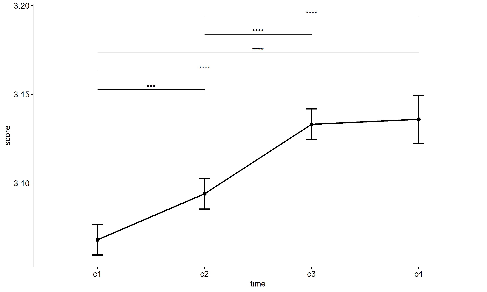<!-- -->

# ANOVA: score ~ time\*gender + Error(id/time)

## Data Preparation

``` r
data <- edat[,c("aluno_id","gender","ciclo","score")]
data <- data[data$ciclo %in% c("Primeiro Ciclo","Segundo Ciclo","Terceiro Ciclo","Quarto Ciclo"),]
data$ciclo <- factor(data$ciclo, c("Primeiro Ciclo","Segundo Ciclo","Terceiro Ciclo","Quarto Ciclo"))
data <- unique(data)

wdat <- spread(data, ciclo, score)
colnames(wdat) <- c("id","gender","c1","c2","c3","c4")
wdat <- wdat[complete.cases(wdat[,c("id","gender","c1","c2","c3")]),]

ldat <- gather(wdat, key = time, value = score, c1,c2,c3,c4) %>%
  convert_as_factor(id, time)
ldat <- remove_group_data(ldat, "score", c("time", "gender"), n.limit = 30)
ldat$gender <- factor(ldat$gender, sort(unique(ldat$gender)))
```

### Check assumptions: Identifying Outliers

``` r
outliers <- identify_outliers(group_by(ldat, time, gender), score)
(outliers <- outliers[outliers$is.extreme == T,])
```

    ## # A tibble: 37 × 6
    ##    gender time  id                   score is.outlier is.extreme
    ##    <fct>  <fct> <fct>                <dbl> <lgl>      <lgl>     
    ##  1 Female c1    iPWgss5n5My8lpksQ1nX   4   TRUE       TRUE      
    ##  2 Female c1    Ru3SPRo97iXBvXbvneKh   4   TRUE       TRUE      
    ##  3 Female c1    vc8pPoYau2AIAuCQJipW   4   TRUE       TRUE      
    ##  4 Female c1    wefcYCTqKwxh8S4qGLoI   3.9 TRUE       TRUE      
    ##  5 Female c1    Xq3402VdKr7fuvkfZchf   3.9 TRUE       TRUE      
    ##  6 Male   c1    0w3VhiMf67CbcpR6aZCL   4   TRUE       TRUE      
    ##  7 Male   c1    1Z1Qz8zDaMkaAz1Ah80K   4   TRUE       TRUE      
    ##  8 Male   c1    D1HfJKTVqjrpCJx97l3v   3.9 TRUE       TRUE      
    ##  9 Male   c1    PqW3vWjH69npz9vqggMX   4   TRUE       TRUE      
    ## 10 Male   c1    uCBI6gnllsawWJlgqkr5   4   TRUE       TRUE      
    ## # ℹ 27 more rows

| gender | time | id                   | score | is.outlier | is.extreme |
|:-------|:-----|:---------------------|------:|:-----------|:-----------|
| Female | c1   | iPWgss5n5My8lpksQ1nX |   4.0 | TRUE       | TRUE       |
| Female | c1   | Ru3SPRo97iXBvXbvneKh |   4.0 | TRUE       | TRUE       |
| Female | c1   | vc8pPoYau2AIAuCQJipW |   4.0 | TRUE       | TRUE       |
| Female | c1   | wefcYCTqKwxh8S4qGLoI |   3.9 | TRUE       | TRUE       |
| Female | c1   | Xq3402VdKr7fuvkfZchf |   3.9 | TRUE       | TRUE       |
| Male   | c1   | 0w3VhiMf67CbcpR6aZCL |   4.0 | TRUE       | TRUE       |
| Male   | c1   | 1Z1Qz8zDaMkaAz1Ah80K |   4.0 | TRUE       | TRUE       |
| Male   | c1   | D1HfJKTVqjrpCJx97l3v |   3.9 | TRUE       | TRUE       |
| Male   | c1   | PqW3vWjH69npz9vqggMX |   4.0 | TRUE       | TRUE       |
| Male   | c1   | uCBI6gnllsawWJlgqkr5 |   4.0 | TRUE       | TRUE       |
| Female | c2   | oGUJyWRMYYbF9PNegJZh |   4.0 | TRUE       | TRUE       |
| Female | c2   | X8eOpiPuKfI4GXxjOsOM |   4.0 | TRUE       | TRUE       |
| Male   | c2   | cuknOzzwN4oCRum5U5ph |   4.2 | TRUE       | TRUE       |
| Male   | c2   | HsQF2J0r79mHSWNe4l6n |   4.0 | TRUE       | TRUE       |
| Male   | c2   | j31LU8Xwm0EQ7Mihkhjj |   4.0 | TRUE       | TRUE       |
| Male   | c2   | z3p6Ot4uvkPmGXOS9D3e |   4.0 | TRUE       | TRUE       |
| Male   | c2   | ZbfrKhrqRpZ0ISt57sPn |   4.0 | TRUE       | TRUE       |
| Female | c3   | 6bEKmKQpOuvY6PSQvzqj |   4.2 | TRUE       | TRUE       |
| Female | c3   | 7pR91qd7LX1X2Chwr4xQ |   4.0 | TRUE       | TRUE       |
| Female | c3   | CCVIt7MPeYMUOCCyBxPh |   4.2 | TRUE       | TRUE       |
| Female | c3   | cOCdJff1IOVxOznhBCWn |   4.0 | TRUE       | TRUE       |
| Female | c3   | HM6lELrDJUQlU8CLhlxB |   4.0 | TRUE       | TRUE       |
| Female | c3   | i5EZ8Ck9IgDueyMbw55v |   4.2 | TRUE       | TRUE       |
| Female | c3   | m5yRlxfIj73j4ossfTOB |   4.2 | TRUE       | TRUE       |
| Female | c3   | mbcncvg5dOFa9ZRsRhZf |   4.2 | TRUE       | TRUE       |
| Female | c3   | OvwAQTWkdj8SYpPS8dgn |   4.0 | TRUE       | TRUE       |
| Female | c3   | Pj0bkt0GAUBSA1FoPcc2 |   4.2 | TRUE       | TRUE       |
| Female | c3   | PwZy7Lbc45vuNd5du72A |   4.2 | TRUE       | TRUE       |
| Female | c3   | RkRJsrzuZjQPcgr9Bu7D |   4.0 | TRUE       | TRUE       |
| Female | c3   | xADstL8Txh6OaomMZXC4 |   4.0 | TRUE       | TRUE       |
| Male   | c3   | 1uixvrMfKulaomVh0MKa |   4.0 | TRUE       | TRUE       |
| Male   | c3   | 8edbRBvoAhVAiLZ3h3E2 |   4.2 | TRUE       | TRUE       |
| Male   | c3   | G1fSZJ6Ea4VhHH2OjGQ3 |   4.0 | TRUE       | TRUE       |
| Female | c4   | DP1fbT1lGhLiBnOFILLi |   4.0 | TRUE       | TRUE       |
| Female | c4   | fgNBRPWfCa0TP4bDO8d2 |   4.0 | TRUE       | TRUE       |
| Female | c4   | kFvRH3RtPD461qVG04iW |   4.0 | TRUE       | TRUE       |
| Female | c4   | PZJ6CleqURERCau51lXu |   3.9 | TRUE       | TRUE       |

### Check assumptions: Normality Test

``` r
(normality.df <- get.descriptives(ldat, "score", c("time", "gender"), symmetry.test = T, normality.test = T))
```

    ##   time gender variable    n  mean median min max    sd    se    ci iqr symmetry
    ## 1   c1 Female    score 1363 3.070    3.0 2.4 4.0 0.204 0.006 0.011 0.2       NO
    ## 2   c1   Male    score 1240 3.069    3.0 2.4 4.0 0.211 0.006 0.012 0.2       NO
    ## 3   c2 Female    score 1363 3.096    3.0 2.6 4.0 0.227 0.006 0.012 0.2       NO
    ## 4   c2   Male    score 1240 3.088    3.0 2.4 4.2 0.225 0.006 0.013 0.2       NO
    ## 5   c3 Female    score 1363 3.137    3.1 2.4 4.2 0.260 0.007 0.014 0.2       NO
    ## 6   c3   Male    score 1240 3.130    3.1 2.4 4.2 0.247 0.007 0.014 0.2       NO
    ## 7   c4 Female    score  552 3.149    3.1 2.6 4.0 0.260 0.011 0.022 0.2     <NA>
    ## 8   c4   Male    score  513 3.115    3.0 2.6 3.8 0.241 0.011 0.021 0.2     <NA>
    ##    skewness  kurtosis normality     method statistic  p p.signif
    ## 1 0.6241834 1.7055645         - D'Agostino  132.0179  0     ****
    ## 2 0.7150670 2.0178733         - D'Agostino  149.3097  0     ****
    ## 3 0.8833417 1.4736466         - D'Agostino  182.1690  0     ****
    ## 4 0.7911716 1.8127776         - D'Agostino  158.1772  0     ****
    ## 5 1.0496518 1.6520949         - D'Agostino  229.8194  0     ****
    ## 6 0.7980406 0.7998421         - D'Agostino  123.8946  0     ****
    ## 7        NA        NA      <NA>       <NA>        NA NA     <NA>
    ## 8        NA        NA      <NA>       <NA>        NA NA     <NA>

| time | gender | variable |    n |  mean | median | min | max |    sd |    se |    ci | iqr | symmetry | skewness | kurtosis | normality | method     | statistic |   p | p.signif |
|:-----|:-------|:---------|-----:|------:|-------:|----:|----:|------:|------:|------:|----:|:---------|---------:|---------:|:----------|:-----------|----------:|----:|:---------|
| c1   | Female | score    | 1363 | 3.070 |    3.0 | 2.4 | 4.0 | 0.204 | 0.006 | 0.011 | 0.2 | NO       |    0.624 |    1.706 | \-        | D’Agostino |   132.018 |   0 | \*\*\*\* |
| c1   | Male   | score    | 1240 | 3.069 |    3.0 | 2.4 | 4.0 | 0.211 | 0.006 | 0.012 | 0.2 | NO       |    0.715 |    2.018 | \-        | D’Agostino |   149.310 |   0 | \*\*\*\* |
| c2   | Female | score    | 1363 | 3.096 |    3.0 | 2.6 | 4.0 | 0.227 | 0.006 | 0.012 | 0.2 | NO       |    0.883 |    1.474 | \-        | D’Agostino |   182.169 |   0 | \*\*\*\* |
| c2   | Male   | score    | 1240 | 3.088 |    3.0 | 2.4 | 4.2 | 0.225 | 0.006 | 0.013 | 0.2 | NO       |    0.791 |    1.813 | \-        | D’Agostino |   158.177 |   0 | \*\*\*\* |
| c3   | Female | score    | 1363 | 3.137 |    3.1 | 2.4 | 4.2 | 0.260 | 0.007 | 0.014 | 0.2 | NO       |    1.050 |    1.652 | \-        | D’Agostino |   229.819 |   0 | \*\*\*\* |
| c3   | Male   | score    | 1240 | 3.130 |    3.1 | 2.4 | 4.2 | 0.247 | 0.007 | 0.014 | 0.2 | NO       |    0.798 |    0.800 | \-        | D’Agostino |   123.895 |   0 | \*\*\*\* |
| c4   | Female | score    |  552 | 3.149 |    3.1 | 2.6 | 4.0 | 0.260 | 0.011 | 0.022 | 0.2 | NA       |       NA |       NA | NA        | NA         |        NA |  NA | NA       |
| c4   | Male   | score    |  513 | 3.115 |    3.0 | 2.6 | 3.8 | 0.241 | 0.011 | 0.021 | 0.2 | NA       |       NA |       NA | NA        | NA         |        NA |  NA | NA       |

``` r
(non.ids <- unique(do.call(
  c, lapply(which(normality.df$normality == 'NO'), FUN = function(i) {
  idx = which(ldat$time == normality.df$time[i] &
                ldat$gender == normality.df$gender[i])
  getNonNormal(ldat$"score"[idx], ldat$id[idx])
}))))
```

    ## NULL

``` r
if (length(non.ids) > 0)
  ldat2 <- ldat[!ldat$id %in% non.ids,]
```

### Summary Statistics

``` r
(sdat <- ldat %>% group_by(time, gender) %>%
   get_summary_stats(score, type = "mean_sd"))
```

    ## # A tibble: 8 × 6
    ##   gender time  variable     n  mean    sd
    ##   <fct>  <fct> <fct>    <dbl> <dbl> <dbl>
    ## 1 Female c1    score     1363  3.07 0.204
    ## 2 Male   c1    score     1240  3.07 0.211
    ## 3 Female c2    score     1363  3.10 0.227
    ## 4 Male   c2    score     1240  3.09 0.225
    ## 5 Female c3    score     1363  3.14 0.26 
    ## 6 Male   c3    score     1240  3.13 0.247
    ## 7 Female c4    score      552  3.15 0.26 
    ## 8 Male   c4    score      513  3.12 0.241

| gender | time | variable |    n |  mean |    sd |
|:-------|:-----|:---------|-----:|------:|------:|
| Female | c1   | score    | 1363 | 3.070 | 0.204 |
| Male   | c1   | score    | 1240 | 3.069 | 0.211 |
| Female | c2   | score    | 1363 | 3.096 | 0.227 |
| Male   | c2   | score    | 1240 | 3.088 | 0.225 |
| Female | c3   | score    | 1363 | 3.137 | 0.260 |
| Male   | c3   | score    | 1240 | 3.130 | 0.247 |
| Female | c4   | score    |  552 | 3.149 | 0.260 |
| Male   | c4   | score    |  513 | 3.115 | 0.241 |

``` r
if (length(non.ids) > 0)
  (sdat <- ldat2 %>% group_by(time, gender) %>%
      get_summary_stats(score, type = "mean_sd"))
```

| gender | time | variable |    n |  mean |    sd |
|:-------|:-----|:---------|-----:|------:|------:|
| Female | c1   | score    | 1363 | 3.070 | 0.204 |
| Male   | c1   | score    | 1240 | 3.069 | 0.211 |
| Female | c2   | score    | 1363 | 3.096 | 0.227 |
| Male   | c2   | score    | 1240 | 3.088 | 0.225 |
| Female | c3   | score    | 1363 | 3.137 | 0.260 |
| Male   | c3   | score    | 1240 | 3.130 | 0.247 |
| Female | c4   | score    |  552 | 3.149 | 0.260 |
| Male   | c4   | score    |  513 | 3.115 | 0.241 |

## ANOVA Computation

``` r
(res.aov <- anova_test(ldat, dv = score, wid = id, between = gender, within = time))
```

    ## Warning: NA detected in rows: 7812,7814,7815,7821,7822,7824,7826,7827,7829,7830,7831,7832,7836,7837,7839,7840,7841,7845,7846,7848,7849,7851,7856,7857,7861,7862,7863,7870,7871,7877,7878,7880,7882,7884,7885,7887,7889,7893,7894,7897,7898,7899,7901,7904,7909,7912,7914,7915,7916,7918,7919,7926,7927,7928,7930,7933,7934,7935,7937,7938,7940,7942,7943,7948,7949,7950,7951,7952,7953,7957,7958,7960,7961,7963,7965,7968,7970,7971,7972,7973,7974,7976,7977,7979,7980,7982,7983,7986,7990,7991,7994,7995,7996,7999,8001,8002,8005,8007,8008,8009,8010,8011,8012,8013,8016,8018,8019,8024,8027,8029,8030,8033,8034,8037,8039,8042,8044,8046,8047,8048,8051,8053,8056,8057,8058,8060,8067,8068,8069,8070,8075,8078,8079,8081,8082,8083,8084,8085,8086,8090,8095,8100,8103,8105,8107,8109,8111,8112,8114,8115,8116,8118,8119,8121,8124,8126,8127,8128,8129,8130,8131,8134,8135,8136,8137,8138,8140,8141,8142,8144,8146,8147,8149,8153,8158,8160,8161,8162,8164,8167,8168,8169,8171,8172,8173,8174,8178,8180,8181,8182,8183,8185,8186,8187,8188,8189,8190,8191,8192,8193,8194,8196,8197,8199,8200,8201,8202,8203,8205,8206,8207,8208,8210,8211,8213,8214,8215,8217,8219,8221,8222,8223,8224,8225,8228,8229,8230,8231,8233,8234,8236,8238,8239,8240,8242,8243,8244,8245,8246,8248,8252,8253,8254,8255,8256,8259,8260,8261,8264,8266,8267,8269,8273,8274,8275,8276,8277,8279,8284,8287,8288,8289,8291,8292,8294,8295,8297,8298,8299,8300,8301,8302,8303,8304,8305,8307,8311,8312,8313,8315,8317,8320,8324,8326,8327,8329,8331,8333,8334,8335,8337,8338,8339,8340,8341,8343,8345,8346,8347,8348,8349,8350,8352,8353,8354,8356,8357,8358,8359,8366,8367,8369,8370,8372,8375,8380,8381,8383,8384,8385,8386,8387,8389,8391,8392,8393,8395,8396,8397,8398,8400,8403,8404,8405,8406,8407,8408,8410,8412,8414,8415,8416,8418,8419,8420,8421,8423,8424,8425,8427,8428,8432,8435,8436,8440,8441,8444,8445,8446,8449,8450,8451,8452,8453,8454,8457,8459,8461,8467,8470,8474,8475,8476,8478,8479,8480,8482,8488,8489,8490,8492,8493,8497,8500,8503,8504,8507,8509,8513,8517,8518,8521,8522,8523,8525,8526,8527,8528,8529,8530,8531,8532,8533,8534,8535,8537,8543,8546,8548,8549,8550,8551,8552,8555,8556,8557,8560,8563,8568,8569,8571,8572,8573,8575,8577,8578,8580,8582,8584,8585,8586,8587,8590,8592,8593,8594,8595,8596,8599,8600,8601,8602,8603,8604,8605,8606,8607,8609,8611,8614,8616,8618,8619,8620,8622,8623,8624,8625,8626,8627,8628,8629,8630,8631,8634,8635,8638,8640,8641,8645,8646,8648,8649,8652,8655,8659,8660,8661,8662,8663,8664,8665,8667,8668,8669,8670,8671,8672,8673,8674,8675,8677,8678,8681,8682,8683,8684,8685,8686,8687,8688,8689,8691,8692,8697,8698,8700,8701,8702,8703,8704,8706,8707,8708,8709,8715,8716,8718,8723,8724,8726,8727,8729,8730,8731,8732,8733,8736,8738,8739,8743,8745,8748,8749,8750,8752,8753,8754,8755,8758,8760,8763,8765,8768,8770,8772,8774,8775,8777,8781,8782,8785,8786,8788,8789,8791,8795,8796,8799,8800,8801,8802,8808,8809,8810,8812,8813,8814,8815,8819,8820,8821,8823,8824,8825,8827,8828,8829,8832,8833,8834,8835,8836,8838,8839,8840,8841,8843,8844,8845,8849,8850,8852,8853,8855,8856,8857,8858,8859,8860,8861,8862,8863,8864,8865,8866,8869,8871,8872,8873,8877,8881,8884,8885,8886,8889,8890,8891,8892,8893,8894,8896,8898,8899,8901,8905,8906,8908,8910,8911,8912,8913,8916,8917,8919,8920,8921,8922,8924,8926,8927,8928,8929,8930,8931,8933,8934,8935,8936,8937,8939,8942,8943,8944,8946,8947,8956,8959,8961,8962,8963,8965,8966,8968,8969,8974,8977,8978,8982,8983,8985,8986,8990,8995,8996,8997,8998,8999,9000,9001,9004,9006,9008,9011,9012,9013,9019,9020,9021,9022,9024,9025,9027,9029,9031,9032,9034,9037,9039,9040,9042,9044,9051,9052,9054,9055,9057,9058,9061,9063,9065,9066,9067,9068,9070,9071,9072,9074,9076,9078,9081,9082,9084,9085,9091,9093,9096,9097,9098,9099,9100,9101,9102,9104,9106,9108,9109,9110,9111,9113,9114,9115,9116,9117,9120,9122,9124,9125,9126,9127,9129,9130,9132,9134,9135,9137,9138,9139,9140,9141,9142,9144,9146,9147,9148,9149,9151,9154,9155,9156,9157,9158,9159,9162,9164,9165,9167,9168,9172,9173,9174,9175,9182,9183,9184,9186,9187,9190,9194,9198,9200,9201,9202,9203,9204,9205,9206,9208,9209,9210,9211,9212,9213,9214,9215,9216,9217,9219,9220,9222,9225,9226,9227,9228,9229,9230,9231,9232,9233,9235,9236,9237,9238,9239,9240,9241,9242,9243,9244,9245,9246,9247,9249,9251,9252,9253,9256,9262,9264,9267,9268,9269,9270,9271,9272,9276,9277,9279,9281,9282,9285,9286,9287,9289,9290,9291,9292,9293,9294,9296,9299,9300,9301,9303,9306,9310,9311,9312,9314,9316,9317,9319,9320,9321,9322,9323,9324,9325,9326,9327,9328,9329,9330,9333,9334,9337,9340,9341,9342,9344,9347,9349,9350,9351,9352,9355,9356,9357,9360,9361,9362,9364,9365,9367,9369,9370,9371,9374,9375,9377,9378,9380,9381,9384,9385,9388,9390,9391,9393,9394,9397,9401,9402,9403,9404,9406,9407,9409,9410,9411,9412,9417,9418,9420,9421,9424,9425,9426,9427,9428,9432,9433,9434,9435,9436,9437,9439,9440,9443,9444,9446,9447,9448,9449,9451,9452,9453,9454,9455,9457,9458,9459,9460,9461,9463,9464,9467,9468,9472,9474,9475,9476,9477,9478,9480,9481,9482,9484,9485,9486,9487,9489,9490,9491,9492,9495,9497,9498,9499,9500,9501,9504,9506,9507,9508,9510,9512,9515,9517,9521,9522,9523,9527,9528,9529,9532,9533,9534,9535,9536,9537,9538,9540,9541,9542,9544,9545,9546,9548,9549,9550,9551,9553,9555,9556,9557,9558,9560,9564,9566,9567,9568,9571,9572,9573,9576,9577,9578,9580,9581,9585,9586,9588,9589,9591,9592,9593,9594,9595,9596,9597,9598,9603,9604,9605,9609,9613,9614,9618,9619,9620,9621,9622,9623,9625,9626,9628,9630,9632,9633,9634,9635,9636,9639,9642,9644,9646,9649,9652,9654,9657,9658,9659,9660,9662,9664,9665,9666,9667,9672,9673,9674,9677,9678,9679,9680,9683,9684,9685,9687,9688,9689,9690,9691,9692,9693,9696,9697,9698,9699,9704,9707,9708,9709,9712,9716,9717,9718,9719,9720,9721,9722,9723,9725,9727,9728,9729,9730,9731,9733,9734,9735,9736,9743,9744,9746,9748,9753,9754,9756,9757,9758,9760,9762,9763,9764,9765,9768,9769,9772,9773,9774,9780,9781,9785,9786,9787,9790,9791,9792,9793,9794,9798,9800,9802,9803,9804,9805,9806,9808,9810,9811,9812,9816,9818,9819,9820,9821,9822,9825,9826,9828,9829,9830,9831,9833,9834,9836,9839,9840,9844,9845,9846,9847,9848,9849,9850,9851,9852,9853,9856,9861,9863,9864,9865,9866,9867,9868,9870,9872,9873,9876,9877,9878,9879,9880,9882,9885,9888,9889,9890,9895,9896,9898,9899,9900,9901,9902,9903,9904,9905,9906,9908,9910,9911,9912,9913,9914,9916,9917,9918,9919,9920,9921,9923,9925,9927,9929,9931,9933,9934,9935,9937,9938,9940,9941,9942,9944,9945,9946,9947,9948,9950,9951,9952,9954,9956,9958,9959,9962,9963,9965,9966,9969,9970,9972,9973,9975,9977,9978,9979,9980,9981,9982,9984,9988,9990,9993,9996,10000,10001,10003,10004,10005,10006,10008,10009,10010,10011,10012,10015,10016,10019,10020,10021,10023,10026,10028,10029,10030,10031,10036,10038,10039,10044,10047,10049,10051,10052,10053,10054,10055,10061,10063,10064,10065,10066,10067,10070,10072,10073,10074,10075,10077,10078,10081,10082,10085,10086,10087,10088,10089,10092,10093,10094,10096,10098,10099,10101,10102,10103,10104,10105,10110,10113,10115,10117,10118,10119,10122,10125,10126,10127,10130,10131,10132,10133,10135,10136,10137,10138,10139,10140,10141,10142,10143,10145,10146,10149,10153,10155,10157,10158,10160,10161,10163,10166,10167,10169,10171,10172,10174,10176,10177,10178,10182,10183,10184,10188,10189,10190,10191,10192,10193,10194,10196,10197,10199,10200,10201,10203,10204,10210,10211,10213,10214,10215,10220,10222,10223,10224,10226,10227,10230,10231,10232,10235,10236,10237,10239,10240,10243,10244,10245,10246,10247,10248,10251,10252,10256,10257,10258,10259,10260,10264,10266,10270,10271,10275,10276,10278,10279,10280,10283,10284,10285,10286,10287,10289,10290,10291,10292,10293,10297,10299,10301,10302,10304,10305,10306,10307,10308,10309,10310,10311,10313,10314,10315,10316,10318,10319,10325,10326,10327,10328,10330,10335,10336,10337,10340,10342,10344,10346,10347,10348,10349,10351,10352,10353,10354,10355,10356,10357,10359,10362,10363,10364,10366,10369,10370,10371,10372,10374,10378,10379,10380,10381,10382,10385,10387,10388,10389,10390,10391,10392,10393,10395,10397,10399,10400,10401,10402,10403,10407,10408,10409,10411,10412.
    ## Removing this rows before the analysis.

    ## ANOVA Table (type III tests)
    ## 
    ## $ANOVA
    ##        Effect DFn  DFd      F        p p<.05      ges
    ## 1      gender   1 1063  1.553 2.13e-01       0.000439
    ## 2        time   3 3189 26.585 5.59e-17     * 0.017000
    ## 3 gender:time   3 3189  1.783 1.48e-01       0.001000
    ## 
    ## $`Mauchly's Test for Sphericity`
    ##        Effect     W     p p<.05
    ## 1        time 0.984 0.005     *
    ## 2 gender:time 0.984 0.005     *
    ## 
    ## $`Sphericity Corrections`
    ##        Effect  GGe     DF[GG]    p[GG] p[GG]<.05   HFe        DF[HF]    p[HF]
    ## 1        time 0.99 2.97, 3157 7.81e-17         * 0.993 2.98, 3166.82 7.05e-17
    ## 2 gender:time 0.99 2.97, 3157 1.49e-01           0.993 2.98, 3166.82 1.49e-01
    ##   p[HF]<.05
    ## 1         *
    ## 2

| Effect      | DFn |  DFd |      F |     p | p\<.05 |   ges |
|:------------|----:|-----:|-------:|------:|:-------|------:|
| gender      |   1 | 1063 |  1.553 | 0.213 |        | 0.000 |
| time        |   3 | 3189 | 26.585 | 0.000 | \*     | 0.017 |
| gender:time |   3 | 3189 |  1.783 | 0.148 |        | 0.001 |

| Effect      |     W |     p | p\<.05 |
|:------------|------:|------:|:-------|
| time        | 0.984 | 0.005 | \*     |
| gender:time | 0.984 | 0.005 | \*     |

| Effect      |  GGe | DF\[GG\]   | p\[GG\] | p\[GG\]\<.05 |   HFe | DF\[HF\]      | p\[HF\] | p\[HF\]\<.05 |
|:------------|-----:|:-----------|--------:|:-------------|------:|:--------------|--------:|:-------------|
| time        | 0.99 | 2.97, 3157 |   0.000 | \*           | 0.993 | 2.98, 3166.82 |   0.000 | \*           |
| gender:time | 0.99 | 2.97, 3157 |   0.149 |              | 0.993 | 2.98, 3166.82 |   0.149 |              |

## ANOVA Computation after removing non.normal data

``` r
if (length(non.ids) > 0)
  (res.aov2 <- anova_test(ldat2, dv = score, wid = id, between = gender , within = time))
```

## PairWise Computation

``` r
(pwc <- ldat %>% group_by(time) %>%
   emmeans_test(score ~ gender, detailed = T, p.adjust.method = "bonferroni"))
```

    ## # A tibble: 4 × 15
    ##   time  term   .y.   group1 group2 null.value estimate      se    df conf.low
    ## * <fct> <chr>  <chr> <chr>  <chr>       <dbl>    <dbl>   <dbl> <dbl>    <dbl>
    ## 1 c1    gender score Female Male            0 0.000896 0.00912  8866 -0.0170 
    ## 2 c2    gender score Female Male            0 0.00743  0.00912  8866 -0.0105 
    ## 3 c3    gender score Female Male            0 0.00699  0.00912  8866 -0.0109 
    ## 4 c4    gender score Female Male            0 0.0341   0.0143   8866  0.00613
    ## # ℹ 5 more variables: conf.high <dbl>, statistic <dbl>, p <dbl>, p.adj <dbl>,
    ## #   p.adj.signif <chr>

| time | term   | .y.   | group1 | group2 | null.value | estimate |    se |   df | conf.low | conf.high | statistic |     p | p.adj | p.adj.signif |
|:-----|:-------|:------|:-------|:-------|-----------:|---------:|------:|-----:|---------:|----------:|----------:|------:|------:|:-------------|
| c1   | gender | score | Female | Male   |          0 |    0.001 | 0.009 | 8866 |   -0.017 |     0.019 |     0.098 | 0.922 | 0.922 | ns           |
| c2   | gender | score | Female | Male   |          0 |    0.007 | 0.009 | 8866 |   -0.010 |     0.025 |     0.814 | 0.416 | 0.416 | ns           |
| c3   | gender | score | Female | Male   |          0 |    0.007 | 0.009 | 8866 |   -0.011 |     0.025 |     0.767 | 0.443 | 0.443 | ns           |
| c4   | gender | score | Female | Male   |          0 |    0.034 | 0.014 | 8866 |    0.006 |     0.062 |     2.390 | 0.017 | 0.017 | \*           |

``` r
(emms <- get_emmeans(pwc))
```

    ## # A tibble: 8 × 8
    ##   time  gender emmean      se    df conf.low conf.high method      
    ##   <fct> <fct>   <dbl>   <dbl> <dbl>    <dbl>     <dbl> <chr>       
    ## 1 c1    Female   3.07 0.00630  8866     3.06      3.08 Emmeans test
    ## 2 c1    Male     3.07 0.00660  8866     3.06      3.08 Emmeans test
    ## 3 c2    Female   3.10 0.00630  8866     3.08      3.11 Emmeans test
    ## 4 c2    Male     3.09 0.00660  8866     3.08      3.10 Emmeans test
    ## 5 c3    Female   3.14 0.00630  8866     3.12      3.15 Emmeans test
    ## 6 c3    Male     3.13 0.00660  8866     3.12      3.14 Emmeans test
    ## 7 c4    Female   3.15 0.00989  8866     3.13      3.17 Emmeans test
    ## 8 c4    Male     3.12 0.0103   8866     3.10      3.14 Emmeans test

| time | gender | emmean |    se |   df | conf.low | conf.high | method       |
|:-----|:-------|-------:|------:|-----:|---------:|----------:|:-------------|
| c1   | Female |  3.070 | 0.006 | 8866 |    3.058 |     3.082 | Emmeans test |
| c1   | Male   |  3.069 | 0.007 | 8866 |    3.056 |     3.082 | Emmeans test |
| c2   | Female |  3.096 | 0.006 | 8866 |    3.083 |     3.108 | Emmeans test |
| c2   | Male   |  3.088 | 0.007 | 8866 |    3.075 |     3.101 | Emmeans test |
| c3   | Female |  3.137 | 0.006 | 8866 |    3.125 |     3.149 | Emmeans test |
| c3   | Male   |  3.130 | 0.007 | 8866 |    3.117 |     3.143 | Emmeans test |
| c4   | Female |  3.149 | 0.010 | 8866 |    3.130 |     3.169 | Emmeans test |
| c4   | Male   |  3.115 | 0.010 | 8866 |    3.095 |     3.135 | Emmeans test |

``` r
pwc <- add_xy_position(pwc, x = "time", fun = "mean_se", dodge = 0.25)
pd <- position_dodge(width = 0.25)
ggline(emms, x = "time", y = "emmean", color = "gender", size = 1,
       palette = c("#FF007F","#4D4DFF"),
       position = pd, ylab = "score") +
  geom_errorbar(aes(ymin = conf.low, ymax = conf.high, color = gender),
                position = pd, width = 0.1, linewidth = 1) +
  stat_pvalue_manual(pwc, hide.ns = T, tip.length = F, linetype = 1)
```

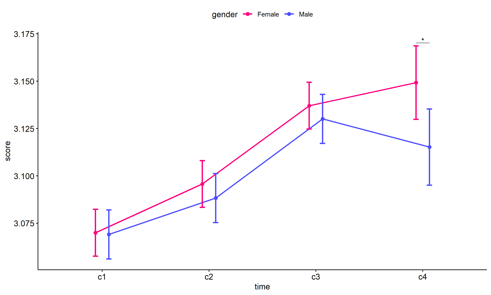<!-- -->

``` r
(pwc <- ldat %>% group_by(gender) %>%
    emmeans_test(score ~ time, detailed = T, p.adjust.method = "bonferroni"))
```

    ## # A tibble: 12 × 15
    ##    gender term  .y.   group1 group2 null.value estimate      se    df conf.low
    ##  * <fct>  <chr> <chr> <chr>  <chr>       <dbl>    <dbl>   <dbl> <dbl>    <dbl>
    ##  1 Female time  score c1     c2              0  -0.0258 0.00890  8866 -0.0432 
    ##  2 Female time  score c1     c3              0  -0.0671 0.00890  8866 -0.0846 
    ##  3 Female time  score c1     c4              0  -0.0793 0.0117   8866 -0.102  
    ##  4 Female time  score c2     c3              0  -0.0414 0.00890  8866 -0.0588 
    ##  5 Female time  score c2     c4              0  -0.0536 0.0117   8866 -0.0765 
    ##  6 Female time  score c3     c4              0  -0.0122 0.0117   8866 -0.0352 
    ##  7 Male   time  score c1     c2              0  -0.0192 0.00933  8866 -0.0375 
    ##  8 Male   time  score c1     c3              0  -0.0610 0.00933  8866 -0.0793 
    ##  9 Male   time  score c1     c4              0  -0.0461 0.0122   8866 -0.0701 
    ## 10 Male   time  score c2     c3              0  -0.0418 0.00933  8866 -0.0601 
    ## 11 Male   time  score c2     c4              0  -0.0269 0.0122   8866 -0.0508 
    ## 12 Male   time  score c3     c4              0   0.0149 0.0122   8866 -0.00904
    ## # ℹ 5 more variables: conf.high <dbl>, statistic <dbl>, p <dbl>, p.adj <dbl>,
    ## #   p.adj.signif <chr>

| gender | term | .y.   | group1 | group2 | null.value | estimate |    se |   df | conf.low | conf.high | statistic |     p | p.adj | p.adj.signif |
|:-------|:-----|:------|:-------|:-------|-----------:|---------:|------:|-----:|---------:|----------:|----------:|------:|------:|:-------------|
| Female | time | score | c1     | c2     |          0 |   -0.026 | 0.009 | 8866 |   -0.043 |    -0.008 |    -2.892 | 0.004 | 0.023 | \*           |
| Female | time | score | c1     | c3     |          0 |   -0.067 | 0.009 | 8866 |   -0.085 |    -0.050 |    -7.537 | 0.000 | 0.000 | \*\*\*\*     |
| Female | time | score | c1     | c4     |          0 |   -0.079 | 0.012 | 8866 |   -0.102 |    -0.056 |    -6.763 | 0.000 | 0.000 | \*\*\*\*     |
| Female | time | score | c2     | c3     |          0 |   -0.041 | 0.009 | 8866 |   -0.059 |    -0.024 |    -4.645 | 0.000 | 0.000 | \*\*\*\*     |
| Female | time | score | c2     | c4     |          0 |   -0.054 | 0.012 | 8866 |   -0.077 |    -0.031 |    -4.567 | 0.000 | 0.000 | \*\*\*\*     |
| Female | time | score | c3     | c4     |          0 |   -0.012 | 0.012 | 8866 |   -0.035 |     0.011 |    -1.040 | 0.298 | 1.000 | ns           |
| Male   | time | score | c1     | c2     |          0 |   -0.019 | 0.009 | 8866 |   -0.038 |    -0.001 |    -2.059 | 0.040 | 0.237 | ns           |
| Male   | time | score | c1     | c3     |          0 |   -0.061 | 0.009 | 8866 |   -0.079 |    -0.043 |    -6.536 | 0.000 | 0.000 | \*\*\*\*     |
| Male   | time | score | c1     | c4     |          0 |   -0.046 | 0.012 | 8866 |   -0.070 |    -0.022 |    -3.781 | 0.000 | 0.001 | \*\*\*       |
| Male   | time | score | c2     | c3     |          0 |   -0.042 | 0.009 | 8866 |   -0.060 |    -0.023 |    -4.477 | 0.000 | 0.000 | \*\*\*\*     |
| Male   | time | score | c2     | c4     |          0 |   -0.027 | 0.012 | 8866 |   -0.051 |    -0.003 |    -2.206 | 0.027 | 0.165 | ns           |
| Male   | time | score | c3     | c4     |          0 |    0.015 | 0.012 | 8866 |   -0.009 |     0.039 |     1.219 | 0.223 | 1.000 | ns           |

``` r
(emms <- get_emmeans(pwc))
```

    ## # A tibble: 8 × 8
    ##   gender time  emmean      se    df conf.low conf.high method      
    ##   <fct>  <fct>  <dbl>   <dbl> <dbl>    <dbl>     <dbl> <chr>       
    ## 1 Female c1      3.07 0.00630  8866     3.06      3.08 Emmeans test
    ## 2 Female c2      3.10 0.00630  8866     3.08      3.11 Emmeans test
    ## 3 Female c3      3.14 0.00630  8866     3.12      3.15 Emmeans test
    ## 4 Female c4      3.15 0.00989  8866     3.13      3.17 Emmeans test
    ## 5 Male   c1      3.07 0.00660  8866     3.06      3.08 Emmeans test
    ## 6 Male   c2      3.09 0.00660  8866     3.08      3.10 Emmeans test
    ## 7 Male   c3      3.13 0.00660  8866     3.12      3.14 Emmeans test
    ## 8 Male   c4      3.12 0.0103   8866     3.10      3.14 Emmeans test

| gender | time | emmean |    se |   df | conf.low | conf.high | method       |
|:-------|:-----|-------:|------:|-----:|---------:|----------:|:-------------|
| Female | c1   |  3.070 | 0.006 | 8866 |    3.058 |     3.082 | Emmeans test |
| Female | c2   |  3.096 | 0.006 | 8866 |    3.083 |     3.108 | Emmeans test |
| Female | c3   |  3.137 | 0.006 | 8866 |    3.125 |     3.149 | Emmeans test |
| Female | c4   |  3.149 | 0.010 | 8866 |    3.130 |     3.169 | Emmeans test |
| Male   | c1   |  3.069 | 0.007 | 8866 |    3.056 |     3.082 | Emmeans test |
| Male   | c2   |  3.088 | 0.007 | 8866 |    3.075 |     3.101 | Emmeans test |
| Male   | c3   |  3.130 | 0.007 | 8866 |    3.117 |     3.143 | Emmeans test |
| Male   | c4   |  3.115 | 0.010 | 8866 |    3.095 |     3.135 | Emmeans test |

``` r
emms.gg <- emms[which(emms$gender == "Female"),]
if (nrow(emms.gg) > 0)
  ggline(emms.gg, x = "time", y = "emmean", color = "#FF007F", ylab = "score", size = 1) +
    geom_errorbar(aes(ymin = conf.low, ymax = conf.high),
                  width = 0.1, color = "#FF007F", linewidth = 1) +
    stat_pvalue_manual(
      add_xy_position(pwc[which(pwc$gender == "Female"),],
                      x = "time", fun = "mean_se"),
      hide.ns = T, color = "#FF007F", tip.length = F) +
    theme(legend.text = element_blank())
```

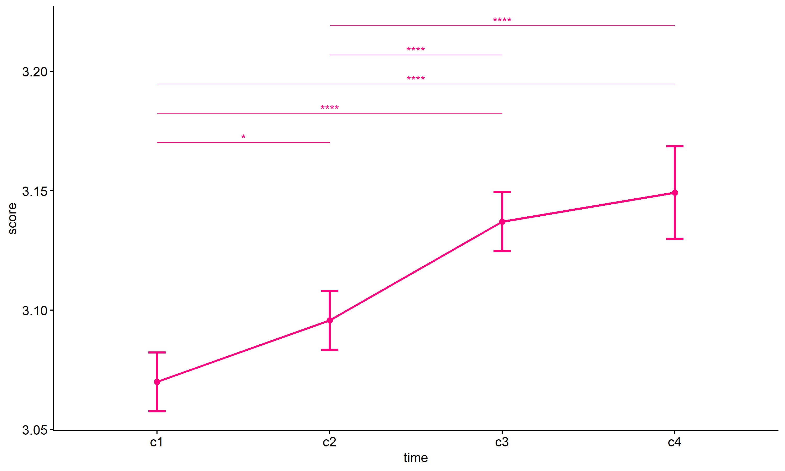<!-- -->

``` r
emms.gg <- emms[which(emms$gender == "Male"),]
if (nrow(emms.gg) > 0)
  ggline(emms.gg, x = "time", y = "emmean", color = "#4D4DFF", ylab = "score", size = 1) +
    geom_errorbar(aes(ymin = conf.low, ymax = conf.high),
                  width = 0.1, color = "#4D4DFF", linewidth = 1) +
    stat_pvalue_manual(
      add_xy_position(pwc[which(pwc$gender == "Male"),],
                      x = "time", fun = "mean_se"),
      hide.ns = T, color = "#4D4DFF", tip.length = F) +
    theme(legend.text = element_blank())
```

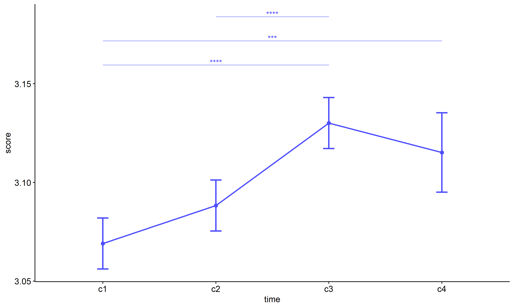<!-- -->

## PairWise Computation after removing non.normal data

``` r
if (length(non.ids) > 0)
  (pwc2 <- ldat2 %>% group_by(time) %>%
     emmeans_test(score ~ gender, detailed = T, p.adjust.method = "bonferroni"))
```

``` r
if (length(non.ids) > 0)
  (emms2 <- get_emmeans(pwc2))
```

``` r
if (length(non.ids) > 0) {
  pwc2 <- add_xy_position(pwc2, x = "time", fun = "mean_se", dodge = 0.25)
  pd2 <- position_dodge(width = 0.25)
  
  ggline(emms2, x = "time", y = "emmean", color = "gender", size = 1,
         palette = c("#FF007F","#4D4DFF"),
         position = pd, ylab = "score") +
    geom_errorbar(aes(ymin = conf.low, ymax = conf.high, color = gender),
                position = pd, width = 0.1, linewidth = 1) +
    stat_pvalue_manual(pwc2, hide.ns = T, tip.length = F, linetype = 1)
}
```

``` r
if (length(non.ids) > 0)
  (pwc2 <- ldat2 %>% group_by(gender) %>%
     emmeans_test(score ~ time, detailed = T, p.adjust.method = "bonferroni"))
```

``` r
if (length(non.ids) > 0)
  (emms2 <- get_emmeans(pwc2))
```

``` r
if (length(non.ids) > 0) {
  emms.gg <- emms2[which(emms2$gender == "Female"),]
  if (nrow(emms.gg) > 0)
    ggline(emms.gg, x = "time", y = "emmean", color = "#FF007F", ylab = "score", size = 1) +
    geom_errorbar(aes(ymin = conf.low, ymax = conf.high),
                  width = 0.1, color = "#FF007F", linewidth = 1) +
    stat_pvalue_manual(
      add_xy_position(pwc[which(pwc$gender == "Female"),],
                      x = "time", fun = "mean_se"),
      hide.ns = T, color = "#FF007F", tip.length = F) +
    theme(legend.text = element_blank())
}
```

``` r
if (length(non.ids) > 0) {
  emms.gg <- emms2[which(emms2$gender == "Male"),]
  if (nrow(emms.gg) > 0)
    ggline(emms.gg, x = "time", y = "emmean", color = "#4D4DFF", ylab = "score", size = 1) +
    geom_errorbar(aes(ymin = conf.low, ymax = conf.high),
                  width = 0.1, color = "#4D4DFF", linewidth =1 ) +
    stat_pvalue_manual(
      add_xy_position(pwc[which(pwc$gender == "Male"),],
                      x = "time", fun = "mean_se"),
      hide.ns = T, color = "#4D4DFF", tip.length = F) +
    theme(legend.text = element_blank())
}
```

# ANOVA: score ~ time\*localizacao + Error(id/time)

## Data Preparation

``` r
data <- edat[,c("aluno_id","localizacao","ciclo","score")]
data <- data[data$ciclo %in% c("Primeiro Ciclo","Segundo Ciclo","Terceiro Ciclo","Quarto Ciclo"),]
data$ciclo <- factor(data$ciclo, c("Primeiro Ciclo","Segundo Ciclo","Terceiro Ciclo","Quarto Ciclo"))
data <- unique(data)

wdat <- spread(data, ciclo, score)
colnames(wdat) <- c("id","localizacao","c1","c2","c3","c4")
wdat <- wdat[complete.cases(wdat[,c("id","localizacao","c1","c2","c3")]),]

ldat <- gather(wdat, key = time, value = score, c1,c2,c3,c4) %>%
  convert_as_factor(id, time)
ldat <- remove_group_data(ldat, "score", c("time", "localizacao"), n.limit = 30)
ldat$localizacao <- factor(ldat$localizacao, sort(unique(ldat$localizacao)))
```

### Check assumptions: Identifying Outliers

``` r
outliers <- identify_outliers(group_by(ldat, time, localizacao), score)
(outliers <- outliers[outliers$is.extreme == T,])
```

    ## # A tibble: 39 × 6
    ##    localizacao time  id                   score is.outlier is.extreme
    ##    <fct>       <fct> <fct>                <dbl> <lgl>      <lgl>     
    ##  1 Rural       c1    0w3VhiMf67CbcpR6aZCL   4   TRUE       TRUE      
    ##  2 Rural       c1    D1HfJKTVqjrpCJx97l3v   3.9 TRUE       TRUE      
    ##  3 Urbana      c1    1Z1Qz8zDaMkaAz1Ah80K   4   TRUE       TRUE      
    ##  4 Urbana      c1    iPWgss5n5My8lpksQ1nX   4   TRUE       TRUE      
    ##  5 Urbana      c1    PqW3vWjH69npz9vqggMX   4   TRUE       TRUE      
    ##  6 Urbana      c1    Ru3SPRo97iXBvXbvneKh   4   TRUE       TRUE      
    ##  7 Urbana      c1    uCBI6gnllsawWJlgqkr5   4   TRUE       TRUE      
    ##  8 Urbana      c1    vc8pPoYau2AIAuCQJipW   4   TRUE       TRUE      
    ##  9 Urbana      c1    wefcYCTqKwxh8S4qGLoI   3.9 TRUE       TRUE      
    ## 10 Urbana      c1    Xq3402VdKr7fuvkfZchf   3.9 TRUE       TRUE      
    ## # ℹ 29 more rows

| localizacao | time | id                   | score | is.outlier | is.extreme |
|:------------|:-----|:---------------------|------:|:-----------|:-----------|
| Rural       | c1   | 0w3VhiMf67CbcpR6aZCL |   4.0 | TRUE       | TRUE       |
| Rural       | c1   | D1HfJKTVqjrpCJx97l3v |   3.9 | TRUE       | TRUE       |
| Urbana      | c1   | 1Z1Qz8zDaMkaAz1Ah80K |   4.0 | TRUE       | TRUE       |
| Urbana      | c1   | iPWgss5n5My8lpksQ1nX |   4.0 | TRUE       | TRUE       |
| Urbana      | c1   | PqW3vWjH69npz9vqggMX |   4.0 | TRUE       | TRUE       |
| Urbana      | c1   | Ru3SPRo97iXBvXbvneKh |   4.0 | TRUE       | TRUE       |
| Urbana      | c1   | uCBI6gnllsawWJlgqkr5 |   4.0 | TRUE       | TRUE       |
| Urbana      | c1   | vc8pPoYau2AIAuCQJipW |   4.0 | TRUE       | TRUE       |
| Urbana      | c1   | wefcYCTqKwxh8S4qGLoI |   3.9 | TRUE       | TRUE       |
| Urbana      | c1   | Xq3402VdKr7fuvkfZchf |   3.9 | TRUE       | TRUE       |
| Rural       | c2   | X8eOpiPuKfI4GXxjOsOM |   4.0 | TRUE       | TRUE       |
| Rural       | c2   | z3p6Ot4uvkPmGXOS9D3e |   4.0 | TRUE       | TRUE       |
| Rural       | c2   | ZbfrKhrqRpZ0ISt57sPn |   4.0 | TRUE       | TRUE       |
| Urbana      | c2   | cuknOzzwN4oCRum5U5ph |   4.2 | TRUE       | TRUE       |
| Urbana      | c2   | HNgjkRedBh1UIBu01VKY |   4.0 | TRUE       | TRUE       |
| Urbana      | c2   | HsQF2J0r79mHSWNe4l6n |   4.0 | TRUE       | TRUE       |
| Urbana      | c2   | j31LU8Xwm0EQ7Mihkhjj |   4.0 | TRUE       | TRUE       |
| Urbana      | c2   | oGUJyWRMYYbF9PNegJZh |   4.0 | TRUE       | TRUE       |
| Rural       | c3   | mbcncvg5dOFa9ZRsRhZf |   4.2 | TRUE       | TRUE       |
| Rural       | c3   | Pj0bkt0GAUBSA1FoPcc2 |   4.2 | TRUE       | TRUE       |
| Rural       | c3   | PwZy7Lbc45vuNd5du72A |   4.2 | TRUE       | TRUE       |
| Rural       | c3   | xADstL8Txh6OaomMZXC4 |   4.0 | TRUE       | TRUE       |
| Urbana      | c3   | 1uixvrMfKulaomVh0MKa |   4.0 | TRUE       | TRUE       |
| Urbana      | c3   | 6bEKmKQpOuvY6PSQvzqj |   4.2 | TRUE       | TRUE       |
| Urbana      | c3   | 7pR91qd7LX1X2Chwr4xQ |   4.0 | TRUE       | TRUE       |
| Urbana      | c3   | 8edbRBvoAhVAiLZ3h3E2 |   4.2 | TRUE       | TRUE       |
| Urbana      | c3   | CCVIt7MPeYMUOCCyBxPh |   4.2 | TRUE       | TRUE       |
| Urbana      | c3   | cOCdJff1IOVxOznhBCWn |   4.0 | TRUE       | TRUE       |
| Urbana      | c3   | G1fSZJ6Ea4VhHH2OjGQ3 |   4.0 | TRUE       | TRUE       |
| Urbana      | c3   | HM6lELrDJUQlU8CLhlxB |   4.0 | TRUE       | TRUE       |
| Urbana      | c3   | i5EZ8Ck9IgDueyMbw55v |   4.2 | TRUE       | TRUE       |
| Urbana      | c3   | m5yRlxfIj73j4ossfTOB |   4.2 | TRUE       | TRUE       |
| Urbana      | c3   | OvwAQTWkdj8SYpPS8dgn |   4.0 | TRUE       | TRUE       |
| Urbana      | c3   | RkRJsrzuZjQPcgr9Bu7D |   4.0 | TRUE       | TRUE       |
| Rural       | c4   | 1OE4fvPj9Y2Q9Bnwr0xz |   4.0 | TRUE       | TRUE       |
| Rural       | c4   | fgNBRPWfCa0TP4bDO8d2 |   4.0 | TRUE       | TRUE       |
| Rural       | c4   | kFvRH3RtPD461qVG04iW |   4.0 | TRUE       | TRUE       |
| Urbana      | c4   | DP1fbT1lGhLiBnOFILLi |   4.0 | TRUE       | TRUE       |
| Urbana      | c4   | PZJ6CleqURERCau51lXu |   3.9 | TRUE       | TRUE       |

### Check assumptions: Normality Test

``` r
(normality.df <- get.descriptives(ldat, "score", c("time", "localizacao"), symmetry.test = T, normality.test = T))
```

    ##   time localizacao variable    n  mean median min max    sd    se    ci iqr
    ## 1   c1       Rural    score  656 3.069    3.0 2.6 4.0 0.186 0.007 0.014 0.2
    ## 2   c1      Urbana    score 2117 3.068    3.0 2.4 4.0 0.212 0.005 0.009 0.2
    ## 3   c2       Rural    score  656 3.095    3.0 2.6 4.0 0.228 0.009 0.018 0.2
    ## 4   c2      Urbana    score 2117 3.094    3.0 2.4 4.2 0.225 0.005 0.010 0.2
    ## 5   c3       Rural    score  656 3.138    3.0 2.6 4.2 0.270 0.011 0.021 0.2
    ## 6   c3      Urbana    score 2117 3.132    3.1 2.4 4.2 0.248 0.005 0.011 0.2
    ## 7   c4       Rural    score  181 3.154    3.1 2.6 4.0 0.262 0.019 0.038 0.2
    ## 8   c4      Urbana    score  945 3.132    3.1 2.6 4.0 0.251 0.008 0.016 0.2
    ##   symmetry  skewness  kurtosis normality     method statistic  p p.signif
    ## 1       NO 0.7543523 2.2363930         - D'Agostino  89.89246  0     ****
    ## 2       NO 0.6518604 1.7643597         - D'Agostino 215.14754  0     ****
    ## 3       NO 0.8062599 1.4196506         - D'Agostino  80.21930  0     ****
    ## 4       NO 0.8704172 1.7296233         - D'Agostino 290.44396  0     ****
    ## 5       NO 0.9360837 0.8935344         - D'Agostino  85.11633  0     ****
    ## 6       NO 0.9217803 1.4028629         - D'Agostino 290.30585  0     ****
    ## 7     <NA>        NA        NA      <NA>       <NA>        NA NA     <NA>
    ## 8     <NA>        NA        NA      <NA>       <NA>        NA NA     <NA>

| time | localizacao | variable |    n |  mean | median | min | max |    sd |    se |    ci | iqr | symmetry | skewness | kurtosis | normality | method     | statistic |   p | p.signif |
|:-----|:------------|:---------|-----:|------:|-------:|----:|----:|------:|------:|------:|----:|:---------|---------:|---------:|:----------|:-----------|----------:|----:|:---------|
| c1   | Rural       | score    |  656 | 3.069 |    3.0 | 2.6 | 4.0 | 0.186 | 0.007 | 0.014 | 0.2 | NO       |    0.754 |    2.236 | \-        | D’Agostino |    89.892 |   0 | \*\*\*\* |
| c1   | Urbana      | score    | 2117 | 3.068 |    3.0 | 2.4 | 4.0 | 0.212 | 0.005 | 0.009 | 0.2 | NO       |    0.652 |    1.764 | \-        | D’Agostino |   215.148 |   0 | \*\*\*\* |
| c2   | Rural       | score    |  656 | 3.095 |    3.0 | 2.6 | 4.0 | 0.228 | 0.009 | 0.018 | 0.2 | NO       |    0.806 |    1.420 | \-        | D’Agostino |    80.219 |   0 | \*\*\*\* |
| c2   | Urbana      | score    | 2117 | 3.094 |    3.0 | 2.4 | 4.2 | 0.225 | 0.005 | 0.010 | 0.2 | NO       |    0.870 |    1.730 | \-        | D’Agostino |   290.444 |   0 | \*\*\*\* |
| c3   | Rural       | score    |  656 | 3.138 |    3.0 | 2.6 | 4.2 | 0.270 | 0.011 | 0.021 | 0.2 | NO       |    0.936 |    0.894 | \-        | D’Agostino |    85.116 |   0 | \*\*\*\* |
| c3   | Urbana      | score    | 2117 | 3.132 |    3.1 | 2.4 | 4.2 | 0.248 | 0.005 | 0.011 | 0.2 | NO       |    0.922 |    1.403 | \-        | D’Agostino |   290.306 |   0 | \*\*\*\* |
| c4   | Rural       | score    |  181 | 3.154 |    3.1 | 2.6 | 4.0 | 0.262 | 0.019 | 0.038 | 0.2 | NA       |       NA |       NA | NA        | NA         |        NA |  NA | NA       |
| c4   | Urbana      | score    |  945 | 3.132 |    3.1 | 2.6 | 4.0 | 0.251 | 0.008 | 0.016 | 0.2 | NA       |       NA |       NA | NA        | NA         |        NA |  NA | NA       |

``` r
(non.ids <- unique(do.call(
  c, lapply(which(normality.df$normality == 'NO'), FUN = function(i) {
  idx = which(ldat$time == normality.df$time[i] &
                ldat$localizacao == normality.df$localizacao[i])
  getNonNormal(ldat$"score"[idx], ldat$id[idx])
}))))
```

    ## NULL

``` r
if (length(non.ids) > 0)
  ldat2 <- ldat[!ldat$id %in% non.ids,]
```

### Summary Statistics

``` r
(sdat <- ldat %>% group_by(time, localizacao) %>%
   get_summary_stats(score, type = "mean_sd"))
```

    ## # A tibble: 8 × 6
    ##   localizacao time  variable     n  mean    sd
    ##   <fct>       <fct> <fct>    <dbl> <dbl> <dbl>
    ## 1 Rural       c1    score      656  3.07 0.186
    ## 2 Urbana      c1    score     2117  3.07 0.212
    ## 3 Rural       c2    score      656  3.10 0.228
    ## 4 Urbana      c2    score     2117  3.09 0.225
    ## 5 Rural       c3    score      656  3.14 0.27 
    ## 6 Urbana      c3    score     2117  3.13 0.248
    ## 7 Rural       c4    score      181  3.15 0.262
    ## 8 Urbana      c4    score      945  3.13 0.251

| localizacao | time | variable |    n |  mean |    sd |
|:------------|:-----|:---------|-----:|------:|------:|
| Rural       | c1   | score    |  656 | 3.069 | 0.186 |
| Urbana      | c1   | score    | 2117 | 3.068 | 0.212 |
| Rural       | c2   | score    |  656 | 3.095 | 0.228 |
| Urbana      | c2   | score    | 2117 | 3.094 | 0.225 |
| Rural       | c3   | score    |  656 | 3.138 | 0.270 |
| Urbana      | c3   | score    | 2117 | 3.132 | 0.248 |
| Rural       | c4   | score    |  181 | 3.154 | 0.262 |
| Urbana      | c4   | score    |  945 | 3.132 | 0.251 |

``` r
if (length(non.ids) > 0)
  (sdat <- ldat2 %>% group_by(time, localizacao) %>%
      get_summary_stats(score, type = "mean_sd"))
```

| localizacao | time | variable |    n |  mean |    sd |
|:------------|:-----|:---------|-----:|------:|------:|
| Rural       | c1   | score    |  656 | 3.069 | 0.186 |
| Urbana      | c1   | score    | 2117 | 3.068 | 0.212 |
| Rural       | c2   | score    |  656 | 3.095 | 0.228 |
| Urbana      | c2   | score    | 2117 | 3.094 | 0.225 |
| Rural       | c3   | score    |  656 | 3.138 | 0.270 |
| Urbana      | c3   | score    | 2117 | 3.132 | 0.248 |
| Rural       | c4   | score    |  181 | 3.154 | 0.262 |
| Urbana      | c4   | score    |  945 | 3.132 | 0.251 |

## ANOVA Computation

``` r
(res.aov <- anova_test(ldat, dv = score, wid = id, between = localizacao, within = time))
```

    ## Warning: NA detected in rows:
    ## 8323,8325,8326,8332,8333,8334,8337,8339,8340,8342,8343,8344,8345,8349,8350,8352,8353,8354,8358,8359,8361,8362,8364,8369,8370,8374,8375,8376,8383,8384,8391,8392,8394,8396,8398,8399,8401,8402,8404,8408,8409,8412,8413,8414,8416,8419,8424,8427,8429,8430,8431,8433,8435,8442,8443,8444,8445,8447,8450,8451,8452,8454,8455,8457,8459,8460,8465,8466,8467,8468,8469,8470,8471,8475,8476,8477,8479,8480,8482,8484,8487,8488,8490,8491,8492,8493,8494,8496,8497,8499,8500,8502,8503,8506,8510,8511,8514,8515,8516,8519,8521,8522,8525,8528,8529,8530,8531,8532,8533,8534,8536,8538,8540,8541,8546,8549,8551,8552,8555,8556,8559,8560,8562,8565,8567,8569,8570,8571,8574,8576,8579,8580,8581,8583,8590,8591,8592,8593,8598,8601,8602,8604,8605,8606,8607,8608,8609,8613,8618,8623,8626,8628,8630,8632,8634,8635,8637,8638,8639,8641,8642,8644,8647,8649,8650,8651,8652,8653,8654,8655,8658,8659,8660,8661,8662,8664,8665,8666,8668,8671,8672,8674,8678,8683,8685,8686,8687,8689,8692,8693,8694,8696,8697,8698,8699,8704,8706,8707,8708,8709,8711,8712,8713,8714,8715,8716,8717,8718,8719,8720,8721,8724,8725,8727,8728,8729,8730,8731,8732,8734,8735,8736,8737,8739,8740,8743,8744,8745,8746,8748,8749,8751,8753,8754,8755,8756,8757,8760,8761,8762,8763,8765,8766,8768,8771,8772,8773,8775,8776,8777,8778,8779,8781,8785,8786,8787,8788,8789,8792,8793,8794,8797,8799,8800,8802,8806,8807,8808,8809,8810,8811,8812,8814,8820,8823,8824,8825,8826,8828,8829,8831,8832,8834,8835,8836,8837,8838,8839,8840,8841,8842,8843,8844,8845,8846,8849,8852,8854,8855,8856,8858,8860,8862,8865,8869,8871,8872,8874,8875,8877,8879,8880,8881,8883,8884,8885,8886,8887,8889,8891,8892,8893,8894,8895,8896,8898,8899,8900,8901,8903,8904,8905,8906,8910,8914,8915,8917,8918,8920,8923,8928,8929,8931,8932,8933,8934,8935,8937,8939,8940,8941,8943,8944,8945,8946,8948,8951,8952,8953,8954,8955,8956,8957,8959,8961,8963,8964,8965,8967,8968,8969,8970,8971,8973,8974,8975,8977,8978,8983,8986,8987,8991,8992,8995,8996,8997,9000,9001,9002,9003,9004,9005,9008,9010,9012,9018,9021,9025,9026,9027,9030,9031,9032,9033,9035,9038,9043,9044,9045,9047,9048,9052,9055,9059,9060,9063,9065,9069,9073,9074,9077,9078,9079,9081,9082,9083,9084,9085,9086,9087,9088,9089,9090,9091,9093,9099,9102,9104,9105,9106,9107,9108,9111,9112,9113,9117,9120,9121,9126,9127,9129,9130,9131,9134,9136,9137,9139,9141,9143,9144,9146,9147,9150,9151,9153,9154,9155,9156,9157,9160,9161,9163,9164,9165,9166,9167,9168,9169,9171,9173,9176,9178,9180,9182,9183,9184,9186,9187,9188,9189,9190,9191,9192,9193,9194,9195,9198,9199,9202,9204,9205,9206,9208,9212,9213,9215,9216,9217,9220,9223,9227,9228,9229,9230,9231,9232,9233,9235,9236,9237,9238,9239,9240,9241,9242,9243,9244,9246,9247,9250,9251,9252,9253,9254,9255,9256,9257,9258,9260,9261,9262,9267,9268,9270,9271,9272,9273,9274,9276,9277,9278,9279,9285,9286,9288,9293,9294,9296,9297,9299,9300,9301,9302,9303,9306,9308,9309,9312,9314,9316,9319,9320,9321,9323,9325,9326,9327,9330,9332,9335,9337,9340,9342,9344,9345,9347,9348,9349,9351,9356,9357,9360,9361,9362,9364,9365,9367,9371,9372,9375,9376,9377,9378,9385,9386,9387,9389,9390,9391,9392,9396,9397,9398,9399,9401,9402,9403,9404,9405,9407,9408,9409,9410,9413,9414,9415,9416,9417,9418,9420,9421,9422,9423,9425,9426,9427,9431,9432,9434,9435,9437,9438,9439,9440,9441,9442,9443,9444,9445,9446,9447,9448,9449,9452,9454,9455,9456,9460,9464,9466,9469,9470,9471,9474,9475,9476,9477,9478,9479,9480,9482,9484,9485,9487,9491,9492,9494,9496,9497,9498,9499,9500,9503,9504,9506,9507,9509,9510,9511,9512,9514,9516,9517,9518,9519,9520,9521,9523,9524,9525,9526,9527,9529,9532,9533,9534,9536,9537,9543,9547,9550,9552,9553,9555,9556,9558,9559,9561,9562,9567,9570,9571,9575,9576,9578,9579,9583,9588,9589,9590,9591,9592,9593,9594,9597,9598,9600,9602,9605,9606,9607,9613,9614,9615,9616,9618,9619,9621,9623,9624,9626,9627,9629,9632,9634,9635,9637,9639,9646,9647,9649,9650,9652,9653,9656,9658,9660,9661,9662,9663,9665,9666,9667,9668,9670,9672,9674,9677,9678,9680,9681,9687,9688,9690,9693,9694,9695,9696,9697,9699,9700,9701,9703,9705,9707,9708,9709,9710,9712,9713,9714,9715,9716,9719,9721,9723,9724,9725,9726,9727,9729,9730,9732,9734,9735,9737,9738,9739,9740,9741,9742,9744,9746,9747,9748,9749,9751,9754,9755,9756,9757,9758,9759,9762,9764,9765,9767,9768,9772,9773,9774,9775,9776,9783,9784,9785,9787,9788,9792,9794,9797,9801,9803,9804,9805,9806,9807,9808,9809,9810,9812,9813,9814,9815,9816,9817,9818,9819,9820,9821,9823,9824,9826,9829,9830,9831,9832,9833,9834,9835,9836,9837,9838,9840,9841,9842,9844,9845,9846,9848,9849,9850,9851,9852,9853,9854,9856,9858,9859,9860,9863,9869,9871,9874,9875,9876,9877,9878,9879,9883,9884,9886,9888,9889,9892,9893,9894,9895,9897,9898,9899,9900,9901,9902,9904,9907,9908,9909,9911,9914,9918,9919,9920,9923,9925,9926,9927,9929,9930,9931,9932,9933,9934,9935,9936,9937,9938,9939,9940,9943,9944,9947,9950,9951,9952,9954,9957,9958,9963,9964,9965,9966,9969,9970,9971,9974,9975,9976,9978,9979,9981,9983,9984,9985,9988,9989,9991,9992,9994,9995,9998,9999,10002,10004,10005,10006,10008,10009,10012,10014,10017,10018,10019,10020,10022,10023,10025,10026,10027,10028,10029,10030,10031,10036,10037,10039,10040,10043,10044,10045,10046,10047,10050,10052,10053,10054,10055,10056,10057,10059,10060,10063,10064,10066,10067,10068,10069,10071,10072,10073,10074,10075,10077,10078,10079,10080,10081,10082,10084,10085,10088,10089,10093,10095,10096,10097,10098,10099,10101,10102,10103,10105,10106,10107,10108,10110,10111,10112,10113,10117,10119,10120,10121,10122,10123,10124,10127,10129,10130,10131,10133,10135,10138,10140,10144,10145,10146,10150,10151,10152,10155,10156,10157,10158,10159,10160,10161,10162,10164,10165,10166,10168,10169,10170,10172,10173,10174,10175,10177,10179,10180,10181,10182,10184,10188,10190,10191,10192,10195,10196,10197,10200,10201,10202,10203,10204,10206,10207,10210,10212,10213,10215,10216,10218,10220,10221,10222,10223,10224,10225,10226,10232,10233,10234,10238,10242,10243,10244,10245,10250,10251,10252,10253,10254,10255,10257,10258,10260,10262,10265,10266,10267,10268,10269,10272,10277,10278,10280,10282,10285,10288,10290,10293,10294,10295,10296,10298,10300,10301,10302,10303,10306,10307,10310,10311,10312,10313,10316,10317,10318,10319,10321,10323,10324,10325,10327,10328,10329,10330,10331,10332,10333,10336,10337,10338,10339,10340,10343,10346,10349,10350,10351,10354,10358,10359,10360,10361,10362,10363,10364,10365,10367,10369,10370,10371,10372,10373,10374,10376,10377,10378,10379,10386,10387,10389,10391,10396,10397,10398,10400,10401,10402,10404,10406,10407,10408,10409,10410,10413,10414,10417,10418,10419,10425,10426,10430,10431,10432,10435,10436,10437,10438,10439,10443,10445,10447,10448,10449,10450,10451,10453,10455,10456,10457,10461,10463,10464,10465,10466,10467,10470,10471,10473,10474,10475,10476,10478,10479,10480,10482,10485,10486,10490,10491,10492,10493,10494,10495,10496,10497,10498,10499,10500,10501,10504,10509,10511,10512,10513,10514,10515,10516,10518,10520,10521,10522,10525,10526,10527,10528,10529,10531,10534,10535,10538,10539,10540,10545,10546,10549,10550,10551,10552,10553,10554,10555,10556,10557,10559,10561,10562,10563,10565,10566,10567,10569,10570,10571,10572,10574,10575,10577,10579,10581,10583,10585,10587,10588,10589,10591,10592,10594,10595,10597,10599,10600,10601,10602,10603,10605,10606,10608,10610,10612,10614,10615,10618,10619,10621,10622,10625,10626,10628,10630,10632,10634,10635,10636,10637,10639,10640,10642,10646,10648,10651,10654,10658,10659,10661,10662,10663,10664,10666,10667,10668,10669,10670,10673,10674,10677,10678,10679,10681,10684,10686,10687,10688,10689,10690,10695,10697,10698,10703,10706,10708,10710,10711,10713,10714,10715,10722,10724,10725,10726,10727,10728,10731,10733,10734,10735,10736,10738,10739,10741,10743,10744,10747,10748,10749,10750,10751,10754,10755,10756,10758,10760,10761,10763,10764,10765,10766,10767,10772,10775,10777,10779,10780,10781,10784,10787,10788,10789,10792,10793,10794,10795,10797,10798,10799,10800,10801,10802,10803,10804,10805,10806,10808,10809,10812,10816,10818,10820,10822,10823,10825,10826,10828,10831,10832,10834,10836,10837,10839,10841,10842,10843,10847,10848,10849,10854,10855,10856,10857,10858,10859,10860,10861,10862,10864,10865,10868,10869,10870,10872,10873,10879,10880,10882,10883,10884,10889,10891,10892,10893,10895,1

    ## ANOVA Table (type III tests)
    ## 
    ## $ANOVA
    ##             Effect DFn  DFd      F        p p<.05      ges
    ## 1      localizacao   1 1124  7.004 8.00e-03     * 0.002000
    ## 2             time   3 3372 20.281 5.05e-13     * 0.012000
    ## 3 localizacao:time   3 3372  0.702 5.51e-01       0.000435
    ## 
    ## $`Mauchly's Test for Sphericity`
    ##             Effect     W     p p<.05
    ## 1             time 0.985 0.005     *
    ## 2 localizacao:time 0.985 0.005     *
    ## 
    ## $`Sphericity Corrections`
    ##             Effect   GGe        DF[GG]    p[GG] p[GG]<.05   HFe        DF[HF]
    ## 1             time 0.991 2.97, 3340.16 6.36e-13         * 0.993 2.98, 3349.99
    ## 2 localizacao:time 0.991 2.97, 3340.16 5.49e-01           0.993 2.98, 3349.99
    ##      p[HF] p[HF]<.05
    ## 1 5.92e-13         *
    ## 2 5.50e-01

| Effect           | DFn |  DFd |      F |     p | p\<.05 |   ges |
|:-----------------|----:|-----:|-------:|------:|:-------|------:|
| localizacao      |   1 | 1124 |  7.004 | 0.008 | \*     | 0.002 |
| time             |   3 | 3372 | 20.281 | 0.000 | \*     | 0.012 |
| localizacao:time |   3 | 3372 |  0.702 | 0.551 |        | 0.000 |

| Effect           |     W |     p | p\<.05 |
|:-----------------|------:|------:|:-------|
| time             | 0.985 | 0.005 | \*     |
| localizacao:time | 0.985 | 0.005 | \*     |

| Effect           |   GGe | DF\[GG\]      | p\[GG\] | p\[GG\]\<.05 |   HFe | DF\[HF\]      | p\[HF\] | p\[HF\]\<.05 |
|:-----------------|------:|:--------------|--------:|:-------------|------:|:--------------|--------:|:-------------|
| time             | 0.991 | 2.97, 3340.16 |   0.000 | \*           | 0.993 | 2.98, 3349.99 |    0.00 | \*           |
| localizacao:time | 0.991 | 2.97, 3340.16 |   0.549 |              | 0.993 | 2.98, 3349.99 |    0.55 |              |

## ANOVA Computation after removing non.normal data

``` r
if (length(non.ids) > 0)
  (res.aov2 <- anova_test(ldat2, dv = score, wid = id, between = localizacao , within = time))
```

## PairWise Computation

``` r
(pwc <- ldat %>% group_by(time) %>%
   emmeans_test(score ~ localizacao, detailed = T, p.adjust.method = "bonferroni"))
```

    ## # A tibble: 4 × 15
    ##   time  term       .y.   group1 group2 null.value estimate     se    df conf.low
    ## * <fct> <chr>      <chr> <chr>  <chr>       <dbl>    <dbl>  <dbl> <dbl>    <dbl>
    ## 1 c1    localizac… score Rural  Urbana          0  0.00168 0.0104  9437  -0.0186
    ## 2 c2    localizac… score Rural  Urbana          0  0.00173 0.0104  9437  -0.0186
    ## 3 c3    localizac… score Rural  Urbana          0  0.00654 0.0104  9437  -0.0138
    ## 4 c4    localizac… score Rural  Urbana          0  0.0218  0.0188  9437  -0.0151
    ## # ℹ 5 more variables: conf.high <dbl>, statistic <dbl>, p <dbl>, p.adj <dbl>,
    ## #   p.adj.signif <chr>

| time | term        | .y.   | group1 | group2 | null.value | estimate |    se |   df | conf.low | conf.high | statistic |     p | p.adj | p.adj.signif |
|:-----|:------------|:------|:-------|:-------|-----------:|---------:|------:|-----:|---------:|----------:|----------:|------:|------:|:-------------|
| c1   | localizacao | score | Rural  | Urbana |          0 |    0.002 | 0.010 | 9437 |   -0.019 |     0.022 |     0.162 | 0.871 | 0.871 | ns           |
| c2   | localizacao | score | Rural  | Urbana |          0 |    0.002 | 0.010 | 9437 |   -0.019 |     0.022 |     0.167 | 0.867 | 0.867 | ns           |
| c3   | localizacao | score | Rural  | Urbana |          0 |    0.007 | 0.010 | 9437 |   -0.014 |     0.027 |     0.631 | 0.528 | 0.528 | ns           |
| c4   | localizacao | score | Rural  | Urbana |          0 |    0.022 | 0.019 | 9437 |   -0.015 |     0.059 |     1.156 | 0.248 | 0.248 | ns           |

``` r
(emms <- get_emmeans(pwc))
```

    ## # A tibble: 8 × 8
    ##   time  localizacao emmean      se    df conf.low conf.high method      
    ##   <fct> <fct>        <dbl>   <dbl> <dbl>    <dbl>     <dbl> <chr>       
    ## 1 c1    Rural         3.07 0.00906  9437     3.05      3.09 Emmeans test
    ## 2 c1    Urbana        3.07 0.00504  9437     3.06      3.08 Emmeans test
    ## 3 c2    Rural         3.10 0.00906  9437     3.08      3.11 Emmeans test
    ## 4 c2    Urbana        3.09 0.00504  9437     3.08      3.10 Emmeans test
    ## 5 c3    Rural         3.14 0.00906  9437     3.12      3.16 Emmeans test
    ## 6 c3    Urbana        3.13 0.00504  9437     3.12      3.14 Emmeans test
    ## 7 c4    Rural         3.15 0.0172   9437     3.12      3.19 Emmeans test
    ## 8 c4    Urbana        3.13 0.00755  9437     3.12      3.15 Emmeans test

| time | localizacao | emmean |    se |   df | conf.low | conf.high | method       |
|:-----|:------------|-------:|------:|-----:|---------:|----------:|:-------------|
| c1   | Rural       |  3.069 | 0.009 | 9437 |    3.052 |     3.087 | Emmeans test |
| c1   | Urbana      |  3.068 | 0.005 | 9437 |    3.058 |     3.078 | Emmeans test |
| c2   | Rural       |  3.095 | 0.009 | 9437 |    3.078 |     3.113 | Emmeans test |
| c2   | Urbana      |  3.094 | 0.005 | 9437 |    3.084 |     3.103 | Emmeans test |
| c3   | Rural       |  3.138 | 0.009 | 9437 |    3.120 |     3.156 | Emmeans test |
| c3   | Urbana      |  3.132 | 0.005 | 9437 |    3.122 |     3.141 | Emmeans test |
| c4   | Rural       |  3.154 | 0.017 | 9437 |    3.120 |     3.188 | Emmeans test |
| c4   | Urbana      |  3.132 | 0.008 | 9437 |    3.118 |     3.147 | Emmeans test |

``` r
pwc <- add_xy_position(pwc, x = "time", fun = "mean_se", dodge = 0.25)
pd <- position_dodge(width = 0.25)
ggline(emms, x = "time", y = "emmean", color = "localizacao",
       palette = c("#AA00FF","#00CCCC"), size = 1,
       position = pd, ylab = "score") +
  geom_errorbar(aes(ymin = conf.low, ymax = conf.high, color = localizacao),
                position = pd, width = 0.1, linewidth = 1) +
  stat_pvalue_manual(pwc, hide.ns = T, tip.length = F, linetype = 1)
```

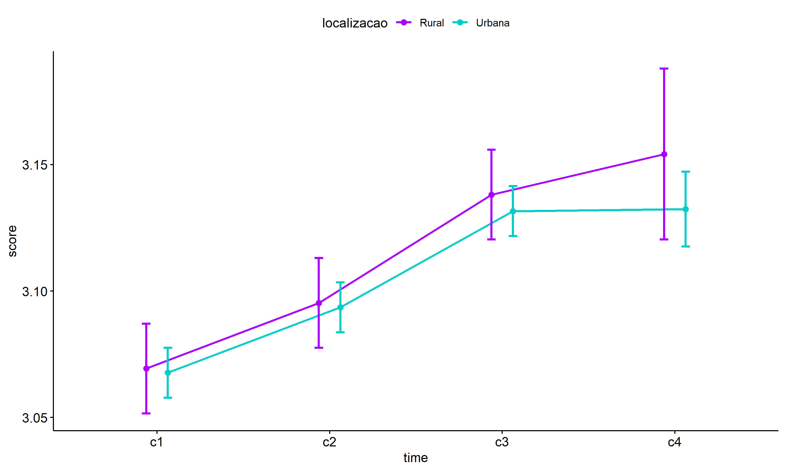<!-- -->

``` r
(pwc <- ldat %>% group_by(localizacao) %>%
    emmeans_test(score ~ time, detailed = T, p.adjust.method = "bonferroni"))
```

    ## # A tibble: 12 × 15
    ##    localizacao term  .y.   group1 group2 null.value  estimate      se    df
    ##  * <fct>       <chr> <chr> <chr>  <chr>       <dbl>     <dbl>   <dbl> <dbl>
    ##  1 Rural       time  score c1     c2              0 -0.0259   0.0128   9437
    ##  2 Rural       time  score c1     c3              0 -0.0687   0.0128   9437
    ##  3 Rural       time  score c1     c4              0 -0.0848   0.0195   9437
    ##  4 Rural       time  score c2     c3              0 -0.0428   0.0128   9437
    ##  5 Rural       time  score c2     c4              0 -0.0589   0.0195   9437
    ##  6 Rural       time  score c3     c4              0 -0.0160   0.0195   9437
    ##  7 Urbana      time  score c1     c2              0 -0.0259   0.00713  9437
    ##  8 Urbana      time  score c1     c3              0 -0.0639   0.00713  9437
    ##  9 Urbana      time  score c1     c4              0 -0.0647   0.00908  9437
    ## 10 Urbana      time  score c2     c3              0 -0.0380   0.00713  9437
    ## 11 Urbana      time  score c2     c4              0 -0.0388   0.00908  9437
    ## 12 Urbana      time  score c3     c4              0 -0.000811 0.00908  9437
    ## # ℹ 6 more variables: conf.low <dbl>, conf.high <dbl>, statistic <dbl>,
    ## #   p <dbl>, p.adj <dbl>, p.adj.signif <chr>

| localizacao | term | .y.   | group1 | group2 | null.value | estimate |    se |   df | conf.low | conf.high | statistic |     p | p.adj | p.adj.signif |
|:------------|:-----|:------|:-------|:-------|-----------:|---------:|------:|-----:|---------:|----------:|----------:|------:|------:|:-------------|
| Rural       | time | score | c1     | c2     |          0 |   -0.026 | 0.013 | 9437 |   -0.051 |    -0.001 |    -2.023 | 0.043 | 0.259 | ns           |
| Rural       | time | score | c1     | c3     |          0 |   -0.069 | 0.013 | 9437 |   -0.094 |    -0.044 |    -5.367 | 0.000 | 0.000 | \*\*\*\*     |
| Rural       | time | score | c1     | c4     |          0 |   -0.085 | 0.019 | 9437 |   -0.123 |    -0.047 |    -4.353 | 0.000 | 0.000 | \*\*\*\*     |
| Rural       | time | score | c2     | c3     |          0 |   -0.043 | 0.013 | 9437 |   -0.068 |    -0.018 |    -3.344 | 0.001 | 0.005 | \*\*         |
| Rural       | time | score | c2     | c4     |          0 |   -0.059 | 0.019 | 9437 |   -0.097 |    -0.021 |    -3.022 | 0.003 | 0.015 | \*           |
| Rural       | time | score | c3     | c4     |          0 |   -0.016 | 0.019 | 9437 |   -0.054 |     0.022 |    -0.823 | 0.410 | 1.000 | ns           |
| Urbana      | time | score | c1     | c2     |          0 |   -0.026 | 0.007 | 9437 |   -0.040 |    -0.012 |    -3.627 | 0.000 | 0.002 | \*\*         |
| Urbana      | time | score | c1     | c3     |          0 |   -0.064 | 0.007 | 9437 |   -0.078 |    -0.050 |    -8.960 | 0.000 | 0.000 | \*\*\*\*     |
| Urbana      | time | score | c1     | c4     |          0 |   -0.065 | 0.009 | 9437 |   -0.082 |    -0.047 |    -7.128 | 0.000 | 0.000 | \*\*\*\*     |
| Urbana      | time | score | c2     | c3     |          0 |   -0.038 | 0.007 | 9437 |   -0.052 |    -0.024 |    -5.333 | 0.000 | 0.000 | \*\*\*\*     |
| Urbana      | time | score | c2     | c4     |          0 |   -0.039 | 0.009 | 9437 |   -0.057 |    -0.021 |    -4.279 | 0.000 | 0.000 | \*\*\*       |
| Urbana      | time | score | c3     | c4     |          0 |   -0.001 | 0.009 | 9437 |   -0.019 |     0.017 |    -0.089 | 0.929 | 1.000 | ns           |

``` r
(emms <- get_emmeans(pwc))
```

    ## # A tibble: 8 × 8
    ##   localizacao time  emmean      se    df conf.low conf.high method      
    ##   <fct>       <fct>  <dbl>   <dbl> <dbl>    <dbl>     <dbl> <chr>       
    ## 1 Rural       c1      3.07 0.00906  9437     3.05      3.09 Emmeans test
    ## 2 Rural       c2      3.10 0.00906  9437     3.08      3.11 Emmeans test
    ## 3 Rural       c3      3.14 0.00906  9437     3.12      3.16 Emmeans test
    ## 4 Rural       c4      3.15 0.0172   9437     3.12      3.19 Emmeans test
    ## 5 Urbana      c1      3.07 0.00504  9437     3.06      3.08 Emmeans test
    ## 6 Urbana      c2      3.09 0.00504  9437     3.08      3.10 Emmeans test
    ## 7 Urbana      c3      3.13 0.00504  9437     3.12      3.14 Emmeans test
    ## 8 Urbana      c4      3.13 0.00755  9437     3.12      3.15 Emmeans test

| localizacao | time | emmean |    se |   df | conf.low | conf.high | method       |
|:------------|:-----|-------:|------:|-----:|---------:|----------:|:-------------|
| Rural       | c1   |  3.069 | 0.009 | 9437 |    3.052 |     3.087 | Emmeans test |
| Rural       | c2   |  3.095 | 0.009 | 9437 |    3.078 |     3.113 | Emmeans test |
| Rural       | c3   |  3.138 | 0.009 | 9437 |    3.120 |     3.156 | Emmeans test |
| Rural       | c4   |  3.154 | 0.017 | 9437 |    3.120 |     3.188 | Emmeans test |
| Urbana      | c1   |  3.068 | 0.005 | 9437 |    3.058 |     3.078 | Emmeans test |
| Urbana      | c2   |  3.094 | 0.005 | 9437 |    3.084 |     3.103 | Emmeans test |
| Urbana      | c3   |  3.132 | 0.005 | 9437 |    3.122 |     3.141 | Emmeans test |
| Urbana      | c4   |  3.132 | 0.008 | 9437 |    3.118 |     3.147 | Emmeans test |

``` r
emms.gg <- emms[which(emms$localizacao == "Rural"),]
if (nrow(emms.gg) > 0)
  ggline(emms.gg, x = "time", y = "emmean", color = "#AA00FF", ylab = "score", size = 1) +
    geom_errorbar(aes(ymin = conf.low, ymax = conf.high),
                  width = 0.1, color = "#AA00FF", linewidth = 1) +
    stat_pvalue_manual(
      add_xy_position(pwc[which(pwc$localizacao == "Rural"),],
                      x = "time", fun = "mean_se"),
      hide.ns = T, color = "#AA00FF", tip.length = F) +
    theme(legend.text = element_blank())
```

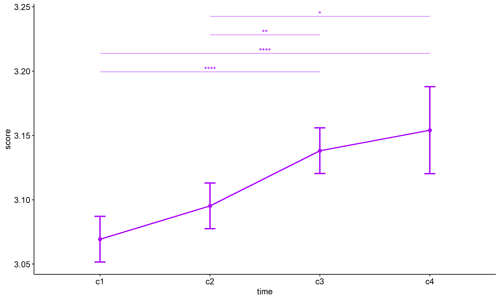<!-- -->

``` r
emms.gg <- emms[which(emms$localizacao == "Urbana"),]
if (nrow(emms.gg) > 0)
  ggline(emms.gg, x = "time", y = "emmean", color = "#00CCCC", ylab = "score", size = 1) +
    geom_errorbar(aes(ymin = conf.low, ymax = conf.high), linewidth = 1,
                  width = 0.1, color = "#00CCCC") +
    stat_pvalue_manual(
      add_xy_position(pwc[which(pwc$localizacao == "Urbana"),],
                      x = "time", fun = "mean_se"),
      hide.ns = T, color = "#00CCCC", tip.length = F) +
    theme(legend.text = element_blank())
```

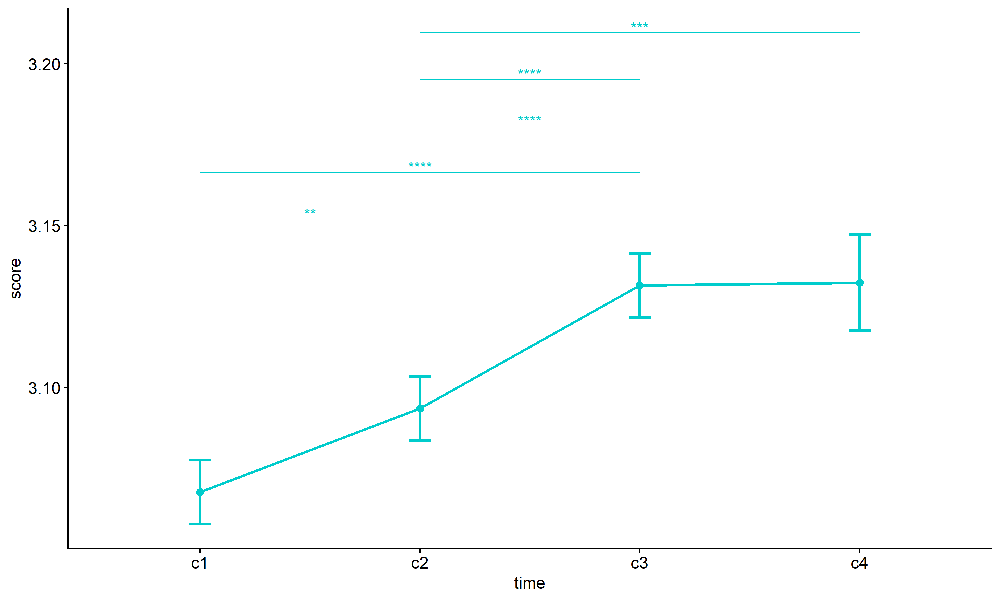<!-- -->

## PairWise Computation after removing non.normal data

``` r
if (length(non.ids) > 0)
  (pwc2 <- ldat2 %>% group_by(time) %>%
     emmeans_test(score ~ localizacao, detailed = T, p.adjust.method = "bonferroni"))
```

``` r
if (length(non.ids) > 0)
  (emms2 <- get_emmeans(pwc2))
```

``` r
if (length(non.ids) > 0) {
  pwc2 <- add_xy_position(pwc2, x = "time", fun = "mean_se", dodge = 0.25)
  pd2 <- position_dodge(width = 0.25)
  
  ggline(emms2, x = "time", y = "emmean", color = "localizacao", size = 1,
         palette = c("#AA00FF","#00CCCC"),
         position = pd, ylab = "score") +
    geom_errorbar(aes(ymin = conf.low, ymax = conf.high, color = localizacao),
                position = pd, width = 0.1, linewidth = 1) +
    stat_pvalue_manual(pwc2, hide.ns = T, tip.length = F, linetype = 1)
}
```

``` r
if (length(non.ids) > 0)
  (pwc2 <- ldat2 %>% group_by(localizacao) %>%
     emmeans_test(score ~ time, detailed = T, p.adjust.method = "bonferroni"))
```

``` r
if (length(non.ids) > 0)
  (emms2 <- get_emmeans(pwc2))
```

``` r
if (length(non.ids) > 0) {
  emms.gg <- emms2[which(emms2$localizacao == "Rural"),]
  if (nrow(emms.gg) > 0)
    ggline(emms.gg, x = "time", y = "emmean", color = "#AA00FF", ylab = "score", size = 1) +
    geom_errorbar(aes(ymin = conf.low, ymax = conf.high),
                  width = 0.1, color = "#AA00FF", lidewidth = 1) +
    stat_pvalue_manual(
      add_xy_position(pwc[which(pwc$localizacao == "Rural"),],
                      x = "time", fun = "mean_se"),
      hide.ns = T, color = "#AA00FF", tip.length = F) +
    theme(legend.text = element_blank())
}
```

``` r
if (length(non.ids) > 0) {
  emms.gg <- emms2[which(emms2$localizacao == "Urbana"),]
  if (nrow(emms.gg) > 0)
    ggline(emms.gg, x = "time", y = "emmean", color = "#00CCCC", ylab = "score", size = 1) +
    geom_errorbar(aes(ymin = conf.low, ymax = conf.high),
                  width = 0.1, color = "#00CCCC", linewidth = 1) +
    stat_pvalue_manual(
      add_xy_position(pwc[which(pwc$localizacao == "Urbana"),],
                      x = "time", fun = "mean_se"),
      hide.ns = T, color = "#00CCCC", tip.length = F) +
    theme(legend.text = element_blank())
}
```

# ANOVA: score ~ time\*regiao + Error(id/time)

## Data Preparation

``` r
data <- edat[,c("aluno_id","regiao","ciclo","score")]
data <- data[data$ciclo %in% c("Primeiro Ciclo","Segundo Ciclo","Terceiro Ciclo","Quarto Ciclo"),]
data$ciclo <- factor(data$ciclo, c("Primeiro Ciclo","Segundo Ciclo","Terceiro Ciclo","Quarto Ciclo"))
data <- unique(data)

wdat <- spread(data, ciclo, score)
colnames(wdat) <- c("id","regiao","c1","c2","c3","c4")
wdat <- wdat[complete.cases(wdat[,c("id","regiao","c1","c2","c3")]),]

ldat <- gather(wdat, key = time, value = score, c1,c2,c3,c4) %>%
  convert_as_factor(id, time)
ldat <- remove_group_data(ldat, "score", c("time", "regiao"), n.limit = 30)
ldat$regiao <- factor(ldat$regiao, sort(unique(ldat$regiao)))
```

### Check assumptions: Identifying Outliers

``` r
outliers <- identify_outliers(group_by(ldat, time, regiao), score)
(outliers <- outliers[outliers$is.extreme == T,])
```

    ## # A tibble: 34 × 6
    ##    regiao       time  id                   score is.outlier is.extreme
    ##    <fct>        <fct> <fct>                <dbl> <lgl>      <lgl>     
    ##  1 Centro-Oeste c1    1Z1Qz8zDaMkaAz1Ah80K   4   TRUE       TRUE      
    ##  2 Centro-Oeste c1    Xq3402VdKr7fuvkfZchf   3.9 TRUE       TRUE      
    ##  3 Nordeste     c1    0w3VhiMf67CbcpR6aZCL   4   TRUE       TRUE      
    ##  4 Nordeste     c1    D1HfJKTVqjrpCJx97l3v   3.9 TRUE       TRUE      
    ##  5 Nordeste     c1    Ru3SPRo97iXBvXbvneKh   4   TRUE       TRUE      
    ##  6 Nordeste     c1    uCBI6gnllsawWJlgqkr5   4   TRUE       TRUE      
    ##  7 Nordeste     c1    vc8pPoYau2AIAuCQJipW   4   TRUE       TRUE      
    ##  8 Nordeste     c1    wefcYCTqKwxh8S4qGLoI   3.9 TRUE       TRUE      
    ##  9 Norte        c1    iPWgss5n5My8lpksQ1nX   4   TRUE       TRUE      
    ## 10 Norte        c1    PqW3vWjH69npz9vqggMX   4   TRUE       TRUE      
    ## # ℹ 24 more rows

| regiao       | time | id                   | score | is.outlier | is.extreme |
|:-------------|:-----|:---------------------|------:|:-----------|:-----------|
| Centro-Oeste | c1   | 1Z1Qz8zDaMkaAz1Ah80K |   4.0 | TRUE       | TRUE       |
| Centro-Oeste | c1   | Xq3402VdKr7fuvkfZchf |   3.9 | TRUE       | TRUE       |
| Nordeste     | c1   | 0w3VhiMf67CbcpR6aZCL |   4.0 | TRUE       | TRUE       |
| Nordeste     | c1   | D1HfJKTVqjrpCJx97l3v |   3.9 | TRUE       | TRUE       |
| Nordeste     | c1   | Ru3SPRo97iXBvXbvneKh |   4.0 | TRUE       | TRUE       |
| Nordeste     | c1   | uCBI6gnllsawWJlgqkr5 |   4.0 | TRUE       | TRUE       |
| Nordeste     | c1   | vc8pPoYau2AIAuCQJipW |   4.0 | TRUE       | TRUE       |
| Nordeste     | c1   | wefcYCTqKwxh8S4qGLoI |   3.9 | TRUE       | TRUE       |
| Norte        | c1   | iPWgss5n5My8lpksQ1nX |   4.0 | TRUE       | TRUE       |
| Norte        | c1   | PqW3vWjH69npz9vqggMX |   4.0 | TRUE       | TRUE       |
| Nordeste     | c2   | cuknOzzwN4oCRum5U5ph |   4.2 | TRUE       | TRUE       |
| Nordeste     | c2   | HNgjkRedBh1UIBu01VKY |   4.0 | TRUE       | TRUE       |
| Nordeste     | c2   | oGUJyWRMYYbF9PNegJZh |   4.0 | TRUE       | TRUE       |
| Nordeste     | c2   | X8eOpiPuKfI4GXxjOsOM |   4.0 | TRUE       | TRUE       |
| Nordeste     | c2   | z3p6Ot4uvkPmGXOS9D3e |   4.0 | TRUE       | TRUE       |
| Nordeste     | c2   | ZbfrKhrqRpZ0ISt57sPn |   4.0 | TRUE       | TRUE       |
| Sudeste      | c2   | HsQF2J0r79mHSWNe4l6n |   4.0 | TRUE       | TRUE       |
| Sudeste      | c2   | j31LU8Xwm0EQ7Mihkhjj |   4.0 | TRUE       | TRUE       |
| Centro-Oeste | c3   | HM6lELrDJUQlU8CLhlxB |   4.0 | TRUE       | TRUE       |
| Nordeste     | c3   | 1uixvrMfKulaomVh0MKa |   4.0 | TRUE       | TRUE       |
| Nordeste     | c3   | 8edbRBvoAhVAiLZ3h3E2 |   4.2 | TRUE       | TRUE       |
| Nordeste     | c3   | CCVIt7MPeYMUOCCyBxPh |   4.2 | TRUE       | TRUE       |
| Nordeste     | c3   | G1fSZJ6Ea4VhHH2OjGQ3 |   4.0 | TRUE       | TRUE       |
| Nordeste     | c3   | i5EZ8Ck9IgDueyMbw55v |   4.2 | TRUE       | TRUE       |
| Nordeste     | c3   | m5yRlxfIj73j4ossfTOB |   4.2 | TRUE       | TRUE       |
| Nordeste     | c3   | Pj0bkt0GAUBSA1FoPcc2 |   4.2 | TRUE       | TRUE       |
| Nordeste     | c3   | RkRJsrzuZjQPcgr9Bu7D |   4.0 | TRUE       | TRUE       |
| Nordeste     | c3   | xADstL8Txh6OaomMZXC4 |   4.0 | TRUE       | TRUE       |
| Sudeste      | c3   | 6bEKmKQpOuvY6PSQvzqj |   4.2 | TRUE       | TRUE       |
| Sudeste      | c3   | mbcncvg5dOFa9ZRsRhZf |   4.2 | TRUE       | TRUE       |
| Sul          | c3   | PwZy7Lbc45vuNd5du72A |   4.2 | TRUE       | TRUE       |
| Nordeste     | c4   | 1OE4fvPj9Y2Q9Bnwr0xz |   4.0 | TRUE       | TRUE       |
| Nordeste     | c4   | kFvRH3RtPD461qVG04iW |   4.0 | TRUE       | TRUE       |
| Nordeste     | c4   | PZJ6CleqURERCau51lXu |   3.9 | TRUE       | TRUE       |

### Check assumptions: Normality Test

``` r
(normality.df <- get.descriptives(ldat, "score", c("time", "regiao"), symmetry.test = T, normality.test = T))
```

    ##    time       regiao variable    n  mean median min max    sd    se    ci   iqr
    ## 1    c1 Centro-Oeste    score  216 3.069   3.00 2.4 4.0 0.221 0.015 0.030 0.225
    ## 2    c1     Nordeste    score 1499 3.070   3.00 2.4 4.0 0.206 0.005 0.010 0.200
    ## 3    c1        Norte    score  202 3.073   3.00 2.6 4.0 0.178 0.013 0.025 0.200
    ## 4    c1      Sudeste    score  693 3.068   3.00 2.6 3.8 0.207 0.008 0.015 0.200
    ## 5    c1          Sul    score  163 3.045   3.00 2.6 3.6 0.210 0.016 0.032 0.200
    ## 6    c2 Centro-Oeste    score  216 3.127   3.10 2.6 3.8 0.223 0.015 0.030 0.200
    ## 7    c2     Nordeste    score 1499 3.098   3.00 2.4 4.2 0.230 0.006 0.012 0.200
    ## 8    c2        Norte    score  202 3.051   3.00 2.6 3.6 0.184 0.013 0.026 0.200
    ## 9    c2      Sudeste    score  693 3.100   3.00 2.6 4.0 0.228 0.009 0.017 0.200
    ## 10   c2          Sul    score  163 3.042   3.00 2.6 3.8 0.217 0.017 0.034 0.200
    ## 11   c3 Centro-Oeste    score  216 3.145   3.10 2.4 4.0 0.240 0.016 0.032 0.200
    ## 12   c3     Nordeste    score 1499 3.122   3.00 2.6 4.2 0.251 0.006 0.013 0.200
    ## 13   c3        Norte    score  202 3.106   3.10 2.6 3.8 0.195 0.014 0.027 0.200
    ## 14   c3      Sudeste    score  693 3.154   3.10 2.4 4.2 0.267 0.010 0.020 0.300
    ## 15   c3          Sul    score  163 3.163   3.10 2.6 4.2 0.282 0.022 0.044 0.300
    ## 16   c4     Nordeste    score  545 3.118   3.00 2.6 4.0 0.242 0.010 0.020 0.200
    ## 17   c4        Norte    score   78 3.121   3.10 2.7 3.8 0.210 0.024 0.047 0.200
    ## 18   c4      Sudeste    score  393 3.153   3.10 2.6 4.0 0.270 0.014 0.027 0.300
    ## 19   c4 Centro-Oeste    score   48 3.154   3.15 2.6 3.8 0.232 0.033 0.067 0.200
    ## 20   c4          Sul    score   62 3.195   3.20 2.6 3.8 0.283 0.036 0.072 0.400
    ##    symmetry  skewness    kurtosis normality     method   statistic            p
    ## 1        NO 0.6339684 2.037763768         - D'Agostino  27.4655791 1.086239e-06
    ## 2        NO 0.7525437 2.154873944         - D'Agostino 194.2173456 0.000000e+00
    ## 3        NO 1.5018194 5.952004512         - D'Agostino  81.7653687 0.000000e+00
    ## 4       YES 0.4854020 0.847811671         - D'Agostino  37.4298748 7.450852e-09
    ## 5       YES 0.1455818 0.005311973        QQ D'Agostino   0.7725422 6.795863e-01
    ## 6        NO 0.5885494 0.921746764         - D'Agostino  17.3121893 1.740628e-04
    ## 7        NO 0.9273482 1.790457854         - D'Agostino 224.8761209 0.000000e+00
    ## 8       YES 0.3757791 0.481222109         - D'Agostino   7.1593752 2.788441e-02
    ## 9        NO 0.8967286 1.608592068         - D'Agostino  99.5312396 0.000000e+00
    ## 10      YES 0.3977078 0.643751866        QQ D'Agostino   7.4354043 2.428972e-02
    ## 11       NO 0.7105259 1.697078364         - D'Agostino  27.8089222 9.148908e-07
    ## 12       NO 1.0624101 1.579256828         - D'Agostino 252.5511564 0.000000e+00
    ## 13       NO 0.6233553 1.151764140         - D'Agostino  19.2349426 6.655570e-05
    ## 14       NO 0.6696654 0.431178651         - D'Agostino  48.9449395 2.353651e-11
    ## 15       NO 1.0269748 1.206167497        QQ D'Agostino  29.2658941 4.415622e-07
    ## 16     <NA>        NA          NA      <NA>       <NA>          NA           NA
    ## 17     <NA>        NA          NA      <NA>       <NA>          NA           NA
    ## 18     <NA>        NA          NA      <NA>       <NA>          NA           NA
    ## 19     <NA>        NA          NA      <NA>       <NA>          NA           NA
    ## 20     <NA>        NA          NA      <NA>       <NA>          NA           NA
    ##    p.signif
    ## 1      ****
    ## 2      ****
    ## 3      ****
    ## 4      ****
    ## 5        ns
    ## 6        **
    ## 7      ****
    ## 8        ns
    ## 9      ****
    ## 10       ns
    ## 11     ****
    ## 12     ****
    ## 13      ***
    ## 14     ****
    ## 15     ****
    ## 16     <NA>
    ## 17     <NA>
    ## 18     <NA>
    ## 19     <NA>
    ## 20     <NA>

| time | regiao       | variable |    n |  mean | median | min | max |    sd |    se |    ci |   iqr | symmetry | skewness | kurtosis | normality | method     | statistic |     p | p.signif |
|:-----|:-------------|:---------|-----:|------:|-------:|----:|----:|------:|------:|------:|------:|:---------|---------:|---------:|:----------|:-----------|----------:|------:|:---------|
| c1   | Centro-Oeste | score    |  216 | 3.069 |   3.00 | 2.4 | 4.0 | 0.221 | 0.015 | 0.030 | 0.225 | NO       |    0.634 |    2.038 | \-        | D’Agostino |    27.466 | 0.000 | \*\*\*\* |
| c1   | Nordeste     | score    | 1499 | 3.070 |   3.00 | 2.4 | 4.0 | 0.206 | 0.005 | 0.010 | 0.200 | NO       |    0.753 |    2.155 | \-        | D’Agostino |   194.217 | 0.000 | \*\*\*\* |
| c1   | Norte        | score    |  202 | 3.073 |   3.00 | 2.6 | 4.0 | 0.178 | 0.013 | 0.025 | 0.200 | NO       |    1.502 |    5.952 | \-        | D’Agostino |    81.765 | 0.000 | \*\*\*\* |
| c1   | Sudeste      | score    |  693 | 3.068 |   3.00 | 2.6 | 3.8 | 0.207 | 0.008 | 0.015 | 0.200 | YES      |    0.485 |    0.848 | \-        | D’Agostino |    37.430 | 0.000 | \*\*\*\* |
| c1   | Sul          | score    |  163 | 3.045 |   3.00 | 2.6 | 3.6 | 0.210 | 0.016 | 0.032 | 0.200 | YES      |    0.146 |    0.005 | QQ        | D’Agostino |     0.773 | 0.680 | ns       |
| c2   | Centro-Oeste | score    |  216 | 3.127 |   3.10 | 2.6 | 3.8 | 0.223 | 0.015 | 0.030 | 0.200 | NO       |    0.589 |    0.922 | \-        | D’Agostino |    17.312 | 0.000 | \*\*     |
| c2   | Nordeste     | score    | 1499 | 3.098 |   3.00 | 2.4 | 4.2 | 0.230 | 0.006 | 0.012 | 0.200 | NO       |    0.927 |    1.790 | \-        | D’Agostino |   224.876 | 0.000 | \*\*\*\* |
| c2   | Norte        | score    |  202 | 3.051 |   3.00 | 2.6 | 3.6 | 0.184 | 0.013 | 0.026 | 0.200 | YES      |    0.376 |    0.481 | \-        | D’Agostino |     7.159 | 0.028 | ns       |
| c2   | Sudeste      | score    |  693 | 3.100 |   3.00 | 2.6 | 4.0 | 0.228 | 0.009 | 0.017 | 0.200 | NO       |    0.897 |    1.609 | \-        | D’Agostino |    99.531 | 0.000 | \*\*\*\* |
| c2   | Sul          | score    |  163 | 3.042 |   3.00 | 2.6 | 3.8 | 0.217 | 0.017 | 0.034 | 0.200 | YES      |    0.398 |    0.644 | QQ        | D’Agostino |     7.435 | 0.024 | ns       |
| c3   | Centro-Oeste | score    |  216 | 3.145 |   3.10 | 2.4 | 4.0 | 0.240 | 0.016 | 0.032 | 0.200 | NO       |    0.711 |    1.697 | \-        | D’Agostino |    27.809 | 0.000 | \*\*\*\* |
| c3   | Nordeste     | score    | 1499 | 3.122 |   3.00 | 2.6 | 4.2 | 0.251 | 0.006 | 0.013 | 0.200 | NO       |    1.062 |    1.579 | \-        | D’Agostino |   252.551 | 0.000 | \*\*\*\* |
| c3   | Norte        | score    |  202 | 3.106 |   3.10 | 2.6 | 3.8 | 0.195 | 0.014 | 0.027 | 0.200 | NO       |    0.623 |    1.152 | \-        | D’Agostino |    19.235 | 0.000 | \*\*\*   |
| c3   | Sudeste      | score    |  693 | 3.154 |   3.10 | 2.4 | 4.2 | 0.267 | 0.010 | 0.020 | 0.300 | NO       |    0.670 |    0.431 | \-        | D’Agostino |    48.945 | 0.000 | \*\*\*\* |
| c3   | Sul          | score    |  163 | 3.163 |   3.10 | 2.6 | 4.2 | 0.282 | 0.022 | 0.044 | 0.300 | NO       |    1.027 |    1.206 | QQ        | D’Agostino |    29.266 | 0.000 | \*\*\*\* |
| c4   | Nordeste     | score    |  545 | 3.118 |   3.00 | 2.6 | 4.0 | 0.242 | 0.010 | 0.020 | 0.200 | NA       |       NA |       NA | NA        | NA         |        NA |    NA | NA       |
| c4   | Norte        | score    |   78 | 3.121 |   3.10 | 2.7 | 3.8 | 0.210 | 0.024 | 0.047 | 0.200 | NA       |       NA |       NA | NA        | NA         |        NA |    NA | NA       |
| c4   | Sudeste      | score    |  393 | 3.153 |   3.10 | 2.6 | 4.0 | 0.270 | 0.014 | 0.027 | 0.300 | NA       |       NA |       NA | NA        | NA         |        NA |    NA | NA       |
| c4   | Centro-Oeste | score    |   48 | 3.154 |   3.15 | 2.6 | 3.8 | 0.232 | 0.033 | 0.067 | 0.200 | NA       |       NA |       NA | NA        | NA         |        NA |    NA | NA       |
| c4   | Sul          | score    |   62 | 3.195 |   3.20 | 2.6 | 3.8 | 0.283 | 0.036 | 0.072 | 0.400 | NA       |       NA |       NA | NA        | NA         |        NA |    NA | NA       |

``` r
idx = which(!ldat$id %in% outliers$id & ldat$regiao == "Norte" & ldat$time == "c4")
non.ids = getNonNormal(ldat$score[idx], ldat$id[idx])

idx = which(!ldat$id %in% outliers$id & ldat$regiao == "Centro-Oeste" & ldat$time == "c4")
non.ids =  unique(c(non.ids, getNonNormal(ldat$score[idx], ldat$id[idx])))

(non.ids)
```

    ## [1] "AH1sCf7O5jOA17AZz4Sv"

``` r
if (length(non.ids) > 0)
  ldat2 <- ldat[!ldat$id %in% non.ids,]
```

### Summary Statistics

``` r
(sdat <- ldat %>% group_by(time, regiao) %>%
   get_summary_stats(score, type = "mean_sd"))
```

    ## # A tibble: 20 × 6
    ##    regiao       time  variable     n  mean    sd
    ##    <fct>        <fct> <fct>    <dbl> <dbl> <dbl>
    ##  1 Centro-Oeste c1    score      216  3.07 0.221
    ##  2 Nordeste     c1    score     1499  3.07 0.206
    ##  3 Norte        c1    score      202  3.07 0.178
    ##  4 Sudeste      c1    score      693  3.07 0.207
    ##  5 Sul          c1    score      163  3.04 0.21 
    ##  6 Centro-Oeste c2    score      216  3.13 0.223
    ##  7 Nordeste     c2    score     1499  3.10 0.23 
    ##  8 Norte        c2    score      202  3.05 0.184
    ##  9 Sudeste      c2    score      693  3.1  0.228
    ## 10 Sul          c2    score      163  3.04 0.217
    ## 11 Centro-Oeste c3    score      216  3.14 0.24 
    ## 12 Nordeste     c3    score     1499  3.12 0.251
    ## 13 Norte        c3    score      202  3.11 0.195
    ## 14 Sudeste      c3    score      693  3.15 0.267
    ## 15 Sul          c3    score      163  3.16 0.282
    ## 16 Centro-Oeste c4    score       48  3.15 0.232
    ## 17 Nordeste     c4    score      545  3.12 0.242
    ## 18 Norte        c4    score       78  3.12 0.21 
    ## 19 Sudeste      c4    score      393  3.15 0.27 
    ## 20 Sul          c4    score       62  3.20 0.283

| regiao       | time | variable |    n |  mean |    sd |
|:-------------|:-----|:---------|-----:|------:|------:|
| Centro-Oeste | c1   | score    |  216 | 3.069 | 0.221 |
| Nordeste     | c1   | score    | 1499 | 3.070 | 0.206 |
| Norte        | c1   | score    |  202 | 3.073 | 0.178 |
| Sudeste      | c1   | score    |  693 | 3.068 | 0.207 |
| Sul          | c1   | score    |  163 | 3.045 | 0.210 |
| Centro-Oeste | c2   | score    |  216 | 3.127 | 0.223 |
| Nordeste     | c2   | score    | 1499 | 3.098 | 0.230 |
| Norte        | c2   | score    |  202 | 3.051 | 0.184 |
| Sudeste      | c2   | score    |  693 | 3.100 | 0.228 |
| Sul          | c2   | score    |  163 | 3.042 | 0.217 |
| Centro-Oeste | c3   | score    |  216 | 3.145 | 0.240 |
| Nordeste     | c3   | score    | 1499 | 3.122 | 0.251 |
| Norte        | c3   | score    |  202 | 3.106 | 0.195 |
| Sudeste      | c3   | score    |  693 | 3.154 | 0.267 |
| Sul          | c3   | score    |  163 | 3.163 | 0.282 |
| Centro-Oeste | c4   | score    |   48 | 3.154 | 0.232 |
| Nordeste     | c4   | score    |  545 | 3.118 | 0.242 |
| Norte        | c4   | score    |   78 | 3.121 | 0.210 |
| Sudeste      | c4   | score    |  393 | 3.153 | 0.270 |
| Sul          | c4   | score    |   62 | 3.195 | 0.283 |

``` r
if (length(non.ids) > 0)
  (sdat <- ldat2 %>% group_by(time, regiao) %>%
      get_summary_stats(score, type = "mean_sd"))
```

    ## # A tibble: 20 × 6
    ##    regiao       time  variable     n  mean    sd
    ##    <fct>        <fct> <fct>    <dbl> <dbl> <dbl>
    ##  1 Centro-Oeste c1    score      216  3.07 0.221
    ##  2 Nordeste     c1    score     1499  3.07 0.206
    ##  3 Norte        c1    score      201  3.07 0.178
    ##  4 Sudeste      c1    score      693  3.07 0.207
    ##  5 Sul          c1    score      163  3.04 0.21 
    ##  6 Centro-Oeste c2    score      216  3.13 0.223
    ##  7 Nordeste     c2    score     1499  3.10 0.23 
    ##  8 Norte        c2    score      201  3.05 0.185
    ##  9 Sudeste      c2    score      693  3.1  0.228
    ## 10 Sul          c2    score      163  3.04 0.217
    ## 11 Centro-Oeste c3    score      216  3.14 0.24 
    ## 12 Nordeste     c3    score     1499  3.12 0.251
    ## 13 Norte        c3    score      201  3.10 0.193
    ## 14 Sudeste      c3    score      693  3.15 0.267
    ## 15 Sul          c3    score      163  3.16 0.282
    ## 16 Centro-Oeste c4    score       48  3.15 0.232
    ## 17 Nordeste     c4    score      545  3.12 0.242
    ## 18 Norte        c4    score       77  3.11 0.197
    ## 19 Sudeste      c4    score      393  3.15 0.27 
    ## 20 Sul          c4    score       62  3.20 0.283

| regiao       | time | variable |    n |  mean |    sd |
|:-------------|:-----|:---------|-----:|------:|------:|
| Centro-Oeste | c1   | score    |  216 | 3.069 | 0.221 |
| Nordeste     | c1   | score    | 1499 | 3.070 | 0.206 |
| Norte        | c1   | score    |  201 | 3.072 | 0.178 |
| Sudeste      | c1   | score    |  693 | 3.068 | 0.207 |
| Sul          | c1   | score    |  163 | 3.045 | 0.210 |
| Centro-Oeste | c2   | score    |  216 | 3.127 | 0.223 |
| Nordeste     | c2   | score    | 1499 | 3.098 | 0.230 |
| Norte        | c2   | score    |  201 | 3.052 | 0.185 |
| Sudeste      | c2   | score    |  693 | 3.100 | 0.228 |
| Sul          | c2   | score    |  163 | 3.042 | 0.217 |
| Centro-Oeste | c3   | score    |  216 | 3.145 | 0.240 |
| Nordeste     | c3   | score    | 1499 | 3.122 | 0.251 |
| Norte        | c3   | score    |  201 | 3.104 | 0.193 |
| Sudeste      | c3   | score    |  693 | 3.154 | 0.267 |
| Sul          | c3   | score    |  163 | 3.163 | 0.282 |
| Centro-Oeste | c4   | score    |   48 | 3.154 | 0.232 |
| Nordeste     | c4   | score    |  545 | 3.118 | 0.242 |
| Norte        | c4   | score    |   77 | 3.112 | 0.197 |
| Sudeste      | c4   | score    |  393 | 3.153 | 0.270 |
| Sul          | c4   | score    |   62 | 3.195 | 0.283 |

## ANOVA Computation

``` r
(res.aov <- anova_test(ldat, dv = score, wid = id, between = regiao, within = time))
```

    ## Warning: NA detected in rows:
    ## 8323,8325,8326,8332,8333,8334,8337,8339,8340,8342,8343,8344,8345,8349,8350,8352,8353,8354,8358,8359,8361,8362,8364,8369,8370,8374,8375,8376,8383,8384,8391,8392,8394,8396,8398,8399,8401,8402,8404,8408,8409,8412,8413,8414,8416,8419,8424,8427,8429,8430,8431,8433,8435,8442,8443,8444,8445,8447,8450,8451,8452,8454,8455,8457,8459,8460,8465,8466,8467,8468,8469,8470,8471,8475,8476,8477,8479,8480,8482,8484,8487,8488,8490,8491,8492,8493,8494,8496,8497,8499,8500,8502,8503,8506,8510,8511,8514,8515,8516,8519,8521,8522,8525,8528,8529,8530,8531,8532,8533,8534,8536,8538,8540,8541,8546,8549,8551,8552,8555,8556,8559,8560,8562,8565,8567,8569,8570,8571,8574,8576,8579,8580,8581,8583,8590,8591,8592,8593,8598,8601,8602,8604,8605,8606,8607,8608,8609,8613,8618,8623,8626,8628,8630,8632,8634,8635,8637,8638,8639,8641,8642,8644,8647,8649,8650,8651,8652,8653,8654,8655,8658,8659,8660,8661,8662,8664,8665,8666,8668,8671,8672,8674,8678,8683,8685,8686,8687,8689,8692,8693,8694,8696,8697,8698,8699,8704,8706,8707,8708,8709,8711,8712,8713,8714,8715,8716,8717,8718,8719,8720,8721,8724,8725,8727,8728,8729,8730,8731,8732,8734,8735,8736,8737,8739,8740,8743,8744,8745,8746,8748,8749,8751,8753,8754,8755,8756,8757,8760,8761,8762,8763,8765,8766,8768,8771,8772,8773,8775,8776,8777,8778,8779,8781,8785,8786,8787,8788,8789,8792,8793,8794,8797,8799,8800,8802,8806,8807,8808,8809,8810,8811,8812,8814,8820,8823,8824,8825,8826,8828,8829,8831,8832,8834,8835,8836,8837,8838,8839,8840,8841,8842,8843,8844,8845,8846,8849,8852,8854,8855,8856,8858,8860,8862,8865,8869,8871,8872,8874,8875,8877,8879,8880,8881,8883,8884,8885,8886,8887,8889,8891,8892,8893,8894,8895,8896,8898,8899,8900,8901,8903,8904,8905,8906,8910,8914,8915,8917,8918,8920,8923,8928,8929,8931,8932,8933,8934,8935,8937,8939,8940,8941,8943,8944,8945,8946,8948,8951,8952,8953,8954,8955,8956,8957,8959,8961,8963,8964,8965,8967,8968,8969,8970,8971,8973,8974,8975,8977,8978,8983,8986,8987,8991,8992,8995,8996,8997,9000,9001,9002,9003,9004,9005,9008,9010,9012,9018,9021,9025,9026,9027,9030,9031,9032,9033,9035,9038,9043,9044,9045,9047,9048,9052,9055,9059,9060,9063,9065,9069,9073,9074,9077,9078,9079,9081,9082,9083,9084,9085,9086,9087,9088,9089,9090,9091,9093,9099,9102,9104,9105,9106,9107,9108,9111,9112,9113,9117,9120,9121,9126,9127,9129,9130,9131,9134,9136,9137,9139,9141,9143,9144,9146,9147,9150,9151,9153,9154,9155,9156,9157,9160,9161,9163,9164,9165,9166,9167,9168,9169,9171,9173,9176,9178,9180,9182,9183,9184,9186,9187,9188,9189,9190,9191,9192,9193,9194,9195,9198,9199,9202,9204,9205,9206,9208,9212,9213,9215,9216,9217,9220,9223,9227,9228,9229,9230,9231,9232,9233,9235,9236,9237,9238,9239,9240,9241,9242,9243,9244,9246,9247,9250,9251,9252,9253,9254,9255,9256,9257,9258,9260,9261,9262,9267,9268,9270,9271,9272,9273,9274,9276,9277,9278,9279,9285,9286,9288,9293,9294,9296,9297,9299,9300,9301,9302,9303,9306,9308,9309,9312,9314,9316,9319,9320,9321,9323,9325,9326,9327,9330,9332,9335,9337,9340,9342,9344,9345,9347,9348,9349,9351,9356,9357,9360,9361,9362,9364,9365,9367,9371,9372,9375,9376,9377,9378,9385,9386,9387,9389,9390,9391,9392,9396,9397,9398,9399,9401,9402,9403,9404,9405,9407,9408,9409,9410,9413,9414,9415,9416,9417,9418,9420,9421,9422,9423,9425,9426,9427,9431,9432,9434,9435,9437,9438,9439,9440,9441,9442,9443,9444,9445,9446,9447,9448,9449,9452,9454,9455,9456,9460,9464,9466,9469,9470,9471,9474,9475,9476,9477,9478,9479,9480,9482,9484,9485,9487,9491,9492,9494,9496,9497,9498,9499,9500,9503,9504,9506,9507,9509,9510,9511,9512,9514,9516,9517,9518,9519,9520,9521,9523,9524,9525,9526,9527,9529,9532,9533,9534,9536,9537,9543,9547,9550,9552,9553,9555,9556,9558,9559,9561,9562,9567,9570,9571,9575,9576,9578,9579,9583,9588,9589,9590,9591,9592,9593,9594,9597,9598,9600,9602,9605,9606,9607,9613,9614,9615,9616,9618,9619,9621,9623,9624,9626,9627,9629,9632,9634,9635,9637,9639,9646,9647,9649,9650,9652,9653,9656,9658,9660,9661,9662,9663,9665,9666,9667,9668,9670,9672,9674,9677,9678,9680,9681,9687,9688,9690,9693,9694,9695,9696,9697,9699,9700,9701,9703,9705,9707,9708,9709,9710,9712,9713,9714,9715,9716,9719,9721,9723,9724,9725,9726,9727,9729,9730,9732,9734,9735,9737,9738,9739,9740,9741,9742,9744,9746,9747,9748,9749,9751,9754,9755,9756,9757,9758,9759,9762,9764,9765,9767,9768,9772,9773,9774,9775,9776,9783,9784,9785,9787,9788,9792,9794,9797,9801,9803,9804,9805,9806,9807,9808,9809,9810,9812,9813,9814,9815,9816,9817,9818,9819,9820,9821,9823,9824,9826,9829,9830,9831,9832,9833,9834,9835,9836,9837,9838,9840,9841,9842,9844,9845,9846,9848,9849,9850,9851,9852,9853,9854,9856,9858,9859,9860,9863,9869,9871,9874,9875,9876,9877,9878,9879,9883,9884,9886,9888,9889,9892,9893,9894,9895,9897,9898,9899,9900,9901,9902,9904,9907,9908,9909,9911,9914,9918,9919,9920,9923,9925,9926,9927,9929,9930,9931,9932,9933,9934,9935,9936,9937,9938,9939,9940,9943,9944,9947,9950,9951,9952,9954,9957,9958,9963,9964,9965,9966,9969,9970,9971,9974,9975,9976,9978,9979,9981,9983,9984,9985,9988,9989,9991,9992,9994,9995,9998,9999,10002,10004,10005,10006,10008,10009,10012,10014,10017,10018,10019,10020,10022,10023,10025,10026,10027,10028,10029,10030,10031,10036,10037,10039,10040,10043,10044,10045,10046,10047,10050,10052,10053,10054,10055,10056,10057,10059,10060,10063,10064,10066,10067,10068,10069,10071,10072,10073,10074,10075,10077,10078,10079,10080,10081,10082,10084,10085,10088,10089,10093,10095,10096,10097,10098,10099,10101,10102,10103,10105,10106,10107,10108,10110,10111,10112,10113,10117,10119,10120,10121,10122,10123,10124,10127,10129,10130,10131,10133,10135,10138,10140,10144,10145,10146,10150,10151,10152,10155,10156,10157,10158,10159,10160,10161,10162,10164,10165,10166,10168,10169,10170,10172,10173,10174,10175,10177,10179,10180,10181,10182,10184,10188,10190,10191,10192,10195,10196,10197,10200,10201,10202,10203,10204,10206,10207,10210,10212,10213,10215,10216,10218,10220,10221,10222,10223,10224,10225,10226,10232,10233,10234,10238,10242,10243,10244,10245,10250,10251,10252,10253,10254,10255,10257,10258,10260,10262,10265,10266,10267,10268,10269,10272,10277,10278,10280,10282,10285,10288,10290,10293,10294,10295,10296,10298,10300,10301,10302,10303,10306,10307,10310,10311,10312,10313,10316,10317,10318,10319,10321,10323,10324,10325,10327,10328,10329,10330,10331,10332,10333,10336,10337,10338,10339,10340,10343,10346,10349,10350,10351,10354,10358,10359,10360,10361,10362,10363,10364,10365,10367,10369,10370,10371,10372,10373,10374,10376,10377,10378,10379,10386,10387,10389,10391,10396,10397,10398,10400,10401,10402,10404,10406,10407,10408,10409,10410,10413,10414,10417,10418,10419,10425,10426,10430,10431,10432,10435,10436,10437,10438,10439,10443,10445,10447,10448,10449,10450,10451,10453,10455,10456,10457,10461,10463,10464,10465,10466,10467,10470,10471,10473,10474,10475,10476,10478,10479,10480,10482,10485,10486,10490,10491,10492,10493,10494,10495,10496,10497,10498,10499,10500,10501,10504,10509,10511,10512,10513,10514,10515,10516,10518,10520,10521,10522,10525,10526,10527,10528,10529,10531,10534,10535,10538,10539,10540,10545,10546,10549,10550,10551,10552,10553,10554,10555,10556,10557,10559,10561,10562,10563,10565,10566,10567,10569,10570,10571,10572,10574,10575,10577,10579,10581,10583,10585,10587,10588,10589,10591,10592,10594,10595,10597,10599,10600,10601,10602,10603,10605,10606,10608,10610,10612,10614,10615,10618,10619,10621,10622,10625,10626,10628,10630,10632,10634,10635,10636,10637,10639,10640,10642,10646,10648,10651,10654,10658,10659,10661,10662,10663,10664,10666,10667,10668,10669,10670,10673,10674,10677,10678,10679,10681,10684,10686,10687,10688,10689,10690,10695,10697,10698,10703,10706,10708,10710,10711,10713,10714,10715,10722,10724,10725,10726,10727,10728,10731,10733,10734,10735,10736,10738,10739,10741,10743,10744,10747,10748,10749,10750,10751,10754,10755,10756,10758,10760,10761,10763,10764,10765,10766,10767,10772,10775,10777,10779,10780,10781,10784,10787,10788,10789,10792,10793,10794,10795,10797,10798,10799,10800,10801,10802,10803,10804,10805,10806,10808,10809,10812,10816,10818,10820,10822,10823,10825,10826,10828,10831,10832,10834,10836,10837,10839,10841,10842,10843,10847,10848,10849,10854,10855,10856,10857,10858,10859,10860,10861,10862,10864,10865,10868,10869,10870,10872,10873,10879,10880,10882,10883,10884,10889,10891,10892,10893,10895,1

    ## ANOVA Table (type III tests)
    ## 
    ## $ANOVA
    ##        Effect DFn  DFd      F        p p<.05   ges
    ## 1      regiao   4 1121  1.463 2.11e-01       0.002
    ## 2        time   3 3363 19.826 9.76e-13     * 0.012
    ## 3 regiao:time  12 3363  2.279 7.00e-03     * 0.006
    ## 
    ## $`Mauchly's Test for Sphericity`
    ##        Effect     W     p p<.05
    ## 1        time 0.986 0.008     *
    ## 2 regiao:time 0.986 0.008     *
    ## 
    ## $`Sphericity Corrections`
    ##        Effect   GGe        DF[GG]   p[GG] p[GG]<.05   HFe         DF[HF]
    ## 1        time 0.991  2.97, 3333.5 1.2e-12         * 0.994  2.98, 3343.34
    ## 2 regiao:time 0.991 11.89, 3333.5 7.0e-03         * 0.994 11.93, 3343.34
    ##      p[HF] p[HF]<.05
    ## 1 1.12e-12         *
    ## 2 7.00e-03         *

| Effect      | DFn |  DFd |      F |     p | p\<.05 |   ges |
|:------------|----:|-----:|-------:|------:|:-------|------:|
| regiao      |   4 | 1121 |  1.463 | 0.211 |        | 0.002 |
| time        |   3 | 3363 | 19.826 | 0.000 | \*     | 0.012 |
| regiao:time |  12 | 3363 |  2.279 | 0.007 | \*     | 0.006 |

| Effect      |     W |     p | p\<.05 |
|:------------|------:|------:|:-------|
| time        | 0.986 | 0.008 | \*     |
| regiao:time | 0.986 | 0.008 | \*     |

| Effect      |   GGe | DF\[GG\]      | p\[GG\] | p\[GG\]\<.05 |   HFe | DF\[HF\]       | p\[HF\] | p\[HF\]\<.05 |
|:------------|------:|:--------------|--------:|:-------------|------:|:---------------|--------:|:-------------|
| time        | 0.991 | 2.97, 3333.5  |   0.000 | \*           | 0.994 | 2.98, 3343.34  |   0.000 | \*           |
| regiao:time | 0.991 | 11.89, 3333.5 |   0.007 | \*           | 0.994 | 11.93, 3343.34 |   0.007 | \*           |

## ANOVA Computation after removing non.normal data

``` r
if (length(non.ids) > 0)
  (res.aov2 <- anova_test(ldat2, dv = score, wid = id, between = regiao , within = time))
```

    ## Warning: NA detected in rows:
    ## 8320,8322,8323,8329,8330,8331,8334,8336,8337,8339,8340,8341,8342,8346,8347,8349,8350,8351,8355,8356,8358,8359,8361,8366,8367,8371,8372,8373,8380,8381,8388,8389,8391,8393,8395,8396,8398,8399,8401,8405,8406,8409,8410,8411,8413,8416,8421,8424,8426,8427,8428,8430,8432,8439,8440,8441,8442,8444,8447,8448,8449,8451,8452,8454,8456,8457,8462,8463,8464,8465,8466,8467,8468,8472,8473,8474,8476,8477,8479,8481,8484,8485,8487,8488,8489,8490,8491,8493,8494,8496,8497,8499,8500,8503,8507,8508,8511,8512,8513,8516,8518,8519,8522,8525,8526,8527,8528,8529,8530,8531,8533,8535,8537,8538,8543,8546,8548,8549,8552,8553,8556,8557,8559,8562,8564,8566,8567,8568,8571,8573,8576,8577,8578,8580,8587,8588,8589,8590,8595,8598,8599,8601,8602,8603,8604,8605,8606,8610,8615,8620,8623,8625,8627,8629,8631,8632,8634,8635,8636,8638,8639,8641,8644,8646,8647,8648,8649,8650,8651,8652,8655,8656,8657,8658,8659,8661,8662,8663,8665,8668,8669,8671,8675,8680,8682,8683,8684,8686,8689,8690,8691,8693,8694,8695,8696,8701,8703,8704,8705,8706,8708,8709,8710,8711,8712,8713,8714,8715,8716,8717,8718,8721,8722,8724,8725,8726,8727,8728,8729,8731,8732,8733,8734,8736,8737,8740,8741,8742,8743,8745,8746,8748,8750,8751,8752,8753,8754,8757,8758,8759,8760,8762,8763,8765,8768,8769,8770,8772,8773,8774,8775,8776,8777,8781,8782,8783,8784,8785,8788,8789,8790,8793,8795,8796,8798,8802,8803,8804,8805,8806,8807,8808,8810,8816,8819,8820,8821,8822,8824,8825,8827,8828,8830,8831,8832,8833,8834,8835,8836,8837,8838,8839,8840,8841,8842,8845,8848,8850,8851,8852,8854,8856,8858,8861,8865,8867,8868,8870,8871,8873,8875,8876,8877,8879,8880,8881,8882,8883,8885,8887,8888,8889,8890,8891,8892,8894,8895,8896,8897,8899,8900,8901,8902,8906,8910,8911,8913,8914,8916,8919,8924,8925,8927,8928,8929,8930,8931,8933,8935,8936,8937,8939,8940,8941,8942,8944,8947,8948,8949,8950,8951,8952,8953,8955,8957,8959,8960,8961,8963,8964,8965,8966,8967,8969,8970,8971,8973,8974,8979,8982,8983,8987,8988,8991,8992,8993,8996,8997,8998,8999,9000,9001,9004,9006,9008,9014,9017,9021,9022,9023,9026,9027,9028,9029,9031,9034,9039,9040,9041,9043,9044,9048,9051,9055,9056,9059,9061,9065,9069,9070,9073,9074,9075,9077,9078,9079,9080,9081,9082,9083,9084,9085,9086,9087,9089,9095,9098,9100,9101,9102,9103,9104,9107,9108,9109,9113,9116,9117,9122,9123,9125,9126,9127,9130,9132,9133,9135,9137,9139,9140,9142,9143,9146,9147,9149,9150,9151,9152,9153,9156,9157,9159,9160,9161,9162,9163,9164,9165,9167,9169,9172,9174,9176,9178,9179,9180,9182,9183,9184,9185,9186,9187,9188,9189,9190,9191,9194,9195,9198,9200,9201,9202,9204,9208,9209,9211,9212,9213,9216,9219,9223,9224,9225,9226,9227,9228,9229,9231,9232,9233,9234,9235,9236,9237,9238,9239,9240,9242,9243,9246,9247,9248,9249,9250,9251,9252,9253,9254,9256,9257,9258,9263,9264,9266,9267,9268,9269,9270,9272,9273,9274,9275,9281,9282,9284,9289,9290,9292,9293,9295,9296,9297,9298,9299,9302,9304,9305,9308,9310,9312,9315,9316,9317,9319,9321,9322,9323,9326,9328,9331,9333,9336,9338,9340,9341,9343,9344,9345,9347,9352,9353,9356,9357,9358,9360,9361,9363,9367,9368,9371,9372,9373,9374,9381,9382,9383,9385,9386,9387,9388,9392,9393,9394,9395,9397,9398,9399,9400,9401,9403,9404,9405,9406,9409,9410,9411,9412,9413,9414,9416,9417,9418,9419,9421,9422,9423,9427,9428,9430,9431,9433,9434,9435,9436,9437,9438,9439,9440,9441,9442,9443,9444,9445,9448,9450,9451,9452,9456,9460,9462,9465,9466,9467,9470,9471,9472,9473,9474,9475,9476,9478,9480,9481,9483,9487,9488,9490,9492,9493,9494,9495,9496,9499,9500,9502,9503,9505,9506,9507,9508,9510,9512,9513,9514,9515,9516,9517,9519,9520,9521,9522,9523,9525,9528,9529,9530,9532,9533,9539,9543,9546,9548,9549,9551,9552,9554,9555,9557,9558,9563,9566,9567,9571,9572,9574,9575,9579,9584,9585,9586,9587,9588,9589,9590,9593,9594,9596,9598,9601,9602,9603,9609,9610,9611,9612,9614,9615,9617,9619,9620,9622,9623,9625,9628,9630,9631,9633,9635,9642,9643,9645,9646,9648,9649,9652,9654,9656,9657,9658,9659,9661,9662,9663,9664,9666,9668,9670,9673,9674,9676,9677,9683,9684,9686,9689,9690,9691,9692,9693,9695,9696,9697,9699,9701,9703,9704,9705,9706,9708,9709,9710,9711,9712,9715,9717,9719,9720,9721,9722,9723,9725,9726,9728,9730,9731,9733,9734,9735,9736,9737,9738,9740,9742,9743,9744,9745,9747,9750,9751,9752,9753,9754,9755,9758,9760,9761,9763,9764,9768,9769,9770,9771,9772,9779,9780,9781,9783,9784,9788,9790,9793,9797,9799,9800,9801,9802,9803,9804,9805,9806,9808,9809,9810,9811,9812,9813,9814,9815,9816,9817,9819,9820,9822,9825,9826,9827,9828,9829,9830,9831,9832,9833,9834,9836,9837,9838,9840,9841,9842,9844,9845,9846,9847,9848,9849,9850,9852,9854,9855,9856,9859,9865,9867,9870,9871,9872,9873,9874,9875,9879,9880,9882,9884,9885,9888,9889,9890,9891,9893,9894,9895,9896,9897,9898,9900,9903,9904,9905,9907,9910,9914,9915,9916,9919,9921,9922,9923,9925,9926,9927,9928,9929,9930,9931,9932,9933,9934,9935,9936,9939,9940,9943,9946,9947,9948,9950,9953,9954,9959,9960,9961,9962,9965,9966,9967,9970,9971,9972,9974,9975,9977,9979,9980,9981,9984,9985,9987,9988,9990,9991,9994,9995,9998,10000,10001,10002,10004,10005,10008,10010,10013,10014,10015,10016,10018,10019,10021,10022,10023,10024,10025,10026,10027,10032,10033,10035,10036,10039,10040,10041,10042,10043,10046,10048,10049,10050,10051,10052,10053,10055,10056,10059,10060,10062,10063,10064,10065,10067,10068,10069,10070,10071,10073,10074,10075,10076,10077,10078,10080,10081,10084,10085,10089,10091,10092,10093,10094,10095,10097,10098,10099,10101,10102,10103,10104,10106,10107,10108,10109,10113,10115,10116,10117,10118,10119,10120,10123,10125,10126,10127,10129,10131,10134,10136,10140,10141,10142,10146,10147,10148,10151,10152,10153,10154,10155,10156,10157,10158,10160,10161,10162,10164,10165,10166,10168,10169,10170,10171,10173,10175,10176,10177,10178,10180,10184,10186,10187,10188,10191,10192,10193,10196,10197,10198,10199,10200,10202,10203,10206,10208,10209,10211,10212,10214,10216,10217,10218,10219,10220,10221,10222,10228,10229,10230,10234,10238,10239,10240,10241,10246,10247,10248,10249,10250,10251,10253,10254,10256,10258,10261,10262,10263,10264,10265,10268,10273,10274,10276,10278,10281,10284,10286,10289,10290,10291,10292,10294,10296,10297,10298,10299,10302,10303,10306,10307,10308,10309,10312,10313,10314,10315,10317,10319,10320,10321,10323,10324,10325,10326,10327,10328,10329,10332,10333,10334,10335,10336,10339,10342,10345,10346,10347,10350,10354,10355,10356,10357,10358,10359,10360,10361,10363,10365,10366,10367,10368,10369,10370,10372,10373,10374,10375,10382,10383,10385,10387,10392,10393,10394,10396,10397,10398,10400,10402,10403,10404,10405,10406,10409,10410,10413,10414,10415,10421,10422,10426,10427,10428,10431,10432,10433,10434,10435,10439,10441,10443,10444,10445,10446,10447,10449,10451,10452,10453,10457,10459,10460,10461,10462,10463,10466,10467,10469,10470,10471,10472,10474,10475,10476,10478,10481,10482,10486,10487,10488,10489,10490,10491,10492,10493,10494,10495,10496,10497,10500,10505,10507,10508,10509,10510,10511,10512,10514,10516,10517,10518,10521,10522,10523,10524,10525,10527,10530,10531,10534,10535,10536,10541,10542,10545,10546,10547,10548,10549,10550,10551,10552,10553,10555,10557,10558,10559,10561,10562,10563,10565,10566,10567,10568,10570,10571,10573,10575,10577,10579,10581,10583,10584,10585,10587,10588,10590,10591,10593,10595,10596,10597,10598,10599,10601,10602,10604,10606,10608,10610,10611,10614,10615,10617,10618,10621,10622,10624,10626,10628,10630,10631,10632,10633,10635,10636,10638,10642,10644,10647,10650,10654,10655,10657,10658,10659,10660,10662,10663,10664,10665,10666,10669,10670,10673,10674,10675,10677,10680,10682,10683,10684,10685,10686,10691,10693,10694,10699,10702,10704,10706,10707,10709,10710,10711,10718,10720,10721,10722,10723,10724,10727,10729,10730,10731,10732,10734,10735,10737,10739,10740,10743,10744,10745,10746,10747,10750,10751,10752,10754,10756,10757,10759,10760,10761,10762,10763,10768,10771,10773,10775,10776,10777,10780,10783,10784,10785,10788,10789,10790,10791,10793,10794,10795,10796,10797,10798,10799,10800,10801,10802,10804,10805,10808,10812,10814,10816,10818,10819,10821,10822,10824,10827,10828,10830,10832,10833,10835,10837,10838,10839,10843,10844,10845,10850,10851,10852,10853,10854,10855,10856,10857,10858,10860,10861,10864,10865,10866,10868,10869,10875,10876,10878,10879,10880,10885,10887,10888,10889,10891,10

    ## ANOVA Table (type III tests)
    ## 
    ## $ANOVA
    ##        Effect DFn  DFd      F        p p<.05   ges
    ## 1      regiao   4 1120  1.711 1.45e-01       0.002
    ## 2        time   3 3360 19.197 2.43e-12     * 0.012
    ## 3 regiao:time  12 3360  2.251 8.00e-03     * 0.006
    ## 
    ## $`Mauchly's Test for Sphericity`
    ##        Effect     W     p p<.05
    ## 1        time 0.986 0.009     *
    ## 2 regiao:time 0.986 0.009     *
    ## 
    ## $`Sphericity Corrections`
    ##        Effect   GGe        DF[GG]    p[GG] p[GG]<.05   HFe         DF[HF]
    ## 1        time 0.991 2.97, 3331.07 2.97e-12         * 0.994  2.98, 3340.92
    ## 2 regiao:time 0.991 11.9, 3331.07 8.00e-03         * 0.994 11.93, 3340.92
    ##      p[HF] p[HF]<.05
    ## 1 2.77e-12         *
    ## 2 8.00e-03         *

| Effect      | DFn |  DFd |      F |     p | p\<.05 |   ges |
|:------------|----:|-----:|-------:|------:|:-------|------:|
| regiao      |   4 | 1120 |  1.711 | 0.145 |        | 0.002 |
| time        |   3 | 3360 | 19.197 | 0.000 | \*     | 0.012 |
| regiao:time |  12 | 3360 |  2.251 | 0.008 | \*     | 0.006 |

| Effect      |     W |     p | p\<.05 |
|:------------|------:|------:|:-------|
| time        | 0.986 | 0.009 | \*     |
| regiao:time | 0.986 | 0.009 | \*     |

| Effect      |   GGe | DF\[GG\]      | p\[GG\] | p\[GG\]\<.05 |   HFe | DF\[HF\]       | p\[HF\] | p\[HF\]\<.05 |
|:------------|------:|:--------------|--------:|:-------------|------:|:---------------|--------:|:-------------|
| time        | 0.991 | 2.97, 3331.07 |   0.000 | \*           | 0.994 | 2.98, 3340.92  |   0.000 | \*           |
| regiao:time | 0.991 | 11.9, 3331.07 |   0.008 | \*           | 0.994 | 11.93, 3340.92 |   0.008 | \*           |

## PairWise Computation

``` r
(pwc <- ldat %>% group_by(time) %>%
   emmeans_test(score ~ regiao, detailed = T, p.adjust.method = "bonferroni"))
```

    ## Warning: Expected 2 pieces. Additional pieces discarded in 16 rows [1, 2, 3, 4, 11, 12,
    ## 13, 14, 21, 22, 23, 24, 31, 32, 33, 34].

    ## # A tibble: 40 × 15
    ##    time  term   .y.   group1   group2  null.value estimate     se    df conf.low
    ##  * <fct> <chr>  <chr> <chr>    <chr>        <dbl>    <dbl>  <dbl> <dbl>    <dbl>
    ##  1 c1    regiao score Centro   Oeste            0 -0.00107 0.0169  9425  -0.0341
    ##  2 c1    regiao score Centro   Oeste            0 -0.00363 0.0227  9425  -0.0481
    ##  3 c1    regiao score Centro   Oeste            0  0.00142 0.0180  9425  -0.0339
    ##  4 c1    regiao score Centro   Oeste            0  0.0236  0.0240  9425  -0.0235
    ##  5 c1    regiao score Nordeste Norte            0 -0.00256 0.0174  9425  -0.0366
    ##  6 c1    regiao score Nordeste Sudeste          0  0.00249 0.0106  9425  -0.0184
    ##  7 c1    regiao score Nordeste Sul              0  0.0246  0.0191  9425  -0.0128
    ##  8 c1    regiao score Norte    Sudeste          0  0.00505 0.0185  9425  -0.0312
    ##  9 c1    regiao score Norte    Sul              0  0.0272  0.0244  9425  -0.0206
    ## 10 c1    regiao score Sudeste  Sul              0  0.0222  0.0202  9425  -0.0174
    ## # ℹ 30 more rows
    ## # ℹ 5 more variables: conf.high <dbl>, statistic <dbl>, p <dbl>, p.adj <dbl>,
    ## #   p.adj.signif <chr>

| time | term   | .y.   | group1   | group2  | null.value | estimate |    se |   df | conf.low | conf.high | statistic |     p | p.adj | p.adj.signif |
|:-----|:-------|:------|:---------|:--------|-----------:|---------:|------:|-----:|---------:|----------:|----------:|------:|------:|:-------------|
| c1   | regiao | score | Centro   | Oeste   |          0 |   -0.001 | 0.017 | 9425 |   -0.034 |     0.032 |    -0.063 | 0.950 | 1.000 | ns           |
| c1   | regiao | score | Centro   | Oeste   |          0 |   -0.004 | 0.023 | 9425 |   -0.048 |     0.041 |    -0.160 | 0.873 | 1.000 | ns           |
| c1   | regiao | score | Centro   | Oeste   |          0 |    0.001 | 0.018 | 9425 |   -0.034 |     0.037 |     0.079 | 0.937 | 1.000 | ns           |
| c1   | regiao | score | Centro   | Oeste   |          0 |    0.024 | 0.024 | 9425 |   -0.024 |     0.071 |     0.982 | 0.326 | 1.000 | ns           |
| c1   | regiao | score | Nordeste | Norte   |          0 |   -0.003 | 0.017 | 9425 |   -0.037 |     0.031 |    -0.148 | 0.883 | 1.000 | ns           |
| c1   | regiao | score | Nordeste | Sudeste |          0 |    0.002 | 0.011 | 9425 |   -0.018 |     0.023 |     0.234 | 0.815 | 1.000 | ns           |
| c1   | regiao | score | Nordeste | Sul     |          0 |    0.025 | 0.019 | 9425 |   -0.013 |     0.062 |     1.291 | 0.197 | 1.000 | ns           |
| c1   | regiao | score | Norte    | Sudeste |          0 |    0.005 | 0.019 | 9425 |   -0.031 |     0.041 |     0.273 | 0.785 | 1.000 | ns           |
| c1   | regiao | score | Norte    | Sul     |          0 |    0.027 | 0.024 | 9425 |   -0.021 |     0.075 |     1.116 | 0.264 | 1.000 | ns           |
| c1   | regiao | score | Sudeste  | Sul     |          0 |    0.022 | 0.020 | 9425 |   -0.017 |     0.062 |     1.099 | 0.272 | 1.000 | ns           |
| c2   | regiao | score | Centro   | Oeste   |          0 |    0.029 | 0.017 | 9425 |   -0.004 |     0.062 |     1.744 | 0.081 | 0.812 | ns           |
| c2   | regiao | score | Centro   | Oeste   |          0 |    0.076 | 0.023 | 9425 |    0.032 |     0.120 |     3.353 | 0.001 | 0.008 | \*\*         |
| c2   | regiao | score | Centro   | Oeste   |          0 |    0.027 | 0.018 | 9425 |   -0.008 |     0.063 |     1.508 | 0.132 | 1.000 | ns           |
| c2   | regiao | score | Centro   | Oeste   |          0 |    0.085 | 0.024 | 9425 |    0.038 |     0.132 |     3.526 | 0.000 | 0.004 | \*\*         |
| c2   | regiao | score | Nordeste | Norte   |          0 |    0.047 | 0.017 | 9425 |    0.013 |     0.081 |     2.685 | 0.007 | 0.073 | ns           |
| c2   | regiao | score | Nordeste | Sudeste |          0 |   -0.002 | 0.011 | 9425 |   -0.023 |     0.019 |    -0.206 | 0.837 | 1.000 | ns           |
| c2   | regiao | score | Nordeste | Sul     |          0 |    0.055 | 0.019 | 9425 |    0.018 |     0.093 |     2.897 | 0.004 | 0.038 | \*           |
| c2   | regiao | score | Norte    | Sudeste |          0 |   -0.049 | 0.019 | 9425 |   -0.085 |    -0.012 |    -2.635 | 0.008 | 0.084 | ns           |
| c2   | regiao | score | Norte    | Sul     |          0 |    0.009 | 0.024 | 9425 |   -0.039 |     0.057 |     0.358 | 0.721 | 1.000 | ns           |
| c2   | regiao | score | Sudeste  | Sul     |          0 |    0.058 | 0.020 | 9425 |    0.018 |     0.097 |     2.853 | 0.004 | 0.043 | \*           |
| c3   | regiao | score | Centro   | Oeste   |          0 |    0.023 | 0.017 | 9425 |   -0.010 |     0.057 |     1.392 | 0.164 | 1.000 | ns           |
| c3   | regiao | score | Centro   | Oeste   |          0 |    0.039 | 0.023 | 9425 |   -0.005 |     0.083 |     1.718 | 0.086 | 0.859 | ns           |
| c3   | regiao | score | Centro   | Oeste   |          0 |   -0.009 | 0.018 | 9425 |   -0.044 |     0.026 |    -0.492 | 0.622 | 1.000 | ns           |
| c3   | regiao | score | Centro   | Oeste   |          0 |   -0.018 | 0.024 | 9425 |   -0.065 |     0.029 |    -0.742 | 0.458 | 1.000 | ns           |
| c3   | regiao | score | Nordeste | Norte   |          0 |    0.015 | 0.017 | 9425 |   -0.019 |     0.049 |     0.891 | 0.373 | 1.000 | ns           |
| c3   | regiao | score | Nordeste | Sudeste |          0 |   -0.032 | 0.011 | 9425 |   -0.053 |    -0.012 |    -3.041 | 0.002 | 0.024 | \*           |
| c3   | regiao | score | Nordeste | Sul     |          0 |   -0.041 | 0.019 | 9425 |   -0.079 |    -0.004 |    -2.162 | 0.031 | 0.307 | ns           |
| c3   | regiao | score | Norte    | Sudeste |          0 |   -0.048 | 0.019 | 9425 |   -0.084 |    -0.012 |    -2.583 | 0.010 | 0.098 | ns           |
| c3   | regiao | score | Norte    | Sul     |          0 |   -0.057 | 0.024 | 9425 |   -0.105 |    -0.009 |    -2.328 | 0.020 | 0.199 | ns           |
| c3   | regiao | score | Sudeste  | Sul     |          0 |   -0.009 | 0.020 | 9425 |   -0.048 |     0.031 |    -0.443 | 0.658 | 1.000 | ns           |
| c4   | regiao | score | Centro   | Oeste   |          0 |    0.037 | 0.035 | 9425 |   -0.032 |     0.105 |     1.048 | 0.295 | 1.000 | ns           |
| c4   | regiao | score | Centro   | Oeste   |          0 |    0.034 | 0.042 | 9425 |   -0.050 |     0.117 |     0.792 | 0.428 | 1.000 | ns           |
| c4   | regiao | score | Centro   | Oeste   |          0 |    0.001 | 0.035 | 9425 |   -0.068 |     0.071 |     0.042 | 0.966 | 1.000 | ns           |
| c4   | regiao | score | Centro   | Oeste   |          0 |   -0.041 | 0.045 | 9425 |   -0.128 |     0.046 |    -0.921 | 0.357 | 1.000 | ns           |
| c4   | regiao | score | Nordeste | Norte   |          0 |   -0.003 | 0.028 | 9425 |   -0.058 |     0.052 |    -0.103 | 0.918 | 1.000 | ns           |
| c4   | regiao | score | Nordeste | Sudeste |          0 |   -0.035 | 0.015 | 9425 |   -0.065 |    -0.005 |    -2.288 | 0.022 | 0.222 | ns           |
| c4   | regiao | score | Nordeste | Sul     |          0 |   -0.078 | 0.031 | 9425 |   -0.138 |    -0.017 |    -2.498 | 0.012 | 0.125 | ns           |
| c4   | regiao | score | Norte    | Sudeste |          0 |   -0.032 | 0.029 | 9425 |   -0.088 |     0.024 |    -1.120 | 0.263 | 1.000 | ns           |
| c4   | regiao | score | Norte    | Sul     |          0 |   -0.075 | 0.039 | 9425 |   -0.152 |     0.003 |    -1.895 | 0.058 | 0.582 | ns           |
| c4   | regiao | score | Sudeste  | Sul     |          0 |   -0.042 | 0.032 | 9425 |   -0.105 |     0.020 |    -1.343 | 0.179 | 1.000 | ns           |

``` r
(emms <- get_emmeans(pwc))
```

    ## # A tibble: 20 × 8
    ##    time  regiao       emmean      se    df conf.low conf.high method      
    ##    <fct> <fct>         <dbl>   <dbl> <dbl>    <dbl>     <dbl> <chr>       
    ##  1 c1    Centro-Oeste   3.07 0.0158   9425     3.04      3.10 Emmeans test
    ##  2 c1    Nordeste       3.07 0.00598  9425     3.06      3.08 Emmeans test
    ##  3 c1    Norte          3.07 0.0163   9425     3.04      3.10 Emmeans test
    ##  4 c1    Sudeste        3.07 0.00880  9425     3.05      3.08 Emmeans test
    ##  5 c1    Sul            3.05 0.0181   9425     3.01      3.08 Emmeans test
    ##  6 c2    Centro-Oeste   3.13 0.0158   9425     3.10      3.16 Emmeans test
    ##  7 c2    Nordeste       3.10 0.00598  9425     3.09      3.11 Emmeans test
    ##  8 c2    Norte          3.05 0.0163   9425     3.02      3.08 Emmeans test
    ##  9 c2    Sudeste        3.10 0.00880  9425     3.08      3.12 Emmeans test
    ## 10 c2    Sul            3.04 0.0181   9425     3.01      3.08 Emmeans test
    ## 11 c3    Centro-Oeste   3.15 0.0158   9425     3.11      3.18 Emmeans test
    ## 12 c3    Nordeste       3.12 0.00598  9425     3.11      3.13 Emmeans test
    ## 13 c3    Norte          3.11 0.0163   9425     3.07      3.14 Emmeans test
    ## 14 c3    Sudeste        3.15 0.00880  9425     3.14      3.17 Emmeans test
    ## 15 c3    Sul            3.16 0.0181   9425     3.13      3.20 Emmeans test
    ## 16 c4    Centro-Oeste   3.15 0.0334   9425     3.09      3.22 Emmeans test
    ## 17 c4    Nordeste       3.12 0.00992  9425     3.10      3.14 Emmeans test
    ## 18 c4    Norte          3.12 0.0262   9425     3.07      3.17 Emmeans test
    ## 19 c4    Sudeste        3.15 0.0117   9425     3.13      3.18 Emmeans test
    ## 20 c4    Sul            3.20 0.0294   9425     3.14      3.25 Emmeans test

| time | regiao       | emmean |    se |   df | conf.low | conf.high | method       |
|:-----|:-------------|-------:|------:|-----:|---------:|----------:|:-------------|
| c1   | Centro-Oeste |  3.069 | 0.016 | 9425 |    3.038 |     3.100 | Emmeans test |
| c1   | Nordeste     |  3.070 | 0.006 | 9425 |    3.058 |     3.082 | Emmeans test |
| c1   | Norte        |  3.073 | 0.016 | 9425 |    3.041 |     3.105 | Emmeans test |
| c1   | Sudeste      |  3.068 | 0.009 | 9425 |    3.050 |     3.085 | Emmeans test |
| c1   | Sul          |  3.045 | 0.018 | 9425 |    3.010 |     3.081 | Emmeans test |
| c2   | Centro-Oeste |  3.127 | 0.016 | 9425 |    3.096 |     3.158 | Emmeans test |
| c2   | Nordeste     |  3.098 | 0.006 | 9425 |    3.086 |     3.109 | Emmeans test |
| c2   | Norte        |  3.051 | 0.016 | 9425 |    3.019 |     3.083 | Emmeans test |
| c2   | Sudeste      |  3.100 | 0.009 | 9425 |    3.083 |     3.117 | Emmeans test |
| c2   | Sul          |  3.042 | 0.018 | 9425 |    3.007 |     3.078 | Emmeans test |
| c3   | Centro-Oeste |  3.145 | 0.016 | 9425 |    3.114 |     3.176 | Emmeans test |
| c3   | Nordeste     |  3.122 | 0.006 | 9425 |    3.110 |     3.134 | Emmeans test |
| c3   | Norte        |  3.106 | 0.016 | 9425 |    3.074 |     3.138 | Emmeans test |
| c3   | Sudeste      |  3.154 | 0.009 | 9425 |    3.137 |     3.172 | Emmeans test |
| c3   | Sul          |  3.163 | 0.018 | 9425 |    3.128 |     3.199 | Emmeans test |
| c4   | Centro-Oeste |  3.154 | 0.033 | 9425 |    3.089 |     3.220 | Emmeans test |
| c4   | Nordeste     |  3.118 | 0.010 | 9425 |    3.098 |     3.137 | Emmeans test |
| c4   | Norte        |  3.121 | 0.026 | 9425 |    3.069 |     3.172 | Emmeans test |
| c4   | Sudeste      |  3.153 | 0.012 | 9425 |    3.130 |     3.176 | Emmeans test |
| c4   | Sul          |  3.195 | 0.029 | 9425 |    3.138 |     3.253 | Emmeans test |

``` r
pwc <- add_xy_position(pwc, x = "time", fun = "mean_se", dodge = 0.25)
pd <- position_dodge(width = 0.25)
ggline(emms, x = "time", y = "emmean", color = "regiao", size = 1,
       palette = c("#0073C2FF","#EFC000FF","#868686FF","#CD534CFF","#7AA6DCFF"),
       position = pd, ylab = "score") +
  geom_errorbar(aes(ymin = conf.low, ymax = conf.high, color = regiao),
                position = pd, width = 0.1, linewidth = 1) +
  stat_pvalue_manual(pwc, hide.ns = T, tip.length = F, linetype = 1)
```

    ## Warning: Removed 2 rows containing non-finite values (`stat_bracket()`).

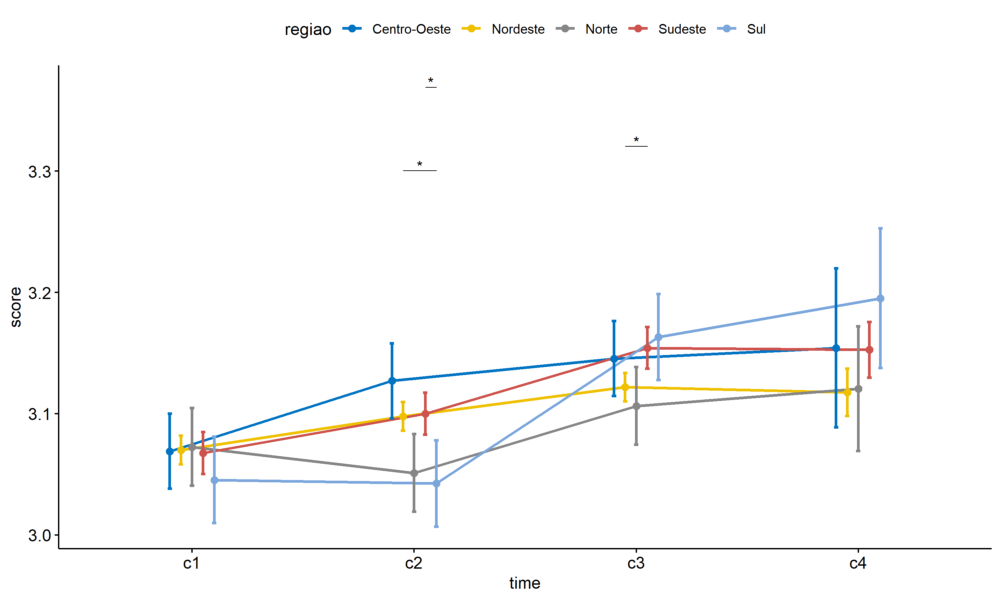<!-- -->

``` r
(pwc <- ldat %>% group_by(regiao) %>%
    emmeans_test(score ~ time, detailed = T, p.adjust.method = "bonferroni"))
```

    ## # A tibble: 30 × 15
    ##    regiao   term  .y.   group1 group2 null.value estimate      se    df conf.low
    ##  * <fct>    <chr> <chr> <chr>  <chr>       <dbl>    <dbl>   <dbl> <dbl>    <dbl>
    ##  1 Centro-… time  score c1     c2              0 -0.0582  0.0223   9425  -0.102 
    ##  2 Centro-… time  score c1     c3              0 -0.0764  0.0223   9425  -0.120 
    ##  3 Centro-… time  score c1     c4              0 -0.0852  0.0370   9425  -0.158 
    ##  4 Centro-… time  score c2     c3              0 -0.0182  0.0223   9425  -0.0619
    ##  5 Centro-… time  score c2     c4              0 -0.0270  0.0370   9425  -0.0994
    ##  6 Centro-… time  score c3     c4              0 -0.00880 0.0370   9425  -0.0812
    ##  7 Nordeste time  score c1     c2              0 -0.0277  0.00846  9425  -0.0443
    ##  8 Nordeste time  score c1     c3              0 -0.0519  0.00846  9425  -0.0684
    ##  9 Nordeste time  score c1     c4              0 -0.0476  0.0116   9425  -0.0703
    ## 10 Nordeste time  score c2     c3              0 -0.0241  0.00846  9425  -0.0407
    ## # ℹ 20 more rows
    ## # ℹ 5 more variables: conf.high <dbl>, statistic <dbl>, p <dbl>, p.adj <dbl>,
    ## #   p.adj.signif <chr>

| regiao       | term | .y.   | group1 | group2 | null.value | estimate |    se |   df | conf.low | conf.high | statistic |     p | p.adj | p.adj.signif |
|:-------------|:-----|:------|:-------|:-------|-----------:|---------:|------:|-----:|---------:|----------:|----------:|------:|------:|:-------------|
| Centro-Oeste | time | score | c1     | c2     |          0 |   -0.058 | 0.022 | 9425 |   -0.102 |    -0.014 |    -2.611 | 0.009 | 0.054 | ns           |
| Centro-Oeste | time | score | c1     | c3     |          0 |   -0.076 | 0.022 | 9425 |   -0.120 |    -0.033 |    -3.428 | 0.001 | 0.004 | \*\*         |
| Centro-Oeste | time | score | c1     | c4     |          0 |   -0.085 | 0.037 | 9425 |   -0.158 |    -0.013 |    -2.305 | 0.021 | 0.127 | ns           |
| Centro-Oeste | time | score | c2     | c3     |          0 |   -0.018 | 0.022 | 9425 |   -0.062 |     0.025 |    -0.817 | 0.414 | 1.000 | ns           |
| Centro-Oeste | time | score | c2     | c4     |          0 |   -0.027 | 0.037 | 9425 |   -0.099 |     0.045 |    -0.731 | 0.465 | 1.000 | ns           |
| Centro-Oeste | time | score | c3     | c4     |          0 |   -0.009 | 0.037 | 9425 |   -0.081 |     0.064 |    -0.238 | 0.812 | 1.000 | ns           |
| Nordeste     | time | score | c1     | c2     |          0 |   -0.028 | 0.008 | 9425 |   -0.044 |    -0.011 |    -3.277 | 0.001 | 0.006 | \*\*         |
| Nordeste     | time | score | c1     | c3     |          0 |   -0.052 | 0.008 | 9425 |   -0.068 |    -0.035 |    -6.130 | 0.000 | 0.000 | \*\*\*\*     |
| Nordeste     | time | score | c1     | c4     |          0 |   -0.048 | 0.012 | 9425 |   -0.070 |    -0.025 |    -4.107 | 0.000 | 0.000 | \*\*\*       |
| Nordeste     | time | score | c2     | c3     |          0 |   -0.024 | 0.008 | 9425 |   -0.041 |    -0.008 |    -2.854 | 0.004 | 0.026 | \*           |
| Nordeste     | time | score | c2     | c4     |          0 |   -0.020 | 0.012 | 9425 |   -0.043 |     0.003 |    -1.714 | 0.087 | 0.520 | ns           |
| Nordeste     | time | score | c3     | c4     |          0 |    0.004 | 0.012 | 9425 |   -0.018 |     0.027 |     0.370 | 0.711 | 1.000 | ns           |
| Norte        | time | score | c1     | c2     |          0 |    0.021 | 0.023 | 9425 |   -0.024 |     0.067 |     0.931 | 0.352 | 1.000 | ns           |
| Norte        | time | score | c1     | c3     |          0 |   -0.034 | 0.023 | 9425 |   -0.079 |     0.011 |    -1.468 | 0.142 | 0.853 | ns           |
| Norte        | time | score | c1     | c4     |          0 |   -0.048 | 0.031 | 9425 |   -0.108 |     0.013 |    -1.552 | 0.121 | 0.724 | ns           |
| Norte        | time | score | c2     | c3     |          0 |   -0.055 | 0.023 | 9425 |   -0.100 |    -0.010 |    -2.399 | 0.016 | 0.099 | ns           |
| Norte        | time | score | c2     | c4     |          0 |   -0.069 | 0.031 | 9425 |   -0.130 |    -0.009 |    -2.247 | 0.025 | 0.148 | ns           |
| Norte        | time | score | c3     | c4     |          0 |   -0.014 | 0.031 | 9425 |   -0.075 |     0.046 |    -0.456 | 0.648 | 1.000 | ns           |
| Sudeste      | time | score | c1     | c2     |          0 |   -0.032 | 0.012 | 9425 |   -0.057 |    -0.008 |    -2.604 | 0.009 | 0.055 | ns           |
| Sudeste      | time | score | c1     | c3     |          0 |   -0.087 | 0.012 | 9425 |   -0.111 |    -0.062 |    -6.969 | 0.000 | 0.000 | \*\*\*\*     |
| Sudeste      | time | score | c1     | c4     |          0 |   -0.085 | 0.015 | 9425 |   -0.114 |    -0.056 |    -5.820 | 0.000 | 0.000 | \*\*\*\*     |
| Sudeste      | time | score | c2     | c3     |          0 |   -0.054 | 0.012 | 9425 |   -0.079 |    -0.030 |    -4.365 | 0.000 | 0.000 | \*\*\*\*     |
| Sudeste      | time | score | c2     | c4     |          0 |   -0.053 | 0.015 | 9425 |   -0.081 |    -0.024 |    -3.605 | 0.000 | 0.002 | \*\*         |
| Sudeste      | time | score | c3     | c4     |          0 |    0.002 | 0.015 | 9425 |   -0.027 |     0.030 |     0.108 | 0.914 | 1.000 | ns           |
| Sul          | time | score | c1     | c2     |          0 |    0.003 | 0.026 | 9425 |   -0.047 |     0.053 |     0.116 | 0.908 | 1.000 | ns           |
| Sul          | time | score | c1     | c3     |          0 |   -0.118 | 0.026 | 9425 |   -0.168 |    -0.068 |    -4.592 | 0.000 | 0.000 | \*\*\*\*     |
| Sul          | time | score | c1     | c4     |          0 |   -0.150 | 0.035 | 9425 |   -0.217 |    -0.082 |    -4.334 | 0.000 | 0.000 | \*\*\*\*     |
| Sul          | time | score | c2     | c3     |          0 |   -0.121 | 0.026 | 9425 |   -0.171 |    -0.070 |    -4.708 | 0.000 | 0.000 | \*\*\*\*     |
| Sul          | time | score | c2     | c4     |          0 |   -0.153 | 0.035 | 9425 |   -0.220 |    -0.085 |    -4.420 | 0.000 | 0.000 | \*\*\*\*     |
| Sul          | time | score | c3     | c4     |          0 |   -0.032 | 0.035 | 9425 |   -0.100 |     0.036 |    -0.925 | 0.355 | 1.000 | ns           |

``` r
(emms <- get_emmeans(pwc))
```

    ## # A tibble: 20 × 8
    ##    regiao       time  emmean      se    df conf.low conf.high method      
    ##    <fct>        <fct>  <dbl>   <dbl> <dbl>    <dbl>     <dbl> <chr>       
    ##  1 Centro-Oeste c1      3.07 0.0158   9425     3.04      3.10 Emmeans test
    ##  2 Centro-Oeste c2      3.13 0.0158   9425     3.10      3.16 Emmeans test
    ##  3 Centro-Oeste c3      3.15 0.0158   9425     3.11      3.18 Emmeans test
    ##  4 Centro-Oeste c4      3.15 0.0334   9425     3.09      3.22 Emmeans test
    ##  5 Nordeste     c1      3.07 0.00598  9425     3.06      3.08 Emmeans test
    ##  6 Nordeste     c2      3.10 0.00598  9425     3.09      3.11 Emmeans test
    ##  7 Nordeste     c3      3.12 0.00598  9425     3.11      3.13 Emmeans test
    ##  8 Nordeste     c4      3.12 0.00992  9425     3.10      3.14 Emmeans test
    ##  9 Norte        c1      3.07 0.0163   9425     3.04      3.10 Emmeans test
    ## 10 Norte        c2      3.05 0.0163   9425     3.02      3.08 Emmeans test
    ## 11 Norte        c3      3.11 0.0163   9425     3.07      3.14 Emmeans test
    ## 12 Norte        c4      3.12 0.0262   9425     3.07      3.17 Emmeans test
    ## 13 Sudeste      c1      3.07 0.00880  9425     3.05      3.08 Emmeans test
    ## 14 Sudeste      c2      3.10 0.00880  9425     3.08      3.12 Emmeans test
    ## 15 Sudeste      c3      3.15 0.00880  9425     3.14      3.17 Emmeans test
    ## 16 Sudeste      c4      3.15 0.0117   9425     3.13      3.18 Emmeans test
    ## 17 Sul          c1      3.05 0.0181   9425     3.01      3.08 Emmeans test
    ## 18 Sul          c2      3.04 0.0181   9425     3.01      3.08 Emmeans test
    ## 19 Sul          c3      3.16 0.0181   9425     3.13      3.20 Emmeans test
    ## 20 Sul          c4      3.20 0.0294   9425     3.14      3.25 Emmeans test

| regiao       | time | emmean |    se |   df | conf.low | conf.high | method       |
|:-------------|:-----|-------:|------:|-----:|---------:|----------:|:-------------|
| Centro-Oeste | c1   |  3.069 | 0.016 | 9425 |    3.038 |     3.100 | Emmeans test |
| Centro-Oeste | c2   |  3.127 | 0.016 | 9425 |    3.096 |     3.158 | Emmeans test |
| Centro-Oeste | c3   |  3.145 | 0.016 | 9425 |    3.114 |     3.176 | Emmeans test |
| Centro-Oeste | c4   |  3.154 | 0.033 | 9425 |    3.089 |     3.220 | Emmeans test |
| Nordeste     | c1   |  3.070 | 0.006 | 9425 |    3.058 |     3.082 | Emmeans test |
| Nordeste     | c2   |  3.098 | 0.006 | 9425 |    3.086 |     3.109 | Emmeans test |
| Nordeste     | c3   |  3.122 | 0.006 | 9425 |    3.110 |     3.134 | Emmeans test |
| Nordeste     | c4   |  3.118 | 0.010 | 9425 |    3.098 |     3.137 | Emmeans test |
| Norte        | c1   |  3.073 | 0.016 | 9425 |    3.041 |     3.105 | Emmeans test |
| Norte        | c2   |  3.051 | 0.016 | 9425 |    3.019 |     3.083 | Emmeans test |
| Norte        | c3   |  3.106 | 0.016 | 9425 |    3.074 |     3.138 | Emmeans test |
| Norte        | c4   |  3.121 | 0.026 | 9425 |    3.069 |     3.172 | Emmeans test |
| Sudeste      | c1   |  3.068 | 0.009 | 9425 |    3.050 |     3.085 | Emmeans test |
| Sudeste      | c2   |  3.100 | 0.009 | 9425 |    3.083 |     3.117 | Emmeans test |
| Sudeste      | c3   |  3.154 | 0.009 | 9425 |    3.137 |     3.172 | Emmeans test |
| Sudeste      | c4   |  3.153 | 0.012 | 9425 |    3.130 |     3.176 | Emmeans test |
| Sul          | c1   |  3.045 | 0.018 | 9425 |    3.010 |     3.081 | Emmeans test |
| Sul          | c2   |  3.042 | 0.018 | 9425 |    3.007 |     3.078 | Emmeans test |
| Sul          | c3   |  3.163 | 0.018 | 9425 |    3.128 |     3.199 | Emmeans test |
| Sul          | c4   |  3.195 | 0.029 | 9425 |    3.138 |     3.253 | Emmeans test |

``` r
emms.gg <- emms[which(emms$regiao == "Centro-Oeste"),]
if (nrow(emms.gg) > 0)
  ggline(emms.gg, x = "time", y = "emmean", color = "#0073C2FF", ylab = "score", size = 1) +
    geom_errorbar(aes(ymin = conf.low, ymax = conf.high),
                  width = 0.1, color = "#0073C2FF", linewidth = 1) +
    stat_pvalue_manual(
      add_xy_position(pwc[which(pwc$regiao == "Centro-Oeste"),],
                      x = "time", fun = "mean_se"),
      hide.ns = T, color = "#0073C2FF", tip.length = F) +
    theme(legend.text = element_blank())
```

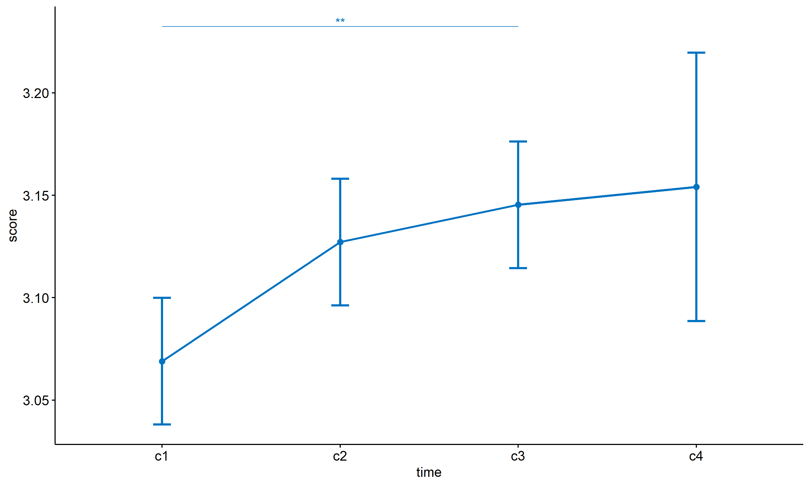<!-- -->

``` r
emms.gg <- emms[which(emms$regiao == "Nordeste"),]
if (nrow(emms.gg) > 0)
  ggline(emms.gg, x = "time", y = "emmean", color = "#EFC000FF", ylab = "score", size = 1) +
    geom_errorbar(aes(ymin = conf.low, ymax = conf.high),
                  width = 0.1, color = "#EFC000FF", linewidth = 1) +
    stat_pvalue_manual(
      add_xy_position(pwc[which(pwc$regiao == "Nordeste"),],
                      x = "time", fun = "mean_se"),
      hide.ns = T, color = "#EFC000FF", tip.length = F) +
    theme(legend.text = element_blank())
```

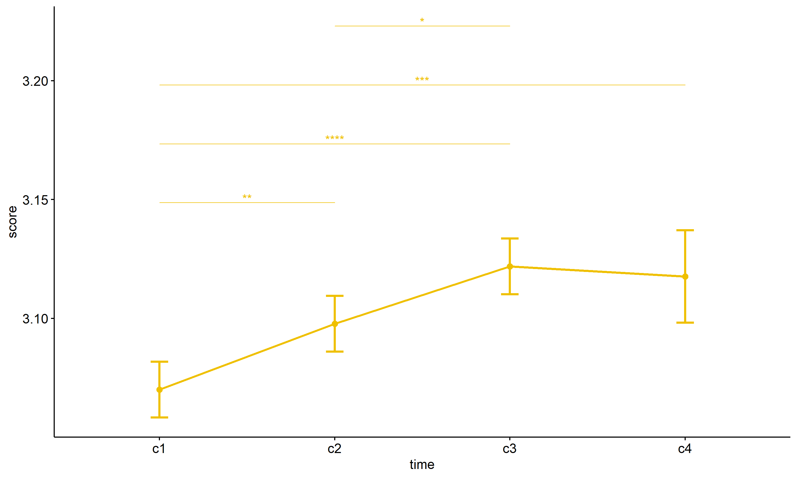<!-- -->

``` r
emms.gg <- emms[which(emms$regiao == "Norte"),]
if (nrow(emms.gg) > 0)
  ggline(emms.gg, x = "time", y = "emmean", color = "#868686FF", ylab = "score", size = 1) +
    geom_errorbar(aes(ymin = conf.low, ymax = conf.high),
                  width = 0.1, color = "#868686FF", linewidth = 1) +
    stat_pvalue_manual(
      add_xy_position(pwc[which(pwc$regiao == "Norte"),],
                      x = "time", fun = "mean_se"),
      hide.ns = T, color = "#868686FF", tip.length = F) +
    theme(legend.text = element_blank())
```

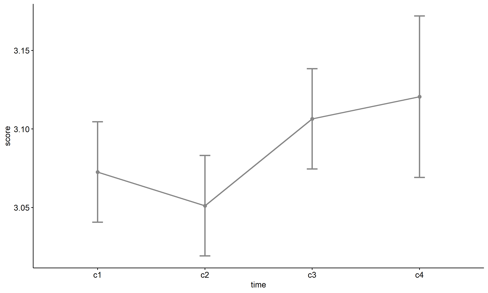<!-- -->

``` r
emms.gg <- emms[which(emms$regiao == "Sudeste"),]
if (nrow(emms.gg) > 0)
  ggline(emms.gg, x = "time", y = "emmean", color = "#CD534CFF", ylab = "score", size = 1) +
    geom_errorbar(aes(ymin = conf.low, ymax = conf.high),
                  width = 0.1, color = "#CD534CFF", linewidth = 1) +
    stat_pvalue_manual(
      add_xy_position(pwc[which(pwc$regiao == "Sudeste"),],
                      x = "time", fun = "mean_se"),
      hide.ns = T, color = "#CD534CFF", tip.length = F) +
    theme(legend.text = element_blank())
```

<!-- -->

``` r
emms.gg <- emms[which(emms$regiao == "Sul"),]
if (nrow(emms.gg) > 0)
  ggline(emms.gg, x = "time", y = "emmean", color = "#7AA6DCFF", ylab = "score", size = 1) +
    geom_errorbar(aes(ymin = conf.low, ymax = conf.high),
                  width = 0.1, color = "#7AA6DCFF", linewidth = 1) +
    stat_pvalue_manual(
      add_xy_position(pwc[which(pwc$regiao == "Sul"),],
                      x = "time", fun = "mean_se"),
      hide.ns = T, color = "#7AA6DCFF", tip.length = F) +
    theme(legend.text = element_blank())
```

<!-- -->

## PairWise Computation after removing non.normal data

``` r
if (length(non.ids) > 0)
  (pwc2 <- ldat2 %>% group_by(time) %>%
     emmeans_test(score ~ regiao, detailed = T, p.adjust.method = "bonferroni"))
```

    ## Warning: Expected 2 pieces. Additional pieces discarded in 16 rows [1, 2, 3, 4, 11, 12,
    ## 13, 14, 21, 22, 23, 24, 31, 32, 33, 34].

    ## # A tibble: 40 × 15
    ##    time  term   .y.   group1   group2  null.value estimate     se    df conf.low
    ##  * <fct> <chr>  <chr> <chr>    <chr>        <dbl>    <dbl>  <dbl> <dbl>    <dbl>
    ##  1 c1    regiao score Centro   Oeste            0 -0.00107 0.0168  9421  -0.0341
    ##  2 c1    regiao score Centro   Oeste            0 -0.00299 0.0227  9421  -0.0475
    ##  3 c1    regiao score Centro   Oeste            0  0.00142 0.0180  9421  -0.0339
    ##  4 c1    regiao score Centro   Oeste            0  0.0236  0.0240  9421  -0.0235
    ##  5 c1    regiao score Nordeste Norte            0 -0.00193 0.0174  9421  -0.0360
    ##  6 c1    regiao score Nordeste Sudeste          0  0.00249 0.0106  9421  -0.0184
    ##  7 c1    regiao score Nordeste Sul              0  0.0246  0.0191  9421  -0.0128
    ##  8 c1    regiao score Norte    Sudeste          0  0.00442 0.0185  9421  -0.0319
    ##  9 c1    regiao score Norte    Sul              0  0.0266  0.0244  9421  -0.0213
    ## 10 c1    regiao score Sudeste  Sul              0  0.0222  0.0202  9421  -0.0173
    ## # ℹ 30 more rows
    ## # ℹ 5 more variables: conf.high <dbl>, statistic <dbl>, p <dbl>, p.adj <dbl>,
    ## #   p.adj.signif <chr>

| time | term   | .y.   | group1   | group2  | null.value | estimate |    se |   df | conf.low | conf.high | statistic |     p | p.adj | p.adj.signif |
|:-----|:-------|:------|:---------|:--------|-----------:|---------:|------:|-----:|---------:|----------:|----------:|------:|------:|:-------------|
| c1   | regiao | score | Centro   | Oeste   |          0 |   -0.001 | 0.017 | 9421 |   -0.034 |     0.032 |    -0.063 | 0.950 | 1.000 | ns           |
| c1   | regiao | score | Centro   | Oeste   |          0 |   -0.003 | 0.023 | 9421 |   -0.047 |     0.041 |    -0.132 | 0.895 | 1.000 | ns           |
| c1   | regiao | score | Centro   | Oeste   |          0 |    0.001 | 0.018 | 9421 |   -0.034 |     0.037 |     0.079 | 0.937 | 1.000 | ns           |
| c1   | regiao | score | Centro   | Oeste   |          0 |    0.024 | 0.024 | 9421 |   -0.023 |     0.071 |     0.982 | 0.326 | 1.000 | ns           |
| c1   | regiao | score | Nordeste | Norte   |          0 |   -0.002 | 0.017 | 9421 |   -0.036 |     0.032 |    -0.111 | 0.912 | 1.000 | ns           |
| c1   | regiao | score | Nordeste | Sudeste |          0 |    0.002 | 0.011 | 9421 |   -0.018 |     0.023 |     0.234 | 0.815 | 1.000 | ns           |
| c1   | regiao | score | Nordeste | Sul     |          0 |    0.025 | 0.019 | 9421 |   -0.013 |     0.062 |     1.291 | 0.197 | 1.000 | ns           |
| c1   | regiao | score | Norte    | Sudeste |          0 |    0.004 | 0.019 | 9421 |   -0.032 |     0.041 |     0.238 | 0.812 | 1.000 | ns           |
| c1   | regiao | score | Norte    | Sul     |          0 |    0.027 | 0.024 | 9421 |   -0.021 |     0.074 |     1.089 | 0.276 | 1.000 | ns           |
| c1   | regiao | score | Sudeste  | Sul     |          0 |    0.022 | 0.020 | 9421 |   -0.017 |     0.062 |     1.100 | 0.272 | 1.000 | ns           |
| c2   | regiao | score | Centro   | Oeste   |          0 |    0.029 | 0.017 | 9421 |   -0.004 |     0.062 |     1.745 | 0.081 | 0.810 | ns           |
| c2   | regiao | score | Centro   | Oeste   |          0 |    0.075 | 0.023 | 9421 |    0.031 |     0.120 |     3.317 | 0.001 | 0.009 | \*\*         |
| c2   | regiao | score | Centro   | Oeste   |          0 |    0.027 | 0.018 | 9421 |   -0.008 |     0.063 |     1.508 | 0.131 | 1.000 | ns           |
| c2   | regiao | score | Centro   | Oeste   |          0 |    0.085 | 0.024 | 9421 |    0.038 |     0.132 |     3.528 | 0.000 | 0.004 | \*\*         |
| c2   | regiao | score | Nordeste | Norte   |          0 |    0.046 | 0.017 | 9421 |    0.012 |     0.080 |     2.637 | 0.008 | 0.084 | ns           |
| c2   | regiao | score | Nordeste | Sudeste |          0 |   -0.002 | 0.011 | 9421 |   -0.023 |     0.019 |    -0.206 | 0.837 | 1.000 | ns           |
| c2   | regiao | score | Nordeste | Sul     |          0 |    0.055 | 0.019 | 9421 |    0.018 |     0.093 |     2.898 | 0.004 | 0.038 | \*           |
| c2   | regiao | score | Norte    | Sudeste |          0 |   -0.048 | 0.019 | 9421 |   -0.084 |    -0.012 |    -2.591 | 0.010 | 0.096 | ns           |
| c2   | regiao | score | Norte    | Sul     |          0 |    0.009 | 0.024 | 9421 |   -0.038 |     0.057 |     0.388 | 0.698 | 1.000 | ns           |
| c2   | regiao | score | Sudeste  | Sul     |          0 |    0.058 | 0.020 | 9421 |    0.018 |     0.097 |     2.854 | 0.004 | 0.043 | \*           |
| c3   | regiao | score | Centro   | Oeste   |          0 |    0.023 | 0.017 | 9421 |   -0.010 |     0.056 |     1.393 | 0.164 | 1.000 | ns           |
| c3   | regiao | score | Centro   | Oeste   |          0 |    0.041 | 0.023 | 9421 |   -0.004 |     0.085 |     1.803 | 0.071 | 0.715 | ns           |
| c3   | regiao | score | Centro   | Oeste   |          0 |   -0.009 | 0.018 | 9421 |   -0.044 |     0.026 |    -0.493 | 0.622 | 1.000 | ns           |
| c3   | regiao | score | Centro   | Oeste   |          0 |   -0.018 | 0.024 | 9421 |   -0.065 |     0.029 |    -0.742 | 0.458 | 1.000 | ns           |
| c3   | regiao | score | Nordeste | Norte   |          0 |    0.017 | 0.017 | 9421 |   -0.017 |     0.052 |     1.002 | 0.316 | 1.000 | ns           |
| c3   | regiao | score | Nordeste | Sudeste |          0 |   -0.032 | 0.011 | 9421 |   -0.053 |    -0.012 |    -3.043 | 0.002 | 0.024 | \*           |
| c3   | regiao | score | Nordeste | Sul     |          0 |   -0.041 | 0.019 | 9421 |   -0.079 |    -0.004 |    -2.163 | 0.031 | 0.306 | ns           |
| c3   | regiao | score | Norte    | Sudeste |          0 |   -0.050 | 0.019 | 9421 |   -0.086 |    -0.013 |    -2.684 | 0.007 | 0.073 | ns           |
| c3   | regiao | score | Norte    | Sul     |          0 |   -0.059 | 0.024 | 9421 |   -0.107 |    -0.011 |    -2.406 | 0.016 | 0.161 | ns           |
| c3   | regiao | score | Sudeste  | Sul     |          0 |   -0.009 | 0.020 | 9421 |   -0.048 |     0.031 |    -0.443 | 0.658 | 1.000 | ns           |
| c4   | regiao | score | Centro   | Oeste   |          0 |    0.037 | 0.035 | 9421 |   -0.032 |     0.105 |     1.049 | 0.294 | 1.000 | ns           |
| c4   | regiao | score | Centro   | Oeste   |          0 |    0.042 | 0.043 | 9421 |   -0.041 |     0.126 |     0.998 | 0.318 | 1.000 | ns           |
| c4   | regiao | score | Centro   | Oeste   |          0 |    0.001 | 0.035 | 9421 |   -0.068 |     0.071 |     0.042 | 0.966 | 1.000 | ns           |
| c4   | regiao | score | Centro   | Oeste   |          0 |   -0.041 | 0.045 | 9421 |   -0.128 |     0.046 |    -0.921 | 0.357 | 1.000 | ns           |
| c4   | regiao | score | Nordeste | Norte   |          0 |    0.006 | 0.028 | 9421 |   -0.049 |     0.061 |     0.210 | 0.833 | 1.000 | ns           |
| c4   | regiao | score | Nordeste | Sudeste |          0 |   -0.035 | 0.015 | 9421 |   -0.065 |    -0.005 |    -2.289 | 0.022 | 0.221 | ns           |
| c4   | regiao | score | Nordeste | Sul     |          0 |   -0.078 | 0.031 | 9421 |   -0.138 |    -0.017 |    -2.500 | 0.012 | 0.125 | ns           |
| c4   | regiao | score | Norte    | Sudeste |          0 |   -0.041 | 0.029 | 9421 |   -0.098 |     0.016 |    -1.421 | 0.155 | 1.000 | ns           |
| c4   | regiao | score | Norte    | Sul     |          0 |   -0.083 | 0.039 | 9421 |   -0.161 |    -0.006 |    -2.113 | 0.035 | 0.346 | ns           |
| c4   | regiao | score | Sudeste  | Sul     |          0 |   -0.042 | 0.032 | 9421 |   -0.104 |     0.020 |    -1.343 | 0.179 | 1.000 | ns           |

``` r
if (length(non.ids) > 0)
  (emms2 <- get_emmeans(pwc2))
```

    ## # A tibble: 20 × 8
    ##    time  regiao       emmean      se    df conf.low conf.high method      
    ##    <fct> <fct>         <dbl>   <dbl> <dbl>    <dbl>     <dbl> <chr>       
    ##  1 c1    Centro-Oeste   3.07 0.0157   9421     3.04      3.10 Emmeans test
    ##  2 c1    Nordeste       3.07 0.00598  9421     3.06      3.08 Emmeans test
    ##  3 c1    Norte          3.07 0.0163   9421     3.04      3.10 Emmeans test
    ##  4 c1    Sudeste        3.07 0.00879  9421     3.05      3.08 Emmeans test
    ##  5 c1    Sul            3.05 0.0181   9421     3.01      3.08 Emmeans test
    ##  6 c2    Centro-Oeste   3.13 0.0157   9421     3.10      3.16 Emmeans test
    ##  7 c2    Nordeste       3.10 0.00598  9421     3.09      3.11 Emmeans test
    ##  8 c2    Norte          3.05 0.0163   9421     3.02      3.08 Emmeans test
    ##  9 c2    Sudeste        3.10 0.00879  9421     3.08      3.12 Emmeans test
    ## 10 c2    Sul            3.04 0.0181   9421     3.01      3.08 Emmeans test
    ## 11 c3    Centro-Oeste   3.15 0.0157   9421     3.11      3.18 Emmeans test
    ## 12 c3    Nordeste       3.12 0.00598  9421     3.11      3.13 Emmeans test
    ## 13 c3    Norte          3.10 0.0163   9421     3.07      3.14 Emmeans test
    ## 14 c3    Sudeste        3.15 0.00879  9421     3.14      3.17 Emmeans test
    ## 15 c3    Sul            3.16 0.0181   9421     3.13      3.20 Emmeans test
    ## 16 c4    Centro-Oeste   3.15 0.0334   9421     3.09      3.22 Emmeans test
    ## 17 c4    Nordeste       3.12 0.00992  9421     3.10      3.14 Emmeans test
    ## 18 c4    Norte          3.11 0.0264   9421     3.06      3.16 Emmeans test
    ## 19 c4    Sudeste        3.15 0.0117   9421     3.13      3.18 Emmeans test
    ## 20 c4    Sul            3.20 0.0294   9421     3.14      3.25 Emmeans test

| time | regiao       | emmean |    se |   df | conf.low | conf.high | method       |
|:-----|:-------------|-------:|------:|-----:|---------:|----------:|:-------------|
| c1   | Centro-Oeste |  3.069 | 0.016 | 9421 |    3.038 |     3.100 | Emmeans test |
| c1   | Nordeste     |  3.070 | 0.006 | 9421 |    3.058 |     3.082 | Emmeans test |
| c1   | Norte        |  3.072 | 0.016 | 9421 |    3.040 |     3.104 | Emmeans test |
| c1   | Sudeste      |  3.068 | 0.009 | 9421 |    3.050 |     3.085 | Emmeans test |
| c1   | Sul          |  3.045 | 0.018 | 9421 |    3.010 |     3.081 | Emmeans test |
| c2   | Centro-Oeste |  3.127 | 0.016 | 9421 |    3.096 |     3.158 | Emmeans test |
| c2   | Nordeste     |  3.098 | 0.006 | 9421 |    3.086 |     3.109 | Emmeans test |
| c2   | Norte        |  3.052 | 0.016 | 9421 |    3.020 |     3.084 | Emmeans test |
| c2   | Sudeste      |  3.100 | 0.009 | 9421 |    3.083 |     3.117 | Emmeans test |
| c2   | Sul          |  3.042 | 0.018 | 9421 |    3.007 |     3.078 | Emmeans test |
| c3   | Centro-Oeste |  3.145 | 0.016 | 9421 |    3.114 |     3.176 | Emmeans test |
| c3   | Nordeste     |  3.122 | 0.006 | 9421 |    3.110 |     3.134 | Emmeans test |
| c3   | Norte        |  3.104 | 0.016 | 9421 |    3.072 |     3.136 | Emmeans test |
| c3   | Sudeste      |  3.154 | 0.009 | 9421 |    3.137 |     3.171 | Emmeans test |
| c3   | Sul          |  3.163 | 0.018 | 9421 |    3.128 |     3.199 | Emmeans test |
| c4   | Centro-Oeste |  3.154 | 0.033 | 9421 |    3.089 |     3.220 | Emmeans test |
| c4   | Nordeste     |  3.118 | 0.010 | 9421 |    3.098 |     3.137 | Emmeans test |
| c4   | Norte        |  3.112 | 0.026 | 9421 |    3.060 |     3.163 | Emmeans test |
| c4   | Sudeste      |  3.153 | 0.012 | 9421 |    3.130 |     3.176 | Emmeans test |
| c4   | Sul          |  3.195 | 0.029 | 9421 |    3.138 |     3.253 | Emmeans test |

``` r
if (length(non.ids) > 0) {
  pwc2 <- add_xy_position(pwc2, x = "time", fun = "mean_se", dodge = 0.25)
  pd2 <- position_dodge(width = 0.25)
  
  ggline(emms2, x = "time", y = "emmean", color = "regiao", size = 1,
         palette = c("#0073C2FF","#EFC000FF","#868686FF","#CD534CFF","#7AA6DCFF"),
         position = pd, ylab = "score") +
    geom_errorbar(aes(ymin = conf.low, ymax = conf.high, color = regiao),
                position = pd, width = 0.1, linewidth = 1) +
    stat_pvalue_manual(pwc2, hide.ns = T, tip.length = F, linetype = 1)
}
```

    ## Warning: Removed 2 rows containing non-finite values (`stat_bracket()`).

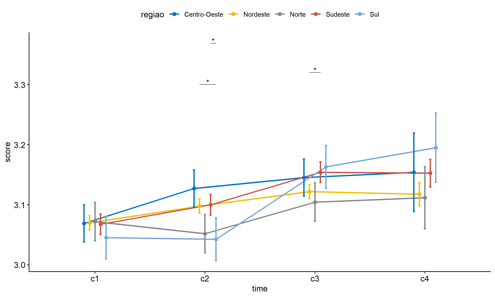<!-- -->

``` r
if (length(non.ids) > 0)
  (pwc2 <- ldat2 %>% group_by(regiao) %>%
     emmeans_test(score ~ time, detailed = T, p.adjust.method = "bonferroni"))
```

    ## # A tibble: 30 × 15
    ##    regiao   term  .y.   group1 group2 null.value estimate      se    df conf.low
    ##  * <fct>    <chr> <chr> <chr>  <chr>       <dbl>    <dbl>   <dbl> <dbl>    <dbl>
    ##  1 Centro-… time  score c1     c2              0 -0.0582  0.0223   9421  -0.102 
    ##  2 Centro-… time  score c1     c3              0 -0.0764  0.0223   9421  -0.120 
    ##  3 Centro-… time  score c1     c4              0 -0.0852  0.0369   9421  -0.158 
    ##  4 Centro-… time  score c2     c3              0 -0.0182  0.0223   9421  -0.0619
    ##  5 Centro-… time  score c2     c4              0 -0.0270  0.0369   9421  -0.0994
    ##  6 Centro-… time  score c3     c4              0 -0.00880 0.0369   9421  -0.0812
    ##  7 Nordeste time  score c1     c2              0 -0.0277  0.00846  9421  -0.0443
    ##  8 Nordeste time  score c1     c3              0 -0.0519  0.00846  9421  -0.0684
    ##  9 Nordeste time  score c1     c4              0 -0.0476  0.0116   9421  -0.0703
    ## 10 Nordeste time  score c2     c3              0 -0.0241  0.00846  9421  -0.0407
    ## # ℹ 20 more rows
    ## # ℹ 5 more variables: conf.high <dbl>, statistic <dbl>, p <dbl>, p.adj <dbl>,
    ## #   p.adj.signif <chr>

| regiao       | term | .y.   | group1 | group2 | null.value | estimate |    se |   df | conf.low | conf.high | statistic |     p | p.adj | p.adj.signif |
|:-------------|:-----|:------|:-------|:-------|-----------:|---------:|------:|-----:|---------:|----------:|----------:|------:|------:|:-------------|
| Centro-Oeste | time | score | c1     | c2     |          0 |   -0.058 | 0.022 | 9421 |   -0.102 |    -0.015 |    -2.612 | 0.009 | 0.054 | ns           |
| Centro-Oeste | time | score | c1     | c3     |          0 |   -0.076 | 0.022 | 9421 |   -0.120 |    -0.033 |    -3.430 | 0.001 | 0.004 | \*\*         |
| Centro-Oeste | time | score | c1     | c4     |          0 |   -0.085 | 0.037 | 9421 |   -0.158 |    -0.013 |    -2.306 | 0.021 | 0.127 | ns           |
| Centro-Oeste | time | score | c2     | c3     |          0 |   -0.018 | 0.022 | 9421 |   -0.062 |     0.025 |    -0.818 | 0.414 | 1.000 | ns           |
| Centro-Oeste | time | score | c2     | c4     |          0 |   -0.027 | 0.037 | 9421 |   -0.099 |     0.045 |    -0.731 | 0.465 | 1.000 | ns           |
| Centro-Oeste | time | score | c3     | c4     |          0 |   -0.009 | 0.037 | 9421 |   -0.081 |     0.064 |    -0.238 | 0.812 | 1.000 | ns           |
| Nordeste     | time | score | c1     | c2     |          0 |   -0.028 | 0.008 | 9421 |   -0.044 |    -0.011 |    -3.278 | 0.001 | 0.006 | \*\*         |
| Nordeste     | time | score | c1     | c3     |          0 |   -0.052 | 0.008 | 9421 |   -0.068 |    -0.035 |    -6.133 | 0.000 | 0.000 | \*\*\*\*     |
| Nordeste     | time | score | c1     | c4     |          0 |   -0.048 | 0.012 | 9421 |   -0.070 |    -0.025 |    -4.108 | 0.000 | 0.000 | \*\*\*       |
| Nordeste     | time | score | c2     | c3     |          0 |   -0.024 | 0.008 | 9421 |   -0.041 |    -0.008 |    -2.855 | 0.004 | 0.026 | \*           |
| Nordeste     | time | score | c2     | c4     |          0 |   -0.020 | 0.012 | 9421 |   -0.043 |     0.003 |    -1.714 | 0.086 | 0.519 | ns           |
| Nordeste     | time | score | c3     | c4     |          0 |    0.004 | 0.012 | 9421 |   -0.018 |     0.027 |     0.370 | 0.711 | 1.000 | ns           |
| Norte        | time | score | c1     | c2     |          0 |    0.020 | 0.023 | 9421 |   -0.025 |     0.065 |     0.869 | 0.385 | 1.000 | ns           |
| Norte        | time | score | c1     | c3     |          0 |   -0.033 | 0.023 | 9421 |   -0.078 |     0.013 |    -1.408 | 0.159 | 0.955 | ns           |
| Norte        | time | score | c1     | c4     |          0 |   -0.040 | 0.031 | 9421 |   -0.101 |     0.021 |    -1.280 | 0.201 | 1.000 | ns           |
| Norte        | time | score | c2     | c3     |          0 |   -0.053 | 0.023 | 9421 |   -0.098 |    -0.007 |    -2.277 | 0.023 | 0.137 | ns           |
| Norte        | time | score | c2     | c4     |          0 |   -0.060 | 0.031 | 9421 |   -0.121 |     0.001 |    -1.927 | 0.054 | 0.324 | ns           |
| Norte        | time | score | c3     | c4     |          0 |   -0.007 | 0.031 | 9421 |   -0.068 |     0.054 |    -0.232 | 0.816 | 1.000 | ns           |
| Sudeste      | time | score | c1     | c2     |          0 |   -0.032 | 0.012 | 9421 |   -0.057 |    -0.008 |    -2.605 | 0.009 | 0.055 | ns           |
| Sudeste      | time | score | c1     | c3     |          0 |   -0.087 | 0.012 | 9421 |   -0.111 |    -0.062 |    -6.972 | 0.000 | 0.000 | \*\*\*\*     |
| Sudeste      | time | score | c1     | c4     |          0 |   -0.085 | 0.015 | 9421 |   -0.114 |    -0.056 |    -5.823 | 0.000 | 0.000 | \*\*\*\*     |
| Sudeste      | time | score | c2     | c3     |          0 |   -0.054 | 0.012 | 9421 |   -0.079 |    -0.030 |    -4.367 | 0.000 | 0.000 | \*\*\*\*     |
| Sudeste      | time | score | c2     | c4     |          0 |   -0.053 | 0.015 | 9421 |   -0.081 |    -0.024 |    -3.607 | 0.000 | 0.002 | \*\*         |
| Sudeste      | time | score | c3     | c4     |          0 |    0.002 | 0.015 | 9421 |   -0.027 |     0.030 |     0.108 | 0.914 | 1.000 | ns           |
| Sul          | time | score | c1     | c2     |          0 |    0.003 | 0.026 | 9421 |   -0.047 |     0.053 |     0.116 | 0.908 | 1.000 | ns           |
| Sul          | time | score | c1     | c3     |          0 |   -0.118 | 0.026 | 9421 |   -0.168 |    -0.068 |    -4.594 | 0.000 | 0.000 | \*\*\*\*     |
| Sul          | time | score | c1     | c4     |          0 |   -0.150 | 0.035 | 9421 |   -0.217 |    -0.082 |    -4.336 | 0.000 | 0.000 | \*\*\*\*     |
| Sul          | time | score | c2     | c3     |          0 |   -0.121 | 0.026 | 9421 |   -0.171 |    -0.070 |    -4.710 | 0.000 | 0.000 | \*\*\*\*     |
| Sul          | time | score | c2     | c4     |          0 |   -0.153 | 0.035 | 9421 |   -0.220 |    -0.085 |    -4.422 | 0.000 | 0.000 | \*\*\*\*     |
| Sul          | time | score | c3     | c4     |          0 |   -0.032 | 0.035 | 9421 |   -0.100 |     0.036 |    -0.926 | 0.355 | 1.000 | ns           |

``` r
if (length(non.ids) > 0)
  (emms2 <- get_emmeans(pwc2))
```

    ## # A tibble: 20 × 8
    ##    regiao       time  emmean      se    df conf.low conf.high method      
    ##    <fct>        <fct>  <dbl>   <dbl> <dbl>    <dbl>     <dbl> <chr>       
    ##  1 Centro-Oeste c1      3.07 0.0157   9421     3.04      3.10 Emmeans test
    ##  2 Centro-Oeste c2      3.13 0.0157   9421     3.10      3.16 Emmeans test
    ##  3 Centro-Oeste c3      3.15 0.0157   9421     3.11      3.18 Emmeans test
    ##  4 Centro-Oeste c4      3.15 0.0334   9421     3.09      3.22 Emmeans test
    ##  5 Nordeste     c1      3.07 0.00598  9421     3.06      3.08 Emmeans test
    ##  6 Nordeste     c2      3.10 0.00598  9421     3.09      3.11 Emmeans test
    ##  7 Nordeste     c3      3.12 0.00598  9421     3.11      3.13 Emmeans test
    ##  8 Nordeste     c4      3.12 0.00992  9421     3.10      3.14 Emmeans test
    ##  9 Norte        c1      3.07 0.0163   9421     3.04      3.10 Emmeans test
    ## 10 Norte        c2      3.05 0.0163   9421     3.02      3.08 Emmeans test
    ## 11 Norte        c3      3.10 0.0163   9421     3.07      3.14 Emmeans test
    ## 12 Norte        c4      3.11 0.0264   9421     3.06      3.16 Emmeans test
    ## 13 Sudeste      c1      3.07 0.00879  9421     3.05      3.08 Emmeans test
    ## 14 Sudeste      c2      3.10 0.00879  9421     3.08      3.12 Emmeans test
    ## 15 Sudeste      c3      3.15 0.00879  9421     3.14      3.17 Emmeans test
    ## 16 Sudeste      c4      3.15 0.0117   9421     3.13      3.18 Emmeans test
    ## 17 Sul          c1      3.05 0.0181   9421     3.01      3.08 Emmeans test
    ## 18 Sul          c2      3.04 0.0181   9421     3.01      3.08 Emmeans test
    ## 19 Sul          c3      3.16 0.0181   9421     3.13      3.20 Emmeans test
    ## 20 Sul          c4      3.20 0.0294   9421     3.14      3.25 Emmeans test

| regiao       | time | emmean |    se |   df | conf.low | conf.high | method       |
|:-------------|:-----|-------:|------:|-----:|---------:|----------:|:-------------|
| Centro-Oeste | c1   |  3.069 | 0.016 | 9421 |    3.038 |     3.100 | Emmeans test |
| Centro-Oeste | c2   |  3.127 | 0.016 | 9421 |    3.096 |     3.158 | Emmeans test |
| Centro-Oeste | c3   |  3.145 | 0.016 | 9421 |    3.114 |     3.176 | Emmeans test |
| Centro-Oeste | c4   |  3.154 | 0.033 | 9421 |    3.089 |     3.220 | Emmeans test |
| Nordeste     | c1   |  3.070 | 0.006 | 9421 |    3.058 |     3.082 | Emmeans test |
| Nordeste     | c2   |  3.098 | 0.006 | 9421 |    3.086 |     3.109 | Emmeans test |
| Nordeste     | c3   |  3.122 | 0.006 | 9421 |    3.110 |     3.134 | Emmeans test |
| Nordeste     | c4   |  3.118 | 0.010 | 9421 |    3.098 |     3.137 | Emmeans test |
| Norte        | c1   |  3.072 | 0.016 | 9421 |    3.040 |     3.104 | Emmeans test |
| Norte        | c2   |  3.052 | 0.016 | 9421 |    3.020 |     3.084 | Emmeans test |
| Norte        | c3   |  3.104 | 0.016 | 9421 |    3.072 |     3.136 | Emmeans test |
| Norte        | c4   |  3.112 | 0.026 | 9421 |    3.060 |     3.163 | Emmeans test |
| Sudeste      | c1   |  3.068 | 0.009 | 9421 |    3.050 |     3.085 | Emmeans test |
| Sudeste      | c2   |  3.100 | 0.009 | 9421 |    3.083 |     3.117 | Emmeans test |
| Sudeste      | c3   |  3.154 | 0.009 | 9421 |    3.137 |     3.171 | Emmeans test |
| Sudeste      | c4   |  3.153 | 0.012 | 9421 |    3.130 |     3.176 | Emmeans test |
| Sul          | c1   |  3.045 | 0.018 | 9421 |    3.010 |     3.081 | Emmeans test |
| Sul          | c2   |  3.042 | 0.018 | 9421 |    3.007 |     3.078 | Emmeans test |
| Sul          | c3   |  3.163 | 0.018 | 9421 |    3.128 |     3.199 | Emmeans test |
| Sul          | c4   |  3.195 | 0.029 | 9421 |    3.138 |     3.253 | Emmeans test |

``` r
if (length(non.ids) > 0) {
  emms.gg <- emms2[which(emms2$regiao == "Centro-Oeste"),]
  if (nrow(emms.gg) > 0)
    ggline(emms.gg, x = "time", y = "emmean", color = "#0073C2FF", ylab = "score", size = 1) +
    geom_errorbar(aes(ymin = conf.low, ymax = conf.high),
                  width = 0.1, color = "#0073C2FF", linewidth = 1) +
    stat_pvalue_manual(
      add_xy_position(pwc[which(pwc$regiao == "Centro-Oeste"),],
                      x = "time", fun = "mean_se"),
      hide.ns = T, color = "#0073C2FF", tip.length = F) +
    theme(legend.text = element_blank())
}
```

<!-- -->

``` r
if (length(non.ids) > 0) {
  emms.gg <- emms2[which(emms2$regiao == "Nordeste"),]
  if (nrow(emms.gg) > 0)
    ggline(emms.gg, x = "time", y = "emmean", color = "#EFC000FF", ylab = "score", size = 1) +
    geom_errorbar(aes(ymin = conf.low, ymax = conf.high),
                  width = 0.1, color = "#EFC000FF", linewidth = 1) +
    stat_pvalue_manual(
      add_xy_position(pwc[which(pwc$regiao == "Nordeste"),],
                      x = "time", fun = "mean_se"),
      hide.ns = T, color = "#EFC000FF", tip.length = F) +
    theme(legend.text = element_blank())
}
```

<!-- -->

``` r
if (length(non.ids) > 0) {
  emms.gg <- emms2[which(emms2$regiao == "Norte"),]
  if (nrow(emms.gg) > 0)
    ggline(emms.gg, x = "time", y = "emmean", color = "#868686FF", ylab = "score", size = 1) +
    geom_errorbar(aes(ymin = conf.low, ymax = conf.high),
                  width = 0.1, color = "#868686FF", linewidth = 1) +
    stat_pvalue_manual(
      add_xy_position(pwc[which(pwc$regiao == "Norte"),],
                      x = "time", fun = "mean_se"),
      hide.ns = T, color = "#868686FF", tip.length = F) +
    theme(legend.text = element_blank())
}
```

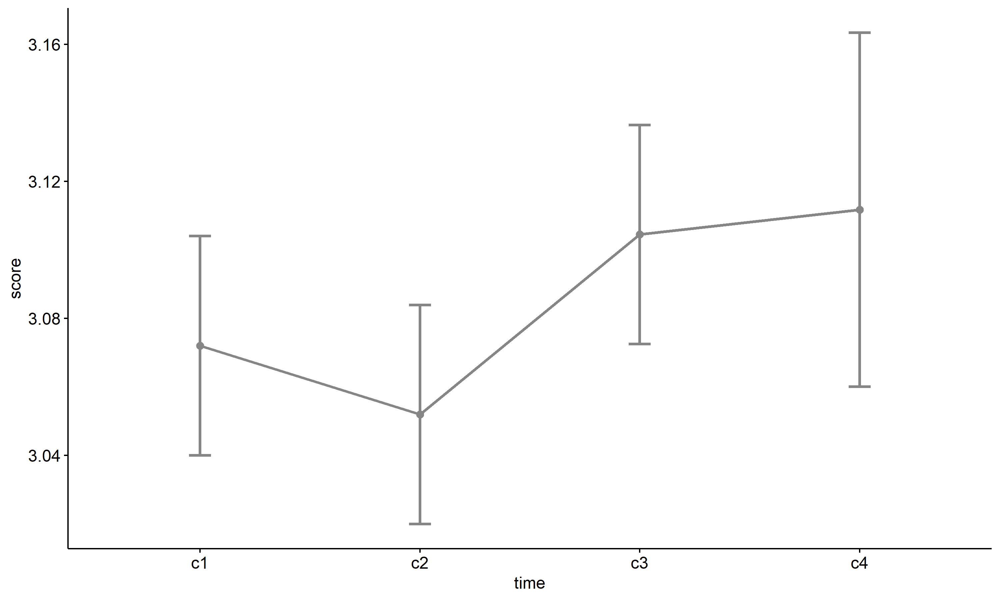<!-- -->

``` r
if (length(non.ids) > 0) {
  emms.gg <- emms2[which(emms2$regiao == "Sudeste"),]
  if (nrow(emms.gg) > 0)
    ggline(emms.gg, x = "time", y = "emmean", color = "#CD534CFF", ylab = "score", size = 1) +
    geom_errorbar(aes(ymin = conf.low, ymax = conf.high),
                  width = 0.2, color = "#CD534CFF", linewidth = 1) +
    stat_pvalue_manual(
      add_xy_position(pwc[which(pwc$regiao == "Sudeste"),],
                      x = "time", fun = "mean_se"),
      hide.ns = T, color = "#CD534CFF", tip.length = F) +
    theme(legend.text = element_blank())
}
```

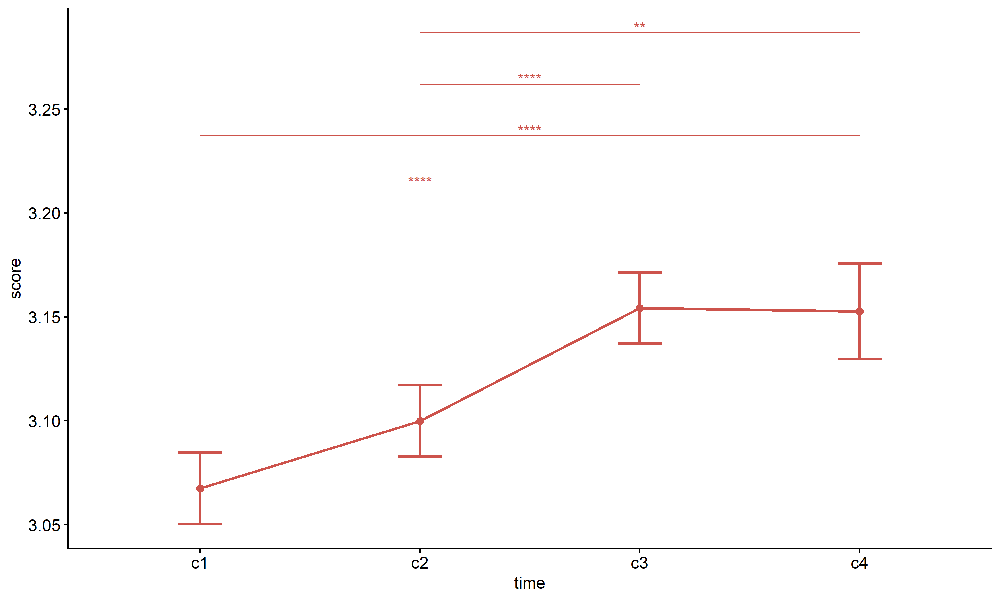<!-- -->

``` r
if (length(non.ids) > 0) {
  emms.gg <- emms2[which(emms2$regiao == "Sul"),]
  if (nrow(emms.gg) > 0)
    ggline(emms.gg, x = "time", y = "emmean", color = "#7AA6DCFF", ylab = "score", size = 1) +
    geom_errorbar(aes(ymin = conf.low, ymax = conf.high),
                  width = 0.1, color = "#7AA6DCFF", linewidth = 1) +
    stat_pvalue_manual(
      add_xy_position(pwc[which(pwc$regiao == "Sul"),],
                      x = "time", fun = "mean_se"),
      hide.ns = T, color = "#7AA6DCFF", tip.length = F) +
    theme(legend.text = element_blank())
}
```

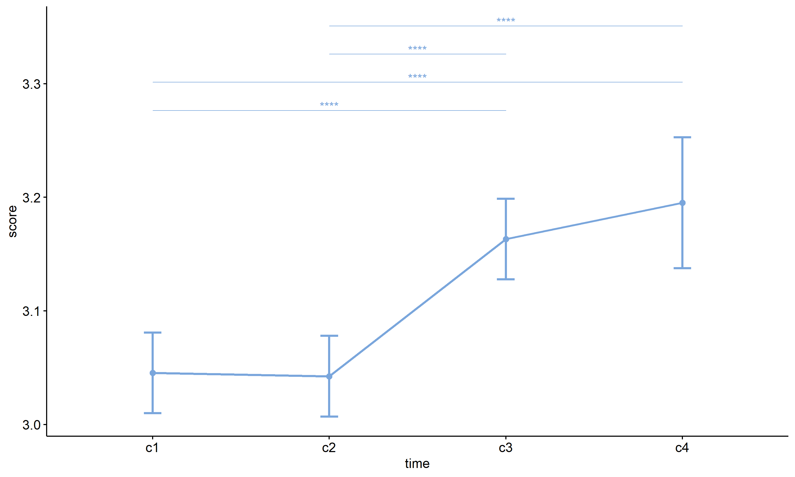<!-- -->

# ANOVA: score ~ time\*porte + Error(id/time)

## Data Preparation

``` r
data <- edat[,c("aluno_id","porte","ciclo","score")]
data <- data[data$ciclo %in% c("Primeiro Ciclo","Segundo Ciclo","Terceiro Ciclo","Quarto Ciclo"),]
data$ciclo <- factor(data$ciclo, c("Primeiro Ciclo","Segundo Ciclo","Terceiro Ciclo","Quarto Ciclo"))
data$porte <- factor(
  data$porte,
  levels = c(sort(unique(data$porte))[1],
             sort(unique(data$porte))[4],
             sort(unique(data$porte))[2],
             sort(unique(data$porte))[3],
             sort(unique(data$porte))[5]),
  labels = c("Up to 50",
             "Between 51 and 200",
             "Between 201 and 500",
             "Between 501 and 1000",
             "More than 1000"))
data <- unique(data)

wdat <- spread(data, ciclo, score)
colnames(wdat) <- c("id","porte","c1","c2","c3","c4")
wdat <- wdat[complete.cases(wdat[,c("id","porte","c1","c2","c3")]),]


ldat <- gather(wdat, key = time, value = score, c1,c2,c3,c4) %>%
  convert_as_factor(id, time)
ldat <- remove_group_data(ldat, "score", c("time", "porte"), n.limit = 15)
ldat$porte <- factor(ldat$porte, sort(unique(ldat$porte)))
```

### Check assumptions: Identifying Outliers

``` r
outliers <- identify_outliers(group_by(ldat, time, porte), score)
(outliers <- outliers[outliers$is.extreme == T,])
```

    ## # A tibble: 36 × 6
    ##    porte                time  id                   score is.outlier is.extreme
    ##    <fct>                <fct> <fct>                <dbl> <lgl>      <lgl>     
    ##  1 Up to 50             c1    0w3VhiMf67CbcpR6aZCL   4   TRUE       TRUE      
    ##  2 Between 51 and 200   c1    1Z1Qz8zDaMkaAz1Ah80K   4   TRUE       TRUE      
    ##  3 Between 201 and 500  c1    PqW3vWjH69npz9vqggMX   4   TRUE       TRUE      
    ##  4 Between 201 and 500  c1    Ru3SPRo97iXBvXbvneKh   4   TRUE       TRUE      
    ##  5 Between 201 and 500  c1    uCBI6gnllsawWJlgqkr5   4   TRUE       TRUE      
    ##  6 Between 201 and 500  c1    vc8pPoYau2AIAuCQJipW   4   TRUE       TRUE      
    ##  7 Between 201 and 500  c1    wefcYCTqKwxh8S4qGLoI   3.9 TRUE       TRUE      
    ##  8 Between 501 and 1000 c1    D1HfJKTVqjrpCJx97l3v   3.9 TRUE       TRUE      
    ##  9 Between 501 and 1000 c1    iPWgss5n5My8lpksQ1nX   4   TRUE       TRUE      
    ## 10 Between 501 and 1000 c1    Xq3402VdKr7fuvkfZchf   3.9 TRUE       TRUE      
    ## # ℹ 26 more rows

| porte                | time | id                   | score | is.outlier | is.extreme |
|:---------------------|:-----|:---------------------|------:|:-----------|:-----------|
| Up to 50             | c1   | 0w3VhiMf67CbcpR6aZCL |   4.0 | TRUE       | TRUE       |
| Between 51 and 200   | c1   | 1Z1Qz8zDaMkaAz1Ah80K |   4.0 | TRUE       | TRUE       |
| Between 201 and 500  | c1   | PqW3vWjH69npz9vqggMX |   4.0 | TRUE       | TRUE       |
| Between 201 and 500  | c1   | Ru3SPRo97iXBvXbvneKh |   4.0 | TRUE       | TRUE       |
| Between 201 and 500  | c1   | uCBI6gnllsawWJlgqkr5 |   4.0 | TRUE       | TRUE       |
| Between 201 and 500  | c1   | vc8pPoYau2AIAuCQJipW |   4.0 | TRUE       | TRUE       |
| Between 201 and 500  | c1   | wefcYCTqKwxh8S4qGLoI |   3.9 | TRUE       | TRUE       |
| Between 501 and 1000 | c1   | D1HfJKTVqjrpCJx97l3v |   3.9 | TRUE       | TRUE       |
| Between 501 and 1000 | c1   | iPWgss5n5My8lpksQ1nX |   4.0 | TRUE       | TRUE       |
| Between 501 and 1000 | c1   | Xq3402VdKr7fuvkfZchf |   3.9 | TRUE       | TRUE       |
| Between 51 and 200   | c2   | X8eOpiPuKfI4GXxjOsOM |   4.0 | TRUE       | TRUE       |
| Between 51 and 200   | c2   | ZbfrKhrqRpZ0ISt57sPn |   4.0 | TRUE       | TRUE       |
| Between 201 and 500  | c2   | cuknOzzwN4oCRum5U5ph |   4.2 | TRUE       | TRUE       |
| Between 201 and 500  | c2   | HsQF2J0r79mHSWNe4l6n |   4.0 | TRUE       | TRUE       |
| Between 201 and 500  | c2   | j31LU8Xwm0EQ7Mihkhjj |   4.0 | TRUE       | TRUE       |
| Between 201 and 500  | c2   | oGUJyWRMYYbF9PNegJZh |   4.0 | TRUE       | TRUE       |
| Between 201 and 500  | c2   | z3p6Ot4uvkPmGXOS9D3e |   4.0 | TRUE       | TRUE       |
| Between 501 and 1000 | c2   | HNgjkRedBh1UIBu01VKY |   4.0 | TRUE       | TRUE       |
| Between 51 and 200   | c3   | 1uixvrMfKulaomVh0MKa |   4.0 | TRUE       | TRUE       |
| Between 51 and 200   | c3   | 8edbRBvoAhVAiLZ3h3E2 |   4.2 | TRUE       | TRUE       |
| Between 51 and 200   | c3   | PwZy7Lbc45vuNd5du72A |   4.2 | TRUE       | TRUE       |
| Between 201 and 500  | c3   | 7pR91qd7LX1X2Chwr4xQ |   4.0 | TRUE       | TRUE       |
| Between 201 and 500  | c3   | CCVIt7MPeYMUOCCyBxPh |   4.2 | TRUE       | TRUE       |
| Between 201 and 500  | c3   | cOCdJff1IOVxOznhBCWn |   4.0 | TRUE       | TRUE       |
| Between 201 and 500  | c3   | G1fSZJ6Ea4VhHH2OjGQ3 |   4.0 | TRUE       | TRUE       |
| Between 201 and 500  | c3   | i5EZ8Ck9IgDueyMbw55v |   4.2 | TRUE       | TRUE       |
| Between 201 and 500  | c3   | m5yRlxfIj73j4ossfTOB |   4.2 | TRUE       | TRUE       |
| Between 201 and 500  | c3   | OvwAQTWkdj8SYpPS8dgn |   4.0 | TRUE       | TRUE       |
| Between 201 and 500  | c3   | Pj0bkt0GAUBSA1FoPcc2 |   4.2 | TRUE       | TRUE       |
| Between 201 and 500  | c3   | RkRJsrzuZjQPcgr9Bu7D |   4.0 | TRUE       | TRUE       |
| Between 201 and 500  | c3   | xADstL8Txh6OaomMZXC4 |   4.0 | TRUE       | TRUE       |
| Between 501 and 1000 | c3   | 6bEKmKQpOuvY6PSQvzqj |   4.2 | TRUE       | TRUE       |
| More than 1000       | c3   | HM6lELrDJUQlU8CLhlxB |   4.0 | TRUE       | TRUE       |
| Between 51 and 200   | c4   | fgNBRPWfCa0TP4bDO8d2 |   4.0 | TRUE       | TRUE       |
| Between 201 and 500  | c4   | 1OE4fvPj9Y2Q9Bnwr0xz |   4.0 | TRUE       | TRUE       |
| Between 201 and 500  | c4   | kFvRH3RtPD461qVG04iW |   4.0 | TRUE       | TRUE       |

### Check assumptions: Normality Test

``` r
(normality.df <- get.descriptives(ldat, "score", c("time", "porte"), symmetry.test = T, normality.test = T))
```

    ##    time                porte variable    n  mean median min max    sd    se
    ## 1    c1             Up to 50    score   83 3.093    3.0 2.6 4.0 0.200 0.022
    ## 2    c1   Between 51 and 200    score  473 3.065    3.0 2.4 4.0 0.220 0.010
    ## 3    c1  Between 201 and 500    score 1529 3.067    3.0 2.4 4.0 0.207 0.005
    ## 4    c1 Between 501 and 1000    score  618 3.070    3.0 2.6 4.0 0.189 0.008
    ## 5    c1       More than 1000    score   70 3.074    3.0 2.6 3.8 0.238 0.028
    ## 6    c2             Up to 50    score   83 3.096    3.0 2.6 3.6 0.204 0.022
    ## 7    c2   Between 51 and 200    score  473 3.089    3.0 2.6 4.0 0.229 0.011
    ## 8    c2  Between 201 and 500    score 1529 3.087    3.0 2.4 4.2 0.222 0.006
    ## 9    c2 Between 501 and 1000    score  618 3.113    3.0 2.6 4.0 0.231 0.009
    ## 10   c2       More than 1000    score   70 3.113    3.0 2.6 3.8 0.247 0.029
    ## 11   c3             Up to 50    score   83 3.178    3.1 2.6 4.2 0.314 0.035
    ## 12   c3   Between 51 and 200    score  473 3.104    3.0 2.6 4.2 0.249 0.011
    ## 13   c3  Between 201 and 500    score 1529 3.129    3.1 2.4 4.2 0.247 0.006
    ## 14   c3 Between 501 and 1000    score  618 3.161    3.1 2.4 4.2 0.254 0.010
    ## 15   c3       More than 1000    score   70 3.114    3.0 2.6 4.0 0.281 0.034
    ## 16   c4   Between 51 and 200    score  162 3.123    3.0 2.6 4.0 0.269 0.021
    ## 17   c4  Between 201 and 500    score  675 3.130    3.1 2.6 4.0 0.246 0.009
    ## 18   c4 Between 501 and 1000    score  249 3.164    3.1 2.6 4.0 0.264 0.017
    ## 19   c4             Up to 50    score   33 3.109    3.0 2.8 3.6 0.231 0.040
    ##       ci iqr symmetry  skewness    kurtosis normality     method  statistic
    ## 1  0.044 0.2       NO 1.4885772  5.21318145        NO D'Agostino  40.030709
    ## 2  0.020 0.2      YES 0.4991602  1.05674694         - D'Agostino  30.242954
    ## 3  0.010 0.2       NO 0.6612788  1.80043823         - D'Agostino 160.483558
    ## 4  0.015 0.2       NO 0.8794013  2.73021647         - D'Agostino 106.880285
    ## 5  0.057 0.2      YES 0.1934887  0.40495874       YES D'Agostino   1.906190
    ## 6  0.045 0.2      YES 0.1665212 -0.04173373       YES D'Agostino   0.621733
    ## 7  0.021 0.2       NO 0.9194391  1.87004478         - D'Agostino  75.359493
    ## 8  0.011 0.2       NO 0.8354379  1.85608277         - D'Agostino 207.294358
    ## 9  0.018 0.2       NO 0.9637692  1.29284919         - D'Agostino  91.004325
    ## 10 0.059 0.2      YES 0.3739733  0.24014720       YES D'Agostino   2.782229
    ## 11 0.069 0.4       NO 0.7728667  0.24380025        NO D'Agostino   9.024638
    ## 12 0.023 0.2       NO 1.0789796  2.01576274         - D'Agostino  91.541011
    ## 13 0.012 0.2       NO 0.9752212  1.45847036         - D'Agostino 228.115655
    ## 14 0.020 0.2       NO 0.7368996  0.61769274         - D'Agostino  53.747809
    ## 15 0.067 0.2       NO 0.8519424  0.79692518        NO D'Agostino  11.119115
    ## 16 0.042 0.2     <NA>        NA          NA      <NA>       <NA>         NA
    ## 17 0.019 0.2     <NA>        NA          NA      <NA>       <NA>         NA
    ## 18 0.033 0.3     <NA>        NA          NA      <NA>       <NA>         NA
    ## 19 0.082 0.2     <NA>        NA          NA      <NA>       <NA>         NA
    ##               p p.signif
    ## 1  2.029748e-09     ****
    ## 2  2.709106e-07     ****
    ## 3  0.000000e+00     ****
    ## 4  0.000000e+00     ****
    ## 5  3.855458e-01       ns
    ## 6  7.328117e-01       ns
    ## 7  0.000000e+00     ****
    ## 8  0.000000e+00     ****
    ## 9  0.000000e+00     ****
    ## 10 2.487979e-01       ns
    ## 11 1.097298e-02        *
    ## 12 0.000000e+00     ****
    ## 13 0.000000e+00     ****
    ## 14 2.132072e-12     ****
    ## 15 3.850479e-03       **
    ## 16           NA     <NA>
    ## 17           NA     <NA>
    ## 18           NA     <NA>
    ## 19           NA     <NA>

| time | porte                | variable |    n |  mean | median | min | max |    sd |    se |    ci | iqr | symmetry | skewness | kurtosis | normality | method     | statistic |     p | p.signif |
|:-----|:---------------------|:---------|-----:|------:|-------:|----:|----:|------:|------:|------:|----:|:---------|---------:|---------:|:----------|:-----------|----------:|------:|:---------|
| c1   | Up to 50             | score    |   83 | 3.093 |    3.0 | 2.6 | 4.0 | 0.200 | 0.022 | 0.044 | 0.2 | NO       |    1.489 |    5.213 | NO        | D’Agostino |    40.031 | 0.000 | \*\*\*\* |
| c1   | Between 51 and 200   | score    |  473 | 3.065 |    3.0 | 2.4 | 4.0 | 0.220 | 0.010 | 0.020 | 0.2 | YES      |    0.499 |    1.057 | \-        | D’Agostino |    30.243 | 0.000 | \*\*\*\* |
| c1   | Between 201 and 500  | score    | 1529 | 3.067 |    3.0 | 2.4 | 4.0 | 0.207 | 0.005 | 0.010 | 0.2 | NO       |    0.661 |    1.800 | \-        | D’Agostino |   160.484 | 0.000 | \*\*\*\* |
| c1   | Between 501 and 1000 | score    |  618 | 3.070 |    3.0 | 2.6 | 4.0 | 0.189 | 0.008 | 0.015 | 0.2 | NO       |    0.879 |    2.730 | \-        | D’Agostino |   106.880 | 0.000 | \*\*\*\* |
| c1   | More than 1000       | score    |   70 | 3.074 |    3.0 | 2.6 | 3.8 | 0.238 | 0.028 | 0.057 | 0.2 | YES      |    0.193 |    0.405 | YES       | D’Agostino |     1.906 | 0.386 | ns       |
| c2   | Up to 50             | score    |   83 | 3.096 |    3.0 | 2.6 | 3.6 | 0.204 | 0.022 | 0.045 | 0.2 | YES      |    0.167 |   -0.042 | YES       | D’Agostino |     0.622 | 0.733 | ns       |
| c2   | Between 51 and 200   | score    |  473 | 3.089 |    3.0 | 2.6 | 4.0 | 0.229 | 0.011 | 0.021 | 0.2 | NO       |    0.919 |    1.870 | \-        | D’Agostino |    75.359 | 0.000 | \*\*\*\* |
| c2   | Between 201 and 500  | score    | 1529 | 3.087 |    3.0 | 2.4 | 4.2 | 0.222 | 0.006 | 0.011 | 0.2 | NO       |    0.835 |    1.856 | \-        | D’Agostino |   207.294 | 0.000 | \*\*\*\* |
| c2   | Between 501 and 1000 | score    |  618 | 3.113 |    3.0 | 2.6 | 4.0 | 0.231 | 0.009 | 0.018 | 0.2 | NO       |    0.964 |    1.293 | \-        | D’Agostino |    91.004 | 0.000 | \*\*\*\* |
| c2   | More than 1000       | score    |   70 | 3.113 |    3.0 | 2.6 | 3.8 | 0.247 | 0.029 | 0.059 | 0.2 | YES      |    0.374 |    0.240 | YES       | D’Agostino |     2.782 | 0.249 | ns       |
| c3   | Up to 50             | score    |   83 | 3.178 |    3.1 | 2.6 | 4.2 | 0.314 | 0.035 | 0.069 | 0.4 | NO       |    0.773 |    0.244 | NO        | D’Agostino |     9.025 | 0.011 | \*       |
| c3   | Between 51 and 200   | score    |  473 | 3.104 |    3.0 | 2.6 | 4.2 | 0.249 | 0.011 | 0.023 | 0.2 | NO       |    1.079 |    2.016 | \-        | D’Agostino |    91.541 | 0.000 | \*\*\*\* |
| c3   | Between 201 and 500  | score    | 1529 | 3.129 |    3.1 | 2.4 | 4.2 | 0.247 | 0.006 | 0.012 | 0.2 | NO       |    0.975 |    1.458 | \-        | D’Agostino |   228.116 | 0.000 | \*\*\*\* |
| c3   | Between 501 and 1000 | score    |  618 | 3.161 |    3.1 | 2.4 | 4.2 | 0.254 | 0.010 | 0.020 | 0.2 | NO       |    0.737 |    0.618 | \-        | D’Agostino |    53.748 | 0.000 | \*\*\*\* |
| c3   | More than 1000       | score    |   70 | 3.114 |    3.0 | 2.6 | 4.0 | 0.281 | 0.034 | 0.067 | 0.2 | NO       |    0.852 |    0.797 | NO        | D’Agostino |    11.119 | 0.004 | \*\*     |
| c4   | Between 51 and 200   | score    |  162 | 3.123 |    3.0 | 2.6 | 4.0 | 0.269 | 0.021 | 0.042 | 0.2 | NA       |       NA |       NA | NA        | NA         |        NA |    NA | NA       |
| c4   | Between 201 and 500  | score    |  675 | 3.130 |    3.1 | 2.6 | 4.0 | 0.246 | 0.009 | 0.019 | 0.2 | NA       |       NA |       NA | NA        | NA         |        NA |    NA | NA       |
| c4   | Between 501 and 1000 | score    |  249 | 3.164 |    3.1 | 2.6 | 4.0 | 0.264 | 0.017 | 0.033 | 0.3 | NA       |       NA |       NA | NA        | NA         |        NA |    NA | NA       |
| c4   | Up to 50             | score    |   33 | 3.109 |    3.0 | 2.8 | 3.6 | 0.231 | 0.040 | 0.082 | 0.2 | NA       |       NA |       NA | NA        | NA         |        NA |    NA | NA       |

``` r
idx = which(!ldat$id %in% outliers$id & ldat$porte == "Up to 50" & ldat$time == "c4")
non.ids = getNonNormal(ldat$score[idx], ldat$id[idx])

(non.ids)
```

    ## [1] "4fSdH8m80yxwok1ooZYh" "iutpBZMAtM92qcbyCDHB" "VNQYsv3kH0OTOqJH3yYT"
    ## [4] "w7548cNc0knlzDezHzBq"

``` r
if (length(non.ids) > 0)
  ldat2 <- ldat[!ldat$id %in% non.ids,]
```

### Summary Statistics

``` r
(sdat <- ldat %>% group_by(time, porte) %>%
   get_summary_stats(score, type = "mean_sd"))
```

    ## # A tibble: 19 × 6
    ##    porte                time  variable     n  mean    sd
    ##    <fct>                <fct> <fct>    <dbl> <dbl> <dbl>
    ##  1 Up to 50             c1    score       83  3.09 0.2  
    ##  2 Between 51 and 200   c1    score      473  3.06 0.22 
    ##  3 Between 201 and 500  c1    score     1529  3.07 0.207
    ##  4 Between 501 and 1000 c1    score      618  3.07 0.189
    ##  5 More than 1000       c1    score       70  3.07 0.238
    ##  6 Up to 50             c2    score       83  3.10 0.204
    ##  7 Between 51 and 200   c2    score      473  3.09 0.229
    ##  8 Between 201 and 500  c2    score     1529  3.09 0.222
    ##  9 Between 501 and 1000 c2    score      618  3.11 0.231
    ## 10 More than 1000       c2    score       70  3.11 0.247
    ## 11 Up to 50             c3    score       83  3.18 0.314
    ## 12 Between 51 and 200   c3    score      473  3.10 0.249
    ## 13 Between 201 and 500  c3    score     1529  3.13 0.247
    ## 14 Between 501 and 1000 c3    score      618  3.16 0.254
    ## 15 More than 1000       c3    score       70  3.11 0.281
    ## 16 Up to 50             c4    score       33  3.11 0.231
    ## 17 Between 51 and 200   c4    score      162  3.12 0.269
    ## 18 Between 201 and 500  c4    score      675  3.13 0.246
    ## 19 Between 501 and 1000 c4    score      249  3.16 0.264

| porte                | time | variable |    n |  mean |    sd |
|:---------------------|:-----|:---------|-----:|------:|------:|
| Up to 50             | c1   | score    |   83 | 3.093 | 0.200 |
| Between 51 and 200   | c1   | score    |  473 | 3.065 | 0.220 |
| Between 201 and 500  | c1   | score    | 1529 | 3.067 | 0.207 |
| Between 501 and 1000 | c1   | score    |  618 | 3.070 | 0.189 |
| More than 1000       | c1   | score    |   70 | 3.074 | 0.238 |
| Up to 50             | c2   | score    |   83 | 3.096 | 0.204 |
| Between 51 and 200   | c2   | score    |  473 | 3.089 | 0.229 |
| Between 201 and 500  | c2   | score    | 1529 | 3.087 | 0.222 |
| Between 501 and 1000 | c2   | score    |  618 | 3.113 | 0.231 |
| More than 1000       | c2   | score    |   70 | 3.113 | 0.247 |
| Up to 50             | c3   | score    |   83 | 3.178 | 0.314 |
| Between 51 and 200   | c3   | score    |  473 | 3.104 | 0.249 |
| Between 201 and 500  | c3   | score    | 1529 | 3.129 | 0.247 |
| Between 501 and 1000 | c3   | score    |  618 | 3.161 | 0.254 |
| More than 1000       | c3   | score    |   70 | 3.114 | 0.281 |
| Up to 50             | c4   | score    |   33 | 3.109 | 0.231 |
| Between 51 and 200   | c4   | score    |  162 | 3.123 | 0.269 |
| Between 201 and 500  | c4   | score    |  675 | 3.130 | 0.246 |
| Between 501 and 1000 | c4   | score    |  249 | 3.164 | 0.264 |

``` r
if (length(non.ids) > 0)
  (sdat <- ldat2 %>% group_by(time, porte) %>%
      get_summary_stats(score, type = "mean_sd"))
```

    ## # A tibble: 19 × 6
    ##    porte                time  variable     n  mean    sd
    ##    <fct>                <fct> <fct>    <dbl> <dbl> <dbl>
    ##  1 Up to 50             c1    score       79  3.09 0.202
    ##  2 Between 51 and 200   c1    score      473  3.06 0.22 
    ##  3 Between 201 and 500  c1    score     1529  3.07 0.207
    ##  4 Between 501 and 1000 c1    score      618  3.07 0.189
    ##  5 More than 1000       c1    score       70  3.07 0.238
    ##  6 Up to 50             c2    score       79  3.10 0.206
    ##  7 Between 51 and 200   c2    score      473  3.09 0.229
    ##  8 Between 201 and 500  c2    score     1529  3.09 0.222
    ##  9 Between 501 and 1000 c2    score      618  3.11 0.231
    ## 10 More than 1000       c2    score       70  3.11 0.247
    ## 11 Up to 50             c3    score       79  3.17 0.313
    ## 12 Between 51 and 200   c3    score      473  3.10 0.249
    ## 13 Between 201 and 500  c3    score     1529  3.13 0.247
    ## 14 Between 501 and 1000 c3    score      618  3.16 0.254
    ## 15 More than 1000       c3    score       70  3.11 0.281
    ## 16 Up to 50             c4    score       29  3.04 0.148
    ## 17 Between 51 and 200   c4    score      162  3.12 0.269
    ## 18 Between 201 and 500  c4    score      675  3.13 0.246
    ## 19 Between 501 and 1000 c4    score      249  3.16 0.264

| porte                | time | variable |    n |  mean |    sd |
|:---------------------|:-----|:---------|-----:|------:|------:|
| Up to 50             | c1   | score    |   79 | 3.090 | 0.202 |
| Between 51 and 200   | c1   | score    |  473 | 3.065 | 0.220 |
| Between 201 and 500  | c1   | score    | 1529 | 3.067 | 0.207 |
| Between 501 and 1000 | c1   | score    |  618 | 3.070 | 0.189 |
| More than 1000       | c1   | score    |   70 | 3.074 | 0.238 |
| Up to 50             | c2   | score    |   79 | 3.103 | 0.206 |
| Between 51 and 200   | c2   | score    |  473 | 3.089 | 0.229 |
| Between 201 and 500  | c2   | score    | 1529 | 3.087 | 0.222 |
| Between 501 and 1000 | c2   | score    |  618 | 3.113 | 0.231 |
| More than 1000       | c2   | score    |   70 | 3.113 | 0.247 |
| Up to 50             | c3   | score    |   79 | 3.167 | 0.313 |
| Between 51 and 200   | c3   | score    |  473 | 3.104 | 0.249 |
| Between 201 and 500  | c3   | score    | 1529 | 3.129 | 0.247 |
| Between 501 and 1000 | c3   | score    |  618 | 3.161 | 0.254 |
| More than 1000       | c3   | score    |   70 | 3.114 | 0.281 |
| Up to 50             | c4   | score    |   29 | 3.041 | 0.148 |
| Between 51 and 200   | c4   | score    |  162 | 3.123 | 0.269 |
| Between 201 and 500  | c4   | score    |  675 | 3.130 | 0.246 |
| Between 501 and 1000 | c4   | score    |  249 | 3.164 | 0.264 |

## ANOVA Computation

``` r
(res.aov <- anova_test(ldat, dv = score, wid = id, between = porte, within = time))
```

    ## Warning: NA detected in rows:
    ## 8323,8325,8326,8332,8333,8334,8337,8339,8340,8342,8343,8344,8345,8349,8350,8352,8353,8354,8358,8359,8361,8362,8364,8369,8370,8374,8375,8376,8382,8383,8390,8391,8393,8395,8397,8398,8400,8401,8403,8407,8408,8411,8412,8413,8415,8417,8422,8425,8427,8428,8429,8431,8433,8440,8441,8442,8444,8447,8448,8449,8451,8452,8454,8456,8457,8462,8463,8464,8465,8466,8467,8468,8472,8473,8474,8476,8477,8479,8481,8484,8485,8487,8488,8489,8490,8491,8493,8494,8496,8497,8499,8500,8503,8507,8510,8511,8512,8515,8517,8518,8521,8524,8525,8526,8527,8528,8529,8530,8532,8534,8536,8537,8542,8545,8547,8548,8551,8552,8555,8556,8558,8561,8563,8565,8566,8567,8570,8572,8575,8576,8577,8579,8586,8587,8588,8589,8594,8597,8598,8600,8601,8602,8603,8604,8608,8613,8618,8621,8623,8625,8627,8629,8630,8632,8633,8634,8636,8637,8639,8642,8644,8645,8646,8647,8648,8649,8650,8653,8654,8655,8656,8657,8659,8660,8661,8663,8666,8668,8672,8677,8679,8680,8681,8683,8686,8687,8689,8690,8691,8692,8697,8699,8700,8701,8702,8704,8705,8706,8707,8708,8709,8710,8711,8712,8713,8714,8717,8719,8720,8721,8722,8723,8724,8726,8727,8728,8729,8731,8732,8735,8736,8737,8738,8740,8741,8743,8745,8746,8747,8748,8749,8752,8753,8755,8756,8758,8761,8762,8763,8765,8766,8767,8768,8769,8771,8775,8776,8777,8778,8779,8782,8783,8786,8788,8789,8791,8795,8796,8797,8798,8799,8800,8801,8803,8809,8812,8813,8814,8815,8817,8818,8820,8821,8823,8824,8825,8826,8827,8828,8829,8830,8831,8832,8833,8834,8835,8838,8841,8843,8844,8845,8847,8849,8851,8854,8858,8860,8861,8863,8864,8866,8868,8869,8870,8872,8873,8874,8875,8877,8879,8880,8881,8882,8883,8884,8886,8887,8888,8889,8891,8892,8893,8894,8898,8901,8902,8904,8905,8907,8910,8915,8916,8918,8919,8920,8921,8922,8924,8926,8927,8928,8930,8931,8932,8933,8935,8938,8939,8940,8941,8942,8943,8945,8947,8949,8950,8951,8953,8954,8955,8956,8958,8959,8960,8962,8963,8968,8971,8972,8976,8977,8980,8981,8982,8985,8986,8987,8988,8989,8990,8993,8995,8997,9003,9006,9010,9011,9012,9015,9016,9017,9018,9020,9023,9028,9029,9030,9032,9033,9037,9040,9044,9047,9049,9053,9057,9058,9061,9062,9063,9065,9066,9067,9068,9069,9070,9071,9072,9073,9074,9075,9077,9083,9086,9088,9089,9090,9091,9092,9095,9096,9097,9101,9104,9105,9110,9111,9113,9114,9115,9118,9120,9121,9123,9125,9127,9128,9130,9131,9134,9135,9137,9138,9139,9140,9143,9144,9146,9147,9148,9149,9150,9151,9152,9154,9156,9159,9161,9163,9165,9166,9167,9169,9170,9171,9172,9173,9174,9175,9176,9177,9178,9181,9182,9185,9187,9188,9189,9191,9194,9195,9197,9198,9199,9202,9205,9209,9210,9211,9212,9213,9214,9215,9217,9218,9219,9220,9221,9222,9223,9224,9225,9227,9228,9231,9232,9233,9234,9235,9236,9237,9238,9239,9241,9242,9243,9248,9249,9251,9252,9253,9254,9255,9257,9258,9259,9260,9266,9267,9269,9274,9275,9277,9278,9280,9281,9282,9283,9286,9288,9289,9292,9294,9296,9299,9300,9301,9303,9305,9306,9307,9310,9312,9315,9317,9320,9322,9324,9325,9327,9328,9329,9331,9336,9337,9340,9341,9342,9344,9345,9347,9351,9352,9355,9356,9357,9358,9365,9366,9367,9369,9370,9371,9372,9376,9377,9378,9379,9381,9382,9383,9384,9386,9387,9388,9389,9392,9393,9394,9395,9396,9397,9399,9400,9401,9402,9404,9405,9406,9410,9412,9413,9415,9416,9417,9418,9419,9420,9421,9422,9423,9424,9425,9428,9429,9430,9434,9438,9440,9443,9444,9445,9448,9449,9450,9451,9452,9453,9454,9456,9458,9459,9461,9465,9466,9469,9470,9471,9472,9473,9476,9477,9479,9480,9482,9483,9484,9485,9487,9489,9490,9491,9492,9493,9494,9496,9497,9498,9499,9500,9502,9505,9506,9507,9509,9510,9519,9522,9524,9525,9527,9528,9530,9531,9533,9534,9539,9542,9543,9547,9548,9550,9551,9555,9560,9561,9562,9563,9564,9565,9566,9569,9570,9572,9574,9577,9578,9579,9585,9586,9587,9588,9590,9591,9593,9595,9596,9598,9599,9601,9604,9606,9607,9609,9611,9618,9619,9621,9622,9624,9625,9628,9631,9632,9633,9634,9636,9637,9638,9639,9642,9644,9647,9648,9650,9651,9657,9658,9660,9663,9664,9665,9666,9667,9669,9670,9671,9673,9675,9677,9678,9679,9680,9682,9683,9684,9685,9686,9689,9691,9693,9694,9695,9696,9698,9700,9702,9703,9705,9706,9707,9708,9709,9710,9712,9714,9715,9716,9717,9719,9722,9723,9724,9725,9726,9727,9730,9732,9733,9735,9736,9740,9741,9742,9743,9744,9751,9752,9753,9755,9756,9760,9762,9765,9769,9771,9772,9773,9774,9775,9776,9777,9778,9780,9781,9782,9783,9784,9785,9786,9787,9788,9789,9791,9793,9796,9797,9798,9799,9800,9801,9802,9803,9804,9806,9807,9808,9810,9811,9812,9814,9815,9816,9817,9818,9819,9820,9822,9824,9825,9826,9829,9835,9837,9840,9841,9842,9843,9844,9845,9849,9850,9852,9854,9855,9858,9859,9860,9861,9863,9864,9865,9866,9867,9868,9870,9873,9874,9875,9877,9880,9884,9885,9886,9889,9891,9892,9894,9895,9896,9897,9898,9899,9900,9901,9902,9903,9904,9907,9908,9911,9914,9915,9916,9918,9921,9926,9927,9928,9929,9932,9933,9934,9937,9938,9940,9941,9943,9945,9946,9949,9950,9952,9953,9955,9958,9961,9963,9964,9965,9967,9968,9971,9973,9976,9977,9978,9979,9981,9982,9984,9985,9986,9987,9988,9989,9990,9995,9996,9998,9999,10002,10003,10004,10005,10006,10009,10011,10012,10013,10014,10015,10016,10018,10019,10022,10023,10025,10026,10027,10029,10030,10031,10032,10033,10035,10036,10037,10038,10039,10040,10042,10045,10046,10050,10052,10053,10054,10055,10056,10058,10059,10060,10062,10063,10064,10065,10067,10068,10069,10070,10074,10076,10077,10078,10079,10080,10083,10085,10086,10087,10089,10091,10094,10096,10100,10101,10102,10106,10107,10110,10111,10112,10113,10114,10115,10116,10117,10119,10120,10121,10123,10124,10125,10127,10128,10129,10130,10132,10134,10135,10136,10137,10139,10143,10145,10146,10147,10150,10151,10152,10155,10156,10157,10158,10159,10161,10162,10165,10167,10168,10170,10171,10173,10175,10176,10177,10178,10179,10180,10181,10187,10188,10189,10193,10197,10198,10199,10200,10205,10206,10207,10208,10209,10210,10212,10213,10215,10217,10220,10221,10222,10223,10224,10227,10232,10233,10235,10237,10240,10243,10245,10248,10249,10250,10251,10253,10255,10256,10257,10258,10261,10262,10265,10266,10267,10268,10271,10272,10273,10274,10276,10278,10279,10280,10282,10283,10284,10285,10286,10287,10288,10291,10292,10293,10294,10295,10298,10301,10304,10305,10308,10312,10313,10314,10315,10316,10317,10318,10319,10321,10323,10324,10325,10326,10327,10329,10330,10331,10338,10339,10341,10343,10348,10349,10350,10352,10353,10355,10357,10358,10359,10360,10363,10364,10367,10368,10374,10378,10379,10380,10383,10384,10385,10386,10387,10391,10393,10395,10396,10397,10398,10399,10401,10403,10404,10405,10409,10411,10412,10413,10414,10415,10418,10419,10421,10422,10423,10424,10426,10427,10428,10430,10433,10434,10438,10439,10440,10441,10442,10443,10444,10445,10446,10447,10448,10451,10456,10458,10459,10460,10461,10462,10463,10465,10467,10468,10471,10472,10473,10474,10475,10477,10480,10481,10484,10485,10486,10491,10492,10495,10496,10497,10498,10499,10500,10501,10502,10504,10506,10507,10509,10510,10511,10513,10514,10515,10516,10518,10519,10521,10523,10525,10527,10530,10531,10532,10534,10535,10537,10538,10540,10542,10543,10544,10545,10546,10548,10549,10551,10553,10555,10557,10558,10561,10562,10564,10565,10568,10569,10571,10573,10575,10577,10578,10579,10581,10582,10584,10588,10590,10593,10596,10600,10601,10603,10604,10605,10606,10608,10609,10610,10611,10612,10615,10616,10619,10620,10621,10623,10626,10628,10629,10630,10631,10632,10637,10639,10640,10644,10647,10649,10651,10652,10654,10655,10656,10663,10665,10666,10667,10668,10669,10672,10674,10675,10676,10677,10679,10680,10682,10684,10685,10688,10689,10690,10691,10694,10695,10696,10698,10700,10701,10703,10704,10705,10706,10707,10712,10715,10717,10719,10720,10721,10724,10727,10728,10729,10732,10733,10734,10736,10737,10738,10739,10740,10741,10742,10743,10744,10746,10747,10750,10754,10756,10758,10760,10761,10763,10764,10766,10769,10770,10772,10774,10775,10777,10779,10780,10781,10785,10786,10787,10792,10793,10794,10795,10796,10797,10798,10799,10801,10802,10805,10806,10807,10809,10810,10816,10817,10819,10820,10821,10826,10828,10829,10831,10832,10835,10836,10837,10838,10841,10842,10843,10845,10846,10849,10850,10851,10852,10853,10854,10857,10858,10862,10863,10864,10865,10866,10870,10871,10873,10877,10878,10879,10883,10884,10886,10887,10888,10891,10892,10893,10894,10895,10897,10898,10899,10900,10901,10905,10907,10909,10911,10912,10913,10914,10915,10916,10917,10918,10920,10

    ## ANOVA Table (type III tests)
    ## 
    ## $ANOVA
    ##       Effect DFn  DFd      F        p p<.05   ges
    ## 1      porte   3 1115  6.491 2.35e-04     * 0.005
    ## 2       time   3 3345 10.172 1.15e-06     * 0.006
    ## 3 porte:time   9 3345  1.561 1.21e-01       0.003
    ## 
    ## $`Mauchly's Test for Sphericity`
    ##       Effect     W     p p<.05
    ## 1       time 0.985 0.005     *
    ## 2 porte:time 0.985 0.005     *
    ## 
    ## $`Sphericity Corrections`
    ##       Effect   GGe        DF[GG]    p[GG] p[GG]<.05   HFe        DF[HF]
    ## 1       time 0.991 2.97, 3313.44 1.27e-06         * 0.994 2.98, 3323.27
    ## 2 porte:time 0.991 8.92, 3313.44 1.22e-01           0.994 8.94, 3323.27
    ##      p[HF] p[HF]<.05
    ## 1 1.23e-06         *
    ## 2 1.22e-01

| Effect     | DFn |  DFd |      F |     p | p\<.05 |   ges |
|:-----------|----:|-----:|-------:|------:|:-------|------:|
| porte      |   3 | 1115 |  6.491 | 0.000 | \*     | 0.005 |
| time       |   3 | 3345 | 10.172 | 0.000 | \*     | 0.006 |
| porte:time |   9 | 3345 |  1.561 | 0.121 |        | 0.003 |

| Effect     |     W |     p | p\<.05 |
|:-----------|------:|------:|:-------|
| time       | 0.985 | 0.005 | \*     |
| porte:time | 0.985 | 0.005 | \*     |

| Effect     |   GGe | DF\[GG\]      | p\[GG\] | p\[GG\]\<.05 |   HFe | DF\[HF\]      | p\[HF\] | p\[HF\]\<.05 |
|:-----------|------:|:--------------|--------:|:-------------|------:|:--------------|--------:|:-------------|
| time       | 0.991 | 2.97, 3313.44 |   0.000 | \*           | 0.994 | 2.98, 3323.27 |   0.000 | \*           |
| porte:time | 0.991 | 8.92, 3313.44 |   0.122 |              | 0.994 | 8.94, 3323.27 |   0.122 |              |

## ANOVA Computation after removing non.normal data

``` r
if (length(non.ids) > 0)
  (res.aov2 <- anova_test(ldat2, dv = score, wid = id, between = porte , within = time))
```

    ## Warning: NA detected in rows:
    ## 8311,8313,8314,8320,8321,8322,8325,8327,8328,8330,8331,8332,8333,8337,8338,8340,8341,8342,8346,8347,8349,8350,8352,8357,8358,8362,8363,8364,8370,8371,8378,8379,8381,8383,8385,8386,8388,8389,8391,8395,8396,8399,8400,8401,8403,8405,8410,8413,8415,8416,8417,8419,8421,8428,8429,8430,8432,8435,8436,8437,8439,8440,8442,8444,8445,8450,8451,8452,8453,8454,8455,8456,8460,8461,8462,8464,8465,8467,8469,8472,8473,8475,8476,8477,8478,8479,8481,8482,8484,8485,8487,8488,8490,8494,8497,8498,8499,8502,8504,8505,8508,8511,8512,8513,8514,8515,8516,8517,8519,8521,8523,8524,8529,8532,8534,8535,8538,8539,8542,8543,8545,8548,8550,8552,8553,8554,8557,8559,8562,8563,8564,8566,8573,8574,8575,8576,8581,8584,8585,8587,8588,8589,8590,8591,8595,8600,8605,8608,8610,8612,8614,8616,8617,8619,8620,8621,8623,8624,8626,8629,8631,8632,8633,8634,8635,8636,8637,8640,8641,8642,8643,8644,8646,8647,8648,8650,8653,8655,8659,8664,8666,8667,8668,8670,8673,8674,8676,8677,8678,8679,8684,8686,8687,8688,8689,8691,8692,8693,8694,8695,8696,8697,8698,8699,8700,8701,8704,8706,8707,8708,8709,8710,8711,8713,8714,8715,8716,8718,8719,8722,8723,8724,8725,8727,8728,8730,8732,8733,8734,8735,8736,8739,8740,8742,8743,8745,8748,8749,8750,8752,8753,8754,8755,8756,8758,8762,8763,8764,8765,8766,8769,8770,8773,8775,8776,8778,8782,8783,8784,8785,8786,8787,8788,8790,8796,8799,8800,8801,8802,8804,8805,8807,8808,8810,8811,8812,8813,8814,8815,8816,8817,8818,8819,8820,8821,8822,8825,8828,8830,8831,8832,8834,8836,8838,8841,8845,8847,8848,8850,8851,8853,8855,8856,8857,8859,8860,8861,8862,8864,8866,8867,8868,8869,8870,8871,8873,8874,8875,8876,8878,8879,8880,8881,8885,8888,8889,8891,8892,8894,8897,8902,8903,8905,8906,8907,8908,8909,8911,8913,8914,8915,8917,8918,8919,8920,8922,8925,8926,8927,8928,8929,8930,8932,8934,8936,8937,8938,8940,8941,8942,8943,8945,8946,8947,8949,8950,8955,8958,8959,8963,8964,8967,8968,8969,8972,8973,8974,8975,8976,8977,8980,8982,8984,8990,8993,8997,8998,8999,9002,9003,9004,9005,9007,9010,9015,9016,9017,9019,9020,9024,9027,9031,9034,9036,9040,9044,9045,9048,9049,9050,9052,9053,9054,9055,9056,9057,9058,9059,9060,9061,9062,9064,9070,9073,9075,9076,9077,9078,9079,9082,9083,9084,9088,9091,9092,9097,9098,9100,9101,9102,9105,9107,9108,9110,9112,9114,9115,9117,9118,9121,9122,9124,9125,9126,9127,9130,9131,9133,9134,9135,9136,9137,9138,9139,9141,9143,9146,9148,9150,9152,9153,9154,9156,9157,9158,9159,9160,9161,9162,9163,9164,9165,9168,9169,9172,9174,9175,9176,9178,9181,9182,9184,9185,9186,9189,9192,9196,9197,9198,9199,9200,9201,9202,9204,9205,9206,9207,9208,9209,9210,9211,9212,9214,9215,9218,9219,9220,9221,9222,9223,9224,9225,9226,9228,9229,9230,9235,9236,9238,9239,9240,9241,9242,9244,9245,9246,9247,9253,9254,9256,9261,9262,9264,9265,9267,9268,9269,9270,9273,9275,9276,9279,9281,9283,9286,9287,9288,9290,9292,9293,9294,9297,9299,9302,9304,9307,9309,9311,9312,9314,9315,9316,9318,9323,9324,9327,9328,9329,9331,9332,9334,9338,9339,9342,9343,9344,9345,9352,9353,9354,9356,9357,9358,9359,9363,9364,9365,9366,9368,9369,9370,9371,9373,9374,9375,9376,9379,9380,9381,9382,9383,9384,9386,9387,9388,9389,9391,9392,9393,9397,9399,9400,9402,9403,9404,9405,9406,9407,9408,9409,9410,9411,9412,9415,9416,9417,9421,9425,9427,9430,9431,9432,9435,9436,9437,9438,9439,9440,9441,9443,9445,9446,9448,9452,9453,9456,9457,9458,9459,9460,9463,9464,9466,9467,9469,9470,9471,9472,9474,9476,9477,9478,9479,9480,9481,9483,9484,9485,9486,9487,9489,9491,9492,9493,9495,9496,9505,9508,9510,9511,9513,9514,9516,9517,9519,9520,9525,9528,9529,9533,9534,9536,9537,9541,9546,9547,9548,9549,9550,9551,9552,9555,9556,9558,9560,9563,9564,9565,9571,9572,9573,9574,9576,9577,9579,9581,9582,9584,9585,9587,9590,9592,9593,9595,9597,9604,9605,9607,9608,9610,9611,9614,9617,9618,9619,9620,9622,9623,9624,9625,9628,9630,9633,9634,9636,9637,9643,9644,9646,9649,9650,9651,9652,9653,9655,9656,9657,9659,9661,9663,9664,9665,9666,9668,9669,9670,9671,9672,9675,9677,9679,9680,9681,9682,9684,9686,9688,9689,9691,9692,9693,9694,9695,9696,9698,9700,9701,9702,9703,9705,9708,9709,9710,9711,9712,9713,9716,9718,9719,9721,9722,9726,9727,9728,9729,9730,9737,9738,9739,9741,9742,9746,9748,9751,9755,9757,9758,9759,9760,9761,9762,9763,9764,9766,9767,9768,9769,9770,9771,9772,9773,9774,9775,9777,9779,9782,9783,9784,9785,9786,9787,9788,9789,9790,9792,9793,9794,9796,9797,9798,9800,9801,9802,9803,9804,9805,9806,9808,9810,9811,9812,9815,9821,9823,9826,9827,9828,9829,9830,9831,9835,9836,9838,9840,9841,9844,9845,9846,9847,9849,9850,9851,9852,9853,9854,9856,9859,9860,9861,9863,9866,9870,9871,9872,9875,9877,9878,9880,9881,9882,9883,9884,9885,9886,9887,9888,9889,9890,9893,9894,9897,9900,9901,9902,9904,9907,9912,9913,9914,9915,9918,9919,9920,9923,9924,9926,9927,9929,9931,9932,9935,9936,9938,9939,9941,9944,9947,9949,9950,9951,9953,9954,9957,9959,9962,9963,9964,9965,9967,9968,9970,9971,9972,9973,9974,9975,9976,9981,9982,9984,9985,9988,9989,9990,9991,9992,9995,9997,9998,9999,10000,10001,10002,10004,10005,10008,10009,10011,10012,10013,10015,10016,10017,10018,10019,10021,10022,10023,10024,10025,10026,10028,10031,10032,10036,10038,10039,10040,10041,10042,10044,10045,10046,10048,10049,10050,10051,10053,10054,10055,10056,10060,10062,10063,10064,10065,10066,10069,10071,10072,10073,10075,10077,10080,10082,10086,10087,10088,10092,10093,10096,10097,10098,10099,10100,10101,10102,10103,10105,10106,10107,10109,10110,10111,10113,10114,10115,10116,10118,10120,10121,10122,10123,10125,10129,10131,10132,10133,10136,10137,10138,10141,10142,10143,10144,10145,10147,10148,10151,10153,10154,10156,10157,10159,10161,10162,10163,10164,10165,10166,10167,10173,10174,10175,10179,10183,10184,10185,10186,10191,10192,10193,10194,10195,10196,10198,10199,10201,10203,10206,10207,10208,10209,10210,10213,10218,10219,10221,10223,10226,10229,10231,10234,10235,10236,10237,10239,10241,10242,10243,10244,10247,10248,10251,10252,10253,10254,10257,10258,10259,10260,10262,10264,10265,10266,10268,10269,10270,10271,10272,10273,10274,10277,10278,10279,10280,10281,10284,10287,10290,10291,10294,10298,10299,10300,10301,10302,10303,10304,10305,10307,10309,10310,10311,10312,10313,10315,10316,10317,10324,10325,10327,10329,10334,10335,10336,10338,10339,10341,10343,10344,10345,10346,10349,10350,10353,10354,10360,10364,10365,10366,10369,10370,10371,10372,10373,10377,10379,10381,10382,10383,10384,10385,10387,10389,10390,10391,10395,10397,10398,10399,10400,10401,10404,10405,10407,10408,10409,10410,10412,10413,10414,10416,10419,10420,10424,10425,10426,10427,10428,10429,10430,10431,10432,10433,10434,10437,10442,10444,10445,10446,10447,10448,10449,10451,10453,10454,10457,10458,10459,10460,10461,10463,10466,10467,10470,10471,10472,10477,10478,10481,10482,10483,10484,10485,10486,10487,10488,10490,10492,10493,10495,10496,10497,10499,10500,10501,10502,10504,10505,10507,10509,10511,10513,10516,10517,10518,10520,10521,10523,10524,10526,10528,10529,10530,10531,10532,10534,10535,10537,10539,10541,10543,10544,10547,10548,10550,10551,10554,10555,10557,10559,10561,10563,10564,10565,10567,10568,10570,10574,10576,10579,10582,10586,10587,10589,10590,10591,10592,10594,10595,10596,10597,10598,10601,10602,10604,10605,10606,10608,10611,10613,10614,10615,10616,10617,10622,10624,10625,10629,10632,10633,10635,10636,10638,10639,10640,10647,10649,10650,10651,10652,10653,10656,10658,10659,10660,10661,10663,10664,10666,10668,10669,10672,10673,10674,10675,10678,10679,10680,10682,10684,10685,10687,10688,10689,10690,10691,10696,10699,10701,10703,10704,10705,10708,10711,10712,10713,10716,10717,10718,10720,10721,10722,10723,10724,10725,10726,10727,10728,10730,10731,10734,10738,10740,10742,10744,10745,10747,10748,10750,10753,10754,10756,10758,10759,10761,10763,10764,10765,10769,10770,10771,10776,10777,10778,10779,10780,10781,10782,10783,10785,10786,10789,10790,10791,10793,10794,10800,10801,10803,10804,10805,10810,10812,10813,10815,10816,10819,10820,10821,10822,10825,10826,10827,10829,10830,10833,10834,10835,10836,10837,10838,10841,10842,10846,10847,10848,10849,10850,10854,10855,10857,10861,10862,10863,10867,10868,10870,10871,10872,10875,10876,10877,10878,10879,10881,10882,10883,10884,10885,10889,10891,10893,10895,10896,10897,10898,10899,10900,10901,10902,10904,10905,10906

    ## ANOVA Table (type III tests)
    ## 
    ## $ANOVA
    ##       Effect DFn  DFd     F        p p<.05   ges
    ## 1      porte   3 1111 6.927 0.000128     * 0.006
    ## 2       time   3 3333 6.736 0.000158     * 0.004
    ## 3 porte:time   9 3333 1.986 0.037000     * 0.004
    ## 
    ## $`Mauchly's Test for Sphericity`
    ##       Effect     W     p p<.05
    ## 1       time 0.986 0.008     *
    ## 2 porte:time 0.986 0.008     *
    ## 
    ## $`Sphericity Corrections`
    ##       Effect   GGe        DF[GG]    p[GG] p[GG]<.05   HFe        DF[HF]
    ## 1       time 0.991 2.97, 3303.25 0.000167         * 0.994 2.98, 3313.09
    ## 2 porte:time 0.991 8.92, 3303.25 0.038000         * 0.994 8.95, 3313.09
    ##      p[HF] p[HF]<.05
    ## 1 0.000164         *
    ## 2 0.037000         *

| Effect     | DFn |  DFd |     F |     p | p\<.05 |   ges |
|:-----------|----:|-----:|------:|------:|:-------|------:|
| porte      |   3 | 1111 | 6.927 | 0.000 | \*     | 0.006 |
| time       |   3 | 3333 | 6.736 | 0.000 | \*     | 0.004 |
| porte:time |   9 | 3333 | 1.986 | 0.037 | \*     | 0.004 |

| Effect     |     W |     p | p\<.05 |
|:-----------|------:|------:|:-------|
| time       | 0.986 | 0.008 | \*     |
| porte:time | 0.986 | 0.008 | \*     |

| Effect     |   GGe | DF\[GG\]      | p\[GG\] | p\[GG\]\<.05 |   HFe | DF\[HF\]      | p\[HF\] | p\[HF\]\<.05 |
|:-----------|------:|:--------------|--------:|:-------------|------:|:--------------|--------:|:-------------|
| time       | 0.991 | 2.97, 3303.25 |   0.000 | \*           | 0.994 | 2.98, 3313.09 |   0.000 | \*           |
| porte:time | 0.991 | 8.92, 3303.25 |   0.038 | \*           | 0.994 | 8.95, 3313.09 |   0.037 | \*           |

## PairWise Computation

``` r
(pwc <- ldat %>% group_by(time) %>%
   emmeans_test(score ~ porte, detailed = T, p.adjust.method = "bonferroni"))
```

    ## # A tibble: 40 × 15
    ##    time  term  .y.   group1     group2 null.value estimate     se    df conf.low
    ##  * <fct> <chr> <chr> <chr>      <chr>       <dbl>    <dbl>  <dbl> <dbl>    <dbl>
    ##  1 c1    porte score Up to 50   Betwe…          0  0.0277  0.0276  9419  -0.0264
    ##  2 c1    porte score Up to 50   Betwe…          0  0.0262  0.0261  9419  -0.0250
    ##  3 c1    porte score Up to 50   Betwe…          0  0.0226  0.0271  9419  -0.0305
    ##  4 c1    porte score Up to 50   More …          0  0.0185  0.0376  9419  -0.0552
    ##  5 c1    porte score Between 5… Betwe…          0 -0.00141 0.0122  9419  -0.0253
    ##  6 c1    porte score Between 5… Betwe…          0 -0.00506 0.0142  9419  -0.0328
    ##  7 c1    porte score Between 5… More …          0 -0.00917 0.0297  9419  -0.0673
    ##  8 c1    porte score Between 2… Betwe…          0 -0.00365 0.0110  9419  -0.0253
    ##  9 c1    porte score Between 2… More …          0 -0.00776 0.0283  9419  -0.0633
    ## 10 c1    porte score Between 5… More …          0 -0.00411 0.0292  9419  -0.0614
    ## # ℹ 30 more rows
    ## # ℹ 5 more variables: conf.high <dbl>, statistic <dbl>, p <dbl>, p.adj <dbl>,
    ## #   p.adj.signif <chr>

| time | term  | .y.   | group1               | group2               | null.value | estimate |    se |   df | conf.low | conf.high | statistic |     p | p.adj | p.adj.signif |
|:-----|:------|:------|:---------------------|:---------------------|-----------:|---------:|------:|-----:|---------:|----------:|----------:|------:|------:|:-------------|
| c1   | porte | score | Up to 50             | Between 51 and 200   |          0 |    0.028 | 0.028 | 9419 |   -0.026 |     0.082 |     1.003 | 0.316 | 1.000 | ns           |
| c1   | porte | score | Up to 50             | Between 201 and 500  |          0 |    0.026 | 0.026 | 9419 |   -0.025 |     0.077 |     1.005 | 0.315 | 1.000 | ns           |
| c1   | porte | score | Up to 50             | Between 501 and 1000 |          0 |    0.023 | 0.027 | 9419 |   -0.031 |     0.076 |     0.834 | 0.404 | 1.000 | ns           |
| c1   | porte | score | Up to 50             | More than 1000       |          0 |    0.018 | 0.038 | 9419 |   -0.055 |     0.092 |     0.492 | 0.623 | 1.000 | ns           |
| c1   | porte | score | Between 51 and 200   | Between 201 and 500  |          0 |   -0.001 | 0.012 | 9419 |   -0.025 |     0.022 |    -0.116 | 0.908 | 1.000 | ns           |
| c1   | porte | score | Between 51 and 200   | Between 501 and 1000 |          0 |   -0.005 | 0.014 | 9419 |   -0.033 |     0.023 |    -0.357 | 0.721 | 1.000 | ns           |
| c1   | porte | score | Between 51 and 200   | More than 1000       |          0 |   -0.009 | 0.030 | 9419 |   -0.067 |     0.049 |    -0.309 | 0.757 | 1.000 | ns           |
| c1   | porte | score | Between 201 and 500  | Between 501 and 1000 |          0 |   -0.004 | 0.011 | 9419 |   -0.025 |     0.018 |    -0.330 | 0.741 | 1.000 | ns           |
| c1   | porte | score | Between 201 and 500  | More than 1000       |          0 |   -0.008 | 0.028 | 9419 |   -0.063 |     0.048 |    -0.274 | 0.784 | 1.000 | ns           |
| c1   | porte | score | Between 501 and 1000 | More than 1000       |          0 |   -0.004 | 0.029 | 9419 |   -0.061 |     0.053 |    -0.141 | 0.888 | 1.000 | ns           |
| c2   | porte | score | Up to 50             | Between 51 and 200   |          0 |    0.007 | 0.028 | 9419 |   -0.047 |     0.061 |     0.264 | 0.792 | 1.000 | ns           |
| c2   | porte | score | Up to 50             | Between 201 and 500  |          0 |    0.009 | 0.026 | 9419 |   -0.042 |     0.061 |     0.364 | 0.716 | 1.000 | ns           |
| c2   | porte | score | Up to 50             | Between 501 and 1000 |          0 |   -0.016 | 0.027 | 9419 |   -0.069 |     0.037 |    -0.601 | 0.548 | 1.000 | ns           |
| c2   | porte | score | Up to 50             | More than 1000       |          0 |   -0.016 | 0.038 | 9419 |   -0.090 |     0.057 |    -0.438 | 0.661 | 1.000 | ns           |
| c2   | porte | score | Between 51 and 200   | Between 201 and 500  |          0 |    0.002 | 0.012 | 9419 |   -0.022 |     0.026 |     0.182 | 0.855 | 1.000 | ns           |
| c2   | porte | score | Between 51 and 200   | Between 501 and 1000 |          0 |   -0.024 | 0.014 | 9419 |   -0.051 |     0.004 |    -1.664 | 0.096 | 0.961 | ns           |
| c2   | porte | score | Between 51 and 200   | More than 1000       |          0 |   -0.024 | 0.030 | 9419 |   -0.082 |     0.034 |    -0.800 | 0.424 | 1.000 | ns           |
| c2   | porte | score | Between 201 and 500  | Between 501 and 1000 |          0 |   -0.026 | 0.011 | 9419 |   -0.047 |    -0.004 |    -2.335 | 0.020 | 0.196 | ns           |
| c2   | porte | score | Between 201 and 500  | More than 1000       |          0 |   -0.026 | 0.028 | 9419 |   -0.081 |     0.030 |    -0.917 | 0.359 | 1.000 | ns           |
| c2   | porte | score | Between 501 and 1000 | More than 1000       |          0 |    0.000 | 0.029 | 9419 |   -0.057 |     0.057 |    -0.006 | 0.995 | 1.000 | ns           |
| c3   | porte | score | Up to 50             | Between 51 and 200   |          0 |    0.075 | 0.028 | 9419 |    0.020 |     0.129 |     2.702 | 0.007 | 0.069 | ns           |
| c3   | porte | score | Up to 50             | Between 201 and 500  |          0 |    0.049 | 0.026 | 9419 |   -0.002 |     0.100 |     1.873 | 0.061 | 0.611 | ns           |
| c3   | porte | score | Up to 50             | Between 501 and 1000 |          0 |    0.017 | 0.027 | 9419 |   -0.036 |     0.071 |     0.645 | 0.519 | 1.000 | ns           |
| c3   | porte | score | Up to 50             | More than 1000       |          0 |    0.064 | 0.038 | 9419 |   -0.010 |     0.138 |     1.703 | 0.089 | 0.887 | ns           |
| c3   | porte | score | Between 51 and 200   | Between 201 and 500  |          0 |   -0.026 | 0.012 | 9419 |   -0.049 |    -0.002 |    -2.098 | 0.036 | 0.359 | ns           |
| c3   | porte | score | Between 51 and 200   | Between 501 and 1000 |          0 |   -0.057 | 0.014 | 9419 |   -0.085 |    -0.029 |    -4.029 | 0.000 | 0.001 | \*\*\*       |
| c3   | porte | score | Between 51 and 200   | More than 1000       |          0 |   -0.010 | 0.030 | 9419 |   -0.069 |     0.048 |    -0.353 | 0.724 | 1.000 | ns           |
| c3   | porte | score | Between 201 and 500  | Between 501 and 1000 |          0 |   -0.031 | 0.011 | 9419 |   -0.053 |    -0.010 |    -2.847 | 0.004 | 0.044 | \*           |
| c3   | porte | score | Between 201 and 500  | More than 1000       |          0 |    0.015 | 0.028 | 9419 |   -0.040 |     0.071 |     0.533 | 0.594 | 1.000 | ns           |
| c3   | porte | score | Between 501 and 1000 | More than 1000       |          0 |    0.047 | 0.029 | 9419 |   -0.011 |     0.104 |     1.593 | 0.111 | 1.000 | ns           |
| c4   | porte | score | Up to 50             | Between 51 and 200   |          0 |   -0.014 | 0.044 | 9419 |   -0.101 |     0.072 |    -0.325 | 0.746 | 1.000 | ns           |
| c4   | porte | score | Up to 50             | Between 201 and 500  |          0 |   -0.021 | 0.041 | 9419 |   -0.102 |     0.060 |    -0.501 | 0.617 | 1.000 | ns           |
| c4   | porte | score | Up to 50             | Between 501 and 1000 |          0 |   -0.055 | 0.043 | 9419 |   -0.139 |     0.029 |    -1.276 | 0.202 | 1.000 | ns           |
| c4   | porte | score | Up to 50             | More than 1000       |          0 |       NA |    NA |   NA |       NA |        NA |        NA |    NA |    NA |              |
| c4   | porte | score | Between 51 and 200   | Between 201 and 500  |          0 |   -0.006 | 0.020 | 9419 |   -0.046 |     0.033 |    -0.312 | 0.755 | 1.000 | ns           |
| c4   | porte | score | Between 51 and 200   | Between 501 and 1000 |          0 |   -0.040 | 0.023 | 9419 |   -0.086 |     0.005 |    -1.727 | 0.084 | 0.505 | ns           |
| c4   | porte | score | Between 51 and 200   | More than 1000       |          0 |       NA |    NA |   NA |       NA |        NA |        NA |    NA |    NA |              |
| c4   | porte | score | Between 201 and 500  | Between 501 and 1000 |          0 |   -0.034 | 0.017 | 9419 |   -0.068 |     0.000 |    -1.983 | 0.047 | 0.284 | ns           |
| c4   | porte | score | Between 201 and 500  | More than 1000       |          0 |       NA |    NA |   NA |       NA |        NA |        NA |    NA |    NA |              |
| c4   | porte | score | Between 501 and 1000 | More than 1000       |          0 |       NA |    NA |   NA |       NA |        NA |        NA |    NA |    NA |              |

``` r
(emms <- get_emmeans(pwc))
```

    ## # A tibble: 20 × 8
    ##    time  porte                emmean       se    df conf.low conf.high method   
    ##    <fct> <fct>                 <dbl>    <dbl> <dbl>    <dbl>     <dbl> <chr>    
    ##  1 c1    Up to 50               3.09  0.0254   9419     3.04      3.14 Emmeans …
    ##  2 c1    Between 51 and 200     3.07  0.0107   9419     3.04      3.09 Emmeans …
    ##  3 c1    Between 201 and 500    3.07  0.00593  9419     3.05      3.08 Emmeans …
    ##  4 c1    Between 501 and 1000   3.07  0.00932  9419     3.05      3.09 Emmeans …
    ##  5 c1    More than 1000         3.07  0.0277   9419     3.02      3.13 Emmeans …
    ##  6 c2    Up to 50               3.10  0.0254   9419     3.05      3.15 Emmeans …
    ##  7 c2    Between 51 and 200     3.09  0.0107   9419     3.07      3.11 Emmeans …
    ##  8 c2    Between 201 and 500    3.09  0.00593  9419     3.08      3.10 Emmeans …
    ##  9 c2    Between 501 and 1000   3.11  0.00932  9419     3.09      3.13 Emmeans …
    ## 10 c2    More than 1000         3.11  0.0277   9419     3.06      3.17 Emmeans …
    ## 11 c3    Up to 50               3.18  0.0254   9419     3.13      3.23 Emmeans …
    ## 12 c3    Between 51 and 200     3.10  0.0107   9419     3.08      3.12 Emmeans …
    ## 13 c3    Between 201 and 500    3.13  0.00593  9419     3.12      3.14 Emmeans …
    ## 14 c3    Between 501 and 1000   3.16  0.00932  9419     3.14      3.18 Emmeans …
    ## 15 c3    More than 1000         3.11  0.0277   9419     3.06      3.17 Emmeans …
    ## 16 c4    Up to 50               3.11  0.0403   9419     3.03      3.19 Emmeans …
    ## 17 c4    Between 51 and 200     3.12  0.0182   9419     3.09      3.16 Emmeans …
    ## 18 c4    Between 201 and 500    3.13  0.00892  9419     3.11      3.15 Emmeans …
    ## 19 c4    Between 501 and 1000   3.16  0.0147   9419     3.14      3.19 Emmeans …
    ## 20 c4    More than 1000        NA    NA          NA    NA        NA    Emmeans …

| time | porte                | emmean |    se |   df | conf.low | conf.high | method       |
|:-----|:---------------------|-------:|------:|-----:|---------:|----------:|:-------------|
| c1   | Up to 50             |  3.093 | 0.025 | 9419 |    3.043 |     3.143 | Emmeans test |
| c1   | Between 51 and 200   |  3.065 | 0.011 | 9419 |    3.044 |     3.086 | Emmeans test |
| c1   | Between 201 and 500  |  3.067 | 0.006 | 9419 |    3.055 |     3.078 | Emmeans test |
| c1   | Between 501 and 1000 |  3.070 | 0.009 | 9419 |    3.052 |     3.088 | Emmeans test |
| c1   | More than 1000       |  3.074 | 0.028 | 9419 |    3.020 |     3.129 | Emmeans test |
| c2   | Up to 50             |  3.096 | 0.025 | 9419 |    3.047 |     3.146 | Emmeans test |
| c2   | Between 51 and 200   |  3.089 | 0.011 | 9419 |    3.068 |     3.110 | Emmeans test |
| c2   | Between 201 and 500  |  3.087 | 0.006 | 9419 |    3.075 |     3.099 | Emmeans test |
| c2   | Between 501 and 1000 |  3.113 | 0.009 | 9419 |    3.094 |     3.131 | Emmeans test |
| c2   | More than 1000       |  3.113 | 0.028 | 9419 |    3.059 |     3.167 | Emmeans test |
| c3   | Up to 50             |  3.178 | 0.025 | 9419 |    3.128 |     3.228 | Emmeans test |
| c3   | Between 51 and 200   |  3.104 | 0.011 | 9419 |    3.083 |     3.125 | Emmeans test |
| c3   | Between 201 and 500  |  3.129 | 0.006 | 9419 |    3.118 |     3.141 | Emmeans test |
| c3   | Between 501 and 1000 |  3.161 | 0.009 | 9419 |    3.143 |     3.179 | Emmeans test |
| c3   | More than 1000       |  3.114 | 0.028 | 9419 |    3.060 |     3.169 | Emmeans test |
| c4   | Up to 50             |  3.109 | 0.040 | 9419 |    3.030 |     3.188 | Emmeans test |
| c4   | Between 51 and 200   |  3.123 | 0.018 | 9419 |    3.088 |     3.159 | Emmeans test |
| c4   | Between 201 and 500  |  3.130 | 0.009 | 9419 |    3.112 |     3.147 | Emmeans test |
| c4   | Between 501 and 1000 |  3.164 | 0.015 | 9419 |    3.135 |     3.193 | Emmeans test |
| c4   | More than 1000       |     NA |    NA |   NA |       NA |        NA | Emmeans test |

``` r
pwc <- add_xy_position(pwc, x = "time", fun = "mean_se", dodge = 0.25)
pd <- position_dodge(width = 0.25)
ggline(emms, x = "time", y = "emmean", color = "porte", size = 1,
       palette = c("#0073C2FF","#EFC000FF","#868686FF","#CD534CFF","#7AA6DCFF"),
       position = pd, ylab = "score") +
  geom_errorbar(aes(ymin = conf.low, ymax = conf.high, color = porte),
                position = pd, width = 0.1, linewidth = 1) +
  stat_pvalue_manual(pwc, hide.ns = T, tip.length = F, linetype = 1)
```

    ## Warning: Removed 4 rows containing non-finite values (`stat_bracket()`).

    ## Warning: Removed 1 row containing missing values (`geom_line()`).

    ## Warning: Removed 1 rows containing missing values (`geom_point()`).

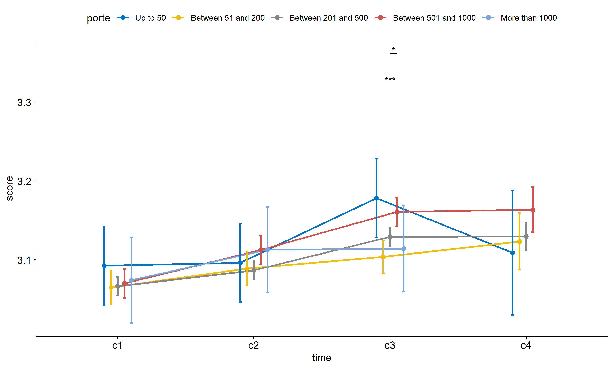<!-- -->

``` r
(pwc <- ldat %>% group_by(porte) %>%
    emmeans_test(score ~ time, detailed = T, p.adjust.method = "bonferroni"))
```

    ## # A tibble: 30 × 15
    ##    porte     term  .y.   group1 group2 null.value estimate     se    df conf.low
    ##  * <fct>     <chr> <chr> <chr>  <chr>       <dbl>    <dbl>  <dbl> <dbl>    <dbl>
    ##  1 Up to 50  time  score c1     c2              0 -0.00361 0.0360  9419  -0.0741
    ##  2 Up to 50  time  score c1     c3              0 -0.0855  0.0360  9419  -0.156 
    ##  3 Up to 50  time  score c1     c4              0 -0.0163  0.0477  9419  -0.110 
    ##  4 Up to 50  time  score c2     c3              0 -0.0819  0.0360  9419  -0.152 
    ##  5 Up to 50  time  score c2     c4              0 -0.0127  0.0477  9419  -0.106 
    ##  6 Up to 50  time  score c3     c4              0  0.0692  0.0477  9419  -0.0243
    ##  7 Between … time  score c1     c2              0 -0.0240  0.0151  9419  -0.0535
    ##  8 Between … time  score c1     c3              0 -0.0387  0.0151  9419  -0.0682
    ##  9 Between … time  score c1     c4              0 -0.0583  0.0211  9419  -0.0997
    ## 10 Between … time  score c2     c3              0 -0.0147  0.0151  9419  -0.0442
    ## # ℹ 20 more rows
    ## # ℹ 5 more variables: conf.high <dbl>, statistic <dbl>, p <dbl>, p.adj <dbl>,
    ## #   p.adj.signif <chr>

| porte                | term | .y.   | group1 | group2 | null.value | estimate |    se |   df | conf.low | conf.high | statistic |     p | p.adj | p.adj.signif |
|:---------------------|:-----|:------|:-------|:-------|-----------:|---------:|------:|-----:|---------:|----------:|----------:|------:|------:|:-------------|
| Up to 50             | time | score | c1     | c2     |          0 |   -0.004 | 0.036 | 9419 |   -0.074 |     0.067 |    -0.100 | 0.920 | 1.000 | ns           |
| Up to 50             | time | score | c1     | c3     |          0 |   -0.086 | 0.036 | 9419 |   -0.156 |    -0.015 |    -2.378 | 0.017 | 0.105 | ns           |
| Up to 50             | time | score | c1     | c4     |          0 |   -0.016 | 0.048 | 9419 |   -0.110 |     0.077 |    -0.342 | 0.732 | 1.000 | ns           |
| Up to 50             | time | score | c2     | c3     |          0 |   -0.082 | 0.036 | 9419 |   -0.152 |    -0.011 |    -2.277 | 0.023 | 0.137 | ns           |
| Up to 50             | time | score | c2     | c4     |          0 |   -0.013 | 0.048 | 9419 |   -0.106 |     0.081 |    -0.266 | 0.790 | 1.000 | ns           |
| Up to 50             | time | score | c3     | c4     |          0 |    0.069 | 0.048 | 9419 |   -0.024 |     0.163 |     1.451 | 0.147 | 0.880 | ns           |
| Between 51 and 200   | time | score | c1     | c2     |          0 |   -0.024 | 0.015 | 9419 |   -0.054 |     0.006 |    -1.592 | 0.111 | 0.668 | ns           |
| Between 51 and 200   | time | score | c1     | c3     |          0 |   -0.039 | 0.015 | 9419 |   -0.068 |    -0.009 |    -2.567 | 0.010 | 0.062 | ns           |
| Between 51 and 200   | time | score | c1     | c4     |          0 |   -0.058 | 0.021 | 9419 |   -0.100 |    -0.017 |    -2.765 | 0.006 | 0.034 | \*           |
| Between 51 and 200   | time | score | c2     | c3     |          0 |   -0.015 | 0.015 | 9419 |   -0.044 |     0.015 |    -0.975 | 0.330 | 1.000 | ns           |
| Between 51 and 200   | time | score | c2     | c4     |          0 |   -0.034 | 0.021 | 9419 |   -0.076 |     0.007 |    -1.628 | 0.104 | 0.621 | ns           |
| Between 51 and 200   | time | score | c3     | c4     |          0 |   -0.020 | 0.021 | 9419 |   -0.061 |     0.022 |    -0.931 | 0.352 | 1.000 | ns           |
| Between 201 and 500  | time | score | c1     | c2     |          0 |   -0.020 | 0.008 | 9419 |   -0.037 |    -0.004 |    -2.429 | 0.015 | 0.091 | ns           |
| Between 201 and 500  | time | score | c1     | c3     |          0 |   -0.063 | 0.008 | 9419 |   -0.079 |    -0.046 |    -7.500 | 0.000 | 0.000 | \*\*\*\*     |
| Between 201 and 500  | time | score | c1     | c4     |          0 |   -0.063 | 0.011 | 9419 |   -0.084 |    -0.042 |    -5.906 | 0.000 | 0.000 | \*\*\*\*     |
| Between 201 and 500  | time | score | c2     | c3     |          0 |   -0.043 | 0.008 | 9419 |   -0.059 |    -0.026 |    -5.071 | 0.000 | 0.000 | \*\*\*\*     |
| Between 201 and 500  | time | score | c2     | c4     |          0 |   -0.043 | 0.011 | 9419 |   -0.064 |    -0.022 |    -4.005 | 0.000 | 0.000 | \*\*\*       |
| Between 201 and 500  | time | score | c3     | c4     |          0 |    0.000 | 0.011 | 9419 |   -0.021 |     0.021 |    -0.036 | 0.971 | 1.000 | ns           |
| Between 501 and 1000 | time | score | c1     | c2     |          0 |   -0.043 | 0.013 | 9419 |   -0.068 |    -0.017 |    -3.224 | 0.001 | 0.008 | \*\*         |
| Between 501 and 1000 | time | score | c1     | c3     |          0 |   -0.091 | 0.013 | 9419 |   -0.117 |    -0.065 |    -6.877 | 0.000 | 0.000 | \*\*\*\*     |
| Between 501 and 1000 | time | score | c1     | c4     |          0 |   -0.094 | 0.017 | 9419 |   -0.128 |    -0.060 |    -5.386 | 0.000 | 0.000 | \*\*\*\*     |
| Between 501 and 1000 | time | score | c2     | c3     |          0 |   -0.048 | 0.013 | 9419 |   -0.074 |    -0.022 |    -3.653 | 0.000 | 0.002 | \*\*         |
| Between 501 and 1000 | time | score | c2     | c4     |          0 |   -0.051 | 0.017 | 9419 |   -0.085 |    -0.017 |    -2.942 | 0.003 | 0.020 | \*           |
| Between 501 and 1000 | time | score | c3     | c4     |          0 |   -0.003 | 0.017 | 9419 |   -0.037 |     0.031 |    -0.173 | 0.862 | 1.000 | ns           |
| More than 1000       | time | score | c1     | c2     |          0 |   -0.039 | 0.039 | 9419 |   -0.115 |     0.038 |    -0.985 | 0.325 | 0.974 | ns           |
| More than 1000       | time | score | c1     | c3     |          0 |   -0.040 | 0.039 | 9419 |   -0.117 |     0.037 |    -1.021 | 0.307 | 0.922 | ns           |
| More than 1000       | time | score | c1     | c4     |          0 |       NA |    NA |   NA |       NA |        NA |        NA |    NA |    NA |              |
| More than 1000       | time | score | c2     | c3     |          0 |   -0.001 | 0.039 | 9419 |   -0.078 |     0.075 |    -0.036 | 0.971 | 1.000 | ns           |
| More than 1000       | time | score | c2     | c4     |          0 |       NA |    NA |   NA |       NA |        NA |        NA |    NA |    NA |              |
| More than 1000       | time | score | c3     | c4     |          0 |       NA |    NA |   NA |       NA |        NA |        NA |    NA |    NA |              |

``` r
(emms <- get_emmeans(pwc))
```

    ## # A tibble: 20 × 8
    ##    porte                time  emmean       se    df conf.low conf.high method   
    ##    <fct>                <fct>  <dbl>    <dbl> <dbl>    <dbl>     <dbl> <chr>    
    ##  1 Up to 50             c1      3.09  0.0254   9419     3.04      3.14 Emmeans …
    ##  2 Up to 50             c2      3.10  0.0254   9419     3.05      3.15 Emmeans …
    ##  3 Up to 50             c3      3.18  0.0254   9419     3.13      3.23 Emmeans …
    ##  4 Up to 50             c4      3.11  0.0403   9419     3.03      3.19 Emmeans …
    ##  5 Between 51 and 200   c1      3.07  0.0107   9419     3.04      3.09 Emmeans …
    ##  6 Between 51 and 200   c2      3.09  0.0107   9419     3.07      3.11 Emmeans …
    ##  7 Between 51 and 200   c3      3.10  0.0107   9419     3.08      3.12 Emmeans …
    ##  8 Between 51 and 200   c4      3.12  0.0182   9419     3.09      3.16 Emmeans …
    ##  9 Between 201 and 500  c1      3.07  0.00593  9419     3.05      3.08 Emmeans …
    ## 10 Between 201 and 500  c2      3.09  0.00593  9419     3.08      3.10 Emmeans …
    ## 11 Between 201 and 500  c3      3.13  0.00593  9419     3.12      3.14 Emmeans …
    ## 12 Between 201 and 500  c4      3.13  0.00892  9419     3.11      3.15 Emmeans …
    ## 13 Between 501 and 1000 c1      3.07  0.00932  9419     3.05      3.09 Emmeans …
    ## 14 Between 501 and 1000 c2      3.11  0.00932  9419     3.09      3.13 Emmeans …
    ## 15 Between 501 and 1000 c3      3.16  0.00932  9419     3.14      3.18 Emmeans …
    ## 16 Between 501 and 1000 c4      3.16  0.0147   9419     3.14      3.19 Emmeans …
    ## 17 More than 1000       c1      3.07  0.0277   9419     3.02      3.13 Emmeans …
    ## 18 More than 1000       c2      3.11  0.0277   9419     3.06      3.17 Emmeans …
    ## 19 More than 1000       c3      3.11  0.0277   9419     3.06      3.17 Emmeans …
    ## 20 More than 1000       c4     NA    NA          NA    NA        NA    Emmeans …

| porte                | time | emmean |    se |   df | conf.low | conf.high | method       |
|:---------------------|:-----|-------:|------:|-----:|---------:|----------:|:-------------|
| Up to 50             | c1   |  3.093 | 0.025 | 9419 |    3.043 |     3.143 | Emmeans test |
| Up to 50             | c2   |  3.096 | 0.025 | 9419 |    3.047 |     3.146 | Emmeans test |
| Up to 50             | c3   |  3.178 | 0.025 | 9419 |    3.128 |     3.228 | Emmeans test |
| Up to 50             | c4   |  3.109 | 0.040 | 9419 |    3.030 |     3.188 | Emmeans test |
| Between 51 and 200   | c1   |  3.065 | 0.011 | 9419 |    3.044 |     3.086 | Emmeans test |
| Between 51 and 200   | c2   |  3.089 | 0.011 | 9419 |    3.068 |     3.110 | Emmeans test |
| Between 51 and 200   | c3   |  3.104 | 0.011 | 9419 |    3.083 |     3.125 | Emmeans test |
| Between 51 and 200   | c4   |  3.123 | 0.018 | 9419 |    3.088 |     3.159 | Emmeans test |
| Between 201 and 500  | c1   |  3.067 | 0.006 | 9419 |    3.055 |     3.078 | Emmeans test |
| Between 201 and 500  | c2   |  3.087 | 0.006 | 9419 |    3.075 |     3.099 | Emmeans test |
| Between 201 and 500  | c3   |  3.129 | 0.006 | 9419 |    3.118 |     3.141 | Emmeans test |
| Between 201 and 500  | c4   |  3.130 | 0.009 | 9419 |    3.112 |     3.147 | Emmeans test |
| Between 501 and 1000 | c1   |  3.070 | 0.009 | 9419 |    3.052 |     3.088 | Emmeans test |
| Between 501 and 1000 | c2   |  3.113 | 0.009 | 9419 |    3.094 |     3.131 | Emmeans test |
| Between 501 and 1000 | c3   |  3.161 | 0.009 | 9419 |    3.143 |     3.179 | Emmeans test |
| Between 501 and 1000 | c4   |  3.164 | 0.015 | 9419 |    3.135 |     3.193 | Emmeans test |
| More than 1000       | c1   |  3.074 | 0.028 | 9419 |    3.020 |     3.129 | Emmeans test |
| More than 1000       | c2   |  3.113 | 0.028 | 9419 |    3.059 |     3.167 | Emmeans test |
| More than 1000       | c3   |  3.114 | 0.028 | 9419 |    3.060 |     3.169 | Emmeans test |
| More than 1000       | c4   |     NA |    NA |   NA |       NA |        NA | Emmeans test |

``` r
emms.gg <- emms[which(emms$porte == "Up to 50"),]
if (nrow(emms.gg) > 0)
  ggline(emms.gg, x = "time", y = "emmean", color = "#0073C2FF", ylab = "score", size = 1) +
    geom_errorbar(aes(ymin = conf.low, ymax = conf.high),
                  width = 0.1, color = "#0073C2FF", linewidth = 1) +
    stat_pvalue_manual(
      add_xy_position(pwc[which(pwc$porte == "Up to 50"),],
                      x = "time", fun = "mean_se"),
      hide.ns = T, color = "#0073C2FF", tip.length = F) +
    theme(legend.text = element_blank())
```

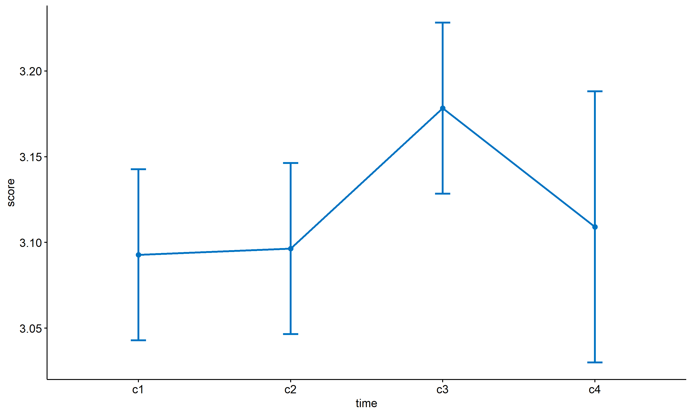<!-- -->

``` r
emms.gg <- emms[which(emms$porte == "Between 51 and 200"),]
if (nrow(emms.gg) > 0)
  ggline(emms.gg, x = "time", y = "emmean", color = "#EFC000FF", ylab = "score", size = 1) +
    geom_errorbar(aes(ymin = conf.low, ymax = conf.high),
                  width = 0.1, color = "#EFC000FF", linewidth = 1) +
    stat_pvalue_manual(
      add_xy_position(pwc[which(pwc$porte == "Between 51 and 200"),],
                      x = "time", fun = "mean_se"),
      hide.ns = T, color = "#EFC000FF", tip.length = F) +
    theme(legend.text = element_blank())
```

<!-- -->

``` r
emms.gg <- emms[which(emms$porte == "Between 201 and 500"),]
if (nrow(emms.gg) > 0)
  ggline(emms.gg, x = "time", y = "emmean", color = "#868686FF", ylab = "score", size = 1) +
    geom_errorbar(aes(ymin = conf.low, ymax = conf.high),
                  width = 0.1, color = "#868686FF", linewidth = 1) +
    stat_pvalue_manual(
      add_xy_position(pwc[which(pwc$porte == "Between 201 and 500"),],
                      x = "time", fun = "mean_se"),
      hide.ns = T, color = "#868686FF", tip.length = F) +
    theme(legend.text = element_blank())
```

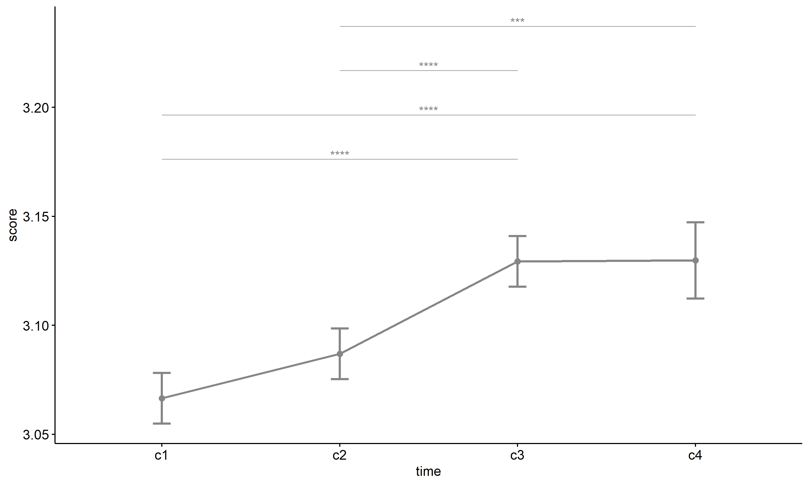<!-- -->

``` r
emms.gg <- emms[which(emms$porte == "Between 501 and 1000"),]
if (nrow(emms.gg) > 0)
  ggline(emms.gg, x = "time", y = "emmean", color = "#CD534CFF", ylab = "score", size = 1) +
    geom_errorbar(aes(ymin = conf.low, ymax = conf.high),
                  width = 0.2, color = "#CD534CFF", linewidth = 1) +
    stat_pvalue_manual(
      add_xy_position(pwc[which(pwc$porte == "Between 501 and 1000"),],
                      x = "time", fun = "mean_se"),
      hide.ns = T, color = "#CD534CFF", tip.length = F) +
    theme(legend.text = element_blank())
```

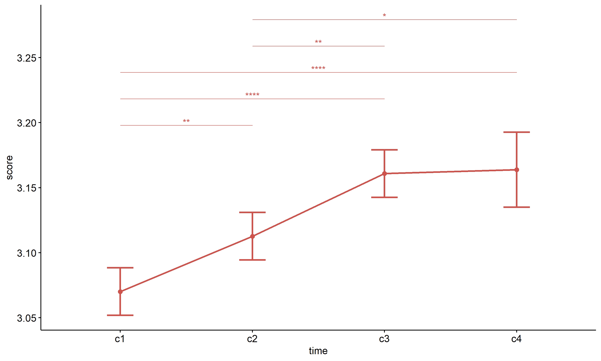<!-- -->

## PairWise Computation after removing non.normal data

``` r
if (length(non.ids) > 0)
  (pwc2 <- ldat2 %>% group_by(time) %>%
     emmeans_test(score ~ porte, detailed = T, p.adjust.method = "bonferroni"))
```

    ## # A tibble: 40 × 15
    ##    time  term  .y.   group1     group2 null.value estimate     se    df conf.low
    ##  * <fct> <chr> <chr> <chr>      <chr>       <dbl>    <dbl>  <dbl> <dbl>    <dbl>
    ##  1 c1    porte score Up to 50   Betwe…          0  0.0248  0.0281  9403  -0.0304
    ##  2 c1    porte score Up to 50   Betwe…          0  0.0233  0.0267  9403  -0.0290
    ##  3 c1    porte score Up to 50   Betwe…          0  0.0197  0.0277  9403  -0.0345
    ##  4 c1    porte score Up to 50   More …          0  0.0156  0.0380  9403  -0.0589
    ##  5 c1    porte score Between 5… Betwe…          0 -0.00141 0.0122  9403  -0.0253
    ##  6 c1    porte score Between 5… Betwe…          0 -0.00506 0.0141  9403  -0.0328
    ##  7 c1    porte score Between 5… More …          0 -0.00917 0.0297  9403  -0.0673
    ##  8 c1    porte score Between 2… Betwe…          0 -0.00365 0.0110  9403  -0.0253
    ##  9 c1    porte score Between 2… More …          0 -0.00776 0.0283  9403  -0.0632
    ## 10 c1    porte score Between 5… More …          0 -0.00411 0.0292  9403  -0.0613
    ## # ℹ 30 more rows
    ## # ℹ 5 more variables: conf.high <dbl>, statistic <dbl>, p <dbl>, p.adj <dbl>,
    ## #   p.adj.signif <chr>

| time | term  | .y.   | group1               | group2               | null.value | estimate |    se |   df | conf.low | conf.high | statistic |     p | p.adj | p.adj.signif |
|:-----|:------|:------|:---------------------|:---------------------|-----------:|---------:|------:|-----:|---------:|----------:|----------:|------:|------:|:-------------|
| c1   | porte | score | Up to 50             | Between 51 and 200   |          0 |    0.025 | 0.028 | 9403 |   -0.030 |     0.080 |     0.880 | 0.379 | 1.000 | ns           |
| c1   | porte | score | Up to 50             | Between 201 and 500  |          0 |    0.023 | 0.027 | 9403 |   -0.029 |     0.076 |     0.874 | 0.382 | 1.000 | ns           |
| c1   | porte | score | Up to 50             | Between 501 and 1000 |          0 |    0.020 | 0.028 | 9403 |   -0.035 |     0.074 |     0.712 | 0.476 | 1.000 | ns           |
| c1   | porte | score | Up to 50             | More than 1000       |          0 |    0.016 | 0.038 | 9403 |   -0.059 |     0.090 |     0.410 | 0.682 | 1.000 | ns           |
| c1   | porte | score | Between 51 and 200   | Between 201 and 500  |          0 |   -0.001 | 0.012 | 9403 |   -0.025 |     0.022 |    -0.116 | 0.908 | 1.000 | ns           |
| c1   | porte | score | Between 51 and 200   | Between 501 and 1000 |          0 |   -0.005 | 0.014 | 9403 |   -0.033 |     0.023 |    -0.357 | 0.721 | 1.000 | ns           |
| c1   | porte | score | Between 51 and 200   | More than 1000       |          0 |   -0.009 | 0.030 | 9403 |   -0.067 |     0.049 |    -0.309 | 0.757 | 1.000 | ns           |
| c1   | porte | score | Between 201 and 500  | Between 501 and 1000 |          0 |   -0.004 | 0.011 | 9403 |   -0.025 |     0.018 |    -0.331 | 0.741 | 1.000 | ns           |
| c1   | porte | score | Between 201 and 500  | More than 1000       |          0 |   -0.008 | 0.028 | 9403 |   -0.063 |     0.048 |    -0.274 | 0.784 | 1.000 | ns           |
| c1   | porte | score | Between 501 and 1000 | More than 1000       |          0 |   -0.004 | 0.029 | 9403 |   -0.061 |     0.053 |    -0.141 | 0.888 | 1.000 | ns           |
| c2   | porte | score | Up to 50             | Between 51 and 200   |          0 |    0.013 | 0.028 | 9403 |   -0.042 |     0.069 |     0.477 | 0.633 | 1.000 | ns           |
| c2   | porte | score | Up to 50             | Between 201 and 500  |          0 |    0.016 | 0.027 | 9403 |   -0.037 |     0.068 |     0.586 | 0.558 | 1.000 | ns           |
| c2   | porte | score | Up to 50             | Between 501 and 1000 |          0 |   -0.010 | 0.028 | 9403 |   -0.064 |     0.044 |    -0.367 | 0.714 | 1.000 | ns           |
| c2   | porte | score | Up to 50             | More than 1000       |          0 |   -0.010 | 0.038 | 9403 |   -0.085 |     0.064 |    -0.272 | 0.786 | 1.000 | ns           |
| c2   | porte | score | Between 51 and 200   | Between 201 and 500  |          0 |    0.002 | 0.012 | 9403 |   -0.022 |     0.026 |     0.183 | 0.855 | 1.000 | ns           |
| c2   | porte | score | Between 51 and 200   | Between 501 and 1000 |          0 |   -0.024 | 0.014 | 9403 |   -0.051 |     0.004 |    -1.666 | 0.096 | 0.958 | ns           |
| c2   | porte | score | Between 51 and 200   | More than 1000       |          0 |   -0.024 | 0.030 | 9403 |   -0.082 |     0.034 |    -0.801 | 0.423 | 1.000 | ns           |
| c2   | porte | score | Between 201 and 500  | Between 501 and 1000 |          0 |   -0.026 | 0.011 | 9403 |   -0.047 |    -0.004 |    -2.337 | 0.019 | 0.195 | ns           |
| c2   | porte | score | Between 201 and 500  | More than 1000       |          0 |   -0.026 | 0.028 | 9403 |   -0.081 |     0.030 |    -0.918 | 0.359 | 1.000 | ns           |
| c2   | porte | score | Between 501 and 1000 | More than 1000       |          0 |    0.000 | 0.029 | 9403 |   -0.057 |     0.057 |    -0.006 | 0.995 | 1.000 | ns           |
| c3   | porte | score | Up to 50             | Between 51 and 200   |          0 |    0.063 | 0.028 | 9403 |    0.008 |     0.118 |     2.249 | 0.025 | 0.246 | ns           |
| c3   | porte | score | Up to 50             | Between 201 and 500  |          0 |    0.038 | 0.027 | 9403 |   -0.015 |     0.090 |     1.411 | 0.158 | 1.000 | ns           |
| c3   | porte | score | Up to 50             | Between 501 and 1000 |          0 |    0.006 | 0.028 | 9403 |   -0.048 |     0.060 |     0.226 | 0.821 | 1.000 | ns           |
| c3   | porte | score | Up to 50             | More than 1000       |          0 |    0.053 | 0.038 | 9403 |   -0.022 |     0.127 |     1.389 | 0.165 | 1.000 | ns           |
| c3   | porte | score | Between 51 and 200   | Between 201 and 500  |          0 |   -0.026 | 0.012 | 9403 |   -0.049 |    -0.002 |    -2.100 | 0.036 | 0.358 | ns           |
| c3   | porte | score | Between 51 and 200   | Between 501 and 1000 |          0 |   -0.057 | 0.014 | 9403 |   -0.085 |    -0.029 |    -4.032 | 0.000 | 0.001 | \*\*\*       |
| c3   | porte | score | Between 51 and 200   | More than 1000       |          0 |   -0.010 | 0.030 | 9403 |   -0.069 |     0.048 |    -0.353 | 0.724 | 1.000 | ns           |
| c3   | porte | score | Between 201 and 500  | Between 501 and 1000 |          0 |   -0.031 | 0.011 | 9403 |   -0.053 |    -0.010 |    -2.850 | 0.004 | 0.044 | \*           |
| c3   | porte | score | Between 201 and 500  | More than 1000       |          0 |    0.015 | 0.028 | 9403 |   -0.040 |     0.071 |     0.534 | 0.594 | 1.000 | ns           |
| c3   | porte | score | Between 501 and 1000 | More than 1000       |          0 |    0.047 | 0.029 | 9403 |   -0.011 |     0.104 |     1.594 | 0.111 | 1.000 | ns           |
| c4   | porte | score | Up to 50             | Between 51 and 200   |          0 |   -0.082 | 0.047 | 9403 |   -0.174 |     0.009 |    -1.758 | 0.079 | 0.473 | ns           |
| c4   | porte | score | Up to 50             | Between 201 and 500  |          0 |   -0.088 | 0.044 | 9403 |   -0.174 |    -0.002 |    -2.013 | 0.044 | 0.265 | ns           |
| c4   | porte | score | Up to 50             | Between 501 and 1000 |          0 |   -0.122 | 0.045 | 9403 |   -0.212 |    -0.033 |    -2.696 | 0.007 | 0.042 | \*           |
| c4   | porte | score | Up to 50             | More than 1000       |          0 |       NA |    NA |   NA |       NA |        NA |        NA |    NA |    NA |              |
| c4   | porte | score | Between 51 and 200   | Between 201 and 500  |          0 |   -0.006 | 0.020 | 9403 |   -0.046 |     0.033 |    -0.312 | 0.755 | 1.000 | ns           |
| c4   | porte | score | Between 51 and 200   | Between 501 and 1000 |          0 |   -0.040 | 0.023 | 9403 |   -0.086 |     0.005 |    -1.729 | 0.084 | 0.504 | ns           |
| c4   | porte | score | Between 51 and 200   | More than 1000       |          0 |       NA |    NA |   NA |       NA |        NA |        NA |    NA |    NA |              |
| c4   | porte | score | Between 201 and 500  | Between 501 and 1000 |          0 |   -0.034 | 0.017 | 9403 |   -0.068 |     0.000 |    -1.985 | 0.047 | 0.283 | ns           |
| c4   | porte | score | Between 201 and 500  | More than 1000       |          0 |       NA |    NA |   NA |       NA |        NA |        NA |    NA |    NA |              |
| c4   | porte | score | Between 501 and 1000 | More than 1000       |          0 |       NA |    NA |   NA |       NA |        NA |        NA |    NA |    NA |              |

``` r
if (length(non.ids) > 0)
  (emms2 <- get_emmeans(pwc2))
```

    ## # A tibble: 20 × 8
    ##    time  porte                emmean       se    df conf.low conf.high method   
    ##    <fct> <fct>                 <dbl>    <dbl> <dbl>    <dbl>     <dbl> <chr>    
    ##  1 c1    Up to 50               3.09  0.0260   9403     3.04      3.14 Emmeans …
    ##  2 c1    Between 51 and 200     3.07  0.0106   9403     3.04      3.09 Emmeans …
    ##  3 c1    Between 201 and 500    3.07  0.00592  9403     3.05      3.08 Emmeans …
    ##  4 c1    Between 501 and 1000   3.07  0.00931  9403     3.05      3.09 Emmeans …
    ##  5 c1    More than 1000         3.07  0.0277   9403     3.02      3.13 Emmeans …
    ##  6 c2    Up to 50               3.10  0.0260   9403     3.05      3.15 Emmeans …
    ##  7 c2    Between 51 and 200     3.09  0.0106   9403     3.07      3.11 Emmeans …
    ##  8 c2    Between 201 and 500    3.09  0.00592  9403     3.08      3.10 Emmeans …
    ##  9 c2    Between 501 and 1000   3.11  0.00931  9403     3.09      3.13 Emmeans …
    ## 10 c2    More than 1000         3.11  0.0277   9403     3.06      3.17 Emmeans …
    ## 11 c3    Up to 50               3.17  0.0260   9403     3.12      3.22 Emmeans …
    ## 12 c3    Between 51 and 200     3.10  0.0106   9403     3.08      3.12 Emmeans …
    ## 13 c3    Between 201 and 500    3.13  0.00592  9403     3.12      3.14 Emmeans …
    ## 14 c3    Between 501 and 1000   3.16  0.00931  9403     3.14      3.18 Emmeans …
    ## 15 c3    More than 1000         3.11  0.0277   9403     3.06      3.17 Emmeans …
    ## 16 c4    Up to 50               3.04  0.0430   9403     2.96      3.13 Emmeans …
    ## 17 c4    Between 51 and 200     3.12  0.0182   9403     3.09      3.16 Emmeans …
    ## 18 c4    Between 201 and 500    3.13  0.00891  9403     3.11      3.15 Emmeans …
    ## 19 c4    Between 501 and 1000   3.16  0.0147   9403     3.14      3.19 Emmeans …
    ## 20 c4    More than 1000        NA    NA          NA    NA        NA    Emmeans …

| time | porte                | emmean |    se |   df | conf.low | conf.high | method       |
|:-----|:---------------------|-------:|------:|-----:|---------:|----------:|:-------------|
| c1   | Up to 50             |  3.090 | 0.026 | 9403 |    3.039 |     3.141 | Emmeans test |
| c1   | Between 51 and 200   |  3.065 | 0.011 | 9403 |    3.044 |     3.086 | Emmeans test |
| c1   | Between 201 and 500  |  3.067 | 0.006 | 9403 |    3.055 |     3.078 | Emmeans test |
| c1   | Between 501 and 1000 |  3.070 | 0.009 | 9403 |    3.052 |     3.088 | Emmeans test |
| c1   | More than 1000       |  3.074 | 0.028 | 9403 |    3.020 |     3.129 | Emmeans test |
| c2   | Up to 50             |  3.103 | 0.026 | 9403 |    3.051 |     3.154 | Emmeans test |
| c2   | Between 51 and 200   |  3.089 | 0.011 | 9403 |    3.068 |     3.110 | Emmeans test |
| c2   | Between 201 and 500  |  3.087 | 0.006 | 9403 |    3.075 |     3.098 | Emmeans test |
| c2   | Between 501 and 1000 |  3.113 | 0.009 | 9403 |    3.094 |     3.131 | Emmeans test |
| c2   | More than 1000       |  3.113 | 0.028 | 9403 |    3.059 |     3.167 | Emmeans test |
| c3   | Up to 50             |  3.167 | 0.026 | 9403 |    3.116 |     3.218 | Emmeans test |
| c3   | Between 51 and 200   |  3.104 | 0.011 | 9403 |    3.083 |     3.125 | Emmeans test |
| c3   | Between 201 and 500  |  3.129 | 0.006 | 9403 |    3.118 |     3.141 | Emmeans test |
| c3   | Between 501 and 1000 |  3.161 | 0.009 | 9403 |    3.143 |     3.179 | Emmeans test |
| c3   | More than 1000       |  3.114 | 0.028 | 9403 |    3.060 |     3.169 | Emmeans test |
| c4   | Up to 50             |  3.041 | 0.043 | 9403 |    2.957 |     3.126 | Emmeans test |
| c4   | Between 51 and 200   |  3.123 | 0.018 | 9403 |    3.088 |     3.159 | Emmeans test |
| c4   | Between 201 and 500  |  3.130 | 0.009 | 9403 |    3.112 |     3.147 | Emmeans test |
| c4   | Between 501 and 1000 |  3.164 | 0.015 | 9403 |    3.135 |     3.193 | Emmeans test |
| c4   | More than 1000       |     NA |    NA |   NA |       NA |        NA | Emmeans test |

``` r
if (length(non.ids) > 0) {
  pwc2 <- add_xy_position(pwc2, x = "time", fun = "mean_se", dodge = 0.25)
  pd2 <- position_dodge(width = 0.25)
  
  ggline(emms2, x = "time", y = "emmean", color = "porte", size = 1,
         palette = c("#0073C2FF","#EFC000FF","#868686FF","#CD534CFF","#7AA6DCFF"),
         position = pd, ylab = "score") +
    geom_errorbar(aes(ymin = conf.low, ymax = conf.high, color = porte),
                position = pd, width = 0.1, linewidth = 1) +
    stat_pvalue_manual(pwc2, hide.ns = T, tip.length = F, linetype = 1)
}
```

    ## Warning: Removed 4 rows containing non-finite values (`stat_bracket()`).

    ## Warning: Removed 1 row containing missing values (`geom_line()`).

    ## Warning: Removed 1 rows containing missing values (`geom_point()`).

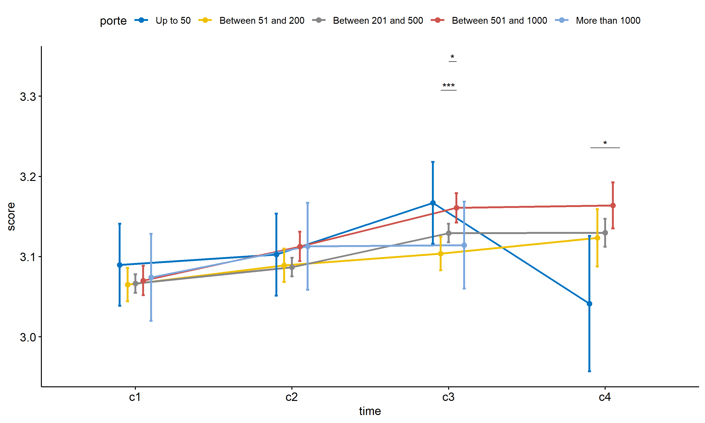<!-- -->

``` r
if (length(non.ids) > 0)
  (pwc2 <- ldat2 %>% group_by(porte) %>%
     emmeans_test(score ~ time, detailed = T, p.adjust.method = "bonferroni"))
```

    ## # A tibble: 30 × 15
    ##    porte     term  .y.   group1 group2 null.value estimate     se    df conf.low
    ##  * <fct>     <chr> <chr> <chr>  <chr>       <dbl>    <dbl>  <dbl> <dbl>    <dbl>
    ##  1 Up to 50  time  score c1     c2              0  -0.0127 0.0368  9403  -0.0849
    ##  2 Up to 50  time  score c1     c3              0  -0.0772 0.0368  9403  -0.149 
    ##  3 Up to 50  time  score c1     c4              0   0.0485 0.0503  9403  -0.0500
    ##  4 Up to 50  time  score c2     c3              0  -0.0646 0.0368  9403  -0.137 
    ##  5 Up to 50  time  score c2     c4              0   0.0612 0.0503  9403  -0.0374
    ##  6 Up to 50  time  score c3     c4              0   0.126  0.0503  9403   0.0272
    ##  7 Between … time  score c1     c2              0  -0.0240 0.0151  9403  -0.0535
    ##  8 Between … time  score c1     c3              0  -0.0387 0.0151  9403  -0.0682
    ##  9 Between … time  score c1     c4              0  -0.0583 0.0211  9403  -0.0997
    ## 10 Between … time  score c2     c3              0  -0.0147 0.0151  9403  -0.0442
    ## # ℹ 20 more rows
    ## # ℹ 5 more variables: conf.high <dbl>, statistic <dbl>, p <dbl>, p.adj <dbl>,
    ## #   p.adj.signif <chr>

| porte                | term | .y.   | group1 | group2 | null.value | estimate |    se |   df | conf.low | conf.high | statistic |     p | p.adj | p.adj.signif |
|:---------------------|:-----|:------|:-------|:-------|-----------:|---------:|------:|-----:|---------:|----------:|----------:|------:|------:|:-------------|
| Up to 50             | time | score | c1     | c2     |          0 |   -0.013 | 0.037 | 9403 |   -0.085 |     0.060 |    -0.344 | 0.731 | 1.000 | ns           |
| Up to 50             | time | score | c1     | c3     |          0 |   -0.077 | 0.037 | 9403 |   -0.149 |    -0.005 |    -2.096 | 0.036 | 0.217 | ns           |
| Up to 50             | time | score | c1     | c4     |          0 |    0.048 | 0.050 | 9403 |   -0.050 |     0.147 |     0.965 | 0.335 | 1.000 | ns           |
| Up to 50             | time | score | c2     | c3     |          0 |   -0.065 | 0.037 | 9403 |   -0.137 |     0.008 |    -1.752 | 0.080 | 0.478 | ns           |
| Up to 50             | time | score | c2     | c4     |          0 |    0.061 | 0.050 | 9403 |   -0.037 |     0.160 |     1.216 | 0.224 | 1.000 | ns           |
| Up to 50             | time | score | c3     | c4     |          0 |    0.126 | 0.050 | 9403 |    0.027 |     0.224 |     2.501 | 0.012 | 0.074 | ns           |
| Between 51 and 200   | time | score | c1     | c2     |          0 |   -0.024 | 0.015 | 9403 |   -0.054 |     0.006 |    -1.594 | 0.111 | 0.666 | ns           |
| Between 51 and 200   | time | score | c1     | c3     |          0 |   -0.039 | 0.015 | 9403 |   -0.068 |    -0.009 |    -2.570 | 0.010 | 0.061 | ns           |
| Between 51 and 200   | time | score | c1     | c4     |          0 |   -0.058 | 0.021 | 9403 |   -0.100 |    -0.017 |    -2.768 | 0.006 | 0.034 | \*           |
| Between 51 and 200   | time | score | c2     | c3     |          0 |   -0.015 | 0.015 | 9403 |   -0.044 |     0.015 |    -0.976 | 0.329 | 1.000 | ns           |
| Between 51 and 200   | time | score | c2     | c4     |          0 |   -0.034 | 0.021 | 9403 |   -0.076 |     0.007 |    -1.629 | 0.103 | 0.619 | ns           |
| Between 51 and 200   | time | score | c3     | c4     |          0 |   -0.020 | 0.021 | 9403 |   -0.061 |     0.022 |    -0.932 | 0.351 | 1.000 | ns           |
| Between 201 and 500  | time | score | c1     | c2     |          0 |   -0.020 | 0.008 | 9403 |   -0.037 |    -0.004 |    -2.432 | 0.015 | 0.090 | ns           |
| Between 201 and 500  | time | score | c1     | c3     |          0 |   -0.063 | 0.008 | 9403 |   -0.079 |    -0.046 |    -7.507 | 0.000 | 0.000 | \*\*\*\*     |
| Between 201 and 500  | time | score | c1     | c4     |          0 |   -0.063 | 0.011 | 9403 |   -0.084 |    -0.042 |    -5.912 | 0.000 | 0.000 | \*\*\*\*     |
| Between 201 and 500  | time | score | c2     | c3     |          0 |   -0.043 | 0.008 | 9403 |   -0.059 |    -0.026 |    -5.075 | 0.000 | 0.000 | \*\*\*\*     |
| Between 201 and 500  | time | score | c2     | c4     |          0 |   -0.043 | 0.011 | 9403 |   -0.064 |    -0.022 |    -4.009 | 0.000 | 0.000 | \*\*\*       |
| Between 201 and 500  | time | score | c3     | c4     |          0 |    0.000 | 0.011 | 9403 |   -0.021 |     0.021 |    -0.036 | 0.971 | 1.000 | ns           |
| Between 501 and 1000 | time | score | c1     | c2     |          0 |   -0.043 | 0.013 | 9403 |   -0.068 |    -0.017 |    -3.227 | 0.001 | 0.008 | \*\*         |
| Between 501 and 1000 | time | score | c1     | c3     |          0 |   -0.091 | 0.013 | 9403 |   -0.116 |    -0.065 |    -6.884 | 0.000 | 0.000 | \*\*\*\*     |
| Between 501 and 1000 | time | score | c1     | c4     |          0 |   -0.094 | 0.017 | 9403 |   -0.128 |    -0.060 |    -5.390 | 0.000 | 0.000 | \*\*\*\*     |
| Between 501 and 1000 | time | score | c2     | c3     |          0 |   -0.048 | 0.013 | 9403 |   -0.074 |    -0.022 |    -3.657 | 0.000 | 0.002 | \*\*         |
| Between 501 and 1000 | time | score | c2     | c4     |          0 |   -0.051 | 0.017 | 9403 |   -0.085 |    -0.017 |    -2.945 | 0.003 | 0.019 | \*           |
| Between 501 and 1000 | time | score | c3     | c4     |          0 |   -0.003 | 0.017 | 9403 |   -0.037 |     0.031 |    -0.173 | 0.862 | 1.000 | ns           |
| More than 1000       | time | score | c1     | c2     |          0 |   -0.039 | 0.039 | 9403 |   -0.115 |     0.038 |    -0.986 | 0.324 | 0.973 | ns           |
| More than 1000       | time | score | c1     | c3     |          0 |   -0.040 | 0.039 | 9403 |   -0.117 |     0.037 |    -1.022 | 0.307 | 0.920 | ns           |
| More than 1000       | time | score | c1     | c4     |          0 |       NA |    NA |   NA |       NA |        NA |        NA |    NA |    NA |              |
| More than 1000       | time | score | c2     | c3     |          0 |   -0.001 | 0.039 | 9403 |   -0.078 |     0.075 |    -0.037 | 0.971 | 1.000 | ns           |
| More than 1000       | time | score | c2     | c4     |          0 |       NA |    NA |   NA |       NA |        NA |        NA |    NA |    NA |              |
| More than 1000       | time | score | c3     | c4     |          0 |       NA |    NA |   NA |       NA |        NA |        NA |    NA |    NA |              |

``` r
if (length(non.ids) > 0)
  (emms2 <- get_emmeans(pwc2))
```

    ## # A tibble: 20 × 8
    ##    porte                time  emmean       se    df conf.low conf.high method   
    ##    <fct>                <fct>  <dbl>    <dbl> <dbl>    <dbl>     <dbl> <chr>    
    ##  1 Up to 50             c1      3.09  0.0260   9403     3.04      3.14 Emmeans …
    ##  2 Up to 50             c2      3.10  0.0260   9403     3.05      3.15 Emmeans …
    ##  3 Up to 50             c3      3.17  0.0260   9403     3.12      3.22 Emmeans …
    ##  4 Up to 50             c4      3.04  0.0430   9403     2.96      3.13 Emmeans …
    ##  5 Between 51 and 200   c1      3.07  0.0106   9403     3.04      3.09 Emmeans …
    ##  6 Between 51 and 200   c2      3.09  0.0106   9403     3.07      3.11 Emmeans …
    ##  7 Between 51 and 200   c3      3.10  0.0106   9403     3.08      3.12 Emmeans …
    ##  8 Between 51 and 200   c4      3.12  0.0182   9403     3.09      3.16 Emmeans …
    ##  9 Between 201 and 500  c1      3.07  0.00592  9403     3.05      3.08 Emmeans …
    ## 10 Between 201 and 500  c2      3.09  0.00592  9403     3.08      3.10 Emmeans …
    ## 11 Between 201 and 500  c3      3.13  0.00592  9403     3.12      3.14 Emmeans …
    ## 12 Between 201 and 500  c4      3.13  0.00891  9403     3.11      3.15 Emmeans …
    ## 13 Between 501 and 1000 c1      3.07  0.00931  9403     3.05      3.09 Emmeans …
    ## 14 Between 501 and 1000 c2      3.11  0.00931  9403     3.09      3.13 Emmeans …
    ## 15 Between 501 and 1000 c3      3.16  0.00931  9403     3.14      3.18 Emmeans …
    ## 16 Between 501 and 1000 c4      3.16  0.0147   9403     3.14      3.19 Emmeans …
    ## 17 More than 1000       c1      3.07  0.0277   9403     3.02      3.13 Emmeans …
    ## 18 More than 1000       c2      3.11  0.0277   9403     3.06      3.17 Emmeans …
    ## 19 More than 1000       c3      3.11  0.0277   9403     3.06      3.17 Emmeans …
    ## 20 More than 1000       c4     NA    NA          NA    NA        NA    Emmeans …

| porte                | time | emmean |    se |   df | conf.low | conf.high | method       |
|:---------------------|:-----|-------:|------:|-----:|---------:|----------:|:-------------|
| Up to 50             | c1   |  3.090 | 0.026 | 9403 |    3.039 |     3.141 | Emmeans test |
| Up to 50             | c2   |  3.103 | 0.026 | 9403 |    3.051 |     3.154 | Emmeans test |
| Up to 50             | c3   |  3.167 | 0.026 | 9403 |    3.116 |     3.218 | Emmeans test |
| Up to 50             | c4   |  3.041 | 0.043 | 9403 |    2.957 |     3.126 | Emmeans test |
| Between 51 and 200   | c1   |  3.065 | 0.011 | 9403 |    3.044 |     3.086 | Emmeans test |
| Between 51 and 200   | c2   |  3.089 | 0.011 | 9403 |    3.068 |     3.110 | Emmeans test |
| Between 51 and 200   | c3   |  3.104 | 0.011 | 9403 |    3.083 |     3.125 | Emmeans test |
| Between 51 and 200   | c4   |  3.123 | 0.018 | 9403 |    3.088 |     3.159 | Emmeans test |
| Between 201 and 500  | c1   |  3.067 | 0.006 | 9403 |    3.055 |     3.078 | Emmeans test |
| Between 201 and 500  | c2   |  3.087 | 0.006 | 9403 |    3.075 |     3.098 | Emmeans test |
| Between 201 and 500  | c3   |  3.129 | 0.006 | 9403 |    3.118 |     3.141 | Emmeans test |
| Between 201 and 500  | c4   |  3.130 | 0.009 | 9403 |    3.112 |     3.147 | Emmeans test |
| Between 501 and 1000 | c1   |  3.070 | 0.009 | 9403 |    3.052 |     3.088 | Emmeans test |
| Between 501 and 1000 | c2   |  3.113 | 0.009 | 9403 |    3.094 |     3.131 | Emmeans test |
| Between 501 and 1000 | c3   |  3.161 | 0.009 | 9403 |    3.143 |     3.179 | Emmeans test |
| Between 501 and 1000 | c4   |  3.164 | 0.015 | 9403 |    3.135 |     3.193 | Emmeans test |
| More than 1000       | c1   |  3.074 | 0.028 | 9403 |    3.020 |     3.129 | Emmeans test |
| More than 1000       | c2   |  3.113 | 0.028 | 9403 |    3.059 |     3.167 | Emmeans test |
| More than 1000       | c3   |  3.114 | 0.028 | 9403 |    3.060 |     3.169 | Emmeans test |
| More than 1000       | c4   |     NA |    NA |   NA |       NA |        NA | Emmeans test |

``` r
if (length(non.ids) > 0) {
  emms.gg <- emms2[which(emms2$porte == "Up to 50"),]
  if (nrow(emms.gg) > 0)
    ggline(emms.gg, x = "time", y = "emmean", color = "#0073C2FF", ylab = "score", size = 1) +
    geom_errorbar(aes(ymin = conf.low, ymax = conf.high),
                  width = 0.1, color = "#0073C2FF", linewidth = 1) +
    stat_pvalue_manual(
      add_xy_position(pwc[which(pwc$porte == "Up to 50"),],
                      x = "time", fun = "mean_se"),
      hide.ns = T, color = "#0073C2FF", tip.length = F) +
    theme(legend.text = element_blank())
}
```

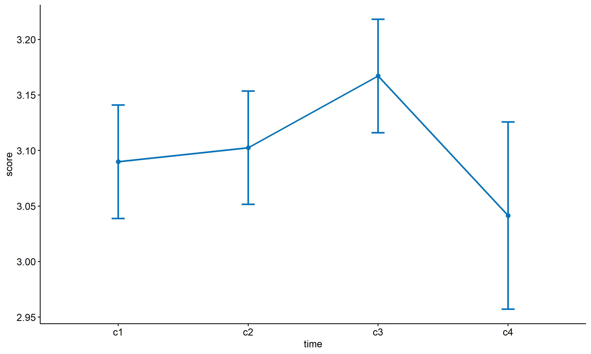<!-- -->

``` r
if (length(non.ids) > 0) {
  emms.gg <- emms2[which(emms2$porte == "Between 51 and 200"),]
  if (nrow(emms.gg) > 0)
    ggline(emms.gg, x = "time", y = "emmean", color = "#EFC000FF", ylab = "score", size = 1) +
    geom_errorbar(aes(ymin = conf.low, ymax = conf.high),
                  width = 0.1, color = "#EFC000FF", linewidth = 1) +
    stat_pvalue_manual(
      add_xy_position(pwc[which(pwc$porte == "Between 51 and 200"),],
                      x = "time", fun = "mean_se"),
      hide.ns = T, color = "#EFC000FF", tip.length = F) +
    theme(legend.text = element_blank())
}
```

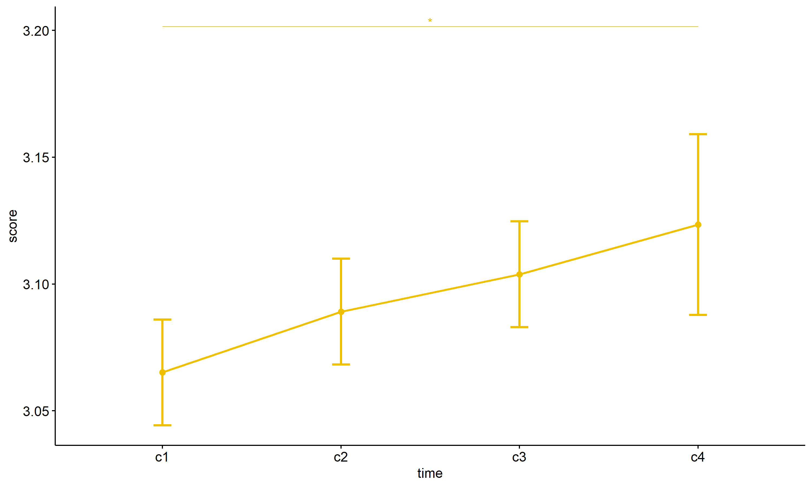<!-- -->

``` r
if (length(non.ids) > 0) {
  emms.gg <- emms2[which(emms2$porte == "Between 201 and 500"),]
  if (nrow(emms.gg) > 0)
    ggline(emms.gg, x = "time", y = "emmean", color = "#868686FF", ylab = "score", size = 1) +
    geom_errorbar(aes(ymin = conf.low, ymax = conf.high),
                  width = 0.1, color = "#868686FF", linewidth = 1) +
    stat_pvalue_manual(
      add_xy_position(pwc[which(pwc$porte == "Between 201 and 500"),],
                      x = "time", fun = "mean_se"),
      hide.ns = T, color = "#868686FF", tip.length = F) +
    theme(legend.text = element_blank())
}
```

<!-- -->

``` r
if (length(non.ids) > 0) {
  emms.gg <- emms2[which(emms2$porte == "Between 501 and 1000"),]
  if (nrow(emms.gg) > 0)
    ggline(emms.gg, x = "time", y = "emmean", color = "#CD534CFF", ylab = "score", size = 1) +
    geom_errorbar(aes(ymin = conf.low, ymax = conf.high),
                  width = 0.2, color = "#CD534CFF", linewidth = 1) +
    stat_pvalue_manual(
      add_xy_position(pwc[which(pwc$porte == "Between 501 and 1000"),],
                      x = "time", fun = "mean_se"),
      hide.ns = T, color = "#CD534CFF", tip.length = F) +
    theme(legend.text = element_blank())
}
```

<!-- -->
