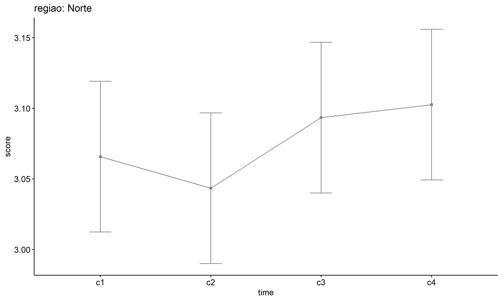

ANOVA test for score
================
Geiser C. Challco <geiser@alumni.usp.br>

- [ANOVA: score ~ time](#anova-score--time)
  - [Data Preparation](#data-preparation)
  - [Summary Statistics](#summary-statistics)
  - [ANOVA Computation](#anova-computation)
  - [PairWise Computation](#pairwise-computation)
- [ANOVA: score ~ time\*gender +
  Error(id/time)](#anova-score--timegender--erroridtime)
  - [Data Preparation](#data-preparation-1)
    - [Check assumptions: Identifying
      Outliers](#check-assumptions-identifying-outliers)
    - [Check assumptions: Normality
      Test](#check-assumptions-normality-test)
    - [Summary Statistics](#summary-statistics-1)
  - [ANOVA Computation](#anova-computation-1)
  - [ANOVA Computation after removing non.normal
    data](#anova-computation-after-removing-nonnormal-data)
  - [PairWise Computation](#pairwise-computation-1)
  - [PairWise Computation after removing non.normal
    data](#pairwise-computation-after-removing-nonnormal-data)
- [ANOVA: score ~ time\*localizacao +
  Error(id/time)](#anova-score--timelocalizacao--erroridtime)
  - [Data Preparation](#data-preparation-2)
    - [Check assumptions: Identifying
      Outliers](#check-assumptions-identifying-outliers-1)
    - [Check assumptions: Normality
      Test](#check-assumptions-normality-test-1)
    - [Summary Statistics](#summary-statistics-2)
  - [ANOVA Computation](#anova-computation-2)
  - [ANOVA Computation after removing non.normal
    data](#anova-computation-after-removing-nonnormal-data-1)
  - [PairWise Computation](#pairwise-computation-2)
  - [PairWise Computation after removing non.normal
    data](#pairwise-computation-after-removing-nonnormal-data-1)
- [ANOVA: score ~ time\*regiao +
  Error(id/time)](#anova-score--timeregiao--erroridtime)
  - [Data Preparation](#data-preparation-3)
    - [Check assumptions: Identifying
      Outliers](#check-assumptions-identifying-outliers-2)
    - [Check assumptions: Normality
      Test](#check-assumptions-normality-test-2)
    - [Summary Statistics](#summary-statistics-3)
  - [ANOVA Computation](#anova-computation-3)
  - [ANOVA Computation after removing non.normal
    data](#anova-computation-after-removing-nonnormal-data-2)
  - [PairWise Computation](#pairwise-computation-3)
  - [PairWise Computation after removing non.normal
    data](#pairwise-computation-after-removing-nonnormal-data-2)
- [ANOVA: score ~ time\*porte +
  Error(id/time)](#anova-score--timeporte--erroridtime)
  - [Data Preparation](#data-preparation-4)
    - [Check assumptions: Identifying
      Outliers](#check-assumptions-identifying-outliers-3)
    - [Check assumptions: Normality
      Test](#check-assumptions-normality-test-3)
    - [Summary Statistics](#summary-statistics-4)
  - [ANOVA Computation](#anova-computation-4)
  - [ANOVA Computation after removing non.normal
    data](#anova-computation-after-removing-nonnormal-data-3)
  - [PairWise Computation](#pairwise-computation-4)
  - [PairWise Computation after removing non.normal
    data](#pairwise-computation-after-removing-nonnormal-data-3)

``` r
dat <- read_excel("../data/data.xlsx", sheet = "alunos_ef14")

escolas <- read_excel("../data/data.xlsx", sheet = "escolas")
edat <- merge(dat, escolas, by = "cod_escola", all.x = T)
```

# ANOVA: score ~ time

## Data Preparation

``` r
data <- edat[,c("aluno_id","ciclo","score")]
data <- data[data$ciclo %in% c("Primeiro Ciclo","Segundo Ciclo","Terceiro Ciclo","Quarto Ciclo"),]
data$ciclo <- factor(data$ciclo, c("Primeiro Ciclo","Segundo Ciclo","Terceiro Ciclo","Quarto Ciclo"))
data <- unique(data)

wdat <- spread(data, ciclo, score)
wdat <- wdat[complete.cases(wdat),]
colnames(wdat) <- c("id","c1","c2","c3","c4")

ldat <- gather(wdat, key = time, value = score, c1,c2,c3,c4) %>%
  convert_as_factor(id, time)
ldat <- rshinystatistics::remove_group_data(ldat, "score", "time", n.limit = 30)
```

## Summary Statistics

``` r
(sdat <- get.descriptives(ldat, "score", "time", symmetry.test = T, normality.test = T))
```

    ##   time variable    n  mean median min max    sd    se    ci iqr symmetry
    ## 1   c1    score 1126 3.066    3.0 2.4 4.0 0.209 0.006 0.012 0.2       NO
    ## 2   c2    score 1126 3.103    3.0 2.4 4.2 0.229 0.007 0.013 0.2       NO
    ## 3   c3    score 1126 3.151    3.1 2.6 4.2 0.258 0.008 0.015 0.2       NO
    ## 4   c4    score 1126 3.136    3.1 2.6 4.0 0.253 0.008 0.015 0.2       NO
    ##    skewness  kurtosis normality     method statistic p p.signif
    ## 1 0.8583996 2.5057884         - D'Agostino  178.2636 0     ****
    ## 2 0.8693814 1.8382785         - D'Agostino  160.2583 0     ****
    ## 3 0.9517043 0.9332069         - D'Agostino  147.5626 0     ****
    ## 4 0.8430333 0.7606267         - D'Agostino  120.3977 0     ****

| time | variable |    n |  mean | median | min | max |    sd |    se |    ci | iqr | symmetry | skewness | kurtosis | normality | method     | statistic |   p | p.signif |
|:-----|:---------|-----:|------:|-------:|----:|----:|------:|------:|------:|----:|:---------|---------:|---------:|:----------|:-----------|----------:|----:|:---------|
| c1   | score    | 1126 | 3.066 |    3.0 | 2.4 | 4.0 | 0.209 | 0.006 | 0.012 | 0.2 | NO       |    0.858 |    2.506 | \-        | D’Agostino |   178.264 |   0 | \*\*\*\* |
| c2   | score    | 1126 | 3.103 |    3.0 | 2.4 | 4.2 | 0.229 | 0.007 | 0.013 | 0.2 | NO       |    0.869 |    1.838 | \-        | D’Agostino |   160.258 |   0 | \*\*\*\* |
| c3   | score    | 1126 | 3.151 |    3.1 | 2.6 | 4.2 | 0.258 | 0.008 | 0.015 | 0.2 | NO       |    0.952 |    0.933 | \-        | D’Agostino |   147.563 |   0 | \*\*\*\* |
| c4   | score    | 1126 | 3.136 |    3.1 | 2.6 | 4.0 | 0.253 | 0.008 | 0.015 | 0.2 | NO       |    0.843 |    0.761 | \-        | D’Agostino |   120.398 |   0 | \*\*\*\* |

## ANOVA Computation

``` r
(res.aov <- anova_test(ldat, dv = score, wid = id, within = time))
```

    ## ANOVA Table (type III tests)
    ## 
    ## $ANOVA
    ##   Effect DFn  DFd      F        p p<.05   ges
    ## 1   time   3 3375 30.394 2.21e-19     * 0.018
    ## 
    ## $`Mauchly's Test for Sphericity`
    ##   Effect     W     p p<.05
    ## 1   time 0.985 0.005     *
    ## 
    ## $`Sphericity Corrections`
    ##   Effect   GGe        DF[GG]    p[GG] p[GG]<.05   HFe        DF[HF]    p[HF]
    ## 1   time 0.991 2.97, 3343.22 3.18e-19         * 0.993 2.98, 3353.04 2.84e-19
    ##   p[HF]<.05
    ## 1         *

| Effect | DFn |  DFd |      F |   p | p\<.05 |   ges |
|:-------|----:|-----:|-------:|----:|:-------|------:|
| time   |   3 | 3375 | 30.394 |   0 | \*     | 0.018 |

| Effect |     W |     p | p\<.05 |
|:-------|------:|------:|:-------|
| time   | 0.985 | 0.005 | \*     |

| Effect |   GGe | DF\[GG\]      | p\[GG\] | p\[GG\]\<.05 |   HFe | DF\[HF\]      | p\[HF\] | p\[HF\]\<.05 |
|:-------|------:|:--------------|--------:|:-------------|------:|:--------------|--------:|:-------------|
| time   | 0.991 | 2.97, 3343.22 |       0 | \*           | 0.993 | 2.98, 3353.04 |       0 | \*           |

## PairWise Computation

``` r
(pwc <- ldat %>% emmeans_test(score ~ time, detailed = T, p.adjust.method = "bonferroni"))
```

    ## # A tibble: 6 × 14
    ##   term  .y.   group1 group2 null.value estimate     se    df conf.low conf.high
    ## * <chr> <chr> <chr>  <chr>       <dbl>    <dbl>  <dbl> <dbl>    <dbl>     <dbl>
    ## 1 time  score c1     c2              0  -0.0368 0.0100  4500 -0.0565    -0.0171
    ## 2 time  score c1     c3              0  -0.0847 0.0100  4500 -0.104     -0.0650
    ## 3 time  score c1     c4              0  -0.0699 0.0100  4500 -0.0896    -0.0502
    ## 4 time  score c2     c3              0  -0.0479 0.0100  4500 -0.0676    -0.0282
    ## 5 time  score c2     c4              0  -0.0331 0.0100  4500 -0.0528    -0.0135
    ## 6 time  score c3     c4              0   0.0147 0.0100  4500 -0.00493    0.0344
    ## # ℹ 4 more variables: statistic <dbl>, p <dbl>, p.adj <dbl>, p.adj.signif <chr>

| term | .y.   | group1 | group2 | null.value | estimate |   se |   df | conf.low | conf.high | statistic |     p | p.adj | p.adj.signif |
|:-----|:------|:-------|:-------|-----------:|---------:|-----:|-----:|---------:|----------:|----------:|------:|------:|:-------------|
| time | score | c1     | c2     |          0 |   -0.037 | 0.01 | 4500 |   -0.056 |    -0.017 |    -3.665 | 0.000 | 0.001 | \*\*         |
| time | score | c1     | c3     |          0 |   -0.085 | 0.01 | 4500 |   -0.104 |    -0.065 |    -8.437 | 0.000 | 0.000 | \*\*\*\*     |
| time | score | c1     | c4     |          0 |   -0.070 | 0.01 | 4500 |   -0.090 |    -0.050 |    -6.968 | 0.000 | 0.000 | \*\*\*\*     |
| time | score | c2     | c3     |          0 |   -0.048 | 0.01 | 4500 |   -0.068 |    -0.028 |    -4.772 | 0.000 | 0.000 | \*\*\*\*     |
| time | score | c2     | c4     |          0 |   -0.033 | 0.01 | 4500 |   -0.053 |    -0.013 |    -3.303 | 0.001 | 0.006 | \*\*         |
| time | score | c3     | c4     |          0 |    0.015 | 0.01 | 4500 |   -0.005 |     0.034 |     1.469 | 0.142 | 0.851 | ns           |

``` r
pwc <- add_xy_position(pwc, x = "time", fun = "mean_se")
ggline(get_emmeans(pwc), x = "time", y = "emmean", ylab = "score") +
  geom_errorbar(aes(ymin = conf.low, ymax = conf.high), width = 0.1) +
  stat_pvalue_manual(pwc, hide.ns = T, tip.length = F)
```

<!-- -->

# ANOVA: score ~ time\*gender + Error(id/time)

## Data Preparation

``` r
data <- edat[,c("aluno_id","gender","ciclo","score")]
data <- data[data$ciclo %in% c("Primeiro Ciclo","Segundo Ciclo","Terceiro Ciclo","Quarto Ciclo"),]
data$ciclo <- factor(data$ciclo, c("Primeiro Ciclo","Segundo Ciclo","Terceiro Ciclo","Quarto Ciclo"))
data <- unique(data)

wdat <- spread(data, ciclo, score)
wdat <- wdat[complete.cases(wdat),]
colnames(wdat) <- c("id","gender","c1","c2","c3","c4")

ldat <- gather(wdat, key = time, value = score, c1,c2,c3,c4) %>%
  convert_as_factor(id, time)
ldat <- remove_group_data(ldat, "score", c("time", "gender"), n.limit = 30)
ldat$gender <- factor(ldat$gender, sort(unique(ldat$gender)))
```

### Check assumptions: Identifying Outliers

``` r
outliers <- identify_outliers(group_by(ldat, time, gender), score)
(outliers <- outliers[outliers$is.extreme == T,])
```

    ## # A tibble: 21 × 6
    ##    gender time  id                   score is.outlier is.extreme
    ##    <fct>  <fct> <fct>                <dbl> <lgl>      <lgl>     
    ##  1 Female c1    Ru3SPRo97iXBvXbvneKh   4   TRUE       TRUE      
    ##  2 Female c1    vc8pPoYau2AIAuCQJipW   4   TRUE       TRUE      
    ##  3 Male   c1    0w3VhiMf67CbcpR6aZCL   4   TRUE       TRUE      
    ##  4 Male   c1    1Z1Qz8zDaMkaAz1Ah80K   4   TRUE       TRUE      
    ##  5 Male   c1    D1HfJKTVqjrpCJx97l3v   3.9 TRUE       TRUE      
    ##  6 Male   c1    uCBI6gnllsawWJlgqkr5   4   TRUE       TRUE      
    ##  7 Female c2    oGUJyWRMYYbF9PNegJZh   4   TRUE       TRUE      
    ##  8 Male   c2    cuknOzzwN4oCRum5U5ph   4.2 TRUE       TRUE      
    ##  9 Male   c2    HsQF2J0r79mHSWNe4l6n   4   TRUE       TRUE      
    ## 10 Male   c2    j31LU8Xwm0EQ7Mihkhjj   4   TRUE       TRUE      
    ## # ℹ 11 more rows

| gender | time | id                   | score | is.outlier | is.extreme |
|:-------|:-----|:---------------------|------:|:-----------|:-----------|
| Female | c1   | Ru3SPRo97iXBvXbvneKh |   4.0 | TRUE       | TRUE       |
| Female | c1   | vc8pPoYau2AIAuCQJipW |   4.0 | TRUE       | TRUE       |
| Male   | c1   | 0w3VhiMf67CbcpR6aZCL |   4.0 | TRUE       | TRUE       |
| Male   | c1   | 1Z1Qz8zDaMkaAz1Ah80K |   4.0 | TRUE       | TRUE       |
| Male   | c1   | D1HfJKTVqjrpCJx97l3v |   3.9 | TRUE       | TRUE       |
| Male   | c1   | uCBI6gnllsawWJlgqkr5 |   4.0 | TRUE       | TRUE       |
| Female | c2   | oGUJyWRMYYbF9PNegJZh |   4.0 | TRUE       | TRUE       |
| Male   | c2   | cuknOzzwN4oCRum5U5ph |   4.2 | TRUE       | TRUE       |
| Male   | c2   | HsQF2J0r79mHSWNe4l6n |   4.0 | TRUE       | TRUE       |
| Male   | c2   | j31LU8Xwm0EQ7Mihkhjj |   4.0 | TRUE       | TRUE       |
| Male   | c2   | z3p6Ot4uvkPmGXOS9D3e |   4.0 | TRUE       | TRUE       |
| Female | c3   | 6bEKmKQpOuvY6PSQvzqj |   4.2 | TRUE       | TRUE       |
| Female | c3   | CCVIt7MPeYMUOCCyBxPh |   4.2 | TRUE       | TRUE       |
| Female | c3   | i5EZ8Ck9IgDueyMbw55v |   4.2 | TRUE       | TRUE       |
| Female | c3   | m5yRlxfIj73j4ossfTOB |   4.2 | TRUE       | TRUE       |
| Female | c3   | OvwAQTWkdj8SYpPS8dgn |   4.0 | TRUE       | TRUE       |
| Female | c3   | RkRJsrzuZjQPcgr9Bu7D |   4.0 | TRUE       | TRUE       |
| Female | c4   | DP1fbT1lGhLiBnOFILLi |   4.0 | TRUE       | TRUE       |
| Female | c4   | fgNBRPWfCa0TP4bDO8d2 |   4.0 | TRUE       | TRUE       |
| Female | c4   | kFvRH3RtPD461qVG04iW |   4.0 | TRUE       | TRUE       |
| Female | c4   | PZJ6CleqURERCau51lXu |   3.9 | TRUE       | TRUE       |

### Check assumptions: Normality Test

``` r
(normality.df <- get.descriptives(ldat, "score", c("time", "gender"), symmetry.test = T, normality.test = T))
```

    ##   time gender variable   n  mean median min max    sd    se    ci iqr symmetry
    ## 1   c1 Female    score 552 3.065    3.0 2.6 4.0 0.203 0.009 0.017 0.2       NO
    ## 2   c1   Male    score 513 3.070    3.0 2.4 4.0 0.221 0.010 0.019 0.2       NO
    ## 3   c2 Female    score 552 3.107    3.0 2.6 4.0 0.220 0.009 0.018 0.2       NO
    ## 4   c2   Male    score 513 3.091    3.0 2.4 4.2 0.238 0.011 0.021 0.2       NO
    ## 5   c3 Female    score 552 3.147    3.1 2.6 4.2 0.268 0.011 0.022 0.2       NO
    ## 6   c3   Male    score 513 3.152    3.1 2.6 3.8 0.250 0.011 0.022 0.3       NO
    ## 7   c4 Female    score 552 3.149    3.1 2.6 4.0 0.260 0.011 0.022 0.2       NO
    ## 8   c4   Male    score 513 3.115    3.0 2.6 3.8 0.241 0.011 0.021 0.2       NO
    ##    skewness  kurtosis normality     method statistic            p p.signif
    ## 1 0.7680607 2.1004398         - D'Agostino  75.73653 0.000000e+00     ****
    ## 2 0.9177898 2.5970433         - D'Agostino  91.70099 0.000000e+00     ****
    ## 3 0.8773295 1.3594136         - D'Agostino  74.22015 1.110223e-16     ****
    ## 4 0.8790069 2.2926351         - D'Agostino  83.74395 0.000000e+00     ****
    ## 5 1.0802058 1.4927513         - D'Agostino  97.19295 0.000000e+00     ****
    ## 6 0.7849097 0.1975376         - D'Agostino  44.39819 2.285888e-10     ****
    ## 7 0.8261134 0.6660274         - D'Agostino  57.63845 3.047562e-13     ****
    ## 8 0.7876196 0.7049213         - D'Agostino  50.86628 9.005907e-12     ****

| time | gender | variable |   n |  mean | median | min | max |    sd |    se |    ci | iqr | symmetry | skewness | kurtosis | normality | method     | statistic |   p | p.signif |
|:-----|:-------|:---------|----:|------:|-------:|----:|----:|------:|------:|------:|----:|:---------|---------:|---------:|:----------|:-----------|----------:|----:|:---------|
| c1   | Female | score    | 552 | 3.065 |    3.0 | 2.6 | 4.0 | 0.203 | 0.009 | 0.017 | 0.2 | NO       |    0.768 |    2.100 | \-        | D’Agostino |    75.737 |   0 | \*\*\*\* |
| c1   | Male   | score    | 513 | 3.070 |    3.0 | 2.4 | 4.0 | 0.221 | 0.010 | 0.019 | 0.2 | NO       |    0.918 |    2.597 | \-        | D’Agostino |    91.701 |   0 | \*\*\*\* |
| c2   | Female | score    | 552 | 3.107 |    3.0 | 2.6 | 4.0 | 0.220 | 0.009 | 0.018 | 0.2 | NO       |    0.877 |    1.359 | \-        | D’Agostino |    74.220 |   0 | \*\*\*\* |
| c2   | Male   | score    | 513 | 3.091 |    3.0 | 2.4 | 4.2 | 0.238 | 0.011 | 0.021 | 0.2 | NO       |    0.879 |    2.293 | \-        | D’Agostino |    83.744 |   0 | \*\*\*\* |
| c3   | Female | score    | 552 | 3.147 |    3.1 | 2.6 | 4.2 | 0.268 | 0.011 | 0.022 | 0.2 | NO       |    1.080 |    1.493 | \-        | D’Agostino |    97.193 |   0 | \*\*\*\* |
| c3   | Male   | score    | 513 | 3.152 |    3.1 | 2.6 | 3.8 | 0.250 | 0.011 | 0.022 | 0.3 | NO       |    0.785 |    0.198 | \-        | D’Agostino |    44.398 |   0 | \*\*\*\* |
| c4   | Female | score    | 552 | 3.149 |    3.1 | 2.6 | 4.0 | 0.260 | 0.011 | 0.022 | 0.2 | NO       |    0.826 |    0.666 | \-        | D’Agostino |    57.638 |   0 | \*\*\*\* |
| c4   | Male   | score    | 513 | 3.115 |    3.0 | 2.6 | 3.8 | 0.241 | 0.011 | 0.021 | 0.2 | NO       |    0.788 |    0.705 | \-        | D’Agostino |    50.866 |   0 | \*\*\*\* |

``` r
(non.ids <- unique(do.call(
  c, lapply(which(normality.df$normality == 'NO'), FUN = function(i) {
  idx = which(ldat$time == normality.df$time[i] &
                ldat$gender == normality.df$gender[i])
  getNonNormal(ldat$"score"[idx], ldat$id[idx])
}))))
```

    ## NULL

``` r
if (length(non.ids) > 0)
  ldat2 <- ldat[!ldat$id %in% non.ids,]
```

### Summary Statistics

``` r
(sdat <- ldat %>% group_by(time, gender) %>%
   get_summary_stats(score, type = "mean_sd"))
```

    ## # A tibble: 8 × 6
    ##   gender time  variable     n  mean    sd
    ##   <fct>  <fct> <fct>    <dbl> <dbl> <dbl>
    ## 1 Female c1    score      552  3.06 0.203
    ## 2 Male   c1    score      513  3.07 0.221
    ## 3 Female c2    score      552  3.11 0.22 
    ## 4 Male   c2    score      513  3.09 0.238
    ## 5 Female c3    score      552  3.15 0.268
    ## 6 Male   c3    score      513  3.15 0.25 
    ## 7 Female c4    score      552  3.15 0.26 
    ## 8 Male   c4    score      513  3.12 0.241

| gender | time | variable |   n |  mean |    sd |
|:-------|:-----|:---------|----:|------:|------:|
| Female | c1   | score    | 552 | 3.065 | 0.203 |
| Male   | c1   | score    | 513 | 3.070 | 0.221 |
| Female | c2   | score    | 552 | 3.107 | 0.220 |
| Male   | c2   | score    | 513 | 3.091 | 0.238 |
| Female | c3   | score    | 552 | 3.147 | 0.268 |
| Male   | c3   | score    | 513 | 3.152 | 0.250 |
| Female | c4   | score    | 552 | 3.149 | 0.260 |
| Male   | c4   | score    | 513 | 3.115 | 0.241 |

``` r
if (length(non.ids) > 0)
  (sdat <- ldat2 %>% group_by(time, gender) %>%
      get_summary_stats(score, type = "mean_sd"))
```

| gender | time | variable |   n |  mean |    sd |
|:-------|:-----|:---------|----:|------:|------:|
| Female | c1   | score    | 552 | 3.065 | 0.203 |
| Male   | c1   | score    | 513 | 3.070 | 0.221 |
| Female | c2   | score    | 552 | 3.107 | 0.220 |
| Male   | c2   | score    | 513 | 3.091 | 0.238 |
| Female | c3   | score    | 552 | 3.147 | 0.268 |
| Male   | c3   | score    | 513 | 3.152 | 0.250 |
| Female | c4   | score    | 552 | 3.149 | 0.260 |
| Male   | c4   | score    | 513 | 3.115 | 0.241 |

## ANOVA Computation

``` r
(res.aov <- anova_test(ldat, dv = score, wid = id, between = gender, within = time))
```

    ## ANOVA Table (type III tests)
    ## 
    ## $ANOVA
    ##        Effect DFn  DFd      F        p p<.05      ges
    ## 1      gender   1 1063  1.553 2.13e-01       0.000439
    ## 2        time   3 3189 26.585 5.59e-17     * 0.017000
    ## 3 gender:time   3 3189  1.783 1.48e-01       0.001000
    ## 
    ## $`Mauchly's Test for Sphericity`
    ##        Effect     W     p p<.05
    ## 1        time 0.984 0.005     *
    ## 2 gender:time 0.984 0.005     *
    ## 
    ## $`Sphericity Corrections`
    ##        Effect  GGe     DF[GG]    p[GG] p[GG]<.05   HFe        DF[HF]    p[HF]
    ## 1        time 0.99 2.97, 3157 7.81e-17         * 0.993 2.98, 3166.82 7.05e-17
    ## 2 gender:time 0.99 2.97, 3157 1.49e-01           0.993 2.98, 3166.82 1.49e-01
    ##   p[HF]<.05
    ## 1         *
    ## 2

| Effect      | DFn |  DFd |      F |     p | p\<.05 |   ges |
|:------------|----:|-----:|-------:|------:|:-------|------:|
| gender      |   1 | 1063 |  1.553 | 0.213 |        | 0.000 |
| time        |   3 | 3189 | 26.585 | 0.000 | \*     | 0.017 |
| gender:time |   3 | 3189 |  1.783 | 0.148 |        | 0.001 |

| Effect      |     W |     p | p\<.05 |
|:------------|------:|------:|:-------|
| time        | 0.984 | 0.005 | \*     |
| gender:time | 0.984 | 0.005 | \*     |

| Effect      |  GGe | DF\[GG\]   | p\[GG\] | p\[GG\]\<.05 |   HFe | DF\[HF\]      | p\[HF\] | p\[HF\]\<.05 |
|:------------|-----:|:-----------|--------:|:-------------|------:|:--------------|--------:|:-------------|
| time        | 0.99 | 2.97, 3157 |   0.000 | \*           | 0.993 | 2.98, 3166.82 |   0.000 | \*           |
| gender:time | 0.99 | 2.97, 3157 |   0.149 |              | 0.993 | 2.98, 3166.82 |   0.149 |              |

## ANOVA Computation after removing non.normal data

``` r
if (length(non.ids) > 0)
  (res.aov2 <- anova_test(ldat2, dv = score, wid = id, between = gender , within = time))
```

## PairWise Computation

``` r
(pwc <- ldat %>% group_by(time) %>%
   emmeans_test(score ~ gender, detailed = T, p.adjust.method = "bonferroni"))
```

    ## # A tibble: 4 × 15
    ##   time  term   .y.   group1 group2 null.value estimate     se    df conf.low
    ## * <fct> <chr>  <chr> <chr>  <chr>       <dbl>    <dbl>  <dbl> <dbl>    <dbl>
    ## 1 c1    gender score Female Male            0 -0.00513 0.0146  4252 -0.0338 
    ## 2 c2    gender score Female Male            0  0.0160  0.0146  4252 -0.0127 
    ## 3 c3    gender score Female Male            0 -0.00496 0.0146  4252 -0.0337 
    ## 4 c4    gender score Female Male            0  0.0341  0.0146  4252  0.00538
    ## # ℹ 5 more variables: conf.high <dbl>, statistic <dbl>, p <dbl>, p.adj <dbl>,
    ## #   p.adj.signif <chr>

| time | term   | .y.   | group1 | group2 | null.value | estimate |    se |   df | conf.low | conf.high | statistic |     p | p.adj | p.adj.signif |
|:-----|:-------|:------|:-------|:-------|-----------:|---------:|------:|-----:|---------:|----------:|----------:|------:|------:|:-------------|
| c1   | gender | score | Female | Male   |          0 |   -0.005 | 0.015 | 4252 |   -0.034 |     0.024 |    -0.350 | 0.726 | 0.726 | ns           |
| c2   | gender | score | Female | Male   |          0 |    0.016 | 0.015 | 4252 |   -0.013 |     0.045 |     1.096 | 0.273 | 0.273 | ns           |
| c3   | gender | score | Female | Male   |          0 |   -0.005 | 0.015 | 4252 |   -0.034 |     0.024 |    -0.339 | 0.735 | 0.735 | ns           |
| c4   | gender | score | Female | Male   |          0 |    0.034 | 0.015 | 4252 |    0.005 |     0.063 |     2.328 | 0.020 | 0.020 | \*           |

``` r
(emms <- get_emmeans(pwc))
```

    ## # A tibble: 8 × 8
    ##   time  gender emmean     se    df conf.low conf.high method      
    ##   <fct> <fct>   <dbl>  <dbl> <dbl>    <dbl>     <dbl> <chr>       
    ## 1 c1    Female   3.06 0.0102  4252     3.04      3.08 Emmeans test
    ## 2 c1    Male     3.07 0.0105  4252     3.05      3.09 Emmeans test
    ## 3 c2    Female   3.11 0.0102  4252     3.09      3.13 Emmeans test
    ## 4 c2    Male     3.09 0.0105  4252     3.07      3.11 Emmeans test
    ## 5 c3    Female   3.15 0.0102  4252     3.13      3.17 Emmeans test
    ## 6 c3    Male     3.15 0.0105  4252     3.13      3.17 Emmeans test
    ## 7 c4    Female   3.15 0.0102  4252     3.13      3.17 Emmeans test
    ## 8 c4    Male     3.12 0.0105  4252     3.09      3.14 Emmeans test

| time | gender | emmean |    se |   df | conf.low | conf.high | method       |
|:-----|:-------|-------:|------:|-----:|---------:|----------:|:-------------|
| c1   | Female |  3.065 | 0.010 | 4252 |    3.045 |     3.085 | Emmeans test |
| c1   | Male   |  3.070 | 0.011 | 4252 |    3.049 |     3.091 | Emmeans test |
| c2   | Female |  3.107 | 0.010 | 4252 |    3.088 |     3.127 | Emmeans test |
| c2   | Male   |  3.091 | 0.011 | 4252 |    3.071 |     3.112 | Emmeans test |
| c3   | Female |  3.147 | 0.010 | 4252 |    3.127 |     3.167 | Emmeans test |
| c3   | Male   |  3.152 | 0.011 | 4252 |    3.132 |     3.173 | Emmeans test |
| c4   | Female |  3.149 | 0.010 | 4252 |    3.129 |     3.169 | Emmeans test |
| c4   | Male   |  3.115 | 0.011 | 4252 |    3.095 |     3.136 | Emmeans test |

``` r
pwc <- add_xy_position(pwc, x = "time", fun = "mean_se", dodge = 0.25)
pd <- position_dodge(width = 0.25)
ggline(emms, x = "time", y = "emmean", color = "gender",
       palette = c("#FF007F","#4D4DFF"),
       position = pd, ylab = "score") +
  geom_errorbar(aes(ymin = conf.low, ymax = conf.high, color = gender),
                position = pd, width = 0.1) +
  stat_pvalue_manual(pwc, hide.ns = T, tip.length = F, linetype = 1)
```

<!-- -->

``` r
(pwc <- ldat %>% group_by(gender) %>%
    emmeans_test(score ~ time, detailed = T, p.adjust.method = "bonferroni"))
```

    ## # A tibble: 12 × 15
    ##    gender term  .y.   group1 group2 null.value estimate     se    df conf.low
    ##  * <fct>  <chr> <chr> <chr>  <chr>       <dbl>    <dbl>  <dbl> <dbl>    <dbl>
    ##  1 Female time  score c1     c2              0 -0.0426  0.0144  4252 -0.0707 
    ##  2 Female time  score c1     c3              0 -0.0824  0.0144  4252 -0.111  
    ##  3 Female time  score c1     c4              0 -0.0844  0.0144  4252 -0.113  
    ##  4 Female time  score c2     c3              0 -0.0399  0.0144  4252 -0.0680 
    ##  5 Female time  score c2     c4              0 -0.0418  0.0144  4252 -0.0700 
    ##  6 Female time  score c3     c4              0 -0.00199 0.0144  4252 -0.0302 
    ##  7 Male   time  score c1     c2              0 -0.0214  0.0149  4252 -0.0506 
    ##  8 Male   time  score c1     c3              0 -0.0823  0.0149  4252 -0.111  
    ##  9 Male   time  score c1     c4              0 -0.0452  0.0149  4252 -0.0744 
    ## 10 Male   time  score c2     c3              0 -0.0609  0.0149  4252 -0.0901 
    ## 11 Male   time  score c2     c4              0 -0.0238  0.0149  4252 -0.0530 
    ## 12 Male   time  score c3     c4              0  0.0370  0.0149  4252  0.00782
    ## # ℹ 5 more variables: conf.high <dbl>, statistic <dbl>, p <dbl>, p.adj <dbl>,
    ## #   p.adj.signif <chr>

| gender | term | .y.   | group1 | group2 | null.value | estimate |    se |   df | conf.low | conf.high | statistic |     p | p.adj | p.adj.signif |
|:-------|:-----|:------|:-------|:-------|-----------:|---------:|------:|-----:|---------:|----------:|----------:|------:|------:|:-------------|
| Female | time | score | c1     | c2     |          0 |   -0.043 | 0.014 | 4252 |   -0.071 |    -0.014 |    -2.963 | 0.003 | 0.018 | \*           |
| Female | time | score | c1     | c3     |          0 |   -0.082 | 0.014 | 4252 |   -0.111 |    -0.054 |    -5.738 | 0.000 | 0.000 | \*\*\*\*     |
| Female | time | score | c1     | c4     |          0 |   -0.084 | 0.014 | 4252 |   -0.113 |    -0.056 |    -5.876 | 0.000 | 0.000 | \*\*\*\*     |
| Female | time | score | c2     | c3     |          0 |   -0.040 | 0.014 | 4252 |   -0.068 |    -0.012 |    -2.774 | 0.006 | 0.033 | \*           |
| Female | time | score | c2     | c4     |          0 |   -0.042 | 0.014 | 4252 |   -0.070 |    -0.014 |    -2.913 | 0.004 | 0.022 | \*           |
| Female | time | score | c3     | c4     |          0 |   -0.002 | 0.014 | 4252 |   -0.030 |     0.026 |    -0.139 | 0.890 | 1.000 | ns           |
| Male   | time | score | c1     | c2     |          0 |   -0.021 | 0.015 | 4252 |   -0.051 |     0.008 |    -1.437 | 0.151 | 0.905 | ns           |
| Male   | time | score | c1     | c3     |          0 |   -0.082 | 0.015 | 4252 |   -0.111 |    -0.053 |    -5.520 | 0.000 | 0.000 | \*\*\*\*     |
| Male   | time | score | c1     | c4     |          0 |   -0.045 | 0.015 | 4252 |   -0.074 |    -0.016 |    -3.035 | 0.002 | 0.015 | \*           |
| Male   | time | score | c2     | c3     |          0 |   -0.061 | 0.015 | 4252 |   -0.090 |    -0.032 |    -4.083 | 0.000 | 0.000 | \*\*\*       |
| Male   | time | score | c2     | c4     |          0 |   -0.024 | 0.015 | 4252 |   -0.053 |     0.005 |    -1.598 | 0.110 | 0.661 | ns           |
| Male   | time | score | c3     | c4     |          0 |    0.037 | 0.015 | 4252 |    0.008 |     0.066 |     2.485 | 0.013 | 0.078 | ns           |

``` r
(emms <- get_emmeans(pwc))
```

    ## # A tibble: 8 × 8
    ##   gender time  emmean     se    df conf.low conf.high method      
    ##   <fct>  <fct>  <dbl>  <dbl> <dbl>    <dbl>     <dbl> <chr>       
    ## 1 Female c1      3.06 0.0102  4252     3.04      3.08 Emmeans test
    ## 2 Female c2      3.11 0.0102  4252     3.09      3.13 Emmeans test
    ## 3 Female c3      3.15 0.0102  4252     3.13      3.17 Emmeans test
    ## 4 Female c4      3.15 0.0102  4252     3.13      3.17 Emmeans test
    ## 5 Male   c1      3.07 0.0105  4252     3.05      3.09 Emmeans test
    ## 6 Male   c2      3.09 0.0105  4252     3.07      3.11 Emmeans test
    ## 7 Male   c3      3.15 0.0105  4252     3.13      3.17 Emmeans test
    ## 8 Male   c4      3.12 0.0105  4252     3.09      3.14 Emmeans test

| gender | time | emmean |    se |   df | conf.low | conf.high | method       |
|:-------|:-----|-------:|------:|-----:|---------:|----------:|:-------------|
| Female | c1   |  3.065 | 0.010 | 4252 |    3.045 |     3.085 | Emmeans test |
| Female | c2   |  3.107 | 0.010 | 4252 |    3.088 |     3.127 | Emmeans test |
| Female | c3   |  3.147 | 0.010 | 4252 |    3.127 |     3.167 | Emmeans test |
| Female | c4   |  3.149 | 0.010 | 4252 |    3.129 |     3.169 | Emmeans test |
| Male   | c1   |  3.070 | 0.011 | 4252 |    3.049 |     3.091 | Emmeans test |
| Male   | c2   |  3.091 | 0.011 | 4252 |    3.071 |     3.112 | Emmeans test |
| Male   | c3   |  3.152 | 0.011 | 4252 |    3.132 |     3.173 | Emmeans test |
| Male   | c4   |  3.115 | 0.011 | 4252 |    3.095 |     3.136 | Emmeans test |

``` r
emms.gg <- emms[which(emms$gender == "Female"),]
if (nrow(emms.gg) > 0)
  ggline(emms.gg, x = "time", y = "emmean", color = "#FF007F", ylab = "score") +
    geom_errorbar(aes(ymin = conf.low, ymax = conf.high),
                  width = 0.2, color = "#FF007F") +
    stat_pvalue_manual(
      add_xy_position(pwc[which(pwc$gender == "Female"),],
                      x = "time", fun = "mean_se"),
      hide.ns = T, color = "#FF007F", tip.length = F) +
    labs(title = "gender: Female")+
    theme(legend.text = element_blank())
```

<!-- -->

``` r
emms.gg <- emms[which(emms$gender == "Male"),]
if (nrow(emms.gg) > 0)
  ggline(emms.gg, x = "time", y = "emmean", color = "#4D4DFF", ylab = "score") +
    geom_errorbar(aes(ymin = conf.low, ymax = conf.high),
                  width = 0.2, color = "#4D4DFF") +
    stat_pvalue_manual(
      add_xy_position(pwc[which(pwc$gender == "Male"),],
                      x = "time", fun = "mean_se"),
      hide.ns = T, color = "#4D4DFF", tip.length = F) +
    labs(title = "gender: Male")+
    theme(legend.text = element_blank())
```

<!-- -->

## PairWise Computation after removing non.normal data

``` r
if (length(non.ids) > 0)
  (pwc2 <- ldat2 %>% group_by(time) %>%
     emmeans_test(score ~ gender, detailed = T, p.adjust.method = "bonferroni"))
```

``` r
if (length(non.ids) > 0)
  (emms2 <- get_emmeans(pwc2))
```

``` r
if (length(non.ids) > 0) {
  pwc2 <- add_xy_position(pwc2, x = "time", fun = "mean_se", dodge = 0.25)
  pd2 <- position_dodge(width = 0.25)
  
  ggline(emms2, x = "time", y = "emmean", color = "gender",
         palette = c("#FF007F","#4D4DFF"),
         position = pd, ylab = "score") +
    geom_errorbar(aes(ymin = conf.low, ymax = conf.high, color = gender),
                position = pd, width = 0.1) +
    stat_pvalue_manual(pwc2, hide.ns = T, tip.length = F, linetype = 1)
}
```

``` r
if (length(non.ids) > 0)
  (pwc2 <- ldat2 %>% group_by(gender) %>%
     emmeans_test(score ~ time, detailed = T, p.adjust.method = "bonferroni"))
```

``` r
if (length(non.ids) > 0)
  (emms2 <- get_emmeans(pwc2))
```

``` r
if (length(non.ids) > 0) {
  emms.gg <- emms2[which(emms2$gender == "Female"),]
  if (nrow(emms.gg) > 0)
    ggline(emms.gg, x = "time", y = "emmean", color = "#FF007F", ylab = "score") +
    geom_errorbar(aes(ymin = conf.low, ymax = conf.high),
                  width = 0.2, color = "#FF007F") +
    stat_pvalue_manual(
      add_xy_position(pwc[which(pwc$gender == "Female"),],
                      x = "time", fun = "mean_se"),
      hide.ns = T, color = "#FF007F", tip.length = F) +
    labs(title = "gender: Female") +
    theme(legend.text = element_blank())
}
```

``` r
if (length(non.ids) > 0) {
  emms.gg <- emms2[which(emms2$gender == "Male"),]
  if (nrow(emms.gg) > 0)
    ggline(emms.gg, x = "time", y = "emmean", color = "#4D4DFF", ylab = "score") +
    geom_errorbar(aes(ymin = conf.low, ymax = conf.high),
                  width = 0.2, color = "#4D4DFF") +
    stat_pvalue_manual(
      add_xy_position(pwc[which(pwc$gender == "Male"),],
                      x = "time", fun = "mean_se"),
      hide.ns = T, color = "#4D4DFF", tip.length = F) +
    labs(title = "gender: Male") +
    theme(legend.text = element_blank())
}
```

# ANOVA: score ~ time\*localizacao + Error(id/time)

## Data Preparation

``` r
data <- edat[,c("aluno_id","localizacao","ciclo","score")]
data <- data[data$ciclo %in% c("Primeiro Ciclo","Segundo Ciclo","Terceiro Ciclo","Quarto Ciclo"),]
data$ciclo <- factor(data$ciclo, c("Primeiro Ciclo","Segundo Ciclo","Terceiro Ciclo","Quarto Ciclo"))
data <- unique(data)

wdat <- spread(data, ciclo, score)
wdat <- wdat[complete.cases(wdat),]
colnames(wdat) <- c("id","localizacao","c1","c2","c3","c4")

ldat <- gather(wdat, key = time, value = score, c1,c2,c3,c4) %>%
  convert_as_factor(id, time)
ldat <- remove_group_data(ldat, "score", c("time", "localizacao"), n.limit = 30)
ldat$localizacao <- factor(ldat$localizacao, sort(unique(ldat$localizacao)))
```

### Check assumptions: Identifying Outliers

``` r
outliers <- identify_outliers(group_by(ldat, time, localizacao), score)
(outliers <- outliers[outliers$is.extreme == T,])
```

    ## # A tibble: 22 × 6
    ##    localizacao time  id                   score is.outlier is.extreme
    ##    <fct>       <fct> <fct>                <dbl> <lgl>      <lgl>     
    ##  1 Rural       c1    0w3VhiMf67CbcpR6aZCL   4   TRUE       TRUE      
    ##  2 Rural       c1    D1HfJKTVqjrpCJx97l3v   3.9 TRUE       TRUE      
    ##  3 Urbana      c1    1Z1Qz8zDaMkaAz1Ah80K   4   TRUE       TRUE      
    ##  4 Urbana      c1    Ru3SPRo97iXBvXbvneKh   4   TRUE       TRUE      
    ##  5 Urbana      c1    uCBI6gnllsawWJlgqkr5   4   TRUE       TRUE      
    ##  6 Urbana      c1    vc8pPoYau2AIAuCQJipW   4   TRUE       TRUE      
    ##  7 Rural       c2    z3p6Ot4uvkPmGXOS9D3e   4   TRUE       TRUE      
    ##  8 Urbana      c2    cuknOzzwN4oCRum5U5ph   4.2 TRUE       TRUE      
    ##  9 Urbana      c2    HsQF2J0r79mHSWNe4l6n   4   TRUE       TRUE      
    ## 10 Urbana      c2    j31LU8Xwm0EQ7Mihkhjj   4   TRUE       TRUE      
    ## # ℹ 12 more rows

| localizacao | time | id                   | score | is.outlier | is.extreme |
|:------------|:-----|:---------------------|------:|:-----------|:-----------|
| Rural       | c1   | 0w3VhiMf67CbcpR6aZCL |   4.0 | TRUE       | TRUE       |
| Rural       | c1   | D1HfJKTVqjrpCJx97l3v |   3.9 | TRUE       | TRUE       |
| Urbana      | c1   | 1Z1Qz8zDaMkaAz1Ah80K |   4.0 | TRUE       | TRUE       |
| Urbana      | c1   | Ru3SPRo97iXBvXbvneKh |   4.0 | TRUE       | TRUE       |
| Urbana      | c1   | uCBI6gnllsawWJlgqkr5 |   4.0 | TRUE       | TRUE       |
| Urbana      | c1   | vc8pPoYau2AIAuCQJipW |   4.0 | TRUE       | TRUE       |
| Rural       | c2   | z3p6Ot4uvkPmGXOS9D3e |   4.0 | TRUE       | TRUE       |
| Urbana      | c2   | cuknOzzwN4oCRum5U5ph |   4.2 | TRUE       | TRUE       |
| Urbana      | c2   | HsQF2J0r79mHSWNe4l6n |   4.0 | TRUE       | TRUE       |
| Urbana      | c2   | j31LU8Xwm0EQ7Mihkhjj |   4.0 | TRUE       | TRUE       |
| Urbana      | c2   | oGUJyWRMYYbF9PNegJZh |   4.0 | TRUE       | TRUE       |
| Urbana      | c3   | 6bEKmKQpOuvY6PSQvzqj |   4.2 | TRUE       | TRUE       |
| Urbana      | c3   | CCVIt7MPeYMUOCCyBxPh |   4.2 | TRUE       | TRUE       |
| Urbana      | c3   | i5EZ8Ck9IgDueyMbw55v |   4.2 | TRUE       | TRUE       |
| Urbana      | c3   | m5yRlxfIj73j4ossfTOB |   4.2 | TRUE       | TRUE       |
| Urbana      | c3   | OvwAQTWkdj8SYpPS8dgn |   4.0 | TRUE       | TRUE       |
| Urbana      | c3   | RkRJsrzuZjQPcgr9Bu7D |   4.0 | TRUE       | TRUE       |
| Rural       | c4   | 1OE4fvPj9Y2Q9Bnwr0xz |   4.0 | TRUE       | TRUE       |
| Rural       | c4   | fgNBRPWfCa0TP4bDO8d2 |   4.0 | TRUE       | TRUE       |
| Rural       | c4   | kFvRH3RtPD461qVG04iW |   4.0 | TRUE       | TRUE       |
| Urbana      | c4   | DP1fbT1lGhLiBnOFILLi |   4.0 | TRUE       | TRUE       |
| Urbana      | c4   | PZJ6CleqURERCau51lXu |   3.9 | TRUE       | TRUE       |

### Check assumptions: Normality Test

``` r
(normality.df <- get.descriptives(ldat, "score", c("time", "localizacao"), symmetry.test = T, normality.test = T))
```

    ##   time localizacao variable   n  mean median min max    sd    se    ci iqr
    ## 1   c1       Rural    score 181 3.076    3.0 2.6 4.0 0.199 0.015 0.029 0.2
    ## 2   c1      Urbana    score 945 3.064    3.0 2.4 4.0 0.211 0.007 0.013 0.2
    ## 3   c2       Rural    score 181 3.129    3.1 2.6 4.0 0.253 0.019 0.037 0.2
    ## 4   c2      Urbana    score 945 3.098    3.0 2.4 4.2 0.224 0.007 0.014 0.2
    ## 5   c3       Rural    score 181 3.191    3.1 2.6 3.8 0.269 0.020 0.039 0.4
    ## 6   c3      Urbana    score 945 3.143    3.1 2.6 4.2 0.256 0.008 0.016 0.2
    ## 7   c4       Rural    score 181 3.154    3.1 2.6 4.0 0.262 0.019 0.038 0.2
    ## 8   c4      Urbana    score 945 3.132    3.1 2.6 4.0 0.251 0.008 0.016 0.2
    ##   symmetry  skewness   kurtosis normality     method statistic            p
    ## 1       NO 0.9626195  3.5205113        QQ D'Agostino  43.73800 3.179896e-10
    ## 2       NO 0.8433006  2.3341529         - D'Agostino 143.91565 0.000000e+00
    ## 3       NO 0.6264629  0.5975063        QQ D'Agostino  14.03047 8.980943e-04
    ## 4       NO 0.9166824  2.1625749         - D'Agostino 151.87838 0.000000e+00
    ## 5       NO 0.6994970 -0.2000273        QQ D'Agostino  13.56569 1.133045e-03
    ## 6       NO 1.0039431  1.2140906         - D'Agostino 141.22856 0.000000e+00
    ## 7       NO 1.1238038  1.0836762        QQ D'Agostino  34.69333 2.927114e-08
    ## 8       NO 0.7781698  0.6478032         - D'Agostino  88.08347 0.000000e+00
    ##   p.signif
    ## 1     ****
    ## 2     ****
    ## 3       **
    ## 4     ****
    ## 5        *
    ## 6     ****
    ## 7     ****
    ## 8     ****

| time | localizacao | variable |   n |  mean | median | min | max |    sd |    se |    ci | iqr | symmetry | skewness | kurtosis | normality | method     | statistic |     p | p.signif |
|:-----|:------------|:---------|----:|------:|-------:|----:|----:|------:|------:|------:|----:|:---------|---------:|---------:|:----------|:-----------|----------:|------:|:---------|
| c1   | Rural       | score    | 181 | 3.076 |    3.0 | 2.6 | 4.0 | 0.199 | 0.015 | 0.029 | 0.2 | NO       |    0.963 |    3.521 | QQ        | D’Agostino |    43.738 | 0.000 | \*\*\*\* |
| c1   | Urbana      | score    | 945 | 3.064 |    3.0 | 2.4 | 4.0 | 0.211 | 0.007 | 0.013 | 0.2 | NO       |    0.843 |    2.334 | \-        | D’Agostino |   143.916 | 0.000 | \*\*\*\* |
| c2   | Rural       | score    | 181 | 3.129 |    3.1 | 2.6 | 4.0 | 0.253 | 0.019 | 0.037 | 0.2 | NO       |    0.626 |    0.598 | QQ        | D’Agostino |    14.030 | 0.001 | \*\*     |
| c2   | Urbana      | score    | 945 | 3.098 |    3.0 | 2.4 | 4.2 | 0.224 | 0.007 | 0.014 | 0.2 | NO       |    0.917 |    2.163 | \-        | D’Agostino |   151.878 | 0.000 | \*\*\*\* |
| c3   | Rural       | score    | 181 | 3.191 |    3.1 | 2.6 | 3.8 | 0.269 | 0.020 | 0.039 | 0.4 | NO       |    0.699 |   -0.200 | QQ        | D’Agostino |    13.566 | 0.001 | \*       |
| c3   | Urbana      | score    | 945 | 3.143 |    3.1 | 2.6 | 4.2 | 0.256 | 0.008 | 0.016 | 0.2 | NO       |    1.004 |    1.214 | \-        | D’Agostino |   141.229 | 0.000 | \*\*\*\* |
| c4   | Rural       | score    | 181 | 3.154 |    3.1 | 2.6 | 4.0 | 0.262 | 0.019 | 0.038 | 0.2 | NO       |    1.124 |    1.084 | QQ        | D’Agostino |    34.693 | 0.000 | \*\*\*\* |
| c4   | Urbana      | score    | 945 | 3.132 |    3.1 | 2.6 | 4.0 | 0.251 | 0.008 | 0.016 | 0.2 | NO       |    0.778 |    0.648 | \-        | D’Agostino |    88.083 | 0.000 | \*\*\*\* |

``` r
(non.ids <- unique(do.call(
  c, lapply(which(normality.df$normality == 'NO'), FUN = function(i) {
  idx = which(ldat$time == normality.df$time[i] &
                ldat$localizacao == normality.df$localizacao[i])
  getNonNormal(ldat$"score"[idx], ldat$id[idx])
}))))
```

    ## NULL

``` r
if (length(non.ids) > 0)
  ldat2 <- ldat[!ldat$id %in% non.ids,]
```

### Summary Statistics

``` r
(sdat <- ldat %>% group_by(time, localizacao) %>%
   get_summary_stats(score, type = "mean_sd"))
```

    ## # A tibble: 8 × 6
    ##   localizacao time  variable     n  mean    sd
    ##   <fct>       <fct> <fct>    <dbl> <dbl> <dbl>
    ## 1 Rural       c1    score      181  3.08 0.199
    ## 2 Urbana      c1    score      945  3.06 0.211
    ## 3 Rural       c2    score      181  3.13 0.253
    ## 4 Urbana      c2    score      945  3.10 0.224
    ## 5 Rural       c3    score      181  3.19 0.269
    ## 6 Urbana      c3    score      945  3.14 0.256
    ## 7 Rural       c4    score      181  3.15 0.262
    ## 8 Urbana      c4    score      945  3.13 0.251

| localizacao | time | variable |   n |  mean |    sd |
|:------------|:-----|:---------|----:|------:|------:|
| Rural       | c1   | score    | 181 | 3.076 | 0.199 |
| Urbana      | c1   | score    | 945 | 3.064 | 0.211 |
| Rural       | c2   | score    | 181 | 3.129 | 0.253 |
| Urbana      | c2   | score    | 945 | 3.098 | 0.224 |
| Rural       | c3   | score    | 181 | 3.191 | 0.269 |
| Urbana      | c3   | score    | 945 | 3.143 | 0.256 |
| Rural       | c4   | score    | 181 | 3.154 | 0.262 |
| Urbana      | c4   | score    | 945 | 3.132 | 0.251 |

``` r
if (length(non.ids) > 0)
  (sdat <- ldat2 %>% group_by(time, localizacao) %>%
      get_summary_stats(score, type = "mean_sd"))
```

| localizacao | time | variable |   n |  mean |    sd |
|:------------|:-----|:---------|----:|------:|------:|
| Rural       | c1   | score    | 181 | 3.076 | 0.199 |
| Urbana      | c1   | score    | 945 | 3.064 | 0.211 |
| Rural       | c2   | score    | 181 | 3.129 | 0.253 |
| Urbana      | c2   | score    | 945 | 3.098 | 0.224 |
| Rural       | c3   | score    | 181 | 3.191 | 0.269 |
| Urbana      | c3   | score    | 945 | 3.143 | 0.256 |
| Rural       | c4   | score    | 181 | 3.154 | 0.262 |
| Urbana      | c4   | score    | 945 | 3.132 | 0.251 |

## ANOVA Computation

``` r
(res.aov <- anova_test(ldat, dv = score, wid = id, between = localizacao, within = time))
```

    ## ANOVA Table (type III tests)
    ## 
    ## $ANOVA
    ##             Effect DFn  DFd      F        p p<.05      ges
    ## 1      localizacao   1 1124  7.004 8.00e-03     * 0.002000
    ## 2             time   3 3372 20.281 5.05e-13     * 0.012000
    ## 3 localizacao:time   3 3372  0.702 5.51e-01       0.000435
    ## 
    ## $`Mauchly's Test for Sphericity`
    ##             Effect     W     p p<.05
    ## 1             time 0.985 0.005     *
    ## 2 localizacao:time 0.985 0.005     *
    ## 
    ## $`Sphericity Corrections`
    ##             Effect   GGe        DF[GG]    p[GG] p[GG]<.05   HFe        DF[HF]
    ## 1             time 0.991 2.97, 3340.16 6.36e-13         * 0.993 2.98, 3349.99
    ## 2 localizacao:time 0.991 2.97, 3340.16 5.49e-01           0.993 2.98, 3349.99
    ##      p[HF] p[HF]<.05
    ## 1 5.92e-13         *
    ## 2 5.50e-01

| Effect           | DFn |  DFd |      F |     p | p\<.05 |   ges |
|:-----------------|----:|-----:|-------:|------:|:-------|------:|
| localizacao      |   1 | 1124 |  7.004 | 0.008 | \*     | 0.002 |
| time             |   3 | 3372 | 20.281 | 0.000 | \*     | 0.012 |
| localizacao:time |   3 | 3372 |  0.702 | 0.551 |        | 0.000 |

| Effect           |     W |     p | p\<.05 |
|:-----------------|------:|------:|:-------|
| time             | 0.985 | 0.005 | \*     |
| localizacao:time | 0.985 | 0.005 | \*     |

| Effect           |   GGe | DF\[GG\]      | p\[GG\] | p\[GG\]\<.05 |   HFe | DF\[HF\]      | p\[HF\] | p\[HF\]\<.05 |
|:-----------------|------:|:--------------|--------:|:-------------|------:|:--------------|--------:|:-------------|
| time             | 0.991 | 2.97, 3340.16 |   0.000 | \*           | 0.993 | 2.98, 3349.99 |    0.00 | \*           |
| localizacao:time | 0.991 | 2.97, 3340.16 |   0.549 |              | 0.993 | 2.98, 3349.99 |    0.55 |              |

## ANOVA Computation after removing non.normal data

``` r
if (length(non.ids) > 0)
  (res.aov2 <- anova_test(ldat2, dv = score, wid = id, between = localizacao , within = time))
```

## PairWise Computation

``` r
(pwc <- ldat %>% group_by(time) %>%
   emmeans_test(score ~ localizacao, detailed = T, p.adjust.method = "bonferroni"))
```

    ## # A tibble: 4 × 15
    ##   time  term       .y.   group1 group2 null.value estimate     se    df conf.low
    ## * <fct> <chr>      <chr> <chr>  <chr>       <dbl>    <dbl>  <dbl> <dbl>    <dbl>
    ## 1 c1    localizac… score Rural  Urbana          0   0.0116 0.0193  4496 -0.0262 
    ## 2 c2    localizac… score Rural  Urbana          0   0.0310 0.0193  4496 -0.00688
    ## 3 c3    localizac… score Rural  Urbana          0   0.0483 0.0193  4496  0.0105 
    ## 4 c4    localizac… score Rural  Urbana          0   0.0218 0.0193  4496 -0.0161 
    ## # ℹ 5 more variables: conf.high <dbl>, statistic <dbl>, p <dbl>, p.adj <dbl>,
    ## #   p.adj.signif <chr>

| time | term        | .y.   | group1 | group2 | null.value | estimate |    se |   df | conf.low | conf.high | statistic |     p | p.adj | p.adj.signif |
|:-----|:------------|:------|:-------|:-------|-----------:|---------:|------:|-----:|---------:|----------:|----------:|------:|------:|:-------------|
| c1   | localizacao | score | Rural  | Urbana |          0 |    0.012 | 0.019 | 4496 |   -0.026 |     0.049 |     0.601 | 0.548 | 0.548 | ns           |
| c2   | localizacao | score | Rural  | Urbana |          0 |    0.031 | 0.019 | 4496 |   -0.007 |     0.069 |     1.604 | 0.109 | 0.109 | ns           |
| c3   | localizacao | score | Rural  | Urbana |          0 |    0.048 | 0.019 | 4496 |    0.010 |     0.086 |     2.502 | 0.012 | 0.012 | \*           |
| c4   | localizacao | score | Rural  | Urbana |          0 |    0.022 | 0.019 | 4496 |   -0.016 |     0.060 |     1.127 | 0.260 | 0.260 | ns           |

``` r
(emms <- get_emmeans(pwc))
```

    ## # A tibble: 8 × 8
    ##   time  localizacao emmean      se    df conf.low conf.high method      
    ##   <fct> <fct>        <dbl>   <dbl> <dbl>    <dbl>     <dbl> <chr>       
    ## 1 c1    Rural         3.08 0.0177   4496     3.04      3.11 Emmeans test
    ## 2 c1    Urbana        3.06 0.00774  4496     3.05      3.08 Emmeans test
    ## 3 c2    Rural         3.13 0.0177   4496     3.09      3.16 Emmeans test
    ## 4 c2    Urbana        3.10 0.00774  4496     3.08      3.11 Emmeans test
    ## 5 c3    Rural         3.19 0.0177   4496     3.16      3.23 Emmeans test
    ## 6 c3    Urbana        3.14 0.00774  4496     3.13      3.16 Emmeans test
    ## 7 c4    Rural         3.15 0.0177   4496     3.12      3.19 Emmeans test
    ## 8 c4    Urbana        3.13 0.00774  4496     3.12      3.15 Emmeans test

| time | localizacao | emmean |    se |   df | conf.low | conf.high | method       |
|:-----|:------------|-------:|------:|-----:|---------:|----------:|:-------------|
| c1   | Rural       |  3.076 | 0.018 | 4496 |    3.041 |     3.110 | Emmeans test |
| c1   | Urbana      |  3.064 | 0.008 | 4496 |    3.049 |     3.079 | Emmeans test |
| c2   | Rural       |  3.129 | 0.018 | 4496 |    3.094 |     3.163 | Emmeans test |
| c2   | Urbana      |  3.098 | 0.008 | 4496 |    3.083 |     3.113 | Emmeans test |
| c3   | Rural       |  3.191 | 0.018 | 4496 |    3.156 |     3.226 | Emmeans test |
| c3   | Urbana      |  3.143 | 0.008 | 4496 |    3.128 |     3.158 | Emmeans test |
| c4   | Rural       |  3.154 | 0.018 | 4496 |    3.119 |     3.189 | Emmeans test |
| c4   | Urbana      |  3.132 | 0.008 | 4496 |    3.117 |     3.148 | Emmeans test |

``` r
pwc <- add_xy_position(pwc, x = "time", fun = "mean_se", dodge = 0.25)
pd <- position_dodge(width = 0.25)
ggline(emms, x = "time", y = "emmean", color = "localizacao",
       palette = c("#AA00FF","#00CCCC"),
       position = pd, ylab = "score") +
  geom_errorbar(aes(ymin = conf.low, ymax = conf.high, color = localizacao),
                position = pd, width = 0.1) +
  stat_pvalue_manual(pwc, hide.ns = T, tip.length = F, linetype = 1)
```

<!-- -->

``` r
(pwc <- ldat %>% group_by(localizacao) %>%
    emmeans_test(score ~ time, detailed = T, p.adjust.method = "bonferroni"))
```

    ## # A tibble: 12 × 15
    ##    localizacao term  .y.   group1 group2 null.value estimate     se    df
    ##  * <fct>       <chr> <chr> <chr>  <chr>       <dbl>    <dbl>  <dbl> <dbl>
    ##  1 Rural       time  score c1     c2              0  -0.0530 0.0250  4496
    ##  2 Rural       time  score c1     c3              0  -0.115  0.0250  4496
    ##  3 Rural       time  score c1     c4              0  -0.0785 0.0250  4496
    ##  4 Rural       time  score c2     c3              0  -0.0624 0.0250  4496
    ##  5 Rural       time  score c2     c4              0  -0.0254 0.0250  4496
    ##  6 Rural       time  score c3     c4              0   0.0370 0.0250  4496
    ##  7 Urbana      time  score c1     c2              0  -0.0337 0.0109  4496
    ##  8 Urbana      time  score c1     c3              0  -0.0788 0.0109  4496
    ##  9 Urbana      time  score c1     c4              0  -0.0683 0.0109  4496
    ## 10 Urbana      time  score c2     c3              0  -0.0451 0.0109  4496
    ## 11 Urbana      time  score c2     c4              0  -0.0346 0.0109  4496
    ## 12 Urbana      time  score c3     c4              0   0.0105 0.0109  4496
    ## # ℹ 6 more variables: conf.low <dbl>, conf.high <dbl>, statistic <dbl>,
    ## #   p <dbl>, p.adj <dbl>, p.adj.signif <chr>

| localizacao | term | .y.   | group1 | group2 | null.value | estimate |    se |   df | conf.low | conf.high | statistic |     p | p.adj | p.adj.signif |
|:------------|:-----|:------|:-------|:-------|-----------:|---------:|------:|-----:|---------:|----------:|----------:|------:|------:|:-------------|
| Rural       | time | score | c1     | c2     |          0 |   -0.053 | 0.025 | 4496 |   -0.102 |    -0.004 |    -2.121 | 0.034 | 0.204 | ns           |
| Rural       | time | score | c1     | c3     |          0 |   -0.115 | 0.025 | 4496 |   -0.165 |    -0.066 |    -4.617 | 0.000 | 0.000 | \*\*\*\*     |
| Rural       | time | score | c1     | c4     |          0 |   -0.078 | 0.025 | 4496 |   -0.127 |    -0.029 |    -3.137 | 0.002 | 0.010 | \*           |
| Rural       | time | score | c2     | c3     |          0 |   -0.062 | 0.025 | 4496 |   -0.111 |    -0.013 |    -2.496 | 0.013 | 0.076 | ns           |
| Rural       | time | score | c2     | c4     |          0 |   -0.025 | 0.025 | 4496 |   -0.074 |     0.024 |    -1.016 | 0.310 | 1.000 | ns           |
| Rural       | time | score | c3     | c4     |          0 |    0.037 | 0.025 | 4496 |   -0.012 |     0.086 |     1.480 | 0.139 | 0.834 | ns           |
| Urbana      | time | score | c1     | c2     |          0 |   -0.034 | 0.011 | 4496 |   -0.055 |    -0.012 |    -3.076 | 0.002 | 0.013 | \*           |
| Urbana      | time | score | c1     | c3     |          0 |   -0.079 | 0.011 | 4496 |   -0.100 |    -0.057 |    -7.196 | 0.000 | 0.000 | \*\*\*\*     |
| Urbana      | time | score | c1     | c4     |          0 |   -0.068 | 0.011 | 4496 |   -0.090 |    -0.047 |    -6.239 | 0.000 | 0.000 | \*\*\*\*     |
| Urbana      | time | score | c2     | c3     |          0 |   -0.045 | 0.011 | 4496 |   -0.067 |    -0.024 |    -4.120 | 0.000 | 0.000 | \*\*\*       |
| Urbana      | time | score | c2     | c4     |          0 |   -0.035 | 0.011 | 4496 |   -0.056 |    -0.013 |    -3.163 | 0.002 | 0.009 | \*\*         |
| Urbana      | time | score | c3     | c4     |          0 |    0.010 | 0.011 | 4496 |   -0.011 |     0.032 |     0.957 | 0.339 | 1.000 | ns           |

``` r
(emms <- get_emmeans(pwc))
```

    ## # A tibble: 8 × 8
    ##   localizacao time  emmean      se    df conf.low conf.high method      
    ##   <fct>       <fct>  <dbl>   <dbl> <dbl>    <dbl>     <dbl> <chr>       
    ## 1 Rural       c1      3.08 0.0177   4496     3.04      3.11 Emmeans test
    ## 2 Rural       c2      3.13 0.0177   4496     3.09      3.16 Emmeans test
    ## 3 Rural       c3      3.19 0.0177   4496     3.16      3.23 Emmeans test
    ## 4 Rural       c4      3.15 0.0177   4496     3.12      3.19 Emmeans test
    ## 5 Urbana      c1      3.06 0.00774  4496     3.05      3.08 Emmeans test
    ## 6 Urbana      c2      3.10 0.00774  4496     3.08      3.11 Emmeans test
    ## 7 Urbana      c3      3.14 0.00774  4496     3.13      3.16 Emmeans test
    ## 8 Urbana      c4      3.13 0.00774  4496     3.12      3.15 Emmeans test

| localizacao | time | emmean |    se |   df | conf.low | conf.high | method       |
|:------------|:-----|-------:|------:|-----:|---------:|----------:|:-------------|
| Rural       | c1   |  3.076 | 0.018 | 4496 |    3.041 |     3.110 | Emmeans test |
| Rural       | c2   |  3.129 | 0.018 | 4496 |    3.094 |     3.163 | Emmeans test |
| Rural       | c3   |  3.191 | 0.018 | 4496 |    3.156 |     3.226 | Emmeans test |
| Rural       | c4   |  3.154 | 0.018 | 4496 |    3.119 |     3.189 | Emmeans test |
| Urbana      | c1   |  3.064 | 0.008 | 4496 |    3.049 |     3.079 | Emmeans test |
| Urbana      | c2   |  3.098 | 0.008 | 4496 |    3.083 |     3.113 | Emmeans test |
| Urbana      | c3   |  3.143 | 0.008 | 4496 |    3.128 |     3.158 | Emmeans test |
| Urbana      | c4   |  3.132 | 0.008 | 4496 |    3.117 |     3.148 | Emmeans test |

``` r
emms.gg <- emms[which(emms$localizacao == "Rural"),]
if (nrow(emms.gg) > 0)
  ggline(emms.gg, x = "time", y = "emmean", color = "#AA00FF", ylab = "score") +
    geom_errorbar(aes(ymin = conf.low, ymax = conf.high),
                  width = 0.2, color = "#AA00FF") +
    stat_pvalue_manual(
      add_xy_position(pwc[which(pwc$localizacao == "Rural"),],
                      x = "time", fun = "mean_se"),
      hide.ns = T, color = "#AA00FF", tip.length = F) +
    labs(title = "localizacao: Rural")+
    theme(legend.text = element_blank())
```

<!-- -->

``` r
emms.gg <- emms[which(emms$localizacao == "Urbana"),]
if (nrow(emms.gg) > 0)
  ggline(emms.gg, x = "time", y = "emmean", color = "#00CCCC", ylab = "score") +
    geom_errorbar(aes(ymin = conf.low, ymax = conf.high),
                  width = 0.2, color = "#00CCCC") +
    stat_pvalue_manual(
      add_xy_position(pwc[which(pwc$localizacao == "Urbana"),],
                      x = "time", fun = "mean_se"),
      hide.ns = T, color = "#00CCCC", tip.length = F) +
    labs(title = "localizacao: Urbana")+
    theme(legend.text = element_blank())
```

<!-- -->

## PairWise Computation after removing non.normal data

``` r
if (length(non.ids) > 0)
  (pwc2 <- ldat2 %>% group_by(time) %>%
     emmeans_test(score ~ localizacao, detailed = T, p.adjust.method = "bonferroni"))
```

``` r
if (length(non.ids) > 0)
  (emms2 <- get_emmeans(pwc2))
```

``` r
if (length(non.ids) > 0) {
  pwc2 <- add_xy_position(pwc2, x = "time", fun = "mean_se", dodge = 0.25)
  pd2 <- position_dodge(width = 0.25)
  
  ggline(emms2, x = "time", y = "emmean", color = "localizacao",
         palette = c("#AA00FF","#00CCCC"),
         position = pd, ylab = "score") +
    geom_errorbar(aes(ymin = conf.low, ymax = conf.high, color = localizacao),
                position = pd, width = 0.1) +
    stat_pvalue_manual(pwc2, hide.ns = T, tip.length = F, linetype = 1)
}
```

``` r
if (length(non.ids) > 0)
  (pwc2 <- ldat2 %>% group_by(localizacao) %>%
     emmeans_test(score ~ time, detailed = T, p.adjust.method = "bonferroni"))
```

``` r
if (length(non.ids) > 0)
  (emms2 <- get_emmeans(pwc2))
```

``` r
if (length(non.ids) > 0) {
  emms.gg <- emms2[which(emms2$localizacao == "Rural"),]
  if (nrow(emms.gg) > 0)
    ggline(emms.gg, x = "time", y = "emmean", color = "#AA00FF", ylab = "score") +
    geom_errorbar(aes(ymin = conf.low, ymax = conf.high),
                  width = 0.2, color = "#AA00FF") +
    stat_pvalue_manual(
      add_xy_position(pwc[which(pwc$localizacao == "Rural"),],
                      x = "time", fun = "mean_se"),
      hide.ns = T, color = "#AA00FF", tip.length = F) +
    labs(title = "localizacao: Rural") +
    theme(legend.text = element_blank())
}
```

``` r
if (length(non.ids) > 0) {
  emms.gg <- emms2[which(emms2$localizacao == "Urbana"),]
  if (nrow(emms.gg) > 0)
    ggline(emms.gg, x = "time", y = "emmean", color = "#00CCCC", ylab = "score") +
    geom_errorbar(aes(ymin = conf.low, ymax = conf.high),
                  width = 0.2, color = "#00CCCC") +
    stat_pvalue_manual(
      add_xy_position(pwc[which(pwc$localizacao == "Urbana"),],
                      x = "time", fun = "mean_se"),
      hide.ns = T, color = "#00CCCC", tip.length = F) +
    labs(title = "localizacao: Urbana") +
    theme(legend.text = element_blank())
}
```

# ANOVA: score ~ time\*regiao + Error(id/time)

## Data Preparation

``` r
data <- edat[,c("aluno_id","regiao","ciclo","score")]
data <- data[data$ciclo %in% c("Primeiro Ciclo","Segundo Ciclo","Terceiro Ciclo","Quarto Ciclo"),]
data$ciclo <- factor(data$ciclo, c("Primeiro Ciclo","Segundo Ciclo","Terceiro Ciclo","Quarto Ciclo"))
data <- unique(data)

wdat <- spread(data, ciclo, score)
wdat <- wdat[complete.cases(wdat),]
colnames(wdat) <- c("id","regiao","c1","c2","c3","c4")

ldat <- gather(wdat, key = time, value = score, c1,c2,c3,c4) %>%
  convert_as_factor(id, time)
ldat <- remove_group_data(ldat, "score", c("time", "regiao"), n.limit = 30)
ldat$regiao <- factor(ldat$regiao, sort(unique(ldat$regiao)))
```

### Check assumptions: Identifying Outliers

``` r
outliers <- identify_outliers(group_by(ldat, time, regiao), score)
(outliers <- outliers[outliers$is.extreme == T,])
```

    ## # A tibble: 18 × 6
    ##    regiao   time  id                   score is.outlier is.extreme
    ##    <fct>    <fct> <fct>                <dbl> <lgl>      <lgl>     
    ##  1 Nordeste c1    0w3VhiMf67CbcpR6aZCL   4   TRUE       TRUE      
    ##  2 Nordeste c1    D1HfJKTVqjrpCJx97l3v   3.9 TRUE       TRUE      
    ##  3 Nordeste c1    Ru3SPRo97iXBvXbvneKh   4   TRUE       TRUE      
    ##  4 Nordeste c1    uCBI6gnllsawWJlgqkr5   4   TRUE       TRUE      
    ##  5 Nordeste c1    vc8pPoYau2AIAuCQJipW   4   TRUE       TRUE      
    ##  6 Nordeste c2    cuknOzzwN4oCRum5U5ph   4.2 TRUE       TRUE      
    ##  7 Nordeste c2    oGUJyWRMYYbF9PNegJZh   4   TRUE       TRUE      
    ##  8 Nordeste c2    z3p6Ot4uvkPmGXOS9D3e   4   TRUE       TRUE      
    ##  9 Sudeste  c2    HsQF2J0r79mHSWNe4l6n   4   TRUE       TRUE      
    ## 10 Sudeste  c2    j31LU8Xwm0EQ7Mihkhjj   4   TRUE       TRUE      
    ## 11 Nordeste c3    CCVIt7MPeYMUOCCyBxPh   4.2 TRUE       TRUE      
    ## 12 Nordeste c3    i5EZ8Ck9IgDueyMbw55v   4.2 TRUE       TRUE      
    ## 13 Nordeste c3    m5yRlxfIj73j4ossfTOB   4.2 TRUE       TRUE      
    ## 14 Nordeste c3    RkRJsrzuZjQPcgr9Bu7D   4   TRUE       TRUE      
    ## 15 Sudeste  c3    6bEKmKQpOuvY6PSQvzqj   4.2 TRUE       TRUE      
    ## 16 Nordeste c4    1OE4fvPj9Y2Q9Bnwr0xz   4   TRUE       TRUE      
    ## 17 Nordeste c4    kFvRH3RtPD461qVG04iW   4   TRUE       TRUE      
    ## 18 Nordeste c4    PZJ6CleqURERCau51lXu   3.9 TRUE       TRUE

| regiao   | time | id                   | score | is.outlier | is.extreme |
|:---------|:-----|:---------------------|------:|:-----------|:-----------|
| Nordeste | c1   | 0w3VhiMf67CbcpR6aZCL |   4.0 | TRUE       | TRUE       |
| Nordeste | c1   | D1HfJKTVqjrpCJx97l3v |   3.9 | TRUE       | TRUE       |
| Nordeste | c1   | Ru3SPRo97iXBvXbvneKh |   4.0 | TRUE       | TRUE       |
| Nordeste | c1   | uCBI6gnllsawWJlgqkr5 |   4.0 | TRUE       | TRUE       |
| Nordeste | c1   | vc8pPoYau2AIAuCQJipW |   4.0 | TRUE       | TRUE       |
| Nordeste | c2   | cuknOzzwN4oCRum5U5ph |   4.2 | TRUE       | TRUE       |
| Nordeste | c2   | oGUJyWRMYYbF9PNegJZh |   4.0 | TRUE       | TRUE       |
| Nordeste | c2   | z3p6Ot4uvkPmGXOS9D3e |   4.0 | TRUE       | TRUE       |
| Sudeste  | c2   | HsQF2J0r79mHSWNe4l6n |   4.0 | TRUE       | TRUE       |
| Sudeste  | c2   | j31LU8Xwm0EQ7Mihkhjj |   4.0 | TRUE       | TRUE       |
| Nordeste | c3   | CCVIt7MPeYMUOCCyBxPh |   4.2 | TRUE       | TRUE       |
| Nordeste | c3   | i5EZ8Ck9IgDueyMbw55v |   4.2 | TRUE       | TRUE       |
| Nordeste | c3   | m5yRlxfIj73j4ossfTOB |   4.2 | TRUE       | TRUE       |
| Nordeste | c3   | RkRJsrzuZjQPcgr9Bu7D |   4.0 | TRUE       | TRUE       |
| Sudeste  | c3   | 6bEKmKQpOuvY6PSQvzqj |   4.2 | TRUE       | TRUE       |
| Nordeste | c4   | 1OE4fvPj9Y2Q9Bnwr0xz |   4.0 | TRUE       | TRUE       |
| Nordeste | c4   | kFvRH3RtPD461qVG04iW |   4.0 | TRUE       | TRUE       |
| Nordeste | c4   | PZJ6CleqURERCau51lXu |   3.9 | TRUE       | TRUE       |

### Check assumptions: Normality Test

``` r
(normality.df <- get.descriptives(ldat, "score", c("time", "regiao"), symmetry.test = T, normality.test = T))
```

    ##    time       regiao variable   n  mean median min max    sd    se    ci   iqr
    ## 1    c1 Centro-Oeste    score  48 3.065   3.00 2.8 4.0 0.227 0.033 0.066 0.300
    ## 2    c1     Nordeste    score 545 3.082   3.00 2.4 4.0 0.221 0.009 0.019 0.200
    ## 3    c1        Norte    score  78 3.068   3.00 2.8 3.4 0.137 0.016 0.031 0.200
    ## 4    c1      Sudeste    score 393 3.051   3.00 2.6 3.8 0.202 0.010 0.020 0.200
    ## 5    c1          Sul    score  62 3.015   3.00 2.6 3.6 0.195 0.025 0.049 0.200
    ## 6    c2 Centro-Oeste    score  48 3.110   3.10 2.8 3.4 0.173 0.025 0.050 0.200
    ## 7    c2     Nordeste    score 545 3.116   3.00 2.4 4.2 0.235 0.010 0.020 0.200
    ## 8    c2        Norte    score  78 3.044   3.00 2.6 3.6 0.188 0.021 0.042 0.200
    ## 9    c2      Sudeste    score 393 3.105   3.00 2.6 4.0 0.240 0.012 0.024 0.200
    ## 10   c2          Sul    score  62 3.043   3.00 2.6 3.4 0.171 0.022 0.043 0.200
    ## 11   c3 Centro-Oeste    score  48 3.188   3.10 2.8 3.8 0.242 0.035 0.070 0.300
    ## 12   c3     Nordeste    score 545 3.154   3.10 2.6 4.2 0.259 0.011 0.022 0.200
    ## 13   c3        Norte    score  78 3.097   3.10 2.8 3.5 0.153 0.017 0.034 0.200
    ## 14   c3      Sudeste    score 393 3.150   3.10 2.6 4.2 0.274 0.014 0.027 0.300
    ## 15   c3          Sul    score  62 3.166   3.10 2.6 4.0 0.268 0.034 0.068 0.275
    ## 16   c4 Centro-Oeste    score  48 3.154   3.15 2.6 3.8 0.232 0.033 0.067 0.200
    ## 17   c4     Nordeste    score 545 3.118   3.00 2.6 4.0 0.242 0.010 0.020 0.200
    ## 18   c4        Norte    score  78 3.121   3.10 2.7 3.8 0.210 0.024 0.047 0.200
    ## 19   c4      Sudeste    score 393 3.153   3.10 2.6 4.0 0.270 0.014 0.027 0.300
    ## 20   c4          Sul    score  62 3.195   3.20 2.6 3.8 0.283 0.036 0.072 0.400
    ##    symmetry    skewness    kurtosis normality       method   statistic
    ## 1        NO  1.49462737  3.87523302        NO Shapiro-Wilk   0.8603051
    ## 2        NO  0.93748206  2.75683441         -   D'Agostino 101.2637654
    ## 3       YES  0.38150092  0.05709334       YES   D'Agostino   2.5458637
    ## 4        NO  0.57704959  1.21599484         -   D'Agostino  32.1482328
    ## 5        NO  0.60989205  0.58781560        NO   D'Agostino   6.2481067
    ## 6       YES  0.09312193 -0.81019032        NO Shapiro-Wilk   0.9346137
    ## 7        NO  0.85100607  1.76346567         -   D'Agostino  77.4447656
    ## 8       YES  0.20352434  0.30673735       YES   D'Agostino   1.7054526
    ## 9        NO  0.95634123  1.62265432         -   D'Agostino  63.2834519
    ## 10      YES -0.22520685  0.87650652       YES   D'Agostino   3.5931948
    ## 11       NO  1.06032260  0.31589047        NO Shapiro-Wilk   0.8697445
    ## 12       NO  1.08351447  1.31095456         -   D'Agostino  93.3343213
    ## 13      YES  0.36547003 -0.21658994       YES   D'Agostino   2.0034155
    ## 14       NO  0.73840973  0.20764987         -   D'Agostino  31.3786296
    ## 15       NO  0.81542961  0.48060359        NO   D'Agostino   8.6981089
    ## 16       NO  0.67324338  1.00696455        NO Shapiro-Wilk   0.9118654
    ## 17       NO  1.01915660  1.37989622         -   D'Agostino  87.9154924
    ## 18       NO  0.81492361  1.27466827        NO   D'Agostino  13.1936583
    ## 19       NO  0.67345921  0.17142980         -   D'Agostino  26.7826381
    ## 20      YES  0.47915237 -0.29964571       YES   D'Agostino   2.7666117
    ##               p p.signif
    ## 1  4.130369e-05     ****
    ## 2  0.000000e+00     ****
    ## 3  2.800095e-01       ns
    ## 4  1.044961e-07     ****
    ## 5  4.397855e-02        *
    ## 6  1.012657e-02        *
    ## 7  0.000000e+00     ****
    ## 8  4.262513e-01       ns
    ## 9  1.809664e-14     ****
    ## 10 1.658623e-01       ns
    ## 11 7.597451e-05     ****
    ## 12 0.000000e+00     ****
    ## 13 3.672517e-01       ns
    ## 14 1.535384e-07     ****
    ## 15 1.291902e-02        *
    ## 16 1.554277e-03       **
    ## 17 0.000000e+00     ****
    ## 18 1.364688e-03       **
    ## 19 1.528354e-06     ****
    ## 20 2.507482e-01       ns

| time | regiao       | variable |   n |  mean | median | min | max |    sd |    se |    ci |   iqr | symmetry | skewness | kurtosis | normality | method       | statistic |     p | p.signif |
|:-----|:-------------|:---------|----:|------:|-------:|----:|----:|------:|------:|------:|------:|:---------|---------:|---------:|:----------|:-------------|----------:|------:|:---------|
| c1   | Centro-Oeste | score    |  48 | 3.065 |   3.00 | 2.8 | 4.0 | 0.227 | 0.033 | 0.066 | 0.300 | NO       |    1.495 |    3.875 | NO        | Shapiro-Wilk |     0.860 | 0.000 | \*\*\*\* |
| c1   | Nordeste     | score    | 545 | 3.082 |   3.00 | 2.4 | 4.0 | 0.221 | 0.009 | 0.019 | 0.200 | NO       |    0.937 |    2.757 | \-        | D’Agostino   |   101.264 | 0.000 | \*\*\*\* |
| c1   | Norte        | score    |  78 | 3.068 |   3.00 | 2.8 | 3.4 | 0.137 | 0.016 | 0.031 | 0.200 | YES      |    0.382 |    0.057 | YES       | D’Agostino   |     2.546 | 0.280 | ns       |
| c1   | Sudeste      | score    | 393 | 3.051 |   3.00 | 2.6 | 3.8 | 0.202 | 0.010 | 0.020 | 0.200 | NO       |    0.577 |    1.216 | \-        | D’Agostino   |    32.148 | 0.000 | \*\*\*\* |
| c1   | Sul          | score    |  62 | 3.015 |   3.00 | 2.6 | 3.6 | 0.195 | 0.025 | 0.049 | 0.200 | NO       |    0.610 |    0.588 | NO        | D’Agostino   |     6.248 | 0.044 | \*       |
| c2   | Centro-Oeste | score    |  48 | 3.110 |   3.10 | 2.8 | 3.4 | 0.173 | 0.025 | 0.050 | 0.200 | YES      |    0.093 |   -0.810 | NO        | Shapiro-Wilk |     0.935 | 0.010 | \*       |
| c2   | Nordeste     | score    | 545 | 3.116 |   3.00 | 2.4 | 4.2 | 0.235 | 0.010 | 0.020 | 0.200 | NO       |    0.851 |    1.763 | \-        | D’Agostino   |    77.445 | 0.000 | \*\*\*\* |
| c2   | Norte        | score    |  78 | 3.044 |   3.00 | 2.6 | 3.6 | 0.188 | 0.021 | 0.042 | 0.200 | YES      |    0.204 |    0.307 | YES       | D’Agostino   |     1.705 | 0.426 | ns       |
| c2   | Sudeste      | score    | 393 | 3.105 |   3.00 | 2.6 | 4.0 | 0.240 | 0.012 | 0.024 | 0.200 | NO       |    0.956 |    1.623 | \-        | D’Agostino   |    63.283 | 0.000 | \*\*\*\* |
| c2   | Sul          | score    |  62 | 3.043 |   3.00 | 2.6 | 3.4 | 0.171 | 0.022 | 0.043 | 0.200 | YES      |   -0.225 |    0.877 | YES       | D’Agostino   |     3.593 | 0.166 | ns       |
| c3   | Centro-Oeste | score    |  48 | 3.188 |   3.10 | 2.8 | 3.8 | 0.242 | 0.035 | 0.070 | 0.300 | NO       |    1.060 |    0.316 | NO        | Shapiro-Wilk |     0.870 | 0.000 | \*\*\*\* |
| c3   | Nordeste     | score    | 545 | 3.154 |   3.10 | 2.6 | 4.2 | 0.259 | 0.011 | 0.022 | 0.200 | NO       |    1.084 |    1.311 | \-        | D’Agostino   |    93.334 | 0.000 | \*\*\*\* |
| c3   | Norte        | score    |  78 | 3.097 |   3.10 | 2.8 | 3.5 | 0.153 | 0.017 | 0.034 | 0.200 | YES      |    0.365 |   -0.217 | YES       | D’Agostino   |     2.003 | 0.367 | ns       |
| c3   | Sudeste      | score    | 393 | 3.150 |   3.10 | 2.6 | 4.2 | 0.274 | 0.014 | 0.027 | 0.300 | NO       |    0.738 |    0.208 | \-        | D’Agostino   |    31.379 | 0.000 | \*\*\*\* |
| c3   | Sul          | score    |  62 | 3.166 |   3.10 | 2.6 | 4.0 | 0.268 | 0.034 | 0.068 | 0.275 | NO       |    0.815 |    0.481 | NO        | D’Agostino   |     8.698 | 0.013 | \*       |
| c4   | Centro-Oeste | score    |  48 | 3.154 |   3.15 | 2.6 | 3.8 | 0.232 | 0.033 | 0.067 | 0.200 | NO       |    0.673 |    1.007 | NO        | Shapiro-Wilk |     0.912 | 0.002 | \*\*     |
| c4   | Nordeste     | score    | 545 | 3.118 |   3.00 | 2.6 | 4.0 | 0.242 | 0.010 | 0.020 | 0.200 | NO       |    1.019 |    1.380 | \-        | D’Agostino   |    87.915 | 0.000 | \*\*\*\* |
| c4   | Norte        | score    |  78 | 3.121 |   3.10 | 2.7 | 3.8 | 0.210 | 0.024 | 0.047 | 0.200 | NO       |    0.815 |    1.275 | NO        | D’Agostino   |    13.194 | 0.001 | \*\*     |
| c4   | Sudeste      | score    | 393 | 3.153 |   3.10 | 2.6 | 4.0 | 0.270 | 0.014 | 0.027 | 0.300 | NO       |    0.673 |    0.171 | \-        | D’Agostino   |    26.783 | 0.000 | \*\*\*\* |
| c4   | Sul          | score    |  62 | 3.195 |   3.20 | 2.6 | 3.8 | 0.283 | 0.036 | 0.072 | 0.400 | YES      |    0.479 |   -0.300 | YES       | D’Agostino   |     2.767 | 0.251 | ns       |

``` r
idx = which(!ldat$id %in% outliers$id & ldat$regiao == "Norte" & ldat$time == "c4")
non.ids = getNonNormal(ldat$score[idx], ldat$id[idx])

idx = which(!ldat$id %in% outliers$id & ldat$regiao == "Centro-Oeste" & ldat$time == "c4")
non.ids =  unique(c(non.ids, getNonNormal(ldat$score[idx], ldat$id[idx])))

(non.ids)
```

    ##  [1] "AH1sCf7O5jOA17AZz4Sv" "knPmAE3VLSnirKKQgoQL" "9jd1C85ixCoJf3EINYfx"
    ##  [4] "edONhkMBY1DIsXNuuodO" "t7y3FwNYyKYp3l9JHFSZ" "3fTmP8cTTJq8WUIEU0Xl"
    ##  [7] "8p6QYQYkfhR3QOACXZvj" "wSTeItj2YyZhZQ0kiCqW" "LSOWrW4dOhXZ9uMW17va"
    ## [10] "pX3oKxaMTnCJ8g1GtRWG" "18EWxrJZtjBVpzckkv21" "ZwZKuoXF7JaYzVxPoHvk"
    ## [13] "1Z1Qz8zDaMkaAz1Ah80K" "q2OHBM4WxXWQPFhPS0zC" "XPDsLJmk5xRPBBQTOEFf"
    ## [16] "0HZYO8qt2G3sqgoXITwe" "AIyVJKr8sUUkQIogcjw3" "AIzwxJCfbDsO8ZT4ZZ4h"
    ## [19] "vvjX443BD3mkWYYMec2R" "dKIqav6TRc1lClMWW6hS" "WCSObSsiS3xWwGKtJ3Wu"
    ## [22] "gzBUwnjjYHnioTnd4stC"

``` r
if (length(non.ids) > 0)
  ldat2 <- ldat[!ldat$id %in% non.ids,]
```

### Summary Statistics

``` r
(sdat <- get.descriptives(ldat, "score", c("time","regiao"), symmetry.test = T, normality.test = T))
```

    ##    time       regiao variable   n  mean median min max    sd    se    ci   iqr
    ## 1    c1 Centro-Oeste    score  48 3.065   3.00 2.8 4.0 0.227 0.033 0.066 0.300
    ## 2    c1     Nordeste    score 545 3.082   3.00 2.4 4.0 0.221 0.009 0.019 0.200
    ## 3    c1        Norte    score  78 3.068   3.00 2.8 3.4 0.137 0.016 0.031 0.200
    ## 4    c1      Sudeste    score 393 3.051   3.00 2.6 3.8 0.202 0.010 0.020 0.200
    ## 5    c1          Sul    score  62 3.015   3.00 2.6 3.6 0.195 0.025 0.049 0.200
    ## 6    c2 Centro-Oeste    score  48 3.110   3.10 2.8 3.4 0.173 0.025 0.050 0.200
    ## 7    c2     Nordeste    score 545 3.116   3.00 2.4 4.2 0.235 0.010 0.020 0.200
    ## 8    c2        Norte    score  78 3.044   3.00 2.6 3.6 0.188 0.021 0.042 0.200
    ## 9    c2      Sudeste    score 393 3.105   3.00 2.6 4.0 0.240 0.012 0.024 0.200
    ## 10   c2          Sul    score  62 3.043   3.00 2.6 3.4 0.171 0.022 0.043 0.200
    ## 11   c3 Centro-Oeste    score  48 3.188   3.10 2.8 3.8 0.242 0.035 0.070 0.300
    ## 12   c3     Nordeste    score 545 3.154   3.10 2.6 4.2 0.259 0.011 0.022 0.200
    ## 13   c3        Norte    score  78 3.097   3.10 2.8 3.5 0.153 0.017 0.034 0.200
    ## 14   c3      Sudeste    score 393 3.150   3.10 2.6 4.2 0.274 0.014 0.027 0.300
    ## 15   c3          Sul    score  62 3.166   3.10 2.6 4.0 0.268 0.034 0.068 0.275
    ## 16   c4 Centro-Oeste    score  48 3.154   3.15 2.6 3.8 0.232 0.033 0.067 0.200
    ## 17   c4     Nordeste    score 545 3.118   3.00 2.6 4.0 0.242 0.010 0.020 0.200
    ## 18   c4        Norte    score  78 3.121   3.10 2.7 3.8 0.210 0.024 0.047 0.200
    ## 19   c4      Sudeste    score 393 3.153   3.10 2.6 4.0 0.270 0.014 0.027 0.300
    ## 20   c4          Sul    score  62 3.195   3.20 2.6 3.8 0.283 0.036 0.072 0.400
    ##    symmetry    skewness    kurtosis normality       method   statistic
    ## 1        NO  1.49462737  3.87523302        NO Shapiro-Wilk   0.8603051
    ## 2        NO  0.93748206  2.75683441         -   D'Agostino 101.2637654
    ## 3       YES  0.38150092  0.05709334       YES   D'Agostino   2.5458637
    ## 4        NO  0.57704959  1.21599484         -   D'Agostino  32.1482328
    ## 5        NO  0.60989205  0.58781560        NO   D'Agostino   6.2481067
    ## 6       YES  0.09312193 -0.81019032        NO Shapiro-Wilk   0.9346137
    ## 7        NO  0.85100607  1.76346567         -   D'Agostino  77.4447656
    ## 8       YES  0.20352434  0.30673735       YES   D'Agostino   1.7054526
    ## 9        NO  0.95634123  1.62265432         -   D'Agostino  63.2834519
    ## 10      YES -0.22520685  0.87650652       YES   D'Agostino   3.5931948
    ## 11       NO  1.06032260  0.31589047        NO Shapiro-Wilk   0.8697445
    ## 12       NO  1.08351447  1.31095456         -   D'Agostino  93.3343213
    ## 13      YES  0.36547003 -0.21658994       YES   D'Agostino   2.0034155
    ## 14       NO  0.73840973  0.20764987         -   D'Agostino  31.3786296
    ## 15       NO  0.81542961  0.48060359        NO   D'Agostino   8.6981089
    ## 16       NO  0.67324338  1.00696455        NO Shapiro-Wilk   0.9118654
    ## 17       NO  1.01915660  1.37989622         -   D'Agostino  87.9154924
    ## 18       NO  0.81492361  1.27466827        NO   D'Agostino  13.1936583
    ## 19       NO  0.67345921  0.17142980         -   D'Agostino  26.7826381
    ## 20      YES  0.47915237 -0.29964571       YES   D'Agostino   2.7666117
    ##               p p.signif
    ## 1  4.130369e-05     ****
    ## 2  0.000000e+00     ****
    ## 3  2.800095e-01       ns
    ## 4  1.044961e-07     ****
    ## 5  4.397855e-02        *
    ## 6  1.012657e-02        *
    ## 7  0.000000e+00     ****
    ## 8  4.262513e-01       ns
    ## 9  1.809664e-14     ****
    ## 10 1.658623e-01       ns
    ## 11 7.597451e-05     ****
    ## 12 0.000000e+00     ****
    ## 13 3.672517e-01       ns
    ## 14 1.535384e-07     ****
    ## 15 1.291902e-02        *
    ## 16 1.554277e-03       **
    ## 17 0.000000e+00     ****
    ## 18 1.364688e-03       **
    ## 19 1.528354e-06     ****
    ## 20 2.507482e-01       ns

| time | regiao       | variable |   n |  mean | median | min | max |    sd |    se |    ci |   iqr | symmetry | skewness | kurtosis | normality | method       | statistic |     p | p.signif |
|:-----|:-------------|:---------|----:|------:|-------:|----:|----:|------:|------:|------:|------:|:---------|---------:|---------:|:----------|:-------------|----------:|------:|:---------|
| c1   | Centro-Oeste | score    |  48 | 3.065 |   3.00 | 2.8 | 4.0 | 0.227 | 0.033 | 0.066 | 0.300 | NO       |    1.495 |    3.875 | NO        | Shapiro-Wilk |     0.860 | 0.000 | \*\*\*\* |
| c1   | Nordeste     | score    | 545 | 3.082 |   3.00 | 2.4 | 4.0 | 0.221 | 0.009 | 0.019 | 0.200 | NO       |    0.937 |    2.757 | \-        | D’Agostino   |   101.264 | 0.000 | \*\*\*\* |
| c1   | Norte        | score    |  78 | 3.068 |   3.00 | 2.8 | 3.4 | 0.137 | 0.016 | 0.031 | 0.200 | YES      |    0.382 |    0.057 | YES       | D’Agostino   |     2.546 | 0.280 | ns       |
| c1   | Sudeste      | score    | 393 | 3.051 |   3.00 | 2.6 | 3.8 | 0.202 | 0.010 | 0.020 | 0.200 | NO       |    0.577 |    1.216 | \-        | D’Agostino   |    32.148 | 0.000 | \*\*\*\* |
| c1   | Sul          | score    |  62 | 3.015 |   3.00 | 2.6 | 3.6 | 0.195 | 0.025 | 0.049 | 0.200 | NO       |    0.610 |    0.588 | NO        | D’Agostino   |     6.248 | 0.044 | \*       |
| c2   | Centro-Oeste | score    |  48 | 3.110 |   3.10 | 2.8 | 3.4 | 0.173 | 0.025 | 0.050 | 0.200 | YES      |    0.093 |   -0.810 | NO        | Shapiro-Wilk |     0.935 | 0.010 | \*       |
| c2   | Nordeste     | score    | 545 | 3.116 |   3.00 | 2.4 | 4.2 | 0.235 | 0.010 | 0.020 | 0.200 | NO       |    0.851 |    1.763 | \-        | D’Agostino   |    77.445 | 0.000 | \*\*\*\* |
| c2   | Norte        | score    |  78 | 3.044 |   3.00 | 2.6 | 3.6 | 0.188 | 0.021 | 0.042 | 0.200 | YES      |    0.204 |    0.307 | YES       | D’Agostino   |     1.705 | 0.426 | ns       |
| c2   | Sudeste      | score    | 393 | 3.105 |   3.00 | 2.6 | 4.0 | 0.240 | 0.012 | 0.024 | 0.200 | NO       |    0.956 |    1.623 | \-        | D’Agostino   |    63.283 | 0.000 | \*\*\*\* |
| c2   | Sul          | score    |  62 | 3.043 |   3.00 | 2.6 | 3.4 | 0.171 | 0.022 | 0.043 | 0.200 | YES      |   -0.225 |    0.877 | YES       | D’Agostino   |     3.593 | 0.166 | ns       |
| c3   | Centro-Oeste | score    |  48 | 3.188 |   3.10 | 2.8 | 3.8 | 0.242 | 0.035 | 0.070 | 0.300 | NO       |    1.060 |    0.316 | NO        | Shapiro-Wilk |     0.870 | 0.000 | \*\*\*\* |
| c3   | Nordeste     | score    | 545 | 3.154 |   3.10 | 2.6 | 4.2 | 0.259 | 0.011 | 0.022 | 0.200 | NO       |    1.084 |    1.311 | \-        | D’Agostino   |    93.334 | 0.000 | \*\*\*\* |
| c3   | Norte        | score    |  78 | 3.097 |   3.10 | 2.8 | 3.5 | 0.153 | 0.017 | 0.034 | 0.200 | YES      |    0.365 |   -0.217 | YES       | D’Agostino   |     2.003 | 0.367 | ns       |
| c3   | Sudeste      | score    | 393 | 3.150 |   3.10 | 2.6 | 4.2 | 0.274 | 0.014 | 0.027 | 0.300 | NO       |    0.738 |    0.208 | \-        | D’Agostino   |    31.379 | 0.000 | \*\*\*\* |
| c3   | Sul          | score    |  62 | 3.166 |   3.10 | 2.6 | 4.0 | 0.268 | 0.034 | 0.068 | 0.275 | NO       |    0.815 |    0.481 | NO        | D’Agostino   |     8.698 | 0.013 | \*       |
| c4   | Centro-Oeste | score    |  48 | 3.154 |   3.15 | 2.6 | 3.8 | 0.232 | 0.033 | 0.067 | 0.200 | NO       |    0.673 |    1.007 | NO        | Shapiro-Wilk |     0.912 | 0.002 | \*\*     |
| c4   | Nordeste     | score    | 545 | 3.118 |   3.00 | 2.6 | 4.0 | 0.242 | 0.010 | 0.020 | 0.200 | NO       |    1.019 |    1.380 | \-        | D’Agostino   |    87.915 | 0.000 | \*\*\*\* |
| c4   | Norte        | score    |  78 | 3.121 |   3.10 | 2.7 | 3.8 | 0.210 | 0.024 | 0.047 | 0.200 | NO       |    0.815 |    1.275 | NO        | D’Agostino   |    13.194 | 0.001 | \*\*     |
| c4   | Sudeste      | score    | 393 | 3.153 |   3.10 | 2.6 | 4.0 | 0.270 | 0.014 | 0.027 | 0.300 | NO       |    0.673 |    0.171 | \-        | D’Agostino   |    26.783 | 0.000 | \*\*\*\* |
| c4   | Sul          | score    |  62 | 3.195 |   3.20 | 2.6 | 3.8 | 0.283 | 0.036 | 0.072 | 0.400 | YES      |    0.479 |   -0.300 | YES       | D’Agostino   |     2.767 | 0.251 | ns       |

``` r
if (length(non.ids) > 0)
  (sdat <- get.descriptives(ldat2, "score", c("time","regiao"), symmetry.test = T, normality.test = T))
```

    ##    time       regiao variable   n  mean median min max    sd    se    ci   iqr
    ## 1    c1 Centro-Oeste    score  28 3.068    3.1 2.8 3.5 0.193 0.036 0.075 0.300
    ## 2    c1     Nordeste    score 545 3.082    3.0 2.4 4.0 0.221 0.009 0.019 0.200
    ## 3    c1        Norte    score  76 3.066    3.0 2.8 3.4 0.138 0.016 0.032 0.200
    ## 4    c1      Sudeste    score 393 3.051    3.0 2.6 3.8 0.202 0.010 0.020 0.200
    ## 5    c1          Sul    score  62 3.015    3.0 2.6 3.6 0.195 0.025 0.049 0.200
    ## 6    c2 Centro-Oeste    score  28 3.154    3.1 3.0 3.4 0.155 0.029 0.060 0.300
    ## 7    c2     Nordeste    score 545 3.116    3.0 2.4 4.2 0.235 0.010 0.020 0.200
    ## 8    c2        Norte    score  76 3.043    3.0 2.6 3.6 0.189 0.022 0.043 0.200
    ## 9    c2      Sudeste    score 393 3.105    3.0 2.6 4.0 0.240 0.012 0.024 0.200
    ## 10   c2          Sul    score  62 3.043    3.0 2.6 3.4 0.171 0.022 0.043 0.200
    ## 11   c3 Centro-Oeste    score  28 3.229    3.2 2.9 3.8 0.265 0.050 0.103 0.300
    ## 12   c3     Nordeste    score 545 3.154    3.1 2.6 4.2 0.259 0.011 0.022 0.200
    ## 13   c3        Norte    score  76 3.093    3.1 2.8 3.4 0.147 0.017 0.034 0.200
    ## 14   c3      Sudeste    score 393 3.150    3.1 2.6 4.2 0.274 0.014 0.027 0.300
    ## 15   c3          Sul    score  62 3.166    3.1 2.6 4.0 0.268 0.034 0.068 0.275
    ## 16   c4 Centro-Oeste    score  28 3.100    3.1 2.8 3.4 0.152 0.029 0.059 0.200
    ## 17   c4     Nordeste    score 545 3.118    3.0 2.6 4.0 0.242 0.010 0.020 0.200
    ## 18   c4        Norte    score  76 3.103    3.1 2.7 3.6 0.181 0.021 0.041 0.200
    ## 19   c4      Sudeste    score 393 3.153    3.1 2.6 4.0 0.270 0.014 0.027 0.300
    ## 20   c4          Sul    score  62 3.195    3.2 2.6 3.8 0.283 0.036 0.072 0.400
    ##    symmetry      skewness    kurtosis normality       method   statistic
    ## 1       YES  2.624416e-01 -0.91095830       YES Shapiro-Wilk   0.9352251
    ## 2        NO  9.374821e-01  2.75683441         -   D'Agostino 101.2637654
    ## 3       YES  4.089345e-01  0.05953961       YES   D'Agostino   2.8092647
    ## 4        NO  5.770496e-01  1.21599484         -   D'Agostino  32.1482328
    ## 5        NO  6.098920e-01  0.58781560        NO   D'Agostino   6.2481067
    ## 6       YES  4.578271e-01 -1.41425381        NO Shapiro-Wilk   0.8303963
    ## 7        NO  8.510061e-01  1.76346567         -   D'Agostino  77.4447656
    ## 8       YES  2.068578e-01  0.31961807       YES   D'Agostino   1.7528837
    ## 9        NO  9.563412e-01  1.62265432         -   D'Agostino  63.2834519
    ## 10      YES -2.252068e-01  0.87650652       YES   D'Agostino   3.5931948
    ## 11       NO  8.412780e-01 -0.46997509        NO Shapiro-Wilk   0.8780193
    ## 12       NO  1.083514e+00  1.31095456         -   D'Agostino  93.3343213
    ## 13      YES  2.353207e-01 -0.39935230       YES   D'Agostino   0.9852202
    ## 14       NO  7.384097e-01  0.20764987         -   D'Agostino  31.3786296
    ## 15       NO  8.154296e-01  0.48060359        NO   D'Agostino   8.6981089
    ## 16      YES -3.013462e-15 -0.46686859       YES Shapiro-Wilk   0.9285177
    ## 17       NO  1.019157e+00  1.37989622         -   D'Agostino  87.9154924
    ## 18      YES  2.139981e-01 -0.20195338       YES   D'Agostino   0.7027890
    ## 19       NO  6.734592e-01  0.17142980         -   D'Agostino  26.7826381
    ## 20      YES  4.791524e-01 -0.29964571       YES   D'Agostino   2.7666117
    ##               p p.signif
    ## 1  8.358622e-02       ns
    ## 2  0.000000e+00     ****
    ## 3  2.454573e-01       ns
    ## 4  1.044961e-07     ****
    ## 5  4.397855e-02        *
    ## 6  3.853816e-04      ***
    ## 7  0.000000e+00     ****
    ## 8  4.162614e-01       ns
    ## 9  1.809664e-14     ****
    ## 10 1.658623e-01       ns
    ## 11 3.632070e-03       **
    ## 12 0.000000e+00     ****
    ## 13 6.110294e-01       ns
    ## 14 1.535384e-07     ****
    ## 15 1.291902e-02        *
    ## 16 5.657292e-02       ns
    ## 17 0.000000e+00     ****
    ## 18 7.037061e-01       ns
    ## 19 1.528354e-06     ****
    ## 20 2.507482e-01       ns

| time | regiao       | variable |   n |  mean | median | min | max |    sd |    se |    ci |   iqr | symmetry | skewness | kurtosis | normality | method       | statistic |     p | p.signif |
|:-----|:-------------|:---------|----:|------:|-------:|----:|----:|------:|------:|------:|------:|:---------|---------:|---------:|:----------|:-------------|----------:|------:|:---------|
| c1   | Centro-Oeste | score    |  28 | 3.068 |    3.1 | 2.8 | 3.5 | 0.193 | 0.036 | 0.075 | 0.300 | YES      |    0.262 |   -0.911 | YES       | Shapiro-Wilk |     0.935 | 0.084 | ns       |
| c1   | Nordeste     | score    | 545 | 3.082 |    3.0 | 2.4 | 4.0 | 0.221 | 0.009 | 0.019 | 0.200 | NO       |    0.937 |    2.757 | \-        | D’Agostino   |   101.264 | 0.000 | \*\*\*\* |
| c1   | Norte        | score    |  76 | 3.066 |    3.0 | 2.8 | 3.4 | 0.138 | 0.016 | 0.032 | 0.200 | YES      |    0.409 |    0.060 | YES       | D’Agostino   |     2.809 | 0.245 | ns       |
| c1   | Sudeste      | score    | 393 | 3.051 |    3.0 | 2.6 | 3.8 | 0.202 | 0.010 | 0.020 | 0.200 | NO       |    0.577 |    1.216 | \-        | D’Agostino   |    32.148 | 0.000 | \*\*\*\* |
| c1   | Sul          | score    |  62 | 3.015 |    3.0 | 2.6 | 3.6 | 0.195 | 0.025 | 0.049 | 0.200 | NO       |    0.610 |    0.588 | NO        | D’Agostino   |     6.248 | 0.044 | \*       |
| c2   | Centro-Oeste | score    |  28 | 3.154 |    3.1 | 3.0 | 3.4 | 0.155 | 0.029 | 0.060 | 0.300 | YES      |    0.458 |   -1.414 | NO        | Shapiro-Wilk |     0.830 | 0.000 | \*\*\*   |
| c2   | Nordeste     | score    | 545 | 3.116 |    3.0 | 2.4 | 4.2 | 0.235 | 0.010 | 0.020 | 0.200 | NO       |    0.851 |    1.763 | \-        | D’Agostino   |    77.445 | 0.000 | \*\*\*\* |
| c2   | Norte        | score    |  76 | 3.043 |    3.0 | 2.6 | 3.6 | 0.189 | 0.022 | 0.043 | 0.200 | YES      |    0.207 |    0.320 | YES       | D’Agostino   |     1.753 | 0.416 | ns       |
| c2   | Sudeste      | score    | 393 | 3.105 |    3.0 | 2.6 | 4.0 | 0.240 | 0.012 | 0.024 | 0.200 | NO       |    0.956 |    1.623 | \-        | D’Agostino   |    63.283 | 0.000 | \*\*\*\* |
| c2   | Sul          | score    |  62 | 3.043 |    3.0 | 2.6 | 3.4 | 0.171 | 0.022 | 0.043 | 0.200 | YES      |   -0.225 |    0.877 | YES       | D’Agostino   |     3.593 | 0.166 | ns       |
| c3   | Centro-Oeste | score    |  28 | 3.229 |    3.2 | 2.9 | 3.8 | 0.265 | 0.050 | 0.103 | 0.300 | NO       |    0.841 |   -0.470 | NO        | Shapiro-Wilk |     0.878 | 0.004 | \*\*     |
| c3   | Nordeste     | score    | 545 | 3.154 |    3.1 | 2.6 | 4.2 | 0.259 | 0.011 | 0.022 | 0.200 | NO       |    1.084 |    1.311 | \-        | D’Agostino   |    93.334 | 0.000 | \*\*\*\* |
| c3   | Norte        | score    |  76 | 3.093 |    3.1 | 2.8 | 3.4 | 0.147 | 0.017 | 0.034 | 0.200 | YES      |    0.235 |   -0.399 | YES       | D’Agostino   |     0.985 | 0.611 | ns       |
| c3   | Sudeste      | score    | 393 | 3.150 |    3.1 | 2.6 | 4.2 | 0.274 | 0.014 | 0.027 | 0.300 | NO       |    0.738 |    0.208 | \-        | D’Agostino   |    31.379 | 0.000 | \*\*\*\* |
| c3   | Sul          | score    |  62 | 3.166 |    3.1 | 2.6 | 4.0 | 0.268 | 0.034 | 0.068 | 0.275 | NO       |    0.815 |    0.481 | NO        | D’Agostino   |     8.698 | 0.013 | \*       |
| c4   | Centro-Oeste | score    |  28 | 3.100 |    3.1 | 2.8 | 3.4 | 0.152 | 0.029 | 0.059 | 0.200 | YES      |    0.000 |   -0.467 | YES       | Shapiro-Wilk |     0.929 | 0.057 | ns       |
| c4   | Nordeste     | score    | 545 | 3.118 |    3.0 | 2.6 | 4.0 | 0.242 | 0.010 | 0.020 | 0.200 | NO       |    1.019 |    1.380 | \-        | D’Agostino   |    87.915 | 0.000 | \*\*\*\* |
| c4   | Norte        | score    |  76 | 3.103 |    3.1 | 2.7 | 3.6 | 0.181 | 0.021 | 0.041 | 0.200 | YES      |    0.214 |   -0.202 | YES       | D’Agostino   |     0.703 | 0.704 | ns       |
| c4   | Sudeste      | score    | 393 | 3.153 |    3.1 | 2.6 | 4.0 | 0.270 | 0.014 | 0.027 | 0.300 | NO       |    0.673 |    0.171 | \-        | D’Agostino   |    26.783 | 0.000 | \*\*\*\* |
| c4   | Sul          | score    |  62 | 3.195 |    3.2 | 2.6 | 3.8 | 0.283 | 0.036 | 0.072 | 0.400 | YES      |    0.479 |   -0.300 | YES       | D’Agostino   |     2.767 | 0.251 | ns       |

## ANOVA Computation

``` r
(res.aov <- anova_test(ldat, dv = score, wid = id, between = regiao, within = time))
```

    ## ANOVA Table (type III tests)
    ## 
    ## $ANOVA
    ##        Effect DFn  DFd      F        p p<.05   ges
    ## 1      regiao   4 1121  1.463 2.11e-01       0.002
    ## 2        time   3 3363 19.826 9.76e-13     * 0.012
    ## 3 regiao:time  12 3363  2.279 7.00e-03     * 0.006
    ## 
    ## $`Mauchly's Test for Sphericity`
    ##        Effect     W     p p<.05
    ## 1        time 0.986 0.008     *
    ## 2 regiao:time 0.986 0.008     *
    ## 
    ## $`Sphericity Corrections`
    ##        Effect   GGe        DF[GG]   p[GG] p[GG]<.05   HFe         DF[HF]
    ## 1        time 0.991  2.97, 3333.5 1.2e-12         * 0.994  2.98, 3343.34
    ## 2 regiao:time 0.991 11.89, 3333.5 7.0e-03         * 0.994 11.93, 3343.34
    ##      p[HF] p[HF]<.05
    ## 1 1.12e-12         *
    ## 2 7.00e-03         *

| Effect      | DFn |  DFd |      F |     p | p\<.05 |   ges |
|:------------|----:|-----:|-------:|------:|:-------|------:|
| regiao      |   4 | 1121 |  1.463 | 0.211 |        | 0.002 |
| time        |   3 | 3363 | 19.826 | 0.000 | \*     | 0.012 |
| regiao:time |  12 | 3363 |  2.279 | 0.007 | \*     | 0.006 |

| Effect      |     W |     p | p\<.05 |
|:------------|------:|------:|:-------|
| time        | 0.986 | 0.008 | \*     |
| regiao:time | 0.986 | 0.008 | \*     |

| Effect      |   GGe | DF\[GG\]      | p\[GG\] | p\[GG\]\<.05 |   HFe | DF\[HF\]       | p\[HF\] | p\[HF\]\<.05 |
|:------------|------:|:--------------|--------:|:-------------|------:|:---------------|--------:|:-------------|
| time        | 0.991 | 2.97, 3333.5  |   0.000 | \*           | 0.994 | 2.98, 3343.34  |   0.000 | \*           |
| regiao:time | 0.991 | 11.89, 3333.5 |   0.007 | \*           | 0.994 | 11.93, 3343.34 |   0.007 | \*           |

## ANOVA Computation after removing non.normal data

``` r
if (length(non.ids) > 0)
  (res.aov2 <- anova_test(ldat2, dv = score, wid = id, between = regiao , within = time))
```

    ## ANOVA Table (type III tests)
    ## 
    ## $ANOVA
    ##        Effect DFn  DFd      F        p p<.05   ges
    ## 1      regiao   4 1099  1.947 1.00e-01       0.002
    ## 2        time   3 3297 14.095 3.97e-09     * 0.009
    ## 3 regiao:time  12 3297  2.517 3.00e-03     * 0.006
    ## 
    ## $`Mauchly's Test for Sphericity`
    ##        Effect     W     p p<.05
    ## 1        time 0.988 0.026     *
    ## 2 regiao:time 0.988 0.026     *
    ## 
    ## $`Sphericity Corrections`
    ##        Effect   GGe         DF[GG]    p[GG] p[GG]<.05   HFe         DF[HF]
    ## 1        time 0.993  2.98, 3272.56 4.47e-09         * 0.996  2.99, 3282.43
    ## 2 regiao:time 0.993 11.91, 3272.56 3.00e-03         * 0.996 11.95, 3282.43
    ##      p[HF] p[HF]<.05
    ## 1 4.26e-09         *
    ## 2 3.00e-03         *

| Effect      | DFn |  DFd |      F |     p | p\<.05 |   ges |
|:------------|----:|-----:|-------:|------:|:-------|------:|
| regiao      |   4 | 1099 |  1.947 | 0.100 |        | 0.002 |
| time        |   3 | 3297 | 14.095 | 0.000 | \*     | 0.009 |
| regiao:time |  12 | 3297 |  2.517 | 0.003 | \*     | 0.006 |

| Effect      |     W |     p | p\<.05 |
|:------------|------:|------:|:-------|
| time        | 0.988 | 0.026 | \*     |
| regiao:time | 0.988 | 0.026 | \*     |

| Effect      |   GGe | DF\[GG\]       | p\[GG\] | p\[GG\]\<.05 |   HFe | DF\[HF\]       | p\[HF\] | p\[HF\]\<.05 |
|:------------|------:|:---------------|--------:|:-------------|------:|:---------------|--------:|:-------------|
| time        | 0.993 | 2.98, 3272.56  |   0.000 | \*           | 0.996 | 2.99, 3282.43  |   0.000 | \*           |
| regiao:time | 0.993 | 11.91, 3272.56 |   0.003 | \*           | 0.996 | 11.95, 3282.43 |   0.003 | \*           |

## PairWise Computation

``` r
(pwc <- ldat %>% group_by(time) %>%
   emmeans_test(score ~ regiao, detailed = T, p.adjust.method = "bonferroni"))
```

    ## Warning: Expected 2 pieces. Additional pieces discarded in 16 rows [1, 2, 3, 4, 11, 12,
    ## 13, 14, 21, 22, 23, 24, 31, 32, 33, 34].

    ## # A tibble: 40 × 15
    ##    time  term   .y.   group1   group2  null.value estimate     se    df conf.low
    ##  * <fct> <chr>  <chr> <chr>    <chr>        <dbl>    <dbl>  <dbl> <dbl>    <dbl>
    ##  1 c1    regiao score Centro   Oeste            0 -0.0176  0.0358  4484 -8.78e-2
    ##  2 c1    regiao score Centro   Oeste            0 -0.00294 0.0436  4484 -8.84e-2
    ##  3 c1    regiao score Centro   Oeste            0  0.0132  0.0363  4484 -5.81e-2
    ##  4 c1    regiao score Centro   Oeste            0  0.0501  0.0457  4484 -3.95e-2
    ##  5 c1    regiao score Nordeste Norte            0  0.0147  0.0288  4484 -4.17e-2
    ##  6 c1    regiao score Nordeste Sudeste          0  0.0308  0.0157  4484 -3.30e-5
    ##  7 c1    regiao score Nordeste Sul              0  0.0677  0.0319  4484  5.23e-3
    ##  8 c1    regiao score Norte    Sudeste          0  0.0161  0.0295  4484 -4.16e-2
    ##  9 c1    regiao score Norte    Sul              0  0.0530  0.0404  4484 -2.63e-2
    ## 10 c1    regiao score Sudeste  Sul              0  0.0369  0.0325  4484 -2.68e-2
    ## # ℹ 30 more rows
    ## # ℹ 5 more variables: conf.high <dbl>, statistic <dbl>, p <dbl>, p.adj <dbl>,
    ## #   p.adj.signif <chr>

| time | term   | .y.   | group1   | group2  | null.value | estimate |    se |   df | conf.low | conf.high | statistic |     p | p.adj | p.adj.signif |
|:-----|:-------|:------|:---------|:--------|-----------:|---------:|------:|-----:|---------:|----------:|----------:|------:|------:|:-------------|
| c1   | regiao | score | Centro   | Oeste   |          0 |   -0.018 | 0.036 | 4484 |   -0.088 |     0.053 |    -0.492 | 0.622 | 1.000 | ns           |
| c1   | regiao | score | Centro   | Oeste   |          0 |   -0.003 | 0.044 | 4484 |   -0.088 |     0.083 |    -0.067 | 0.946 | 1.000 | ns           |
| c1   | regiao | score | Centro   | Oeste   |          0 |    0.013 | 0.036 | 4484 |   -0.058 |     0.084 |     0.363 | 0.717 | 1.000 | ns           |
| c1   | regiao | score | Centro   | Oeste   |          0 |    0.050 | 0.046 | 4484 |   -0.040 |     0.140 |     1.096 | 0.273 | 1.000 | ns           |
| c1   | regiao | score | Nordeste | Norte   |          0 |    0.015 | 0.029 | 4484 |   -0.042 |     0.071 |     0.510 | 0.610 | 1.000 | ns           |
| c1   | regiao | score | Nordeste | Sudeste |          0 |    0.031 | 0.016 | 4484 |    0.000 |     0.062 |     1.958 | 0.050 | 0.502 | ns           |
| c1   | regiao | score | Nordeste | Sul     |          0 |    0.068 | 0.032 | 4484 |    0.005 |     0.130 |     2.125 | 0.034 | 0.337 | ns           |
| c1   | regiao | score | Norte    | Sudeste |          0 |    0.016 | 0.029 | 4484 |   -0.042 |     0.074 |     0.547 | 0.584 | 1.000 | ns           |
| c1   | regiao | score | Norte    | Sul     |          0 |    0.053 | 0.040 | 4484 |   -0.026 |     0.132 |     1.311 | 0.190 | 1.000 | ns           |
| c1   | regiao | score | Sudeste  | Sul     |          0 |    0.037 | 0.032 | 4484 |   -0.027 |     0.101 |     1.136 | 0.256 | 1.000 | ns           |
| c2   | regiao | score | Centro   | Oeste   |          0 |   -0.006 | 0.036 | 4484 |   -0.076 |     0.064 |    -0.163 | 0.870 | 1.000 | ns           |
| c2   | regiao | score | Centro   | Oeste   |          0 |    0.066 | 0.044 | 4484 |   -0.019 |     0.152 |     1.517 | 0.129 | 1.000 | ns           |
| c2   | regiao | score | Centro   | Oeste   |          0 |    0.004 | 0.036 | 4484 |   -0.067 |     0.076 |     0.122 | 0.903 | 1.000 | ns           |
| c2   | regiao | score | Centro   | Oeste   |          0 |    0.067 | 0.046 | 4484 |   -0.023 |     0.157 |     1.466 | 0.143 | 1.000 | ns           |
| c2   | regiao | score | Nordeste | Norte   |          0 |    0.072 | 0.029 | 4484 |    0.016 |     0.128 |     2.502 | 0.012 | 0.124 | ns           |
| c2   | regiao | score | Nordeste | Sudeste |          0 |    0.010 | 0.016 | 4484 |   -0.021 |     0.041 |     0.653 | 0.514 | 1.000 | ns           |
| c2   | regiao | score | Nordeste | Sul     |          0 |    0.073 | 0.032 | 4484 |    0.010 |     0.135 |     2.286 | 0.022 | 0.223 | ns           |
| c2   | regiao | score | Norte    | Sudeste |          0 |   -0.062 | 0.029 | 4484 |   -0.119 |    -0.004 |    -2.095 | 0.036 | 0.363 | ns           |
| c2   | regiao | score | Norte    | Sul     |          0 |    0.001 | 0.040 | 4484 |   -0.078 |     0.080 |     0.021 | 0.983 | 1.000 | ns           |
| c2   | regiao | score | Sudeste  | Sul     |          0 |    0.063 | 0.032 | 4484 |   -0.001 |     0.126 |     1.926 | 0.054 | 0.541 | ns           |
| c3   | regiao | score | Centro   | Oeste   |          0 |    0.034 | 0.036 | 4484 |   -0.037 |     0.104 |     0.938 | 0.348 | 1.000 | ns           |
| c3   | regiao | score | Centro   | Oeste   |          0 |    0.090 | 0.044 | 4484 |    0.005 |     0.176 |     2.066 | 0.039 | 0.389 | ns           |
| c3   | regiao | score | Centro   | Oeste   |          0 |    0.038 | 0.036 | 4484 |   -0.033 |     0.109 |     1.042 | 0.297 | 1.000 | ns           |
| c3   | regiao | score | Centro   | Oeste   |          0 |    0.021 | 0.046 | 4484 |   -0.068 |     0.111 |     0.468 | 0.640 | 1.000 | ns           |
| c3   | regiao | score | Nordeste | Norte   |          0 |    0.057 | 0.029 | 4484 |    0.000 |     0.113 |     1.964 | 0.050 | 0.496 | ns           |
| c3   | regiao | score | Nordeste | Sudeste |          0 |    0.004 | 0.016 | 4484 |   -0.027 |     0.035 |     0.275 | 0.783 | 1.000 | ns           |
| c3   | regiao | score | Nordeste | Sul     |          0 |   -0.012 | 0.032 | 4484 |   -0.075 |     0.050 |    -0.382 | 0.702 | 1.000 | ns           |
| c3   | regiao | score | Norte    | Sudeste |          0 |   -0.052 | 0.029 | 4484 |   -0.110 |     0.006 |    -1.771 | 0.077 | 0.766 | ns           |
| c3   | regiao | score | Norte    | Sul     |          0 |   -0.069 | 0.040 | 4484 |   -0.148 |     0.011 |    -1.699 | 0.089 | 0.894 | ns           |
| c3   | regiao | score | Sudeste  | Sul     |          0 |   -0.017 | 0.032 | 4484 |   -0.080 |     0.047 |    -0.508 | 0.611 | 1.000 | ns           |
| c4   | regiao | score | Centro   | Oeste   |          0 |    0.037 | 0.036 | 4484 |   -0.034 |     0.107 |     1.021 | 0.307 | 1.000 | ns           |
| c4   | regiao | score | Centro   | Oeste   |          0 |    0.034 | 0.044 | 4484 |   -0.052 |     0.119 |     0.772 | 0.440 | 1.000 | ns           |
| c4   | regiao | score | Centro   | Oeste   |          0 |    0.001 | 0.036 | 4484 |   -0.070 |     0.073 |     0.041 | 0.967 | 1.000 | ns           |
| c4   | regiao | score | Centro   | Oeste   |          0 |   -0.041 | 0.046 | 4484 |   -0.131 |     0.049 |    -0.897 | 0.370 | 1.000 | ns           |
| c4   | regiao | score | Nordeste | Norte   |          0 |   -0.003 | 0.029 | 4484 |   -0.059 |     0.054 |    -0.101 | 0.920 | 1.000 | ns           |
| c4   | regiao | score | Nordeste | Sudeste |          0 |   -0.035 | 0.016 | 4484 |   -0.066 |    -0.004 |    -2.229 | 0.026 | 0.259 | ns           |
| c4   | regiao | score | Nordeste | Sul     |          0 |   -0.078 | 0.032 | 4484 |   -0.140 |    -0.015 |    -2.434 | 0.015 | 0.150 | ns           |
| c4   | regiao | score | Norte    | Sudeste |          0 |   -0.032 | 0.029 | 4484 |   -0.090 |     0.026 |    -1.092 | 0.275 | 1.000 | ns           |
| c4   | regiao | score | Norte    | Sul     |          0 |   -0.075 | 0.040 | 4484 |   -0.154 |     0.005 |    -1.846 | 0.065 | 0.650 | ns           |
| c4   | regiao | score | Sudeste  | Sul     |          0 |   -0.042 | 0.032 | 4484 |   -0.106 |     0.021 |    -1.308 | 0.191 | 1.000 | ns           |

``` r
(emms <- get_emmeans(pwc))
```

    ## # A tibble: 20 × 8
    ##    time  regiao       emmean     se    df conf.low conf.high method      
    ##    <fct> <fct>         <dbl>  <dbl> <dbl>    <dbl>     <dbl> <chr>       
    ##  1 c1    Centro-Oeste   3.06 0.0343  4484     3.00      3.13 Emmeans test
    ##  2 c1    Nordeste       3.08 0.0102  4484     3.06      3.10 Emmeans test
    ##  3 c1    Norte          3.07 0.0269  4484     3.01      3.12 Emmeans test
    ##  4 c1    Sudeste        3.05 0.0120  4484     3.03      3.07 Emmeans test
    ##  5 c1    Sul            3.01 0.0302  4484     2.96      3.07 Emmeans test
    ##  6 c2    Centro-Oeste   3.11 0.0343  4484     3.04      3.18 Emmeans test
    ##  7 c2    Nordeste       3.12 0.0102  4484     3.10      3.14 Emmeans test
    ##  8 c2    Norte          3.04 0.0269  4484     2.99      3.10 Emmeans test
    ##  9 c2    Sudeste        3.11 0.0120  4484     3.08      3.13 Emmeans test
    ## 10 c2    Sul            3.04 0.0302  4484     2.98      3.10 Emmeans test
    ## 11 c3    Centro-Oeste   3.19 0.0343  4484     3.12      3.25 Emmeans test
    ## 12 c3    Nordeste       3.15 0.0102  4484     3.13      3.17 Emmeans test
    ## 13 c3    Norte          3.10 0.0269  4484     3.04      3.15 Emmeans test
    ## 14 c3    Sudeste        3.15 0.0120  4484     3.13      3.17 Emmeans test
    ## 15 c3    Sul            3.17 0.0302  4484     3.11      3.23 Emmeans test
    ## 16 c4    Centro-Oeste   3.15 0.0343  4484     3.09      3.22 Emmeans test
    ## 17 c4    Nordeste       3.12 0.0102  4484     3.10      3.14 Emmeans test
    ## 18 c4    Norte          3.12 0.0269  4484     3.07      3.17 Emmeans test
    ## 19 c4    Sudeste        3.15 0.0120  4484     3.13      3.18 Emmeans test
    ## 20 c4    Sul            3.20 0.0302  4484     3.14      3.25 Emmeans test

| time | regiao       | emmean |    se |   df | conf.low | conf.high | method       |
|:-----|:-------------|-------:|------:|-----:|---------:|----------:|:-------------|
| c1   | Centro-Oeste |  3.065 | 0.034 | 4484 |    2.997 |     3.132 | Emmeans test |
| c1   | Nordeste     |  3.082 | 0.010 | 4484 |    3.062 |     3.102 | Emmeans test |
| c1   | Norte        |  3.068 | 0.027 | 4484 |    3.015 |     3.120 | Emmeans test |
| c1   | Sudeste      |  3.051 | 0.012 | 4484 |    3.028 |     3.075 | Emmeans test |
| c1   | Sul          |  3.015 | 0.030 | 4484 |    2.955 |     3.074 | Emmeans test |
| c2   | Centro-Oeste |  3.110 | 0.034 | 4484 |    3.042 |     3.177 | Emmeans test |
| c2   | Nordeste     |  3.116 | 0.010 | 4484 |    3.096 |     3.136 | Emmeans test |
| c2   | Norte        |  3.044 | 0.027 | 4484 |    2.991 |     3.096 | Emmeans test |
| c2   | Sudeste      |  3.105 | 0.012 | 4484 |    3.082 |     3.129 | Emmeans test |
| c2   | Sul          |  3.043 | 0.030 | 4484 |    2.984 |     3.102 | Emmeans test |
| c3   | Centro-Oeste |  3.187 | 0.034 | 4484 |    3.120 |     3.255 | Emmeans test |
| c3   | Nordeste     |  3.154 | 0.010 | 4484 |    3.134 |     3.174 | Emmeans test |
| c3   | Norte        |  3.097 | 0.027 | 4484 |    3.045 |     3.150 | Emmeans test |
| c3   | Sudeste      |  3.150 | 0.012 | 4484 |    3.126 |     3.173 | Emmeans test |
| c3   | Sul          |  3.166 | 0.030 | 4484 |    3.107 |     3.225 | Emmeans test |
| c4   | Centro-Oeste |  3.154 | 0.034 | 4484 |    3.087 |     3.221 | Emmeans test |
| c4   | Nordeste     |  3.118 | 0.010 | 4484 |    3.098 |     3.138 | Emmeans test |
| c4   | Norte        |  3.121 | 0.027 | 4484 |    3.068 |     3.173 | Emmeans test |
| c4   | Sudeste      |  3.153 | 0.012 | 4484 |    3.129 |     3.176 | Emmeans test |
| c4   | Sul          |  3.195 | 0.030 | 4484 |    3.136 |     3.254 | Emmeans test |

``` r
pwc <- add_xy_position(pwc, x = "time", fun = "mean_se", dodge = 0.25)
pd <- position_dodge(width = 0.25)
ggline(emms, x = "time", y = "emmean", color = "regiao",
       palette = c("#0073C2FF","#EFC000FF","#868686FF","#CD534CFF","#7AA6DCFF"),
       position = pd, ylab = "score") +
  geom_errorbar(aes(ymin = conf.low, ymax = conf.high, color = regiao),
                position = pd, width = 0.1) +
  stat_pvalue_manual(pwc, hide.ns = T, tip.length = F, linetype = 1)
```

<!-- -->

``` r
(pwc <- ldat %>% group_by(regiao) %>%
    emmeans_test(score ~ time, detailed = T, p.adjust.method = "bonferroni"))
```

    ## # A tibble: 30 × 15
    ##    regiao    term  .y.   group1 group2 null.value estimate     se    df conf.low
    ##  * <fct>     <chr> <chr> <chr>  <chr>       <dbl>    <dbl>  <dbl> <dbl>    <dbl>
    ##  1 Centro-O… time  score c1     c2              0  -0.0451 0.0485  4484  -0.140 
    ##  2 Centro-O… time  score c1     c3              0  -0.123  0.0485  4484  -0.218 
    ##  3 Centro-O… time  score c1     c4              0  -0.0896 0.0485  4484  -0.185 
    ##  4 Centro-O… time  score c2     c3              0  -0.0778 0.0485  4484  -0.173 
    ##  5 Centro-O… time  score c2     c4              0  -0.0444 0.0485  4484  -0.140 
    ##  6 Centro-O… time  score c3     c4              0   0.0333 0.0485  4484  -0.0618
    ##  7 Nordeste  time  score c1     c2              0  -0.0334 0.0144  4484  -0.0616
    ##  8 Nordeste  time  score c1     c3              0  -0.0717 0.0144  4484  -0.100 
    ##  9 Nordeste  time  score c1     c4              0  -0.0354 0.0144  4484  -0.0636
    ## 10 Nordeste  time  score c2     c3              0  -0.0384 0.0144  4484  -0.0666
    ## # ℹ 20 more rows
    ## # ℹ 5 more variables: conf.high <dbl>, statistic <dbl>, p <dbl>, p.adj <dbl>,
    ## #   p.adj.signif <chr>

| regiao       | term | .y.   | group1 | group2 | null.value | estimate |    se |   df | conf.low | conf.high | statistic |     p | p.adj | p.adj.signif |
|:-------------|:-----|:------|:-------|:-------|-----------:|---------:|------:|-----:|---------:|----------:|----------:|------:|------:|:-------------|
| Centro-Oeste | time | score | c1     | c2     |          0 |   -0.045 | 0.049 | 4484 |   -0.140 |     0.050 |    -0.930 | 0.352 | 1.000 | ns           |
| Centro-Oeste | time | score | c1     | c3     |          0 |   -0.123 | 0.049 | 4484 |   -0.218 |    -0.028 |    -2.534 | 0.011 | 0.068 | ns           |
| Centro-Oeste | time | score | c1     | c4     |          0 |   -0.090 | 0.049 | 4484 |   -0.185 |     0.006 |    -1.847 | 0.065 | 0.389 | ns           |
| Centro-Oeste | time | score | c2     | c3     |          0 |   -0.078 | 0.049 | 4484 |   -0.173 |     0.017 |    -1.603 | 0.109 | 0.654 | ns           |
| Centro-Oeste | time | score | c2     | c4     |          0 |   -0.044 | 0.049 | 4484 |   -0.140 |     0.051 |    -0.916 | 0.360 | 1.000 | ns           |
| Centro-Oeste | time | score | c3     | c4     |          0 |    0.033 | 0.049 | 4484 |   -0.062 |     0.128 |     0.687 | 0.492 | 1.000 | ns           |
| Nordeste     | time | score | c1     | c2     |          0 |   -0.033 | 0.014 | 4484 |   -0.062 |    -0.005 |    -2.317 | 0.021 | 0.123 | ns           |
| Nordeste     | time | score | c1     | c3     |          0 |   -0.072 | 0.014 | 4484 |   -0.100 |    -0.044 |    -4.983 | 0.000 | 0.000 | \*\*\*\*     |
| Nordeste     | time | score | c1     | c4     |          0 |   -0.035 | 0.014 | 4484 |   -0.064 |    -0.007 |    -2.460 | 0.014 | 0.084 | ns           |
| Nordeste     | time | score | c2     | c3     |          0 |   -0.038 | 0.014 | 4484 |   -0.067 |    -0.010 |    -2.666 | 0.008 | 0.046 | \*           |
| Nordeste     | time | score | c2     | c4     |          0 |   -0.002 | 0.014 | 4484 |   -0.030 |     0.026 |    -0.142 | 0.887 | 1.000 | ns           |
| Nordeste     | time | score | c3     | c4     |          0 |    0.036 | 0.014 | 4484 |    0.008 |     0.065 |     2.523 | 0.012 | 0.070 | ns           |
| Norte        | time | score | c1     | c2     |          0 |    0.024 | 0.038 | 4484 |   -0.051 |     0.099 |     0.629 | 0.529 | 1.000 | ns           |
| Norte        | time | score | c1     | c3     |          0 |   -0.030 | 0.038 | 4484 |   -0.105 |     0.045 |    -0.786 | 0.432 | 1.000 | ns           |
| Norte        | time | score | c1     | c4     |          0 |   -0.053 | 0.038 | 4484 |   -0.128 |     0.022 |    -1.392 | 0.164 | 0.983 | ns           |
| Norte        | time | score | c2     | c3     |          0 |   -0.054 | 0.038 | 4484 |   -0.128 |     0.021 |    -1.415 | 0.157 | 0.943 | ns           |
| Norte        | time | score | c2     | c4     |          0 |   -0.077 | 0.038 | 4484 |   -0.152 |    -0.002 |    -2.021 | 0.043 | 0.260 | ns           |
| Norte        | time | score | c3     | c4     |          0 |   -0.023 | 0.038 | 4484 |   -0.098 |     0.052 |    -0.606 | 0.544 | 1.000 | ns           |
| Sudeste      | time | score | c1     | c2     |          0 |   -0.054 | 0.017 | 4484 |   -0.087 |    -0.021 |    -3.179 | 0.001 | 0.009 | \*\*         |
| Sudeste      | time | score | c1     | c3     |          0 |   -0.098 | 0.017 | 4484 |   -0.131 |    -0.065 |    -5.793 | 0.000 | 0.000 | \*\*\*\*     |
| Sudeste      | time | score | c1     | c4     |          0 |   -0.101 | 0.017 | 4484 |   -0.135 |    -0.068 |    -5.973 | 0.000 | 0.000 | \*\*\*\*     |
| Sudeste      | time | score | c2     | c3     |          0 |   -0.044 | 0.017 | 4484 |   -0.078 |    -0.011 |    -2.614 | 0.009 | 0.054 | ns           |
| Sudeste      | time | score | c2     | c4     |          0 |   -0.047 | 0.017 | 4484 |   -0.081 |    -0.014 |    -2.794 | 0.005 | 0.031 | \*           |
| Sudeste      | time | score | c3     | c4     |          0 |   -0.003 | 0.017 | 4484 |   -0.036 |     0.030 |    -0.180 | 0.857 | 1.000 | ns           |
| Sul          | time | score | c1     | c2     |          0 |   -0.028 | 0.043 | 4484 |   -0.112 |     0.055 |    -0.661 | 0.509 | 1.000 | ns           |
| Sul          | time | score | c1     | c3     |          0 |   -0.152 | 0.043 | 4484 |   -0.235 |    -0.068 |    -3.552 | 0.000 | 0.002 | \*\*         |
| Sul          | time | score | c1     | c4     |          0 |   -0.181 | 0.043 | 4484 |   -0.264 |    -0.097 |    -4.232 | 0.000 | 0.000 | \*\*\*       |
| Sul          | time | score | c2     | c3     |          0 |   -0.123 | 0.043 | 4484 |   -0.207 |    -0.040 |    -2.891 | 0.004 | 0.023 | \*           |
| Sul          | time | score | c2     | c4     |          0 |   -0.152 | 0.043 | 4484 |   -0.236 |    -0.069 |    -3.571 | 0.000 | 0.002 | \*\*         |
| Sul          | time | score | c3     | c4     |          0 |   -0.029 | 0.043 | 4484 |   -0.113 |     0.055 |    -0.680 | 0.496 | 1.000 | ns           |

``` r
(emms <- get_emmeans(pwc))
```

    ## # A tibble: 20 × 8
    ##    regiao       time  emmean     se    df conf.low conf.high method      
    ##    <fct>        <fct>  <dbl>  <dbl> <dbl>    <dbl>     <dbl> <chr>       
    ##  1 Centro-Oeste c1      3.06 0.0343  4484     3.00      3.13 Emmeans test
    ##  2 Centro-Oeste c2      3.11 0.0343  4484     3.04      3.18 Emmeans test
    ##  3 Centro-Oeste c3      3.19 0.0343  4484     3.12      3.25 Emmeans test
    ##  4 Centro-Oeste c4      3.15 0.0343  4484     3.09      3.22 Emmeans test
    ##  5 Nordeste     c1      3.08 0.0102  4484     3.06      3.10 Emmeans test
    ##  6 Nordeste     c2      3.12 0.0102  4484     3.10      3.14 Emmeans test
    ##  7 Nordeste     c3      3.15 0.0102  4484     3.13      3.17 Emmeans test
    ##  8 Nordeste     c4      3.12 0.0102  4484     3.10      3.14 Emmeans test
    ##  9 Norte        c1      3.07 0.0269  4484     3.01      3.12 Emmeans test
    ## 10 Norte        c2      3.04 0.0269  4484     2.99      3.10 Emmeans test
    ## 11 Norte        c3      3.10 0.0269  4484     3.04      3.15 Emmeans test
    ## 12 Norte        c4      3.12 0.0269  4484     3.07      3.17 Emmeans test
    ## 13 Sudeste      c1      3.05 0.0120  4484     3.03      3.07 Emmeans test
    ## 14 Sudeste      c2      3.11 0.0120  4484     3.08      3.13 Emmeans test
    ## 15 Sudeste      c3      3.15 0.0120  4484     3.13      3.17 Emmeans test
    ## 16 Sudeste      c4      3.15 0.0120  4484     3.13      3.18 Emmeans test
    ## 17 Sul          c1      3.01 0.0302  4484     2.96      3.07 Emmeans test
    ## 18 Sul          c2      3.04 0.0302  4484     2.98      3.10 Emmeans test
    ## 19 Sul          c3      3.17 0.0302  4484     3.11      3.23 Emmeans test
    ## 20 Sul          c4      3.20 0.0302  4484     3.14      3.25 Emmeans test

| regiao       | time | emmean |    se |   df | conf.low | conf.high | method       |
|:-------------|:-----|-------:|------:|-----:|---------:|----------:|:-------------|
| Centro-Oeste | c1   |  3.065 | 0.034 | 4484 |    2.997 |     3.132 | Emmeans test |
| Centro-Oeste | c2   |  3.110 | 0.034 | 4484 |    3.042 |     3.177 | Emmeans test |
| Centro-Oeste | c3   |  3.187 | 0.034 | 4484 |    3.120 |     3.255 | Emmeans test |
| Centro-Oeste | c4   |  3.154 | 0.034 | 4484 |    3.087 |     3.221 | Emmeans test |
| Nordeste     | c1   |  3.082 | 0.010 | 4484 |    3.062 |     3.102 | Emmeans test |
| Nordeste     | c2   |  3.116 | 0.010 | 4484 |    3.096 |     3.136 | Emmeans test |
| Nordeste     | c3   |  3.154 | 0.010 | 4484 |    3.134 |     3.174 | Emmeans test |
| Nordeste     | c4   |  3.118 | 0.010 | 4484 |    3.098 |     3.138 | Emmeans test |
| Norte        | c1   |  3.068 | 0.027 | 4484 |    3.015 |     3.120 | Emmeans test |
| Norte        | c2   |  3.044 | 0.027 | 4484 |    2.991 |     3.096 | Emmeans test |
| Norte        | c3   |  3.097 | 0.027 | 4484 |    3.045 |     3.150 | Emmeans test |
| Norte        | c4   |  3.121 | 0.027 | 4484 |    3.068 |     3.173 | Emmeans test |
| Sudeste      | c1   |  3.051 | 0.012 | 4484 |    3.028 |     3.075 | Emmeans test |
| Sudeste      | c2   |  3.105 | 0.012 | 4484 |    3.082 |     3.129 | Emmeans test |
| Sudeste      | c3   |  3.150 | 0.012 | 4484 |    3.126 |     3.173 | Emmeans test |
| Sudeste      | c4   |  3.153 | 0.012 | 4484 |    3.129 |     3.176 | Emmeans test |
| Sul          | c1   |  3.015 | 0.030 | 4484 |    2.955 |     3.074 | Emmeans test |
| Sul          | c2   |  3.043 | 0.030 | 4484 |    2.984 |     3.102 | Emmeans test |
| Sul          | c3   |  3.166 | 0.030 | 4484 |    3.107 |     3.225 | Emmeans test |
| Sul          | c4   |  3.195 | 0.030 | 4484 |    3.136 |     3.254 | Emmeans test |

``` r
emms.gg <- emms[which(emms$regiao == "Centro-Oeste"),]
if (nrow(emms.gg) > 0)
  ggline(emms.gg, x = "time", y = "emmean", color = "#0073C2FF", ylab = "score") +
    geom_errorbar(aes(ymin = conf.low, ymax = conf.high),
                  width = 0.2, color = "#0073C2FF") +
    stat_pvalue_manual(
      add_xy_position(pwc[which(pwc$regiao == "Centro-Oeste"),],
                      x = "time", fun = "mean_se"),
      hide.ns = T, color = "#0073C2FF", tip.length = F) +
    labs(title = "regiao: Centro-Oeste")+
    theme(legend.text = element_blank())
```

<!-- -->

``` r
emms.gg <- emms[which(emms$regiao == "Nordeste"),]
if (nrow(emms.gg) > 0)
  ggline(emms.gg, x = "time", y = "emmean", color = "#EFC000FF", ylab = "score") +
    geom_errorbar(aes(ymin = conf.low, ymax = conf.high),
                  width = 0.2, color = "#EFC000FF") +
    stat_pvalue_manual(
      add_xy_position(pwc[which(pwc$regiao == "Nordeste"),],
                      x = "time", fun = "mean_se"),
      hide.ns = T, color = "#EFC000FF", tip.length = F) +
    labs(title = "regiao: Nordeste")+
    theme(legend.text = element_blank())
```

<!-- -->

``` r
emms.gg <- emms[which(emms$regiao == "Norte"),]
if (nrow(emms.gg) > 0)
  ggline(emms.gg, x = "time", y = "emmean", color = "#868686FF", ylab = "score") +
    geom_errorbar(aes(ymin = conf.low, ymax = conf.high),
                  width = 0.2, color = "#868686FF") +
    stat_pvalue_manual(
      add_xy_position(pwc[which(pwc$regiao == "Norte"),],
                      x = "time", fun = "mean_se"),
      hide.ns = T, color = "#868686FF", tip.length = F) +
    labs(title = "regiao: Norte")+
    theme(legend.text = element_blank())
```

<!-- -->

``` r
emms.gg <- emms[which(emms$regiao == "Sudeste"),]
if (nrow(emms.gg) > 0)
  ggline(emms.gg, x = "time", y = "emmean", color = "#CD534CFF", ylab = "score") +
    geom_errorbar(aes(ymin = conf.low, ymax = conf.high),
                  width = 0.2, color = "#CD534CFF") +
    stat_pvalue_manual(
      add_xy_position(pwc[which(pwc$regiao == "Sudeste"),],
                      x = "time", fun = "mean_se"),
      hide.ns = T, color = "#CD534CFF", tip.length = F) +
    labs(title = "regiao: Sudeste")+
    theme(legend.text = element_blank())
```

<!-- -->

``` r
emms.gg <- emms[which(emms$regiao == "Sul"),]
if (nrow(emms.gg) > 0)
  ggline(emms.gg, x = "time", y = "emmean", color = "#7AA6DCFF", ylab = "score") +
    geom_errorbar(aes(ymin = conf.low, ymax = conf.high),
                  width = 0.2, color = "#7AA6DCFF") +
    stat_pvalue_manual(
      add_xy_position(pwc[which(pwc$regiao == "Sul"),],
                      x = "time", fun = "mean_se"),
      hide.ns = T, color = "#7AA6DCFF", tip.length = F) +
    labs(title = "regiao: Sul")+
    theme(legend.text = element_blank())
```

<!-- -->

## PairWise Computation after removing non.normal data

``` r
if (length(non.ids) > 0)
  (pwc2 <- ldat2 %>% group_by(time) %>%
     emmeans_test(score ~ regiao, detailed = T, p.adjust.method = "bonferroni"))
```

    ## Warning: Expected 2 pieces. Additional pieces discarded in 16 rows [1, 2, 3, 4, 11, 12,
    ## 13, 14, 21, 22, 23, 24, 31, 32, 33, 34].

    ## # A tibble: 40 × 15
    ##    time  term   .y.   group1   group2  null.value estimate     se    df conf.low
    ##  * <fct> <chr>  <chr> <chr>    <chr>        <dbl>    <dbl>  <dbl> <dbl>    <dbl>
    ##  1 c1    regiao score Centro   Oeste            0 -0.0143  0.0459  4396 -1.04e-1
    ##  2 c1    regiao score Centro   Oeste            0  0.00207 0.0524  4396 -1.01e-1
    ##  3 c1    regiao score Centro   Oeste            0  0.0165  0.0464  4396 -7.45e-2
    ##  4 c1    regiao score Centro   Oeste            0  0.0533  0.0540  4396 -5.25e-2
    ##  5 c1    regiao score Nordeste Norte            0  0.0164  0.0290  4396 -4.05e-2
    ##  6 c1    regiao score Nordeste Sudeste          0  0.0308  0.0157  4396  3.80e-5
    ##  7 c1    regiao score Nordeste Sul              0  0.0677  0.0318  4396  5.38e-3
    ##  8 c1    regiao score Norte    Sudeste          0  0.0144  0.0297  4396 -4.39e-2
    ##  9 c1    regiao score Norte    Sul              0  0.0513  0.0406  4396 -2.83e-2
    ## 10 c1    regiao score Sudeste  Sul              0  0.0369  0.0324  4396 -2.66e-2
    ## # ℹ 30 more rows
    ## # ℹ 5 more variables: conf.high <dbl>, statistic <dbl>, p <dbl>, p.adj <dbl>,
    ## #   p.adj.signif <chr>

| time | term   | .y.   | group1   | group2  | null.value | estimate |    se |   df | conf.low | conf.high | statistic |     p | p.adj | p.adj.signif |
|:-----|:-------|:------|:---------|:--------|-----------:|---------:|------:|-----:|---------:|----------:|----------:|------:|------:|:-------------|
| c1   | regiao | score | Centro   | Oeste   |          0 |   -0.014 | 0.046 | 4396 |   -0.104 |     0.076 |    -0.312 | 0.755 | 1.000 | ns           |
| c1   | regiao | score | Centro   | Oeste   |          0 |    0.002 | 0.052 | 4396 |   -0.101 |     0.105 |     0.039 | 0.969 | 1.000 | ns           |
| c1   | regiao | score | Centro   | Oeste   |          0 |    0.016 | 0.046 | 4396 |   -0.074 |     0.107 |     0.355 | 0.723 | 1.000 | ns           |
| c1   | regiao | score | Centro   | Oeste   |          0 |    0.053 | 0.054 | 4396 |   -0.053 |     0.159 |     0.988 | 0.323 | 1.000 | ns           |
| c1   | regiao | score | Nordeste | Norte   |          0 |    0.016 | 0.029 | 4396 |   -0.041 |     0.073 |     0.565 | 0.572 | 1.000 | ns           |
| c1   | regiao | score | Nordeste | Sudeste |          0 |    0.031 | 0.016 | 4396 |    0.000 |     0.062 |     1.963 | 0.050 | 0.497 | ns           |
| c1   | regiao | score | Nordeste | Sul     |          0 |    0.068 | 0.032 | 4396 |    0.005 |     0.130 |     2.130 | 0.033 | 0.332 | ns           |
| c1   | regiao | score | Norte    | Sudeste |          0 |    0.014 | 0.030 | 4396 |   -0.044 |     0.073 |     0.484 | 0.628 | 1.000 | ns           |
| c1   | regiao | score | Norte    | Sul     |          0 |    0.051 | 0.041 | 4396 |   -0.028 |     0.131 |     1.264 | 0.206 | 1.000 | ns           |
| c1   | regiao | score | Sudeste  | Sul     |          0 |    0.037 | 0.032 | 4396 |   -0.027 |     0.100 |     1.138 | 0.255 | 1.000 | ns           |
| c2   | regiao | score | Centro   | Oeste   |          0 |    0.038 | 0.046 | 4396 |   -0.052 |     0.128 |     0.827 | 0.408 | 1.000 | ns           |
| c2   | regiao | score | Centro   | Oeste   |          0 |    0.110 | 0.052 | 4396 |    0.007 |     0.213 |     2.101 | 0.036 | 0.357 | ns           |
| c2   | regiao | score | Centro   | Oeste   |          0 |    0.048 | 0.046 | 4396 |   -0.043 |     0.139 |     1.041 | 0.298 | 1.000 | ns           |
| c2   | regiao | score | Centro   | Oeste   |          0 |    0.111 | 0.054 | 4396 |    0.005 |     0.217 |     2.053 | 0.040 | 0.402 | ns           |
| c2   | regiao | score | Nordeste | Norte   |          0 |    0.072 | 0.029 | 4396 |    0.015 |     0.129 |     2.485 | 0.013 | 0.130 | ns           |
| c2   | regiao | score | Nordeste | Sudeste |          0 |    0.010 | 0.016 | 4396 |   -0.020 |     0.041 |     0.654 | 0.513 | 1.000 | ns           |
| c2   | regiao | score | Nordeste | Sul     |          0 |    0.073 | 0.032 | 4396 |    0.011 |     0.135 |     2.291 | 0.022 | 0.220 | ns           |
| c2   | regiao | score | Norte    | Sudeste |          0 |   -0.062 | 0.030 | 4396 |   -0.120 |    -0.004 |    -2.083 | 0.037 | 0.374 | ns           |
| c2   | regiao | score | Norte    | Sul     |          0 |    0.001 | 0.041 | 4396 |   -0.079 |     0.080 |     0.017 | 0.987 | 1.000 | ns           |
| c2   | regiao | score | Sudeste  | Sul     |          0 |    0.063 | 0.032 | 4396 |   -0.001 |     0.126 |     1.931 | 0.054 | 0.536 | ns           |
| c3   | regiao | score | Centro   | Oeste   |          0 |    0.075 | 0.046 | 4396 |   -0.015 |     0.165 |     1.624 | 0.104 | 1.000 | ns           |
| c3   | regiao | score | Centro   | Oeste   |          0 |    0.135 | 0.052 | 4396 |    0.032 |     0.238 |     2.578 | 0.010 | 0.100 | ns           |
| c3   | regiao | score | Centro   | Oeste   |          0 |    0.079 | 0.046 | 4396 |   -0.012 |     0.170 |     1.702 | 0.089 | 0.888 | ns           |
| c3   | regiao | score | Centro   | Oeste   |          0 |    0.062 | 0.054 | 4396 |   -0.043 |     0.168 |     1.157 | 0.248 | 1.000 | ns           |
| c3   | regiao | score | Nordeste | Norte   |          0 |    0.061 | 0.029 | 4396 |    0.004 |     0.117 |     2.085 | 0.037 | 0.372 | ns           |
| c3   | regiao | score | Nordeste | Sudeste |          0 |    0.004 | 0.016 | 4396 |   -0.026 |     0.035 |     0.276 | 0.783 | 1.000 | ns           |
| c3   | regiao | score | Nordeste | Sul     |          0 |   -0.012 | 0.032 | 4396 |   -0.074 |     0.050 |    -0.383 | 0.701 | 1.000 | ns           |
| c3   | regiao | score | Norte    | Sudeste |          0 |   -0.056 | 0.030 | 4396 |   -0.114 |     0.002 |    -1.891 | 0.059 | 0.587 | ns           |
| c3   | regiao | score | Norte    | Sul     |          0 |   -0.073 | 0.041 | 4396 |   -0.152 |     0.007 |    -1.792 | 0.073 | 0.732 | ns           |
| c3   | regiao | score | Sudeste  | Sul     |          0 |   -0.017 | 0.032 | 4396 |   -0.080 |     0.047 |    -0.510 | 0.610 | 1.000 | ns           |
| c4   | regiao | score | Centro   | Oeste   |          0 |   -0.018 | 0.046 | 4396 |   -0.108 |     0.072 |    -0.383 | 0.701 | 1.000 | ns           |
| c4   | regiao | score | Centro   | Oeste   |          0 |   -0.003 | 0.052 | 4396 |   -0.105 |     0.100 |    -0.050 | 0.960 | 1.000 | ns           |
| c4   | regiao | score | Centro   | Oeste   |          0 |   -0.053 | 0.046 | 4396 |   -0.144 |     0.038 |    -1.136 | 0.256 | 1.000 | ns           |
| c4   | regiao | score | Centro   | Oeste   |          0 |   -0.095 | 0.054 | 4396 |   -0.201 |     0.011 |    -1.763 | 0.078 | 0.780 | ns           |
| c4   | regiao | score | Nordeste | Norte   |          0 |    0.015 | 0.029 | 4396 |   -0.042 |     0.072 |     0.516 | 0.606 | 1.000 | ns           |
| c4   | regiao | score | Nordeste | Sudeste |          0 |   -0.035 | 0.016 | 4396 |   -0.066 |    -0.004 |    -2.234 | 0.026 | 0.255 | ns           |
| c4   | regiao | score | Nordeste | Sul     |          0 |   -0.078 | 0.032 | 4396 |   -0.140 |    -0.015 |    -2.440 | 0.015 | 0.147 | ns           |
| c4   | regiao | score | Norte    | Sudeste |          0 |   -0.050 | 0.030 | 4396 |   -0.108 |     0.008 |    -1.684 | 0.092 | 0.922 | ns           |
| c4   | regiao | score | Norte    | Sul     |          0 |   -0.093 | 0.041 | 4396 |   -0.172 |    -0.013 |    -2.280 | 0.023 | 0.226 | ns           |
| c4   | regiao | score | Sudeste  | Sul     |          0 |   -0.042 | 0.032 | 4396 |   -0.106 |     0.021 |    -1.311 | 0.190 | 1.000 | ns           |

``` r
if (length(non.ids) > 0)
  (emms2 <- get_emmeans(pwc2))
```

    ## # A tibble: 20 × 8
    ##    time  regiao       emmean     se    df conf.low conf.high method      
    ##    <fct> <fct>         <dbl>  <dbl> <dbl>    <dbl>     <dbl> <chr>       
    ##  1 c1    Centro-Oeste   3.07 0.0448  4396     2.98      3.16 Emmeans test
    ##  2 c1    Nordeste       3.08 0.0102  4396     3.06      3.10 Emmeans test
    ##  3 c1    Norte          3.07 0.0272  4396     3.01      3.12 Emmeans test
    ##  4 c1    Sudeste        3.05 0.0120  4396     3.03      3.07 Emmeans test
    ##  5 c1    Sul            3.01 0.0301  4396     2.96      3.07 Emmeans test
    ##  6 c2    Centro-Oeste   3.15 0.0448  4396     3.07      3.24 Emmeans test
    ##  7 c2    Nordeste       3.12 0.0102  4396     3.10      3.14 Emmeans test
    ##  8 c2    Norte          3.04 0.0272  4396     2.99      3.10 Emmeans test
    ##  9 c2    Sudeste        3.11 0.0120  4396     3.08      3.13 Emmeans test
    ## 10 c2    Sul            3.04 0.0301  4396     2.98      3.10 Emmeans test
    ## 11 c3    Centro-Oeste   3.23 0.0448  4396     3.14      3.32 Emmeans test
    ## 12 c3    Nordeste       3.15 0.0102  4396     3.13      3.17 Emmeans test
    ## 13 c3    Norte          3.09 0.0272  4396     3.04      3.15 Emmeans test
    ## 14 c3    Sudeste        3.15 0.0120  4396     3.13      3.17 Emmeans test
    ## 15 c3    Sul            3.17 0.0301  4396     3.11      3.23 Emmeans test
    ## 16 c4    Centro-Oeste   3.10 0.0448  4396     3.01      3.19 Emmeans test
    ## 17 c4    Nordeste       3.12 0.0102  4396     3.10      3.14 Emmeans test
    ## 18 c4    Norte          3.10 0.0272  4396     3.05      3.16 Emmeans test
    ## 19 c4    Sudeste        3.15 0.0120  4396     3.13      3.18 Emmeans test
    ## 20 c4    Sul            3.20 0.0301  4396     3.14      3.25 Emmeans test

| time | regiao       | emmean |    se |   df | conf.low | conf.high | method       |
|:-----|:-------------|-------:|------:|-----:|---------:|----------:|:-------------|
| c1   | Centro-Oeste |  3.068 | 0.045 | 4396 |    2.980 |     3.156 | Emmeans test |
| c1   | Nordeste     |  3.082 | 0.010 | 4396 |    3.062 |     3.102 | Emmeans test |
| c1   | Norte        |  3.066 | 0.027 | 4396 |    3.012 |     3.119 | Emmeans test |
| c1   | Sudeste      |  3.051 | 0.012 | 4396 |    3.028 |     3.075 | Emmeans test |
| c1   | Sul          |  3.015 | 0.030 | 4396 |    2.955 |     3.074 | Emmeans test |
| c2   | Centro-Oeste |  3.154 | 0.045 | 4396 |    3.066 |     3.241 | Emmeans test |
| c2   | Nordeste     |  3.116 | 0.010 | 4396 |    3.096 |     3.135 | Emmeans test |
| c2   | Norte        |  3.043 | 0.027 | 4396 |    2.990 |     3.097 | Emmeans test |
| c2   | Sudeste      |  3.105 | 0.012 | 4396 |    3.082 |     3.129 | Emmeans test |
| c2   | Sul          |  3.043 | 0.030 | 4396 |    2.984 |     3.102 | Emmeans test |
| c3   | Centro-Oeste |  3.229 | 0.045 | 4396 |    3.141 |     3.316 | Emmeans test |
| c3   | Nordeste     |  3.154 | 0.010 | 4396 |    3.134 |     3.174 | Emmeans test |
| c3   | Norte        |  3.093 | 0.027 | 4396 |    3.040 |     3.147 | Emmeans test |
| c3   | Sudeste      |  3.150 | 0.012 | 4396 |    3.126 |     3.173 | Emmeans test |
| c3   | Sul          |  3.166 | 0.030 | 4396 |    3.107 |     3.225 | Emmeans test |
| c4   | Centro-Oeste |  3.100 | 0.045 | 4396 |    3.012 |     3.188 | Emmeans test |
| c4   | Nordeste     |  3.118 | 0.010 | 4396 |    3.098 |     3.138 | Emmeans test |
| c4   | Norte        |  3.103 | 0.027 | 4396 |    3.049 |     3.156 | Emmeans test |
| c4   | Sudeste      |  3.153 | 0.012 | 4396 |    3.129 |     3.176 | Emmeans test |
| c4   | Sul          |  3.195 | 0.030 | 4396 |    3.136 |     3.254 | Emmeans test |

``` r
if (length(non.ids) > 0) {
  pwc2 <- add_xy_position(pwc2, x = "time", fun = "mean_se", dodge = 0.25)
  pd2 <- position_dodge(width = 0.25)
  
  ggline(emms2, x = "time", y = "emmean", color = "regiao",
         palette = c("#0073C2FF","#EFC000FF","#868686FF","#CD534CFF","#7AA6DCFF"),
         position = pd, ylab = "score") +
    geom_errorbar(aes(ymin = conf.low, ymax = conf.high, color = regiao),
                position = pd, width = 0.1) +
    stat_pvalue_manual(pwc2, hide.ns = T, tip.length = F, linetype = 1)
}
```

<!-- -->

``` r
if (length(non.ids) > 0)
  (pwc2 <- ldat2 %>% group_by(regiao) %>%
     emmeans_test(score ~ time, detailed = T, p.adjust.method = "bonferroni"))
```

    ## # A tibble: 30 × 15
    ##    regiao    term  .y.   group1 group2 null.value estimate     se    df conf.low
    ##  * <fct>     <chr> <chr> <chr>  <chr>       <dbl>    <dbl>  <dbl> <dbl>    <dbl>
    ##  1 Centro-O… time  score c1     c2              0  -0.0857 0.0634  4396 -0.210  
    ##  2 Centro-O… time  score c1     c3              0  -0.161  0.0634  4396 -0.285  
    ##  3 Centro-O… time  score c1     c4              0  -0.0321 0.0634  4396 -0.156  
    ##  4 Centro-O… time  score c2     c3              0  -0.0750 0.0634  4396 -0.199  
    ##  5 Centro-O… time  score c2     c4              0   0.0536 0.0634  4396 -0.0707 
    ##  6 Centro-O… time  score c3     c4              0   0.129  0.0634  4396  0.00433
    ##  7 Nordeste  time  score c1     c2              0  -0.0334 0.0144  4396 -0.0615 
    ##  8 Nordeste  time  score c1     c3              0  -0.0717 0.0144  4396 -0.0999 
    ##  9 Nordeste  time  score c1     c4              0  -0.0354 0.0144  4396 -0.0636 
    ## 10 Nordeste  time  score c2     c3              0  -0.0384 0.0144  4396 -0.0665 
    ## # ℹ 20 more rows
    ## # ℹ 5 more variables: conf.high <dbl>, statistic <dbl>, p <dbl>, p.adj <dbl>,
    ## #   p.adj.signif <chr>

| regiao       | term | .y.   | group1 | group2 | null.value | estimate |    se |   df | conf.low | conf.high | statistic |     p | p.adj | p.adj.signif |
|:-------------|:-----|:------|:-------|:-------|-----------:|---------:|------:|-----:|---------:|----------:|----------:|------:|------:|:-------------|
| Centro-Oeste | time | score | c1     | c2     |          0 |   -0.086 | 0.063 | 4396 |   -0.210 |     0.039 |    -1.353 | 0.176 | 1.000 | ns           |
| Centro-Oeste | time | score | c1     | c3     |          0 |   -0.161 | 0.063 | 4396 |   -0.285 |    -0.036 |    -2.536 | 0.011 | 0.067 | ns           |
| Centro-Oeste | time | score | c1     | c4     |          0 |   -0.032 | 0.063 | 4396 |   -0.156 |     0.092 |    -0.507 | 0.612 | 1.000 | ns           |
| Centro-Oeste | time | score | c2     | c3     |          0 |   -0.075 | 0.063 | 4396 |   -0.199 |     0.049 |    -1.183 | 0.237 | 1.000 | ns           |
| Centro-Oeste | time | score | c2     | c4     |          0 |    0.054 | 0.063 | 4396 |   -0.071 |     0.178 |     0.845 | 0.398 | 1.000 | ns           |
| Centro-Oeste | time | score | c3     | c4     |          0 |    0.129 | 0.063 | 4396 |    0.004 |     0.253 |     2.029 | 0.043 | 0.255 | ns           |
| Nordeste     | time | score | c1     | c2     |          0 |   -0.033 | 0.014 | 4396 |   -0.062 |    -0.005 |    -2.323 | 0.020 | 0.121 | ns           |
| Nordeste     | time | score | c1     | c3     |          0 |   -0.072 | 0.014 | 4396 |   -0.100 |    -0.044 |    -4.994 | 0.000 | 0.000 | \*\*\*\*     |
| Nordeste     | time | score | c1     | c4     |          0 |   -0.035 | 0.014 | 4396 |   -0.064 |    -0.007 |    -2.465 | 0.014 | 0.082 | ns           |
| Nordeste     | time | score | c2     | c3     |          0 |   -0.038 | 0.014 | 4396 |   -0.067 |    -0.010 |    -2.672 | 0.008 | 0.045 | \*           |
| Nordeste     | time | score | c2     | c4     |          0 |   -0.002 | 0.014 | 4396 |   -0.030 |     0.026 |    -0.143 | 0.887 | 1.000 | ns           |
| Nordeste     | time | score | c3     | c4     |          0 |    0.036 | 0.014 | 4396 |    0.008 |     0.064 |     2.529 | 0.011 | 0.069 | ns           |
| Norte        | time | score | c1     | c2     |          0 |    0.022 | 0.038 | 4396 |   -0.053 |     0.098 |     0.582 | 0.561 | 1.000 | ns           |
| Norte        | time | score | c1     | c3     |          0 |   -0.028 | 0.038 | 4396 |   -0.103 |     0.048 |    -0.718 | 0.473 | 1.000 | ns           |
| Norte        | time | score | c1     | c4     |          0 |   -0.037 | 0.038 | 4396 |   -0.112 |     0.039 |    -0.958 | 0.338 | 1.000 | ns           |
| Norte        | time | score | c2     | c3     |          0 |   -0.050 | 0.038 | 4396 |   -0.125 |     0.025 |    -1.300 | 0.194 | 1.000 | ns           |
| Norte        | time | score | c2     | c4     |          0 |   -0.059 | 0.038 | 4396 |   -0.135 |     0.016 |    -1.539 | 0.124 | 0.743 | ns           |
| Norte        | time | score | c3     | c4     |          0 |   -0.009 | 0.038 | 4396 |   -0.085 |     0.066 |    -0.239 | 0.811 | 1.000 | ns           |
| Sudeste      | time | score | c1     | c2     |          0 |   -0.054 | 0.017 | 4396 |   -0.087 |    -0.021 |    -3.186 | 0.001 | 0.009 | \*\*         |
| Sudeste      | time | score | c1     | c3     |          0 |   -0.098 | 0.017 | 4396 |   -0.131 |    -0.065 |    -5.806 | 0.000 | 0.000 | \*\*\*\*     |
| Sudeste      | time | score | c1     | c4     |          0 |   -0.101 | 0.017 | 4396 |   -0.134 |    -0.068 |    -5.987 | 0.000 | 0.000 | \*\*\*\*     |
| Sudeste      | time | score | c2     | c3     |          0 |   -0.044 | 0.017 | 4396 |   -0.077 |    -0.011 |    -2.620 | 0.009 | 0.053 | ns           |
| Sudeste      | time | score | c2     | c4     |          0 |   -0.047 | 0.017 | 4396 |   -0.081 |    -0.014 |    -2.800 | 0.005 | 0.031 | \*           |
| Sudeste      | time | score | c3     | c4     |          0 |   -0.003 | 0.017 | 4396 |   -0.036 |     0.030 |    -0.181 | 0.857 | 1.000 | ns           |
| Sul          | time | score | c1     | c2     |          0 |   -0.028 | 0.043 | 4396 |   -0.112 |     0.055 |    -0.663 | 0.508 | 1.000 | ns           |
| Sul          | time | score | c1     | c3     |          0 |   -0.152 | 0.043 | 4396 |   -0.235 |    -0.068 |    -3.560 | 0.000 | 0.002 | \*\*         |
| Sul          | time | score | c1     | c4     |          0 |   -0.181 | 0.043 | 4396 |   -0.264 |    -0.097 |    -4.242 | 0.000 | 0.000 | \*\*\*       |
| Sul          | time | score | c2     | c3     |          0 |   -0.123 | 0.043 | 4396 |   -0.207 |    -0.040 |    -2.897 | 0.004 | 0.023 | \*           |
| Sul          | time | score | c2     | c4     |          0 |   -0.152 | 0.043 | 4396 |   -0.236 |    -0.069 |    -3.579 | 0.000 | 0.002 | \*\*         |
| Sul          | time | score | c3     | c4     |          0 |   -0.029 | 0.043 | 4396 |   -0.113 |     0.054 |    -0.682 | 0.495 | 1.000 | ns           |

``` r
if (length(non.ids) > 0)
  (emms2 <- get_emmeans(pwc2))
```

    ## # A tibble: 20 × 8
    ##    regiao       time  emmean     se    df conf.low conf.high method      
    ##    <fct>        <fct>  <dbl>  <dbl> <dbl>    <dbl>     <dbl> <chr>       
    ##  1 Centro-Oeste c1      3.07 0.0448  4396     2.98      3.16 Emmeans test
    ##  2 Centro-Oeste c2      3.15 0.0448  4396     3.07      3.24 Emmeans test
    ##  3 Centro-Oeste c3      3.23 0.0448  4396     3.14      3.32 Emmeans test
    ##  4 Centro-Oeste c4      3.10 0.0448  4396     3.01      3.19 Emmeans test
    ##  5 Nordeste     c1      3.08 0.0102  4396     3.06      3.10 Emmeans test
    ##  6 Nordeste     c2      3.12 0.0102  4396     3.10      3.14 Emmeans test
    ##  7 Nordeste     c3      3.15 0.0102  4396     3.13      3.17 Emmeans test
    ##  8 Nordeste     c4      3.12 0.0102  4396     3.10      3.14 Emmeans test
    ##  9 Norte        c1      3.07 0.0272  4396     3.01      3.12 Emmeans test
    ## 10 Norte        c2      3.04 0.0272  4396     2.99      3.10 Emmeans test
    ## 11 Norte        c3      3.09 0.0272  4396     3.04      3.15 Emmeans test
    ## 12 Norte        c4      3.10 0.0272  4396     3.05      3.16 Emmeans test
    ## 13 Sudeste      c1      3.05 0.0120  4396     3.03      3.07 Emmeans test
    ## 14 Sudeste      c2      3.11 0.0120  4396     3.08      3.13 Emmeans test
    ## 15 Sudeste      c3      3.15 0.0120  4396     3.13      3.17 Emmeans test
    ## 16 Sudeste      c4      3.15 0.0120  4396     3.13      3.18 Emmeans test
    ## 17 Sul          c1      3.01 0.0301  4396     2.96      3.07 Emmeans test
    ## 18 Sul          c2      3.04 0.0301  4396     2.98      3.10 Emmeans test
    ## 19 Sul          c3      3.17 0.0301  4396     3.11      3.23 Emmeans test
    ## 20 Sul          c4      3.20 0.0301  4396     3.14      3.25 Emmeans test

| regiao       | time | emmean |    se |   df | conf.low | conf.high | method       |
|:-------------|:-----|-------:|------:|-----:|---------:|----------:|:-------------|
| Centro-Oeste | c1   |  3.068 | 0.045 | 4396 |    2.980 |     3.156 | Emmeans test |
| Centro-Oeste | c2   |  3.154 | 0.045 | 4396 |    3.066 |     3.241 | Emmeans test |
| Centro-Oeste | c3   |  3.229 | 0.045 | 4396 |    3.141 |     3.316 | Emmeans test |
| Centro-Oeste | c4   |  3.100 | 0.045 | 4396 |    3.012 |     3.188 | Emmeans test |
| Nordeste     | c1   |  3.082 | 0.010 | 4396 |    3.062 |     3.102 | Emmeans test |
| Nordeste     | c2   |  3.116 | 0.010 | 4396 |    3.096 |     3.135 | Emmeans test |
| Nordeste     | c3   |  3.154 | 0.010 | 4396 |    3.134 |     3.174 | Emmeans test |
| Nordeste     | c4   |  3.118 | 0.010 | 4396 |    3.098 |     3.138 | Emmeans test |
| Norte        | c1   |  3.066 | 0.027 | 4396 |    3.012 |     3.119 | Emmeans test |
| Norte        | c2   |  3.043 | 0.027 | 4396 |    2.990 |     3.097 | Emmeans test |
| Norte        | c3   |  3.093 | 0.027 | 4396 |    3.040 |     3.147 | Emmeans test |
| Norte        | c4   |  3.103 | 0.027 | 4396 |    3.049 |     3.156 | Emmeans test |
| Sudeste      | c1   |  3.051 | 0.012 | 4396 |    3.028 |     3.075 | Emmeans test |
| Sudeste      | c2   |  3.105 | 0.012 | 4396 |    3.082 |     3.129 | Emmeans test |
| Sudeste      | c3   |  3.150 | 0.012 | 4396 |    3.126 |     3.173 | Emmeans test |
| Sudeste      | c4   |  3.153 | 0.012 | 4396 |    3.129 |     3.176 | Emmeans test |
| Sul          | c1   |  3.015 | 0.030 | 4396 |    2.955 |     3.074 | Emmeans test |
| Sul          | c2   |  3.043 | 0.030 | 4396 |    2.984 |     3.102 | Emmeans test |
| Sul          | c3   |  3.166 | 0.030 | 4396 |    3.107 |     3.225 | Emmeans test |
| Sul          | c4   |  3.195 | 0.030 | 4396 |    3.136 |     3.254 | Emmeans test |

``` r
if (length(non.ids) > 0) {
  emms.gg <- emms2[which(emms2$regiao == "Centro-Oeste"),]
  if (nrow(emms.gg) > 0)
    ggline(emms.gg, x = "time", y = "emmean", color = "#0073C2FF", ylab = "score") +
    geom_errorbar(aes(ymin = conf.low, ymax = conf.high),
                  width = 0.2, color = "#0073C2FF") +
    stat_pvalue_manual(
      add_xy_position(pwc[which(pwc$regiao == "Centro-Oeste"),],
                      x = "time", fun = "mean_se"),
      hide.ns = T, color = "#0073C2FF", tip.length = F) +
    labs(title = "regiao: Centro-Oeste") +
    theme(legend.text = element_blank())
}
```

<!-- -->

``` r
if (length(non.ids) > 0) {
  emms.gg <- emms2[which(emms2$regiao == "Nordeste"),]
  if (nrow(emms.gg) > 0)
    ggline(emms.gg, x = "time", y = "emmean", color = "#EFC000FF", ylab = "score") +
    geom_errorbar(aes(ymin = conf.low, ymax = conf.high),
                  width = 0.2, color = "#EFC000FF") +
    stat_pvalue_manual(
      add_xy_position(pwc[which(pwc$regiao == "Nordeste"),],
                      x = "time", fun = "mean_se"),
      hide.ns = T, color = "#EFC000FF", tip.length = F) +
    labs(title = "regiao: Nordeste") +
    theme(legend.text = element_blank())
}
```

<!-- -->

``` r
if (length(non.ids) > 0) {
  emms.gg <- emms2[which(emms2$regiao == "Norte"),]
  if (nrow(emms.gg) > 0)
    ggline(emms.gg, x = "time", y = "emmean", color = "#868686FF", ylab = "score") +
    geom_errorbar(aes(ymin = conf.low, ymax = conf.high),
                  width = 0.2, color = "#868686FF") +
    stat_pvalue_manual(
      add_xy_position(pwc[which(pwc$regiao == "Norte"),],
                      x = "time", fun = "mean_se"),
      hide.ns = T, color = "#868686FF", tip.length = F) +
    labs(title = "regiao: Norte") +
    theme(legend.text = element_blank())
}
```

<!-- -->

``` r
if (length(non.ids) > 0) {
  emms.gg <- emms2[which(emms2$regiao == "Sudeste"),]
  if (nrow(emms.gg) > 0)
    ggline(emms.gg, x = "time", y = "emmean", color = "#CD534CFF", ylab = "score") +
    geom_errorbar(aes(ymin = conf.low, ymax = conf.high),
                  width = 0.2, color = "#CD534CFF") +
    stat_pvalue_manual(
      add_xy_position(pwc[which(pwc$regiao == "Sudeste"),],
                      x = "time", fun = "mean_se"),
      hide.ns = T, color = "#CD534CFF", tip.length = F) +
    labs(title = "regiao: Sudeste") +
    theme(legend.text = element_blank())
}
```

<!-- -->

``` r
if (length(non.ids) > 0) {
  emms.gg <- emms2[which(emms2$regiao == "Sul"),]
  if (nrow(emms.gg) > 0)
    ggline(emms.gg, x = "time", y = "emmean", color = "#7AA6DCFF", ylab = "score") +
    geom_errorbar(aes(ymin = conf.low, ymax = conf.high),
                  width = 0.2, color = "#7AA6DCFF") +
    stat_pvalue_manual(
      add_xy_position(pwc[which(pwc$regiao == "Sul"),],
                      x = "time", fun = "mean_se"),
      hide.ns = T, color = "#7AA6DCFF", tip.length = F) +
    labs(title = "regiao: Sul") +
    theme(legend.text = element_blank())
}
```

<!-- -->

# ANOVA: score ~ time\*porte + Error(id/time)

## Data Preparation

``` r
data <- edat[,c("aluno_id","porte","ciclo","score")]
data <- data[data$ciclo %in% c("Primeiro Ciclo","Segundo Ciclo","Terceiro Ciclo","Quarto Ciclo"),]
data$ciclo <- factor(data$ciclo, c("Primeiro Ciclo","Segundo Ciclo","Terceiro Ciclo","Quarto Ciclo"))
data$porte <- factor(
  data$porte,
  levels = c(sort(unique(data$porte))[1],
             sort(unique(data$porte))[4],
             sort(unique(data$porte))[2],
             sort(unique(data$porte))[3],
             sort(unique(data$porte))[5]),
  labels = c("Up to 50",
             "Between 51 and 200",
             "Between 201 and 500",
             "Between 501 and 1000",
             "More than 1000"))
data <- unique(data)

wdat <- spread(data, ciclo, score)
wdat <- wdat[complete.cases(wdat),]
colnames(wdat) <- c("id","porte","c1","c2","c3","c4")

ldat <- gather(wdat, key = time, value = score, c1,c2,c3,c4) %>%
  convert_as_factor(id, time)
ldat <- remove_group_data(ldat, "score", c("time", "porte"), n.limit = 15)
ldat$porte <- factor(ldat$porte, sort(unique(ldat$porte)))
```

### Check assumptions: Identifying Outliers

``` r
outliers <- identify_outliers(group_by(ldat, time, porte), score)
(outliers <- outliers[outliers$is.extreme == T,])
```

    ## # A tibble: 18 × 6
    ##    porte                time  id                   score is.outlier is.extreme
    ##    <fct>                <fct> <fct>                <dbl> <lgl>      <lgl>     
    ##  1 Up to 50             c1    0w3VhiMf67CbcpR6aZCL   4   TRUE       TRUE      
    ##  2 Between 201 and 500  c1    Ru3SPRo97iXBvXbvneKh   4   TRUE       TRUE      
    ##  3 Between 201 and 500  c1    uCBI6gnllsawWJlgqkr5   4   TRUE       TRUE      
    ##  4 Between 201 and 500  c1    vc8pPoYau2AIAuCQJipW   4   TRUE       TRUE      
    ##  5 Between 501 and 1000 c1    D1HfJKTVqjrpCJx97l3v   3.9 TRUE       TRUE      
    ##  6 Between 201 and 500  c2    cuknOzzwN4oCRum5U5ph   4.2 TRUE       TRUE      
    ##  7 Between 201 and 500  c2    HsQF2J0r79mHSWNe4l6n   4   TRUE       TRUE      
    ##  8 Between 201 and 500  c2    j31LU8Xwm0EQ7Mihkhjj   4   TRUE       TRUE      
    ##  9 Between 201 and 500  c2    oGUJyWRMYYbF9PNegJZh   4   TRUE       TRUE      
    ## 10 Between 201 and 500  c2    z3p6Ot4uvkPmGXOS9D3e   4   TRUE       TRUE      
    ## 11 Between 201 and 500  c3    CCVIt7MPeYMUOCCyBxPh   4.2 TRUE       TRUE      
    ## 12 Between 201 and 500  c3    i5EZ8Ck9IgDueyMbw55v   4.2 TRUE       TRUE      
    ## 13 Between 201 and 500  c3    m5yRlxfIj73j4ossfTOB   4.2 TRUE       TRUE      
    ## 14 Between 201 and 500  c3    OvwAQTWkdj8SYpPS8dgn   4   TRUE       TRUE      
    ## 15 Between 201 and 500  c3    RkRJsrzuZjQPcgr9Bu7D   4   TRUE       TRUE      
    ## 16 Between 51 and 200   c4    fgNBRPWfCa0TP4bDO8d2   4   TRUE       TRUE      
    ## 17 Between 201 and 500  c4    1OE4fvPj9Y2Q9Bnwr0xz   4   TRUE       TRUE      
    ## 18 Between 201 and 500  c4    kFvRH3RtPD461qVG04iW   4   TRUE       TRUE

| porte                | time | id                   | score | is.outlier | is.extreme |
|:---------------------|:-----|:---------------------|------:|:-----------|:-----------|
| Up to 50             | c1   | 0w3VhiMf67CbcpR6aZCL |   4.0 | TRUE       | TRUE       |
| Between 201 and 500  | c1   | Ru3SPRo97iXBvXbvneKh |   4.0 | TRUE       | TRUE       |
| Between 201 and 500  | c1   | uCBI6gnllsawWJlgqkr5 |   4.0 | TRUE       | TRUE       |
| Between 201 and 500  | c1   | vc8pPoYau2AIAuCQJipW |   4.0 | TRUE       | TRUE       |
| Between 501 and 1000 | c1   | D1HfJKTVqjrpCJx97l3v |   3.9 | TRUE       | TRUE       |
| Between 201 and 500  | c2   | cuknOzzwN4oCRum5U5ph |   4.2 | TRUE       | TRUE       |
| Between 201 and 500  | c2   | HsQF2J0r79mHSWNe4l6n |   4.0 | TRUE       | TRUE       |
| Between 201 and 500  | c2   | j31LU8Xwm0EQ7Mihkhjj |   4.0 | TRUE       | TRUE       |
| Between 201 and 500  | c2   | oGUJyWRMYYbF9PNegJZh |   4.0 | TRUE       | TRUE       |
| Between 201 and 500  | c2   | z3p6Ot4uvkPmGXOS9D3e |   4.0 | TRUE       | TRUE       |
| Between 201 and 500  | c3   | CCVIt7MPeYMUOCCyBxPh |   4.2 | TRUE       | TRUE       |
| Between 201 and 500  | c3   | i5EZ8Ck9IgDueyMbw55v |   4.2 | TRUE       | TRUE       |
| Between 201 and 500  | c3   | m5yRlxfIj73j4ossfTOB |   4.2 | TRUE       | TRUE       |
| Between 201 and 500  | c3   | OvwAQTWkdj8SYpPS8dgn |   4.0 | TRUE       | TRUE       |
| Between 201 and 500  | c3   | RkRJsrzuZjQPcgr9Bu7D |   4.0 | TRUE       | TRUE       |
| Between 51 and 200   | c4   | fgNBRPWfCa0TP4bDO8d2 |   4.0 | TRUE       | TRUE       |
| Between 201 and 500  | c4   | 1OE4fvPj9Y2Q9Bnwr0xz |   4.0 | TRUE       | TRUE       |
| Between 201 and 500  | c4   | kFvRH3RtPD461qVG04iW |   4.0 | TRUE       | TRUE       |

### Check assumptions: Normality Test

``` r
(normality.df <- get.descriptives(ldat, "score", c("time", "porte"), symmetry.test = T, normality.test = T))
```

    ##    time                porte variable   n  mean median min max    sd    se
    ## 1    c1             Up to 50    score  33 3.091    3.1 2.6 4.0 0.227 0.039
    ## 2    c1   Between 51 and 200    score 162 3.046    3.0 2.4 4.0 0.251 0.020
    ## 3    c1  Between 201 and 500    score 675 3.067    3.0 2.6 4.0 0.209 0.008
    ## 4    c1 Between 501 and 1000    score 249 3.072    3.0 2.7 3.9 0.172 0.011
    ## 5    c2             Up to 50    score  33 3.100    3.0 2.8 3.6 0.211 0.037
    ## 6    c2   Between 51 and 200    score 162 3.035    3.0 2.6 3.8 0.204 0.016
    ## 7    c2  Between 201 and 500    score 675 3.112    3.0 2.4 4.2 0.236 0.009
    ## 8    c2 Between 501 and 1000    score 249 3.122    3.0 2.6 3.8 0.221 0.014
    ## 9    c3             Up to 50    score  33 3.142    3.1 2.8 3.8 0.245 0.043
    ## 10   c3   Between 51 and 200    score 162 3.124    3.0 2.6 3.8 0.234 0.018
    ## 11   c3  Between 201 and 500    score 675 3.140    3.1 2.6 4.2 0.258 0.010
    ## 12   c3 Between 501 and 1000    score 249 3.201    3.1 2.6 4.2 0.271 0.017
    ## 13   c4             Up to 50    score  33 3.109    3.0 2.8 3.6 0.231 0.040
    ## 14   c4   Between 51 and 200    score 162 3.123    3.0 2.6 4.0 0.269 0.021
    ## 15   c4  Between 201 and 500    score 675 3.130    3.1 2.6 4.0 0.246 0.009
    ## 16   c4 Between 501 and 1000    score 249 3.164    3.1 2.6 4.0 0.264 0.017
    ##       ci iqr symmetry  skewness   kurtosis normality       method   statistic
    ## 1  0.080 0.2       NO 1.5877386  5.8183189        NO Shapiro-Wilk   0.8202434
    ## 2  0.039 0.3       NO 0.6515187  1.2539110        QQ   D'Agostino  17.5461073
    ## 3  0.016 0.2       NO 0.8669586  2.2374109         -   D'Agostino 105.6688444
    ## 4  0.021 0.2       NO 1.1732479  3.7329947         -   D'Agostino  68.6713604
    ## 5  0.075 0.2       NO 0.5251623 -0.6208665        NO Shapiro-Wilk   0.9151238
    ## 6  0.032 0.2      YES 0.3811939  1.0379864        QQ   D'Agostino   9.4622629
    ## 7  0.018 0.2       NO 0.9220391  2.0402341         -   D'Agostino 108.6429210
    ## 8  0.028 0.2       NO 0.9441657  1.1956636         -   D'Agostino  37.8679257
    ## 9  0.087 0.2       NO 0.8677136  0.2563912        NO Shapiro-Wilk   0.8947246
    ## 10 0.036 0.2       NO 1.1169901  0.9889998        QQ   D'Agostino  30.7932733
    ## 11 0.020 0.2       NO 0.9779737  1.2973995         -   D'Agostino 100.7873924
    ## 12 0.034 0.4       NO 0.7746906  0.0280816         -   D'Agostino  21.5637172
    ## 13 0.082 0.2       NO 0.9846119 -0.0181759        NO Shapiro-Wilk   0.8327192
    ## 14 0.042 0.2       NO 0.8518243  0.8140097        QQ   D'Agostino  20.9211524
    ## 15 0.019 0.2       NO 0.8822207  0.9355434         -   D'Agostino  81.7140463
    ## 16 0.033 0.3       NO 0.6982481  0.3160975         -   D'Agostino  19.4681787
    ##               p p.signif
    ## 1  8.046088e-05     ****
    ## 2  1.548500e-04       **
    ## 3  0.000000e+00     ****
    ## 4  1.221245e-15     ****
    ## 5  1.345625e-02        *
    ## 6  8.816490e-03        *
    ## 7  0.000000e+00     ****
    ## 8  5.985279e-09     ****
    ## 9  3.898101e-03       **
    ## 10 2.057433e-07     ****
    ## 11 0.000000e+00     ****
    ## 12 2.077296e-05      ***
    ## 13 1.450573e-04      ***
    ## 14 2.864372e-05      ***
    ## 15 0.000000e+00     ****
    ## 16 5.922959e-05      ***

| time | porte                | variable |   n |  mean | median | min | max |    sd |    se |    ci | iqr | symmetry | skewness | kurtosis | normality | method       | statistic |     p | p.signif |
|:-----|:---------------------|:---------|----:|------:|-------:|----:|----:|------:|------:|------:|----:|:---------|---------:|---------:|:----------|:-------------|----------:|------:|:---------|
| c1   | Up to 50             | score    |  33 | 3.091 |    3.1 | 2.6 | 4.0 | 0.227 | 0.039 | 0.080 | 0.2 | NO       |    1.588 |    5.818 | NO        | Shapiro-Wilk |     0.820 | 0.000 | \*\*\*\* |
| c1   | Between 51 and 200   | score    | 162 | 3.046 |    3.0 | 2.4 | 4.0 | 0.251 | 0.020 | 0.039 | 0.3 | NO       |    0.652 |    1.254 | QQ        | D’Agostino   |    17.546 | 0.000 | \*\*     |
| c1   | Between 201 and 500  | score    | 675 | 3.067 |    3.0 | 2.6 | 4.0 | 0.209 | 0.008 | 0.016 | 0.2 | NO       |    0.867 |    2.237 | \-        | D’Agostino   |   105.669 | 0.000 | \*\*\*\* |
| c1   | Between 501 and 1000 | score    | 249 | 3.072 |    3.0 | 2.7 | 3.9 | 0.172 | 0.011 | 0.021 | 0.2 | NO       |    1.173 |    3.733 | \-        | D’Agostino   |    68.671 | 0.000 | \*\*\*\* |
| c2   | Up to 50             | score    |  33 | 3.100 |    3.0 | 2.8 | 3.6 | 0.211 | 0.037 | 0.075 | 0.2 | NO       |    0.525 |   -0.621 | NO        | Shapiro-Wilk |     0.915 | 0.013 | \*       |
| c2   | Between 51 and 200   | score    | 162 | 3.035 |    3.0 | 2.6 | 3.8 | 0.204 | 0.016 | 0.032 | 0.2 | YES      |    0.381 |    1.038 | QQ        | D’Agostino   |     9.462 | 0.009 | \*       |
| c2   | Between 201 and 500  | score    | 675 | 3.112 |    3.0 | 2.4 | 4.2 | 0.236 | 0.009 | 0.018 | 0.2 | NO       |    0.922 |    2.040 | \-        | D’Agostino   |   108.643 | 0.000 | \*\*\*\* |
| c2   | Between 501 and 1000 | score    | 249 | 3.122 |    3.0 | 2.6 | 3.8 | 0.221 | 0.014 | 0.028 | 0.2 | NO       |    0.944 |    1.196 | \-        | D’Agostino   |    37.868 | 0.000 | \*\*\*\* |
| c3   | Up to 50             | score    |  33 | 3.142 |    3.1 | 2.8 | 3.8 | 0.245 | 0.043 | 0.087 | 0.2 | NO       |    0.868 |    0.256 | NO        | Shapiro-Wilk |     0.895 | 0.004 | \*\*     |
| c3   | Between 51 and 200   | score    | 162 | 3.124 |    3.0 | 2.6 | 3.8 | 0.234 | 0.018 | 0.036 | 0.2 | NO       |    1.117 |    0.989 | QQ        | D’Agostino   |    30.793 | 0.000 | \*\*\*\* |
| c3   | Between 201 and 500  | score    | 675 | 3.140 |    3.1 | 2.6 | 4.2 | 0.258 | 0.010 | 0.020 | 0.2 | NO       |    0.978 |    1.297 | \-        | D’Agostino   |   100.787 | 0.000 | \*\*\*\* |
| c3   | Between 501 and 1000 | score    | 249 | 3.201 |    3.1 | 2.6 | 4.2 | 0.271 | 0.017 | 0.034 | 0.4 | NO       |    0.775 |    0.028 | \-        | D’Agostino   |    21.564 | 0.000 | \*\*\*   |
| c4   | Up to 50             | score    |  33 | 3.109 |    3.0 | 2.8 | 3.6 | 0.231 | 0.040 | 0.082 | 0.2 | NO       |    0.985 |   -0.018 | NO        | Shapiro-Wilk |     0.833 | 0.000 | \*\*\*   |
| c4   | Between 51 and 200   | score    | 162 | 3.123 |    3.0 | 2.6 | 4.0 | 0.269 | 0.021 | 0.042 | 0.2 | NO       |    0.852 |    0.814 | QQ        | D’Agostino   |    20.921 | 0.000 | \*\*\*   |
| c4   | Between 201 and 500  | score    | 675 | 3.130 |    3.1 | 2.6 | 4.0 | 0.246 | 0.009 | 0.019 | 0.2 | NO       |    0.882 |    0.936 | \-        | D’Agostino   |    81.714 | 0.000 | \*\*\*\* |
| c4   | Between 501 and 1000 | score    | 249 | 3.164 |    3.1 | 2.6 | 4.0 | 0.264 | 0.017 | 0.033 | 0.3 | NO       |    0.698 |    0.316 | \-        | D’Agostino   |    19.468 | 0.000 | \*\*\*   |

``` r
idx = which(!ldat$id %in% outliers$id & ldat$porte == "Up to 50" & ldat$time == "c4")
non.ids = getNonNormal(ldat$score[idx], ldat$id[idx])

(non.ids)
```

    ##  [1] "4fSdH8m80yxwok1ooZYh" "iutpBZMAtM92qcbyCDHB" "VNQYsv3kH0OTOqJH3yYT"
    ##  [4] "w7548cNc0knlzDezHzBq" "i84ihNmDZFogrHoxo3Im" "z2bvFgOm1tRPAL3buvNQ"
    ##  [7] "ygCWEOBsngyfEt5hGLmw" "Lbwu9s0newf9Wi294FdL" "d7fkDImOtMuiednMD3E1"
    ## [10] "7gsjMtGuUxQPUSVFnNcm" "ADdqL4oAf1WRDDiOJwkj" "U2EyQT1K48KPitv2x16k"
    ## [13] "ewKlsdM2p1FOYevFZJEB" "vgyELVyPKZx09yEhXnEW" "hOmouhZRJ53dvfn3tBsJ"
    ## [16] "8QJX5P6FygYXzjqA5njF" "Rw0335zUaR2w467v8I7t" "xD1wHpF1gkJCyVbkGGdU"

``` r
if (length(non.ids) > 0)
  ldat2 <- ldat[!ldat$id %in% non.ids,]
```

### Summary Statistics

``` r
(sdat <- ldat %>% group_by(time, porte) %>%
   get_summary_stats(score, type = "mean_sd"))
```

    ## # A tibble: 16 × 6
    ##    porte                time  variable     n  mean    sd
    ##    <fct>                <fct> <fct>    <dbl> <dbl> <dbl>
    ##  1 Up to 50             c1    score       33  3.09 0.227
    ##  2 Between 51 and 200   c1    score      162  3.05 0.251
    ##  3 Between 201 and 500  c1    score      675  3.07 0.209
    ##  4 Between 501 and 1000 c1    score      249  3.07 0.172
    ##  5 Up to 50             c2    score       33  3.1  0.211
    ##  6 Between 51 and 200   c2    score      162  3.04 0.204
    ##  7 Between 201 and 500  c2    score      675  3.11 0.236
    ##  8 Between 501 and 1000 c2    score      249  3.12 0.221
    ##  9 Up to 50             c3    score       33  3.14 0.245
    ## 10 Between 51 and 200   c3    score      162  3.12 0.234
    ## 11 Between 201 and 500  c3    score      675  3.14 0.258
    ## 12 Between 501 and 1000 c3    score      249  3.20 0.271
    ## 13 Up to 50             c4    score       33  3.11 0.231
    ## 14 Between 51 and 200   c4    score      162  3.12 0.269
    ## 15 Between 201 and 500  c4    score      675  3.13 0.246
    ## 16 Between 501 and 1000 c4    score      249  3.16 0.264

| porte                | time | variable |   n |  mean |    sd |
|:---------------------|:-----|:---------|----:|------:|------:|
| Up to 50             | c1   | score    |  33 | 3.091 | 0.227 |
| Between 51 and 200   | c1   | score    | 162 | 3.046 | 0.251 |
| Between 201 and 500  | c1   | score    | 675 | 3.067 | 0.209 |
| Between 501 and 1000 | c1   | score    | 249 | 3.072 | 0.172 |
| Up to 50             | c2   | score    |  33 | 3.100 | 0.211 |
| Between 51 and 200   | c2   | score    | 162 | 3.035 | 0.204 |
| Between 201 and 500  | c2   | score    | 675 | 3.112 | 0.236 |
| Between 501 and 1000 | c2   | score    | 249 | 3.122 | 0.221 |
| Up to 50             | c3   | score    |  33 | 3.142 | 0.245 |
| Between 51 and 200   | c3   | score    | 162 | 3.124 | 0.234 |
| Between 201 and 500  | c3   | score    | 675 | 3.140 | 0.258 |
| Between 501 and 1000 | c3   | score    | 249 | 3.201 | 0.271 |
| Up to 50             | c4   | score    |  33 | 3.109 | 0.231 |
| Between 51 and 200   | c4   | score    | 162 | 3.123 | 0.269 |
| Between 201 and 500  | c4   | score    | 675 | 3.130 | 0.246 |
| Between 501 and 1000 | c4   | score    | 249 | 3.164 | 0.264 |

``` r
if (length(non.ids) > 0)
  (sdat <- ldat2 %>% group_by(time, porte) %>%
      get_summary_stats(score, type = "mean_sd"))
```

    ## # A tibble: 16 × 6
    ##    porte                time  variable     n  mean    sd
    ##    <fct>                <fct> <fct>    <dbl> <dbl> <dbl>
    ##  1 Up to 50             c1    score       15  3.16 0.256
    ##  2 Between 51 and 200   c1    score      162  3.05 0.251
    ##  3 Between 201 and 500  c1    score      675  3.07 0.209
    ##  4 Between 501 and 1000 c1    score      249  3.07 0.172
    ##  5 Up to 50             c2    score       15  3.17 0.228
    ##  6 Between 51 and 200   c2    score      162  3.04 0.204
    ##  7 Between 201 and 500  c2    score      675  3.11 0.236
    ##  8 Between 501 and 1000 c2    score      249  3.12 0.221
    ##  9 Up to 50             c3    score       15  3.21 0.233
    ## 10 Between 51 and 200   c3    score      162  3.12 0.234
    ## 11 Between 201 and 500  c3    score      675  3.14 0.258
    ## 12 Between 501 and 1000 c3    score      249  3.20 0.271
    ## 13 Up to 50             c4    score       15  3.01 0.026
    ## 14 Between 51 and 200   c4    score      162  3.12 0.269
    ## 15 Between 201 and 500  c4    score      675  3.13 0.246
    ## 16 Between 501 and 1000 c4    score      249  3.16 0.264

| porte                | time | variable |   n |  mean |    sd |
|:---------------------|:-----|:---------|----:|------:|------:|
| Up to 50             | c1   | score    |  15 | 3.160 | 0.256 |
| Between 51 and 200   | c1   | score    | 162 | 3.046 | 0.251 |
| Between 201 and 500  | c1   | score    | 675 | 3.067 | 0.209 |
| Between 501 and 1000 | c1   | score    | 249 | 3.072 | 0.172 |
| Up to 50             | c2   | score    |  15 | 3.173 | 0.228 |
| Between 51 and 200   | c2   | score    | 162 | 3.035 | 0.204 |
| Between 201 and 500  | c2   | score    | 675 | 3.112 | 0.236 |
| Between 501 and 1000 | c2   | score    | 249 | 3.122 | 0.221 |
| Up to 50             | c3   | score    |  15 | 3.213 | 0.233 |
| Between 51 and 200   | c3   | score    | 162 | 3.124 | 0.234 |
| Between 201 and 500  | c3   | score    | 675 | 3.140 | 0.258 |
| Between 501 and 1000 | c3   | score    | 249 | 3.201 | 0.271 |
| Up to 50             | c4   | score    |  15 | 3.007 | 0.026 |
| Between 51 and 200   | c4   | score    | 162 | 3.123 | 0.269 |
| Between 201 and 500  | c4   | score    | 675 | 3.130 | 0.246 |
| Between 501 and 1000 | c4   | score    | 249 | 3.164 | 0.264 |

## ANOVA Computation

``` r
(res.aov <- anova_test(ldat, dv = score, wid = id, between = porte, within = time))
```

    ## ANOVA Table (type III tests)
    ## 
    ## $ANOVA
    ##       Effect DFn  DFd      F        p p<.05   ges
    ## 1      porte   3 1115  6.491 2.35e-04     * 0.005
    ## 2       time   3 3345 10.172 1.15e-06     * 0.006
    ## 3 porte:time   9 3345  1.561 1.21e-01       0.003
    ## 
    ## $`Mauchly's Test for Sphericity`
    ##       Effect     W     p p<.05
    ## 1       time 0.985 0.005     *
    ## 2 porte:time 0.985 0.005     *
    ## 
    ## $`Sphericity Corrections`
    ##       Effect   GGe        DF[GG]    p[GG] p[GG]<.05   HFe        DF[HF]
    ## 1       time 0.991 2.97, 3313.44 1.27e-06         * 0.994 2.98, 3323.27
    ## 2 porte:time 0.991 8.92, 3313.44 1.22e-01           0.994 8.94, 3323.27
    ##      p[HF] p[HF]<.05
    ## 1 1.23e-06         *
    ## 2 1.22e-01

| Effect     | DFn |  DFd |      F |     p | p\<.05 |   ges |
|:-----------|----:|-----:|-------:|------:|:-------|------:|
| porte      |   3 | 1115 |  6.491 | 0.000 | \*     | 0.005 |
| time       |   3 | 3345 | 10.172 | 0.000 | \*     | 0.006 |
| porte:time |   9 | 3345 |  1.561 | 0.121 |        | 0.003 |

| Effect     |     W |     p | p\<.05 |
|:-----------|------:|------:|:-------|
| time       | 0.985 | 0.005 | \*     |
| porte:time | 0.985 | 0.005 | \*     |

| Effect     |   GGe | DF\[GG\]      | p\[GG\] | p\[GG\]\<.05 |   HFe | DF\[HF\]      | p\[HF\] | p\[HF\]\<.05 |
|:-----------|------:|:--------------|--------:|:-------------|------:|:--------------|--------:|:-------------|
| time       | 0.991 | 2.97, 3313.44 |   0.000 | \*           | 0.994 | 2.98, 3323.27 |   0.000 | \*           |
| porte:time | 0.991 | 8.92, 3313.44 |   0.122 |              | 0.994 | 8.94, 3323.27 |   0.122 |              |

## ANOVA Computation after removing non.normal data

``` r
if (length(non.ids) > 0)
  (res.aov2 <- anova_test(ldat2, dv = score, wid = id, between = porte , within = time))
```

    ## ANOVA Table (type III tests)
    ## 
    ## $ANOVA
    ##       Effect DFn  DFd     F       p p<.05   ges
    ## 1      porte   3 1097 6.684 0.00018     * 0.005
    ## 2       time   3 3291 5.010 0.00200     * 0.003
    ## 3 porte:time   9 3291 2.471 0.00800     * 0.005
    ## 
    ## $`Mauchly's Test for Sphericity`
    ##       Effect     W     p p<.05
    ## 1       time 0.986 0.007     *
    ## 2 porte:time 0.986 0.007     *
    ## 
    ## $`Sphericity Corrections`
    ##       Effect   GGe        DF[GG] p[GG] p[GG]<.05   HFe        DF[HF] p[HF]
    ## 1       time 0.991 2.97, 3260.97 0.002         * 0.994 2.98, 3270.81 0.002
    ## 2 porte:time 0.991 8.92, 3260.97 0.009         * 0.994 8.94, 3270.81 0.008
    ##   p[HF]<.05
    ## 1         *
    ## 2         *

| Effect     | DFn |  DFd |     F |     p | p\<.05 |   ges |
|:-----------|----:|-----:|------:|------:|:-------|------:|
| porte      |   3 | 1097 | 6.684 | 0.000 | \*     | 0.005 |
| time       |   3 | 3291 | 5.010 | 0.002 | \*     | 0.003 |
| porte:time |   9 | 3291 | 2.471 | 0.008 | \*     | 0.005 |

| Effect     |     W |     p | p\<.05 |
|:-----------|------:|------:|:-------|
| time       | 0.986 | 0.007 | \*     |
| porte:time | 0.986 | 0.007 | \*     |

| Effect     |   GGe | DF\[GG\]      | p\[GG\] | p\[GG\]\<.05 |   HFe | DF\[HF\]      | p\[HF\] | p\[HF\]\<.05 |
|:-----------|------:|:--------------|--------:|:-------------|------:|:--------------|--------:|:-------------|
| time       | 0.991 | 2.97, 3260.97 |   0.002 | \*           | 0.994 | 2.98, 3270.81 |   0.002 | \*           |
| porte:time | 0.991 | 8.92, 3260.97 |   0.009 | \*           | 0.994 | 8.94, 3270.81 |   0.008 | \*           |

## PairWise Computation

``` r
(pwc <- ldat %>% group_by(time) %>%
   emmeans_test(score ~ porte, detailed = T, p.adjust.method = "bonferroni"))
```

    ## # A tibble: 24 × 15
    ##    time  term  .y.   group1     group2 null.value estimate     se    df conf.low
    ##  * <fct> <chr> <chr> <chr>      <chr>       <dbl>    <dbl>  <dbl> <dbl>    <dbl>
    ##  1 c1    porte score Up to 50   Betwe…          0  0.0452  0.0454  4460  -0.0437
    ##  2 c1    porte score Up to 50   Betwe…          0  0.0238  0.0424  4460  -0.0592
    ##  3 c1    porte score Up to 50   Betwe…          0  0.0188  0.0440  4460  -0.0675
    ##  4 c1    porte score Between 5… Betwe…          0 -0.0214  0.0208  4460  -0.0622
    ##  5 c1    porte score Between 5… Betwe…          0 -0.0265  0.0240  4460  -0.0735
    ##  6 c1    porte score Between 2… Betwe…          0 -0.00504 0.0176  4460  -0.0396
    ##  7 c2    porte score Up to 50   Betwe…          0  0.0645  0.0454  4460  -0.0244
    ##  8 c2    porte score Up to 50   Betwe…          0 -0.0118  0.0424  4460  -0.0948
    ##  9 c2    porte score Up to 50   Betwe…          0 -0.0221  0.0440  4460  -0.108 
    ## 10 c2    porte score Between 5… Betwe…          0 -0.0763  0.0208  4460  -0.117 
    ## # ℹ 14 more rows
    ## # ℹ 5 more variables: conf.high <dbl>, statistic <dbl>, p <dbl>, p.adj <dbl>,
    ## #   p.adj.signif <chr>

| time | term  | .y.   | group1              | group2               | null.value | estimate |    se |   df | conf.low | conf.high | statistic |     p | p.adj | p.adj.signif |
|:-----|:------|:------|:--------------------|:---------------------|-----------:|---------:|------:|-----:|---------:|----------:|----------:|------:|------:|:-------------|
| c1   | porte | score | Up to 50            | Between 51 and 200   |          0 |    0.045 | 0.045 | 4460 |   -0.044 |     0.134 |     0.997 | 0.319 | 1.000 | ns           |
| c1   | porte | score | Up to 50            | Between 201 and 500  |          0 |    0.024 | 0.042 | 4460 |   -0.059 |     0.107 |     0.562 | 0.574 | 1.000 | ns           |
| c1   | porte | score | Up to 50            | Between 501 and 1000 |          0 |    0.019 | 0.044 | 4460 |   -0.068 |     0.105 |     0.426 | 0.670 | 1.000 | ns           |
| c1   | porte | score | Between 51 and 200  | Between 201 and 500  |          0 |   -0.021 | 0.021 | 4460 |   -0.062 |     0.019 |    -1.031 | 0.303 | 1.000 | ns           |
| c1   | porte | score | Between 51 and 200  | Between 501 and 1000 |          0 |   -0.026 | 0.024 | 4460 |   -0.073 |     0.021 |    -1.104 | 0.270 | 1.000 | ns           |
| c1   | porte | score | Between 201 and 500 | Between 501 and 1000 |          0 |   -0.005 | 0.018 | 4460 |   -0.040 |     0.029 |    -0.286 | 0.775 | 1.000 | ns           |
| c2   | porte | score | Up to 50            | Between 51 and 200   |          0 |    0.065 | 0.045 | 4460 |   -0.024 |     0.153 |     1.422 | 0.155 | 0.931 | ns           |
| c2   | porte | score | Up to 50            | Between 201 and 500  |          0 |   -0.012 | 0.042 | 4460 |   -0.095 |     0.071 |    -0.278 | 0.781 | 1.000 | ns           |
| c2   | porte | score | Up to 50            | Between 501 and 1000 |          0 |   -0.022 | 0.044 | 4460 |   -0.108 |     0.064 |    -0.502 | 0.616 | 1.000 | ns           |
| c2   | porte | score | Between 51 and 200  | Between 201 and 500  |          0 |   -0.076 | 0.021 | 4460 |   -0.117 |    -0.036 |    -3.669 | 0.000 | 0.001 | \*\*         |
| c2   | porte | score | Between 51 and 200  | Between 501 and 1000 |          0 |   -0.087 | 0.024 | 4460 |   -0.134 |    -0.040 |    -3.611 | 0.000 | 0.002 | \*\*         |
| c2   | porte | score | Between 201 and 500 | Between 501 and 1000 |          0 |   -0.010 | 0.018 | 4460 |   -0.045 |     0.024 |    -0.587 | 0.557 | 1.000 | ns           |
| c3   | porte | score | Up to 50            | Between 51 and 200   |          0 |    0.018 | 0.045 | 4460 |   -0.071 |     0.107 |     0.404 | 0.686 | 1.000 | ns           |
| c3   | porte | score | Up to 50            | Between 201 and 500  |          0 |    0.002 | 0.042 | 4460 |   -0.081 |     0.085 |     0.054 | 0.957 | 1.000 | ns           |
| c3   | porte | score | Up to 50            | Between 501 and 1000 |          0 |   -0.058 | 0.044 | 4460 |   -0.145 |     0.028 |    -1.327 | 0.185 | 1.000 | ns           |
| c3   | porte | score | Between 51 and 200  | Between 201 and 500  |          0 |   -0.016 | 0.021 | 4460 |   -0.057 |     0.025 |    -0.773 | 0.439 | 1.000 | ns           |
| c3   | porte | score | Between 51 and 200  | Between 501 and 1000 |          0 |   -0.077 | 0.024 | 4460 |   -0.124 |    -0.030 |    -3.200 | 0.001 | 0.008 | \*\*         |
| c3   | porte | score | Between 201 and 500 | Between 501 and 1000 |          0 |   -0.061 | 0.018 | 4460 |   -0.095 |    -0.026 |    -3.444 | 0.001 | 0.003 | \*\*         |
| c4   | porte | score | Up to 50            | Between 51 and 200   |          0 |   -0.014 | 0.045 | 4460 |   -0.103 |     0.075 |    -0.317 | 0.752 | 1.000 | ns           |
| c4   | porte | score | Up to 50            | Between 201 and 500  |          0 |   -0.021 | 0.042 | 4460 |   -0.104 |     0.062 |    -0.488 | 0.625 | 1.000 | ns           |
| c4   | porte | score | Up to 50            | Between 501 and 1000 |          0 |   -0.055 | 0.044 | 4460 |   -0.141 |     0.032 |    -1.244 | 0.213 | 1.000 | ns           |
| c4   | porte | score | Between 51 and 200  | Between 201 and 500  |          0 |   -0.006 | 0.021 | 4460 |   -0.047 |     0.034 |    -0.304 | 0.761 | 1.000 | ns           |
| c4   | porte | score | Between 51 and 200  | Between 501 and 1000 |          0 |   -0.040 | 0.024 | 4460 |   -0.087 |     0.007 |    -1.685 | 0.092 | 0.553 | ns           |
| c4   | porte | score | Between 201 and 500 | Between 501 and 1000 |          0 |   -0.034 | 0.018 | 4460 |   -0.069 |     0.000 |    -1.935 | 0.053 | 0.319 | ns           |

``` r
(emms <- get_emmeans(pwc))
```

    ## # A tibble: 16 × 8
    ##    time  porte                emmean      se    df conf.low conf.high method    
    ##    <fct> <fct>                 <dbl>   <dbl> <dbl>    <dbl>     <dbl> <chr>     
    ##  1 c1    Up to 50               3.09 0.0414   4460     3.01      3.17 Emmeans t…
    ##  2 c1    Between 51 and 200     3.05 0.0187   4460     3.01      3.08 Emmeans t…
    ##  3 c1    Between 201 and 500    3.07 0.00914  4460     3.05      3.09 Emmeans t…
    ##  4 c1    Between 501 and 1000   3.07 0.0151   4460     3.04      3.10 Emmeans t…
    ##  5 c2    Up to 50               3.10 0.0414   4460     3.02      3.18 Emmeans t…
    ##  6 c2    Between 51 and 200     3.04 0.0187   4460     3.00      3.07 Emmeans t…
    ##  7 c2    Between 201 and 500    3.11 0.00914  4460     3.09      3.13 Emmeans t…
    ##  8 c2    Between 501 and 1000   3.12 0.0151   4460     3.09      3.15 Emmeans t…
    ##  9 c3    Up to 50               3.14 0.0414   4460     3.06      3.22 Emmeans t…
    ## 10 c3    Between 51 and 200     3.12 0.0187   4460     3.09      3.16 Emmeans t…
    ## 11 c3    Between 201 and 500    3.14 0.00914  4460     3.12      3.16 Emmeans t…
    ## 12 c3    Between 501 and 1000   3.20 0.0151   4460     3.17      3.23 Emmeans t…
    ## 13 c4    Up to 50               3.11 0.0414   4460     3.03      3.19 Emmeans t…
    ## 14 c4    Between 51 and 200     3.12 0.0187   4460     3.09      3.16 Emmeans t…
    ## 15 c4    Between 201 and 500    3.13 0.00914  4460     3.11      3.15 Emmeans t…
    ## 16 c4    Between 501 and 1000   3.16 0.0151   4460     3.13      3.19 Emmeans t…

| time | porte                | emmean |    se |   df | conf.low | conf.high | method       |
|:-----|:---------------------|-------:|------:|-----:|---------:|----------:|:-------------|
| c1   | Up to 50             |  3.091 | 0.041 | 4460 |    3.010 |     3.172 | Emmeans test |
| c1   | Between 51 and 200   |  3.046 | 0.019 | 4460 |    3.009 |     3.082 | Emmeans test |
| c1   | Between 201 and 500  |  3.067 | 0.009 | 4460 |    3.049 |     3.085 | Emmeans test |
| c1   | Between 501 and 1000 |  3.072 | 0.015 | 4460 |    3.043 |     3.102 | Emmeans test |
| c2   | Up to 50             |  3.100 | 0.041 | 4460 |    3.019 |     3.181 | Emmeans test |
| c2   | Between 51 and 200   |  3.035 | 0.019 | 4460 |    2.999 |     3.072 | Emmeans test |
| c2   | Between 201 and 500  |  3.112 | 0.009 | 4460 |    3.094 |     3.130 | Emmeans test |
| c2   | Between 501 and 1000 |  3.122 | 0.015 | 4460 |    3.093 |     3.152 | Emmeans test |
| c3   | Up to 50             |  3.142 | 0.041 | 4460 |    3.061 |     3.223 | Emmeans test |
| c3   | Between 51 and 200   |  3.124 | 0.019 | 4460 |    3.087 |     3.161 | Emmeans test |
| c3   | Between 201 and 500  |  3.140 | 0.009 | 4460 |    3.122 |     3.158 | Emmeans test |
| c3   | Between 501 and 1000 |  3.201 | 0.015 | 4460 |    3.171 |     3.230 | Emmeans test |
| c4   | Up to 50             |  3.109 | 0.041 | 4460 |    3.028 |     3.190 | Emmeans test |
| c4   | Between 51 and 200   |  3.123 | 0.019 | 4460 |    3.087 |     3.160 | Emmeans test |
| c4   | Between 201 and 500  |  3.130 | 0.009 | 4460 |    3.112 |     3.148 | Emmeans test |
| c4   | Between 501 and 1000 |  3.164 | 0.015 | 4460 |    3.134 |     3.193 | Emmeans test |

``` r
pwc <- add_xy_position(pwc, x = "time", fun = "mean_se", dodge = 0.25)
pd <- position_dodge(width = 0.25)
ggline(emms, x = "time", y = "emmean", color = "porte",
       palette = c("#0073C2FF","#EFC000FF","#868686FF","#CD534CFF","#7AA6DCFF"),
       position = pd, ylab = "score") +
  geom_errorbar(aes(ymin = conf.low, ymax = conf.high, color = porte),
                position = pd, width = 0.1) +
  stat_pvalue_manual(pwc, hide.ns = T, tip.length = F, linetype = 1)
```

<!-- -->

``` r
(pwc <- ldat %>% group_by(porte) %>%
    emmeans_test(score ~ time, detailed = T, p.adjust.method = "bonferroni"))
```

    ## # A tibble: 24 × 15
    ##    porte     term  .y.   group1 group2 null.value estimate     se    df conf.low
    ##  * <fct>     <chr> <chr> <chr>  <chr>       <dbl>    <dbl>  <dbl> <dbl>    <dbl>
    ##  1 Up to 50  time  score c1     c2              0 -0.00909 0.0585  4460  -0.124 
    ##  2 Up to 50  time  score c1     c3              0 -0.0515  0.0585  4460  -0.166 
    ##  3 Up to 50  time  score c1     c4              0 -0.0182  0.0585  4460  -0.133 
    ##  4 Up to 50  time  score c2     c3              0 -0.0424  0.0585  4460  -0.157 
    ##  5 Up to 50  time  score c2     c4              0 -0.00909 0.0585  4460  -0.124 
    ##  6 Up to 50  time  score c3     c4              0  0.0333  0.0585  4460  -0.0813
    ##  7 Between … time  score c1     c2              0  0.0102  0.0264  4460  -0.0416
    ##  8 Between … time  score c1     c3              0 -0.0784  0.0264  4460  -0.130 
    ##  9 Between … time  score c1     c4              0 -0.0778  0.0264  4460  -0.130 
    ## 10 Between … time  score c2     c3              0 -0.0886  0.0264  4460  -0.140 
    ## # ℹ 14 more rows
    ## # ℹ 5 more variables: conf.high <dbl>, statistic <dbl>, p <dbl>, p.adj <dbl>,
    ## #   p.adj.signif <chr>

| porte                | term | .y.   | group1 | group2 | null.value | estimate |    se |   df | conf.low | conf.high | statistic |     p | p.adj | p.adj.signif |
|:---------------------|:-----|:------|:-------|:-------|-----------:|---------:|------:|-----:|---------:|----------:|----------:|------:|------:|:-------------|
| Up to 50             | time | score | c1     | c2     |          0 |   -0.009 | 0.058 | 4460 |   -0.124 |     0.106 |    -0.155 | 0.876 | 1.000 | ns           |
| Up to 50             | time | score | c1     | c3     |          0 |   -0.052 | 0.058 | 4460 |   -0.166 |     0.063 |    -0.881 | 0.378 | 1.000 | ns           |
| Up to 50             | time | score | c1     | c4     |          0 |   -0.018 | 0.058 | 4460 |   -0.133 |     0.096 |    -0.311 | 0.756 | 1.000 | ns           |
| Up to 50             | time | score | c2     | c3     |          0 |   -0.042 | 0.058 | 4460 |   -0.157 |     0.072 |    -0.725 | 0.468 | 1.000 | ns           |
| Up to 50             | time | score | c2     | c4     |          0 |   -0.009 | 0.058 | 4460 |   -0.124 |     0.106 |    -0.155 | 0.876 | 1.000 | ns           |
| Up to 50             | time | score | c3     | c4     |          0 |    0.033 | 0.058 | 4460 |   -0.081 |     0.148 |     0.570 | 0.569 | 1.000 | ns           |
| Between 51 and 200   | time | score | c1     | c2     |          0 |    0.010 | 0.026 | 4460 |   -0.042 |     0.062 |     0.386 | 0.700 | 1.000 | ns           |
| Between 51 and 200   | time | score | c1     | c3     |          0 |   -0.078 | 0.026 | 4460 |   -0.130 |    -0.027 |    -2.970 | 0.003 | 0.018 | \*           |
| Between 51 and 200   | time | score | c1     | c4     |          0 |   -0.078 | 0.026 | 4460 |   -0.130 |    -0.026 |    -2.947 | 0.003 | 0.019 | \*           |
| Between 51 and 200   | time | score | c2     | c3     |          0 |   -0.089 | 0.026 | 4460 |   -0.140 |    -0.037 |    -3.356 | 0.001 | 0.005 | \*\*         |
| Between 51 and 200   | time | score | c2     | c4     |          0 |   -0.088 | 0.026 | 4460 |   -0.140 |    -0.036 |    -3.332 | 0.001 | 0.005 | \*\*         |
| Between 51 and 200   | time | score | c3     | c4     |          0 |    0.001 | 0.026 | 4460 |   -0.051 |     0.052 |     0.023 | 0.981 | 1.000 | ns           |
| Between 201 and 500  | time | score | c1     | c2     |          0 |   -0.045 | 0.013 | 4460 |   -0.070 |    -0.019 |    -3.452 | 0.001 | 0.003 | \*\*         |
| Between 201 and 500  | time | score | c1     | c3     |          0 |   -0.073 | 0.013 | 4460 |   -0.098 |    -0.048 |    -5.648 | 0.000 | 0.000 | \*\*\*\*     |
| Between 201 and 500  | time | score | c1     | c4     |          0 |   -0.063 | 0.013 | 4460 |   -0.088 |    -0.037 |    -4.846 | 0.000 | 0.000 | \*\*\*\*     |
| Between 201 and 500  | time | score | c2     | c3     |          0 |   -0.028 | 0.013 | 4460 |   -0.054 |    -0.003 |    -2.196 | 0.028 | 0.169 | ns           |
| Between 201 and 500  | time | score | c2     | c4     |          0 |   -0.018 | 0.013 | 4460 |   -0.043 |     0.007 |    -1.394 | 0.163 | 0.981 | ns           |
| Between 201 and 500  | time | score | c3     | c4     |          0 |    0.010 | 0.013 | 4460 |   -0.015 |     0.036 |     0.802 | 0.423 | 1.000 | ns           |
| Between 501 and 1000 | time | score | c1     | c2     |          0 |   -0.050 | 0.021 | 4460 |   -0.092 |    -0.008 |    -2.345 | 0.019 | 0.114 | ns           |
| Between 501 and 1000 | time | score | c1     | c3     |          0 |   -0.129 | 0.021 | 4460 |   -0.170 |    -0.087 |    -6.042 | 0.000 | 0.000 | \*\*\*\*     |
| Between 501 and 1000 | time | score | c1     | c4     |          0 |   -0.092 | 0.021 | 4460 |   -0.133 |    -0.050 |    -4.307 | 0.000 | 0.000 | \*\*\*       |
| Between 501 and 1000 | time | score | c2     | c3     |          0 |   -0.079 | 0.021 | 4460 |   -0.120 |    -0.037 |    -3.697 | 0.000 | 0.001 | \*\*         |
| Between 501 and 1000 | time | score | c2     | c4     |          0 |   -0.042 | 0.021 | 4460 |   -0.084 |     0.000 |    -1.962 | 0.050 | 0.299 | ns           |
| Between 501 and 1000 | time | score | c3     | c4     |          0 |    0.037 | 0.021 | 4460 |   -0.005 |     0.079 |     1.735 | 0.083 | 0.496 | ns           |

``` r
(emms <- get_emmeans(pwc))
```

    ## # A tibble: 16 × 8
    ##    porte                time  emmean      se    df conf.low conf.high method    
    ##    <fct>                <fct>  <dbl>   <dbl> <dbl>    <dbl>     <dbl> <chr>     
    ##  1 Up to 50             c1      3.09 0.0414   4460     3.01      3.17 Emmeans t…
    ##  2 Up to 50             c2      3.10 0.0414   4460     3.02      3.18 Emmeans t…
    ##  3 Up to 50             c3      3.14 0.0414   4460     3.06      3.22 Emmeans t…
    ##  4 Up to 50             c4      3.11 0.0414   4460     3.03      3.19 Emmeans t…
    ##  5 Between 51 and 200   c1      3.05 0.0187   4460     3.01      3.08 Emmeans t…
    ##  6 Between 51 and 200   c2      3.04 0.0187   4460     3.00      3.07 Emmeans t…
    ##  7 Between 51 and 200   c3      3.12 0.0187   4460     3.09      3.16 Emmeans t…
    ##  8 Between 51 and 200   c4      3.12 0.0187   4460     3.09      3.16 Emmeans t…
    ##  9 Between 201 and 500  c1      3.07 0.00914  4460     3.05      3.09 Emmeans t…
    ## 10 Between 201 and 500  c2      3.11 0.00914  4460     3.09      3.13 Emmeans t…
    ## 11 Between 201 and 500  c3      3.14 0.00914  4460     3.12      3.16 Emmeans t…
    ## 12 Between 201 and 500  c4      3.13 0.00914  4460     3.11      3.15 Emmeans t…
    ## 13 Between 501 and 1000 c1      3.07 0.0151   4460     3.04      3.10 Emmeans t…
    ## 14 Between 501 and 1000 c2      3.12 0.0151   4460     3.09      3.15 Emmeans t…
    ## 15 Between 501 and 1000 c3      3.20 0.0151   4460     3.17      3.23 Emmeans t…
    ## 16 Between 501 and 1000 c4      3.16 0.0151   4460     3.13      3.19 Emmeans t…

| porte                | time | emmean |    se |   df | conf.low | conf.high | method       |
|:---------------------|:-----|-------:|------:|-----:|---------:|----------:|:-------------|
| Up to 50             | c1   |  3.091 | 0.041 | 4460 |    3.010 |     3.172 | Emmeans test |
| Up to 50             | c2   |  3.100 | 0.041 | 4460 |    3.019 |     3.181 | Emmeans test |
| Up to 50             | c3   |  3.142 | 0.041 | 4460 |    3.061 |     3.223 | Emmeans test |
| Up to 50             | c4   |  3.109 | 0.041 | 4460 |    3.028 |     3.190 | Emmeans test |
| Between 51 and 200   | c1   |  3.046 | 0.019 | 4460 |    3.009 |     3.082 | Emmeans test |
| Between 51 and 200   | c2   |  3.035 | 0.019 | 4460 |    2.999 |     3.072 | Emmeans test |
| Between 51 and 200   | c3   |  3.124 | 0.019 | 4460 |    3.087 |     3.161 | Emmeans test |
| Between 51 and 200   | c4   |  3.123 | 0.019 | 4460 |    3.087 |     3.160 | Emmeans test |
| Between 201 and 500  | c1   |  3.067 | 0.009 | 4460 |    3.049 |     3.085 | Emmeans test |
| Between 201 and 500  | c2   |  3.112 | 0.009 | 4460 |    3.094 |     3.130 | Emmeans test |
| Between 201 and 500  | c3   |  3.140 | 0.009 | 4460 |    3.122 |     3.158 | Emmeans test |
| Between 201 and 500  | c4   |  3.130 | 0.009 | 4460 |    3.112 |     3.148 | Emmeans test |
| Between 501 and 1000 | c1   |  3.072 | 0.015 | 4460 |    3.043 |     3.102 | Emmeans test |
| Between 501 and 1000 | c2   |  3.122 | 0.015 | 4460 |    3.093 |     3.152 | Emmeans test |
| Between 501 and 1000 | c3   |  3.201 | 0.015 | 4460 |    3.171 |     3.230 | Emmeans test |
| Between 501 and 1000 | c4   |  3.164 | 0.015 | 4460 |    3.134 |     3.193 | Emmeans test |

``` r
emms.gg <- emms[which(emms$porte == "Up to 50"),]
if (nrow(emms.gg) > 0)
  ggline(emms.gg, x = "time", y = "emmean", color = "#0073C2FF", ylab = "score") +
    geom_errorbar(aes(ymin = conf.low, ymax = conf.high),
                  width = 0.2, color = "#0073C2FF") +
    stat_pvalue_manual(
      add_xy_position(pwc[which(pwc$porte == "Up to 50"),],
                      x = "time", fun = "mean_se"),
      hide.ns = T, color = "#0073C2FF", tip.length = F) +
    labs(title = "porte: Up to 50")+
    theme(legend.text = element_blank())
```

<!-- -->

``` r
emms.gg <- emms[which(emms$porte == "Between 51 and 200"),]
if (nrow(emms.gg) > 0)
  ggline(emms.gg, x = "time", y = "emmean", color = "#EFC000FF", ylab = "score") +
    geom_errorbar(aes(ymin = conf.low, ymax = conf.high),
                  width = 0.2, color = "#EFC000FF") +
    stat_pvalue_manual(
      add_xy_position(pwc[which(pwc$porte == "Between 51 and 200"),],
                      x = "time", fun = "mean_se"),
      hide.ns = T, color = "#EFC000FF", tip.length = F) +
    labs(title = "porte: Between 51 and 200")+
    theme(legend.text = element_blank())
```

<!-- -->

``` r
emms.gg <- emms[which(emms$porte == "Between 201 and 500"),]
if (nrow(emms.gg) > 0)
  ggline(emms.gg, x = "time", y = "emmean", color = "#868686FF", ylab = "score") +
    geom_errorbar(aes(ymin = conf.low, ymax = conf.high),
                  width = 0.2, color = "#868686FF") +
    stat_pvalue_manual(
      add_xy_position(pwc[which(pwc$porte == "Between 201 and 500"),],
                      x = "time", fun = "mean_se"),
      hide.ns = T, color = "#868686FF", tip.length = F) +
    labs(title = "porte: Between 201 and 500")+
    theme(legend.text = element_blank())
```

<!-- -->

``` r
emms.gg <- emms[which(emms$porte == "Between 501 and 1000"),]
if (nrow(emms.gg) > 0)
  ggline(emms.gg, x = "time", y = "emmean", color = "#CD534CFF", ylab = "score") +
    geom_errorbar(aes(ymin = conf.low, ymax = conf.high),
                  width = 0.2, color = "#CD534CFF") +
    stat_pvalue_manual(
      add_xy_position(pwc[which(pwc$porte == "Between 501 and 1000"),],
                      x = "time", fun = "mean_se"),
      hide.ns = T, color = "#CD534CFF", tip.length = F) +
    labs(title = "porte: Between 501 and 1000")+
    theme(legend.text = element_blank())
```

<!-- -->

## PairWise Computation after removing non.normal data

``` r
if (length(non.ids) > 0)
  (pwc2 <- ldat2 %>% group_by(time) %>%
     emmeans_test(score ~ porte, detailed = T, p.adjust.method = "bonferroni"))
```

    ## # A tibble: 24 × 15
    ##    time  term  .y.   group1     group2 null.value estimate     se    df conf.low
    ##  * <fct> <chr> <chr> <chr>      <chr>       <dbl>    <dbl>  <dbl> <dbl>    <dbl>
    ##  1 c1    porte score Up to 50   Betwe…          0  0.114   0.0641  4388  -0.0113
    ##  2 c1    porte score Up to 50   Betwe…          0  0.0929  0.0620  4388  -0.0286
    ##  3 c1    porte score Up to 50   Betwe…          0  0.0878  0.0631  4388  -0.0359
    ##  4 c1    porte score Between 5… Betwe…          0 -0.0214  0.0208  4388  -0.0622
    ##  5 c1    porte score Between 5… Betwe…          0 -0.0265  0.0240  4388  -0.0735
    ##  6 c1    porte score Between 2… Betwe…          0 -0.00504 0.0176  4388  -0.0396
    ##  7 c2    porte score Up to 50   Betwe…          0  0.138   0.0641  4388   0.0122
    ##  8 c2    porte score Up to 50   Betwe…          0  0.0616  0.0620  4388  -0.0599
    ##  9 c2    porte score Up to 50   Betwe…          0  0.0512  0.0631  4388  -0.0725
    ## 10 c2    porte score Between 5… Betwe…          0 -0.0763  0.0208  4388  -0.117 
    ## # ℹ 14 more rows
    ## # ℹ 5 more variables: conf.high <dbl>, statistic <dbl>, p <dbl>, p.adj <dbl>,
    ## #   p.adj.signif <chr>

| time | term  | .y.   | group1              | group2               | null.value | estimate |    se |   df | conf.low | conf.high | statistic |     p | p.adj | p.adj.signif |
|:-----|:------|:------|:--------------------|:---------------------|-----------:|---------:|------:|-----:|---------:|----------:|----------:|------:|------:|:-------------|
| c1   | porte | score | Up to 50            | Between 51 and 200   |          0 |    0.114 | 0.064 | 4388 |   -0.011 |     0.240 |     1.784 | 0.075 | 0.447 | ns           |
| c1   | porte | score | Up to 50            | Between 201 and 500  |          0 |    0.093 | 0.062 | 4388 |   -0.029 |     0.214 |     1.498 | 0.134 | 0.804 | ns           |
| c1   | porte | score | Up to 50            | Between 501 and 1000 |          0 |    0.088 | 0.063 | 4388 |   -0.036 |     0.212 |     1.391 | 0.164 | 0.985 | ns           |
| c1   | porte | score | Between 51 and 200  | Between 201 and 500  |          0 |   -0.021 | 0.021 | 4388 |   -0.062 |     0.019 |    -1.032 | 0.302 | 1.000 | ns           |
| c1   | porte | score | Between 51 and 200  | Between 501 and 1000 |          0 |   -0.026 | 0.024 | 4388 |   -0.073 |     0.021 |    -1.105 | 0.269 | 1.000 | ns           |
| c1   | porte | score | Between 201 and 500 | Between 501 and 1000 |          0 |   -0.005 | 0.018 | 4388 |   -0.040 |     0.029 |    -0.286 | 0.775 | 1.000 | ns           |
| c2   | porte | score | Up to 50            | Between 51 and 200   |          0 |    0.138 | 0.064 | 4388 |    0.012 |     0.263 |     2.151 | 0.032 | 0.189 | ns           |
| c2   | porte | score | Up to 50            | Between 201 and 500  |          0 |    0.062 | 0.062 | 4388 |   -0.060 |     0.183 |     0.993 | 0.321 | 1.000 | ns           |
| c2   | porte | score | Up to 50            | Between 501 and 1000 |          0 |    0.051 | 0.063 | 4388 |   -0.073 |     0.175 |     0.812 | 0.417 | 1.000 | ns           |
| c2   | porte | score | Between 51 and 200  | Between 201 and 500  |          0 |   -0.076 | 0.021 | 4388 |   -0.117 |    -0.036 |    -3.671 | 0.000 | 0.001 | \*\*         |
| c2   | porte | score | Between 51 and 200  | Between 501 and 1000 |          0 |   -0.087 | 0.024 | 4388 |   -0.134 |    -0.040 |    -3.613 | 0.000 | 0.002 | \*\*         |
| c2   | porte | score | Between 201 and 500 | Between 501 and 1000 |          0 |   -0.010 | 0.018 | 4388 |   -0.045 |     0.024 |    -0.587 | 0.557 | 1.000 | ns           |
| c3   | porte | score | Up to 50            | Between 51 and 200   |          0 |    0.089 | 0.064 | 4388 |   -0.036 |     0.215 |     1.393 | 0.164 | 0.983 | ns           |
| c3   | porte | score | Up to 50            | Between 201 and 500  |          0 |    0.073 | 0.062 | 4388 |   -0.048 |     0.195 |     1.181 | 0.238 | 1.000 | ns           |
| c3   | porte | score | Up to 50            | Between 501 and 1000 |          0 |    0.013 | 0.063 | 4388 |   -0.111 |     0.136 |     0.198 | 0.843 | 1.000 | ns           |
| c3   | porte | score | Between 51 and 200  | Between 201 and 500  |          0 |   -0.016 | 0.021 | 4388 |   -0.057 |     0.025 |    -0.774 | 0.439 | 1.000 | ns           |
| c3   | porte | score | Between 51 and 200  | Between 501 and 1000 |          0 |   -0.077 | 0.024 | 4388 |   -0.124 |    -0.030 |    -3.201 | 0.001 | 0.008 | \*\*         |
| c3   | porte | score | Between 201 and 500 | Between 501 and 1000 |          0 |   -0.061 | 0.018 | 4388 |   -0.095 |    -0.026 |    -3.445 | 0.001 | 0.003 | \*\*         |
| c4   | porte | score | Up to 50            | Between 51 and 200   |          0 |   -0.117 | 0.064 | 4388 |   -0.242 |     0.009 |    -1.822 | 0.068 | 0.411 | ns           |
| c4   | porte | score | Up to 50            | Between 201 and 500  |          0 |   -0.123 | 0.062 | 4388 |   -0.245 |    -0.002 |    -1.986 | 0.047 | 0.283 | ns           |
| c4   | porte | score | Up to 50            | Between 501 and 1000 |          0 |   -0.157 | 0.063 | 4388 |   -0.281 |    -0.033 |    -2.490 | 0.013 | 0.077 | ns           |
| c4   | porte | score | Between 51 and 200  | Between 201 and 500  |          0 |   -0.006 | 0.021 | 4388 |   -0.047 |     0.034 |    -0.304 | 0.761 | 1.000 | ns           |
| c4   | porte | score | Between 51 and 200  | Between 501 and 1000 |          0 |   -0.040 | 0.024 | 4388 |   -0.087 |     0.007 |    -1.685 | 0.092 | 0.552 | ns           |
| c4   | porte | score | Between 201 and 500 | Between 501 and 1000 |          0 |   -0.034 | 0.018 | 4388 |   -0.069 |     0.000 |    -1.936 | 0.053 | 0.318 | ns           |

``` r
if (length(non.ids) > 0)
  (emms2 <- get_emmeans(pwc2))
```

    ## # A tibble: 16 × 8
    ##    time  porte                emmean      se    df conf.low conf.high method    
    ##    <fct> <fct>                 <dbl>   <dbl> <dbl>    <dbl>     <dbl> <chr>     
    ##  1 c1    Up to 50               3.16 0.0613   4388     3.04      3.28 Emmeans t…
    ##  2 c1    Between 51 and 200     3.05 0.0187   4388     3.01      3.08 Emmeans t…
    ##  3 c1    Between 201 and 500    3.07 0.00914  4388     3.05      3.09 Emmeans t…
    ##  4 c1    Between 501 and 1000   3.07 0.0150   4388     3.04      3.10 Emmeans t…
    ##  5 c2    Up to 50               3.17 0.0613   4388     3.05      3.29 Emmeans t…
    ##  6 c2    Between 51 and 200     3.04 0.0187   4388     3.00      3.07 Emmeans t…
    ##  7 c2    Between 201 and 500    3.11 0.00914  4388     3.09      3.13 Emmeans t…
    ##  8 c2    Between 501 and 1000   3.12 0.0150   4388     3.09      3.15 Emmeans t…
    ##  9 c3    Up to 50               3.21 0.0613   4388     3.09      3.33 Emmeans t…
    ## 10 c3    Between 51 and 200     3.12 0.0187   4388     3.09      3.16 Emmeans t…
    ## 11 c3    Between 201 and 500    3.14 0.00914  4388     3.12      3.16 Emmeans t…
    ## 12 c3    Between 501 and 1000   3.20 0.0150   4388     3.17      3.23 Emmeans t…
    ## 13 c4    Up to 50               3.01 0.0613   4388     2.89      3.13 Emmeans t…
    ## 14 c4    Between 51 and 200     3.12 0.0187   4388     3.09      3.16 Emmeans t…
    ## 15 c4    Between 201 and 500    3.13 0.00914  4388     3.11      3.15 Emmeans t…
    ## 16 c4    Between 501 and 1000   3.16 0.0150   4388     3.13      3.19 Emmeans t…

| time | porte                | emmean |    se |   df | conf.low | conf.high | method       |
|:-----|:---------------------|-------:|------:|-----:|---------:|----------:|:-------------|
| c1   | Up to 50             |  3.160 | 0.061 | 4388 |    3.040 |     3.280 | Emmeans test |
| c1   | Between 51 and 200   |  3.046 | 0.019 | 4388 |    3.009 |     3.082 | Emmeans test |
| c1   | Between 201 and 500  |  3.067 | 0.009 | 4388 |    3.049 |     3.085 | Emmeans test |
| c1   | Between 501 and 1000 |  3.072 | 0.015 | 4388 |    3.043 |     3.102 | Emmeans test |
| c2   | Up to 50             |  3.173 | 0.061 | 4388 |    3.053 |     3.294 | Emmeans test |
| c2   | Between 51 and 200   |  3.035 | 0.019 | 4388 |    2.999 |     3.072 | Emmeans test |
| c2   | Between 201 and 500  |  3.112 | 0.009 | 4388 |    3.094 |     3.130 | Emmeans test |
| c2   | Between 501 and 1000 |  3.122 | 0.015 | 4388 |    3.093 |     3.152 | Emmeans test |
| c3   | Up to 50             |  3.213 | 0.061 | 4388 |    3.093 |     3.334 | Emmeans test |
| c3   | Between 51 and 200   |  3.124 | 0.019 | 4388 |    3.087 |     3.161 | Emmeans test |
| c3   | Between 201 and 500  |  3.140 | 0.009 | 4388 |    3.122 |     3.158 | Emmeans test |
| c3   | Between 501 and 1000 |  3.201 | 0.015 | 4388 |    3.171 |     3.230 | Emmeans test |
| c4   | Up to 50             |  3.007 | 0.061 | 4388 |    2.886 |     3.127 | Emmeans test |
| c4   | Between 51 and 200   |  3.123 | 0.019 | 4388 |    3.087 |     3.160 | Emmeans test |
| c4   | Between 201 and 500  |  3.130 | 0.009 | 4388 |    3.112 |     3.148 | Emmeans test |
| c4   | Between 501 and 1000 |  3.164 | 0.015 | 4388 |    3.134 |     3.193 | Emmeans test |

``` r
if (length(non.ids) > 0) {
  pwc2 <- add_xy_position(pwc2, x = "time", fun = "mean_se", dodge = 0.25)
  pd2 <- position_dodge(width = 0.25)
  
  ggline(emms2, x = "time", y = "emmean", color = "porte",
         palette = c("#0073C2FF","#EFC000FF","#868686FF","#CD534CFF","#7AA6DCFF"),
         position = pd, ylab = "score") +
    geom_errorbar(aes(ymin = conf.low, ymax = conf.high, color = porte),
                position = pd, width = 0.1) +
    stat_pvalue_manual(pwc2, hide.ns = T, tip.length = F, linetype = 1)
}
```

<!-- -->

``` r
if (length(non.ids) > 0)
  (pwc2 <- ldat2 %>% group_by(porte) %>%
     emmeans_test(score ~ time, detailed = T, p.adjust.method = "bonferroni"))
```

    ## # A tibble: 24 × 15
    ##    porte     term  .y.   group1 group2 null.value estimate     se    df conf.low
    ##  * <fct>     <chr> <chr> <chr>  <chr>       <dbl>    <dbl>  <dbl> <dbl>    <dbl>
    ##  1 Up to 50  time  score c1     c2              0  -0.0133 0.0867  4388 -0.183  
    ##  2 Up to 50  time  score c1     c3              0  -0.0533 0.0867  4388 -0.223  
    ##  3 Up to 50  time  score c1     c4              0   0.153  0.0867  4388 -0.0167 
    ##  4 Up to 50  time  score c2     c3              0  -0.0400 0.0867  4388 -0.210  
    ##  5 Up to 50  time  score c2     c4              0   0.167  0.0867  4388 -0.00332
    ##  6 Up to 50  time  score c3     c4              0   0.207  0.0867  4388  0.0367 
    ##  7 Between … time  score c1     c2              0   0.0102 0.0264  4388 -0.0415 
    ##  8 Between … time  score c1     c3              0  -0.0784 0.0264  4388 -0.130  
    ##  9 Between … time  score c1     c4              0  -0.0778 0.0264  4388 -0.130  
    ## 10 Between … time  score c2     c3              0  -0.0886 0.0264  4388 -0.140  
    ## # ℹ 14 more rows
    ## # ℹ 5 more variables: conf.high <dbl>, statistic <dbl>, p <dbl>, p.adj <dbl>,
    ## #   p.adj.signif <chr>

| porte                | term | .y.   | group1 | group2 | null.value | estimate |    se |   df | conf.low | conf.high | statistic |     p | p.adj | p.adj.signif |
|:---------------------|:-----|:------|:-------|:-------|-----------:|---------:|------:|-----:|---------:|----------:|----------:|------:|------:|:-------------|
| Up to 50             | time | score | c1     | c2     |          0 |   -0.013 | 0.087 | 4388 |   -0.183 |     0.157 |    -0.154 | 0.878 | 1.000 | ns           |
| Up to 50             | time | score | c1     | c3     |          0 |   -0.053 | 0.087 | 4388 |   -0.223 |     0.117 |    -0.615 | 0.539 | 1.000 | ns           |
| Up to 50             | time | score | c1     | c4     |          0 |    0.153 | 0.087 | 4388 |   -0.017 |     0.323 |     1.768 | 0.077 | 0.462 | ns           |
| Up to 50             | time | score | c2     | c3     |          0 |   -0.040 | 0.087 | 4388 |   -0.210 |     0.130 |    -0.461 | 0.645 | 1.000 | ns           |
| Up to 50             | time | score | c2     | c4     |          0 |    0.167 | 0.087 | 4388 |   -0.003 |     0.337 |     1.922 | 0.055 | 0.328 | ns           |
| Up to 50             | time | score | c3     | c4     |          0 |    0.207 | 0.087 | 4388 |    0.037 |     0.377 |     2.384 | 0.017 | 0.103 | ns           |
| Between 51 and 200   | time | score | c1     | c2     |          0 |    0.010 | 0.026 | 4388 |   -0.042 |     0.062 |     0.386 | 0.699 | 1.000 | ns           |
| Between 51 and 200   | time | score | c1     | c3     |          0 |   -0.078 | 0.026 | 4388 |   -0.130 |    -0.027 |    -2.971 | 0.003 | 0.018 | \*           |
| Between 51 and 200   | time | score | c1     | c4     |          0 |   -0.078 | 0.026 | 4388 |   -0.130 |    -0.026 |    -2.948 | 0.003 | 0.019 | \*           |
| Between 51 and 200   | time | score | c2     | c3     |          0 |   -0.089 | 0.026 | 4388 |   -0.140 |    -0.037 |    -3.357 | 0.001 | 0.005 | \*\*         |
| Between 51 and 200   | time | score | c2     | c4     |          0 |   -0.088 | 0.026 | 4388 |   -0.140 |    -0.036 |    -3.334 | 0.001 | 0.005 | \*\*         |
| Between 51 and 200   | time | score | c3     | c4     |          0 |    0.001 | 0.026 | 4388 |   -0.051 |     0.052 |     0.023 | 0.981 | 1.000 | ns           |
| Between 201 and 500  | time | score | c1     | c2     |          0 |   -0.045 | 0.013 | 4388 |   -0.070 |    -0.019 |    -3.454 | 0.001 | 0.003 | \*\*         |
| Between 201 and 500  | time | score | c1     | c3     |          0 |   -0.073 | 0.013 | 4388 |   -0.098 |    -0.048 |    -5.651 | 0.000 | 0.000 | \*\*\*\*     |
| Between 201 and 500  | time | score | c1     | c4     |          0 |   -0.063 | 0.013 | 4388 |   -0.088 |    -0.037 |    -4.848 | 0.000 | 0.000 | \*\*\*\*     |
| Between 201 and 500  | time | score | c2     | c3     |          0 |   -0.028 | 0.013 | 4388 |   -0.054 |    -0.003 |    -2.197 | 0.028 | 0.169 | ns           |
| Between 201 and 500  | time | score | c2     | c4     |          0 |   -0.018 | 0.013 | 4388 |   -0.043 |     0.007 |    -1.395 | 0.163 | 0.979 | ns           |
| Between 201 and 500  | time | score | c3     | c4     |          0 |    0.010 | 0.013 | 4388 |   -0.015 |     0.036 |     0.802 | 0.422 | 1.000 | ns           |
| Between 501 and 1000 | time | score | c1     | c2     |          0 |   -0.050 | 0.021 | 4388 |   -0.092 |    -0.008 |    -2.346 | 0.019 | 0.114 | ns           |
| Between 501 and 1000 | time | score | c1     | c3     |          0 |   -0.129 | 0.021 | 4388 |   -0.170 |    -0.087 |    -6.045 | 0.000 | 0.000 | \*\*\*\*     |
| Between 501 and 1000 | time | score | c1     | c4     |          0 |   -0.092 | 0.021 | 4388 |   -0.133 |    -0.050 |    -4.309 | 0.000 | 0.000 | \*\*\*       |
| Between 501 and 1000 | time | score | c2     | c3     |          0 |   -0.079 | 0.021 | 4388 |   -0.120 |    -0.037 |    -3.699 | 0.000 | 0.001 | \*\*         |
| Between 501 and 1000 | time | score | c2     | c4     |          0 |   -0.042 | 0.021 | 4388 |   -0.083 |     0.000 |    -1.963 | 0.050 | 0.299 | ns           |
| Between 501 and 1000 | time | score | c3     | c4     |          0 |    0.037 | 0.021 | 4388 |   -0.005 |     0.079 |     1.736 | 0.083 | 0.496 | ns           |

``` r
if (length(non.ids) > 0)
  (emms2 <- get_emmeans(pwc2))
```

    ## # A tibble: 16 × 8
    ##    porte                time  emmean      se    df conf.low conf.high method    
    ##    <fct>                <fct>  <dbl>   <dbl> <dbl>    <dbl>     <dbl> <chr>     
    ##  1 Up to 50             c1      3.16 0.0613   4388     3.04      3.28 Emmeans t…
    ##  2 Up to 50             c2      3.17 0.0613   4388     3.05      3.29 Emmeans t…
    ##  3 Up to 50             c3      3.21 0.0613   4388     3.09      3.33 Emmeans t…
    ##  4 Up to 50             c4      3.01 0.0613   4388     2.89      3.13 Emmeans t…
    ##  5 Between 51 and 200   c1      3.05 0.0187   4388     3.01      3.08 Emmeans t…
    ##  6 Between 51 and 200   c2      3.04 0.0187   4388     3.00      3.07 Emmeans t…
    ##  7 Between 51 and 200   c3      3.12 0.0187   4388     3.09      3.16 Emmeans t…
    ##  8 Between 51 and 200   c4      3.12 0.0187   4388     3.09      3.16 Emmeans t…
    ##  9 Between 201 and 500  c1      3.07 0.00914  4388     3.05      3.09 Emmeans t…
    ## 10 Between 201 and 500  c2      3.11 0.00914  4388     3.09      3.13 Emmeans t…
    ## 11 Between 201 and 500  c3      3.14 0.00914  4388     3.12      3.16 Emmeans t…
    ## 12 Between 201 and 500  c4      3.13 0.00914  4388     3.11      3.15 Emmeans t…
    ## 13 Between 501 and 1000 c1      3.07 0.0150   4388     3.04      3.10 Emmeans t…
    ## 14 Between 501 and 1000 c2      3.12 0.0150   4388     3.09      3.15 Emmeans t…
    ## 15 Between 501 and 1000 c3      3.20 0.0150   4388     3.17      3.23 Emmeans t…
    ## 16 Between 501 and 1000 c4      3.16 0.0150   4388     3.13      3.19 Emmeans t…

| porte                | time | emmean |    se |   df | conf.low | conf.high | method       |
|:---------------------|:-----|-------:|------:|-----:|---------:|----------:|:-------------|
| Up to 50             | c1   |  3.160 | 0.061 | 4388 |    3.040 |     3.280 | Emmeans test |
| Up to 50             | c2   |  3.173 | 0.061 | 4388 |    3.053 |     3.294 | Emmeans test |
| Up to 50             | c3   |  3.213 | 0.061 | 4388 |    3.093 |     3.334 | Emmeans test |
| Up to 50             | c4   |  3.007 | 0.061 | 4388 |    2.886 |     3.127 | Emmeans test |
| Between 51 and 200   | c1   |  3.046 | 0.019 | 4388 |    3.009 |     3.082 | Emmeans test |
| Between 51 and 200   | c2   |  3.035 | 0.019 | 4388 |    2.999 |     3.072 | Emmeans test |
| Between 51 and 200   | c3   |  3.124 | 0.019 | 4388 |    3.087 |     3.161 | Emmeans test |
| Between 51 and 200   | c4   |  3.123 | 0.019 | 4388 |    3.087 |     3.160 | Emmeans test |
| Between 201 and 500  | c1   |  3.067 | 0.009 | 4388 |    3.049 |     3.085 | Emmeans test |
| Between 201 and 500  | c2   |  3.112 | 0.009 | 4388 |    3.094 |     3.130 | Emmeans test |
| Between 201 and 500  | c3   |  3.140 | 0.009 | 4388 |    3.122 |     3.158 | Emmeans test |
| Between 201 and 500  | c4   |  3.130 | 0.009 | 4388 |    3.112 |     3.148 | Emmeans test |
| Between 501 and 1000 | c1   |  3.072 | 0.015 | 4388 |    3.043 |     3.102 | Emmeans test |
| Between 501 and 1000 | c2   |  3.122 | 0.015 | 4388 |    3.093 |     3.152 | Emmeans test |
| Between 501 and 1000 | c3   |  3.201 | 0.015 | 4388 |    3.171 |     3.230 | Emmeans test |
| Between 501 and 1000 | c4   |  3.164 | 0.015 | 4388 |    3.134 |     3.193 | Emmeans test |

``` r
if (length(non.ids) > 0) {
  emms.gg <- emms2[which(emms2$porte == "Up to 50"),]
  if (nrow(emms.gg) > 0)
    ggline(emms.gg, x = "time", y = "emmean", color = "#0073C2FF", ylab = "score") +
    geom_errorbar(aes(ymin = conf.low, ymax = conf.high),
                  width = 0.2, color = "#0073C2FF") +
    stat_pvalue_manual(
      add_xy_position(pwc[which(pwc$porte == "Up to 50"),],
                      x = "time", fun = "mean_se"),
      hide.ns = T, color = "#0073C2FF", tip.length = F) +
    labs(title = "porte: Up to 50") +
    theme(legend.text = element_blank())
}
```

<!-- -->

``` r
if (length(non.ids) > 0) {
  emms.gg <- emms2[which(emms2$porte == "Between 51 and 200"),]
  if (nrow(emms.gg) > 0)
    ggline(emms.gg, x = "time", y = "emmean", color = "#EFC000FF", ylab = "score") +
    geom_errorbar(aes(ymin = conf.low, ymax = conf.high),
                  width = 0.2, color = "#EFC000FF") +
    stat_pvalue_manual(
      add_xy_position(pwc[which(pwc$porte == "Between 51 and 200"),],
                      x = "time", fun = "mean_se"),
      hide.ns = T, color = "#EFC000FF", tip.length = F) +
    labs(title = "porte: Between 51 and 200") +
    theme(legend.text = element_blank())
}
```

<!-- -->

``` r
if (length(non.ids) > 0) {
  emms.gg <- emms2[which(emms2$porte == "Between 201 and 500"),]
  if (nrow(emms.gg) > 0)
    ggline(emms.gg, x = "time", y = "emmean", color = "#868686FF", ylab = "score") +
    geom_errorbar(aes(ymin = conf.low, ymax = conf.high),
                  width = 0.2, color = "#868686FF") +
    stat_pvalue_manual(
      add_xy_position(pwc[which(pwc$porte == "Between 201 and 500"),],
                      x = "time", fun = "mean_se"),
      hide.ns = T, color = "#868686FF", tip.length = F) +
    labs(title = "porte: Between 201 and 500") +
    theme(legend.text = element_blank())
}
```

<!-- -->

``` r
if (length(non.ids) > 0) {
  emms.gg <- emms2[which(emms2$porte == "Between 501 and 1000"),]
  if (nrow(emms.gg) > 0)
    ggline(emms.gg, x = "time", y = "emmean", color = "#CD534CFF", ylab = "score") +
    geom_errorbar(aes(ymin = conf.low, ymax = conf.high),
                  width = 0.2, color = "#CD534CFF") +
    stat_pvalue_manual(
      add_xy_position(pwc[which(pwc$porte == "Between 501 and 1000"),],
                      x = "time", fun = "mean_se"),
      hide.ns = T, color = "#CD534CFF", tip.length = F) +
    labs(title = "porte: Between 501 and 1000") +
    theme(legend.text = element_blank())
}
```

<!-- -->
