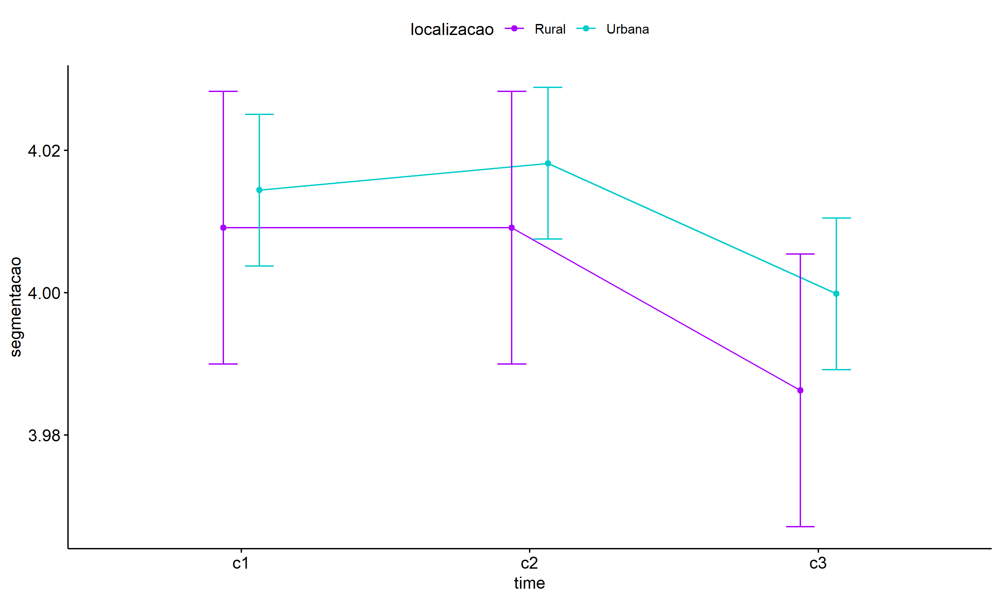

ANOVA test for segmentacao
================
Geiser C. Challco <geiser@alumni.usp.br>

- [ANOVA: segmentacao ~ time](#anova-segmentacao--time)
  - [Data Preparation](#data-preparation)
  - [Summary Statistics](#summary-statistics)
  - [ANOVA Computation](#anova-computation)
  - [PairWise Computation](#pairwise-computation)
- [ANOVA: segmentacao ~ time\*gender +
  Error(id/time)](#anova-segmentacao--timegender--erroridtime)
  - [Data Preparation](#data-preparation-1)
    - [Check assumptions: Identifying
      Outliers](#check-assumptions-identifying-outliers)
    - [Check assumptions: Normality
      Test](#check-assumptions-normality-test)
    - [Summary Statistics](#summary-statistics-1)
  - [ANOVA Computation](#anova-computation-1)
  - [ANOVA Computation after removing non.normal
    data](#anova-computation-after-removing-nonnormal-data)
  - [PairWise Computation](#pairwise-computation-1)
  - [PairWise Computation after removing non.normal
    data](#pairwise-computation-after-removing-nonnormal-data)
- [ANOVA: segmentacao ~ time\*localizacao +
  Error(id/time)](#anova-segmentacao--timelocalizacao--erroridtime)
  - [Data Preparation](#data-preparation-2)
    - [Check assumptions: Identifying
      Outliers](#check-assumptions-identifying-outliers-1)
    - [Check assumptions: Normality
      Test](#check-assumptions-normality-test-1)
    - [Summary Statistics](#summary-statistics-2)
  - [ANOVA Computation](#anova-computation-2)
  - [ANOVA Computation after removing non.normal
    data](#anova-computation-after-removing-nonnormal-data-1)
  - [PairWise Computation](#pairwise-computation-2)
  - [PairWise Computation after removing non.normal
    data](#pairwise-computation-after-removing-nonnormal-data-1)
- [ANOVA: segmentacao ~ time\*regiao +
  Error(id/time)](#anova-segmentacao--timeregiao--erroridtime)
  - [Data Preparation](#data-preparation-3)
    - [Check assumptions: Identifying
      Outliers](#check-assumptions-identifying-outliers-2)
    - [Check assumptions: Normality
      Test](#check-assumptions-normality-test-2)
    - [Summary Statistics](#summary-statistics-3)
  - [ANOVA Computation](#anova-computation-3)
  - [ANOVA Computation after removing non.normal
    data](#anova-computation-after-removing-nonnormal-data-2)
  - [PairWise Computation](#pairwise-computation-3)
  - [PairWise Computation after removing non.normal
    data](#pairwise-computation-after-removing-nonnormal-data-2)
- [ANOVA: segmentacao ~ time\*porte +
  Error(id/time)](#anova-segmentacao--timeporte--erroridtime)
  - [Data Preparation](#data-preparation-4)
    - [Check assumptions: Identifying
      Outliers](#check-assumptions-identifying-outliers-3)
    - [Check assumptions: Normality
      Test](#check-assumptions-normality-test-3)
    - [Summary Statistics](#summary-statistics-4)
  - [ANOVA Computation](#anova-computation-4)
  - [ANOVA Computation after removing non.normal
    data](#anova-computation-after-removing-nonnormal-data-3)
  - [PairWise Computation](#pairwise-computation-4)
  - [PairWise Computation after removing non.normal
    data](#pairwise-computation-after-removing-nonnormal-data-3)

``` r
dat <- read_excel("../data/data.xlsx", sheet = "alunos_ef14")

escolas <- read_excel("../data/data.xlsx", sheet = "escolas")
edat <- merge(dat, escolas, by = "cod_escola", all.x = T)
```

# ANOVA: segmentacao ~ time

## Data Preparation

``` r
data <- edat[,c("aluno_id","ciclo","segmentacao")]
data <- data[data$ciclo %in% c("Primeiro Ciclo","Segundo Ciclo","Terceiro Ciclo"),]
data$ciclo <- factor(data$ciclo, c("Primeiro Ciclo","Segundo Ciclo","Terceiro Ciclo"))
data <- unique(data)

wdat <- spread(data, ciclo, segmentacao)
wdat <- wdat[complete.cases(wdat),]
colnames(wdat) <- c("id","c1","c2","c3")

ldat <- gather(wdat, key = time, value = segmentacao, c1,c2,c3) %>%
  convert_as_factor(id, time)
ldat <- rshinystatistics::remove_group_data(ldat, "segmentacao", "time", n.limit = 30)
```

## Summary Statistics

``` r
(sdat <- ldat %>% group_by(time) %>%
   get_summary_stats(segmentacao, type = "mean_sd"))
```

    ## # A tibble: 3 × 5
    ##   time  variable        n  mean    sd
    ##   <fct> <fct>       <dbl> <dbl> <dbl>
    ## 1 c1    segmentacao  2773  4.01 0.293
    ## 2 c2    segmentacao  2773  4.02 0.246
    ## 3 c3    segmentacao  2773  4.00 0.204

| time | variable    |    n |  mean |    sd |
|:-----|:------------|-----:|------:|------:|
| c1   | segmentacao | 2773 | 4.013 | 0.293 |
| c2   | segmentacao | 2773 | 4.016 | 0.246 |
| c3   | segmentacao | 2773 | 3.997 | 0.204 |

## ANOVA Computation

``` r
(res.aov <- anova_test(ldat, dv = segmentacao, wid = id, within = time))
```

    ## ANOVA Table (type III tests)
    ## 
    ## $ANOVA
    ##   Effect DFn  DFd     F     p p<.05   ges
    ## 1   time   2 5544 5.024 0.007     * 0.001
    ## 
    ## $`Mauchly's Test for Sphericity`
    ##   Effect     W                          p p<.05
    ## 1   time 0.965 0.000000000000000000000218     *
    ## 
    ## $`Sphericity Corrections`
    ##   Effect   GGe        DF[GG] p[GG] p[GG]<.05   HFe        DF[HF] p[HF] p[HF]<.05
    ## 1   time 0.966 1.93, 5354.67 0.007         * 0.967 1.93, 5358.34 0.007         *

| Effect | DFn |  DFd |     F |     p | p\<.05 |   ges |
|:-------|----:|-----:|------:|------:|:-------|------:|
| time   |   2 | 5544 | 5.024 | 0.007 | \*     | 0.001 |

| Effect |     W |   p | p\<.05 |
|:-------|------:|----:|:-------|
| time   | 0.965 |   0 | \*     |

| Effect |   GGe | DF\[GG\]      | p\[GG\] | p\[GG\]\<.05 |   HFe | DF\[HF\]      | p\[HF\] | p\[HF\]\<.05 |
|:-------|------:|:--------------|--------:|:-------------|------:|:--------------|--------:|:-------------|
| time   | 0.966 | 1.93, 5354.67 |   0.007 | \*           | 0.967 | 1.93, 5358.34 |   0.007 | \*           |

## PairWise Computation

``` r
(pwc <- ldat %>% emmeans_test(segmentacao ~ time, detailed = T, p.adjust.method = "bonferroni"))
```

    ## # A tibble: 3 × 14
    ##   term  .y.         group1 group2 null.value estimate      se    df conf.low conf.high statistic       p  p.adj p.adj.signif
    ## * <chr> <chr>       <chr>  <chr>       <dbl>    <dbl>   <dbl> <dbl>    <dbl>     <dbl>     <dbl>   <dbl>  <dbl> <chr>       
    ## 1 time  segmentacao c1     c2              0 -0.00288 0.00672  8316 -0.0161     0.0103    -0.429 0.668   1      ns          
    ## 2 time  segmentacao c1     c3              0  0.0165  0.00672  8316  0.00335    0.0297     2.46  0.0139  0.0418 *           
    ## 3 time  segmentacao c2     c3              0  0.0194  0.00672  8316  0.00624    0.0326     2.89  0.00388 0.0116 *

| term | .y.         | group1 | group2 | null.value | estimate |    se |   df | conf.low | conf.high | statistic |     p | p.adj | p.adj.signif |
|:-----|:------------|:-------|:-------|-----------:|---------:|------:|-----:|---------:|----------:|----------:|------:|------:|:-------------|
| time | segmentacao | c1     | c2     |          0 |   -0.003 | 0.007 | 8316 |   -0.016 |     0.010 |    -0.429 | 0.668 | 1.000 | ns           |
| time | segmentacao | c1     | c3     |          0 |    0.017 | 0.007 | 8316 |    0.003 |     0.030 |     2.459 | 0.014 | 0.042 | \*           |
| time | segmentacao | c2     | c3     |          0 |    0.019 | 0.007 | 8316 |    0.006 |     0.033 |     2.888 | 0.004 | 0.012 | \*           |

``` r
pwc <- add_xy_position(pwc, x = "time", fun = "mean_se")
ggline(get_emmeans(pwc), x = "time", y = "emmean", ylab = "segmentacao") +
  geom_errorbar(aes(ymin = conf.low, ymax = conf.high), width = 0.2) +
  stat_pvalue_manual(pwc, hide.ns = T, tip.length = F)
```

<!-- -->

# ANOVA: segmentacao ~ time\*gender + Error(id/time)

## Data Preparation

``` r
data <- edat[,c("aluno_id","gender","ciclo","segmentacao")]
data <- data[data$ciclo %in% c("Primeiro Ciclo","Segundo Ciclo","Terceiro Ciclo"),]
data$ciclo <- factor(data$ciclo, c("Primeiro Ciclo","Segundo Ciclo","Terceiro Ciclo"))
data <- unique(data)

wdat <- spread(data, ciclo, segmentacao)
wdat <- wdat[complete.cases(wdat),]
colnames(wdat) <- c("id","gender","c1","c2","c3")

ldat <- gather(wdat, key = time, value = segmentacao, c1,c2,c3) %>%
  convert_as_factor(id, time)
ldat <- remove_group_data(ldat, "segmentacao", c("time", "gender"), n.limit = 30)
ldat$gender <- factor(ldat$gender, sort(unique(ldat$gender)))
```

### Check assumptions: Identifying Outliers

``` r
outliers <- identify_outliers(group_by(ldat, time, gender), segmentacao)
(outliers <- outliers[outliers$is.extreme == T,])
```

    ## # A tibble: 824 × 6
    ##    gender time  id                   segmentacao is.outlier is.extreme
    ##    <fct>  <fct> <fct>                      <dbl> <lgl>      <lgl>     
    ##  1 Female c1    0lMdjGzxsk7DwxFyTSwj         5   TRUE       TRUE      
    ##  2 Female c1    1Ao7d6oeWOGn5CkNSJxn         4.5 TRUE       TRUE      
    ##  3 Female c1    1rGKIQ7fdZBOxxGdPFrp         5   TRUE       TRUE      
    ##  4 Female c1    1yYDJt2kOHTqKvv3pTkn         4.5 TRUE       TRUE      
    ##  5 Female c1    2DvDBlRadL6QdD6eJdDP         5   TRUE       TRUE      
    ##  6 Female c1    2DxCaxzV0AiikIoPOoCv         3   TRUE       TRUE      
    ##  7 Female c1    2J9JedcFZ89AanZm27bY         5   TRUE       TRUE      
    ##  8 Female c1    2JRv4aJX5ZiAWFd1UXo7         3.5 TRUE       TRUE      
    ##  9 Female c1    2qbgEyCWhU8ChVoKwmf5         5   TRUE       TRUE      
    ## 10 Female c1    3uYupr8T88FfksOyXDBI         5   TRUE       TRUE      
    ## # ℹ 814 more rows

| gender | time | id                   | segmentacao | is.outlier | is.extreme |
|:-------|:-----|:---------------------|------------:|:-----------|:-----------|
| Female | c1   | 0lMdjGzxsk7DwxFyTSwj |       5.000 | TRUE       | TRUE       |
| Female | c1   | 1Ao7d6oeWOGn5CkNSJxn |       4.500 | TRUE       | TRUE       |
| Female | c1   | 1rGKIQ7fdZBOxxGdPFrp |       5.000 | TRUE       | TRUE       |
| Female | c1   | 1yYDJt2kOHTqKvv3pTkn |       4.500 | TRUE       | TRUE       |
| Female | c1   | 2DvDBlRadL6QdD6eJdDP |       5.000 | TRUE       | TRUE       |
| Female | c1   | 2DxCaxzV0AiikIoPOoCv |       3.000 | TRUE       | TRUE       |
| Female | c1   | 2J9JedcFZ89AanZm27bY |       5.000 | TRUE       | TRUE       |
| Female | c1   | 2JRv4aJX5ZiAWFd1UXo7 |       3.500 | TRUE       | TRUE       |
| Female | c1   | 2qbgEyCWhU8ChVoKwmf5 |       5.000 | TRUE       | TRUE       |
| Female | c1   | 3uYupr8T88FfksOyXDBI |       5.000 | TRUE       | TRUE       |
| Female | c1   | 45PghDWZsLPMFF4IumMG |       4.500 | TRUE       | TRUE       |
| Female | c1   | 46nUNvt4sDOPsC9jnkiG |       3.500 | TRUE       | TRUE       |
| Female | c1   | 4AM4nonwJ45LiMy6b4lp |       4.500 | TRUE       | TRUE       |
| Female | c1   | 4HW3bQquvKh2NSEqfBcz |       4.500 | TRUE       | TRUE       |
| Female | c1   | 4tC0rHbjrsSU8gnHaaJ3 |       3.500 | TRUE       | TRUE       |
| Female | c1   | 4tkeMKZn4I9ZqCsB9HtZ |       4.500 | TRUE       | TRUE       |
| Female | c1   | 4uGbHDfm5mReIAb5vtDP |       5.000 | TRUE       | TRUE       |
| Female | c1   | 5AeP0IQ84CerIQVenp2G |       4.500 | TRUE       | TRUE       |
| Female | c1   | 5aLGVYNAMR84kxneNKFw |       3.000 | TRUE       | TRUE       |
| Female | c1   | 5QtCqrFr3U8v5JZWaJI1 |       5.000 | TRUE       | TRUE       |
| Female | c1   | 5WOchSZgUhx0OWTzb7cj |       3.000 | TRUE       | TRUE       |
| Female | c1   | 6xuH64H6bPGdvHqYeZaQ |       5.000 | TRUE       | TRUE       |
| Female | c1   | 7gtD7rVOhPW09r7N8pGt |       5.000 | TRUE       | TRUE       |
| Female | c1   | 7YMayZh0mClXMucg1uN5 |       3.000 | TRUE       | TRUE       |
| Female | c1   | 8J6zVzXwczhDoIz6ZH9H |       4.500 | TRUE       | TRUE       |
| Female | c1   | 8sNNEBfY9FXrwwecC4pS |       3.000 | TRUE       | TRUE       |
| Female | c1   | a5sw5iYN8OPtR8ZDu56L |       3.000 | TRUE       | TRUE       |
| Female | c1   | AcPM8yalCG1JwgFkGEUa |       5.000 | TRUE       | TRUE       |
| Female | c1   | aJ6Y4X4FHjiRTSS4hFqt |       5.000 | TRUE       | TRUE       |
| Female | c1   | aOGxFSPrreKjHqmQIKKA |       4.500 | TRUE       | TRUE       |
| Female | c1   | aONYcyIz9jdWo9UGBKG0 |       5.000 | TRUE       | TRUE       |
| Female | c1   | AotChxTGW1wDJhhqtR21 |       5.000 | TRUE       | TRUE       |
| Female | c1   | b53oZp9kciii7CaLT2b0 |       4.500 | TRUE       | TRUE       |
| Female | c1   | blJAJMmYUR2Gst4b1TYy |       3.500 | TRUE       | TRUE       |
| Female | c1   | bOhetFcZCcckN4VKJMtL |       3.000 | TRUE       | TRUE       |
| Female | c1   | bVUvEkLYtdpC6VIWYbFW |       3.000 | TRUE       | TRUE       |
| Female | c1   | CBjbMGhWFUocJQM5DDq9 |       3.000 | TRUE       | TRUE       |
| Female | c1   | CINdOdAOGU4nwb5TI3yc |       5.000 | TRUE       | TRUE       |
| Female | c1   | CquTenVuBSFELLzcDuZm |       5.000 | TRUE       | TRUE       |
| Female | c1   | CRe8TWnc28z2KudiaQpG |       4.500 | TRUE       | TRUE       |
| Female | c1   | cV5XHPnJL5QhFRSG3oM4 |       3.000 | TRUE       | TRUE       |
| Female | c1   | cySr5XRpAStLsYdAk74t |       4.500 | TRUE       | TRUE       |
| Female | c1   | cztImgQlVojWbCx6odTk |       4.500 | TRUE       | TRUE       |
| Female | c1   | d1JgyezU4pt7F4SebGoe |       3.000 | TRUE       | TRUE       |
| Female | c1   | D3zCmRj97N1xSw2RGyIX |       4.500 | TRUE       | TRUE       |
| Female | c1   | dJQJl5Fk0r29tPHPdig0 |       3.000 | TRUE       | TRUE       |
| Female | c1   | DP1fbT1lGhLiBnOFILLi |       4.500 | TRUE       | TRUE       |
| Female | c1   | DUxJqIO8gdIEulKrrMwx |       3.000 | TRUE       | TRUE       |
| Female | c1   | e01kWx8LyQ5MBbqcIbXn |       5.000 | TRUE       | TRUE       |
| Female | c1   | eGG3Svg9dg0RKangSlIA |       4.500 | TRUE       | TRUE       |
| Female | c1   | ekllZawCf4RQutj72q1A |       4.500 | TRUE       | TRUE       |
| Female | c1   | eZv0l7xLjFTyM8DBKWXs |       3.000 | TRUE       | TRUE       |
| Female | c1   | f6lD4W0VifbGl3nIqMMb |       4.500 | TRUE       | TRUE       |
| Female | c1   | ffnFAMZehkOjgmmGyq3E |       3.000 | TRUE       | TRUE       |
| Female | c1   | g6NpZa7qfNr4u2gcV0gv |       5.000 | TRUE       | TRUE       |
| Female | c1   | GcoCtxzprm7V40SNuUHZ |       5.000 | TRUE       | TRUE       |
| Female | c1   | gTUYwk2z23T9FqE617Q6 |       3.500 | TRUE       | TRUE       |
| Female | c1   | GWOo8wrk6V8uRCPAvb8O |       4.500 | TRUE       | TRUE       |
| Female | c1   | HplN7eDoN7isGoqtruz4 |       3.000 | TRUE       | TRUE       |
| Female | c1   | hruSgzhJbTGT2UHE0CPK |       4.500 | TRUE       | TRUE       |
| Female | c1   | hXfIrPa7IgGpVqsaOZI4 |       5.000 | TRUE       | TRUE       |
| Female | c1   | iHhS222oqo6inzsEJLhm |       3.500 | TRUE       | TRUE       |
| Female | c1   | ijRxNrSrW0oX4pjrOD7X |       3.000 | TRUE       | TRUE       |
| Female | c1   | ilaonY9dkNTEKeTCWqFO |       5.000 | TRUE       | TRUE       |
| Female | c1   | ipRhhHwZqS2Nerttqyfo |       4.500 | TRUE       | TRUE       |
| Female | c1   | IPYD6S6Gd5Xxfp42shfa |       3.000 | TRUE       | TRUE       |
| Female | c1   | IR8zCMzohYvaAT2Azgr0 |       4.500 | TRUE       | TRUE       |
| Female | c1   | ISi6UsapYVTkOUciYdCR |       5.000 | TRUE       | TRUE       |
| Female | c1   | IthkBA4EMs87510oqhHH |       5.000 | TRUE       | TRUE       |
| Female | c1   | J8rJoGMeQwsg9NJWs0T6 |       3.000 | TRUE       | TRUE       |
| Female | c1   | jipIzfMPngc6Se2mEtoO |       5.000 | TRUE       | TRUE       |
| Female | c1   | JtAU8exii1J57JfLSnCi |       5.000 | TRUE       | TRUE       |
| Female | c1   | jTp5Uco52t3AcrsTI4MJ |       3.000 | TRUE       | TRUE       |
| Female | c1   | juz9Xm8JZgPgGTWdvPer |       4.500 | TRUE       | TRUE       |
| Female | c1   | jVnG4XHkp0TBuLlW4Y0x |       4.500 | TRUE       | TRUE       |
| Female | c1   | k1Byic1gWlgNIFT8qDpn |       4.500 | TRUE       | TRUE       |
| Female | c1   | K3sOWKpWxSqeoTJ9H0ew |       5.000 | TRUE       | TRUE       |
| Female | c1   | k4dskXNNlc2s0qDSigl6 |       4.500 | TRUE       | TRUE       |
| Female | c1   | k6zJZtkUuna5iM7hDW1g |       4.500 | TRUE       | TRUE       |
| Female | c1   | kF7XKL6TIoHCyeDsRHfI |       4.500 | TRUE       | TRUE       |
| Female | c1   | kxgVSkWgUMuhBuLVsqVJ |       3.000 | TRUE       | TRUE       |
| Female | c1   | KzvsegtCQZSwCP0gsRNd |       5.000 | TRUE       | TRUE       |
| Female | c1   | LC67V5LShu6RMdyHjAJx |       4.500 | TRUE       | TRUE       |
| Female | c1   | LENIWLSSDEOzE5PXnvXp |       3.000 | TRUE       | TRUE       |
| Female | c1   | lhunwGXEdkeKLaO5a7QM |       5.000 | TRUE       | TRUE       |
| Female | c1   | lt4Za0V8VmneMBIicN4R |       3.500 | TRUE       | TRUE       |
| Female | c1   | M7T19VXht72RWQicQ4oB |       4.500 | TRUE       | TRUE       |
| Female | c1   | MrvVY0Sl711n0iDO8PGz |       3.000 | TRUE       | TRUE       |
| Female | c1   | mTxfHO37mmdyGuVi0AcC |       4.500 | TRUE       | TRUE       |
| Female | c1   | my7rFEaL7SZu4cnkWXvK |       4.500 | TRUE       | TRUE       |
| Female | c1   | N3pSX4RTu368rCEfmcbO |       4.500 | TRUE       | TRUE       |
| Female | c1   | NGCQanKdT1it8UlBNgmW |       3.500 | TRUE       | TRUE       |
| Female | c1   | nH2ELwss2fVROhy262H1 |       4.500 | TRUE       | TRUE       |
| Female | c1   | nI311xKanqD5k4XdM5QB |       4.500 | TRUE       | TRUE       |
| Female | c1   | nr7aCc4Y1CON350bs02G |       3.000 | TRUE       | TRUE       |
| Female | c1   | nrctDKnNeBPAy3FWmN34 |       4.500 | TRUE       | TRUE       |
| Female | c1   | Nxx94hXNUgZI0TqkLGim |       4.500 | TRUE       | TRUE       |
| Female | c1   | o0DoDtp2hSE7RkEiiHPo |       5.000 | TRUE       | TRUE       |
| Female | c1   | o7ae3s3byv8mIlSj13gp |       3.500 | TRUE       | TRUE       |
| Female | c1   | oB5KNHL8aUZyGZK3jNIP |       4.500 | TRUE       | TRUE       |
| Female | c1   | oDIDUUJYXnXfxzh4hJZc |       4.500 | TRUE       | TRUE       |
| Female | c1   | oDMkReJJYWsd4uzwRHCT |       5.000 | TRUE       | TRUE       |
| Female | c1   | oGSieiW0e0ZBuFzxvRmw |       5.000 | TRUE       | TRUE       |
| Female | c1   | ojZafSSNhdquBdGe5nyl |       5.000 | TRUE       | TRUE       |
| Female | c1   | oN0ADw4gTFoLF4lFHvIG |       4.500 | TRUE       | TRUE       |
| Female | c1   | OOj1fqEqPfJXck5Lq7Fv |       3.500 | TRUE       | TRUE       |
| Female | c1   | oXSgcc3DBRVhE2rUkzsC |       4.500 | TRUE       | TRUE       |
| Female | c1   | p65gBLTmuRDy6H3sORaN |       5.000 | TRUE       | TRUE       |
| Female | c1   | p6BbhNqgLPmI1MavnJdS |       4.500 | TRUE       | TRUE       |
| Female | c1   | P8hWQkSE4GjLh8grxJqq |       3.500 | TRUE       | TRUE       |
| Female | c1   | PGyZRq71Ur0tx7eDyjsA |       3.000 | TRUE       | TRUE       |
| Female | c1   | pHKVHcBr54KlIgOzLPuV |       5.000 | TRUE       | TRUE       |
| Female | c1   | PoGsNdwD58xE967TyLSP |       4.500 | TRUE       | TRUE       |
| Female | c1   | PZi9wKyjzRJFoUW8SzHA |       3.000 | TRUE       | TRUE       |
| Female | c1   | pztSVSQMxMDc1oYIa94G |       5.000 | TRUE       | TRUE       |
| Female | c1   | q1RelulkOweB4lCMWfxy |       4.500 | TRUE       | TRUE       |
| Female | c1   | QrbeLZRrP58gwsTO24iU |       5.000 | TRUE       | TRUE       |
| Female | c1   | qRLPUVqvYuse04zIwBGb |       4.500 | TRUE       | TRUE       |
| Female | c1   | QYTt79UHmaJSsiaUWdtX |       4.500 | TRUE       | TRUE       |
| Female | c1   | R30CbcxLKbUIEyoQAUlq |       4.500 | TRUE       | TRUE       |
| Female | c1   | RCY3F2HtV0DPrs21Q5KB |       5.000 | TRUE       | TRUE       |
| Female | c1   | rhPtAo5ppj9IM6pK3HpF |       3.000 | TRUE       | TRUE       |
| Female | c1   | Rq2OTnqvauiedrQ0PVcm |       3.500 | TRUE       | TRUE       |
| Female | c1   | S04BvJLoDV9mtuYhqSTF |       4.500 | TRUE       | TRUE       |
| Female | c1   | S0BFQllPsxzPHxQgAonV |       4.500 | TRUE       | TRUE       |
| Female | c1   | S9bqwY193C4KrbH8eDlR |       3.000 | TRUE       | TRUE       |
| Female | c1   | ScTMK6tLs91Uic7qY4rP |       4.500 | TRUE       | TRUE       |
| Female | c1   | SIMY0SqCFW5CZyzHVm0n |       3.000 | TRUE       | TRUE       |
| Female | c1   | Sup26De3UDEaIDKS7yNO |       5.000 | TRUE       | TRUE       |
| Female | c1   | tCb4rrRwUManE1rIKMDG |       3.000 | TRUE       | TRUE       |
| Female | c1   | tCUAVlzX0WYxtKIF01rT |       5.000 | TRUE       | TRUE       |
| Female | c1   | TkOknTGAXiI0iu1peCXq |       5.000 | TRUE       | TRUE       |
| Female | c1   | tMvrlvyWFo29zGNXpFyE |       3.500 | TRUE       | TRUE       |
| Female | c1   | tsxmT2k2dEcoFpQCuGuh |       3.000 | TRUE       | TRUE       |
| Female | c1   | u2aUk1r7PC4IziM3zuK5 |       4.500 | TRUE       | TRUE       |
| Female | c1   | U4qDZ37OVGyQnlr7ytdm |       5.000 | TRUE       | TRUE       |
| Female | c1   | uArLW6AdMafUZXz7Yqx0 |       5.000 | TRUE       | TRUE       |
| Female | c1   | ucmIBgQmAgsTlvHqmvZt |       4.500 | TRUE       | TRUE       |
| Female | c1   | VLNvZ72KGKeAFeGuDCPx |       3.000 | TRUE       | TRUE       |
| Female | c1   | VTLWuVdgSm1bIy6fsjx6 |       3.500 | TRUE       | TRUE       |
| Female | c1   | W0VtmvRbqIjIGkR1LoNW |       5.000 | TRUE       | TRUE       |
| Female | c1   | w9TINZ7XLSBvZflVyyoz |       3.000 | TRUE       | TRUE       |
| Female | c1   | wdVNwXG2McMUQR9m0cPC |       4.500 | TRUE       | TRUE       |
| Female | c1   | wmMgYtTDXMi7lGWVukYs |       5.000 | TRUE       | TRUE       |
| Female | c1   | WQRbpzb7MKO2r5ecPuDV |       3.000 | TRUE       | TRUE       |
| Female | c1   | wSTeItj2YyZhZQ0kiCqW |       4.500 | TRUE       | TRUE       |
| Female | c1   | WWwcTHH1wtkWm5C1PUTr |       3.500 | TRUE       | TRUE       |
| Female | c1   | wZSCfEZCzv7QxfaEaalJ |       4.500 | TRUE       | TRUE       |
| Female | c1   | x3Xw8snMHFPilY4HCQUJ |       5.000 | TRUE       | TRUE       |
| Female | c1   | Xa2ucIEJguSXRedHjVkL |       3.000 | TRUE       | TRUE       |
| Female | c1   | xk7eC5haTYuFQaJovsBZ |       3.500 | TRUE       | TRUE       |
| Female | c1   | Xp2WjFJXcpGZCU8vSfqe |       4.500 | TRUE       | TRUE       |
| Female | c1   | xRVO8NOhbnSLdUBWfJOx |       4.500 | TRUE       | TRUE       |
| Female | c1   | Xs3hnfCOSlbIMN9RdxRO |       4.500 | TRUE       | TRUE       |
| Female | c1   | xtsJl6mzlAg6JFCq8N9m |       3.000 | TRUE       | TRUE       |
| Female | c1   | xYGLlb7JnNykkazrxJHF |       3.000 | TRUE       | TRUE       |
| Female | c1   | Y6UbPs3b2zjA3MHrqOuq |       5.000 | TRUE       | TRUE       |
| Female | c1   | y72tzw7SZyHuZUrcrADH |       5.000 | TRUE       | TRUE       |
| Female | c1   | Y9xySmFFM2ZuYB8Vgo83 |       3.000 | TRUE       | TRUE       |
| Female | c1   | YG63YQ31BQEkDdNCWWPl |       4.500 | TRUE       | TRUE       |
| Female | c1   | YHXNZ5EZVEDetoRKI6Jt |       3.000 | TRUE       | TRUE       |
| Female | c1   | yI0S3o9JsVBCxx7lydYp |       4.500 | TRUE       | TRUE       |
| Female | c1   | Yk1rmaDGgunEYzXa80ii |       4.500 | TRUE       | TRUE       |
| Female | c1   | yMc32YoZIU6LAQIDN9EL |       4.500 | TRUE       | TRUE       |
| Female | c1   | YrznOHK9RZibNqjdWMrP |       5.000 | TRUE       | TRUE       |
| Female | c1   | Ys3KEyPOIyHnVVVCIBSD |       4.500 | TRUE       | TRUE       |
| Female | c1   | ysWmkmTNdvDazR3vKFJw |       4.500 | TRUE       | TRUE       |
| Female | c1   | YswvSRcZKYTRB7oS1Ptc |       4.500 | TRUE       | TRUE       |
| Female | c1   | yuI63HzwDZxCaD0saVIk |       3.000 | TRUE       | TRUE       |
| Female | c1   | z21xC87TEju0zLTwYiBi |       3.000 | TRUE       | TRUE       |
| Female | c1   | zAD44hLLtflcTjsyAKKF |       5.000 | TRUE       | TRUE       |
| Female | c1   | ZFlKIpkoyyWb6SzXQLHk |       3.000 | TRUE       | TRUE       |
| Female | c1   | zn6CvwB6CPb0ljGaneze |       3.500 | TRUE       | TRUE       |
| Female | c1   | ZNG4KlCVU8OQIv8HDYLP |       4.500 | TRUE       | TRUE       |
| Female | c1   | zWZKZqZshi1gy6r2jYoM |       4.500 | TRUE       | TRUE       |
| Male   | c1   | 03prrbuQMUZ1aXaNSpNg |       3.500 | TRUE       | TRUE       |
| Male   | c1   | 0KkoDjILlv1r9GlBiM4G |       3.000 | TRUE       | TRUE       |
| Male   | c1   | 0rFiZU3E0rQ5w337VW1f |       4.500 | TRUE       | TRUE       |
| Male   | c1   | 0TpJIqYwGLiWXtI7SfS4 |       4.500 | TRUE       | TRUE       |
| Male   | c1   | 119JtIC0nJ3U9fE8LgBb |       3.000 | TRUE       | TRUE       |
| Male   | c1   | 1oT7HBOqq0hR05c33oYp |       3.000 | TRUE       | TRUE       |
| Male   | c1   | 1TZ01wBCKMDHXq0YPfqx |       3.000 | TRUE       | TRUE       |
| Male   | c1   | 2eFfyVVi6PFZAieFgek6 |       4.500 | TRUE       | TRUE       |
| Male   | c1   | 2wBgWJVF1mK6rnsBiZ99 |       3.000 | TRUE       | TRUE       |
| Male   | c1   | 3Mz5zcTWFm69K4uSHzbM |       3.000 | TRUE       | TRUE       |
| Male   | c1   | 3yyME6BKuMMgDiylvD4A |       4.500 | TRUE       | TRUE       |
| Male   | c1   | 47982aWE9x4sBhPIFY0I |       3.000 | TRUE       | TRUE       |
| Male   | c1   | 4aRreX2YRDJT8RODZgCJ |       3.500 | TRUE       | TRUE       |
| Male   | c1   | 4IlR2rfPre42Z5XA3t90 |       3.000 | TRUE       | TRUE       |
| Male   | c1   | 4VbspBZhrRRWioLlwqZL |       4.500 | TRUE       | TRUE       |
| Male   | c1   | 53lsfK6za4noVZe68et6 |       3.000 | TRUE       | TRUE       |
| Male   | c1   | 5APBeicSvcegSPf9KOQj |       3.500 | TRUE       | TRUE       |
| Male   | c1   | 5zZ1GeniMVX6uMy5Wsj5 |       3.500 | TRUE       | TRUE       |
| Male   | c1   | 7AsCrRYMyhVRQHX4kZdc |       3.000 | TRUE       | TRUE       |
| Male   | c1   | 7g3GunKKkHWAtnvcV4AX |       4.500 | TRUE       | TRUE       |
| Male   | c1   | 7rhNmuZ7rWVwFFNE5xAl |       3.000 | TRUE       | TRUE       |
| Male   | c1   | 84aMzz481XlsCzzCBLJQ |       3.000 | TRUE       | TRUE       |
| Male   | c1   | 8qHmErTTwPYwfO7whFDi |       3.000 | TRUE       | TRUE       |
| Male   | c1   | 8SgT5skbshCJjp6XFz9t |       3.000 | TRUE       | TRUE       |
| Male   | c1   | 8TnTXVBQUI6JQuADMpd3 |       5.000 | TRUE       | TRUE       |
| Male   | c1   | 9GpNQKRqFgCZSRQwdi13 |       5.000 | TRUE       | TRUE       |
| Male   | c1   | 9ivsRb38nFNwrYLXd94i |       3.000 | TRUE       | TRUE       |
| Male   | c1   | 9jd1C85ixCoJf3EINYfx |       5.000 | TRUE       | TRUE       |
| Male   | c1   | 9Xwyihw9e1060vCTC4vd |       4.500 | TRUE       | TRUE       |
| Male   | c1   | 9ylUEO2PMilJk8pF3sWj |       3.500 | TRUE       | TRUE       |
| Male   | c1   | A2dPKqbrD2yInm50Jwiu |       3.500 | TRUE       | TRUE       |
| Male   | c1   | AGmip3RnLSNr6rOYI4c5 |       3.000 | TRUE       | TRUE       |
| Male   | c1   | agXY7X7v0f0G4gJZuNcu |       3.500 | TRUE       | TRUE       |
| Male   | c1   | ao9Hy7cVw5W6MXhO5Ylm |       3.500 | TRUE       | TRUE       |
| Male   | c1   | ASQzHXb4IskBbw0aH79H |       5.000 | TRUE       | TRUE       |
| Male   | c1   | aT7LCUsqZ1GEFzMoTQbc |       5.000 | TRUE       | TRUE       |
| Male   | c1   | atydp19vM0PjiOQCWemR |       5.000 | TRUE       | TRUE       |
| Male   | c1   | AyZ6yHnjXfeT5KinmIxC |       4.500 | TRUE       | TRUE       |
| Male   | c1   | BCdMsV8b1rekzcjDGIe0 |       3.500 | TRUE       | TRUE       |
| Male   | c1   | BcQGlB6ZORM7EMpuhJEB |       3.000 | TRUE       | TRUE       |
| Male   | c1   | bhjmEJ6VVi4MrO6sQRO8 |       3.000 | TRUE       | TRUE       |
| Male   | c1   | bkSG2ELC7LzImsiQ1CtG |       4.500 | TRUE       | TRUE       |
| Male   | c1   | C9yrnovcTaV6PYqDq8Hh |       5.000 | TRUE       | TRUE       |
| Male   | c1   | ccet9e00qRV3dmuDE6n5 |       4.500 | TRUE       | TRUE       |
| Male   | c1   | cfXfV55zaU4GhyROgccr |       3.000 | TRUE       | TRUE       |
| Male   | c1   | COYiEq3at2eG0F4AkwDZ |       4.500 | TRUE       | TRUE       |
| Male   | c1   | cuknOzzwN4oCRum5U5ph |       3.500 | TRUE       | TRUE       |
| Male   | c1   | Cwe3jJ7NE2J7kG6g1Ox7 |       5.000 | TRUE       | TRUE       |
| Male   | c1   | cWhCU9PZ3Uh5Q4Rfe7h1 |       3.500 | TRUE       | TRUE       |
| Male   | c1   | CXH8tODgMDd1ny3Ye2v0 |       4.500 | TRUE       | TRUE       |
| Male   | c1   | dexrClGilncb86c5HWYP |       3.500 | TRUE       | TRUE       |
| Male   | c1   | dGPBh6pDfLN9Joex6NA4 |       4.500 | TRUE       | TRUE       |
| Male   | c1   | dusEaeOqIMQnBVndtIsZ |       5.000 | TRUE       | TRUE       |
| Male   | c1   | dXqscP5m7ztZm54TXJDJ |       5.000 | TRUE       | TRUE       |
| Male   | c1   | ETyWmmt6JYMQVyYo8Byu |       3.000 | TRUE       | TRUE       |
| Male   | c1   | EXP9vzjLIJFDlyiQt1hn |       3.000 | TRUE       | TRUE       |
| Male   | c1   | EzLVqgmBdANz72iNVtQk |       5.000 | TRUE       | TRUE       |
| Male   | c1   | FEnmeYPVP8f5Ugerho3M |       3.500 | TRUE       | TRUE       |
| Male   | c1   | fETGhIde8enSW1EPqWMS |       3.000 | TRUE       | TRUE       |
| Male   | c1   | FobQ6U8LVSPEPnIasnPA |       5.000 | TRUE       | TRUE       |
| Male   | c1   | FOJZoNjaS0RSR4xiYqoz |       5.000 | TRUE       | TRUE       |
| Male   | c1   | FPMFe1s9iSBxoJXvsTAR |       4.500 | TRUE       | TRUE       |
| Male   | c1   | frmWZcMLF5w8b8tHPMNw |       4.500 | TRUE       | TRUE       |
| Male   | c1   | frOYRQ1Z4xGe172raTPv |       5.000 | TRUE       | TRUE       |
| Male   | c1   | GN5vxU0haHKd9W22JGyk |       4.500 | TRUE       | TRUE       |
| Male   | c1   | gpkCMVwYM8Ew33RRq4gG |       3.000 | TRUE       | TRUE       |
| Male   | c1   | GRXCU0bF6TElSKj1QNCL |       4.500 | TRUE       | TRUE       |
| Male   | c1   | Gsyp9rOr8D3HurDARL2r |       3.500 | TRUE       | TRUE       |
| Male   | c1   | H6FKfkHmJvp7I0x9JRY4 |       5.000 | TRUE       | TRUE       |
| Male   | c1   | h7RHXKZHjEjuc3nN5HnI |       5.000 | TRUE       | TRUE       |
| Male   | c1   | hMsDCbjLCO8wjMYOHq0f |       3.000 | TRUE       | TRUE       |
| Male   | c1   | Ho6XhD21vYcP3f3cT4x5 |       3.000 | TRUE       | TRUE       |
| Male   | c1   | hqq5nMI9CFAEYxxJZFVT |       4.500 | TRUE       | TRUE       |
| Male   | c1   | HSX3YOtyIg0ZOh76zqlN |       4.500 | TRUE       | TRUE       |
| Male   | c1   | hUdYnYUAHQZnpWcANrgG |       5.000 | TRUE       | TRUE       |
| Male   | c1   | I1R3seoIHuEvsTGHCWnE |       4.500 | TRUE       | TRUE       |
| Male   | c1   | ifbY0Qn05cb73G89bxbW |       4.500 | TRUE       | TRUE       |
| Male   | c1   | iHdUtQKKo3HR4GIuXQh9 |       4.500 | TRUE       | TRUE       |
| Male   | c1   | IhMESsBNHf0ZnXXy9IZ7 |       3.500 | TRUE       | TRUE       |
| Male   | c1   | irnaHWfFnjKE8yaIHp2Z |       5.000 | TRUE       | TRUE       |
| Male   | c1   | iXgxZ0KW4udr9DDmFhto |       3.500 | TRUE       | TRUE       |
| Male   | c1   | IxjAoAer0KtYtbC6FF9j |       3.500 | TRUE       | TRUE       |
| Male   | c1   | J2xCnjFPxFB61qc76V3F |       3.000 | TRUE       | TRUE       |
| Male   | c1   | J488mu8pLJPJXItGnYpu |       5.000 | TRUE       | TRUE       |
| Male   | c1   | jjh5s0TSBRsF1PDf5w2n |       3.000 | TRUE       | TRUE       |
| Male   | c1   | K34anZEBbiYHYRSBkUK2 |       3.000 | TRUE       | TRUE       |
| Male   | c1   | k5ZdpQ33LCMyP0OtfGFJ |       3.000 | TRUE       | TRUE       |
| Male   | c1   | KBTZEriJAFvcWw48Xxgc |       3.500 | TRUE       | TRUE       |
| Male   | c1   | kBXPXJvjslfm6R2YJg4u |       4.500 | TRUE       | TRUE       |
| Male   | c1   | LbYWTuj6Gw1HLLbYEcYb |       3.000 | TRUE       | TRUE       |
| Male   | c1   | LC1uBEBe3hZn8Q1mQe7A |       4.500 | TRUE       | TRUE       |
| Male   | c1   | LfvhKtKBun3aJ73ldMri |       3.000 | TRUE       | TRUE       |
| Male   | c1   | lLzQkeToSulF52LL5WOf |       3.500 | TRUE       | TRUE       |
| Male   | c1   | LXjPdpNqjWvkynqrGa1S |       5.000 | TRUE       | TRUE       |
| Male   | c1   | LxqeE6TiTs0QSXlTGao9 |       4.500 | TRUE       | TRUE       |
| Male   | c1   | lzaXiTwxZLLSvEaYN1R2 |       3.000 | TRUE       | TRUE       |
| Male   | c1   | m5AeVuITWa7uCAG6h1Qh |       3.000 | TRUE       | TRUE       |
| Male   | c1   | MO5oCAGyztcuEpHPXGxD |       3.000 | TRUE       | TRUE       |
| Male   | c1   | mp70aTuAiwYmhEHntRfm |       3.000 | TRUE       | TRUE       |
| Male   | c1   | MrzHHLhQArMIASLFTIp9 |       5.000 | TRUE       | TRUE       |
| Male   | c1   | Mv8Pv2YBEg4SX5h40YAU |       3.000 | TRUE       | TRUE       |
| Male   | c1   | n2i00IVeZPVdjrDvPP99 |       3.500 | TRUE       | TRUE       |
| Male   | c1   | nMRFxJxrvv1jXcoI24aC |       4.500 | TRUE       | TRUE       |
| Male   | c1   | nzSi9kSv8tyksM7sR4WD |       5.000 | TRUE       | TRUE       |
| Male   | c1   | o8RPNQAPzP7e1GvMGN7T |       5.000 | TRUE       | TRUE       |
| Male   | c1   | oc2vuNVHO2aEnJA2p1LU |       4.500 | TRUE       | TRUE       |
| Male   | c1   | oEJ6BXIBwT3f8YeFfVhw |       4.500 | TRUE       | TRUE       |
| Male   | c1   | OjMXOEOmsdoOKX2sn4W0 |       3.500 | TRUE       | TRUE       |
| Male   | c1   | oMdPNPQlLZVB7Gi6ZzDQ |       4.500 | TRUE       | TRUE       |
| Male   | c1   | OmU7KYznecrHRwmZf47Q |       4.500 | TRUE       | TRUE       |
| Male   | c1   | OPSryN3lFrgt23pW1Kyr |       4.500 | TRUE       | TRUE       |
| Male   | c1   | OqkURXmL5FbblLrSQjg0 |       3.000 | TRUE       | TRUE       |
| Male   | c1   | OVb2go0X1GM1ZVAiE2zt |       4.500 | TRUE       | TRUE       |
| Male   | c1   | oViMaG3vXaWWRRzht8aE |       5.000 | TRUE       | TRUE       |
| Male   | c1   | p60GU5cf9uaftl79CXwQ |       4.500 | TRUE       | TRUE       |
| Male   | c1   | P9AwuXDOfU9p4qi5n9gh |       3.500 | TRUE       | TRUE       |
| Male   | c1   | PMp2ceCCZ9QCqCZZv1Wk |       4.500 | TRUE       | TRUE       |
| Male   | c1   | PMsVKgnivLJr3CQYAKsP |       3.500 | TRUE       | TRUE       |
| Male   | c1   | pngGC2k1xmpvNL9Z4NiX |       3.000 | TRUE       | TRUE       |
| Male   | c1   | pNPcjHpCzgp8RVz7e05C |       5.000 | TRUE       | TRUE       |
| Male   | c1   | pP3lgJSF2kQmRiN1eltw |       3.000 | TRUE       | TRUE       |
| Male   | c1   | pPtBnahAGm9PbDJyJDEm |       5.000 | TRUE       | TRUE       |
| Male   | c1   | PqGNJ3ulcYyMvHLXk5pI |       3.500 | TRUE       | TRUE       |
| Male   | c1   | Q2zIqpZTrvVCMOaKQlNf |       4.500 | TRUE       | TRUE       |
| Male   | c1   | q6EYDD8UOyDyvcYk09qw |       3.000 | TRUE       | TRUE       |
| Male   | c1   | q7qFgPldgJeYuCPBjp4P |       4.500 | TRUE       | TRUE       |
| Male   | c1   | QfhWsMioh2BGeSulAKKK |       4.500 | TRUE       | TRUE       |
| Male   | c1   | qIR814Id4n6outxCL24o |       5.000 | TRUE       | TRUE       |
| Male   | c1   | r6czAkrctrloI6Gqug6d |       4.500 | TRUE       | TRUE       |
| Male   | c1   | R8Cpj06eOE8snJn14VVH |       4.500 | TRUE       | TRUE       |
| Male   | c1   | RG5EPSzbZxigtb7hYi0o |       4.500 | TRUE       | TRUE       |
| Male   | c1   | rgYDWp8xiGuj2TaquvjO |       3.000 | TRUE       | TRUE       |
| Male   | c1   | rPN1ZyutPqqH9vln8oAA |       3.000 | TRUE       | TRUE       |
| Male   | c1   | rrFrDfgUOXcJdbMKRdyp |       5.000 | TRUE       | TRUE       |
| Male   | c1   | RSbvYDll5zoE4vrK84rU |       3.000 | TRUE       | TRUE       |
| Male   | c1   | RTbkHP5ZAedrE08Wg5kZ |       5.000 | TRUE       | TRUE       |
| Male   | c1   | S0LVazmDpEh8rVoCxP4g |       3.000 | TRUE       | TRUE       |
| Male   | c1   | stZ7BNgO3kxuXDMYZTmD |       4.500 | TRUE       | TRUE       |
| Male   | c1   | SvekTKBTsDABPXeAyVVa |       5.000 | TRUE       | TRUE       |
| Male   | c1   | svs0eqvIhdJvctpRT2LJ |       3.500 | TRUE       | TRUE       |
| Male   | c1   | Swge4GG9Qmg1w9YaAeDP |       3.500 | TRUE       | TRUE       |
| Male   | c1   | t0XYes69zn36ucbZar6f |       3.000 | TRUE       | TRUE       |
| Male   | c1   | TApZmHQgbDeTmia5pWcO |       4.500 | TRUE       | TRUE       |
| Male   | c1   | Td2jjdjfN2w4cYYkd3EM |       4.500 | TRUE       | TRUE       |
| Male   | c1   | tk86AjhJH8I3J1tQOLwQ |       4.500 | TRUE       | TRUE       |
| Male   | c1   | tnnTpuU5i12L0KI1K4v3 |       4.500 | TRUE       | TRUE       |
| Male   | c1   | Tpl9wyWP6dRFrgwOV5RA |       4.500 | TRUE       | TRUE       |
| Male   | c1   | TupwpKp0mSf2xCyx7nhJ |       4.500 | TRUE       | TRUE       |
| Male   | c1   | tzZL0v3asPGsWVxQc45u |       5.000 | TRUE       | TRUE       |
| Male   | c1   | UhxZSpqIzLIFQwwQAvfG |       5.000 | TRUE       | TRUE       |
| Male   | c1   | uNamFcxAOgEisbgKQwxN |       4.500 | TRUE       | TRUE       |
| Male   | c1   | UtQWTWpXSmspTBb0k7Cc |       5.000 | TRUE       | TRUE       |
| Male   | c1   | uZ2n8Ca4tW0cC993D3JA |       3.500 | TRUE       | TRUE       |
| Male   | c1   | V0gCA9bbGhM3m5WM6ues |       3.000 | TRUE       | TRUE       |
| Male   | c1   | Vlpwbb0dpT20asrjCP9U |       4.500 | TRUE       | TRUE       |
| Male   | c1   | vlzp5bFA1ei0noy8oZnJ |       4.500 | TRUE       | TRUE       |
| Male   | c1   | Vwua9sTVCHVhVU5gFc9F |       4.500 | TRUE       | TRUE       |
| Male   | c1   | w5VKD1TwdnbLmwZYCgxK |       3.000 | TRUE       | TRUE       |
| Male   | c1   | wf0v2mo3wtJsolYy5uzg |       4.500 | TRUE       | TRUE       |
| Male   | c1   | WI9GCOH8SCiOQFVeGq82 |       4.500 | TRUE       | TRUE       |
| Male   | c1   | WKtApwahDCFsZcicoOQJ |       3.500 | TRUE       | TRUE       |
| Male   | c1   | wqyvzSMjbRkEikTVAx1O |       5.000 | TRUE       | TRUE       |
| Male   | c1   | wzpfVmENuwkQHmrYv7Vs |       3.000 | TRUE       | TRUE       |
| Male   | c1   | xAWL4I2V4r38Wn9MvMvZ |       5.000 | TRUE       | TRUE       |
| Male   | c1   | XfU5NCNO3ByHIeHPz9uw |       3.500 | TRUE       | TRUE       |
| Male   | c1   | xgsvQ7Wz54S4fkw1Ckur |       3.000 | TRUE       | TRUE       |
| Male   | c1   | XJ7ipDixomJ8NPJa43wZ |       4.500 | TRUE       | TRUE       |
| Male   | c1   | xoAoL57F0KAMLciIO8xG |       4.500 | TRUE       | TRUE       |
| Male   | c1   | Y3XBjvabRWZddSn1PBSa |       3.500 | TRUE       | TRUE       |
| Male   | c1   | y5L9fA08vmo684jURWry |       3.000 | TRUE       | TRUE       |
| Male   | c1   | yb884OCdtaZaSFDQizzA |       5.000 | TRUE       | TRUE       |
| Male   | c1   | YCwKAjLsULoWxNT4JSDS |       4.500 | TRUE       | TRUE       |
| Male   | c1   | Ycy1yVbEtOQA64UcyFeO |       5.000 | TRUE       | TRUE       |
| Male   | c1   | ygFJxqySABX8ax57ihIq |       4.500 | TRUE       | TRUE       |
| Male   | c1   | yvleu2j5rQEcXgwVCL9l |       3.000 | TRUE       | TRUE       |
| Male   | c1   | z3p6Ot4uvkPmGXOS9D3e |       4.500 | TRUE       | TRUE       |
| Male   | c1   | ZFjyLFTCim7WZrtYy2tK |       3.500 | TRUE       | TRUE       |
| Male   | c1   | ZHNhk1zpmerLG8ISdloo |       3.500 | TRUE       | TRUE       |
| Male   | c1   | ZofyIIr5bSebSJqbw1PI |       5.000 | TRUE       | TRUE       |
| Male   | c1   | zVBilykKYg9sdH0YNpUa |       5.000 | TRUE       | TRUE       |
| Female | c2   | 12jZHvX32WJ4t8qQybyG |       3.500 | TRUE       | TRUE       |
| Female | c2   | 1CRyFLgHWsbyuDnkVcBL |       3.000 | TRUE       | TRUE       |
| Female | c2   | 1OMEscRI3SgUmUQo7NNf |       3.667 | TRUE       | TRUE       |
| Female | c2   | 2aoO9dS9UrOP9B1X12G8 |       4.500 | TRUE       | TRUE       |
| Female | c2   | 2q793p1L7LjOwORT2yTo |       4.500 | TRUE       | TRUE       |
| Female | c2   | 2vdWL372vCcXVAl1N1hj |       5.000 | TRUE       | TRUE       |
| Female | c2   | 3AAlLd47z5AXO25CW2Jp |       3.000 | TRUE       | TRUE       |
| Female | c2   | 3fTmP8cTTJq8WUIEU0Xl |       3.000 | TRUE       | TRUE       |
| Female | c2   | 3Ugm6wd42djxxIa9v8nX |       5.000 | TRUE       | TRUE       |
| Female | c2   | 46nUNvt4sDOPsC9jnkiG |       3.500 | TRUE       | TRUE       |
| Female | c2   | 4G24WYz9aRr215wwDnXo |       5.000 | TRUE       | TRUE       |
| Female | c2   | 4IjHAZhbMyECEihJ2TGR |       4.500 | TRUE       | TRUE       |
| Female | c2   | 4KHHEYjMyMuMUSgMFBWA |       4.500 | TRUE       | TRUE       |
| Female | c2   | 53wwkxtWpNW5sqGU32Kc |       3.000 | TRUE       | TRUE       |
| Female | c2   | 5AeP0IQ84CerIQVenp2G |       4.500 | TRUE       | TRUE       |
| Female | c2   | 5QtCqrFr3U8v5JZWaJI1 |       5.000 | TRUE       | TRUE       |
| Female | c2   | 6xuH64H6bPGdvHqYeZaQ |       5.000 | TRUE       | TRUE       |
| Female | c2   | 8jXS39U6Aje4RlDntJHg |       4.500 | TRUE       | TRUE       |
| Female | c2   | 8krb2zmmVacG3OnTu0cA |       3.500 | TRUE       | TRUE       |
| Female | c2   | 8lfWsRb6bqeqiqAn2iPn |       4.500 | TRUE       | TRUE       |
| Female | c2   | 8n4JXvpaksp7w7L2JeUi |       5.000 | TRUE       | TRUE       |
| Female | c2   | a8fb5SDhnwfoaCDazij2 |       3.500 | TRUE       | TRUE       |
| Female | c2   | aONYcyIz9jdWo9UGBKG0 |       5.000 | TRUE       | TRUE       |
| Female | c2   | AUp01jGBKvRyiH5yAcYg |       4.500 | TRUE       | TRUE       |
| Female | c2   | AuVuWIEc6T2fiJBNL1uB |       5.000 | TRUE       | TRUE       |
| Female | c2   | ayffKcz3Yuw8Hle5VsQu |       4.500 | TRUE       | TRUE       |
| Female | c2   | b0fQQvNajK7dSrJBiqNy |       3.500 | TRUE       | TRUE       |
| Female | c2   | b3eEUuJPbOoZzUooeABq |       3.500 | TRUE       | TRUE       |
| Female | c2   | BJqanJLBeoQL72hwwzBH |       4.500 | TRUE       | TRUE       |
| Female | c2   | bleizMxfI8NH6utKgnAr |       4.500 | TRUE       | TRUE       |
| Female | c2   | cAOAKHDs3DYDDx6li0LB |       3.000 | TRUE       | TRUE       |
| Female | c2   | CGgRvAFnhfRuB2rwvU5E |       4.500 | TRUE       | TRUE       |
| Female | c2   | CgX6BVJGx7gjW8HB4i3R |       4.500 | TRUE       | TRUE       |
| Female | c2   | CiV1upa4BM58OvTZsu01 |       3.500 | TRUE       | TRUE       |
| Female | c2   | CThb9hYfLyhY7ywFw2mh |       5.000 | TRUE       | TRUE       |
| Female | c2   | DAQSh7QyUdOOn9MIrgQx |       3.500 | TRUE       | TRUE       |
| Female | c2   | DCosMfmfv9OA5knq7Fu3 |       5.000 | TRUE       | TRUE       |
| Female | c2   | dgvqWTQka7lptc3Ft09o |       3.500 | TRUE       | TRUE       |
| Female | c2   | dxxs2ERFF0X4ICIwF6EI |       4.500 | TRUE       | TRUE       |
| Female | c2   | dzc3X9DkUqRGgLgEqR3M |       4.500 | TRUE       | TRUE       |
| Female | c2   | EcAgL4tVyGSoqslrQjcI |       4.500 | TRUE       | TRUE       |
| Female | c2   | ekllZawCf4RQutj72q1A |       5.000 | TRUE       | TRUE       |
| Female | c2   | Er4R4Sa3AZGlEMLnM01a |       4.500 | TRUE       | TRUE       |
| Female | c2   | EYCDCDVXdRfQ78haapdp |       4.500 | TRUE       | TRUE       |
| Female | c2   | eZv0l7xLjFTyM8DBKWXs |       4.500 | TRUE       | TRUE       |
| Female | c2   | f6lD4W0VifbGl3nIqMMb |       5.000 | TRUE       | TRUE       |
| Female | c2   | fv4E2FaI0vtzRUTR2HfI |       3.000 | TRUE       | TRUE       |
| Female | c2   | fyGAd0pSD2nUjzZ94wpb |       4.250 | TRUE       | TRUE       |
| Female | c2   | g6NpZa7qfNr4u2gcV0gv |       4.333 | TRUE       | TRUE       |
| Female | c2   | GLKzlnyRO6XaTD3Jojzv |       5.000 | TRUE       | TRUE       |
| Female | c2   | gpwJJdOJEYwiQDcpuWQI |       3.500 | TRUE       | TRUE       |
| Female | c2   | GqFF9SIPQyBbl3x9KuU6 |       3.500 | TRUE       | TRUE       |
| Female | c2   | gwqD0OEFT31g58P8CTXA |       5.000 | TRUE       | TRUE       |
| Female | c2   | H98Xi0idUSQXuTPwtCFQ |       4.500 | TRUE       | TRUE       |
| Female | c2   | hLm9MJO5sETve867f28m |       5.000 | TRUE       | TRUE       |
| Female | c2   | hPu8VZQgsVlwHeOf4ize |       5.000 | TRUE       | TRUE       |
| Female | c2   | HqCxBasWpv9noYyXFsOy |       4.500 | TRUE       | TRUE       |
| Female | c2   | if3vUFWRJO59bfDrhLxG |       4.500 | TRUE       | TRUE       |
| Female | c2   | iiM2iLDGfLDnbfRHOvFj |       4.500 | TRUE       | TRUE       |
| Female | c2   | Ipbr5yW2g7LG6DIsw0MA |       4.500 | TRUE       | TRUE       |
| Female | c2   | ipRhhHwZqS2Nerttqyfo |       4.500 | TRUE       | TRUE       |
| Female | c2   | IQG9Amy6vysT4R53wSDd |       5.000 | TRUE       | TRUE       |
| Female | c2   | IZvD1XFz2w9MybpQpGNW |       3.000 | TRUE       | TRUE       |
| Female | c2   | JawONxka5rqPA3VUmMQ6 |       4.500 | TRUE       | TRUE       |
| Female | c2   | JCY9pJdHIMp1aixpihKP |       4.500 | TRUE       | TRUE       |
| Female | c2   | jKsp2pRUvKXgxFXQscHk |       5.000 | TRUE       | TRUE       |
| Female | c2   | jVnG4XHkp0TBuLlW4Y0x |       4.500 | TRUE       | TRUE       |
| Female | c2   | K3sOWKpWxSqeoTJ9H0ew |       4.500 | TRUE       | TRUE       |
| Female | c2   | k738RTS2birDqnsFsdMm |       3.000 | TRUE       | TRUE       |
| Female | c2   | k8CHL5rpU83StpuhrE2T |       5.000 | TRUE       | TRUE       |
| Female | c2   | KgqoDcMNgZGVvBJkoiie |       3.000 | TRUE       | TRUE       |
| Female | c2   | KhmQYGX5BHYFPnziCxPk |       4.500 | TRUE       | TRUE       |
| Female | c2   | KmfA6LZVcl8YlqqpQqty |       3.000 | TRUE       | TRUE       |
| Female | c2   | Kr5X65kG7KAD30seq61c |       5.000 | TRUE       | TRUE       |
| Female | c2   | l5sTSHss3SNnOty4Ko0Q |       4.500 | TRUE       | TRUE       |
| Female | c2   | LGqTTMC6TZJbl5CuDF8i |       3.000 | TRUE       | TRUE       |
| Female | c2   | lJK4lb1citUZhSEsfDpF |       5.000 | TRUE       | TRUE       |
| Female | c2   | LvZxXSMnN4Dvhq4yVSnc |       3.500 | TRUE       | TRUE       |
| Female | c2   | Mjam3ijVV9Dte5iJPwtk |       5.000 | TRUE       | TRUE       |
| Female | c2   | mkH5DAeNgfRBZwXREDmK |       3.500 | TRUE       | TRUE       |
| Female | c2   | MkQKBf3FIJXW5hIZcVKc |       3.000 | TRUE       | TRUE       |
| Female | c2   | MLtbgHxX9fPA600cR1nJ |       3.500 | TRUE       | TRUE       |
| Female | c2   | mTHECr46GWhULXodWXzn |       4.500 | TRUE       | TRUE       |
| Female | c2   | mTJUD9rYV4BuRJg7dDT3 |       4.500 | TRUE       | TRUE       |
| Female | c2   | N3Uxtz7OkNsPdke52VaP |       4.500 | TRUE       | TRUE       |
| Female | c2   | n6gk6wcUfBM3JFkMixle |       3.500 | TRUE       | TRUE       |
| Female | c2   | ncPkRNnwIAXs7SNoCmhY |       3.500 | TRUE       | TRUE       |
| Female | c2   | NDxGiAJobBZiG3gX2533 |       3.000 | TRUE       | TRUE       |
| Female | c2   | neKxmWwU6z4fkpbQOfXo |       3.000 | TRUE       | TRUE       |
| Female | c2   | nKMTyMsfm4eOVhncYSKR |       3.500 | TRUE       | TRUE       |
| Female | c2   | nTkTi1IMMZIqZ4QV9Gub |       4.500 | TRUE       | TRUE       |
| Female | c2   | NudgAXrN7PT8EiGwjm46 |       4.500 | TRUE       | TRUE       |
| Female | c2   | nZWlEakTBujRX1QWHj37 |       4.500 | TRUE       | TRUE       |
| Female | c2   | o7ae3s3byv8mIlSj13gp |       3.500 | TRUE       | TRUE       |
| Female | c2   | oKNW4EqZtV7Tb6U3ke77 |       3.000 | TRUE       | TRUE       |
| Female | c2   | oN4vkQYTWXOXTfMLi4no |       4.500 | TRUE       | TRUE       |
| Female | c2   | p67KslC0SdpayMWeJgoV |       4.500 | TRUE       | TRUE       |
| Female | c2   | Paj7PMIVIVA0KihMSXYj |       4.500 | TRUE       | TRUE       |
| Female | c2   | Pf7zLtqAx7o3OKI6CpyI |       5.000 | TRUE       | TRUE       |
| Female | c2   | PXGw6Qn42fO8AT4s5OBu |       5.000 | TRUE       | TRUE       |
| Female | c2   | PxXG2IBXqM2iw1eZ2EWU |       3.000 | TRUE       | TRUE       |
| Female | c2   | PZi9wKyjzRJFoUW8SzHA |       3.000 | TRUE       | TRUE       |
| Female | c2   | pZxmwQTfOi8xnuIarrUn |       3.500 | TRUE       | TRUE       |
| Female | c2   | qK2akctCoTCPVn9gQ3TD |       5.000 | TRUE       | TRUE       |
| Female | c2   | qtuRl17SS1cu3JNFJ6rG |       4.500 | TRUE       | TRUE       |
| Female | c2   | rB3yZB34TUuIABF8CVJT |       4.500 | TRUE       | TRUE       |
| Female | c2   | RCtwG0Gv6QBL1v6bSIiK |       4.250 | TRUE       | TRUE       |
| Female | c2   | rhPtAo5ppj9IM6pK3HpF |       3.500 | TRUE       | TRUE       |
| Female | c2   | s5sOLvCaEo2QjQ0SbIgm |       4.500 | TRUE       | TRUE       |
| Female | c2   | SPBZD3VBPPhuUBjl070p |       5.000 | TRUE       | TRUE       |
| Female | c2   | T2uwQcqrdXIilUfr6OCA |       5.000 | TRUE       | TRUE       |
| Female | c2   | TbK6sQcA9yAMj2HJ56Yp |       3.500 | TRUE       | TRUE       |
| Female | c2   | tCb4rrRwUManE1rIKMDG |       4.500 | TRUE       | TRUE       |
| Female | c2   | tm9xmNXW4B9IuR9HglZM |       4.333 | TRUE       | TRUE       |
| Female | c2   | U4ov9iRrzQ8l2zRpeSY8 |       3.000 | TRUE       | TRUE       |
| Female | c2   | u65Z834z75LDIy0slvaX |       3.000 | TRUE       | TRUE       |
| Female | c2   | ubNRuaHFe9CcXmEA4uH8 |       4.500 | TRUE       | TRUE       |
| Female | c2   | UC1AjdZVYm0vREwvlhXA |       3.000 | TRUE       | TRUE       |
| Female | c2   | UhhnEgFxWYuZbqjTMPvG |       3.500 | TRUE       | TRUE       |
| Female | c2   | V3Gm3NYwAzEYQCjZQIFD |       5.000 | TRUE       | TRUE       |
| Female | c2   | vA2VE2piFoIU6TkseehN |       5.000 | TRUE       | TRUE       |
| Female | c2   | vaRJiqfg9CvKqc7DM43c |       4.500 | TRUE       | TRUE       |
| Female | c2   | vceFctfuebd8oAo4ATNX |       3.500 | TRUE       | TRUE       |
| Female | c2   | vpVrCTky8mhyq25gz9KB |       5.000 | TRUE       | TRUE       |
| Female | c2   | waWA2nc31Ypn58PQgzAO |       4.500 | TRUE       | TRUE       |
| Female | c2   | wefcYCTqKwxh8S4qGLoI |       4.500 | TRUE       | TRUE       |
| Female | c2   | WqBf7ZI3jvkTPBxpetNj |       3.000 | TRUE       | TRUE       |
| Female | c2   | WqVEFbjIwGz4GcqsHGeS |       4.500 | TRUE       | TRUE       |
| Female | c2   | xr9AD0MabWhV86IWv6rG |       5.000 | TRUE       | TRUE       |
| Female | c2   | Y6UbPs3b2zjA3MHrqOuq |       4.500 | TRUE       | TRUE       |
| Female | c2   | YFTC62AlPZvihI7w34a9 |       4.250 | TRUE       | TRUE       |
| Female | c2   | yJyr8QJweeFvX2FfVsL8 |       4.500 | TRUE       | TRUE       |
| Female | c2   | yNWoLoC2fizKV3ipSR8O |       5.000 | TRUE       | TRUE       |
| Female | c2   | z2bvFgOm1tRPAL3buvNQ |       5.000 | TRUE       | TRUE       |
| Female | c2   | zFdKEs0tWXhPQfx4fXM9 |       4.500 | TRUE       | TRUE       |
| Female | c2   | zkW6c2m0BkbGXx8JpERU |       5.000 | TRUE       | TRUE       |
| Female | c2   | ZNG4KlCVU8OQIv8HDYLP |       4.500 | TRUE       | TRUE       |
| Female | c2   | zXoAy3ZEimi0b2mfR9sy |       5.000 | TRUE       | TRUE       |
| Male   | c2   | 1oT7HBOqq0hR05c33oYp |       3.000 | TRUE       | TRUE       |
| Male   | c2   | 1uixvrMfKulaomVh0MKa |       5.000 | TRUE       | TRUE       |
| Male   | c2   | 1UYoCnz1CIUnpWS0Oqug |       4.500 | TRUE       | TRUE       |
| Male   | c2   | 2H9ye7xRvswNjLL7LiYm |       4.500 | TRUE       | TRUE       |
| Male   | c2   | 3ETydorel7bIDQKYclir |       4.250 | TRUE       | TRUE       |
| Male   | c2   | 3MUJ4HoQRSD2yMvXBBHX |       3.000 | TRUE       | TRUE       |
| Male   | c2   | 3yyME6BKuMMgDiylvD4A |       3.667 | TRUE       | TRUE       |
| Male   | c2   | 47GJieLXuUyKO9B5nVZJ |       4.500 | TRUE       | TRUE       |
| Male   | c2   | 4Tdh2ezpRZQPFALXk9Zl |       4.500 | TRUE       | TRUE       |
| Male   | c2   | 5APBeicSvcegSPf9KOQj |       3.500 | TRUE       | TRUE       |
| Male   | c2   | 5BWrpdSRW0ggiM6dgahm |       5.000 | TRUE       | TRUE       |
| Male   | c2   | 5MJshP0kp19vpSf9kCw1 |       5.000 | TRUE       | TRUE       |
| Male   | c2   | 5P3WYdHfZOaNtqeKJ9QA |       5.000 | TRUE       | TRUE       |
| Male   | c2   | 66k1mgdisI5m2S7kJsyb |       5.000 | TRUE       | TRUE       |
| Male   | c2   | 6bihB1I2r8NvIjfOvK7h |       4.500 | TRUE       | TRUE       |
| Male   | c2   | 84eMLEkOxEAhysQoqAVy |       3.000 | TRUE       | TRUE       |
| Male   | c2   | 8chAa9iLK3kUxrVJ0Yd5 |       5.000 | TRUE       | TRUE       |
| Male   | c2   | 8pQpSKcQMLVPERiwVZV7 |       5.000 | TRUE       | TRUE       |
| Male   | c2   | 8SgT5skbshCJjp6XFz9t |       4.500 | TRUE       | TRUE       |
| Male   | c2   | A5EETpEr617bpnSh1wp6 |       4.500 | TRUE       | TRUE       |
| Male   | c2   | alukiCdlqbDjIaNtcal6 |       5.000 | TRUE       | TRUE       |
| Male   | c2   | AmerU5JsGxhj1ABeNqNx |       4.500 | TRUE       | TRUE       |
| Male   | c2   | aYAQUiYlVOIN61eDlDXu |       5.000 | TRUE       | TRUE       |
| Male   | c2   | B5U5RrBl8W92hvt6STEL |       5.000 | TRUE       | TRUE       |
| Male   | c2   | BCdMsV8b1rekzcjDGIe0 |       3.500 | TRUE       | TRUE       |
| Male   | c2   | BsOF3nJCkNseeKsE7w1P |       5.000 | TRUE       | TRUE       |
| Male   | c2   | CDw40F4zr5WpyBrl5s3Y |       5.000 | TRUE       | TRUE       |
| Male   | c2   | CJarOzXp5FOdbNlUXXfY |       3.000 | TRUE       | TRUE       |
| Male   | c2   | dRG8aYJwJKM1rzag9orw |       3.500 | TRUE       | TRUE       |
| Male   | c2   | dudVd9dDXH8Gf0z5C7hV |       4.500 | TRUE       | TRUE       |
| Male   | c2   | DVWaJCYDA5BJk5KFiFsZ |       3.500 | TRUE       | TRUE       |
| Male   | c2   | DwTeMtAHL6Xl0Wvt0djz |       3.000 | TRUE       | TRUE       |
| Male   | c2   | E8XEhNJhfANZZtqHam0A |       3.000 | TRUE       | TRUE       |
| Male   | c2   | EciuZB7Xc506GnnOoqiE |       3.500 | TRUE       | TRUE       |
| Male   | c2   | EmkMoqMC0nr89j6BDcig |       3.500 | TRUE       | TRUE       |
| Male   | c2   | ESZ07LBm4sPvANqiD9dT |       5.000 | TRUE       | TRUE       |
| Male   | c2   | FcQitZKE98wgl8yG6mRx |       5.000 | TRUE       | TRUE       |
| Male   | c2   | FEnmeYPVP8f5Ugerho3M |       3.000 | TRUE       | TRUE       |
| Male   | c2   | FobQ6U8LVSPEPnIasnPA |       3.000 | TRUE       | TRUE       |
| Male   | c2   | FZeYth2awRkcS9LrWQ6j |       4.500 | TRUE       | TRUE       |
| Male   | c2   | GAEVtgOgvNASXuwIPENX |       4.500 | TRUE       | TRUE       |
| Male   | c2   | GdeuFORnewXGU8sW0TA2 |       3.500 | TRUE       | TRUE       |
| Male   | c2   | gRiK9OMij8RxayU0KCFv |       3.667 | TRUE       | TRUE       |
| Male   | c2   | h5ub2ktADoCalkLTva6Z |       3.500 | TRUE       | TRUE       |
| Male   | c2   | hnaMXokxvv0E9YtXTqXQ |       3.000 | TRUE       | TRUE       |
| Male   | c2   | HqTgiqhYnEvVciVol3PS |       3.500 | TRUE       | TRUE       |
| Male   | c2   | HtZtYxSbCTf1YGKUWjMm |       3.000 | TRUE       | TRUE       |
| Male   | c2   | hzUS30DyaGMI0MoQIp0n |       4.500 | TRUE       | TRUE       |
| Male   | c2   | IQPUeCnKtb8vtbVSQH78 |       4.500 | TRUE       | TRUE       |
| Male   | c2   | iXgxZ0KW4udr9DDmFhto |       4.500 | TRUE       | TRUE       |
| Male   | c2   | JDoItYQqdVZzDNmH1cmP |       5.000 | TRUE       | TRUE       |
| Male   | c2   | jjh5s0TSBRsF1PDf5w2n |       3.500 | TRUE       | TRUE       |
| Male   | c2   | JVbAatStSBTnhVMLX8PT |       5.000 | TRUE       | TRUE       |
| Male   | c2   | kcExXId7goldfKva3cts |       5.000 | TRUE       | TRUE       |
| Male   | c2   | KhYW1frkD5yxl4XrOMe3 |       4.500 | TRUE       | TRUE       |
| Male   | c2   | LEkvazY0705jBTF5FuNY |       3.000 | TRUE       | TRUE       |
| Male   | c2   | lEPERgsbz7sn6paXIvu5 |       5.000 | TRUE       | TRUE       |
| Male   | c2   | lk2YDJ1bLqxyJWxA4H3c |       3.000 | TRUE       | TRUE       |
| Male   | c2   | lLzQkeToSulF52LL5WOf |       3.000 | TRUE       | TRUE       |
| Male   | c2   | LxGsJAyHvUXWU6bICTYO |       5.000 | TRUE       | TRUE       |
| Male   | c2   | mLhkpaZkhjIYzD3JODx8 |       3.000 | TRUE       | TRUE       |
| Male   | c2   | MO5oCAGyztcuEpHPXGxD |       4.500 | TRUE       | TRUE       |
| Male   | c2   | MutXsb11i4loVV81XgFy |       5.000 | TRUE       | TRUE       |
| Male   | c2   | mv4A8iLV6sxluHuqbV7M |       5.000 | TRUE       | TRUE       |
| Male   | c2   | N5DXVVwnKYfooil6LgcT |       3.000 | TRUE       | TRUE       |
| Male   | c2   | nH1M6rVx02k2Hr3TdrNL |       4.500 | TRUE       | TRUE       |
| Male   | c2   | nMRFxJxrvv1jXcoI24aC |       4.500 | TRUE       | TRUE       |
| Male   | c2   | nRAS5RV32FybogHOX7Cz |       3.000 | TRUE       | TRUE       |
| Male   | c2   | O3iYOYEGjbneuih5lpHY |       4.500 | TRUE       | TRUE       |
| Male   | c2   | OC24agjjZYGNKG4cIe1A |       3.000 | TRUE       | TRUE       |
| Male   | c2   | OPC1PGTTfMpxc7tVeV1K |       3.000 | TRUE       | TRUE       |
| Male   | c2   | OqkURXmL5FbblLrSQjg0 |       3.000 | TRUE       | TRUE       |
| Male   | c2   | OUG1wau4l1G1NoVMv0R9 |       3.000 | TRUE       | TRUE       |
| Male   | c2   | OVb2go0X1GM1ZVAiE2zt |       5.000 | TRUE       | TRUE       |
| Male   | c2   | OVRqEF0CsvpQKRXq7h63 |       3.000 | TRUE       | TRUE       |
| Male   | c2   | p2iZ8ma3eYMaMdmNY5Hx |       3.500 | TRUE       | TRUE       |
| Male   | c2   | PKoPTKC1RrGaREkbINPf |       3.500 | TRUE       | TRUE       |
| Male   | c2   | PqxPfL8kvwm5Bw35TtHL |       3.500 | TRUE       | TRUE       |
| Male   | c2   | pzeM62TqsDvBbSHCceqe |       5.000 | TRUE       | TRUE       |
| Male   | c2   | pZMb3wRIGqegiYoO2EUV |       3.667 | TRUE       | TRUE       |
| Male   | c2   | q7ESoCocO5d3XmMbwkY8 |       5.000 | TRUE       | TRUE       |
| Male   | c2   | QgsijD1gkPD35eUh7fsV |       3.500 | TRUE       | TRUE       |
| Male   | c2   | Qhz0r7FNBiZ6BXvAn3EY |       5.000 | TRUE       | TRUE       |
| Male   | c2   | qJUI6FkVBuCDbGxvd5Os |       5.000 | TRUE       | TRUE       |
| Male   | c2   | QVBrt7ghCBBcEYbQ4TNp |       4.500 | TRUE       | TRUE       |
| Male   | c2   | R48qS0stXTGLkb41s9Kz |       3.500 | TRUE       | TRUE       |
| Male   | c2   | r99yZXwaEc2TDWTTPSx3 |       3.500 | TRUE       | TRUE       |
| Male   | c2   | rBH6YQ5gYS5B7XrOrbZA |       5.000 | TRUE       | TRUE       |
| Male   | c2   | rgYDWp8xiGuj2TaquvjO |       5.000 | TRUE       | TRUE       |
| Male   | c2   | rknK8GEk9H27CI9GSt4V |       3.667 | TRUE       | TRUE       |
| Male   | c2   | S1nh3dG8ke0WXMnYKs8S |       5.000 | TRUE       | TRUE       |
| Male   | c2   | sM3c4noBIP8hnYWA6pAe |       5.000 | TRUE       | TRUE       |
| Male   | c2   | Sp0NvOnM1X1fX93wRpPV |       3.667 | TRUE       | TRUE       |
| Male   | c2   | stZ7BNgO3kxuXDMYZTmD |       5.000 | TRUE       | TRUE       |
| Male   | c2   | sV9mhY7G3TGd1YYuX6Tn |       4.333 | TRUE       | TRUE       |
| Male   | c2   | sXB3m8f7P40lRXYwY22p |       4.333 | TRUE       | TRUE       |
| Male   | c2   | tgBvTqAPMhnAiERmqoaU |       5.000 | TRUE       | TRUE       |
| Male   | c2   | TmYwiWRw4pl7ZN5lehps |       4.500 | TRUE       | TRUE       |
| Male   | c2   | tTZqf6a85u7I90Zxw7nQ |       3.500 | TRUE       | TRUE       |
| Male   | c2   | TWDKLqh9h2hM3GD3U18p |       3.500 | TRUE       | TRUE       |
| Male   | c2   | tzZL0v3asPGsWVxQc45u |       3.000 | TRUE       | TRUE       |
| Male   | c2   | uaR9dzEUNZQBbmrAiqpS |       4.500 | TRUE       | TRUE       |
| Male   | c2   | ug0vfwlQo0sEyRBpO9kC |       5.000 | TRUE       | TRUE       |
| Male   | c2   | uqZAPj5C40igQT3tFObC |       3.000 | TRUE       | TRUE       |
| Male   | c2   | uvbG68yspOWVeG7vqGSx |       4.500 | TRUE       | TRUE       |
| Male   | c2   | uvZ3TuV0KCa2WSQ5kCaf |       3.500 | TRUE       | TRUE       |
| Male   | c2   | v9tlgEd1qw4MhpR94oWD |       3.500 | TRUE       | TRUE       |
| Male   | c2   | VKan8mUQZv5aDkfUvIYX |       3.500 | TRUE       | TRUE       |
| Male   | c2   | VoCvaE3h9jKKzRh29iqi |       4.500 | TRUE       | TRUE       |
| Male   | c2   | vQXf6gnvo8tFFkQquhvU |       3.000 | TRUE       | TRUE       |
| Male   | c2   | W7NFzfNGC1oZlWfp50yE |       4.500 | TRUE       | TRUE       |
| Male   | c2   | WCSObSsiS3xWwGKtJ3Wu |       3.000 | TRUE       | TRUE       |
| Male   | c2   | wUSw2Yh2LxJS7rngqFXC |       5.000 | TRUE       | TRUE       |
| Male   | c2   | xAvsKcul4ySBGQ2ukL8h |       5.000 | TRUE       | TRUE       |
| Male   | c2   | xAWL4I2V4r38Wn9MvMvZ |       5.000 | TRUE       | TRUE       |
| Male   | c2   | xoAoL57F0KAMLciIO8xG |       4.500 | TRUE       | TRUE       |
| Male   | c2   | XpMck9dFt6x9pr2OBKC7 |       4.500 | TRUE       | TRUE       |
| Male   | c2   | xVsCCmMyzdnbKR7BdWXo |       4.500 | TRUE       | TRUE       |
| Male   | c2   | Y3cuEkTVSedwuUI5fZZa |       5.000 | TRUE       | TRUE       |
| Male   | c2   | Y9PxsL2qTH9BxR710eCx |       3.000 | TRUE       | TRUE       |
| Male   | c2   | yciBDQMnG51ACnFxSoRx |       3.500 | TRUE       | TRUE       |
| Male   | c2   | ygCWEOBsngyfEt5hGLmw |       4.500 | TRUE       | TRUE       |
| Male   | c2   | yLadwnZfaYziyxKlMRcG |       3.500 | TRUE       | TRUE       |
| Male   | c2   | YSqZBl82JKfkjZUNa1mD |       5.000 | TRUE       | TRUE       |
| Male   | c2   | z0ZNx9ERJCowGHVo39UE |       5.000 | TRUE       | TRUE       |
| Male   | c2   | zDbZkpn8NBDdlUATuEX2 |       4.500 | TRUE       | TRUE       |
| Male   | c2   | ZdpC4Xaxucxlaqa0o7wm |       3.000 | TRUE       | TRUE       |
| Male   | c2   | zjNZDRuDzahRXqjWB7z6 |       3.000 | TRUE       | TRUE       |
| Male   | c2   | ZSPMUb1ZXyJBW03I7Va5 |       5.000 | TRUE       | TRUE       |
| Female | c3   | 0YlDGUGblfYp0yQAvvKq |       4.500 | TRUE       | TRUE       |
| Female | c3   | 2Apv97Be33aUwtM7GChO |       5.000 | TRUE       | TRUE       |
| Female | c3   | 2DvDBlRadL6QdD6eJdDP |       3.000 | TRUE       | TRUE       |
| Female | c3   | 2JRv4aJX5ZiAWFd1UXo7 |       3.000 | TRUE       | TRUE       |
| Female | c3   | 3gUbQ42oXugDLruwSZuu |       5.000 | TRUE       | TRUE       |
| Female | c3   | 428hAnBUps0BqZ1DSPJ3 |       4.500 | TRUE       | TRUE       |
| Female | c3   | 4qhLORujF60MqIPVLUaZ |       4.500 | TRUE       | TRUE       |
| Female | c3   | 5AeP0IQ84CerIQVenp2G |       5.000 | TRUE       | TRUE       |
| Female | c3   | 5aLGVYNAMR84kxneNKFw |       4.500 | TRUE       | TRUE       |
| Female | c3   | 6zAoYaCiBz0ok4UtPFa7 |       4.500 | TRUE       | TRUE       |
| Female | c3   | 7QIBwjAgo94YEeBTmgq7 |       4.500 | TRUE       | TRUE       |
| Female | c3   | 7x4YmdgP2brCdtzcyWPn |       4.500 | TRUE       | TRUE       |
| Female | c3   | 9krFjFd97ddacVllc4hQ |       4.500 | TRUE       | TRUE       |
| Female | c3   | 9TKFmVw0717IjNlpOpGZ |       4.500 | TRUE       | TRUE       |
| Female | c3   | 9tM1jAXvMLPTF3S2ZeqS |       3.500 | TRUE       | TRUE       |
| Female | c3   | b3eEUuJPbOoZzUooeABq |       3.000 | TRUE       | TRUE       |
| Female | c3   | bPR7srewMFr2uepKbVfq |       4.500 | TRUE       | TRUE       |
| Female | c3   | C6MwPqqVDphs0V0LkTcZ |       5.000 | TRUE       | TRUE       |
| Female | c3   | cdDXdUow4GgYvVCA0fM4 |       4.500 | TRUE       | TRUE       |
| Female | c3   | Cpw7toBsqavz223WZOD6 |       3.000 | TRUE       | TRUE       |
| Female | c3   | D3xqy0zcDXd1HoRlfrXr |       3.500 | TRUE       | TRUE       |
| Female | c3   | dAGT8TQIUqCZseNpKPdh |       3.000 | TRUE       | TRUE       |
| Female | c3   | dE0U2TT4Uy0KGmEawqpu |       5.000 | TRUE       | TRUE       |
| Female | c3   | EKWYUEJnpnKJvnhJleEU |       3.000 | TRUE       | TRUE       |
| Female | c3   | Etqtu93XqNkSWbokojKW |       4.500 | TRUE       | TRUE       |
| Female | c3   | F1YXi4gyL0gXObB3MN8t |       3.500 | TRUE       | TRUE       |
| Female | c3   | f6lD4W0VifbGl3nIqMMb |       4.500 | TRUE       | TRUE       |
| Female | c3   | F6Rc9DXFZYoUrb5COONd |       3.000 | TRUE       | TRUE       |
| Female | c3   | fbG1AkJFlVZGXT8Fznxj |       3.000 | TRUE       | TRUE       |
| Female | c3   | FYlqwRvhbtBOGUaep4NX |       3.500 | TRUE       | TRUE       |
| Female | c3   | FZ4xpkxh3rewF1CrCOjp |       4.500 | TRUE       | TRUE       |
| Female | c3   | G1QUvh48pImfNQQzuKjq |       4.500 | TRUE       | TRUE       |
| Female | c3   | g6NpZa7qfNr4u2gcV0gv |       4.500 | TRUE       | TRUE       |
| Female | c3   | GcoCtxzprm7V40SNuUHZ |       5.000 | TRUE       | TRUE       |
| Female | c3   | GCpLZMxrIAcRuZlCLtfs |       4.500 | TRUE       | TRUE       |
| Female | c3   | GOYwdWNRPdTGlIfwXdwf |       3.500 | TRUE       | TRUE       |
| Female | c3   | GTZVNt9WkFYX2c5uRTyH |       3.500 | TRUE       | TRUE       |
| Female | c3   | gwqD0OEFT31g58P8CTXA |       4.500 | TRUE       | TRUE       |
| Female | c3   | h1SbGJLE0AMRAFE7c8Gm |       4.500 | TRUE       | TRUE       |
| Female | c3   | hLm9MJO5sETve867f28m |       5.000 | TRUE       | TRUE       |
| Female | c3   | HqU7QM5m3s4kPEVIL4Ac |       4.500 | TRUE       | TRUE       |
| Female | c3   | i3TcORTWUFCvTPk4psJY |       3.000 | TRUE       | TRUE       |
| Female | c3   | jBYVI9QZbAQdmo16iTjR |       5.000 | TRUE       | TRUE       |
| Female | c3   | JCY9pJdHIMp1aixpihKP |       3.500 | TRUE       | TRUE       |
| Female | c3   | JtG5YEoC7kRFbE7lz1Fa |       3.500 | TRUE       | TRUE       |
| Female | c3   | k8CHL5rpU83StpuhrE2T |       5.000 | TRUE       | TRUE       |
| Female | c3   | kul5iFehNLtjWOsTrHGE |       3.000 | TRUE       | TRUE       |
| Female | c3   | KvTsJCQZ5Yt1CkELwDzz |       3.500 | TRUE       | TRUE       |
| Female | c3   | kxgVSkWgUMuhBuLVsqVJ |       3.500 | TRUE       | TRUE       |
| Female | c3   | L82DzPq9kPgbCqTibF4P |       4.500 | TRUE       | TRUE       |
| Female | c3   | LMM7USaf7Oavhb0hsq18 |       4.500 | TRUE       | TRUE       |
| Female | c3   | LrI1NgNOZMbBnuVElrFm |       4.500 | TRUE       | TRUE       |
| Female | c3   | Mjam3ijVV9Dte5iJPwtk |       4.500 | TRUE       | TRUE       |
| Female | c3   | mkH5DAeNgfRBZwXREDmK |       4.500 | TRUE       | TRUE       |
| Female | c3   | MKp1qosspQXZ5G0JaVh2 |       3.500 | TRUE       | TRUE       |
| Female | c3   | mOjSZUKwIGnOHPFJuxou |       3.000 | TRUE       | TRUE       |
| Female | c3   | MQQzCobZnYpZIFa6hmO3 |       3.000 | TRUE       | TRUE       |
| Female | c3   | MxgQUA6KrQnZN4Fm7oCW |       3.500 | TRUE       | TRUE       |
| Female | c3   | nr7aCc4Y1CON350bs02G |       4.500 | TRUE       | TRUE       |
| Female | c3   | oD5GxaNjeDAC3crjbEQU |       3.000 | TRUE       | TRUE       |
| Female | c3   | oN4vkQYTWXOXTfMLi4no |       3.000 | TRUE       | TRUE       |
| Female | c3   | OOj1fqEqPfJXck5Lq7Fv |       3.000 | TRUE       | TRUE       |
| Female | c3   | oXG3ANgo5Z8smkAByl2q |       3.500 | TRUE       | TRUE       |
| Female | c3   | p67KslC0SdpayMWeJgoV |       4.500 | TRUE       | TRUE       |
| Female | c3   | PZc0aYIU1wWnGIkRzREr |       3.000 | TRUE       | TRUE       |
| Female | c3   | QfYtalFBEUYn592AA7VS |       3.000 | TRUE       | TRUE       |
| Female | c3   | QoZgk4198xISuJZrDx5q |       3.000 | TRUE       | TRUE       |
| Female | c3   | Rt7a82N5heUbFZgfPx41 |       3.500 | TRUE       | TRUE       |
| Female | c3   | rwRhSmD8z5JtVSIArv2d |       5.000 | TRUE       | TRUE       |
| Female | c3   | SOMDig3yF6qMmyrUF7OT |       4.500 | TRUE       | TRUE       |
| Female | c3   | tm9xmNXW4B9IuR9HglZM |       4.500 | TRUE       | TRUE       |
| Female | c3   | tMvrlvyWFo29zGNXpFyE |       3.000 | TRUE       | TRUE       |
| Female | c3   | Tx00OuDqtxwpgtcPjPyb |       5.000 | TRUE       | TRUE       |
| Female | c3   | UarNTpxWceiYSVcbER9V |       3.000 | TRUE       | TRUE       |
| Female | c3   | ucmIBgQmAgsTlvHqmvZt |       4.500 | TRUE       | TRUE       |
| Female | c3   | UoGLV7UuLJ5nWovSqf80 |       5.000 | TRUE       | TRUE       |
| Female | c3   | uqM5BA6ythuc3Qjdi8n1 |       3.000 | TRUE       | TRUE       |
| Female | c3   | uxQuxtqUf4vGgIdDIBfg |       5.000 | TRUE       | TRUE       |
| Female | c3   | uXrGgSVZ1ZKfQuJ3neSu |       4.500 | TRUE       | TRUE       |
| Female | c3   | w9TINZ7XLSBvZflVyyoz |       5.000 | TRUE       | TRUE       |
| Female | c3   | wC5CCryfUyofpyKyVtEe |       4.500 | TRUE       | TRUE       |
| Female | c3   | wintFvAlnNYttBW5zljx |       4.500 | TRUE       | TRUE       |
| Female | c3   | WQVYEpAw8BNW46vVdvh3 |       3.500 | TRUE       | TRUE       |
| Female | c3   | wUu5OXdteKFwLws3g8ba |       3.500 | TRUE       | TRUE       |
| Female | c3   | x3Xw8snMHFPilY4HCQUJ |       5.000 | TRUE       | TRUE       |
| Female | c3   | XA1RZvBiW1VNEOjMkxQC |       3.500 | TRUE       | TRUE       |
| Female | c3   | Xfs4ydu0jiJkaDwInzXx |       4.500 | TRUE       | TRUE       |
| Female | c3   | yN0Q6I4YMYRYEthwTips |       3.500 | TRUE       | TRUE       |
| Female | c3   | YpRtgm2lyRTxuC5LbdBO |       3.000 | TRUE       | TRUE       |
| Female | c3   | Ys3KEyPOIyHnVVVCIBSD |       3.667 | TRUE       | TRUE       |
| Female | c3   | zFdKEs0tWXhPQfx4fXM9 |       3.500 | TRUE       | TRUE       |
| Female | c3   | zhAsZE7XXg7kRRaz37fe |       4.500 | TRUE       | TRUE       |
| Female | c3   | zn6CvwB6CPb0ljGaneze |       3.000 | TRUE       | TRUE       |
| Female | c3   | zu9ITSnIAecxMpJmNxCE |       4.500 | TRUE       | TRUE       |
| Female | c3   | zXoAy3ZEimi0b2mfR9sy |       5.000 | TRUE       | TRUE       |
| Male   | c3   | 13ksa3iHOsfBObErxHP7 |       3.500 | TRUE       | TRUE       |
| Male   | c3   | 18EWxrJZtjBVpzckkv21 |       5.000 | TRUE       | TRUE       |
| Male   | c3   | 1D0FkPiZPusHHIh6zphq |       4.500 | TRUE       | TRUE       |
| Male   | c3   | 1RcRn40gDeWmgkk9vBvN |       4.500 | TRUE       | TRUE       |
| Male   | c3   | 2eTy4XnB3HL1Lip3fbQn |       3.500 | TRUE       | TRUE       |
| Male   | c3   | 2LZl45PBKhwXOHrdCMrT |       5.000 | TRUE       | TRUE       |
| Male   | c3   | 4IlR2rfPre42Z5XA3t90 |       3.500 | TRUE       | TRUE       |
| Male   | c3   | 5MJshP0kp19vpSf9kCw1 |       3.000 | TRUE       | TRUE       |
| Male   | c3   | 5XCVFPGqNNKOmCCj6Ho1 |       3.000 | TRUE       | TRUE       |
| Male   | c3   | 84DB9vGEE9l7JamMfKjr |       3.000 | TRUE       | TRUE       |
| Male   | c3   | 8chAa9iLK3kUxrVJ0Yd5 |       3.000 | TRUE       | TRUE       |
| Male   | c3   | 8GFAydt8TltP4EUA5i5x |       3.500 | TRUE       | TRUE       |
| Male   | c3   | 8TnTXVBQUI6JQuADMpd3 |       3.500 | TRUE       | TRUE       |
| Male   | c3   | 9GpNQKRqFgCZSRQwdi13 |       5.000 | TRUE       | TRUE       |
| Male   | c3   | 9ivsRb38nFNwrYLXd94i |       3.000 | TRUE       | TRUE       |
| Male   | c3   | aYtcseKJtxdCCTCbBCcH |       3.000 | TRUE       | TRUE       |
| Male   | c3   | b62nZZdlWhJLrL0BFpjG |       3.500 | TRUE       | TRUE       |
| Male   | c3   | bHobujEJH9Ye5qPYW9o3 |       3.500 | TRUE       | TRUE       |
| Male   | c3   | BQQ25AxDeJYXtSpLte1b |       3.500 | TRUE       | TRUE       |
| Male   | c3   | cHYzRZpK9Z9zX9mlee7T |       5.000 | TRUE       | TRUE       |
| Male   | c3   | cJoqgrk6T3HsA9EOVe7D |       3.500 | TRUE       | TRUE       |
| Male   | c3   | CnqsW2vq3kN14b3PJuuD |       3.000 | TRUE       | TRUE       |
| Male   | c3   | COYiEq3at2eG0F4AkwDZ |       3.000 | TRUE       | TRUE       |
| Male   | c3   | ct84G9jl4uDInOFHztuC |       5.000 | TRUE       | TRUE       |
| Male   | c3   | Cwe3jJ7NE2J7kG6g1Ox7 |       3.500 | TRUE       | TRUE       |
| Male   | c3   | DGGmoPjTK7fZE5lqCWSA |       5.000 | TRUE       | TRUE       |
| Male   | c3   | DJRJIIxQWnkpMMuy3UVG |       3.500 | TRUE       | TRUE       |
| Male   | c3   | dRG8aYJwJKM1rzag9orw |       3.000 | TRUE       | TRUE       |
| Male   | c3   | e8Qw94ZMOWfydCiIkeFA |       5.000 | TRUE       | TRUE       |
| Male   | c3   | eN82SMe8E1D60MM9UuWs |       3.500 | TRUE       | TRUE       |
| Male   | c3   | EoSBVqfBw7krU0Sy514T |       3.000 | TRUE       | TRUE       |
| Male   | c3   | ESZ07LBm4sPvANqiD9dT |       3.500 | TRUE       | TRUE       |
| Male   | c3   | f690isEdaPfAVfQRx2If |       3.500 | TRUE       | TRUE       |
| Male   | c3   | fEYVARleb30C16nBEYEI |       4.500 | TRUE       | TRUE       |
| Male   | c3   | FuD86dDXyOi451QlHHQn |       4.500 | TRUE       | TRUE       |
| Male   | c3   | g3Rc1elvCjHSUJyhSMxR |       4.500 | TRUE       | TRUE       |
| Male   | c3   | G5WjH8t1I6LAiAOCuM2v |       4.500 | TRUE       | TRUE       |
| Male   | c3   | GAEVtgOgvNASXuwIPENX |       4.500 | TRUE       | TRUE       |
| Male   | c3   | GaixfRTaHdeXkQujJJrz |       3.500 | TRUE       | TRUE       |
| Male   | c3   | GdmKlSuye71m16KrSyCu |       3.000 | TRUE       | TRUE       |
| Male   | c3   | H5F4r5nnGQTG1FzfyxrY |       3.500 | TRUE       | TRUE       |
| Male   | c3   | HH9VcmOTErEi0B6Ki9rA |       3.500 | TRUE       | TRUE       |
| Male   | c3   | HqTgiqhYnEvVciVol3PS |       3.500 | TRUE       | TRUE       |
| Male   | c3   | hUt4VxcTjmxpmXmKlBG9 |       3.500 | TRUE       | TRUE       |
| Male   | c3   | ITZKcm29e0hwUQiiDtaF |       4.500 | TRUE       | TRUE       |
| Male   | c3   | IY1WPkRNTt5TtOVLPSsJ |       4.500 | TRUE       | TRUE       |
| Male   | c3   | j0oCqbwWXXQafWRMq7sI |       4.500 | TRUE       | TRUE       |
| Male   | c3   | J2xCnjFPxFB61qc76V3F |       3.000 | TRUE       | TRUE       |
| Male   | c3   | J488mu8pLJPJXItGnYpu |       4.500 | TRUE       | TRUE       |
| Male   | c3   | jKv0Lh0R5ij5dbHktuzW |       3.000 | TRUE       | TRUE       |
| Male   | c3   | jluj5xvOGZKLLMoQOzYZ |       5.000 | TRUE       | TRUE       |
| Male   | c3   | Jp4LSlohxWt1K2Ol96iR |       5.000 | TRUE       | TRUE       |
| Male   | c3   | jpLjNFBBKxldw4VqE3Hc |       5.000 | TRUE       | TRUE       |
| Male   | c3   | kBXPXJvjslfm6R2YJg4u |       3.000 | TRUE       | TRUE       |
| Male   | c3   | kifyGVAfMTF5hQBzNd1R |       3.500 | TRUE       | TRUE       |
| Male   | c3   | KR3xuTy812tVchW2MefO |       3.000 | TRUE       | TRUE       |
| Male   | c3   | lddMiu2T00HFwgQ7tqoQ |       3.500 | TRUE       | TRUE       |
| Male   | c3   | LEkvazY0705jBTF5FuNY |       3.500 | TRUE       | TRUE       |
| Male   | c3   | lewvCXhnI2d5zsi1kp8S |       5.000 | TRUE       | TRUE       |
| Male   | c3   | lLzQkeToSulF52LL5WOf |       3.500 | TRUE       | TRUE       |
| Male   | c3   | ltOCfuKereDnvy2o0H2m |       4.500 | TRUE       | TRUE       |
| Male   | c3   | m5J3S4XIWQ7yFggPNTxd |       5.000 | TRUE       | TRUE       |
| Male   | c3   | mLhkpaZkhjIYzD3JODx8 |       3.500 | TRUE       | TRUE       |
| Male   | c3   | MrzHHLhQArMIASLFTIp9 |       3.500 | TRUE       | TRUE       |
| Male   | c3   | Mv8Pv2YBEg4SX5h40YAU |       3.500 | TRUE       | TRUE       |
| Male   | c3   | Mzzqk4BB56ocxoMpsVAH |       3.000 | TRUE       | TRUE       |
| Male   | c3   | N1moyOPv6LwxPn3bNcWi |       3.500 | TRUE       | TRUE       |
| Male   | c3   | nH1M6rVx02k2Hr3TdrNL |       4.500 | TRUE       | TRUE       |
| Male   | c3   | NoTpNsJX4ldCK9U0mWWh |       4.500 | TRUE       | TRUE       |
| Male   | c3   | NRErIHMorWhZNoH91zIQ |       3.500 | TRUE       | TRUE       |
| Male   | c3   | NU5pzRhlqm8l52RjSib0 |       4.500 | TRUE       | TRUE       |
| Male   | c3   | NVfNt3pt40EzrMZW2Ddz |       3.500 | TRUE       | TRUE       |
| Male   | c3   | OUG1wau4l1G1NoVMv0R9 |       3.500 | TRUE       | TRUE       |
| Male   | c3   | oViMaG3vXaWWRRzht8aE |       3.500 | TRUE       | TRUE       |
| Male   | c3   | pPNG2HuM9kiYaFShxows |       3.500 | TRUE       | TRUE       |
| Male   | c3   | pSytMmFbFBJKW5D2PKZX |       5.000 | TRUE       | TRUE       |
| Male   | c3   | pzeM62TqsDvBbSHCceqe |       3.000 | TRUE       | TRUE       |
| Male   | c3   | q4DLBpLbGwapPbKSJVkN |       4.500 | TRUE       | TRUE       |
| Male   | c3   | QDEIDD9IHOpXjJTYgqBL |       5.000 | TRUE       | TRUE       |
| Male   | c3   | qJUI6FkVBuCDbGxvd5Os |       4.500 | TRUE       | TRUE       |
| Male   | c3   | qx8k5YQmpsoG1dwRkmIk |       4.500 | TRUE       | TRUE       |
| Male   | c3   | rknK8GEk9H27CI9GSt4V |       3.500 | TRUE       | TRUE       |
| Male   | c3   | S1nh3dG8ke0WXMnYKs8S |       3.000 | TRUE       | TRUE       |
| Male   | c3   | spnr6QAHG8yfAnm4iK51 |       3.500 | TRUE       | TRUE       |
| Male   | c3   | swvJpkPIgh4Dr4fFR3M5 |       3.000 | TRUE       | TRUE       |
| Male   | c3   | sXGrbI7jO7gLRleaaYkw |       4.500 | TRUE       | TRUE       |
| Male   | c3   | Sy1MGHBlvKSv0iRRdrRj |       3.000 | TRUE       | TRUE       |
| Male   | c3   | SzBgma4T7YTDhQmi9JDe |       4.500 | TRUE       | TRUE       |
| Male   | c3   | t7Simft4IeyuUEMt5luw |       3.500 | TRUE       | TRUE       |
| Male   | c3   | TABveJnXO5hRaweFnAMh |       3.000 | TRUE       | TRUE       |
| Male   | c3   | uGu1vVuU8SzZOH2QSkp1 |       3.500 | TRUE       | TRUE       |
| Male   | c3   | UtQWTWpXSmspTBb0k7Cc |       4.500 | TRUE       | TRUE       |
| Male   | c3   | uZ2n8Ca4tW0cC993D3JA |       4.500 | TRUE       | TRUE       |
| Male   | c3   | VoCvaE3h9jKKzRh29iqi |       3.500 | TRUE       | TRUE       |
| Male   | c3   | Vr7uBkv2gof3A8VU5QNL |       3.500 | TRUE       | TRUE       |
| Male   | c3   | WKtApwahDCFsZcicoOQJ |       4.500 | TRUE       | TRUE       |
| Male   | c3   | wMfSHiiEh1Relsln1TDZ |       3.000 | TRUE       | TRUE       |
| Male   | c3   | wT9SJVEeIJAbjgdq5cDE |       4.500 | TRUE       | TRUE       |
| Male   | c3   | x9zYEug0V5k8q07FD9SH |       5.000 | TRUE       | TRUE       |
| Male   | c3   | xAvsKcul4ySBGQ2ukL8h |       3.000 | TRUE       | TRUE       |
| Male   | c3   | xLfsAGPaFCLpMOhLH2U1 |       3.500 | TRUE       | TRUE       |
| Male   | c3   | Xmhym8x3nB5VJXAr7P0u |       3.000 | TRUE       | TRUE       |
| Male   | c3   | yBG7dRem8DghSyukbx1Q |       3.000 | TRUE       | TRUE       |
| Male   | c3   | yciBDQMnG51ACnFxSoRx |       4.500 | TRUE       | TRUE       |
| Male   | c3   | yMZcqrbDrD5zNrappTba |       4.500 | TRUE       | TRUE       |
| Male   | c3   | YxfFrbwSijoyTMWGIYqQ |       4.500 | TRUE       | TRUE       |
| Male   | c3   | ZpW4XxzJT5s00UXt2FfB |       4.500 | TRUE       | TRUE       |

### Check assumptions: Normality Test

``` r
(normality.df <- normality.test.per.groups(ldat, "segmentacao", c("time", "gender")))
```

    ##           var    variable time gender    n   skewness  kurtosis symmetry statistic     method p p.signif normality
    ## 1 segmentacao segmentacao   c1 Female 1363  0.1696146  7.488230       NO  216.0084 D'Agostino 0     ****         -
    ## 2 segmentacao segmentacao   c1   Male 1240 -0.2659331  6.356722       NO  186.0147 D'Agostino 0     ****         -
    ## 3 segmentacao segmentacao   c2 Female 1363  0.7324088 11.437886       NO  368.6593 D'Agostino 0     ****         -
    ## 4 segmentacao segmentacao   c2   Male 1240  0.4674825 10.074466       NO  270.7199 D'Agostino 0     ****         -
    ## 5 segmentacao segmentacao   c3 Female 1363 -0.4843705 17.684866       NO  380.0831 D'Agostino 0     ****         -
    ## 6 segmentacao segmentacao   c3   Male 1240 -0.7650447 13.902908       NO  369.2483 D'Agostino 0     ****         -

| var         | variable    | time | gender |    n | skewness | kurtosis | symmetry | statistic | method     |   p | p.signif | normality |
|:------------|:------------|:-----|:-------|-----:|---------:|---------:|:---------|----------:|:-----------|----:|:---------|:----------|
| segmentacao | segmentacao | c1   | Female | 1363 |    0.170 |    7.488 | NO       |   216.008 | D’Agostino |   0 | \*\*\*\* | \-        |
| segmentacao | segmentacao | c1   | Male   | 1240 |   -0.266 |    6.357 | NO       |   186.015 | D’Agostino |   0 | \*\*\*\* | \-        |
| segmentacao | segmentacao | c2   | Female | 1363 |    0.732 |   11.438 | NO       |   368.659 | D’Agostino |   0 | \*\*\*\* | \-        |
| segmentacao | segmentacao | c2   | Male   | 1240 |    0.467 |   10.074 | NO       |   270.720 | D’Agostino |   0 | \*\*\*\* | \-        |
| segmentacao | segmentacao | c3   | Female | 1363 |   -0.484 |   17.685 | NO       |   380.083 | D’Agostino |   0 | \*\*\*\* | \-        |
| segmentacao | segmentacao | c3   | Male   | 1240 |   -0.765 |   13.903 | NO       |   369.248 | D’Agostino |   0 | \*\*\*\* | \-        |

``` r
(non.ids <- unique(do.call(
  c, lapply(which(normality.df$normality == 'NO'), FUN = function(i) {
  idx = which(ldat$time == normality.df$time[i] &
                ldat$gender == normality.df$gender[i])
  getNonNormal(ldat$"segmentacao"[idx], ldat$id[idx])
}))))
```

    ## NULL

``` r
if (length(non.ids) > 0)
  ldat2 <- ldat[!ldat$id %in% non.ids,]
```

### Summary Statistics

``` r
(sdat <- ldat %>% group_by(time, gender) %>%
   get_summary_stats(segmentacao, type = "mean_sd"))
```

    ## # A tibble: 6 × 6
    ##   gender time  variable        n  mean    sd
    ##   <fct>  <fct> <fct>       <dbl> <dbl> <dbl>
    ## 1 Female c1    segmentacao  1363  4.02 0.286
    ## 2 Male   c1    segmentacao  1240  4.00 0.301
    ## 3 Female c2    segmentacao  1363  4.02 0.234
    ## 4 Male   c2    segmentacao  1240  4.01 0.257
    ## 5 Female c3    segmentacao  1363  4.00 0.197
    ## 6 Male   c3    segmentacao  1240  3.99 0.214

| gender | time | variable    |    n |  mean |    sd |
|:-------|:-----|:------------|-----:|------:|------:|
| Female | c1   | segmentacao | 1363 | 4.023 | 0.286 |
| Male   | c1   | segmentacao | 1240 | 4.001 | 0.301 |
| Female | c2   | segmentacao | 1363 | 4.022 | 0.234 |
| Male   | c2   | segmentacao | 1240 | 4.012 | 0.257 |
| Female | c3   | segmentacao | 1363 | 4.001 | 0.197 |
| Male   | c3   | segmentacao | 1240 | 3.987 | 0.214 |

``` r
if (length(non.ids) > 0)
  (sdat <- ldat2 %>% group_by(time, gender) %>%
      get_summary_stats(segmentacao, type = "mean_sd"))
```

| gender | time | variable    |    n |  mean |    sd |
|:-------|:-----|:------------|-----:|------:|------:|
| Female | c1   | segmentacao | 1363 | 4.023 | 0.286 |
| Male   | c1   | segmentacao | 1240 | 4.001 | 0.301 |
| Female | c2   | segmentacao | 1363 | 4.022 | 0.234 |
| Male   | c2   | segmentacao | 1240 | 4.012 | 0.257 |
| Female | c3   | segmentacao | 1363 | 4.001 | 0.197 |
| Male   | c3   | segmentacao | 1240 | 3.987 | 0.214 |

## ANOVA Computation

``` r
(res.aov <- anova_test(ldat, dv = segmentacao, wid = id, between = gender, within = time))
```

    ## ANOVA Table (type III tests)
    ## 
    ## $ANOVA
    ##        Effect DFn  DFd     F     p p<.05      ges
    ## 1      gender   1 2601 6.903 0.009     * 0.000942
    ## 2        time   2 5202 6.176 0.002     * 0.002000
    ## 3 gender:time   2 5202 0.451 0.637       0.000112
    ## 
    ## $`Mauchly's Test for Sphericity`
    ##        Effect     W                         p p<.05
    ## 1        time 0.964 0.00000000000000000000213     *
    ## 2 gender:time 0.964 0.00000000000000000000213     *
    ## 
    ## $`Sphericity Corrections`
    ##        Effect   GGe        DF[GG] p[GG] p[GG]<.05   HFe        DF[HF] p[HF] p[HF]<.05
    ## 1        time 0.965 1.93, 5021.47 0.002         * 0.966 1.93, 5025.13 0.002         *
    ## 2 gender:time 0.965 1.93, 5021.47 0.630           0.966 1.93, 5025.13 0.630

| Effect      | DFn |  DFd |     F |     p | p\<.05 |   ges |
|:------------|----:|-----:|------:|------:|:-------|------:|
| gender      |   1 | 2601 | 6.903 | 0.009 | \*     | 0.001 |
| time        |   2 | 5202 | 6.176 | 0.002 | \*     | 0.002 |
| gender:time |   2 | 5202 | 0.451 | 0.637 |        | 0.000 |

| Effect      |     W |   p | p\<.05 |
|:------------|------:|----:|:-------|
| time        | 0.964 |   0 | \*     |
| gender:time | 0.964 |   0 | \*     |

| Effect      |   GGe | DF\[GG\]      | p\[GG\] | p\[GG\]\<.05 |   HFe | DF\[HF\]      | p\[HF\] | p\[HF\]\<.05 |
|:------------|------:|:--------------|--------:|:-------------|------:|:--------------|--------:|:-------------|
| time        | 0.965 | 1.93, 5021.47 |   0.002 | \*           | 0.966 | 1.93, 5025.13 |   0.002 | \*           |
| gender:time | 0.965 | 1.93, 5021.47 |   0.630 |              | 0.966 | 1.93, 5025.13 |   0.630 |              |

## ANOVA Computation after removing non.normal data

``` r
if (length(non.ids) > 0)
  (res.aov2 <- anova_test(ldat2, dv = segmentacao, wid = id, between = gender , within = time))
```

## PairWise Computation

``` r
(pwc <- ldat %>% group_by(time) %>%
   emmeans_test(segmentacao ~ gender, detailed = T, p.adjust.method = "bonferroni"))
```

    ## # A tibble: 3 × 15
    ##   time  term   .y.       group1 group2 null.value estimate      se    df conf.low conf.high statistic      p  p.adj p.adj.signif
    ## * <fct> <chr>  <chr>     <chr>  <chr>       <dbl>    <dbl>   <dbl> <dbl>    <dbl>     <dbl>     <dbl>  <dbl>  <dbl> <chr>       
    ## 1 c1    gender segmenta… Female Male            0   0.0227 0.00983  7803  0.00339    0.0419      2.31 0.0212 0.0212 *           
    ## 2 c2    gender segmenta… Female Male            0   0.0102 0.00983  7803 -0.00910    0.0295      1.03 0.301  0.301  ns          
    ## 3 c3    gender segmenta… Female Male            0   0.0134 0.00983  7803 -0.00592    0.0326      1.36 0.174  0.174  ns

| time | term   | .y.         | group1 | group2 | null.value | estimate |   se |   df | conf.low | conf.high | statistic |     p | p.adj | p.adj.signif |
|:-----|:-------|:------------|:-------|:-------|-----------:|---------:|-----:|-----:|---------:|----------:|----------:|------:|------:|:-------------|
| c1   | gender | segmentacao | Female | Male   |          0 |    0.023 | 0.01 | 7803 |    0.003 |     0.042 |     2.305 | 0.021 | 0.021 | \*           |
| c2   | gender | segmentacao | Female | Male   |          0 |    0.010 | 0.01 | 7803 |   -0.009 |     0.029 |     1.035 | 0.301 | 0.301 | ns           |
| c3   | gender | segmentacao | Female | Male   |          0 |    0.013 | 0.01 | 7803 |   -0.006 |     0.033 |     1.358 | 0.174 | 0.174 | ns           |

``` r
(emms <- get_emmeans(pwc))
```

    ## # A tibble: 6 × 8
    ##   time  gender emmean      se    df conf.low conf.high method      
    ##   <fct> <fct>   <dbl>   <dbl> <dbl>    <dbl>     <dbl> <chr>       
    ## 1 c1    Female   4.02 0.00679  7803     4.01      4.04 Emmeans test
    ## 2 c1    Male     4.00 0.00712  7803     3.99      4.01 Emmeans test
    ## 3 c2    Female   4.02 0.00679  7803     4.01      4.04 Emmeans test
    ## 4 c2    Male     4.01 0.00712  7803     4.00      4.03 Emmeans test
    ## 5 c3    Female   4.00 0.00679  7803     3.99      4.01 Emmeans test
    ## 6 c3    Male     3.99 0.00712  7803     3.97      4.00 Emmeans test

| time | gender | emmean |    se |   df | conf.low | conf.high | method       |
|:-----|:-------|-------:|------:|-----:|---------:|----------:|:-------------|
| c1   | Female |  4.023 | 0.007 | 7803 |    4.010 |     4.037 | Emmeans test |
| c1   | Male   |  4.001 | 0.007 | 7803 |    3.987 |     4.015 | Emmeans test |
| c2   | Female |  4.022 | 0.007 | 7803 |    4.009 |     4.035 | Emmeans test |
| c2   | Male   |  4.012 | 0.007 | 7803 |    3.998 |     4.026 | Emmeans test |
| c3   | Female |  4.001 | 0.007 | 7803 |    3.988 |     4.014 | Emmeans test |
| c3   | Male   |  3.988 | 0.007 | 7803 |    3.974 |     4.001 | Emmeans test |

``` r
pwc <- add_xy_position(pwc, x = "time", fun = "mean_se", dodge = 0.25)
pd <- position_dodge(width = 0.25)
ggline(emms, x = "time", y = "emmean", color = "gender",
       palette = c("#FF007F","#4D4DFF"),
       position = pd, ylab = "segmentacao") +
  geom_errorbar(aes(ymin = conf.low, ymax = conf.high, color = gender),
                position = pd, width = 0.2) +
  stat_pvalue_manual(pwc, hide.ns = T, tip.length = F, linetype = 1)
```

<!-- -->

``` r
(pwc <- ldat %>% group_by(gender) %>%
    emmeans_test(segmentacao ~ time, detailed = T, p.adjust.method = "bonferroni"))
```

    ## # A tibble: 6 × 15
    ##   gender term  .y.       group1 group2 null.value estimate      se    df conf.low conf.high statistic      p  p.adj p.adj.signif
    ## * <fct>  <chr> <chr>     <chr>  <chr>       <dbl>    <dbl>   <dbl> <dbl>    <dbl>     <dbl>     <dbl>  <dbl>  <dbl> <chr>       
    ## 1 Female time  segmenta… c1     c2              0  0.00141 0.00960  7803 -0.0174    0.0202      0.147 0.884  1      ns          
    ## 2 Female time  segmenta… c1     c3              0  0.0226  0.00960  7803  0.00381   0.0414      2.36  0.0185 0.0554 ns          
    ## 3 Female time  segmenta… c2     c3              0  0.0212  0.00960  7803  0.00240   0.0400      2.21  0.0271 0.0813 ns          
    ## 4 Male   time  segmenta… c1     c2              0 -0.0111  0.0101   7803 -0.0308    0.00864    -1.10  0.271  0.812  ns          
    ## 5 Male   time  segmenta… c1     c3              0  0.0133  0.0101   7803 -0.00642   0.0330      1.32  0.186  0.558  ns          
    ## 6 Male   time  segmenta… c2     c3              0  0.0244  0.0101   7803  0.00467   0.0441      2.42  0.0154 0.0461 *

| gender | term | .y.         | group1 | group2 | null.value | estimate |   se |   df | conf.low | conf.high | statistic |     p | p.adj | p.adj.signif |
|:-------|:-----|:------------|:-------|:-------|-----------:|---------:|-----:|-----:|---------:|----------:|----------:|------:|------:|:-------------|
| Female | time | segmentacao | c1     | c2     |          0 |    0.001 | 0.01 | 7803 |   -0.017 |     0.020 |     0.147 | 0.884 | 1.000 | ns           |
| Female | time | segmentacao | c1     | c3     |          0 |    0.023 | 0.01 | 7803 |    0.004 |     0.041 |     2.357 | 0.018 | 0.055 | ns           |
| Female | time | segmentacao | c2     | c3     |          0 |    0.021 | 0.01 | 7803 |    0.002 |     0.040 |     2.210 | 0.027 | 0.081 | ns           |
| Male   | time | segmentacao | c1     | c2     |          0 |   -0.011 | 0.01 | 7803 |   -0.031 |     0.009 |    -1.102 | 0.271 | 0.812 | ns           |
| Male   | time | segmentacao | c1     | c3     |          0 |    0.013 | 0.01 | 7803 |   -0.006 |     0.033 |     1.322 | 0.186 | 0.558 | ns           |
| Male   | time | segmentacao | c2     | c3     |          0 |    0.024 | 0.01 | 7803 |    0.005 |     0.044 |     2.424 | 0.015 | 0.046 | \*           |

``` r
(emms <- get_emmeans(pwc))
```

    ## # A tibble: 6 × 8
    ##   gender time  emmean      se    df conf.low conf.high method      
    ##   <fct>  <fct>  <dbl>   <dbl> <dbl>    <dbl>     <dbl> <chr>       
    ## 1 Female c1      4.02 0.00679  7803     4.01      4.04 Emmeans test
    ## 2 Female c2      4.02 0.00679  7803     4.01      4.04 Emmeans test
    ## 3 Female c3      4.00 0.00679  7803     3.99      4.01 Emmeans test
    ## 4 Male   c1      4.00 0.00712  7803     3.99      4.01 Emmeans test
    ## 5 Male   c2      4.01 0.00712  7803     4.00      4.03 Emmeans test
    ## 6 Male   c3      3.99 0.00712  7803     3.97      4.00 Emmeans test

| gender | time | emmean |    se |   df | conf.low | conf.high | method       |
|:-------|:-----|-------:|------:|-----:|---------:|----------:|:-------------|
| Female | c1   |  4.023 | 0.007 | 7803 |    4.010 |     4.037 | Emmeans test |
| Female | c2   |  4.022 | 0.007 | 7803 |    4.009 |     4.035 | Emmeans test |
| Female | c3   |  4.001 | 0.007 | 7803 |    3.988 |     4.014 | Emmeans test |
| Male   | c1   |  4.001 | 0.007 | 7803 |    3.987 |     4.015 | Emmeans test |
| Male   | c2   |  4.012 | 0.007 | 7803 |    3.998 |     4.026 | Emmeans test |
| Male   | c3   |  3.988 | 0.007 | 7803 |    3.974 |     4.001 | Emmeans test |

``` r
emms.gg <- emms[which(emms$gender == "Female"),]
if (nrow(emms.gg) > 0)
  ggline(emms.gg, x = "time", y = "emmean", color = "#FF007F", ylab = "segmentacao") +
    geom_errorbar(aes(ymin = conf.low, ymax = conf.high),
                  width = 0.2, color = "#FF007F") +
    stat_pvalue_manual(
      add_xy_position(pwc[which(pwc$gender == "Female"),],
                      x = "time", fun = "mean_se"),
      hide.ns = T, color = "#FF007F", tip.length = F) +
    labs(title = "gender: Female")+
    theme(legend.text = element_blank())
```

<!-- -->

``` r
emms.gg <- emms[which(emms$gender == "Male"),]
if (nrow(emms.gg) > 0)
  ggline(emms.gg, x = "time", y = "emmean", color = "#4D4DFF", ylab = "segmentacao") +
    geom_errorbar(aes(ymin = conf.low, ymax = conf.high),
                  width = 0.2, color = "#4D4DFF") +
    stat_pvalue_manual(
      add_xy_position(pwc[which(pwc$gender == "Male"),],
                      x = "time", fun = "mean_se"),
      hide.ns = T, color = "#4D4DFF", tip.length = F) +
    labs(title = "gender: Male")+
    theme(legend.text = element_blank())
```

<!-- -->

## PairWise Computation after removing non.normal data

``` r
if (length(non.ids) > 0)
  (pwc2 <- ldat2 %>% group_by(time) %>%
     emmeans_test(segmentacao ~ gender, detailed = T, p.adjust.method = "bonferroni"))
```

``` r
if (length(non.ids) > 0)
  (emms2 <- get_emmeans(pwc2))
```

``` r
if (length(non.ids) > 0) {
  pwc2 <- add_xy_position(pwc2, x = "time", fun = "mean_se", dodge = 0.25)
  pd2 <- position_dodge(width = 0.25)
  
  ggline(emms2, x = "time", y = "emmean", color = "gender",
         palette = c("#FF007F","#4D4DFF"),
         position = pd, ylab = "segmentacao") +
    geom_errorbar(aes(ymin = conf.low, ymax = conf.high, color = gender),
                position = pd, width = 0.2) +
    stat_pvalue_manual(pwc2, hide.ns = T, tip.length = F, linetype = 1)
}
```

``` r
if (length(non.ids) > 0)
  (pwc2 <- ldat2 %>% group_by(gender) %>%
     emmeans_test(segmentacao ~ time, detailed = T, p.adjust.method = "bonferroni"))
```

``` r
if (length(non.ids) > 0)
  (emms2 <- get_emmeans(pwc2))
```

``` r
if (length(non.ids) > 0) {
  emms.gg <- emms2[which(emms2$gender == "Female"),]
  if (nrow(emms.gg) > 0)
    ggline(emms.gg, x = "time", y = "emmean", color = "#FF007F", ylab = "segmentacao") +
    geom_errorbar(aes(ymin = conf.low, ymax = conf.high),
                  width = 0.2, color = "#FF007F") +
    stat_pvalue_manual(
      add_xy_position(pwc[which(pwc$gender == "Female"),],
                      x = "time", fun = "mean_se"),
      hide.ns = T, color = "#FF007F", tip.length = F) +
    labs(title = "gender: Female") +
    theme(legend.text = element_blank())
}
```

``` r
if (length(non.ids) > 0) {
  emms.gg <- emms2[which(emms2$gender == "Male"),]
  if (nrow(emms.gg) > 0)
    ggline(emms.gg, x = "time", y = "emmean", color = "#4D4DFF", ylab = "segmentacao") +
    geom_errorbar(aes(ymin = conf.low, ymax = conf.high),
                  width = 0.2, color = "#4D4DFF") +
    stat_pvalue_manual(
      add_xy_position(pwc[which(pwc$gender == "Male"),],
                      x = "time", fun = "mean_se"),
      hide.ns = T, color = "#4D4DFF", tip.length = F) +
    labs(title = "gender: Male") +
    theme(legend.text = element_blank())
}
```

# ANOVA: segmentacao ~ time\*localizacao + Error(id/time)

## Data Preparation

``` r
data <- edat[,c("aluno_id","localizacao","ciclo","segmentacao")]
data <- data[data$ciclo %in% c("Primeiro Ciclo","Segundo Ciclo","Terceiro Ciclo"),]
data$ciclo <- factor(data$ciclo, c("Primeiro Ciclo","Segundo Ciclo","Terceiro Ciclo"))
data <- unique(data)

wdat <- spread(data, ciclo, segmentacao)
wdat <- wdat[complete.cases(wdat),]
colnames(wdat) <- c("id","localizacao","c1","c2","c3")

ldat <- gather(wdat, key = time, value = segmentacao, c1,c2,c3) %>%
  convert_as_factor(id, time)
ldat <- remove_group_data(ldat, "segmentacao", c("time", "localizacao"), n.limit = 30)
ldat$localizacao <- factor(ldat$localizacao, sort(unique(ldat$localizacao)))
```

### Check assumptions: Identifying Outliers

``` r
outliers <- identify_outliers(group_by(ldat, time, localizacao), segmentacao)
(outliers <- outliers[outliers$is.extreme == T,])
```

    ## # A tibble: 871 × 6
    ##    localizacao time  id                   segmentacao is.outlier is.extreme
    ##    <fct>       <fct> <fct>                      <dbl> <lgl>      <lgl>     
    ##  1 Rural       c1    1Ao7d6oeWOGn5CkNSJxn         4.5 TRUE       TRUE      
    ##  2 Rural       c1    2J9JedcFZ89AanZm27bY         5   TRUE       TRUE      
    ##  3 Rural       c1    2wBgWJVF1mK6rnsBiZ99         3   TRUE       TRUE      
    ##  4 Rural       c1    3Mz5zcTWFm69K4uSHzbM         3   TRUE       TRUE      
    ##  5 Rural       c1    45PghDWZsLPMFF4IumMG         4.5 TRUE       TRUE      
    ##  6 Rural       c1    47982aWE9x4sBhPIFY0I         3   TRUE       TRUE      
    ##  7 Rural       c1    4IlR2rfPre42Z5XA3t90         3   TRUE       TRUE      
    ##  8 Rural       c1    5QtCqrFr3U8v5JZWaJI1         5   TRUE       TRUE      
    ##  9 Rural       c1    7AsCrRYMyhVRQHX4kZdc         3   TRUE       TRUE      
    ## 10 Rural       c1    8sNNEBfY9FXrwwecC4pS         3   TRUE       TRUE      
    ## # ℹ 861 more rows

| localizacao | time | id                   | segmentacao | is.outlier | is.extreme |
|:------------|:-----|:---------------------|------------:|:-----------|:-----------|
| Rural       | c1   | 1Ao7d6oeWOGn5CkNSJxn |       4.500 | TRUE       | TRUE       |
| Rural       | c1   | 2J9JedcFZ89AanZm27bY |       5.000 | TRUE       | TRUE       |
| Rural       | c1   | 2wBgWJVF1mK6rnsBiZ99 |       3.000 | TRUE       | TRUE       |
| Rural       | c1   | 3Mz5zcTWFm69K4uSHzbM |       3.000 | TRUE       | TRUE       |
| Rural       | c1   | 45PghDWZsLPMFF4IumMG |       4.500 | TRUE       | TRUE       |
| Rural       | c1   | 47982aWE9x4sBhPIFY0I |       3.000 | TRUE       | TRUE       |
| Rural       | c1   | 4IlR2rfPre42Z5XA3t90 |       3.000 | TRUE       | TRUE       |
| Rural       | c1   | 5QtCqrFr3U8v5JZWaJI1 |       5.000 | TRUE       | TRUE       |
| Rural       | c1   | 7AsCrRYMyhVRQHX4kZdc |       3.000 | TRUE       | TRUE       |
| Rural       | c1   | 8sNNEBfY9FXrwwecC4pS |       3.000 | TRUE       | TRUE       |
| Rural       | c1   | 9Xwyihw9e1060vCTC4vd |       4.500 | TRUE       | TRUE       |
| Rural       | c1   | a5sw5iYN8OPtR8ZDu56L |       3.000 | TRUE       | TRUE       |
| Rural       | c1   | aONYcyIz9jdWo9UGBKG0 |       5.000 | TRUE       | TRUE       |
| Rural       | c1   | AyZ6yHnjXfeT5KinmIxC |       4.500 | TRUE       | TRUE       |
| Rural       | c1   | BcQGlB6ZORM7EMpuhJEB |       3.000 | TRUE       | TRUE       |
| Rural       | c1   | bkSG2ELC7LzImsiQ1CtG |       4.500 | TRUE       | TRUE       |
| Rural       | c1   | CBjbMGhWFUocJQM5DDq9 |       3.000 | TRUE       | TRUE       |
| Rural       | c1   | ccet9e00qRV3dmuDE6n5 |       4.500 | TRUE       | TRUE       |
| Rural       | c1   | D3zCmRj97N1xSw2RGyIX |       4.500 | TRUE       | TRUE       |
| Rural       | c1   | dXqscP5m7ztZm54TXJDJ |       5.000 | TRUE       | TRUE       |
| Rural       | c1   | ETyWmmt6JYMQVyYo8Byu |       3.000 | TRUE       | TRUE       |
| Rural       | c1   | eZv0l7xLjFTyM8DBKWXs |       3.000 | TRUE       | TRUE       |
| Rural       | c1   | fETGhIde8enSW1EPqWMS |       3.000 | TRUE       | TRUE       |
| Rural       | c1   | frOYRQ1Z4xGe172raTPv |       5.000 | TRUE       | TRUE       |
| Rural       | c1   | GRXCU0bF6TElSKj1QNCL |       4.500 | TRUE       | TRUE       |
| Rural       | c1   | HlYt1MeazKgOy2zfPN5n |       4.500 | TRUE       | TRUE       |
| Rural       | c1   | hruSgzhJbTGT2UHE0CPK |       4.500 | TRUE       | TRUE       |
| Rural       | c1   | hUdYnYUAHQZnpWcANrgG |       5.000 | TRUE       | TRUE       |
| Rural       | c1   | ifbY0Qn05cb73G89bxbW |       4.500 | TRUE       | TRUE       |
| Rural       | c1   | iHdUtQKKo3HR4GIuXQh9 |       4.500 | TRUE       | TRUE       |
| Rural       | c1   | ilaonY9dkNTEKeTCWqFO |       5.000 | TRUE       | TRUE       |
| Rural       | c1   | iXgxZ0KW4udr9DDmFhto |       3.500 | TRUE       | TRUE       |
| Rural       | c1   | J2xCnjFPxFB61qc76V3F |       3.000 | TRUE       | TRUE       |
| Rural       | c1   | jVnG4XHkp0TBuLlW4Y0x |       4.500 | TRUE       | TRUE       |
| Rural       | c1   | JVxNeVbkvn6uZbwdEUnT |       4.500 | TRUE       | TRUE       |
| Rural       | c1   | k1Byic1gWlgNIFT8qDpn |       4.500 | TRUE       | TRUE       |
| Rural       | c1   | K3sOWKpWxSqeoTJ9H0ew |       5.000 | TRUE       | TRUE       |
| Rural       | c1   | k5ZdpQ33LCMyP0OtfGFJ |       3.000 | TRUE       | TRUE       |
| Rural       | c1   | KBTZEriJAFvcWw48Xxgc |       3.500 | TRUE       | TRUE       |
| Rural       | c1   | kBXPXJvjslfm6R2YJg4u |       4.500 | TRUE       | TRUE       |
| Rural       | c1   | LXjPdpNqjWvkynqrGa1S |       5.000 | TRUE       | TRUE       |
| Rural       | c1   | lzaXiTwxZLLSvEaYN1R2 |       3.000 | TRUE       | TRUE       |
| Rural       | c1   | m5AeVuITWa7uCAG6h1Qh |       3.000 | TRUE       | TRUE       |
| Rural       | c1   | MePraql0XSzwJi42Obwf |       5.000 | TRUE       | TRUE       |
| Rural       | c1   | nr7aCc4Y1CON350bs02G |       3.000 | TRUE       | TRUE       |
| Rural       | c1   | Nxx94hXNUgZI0TqkLGim |       4.500 | TRUE       | TRUE       |
| Rural       | c1   | o0DoDtp2hSE7RkEiiHPo |       5.000 | TRUE       | TRUE       |
| Rural       | c1   | oGSieiW0e0ZBuFzxvRmw |       5.000 | TRUE       | TRUE       |
| Rural       | c1   | OmU7KYznecrHRwmZf47Q |       4.500 | TRUE       | TRUE       |
| Rural       | c1   | pHKVHcBr54KlIgOzLPuV |       5.000 | TRUE       | TRUE       |
| Rural       | c1   | PMp2ceCCZ9QCqCZZv1Wk |       4.500 | TRUE       | TRUE       |
| Rural       | c1   | pngGC2k1xmpvNL9Z4NiX |       3.000 | TRUE       | TRUE       |
| Rural       | c1   | pP3lgJSF2kQmRiN1eltw |       3.000 | TRUE       | TRUE       |
| Rural       | c1   | qIR814Id4n6outxCL24o |       5.000 | TRUE       | TRUE       |
| Rural       | c1   | qRLPUVqvYuse04zIwBGb |       4.500 | TRUE       | TRUE       |
| Rural       | c1   | qVf3yLO4EGyVqSr6kJyV |       4.500 | TRUE       | TRUE       |
| Rural       | c1   | rgYDWp8xiGuj2TaquvjO |       3.000 | TRUE       | TRUE       |
| Rural       | c1   | RTbkHP5ZAedrE08Wg5kZ |       5.000 | TRUE       | TRUE       |
| Rural       | c1   | S0BFQllPsxzPHxQgAonV |       4.500 | TRUE       | TRUE       |
| Rural       | c1   | svs0eqvIhdJvctpRT2LJ |       3.500 | TRUE       | TRUE       |
| Rural       | c1   | Tpl9wyWP6dRFrgwOV5RA |       4.500 | TRUE       | TRUE       |
| Rural       | c1   | tsxmT2k2dEcoFpQCuGuh |       3.000 | TRUE       | TRUE       |
| Rural       | c1   | uSDPAxQySD9MjbYUf3Wu |       5.000 | TRUE       | TRUE       |
| Rural       | c1   | wf0v2mo3wtJsolYy5uzg |       4.500 | TRUE       | TRUE       |
| Rural       | c1   | xgsvQ7Wz54S4fkw1Ckur |       3.000 | TRUE       | TRUE       |
| Rural       | c1   | Xs3hnfCOSlbIMN9RdxRO |       4.500 | TRUE       | TRUE       |
| Rural       | c1   | Y6UbPs3b2zjA3MHrqOuq |       5.000 | TRUE       | TRUE       |
| Rural       | c1   | yb884OCdtaZaSFDQizzA |       5.000 | TRUE       | TRUE       |
| Rural       | c1   | YCwKAjLsULoWxNT4JSDS |       4.500 | TRUE       | TRUE       |
| Rural       | c1   | yI0S3o9JsVBCxx7lydYp |       4.500 | TRUE       | TRUE       |
| Rural       | c1   | yvleu2j5rQEcXgwVCL9l |       3.000 | TRUE       | TRUE       |
| Rural       | c1   | z21xC87TEju0zLTwYiBi |       3.000 | TRUE       | TRUE       |
| Rural       | c1   | z3p6Ot4uvkPmGXOS9D3e |       4.500 | TRUE       | TRUE       |
| Rural       | c1   | ZHNhk1zpmerLG8ISdloo |       3.500 | TRUE       | TRUE       |
| Urbana      | c1   | 03prrbuQMUZ1aXaNSpNg |       3.500 | TRUE       | TRUE       |
| Urbana      | c1   | 0KkoDjILlv1r9GlBiM4G |       3.000 | TRUE       | TRUE       |
| Urbana      | c1   | 0lMdjGzxsk7DwxFyTSwj |       5.000 | TRUE       | TRUE       |
| Urbana      | c1   | 0rFiZU3E0rQ5w337VW1f |       4.500 | TRUE       | TRUE       |
| Urbana      | c1   | 0TpJIqYwGLiWXtI7SfS4 |       4.500 | TRUE       | TRUE       |
| Urbana      | c1   | 119JtIC0nJ3U9fE8LgBb |       3.000 | TRUE       | TRUE       |
| Urbana      | c1   | 1oT7HBOqq0hR05c33oYp |       3.000 | TRUE       | TRUE       |
| Urbana      | c1   | 1rGKIQ7fdZBOxxGdPFrp |       5.000 | TRUE       | TRUE       |
| Urbana      | c1   | 1TZ01wBCKMDHXq0YPfqx |       3.000 | TRUE       | TRUE       |
| Urbana      | c1   | 1whPC9KN1MWODCufHxW4 |       3.000 | TRUE       | TRUE       |
| Urbana      | c1   | 1yYDJt2kOHTqKvv3pTkn |       4.500 | TRUE       | TRUE       |
| Urbana      | c1   | 2DvDBlRadL6QdD6eJdDP |       5.000 | TRUE       | TRUE       |
| Urbana      | c1   | 2DxCaxzV0AiikIoPOoCv |       3.000 | TRUE       | TRUE       |
| Urbana      | c1   | 2eFfyVVi6PFZAieFgek6 |       4.500 | TRUE       | TRUE       |
| Urbana      | c1   | 2JRv4aJX5ZiAWFd1UXo7 |       3.500 | TRUE       | TRUE       |
| Urbana      | c1   | 2qbgEyCWhU8ChVoKwmf5 |       5.000 | TRUE       | TRUE       |
| Urbana      | c1   | 3uYupr8T88FfksOyXDBI |       5.000 | TRUE       | TRUE       |
| Urbana      | c1   | 3yyME6BKuMMgDiylvD4A |       4.500 | TRUE       | TRUE       |
| Urbana      | c1   | 46nUNvt4sDOPsC9jnkiG |       3.500 | TRUE       | TRUE       |
| Urbana      | c1   | 4AM4nonwJ45LiMy6b4lp |       4.500 | TRUE       | TRUE       |
| Urbana      | c1   | 4aRreX2YRDJT8RODZgCJ |       3.500 | TRUE       | TRUE       |
| Urbana      | c1   | 4HW3bQquvKh2NSEqfBcz |       4.500 | TRUE       | TRUE       |
| Urbana      | c1   | 4tC0rHbjrsSU8gnHaaJ3 |       3.500 | TRUE       | TRUE       |
| Urbana      | c1   | 4tkeMKZn4I9ZqCsB9HtZ |       4.500 | TRUE       | TRUE       |
| Urbana      | c1   | 4uGbHDfm5mReIAb5vtDP |       5.000 | TRUE       | TRUE       |
| Urbana      | c1   | 4VbspBZhrRRWioLlwqZL |       4.500 | TRUE       | TRUE       |
| Urbana      | c1   | 53lsfK6za4noVZe68et6 |       3.000 | TRUE       | TRUE       |
| Urbana      | c1   | 5AeP0IQ84CerIQVenp2G |       4.500 | TRUE       | TRUE       |
| Urbana      | c1   | 5aLGVYNAMR84kxneNKFw |       3.000 | TRUE       | TRUE       |
| Urbana      | c1   | 5APBeicSvcegSPf9KOQj |       3.500 | TRUE       | TRUE       |
| Urbana      | c1   | 5L0i2IEXTfnYHY8uygsP |       3.500 | TRUE       | TRUE       |
| Urbana      | c1   | 5WOchSZgUhx0OWTzb7cj |       3.000 | TRUE       | TRUE       |
| Urbana      | c1   | 5zZ1GeniMVX6uMy5Wsj5 |       3.500 | TRUE       | TRUE       |
| Urbana      | c1   | 6xuH64H6bPGdvHqYeZaQ |       5.000 | TRUE       | TRUE       |
| Urbana      | c1   | 7g3GunKKkHWAtnvcV4AX |       4.500 | TRUE       | TRUE       |
| Urbana      | c1   | 7gtD7rVOhPW09r7N8pGt |       5.000 | TRUE       | TRUE       |
| Urbana      | c1   | 7rhNmuZ7rWVwFFNE5xAl |       3.000 | TRUE       | TRUE       |
| Urbana      | c1   | 7YMayZh0mClXMucg1uN5 |       3.000 | TRUE       | TRUE       |
| Urbana      | c1   | 84aMzz481XlsCzzCBLJQ |       3.000 | TRUE       | TRUE       |
| Urbana      | c1   | 8J6zVzXwczhDoIz6ZH9H |       4.500 | TRUE       | TRUE       |
| Urbana      | c1   | 8qHmErTTwPYwfO7whFDi |       3.000 | TRUE       | TRUE       |
| Urbana      | c1   | 8SgT5skbshCJjp6XFz9t |       3.000 | TRUE       | TRUE       |
| Urbana      | c1   | 8TnTXVBQUI6JQuADMpd3 |       5.000 | TRUE       | TRUE       |
| Urbana      | c1   | 9GpNQKRqFgCZSRQwdi13 |       5.000 | TRUE       | TRUE       |
| Urbana      | c1   | 9ivsRb38nFNwrYLXd94i |       3.000 | TRUE       | TRUE       |
| Urbana      | c1   | 9jd1C85ixCoJf3EINYfx |       5.000 | TRUE       | TRUE       |
| Urbana      | c1   | 9ylUEO2PMilJk8pF3sWj |       3.500 | TRUE       | TRUE       |
| Urbana      | c1   | A2dPKqbrD2yInm50Jwiu |       3.500 | TRUE       | TRUE       |
| Urbana      | c1   | AcPM8yalCG1JwgFkGEUa |       5.000 | TRUE       | TRUE       |
| Urbana      | c1   | AGmip3RnLSNr6rOYI4c5 |       3.000 | TRUE       | TRUE       |
| Urbana      | c1   | agXY7X7v0f0G4gJZuNcu |       3.500 | TRUE       | TRUE       |
| Urbana      | c1   | aJ6Y4X4FHjiRTSS4hFqt |       5.000 | TRUE       | TRUE       |
| Urbana      | c1   | ao9Hy7cVw5W6MXhO5Ylm |       3.500 | TRUE       | TRUE       |
| Urbana      | c1   | aOGxFSPrreKjHqmQIKKA |       4.500 | TRUE       | TRUE       |
| Urbana      | c1   | AotChxTGW1wDJhhqtR21 |       5.000 | TRUE       | TRUE       |
| Urbana      | c1   | ASQzHXb4IskBbw0aH79H |       5.000 | TRUE       | TRUE       |
| Urbana      | c1   | aT7LCUsqZ1GEFzMoTQbc |       5.000 | TRUE       | TRUE       |
| Urbana      | c1   | atydp19vM0PjiOQCWemR |       5.000 | TRUE       | TRUE       |
| Urbana      | c1   | B223GVgm8nAEWtaGd02H |       4.500 | TRUE       | TRUE       |
| Urbana      | c1   | b53oZp9kciii7CaLT2b0 |       4.500 | TRUE       | TRUE       |
| Urbana      | c1   | BCdMsV8b1rekzcjDGIe0 |       3.500 | TRUE       | TRUE       |
| Urbana      | c1   | bhjmEJ6VVi4MrO6sQRO8 |       3.000 | TRUE       | TRUE       |
| Urbana      | c1   | blJAJMmYUR2Gst4b1TYy |       3.500 | TRUE       | TRUE       |
| Urbana      | c1   | bOhetFcZCcckN4VKJMtL |       3.000 | TRUE       | TRUE       |
| Urbana      | c1   | bsiFqAkE4najVVZ3WTW2 |       4.500 | TRUE       | TRUE       |
| Urbana      | c1   | bVUvEkLYtdpC6VIWYbFW |       3.000 | TRUE       | TRUE       |
| Urbana      | c1   | C9yrnovcTaV6PYqDq8Hh |       5.000 | TRUE       | TRUE       |
| Urbana      | c1   | cfXfV55zaU4GhyROgccr |       3.000 | TRUE       | TRUE       |
| Urbana      | c1   | CINdOdAOGU4nwb5TI3yc |       5.000 | TRUE       | TRUE       |
| Urbana      | c1   | CnTG2bEd77X84h3bIbwX |       4.500 | TRUE       | TRUE       |
| Urbana      | c1   | COYiEq3at2eG0F4AkwDZ |       4.500 | TRUE       | TRUE       |
| Urbana      | c1   | CquTenVuBSFELLzcDuZm |       5.000 | TRUE       | TRUE       |
| Urbana      | c1   | CRe8TWnc28z2KudiaQpG |       4.500 | TRUE       | TRUE       |
| Urbana      | c1   | cuknOzzwN4oCRum5U5ph |       3.500 | TRUE       | TRUE       |
| Urbana      | c1   | cV5XHPnJL5QhFRSG3oM4 |       3.000 | TRUE       | TRUE       |
| Urbana      | c1   | Cwe3jJ7NE2J7kG6g1Ox7 |       5.000 | TRUE       | TRUE       |
| Urbana      | c1   | cWhCU9PZ3Uh5Q4Rfe7h1 |       3.500 | TRUE       | TRUE       |
| Urbana      | c1   | CXH8tODgMDd1ny3Ye2v0 |       4.500 | TRUE       | TRUE       |
| Urbana      | c1   | cySr5XRpAStLsYdAk74t |       4.500 | TRUE       | TRUE       |
| Urbana      | c1   | cztImgQlVojWbCx6odTk |       4.500 | TRUE       | TRUE       |
| Urbana      | c1   | d1JgyezU4pt7F4SebGoe |       3.000 | TRUE       | TRUE       |
| Urbana      | c1   | dexrClGilncb86c5HWYP |       3.500 | TRUE       | TRUE       |
| Urbana      | c1   | dGPBh6pDfLN9Joex6NA4 |       4.500 | TRUE       | TRUE       |
| Urbana      | c1   | dJQJl5Fk0r29tPHPdig0 |       3.000 | TRUE       | TRUE       |
| Urbana      | c1   | DP1fbT1lGhLiBnOFILLi |       4.500 | TRUE       | TRUE       |
| Urbana      | c1   | dusEaeOqIMQnBVndtIsZ |       5.000 | TRUE       | TRUE       |
| Urbana      | c1   | DUxJqIO8gdIEulKrrMwx |       3.000 | TRUE       | TRUE       |
| Urbana      | c1   | e01kWx8LyQ5MBbqcIbXn |       5.000 | TRUE       | TRUE       |
| Urbana      | c1   | eGG3Svg9dg0RKangSlIA |       4.500 | TRUE       | TRUE       |
| Urbana      | c1   | eJDGpLsooEaszwDWmzb7 |       5.000 | TRUE       | TRUE       |
| Urbana      | c1   | ekllZawCf4RQutj72q1A |       4.500 | TRUE       | TRUE       |
| Urbana      | c1   | EMQCYuwE2sju5dZtKiOn |       3.000 | TRUE       | TRUE       |
| Urbana      | c1   | EXP9vzjLIJFDlyiQt1hn |       3.000 | TRUE       | TRUE       |
| Urbana      | c1   | EzLVqgmBdANz72iNVtQk |       5.000 | TRUE       | TRUE       |
| Urbana      | c1   | f6lD4W0VifbGl3nIqMMb |       4.500 | TRUE       | TRUE       |
| Urbana      | c1   | F8lY2lLEjOEFgrcFoIDq |       3.500 | TRUE       | TRUE       |
| Urbana      | c1   | FEnmeYPVP8f5Ugerho3M |       3.500 | TRUE       | TRUE       |
| Urbana      | c1   | ffnFAMZehkOjgmmGyq3E |       3.000 | TRUE       | TRUE       |
| Urbana      | c1   | FobQ6U8LVSPEPnIasnPA |       5.000 | TRUE       | TRUE       |
| Urbana      | c1   | FOJZoNjaS0RSR4xiYqoz |       5.000 | TRUE       | TRUE       |
| Urbana      | c1   | FPMFe1s9iSBxoJXvsTAR |       4.500 | TRUE       | TRUE       |
| Urbana      | c1   | frmWZcMLF5w8b8tHPMNw |       4.500 | TRUE       | TRUE       |
| Urbana      | c1   | g6NpZa7qfNr4u2gcV0gv |       5.000 | TRUE       | TRUE       |
| Urbana      | c1   | GcoCtxzprm7V40SNuUHZ |       5.000 | TRUE       | TRUE       |
| Urbana      | c1   | GN5vxU0haHKd9W22JGyk |       4.500 | TRUE       | TRUE       |
| Urbana      | c1   | goC0bbJnYpzgY6ol6rsz |       3.000 | TRUE       | TRUE       |
| Urbana      | c1   | gpkCMVwYM8Ew33RRq4gG |       3.000 | TRUE       | TRUE       |
| Urbana      | c1   | Gsyp9rOr8D3HurDARL2r |       3.500 | TRUE       | TRUE       |
| Urbana      | c1   | gTUYwk2z23T9FqE617Q6 |       3.500 | TRUE       | TRUE       |
| Urbana      | c1   | GWOo8wrk6V8uRCPAvb8O |       4.500 | TRUE       | TRUE       |
| Urbana      | c1   | H6FKfkHmJvp7I0x9JRY4 |       5.000 | TRUE       | TRUE       |
| Urbana      | c1   | h7RHXKZHjEjuc3nN5HnI |       5.000 | TRUE       | TRUE       |
| Urbana      | c1   | hMsDCbjLCO8wjMYOHq0f |       3.000 | TRUE       | TRUE       |
| Urbana      | c1   | HNgjkRedBh1UIBu01VKY |       3.000 | TRUE       | TRUE       |
| Urbana      | c1   | Ho6XhD21vYcP3f3cT4x5 |       3.000 | TRUE       | TRUE       |
| Urbana      | c1   | HplN7eDoN7isGoqtruz4 |       3.000 | TRUE       | TRUE       |
| Urbana      | c1   | hqq5nMI9CFAEYxxJZFVT |       4.500 | TRUE       | TRUE       |
| Urbana      | c1   | HSX3YOtyIg0ZOh76zqlN |       4.500 | TRUE       | TRUE       |
| Urbana      | c1   | hXfIrPa7IgGpVqsaOZI4 |       5.000 | TRUE       | TRUE       |
| Urbana      | c1   | I1R3seoIHuEvsTGHCWnE |       4.500 | TRUE       | TRUE       |
| Urbana      | c1   | iHhS222oqo6inzsEJLhm |       3.500 | TRUE       | TRUE       |
| Urbana      | c1   | IhMESsBNHf0ZnXXy9IZ7 |       3.500 | TRUE       | TRUE       |
| Urbana      | c1   | ijRxNrSrW0oX4pjrOD7X |       3.000 | TRUE       | TRUE       |
| Urbana      | c1   | iPewXuW64v7xw3VjouHo |       3.000 | TRUE       | TRUE       |
| Urbana      | c1   | ipRhhHwZqS2Nerttqyfo |       4.500 | TRUE       | TRUE       |
| Urbana      | c1   | IPYD6S6Gd5Xxfp42shfa |       3.000 | TRUE       | TRUE       |
| Urbana      | c1   | IR8zCMzohYvaAT2Azgr0 |       4.500 | TRUE       | TRUE       |
| Urbana      | c1   | irnaHWfFnjKE8yaIHp2Z |       5.000 | TRUE       | TRUE       |
| Urbana      | c1   | ISi6UsapYVTkOUciYdCR |       5.000 | TRUE       | TRUE       |
| Urbana      | c1   | IthkBA4EMs87510oqhHH |       5.000 | TRUE       | TRUE       |
| Urbana      | c1   | IxjAoAer0KtYtbC6FF9j |       3.500 | TRUE       | TRUE       |
| Urbana      | c1   | J488mu8pLJPJXItGnYpu |       5.000 | TRUE       | TRUE       |
| Urbana      | c1   | J8rJoGMeQwsg9NJWs0T6 |       3.000 | TRUE       | TRUE       |
| Urbana      | c1   | jipIzfMPngc6Se2mEtoO |       5.000 | TRUE       | TRUE       |
| Urbana      | c1   | jjh5s0TSBRsF1PDf5w2n |       3.000 | TRUE       | TRUE       |
| Urbana      | c1   | Jlj1JguWHonlH6I3T4TA |       5.000 | TRUE       | TRUE       |
| Urbana      | c1   | JtAU8exii1J57JfLSnCi |       5.000 | TRUE       | TRUE       |
| Urbana      | c1   | jTp5Uco52t3AcrsTI4MJ |       3.000 | TRUE       | TRUE       |
| Urbana      | c1   | juz9Xm8JZgPgGTWdvPer |       4.500 | TRUE       | TRUE       |
| Urbana      | c1   | K34anZEBbiYHYRSBkUK2 |       3.000 | TRUE       | TRUE       |
| Urbana      | c1   | k4dskXNNlc2s0qDSigl6 |       4.500 | TRUE       | TRUE       |
| Urbana      | c1   | k6zJZtkUuna5iM7hDW1g |       4.500 | TRUE       | TRUE       |
| Urbana      | c1   | kF7XKL6TIoHCyeDsRHfI |       4.500 | TRUE       | TRUE       |
| Urbana      | c1   | kxgVSkWgUMuhBuLVsqVJ |       3.000 | TRUE       | TRUE       |
| Urbana      | c1   | KzvsegtCQZSwCP0gsRNd |       5.000 | TRUE       | TRUE       |
| Urbana      | c1   | LbYWTuj6Gw1HLLbYEcYb |       3.000 | TRUE       | TRUE       |
| Urbana      | c1   | LC1uBEBe3hZn8Q1mQe7A |       4.500 | TRUE       | TRUE       |
| Urbana      | c1   | LC67V5LShu6RMdyHjAJx |       4.500 | TRUE       | TRUE       |
| Urbana      | c1   | LENIWLSSDEOzE5PXnvXp |       3.000 | TRUE       | TRUE       |
| Urbana      | c1   | LfvhKtKBun3aJ73ldMri |       3.000 | TRUE       | TRUE       |
| Urbana      | c1   | lhunwGXEdkeKLaO5a7QM |       5.000 | TRUE       | TRUE       |
| Urbana      | c1   | lLzQkeToSulF52LL5WOf |       3.500 | TRUE       | TRUE       |
| Urbana      | c1   | lt4Za0V8VmneMBIicN4R |       3.500 | TRUE       | TRUE       |
| Urbana      | c1   | LxqeE6TiTs0QSXlTGao9 |       4.500 | TRUE       | TRUE       |
| Urbana      | c1   | M7T19VXht72RWQicQ4oB |       4.500 | TRUE       | TRUE       |
| Urbana      | c1   | MO5oCAGyztcuEpHPXGxD |       3.000 | TRUE       | TRUE       |
| Urbana      | c1   | mp70aTuAiwYmhEHntRfm |       3.000 | TRUE       | TRUE       |
| Urbana      | c1   | MrvVY0Sl711n0iDO8PGz |       3.000 | TRUE       | TRUE       |
| Urbana      | c1   | MrzHHLhQArMIASLFTIp9 |       5.000 | TRUE       | TRUE       |
| Urbana      | c1   | mTxfHO37mmdyGuVi0AcC |       4.500 | TRUE       | TRUE       |
| Urbana      | c1   | Mv8Pv2YBEg4SX5h40YAU |       3.000 | TRUE       | TRUE       |
| Urbana      | c1   | my7rFEaL7SZu4cnkWXvK |       4.500 | TRUE       | TRUE       |
| Urbana      | c1   | n2i00IVeZPVdjrDvPP99 |       3.500 | TRUE       | TRUE       |
| Urbana      | c1   | N3pSX4RTu368rCEfmcbO |       4.500 | TRUE       | TRUE       |
| Urbana      | c1   | NGCQanKdT1it8UlBNgmW |       3.500 | TRUE       | TRUE       |
| Urbana      | c1   | nH2ELwss2fVROhy262H1 |       4.500 | TRUE       | TRUE       |
| Urbana      | c1   | nI311xKanqD5k4XdM5QB |       4.500 | TRUE       | TRUE       |
| Urbana      | c1   | nkg1LO2ZRt2YF4Y41i50 |       4.500 | TRUE       | TRUE       |
| Urbana      | c1   | nMRFxJxrvv1jXcoI24aC |       4.500 | TRUE       | TRUE       |
| Urbana      | c1   | nrctDKnNeBPAy3FWmN34 |       4.500 | TRUE       | TRUE       |
| Urbana      | c1   | nzSi9kSv8tyksM7sR4WD |       5.000 | TRUE       | TRUE       |
| Urbana      | c1   | O6iMQcqUOJ6VpaD63DaN |       5.000 | TRUE       | TRUE       |
| Urbana      | c1   | o7ae3s3byv8mIlSj13gp |       3.500 | TRUE       | TRUE       |
| Urbana      | c1   | o8RPNQAPzP7e1GvMGN7T |       5.000 | TRUE       | TRUE       |
| Urbana      | c1   | oB5KNHL8aUZyGZK3jNIP |       4.500 | TRUE       | TRUE       |
| Urbana      | c1   | oc2vuNVHO2aEnJA2p1LU |       4.500 | TRUE       | TRUE       |
| Urbana      | c1   | oDIDUUJYXnXfxzh4hJZc |       4.500 | TRUE       | TRUE       |
| Urbana      | c1   | oDMkReJJYWsd4uzwRHCT |       5.000 | TRUE       | TRUE       |
| Urbana      | c1   | oEJ6BXIBwT3f8YeFfVhw |       4.500 | TRUE       | TRUE       |
| Urbana      | c1   | OjMXOEOmsdoOKX2sn4W0 |       3.500 | TRUE       | TRUE       |
| Urbana      | c1   | ojZafSSNhdquBdGe5nyl |       5.000 | TRUE       | TRUE       |
| Urbana      | c1   | oMdPNPQlLZVB7Gi6ZzDQ |       4.500 | TRUE       | TRUE       |
| Urbana      | c1   | oN0ADw4gTFoLF4lFHvIG |       4.500 | TRUE       | TRUE       |
| Urbana      | c1   | OOj1fqEqPfJXck5Lq7Fv |       3.500 | TRUE       | TRUE       |
| Urbana      | c1   | OPSryN3lFrgt23pW1Kyr |       4.500 | TRUE       | TRUE       |
| Urbana      | c1   | OqkURXmL5FbblLrSQjg0 |       3.000 | TRUE       | TRUE       |
| Urbana      | c1   | OVb2go0X1GM1ZVAiE2zt |       4.500 | TRUE       | TRUE       |
| Urbana      | c1   | oViMaG3vXaWWRRzht8aE |       5.000 | TRUE       | TRUE       |
| Urbana      | c1   | oXSgcc3DBRVhE2rUkzsC |       4.500 | TRUE       | TRUE       |
| Urbana      | c1   | p60GU5cf9uaftl79CXwQ |       4.500 | TRUE       | TRUE       |
| Urbana      | c1   | p65gBLTmuRDy6H3sORaN |       5.000 | TRUE       | TRUE       |
| Urbana      | c1   | p6BbhNqgLPmI1MavnJdS |       4.500 | TRUE       | TRUE       |
| Urbana      | c1   | P8hWQkSE4GjLh8grxJqq |       3.500 | TRUE       | TRUE       |
| Urbana      | c1   | P9AwuXDOfU9p4qi5n9gh |       3.500 | TRUE       | TRUE       |
| Urbana      | c1   | PGyZRq71Ur0tx7eDyjsA |       3.000 | TRUE       | TRUE       |
| Urbana      | c1   | PMsVKgnivLJr3CQYAKsP |       3.500 | TRUE       | TRUE       |
| Urbana      | c1   | pNPcjHpCzgp8RVz7e05C |       5.000 | TRUE       | TRUE       |
| Urbana      | c1   | PoGsNdwD58xE967TyLSP |       4.500 | TRUE       | TRUE       |
| Urbana      | c1   | pPtBnahAGm9PbDJyJDEm |       5.000 | TRUE       | TRUE       |
| Urbana      | c1   | PqGNJ3ulcYyMvHLXk5pI |       3.500 | TRUE       | TRUE       |
| Urbana      | c1   | PZi9wKyjzRJFoUW8SzHA |       3.000 | TRUE       | TRUE       |
| Urbana      | c1   | pztSVSQMxMDc1oYIa94G |       5.000 | TRUE       | TRUE       |
| Urbana      | c1   | q1RelulkOweB4lCMWfxy |       4.500 | TRUE       | TRUE       |
| Urbana      | c1   | Q2zIqpZTrvVCMOaKQlNf |       4.500 | TRUE       | TRUE       |
| Urbana      | c1   | q6EYDD8UOyDyvcYk09qw |       3.000 | TRUE       | TRUE       |
| Urbana      | c1   | q7qFgPldgJeYuCPBjp4P |       4.500 | TRUE       | TRUE       |
| Urbana      | c1   | QfhWsMioh2BGeSulAKKK |       4.500 | TRUE       | TRUE       |
| Urbana      | c1   | QrbeLZRrP58gwsTO24iU |       5.000 | TRUE       | TRUE       |
| Urbana      | c1   | QYTt79UHmaJSsiaUWdtX |       4.500 | TRUE       | TRUE       |
| Urbana      | c1   | R30CbcxLKbUIEyoQAUlq |       4.500 | TRUE       | TRUE       |
| Urbana      | c1   | r6czAkrctrloI6Gqug6d |       4.500 | TRUE       | TRUE       |
| Urbana      | c1   | R8Cpj06eOE8snJn14VVH |       4.500 | TRUE       | TRUE       |
| Urbana      | c1   | RCY3F2HtV0DPrs21Q5KB |       5.000 | TRUE       | TRUE       |
| Urbana      | c1   | RG5EPSzbZxigtb7hYi0o |       4.500 | TRUE       | TRUE       |
| Urbana      | c1   | rhPtAo5ppj9IM6pK3HpF |       3.000 | TRUE       | TRUE       |
| Urbana      | c1   | rPN1ZyutPqqH9vln8oAA |       3.000 | TRUE       | TRUE       |
| Urbana      | c1   | Rq2OTnqvauiedrQ0PVcm |       3.500 | TRUE       | TRUE       |
| Urbana      | c1   | rrFrDfgUOXcJdbMKRdyp |       5.000 | TRUE       | TRUE       |
| Urbana      | c1   | RSbvYDll5zoE4vrK84rU |       3.000 | TRUE       | TRUE       |
| Urbana      | c1   | S04BvJLoDV9mtuYhqSTF |       4.500 | TRUE       | TRUE       |
| Urbana      | c1   | S0LVazmDpEh8rVoCxP4g |       3.000 | TRUE       | TRUE       |
| Urbana      | c1   | S9bqwY193C4KrbH8eDlR |       3.000 | TRUE       | TRUE       |
| Urbana      | c1   | ScTMK6tLs91Uic7qY4rP |       4.500 | TRUE       | TRUE       |
| Urbana      | c1   | SIMY0SqCFW5CZyzHVm0n |       3.000 | TRUE       | TRUE       |
| Urbana      | c1   | SoGp0lIq4pc911ctmbB1 |       4.500 | TRUE       | TRUE       |
| Urbana      | c1   | stZ7BNgO3kxuXDMYZTmD |       4.500 | TRUE       | TRUE       |
| Urbana      | c1   | Sup26De3UDEaIDKS7yNO |       5.000 | TRUE       | TRUE       |
| Urbana      | c1   | SvekTKBTsDABPXeAyVVa |       5.000 | TRUE       | TRUE       |
| Urbana      | c1   | Swge4GG9Qmg1w9YaAeDP |       3.500 | TRUE       | TRUE       |
| Urbana      | c1   | t0XYes69zn36ucbZar6f |       3.000 | TRUE       | TRUE       |
| Urbana      | c1   | TApZmHQgbDeTmia5pWcO |       4.500 | TRUE       | TRUE       |
| Urbana      | c1   | tCb4rrRwUManE1rIKMDG |       3.000 | TRUE       | TRUE       |
| Urbana      | c1   | tCUAVlzX0WYxtKIF01rT |       5.000 | TRUE       | TRUE       |
| Urbana      | c1   | Td2jjdjfN2w4cYYkd3EM |       4.500 | TRUE       | TRUE       |
| Urbana      | c1   | tk86AjhJH8I3J1tQOLwQ |       4.500 | TRUE       | TRUE       |
| Urbana      | c1   | TkOknTGAXiI0iu1peCXq |       5.000 | TRUE       | TRUE       |
| Urbana      | c1   | tMvrlvyWFo29zGNXpFyE |       3.500 | TRUE       | TRUE       |
| Urbana      | c1   | tnnTpuU5i12L0KI1K4v3 |       4.500 | TRUE       | TRUE       |
| Urbana      | c1   | TupwpKp0mSf2xCyx7nhJ |       4.500 | TRUE       | TRUE       |
| Urbana      | c1   | tzZL0v3asPGsWVxQc45u |       5.000 | TRUE       | TRUE       |
| Urbana      | c1   | u2aUk1r7PC4IziM3zuK5 |       4.500 | TRUE       | TRUE       |
| Urbana      | c1   | U4qDZ37OVGyQnlr7ytdm |       5.000 | TRUE       | TRUE       |
| Urbana      | c1   | uArLW6AdMafUZXz7Yqx0 |       5.000 | TRUE       | TRUE       |
| Urbana      | c1   | ucmIBgQmAgsTlvHqmvZt |       4.500 | TRUE       | TRUE       |
| Urbana      | c1   | UhxZSpqIzLIFQwwQAvfG |       5.000 | TRUE       | TRUE       |
| Urbana      | c1   | uNamFcxAOgEisbgKQwxN |       4.500 | TRUE       | TRUE       |
| Urbana      | c1   | UtQWTWpXSmspTBb0k7Cc |       5.000 | TRUE       | TRUE       |
| Urbana      | c1   | uZ2n8Ca4tW0cC993D3JA |       3.500 | TRUE       | TRUE       |
| Urbana      | c1   | V0gCA9bbGhM3m5WM6ues |       3.000 | TRUE       | TRUE       |
| Urbana      | c1   | v9i34ctGsXTEyWTsmiu6 |       5.000 | TRUE       | TRUE       |
| Urbana      | c1   | VLNvZ72KGKeAFeGuDCPx |       3.000 | TRUE       | TRUE       |
| Urbana      | c1   | Vlpwbb0dpT20asrjCP9U |       4.500 | TRUE       | TRUE       |
| Urbana      | c1   | vlzp5bFA1ei0noy8oZnJ |       4.500 | TRUE       | TRUE       |
| Urbana      | c1   | VTLWuVdgSm1bIy6fsjx6 |       3.500 | TRUE       | TRUE       |
| Urbana      | c1   | Vwua9sTVCHVhVU5gFc9F |       4.500 | TRUE       | TRUE       |
| Urbana      | c1   | W0VtmvRbqIjIGkR1LoNW |       5.000 | TRUE       | TRUE       |
| Urbana      | c1   | w5VKD1TwdnbLmwZYCgxK |       3.000 | TRUE       | TRUE       |
| Urbana      | c1   | w9TINZ7XLSBvZflVyyoz |       3.000 | TRUE       | TRUE       |
| Urbana      | c1   | wdVNwXG2McMUQR9m0cPC |       4.500 | TRUE       | TRUE       |
| Urbana      | c1   | WI9GCOH8SCiOQFVeGq82 |       4.500 | TRUE       | TRUE       |
| Urbana      | c1   | WKtApwahDCFsZcicoOQJ |       3.500 | TRUE       | TRUE       |
| Urbana      | c1   | wmMgYtTDXMi7lGWVukYs |       5.000 | TRUE       | TRUE       |
| Urbana      | c1   | WQRbpzb7MKO2r5ecPuDV |       3.000 | TRUE       | TRUE       |
| Urbana      | c1   | wqyvzSMjbRkEikTVAx1O |       5.000 | TRUE       | TRUE       |
| Urbana      | c1   | wSTeItj2YyZhZQ0kiCqW |       4.500 | TRUE       | TRUE       |
| Urbana      | c1   | WWwcTHH1wtkWm5C1PUTr |       3.500 | TRUE       | TRUE       |
| Urbana      | c1   | wzpfVmENuwkQHmrYv7Vs |       3.000 | TRUE       | TRUE       |
| Urbana      | c1   | wZSCfEZCzv7QxfaEaalJ |       4.500 | TRUE       | TRUE       |
| Urbana      | c1   | x3Xw8snMHFPilY4HCQUJ |       5.000 | TRUE       | TRUE       |
| Urbana      | c1   | Xa2ucIEJguSXRedHjVkL |       3.000 | TRUE       | TRUE       |
| Urbana      | c1   | xAWL4I2V4r38Wn9MvMvZ |       5.000 | TRUE       | TRUE       |
| Urbana      | c1   | XfU5NCNO3ByHIeHPz9uw |       3.500 | TRUE       | TRUE       |
| Urbana      | c1   | XJ7ipDixomJ8NPJa43wZ |       4.500 | TRUE       | TRUE       |
| Urbana      | c1   | xk7eC5haTYuFQaJovsBZ |       3.500 | TRUE       | TRUE       |
| Urbana      | c1   | xoAoL57F0KAMLciIO8xG |       4.500 | TRUE       | TRUE       |
| Urbana      | c1   | Xp2WjFJXcpGZCU8vSfqe |       4.500 | TRUE       | TRUE       |
| Urbana      | c1   | xRVO8NOhbnSLdUBWfJOx |       4.500 | TRUE       | TRUE       |
| Urbana      | c1   | xtsJl6mzlAg6JFCq8N9m |       3.000 | TRUE       | TRUE       |
| Urbana      | c1   | xYGLlb7JnNykkazrxJHF |       3.000 | TRUE       | TRUE       |
| Urbana      | c1   | Y3XBjvabRWZddSn1PBSa |       3.500 | TRUE       | TRUE       |
| Urbana      | c1   | y5L9fA08vmo684jURWry |       3.000 | TRUE       | TRUE       |
| Urbana      | c1   | y72tzw7SZyHuZUrcrADH |       5.000 | TRUE       | TRUE       |
| Urbana      | c1   | Y9xySmFFM2ZuYB8Vgo83 |       3.000 | TRUE       | TRUE       |
| Urbana      | c1   | Ycy1yVbEtOQA64UcyFeO |       5.000 | TRUE       | TRUE       |
| Urbana      | c1   | YG63YQ31BQEkDdNCWWPl |       4.500 | TRUE       | TRUE       |
| Urbana      | c1   | ygFJxqySABX8ax57ihIq |       4.500 | TRUE       | TRUE       |
| Urbana      | c1   | YHXNZ5EZVEDetoRKI6Jt |       3.000 | TRUE       | TRUE       |
| Urbana      | c1   | Yk1rmaDGgunEYzXa80ii |       4.500 | TRUE       | TRUE       |
| Urbana      | c1   | YKV15tPNy73u6re7dnyM |       3.500 | TRUE       | TRUE       |
| Urbana      | c1   | yMc32YoZIU6LAQIDN9EL |       4.500 | TRUE       | TRUE       |
| Urbana      | c1   | YrznOHK9RZibNqjdWMrP |       5.000 | TRUE       | TRUE       |
| Urbana      | c1   | Ys3KEyPOIyHnVVVCIBSD |       4.500 | TRUE       | TRUE       |
| Urbana      | c1   | ysWmkmTNdvDazR3vKFJw |       4.500 | TRUE       | TRUE       |
| Urbana      | c1   | YswvSRcZKYTRB7oS1Ptc |       4.500 | TRUE       | TRUE       |
| Urbana      | c1   | yuI63HzwDZxCaD0saVIk |       3.000 | TRUE       | TRUE       |
| Urbana      | c1   | zAD44hLLtflcTjsyAKKF |       5.000 | TRUE       | TRUE       |
| Urbana      | c1   | ZFjyLFTCim7WZrtYy2tK |       3.500 | TRUE       | TRUE       |
| Urbana      | c1   | ZFlKIpkoyyWb6SzXQLHk |       3.000 | TRUE       | TRUE       |
| Urbana      | c1   | zn6CvwB6CPb0ljGaneze |       3.500 | TRUE       | TRUE       |
| Urbana      | c1   | ZNG4KlCVU8OQIv8HDYLP |       4.500 | TRUE       | TRUE       |
| Urbana      | c1   | ZofyIIr5bSebSJqbw1PI |       5.000 | TRUE       | TRUE       |
| Urbana      | c1   | zVBilykKYg9sdH0YNpUa |       5.000 | TRUE       | TRUE       |
| Urbana      | c1   | zWZKZqZshi1gy6r2jYoM |       4.500 | TRUE       | TRUE       |
| Rural       | c2   | 2H9ye7xRvswNjLL7LiYm |       4.500 | TRUE       | TRUE       |
| Rural       | c2   | 3MUJ4HoQRSD2yMvXBBHX |       3.000 | TRUE       | TRUE       |
| Rural       | c2   | 47GJieLXuUyKO9B5nVZJ |       4.500 | TRUE       | TRUE       |
| Rural       | c2   | 4G24WYz9aRr215wwDnXo |       5.000 | TRUE       | TRUE       |
| Rural       | c2   | 4IjHAZhbMyECEihJ2TGR |       4.500 | TRUE       | TRUE       |
| Rural       | c2   | 5QtCqrFr3U8v5JZWaJI1 |       5.000 | TRUE       | TRUE       |
| Rural       | c2   | 8jXS39U6Aje4RlDntJHg |       4.500 | TRUE       | TRUE       |
| Rural       | c2   | aONYcyIz9jdWo9UGBKG0 |       5.000 | TRUE       | TRUE       |
| Rural       | c2   | AUp01jGBKvRyiH5yAcYg |       4.500 | TRUE       | TRUE       |
| Rural       | c2   | cAOAKHDs3DYDDx6li0LB |       3.000 | TRUE       | TRUE       |
| Rural       | c2   | DAQSh7QyUdOOn9MIrgQx |       3.500 | TRUE       | TRUE       |
| Rural       | c2   | DVWaJCYDA5BJk5KFiFsZ |       3.500 | TRUE       | TRUE       |
| Rural       | c2   | DwTeMtAHL6Xl0Wvt0djz |       3.000 | TRUE       | TRUE       |
| Rural       | c2   | dzc3X9DkUqRGgLgEqR3M |       4.500 | TRUE       | TRUE       |
| Rural       | c2   | EmkMoqMC0nr89j6BDcig |       3.500 | TRUE       | TRUE       |
| Rural       | c2   | Er4R4Sa3AZGlEMLnM01a |       4.500 | TRUE       | TRUE       |
| Rural       | c2   | EYCDCDVXdRfQ78haapdp |       4.500 | TRUE       | TRUE       |
| Rural       | c2   | eZv0l7xLjFTyM8DBKWXs |       4.500 | TRUE       | TRUE       |
| Rural       | c2   | GdeuFORnewXGU8sW0TA2 |       3.500 | TRUE       | TRUE       |
| Rural       | c2   | h5ub2ktADoCalkLTva6Z |       3.500 | TRUE       | TRUE       |
| Rural       | c2   | hnaMXokxvv0E9YtXTqXQ |       3.000 | TRUE       | TRUE       |
| Rural       | c2   | hPu8VZQgsVlwHeOf4ize |       5.000 | TRUE       | TRUE       |
| Rural       | c2   | HqCxBasWpv9noYyXFsOy |       4.500 | TRUE       | TRUE       |
| Rural       | c2   | IMGG8LDT3H8QItRpEOfH |       3.000 | TRUE       | TRUE       |
| Rural       | c2   | IQG9Amy6vysT4R53wSDd |       5.000 | TRUE       | TRUE       |
| Rural       | c2   | IQPUeCnKtb8vtbVSQH78 |       4.500 | TRUE       | TRUE       |
| Rural       | c2   | iXgxZ0KW4udr9DDmFhto |       4.500 | TRUE       | TRUE       |
| Rural       | c2   | IZvD1XFz2w9MybpQpGNW |       3.000 | TRUE       | TRUE       |
| Rural       | c2   | JCY9pJdHIMp1aixpihKP |       4.500 | TRUE       | TRUE       |
| Rural       | c2   | jKsp2pRUvKXgxFXQscHk |       5.000 | TRUE       | TRUE       |
| Rural       | c2   | JVbAatStSBTnhVMLX8PT |       5.000 | TRUE       | TRUE       |
| Rural       | c2   | jVnG4XHkp0TBuLlW4Y0x |       4.500 | TRUE       | TRUE       |
| Rural       | c2   | K3sOWKpWxSqeoTJ9H0ew |       4.500 | TRUE       | TRUE       |
| Rural       | c2   | k738RTS2birDqnsFsdMm |       3.000 | TRUE       | TRUE       |
| Rural       | c2   | kcExXId7goldfKva3cts |       5.000 | TRUE       | TRUE       |
| Rural       | c2   | KhYW1frkD5yxl4XrOMe3 |       4.500 | TRUE       | TRUE       |
| Rural       | c2   | KmfA6LZVcl8YlqqpQqty |       3.000 | TRUE       | TRUE       |
| Rural       | c2   | LEkvazY0705jBTF5FuNY |       3.000 | TRUE       | TRUE       |
| Rural       | c2   | lJK4lb1citUZhSEsfDpF |       5.000 | TRUE       | TRUE       |
| Rural       | c2   | LvZxXSMnN4Dvhq4yVSnc |       3.500 | TRUE       | TRUE       |
| Rural       | c2   | LW0wzOnd55JxjkMqYwON |       3.000 | TRUE       | TRUE       |
| Rural       | c2   | MkQKBf3FIJXW5hIZcVKc |       3.000 | TRUE       | TRUE       |
| Rural       | c2   | ncPkRNnwIAXs7SNoCmhY |       3.500 | TRUE       | TRUE       |
| Rural       | c2   | nRAS5RV32FybogHOX7Cz |       3.000 | TRUE       | TRUE       |
| Rural       | c2   | O3iYOYEGjbneuih5lpHY |       4.500 | TRUE       | TRUE       |
| Rural       | c2   | OPC1PGTTfMpxc7tVeV1K |       3.000 | TRUE       | TRUE       |
| Rural       | c2   | Pf7zLtqAx7o3OKI6CpyI |       5.000 | TRUE       | TRUE       |
| Rural       | c2   | PqxPfL8kvwm5Bw35TtHL |       3.500 | TRUE       | TRUE       |
| Rural       | c2   | R48qS0stXTGLkb41s9Kz |       3.500 | TRUE       | TRUE       |
| Rural       | c2   | r99yZXwaEc2TDWTTPSx3 |       3.500 | TRUE       | TRUE       |
| Rural       | c2   | rgYDWp8xiGuj2TaquvjO |       5.000 | TRUE       | TRUE       |
| Rural       | c2   | S1nh3dG8ke0WXMnYKs8S |       5.000 | TRUE       | TRUE       |
| Rural       | c2   | T2uwQcqrdXIilUfr6OCA |       5.000 | TRUE       | TRUE       |
| Rural       | c2   | TmYwiWRw4pl7ZN5lehps |       4.500 | TRUE       | TRUE       |
| Rural       | c2   | tTZqf6a85u7I90Zxw7nQ |       3.500 | TRUE       | TRUE       |
| Rural       | c2   | TWDKLqh9h2hM3GD3U18p |       3.500 | TRUE       | TRUE       |
| Rural       | c2   | uaR9dzEUNZQBbmrAiqpS |       4.500 | TRUE       | TRUE       |
| Rural       | c2   | UhhnEgFxWYuZbqjTMPvG |       3.500 | TRUE       | TRUE       |
| Rural       | c2   | v9tlgEd1qw4MhpR94oWD |       3.500 | TRUE       | TRUE       |
| Rural       | c2   | VoCvaE3h9jKKzRh29iqi |       4.500 | TRUE       | TRUE       |
| Rural       | c2   | W7NFzfNGC1oZlWfp50yE |       4.500 | TRUE       | TRUE       |
| Rural       | c2   | WqBf7ZI3jvkTPBxpetNj |       3.000 | TRUE       | TRUE       |
| Rural       | c2   | xAvsKcul4ySBGQ2ukL8h |       5.000 | TRUE       | TRUE       |
| Rural       | c2   | XpMck9dFt6x9pr2OBKC7 |       4.500 | TRUE       | TRUE       |
| Rural       | c2   | Y6UbPs3b2zjA3MHrqOuq |       4.500 | TRUE       | TRUE       |
| Rural       | c2   | Y9PxsL2qTH9BxR710eCx |       3.000 | TRUE       | TRUE       |
| Rural       | c2   | ygCWEOBsngyfEt5hGLmw |       4.500 | TRUE       | TRUE       |
| Rural       | c2   | yNWoLoC2fizKV3ipSR8O |       5.000 | TRUE       | TRUE       |
| Rural       | c2   | z2bvFgOm1tRPAL3buvNQ |       5.000 | TRUE       | TRUE       |
| Urbana      | c2   | 12jZHvX32WJ4t8qQybyG |       3.500 | TRUE       | TRUE       |
| Urbana      | c2   | 1CRyFLgHWsbyuDnkVcBL |       3.000 | TRUE       | TRUE       |
| Urbana      | c2   | 1OMEscRI3SgUmUQo7NNf |       3.667 | TRUE       | TRUE       |
| Urbana      | c2   | 1oT7HBOqq0hR05c33oYp |       3.000 | TRUE       | TRUE       |
| Urbana      | c2   | 1uixvrMfKulaomVh0MKa |       5.000 | TRUE       | TRUE       |
| Urbana      | c2   | 1UYoCnz1CIUnpWS0Oqug |       4.500 | TRUE       | TRUE       |
| Urbana      | c2   | 2aoO9dS9UrOP9B1X12G8 |       4.500 | TRUE       | TRUE       |
| Urbana      | c2   | 2q793p1L7LjOwORT2yTo |       4.500 | TRUE       | TRUE       |
| Urbana      | c2   | 2Th9YtZcVjN8OLdgRUws |       5.000 | TRUE       | TRUE       |
| Urbana      | c2   | 2vdWL372vCcXVAl1N1hj |       5.000 | TRUE       | TRUE       |
| Urbana      | c2   | 3AAlLd47z5AXO25CW2Jp |       3.000 | TRUE       | TRUE       |
| Urbana      | c2   | 3ETydorel7bIDQKYclir |       4.250 | TRUE       | TRUE       |
| Urbana      | c2   | 3fTmP8cTTJq8WUIEU0Xl |       3.000 | TRUE       | TRUE       |
| Urbana      | c2   | 3fuZqsqpnudOfR3M5Q04 |       3.667 | TRUE       | TRUE       |
| Urbana      | c2   | 3Ugm6wd42djxxIa9v8nX |       5.000 | TRUE       | TRUE       |
| Urbana      | c2   | 3yyME6BKuMMgDiylvD4A |       3.667 | TRUE       | TRUE       |
| Urbana      | c2   | 46nUNvt4sDOPsC9jnkiG |       3.500 | TRUE       | TRUE       |
| Urbana      | c2   | 4KHHEYjMyMuMUSgMFBWA |       4.500 | TRUE       | TRUE       |
| Urbana      | c2   | 4Tdh2ezpRZQPFALXk9Zl |       4.500 | TRUE       | TRUE       |
| Urbana      | c2   | 53wwkxtWpNW5sqGU32Kc |       3.000 | TRUE       | TRUE       |
| Urbana      | c2   | 5AeP0IQ84CerIQVenp2G |       4.500 | TRUE       | TRUE       |
| Urbana      | c2   | 5APBeicSvcegSPf9KOQj |       3.500 | TRUE       | TRUE       |
| Urbana      | c2   | 5BWrpdSRW0ggiM6dgahm |       5.000 | TRUE       | TRUE       |
| Urbana      | c2   | 5MJshP0kp19vpSf9kCw1 |       5.000 | TRUE       | TRUE       |
| Urbana      | c2   | 5P3WYdHfZOaNtqeKJ9QA |       5.000 | TRUE       | TRUE       |
| Urbana      | c2   | 66k1mgdisI5m2S7kJsyb |       5.000 | TRUE       | TRUE       |
| Urbana      | c2   | 6bihB1I2r8NvIjfOvK7h |       4.500 | TRUE       | TRUE       |
| Urbana      | c2   | 6xuH64H6bPGdvHqYeZaQ |       5.000 | TRUE       | TRUE       |
| Urbana      | c2   | 84eMLEkOxEAhysQoqAVy |       3.000 | TRUE       | TRUE       |
| Urbana      | c2   | 8chAa9iLK3kUxrVJ0Yd5 |       5.000 | TRUE       | TRUE       |
| Urbana      | c2   | 8krb2zmmVacG3OnTu0cA |       3.500 | TRUE       | TRUE       |
| Urbana      | c2   | 8lfWsRb6bqeqiqAn2iPn |       4.500 | TRUE       | TRUE       |
| Urbana      | c2   | 8n4JXvpaksp7w7L2JeUi |       5.000 | TRUE       | TRUE       |
| Urbana      | c2   | 8pQpSKcQMLVPERiwVZV7 |       5.000 | TRUE       | TRUE       |
| Urbana      | c2   | 8SgT5skbshCJjp6XFz9t |       4.500 | TRUE       | TRUE       |
| Urbana      | c2   | A5EETpEr617bpnSh1wp6 |       4.500 | TRUE       | TRUE       |
| Urbana      | c2   | a8fb5SDhnwfoaCDazij2 |       3.500 | TRUE       | TRUE       |
| Urbana      | c2   | alukiCdlqbDjIaNtcal6 |       5.000 | TRUE       | TRUE       |
| Urbana      | c2   | AmerU5JsGxhj1ABeNqNx |       4.500 | TRUE       | TRUE       |
| Urbana      | c2   | AuVuWIEc6T2fiJBNL1uB |       5.000 | TRUE       | TRUE       |
| Urbana      | c2   | aYAQUiYlVOIN61eDlDXu |       5.000 | TRUE       | TRUE       |
| Urbana      | c2   | ayffKcz3Yuw8Hle5VsQu |       4.500 | TRUE       | TRUE       |
| Urbana      | c2   | b0fQQvNajK7dSrJBiqNy |       3.500 | TRUE       | TRUE       |
| Urbana      | c2   | b3eEUuJPbOoZzUooeABq |       3.500 | TRUE       | TRUE       |
| Urbana      | c2   | B5U5RrBl8W92hvt6STEL |       5.000 | TRUE       | TRUE       |
| Urbana      | c2   | BCdMsV8b1rekzcjDGIe0 |       3.500 | TRUE       | TRUE       |
| Urbana      | c2   | BfCnEx40QnZ6eAlBfoOD |       4.500 | TRUE       | TRUE       |
| Urbana      | c2   | BJqanJLBeoQL72hwwzBH |       4.500 | TRUE       | TRUE       |
| Urbana      | c2   | BJSkok0u937UlVnu5kXs |       3.000 | TRUE       | TRUE       |
| Urbana      | c2   | bleizMxfI8NH6utKgnAr |       4.500 | TRUE       | TRUE       |
| Urbana      | c2   | BsOF3nJCkNseeKsE7w1P |       5.000 | TRUE       | TRUE       |
| Urbana      | c2   | CDw40F4zr5WpyBrl5s3Y |       5.000 | TRUE       | TRUE       |
| Urbana      | c2   | CGgRvAFnhfRuB2rwvU5E |       4.500 | TRUE       | TRUE       |
| Urbana      | c2   | CgX6BVJGx7gjW8HB4i3R |       4.500 | TRUE       | TRUE       |
| Urbana      | c2   | cHDmuI6x3IWrhHEgCYFh |       3.500 | TRUE       | TRUE       |
| Urbana      | c2   | CiV1upa4BM58OvTZsu01 |       3.500 | TRUE       | TRUE       |
| Urbana      | c2   | CJarOzXp5FOdbNlUXXfY |       3.000 | TRUE       | TRUE       |
| Urbana      | c2   | CThb9hYfLyhY7ywFw2mh |       5.000 | TRUE       | TRUE       |
| Urbana      | c2   | DCosMfmfv9OA5knq7Fu3 |       5.000 | TRUE       | TRUE       |
| Urbana      | c2   | dgvqWTQka7lptc3Ft09o |       3.500 | TRUE       | TRUE       |
| Urbana      | c2   | dRG8aYJwJKM1rzag9orw |       3.500 | TRUE       | TRUE       |
| Urbana      | c2   | dudVd9dDXH8Gf0z5C7hV |       4.500 | TRUE       | TRUE       |
| Urbana      | c2   | dxxs2ERFF0X4ICIwF6EI |       4.500 | TRUE       | TRUE       |
| Urbana      | c2   | E8XEhNJhfANZZtqHam0A |       3.000 | TRUE       | TRUE       |
| Urbana      | c2   | EcAgL4tVyGSoqslrQjcI |       4.500 | TRUE       | TRUE       |
| Urbana      | c2   | EciuZB7Xc506GnnOoqiE |       3.500 | TRUE       | TRUE       |
| Urbana      | c2   | ekllZawCf4RQutj72q1A |       5.000 | TRUE       | TRUE       |
| Urbana      | c2   | ESZ07LBm4sPvANqiD9dT |       5.000 | TRUE       | TRUE       |
| Urbana      | c2   | f6lD4W0VifbGl3nIqMMb |       5.000 | TRUE       | TRUE       |
| Urbana      | c2   | FcQitZKE98wgl8yG6mRx |       5.000 | TRUE       | TRUE       |
| Urbana      | c2   | FEnmeYPVP8f5Ugerho3M |       3.000 | TRUE       | TRUE       |
| Urbana      | c2   | FobQ6U8LVSPEPnIasnPA |       3.000 | TRUE       | TRUE       |
| Urbana      | c2   | fv4E2FaI0vtzRUTR2HfI |       3.000 | TRUE       | TRUE       |
| Urbana      | c2   | fyGAd0pSD2nUjzZ94wpb |       4.250 | TRUE       | TRUE       |
| Urbana      | c2   | FZeYth2awRkcS9LrWQ6j |       4.500 | TRUE       | TRUE       |
| Urbana      | c2   | g6NpZa7qfNr4u2gcV0gv |       4.333 | TRUE       | TRUE       |
| Urbana      | c2   | GAEVtgOgvNASXuwIPENX |       4.500 | TRUE       | TRUE       |
| Urbana      | c2   | gJ0C0RfO7ejXBbdVvVY6 |       4.500 | TRUE       | TRUE       |
| Urbana      | c2   | GLKzlnyRO6XaTD3Jojzv |       5.000 | TRUE       | TRUE       |
| Urbana      | c2   | gpwJJdOJEYwiQDcpuWQI |       3.500 | TRUE       | TRUE       |
| Urbana      | c2   | GqFF9SIPQyBbl3x9KuU6 |       3.500 | TRUE       | TRUE       |
| Urbana      | c2   | gRiK9OMij8RxayU0KCFv |       3.667 | TRUE       | TRUE       |
| Urbana      | c2   | gUAlmazXM9lcCW5bIBVb |       5.000 | TRUE       | TRUE       |
| Urbana      | c2   | gwqD0OEFT31g58P8CTXA |       5.000 | TRUE       | TRUE       |
| Urbana      | c2   | H98Xi0idUSQXuTPwtCFQ |       4.500 | TRUE       | TRUE       |
| Urbana      | c2   | hLm9MJO5sETve867f28m |       5.000 | TRUE       | TRUE       |
| Urbana      | c2   | hMJ7JSuEE31ZHYSlCbRd |       4.500 | TRUE       | TRUE       |
| Urbana      | c2   | HqTgiqhYnEvVciVol3PS |       3.500 | TRUE       | TRUE       |
| Urbana      | c2   | HtZtYxSbCTf1YGKUWjMm |       3.000 | TRUE       | TRUE       |
| Urbana      | c2   | hzUS30DyaGMI0MoQIp0n |       4.500 | TRUE       | TRUE       |
| Urbana      | c2   | if3vUFWRJO59bfDrhLxG |       4.500 | TRUE       | TRUE       |
| Urbana      | c2   | iiM2iLDGfLDnbfRHOvFj |       4.500 | TRUE       | TRUE       |
| Urbana      | c2   | Ipbr5yW2g7LG6DIsw0MA |       4.500 | TRUE       | TRUE       |
| Urbana      | c2   | ipRhhHwZqS2Nerttqyfo |       4.500 | TRUE       | TRUE       |
| Urbana      | c2   | IpT6m7yJFNEZ8tzpmj2U |       5.000 | TRUE       | TRUE       |
| Urbana      | c2   | JawONxka5rqPA3VUmMQ6 |       4.500 | TRUE       | TRUE       |
| Urbana      | c2   | JDoItYQqdVZzDNmH1cmP |       5.000 | TRUE       | TRUE       |
| Urbana      | c2   | jjh5s0TSBRsF1PDf5w2n |       3.500 | TRUE       | TRUE       |
| Urbana      | c2   | Jlj1JguWHonlH6I3T4TA |       5.000 | TRUE       | TRUE       |
| Urbana      | c2   | k8CHL5rpU83StpuhrE2T |       5.000 | TRUE       | TRUE       |
| Urbana      | c2   | KgqoDcMNgZGVvBJkoiie |       3.000 | TRUE       | TRUE       |
| Urbana      | c2   | KhmQYGX5BHYFPnziCxPk |       4.500 | TRUE       | TRUE       |
| Urbana      | c2   | Kr5X65kG7KAD30seq61c |       5.000 | TRUE       | TRUE       |
| Urbana      | c2   | l5sTSHss3SNnOty4Ko0Q |       4.500 | TRUE       | TRUE       |
| Urbana      | c2   | lEPERgsbz7sn6paXIvu5 |       5.000 | TRUE       | TRUE       |
| Urbana      | c2   | LGqTTMC6TZJbl5CuDF8i |       3.000 | TRUE       | TRUE       |
| Urbana      | c2   | lk2YDJ1bLqxyJWxA4H3c |       3.000 | TRUE       | TRUE       |
| Urbana      | c2   | lLzQkeToSulF52LL5WOf |       3.000 | TRUE       | TRUE       |
| Urbana      | c2   | LxGsJAyHvUXWU6bICTYO |       5.000 | TRUE       | TRUE       |
| Urbana      | c2   | Mjam3ijVV9Dte5iJPwtk |       5.000 | TRUE       | TRUE       |
| Urbana      | c2   | mkH5DAeNgfRBZwXREDmK |       3.500 | TRUE       | TRUE       |
| Urbana      | c2   | mLhkpaZkhjIYzD3JODx8 |       3.000 | TRUE       | TRUE       |
| Urbana      | c2   | MLtbgHxX9fPA600cR1nJ |       3.500 | TRUE       | TRUE       |
| Urbana      | c2   | MO5oCAGyztcuEpHPXGxD |       4.500 | TRUE       | TRUE       |
| Urbana      | c2   | mTHECr46GWhULXodWXzn |       4.500 | TRUE       | TRUE       |
| Urbana      | c2   | mTJUD9rYV4BuRJg7dDT3 |       4.500 | TRUE       | TRUE       |
| Urbana      | c2   | MutXsb11i4loVV81XgFy |       5.000 | TRUE       | TRUE       |
| Urbana      | c2   | mv4A8iLV6sxluHuqbV7M |       5.000 | TRUE       | TRUE       |
| Urbana      | c2   | N3Uxtz7OkNsPdke52VaP |       4.500 | TRUE       | TRUE       |
| Urbana      | c2   | N5DXVVwnKYfooil6LgcT |       3.000 | TRUE       | TRUE       |
| Urbana      | c2   | n6gk6wcUfBM3JFkMixle |       3.500 | TRUE       | TRUE       |
| Urbana      | c2   | NDxGiAJobBZiG3gX2533 |       3.000 | TRUE       | TRUE       |
| Urbana      | c2   | neKxmWwU6z4fkpbQOfXo |       3.000 | TRUE       | TRUE       |
| Urbana      | c2   | nH1M6rVx02k2Hr3TdrNL |       4.500 | TRUE       | TRUE       |
| Urbana      | c2   | nKMTyMsfm4eOVhncYSKR |       3.500 | TRUE       | TRUE       |
| Urbana      | c2   | nlLHOHIAwPVqxa41Jkwh |       3.000 | TRUE       | TRUE       |
| Urbana      | c2   | nMRFxJxrvv1jXcoI24aC |       4.500 | TRUE       | TRUE       |
| Urbana      | c2   | nTkTi1IMMZIqZ4QV9Gub |       4.500 | TRUE       | TRUE       |
| Urbana      | c2   | NudgAXrN7PT8EiGwjm46 |       4.500 | TRUE       | TRUE       |
| Urbana      | c2   | nZWlEakTBujRX1QWHj37 |       4.500 | TRUE       | TRUE       |
| Urbana      | c2   | o7ae3s3byv8mIlSj13gp |       3.500 | TRUE       | TRUE       |
| Urbana      | c2   | OC24agjjZYGNKG4cIe1A |       3.000 | TRUE       | TRUE       |
| Urbana      | c2   | oKNW4EqZtV7Tb6U3ke77 |       3.000 | TRUE       | TRUE       |
| Urbana      | c2   | oN4vkQYTWXOXTfMLi4no |       4.500 | TRUE       | TRUE       |
| Urbana      | c2   | OqkURXmL5FbblLrSQjg0 |       3.000 | TRUE       | TRUE       |
| Urbana      | c2   | OUG1wau4l1G1NoVMv0R9 |       3.000 | TRUE       | TRUE       |
| Urbana      | c2   | OVb2go0X1GM1ZVAiE2zt |       5.000 | TRUE       | TRUE       |
| Urbana      | c2   | OVRqEF0CsvpQKRXq7h63 |       3.000 | TRUE       | TRUE       |
| Urbana      | c2   | p2iZ8ma3eYMaMdmNY5Hx |       3.500 | TRUE       | TRUE       |
| Urbana      | c2   | p67KslC0SdpayMWeJgoV |       4.500 | TRUE       | TRUE       |
| Urbana      | c2   | Paj7PMIVIVA0KihMSXYj |       4.500 | TRUE       | TRUE       |
| Urbana      | c2   | PKoPTKC1RrGaREkbINPf |       3.500 | TRUE       | TRUE       |
| Urbana      | c2   | PXGw6Qn42fO8AT4s5OBu |       5.000 | TRUE       | TRUE       |
| Urbana      | c2   | PxXG2IBXqM2iw1eZ2EWU |       3.000 | TRUE       | TRUE       |
| Urbana      | c2   | pzeM62TqsDvBbSHCceqe |       5.000 | TRUE       | TRUE       |
| Urbana      | c2   | PZi9wKyjzRJFoUW8SzHA |       3.000 | TRUE       | TRUE       |
| Urbana      | c2   | pZMb3wRIGqegiYoO2EUV |       3.667 | TRUE       | TRUE       |
| Urbana      | c2   | pZxmwQTfOi8xnuIarrUn |       3.500 | TRUE       | TRUE       |
| Urbana      | c2   | q7ESoCocO5d3XmMbwkY8 |       5.000 | TRUE       | TRUE       |
| Urbana      | c2   | QgsijD1gkPD35eUh7fsV |       3.500 | TRUE       | TRUE       |
| Urbana      | c2   | Qhz0r7FNBiZ6BXvAn3EY |       5.000 | TRUE       | TRUE       |
| Urbana      | c2   | qJUI6FkVBuCDbGxvd5Os |       5.000 | TRUE       | TRUE       |
| Urbana      | c2   | qK2akctCoTCPVn9gQ3TD |       5.000 | TRUE       | TRUE       |
| Urbana      | c2   | qtuRl17SS1cu3JNFJ6rG |       4.500 | TRUE       | TRUE       |
| Urbana      | c2   | QVBrt7ghCBBcEYbQ4TNp |       4.500 | TRUE       | TRUE       |
| Urbana      | c2   | qXTbctZqWWGjKtZpvSzg |       3.500 | TRUE       | TRUE       |
| Urbana      | c2   | rB3yZB34TUuIABF8CVJT |       4.500 | TRUE       | TRUE       |
| Urbana      | c2   | rBH6YQ5gYS5B7XrOrbZA |       5.000 | TRUE       | TRUE       |
| Urbana      | c2   | RCtwG0Gv6QBL1v6bSIiK |       4.250 | TRUE       | TRUE       |
| Urbana      | c2   | rhPtAo5ppj9IM6pK3HpF |       3.500 | TRUE       | TRUE       |
| Urbana      | c2   | rknK8GEk9H27CI9GSt4V |       3.667 | TRUE       | TRUE       |
| Urbana      | c2   | s5sOLvCaEo2QjQ0SbIgm |       4.500 | TRUE       | TRUE       |
| Urbana      | c2   | SLfFpgEsjc4Li8Dtrde6 |       4.500 | TRUE       | TRUE       |
| Urbana      | c2   | sM3c4noBIP8hnYWA6pAe |       5.000 | TRUE       | TRUE       |
| Urbana      | c2   | Sp0NvOnM1X1fX93wRpPV |       3.667 | TRUE       | TRUE       |
| Urbana      | c2   | SPBZD3VBPPhuUBjl070p |       5.000 | TRUE       | TRUE       |
| Urbana      | c2   | stZ7BNgO3kxuXDMYZTmD |       5.000 | TRUE       | TRUE       |
| Urbana      | c2   | sV9mhY7G3TGd1YYuX6Tn |       4.333 | TRUE       | TRUE       |
| Urbana      | c2   | sXB3m8f7P40lRXYwY22p |       4.333 | TRUE       | TRUE       |
| Urbana      | c2   | TbK6sQcA9yAMj2HJ56Yp |       3.500 | TRUE       | TRUE       |
| Urbana      | c2   | tCb4rrRwUManE1rIKMDG |       4.500 | TRUE       | TRUE       |
| Urbana      | c2   | tgBvTqAPMhnAiERmqoaU |       5.000 | TRUE       | TRUE       |
| Urbana      | c2   | tm9xmNXW4B9IuR9HglZM |       4.333 | TRUE       | TRUE       |
| Urbana      | c2   | tzZL0v3asPGsWVxQc45u |       3.000 | TRUE       | TRUE       |
| Urbana      | c2   | U4ov9iRrzQ8l2zRpeSY8 |       3.000 | TRUE       | TRUE       |
| Urbana      | c2   | u65Z834z75LDIy0slvaX |       3.000 | TRUE       | TRUE       |
| Urbana      | c2   | ubNRuaHFe9CcXmEA4uH8 |       4.500 | TRUE       | TRUE       |
| Urbana      | c2   | UC1AjdZVYm0vREwvlhXA |       3.000 | TRUE       | TRUE       |
| Urbana      | c2   | ug0vfwlQo0sEyRBpO9kC |       5.000 | TRUE       | TRUE       |
| Urbana      | c2   | uqZAPj5C40igQT3tFObC |       3.000 | TRUE       | TRUE       |
| Urbana      | c2   | uvbG68yspOWVeG7vqGSx |       4.500 | TRUE       | TRUE       |
| Urbana      | c2   | uvZ3TuV0KCa2WSQ5kCaf |       3.500 | TRUE       | TRUE       |
| Urbana      | c2   | V3Gm3NYwAzEYQCjZQIFD |       5.000 | TRUE       | TRUE       |
| Urbana      | c2   | vA2VE2piFoIU6TkseehN |       5.000 | TRUE       | TRUE       |
| Urbana      | c2   | vaRJiqfg9CvKqc7DM43c |       4.500 | TRUE       | TRUE       |
| Urbana      | c2   | vceFctfuebd8oAo4ATNX |       3.500 | TRUE       | TRUE       |
| Urbana      | c2   | VKan8mUQZv5aDkfUvIYX |       3.500 | TRUE       | TRUE       |
| Urbana      | c2   | vpVrCTky8mhyq25gz9KB |       5.000 | TRUE       | TRUE       |
| Urbana      | c2   | vQXf6gnvo8tFFkQquhvU |       3.000 | TRUE       | TRUE       |
| Urbana      | c2   | waWA2nc31Ypn58PQgzAO |       4.500 | TRUE       | TRUE       |
| Urbana      | c2   | WCSObSsiS3xWwGKtJ3Wu |       3.000 | TRUE       | TRUE       |
| Urbana      | c2   | wefcYCTqKwxh8S4qGLoI |       4.500 | TRUE       | TRUE       |
| Urbana      | c2   | WqVEFbjIwGz4GcqsHGeS |       4.500 | TRUE       | TRUE       |
| Urbana      | c2   | wUSw2Yh2LxJS7rngqFXC |       5.000 | TRUE       | TRUE       |
| Urbana      | c2   | xAWL4I2V4r38Wn9MvMvZ |       5.000 | TRUE       | TRUE       |
| Urbana      | c2   | xoAoL57F0KAMLciIO8xG |       4.500 | TRUE       | TRUE       |
| Urbana      | c2   | xr9AD0MabWhV86IWv6rG |       5.000 | TRUE       | TRUE       |
| Urbana      | c2   | xVsCCmMyzdnbKR7BdWXo |       4.500 | TRUE       | TRUE       |
| Urbana      | c2   | Y3cuEkTVSedwuUI5fZZa |       5.000 | TRUE       | TRUE       |
| Urbana      | c2   | yciBDQMnG51ACnFxSoRx |       3.500 | TRUE       | TRUE       |
| Urbana      | c2   | YFTC62AlPZvihI7w34a9 |       4.250 | TRUE       | TRUE       |
| Urbana      | c2   | yJyr8QJweeFvX2FfVsL8 |       4.500 | TRUE       | TRUE       |
| Urbana      | c2   | yLadwnZfaYziyxKlMRcG |       3.500 | TRUE       | TRUE       |
| Urbana      | c2   | YSqZBl82JKfkjZUNa1mD |       5.000 | TRUE       | TRUE       |
| Urbana      | c2   | yXNr9jKS3lRFRXWETKqx |       3.000 | TRUE       | TRUE       |
| Urbana      | c2   | z0ZNx9ERJCowGHVo39UE |       5.000 | TRUE       | TRUE       |
| Urbana      | c2   | zDbZkpn8NBDdlUATuEX2 |       4.500 | TRUE       | TRUE       |
| Urbana      | c2   | ZdpC4Xaxucxlaqa0o7wm |       3.000 | TRUE       | TRUE       |
| Urbana      | c2   | zFdKEs0tWXhPQfx4fXM9 |       4.500 | TRUE       | TRUE       |
| Urbana      | c2   | zjNZDRuDzahRXqjWB7z6 |       3.000 | TRUE       | TRUE       |
| Urbana      | c2   | zkW6c2m0BkbGXx8JpERU |       5.000 | TRUE       | TRUE       |
| Urbana      | c2   | ZNG4KlCVU8OQIv8HDYLP |       4.500 | TRUE       | TRUE       |
| Urbana      | c2   | ZSPMUb1ZXyJBW03I7Va5 |       5.000 | TRUE       | TRUE       |
| Urbana      | c2   | zXoAy3ZEimi0b2mfR9sy |       5.000 | TRUE       | TRUE       |
| Rural       | c3   | 02DE4eigpLBDVK7YPIdG |       3.500 | TRUE       | TRUE       |
| Rural       | c3   | 0YlDGUGblfYp0yQAvvKq |       4.500 | TRUE       | TRUE       |
| Rural       | c3   | 1D0FkPiZPusHHIh6zphq |       4.500 | TRUE       | TRUE       |
| Rural       | c3   | 1RcRn40gDeWmgkk9vBvN |       4.500 | TRUE       | TRUE       |
| Rural       | c3   | 2Apv97Be33aUwtM7GChO |       5.000 | TRUE       | TRUE       |
| Rural       | c3   | 4IlR2rfPre42Z5XA3t90 |       3.500 | TRUE       | TRUE       |
| Rural       | c3   | 4qhLORujF60MqIPVLUaZ |       4.500 | TRUE       | TRUE       |
| Rural       | c3   | 9tM1jAXvMLPTF3S2ZeqS |       3.500 | TRUE       | TRUE       |
| Rural       | c3   | bPR7srewMFr2uepKbVfq |       4.500 | TRUE       | TRUE       |
| Rural       | c3   | BQQ25AxDeJYXtSpLte1b |       3.500 | TRUE       | TRUE       |
| Rural       | c3   | C6MwPqqVDphs0V0LkTcZ |       5.000 | TRUE       | TRUE       |
| Rural       | c3   | D3xqy0zcDXd1HoRlfrXr |       3.500 | TRUE       | TRUE       |
| Rural       | c3   | dE0U2TT4Uy0KGmEawqpu |       5.000 | TRUE       | TRUE       |
| Rural       | c3   | dESFdovgEOeqMIXSwXsu |       5.000 | TRUE       | TRUE       |
| Rural       | c3   | GdmKlSuye71m16KrSyCu |       3.000 | TRUE       | TRUE       |
| Rural       | c3   | GTZVNt9WkFYX2c5uRTyH |       3.500 | TRUE       | TRUE       |
| Rural       | c3   | ITZKcm29e0hwUQiiDtaF |       4.500 | TRUE       | TRUE       |
| Rural       | c3   | J2xCnjFPxFB61qc76V3F |       3.000 | TRUE       | TRUE       |
| Rural       | c3   | JCY9pJdHIMp1aixpihKP |       3.500 | TRUE       | TRUE       |
| Rural       | c3   | jKv0Lh0R5ij5dbHktuzW |       3.000 | TRUE       | TRUE       |
| Rural       | c3   | jluj5xvOGZKLLMoQOzYZ |       5.000 | TRUE       | TRUE       |
| Rural       | c3   | jpLjNFBBKxldw4VqE3Hc |       5.000 | TRUE       | TRUE       |
| Rural       | c3   | JtG5YEoC7kRFbE7lz1Fa |       3.500 | TRUE       | TRUE       |
| Rural       | c3   | kBXPXJvjslfm6R2YJg4u |       3.000 | TRUE       | TRUE       |
| Rural       | c3   | kul5iFehNLtjWOsTrHGE |       3.000 | TRUE       | TRUE       |
| Rural       | c3   | KvTsJCQZ5Yt1CkELwDzz |       3.500 | TRUE       | TRUE       |
| Rural       | c3   | lddMiu2T00HFwgQ7tqoQ |       3.500 | TRUE       | TRUE       |
| Rural       | c3   | LEkvazY0705jBTF5FuNY |       3.500 | TRUE       | TRUE       |
| Rural       | c3   | mOjSZUKwIGnOHPFJuxou |       3.000 | TRUE       | TRUE       |
| Rural       | c3   | MQQzCobZnYpZIFa6hmO3 |       3.000 | TRUE       | TRUE       |
| Rural       | c3   | Mzzqk4BB56ocxoMpsVAH |       3.000 | TRUE       | TRUE       |
| Rural       | c3   | nr7aCc4Y1CON350bs02G |       4.500 | TRUE       | TRUE       |
| Rural       | c3   | QDEIDD9IHOpXjJTYgqBL |       5.000 | TRUE       | TRUE       |
| Rural       | c3   | QfYtalFBEUYn592AA7VS |       3.000 | TRUE       | TRUE       |
| Rural       | c3   | S1nh3dG8ke0WXMnYKs8S |       3.000 | TRUE       | TRUE       |
| Rural       | c3   | SzBgma4T7YTDhQmi9JDe |       4.500 | TRUE       | TRUE       |
| Rural       | c3   | tw7Ctq5qyPE214vFOFjq |       3.500 | TRUE       | TRUE       |
| Rural       | c3   | UarNTpxWceiYSVcbER9V |       3.000 | TRUE       | TRUE       |
| Rural       | c3   | uqM5BA6ythuc3Qjdi8n1 |       3.000 | TRUE       | TRUE       |
| Rural       | c3   | uxQuxtqUf4vGgIdDIBfg |       5.000 | TRUE       | TRUE       |
| Rural       | c3   | VoCvaE3h9jKKzRh29iqi |       3.500 | TRUE       | TRUE       |
| Rural       | c3   | WQVYEpAw8BNW46vVdvh3 |       3.500 | TRUE       | TRUE       |
| Rural       | c3   | wUu5OXdteKFwLws3g8ba |       3.500 | TRUE       | TRUE       |
| Rural       | c3   | xAvsKcul4ySBGQ2ukL8h |       3.000 | TRUE       | TRUE       |
| Rural       | c3   | yN0Q6I4YMYRYEthwTips |       3.500 | TRUE       | TRUE       |
| Urbana      | c3   | 13ksa3iHOsfBObErxHP7 |       3.500 | TRUE       | TRUE       |
| Urbana      | c3   | 18EWxrJZtjBVpzckkv21 |       5.000 | TRUE       | TRUE       |
| Urbana      | c3   | 1whPC9KN1MWODCufHxW4 |       4.500 | TRUE       | TRUE       |
| Urbana      | c3   | 2DvDBlRadL6QdD6eJdDP |       3.000 | TRUE       | TRUE       |
| Urbana      | c3   | 2eTy4XnB3HL1Lip3fbQn |       3.500 | TRUE       | TRUE       |
| Urbana      | c3   | 2JRv4aJX5ZiAWFd1UXo7 |       3.000 | TRUE       | TRUE       |
| Urbana      | c3   | 2LZl45PBKhwXOHrdCMrT |       5.000 | TRUE       | TRUE       |
| Urbana      | c3   | 3gUbQ42oXugDLruwSZuu |       5.000 | TRUE       | TRUE       |
| Urbana      | c3   | 428hAnBUps0BqZ1DSPJ3 |       4.500 | TRUE       | TRUE       |
| Urbana      | c3   | 5AeP0IQ84CerIQVenp2G |       5.000 | TRUE       | TRUE       |
| Urbana      | c3   | 5aLGVYNAMR84kxneNKFw |       4.500 | TRUE       | TRUE       |
| Urbana      | c3   | 5MJshP0kp19vpSf9kCw1 |       3.000 | TRUE       | TRUE       |
| Urbana      | c3   | 5XCVFPGqNNKOmCCj6Ho1 |       3.000 | TRUE       | TRUE       |
| Urbana      | c3   | 6zAoYaCiBz0ok4UtPFa7 |       4.500 | TRUE       | TRUE       |
| Urbana      | c3   | 7QIBwjAgo94YEeBTmgq7 |       4.500 | TRUE       | TRUE       |
| Urbana      | c3   | 7x4YmdgP2brCdtzcyWPn |       4.500 | TRUE       | TRUE       |
| Urbana      | c3   | 84DB9vGEE9l7JamMfKjr |       3.000 | TRUE       | TRUE       |
| Urbana      | c3   | 8chAa9iLK3kUxrVJ0Yd5 |       3.000 | TRUE       | TRUE       |
| Urbana      | c3   | 8GFAydt8TltP4EUA5i5x |       3.500 | TRUE       | TRUE       |
| Urbana      | c3   | 8TnTXVBQUI6JQuADMpd3 |       3.500 | TRUE       | TRUE       |
| Urbana      | c3   | 95UfaIdcGWCwlB2dmrt0 |       5.000 | TRUE       | TRUE       |
| Urbana      | c3   | 9GpNQKRqFgCZSRQwdi13 |       5.000 | TRUE       | TRUE       |
| Urbana      | c3   | 9ivsRb38nFNwrYLXd94i |       3.000 | TRUE       | TRUE       |
| Urbana      | c3   | 9krFjFd97ddacVllc4hQ |       4.500 | TRUE       | TRUE       |
| Urbana      | c3   | 9TKFmVw0717IjNlpOpGZ |       4.500 | TRUE       | TRUE       |
| Urbana      | c3   | aYtcseKJtxdCCTCbBCcH |       3.000 | TRUE       | TRUE       |
| Urbana      | c3   | b3eEUuJPbOoZzUooeABq |       3.000 | TRUE       | TRUE       |
| Urbana      | c3   | b62nZZdlWhJLrL0BFpjG |       3.500 | TRUE       | TRUE       |
| Urbana      | c3   | bHobujEJH9Ye5qPYW9o3 |       3.500 | TRUE       | TRUE       |
| Urbana      | c3   | bsiFqAkE4najVVZ3WTW2 |       4.500 | TRUE       | TRUE       |
| Urbana      | c3   | cdDXdUow4GgYvVCA0fM4 |       4.500 | TRUE       | TRUE       |
| Urbana      | c3   | cHYzRZpK9Z9zX9mlee7T |       5.000 | TRUE       | TRUE       |
| Urbana      | c3   | cJoqgrk6T3HsA9EOVe7D |       3.500 | TRUE       | TRUE       |
| Urbana      | c3   | CnqsW2vq3kN14b3PJuuD |       3.000 | TRUE       | TRUE       |
| Urbana      | c3   | COYiEq3at2eG0F4AkwDZ |       3.000 | TRUE       | TRUE       |
| Urbana      | c3   | Cpw7toBsqavz223WZOD6 |       3.000 | TRUE       | TRUE       |
| Urbana      | c3   | ct84G9jl4uDInOFHztuC |       5.000 | TRUE       | TRUE       |
| Urbana      | c3   | Cwe3jJ7NE2J7kG6g1Ox7 |       3.500 | TRUE       | TRUE       |
| Urbana      | c3   | dAGT8TQIUqCZseNpKPdh |       3.000 | TRUE       | TRUE       |
| Urbana      | c3   | DGGmoPjTK7fZE5lqCWSA |       5.000 | TRUE       | TRUE       |
| Urbana      | c3   | DJRJIIxQWnkpMMuy3UVG |       3.500 | TRUE       | TRUE       |
| Urbana      | c3   | dRG8aYJwJKM1rzag9orw |       3.000 | TRUE       | TRUE       |
| Urbana      | c3   | e8Qw94ZMOWfydCiIkeFA |       5.000 | TRUE       | TRUE       |
| Urbana      | c3   | EKWYUEJnpnKJvnhJleEU |       3.000 | TRUE       | TRUE       |
| Urbana      | c3   | eN82SMe8E1D60MM9UuWs |       3.500 | TRUE       | TRUE       |
| Urbana      | c3   | EoSBVqfBw7krU0Sy514T |       3.000 | TRUE       | TRUE       |
| Urbana      | c3   | ESZ07LBm4sPvANqiD9dT |       3.500 | TRUE       | TRUE       |
| Urbana      | c3   | Etqtu93XqNkSWbokojKW |       4.500 | TRUE       | TRUE       |
| Urbana      | c3   | F1YXi4gyL0gXObB3MN8t |       3.500 | TRUE       | TRUE       |
| Urbana      | c3   | f690isEdaPfAVfQRx2If |       3.500 | TRUE       | TRUE       |
| Urbana      | c3   | f6lD4W0VifbGl3nIqMMb |       4.500 | TRUE       | TRUE       |
| Urbana      | c3   | F6Rc9DXFZYoUrb5COONd |       3.000 | TRUE       | TRUE       |
| Urbana      | c3   | fbG1AkJFlVZGXT8Fznxj |       3.000 | TRUE       | TRUE       |
| Urbana      | c3   | fEYVARleb30C16nBEYEI |       4.500 | TRUE       | TRUE       |
| Urbana      | c3   | FuD86dDXyOi451QlHHQn |       4.500 | TRUE       | TRUE       |
| Urbana      | c3   | FYlqwRvhbtBOGUaep4NX |       3.500 | TRUE       | TRUE       |
| Urbana      | c3   | FZ4xpkxh3rewF1CrCOjp |       4.500 | TRUE       | TRUE       |
| Urbana      | c3   | G1QUvh48pImfNQQzuKjq |       4.500 | TRUE       | TRUE       |
| Urbana      | c3   | g3Rc1elvCjHSUJyhSMxR |       4.500 | TRUE       | TRUE       |
| Urbana      | c3   | G5WjH8t1I6LAiAOCuM2v |       4.500 | TRUE       | TRUE       |
| Urbana      | c3   | g6NpZa7qfNr4u2gcV0gv |       4.500 | TRUE       | TRUE       |
| Urbana      | c3   | GAEVtgOgvNASXuwIPENX |       4.500 | TRUE       | TRUE       |
| Urbana      | c3   | GaixfRTaHdeXkQujJJrz |       3.500 | TRUE       | TRUE       |
| Urbana      | c3   | GcoCtxzprm7V40SNuUHZ |       5.000 | TRUE       | TRUE       |
| Urbana      | c3   | GCpLZMxrIAcRuZlCLtfs |       4.500 | TRUE       | TRUE       |
| Urbana      | c3   | GOYwdWNRPdTGlIfwXdwf |       3.500 | TRUE       | TRUE       |
| Urbana      | c3   | gwqD0OEFT31g58P8CTXA |       4.500 | TRUE       | TRUE       |
| Urbana      | c3   | h1SbGJLE0AMRAFE7c8Gm |       4.500 | TRUE       | TRUE       |
| Urbana      | c3   | H5F4r5nnGQTG1FzfyxrY |       3.500 | TRUE       | TRUE       |
| Urbana      | c3   | HH9VcmOTErEi0B6Ki9rA |       3.500 | TRUE       | TRUE       |
| Urbana      | c3   | hLm9MJO5sETve867f28m |       5.000 | TRUE       | TRUE       |
| Urbana      | c3   | HqTgiqhYnEvVciVol3PS |       3.500 | TRUE       | TRUE       |
| Urbana      | c3   | HqU7QM5m3s4kPEVIL4Ac |       4.500 | TRUE       | TRUE       |
| Urbana      | c3   | hUt4VxcTjmxpmXmKlBG9 |       3.500 | TRUE       | TRUE       |
| Urbana      | c3   | i3TcORTWUFCvTPk4psJY |       3.000 | TRUE       | TRUE       |
| Urbana      | c3   | IY1WPkRNTt5TtOVLPSsJ |       4.500 | TRUE       | TRUE       |
| Urbana      | c3   | j0oCqbwWXXQafWRMq7sI |       4.500 | TRUE       | TRUE       |
| Urbana      | c3   | J488mu8pLJPJXItGnYpu |       4.500 | TRUE       | TRUE       |
| Urbana      | c3   | jBYVI9QZbAQdmo16iTjR |       5.000 | TRUE       | TRUE       |
| Urbana      | c3   | Jp4LSlohxWt1K2Ol96iR |       5.000 | TRUE       | TRUE       |
| Urbana      | c3   | k8CHL5rpU83StpuhrE2T |       5.000 | TRUE       | TRUE       |
| Urbana      | c3   | kifyGVAfMTF5hQBzNd1R |       3.500 | TRUE       | TRUE       |
| Urbana      | c3   | KR3xuTy812tVchW2MefO |       3.000 | TRUE       | TRUE       |
| Urbana      | c3   | kxgVSkWgUMuhBuLVsqVJ |       3.500 | TRUE       | TRUE       |
| Urbana      | c3   | L82DzPq9kPgbCqTibF4P |       4.500 | TRUE       | TRUE       |
| Urbana      | c3   | lewvCXhnI2d5zsi1kp8S |       5.000 | TRUE       | TRUE       |
| Urbana      | c3   | lLzQkeToSulF52LL5WOf |       3.500 | TRUE       | TRUE       |
| Urbana      | c3   | LMM7USaf7Oavhb0hsq18 |       4.500 | TRUE       | TRUE       |
| Urbana      | c3   | LrI1NgNOZMbBnuVElrFm |       4.500 | TRUE       | TRUE       |
| Urbana      | c3   | ltOCfuKereDnvy2o0H2m |       4.500 | TRUE       | TRUE       |
| Urbana      | c3   | m5J3S4XIWQ7yFggPNTxd |       5.000 | TRUE       | TRUE       |
| Urbana      | c3   | Mjam3ijVV9Dte5iJPwtk |       4.500 | TRUE       | TRUE       |
| Urbana      | c3   | mkH5DAeNgfRBZwXREDmK |       4.500 | TRUE       | TRUE       |
| Urbana      | c3   | MKp1qosspQXZ5G0JaVh2 |       3.500 | TRUE       | TRUE       |
| Urbana      | c3   | mLhkpaZkhjIYzD3JODx8 |       3.500 | TRUE       | TRUE       |
| Urbana      | c3   | MrzHHLhQArMIASLFTIp9 |       3.500 | TRUE       | TRUE       |
| Urbana      | c3   | Mv8Pv2YBEg4SX5h40YAU |       3.500 | TRUE       | TRUE       |
| Urbana      | c3   | MxgQUA6KrQnZN4Fm7oCW |       3.500 | TRUE       | TRUE       |
| Urbana      | c3   | N1moyOPv6LwxPn3bNcWi |       3.500 | TRUE       | TRUE       |
| Urbana      | c3   | nH1M6rVx02k2Hr3TdrNL |       4.500 | TRUE       | TRUE       |
| Urbana      | c3   | NoTpNsJX4ldCK9U0mWWh |       4.500 | TRUE       | TRUE       |
| Urbana      | c3   | NRErIHMorWhZNoH91zIQ |       3.500 | TRUE       | TRUE       |
| Urbana      | c3   | NU5pzRhlqm8l52RjSib0 |       4.500 | TRUE       | TRUE       |
| Urbana      | c3   | NVfNt3pt40EzrMZW2Ddz |       3.500 | TRUE       | TRUE       |
| Urbana      | c3   | oD5GxaNjeDAC3crjbEQU |       3.000 | TRUE       | TRUE       |
| Urbana      | c3   | ofVLigASIT01bZO9pcCp |       5.000 | TRUE       | TRUE       |
| Urbana      | c3   | oN4vkQYTWXOXTfMLi4no |       3.000 | TRUE       | TRUE       |
| Urbana      | c3   | OOj1fqEqPfJXck5Lq7Fv |       3.000 | TRUE       | TRUE       |
| Urbana      | c3   | OUG1wau4l1G1NoVMv0R9 |       3.500 | TRUE       | TRUE       |
| Urbana      | c3   | oViMaG3vXaWWRRzht8aE |       3.500 | TRUE       | TRUE       |
| Urbana      | c3   | oXG3ANgo5Z8smkAByl2q |       3.500 | TRUE       | TRUE       |
| Urbana      | c3   | p67KslC0SdpayMWeJgoV |       4.500 | TRUE       | TRUE       |
| Urbana      | c3   | pPNG2HuM9kiYaFShxows |       3.500 | TRUE       | TRUE       |
| Urbana      | c3   | pSytMmFbFBJKW5D2PKZX |       5.000 | TRUE       | TRUE       |
| Urbana      | c3   | PZc0aYIU1wWnGIkRzREr |       3.000 | TRUE       | TRUE       |
| Urbana      | c3   | pzeM62TqsDvBbSHCceqe |       3.000 | TRUE       | TRUE       |
| Urbana      | c3   | q4DLBpLbGwapPbKSJVkN |       4.500 | TRUE       | TRUE       |
| Urbana      | c3   | qJUI6FkVBuCDbGxvd5Os |       4.500 | TRUE       | TRUE       |
| Urbana      | c3   | QoZgk4198xISuJZrDx5q |       3.000 | TRUE       | TRUE       |
| Urbana      | c3   | qx8k5YQmpsoG1dwRkmIk |       4.500 | TRUE       | TRUE       |
| Urbana      | c3   | rknK8GEk9H27CI9GSt4V |       3.500 | TRUE       | TRUE       |
| Urbana      | c3   | Rt7a82N5heUbFZgfPx41 |       3.500 | TRUE       | TRUE       |
| Urbana      | c3   | rwRhSmD8z5JtVSIArv2d |       5.000 | TRUE       | TRUE       |
| Urbana      | c3   | SOMDig3yF6qMmyrUF7OT |       4.500 | TRUE       | TRUE       |
| Urbana      | c3   | spnr6QAHG8yfAnm4iK51 |       3.500 | TRUE       | TRUE       |
| Urbana      | c3   | swvJpkPIgh4Dr4fFR3M5 |       3.000 | TRUE       | TRUE       |
| Urbana      | c3   | sXGrbI7jO7gLRleaaYkw |       4.500 | TRUE       | TRUE       |
| Urbana      | c3   | Sy1MGHBlvKSv0iRRdrRj |       3.000 | TRUE       | TRUE       |
| Urbana      | c3   | t7Simft4IeyuUEMt5luw |       3.500 | TRUE       | TRUE       |
| Urbana      | c3   | TABveJnXO5hRaweFnAMh |       3.000 | TRUE       | TRUE       |
| Urbana      | c3   | tm9xmNXW4B9IuR9HglZM |       4.500 | TRUE       | TRUE       |
| Urbana      | c3   | tMvrlvyWFo29zGNXpFyE |       3.000 | TRUE       | TRUE       |
| Urbana      | c3   | Tx00OuDqtxwpgtcPjPyb |       5.000 | TRUE       | TRUE       |
| Urbana      | c3   | ucmIBgQmAgsTlvHqmvZt |       4.500 | TRUE       | TRUE       |
| Urbana      | c3   | uctsm0aryttlecYCQ1Ta |       5.000 | TRUE       | TRUE       |
| Urbana      | c3   | ugphtWXIDthd1rJdtnry |       5.000 | TRUE       | TRUE       |
| Urbana      | c3   | uGu1vVuU8SzZOH2QSkp1 |       3.500 | TRUE       | TRUE       |
| Urbana      | c3   | UoGLV7UuLJ5nWovSqf80 |       5.000 | TRUE       | TRUE       |
| Urbana      | c3   | UtQWTWpXSmspTBb0k7Cc |       4.500 | TRUE       | TRUE       |
| Urbana      | c3   | uXrGgSVZ1ZKfQuJ3neSu |       4.500 | TRUE       | TRUE       |
| Urbana      | c3   | uZ2n8Ca4tW0cC993D3JA |       4.500 | TRUE       | TRUE       |
| Urbana      | c3   | Vr7uBkv2gof3A8VU5QNL |       3.500 | TRUE       | TRUE       |
| Urbana      | c3   | w9TINZ7XLSBvZflVyyoz |       5.000 | TRUE       | TRUE       |
| Urbana      | c3   | wC5CCryfUyofpyKyVtEe |       4.500 | TRUE       | TRUE       |
| Urbana      | c3   | wintFvAlnNYttBW5zljx |       4.500 | TRUE       | TRUE       |
| Urbana      | c3   | WKtApwahDCFsZcicoOQJ |       4.500 | TRUE       | TRUE       |
| Urbana      | c3   | wMfSHiiEh1Relsln1TDZ |       3.000 | TRUE       | TRUE       |
| Urbana      | c3   | wT9SJVEeIJAbjgdq5cDE |       4.500 | TRUE       | TRUE       |
| Urbana      | c3   | x3Xw8snMHFPilY4HCQUJ |       5.000 | TRUE       | TRUE       |
| Urbana      | c3   | x9zYEug0V5k8q07FD9SH |       5.000 | TRUE       | TRUE       |
| Urbana      | c3   | XA1RZvBiW1VNEOjMkxQC |       3.500 | TRUE       | TRUE       |
| Urbana      | c3   | Xfs4ydu0jiJkaDwInzXx |       4.500 | TRUE       | TRUE       |
| Urbana      | c3   | xLfsAGPaFCLpMOhLH2U1 |       3.500 | TRUE       | TRUE       |
| Urbana      | c3   | Xmhym8x3nB5VJXAr7P0u |       3.000 | TRUE       | TRUE       |
| Urbana      | c3   | yBG7dRem8DghSyukbx1Q |       3.000 | TRUE       | TRUE       |
| Urbana      | c3   | yciBDQMnG51ACnFxSoRx |       4.500 | TRUE       | TRUE       |
| Urbana      | c3   | yMZcqrbDrD5zNrappTba |       4.500 | TRUE       | TRUE       |
| Urbana      | c3   | YpRtgm2lyRTxuC5LbdBO |       3.000 | TRUE       | TRUE       |
| Urbana      | c3   | Ys3KEyPOIyHnVVVCIBSD |       3.667 | TRUE       | TRUE       |
| Urbana      | c3   | YxfFrbwSijoyTMWGIYqQ |       4.500 | TRUE       | TRUE       |
| Urbana      | c3   | zFdKEs0tWXhPQfx4fXM9 |       3.500 | TRUE       | TRUE       |
| Urbana      | c3   | zhAsZE7XXg7kRRaz37fe |       4.500 | TRUE       | TRUE       |
| Urbana      | c3   | zn6CvwB6CPb0ljGaneze |       3.000 | TRUE       | TRUE       |
| Urbana      | c3   | ZpW4XxzJT5s00UXt2FfB |       4.500 | TRUE       | TRUE       |
| Urbana      | c3   | zu9ITSnIAecxMpJmNxCE |       4.500 | TRUE       | TRUE       |
| Urbana      | c3   | zXoAy3ZEimi0b2mfR9sy |       5.000 | TRUE       | TRUE       |

### Check assumptions: Normality Test

``` r
(normality.df <- normality.test.per.groups(ldat, "segmentacao", c("time", "localizacao")))
```

    ##           var    variable time localizacao    n   skewness  kurtosis symmetry statistic     method p p.signif normality
    ## 1 segmentacao segmentacao   c1       Rural  656 -0.3164420  8.571087       NO  126.6560 D'Agostino 0     ****         -
    ## 2 segmentacao segmentacao   c1      Urbana 2117  0.0178853  6.550070       NO  292.1938 D'Agostino 0     ****         -
    ## 3 segmentacao segmentacao   c2       Rural  656  0.1132292 10.318649       NO  130.5729 D'Agostino 0     ****         -
    ## 4 segmentacao segmentacao   c2      Urbana 2117  0.6626859 10.955369       NO  530.6413 D'Agostino 0     ****         -
    ## 5 segmentacao segmentacao   c3       Rural  656 -0.8972107 17.100558       NO  234.0589 D'Agostino 0     ****         -
    ## 6 segmentacao segmentacao   c3      Urbana 2117 -0.2891220 15.689347       NO  507.2206 D'Agostino 0     ****         -

| var         | variable    | time | localizacao |    n | skewness | kurtosis | symmetry | statistic | method     |   p | p.signif | normality |
|:------------|:------------|:-----|:------------|-----:|---------:|---------:|:---------|----------:|:-----------|----:|:---------|:----------|
| segmentacao | segmentacao | c1   | Rural       |  656 |   -0.316 |    8.571 | NO       |   126.656 | D’Agostino |   0 | \*\*\*\* | \-        |
| segmentacao | segmentacao | c1   | Urbana      | 2117 |    0.018 |    6.550 | NO       |   292.194 | D’Agostino |   0 | \*\*\*\* | \-        |
| segmentacao | segmentacao | c2   | Rural       |  656 |    0.113 |   10.319 | NO       |   130.573 | D’Agostino |   0 | \*\*\*\* | \-        |
| segmentacao | segmentacao | c2   | Urbana      | 2117 |    0.663 |   10.955 | NO       |   530.641 | D’Agostino |   0 | \*\*\*\* | \-        |
| segmentacao | segmentacao | c3   | Rural       |  656 |   -0.897 |   17.101 | NO       |   234.059 | D’Agostino |   0 | \*\*\*\* | \-        |
| segmentacao | segmentacao | c3   | Urbana      | 2117 |   -0.289 |   15.689 | NO       |   507.221 | D’Agostino |   0 | \*\*\*\* | \-        |

``` r
(non.ids <- unique(do.call(
  c, lapply(which(normality.df$normality == 'NO'), FUN = function(i) {
  idx = which(ldat$time == normality.df$time[i] &
                ldat$localizacao == normality.df$localizacao[i])
  getNonNormal(ldat$"segmentacao"[idx], ldat$id[idx])
}))))
```

    ## NULL

``` r
if (length(non.ids) > 0)
  ldat2 <- ldat[!ldat$id %in% non.ids,]
```

### Summary Statistics

``` r
(sdat <- ldat %>% group_by(time, localizacao) %>%
   get_summary_stats(segmentacao, type = "mean_sd"))
```

    ## # A tibble: 6 × 6
    ##   localizacao time  variable        n  mean    sd
    ##   <fct>       <fct> <fct>       <dbl> <dbl> <dbl>
    ## 1 Rural       c1    segmentacao   656  4.01 0.276
    ## 2 Urbana      c1    segmentacao  2117  4.01 0.298
    ## 3 Rural       c2    segmentacao   656  4.01 0.248
    ## 4 Urbana      c2    segmentacao  2117  4.02 0.245
    ## 5 Rural       c3    segmentacao   656  3.99 0.203
    ## 6 Urbana      c3    segmentacao  2117  4    0.205

| localizacao | time | variable    |    n |  mean |    sd |
|:------------|:-----|:------------|-----:|------:|------:|
| Rural       | c1   | segmentacao |  656 | 4.009 | 0.276 |
| Urbana      | c1   | segmentacao | 2117 | 4.014 | 0.298 |
| Rural       | c2   | segmentacao |  656 | 4.009 | 0.248 |
| Urbana      | c2   | segmentacao | 2117 | 4.018 | 0.245 |
| Rural       | c3   | segmentacao |  656 | 3.986 | 0.203 |
| Urbana      | c3   | segmentacao | 2117 | 4.000 | 0.205 |

``` r
if (length(non.ids) > 0)
  (sdat <- ldat2 %>% group_by(time, localizacao) %>%
      get_summary_stats(segmentacao, type = "mean_sd"))
```

| localizacao | time | variable    |    n |  mean |    sd |
|:------------|:-----|:------------|-----:|------:|------:|
| Rural       | c1   | segmentacao |  656 | 4.009 | 0.276 |
| Urbana      | c1   | segmentacao | 2117 | 4.014 | 0.298 |
| Rural       | c2   | segmentacao |  656 | 4.009 | 0.248 |
| Urbana      | c2   | segmentacao | 2117 | 4.018 | 0.245 |
| Rural       | c3   | segmentacao |  656 | 3.986 | 0.203 |
| Urbana      | c3   | segmentacao | 2117 | 4.000 | 0.205 |

## ANOVA Computation

``` r
(res.aov <- anova_test(ldat, dv = segmentacao, wid = id, between = localizacao, within = time))
```

    ## ANOVA Table (type III tests)
    ## 
    ## $ANOVA
    ##             Effect DFn  DFd     F     p p<.05       ges
    ## 1      localizacao   1 2771 1.942 0.164       0.0002490
    ## 2             time   2 5542 4.290 0.014     * 0.0009970
    ## 3 localizacao:time   2 5542 0.143 0.867       0.0000332
    ## 
    ## $`Mauchly's Test for Sphericity`
    ##             Effect     W                          p p<.05
    ## 1             time 0.965 0.000000000000000000000221     *
    ## 2 localizacao:time 0.965 0.000000000000000000000221     *
    ## 
    ## $`Sphericity Corrections`
    ##             Effect   GGe        DF[GG] p[GG] p[GG]<.05   HFe        DF[HF] p[HF] p[HF]<.05
    ## 1             time 0.966 1.93, 5352.72 0.015         * 0.967 1.93, 5356.39 0.015         *
    ## 2 localizacao:time 0.966 1.93, 5352.72 0.860           0.967 1.93, 5356.39 0.860

| Effect           | DFn |  DFd |     F |     p | p\<.05 |   ges |
|:-----------------|----:|-----:|------:|------:|:-------|------:|
| localizacao      |   1 | 2771 | 1.942 | 0.164 |        | 0.000 |
| time             |   2 | 5542 | 4.290 | 0.014 | \*     | 0.001 |
| localizacao:time |   2 | 5542 | 0.143 | 0.867 |        | 0.000 |

| Effect           |     W |   p | p\<.05 |
|:-----------------|------:|----:|:-------|
| time             | 0.965 |   0 | \*     |
| localizacao:time | 0.965 |   0 | \*     |

| Effect           |   GGe | DF\[GG\]      | p\[GG\] | p\[GG\]\<.05 |   HFe | DF\[HF\]      | p\[HF\] | p\[HF\]\<.05 |
|:-----------------|------:|:--------------|--------:|:-------------|------:|:--------------|--------:|:-------------|
| time             | 0.966 | 1.93, 5352.72 |   0.015 | \*           | 0.967 | 1.93, 5356.39 |   0.015 | \*           |
| localizacao:time | 0.966 | 1.93, 5352.72 |   0.860 |              | 0.967 | 1.93, 5356.39 |   0.860 |              |

## ANOVA Computation after removing non.normal data

``` r
if (length(non.ids) > 0)
  (res.aov2 <- anova_test(ldat2, dv = segmentacao, wid = id, between = localizacao , within = time))
```

## PairWise Computation

``` r
(pwc <- ldat %>% group_by(time) %>%
   emmeans_test(segmentacao ~ localizacao, detailed = T, p.adjust.method = "bonferroni"))
```

    ## # A tibble: 3 × 15
    ##   time  term        .y.     group1 group2 null.value estimate     se    df conf.low conf.high statistic     p p.adj p.adj.signif
    ## * <fct> <chr>       <chr>   <chr>  <chr>       <dbl>    <dbl>  <dbl> <dbl>    <dbl>     <dbl>     <dbl> <dbl> <dbl> <chr>       
    ## 1 c1    localizacao segmen… Rural  Urbana          0 -0.00526 0.0112  8313  -0.0272   0.0167     -0.470 0.638 0.638 ns          
    ## 2 c2    localizacao segmen… Rural  Urbana          0 -0.00904 0.0112  8313  -0.0310   0.0129     -0.808 0.419 0.419 ns          
    ## 3 c3    localizacao segmen… Rural  Urbana          0 -0.0136  0.0112  8313  -0.0355   0.00836    -1.21  0.225 0.225 ns

| time | term        | .y.         | group1 | group2 | null.value | estimate |    se |   df | conf.low | conf.high | statistic |     p | p.adj | p.adj.signif |
|:-----|:------------|:------------|:-------|:-------|-----------:|---------:|------:|-----:|---------:|----------:|----------:|------:|------:|:-------------|
| c1   | localizacao | segmentacao | Rural  | Urbana |          0 |   -0.005 | 0.011 | 8313 |   -0.027 |     0.017 |    -0.470 | 0.638 | 0.638 | ns           |
| c2   | localizacao | segmentacao | Rural  | Urbana |          0 |   -0.009 | 0.011 | 8313 |   -0.031 |     0.013 |    -0.808 | 0.419 | 0.419 | ns           |
| c3   | localizacao | segmentacao | Rural  | Urbana |          0 |   -0.014 | 0.011 | 8313 |   -0.035 |     0.008 |    -1.213 | 0.225 | 0.225 | ns           |

``` r
(emms <- get_emmeans(pwc))
```

    ## # A tibble: 6 × 8
    ##   time  localizacao emmean      se    df conf.low conf.high method      
    ##   <fct> <fct>        <dbl>   <dbl> <dbl>    <dbl>     <dbl> <chr>       
    ## 1 c1    Rural         4.01 0.00977  8313     3.99      4.03 Emmeans test
    ## 2 c1    Urbana        4.01 0.00544  8313     4.00      4.03 Emmeans test
    ## 3 c2    Rural         4.01 0.00977  8313     3.99      4.03 Emmeans test
    ## 4 c2    Urbana        4.02 0.00544  8313     4.01      4.03 Emmeans test
    ## 5 c3    Rural         3.99 0.00977  8313     3.97      4.01 Emmeans test
    ## 6 c3    Urbana        4.00 0.00544  8313     3.99      4.01 Emmeans test

| time | localizacao | emmean |    se |   df | conf.low | conf.high | method       |
|:-----|:------------|-------:|------:|-----:|---------:|----------:|:-------------|
| c1   | Rural       |  4.009 | 0.010 | 8313 |    3.990 |     4.028 | Emmeans test |
| c1   | Urbana      |  4.014 | 0.005 | 8313 |    4.004 |     4.025 | Emmeans test |
| c2   | Rural       |  4.009 | 0.010 | 8313 |    3.990 |     4.028 | Emmeans test |
| c2   | Urbana      |  4.018 | 0.005 | 8313 |    4.008 |     4.029 | Emmeans test |
| c3   | Rural       |  3.986 | 0.010 | 8313 |    3.967 |     4.005 | Emmeans test |
| c3   | Urbana      |  4.000 | 0.005 | 8313 |    3.989 |     4.011 | Emmeans test |

``` r
pwc <- add_xy_position(pwc, x = "time", fun = "mean_se", dodge = 0.25)
pd <- position_dodge(width = 0.25)
ggline(emms, x = "time", y = "emmean", color = "localizacao",
       palette = c("#AA00FF","#00CCCC"),
       position = pd, ylab = "segmentacao") +
  geom_errorbar(aes(ymin = conf.low, ymax = conf.high, color = localizacao),
                position = pd, width = 0.2) +
  stat_pvalue_manual(pwc, hide.ns = T, tip.length = F, linetype = 1)
```

<!-- -->

``` r
(pwc <- ldat %>% group_by(localizacao) %>%
    emmeans_test(segmentacao ~ time, detailed = T, p.adjust.method = "bonferroni"))
```

    ## # A tibble: 6 × 15
    ##   localizacao term  .y.         group1 group2 null.value  estimate      se    df  conf.low conf.high statistic      p  p.adj
    ## * <fct>       <chr> <chr>       <chr>  <chr>       <dbl>     <dbl>   <dbl> <dbl>     <dbl>     <dbl>     <dbl>  <dbl>  <dbl>
    ## 1 Rural       time  segmentacao c1     c2              0 -2.58e-15 0.0138   8313 -0.0271      0.0271 -1.87e-13 1.00   1     
    ## 2 Rural       time  segmentacao c1     c3              0  2.29e- 2 0.0138   8313 -0.00422     0.0500  1.65e+ 0 0.0980 0.294 
    ## 3 Rural       time  segmentacao c2     c3              0  2.29e- 2 0.0138   8313 -0.00422     0.0500  1.65e+ 0 0.0980 0.294 
    ## 4 Urbana      time  segmentacao c1     c2              0 -3.78e- 3 0.00769  8313 -0.0189      0.0113 -4.91e- 1 0.623  1     
    ## 5 Urbana      time  segmentacao c1     c3              0  1.46e- 2 0.00769  8313 -0.000515    0.0296  1.89e+ 0 0.0583 0.175 
    ## 6 Urbana      time  segmentacao c2     c3              0  1.83e- 2 0.00769  8313  0.00326     0.0334  2.38e+ 0 0.0171 0.0514
    ## # ℹ 1 more variable: p.adj.signif <chr>

| localizacao | term | .y.         | group1 | group2 | null.value | estimate |    se |   df | conf.low | conf.high | statistic |     p | p.adj | p.adj.signif |
|:------------|:-----|:------------|:-------|:-------|-----------:|---------:|------:|-----:|---------:|----------:|----------:|------:|------:|:-------------|
| Rural       | time | segmentacao | c1     | c2     |          0 |    0.000 | 0.014 | 8313 |   -0.027 |     0.027 |     0.000 | 1.000 | 1.000 | ns           |
| Rural       | time | segmentacao | c1     | c3     |          0 |    0.023 | 0.014 | 8313 |   -0.004 |     0.050 |     1.655 | 0.098 | 0.294 | ns           |
| Rural       | time | segmentacao | c2     | c3     |          0 |    0.023 | 0.014 | 8313 |   -0.004 |     0.050 |     1.655 | 0.098 | 0.294 | ns           |
| Urbana      | time | segmentacao | c1     | c2     |          0 |   -0.004 | 0.008 | 8313 |   -0.019 |     0.011 |    -0.491 | 0.623 | 1.000 | ns           |
| Urbana      | time | segmentacao | c1     | c3     |          0 |    0.015 | 0.008 | 8313 |   -0.001 |     0.030 |     1.893 | 0.058 | 0.175 | ns           |
| Urbana      | time | segmentacao | c2     | c3     |          0 |    0.018 | 0.008 | 8313 |    0.003 |     0.033 |     2.385 | 0.017 | 0.051 | ns           |

``` r
(emms <- get_emmeans(pwc))
```

    ## # A tibble: 6 × 8
    ##   localizacao time  emmean      se    df conf.low conf.high method      
    ##   <fct>       <fct>  <dbl>   <dbl> <dbl>    <dbl>     <dbl> <chr>       
    ## 1 Rural       c1      4.01 0.00977  8313     3.99      4.03 Emmeans test
    ## 2 Rural       c2      4.01 0.00977  8313     3.99      4.03 Emmeans test
    ## 3 Rural       c3      3.99 0.00977  8313     3.97      4.01 Emmeans test
    ## 4 Urbana      c1      4.01 0.00544  8313     4.00      4.03 Emmeans test
    ## 5 Urbana      c2      4.02 0.00544  8313     4.01      4.03 Emmeans test
    ## 6 Urbana      c3      4.00 0.00544  8313     3.99      4.01 Emmeans test

| localizacao | time | emmean |    se |   df | conf.low | conf.high | method       |
|:------------|:-----|-------:|------:|-----:|---------:|----------:|:-------------|
| Rural       | c1   |  4.009 | 0.010 | 8313 |    3.990 |     4.028 | Emmeans test |
| Rural       | c2   |  4.009 | 0.010 | 8313 |    3.990 |     4.028 | Emmeans test |
| Rural       | c3   |  3.986 | 0.010 | 8313 |    3.967 |     4.005 | Emmeans test |
| Urbana      | c1   |  4.014 | 0.005 | 8313 |    4.004 |     4.025 | Emmeans test |
| Urbana      | c2   |  4.018 | 0.005 | 8313 |    4.008 |     4.029 | Emmeans test |
| Urbana      | c3   |  4.000 | 0.005 | 8313 |    3.989 |     4.011 | Emmeans test |

``` r
emms.gg <- emms[which(emms$localizacao == "Rural"),]
if (nrow(emms.gg) > 0)
  ggline(emms.gg, x = "time", y = "emmean", color = "#AA00FF", ylab = "segmentacao") +
    geom_errorbar(aes(ymin = conf.low, ymax = conf.high),
                  width = 0.2, color = "#AA00FF") +
    stat_pvalue_manual(
      add_xy_position(pwc[which(pwc$localizacao == "Rural"),],
                      x = "time", fun = "mean_se"),
      hide.ns = T, color = "#AA00FF", tip.length = F) +
    labs(title = "localizacao: Rural")+
    theme(legend.text = element_blank())
```

<!-- -->

``` r
emms.gg <- emms[which(emms$localizacao == "Urbana"),]
if (nrow(emms.gg) > 0)
  ggline(emms.gg, x = "time", y = "emmean", color = "#00CCCC", ylab = "segmentacao") +
    geom_errorbar(aes(ymin = conf.low, ymax = conf.high),
                  width = 0.2, color = "#00CCCC") +
    stat_pvalue_manual(
      add_xy_position(pwc[which(pwc$localizacao == "Urbana"),],
                      x = "time", fun = "mean_se"),
      hide.ns = T, color = "#00CCCC", tip.length = F) +
    labs(title = "localizacao: Urbana")+
    theme(legend.text = element_blank())
```

<!-- -->

## PairWise Computation after removing non.normal data

``` r
if (length(non.ids) > 0)
  (pwc2 <- ldat2 %>% group_by(time) %>%
     emmeans_test(segmentacao ~ localizacao, detailed = T, p.adjust.method = "bonferroni"))
```

``` r
if (length(non.ids) > 0)
  (emms2 <- get_emmeans(pwc2))
```

``` r
if (length(non.ids) > 0) {
  pwc2 <- add_xy_position(pwc2, x = "time", fun = "mean_se", dodge = 0.25)
  pd2 <- position_dodge(width = 0.25)
  
  ggline(emms2, x = "time", y = "emmean", color = "localizacao",
         palette = c("#AA00FF","#00CCCC"),
         position = pd, ylab = "segmentacao") +
    geom_errorbar(aes(ymin = conf.low, ymax = conf.high, color = localizacao),
                position = pd, width = 0.2) +
    stat_pvalue_manual(pwc2, hide.ns = T, tip.length = F, linetype = 1)
}
```

``` r
if (length(non.ids) > 0)
  (pwc2 <- ldat2 %>% group_by(localizacao) %>%
     emmeans_test(segmentacao ~ time, detailed = T, p.adjust.method = "bonferroni"))
```

``` r
if (length(non.ids) > 0)
  (emms2 <- get_emmeans(pwc2))
```

``` r
if (length(non.ids) > 0) {
  emms.gg <- emms2[which(emms2$localizacao == "Rural"),]
  if (nrow(emms.gg) > 0)
    ggline(emms.gg, x = "time", y = "emmean", color = "#AA00FF", ylab = "segmentacao") +
    geom_errorbar(aes(ymin = conf.low, ymax = conf.high),
                  width = 0.2, color = "#AA00FF") +
    stat_pvalue_manual(
      add_xy_position(pwc[which(pwc$localizacao == "Rural"),],
                      x = "time", fun = "mean_se"),
      hide.ns = T, color = "#AA00FF", tip.length = F) +
    labs(title = "localizacao: Rural") +
    theme(legend.text = element_blank())
}
```

``` r
if (length(non.ids) > 0) {
  emms.gg <- emms2[which(emms2$localizacao == "Urbana"),]
  if (nrow(emms.gg) > 0)
    ggline(emms.gg, x = "time", y = "emmean", color = "#00CCCC", ylab = "segmentacao") +
    geom_errorbar(aes(ymin = conf.low, ymax = conf.high),
                  width = 0.2, color = "#00CCCC") +
    stat_pvalue_manual(
      add_xy_position(pwc[which(pwc$localizacao == "Urbana"),],
                      x = "time", fun = "mean_se"),
      hide.ns = T, color = "#00CCCC", tip.length = F) +
    labs(title = "localizacao: Urbana") +
    theme(legend.text = element_blank())
}
```

# ANOVA: segmentacao ~ time\*regiao + Error(id/time)

## Data Preparation

``` r
data <- edat[,c("aluno_id","regiao","ciclo","segmentacao")]
data <- data[data$ciclo %in% c("Primeiro Ciclo","Segundo Ciclo","Terceiro Ciclo"),]
data$ciclo <- factor(data$ciclo, c("Primeiro Ciclo","Segundo Ciclo","Terceiro Ciclo"))
data <- unique(data)

wdat <- spread(data, ciclo, segmentacao)
wdat <- wdat[complete.cases(wdat),]
colnames(wdat) <- c("id","regiao","c1","c2","c3")

ldat <- gather(wdat, key = time, value = segmentacao, c1,c2,c3) %>%
  convert_as_factor(id, time)
ldat <- remove_group_data(ldat, "segmentacao", c("time", "regiao"), n.limit = 30)
ldat$regiao <- factor(ldat$regiao, sort(unique(ldat$regiao)))
```

### Check assumptions: Identifying Outliers

``` r
outliers <- identify_outliers(group_by(ldat, time, regiao), segmentacao)
(outliers <- outliers[outliers$is.extreme == T,])
```

    ## # A tibble: 871 × 6
    ##    regiao       time  id                   segmentacao is.outlier is.extreme
    ##    <fct>        <fct> <fct>                      <dbl> <lgl>      <lgl>     
    ##  1 Centro-Oeste c1    7YMayZh0mClXMucg1uN5         3   TRUE       TRUE      
    ##  2 Centro-Oeste c1    8J6zVzXwczhDoIz6ZH9H         4.5 TRUE       TRUE      
    ##  3 Centro-Oeste c1    9GpNQKRqFgCZSRQwdi13         5   TRUE       TRUE      
    ##  4 Centro-Oeste c1    9jd1C85ixCoJf3EINYfx         5   TRUE       TRUE      
    ##  5 Centro-Oeste c1    A2dPKqbrD2yInm50Jwiu         3.5 TRUE       TRUE      
    ##  6 Centro-Oeste c1    aOGxFSPrreKjHqmQIKKA         4.5 TRUE       TRUE      
    ##  7 Centro-Oeste c1    atydp19vM0PjiOQCWemR         5   TRUE       TRUE      
    ##  8 Centro-Oeste c1    b53oZp9kciii7CaLT2b0         4.5 TRUE       TRUE      
    ##  9 Centro-Oeste c1    cztImgQlVojWbCx6odTk         4.5 TRUE       TRUE      
    ## 10 Centro-Oeste c1    GWOo8wrk6V8uRCPAvb8O         4.5 TRUE       TRUE      
    ## # ℹ 861 more rows

| regiao       | time | id                   | segmentacao | is.outlier | is.extreme |
|:-------------|:-----|:---------------------|------------:|:-----------|:-----------|
| Centro-Oeste | c1   | 7YMayZh0mClXMucg1uN5 |       3.000 | TRUE       | TRUE       |
| Centro-Oeste | c1   | 8J6zVzXwczhDoIz6ZH9H |       4.500 | TRUE       | TRUE       |
| Centro-Oeste | c1   | 9GpNQKRqFgCZSRQwdi13 |       5.000 | TRUE       | TRUE       |
| Centro-Oeste | c1   | 9jd1C85ixCoJf3EINYfx |       5.000 | TRUE       | TRUE       |
| Centro-Oeste | c1   | A2dPKqbrD2yInm50Jwiu |       3.500 | TRUE       | TRUE       |
| Centro-Oeste | c1   | aOGxFSPrreKjHqmQIKKA |       4.500 | TRUE       | TRUE       |
| Centro-Oeste | c1   | atydp19vM0PjiOQCWemR |       5.000 | TRUE       | TRUE       |
| Centro-Oeste | c1   | b53oZp9kciii7CaLT2b0 |       4.500 | TRUE       | TRUE       |
| Centro-Oeste | c1   | cztImgQlVojWbCx6odTk |       4.500 | TRUE       | TRUE       |
| Centro-Oeste | c1   | GWOo8wrk6V8uRCPAvb8O |       4.500 | TRUE       | TRUE       |
| Centro-Oeste | c1   | HSX3YOtyIg0ZOh76zqlN |       4.500 | TRUE       | TRUE       |
| Centro-Oeste | c1   | IxjAoAer0KtYtbC6FF9j |       3.500 | TRUE       | TRUE       |
| Centro-Oeste | c1   | jTp5Uco52t3AcrsTI4MJ |       3.000 | TRUE       | TRUE       |
| Centro-Oeste | c1   | kxgVSkWgUMuhBuLVsqVJ |       3.000 | TRUE       | TRUE       |
| Centro-Oeste | c1   | LC1uBEBe3hZn8Q1mQe7A |       4.500 | TRUE       | TRUE       |
| Centro-Oeste | c1   | NGCQanKdT1it8UlBNgmW |       3.500 | TRUE       | TRUE       |
| Centro-Oeste | c1   | nrctDKnNeBPAy3FWmN34 |       4.500 | TRUE       | TRUE       |
| Centro-Oeste | c1   | oB5KNHL8aUZyGZK3jNIP |       4.500 | TRUE       | TRUE       |
| Centro-Oeste | c1   | oc2vuNVHO2aEnJA2p1LU |       4.500 | TRUE       | TRUE       |
| Centro-Oeste | c1   | oEJ6BXIBwT3f8YeFfVhw |       4.500 | TRUE       | TRUE       |
| Centro-Oeste | c1   | q1RelulkOweB4lCMWfxy |       4.500 | TRUE       | TRUE       |
| Centro-Oeste | c1   | Q2zIqpZTrvVCMOaKQlNf |       4.500 | TRUE       | TRUE       |
| Centro-Oeste | c1   | q7qFgPldgJeYuCPBjp4P |       4.500 | TRUE       | TRUE       |
| Centro-Oeste | c1   | ScTMK6tLs91Uic7qY4rP |       4.500 | TRUE       | TRUE       |
| Centro-Oeste | c1   | SoGp0lIq4pc911ctmbB1 |       4.500 | TRUE       | TRUE       |
| Centro-Oeste | c1   | SvekTKBTsDABPXeAyVVa |       5.000 | TRUE       | TRUE       |
| Centro-Oeste | c1   | Td2jjdjfN2w4cYYkd3EM |       4.500 | TRUE       | TRUE       |
| Centro-Oeste | c1   | TupwpKp0mSf2xCyx7nhJ |       4.500 | TRUE       | TRUE       |
| Centro-Oeste | c1   | w9TINZ7XLSBvZflVyyoz |       3.000 | TRUE       | TRUE       |
| Centro-Oeste | c1   | wSTeItj2YyZhZQ0kiCqW |       4.500 | TRUE       | TRUE       |
| Centro-Oeste | c1   | ygFJxqySABX8ax57ihIq |       4.500 | TRUE       | TRUE       |
| Centro-Oeste | c1   | yuI63HzwDZxCaD0saVIk |       3.000 | TRUE       | TRUE       |
| Centro-Oeste | c1   | zAD44hLLtflcTjsyAKKF |       5.000 | TRUE       | TRUE       |
| Nordeste     | c1   | 0KkoDjILlv1r9GlBiM4G |       3.000 | TRUE       | TRUE       |
| Nordeste     | c1   | 0lMdjGzxsk7DwxFyTSwj |       5.000 | TRUE       | TRUE       |
| Nordeste     | c1   | 0TpJIqYwGLiWXtI7SfS4 |       4.500 | TRUE       | TRUE       |
| Nordeste     | c1   | 119JtIC0nJ3U9fE8LgBb |       3.000 | TRUE       | TRUE       |
| Nordeste     | c1   | 1Ao7d6oeWOGn5CkNSJxn |       4.500 | TRUE       | TRUE       |
| Nordeste     | c1   | 1rGKIQ7fdZBOxxGdPFrp |       5.000 | TRUE       | TRUE       |
| Nordeste     | c1   | 1whPC9KN1MWODCufHxW4 |       3.000 | TRUE       | TRUE       |
| Nordeste     | c1   | 1yYDJt2kOHTqKvv3pTkn |       4.500 | TRUE       | TRUE       |
| Nordeste     | c1   | 2J9JedcFZ89AanZm27bY |       5.000 | TRUE       | TRUE       |
| Nordeste     | c1   | 2qbgEyCWhU8ChVoKwmf5 |       5.000 | TRUE       | TRUE       |
| Nordeste     | c1   | 2wBgWJVF1mK6rnsBiZ99 |       3.000 | TRUE       | TRUE       |
| Nordeste     | c1   | 3Mz5zcTWFm69K4uSHzbM |       3.000 | TRUE       | TRUE       |
| Nordeste     | c1   | 3uYupr8T88FfksOyXDBI |       5.000 | TRUE       | TRUE       |
| Nordeste     | c1   | 45PghDWZsLPMFF4IumMG |       4.500 | TRUE       | TRUE       |
| Nordeste     | c1   | 47982aWE9x4sBhPIFY0I |       3.000 | TRUE       | TRUE       |
| Nordeste     | c1   | 4aRreX2YRDJT8RODZgCJ |       3.500 | TRUE       | TRUE       |
| Nordeste     | c1   | 4IlR2rfPre42Z5XA3t90 |       3.000 | TRUE       | TRUE       |
| Nordeste     | c1   | 4tC0rHbjrsSU8gnHaaJ3 |       3.500 | TRUE       | TRUE       |
| Nordeste     | c1   | 4uGbHDfm5mReIAb5vtDP |       5.000 | TRUE       | TRUE       |
| Nordeste     | c1   | 53lsfK6za4noVZe68et6 |       3.000 | TRUE       | TRUE       |
| Nordeste     | c1   | 5APBeicSvcegSPf9KOQj |       3.500 | TRUE       | TRUE       |
| Nordeste     | c1   | 5QtCqrFr3U8v5JZWaJI1 |       5.000 | TRUE       | TRUE       |
| Nordeste     | c1   | 5WOchSZgUhx0OWTzb7cj |       3.000 | TRUE       | TRUE       |
| Nordeste     | c1   | 5zZ1GeniMVX6uMy5Wsj5 |       3.500 | TRUE       | TRUE       |
| Nordeste     | c1   | 7AsCrRYMyhVRQHX4kZdc |       3.000 | TRUE       | TRUE       |
| Nordeste     | c1   | 7gtD7rVOhPW09r7N8pGt |       5.000 | TRUE       | TRUE       |
| Nordeste     | c1   | 7rhNmuZ7rWVwFFNE5xAl |       3.000 | TRUE       | TRUE       |
| Nordeste     | c1   | 84aMzz481XlsCzzCBLJQ |       3.000 | TRUE       | TRUE       |
| Nordeste     | c1   | 8qHmErTTwPYwfO7whFDi |       3.000 | TRUE       | TRUE       |
| Nordeste     | c1   | 8SgT5skbshCJjp6XFz9t |       3.000 | TRUE       | TRUE       |
| Nordeste     | c1   | 8sNNEBfY9FXrwwecC4pS |       3.000 | TRUE       | TRUE       |
| Nordeste     | c1   | 9ivsRb38nFNwrYLXd94i |       3.000 | TRUE       | TRUE       |
| Nordeste     | c1   | 9Xwyihw9e1060vCTC4vd |       4.500 | TRUE       | TRUE       |
| Nordeste     | c1   | a5sw5iYN8OPtR8ZDu56L |       3.000 | TRUE       | TRUE       |
| Nordeste     | c1   | AGmip3RnLSNr6rOYI4c5 |       3.000 | TRUE       | TRUE       |
| Nordeste     | c1   | aJ6Y4X4FHjiRTSS4hFqt |       5.000 | TRUE       | TRUE       |
| Nordeste     | c1   | ao9Hy7cVw5W6MXhO5Ylm |       3.500 | TRUE       | TRUE       |
| Nordeste     | c1   | AotChxTGW1wDJhhqtR21 |       5.000 | TRUE       | TRUE       |
| Nordeste     | c1   | ASQzHXb4IskBbw0aH79H |       5.000 | TRUE       | TRUE       |
| Nordeste     | c1   | aT7LCUsqZ1GEFzMoTQbc |       5.000 | TRUE       | TRUE       |
| Nordeste     | c1   | BcQGlB6ZORM7EMpuhJEB |       3.000 | TRUE       | TRUE       |
| Nordeste     | c1   | bhjmEJ6VVi4MrO6sQRO8 |       3.000 | TRUE       | TRUE       |
| Nordeste     | c1   | bkSG2ELC7LzImsiQ1CtG |       4.500 | TRUE       | TRUE       |
| Nordeste     | c1   | blJAJMmYUR2Gst4b1TYy |       3.500 | TRUE       | TRUE       |
| Nordeste     | c1   | bsiFqAkE4najVVZ3WTW2 |       4.500 | TRUE       | TRUE       |
| Nordeste     | c1   | CBjbMGhWFUocJQM5DDq9 |       3.000 | TRUE       | TRUE       |
| Nordeste     | c1   | ccet9e00qRV3dmuDE6n5 |       4.500 | TRUE       | TRUE       |
| Nordeste     | c1   | cfXfV55zaU4GhyROgccr |       3.000 | TRUE       | TRUE       |
| Nordeste     | c1   | COYiEq3at2eG0F4AkwDZ |       4.500 | TRUE       | TRUE       |
| Nordeste     | c1   | CquTenVuBSFELLzcDuZm |       5.000 | TRUE       | TRUE       |
| Nordeste     | c1   | CRe8TWnc28z2KudiaQpG |       4.500 | TRUE       | TRUE       |
| Nordeste     | c1   | cuknOzzwN4oCRum5U5ph |       3.500 | TRUE       | TRUE       |
| Nordeste     | c1   | cWhCU9PZ3Uh5Q4Rfe7h1 |       3.500 | TRUE       | TRUE       |
| Nordeste     | c1   | cySr5XRpAStLsYdAk74t |       4.500 | TRUE       | TRUE       |
| Nordeste     | c1   | D3zCmRj97N1xSw2RGyIX |       4.500 | TRUE       | TRUE       |
| Nordeste     | c1   | dexrClGilncb86c5HWYP |       3.500 | TRUE       | TRUE       |
| Nordeste     | c1   | dusEaeOqIMQnBVndtIsZ |       5.000 | TRUE       | TRUE       |
| Nordeste     | c1   | dXqscP5m7ztZm54TXJDJ |       5.000 | TRUE       | TRUE       |
| Nordeste     | c1   | e01kWx8LyQ5MBbqcIbXn |       5.000 | TRUE       | TRUE       |
| Nordeste     | c1   | eJDGpLsooEaszwDWmzb7 |       5.000 | TRUE       | TRUE       |
| Nordeste     | c1   | ekllZawCf4RQutj72q1A |       4.500 | TRUE       | TRUE       |
| Nordeste     | c1   | EMQCYuwE2sju5dZtKiOn |       3.000 | TRUE       | TRUE       |
| Nordeste     | c1   | ETyWmmt6JYMQVyYo8Byu |       3.000 | TRUE       | TRUE       |
| Nordeste     | c1   | EXP9vzjLIJFDlyiQt1hn |       3.000 | TRUE       | TRUE       |
| Nordeste     | c1   | eZv0l7xLjFTyM8DBKWXs |       3.000 | TRUE       | TRUE       |
| Nordeste     | c1   | f6lD4W0VifbGl3nIqMMb |       4.500 | TRUE       | TRUE       |
| Nordeste     | c1   | F8lY2lLEjOEFgrcFoIDq |       3.500 | TRUE       | TRUE       |
| Nordeste     | c1   | fETGhIde8enSW1EPqWMS |       3.000 | TRUE       | TRUE       |
| Nordeste     | c1   | FobQ6U8LVSPEPnIasnPA |       5.000 | TRUE       | TRUE       |
| Nordeste     | c1   | FOJZoNjaS0RSR4xiYqoz |       5.000 | TRUE       | TRUE       |
| Nordeste     | c1   | FPMFe1s9iSBxoJXvsTAR |       4.500 | TRUE       | TRUE       |
| Nordeste     | c1   | frmWZcMLF5w8b8tHPMNw |       4.500 | TRUE       | TRUE       |
| Nordeste     | c1   | frOYRQ1Z4xGe172raTPv |       5.000 | TRUE       | TRUE       |
| Nordeste     | c1   | g6NpZa7qfNr4u2gcV0gv |       5.000 | TRUE       | TRUE       |
| Nordeste     | c1   | GcoCtxzprm7V40SNuUHZ |       5.000 | TRUE       | TRUE       |
| Nordeste     | c1   | GN5vxU0haHKd9W22JGyk |       4.500 | TRUE       | TRUE       |
| Nordeste     | c1   | gpkCMVwYM8Ew33RRq4gG |       3.000 | TRUE       | TRUE       |
| Nordeste     | c1   | GRXCU0bF6TElSKj1QNCL |       4.500 | TRUE       | TRUE       |
| Nordeste     | c1   | gTUYwk2z23T9FqE617Q6 |       3.500 | TRUE       | TRUE       |
| Nordeste     | c1   | HlYt1MeazKgOy2zfPN5n |       4.500 | TRUE       | TRUE       |
| Nordeste     | c1   | HNgjkRedBh1UIBu01VKY |       3.000 | TRUE       | TRUE       |
| Nordeste     | c1   | hruSgzhJbTGT2UHE0CPK |       4.500 | TRUE       | TRUE       |
| Nordeste     | c1   | hUdYnYUAHQZnpWcANrgG |       5.000 | TRUE       | TRUE       |
| Nordeste     | c1   | hXfIrPa7IgGpVqsaOZI4 |       5.000 | TRUE       | TRUE       |
| Nordeste     | c1   | I1R3seoIHuEvsTGHCWnE |       4.500 | TRUE       | TRUE       |
| Nordeste     | c1   | ifbY0Qn05cb73G89bxbW |       4.500 | TRUE       | TRUE       |
| Nordeste     | c1   | iHdUtQKKo3HR4GIuXQh9 |       4.500 | TRUE       | TRUE       |
| Nordeste     | c1   | IhMESsBNHf0ZnXXy9IZ7 |       3.500 | TRUE       | TRUE       |
| Nordeste     | c1   | ijRxNrSrW0oX4pjrOD7X |       3.000 | TRUE       | TRUE       |
| Nordeste     | c1   | ilaonY9dkNTEKeTCWqFO |       5.000 | TRUE       | TRUE       |
| Nordeste     | c1   | iPewXuW64v7xw3VjouHo |       3.000 | TRUE       | TRUE       |
| Nordeste     | c1   | ipRhhHwZqS2Nerttqyfo |       4.500 | TRUE       | TRUE       |
| Nordeste     | c1   | IR8zCMzohYvaAT2Azgr0 |       4.500 | TRUE       | TRUE       |
| Nordeste     | c1   | ISi6UsapYVTkOUciYdCR |       5.000 | TRUE       | TRUE       |
| Nordeste     | c1   | iXgxZ0KW4udr9DDmFhto |       3.500 | TRUE       | TRUE       |
| Nordeste     | c1   | J2xCnjFPxFB61qc76V3F |       3.000 | TRUE       | TRUE       |
| Nordeste     | c1   | J488mu8pLJPJXItGnYpu |       5.000 | TRUE       | TRUE       |
| Nordeste     | c1   | J8rJoGMeQwsg9NJWs0T6 |       3.000 | TRUE       | TRUE       |
| Nordeste     | c1   | jjh5s0TSBRsF1PDf5w2n |       3.000 | TRUE       | TRUE       |
| Nordeste     | c1   | Jlj1JguWHonlH6I3T4TA |       5.000 | TRUE       | TRUE       |
| Nordeste     | c1   | JtAU8exii1J57JfLSnCi |       5.000 | TRUE       | TRUE       |
| Nordeste     | c1   | juz9Xm8JZgPgGTWdvPer |       4.500 | TRUE       | TRUE       |
| Nordeste     | c1   | jVnG4XHkp0TBuLlW4Y0x |       4.500 | TRUE       | TRUE       |
| Nordeste     | c1   | JVxNeVbkvn6uZbwdEUnT |       4.500 | TRUE       | TRUE       |
| Nordeste     | c1   | k1Byic1gWlgNIFT8qDpn |       4.500 | TRUE       | TRUE       |
| Nordeste     | c1   | K3sOWKpWxSqeoTJ9H0ew |       5.000 | TRUE       | TRUE       |
| Nordeste     | c1   | k4dskXNNlc2s0qDSigl6 |       4.500 | TRUE       | TRUE       |
| Nordeste     | c1   | k5ZdpQ33LCMyP0OtfGFJ |       3.000 | TRUE       | TRUE       |
| Nordeste     | c1   | KBTZEriJAFvcWw48Xxgc |       3.500 | TRUE       | TRUE       |
| Nordeste     | c1   | kBXPXJvjslfm6R2YJg4u |       4.500 | TRUE       | TRUE       |
| Nordeste     | c1   | KzvsegtCQZSwCP0gsRNd |       5.000 | TRUE       | TRUE       |
| Nordeste     | c1   | LXjPdpNqjWvkynqrGa1S |       5.000 | TRUE       | TRUE       |
| Nordeste     | c1   | lzaXiTwxZLLSvEaYN1R2 |       3.000 | TRUE       | TRUE       |
| Nordeste     | c1   | M7T19VXht72RWQicQ4oB |       4.500 | TRUE       | TRUE       |
| Nordeste     | c1   | MePraql0XSzwJi42Obwf |       5.000 | TRUE       | TRUE       |
| Nordeste     | c1   | n2i00IVeZPVdjrDvPP99 |       3.500 | TRUE       | TRUE       |
| Nordeste     | c1   | N3pSX4RTu368rCEfmcbO |       4.500 | TRUE       | TRUE       |
| Nordeste     | c1   | nH2ELwss2fVROhy262H1 |       4.500 | TRUE       | TRUE       |
| Nordeste     | c1   | nI311xKanqD5k4XdM5QB |       4.500 | TRUE       | TRUE       |
| Nordeste     | c1   | nr7aCc4Y1CON350bs02G |       3.000 | TRUE       | TRUE       |
| Nordeste     | c1   | Nxx94hXNUgZI0TqkLGim |       4.500 | TRUE       | TRUE       |
| Nordeste     | c1   | o8RPNQAPzP7e1GvMGN7T |       5.000 | TRUE       | TRUE       |
| Nordeste     | c1   | oDIDUUJYXnXfxzh4hJZc |       4.500 | TRUE       | TRUE       |
| Nordeste     | c1   | oDMkReJJYWsd4uzwRHCT |       5.000 | TRUE       | TRUE       |
| Nordeste     | c1   | oGSieiW0e0ZBuFzxvRmw |       5.000 | TRUE       | TRUE       |
| Nordeste     | c1   | oMdPNPQlLZVB7Gi6ZzDQ |       4.500 | TRUE       | TRUE       |
| Nordeste     | c1   | OmU7KYznecrHRwmZf47Q |       4.500 | TRUE       | TRUE       |
| Nordeste     | c1   | oN0ADw4gTFoLF4lFHvIG |       4.500 | TRUE       | TRUE       |
| Nordeste     | c1   | OPSryN3lFrgt23pW1Kyr |       4.500 | TRUE       | TRUE       |
| Nordeste     | c1   | OqkURXmL5FbblLrSQjg0 |       3.000 | TRUE       | TRUE       |
| Nordeste     | c1   | oViMaG3vXaWWRRzht8aE |       5.000 | TRUE       | TRUE       |
| Nordeste     | c1   | oXSgcc3DBRVhE2rUkzsC |       4.500 | TRUE       | TRUE       |
| Nordeste     | c1   | p65gBLTmuRDy6H3sORaN |       5.000 | TRUE       | TRUE       |
| Nordeste     | c1   | p6BbhNqgLPmI1MavnJdS |       4.500 | TRUE       | TRUE       |
| Nordeste     | c1   | P8hWQkSE4GjLh8grxJqq |       3.500 | TRUE       | TRUE       |
| Nordeste     | c1   | PMp2ceCCZ9QCqCZZv1Wk |       4.500 | TRUE       | TRUE       |
| Nordeste     | c1   | PMsVKgnivLJr3CQYAKsP |       3.500 | TRUE       | TRUE       |
| Nordeste     | c1   | pNPcjHpCzgp8RVz7e05C |       5.000 | TRUE       | TRUE       |
| Nordeste     | c1   | pPtBnahAGm9PbDJyJDEm |       5.000 | TRUE       | TRUE       |
| Nordeste     | c1   | q6EYDD8UOyDyvcYk09qw |       3.000 | TRUE       | TRUE       |
| Nordeste     | c1   | QfhWsMioh2BGeSulAKKK |       4.500 | TRUE       | TRUE       |
| Nordeste     | c1   | qIR814Id4n6outxCL24o |       5.000 | TRUE       | TRUE       |
| Nordeste     | c1   | QrbeLZRrP58gwsTO24iU |       5.000 | TRUE       | TRUE       |
| Nordeste     | c1   | qRLPUVqvYuse04zIwBGb |       4.500 | TRUE       | TRUE       |
| Nordeste     | c1   | qVf3yLO4EGyVqSr6kJyV |       4.500 | TRUE       | TRUE       |
| Nordeste     | c1   | R30CbcxLKbUIEyoQAUlq |       4.500 | TRUE       | TRUE       |
| Nordeste     | c1   | r6czAkrctrloI6Gqug6d |       4.500 | TRUE       | TRUE       |
| Nordeste     | c1   | R8Cpj06eOE8snJn14VVH |       4.500 | TRUE       | TRUE       |
| Nordeste     | c1   | rgYDWp8xiGuj2TaquvjO |       3.000 | TRUE       | TRUE       |
| Nordeste     | c1   | RSbvYDll5zoE4vrK84rU |       3.000 | TRUE       | TRUE       |
| Nordeste     | c1   | S04BvJLoDV9mtuYhqSTF |       4.500 | TRUE       | TRUE       |
| Nordeste     | c1   | S0LVazmDpEh8rVoCxP4g |       3.000 | TRUE       | TRUE       |
| Nordeste     | c1   | stZ7BNgO3kxuXDMYZTmD |       4.500 | TRUE       | TRUE       |
| Nordeste     | c1   | Sup26De3UDEaIDKS7yNO |       5.000 | TRUE       | TRUE       |
| Nordeste     | c1   | TApZmHQgbDeTmia5pWcO |       4.500 | TRUE       | TRUE       |
| Nordeste     | c1   | tCUAVlzX0WYxtKIF01rT |       5.000 | TRUE       | TRUE       |
| Nordeste     | c1   | TkOknTGAXiI0iu1peCXq |       5.000 | TRUE       | TRUE       |
| Nordeste     | c1   | Tpl9wyWP6dRFrgwOV5RA |       4.500 | TRUE       | TRUE       |
| Nordeste     | c1   | tsxmT2k2dEcoFpQCuGuh |       3.000 | TRUE       | TRUE       |
| Nordeste     | c1   | tzZL0v3asPGsWVxQc45u |       5.000 | TRUE       | TRUE       |
| Nordeste     | c1   | U4qDZ37OVGyQnlr7ytdm |       5.000 | TRUE       | TRUE       |
| Nordeste     | c1   | uArLW6AdMafUZXz7Yqx0 |       5.000 | TRUE       | TRUE       |
| Nordeste     | c1   | uNamFcxAOgEisbgKQwxN |       4.500 | TRUE       | TRUE       |
| Nordeste     | c1   | uSDPAxQySD9MjbYUf3Wu |       5.000 | TRUE       | TRUE       |
| Nordeste     | c1   | UtQWTWpXSmspTBb0k7Cc |       5.000 | TRUE       | TRUE       |
| Nordeste     | c1   | v9i34ctGsXTEyWTsmiu6 |       5.000 | TRUE       | TRUE       |
| Nordeste     | c1   | Vwua9sTVCHVhVU5gFc9F |       4.500 | TRUE       | TRUE       |
| Nordeste     | c1   | W0VtmvRbqIjIGkR1LoNW |       5.000 | TRUE       | TRUE       |
| Nordeste     | c1   | w5VKD1TwdnbLmwZYCgxK |       3.000 | TRUE       | TRUE       |
| Nordeste     | c1   | wdVNwXG2McMUQR9m0cPC |       4.500 | TRUE       | TRUE       |
| Nordeste     | c1   | wf0v2mo3wtJsolYy5uzg |       4.500 | TRUE       | TRUE       |
| Nordeste     | c1   | WQRbpzb7MKO2r5ecPuDV |       3.000 | TRUE       | TRUE       |
| Nordeste     | c1   | Xa2ucIEJguSXRedHjVkL |       3.000 | TRUE       | TRUE       |
| Nordeste     | c1   | xAWL4I2V4r38Wn9MvMvZ |       5.000 | TRUE       | TRUE       |
| Nordeste     | c1   | XJ7ipDixomJ8NPJa43wZ |       4.500 | TRUE       | TRUE       |
| Nordeste     | c1   | Xp2WjFJXcpGZCU8vSfqe |       4.500 | TRUE       | TRUE       |
| Nordeste     | c1   | xRVO8NOhbnSLdUBWfJOx |       4.500 | TRUE       | TRUE       |
| Nordeste     | c1   | Xs3hnfCOSlbIMN9RdxRO |       4.500 | TRUE       | TRUE       |
| Nordeste     | c1   | xtsJl6mzlAg6JFCq8N9m |       3.000 | TRUE       | TRUE       |
| Nordeste     | c1   | xYGLlb7JnNykkazrxJHF |       3.000 | TRUE       | TRUE       |
| Nordeste     | c1   | Y3XBjvabRWZddSn1PBSa |       3.500 | TRUE       | TRUE       |
| Nordeste     | c1   | Y6UbPs3b2zjA3MHrqOuq |       5.000 | TRUE       | TRUE       |
| Nordeste     | c1   | y72tzw7SZyHuZUrcrADH |       5.000 | TRUE       | TRUE       |
| Nordeste     | c1   | yb884OCdtaZaSFDQizzA |       5.000 | TRUE       | TRUE       |
| Nordeste     | c1   | YCwKAjLsULoWxNT4JSDS |       4.500 | TRUE       | TRUE       |
| Nordeste     | c1   | Ycy1yVbEtOQA64UcyFeO |       5.000 | TRUE       | TRUE       |
| Nordeste     | c1   | YG63YQ31BQEkDdNCWWPl |       4.500 | TRUE       | TRUE       |
| Nordeste     | c1   | yI0S3o9JsVBCxx7lydYp |       4.500 | TRUE       | TRUE       |
| Nordeste     | c1   | yMc32YoZIU6LAQIDN9EL |       4.500 | TRUE       | TRUE       |
| Nordeste     | c1   | YrznOHK9RZibNqjdWMrP |       5.000 | TRUE       | TRUE       |
| Nordeste     | c1   | Ys3KEyPOIyHnVVVCIBSD |       4.500 | TRUE       | TRUE       |
| Nordeste     | c1   | ysWmkmTNdvDazR3vKFJw |       4.500 | TRUE       | TRUE       |
| Nordeste     | c1   | YswvSRcZKYTRB7oS1Ptc |       4.500 | TRUE       | TRUE       |
| Nordeste     | c1   | z3p6Ot4uvkPmGXOS9D3e |       4.500 | TRUE       | TRUE       |
| Nordeste     | c1   | ZHNhk1zpmerLG8ISdloo |       3.500 | TRUE       | TRUE       |
| Nordeste     | c1   | ZofyIIr5bSebSJqbw1PI |       5.000 | TRUE       | TRUE       |
| Nordeste     | c1   | zVBilykKYg9sdH0YNpUa |       5.000 | TRUE       | TRUE       |
| Nordeste     | c1   | zWZKZqZshi1gy6r2jYoM |       4.500 | TRUE       | TRUE       |
| Norte        | c1   | 0rFiZU3E0rQ5w337VW1f |       4.500 | TRUE       | TRUE       |
| Norte        | c1   | 1oT7HBOqq0hR05c33oYp |       3.000 | TRUE       | TRUE       |
| Norte        | c1   | 5AeP0IQ84CerIQVenp2G |       4.500 | TRUE       | TRUE       |
| Norte        | c1   | bOhetFcZCcckN4VKJMtL |       3.000 | TRUE       | TRUE       |
| Norte        | c1   | CXH8tODgMDd1ny3Ye2v0 |       4.500 | TRUE       | TRUE       |
| Norte        | c1   | DUxJqIO8gdIEulKrrMwx |       3.000 | TRUE       | TRUE       |
| Norte        | c1   | goC0bbJnYpzgY6ol6rsz |       3.000 | TRUE       | TRUE       |
| Norte        | c1   | h7RHXKZHjEjuc3nN5HnI |       5.000 | TRUE       | TRUE       |
| Norte        | c1   | Ho6XhD21vYcP3f3cT4x5 |       3.000 | TRUE       | TRUE       |
| Norte        | c1   | HplN7eDoN7isGoqtruz4 |       3.000 | TRUE       | TRUE       |
| Norte        | c1   | IPYD6S6Gd5Xxfp42shfa |       3.000 | TRUE       | TRUE       |
| Norte        | c1   | irnaHWfFnjKE8yaIHp2Z |       5.000 | TRUE       | TRUE       |
| Norte        | c1   | K34anZEBbiYHYRSBkUK2 |       3.000 | TRUE       | TRUE       |
| Norte        | c1   | kF7XKL6TIoHCyeDsRHfI |       4.500 | TRUE       | TRUE       |
| Norte        | c1   | LbYWTuj6Gw1HLLbYEcYb |       3.000 | TRUE       | TRUE       |
| Norte        | c1   | LC67V5LShu6RMdyHjAJx |       4.500 | TRUE       | TRUE       |
| Norte        | c1   | LENIWLSSDEOzE5PXnvXp |       3.000 | TRUE       | TRUE       |
| Norte        | c1   | my7rFEaL7SZu4cnkWXvK |       4.500 | TRUE       | TRUE       |
| Norte        | c1   | nkg1LO2ZRt2YF4Y41i50 |       4.500 | TRUE       | TRUE       |
| Norte        | c1   | nzSi9kSv8tyksM7sR4WD |       5.000 | TRUE       | TRUE       |
| Norte        | c1   | ojZafSSNhdquBdGe5nyl |       5.000 | TRUE       | TRUE       |
| Norte        | c1   | OOj1fqEqPfJXck5Lq7Fv |       3.500 | TRUE       | TRUE       |
| Norte        | c1   | p60GU5cf9uaftl79CXwQ |       4.500 | TRUE       | TRUE       |
| Norte        | c1   | P9AwuXDOfU9p4qi5n9gh |       3.500 | TRUE       | TRUE       |
| Norte        | c1   | PZi9wKyjzRJFoUW8SzHA |       3.000 | TRUE       | TRUE       |
| Norte        | c1   | RG5EPSzbZxigtb7hYi0o |       4.500 | TRUE       | TRUE       |
| Norte        | c1   | rhPtAo5ppj9IM6pK3HpF |       3.000 | TRUE       | TRUE       |
| Norte        | c1   | Rq2OTnqvauiedrQ0PVcm |       3.500 | TRUE       | TRUE       |
| Norte        | c1   | S0BFQllPsxzPHxQgAonV |       4.500 | TRUE       | TRUE       |
| Norte        | c1   | svs0eqvIhdJvctpRT2LJ |       3.500 | TRUE       | TRUE       |
| Norte        | c1   | Swge4GG9Qmg1w9YaAeDP |       3.500 | TRUE       | TRUE       |
| Norte        | c1   | VLNvZ72KGKeAFeGuDCPx |       3.000 | TRUE       | TRUE       |
| Norte        | c1   | WWwcTHH1wtkWm5C1PUTr |       3.500 | TRUE       | TRUE       |
| Norte        | c1   | x3Xw8snMHFPilY4HCQUJ |       5.000 | TRUE       | TRUE       |
| Norte        | c1   | xgsvQ7Wz54S4fkw1Ckur |       3.000 | TRUE       | TRUE       |
| Norte        | c1   | y5L9fA08vmo684jURWry |       3.000 | TRUE       | TRUE       |
| Norte        | c1   | Y9xySmFFM2ZuYB8Vgo83 |       3.000 | TRUE       | TRUE       |
| Norte        | c1   | ZFlKIpkoyyWb6SzXQLHk |       3.000 | TRUE       | TRUE       |
| Norte        | c1   | zn6CvwB6CPb0ljGaneze |       3.500 | TRUE       | TRUE       |
| Sudeste      | c1   | 03prrbuQMUZ1aXaNSpNg |       3.500 | TRUE       | TRUE       |
| Sudeste      | c1   | 1TZ01wBCKMDHXq0YPfqx |       3.000 | TRUE       | TRUE       |
| Sudeste      | c1   | 2DvDBlRadL6QdD6eJdDP |       5.000 | TRUE       | TRUE       |
| Sudeste      | c1   | 2eFfyVVi6PFZAieFgek6 |       4.500 | TRUE       | TRUE       |
| Sudeste      | c1   | 2JRv4aJX5ZiAWFd1UXo7 |       3.500 | TRUE       | TRUE       |
| Sudeste      | c1   | 3yyME6BKuMMgDiylvD4A |       4.500 | TRUE       | TRUE       |
| Sudeste      | c1   | 46nUNvt4sDOPsC9jnkiG |       3.500 | TRUE       | TRUE       |
| Sudeste      | c1   | 4AM4nonwJ45LiMy6b4lp |       4.500 | TRUE       | TRUE       |
| Sudeste      | c1   | 4tkeMKZn4I9ZqCsB9HtZ |       4.500 | TRUE       | TRUE       |
| Sudeste      | c1   | 4VbspBZhrRRWioLlwqZL |       4.500 | TRUE       | TRUE       |
| Sudeste      | c1   | 5aLGVYNAMR84kxneNKFw |       3.000 | TRUE       | TRUE       |
| Sudeste      | c1   | 5L0i2IEXTfnYHY8uygsP |       3.500 | TRUE       | TRUE       |
| Sudeste      | c1   | 6xuH64H6bPGdvHqYeZaQ |       5.000 | TRUE       | TRUE       |
| Sudeste      | c1   | 7g3GunKKkHWAtnvcV4AX |       4.500 | TRUE       | TRUE       |
| Sudeste      | c1   | 8TnTXVBQUI6JQuADMpd3 |       5.000 | TRUE       | TRUE       |
| Sudeste      | c1   | 9ylUEO2PMilJk8pF3sWj |       3.500 | TRUE       | TRUE       |
| Sudeste      | c1   | AcPM8yalCG1JwgFkGEUa |       5.000 | TRUE       | TRUE       |
| Sudeste      | c1   | agXY7X7v0f0G4gJZuNcu |       3.500 | TRUE       | TRUE       |
| Sudeste      | c1   | aONYcyIz9jdWo9UGBKG0 |       5.000 | TRUE       | TRUE       |
| Sudeste      | c1   | AyZ6yHnjXfeT5KinmIxC |       4.500 | TRUE       | TRUE       |
| Sudeste      | c1   | B223GVgm8nAEWtaGd02H |       4.500 | TRUE       | TRUE       |
| Sudeste      | c1   | BCdMsV8b1rekzcjDGIe0 |       3.500 | TRUE       | TRUE       |
| Sudeste      | c1   | bVUvEkLYtdpC6VIWYbFW |       3.000 | TRUE       | TRUE       |
| Sudeste      | c1   | C9yrnovcTaV6PYqDq8Hh |       5.000 | TRUE       | TRUE       |
| Sudeste      | c1   | CINdOdAOGU4nwb5TI3yc |       5.000 | TRUE       | TRUE       |
| Sudeste      | c1   | CnTG2bEd77X84h3bIbwX |       4.500 | TRUE       | TRUE       |
| Sudeste      | c1   | cV5XHPnJL5QhFRSG3oM4 |       3.000 | TRUE       | TRUE       |
| Sudeste      | c1   | Cwe3jJ7NE2J7kG6g1Ox7 |       5.000 | TRUE       | TRUE       |
| Sudeste      | c1   | d1JgyezU4pt7F4SebGoe |       3.000 | TRUE       | TRUE       |
| Sudeste      | c1   | dGPBh6pDfLN9Joex6NA4 |       4.500 | TRUE       | TRUE       |
| Sudeste      | c1   | dJQJl5Fk0r29tPHPdig0 |       3.000 | TRUE       | TRUE       |
| Sudeste      | c1   | DP1fbT1lGhLiBnOFILLi |       4.500 | TRUE       | TRUE       |
| Sudeste      | c1   | eGG3Svg9dg0RKangSlIA |       4.500 | TRUE       | TRUE       |
| Sudeste      | c1   | EzLVqgmBdANz72iNVtQk |       5.000 | TRUE       | TRUE       |
| Sudeste      | c1   | FEnmeYPVP8f5Ugerho3M |       3.500 | TRUE       | TRUE       |
| Sudeste      | c1   | ffnFAMZehkOjgmmGyq3E |       3.000 | TRUE       | TRUE       |
| Sudeste      | c1   | Gsyp9rOr8D3HurDARL2r |       3.500 | TRUE       | TRUE       |
| Sudeste      | c1   | H6FKfkHmJvp7I0x9JRY4 |       5.000 | TRUE       | TRUE       |
| Sudeste      | c1   | hMsDCbjLCO8wjMYOHq0f |       3.000 | TRUE       | TRUE       |
| Sudeste      | c1   | hqq5nMI9CFAEYxxJZFVT |       4.500 | TRUE       | TRUE       |
| Sudeste      | c1   | iHhS222oqo6inzsEJLhm |       3.500 | TRUE       | TRUE       |
| Sudeste      | c1   | jipIzfMPngc6Se2mEtoO |       5.000 | TRUE       | TRUE       |
| Sudeste      | c1   | k6zJZtkUuna5iM7hDW1g |       4.500 | TRUE       | TRUE       |
| Sudeste      | c1   | LfvhKtKBun3aJ73ldMri |       3.000 | TRUE       | TRUE       |
| Sudeste      | c1   | lhunwGXEdkeKLaO5a7QM |       5.000 | TRUE       | TRUE       |
| Sudeste      | c1   | lLzQkeToSulF52LL5WOf |       3.500 | TRUE       | TRUE       |
| Sudeste      | c1   | lt4Za0V8VmneMBIicN4R |       3.500 | TRUE       | TRUE       |
| Sudeste      | c1   | LxqeE6TiTs0QSXlTGao9 |       4.500 | TRUE       | TRUE       |
| Sudeste      | c1   | MO5oCAGyztcuEpHPXGxD |       3.000 | TRUE       | TRUE       |
| Sudeste      | c1   | mp70aTuAiwYmhEHntRfm |       3.000 | TRUE       | TRUE       |
| Sudeste      | c1   | MrvVY0Sl711n0iDO8PGz |       3.000 | TRUE       | TRUE       |
| Sudeste      | c1   | MrzHHLhQArMIASLFTIp9 |       5.000 | TRUE       | TRUE       |
| Sudeste      | c1   | mTxfHO37mmdyGuVi0AcC |       4.500 | TRUE       | TRUE       |
| Sudeste      | c1   | Mv8Pv2YBEg4SX5h40YAU |       3.000 | TRUE       | TRUE       |
| Sudeste      | c1   | nMRFxJxrvv1jXcoI24aC |       4.500 | TRUE       | TRUE       |
| Sudeste      | c1   | O6iMQcqUOJ6VpaD63DaN |       5.000 | TRUE       | TRUE       |
| Sudeste      | c1   | o7ae3s3byv8mIlSj13gp |       3.500 | TRUE       | TRUE       |
| Sudeste      | c1   | OVb2go0X1GM1ZVAiE2zt |       4.500 | TRUE       | TRUE       |
| Sudeste      | c1   | PGyZRq71Ur0tx7eDyjsA |       3.000 | TRUE       | TRUE       |
| Sudeste      | c1   | pHKVHcBr54KlIgOzLPuV |       5.000 | TRUE       | TRUE       |
| Sudeste      | c1   | pngGC2k1xmpvNL9Z4NiX |       3.000 | TRUE       | TRUE       |
| Sudeste      | c1   | pP3lgJSF2kQmRiN1eltw |       3.000 | TRUE       | TRUE       |
| Sudeste      | c1   | PqGNJ3ulcYyMvHLXk5pI |       3.500 | TRUE       | TRUE       |
| Sudeste      | c1   | pztSVSQMxMDc1oYIa94G |       5.000 | TRUE       | TRUE       |
| Sudeste      | c1   | QYTt79UHmaJSsiaUWdtX |       4.500 | TRUE       | TRUE       |
| Sudeste      | c1   | RCY3F2HtV0DPrs21Q5KB |       5.000 | TRUE       | TRUE       |
| Sudeste      | c1   | rPN1ZyutPqqH9vln8oAA |       3.000 | TRUE       | TRUE       |
| Sudeste      | c1   | S9bqwY193C4KrbH8eDlR |       3.000 | TRUE       | TRUE       |
| Sudeste      | c1   | SIMY0SqCFW5CZyzHVm0n |       3.000 | TRUE       | TRUE       |
| Sudeste      | c1   | t0XYes69zn36ucbZar6f |       3.000 | TRUE       | TRUE       |
| Sudeste      | c1   | tCb4rrRwUManE1rIKMDG |       3.000 | TRUE       | TRUE       |
| Sudeste      | c1   | tk86AjhJH8I3J1tQOLwQ |       4.500 | TRUE       | TRUE       |
| Sudeste      | c1   | tMvrlvyWFo29zGNXpFyE |       3.500 | TRUE       | TRUE       |
| Sudeste      | c1   | tnnTpuU5i12L0KI1K4v3 |       4.500 | TRUE       | TRUE       |
| Sudeste      | c1   | u2aUk1r7PC4IziM3zuK5 |       4.500 | TRUE       | TRUE       |
| Sudeste      | c1   | ucmIBgQmAgsTlvHqmvZt |       4.500 | TRUE       | TRUE       |
| Sudeste      | c1   | UhxZSpqIzLIFQwwQAvfG |       5.000 | TRUE       | TRUE       |
| Sudeste      | c1   | uZ2n8Ca4tW0cC993D3JA |       3.500 | TRUE       | TRUE       |
| Sudeste      | c1   | V0gCA9bbGhM3m5WM6ues |       3.000 | TRUE       | TRUE       |
| Sudeste      | c1   | Vlpwbb0dpT20asrjCP9U |       4.500 | TRUE       | TRUE       |
| Sudeste      | c1   | vlzp5bFA1ei0noy8oZnJ |       4.500 | TRUE       | TRUE       |
| Sudeste      | c1   | VTLWuVdgSm1bIy6fsjx6 |       3.500 | TRUE       | TRUE       |
| Sudeste      | c1   | WI9GCOH8SCiOQFVeGq82 |       4.500 | TRUE       | TRUE       |
| Sudeste      | c1   | WKtApwahDCFsZcicoOQJ |       3.500 | TRUE       | TRUE       |
| Sudeste      | c1   | wmMgYtTDXMi7lGWVukYs |       5.000 | TRUE       | TRUE       |
| Sudeste      | c1   | wqyvzSMjbRkEikTVAx1O |       5.000 | TRUE       | TRUE       |
| Sudeste      | c1   | wzpfVmENuwkQHmrYv7Vs |       3.000 | TRUE       | TRUE       |
| Sudeste      | c1   | wZSCfEZCzv7QxfaEaalJ |       4.500 | TRUE       | TRUE       |
| Sudeste      | c1   | XfU5NCNO3ByHIeHPz9uw |       3.500 | TRUE       | TRUE       |
| Sudeste      | c1   | xk7eC5haTYuFQaJovsBZ |       3.500 | TRUE       | TRUE       |
| Sudeste      | c1   | xoAoL57F0KAMLciIO8xG |       4.500 | TRUE       | TRUE       |
| Sudeste      | c1   | YHXNZ5EZVEDetoRKI6Jt |       3.000 | TRUE       | TRUE       |
| Sudeste      | c1   | Yk1rmaDGgunEYzXa80ii |       4.500 | TRUE       | TRUE       |
| Sudeste      | c1   | YKV15tPNy73u6re7dnyM |       3.500 | TRUE       | TRUE       |
| Sudeste      | c1   | z21xC87TEju0zLTwYiBi |       3.000 | TRUE       | TRUE       |
| Sudeste      | c1   | ZFjyLFTCim7WZrtYy2tK |       3.500 | TRUE       | TRUE       |
| Sudeste      | c1   | ZNG4KlCVU8OQIv8HDYLP |       4.500 | TRUE       | TRUE       |
| Sul          | c1   | 2DxCaxzV0AiikIoPOoCv |       3.000 | TRUE       | TRUE       |
| Sul          | c1   | 4HW3bQquvKh2NSEqfBcz |       4.500 | TRUE       | TRUE       |
| Sul          | c1   | IthkBA4EMs87510oqhHH |       5.000 | TRUE       | TRUE       |
| Sul          | c1   | m5AeVuITWa7uCAG6h1Qh |       3.000 | TRUE       | TRUE       |
| Sul          | c1   | o0DoDtp2hSE7RkEiiHPo |       5.000 | TRUE       | TRUE       |
| Sul          | c1   | OjMXOEOmsdoOKX2sn4W0 |       3.500 | TRUE       | TRUE       |
| Sul          | c1   | PoGsNdwD58xE967TyLSP |       4.500 | TRUE       | TRUE       |
| Sul          | c1   | rrFrDfgUOXcJdbMKRdyp |       5.000 | TRUE       | TRUE       |
| Sul          | c1   | RTbkHP5ZAedrE08Wg5kZ |       5.000 | TRUE       | TRUE       |
| Sul          | c1   | yvleu2j5rQEcXgwVCL9l |       3.000 | TRUE       | TRUE       |
| Centro-Oeste | c2   | 3ETydorel7bIDQKYclir |       4.250 | TRUE       | TRUE       |
| Centro-Oeste | c2   | 3fTmP8cTTJq8WUIEU0Xl |       3.000 | TRUE       | TRUE       |
| Centro-Oeste | c2   | 5P3WYdHfZOaNtqeKJ9QA |       5.000 | TRUE       | TRUE       |
| Centro-Oeste | c2   | 8krb2zmmVacG3OnTu0cA |       3.500 | TRUE       | TRUE       |
| Centro-Oeste | c2   | CiV1upa4BM58OvTZsu01 |       3.500 | TRUE       | TRUE       |
| Centro-Oeste | c2   | dgvqWTQka7lptc3Ft09o |       3.500 | TRUE       | TRUE       |
| Centro-Oeste | c2   | JDoItYQqdVZzDNmH1cmP |       5.000 | TRUE       | TRUE       |
| Centro-Oeste | c2   | N3Uxtz7OkNsPdke52VaP |       4.500 | TRUE       | TRUE       |
| Centro-Oeste | c2   | nTkTi1IMMZIqZ4QV9Gub |       4.500 | TRUE       | TRUE       |
| Centro-Oeste | c2   | nZWlEakTBujRX1QWHj37 |       4.500 | TRUE       | TRUE       |
| Centro-Oeste | c2   | SLfFpgEsjc4Li8Dtrde6 |       4.500 | TRUE       | TRUE       |
| Centro-Oeste | c2   | sV9mhY7G3TGd1YYuX6Tn |       4.333 | TRUE       | TRUE       |
| Centro-Oeste | c2   | sXB3m8f7P40lRXYwY22p |       4.333 | TRUE       | TRUE       |
| Centro-Oeste | c2   | WCSObSsiS3xWwGKtJ3Wu |       3.000 | TRUE       | TRUE       |
| Centro-Oeste | c2   | yciBDQMnG51ACnFxSoRx |       3.500 | TRUE       | TRUE       |
| Centro-Oeste | c2   | zFdKEs0tWXhPQfx4fXM9 |       4.500 | TRUE       | TRUE       |
| Nordeste     | c2   | 12jZHvX32WJ4t8qQybyG |       3.500 | TRUE       | TRUE       |
| Nordeste     | c2   | 1uixvrMfKulaomVh0MKa |       5.000 | TRUE       | TRUE       |
| Nordeste     | c2   | 1UYoCnz1CIUnpWS0Oqug |       4.500 | TRUE       | TRUE       |
| Nordeste     | c2   | 2aoO9dS9UrOP9B1X12G8 |       4.500 | TRUE       | TRUE       |
| Nordeste     | c2   | 2H9ye7xRvswNjLL7LiYm |       4.500 | TRUE       | TRUE       |
| Nordeste     | c2   | 2q793p1L7LjOwORT2yTo |       4.500 | TRUE       | TRUE       |
| Nordeste     | c2   | 47GJieLXuUyKO9B5nVZJ |       4.500 | TRUE       | TRUE       |
| Nordeste     | c2   | 4G24WYz9aRr215wwDnXo |       5.000 | TRUE       | TRUE       |
| Nordeste     | c2   | 4IjHAZhbMyECEihJ2TGR |       4.500 | TRUE       | TRUE       |
| Nordeste     | c2   | 5APBeicSvcegSPf9KOQj |       3.500 | TRUE       | TRUE       |
| Nordeste     | c2   | 5QtCqrFr3U8v5JZWaJI1 |       5.000 | TRUE       | TRUE       |
| Nordeste     | c2   | 6bihB1I2r8NvIjfOvK7h |       4.500 | TRUE       | TRUE       |
| Nordeste     | c2   | 8jXS39U6Aje4RlDntJHg |       4.500 | TRUE       | TRUE       |
| Nordeste     | c2   | 8n4JXvpaksp7w7L2JeUi |       5.000 | TRUE       | TRUE       |
| Nordeste     | c2   | 8SgT5skbshCJjp6XFz9t |       4.500 | TRUE       | TRUE       |
| Nordeste     | c2   | alukiCdlqbDjIaNtcal6 |       5.000 | TRUE       | TRUE       |
| Nordeste     | c2   | AUp01jGBKvRyiH5yAcYg |       4.500 | TRUE       | TRUE       |
| Nordeste     | c2   | b3eEUuJPbOoZzUooeABq |       3.500 | TRUE       | TRUE       |
| Nordeste     | c2   | B5U5RrBl8W92hvt6STEL |       5.000 | TRUE       | TRUE       |
| Nordeste     | c2   | BfCnEx40QnZ6eAlBfoOD |       4.500 | TRUE       | TRUE       |
| Nordeste     | c2   | BJSkok0u937UlVnu5kXs |       3.000 | TRUE       | TRUE       |
| Nordeste     | c2   | BsOF3nJCkNseeKsE7w1P |       5.000 | TRUE       | TRUE       |
| Nordeste     | c2   | CDw40F4zr5WpyBrl5s3Y |       5.000 | TRUE       | TRUE       |
| Nordeste     | c2   | CGgRvAFnhfRuB2rwvU5E |       4.500 | TRUE       | TRUE       |
| Nordeste     | c2   | CgX6BVJGx7gjW8HB4i3R |       4.500 | TRUE       | TRUE       |
| Nordeste     | c2   | DAQSh7QyUdOOn9MIrgQx |       3.500 | TRUE       | TRUE       |
| Nordeste     | c2   | DCosMfmfv9OA5knq7Fu3 |       5.000 | TRUE       | TRUE       |
| Nordeste     | c2   | DVWaJCYDA5BJk5KFiFsZ |       3.500 | TRUE       | TRUE       |
| Nordeste     | c2   | DwTeMtAHL6Xl0Wvt0djz |       3.000 | TRUE       | TRUE       |
| Nordeste     | c2   | dxxs2ERFF0X4ICIwF6EI |       4.500 | TRUE       | TRUE       |
| Nordeste     | c2   | dzc3X9DkUqRGgLgEqR3M |       4.500 | TRUE       | TRUE       |
| Nordeste     | c2   | EcAgL4tVyGSoqslrQjcI |       4.500 | TRUE       | TRUE       |
| Nordeste     | c2   | ekllZawCf4RQutj72q1A |       5.000 | TRUE       | TRUE       |
| Nordeste     | c2   | EmkMoqMC0nr89j6BDcig |       3.500 | TRUE       | TRUE       |
| Nordeste     | c2   | Er4R4Sa3AZGlEMLnM01a |       4.500 | TRUE       | TRUE       |
| Nordeste     | c2   | ESZ07LBm4sPvANqiD9dT |       5.000 | TRUE       | TRUE       |
| Nordeste     | c2   | EYCDCDVXdRfQ78haapdp |       4.500 | TRUE       | TRUE       |
| Nordeste     | c2   | eZv0l7xLjFTyM8DBKWXs |       4.500 | TRUE       | TRUE       |
| Nordeste     | c2   | f6lD4W0VifbGl3nIqMMb |       5.000 | TRUE       | TRUE       |
| Nordeste     | c2   | FcQitZKE98wgl8yG6mRx |       5.000 | TRUE       | TRUE       |
| Nordeste     | c2   | FobQ6U8LVSPEPnIasnPA |       3.000 | TRUE       | TRUE       |
| Nordeste     | c2   | fv4E2FaI0vtzRUTR2HfI |       3.000 | TRUE       | TRUE       |
| Nordeste     | c2   | g6NpZa7qfNr4u2gcV0gv |       4.333 | TRUE       | TRUE       |
| Nordeste     | c2   | GAEVtgOgvNASXuwIPENX |       4.500 | TRUE       | TRUE       |
| Nordeste     | c2   | gJ0C0RfO7ejXBbdVvVY6 |       4.500 | TRUE       | TRUE       |
| Nordeste     | c2   | gwqD0OEFT31g58P8CTXA |       5.000 | TRUE       | TRUE       |
| Nordeste     | c2   | h5ub2ktADoCalkLTva6Z |       3.500 | TRUE       | TRUE       |
| Nordeste     | c2   | H98Xi0idUSQXuTPwtCFQ |       4.500 | TRUE       | TRUE       |
| Nordeste     | c2   | hLm9MJO5sETve867f28m |       5.000 | TRUE       | TRUE       |
| Nordeste     | c2   | hMJ7JSuEE31ZHYSlCbRd |       4.500 | TRUE       | TRUE       |
| Nordeste     | c2   | hPu8VZQgsVlwHeOf4ize |       5.000 | TRUE       | TRUE       |
| Nordeste     | c2   | HqCxBasWpv9noYyXFsOy |       4.500 | TRUE       | TRUE       |
| Nordeste     | c2   | HtZtYxSbCTf1YGKUWjMm |       3.000 | TRUE       | TRUE       |
| Nordeste     | c2   | if3vUFWRJO59bfDrhLxG |       4.500 | TRUE       | TRUE       |
| Nordeste     | c2   | Ipbr5yW2g7LG6DIsw0MA |       4.500 | TRUE       | TRUE       |
| Nordeste     | c2   | ipRhhHwZqS2Nerttqyfo |       4.500 | TRUE       | TRUE       |
| Nordeste     | c2   | IpT6m7yJFNEZ8tzpmj2U |       5.000 | TRUE       | TRUE       |
| Nordeste     | c2   | IQPUeCnKtb8vtbVSQH78 |       4.500 | TRUE       | TRUE       |
| Nordeste     | c2   | iXgxZ0KW4udr9DDmFhto |       4.500 | TRUE       | TRUE       |
| Nordeste     | c2   | IZvD1XFz2w9MybpQpGNW |       3.000 | TRUE       | TRUE       |
| Nordeste     | c2   | JCY9pJdHIMp1aixpihKP |       4.500 | TRUE       | TRUE       |
| Nordeste     | c2   | jjh5s0TSBRsF1PDf5w2n |       3.500 | TRUE       | TRUE       |
| Nordeste     | c2   | jKsp2pRUvKXgxFXQscHk |       5.000 | TRUE       | TRUE       |
| Nordeste     | c2   | Jlj1JguWHonlH6I3T4TA |       5.000 | TRUE       | TRUE       |
| Nordeste     | c2   | JVbAatStSBTnhVMLX8PT |       5.000 | TRUE       | TRUE       |
| Nordeste     | c2   | jVnG4XHkp0TBuLlW4Y0x |       4.500 | TRUE       | TRUE       |
| Nordeste     | c2   | K3sOWKpWxSqeoTJ9H0ew |       4.500 | TRUE       | TRUE       |
| Nordeste     | c2   | k738RTS2birDqnsFsdMm |       3.000 | TRUE       | TRUE       |
| Nordeste     | c2   | kcExXId7goldfKva3cts |       5.000 | TRUE       | TRUE       |
| Nordeste     | c2   | KhmQYGX5BHYFPnziCxPk |       4.500 | TRUE       | TRUE       |
| Nordeste     | c2   | KhYW1frkD5yxl4XrOMe3 |       4.500 | TRUE       | TRUE       |
| Nordeste     | c2   | KmfA6LZVcl8YlqqpQqty |       3.000 | TRUE       | TRUE       |
| Nordeste     | c2   | Kr5X65kG7KAD30seq61c |       5.000 | TRUE       | TRUE       |
| Nordeste     | c2   | lEPERgsbz7sn6paXIvu5 |       5.000 | TRUE       | TRUE       |
| Nordeste     | c2   | lJK4lb1citUZhSEsfDpF |       5.000 | TRUE       | TRUE       |
| Nordeste     | c2   | lk2YDJ1bLqxyJWxA4H3c |       3.000 | TRUE       | TRUE       |
| Nordeste     | c2   | LvZxXSMnN4Dvhq4yVSnc |       3.500 | TRUE       | TRUE       |
| Nordeste     | c2   | LW0wzOnd55JxjkMqYwON |       3.000 | TRUE       | TRUE       |
| Nordeste     | c2   | mkH5DAeNgfRBZwXREDmK |       3.500 | TRUE       | TRUE       |
| Nordeste     | c2   | MkQKBf3FIJXW5hIZcVKc |       3.000 | TRUE       | TRUE       |
| Nordeste     | c2   | mLhkpaZkhjIYzD3JODx8 |       3.000 | TRUE       | TRUE       |
| Nordeste     | c2   | ncPkRNnwIAXs7SNoCmhY |       3.500 | TRUE       | TRUE       |
| Nordeste     | c2   | NDxGiAJobBZiG3gX2533 |       3.000 | TRUE       | TRUE       |
| Nordeste     | c2   | nH1M6rVx02k2Hr3TdrNL |       4.500 | TRUE       | TRUE       |
| Nordeste     | c2   | nRAS5RV32FybogHOX7Cz |       3.000 | TRUE       | TRUE       |
| Nordeste     | c2   | O3iYOYEGjbneuih5lpHY |       4.500 | TRUE       | TRUE       |
| Nordeste     | c2   | OPC1PGTTfMpxc7tVeV1K |       3.000 | TRUE       | TRUE       |
| Nordeste     | c2   | OqkURXmL5FbblLrSQjg0 |       3.000 | TRUE       | TRUE       |
| Nordeste     | c2   | OUG1wau4l1G1NoVMv0R9 |       3.000 | TRUE       | TRUE       |
| Nordeste     | c2   | Pf7zLtqAx7o3OKI6CpyI |       5.000 | TRUE       | TRUE       |
| Nordeste     | c2   | PqxPfL8kvwm5Bw35TtHL |       3.500 | TRUE       | TRUE       |
| Nordeste     | c2   | pzeM62TqsDvBbSHCceqe |       5.000 | TRUE       | TRUE       |
| Nordeste     | c2   | QgsijD1gkPD35eUh7fsV |       3.500 | TRUE       | TRUE       |
| Nordeste     | c2   | Qhz0r7FNBiZ6BXvAn3EY |       5.000 | TRUE       | TRUE       |
| Nordeste     | c2   | qJUI6FkVBuCDbGxvd5Os |       5.000 | TRUE       | TRUE       |
| Nordeste     | c2   | qK2akctCoTCPVn9gQ3TD |       5.000 | TRUE       | TRUE       |
| Nordeste     | c2   | qtuRl17SS1cu3JNFJ6rG |       4.500 | TRUE       | TRUE       |
| Nordeste     | c2   | qXTbctZqWWGjKtZpvSzg |       3.500 | TRUE       | TRUE       |
| Nordeste     | c2   | R48qS0stXTGLkb41s9Kz |       3.500 | TRUE       | TRUE       |
| Nordeste     | c2   | r99yZXwaEc2TDWTTPSx3 |       3.500 | TRUE       | TRUE       |
| Nordeste     | c2   | rB3yZB34TUuIABF8CVJT |       4.500 | TRUE       | TRUE       |
| Nordeste     | c2   | rgYDWp8xiGuj2TaquvjO |       5.000 | TRUE       | TRUE       |
| Nordeste     | c2   | S1nh3dG8ke0WXMnYKs8S |       5.000 | TRUE       | TRUE       |
| Nordeste     | c2   | s5sOLvCaEo2QjQ0SbIgm |       4.500 | TRUE       | TRUE       |
| Nordeste     | c2   | stZ7BNgO3kxuXDMYZTmD |       5.000 | TRUE       | TRUE       |
| Nordeste     | c2   | T2uwQcqrdXIilUfr6OCA |       5.000 | TRUE       | TRUE       |
| Nordeste     | c2   | TbK6sQcA9yAMj2HJ56Yp |       3.500 | TRUE       | TRUE       |
| Nordeste     | c2   | tm9xmNXW4B9IuR9HglZM |       4.333 | TRUE       | TRUE       |
| Nordeste     | c2   | TmYwiWRw4pl7ZN5lehps |       4.500 | TRUE       | TRUE       |
| Nordeste     | c2   | TWDKLqh9h2hM3GD3U18p |       3.500 | TRUE       | TRUE       |
| Nordeste     | c2   | tzZL0v3asPGsWVxQc45u |       3.000 | TRUE       | TRUE       |
| Nordeste     | c2   | uaR9dzEUNZQBbmrAiqpS |       4.500 | TRUE       | TRUE       |
| Nordeste     | c2   | ubNRuaHFe9CcXmEA4uH8 |       4.500 | TRUE       | TRUE       |
| Nordeste     | c2   | UC1AjdZVYm0vREwvlhXA |       3.000 | TRUE       | TRUE       |
| Nordeste     | c2   | ug0vfwlQo0sEyRBpO9kC |       5.000 | TRUE       | TRUE       |
| Nordeste     | c2   | UhhnEgFxWYuZbqjTMPvG |       3.500 | TRUE       | TRUE       |
| Nordeste     | c2   | uvZ3TuV0KCa2WSQ5kCaf |       3.500 | TRUE       | TRUE       |
| Nordeste     | c2   | v9tlgEd1qw4MhpR94oWD |       3.500 | TRUE       | TRUE       |
| Nordeste     | c2   | vaRJiqfg9CvKqc7DM43c |       4.500 | TRUE       | TRUE       |
| Nordeste     | c2   | vceFctfuebd8oAo4ATNX |       3.500 | TRUE       | TRUE       |
| Nordeste     | c2   | VoCvaE3h9jKKzRh29iqi |       4.500 | TRUE       | TRUE       |
| Nordeste     | c2   | vpVrCTky8mhyq25gz9KB |       5.000 | TRUE       | TRUE       |
| Nordeste     | c2   | vQXf6gnvo8tFFkQquhvU |       3.000 | TRUE       | TRUE       |
| Nordeste     | c2   | W7NFzfNGC1oZlWfp50yE |       4.500 | TRUE       | TRUE       |
| Nordeste     | c2   | wefcYCTqKwxh8S4qGLoI |       4.500 | TRUE       | TRUE       |
| Nordeste     | c2   | WqBf7ZI3jvkTPBxpetNj |       3.000 | TRUE       | TRUE       |
| Nordeste     | c2   | wUSw2Yh2LxJS7rngqFXC |       5.000 | TRUE       | TRUE       |
| Nordeste     | c2   | xAvsKcul4ySBGQ2ukL8h |       5.000 | TRUE       | TRUE       |
| Nordeste     | c2   | xAWL4I2V4r38Wn9MvMvZ |       5.000 | TRUE       | TRUE       |
| Nordeste     | c2   | XpMck9dFt6x9pr2OBKC7 |       4.500 | TRUE       | TRUE       |
| Nordeste     | c2   | xr9AD0MabWhV86IWv6rG |       5.000 | TRUE       | TRUE       |
| Nordeste     | c2   | xVsCCmMyzdnbKR7BdWXo |       4.500 | TRUE       | TRUE       |
| Nordeste     | c2   | Y6UbPs3b2zjA3MHrqOuq |       4.500 | TRUE       | TRUE       |
| Nordeste     | c2   | Y9PxsL2qTH9BxR710eCx |       3.000 | TRUE       | TRUE       |
| Nordeste     | c2   | YFTC62AlPZvihI7w34a9 |       4.250 | TRUE       | TRUE       |
| Nordeste     | c2   | ygCWEOBsngyfEt5hGLmw |       4.500 | TRUE       | TRUE       |
| Nordeste     | c2   | yNWoLoC2fizKV3ipSR8O |       5.000 | TRUE       | TRUE       |
| Nordeste     | c2   | YSqZBl82JKfkjZUNa1mD |       5.000 | TRUE       | TRUE       |
| Nordeste     | c2   | yXNr9jKS3lRFRXWETKqx |       3.000 | TRUE       | TRUE       |
| Nordeste     | c2   | z0ZNx9ERJCowGHVo39UE |       5.000 | TRUE       | TRUE       |
| Nordeste     | c2   | z2bvFgOm1tRPAL3buvNQ |       5.000 | TRUE       | TRUE       |
| Nordeste     | c2   | ZSPMUb1ZXyJBW03I7Va5 |       5.000 | TRUE       | TRUE       |
| Nordeste     | c2   | zXoAy3ZEimi0b2mfR9sy |       5.000 | TRUE       | TRUE       |
| Norte        | c2   | 1oT7HBOqq0hR05c33oYp |       3.000 | TRUE       | TRUE       |
| Norte        | c2   | 2Th9YtZcVjN8OLdgRUws |       5.000 | TRUE       | TRUE       |
| Norte        | c2   | 3AAlLd47z5AXO25CW2Jp |       3.000 | TRUE       | TRUE       |
| Norte        | c2   | 3Ugm6wd42djxxIa9v8nX |       5.000 | TRUE       | TRUE       |
| Norte        | c2   | 5AeP0IQ84CerIQVenp2G |       4.500 | TRUE       | TRUE       |
| Norte        | c2   | 5BWrpdSRW0ggiM6dgahm |       5.000 | TRUE       | TRUE       |
| Norte        | c2   | 5MJshP0kp19vpSf9kCw1 |       5.000 | TRUE       | TRUE       |
| Norte        | c2   | 66k1mgdisI5m2S7kJsyb |       5.000 | TRUE       | TRUE       |
| Norte        | c2   | 84eMLEkOxEAhysQoqAVy |       3.000 | TRUE       | TRUE       |
| Norte        | c2   | A5EETpEr617bpnSh1wp6 |       4.500 | TRUE       | TRUE       |
| Norte        | c2   | b0fQQvNajK7dSrJBiqNy |       3.500 | TRUE       | TRUE       |
| Norte        | c2   | cHDmuI6x3IWrhHEgCYFh |       3.500 | TRUE       | TRUE       |
| Norte        | c2   | CJarOzXp5FOdbNlUXXfY |       3.000 | TRUE       | TRUE       |
| Norte        | c2   | CThb9hYfLyhY7ywFw2mh |       5.000 | TRUE       | TRUE       |
| Norte        | c2   | EciuZB7Xc506GnnOoqiE |       3.500 | TRUE       | TRUE       |
| Norte        | c2   | fyGAd0pSD2nUjzZ94wpb |       4.250 | TRUE       | TRUE       |
| Norte        | c2   | gUAlmazXM9lcCW5bIBVb |       5.000 | TRUE       | TRUE       |
| Norte        | c2   | MutXsb11i4loVV81XgFy |       5.000 | TRUE       | TRUE       |
| Norte        | c2   | n6gk6wcUfBM3JFkMixle |       3.500 | TRUE       | TRUE       |
| Norte        | c2   | neKxmWwU6z4fkpbQOfXo |       3.000 | TRUE       | TRUE       |
| Norte        | c2   | OC24agjjZYGNKG4cIe1A |       3.000 | TRUE       | TRUE       |
| Norte        | c2   | PxXG2IBXqM2iw1eZ2EWU |       3.000 | TRUE       | TRUE       |
| Norte        | c2   | PZi9wKyjzRJFoUW8SzHA |       3.000 | TRUE       | TRUE       |
| Norte        | c2   | rhPtAo5ppj9IM6pK3HpF |       3.500 | TRUE       | TRUE       |
| Norte        | c2   | Sp0NvOnM1X1fX93wRpPV |       3.667 | TRUE       | TRUE       |
| Norte        | c2   | SPBZD3VBPPhuUBjl070p |       5.000 | TRUE       | TRUE       |
| Norte        | c2   | uvbG68yspOWVeG7vqGSx |       4.500 | TRUE       | TRUE       |
| Norte        | c2   | vA2VE2piFoIU6TkseehN |       5.000 | TRUE       | TRUE       |
| Norte        | c2   | yJyr8QJweeFvX2FfVsL8 |       4.500 | TRUE       | TRUE       |
| Norte        | c2   | zkW6c2m0BkbGXx8JpERU |       5.000 | TRUE       | TRUE       |
| Sudeste      | c2   | 1OMEscRI3SgUmUQo7NNf |       3.667 | TRUE       | TRUE       |
| Sudeste      | c2   | 2vdWL372vCcXVAl1N1hj |       5.000 | TRUE       | TRUE       |
| Sudeste      | c2   | 3fuZqsqpnudOfR3M5Q04 |       3.667 | TRUE       | TRUE       |
| Sudeste      | c2   | 3MUJ4HoQRSD2yMvXBBHX |       3.000 | TRUE       | TRUE       |
| Sudeste      | c2   | 3yyME6BKuMMgDiylvD4A |       3.667 | TRUE       | TRUE       |
| Sudeste      | c2   | 46nUNvt4sDOPsC9jnkiG |       3.500 | TRUE       | TRUE       |
| Sudeste      | c2   | 4KHHEYjMyMuMUSgMFBWA |       4.500 | TRUE       | TRUE       |
| Sudeste      | c2   | 4Tdh2ezpRZQPFALXk9Zl |       4.500 | TRUE       | TRUE       |
| Sudeste      | c2   | 53wwkxtWpNW5sqGU32Kc |       3.000 | TRUE       | TRUE       |
| Sudeste      | c2   | 6xuH64H6bPGdvHqYeZaQ |       5.000 | TRUE       | TRUE       |
| Sudeste      | c2   | 8chAa9iLK3kUxrVJ0Yd5 |       5.000 | TRUE       | TRUE       |
| Sudeste      | c2   | 8lfWsRb6bqeqiqAn2iPn |       4.500 | TRUE       | TRUE       |
| Sudeste      | c2   | 8pQpSKcQMLVPERiwVZV7 |       5.000 | TRUE       | TRUE       |
| Sudeste      | c2   | AmerU5JsGxhj1ABeNqNx |       4.500 | TRUE       | TRUE       |
| Sudeste      | c2   | aONYcyIz9jdWo9UGBKG0 |       5.000 | TRUE       | TRUE       |
| Sudeste      | c2   | AuVuWIEc6T2fiJBNL1uB |       5.000 | TRUE       | TRUE       |
| Sudeste      | c2   | aYAQUiYlVOIN61eDlDXu |       5.000 | TRUE       | TRUE       |
| Sudeste      | c2   | BCdMsV8b1rekzcjDGIe0 |       3.500 | TRUE       | TRUE       |
| Sudeste      | c2   | BJqanJLBeoQL72hwwzBH |       4.500 | TRUE       | TRUE       |
| Sudeste      | c2   | bleizMxfI8NH6utKgnAr |       4.500 | TRUE       | TRUE       |
| Sudeste      | c2   | dRG8aYJwJKM1rzag9orw |       3.500 | TRUE       | TRUE       |
| Sudeste      | c2   | dudVd9dDXH8Gf0z5C7hV |       4.500 | TRUE       | TRUE       |
| Sudeste      | c2   | E8XEhNJhfANZZtqHam0A |       3.000 | TRUE       | TRUE       |
| Sudeste      | c2   | FEnmeYPVP8f5Ugerho3M |       3.000 | TRUE       | TRUE       |
| Sudeste      | c2   | FZeYth2awRkcS9LrWQ6j |       4.500 | TRUE       | TRUE       |
| Sudeste      | c2   | GLKzlnyRO6XaTD3Jojzv |       5.000 | TRUE       | TRUE       |
| Sudeste      | c2   | gpwJJdOJEYwiQDcpuWQI |       3.500 | TRUE       | TRUE       |
| Sudeste      | c2   | gRiK9OMij8RxayU0KCFv |       3.667 | TRUE       | TRUE       |
| Sudeste      | c2   | HqTgiqhYnEvVciVol3PS |       3.500 | TRUE       | TRUE       |
| Sudeste      | c2   | hzUS30DyaGMI0MoQIp0n |       4.500 | TRUE       | TRUE       |
| Sudeste      | c2   | iiM2iLDGfLDnbfRHOvFj |       4.500 | TRUE       | TRUE       |
| Sudeste      | c2   | IQG9Amy6vysT4R53wSDd |       5.000 | TRUE       | TRUE       |
| Sudeste      | c2   | k8CHL5rpU83StpuhrE2T |       5.000 | TRUE       | TRUE       |
| Sudeste      | c2   | l5sTSHss3SNnOty4Ko0Q |       4.500 | TRUE       | TRUE       |
| Sudeste      | c2   | LGqTTMC6TZJbl5CuDF8i |       3.000 | TRUE       | TRUE       |
| Sudeste      | c2   | lLzQkeToSulF52LL5WOf |       3.000 | TRUE       | TRUE       |
| Sudeste      | c2   | LxGsJAyHvUXWU6bICTYO |       5.000 | TRUE       | TRUE       |
| Sudeste      | c2   | Mjam3ijVV9Dte5iJPwtk |       5.000 | TRUE       | TRUE       |
| Sudeste      | c2   | MLtbgHxX9fPA600cR1nJ |       3.500 | TRUE       | TRUE       |
| Sudeste      | c2   | MO5oCAGyztcuEpHPXGxD |       4.500 | TRUE       | TRUE       |
| Sudeste      | c2   | mTHECr46GWhULXodWXzn |       4.500 | TRUE       | TRUE       |
| Sudeste      | c2   | mTJUD9rYV4BuRJg7dDT3 |       4.500 | TRUE       | TRUE       |
| Sudeste      | c2   | mv4A8iLV6sxluHuqbV7M |       5.000 | TRUE       | TRUE       |
| Sudeste      | c2   | N5DXVVwnKYfooil6LgcT |       3.000 | TRUE       | TRUE       |
| Sudeste      | c2   | nKMTyMsfm4eOVhncYSKR |       3.500 | TRUE       | TRUE       |
| Sudeste      | c2   | nlLHOHIAwPVqxa41Jkwh |       3.000 | TRUE       | TRUE       |
| Sudeste      | c2   | nMRFxJxrvv1jXcoI24aC |       4.500 | TRUE       | TRUE       |
| Sudeste      | c2   | NudgAXrN7PT8EiGwjm46 |       4.500 | TRUE       | TRUE       |
| Sudeste      | c2   | o7ae3s3byv8mIlSj13gp |       3.500 | TRUE       | TRUE       |
| Sudeste      | c2   | oKNW4EqZtV7Tb6U3ke77 |       3.000 | TRUE       | TRUE       |
| Sudeste      | c2   | oN4vkQYTWXOXTfMLi4no |       4.500 | TRUE       | TRUE       |
| Sudeste      | c2   | OVb2go0X1GM1ZVAiE2zt |       5.000 | TRUE       | TRUE       |
| Sudeste      | c2   | p67KslC0SdpayMWeJgoV |       4.500 | TRUE       | TRUE       |
| Sudeste      | c2   | Paj7PMIVIVA0KihMSXYj |       4.500 | TRUE       | TRUE       |
| Sudeste      | c2   | PXGw6Qn42fO8AT4s5OBu |       5.000 | TRUE       | TRUE       |
| Sudeste      | c2   | pZMb3wRIGqegiYoO2EUV |       3.667 | TRUE       | TRUE       |
| Sudeste      | c2   | pZxmwQTfOi8xnuIarrUn |       3.500 | TRUE       | TRUE       |
| Sudeste      | c2   | q7ESoCocO5d3XmMbwkY8 |       5.000 | TRUE       | TRUE       |
| Sudeste      | c2   | QVBrt7ghCBBcEYbQ4TNp |       4.500 | TRUE       | TRUE       |
| Sudeste      | c2   | rBH6YQ5gYS5B7XrOrbZA |       5.000 | TRUE       | TRUE       |
| Sudeste      | c2   | rknK8GEk9H27CI9GSt4V |       3.667 | TRUE       | TRUE       |
| Sudeste      | c2   | sM3c4noBIP8hnYWA6pAe |       5.000 | TRUE       | TRUE       |
| Sudeste      | c2   | tCb4rrRwUManE1rIKMDG |       4.500 | TRUE       | TRUE       |
| Sudeste      | c2   | tgBvTqAPMhnAiERmqoaU |       5.000 | TRUE       | TRUE       |
| Sudeste      | c2   | U4ov9iRrzQ8l2zRpeSY8 |       3.000 | TRUE       | TRUE       |
| Sudeste      | c2   | u65Z834z75LDIy0slvaX |       3.000 | TRUE       | TRUE       |
| Sudeste      | c2   | V3Gm3NYwAzEYQCjZQIFD |       5.000 | TRUE       | TRUE       |
| Sudeste      | c2   | VKan8mUQZv5aDkfUvIYX |       3.500 | TRUE       | TRUE       |
| Sudeste      | c2   | waWA2nc31Ypn58PQgzAO |       4.500 | TRUE       | TRUE       |
| Sudeste      | c2   | WqVEFbjIwGz4GcqsHGeS |       4.500 | TRUE       | TRUE       |
| Sudeste      | c2   | xoAoL57F0KAMLciIO8xG |       4.500 | TRUE       | TRUE       |
| Sudeste      | c2   | Y3cuEkTVSedwuUI5fZZa |       5.000 | TRUE       | TRUE       |
| Sudeste      | c2   | yLadwnZfaYziyxKlMRcG |       3.500 | TRUE       | TRUE       |
| Sudeste      | c2   | zDbZkpn8NBDdlUATuEX2 |       4.500 | TRUE       | TRUE       |
| Sudeste      | c2   | ZdpC4Xaxucxlaqa0o7wm |       3.000 | TRUE       | TRUE       |
| Sudeste      | c2   | ZNG4KlCVU8OQIv8HDYLP |       4.500 | TRUE       | TRUE       |
| Sul          | c2   | 1CRyFLgHWsbyuDnkVcBL |       3.000 | TRUE       | TRUE       |
| Sul          | c2   | a8fb5SDhnwfoaCDazij2 |       3.500 | TRUE       | TRUE       |
| Sul          | c2   | ayffKcz3Yuw8Hle5VsQu |       4.500 | TRUE       | TRUE       |
| Sul          | c2   | cAOAKHDs3DYDDx6li0LB |       3.000 | TRUE       | TRUE       |
| Sul          | c2   | GdeuFORnewXGU8sW0TA2 |       3.500 | TRUE       | TRUE       |
| Sul          | c2   | GqFF9SIPQyBbl3x9KuU6 |       3.500 | TRUE       | TRUE       |
| Sul          | c2   | hnaMXokxvv0E9YtXTqXQ |       3.000 | TRUE       | TRUE       |
| Sul          | c2   | IMGG8LDT3H8QItRpEOfH |       3.000 | TRUE       | TRUE       |
| Sul          | c2   | JawONxka5rqPA3VUmMQ6 |       4.500 | TRUE       | TRUE       |
| Sul          | c2   | KgqoDcMNgZGVvBJkoiie |       3.000 | TRUE       | TRUE       |
| Sul          | c2   | LEkvazY0705jBTF5FuNY |       3.000 | TRUE       | TRUE       |
| Sul          | c2   | OVRqEF0CsvpQKRXq7h63 |       3.000 | TRUE       | TRUE       |
| Sul          | c2   | p2iZ8ma3eYMaMdmNY5Hx |       3.500 | TRUE       | TRUE       |
| Sul          | c2   | PKoPTKC1RrGaREkbINPf |       3.500 | TRUE       | TRUE       |
| Sul          | c2   | RCtwG0Gv6QBL1v6bSIiK |       4.250 | TRUE       | TRUE       |
| Sul          | c2   | tTZqf6a85u7I90Zxw7nQ |       3.500 | TRUE       | TRUE       |
| Sul          | c2   | uqZAPj5C40igQT3tFObC |       3.000 | TRUE       | TRUE       |
| Sul          | c2   | zjNZDRuDzahRXqjWB7z6 |       3.000 | TRUE       | TRUE       |
| Centro-Oeste | c3   | 18EWxrJZtjBVpzckkv21 |       5.000 | TRUE       | TRUE       |
| Centro-Oeste | c3   | 2LZl45PBKhwXOHrdCMrT |       5.000 | TRUE       | TRUE       |
| Centro-Oeste | c3   | 95UfaIdcGWCwlB2dmrt0 |       5.000 | TRUE       | TRUE       |
| Centro-Oeste | c3   | 9GpNQKRqFgCZSRQwdi13 |       5.000 | TRUE       | TRUE       |
| Centro-Oeste | c3   | b62nZZdlWhJLrL0BFpjG |       3.500 | TRUE       | TRUE       |
| Centro-Oeste | c3   | cHYzRZpK9Z9zX9mlee7T |       5.000 | TRUE       | TRUE       |
| Centro-Oeste | c3   | eN82SMe8E1D60MM9UuWs |       3.500 | TRUE       | TRUE       |
| Centro-Oeste | c3   | g3Rc1elvCjHSUJyhSMxR |       4.500 | TRUE       | TRUE       |
| Centro-Oeste | c3   | GCpLZMxrIAcRuZlCLtfs |       4.500 | TRUE       | TRUE       |
| Centro-Oeste | c3   | H5F4r5nnGQTG1FzfyxrY |       3.500 | TRUE       | TRUE       |
| Centro-Oeste | c3   | Jp4LSlohxWt1K2Ol96iR |       5.000 | TRUE       | TRUE       |
| Centro-Oeste | c3   | kxgVSkWgUMuhBuLVsqVJ |       3.500 | TRUE       | TRUE       |
| Centro-Oeste | c3   | L82DzPq9kPgbCqTibF4P |       4.500 | TRUE       | TRUE       |
| Centro-Oeste | c3   | pSytMmFbFBJKW5D2PKZX |       5.000 | TRUE       | TRUE       |
| Centro-Oeste | c3   | q4DLBpLbGwapPbKSJVkN |       4.500 | TRUE       | TRUE       |
| Centro-Oeste | c3   | w9TINZ7XLSBvZflVyyoz |       5.000 | TRUE       | TRUE       |
| Centro-Oeste | c3   | wMfSHiiEh1Relsln1TDZ |       3.000 | TRUE       | TRUE       |
| Centro-Oeste | c3   | wT9SJVEeIJAbjgdq5cDE |       4.500 | TRUE       | TRUE       |
| Centro-Oeste | c3   | yciBDQMnG51ACnFxSoRx |       4.500 | TRUE       | TRUE       |
| Centro-Oeste | c3   | zFdKEs0tWXhPQfx4fXM9 |       3.500 | TRUE       | TRUE       |
| Nordeste     | c3   | 02DE4eigpLBDVK7YPIdG |       3.500 | TRUE       | TRUE       |
| Nordeste     | c3   | 0YlDGUGblfYp0yQAvvKq |       4.500 | TRUE       | TRUE       |
| Nordeste     | c3   | 1D0FkPiZPusHHIh6zphq |       4.500 | TRUE       | TRUE       |
| Nordeste     | c3   | 1RcRn40gDeWmgkk9vBvN |       4.500 | TRUE       | TRUE       |
| Nordeste     | c3   | 1whPC9KN1MWODCufHxW4 |       4.500 | TRUE       | TRUE       |
| Nordeste     | c3   | 2Apv97Be33aUwtM7GChO |       5.000 | TRUE       | TRUE       |
| Nordeste     | c3   | 3gUbQ42oXugDLruwSZuu |       5.000 | TRUE       | TRUE       |
| Nordeste     | c3   | 428hAnBUps0BqZ1DSPJ3 |       4.500 | TRUE       | TRUE       |
| Nordeste     | c3   | 4IlR2rfPre42Z5XA3t90 |       3.500 | TRUE       | TRUE       |
| Nordeste     | c3   | 4qhLORujF60MqIPVLUaZ |       4.500 | TRUE       | TRUE       |
| Nordeste     | c3   | 5XCVFPGqNNKOmCCj6Ho1 |       3.000 | TRUE       | TRUE       |
| Nordeste     | c3   | 8GFAydt8TltP4EUA5i5x |       3.500 | TRUE       | TRUE       |
| Nordeste     | c3   | 9ivsRb38nFNwrYLXd94i |       3.000 | TRUE       | TRUE       |
| Nordeste     | c3   | 9TKFmVw0717IjNlpOpGZ |       4.500 | TRUE       | TRUE       |
| Nordeste     | c3   | 9tM1jAXvMLPTF3S2ZeqS |       3.500 | TRUE       | TRUE       |
| Nordeste     | c3   | aYtcseKJtxdCCTCbBCcH |       3.000 | TRUE       | TRUE       |
| Nordeste     | c3   | b3eEUuJPbOoZzUooeABq |       3.000 | TRUE       | TRUE       |
| Nordeste     | c3   | bPR7srewMFr2uepKbVfq |       4.500 | TRUE       | TRUE       |
| Nordeste     | c3   | BQQ25AxDeJYXtSpLte1b |       3.500 | TRUE       | TRUE       |
| Nordeste     | c3   | bsiFqAkE4najVVZ3WTW2 |       4.500 | TRUE       | TRUE       |
| Nordeste     | c3   | C6MwPqqVDphs0V0LkTcZ |       5.000 | TRUE       | TRUE       |
| Nordeste     | c3   | cJoqgrk6T3HsA9EOVe7D |       3.500 | TRUE       | TRUE       |
| Nordeste     | c3   | COYiEq3at2eG0F4AkwDZ |       3.000 | TRUE       | TRUE       |
| Nordeste     | c3   | Cpw7toBsqavz223WZOD6 |       3.000 | TRUE       | TRUE       |
| Nordeste     | c3   | D3xqy0zcDXd1HoRlfrXr |       3.500 | TRUE       | TRUE       |
| Nordeste     | c3   | dE0U2TT4Uy0KGmEawqpu |       5.000 | TRUE       | TRUE       |
| Nordeste     | c3   | dESFdovgEOeqMIXSwXsu |       5.000 | TRUE       | TRUE       |
| Nordeste     | c3   | DGGmoPjTK7fZE5lqCWSA |       5.000 | TRUE       | TRUE       |
| Nordeste     | c3   | DJRJIIxQWnkpMMuy3UVG |       3.500 | TRUE       | TRUE       |
| Nordeste     | c3   | e8Qw94ZMOWfydCiIkeFA |       5.000 | TRUE       | TRUE       |
| Nordeste     | c3   | EKWYUEJnpnKJvnhJleEU |       3.000 | TRUE       | TRUE       |
| Nordeste     | c3   | EoSBVqfBw7krU0Sy514T |       3.000 | TRUE       | TRUE       |
| Nordeste     | c3   | ESZ07LBm4sPvANqiD9dT |       3.500 | TRUE       | TRUE       |
| Nordeste     | c3   | Etqtu93XqNkSWbokojKW |       4.500 | TRUE       | TRUE       |
| Nordeste     | c3   | F1YXi4gyL0gXObB3MN8t |       3.500 | TRUE       | TRUE       |
| Nordeste     | c3   | f690isEdaPfAVfQRx2If |       3.500 | TRUE       | TRUE       |
| Nordeste     | c3   | f6lD4W0VifbGl3nIqMMb |       4.500 | TRUE       | TRUE       |
| Nordeste     | c3   | FuD86dDXyOi451QlHHQn |       4.500 | TRUE       | TRUE       |
| Nordeste     | c3   | FYlqwRvhbtBOGUaep4NX |       3.500 | TRUE       | TRUE       |
| Nordeste     | c3   | FZ4xpkxh3rewF1CrCOjp |       4.500 | TRUE       | TRUE       |
| Nordeste     | c3   | G1QUvh48pImfNQQzuKjq |       4.500 | TRUE       | TRUE       |
| Nordeste     | c3   | g6NpZa7qfNr4u2gcV0gv |       4.500 | TRUE       | TRUE       |
| Nordeste     | c3   | GAEVtgOgvNASXuwIPENX |       4.500 | TRUE       | TRUE       |
| Nordeste     | c3   | GaixfRTaHdeXkQujJJrz |       3.500 | TRUE       | TRUE       |
| Nordeste     | c3   | GcoCtxzprm7V40SNuUHZ |       5.000 | TRUE       | TRUE       |
| Nordeste     | c3   | GTZVNt9WkFYX2c5uRTyH |       3.500 | TRUE       | TRUE       |
| Nordeste     | c3   | gwqD0OEFT31g58P8CTXA |       4.500 | TRUE       | TRUE       |
| Nordeste     | c3   | h1SbGJLE0AMRAFE7c8Gm |       4.500 | TRUE       | TRUE       |
| Nordeste     | c3   | HH9VcmOTErEi0B6Ki9rA |       3.500 | TRUE       | TRUE       |
| Nordeste     | c3   | hLm9MJO5sETve867f28m |       5.000 | TRUE       | TRUE       |
| Nordeste     | c3   | hUt4VxcTjmxpmXmKlBG9 |       3.500 | TRUE       | TRUE       |
| Nordeste     | c3   | ITZKcm29e0hwUQiiDtaF |       4.500 | TRUE       | TRUE       |
| Nordeste     | c3   | j0oCqbwWXXQafWRMq7sI |       4.500 | TRUE       | TRUE       |
| Nordeste     | c3   | J2xCnjFPxFB61qc76V3F |       3.000 | TRUE       | TRUE       |
| Nordeste     | c3   | J488mu8pLJPJXItGnYpu |       4.500 | TRUE       | TRUE       |
| Nordeste     | c3   | JCY9pJdHIMp1aixpihKP |       3.500 | TRUE       | TRUE       |
| Nordeste     | c3   | jKv0Lh0R5ij5dbHktuzW |       3.000 | TRUE       | TRUE       |
| Nordeste     | c3   | jluj5xvOGZKLLMoQOzYZ |       5.000 | TRUE       | TRUE       |
| Nordeste     | c3   | kBXPXJvjslfm6R2YJg4u |       3.000 | TRUE       | TRUE       |
| Nordeste     | c3   | kul5iFehNLtjWOsTrHGE |       3.000 | TRUE       | TRUE       |
| Nordeste     | c3   | KvTsJCQZ5Yt1CkELwDzz |       3.500 | TRUE       | TRUE       |
| Nordeste     | c3   | lddMiu2T00HFwgQ7tqoQ |       3.500 | TRUE       | TRUE       |
| Nordeste     | c3   | lewvCXhnI2d5zsi1kp8S |       5.000 | TRUE       | TRUE       |
| Nordeste     | c3   | LMM7USaf7Oavhb0hsq18 |       4.500 | TRUE       | TRUE       |
| Nordeste     | c3   | mkH5DAeNgfRBZwXREDmK |       4.500 | TRUE       | TRUE       |
| Nordeste     | c3   | MKp1qosspQXZ5G0JaVh2 |       3.500 | TRUE       | TRUE       |
| Nordeste     | c3   | mLhkpaZkhjIYzD3JODx8 |       3.500 | TRUE       | TRUE       |
| Nordeste     | c3   | mOjSZUKwIGnOHPFJuxou |       3.000 | TRUE       | TRUE       |
| Nordeste     | c3   | MQQzCobZnYpZIFa6hmO3 |       3.000 | TRUE       | TRUE       |
| Nordeste     | c3   | MxgQUA6KrQnZN4Fm7oCW |       3.500 | TRUE       | TRUE       |
| Nordeste     | c3   | Mzzqk4BB56ocxoMpsVAH |       3.000 | TRUE       | TRUE       |
| Nordeste     | c3   | nH1M6rVx02k2Hr3TdrNL |       4.500 | TRUE       | TRUE       |
| Nordeste     | c3   | nr7aCc4Y1CON350bs02G |       4.500 | TRUE       | TRUE       |
| Nordeste     | c3   | NVfNt3pt40EzrMZW2Ddz |       3.500 | TRUE       | TRUE       |
| Nordeste     | c3   | oD5GxaNjeDAC3crjbEQU |       3.000 | TRUE       | TRUE       |
| Nordeste     | c3   | ofVLigASIT01bZO9pcCp |       5.000 | TRUE       | TRUE       |
| Nordeste     | c3   | OUG1wau4l1G1NoVMv0R9 |       3.500 | TRUE       | TRUE       |
| Nordeste     | c3   | oViMaG3vXaWWRRzht8aE |       3.500 | TRUE       | TRUE       |
| Nordeste     | c3   | oXG3ANgo5Z8smkAByl2q |       3.500 | TRUE       | TRUE       |
| Nordeste     | c3   | pzeM62TqsDvBbSHCceqe |       3.000 | TRUE       | TRUE       |
| Nordeste     | c3   | QDEIDD9IHOpXjJTYgqBL |       5.000 | TRUE       | TRUE       |
| Nordeste     | c3   | QfYtalFBEUYn592AA7VS |       3.000 | TRUE       | TRUE       |
| Nordeste     | c3   | qJUI6FkVBuCDbGxvd5Os |       4.500 | TRUE       | TRUE       |
| Nordeste     | c3   | QoZgk4198xISuJZrDx5q |       3.000 | TRUE       | TRUE       |
| Nordeste     | c3   | Rt7a82N5heUbFZgfPx41 |       3.500 | TRUE       | TRUE       |
| Nordeste     | c3   | rwRhSmD8z5JtVSIArv2d |       5.000 | TRUE       | TRUE       |
| Nordeste     | c3   | S1nh3dG8ke0WXMnYKs8S |       3.000 | TRUE       | TRUE       |
| Nordeste     | c3   | swvJpkPIgh4Dr4fFR3M5 |       3.000 | TRUE       | TRUE       |
| Nordeste     | c3   | SzBgma4T7YTDhQmi9JDe |       4.500 | TRUE       | TRUE       |
| Nordeste     | c3   | tm9xmNXW4B9IuR9HglZM |       4.500 | TRUE       | TRUE       |
| Nordeste     | c3   | tw7Ctq5qyPE214vFOFjq |       3.500 | TRUE       | TRUE       |
| Nordeste     | c3   | Tx00OuDqtxwpgtcPjPyb |       5.000 | TRUE       | TRUE       |
| Nordeste     | c3   | UarNTpxWceiYSVcbER9V |       3.000 | TRUE       | TRUE       |
| Nordeste     | c3   | uctsm0aryttlecYCQ1Ta |       5.000 | TRUE       | TRUE       |
| Nordeste     | c3   | ugphtWXIDthd1rJdtnry |       5.000 | TRUE       | TRUE       |
| Nordeste     | c3   | uGu1vVuU8SzZOH2QSkp1 |       3.500 | TRUE       | TRUE       |
| Nordeste     | c3   | UoGLV7UuLJ5nWovSqf80 |       5.000 | TRUE       | TRUE       |
| Nordeste     | c3   | uqM5BA6ythuc3Qjdi8n1 |       3.000 | TRUE       | TRUE       |
| Nordeste     | c3   | UtQWTWpXSmspTBb0k7Cc |       4.500 | TRUE       | TRUE       |
| Nordeste     | c3   | uxQuxtqUf4vGgIdDIBfg |       5.000 | TRUE       | TRUE       |
| Nordeste     | c3   | VoCvaE3h9jKKzRh29iqi |       3.500 | TRUE       | TRUE       |
| Nordeste     | c3   | WQVYEpAw8BNW46vVdvh3 |       3.500 | TRUE       | TRUE       |
| Nordeste     | c3   | x9zYEug0V5k8q07FD9SH |       5.000 | TRUE       | TRUE       |
| Nordeste     | c3   | xAvsKcul4ySBGQ2ukL8h |       3.000 | TRUE       | TRUE       |
| Nordeste     | c3   | Xfs4ydu0jiJkaDwInzXx |       4.500 | TRUE       | TRUE       |
| Nordeste     | c3   | xLfsAGPaFCLpMOhLH2U1 |       3.500 | TRUE       | TRUE       |
| Nordeste     | c3   | yBG7dRem8DghSyukbx1Q |       3.000 | TRUE       | TRUE       |
| Nordeste     | c3   | yMZcqrbDrD5zNrappTba |       4.500 | TRUE       | TRUE       |
| Nordeste     | c3   | yN0Q6I4YMYRYEthwTips |       3.500 | TRUE       | TRUE       |
| Nordeste     | c3   | YpRtgm2lyRTxuC5LbdBO |       3.000 | TRUE       | TRUE       |
| Nordeste     | c3   | Ys3KEyPOIyHnVVVCIBSD |       3.667 | TRUE       | TRUE       |
| Nordeste     | c3   | YxfFrbwSijoyTMWGIYqQ |       4.500 | TRUE       | TRUE       |
| Nordeste     | c3   | zhAsZE7XXg7kRRaz37fe |       4.500 | TRUE       | TRUE       |
| Nordeste     | c3   | zXoAy3ZEimi0b2mfR9sy |       5.000 | TRUE       | TRUE       |
| Norte        | c3   | 5AeP0IQ84CerIQVenp2G |       5.000 | TRUE       | TRUE       |
| Norte        | c3   | 5MJshP0kp19vpSf9kCw1 |       3.000 | TRUE       | TRUE       |
| Norte        | c3   | 7QIBwjAgo94YEeBTmgq7 |       4.500 | TRUE       | TRUE       |
| Norte        | c3   | 84DB9vGEE9l7JamMfKjr |       3.000 | TRUE       | TRUE       |
| Norte        | c3   | fEYVARleb30C16nBEYEI |       4.500 | TRUE       | TRUE       |
| Norte        | c3   | GdmKlSuye71m16KrSyCu |       3.000 | TRUE       | TRUE       |
| Norte        | c3   | HqU7QM5m3s4kPEVIL4Ac |       4.500 | TRUE       | TRUE       |
| Norte        | c3   | jpLjNFBBKxldw4VqE3Hc |       5.000 | TRUE       | TRUE       |
| Norte        | c3   | LrI1NgNOZMbBnuVElrFm |       4.500 | TRUE       | TRUE       |
| Norte        | c3   | OOj1fqEqPfJXck5Lq7Fv |       3.000 | TRUE       | TRUE       |
| Norte        | c3   | pPNG2HuM9kiYaFShxows |       3.500 | TRUE       | TRUE       |
| Norte        | c3   | spnr6QAHG8yfAnm4iK51 |       3.500 | TRUE       | TRUE       |
| Norte        | c3   | sXGrbI7jO7gLRleaaYkw |       4.500 | TRUE       | TRUE       |
| Norte        | c3   | x3Xw8snMHFPilY4HCQUJ |       5.000 | TRUE       | TRUE       |
| Norte        | c3   | Xmhym8x3nB5VJXAr7P0u |       3.000 | TRUE       | TRUE       |
| Norte        | c3   | zn6CvwB6CPb0ljGaneze |       3.000 | TRUE       | TRUE       |
| Sudeste      | c3   | 2DvDBlRadL6QdD6eJdDP |       3.000 | TRUE       | TRUE       |
| Sudeste      | c3   | 2eTy4XnB3HL1Lip3fbQn |       3.500 | TRUE       | TRUE       |
| Sudeste      | c3   | 2JRv4aJX5ZiAWFd1UXo7 |       3.000 | TRUE       | TRUE       |
| Sudeste      | c3   | 5aLGVYNAMR84kxneNKFw |       4.500 | TRUE       | TRUE       |
| Sudeste      | c3   | 6zAoYaCiBz0ok4UtPFa7 |       4.500 | TRUE       | TRUE       |
| Sudeste      | c3   | 8chAa9iLK3kUxrVJ0Yd5 |       3.000 | TRUE       | TRUE       |
| Sudeste      | c3   | 8TnTXVBQUI6JQuADMpd3 |       3.500 | TRUE       | TRUE       |
| Sudeste      | c3   | 9krFjFd97ddacVllc4hQ |       4.500 | TRUE       | TRUE       |
| Sudeste      | c3   | bHobujEJH9Ye5qPYW9o3 |       3.500 | TRUE       | TRUE       |
| Sudeste      | c3   | cdDXdUow4GgYvVCA0fM4 |       4.500 | TRUE       | TRUE       |
| Sudeste      | c3   | CnqsW2vq3kN14b3PJuuD |       3.000 | TRUE       | TRUE       |
| Sudeste      | c3   | ct84G9jl4uDInOFHztuC |       5.000 | TRUE       | TRUE       |
| Sudeste      | c3   | Cwe3jJ7NE2J7kG6g1Ox7 |       3.500 | TRUE       | TRUE       |
| Sudeste      | c3   | dAGT8TQIUqCZseNpKPdh |       3.000 | TRUE       | TRUE       |
| Sudeste      | c3   | dRG8aYJwJKM1rzag9orw |       3.000 | TRUE       | TRUE       |
| Sudeste      | c3   | F6Rc9DXFZYoUrb5COONd |       3.000 | TRUE       | TRUE       |
| Sudeste      | c3   | fbG1AkJFlVZGXT8Fznxj |       3.000 | TRUE       | TRUE       |
| Sudeste      | c3   | G5WjH8t1I6LAiAOCuM2v |       4.500 | TRUE       | TRUE       |
| Sudeste      | c3   | HqTgiqhYnEvVciVol3PS |       3.500 | TRUE       | TRUE       |
| Sudeste      | c3   | i3TcORTWUFCvTPk4psJY |       3.000 | TRUE       | TRUE       |
| Sudeste      | c3   | IY1WPkRNTt5TtOVLPSsJ |       4.500 | TRUE       | TRUE       |
| Sudeste      | c3   | jBYVI9QZbAQdmo16iTjR |       5.000 | TRUE       | TRUE       |
| Sudeste      | c3   | k8CHL5rpU83StpuhrE2T |       5.000 | TRUE       | TRUE       |
| Sudeste      | c3   | kifyGVAfMTF5hQBzNd1R |       3.500 | TRUE       | TRUE       |
| Sudeste      | c3   | KR3xuTy812tVchW2MefO |       3.000 | TRUE       | TRUE       |
| Sudeste      | c3   | lLzQkeToSulF52LL5WOf |       3.500 | TRUE       | TRUE       |
| Sudeste      | c3   | m5J3S4XIWQ7yFggPNTxd |       5.000 | TRUE       | TRUE       |
| Sudeste      | c3   | Mjam3ijVV9Dte5iJPwtk |       4.500 | TRUE       | TRUE       |
| Sudeste      | c3   | MrzHHLhQArMIASLFTIp9 |       3.500 | TRUE       | TRUE       |
| Sudeste      | c3   | Mv8Pv2YBEg4SX5h40YAU |       3.500 | TRUE       | TRUE       |
| Sudeste      | c3   | N1moyOPv6LwxPn3bNcWi |       3.500 | TRUE       | TRUE       |
| Sudeste      | c3   | NRErIHMorWhZNoH91zIQ |       3.500 | TRUE       | TRUE       |
| Sudeste      | c3   | oN4vkQYTWXOXTfMLi4no |       3.000 | TRUE       | TRUE       |
| Sudeste      | c3   | p67KslC0SdpayMWeJgoV |       4.500 | TRUE       | TRUE       |
| Sudeste      | c3   | PZc0aYIU1wWnGIkRzREr |       3.000 | TRUE       | TRUE       |
| Sudeste      | c3   | qx8k5YQmpsoG1dwRkmIk |       4.500 | TRUE       | TRUE       |
| Sudeste      | c3   | rknK8GEk9H27CI9GSt4V |       3.500 | TRUE       | TRUE       |
| Sudeste      | c3   | SOMDig3yF6qMmyrUF7OT |       4.500 | TRUE       | TRUE       |
| Sudeste      | c3   | Sy1MGHBlvKSv0iRRdrRj |       3.000 | TRUE       | TRUE       |
| Sudeste      | c3   | t7Simft4IeyuUEMt5luw |       3.500 | TRUE       | TRUE       |
| Sudeste      | c3   | TABveJnXO5hRaweFnAMh |       3.000 | TRUE       | TRUE       |
| Sudeste      | c3   | tMvrlvyWFo29zGNXpFyE |       3.000 | TRUE       | TRUE       |
| Sudeste      | c3   | ucmIBgQmAgsTlvHqmvZt |       4.500 | TRUE       | TRUE       |
| Sudeste      | c3   | uXrGgSVZ1ZKfQuJ3neSu |       4.500 | TRUE       | TRUE       |
| Sudeste      | c3   | uZ2n8Ca4tW0cC993D3JA |       4.500 | TRUE       | TRUE       |
| Sudeste      | c3   | Vr7uBkv2gof3A8VU5QNL |       3.500 | TRUE       | TRUE       |
| Sudeste      | c3   | wC5CCryfUyofpyKyVtEe |       4.500 | TRUE       | TRUE       |
| Sudeste      | c3   | wintFvAlnNYttBW5zljx |       4.500 | TRUE       | TRUE       |
| Sudeste      | c3   | WKtApwahDCFsZcicoOQJ |       4.500 | TRUE       | TRUE       |
| Sudeste      | c3   | XA1RZvBiW1VNEOjMkxQC |       3.500 | TRUE       | TRUE       |
| Sudeste      | c3   | zu9ITSnIAecxMpJmNxCE |       4.500 | TRUE       | TRUE       |
| Sul          | c3   | 13ksa3iHOsfBObErxHP7 |       3.500 | TRUE       | TRUE       |
| Sul          | c3   | 7x4YmdgP2brCdtzcyWPn |       4.500 | TRUE       | TRUE       |
| Sul          | c3   | GOYwdWNRPdTGlIfwXdwf |       3.500 | TRUE       | TRUE       |
| Sul          | c3   | JtG5YEoC7kRFbE7lz1Fa |       3.500 | TRUE       | TRUE       |
| Sul          | c3   | LEkvazY0705jBTF5FuNY |       3.500 | TRUE       | TRUE       |
| Sul          | c3   | ltOCfuKereDnvy2o0H2m |       4.500 | TRUE       | TRUE       |
| Sul          | c3   | NoTpNsJX4ldCK9U0mWWh |       4.500 | TRUE       | TRUE       |
| Sul          | c3   | NU5pzRhlqm8l52RjSib0 |       4.500 | TRUE       | TRUE       |
| Sul          | c3   | wUu5OXdteKFwLws3g8ba |       3.500 | TRUE       | TRUE       |
| Sul          | c3   | ZpW4XxzJT5s00UXt2FfB |       4.500 | TRUE       | TRUE       |

### Check assumptions: Normality Test

``` r
(normality.df <- normality.test.per.groups(ldat, "segmentacao", c("time", "regiao")))
```

    ##            var    variable time       regiao    n    skewness  kurtosis symmetry statistic     method                        p
    ## 1  segmentacao segmentacao   c1 Centro-Oeste  216  0.07040064  7.129192       NO  41.27632 D'Agostino 0.0000000010888313584090
    ## 2  segmentacao segmentacao   c1     Nordeste 1499  0.22625433  7.014386       NO 232.30606 D'Agostino 0.0000000000000000000000
    ## 3  segmentacao segmentacao   c1        Norte  202 -0.82144952  3.377137       NO  41.41976 D'Agostino 0.0000000010134751926572
    ## 4  segmentacao segmentacao   c1      Sudeste  693 -0.22294951  6.906963       NO 111.88224 D'Agostino 0.0000000000000000000000
    ## 5  segmentacao segmentacao   c1          Sul  163  0.53573946 16.235121       NO  60.68987 D'Agostino 0.0000000000000662803146
    ## 6  segmentacao segmentacao   c2 Centro-Oeste  216  0.07551275 20.054079       NO  71.20356 D'Agostino 0.0000000000000003330669
    ## 7  segmentacao segmentacao   c2     Nordeste 1499  0.94430375 11.442234       NO 458.99569 D'Agostino 0.0000000000000000000000
    ## 8  segmentacao segmentacao   c2        Norte  202  0.29727961  5.503235       NO  35.76272 D'Agostino 0.0000000171484387800902
    ## 9  segmentacao segmentacao   c2      Sudeste  693  0.75275287 10.169135       NO 188.59696 D'Agostino 0.0000000000000000000000
    ## 10 segmentacao segmentacao   c2          Sul  163 -2.80573407  7.936470       NO 116.42088 D'Agostino 0.0000000000000000000000
    ## 11 segmentacao segmentacao   c3 Centro-Oeste  216  2.21822255 11.236612       NO 134.12315 D'Agostino 0.0000000000000000000000
    ## 12 segmentacao segmentacao   c3     Nordeste 1499 -0.33240551 15.905371       NO 372.45749 D'Agostino 0.0000000000000000000000
    ## 13 segmentacao segmentacao   c3        Norte  202 -0.95635361 13.238399       NO  80.66128 D'Agostino 0.0000000000000000000000
    ## 14 segmentacao segmentacao   c3      Sudeste  693 -1.80916599 16.557623       NO 360.49247 D'Agostino 0.0000000000000000000000
    ## 15 segmentacao segmentacao   c3          Sul  163  0.00000000  0.000000 few data        NA       <NA> 1.0000000000000000000000
    ##    p.signif normality
    ## 1      ****         -
    ## 2      ****         -
    ## 3      ****         -
    ## 4      ****         -
    ## 5      ****        QQ
    ## 6      ****         -
    ## 7      ****         -
    ## 8      ****         -
    ## 9      ****         -
    ## 10     ****        QQ
    ## 11     ****         -
    ## 12     ****         -
    ## 13     ****         -
    ## 14     ****         -
    ## 15     <NA>        NO

| var         | variable    | time | regiao       |    n | skewness | kurtosis | symmetry | statistic | method     |   p | p.signif | normality |
|:------------|:------------|:-----|:-------------|-----:|---------:|---------:|:---------|----------:|:-----------|----:|:---------|:----------|
| segmentacao | segmentacao | c1   | Centro-Oeste |  216 |    0.070 |    7.129 | NO       |    41.276 | D’Agostino |   0 | \*\*\*\* | \-        |
| segmentacao | segmentacao | c1   | Nordeste     | 1499 |    0.226 |    7.014 | NO       |   232.306 | D’Agostino |   0 | \*\*\*\* | \-        |
| segmentacao | segmentacao | c1   | Norte        |  202 |   -0.821 |    3.377 | NO       |    41.420 | D’Agostino |   0 | \*\*\*\* | \-        |
| segmentacao | segmentacao | c1   | Sudeste      |  693 |   -0.223 |    6.907 | NO       |   111.882 | D’Agostino |   0 | \*\*\*\* | \-        |
| segmentacao | segmentacao | c1   | Sul          |  163 |    0.536 |   16.235 | NO       |    60.690 | D’Agostino |   0 | \*\*\*\* | QQ        |
| segmentacao | segmentacao | c2   | Centro-Oeste |  216 |    0.076 |   20.054 | NO       |    71.204 | D’Agostino |   0 | \*\*\*\* | \-        |
| segmentacao | segmentacao | c2   | Nordeste     | 1499 |    0.944 |   11.442 | NO       |   458.996 | D’Agostino |   0 | \*\*\*\* | \-        |
| segmentacao | segmentacao | c2   | Norte        |  202 |    0.297 |    5.503 | NO       |    35.763 | D’Agostino |   0 | \*\*\*\* | \-        |
| segmentacao | segmentacao | c2   | Sudeste      |  693 |    0.753 |   10.169 | NO       |   188.597 | D’Agostino |   0 | \*\*\*\* | \-        |
| segmentacao | segmentacao | c2   | Sul          |  163 |   -2.806 |    7.936 | NO       |   116.421 | D’Agostino |   0 | \*\*\*\* | QQ        |
| segmentacao | segmentacao | c3   | Centro-Oeste |  216 |    2.218 |   11.237 | NO       |   134.123 | D’Agostino |   0 | \*\*\*\* | \-        |
| segmentacao | segmentacao | c3   | Nordeste     | 1499 |   -0.332 |   15.905 | NO       |   372.457 | D’Agostino |   0 | \*\*\*\* | \-        |
| segmentacao | segmentacao | c3   | Norte        |  202 |   -0.956 |   13.238 | NO       |    80.661 | D’Agostino |   0 | \*\*\*\* | \-        |
| segmentacao | segmentacao | c3   | Sudeste      |  693 |   -1.809 |   16.558 | NO       |   360.492 | D’Agostino |   0 | \*\*\*\* | \-        |
| segmentacao | segmentacao | c3   | Sul          |  163 |    0.000 |    0.000 | few data |        NA | NA         |   1 | NA       | NO        |

``` r
(non.ids <- unique(do.call(
  c, lapply(which(normality.df$normality == 'NO'), FUN = function(i) {
  idx = which(ldat$time == normality.df$time[i] &
                ldat$regiao == normality.df$regiao[i])
  getNonNormal(ldat$"segmentacao"[idx], ldat$id[idx])
}))))
```

    ## NULL

``` r
if (length(non.ids) > 0)
  ldat2 <- ldat[!ldat$id %in% non.ids,]
```

### Summary Statistics

``` r
(sdat <- ldat %>% group_by(time, regiao) %>%
   get_summary_stats(segmentacao, type = "mean_sd"))
```

    ## # A tibble: 15 × 6
    ##    regiao       time  variable        n  mean    sd
    ##    <fct>        <fct> <fct>       <dbl> <dbl> <dbl>
    ##  1 Centro-Oeste c1    segmentacao   216  4.04 0.268
    ##  2 Nordeste     c1    segmentacao  1499  4.03 0.294
    ##  3 Norte        c1    segmentacao   202  3.95 0.358
    ##  4 Sudeste      c1    segmentacao   693  4.00 0.29 
    ##  5 Sul          c1    segmentacao   163  4.01 0.219
    ##  6 Centro-Oeste c2    segmentacao   216  4.01 0.174
    ##  7 Nordeste     c2    segmentacao  1499  4.03 0.239
    ##  8 Norte        c2    segmentacao   202  4.01 0.326
    ##  9 Sudeste      c2    segmentacao   693  4.02 0.248
    ## 10 Sul          c2    segmentacao   163  3.93 0.253
    ## 11 Centro-Oeste c3    segmentacao   216  4.04 0.231
    ## 12 Nordeste     c3    segmentacao  1499  4.00 0.206
    ## 13 Norte        c3    segmentacao   202  3.99 0.231
    ## 14 Sudeste      c3    segmentacao   693  3.99 0.197
    ## 15 Sul          c3    segmentacao   163  4    0.124

| regiao       | time | variable    |    n |  mean |    sd |
|:-------------|:-----|:------------|-----:|------:|------:|
| Centro-Oeste | c1   | segmentacao |  216 | 4.039 | 0.268 |
| Nordeste     | c1   | segmentacao | 1499 | 4.025 | 0.294 |
| Norte        | c1   | segmentacao |  202 | 3.948 | 0.358 |
| Sudeste      | c1   | segmentacao |  693 | 3.999 | 0.290 |
| Sul          | c1   | segmentacao |  163 | 4.009 | 0.219 |
| Centro-Oeste | c2   | segmentacao |  216 | 4.007 | 0.174 |
| Nordeste     | c2   | segmentacao | 1499 | 4.025 | 0.239 |
| Norte        | c2   | segmentacao |  202 | 4.012 | 0.326 |
| Sudeste      | c2   | segmentacao |  693 | 4.021 | 0.248 |
| Sul          | c2   | segmentacao |  163 | 3.934 | 0.253 |
| Centro-Oeste | c3   | segmentacao |  216 | 4.035 | 0.231 |
| Nordeste     | c3   | segmentacao | 1499 | 3.996 | 0.206 |
| Norte        | c3   | segmentacao |  202 | 3.993 | 0.231 |
| Sudeste      | c3   | segmentacao |  693 | 3.986 | 0.197 |
| Sul          | c3   | segmentacao |  163 | 4.000 | 0.124 |

``` r
if (length(non.ids) > 0)
  (sdat <- ldat2 %>% group_by(time, regiao) %>%
      get_summary_stats(segmentacao, type = "mean_sd"))
```

| regiao       | time | variable    |    n |  mean |    sd |
|:-------------|:-----|:------------|-----:|------:|------:|
| Centro-Oeste | c1   | segmentacao |  216 | 4.039 | 0.268 |
| Nordeste     | c1   | segmentacao | 1499 | 4.025 | 0.294 |
| Norte        | c1   | segmentacao |  202 | 3.948 | 0.358 |
| Sudeste      | c1   | segmentacao |  693 | 3.999 | 0.290 |
| Sul          | c1   | segmentacao |  163 | 4.009 | 0.219 |
| Centro-Oeste | c2   | segmentacao |  216 | 4.007 | 0.174 |
| Nordeste     | c2   | segmentacao | 1499 | 4.025 | 0.239 |
| Norte        | c2   | segmentacao |  202 | 4.012 | 0.326 |
| Sudeste      | c2   | segmentacao |  693 | 4.021 | 0.248 |
| Sul          | c2   | segmentacao |  163 | 3.934 | 0.253 |
| Centro-Oeste | c3   | segmentacao |  216 | 4.035 | 0.231 |
| Nordeste     | c3   | segmentacao | 1499 | 3.996 | 0.206 |
| Norte        | c3   | segmentacao |  202 | 3.993 | 0.231 |
| Sudeste      | c3   | segmentacao |  693 | 3.986 | 0.197 |
| Sul          | c3   | segmentacao |  163 | 4.000 | 0.124 |

## ANOVA Computation

``` r
(res.aov <- anova_test(ldat, dv = segmentacao, wid = id, between = regiao, within = time))
```

    ## ANOVA Table (type III tests)
    ## 
    ## $ANOVA
    ##        Effect DFn  DFd     F        p p<.05       ges
    ## 1      regiao   4 2768 4.743 0.000817     * 0.0020000
    ## 2        time   2 5536 0.116 0.890000       0.0000271
    ## 3 regiao:time   8 5536 3.662 0.000288     * 0.0030000
    ## 
    ## $`Mauchly's Test for Sphericity`
    ##        Effect     W                          p p<.05
    ## 1        time 0.964 0.000000000000000000000158     *
    ## 2 regiao:time 0.964 0.000000000000000000000158     *
    ## 
    ## $`Sphericity Corrections`
    ##        Effect   GGe        DF[GG]    p[GG] p[GG]<.05   HFe        DF[HF]    p[HF] p[HF]<.05
    ## 1        time 0.966 1.93, 5345.51 0.884000           0.966 1.93, 5349.17 0.884000          
    ## 2 regiao:time 0.966 7.72, 5345.51 0.000352         * 0.966 7.73, 5349.17 0.000351         *

| Effect      | DFn |  DFd |     F |     p | p\<.05 |   ges |
|:------------|----:|-----:|------:|------:|:-------|------:|
| regiao      |   4 | 2768 | 4.743 | 0.001 | \*     | 0.002 |
| time        |   2 | 5536 | 0.116 | 0.890 |        | 0.000 |
| regiao:time |   8 | 5536 | 3.662 | 0.000 | \*     | 0.003 |

| Effect      |     W |   p | p\<.05 |
|:------------|------:|----:|:-------|
| time        | 0.964 |   0 | \*     |
| regiao:time | 0.964 |   0 | \*     |

| Effect      |   GGe | DF\[GG\]      | p\[GG\] | p\[GG\]\<.05 |   HFe | DF\[HF\]      | p\[HF\] | p\[HF\]\<.05 |
|:------------|------:|:--------------|--------:|:-------------|------:|:--------------|--------:|:-------------|
| time        | 0.966 | 1.93, 5345.51 |   0.884 |              | 0.966 | 1.93, 5349.17 |   0.884 |              |
| regiao:time | 0.966 | 7.72, 5345.51 |   0.000 | \*           | 0.966 | 7.73, 5349.17 |   0.000 | \*           |

## ANOVA Computation after removing non.normal data

``` r
if (length(non.ids) > 0)
  (res.aov2 <- anova_test(ldat2, dv = segmentacao, wid = id, between = regiao , within = time))
```

## PairWise Computation

``` r
(pwc <- ldat %>% group_by(time) %>%
   emmeans_test(segmentacao ~ regiao, detailed = T, p.adjust.method = "bonferroni"))
```

    ## Warning: Expected 2 pieces. Additional pieces discarded in 12 rows [1, 2, 3, 4, 11, 12, 13, 14, 21, 22, 23, 24].

    ## # A tibble: 30 × 15
    ##    time  term   .y.     group1 group2 null.value estimate     se    df conf.low conf.high statistic       p   p.adj p.adj.signif
    ##  * <fct> <chr>  <chr>   <chr>  <chr>       <dbl>    <dbl>  <dbl> <dbl>    <dbl>     <dbl>     <dbl>   <dbl>   <dbl> <chr>       
    ##  1 c1    regiao segmen… Centro Oeste           0   0.0140 0.0182  8304 -0.0216    0.0496      0.770 4.41e-1 1   e+0 ns          
    ##  2 c1    regiao segmen… Centro Oeste           0   0.0913 0.0244  8304  0.0434    0.139       3.74  1.88e-4 1.88e-3 **          
    ##  3 c1    regiao segmen… Centro Oeste           0   0.0408 0.0195  8304  0.00265   0.0789      2.10  3.61e-2 3.61e-1 ns          
    ##  4 c1    regiao segmen… Centro Oeste           0   0.0301 0.0259  8304 -0.0206    0.0809      1.16  2.45e-1 1   e+0 ns          
    ##  5 c1    regiao segmen… Norde… Norte           0   0.0773 0.0187  8304  0.0406    0.114       4.13  3.64e-5 3.64e-4 ***         
    ##  6 c1    regiao segmen… Norde… Sudes…          0   0.0268 0.0115  8304  0.00431   0.0493      2.34  1.95e-2 1.95e-1 ns          
    ##  7 c1    regiao segmen… Norde… Sul             0   0.0161 0.0206  8304 -0.0242    0.0565      0.784 4.33e-1 1   e+0 ns          
    ##  8 c1    regiao segmen… Norte  Sudes…          0  -0.0505 0.0200  8304 -0.0897   -0.0114     -2.53  1.14e-2 1.14e-1 ns          
    ##  9 c1    regiao segmen… Norte  Sul             0  -0.0612 0.0263  8304 -0.113    -0.00964    -2.33  2.00e-2 2.00e-1 ns          
    ## 10 c1    regiao segmen… Sudes… Sul             0  -0.0106 0.0217  8304 -0.0533    0.0320     -0.490 6.24e-1 1   e+0 ns          
    ## # ℹ 20 more rows

| time | term   | .y.         | group1   | group2  | null.value | estimate |    se |   df | conf.low | conf.high | statistic |     p | p.adj | p.adj.signif |
|:-----|:-------|:------------|:---------|:--------|-----------:|---------:|------:|-----:|---------:|----------:|----------:|------:|------:|:-------------|
| c1   | regiao | segmentacao | Centro   | Oeste   |          0 |    0.014 | 0.018 | 8304 |   -0.022 |     0.050 |     0.770 | 0.441 | 1.000 | ns           |
| c1   | regiao | segmentacao | Centro   | Oeste   |          0 |    0.091 | 0.024 | 8304 |    0.043 |     0.139 |     3.737 | 0.000 | 0.002 | \*\*         |
| c1   | regiao | segmentacao | Centro   | Oeste   |          0 |    0.041 | 0.019 | 8304 |    0.003 |     0.079 |     2.096 | 0.036 | 0.361 | ns           |
| c1   | regiao | segmentacao | Centro   | Oeste   |          0 |    0.030 | 0.026 | 8304 |   -0.021 |     0.081 |     1.164 | 0.245 | 1.000 | ns           |
| c1   | regiao | segmentacao | Nordeste | Norte   |          0 |    0.077 | 0.019 | 8304 |    0.041 |     0.114 |     4.132 | 0.000 | 0.000 | \*\*\*       |
| c1   | regiao | segmentacao | Nordeste | Sudeste |          0 |    0.027 | 0.011 | 8304 |    0.004 |     0.049 |     2.336 | 0.020 | 0.195 | ns           |
| c1   | regiao | segmentacao | Nordeste | Sul     |          0 |    0.016 | 0.021 | 8304 |   -0.024 |     0.057 |     0.784 | 0.433 | 1.000 | ns           |
| c1   | regiao | segmentacao | Norte    | Sudeste |          0 |   -0.051 | 0.020 | 8304 |   -0.090 |    -0.011 |    -2.531 | 0.011 | 0.114 | ns           |
| c1   | regiao | segmentacao | Norte    | Sul     |          0 |   -0.061 | 0.026 | 8304 |   -0.113 |    -0.010 |    -2.327 | 0.020 | 0.200 | ns           |
| c1   | regiao | segmentacao | Sudeste  | Sul     |          0 |   -0.011 | 0.022 | 8304 |   -0.053 |     0.032 |    -0.490 | 0.624 | 1.000 | ns           |
| c2   | regiao | segmentacao | Centro   | Oeste   |          0 |   -0.018 | 0.018 | 8304 |   -0.054 |     0.018 |    -0.994 | 0.320 | 1.000 | ns           |
| c2   | regiao | segmentacao | Centro   | Oeste   |          0 |   -0.005 | 0.024 | 8304 |   -0.053 |     0.043 |    -0.221 | 0.825 | 1.000 | ns           |
| c2   | regiao | segmentacao | Centro   | Oeste   |          0 |   -0.014 | 0.019 | 8304 |   -0.053 |     0.024 |    -0.738 | 0.460 | 1.000 | ns           |
| c2   | regiao | segmentacao | Centro   | Oeste   |          0 |    0.073 | 0.026 | 8304 |    0.022 |     0.123 |     2.799 | 0.005 | 0.051 | ns           |
| c2   | regiao | segmentacao | Nordeste | Norte   |          0 |    0.013 | 0.019 | 8304 |   -0.024 |     0.049 |     0.677 | 0.499 | 1.000 | ns           |
| c2   | regiao | segmentacao | Nordeste | Sudeste |          0 |    0.004 | 0.011 | 8304 |   -0.019 |     0.026 |     0.323 | 0.747 | 1.000 | ns           |
| c2   | regiao | segmentacao | Nordeste | Sul     |          0 |    0.091 | 0.021 | 8304 |    0.050 |     0.131 |     4.398 | 0.000 | 0.000 | \*\*\*       |
| c2   | regiao | segmentacao | Norte    | Sudeste |          0 |   -0.009 | 0.020 | 8304 |   -0.048 |     0.030 |    -0.449 | 0.654 | 1.000 | ns           |
| c2   | regiao | segmentacao | Norte    | Sul     |          0 |    0.078 | 0.026 | 8304 |    0.026 |     0.129 |     2.963 | 0.003 | 0.031 | \*           |
| c2   | regiao | segmentacao | Sudeste  | Sul     |          0 |    0.087 | 0.022 | 8304 |    0.044 |     0.129 |     3.996 | 0.000 | 0.001 | \*\*\*       |
| c3   | regiao | segmentacao | Centro   | Oeste   |          0 |    0.038 | 0.018 | 8304 |    0.003 |     0.074 |     2.106 | 0.035 | 0.352 | ns           |
| c3   | regiao | segmentacao | Centro   | Oeste   |          0 |    0.042 | 0.024 | 8304 |   -0.006 |     0.090 |     1.724 | 0.085 | 0.847 | ns           |
| c3   | regiao | segmentacao | Centro   | Oeste   |          0 |    0.049 | 0.019 | 8304 |    0.011 |     0.087 |     2.526 | 0.012 | 0.116 | ns           |
| c3   | regiao | segmentacao | Centro   | Oeste   |          0 |    0.035 | 0.026 | 8304 |   -0.016 |     0.086 |     1.340 | 0.180 | 1.000 | ns           |
| c3   | regiao | segmentacao | Nordeste | Norte   |          0 |    0.004 | 0.019 | 8304 |   -0.033 |     0.041 |     0.207 | 0.836 | 1.000 | ns           |
| c3   | regiao | segmentacao | Nordeste | Sudeste |          0 |    0.011 | 0.011 | 8304 |   -0.012 |     0.033 |     0.948 | 0.343 | 1.000 | ns           |
| c3   | regiao | segmentacao | Nordeste | Sul     |          0 |   -0.004 | 0.021 | 8304 |   -0.044 |     0.037 |    -0.173 | 0.863 | 1.000 | ns           |
| c3   | regiao | segmentacao | Norte    | Sudeste |          0 |    0.007 | 0.020 | 8304 |   -0.032 |     0.046 |     0.351 | 0.726 | 1.000 | ns           |
| c3   | regiao | segmentacao | Norte    | Sul     |          0 |   -0.007 | 0.026 | 8304 |   -0.059 |     0.044 |    -0.282 | 0.778 | 1.000 | ns           |
| c3   | regiao | segmentacao | Sudeste  | Sul     |          0 |   -0.014 | 0.022 | 8304 |   -0.057 |     0.028 |    -0.664 | 0.507 | 1.000 | ns           |

``` r
(emms <- get_emmeans(pwc))
```

    ## # A tibble: 15 × 8
    ##    time  regiao       emmean      se    df conf.low conf.high method      
    ##    <fct> <fct>         <dbl>   <dbl> <dbl>    <dbl>     <dbl> <chr>       
    ##  1 c1    Centro-Oeste   4.04 0.0170   8304     4.01      4.07 Emmeans test
    ##  2 c1    Nordeste       4.03 0.00645  8304     4.01      4.04 Emmeans test
    ##  3 c1    Norte          3.95 0.0176   8304     3.91      3.98 Emmeans test
    ##  4 c1    Sudeste        4.00 0.00949  8304     3.98      4.02 Emmeans test
    ##  5 c1    Sul            4.01 0.0196   8304     3.97      4.05 Emmeans test
    ##  6 c2    Centro-Oeste   4.01 0.0170   8304     3.97      4.04 Emmeans test
    ##  7 c2    Nordeste       4.02 0.00645  8304     4.01      4.04 Emmeans test
    ##  8 c2    Norte          4.01 0.0176   8304     3.98      4.05 Emmeans test
    ##  9 c2    Sudeste        4.02 0.00949  8304     4.00      4.04 Emmeans test
    ## 10 c2    Sul            3.93 0.0196   8304     3.90      3.97 Emmeans test
    ## 11 c3    Centro-Oeste   4.03 0.0170   8304     4.00      4.07 Emmeans test
    ## 12 c3    Nordeste       4.00 0.00645  8304     3.98      4.01 Emmeans test
    ## 13 c3    Norte          3.99 0.0176   8304     3.96      4.03 Emmeans test
    ## 14 c3    Sudeste        3.99 0.00949  8304     3.97      4.00 Emmeans test
    ## 15 c3    Sul            4.00 0.0196   8304     3.96      4.04 Emmeans test

| time | regiao       | emmean |    se |   df | conf.low | conf.high | method       |
|:-----|:-------------|-------:|------:|-----:|---------:|----------:|:-------------|
| c1   | Centro-Oeste |  4.039 | 0.017 | 8304 |    4.006 |     4.073 | Emmeans test |
| c1   | Nordeste     |  4.025 | 0.006 | 8304 |    4.013 |     4.038 | Emmeans test |
| c1   | Norte        |  3.948 | 0.018 | 8304 |    3.914 |     3.982 | Emmeans test |
| c1   | Sudeste      |  3.999 | 0.009 | 8304 |    3.980 |     4.017 | Emmeans test |
| c1   | Sul          |  4.009 | 0.020 | 8304 |    3.971 |     4.048 | Emmeans test |
| c2   | Centro-Oeste |  4.007 | 0.017 | 8304 |    3.973 |     4.040 | Emmeans test |
| c2   | Nordeste     |  4.025 | 0.006 | 8304 |    4.012 |     4.037 | Emmeans test |
| c2   | Norte        |  4.012 | 0.018 | 8304 |    3.978 |     4.046 | Emmeans test |
| c2   | Sudeste      |  4.021 | 0.009 | 8304 |    4.002 |     4.040 | Emmeans test |
| c2   | Sul          |  3.934 | 0.020 | 8304 |    3.896 |     3.972 | Emmeans test |
| c3   | Centro-Oeste |  4.035 | 0.017 | 8304 |    4.001 |     4.068 | Emmeans test |
| c3   | Nordeste     |  3.996 | 0.006 | 8304 |    3.984 |     4.009 | Emmeans test |
| c3   | Norte        |  3.993 | 0.018 | 8304 |    3.958 |     4.027 | Emmeans test |
| c3   | Sudeste      |  3.986 | 0.009 | 8304 |    3.967 |     4.004 | Emmeans test |
| c3   | Sul          |  4.000 | 0.020 | 8304 |    3.962 |     4.038 | Emmeans test |

``` r
pwc <- add_xy_position(pwc, x = "time", fun = "mean_se", dodge = 0.25)
pd <- position_dodge(width = 0.25)
ggline(emms, x = "time", y = "emmean", color = "regiao",
       palette = c("#0073C2FF","#EFC000FF","#868686FF","#CD534CFF","#7AA6DCFF"),
       position = pd, ylab = "segmentacao") +
  geom_errorbar(aes(ymin = conf.low, ymax = conf.high, color = regiao),
                position = pd, width = 0.2) +
  stat_pvalue_manual(pwc, hide.ns = T, tip.length = F, linetype = 1)
```

    ## Warning: Removed 1 rows containing non-finite values (`stat_bracket()`).

<!-- -->

``` r
(pwc <- ldat %>% group_by(regiao) %>%
    emmeans_test(segmentacao ~ time, detailed = T, p.adjust.method = "bonferroni"))
```

    ## # A tibble: 15 × 15
    ##    regiao  term  .y.   group1 group2 null.value estimate      se    df conf.low conf.high statistic       p   p.adj p.adj.signif
    ##  * <fct>   <chr> <chr> <chr>  <chr>       <dbl>    <dbl>   <dbl> <dbl>    <dbl>     <dbl>     <dbl>   <dbl>   <dbl> <chr>       
    ##  1 Centro… time  segm… c1     c2              0  3.28e-2 0.0240   8304 -0.0143    0.0799     1.36   0.172   0.517   ns          
    ##  2 Centro… time  segm… c1     c3              0  4.63e-3 0.0240   8304 -0.0425    0.0517     0.193  0.847   1       ns          
    ##  3 Centro… time  segm… c2     c3              0 -2.82e-2 0.0240   8304 -0.0753    0.0189    -1.17   0.241   0.724   ns          
    ##  4 Nordes… time  segm… c1     c2              0  7.23e-4 0.00912  8304 -0.0172    0.0186     0.0792 0.937   1       ns          
    ##  5 Nordes… time  segm… c1     c3              0  2.89e-2 0.00912  8304  0.0110    0.0468     3.17   0.00153 0.00460 **          
    ##  6 Nordes… time  segm… c2     c3              0  2.82e-2 0.00912  8304  0.0103    0.0461     3.09   0.00201 0.00602 **          
    ##  7 Norte   time  segm… c1     c2              0 -6.39e-2 0.0248   8304 -0.113    -0.0152    -2.57   0.0101  0.0303  *           
    ##  8 Norte   time  segm… c1     c3              0 -4.46e-2 0.0248   8304 -0.0933    0.00415   -1.79   0.0730  0.219   ns          
    ##  9 Norte   time  segm… c2     c3              0  1.94e-2 0.0248   8304 -0.0293    0.0681     0.780  0.435   1       ns          
    ## 10 Sudeste time  segm… c1     c2              0 -2.24e-2 0.0134   8304 -0.0487    0.00393   -1.67   0.0955  0.287   ns          
    ## 11 Sudeste time  segm… c1     c3              0  1.30e-2 0.0134   8304 -0.0133    0.0393     0.968  0.333   0.999   ns          
    ## 12 Sudeste time  segm… c2     c3              0  3.54e-2 0.0134   8304  0.00906   0.0617     2.64   0.00842 0.0253  *           
    ## 13 Sul     time  segm… c1     c2              0  7.52e-2 0.0277   8304  0.0209    0.129      2.72   0.00660 0.0198  *           
    ## 14 Sul     time  segm… c1     c3              0  9.20e-3 0.0277   8304 -0.0450    0.0634     0.333  0.739   1       ns          
    ## 15 Sul     time  segm… c2     c3              0 -6.60e-2 0.0277   8304 -0.120    -0.0117    -2.38   0.0171  0.0514  ns

| regiao       | term | .y.         | group1 | group2 | null.value | estimate |    se |   df | conf.low | conf.high | statistic |     p | p.adj | p.adj.signif |
|:-------------|:-----|:------------|:-------|:-------|-----------:|---------:|------:|-----:|---------:|----------:|----------:|------:|------:|:-------------|
| Centro-Oeste | time | segmentacao | c1     | c2     |          0 |    0.033 | 0.024 | 8304 |   -0.014 |     0.080 |     1.365 | 0.172 | 0.517 | ns           |
| Centro-Oeste | time | segmentacao | c1     | c3     |          0 |    0.005 | 0.024 | 8304 |   -0.042 |     0.052 |     0.193 | 0.847 | 1.000 | ns           |
| Centro-Oeste | time | segmentacao | c2     | c3     |          0 |   -0.028 | 0.024 | 8304 |   -0.075 |     0.019 |    -1.172 | 0.241 | 0.724 | ns           |
| Nordeste     | time | segmentacao | c1     | c2     |          0 |    0.001 | 0.009 | 8304 |   -0.017 |     0.019 |     0.079 | 0.937 | 1.000 | ns           |
| Nordeste     | time | segmentacao | c1     | c3     |          0 |    0.029 | 0.009 | 8304 |    0.011 |     0.047 |     3.169 | 0.002 | 0.005 | \*\*         |
| Nordeste     | time | segmentacao | c2     | c3     |          0 |    0.028 | 0.009 | 8304 |    0.010 |     0.046 |     3.090 | 0.002 | 0.006 | \*\*         |
| Norte        | time | segmentacao | c1     | c2     |          0 |   -0.064 | 0.025 | 8304 |   -0.113 |    -0.015 |    -2.573 | 0.010 | 0.030 | \*           |
| Norte        | time | segmentacao | c1     | c3     |          0 |   -0.045 | 0.025 | 8304 |   -0.093 |     0.004 |    -1.793 | 0.073 | 0.219 | ns           |
| Norte        | time | segmentacao | c2     | c3     |          0 |    0.019 | 0.025 | 8304 |   -0.029 |     0.068 |     0.780 | 0.435 | 1.000 | ns           |
| Sudeste      | time | segmentacao | c1     | c2     |          0 |   -0.022 | 0.013 | 8304 |   -0.049 |     0.004 |    -1.667 | 0.096 | 0.287 | ns           |
| Sudeste      | time | segmentacao | c1     | c3     |          0 |    0.013 | 0.013 | 8304 |   -0.013 |     0.039 |     0.968 | 0.333 | 0.999 | ns           |
| Sudeste      | time | segmentacao | c2     | c3     |          0 |    0.035 | 0.013 | 8304 |    0.009 |     0.062 |     2.635 | 0.008 | 0.025 | \*           |
| Sul          | time | segmentacao | c1     | c2     |          0 |    0.075 | 0.028 | 8304 |    0.021 |     0.129 |     2.717 | 0.007 | 0.020 | \*           |
| Sul          | time | segmentacao | c1     | c3     |          0 |    0.009 | 0.028 | 8304 |   -0.045 |     0.063 |     0.333 | 0.739 | 1.000 | ns           |
| Sul          | time | segmentacao | c2     | c3     |          0 |   -0.066 | 0.028 | 8304 |   -0.120 |    -0.012 |    -2.384 | 0.017 | 0.051 | ns           |

``` r
(emms <- get_emmeans(pwc))
```

    ## # A tibble: 15 × 8
    ##    regiao       time  emmean      se    df conf.low conf.high method      
    ##    <fct>        <fct>  <dbl>   <dbl> <dbl>    <dbl>     <dbl> <chr>       
    ##  1 Centro-Oeste c1      4.04 0.0170   8304     4.01      4.07 Emmeans test
    ##  2 Centro-Oeste c2      4.01 0.0170   8304     3.97      4.04 Emmeans test
    ##  3 Centro-Oeste c3      4.03 0.0170   8304     4.00      4.07 Emmeans test
    ##  4 Nordeste     c1      4.03 0.00645  8304     4.01      4.04 Emmeans test
    ##  5 Nordeste     c2      4.02 0.00645  8304     4.01      4.04 Emmeans test
    ##  6 Nordeste     c3      4.00 0.00645  8304     3.98      4.01 Emmeans test
    ##  7 Norte        c1      3.95 0.0176   8304     3.91      3.98 Emmeans test
    ##  8 Norte        c2      4.01 0.0176   8304     3.98      4.05 Emmeans test
    ##  9 Norte        c3      3.99 0.0176   8304     3.96      4.03 Emmeans test
    ## 10 Sudeste      c1      4.00 0.00949  8304     3.98      4.02 Emmeans test
    ## 11 Sudeste      c2      4.02 0.00949  8304     4.00      4.04 Emmeans test
    ## 12 Sudeste      c3      3.99 0.00949  8304     3.97      4.00 Emmeans test
    ## 13 Sul          c1      4.01 0.0196   8304     3.97      4.05 Emmeans test
    ## 14 Sul          c2      3.93 0.0196   8304     3.90      3.97 Emmeans test
    ## 15 Sul          c3      4.00 0.0196   8304     3.96      4.04 Emmeans test

| regiao       | time | emmean |    se |   df | conf.low | conf.high | method       |
|:-------------|:-----|-------:|------:|-----:|---------:|----------:|:-------------|
| Centro-Oeste | c1   |  4.039 | 0.017 | 8304 |    4.006 |     4.073 | Emmeans test |
| Centro-Oeste | c2   |  4.007 | 0.017 | 8304 |    3.973 |     4.040 | Emmeans test |
| Centro-Oeste | c3   |  4.035 | 0.017 | 8304 |    4.001 |     4.068 | Emmeans test |
| Nordeste     | c1   |  4.025 | 0.006 | 8304 |    4.013 |     4.038 | Emmeans test |
| Nordeste     | c2   |  4.025 | 0.006 | 8304 |    4.012 |     4.037 | Emmeans test |
| Nordeste     | c3   |  3.996 | 0.006 | 8304 |    3.984 |     4.009 | Emmeans test |
| Norte        | c1   |  3.948 | 0.018 | 8304 |    3.914 |     3.982 | Emmeans test |
| Norte        | c2   |  4.012 | 0.018 | 8304 |    3.978 |     4.046 | Emmeans test |
| Norte        | c3   |  3.993 | 0.018 | 8304 |    3.958 |     4.027 | Emmeans test |
| Sudeste      | c1   |  3.999 | 0.009 | 8304 |    3.980 |     4.017 | Emmeans test |
| Sudeste      | c2   |  4.021 | 0.009 | 8304 |    4.002 |     4.040 | Emmeans test |
| Sudeste      | c3   |  3.986 | 0.009 | 8304 |    3.967 |     4.004 | Emmeans test |
| Sul          | c1   |  4.009 | 0.020 | 8304 |    3.971 |     4.048 | Emmeans test |
| Sul          | c2   |  3.934 | 0.020 | 8304 |    3.896 |     3.972 | Emmeans test |
| Sul          | c3   |  4.000 | 0.020 | 8304 |    3.962 |     4.038 | Emmeans test |

``` r
emms.gg <- emms[which(emms$regiao == "Centro-Oeste"),]
if (nrow(emms.gg) > 0)
  ggline(emms.gg, x = "time", y = "emmean", color = "#0073C2FF", ylab = "segmentacao") +
    geom_errorbar(aes(ymin = conf.low, ymax = conf.high),
                  width = 0.2, color = "#0073C2FF") +
    stat_pvalue_manual(
      add_xy_position(pwc[which(pwc$regiao == "Centro-Oeste"),],
                      x = "time", fun = "mean_se"),
      hide.ns = T, color = "#0073C2FF", tip.length = F) +
    labs(title = "regiao: Centro-Oeste")+
    theme(legend.text = element_blank())
```

<!-- -->

``` r
emms.gg <- emms[which(emms$regiao == "Nordeste"),]
if (nrow(emms.gg) > 0)
  ggline(emms.gg, x = "time", y = "emmean", color = "#EFC000FF", ylab = "segmentacao") +
    geom_errorbar(aes(ymin = conf.low, ymax = conf.high),
                  width = 0.2, color = "#EFC000FF") +
    stat_pvalue_manual(
      add_xy_position(pwc[which(pwc$regiao == "Nordeste"),],
                      x = "time", fun = "mean_se"),
      hide.ns = T, color = "#EFC000FF", tip.length = F) +
    labs(title = "regiao: Nordeste")+
    theme(legend.text = element_blank())
```

<!-- -->

``` r
emms.gg <- emms[which(emms$regiao == "Norte"),]
if (nrow(emms.gg) > 0)
  ggline(emms.gg, x = "time", y = "emmean", color = "#868686FF", ylab = "segmentacao") +
    geom_errorbar(aes(ymin = conf.low, ymax = conf.high),
                  width = 0.2, color = "#868686FF") +
    stat_pvalue_manual(
      add_xy_position(pwc[which(pwc$regiao == "Norte"),],
                      x = "time", fun = "mean_se"),
      hide.ns = T, color = "#868686FF", tip.length = F) +
    labs(title = "regiao: Norte")+
    theme(legend.text = element_blank())
```

<!-- -->

``` r
emms.gg <- emms[which(emms$regiao == "Sudeste"),]
if (nrow(emms.gg) > 0)
  ggline(emms.gg, x = "time", y = "emmean", color = "#CD534CFF", ylab = "segmentacao") +
    geom_errorbar(aes(ymin = conf.low, ymax = conf.high),
                  width = 0.2, color = "#CD534CFF") +
    stat_pvalue_manual(
      add_xy_position(pwc[which(pwc$regiao == "Sudeste"),],
                      x = "time", fun = "mean_se"),
      hide.ns = T, color = "#CD534CFF", tip.length = F) +
    labs(title = "regiao: Sudeste")+
    theme(legend.text = element_blank())
```

<!-- -->

``` r
emms.gg <- emms[which(emms$regiao == "Sul"),]
if (nrow(emms.gg) > 0)
  ggline(emms.gg, x = "time", y = "emmean", color = "#7AA6DCFF", ylab = "segmentacao") +
    geom_errorbar(aes(ymin = conf.low, ymax = conf.high),
                  width = 0.2, color = "#7AA6DCFF") +
    stat_pvalue_manual(
      add_xy_position(pwc[which(pwc$regiao == "Sul"),],
                      x = "time", fun = "mean_se"),
      hide.ns = T, color = "#7AA6DCFF", tip.length = F) +
    labs(title = "regiao: Sul")+
    theme(legend.text = element_blank())
```

<!-- -->

## PairWise Computation after removing non.normal data

``` r
if (length(non.ids) > 0)
  (pwc2 <- ldat2 %>% group_by(time) %>%
     emmeans_test(segmentacao ~ regiao, detailed = T, p.adjust.method = "bonferroni"))
```

``` r
if (length(non.ids) > 0)
  (emms2 <- get_emmeans(pwc2))
```

``` r
if (length(non.ids) > 0) {
  pwc2 <- add_xy_position(pwc2, x = "time", fun = "mean_se", dodge = 0.25)
  pd2 <- position_dodge(width = 0.25)
  
  ggline(emms2, x = "time", y = "emmean", color = "regiao",
         palette = c("#0073C2FF","#EFC000FF","#868686FF","#CD534CFF","#7AA6DCFF"),
         position = pd, ylab = "segmentacao") +
    geom_errorbar(aes(ymin = conf.low, ymax = conf.high, color = regiao),
                position = pd, width = 0.2) +
    stat_pvalue_manual(pwc2, hide.ns = T, tip.length = F, linetype = 1)
}
```

``` r
if (length(non.ids) > 0)
  (pwc2 <- ldat2 %>% group_by(regiao) %>%
     emmeans_test(segmentacao ~ time, detailed = T, p.adjust.method = "bonferroni"))
```

``` r
if (length(non.ids) > 0)
  (emms2 <- get_emmeans(pwc2))
```

``` r
if (length(non.ids) > 0) {
  emms.gg <- emms2[which(emms2$regiao == "Centro-Oeste"),]
  if (nrow(emms.gg) > 0)
    ggline(emms.gg, x = "time", y = "emmean", color = "#0073C2FF", ylab = "segmentacao") +
    geom_errorbar(aes(ymin = conf.low, ymax = conf.high),
                  width = 0.2, color = "#0073C2FF") +
    stat_pvalue_manual(
      add_xy_position(pwc[which(pwc$regiao == "Centro-Oeste"),],
                      x = "time", fun = "mean_se"),
      hide.ns = T, color = "#0073C2FF", tip.length = F) +
    labs(title = "regiao: Centro-Oeste") +
    theme(legend.text = element_blank())
}
```

``` r
if (length(non.ids) > 0) {
  emms.gg <- emms2[which(emms2$regiao == "Nordeste"),]
  if (nrow(emms.gg) > 0)
    ggline(emms.gg, x = "time", y = "emmean", color = "#EFC000FF", ylab = "segmentacao") +
    geom_errorbar(aes(ymin = conf.low, ymax = conf.high),
                  width = 0.2, color = "#EFC000FF") +
    stat_pvalue_manual(
      add_xy_position(pwc[which(pwc$regiao == "Nordeste"),],
                      x = "time", fun = "mean_se"),
      hide.ns = T, color = "#EFC000FF", tip.length = F) +
    labs(title = "regiao: Nordeste") +
    theme(legend.text = element_blank())
}
```

``` r
if (length(non.ids) > 0) {
  emms.gg <- emms2[which(emms2$regiao == "Norte"),]
  if (nrow(emms.gg) > 0)
    ggline(emms.gg, x = "time", y = "emmean", color = "#868686FF", ylab = "segmentacao") +
    geom_errorbar(aes(ymin = conf.low, ymax = conf.high),
                  width = 0.2, color = "#868686FF") +
    stat_pvalue_manual(
      add_xy_position(pwc[which(pwc$regiao == "Norte"),],
                      x = "time", fun = "mean_se"),
      hide.ns = T, color = "#868686FF", tip.length = F) +
    labs(title = "regiao: Norte") +
    theme(legend.text = element_blank())
}
```

``` r
if (length(non.ids) > 0) {
  emms.gg <- emms2[which(emms2$regiao == "Sudeste"),]
  if (nrow(emms.gg) > 0)
    ggline(emms.gg, x = "time", y = "emmean", color = "#CD534CFF", ylab = "segmentacao") +
    geom_errorbar(aes(ymin = conf.low, ymax = conf.high),
                  width = 0.2, color = "#CD534CFF") +
    stat_pvalue_manual(
      add_xy_position(pwc[which(pwc$regiao == "Sudeste"),],
                      x = "time", fun = "mean_se"),
      hide.ns = T, color = "#CD534CFF", tip.length = F) +
    labs(title = "regiao: Sudeste") +
    theme(legend.text = element_blank())
}
```

``` r
if (length(non.ids) > 0) {
  emms.gg <- emms2[which(emms2$regiao == "Sul"),]
  if (nrow(emms.gg) > 0)
    ggline(emms.gg, x = "time", y = "emmean", color = "#7AA6DCFF", ylab = "segmentacao") +
    geom_errorbar(aes(ymin = conf.low, ymax = conf.high),
                  width = 0.2, color = "#7AA6DCFF") +
    stat_pvalue_manual(
      add_xy_position(pwc[which(pwc$regiao == "Sul"),],
                      x = "time", fun = "mean_se"),
      hide.ns = T, color = "#7AA6DCFF", tip.length = F) +
    labs(title = "regiao: Sul") +
    theme(legend.text = element_blank())
}
```

# ANOVA: segmentacao ~ time\*porte + Error(id/time)

## Data Preparation

``` r
data <- edat[,c("aluno_id","porte","ciclo","segmentacao")]
data <- data[data$ciclo %in% c("Primeiro Ciclo","Segundo Ciclo","Terceiro Ciclo"),]
data$ciclo <- factor(data$ciclo, c("Primeiro Ciclo","Segundo Ciclo","Terceiro Ciclo"))
data <- unique(data)

wdat <- spread(data, ciclo, segmentacao)
wdat <- wdat[complete.cases(wdat),]
colnames(wdat) <- c("id","porte","c1","c2","c3")

ldat <- gather(wdat, key = time, value = segmentacao, c1,c2,c3) %>%
  convert_as_factor(id, time)
ldat <- remove_group_data(ldat, "segmentacao", c("time", "porte"), n.limit = 30)
ldat$porte <- factor(ldat$porte, sort(unique(ldat$porte)))
```

### Check assumptions: Identifying Outliers

``` r
outliers <- identify_outliers(group_by(ldat, time, porte), segmentacao)
(outliers <- outliers[outliers$is.extreme == T,])
```

    ## # A tibble: 871 × 6
    ##    porte                                       time  id                   segmentacao is.outlier is.extreme
    ##    <fct>                                       <fct> <fct>                      <dbl> <lgl>      <lgl>     
    ##  1 Até 50 matrículas de escolarização          c1    aONYcyIz9jdWo9UGBKG0         5   TRUE       TRUE      
    ##  2 Até 50 matrículas de escolarização          c1    KBTZEriJAFvcWw48Xxgc         3.5 TRUE       TRUE      
    ##  3 Até 50 matrículas de escolarização          c1    pHKVHcBr54KlIgOzLPuV         5   TRUE       TRUE      
    ##  4 Até 50 matrículas de escolarização          c1    ZHNhk1zpmerLG8ISdloo         3.5 TRUE       TRUE      
    ##  5 Entre 201 e 500 matrículas de escolarização c1    0lMdjGzxsk7DwxFyTSwj         5   TRUE       TRUE      
    ##  6 Entre 201 e 500 matrículas de escolarização c1    119JtIC0nJ3U9fE8LgBb         3   TRUE       TRUE      
    ##  7 Entre 201 e 500 matrículas de escolarização c1    1Ao7d6oeWOGn5CkNSJxn         4.5 TRUE       TRUE      
    ##  8 Entre 201 e 500 matrículas de escolarização c1    1rGKIQ7fdZBOxxGdPFrp         5   TRUE       TRUE      
    ##  9 Entre 201 e 500 matrículas de escolarização c1    1TZ01wBCKMDHXq0YPfqx         3   TRUE       TRUE      
    ## 10 Entre 201 e 500 matrículas de escolarização c1    2DxCaxzV0AiikIoPOoCv         3   TRUE       TRUE      
    ## # ℹ 861 more rows

| porte                                        | time | id                   | segmentacao | is.outlier | is.extreme |
|:---------------------------------------------|:-----|:---------------------|------------:|:-----------|:-----------|
| Até 50 matrículas de escolarização           | c1   | aONYcyIz9jdWo9UGBKG0 |       5.000 | TRUE       | TRUE       |
| Até 50 matrículas de escolarização           | c1   | KBTZEriJAFvcWw48Xxgc |       3.500 | TRUE       | TRUE       |
| Até 50 matrículas de escolarização           | c1   | pHKVHcBr54KlIgOzLPuV |       5.000 | TRUE       | TRUE       |
| Até 50 matrículas de escolarização           | c1   | ZHNhk1zpmerLG8ISdloo |       3.500 | TRUE       | TRUE       |
| Entre 201 e 500 matrículas de escolarização  | c1   | 0lMdjGzxsk7DwxFyTSwj |       5.000 | TRUE       | TRUE       |
| Entre 201 e 500 matrículas de escolarização  | c1   | 119JtIC0nJ3U9fE8LgBb |       3.000 | TRUE       | TRUE       |
| Entre 201 e 500 matrículas de escolarização  | c1   | 1Ao7d6oeWOGn5CkNSJxn |       4.500 | TRUE       | TRUE       |
| Entre 201 e 500 matrículas de escolarização  | c1   | 1rGKIQ7fdZBOxxGdPFrp |       5.000 | TRUE       | TRUE       |
| Entre 201 e 500 matrículas de escolarização  | c1   | 1TZ01wBCKMDHXq0YPfqx |       3.000 | TRUE       | TRUE       |
| Entre 201 e 500 matrículas de escolarização  | c1   | 2DxCaxzV0AiikIoPOoCv |       3.000 | TRUE       | TRUE       |
| Entre 201 e 500 matrículas de escolarização  | c1   | 2qbgEyCWhU8ChVoKwmf5 |       5.000 | TRUE       | TRUE       |
| Entre 201 e 500 matrículas de escolarização  | c1   | 3uYupr8T88FfksOyXDBI |       5.000 | TRUE       | TRUE       |
| Entre 201 e 500 matrículas de escolarização  | c1   | 3yyME6BKuMMgDiylvD4A |       4.500 | TRUE       | TRUE       |
| Entre 201 e 500 matrículas de escolarização  | c1   | 46nUNvt4sDOPsC9jnkiG |       3.500 | TRUE       | TRUE       |
| Entre 201 e 500 matrículas de escolarização  | c1   | 47982aWE9x4sBhPIFY0I |       3.000 | TRUE       | TRUE       |
| Entre 201 e 500 matrículas de escolarização  | c1   | 4AM4nonwJ45LiMy6b4lp |       4.500 | TRUE       | TRUE       |
| Entre 201 e 500 matrículas de escolarização  | c1   | 4HW3bQquvKh2NSEqfBcz |       4.500 | TRUE       | TRUE       |
| Entre 201 e 500 matrículas de escolarização  | c1   | 4tC0rHbjrsSU8gnHaaJ3 |       3.500 | TRUE       | TRUE       |
| Entre 201 e 500 matrículas de escolarização  | c1   | 4uGbHDfm5mReIAb5vtDP |       5.000 | TRUE       | TRUE       |
| Entre 201 e 500 matrículas de escolarização  | c1   | 4VbspBZhrRRWioLlwqZL |       4.500 | TRUE       | TRUE       |
| Entre 201 e 500 matrículas de escolarização  | c1   | 53lsfK6za4noVZe68et6 |       3.000 | TRUE       | TRUE       |
| Entre 201 e 500 matrículas de escolarização  | c1   | 5AeP0IQ84CerIQVenp2G |       4.500 | TRUE       | TRUE       |
| Entre 201 e 500 matrículas de escolarização  | c1   | 5aLGVYNAMR84kxneNKFw |       3.000 | TRUE       | TRUE       |
| Entre 201 e 500 matrículas de escolarização  | c1   | 5APBeicSvcegSPf9KOQj |       3.500 | TRUE       | TRUE       |
| Entre 201 e 500 matrículas de escolarização  | c1   | 5L0i2IEXTfnYHY8uygsP |       3.500 | TRUE       | TRUE       |
| Entre 201 e 500 matrículas de escolarização  | c1   | 5QtCqrFr3U8v5JZWaJI1 |       5.000 | TRUE       | TRUE       |
| Entre 201 e 500 matrículas de escolarização  | c1   | 5WOchSZgUhx0OWTzb7cj |       3.000 | TRUE       | TRUE       |
| Entre 201 e 500 matrículas de escolarização  | c1   | 5zZ1GeniMVX6uMy5Wsj5 |       3.500 | TRUE       | TRUE       |
| Entre 201 e 500 matrículas de escolarização  | c1   | 7AsCrRYMyhVRQHX4kZdc |       3.000 | TRUE       | TRUE       |
| Entre 201 e 500 matrículas de escolarização  | c1   | 7g3GunKKkHWAtnvcV4AX |       4.500 | TRUE       | TRUE       |
| Entre 201 e 500 matrículas de escolarização  | c1   | 84aMzz481XlsCzzCBLJQ |       3.000 | TRUE       | TRUE       |
| Entre 201 e 500 matrículas de escolarização  | c1   | 8SgT5skbshCJjp6XFz9t |       3.000 | TRUE       | TRUE       |
| Entre 201 e 500 matrículas de escolarização  | c1   | 8TnTXVBQUI6JQuADMpd3 |       5.000 | TRUE       | TRUE       |
| Entre 201 e 500 matrículas de escolarização  | c1   | 9Xwyihw9e1060vCTC4vd |       4.500 | TRUE       | TRUE       |
| Entre 201 e 500 matrículas de escolarização  | c1   | 9ylUEO2PMilJk8pF3sWj |       3.500 | TRUE       | TRUE       |
| Entre 201 e 500 matrículas de escolarização  | c1   | A2dPKqbrD2yInm50Jwiu |       3.500 | TRUE       | TRUE       |
| Entre 201 e 500 matrículas de escolarização  | c1   | AGmip3RnLSNr6rOYI4c5 |       3.000 | TRUE       | TRUE       |
| Entre 201 e 500 matrículas de escolarização  | c1   | agXY7X7v0f0G4gJZuNcu |       3.500 | TRUE       | TRUE       |
| Entre 201 e 500 matrículas de escolarização  | c1   | ao9Hy7cVw5W6MXhO5Ylm |       3.500 | TRUE       | TRUE       |
| Entre 201 e 500 matrículas de escolarização  | c1   | aOGxFSPrreKjHqmQIKKA |       4.500 | TRUE       | TRUE       |
| Entre 201 e 500 matrículas de escolarização  | c1   | AotChxTGW1wDJhhqtR21 |       5.000 | TRUE       | TRUE       |
| Entre 201 e 500 matrículas de escolarização  | c1   | ASQzHXb4IskBbw0aH79H |       5.000 | TRUE       | TRUE       |
| Entre 201 e 500 matrículas de escolarização  | c1   | aT7LCUsqZ1GEFzMoTQbc |       5.000 | TRUE       | TRUE       |
| Entre 201 e 500 matrículas de escolarização  | c1   | atydp19vM0PjiOQCWemR |       5.000 | TRUE       | TRUE       |
| Entre 201 e 500 matrículas de escolarização  | c1   | B223GVgm8nAEWtaGd02H |       4.500 | TRUE       | TRUE       |
| Entre 201 e 500 matrículas de escolarização  | c1   | b53oZp9kciii7CaLT2b0 |       4.500 | TRUE       | TRUE       |
| Entre 201 e 500 matrículas de escolarização  | c1   | BCdMsV8b1rekzcjDGIe0 |       3.500 | TRUE       | TRUE       |
| Entre 201 e 500 matrículas de escolarização  | c1   | BcQGlB6ZORM7EMpuhJEB |       3.000 | TRUE       | TRUE       |
| Entre 201 e 500 matrículas de escolarização  | c1   | blJAJMmYUR2Gst4b1TYy |       3.500 | TRUE       | TRUE       |
| Entre 201 e 500 matrículas de escolarização  | c1   | bOhetFcZCcckN4VKJMtL |       3.000 | TRUE       | TRUE       |
| Entre 201 e 500 matrículas de escolarização  | c1   | bsiFqAkE4najVVZ3WTW2 |       4.500 | TRUE       | TRUE       |
| Entre 201 e 500 matrículas de escolarização  | c1   | bVUvEkLYtdpC6VIWYbFW |       3.000 | TRUE       | TRUE       |
| Entre 201 e 500 matrículas de escolarização  | c1   | C9yrnovcTaV6PYqDq8Hh |       5.000 | TRUE       | TRUE       |
| Entre 201 e 500 matrículas de escolarização  | c1   | CBjbMGhWFUocJQM5DDq9 |       3.000 | TRUE       | TRUE       |
| Entre 201 e 500 matrículas de escolarização  | c1   | ccet9e00qRV3dmuDE6n5 |       4.500 | TRUE       | TRUE       |
| Entre 201 e 500 matrículas de escolarização  | c1   | cfXfV55zaU4GhyROgccr |       3.000 | TRUE       | TRUE       |
| Entre 201 e 500 matrículas de escolarização  | c1   | COYiEq3at2eG0F4AkwDZ |       4.500 | TRUE       | TRUE       |
| Entre 201 e 500 matrículas de escolarização  | c1   | CquTenVuBSFELLzcDuZm |       5.000 | TRUE       | TRUE       |
| Entre 201 e 500 matrículas de escolarização  | c1   | CRe8TWnc28z2KudiaQpG |       4.500 | TRUE       | TRUE       |
| Entre 201 e 500 matrículas de escolarização  | c1   | cuknOzzwN4oCRum5U5ph |       3.500 | TRUE       | TRUE       |
| Entre 201 e 500 matrículas de escolarização  | c1   | cV5XHPnJL5QhFRSG3oM4 |       3.000 | TRUE       | TRUE       |
| Entre 201 e 500 matrículas de escolarização  | c1   | Cwe3jJ7NE2J7kG6g1Ox7 |       5.000 | TRUE       | TRUE       |
| Entre 201 e 500 matrículas de escolarização  | c1   | cWhCU9PZ3Uh5Q4Rfe7h1 |       3.500 | TRUE       | TRUE       |
| Entre 201 e 500 matrículas de escolarização  | c1   | CXH8tODgMDd1ny3Ye2v0 |       4.500 | TRUE       | TRUE       |
| Entre 201 e 500 matrículas de escolarização  | c1   | cztImgQlVojWbCx6odTk |       4.500 | TRUE       | TRUE       |
| Entre 201 e 500 matrículas de escolarização  | c1   | d1JgyezU4pt7F4SebGoe |       3.000 | TRUE       | TRUE       |
| Entre 201 e 500 matrículas de escolarização  | c1   | dGPBh6pDfLN9Joex6NA4 |       4.500 | TRUE       | TRUE       |
| Entre 201 e 500 matrículas de escolarização  | c1   | dJQJl5Fk0r29tPHPdig0 |       3.000 | TRUE       | TRUE       |
| Entre 201 e 500 matrículas de escolarização  | c1   | dXqscP5m7ztZm54TXJDJ |       5.000 | TRUE       | TRUE       |
| Entre 201 e 500 matrículas de escolarização  | c1   | e01kWx8LyQ5MBbqcIbXn |       5.000 | TRUE       | TRUE       |
| Entre 201 e 500 matrículas de escolarização  | c1   | eGG3Svg9dg0RKangSlIA |       4.500 | TRUE       | TRUE       |
| Entre 201 e 500 matrículas de escolarização  | c1   | EMQCYuwE2sju5dZtKiOn |       3.000 | TRUE       | TRUE       |
| Entre 201 e 500 matrículas de escolarização  | c1   | EXP9vzjLIJFDlyiQt1hn |       3.000 | TRUE       | TRUE       |
| Entre 201 e 500 matrículas de escolarização  | c1   | EzLVqgmBdANz72iNVtQk |       5.000 | TRUE       | TRUE       |
| Entre 201 e 500 matrículas de escolarização  | c1   | f6lD4W0VifbGl3nIqMMb |       4.500 | TRUE       | TRUE       |
| Entre 201 e 500 matrículas de escolarização  | c1   | F8lY2lLEjOEFgrcFoIDq |       3.500 | TRUE       | TRUE       |
| Entre 201 e 500 matrículas de escolarização  | c1   | FEnmeYPVP8f5Ugerho3M |       3.500 | TRUE       | TRUE       |
| Entre 201 e 500 matrículas de escolarização  | c1   | fETGhIde8enSW1EPqWMS |       3.000 | TRUE       | TRUE       |
| Entre 201 e 500 matrículas de escolarização  | c1   | ffnFAMZehkOjgmmGyq3E |       3.000 | TRUE       | TRUE       |
| Entre 201 e 500 matrículas de escolarização  | c1   | FobQ6U8LVSPEPnIasnPA |       5.000 | TRUE       | TRUE       |
| Entre 201 e 500 matrículas de escolarização  | c1   | frOYRQ1Z4xGe172raTPv |       5.000 | TRUE       | TRUE       |
| Entre 201 e 500 matrículas de escolarização  | c1   | GN5vxU0haHKd9W22JGyk |       4.500 | TRUE       | TRUE       |
| Entre 201 e 500 matrículas de escolarização  | c1   | gpkCMVwYM8Ew33RRq4gG |       3.000 | TRUE       | TRUE       |
| Entre 201 e 500 matrículas de escolarização  | c1   | GWOo8wrk6V8uRCPAvb8O |       4.500 | TRUE       | TRUE       |
| Entre 201 e 500 matrículas de escolarização  | c1   | h7RHXKZHjEjuc3nN5HnI |       5.000 | TRUE       | TRUE       |
| Entre 201 e 500 matrículas de escolarização  | c1   | HlYt1MeazKgOy2zfPN5n |       4.500 | TRUE       | TRUE       |
| Entre 201 e 500 matrículas de escolarização  | c1   | hMsDCbjLCO8wjMYOHq0f |       3.000 | TRUE       | TRUE       |
| Entre 201 e 500 matrículas de escolarização  | c1   | HplN7eDoN7isGoqtruz4 |       3.000 | TRUE       | TRUE       |
| Entre 201 e 500 matrículas de escolarização  | c1   | hruSgzhJbTGT2UHE0CPK |       4.500 | TRUE       | TRUE       |
| Entre 201 e 500 matrículas de escolarização  | c1   | I1R3seoIHuEvsTGHCWnE |       4.500 | TRUE       | TRUE       |
| Entre 201 e 500 matrículas de escolarização  | c1   | ifbY0Qn05cb73G89bxbW |       4.500 | TRUE       | TRUE       |
| Entre 201 e 500 matrículas de escolarização  | c1   | IhMESsBNHf0ZnXXy9IZ7 |       3.500 | TRUE       | TRUE       |
| Entre 201 e 500 matrículas de escolarização  | c1   | iPewXuW64v7xw3VjouHo |       3.000 | TRUE       | TRUE       |
| Entre 201 e 500 matrículas de escolarização  | c1   | ipRhhHwZqS2Nerttqyfo |       4.500 | TRUE       | TRUE       |
| Entre 201 e 500 matrículas de escolarização  | c1   | IPYD6S6Gd5Xxfp42shfa |       3.000 | TRUE       | TRUE       |
| Entre 201 e 500 matrículas de escolarização  | c1   | irnaHWfFnjKE8yaIHp2Z |       5.000 | TRUE       | TRUE       |
| Entre 201 e 500 matrículas de escolarização  | c1   | ISi6UsapYVTkOUciYdCR |       5.000 | TRUE       | TRUE       |
| Entre 201 e 500 matrículas de escolarização  | c1   | IthkBA4EMs87510oqhHH |       5.000 | TRUE       | TRUE       |
| Entre 201 e 500 matrículas de escolarização  | c1   | iXgxZ0KW4udr9DDmFhto |       3.500 | TRUE       | TRUE       |
| Entre 201 e 500 matrículas de escolarização  | c1   | J488mu8pLJPJXItGnYpu |       5.000 | TRUE       | TRUE       |
| Entre 201 e 500 matrículas de escolarização  | c1   | J8rJoGMeQwsg9NJWs0T6 |       3.000 | TRUE       | TRUE       |
| Entre 201 e 500 matrículas de escolarização  | c1   | Jlj1JguWHonlH6I3T4TA |       5.000 | TRUE       | TRUE       |
| Entre 201 e 500 matrículas de escolarização  | c1   | jTp5Uco52t3AcrsTI4MJ |       3.000 | TRUE       | TRUE       |
| Entre 201 e 500 matrículas de escolarização  | c1   | juz9Xm8JZgPgGTWdvPer |       4.500 | TRUE       | TRUE       |
| Entre 201 e 500 matrículas de escolarização  | c1   | JVxNeVbkvn6uZbwdEUnT |       4.500 | TRUE       | TRUE       |
| Entre 201 e 500 matrículas de escolarização  | c1   | k1Byic1gWlgNIFT8qDpn |       4.500 | TRUE       | TRUE       |
| Entre 201 e 500 matrículas de escolarização  | c1   | K34anZEBbiYHYRSBkUK2 |       3.000 | TRUE       | TRUE       |
| Entre 201 e 500 matrículas de escolarização  | c1   | k4dskXNNlc2s0qDSigl6 |       4.500 | TRUE       | TRUE       |
| Entre 201 e 500 matrículas de escolarização  | c1   | k6zJZtkUuna5iM7hDW1g |       4.500 | TRUE       | TRUE       |
| Entre 201 e 500 matrículas de escolarização  | c1   | kBXPXJvjslfm6R2YJg4u |       4.500 | TRUE       | TRUE       |
| Entre 201 e 500 matrículas de escolarização  | c1   | kF7XKL6TIoHCyeDsRHfI |       4.500 | TRUE       | TRUE       |
| Entre 201 e 500 matrículas de escolarização  | c1   | kxgVSkWgUMuhBuLVsqVJ |       3.000 | TRUE       | TRUE       |
| Entre 201 e 500 matrículas de escolarização  | c1   | KzvsegtCQZSwCP0gsRNd |       5.000 | TRUE       | TRUE       |
| Entre 201 e 500 matrículas de escolarização  | c1   | LC67V5LShu6RMdyHjAJx |       4.500 | TRUE       | TRUE       |
| Entre 201 e 500 matrículas de escolarização  | c1   | LfvhKtKBun3aJ73ldMri |       3.000 | TRUE       | TRUE       |
| Entre 201 e 500 matrículas de escolarização  | c1   | lhunwGXEdkeKLaO5a7QM |       5.000 | TRUE       | TRUE       |
| Entre 201 e 500 matrículas de escolarização  | c1   | lLzQkeToSulF52LL5WOf |       3.500 | TRUE       | TRUE       |
| Entre 201 e 500 matrículas de escolarização  | c1   | lt4Za0V8VmneMBIicN4R |       3.500 | TRUE       | TRUE       |
| Entre 201 e 500 matrículas de escolarização  | c1   | LXjPdpNqjWvkynqrGa1S |       5.000 | TRUE       | TRUE       |
| Entre 201 e 500 matrículas de escolarização  | c1   | LxqeE6TiTs0QSXlTGao9 |       4.500 | TRUE       | TRUE       |
| Entre 201 e 500 matrículas de escolarização  | c1   | lzaXiTwxZLLSvEaYN1R2 |       3.000 | TRUE       | TRUE       |
| Entre 201 e 500 matrículas de escolarização  | c1   | MO5oCAGyztcuEpHPXGxD |       3.000 | TRUE       | TRUE       |
| Entre 201 e 500 matrículas de escolarização  | c1   | mp70aTuAiwYmhEHntRfm |       3.000 | TRUE       | TRUE       |
| Entre 201 e 500 matrículas de escolarização  | c1   | MrzHHLhQArMIASLFTIp9 |       5.000 | TRUE       | TRUE       |
| Entre 201 e 500 matrículas de escolarização  | c1   | mTxfHO37mmdyGuVi0AcC |       4.500 | TRUE       | TRUE       |
| Entre 201 e 500 matrículas de escolarização  | c1   | Mv8Pv2YBEg4SX5h40YAU |       3.000 | TRUE       | TRUE       |
| Entre 201 e 500 matrículas de escolarização  | c1   | my7rFEaL7SZu4cnkWXvK |       4.500 | TRUE       | TRUE       |
| Entre 201 e 500 matrículas de escolarização  | c1   | n2i00IVeZPVdjrDvPP99 |       3.500 | TRUE       | TRUE       |
| Entre 201 e 500 matrículas de escolarização  | c1   | nH2ELwss2fVROhy262H1 |       4.500 | TRUE       | TRUE       |
| Entre 201 e 500 matrículas de escolarização  | c1   | nI311xKanqD5k4XdM5QB |       4.500 | TRUE       | TRUE       |
| Entre 201 e 500 matrículas de escolarização  | c1   | nkg1LO2ZRt2YF4Y41i50 |       4.500 | TRUE       | TRUE       |
| Entre 201 e 500 matrículas de escolarização  | c1   | nMRFxJxrvv1jXcoI24aC |       4.500 | TRUE       | TRUE       |
| Entre 201 e 500 matrículas de escolarização  | c1   | nr7aCc4Y1CON350bs02G |       3.000 | TRUE       | TRUE       |
| Entre 201 e 500 matrículas de escolarização  | c1   | Nxx94hXNUgZI0TqkLGim |       4.500 | TRUE       | TRUE       |
| Entre 201 e 500 matrículas de escolarização  | c1   | o7ae3s3byv8mIlSj13gp |       3.500 | TRUE       | TRUE       |
| Entre 201 e 500 matrículas de escolarização  | c1   | o8RPNQAPzP7e1GvMGN7T |       5.000 | TRUE       | TRUE       |
| Entre 201 e 500 matrículas de escolarização  | c1   | oB5KNHL8aUZyGZK3jNIP |       4.500 | TRUE       | TRUE       |
| Entre 201 e 500 matrículas de escolarização  | c1   | oDMkReJJYWsd4uzwRHCT |       5.000 | TRUE       | TRUE       |
| Entre 201 e 500 matrículas de escolarização  | c1   | oEJ6BXIBwT3f8YeFfVhw |       4.500 | TRUE       | TRUE       |
| Entre 201 e 500 matrículas de escolarização  | c1   | OjMXOEOmsdoOKX2sn4W0 |       3.500 | TRUE       | TRUE       |
| Entre 201 e 500 matrículas de escolarização  | c1   | oN0ADw4gTFoLF4lFHvIG |       4.500 | TRUE       | TRUE       |
| Entre 201 e 500 matrículas de escolarização  | c1   | OPSryN3lFrgt23pW1Kyr |       4.500 | TRUE       | TRUE       |
| Entre 201 e 500 matrículas de escolarização  | c1   | oXSgcc3DBRVhE2rUkzsC |       4.500 | TRUE       | TRUE       |
| Entre 201 e 500 matrículas de escolarização  | c1   | P9AwuXDOfU9p4qi5n9gh |       3.500 | TRUE       | TRUE       |
| Entre 201 e 500 matrículas de escolarização  | c1   | PMp2ceCCZ9QCqCZZv1Wk |       4.500 | TRUE       | TRUE       |
| Entre 201 e 500 matrículas de escolarização  | c1   | pngGC2k1xmpvNL9Z4NiX |       3.000 | TRUE       | TRUE       |
| Entre 201 e 500 matrículas de escolarização  | c1   | pNPcjHpCzgp8RVz7e05C |       5.000 | TRUE       | TRUE       |
| Entre 201 e 500 matrículas de escolarização  | c1   | PoGsNdwD58xE967TyLSP |       4.500 | TRUE       | TRUE       |
| Entre 201 e 500 matrículas de escolarização  | c1   | PZi9wKyjzRJFoUW8SzHA |       3.000 | TRUE       | TRUE       |
| Entre 201 e 500 matrículas de escolarização  | c1   | q1RelulkOweB4lCMWfxy |       4.500 | TRUE       | TRUE       |
| Entre 201 e 500 matrículas de escolarização  | c1   | Q2zIqpZTrvVCMOaKQlNf |       4.500 | TRUE       | TRUE       |
| Entre 201 e 500 matrículas de escolarização  | c1   | q6EYDD8UOyDyvcYk09qw |       3.000 | TRUE       | TRUE       |
| Entre 201 e 500 matrículas de escolarização  | c1   | q7qFgPldgJeYuCPBjp4P |       4.500 | TRUE       | TRUE       |
| Entre 201 e 500 matrículas de escolarização  | c1   | QfhWsMioh2BGeSulAKKK |       4.500 | TRUE       | TRUE       |
| Entre 201 e 500 matrículas de escolarização  | c1   | qIR814Id4n6outxCL24o |       5.000 | TRUE       | TRUE       |
| Entre 201 e 500 matrículas de escolarização  | c1   | QrbeLZRrP58gwsTO24iU |       5.000 | TRUE       | TRUE       |
| Entre 201 e 500 matrículas de escolarização  | c1   | qRLPUVqvYuse04zIwBGb |       4.500 | TRUE       | TRUE       |
| Entre 201 e 500 matrículas de escolarização  | c1   | qVf3yLO4EGyVqSr6kJyV |       4.500 | TRUE       | TRUE       |
| Entre 201 e 500 matrículas de escolarização  | c1   | QYTt79UHmaJSsiaUWdtX |       4.500 | TRUE       | TRUE       |
| Entre 201 e 500 matrículas de escolarização  | c1   | R30CbcxLKbUIEyoQAUlq |       4.500 | TRUE       | TRUE       |
| Entre 201 e 500 matrículas de escolarização  | c1   | r6czAkrctrloI6Gqug6d |       4.500 | TRUE       | TRUE       |
| Entre 201 e 500 matrículas de escolarização  | c1   | R8Cpj06eOE8snJn14VVH |       4.500 | TRUE       | TRUE       |
| Entre 201 e 500 matrículas de escolarização  | c1   | RCY3F2HtV0DPrs21Q5KB |       5.000 | TRUE       | TRUE       |
| Entre 201 e 500 matrículas de escolarização  | c1   | rgYDWp8xiGuj2TaquvjO |       3.000 | TRUE       | TRUE       |
| Entre 201 e 500 matrículas de escolarização  | c1   | rhPtAo5ppj9IM6pK3HpF |       3.000 | TRUE       | TRUE       |
| Entre 201 e 500 matrículas de escolarização  | c1   | Rq2OTnqvauiedrQ0PVcm |       3.500 | TRUE       | TRUE       |
| Entre 201 e 500 matrículas de escolarização  | c1   | rrFrDfgUOXcJdbMKRdyp |       5.000 | TRUE       | TRUE       |
| Entre 201 e 500 matrículas de escolarização  | c1   | RSbvYDll5zoE4vrK84rU |       3.000 | TRUE       | TRUE       |
| Entre 201 e 500 matrículas de escolarização  | c1   | S0BFQllPsxzPHxQgAonV |       4.500 | TRUE       | TRUE       |
| Entre 201 e 500 matrículas de escolarização  | c1   | S9bqwY193C4KrbH8eDlR |       3.000 | TRUE       | TRUE       |
| Entre 201 e 500 matrículas de escolarização  | c1   | stZ7BNgO3kxuXDMYZTmD |       4.500 | TRUE       | TRUE       |
| Entre 201 e 500 matrículas de escolarização  | c1   | SvekTKBTsDABPXeAyVVa |       5.000 | TRUE       | TRUE       |
| Entre 201 e 500 matrículas de escolarização  | c1   | tCb4rrRwUManE1rIKMDG |       3.000 | TRUE       | TRUE       |
| Entre 201 e 500 matrículas de escolarização  | c1   | Td2jjdjfN2w4cYYkd3EM |       4.500 | TRUE       | TRUE       |
| Entre 201 e 500 matrículas de escolarização  | c1   | tk86AjhJH8I3J1tQOLwQ |       4.500 | TRUE       | TRUE       |
| Entre 201 e 500 matrículas de escolarização  | c1   | TkOknTGAXiI0iu1peCXq |       5.000 | TRUE       | TRUE       |
| Entre 201 e 500 matrículas de escolarização  | c1   | tMvrlvyWFo29zGNXpFyE |       3.500 | TRUE       | TRUE       |
| Entre 201 e 500 matrículas de escolarização  | c1   | tnnTpuU5i12L0KI1K4v3 |       4.500 | TRUE       | TRUE       |
| Entre 201 e 500 matrículas de escolarização  | c1   | Tpl9wyWP6dRFrgwOV5RA |       4.500 | TRUE       | TRUE       |
| Entre 201 e 500 matrículas de escolarização  | c1   | uArLW6AdMafUZXz7Yqx0 |       5.000 | TRUE       | TRUE       |
| Entre 201 e 500 matrículas de escolarização  | c1   | uNamFcxAOgEisbgKQwxN |       4.500 | TRUE       | TRUE       |
| Entre 201 e 500 matrículas de escolarização  | c1   | uSDPAxQySD9MjbYUf3Wu |       5.000 | TRUE       | TRUE       |
| Entre 201 e 500 matrículas de escolarização  | c1   | uZ2n8Ca4tW0cC993D3JA |       3.500 | TRUE       | TRUE       |
| Entre 201 e 500 matrículas de escolarização  | c1   | V0gCA9bbGhM3m5WM6ues |       3.000 | TRUE       | TRUE       |
| Entre 201 e 500 matrículas de escolarização  | c1   | v9i34ctGsXTEyWTsmiu6 |       5.000 | TRUE       | TRUE       |
| Entre 201 e 500 matrículas de escolarização  | c1   | Vlpwbb0dpT20asrjCP9U |       4.500 | TRUE       | TRUE       |
| Entre 201 e 500 matrículas de escolarização  | c1   | vlzp5bFA1ei0noy8oZnJ |       4.500 | TRUE       | TRUE       |
| Entre 201 e 500 matrículas de escolarização  | c1   | VTLWuVdgSm1bIy6fsjx6 |       3.500 | TRUE       | TRUE       |
| Entre 201 e 500 matrículas de escolarização  | c1   | w5VKD1TwdnbLmwZYCgxK |       3.000 | TRUE       | TRUE       |
| Entre 201 e 500 matrículas de escolarização  | c1   | w9TINZ7XLSBvZflVyyoz |       3.000 | TRUE       | TRUE       |
| Entre 201 e 500 matrículas de escolarização  | c1   | wdVNwXG2McMUQR9m0cPC |       4.500 | TRUE       | TRUE       |
| Entre 201 e 500 matrículas de escolarização  | c1   | wf0v2mo3wtJsolYy5uzg |       4.500 | TRUE       | TRUE       |
| Entre 201 e 500 matrículas de escolarização  | c1   | WKtApwahDCFsZcicoOQJ |       3.500 | TRUE       | TRUE       |
| Entre 201 e 500 matrículas de escolarização  | c1   | WQRbpzb7MKO2r5ecPuDV |       3.000 | TRUE       | TRUE       |
| Entre 201 e 500 matrículas de escolarização  | c1   | wqyvzSMjbRkEikTVAx1O |       5.000 | TRUE       | TRUE       |
| Entre 201 e 500 matrículas de escolarização  | c1   | wSTeItj2YyZhZQ0kiCqW |       4.500 | TRUE       | TRUE       |
| Entre 201 e 500 matrículas de escolarização  | c1   | WWwcTHH1wtkWm5C1PUTr |       3.500 | TRUE       | TRUE       |
| Entre 201 e 500 matrículas de escolarização  | c1   | Xa2ucIEJguSXRedHjVkL |       3.000 | TRUE       | TRUE       |
| Entre 201 e 500 matrículas de escolarização  | c1   | xAWL4I2V4r38Wn9MvMvZ |       5.000 | TRUE       | TRUE       |
| Entre 201 e 500 matrículas de escolarização  | c1   | XfU5NCNO3ByHIeHPz9uw |       3.500 | TRUE       | TRUE       |
| Entre 201 e 500 matrículas de escolarização  | c1   | xgsvQ7Wz54S4fkw1Ckur |       3.000 | TRUE       | TRUE       |
| Entre 201 e 500 matrículas de escolarização  | c1   | XJ7ipDixomJ8NPJa43wZ |       4.500 | TRUE       | TRUE       |
| Entre 201 e 500 matrículas de escolarização  | c1   | xk7eC5haTYuFQaJovsBZ |       3.500 | TRUE       | TRUE       |
| Entre 201 e 500 matrículas de escolarização  | c1   | xoAoL57F0KAMLciIO8xG |       4.500 | TRUE       | TRUE       |
| Entre 201 e 500 matrículas de escolarização  | c1   | Xp2WjFJXcpGZCU8vSfqe |       4.500 | TRUE       | TRUE       |
| Entre 201 e 500 matrículas de escolarização  | c1   | xRVO8NOhbnSLdUBWfJOx |       4.500 | TRUE       | TRUE       |
| Entre 201 e 500 matrículas de escolarização  | c1   | xYGLlb7JnNykkazrxJHF |       3.000 | TRUE       | TRUE       |
| Entre 201 e 500 matrículas de escolarização  | c1   | y5L9fA08vmo684jURWry |       3.000 | TRUE       | TRUE       |
| Entre 201 e 500 matrículas de escolarização  | c1   | y72tzw7SZyHuZUrcrADH |       5.000 | TRUE       | TRUE       |
| Entre 201 e 500 matrículas de escolarização  | c1   | Y9xySmFFM2ZuYB8Vgo83 |       3.000 | TRUE       | TRUE       |
| Entre 201 e 500 matrículas de escolarização  | c1   | Ycy1yVbEtOQA64UcyFeO |       5.000 | TRUE       | TRUE       |
| Entre 201 e 500 matrículas de escolarização  | c1   | YG63YQ31BQEkDdNCWWPl |       4.500 | TRUE       | TRUE       |
| Entre 201 e 500 matrículas de escolarização  | c1   | ygFJxqySABX8ax57ihIq |       4.500 | TRUE       | TRUE       |
| Entre 201 e 500 matrículas de escolarização  | c1   | yI0S3o9JsVBCxx7lydYp |       4.500 | TRUE       | TRUE       |
| Entre 201 e 500 matrículas de escolarização  | c1   | YKV15tPNy73u6re7dnyM |       3.500 | TRUE       | TRUE       |
| Entre 201 e 500 matrículas de escolarização  | c1   | Ys3KEyPOIyHnVVVCIBSD |       4.500 | TRUE       | TRUE       |
| Entre 201 e 500 matrículas de escolarização  | c1   | ysWmkmTNdvDazR3vKFJw |       4.500 | TRUE       | TRUE       |
| Entre 201 e 500 matrículas de escolarização  | c1   | YswvSRcZKYTRB7oS1Ptc |       4.500 | TRUE       | TRUE       |
| Entre 201 e 500 matrículas de escolarização  | c1   | yuI63HzwDZxCaD0saVIk |       3.000 | TRUE       | TRUE       |
| Entre 201 e 500 matrículas de escolarização  | c1   | z21xC87TEju0zLTwYiBi |       3.000 | TRUE       | TRUE       |
| Entre 201 e 500 matrículas de escolarização  | c1   | z3p6Ot4uvkPmGXOS9D3e |       4.500 | TRUE       | TRUE       |
| Entre 201 e 500 matrículas de escolarização  | c1   | ZFjyLFTCim7WZrtYy2tK |       3.500 | TRUE       | TRUE       |
| Entre 201 e 500 matrículas de escolarização  | c1   | ZFlKIpkoyyWb6SzXQLHk |       3.000 | TRUE       | TRUE       |
| Entre 201 e 500 matrículas de escolarização  | c1   | zn6CvwB6CPb0ljGaneze |       3.500 | TRUE       | TRUE       |
| Entre 201 e 500 matrículas de escolarização  | c1   | ZofyIIr5bSebSJqbw1PI |       5.000 | TRUE       | TRUE       |
| Entre 201 e 500 matrículas de escolarização  | c1   | zWZKZqZshi1gy6r2jYoM |       4.500 | TRUE       | TRUE       |
| Entre 501 e 1000 matrículas de escolarização | c1   | 03prrbuQMUZ1aXaNSpNg |       3.500 | TRUE       | TRUE       |
| Entre 501 e 1000 matrículas de escolarização | c1   | 0rFiZU3E0rQ5w337VW1f |       4.500 | TRUE       | TRUE       |
| Entre 501 e 1000 matrículas de escolarização | c1   | 1oT7HBOqq0hR05c33oYp |       3.000 | TRUE       | TRUE       |
| Entre 501 e 1000 matrículas de escolarização | c1   | 2DvDBlRadL6QdD6eJdDP |       5.000 | TRUE       | TRUE       |
| Entre 501 e 1000 matrículas de escolarização | c1   | 2eFfyVVi6PFZAieFgek6 |       4.500 | TRUE       | TRUE       |
| Entre 501 e 1000 matrículas de escolarização | c1   | 2wBgWJVF1mK6rnsBiZ99 |       3.000 | TRUE       | TRUE       |
| Entre 501 e 1000 matrículas de escolarização | c1   | 4tkeMKZn4I9ZqCsB9HtZ |       4.500 | TRUE       | TRUE       |
| Entre 501 e 1000 matrículas de escolarização | c1   | 6xuH64H6bPGdvHqYeZaQ |       5.000 | TRUE       | TRUE       |
| Entre 501 e 1000 matrículas de escolarização | c1   | 7rhNmuZ7rWVwFFNE5xAl |       3.000 | TRUE       | TRUE       |
| Entre 501 e 1000 matrículas de escolarização | c1   | 8qHmErTTwPYwfO7whFDi |       3.000 | TRUE       | TRUE       |
| Entre 501 e 1000 matrículas de escolarização | c1   | 8sNNEBfY9FXrwwecC4pS |       3.000 | TRUE       | TRUE       |
| Entre 501 e 1000 matrículas de escolarização | c1   | 9GpNQKRqFgCZSRQwdi13 |       5.000 | TRUE       | TRUE       |
| Entre 501 e 1000 matrículas de escolarização | c1   | a5sw5iYN8OPtR8ZDu56L |       3.000 | TRUE       | TRUE       |
| Entre 501 e 1000 matrículas de escolarização | c1   | AcPM8yalCG1JwgFkGEUa |       5.000 | TRUE       | TRUE       |
| Entre 501 e 1000 matrículas de escolarização | c1   | aJ6Y4X4FHjiRTSS4hFqt |       5.000 | TRUE       | TRUE       |
| Entre 501 e 1000 matrículas de escolarização | c1   | bhjmEJ6VVi4MrO6sQRO8 |       3.000 | TRUE       | TRUE       |
| Entre 501 e 1000 matrículas de escolarização | c1   | CINdOdAOGU4nwb5TI3yc |       5.000 | TRUE       | TRUE       |
| Entre 501 e 1000 matrículas de escolarização | c1   | CnTG2bEd77X84h3bIbwX |       4.500 | TRUE       | TRUE       |
| Entre 501 e 1000 matrículas de escolarização | c1   | dexrClGilncb86c5HWYP |       3.500 | TRUE       | TRUE       |
| Entre 501 e 1000 matrículas de escolarização | c1   | DP1fbT1lGhLiBnOFILLi |       4.500 | TRUE       | TRUE       |
| Entre 501 e 1000 matrículas de escolarização | c1   | dusEaeOqIMQnBVndtIsZ |       5.000 | TRUE       | TRUE       |
| Entre 501 e 1000 matrículas de escolarização | c1   | DUxJqIO8gdIEulKrrMwx |       3.000 | TRUE       | TRUE       |
| Entre 501 e 1000 matrículas de escolarização | c1   | eJDGpLsooEaszwDWmzb7 |       5.000 | TRUE       | TRUE       |
| Entre 501 e 1000 matrículas de escolarização | c1   | ekllZawCf4RQutj72q1A |       4.500 | TRUE       | TRUE       |
| Entre 501 e 1000 matrículas de escolarização | c1   | GcoCtxzprm7V40SNuUHZ |       5.000 | TRUE       | TRUE       |
| Entre 501 e 1000 matrículas de escolarização | c1   | goC0bbJnYpzgY6ol6rsz |       3.000 | TRUE       | TRUE       |
| Entre 501 e 1000 matrículas de escolarização | c1   | GRXCU0bF6TElSKj1QNCL |       4.500 | TRUE       | TRUE       |
| Entre 501 e 1000 matrículas de escolarização | c1   | gTUYwk2z23T9FqE617Q6 |       3.500 | TRUE       | TRUE       |
| Entre 501 e 1000 matrículas de escolarização | c1   | H6FKfkHmJvp7I0x9JRY4 |       5.000 | TRUE       | TRUE       |
| Entre 501 e 1000 matrículas de escolarização | c1   | HNgjkRedBh1UIBu01VKY |       3.000 | TRUE       | TRUE       |
| Entre 501 e 1000 matrículas de escolarização | c1   | Ho6XhD21vYcP3f3cT4x5 |       3.000 | TRUE       | TRUE       |
| Entre 501 e 1000 matrículas de escolarização | c1   | hqq5nMI9CFAEYxxJZFVT |       4.500 | TRUE       | TRUE       |
| Entre 501 e 1000 matrículas de escolarização | c1   | hXfIrPa7IgGpVqsaOZI4 |       5.000 | TRUE       | TRUE       |
| Entre 501 e 1000 matrículas de escolarização | c1   | iHhS222oqo6inzsEJLhm |       3.500 | TRUE       | TRUE       |
| Entre 501 e 1000 matrículas de escolarização | c1   | IxjAoAer0KtYtbC6FF9j |       3.500 | TRUE       | TRUE       |
| Entre 501 e 1000 matrículas de escolarização | c1   | jipIzfMPngc6Se2mEtoO |       5.000 | TRUE       | TRUE       |
| Entre 501 e 1000 matrículas de escolarização | c1   | JtAU8exii1J57JfLSnCi |       5.000 | TRUE       | TRUE       |
| Entre 501 e 1000 matrículas de escolarização | c1   | K3sOWKpWxSqeoTJ9H0ew |       5.000 | TRUE       | TRUE       |
| Entre 501 e 1000 matrículas de escolarização | c1   | k5ZdpQ33LCMyP0OtfGFJ |       3.000 | TRUE       | TRUE       |
| Entre 501 e 1000 matrículas de escolarização | c1   | LbYWTuj6Gw1HLLbYEcYb |       3.000 | TRUE       | TRUE       |
| Entre 501 e 1000 matrículas de escolarização | c1   | LENIWLSSDEOzE5PXnvXp |       3.000 | TRUE       | TRUE       |
| Entre 501 e 1000 matrículas de escolarização | c1   | MePraql0XSzwJi42Obwf |       5.000 | TRUE       | TRUE       |
| Entre 501 e 1000 matrículas de escolarização | c1   | MrvVY0Sl711n0iDO8PGz |       3.000 | TRUE       | TRUE       |
| Entre 501 e 1000 matrículas de escolarização | c1   | N3pSX4RTu368rCEfmcbO |       4.500 | TRUE       | TRUE       |
| Entre 501 e 1000 matrículas de escolarização | c1   | nzSi9kSv8tyksM7sR4WD |       5.000 | TRUE       | TRUE       |
| Entre 501 e 1000 matrículas de escolarização | c1   | O6iMQcqUOJ6VpaD63DaN |       5.000 | TRUE       | TRUE       |
| Entre 501 e 1000 matrículas de escolarização | c1   | oDIDUUJYXnXfxzh4hJZc |       4.500 | TRUE       | TRUE       |
| Entre 501 e 1000 matrículas de escolarização | c1   | ojZafSSNhdquBdGe5nyl |       5.000 | TRUE       | TRUE       |
| Entre 501 e 1000 matrículas de escolarização | c1   | OOj1fqEqPfJXck5Lq7Fv |       3.500 | TRUE       | TRUE       |
| Entre 501 e 1000 matrículas de escolarização | c1   | OVb2go0X1GM1ZVAiE2zt |       4.500 | TRUE       | TRUE       |
| Entre 501 e 1000 matrículas de escolarização | c1   | oViMaG3vXaWWRRzht8aE |       5.000 | TRUE       | TRUE       |
| Entre 501 e 1000 matrículas de escolarização | c1   | p60GU5cf9uaftl79CXwQ |       4.500 | TRUE       | TRUE       |
| Entre 501 e 1000 matrículas de escolarização | c1   | p6BbhNqgLPmI1MavnJdS |       4.500 | TRUE       | TRUE       |
| Entre 501 e 1000 matrículas de escolarização | c1   | PGyZRq71Ur0tx7eDyjsA |       3.000 | TRUE       | TRUE       |
| Entre 501 e 1000 matrículas de escolarização | c1   | PMsVKgnivLJr3CQYAKsP |       3.500 | TRUE       | TRUE       |
| Entre 501 e 1000 matrículas de escolarização | c1   | pPtBnahAGm9PbDJyJDEm |       5.000 | TRUE       | TRUE       |
| Entre 501 e 1000 matrículas de escolarização | c1   | PqGNJ3ulcYyMvHLXk5pI |       3.500 | TRUE       | TRUE       |
| Entre 501 e 1000 matrículas de escolarização | c1   | pztSVSQMxMDc1oYIa94G |       5.000 | TRUE       | TRUE       |
| Entre 501 e 1000 matrículas de escolarização | c1   | RG5EPSzbZxigtb7hYi0o |       4.500 | TRUE       | TRUE       |
| Entre 501 e 1000 matrículas de escolarização | c1   | rPN1ZyutPqqH9vln8oAA |       3.000 | TRUE       | TRUE       |
| Entre 501 e 1000 matrículas de escolarização | c1   | S04BvJLoDV9mtuYhqSTF |       4.500 | TRUE       | TRUE       |
| Entre 501 e 1000 matrículas de escolarização | c1   | S0LVazmDpEh8rVoCxP4g |       3.000 | TRUE       | TRUE       |
| Entre 501 e 1000 matrículas de escolarização | c1   | SIMY0SqCFW5CZyzHVm0n |       3.000 | TRUE       | TRUE       |
| Entre 501 e 1000 matrículas de escolarização | c1   | Swge4GG9Qmg1w9YaAeDP |       3.500 | TRUE       | TRUE       |
| Entre 501 e 1000 matrículas de escolarização | c1   | TApZmHQgbDeTmia5pWcO |       4.500 | TRUE       | TRUE       |
| Entre 501 e 1000 matrículas de escolarização | c1   | tzZL0v3asPGsWVxQc45u |       5.000 | TRUE       | TRUE       |
| Entre 501 e 1000 matrículas de escolarização | c1   | u2aUk1r7PC4IziM3zuK5 |       4.500 | TRUE       | TRUE       |
| Entre 501 e 1000 matrículas de escolarização | c1   | U4qDZ37OVGyQnlr7ytdm |       5.000 | TRUE       | TRUE       |
| Entre 501 e 1000 matrículas de escolarização | c1   | ucmIBgQmAgsTlvHqmvZt |       4.500 | TRUE       | TRUE       |
| Entre 501 e 1000 matrículas de escolarização | c1   | UtQWTWpXSmspTBb0k7Cc |       5.000 | TRUE       | TRUE       |
| Entre 501 e 1000 matrículas de escolarização | c1   | VLNvZ72KGKeAFeGuDCPx |       3.000 | TRUE       | TRUE       |
| Entre 501 e 1000 matrículas de escolarização | c1   | Vwua9sTVCHVhVU5gFc9F |       4.500 | TRUE       | TRUE       |
| Entre 501 e 1000 matrículas de escolarização | c1   | W0VtmvRbqIjIGkR1LoNW |       5.000 | TRUE       | TRUE       |
| Entre 501 e 1000 matrículas de escolarização | c1   | WI9GCOH8SCiOQFVeGq82 |       4.500 | TRUE       | TRUE       |
| Entre 501 e 1000 matrículas de escolarização | c1   | wZSCfEZCzv7QxfaEaalJ |       4.500 | TRUE       | TRUE       |
| Entre 501 e 1000 matrículas de escolarização | c1   | x3Xw8snMHFPilY4HCQUJ |       5.000 | TRUE       | TRUE       |
| Entre 501 e 1000 matrículas de escolarização | c1   | YCwKAjLsULoWxNT4JSDS |       4.500 | TRUE       | TRUE       |
| Entre 501 e 1000 matrículas de escolarização | c1   | YHXNZ5EZVEDetoRKI6Jt |       3.000 | TRUE       | TRUE       |
| Entre 501 e 1000 matrículas de escolarização | c1   | Yk1rmaDGgunEYzXa80ii |       4.500 | TRUE       | TRUE       |
| Entre 501 e 1000 matrículas de escolarização | c1   | zAD44hLLtflcTjsyAKKF |       5.000 | TRUE       | TRUE       |
| Entre 501 e 1000 matrículas de escolarização | c1   | ZNG4KlCVU8OQIv8HDYLP |       4.500 | TRUE       | TRUE       |
| Entre 51 e 200 matrículas de escolarização   | c1   | 0KkoDjILlv1r9GlBiM4G |       3.000 | TRUE       | TRUE       |
| Entre 51 e 200 matrículas de escolarização   | c1   | 0TpJIqYwGLiWXtI7SfS4 |       4.500 | TRUE       | TRUE       |
| Entre 51 e 200 matrículas de escolarização   | c1   | 1whPC9KN1MWODCufHxW4 |       3.000 | TRUE       | TRUE       |
| Entre 51 e 200 matrículas de escolarização   | c1   | 1yYDJt2kOHTqKvv3pTkn |       4.500 | TRUE       | TRUE       |
| Entre 51 e 200 matrículas de escolarização   | c1   | 2J9JedcFZ89AanZm27bY |       5.000 | TRUE       | TRUE       |
| Entre 51 e 200 matrículas de escolarização   | c1   | 2JRv4aJX5ZiAWFd1UXo7 |       3.500 | TRUE       | TRUE       |
| Entre 51 e 200 matrículas de escolarização   | c1   | 3Mz5zcTWFm69K4uSHzbM |       3.000 | TRUE       | TRUE       |
| Entre 51 e 200 matrículas de escolarização   | c1   | 45PghDWZsLPMFF4IumMG |       4.500 | TRUE       | TRUE       |
| Entre 51 e 200 matrículas de escolarização   | c1   | 4aRreX2YRDJT8RODZgCJ |       3.500 | TRUE       | TRUE       |
| Entre 51 e 200 matrículas de escolarização   | c1   | 4IlR2rfPre42Z5XA3t90 |       3.000 | TRUE       | TRUE       |
| Entre 51 e 200 matrículas de escolarização   | c1   | 7gtD7rVOhPW09r7N8pGt |       5.000 | TRUE       | TRUE       |
| Entre 51 e 200 matrículas de escolarização   | c1   | 7YMayZh0mClXMucg1uN5 |       3.000 | TRUE       | TRUE       |
| Entre 51 e 200 matrículas de escolarização   | c1   | 9ivsRb38nFNwrYLXd94i |       3.000 | TRUE       | TRUE       |
| Entre 51 e 200 matrículas de escolarização   | c1   | 9jd1C85ixCoJf3EINYfx |       5.000 | TRUE       | TRUE       |
| Entre 51 e 200 matrículas de escolarização   | c1   | AyZ6yHnjXfeT5KinmIxC |       4.500 | TRUE       | TRUE       |
| Entre 51 e 200 matrículas de escolarização   | c1   | bkSG2ELC7LzImsiQ1CtG |       4.500 | TRUE       | TRUE       |
| Entre 51 e 200 matrículas de escolarização   | c1   | cySr5XRpAStLsYdAk74t |       4.500 | TRUE       | TRUE       |
| Entre 51 e 200 matrículas de escolarização   | c1   | D3zCmRj97N1xSw2RGyIX |       4.500 | TRUE       | TRUE       |
| Entre 51 e 200 matrículas de escolarização   | c1   | ETyWmmt6JYMQVyYo8Byu |       3.000 | TRUE       | TRUE       |
| Entre 51 e 200 matrículas de escolarização   | c1   | eZv0l7xLjFTyM8DBKWXs |       3.000 | TRUE       | TRUE       |
| Entre 51 e 200 matrículas de escolarização   | c1   | FOJZoNjaS0RSR4xiYqoz |       5.000 | TRUE       | TRUE       |
| Entre 51 e 200 matrículas de escolarização   | c1   | frmWZcMLF5w8b8tHPMNw |       4.500 | TRUE       | TRUE       |
| Entre 51 e 200 matrículas de escolarização   | c1   | g6NpZa7qfNr4u2gcV0gv |       5.000 | TRUE       | TRUE       |
| Entre 51 e 200 matrículas de escolarização   | c1   | Gsyp9rOr8D3HurDARL2r |       3.500 | TRUE       | TRUE       |
| Entre 51 e 200 matrículas de escolarização   | c1   | hUdYnYUAHQZnpWcANrgG |       5.000 | TRUE       | TRUE       |
| Entre 51 e 200 matrículas de escolarização   | c1   | iHdUtQKKo3HR4GIuXQh9 |       4.500 | TRUE       | TRUE       |
| Entre 51 e 200 matrículas de escolarização   | c1   | ilaonY9dkNTEKeTCWqFO |       5.000 | TRUE       | TRUE       |
| Entre 51 e 200 matrículas de escolarização   | c1   | IR8zCMzohYvaAT2Azgr0 |       4.500 | TRUE       | TRUE       |
| Entre 51 e 200 matrículas de escolarização   | c1   | J2xCnjFPxFB61qc76V3F |       3.000 | TRUE       | TRUE       |
| Entre 51 e 200 matrículas de escolarização   | c1   | jjh5s0TSBRsF1PDf5w2n |       3.000 | TRUE       | TRUE       |
| Entre 51 e 200 matrículas de escolarização   | c1   | jVnG4XHkp0TBuLlW4Y0x |       4.500 | TRUE       | TRUE       |
| Entre 51 e 200 matrículas de escolarização   | c1   | LC1uBEBe3hZn8Q1mQe7A |       4.500 | TRUE       | TRUE       |
| Entre 51 e 200 matrículas de escolarização   | c1   | m5AeVuITWa7uCAG6h1Qh |       3.000 | TRUE       | TRUE       |
| Entre 51 e 200 matrículas de escolarização   | c1   | o0DoDtp2hSE7RkEiiHPo |       5.000 | TRUE       | TRUE       |
| Entre 51 e 200 matrículas de escolarização   | c1   | oc2vuNVHO2aEnJA2p1LU |       4.500 | TRUE       | TRUE       |
| Entre 51 e 200 matrículas de escolarização   | c1   | oGSieiW0e0ZBuFzxvRmw |       5.000 | TRUE       | TRUE       |
| Entre 51 e 200 matrículas de escolarização   | c1   | oMdPNPQlLZVB7Gi6ZzDQ |       4.500 | TRUE       | TRUE       |
| Entre 51 e 200 matrículas de escolarização   | c1   | OmU7KYznecrHRwmZf47Q |       4.500 | TRUE       | TRUE       |
| Entre 51 e 200 matrículas de escolarização   | c1   | OqkURXmL5FbblLrSQjg0 |       3.000 | TRUE       | TRUE       |
| Entre 51 e 200 matrículas de escolarização   | c1   | p65gBLTmuRDy6H3sORaN |       5.000 | TRUE       | TRUE       |
| Entre 51 e 200 matrículas de escolarização   | c1   | P8hWQkSE4GjLh8grxJqq |       3.500 | TRUE       | TRUE       |
| Entre 51 e 200 matrículas de escolarização   | c1   | pP3lgJSF2kQmRiN1eltw |       3.000 | TRUE       | TRUE       |
| Entre 51 e 200 matrículas de escolarização   | c1   | RTbkHP5ZAedrE08Wg5kZ |       5.000 | TRUE       | TRUE       |
| Entre 51 e 200 matrículas de escolarização   | c1   | Sup26De3UDEaIDKS7yNO |       5.000 | TRUE       | TRUE       |
| Entre 51 e 200 matrículas de escolarização   | c1   | svs0eqvIhdJvctpRT2LJ |       3.500 | TRUE       | TRUE       |
| Entre 51 e 200 matrículas de escolarização   | c1   | t0XYes69zn36ucbZar6f |       3.000 | TRUE       | TRUE       |
| Entre 51 e 200 matrículas de escolarização   | c1   | tCUAVlzX0WYxtKIF01rT |       5.000 | TRUE       | TRUE       |
| Entre 51 e 200 matrículas de escolarização   | c1   | tsxmT2k2dEcoFpQCuGuh |       3.000 | TRUE       | TRUE       |
| Entre 51 e 200 matrículas de escolarização   | c1   | TupwpKp0mSf2xCyx7nhJ |       4.500 | TRUE       | TRUE       |
| Entre 51 e 200 matrículas de escolarização   | c1   | UhxZSpqIzLIFQwwQAvfG |       5.000 | TRUE       | TRUE       |
| Entre 51 e 200 matrículas de escolarização   | c1   | Xs3hnfCOSlbIMN9RdxRO |       4.500 | TRUE       | TRUE       |
| Entre 51 e 200 matrículas de escolarização   | c1   | xtsJl6mzlAg6JFCq8N9m |       3.000 | TRUE       | TRUE       |
| Entre 51 e 200 matrículas de escolarização   | c1   | Y6UbPs3b2zjA3MHrqOuq |       5.000 | TRUE       | TRUE       |
| Entre 51 e 200 matrículas de escolarização   | c1   | yb884OCdtaZaSFDQizzA |       5.000 | TRUE       | TRUE       |
| Entre 51 e 200 matrículas de escolarização   | c1   | yMc32YoZIU6LAQIDN9EL |       4.500 | TRUE       | TRUE       |
| Entre 51 e 200 matrículas de escolarização   | c1   | YrznOHK9RZibNqjdWMrP |       5.000 | TRUE       | TRUE       |
| Entre 51 e 200 matrículas de escolarização   | c1   | yvleu2j5rQEcXgwVCL9l |       3.000 | TRUE       | TRUE       |
| Entre 51 e 200 matrículas de escolarização   | c1   | zVBilykKYg9sdH0YNpUa |       5.000 | TRUE       | TRUE       |
| Mais de 1000 matrículas de escolarização     | c1   | 8J6zVzXwczhDoIz6ZH9H |       4.500 | TRUE       | TRUE       |
| Mais de 1000 matrículas de escolarização     | c1   | FPMFe1s9iSBxoJXvsTAR |       4.500 | TRUE       | TRUE       |
| Mais de 1000 matrículas de escolarização     | c1   | HSX3YOtyIg0ZOh76zqlN |       4.500 | TRUE       | TRUE       |
| Mais de 1000 matrículas de escolarização     | c1   | ijRxNrSrW0oX4pjrOD7X |       3.000 | TRUE       | TRUE       |
| Mais de 1000 matrículas de escolarização     | c1   | M7T19VXht72RWQicQ4oB |       4.500 | TRUE       | TRUE       |
| Mais de 1000 matrículas de escolarização     | c1   | NGCQanKdT1it8UlBNgmW |       3.500 | TRUE       | TRUE       |
| Mais de 1000 matrículas de escolarização     | c1   | nrctDKnNeBPAy3FWmN34 |       4.500 | TRUE       | TRUE       |
| Mais de 1000 matrículas de escolarização     | c1   | ScTMK6tLs91Uic7qY4rP |       4.500 | TRUE       | TRUE       |
| Mais de 1000 matrículas de escolarização     | c1   | SoGp0lIq4pc911ctmbB1 |       4.500 | TRUE       | TRUE       |
| Mais de 1000 matrículas de escolarização     | c1   | wmMgYtTDXMi7lGWVukYs |       5.000 | TRUE       | TRUE       |
| Mais de 1000 matrículas de escolarização     | c1   | wzpfVmENuwkQHmrYv7Vs |       3.000 | TRUE       | TRUE       |
| Mais de 1000 matrículas de escolarização     | c1   | Y3XBjvabRWZddSn1PBSa |       3.500 | TRUE       | TRUE       |
| Até 50 matrículas de escolarização           | c2   | aONYcyIz9jdWo9UGBKG0 |       5.000 | TRUE       | TRUE       |
| Até 50 matrículas de escolarização           | c2   | DwTeMtAHL6Xl0Wvt0djz |       3.000 | TRUE       | TRUE       |
| Até 50 matrículas de escolarização           | c2   | T2uwQcqrdXIilUfr6OCA |       5.000 | TRUE       | TRUE       |
| Até 50 matrículas de escolarização           | c2   | ygCWEOBsngyfEt5hGLmw |       4.500 | TRUE       | TRUE       |
| Até 50 matrículas de escolarização           | c2   | z2bvFgOm1tRPAL3buvNQ |       5.000 | TRUE       | TRUE       |
| Entre 201 e 500 matrículas de escolarização  | c2   | 1CRyFLgHWsbyuDnkVcBL |       3.000 | TRUE       | TRUE       |
| Entre 201 e 500 matrículas de escolarização  | c2   | 1OMEscRI3SgUmUQo7NNf |       3.667 | TRUE       | TRUE       |
| Entre 201 e 500 matrículas de escolarização  | c2   | 2aoO9dS9UrOP9B1X12G8 |       4.500 | TRUE       | TRUE       |
| Entre 201 e 500 matrículas de escolarização  | c2   | 2H9ye7xRvswNjLL7LiYm |       4.500 | TRUE       | TRUE       |
| Entre 201 e 500 matrículas de escolarização  | c2   | 2Th9YtZcVjN8OLdgRUws |       5.000 | TRUE       | TRUE       |
| Entre 201 e 500 matrículas de escolarização  | c2   | 3ETydorel7bIDQKYclir |       4.250 | TRUE       | TRUE       |
| Entre 201 e 500 matrículas de escolarização  | c2   | 3fuZqsqpnudOfR3M5Q04 |       3.667 | TRUE       | TRUE       |
| Entre 201 e 500 matrículas de escolarização  | c2   | 3MUJ4HoQRSD2yMvXBBHX |       3.000 | TRUE       | TRUE       |
| Entre 201 e 500 matrículas de escolarização  | c2   | 3yyME6BKuMMgDiylvD4A |       3.667 | TRUE       | TRUE       |
| Entre 201 e 500 matrículas de escolarização  | c2   | 46nUNvt4sDOPsC9jnkiG |       3.500 | TRUE       | TRUE       |
| Entre 201 e 500 matrículas de escolarização  | c2   | 47GJieLXuUyKO9B5nVZJ |       4.500 | TRUE       | TRUE       |
| Entre 201 e 500 matrículas de escolarização  | c2   | 4G24WYz9aRr215wwDnXo |       5.000 | TRUE       | TRUE       |
| Entre 201 e 500 matrículas de escolarização  | c2   | 4IjHAZhbMyECEihJ2TGR |       4.500 | TRUE       | TRUE       |
| Entre 201 e 500 matrículas de escolarização  | c2   | 4Tdh2ezpRZQPFALXk9Zl |       4.500 | TRUE       | TRUE       |
| Entre 201 e 500 matrículas de escolarização  | c2   | 5AeP0IQ84CerIQVenp2G |       4.500 | TRUE       | TRUE       |
| Entre 201 e 500 matrículas de escolarização  | c2   | 5APBeicSvcegSPf9KOQj |       3.500 | TRUE       | TRUE       |
| Entre 201 e 500 matrículas de escolarização  | c2   | 5BWrpdSRW0ggiM6dgahm |       5.000 | TRUE       | TRUE       |
| Entre 201 e 500 matrículas de escolarização  | c2   | 5MJshP0kp19vpSf9kCw1 |       5.000 | TRUE       | TRUE       |
| Entre 201 e 500 matrículas de escolarização  | c2   | 5QtCqrFr3U8v5JZWaJI1 |       5.000 | TRUE       | TRUE       |
| Entre 201 e 500 matrículas de escolarização  | c2   | 66k1mgdisI5m2S7kJsyb |       5.000 | TRUE       | TRUE       |
| Entre 201 e 500 matrículas de escolarização  | c2   | 8chAa9iLK3kUxrVJ0Yd5 |       5.000 | TRUE       | TRUE       |
| Entre 201 e 500 matrículas de escolarização  | c2   | 8jXS39U6Aje4RlDntJHg |       4.500 | TRUE       | TRUE       |
| Entre 201 e 500 matrículas de escolarização  | c2   | 8lfWsRb6bqeqiqAn2iPn |       4.500 | TRUE       | TRUE       |
| Entre 201 e 500 matrículas de escolarização  | c2   | 8n4JXvpaksp7w7L2JeUi |       5.000 | TRUE       | TRUE       |
| Entre 201 e 500 matrículas de escolarização  | c2   | 8pQpSKcQMLVPERiwVZV7 |       5.000 | TRUE       | TRUE       |
| Entre 201 e 500 matrículas de escolarização  | c2   | 8SgT5skbshCJjp6XFz9t |       4.500 | TRUE       | TRUE       |
| Entre 201 e 500 matrículas de escolarização  | c2   | A5EETpEr617bpnSh1wp6 |       4.500 | TRUE       | TRUE       |
| Entre 201 e 500 matrículas de escolarização  | c2   | alukiCdlqbDjIaNtcal6 |       5.000 | TRUE       | TRUE       |
| Entre 201 e 500 matrículas de escolarização  | c2   | AUp01jGBKvRyiH5yAcYg |       4.500 | TRUE       | TRUE       |
| Entre 201 e 500 matrículas de escolarização  | c2   | AuVuWIEc6T2fiJBNL1uB |       5.000 | TRUE       | TRUE       |
| Entre 201 e 500 matrículas de escolarização  | c2   | aYAQUiYlVOIN61eDlDXu |       5.000 | TRUE       | TRUE       |
| Entre 201 e 500 matrículas de escolarização  | c2   | ayffKcz3Yuw8Hle5VsQu |       4.500 | TRUE       | TRUE       |
| Entre 201 e 500 matrículas de escolarização  | c2   | b3eEUuJPbOoZzUooeABq |       3.500 | TRUE       | TRUE       |
| Entre 201 e 500 matrículas de escolarização  | c2   | B5U5RrBl8W92hvt6STEL |       5.000 | TRUE       | TRUE       |
| Entre 201 e 500 matrículas de escolarização  | c2   | BCdMsV8b1rekzcjDGIe0 |       3.500 | TRUE       | TRUE       |
| Entre 201 e 500 matrículas de escolarização  | c2   | BfCnEx40QnZ6eAlBfoOD |       4.500 | TRUE       | TRUE       |
| Entre 201 e 500 matrículas de escolarização  | c2   | BJqanJLBeoQL72hwwzBH |       4.500 | TRUE       | TRUE       |
| Entre 201 e 500 matrículas de escolarização  | c2   | BJSkok0u937UlVnu5kXs |       3.000 | TRUE       | TRUE       |
| Entre 201 e 500 matrículas de escolarização  | c2   | BsOF3nJCkNseeKsE7w1P |       5.000 | TRUE       | TRUE       |
| Entre 201 e 500 matrículas de escolarização  | c2   | CGgRvAFnhfRuB2rwvU5E |       4.500 | TRUE       | TRUE       |
| Entre 201 e 500 matrículas de escolarização  | c2   | CgX6BVJGx7gjW8HB4i3R |       4.500 | TRUE       | TRUE       |
| Entre 201 e 500 matrículas de escolarização  | c2   | CJarOzXp5FOdbNlUXXfY |       3.000 | TRUE       | TRUE       |
| Entre 201 e 500 matrículas de escolarização  | c2   | DCosMfmfv9OA5knq7Fu3 |       5.000 | TRUE       | TRUE       |
| Entre 201 e 500 matrículas de escolarização  | c2   | dgvqWTQka7lptc3Ft09o |       3.500 | TRUE       | TRUE       |
| Entre 201 e 500 matrículas de escolarização  | c2   | dRG8aYJwJKM1rzag9orw |       3.500 | TRUE       | TRUE       |
| Entre 201 e 500 matrículas de escolarização  | c2   | dudVd9dDXH8Gf0z5C7hV |       4.500 | TRUE       | TRUE       |
| Entre 201 e 500 matrículas de escolarização  | c2   | DVWaJCYDA5BJk5KFiFsZ |       3.500 | TRUE       | TRUE       |
| Entre 201 e 500 matrículas de escolarização  | c2   | dxxs2ERFF0X4ICIwF6EI |       4.500 | TRUE       | TRUE       |
| Entre 201 e 500 matrículas de escolarização  | c2   | E8XEhNJhfANZZtqHam0A |       3.000 | TRUE       | TRUE       |
| Entre 201 e 500 matrículas de escolarização  | c2   | EcAgL4tVyGSoqslrQjcI |       4.500 | TRUE       | TRUE       |
| Entre 201 e 500 matrículas de escolarização  | c2   | EmkMoqMC0nr89j6BDcig |       3.500 | TRUE       | TRUE       |
| Entre 201 e 500 matrículas de escolarização  | c2   | f6lD4W0VifbGl3nIqMMb |       5.000 | TRUE       | TRUE       |
| Entre 201 e 500 matrículas de escolarização  | c2   | FcQitZKE98wgl8yG6mRx |       5.000 | TRUE       | TRUE       |
| Entre 201 e 500 matrículas de escolarização  | c2   | FEnmeYPVP8f5Ugerho3M |       3.000 | TRUE       | TRUE       |
| Entre 201 e 500 matrículas de escolarização  | c2   | FobQ6U8LVSPEPnIasnPA |       3.000 | TRUE       | TRUE       |
| Entre 201 e 500 matrículas de escolarização  | c2   | fyGAd0pSD2nUjzZ94wpb |       4.250 | TRUE       | TRUE       |
| Entre 201 e 500 matrículas de escolarização  | c2   | FZeYth2awRkcS9LrWQ6j |       4.500 | TRUE       | TRUE       |
| Entre 201 e 500 matrículas de escolarização  | c2   | GAEVtgOgvNASXuwIPENX |       4.500 | TRUE       | TRUE       |
| Entre 201 e 500 matrículas de escolarização  | c2   | gJ0C0RfO7ejXBbdVvVY6 |       4.500 | TRUE       | TRUE       |
| Entre 201 e 500 matrículas de escolarização  | c2   | GLKzlnyRO6XaTD3Jojzv |       5.000 | TRUE       | TRUE       |
| Entre 201 e 500 matrículas de escolarização  | c2   | gpwJJdOJEYwiQDcpuWQI |       3.500 | TRUE       | TRUE       |
| Entre 201 e 500 matrículas de escolarização  | c2   | GqFF9SIPQyBbl3x9KuU6 |       3.500 | TRUE       | TRUE       |
| Entre 201 e 500 matrículas de escolarização  | c2   | gRiK9OMij8RxayU0KCFv |       3.667 | TRUE       | TRUE       |
| Entre 201 e 500 matrículas de escolarização  | c2   | gwqD0OEFT31g58P8CTXA |       5.000 | TRUE       | TRUE       |
| Entre 201 e 500 matrículas de escolarização  | c2   | h5ub2ktADoCalkLTva6Z |       3.500 | TRUE       | TRUE       |
| Entre 201 e 500 matrículas de escolarização  | c2   | H98Xi0idUSQXuTPwtCFQ |       4.500 | TRUE       | TRUE       |
| Entre 201 e 500 matrículas de escolarização  | c2   | HqTgiqhYnEvVciVol3PS |       3.500 | TRUE       | TRUE       |
| Entre 201 e 500 matrículas de escolarização  | c2   | HtZtYxSbCTf1YGKUWjMm |       3.000 | TRUE       | TRUE       |
| Entre 201 e 500 matrículas de escolarização  | c2   | if3vUFWRJO59bfDrhLxG |       4.500 | TRUE       | TRUE       |
| Entre 201 e 500 matrículas de escolarização  | c2   | iiM2iLDGfLDnbfRHOvFj |       4.500 | TRUE       | TRUE       |
| Entre 201 e 500 matrículas de escolarização  | c2   | Ipbr5yW2g7LG6DIsw0MA |       4.500 | TRUE       | TRUE       |
| Entre 201 e 500 matrículas de escolarização  | c2   | ipRhhHwZqS2Nerttqyfo |       4.500 | TRUE       | TRUE       |
| Entre 201 e 500 matrículas de escolarização  | c2   | IpT6m7yJFNEZ8tzpmj2U |       5.000 | TRUE       | TRUE       |
| Entre 201 e 500 matrículas de escolarização  | c2   | IQG9Amy6vysT4R53wSDd |       5.000 | TRUE       | TRUE       |
| Entre 201 e 500 matrículas de escolarização  | c2   | IQPUeCnKtb8vtbVSQH78 |       4.500 | TRUE       | TRUE       |
| Entre 201 e 500 matrículas de escolarização  | c2   | iXgxZ0KW4udr9DDmFhto |       4.500 | TRUE       | TRUE       |
| Entre 201 e 500 matrículas de escolarização  | c2   | IZvD1XFz2w9MybpQpGNW |       3.000 | TRUE       | TRUE       |
| Entre 201 e 500 matrículas de escolarização  | c2   | JawONxka5rqPA3VUmMQ6 |       4.500 | TRUE       | TRUE       |
| Entre 201 e 500 matrículas de escolarização  | c2   | JCY9pJdHIMp1aixpihKP |       4.500 | TRUE       | TRUE       |
| Entre 201 e 500 matrículas de escolarização  | c2   | JDoItYQqdVZzDNmH1cmP |       5.000 | TRUE       | TRUE       |
| Entre 201 e 500 matrículas de escolarização  | c2   | jKsp2pRUvKXgxFXQscHk |       5.000 | TRUE       | TRUE       |
| Entre 201 e 500 matrículas de escolarização  | c2   | Jlj1JguWHonlH6I3T4TA |       5.000 | TRUE       | TRUE       |
| Entre 201 e 500 matrículas de escolarização  | c2   | JVbAatStSBTnhVMLX8PT |       5.000 | TRUE       | TRUE       |
| Entre 201 e 500 matrículas de escolarização  | c2   | k738RTS2birDqnsFsdMm |       3.000 | TRUE       | TRUE       |
| Entre 201 e 500 matrículas de escolarização  | c2   | k8CHL5rpU83StpuhrE2T |       5.000 | TRUE       | TRUE       |
| Entre 201 e 500 matrículas de escolarização  | c2   | KhmQYGX5BHYFPnziCxPk |       4.500 | TRUE       | TRUE       |
| Entre 201 e 500 matrículas de escolarização  | c2   | lEPERgsbz7sn6paXIvu5 |       5.000 | TRUE       | TRUE       |
| Entre 201 e 500 matrículas de escolarização  | c2   | lLzQkeToSulF52LL5WOf |       3.000 | TRUE       | TRUE       |
| Entre 201 e 500 matrículas de escolarização  | c2   | LvZxXSMnN4Dvhq4yVSnc |       3.500 | TRUE       | TRUE       |
| Entre 201 e 500 matrículas de escolarização  | c2   | LxGsJAyHvUXWU6bICTYO |       5.000 | TRUE       | TRUE       |
| Entre 201 e 500 matrículas de escolarização  | c2   | Mjam3ijVV9Dte5iJPwtk |       5.000 | TRUE       | TRUE       |
| Entre 201 e 500 matrículas de escolarização  | c2   | mkH5DAeNgfRBZwXREDmK |       3.500 | TRUE       | TRUE       |
| Entre 201 e 500 matrículas de escolarização  | c2   | MO5oCAGyztcuEpHPXGxD |       4.500 | TRUE       | TRUE       |
| Entre 201 e 500 matrículas de escolarização  | c2   | mTHECr46GWhULXodWXzn |       4.500 | TRUE       | TRUE       |
| Entre 201 e 500 matrículas de escolarização  | c2   | mTJUD9rYV4BuRJg7dDT3 |       4.500 | TRUE       | TRUE       |
| Entre 201 e 500 matrículas de escolarização  | c2   | MutXsb11i4loVV81XgFy |       5.000 | TRUE       | TRUE       |
| Entre 201 e 500 matrículas de escolarização  | c2   | mv4A8iLV6sxluHuqbV7M |       5.000 | TRUE       | TRUE       |
| Entre 201 e 500 matrículas de escolarização  | c2   | N5DXVVwnKYfooil6LgcT |       3.000 | TRUE       | TRUE       |
| Entre 201 e 500 matrículas de escolarização  | c2   | ncPkRNnwIAXs7SNoCmhY |       3.500 | TRUE       | TRUE       |
| Entre 201 e 500 matrículas de escolarização  | c2   | NDxGiAJobBZiG3gX2533 |       3.000 | TRUE       | TRUE       |
| Entre 201 e 500 matrículas de escolarização  | c2   | nH1M6rVx02k2Hr3TdrNL |       4.500 | TRUE       | TRUE       |
| Entre 201 e 500 matrículas de escolarização  | c2   | nlLHOHIAwPVqxa41Jkwh |       3.000 | TRUE       | TRUE       |
| Entre 201 e 500 matrículas de escolarização  | c2   | nMRFxJxrvv1jXcoI24aC |       4.500 | TRUE       | TRUE       |
| Entre 201 e 500 matrículas de escolarização  | c2   | nRAS5RV32FybogHOX7Cz |       3.000 | TRUE       | TRUE       |
| Entre 201 e 500 matrículas de escolarização  | c2   | NudgAXrN7PT8EiGwjm46 |       4.500 | TRUE       | TRUE       |
| Entre 201 e 500 matrículas de escolarização  | c2   | O3iYOYEGjbneuih5lpHY |       4.500 | TRUE       | TRUE       |
| Entre 201 e 500 matrículas de escolarização  | c2   | o7ae3s3byv8mIlSj13gp |       3.500 | TRUE       | TRUE       |
| Entre 201 e 500 matrículas de escolarização  | c2   | OC24agjjZYGNKG4cIe1A |       3.000 | TRUE       | TRUE       |
| Entre 201 e 500 matrículas de escolarização  | c2   | OUG1wau4l1G1NoVMv0R9 |       3.000 | TRUE       | TRUE       |
| Entre 201 e 500 matrículas de escolarização  | c2   | OVRqEF0CsvpQKRXq7h63 |       3.000 | TRUE       | TRUE       |
| Entre 201 e 500 matrículas de escolarização  | c2   | p2iZ8ma3eYMaMdmNY5Hx |       3.500 | TRUE       | TRUE       |
| Entre 201 e 500 matrículas de escolarização  | c2   | PqxPfL8kvwm5Bw35TtHL |       3.500 | TRUE       | TRUE       |
| Entre 201 e 500 matrículas de escolarização  | c2   | PXGw6Qn42fO8AT4s5OBu |       5.000 | TRUE       | TRUE       |
| Entre 201 e 500 matrículas de escolarização  | c2   | pzeM62TqsDvBbSHCceqe |       5.000 | TRUE       | TRUE       |
| Entre 201 e 500 matrículas de escolarização  | c2   | PZi9wKyjzRJFoUW8SzHA |       3.000 | TRUE       | TRUE       |
| Entre 201 e 500 matrículas de escolarização  | c2   | pZMb3wRIGqegiYoO2EUV |       3.667 | TRUE       | TRUE       |
| Entre 201 e 500 matrículas de escolarização  | c2   | pZxmwQTfOi8xnuIarrUn |       3.500 | TRUE       | TRUE       |
| Entre 201 e 500 matrículas de escolarização  | c2   | qJUI6FkVBuCDbGxvd5Os |       5.000 | TRUE       | TRUE       |
| Entre 201 e 500 matrículas de escolarização  | c2   | qK2akctCoTCPVn9gQ3TD |       5.000 | TRUE       | TRUE       |
| Entre 201 e 500 matrículas de escolarização  | c2   | qtuRl17SS1cu3JNFJ6rG |       4.500 | TRUE       | TRUE       |
| Entre 201 e 500 matrículas de escolarização  | c2   | QVBrt7ghCBBcEYbQ4TNp |       4.500 | TRUE       | TRUE       |
| Entre 201 e 500 matrículas de escolarização  | c2   | qXTbctZqWWGjKtZpvSzg |       3.500 | TRUE       | TRUE       |
| Entre 201 e 500 matrículas de escolarização  | c2   | rB3yZB34TUuIABF8CVJT |       4.500 | TRUE       | TRUE       |
| Entre 201 e 500 matrículas de escolarização  | c2   | rBH6YQ5gYS5B7XrOrbZA |       5.000 | TRUE       | TRUE       |
| Entre 201 e 500 matrículas de escolarização  | c2   | RCtwG0Gv6QBL1v6bSIiK |       4.250 | TRUE       | TRUE       |
| Entre 201 e 500 matrículas de escolarização  | c2   | rgYDWp8xiGuj2TaquvjO |       5.000 | TRUE       | TRUE       |
| Entre 201 e 500 matrículas de escolarização  | c2   | rhPtAo5ppj9IM6pK3HpF |       3.500 | TRUE       | TRUE       |
| Entre 201 e 500 matrículas de escolarização  | c2   | rknK8GEk9H27CI9GSt4V |       3.667 | TRUE       | TRUE       |
| Entre 201 e 500 matrículas de escolarização  | c2   | s5sOLvCaEo2QjQ0SbIgm |       4.500 | TRUE       | TRUE       |
| Entre 201 e 500 matrículas de escolarização  | c2   | SLfFpgEsjc4Li8Dtrde6 |       4.500 | TRUE       | TRUE       |
| Entre 201 e 500 matrículas de escolarização  | c2   | SPBZD3VBPPhuUBjl070p |       5.000 | TRUE       | TRUE       |
| Entre 201 e 500 matrículas de escolarização  | c2   | stZ7BNgO3kxuXDMYZTmD |       5.000 | TRUE       | TRUE       |
| Entre 201 e 500 matrículas de escolarização  | c2   | sV9mhY7G3TGd1YYuX6Tn |       4.333 | TRUE       | TRUE       |
| Entre 201 e 500 matrículas de escolarização  | c2   | sXB3m8f7P40lRXYwY22p |       4.333 | TRUE       | TRUE       |
| Entre 201 e 500 matrículas de escolarização  | c2   | TbK6sQcA9yAMj2HJ56Yp |       3.500 | TRUE       | TRUE       |
| Entre 201 e 500 matrículas de escolarização  | c2   | tCb4rrRwUManE1rIKMDG |       4.500 | TRUE       | TRUE       |
| Entre 201 e 500 matrículas de escolarização  | c2   | tgBvTqAPMhnAiERmqoaU |       5.000 | TRUE       | TRUE       |
| Entre 201 e 500 matrículas de escolarização  | c2   | tm9xmNXW4B9IuR9HglZM |       4.333 | TRUE       | TRUE       |
| Entre 201 e 500 matrículas de escolarização  | c2   | TmYwiWRw4pl7ZN5lehps |       4.500 | TRUE       | TRUE       |
| Entre 201 e 500 matrículas de escolarização  | c2   | ubNRuaHFe9CcXmEA4uH8 |       4.500 | TRUE       | TRUE       |
| Entre 201 e 500 matrículas de escolarização  | c2   | UC1AjdZVYm0vREwvlhXA |       3.000 | TRUE       | TRUE       |
| Entre 201 e 500 matrículas de escolarização  | c2   | uqZAPj5C40igQT3tFObC |       3.000 | TRUE       | TRUE       |
| Entre 201 e 500 matrículas de escolarização  | c2   | uvbG68yspOWVeG7vqGSx |       4.500 | TRUE       | TRUE       |
| Entre 201 e 500 matrículas de escolarização  | c2   | V3Gm3NYwAzEYQCjZQIFD |       5.000 | TRUE       | TRUE       |
| Entre 201 e 500 matrículas de escolarização  | c2   | v9tlgEd1qw4MhpR94oWD |       3.500 | TRUE       | TRUE       |
| Entre 201 e 500 matrículas de escolarização  | c2   | vA2VE2piFoIU6TkseehN |       5.000 | TRUE       | TRUE       |
| Entre 201 e 500 matrículas de escolarização  | c2   | vaRJiqfg9CvKqc7DM43c |       4.500 | TRUE       | TRUE       |
| Entre 201 e 500 matrículas de escolarização  | c2   | VKan8mUQZv5aDkfUvIYX |       3.500 | TRUE       | TRUE       |
| Entre 201 e 500 matrículas de escolarização  | c2   | VoCvaE3h9jKKzRh29iqi |       4.500 | TRUE       | TRUE       |
| Entre 201 e 500 matrículas de escolarização  | c2   | vpVrCTky8mhyq25gz9KB |       5.000 | TRUE       | TRUE       |
| Entre 201 e 500 matrículas de escolarização  | c2   | vQXf6gnvo8tFFkQquhvU |       3.000 | TRUE       | TRUE       |
| Entre 201 e 500 matrículas de escolarização  | c2   | WCSObSsiS3xWwGKtJ3Wu |       3.000 | TRUE       | TRUE       |
| Entre 201 e 500 matrículas de escolarização  | c2   | wefcYCTqKwxh8S4qGLoI |       4.500 | TRUE       | TRUE       |
| Entre 201 e 500 matrículas de escolarização  | c2   | WqVEFbjIwGz4GcqsHGeS |       4.500 | TRUE       | TRUE       |
| Entre 201 e 500 matrículas de escolarização  | c2   | wUSw2Yh2LxJS7rngqFXC |       5.000 | TRUE       | TRUE       |
| Entre 201 e 500 matrículas de escolarização  | c2   | xAWL4I2V4r38Wn9MvMvZ |       5.000 | TRUE       | TRUE       |
| Entre 201 e 500 matrículas de escolarização  | c2   | xoAoL57F0KAMLciIO8xG |       4.500 | TRUE       | TRUE       |
| Entre 201 e 500 matrículas de escolarização  | c2   | XpMck9dFt6x9pr2OBKC7 |       4.500 | TRUE       | TRUE       |
| Entre 201 e 500 matrículas de escolarização  | c2   | Y3cuEkTVSedwuUI5fZZa |       5.000 | TRUE       | TRUE       |
| Entre 201 e 500 matrículas de escolarização  | c2   | yciBDQMnG51ACnFxSoRx |       3.500 | TRUE       | TRUE       |
| Entre 201 e 500 matrículas de escolarização  | c2   | yLadwnZfaYziyxKlMRcG |       3.500 | TRUE       | TRUE       |
| Entre 201 e 500 matrículas de escolarização  | c2   | yNWoLoC2fizKV3ipSR8O |       5.000 | TRUE       | TRUE       |
| Entre 201 e 500 matrículas de escolarização  | c2   | YSqZBl82JKfkjZUNa1mD |       5.000 | TRUE       | TRUE       |
| Entre 201 e 500 matrículas de escolarização  | c2   | yXNr9jKS3lRFRXWETKqx |       3.000 | TRUE       | TRUE       |
| Entre 201 e 500 matrículas de escolarização  | c2   | z0ZNx9ERJCowGHVo39UE |       5.000 | TRUE       | TRUE       |
| Entre 201 e 500 matrículas de escolarização  | c2   | zDbZkpn8NBDdlUATuEX2 |       4.500 | TRUE       | TRUE       |
| Entre 201 e 500 matrículas de escolarização  | c2   | ZdpC4Xaxucxlaqa0o7wm |       3.000 | TRUE       | TRUE       |
| Entre 201 e 500 matrículas de escolarização  | c2   | zFdKEs0tWXhPQfx4fXM9 |       4.500 | TRUE       | TRUE       |
| Entre 201 e 500 matrículas de escolarização  | c2   | zjNZDRuDzahRXqjWB7z6 |       3.000 | TRUE       | TRUE       |
| Entre 201 e 500 matrículas de escolarização  | c2   | ZSPMUb1ZXyJBW03I7Va5 |       5.000 | TRUE       | TRUE       |
| Entre 201 e 500 matrículas de escolarização  | c2   | zXoAy3ZEimi0b2mfR9sy |       5.000 | TRUE       | TRUE       |
| Entre 501 e 1000 matrículas de escolarização | c2   | 12jZHvX32WJ4t8qQybyG |       3.500 | TRUE       | TRUE       |
| Entre 501 e 1000 matrículas de escolarização | c2   | 1oT7HBOqq0hR05c33oYp |       3.000 | TRUE       | TRUE       |
| Entre 501 e 1000 matrículas de escolarização | c2   | 1UYoCnz1CIUnpWS0Oqug |       4.500 | TRUE       | TRUE       |
| Entre 501 e 1000 matrículas de escolarização | c2   | 2q793p1L7LjOwORT2yTo |       4.500 | TRUE       | TRUE       |
| Entre 501 e 1000 matrículas de escolarização | c2   | 2vdWL372vCcXVAl1N1hj |       5.000 | TRUE       | TRUE       |
| Entre 501 e 1000 matrículas de escolarização | c2   | 3AAlLd47z5AXO25CW2Jp |       3.000 | TRUE       | TRUE       |
| Entre 501 e 1000 matrículas de escolarização | c2   | 3Ugm6wd42djxxIa9v8nX |       5.000 | TRUE       | TRUE       |
| Entre 501 e 1000 matrículas de escolarização | c2   | 4KHHEYjMyMuMUSgMFBWA |       4.500 | TRUE       | TRUE       |
| Entre 501 e 1000 matrículas de escolarização | c2   | 53wwkxtWpNW5sqGU32Kc |       3.000 | TRUE       | TRUE       |
| Entre 501 e 1000 matrículas de escolarização | c2   | 6xuH64H6bPGdvHqYeZaQ |       5.000 | TRUE       | TRUE       |
| Entre 501 e 1000 matrículas de escolarização | c2   | 84eMLEkOxEAhysQoqAVy |       3.000 | TRUE       | TRUE       |
| Entre 501 e 1000 matrículas de escolarização | c2   | AmerU5JsGxhj1ABeNqNx |       4.500 | TRUE       | TRUE       |
| Entre 501 e 1000 matrículas de escolarização | c2   | b0fQQvNajK7dSrJBiqNy |       3.500 | TRUE       | TRUE       |
| Entre 501 e 1000 matrículas de escolarização | c2   | bleizMxfI8NH6utKgnAr |       4.500 | TRUE       | TRUE       |
| Entre 501 e 1000 matrículas de escolarização | c2   | CDw40F4zr5WpyBrl5s3Y |       5.000 | TRUE       | TRUE       |
| Entre 501 e 1000 matrículas de escolarização | c2   | cHDmuI6x3IWrhHEgCYFh |       3.500 | TRUE       | TRUE       |
| Entre 501 e 1000 matrículas de escolarização | c2   | CThb9hYfLyhY7ywFw2mh |       5.000 | TRUE       | TRUE       |
| Entre 501 e 1000 matrículas de escolarização | c2   | EciuZB7Xc506GnnOoqiE |       3.500 | TRUE       | TRUE       |
| Entre 501 e 1000 matrículas de escolarização | c2   | ekllZawCf4RQutj72q1A |       5.000 | TRUE       | TRUE       |
| Entre 501 e 1000 matrículas de escolarização | c2   | ESZ07LBm4sPvANqiD9dT |       5.000 | TRUE       | TRUE       |
| Entre 501 e 1000 matrículas de escolarização | c2   | gUAlmazXM9lcCW5bIBVb |       5.000 | TRUE       | TRUE       |
| Entre 501 e 1000 matrículas de escolarização | c2   | K3sOWKpWxSqeoTJ9H0ew |       4.500 | TRUE       | TRUE       |
| Entre 501 e 1000 matrículas de escolarização | c2   | kcExXId7goldfKva3cts |       5.000 | TRUE       | TRUE       |
| Entre 501 e 1000 matrículas de escolarização | c2   | KhYW1frkD5yxl4XrOMe3 |       4.500 | TRUE       | TRUE       |
| Entre 501 e 1000 matrículas de escolarização | c2   | LGqTTMC6TZJbl5CuDF8i |       3.000 | TRUE       | TRUE       |
| Entre 501 e 1000 matrículas de escolarização | c2   | MLtbgHxX9fPA600cR1nJ |       3.500 | TRUE       | TRUE       |
| Entre 501 e 1000 matrículas de escolarização | c2   | n6gk6wcUfBM3JFkMixle |       3.500 | TRUE       | TRUE       |
| Entre 501 e 1000 matrículas de escolarização | c2   | neKxmWwU6z4fkpbQOfXo |       3.000 | TRUE       | TRUE       |
| Entre 501 e 1000 matrículas de escolarização | c2   | nTkTi1IMMZIqZ4QV9Gub |       4.500 | TRUE       | TRUE       |
| Entre 501 e 1000 matrículas de escolarização | c2   | oKNW4EqZtV7Tb6U3ke77 |       3.000 | TRUE       | TRUE       |
| Entre 501 e 1000 matrículas de escolarização | c2   | oN4vkQYTWXOXTfMLi4no |       4.500 | TRUE       | TRUE       |
| Entre 501 e 1000 matrículas de escolarização | c2   | OPC1PGTTfMpxc7tVeV1K |       3.000 | TRUE       | TRUE       |
| Entre 501 e 1000 matrículas de escolarização | c2   | OVb2go0X1GM1ZVAiE2zt |       5.000 | TRUE       | TRUE       |
| Entre 501 e 1000 matrículas de escolarização | c2   | p67KslC0SdpayMWeJgoV |       4.500 | TRUE       | TRUE       |
| Entre 501 e 1000 matrículas de escolarização | c2   | Paj7PMIVIVA0KihMSXYj |       4.500 | TRUE       | TRUE       |
| Entre 501 e 1000 matrículas de escolarização | c2   | PxXG2IBXqM2iw1eZ2EWU |       3.000 | TRUE       | TRUE       |
| Entre 501 e 1000 matrículas de escolarização | c2   | q7ESoCocO5d3XmMbwkY8 |       5.000 | TRUE       | TRUE       |
| Entre 501 e 1000 matrículas de escolarização | c2   | Qhz0r7FNBiZ6BXvAn3EY |       5.000 | TRUE       | TRUE       |
| Entre 501 e 1000 matrículas de escolarização | c2   | sM3c4noBIP8hnYWA6pAe |       5.000 | TRUE       | TRUE       |
| Entre 501 e 1000 matrículas de escolarização | c2   | Sp0NvOnM1X1fX93wRpPV |       3.667 | TRUE       | TRUE       |
| Entre 501 e 1000 matrículas de escolarização | c2   | tzZL0v3asPGsWVxQc45u |       3.000 | TRUE       | TRUE       |
| Entre 501 e 1000 matrículas de escolarização | c2   | U4ov9iRrzQ8l2zRpeSY8 |       3.000 | TRUE       | TRUE       |
| Entre 501 e 1000 matrículas de escolarização | c2   | u65Z834z75LDIy0slvaX |       3.000 | TRUE       | TRUE       |
| Entre 501 e 1000 matrículas de escolarização | c2   | ug0vfwlQo0sEyRBpO9kC |       5.000 | TRUE       | TRUE       |
| Entre 501 e 1000 matrículas de escolarização | c2   | W7NFzfNGC1oZlWfp50yE |       4.500 | TRUE       | TRUE       |
| Entre 501 e 1000 matrículas de escolarização | c2   | waWA2nc31Ypn58PQgzAO |       4.500 | TRUE       | TRUE       |
| Entre 501 e 1000 matrículas de escolarização | c2   | WqBf7ZI3jvkTPBxpetNj |       3.000 | TRUE       | TRUE       |
| Entre 501 e 1000 matrículas de escolarização | c2   | xVsCCmMyzdnbKR7BdWXo |       4.500 | TRUE       | TRUE       |
| Entre 501 e 1000 matrículas de escolarização | c2   | Y9PxsL2qTH9BxR710eCx |       3.000 | TRUE       | TRUE       |
| Entre 501 e 1000 matrículas de escolarização | c2   | yJyr8QJweeFvX2FfVsL8 |       4.500 | TRUE       | TRUE       |
| Entre 501 e 1000 matrículas de escolarização | c2   | zkW6c2m0BkbGXx8JpERU |       5.000 | TRUE       | TRUE       |
| Entre 501 e 1000 matrículas de escolarização | c2   | ZNG4KlCVU8OQIv8HDYLP |       4.500 | TRUE       | TRUE       |
| Entre 51 e 200 matrículas de escolarização   | c2   | 1uixvrMfKulaomVh0MKa |       5.000 | TRUE       | TRUE       |
| Entre 51 e 200 matrículas de escolarização   | c2   | 3fTmP8cTTJq8WUIEU0Xl |       3.000 | TRUE       | TRUE       |
| Entre 51 e 200 matrículas de escolarização   | c2   | 5P3WYdHfZOaNtqeKJ9QA |       5.000 | TRUE       | TRUE       |
| Entre 51 e 200 matrículas de escolarização   | c2   | 6bihB1I2r8NvIjfOvK7h |       4.500 | TRUE       | TRUE       |
| Entre 51 e 200 matrículas de escolarização   | c2   | 8krb2zmmVacG3OnTu0cA |       3.500 | TRUE       | TRUE       |
| Entre 51 e 200 matrículas de escolarização   | c2   | a8fb5SDhnwfoaCDazij2 |       3.500 | TRUE       | TRUE       |
| Entre 51 e 200 matrículas de escolarização   | c2   | cAOAKHDs3DYDDx6li0LB |       3.000 | TRUE       | TRUE       |
| Entre 51 e 200 matrículas de escolarização   | c2   | DAQSh7QyUdOOn9MIrgQx |       3.500 | TRUE       | TRUE       |
| Entre 51 e 200 matrículas de escolarização   | c2   | dzc3X9DkUqRGgLgEqR3M |       4.500 | TRUE       | TRUE       |
| Entre 51 e 200 matrículas de escolarização   | c2   | Er4R4Sa3AZGlEMLnM01a |       4.500 | TRUE       | TRUE       |
| Entre 51 e 200 matrículas de escolarização   | c2   | EYCDCDVXdRfQ78haapdp |       4.500 | TRUE       | TRUE       |
| Entre 51 e 200 matrículas de escolarização   | c2   | eZv0l7xLjFTyM8DBKWXs |       4.500 | TRUE       | TRUE       |
| Entre 51 e 200 matrículas de escolarização   | c2   | fv4E2FaI0vtzRUTR2HfI |       3.000 | TRUE       | TRUE       |
| Entre 51 e 200 matrículas de escolarização   | c2   | g6NpZa7qfNr4u2gcV0gv |       4.333 | TRUE       | TRUE       |
| Entre 51 e 200 matrículas de escolarização   | c2   | GdeuFORnewXGU8sW0TA2 |       3.500 | TRUE       | TRUE       |
| Entre 51 e 200 matrículas de escolarização   | c2   | hLm9MJO5sETve867f28m |       5.000 | TRUE       | TRUE       |
| Entre 51 e 200 matrículas de escolarização   | c2   | hMJ7JSuEE31ZHYSlCbRd |       4.500 | TRUE       | TRUE       |
| Entre 51 e 200 matrículas de escolarização   | c2   | hnaMXokxvv0E9YtXTqXQ |       3.000 | TRUE       | TRUE       |
| Entre 51 e 200 matrículas de escolarização   | c2   | hPu8VZQgsVlwHeOf4ize |       5.000 | TRUE       | TRUE       |
| Entre 51 e 200 matrículas de escolarização   | c2   | HqCxBasWpv9noYyXFsOy |       4.500 | TRUE       | TRUE       |
| Entre 51 e 200 matrículas de escolarização   | c2   | IMGG8LDT3H8QItRpEOfH |       3.000 | TRUE       | TRUE       |
| Entre 51 e 200 matrículas de escolarização   | c2   | jjh5s0TSBRsF1PDf5w2n |       3.500 | TRUE       | TRUE       |
| Entre 51 e 200 matrículas de escolarização   | c2   | jVnG4XHkp0TBuLlW4Y0x |       4.500 | TRUE       | TRUE       |
| Entre 51 e 200 matrículas de escolarização   | c2   | KgqoDcMNgZGVvBJkoiie |       3.000 | TRUE       | TRUE       |
| Entre 51 e 200 matrículas de escolarização   | c2   | KmfA6LZVcl8YlqqpQqty |       3.000 | TRUE       | TRUE       |
| Entre 51 e 200 matrículas de escolarização   | c2   | Kr5X65kG7KAD30seq61c |       5.000 | TRUE       | TRUE       |
| Entre 51 e 200 matrículas de escolarização   | c2   | l5sTSHss3SNnOty4Ko0Q |       4.500 | TRUE       | TRUE       |
| Entre 51 e 200 matrículas de escolarização   | c2   | LEkvazY0705jBTF5FuNY |       3.000 | TRUE       | TRUE       |
| Entre 51 e 200 matrículas de escolarização   | c2   | lJK4lb1citUZhSEsfDpF |       5.000 | TRUE       | TRUE       |
| Entre 51 e 200 matrículas de escolarização   | c2   | lk2YDJ1bLqxyJWxA4H3c |       3.000 | TRUE       | TRUE       |
| Entre 51 e 200 matrículas de escolarização   | c2   | LW0wzOnd55JxjkMqYwON |       3.000 | TRUE       | TRUE       |
| Entre 51 e 200 matrículas de escolarização   | c2   | MkQKBf3FIJXW5hIZcVKc |       3.000 | TRUE       | TRUE       |
| Entre 51 e 200 matrículas de escolarização   | c2   | mLhkpaZkhjIYzD3JODx8 |       3.000 | TRUE       | TRUE       |
| Entre 51 e 200 matrículas de escolarização   | c2   | N3Uxtz7OkNsPdke52VaP |       4.500 | TRUE       | TRUE       |
| Entre 51 e 200 matrículas de escolarização   | c2   | OqkURXmL5FbblLrSQjg0 |       3.000 | TRUE       | TRUE       |
| Entre 51 e 200 matrículas de escolarização   | c2   | Pf7zLtqAx7o3OKI6CpyI |       5.000 | TRUE       | TRUE       |
| Entre 51 e 200 matrículas de escolarização   | c2   | PKoPTKC1RrGaREkbINPf |       3.500 | TRUE       | TRUE       |
| Entre 51 e 200 matrículas de escolarização   | c2   | QgsijD1gkPD35eUh7fsV |       3.500 | TRUE       | TRUE       |
| Entre 51 e 200 matrículas de escolarização   | c2   | R48qS0stXTGLkb41s9Kz |       3.500 | TRUE       | TRUE       |
| Entre 51 e 200 matrículas de escolarização   | c2   | r99yZXwaEc2TDWTTPSx3 |       3.500 | TRUE       | TRUE       |
| Entre 51 e 200 matrículas de escolarização   | c2   | S1nh3dG8ke0WXMnYKs8S |       5.000 | TRUE       | TRUE       |
| Entre 51 e 200 matrículas de escolarização   | c2   | tTZqf6a85u7I90Zxw7nQ |       3.500 | TRUE       | TRUE       |
| Entre 51 e 200 matrículas de escolarização   | c2   | TWDKLqh9h2hM3GD3U18p |       3.500 | TRUE       | TRUE       |
| Entre 51 e 200 matrículas de escolarização   | c2   | uaR9dzEUNZQBbmrAiqpS |       4.500 | TRUE       | TRUE       |
| Entre 51 e 200 matrículas de escolarização   | c2   | UhhnEgFxWYuZbqjTMPvG |       3.500 | TRUE       | TRUE       |
| Entre 51 e 200 matrículas de escolarização   | c2   | uvZ3TuV0KCa2WSQ5kCaf |       3.500 | TRUE       | TRUE       |
| Entre 51 e 200 matrículas de escolarização   | c2   | vceFctfuebd8oAo4ATNX |       3.500 | TRUE       | TRUE       |
| Entre 51 e 200 matrículas de escolarização   | c2   | xAvsKcul4ySBGQ2ukL8h |       5.000 | TRUE       | TRUE       |
| Entre 51 e 200 matrículas de escolarização   | c2   | xr9AD0MabWhV86IWv6rG |       5.000 | TRUE       | TRUE       |
| Entre 51 e 200 matrículas de escolarização   | c2   | Y6UbPs3b2zjA3MHrqOuq |       4.500 | TRUE       | TRUE       |
| Entre 51 e 200 matrículas de escolarização   | c2   | YFTC62AlPZvihI7w34a9 |       4.250 | TRUE       | TRUE       |
| Mais de 1000 matrículas de escolarização     | c2   | CiV1upa4BM58OvTZsu01 |       3.500 | TRUE       | TRUE       |
| Mais de 1000 matrículas de escolarização     | c2   | hzUS30DyaGMI0MoQIp0n |       4.500 | TRUE       | TRUE       |
| Mais de 1000 matrículas de escolarização     | c2   | nKMTyMsfm4eOVhncYSKR |       3.500 | TRUE       | TRUE       |
| Mais de 1000 matrículas de escolarização     | c2   | nZWlEakTBujRX1QWHj37 |       4.500 | TRUE       | TRUE       |
| Até 50 matrículas de escolarização           | c3   | 1D0FkPiZPusHHIh6zphq |       4.500 | TRUE       | TRUE       |
| Até 50 matrículas de escolarização           | c3   | dESFdovgEOeqMIXSwXsu |       5.000 | TRUE       | TRUE       |
| Até 50 matrículas de escolarização           | c3   | lddMiu2T00HFwgQ7tqoQ |       3.500 | TRUE       | TRUE       |
| Até 50 matrículas de escolarização           | c3   | tw7Ctq5qyPE214vFOFjq |       3.500 | TRUE       | TRUE       |
| Entre 201 e 500 matrículas de escolarização  | c3   | 0YlDGUGblfYp0yQAvvKq |       4.500 | TRUE       | TRUE       |
| Entre 201 e 500 matrículas de escolarização  | c3   | 13ksa3iHOsfBObErxHP7 |       3.500 | TRUE       | TRUE       |
| Entre 201 e 500 matrículas de escolarização  | c3   | 2Apv97Be33aUwtM7GChO |       5.000 | TRUE       | TRUE       |
| Entre 201 e 500 matrículas de escolarização  | c3   | 2LZl45PBKhwXOHrdCMrT |       5.000 | TRUE       | TRUE       |
| Entre 201 e 500 matrículas de escolarização  | c3   | 3gUbQ42oXugDLruwSZuu |       5.000 | TRUE       | TRUE       |
| Entre 201 e 500 matrículas de escolarização  | c3   | 428hAnBUps0BqZ1DSPJ3 |       4.500 | TRUE       | TRUE       |
| Entre 201 e 500 matrículas de escolarização  | c3   | 4qhLORujF60MqIPVLUaZ |       4.500 | TRUE       | TRUE       |
| Entre 201 e 500 matrículas de escolarização  | c3   | 5AeP0IQ84CerIQVenp2G |       5.000 | TRUE       | TRUE       |
| Entre 201 e 500 matrículas de escolarização  | c3   | 5aLGVYNAMR84kxneNKFw |       4.500 | TRUE       | TRUE       |
| Entre 201 e 500 matrículas de escolarização  | c3   | 5MJshP0kp19vpSf9kCw1 |       3.000 | TRUE       | TRUE       |
| Entre 201 e 500 matrículas de escolarização  | c3   | 7x4YmdgP2brCdtzcyWPn |       4.500 | TRUE       | TRUE       |
| Entre 201 e 500 matrículas de escolarização  | c3   | 8chAa9iLK3kUxrVJ0Yd5 |       3.000 | TRUE       | TRUE       |
| Entre 201 e 500 matrículas de escolarização  | c3   | 8TnTXVBQUI6JQuADMpd3 |       3.500 | TRUE       | TRUE       |
| Entre 201 e 500 matrículas de escolarização  | c3   | 9krFjFd97ddacVllc4hQ |       4.500 | TRUE       | TRUE       |
| Entre 201 e 500 matrículas de escolarização  | c3   | 9TKFmVw0717IjNlpOpGZ |       4.500 | TRUE       | TRUE       |
| Entre 201 e 500 matrículas de escolarização  | c3   | aYtcseKJtxdCCTCbBCcH |       3.000 | TRUE       | TRUE       |
| Entre 201 e 500 matrículas de escolarização  | c3   | b3eEUuJPbOoZzUooeABq |       3.000 | TRUE       | TRUE       |
| Entre 201 e 500 matrículas de escolarização  | c3   | b62nZZdlWhJLrL0BFpjG |       3.500 | TRUE       | TRUE       |
| Entre 201 e 500 matrículas de escolarização  | c3   | bsiFqAkE4najVVZ3WTW2 |       4.500 | TRUE       | TRUE       |
| Entre 201 e 500 matrículas de escolarização  | c3   | cdDXdUow4GgYvVCA0fM4 |       4.500 | TRUE       | TRUE       |
| Entre 201 e 500 matrículas de escolarização  | c3   | cHYzRZpK9Z9zX9mlee7T |       5.000 | TRUE       | TRUE       |
| Entre 201 e 500 matrículas de escolarização  | c3   | COYiEq3at2eG0F4AkwDZ |       3.000 | TRUE       | TRUE       |
| Entre 201 e 500 matrículas de escolarização  | c3   | Cwe3jJ7NE2J7kG6g1Ox7 |       3.500 | TRUE       | TRUE       |
| Entre 201 e 500 matrículas de escolarização  | c3   | dAGT8TQIUqCZseNpKPdh |       3.000 | TRUE       | TRUE       |
| Entre 201 e 500 matrículas de escolarização  | c3   | dE0U2TT4Uy0KGmEawqpu |       5.000 | TRUE       | TRUE       |
| Entre 201 e 500 matrículas de escolarização  | c3   | dRG8aYJwJKM1rzag9orw |       3.000 | TRUE       | TRUE       |
| Entre 201 e 500 matrículas de escolarização  | c3   | e8Qw94ZMOWfydCiIkeFA |       5.000 | TRUE       | TRUE       |
| Entre 201 e 500 matrículas de escolarização  | c3   | EKWYUEJnpnKJvnhJleEU |       3.000 | TRUE       | TRUE       |
| Entre 201 e 500 matrículas de escolarização  | c3   | eN82SMe8E1D60MM9UuWs |       3.500 | TRUE       | TRUE       |
| Entre 201 e 500 matrículas de escolarização  | c3   | Etqtu93XqNkSWbokojKW |       4.500 | TRUE       | TRUE       |
| Entre 201 e 500 matrículas de escolarização  | c3   | F1YXi4gyL0gXObB3MN8t |       3.500 | TRUE       | TRUE       |
| Entre 201 e 500 matrículas de escolarização  | c3   | f6lD4W0VifbGl3nIqMMb |       4.500 | TRUE       | TRUE       |
| Entre 201 e 500 matrículas de escolarização  | c3   | F6Rc9DXFZYoUrb5COONd |       3.000 | TRUE       | TRUE       |
| Entre 201 e 500 matrículas de escolarização  | c3   | fEYVARleb30C16nBEYEI |       4.500 | TRUE       | TRUE       |
| Entre 201 e 500 matrículas de escolarização  | c3   | FuD86dDXyOi451QlHHQn |       4.500 | TRUE       | TRUE       |
| Entre 201 e 500 matrículas de escolarização  | c3   | G1QUvh48pImfNQQzuKjq |       4.500 | TRUE       | TRUE       |
| Entre 201 e 500 matrículas de escolarização  | c3   | g3Rc1elvCjHSUJyhSMxR |       4.500 | TRUE       | TRUE       |
| Entre 201 e 500 matrículas de escolarização  | c3   | GAEVtgOgvNASXuwIPENX |       4.500 | TRUE       | TRUE       |
| Entre 201 e 500 matrículas de escolarização  | c3   | GCpLZMxrIAcRuZlCLtfs |       4.500 | TRUE       | TRUE       |
| Entre 201 e 500 matrículas de escolarização  | c3   | GdmKlSuye71m16KrSyCu |       3.000 | TRUE       | TRUE       |
| Entre 201 e 500 matrículas de escolarização  | c3   | GOYwdWNRPdTGlIfwXdwf |       3.500 | TRUE       | TRUE       |
| Entre 201 e 500 matrículas de escolarização  | c3   | GTZVNt9WkFYX2c5uRTyH |       3.500 | TRUE       | TRUE       |
| Entre 201 e 500 matrículas de escolarização  | c3   | gwqD0OEFT31g58P8CTXA |       4.500 | TRUE       | TRUE       |
| Entre 201 e 500 matrículas de escolarização  | c3   | h1SbGJLE0AMRAFE7c8Gm |       4.500 | TRUE       | TRUE       |
| Entre 201 e 500 matrículas de escolarização  | c3   | H5F4r5nnGQTG1FzfyxrY |       3.500 | TRUE       | TRUE       |
| Entre 201 e 500 matrículas de escolarização  | c3   | HH9VcmOTErEi0B6Ki9rA |       3.500 | TRUE       | TRUE       |
| Entre 201 e 500 matrículas de escolarização  | c3   | HqTgiqhYnEvVciVol3PS |       3.500 | TRUE       | TRUE       |
| Entre 201 e 500 matrículas de escolarização  | c3   | hUt4VxcTjmxpmXmKlBG9 |       3.500 | TRUE       | TRUE       |
| Entre 201 e 500 matrículas de escolarização  | c3   | ITZKcm29e0hwUQiiDtaF |       4.500 | TRUE       | TRUE       |
| Entre 201 e 500 matrículas de escolarização  | c3   | IY1WPkRNTt5TtOVLPSsJ |       4.500 | TRUE       | TRUE       |
| Entre 201 e 500 matrículas de escolarização  | c3   | j0oCqbwWXXQafWRMq7sI |       4.500 | TRUE       | TRUE       |
| Entre 201 e 500 matrículas de escolarização  | c3   | J488mu8pLJPJXItGnYpu |       4.500 | TRUE       | TRUE       |
| Entre 201 e 500 matrículas de escolarização  | c3   | JCY9pJdHIMp1aixpihKP |       3.500 | TRUE       | TRUE       |
| Entre 201 e 500 matrículas de escolarização  | c3   | Jp4LSlohxWt1K2Ol96iR |       5.000 | TRUE       | TRUE       |
| Entre 201 e 500 matrículas de escolarização  | c3   | k8CHL5rpU83StpuhrE2T |       5.000 | TRUE       | TRUE       |
| Entre 201 e 500 matrículas de escolarização  | c3   | kBXPXJvjslfm6R2YJg4u |       3.000 | TRUE       | TRUE       |
| Entre 201 e 500 matrículas de escolarização  | c3   | KR3xuTy812tVchW2MefO |       3.000 | TRUE       | TRUE       |
| Entre 201 e 500 matrículas de escolarização  | c3   | KvTsJCQZ5Yt1CkELwDzz |       3.500 | TRUE       | TRUE       |
| Entre 201 e 500 matrículas de escolarização  | c3   | kxgVSkWgUMuhBuLVsqVJ |       3.500 | TRUE       | TRUE       |
| Entre 201 e 500 matrículas de escolarização  | c3   | L82DzPq9kPgbCqTibF4P |       4.500 | TRUE       | TRUE       |
| Entre 201 e 500 matrículas de escolarização  | c3   | lLzQkeToSulF52LL5WOf |       3.500 | TRUE       | TRUE       |
| Entre 201 e 500 matrículas de escolarização  | c3   | LMM7USaf7Oavhb0hsq18 |       4.500 | TRUE       | TRUE       |
| Entre 201 e 500 matrículas de escolarização  | c3   | ltOCfuKereDnvy2o0H2m |       4.500 | TRUE       | TRUE       |
| Entre 201 e 500 matrículas de escolarização  | c3   | Mjam3ijVV9Dte5iJPwtk |       4.500 | TRUE       | TRUE       |
| Entre 201 e 500 matrículas de escolarização  | c3   | mkH5DAeNgfRBZwXREDmK |       4.500 | TRUE       | TRUE       |
| Entre 201 e 500 matrículas de escolarização  | c3   | MKp1qosspQXZ5G0JaVh2 |       3.500 | TRUE       | TRUE       |
| Entre 201 e 500 matrículas de escolarização  | c3   | MQQzCobZnYpZIFa6hmO3 |       3.000 | TRUE       | TRUE       |
| Entre 201 e 500 matrículas de escolarização  | c3   | MrzHHLhQArMIASLFTIp9 |       3.500 | TRUE       | TRUE       |
| Entre 201 e 500 matrículas de escolarização  | c3   | Mv8Pv2YBEg4SX5h40YAU |       3.500 | TRUE       | TRUE       |
| Entre 201 e 500 matrículas de escolarização  | c3   | MxgQUA6KrQnZN4Fm7oCW |       3.500 | TRUE       | TRUE       |
| Entre 201 e 500 matrículas de escolarização  | c3   | Mzzqk4BB56ocxoMpsVAH |       3.000 | TRUE       | TRUE       |
| Entre 201 e 500 matrículas de escolarização  | c3   | nH1M6rVx02k2Hr3TdrNL |       4.500 | TRUE       | TRUE       |
| Entre 201 e 500 matrículas de escolarização  | c3   | nr7aCc4Y1CON350bs02G |       4.500 | TRUE       | TRUE       |
| Entre 201 e 500 matrículas de escolarização  | c3   | NU5pzRhlqm8l52RjSib0 |       4.500 | TRUE       | TRUE       |
| Entre 201 e 500 matrículas de escolarização  | c3   | NVfNt3pt40EzrMZW2Ddz |       3.500 | TRUE       | TRUE       |
| Entre 201 e 500 matrículas de escolarização  | c3   | ofVLigASIT01bZO9pcCp |       5.000 | TRUE       | TRUE       |
| Entre 201 e 500 matrículas de escolarização  | c3   | OUG1wau4l1G1NoVMv0R9 |       3.500 | TRUE       | TRUE       |
| Entre 201 e 500 matrículas de escolarização  | c3   | pPNG2HuM9kiYaFShxows |       3.500 | TRUE       | TRUE       |
| Entre 201 e 500 matrículas de escolarização  | c3   | pSytMmFbFBJKW5D2PKZX |       5.000 | TRUE       | TRUE       |
| Entre 201 e 500 matrículas de escolarização  | c3   | PZc0aYIU1wWnGIkRzREr |       3.000 | TRUE       | TRUE       |
| Entre 201 e 500 matrículas de escolarização  | c3   | pzeM62TqsDvBbSHCceqe |       3.000 | TRUE       | TRUE       |
| Entre 201 e 500 matrículas de escolarização  | c3   | q4DLBpLbGwapPbKSJVkN |       4.500 | TRUE       | TRUE       |
| Entre 201 e 500 matrículas de escolarização  | c3   | QfYtalFBEUYn592AA7VS |       3.000 | TRUE       | TRUE       |
| Entre 201 e 500 matrículas de escolarização  | c3   | qJUI6FkVBuCDbGxvd5Os |       4.500 | TRUE       | TRUE       |
| Entre 201 e 500 matrículas de escolarização  | c3   | rknK8GEk9H27CI9GSt4V |       3.500 | TRUE       | TRUE       |
| Entre 201 e 500 matrículas de escolarização  | c3   | Rt7a82N5heUbFZgfPx41 |       3.500 | TRUE       | TRUE       |
| Entre 201 e 500 matrículas de escolarização  | c3   | rwRhSmD8z5JtVSIArv2d |       5.000 | TRUE       | TRUE       |
| Entre 201 e 500 matrículas de escolarização  | c3   | SOMDig3yF6qMmyrUF7OT |       4.500 | TRUE       | TRUE       |
| Entre 201 e 500 matrículas de escolarização  | c3   | spnr6QAHG8yfAnm4iK51 |       3.500 | TRUE       | TRUE       |
| Entre 201 e 500 matrículas de escolarização  | c3   | swvJpkPIgh4Dr4fFR3M5 |       3.000 | TRUE       | TRUE       |
| Entre 201 e 500 matrículas de escolarização  | c3   | SzBgma4T7YTDhQmi9JDe |       4.500 | TRUE       | TRUE       |
| Entre 201 e 500 matrículas de escolarização  | c3   | TABveJnXO5hRaweFnAMh |       3.000 | TRUE       | TRUE       |
| Entre 201 e 500 matrículas de escolarização  | c3   | tm9xmNXW4B9IuR9HglZM |       4.500 | TRUE       | TRUE       |
| Entre 201 e 500 matrículas de escolarização  | c3   | tMvrlvyWFo29zGNXpFyE |       3.000 | TRUE       | TRUE       |
| Entre 201 e 500 matrículas de escolarização  | c3   | UarNTpxWceiYSVcbER9V |       3.000 | TRUE       | TRUE       |
| Entre 201 e 500 matrículas de escolarização  | c3   | uGu1vVuU8SzZOH2QSkp1 |       3.500 | TRUE       | TRUE       |
| Entre 201 e 500 matrículas de escolarização  | c3   | UoGLV7UuLJ5nWovSqf80 |       5.000 | TRUE       | TRUE       |
| Entre 201 e 500 matrículas de escolarização  | c3   | uqM5BA6ythuc3Qjdi8n1 |       3.000 | TRUE       | TRUE       |
| Entre 201 e 500 matrículas de escolarização  | c3   | uXrGgSVZ1ZKfQuJ3neSu |       4.500 | TRUE       | TRUE       |
| Entre 201 e 500 matrículas de escolarização  | c3   | uZ2n8Ca4tW0cC993D3JA |       4.500 | TRUE       | TRUE       |
| Entre 201 e 500 matrículas de escolarização  | c3   | VoCvaE3h9jKKzRh29iqi |       3.500 | TRUE       | TRUE       |
| Entre 201 e 500 matrículas de escolarização  | c3   | Vr7uBkv2gof3A8VU5QNL |       3.500 | TRUE       | TRUE       |
| Entre 201 e 500 matrículas de escolarização  | c3   | w9TINZ7XLSBvZflVyyoz |       5.000 | TRUE       | TRUE       |
| Entre 201 e 500 matrículas de escolarização  | c3   | wC5CCryfUyofpyKyVtEe |       4.500 | TRUE       | TRUE       |
| Entre 201 e 500 matrículas de escolarização  | c3   | WKtApwahDCFsZcicoOQJ |       4.500 | TRUE       | TRUE       |
| Entre 201 e 500 matrículas de escolarização  | c3   | wT9SJVEeIJAbjgdq5cDE |       4.500 | TRUE       | TRUE       |
| Entre 201 e 500 matrículas de escolarização  | c3   | XA1RZvBiW1VNEOjMkxQC |       3.500 | TRUE       | TRUE       |
| Entre 201 e 500 matrículas de escolarização  | c3   | Xfs4ydu0jiJkaDwInzXx |       4.500 | TRUE       | TRUE       |
| Entre 201 e 500 matrículas de escolarização  | c3   | Xmhym8x3nB5VJXAr7P0u |       3.000 | TRUE       | TRUE       |
| Entre 201 e 500 matrículas de escolarização  | c3   | yBG7dRem8DghSyukbx1Q |       3.000 | TRUE       | TRUE       |
| Entre 201 e 500 matrículas de escolarização  | c3   | yciBDQMnG51ACnFxSoRx |       4.500 | TRUE       | TRUE       |
| Entre 201 e 500 matrículas de escolarização  | c3   | yMZcqrbDrD5zNrappTba |       4.500 | TRUE       | TRUE       |
| Entre 201 e 500 matrículas de escolarização  | c3   | YpRtgm2lyRTxuC5LbdBO |       3.000 | TRUE       | TRUE       |
| Entre 201 e 500 matrículas de escolarização  | c3   | Ys3KEyPOIyHnVVVCIBSD |       3.667 | TRUE       | TRUE       |
| Entre 201 e 500 matrículas de escolarização  | c3   | zFdKEs0tWXhPQfx4fXM9 |       3.500 | TRUE       | TRUE       |
| Entre 201 e 500 matrículas de escolarização  | c3   | zhAsZE7XXg7kRRaz37fe |       4.500 | TRUE       | TRUE       |
| Entre 201 e 500 matrículas de escolarização  | c3   | zn6CvwB6CPb0ljGaneze |       3.000 | TRUE       | TRUE       |
| Entre 201 e 500 matrículas de escolarização  | c3   | ZpW4XxzJT5s00UXt2FfB |       4.500 | TRUE       | TRUE       |
| Entre 201 e 500 matrículas de escolarização  | c3   | zu9ITSnIAecxMpJmNxCE |       4.500 | TRUE       | TRUE       |
| Entre 201 e 500 matrículas de escolarização  | c3   | zXoAy3ZEimi0b2mfR9sy |       5.000 | TRUE       | TRUE       |
| Entre 501 e 1000 matrículas de escolarização | c3   | 02DE4eigpLBDVK7YPIdG |       3.500 | TRUE       | TRUE       |
| Entre 501 e 1000 matrículas de escolarização | c3   | 2DvDBlRadL6QdD6eJdDP |       3.000 | TRUE       | TRUE       |
| Entre 501 e 1000 matrículas de escolarização | c3   | 7QIBwjAgo94YEeBTmgq7 |       4.500 | TRUE       | TRUE       |
| Entre 501 e 1000 matrículas de escolarização | c3   | 84DB9vGEE9l7JamMfKjr |       3.000 | TRUE       | TRUE       |
| Entre 501 e 1000 matrículas de escolarização | c3   | 8GFAydt8TltP4EUA5i5x |       3.500 | TRUE       | TRUE       |
| Entre 501 e 1000 matrículas de escolarização | c3   | 9GpNQKRqFgCZSRQwdi13 |       5.000 | TRUE       | TRUE       |
| Entre 501 e 1000 matrículas de escolarização | c3   | 9tM1jAXvMLPTF3S2ZeqS |       3.500 | TRUE       | TRUE       |
| Entre 501 e 1000 matrículas de escolarização | c3   | bHobujEJH9Ye5qPYW9o3 |       3.500 | TRUE       | TRUE       |
| Entre 501 e 1000 matrículas de escolarização | c3   | BQQ25AxDeJYXtSpLte1b |       3.500 | TRUE       | TRUE       |
| Entre 501 e 1000 matrículas de escolarização | c3   | cJoqgrk6T3HsA9EOVe7D |       3.500 | TRUE       | TRUE       |
| Entre 501 e 1000 matrículas de escolarização | c3   | ct84G9jl4uDInOFHztuC |       5.000 | TRUE       | TRUE       |
| Entre 501 e 1000 matrículas de escolarização | c3   | DGGmoPjTK7fZE5lqCWSA |       5.000 | TRUE       | TRUE       |
| Entre 501 e 1000 matrículas de escolarização | c3   | ESZ07LBm4sPvANqiD9dT |       3.500 | TRUE       | TRUE       |
| Entre 501 e 1000 matrículas de escolarização | c3   | G5WjH8t1I6LAiAOCuM2v |       4.500 | TRUE       | TRUE       |
| Entre 501 e 1000 matrículas de escolarização | c3   | GcoCtxzprm7V40SNuUHZ |       5.000 | TRUE       | TRUE       |
| Entre 501 e 1000 matrículas de escolarização | c3   | HqU7QM5m3s4kPEVIL4Ac |       4.500 | TRUE       | TRUE       |
| Entre 501 e 1000 matrículas de escolarização | c3   | jBYVI9QZbAQdmo16iTjR |       5.000 | TRUE       | TRUE       |
| Entre 501 e 1000 matrículas de escolarização | c3   | kifyGVAfMTF5hQBzNd1R |       3.500 | TRUE       | TRUE       |
| Entre 501 e 1000 matrículas de escolarização | c3   | LrI1NgNOZMbBnuVElrFm |       4.500 | TRUE       | TRUE       |
| Entre 501 e 1000 matrículas de escolarização | c3   | m5J3S4XIWQ7yFggPNTxd |       5.000 | TRUE       | TRUE       |
| Entre 501 e 1000 matrículas de escolarização | c3   | N1moyOPv6LwxPn3bNcWi |       3.500 | TRUE       | TRUE       |
| Entre 501 e 1000 matrículas de escolarização | c3   | NoTpNsJX4ldCK9U0mWWh |       4.500 | TRUE       | TRUE       |
| Entre 501 e 1000 matrículas de escolarização | c3   | NRErIHMorWhZNoH91zIQ |       3.500 | TRUE       | TRUE       |
| Entre 501 e 1000 matrículas de escolarização | c3   | oN4vkQYTWXOXTfMLi4no |       3.000 | TRUE       | TRUE       |
| Entre 501 e 1000 matrículas de escolarização | c3   | OOj1fqEqPfJXck5Lq7Fv |       3.000 | TRUE       | TRUE       |
| Entre 501 e 1000 matrículas de escolarização | c3   | oViMaG3vXaWWRRzht8aE |       3.500 | TRUE       | TRUE       |
| Entre 501 e 1000 matrículas de escolarização | c3   | p67KslC0SdpayMWeJgoV |       4.500 | TRUE       | TRUE       |
| Entre 501 e 1000 matrículas de escolarização | c3   | QDEIDD9IHOpXjJTYgqBL |       5.000 | TRUE       | TRUE       |
| Entre 501 e 1000 matrículas de escolarização | c3   | QoZgk4198xISuJZrDx5q |       3.000 | TRUE       | TRUE       |
| Entre 501 e 1000 matrículas de escolarização | c3   | qx8k5YQmpsoG1dwRkmIk |       4.500 | TRUE       | TRUE       |
| Entre 501 e 1000 matrículas de escolarização | c3   | sXGrbI7jO7gLRleaaYkw |       4.500 | TRUE       | TRUE       |
| Entre 501 e 1000 matrículas de escolarização | c3   | Sy1MGHBlvKSv0iRRdrRj |       3.000 | TRUE       | TRUE       |
| Entre 501 e 1000 matrículas de escolarização | c3   | t7Simft4IeyuUEMt5luw |       3.500 | TRUE       | TRUE       |
| Entre 501 e 1000 matrículas de escolarização | c3   | ucmIBgQmAgsTlvHqmvZt |       4.500 | TRUE       | TRUE       |
| Entre 501 e 1000 matrículas de escolarização | c3   | uctsm0aryttlecYCQ1Ta |       5.000 | TRUE       | TRUE       |
| Entre 501 e 1000 matrículas de escolarização | c3   | ugphtWXIDthd1rJdtnry |       5.000 | TRUE       | TRUE       |
| Entre 501 e 1000 matrículas de escolarização | c3   | UtQWTWpXSmspTBb0k7Cc |       4.500 | TRUE       | TRUE       |
| Entre 501 e 1000 matrículas de escolarização | c3   | wintFvAlnNYttBW5zljx |       4.500 | TRUE       | TRUE       |
| Entre 501 e 1000 matrículas de escolarização | c3   | wMfSHiiEh1Relsln1TDZ |       3.000 | TRUE       | TRUE       |
| Entre 501 e 1000 matrículas de escolarização | c3   | x3Xw8snMHFPilY4HCQUJ |       5.000 | TRUE       | TRUE       |
| Entre 501 e 1000 matrículas de escolarização | c3   | x9zYEug0V5k8q07FD9SH |       5.000 | TRUE       | TRUE       |
| Entre 51 e 200 matrículas de escolarização   | c3   | 18EWxrJZtjBVpzckkv21 |       5.000 | TRUE       | TRUE       |
| Entre 51 e 200 matrículas de escolarização   | c3   | 1RcRn40gDeWmgkk9vBvN |       4.500 | TRUE       | TRUE       |
| Entre 51 e 200 matrículas de escolarização   | c3   | 1whPC9KN1MWODCufHxW4 |       4.500 | TRUE       | TRUE       |
| Entre 51 e 200 matrículas de escolarização   | c3   | 2JRv4aJX5ZiAWFd1UXo7 |       3.000 | TRUE       | TRUE       |
| Entre 51 e 200 matrículas de escolarização   | c3   | 4IlR2rfPre42Z5XA3t90 |       3.500 | TRUE       | TRUE       |
| Entre 51 e 200 matrículas de escolarização   | c3   | 5XCVFPGqNNKOmCCj6Ho1 |       3.000 | TRUE       | TRUE       |
| Entre 51 e 200 matrículas de escolarização   | c3   | 6zAoYaCiBz0ok4UtPFa7 |       4.500 | TRUE       | TRUE       |
| Entre 51 e 200 matrículas de escolarização   | c3   | 95UfaIdcGWCwlB2dmrt0 |       5.000 | TRUE       | TRUE       |
| Entre 51 e 200 matrículas de escolarização   | c3   | 9ivsRb38nFNwrYLXd94i |       3.000 | TRUE       | TRUE       |
| Entre 51 e 200 matrículas de escolarização   | c3   | bPR7srewMFr2uepKbVfq |       4.500 | TRUE       | TRUE       |
| Entre 51 e 200 matrículas de escolarização   | c3   | C6MwPqqVDphs0V0LkTcZ |       5.000 | TRUE       | TRUE       |
| Entre 51 e 200 matrículas de escolarização   | c3   | CnqsW2vq3kN14b3PJuuD |       3.000 | TRUE       | TRUE       |
| Entre 51 e 200 matrículas de escolarização   | c3   | D3xqy0zcDXd1HoRlfrXr |       3.500 | TRUE       | TRUE       |
| Entre 51 e 200 matrículas de escolarização   | c3   | DJRJIIxQWnkpMMuy3UVG |       3.500 | TRUE       | TRUE       |
| Entre 51 e 200 matrículas de escolarização   | c3   | f690isEdaPfAVfQRx2If |       3.500 | TRUE       | TRUE       |
| Entre 51 e 200 matrículas de escolarização   | c3   | FYlqwRvhbtBOGUaep4NX |       3.500 | TRUE       | TRUE       |
| Entre 51 e 200 matrículas de escolarização   | c3   | FZ4xpkxh3rewF1CrCOjp |       4.500 | TRUE       | TRUE       |
| Entre 51 e 200 matrículas de escolarização   | c3   | g6NpZa7qfNr4u2gcV0gv |       4.500 | TRUE       | TRUE       |
| Entre 51 e 200 matrículas de escolarização   | c3   | GaixfRTaHdeXkQujJJrz |       3.500 | TRUE       | TRUE       |
| Entre 51 e 200 matrículas de escolarização   | c3   | hLm9MJO5sETve867f28m |       5.000 | TRUE       | TRUE       |
| Entre 51 e 200 matrículas de escolarização   | c3   | J2xCnjFPxFB61qc76V3F |       3.000 | TRUE       | TRUE       |
| Entre 51 e 200 matrículas de escolarização   | c3   | jKv0Lh0R5ij5dbHktuzW |       3.000 | TRUE       | TRUE       |
| Entre 51 e 200 matrículas de escolarização   | c3   | jluj5xvOGZKLLMoQOzYZ |       5.000 | TRUE       | TRUE       |
| Entre 51 e 200 matrículas de escolarização   | c3   | jpLjNFBBKxldw4VqE3Hc |       5.000 | TRUE       | TRUE       |
| Entre 51 e 200 matrículas de escolarização   | c3   | JtG5YEoC7kRFbE7lz1Fa |       3.500 | TRUE       | TRUE       |
| Entre 51 e 200 matrículas de escolarização   | c3   | kul5iFehNLtjWOsTrHGE |       3.000 | TRUE       | TRUE       |
| Entre 51 e 200 matrículas de escolarização   | c3   | LEkvazY0705jBTF5FuNY |       3.500 | TRUE       | TRUE       |
| Entre 51 e 200 matrículas de escolarização   | c3   | lewvCXhnI2d5zsi1kp8S |       5.000 | TRUE       | TRUE       |
| Entre 51 e 200 matrículas de escolarização   | c3   | mLhkpaZkhjIYzD3JODx8 |       3.500 | TRUE       | TRUE       |
| Entre 51 e 200 matrículas de escolarização   | c3   | mOjSZUKwIGnOHPFJuxou |       3.000 | TRUE       | TRUE       |
| Entre 51 e 200 matrículas de escolarização   | c3   | oD5GxaNjeDAC3crjbEQU |       3.000 | TRUE       | TRUE       |
| Entre 51 e 200 matrículas de escolarização   | c3   | oXG3ANgo5Z8smkAByl2q |       3.500 | TRUE       | TRUE       |
| Entre 51 e 200 matrículas de escolarização   | c3   | S1nh3dG8ke0WXMnYKs8S |       3.000 | TRUE       | TRUE       |
| Entre 51 e 200 matrículas de escolarização   | c3   | Tx00OuDqtxwpgtcPjPyb |       5.000 | TRUE       | TRUE       |
| Entre 51 e 200 matrículas de escolarização   | c3   | uxQuxtqUf4vGgIdDIBfg |       5.000 | TRUE       | TRUE       |
| Entre 51 e 200 matrículas de escolarização   | c3   | WQVYEpAw8BNW46vVdvh3 |       3.500 | TRUE       | TRUE       |
| Entre 51 e 200 matrículas de escolarização   | c3   | wUu5OXdteKFwLws3g8ba |       3.500 | TRUE       | TRUE       |
| Entre 51 e 200 matrículas de escolarização   | c3   | xAvsKcul4ySBGQ2ukL8h |       3.000 | TRUE       | TRUE       |
| Entre 51 e 200 matrículas de escolarização   | c3   | xLfsAGPaFCLpMOhLH2U1 |       3.500 | TRUE       | TRUE       |
| Entre 51 e 200 matrículas de escolarização   | c3   | yN0Q6I4YMYRYEthwTips |       3.500 | TRUE       | TRUE       |
| Entre 51 e 200 matrículas de escolarização   | c3   | YxfFrbwSijoyTMWGIYqQ |       4.500 | TRUE       | TRUE       |
| Mais de 1000 matrículas de escolarização     | c3   | 2eTy4XnB3HL1Lip3fbQn |       3.500 | TRUE       | TRUE       |
| Mais de 1000 matrículas de escolarização     | c3   | Cpw7toBsqavz223WZOD6 |       3.000 | TRUE       | TRUE       |
| Mais de 1000 matrículas de escolarização     | c3   | EoSBVqfBw7krU0Sy514T |       3.000 | TRUE       | TRUE       |
| Mais de 1000 matrículas de escolarização     | c3   | fbG1AkJFlVZGXT8Fznxj |       3.000 | TRUE       | TRUE       |
| Mais de 1000 matrículas de escolarização     | c3   | i3TcORTWUFCvTPk4psJY |       3.000 | TRUE       | TRUE       |

### Check assumptions: Normality Test

``` r
(normality.df <- normality.test.per.groups(ldat, "segmentacao", c("time", "porte")))
```

    ##            var    variable time                                        porte    n    skewness  kurtosis symmetry statistic
    ## 1  segmentacao segmentacao   c1           Até 50 matrículas de escolarização   83  0.00000000  0.000000 few data        NA
    ## 2  segmentacao segmentacao   c1  Entre 201 e 500 matrículas de escolarização 1529 -0.23209849  6.580120       NO 227.96208
    ## 3  segmentacao segmentacao   c1 Entre 501 e 1000 matrículas de escolarização  618  0.24893975  6.745742       NO 100.64228
    ## 4  segmentacao segmentacao   c1   Entre 51 e 200 matrículas de escolarização  473  0.05778716  7.365736       NO  79.29454
    ## 5  segmentacao segmentacao   c1     Mais de 1000 matrículas de escolarização   70 -0.48851928  6.015924       NO  21.49594
    ## 6  segmentacao segmentacao   c2           Até 50 matrículas de escolarização   83  1.83073227 14.800438       NO  62.67807
    ## 7  segmentacao segmentacao   c2  Entre 201 e 500 matrículas de escolarização 1529  0.85180879  9.755997       NO 417.62203
    ## 8  segmentacao segmentacao   c2 Entre 501 e 1000 matrículas de escolarização  618  0.15402656 12.640004       NO 138.90541
    ## 9  segmentacao segmentacao   c2   Entre 51 e 200 matrículas de escolarização  473 -0.34306127 10.158322       NO 105.11294
    ## 10 segmentacao segmentacao   c2     Mais de 1000 matrículas de escolarização   70  0.00000000  0.000000 few data        NA
    ## 11 segmentacao segmentacao   c3           Até 50 matrículas de escolarização   83  3.26773219 27.971687       NO  98.62598
    ## 12 segmentacao segmentacao   c3  Entre 201 e 500 matrículas de escolarização 1529 -0.71544151 16.045909       NO 461.72600
    ## 13 segmentacao segmentacao   c3 Entre 501 e 1000 matrículas de escolarização  618  0.74478446 18.171762       NO 209.24860
    ## 14 segmentacao segmentacao   c3   Entre 51 e 200 matrículas de escolarização  473 -0.34229560 12.740665       NO 117.42660
    ## 15 segmentacao segmentacao   c3     Mais de 1000 matrículas de escolarização   70  0.00000000  0.000000 few data        NA
    ##        method                      p p.signif normality
    ## 1        <NA> 1.00000000000000000000     <NA>        NO
    ## 2  D'Agostino 0.00000000000000000000     ****         -
    ## 3  D'Agostino 0.00000000000000000000     ****         -
    ## 4  D'Agostino 0.00000000000000000000     ****         -
    ## 5  D'Agostino 0.00002148893881048775     ****        NO
    ## 6  D'Agostino 0.00000000000002453593     ****        NO
    ## 7  D'Agostino 0.00000000000000000000     ****         -
    ## 8  D'Agostino 0.00000000000000000000     ****         -
    ## 9  D'Agostino 0.00000000000000000000     ****         -
    ## 10       <NA> 1.00000000000000000000     <NA>        NO
    ## 11 D'Agostino 0.00000000000000000000     ****        NO
    ## 12 D'Agostino 0.00000000000000000000     ****         -
    ## 13 D'Agostino 0.00000000000000000000     ****         -
    ## 14 D'Agostino 0.00000000000000000000     ****         -
    ## 15       <NA> 1.00000000000000000000     <NA>        NO

| var         | variable    | time | porte                                        |    n | skewness | kurtosis | symmetry | statistic | method     |   p | p.signif | normality |
|:------------|:------------|:-----|:---------------------------------------------|-----:|---------:|---------:|:---------|----------:|:-----------|----:|:---------|:----------|
| segmentacao | segmentacao | c1   | Até 50 matrículas de escolarização           |   83 |    0.000 |    0.000 | few data |        NA | NA         |   1 | NA       | NO        |
| segmentacao | segmentacao | c1   | Entre 201 e 500 matrículas de escolarização  | 1529 |   -0.232 |    6.580 | NO       |   227.962 | D’Agostino |   0 | \*\*\*\* | \-        |
| segmentacao | segmentacao | c1   | Entre 501 e 1000 matrículas de escolarização |  618 |    0.249 |    6.746 | NO       |   100.642 | D’Agostino |   0 | \*\*\*\* | \-        |
| segmentacao | segmentacao | c1   | Entre 51 e 200 matrículas de escolarização   |  473 |    0.058 |    7.366 | NO       |    79.295 | D’Agostino |   0 | \*\*\*\* | \-        |
| segmentacao | segmentacao | c1   | Mais de 1000 matrículas de escolarização     |   70 |   -0.489 |    6.016 | NO       |    21.496 | D’Agostino |   0 | \*\*\*\* | NO        |
| segmentacao | segmentacao | c2   | Até 50 matrículas de escolarização           |   83 |    1.831 |   14.800 | NO       |    62.678 | D’Agostino |   0 | \*\*\*\* | NO        |
| segmentacao | segmentacao | c2   | Entre 201 e 500 matrículas de escolarização  | 1529 |    0.852 |    9.756 | NO       |   417.622 | D’Agostino |   0 | \*\*\*\* | \-        |
| segmentacao | segmentacao | c2   | Entre 501 e 1000 matrículas de escolarização |  618 |    0.154 |   12.640 | NO       |   138.905 | D’Agostino |   0 | \*\*\*\* | \-        |
| segmentacao | segmentacao | c2   | Entre 51 e 200 matrículas de escolarização   |  473 |   -0.343 |   10.158 | NO       |   105.113 | D’Agostino |   0 | \*\*\*\* | \-        |
| segmentacao | segmentacao | c2   | Mais de 1000 matrículas de escolarização     |   70 |    0.000 |    0.000 | few data |        NA | NA         |   1 | NA       | NO        |
| segmentacao | segmentacao | c3   | Até 50 matrículas de escolarização           |   83 |    3.268 |   27.972 | NO       |    98.626 | D’Agostino |   0 | \*\*\*\* | NO        |
| segmentacao | segmentacao | c3   | Entre 201 e 500 matrículas de escolarização  | 1529 |   -0.715 |   16.046 | NO       |   461.726 | D’Agostino |   0 | \*\*\*\* | \-        |
| segmentacao | segmentacao | c3   | Entre 501 e 1000 matrículas de escolarização |  618 |    0.745 |   18.172 | NO       |   209.249 | D’Agostino |   0 | \*\*\*\* | \-        |
| segmentacao | segmentacao | c3   | Entre 51 e 200 matrículas de escolarização   |  473 |   -0.342 |   12.741 | NO       |   117.427 | D’Agostino |   0 | \*\*\*\* | \-        |
| segmentacao | segmentacao | c3   | Mais de 1000 matrículas de escolarização     |   70 |    0.000 |    0.000 | few data |        NA | NA         |   1 | NA       | NO        |

``` r
(non.ids <- unique(do.call(
  c, lapply(which(normality.df$normality == 'NO'), FUN = function(i) {
  idx = which(ldat$time == normality.df$time[i] &
                ldat$porte == normality.df$porte[i])
  getNonNormal(ldat$"segmentacao"[idx], ldat$id[idx])
}))))
```

    ## [1] "ijRxNrSrW0oX4pjrOD7X" "wzpfVmENuwkQHmrYv7Vs" "wmMgYtTDXMi7lGWVukYs" "DwTeMtAHL6Xl0Wvt0djz" "dESFdovgEOeqMIXSwXsu"

``` r
if (length(non.ids) > 0)
  ldat2 <- ldat[!ldat$id %in% non.ids,]
```

### Summary Statistics

``` r
(sdat <- ldat %>% group_by(time, porte) %>%
   get_summary_stats(segmentacao, type = "mean_sd"))
```

    ## # A tibble: 15 × 6
    ##    porte                                        time  variable        n  mean    sd
    ##    <fct>                                        <fct> <fct>       <dbl> <dbl> <dbl>
    ##  1 Até 50 matrículas de escolarização           c1    segmentacao    83  4.01 0.174
    ##  2 Entre 201 e 500 matrículas de escolarização  c1    segmentacao  1529  4.01 0.295
    ##  3 Entre 501 e 1000 matrículas de escolarização c1    segmentacao   618  4.02 0.301
    ##  4 Entre 51 e 200 matrículas de escolarização   c1    segmentacao   473  4.02 0.293
    ##  5 Mais de 1000 matrículas de escolarização     c1    segmentacao    70  4.02 0.275
    ##  6 Até 50 matrículas de escolarização           c2    segmentacao    83  4.03 0.226
    ##  7 Entre 201 e 500 matrículas de escolarização  c2    segmentacao  1529  4.03 0.253
    ##  8 Entre 501 e 1000 matrículas de escolarização c2    segmentacao   618  4.01 0.237
    ##  9 Entre 51 e 200 matrículas de escolarização   c2    segmentacao   473  3.99 0.251
    ## 10 Mais de 1000 matrículas de escolarização     c2    segmentacao    70  4    0.12 
    ## 11 Até 50 matrículas de escolarização           c3    segmentacao    83  4.01 0.146
    ## 12 Entre 201 e 500 matrículas de escolarização  c3    segmentacao  1529  4.00 0.199
    ## 13 Entre 501 e 1000 matrículas de escolarização c3    segmentacao   618  4.01 0.196
    ## 14 Entre 51 e 200 matrículas de escolarização   c3    segmentacao   473  3.99 0.231
    ## 15 Mais de 1000 matrículas de escolarização     c3    segmentacao    70  3.94 0.24

| porte                                        | time | variable    |    n |  mean |    sd |
|:---------------------------------------------|:-----|:------------|-----:|------:|------:|
| Até 50 matrículas de escolarização           | c1   | segmentacao |   83 | 4.012 | 0.174 |
| Entre 201 e 500 matrículas de escolarização  | c1   | segmentacao | 1529 | 4.009 | 0.295 |
| Entre 501 e 1000 matrículas de escolarização | c1   | segmentacao |  618 | 4.022 | 0.301 |
| Entre 51 e 200 matrículas de escolarização   | c1   | segmentacao |  473 | 4.016 | 0.293 |
| Mais de 1000 matrículas de escolarização     | c1   | segmentacao |   70 | 4.021 | 0.275 |
| Até 50 matrículas de escolarização           | c2   | segmentacao |   83 | 4.030 | 0.226 |
| Entre 201 e 500 matrículas de escolarização  | c2   | segmentacao | 1529 | 4.026 | 0.253 |
| Entre 501 e 1000 matrículas de escolarização | c2   | segmentacao |  618 | 4.009 | 0.237 |
| Entre 51 e 200 matrículas de escolarização   | c2   | segmentacao |  473 | 3.993 | 0.251 |
| Mais de 1000 matrículas de escolarização     | c2   | segmentacao |   70 | 4.000 | 0.120 |
| Até 50 matrículas de escolarização           | c3   | segmentacao |   83 | 4.006 | 0.146 |
| Entre 201 e 500 matrículas de escolarização  | c3   | segmentacao | 1529 | 3.998 | 0.199 |
| Entre 501 e 1000 matrículas de escolarização | c3   | segmentacao |  618 | 4.006 | 0.196 |
| Entre 51 e 200 matrículas de escolarização   | c3   | segmentacao |  473 | 3.988 | 0.231 |
| Mais de 1000 matrículas de escolarização     | c3   | segmentacao |   70 | 3.936 | 0.240 |

``` r
if (length(non.ids) > 0)
  (sdat <- ldat2 %>% group_by(time, porte) %>%
      get_summary_stats(segmentacao, type = "mean_sd"))
```

    ## # A tibble: 15 × 6
    ##    porte                                        time  variable        n  mean    sd
    ##    <fct>                                        <fct> <fct>       <dbl> <dbl> <dbl>
    ##  1 Até 50 matrículas de escolarização           c1    segmentacao    81  4.01 0.176
    ##  2 Entre 201 e 500 matrículas de escolarização  c1    segmentacao  1529  4.01 0.295
    ##  3 Entre 501 e 1000 matrículas de escolarização c1    segmentacao   618  4.02 0.301
    ##  4 Entre 51 e 200 matrículas de escolarização   c1    segmentacao   473  4.02 0.293
    ##  5 Mais de 1000 matrículas de escolarização     c1    segmentacao    67  4.04 0.181
    ##  6 Até 50 matrículas de escolarização           c2    segmentacao    81  4.04 0.197
    ##  7 Entre 201 e 500 matrículas de escolarização  c2    segmentacao  1529  4.03 0.253
    ##  8 Entre 501 e 1000 matrículas de escolarização c2    segmentacao   618  4.01 0.237
    ##  9 Entre 51 e 200 matrículas de escolarização   c2    segmentacao   473  3.99 0.251
    ## 10 Mais de 1000 matrículas de escolarização     c2    segmentacao    67  4    0.123
    ## 11 Até 50 matrículas de escolarização           c3    segmentacao    81  3.99 0.097
    ## 12 Entre 201 e 500 matrículas de escolarização  c3    segmentacao  1529  4.00 0.199
    ## 13 Entre 501 e 1000 matrículas de escolarização c3    segmentacao   618  4.01 0.196
    ## 14 Entre 51 e 200 matrículas de escolarização   c3    segmentacao   473  3.99 0.231
    ## 15 Mais de 1000 matrículas de escolarização     c3    segmentacao    67  3.93 0.245

| porte                                        | time | variable    |    n |  mean |    sd |
|:---------------------------------------------|:-----|:------------|-----:|------:|------:|
| Até 50 matrículas de escolarização           | c1   | segmentacao |   81 | 4.012 | 0.176 |
| Entre 201 e 500 matrículas de escolarização  | c1   | segmentacao | 1529 | 4.009 | 0.295 |
| Entre 501 e 1000 matrículas de escolarização | c1   | segmentacao |  618 | 4.022 | 0.301 |
| Entre 51 e 200 matrículas de escolarização   | c1   | segmentacao |  473 | 4.016 | 0.293 |
| Mais de 1000 matrículas de escolarização     | c1   | segmentacao |   67 | 4.037 | 0.181 |
| Até 50 matrículas de escolarização           | c2   | segmentacao |   81 | 4.043 | 0.197 |
| Entre 201 e 500 matrículas de escolarização  | c2   | segmentacao | 1529 | 4.026 | 0.253 |
| Entre 501 e 1000 matrículas de escolarização | c2   | segmentacao |  618 | 4.009 | 0.237 |
| Entre 51 e 200 matrículas de escolarização   | c2   | segmentacao |  473 | 3.993 | 0.251 |
| Mais de 1000 matrículas de escolarização     | c2   | segmentacao |   67 | 4.000 | 0.123 |
| Até 50 matrículas de escolarização           | c3   | segmentacao |   81 | 3.994 | 0.097 |
| Entre 201 e 500 matrículas de escolarização  | c3   | segmentacao | 1529 | 3.998 | 0.199 |
| Entre 501 e 1000 matrículas de escolarização | c3   | segmentacao |  618 | 4.006 | 0.196 |
| Entre 51 e 200 matrículas de escolarização   | c3   | segmentacao |  473 | 3.988 | 0.231 |
| Mais de 1000 matrículas de escolarização     | c3   | segmentacao |   67 | 3.933 | 0.245 |

## ANOVA Computation

``` r
(res.aov <- anova_test(ldat, dv = segmentacao, wid = id, between = porte, within = time))
```

    ## ANOVA Table (type III tests)
    ## 
    ## $ANOVA
    ##       Effect DFn  DFd     F     p p<.05      ges
    ## 1      porte   4 2768 1.126 0.342       0.000578
    ## 2       time   2 5536 3.343 0.035     * 0.000778
    ## 3 porte:time   8 5536 1.261 0.259       0.001000
    ## 
    ## $`Mauchly's Test for Sphericity`
    ##       Effect     W                          p p<.05
    ## 1       time 0.965 0.000000000000000000000256     *
    ## 2 porte:time 0.965 0.000000000000000000000256     *
    ## 
    ## $`Sphericity Corrections`
    ##       Effect   GGe        DF[GG] p[GG] p[GG]<.05   HFe        DF[HF] p[HF] p[HF]<.05
    ## 1       time 0.966 1.93, 5347.25 0.037         * 0.967 1.93, 5350.92 0.037         *
    ## 2 porte:time 0.966 7.73, 5347.25 0.261           0.967 7.73, 5350.92 0.261

| Effect     | DFn |  DFd |     F |     p | p\<.05 |   ges |
|:-----------|----:|-----:|------:|------:|:-------|------:|
| porte      |   4 | 2768 | 1.126 | 0.342 |        | 0.001 |
| time       |   2 | 5536 | 3.343 | 0.035 | \*     | 0.001 |
| porte:time |   8 | 5536 | 1.261 | 0.259 |        | 0.001 |

| Effect     |     W |   p | p\<.05 |
|:-----------|------:|----:|:-------|
| time       | 0.965 |   0 | \*     |
| porte:time | 0.965 |   0 | \*     |

| Effect     |   GGe | DF\[GG\]      | p\[GG\] | p\[GG\]\<.05 |   HFe | DF\[HF\]      | p\[HF\] | p\[HF\]\<.05 |
|:-----------|------:|:--------------|--------:|:-------------|------:|:--------------|--------:|:-------------|
| time       | 0.966 | 1.93, 5347.25 |   0.037 | \*           | 0.967 | 1.93, 5350.92 |   0.037 | \*           |
| porte:time | 0.966 | 7.73, 5347.25 |   0.261 |              | 0.967 | 7.73, 5350.92 |   0.261 |              |

## ANOVA Computation after removing non.normal data

``` r
if (length(non.ids) > 0)
  (res.aov2 <- anova_test(ldat2, dv = segmentacao, wid = id, between = porte , within = time))
```

    ## ANOVA Table (type III tests)
    ## 
    ## $ANOVA
    ##       Effect DFn  DFd     F     p p<.05      ges
    ## 1      porte   4 2763 0.984 0.415       0.000506
    ## 2       time   2 5526 4.856 0.008     * 0.001000
    ## 3 porte:time   8 5526 1.525 0.143       0.001000
    ## 
    ## $`Mauchly's Test for Sphericity`
    ##       Effect     W                          p p<.05
    ## 1       time 0.965 0.000000000000000000000687     *
    ## 2 porte:time 0.965 0.000000000000000000000687     *
    ## 
    ## $`Sphericity Corrections`
    ##       Effect   GGe        DF[GG] p[GG] p[GG]<.05   HFe       DF[HF] p[HF] p[HF]<.05
    ## 1       time 0.966 1.93, 5340.83 0.009         * 0.967 1.93, 5344.5 0.008         *
    ## 2 porte:time 0.966 7.73, 5340.83 0.146           0.967 7.74, 5344.5 0.146

| Effect     | DFn |  DFd |     F |     p | p\<.05 |   ges |
|:-----------|----:|-----:|------:|------:|:-------|------:|
| porte      |   4 | 2763 | 0.984 | 0.415 |        | 0.001 |
| time       |   2 | 5526 | 4.856 | 0.008 | \*     | 0.001 |
| porte:time |   8 | 5526 | 1.525 | 0.143 |        | 0.001 |

| Effect     |     W |   p | p\<.05 |
|:-----------|------:|----:|:-------|
| time       | 0.965 |   0 | \*     |
| porte:time | 0.965 |   0 | \*     |

| Effect     |   GGe | DF\[GG\]      | p\[GG\] | p\[GG\]\<.05 |   HFe | DF\[HF\]     | p\[HF\] | p\[HF\]\<.05 |
|:-----------|------:|:--------------|--------:|:-------------|------:|:-------------|--------:|:-------------|
| time       | 0.966 | 1.93, 5340.83 |   0.009 | \*           | 0.967 | 1.93, 5344.5 |   0.008 | \*           |
| porte:time | 0.966 | 7.73, 5340.83 |   0.146 |              | 0.967 | 7.74, 5344.5 |   0.146 |              |

## PairWise Computation

``` r
(pwc <- ldat %>% group_by(time) %>%
   emmeans_test(segmentacao ~ porte, detailed = T, p.adjust.method = "bonferroni"))
```

    ## # A tibble: 30 × 15
    ##    time  term  .y.         group1  group2 null.value estimate     se    df conf.low conf.high statistic     p p.adj p.adj.signif
    ##  * <fct> <chr> <chr>       <chr>   <chr>       <dbl>    <dbl>  <dbl> <dbl>    <dbl>     <dbl>     <dbl> <dbl> <dbl> <chr>       
    ##  1 c1    porte segmentacao Até 50… Entre…          0  3.55e-3 0.0282  8304  -0.0517    0.0588    0.126  0.900     1 ns          
    ##  2 c1    porte segmentacao Até 50… Entre…          0 -9.80e-3 0.0293  8304  -0.0671    0.0475   -0.335  0.738     1 ns          
    ##  3 c1    porte segmentacao Até 50… Entre…          0 -3.81e-3 0.0298  8304  -0.0622    0.0546   -0.128  0.898     1 ns          
    ##  4 c1    porte segmentacao Até 50… Mais …          0 -9.38e-3 0.0406  8304  -0.0890    0.0702   -0.231  0.817     1 ns          
    ##  5 c1    porte segmentacao Entre … Entre…          0 -1.33e-2 0.0119  8304  -0.0367    0.0100   -1.12   0.263     1 ns          
    ##  6 c1    porte segmentacao Entre … Entre…          0 -7.35e-3 0.0132  8304  -0.0332    0.0185   -0.559  0.576     1 ns          
    ##  7 c1    porte segmentacao Entre … Mais …          0 -1.29e-2 0.0306  8304  -0.0729    0.0470   -0.423  0.673     1 ns          
    ##  8 c1    porte segmentacao Entre … Entre…          0  5.99e-3 0.0153  8304  -0.0240    0.0360    0.392  0.695     1 ns          
    ##  9 c1    porte segmentacao Entre … Mais …          0  4.16e-4 0.0316  8304  -0.0614    0.0623    0.0132 0.989     1 ns          
    ## 10 c1    porte segmentacao Entre … Mais …          0 -5.57e-3 0.0320  8304  -0.0684    0.0572   -0.174  0.862     1 ns          
    ## # ℹ 20 more rows

| time | term  | .y.         | group1                                       | group2                                       | null.value | estimate |    se |   df | conf.low | conf.high | statistic |     p | p.adj | p.adj.signif |
|:-----|:------|:------------|:---------------------------------------------|:---------------------------------------------|-----------:|---------:|------:|-----:|---------:|----------:|----------:|------:|------:|:-------------|
| c1   | porte | segmentacao | Até 50 matrículas de escolarização           | Entre 201 e 500 matrículas de escolarização  |          0 |    0.004 | 0.028 | 8304 |   -0.052 |     0.059 |     0.126 | 0.900 | 1.000 | ns           |
| c1   | porte | segmentacao | Até 50 matrículas de escolarização           | Entre 501 e 1000 matrículas de escolarização |          0 |   -0.010 | 0.029 | 8304 |   -0.067 |     0.048 |    -0.335 | 0.738 | 1.000 | ns           |
| c1   | porte | segmentacao | Até 50 matrículas de escolarização           | Entre 51 e 200 matrículas de escolarização   |          0 |   -0.004 | 0.030 | 8304 |   -0.062 |     0.055 |    -0.128 | 0.898 | 1.000 | ns           |
| c1   | porte | segmentacao | Até 50 matrículas de escolarização           | Mais de 1000 matrículas de escolarização     |          0 |   -0.009 | 0.041 | 8304 |   -0.089 |     0.070 |    -0.231 | 0.817 | 1.000 | ns           |
| c1   | porte | segmentacao | Entre 201 e 500 matrículas de escolarização  | Entre 501 e 1000 matrículas de escolarização |          0 |   -0.013 | 0.012 | 8304 |   -0.037 |     0.010 |    -1.119 | 0.263 | 1.000 | ns           |
| c1   | porte | segmentacao | Entre 201 e 500 matrículas de escolarização  | Entre 51 e 200 matrículas de escolarização   |          0 |   -0.007 | 0.013 | 8304 |   -0.033 |     0.018 |    -0.559 | 0.576 | 1.000 | ns           |
| c1   | porte | segmentacao | Entre 201 e 500 matrículas de escolarização  | Mais de 1000 matrículas de escolarização     |          0 |   -0.013 | 0.031 | 8304 |   -0.073 |     0.047 |    -0.423 | 0.673 | 1.000 | ns           |
| c1   | porte | segmentacao | Entre 501 e 1000 matrículas de escolarização | Entre 51 e 200 matrículas de escolarização   |          0 |    0.006 | 0.015 | 8304 |   -0.024 |     0.036 |     0.392 | 0.695 | 1.000 | ns           |
| c1   | porte | segmentacao | Entre 501 e 1000 matrículas de escolarização | Mais de 1000 matrículas de escolarização     |          0 |    0.000 | 0.032 | 8304 |   -0.061 |     0.062 |     0.013 | 0.989 | 1.000 | ns           |
| c1   | porte | segmentacao | Entre 51 e 200 matrículas de escolarização   | Mais de 1000 matrículas de escolarização     |          0 |   -0.006 | 0.032 | 8304 |   -0.068 |     0.057 |    -0.174 | 0.862 | 1.000 | ns           |
| c2   | porte | segmentacao | Até 50 matrículas de escolarização           | Entre 201 e 500 matrículas de escolarização  |          0 |    0.004 | 0.028 | 8304 |   -0.051 |     0.059 |     0.146 | 0.884 | 1.000 | ns           |
| c2   | porte | segmentacao | Até 50 matrículas de escolarização           | Entre 501 e 1000 matrículas de escolarização |          0 |    0.021 | 0.029 | 8304 |   -0.036 |     0.078 |     0.716 | 0.474 | 1.000 | ns           |
| c2   | porte | segmentacao | Até 50 matrículas de escolarização           | Entre 51 e 200 matrículas de escolarização   |          0 |    0.037 | 0.030 | 8304 |   -0.021 |     0.096 |     1.254 | 0.210 | 1.000 | ns           |
| c2   | porte | segmentacao | Até 50 matrículas de escolarização           | Mais de 1000 matrículas de escolarização     |          0 |    0.030 | 0.041 | 8304 |   -0.049 |     0.110 |     0.742 | 0.458 | 1.000 | ns           |
| c2   | porte | segmentacao | Entre 201 e 500 matrículas de escolarização  | Entre 501 e 1000 matrículas de escolarização |          0 |    0.017 | 0.012 | 8304 |   -0.007 |     0.040 |     1.411 | 0.158 | 1.000 | ns           |
| c2   | porte | segmentacao | Entre 201 e 500 matrículas de escolarização  | Entre 51 e 200 matrículas de escolarização   |          0 |    0.033 | 0.013 | 8304 |    0.007 |     0.059 |     2.523 | 0.012 | 0.116 | ns           |
| c2   | porte | segmentacao | Entre 201 e 500 matrículas de escolarização  | Mais de 1000 matrículas de escolarização     |          0 |    0.026 | 0.031 | 8304 |   -0.034 |     0.086 |     0.850 | 0.395 | 1.000 | ns           |
| c2   | porte | segmentacao | Entre 501 e 1000 matrículas de escolarização | Entre 51 e 200 matrículas de escolarização   |          0 |    0.016 | 0.015 | 8304 |   -0.014 |     0.046 |     1.072 | 0.284 | 1.000 | ns           |
| c2   | porte | segmentacao | Entre 501 e 1000 matrículas de escolarização | Mais de 1000 matrículas de escolarização     |          0 |    0.009 | 0.032 | 8304 |   -0.053 |     0.071 |     0.291 | 0.771 | 1.000 | ns           |
| c2   | porte | segmentacao | Entre 51 e 200 matrículas de escolarização   | Mais de 1000 matrículas de escolarização     |          0 |   -0.007 | 0.032 | 8304 |   -0.070 |     0.056 |    -0.225 | 0.822 | 1.000 | ns           |
| c3   | porte | segmentacao | Até 50 matrículas de escolarização           | Entre 201 e 500 matrículas de escolarização  |          0 |    0.008 | 0.028 | 8304 |   -0.047 |     0.063 |     0.291 | 0.771 | 1.000 | ns           |
| c3   | porte | segmentacao | Até 50 matrículas de escolarização           | Entre 501 e 1000 matrículas de escolarização |          0 |    0.000 | 0.029 | 8304 |   -0.057 |     0.058 |     0.012 | 0.990 | 1.000 | ns           |
| c3   | porte | segmentacao | Até 50 matrículas de escolarização           | Entre 51 e 200 matrículas de escolarização   |          0 |    0.018 | 0.030 | 8304 |   -0.041 |     0.076 |     0.593 | 0.553 | 1.000 | ns           |
| c3   | porte | segmentacao | Até 50 matrículas de escolarização           | Mais de 1000 matrículas de escolarização     |          0 |    0.070 | 0.041 | 8304 |   -0.009 |     0.150 |     1.732 | 0.083 | 0.834 | ns           |
| c3   | porte | segmentacao | Entre 201 e 500 matrículas de escolarização  | Entre 501 e 1000 matrículas de escolarização |          0 |   -0.008 | 0.012 | 8304 |   -0.031 |     0.016 |    -0.658 | 0.511 | 1.000 | ns           |
| c3   | porte | segmentacao | Entre 201 e 500 matrículas de escolarização  | Entre 51 e 200 matrículas de escolarização   |          0 |    0.009 | 0.013 | 8304 |   -0.016 |     0.035 |     0.718 | 0.473 | 1.000 | ns           |
| c3   | porte | segmentacao | Entre 201 e 500 matrículas de escolarização  | Mais de 1000 matrículas de escolarização     |          0 |    0.062 | 0.031 | 8304 |    0.002 |     0.122 |     2.031 | 0.042 | 0.423 | ns           |
| c3   | porte | segmentacao | Entre 501 e 1000 matrículas de escolarização | Entre 51 e 200 matrículas de escolarização   |          0 |    0.017 | 0.015 | 8304 |   -0.013 |     0.047 |     1.131 | 0.258 | 1.000 | ns           |
| c3   | porte | segmentacao | Entre 501 e 1000 matrículas de escolarização | Mais de 1000 matrículas de escolarização     |          0 |    0.070 | 0.032 | 8304 |    0.008 |     0.132 |     2.217 | 0.027 | 0.267 | ns           |
| c3   | porte | segmentacao | Entre 51 e 200 matrículas de escolarização   | Mais de 1000 matrículas de escolarização     |          0 |    0.053 | 0.032 | 8304 |   -0.010 |     0.115 |     1.643 | 0.100 | 1.000 | ns           |

``` r
(emms <- get_emmeans(pwc))
```

    ## # A tibble: 15 × 8
    ##    time  porte                                        emmean      se    df conf.low conf.high method      
    ##    <fct> <fct>                                         <dbl>   <dbl> <dbl>    <dbl>     <dbl> <chr>       
    ##  1 c1    Até 50 matrículas de escolarização             4.01 0.0275   8304     3.96      4.07 Emmeans test
    ##  2 c1    Entre 201 e 500 matrículas de escolarização    4.01 0.00640  8304     4.00      4.02 Emmeans test
    ##  3 c1    Entre 501 e 1000 matrículas de escolarização   4.02 0.0101   8304     4.00      4.04 Emmeans test
    ##  4 c1    Entre 51 e 200 matrículas de escolarização     4.02 0.0115   8304     3.99      4.04 Emmeans test
    ##  5 c1    Mais de 1000 matrículas de escolarização       4.02 0.0299   8304     3.96      4.08 Emmeans test
    ##  6 c2    Até 50 matrículas de escolarização             4.03 0.0275   8304     3.98      4.08 Emmeans test
    ##  7 c2    Entre 201 e 500 matrículas de escolarização    4.03 0.00640  8304     4.01      4.04 Emmeans test
    ##  8 c2    Entre 501 e 1000 matrículas de escolarização   4.01 0.0101   8304     3.99      4.03 Emmeans test
    ##  9 c2    Entre 51 e 200 matrículas de escolarização     3.99 0.0115   8304     3.97      4.02 Emmeans test
    ## 10 c2    Mais de 1000 matrículas de escolarização       4.00 0.0299   8304     3.94      4.06 Emmeans test
    ## 11 c3    Até 50 matrículas de escolarização             4.01 0.0275   8304     3.95      4.06 Emmeans test
    ## 12 c3    Entre 201 e 500 matrículas de escolarização    4.00 0.00640  8304     3.99      4.01 Emmeans test
    ## 13 c3    Entre 501 e 1000 matrículas de escolarização   4.01 0.0101   8304     3.99      4.03 Emmeans test
    ## 14 c3    Entre 51 e 200 matrículas de escolarização     3.99 0.0115   8304     3.97      4.01 Emmeans test
    ## 15 c3    Mais de 1000 matrículas de escolarização       3.94 0.0299   8304     3.88      3.99 Emmeans test

| time | porte                                        | emmean |    se |   df | conf.low | conf.high | method       |
|:-----|:---------------------------------------------|-------:|------:|-----:|---------:|----------:|:-------------|
| c1   | Até 50 matrículas de escolarização           |  4.012 | 0.027 | 8304 |    3.958 |     4.066 | Emmeans test |
| c1   | Entre 201 e 500 matrículas de escolarização  |  4.009 | 0.006 | 8304 |    3.996 |     4.021 | Emmeans test |
| c1   | Entre 501 e 1000 matrículas de escolarização |  4.022 | 0.010 | 8304 |    4.002 |     4.042 | Emmeans test |
| c1   | Entre 51 e 200 matrículas de escolarização   |  4.016 | 0.012 | 8304 |    3.993 |     4.038 | Emmeans test |
| c1   | Mais de 1000 matrículas de escolarização     |  4.021 | 0.030 | 8304 |    3.963 |     4.080 | Emmeans test |
| c2   | Até 50 matrículas de escolarização           |  4.030 | 0.027 | 8304 |    3.976 |     4.084 | Emmeans test |
| c2   | Entre 201 e 500 matrículas de escolarização  |  4.026 | 0.006 | 8304 |    4.013 |     4.039 | Emmeans test |
| c2   | Entre 501 e 1000 matrículas de escolarização |  4.009 | 0.010 | 8304 |    3.989 |     4.029 | Emmeans test |
| c2   | Entre 51 e 200 matrículas de escolarização   |  3.993 | 0.012 | 8304 |    3.970 |     4.015 | Emmeans test |
| c2   | Mais de 1000 matrículas de escolarização     |  4.000 | 0.030 | 8304 |    3.941 |     4.059 | Emmeans test |
| c3   | Até 50 matrículas de escolarização           |  4.006 | 0.027 | 8304 |    3.952 |     4.060 | Emmeans test |
| c3   | Entre 201 e 500 matrículas de escolarização  |  3.998 | 0.006 | 8304 |    3.985 |     4.010 | Emmeans test |
| c3   | Entre 501 e 1000 matrículas de escolarização |  4.006 | 0.010 | 8304 |    3.986 |     4.025 | Emmeans test |
| c3   | Entre 51 e 200 matrículas de escolarização   |  3.988 | 0.012 | 8304 |    3.966 |     4.011 | Emmeans test |
| c3   | Mais de 1000 matrículas de escolarização     |  3.936 | 0.030 | 8304 |    3.877 |     3.994 | Emmeans test |

``` r
pwc <- add_xy_position(pwc, x = "time", fun = "mean_se", dodge = 0.25)
pd <- position_dodge(width = 0.25)
ggline(emms, x = "time", y = "emmean", color = "porte",
       palette = c("#0073C2FF","#EFC000FF","#868686FF","#CD534CFF","#7AA6DCFF"),
       position = pd, ylab = "segmentacao") +
  geom_errorbar(aes(ymin = conf.low, ymax = conf.high, color = porte),
                position = pd, width = 0.2) +
  stat_pvalue_manual(pwc, hide.ns = T, tip.length = F, linetype = 1)
```

<!-- -->

``` r
(pwc <- ldat %>% group_by(porte) %>%
    emmeans_test(segmentacao ~ time, detailed = T, p.adjust.method = "bonferroni"))
```

    ## # A tibble: 15 × 15
    ##    porte   term  .y.   group1 group2 null.value estimate      se    df conf.low conf.high statistic       p   p.adj p.adj.signif
    ##  * <fct>   <chr> <chr> <chr>  <chr>       <dbl>    <dbl>   <dbl> <dbl>    <dbl>     <dbl>     <dbl>   <dbl>   <dbl> <chr>       
    ##  1 Até 50… time  segm… c1     c2              0 -0.0181  0.0388   8304 -0.0942   0.0581      -0.465 0.642   1       ns          
    ##  2 Até 50… time  segm… c1     c3              0  0.00602 0.0388   8304 -0.0701   0.0822       0.155 0.877   1       ns          
    ##  3 Até 50… time  segm… c2     c3              0  0.0241  0.0388   8304 -0.0520   0.100        0.620 0.535   1       ns          
    ##  4 Entre … time  segm… c1     c2              0 -0.0175  0.00905  8304 -0.0352   0.000245    -1.93  0.0532  0.160   ns          
    ##  5 Entre … time  segm… c1     c3              0  0.0107  0.00905  8304 -0.00706  0.0284       1.18  0.238   0.714   ns          
    ##  6 Entre … time  segm… c2     c3              0  0.0282  0.00905  8304  0.0104   0.0459       3.11  0.00185 0.00556 **          
    ##  7 Entre … time  segm… c1     c2              0  0.0127  0.0142   8304 -0.0152   0.0406       0.890 0.373   1       ns          
    ##  8 Entre … time  segm… c1     c3              0  0.0162  0.0142   8304 -0.0117   0.0441       1.14  0.256   0.767   ns          
    ##  9 Entre … time  segm… c2     c3              0  0.00351 0.0142   8304 -0.0244   0.0314       0.246 0.805   1       ns          
    ## 10 Entre … time  segm… c1     c2              0  0.0231  0.0163   8304 -0.00882  0.0550       1.42  0.156   0.468   ns          
    ## 11 Entre … time  segm… c1     c3              0  0.0275  0.0163   8304 -0.00441  0.0594       1.69  0.0912  0.274   ns          
    ## 12 Entre … time  segm… c2     c3              0  0.00440 0.0163   8304 -0.0275   0.0363       0.271 0.787   1       ns          
    ## 13 Mais d… time  segm… c1     c2              0  0.0214  0.0423   8304 -0.0615   0.104        0.507 0.612   1       ns          
    ## 14 Mais d… time  segm… c1     c3              0  0.0857  0.0423   8304  0.00280  0.169        2.03  0.0427  0.128   ns          
    ## 15 Mais d… time  segm… c2     c3              0  0.0643  0.0423   8304 -0.0186   0.147        1.52  0.129   0.386   ns

| porte                                        | term | .y.         | group1 | group2 | null.value | estimate |    se |   df | conf.low | conf.high | statistic |     p | p.adj | p.adj.signif |
|:---------------------------------------------|:-----|:------------|:-------|:-------|-----------:|---------:|------:|-----:|---------:|----------:|----------:|------:|------:|:-------------|
| Até 50 matrículas de escolarização           | time | segmentacao | c1     | c2     |          0 |   -0.018 | 0.039 | 8304 |   -0.094 |     0.058 |    -0.465 | 0.642 | 1.000 | ns           |
| Até 50 matrículas de escolarização           | time | segmentacao | c1     | c3     |          0 |    0.006 | 0.039 | 8304 |   -0.070 |     0.082 |     0.155 | 0.877 | 1.000 | ns           |
| Até 50 matrículas de escolarização           | time | segmentacao | c2     | c3     |          0 |    0.024 | 0.039 | 8304 |   -0.052 |     0.100 |     0.620 | 0.535 | 1.000 | ns           |
| Entre 201 e 500 matrículas de escolarização  | time | segmentacao | c1     | c2     |          0 |   -0.017 | 0.009 | 8304 |   -0.035 |     0.000 |    -1.933 | 0.053 | 0.160 | ns           |
| Entre 201 e 500 matrículas de escolarização  | time | segmentacao | c1     | c3     |          0 |    0.011 | 0.009 | 8304 |   -0.007 |     0.028 |     1.180 | 0.238 | 0.714 | ns           |
| Entre 201 e 500 matrículas de escolarização  | time | segmentacao | c2     | c3     |          0 |    0.028 | 0.009 | 8304 |    0.010 |     0.046 |     3.114 | 0.002 | 0.006 | \*\*         |
| Entre 501 e 1000 matrículas de escolarização | time | segmentacao | c1     | c2     |          0 |    0.013 | 0.014 | 8304 |   -0.015 |     0.041 |     0.890 | 0.373 | 1.000 | ns           |
| Entre 501 e 1000 matrículas de escolarização | time | segmentacao | c1     | c3     |          0 |    0.016 | 0.014 | 8304 |   -0.012 |     0.044 |     1.137 | 0.256 | 0.767 | ns           |
| Entre 501 e 1000 matrículas de escolarização | time | segmentacao | c2     | c3     |          0 |    0.004 | 0.014 | 8304 |   -0.024 |     0.031 |     0.246 | 0.805 | 1.000 | ns           |
| Entre 51 e 200 matrículas de escolarização   | time | segmentacao | c1     | c2     |          0 |    0.023 | 0.016 | 8304 |   -0.009 |     0.055 |     1.418 | 0.156 | 0.468 | ns           |
| Entre 51 e 200 matrículas de escolarização   | time | segmentacao | c1     | c3     |          0 |    0.027 | 0.016 | 8304 |   -0.004 |     0.059 |     1.689 | 0.091 | 0.274 | ns           |
| Entre 51 e 200 matrículas de escolarização   | time | segmentacao | c2     | c3     |          0 |    0.004 | 0.016 | 8304 |   -0.027 |     0.036 |     0.271 | 0.787 | 1.000 | ns           |
| Mais de 1000 matrículas de escolarização     | time | segmentacao | c1     | c2     |          0 |    0.021 | 0.042 | 8304 |   -0.061 |     0.104 |     0.507 | 0.612 | 1.000 | ns           |
| Mais de 1000 matrículas de escolarização     | time | segmentacao | c1     | c3     |          0 |    0.086 | 0.042 | 8304 |    0.003 |     0.169 |     2.027 | 0.043 | 0.128 | ns           |
| Mais de 1000 matrículas de escolarização     | time | segmentacao | c2     | c3     |          0 |    0.064 | 0.042 | 8304 |   -0.019 |     0.147 |     1.520 | 0.129 | 0.386 | ns           |

``` r
(emms <- get_emmeans(pwc))
```

    ## # A tibble: 15 × 8
    ##    porte                                        time  emmean      se    df conf.low conf.high method      
    ##    <fct>                                        <fct>  <dbl>   <dbl> <dbl>    <dbl>     <dbl> <chr>       
    ##  1 Até 50 matrículas de escolarização           c1      4.01 0.0275   8304     3.96      4.07 Emmeans test
    ##  2 Até 50 matrículas de escolarização           c2      4.03 0.0275   8304     3.98      4.08 Emmeans test
    ##  3 Até 50 matrículas de escolarização           c3      4.01 0.0275   8304     3.95      4.06 Emmeans test
    ##  4 Entre 201 e 500 matrículas de escolarização  c1      4.01 0.00640  8304     4.00      4.02 Emmeans test
    ##  5 Entre 201 e 500 matrículas de escolarização  c2      4.03 0.00640  8304     4.01      4.04 Emmeans test
    ##  6 Entre 201 e 500 matrículas de escolarização  c3      4.00 0.00640  8304     3.99      4.01 Emmeans test
    ##  7 Entre 501 e 1000 matrículas de escolarização c1      4.02 0.0101   8304     4.00      4.04 Emmeans test
    ##  8 Entre 501 e 1000 matrículas de escolarização c2      4.01 0.0101   8304     3.99      4.03 Emmeans test
    ##  9 Entre 501 e 1000 matrículas de escolarização c3      4.01 0.0101   8304     3.99      4.03 Emmeans test
    ## 10 Entre 51 e 200 matrículas de escolarização   c1      4.02 0.0115   8304     3.99      4.04 Emmeans test
    ## 11 Entre 51 e 200 matrículas de escolarização   c2      3.99 0.0115   8304     3.97      4.02 Emmeans test
    ## 12 Entre 51 e 200 matrículas de escolarização   c3      3.99 0.0115   8304     3.97      4.01 Emmeans test
    ## 13 Mais de 1000 matrículas de escolarização     c1      4.02 0.0299   8304     3.96      4.08 Emmeans test
    ## 14 Mais de 1000 matrículas de escolarização     c2      4.00 0.0299   8304     3.94      4.06 Emmeans test
    ## 15 Mais de 1000 matrículas de escolarização     c3      3.94 0.0299   8304     3.88      3.99 Emmeans test

| porte                                        | time | emmean |    se |   df | conf.low | conf.high | method       |
|:---------------------------------------------|:-----|-------:|------:|-----:|---------:|----------:|:-------------|
| Até 50 matrículas de escolarização           | c1   |  4.012 | 0.027 | 8304 |    3.958 |     4.066 | Emmeans test |
| Até 50 matrículas de escolarização           | c2   |  4.030 | 0.027 | 8304 |    3.976 |     4.084 | Emmeans test |
| Até 50 matrículas de escolarização           | c3   |  4.006 | 0.027 | 8304 |    3.952 |     4.060 | Emmeans test |
| Entre 201 e 500 matrículas de escolarização  | c1   |  4.009 | 0.006 | 8304 |    3.996 |     4.021 | Emmeans test |
| Entre 201 e 500 matrículas de escolarização  | c2   |  4.026 | 0.006 | 8304 |    4.013 |     4.039 | Emmeans test |
| Entre 201 e 500 matrículas de escolarização  | c3   |  3.998 | 0.006 | 8304 |    3.985 |     4.010 | Emmeans test |
| Entre 501 e 1000 matrículas de escolarização | c1   |  4.022 | 0.010 | 8304 |    4.002 |     4.042 | Emmeans test |
| Entre 501 e 1000 matrículas de escolarização | c2   |  4.009 | 0.010 | 8304 |    3.989 |     4.029 | Emmeans test |
| Entre 501 e 1000 matrículas de escolarização | c3   |  4.006 | 0.010 | 8304 |    3.986 |     4.025 | Emmeans test |
| Entre 51 e 200 matrículas de escolarização   | c1   |  4.016 | 0.012 | 8304 |    3.993 |     4.038 | Emmeans test |
| Entre 51 e 200 matrículas de escolarização   | c2   |  3.993 | 0.012 | 8304 |    3.970 |     4.015 | Emmeans test |
| Entre 51 e 200 matrículas de escolarização   | c3   |  3.988 | 0.012 | 8304 |    3.966 |     4.011 | Emmeans test |
| Mais de 1000 matrículas de escolarização     | c1   |  4.021 | 0.030 | 8304 |    3.963 |     4.080 | Emmeans test |
| Mais de 1000 matrículas de escolarização     | c2   |  4.000 | 0.030 | 8304 |    3.941 |     4.059 | Emmeans test |
| Mais de 1000 matrículas de escolarização     | c3   |  3.936 | 0.030 | 8304 |    3.877 |     3.994 | Emmeans test |

``` r
emms.gg <- emms[which(emms$porte == "Até 50 matrículas de escolarização"),]
if (nrow(emms.gg) > 0)
  ggline(emms.gg, x = "time", y = "emmean", color = "#0073C2FF", ylab = "segmentacao") +
    geom_errorbar(aes(ymin = conf.low, ymax = conf.high),
                  width = 0.2, color = "#0073C2FF") +
    stat_pvalue_manual(
      add_xy_position(pwc[which(pwc$porte == "Até 50 matrículas de escolarização"),],
                      x = "time", fun = "mean_se"),
      hide.ns = T, color = "#0073C2FF", tip.length = F) +
    labs(title = "porte: Até 50 matrículas de escolarização")+
    theme(legend.text = element_blank())
```

<!-- -->

``` r
emms.gg <- emms[which(emms$porte == "Entre 201 e 500 matrículas de escolarização"),]
if (nrow(emms.gg) > 0)
  ggline(emms.gg, x = "time", y = "emmean", color = "#EFC000FF", ylab = "segmentacao") +
    geom_errorbar(aes(ymin = conf.low, ymax = conf.high),
                  width = 0.2, color = "#EFC000FF") +
    stat_pvalue_manual(
      add_xy_position(pwc[which(pwc$porte == "Entre 201 e 500 matrículas de escolarização"),],
                      x = "time", fun = "mean_se"),
      hide.ns = T, color = "#EFC000FF", tip.length = F) +
    labs(title = "porte: Entre 201 e 500 matrículas de escolarização")+
    theme(legend.text = element_blank())
```

<!-- -->

``` r
emms.gg <- emms[which(emms$porte == "Entre 501 e 1000 matrículas de escolarização"),]
if (nrow(emms.gg) > 0)
  ggline(emms.gg, x = "time", y = "emmean", color = "#868686FF", ylab = "segmentacao") +
    geom_errorbar(aes(ymin = conf.low, ymax = conf.high),
                  width = 0.2, color = "#868686FF") +
    stat_pvalue_manual(
      add_xy_position(pwc[which(pwc$porte == "Entre 501 e 1000 matrículas de escolarização"),],
                      x = "time", fun = "mean_se"),
      hide.ns = T, color = "#868686FF", tip.length = F) +
    labs(title = "porte: Entre 501 e 1000 matrículas de escolarização")+
    theme(legend.text = element_blank())
```

<!-- -->

``` r
emms.gg <- emms[which(emms$porte == "Entre 51 e 200 matrículas de escolarização"),]
if (nrow(emms.gg) > 0)
  ggline(emms.gg, x = "time", y = "emmean", color = "#CD534CFF", ylab = "segmentacao") +
    geom_errorbar(aes(ymin = conf.low, ymax = conf.high),
                  width = 0.2, color = "#CD534CFF") +
    stat_pvalue_manual(
      add_xy_position(pwc[which(pwc$porte == "Entre 51 e 200 matrículas de escolarização"),],
                      x = "time", fun = "mean_se"),
      hide.ns = T, color = "#CD534CFF", tip.length = F) +
    labs(title = "porte: Entre 51 e 200 matrículas de escolarização")+
    theme(legend.text = element_blank())
```

<!-- -->

``` r
emms.gg <- emms[which(emms$porte == "Mais de 1000 matrículas de escolarização"),]
if (nrow(emms.gg) > 0)
  ggline(emms.gg, x = "time", y = "emmean", color = "#7AA6DCFF", ylab = "segmentacao") +
    geom_errorbar(aes(ymin = conf.low, ymax = conf.high),
                  width = 0.2, color = "#7AA6DCFF") +
    stat_pvalue_manual(
      add_xy_position(pwc[which(pwc$porte == "Mais de 1000 matrículas de escolarização"),],
                      x = "time", fun = "mean_se"),
      hide.ns = T, color = "#7AA6DCFF", tip.length = F) +
    labs(title = "porte: Mais de 1000 matrículas de escolarização")+
    theme(legend.text = element_blank())
```

<!-- -->

## PairWise Computation after removing non.normal data

``` r
if (length(non.ids) > 0)
  (pwc2 <- ldat2 %>% group_by(time) %>%
     emmeans_test(segmentacao ~ porte, detailed = T, p.adjust.method = "bonferroni"))
```

    ## # A tibble: 30 × 15
    ##    time  term  .y.         group1  group2 null.value estimate     se    df conf.low conf.high statistic     p p.adj p.adj.signif
    ##  * <fct> <chr> <chr>       <chr>   <chr>       <dbl>    <dbl>  <dbl> <dbl>    <dbl>     <dbl>     <dbl> <dbl> <dbl> <chr>       
    ##  1 c1    porte segmentacao Até 50… Entre…          0  0.00384 0.0284  8289  -0.0519   0.0595      0.135 0.892     1 ns          
    ##  2 c1    porte segmentacao Até 50… Entre…          0 -0.00950 0.0294  8289  -0.0672   0.0482     -0.323 0.747     1 ns          
    ##  3 c1    porte segmentacao Até 50… Entre…          0 -0.00351 0.0300  8289  -0.0623   0.0552     -0.117 0.907     1 ns          
    ##  4 c1    porte segmentacao Até 50… Mais …          0 -0.0250  0.0412  8289  -0.106    0.0557     -0.607 0.544     1 ns          
    ##  5 c1    porte segmentacao Entre … Entre…          0 -0.0133  0.0119  8289  -0.0366   0.00994    -1.12  0.261     1 ns          
    ##  6 c1    porte segmentacao Entre … Entre…          0 -0.00735 0.0131  8289  -0.0331   0.0183     -0.561 0.575     1 ns          
    ##  7 c1    porte segmentacao Entre … Mais …          0 -0.0288  0.0311  8289  -0.0898   0.0322     -0.926 0.354     1 ns          
    ##  8 c1    porte segmentacao Entre … Entre…          0  0.00599 0.0152  8289  -0.0239   0.0358      0.393 0.694     1 ns          
    ##  9 c1    porte segmentacao Entre … Mais …          0 -0.0155  0.0321  8289  -0.0783   0.0474     -0.483 0.629     1 ns          
    ## 10 c1    porte segmentacao Entre … Mais …          0 -0.0215  0.0325  8289  -0.0852   0.0423     -0.660 0.510     1 ns          
    ## # ℹ 20 more rows

| time | term  | .y.         | group1                                       | group2                                       | null.value | estimate |    se |   df | conf.low | conf.high | statistic |     p | p.adj | p.adj.signif |
|:-----|:------|:------------|:---------------------------------------------|:---------------------------------------------|-----------:|---------:|------:|-----:|---------:|----------:|----------:|------:|------:|:-------------|
| c1   | porte | segmentacao | Até 50 matrículas de escolarização           | Entre 201 e 500 matrículas de escolarização  |          0 |    0.004 | 0.028 | 8289 |   -0.052 |     0.060 |     0.135 | 0.892 | 1.000 | ns           |
| c1   | porte | segmentacao | Até 50 matrículas de escolarização           | Entre 501 e 1000 matrículas de escolarização |          0 |   -0.009 | 0.029 | 8289 |   -0.067 |     0.048 |    -0.323 | 0.747 | 1.000 | ns           |
| c1   | porte | segmentacao | Até 50 matrículas de escolarização           | Entre 51 e 200 matrículas de escolarização   |          0 |   -0.004 | 0.030 | 8289 |   -0.062 |     0.055 |    -0.117 | 0.907 | 1.000 | ns           |
| c1   | porte | segmentacao | Até 50 matrículas de escolarização           | Mais de 1000 matrículas de escolarização     |          0 |   -0.025 | 0.041 | 8289 |   -0.106 |     0.056 |    -0.607 | 0.544 | 1.000 | ns           |
| c1   | porte | segmentacao | Entre 201 e 500 matrículas de escolarização  | Entre 501 e 1000 matrículas de escolarização |          0 |   -0.013 | 0.012 | 8289 |   -0.037 |     0.010 |    -1.123 | 0.261 | 1.000 | ns           |
| c1   | porte | segmentacao | Entre 201 e 500 matrículas de escolarização  | Entre 51 e 200 matrículas de escolarização   |          0 |   -0.007 | 0.013 | 8289 |   -0.033 |     0.018 |    -0.561 | 0.575 | 1.000 | ns           |
| c1   | porte | segmentacao | Entre 201 e 500 matrículas de escolarização  | Mais de 1000 matrículas de escolarização     |          0 |   -0.029 | 0.031 | 8289 |   -0.090 |     0.032 |    -0.926 | 0.354 | 1.000 | ns           |
| c1   | porte | segmentacao | Entre 501 e 1000 matrículas de escolarização | Entre 51 e 200 matrículas de escolarização   |          0 |    0.006 | 0.015 | 8289 |   -0.024 |     0.036 |     0.393 | 0.694 | 1.000 | ns           |
| c1   | porte | segmentacao | Entre 501 e 1000 matrículas de escolarização | Mais de 1000 matrículas de escolarização     |          0 |   -0.015 | 0.032 | 8289 |   -0.078 |     0.047 |    -0.483 | 0.629 | 1.000 | ns           |
| c1   | porte | segmentacao | Entre 51 e 200 matrículas de escolarização   | Mais de 1000 matrículas de escolarização     |          0 |   -0.021 | 0.033 | 8289 |   -0.085 |     0.042 |    -0.660 | 0.510 | 1.000 | ns           |
| c2   | porte | segmentacao | Até 50 matrículas de escolarização           | Entre 201 e 500 matrículas de escolarização  |          0 |    0.017 | 0.028 | 8289 |   -0.038 |     0.073 |     0.606 | 0.545 | 1.000 | ns           |
| c2   | porte | segmentacao | Até 50 matrículas de escolarização           | Entre 501 e 1000 matrículas de escolarização |          0 |    0.034 | 0.029 | 8289 |   -0.024 |     0.092 |     1.156 | 0.248 | 1.000 | ns           |
| c2   | porte | segmentacao | Até 50 matrículas de escolarização           | Entre 51 e 200 matrículas de escolarização   |          0 |    0.050 | 0.030 | 8289 |   -0.008 |     0.109 |     1.683 | 0.092 | 0.924 | ns           |
| c2   | porte | segmentacao | Até 50 matrículas de escolarização           | Mais de 1000 matrículas de escolarização     |          0 |    0.043 | 0.041 | 8289 |   -0.037 |     0.124 |     1.050 | 0.294 | 1.000 | ns           |
| c2   | porte | segmentacao | Entre 201 e 500 matrículas de escolarização  | Entre 501 e 1000 matrículas de escolarização |          0 |    0.017 | 0.012 | 8289 |   -0.006 |     0.040 |     1.417 | 0.157 | 1.000 | ns           |
| c2   | porte | segmentacao | Entre 201 e 500 matrículas de escolarização  | Entre 51 e 200 matrículas de escolarização   |          0 |    0.033 | 0.013 | 8289 |    0.008 |     0.059 |     2.534 | 0.011 | 0.113 | ns           |
| c2   | porte | segmentacao | Entre 201 e 500 matrículas de escolarização  | Mais de 1000 matrículas de escolarização     |          0 |    0.026 | 0.031 | 8289 |   -0.035 |     0.087 |     0.836 | 0.403 | 1.000 | ns           |
| c2   | porte | segmentacao | Entre 501 e 1000 matrículas de escolarização | Entre 51 e 200 matrículas de escolarização   |          0 |    0.016 | 0.015 | 8289 |   -0.013 |     0.046 |     1.077 | 0.282 | 1.000 | ns           |
| c2   | porte | segmentacao | Entre 501 e 1000 matrículas de escolarização | Mais de 1000 matrículas de escolarização     |          0 |    0.009 | 0.032 | 8289 |   -0.054 |     0.072 |     0.286 | 0.775 | 1.000 | ns           |
| c2   | porte | segmentacao | Entre 51 e 200 matrículas de escolarização   | Mais de 1000 matrículas de escolarização     |          0 |   -0.007 | 0.033 | 8289 |   -0.071 |     0.057 |    -0.222 | 0.824 | 1.000 | ns           |
| c3   | porte | segmentacao | Até 50 matrículas de escolarização           | Entre 201 e 500 matrículas de escolarização  |          0 |   -0.004 | 0.028 | 8289 |   -0.060 |     0.052 |    -0.141 | 0.888 | 1.000 | ns           |
| c3   | porte | segmentacao | Até 50 matrículas de escolarização           | Entre 501 e 1000 matrículas de escolarização |          0 |   -0.012 | 0.029 | 8289 |   -0.070 |     0.046 |    -0.402 | 0.688 | 1.000 | ns           |
| c3   | porte | segmentacao | Até 50 matrículas de escolarização           | Entre 51 e 200 matrículas de escolarização   |          0 |    0.005 | 0.030 | 8289 |   -0.053 |     0.064 |     0.182 | 0.856 | 1.000 | ns           |
| c3   | porte | segmentacao | Até 50 matrículas de escolarização           | Mais de 1000 matrículas de escolarização     |          0 |    0.061 | 0.041 | 8289 |   -0.020 |     0.142 |     1.482 | 0.138 | 1.000 | ns           |
| c3   | porte | segmentacao | Entre 201 e 500 matrículas de escolarização  | Entre 501 e 1000 matrículas de escolarização |          0 |   -0.008 | 0.012 | 8289 |   -0.031 |     0.015 |    -0.660 | 0.509 | 1.000 | ns           |
| c3   | porte | segmentacao | Entre 201 e 500 matrículas de escolarização  | Entre 51 e 200 matrículas de escolarização   |          0 |    0.009 | 0.013 | 8289 |   -0.016 |     0.035 |     0.721 | 0.471 | 1.000 | ns           |
| c3   | porte | segmentacao | Entre 201 e 500 matrículas de escolarização  | Mais de 1000 matrículas de escolarização     |          0 |    0.065 | 0.031 | 8289 |    0.004 |     0.126 |     2.089 | 0.037 | 0.367 | ns           |
| c3   | porte | segmentacao | Entre 501 e 1000 matrículas de escolarização | Entre 51 e 200 matrículas de escolarização   |          0 |    0.017 | 0.015 | 8289 |   -0.013 |     0.047 |     1.136 | 0.256 | 1.000 | ns           |
| c3   | porte | segmentacao | Entre 501 e 1000 matrículas de escolarização | Mais de 1000 matrículas de escolarização     |          0 |    0.073 | 0.032 | 8289 |    0.010 |     0.136 |     2.272 | 0.023 | 0.231 | ns           |
| c3   | porte | segmentacao | Entre 51 e 200 matrículas de escolarização   | Mais de 1000 matrículas de escolarização     |          0 |    0.056 | 0.033 | 8289 |   -0.008 |     0.119 |     1.707 | 0.088 | 0.878 | ns           |

``` r
if (length(non.ids) > 0)
  (emms2 <- get_emmeans(pwc2))
```

    ## # A tibble: 15 × 8
    ##    time  porte                                        emmean      se    df conf.low conf.high method      
    ##    <fct> <fct>                                         <dbl>   <dbl> <dbl>    <dbl>     <dbl> <chr>       
    ##  1 c1    Até 50 matrículas de escolarização             4.01 0.0277   8289     3.96      4.07 Emmeans test
    ##  2 c1    Entre 201 e 500 matrículas de escolarização    4.01 0.00637  8289     4.00      4.02 Emmeans test
    ##  3 c1    Entre 501 e 1000 matrículas de escolarização   4.02 0.0100   8289     4.00      4.04 Emmeans test
    ##  4 c1    Entre 51 e 200 matrículas de escolarização     4.02 0.0115   8289     3.99      4.04 Emmeans test
    ##  5 c1    Mais de 1000 matrículas de escolarização       4.04 0.0304   8289     3.98      4.10 Emmeans test
    ##  6 c2    Até 50 matrículas de escolarização             4.04 0.0277   8289     3.99      4.10 Emmeans test
    ##  7 c2    Entre 201 e 500 matrículas de escolarização    4.03 0.00637  8289     4.01      4.04 Emmeans test
    ##  8 c2    Entre 501 e 1000 matrículas de escolarização   4.01 0.0100   8289     3.99      4.03 Emmeans test
    ##  9 c2    Entre 51 e 200 matrículas de escolarização     3.99 0.0115   8289     3.97      4.02 Emmeans test
    ## 10 c2    Mais de 1000 matrículas de escolarização       4.00 0.0304   8289     3.94      4.06 Emmeans test
    ## 11 c3    Até 50 matrículas de escolarização             3.99 0.0277   8289     3.94      4.05 Emmeans test
    ## 12 c3    Entre 201 e 500 matrículas de escolarização    4.00 0.00637  8289     3.99      4.01 Emmeans test
    ## 13 c3    Entre 501 e 1000 matrículas de escolarização   4.01 0.0100   8289     3.99      4.03 Emmeans test
    ## 14 c3    Entre 51 e 200 matrículas de escolarização     3.99 0.0115   8289     3.97      4.01 Emmeans test
    ## 15 c3    Mais de 1000 matrículas de escolarização       3.93 0.0304   8289     3.87      3.99 Emmeans test

| time | porte                                        | emmean |    se |   df | conf.low | conf.high | method       |
|:-----|:---------------------------------------------|-------:|------:|-----:|---------:|----------:|:-------------|
| c1   | Até 50 matrículas de escolarização           |  4.012 | 0.028 | 8289 |    3.958 |     4.067 | Emmeans test |
| c1   | Entre 201 e 500 matrículas de escolarização  |  4.009 | 0.006 | 8289 |    3.996 |     4.021 | Emmeans test |
| c1   | Entre 501 e 1000 matrículas de escolarização |  4.022 | 0.010 | 8289 |    4.002 |     4.041 | Emmeans test |
| c1   | Entre 51 e 200 matrículas de escolarização   |  4.016 | 0.011 | 8289 |    3.993 |     4.038 | Emmeans test |
| c1   | Mais de 1000 matrículas de escolarização     |  4.037 | 0.030 | 8289 |    3.978 |     4.097 | Emmeans test |
| c2   | Até 50 matrículas de escolarização           |  4.043 | 0.028 | 8289 |    3.989 |     4.097 | Emmeans test |
| c2   | Entre 201 e 500 matrículas de escolarização  |  4.026 | 0.006 | 8289 |    4.014 |     4.038 | Emmeans test |
| c2   | Entre 501 e 1000 matrículas de escolarização |  4.009 | 0.010 | 8289 |    3.990 |     4.029 | Emmeans test |
| c2   | Entre 51 e 200 matrículas de escolarização   |  3.993 | 0.011 | 8289 |    3.970 |     4.015 | Emmeans test |
| c2   | Mais de 1000 matrículas de escolarização     |  4.000 | 0.030 | 8289 |    3.940 |     4.060 | Emmeans test |
| c3   | Até 50 matrículas de escolarização           |  3.994 | 0.028 | 8289 |    3.940 |     4.048 | Emmeans test |
| c3   | Entre 201 e 500 matrículas de escolarização  |  3.998 | 0.006 | 8289 |    3.985 |     4.010 | Emmeans test |
| c3   | Entre 501 e 1000 matrículas de escolarização |  4.006 | 0.010 | 8289 |    3.986 |     4.025 | Emmeans test |
| c3   | Entre 51 e 200 matrículas de escolarização   |  3.988 | 0.011 | 8289 |    3.966 |     4.011 | Emmeans test |
| c3   | Mais de 1000 matrículas de escolarização     |  3.933 | 0.030 | 8289 |    3.873 |     3.993 | Emmeans test |

``` r
if (length(non.ids) > 0) {
  pwc2 <- add_xy_position(pwc2, x = "time", fun = "mean_se", dodge = 0.25)
  pd2 <- position_dodge(width = 0.25)
  
  ggline(emms2, x = "time", y = "emmean", color = "porte",
         palette = c("#0073C2FF","#EFC000FF","#868686FF","#CD534CFF","#7AA6DCFF"),
         position = pd, ylab = "segmentacao") +
    geom_errorbar(aes(ymin = conf.low, ymax = conf.high, color = porte),
                position = pd, width = 0.2) +
    stat_pvalue_manual(pwc2, hide.ns = T, tip.length = F, linetype = 1)
}
```

<!-- -->

``` r
if (length(non.ids) > 0)
  (pwc2 <- ldat2 %>% group_by(porte) %>%
     emmeans_test(segmentacao ~ time, detailed = T, p.adjust.method = "bonferroni"))
```

    ## # A tibble: 15 × 15
    ##    porte   term  .y.   group1 group2 null.value estimate      se    df conf.low conf.high statistic       p   p.adj p.adj.signif
    ##  * <fct>   <chr> <chr> <chr>  <chr>       <dbl>    <dbl>   <dbl> <dbl>    <dbl>     <dbl>     <dbl>   <dbl>   <dbl> <chr>       
    ##  1 Até 50… time  segm… c1     c2              0 -0.0309  0.0392   8289 -0.108    0.0459      -0.788 0.431   1       ns          
    ##  2 Até 50… time  segm… c1     c3              0  0.0185  0.0392   8289 -0.0582   0.0953       0.473 0.636   1       ns          
    ##  3 Até 50… time  segm… c2     c3              0  0.0494  0.0392   8289 -0.0274   0.126        1.26  0.207   0.622   ns          
    ##  4 Entre … time  segm… c1     c2              0 -0.0175  0.00901  8289 -0.0352   0.000173    -1.94  0.0523  0.157   ns          
    ##  5 Entre … time  segm… c1     c3              0  0.0107  0.00901  8289 -0.00699  0.0284       1.19  0.236   0.708   ns          
    ##  6 Entre … time  segm… c2     c3              0  0.0282  0.00901  8289  0.0105   0.0458       3.13  0.00178 0.00533 **          
    ##  7 Entre … time  segm… c1     c2              0  0.0127  0.0142   8289 -0.0151   0.0405       0.894 0.371   1       ns          
    ##  8 Entre … time  segm… c1     c3              0  0.0162  0.0142   8289 -0.0116   0.0440       1.14  0.254   0.761   ns          
    ##  9 Entre … time  segm… c2     c3              0  0.00351 0.0142   8289 -0.0243   0.0313       0.247 0.805   1       ns          
    ## 10 Entre … time  segm… c1     c2              0  0.0231  0.0162   8289 -0.00869  0.0548       1.42  0.154   0.463   ns          
    ## 11 Entre … time  segm… c1     c3              0  0.0275  0.0162   8289 -0.00428  0.0593       1.70  0.0899  0.270   ns          
    ## 12 Entre … time  segm… c2     c3              0  0.00440 0.0162   8289 -0.0274   0.0362       0.272 0.786   1       ns          
    ## 13 Mais d… time  segm… c1     c2              0  0.0373  0.0431   8289 -0.0471   0.122        0.867 0.386   1       ns          
    ## 14 Mais d… time  segm… c1     c3              0  0.104   0.0431   8289  0.0201   0.189        2.43  0.0153  0.0458  *           
    ## 15 Mais d… time  segm… c2     c3              0  0.0672  0.0431   8289 -0.0172   0.152        1.56  0.119   0.356   ns

| porte                                        | term | .y.         | group1 | group2 | null.value | estimate |    se |   df | conf.low | conf.high | statistic |     p | p.adj | p.adj.signif |
|:---------------------------------------------|:-----|:------------|:-------|:-------|-----------:|---------:|------:|-----:|---------:|----------:|----------:|------:|------:|:-------------|
| Até 50 matrículas de escolarização           | time | segmentacao | c1     | c2     |          0 |   -0.031 | 0.039 | 8289 |   -0.108 |     0.046 |    -0.788 | 0.431 | 1.000 | ns           |
| Até 50 matrículas de escolarização           | time | segmentacao | c1     | c3     |          0 |    0.019 | 0.039 | 8289 |   -0.058 |     0.095 |     0.473 | 0.636 | 1.000 | ns           |
| Até 50 matrículas de escolarização           | time | segmentacao | c2     | c3     |          0 |    0.049 | 0.039 | 8289 |   -0.027 |     0.126 |     1.261 | 0.207 | 0.622 | ns           |
| Entre 201 e 500 matrículas de escolarização  | time | segmentacao | c1     | c2     |          0 |   -0.017 | 0.009 | 8289 |   -0.035 |     0.000 |    -1.941 | 0.052 | 0.157 | ns           |
| Entre 201 e 500 matrículas de escolarização  | time | segmentacao | c1     | c3     |          0 |    0.011 | 0.009 | 8289 |   -0.007 |     0.028 |     1.185 | 0.236 | 0.708 | ns           |
| Entre 201 e 500 matrículas de escolarização  | time | segmentacao | c2     | c3     |          0 |    0.028 | 0.009 | 8289 |    0.011 |     0.046 |     3.126 | 0.002 | 0.005 | \*\*         |
| Entre 501 e 1000 matrículas de escolarização | time | segmentacao | c1     | c2     |          0 |    0.013 | 0.014 | 8289 |   -0.015 |     0.040 |     0.894 | 0.371 | 1.000 | ns           |
| Entre 501 e 1000 matrículas de escolarização | time | segmentacao | c1     | c3     |          0 |    0.016 | 0.014 | 8289 |   -0.012 |     0.044 |     1.141 | 0.254 | 0.761 | ns           |
| Entre 501 e 1000 matrículas de escolarização | time | segmentacao | c2     | c3     |          0 |    0.004 | 0.014 | 8289 |   -0.024 |     0.031 |     0.247 | 0.805 | 1.000 | ns           |
| Entre 51 e 200 matrículas de escolarização   | time | segmentacao | c1     | c2     |          0 |    0.023 | 0.016 | 8289 |   -0.009 |     0.055 |     1.424 | 0.154 | 0.463 | ns           |
| Entre 51 e 200 matrículas de escolarização   | time | segmentacao | c1     | c3     |          0 |    0.027 | 0.016 | 8289 |   -0.004 |     0.059 |     1.696 | 0.090 | 0.270 | ns           |
| Entre 51 e 200 matrículas de escolarização   | time | segmentacao | c2     | c3     |          0 |    0.004 | 0.016 | 8289 |   -0.027 |     0.036 |     0.272 | 0.786 | 1.000 | ns           |
| Mais de 1000 matrículas de escolarização     | time | segmentacao | c1     | c2     |          0 |    0.037 | 0.043 | 8289 |   -0.047 |     0.122 |     0.867 | 0.386 | 1.000 | ns           |
| Mais de 1000 matrículas de escolarização     | time | segmentacao | c1     | c3     |          0 |    0.104 | 0.043 | 8289 |    0.020 |     0.189 |     2.426 | 0.015 | 0.046 | \*           |
| Mais de 1000 matrículas de escolarização     | time | segmentacao | c2     | c3     |          0 |    0.067 | 0.043 | 8289 |   -0.017 |     0.152 |     1.560 | 0.119 | 0.356 | ns           |

``` r
if (length(non.ids) > 0)
  (emms2 <- get_emmeans(pwc2))
```

    ## # A tibble: 15 × 8
    ##    porte                                        time  emmean      se    df conf.low conf.high method      
    ##    <fct>                                        <fct>  <dbl>   <dbl> <dbl>    <dbl>     <dbl> <chr>       
    ##  1 Até 50 matrículas de escolarização           c1      4.01 0.0277   8289     3.96      4.07 Emmeans test
    ##  2 Até 50 matrículas de escolarização           c2      4.04 0.0277   8289     3.99      4.10 Emmeans test
    ##  3 Até 50 matrículas de escolarização           c3      3.99 0.0277   8289     3.94      4.05 Emmeans test
    ##  4 Entre 201 e 500 matrículas de escolarização  c1      4.01 0.00637  8289     4.00      4.02 Emmeans test
    ##  5 Entre 201 e 500 matrículas de escolarização  c2      4.03 0.00637  8289     4.01      4.04 Emmeans test
    ##  6 Entre 201 e 500 matrículas de escolarização  c3      4.00 0.00637  8289     3.99      4.01 Emmeans test
    ##  7 Entre 501 e 1000 matrículas de escolarização c1      4.02 0.0100   8289     4.00      4.04 Emmeans test
    ##  8 Entre 501 e 1000 matrículas de escolarização c2      4.01 0.0100   8289     3.99      4.03 Emmeans test
    ##  9 Entre 501 e 1000 matrículas de escolarização c3      4.01 0.0100   8289     3.99      4.03 Emmeans test
    ## 10 Entre 51 e 200 matrículas de escolarização   c1      4.02 0.0115   8289     3.99      4.04 Emmeans test
    ## 11 Entre 51 e 200 matrículas de escolarização   c2      3.99 0.0115   8289     3.97      4.02 Emmeans test
    ## 12 Entre 51 e 200 matrículas de escolarização   c3      3.99 0.0115   8289     3.97      4.01 Emmeans test
    ## 13 Mais de 1000 matrículas de escolarização     c1      4.04 0.0304   8289     3.98      4.10 Emmeans test
    ## 14 Mais de 1000 matrículas de escolarização     c2      4.00 0.0304   8289     3.94      4.06 Emmeans test
    ## 15 Mais de 1000 matrículas de escolarização     c3      3.93 0.0304   8289     3.87      3.99 Emmeans test

| porte                                        | time | emmean |    se |   df | conf.low | conf.high | method       |
|:---------------------------------------------|:-----|-------:|------:|-----:|---------:|----------:|:-------------|
| Até 50 matrículas de escolarização           | c1   |  4.012 | 0.028 | 8289 |    3.958 |     4.067 | Emmeans test |
| Até 50 matrículas de escolarização           | c2   |  4.043 | 0.028 | 8289 |    3.989 |     4.097 | Emmeans test |
| Até 50 matrículas de escolarização           | c3   |  3.994 | 0.028 | 8289 |    3.940 |     4.048 | Emmeans test |
| Entre 201 e 500 matrículas de escolarização  | c1   |  4.009 | 0.006 | 8289 |    3.996 |     4.021 | Emmeans test |
| Entre 201 e 500 matrículas de escolarização  | c2   |  4.026 | 0.006 | 8289 |    4.014 |     4.038 | Emmeans test |
| Entre 201 e 500 matrículas de escolarização  | c3   |  3.998 | 0.006 | 8289 |    3.985 |     4.010 | Emmeans test |
| Entre 501 e 1000 matrículas de escolarização | c1   |  4.022 | 0.010 | 8289 |    4.002 |     4.041 | Emmeans test |
| Entre 501 e 1000 matrículas de escolarização | c2   |  4.009 | 0.010 | 8289 |    3.990 |     4.029 | Emmeans test |
| Entre 501 e 1000 matrículas de escolarização | c3   |  4.006 | 0.010 | 8289 |    3.986 |     4.025 | Emmeans test |
| Entre 51 e 200 matrículas de escolarização   | c1   |  4.016 | 0.011 | 8289 |    3.993 |     4.038 | Emmeans test |
| Entre 51 e 200 matrículas de escolarização   | c2   |  3.993 | 0.011 | 8289 |    3.970 |     4.015 | Emmeans test |
| Entre 51 e 200 matrículas de escolarização   | c3   |  3.988 | 0.011 | 8289 |    3.966 |     4.011 | Emmeans test |
| Mais de 1000 matrículas de escolarização     | c1   |  4.037 | 0.030 | 8289 |    3.978 |     4.097 | Emmeans test |
| Mais de 1000 matrículas de escolarização     | c2   |  4.000 | 0.030 | 8289 |    3.940 |     4.060 | Emmeans test |
| Mais de 1000 matrículas de escolarização     | c3   |  3.933 | 0.030 | 8289 |    3.873 |     3.993 | Emmeans test |

``` r
if (length(non.ids) > 0) {
  emms.gg <- emms2[which(emms2$porte == "Até 50 matrículas de escolarização"),]
  if (nrow(emms.gg) > 0)
    ggline(emms.gg, x = "time", y = "emmean", color = "#0073C2FF", ylab = "segmentacao") +
    geom_errorbar(aes(ymin = conf.low, ymax = conf.high),
                  width = 0.2, color = "#0073C2FF") +
    stat_pvalue_manual(
      add_xy_position(pwc[which(pwc$porte == "Até 50 matrículas de escolarização"),],
                      x = "time", fun = "mean_se"),
      hide.ns = T, color = "#0073C2FF", tip.length = F) +
    labs(title = "porte: Até 50 matrículas de escolarização") +
    theme(legend.text = element_blank())
}
```

<!-- -->

``` r
if (length(non.ids) > 0) {
  emms.gg <- emms2[which(emms2$porte == "Entre 201 e 500 matrículas de escolarização"),]
  if (nrow(emms.gg) > 0)
    ggline(emms.gg, x = "time", y = "emmean", color = "#EFC000FF", ylab = "segmentacao") +
    geom_errorbar(aes(ymin = conf.low, ymax = conf.high),
                  width = 0.2, color = "#EFC000FF") +
    stat_pvalue_manual(
      add_xy_position(pwc[which(pwc$porte == "Entre 201 e 500 matrículas de escolarização"),],
                      x = "time", fun = "mean_se"),
      hide.ns = T, color = "#EFC000FF", tip.length = F) +
    labs(title = "porte: Entre 201 e 500 matrículas de escolarização") +
    theme(legend.text = element_blank())
}
```

<!-- -->

``` r
if (length(non.ids) > 0) {
  emms.gg <- emms2[which(emms2$porte == "Entre 501 e 1000 matrículas de escolarização"),]
  if (nrow(emms.gg) > 0)
    ggline(emms.gg, x = "time", y = "emmean", color = "#868686FF", ylab = "segmentacao") +
    geom_errorbar(aes(ymin = conf.low, ymax = conf.high),
                  width = 0.2, color = "#868686FF") +
    stat_pvalue_manual(
      add_xy_position(pwc[which(pwc$porte == "Entre 501 e 1000 matrículas de escolarização"),],
                      x = "time", fun = "mean_se"),
      hide.ns = T, color = "#868686FF", tip.length = F) +
    labs(title = "porte: Entre 501 e 1000 matrículas de escolarização") +
    theme(legend.text = element_blank())
}
```

<!-- -->

``` r
if (length(non.ids) > 0) {
  emms.gg <- emms2[which(emms2$porte == "Entre 51 e 200 matrículas de escolarização"),]
  if (nrow(emms.gg) > 0)
    ggline(emms.gg, x = "time", y = "emmean", color = "#CD534CFF", ylab = "segmentacao") +
    geom_errorbar(aes(ymin = conf.low, ymax = conf.high),
                  width = 0.2, color = "#CD534CFF") +
    stat_pvalue_manual(
      add_xy_position(pwc[which(pwc$porte == "Entre 51 e 200 matrículas de escolarização"),],
                      x = "time", fun = "mean_se"),
      hide.ns = T, color = "#CD534CFF", tip.length = F) +
    labs(title = "porte: Entre 51 e 200 matrículas de escolarização") +
    theme(legend.text = element_blank())
}
```

<!-- -->

``` r
if (length(non.ids) > 0) {
  emms.gg <- emms2[which(emms2$porte == "Mais de 1000 matrículas de escolarização"),]
  if (nrow(emms.gg) > 0)
    ggline(emms.gg, x = "time", y = "emmean", color = "#7AA6DCFF", ylab = "segmentacao") +
    geom_errorbar(aes(ymin = conf.low, ymax = conf.high),
                  width = 0.2, color = "#7AA6DCFF") +
    stat_pvalue_manual(
      add_xy_position(pwc[which(pwc$porte == "Mais de 1000 matrículas de escolarização"),],
                      x = "time", fun = "mean_se"),
      hide.ns = T, color = "#7AA6DCFF", tip.length = F) +
    labs(title = "porte: Mais de 1000 matrículas de escolarização") +
    theme(legend.text = element_blank())
}
```

<!-- -->
