ANOVA test for tipologia_textual
================
Geiser C. Challco <geiser@alumni.usp.br>

- [ANOVA: tipologia_textual ~ time](#anova-tipologia_textual--time)
  - [Data Preparation](#data-preparation)
  - [Summary Statistics](#summary-statistics)
  - [ANOVA Computation](#anova-computation)
  - [PairWise Computation](#pairwise-computation)
- [ANOVA: tipologia_textual ~ time\*gender +
  Error(id/time)](#anova-tipologia_textual--timegender--erroridtime)
  - [Data Preparation](#data-preparation-1)
    - [Check assumptions: Identifying
      Outliers](#check-assumptions-identifying-outliers)
    - [Check assumptions: Normality
      Test](#check-assumptions-normality-test)
    - [Summary Statistics](#summary-statistics-1)
  - [ANOVA Computation](#anova-computation-1)
  - [ANOVA Computation after removing non.normal
    data](#anova-computation-after-removing-nonnormal-data)
  - [PairWise Computation](#pairwise-computation-1)
  - [PairWise Computation after removing non.normal
    data](#pairwise-computation-after-removing-nonnormal-data)
- [ANOVA: tipologia_textual ~ time\*localizacao +
  Error(id/time)](#anova-tipologia_textual--timelocalizacao--erroridtime)
  - [Data Preparation](#data-preparation-2)
    - [Check assumptions: Identifying
      Outliers](#check-assumptions-identifying-outliers-1)
    - [Check assumptions: Normality
      Test](#check-assumptions-normality-test-1)
    - [Summary Statistics](#summary-statistics-2)
  - [ANOVA Computation](#anova-computation-2)
  - [ANOVA Computation after removing non.normal
    data](#anova-computation-after-removing-nonnormal-data-1)
  - [PairWise Computation](#pairwise-computation-2)
  - [PairWise Computation after removing non.normal
    data](#pairwise-computation-after-removing-nonnormal-data-1)
- [ANOVA: tipologia_textual ~ time\*regiao +
  Error(id/time)](#anova-tipologia_textual--timeregiao--erroridtime)
  - [Data Preparation](#data-preparation-3)
    - [Check assumptions: Identifying
      Outliers](#check-assumptions-identifying-outliers-2)
    - [Check assumptions: Normality
      Test](#check-assumptions-normality-test-2)
    - [Summary Statistics](#summary-statistics-3)
  - [ANOVA Computation](#anova-computation-3)
  - [ANOVA Computation after removing non.normal
    data](#anova-computation-after-removing-nonnormal-data-2)
  - [PairWise Computation](#pairwise-computation-3)
  - [PairWise Computation after removing non.normal
    data](#pairwise-computation-after-removing-nonnormal-data-2)
- [ANOVA: tipologia_textual ~ time\*porte +
  Error(id/time)](#anova-tipologia_textual--timeporte--erroridtime)
  - [Data Preparation](#data-preparation-4)
    - [Check assumptions: Identifying
      Outliers](#check-assumptions-identifying-outliers-3)
    - [Check assumptions: Normality
      Test](#check-assumptions-normality-test-3)
    - [Summary Statistics](#summary-statistics-4)
  - [ANOVA Computation](#anova-computation-4)
  - [ANOVA Computation after removing non.normal
    data](#anova-computation-after-removing-nonnormal-data-3)
  - [PairWise Computation](#pairwise-computation-4)
  - [PairWise Computation after removing non.normal
    data](#pairwise-computation-after-removing-nonnormal-data-3)

``` r
dat <- read_excel("../data/data.xlsx", sheet = "alunos_ef14")

escolas <- read_excel("../data/data.xlsx", sheet = "escolas")
edat <- merge(dat, escolas, by = "cod_escola", all.x = T)
```

# ANOVA: tipologia_textual ~ time

## Data Preparation

``` r
data <- edat[,c("aluno_id","ciclo","tipologia_textual")]
data <- data[data$ciclo %in% c("Primeiro Ciclo","Segundo Ciclo","Terceiro Ciclo"),]
data$ciclo <- factor(data$ciclo, c("Primeiro Ciclo","Segundo Ciclo","Terceiro Ciclo"))
data <- unique(data)

wdat <- spread(data, ciclo, tipologia_textual)
wdat <- wdat[complete.cases(wdat),]
colnames(wdat) <- c("id","c1","c2","c3")

ldat <- gather(wdat, key = time, value = tipologia_textual, c1,c2,c3) %>%
  convert_as_factor(id, time)
ldat <- rshinystatistics::remove_group_data(ldat, "tipologia_textual", "time", n.limit = 30)
```

## Summary Statistics

``` r
(sdat <- ldat %>% group_by(time) %>%
   get_summary_stats(tipologia_textual, type = "mean_sd"))
```

    ## # A tibble: 3 × 5
    ##   time  variable              n  mean    sd
    ##   <fct> <fct>             <dbl> <dbl> <dbl>
    ## 1 c1    tipologia_textual  2773  2.91 0.743
    ## 2 c2    tipologia_textual  2773  3.18 0.765
    ## 3 c3    tipologia_textual  2773  3.25 0.752

| time | variable          |    n |  mean |    sd |
|:-----|:------------------|-----:|------:|------:|
| c1   | tipologia_textual | 2773 | 2.914 | 0.743 |
| c2   | tipologia_textual | 2773 | 3.185 | 0.765 |
| c3   | tipologia_textual | 2773 | 3.246 | 0.752 |

## ANOVA Computation

``` r
(res.aov <- anova_test(ldat, dv = tipologia_textual, wid = id, within = time))
```

    ## ANOVA Table (type III tests)
    ## 
    ## $ANOVA
    ##   Effect DFn  DFd       F                                                                                   p p<.05   ges
    ## 1   time   2 5544 186.156 0.000000000000000000000000000000000000000000000000000000000000000000000000000000566     * 0.035
    ## 
    ## $`Mauchly's Test for Sphericity`
    ##   Effect     W     p p<.05
    ## 1   time 0.999 0.125      
    ## 
    ## $`Sphericity Corrections`
    ##   Effect   GGe     DF[GG]                                                                               p[GG] p[GG]<.05   HFe
    ## 1   time 0.999 2, 5535.71 0.000000000000000000000000000000000000000000000000000000000000000000000000000000734         * 0.999
    ##      DF[HF]                                                                               p[HF] p[HF]<.05
    ## 1 2, 5539.7 0.000000000000000000000000000000000000000000000000000000000000000000000000000000647         *

| Effect | DFn |  DFd |       F |   p | p\<.05 |   ges |
|:-------|----:|-----:|--------:|----:|:-------|------:|
| time   |   2 | 5544 | 186.156 |   0 | \*     | 0.035 |

| Effect |     W |     p | p\<.05 |
|:-------|------:|------:|:-------|
| time   | 0.999 | 0.125 |        |

| Effect |   GGe | DF\[GG\]   | p\[GG\] | p\[GG\]\<.05 |   HFe | DF\[HF\]  | p\[HF\] | p\[HF\]\<.05 |
|:-------|------:|:-----------|--------:|:-------------|------:|:----------|--------:|:-------------|
| time   | 0.999 | 2, 5535.71 |       0 | \*           | 0.999 | 2, 5539.7 |       0 | \*           |

## PairWise Computation

``` r
(pwc <- ldat %>% emmeans_test(tipologia_textual ~ time, detailed = T, p.adjust.method = "bonferroni"))
```

    ## # A tibble: 3 × 14
    ##   term  .y.           group1 group2 null.value estimate     se    df conf.low conf.high statistic        p    p.adj p.adj.signif
    ## * <chr> <chr>         <chr>  <chr>       <dbl>    <dbl>  <dbl> <dbl>    <dbl>     <dbl>     <dbl>    <dbl>    <dbl> <chr>       
    ## 1 time  tipologia_te… c1     c2              0  -0.271  0.0202  8316   -0.311   -0.231     -13.4  1.70e-40 5.09e-40 ****        
    ## 2 time  tipologia_te… c1     c3              0  -0.332  0.0202  8316   -0.372   -0.292     -16.4  1.75e-59 5.26e-59 ****        
    ## 3 time  tipologia_te… c2     c3              0  -0.0607 0.0202  8316   -0.100   -0.0211     -3.00 2.70e- 3 8.11e- 3 **

| term | .y.               | group1 | group2 | null.value | estimate |   se |   df | conf.low | conf.high | statistic |     p | p.adj | p.adj.signif |
|:-----|:------------------|:-------|:-------|-----------:|---------:|-----:|-----:|---------:|----------:|----------:|------:|------:|:-------------|
| time | tipologia_textual | c1     | c2     |          0 |   -0.271 | 0.02 | 8316 |   -0.311 |    -0.231 |   -13.395 | 0.000 | 0.000 | \*\*\*\*     |
| time | tipologia_textual | c1     | c3     |          0 |   -0.332 | 0.02 | 8316 |   -0.372 |    -0.292 |   -16.396 | 0.000 | 0.000 | \*\*\*\*     |
| time | tipologia_textual | c2     | c3     |          0 |   -0.061 | 0.02 | 8316 |   -0.100 |    -0.021 |    -3.001 | 0.003 | 0.008 | \*\*         |

``` r
pwc <- add_xy_position(pwc, x = "time", fun = "mean_se")
ggline(get_emmeans(pwc), x = "time", y = "emmean", ylab = "tipologia_textual") +
  geom_errorbar(aes(ymin = conf.low, ymax = conf.high), width = 0.2) +
  stat_pvalue_manual(pwc, hide.ns = T, tip.length = F)
```

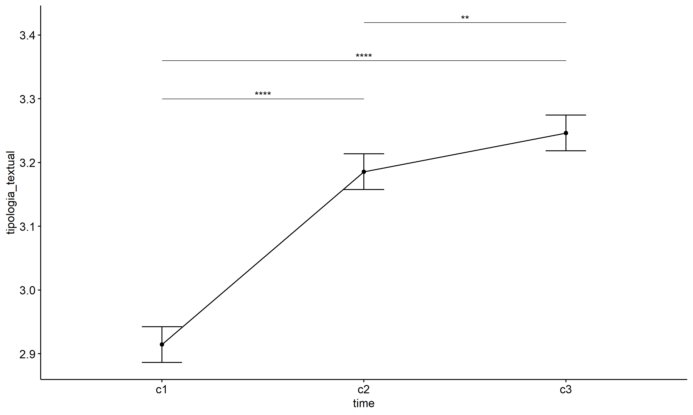<!-- -->

# ANOVA: tipologia_textual ~ time\*gender + Error(id/time)

## Data Preparation

``` r
data <- edat[,c("aluno_id","gender","ciclo","tipologia_textual")]
data <- data[data$ciclo %in% c("Primeiro Ciclo","Segundo Ciclo","Terceiro Ciclo"),]
data$ciclo <- factor(data$ciclo, c("Primeiro Ciclo","Segundo Ciclo","Terceiro Ciclo"))
data <- unique(data)

wdat <- spread(data, ciclo, tipologia_textual)
wdat <- wdat[complete.cases(wdat),]
colnames(wdat) <- c("id","gender","c1","c2","c3")

ldat <- gather(wdat, key = time, value = tipologia_textual, c1,c2,c3) %>%
  convert_as_factor(id, time)
ldat <- remove_group_data(ldat, "tipologia_textual", c("time", "gender"), n.limit = 30)
ldat$gender <- factor(ldat$gender, sort(unique(ldat$gender)))
```

### Check assumptions: Identifying Outliers

``` r
outliers <- identify_outliers(group_by(ldat, time, gender), tipologia_textual)
(outliers <- outliers[outliers$is.extreme == T,])
```

    ## [1] gender            time              id                tipologia_textual is.outlier        is.extreme       
    ## <0 rows> (or 0-length row.names)

| gender | time | id  | tipologia_textual | is.outlier | is.extreme |
|:-------|:-----|:----|------------------:|:-----------|:-----------|

### Check assumptions: Normality Test

``` r
(normality.df <- normality.test.per.groups(ldat, "tipologia_textual", c("time", "gender")))
```

    ##                 var          variable time gender    n    skewness  kurtosis symmetry  statistic     method p p.signif
    ## 1 tipologia_textual tipologia_textual   c1 Female 1363  0.03722716 -1.294172      YES  2894.1266 D'Agostino 0     ****
    ## 2 tipologia_textual tipologia_textual   c1   Male 1240  0.18759017 -1.339654      YES  7370.2365 D'Agostino 0     ****
    ## 3 tipologia_textual tipologia_textual   c2 Female 1363 -0.38883577 -1.238402      YES  1482.5575 D'Agostino 0     ****
    ## 4 tipologia_textual tipologia_textual   c2   Male 1240 -0.27214861 -1.356037      YES 21523.6394 D'Agostino 0     ****
    ## 5 tipologia_textual tipologia_textual   c3 Female 1363 -0.49951855 -1.128049      YES   660.9117 D'Agostino 0     ****
    ## 6 tipologia_textual tipologia_textual   c3   Male 1240 -0.41347133 -1.198862      YES   944.5909 D'Agostino 0     ****
    ##   normality
    ## 1         -
    ## 2         -
    ## 3         -
    ## 4         -
    ## 5         -
    ## 6         -

| var               | variable          | time | gender |    n | skewness | kurtosis | symmetry | statistic | method     |   p | p.signif | normality |
|:------------------|:------------------|:-----|:-------|-----:|---------:|---------:|:---------|----------:|:-----------|----:|:---------|:----------|
| tipologia_textual | tipologia_textual | c1   | Female | 1363 |    0.037 |   -1.294 | YES      |  2894.127 | D’Agostino |   0 | \*\*\*\* | \-        |
| tipologia_textual | tipologia_textual | c1   | Male   | 1240 |    0.188 |   -1.340 | YES      |  7370.236 | D’Agostino |   0 | \*\*\*\* | \-        |
| tipologia_textual | tipologia_textual | c2   | Female | 1363 |   -0.389 |   -1.238 | YES      |  1482.558 | D’Agostino |   0 | \*\*\*\* | \-        |
| tipologia_textual | tipologia_textual | c2   | Male   | 1240 |   -0.272 |   -1.356 | YES      | 21523.639 | D’Agostino |   0 | \*\*\*\* | \-        |
| tipologia_textual | tipologia_textual | c3   | Female | 1363 |   -0.500 |   -1.128 | YES      |   660.912 | D’Agostino |   0 | \*\*\*\* | \-        |
| tipologia_textual | tipologia_textual | c3   | Male   | 1240 |   -0.413 |   -1.199 | YES      |   944.591 | D’Agostino |   0 | \*\*\*\* | \-        |

``` r
(non.ids <- unique(do.call(
  c, lapply(which(normality.df$normality == 'NO'), FUN = function(i) {
  idx = which(ldat$time == normality.df$time[i] &
                ldat$gender == normality.df$gender[i])
  getNonNormal(ldat$"tipologia_textual"[idx], ldat$id[idx])
}))))
```

    ## NULL

``` r
if (length(non.ids) > 0)
  ldat2 <- ldat[!ldat$id %in% non.ids,]
```

### Summary Statistics

``` r
(sdat <- ldat %>% group_by(time, gender) %>%
   get_summary_stats(tipologia_textual, type = "mean_sd"))
```

    ## # A tibble: 6 × 6
    ##   gender time  variable              n  mean    sd
    ##   <fct>  <fct> <fct>             <dbl> <dbl> <dbl>
    ## 1 Female c1    tipologia_textual  1363  2.95 0.733
    ## 2 Male   c1    tipologia_textual  1240  2.88 0.753
    ## 3 Female c2    tipologia_textual  1363  3.21 0.757
    ## 4 Male   c2    tipologia_textual  1240  3.15 0.774
    ## 5 Female c3    tipologia_textual  1363  3.27 0.747
    ## 6 Male   c3    tipologia_textual  1240  3.22 0.751

| gender | time | variable          |    n |  mean |    sd |
|:-------|:-----|:------------------|-----:|------:|------:|
| Female | c1   | tipologia_textual | 1363 | 2.949 | 0.733 |
| Male   | c1   | tipologia_textual | 1240 | 2.880 | 0.753 |
| Female | c2   | tipologia_textual | 1363 | 3.212 | 0.757 |
| Male   | c2   | tipologia_textual | 1240 | 3.146 | 0.774 |
| Female | c3   | tipologia_textual | 1363 | 3.268 | 0.747 |
| Male   | c3   | tipologia_textual | 1240 | 3.218 | 0.751 |

``` r
if (length(non.ids) > 0)
  (sdat <- ldat2 %>% group_by(time, gender) %>%
      get_summary_stats(tipologia_textual, type = "mean_sd"))
```

| gender | time | variable          |    n |  mean |    sd |
|:-------|:-----|:------------------|-----:|------:|------:|
| Female | c1   | tipologia_textual | 1363 | 2.949 | 0.733 |
| Male   | c1   | tipologia_textual | 1240 | 2.880 | 0.753 |
| Female | c2   | tipologia_textual | 1363 | 3.212 | 0.757 |
| Male   | c2   | tipologia_textual | 1240 | 3.146 | 0.774 |
| Female | c3   | tipologia_textual | 1363 | 3.268 | 0.747 |
| Male   | c3   | tipologia_textual | 1240 | 3.218 | 0.751 |

## ANOVA Computation

``` r
(res.aov <- anova_test(ldat, dv = tipologia_textual, wid = id, between = gender, within = time))
```

    ## ANOVA Table (type III tests)
    ## 
    ## $ANOVA
    ##        Effect DFn  DFd       F                                                                            p p<.05       ges
    ## 1      gender   1 2601   9.706 0.00200000000000000004163336342344337026588618755340576171875000000000000000     * 0.0020000
    ## 2        time   2 5202 169.300 0.00000000000000000000000000000000000000000000000000000000000000000000000586     * 0.0340000
    ## 3 gender:time   2 5202   0.139 0.86999999999999999555910790149937383830547332763671875000000000000000000000       0.0000293
    ## 
    ## $`Mauchly's Test for Sphericity`
    ##        Effect     W     p p<.05
    ## 1        time 0.998 0.064      
    ## 2 gender:time 0.998 0.064      
    ## 
    ## $`Sphericity Corrections`
    ##        Effect   GGe     DF[GG]                                                                        p[GG] p[GG]<.05   HFe
    ## 1        time 0.998 2, 5191.03 0.00000000000000000000000000000000000000000000000000000000000000000000000818         * 0.999
    ## 2 gender:time 0.998 2, 5191.03 0.86999999999999999555910790149937383830547332763671875000000000000000000000           0.999
    ##       DF[HF]                                                                        p[HF] p[HF]<.05
    ## 1 2, 5195.01 0.00000000000000000000000000000000000000000000000000000000000000000000000725         *
    ## 2 2, 5195.01 0.86999999999999999555910790149937383830547332763671875000000000000000000000

| Effect      | DFn |  DFd |       F |     p | p\<.05 |   ges |
|:------------|----:|-----:|--------:|------:|:-------|------:|
| gender      |   1 | 2601 |   9.706 | 0.002 | \*     | 0.002 |
| time        |   2 | 5202 | 169.300 | 0.000 | \*     | 0.034 |
| gender:time |   2 | 5202 |   0.139 | 0.870 |        | 0.000 |

| Effect      |     W |     p | p\<.05 |
|:------------|------:|------:|:-------|
| time        | 0.998 | 0.064 |        |
| gender:time | 0.998 | 0.064 |        |

| Effect      |   GGe | DF\[GG\]   | p\[GG\] | p\[GG\]\<.05 |   HFe | DF\[HF\]   | p\[HF\] | p\[HF\]\<.05 |
|:------------|------:|:-----------|--------:|:-------------|------:|:-----------|--------:|:-------------|
| time        | 0.998 | 2, 5191.03 |    0.00 | \*           | 0.999 | 2, 5195.01 |    0.00 | \*           |
| gender:time | 0.998 | 2, 5191.03 |    0.87 |              | 0.999 | 2, 5195.01 |    0.87 |              |

## ANOVA Computation after removing non.normal data

``` r
if (length(non.ids) > 0)
  (res.aov2 <- anova_test(ldat2, dv = tipologia_textual, wid = id, between = gender , within = time))
```

## PairWise Computation

``` r
(pwc <- ldat %>% group_by(time) %>%
   emmeans_test(tipologia_textual ~ gender, detailed = T, p.adjust.method = "bonferroni"))
```

    ## # A tibble: 3 × 15
    ##   time  term   .y.        group1 group2 null.value estimate     se    df conf.low conf.high statistic      p  p.adj p.adj.signif
    ## * <fct> <chr>  <chr>      <chr>  <chr>       <dbl>    <dbl>  <dbl> <dbl>    <dbl>     <dbl>     <dbl>  <dbl>  <dbl> <chr>       
    ## 1 c1    gender tipologia… Female Male            0   0.0693 0.0295  7803  0.0115      0.127      2.35 0.0189 0.0189 *           
    ## 2 c2    gender tipologia… Female Male            0   0.0658 0.0295  7803  0.00789     0.124      2.23 0.0260 0.0260 *           
    ## 3 c3    gender tipologia… Female Male            0   0.0505 0.0295  7803 -0.00733     0.108      1.71 0.0869 0.0869 ns

| time | term   | .y.               | group1 | group2 | null.value | estimate |   se |   df | conf.low | conf.high | statistic |     p | p.adj | p.adj.signif |
|:-----|:-------|:------------------|:-------|:-------|-----------:|---------:|-----:|-----:|---------:|----------:|----------:|------:|------:|:-------------|
| c1   | gender | tipologia_textual | Female | Male   |          0 |    0.069 | 0.03 | 7803 |    0.011 |     0.127 |     2.349 | 0.019 | 0.019 | \*           |
| c2   | gender | tipologia_textual | Female | Male   |          0 |    0.066 | 0.03 | 7803 |    0.008 |     0.124 |     2.227 | 0.026 | 0.026 | \*           |
| c3   | gender | tipologia_textual | Female | Male   |          0 |    0.051 | 0.03 | 7803 |   -0.007 |     0.108 |     1.712 | 0.087 | 0.087 | ns           |

``` r
(emms <- get_emmeans(pwc))
```

    ## # A tibble: 6 × 8
    ##   time  gender emmean     se    df conf.low conf.high method      
    ##   <fct> <fct>   <dbl>  <dbl> <dbl>    <dbl>     <dbl> <chr>       
    ## 1 c1    Female   2.95 0.0204  7803     2.91      2.99 Emmeans test
    ## 2 c1    Male     2.88 0.0214  7803     2.84      2.92 Emmeans test
    ## 3 c2    Female   3.21 0.0204  7803     3.17      3.25 Emmeans test
    ## 4 c2    Male     3.15 0.0214  7803     3.10      3.19 Emmeans test
    ## 5 c3    Female   3.27 0.0204  7803     3.23      3.31 Emmeans test
    ## 6 c3    Male     3.22 0.0214  7803     3.18      3.26 Emmeans test

| time | gender | emmean |    se |   df | conf.low | conf.high | method       |
|:-----|:-------|-------:|------:|-----:|---------:|----------:|:-------------|
| c1   | Female |  2.949 | 0.020 | 7803 |    2.909 |     2.989 | Emmeans test |
| c1   | Male   |  2.880 | 0.021 | 7803 |    2.838 |     2.922 | Emmeans test |
| c2   | Female |  3.212 | 0.020 | 7803 |    3.172 |     3.252 | Emmeans test |
| c2   | Male   |  3.146 | 0.021 | 7803 |    3.104 |     3.188 | Emmeans test |
| c3   | Female |  3.268 | 0.020 | 7803 |    3.228 |     3.308 | Emmeans test |
| c3   | Male   |  3.218 | 0.021 | 7803 |    3.176 |     3.260 | Emmeans test |

``` r
pwc <- add_xy_position(pwc, x = "time", fun = "mean_se", dodge = 0.25)
pd <- position_dodge(width = 0.25)
ggline(emms, x = "time", y = "emmean", color = "gender",
       palette = c("#FF007F","#4D4DFF"),
       position = pd, ylab = "tipologia_textual") +
  geom_errorbar(aes(ymin = conf.low, ymax = conf.high, color = gender),
                position = pd, width = 0.2) +
  stat_pvalue_manual(pwc, hide.ns = T, tip.length = F, linetype = 1)
```

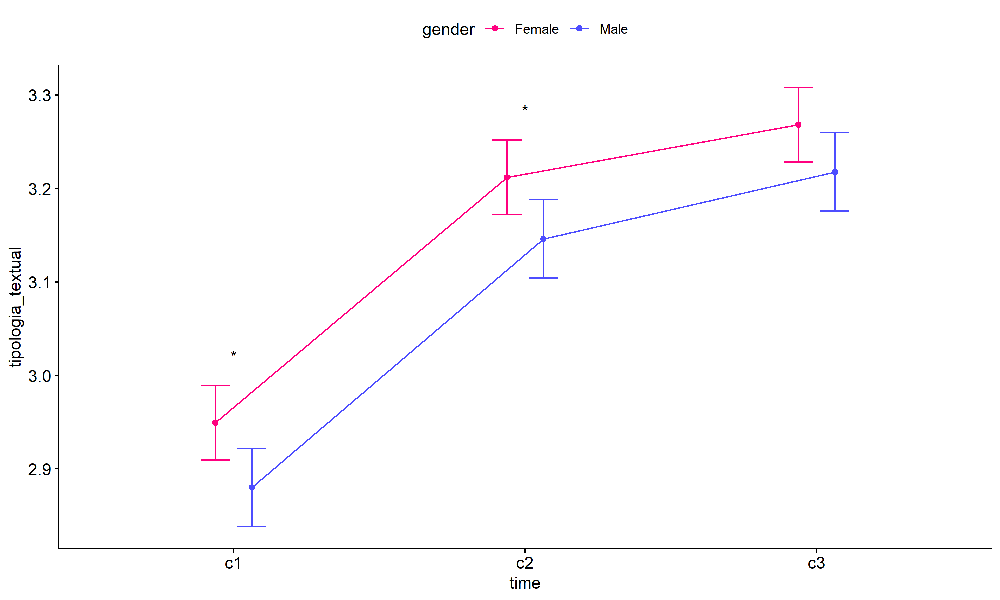<!-- -->

``` r
(pwc <- ldat %>% group_by(gender) %>%
    emmeans_test(tipologia_textual ~ time, detailed = T, p.adjust.method = "bonferroni"))
```

    ## # A tibble: 6 × 15
    ##   gender term  .y.    group1 group2 null.value estimate     se    df conf.low conf.high statistic        p    p.adj p.adj.signif
    ## * <fct>  <chr> <chr>  <chr>  <chr>       <dbl>    <dbl>  <dbl> <dbl>    <dbl>     <dbl>     <dbl>    <dbl>    <dbl> <chr>       
    ## 1 Female time  tipol… c1     c2              0  -0.262  0.0288  7803   -0.319  -2.06e-1     -9.11 1.06e-19 3.18e-19 ****        
    ## 2 Female time  tipol… c1     c3              0  -0.319  0.0288  7803   -0.375  -2.62e-1    -11.1  2.92e-28 8.77e-28 ****        
    ## 3 Female time  tipol… c2     c3              0  -0.0565 0.0288  7803   -0.113  -9.25e-6     -1.96 5.00e- 2 1.50e- 1 ns          
    ## 4 Male   time  tipol… c1     c2              0  -0.266  0.0302  7803   -0.325  -2.07e-1     -8.80 1.59e-18 4.78e-18 ****        
    ## 5 Male   time  tipol… c1     c3              0  -0.338  0.0302  7803   -0.397  -2.78e-1    -11.2  8.58e-29 2.57e-28 ****        
    ## 6 Male   time  tipol… c2     c3              0  -0.0717 0.0302  7803   -0.131  -1.25e-2     -2.37 1.76e- 2 5.29e- 2 ns

| gender | term | .y.               | group1 | group2 | null.value | estimate |    se |   df | conf.low | conf.high | statistic |     p | p.adj | p.adj.signif |
|:-------|:-----|:------------------|:-------|:-------|-----------:|---------:|------:|-----:|---------:|----------:|----------:|------:|------:|:-------------|
| Female | time | tipologia_textual | c1     | c2     |          0 |   -0.262 | 0.029 | 7803 |   -0.319 |    -0.206 |    -9.107 | 0.000 | 0.000 | \*\*\*\*     |
| Female | time | tipologia_textual | c1     | c3     |          0 |   -0.319 | 0.029 | 7803 |   -0.375 |    -0.262 |   -11.068 | 0.000 | 0.000 | \*\*\*\*     |
| Female | time | tipologia_textual | c2     | c3     |          0 |   -0.056 | 0.029 | 7803 |   -0.113 |     0.000 |    -1.961 | 0.050 | 0.150 | ns           |
| Male   | time | tipologia_textual | c1     | c2     |          0 |   -0.266 | 0.030 | 7803 |   -0.325 |    -0.207 |    -8.805 | 0.000 | 0.000 | \*\*\*\*     |
| Male   | time | tipologia_textual | c1     | c3     |          0 |   -0.338 | 0.030 | 7803 |   -0.397 |    -0.278 |   -11.179 | 0.000 | 0.000 | \*\*\*\*     |
| Male   | time | tipologia_textual | c2     | c3     |          0 |   -0.072 | 0.030 | 7803 |   -0.131 |    -0.012 |    -2.374 | 0.018 | 0.053 | ns           |

``` r
(emms <- get_emmeans(pwc))
```

    ## # A tibble: 6 × 8
    ##   gender time  emmean     se    df conf.low conf.high method      
    ##   <fct>  <fct>  <dbl>  <dbl> <dbl>    <dbl>     <dbl> <chr>       
    ## 1 Female c1      2.95 0.0204  7803     2.91      2.99 Emmeans test
    ## 2 Female c2      3.21 0.0204  7803     3.17      3.25 Emmeans test
    ## 3 Female c3      3.27 0.0204  7803     3.23      3.31 Emmeans test
    ## 4 Male   c1      2.88 0.0214  7803     2.84      2.92 Emmeans test
    ## 5 Male   c2      3.15 0.0214  7803     3.10      3.19 Emmeans test
    ## 6 Male   c3      3.22 0.0214  7803     3.18      3.26 Emmeans test

| gender | time | emmean |    se |   df | conf.low | conf.high | method       |
|:-------|:-----|-------:|------:|-----:|---------:|----------:|:-------------|
| Female | c1   |  2.949 | 0.020 | 7803 |    2.909 |     2.989 | Emmeans test |
| Female | c2   |  3.212 | 0.020 | 7803 |    3.172 |     3.252 | Emmeans test |
| Female | c3   |  3.268 | 0.020 | 7803 |    3.228 |     3.308 | Emmeans test |
| Male   | c1   |  2.880 | 0.021 | 7803 |    2.838 |     2.922 | Emmeans test |
| Male   | c2   |  3.146 | 0.021 | 7803 |    3.104 |     3.188 | Emmeans test |
| Male   | c3   |  3.218 | 0.021 | 7803 |    3.176 |     3.260 | Emmeans test |

``` r
emms.gg <- emms[which(emms$gender == "Female"),]
if (nrow(emms.gg) > 0)
  ggline(emms.gg, x = "time", y = "emmean", color = "#FF007F", ylab = "tipologia_textual") +
    geom_errorbar(aes(ymin = conf.low, ymax = conf.high),
                  width = 0.2, color = "#FF007F") +
    stat_pvalue_manual(
      add_xy_position(pwc[which(pwc$gender == "Female"),],
                      x = "time", fun = "mean_se"),
      hide.ns = T, color = "#FF007F", tip.length = F) +
    labs(title = "gender: Female")+
    theme(legend.text = element_blank())
```

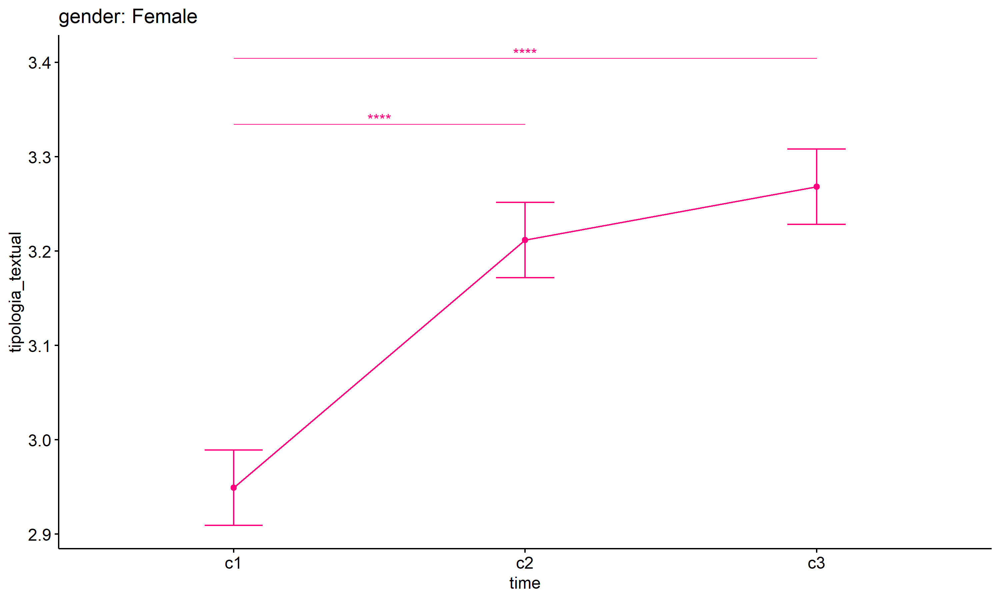<!-- -->

``` r
emms.gg <- emms[which(emms$gender == "Male"),]
if (nrow(emms.gg) > 0)
  ggline(emms.gg, x = "time", y = "emmean", color = "#4D4DFF", ylab = "tipologia_textual") +
    geom_errorbar(aes(ymin = conf.low, ymax = conf.high),
                  width = 0.2, color = "#4D4DFF") +
    stat_pvalue_manual(
      add_xy_position(pwc[which(pwc$gender == "Male"),],
                      x = "time", fun = "mean_se"),
      hide.ns = T, color = "#4D4DFF", tip.length = F) +
    labs(title = "gender: Male")+
    theme(legend.text = element_blank())
```

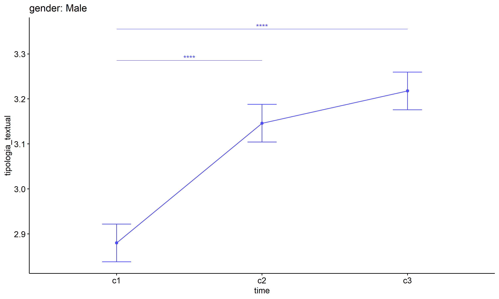<!-- -->

## PairWise Computation after removing non.normal data

``` r
if (length(non.ids) > 0)
  (pwc2 <- ldat2 %>% group_by(time) %>%
     emmeans_test(tipologia_textual ~ gender, detailed = T, p.adjust.method = "bonferroni"))
```

``` r
if (length(non.ids) > 0)
  (emms2 <- get_emmeans(pwc2))
```

``` r
if (length(non.ids) > 0) {
  pwc2 <- add_xy_position(pwc2, x = "time", fun = "mean_se", dodge = 0.25)
  pd2 <- position_dodge(width = 0.25)
  
  ggline(emms2, x = "time", y = "emmean", color = "gender",
         palette = c("#FF007F","#4D4DFF"),
         position = pd, ylab = "tipologia_textual") +
    geom_errorbar(aes(ymin = conf.low, ymax = conf.high, color = gender),
                position = pd, width = 0.2) +
    stat_pvalue_manual(pwc2, hide.ns = T, tip.length = F, linetype = 1)
}
```

``` r
if (length(non.ids) > 0)
  (pwc2 <- ldat2 %>% group_by(gender) %>%
     emmeans_test(tipologia_textual ~ time, detailed = T, p.adjust.method = "bonferroni"))
```

``` r
if (length(non.ids) > 0)
  (emms2 <- get_emmeans(pwc2))
```

``` r
if (length(non.ids) > 0) {
  emms.gg <- emms2[which(emms2$gender == "Female"),]
  if (nrow(emms.gg) > 0)
    ggline(emms.gg, x = "time", y = "emmean", color = "#FF007F", ylab = "tipologia_textual") +
    geom_errorbar(aes(ymin = conf.low, ymax = conf.high),
                  width = 0.2, color = "#FF007F") +
    stat_pvalue_manual(
      add_xy_position(pwc[which(pwc$gender == "Female"),],
                      x = "time", fun = "mean_se"),
      hide.ns = T, color = "#FF007F", tip.length = F) +
    labs(title = "gender: Female") +
    theme(legend.text = element_blank())
}
```

``` r
if (length(non.ids) > 0) {
  emms.gg <- emms2[which(emms2$gender == "Male"),]
  if (nrow(emms.gg) > 0)
    ggline(emms.gg, x = "time", y = "emmean", color = "#4D4DFF", ylab = "tipologia_textual") +
    geom_errorbar(aes(ymin = conf.low, ymax = conf.high),
                  width = 0.2, color = "#4D4DFF") +
    stat_pvalue_manual(
      add_xy_position(pwc[which(pwc$gender == "Male"),],
                      x = "time", fun = "mean_se"),
      hide.ns = T, color = "#4D4DFF", tip.length = F) +
    labs(title = "gender: Male") +
    theme(legend.text = element_blank())
}
```

# ANOVA: tipologia_textual ~ time\*localizacao + Error(id/time)

## Data Preparation

``` r
data <- edat[,c("aluno_id","localizacao","ciclo","tipologia_textual")]
data <- data[data$ciclo %in% c("Primeiro Ciclo","Segundo Ciclo","Terceiro Ciclo"),]
data$ciclo <- factor(data$ciclo, c("Primeiro Ciclo","Segundo Ciclo","Terceiro Ciclo"))
data <- unique(data)

wdat <- spread(data, ciclo, tipologia_textual)
wdat <- wdat[complete.cases(wdat),]
colnames(wdat) <- c("id","localizacao","c1","c2","c3")

ldat <- gather(wdat, key = time, value = tipologia_textual, c1,c2,c3) %>%
  convert_as_factor(id, time)
ldat <- remove_group_data(ldat, "tipologia_textual", c("time", "localizacao"), n.limit = 30)
ldat$localizacao <- factor(ldat$localizacao, sort(unique(ldat$localizacao)))
```

### Check assumptions: Identifying Outliers

``` r
outliers <- identify_outliers(group_by(ldat, time, localizacao), tipologia_textual)
(outliers <- outliers[outliers$is.extreme == T,])
```

    ## [1] localizacao       time              id                tipologia_textual is.outlier        is.extreme       
    ## <0 rows> (or 0-length row.names)

| localizacao | time | id  | tipologia_textual | is.outlier | is.extreme |
|:------------|:-----|:----|------------------:|:-----------|:-----------|

### Check assumptions: Normality Test

``` r
(normality.df <- normality.test.per.groups(ldat, "tipologia_textual", c("time", "localizacao")))
```

    ##                 var          variable time localizacao    n   skewness  kurtosis symmetry statistic     method p p.signif
    ## 1 tipologia_textual tipologia_textual   c1       Rural  656  0.1594127 -1.355597      YES 3029.9638 D'Agostino 0     ****
    ## 2 tipologia_textual tipologia_textual   c1      Urbana 2117  0.1002486 -1.309750      YES 7114.8748 D'Agostino 0     ****
    ## 3 tipologia_textual tipologia_textual   c2       Rural  656 -0.3351117 -1.311296      YES 1280.1661 D'Agostino 0     ****
    ## 4 tipologia_textual tipologia_textual   c2      Urbana 2117 -0.3466755 -1.285269      YES 4466.8174 D'Agostino 0     ****
    ## 5 tipologia_textual tipologia_textual   c3       Rural  656 -0.5301739 -1.114652       NO  271.8768 D'Agostino 0     ****
    ## 6 tipologia_textual tipologia_textual   c3      Urbana 2117 -0.4450274 -1.185923      YES 1562.9573 D'Agostino 0     ****
    ##   normality
    ## 1         -
    ## 2         -
    ## 3         -
    ## 4         -
    ## 5         -
    ## 6         -

| var               | variable          | time | localizacao |    n | skewness | kurtosis | symmetry | statistic | method     |   p | p.signif | normality |
|:------------------|:------------------|:-----|:------------|-----:|---------:|---------:|:---------|----------:|:-----------|----:|:---------|:----------|
| tipologia_textual | tipologia_textual | c1   | Rural       |  656 |    0.159 |   -1.356 | YES      |  3029.964 | D’Agostino |   0 | \*\*\*\* | \-        |
| tipologia_textual | tipologia_textual | c1   | Urbana      | 2117 |    0.100 |   -1.310 | YES      |  7114.875 | D’Agostino |   0 | \*\*\*\* | \-        |
| tipologia_textual | tipologia_textual | c2   | Rural       |  656 |   -0.335 |   -1.311 | YES      |  1280.166 | D’Agostino |   0 | \*\*\*\* | \-        |
| tipologia_textual | tipologia_textual | c2   | Urbana      | 2117 |   -0.347 |   -1.285 | YES      |  4466.817 | D’Agostino |   0 | \*\*\*\* | \-        |
| tipologia_textual | tipologia_textual | c3   | Rural       |  656 |   -0.530 |   -1.115 | NO       |   271.877 | D’Agostino |   0 | \*\*\*\* | \-        |
| tipologia_textual | tipologia_textual | c3   | Urbana      | 2117 |   -0.445 |   -1.186 | YES      |  1562.957 | D’Agostino |   0 | \*\*\*\* | \-        |

``` r
(non.ids <- unique(do.call(
  c, lapply(which(normality.df$normality == 'NO'), FUN = function(i) {
  idx = which(ldat$time == normality.df$time[i] &
                ldat$localizacao == normality.df$localizacao[i])
  getNonNormal(ldat$"tipologia_textual"[idx], ldat$id[idx])
}))))
```

    ## NULL

``` r
if (length(non.ids) > 0)
  ldat2 <- ldat[!ldat$id %in% non.ids,]
```

### Summary Statistics

``` r
(sdat <- ldat %>% group_by(time, localizacao) %>%
   get_summary_stats(tipologia_textual, type = "mean_sd"))
```

    ## # A tibble: 6 × 6
    ##   localizacao time  variable              n  mean    sd
    ##   <fct>       <fct> <fct>             <dbl> <dbl> <dbl>
    ## 1 Rural       c1    tipologia_textual   656  2.89 0.749
    ## 2 Urbana      c1    tipologia_textual  2117  2.92 0.742
    ## 3 Rural       c2    tipologia_textual   656  3.19 0.769
    ## 4 Urbana      c2    tipologia_textual  2117  3.18 0.764
    ## 5 Rural       c3    tipologia_textual   656  3.28 0.748
    ## 6 Urbana      c3    tipologia_textual  2117  3.24 0.753

| localizacao | time | variable          |    n |  mean |    sd |
|:------------|:-----|:------------------|-----:|------:|------:|
| Rural       | c1   | tipologia_textual |  656 | 2.893 | 0.749 |
| Urbana      | c1   | tipologia_textual | 2117 | 2.921 | 0.742 |
| Rural       | c2   | tipologia_textual |  656 | 3.188 | 0.769 |
| Urbana      | c2   | tipologia_textual | 2117 | 3.185 | 0.764 |
| Rural       | c3   | tipologia_textual |  656 | 3.279 | 0.748 |
| Urbana      | c3   | tipologia_textual | 2117 | 3.236 | 0.753 |

``` r
if (length(non.ids) > 0)
  (sdat <- ldat2 %>% group_by(time, localizacao) %>%
      get_summary_stats(tipologia_textual, type = "mean_sd"))
```

| localizacao | time | variable          |    n |  mean |    sd |
|:------------|:-----|:------------------|-----:|------:|------:|
| Rural       | c1   | tipologia_textual |  656 | 2.893 | 0.749 |
| Urbana      | c1   | tipologia_textual | 2117 | 2.921 | 0.742 |
| Rural       | c2   | tipologia_textual |  656 | 3.188 | 0.769 |
| Urbana      | c2   | tipologia_textual | 2117 | 3.185 | 0.764 |
| Rural       | c3   | tipologia_textual |  656 | 3.279 | 0.748 |
| Urbana      | c3   | tipologia_textual | 2117 | 3.236 | 0.753 |

## ANOVA Computation

``` r
(res.aov <- anova_test(ldat, dv = tipologia_textual, wid = id, between = localizacao, within = time))
```

    ## ANOVA Table (type III tests)
    ## 
    ## $ANOVA
    ##             Effect DFn  DFd       F                                                                   p p<.05       ges
    ## 1      localizacao   1 2771   0.063 0.80200000000000004618527782440651208162307739257812500000000000000       0.0000103
    ## 2             time   2 5542 147.985 0.00000000000000000000000000000000000000000000000000000000000000244     * 0.0280000
    ## 3 localizacao:time   2 5542   1.383 0.25100000000000000088817841970012523233890533447265625000000000000       0.0002720
    ## 
    ## $`Mauchly's Test for Sphericity`
    ##             Effect     W     p p<.05
    ## 1             time 0.999 0.129      
    ## 2 localizacao:time 0.999 0.129      
    ## 
    ## $`Sphericity Corrections`
    ##             Effect   GGe     DF[GG]                                                             p[GG] p[GG]<.05   HFe
    ## 1             time 0.999 2, 5533.82 0.000000000000000000000000000000000000000000000000000000000000003         * 0.999
    ## 2 localizacao:time 0.999 2, 5533.82 0.251000000000000000888178419700125232338905334472656250000000000           0.999
    ##       DF[HF]                                                               p[HF] p[HF]<.05
    ## 1 2, 5537.81 0.00000000000000000000000000000000000000000000000000000000000000271         *
    ## 2 2, 5537.81 0.25100000000000000088817841970012523233890533447265625000000000000

| Effect           | DFn |  DFd |       F |     p | p\<.05 |   ges |
|:-----------------|----:|-----:|--------:|------:|:-------|------:|
| localizacao      |   1 | 2771 |   0.063 | 0.802 |        | 0.000 |
| time             |   2 | 5542 | 147.985 | 0.000 | \*     | 0.028 |
| localizacao:time |   2 | 5542 |   1.383 | 0.251 |        | 0.000 |

| Effect           |     W |     p | p\<.05 |
|:-----------------|------:|------:|:-------|
| time             | 0.999 | 0.129 |        |
| localizacao:time | 0.999 | 0.129 |        |

| Effect           |   GGe | DF\[GG\]   | p\[GG\] | p\[GG\]\<.05 |   HFe | DF\[HF\]   | p\[HF\] | p\[HF\]\<.05 |
|:-----------------|------:|:-----------|--------:|:-------------|------:|:-----------|--------:|:-------------|
| time             | 0.999 | 2, 5533.82 |   0.000 | \*           | 0.999 | 2, 5537.81 |   0.000 | \*           |
| localizacao:time | 0.999 | 2, 5533.82 |   0.251 |              | 0.999 | 2, 5537.81 |   0.251 |              |

## ANOVA Computation after removing non.normal data

``` r
if (length(non.ids) > 0)
  (res.aov2 <- anova_test(ldat2, dv = tipologia_textual, wid = id, between = localizacao , within = time))
```

## PairWise Computation

``` r
(pwc <- ldat %>% group_by(time) %>%
   emmeans_test(tipologia_textual ~ localizacao, detailed = T, p.adjust.method = "bonferroni"))
```

    ## # A tibble: 3 × 15
    ##   time  term        .y.     group1 group2 null.value estimate     se    df conf.low conf.high statistic     p p.adj p.adj.signif
    ## * <fct> <chr>       <chr>   <chr>  <chr>       <dbl>    <dbl>  <dbl> <dbl>    <dbl>     <dbl>     <dbl> <dbl> <dbl> <chr>       
    ## 1 c1    localizacao tipolo… Rural  Urbana          0 -0.0285  0.0337  8313  -0.0946    0.0375   -0.848  0.397 0.397 ns          
    ## 2 c2    localizacao tipolo… Rural  Urbana          0  0.00269 0.0337  8313  -0.0633    0.0687    0.0798 0.936 0.936 ns          
    ## 3 c3    localizacao tipolo… Rural  Urbana          0  0.0429  0.0337  8313  -0.0231    0.109     1.27   0.202 0.202 ns

| time | term        | .y.               | group1 | group2 | null.value | estimate |    se |   df | conf.low | conf.high | statistic |     p | p.adj | p.adj.signif |
|:-----|:------------|:------------------|:-------|:-------|-----------:|---------:|------:|-----:|---------:|----------:|----------:|------:|------:|:-------------|
| c1   | localizacao | tipologia_textual | Rural  | Urbana |          0 |   -0.029 | 0.034 | 8313 |   -0.095 |     0.037 |    -0.848 | 0.397 | 0.397 | ns           |
| c2   | localizacao | tipologia_textual | Rural  | Urbana |          0 |    0.003 | 0.034 | 8313 |   -0.063 |     0.069 |     0.080 | 0.936 | 0.936 | ns           |
| c3   | localizacao | tipologia_textual | Rural  | Urbana |          0 |    0.043 | 0.034 | 8313 |   -0.023 |     0.109 |     1.275 | 0.202 | 0.202 | ns           |

``` r
(emms <- get_emmeans(pwc))
```

    ## # A tibble: 6 × 8
    ##   time  localizacao emmean     se    df conf.low conf.high method      
    ##   <fct> <fct>        <dbl>  <dbl> <dbl>    <dbl>     <dbl> <chr>       
    ## 1 c1    Rural         2.89 0.0294  8313     2.83      2.95 Emmeans test
    ## 2 c1    Urbana        2.92 0.0164  8313     2.89      2.95 Emmeans test
    ## 3 c2    Rural         3.19 0.0294  8313     3.13      3.25 Emmeans test
    ## 4 c2    Urbana        3.18 0.0164  8313     3.15      3.22 Emmeans test
    ## 5 c3    Rural         3.28 0.0294  8313     3.22      3.34 Emmeans test
    ## 6 c3    Urbana        3.24 0.0164  8313     3.20      3.27 Emmeans test

| time | localizacao | emmean |    se |   df | conf.low | conf.high | method       |
|:-----|:------------|-------:|------:|-----:|---------:|----------:|:-------------|
| c1   | Rural       |  2.893 | 0.029 | 8313 |    2.835 |     2.950 | Emmeans test |
| c1   | Urbana      |  2.921 | 0.016 | 8313 |    2.889 |     2.953 | Emmeans test |
| c2   | Rural       |  3.187 | 0.029 | 8313 |    3.130 |     3.245 | Emmeans test |
| c2   | Urbana      |  3.185 | 0.016 | 8313 |    3.153 |     3.217 | Emmeans test |
| c3   | Rural       |  3.279 | 0.029 | 8313 |    3.221 |     3.337 | Emmeans test |
| c3   | Urbana      |  3.236 | 0.016 | 8313 |    3.204 |     3.268 | Emmeans test |

``` r
pwc <- add_xy_position(pwc, x = "time", fun = "mean_se", dodge = 0.25)
pd <- position_dodge(width = 0.25)
ggline(emms, x = "time", y = "emmean", color = "localizacao",
       palette = c("#AA00FF","#00CCCC"),
       position = pd, ylab = "tipologia_textual") +
  geom_errorbar(aes(ymin = conf.low, ymax = conf.high, color = localizacao),
                position = pd, width = 0.2) +
  stat_pvalue_manual(pwc, hide.ns = T, tip.length = F, linetype = 1)
```

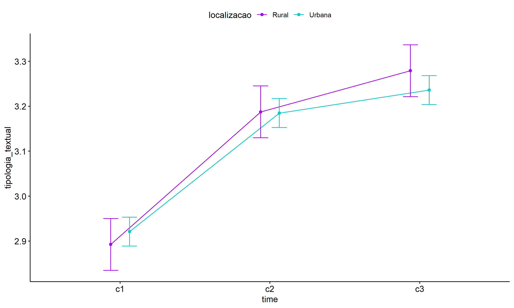<!-- -->

``` r
(pwc <- ldat %>% group_by(localizacao) %>%
    emmeans_test(tipologia_textual ~ time, detailed = T, p.adjust.method = "bonferroni"))
```

    ## # A tibble: 6 × 15
    ##   localizacao term  .y.            group1 group2 null.value estimate     se    df conf.low conf.high statistic        p    p.adj
    ## * <fct>       <chr> <chr>          <chr>  <chr>       <dbl>    <dbl>  <dbl> <dbl>    <dbl>     <dbl>     <dbl>    <dbl>    <dbl>
    ## 1 Rural       time  tipologia_tex… c1     c2              0  -0.295  0.0416  8313  -0.377   -0.213       -7.09 1.47e-12 4.42e-12
    ## 2 Rural       time  tipologia_tex… c1     c3              0  -0.386  0.0416  8313  -0.468   -0.305       -9.29 2.02e-20 6.06e-20
    ## 3 Rural       time  tipologia_tex… c2     c3              0  -0.0915 0.0416  8313  -0.173   -0.00988     -2.20 2.80e- 2 8.40e- 2
    ## 4 Urbana      time  tipologia_tex… c1     c2              0  -0.264  0.0232  8313  -0.309   -0.218      -11.4  8.31e-30 2.49e-29
    ## 5 Urbana      time  tipologia_tex… c1     c3              0  -0.315  0.0232  8313  -0.360   -0.270      -13.6  1.19e-41 3.58e-41
    ## 6 Urbana      time  tipologia_tex… c2     c3              0  -0.0512 0.0232  8313  -0.0966  -0.00580     -2.21 2.71e- 2 8.13e- 2
    ## # ℹ 1 more variable: p.adj.signif <chr>

| localizacao | term | .y.               | group1 | group2 | null.value | estimate |    se |   df | conf.low | conf.high | statistic |     p | p.adj | p.adj.signif |
|:------------|:-----|:------------------|:-------|:-------|-----------:|---------:|------:|-----:|---------:|----------:|----------:|------:|------:|:-------------|
| Rural       | time | tipologia_textual | c1     | c2     |          0 |   -0.295 | 0.042 | 8313 |   -0.377 |    -0.213 |    -7.088 | 0.000 | 0.000 | \*\*\*\*     |
| Rural       | time | tipologia_textual | c1     | c3     |          0 |   -0.386 | 0.042 | 8313 |   -0.468 |    -0.305 |    -9.285 | 0.000 | 0.000 | \*\*\*\*     |
| Rural       | time | tipologia_textual | c2     | c3     |          0 |   -0.091 | 0.042 | 8313 |   -0.173 |    -0.010 |    -2.198 | 0.028 | 0.084 | ns           |
| Urbana      | time | tipologia_textual | c1     | c2     |          0 |   -0.264 | 0.023 | 8313 |   -0.309 |    -0.218 |   -11.384 | 0.000 | 0.000 | \*\*\*\*     |
| Urbana      | time | tipologia_textual | c1     | c3     |          0 |   -0.315 | 0.023 | 8313 |   -0.360 |    -0.270 |   -13.595 | 0.000 | 0.000 | \*\*\*\*     |
| Urbana      | time | tipologia_textual | c2     | c3     |          0 |   -0.051 | 0.023 | 8313 |   -0.097 |    -0.006 |    -2.211 | 0.027 | 0.081 | ns           |

``` r
(emms <- get_emmeans(pwc))
```

    ## # A tibble: 6 × 8
    ##   localizacao time  emmean     se    df conf.low conf.high method      
    ##   <fct>       <fct>  <dbl>  <dbl> <dbl>    <dbl>     <dbl> <chr>       
    ## 1 Rural       c1      2.89 0.0294  8313     2.83      2.95 Emmeans test
    ## 2 Rural       c2      3.19 0.0294  8313     3.13      3.25 Emmeans test
    ## 3 Rural       c3      3.28 0.0294  8313     3.22      3.34 Emmeans test
    ## 4 Urbana      c1      2.92 0.0164  8313     2.89      2.95 Emmeans test
    ## 5 Urbana      c2      3.18 0.0164  8313     3.15      3.22 Emmeans test
    ## 6 Urbana      c3      3.24 0.0164  8313     3.20      3.27 Emmeans test

| localizacao | time | emmean |    se |   df | conf.low | conf.high | method       |
|:------------|:-----|-------:|------:|-----:|---------:|----------:|:-------------|
| Rural       | c1   |  2.893 | 0.029 | 8313 |    2.835 |     2.950 | Emmeans test |
| Rural       | c2   |  3.187 | 0.029 | 8313 |    3.130 |     3.245 | Emmeans test |
| Rural       | c3   |  3.279 | 0.029 | 8313 |    3.221 |     3.337 | Emmeans test |
| Urbana      | c1   |  2.921 | 0.016 | 8313 |    2.889 |     2.953 | Emmeans test |
| Urbana      | c2   |  3.185 | 0.016 | 8313 |    3.153 |     3.217 | Emmeans test |
| Urbana      | c3   |  3.236 | 0.016 | 8313 |    3.204 |     3.268 | Emmeans test |

``` r
emms.gg <- emms[which(emms$localizacao == "Rural"),]
if (nrow(emms.gg) > 0)
  ggline(emms.gg, x = "time", y = "emmean", color = "#AA00FF", ylab = "tipologia_textual") +
    geom_errorbar(aes(ymin = conf.low, ymax = conf.high),
                  width = 0.2, color = "#AA00FF") +
    stat_pvalue_manual(
      add_xy_position(pwc[which(pwc$localizacao == "Rural"),],
                      x = "time", fun = "mean_se"),
      hide.ns = T, color = "#AA00FF", tip.length = F) +
    labs(title = "localizacao: Rural")+
    theme(legend.text = element_blank())
```

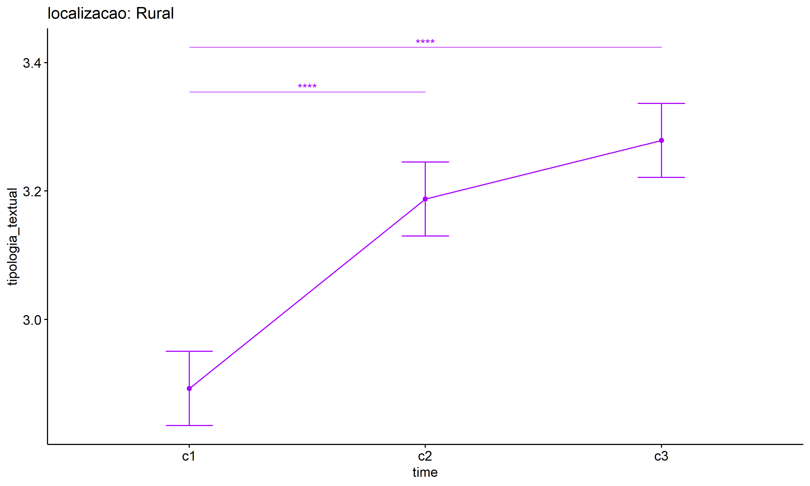<!-- -->

``` r
emms.gg <- emms[which(emms$localizacao == "Urbana"),]
if (nrow(emms.gg) > 0)
  ggline(emms.gg, x = "time", y = "emmean", color = "#00CCCC", ylab = "tipologia_textual") +
    geom_errorbar(aes(ymin = conf.low, ymax = conf.high),
                  width = 0.2, color = "#00CCCC") +
    stat_pvalue_manual(
      add_xy_position(pwc[which(pwc$localizacao == "Urbana"),],
                      x = "time", fun = "mean_se"),
      hide.ns = T, color = "#00CCCC", tip.length = F) +
    labs(title = "localizacao: Urbana")+
    theme(legend.text = element_blank())
```

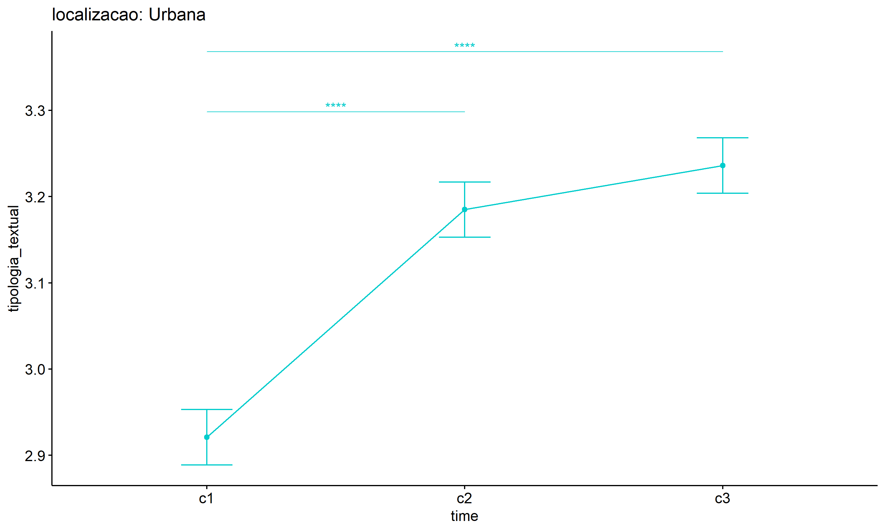<!-- -->

## PairWise Computation after removing non.normal data

``` r
if (length(non.ids) > 0)
  (pwc2 <- ldat2 %>% group_by(time) %>%
     emmeans_test(tipologia_textual ~ localizacao, detailed = T, p.adjust.method = "bonferroni"))
```

``` r
if (length(non.ids) > 0)
  (emms2 <- get_emmeans(pwc2))
```

``` r
if (length(non.ids) > 0) {
  pwc2 <- add_xy_position(pwc2, x = "time", fun = "mean_se", dodge = 0.25)
  pd2 <- position_dodge(width = 0.25)
  
  ggline(emms2, x = "time", y = "emmean", color = "localizacao",
         palette = c("#AA00FF","#00CCCC"),
         position = pd, ylab = "tipologia_textual") +
    geom_errorbar(aes(ymin = conf.low, ymax = conf.high, color = localizacao),
                position = pd, width = 0.2) +
    stat_pvalue_manual(pwc2, hide.ns = T, tip.length = F, linetype = 1)
}
```

``` r
if (length(non.ids) > 0)
  (pwc2 <- ldat2 %>% group_by(localizacao) %>%
     emmeans_test(tipologia_textual ~ time, detailed = T, p.adjust.method = "bonferroni"))
```

``` r
if (length(non.ids) > 0)
  (emms2 <- get_emmeans(pwc2))
```

``` r
if (length(non.ids) > 0) {
  emms.gg <- emms2[which(emms2$localizacao == "Rural"),]
  if (nrow(emms.gg) > 0)
    ggline(emms.gg, x = "time", y = "emmean", color = "#AA00FF", ylab = "tipologia_textual") +
    geom_errorbar(aes(ymin = conf.low, ymax = conf.high),
                  width = 0.2, color = "#AA00FF") +
    stat_pvalue_manual(
      add_xy_position(pwc[which(pwc$localizacao == "Rural"),],
                      x = "time", fun = "mean_se"),
      hide.ns = T, color = "#AA00FF", tip.length = F) +
    labs(title = "localizacao: Rural") +
    theme(legend.text = element_blank())
}
```

``` r
if (length(non.ids) > 0) {
  emms.gg <- emms2[which(emms2$localizacao == "Urbana"),]
  if (nrow(emms.gg) > 0)
    ggline(emms.gg, x = "time", y = "emmean", color = "#00CCCC", ylab = "tipologia_textual") +
    geom_errorbar(aes(ymin = conf.low, ymax = conf.high),
                  width = 0.2, color = "#00CCCC") +
    stat_pvalue_manual(
      add_xy_position(pwc[which(pwc$localizacao == "Urbana"),],
                      x = "time", fun = "mean_se"),
      hide.ns = T, color = "#00CCCC", tip.length = F) +
    labs(title = "localizacao: Urbana") +
    theme(legend.text = element_blank())
}
```

# ANOVA: tipologia_textual ~ time\*regiao + Error(id/time)

## Data Preparation

``` r
data <- edat[,c("aluno_id","regiao","ciclo","tipologia_textual")]
data <- data[data$ciclo %in% c("Primeiro Ciclo","Segundo Ciclo","Terceiro Ciclo"),]
data$ciclo <- factor(data$ciclo, c("Primeiro Ciclo","Segundo Ciclo","Terceiro Ciclo"))
data <- unique(data)

wdat <- spread(data, ciclo, tipologia_textual)
wdat <- wdat[complete.cases(wdat),]
colnames(wdat) <- c("id","regiao","c1","c2","c3")

ldat <- gather(wdat, key = time, value = tipologia_textual, c1,c2,c3) %>%
  convert_as_factor(id, time)
ldat <- remove_group_data(ldat, "tipologia_textual", c("time", "regiao"), n.limit = 30)
ldat$regiao <- factor(ldat$regiao, sort(unique(ldat$regiao)))
```

### Check assumptions: Identifying Outliers

``` r
outliers <- identify_outliers(group_by(ldat, time, regiao), tipologia_textual)
(outliers <- outliers[outliers$is.extreme == T,])
```

    ## [1] regiao            time              id                tipologia_textual is.outlier        is.extreme       
    ## <0 rows> (or 0-length row.names)

| regiao | time | id  | tipologia_textual | is.outlier | is.extreme |
|:-------|:-----|:----|------------------:|:-----------|:-----------|

### Check assumptions: Normality Test

``` r
(normality.df <- normality.test.per.groups(ldat, "tipologia_textual", c("time", "regiao")))
```

    ##                  var          variable time       regiao    n    skewness  kurtosis symmetry   statistic     method
    ## 1  tipologia_textual tipologia_textual   c1 Centro-Oeste  216  0.05967408 -1.152513      YES    72.37042 D'Agostino
    ## 2  tipologia_textual tipologia_textual   c1     Nordeste 1499  0.11468775 -1.307345      YES  4177.92381 D'Agostino
    ## 3  tipologia_textual tipologia_textual   c1        Norte  202  0.52965971 -1.199695       NO    93.71590 D'Agostino
    ## 4  tipologia_textual tipologia_textual   c1      Sudeste  693  0.03351865 -1.385434      YES 97074.99970 D'Agostino
    ## 5  tipologia_textual tipologia_textual   c1          Sul  163  0.05532182 -1.211261      YES    65.13520 D'Agostino
    ## 6  tipologia_textual tipologia_textual   c2 Centro-Oeste  216 -0.39485274 -1.118657      YES    66.35619 D'Agostino
    ## 7  tipologia_textual tipologia_textual   c2     Nordeste 1499 -0.38171687 -1.281086      YES  2727.72201 D'Agostino
    ## 8  tipologia_textual tipologia_textual   c2        Norte  202  0.06641640 -1.480926      YES  1972.31047 D'Agostino
    ## 9  tipologia_textual tipologia_textual   c2      Sudeste  693 -0.35756308 -1.218514      YES   540.84790 D'Agostino
    ## 10 tipologia_textual tipologia_textual   c2          Sul  163 -0.36542129 -1.401230      YES   234.64079 D'Agostino
    ## 11 tipologia_textual tipologia_textual   c3 Centro-Oeste  216 -0.37292490 -1.166883      YES    83.05127 D'Agostino
    ## 12 tipologia_textual tipologia_textual   c3     Nordeste 1499 -0.46626000 -1.191051      YES  1113.60422 D'Agostino
    ## 13 tipologia_textual tipologia_textual   c3        Norte  202 -0.24163079 -1.312242      YES   173.52882 D'Agostino
    ## 14 tipologia_textual tipologia_textual   c3      Sudeste  693 -0.52518235 -1.072578       NO   233.50336 D'Agostino
    ## 15 tipologia_textual tipologia_textual   c3          Sul  163 -0.63093989 -1.098888       NO    47.45198 D'Agostino
    ##                           p p.signif normality
    ## 1  0.0000000000000002220446     ****         -
    ## 2  0.0000000000000000000000     ****         -
    ## 3  0.0000000000000000000000     ****         -
    ## 4  0.0000000000000000000000     ****         -
    ## 5  0.0000000000000072164497     ****        QQ
    ## 6  0.0000000000000038857806     ****         -
    ## 7  0.0000000000000000000000     ****         -
    ## 8  0.0000000000000000000000     ****         -
    ## 9  0.0000000000000000000000     ****         -
    ## 10 0.0000000000000000000000     ****        QQ
    ## 11 0.0000000000000000000000     ****         -
    ## 12 0.0000000000000000000000     ****         -
    ## 13 0.0000000000000000000000     ****         -
    ## 14 0.0000000000000000000000     ****         -
    ## 15 0.0000000000496515051296     ****        QQ

| var               | variable          | time | regiao       |    n | skewness | kurtosis | symmetry | statistic | method     |   p | p.signif | normality |
|:------------------|:------------------|:-----|:-------------|-----:|---------:|---------:|:---------|----------:|:-----------|----:|:---------|:----------|
| tipologia_textual | tipologia_textual | c1   | Centro-Oeste |  216 |    0.060 |   -1.153 | YES      |    72.370 | D’Agostino |   0 | \*\*\*\* | \-        |
| tipologia_textual | tipologia_textual | c1   | Nordeste     | 1499 |    0.115 |   -1.307 | YES      |  4177.924 | D’Agostino |   0 | \*\*\*\* | \-        |
| tipologia_textual | tipologia_textual | c1   | Norte        |  202 |    0.530 |   -1.200 | NO       |    93.716 | D’Agostino |   0 | \*\*\*\* | \-        |
| tipologia_textual | tipologia_textual | c1   | Sudeste      |  693 |    0.034 |   -1.385 | YES      | 97075.000 | D’Agostino |   0 | \*\*\*\* | \-        |
| tipologia_textual | tipologia_textual | c1   | Sul          |  163 |    0.055 |   -1.211 | YES      |    65.135 | D’Agostino |   0 | \*\*\*\* | QQ        |
| tipologia_textual | tipologia_textual | c2   | Centro-Oeste |  216 |   -0.395 |   -1.119 | YES      |    66.356 | D’Agostino |   0 | \*\*\*\* | \-        |
| tipologia_textual | tipologia_textual | c2   | Nordeste     | 1499 |   -0.382 |   -1.281 | YES      |  2727.722 | D’Agostino |   0 | \*\*\*\* | \-        |
| tipologia_textual | tipologia_textual | c2   | Norte        |  202 |    0.066 |   -1.481 | YES      |  1972.310 | D’Agostino |   0 | \*\*\*\* | \-        |
| tipologia_textual | tipologia_textual | c2   | Sudeste      |  693 |   -0.358 |   -1.219 | YES      |   540.848 | D’Agostino |   0 | \*\*\*\* | \-        |
| tipologia_textual | tipologia_textual | c2   | Sul          |  163 |   -0.365 |   -1.401 | YES      |   234.641 | D’Agostino |   0 | \*\*\*\* | QQ        |
| tipologia_textual | tipologia_textual | c3   | Centro-Oeste |  216 |   -0.373 |   -1.167 | YES      |    83.051 | D’Agostino |   0 | \*\*\*\* | \-        |
| tipologia_textual | tipologia_textual | c3   | Nordeste     | 1499 |   -0.466 |   -1.191 | YES      |  1113.604 | D’Agostino |   0 | \*\*\*\* | \-        |
| tipologia_textual | tipologia_textual | c3   | Norte        |  202 |   -0.242 |   -1.312 | YES      |   173.529 | D’Agostino |   0 | \*\*\*\* | \-        |
| tipologia_textual | tipologia_textual | c3   | Sudeste      |  693 |   -0.525 |   -1.073 | NO       |   233.503 | D’Agostino |   0 | \*\*\*\* | \-        |
| tipologia_textual | tipologia_textual | c3   | Sul          |  163 |   -0.631 |   -1.099 | NO       |    47.452 | D’Agostino |   0 | \*\*\*\* | QQ        |

``` r
(non.ids <- unique(do.call(
  c, lapply(which(normality.df$normality == 'NO'), FUN = function(i) {
  idx = which(ldat$time == normality.df$time[i] &
                ldat$regiao == normality.df$regiao[i])
  getNonNormal(ldat$"tipologia_textual"[idx], ldat$id[idx])
}))))
```

    ## NULL

``` r
if (length(non.ids) > 0)
  ldat2 <- ldat[!ldat$id %in% non.ids,]
```

### Summary Statistics

``` r
(sdat <- ldat %>% group_by(time, regiao) %>%
   get_summary_stats(tipologia_textual, type = "mean_sd"))
```

    ## # A tibble: 15 × 6
    ##    regiao       time  variable              n  mean    sd
    ##    <fct>        <fct> <fct>             <dbl> <dbl> <dbl>
    ##  1 Centro-Oeste c1    tipologia_textual   216  2.95 0.696
    ##  2 Nordeste     c1    tipologia_textual  1499  2.91 0.74 
    ##  3 Norte        c1    tipologia_textual   202  2.71 0.753
    ##  4 Sudeste      c1    tipologia_textual   693  2.96 0.759
    ##  5 Sul          c1    tipologia_textual   163  2.94 0.721
    ##  6 Centro-Oeste c2    tipologia_textual   216  3.2  0.728
    ##  7 Nordeste     c2    tipologia_textual  1499  3.21 0.767
    ##  8 Norte        c2    tipologia_textual   202  2.96 0.798
    ##  9 Sudeste      c2    tipologia_textual   693  3.20 0.745
    ## 10 Sul          c2    tipologia_textual   163  3.19 0.805
    ## 11 Centro-Oeste c3    tipologia_textual   216  3.18 0.736
    ## 12 Nordeste     c3    tipologia_textual  1499  3.25 0.757
    ## 13 Norte        c3    tipologia_textual   202  3.09 0.759
    ## 14 Sudeste      c3    tipologia_textual   693  3.28 0.739
    ## 15 Sul          c3    tipologia_textual   163  3.34 0.755

| regiao       | time | variable          |    n |  mean |    sd |
|:-------------|:-----|:------------------|-----:|------:|------:|
| Centro-Oeste | c1   | tipologia_textual |  216 | 2.951 | 0.696 |
| Nordeste     | c1   | tipologia_textual | 1499 | 2.914 | 0.740 |
| Norte        | c1   | tipologia_textual |  202 | 2.711 | 0.753 |
| Sudeste      | c1   | tipologia_textual |  693 | 2.957 | 0.759 |
| Sul          | c1   | tipologia_textual |  163 | 2.942 | 0.721 |
| Centro-Oeste | c2   | tipologia_textual |  216 | 3.200 | 0.728 |
| Nordeste     | c2   | tipologia_textual | 1499 | 3.206 | 0.767 |
| Norte        | c2   | tipologia_textual |  202 | 2.964 | 0.798 |
| Sudeste      | c2   | tipologia_textual |  693 | 3.199 | 0.745 |
| Sul          | c2   | tipologia_textual |  163 | 3.192 | 0.805 |
| Centro-Oeste | c3   | tipologia_textual |  216 | 3.178 | 0.736 |
| Nordeste     | c3   | tipologia_textual | 1499 | 3.250 | 0.757 |
| Norte        | c3   | tipologia_textual |  202 | 3.094 | 0.759 |
| Sudeste      | c3   | tipologia_textual |  693 | 3.281 | 0.739 |
| Sul          | c3   | tipologia_textual |  163 | 3.344 | 0.755 |

``` r
if (length(non.ids) > 0)
  (sdat <- ldat2 %>% group_by(time, regiao) %>%
      get_summary_stats(tipologia_textual, type = "mean_sd"))
```

| regiao       | time | variable          |    n |  mean |    sd |
|:-------------|:-----|:------------------|-----:|------:|------:|
| Centro-Oeste | c1   | tipologia_textual |  216 | 2.951 | 0.696 |
| Nordeste     | c1   | tipologia_textual | 1499 | 2.914 | 0.740 |
| Norte        | c1   | tipologia_textual |  202 | 2.711 | 0.753 |
| Sudeste      | c1   | tipologia_textual |  693 | 2.957 | 0.759 |
| Sul          | c1   | tipologia_textual |  163 | 2.942 | 0.721 |
| Centro-Oeste | c2   | tipologia_textual |  216 | 3.200 | 0.728 |
| Nordeste     | c2   | tipologia_textual | 1499 | 3.206 | 0.767 |
| Norte        | c2   | tipologia_textual |  202 | 2.964 | 0.798 |
| Sudeste      | c2   | tipologia_textual |  693 | 3.199 | 0.745 |
| Sul          | c2   | tipologia_textual |  163 | 3.192 | 0.805 |
| Centro-Oeste | c3   | tipologia_textual |  216 | 3.178 | 0.736 |
| Nordeste     | c3   | tipologia_textual | 1499 | 3.250 | 0.757 |
| Norte        | c3   | tipologia_textual |  202 | 3.094 | 0.759 |
| Sudeste      | c3   | tipologia_textual |  693 | 3.281 | 0.739 |
| Sul          | c3   | tipologia_textual |  163 | 3.344 | 0.755 |

## ANOVA Computation

``` r
(res.aov <- anova_test(ldat, dv = tipologia_textual, wid = id, between = regiao, within = time))
```

    ## ANOVA Table (type III tests)
    ## 
    ## $ANOVA
    ##        Effect DFn  DFd      F                                            p p<.05      ges
    ## 1      regiao   4 2768  8.339 0.000001100000000000000056074936360950289327     * 0.005000
    ## 2        time   2 5536 92.455 0.000000000000000000000000000000000000000319     * 0.018000
    ## 3 regiao:time   8 5536  0.875 0.537000000000000032862601528904633596539497       0.000693
    ## 
    ## $`Mauchly's Test for Sphericity`
    ##        Effect     W    p p<.05
    ## 1        time 0.998 0.12      
    ## 2 regiao:time 0.998 0.12      
    ## 
    ## $`Sphericity Corrections`
    ##        Effect   GGe        DF[GG]                                        p[GG] p[GG]<.05   HFe        DF[HF]
    ## 1        time 0.998    2, 5527.54 0.000000000000000000000000000000000000000363         * 0.999    2, 5531.53
    ## 2 regiao:time 0.998 7.99, 5527.54 0.537000000000000032862601528904633596539497           0.999 7.99, 5531.53
    ##                                          p[HF] p[HF]<.05
    ## 1 0.000000000000000000000000000000000000000342         *
    ## 2 0.537000000000000032862601528904633596539497

| Effect      | DFn |  DFd |      F |     p | p\<.05 |   ges |
|:------------|----:|-----:|-------:|------:|:-------|------:|
| regiao      |   4 | 2768 |  8.339 | 0.000 | \*     | 0.005 |
| time        |   2 | 5536 | 92.455 | 0.000 | \*     | 0.018 |
| regiao:time |   8 | 5536 |  0.875 | 0.537 |        | 0.001 |

| Effect      |     W |    p | p\<.05 |
|:------------|------:|-----:|:-------|
| time        | 0.998 | 0.12 |        |
| regiao:time | 0.998 | 0.12 |        |

| Effect      |   GGe | DF\[GG\]      | p\[GG\] | p\[GG\]\<.05 |   HFe | DF\[HF\]      | p\[HF\] | p\[HF\]\<.05 |
|:------------|------:|:--------------|--------:|:-------------|------:|:--------------|--------:|:-------------|
| time        | 0.998 | 2, 5527.54    |   0.000 | \*           | 0.999 | 2, 5531.53    |   0.000 | \*           |
| regiao:time | 0.998 | 7.99, 5527.54 |   0.537 |              | 0.999 | 7.99, 5531.53 |   0.537 |              |

## ANOVA Computation after removing non.normal data

``` r
if (length(non.ids) > 0)
  (res.aov2 <- anova_test(ldat2, dv = tipologia_textual, wid = id, between = regiao , within = time))
```

## PairWise Computation

``` r
(pwc <- ldat %>% group_by(time) %>%
   emmeans_test(tipologia_textual ~ regiao, detailed = T, p.adjust.method = "bonferroni"))
```

    ## Warning: Expected 2 pieces. Additional pieces discarded in 12 rows [1, 2, 3, 4, 11, 12, 13, 14, 21, 22, 23, 24].

    ## # A tibble: 30 × 15
    ##    time  term   .y.     group1 group2 null.value estimate     se    df conf.low conf.high statistic       p   p.adj p.adj.signif
    ##  * <fct> <chr>  <chr>   <chr>  <chr>       <dbl>    <dbl>  <dbl> <dbl>    <dbl>     <dbl>     <dbl>   <dbl>   <dbl> <chr>       
    ##  1 c1    regiao tipolo… Centro Oeste           0  0.0376  0.0547  8304  -0.0697    0.145     0.686  4.93e-1 1   e+0 ns          
    ##  2 c1    regiao tipolo… Centro Oeste           0  0.240   0.0736  8304   0.0959    0.384     3.26   1.11e-3 1.11e-2 *           
    ##  3 c1    regiao tipolo… Centro Oeste           0 -0.00520 0.0586  8304  -0.120     0.110    -0.0888 9.29e-1 1   e+0 ns          
    ##  4 c1    regiao tipolo… Centro Oeste           0  0.00967 0.0780  8304  -0.143     0.163     0.124  9.01e-1 1   e+0 ns          
    ##  5 c1    regiao tipolo… Norde… Norte           0  0.203   0.0564  8304   0.0921    0.313     3.60   3.26e-4 3.26e-3 **          
    ##  6 c1    regiao tipolo… Norde… Sudes…          0 -0.0428  0.0345  8304  -0.110     0.0249   -1.24   2.16e-1 1   e+0 ns          
    ##  7 c1    regiao tipolo… Norde… Sul             0 -0.0279  0.0620  8304  -0.149     0.0937   -0.450  6.53e-1 1   e+0 ns          
    ##  8 c1    regiao tipolo… Norte  Sudes…          0 -0.245   0.0601  8304  -0.363    -0.128    -4.08   4.52e-5 4.52e-4 ***         
    ##  9 c1    regiao tipolo… Norte  Sul             0 -0.230   0.0792  8304  -0.386    -0.0753   -2.91   3.61e-3 3.61e-2 *           
    ## 10 c1    regiao tipolo… Sudes… Sul             0  0.0149  0.0655  8304  -0.113     0.143     0.227  8.20e-1 1   e+0 ns          
    ## # ℹ 20 more rows

| time | term   | .y.               | group1   | group2  | null.value | estimate |    se |   df | conf.low | conf.high | statistic |     p | p.adj | p.adj.signif |
|:-----|:-------|:------------------|:---------|:--------|-----------:|---------:|------:|-----:|---------:|----------:|----------:|------:|------:|:-------------|
| c1   | regiao | tipologia_textual | Centro   | Oeste   |          0 |    0.038 | 0.055 | 8304 |   -0.070 |     0.145 |     0.686 | 0.493 | 1.000 | ns           |
| c1   | regiao | tipologia_textual | Centro   | Oeste   |          0 |    0.240 | 0.074 | 8304 |    0.096 |     0.384 |     3.263 | 0.001 | 0.011 | \*           |
| c1   | regiao | tipologia_textual | Centro   | Oeste   |          0 |   -0.005 | 0.059 | 8304 |   -0.120 |     0.110 |    -0.089 | 0.929 | 1.000 | ns           |
| c1   | regiao | tipologia_textual | Centro   | Oeste   |          0 |    0.010 | 0.078 | 8304 |   -0.143 |     0.163 |     0.124 | 0.901 | 1.000 | ns           |
| c1   | regiao | tipologia_textual | Nordeste | Norte   |          0 |    0.203 | 0.056 | 8304 |    0.092 |     0.313 |     3.595 | 0.000 | 0.003 | \*\*         |
| c1   | regiao | tipologia_textual | Nordeste | Sudeste |          0 |   -0.043 | 0.035 | 8304 |   -0.110 |     0.025 |    -1.238 | 0.216 | 1.000 | ns           |
| c1   | regiao | tipologia_textual | Nordeste | Sul     |          0 |   -0.028 | 0.062 | 8304 |   -0.149 |     0.094 |    -0.450 | 0.653 | 1.000 | ns           |
| c1   | regiao | tipologia_textual | Norte    | Sudeste |          0 |   -0.245 | 0.060 | 8304 |   -0.363 |    -0.128 |    -4.081 | 0.000 | 0.000 | \*\*\*       |
| c1   | regiao | tipologia_textual | Norte    | Sul     |          0 |   -0.230 | 0.079 | 8304 |   -0.386 |    -0.075 |    -2.911 | 0.004 | 0.036 | \*           |
| c1   | regiao | tipologia_textual | Sudeste  | Sul     |          0 |    0.015 | 0.065 | 8304 |   -0.113 |     0.143 |     0.227 | 0.820 | 1.000 | ns           |
| c2   | regiao | tipologia_textual | Centro   | Oeste   |          0 |   -0.006 | 0.055 | 8304 |   -0.113 |     0.101 |    -0.113 | 0.910 | 1.000 | ns           |
| c2   | regiao | tipologia_textual | Centro   | Oeste   |          0 |    0.236 | 0.074 | 8304 |    0.091 |     0.380 |     3.203 | 0.001 | 0.014 | \*           |
| c2   | regiao | tipologia_textual | Centro   | Oeste   |          0 |    0.000 | 0.059 | 8304 |   -0.115 |     0.115 |     0.006 | 0.995 | 1.000 | ns           |
| c2   | regiao | tipologia_textual | Centro   | Oeste   |          0 |    0.008 | 0.078 | 8304 |   -0.145 |     0.161 |     0.104 | 0.917 | 1.000 | ns           |
| c2   | regiao | tipologia_textual | Nordeste | Norte   |          0 |    0.242 | 0.056 | 8304 |    0.131 |     0.352 |     4.293 | 0.000 | 0.000 | \*\*\*       |
| c2   | regiao | tipologia_textual | Nordeste | Sudeste |          0 |    0.007 | 0.035 | 8304 |   -0.061 |     0.074 |     0.189 | 0.850 | 1.000 | ns           |
| c2   | regiao | tipologia_textual | Nordeste | Sul     |          0 |    0.014 | 0.062 | 8304 |   -0.107 |     0.136 |     0.231 | 0.818 | 1.000 | ns           |
| c2   | regiao | tipologia_textual | Norte    | Sudeste |          0 |   -0.235 | 0.060 | 8304 |   -0.353 |    -0.118 |    -3.915 | 0.000 | 0.001 | \*\*\*       |
| c2   | regiao | tipologia_textual | Norte    | Sul     |          0 |   -0.228 | 0.079 | 8304 |   -0.383 |    -0.072 |    -2.875 | 0.004 | 0.041 | \*           |
| c2   | regiao | tipologia_textual | Sudeste  | Sul     |          0 |    0.008 | 0.065 | 8304 |   -0.121 |     0.136 |     0.119 | 0.905 | 1.000 | ns           |
| c3   | regiao | tipologia_textual | Centro   | Oeste   |          0 |   -0.071 | 0.055 | 8304 |   -0.179 |     0.036 |    -1.304 | 0.192 | 1.000 | ns           |
| c3   | regiao | tipologia_textual | Centro   | Oeste   |          0 |    0.084 | 0.074 | 8304 |   -0.060 |     0.228 |     1.144 | 0.253 | 1.000 | ns           |
| c3   | regiao | tipologia_textual | Centro   | Oeste   |          0 |   -0.103 | 0.059 | 8304 |   -0.218 |     0.012 |    -1.760 | 0.078 | 0.784 | ns           |
| c3   | regiao | tipologia_textual | Centro   | Oeste   |          0 |   -0.165 | 0.078 | 8304 |   -0.318 |    -0.012 |    -2.119 | 0.034 | 0.341 | ns           |
| c3   | regiao | tipologia_textual | Nordeste | Norte   |          0 |    0.156 | 0.056 | 8304 |    0.045 |     0.266 |     2.760 | 0.006 | 0.058 | ns           |
| c3   | regiao | tipologia_textual | Nordeste | Sudeste |          0 |   -0.032 | 0.035 | 8304 |   -0.099 |     0.036 |    -0.920 | 0.358 | 1.000 | ns           |
| c3   | regiao | tipologia_textual | Nordeste | Sul     |          0 |   -0.094 | 0.062 | 8304 |   -0.216 |     0.028 |    -1.515 | 0.130 | 1.000 | ns           |
| c3   | regiao | tipologia_textual | Norte    | Sudeste |          0 |   -0.187 | 0.060 | 8304 |   -0.305 |    -0.069 |    -3.116 | 0.002 | 0.018 | \*           |
| c3   | regiao | tipologia_textual | Norte    | Sul     |          0 |   -0.249 | 0.079 | 8304 |   -0.405 |    -0.094 |    -3.151 | 0.002 | 0.016 | \*           |
| c3   | regiao | tipologia_textual | Sudeste  | Sul     |          0 |   -0.062 | 0.065 | 8304 |   -0.190 |     0.066 |    -0.950 | 0.342 | 1.000 | ns           |

``` r
(emms <- get_emmeans(pwc))
```

    ## # A tibble: 15 × 8
    ##    time  regiao       emmean     se    df conf.low conf.high method      
    ##    <fct> <fct>         <dbl>  <dbl> <dbl>    <dbl>     <dbl> <chr>       
    ##  1 c1    Centro-Oeste   2.95 0.0512  8304     2.85      3.05 Emmeans test
    ##  2 c1    Nordeste       2.91 0.0194  8304     2.88      2.95 Emmeans test
    ##  3 c1    Norte          2.71 0.0529  8304     2.61      2.81 Emmeans test
    ##  4 c1    Sudeste        2.96 0.0286  8304     2.90      3.01 Emmeans test
    ##  5 c1    Sul            2.94 0.0589  8304     2.83      3.06 Emmeans test
    ##  6 c2    Centro-Oeste   3.20 0.0512  8304     3.10      3.30 Emmeans test
    ##  7 c2    Nordeste       3.21 0.0194  8304     3.17      3.24 Emmeans test
    ##  8 c2    Norte          2.96 0.0529  8304     2.86      3.07 Emmeans test
    ##  9 c2    Sudeste        3.20 0.0286  8304     3.14      3.26 Emmeans test
    ## 10 c2    Sul            3.19 0.0589  8304     3.08      3.31 Emmeans test
    ## 11 c3    Centro-Oeste   3.18 0.0512  8304     3.08      3.28 Emmeans test
    ## 12 c3    Nordeste       3.25 0.0194  8304     3.21      3.29 Emmeans test
    ## 13 c3    Norte          3.09 0.0529  8304     2.99      3.20 Emmeans test
    ## 14 c3    Sudeste        3.28 0.0286  8304     3.23      3.34 Emmeans test
    ## 15 c3    Sul            3.34 0.0589  8304     3.23      3.46 Emmeans test

| time | regiao       | emmean |    se |   df | conf.low | conf.high | method       |
|:-----|:-------------|-------:|------:|-----:|---------:|----------:|:-------------|
| c1   | Centro-Oeste |  2.951 | 0.051 | 8304 |    2.851 |     3.052 | Emmeans test |
| c1   | Nordeste     |  2.914 | 0.019 | 8304 |    2.876 |     2.952 | Emmeans test |
| c1   | Norte        |  2.711 | 0.053 | 8304 |    2.608 |     2.815 | Emmeans test |
| c1   | Sudeste      |  2.957 | 0.029 | 8304 |    2.901 |     3.013 | Emmeans test |
| c1   | Sul          |  2.942 | 0.059 | 8304 |    2.826 |     3.057 | Emmeans test |
| c2   | Centro-Oeste |  3.200 | 0.051 | 8304 |    3.100 |     3.300 | Emmeans test |
| c2   | Nordeste     |  3.206 | 0.019 | 8304 |    3.168 |     3.244 | Emmeans test |
| c2   | Norte        |  2.964 | 0.053 | 8304 |    2.860 |     3.068 | Emmeans test |
| c2   | Sudeste      |  3.199 | 0.029 | 8304 |    3.144 |     3.255 | Emmeans test |
| c2   | Sul          |  3.192 | 0.059 | 8304 |    3.076 |     3.307 | Emmeans test |
| c3   | Centro-Oeste |  3.178 | 0.051 | 8304 |    3.078 |     3.279 | Emmeans test |
| c3   | Nordeste     |  3.250 | 0.019 | 8304 |    3.212 |     3.288 | Emmeans test |
| c3   | Norte        |  3.094 | 0.053 | 8304 |    2.990 |     3.198 | Emmeans test |
| c3   | Sudeste      |  3.281 | 0.029 | 8304 |    3.225 |     3.337 | Emmeans test |
| c3   | Sul          |  3.344 | 0.059 | 8304 |    3.228 |     3.459 | Emmeans test |

``` r
pwc <- add_xy_position(pwc, x = "time", fun = "mean_se", dodge = 0.25)
pd <- position_dodge(width = 0.25)
ggline(emms, x = "time", y = "emmean", color = "regiao",
       palette = c("#0073C2FF","#EFC000FF","#868686FF","#CD534CFF","#7AA6DCFF"),
       position = pd, ylab = "tipologia_textual") +
  geom_errorbar(aes(ymin = conf.low, ymax = conf.high, color = regiao),
                position = pd, width = 0.2) +
  stat_pvalue_manual(pwc, hide.ns = T, tip.length = F, linetype = 1)
```

    ## Warning: Removed 2 rows containing non-finite values (`stat_bracket()`).

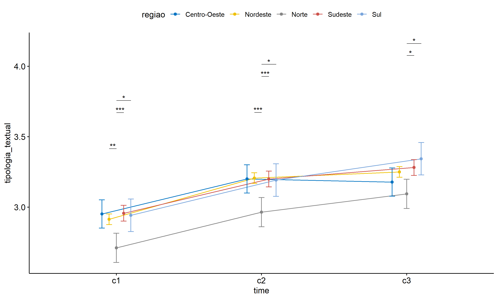<!-- -->

``` r
(pwc <- ldat %>% group_by(regiao) %>%
    emmeans_test(tipologia_textual ~ time, detailed = T, p.adjust.method = "bonferroni"))
```

    ## # A tibble: 15 × 15
    ##    regiao term  .y.   group1 group2 null.value estimate     se    df conf.low conf.high statistic        p    p.adj p.adj.signif
    ##  * <fct>  <chr> <chr> <chr>  <chr>       <dbl>    <dbl>  <dbl> <dbl>    <dbl>     <dbl>     <dbl>    <dbl>    <dbl> <chr>       
    ##  1 Centr… time  tipo… c1     c2              0  -0.248  0.0724  8304  -0.390   -0.107      -3.43  5.98e- 4 1.79e- 3 **          
    ##  2 Centr… time  tipo… c1     c3              0  -0.227  0.0724  8304  -0.369   -0.0850     -3.14  1.72e- 3 5.17e- 3 **          
    ##  3 Centr… time  tipo… c2     c3              0   0.0216 0.0724  8304  -0.120    0.163       0.299 7.65e- 1 1   e+ 0 ns          
    ##  4 Norde… time  tipo… c1     c2              0  -0.292  0.0275  8304  -0.346   -0.238     -10.6   2.91e-26 8.73e-26 ****        
    ##  5 Norde… time  tipo… c1     c3              0  -0.336  0.0275  8304  -0.390   -0.282     -12.2   4.46e-34 1.34e-33 ****        
    ##  6 Norde… time  tipo… c2     c3              0  -0.0436 0.0275  8304  -0.0974   0.0103     -1.59  1.13e- 1 3.38e- 1 ns          
    ##  7 Norte  time  tipo… c1     c2              0  -0.253  0.0748  8304  -0.400   -0.106      -3.38  7.28e- 4 2.18e- 3 **          
    ##  8 Norte  time  tipo… c1     c3              0  -0.383  0.0748  8304  -0.530   -0.236      -5.12  3.18e- 7 9.53e- 7 ****        
    ##  9 Norte  time  tipo… c2     c3              0  -0.130  0.0748  8304  -0.277    0.0167     -1.74  8.24e- 2 2.47e- 1 ns          
    ## 10 Sudes… time  tipo… c1     c2              0  -0.243  0.0404  8304  -0.322   -0.164      -6.01  1.89e- 9 5.68e- 9 ****        
    ## 11 Sudes… time  tipo… c1     c3              0  -0.325  0.0404  8304  -0.404   -0.246      -8.04  1.02e-15 3.05e-15 ****        
    ## 12 Sudes… time  tipo… c2     c3              0  -0.0819 0.0404  8304  -0.161   -0.00271    -2.03  4.27e- 2 1.28e- 1 ns          
    ## 13 Sul    time  tipo… c1     c2              0  -0.250  0.0833  8304  -0.413   -0.0867     -3.00  2.69e- 3 8.08e- 3 **          
    ## 14 Sul    time  tipo… c1     c3              0  -0.402  0.0833  8304  -0.565   -0.239      -4.82  1.43e- 6 4.28e- 6 ****        
    ## 15 Sul    time  tipo… c2     c3              0  -0.152  0.0833  8304  -0.315    0.0114     -1.82  6.83e- 2 2.05e- 1 ns

| regiao       | term | .y.               | group1 | group2 | null.value | estimate |    se |   df | conf.low | conf.high | statistic |     p | p.adj | p.adj.signif |
|:-------------|:-----|:------------------|:-------|:-------|-----------:|---------:|------:|-----:|---------:|----------:|----------:|------:|------:|:-------------|
| Centro-Oeste | time | tipologia_textual | c1     | c2     |          0 |   -0.248 | 0.072 | 8304 |   -0.390 |    -0.107 |    -3.434 | 0.001 | 0.002 | \*\*         |
| Centro-Oeste | time | tipologia_textual | c1     | c3     |          0 |   -0.227 | 0.072 | 8304 |   -0.369 |    -0.085 |    -3.135 | 0.002 | 0.005 | \*\*         |
| Centro-Oeste | time | tipologia_textual | c2     | c3     |          0 |    0.022 | 0.072 | 8304 |   -0.120 |     0.163 |     0.299 | 0.765 | 1.000 | ns           |
| Nordeste     | time | tipologia_textual | c1     | c2     |          0 |   -0.292 | 0.027 | 8304 |   -0.346 |    -0.238 |   -10.639 | 0.000 | 0.000 | \*\*\*\*     |
| Nordeste     | time | tipologia_textual | c1     | c3     |          0 |   -0.336 | 0.027 | 8304 |   -0.390 |    -0.282 |   -12.225 | 0.000 | 0.000 | \*\*\*\*     |
| Nordeste     | time | tipologia_textual | c2     | c3     |          0 |   -0.044 | 0.027 | 8304 |   -0.097 |     0.010 |    -1.587 | 0.113 | 0.338 | ns           |
| Norte        | time | tipologia_textual | c1     | c2     |          0 |   -0.253 | 0.075 | 8304 |   -0.400 |    -0.106 |    -3.380 | 0.001 | 0.002 | \*\*         |
| Norte        | time | tipologia_textual | c1     | c3     |          0 |   -0.383 | 0.075 | 8304 |   -0.530 |    -0.236 |    -5.117 | 0.000 | 0.000 | \*\*\*\*     |
| Norte        | time | tipologia_textual | c2     | c3     |          0 |   -0.130 | 0.075 | 8304 |   -0.277 |     0.017 |    -1.737 | 0.082 | 0.247 | ns           |
| Sudeste      | time | tipologia_textual | c1     | c2     |          0 |   -0.243 | 0.040 | 8304 |   -0.322 |    -0.164 |    -6.013 | 0.000 | 0.000 | \*\*\*\*     |
| Sudeste      | time | tipologia_textual | c1     | c3     |          0 |   -0.325 | 0.040 | 8304 |   -0.404 |    -0.246 |    -8.041 | 0.000 | 0.000 | \*\*\*\*     |
| Sudeste      | time | tipologia_textual | c2     | c3     |          0 |   -0.082 | 0.040 | 8304 |   -0.161 |    -0.003 |    -2.027 | 0.043 | 0.128 | ns           |
| Sul          | time | tipologia_textual | c1     | c2     |          0 |   -0.250 | 0.083 | 8304 |   -0.413 |    -0.087 |    -3.002 | 0.003 | 0.008 | \*\*         |
| Sul          | time | tipologia_textual | c1     | c3     |          0 |   -0.402 | 0.083 | 8304 |   -0.565 |    -0.239 |    -4.825 | 0.000 | 0.000 | \*\*\*\*     |
| Sul          | time | tipologia_textual | c2     | c3     |          0 |   -0.152 | 0.083 | 8304 |   -0.315 |     0.011 |    -1.823 | 0.068 | 0.205 | ns           |

``` r
(emms <- get_emmeans(pwc))
```

    ## # A tibble: 15 × 8
    ##    regiao       time  emmean     se    df conf.low conf.high method      
    ##    <fct>        <fct>  <dbl>  <dbl> <dbl>    <dbl>     <dbl> <chr>       
    ##  1 Centro-Oeste c1      2.95 0.0512  8304     2.85      3.05 Emmeans test
    ##  2 Centro-Oeste c2      3.20 0.0512  8304     3.10      3.30 Emmeans test
    ##  3 Centro-Oeste c3      3.18 0.0512  8304     3.08      3.28 Emmeans test
    ##  4 Nordeste     c1      2.91 0.0194  8304     2.88      2.95 Emmeans test
    ##  5 Nordeste     c2      3.21 0.0194  8304     3.17      3.24 Emmeans test
    ##  6 Nordeste     c3      3.25 0.0194  8304     3.21      3.29 Emmeans test
    ##  7 Norte        c1      2.71 0.0529  8304     2.61      2.81 Emmeans test
    ##  8 Norte        c2      2.96 0.0529  8304     2.86      3.07 Emmeans test
    ##  9 Norte        c3      3.09 0.0529  8304     2.99      3.20 Emmeans test
    ## 10 Sudeste      c1      2.96 0.0286  8304     2.90      3.01 Emmeans test
    ## 11 Sudeste      c2      3.20 0.0286  8304     3.14      3.26 Emmeans test
    ## 12 Sudeste      c3      3.28 0.0286  8304     3.23      3.34 Emmeans test
    ## 13 Sul          c1      2.94 0.0589  8304     2.83      3.06 Emmeans test
    ## 14 Sul          c2      3.19 0.0589  8304     3.08      3.31 Emmeans test
    ## 15 Sul          c3      3.34 0.0589  8304     3.23      3.46 Emmeans test

| regiao       | time | emmean |    se |   df | conf.low | conf.high | method       |
|:-------------|:-----|-------:|------:|-----:|---------:|----------:|:-------------|
| Centro-Oeste | c1   |  2.951 | 0.051 | 8304 |    2.851 |     3.052 | Emmeans test |
| Centro-Oeste | c2   |  3.200 | 0.051 | 8304 |    3.100 |     3.300 | Emmeans test |
| Centro-Oeste | c3   |  3.178 | 0.051 | 8304 |    3.078 |     3.279 | Emmeans test |
| Nordeste     | c1   |  2.914 | 0.019 | 8304 |    2.876 |     2.952 | Emmeans test |
| Nordeste     | c2   |  3.206 | 0.019 | 8304 |    3.168 |     3.244 | Emmeans test |
| Nordeste     | c3   |  3.250 | 0.019 | 8304 |    3.212 |     3.288 | Emmeans test |
| Norte        | c1   |  2.711 | 0.053 | 8304 |    2.608 |     2.815 | Emmeans test |
| Norte        | c2   |  2.964 | 0.053 | 8304 |    2.860 |     3.068 | Emmeans test |
| Norte        | c3   |  3.094 | 0.053 | 8304 |    2.990 |     3.198 | Emmeans test |
| Sudeste      | c1   |  2.957 | 0.029 | 8304 |    2.901 |     3.013 | Emmeans test |
| Sudeste      | c2   |  3.199 | 0.029 | 8304 |    3.144 |     3.255 | Emmeans test |
| Sudeste      | c3   |  3.281 | 0.029 | 8304 |    3.225 |     3.337 | Emmeans test |
| Sul          | c1   |  2.942 | 0.059 | 8304 |    2.826 |     3.057 | Emmeans test |
| Sul          | c2   |  3.192 | 0.059 | 8304 |    3.076 |     3.307 | Emmeans test |
| Sul          | c3   |  3.344 | 0.059 | 8304 |    3.228 |     3.459 | Emmeans test |

``` r
emms.gg <- emms[which(emms$regiao == "Centro-Oeste"),]
if (nrow(emms.gg) > 0)
  ggline(emms.gg, x = "time", y = "emmean", color = "#0073C2FF", ylab = "tipologia_textual") +
    geom_errorbar(aes(ymin = conf.low, ymax = conf.high),
                  width = 0.2, color = "#0073C2FF") +
    stat_pvalue_manual(
      add_xy_position(pwc[which(pwc$regiao == "Centro-Oeste"),],
                      x = "time", fun = "mean_se"),
      hide.ns = T, color = "#0073C2FF", tip.length = F) +
    labs(title = "regiao: Centro-Oeste")+
    theme(legend.text = element_blank())
```

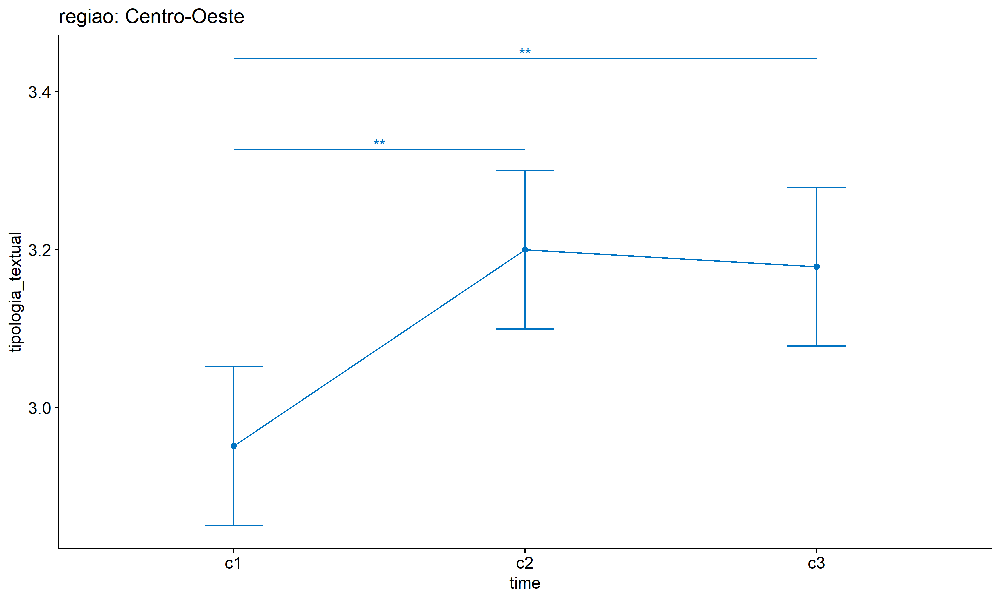<!-- -->

``` r
emms.gg <- emms[which(emms$regiao == "Nordeste"),]
if (nrow(emms.gg) > 0)
  ggline(emms.gg, x = "time", y = "emmean", color = "#EFC000FF", ylab = "tipologia_textual") +
    geom_errorbar(aes(ymin = conf.low, ymax = conf.high),
                  width = 0.2, color = "#EFC000FF") +
    stat_pvalue_manual(
      add_xy_position(pwc[which(pwc$regiao == "Nordeste"),],
                      x = "time", fun = "mean_se"),
      hide.ns = T, color = "#EFC000FF", tip.length = F) +
    labs(title = "regiao: Nordeste")+
    theme(legend.text = element_blank())
```

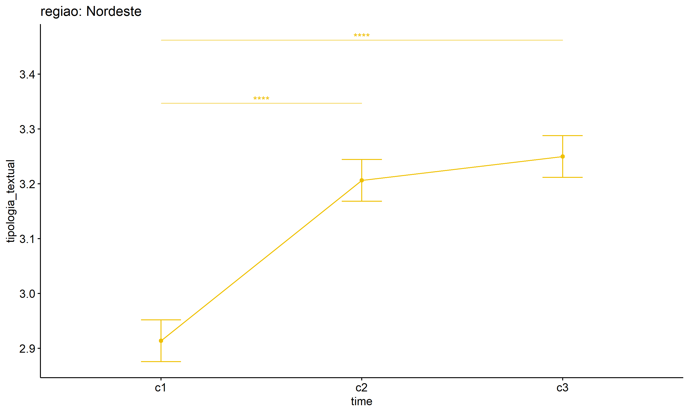<!-- -->

``` r
emms.gg <- emms[which(emms$regiao == "Norte"),]
if (nrow(emms.gg) > 0)
  ggline(emms.gg, x = "time", y = "emmean", color = "#868686FF", ylab = "tipologia_textual") +
    geom_errorbar(aes(ymin = conf.low, ymax = conf.high),
                  width = 0.2, color = "#868686FF") +
    stat_pvalue_manual(
      add_xy_position(pwc[which(pwc$regiao == "Norte"),],
                      x = "time", fun = "mean_se"),
      hide.ns = T, color = "#868686FF", tip.length = F) +
    labs(title = "regiao: Norte")+
    theme(legend.text = element_blank())
```

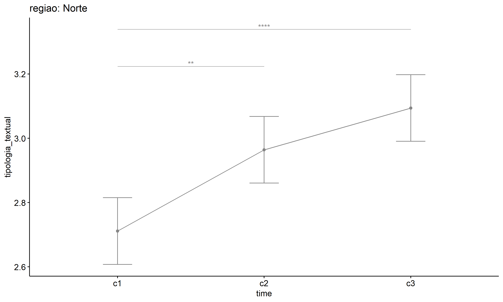<!-- -->

``` r
emms.gg <- emms[which(emms$regiao == "Sudeste"),]
if (nrow(emms.gg) > 0)
  ggline(emms.gg, x = "time", y = "emmean", color = "#CD534CFF", ylab = "tipologia_textual") +
    geom_errorbar(aes(ymin = conf.low, ymax = conf.high),
                  width = 0.2, color = "#CD534CFF") +
    stat_pvalue_manual(
      add_xy_position(pwc[which(pwc$regiao == "Sudeste"),],
                      x = "time", fun = "mean_se"),
      hide.ns = T, color = "#CD534CFF", tip.length = F) +
    labs(title = "regiao: Sudeste")+
    theme(legend.text = element_blank())
```

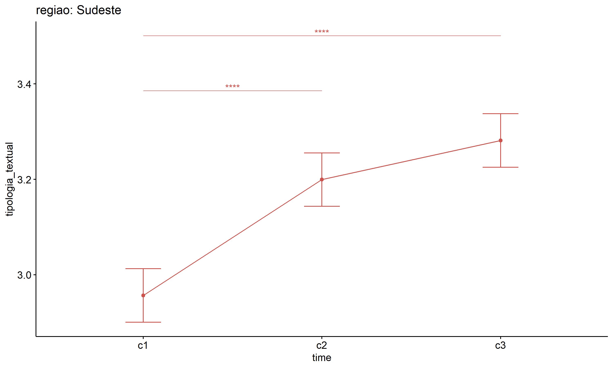<!-- -->

``` r
emms.gg <- emms[which(emms$regiao == "Sul"),]
if (nrow(emms.gg) > 0)
  ggline(emms.gg, x = "time", y = "emmean", color = "#7AA6DCFF", ylab = "tipologia_textual") +
    geom_errorbar(aes(ymin = conf.low, ymax = conf.high),
                  width = 0.2, color = "#7AA6DCFF") +
    stat_pvalue_manual(
      add_xy_position(pwc[which(pwc$regiao == "Sul"),],
                      x = "time", fun = "mean_se"),
      hide.ns = T, color = "#7AA6DCFF", tip.length = F) +
    labs(title = "regiao: Sul")+
    theme(legend.text = element_blank())
```

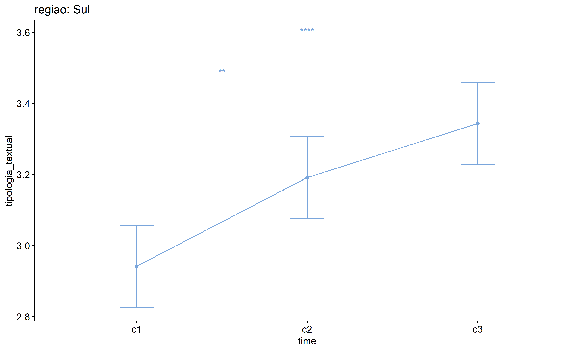<!-- -->

## PairWise Computation after removing non.normal data

``` r
if (length(non.ids) > 0)
  (pwc2 <- ldat2 %>% group_by(time) %>%
     emmeans_test(tipologia_textual ~ regiao, detailed = T, p.adjust.method = "bonferroni"))
```

``` r
if (length(non.ids) > 0)
  (emms2 <- get_emmeans(pwc2))
```

``` r
if (length(non.ids) > 0) {
  pwc2 <- add_xy_position(pwc2, x = "time", fun = "mean_se", dodge = 0.25)
  pd2 <- position_dodge(width = 0.25)
  
  ggline(emms2, x = "time", y = "emmean", color = "regiao",
         palette = c("#0073C2FF","#EFC000FF","#868686FF","#CD534CFF","#7AA6DCFF"),
         position = pd, ylab = "tipologia_textual") +
    geom_errorbar(aes(ymin = conf.low, ymax = conf.high, color = regiao),
                position = pd, width = 0.2) +
    stat_pvalue_manual(pwc2, hide.ns = T, tip.length = F, linetype = 1)
}
```

``` r
if (length(non.ids) > 0)
  (pwc2 <- ldat2 %>% group_by(regiao) %>%
     emmeans_test(tipologia_textual ~ time, detailed = T, p.adjust.method = "bonferroni"))
```

``` r
if (length(non.ids) > 0)
  (emms2 <- get_emmeans(pwc2))
```

``` r
if (length(non.ids) > 0) {
  emms.gg <- emms2[which(emms2$regiao == "Centro-Oeste"),]
  if (nrow(emms.gg) > 0)
    ggline(emms.gg, x = "time", y = "emmean", color = "#0073C2FF", ylab = "tipologia_textual") +
    geom_errorbar(aes(ymin = conf.low, ymax = conf.high),
                  width = 0.2, color = "#0073C2FF") +
    stat_pvalue_manual(
      add_xy_position(pwc[which(pwc$regiao == "Centro-Oeste"),],
                      x = "time", fun = "mean_se"),
      hide.ns = T, color = "#0073C2FF", tip.length = F) +
    labs(title = "regiao: Centro-Oeste") +
    theme(legend.text = element_blank())
}
```

``` r
if (length(non.ids) > 0) {
  emms.gg <- emms2[which(emms2$regiao == "Nordeste"),]
  if (nrow(emms.gg) > 0)
    ggline(emms.gg, x = "time", y = "emmean", color = "#EFC000FF", ylab = "tipologia_textual") +
    geom_errorbar(aes(ymin = conf.low, ymax = conf.high),
                  width = 0.2, color = "#EFC000FF") +
    stat_pvalue_manual(
      add_xy_position(pwc[which(pwc$regiao == "Nordeste"),],
                      x = "time", fun = "mean_se"),
      hide.ns = T, color = "#EFC000FF", tip.length = F) +
    labs(title = "regiao: Nordeste") +
    theme(legend.text = element_blank())
}
```

``` r
if (length(non.ids) > 0) {
  emms.gg <- emms2[which(emms2$regiao == "Norte"),]
  if (nrow(emms.gg) > 0)
    ggline(emms.gg, x = "time", y = "emmean", color = "#868686FF", ylab = "tipologia_textual") +
    geom_errorbar(aes(ymin = conf.low, ymax = conf.high),
                  width = 0.2, color = "#868686FF") +
    stat_pvalue_manual(
      add_xy_position(pwc[which(pwc$regiao == "Norte"),],
                      x = "time", fun = "mean_se"),
      hide.ns = T, color = "#868686FF", tip.length = F) +
    labs(title = "regiao: Norte") +
    theme(legend.text = element_blank())
}
```

``` r
if (length(non.ids) > 0) {
  emms.gg <- emms2[which(emms2$regiao == "Sudeste"),]
  if (nrow(emms.gg) > 0)
    ggline(emms.gg, x = "time", y = "emmean", color = "#CD534CFF", ylab = "tipologia_textual") +
    geom_errorbar(aes(ymin = conf.low, ymax = conf.high),
                  width = 0.2, color = "#CD534CFF") +
    stat_pvalue_manual(
      add_xy_position(pwc[which(pwc$regiao == "Sudeste"),],
                      x = "time", fun = "mean_se"),
      hide.ns = T, color = "#CD534CFF", tip.length = F) +
    labs(title = "regiao: Sudeste") +
    theme(legend.text = element_blank())
}
```

``` r
if (length(non.ids) > 0) {
  emms.gg <- emms2[which(emms2$regiao == "Sul"),]
  if (nrow(emms.gg) > 0)
    ggline(emms.gg, x = "time", y = "emmean", color = "#7AA6DCFF", ylab = "tipologia_textual") +
    geom_errorbar(aes(ymin = conf.low, ymax = conf.high),
                  width = 0.2, color = "#7AA6DCFF") +
    stat_pvalue_manual(
      add_xy_position(pwc[which(pwc$regiao == "Sul"),],
                      x = "time", fun = "mean_se"),
      hide.ns = T, color = "#7AA6DCFF", tip.length = F) +
    labs(title = "regiao: Sul") +
    theme(legend.text = element_blank())
}
```

# ANOVA: tipologia_textual ~ time\*porte + Error(id/time)

## Data Preparation

``` r
data <- edat[,c("aluno_id","porte","ciclo","tipologia_textual")]
data <- data[data$ciclo %in% c("Primeiro Ciclo","Segundo Ciclo","Terceiro Ciclo"),]
data$ciclo <- factor(data$ciclo, c("Primeiro Ciclo","Segundo Ciclo","Terceiro Ciclo"))
data <- unique(data)

wdat <- spread(data, ciclo, tipologia_textual)
wdat <- wdat[complete.cases(wdat),]
colnames(wdat) <- c("id","porte","c1","c2","c3")

ldat <- gather(wdat, key = time, value = tipologia_textual, c1,c2,c3) %>%
  convert_as_factor(id, time)
ldat <- remove_group_data(ldat, "tipologia_textual", c("time", "porte"), n.limit = 30)
ldat$porte <- factor(ldat$porte, sort(unique(ldat$porte)))
```

### Check assumptions: Identifying Outliers

``` r
outliers <- identify_outliers(group_by(ldat, time, porte), tipologia_textual)
(outliers <- outliers[outliers$is.extreme == T,])
```

    ## [1] porte             time              id                tipologia_textual is.outlier        is.extreme       
    ## <0 rows> (or 0-length row.names)

| porte | time | id  | tipologia_textual | is.outlier | is.extreme |
|:------|:-----|:----|------------------:|:-----------|:-----------|

### Check assumptions: Normality Test

``` r
(normality.df <- normality.test.per.groups(ldat, "tipologia_textual", c("time", "porte")))
```

    ##                  var          variable time                                        porte    n    skewness   kurtosis symmetry
    ## 1  tipologia_textual tipologia_textual   c1           Até 50 matrículas de escolarização   83 -0.24067226 -1.2139545      YES
    ## 2  tipologia_textual tipologia_textual   c1  Entre 201 e 500 matrículas de escolarização 1529  0.12438470 -1.3025678      YES
    ## 3  tipologia_textual tipologia_textual   c1 Entre 501 e 1000 matrículas de escolarização  618  0.05833388 -1.3212758      YES
    ## 4  tipologia_textual tipologia_textual   c1   Entre 51 e 200 matrículas de escolarização  473  0.23979331 -1.3263416      YES
    ## 5  tipologia_textual tipologia_textual   c1     Mais de 1000 matrículas de escolarização   70 -0.01882965 -1.5224739      YES
    ## 6  tipologia_textual tipologia_textual   c2           Até 50 matrículas de escolarização   83 -0.46737656 -1.2070847      YES
    ## 7  tipologia_textual tipologia_textual   c2  Entre 201 e 500 matrículas de escolarização 1529 -0.31164810 -1.2680548      YES
    ## 8  tipologia_textual tipologia_textual   c2 Entre 501 e 1000 matrículas de escolarização  618 -0.36404368 -1.2873685      YES
    ## 9  tipologia_textual tipologia_textual   c2   Entre 51 e 200 matrículas de escolarização  473 -0.36502895 -1.3693146      YES
    ## 10 tipologia_textual tipologia_textual   c2     Mais de 1000 matrículas de escolarização   70 -0.51864570 -1.4141512       NO
    ## 11 tipologia_textual tipologia_textual   c3           Até 50 matrículas de escolarização   83 -0.62643742 -0.9939617       NO
    ## 12 tipologia_textual tipologia_textual   c3  Entre 201 e 500 matrículas de escolarização 1529 -0.41580852 -1.1305859      YES
    ## 13 tipologia_textual tipologia_textual   c3 Entre 501 e 1000 matrículas de escolarização  618 -0.61207912 -1.0432664       NO
    ## 14 tipologia_textual tipologia_textual   c3   Entre 51 e 200 matrículas de escolarização  473 -0.46268719 -1.2978199      YES
    ## 15 tipologia_textual tipologia_textual   c3     Mais de 1000 matrículas de escolarização   70 -0.05157811 -1.7952092      YES
    ##     statistic     method                  p p.signif normality
    ## 1    23.22490 D'Agostino 0.0000090526921537     ****        NO
    ## 2  3917.84570 D'Agostino 0.0000000000000000     ****         -
    ## 3  1329.69993 D'Agostino 0.0000000000000000     ****         -
    ## 4   897.82027 D'Agostino 0.0000000000000000     ****         -
    ## 5    76.47897 D'Agostino 0.0000000000000000     ****        NO
    ## 6    24.95947 D'Agostino 0.0000038029489974     ****        NO
    ## 7  2344.30724 D'Agostino 0.0000000000000000     ****         -
    ## 8   869.66893 D'Agostino 0.0000000000000000     ****         -
    ## 9  1931.76458 D'Agostino 0.0000000000000000     ****         -
    ## 10   45.37804 D'Agostino 0.0000000001400505     ****        NO
    ## 11   14.26682 D'Agostino 0.0007979930066833      ***        NO
    ## 12  744.25751 D'Agostino 0.0000000000000000     ****         -
    ## 13  187.09009 D'Agostino 0.0000000000000000     ****         -
    ## 14  651.54610 D'Agostino 0.0000000000000000     ****         -
    ## 15 1870.51246 D'Agostino 0.0000000000000000     ****        NO

| var               | variable          | time | porte                                        |    n | skewness | kurtosis | symmetry | statistic | method     |     p | p.signif | normality |
|:------------------|:------------------|:-----|:---------------------------------------------|-----:|---------:|---------:|:---------|----------:|:-----------|------:|:---------|:----------|
| tipologia_textual | tipologia_textual | c1   | Até 50 matrículas de escolarização           |   83 |   -0.241 |   -1.214 | YES      |    23.225 | D’Agostino | 0.000 | \*\*\*\* | NO        |
| tipologia_textual | tipologia_textual | c1   | Entre 201 e 500 matrículas de escolarização  | 1529 |    0.124 |   -1.303 | YES      |  3917.846 | D’Agostino | 0.000 | \*\*\*\* | \-        |
| tipologia_textual | tipologia_textual | c1   | Entre 501 e 1000 matrículas de escolarização |  618 |    0.058 |   -1.321 | YES      |  1329.700 | D’Agostino | 0.000 | \*\*\*\* | \-        |
| tipologia_textual | tipologia_textual | c1   | Entre 51 e 200 matrículas de escolarização   |  473 |    0.240 |   -1.326 | YES      |   897.820 | D’Agostino | 0.000 | \*\*\*\* | \-        |
| tipologia_textual | tipologia_textual | c1   | Mais de 1000 matrículas de escolarização     |   70 |   -0.019 |   -1.522 | YES      |    76.479 | D’Agostino | 0.000 | \*\*\*\* | NO        |
| tipologia_textual | tipologia_textual | c2   | Até 50 matrículas de escolarização           |   83 |   -0.467 |   -1.207 | YES      |    24.959 | D’Agostino | 0.000 | \*\*\*\* | NO        |
| tipologia_textual | tipologia_textual | c2   | Entre 201 e 500 matrículas de escolarização  | 1529 |   -0.312 |   -1.268 | YES      |  2344.307 | D’Agostino | 0.000 | \*\*\*\* | \-        |
| tipologia_textual | tipologia_textual | c2   | Entre 501 e 1000 matrículas de escolarização |  618 |   -0.364 |   -1.287 | YES      |   869.669 | D’Agostino | 0.000 | \*\*\*\* | \-        |
| tipologia_textual | tipologia_textual | c2   | Entre 51 e 200 matrículas de escolarização   |  473 |   -0.365 |   -1.369 | YES      |  1931.765 | D’Agostino | 0.000 | \*\*\*\* | \-        |
| tipologia_textual | tipologia_textual | c2   | Mais de 1000 matrículas de escolarização     |   70 |   -0.519 |   -1.414 | NO       |    45.378 | D’Agostino | 0.000 | \*\*\*\* | NO        |
| tipologia_textual | tipologia_textual | c3   | Até 50 matrículas de escolarização           |   83 |   -0.626 |   -0.994 | NO       |    14.267 | D’Agostino | 0.001 | \*\*\*   | NO        |
| tipologia_textual | tipologia_textual | c3   | Entre 201 e 500 matrículas de escolarização  | 1529 |   -0.416 |   -1.131 | YES      |   744.258 | D’Agostino | 0.000 | \*\*\*\* | \-        |
| tipologia_textual | tipologia_textual | c3   | Entre 501 e 1000 matrículas de escolarização |  618 |   -0.612 |   -1.043 | NO       |   187.090 | D’Agostino | 0.000 | \*\*\*\* | \-        |
| tipologia_textual | tipologia_textual | c3   | Entre 51 e 200 matrículas de escolarização   |  473 |   -0.463 |   -1.298 | YES      |   651.546 | D’Agostino | 0.000 | \*\*\*\* | \-        |
| tipologia_textual | tipologia_textual | c3   | Mais de 1000 matrículas de escolarização     |   70 |   -0.052 |   -1.795 | YES      |  1870.512 | D’Agostino | 0.000 | \*\*\*\* | NO        |

``` r
(non.ids <- unique(do.call(
  c, lapply(which(normality.df$normality == 'NO'), FUN = function(i) {
  idx = which(ldat$time == normality.df$time[i] &
                ldat$porte == normality.df$porte[i])
  getNonNormal(ldat$"tipologia_textual"[idx], ldat$id[idx])
}))))
```

    ##   [1] "ZG9XMMLDSBGcLPgDh0pb" "0bDRQAUpq62jJm9vcptp" "ADdqL4oAf1WRDDiOJwkj" "vgyELVyPKZx09yEhXnEW" "aONYcyIz9jdWo9UGBKG0"
    ##   [6] "UgYoK4SY4Mtbi2xic7Rv" "tgU0kaZP9pRnxah0S6uy" "T2uwQcqrdXIilUfr6OCA" "Bf6X3bHfDcJsJ9YdyqJH" "d7fkDImOtMuiednMD3E1"
    ##  [11] "i84ihNmDZFogrHoxo3Im" "ygCWEOBsngyfEt5hGLmw" "YYk7kVbKPFXpi3VNYSOH" "1DlydHhFt2IkhBETPR4s" "YUmfeTL6DDynUZSxTKc3"
    ##  [16] "2eTy4XnB3HL1Lip3fbQn" "8J6zVzXwczhDoIz6ZH9H" "y744fkAaj9kAhrO7WEmG" "C1zjWQ3pmwKkP6zRXwwe" "X8sa3nNhiwDUJH6wF7Ha"
    ##  [21] "fbG1AkJFlVZGXT8Fznxj" "UkMXrk8JLJryPIlwTUa2" "FPMFe1s9iSBxoJXvsTAR" "HSX3YOtyIg0ZOh76zqlN" "uB4uyNIZ6LxFYhb9JhLg"
    ##  [26] "nZWlEakTBujRX1QWHj37" "twslhfIr8UZf4GsZbRoY" "OULhcpjSyljgpMZP22Ar" "OyqOutO5F9qOBjOC8hjG" "sm3UUkWTyL97enxw2JbY"
    ##  [31] "nKMTyMsfm4eOVhncYSKR" "kZlm8iMhlqv4fNmAx0fG" "pJbc9u9ZPKVj4ttAwF9y" "pqXkPZEqOMf2xM8dbV6d" "kFTP8a3fnEqe2CzUIbPt"
    ##  [36] "Kb2dP0jiNWmYejxfbhLa" "RVaGBDw53Pq5sv8Rv3f1" "iyJp1j8H7ijZjVKqhnpU" "I519hq7xEO1Hoh2ibKjC" "SC3MjpxyURHXOGZUgVSZ"
    ##  [41] "hzUS30DyaGMI0MoQIp0n" "sPlCk5k5bGSTg4uIsOGE" "Zd0PsCueY8uUv5kZj7tr" "Y3XBjvabRWZddSn1PBSa" "xq4dYP59DlllbZEPXy4Y"
    ##  [46] "wzpfVmENuwkQHmrYv7Vs" "wmMgYtTDXMi7lGWVukYs" "V98ktNWyqK4ADAVVpxer" "TLeQnhQ2DIQj5KoUID1J" "z0H60Zv5mbFaxB0nRZS9"
    ##  [51] "YFJYxK0iPG5KhhI763RV" "w1UKSuycUulqH56YxN5l" "2rhshpLTwB8n26xWIGLY" "ucifu1IbqUXkNcZenoiF" "sTippTVv5SmFwvxR2sfF"
    ##  [56] "SoGp0lIq4pc911ctmbB1" "6uO7HtHYJP6LkaXhdG2j" "ScTMK6tLs91Uic7qY4rP" "NuWkLkYYRuA125qcnk4r" "NGCQanKdT1it8UlBNgmW"
    ##  [61] "Nd63Mjq1veJlg4HVTjuL" "i3TcORTWUFCvTPk4psJY" "Aar1QFPu6EAVyD9BDnA3" "kxDlIW2yUzDrEogK8TaZ" "ijRxNrSrW0oX4pjrOD7X"
    ##  [66] "HM6lELrDJUQlU8CLhlxB" "zpmhcXzEeOxKL6kXYe02" "z2bvFgOm1tRPAL3buvNQ" "yersdkzgN1t3oO7zNNNA" "xPKsXOtiZGS6KJVc4KT3"
    ##  [71] "xK8qTeI9z4KzyJVqLhM8" "xAo0TzCEx1bIrmjqKgbj" "wqLc84Q7Y7B988JtGyXd" "tlnYYlL4uNGaw9gq7z02" "8QJX5P6FygYXzjqA5njF"
    ##  [76] "sNrMxxYCTthTxBfrZZuD" "PdGP3GVwxljvKeW07xkS" "nFCWCX4KlAfWmHKc43rd" "MvrXfUanbVWpI0EsMTR6" "MdfO8FPiIZis82vN8Qvn"
    ##  [81] "ltYX0dLBB2brT2djXB5i" "BFW9EcP6GxS4r3JYDkkn" "LQwlHt8gNJ5CtCYBWgCr" "kxdgoHtp7sPis1wwXN9e" "hv8yuaYbgJIx5H3apsBZ"
    ##  [86] "hPDFOwmBzlak2RcrNhzR" "hhm3dmBw9wzrZNM837xU" "9k9BI8mCq3fddmKjDwxN" "Cpw7toBsqavz223WZOD6" "NYutDluJkRSft54Q6Dsk"
    ##  [91] "i0dLtUz8nm5JgjV0jkAL" "M7T19VXht72RWQicQ4oB" "M2Ym0tMeXAO21tD9is8t" "gdYDn3FmbtplSEE6Ttms" "EoSBVqfBw7krU0Sy514T"
    ##  [96] "doi9DyLKXwHMkMGgBLyY" "anmGFIGq40zqZcqOEcal" "AANHvkEfT5JbfSUOPRXs" "8SQzDjxkh749gTXUJN73" "w7548cNc0knlzDezHzBq"
    ## [101] "QlXsQ3d9CVjdZHyW2pLC" "xLpKyTYqyZhy4OOTSCAv" "QEFho4YwQCAlMwhIddNB" "mbcncvg5dOFa9ZRsRhZf" "L0gX2yfP95da5eDy6w4E"
    ## [106] "krjfBBPR9DydnBgQSQ1n" "iutpBZMAtM92qcbyCDHB" "ZHNhk1zpmerLG8ISdloo" "VNQYsv3kH0OTOqJH3yYT" "CiV1upa4BM58OvTZsu01"
    ## [111] "nrctDKnNeBPAy3FWmN34" "bnhrGtK2gNr4ms56nqKJ"

``` r
if (length(non.ids) > 0)
  ldat2 <- ldat[!ldat$id %in% non.ids,]
```

### Summary Statistics

``` r
(sdat <- ldat %>% group_by(time, porte) %>%
   get_summary_stats(tipologia_textual, type = "mean_sd"))
```

    ## # A tibble: 15 × 6
    ##    porte                                        time  variable              n  mean    sd
    ##    <fct>                                        <fct> <fct>             <dbl> <dbl> <dbl>
    ##  1 Até 50 matrículas de escolarização           c1    tipologia_textual    83  3.09 0.716
    ##  2 Entre 201 e 500 matrículas de escolarização  c1    tipologia_textual  1529  2.92 0.741
    ##  3 Entre 501 e 1000 matrículas de escolarização c1    tipologia_textual   618  2.93 0.737
    ##  4 Entre 51 e 200 matrículas de escolarização   c1    tipologia_textual   473  2.84 0.749
    ##  5 Mais de 1000 matrículas de escolarização     c1    tipologia_textual    70  2.99 0.801
    ##  6 Até 50 matrículas de escolarização           c2    tipologia_textual    83  3.26 0.754
    ##  7 Entre 201 e 500 matrículas de escolarização  c2    tipologia_textual  1529  3.18 0.753
    ##  8 Entre 501 e 1000 matrículas de escolarização c2    tipologia_textual   618  3.19 0.767
    ##  9 Entre 51 e 200 matrículas de escolarização   c2    tipologia_textual   473  3.18 0.793
    ## 10 Mais de 1000 matrículas de escolarização     c2    tipologia_textual    70  3.26 0.842
    ## 11 Até 50 matrículas de escolarização           c3    tipologia_textual    83  3.35 0.727
    ## 12 Entre 201 e 500 matrículas de escolarização  c3    tipologia_textual  1529  3.22 0.733
    ## 13 Entre 501 e 1000 matrículas de escolarização c3    tipologia_textual   618  3.32 0.753
    ## 14 Entre 51 e 200 matrículas de escolarização   c3    tipologia_textual   473  3.24 0.785
    ## 15 Mais de 1000 matrículas de escolarização     c3    tipologia_textual    70  3.04 0.892

| porte                                        | time | variable          |    n |  mean |    sd |
|:---------------------------------------------|:-----|:------------------|-----:|------:|------:|
| Até 50 matrículas de escolarização           | c1   | tipologia_textual |   83 | 3.090 | 0.716 |
| Entre 201 e 500 matrículas de escolarização  | c1   | tipologia_textual | 1529 | 2.918 | 0.741 |
| Entre 501 e 1000 matrículas de escolarização | c1   | tipologia_textual |  618 | 2.929 | 0.737 |
| Entre 51 e 200 matrículas de escolarização   | c1   | tipologia_textual |  473 | 2.841 | 0.749 |
| Mais de 1000 matrículas de escolarização     | c1   | tipologia_textual |   70 | 2.993 | 0.801 |
| Até 50 matrículas de escolarização           | c2   | tipologia_textual |   83 | 3.265 | 0.754 |
| Entre 201 e 500 matrículas de escolarização  | c2   | tipologia_textual | 1529 | 3.177 | 0.753 |
| Entre 501 e 1000 matrículas de escolarização | c2   | tipologia_textual |  618 | 3.189 | 0.767 |
| Entre 51 e 200 matrículas de escolarização   | c2   | tipologia_textual |  473 | 3.184 | 0.793 |
| Mais de 1000 matrículas de escolarização     | c2   | tipologia_textual |   70 | 3.257 | 0.842 |
| Até 50 matrículas de escolarização           | c3   | tipologia_textual |   83 | 3.349 | 0.727 |
| Entre 201 e 500 matrículas de escolarização  | c3   | tipologia_textual | 1529 | 3.224 | 0.733 |
| Entre 501 e 1000 matrículas de escolarização | c3   | tipologia_textual |  618 | 3.315 | 0.753 |
| Entre 51 e 200 matrículas de escolarização   | c3   | tipologia_textual |  473 | 3.241 | 0.785 |
| Mais de 1000 matrículas de escolarização     | c3   | tipologia_textual |   70 | 3.043 | 0.892 |

``` r
if (length(non.ids) > 0)
  (sdat <- ldat2 %>% group_by(time, porte) %>%
      get_summary_stats(tipologia_textual, type = "mean_sd"))
```

    ## # A tibble: 15 × 6
    ##    porte                                        time  variable              n  mean     sd
    ##    <fct>                                        <fct> <fct>             <dbl> <dbl>  <dbl>
    ##  1 Até 50 matrículas de escolarização           c1    tipologia_textual    40  3.09  0.678
    ##  2 Entre 201 e 500 matrículas de escolarização  c1    tipologia_textual  1529  2.92  0.741
    ##  3 Entre 501 e 1000 matrículas de escolarização c1    tipologia_textual   618  2.93  0.737
    ##  4 Entre 51 e 200 matrículas de escolarização   c1    tipologia_textual   473  2.84  0.749
    ##  5 Mais de 1000 matrículas de escolarização     c1    tipologia_textual     1  3    NA    
    ##  6 Até 50 matrículas de escolarização           c2    tipologia_textual    40  3.15  0.7  
    ##  7 Entre 201 e 500 matrículas de escolarização  c2    tipologia_textual  1529  3.18  0.753
    ##  8 Entre 501 e 1000 matrículas de escolarização c2    tipologia_textual   618  3.19  0.767
    ##  9 Entre 51 e 200 matrículas de escolarização   c2    tipologia_textual   473  3.18  0.793
    ## 10 Mais de 1000 matrículas de escolarização     c2    tipologia_textual     1  4    NA    
    ## 11 Até 50 matrículas de escolarização           c3    tipologia_textual    40  3.16  0.644
    ## 12 Entre 201 e 500 matrículas de escolarização  c3    tipologia_textual  1529  3.22  0.733
    ## 13 Entre 501 e 1000 matrículas de escolarização c3    tipologia_textual   618  3.32  0.753
    ## 14 Entre 51 e 200 matrículas de escolarização   c3    tipologia_textual   473  3.24  0.785
    ## 15 Mais de 1000 matrículas de escolarização     c3    tipologia_textual     1  4    NA

| porte                                        | time | variable          |    n |  mean |    sd |
|:---------------------------------------------|:-----|:------------------|-----:|------:|------:|
| Até 50 matrículas de escolarização           | c1   | tipologia_textual |   40 | 3.087 | 0.678 |
| Entre 201 e 500 matrículas de escolarização  | c1   | tipologia_textual | 1529 | 2.918 | 0.741 |
| Entre 501 e 1000 matrículas de escolarização | c1   | tipologia_textual |  618 | 2.929 | 0.737 |
| Entre 51 e 200 matrículas de escolarização   | c1   | tipologia_textual |  473 | 2.841 | 0.749 |
| Mais de 1000 matrículas de escolarização     | c1   | tipologia_textual |    1 | 3.000 |    NA |
| Até 50 matrículas de escolarização           | c2   | tipologia_textual |   40 | 3.150 | 0.700 |
| Entre 201 e 500 matrículas de escolarização  | c2   | tipologia_textual | 1529 | 3.177 | 0.753 |
| Entre 501 e 1000 matrículas de escolarização | c2   | tipologia_textual |  618 | 3.189 | 0.767 |
| Entre 51 e 200 matrículas de escolarização   | c2   | tipologia_textual |  473 | 3.184 | 0.793 |
| Mais de 1000 matrículas de escolarização     | c2   | tipologia_textual |    1 | 4.000 |    NA |
| Até 50 matrículas de escolarização           | c3   | tipologia_textual |   40 | 3.163 | 0.644 |
| Entre 201 e 500 matrículas de escolarização  | c3   | tipologia_textual | 1529 | 3.224 | 0.733 |
| Entre 501 e 1000 matrículas de escolarização | c3   | tipologia_textual |  618 | 3.315 | 0.753 |
| Entre 51 e 200 matrículas de escolarização   | c3   | tipologia_textual |  473 | 3.241 | 0.785 |
| Mais de 1000 matrículas de escolarização     | c3   | tipologia_textual |    1 | 4.000 |    NA |

## ANOVA Computation

``` r
(res.aov <- anova_test(ldat, dv = tipologia_textual, wid = id, between = porte, within = time))
```

    ## ANOVA Table (type III tests)
    ## 
    ## $ANOVA
    ##       Effect DFn  DFd      F                       p p<.05   ges
    ## 1      porte   4 2768  2.114 0.075999999999999998113       0.001
    ## 2       time   2 5536 42.801 0.000000000000000000358     * 0.008
    ## 3 porte:time   8 5536  2.045 0.037999999999999999056     * 0.002
    ## 
    ## $`Mauchly's Test for Sphericity`
    ##       Effect     W     p p<.05
    ## 1       time 0.998 0.125      
    ## 2 porte:time 0.998 0.125      
    ## 
    ## $`Sphericity Corrections`
    ##       Effect   GGe       DF[GG]                   p[GG] p[GG]<.05   HFe        DF[HF]                   p[HF] p[HF]<.05
    ## 1       time 0.999    2, 5527.7 0.000000000000000000379         * 0.999    2, 5531.69 0.000000000000000000369         *
    ## 2 porte:time 0.999 7.99, 5527.7 0.037999999999999999056         * 0.999 7.99, 5531.69 0.037999999999999999056         *

| Effect     | DFn |  DFd |      F |     p | p\<.05 |   ges |
|:-----------|----:|-----:|-------:|------:|:-------|------:|
| porte      |   4 | 2768 |  2.114 | 0.076 |        | 0.001 |
| time       |   2 | 5536 | 42.801 | 0.000 | \*     | 0.008 |
| porte:time |   8 | 5536 |  2.045 | 0.038 | \*     | 0.002 |

| Effect     |     W |     p | p\<.05 |
|:-----------|------:|------:|:-------|
| time       | 0.998 | 0.125 |        |
| porte:time | 0.998 | 0.125 |        |

| Effect     |   GGe | DF\[GG\]     | p\[GG\] | p\[GG\]\<.05 |   HFe | DF\[HF\]      | p\[HF\] | p\[HF\]\<.05 |
|:-----------|------:|:-------------|--------:|:-------------|------:|:--------------|--------:|:-------------|
| time       | 0.999 | 2, 5527.7    |   0.000 | \*           | 0.999 | 2, 5531.69    |   0.000 | \*           |
| porte:time | 0.999 | 7.99, 5527.7 |   0.038 | \*           | 0.999 | 7.99, 5531.69 |   0.038 | \*           |

## ANOVA Computation after removing non.normal data

``` r
if (length(non.ids) > 0)
  (res.aov2 <- anova_test(ldat2, dv = tipologia_textual, wid = id, between = porte , within = time))
```

    ## ANOVA Table (type III tests)
    ## 
    ## $ANOVA
    ##       Effect DFn  DFd     F     p p<.05      ges
    ## 1      porte   4 2656 1.239 0.292       0.000846
    ## 2       time   2 5312 2.969 0.051       0.000610
    ## 3 porte:time   8 5312 1.441 0.174       0.001000
    ## 
    ## $`Mauchly's Test for Sphericity`
    ##       Effect     W     p p<.05
    ## 1       time 0.998 0.097      
    ## 2 porte:time 0.998 0.097      
    ## 
    ## $`Sphericity Corrections`
    ##       Effect   GGe        DF[GG] p[GG] p[GG]<.05   HFe        DF[HF] p[HF] p[HF]<.05
    ## 1       time 0.998    2, 5302.71 0.052           0.999    2, 5306.69 0.052          
    ## 2 porte:time 0.998 7.99, 5302.71 0.174           0.999 7.99, 5306.69 0.174

| Effect     | DFn |  DFd |     F |     p | p\<.05 |   ges |
|:-----------|----:|-----:|------:|------:|:-------|------:|
| porte      |   4 | 2656 | 1.239 | 0.292 |        | 0.001 |
| time       |   2 | 5312 | 2.969 | 0.051 |        | 0.001 |
| porte:time |   8 | 5312 | 1.441 | 0.174 |        | 0.001 |

| Effect     |     W |     p | p\<.05 |
|:-----------|------:|------:|:-------|
| time       | 0.998 | 0.097 |        |
| porte:time | 0.998 | 0.097 |        |

| Effect     |   GGe | DF\[GG\]      | p\[GG\] | p\[GG\]\<.05 |   HFe | DF\[HF\]      | p\[HF\] | p\[HF\]\<.05 |
|:-----------|------:|:--------------|--------:|:-------------|------:|:--------------|--------:|:-------------|
| time       | 0.998 | 2, 5302.71    |   0.052 |              | 0.999 | 2, 5306.69    |   0.052 |              |
| porte:time | 0.998 | 7.99, 5302.71 |   0.174 |              | 0.999 | 7.99, 5306.69 |   0.174 |              |

## PairWise Computation

``` r
(pwc <- ldat %>% group_by(time) %>%
   emmeans_test(tipologia_textual ~ porte, detailed = T, p.adjust.method = "bonferroni"))
```

    ## # A tibble: 30 × 15
    ##    time  term  .y.       group1 group2 null.value estimate     se    df conf.low conf.high statistic       p  p.adj p.adj.signif
    ##  * <fct> <chr> <chr>     <chr>  <chr>       <dbl>    <dbl>  <dbl> <dbl>    <dbl>     <dbl>     <dbl>   <dbl>  <dbl> <chr>       
    ##  1 c1    porte tipologi… Até 5… Entre…          0   0.172  0.0849  8304  0.00611    0.339      2.03  0.0422  0.422  ns          
    ##  2 c1    porte tipologi… Até 5… Entre…          0   0.162  0.0880  8304 -0.0110     0.334      1.84  0.0665  0.665  ns          
    ##  3 c1    porte tipologi… Até 5… Entre…          0   0.249  0.0896  8304  0.0732     0.425      2.78  0.00549 0.0549 ns          
    ##  4 c1    porte tipologi… Até 5… Mais …          0   0.0975 0.122   8304 -0.142      0.337      0.798 0.425   1      ns          
    ##  5 c1    porte tipologi… Entre… Entre…          0  -0.0109 0.0359  8304 -0.0813     0.0594    -0.305 0.761   1      ns          
    ##  6 c1    porte tipologi… Entre… Entre…          0   0.0764 0.0396  8304 -0.00124    0.154      1.93  0.0538  0.538  ns          
    ##  7 c1    porte tipologi… Entre… Mais …          0  -0.0750 0.0921  8304 -0.255      0.105     -0.815 0.415   1      ns          
    ##  8 c1    porte tipologi… Entre… Entre…          0   0.0874 0.0460  8304 -0.00282    0.178      1.90  0.0576  0.576  ns          
    ##  9 c1    porte tipologi… Entre… Mais …          0  -0.0641 0.0950  8304 -0.250      0.122     -0.674 0.500   1      ns          
    ## 10 c1    porte tipologi… Entre… Mais …          0  -0.151  0.0964  8304 -0.340      0.0376    -1.57  0.116   1      ns          
    ## # ℹ 20 more rows

| time | term  | .y.               | group1                                       | group2                                       | null.value | estimate |    se |   df | conf.low | conf.high | statistic |     p | p.adj | p.adj.signif |
|:-----|:------|:------------------|:---------------------------------------------|:---------------------------------------------|-----------:|---------:|------:|-----:|---------:|----------:|----------:|------:|------:|:-------------|
| c1   | porte | tipologia_textual | Até 50 matrículas de escolarização           | Entre 201 e 500 matrículas de escolarização  |          0 |    0.172 | 0.085 | 8304 |    0.006 |     0.339 |     2.032 | 0.042 | 0.422 | ns           |
| c1   | porte | tipologia_textual | Até 50 matrículas de escolarização           | Entre 501 e 1000 matrículas de escolarização |          0 |    0.162 | 0.088 | 8304 |   -0.011 |     0.334 |     1.835 | 0.067 | 0.665 | ns           |
| c1   | porte | tipologia_textual | Até 50 matrículas de escolarização           | Entre 51 e 200 matrículas de escolarização   |          0 |    0.249 | 0.090 | 8304 |    0.073 |     0.425 |     2.777 | 0.005 | 0.055 | ns           |
| c1   | porte | tipologia_textual | Até 50 matrículas de escolarização           | Mais de 1000 matrículas de escolarização     |          0 |    0.098 | 0.122 | 8304 |   -0.142 |     0.337 |     0.798 | 0.425 | 1.000 | ns           |
| c1   | porte | tipologia_textual | Entre 201 e 500 matrículas de escolarização  | Entre 501 e 1000 matrículas de escolarização |          0 |   -0.011 | 0.036 | 8304 |   -0.081 |     0.059 |    -0.305 | 0.761 | 1.000 | ns           |
| c1   | porte | tipologia_textual | Entre 201 e 500 matrículas de escolarização  | Entre 51 e 200 matrículas de escolarização   |          0 |    0.076 | 0.040 | 8304 |   -0.001 |     0.154 |     1.929 | 0.054 | 0.538 | ns           |
| c1   | porte | tipologia_textual | Entre 201 e 500 matrículas de escolarização  | Mais de 1000 matrículas de escolarização     |          0 |   -0.075 | 0.092 | 8304 |   -0.255 |     0.105 |    -0.815 | 0.415 | 1.000 | ns           |
| c1   | porte | tipologia_textual | Entre 501 e 1000 matrículas de escolarização | Entre 51 e 200 matrículas de escolarização   |          0 |    0.087 | 0.046 | 8304 |   -0.003 |     0.178 |     1.899 | 0.058 | 0.576 | ns           |
| c1   | porte | tipologia_textual | Entre 501 e 1000 matrículas de escolarização | Mais de 1000 matrículas de escolarização     |          0 |   -0.064 | 0.095 | 8304 |   -0.250 |     0.122 |    -0.674 | 0.500 | 1.000 | ns           |
| c1   | porte | tipologia_textual | Entre 51 e 200 matrículas de escolarização   | Mais de 1000 matrículas de escolarização     |          0 |   -0.151 | 0.096 | 8304 |   -0.340 |     0.038 |    -1.570 | 0.116 | 1.000 | ns           |
| c2   | porte | tipologia_textual | Até 50 matrículas de escolarização           | Entre 201 e 500 matrículas de escolarização  |          0 |    0.088 | 0.085 | 8304 |   -0.078 |     0.255 |     1.040 | 0.298 | 1.000 | ns           |
| c2   | porte | tipologia_textual | Até 50 matrículas de escolarização           | Entre 501 e 1000 matrículas de escolarização |          0 |    0.076 | 0.088 | 8304 |   -0.096 |     0.249 |     0.866 | 0.386 | 1.000 | ns           |
| c2   | porte | tipologia_textual | Até 50 matrículas de escolarização           | Entre 51 e 200 matrículas de escolarização   |          0 |    0.081 | 0.090 | 8304 |   -0.095 |     0.256 |     0.899 | 0.369 | 1.000 | ns           |
| c2   | porte | tipologia_textual | Até 50 matrículas de escolarização           | Mais de 1000 matrículas de escolarização     |          0 |    0.008 | 0.122 | 8304 |   -0.232 |     0.247 |     0.065 | 0.948 | 1.000 | ns           |
| c2   | porte | tipologia_textual | Entre 201 e 500 matrículas de escolarização  | Entre 501 e 1000 matrículas de escolarização |          0 |   -0.012 | 0.036 | 8304 |   -0.082 |     0.058 |    -0.334 | 0.739 | 1.000 | ns           |
| c2   | porte | tipologia_textual | Entre 201 e 500 matrículas de escolarização  | Entre 51 e 200 matrículas de escolarização   |          0 |   -0.008 | 0.040 | 8304 |   -0.085 |     0.070 |    -0.193 | 0.847 | 1.000 | ns           |
| c2   | porte | tipologia_textual | Entre 201 e 500 matrículas de escolarização  | Mais de 1000 matrículas de escolarização     |          0 |   -0.080 | 0.092 | 8304 |   -0.261 |     0.100 |    -0.873 | 0.383 | 1.000 | ns           |
| c2   | porte | tipologia_textual | Entre 501 e 1000 matrículas de escolarização | Entre 51 e 200 matrículas de escolarização   |          0 |    0.004 | 0.046 | 8304 |   -0.086 |     0.095 |     0.094 | 0.925 | 1.000 | ns           |
| c2   | porte | tipologia_textual | Entre 501 e 1000 matrículas de escolarização | Mais de 1000 matrículas de escolarização     |          0 |   -0.068 | 0.095 | 8304 |   -0.255 |     0.118 |    -0.720 | 0.472 | 1.000 | ns           |
| c2   | porte | tipologia_textual | Entre 51 e 200 matrículas de escolarização   | Mais de 1000 matrículas de escolarização     |          0 |   -0.073 | 0.096 | 8304 |   -0.262 |     0.116 |    -0.754 | 0.451 | 1.000 | ns           |
| c3   | porte | tipologia_textual | Até 50 matrículas de escolarização           | Entre 201 e 500 matrículas de escolarização  |          0 |    0.126 | 0.085 | 8304 |   -0.041 |     0.292 |     1.480 | 0.139 | 1.000 | ns           |
| c3   | porte | tipologia_textual | Até 50 matrículas de escolarização           | Entre 501 e 1000 matrículas de escolarização |          0 |    0.035 | 0.088 | 8304 |   -0.138 |     0.207 |     0.394 | 0.694 | 1.000 | ns           |
| c3   | porte | tipologia_textual | Até 50 matrículas de escolarização           | Entre 51 e 200 matrículas de escolarização   |          0 |    0.108 | 0.090 | 8304 |   -0.067 |     0.284 |     1.209 | 0.227 | 1.000 | ns           |
| c3   | porte | tipologia_textual | Até 50 matrículas de escolarização           | Mais de 1000 matrículas de escolarização     |          0 |    0.307 | 0.122 | 8304 |    0.067 |     0.546 |     2.508 | 0.012 | 0.122 | ns           |
| c3   | porte | tipologia_textual | Entre 201 e 500 matrículas de escolarização  | Entre 501 e 1000 matrículas de escolarização |          0 |   -0.091 | 0.036 | 8304 |   -0.161 |    -0.021 |    -2.533 | 0.011 | 0.113 | ns           |
| c3   | porte | tipologia_textual | Entre 201 e 500 matrículas de escolarização  | Entre 51 e 200 matrículas de escolarização   |          0 |   -0.017 | 0.040 | 8304 |   -0.095 |     0.060 |    -0.435 | 0.664 | 1.000 | ns           |
| c3   | porte | tipologia_textual | Entre 201 e 500 matrículas de escolarização  | Mais de 1000 matrículas de escolarização     |          0 |    0.181 | 0.092 | 8304 |    0.000 |     0.361 |     1.966 | 0.049 | 0.494 | ns           |
| c3   | porte | tipologia_textual | Entre 501 e 1000 matrículas de escolarização | Entre 51 e 200 matrículas de escolarização   |          0 |    0.074 | 0.046 | 8304 |   -0.016 |     0.164 |     1.602 | 0.109 | 1.000 | ns           |
| c3   | porte | tipologia_textual | Entre 501 e 1000 matrículas de escolarização | Mais de 1000 matrículas de escolarização     |          0 |    0.272 | 0.095 | 8304 |    0.086 |     0.458 |     2.863 | 0.004 | 0.042 | \*           |
| c3   | porte | tipologia_textual | Entre 51 e 200 matrículas de escolarização   | Mais de 1000 matrículas de escolarização     |          0 |    0.198 | 0.096 | 8304 |    0.009 |     0.387 |     2.055 | 0.040 | 0.399 | ns           |

``` r
(emms <- get_emmeans(pwc))
```

    ## # A tibble: 15 × 8
    ##    time  porte                                        emmean     se    df conf.low conf.high method      
    ##    <fct> <fct>                                         <dbl>  <dbl> <dbl>    <dbl>     <dbl> <chr>       
    ##  1 c1    Até 50 matrículas de escolarização             3.09 0.0827  8304     2.93      3.25 Emmeans test
    ##  2 c1    Entre 201 e 500 matrículas de escolarização    2.92 0.0193  8304     2.88      2.96 Emmeans test
    ##  3 c1    Entre 501 e 1000 matrículas de escolarização   2.93 0.0303  8304     2.87      2.99 Emmeans test
    ##  4 c1    Entre 51 e 200 matrículas de escolarização     2.84 0.0346  8304     2.77      2.91 Emmeans test
    ##  5 c1    Mais de 1000 matrículas de escolarização       2.99 0.0900  8304     2.82      3.17 Emmeans test
    ##  6 c2    Até 50 matrículas de escolarização             3.27 0.0827  8304     3.10      3.43 Emmeans test
    ##  7 c2    Entre 201 e 500 matrículas de escolarização    3.18 0.0193  8304     3.14      3.21 Emmeans test
    ##  8 c2    Entre 501 e 1000 matrículas de escolarização   3.19 0.0303  8304     3.13      3.25 Emmeans test
    ##  9 c2    Entre 51 e 200 matrículas de escolarização     3.18 0.0346  8304     3.12      3.25 Emmeans test
    ## 10 c2    Mais de 1000 matrículas de escolarização       3.26 0.0900  8304     3.08      3.43 Emmeans test
    ## 11 c3    Até 50 matrículas de escolarização             3.35 0.0827  8304     3.19      3.51 Emmeans test
    ## 12 c3    Entre 201 e 500 matrículas de escolarização    3.22 0.0193  8304     3.19      3.26 Emmeans test
    ## 13 c3    Entre 501 e 1000 matrículas de escolarização   3.31 0.0303  8304     3.26      3.37 Emmeans test
    ## 14 c3    Entre 51 e 200 matrículas de escolarização     3.24 0.0346  8304     3.17      3.31 Emmeans test
    ## 15 c3    Mais de 1000 matrículas de escolarização       3.04 0.0900  8304     2.87      3.22 Emmeans test

| time | porte                                        | emmean |    se |   df | conf.low | conf.high | method       |
|:-----|:---------------------------------------------|-------:|------:|-----:|---------:|----------:|:-------------|
| c1   | Até 50 matrículas de escolarização           |  3.090 | 0.083 | 8304 |    2.928 |     3.252 | Emmeans test |
| c1   | Entre 201 e 500 matrículas de escolarização  |  2.918 | 0.019 | 8304 |    2.880 |     2.956 | Emmeans test |
| c1   | Entre 501 e 1000 matrículas de escolarização |  2.929 | 0.030 | 8304 |    2.869 |     2.988 | Emmeans test |
| c1   | Entre 51 e 200 matrículas de escolarização   |  2.841 | 0.035 | 8304 |    2.774 |     2.909 | Emmeans test |
| c1   | Mais de 1000 matrículas de escolarização     |  2.993 | 0.090 | 8304 |    2.816 |     3.169 | Emmeans test |
| c2   | Até 50 matrículas de escolarização           |  3.265 | 0.083 | 8304 |    3.103 |     3.427 | Emmeans test |
| c2   | Entre 201 e 500 matrículas de escolarização  |  3.177 | 0.019 | 8304 |    3.139 |     3.215 | Emmeans test |
| c2   | Entre 501 e 1000 matrículas de escolarização |  3.189 | 0.030 | 8304 |    3.129 |     3.248 | Emmeans test |
| c2   | Entre 51 e 200 matrículas de escolarização   |  3.184 | 0.035 | 8304 |    3.117 |     3.252 | Emmeans test |
| c2   | Mais de 1000 matrículas de escolarização     |  3.257 | 0.090 | 8304 |    3.081 |     3.434 | Emmeans test |
| c3   | Até 50 matrículas de escolarização           |  3.349 | 0.083 | 8304 |    3.187 |     3.511 | Emmeans test |
| c3   | Entre 201 e 500 matrículas de escolarização  |  3.224 | 0.019 | 8304 |    3.186 |     3.262 | Emmeans test |
| c3   | Entre 501 e 1000 matrículas de escolarização |  3.315 | 0.030 | 8304 |    3.255 |     3.374 | Emmeans test |
| c3   | Entre 51 e 200 matrículas de escolarização   |  3.241 | 0.035 | 8304 |    3.173 |     3.309 | Emmeans test |
| c3   | Mais de 1000 matrículas de escolarização     |  3.043 | 0.090 | 8304 |    2.866 |     3.219 | Emmeans test |

``` r
pwc <- add_xy_position(pwc, x = "time", fun = "mean_se", dodge = 0.25)
pd <- position_dodge(width = 0.25)
ggline(emms, x = "time", y = "emmean", color = "porte",
       palette = c("#0073C2FF","#EFC000FF","#868686FF","#CD534CFF","#7AA6DCFF"),
       position = pd, ylab = "tipologia_textual") +
  geom_errorbar(aes(ymin = conf.low, ymax = conf.high, color = porte),
                position = pd, width = 0.2) +
  stat_pvalue_manual(pwc, hide.ns = T, tip.length = F, linetype = 1)
```

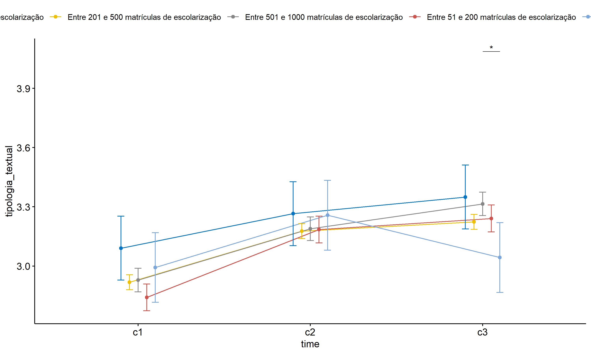<!-- -->

``` r
(pwc <- ldat %>% group_by(porte) %>%
    emmeans_test(tipologia_textual ~ time, detailed = T, p.adjust.method = "bonferroni"))
```

    ## # A tibble: 15 × 15
    ##    porte  term  .y.   group1 group2 null.value estimate     se    df conf.low conf.high statistic        p    p.adj p.adj.signif
    ##  * <fct>  <chr> <chr> <chr>  <chr>       <dbl>    <dbl>  <dbl> <dbl>    <dbl>     <dbl>     <dbl>    <dbl>    <dbl> <chr>       
    ##  1 Até 5… time  tipo… c1     c2              0  -0.175  0.117   8304  -0.404    0.0545     -1.49  1.35e- 1 4.05e- 1 ns          
    ##  2 Até 5… time  tipo… c1     c3              0  -0.259  0.117   8304  -0.488   -0.0299     -2.22  2.67e- 2 8.02e- 2 ns          
    ##  3 Até 5… time  tipo… c2     c3              0  -0.0843 0.117   8304  -0.313    0.145      -0.721 4.71e- 1 1   e+ 0 ns          
    ##  4 Entre… time  tipo… c1     c2              0  -0.259  0.0272  8304  -0.312   -0.206      -9.51  2.52e-21 7.57e-21 ****        
    ##  5 Entre… time  tipo… c1     c3              0  -0.306  0.0272  8304  -0.359   -0.253     -11.2   4.62e-29 1.39e-28 ****        
    ##  6 Entre… time  tipo… c2     c3              0  -0.0470 0.0272  8304  -0.100    0.00641    -1.72  8.46e- 2 2.54e- 1 ns          
    ##  7 Entre… time  tipo… c1     c2              0  -0.260  0.0428  8304  -0.344   -0.176      -6.07  1.35e- 9 4.05e- 9 ****        
    ##  8 Entre… time  tipo… c1     c3              0  -0.386  0.0428  8304  -0.470   -0.302      -9.01  2.57e-19 7.71e-19 ****        
    ##  9 Entre… time  tipo… c2     c3              0  -0.126  0.0428  8304  -0.210   -0.0420     -2.94  3.29e- 3 9.88e- 3 **          
    ## 10 Entre… time  tipo… c1     c2              0  -0.343  0.0490  8304  -0.439   -0.247      -7.00  2.67e-12 8.01e-12 ****        
    ## 11 Entre… time  tipo… c1     c3              0  -0.400  0.0490  8304  -0.496   -0.304      -8.16  3.86e-16 1.16e-15 ****        
    ## 12 Entre… time  tipo… c2     c3              0  -0.0566 0.0490  8304  -0.153    0.0394     -1.15  2.48e- 1 7.45e- 1 ns          
    ## 13 Mais … time  tipo… c1     c2              0  -0.264  0.127   8304  -0.514   -0.0148     -2.08  3.79e- 2 1.14e- 1 ns          
    ## 14 Mais … time  tipo… c1     c3              0  -0.0500 0.127   8304  -0.300    0.200      -0.393 6.94e- 1 1   e+ 0 ns          
    ## 15 Mais … time  tipo… c2     c3              0   0.214  0.127   8304  -0.0352   0.464       1.68  9.23e- 2 2.77e- 1 ns

| porte                                        | term | .y.               | group1 | group2 | null.value | estimate |    se |   df | conf.low | conf.high | statistic |     p | p.adj | p.adj.signif |
|:---------------------------------------------|:-----|:------------------|:-------|:-------|-----------:|---------:|------:|-----:|---------:|----------:|----------:|------:|------:|:-------------|
| Até 50 matrículas de escolarização           | time | tipologia_textual | c1     | c2     |          0 |   -0.175 | 0.117 | 8304 |   -0.404 |     0.054 |    -1.494 | 0.135 | 0.405 | ns           |
| Até 50 matrículas de escolarização           | time | tipologia_textual | c1     | c3     |          0 |   -0.259 | 0.117 | 8304 |   -0.488 |    -0.030 |    -2.216 | 0.027 | 0.080 | ns           |
| Até 50 matrículas de escolarização           | time | tipologia_textual | c2     | c3     |          0 |   -0.084 | 0.117 | 8304 |   -0.313 |     0.145 |    -0.721 | 0.471 | 1.000 | ns           |
| Entre 201 e 500 matrículas de escolarização  | time | tipologia_textual | c1     | c2     |          0 |   -0.259 | 0.027 | 8304 |   -0.312 |    -0.206 |    -9.507 | 0.000 | 0.000 | \*\*\*\*     |
| Entre 201 e 500 matrículas de escolarização  | time | tipologia_textual | c1     | c3     |          0 |   -0.306 | 0.027 | 8304 |   -0.359 |    -0.253 |   -11.232 | 0.000 | 0.000 | \*\*\*\*     |
| Entre 201 e 500 matrículas de escolarização  | time | tipologia_textual | c2     | c3     |          0 |   -0.047 | 0.027 | 8304 |   -0.100 |     0.006 |    -1.725 | 0.085 | 0.254 | ns           |
| Entre 501 e 1000 matrículas de escolarização | time | tipologia_textual | c1     | c2     |          0 |   -0.260 | 0.043 | 8304 |   -0.344 |    -0.176 |    -6.068 | 0.000 | 0.000 | \*\*\*\*     |
| Entre 501 e 1000 matrículas de escolarização | time | tipologia_textual | c1     | c3     |          0 |   -0.386 | 0.043 | 8304 |   -0.470 |    -0.302 |    -9.008 | 0.000 | 0.000 | \*\*\*\*     |
| Entre 501 e 1000 matrículas de escolarização | time | tipologia_textual | c2     | c3     |          0 |   -0.126 | 0.043 | 8304 |   -0.210 |    -0.042 |    -2.940 | 0.003 | 0.010 | \*\*         |
| Entre 51 e 200 matrículas de escolarização   | time | tipologia_textual | c1     | c2     |          0 |   -0.343 | 0.049 | 8304 |   -0.439 |    -0.247 |    -7.005 | 0.000 | 0.000 | \*\*\*\*     |
| Entre 51 e 200 matrículas de escolarização   | time | tipologia_textual | c1     | c3     |          0 |   -0.400 | 0.049 | 8304 |   -0.496 |    -0.304 |    -8.160 | 0.000 | 0.000 | \*\*\*\*     |
| Entre 51 e 200 matrículas de escolarização   | time | tipologia_textual | c2     | c3     |          0 |   -0.057 | 0.049 | 8304 |   -0.153 |     0.039 |    -1.155 | 0.248 | 0.745 | ns           |
| Mais de 1000 matrículas de escolarização     | time | tipologia_textual | c1     | c2     |          0 |   -0.264 | 0.127 | 8304 |   -0.514 |    -0.015 |    -2.076 | 0.038 | 0.114 | ns           |
| Mais de 1000 matrículas de escolarização     | time | tipologia_textual | c1     | c3     |          0 |   -0.050 | 0.127 | 8304 |   -0.300 |     0.200 |    -0.393 | 0.694 | 1.000 | ns           |
| Mais de 1000 matrículas de escolarização     | time | tipologia_textual | c2     | c3     |          0 |    0.214 | 0.127 | 8304 |   -0.035 |     0.464 |     1.683 | 0.092 | 0.277 | ns           |

``` r
(emms <- get_emmeans(pwc))
```

    ## # A tibble: 15 × 8
    ##    porte                                        time  emmean     se    df conf.low conf.high method      
    ##    <fct>                                        <fct>  <dbl>  <dbl> <dbl>    <dbl>     <dbl> <chr>       
    ##  1 Até 50 matrículas de escolarização           c1      3.09 0.0827  8304     2.93      3.25 Emmeans test
    ##  2 Até 50 matrículas de escolarização           c2      3.27 0.0827  8304     3.10      3.43 Emmeans test
    ##  3 Até 50 matrículas de escolarização           c3      3.35 0.0827  8304     3.19      3.51 Emmeans test
    ##  4 Entre 201 e 500 matrículas de escolarização  c1      2.92 0.0193  8304     2.88      2.96 Emmeans test
    ##  5 Entre 201 e 500 matrículas de escolarização  c2      3.18 0.0193  8304     3.14      3.21 Emmeans test
    ##  6 Entre 201 e 500 matrículas de escolarização  c3      3.22 0.0193  8304     3.19      3.26 Emmeans test
    ##  7 Entre 501 e 1000 matrículas de escolarização c1      2.93 0.0303  8304     2.87      2.99 Emmeans test
    ##  8 Entre 501 e 1000 matrículas de escolarização c2      3.19 0.0303  8304     3.13      3.25 Emmeans test
    ##  9 Entre 501 e 1000 matrículas de escolarização c3      3.31 0.0303  8304     3.26      3.37 Emmeans test
    ## 10 Entre 51 e 200 matrículas de escolarização   c1      2.84 0.0346  8304     2.77      2.91 Emmeans test
    ## 11 Entre 51 e 200 matrículas de escolarização   c2      3.18 0.0346  8304     3.12      3.25 Emmeans test
    ## 12 Entre 51 e 200 matrículas de escolarização   c3      3.24 0.0346  8304     3.17      3.31 Emmeans test
    ## 13 Mais de 1000 matrículas de escolarização     c1      2.99 0.0900  8304     2.82      3.17 Emmeans test
    ## 14 Mais de 1000 matrículas de escolarização     c2      3.26 0.0900  8304     3.08      3.43 Emmeans test
    ## 15 Mais de 1000 matrículas de escolarização     c3      3.04 0.0900  8304     2.87      3.22 Emmeans test

| porte                                        | time | emmean |    se |   df | conf.low | conf.high | method       |
|:---------------------------------------------|:-----|-------:|------:|-----:|---------:|----------:|:-------------|
| Até 50 matrículas de escolarização           | c1   |  3.090 | 0.083 | 8304 |    2.928 |     3.252 | Emmeans test |
| Até 50 matrículas de escolarização           | c2   |  3.265 | 0.083 | 8304 |    3.103 |     3.427 | Emmeans test |
| Até 50 matrículas de escolarização           | c3   |  3.349 | 0.083 | 8304 |    3.187 |     3.511 | Emmeans test |
| Entre 201 e 500 matrículas de escolarização  | c1   |  2.918 | 0.019 | 8304 |    2.880 |     2.956 | Emmeans test |
| Entre 201 e 500 matrículas de escolarização  | c2   |  3.177 | 0.019 | 8304 |    3.139 |     3.215 | Emmeans test |
| Entre 201 e 500 matrículas de escolarização  | c3   |  3.224 | 0.019 | 8304 |    3.186 |     3.262 | Emmeans test |
| Entre 501 e 1000 matrículas de escolarização | c1   |  2.929 | 0.030 | 8304 |    2.869 |     2.988 | Emmeans test |
| Entre 501 e 1000 matrículas de escolarização | c2   |  3.189 | 0.030 | 8304 |    3.129 |     3.248 | Emmeans test |
| Entre 501 e 1000 matrículas de escolarização | c3   |  3.315 | 0.030 | 8304 |    3.255 |     3.374 | Emmeans test |
| Entre 51 e 200 matrículas de escolarização   | c1   |  2.841 | 0.035 | 8304 |    2.774 |     2.909 | Emmeans test |
| Entre 51 e 200 matrículas de escolarização   | c2   |  3.184 | 0.035 | 8304 |    3.117 |     3.252 | Emmeans test |
| Entre 51 e 200 matrículas de escolarização   | c3   |  3.241 | 0.035 | 8304 |    3.173 |     3.309 | Emmeans test |
| Mais de 1000 matrículas de escolarização     | c1   |  2.993 | 0.090 | 8304 |    2.816 |     3.169 | Emmeans test |
| Mais de 1000 matrículas de escolarização     | c2   |  3.257 | 0.090 | 8304 |    3.081 |     3.434 | Emmeans test |
| Mais de 1000 matrículas de escolarização     | c3   |  3.043 | 0.090 | 8304 |    2.866 |     3.219 | Emmeans test |

``` r
emms.gg <- emms[which(emms$porte == "Até 50 matrículas de escolarização"),]
if (nrow(emms.gg) > 0)
  ggline(emms.gg, x = "time", y = "emmean", color = "#0073C2FF", ylab = "tipologia_textual") +
    geom_errorbar(aes(ymin = conf.low, ymax = conf.high),
                  width = 0.2, color = "#0073C2FF") +
    stat_pvalue_manual(
      add_xy_position(pwc[which(pwc$porte == "Até 50 matrículas de escolarização"),],
                      x = "time", fun = "mean_se"),
      hide.ns = T, color = "#0073C2FF", tip.length = F) +
    labs(title = "porte: Até 50 matrículas de escolarização")+
    theme(legend.text = element_blank())
```

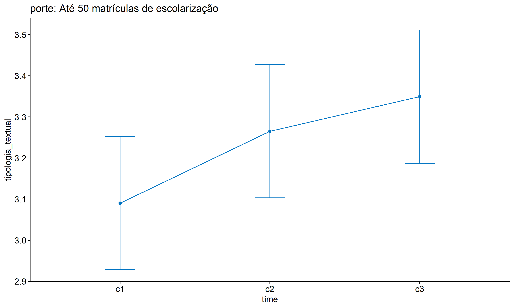<!-- -->

``` r
emms.gg <- emms[which(emms$porte == "Entre 201 e 500 matrículas de escolarização"),]
if (nrow(emms.gg) > 0)
  ggline(emms.gg, x = "time", y = "emmean", color = "#EFC000FF", ylab = "tipologia_textual") +
    geom_errorbar(aes(ymin = conf.low, ymax = conf.high),
                  width = 0.2, color = "#EFC000FF") +
    stat_pvalue_manual(
      add_xy_position(pwc[which(pwc$porte == "Entre 201 e 500 matrículas de escolarização"),],
                      x = "time", fun = "mean_se"),
      hide.ns = T, color = "#EFC000FF", tip.length = F) +
    labs(title = "porte: Entre 201 e 500 matrículas de escolarização")+
    theme(legend.text = element_blank())
```

<!-- -->

``` r
emms.gg <- emms[which(emms$porte == "Entre 501 e 1000 matrículas de escolarização"),]
if (nrow(emms.gg) > 0)
  ggline(emms.gg, x = "time", y = "emmean", color = "#868686FF", ylab = "tipologia_textual") +
    geom_errorbar(aes(ymin = conf.low, ymax = conf.high),
                  width = 0.2, color = "#868686FF") +
    stat_pvalue_manual(
      add_xy_position(pwc[which(pwc$porte == "Entre 501 e 1000 matrículas de escolarização"),],
                      x = "time", fun = "mean_se"),
      hide.ns = T, color = "#868686FF", tip.length = F) +
    labs(title = "porte: Entre 501 e 1000 matrículas de escolarização")+
    theme(legend.text = element_blank())
```

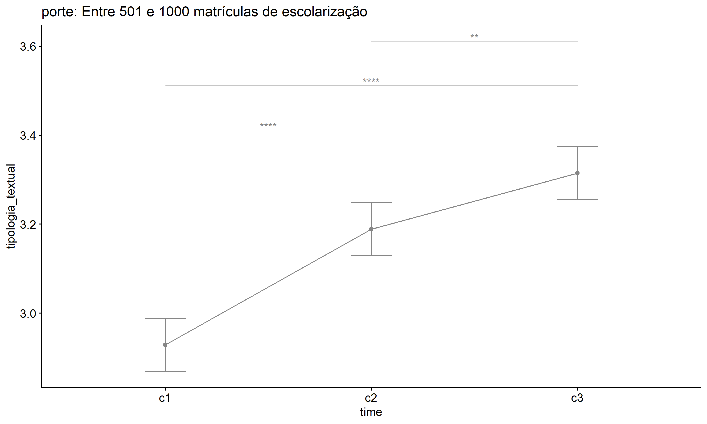<!-- -->

``` r
emms.gg <- emms[which(emms$porte == "Entre 51 e 200 matrículas de escolarização"),]
if (nrow(emms.gg) > 0)
  ggline(emms.gg, x = "time", y = "emmean", color = "#CD534CFF", ylab = "tipologia_textual") +
    geom_errorbar(aes(ymin = conf.low, ymax = conf.high),
                  width = 0.2, color = "#CD534CFF") +
    stat_pvalue_manual(
      add_xy_position(pwc[which(pwc$porte == "Entre 51 e 200 matrículas de escolarização"),],
                      x = "time", fun = "mean_se"),
      hide.ns = T, color = "#CD534CFF", tip.length = F) +
    labs(title = "porte: Entre 51 e 200 matrículas de escolarização")+
    theme(legend.text = element_blank())
```

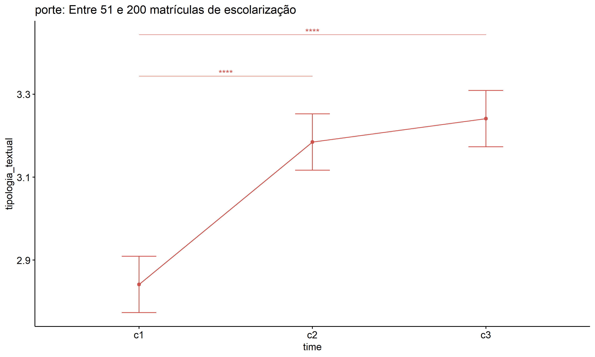<!-- -->

``` r
emms.gg <- emms[which(emms$porte == "Mais de 1000 matrículas de escolarização"),]
if (nrow(emms.gg) > 0)
  ggline(emms.gg, x = "time", y = "emmean", color = "#7AA6DCFF", ylab = "tipologia_textual") +
    geom_errorbar(aes(ymin = conf.low, ymax = conf.high),
                  width = 0.2, color = "#7AA6DCFF") +
    stat_pvalue_manual(
      add_xy_position(pwc[which(pwc$porte == "Mais de 1000 matrículas de escolarização"),],
                      x = "time", fun = "mean_se"),
      hide.ns = T, color = "#7AA6DCFF", tip.length = F) +
    labs(title = "porte: Mais de 1000 matrículas de escolarização")+
    theme(legend.text = element_blank())
```

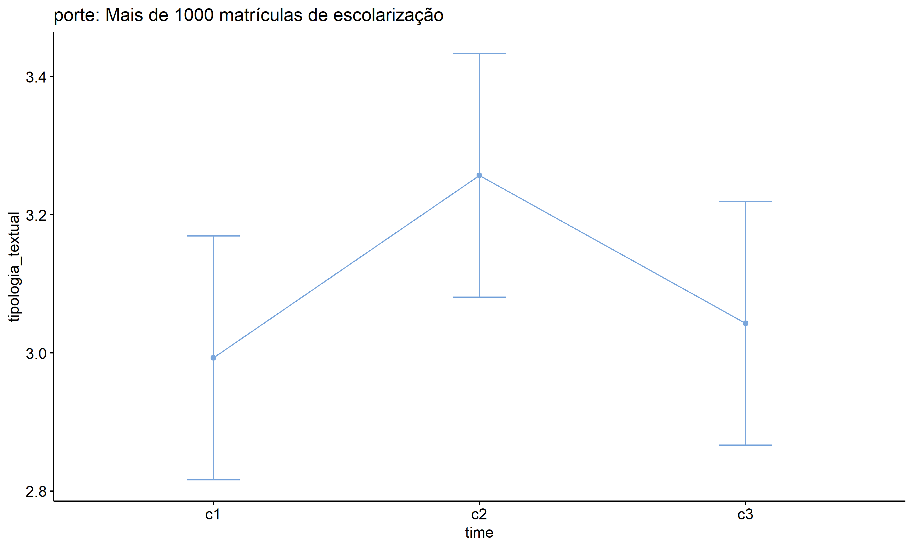<!-- -->

## PairWise Computation after removing non.normal data

``` r
if (length(non.ids) > 0)
  (pwc2 <- ldat2 %>% group_by(time) %>%
     emmeans_test(tipologia_textual ~ porte, detailed = T, p.adjust.method = "bonferroni"))
```

    ## # A tibble: 30 × 15
    ##    time  term  .y.         group1 group2 null.value estimate     se    df conf.low conf.high statistic      p p.adj p.adj.signif
    ##  * <fct> <chr> <chr>       <chr>  <chr>       <dbl>    <dbl>  <dbl> <dbl>    <dbl>     <dbl>     <dbl>  <dbl> <dbl> <chr>       
    ##  1 c1    porte tipologia_… Até 5… Entre…          0   0.170  0.120   7968 -6.59e-2    0.405     1.41   0.158  1     ns          
    ##  2 c1    porte tipologia_… Até 5… Entre…          0   0.159  0.122   7968 -8.12e-2    0.399     1.30   0.195  1     ns          
    ##  3 c1    porte tipologia_… Até 5… Entre…          0   0.246  0.124   7968  3.95e-3    0.488     1.99   0.0464 0.464 ns          
    ##  4 c1    porte tipologia_… Até 5… Mais …          0   0.0875 0.759   7968 -1.40e+0    1.58      0.115  0.908  1     ns          
    ##  5 c1    porte tipologia_… Entre… Entre…          0  -0.0109 0.0358  7968 -8.10e-2    0.0591   -0.306  0.760  1     ns          
    ##  6 c1    porte tipologia_… Entre… Entre…          0   0.0764 0.0395  7968 -9.31e-4    0.154     1.94   0.0528 0.528 ns          
    ##  7 c1    porte tipologia_… Entre… Mais …          0  -0.0821 0.750   7968 -1.55e+0    1.39     -0.109  0.913  1     ns          
    ##  8 c1    porte tipologia_… Entre… Entre…          0   0.0874 0.0458  7968 -2.46e-3    0.177     1.91   0.0566 0.566 ns          
    ##  9 c1    porte tipologia_… Entre… Mais …          0  -0.0712 0.751   7968 -1.54e+0    1.40     -0.0948 0.924  1     ns          
    ## 10 c1    porte tipologia_… Entre… Mais …          0  -0.159  0.751   7968 -1.63e+0    1.31     -0.211  0.833  1     ns          
    ## # ℹ 20 more rows

| time | term  | .y.               | group1                                       | group2                                       | null.value | estimate |    se |   df | conf.low | conf.high | statistic |     p | p.adj | p.adj.signif |
|:-----|:------|:------------------|:---------------------------------------------|:---------------------------------------------|-----------:|---------:|------:|-----:|---------:|----------:|----------:|------:|------:|:-------------|
| c1   | porte | tipologia_textual | Até 50 matrículas de escolarização           | Entre 201 e 500 matrículas de escolarização  |          0 |    0.170 | 0.120 | 7968 |   -0.066 |     0.405 |     1.412 | 0.158 | 1.000 | ns           |
| c1   | porte | tipologia_textual | Até 50 matrículas de escolarização           | Entre 501 e 1000 matrículas de escolarização |          0 |    0.159 | 0.122 | 7968 |   -0.081 |     0.399 |     1.297 | 0.195 | 1.000 | ns           |
| c1   | porte | tipologia_textual | Até 50 matrículas de escolarização           | Entre 51 e 200 matrículas de escolarização   |          0 |    0.246 | 0.124 | 7968 |    0.004 |     0.488 |     1.992 | 0.046 | 0.464 | ns           |
| c1   | porte | tipologia_textual | Até 50 matrículas de escolarização           | Mais de 1000 matrículas de escolarização     |          0 |    0.088 | 0.759 | 7968 |   -1.401 |     1.576 |     0.115 | 0.908 | 1.000 | ns           |
| c1   | porte | tipologia_textual | Entre 201 e 500 matrículas de escolarização  | Entre 501 e 1000 matrículas de escolarização |          0 |   -0.011 | 0.036 | 7968 |   -0.081 |     0.059 |    -0.306 | 0.760 | 1.000 | ns           |
| c1   | porte | tipologia_textual | Entre 201 e 500 matrículas de escolarização  | Entre 51 e 200 matrículas de escolarização   |          0 |    0.076 | 0.039 | 7968 |   -0.001 |     0.154 |     1.937 | 0.053 | 0.528 | ns           |
| c1   | porte | tipologia_textual | Entre 201 e 500 matrículas de escolarização  | Mais de 1000 matrículas de escolarização     |          0 |   -0.082 | 0.750 | 7968 |   -1.553 |     1.389 |    -0.109 | 0.913 | 1.000 | ns           |
| c1   | porte | tipologia_textual | Entre 501 e 1000 matrículas de escolarização | Entre 51 e 200 matrículas de escolarização   |          0 |    0.087 | 0.046 | 7968 |   -0.002 |     0.177 |     1.907 | 0.057 | 0.566 | ns           |
| c1   | porte | tipologia_textual | Entre 501 e 1000 matrículas de escolarização | Mais de 1000 matrículas de escolarização     |          0 |   -0.071 | 0.751 | 7968 |   -1.543 |     1.400 |    -0.095 | 0.924 | 1.000 | ns           |
| c1   | porte | tipologia_textual | Entre 51 e 200 matrículas de escolarização   | Mais de 1000 matrículas de escolarização     |          0 |   -0.159 | 0.751 | 7968 |   -1.630 |     1.313 |    -0.211 | 0.833 | 1.000 | ns           |
| c2   | porte | tipologia_textual | Até 50 matrículas de escolarização           | Entre 201 e 500 matrículas de escolarização  |          0 |   -0.027 | 0.120 | 7968 |   -0.262 |     0.209 |    -0.223 | 0.823 | 1.000 | ns           |
| c2   | porte | tipologia_textual | Até 50 matrículas de escolarização           | Entre 501 e 1000 matrículas de escolarização |          0 |   -0.039 | 0.122 | 7968 |   -0.279 |     0.201 |    -0.317 | 0.751 | 1.000 | ns           |
| c2   | porte | tipologia_textual | Até 50 matrículas de escolarização           | Entre 51 e 200 matrículas de escolarização   |          0 |   -0.034 | 0.124 | 7968 |   -0.277 |     0.208 |    -0.279 | 0.780 | 1.000 | ns           |
| c2   | porte | tipologia_textual | Até 50 matrículas de escolarização           | Mais de 1000 matrículas de escolarização     |          0 |   -0.850 | 0.759 | 7968 |   -2.339 |     0.639 |    -1.119 | 0.263 | 1.000 | ns           |
| c2   | porte | tipologia_textual | Entre 201 e 500 matrículas de escolarização  | Entre 501 e 1000 matrículas de escolarização |          0 |   -0.012 | 0.036 | 7968 |   -0.082 |     0.058 |    -0.335 | 0.738 | 1.000 | ns           |
| c2   | porte | tipologia_textual | Entre 201 e 500 matrículas de escolarização  | Entre 51 e 200 matrículas de escolarização   |          0 |   -0.008 | 0.039 | 7968 |   -0.085 |     0.070 |    -0.194 | 0.846 | 1.000 | ns           |
| c2   | porte | tipologia_textual | Entre 201 e 500 matrículas de escolarização  | Mais de 1000 matrículas de escolarização     |          0 |   -0.823 | 0.750 | 7968 |   -2.294 |     0.648 |    -1.097 | 0.273 | 1.000 | ns           |
| c2   | porte | tipologia_textual | Entre 501 e 1000 matrículas de escolarização | Entre 51 e 200 matrículas de escolarização   |          0 |    0.004 | 0.046 | 7968 |   -0.086 |     0.094 |     0.094 | 0.925 | 1.000 | ns           |
| c2   | porte | tipologia_textual | Entre 501 e 1000 matrículas de escolarização | Mais de 1000 matrículas de escolarização     |          0 |   -0.811 | 0.751 | 7968 |   -2.283 |     0.660 |    -1.081 | 0.280 | 1.000 | ns           |
| c2   | porte | tipologia_textual | Entre 51 e 200 matrículas de escolarização   | Mais de 1000 matrículas de escolarização     |          0 |   -0.816 | 0.751 | 7968 |   -2.287 |     0.656 |    -1.086 | 0.277 | 1.000 | ns           |
| c3   | porte | tipologia_textual | Até 50 matrículas de escolarização           | Entre 201 e 500 matrículas de escolarização  |          0 |   -0.061 | 0.120 | 7968 |   -0.297 |     0.174 |    -0.510 | 0.610 | 1.000 | ns           |
| c3   | porte | tipologia_textual | Até 50 matrículas de escolarização           | Entre 501 e 1000 matrículas de escolarização |          0 |   -0.152 | 0.122 | 7968 |   -0.392 |     0.088 |    -1.244 | 0.214 | 1.000 | ns           |
| c3   | porte | tipologia_textual | Até 50 matrículas de escolarização           | Entre 51 e 200 matrículas de escolarização   |          0 |   -0.079 | 0.124 | 7968 |   -0.321 |     0.164 |    -0.636 | 0.525 | 1.000 | ns           |
| c3   | porte | tipologia_textual | Até 50 matrículas de escolarização           | Mais de 1000 matrículas de escolarização     |          0 |   -0.838 | 0.759 | 7968 |   -2.326 |     0.651 |    -1.103 | 0.270 | 1.000 | ns           |
| c3   | porte | tipologia_textual | Entre 201 e 500 matrículas de escolarização  | Entre 501 e 1000 matrículas de escolarização |          0 |   -0.091 | 0.036 | 7968 |   -0.161 |    -0.021 |    -2.544 | 0.011 | 0.110 | ns           |
| c3   | porte | tipologia_textual | Entre 201 e 500 matrículas de escolarização  | Entre 51 e 200 matrículas de escolarização   |          0 |   -0.017 | 0.039 | 7968 |   -0.095 |     0.060 |    -0.437 | 0.662 | 1.000 | ns           |
| c3   | porte | tipologia_textual | Entre 201 e 500 matrículas de escolarização  | Mais de 1000 matrículas de escolarização     |          0 |   -0.776 | 0.750 | 7968 |   -2.247 |     0.695 |    -1.035 | 0.301 | 1.000 | ns           |
| c3   | porte | tipologia_textual | Entre 501 e 1000 matrículas de escolarização | Entre 51 e 200 matrículas de escolarização   |          0 |    0.074 | 0.046 | 7968 |   -0.016 |     0.164 |     1.609 | 0.108 | 1.000 | ns           |
| c3   | porte | tipologia_textual | Entre 501 e 1000 matrículas de escolarização | Mais de 1000 matrículas de escolarização     |          0 |   -0.685 | 0.751 | 7968 |   -2.157 |     0.786 |    -0.913 | 0.361 | 1.000 | ns           |
| c3   | porte | tipologia_textual | Entre 51 e 200 matrículas de escolarização   | Mais de 1000 matrículas de escolarização     |          0 |   -0.759 | 0.751 | 7968 |   -2.231 |     0.713 |    -1.011 | 0.312 | 1.000 | ns           |

``` r
if (length(non.ids) > 0)
  (emms2 <- get_emmeans(pwc2))
```

    ## # A tibble: 15 × 8
    ##    time  porte                                        emmean     se    df conf.low conf.high method      
    ##    <fct> <fct>                                         <dbl>  <dbl> <dbl>    <dbl>     <dbl> <chr>       
    ##  1 c1    Até 50 matrículas de escolarização             3.09 0.119   7968     2.86      3.32 Emmeans test
    ##  2 c1    Entre 201 e 500 matrículas de escolarização    2.92 0.0192  7968     2.88      2.96 Emmeans test
    ##  3 c1    Entre 501 e 1000 matrículas de escolarização   2.93 0.0302  7968     2.87      2.99 Emmeans test
    ##  4 c1    Entre 51 e 200 matrículas de escolarização     2.84 0.0345  7968     2.77      2.91 Emmeans test
    ##  5 c1    Mais de 1000 matrículas de escolarização       3.00 0.750   7968     1.53      4.47 Emmeans test
    ##  6 c2    Até 50 matrículas de escolarização             3.15 0.119   7968     2.92      3.38 Emmeans test
    ##  7 c2    Entre 201 e 500 matrículas de escolarização    3.18 0.0192  7968     3.14      3.21 Emmeans test
    ##  8 c2    Entre 501 e 1000 matrículas de escolarização   3.19 0.0302  7968     3.13      3.25 Emmeans test
    ##  9 c2    Entre 51 e 200 matrículas de escolarização     3.18 0.0345  7968     3.12      3.25 Emmeans test
    ## 10 c2    Mais de 1000 matrículas de escolarização       4.00 0.750   7968     2.53      5.47 Emmeans test
    ## 11 c3    Até 50 matrículas de escolarização             3.16 0.119   7968     2.93      3.39 Emmeans test
    ## 12 c3    Entre 201 e 500 matrículas de escolarização    3.22 0.0192  7968     3.19      3.26 Emmeans test
    ## 13 c3    Entre 501 e 1000 matrículas de escolarização   3.31 0.0302  7968     3.26      3.37 Emmeans test
    ## 14 c3    Entre 51 e 200 matrículas de escolarização     3.24 0.0345  7968     3.17      3.31 Emmeans test
    ## 15 c3    Mais de 1000 matrículas de escolarização       4.00 0.750   7968     2.53      5.47 Emmeans test

| time | porte                                        | emmean |    se |   df | conf.low | conf.high | method       |
|:-----|:---------------------------------------------|-------:|------:|-----:|---------:|----------:|:-------------|
| c1   | Até 50 matrículas de escolarização           |  3.088 | 0.119 | 7968 |    2.855 |     3.320 | Emmeans test |
| c1   | Entre 201 e 500 matrículas de escolarização  |  2.918 | 0.019 | 7968 |    2.880 |     2.955 | Emmeans test |
| c1   | Entre 501 e 1000 matrículas de escolarização |  2.929 | 0.030 | 7968 |    2.870 |     2.988 | Emmeans test |
| c1   | Entre 51 e 200 matrículas de escolarização   |  2.841 | 0.034 | 7968 |    2.774 |     2.909 | Emmeans test |
| c1   | Mais de 1000 matrículas de escolarização     |  3.000 | 0.750 | 7968 |    1.530 |     4.470 | Emmeans test |
| c2   | Até 50 matrículas de escolarização           |  3.150 | 0.119 | 7968 |    2.918 |     3.382 | Emmeans test |
| c2   | Entre 201 e 500 matrículas de escolarização  |  3.177 | 0.019 | 7968 |    3.139 |     3.214 | Emmeans test |
| c2   | Entre 501 e 1000 matrículas de escolarização |  3.189 | 0.030 | 7968 |    3.130 |     3.248 | Emmeans test |
| c2   | Entre 51 e 200 matrículas de escolarização   |  3.184 | 0.034 | 7968 |    3.117 |     3.252 | Emmeans test |
| c2   | Mais de 1000 matrículas de escolarização     |  4.000 | 0.750 | 7968 |    2.530 |     5.470 | Emmeans test |
| c3   | Até 50 matrículas de escolarização           |  3.163 | 0.119 | 7968 |    2.930 |     3.395 | Emmeans test |
| c3   | Entre 201 e 500 matrículas de escolarização  |  3.224 | 0.019 | 7968 |    3.186 |     3.261 | Emmeans test |
| c3   | Entre 501 e 1000 matrículas de escolarização |  3.315 | 0.030 | 7968 |    3.256 |     3.374 | Emmeans test |
| c3   | Entre 51 e 200 matrículas de escolarização   |  3.241 | 0.034 | 7968 |    3.173 |     3.309 | Emmeans test |
| c3   | Mais de 1000 matrículas de escolarização     |  4.000 | 0.750 | 7968 |    2.530 |     5.470 | Emmeans test |

``` r
if (length(non.ids) > 0) {
  pwc2 <- add_xy_position(pwc2, x = "time", fun = "mean_se", dodge = 0.25)
  pd2 <- position_dodge(width = 0.25)
  
  ggline(emms2, x = "time", y = "emmean", color = "porte",
         palette = c("#0073C2FF","#EFC000FF","#868686FF","#CD534CFF","#7AA6DCFF"),
         position = pd, ylab = "tipologia_textual") +
    geom_errorbar(aes(ymin = conf.low, ymax = conf.high, color = porte),
                position = pd, width = 0.2) +
    stat_pvalue_manual(pwc2, hide.ns = T, tip.length = F, linetype = 1)
}
```

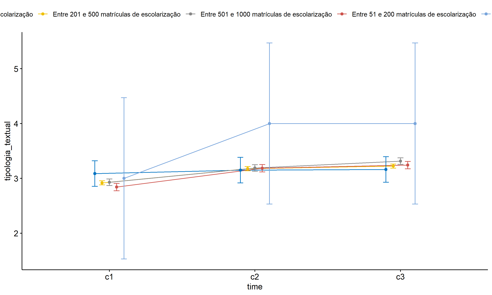<!-- -->

``` r
if (length(non.ids) > 0)
  (pwc2 <- ldat2 %>% group_by(porte) %>%
     emmeans_test(tipologia_textual ~ time, detailed = T, p.adjust.method = "bonferroni"))
```

    ## # A tibble: 15 × 15
    ##    porte term  .y.   group1 group2 null.value  estimate     se    df conf.low conf.high statistic        p    p.adj p.adj.signif
    ##  * <fct> <chr> <chr> <chr>  <chr>       <dbl>     <dbl>  <dbl> <dbl>    <dbl>     <dbl>     <dbl>    <dbl>    <dbl> <chr>       
    ##  1 Até … time  tipo… c1     c2              0 -6.25e- 2 0.168   7968   -0.391   0.266   -3.73e- 1 7.09e- 1 1   e+ 0 ns          
    ##  2 Até … time  tipo… c1     c3              0 -7.50e- 2 0.168   7968   -0.404   0.254   -4.47e- 1 6.55e- 1 1   e+ 0 ns          
    ##  3 Até … time  tipo… c2     c3              0 -1.25e- 2 0.168   7968   -0.341   0.316   -7.45e- 2 9.41e- 1 1   e+ 0 ns          
    ##  4 Entr… time  tipo… c1     c2              0 -2.59e- 1 0.0271  7968   -0.312  -0.206   -9.55e+ 0 1.77e-21 5.31e-21 ****        
    ##  5 Entr… time  tipo… c1     c3              0 -3.06e- 1 0.0271  7968   -0.359  -0.253   -1.13e+ 1 2.84e-29 8.52e-29 ****        
    ##  6 Entr… time  tipo… c2     c3              0 -4.70e- 2 0.0271  7968   -0.100   0.00620 -1.73e+ 0 8.33e- 2 2.50e- 1 ns          
    ##  7 Entr… time  tipo… c1     c2              0 -2.60e- 1 0.0427  7968   -0.344  -0.176   -6.09e+ 0 1.16e- 9 3.48e- 9 ****        
    ##  8 Entr… time  tipo… c1     c3              0 -3.86e- 1 0.0427  7968   -0.470  -0.302   -9.04e+ 0 1.86e-19 5.59e-19 ****        
    ##  9 Entr… time  tipo… c2     c3              0 -1.26e- 1 0.0427  7968   -0.210  -0.0423  -2.95e+ 0 3.17e- 3 9.51e- 3 **          
    ## 10 Entr… time  tipo… c1     c2              0 -3.43e- 1 0.0488  7968   -0.439  -0.247   -7.03e+ 0 2.19e-12 6.57e-12 ****        
    ## 11 Entr… time  tipo… c1     c3              0 -4.00e- 1 0.0488  7968   -0.495  -0.304   -8.19e+ 0 2.96e-16 8.87e-16 ****        
    ## 12 Entr… time  tipo… c2     c3              0 -5.66e- 2 0.0488  7968   -0.152   0.0391  -1.16e+ 0 2.46e- 1 7.39e- 1 ns          
    ## 13 Mais… time  tipo… c1     c2              0 -1.00e+ 0 1.06    7968   -3.08    1.08    -9.43e- 1 3.46e- 1 1   e+ 0 ns          
    ## 14 Mais… time  tipo… c1     c3              0 -1.00e+ 0 1.06    7968   -3.08    1.08    -9.43e- 1 3.46e- 1 1   e+ 0 ns          
    ## 15 Mais… time  tipo… c2     c3              0  1.43e-13 1.06    7968   -2.08    2.08     1.35e-13 1.00e+ 0 1   e+ 0 ns

| porte                                        | term | .y.               | group1 | group2 | null.value | estimate |    se |   df | conf.low | conf.high | statistic |     p | p.adj | p.adj.signif |
|:---------------------------------------------|:-----|:------------------|:-------|:-------|-----------:|---------:|------:|-----:|---------:|----------:|----------:|------:|------:|:-------------|
| Até 50 matrículas de escolarização           | time | tipologia_textual | c1     | c2     |          0 |   -0.063 | 0.168 | 7968 |   -0.391 |     0.266 |    -0.373 | 0.709 | 1.000 | ns           |
| Até 50 matrículas de escolarização           | time | tipologia_textual | c1     | c3     |          0 |   -0.075 | 0.168 | 7968 |   -0.404 |     0.254 |    -0.447 | 0.655 | 1.000 | ns           |
| Até 50 matrículas de escolarização           | time | tipologia_textual | c2     | c3     |          0 |   -0.013 | 0.168 | 7968 |   -0.341 |     0.316 |    -0.075 | 0.941 | 1.000 | ns           |
| Entre 201 e 500 matrículas de escolarização  | time | tipologia_textual | c1     | c2     |          0 |   -0.259 | 0.027 | 7968 |   -0.312 |    -0.206 |    -9.545 | 0.000 | 0.000 | \*\*\*\*     |
| Entre 201 e 500 matrículas de escolarização  | time | tipologia_textual | c1     | c3     |          0 |   -0.306 | 0.027 | 7968 |   -0.359 |    -0.253 |   -11.277 | 0.000 | 0.000 | \*\*\*\*     |
| Entre 201 e 500 matrículas de escolarização  | time | tipologia_textual | c2     | c3     |          0 |   -0.047 | 0.027 | 7968 |   -0.100 |     0.006 |    -1.732 | 0.083 | 0.250 | ns           |
| Entre 501 e 1000 matrículas de escolarização | time | tipologia_textual | c1     | c2     |          0 |   -0.260 | 0.043 | 7968 |   -0.344 |    -0.176 |    -6.093 | 0.000 | 0.000 | \*\*\*\*     |
| Entre 501 e 1000 matrículas de escolarização | time | tipologia_textual | c1     | c3     |          0 |   -0.386 | 0.043 | 7968 |   -0.470 |    -0.302 |    -9.044 | 0.000 | 0.000 | \*\*\*\*     |
| Entre 501 e 1000 matrículas de escolarização | time | tipologia_textual | c2     | c3     |          0 |   -0.126 | 0.043 | 7968 |   -0.210 |    -0.042 |    -2.952 | 0.003 | 0.010 | \*\*         |
| Entre 51 e 200 matrículas de escolarização   | time | tipologia_textual | c1     | c2     |          0 |   -0.343 | 0.049 | 7968 |   -0.439 |    -0.247 |    -7.033 | 0.000 | 0.000 | \*\*\*\*     |
| Entre 51 e 200 matrículas de escolarização   | time | tipologia_textual | c1     | c3     |          0 |   -0.400 | 0.049 | 7968 |   -0.495 |    -0.304 |    -8.192 | 0.000 | 0.000 | \*\*\*\*     |
| Entre 51 e 200 matrículas de escolarização   | time | tipologia_textual | c2     | c3     |          0 |   -0.057 | 0.049 | 7968 |   -0.152 |     0.039 |    -1.160 | 0.246 | 0.739 | ns           |
| Mais de 1000 matrículas de escolarização     | time | tipologia_textual | c1     | c2     |          0 |   -1.000 | 1.061 | 7968 |   -3.079 |     1.079 |    -0.943 | 0.346 | 1.000 | ns           |
| Mais de 1000 matrículas de escolarização     | time | tipologia_textual | c1     | c3     |          0 |   -1.000 | 1.061 | 7968 |   -3.079 |     1.079 |    -0.943 | 0.346 | 1.000 | ns           |
| Mais de 1000 matrículas de escolarização     | time | tipologia_textual | c2     | c3     |          0 |    0.000 | 1.061 | 7968 |   -2.079 |     2.079 |     0.000 | 1.000 | 1.000 | ns           |

``` r
if (length(non.ids) > 0)
  (emms2 <- get_emmeans(pwc2))
```

    ## # A tibble: 15 × 8
    ##    porte                                        time  emmean     se    df conf.low conf.high method      
    ##    <fct>                                        <fct>  <dbl>  <dbl> <dbl>    <dbl>     <dbl> <chr>       
    ##  1 Até 50 matrículas de escolarização           c1      3.09 0.119   7968     2.86      3.32 Emmeans test
    ##  2 Até 50 matrículas de escolarização           c2      3.15 0.119   7968     2.92      3.38 Emmeans test
    ##  3 Até 50 matrículas de escolarização           c3      3.16 0.119   7968     2.93      3.39 Emmeans test
    ##  4 Entre 201 e 500 matrículas de escolarização  c1      2.92 0.0192  7968     2.88      2.96 Emmeans test
    ##  5 Entre 201 e 500 matrículas de escolarização  c2      3.18 0.0192  7968     3.14      3.21 Emmeans test
    ##  6 Entre 201 e 500 matrículas de escolarização  c3      3.22 0.0192  7968     3.19      3.26 Emmeans test
    ##  7 Entre 501 e 1000 matrículas de escolarização c1      2.93 0.0302  7968     2.87      2.99 Emmeans test
    ##  8 Entre 501 e 1000 matrículas de escolarização c2      3.19 0.0302  7968     3.13      3.25 Emmeans test
    ##  9 Entre 501 e 1000 matrículas de escolarização c3      3.31 0.0302  7968     3.26      3.37 Emmeans test
    ## 10 Entre 51 e 200 matrículas de escolarização   c1      2.84 0.0345  7968     2.77      2.91 Emmeans test
    ## 11 Entre 51 e 200 matrículas de escolarização   c2      3.18 0.0345  7968     3.12      3.25 Emmeans test
    ## 12 Entre 51 e 200 matrículas de escolarização   c3      3.24 0.0345  7968     3.17      3.31 Emmeans test
    ## 13 Mais de 1000 matrículas de escolarização     c1      3.00 0.750   7968     1.53      4.47 Emmeans test
    ## 14 Mais de 1000 matrículas de escolarização     c2      4.00 0.750   7968     2.53      5.47 Emmeans test
    ## 15 Mais de 1000 matrículas de escolarização     c3      4.00 0.750   7968     2.53      5.47 Emmeans test

| porte                                        | time | emmean |    se |   df | conf.low | conf.high | method       |
|:---------------------------------------------|:-----|-------:|------:|-----:|---------:|----------:|:-------------|
| Até 50 matrículas de escolarização           | c1   |  3.087 | 0.119 | 7968 |    2.855 |     3.320 | Emmeans test |
| Até 50 matrículas de escolarização           | c2   |  3.150 | 0.119 | 7968 |    2.918 |     3.382 | Emmeans test |
| Até 50 matrículas de escolarização           | c3   |  3.163 | 0.119 | 7968 |    2.930 |     3.395 | Emmeans test |
| Entre 201 e 500 matrículas de escolarização  | c1   |  2.918 | 0.019 | 7968 |    2.880 |     2.955 | Emmeans test |
| Entre 201 e 500 matrículas de escolarização  | c2   |  3.177 | 0.019 | 7968 |    3.139 |     3.214 | Emmeans test |
| Entre 201 e 500 matrículas de escolarização  | c3   |  3.224 | 0.019 | 7968 |    3.186 |     3.261 | Emmeans test |
| Entre 501 e 1000 matrículas de escolarização | c1   |  2.929 | 0.030 | 7968 |    2.870 |     2.988 | Emmeans test |
| Entre 501 e 1000 matrículas de escolarização | c2   |  3.189 | 0.030 | 7968 |    3.130 |     3.248 | Emmeans test |
| Entre 501 e 1000 matrículas de escolarização | c3   |  3.315 | 0.030 | 7968 |    3.256 |     3.374 | Emmeans test |
| Entre 51 e 200 matrículas de escolarização   | c1   |  2.841 | 0.034 | 7968 |    2.774 |     2.909 | Emmeans test |
| Entre 51 e 200 matrículas de escolarização   | c2   |  3.184 | 0.034 | 7968 |    3.117 |     3.252 | Emmeans test |
| Entre 51 e 200 matrículas de escolarização   | c3   |  3.241 | 0.034 | 7968 |    3.173 |     3.309 | Emmeans test |
| Mais de 1000 matrículas de escolarização     | c1   |  3.000 | 0.750 | 7968 |    1.530 |     4.470 | Emmeans test |
| Mais de 1000 matrículas de escolarização     | c2   |  4.000 | 0.750 | 7968 |    2.530 |     5.470 | Emmeans test |
| Mais de 1000 matrículas de escolarização     | c3   |  4.000 | 0.750 | 7968 |    2.530 |     5.470 | Emmeans test |

``` r
if (length(non.ids) > 0) {
  emms.gg <- emms2[which(emms2$porte == "Até 50 matrículas de escolarização"),]
  if (nrow(emms.gg) > 0)
    ggline(emms.gg, x = "time", y = "emmean", color = "#0073C2FF", ylab = "tipologia_textual") +
    geom_errorbar(aes(ymin = conf.low, ymax = conf.high),
                  width = 0.2, color = "#0073C2FF") +
    stat_pvalue_manual(
      add_xy_position(pwc[which(pwc$porte == "Até 50 matrículas de escolarização"),],
                      x = "time", fun = "mean_se"),
      hide.ns = T, color = "#0073C2FF", tip.length = F) +
    labs(title = "porte: Até 50 matrículas de escolarização") +
    theme(legend.text = element_blank())
}
```

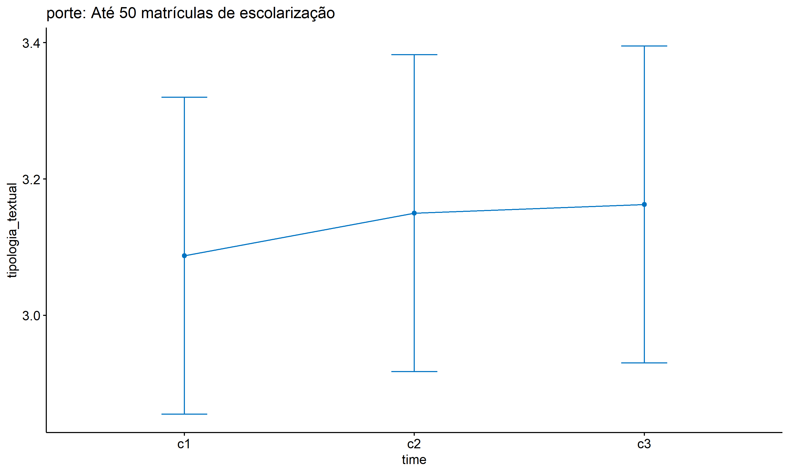<!-- -->

``` r
if (length(non.ids) > 0) {
  emms.gg <- emms2[which(emms2$porte == "Entre 201 e 500 matrículas de escolarização"),]
  if (nrow(emms.gg) > 0)
    ggline(emms.gg, x = "time", y = "emmean", color = "#EFC000FF", ylab = "tipologia_textual") +
    geom_errorbar(aes(ymin = conf.low, ymax = conf.high),
                  width = 0.2, color = "#EFC000FF") +
    stat_pvalue_manual(
      add_xy_position(pwc[which(pwc$porte == "Entre 201 e 500 matrículas de escolarização"),],
                      x = "time", fun = "mean_se"),
      hide.ns = T, color = "#EFC000FF", tip.length = F) +
    labs(title = "porte: Entre 201 e 500 matrículas de escolarização") +
    theme(legend.text = element_blank())
}
```

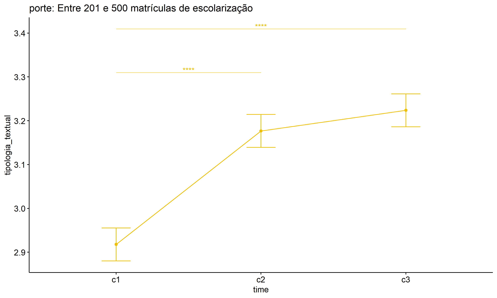<!-- -->

``` r
if (length(non.ids) > 0) {
  emms.gg <- emms2[which(emms2$porte == "Entre 501 e 1000 matrículas de escolarização"),]
  if (nrow(emms.gg) > 0)
    ggline(emms.gg, x = "time", y = "emmean", color = "#868686FF", ylab = "tipologia_textual") +
    geom_errorbar(aes(ymin = conf.low, ymax = conf.high),
                  width = 0.2, color = "#868686FF") +
    stat_pvalue_manual(
      add_xy_position(pwc[which(pwc$porte == "Entre 501 e 1000 matrículas de escolarização"),],
                      x = "time", fun = "mean_se"),
      hide.ns = T, color = "#868686FF", tip.length = F) +
    labs(title = "porte: Entre 501 e 1000 matrículas de escolarização") +
    theme(legend.text = element_blank())
}
```

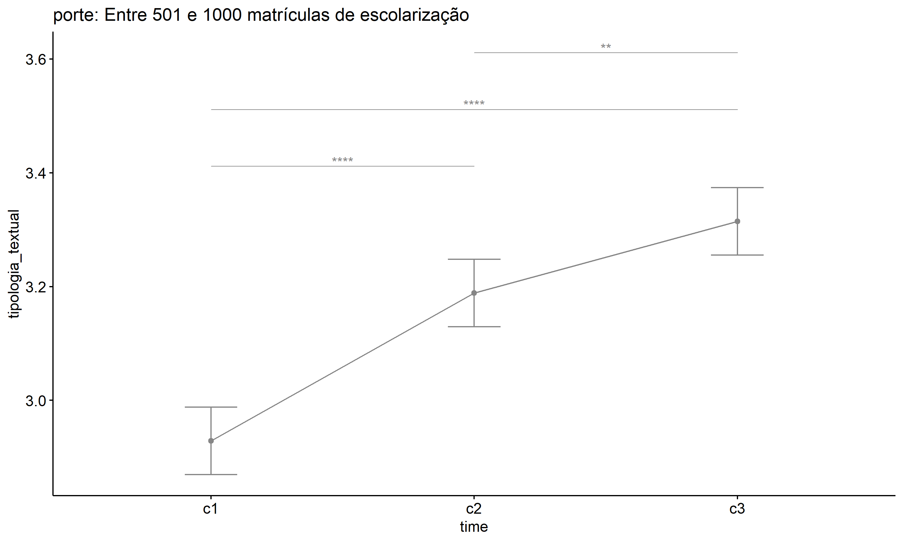<!-- -->

``` r
if (length(non.ids) > 0) {
  emms.gg <- emms2[which(emms2$porte == "Entre 51 e 200 matrículas de escolarização"),]
  if (nrow(emms.gg) > 0)
    ggline(emms.gg, x = "time", y = "emmean", color = "#CD534CFF", ylab = "tipologia_textual") +
    geom_errorbar(aes(ymin = conf.low, ymax = conf.high),
                  width = 0.2, color = "#CD534CFF") +
    stat_pvalue_manual(
      add_xy_position(pwc[which(pwc$porte == "Entre 51 e 200 matrículas de escolarização"),],
                      x = "time", fun = "mean_se"),
      hide.ns = T, color = "#CD534CFF", tip.length = F) +
    labs(title = "porte: Entre 51 e 200 matrículas de escolarização") +
    theme(legend.text = element_blank())
}
```

<!-- -->

``` r
if (length(non.ids) > 0) {
  emms.gg <- emms2[which(emms2$porte == "Mais de 1000 matrículas de escolarização"),]
  if (nrow(emms.gg) > 0)
    ggline(emms.gg, x = "time", y = "emmean", color = "#7AA6DCFF", ylab = "tipologia_textual") +
    geom_errorbar(aes(ymin = conf.low, ymax = conf.high),
                  width = 0.2, color = "#7AA6DCFF") +
    stat_pvalue_manual(
      add_xy_position(pwc[which(pwc$porte == "Mais de 1000 matrículas de escolarização"),],
                      x = "time", fun = "mean_se"),
      hide.ns = T, color = "#7AA6DCFF", tip.length = F) +
    labs(title = "porte: Mais de 1000 matrículas de escolarização") +
    theme(legend.text = element_blank())
}
```

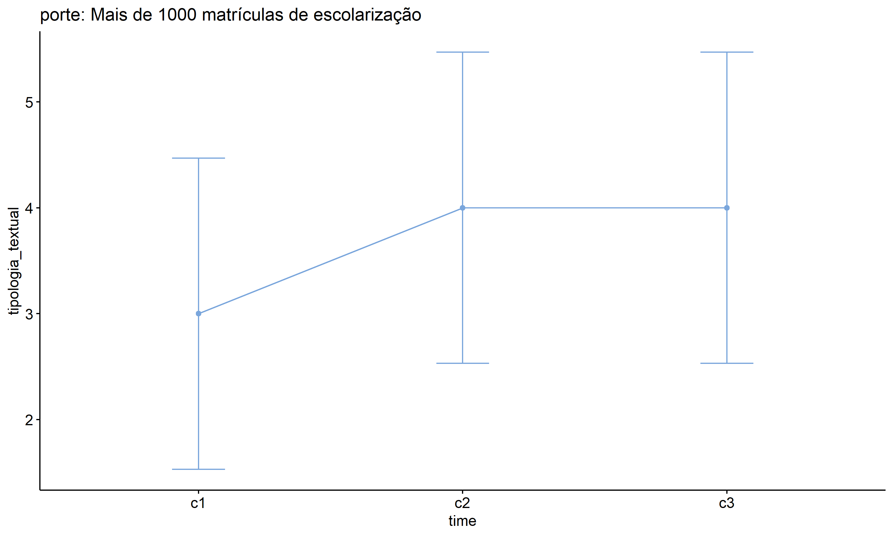<!-- -->
