ANOVA test for score2
================
Geiser C. Challco <geiser@alumni.usp.br>

- [ANOVA: score2 ~ time](#anova-score2--time)
  - [Data Preparation](#data-preparation)
  - [Summary Statistics](#summary-statistics)
  - [ANOVA Computation](#anova-computation)
  - [PairWise Computation](#pairwise-computation)
- [ANOVA: score2 ~ time\*gender +
  Error(id/time)](#anova-score2--timegender--erroridtime)
  - [Data Preparation](#data-preparation-1)
    - [Check assumptions: Identifying
      Outliers](#check-assumptions-identifying-outliers)
    - [Check assumptions: Normality
      Test](#check-assumptions-normality-test)
    - [Summary Statistics](#summary-statistics-1)
  - [ANOVA Computation](#anova-computation-1)
  - [ANOVA Computation after removing non.normal
    data](#anova-computation-after-removing-nonnormal-data)
  - [PairWise Computation](#pairwise-computation-1)
- [ANOVA: score2 ~ time\*localizacao +
  Error(id/time)](#anova-score2--timelocalizacao--erroridtime)
  - [Data Preparation](#data-preparation-2)
    - [Check assumptions: Identifying
      Outliers](#check-assumptions-identifying-outliers-1)
    - [Check assumptions: Normality
      Test](#check-assumptions-normality-test-1)
    - [Summary Statistics](#summary-statistics-2)
  - [ANOVA Computation](#anova-computation-2)
  - [ANOVA Computation after removing non.normal
    data](#anova-computation-after-removing-nonnormal-data-1)
  - [PairWise Computation](#pairwise-computation-2)
- [ANOVA: score2 ~ time\*regiao +
  Error(id/time)](#anova-score2--timeregiao--erroridtime)
  - [Data Preparation](#data-preparation-3)
    - [Check assumptions: Identifying
      Outliers](#check-assumptions-identifying-outliers-2)
    - [Check assumptions: Normality
      Test](#check-assumptions-normality-test-2)
    - [Summary Statistics](#summary-statistics-3)
  - [ANOVA Computation](#anova-computation-3)
  - [ANOVA Computation after removing non.normal
    data](#anova-computation-after-removing-nonnormal-data-2)
  - [PairWise Computation](#pairwise-computation-3)
- [ANOVA: score2 ~ time\*porte +
  Error(id/time)](#anova-score2--timeporte--erroridtime)
  - [Data Preparation](#data-preparation-4)
    - [Check assumptions: Identifying
      Outliers](#check-assumptions-identifying-outliers-3)
    - [Check assumptions: Normality
      Test](#check-assumptions-normality-test-3)
    - [Summary Statistics](#summary-statistics-4)
  - [ANOVA Computation](#anova-computation-4)
  - [ANOVA Computation after removing non.normal
    data](#anova-computation-after-removing-nonnormal-data-3)
  - [PairWise Computation](#pairwise-computation-4)

``` r
dat <- read_excel("../data/data.xlsx", sheet = "alunos_ef14")

escolas <- read_excel("../data/data.xlsx", sheet = "escolas")
edat <- merge(dat, escolas, by = "cod_escola", all.x = T)
```

# ANOVA: score2 ~ time

## Data Preparation

``` r
data <- edat[,c("aluno_id","ciclo","score2")]
data <- data[data$ciclo %in% c("Primeiro Ciclo","Segundo Ciclo","Terceiro Ciclo", "Quarto Ciclo"),]
data$ciclo <- factor(data$ciclo, c("Primeiro Ciclo","Segundo Ciclo","Terceiro Ciclo", "Quarto Ciclo"))
data <- unique(data)

wdat <- spread(data, ciclo, score2)
colnames(wdat) <- c("id","c1","c2","c3","c4")
wdat <- wdat[complete.cases(wdat[,c("id","c1","c2","c3")]),]

ldat <- gather(wdat, key = time, value = score2, c1,c2,c3,c4) %>%
  convert_as_factor(id, time)
ldat <- rshinystatistics::remove_group_data(ldat, "score2", "time", n.limit = 30)
```

## Summary Statistics

``` r
(sdat <- get.descriptives(ldat, "score2", "time", symmetry.test = T, normality.test = T))
```

    ##   time variable    n  mean median  min  max    sd    se    ci  iqr symmetry
    ## 1   c1   score2 2773 2.773  2.750 2.25 3.75 0.255 0.005 0.009 0.50       NO
    ## 2   c2   score2 2773 2.869  2.875 2.25 4.50 0.303 0.006 0.011 0.25       NO
    ## 3   c3   score2 2773 2.923  2.875 2.25 4.50 0.346 0.007 0.013 0.25       NO
    ## 4   c4   score2 1126 2.940  3.000 2.25 4.25 0.340 0.010 0.020 0.25     <NA>
    ##    skewness kurtosis normality     method statistic  p p.signif
    ## 1 0.6689653 1.255809         - D'Agostino  248.7816  0     ****
    ## 2 0.9696369 1.886781         - D'Agostino  439.1121  0     ****
    ## 3 0.9914688 1.304811         - D'Agostino  405.4726  0     ****
    ## 4        NA       NA      <NA>       <NA>        NA NA     <NA>

| time | variable |    n |  mean | median |  min |  max |    sd |    se |    ci |  iqr | symmetry | skewness | kurtosis | normality | method     | statistic |   p | p.signif |
|:-----|:---------|-----:|------:|-------:|-----:|-----:|------:|------:|------:|-----:|:---------|---------:|---------:|:----------|:-----------|----------:|----:|:---------|
| c1   | score2   | 2773 | 2.773 |  2.750 | 2.25 | 3.75 | 0.255 | 0.005 | 0.009 | 0.50 | NO       |    0.669 |    1.256 | \-        | D’Agostino |   248.782 |   0 | \*\*\*\* |
| c2   | score2   | 2773 | 2.869 |  2.875 | 2.25 | 4.50 | 0.303 | 0.006 | 0.011 | 0.25 | NO       |    0.970 |    1.887 | \-        | D’Agostino |   439.112 |   0 | \*\*\*\* |
| c3   | score2   | 2773 | 2.923 |  2.875 | 2.25 | 4.50 | 0.346 | 0.007 | 0.013 | 0.25 | NO       |    0.991 |    1.305 | \-        | D’Agostino |   405.473 |   0 | \*\*\*\* |
| c4   | score2   | 1126 | 2.940 |  3.000 | 2.25 | 4.25 | 0.340 | 0.010 | 0.020 | 0.25 | NA       |       NA |       NA | NA        | NA         |        NA |  NA | NA       |

## ANOVA Computation

``` r
(res.aov <- anova_test(ldat, dv = score2, wid = id, within = time))
```

    ## Warning: NA detected in rows:
    ## 8323,8325,8326,8332,8333,8334,8337,8339,8340,8342,8343,8344,8345,8349,8350,8352,8353,8354,8358,8359,8361,8362,8364,8369,8370,8374,8375,8376,8383,8384,8391,8392,8394,8396,8398,8399,8401,8402,8404,8408,8409,8412,8413,8414,8416,8419,8424,8427,8429,8430,8431,8433,8435,8442,8443,8444,8445,8447,8450,8451,8452,8454,8455,8457,8459,8460,8465,8466,8467,8468,8469,8470,8471,8475,8476,8477,8479,8480,8482,8484,8487,8488,8490,8491,8492,8493,8494,8496,8497,8499,8500,8502,8503,8506,8510,8511,8514,8515,8516,8519,8521,8522,8525,8528,8529,8530,8531,8532,8533,8534,8536,8538,8540,8541,8546,8549,8551,8552,8555,8556,8559,8560,8562,8565,8567,8569,8570,8571,8574,8576,8579,8580,8581,8583,8590,8591,8592,8593,8598,8601,8602,8604,8605,8606,8607,8608,8609,8613,8618,8623,8626,8628,8630,8632,8634,8635,8637,8638,8639,8641,8642,8644,8647,8649,8650,8651,8652,8653,8654,8655,8658,8659,8660,8661,8662,8664,8665,8666,8668,8671,8672,8674,8678,8683,8685,8686,8687,8689,8692,8693,8694,8696,8697,8698,8699,8704,8706,8707,8708,8709,8711,8712,8713,8714,8715,8716,8717,8718,8719,8720,8721,8724,8725,8727,8728,8729,8730,8731,8732,8734,8735,8736,8737,8739,8740,8743,8744,8745,8746,8748,8749,8751,8753,8754,8755,8756,8757,8760,8761,8762,8763,8765,8766,8768,8771,8772,8773,8775,8776,8777,8778,8779,8781,8785,8786,8787,8788,8789,8792,8793,8794,8797,8799,8800,8802,8806,8807,8808,8809,8810,8811,8812,8814,8820,8823,8824,8825,8826,8828,8829,8831,8832,8834,8835,8836,8837,8838,8839,8840,8841,8842,8843,8844,8845,8846,8849,8852,8854,8855,8856,8858,8860,8862,8865,8869,8871,8872,8874,8875,8877,8879,8880,8881,8883,8884,8885,8886,8887,8889,8891,8892,8893,8894,8895,8896,8898,8899,8900,8901,8903,8904,8905,8906,8910,8914,8915,8917,8918,8920,8923,8928,8929,8931,8932,8933,8934,8935,8937,8939,8940,8941,8943,8944,8945,8946,8948,8951,8952,8953,8954,8955,8956,8957,8959,8961,8963,8964,8965,8967,8968,8969,8970,8971,8973,8974,8975,8977,8978,8983,8986,8987,8991,8992,8995,8996,8997,9000,9001,9002,9003,9004,9005,9008,9010,9012,9018,9021,9025,9026,9027,9030,9031,9032,9033,9035,9038,9043,9044,9045,9047,9048,9052,9055,9059,9060,9063,9065,9069,9073,9074,9077,9078,9079,9081,9082,9083,9084,9085,9086,9087,9088,9089,9090,9091,9093,9099,9102,9104,9105,9106,9107,9108,9111,9112,9113,9117,9120,9121,9126,9127,9129,9130,9131,9134,9136,9137,9139,9141,9143,9144,9146,9147,9150,9151,9153,9154,9155,9156,9157,9160,9161,9163,9164,9165,9166,9167,9168,9169,9171,9173,9176,9178,9180,9182,9183,9184,9186,9187,9188,9189,9190,9191,9192,9193,9194,9195,9198,9199,9202,9204,9205,9206,9208,9212,9213,9215,9216,9217,9220,9223,9227,9228,9229,9230,9231,9232,9233,9235,9236,9237,9238,9239,9240,9241,9242,9243,9244,9246,9247,9250,9251,9252,9253,9254,9255,9256,9257,9258,9260,9261,9262,9267,9268,9270,9271,9272,9273,9274,9276,9277,9278,9279,9285,9286,9288,9293,9294,9296,9297,9299,9300,9301,9302,9303,9306,9308,9309,9312,9314,9316,9319,9320,9321,9323,9325,9326,9327,9330,9332,9335,9337,9340,9342,9344,9345,9347,9348,9349,9351,9356,9357,9360,9361,9362,9364,9365,9367,9371,9372,9375,9376,9377,9378,9385,9386,9387,9389,9390,9391,9392,9396,9397,9398,9399,9401,9402,9403,9404,9405,9407,9408,9409,9410,9413,9414,9415,9416,9417,9418,9420,9421,9422,9423,9425,9426,9427,9431,9432,9434,9435,9437,9438,9439,9440,9441,9442,9443,9444,9445,9446,9447,9448,9449,9452,9454,9455,9456,9460,9464,9466,9469,9470,9471,9474,9475,9476,9477,9478,9479,9480,9482,9484,9485,9487,9491,9492,9494,9496,9497,9498,9499,9500,9503,9504,9506,9507,9509,9510,9511,9512,9514,9516,9517,9518,9519,9520,9521,9523,9524,9525,9526,9527,9529,9532,9533,9534,9536,9537,9543,9547,9550,9552,9553,9555,9556,9558,9559,9561,9562,9567,9570,9571,9575,9576,9578,9579,9583,9588,9589,9590,9591,9592,9593,9594,9597,9598,9600,9602,9605,9606,9607,9613,9614,9615,9616,9618,9619,9621,9623,9624,9626,9627,9629,9632,9634,9635,9637,9639,9646,9647,9649,9650,9652,9653,9656,9658,9660,9661,9662,9663,9665,9666,9667,9668,9670,9672,9674,9677,9678,9680,9681,9687,9688,9690,9693,9694,9695,9696,9697,9699,9700,9701,9703,9705,9707,9708,9709,9710,9712,9713,9714,9715,9716,9719,9721,9723,9724,9725,9726,9727,9729,9730,9732,9734,9735,9737,9738,9739,9740,9741,9742,9744,9746,9747,9748,9749,9751,9754,9755,9756,9757,9758,9759,9762,9764,9765,9767,9768,9772,9773,9774,9775,9776,9783,9784,9785,9787,9788,9792,9794,9797,9801,9803,9804,9805,9806,9807,9808,9809,9810,9812,9813,9814,9815,9816,9817,9818,9819,9820,9821,9823,9824,9826,9829,9830,9831,9832,9833,9834,9835,9836,9837,9838,9840,9841,9842,9844,9845,9846,9848,9849,9850,9851,9852,9853,9854,9856,9858,9859,9860,9863,9869,9871,9874,9875,9876,9877,9878,9879,9883,9884,9886,9888,9889,9892,9893,9894,9895,9897,9898,9899,9900,9901,9902,9904,9907,9908,9909,9911,9914,9918,9919,9920,9923,9925,9926,9927,9929,9930,9931,9932,9933,9934,9935,9936,9937,9938,9939,9940,9943,9944,9947,9950,9951,9952,9954,9957,9958,9963,9964,9965,9966,9969,9970,9971,9974,9975,9976,9978,9979,9981,9983,9984,9985,9988,9989,9991,9992,9994,9995,9998,9999,10002,10004,10005,10006,10008,10009,10012,10014,10017,10018,10019,10020,10022,10023,10025,10026,10027,10028,10029,10030,10031,10036,10037,10039,10040,10043,10044,10045,10046,10047,10050,10052,10053,10054,10055,10056,10057,10059,10060,10063,10064,10066,10067,10068,10069,10071,10072,10073,10074,10075,10077,10078,10079,10080,10081,10082,10084,10085,10088,10089,10093,10095,10096,10097,10098,10099,10101,10102,10103,10105,10106,10107,10108,10110,10111,10112,10113,10117,10119,10120,10121,10122,10123,10124,10127,10129,10130,10131,10133,10135,10138,10140,10144,10145,10146,10150,10151,10152,10155,10156,10157,10158,10159,10160,10161,10162,10164,10165,10166,10168,10169,10170,10172,10173,10174,10175,10177,10179,10180,10181,10182,10184,10188,10190,10191,10192,10195,10196,10197,10200,10201,10202,10203,10204,10206,10207,10210,10212,10213,10215,10216,10218,10220,10221,10222,10223,10224,10225,10226,10232,10233,10234,10238,10242,10243,10244,10245,10250,10251,10252,10253,10254,10255,10257,10258,10260,10262,10265,10266,10267,10268,10269,10272,10277,10278,10280,10282,10285,10288,10290,10293,10294,10295,10296,10298,10300,10301,10302,10303,10306,10307,10310,10311,10312,10313,10316,10317,10318,10319,10321,10323,10324,10325,10327,10328,10329,10330,10331,10332,10333,10336,10337,10338,10339,10340,10343,10346,10349,10350,10351,10354,10358,10359,10360,10361,10362,10363,10364,10365,10367,10369,10370,10371,10372,10373,10374,10376,10377,10378,10379,10386,10387,10389,10391,10396,10397,10398,10400,10401,10402,10404,10406,10407,10408,10409,10410,10413,10414,10417,10418,10419,10425,10426,10430,10431,10432,10435,10436,10437,10438,10439,10443,10445,10447,10448,10449,10450,10451,10453,10455,10456,10457,10461,10463,10464,10465,10466,10467,10470,10471,10473,10474,10475,10476,10478,10479,10480,10482,10485,10486,10490,10491,10492,10493,10494,10495,10496,10497,10498,10499,10500,10501,10504,10509,10511,10512,10513,10514,10515,10516,10518,10520,10521,10522,10525,10526,10527,10528,10529,10531,10534,10535,10538,10539,10540,10545,10546,10549,10550,10551,10552,10553,10554,10555,10556,10557,10559,10561,10562,10563,10565,10566,10567,10569,10570,10571,10572,10574,10575,10577,10579,10581,10583,10585,10587,10588,10589,10591,10592,10594,10595,10597,10599,10600,10601,10602,10603,10605,10606,10608,10610,10612,10614,10615,10618,10619,10621,10622,10625,10626,10628,10630,10632,10634,10635,10636,10637,10639,10640,10642,10646,10648,10651,10654,10658,10659,10661,10662,10663,10664,10666,10667,10668,10669,10670,10673,10674,10677,10678,10679,10681,10684,10686,10687,10688,10689,10690,10695,10697,10698,10703,10706,10708,10710,10711,10713,10714,10715,10722,10724,10725,10726,10727,10728,10731,10733,10734,10735,10736,10738,10739,10741,10743,10744,10747,10748,10749,10750,10751,10754,10755,10756,10758,10760,10761,10763,10764,10765,10766,10767,10772,10775,10777,10779,10780,10781,10784,10787,10788,10789,10792,10793,10794,10795,10797,10798,10799,10800,10801,10802,10803,10804,10805,10806,10808,10809,10812,10816,10818,10820,10822,10823,10825,10826,10828,10831,10832,10834,10836,10837,10839,10841,10842,10843,10847,10848,10849,10854,10855,10856,10857,10858,10859,10860,10861,10862,10864,10865,10868,10869,10870,10872,10873,10879,10880,10882,10883,10884,10889,10891,10892,10893,10895,1

    ## ANOVA Table (type III tests)
    ## 
    ## $ANOVA
    ##   Effect DFn  DFd      F        p p<.05   ges
    ## 1   time   3 3375 89.782 6.78e-56     * 0.046
    ## 
    ## $`Mauchly's Test for Sphericity`
    ##   Effect     W     p p<.05
    ## 1   time 0.984 0.003     *
    ## 
    ## $`Sphericity Corrections`
    ##   Effect  GGe        DF[GG]    p[GG] p[GG]<.05   HFe       DF[HF]    p[HF]
    ## 1   time 0.99 2.97, 3341.48 2.27e-55         * 0.993 2.98, 3351.3 1.59e-55
    ##   p[HF]<.05
    ## 1         *

| Effect | DFn |  DFd |      F |   p | p\<.05 |   ges |
|:-------|----:|-----:|-------:|----:|:-------|------:|
| time   |   3 | 3375 | 89.782 |   0 | \*     | 0.046 |

| Effect |     W |     p | p\<.05 |
|:-------|------:|------:|:-------|
| time   | 0.984 | 0.003 | \*     |

| Effect |  GGe | DF\[GG\]      | p\[GG\] | p\[GG\]\<.05 |   HFe | DF\[HF\]     | p\[HF\] | p\[HF\]\<.05 |
|:-------|-----:|:--------------|--------:|:-------------|------:|:-------------|--------:|:-------------|
| time   | 0.99 | 2.97, 3341.48 |       0 | \*           | 0.993 | 2.98, 3351.3 |       0 | \*           |

## PairWise Computation

``` r
(pwc <- ldat %>% emmeans_test(score2 ~ time, detailed = T, p.adjust.method = "bonferroni"))
```

    ## # A tibble: 6 × 14
    ##   term  .y.   group1 group2 null.value estimate      se    df conf.low conf.high
    ## * <chr> <chr> <chr>  <chr>       <dbl>    <dbl>   <dbl> <dbl>    <dbl>     <dbl>
    ## 1 time  scor… c1     c2              0  -0.0957 0.00827  9441  -0.112   -0.0795 
    ## 2 time  scor… c1     c3              0  -0.150  0.00827  9441  -0.166   -0.133  
    ## 3 time  scor… c1     c4              0  -0.167  0.0109   9441  -0.188   -0.145  
    ## 4 time  scor… c2     c3              0  -0.0540 0.00827  9441  -0.0702  -0.0378 
    ## 5 time  scor… c2     c4              0  -0.0709 0.0109   9441  -0.0923  -0.0496 
    ## 6 time  scor… c3     c4              0  -0.0170 0.0109   9441  -0.0383   0.00439
    ## # ℹ 4 more variables: statistic <dbl>, p <dbl>, p.adj <dbl>, p.adj.signif <chr>

| term | .y.    | group1 | group2 | null.value | estimate |    se |   df | conf.low | conf.high | statistic |     p | p.adj | p.adj.signif |
|:-----|:-------|:-------|:-------|-----------:|---------:|------:|-----:|---------:|----------:|----------:|------:|------:|:-------------|
| time | score2 | c1     | c2     |          0 |   -0.096 | 0.008 | 9441 |   -0.112 |    -0.079 |   -11.566 | 0.000 | 0.000 | \*\*\*\*     |
| time | score2 | c1     | c3     |          0 |   -0.150 | 0.008 | 9441 |   -0.166 |    -0.133 |   -18.090 | 0.000 | 0.000 | \*\*\*\*     |
| time | score2 | c1     | c4     |          0 |   -0.167 | 0.011 | 9441 |   -0.188 |    -0.145 |   -15.305 | 0.000 | 0.000 | \*\*\*\*     |
| time | score2 | c2     | c3     |          0 |   -0.054 | 0.008 | 9441 |   -0.070 |    -0.038 |    -6.524 | 0.000 | 0.000 | \*\*\*\*     |
| time | score2 | c2     | c4     |          0 |   -0.071 | 0.011 | 9441 |   -0.092 |    -0.050 |    -6.516 | 0.000 | 0.000 | \*\*\*\*     |
| time | score2 | c3     | c4     |          0 |   -0.017 | 0.011 | 9441 |   -0.038 |     0.004 |    -1.557 | 0.119 | 0.717 | ns           |

``` r
pwc <- add_xy_position(pwc, x = "time", fun = "mean_se")
ggline(get_emmeans(pwc), x = "time", y = "emmean", ylab = "score2", size = 1) +
  geom_errorbar(aes(ymin = conf.low, ymax = conf.high), width = 0.1, linewidth = 1) +
  stat_pvalue_manual(pwc, hide.ns = T, tip.length = F)
```

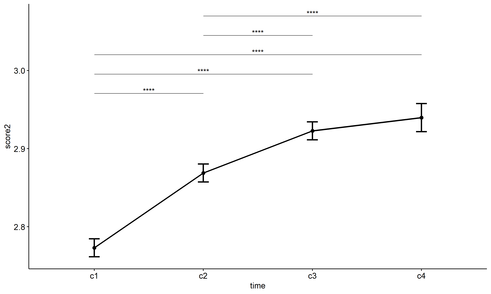<!-- -->

# ANOVA: score2 ~ time\*gender + Error(id/time)

## Data Preparation

``` r
data <- edat[,c("aluno_id","gender","ciclo","score2")]
data <- data[data$ciclo %in% c("Primeiro Ciclo","Segundo Ciclo","Terceiro Ciclo","Quarto Ciclo"),]
data$ciclo <- factor(data$ciclo, c("Primeiro Ciclo","Segundo Ciclo","Terceiro Ciclo","Quarto Ciclo"))
data <- unique(data)

wdat <- spread(data, ciclo, score2)
colnames(wdat) <- c("id","gender","c1","c2","c3","c4")
wdat <- wdat[complete.cases(wdat[,c("id","gender","c1","c2","c3")]),]

ldat <- gather(wdat, key = time, value = score2, c1,c2,c3,c4) %>%
  convert_as_factor(id, time)
ldat <- remove_group_data(ldat, "score2", c("time", "gender"), n.limit = 30)
ldat$gender <- factor(ldat$gender, sort(unique(ldat$gender)))
```

### Check assumptions: Identifying Outliers

``` r
outliers <- identify_outliers(group_by(ldat, time, gender), score2)
(outliers <- outliers[outliers$is.extreme == T,])
```

    ## # A tibble: 26 × 6
    ##    gender time  id                   score2 is.outlier is.extreme
    ##    <fct>  <fct> <fct>                 <dbl> <lgl>      <lgl>     
    ##  1 Female c2    oGUJyWRMYYbF9PNegJZh   4.25 TRUE       TRUE      
    ##  2 Female c2    X8eOpiPuKfI4GXxjOsOM   4.25 TRUE       TRUE      
    ##  3 Female c2    xk7eC5haTYuFQaJovsBZ   4    TRUE       TRUE      
    ##  4 Male   c2    cuknOzzwN4oCRum5U5ph   4.5  TRUE       TRUE      
    ##  5 Male   c2    HsQF2J0r79mHSWNe4l6n   4    TRUE       TRUE      
    ##  6 Male   c2    j31LU8Xwm0EQ7Mihkhjj   4    TRUE       TRUE      
    ##  7 Male   c2    W8iXxSmW48zvfJyikMZb   4    TRUE       TRUE      
    ##  8 Female c3    6bEKmKQpOuvY6PSQvzqj   4.25 TRUE       TRUE      
    ##  9 Female c3    7pR91qd7LX1X2Chwr4xQ   4.25 TRUE       TRUE      
    ## 10 Female c3    CCVIt7MPeYMUOCCyBxPh   4.25 TRUE       TRUE      
    ## # ℹ 16 more rows

| gender | time | id                   | score2 | is.outlier | is.extreme |
|:-------|:-----|:---------------------|-------:|:-----------|:-----------|
| Female | c2   | oGUJyWRMYYbF9PNegJZh |  4.250 | TRUE       | TRUE       |
| Female | c2   | X8eOpiPuKfI4GXxjOsOM |  4.250 | TRUE       | TRUE       |
| Female | c2   | xk7eC5haTYuFQaJovsBZ |  4.000 | TRUE       | TRUE       |
| Male   | c2   | cuknOzzwN4oCRum5U5ph |  4.500 | TRUE       | TRUE       |
| Male   | c2   | HsQF2J0r79mHSWNe4l6n |  4.000 | TRUE       | TRUE       |
| Male   | c2   | j31LU8Xwm0EQ7Mihkhjj |  4.000 | TRUE       | TRUE       |
| Male   | c2   | W8iXxSmW48zvfJyikMZb |  4.000 | TRUE       | TRUE       |
| Female | c3   | 6bEKmKQpOuvY6PSQvzqj |  4.250 | TRUE       | TRUE       |
| Female | c3   | 7pR91qd7LX1X2Chwr4xQ |  4.250 | TRUE       | TRUE       |
| Female | c3   | CCVIt7MPeYMUOCCyBxPh |  4.250 | TRUE       | TRUE       |
| Female | c3   | cOCdJff1IOVxOznhBCWn |  4.000 | TRUE       | TRUE       |
| Female | c3   | i5EZ8Ck9IgDueyMbw55v |  4.500 | TRUE       | TRUE       |
| Female | c3   | m5yRlxfIj73j4ossfTOB |  4.250 | TRUE       | TRUE       |
| Female | c3   | mbcncvg5dOFa9ZRsRhZf |  4.250 | TRUE       | TRUE       |
| Female | c3   | OvwAQTWkdj8SYpPS8dgn |  4.250 | TRUE       | TRUE       |
| Female | c3   | Pj0bkt0GAUBSA1FoPcc2 |  4.500 | TRUE       | TRUE       |
| Female | c3   | PwZy7Lbc45vuNd5du72A |  4.250 | TRUE       | TRUE       |
| Female | c3   | xADstL8Txh6OaomMZXC4 |  4.000 | TRUE       | TRUE       |
| Female | c3   | xk7eC5haTYuFQaJovsBZ |  3.875 | TRUE       | TRUE       |
| Male   | c3   | 1uixvrMfKulaomVh0MKa |  4.250 | TRUE       | TRUE       |
| Male   | c3   | 8edbRBvoAhVAiLZ3h3E2 |  4.500 | TRUE       | TRUE       |
| Male   | c3   | G1fSZJ6Ea4VhHH2OjGQ3 |  4.250 | TRUE       | TRUE       |
| Male   | c3   | sNrMxxYCTthTxBfrZZuD |  4.000 | TRUE       | TRUE       |
| Female | c4   | 6bEKmKQpOuvY6PSQvzqj |  4.000 | TRUE       | TRUE       |
| Female | c4   | DP1fbT1lGhLiBnOFILLi |  4.000 | TRUE       | TRUE       |
| Female | c4   | fgNBRPWfCa0TP4bDO8d2 |  4.250 | TRUE       | TRUE       |

### Check assumptions: Normality Test

``` r
(normality.df <- get.descriptives(ldat, "score2", c("time", "gender"), symmetry.test = T, normality.test = T))
```

    ##   time gender variable    n  mean median  min  max    sd    se    ci   iqr
    ## 1   c1 Female   score2 1363 2.783  2.750 2.25 3.75 0.247 0.007 0.013 0.375
    ## 2   c1   Male   score2 1240 2.766  2.750 2.25 3.75 0.267 0.008 0.015 0.500
    ## 3   c2 Female   score2 1363 2.879  2.875 2.25 4.25 0.303 0.008 0.016 0.250
    ## 4   c2   Male   score2 1240 2.855  2.833 2.25 4.50 0.301 0.009 0.017 0.312
    ## 5   c3 Female   score2 1363 2.932  3.000 2.25 4.50 0.348 0.009 0.019 0.250
    ## 6   c3   Male   score2 1240 2.912  2.875 2.25 4.50 0.345 0.010 0.019 0.250
    ## 7   c4 Female   score2  552 2.942  2.875 2.25 4.25 0.354 0.015 0.030 0.250
    ## 8   c4   Male   score2  513 2.929  3.000 2.25 3.75 0.321 0.014 0.028 0.250
    ##   symmetry  skewness kurtosis normality     method statistic  p p.signif
    ## 1       NO 0.5977376 1.237558         - D'Agostino  108.3240  0     ****
    ## 2       NO 0.7736548 1.300077         - D'Agostino  136.3706  0     ****
    ## 3       NO 0.9840469 1.756661         - D'Agostino  217.5930  0     ****
    ## 4       NO 0.9774468 2.115460         - D'Agostino  209.2536  0     ****
    ## 5       NO 1.0534833 1.595493         - D'Agostino  228.5923  0     ****
    ## 6       NO 0.9329272 1.019904         - D'Agostino  160.9409  0     ****
    ## 7     <NA>        NA       NA      <NA>       <NA>        NA NA     <NA>
    ## 8     <NA>        NA       NA      <NA>       <NA>        NA NA     <NA>

| time | gender | variable |    n |  mean | median |  min |  max |    sd |    se |    ci |   iqr | symmetry | skewness | kurtosis | normality | method     | statistic |   p | p.signif |
|:-----|:-------|:---------|-----:|------:|-------:|-----:|-----:|------:|------:|------:|------:|:---------|---------:|---------:|:----------|:-----------|----------:|----:|:---------|
| c1   | Female | score2   | 1363 | 2.783 |  2.750 | 2.25 | 3.75 | 0.247 | 0.007 | 0.013 | 0.375 | NO       |    0.598 |    1.238 | \-        | D’Agostino |   108.324 |   0 | \*\*\*\* |
| c1   | Male   | score2   | 1240 | 2.766 |  2.750 | 2.25 | 3.75 | 0.267 | 0.008 | 0.015 | 0.500 | NO       |    0.774 |    1.300 | \-        | D’Agostino |   136.371 |   0 | \*\*\*\* |
| c2   | Female | score2   | 1363 | 2.879 |  2.875 | 2.25 | 4.25 | 0.303 | 0.008 | 0.016 | 0.250 | NO       |    0.984 |    1.757 | \-        | D’Agostino |   217.593 |   0 | \*\*\*\* |
| c2   | Male   | score2   | 1240 | 2.855 |  2.833 | 2.25 | 4.50 | 0.301 | 0.009 | 0.017 | 0.312 | NO       |    0.977 |    2.115 | \-        | D’Agostino |   209.254 |   0 | \*\*\*\* |
| c3   | Female | score2   | 1363 | 2.932 |  3.000 | 2.25 | 4.50 | 0.348 | 0.009 | 0.019 | 0.250 | NO       |    1.053 |    1.595 | \-        | D’Agostino |   228.592 |   0 | \*\*\*\* |
| c3   | Male   | score2   | 1240 | 2.912 |  2.875 | 2.25 | 4.50 | 0.345 | 0.010 | 0.019 | 0.250 | NO       |    0.933 |    1.020 | \-        | D’Agostino |   160.941 |   0 | \*\*\*\* |
| c4   | Female | score2   |  552 | 2.942 |  2.875 | 2.25 | 4.25 | 0.354 | 0.015 | 0.030 | 0.250 | NA       |       NA |       NA | NA        | NA         |        NA |  NA | NA       |
| c4   | Male   | score2   |  513 | 2.929 |  3.000 | 2.25 | 3.75 | 0.321 | 0.014 | 0.028 | 0.250 | NA       |       NA |       NA | NA        | NA         |        NA |  NA | NA       |

``` r
(non.ids <- unique(do.call(
  c, lapply(which(normality.df$normality == 'NO'), FUN = function(i) {
  idx = which(ldat$time == normality.df$time[i] &
                ldat$gender == normality.df$gender[i])
  getNonNormal(ldat$"score2"[idx], ldat$id[idx])
}))))
```

    ## NULL

``` r
if (length(non.ids) > 0)
  ldat2 <- ldat[!ldat$id %in% non.ids,]
```

### Summary Statistics

``` r
(sdat <- ldat %>% group_by(time, gender) %>%
   get_summary_stats(score2, type = "mean_sd"))
```

    ## # A tibble: 8 × 6
    ##   gender time  variable     n  mean    sd
    ##   <fct>  <fct> <fct>    <dbl> <dbl> <dbl>
    ## 1 Female c1    score2    1363  2.78 0.247
    ## 2 Male   c1    score2    1240  2.77 0.267
    ## 3 Female c2    score2    1363  2.88 0.303
    ## 4 Male   c2    score2    1240  2.86 0.301
    ## 5 Female c3    score2    1363  2.93 0.348
    ## 6 Male   c3    score2    1240  2.91 0.345
    ## 7 Female c4    score2     552  2.94 0.354
    ## 8 Male   c4    score2     513  2.93 0.321

| gender | time | variable |    n |  mean |    sd |
|:-------|:-----|:---------|-----:|------:|------:|
| Female | c1   | score2   | 1363 | 2.783 | 0.247 |
| Male   | c1   | score2   | 1240 | 2.766 | 0.267 |
| Female | c2   | score2   | 1363 | 2.879 | 0.303 |
| Male   | c2   | score2   | 1240 | 2.855 | 0.301 |
| Female | c3   | score2   | 1363 | 2.932 | 0.348 |
| Male   | c3   | score2   | 1240 | 2.912 | 0.345 |
| Female | c4   | score2   |  552 | 2.942 | 0.354 |
| Male   | c4   | score2   |  513 | 2.929 | 0.321 |

``` r
if (length(non.ids) > 0)
  (sdat <- ldat2 %>% group_by(time, gender) %>%
      get_summary_stats(score2, type = "mean_sd"))
```

| gender | time | variable |    n |  mean |    sd |
|:-------|:-----|:---------|-----:|------:|------:|
| Female | c1   | score2   | 1363 | 2.783 | 0.247 |
| Male   | c1   | score2   | 1240 | 2.766 | 0.267 |
| Female | c2   | score2   | 1363 | 2.879 | 0.303 |
| Male   | c2   | score2   | 1240 | 2.855 | 0.301 |
| Female | c3   | score2   | 1363 | 2.932 | 0.348 |
| Male   | c3   | score2   | 1240 | 2.912 | 0.345 |
| Female | c4   | score2   |  552 | 2.942 | 0.354 |
| Male   | c4   | score2   |  513 | 2.929 | 0.321 |

## ANOVA Computation

``` r
(res.aov <- anova_test(ldat, dv = score2, wid = id, between = gender, within = time))
```

    ## Warning: NA detected in rows: 7812,7814,7815,7821,7822,7824,7826,7827,7829,7830,7831,7832,7836,7837,7839,7840,7841,7845,7846,7848,7849,7851,7856,7857,7861,7862,7863,7870,7871,7877,7878,7880,7882,7884,7885,7887,7889,7893,7894,7897,7898,7899,7901,7904,7909,7912,7914,7915,7916,7918,7919,7926,7927,7928,7930,7933,7934,7935,7937,7938,7940,7942,7943,7948,7949,7950,7951,7952,7953,7957,7958,7960,7961,7963,7965,7968,7970,7971,7972,7973,7974,7976,7977,7979,7980,7982,7983,7986,7990,7991,7994,7995,7996,7999,8001,8002,8005,8007,8008,8009,8010,8011,8012,8013,8016,8018,8019,8024,8027,8029,8030,8033,8034,8037,8039,8042,8044,8046,8047,8048,8051,8053,8056,8057,8058,8060,8067,8068,8069,8070,8075,8078,8079,8081,8082,8083,8084,8085,8086,8090,8095,8100,8103,8105,8107,8109,8111,8112,8114,8115,8116,8118,8119,8121,8124,8126,8127,8128,8129,8130,8131,8134,8135,8136,8137,8138,8140,8141,8142,8144,8146,8147,8149,8153,8158,8160,8161,8162,8164,8167,8168,8169,8171,8172,8173,8174,8178,8180,8181,8182,8183,8185,8186,8187,8188,8189,8190,8191,8192,8193,8194,8196,8197,8199,8200,8201,8202,8203,8205,8206,8207,8208,8210,8211,8213,8214,8215,8217,8219,8221,8222,8223,8224,8225,8228,8229,8230,8231,8233,8234,8236,8238,8239,8240,8242,8243,8244,8245,8246,8248,8252,8253,8254,8255,8256,8259,8260,8261,8264,8266,8267,8269,8273,8274,8275,8276,8277,8279,8284,8287,8288,8289,8291,8292,8294,8295,8297,8298,8299,8300,8301,8302,8303,8304,8305,8307,8311,8312,8313,8315,8317,8320,8324,8326,8327,8329,8331,8333,8334,8335,8337,8338,8339,8340,8341,8343,8345,8346,8347,8348,8349,8350,8352,8353,8354,8356,8357,8358,8359,8366,8367,8369,8370,8372,8375,8380,8381,8383,8384,8385,8386,8387,8389,8391,8392,8393,8395,8396,8397,8398,8400,8403,8404,8405,8406,8407,8408,8410,8412,8414,8415,8416,8418,8419,8420,8421,8423,8424,8425,8427,8428,8432,8435,8436,8440,8441,8444,8445,8446,8449,8450,8451,8452,8453,8454,8457,8459,8461,8467,8470,8474,8475,8476,8478,8479,8480,8482,8488,8489,8490,8492,8493,8497,8500,8503,8504,8507,8509,8513,8517,8518,8521,8522,8523,8525,8526,8527,8528,8529,8530,8531,8532,8533,8534,8535,8537,8543,8546,8548,8549,8550,8551,8552,8555,8556,8557,8560,8563,8568,8569,8571,8572,8573,8575,8577,8578,8580,8582,8584,8585,8586,8587,8590,8592,8593,8594,8595,8596,8599,8600,8601,8602,8603,8604,8605,8606,8607,8609,8611,8614,8616,8618,8619,8620,8622,8623,8624,8625,8626,8627,8628,8629,8630,8631,8634,8635,8638,8640,8641,8645,8646,8648,8649,8652,8655,8659,8660,8661,8662,8663,8664,8665,8667,8668,8669,8670,8671,8672,8673,8674,8675,8677,8678,8681,8682,8683,8684,8685,8686,8687,8688,8689,8691,8692,8697,8698,8700,8701,8702,8703,8704,8706,8707,8708,8709,8715,8716,8718,8723,8724,8726,8727,8729,8730,8731,8732,8733,8736,8738,8739,8743,8745,8748,8749,8750,8752,8753,8754,8755,8758,8760,8763,8765,8768,8770,8772,8774,8775,8777,8781,8782,8785,8786,8788,8789,8791,8795,8796,8799,8800,8801,8802,8808,8809,8810,8812,8813,8814,8815,8819,8820,8821,8823,8824,8825,8827,8828,8829,8832,8833,8834,8835,8836,8838,8839,8840,8841,8843,8844,8845,8849,8850,8852,8853,8855,8856,8857,8858,8859,8860,8861,8862,8863,8864,8865,8866,8869,8871,8872,8873,8877,8881,8884,8885,8886,8889,8890,8891,8892,8893,8894,8896,8898,8899,8901,8905,8906,8908,8910,8911,8912,8913,8916,8917,8919,8920,8921,8922,8924,8926,8927,8928,8929,8930,8931,8933,8934,8935,8936,8937,8939,8942,8943,8944,8946,8947,8956,8959,8961,8962,8963,8965,8966,8968,8969,8974,8977,8978,8982,8983,8985,8986,8990,8995,8996,8997,8998,8999,9000,9001,9004,9006,9008,9011,9012,9013,9019,9020,9021,9022,9024,9025,9027,9029,9031,9032,9034,9037,9039,9040,9042,9044,9051,9052,9054,9055,9057,9058,9061,9063,9065,9066,9067,9068,9070,9071,9072,9074,9076,9078,9081,9082,9084,9085,9091,9093,9096,9097,9098,9099,9100,9101,9102,9104,9106,9108,9109,9110,9111,9113,9114,9115,9116,9117,9120,9122,9124,9125,9126,9127,9129,9130,9132,9134,9135,9137,9138,9139,9140,9141,9142,9144,9146,9147,9148,9149,9151,9154,9155,9156,9157,9158,9159,9162,9164,9165,9167,9168,9172,9173,9174,9175,9182,9183,9184,9186,9187,9190,9194,9198,9200,9201,9202,9203,9204,9205,9206,9208,9209,9210,9211,9212,9213,9214,9215,9216,9217,9219,9220,9222,9225,9226,9227,9228,9229,9230,9231,9232,9233,9235,9236,9237,9238,9239,9240,9241,9242,9243,9244,9245,9246,9247,9249,9251,9252,9253,9256,9262,9264,9267,9268,9269,9270,9271,9272,9276,9277,9279,9281,9282,9285,9286,9287,9289,9290,9291,9292,9293,9294,9296,9299,9300,9301,9303,9306,9310,9311,9312,9314,9316,9317,9319,9320,9321,9322,9323,9324,9325,9326,9327,9328,9329,9330,9333,9334,9337,9340,9341,9342,9344,9347,9349,9350,9351,9352,9355,9356,9357,9360,9361,9362,9364,9365,9367,9369,9370,9371,9374,9375,9377,9378,9380,9381,9384,9385,9388,9390,9391,9393,9394,9397,9401,9402,9403,9404,9406,9407,9409,9410,9411,9412,9417,9418,9420,9421,9424,9425,9426,9427,9428,9432,9433,9434,9435,9436,9437,9439,9440,9443,9444,9446,9447,9448,9449,9451,9452,9453,9454,9455,9457,9458,9459,9460,9461,9463,9464,9467,9468,9472,9474,9475,9476,9477,9478,9480,9481,9482,9484,9485,9486,9487,9489,9490,9491,9492,9495,9497,9498,9499,9500,9501,9504,9506,9507,9508,9510,9512,9515,9517,9521,9522,9523,9527,9528,9529,9532,9533,9534,9535,9536,9537,9538,9540,9541,9542,9544,9545,9546,9548,9549,9550,9551,9553,9555,9556,9557,9558,9560,9564,9566,9567,9568,9571,9572,9573,9576,9577,9578,9580,9581,9585,9586,9588,9589,9591,9592,9593,9594,9595,9596,9597,9598,9603,9604,9605,9609,9613,9614,9618,9619,9620,9621,9622,9623,9625,9626,9628,9630,9632,9633,9634,9635,9636,9639,9642,9644,9646,9649,9652,9654,9657,9658,9659,9660,9662,9664,9665,9666,9667,9672,9673,9674,9677,9678,9679,9680,9683,9684,9685,9687,9688,9689,9690,9691,9692,9693,9696,9697,9698,9699,9704,9707,9708,9709,9712,9716,9717,9718,9719,9720,9721,9722,9723,9725,9727,9728,9729,9730,9731,9733,9734,9735,9736,9743,9744,9746,9748,9753,9754,9756,9757,9758,9760,9762,9763,9764,9765,9768,9769,9772,9773,9774,9780,9781,9785,9786,9787,9790,9791,9792,9793,9794,9798,9800,9802,9803,9804,9805,9806,9808,9810,9811,9812,9816,9818,9819,9820,9821,9822,9825,9826,9828,9829,9830,9831,9833,9834,9836,9839,9840,9844,9845,9846,9847,9848,9849,9850,9851,9852,9853,9856,9861,9863,9864,9865,9866,9867,9868,9870,9872,9873,9876,9877,9878,9879,9880,9882,9885,9888,9889,9890,9895,9896,9898,9899,9900,9901,9902,9903,9904,9905,9906,9908,9910,9911,9912,9913,9914,9916,9917,9918,9919,9920,9921,9923,9925,9927,9929,9931,9933,9934,9935,9937,9938,9940,9941,9942,9944,9945,9946,9947,9948,9950,9951,9952,9954,9956,9958,9959,9962,9963,9965,9966,9969,9970,9972,9973,9975,9977,9978,9979,9980,9981,9982,9984,9988,9990,9993,9996,10000,10001,10003,10004,10005,10006,10008,10009,10010,10011,10012,10015,10016,10019,10020,10021,10023,10026,10028,10029,10030,10031,10036,10038,10039,10044,10047,10049,10051,10052,10053,10054,10055,10061,10063,10064,10065,10066,10067,10070,10072,10073,10074,10075,10077,10078,10081,10082,10085,10086,10087,10088,10089,10092,10093,10094,10096,10098,10099,10101,10102,10103,10104,10105,10110,10113,10115,10117,10118,10119,10122,10125,10126,10127,10130,10131,10132,10133,10135,10136,10137,10138,10139,10140,10141,10142,10143,10145,10146,10149,10153,10155,10157,10158,10160,10161,10163,10166,10167,10169,10171,10172,10174,10176,10177,10178,10182,10183,10184,10188,10189,10190,10191,10192,10193,10194,10196,10197,10199,10200,10201,10203,10204,10210,10211,10213,10214,10215,10220,10222,10223,10224,10226,10227,10230,10231,10232,10235,10236,10237,10239,10240,10243,10244,10245,10246,10247,10248,10251,10252,10256,10257,10258,10259,10260,10264,10266,10270,10271,10275,10276,10278,10279,10280,10283,10284,10285,10286,10287,10289,10290,10291,10292,10293,10297,10299,10301,10302,10304,10305,10306,10307,10308,10309,10310,10311,10313,10314,10315,10316,10318,10319,10325,10326,10327,10328,10330,10335,10336,10337,10340,10342,10344,10346,10347,10348,10349,10351,10352,10353,10354,10355,10356,10357,10359,10362,10363,10364,10366,10369,10370,10371,10372,10374,10378,10379,10380,10381,10382,10385,10387,10388,10389,10390,10391,10392,10393,10395,10397,10399,10400,10401,10402,10403,10407,10408,10409,10411,10412.
    ## Removing this rows before the analysis.

    ## ANOVA Table (type III tests)
    ## 
    ## $ANOVA
    ##        Effect DFn  DFd      F        p p<.05      ges
    ## 1      gender   1 1063  1.738 1.88e-01       0.000639
    ## 2        time   3 3189 79.094 2.39e-49     * 0.043000
    ## 3 gender:time   3 3189  0.337 7.99e-01       0.000193
    ## 
    ## $`Mauchly's Test for Sphericity`
    ##        Effect     W     p p<.05
    ## 1        time 0.985 0.008     *
    ## 2 gender:time 0.985 0.008     *
    ## 
    ## $`Sphericity Corrections`
    ##        Effect   GGe        DF[GG]    p[GG] p[GG]<.05   HFe        DF[HF]
    ## 1        time 0.991 2.97, 3159.32 6.46e-49         * 0.994 2.98, 3169.15
    ## 2 gender:time 0.991 2.97, 3159.32 7.97e-01           0.994 2.98, 3169.15
    ##      p[HF] p[HF]<.05
    ## 1 4.64e-49         *
    ## 2 7.97e-01

| Effect      | DFn |  DFd |      F |     p | p\<.05 |   ges |
|:------------|----:|-----:|-------:|------:|:-------|------:|
| gender      |   1 | 1063 |  1.738 | 0.188 |        | 0.001 |
| time        |   3 | 3189 | 79.094 | 0.000 | \*     | 0.043 |
| gender:time |   3 | 3189 |  0.337 | 0.799 |        | 0.000 |

| Effect      |     W |     p | p\<.05 |
|:------------|------:|------:|:-------|
| time        | 0.985 | 0.008 | \*     |
| gender:time | 0.985 | 0.008 | \*     |

| Effect      |   GGe | DF\[GG\]      | p\[GG\] | p\[GG\]\<.05 |   HFe | DF\[HF\]      | p\[HF\] | p\[HF\]\<.05 |
|:------------|------:|:--------------|--------:|:-------------|------:|:--------------|--------:|:-------------|
| time        | 0.991 | 2.97, 3159.32 |   0.000 | \*           | 0.994 | 2.98, 3169.15 |   0.000 | \*           |
| gender:time | 0.991 | 2.97, 3159.32 |   0.797 |              | 0.994 | 2.98, 3169.15 |   0.797 |              |

## ANOVA Computation after removing non.normal data

``` r
if (length(non.ids) > 0)
  (res.aov2 <- anova_test(ldat2, dv = score2, wid = id, between = gender , within = time))
```

## PairWise Computation

``` r
(pwc <- ldat %>% group_by(time) %>%
   emmeans_test(score2 ~ gender, detailed = T, p.adjust.method = "bonferroni"))
```

    ## # A tibble: 4 × 15
    ##   time  term   .y.    group1 group2 null.value estimate     se    df  conf.low
    ## * <fct> <chr>  <chr>  <chr>  <chr>       <dbl>    <dbl>  <dbl> <dbl>     <dbl>
    ## 1 c1    gender score2 Female Male            0   0.0164 0.0121  8866 -0.00733 
    ## 2 c2    gender score2 Female Male            0   0.0241 0.0121  8866  0.000377
    ## 3 c3    gender score2 Female Male            0   0.0202 0.0121  8866 -0.00355 
    ## 4 c4    gender score2 Female Male            0   0.0134 0.0189  8866 -0.0237  
    ## # ℹ 5 more variables: conf.high <dbl>, statistic <dbl>, p <dbl>, p.adj <dbl>,
    ## #   p.adj.signif <chr>

| time | term   | .y.    | group1 | group2 | null.value | estimate |    se |   df | conf.low | conf.high | statistic |     p | p.adj | p.adj.signif |
|:-----|:-------|:-------|:-------|:-------|-----------:|---------:|------:|-----:|---------:|----------:|----------:|------:|------:|:-------------|
| c1   | gender | score2 | Female | Male   |          0 |    0.016 | 0.012 | 8866 |   -0.007 |     0.040 |     1.355 | 0.175 | 0.175 | ns           |
| c2   | gender | score2 | Female | Male   |          0 |    0.024 | 0.012 | 8866 |    0.000 |     0.048 |     1.991 | 0.046 | 0.046 | \*           |
| c3   | gender | score2 | Female | Male   |          0 |    0.020 | 0.012 | 8866 |   -0.004 |     0.044 |     1.667 | 0.096 | 0.096 | ns           |
| c4   | gender | score2 | Female | Male   |          0 |    0.013 | 0.019 | 8866 |   -0.024 |     0.050 |     0.708 | 0.479 | 0.479 | ns           |

``` r
(emms <- get_emmeans(pwc))
```

    ## # A tibble: 8 × 8
    ##   time  gender emmean      se    df conf.low conf.high method      
    ##   <fct> <fct>   <dbl>   <dbl> <dbl>    <dbl>     <dbl> <chr>       
    ## 1 c1    Female   2.78 0.00836  8866     2.77      2.80 Emmeans test
    ## 2 c1    Male     2.77 0.00876  8866     2.75      2.78 Emmeans test
    ## 3 c2    Female   2.88 0.00836  8866     2.86      2.90 Emmeans test
    ## 4 c2    Male     2.85 0.00876  8866     2.84      2.87 Emmeans test
    ## 5 c3    Female   2.93 0.00836  8866     2.92      2.95 Emmeans test
    ## 6 c3    Male     2.91 0.00876  8866     2.90      2.93 Emmeans test
    ## 7 c4    Female   2.94 0.0131   8866     2.92      2.97 Emmeans test
    ## 8 c4    Male     2.93 0.0136   8866     2.90      2.96 Emmeans test

| time | gender | emmean |    se |   df | conf.low | conf.high | method       |
|:-----|:-------|-------:|------:|-----:|---------:|----------:|:-------------|
| c1   | Female |  2.783 | 0.008 | 8866 |    2.766 |     2.799 | Emmeans test |
| c1   | Male   |  2.766 | 0.009 | 8866 |    2.749 |     2.784 | Emmeans test |
| c2   | Female |  2.879 | 0.008 | 8866 |    2.862 |     2.895 | Emmeans test |
| c2   | Male   |  2.855 | 0.009 | 8866 |    2.837 |     2.872 | Emmeans test |
| c3   | Female |  2.932 | 0.008 | 8866 |    2.916 |     2.949 | Emmeans test |
| c3   | Male   |  2.912 | 0.009 | 8866 |    2.895 |     2.929 | Emmeans test |
| c4   | Female |  2.942 | 0.013 | 8866 |    2.917 |     2.968 | Emmeans test |
| c4   | Male   |  2.929 | 0.014 | 8866 |    2.902 |     2.956 | Emmeans test |

``` r
pwc <- add_xy_position(pwc, x = "time", fun = "mean_se", dodge = 0.25)
pd <- position_dodge(width = 0.25)
ggline(emms, x = "time", y = "emmean", color = "gender", size = 1,
       palette = c("#FF007F","#4D4DFF"),
       position = pd, ylab = "score2") +
  geom_errorbar(aes(ymin = conf.low, ymax = conf.high, color = gender),
                position = pd, width = 0.1, linewidth = 1) +
  stat_pvalue_manual(pwc, hide.ns = T, tip.length = F, linetype = 1)
```

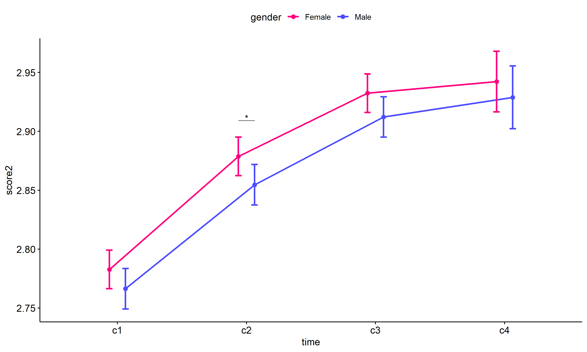<!-- -->

``` r
(pwc <- ldat %>% group_by(gender) %>%
    emmeans_test(score2 ~ time, detailed = T, p.adjust.method = "bonferroni"))
```

    ## # A tibble: 12 × 15
    ##    gender term  .y.    group1 group2 null.value estimate     se    df conf.low
    ##  * <fct>  <chr> <chr>  <chr>  <chr>       <dbl>    <dbl>  <dbl> <dbl>    <dbl>
    ##  1 Female time  score2 c1     c2              0 -0.0960  0.0118  8866  -0.119 
    ##  2 Female time  score2 c1     c3              0 -0.150   0.0118  8866  -0.173 
    ##  3 Female time  score2 c1     c4              0 -0.160   0.0156  8866  -0.190 
    ##  4 Female time  score2 c2     c3              0 -0.0537  0.0118  8866  -0.0768
    ##  5 Female time  score2 c2     c4              0 -0.0636  0.0156  8866  -0.0941
    ##  6 Female time  score2 c3     c4              0 -0.00988 0.0156  8866  -0.0404
    ##  7 Male   time  score2 c1     c2              0 -0.0883  0.0124  8866  -0.113 
    ##  8 Male   time  score2 c1     c3              0 -0.146   0.0124  8866  -0.170 
    ##  9 Male   time  score2 c1     c4              0 -0.163   0.0162  8866  -0.194 
    ## 10 Male   time  score2 c2     c3              0 -0.0576  0.0124  8866  -0.0819
    ## 11 Male   time  score2 c2     c4              0 -0.0743  0.0162  8866  -0.106 
    ## 12 Male   time  score2 c3     c4              0 -0.0167  0.0162  8866  -0.0484
    ## # ℹ 5 more variables: conf.high <dbl>, statistic <dbl>, p <dbl>, p.adj <dbl>,
    ## #   p.adj.signif <chr>

| gender | term | .y.    | group1 | group2 | null.value | estimate |    se |   df | conf.low | conf.high | statistic |     p | p.adj | p.adj.signif |
|:-------|:-----|:-------|:-------|:-------|-----------:|---------:|------:|-----:|---------:|----------:|----------:|------:|------:|:-------------|
| Female | time | score2 | c1     | c2     |          0 |   -0.096 | 0.012 | 8866 |   -0.119 |    -0.073 |    -8.119 | 0.000 |     0 | \*\*\*\*     |
| Female | time | score2 | c1     | c3     |          0 |   -0.150 | 0.012 | 8866 |   -0.173 |    -0.126 |   -12.661 | 0.000 |     0 | \*\*\*\*     |
| Female | time | score2 | c1     | c4     |          0 |   -0.160 | 0.016 | 8866 |   -0.190 |    -0.129 |   -10.248 | 0.000 |     0 | \*\*\*\*     |
| Female | time | score2 | c2     | c3     |          0 |   -0.054 | 0.012 | 8866 |   -0.077 |    -0.031 |    -4.542 | 0.000 |     0 | \*\*\*\*     |
| Female | time | score2 | c2     | c4     |          0 |   -0.064 | 0.016 | 8866 |   -0.094 |    -0.033 |    -4.083 | 0.000 |     0 | \*\*\*       |
| Female | time | score2 | c3     | c4     |          0 |   -0.010 | 0.016 | 8866 |   -0.040 |     0.021 |    -0.634 | 0.526 |     1 | ns           |
| Male   | time | score2 | c1     | c2     |          0 |   -0.088 | 0.012 | 8866 |   -0.113 |    -0.064 |    -7.123 | 0.000 |     0 | \*\*\*\*     |
| Male   | time | score2 | c1     | c3     |          0 |   -0.146 | 0.012 | 8866 |   -0.170 |    -0.122 |   -11.772 | 0.000 |     0 | \*\*\*\*     |
| Male   | time | score2 | c1     | c4     |          0 |   -0.163 | 0.016 | 8866 |   -0.194 |    -0.131 |   -10.034 | 0.000 |     0 | \*\*\*\*     |
| Male   | time | score2 | c2     | c3     |          0 |   -0.058 | 0.012 | 8866 |   -0.082 |    -0.033 |    -4.649 | 0.000 |     0 | \*\*\*\*     |
| Male   | time | score2 | c2     | c4     |          0 |   -0.074 | 0.016 | 8866 |   -0.106 |    -0.043 |    -4.585 | 0.000 |     0 | \*\*\*\*     |
| Male   | time | score2 | c3     | c4     |          0 |   -0.017 | 0.016 | 8866 |   -0.048 |     0.015 |    -1.028 | 0.304 |     1 | ns           |

``` r
(emms <- get_emmeans(pwc))
```

    ## # A tibble: 8 × 8
    ##   gender time  emmean      se    df conf.low conf.high method      
    ##   <fct>  <fct>  <dbl>   <dbl> <dbl>    <dbl>     <dbl> <chr>       
    ## 1 Female c1      2.78 0.00836  8866     2.77      2.80 Emmeans test
    ## 2 Female c2      2.88 0.00836  8866     2.86      2.90 Emmeans test
    ## 3 Female c3      2.93 0.00836  8866     2.92      2.95 Emmeans test
    ## 4 Female c4      2.94 0.0131   8866     2.92      2.97 Emmeans test
    ## 5 Male   c1      2.77 0.00876  8866     2.75      2.78 Emmeans test
    ## 6 Male   c2      2.85 0.00876  8866     2.84      2.87 Emmeans test
    ## 7 Male   c3      2.91 0.00876  8866     2.90      2.93 Emmeans test
    ## 8 Male   c4      2.93 0.0136   8866     2.90      2.96 Emmeans test

| gender | time | emmean |    se |   df | conf.low | conf.high | method       |
|:-------|:-----|-------:|------:|-----:|---------:|----------:|:-------------|
| Female | c1   |  2.783 | 0.008 | 8866 |    2.766 |     2.799 | Emmeans test |
| Female | c2   |  2.879 | 0.008 | 8866 |    2.862 |     2.895 | Emmeans test |
| Female | c3   |  2.932 | 0.008 | 8866 |    2.916 |     2.949 | Emmeans test |
| Female | c4   |  2.942 | 0.013 | 8866 |    2.917 |     2.968 | Emmeans test |
| Male   | c1   |  2.766 | 0.009 | 8866 |    2.749 |     2.784 | Emmeans test |
| Male   | c2   |  2.855 | 0.009 | 8866 |    2.837 |     2.872 | Emmeans test |
| Male   | c3   |  2.912 | 0.009 | 8866 |    2.895 |     2.929 | Emmeans test |
| Male   | c4   |  2.929 | 0.014 | 8866 |    2.902 |     2.956 | Emmeans test |

``` r
emms.gg <- emms[which(emms$gender == "Female"),]
if (nrow(emms.gg) > 0)
  ggline(emms.gg, x = "time", y = "emmean", color = "#FF007F", ylab = "score2", size = 1) +
    geom_errorbar(aes(ymin = conf.low, ymax = conf.high),
                  width = 0.1, color = "#FF007F", linewidth = 1) +
    stat_pvalue_manual(
      add_xy_position(pwc[which(pwc$gender == "Female"),],
                      x = "time", fun = "mean_se"),
      hide.ns = T, color = "#FF007F", tip.length = F) +
    theme(legend.text = element_blank())
```

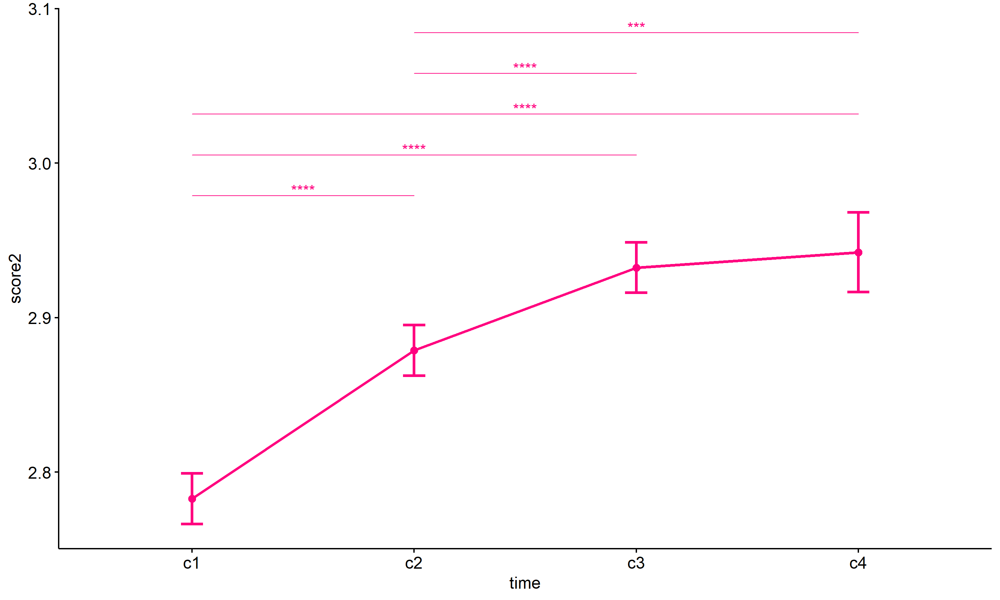<!-- -->

``` r
emms.gg <- emms[which(emms$gender == "Male"),]
if (nrow(emms.gg) > 0)
  ggline(emms.gg, x = "time", y = "emmean", color = "#4D4DFF", ylab = "score2", size = 1) +
    geom_errorbar(aes(ymin = conf.low, ymax = conf.high),
                  width = 0.1, color = "#4D4DFF", linewidth = 1) +
    stat_pvalue_manual(
      add_xy_position(pwc[which(pwc$gender == "Male"),],
                      x = "time", fun = "mean_se"),
      hide.ns = T, color = "#4D4DFF", tip.length = F) +
    theme(legend.text = element_blank())
```

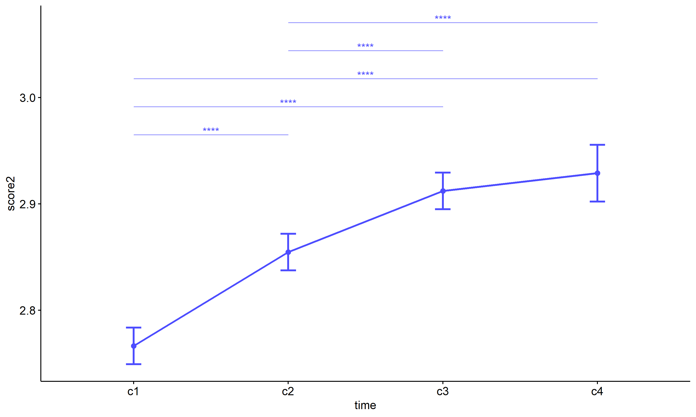<!-- -->

# ANOVA: score2 ~ time\*localizacao + Error(id/time)

## Data Preparation

``` r
data <- edat[,c("aluno_id","localizacao","ciclo","score2")]
data <- data[data$ciclo %in% c("Primeiro Ciclo","Segundo Ciclo","Terceiro Ciclo","Quarto Ciclo"),]
data$ciclo <- factor(data$ciclo, c("Primeiro Ciclo","Segundo Ciclo","Terceiro Ciclo","Quarto Ciclo"))
data <- unique(data)

wdat <- spread(data, ciclo, score2)
colnames(wdat) <- c("id","localizacao","c1","c2","c3","c4")
wdat <- wdat[complete.cases(wdat[,c("id","localizacao","c1","c2","c3")]),]

ldat <- gather(wdat, key = time, value = score2, c1,c2,c3,c4) %>%
  convert_as_factor(id, time)
ldat <- remove_group_data(ldat, "score2", c("time", "localizacao"), n.limit = 30)
ldat$localizacao <- factor(ldat$localizacao, sort(unique(ldat$localizacao)))
```

### Check assumptions: Identifying Outliers

``` r
outliers <- identify_outliers(group_by(ldat, time, localizacao), score2)
(outliers <- outliers[outliers$is.extreme == T,])
```

    ## # A tibble: 26 × 6
    ##    localizacao time  id                   score2 is.outlier is.extreme
    ##    <fct>       <fct> <fct>                 <dbl> <lgl>      <lgl>     
    ##  1 Rural       c2    X8eOpiPuKfI4GXxjOsOM   4.25 TRUE       TRUE      
    ##  2 Urbana      c2    cuknOzzwN4oCRum5U5ph   4.5  TRUE       TRUE      
    ##  3 Urbana      c2    HsQF2J0r79mHSWNe4l6n   4    TRUE       TRUE      
    ##  4 Urbana      c2    j31LU8Xwm0EQ7Mihkhjj   4    TRUE       TRUE      
    ##  5 Urbana      c2    oGUJyWRMYYbF9PNegJZh   4.25 TRUE       TRUE      
    ##  6 Urbana      c2    W8iXxSmW48zvfJyikMZb   4    TRUE       TRUE      
    ##  7 Urbana      c2    xk7eC5haTYuFQaJovsBZ   4    TRUE       TRUE      
    ##  8 Rural       c3    mbcncvg5dOFa9ZRsRhZf   4.25 TRUE       TRUE      
    ##  9 Rural       c3    Pj0bkt0GAUBSA1FoPcc2   4.5  TRUE       TRUE      
    ## 10 Rural       c3    PwZy7Lbc45vuNd5du72A   4.25 TRUE       TRUE      
    ## # ℹ 16 more rows

| localizacao | time | id                   | score2 | is.outlier | is.extreme |
|:------------|:-----|:---------------------|-------:|:-----------|:-----------|
| Rural       | c2   | X8eOpiPuKfI4GXxjOsOM |  4.250 | TRUE       | TRUE       |
| Urbana      | c2   | cuknOzzwN4oCRum5U5ph |  4.500 | TRUE       | TRUE       |
| Urbana      | c2   | HsQF2J0r79mHSWNe4l6n |  4.000 | TRUE       | TRUE       |
| Urbana      | c2   | j31LU8Xwm0EQ7Mihkhjj |  4.000 | TRUE       | TRUE       |
| Urbana      | c2   | oGUJyWRMYYbF9PNegJZh |  4.250 | TRUE       | TRUE       |
| Urbana      | c2   | W8iXxSmW48zvfJyikMZb |  4.000 | TRUE       | TRUE       |
| Urbana      | c2   | xk7eC5haTYuFQaJovsBZ |  4.000 | TRUE       | TRUE       |
| Rural       | c3   | mbcncvg5dOFa9ZRsRhZf |  4.250 | TRUE       | TRUE       |
| Rural       | c3   | Pj0bkt0GAUBSA1FoPcc2 |  4.500 | TRUE       | TRUE       |
| Rural       | c3   | PwZy7Lbc45vuNd5du72A |  4.250 | TRUE       | TRUE       |
| Rural       | c3   | sNrMxxYCTthTxBfrZZuD |  4.000 | TRUE       | TRUE       |
| Rural       | c3   | xADstL8Txh6OaomMZXC4 |  4.000 | TRUE       | TRUE       |
| Urbana      | c3   | 1uixvrMfKulaomVh0MKa |  4.250 | TRUE       | TRUE       |
| Urbana      | c3   | 6bEKmKQpOuvY6PSQvzqj |  4.250 | TRUE       | TRUE       |
| Urbana      | c3   | 7pR91qd7LX1X2Chwr4xQ |  4.250 | TRUE       | TRUE       |
| Urbana      | c3   | 8edbRBvoAhVAiLZ3h3E2 |  4.500 | TRUE       | TRUE       |
| Urbana      | c3   | CCVIt7MPeYMUOCCyBxPh |  4.250 | TRUE       | TRUE       |
| Urbana      | c3   | cOCdJff1IOVxOznhBCWn |  4.000 | TRUE       | TRUE       |
| Urbana      | c3   | G1fSZJ6Ea4VhHH2OjGQ3 |  4.250 | TRUE       | TRUE       |
| Urbana      | c3   | i5EZ8Ck9IgDueyMbw55v |  4.500 | TRUE       | TRUE       |
| Urbana      | c3   | m5yRlxfIj73j4ossfTOB |  4.250 | TRUE       | TRUE       |
| Urbana      | c3   | OvwAQTWkdj8SYpPS8dgn |  4.250 | TRUE       | TRUE       |
| Urbana      | c3   | xk7eC5haTYuFQaJovsBZ |  3.875 | TRUE       | TRUE       |
| Rural       | c4   | fgNBRPWfCa0TP4bDO8d2 |  4.250 | TRUE       | TRUE       |
| Urbana      | c4   | 6bEKmKQpOuvY6PSQvzqj |  4.000 | TRUE       | TRUE       |
| Urbana      | c4   | DP1fbT1lGhLiBnOFILLi |  4.000 | TRUE       | TRUE       |

### Check assumptions: Normality Test

``` r
(normality.df <- get.descriptives(ldat, "score2", c("time", "localizacao"), symmetry.test = T, normality.test = T))
```

    ##   time localizacao variable    n  mean median  min  max    sd    se    ci  iqr
    ## 1   c1       Rural   score2  656 2.765  2.750 2.25 3.75 0.248 0.010 0.019 0.50
    ## 2   c1      Urbana   score2 2117 2.776  2.750 2.25 3.75 0.257 0.006 0.011 0.50
    ## 3   c2       Rural   score2  656 2.867  2.875 2.25 4.25 0.294 0.011 0.023 0.25
    ## 4   c2      Urbana   score2 2117 2.869  2.875 2.25 4.50 0.306 0.007 0.013 0.25
    ## 5   c3       Rural   score2  656 2.944  3.000 2.25 4.50 0.366 0.014 0.028 0.25
    ## 6   c3      Urbana   score2 2117 2.916  2.875 2.25 4.50 0.339 0.007 0.014 0.25
    ## 7   c4       Rural   score2  181 2.976  3.000 2.25 4.25 0.359 0.027 0.053 0.25
    ## 8   c4      Urbana   score2  945 2.933  3.000 2.25 4.00 0.336 0.011 0.021 0.25
    ##   symmetry  skewness  kurtosis normality     method statistic            p
    ## 1       NO 0.6444510 1.1676107         - D'Agostino  57.35594 3.510525e-13
    ## 2       NO 0.6734241 1.2683510         - D'Agostino 193.06430 0.000000e+00
    ## 3       NO 0.8097966 1.6103842         - D'Agostino  84.37139 0.000000e+00
    ## 4       NO 1.0121094 1.9471041         - D'Agostino 356.27703 0.000000e+00
    ## 5       NO 0.9276956 0.8944046         - D'Agostino  84.13033 0.000000e+00
    ## 6       NO 1.0057009 1.4350840         - D'Agostino 323.95928 0.000000e+00
    ## 7     <NA>        NA        NA      <NA>       <NA>        NA           NA
    ## 8     <NA>        NA        NA      <NA>       <NA>        NA           NA
    ##   p.signif
    ## 1     ****
    ## 2     ****
    ## 3     ****
    ## 4     ****
    ## 5     ****
    ## 6     ****
    ## 7     <NA>
    ## 8     <NA>

| time | localizacao | variable |    n |  mean | median |  min |  max |    sd |    se |    ci |  iqr | symmetry | skewness | kurtosis | normality | method     | statistic |   p | p.signif |
|:-----|:------------|:---------|-----:|------:|-------:|-----:|-----:|------:|------:|------:|-----:|:---------|---------:|---------:|:----------|:-----------|----------:|----:|:---------|
| c1   | Rural       | score2   |  656 | 2.765 |  2.750 | 2.25 | 3.75 | 0.248 | 0.010 | 0.019 | 0.50 | NO       |    0.644 |    1.168 | \-        | D’Agostino |    57.356 |   0 | \*\*\*\* |
| c1   | Urbana      | score2   | 2117 | 2.776 |  2.750 | 2.25 | 3.75 | 0.257 | 0.006 | 0.011 | 0.50 | NO       |    0.673 |    1.268 | \-        | D’Agostino |   193.064 |   0 | \*\*\*\* |
| c2   | Rural       | score2   |  656 | 2.867 |  2.875 | 2.25 | 4.25 | 0.294 | 0.011 | 0.023 | 0.25 | NO       |    0.810 |    1.610 | \-        | D’Agostino |    84.371 |   0 | \*\*\*\* |
| c2   | Urbana      | score2   | 2117 | 2.869 |  2.875 | 2.25 | 4.50 | 0.306 | 0.007 | 0.013 | 0.25 | NO       |    1.012 |    1.947 | \-        | D’Agostino |   356.277 |   0 | \*\*\*\* |
| c3   | Rural       | score2   |  656 | 2.944 |  3.000 | 2.25 | 4.50 | 0.366 | 0.014 | 0.028 | 0.25 | NO       |    0.928 |    0.894 | \-        | D’Agostino |    84.130 |   0 | \*\*\*\* |
| c3   | Urbana      | score2   | 2117 | 2.916 |  2.875 | 2.25 | 4.50 | 0.339 | 0.007 | 0.014 | 0.25 | NO       |    1.006 |    1.435 | \-        | D’Agostino |   323.959 |   0 | \*\*\*\* |
| c4   | Rural       | score2   |  181 | 2.976 |  3.000 | 2.25 | 4.25 | 0.359 | 0.027 | 0.053 | 0.25 | NA       |       NA |       NA | NA        | NA         |        NA |  NA | NA       |
| c4   | Urbana      | score2   |  945 | 2.933 |  3.000 | 2.25 | 4.00 | 0.336 | 0.011 | 0.021 | 0.25 | NA       |       NA |       NA | NA        | NA         |        NA |  NA | NA       |

``` r
(non.ids <- unique(do.call(
  c, lapply(which(normality.df$normality == 'NO'), FUN = function(i) {
  idx = which(ldat$time == normality.df$time[i] &
                ldat$localizacao == normality.df$localizacao[i])
  getNonNormal(ldat$"score2"[idx], ldat$id[idx])
}))))
```

    ## NULL

``` r
if (length(non.ids) > 0)
  ldat2 <- ldat[!ldat$id %in% non.ids,]
```

### Summary Statistics

``` r
(sdat <- ldat %>% group_by(time, localizacao) %>%
   get_summary_stats(score2, type = "mean_sd"))
```

    ## # A tibble: 8 × 6
    ##   localizacao time  variable     n  mean    sd
    ##   <fct>       <fct> <fct>    <dbl> <dbl> <dbl>
    ## 1 Rural       c1    score2     656  2.76 0.248
    ## 2 Urbana      c1    score2    2117  2.78 0.257
    ## 3 Rural       c2    score2     656  2.87 0.294
    ## 4 Urbana      c2    score2    2117  2.87 0.306
    ## 5 Rural       c3    score2     656  2.94 0.366
    ## 6 Urbana      c3    score2    2117  2.92 0.339
    ## 7 Rural       c4    score2     181  2.98 0.359
    ## 8 Urbana      c4    score2     945  2.93 0.336

| localizacao | time | variable |    n |  mean |    sd |
|:------------|:-----|:---------|-----:|------:|------:|
| Rural       | c1   | score2   |  656 | 2.765 | 0.248 |
| Urbana      | c1   | score2   | 2117 | 2.776 | 0.257 |
| Rural       | c2   | score2   |  656 | 2.867 | 0.294 |
| Urbana      | c2   | score2   | 2117 | 2.869 | 0.306 |
| Rural       | c3   | score2   |  656 | 2.944 | 0.366 |
| Urbana      | c3   | score2   | 2117 | 2.916 | 0.339 |
| Rural       | c4   | score2   |  181 | 2.976 | 0.359 |
| Urbana      | c4   | score2   |  945 | 2.933 | 0.336 |

``` r
if (length(non.ids) > 0)
  (sdat <- ldat2 %>% group_by(time, localizacao) %>%
      get_summary_stats(score2, type = "mean_sd"))
```

| localizacao | time | variable |    n |  mean |    sd |
|:------------|:-----|:---------|-----:|------:|------:|
| Rural       | c1   | score2   |  656 | 2.765 | 0.248 |
| Urbana      | c1   | score2   | 2117 | 2.776 | 0.257 |
| Rural       | c2   | score2   |  656 | 2.867 | 0.294 |
| Urbana      | c2   | score2   | 2117 | 2.869 | 0.306 |
| Rural       | c3   | score2   |  656 | 2.944 | 0.366 |
| Urbana      | c3   | score2   | 2117 | 2.916 | 0.339 |
| Rural       | c4   | score2   |  181 | 2.976 | 0.359 |
| Urbana      | c4   | score2   |  945 | 2.933 | 0.336 |

## ANOVA Computation

``` r
(res.aov <- anova_test(ldat, dv = score2, wid = id, between = localizacao, within = time))
```

    ## Warning: NA detected in rows:
    ## 8323,8325,8326,8332,8333,8334,8337,8339,8340,8342,8343,8344,8345,8349,8350,8352,8353,8354,8358,8359,8361,8362,8364,8369,8370,8374,8375,8376,8383,8384,8391,8392,8394,8396,8398,8399,8401,8402,8404,8408,8409,8412,8413,8414,8416,8419,8424,8427,8429,8430,8431,8433,8435,8442,8443,8444,8445,8447,8450,8451,8452,8454,8455,8457,8459,8460,8465,8466,8467,8468,8469,8470,8471,8475,8476,8477,8479,8480,8482,8484,8487,8488,8490,8491,8492,8493,8494,8496,8497,8499,8500,8502,8503,8506,8510,8511,8514,8515,8516,8519,8521,8522,8525,8528,8529,8530,8531,8532,8533,8534,8536,8538,8540,8541,8546,8549,8551,8552,8555,8556,8559,8560,8562,8565,8567,8569,8570,8571,8574,8576,8579,8580,8581,8583,8590,8591,8592,8593,8598,8601,8602,8604,8605,8606,8607,8608,8609,8613,8618,8623,8626,8628,8630,8632,8634,8635,8637,8638,8639,8641,8642,8644,8647,8649,8650,8651,8652,8653,8654,8655,8658,8659,8660,8661,8662,8664,8665,8666,8668,8671,8672,8674,8678,8683,8685,8686,8687,8689,8692,8693,8694,8696,8697,8698,8699,8704,8706,8707,8708,8709,8711,8712,8713,8714,8715,8716,8717,8718,8719,8720,8721,8724,8725,8727,8728,8729,8730,8731,8732,8734,8735,8736,8737,8739,8740,8743,8744,8745,8746,8748,8749,8751,8753,8754,8755,8756,8757,8760,8761,8762,8763,8765,8766,8768,8771,8772,8773,8775,8776,8777,8778,8779,8781,8785,8786,8787,8788,8789,8792,8793,8794,8797,8799,8800,8802,8806,8807,8808,8809,8810,8811,8812,8814,8820,8823,8824,8825,8826,8828,8829,8831,8832,8834,8835,8836,8837,8838,8839,8840,8841,8842,8843,8844,8845,8846,8849,8852,8854,8855,8856,8858,8860,8862,8865,8869,8871,8872,8874,8875,8877,8879,8880,8881,8883,8884,8885,8886,8887,8889,8891,8892,8893,8894,8895,8896,8898,8899,8900,8901,8903,8904,8905,8906,8910,8914,8915,8917,8918,8920,8923,8928,8929,8931,8932,8933,8934,8935,8937,8939,8940,8941,8943,8944,8945,8946,8948,8951,8952,8953,8954,8955,8956,8957,8959,8961,8963,8964,8965,8967,8968,8969,8970,8971,8973,8974,8975,8977,8978,8983,8986,8987,8991,8992,8995,8996,8997,9000,9001,9002,9003,9004,9005,9008,9010,9012,9018,9021,9025,9026,9027,9030,9031,9032,9033,9035,9038,9043,9044,9045,9047,9048,9052,9055,9059,9060,9063,9065,9069,9073,9074,9077,9078,9079,9081,9082,9083,9084,9085,9086,9087,9088,9089,9090,9091,9093,9099,9102,9104,9105,9106,9107,9108,9111,9112,9113,9117,9120,9121,9126,9127,9129,9130,9131,9134,9136,9137,9139,9141,9143,9144,9146,9147,9150,9151,9153,9154,9155,9156,9157,9160,9161,9163,9164,9165,9166,9167,9168,9169,9171,9173,9176,9178,9180,9182,9183,9184,9186,9187,9188,9189,9190,9191,9192,9193,9194,9195,9198,9199,9202,9204,9205,9206,9208,9212,9213,9215,9216,9217,9220,9223,9227,9228,9229,9230,9231,9232,9233,9235,9236,9237,9238,9239,9240,9241,9242,9243,9244,9246,9247,9250,9251,9252,9253,9254,9255,9256,9257,9258,9260,9261,9262,9267,9268,9270,9271,9272,9273,9274,9276,9277,9278,9279,9285,9286,9288,9293,9294,9296,9297,9299,9300,9301,9302,9303,9306,9308,9309,9312,9314,9316,9319,9320,9321,9323,9325,9326,9327,9330,9332,9335,9337,9340,9342,9344,9345,9347,9348,9349,9351,9356,9357,9360,9361,9362,9364,9365,9367,9371,9372,9375,9376,9377,9378,9385,9386,9387,9389,9390,9391,9392,9396,9397,9398,9399,9401,9402,9403,9404,9405,9407,9408,9409,9410,9413,9414,9415,9416,9417,9418,9420,9421,9422,9423,9425,9426,9427,9431,9432,9434,9435,9437,9438,9439,9440,9441,9442,9443,9444,9445,9446,9447,9448,9449,9452,9454,9455,9456,9460,9464,9466,9469,9470,9471,9474,9475,9476,9477,9478,9479,9480,9482,9484,9485,9487,9491,9492,9494,9496,9497,9498,9499,9500,9503,9504,9506,9507,9509,9510,9511,9512,9514,9516,9517,9518,9519,9520,9521,9523,9524,9525,9526,9527,9529,9532,9533,9534,9536,9537,9543,9547,9550,9552,9553,9555,9556,9558,9559,9561,9562,9567,9570,9571,9575,9576,9578,9579,9583,9588,9589,9590,9591,9592,9593,9594,9597,9598,9600,9602,9605,9606,9607,9613,9614,9615,9616,9618,9619,9621,9623,9624,9626,9627,9629,9632,9634,9635,9637,9639,9646,9647,9649,9650,9652,9653,9656,9658,9660,9661,9662,9663,9665,9666,9667,9668,9670,9672,9674,9677,9678,9680,9681,9687,9688,9690,9693,9694,9695,9696,9697,9699,9700,9701,9703,9705,9707,9708,9709,9710,9712,9713,9714,9715,9716,9719,9721,9723,9724,9725,9726,9727,9729,9730,9732,9734,9735,9737,9738,9739,9740,9741,9742,9744,9746,9747,9748,9749,9751,9754,9755,9756,9757,9758,9759,9762,9764,9765,9767,9768,9772,9773,9774,9775,9776,9783,9784,9785,9787,9788,9792,9794,9797,9801,9803,9804,9805,9806,9807,9808,9809,9810,9812,9813,9814,9815,9816,9817,9818,9819,9820,9821,9823,9824,9826,9829,9830,9831,9832,9833,9834,9835,9836,9837,9838,9840,9841,9842,9844,9845,9846,9848,9849,9850,9851,9852,9853,9854,9856,9858,9859,9860,9863,9869,9871,9874,9875,9876,9877,9878,9879,9883,9884,9886,9888,9889,9892,9893,9894,9895,9897,9898,9899,9900,9901,9902,9904,9907,9908,9909,9911,9914,9918,9919,9920,9923,9925,9926,9927,9929,9930,9931,9932,9933,9934,9935,9936,9937,9938,9939,9940,9943,9944,9947,9950,9951,9952,9954,9957,9958,9963,9964,9965,9966,9969,9970,9971,9974,9975,9976,9978,9979,9981,9983,9984,9985,9988,9989,9991,9992,9994,9995,9998,9999,10002,10004,10005,10006,10008,10009,10012,10014,10017,10018,10019,10020,10022,10023,10025,10026,10027,10028,10029,10030,10031,10036,10037,10039,10040,10043,10044,10045,10046,10047,10050,10052,10053,10054,10055,10056,10057,10059,10060,10063,10064,10066,10067,10068,10069,10071,10072,10073,10074,10075,10077,10078,10079,10080,10081,10082,10084,10085,10088,10089,10093,10095,10096,10097,10098,10099,10101,10102,10103,10105,10106,10107,10108,10110,10111,10112,10113,10117,10119,10120,10121,10122,10123,10124,10127,10129,10130,10131,10133,10135,10138,10140,10144,10145,10146,10150,10151,10152,10155,10156,10157,10158,10159,10160,10161,10162,10164,10165,10166,10168,10169,10170,10172,10173,10174,10175,10177,10179,10180,10181,10182,10184,10188,10190,10191,10192,10195,10196,10197,10200,10201,10202,10203,10204,10206,10207,10210,10212,10213,10215,10216,10218,10220,10221,10222,10223,10224,10225,10226,10232,10233,10234,10238,10242,10243,10244,10245,10250,10251,10252,10253,10254,10255,10257,10258,10260,10262,10265,10266,10267,10268,10269,10272,10277,10278,10280,10282,10285,10288,10290,10293,10294,10295,10296,10298,10300,10301,10302,10303,10306,10307,10310,10311,10312,10313,10316,10317,10318,10319,10321,10323,10324,10325,10327,10328,10329,10330,10331,10332,10333,10336,10337,10338,10339,10340,10343,10346,10349,10350,10351,10354,10358,10359,10360,10361,10362,10363,10364,10365,10367,10369,10370,10371,10372,10373,10374,10376,10377,10378,10379,10386,10387,10389,10391,10396,10397,10398,10400,10401,10402,10404,10406,10407,10408,10409,10410,10413,10414,10417,10418,10419,10425,10426,10430,10431,10432,10435,10436,10437,10438,10439,10443,10445,10447,10448,10449,10450,10451,10453,10455,10456,10457,10461,10463,10464,10465,10466,10467,10470,10471,10473,10474,10475,10476,10478,10479,10480,10482,10485,10486,10490,10491,10492,10493,10494,10495,10496,10497,10498,10499,10500,10501,10504,10509,10511,10512,10513,10514,10515,10516,10518,10520,10521,10522,10525,10526,10527,10528,10529,10531,10534,10535,10538,10539,10540,10545,10546,10549,10550,10551,10552,10553,10554,10555,10556,10557,10559,10561,10562,10563,10565,10566,10567,10569,10570,10571,10572,10574,10575,10577,10579,10581,10583,10585,10587,10588,10589,10591,10592,10594,10595,10597,10599,10600,10601,10602,10603,10605,10606,10608,10610,10612,10614,10615,10618,10619,10621,10622,10625,10626,10628,10630,10632,10634,10635,10636,10637,10639,10640,10642,10646,10648,10651,10654,10658,10659,10661,10662,10663,10664,10666,10667,10668,10669,10670,10673,10674,10677,10678,10679,10681,10684,10686,10687,10688,10689,10690,10695,10697,10698,10703,10706,10708,10710,10711,10713,10714,10715,10722,10724,10725,10726,10727,10728,10731,10733,10734,10735,10736,10738,10739,10741,10743,10744,10747,10748,10749,10750,10751,10754,10755,10756,10758,10760,10761,10763,10764,10765,10766,10767,10772,10775,10777,10779,10780,10781,10784,10787,10788,10789,10792,10793,10794,10795,10797,10798,10799,10800,10801,10802,10803,10804,10805,10806,10808,10809,10812,10816,10818,10820,10822,10823,10825,10826,10828,10831,10832,10834,10836,10837,10839,10841,10842,10843,10847,10848,10849,10854,10855,10856,10857,10858,10859,10860,10861,10862,10864,10865,10868,10869,10870,10872,10873,10879,10880,10882,10883,10884,10889,10891,10892,10893,10895,1

    ## ANOVA Table (type III tests)
    ## 
    ## $ANOVA
    ##             Effect DFn  DFd      F        p p<.05   ges
    ## 1      localizacao   1 1124  5.343 2.10e-02     * 0.002
    ## 2             time   3 3372 61.597 9.12e-39     * 0.032
    ## 3 localizacao:time   3 3372  2.047 1.05e-01       0.001
    ## 
    ## $`Mauchly's Test for Sphericity`
    ##             Effect     W     p p<.05
    ## 1             time 0.985 0.004     *
    ## 2 localizacao:time 0.985 0.004     *
    ## 
    ## $`Sphericity Corrections`
    ##             Effect  GGe        DF[GG]    p[GG] p[GG]<.05   HFe        DF[HF]
    ## 1             time 0.99 2.97, 3339.09 2.05e-38         * 0.993 2.98, 3348.91
    ## 2 localizacao:time 0.99 2.97, 3339.09 1.06e-01           0.993 2.98, 3348.91
    ##      p[HF] p[HF]<.05
    ## 1 1.61e-38         *
    ## 2 1.06e-01

| Effect           | DFn |  DFd |      F |     p | p\<.05 |   ges |
|:-----------------|----:|-----:|-------:|------:|:-------|------:|
| localizacao      |   1 | 1124 |  5.343 | 0.021 | \*     | 0.002 |
| time             |   3 | 3372 | 61.597 | 0.000 | \*     | 0.032 |
| localizacao:time |   3 | 3372 |  2.047 | 0.105 |        | 0.001 |

| Effect           |     W |     p | p\<.05 |
|:-----------------|------:|------:|:-------|
| time             | 0.985 | 0.004 | \*     |
| localizacao:time | 0.985 | 0.004 | \*     |

| Effect           |  GGe | DF\[GG\]      | p\[GG\] | p\[GG\]\<.05 |   HFe | DF\[HF\]      | p\[HF\] | p\[HF\]\<.05 |
|:-----------------|-----:|:--------------|--------:|:-------------|------:|:--------------|--------:|:-------------|
| time             | 0.99 | 2.97, 3339.09 |   0.000 | \*           | 0.993 | 2.98, 3348.91 |   0.000 | \*           |
| localizacao:time | 0.99 | 2.97, 3339.09 |   0.106 |              | 0.993 | 2.98, 3348.91 |   0.106 |              |

## ANOVA Computation after removing non.normal data

``` r
if (length(non.ids) > 0)
  (res.aov2 <- anova_test(ldat2, dv = score2, wid = id, between = localizacao , within = time))
```

## PairWise Computation

``` r
(pwc <- ldat %>% group_by(time) %>%
   emmeans_test(score2 ~ localizacao, detailed = T, p.adjust.method = "bonferroni"))
```

    ## # A tibble: 4 × 15
    ##   time  term       .y.   group1 group2 null.value estimate     se    df conf.low
    ## * <fct> <chr>      <chr> <chr>  <chr>       <dbl>    <dbl>  <dbl> <dbl>    <dbl>
    ## 1 c1    localizac… scor… Rural  Urbana          0 -0.0105  0.0138  9437 -0.0375 
    ## 2 c2    localizac… scor… Rural  Urbana          0 -0.00185 0.0138  9437 -0.0288 
    ## 3 c3    localizac… scor… Rural  Urbana          0  0.0280  0.0138  9437  0.00105
    ## 4 c4    localizac… scor… Rural  Urbana          0  0.0430  0.0250  9437 -0.00596
    ## # ℹ 5 more variables: conf.high <dbl>, statistic <dbl>, p <dbl>, p.adj <dbl>,
    ## #   p.adj.signif <chr>

| time | term        | .y.    | group1 | group2 | null.value | estimate |    se |   df | conf.low | conf.high | statistic |     p | p.adj | p.adj.signif |
|:-----|:------------|:-------|:-------|:-------|-----------:|---------:|------:|-----:|---------:|----------:|----------:|------:|------:|:-------------|
| c1   | localizacao | score2 | Rural  | Urbana |          0 |   -0.011 | 0.014 | 9437 |   -0.038 |     0.016 |    -0.765 | 0.444 | 0.444 | ns           |
| c2   | localizacao | score2 | Rural  | Urbana |          0 |   -0.002 | 0.014 | 9437 |   -0.029 |     0.025 |    -0.134 | 0.893 | 0.893 | ns           |
| c3   | localizacao | score2 | Rural  | Urbana |          0 |    0.028 | 0.014 | 9437 |    0.001 |     0.055 |     2.037 | 0.042 | 0.042 | \*           |
| c4   | localizacao | score2 | Rural  | Urbana |          0 |    0.043 | 0.025 | 9437 |   -0.006 |     0.092 |     1.722 | 0.085 | 0.085 | ns           |

``` r
(emms <- get_emmeans(pwc))
```

    ## # A tibble: 8 × 8
    ##   time  localizacao emmean      se    df conf.low conf.high method      
    ##   <fct> <fct>        <dbl>   <dbl> <dbl>    <dbl>     <dbl> <chr>       
    ## 1 c1    Rural         2.77 0.0120   9437     2.74      2.79 Emmeans test
    ## 2 c1    Urbana        2.78 0.00669  9437     2.76      2.79 Emmeans test
    ## 3 c2    Rural         2.87 0.0120   9437     2.84      2.89 Emmeans test
    ## 4 c2    Urbana        2.87 0.00669  9437     2.86      2.88 Emmeans test
    ## 5 c3    Rural         2.94 0.0120   9437     2.92      2.97 Emmeans test
    ## 6 c3    Urbana        2.92 0.00669  9437     2.90      2.93 Emmeans test
    ## 7 c4    Rural         2.98 0.0229   9437     2.93      3.02 Emmeans test
    ## 8 c4    Urbana        2.93 0.0100   9437     2.91      2.95 Emmeans test

| time | localizacao | emmean |    se |   df | conf.low | conf.high | method       |
|:-----|:------------|-------:|------:|-----:|---------:|----------:|:-------------|
| c1   | Rural       |  2.765 | 0.012 | 9437 |    2.741 |     2.789 | Emmeans test |
| c1   | Urbana      |  2.776 | 0.007 | 9437 |    2.762 |     2.789 | Emmeans test |
| c2   | Rural       |  2.867 | 0.012 | 9437 |    2.844 |     2.891 | Emmeans test |
| c2   | Urbana      |  2.869 | 0.007 | 9437 |    2.856 |     2.882 | Emmeans test |
| c3   | Rural       |  2.944 | 0.012 | 9437 |    2.921 |     2.968 | Emmeans test |
| c3   | Urbana      |  2.916 | 0.007 | 9437 |    2.903 |     2.929 | Emmeans test |
| c4   | Rural       |  2.976 | 0.023 | 9437 |    2.931 |     3.021 | Emmeans test |
| c4   | Urbana      |  2.933 | 0.010 | 9437 |    2.913 |     2.952 | Emmeans test |

``` r
pwc <- add_xy_position(pwc, x = "time", fun = "mean_se", dodge = 0.25)
pd <- position_dodge(width = 0.25)
ggline(emms, x = "time", y = "emmean", color = "localizacao",
       palette = c("#AA00FF","#00CCCC"), size = 1,
       position = pd, ylab = "score2") +
  geom_errorbar(aes(ymin = conf.low, ymax = conf.high, color = localizacao),
                position = pd, width = 0.1, linewidth = 1) +
  stat_pvalue_manual(pwc, hide.ns = T, tip.length = F, linetype = 1)
```

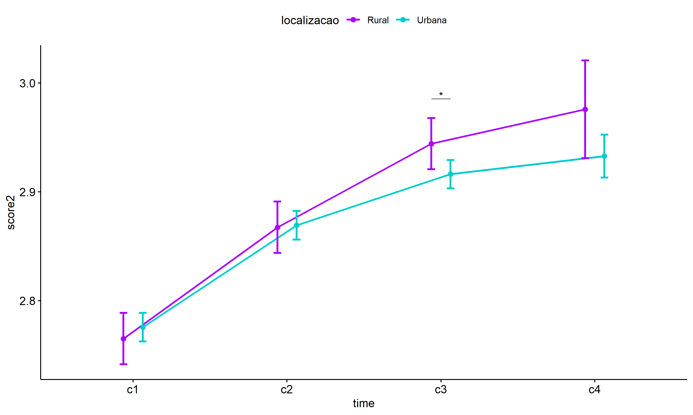<!-- -->

``` r
(pwc <- ldat %>% group_by(localizacao) %>%
    emmeans_test(score2 ~ time, detailed = T, p.adjust.method = "bonferroni"))
```

    ## # A tibble: 12 × 15
    ##    localizacao term  .y.    group1 group2 null.value estimate      se    df
    ##  * <fct>       <chr> <chr>  <chr>  <chr>       <dbl>    <dbl>   <dbl> <dbl>
    ##  1 Rural       time  score2 c1     c2              0  -0.102  0.0170   9437
    ##  2 Rural       time  score2 c1     c3              0  -0.179  0.0170   9437
    ##  3 Rural       time  score2 c1     c4              0  -0.211  0.0259   9437
    ##  4 Rural       time  score2 c2     c3              0  -0.0768 0.0170   9437
    ##  5 Rural       time  score2 c2     c4              0  -0.108  0.0259   9437
    ##  6 Rural       time  score2 c3     c4              0  -0.0317 0.0259   9437
    ##  7 Urbana      time  score2 c1     c2              0  -0.0936 0.00947  9437
    ##  8 Urbana      time  score2 c1     c3              0  -0.141  0.00947  9437
    ##  9 Urbana      time  score2 c1     c4              0  -0.157  0.0121   9437
    ## 10 Urbana      time  score2 c2     c3              0  -0.0469 0.00947  9437
    ## 11 Urbana      time  score2 c2     c4              0  -0.0636 0.0121   9437
    ## 12 Urbana      time  score2 c3     c4              0  -0.0167 0.0121   9437
    ## # ℹ 6 more variables: conf.low <dbl>, conf.high <dbl>, statistic <dbl>,
    ## #   p <dbl>, p.adj <dbl>, p.adj.signif <chr>

| localizacao | term | .y.    | group1 | group2 | null.value | estimate |    se |   df | conf.low | conf.high | statistic |     p | p.adj | p.adj.signif |
|:------------|:-----|:-------|:-------|:-------|-----------:|---------:|------:|-----:|---------:|----------:|----------:|------:|------:|:-------------|
| Rural       | time | score2 | c1     | c2     |          0 |   -0.102 | 0.017 | 9437 |   -0.136 |    -0.069 |    -6.016 | 0.000 |     0 | \*\*\*\*     |
| Rural       | time | score2 | c1     | c3     |          0 |   -0.179 | 0.017 | 9437 |   -0.212 |    -0.146 |   -10.532 | 0.000 |     0 | \*\*\*\*     |
| Rural       | time | score2 | c1     | c4     |          0 |   -0.211 | 0.026 | 9437 |   -0.261 |    -0.160 |    -8.150 | 0.000 |     0 | \*\*\*\*     |
| Rural       | time | score2 | c2     | c3     |          0 |   -0.077 | 0.017 | 9437 |   -0.110 |    -0.043 |    -4.515 | 0.000 |     0 | \*\*\*\*     |
| Rural       | time | score2 | c2     | c4     |          0 |   -0.108 | 0.026 | 9437 |   -0.159 |    -0.058 |    -4.194 | 0.000 |     0 | \*\*\*       |
| Rural       | time | score2 | c3     | c4     |          0 |   -0.032 | 0.026 | 9437 |   -0.082 |     0.019 |    -1.224 | 0.221 |     1 | ns           |
| Urbana      | time | score2 | c1     | c2     |          0 |   -0.094 | 0.009 | 9437 |   -0.112 |    -0.075 |    -9.890 | 0.000 |     0 | \*\*\*\*     |
| Urbana      | time | score2 | c1     | c3     |          0 |   -0.141 | 0.009 | 9437 |   -0.159 |    -0.122 |   -14.845 | 0.000 |     0 | \*\*\*\*     |
| Urbana      | time | score2 | c1     | c4     |          0 |   -0.157 | 0.012 | 9437 |   -0.181 |    -0.134 |   -13.047 | 0.000 |     0 | \*\*\*\*     |
| Urbana      | time | score2 | c2     | c3     |          0 |   -0.047 | 0.009 | 9437 |   -0.065 |    -0.028 |    -4.955 | 0.000 |     0 | \*\*\*\*     |
| Urbana      | time | score2 | c2     | c4     |          0 |   -0.064 | 0.012 | 9437 |   -0.087 |    -0.040 |    -5.276 | 0.000 |     0 | \*\*\*\*     |
| Urbana      | time | score2 | c3     | c4     |          0 |   -0.017 | 0.012 | 9437 |   -0.040 |     0.007 |    -1.383 | 0.167 |     1 | ns           |

``` r
(emms <- get_emmeans(pwc))
```

    ## # A tibble: 8 × 8
    ##   localizacao time  emmean      se    df conf.low conf.high method      
    ##   <fct>       <fct>  <dbl>   <dbl> <dbl>    <dbl>     <dbl> <chr>       
    ## 1 Rural       c1      2.77 0.0120   9437     2.74      2.79 Emmeans test
    ## 2 Rural       c2      2.87 0.0120   9437     2.84      2.89 Emmeans test
    ## 3 Rural       c3      2.94 0.0120   9437     2.92      2.97 Emmeans test
    ## 4 Rural       c4      2.98 0.0229   9437     2.93      3.02 Emmeans test
    ## 5 Urbana      c1      2.78 0.00669  9437     2.76      2.79 Emmeans test
    ## 6 Urbana      c2      2.87 0.00669  9437     2.86      2.88 Emmeans test
    ## 7 Urbana      c3      2.92 0.00669  9437     2.90      2.93 Emmeans test
    ## 8 Urbana      c4      2.93 0.0100   9437     2.91      2.95 Emmeans test

| localizacao | time | emmean |    se |   df | conf.low | conf.high | method       |
|:------------|:-----|-------:|------:|-----:|---------:|----------:|:-------------|
| Rural       | c1   |  2.765 | 0.012 | 9437 |    2.741 |     2.789 | Emmeans test |
| Rural       | c2   |  2.867 | 0.012 | 9437 |    2.844 |     2.891 | Emmeans test |
| Rural       | c3   |  2.944 | 0.012 | 9437 |    2.921 |     2.968 | Emmeans test |
| Rural       | c4   |  2.976 | 0.023 | 9437 |    2.931 |     3.021 | Emmeans test |
| Urbana      | c1   |  2.776 | 0.007 | 9437 |    2.762 |     2.789 | Emmeans test |
| Urbana      | c2   |  2.869 | 0.007 | 9437 |    2.856 |     2.882 | Emmeans test |
| Urbana      | c3   |  2.916 | 0.007 | 9437 |    2.903 |     2.929 | Emmeans test |
| Urbana      | c4   |  2.933 | 0.010 | 9437 |    2.913 |     2.952 | Emmeans test |

``` r
emms.gg <- emms[which(emms$localizacao == "Rural"),]
if (nrow(emms.gg) > 0)
  ggline(emms.gg, x = "time", y = "emmean", color = "#AA00FF", ylab = "score2", size = 1) +
    geom_errorbar(aes(ymin = conf.low, ymax = conf.high),
                  width = 0.1, color = "#AA00FF", linewidth = 1) +
    stat_pvalue_manual(
      add_xy_position(pwc[which(pwc$localizacao == "Rural"),],
                      x = "time", fun = "mean_se"),
      hide.ns = T, color = "#AA00FF", tip.length = F) +
    theme(legend.text = element_blank())
```

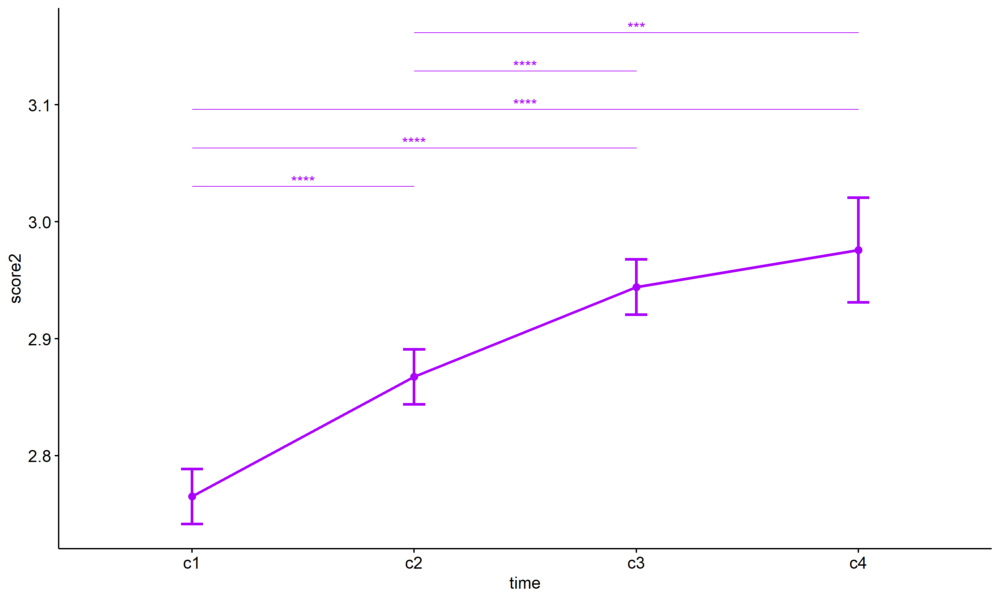<!-- -->

``` r
emms.gg <- emms[which(emms$localizacao == "Urbana"),]
if (nrow(emms.gg) > 0)
  ggline(emms.gg, x = "time", y = "emmean", color = "#00CCCC", ylab = "score2", size = 1) +
    geom_errorbar(aes(ymin = conf.low, ymax = conf.high), linewidth = 1,
                  width = 0.1, color = "#00CCCC") +
    stat_pvalue_manual(
      add_xy_position(pwc[which(pwc$localizacao == "Urbana"),],
                      x = "time", fun = "mean_se"),
      hide.ns = T, color = "#00CCCC", tip.length = F) +
    theme(legend.text = element_blank())
```

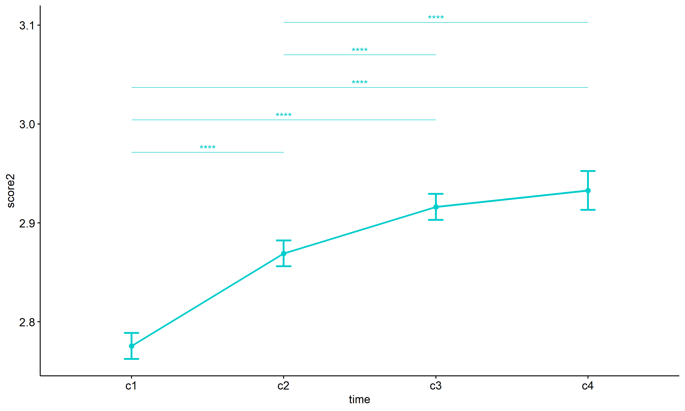<!-- -->

# ANOVA: score2 ~ time\*regiao + Error(id/time)

## Data Preparation

``` r
data <- edat[,c("aluno_id","regiao","ciclo","score2")]
data <- data[data$ciclo %in% c("Primeiro Ciclo","Segundo Ciclo","Terceiro Ciclo","Quarto Ciclo"),]
data$ciclo <- factor(data$ciclo, c("Primeiro Ciclo","Segundo Ciclo","Terceiro Ciclo","Quarto Ciclo"))
data <- unique(data)

wdat <- spread(data, ciclo, score2)
colnames(wdat) <- c("id","regiao","c1","c2","c3","c4")
wdat <- wdat[complete.cases(wdat[,c("id","regiao","c1","c2","c3")]),]

ldat <- gather(wdat, key = time, value = score2, c1,c2,c3,c4) %>%
  convert_as_factor(id, time)
ldat <- remove_group_data(ldat, "score2", c("time", "regiao"), n.limit = 30)
ldat$regiao <- factor(ldat$regiao, sort(unique(ldat$regiao)))
```

### Check assumptions: Identifying Outliers

``` r
outliers <- identify_outliers(group_by(ldat, time, regiao), score2)
(outliers <- outliers[outliers$is.extreme == T,])
```

    ## # A tibble: 26 × 6
    ##    regiao   time  id                   score2 is.outlier is.extreme
    ##    <fct>    <fct> <fct>                 <dbl> <lgl>      <lgl>     
    ##  1 Nordeste c2    cuknOzzwN4oCRum5U5ph   4.5  TRUE       TRUE      
    ##  2 Nordeste c2    oGUJyWRMYYbF9PNegJZh   4.25 TRUE       TRUE      
    ##  3 Nordeste c2    X8eOpiPuKfI4GXxjOsOM   4.25 TRUE       TRUE      
    ##  4 Sudeste  c2    HsQF2J0r79mHSWNe4l6n   4    TRUE       TRUE      
    ##  5 Sudeste  c2    j31LU8Xwm0EQ7Mihkhjj   4    TRUE       TRUE      
    ##  6 Sudeste  c2    W8iXxSmW48zvfJyikMZb   4    TRUE       TRUE      
    ##  7 Sudeste  c2    xk7eC5haTYuFQaJovsBZ   4    TRUE       TRUE      
    ##  8 Nordeste c3    1uixvrMfKulaomVh0MKa   4.25 TRUE       TRUE      
    ##  9 Nordeste c3    8edbRBvoAhVAiLZ3h3E2   4.5  TRUE       TRUE      
    ## 10 Nordeste c3    CCVIt7MPeYMUOCCyBxPh   4.25 TRUE       TRUE      
    ## # ℹ 16 more rows

| regiao   | time | id                   | score2 | is.outlier | is.extreme |
|:---------|:-----|:---------------------|-------:|:-----------|:-----------|
| Nordeste | c2   | cuknOzzwN4oCRum5U5ph |  4.500 | TRUE       | TRUE       |
| Nordeste | c2   | oGUJyWRMYYbF9PNegJZh |  4.250 | TRUE       | TRUE       |
| Nordeste | c2   | X8eOpiPuKfI4GXxjOsOM |  4.250 | TRUE       | TRUE       |
| Sudeste  | c2   | HsQF2J0r79mHSWNe4l6n |  4.000 | TRUE       | TRUE       |
| Sudeste  | c2   | j31LU8Xwm0EQ7Mihkhjj |  4.000 | TRUE       | TRUE       |
| Sudeste  | c2   | W8iXxSmW48zvfJyikMZb |  4.000 | TRUE       | TRUE       |
| Sudeste  | c2   | xk7eC5haTYuFQaJovsBZ |  4.000 | TRUE       | TRUE       |
| Nordeste | c3   | 1uixvrMfKulaomVh0MKa |  4.250 | TRUE       | TRUE       |
| Nordeste | c3   | 8edbRBvoAhVAiLZ3h3E2 |  4.500 | TRUE       | TRUE       |
| Nordeste | c3   | CCVIt7MPeYMUOCCyBxPh |  4.250 | TRUE       | TRUE       |
| Nordeste | c3   | G1fSZJ6Ea4VhHH2OjGQ3 |  4.250 | TRUE       | TRUE       |
| Nordeste | c3   | i5EZ8Ck9IgDueyMbw55v |  4.500 | TRUE       | TRUE       |
| Nordeste | c3   | m5yRlxfIj73j4ossfTOB |  4.250 | TRUE       | TRUE       |
| Nordeste | c3   | Pj0bkt0GAUBSA1FoPcc2 |  4.500 | TRUE       | TRUE       |
| Nordeste | c3   | sNrMxxYCTthTxBfrZZuD |  4.000 | TRUE       | TRUE       |
| Nordeste | c3   | xADstL8Txh6OaomMZXC4 |  4.000 | TRUE       | TRUE       |
| Sudeste  | c3   | 6bEKmKQpOuvY6PSQvzqj |  4.250 | TRUE       | TRUE       |
| Sudeste  | c3   | mbcncvg5dOFa9ZRsRhZf |  4.250 | TRUE       | TRUE       |
| Sudeste  | c3   | xk7eC5haTYuFQaJovsBZ |  3.875 | TRUE       | TRUE       |
| Sul      | c3   | 7pR91qd7LX1X2Chwr4xQ |  4.250 | TRUE       | TRUE       |
| Sul      | c3   | cOCdJff1IOVxOznhBCWn |  4.000 | TRUE       | TRUE       |
| Sul      | c3   | OvwAQTWkdj8SYpPS8dgn |  4.250 | TRUE       | TRUE       |
| Sul      | c3   | PwZy7Lbc45vuNd5du72A |  4.250 | TRUE       | TRUE       |
| Sudeste  | c4   | 6bEKmKQpOuvY6PSQvzqj |  4.000 | TRUE       | TRUE       |
| Sudeste  | c4   | DP1fbT1lGhLiBnOFILLi |  4.000 | TRUE       | TRUE       |
| Sudeste  | c4   | fgNBRPWfCa0TP4bDO8d2 |  4.250 | TRUE       | TRUE       |

### Check assumptions: Normality Test

``` r
(normality.df <- get.descriptives(ldat, "score2", c("time", "regiao"), symmetry.test = T, normality.test = T))
```

    ##    time       regiao variable    n  mean median   min   max    sd    se    ci
    ## 1    c1 Centro-Oeste   score2  216 2.793  2.750 2.250 3.750 0.243 0.017 0.033
    ## 2    c1     Nordeste   score2 1499 2.773  2.750 2.250 3.750 0.254 0.007 0.013
    ## 3    c1        Norte   score2  202 2.690  2.625 2.250 3.750 0.252 0.018 0.035
    ## 4    c1      Sudeste   score2  693 2.789  2.750 2.250 3.750 0.262 0.010 0.020
    ## 5    c1          Sul   score2  163 2.780  2.750 2.250 3.500 0.240 0.019 0.037
    ## 6    c2 Centro-Oeste   score2  216 2.886  2.875 2.250 3.750 0.305 0.021 0.041
    ## 7    c2     Nordeste   score2 1499 2.877  2.875 2.250 4.500 0.305 0.008 0.015
    ## 8    c2        Norte   score2  202 2.780  2.750 2.250 3.625 0.268 0.019 0.037
    ## 9    c2      Sudeste   score2  693 2.883  2.875 2.250 4.000 0.307 0.012 0.023
    ## 10   c2          Sul   score2  163 2.817  2.750 2.250 3.750 0.286 0.022 0.044
    ## 11   c3 Centro-Oeste   score2  216 2.899  2.875 2.250 3.750 0.305 0.021 0.041
    ## 12   c3     Nordeste   score2 1499 2.914  2.875 2.250 4.500 0.346 0.009 0.018
    ## 13   c3        Norte   score2  202 2.812  2.750 2.250 3.750 0.260 0.018 0.036
    ## 14   c3      Sudeste   score2  693 2.962  3.000 2.250 4.250 0.359 0.014 0.027
    ## 15   c3          Sul   score2  163 3.002  3.000 2.375 4.250 0.387 0.030 0.060
    ## 16   c4     Nordeste   score2  545 2.906  2.875 2.250 3.750 0.313 0.013 0.026
    ## 17   c4        Norte   score2   78 2.856  2.875 2.250 3.750 0.293 0.033 0.066
    ## 18   c4      Sudeste   score2  393 2.981  3.000 2.250 4.250 0.374 0.019 0.037
    ## 19   c4 Centro-Oeste   score2   48 2.904  3.000 2.250 3.500 0.279 0.040 0.081
    ## 20   c4          Sul   score2   62 3.115  3.000 2.500 3.750 0.352 0.045 0.089
    ##      iqr symmetry  skewness  kurtosis normality     method  statistic
    ## 1  0.375       NO 0.7890351 1.9527390         - D'Agostino  32.824903
    ## 2  0.500       NO 0.7292949 1.3980567         - D'Agostino 157.019885
    ## 3  0.375       NO 0.9191028 2.0078416         - D'Agostino  36.497465
    ## 4  0.500       NO 0.5010715 0.8893673         - D'Agostino  39.759499
    ## 5  0.500       NO 0.5683618 0.4044835        QQ D'Agostino  10.225186
    ## 6  0.250       NO 0.9460171 1.2746983         - D'Agostino  34.171530
    ## 7  0.250       NO 1.0054680 2.0086483         - D'Agostino 254.861404
    ## 8  0.500      YES 0.4767787 0.1836404         - D'Agostino   8.264264
    ## 9  0.250       NO 1.0385575 1.8959659         - D'Agostino 123.344342
    ## 10 0.375       NO 0.5957019 1.4801335        QQ D'Agostino  17.481222
    ## 11 0.250       NO 1.0200053 1.2373857         - D'Agostino  37.049240
    ## 12 0.250       NO 1.0757564 1.6430191         - D'Agostino 258.888300
    ## 13 0.375      YES 0.4481037 0.7910979         - D'Agostino  11.137854
    ## 14 0.250       NO 0.7315678 0.3322963         - D'Agostino  54.564586
    ## 15 0.250       NO 1.0343135 1.0091365        QQ D'Agostino  28.271951
    ## 16 0.250     <NA>        NA        NA      <NA>       <NA>         NA
    ## 17 0.375     <NA>        NA        NA      <NA>       <NA>         NA
    ## 18 0.250     <NA>        NA        NA      <NA>       <NA>         NA
    ## 19 0.250     <NA>        NA        NA      <NA>       <NA>         NA
    ## 20 0.500     <NA>        NA        NA      <NA>       <NA>         NA
    ##               p p.signif
    ## 1  7.450112e-08     ****
    ## 2  0.000000e+00     ****
    ## 3  1.187617e-08     ****
    ## 4  2.324527e-09     ****
    ## 5  6.020451e-03        *
    ## 6  3.799675e-08     ****
    ## 7  0.000000e+00     ****
    ## 8  1.604863e-02       ns
    ## 9  0.000000e+00     ****
    ## 10 1.599561e-04       **
    ## 11 9.012800e-09     ****
    ## 12 0.000000e+00     ****
    ## 13 3.814571e-03        *
    ## 14 1.417311e-12     ****
    ## 15 7.258117e-07     ****
    ## 16           NA     <NA>
    ## 17           NA     <NA>
    ## 18           NA     <NA>
    ## 19           NA     <NA>
    ## 20           NA     <NA>

| time | regiao       | variable |    n |  mean | median |   min |   max |    sd |    se |    ci |   iqr | symmetry | skewness | kurtosis | normality | method     | statistic |     p | p.signif |
|:-----|:-------------|:---------|-----:|------:|-------:|------:|------:|------:|------:|------:|------:|:---------|---------:|---------:|:----------|:-----------|----------:|------:|:---------|
| c1   | Centro-Oeste | score2   |  216 | 2.793 |  2.750 | 2.250 | 3.750 | 0.243 | 0.017 | 0.033 | 0.375 | NO       |    0.789 |    1.953 | \-        | D’Agostino |    32.825 | 0.000 | \*\*\*\* |
| c1   | Nordeste     | score2   | 1499 | 2.773 |  2.750 | 2.250 | 3.750 | 0.254 | 0.007 | 0.013 | 0.500 | NO       |    0.729 |    1.398 | \-        | D’Agostino |   157.020 | 0.000 | \*\*\*\* |
| c1   | Norte        | score2   |  202 | 2.690 |  2.625 | 2.250 | 3.750 | 0.252 | 0.018 | 0.035 | 0.375 | NO       |    0.919 |    2.008 | \-        | D’Agostino |    36.497 | 0.000 | \*\*\*\* |
| c1   | Sudeste      | score2   |  693 | 2.789 |  2.750 | 2.250 | 3.750 | 0.262 | 0.010 | 0.020 | 0.500 | NO       |    0.501 |    0.889 | \-        | D’Agostino |    39.759 | 0.000 | \*\*\*\* |
| c1   | Sul          | score2   |  163 | 2.780 |  2.750 | 2.250 | 3.500 | 0.240 | 0.019 | 0.037 | 0.500 | NO       |    0.568 |    0.404 | QQ        | D’Agostino |    10.225 | 0.006 | \*       |
| c2   | Centro-Oeste | score2   |  216 | 2.886 |  2.875 | 2.250 | 3.750 | 0.305 | 0.021 | 0.041 | 0.250 | NO       |    0.946 |    1.275 | \-        | D’Agostino |    34.172 | 0.000 | \*\*\*\* |
| c2   | Nordeste     | score2   | 1499 | 2.877 |  2.875 | 2.250 | 4.500 | 0.305 | 0.008 | 0.015 | 0.250 | NO       |    1.005 |    2.009 | \-        | D’Agostino |   254.861 | 0.000 | \*\*\*\* |
| c2   | Norte        | score2   |  202 | 2.780 |  2.750 | 2.250 | 3.625 | 0.268 | 0.019 | 0.037 | 0.500 | YES      |    0.477 |    0.184 | \-        | D’Agostino |     8.264 | 0.016 | ns       |
| c2   | Sudeste      | score2   |  693 | 2.883 |  2.875 | 2.250 | 4.000 | 0.307 | 0.012 | 0.023 | 0.250 | NO       |    1.039 |    1.896 | \-        | D’Agostino |   123.344 | 0.000 | \*\*\*\* |
| c2   | Sul          | score2   |  163 | 2.817 |  2.750 | 2.250 | 3.750 | 0.286 | 0.022 | 0.044 | 0.375 | NO       |    0.596 |    1.480 | QQ        | D’Agostino |    17.481 | 0.000 | \*\*     |
| c3   | Centro-Oeste | score2   |  216 | 2.899 |  2.875 | 2.250 | 3.750 | 0.305 | 0.021 | 0.041 | 0.250 | NO       |    1.020 |    1.237 | \-        | D’Agostino |    37.049 | 0.000 | \*\*\*\* |
| c3   | Nordeste     | score2   | 1499 | 2.914 |  2.875 | 2.250 | 4.500 | 0.346 | 0.009 | 0.018 | 0.250 | NO       |    1.076 |    1.643 | \-        | D’Agostino |   258.888 | 0.000 | \*\*\*\* |
| c3   | Norte        | score2   |  202 | 2.812 |  2.750 | 2.250 | 3.750 | 0.260 | 0.018 | 0.036 | 0.375 | YES      |    0.448 |    0.791 | \-        | D’Agostino |    11.138 | 0.004 | \*       |
| c3   | Sudeste      | score2   |  693 | 2.962 |  3.000 | 2.250 | 4.250 | 0.359 | 0.014 | 0.027 | 0.250 | NO       |    0.732 |    0.332 | \-        | D’Agostino |    54.565 | 0.000 | \*\*\*\* |
| c3   | Sul          | score2   |  163 | 3.002 |  3.000 | 2.375 | 4.250 | 0.387 | 0.030 | 0.060 | 0.250 | NO       |    1.034 |    1.009 | QQ        | D’Agostino |    28.272 | 0.000 | \*\*\*\* |
| c4   | Nordeste     | score2   |  545 | 2.906 |  2.875 | 2.250 | 3.750 | 0.313 | 0.013 | 0.026 | 0.250 | NA       |       NA |       NA | NA        | NA         |        NA |    NA | NA       |
| c4   | Norte        | score2   |   78 | 2.856 |  2.875 | 2.250 | 3.750 | 0.293 | 0.033 | 0.066 | 0.375 | NA       |       NA |       NA | NA        | NA         |        NA |    NA | NA       |
| c4   | Sudeste      | score2   |  393 | 2.981 |  3.000 | 2.250 | 4.250 | 0.374 | 0.019 | 0.037 | 0.250 | NA       |       NA |       NA | NA        | NA         |        NA |    NA | NA       |
| c4   | Centro-Oeste | score2   |   48 | 2.904 |  3.000 | 2.250 | 3.500 | 0.279 | 0.040 | 0.081 | 0.250 | NA       |       NA |       NA | NA        | NA         |        NA |    NA | NA       |
| c4   | Sul          | score2   |   62 | 3.115 |  3.000 | 2.500 | 3.750 | 0.352 | 0.045 | 0.089 | 0.500 | NA       |       NA |       NA | NA        | NA         |        NA |    NA | NA       |

``` r
idx = which(!ldat$id %in% outliers$id & ldat$regiao == "Norte" & ldat$time == "c4")
non.ids = getNonNormal(ldat$score2[idx], ldat$id[idx])

idx = which(!ldat$id %in% outliers$id & ldat$regiao == "Centro-Oeste" & ldat$time == "c4")
non.ids =  unique(c(non.ids, getNonNormal(ldat$score2[idx], ldat$id[idx])))

(non.ids)
```

    ## [1] "AH1sCf7O5jOA17AZz4Sv"

``` r
if (length(non.ids) > 0)
  ldat2 <- ldat[!ldat$id %in% non.ids,]
```

### Summary Statistics

``` r
(sdat <- ldat %>% group_by(time, regiao) %>%
   get_summary_stats(score2, type = "mean_sd"))
```

    ## # A tibble: 20 × 6
    ##    regiao       time  variable     n  mean    sd
    ##    <fct>        <fct> <fct>    <dbl> <dbl> <dbl>
    ##  1 Centro-Oeste c1    score2     216  2.79 0.243
    ##  2 Nordeste     c1    score2    1499  2.77 0.254
    ##  3 Norte        c1    score2     202  2.69 0.252
    ##  4 Sudeste      c1    score2     693  2.79 0.262
    ##  5 Sul          c1    score2     163  2.78 0.24 
    ##  6 Centro-Oeste c2    score2     216  2.89 0.305
    ##  7 Nordeste     c2    score2    1499  2.88 0.305
    ##  8 Norte        c2    score2     202  2.78 0.268
    ##  9 Sudeste      c2    score2     693  2.88 0.307
    ## 10 Sul          c2    score2     163  2.82 0.286
    ## 11 Centro-Oeste c3    score2     216  2.90 0.305
    ## 12 Nordeste     c3    score2    1499  2.91 0.346
    ## 13 Norte        c3    score2     202  2.81 0.26 
    ## 14 Sudeste      c3    score2     693  2.96 0.359
    ## 15 Sul          c3    score2     163  3.00 0.387
    ## 16 Centro-Oeste c4    score2      48  2.90 0.279
    ## 17 Nordeste     c4    score2     545  2.91 0.313
    ## 18 Norte        c4    score2      78  2.86 0.293
    ## 19 Sudeste      c4    score2     393  2.98 0.374
    ## 20 Sul          c4    score2      62  3.12 0.352

| regiao       | time | variable |    n |  mean |    sd |
|:-------------|:-----|:---------|-----:|------:|------:|
| Centro-Oeste | c1   | score2   |  216 | 2.793 | 0.243 |
| Nordeste     | c1   | score2   | 1499 | 2.773 | 0.254 |
| Norte        | c1   | score2   |  202 | 2.690 | 0.252 |
| Sudeste      | c1   | score2   |  693 | 2.789 | 0.262 |
| Sul          | c1   | score2   |  163 | 2.780 | 0.240 |
| Centro-Oeste | c2   | score2   |  216 | 2.886 | 0.305 |
| Nordeste     | c2   | score2   | 1499 | 2.877 | 0.305 |
| Norte        | c2   | score2   |  202 | 2.780 | 0.268 |
| Sudeste      | c2   | score2   |  693 | 2.883 | 0.307 |
| Sul          | c2   | score2   |  163 | 2.817 | 0.286 |
| Centro-Oeste | c3   | score2   |  216 | 2.899 | 0.305 |
| Nordeste     | c3   | score2   | 1499 | 2.914 | 0.346 |
| Norte        | c3   | score2   |  202 | 2.812 | 0.260 |
| Sudeste      | c3   | score2   |  693 | 2.962 | 0.359 |
| Sul          | c3   | score2   |  163 | 3.002 | 0.387 |
| Centro-Oeste | c4   | score2   |   48 | 2.904 | 0.279 |
| Nordeste     | c4   | score2   |  545 | 2.906 | 0.313 |
| Norte        | c4   | score2   |   78 | 2.856 | 0.293 |
| Sudeste      | c4   | score2   |  393 | 2.981 | 0.374 |
| Sul          | c4   | score2   |   62 | 3.115 | 0.352 |

``` r
if (length(non.ids) > 0)
  (sdat <- ldat2 %>% group_by(time, regiao) %>%
      get_summary_stats(score2, type = "mean_sd"))
```

    ## # A tibble: 20 × 6
    ##    regiao       time  variable     n  mean    sd
    ##    <fct>        <fct> <fct>    <dbl> <dbl> <dbl>
    ##  1 Centro-Oeste c1    score2     216  2.79 0.243
    ##  2 Nordeste     c1    score2    1499  2.77 0.254
    ##  3 Norte        c1    score2     201  2.69 0.252
    ##  4 Sudeste      c1    score2     693  2.79 0.262
    ##  5 Sul          c1    score2     163  2.78 0.24 
    ##  6 Centro-Oeste c2    score2     216  2.89 0.305
    ##  7 Nordeste     c2    score2    1499  2.88 0.305
    ##  8 Norte        c2    score2     201  2.78 0.269
    ##  9 Sudeste      c2    score2     693  2.88 0.307
    ## 10 Sul          c2    score2     163  2.82 0.286
    ## 11 Centro-Oeste c3    score2     216  2.90 0.305
    ## 12 Nordeste     c3    score2    1499  2.91 0.346
    ## 13 Norte        c3    score2     201  2.81 0.257
    ## 14 Sudeste      c3    score2     693  2.96 0.359
    ## 15 Sul          c3    score2     163  3.00 0.387
    ## 16 Centro-Oeste c4    score2      48  2.90 0.279
    ## 17 Nordeste     c4    score2     545  2.91 0.313
    ## 18 Norte        c4    score2      77  2.84 0.276
    ## 19 Sudeste      c4    score2     393  2.98 0.374
    ## 20 Sul          c4    score2      62  3.12 0.352

| regiao       | time | variable |    n |  mean |    sd |
|:-------------|:-----|:---------|-----:|------:|------:|
| Centro-Oeste | c1   | score2   |  216 | 2.793 | 0.243 |
| Nordeste     | c1   | score2   | 1499 | 2.773 | 0.254 |
| Norte        | c1   | score2   |  201 | 2.690 | 0.252 |
| Sudeste      | c1   | score2   |  693 | 2.789 | 0.262 |
| Sul          | c1   | score2   |  163 | 2.780 | 0.240 |
| Centro-Oeste | c2   | score2   |  216 | 2.886 | 0.305 |
| Nordeste     | c2   | score2   | 1499 | 2.877 | 0.305 |
| Norte        | c2   | score2   |  201 | 2.780 | 0.269 |
| Sudeste      | c2   | score2   |  693 | 2.883 | 0.307 |
| Sul          | c2   | score2   |  163 | 2.817 | 0.286 |
| Centro-Oeste | c3   | score2   |  216 | 2.899 | 0.305 |
| Nordeste     | c3   | score2   | 1499 | 2.914 | 0.346 |
| Norte        | c3   | score2   |  201 | 2.810 | 0.257 |
| Sudeste      | c3   | score2   |  693 | 2.962 | 0.359 |
| Sul          | c3   | score2   |  163 | 3.002 | 0.387 |
| Centro-Oeste | c4   | score2   |   48 | 2.904 | 0.279 |
| Nordeste     | c4   | score2   |  545 | 2.906 | 0.313 |
| Norte        | c4   | score2   |   77 | 2.844 | 0.276 |
| Sudeste      | c4   | score2   |  393 | 2.981 | 0.374 |
| Sul          | c4   | score2   |   62 | 3.115 | 0.352 |

## ANOVA Computation

``` r
(res.aov <- anova_test(ldat, dv = score2, wid = id, between = regiao, within = time))
```

    ## Warning: NA detected in rows:
    ## 8323,8325,8326,8332,8333,8334,8337,8339,8340,8342,8343,8344,8345,8349,8350,8352,8353,8354,8358,8359,8361,8362,8364,8369,8370,8374,8375,8376,8383,8384,8391,8392,8394,8396,8398,8399,8401,8402,8404,8408,8409,8412,8413,8414,8416,8419,8424,8427,8429,8430,8431,8433,8435,8442,8443,8444,8445,8447,8450,8451,8452,8454,8455,8457,8459,8460,8465,8466,8467,8468,8469,8470,8471,8475,8476,8477,8479,8480,8482,8484,8487,8488,8490,8491,8492,8493,8494,8496,8497,8499,8500,8502,8503,8506,8510,8511,8514,8515,8516,8519,8521,8522,8525,8528,8529,8530,8531,8532,8533,8534,8536,8538,8540,8541,8546,8549,8551,8552,8555,8556,8559,8560,8562,8565,8567,8569,8570,8571,8574,8576,8579,8580,8581,8583,8590,8591,8592,8593,8598,8601,8602,8604,8605,8606,8607,8608,8609,8613,8618,8623,8626,8628,8630,8632,8634,8635,8637,8638,8639,8641,8642,8644,8647,8649,8650,8651,8652,8653,8654,8655,8658,8659,8660,8661,8662,8664,8665,8666,8668,8671,8672,8674,8678,8683,8685,8686,8687,8689,8692,8693,8694,8696,8697,8698,8699,8704,8706,8707,8708,8709,8711,8712,8713,8714,8715,8716,8717,8718,8719,8720,8721,8724,8725,8727,8728,8729,8730,8731,8732,8734,8735,8736,8737,8739,8740,8743,8744,8745,8746,8748,8749,8751,8753,8754,8755,8756,8757,8760,8761,8762,8763,8765,8766,8768,8771,8772,8773,8775,8776,8777,8778,8779,8781,8785,8786,8787,8788,8789,8792,8793,8794,8797,8799,8800,8802,8806,8807,8808,8809,8810,8811,8812,8814,8820,8823,8824,8825,8826,8828,8829,8831,8832,8834,8835,8836,8837,8838,8839,8840,8841,8842,8843,8844,8845,8846,8849,8852,8854,8855,8856,8858,8860,8862,8865,8869,8871,8872,8874,8875,8877,8879,8880,8881,8883,8884,8885,8886,8887,8889,8891,8892,8893,8894,8895,8896,8898,8899,8900,8901,8903,8904,8905,8906,8910,8914,8915,8917,8918,8920,8923,8928,8929,8931,8932,8933,8934,8935,8937,8939,8940,8941,8943,8944,8945,8946,8948,8951,8952,8953,8954,8955,8956,8957,8959,8961,8963,8964,8965,8967,8968,8969,8970,8971,8973,8974,8975,8977,8978,8983,8986,8987,8991,8992,8995,8996,8997,9000,9001,9002,9003,9004,9005,9008,9010,9012,9018,9021,9025,9026,9027,9030,9031,9032,9033,9035,9038,9043,9044,9045,9047,9048,9052,9055,9059,9060,9063,9065,9069,9073,9074,9077,9078,9079,9081,9082,9083,9084,9085,9086,9087,9088,9089,9090,9091,9093,9099,9102,9104,9105,9106,9107,9108,9111,9112,9113,9117,9120,9121,9126,9127,9129,9130,9131,9134,9136,9137,9139,9141,9143,9144,9146,9147,9150,9151,9153,9154,9155,9156,9157,9160,9161,9163,9164,9165,9166,9167,9168,9169,9171,9173,9176,9178,9180,9182,9183,9184,9186,9187,9188,9189,9190,9191,9192,9193,9194,9195,9198,9199,9202,9204,9205,9206,9208,9212,9213,9215,9216,9217,9220,9223,9227,9228,9229,9230,9231,9232,9233,9235,9236,9237,9238,9239,9240,9241,9242,9243,9244,9246,9247,9250,9251,9252,9253,9254,9255,9256,9257,9258,9260,9261,9262,9267,9268,9270,9271,9272,9273,9274,9276,9277,9278,9279,9285,9286,9288,9293,9294,9296,9297,9299,9300,9301,9302,9303,9306,9308,9309,9312,9314,9316,9319,9320,9321,9323,9325,9326,9327,9330,9332,9335,9337,9340,9342,9344,9345,9347,9348,9349,9351,9356,9357,9360,9361,9362,9364,9365,9367,9371,9372,9375,9376,9377,9378,9385,9386,9387,9389,9390,9391,9392,9396,9397,9398,9399,9401,9402,9403,9404,9405,9407,9408,9409,9410,9413,9414,9415,9416,9417,9418,9420,9421,9422,9423,9425,9426,9427,9431,9432,9434,9435,9437,9438,9439,9440,9441,9442,9443,9444,9445,9446,9447,9448,9449,9452,9454,9455,9456,9460,9464,9466,9469,9470,9471,9474,9475,9476,9477,9478,9479,9480,9482,9484,9485,9487,9491,9492,9494,9496,9497,9498,9499,9500,9503,9504,9506,9507,9509,9510,9511,9512,9514,9516,9517,9518,9519,9520,9521,9523,9524,9525,9526,9527,9529,9532,9533,9534,9536,9537,9543,9547,9550,9552,9553,9555,9556,9558,9559,9561,9562,9567,9570,9571,9575,9576,9578,9579,9583,9588,9589,9590,9591,9592,9593,9594,9597,9598,9600,9602,9605,9606,9607,9613,9614,9615,9616,9618,9619,9621,9623,9624,9626,9627,9629,9632,9634,9635,9637,9639,9646,9647,9649,9650,9652,9653,9656,9658,9660,9661,9662,9663,9665,9666,9667,9668,9670,9672,9674,9677,9678,9680,9681,9687,9688,9690,9693,9694,9695,9696,9697,9699,9700,9701,9703,9705,9707,9708,9709,9710,9712,9713,9714,9715,9716,9719,9721,9723,9724,9725,9726,9727,9729,9730,9732,9734,9735,9737,9738,9739,9740,9741,9742,9744,9746,9747,9748,9749,9751,9754,9755,9756,9757,9758,9759,9762,9764,9765,9767,9768,9772,9773,9774,9775,9776,9783,9784,9785,9787,9788,9792,9794,9797,9801,9803,9804,9805,9806,9807,9808,9809,9810,9812,9813,9814,9815,9816,9817,9818,9819,9820,9821,9823,9824,9826,9829,9830,9831,9832,9833,9834,9835,9836,9837,9838,9840,9841,9842,9844,9845,9846,9848,9849,9850,9851,9852,9853,9854,9856,9858,9859,9860,9863,9869,9871,9874,9875,9876,9877,9878,9879,9883,9884,9886,9888,9889,9892,9893,9894,9895,9897,9898,9899,9900,9901,9902,9904,9907,9908,9909,9911,9914,9918,9919,9920,9923,9925,9926,9927,9929,9930,9931,9932,9933,9934,9935,9936,9937,9938,9939,9940,9943,9944,9947,9950,9951,9952,9954,9957,9958,9963,9964,9965,9966,9969,9970,9971,9974,9975,9976,9978,9979,9981,9983,9984,9985,9988,9989,9991,9992,9994,9995,9998,9999,10002,10004,10005,10006,10008,10009,10012,10014,10017,10018,10019,10020,10022,10023,10025,10026,10027,10028,10029,10030,10031,10036,10037,10039,10040,10043,10044,10045,10046,10047,10050,10052,10053,10054,10055,10056,10057,10059,10060,10063,10064,10066,10067,10068,10069,10071,10072,10073,10074,10075,10077,10078,10079,10080,10081,10082,10084,10085,10088,10089,10093,10095,10096,10097,10098,10099,10101,10102,10103,10105,10106,10107,10108,10110,10111,10112,10113,10117,10119,10120,10121,10122,10123,10124,10127,10129,10130,10131,10133,10135,10138,10140,10144,10145,10146,10150,10151,10152,10155,10156,10157,10158,10159,10160,10161,10162,10164,10165,10166,10168,10169,10170,10172,10173,10174,10175,10177,10179,10180,10181,10182,10184,10188,10190,10191,10192,10195,10196,10197,10200,10201,10202,10203,10204,10206,10207,10210,10212,10213,10215,10216,10218,10220,10221,10222,10223,10224,10225,10226,10232,10233,10234,10238,10242,10243,10244,10245,10250,10251,10252,10253,10254,10255,10257,10258,10260,10262,10265,10266,10267,10268,10269,10272,10277,10278,10280,10282,10285,10288,10290,10293,10294,10295,10296,10298,10300,10301,10302,10303,10306,10307,10310,10311,10312,10313,10316,10317,10318,10319,10321,10323,10324,10325,10327,10328,10329,10330,10331,10332,10333,10336,10337,10338,10339,10340,10343,10346,10349,10350,10351,10354,10358,10359,10360,10361,10362,10363,10364,10365,10367,10369,10370,10371,10372,10373,10374,10376,10377,10378,10379,10386,10387,10389,10391,10396,10397,10398,10400,10401,10402,10404,10406,10407,10408,10409,10410,10413,10414,10417,10418,10419,10425,10426,10430,10431,10432,10435,10436,10437,10438,10439,10443,10445,10447,10448,10449,10450,10451,10453,10455,10456,10457,10461,10463,10464,10465,10466,10467,10470,10471,10473,10474,10475,10476,10478,10479,10480,10482,10485,10486,10490,10491,10492,10493,10494,10495,10496,10497,10498,10499,10500,10501,10504,10509,10511,10512,10513,10514,10515,10516,10518,10520,10521,10522,10525,10526,10527,10528,10529,10531,10534,10535,10538,10539,10540,10545,10546,10549,10550,10551,10552,10553,10554,10555,10556,10557,10559,10561,10562,10563,10565,10566,10567,10569,10570,10571,10572,10574,10575,10577,10579,10581,10583,10585,10587,10588,10589,10591,10592,10594,10595,10597,10599,10600,10601,10602,10603,10605,10606,10608,10610,10612,10614,10615,10618,10619,10621,10622,10625,10626,10628,10630,10632,10634,10635,10636,10637,10639,10640,10642,10646,10648,10651,10654,10658,10659,10661,10662,10663,10664,10666,10667,10668,10669,10670,10673,10674,10677,10678,10679,10681,10684,10686,10687,10688,10689,10690,10695,10697,10698,10703,10706,10708,10710,10711,10713,10714,10715,10722,10724,10725,10726,10727,10728,10731,10733,10734,10735,10736,10738,10739,10741,10743,10744,10747,10748,10749,10750,10751,10754,10755,10756,10758,10760,10761,10763,10764,10765,10766,10767,10772,10775,10777,10779,10780,10781,10784,10787,10788,10789,10792,10793,10794,10795,10797,10798,10799,10800,10801,10802,10803,10804,10805,10806,10808,10809,10812,10816,10818,10820,10822,10823,10825,10826,10828,10831,10832,10834,10836,10837,10839,10841,10842,10843,10847,10848,10849,10854,10855,10856,10857,10858,10859,10860,10861,10862,10864,10865,10868,10869,10870,10872,10873,10879,10880,10882,10883,10884,10889,10891,10892,10893,10895,1

    ## ANOVA Table (type III tests)
    ## 
    ## $ANOVA
    ##        Effect DFn  DFd      F        p p<.05   ges
    ## 1      regiao   4 1121  6.992 1.47e-05     * 0.010
    ## 2        time   3 3363 44.526 3.27e-28     * 0.024
    ## 3 regiao:time  12 3363  3.916 5.19e-06     * 0.008
    ## 
    ## $`Mauchly's Test for Sphericity`
    ##        Effect     W     p p<.05
    ## 1        time 0.985 0.004     *
    ## 2 regiao:time 0.985 0.004     *
    ## 
    ## $`Sphericity Corrections`
    ##        Effect  GGe         DF[GG]    p[GG] p[GG]<.05   HFe         DF[HF]
    ## 1        time 0.99  2.97, 3330.01 5.83e-28         * 0.993  2.98, 3339.83
    ## 2 regiao:time 0.99 11.88, 3330.01 5.70e-06         * 0.993 11.92, 3339.83
    ##      p[HF] p[HF]<.05
    ## 1 4.91e-28         *
    ## 2 5.55e-06         *

| Effect      | DFn |  DFd |      F |   p | p\<.05 |   ges |
|:------------|----:|-----:|-------:|----:|:-------|------:|
| regiao      |   4 | 1121 |  6.992 |   0 | \*     | 0.010 |
| time        |   3 | 3363 | 44.526 |   0 | \*     | 0.024 |
| regiao:time |  12 | 3363 |  3.916 |   0 | \*     | 0.008 |

| Effect      |     W |     p | p\<.05 |
|:------------|------:|------:|:-------|
| time        | 0.985 | 0.004 | \*     |
| regiao:time | 0.985 | 0.004 | \*     |

| Effect      |  GGe | DF\[GG\]       | p\[GG\] | p\[GG\]\<.05 |   HFe | DF\[HF\]       | p\[HF\] | p\[HF\]\<.05 |
|:------------|-----:|:---------------|--------:|:-------------|------:|:---------------|--------:|:-------------|
| time        | 0.99 | 2.97, 3330.01  |       0 | \*           | 0.993 | 2.98, 3339.83  |       0 | \*           |
| regiao:time | 0.99 | 11.88, 3330.01 |       0 | \*           | 0.993 | 11.92, 3339.83 |       0 | \*           |

## ANOVA Computation after removing non.normal data

``` r
if (length(non.ids) > 0)
  (res.aov2 <- anova_test(ldat2, dv = score2, wid = id, between = regiao , within = time))
```

    ## Warning: NA detected in rows:
    ## 8320,8322,8323,8329,8330,8331,8334,8336,8337,8339,8340,8341,8342,8346,8347,8349,8350,8351,8355,8356,8358,8359,8361,8366,8367,8371,8372,8373,8380,8381,8388,8389,8391,8393,8395,8396,8398,8399,8401,8405,8406,8409,8410,8411,8413,8416,8421,8424,8426,8427,8428,8430,8432,8439,8440,8441,8442,8444,8447,8448,8449,8451,8452,8454,8456,8457,8462,8463,8464,8465,8466,8467,8468,8472,8473,8474,8476,8477,8479,8481,8484,8485,8487,8488,8489,8490,8491,8493,8494,8496,8497,8499,8500,8503,8507,8508,8511,8512,8513,8516,8518,8519,8522,8525,8526,8527,8528,8529,8530,8531,8533,8535,8537,8538,8543,8546,8548,8549,8552,8553,8556,8557,8559,8562,8564,8566,8567,8568,8571,8573,8576,8577,8578,8580,8587,8588,8589,8590,8595,8598,8599,8601,8602,8603,8604,8605,8606,8610,8615,8620,8623,8625,8627,8629,8631,8632,8634,8635,8636,8638,8639,8641,8644,8646,8647,8648,8649,8650,8651,8652,8655,8656,8657,8658,8659,8661,8662,8663,8665,8668,8669,8671,8675,8680,8682,8683,8684,8686,8689,8690,8691,8693,8694,8695,8696,8701,8703,8704,8705,8706,8708,8709,8710,8711,8712,8713,8714,8715,8716,8717,8718,8721,8722,8724,8725,8726,8727,8728,8729,8731,8732,8733,8734,8736,8737,8740,8741,8742,8743,8745,8746,8748,8750,8751,8752,8753,8754,8757,8758,8759,8760,8762,8763,8765,8768,8769,8770,8772,8773,8774,8775,8776,8777,8781,8782,8783,8784,8785,8788,8789,8790,8793,8795,8796,8798,8802,8803,8804,8805,8806,8807,8808,8810,8816,8819,8820,8821,8822,8824,8825,8827,8828,8830,8831,8832,8833,8834,8835,8836,8837,8838,8839,8840,8841,8842,8845,8848,8850,8851,8852,8854,8856,8858,8861,8865,8867,8868,8870,8871,8873,8875,8876,8877,8879,8880,8881,8882,8883,8885,8887,8888,8889,8890,8891,8892,8894,8895,8896,8897,8899,8900,8901,8902,8906,8910,8911,8913,8914,8916,8919,8924,8925,8927,8928,8929,8930,8931,8933,8935,8936,8937,8939,8940,8941,8942,8944,8947,8948,8949,8950,8951,8952,8953,8955,8957,8959,8960,8961,8963,8964,8965,8966,8967,8969,8970,8971,8973,8974,8979,8982,8983,8987,8988,8991,8992,8993,8996,8997,8998,8999,9000,9001,9004,9006,9008,9014,9017,9021,9022,9023,9026,9027,9028,9029,9031,9034,9039,9040,9041,9043,9044,9048,9051,9055,9056,9059,9061,9065,9069,9070,9073,9074,9075,9077,9078,9079,9080,9081,9082,9083,9084,9085,9086,9087,9089,9095,9098,9100,9101,9102,9103,9104,9107,9108,9109,9113,9116,9117,9122,9123,9125,9126,9127,9130,9132,9133,9135,9137,9139,9140,9142,9143,9146,9147,9149,9150,9151,9152,9153,9156,9157,9159,9160,9161,9162,9163,9164,9165,9167,9169,9172,9174,9176,9178,9179,9180,9182,9183,9184,9185,9186,9187,9188,9189,9190,9191,9194,9195,9198,9200,9201,9202,9204,9208,9209,9211,9212,9213,9216,9219,9223,9224,9225,9226,9227,9228,9229,9231,9232,9233,9234,9235,9236,9237,9238,9239,9240,9242,9243,9246,9247,9248,9249,9250,9251,9252,9253,9254,9256,9257,9258,9263,9264,9266,9267,9268,9269,9270,9272,9273,9274,9275,9281,9282,9284,9289,9290,9292,9293,9295,9296,9297,9298,9299,9302,9304,9305,9308,9310,9312,9315,9316,9317,9319,9321,9322,9323,9326,9328,9331,9333,9336,9338,9340,9341,9343,9344,9345,9347,9352,9353,9356,9357,9358,9360,9361,9363,9367,9368,9371,9372,9373,9374,9381,9382,9383,9385,9386,9387,9388,9392,9393,9394,9395,9397,9398,9399,9400,9401,9403,9404,9405,9406,9409,9410,9411,9412,9413,9414,9416,9417,9418,9419,9421,9422,9423,9427,9428,9430,9431,9433,9434,9435,9436,9437,9438,9439,9440,9441,9442,9443,9444,9445,9448,9450,9451,9452,9456,9460,9462,9465,9466,9467,9470,9471,9472,9473,9474,9475,9476,9478,9480,9481,9483,9487,9488,9490,9492,9493,9494,9495,9496,9499,9500,9502,9503,9505,9506,9507,9508,9510,9512,9513,9514,9515,9516,9517,9519,9520,9521,9522,9523,9525,9528,9529,9530,9532,9533,9539,9543,9546,9548,9549,9551,9552,9554,9555,9557,9558,9563,9566,9567,9571,9572,9574,9575,9579,9584,9585,9586,9587,9588,9589,9590,9593,9594,9596,9598,9601,9602,9603,9609,9610,9611,9612,9614,9615,9617,9619,9620,9622,9623,9625,9628,9630,9631,9633,9635,9642,9643,9645,9646,9648,9649,9652,9654,9656,9657,9658,9659,9661,9662,9663,9664,9666,9668,9670,9673,9674,9676,9677,9683,9684,9686,9689,9690,9691,9692,9693,9695,9696,9697,9699,9701,9703,9704,9705,9706,9708,9709,9710,9711,9712,9715,9717,9719,9720,9721,9722,9723,9725,9726,9728,9730,9731,9733,9734,9735,9736,9737,9738,9740,9742,9743,9744,9745,9747,9750,9751,9752,9753,9754,9755,9758,9760,9761,9763,9764,9768,9769,9770,9771,9772,9779,9780,9781,9783,9784,9788,9790,9793,9797,9799,9800,9801,9802,9803,9804,9805,9806,9808,9809,9810,9811,9812,9813,9814,9815,9816,9817,9819,9820,9822,9825,9826,9827,9828,9829,9830,9831,9832,9833,9834,9836,9837,9838,9840,9841,9842,9844,9845,9846,9847,9848,9849,9850,9852,9854,9855,9856,9859,9865,9867,9870,9871,9872,9873,9874,9875,9879,9880,9882,9884,9885,9888,9889,9890,9891,9893,9894,9895,9896,9897,9898,9900,9903,9904,9905,9907,9910,9914,9915,9916,9919,9921,9922,9923,9925,9926,9927,9928,9929,9930,9931,9932,9933,9934,9935,9936,9939,9940,9943,9946,9947,9948,9950,9953,9954,9959,9960,9961,9962,9965,9966,9967,9970,9971,9972,9974,9975,9977,9979,9980,9981,9984,9985,9987,9988,9990,9991,9994,9995,9998,10000,10001,10002,10004,10005,10008,10010,10013,10014,10015,10016,10018,10019,10021,10022,10023,10024,10025,10026,10027,10032,10033,10035,10036,10039,10040,10041,10042,10043,10046,10048,10049,10050,10051,10052,10053,10055,10056,10059,10060,10062,10063,10064,10065,10067,10068,10069,10070,10071,10073,10074,10075,10076,10077,10078,10080,10081,10084,10085,10089,10091,10092,10093,10094,10095,10097,10098,10099,10101,10102,10103,10104,10106,10107,10108,10109,10113,10115,10116,10117,10118,10119,10120,10123,10125,10126,10127,10129,10131,10134,10136,10140,10141,10142,10146,10147,10148,10151,10152,10153,10154,10155,10156,10157,10158,10160,10161,10162,10164,10165,10166,10168,10169,10170,10171,10173,10175,10176,10177,10178,10180,10184,10186,10187,10188,10191,10192,10193,10196,10197,10198,10199,10200,10202,10203,10206,10208,10209,10211,10212,10214,10216,10217,10218,10219,10220,10221,10222,10228,10229,10230,10234,10238,10239,10240,10241,10246,10247,10248,10249,10250,10251,10253,10254,10256,10258,10261,10262,10263,10264,10265,10268,10273,10274,10276,10278,10281,10284,10286,10289,10290,10291,10292,10294,10296,10297,10298,10299,10302,10303,10306,10307,10308,10309,10312,10313,10314,10315,10317,10319,10320,10321,10323,10324,10325,10326,10327,10328,10329,10332,10333,10334,10335,10336,10339,10342,10345,10346,10347,10350,10354,10355,10356,10357,10358,10359,10360,10361,10363,10365,10366,10367,10368,10369,10370,10372,10373,10374,10375,10382,10383,10385,10387,10392,10393,10394,10396,10397,10398,10400,10402,10403,10404,10405,10406,10409,10410,10413,10414,10415,10421,10422,10426,10427,10428,10431,10432,10433,10434,10435,10439,10441,10443,10444,10445,10446,10447,10449,10451,10452,10453,10457,10459,10460,10461,10462,10463,10466,10467,10469,10470,10471,10472,10474,10475,10476,10478,10481,10482,10486,10487,10488,10489,10490,10491,10492,10493,10494,10495,10496,10497,10500,10505,10507,10508,10509,10510,10511,10512,10514,10516,10517,10518,10521,10522,10523,10524,10525,10527,10530,10531,10534,10535,10536,10541,10542,10545,10546,10547,10548,10549,10550,10551,10552,10553,10555,10557,10558,10559,10561,10562,10563,10565,10566,10567,10568,10570,10571,10573,10575,10577,10579,10581,10583,10584,10585,10587,10588,10590,10591,10593,10595,10596,10597,10598,10599,10601,10602,10604,10606,10608,10610,10611,10614,10615,10617,10618,10621,10622,10624,10626,10628,10630,10631,10632,10633,10635,10636,10638,10642,10644,10647,10650,10654,10655,10657,10658,10659,10660,10662,10663,10664,10665,10666,10669,10670,10673,10674,10675,10677,10680,10682,10683,10684,10685,10686,10691,10693,10694,10699,10702,10704,10706,10707,10709,10710,10711,10718,10720,10721,10722,10723,10724,10727,10729,10730,10731,10732,10734,10735,10737,10739,10740,10743,10744,10745,10746,10747,10750,10751,10752,10754,10756,10757,10759,10760,10761,10762,10763,10768,10771,10773,10775,10776,10777,10780,10783,10784,10785,10788,10789,10790,10791,10793,10794,10795,10796,10797,10798,10799,10800,10801,10802,10804,10805,10808,10812,10814,10816,10818,10819,10821,10822,10824,10827,10828,10830,10832,10833,10835,10837,10838,10839,10843,10844,10845,10850,10851,10852,10853,10854,10855,10856,10857,10858,10860,10861,10864,10865,10866,10868,10869,10875,10876,10878,10879,10880,10885,10887,10888,10889,10891,10

    ## ANOVA Table (type III tests)
    ## 
    ## $ANOVA
    ##        Effect DFn  DFd      F        p p<.05   ges
    ## 1      regiao   4 1120  7.418 6.76e-06     * 0.010
    ## 2        time   3 3360 43.563 1.30e-27     * 0.023
    ## 3 regiao:time  12 3360  3.952 4.38e-06     * 0.009
    ## 
    ## $`Mauchly's Test for Sphericity`
    ##        Effect     W     p p<.05
    ## 1        time 0.985 0.004     *
    ## 2 regiao:time 0.985 0.004     *
    ## 
    ## $`Sphericity Corrections`
    ##        Effect  GGe        DF[GG]    p[GG] p[GG]<.05   HFe         DF[HF]
    ## 1        time 0.99  2.97, 3327.2 2.28e-27         * 0.993  2.98, 3337.02
    ## 2 regiao:time 0.99 11.88, 3327.2 4.81e-06         * 0.993 11.92, 3337.02
    ##      p[HF] p[HF]<.05
    ## 1 1.93e-27         *
    ## 2 4.68e-06         *

| Effect      | DFn |  DFd |      F |   p | p\<.05 |   ges |
|:------------|----:|-----:|-------:|----:|:-------|------:|
| regiao      |   4 | 1120 |  7.418 |   0 | \*     | 0.010 |
| time        |   3 | 3360 | 43.563 |   0 | \*     | 0.023 |
| regiao:time |  12 | 3360 |  3.952 |   0 | \*     | 0.009 |

| Effect      |     W |     p | p\<.05 |
|:------------|------:|------:|:-------|
| time        | 0.985 | 0.004 | \*     |
| regiao:time | 0.985 | 0.004 | \*     |

| Effect      |  GGe | DF\[GG\]      | p\[GG\] | p\[GG\]\<.05 |   HFe | DF\[HF\]       | p\[HF\] | p\[HF\]\<.05 |
|:------------|-----:|:--------------|--------:|:-------------|------:|:---------------|--------:|:-------------|
| time        | 0.99 | 2.97, 3327.2  |       0 | \*           | 0.993 | 2.98, 3337.02  |       0 | \*           |
| regiao:time | 0.99 | 11.88, 3327.2 |       0 | \*           | 0.993 | 11.92, 3337.02 |       0 | \*           |

## PairWise Computation

``` r
(pwc <- ldat %>% group_by(time) %>%
   emmeans_test(score2 ~ regiao, detailed = T, p.adjust.method = "bonferroni"))
```

    ## Warning: Expected 2 pieces. Additional pieces discarded in 16 rows [1, 2, 3, 4, 11, 12,
    ## 13, 14, 21, 22, 23, 24, 31, 32, 33, 34].

    ## # A tibble: 40 × 15
    ##    time  term   .y.    group1   group2 null.value estimate     se    df conf.low
    ##  * <fct> <chr>  <chr>  <chr>    <chr>       <dbl>    <dbl>  <dbl> <dbl>    <dbl>
    ##  1 c1    regiao score2 Centro   Oeste           0  0.0202  0.0223  9425  -0.0235
    ##  2 c1    regiao score2 Centro   Oeste           0  0.103   0.0300  9425   0.0445
    ##  3 c1    regiao score2 Centro   Oeste           0  0.00438 0.0239  9425  -0.0424
    ##  4 c1    regiao score2 Centro   Oeste           0  0.0135  0.0318  9425  -0.0488
    ##  5 c1    regiao score2 Nordeste Norte           0  0.0831  0.0229  9425   0.0381
    ##  6 c1    regiao score2 Nordeste Sudes…          0 -0.0158  0.0141  9425  -0.0434
    ##  7 c1    regiao score2 Nordeste Sul             0 -0.00667 0.0253  9425  -0.0562
    ##  8 c1    regiao score2 Norte    Sudes…          0 -0.0988  0.0245  9425  -0.147 
    ##  9 c1    regiao score2 Norte    Sul             0 -0.0897  0.0322  9425  -0.153 
    ## 10 c1    regiao score2 Sudeste  Sul             0  0.00911 0.0267  9425  -0.0431
    ## # ℹ 30 more rows
    ## # ℹ 5 more variables: conf.high <dbl>, statistic <dbl>, p <dbl>, p.adj <dbl>,
    ## #   p.adj.signif <chr>

| time | term   | .y.    | group1   | group2  | null.value | estimate |    se |   df | conf.low | conf.high | statistic |     p | p.adj | p.adj.signif |
|:-----|:-------|:-------|:---------|:--------|-----------:|---------:|------:|-----:|---------:|----------:|----------:|------:|------:|:-------------|
| c1   | regiao | score2 | Centro   | Oeste   |          0 |    0.020 | 0.022 | 9425 |   -0.024 |     0.064 |     0.905 | 0.366 | 1.000 | ns           |
| c1   | regiao | score2 | Centro   | Oeste   |          0 |    0.103 | 0.030 | 9425 |    0.044 |     0.162 |     3.444 | 0.001 | 0.006 | \*\*         |
| c1   | regiao | score2 | Centro   | Oeste   |          0 |    0.004 | 0.024 | 9425 |   -0.042 |     0.051 |     0.184 | 0.854 | 1.000 | ns           |
| c1   | regiao | score2 | Centro   | Oeste   |          0 |    0.013 | 0.032 | 9425 |   -0.049 |     0.076 |     0.425 | 0.671 | 1.000 | ns           |
| c1   | regiao | score2 | Nordeste | Norte   |          0 |    0.083 | 0.023 | 9425 |    0.038 |     0.128 |     3.619 | 0.000 | 0.003 | \*\*         |
| c1   | regiao | score2 | Nordeste | Sudeste |          0 |   -0.016 | 0.014 | 9425 |   -0.043 |     0.012 |    -1.122 | 0.262 | 1.000 | ns           |
| c1   | regiao | score2 | Nordeste | Sul     |          0 |   -0.007 | 0.025 | 9425 |   -0.056 |     0.043 |    -0.264 | 0.792 | 1.000 | ns           |
| c1   | regiao | score2 | Norte    | Sudeste |          0 |   -0.099 | 0.024 | 9425 |   -0.147 |    -0.051 |    -4.037 | 0.000 | 0.001 | \*\*\*       |
| c1   | regiao | score2 | Norte    | Sul     |          0 |   -0.090 | 0.032 | 9425 |   -0.153 |    -0.027 |    -2.783 | 0.005 | 0.054 | ns           |
| c1   | regiao | score2 | Sudeste  | Sul     |          0 |    0.009 | 0.027 | 9425 |   -0.043 |     0.061 |     0.342 | 0.732 | 1.000 | ns           |
| c2   | regiao | score2 | Centro   | Oeste   |          0 |    0.008 | 0.022 | 9425 |   -0.035 |     0.052 |     0.373 | 0.709 | 1.000 | ns           |
| c2   | regiao | score2 | Centro   | Oeste   |          0 |    0.106 | 0.030 | 9425 |    0.047 |     0.164 |     3.524 | 0.000 | 0.004 | \*\*         |
| c2   | regiao | score2 | Centro   | Oeste   |          0 |    0.002 | 0.024 | 9425 |   -0.045 |     0.049 |     0.090 | 0.928 | 1.000 | ns           |
| c2   | regiao | score2 | Centro   | Oeste   |          0 |    0.068 | 0.032 | 9425 |    0.006 |     0.130 |     2.142 | 0.032 | 0.323 | ns           |
| c2   | regiao | score2 | Nordeste | Norte   |          0 |    0.097 | 0.023 | 9425 |    0.052 |     0.142 |     4.239 | 0.000 | 0.000 | \*\*\*       |
| c2   | regiao | score2 | Nordeste | Sudeste |          0 |   -0.006 | 0.014 | 9425 |   -0.034 |     0.021 |    -0.438 | 0.661 | 1.000 | ns           |
| c2   | regiao | score2 | Nordeste | Sul     |          0 |    0.060 | 0.025 | 9425 |    0.010 |     0.109 |     2.365 | 0.018 | 0.181 | ns           |
| c2   | regiao | score2 | Norte    | Sudeste |          0 |   -0.103 | 0.024 | 9425 |   -0.151 |    -0.055 |    -4.226 | 0.000 | 0.000 | \*\*\*       |
| c2   | regiao | score2 | Norte    | Sul     |          0 |   -0.038 | 0.032 | 9425 |   -0.101 |     0.026 |    -1.166 | 0.244 | 1.000 | ns           |
| c2   | regiao | score2 | Sudeste  | Sul     |          0 |    0.066 | 0.027 | 9425 |    0.014 |     0.118 |     2.471 | 0.013 | 0.135 | ns           |
| c3   | regiao | score2 | Centro   | Oeste   |          0 |   -0.015 | 0.022 | 9425 |   -0.059 |     0.028 |    -0.682 | 0.495 | 1.000 | ns           |
| c3   | regiao | score2 | Centro   | Oeste   |          0 |    0.087 | 0.030 | 9425 |    0.028 |     0.146 |     2.897 | 0.004 | 0.038 | \*           |
| c3   | regiao | score2 | Centro   | Oeste   |          0 |   -0.062 | 0.024 | 9425 |   -0.109 |    -0.016 |    -2.610 | 0.009 | 0.091 | ns           |
| c3   | regiao | score2 | Centro   | Oeste   |          0 |   -0.102 | 0.032 | 9425 |   -0.164 |    -0.040 |    -3.218 | 0.001 | 0.013 | \*           |
| c3   | regiao | score2 | Nordeste | Norte   |          0 |    0.102 | 0.023 | 9425 |    0.057 |     0.147 |     4.445 | 0.000 | 0.000 | \*\*\*\*     |
| c3   | regiao | score2 | Nordeste | Sudeste |          0 |   -0.047 | 0.014 | 9425 |   -0.075 |    -0.020 |    -3.348 | 0.001 | 0.008 | \*\*         |
| c3   | regiao | score2 | Nordeste | Sul     |          0 |   -0.087 | 0.025 | 9425 |   -0.137 |    -0.038 |    -3.447 | 0.001 | 0.006 | \*\*         |
| c3   | regiao | score2 | Norte    | Sudeste |          0 |   -0.149 | 0.024 | 9425 |   -0.197 |    -0.101 |    -6.089 | 0.000 | 0.000 | \*\*\*\*     |
| c3   | regiao | score2 | Norte    | Sul     |          0 |   -0.189 | 0.032 | 9425 |   -0.252 |    -0.126 |    -5.864 | 0.000 | 0.000 | \*\*\*\*     |
| c3   | regiao | score2 | Sudeste  | Sul     |          0 |   -0.040 | 0.027 | 9425 |   -0.092 |     0.012 |    -1.499 | 0.134 | 1.000 | ns           |
| c4   | regiao | score2 | Centro   | Oeste   |          0 |   -0.002 | 0.046 | 9425 |   -0.092 |     0.089 |    -0.040 | 0.968 | 1.000 | ns           |
| c4   | regiao | score2 | Centro   | Oeste   |          0 |    0.048 | 0.056 | 9425 |   -0.062 |     0.158 |     0.852 | 0.394 | 1.000 | ns           |
| c4   | regiao | score2 | Centro   | Oeste   |          0 |   -0.077 | 0.047 | 9425 |   -0.169 |     0.015 |    -1.644 | 0.100 | 1.000 | ns           |
| c4   | regiao | score2 | Centro   | Oeste   |          0 |   -0.211 | 0.059 | 9425 |   -0.327 |    -0.096 |    -3.589 | 0.000 | 0.003 | \*\*         |
| c4   | regiao | score2 | Nordeste | Norte   |          0 |    0.050 | 0.037 | 9425 |   -0.023 |     0.122 |     1.342 | 0.180 | 1.000 | ns           |
| c4   | regiao | score2 | Nordeste | Sudeste |          0 |   -0.075 | 0.020 | 9425 |   -0.115 |    -0.035 |    -3.706 | 0.000 | 0.002 | \*\*         |
| c4   | regiao | score2 | Nordeste | Sul     |          0 |   -0.209 | 0.041 | 9425 |   -0.290 |    -0.129 |    -5.103 | 0.000 | 0.000 | \*\*\*\*     |
| c4   | regiao | score2 | Norte    | Sudeste |          0 |   -0.125 | 0.038 | 9425 |   -0.199 |    -0.050 |    -3.289 | 0.001 | 0.010 | \*           |
| c4   | regiao | score2 | Norte    | Sul     |          0 |   -0.259 | 0.052 | 9425 |   -0.361 |    -0.157 |    -4.975 | 0.000 | 0.000 | \*\*\*\*     |
| c4   | regiao | score2 | Sudeste  | Sul     |          0 |   -0.134 | 0.042 | 9425 |   -0.216 |    -0.052 |    -3.210 | 0.001 | 0.013 | \*           |

``` r
(emms <- get_emmeans(pwc))
```

    ## # A tibble: 20 × 8
    ##    time  regiao       emmean      se    df conf.low conf.high method      
    ##    <fct> <fct>         <dbl>   <dbl> <dbl>    <dbl>     <dbl> <chr>       
    ##  1 c1    Centro-Oeste   2.79 0.0208   9425     2.75      2.83 Emmeans test
    ##  2 c1    Nordeste       2.77 0.00791  9425     2.76      2.79 Emmeans test
    ##  3 c1    Norte          2.69 0.0215   9425     2.65      2.73 Emmeans test
    ##  4 c1    Sudeste        2.79 0.0116   9425     2.77      2.81 Emmeans test
    ##  5 c1    Sul            2.78 0.0240   9425     2.73      2.83 Emmeans test
    ##  6 c2    Centro-Oeste   2.89 0.0208   9425     2.84      2.93 Emmeans test
    ##  7 c2    Nordeste       2.88 0.00791  9425     2.86      2.89 Emmeans test
    ##  8 c2    Norte          2.78 0.0215   9425     2.74      2.82 Emmeans test
    ##  9 c2    Sudeste        2.88 0.0116   9425     2.86      2.91 Emmeans test
    ## 10 c2    Sul            2.82 0.0240   9425     2.77      2.86 Emmeans test
    ## 11 c3    Centro-Oeste   2.90 0.0208   9425     2.86      2.94 Emmeans test
    ## 12 c3    Nordeste       2.91 0.00791  9425     2.90      2.93 Emmeans test
    ## 13 c3    Norte          2.81 0.0215   9425     2.77      2.85 Emmeans test
    ## 14 c3    Sudeste        2.96 0.0116   9425     2.94      2.98 Emmeans test
    ## 15 c3    Sul            3.00 0.0240   9425     2.95      3.05 Emmeans test
    ## 16 c4    Centro-Oeste   2.90 0.0442   9425     2.82      2.99 Emmeans test
    ## 17 c4    Nordeste       2.91 0.0131   9425     2.88      2.93 Emmeans test
    ## 18 c4    Norte          2.86 0.0347   9425     2.79      2.92 Emmeans test
    ## 19 c4    Sudeste        2.98 0.0154   9425     2.95      3.01 Emmeans test
    ## 20 c4    Sul            3.11 0.0389   9425     3.04      3.19 Emmeans test

| time | regiao       | emmean |    se |   df | conf.low | conf.high | method       |
|:-----|:-------------|-------:|------:|-----:|---------:|----------:|:-------------|
| c1   | Centro-Oeste |  2.793 | 0.021 | 9425 |    2.753 |     2.834 | Emmeans test |
| c1   | Nordeste     |  2.773 | 0.008 | 9425 |    2.758 |     2.789 | Emmeans test |
| c1   | Norte        |  2.690 | 0.022 | 9425 |    2.648 |     2.732 | Emmeans test |
| c1   | Sudeste      |  2.789 | 0.012 | 9425 |    2.766 |     2.812 | Emmeans test |
| c1   | Sul          |  2.780 | 0.024 | 9425 |    2.733 |     2.827 | Emmeans test |
| c2   | Centro-Oeste |  2.886 | 0.021 | 9425 |    2.845 |     2.926 | Emmeans test |
| c2   | Nordeste     |  2.877 | 0.008 | 9425 |    2.862 |     2.893 | Emmeans test |
| c2   | Norte        |  2.780 | 0.022 | 9425 |    2.738 |     2.822 | Emmeans test |
| c2   | Sudeste      |  2.883 | 0.012 | 9425 |    2.861 |     2.906 | Emmeans test |
| c2   | Sul          |  2.817 | 0.024 | 9425 |    2.770 |     2.864 | Emmeans test |
| c3   | Centro-Oeste |  2.899 | 0.021 | 9425 |    2.858 |     2.940 | Emmeans test |
| c3   | Nordeste     |  2.914 | 0.008 | 9425 |    2.899 |     2.930 | Emmeans test |
| c3   | Norte        |  2.813 | 0.022 | 9425 |    2.770 |     2.855 | Emmeans test |
| c3   | Sudeste      |  2.962 | 0.012 | 9425 |    2.939 |     2.984 | Emmeans test |
| c3   | Sul          |  3.002 | 0.024 | 9425 |    2.955 |     3.049 | Emmeans test |
| c4   | Centro-Oeste |  2.904 | 0.044 | 9425 |    2.817 |     2.990 | Emmeans test |
| c4   | Nordeste     |  2.906 | 0.013 | 9425 |    2.880 |     2.931 | Emmeans test |
| c4   | Norte        |  2.856 | 0.035 | 9425 |    2.788 |     2.924 | Emmeans test |
| c4   | Sudeste      |  2.981 | 0.015 | 9425 |    2.950 |     3.011 | Emmeans test |
| c4   | Sul          |  3.115 | 0.039 | 9425 |    3.039 |     3.191 | Emmeans test |

``` r
pwc <- add_xy_position(pwc, x = "time", fun = "mean_se", dodge = 0.25)
pd <- position_dodge(width = 0.25)
ggline(emms, x = "time", y = "emmean", color = "regiao", size = 1,
       palette = c("#0073C2FF","#EFC000FF","#868686FF","#CD534CFF","#7AA6DCFF"),
       position = pd, ylab = "score2") +
  geom_errorbar(aes(ymin = conf.low, ymax = conf.high, color = regiao),
                position = pd, width = 0.1, linewidth = 1) +
  stat_pvalue_manual(pwc, hide.ns = T, tip.length = F, linetype = 1)
```

    ## Warning: Removed 5 rows containing non-finite values (`stat_bracket()`).

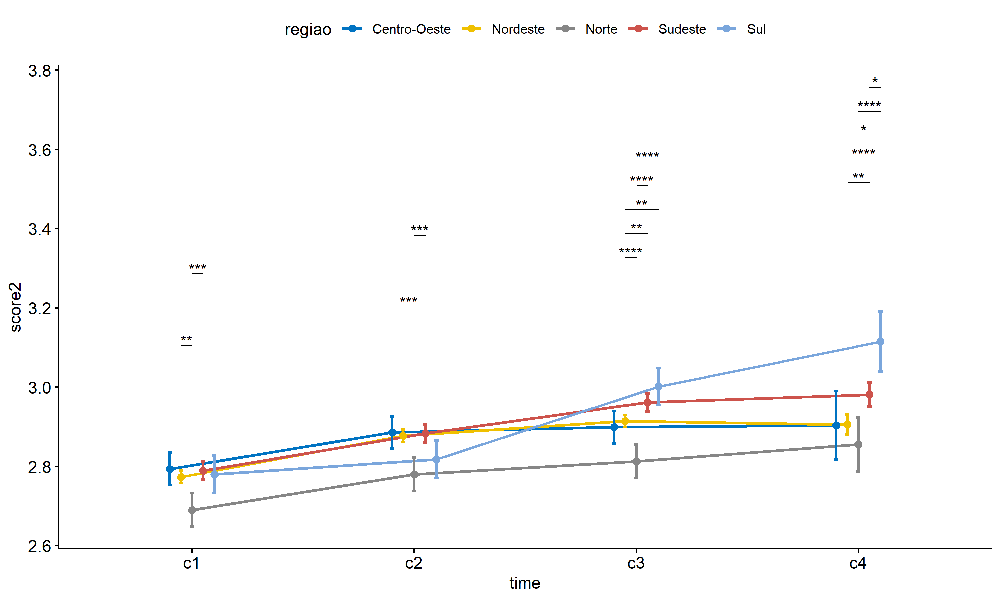<!-- -->

``` r
(pwc <- ldat %>% group_by(regiao) %>%
    emmeans_test(score2 ~ time, detailed = T, p.adjust.method = "bonferroni"))
```

    ## # A tibble: 30 × 15
    ##    regiao    term  .y.   group1 group2 null.value estimate     se    df conf.low
    ##  * <fct>     <chr> <chr> <chr>  <chr>       <dbl>    <dbl>  <dbl> <dbl>    <dbl>
    ##  1 Centro-O… time  scor… c1     c2              0 -0.0921  0.0295  9425  -0.150 
    ##  2 Centro-O… time  scor… c1     c3              0 -0.106   0.0295  9425  -0.164 
    ##  3 Centro-O… time  scor… c1     c4              0 -0.110   0.0489  9425  -0.206 
    ##  4 Centro-O… time  scor… c2     c3              0 -0.0138  0.0295  9425  -0.0715
    ##  5 Centro-O… time  scor… c2     c4              0 -0.0181  0.0489  9425  -0.114 
    ##  6 Centro-O… time  scor… c3     c4              0 -0.00434 0.0489  9425  -0.100 
    ##  7 Nordeste  time  scor… c1     c2              0 -0.104   0.0112  9425  -0.126 
    ##  8 Nordeste  time  scor… c1     c3              0 -0.141   0.0112  9425  -0.163 
    ##  9 Nordeste  time  scor… c1     c4              0 -0.132   0.0153  9425  -0.162 
    ## 10 Nordeste  time  scor… c2     c3              0 -0.0373  0.0112  9425  -0.0592
    ## # ℹ 20 more rows
    ## # ℹ 5 more variables: conf.high <dbl>, statistic <dbl>, p <dbl>, p.adj <dbl>,
    ## #   p.adj.signif <chr>

| regiao       | term | .y.    | group1 | group2 | null.value | estimate |    se |   df | conf.low | conf.high | statistic |     p | p.adj | p.adj.signif |
|:-------------|:-----|:-------|:-------|:-------|-----------:|---------:|------:|-----:|---------:|----------:|----------:|------:|------:|:-------------|
| Centro-Oeste | time | score2 | c1     | c2     |          0 |   -0.092 | 0.029 | 9425 |   -0.150 |    -0.034 |    -3.126 | 0.002 | 0.011 | \*           |
| Centro-Oeste | time | score2 | c1     | c3     |          0 |   -0.106 | 0.029 | 9425 |   -0.164 |    -0.048 |    -3.595 | 0.000 | 0.002 | \*\*         |
| Centro-Oeste | time | score2 | c1     | c4     |          0 |   -0.110 | 0.049 | 9425 |   -0.206 |    -0.014 |    -2.256 | 0.024 | 0.144 | ns           |
| Centro-Oeste | time | score2 | c2     | c3     |          0 |   -0.014 | 0.029 | 9425 |   -0.072 |     0.044 |    -0.468 | 0.640 | 1.000 | ns           |
| Centro-Oeste | time | score2 | c2     | c4     |          0 |   -0.018 | 0.049 | 9425 |   -0.114 |     0.078 |    -0.371 | 0.711 | 1.000 | ns           |
| Centro-Oeste | time | score2 | c3     | c4     |          0 |   -0.004 | 0.049 | 9425 |   -0.100 |     0.091 |    -0.089 | 0.929 | 1.000 | ns           |
| Nordeste     | time | score2 | c1     | c2     |          0 |   -0.104 | 0.011 | 9425 |   -0.126 |    -0.082 |    -9.295 | 0.000 | 0.000 | \*\*\*\*     |
| Nordeste     | time | score2 | c1     | c3     |          0 |   -0.141 | 0.011 | 9425 |   -0.163 |    -0.119 |   -12.631 | 0.000 | 0.000 | \*\*\*\*     |
| Nordeste     | time | score2 | c1     | c4     |          0 |   -0.132 | 0.015 | 9425 |   -0.162 |    -0.102 |    -8.636 | 0.000 | 0.000 | \*\*\*\*     |
| Nordeste     | time | score2 | c2     | c3     |          0 |   -0.037 | 0.011 | 9425 |   -0.059 |    -0.015 |    -3.335 | 0.001 | 0.005 | \*\*         |
| Nordeste     | time | score2 | c2     | c4     |          0 |   -0.028 | 0.015 | 9425 |   -0.058 |     0.002 |    -1.848 | 0.065 | 0.387 | ns           |
| Nordeste     | time | score2 | c3     | c4     |          0 |    0.009 | 0.015 | 9425 |   -0.021 |     0.039 |     0.587 | 0.557 | 1.000 | ns           |
| Norte        | time | score2 | c1     | c2     |          0 |   -0.090 | 0.030 | 9425 |   -0.149 |    -0.030 |    -2.945 | 0.003 | 0.019 | \*           |
| Norte        | time | score2 | c1     | c3     |          0 |   -0.122 | 0.030 | 9425 |   -0.182 |    -0.063 |    -4.015 | 0.000 | 0.000 | \*\*\*       |
| Norte        | time | score2 | c1     | c4     |          0 |   -0.166 | 0.041 | 9425 |   -0.246 |    -0.086 |    -4.057 | 0.000 | 0.000 | \*\*\*       |
| Norte        | time | score2 | c2     | c3     |          0 |   -0.033 | 0.030 | 9425 |   -0.092 |     0.027 |    -1.070 | 0.285 | 1.000 | ns           |
| Norte        | time | score2 | c2     | c4     |          0 |   -0.076 | 0.041 | 9425 |   -0.156 |     0.004 |    -1.859 | 0.063 | 0.379 | ns           |
| Norte        | time | score2 | c3     | c4     |          0 |   -0.043 | 0.041 | 9425 |   -0.123 |     0.037 |    -1.060 | 0.289 | 1.000 | ns           |
| Sudeste      | time | score2 | c1     | c2     |          0 |   -0.094 | 0.016 | 9425 |   -0.127 |    -0.062 |    -5.735 | 0.000 | 0.000 | \*\*\*\*     |
| Sudeste      | time | score2 | c1     | c3     |          0 |   -0.173 | 0.016 | 9425 |   -0.205 |    -0.140 |   -10.491 | 0.000 | 0.000 | \*\*\*\*     |
| Sudeste      | time | score2 | c1     | c4     |          0 |   -0.192 | 0.019 | 9425 |   -0.229 |    -0.154 |    -9.909 | 0.000 | 0.000 | \*\*\*\*     |
| Sudeste      | time | score2 | c2     | c3     |          0 |   -0.078 | 0.016 | 9425 |   -0.110 |    -0.046 |    -4.756 | 0.000 | 0.000 | \*\*\*\*     |
| Sudeste      | time | score2 | c2     | c4     |          0 |   -0.097 | 0.019 | 9425 |   -0.135 |    -0.059 |    -5.029 | 0.000 | 0.000 | \*\*\*\*     |
| Sudeste      | time | score2 | c3     | c4     |          0 |   -0.019 | 0.019 | 9425 |   -0.057 |     0.019 |    -0.984 | 0.325 | 1.000 | ns           |
| Sul          | time | score2 | c1     | c2     |          0 |   -0.038 | 0.034 | 9425 |   -0.104 |     0.029 |    -1.108 | 0.268 | 1.000 | ns           |
| Sul          | time | score2 | c1     | c3     |          0 |   -0.222 | 0.034 | 9425 |   -0.288 |    -0.155 |    -6.535 | 0.000 | 0.000 | \*\*\*\*     |
| Sul          | time | score2 | c1     | c4     |          0 |   -0.335 | 0.046 | 9425 |   -0.425 |    -0.245 |    -7.333 | 0.000 | 0.000 | \*\*\*\*     |
| Sul          | time | score2 | c2     | c3     |          0 |   -0.184 | 0.034 | 9425 |   -0.251 |    -0.118 |    -5.427 | 0.000 | 0.000 | \*\*\*\*     |
| Sul          | time | score2 | c2     | c4     |          0 |   -0.297 | 0.046 | 9425 |   -0.387 |    -0.208 |    -6.511 | 0.000 | 0.000 | \*\*\*\*     |
| Sul          | time | score2 | c3     | c4     |          0 |   -0.113 | 0.046 | 9425 |   -0.203 |    -0.024 |    -2.482 | 0.013 | 0.079 | ns           |

``` r
(emms <- get_emmeans(pwc))
```

    ## # A tibble: 20 × 8
    ##    regiao       time  emmean      se    df conf.low conf.high method      
    ##    <fct>        <fct>  <dbl>   <dbl> <dbl>    <dbl>     <dbl> <chr>       
    ##  1 Centro-Oeste c1      2.79 0.0208   9425     2.75      2.83 Emmeans test
    ##  2 Centro-Oeste c2      2.89 0.0208   9425     2.84      2.93 Emmeans test
    ##  3 Centro-Oeste c3      2.90 0.0208   9425     2.86      2.94 Emmeans test
    ##  4 Centro-Oeste c4      2.90 0.0442   9425     2.82      2.99 Emmeans test
    ##  5 Nordeste     c1      2.77 0.00791  9425     2.76      2.79 Emmeans test
    ##  6 Nordeste     c2      2.88 0.00791  9425     2.86      2.89 Emmeans test
    ##  7 Nordeste     c3      2.91 0.00791  9425     2.90      2.93 Emmeans test
    ##  8 Nordeste     c4      2.91 0.0131   9425     2.88      2.93 Emmeans test
    ##  9 Norte        c1      2.69 0.0215   9425     2.65      2.73 Emmeans test
    ## 10 Norte        c2      2.78 0.0215   9425     2.74      2.82 Emmeans test
    ## 11 Norte        c3      2.81 0.0215   9425     2.77      2.85 Emmeans test
    ## 12 Norte        c4      2.86 0.0347   9425     2.79      2.92 Emmeans test
    ## 13 Sudeste      c1      2.79 0.0116   9425     2.77      2.81 Emmeans test
    ## 14 Sudeste      c2      2.88 0.0116   9425     2.86      2.91 Emmeans test
    ## 15 Sudeste      c3      2.96 0.0116   9425     2.94      2.98 Emmeans test
    ## 16 Sudeste      c4      2.98 0.0154   9425     2.95      3.01 Emmeans test
    ## 17 Sul          c1      2.78 0.0240   9425     2.73      2.83 Emmeans test
    ## 18 Sul          c2      2.82 0.0240   9425     2.77      2.86 Emmeans test
    ## 19 Sul          c3      3.00 0.0240   9425     2.95      3.05 Emmeans test
    ## 20 Sul          c4      3.11 0.0389   9425     3.04      3.19 Emmeans test

| regiao       | time | emmean |    se |   df | conf.low | conf.high | method       |
|:-------------|:-----|-------:|------:|-----:|---------:|----------:|:-------------|
| Centro-Oeste | c1   |  2.793 | 0.021 | 9425 |    2.753 |     2.834 | Emmeans test |
| Centro-Oeste | c2   |  2.886 | 0.021 | 9425 |    2.845 |     2.926 | Emmeans test |
| Centro-Oeste | c3   |  2.899 | 0.021 | 9425 |    2.858 |     2.940 | Emmeans test |
| Centro-Oeste | c4   |  2.904 | 0.044 | 9425 |    2.817 |     2.990 | Emmeans test |
| Nordeste     | c1   |  2.773 | 0.008 | 9425 |    2.758 |     2.789 | Emmeans test |
| Nordeste     | c2   |  2.877 | 0.008 | 9425 |    2.862 |     2.893 | Emmeans test |
| Nordeste     | c3   |  2.914 | 0.008 | 9425 |    2.899 |     2.930 | Emmeans test |
| Nordeste     | c4   |  2.906 | 0.013 | 9425 |    2.880 |     2.931 | Emmeans test |
| Norte        | c1   |  2.690 | 0.022 | 9425 |    2.648 |     2.732 | Emmeans test |
| Norte        | c2   |  2.780 | 0.022 | 9425 |    2.738 |     2.822 | Emmeans test |
| Norte        | c3   |  2.813 | 0.022 | 9425 |    2.770 |     2.855 | Emmeans test |
| Norte        | c4   |  2.856 | 0.035 | 9425 |    2.788 |     2.924 | Emmeans test |
| Sudeste      | c1   |  2.789 | 0.012 | 9425 |    2.766 |     2.812 | Emmeans test |
| Sudeste      | c2   |  2.883 | 0.012 | 9425 |    2.861 |     2.906 | Emmeans test |
| Sudeste      | c3   |  2.962 | 0.012 | 9425 |    2.939 |     2.984 | Emmeans test |
| Sudeste      | c4   |  2.981 | 0.015 | 9425 |    2.950 |     3.011 | Emmeans test |
| Sul          | c1   |  2.780 | 0.024 | 9425 |    2.733 |     2.827 | Emmeans test |
| Sul          | c2   |  2.817 | 0.024 | 9425 |    2.770 |     2.864 | Emmeans test |
| Sul          | c3   |  3.002 | 0.024 | 9425 |    2.955 |     3.049 | Emmeans test |
| Sul          | c4   |  3.115 | 0.039 | 9425 |    3.039 |     3.191 | Emmeans test |

``` r
emms.gg <- emms[which(emms$regiao == "Centro-Oeste"),]
if (nrow(emms.gg) > 0)
  ggline(emms.gg, x = "time", y = "emmean", color = "#0073C2FF", ylab = "score2", size = 1) +
    geom_errorbar(aes(ymin = conf.low, ymax = conf.high),
                  width = 0.1, color = "#0073C2FF", linewidth = 1) +
    stat_pvalue_manual(
      add_xy_position(pwc[which(pwc$regiao == "Centro-Oeste"),],
                      x = "time", fun = "mean_se"),
      hide.ns = T, color = "#0073C2FF", tip.length = F) +
    theme(legend.text = element_blank())
```

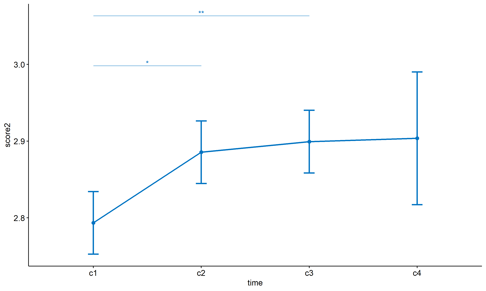<!-- -->

``` r
emms.gg <- emms[which(emms$regiao == "Nordeste"),]
if (nrow(emms.gg) > 0)
  ggline(emms.gg, x = "time", y = "emmean", color = "#EFC000FF", ylab = "score2", size = 1) +
    geom_errorbar(aes(ymin = conf.low, ymax = conf.high),
                  width = 0.1, color = "#EFC000FF", linewidth = 1) +
    stat_pvalue_manual(
      add_xy_position(pwc[which(pwc$regiao == "Nordeste"),],
                      x = "time", fun = "mean_se"),
      hide.ns = T, color = "#EFC000FF", tip.length = F) +
    theme(legend.text = element_blank())
```

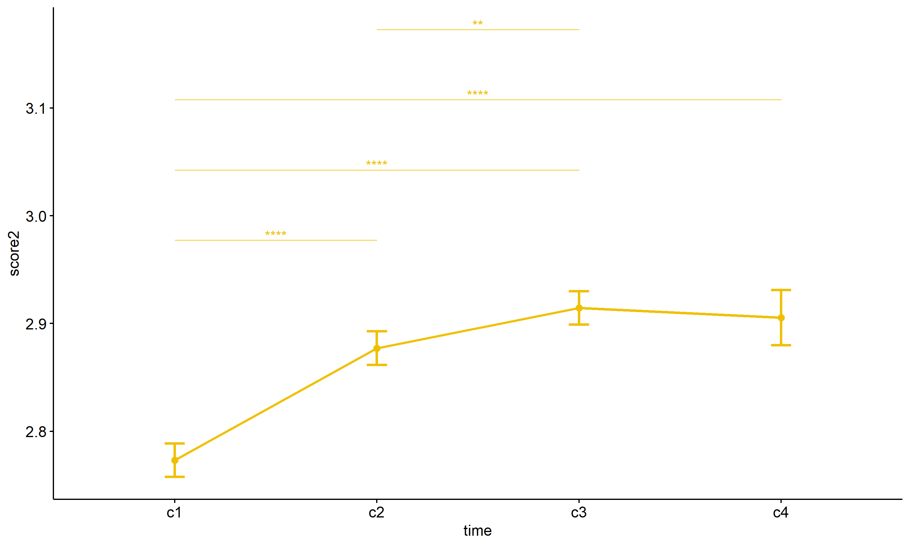<!-- -->

``` r
emms.gg <- emms[which(emms$regiao == "Norte"),]
if (nrow(emms.gg) > 0)
  ggline(emms.gg, x = "time", y = "emmean", color = "#868686FF", ylab = "score2", size = 1) +
    geom_errorbar(aes(ymin = conf.low, ymax = conf.high),
                  width = 0.1, color = "#868686FF", linewidth = 1) +
    stat_pvalue_manual(
      add_xy_position(pwc[which(pwc$regiao == "Norte"),],
                      x = "time", fun = "mean_se"),
      hide.ns = T, color = "#868686FF", tip.length = F) +
    theme(legend.text = element_blank())
```

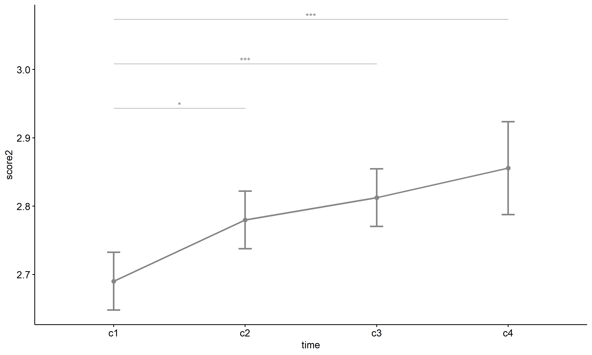<!-- -->

``` r
emms.gg <- emms[which(emms$regiao == "Sudeste"),]
if (nrow(emms.gg) > 0)
  ggline(emms.gg, x = "time", y = "emmean", color = "#CD534CFF", ylab = "score2", size = 1) +
    geom_errorbar(aes(ymin = conf.low, ymax = conf.high),
                  width = 0.1, color = "#CD534CFF", linewidth = 1) +
    stat_pvalue_manual(
      add_xy_position(pwc[which(pwc$regiao == "Sudeste"),],
                      x = "time", fun = "mean_se"),
      hide.ns = T, color = "#CD534CFF", tip.length = F) +
    theme(legend.text = element_blank())
```

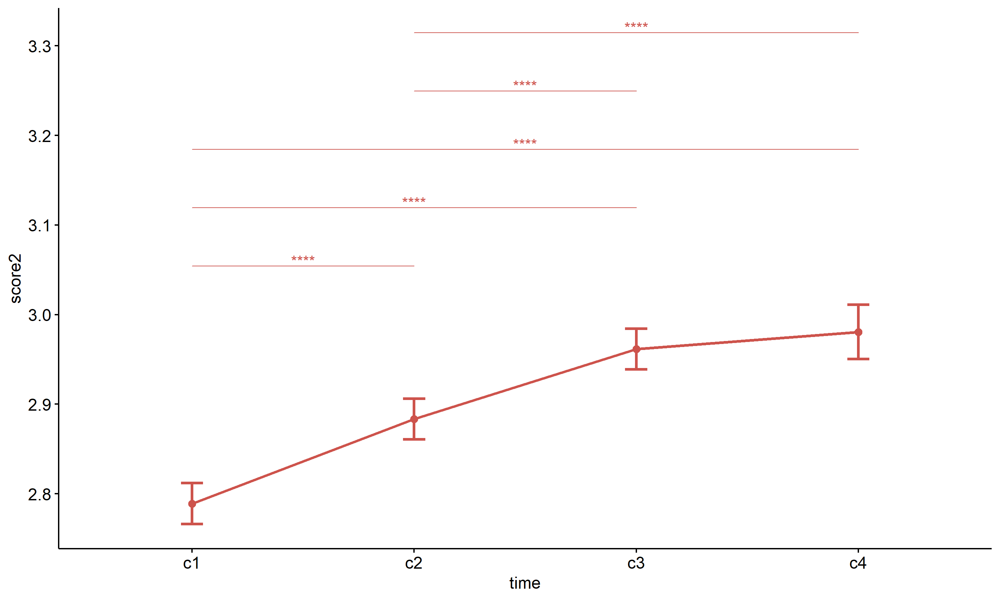<!-- -->

``` r
emms.gg <- emms[which(emms$regiao == "Sul"),]
if (nrow(emms.gg) > 0)
  ggline(emms.gg, x = "time", y = "emmean", color = "#7AA6DCFF", ylab = "score2", size = 1) +
    geom_errorbar(aes(ymin = conf.low, ymax = conf.high),
                  width = 0.1, color = "#7AA6DCFF", linewidth = 1) +
    stat_pvalue_manual(
      add_xy_position(pwc[which(pwc$regiao == "Sul"),],
                      x = "time", fun = "mean_se"),
      hide.ns = T, color = "#7AA6DCFF", tip.length = F) +
    theme(legend.text = element_blank())
```

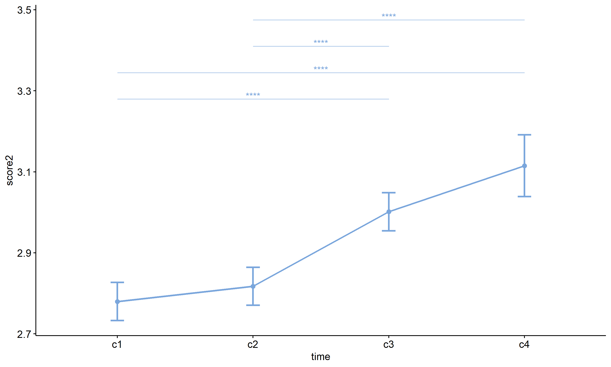<!-- -->

# ANOVA: score2 ~ time\*porte + Error(id/time)

## Data Preparation

``` r
data <- edat[,c("aluno_id","porte","ciclo","score2")]
data <- data[data$ciclo %in% c("Primeiro Ciclo","Segundo Ciclo","Terceiro Ciclo","Quarto Ciclo"),]
data$ciclo <- factor(data$ciclo, c("Primeiro Ciclo","Segundo Ciclo","Terceiro Ciclo","Quarto Ciclo"))
data$porte <- factor(
  data$porte,
  levels = c(sort(unique(data$porte))[1],
             sort(unique(data$porte))[4],
             sort(unique(data$porte))[2],
             sort(unique(data$porte))[3],
             sort(unique(data$porte))[5]),
  labels = c("Up to 50",
             "Between 51 and 200",
             "Between 201 and 500",
             "Between 501 and 1000",
             "More than 1000"))
data <- unique(data)

wdat <- spread(data, ciclo, score2)
colnames(wdat) <- c("id","porte","c1","c2","c3","c4")
wdat <- wdat[complete.cases(wdat[,c("id","porte","c1","c2","c3")]),]


ldat <- gather(wdat, key = time, value = score2, c1,c2,c3,c4) %>%
  convert_as_factor(id, time)
ldat <- remove_group_data(ldat, "score2", c("time", "porte"), n.limit = 15)
ldat$porte <- factor(ldat$porte, sort(unique(ldat$porte)))
```

### Check assumptions: Identifying Outliers

``` r
outliers <- identify_outliers(group_by(ldat, time, porte), score2)
(outliers <- outliers[outliers$is.extreme == T,])
```

    ## # A tibble: 24 × 6
    ##    porte               time  id                   score2 is.outlier is.extreme
    ##    <fct>               <fct> <fct>                 <dbl> <lgl>      <lgl>     
    ##  1 Between 51 and 200  c2    X8eOpiPuKfI4GXxjOsOM   4.25 TRUE       TRUE      
    ##  2 Between 201 and 500 c2    cuknOzzwN4oCRum5U5ph   4.5  TRUE       TRUE      
    ##  3 Between 201 and 500 c2    HsQF2J0r79mHSWNe4l6n   4    TRUE       TRUE      
    ##  4 Between 201 and 500 c2    j31LU8Xwm0EQ7Mihkhjj   4    TRUE       TRUE      
    ##  5 Between 201 and 500 c2    oGUJyWRMYYbF9PNegJZh   4.25 TRUE       TRUE      
    ##  6 Between 201 and 500 c2    W8iXxSmW48zvfJyikMZb   4    TRUE       TRUE      
    ##  7 Between 201 and 500 c2    xk7eC5haTYuFQaJovsBZ   4    TRUE       TRUE      
    ##  8 Between 51 and 200  c3    1uixvrMfKulaomVh0MKa   4.25 TRUE       TRUE      
    ##  9 Between 51 and 200  c3    8edbRBvoAhVAiLZ3h3E2   4.5  TRUE       TRUE      
    ## 10 Between 51 and 200  c3    PwZy7Lbc45vuNd5du72A   4.25 TRUE       TRUE      
    ## # ℹ 14 more rows

| porte                | time | id                   | score2 | is.outlier | is.extreme |
|:---------------------|:-----|:---------------------|-------:|:-----------|:-----------|
| Between 51 and 200   | c2   | X8eOpiPuKfI4GXxjOsOM |  4.250 | TRUE       | TRUE       |
| Between 201 and 500  | c2   | cuknOzzwN4oCRum5U5ph |  4.500 | TRUE       | TRUE       |
| Between 201 and 500  | c2   | HsQF2J0r79mHSWNe4l6n |  4.000 | TRUE       | TRUE       |
| Between 201 and 500  | c2   | j31LU8Xwm0EQ7Mihkhjj |  4.000 | TRUE       | TRUE       |
| Between 201 and 500  | c2   | oGUJyWRMYYbF9PNegJZh |  4.250 | TRUE       | TRUE       |
| Between 201 and 500  | c2   | W8iXxSmW48zvfJyikMZb |  4.000 | TRUE       | TRUE       |
| Between 201 and 500  | c2   | xk7eC5haTYuFQaJovsBZ |  4.000 | TRUE       | TRUE       |
| Between 51 and 200   | c3   | 1uixvrMfKulaomVh0MKa |  4.250 | TRUE       | TRUE       |
| Between 51 and 200   | c3   | 8edbRBvoAhVAiLZ3h3E2 |  4.500 | TRUE       | TRUE       |
| Between 51 and 200   | c3   | PwZy7Lbc45vuNd5du72A |  4.250 | TRUE       | TRUE       |
| Between 201 and 500  | c3   | 7pR91qd7LX1X2Chwr4xQ |  4.250 | TRUE       | TRUE       |
| Between 201 and 500  | c3   | CCVIt7MPeYMUOCCyBxPh |  4.250 | TRUE       | TRUE       |
| Between 201 and 500  | c3   | cOCdJff1IOVxOznhBCWn |  4.000 | TRUE       | TRUE       |
| Between 201 and 500  | c3   | G1fSZJ6Ea4VhHH2OjGQ3 |  4.250 | TRUE       | TRUE       |
| Between 201 and 500  | c3   | i5EZ8Ck9IgDueyMbw55v |  4.500 | TRUE       | TRUE       |
| Between 201 and 500  | c3   | m5yRlxfIj73j4ossfTOB |  4.250 | TRUE       | TRUE       |
| Between 201 and 500  | c3   | OvwAQTWkdj8SYpPS8dgn |  4.250 | TRUE       | TRUE       |
| Between 201 and 500  | c3   | Pj0bkt0GAUBSA1FoPcc2 |  4.500 | TRUE       | TRUE       |
| Between 201 and 500  | c3   | xADstL8Txh6OaomMZXC4 |  4.000 | TRUE       | TRUE       |
| Between 201 and 500  | c3   | xk7eC5haTYuFQaJovsBZ |  3.875 | TRUE       | TRUE       |
| Between 501 and 1000 | c3   | 6bEKmKQpOuvY6PSQvzqj |  4.250 | TRUE       | TRUE       |
| Between 51 and 200   | c4   | fgNBRPWfCa0TP4bDO8d2 |  4.250 | TRUE       | TRUE       |
| Between 501 and 1000 | c4   | 6bEKmKQpOuvY6PSQvzqj |  4.000 | TRUE       | TRUE       |
| Between 501 and 1000 | c4   | DP1fbT1lGhLiBnOFILLi |  4.000 | TRUE       | TRUE       |

### Check assumptions: Normality Test

``` r
(normality.df <- get.descriptives(ldat, "score2", c("time", "porte"), symmetry.test = T, normality.test = T))
```

    ##    time                porte variable    n  mean median   min  max    sd    se
    ## 1    c1             Up to 50   score2   83 2.830  2.750 2.375 3.75 0.250 0.027
    ## 2    c1   Between 51 and 200   score2  473 2.769  2.750 2.250 3.75 0.265 0.012
    ## 3    c1  Between 201 and 500   score2 1529 2.771  2.750 2.250 3.75 0.254 0.006
    ## 4    c1 Between 501 and 1000   score2  618 2.772  2.750 2.250 3.75 0.248 0.010
    ## 5    c1       More than 1000   score2   70 2.800  2.750 2.250 3.75 0.278 0.033
    ## 6    c2             Up to 50   score2   83 2.883  3.000 2.250 3.75 0.267 0.029
    ## 7    c2   Between 51 and 200   score2  473 2.857  2.875 2.250 4.25 0.306 0.014
    ## 8    c2  Between 201 and 500   score2 1529 2.867  2.875 2.250 4.50 0.295 0.008
    ## 9    c2 Between 501 and 1000   score2  618 2.876  2.875 2.250 3.75 0.318 0.013
    ## 10   c2       More than 1000   score2   70 2.911  3.000 2.375 3.75 0.363 0.043
    ## 11   c3             Up to 50   score2   83 3.032  3.000 2.500 4.25 0.418 0.046
    ## 12   c3   Between 51 and 200   score2  473 2.905  2.875 2.250 4.50 0.348 0.016
    ## 13   c3  Between 201 and 500   score2 1529 2.912  2.875 2.250 4.50 0.336 0.009
    ## 14   c3 Between 501 and 1000   score2  618 2.955  3.000 2.250 4.25 0.349 0.014
    ## 15   c3       More than 1000   score2   70 2.861  2.812 2.250 3.75 0.388 0.046
    ## 16   c4   Between 51 and 200   score2  162 2.897  2.875 2.250 4.25 0.354 0.028
    ## 17   c4  Between 201 and 500   score2  675 2.932  3.000 2.250 3.75 0.329 0.013
    ## 18   c4 Between 501 and 1000   score2  249 2.985  3.000 2.250 4.00 0.352 0.022
    ## 19   c4             Up to 50   score2   33 2.966  3.000 2.250 3.75 0.370 0.064
    ##       ci   iqr symmetry  skewness    kurtosis normality     method  statistic
    ## 1  0.055 0.250       NO 0.9958073  2.51358022        NO D'Agostino  21.983569
    ## 2  0.024 0.500       NO 0.7228829  0.90836025         - D'Agostino  44.704875
    ## 3  0.013 0.500       NO 0.6417855  1.25414642         - D'Agostino 132.197666
    ## 4  0.020 0.500       NO 0.5827928  1.09767817         - D'Agostino  46.959903
    ## 5  0.066 0.375       NO 1.0444887  2.19248123        NO D'Agostino  19.445485
    ## 6  0.058 0.250       NO 0.5146730  0.86499782        NO D'Agostino   7.153092
    ## 7  0.028 0.312       NO 0.8881602  1.77979268         - D'Agostino  71.353926
    ## 8  0.015 0.250       NO 1.0499674  2.37621610         - D'Agostino 286.998095
    ## 9  0.025 0.250       NO 0.8849913  1.19662730         - D'Agostino  80.323157
    ## 10 0.087 0.375       NO 0.8561929  0.21663286        NO D'Agostino   9.245639
    ## 11 0.091 0.375       NO 0.8904829 -0.15317568        NO D'Agostino  10.332534
    ## 12 0.031 0.250       NO 1.0879399  1.96037489         - D'Agostino  91.566595
    ## 13 0.017 0.250       NO 1.0535524  1.70903294         - D'Agostino 260.585008
    ## 14 0.028 0.250       NO 0.8029151  0.34864224         - D'Agostino  56.724362
    ## 15 0.093 0.500       NO 0.7208993 -0.03361871        NO D'Agostino   6.544301
    ## 16 0.055 0.375     <NA>        NA          NA      <NA>       <NA>         NA
    ## 17 0.025 0.250     <NA>        NA          NA      <NA>       <NA>         NA
    ## 18 0.044 0.250     <NA>        NA          NA      <NA>       <NA>         NA
    ## 19 0.131 0.250     <NA>        NA          NA      <NA>       <NA>         NA
    ##               p p.signif
    ## 1  1.683948e-05     ****
    ## 2  1.960919e-10     ****
    ## 3  0.000000e+00     ****
    ## 4  6.350187e-11     ****
    ## 5  5.990550e-05     ****
    ## 6  2.797214e-02        *
    ## 7  3.330669e-16     ****
    ## 8  0.000000e+00     ****
    ## 9  0.000000e+00     ****
    ## 10 9.825053e-03       **
    ## 11 5.705829e-03       **
    ## 12 0.000000e+00     ****
    ## 13 0.000000e+00     ****
    ## 14 4.813927e-13     ****
    ## 15 3.792478e-02        *
    ## 16           NA     <NA>
    ## 17           NA     <NA>
    ## 18           NA     <NA>
    ## 19           NA     <NA>

| time | porte                | variable |    n |  mean | median |   min |  max |    sd |    se |    ci |   iqr | symmetry | skewness | kurtosis | normality | method     | statistic |     p | p.signif |
|:-----|:---------------------|:---------|-----:|------:|-------:|------:|-----:|------:|------:|------:|------:|:---------|---------:|---------:|:----------|:-----------|----------:|------:|:---------|
| c1   | Up to 50             | score2   |   83 | 2.830 |  2.750 | 2.375 | 3.75 | 0.250 | 0.027 | 0.055 | 0.250 | NO       |    0.996 |    2.514 | NO        | D’Agostino |    21.984 | 0.000 | \*\*\*\* |
| c1   | Between 51 and 200   | score2   |  473 | 2.769 |  2.750 | 2.250 | 3.75 | 0.265 | 0.012 | 0.024 | 0.500 | NO       |    0.723 |    0.908 | \-        | D’Agostino |    44.705 | 0.000 | \*\*\*\* |
| c1   | Between 201 and 500  | score2   | 1529 | 2.771 |  2.750 | 2.250 | 3.75 | 0.254 | 0.006 | 0.013 | 0.500 | NO       |    0.642 |    1.254 | \-        | D’Agostino |   132.198 | 0.000 | \*\*\*\* |
| c1   | Between 501 and 1000 | score2   |  618 | 2.772 |  2.750 | 2.250 | 3.75 | 0.248 | 0.010 | 0.020 | 0.500 | NO       |    0.583 |    1.098 | \-        | D’Agostino |    46.960 | 0.000 | \*\*\*\* |
| c1   | More than 1000       | score2   |   70 | 2.800 |  2.750 | 2.250 | 3.75 | 0.278 | 0.033 | 0.066 | 0.375 | NO       |    1.044 |    2.192 | NO        | D’Agostino |    19.445 | 0.000 | \*\*\*\* |
| c2   | Up to 50             | score2   |   83 | 2.883 |  3.000 | 2.250 | 3.75 | 0.267 | 0.029 | 0.058 | 0.250 | NO       |    0.515 |    0.865 | NO        | D’Agostino |     7.153 | 0.028 | \*       |
| c2   | Between 51 and 200   | score2   |  473 | 2.857 |  2.875 | 2.250 | 4.25 | 0.306 | 0.014 | 0.028 | 0.312 | NO       |    0.888 |    1.780 | \-        | D’Agostino |    71.354 | 0.000 | \*\*\*\* |
| c2   | Between 201 and 500  | score2   | 1529 | 2.867 |  2.875 | 2.250 | 4.50 | 0.295 | 0.008 | 0.015 | 0.250 | NO       |    1.050 |    2.376 | \-        | D’Agostino |   286.998 | 0.000 | \*\*\*\* |
| c2   | Between 501 and 1000 | score2   |  618 | 2.876 |  2.875 | 2.250 | 3.75 | 0.318 | 0.013 | 0.025 | 0.250 | NO       |    0.885 |    1.197 | \-        | D’Agostino |    80.323 | 0.000 | \*\*\*\* |
| c2   | More than 1000       | score2   |   70 | 2.911 |  3.000 | 2.375 | 3.75 | 0.363 | 0.043 | 0.087 | 0.375 | NO       |    0.856 |    0.217 | NO        | D’Agostino |     9.246 | 0.010 | \*\*     |
| c3   | Up to 50             | score2   |   83 | 3.032 |  3.000 | 2.500 | 4.25 | 0.418 | 0.046 | 0.091 | 0.375 | NO       |    0.890 |   -0.153 | NO        | D’Agostino |    10.333 | 0.006 | \*\*     |
| c3   | Between 51 and 200   | score2   |  473 | 2.905 |  2.875 | 2.250 | 4.50 | 0.348 | 0.016 | 0.031 | 0.250 | NO       |    1.088 |    1.960 | \-        | D’Agostino |    91.567 | 0.000 | \*\*\*\* |
| c3   | Between 201 and 500  | score2   | 1529 | 2.912 |  2.875 | 2.250 | 4.50 | 0.336 | 0.009 | 0.017 | 0.250 | NO       |    1.054 |    1.709 | \-        | D’Agostino |   260.585 | 0.000 | \*\*\*\* |
| c3   | Between 501 and 1000 | score2   |  618 | 2.955 |  3.000 | 2.250 | 4.25 | 0.349 | 0.014 | 0.028 | 0.250 | NO       |    0.803 |    0.349 | \-        | D’Agostino |    56.724 | 0.000 | \*\*\*\* |
| c3   | More than 1000       | score2   |   70 | 2.861 |  2.812 | 2.250 | 3.75 | 0.388 | 0.046 | 0.093 | 0.500 | NO       |    0.721 |   -0.034 | NO        | D’Agostino |     6.544 | 0.038 | \*       |
| c4   | Between 51 and 200   | score2   |  162 | 2.897 |  2.875 | 2.250 | 4.25 | 0.354 | 0.028 | 0.055 | 0.375 | NA       |       NA |       NA | NA        | NA         |        NA |    NA | NA       |
| c4   | Between 201 and 500  | score2   |  675 | 2.932 |  3.000 | 2.250 | 3.75 | 0.329 | 0.013 | 0.025 | 0.250 | NA       |       NA |       NA | NA        | NA         |        NA |    NA | NA       |
| c4   | Between 501 and 1000 | score2   |  249 | 2.985 |  3.000 | 2.250 | 4.00 | 0.352 | 0.022 | 0.044 | 0.250 | NA       |       NA |       NA | NA        | NA         |        NA |    NA | NA       |
| c4   | Up to 50             | score2   |   33 | 2.966 |  3.000 | 2.250 | 3.75 | 0.370 | 0.064 | 0.131 | 0.250 | NA       |       NA |       NA | NA        | NA         |        NA |    NA | NA       |

``` r
idx = which(!ldat$id %in% outliers$id & ldat$porte == "Up to 50" & ldat$time == "c4")
non.ids = getNonNormal(ldat$score2[idx], ldat$id[idx])

(non.ids)
```

    ## NULL

``` r
if (length(non.ids) > 0)
  ldat2 <- ldat[!ldat$id %in% non.ids,]
```

### Summary Statistics

``` r
(sdat <- ldat %>% group_by(time, porte) %>%
   get_summary_stats(score2, type = "mean_sd"))
```

    ## # A tibble: 19 × 6
    ##    porte                time  variable     n  mean    sd
    ##    <fct>                <fct> <fct>    <dbl> <dbl> <dbl>
    ##  1 Up to 50             c1    score2      83  2.83 0.25 
    ##  2 Between 51 and 200   c1    score2     473  2.77 0.265
    ##  3 Between 201 and 500  c1    score2    1529  2.77 0.254
    ##  4 Between 501 and 1000 c1    score2     618  2.77 0.248
    ##  5 More than 1000       c1    score2      70  2.8  0.278
    ##  6 Up to 50             c2    score2      83  2.88 0.267
    ##  7 Between 51 and 200   c2    score2     473  2.86 0.306
    ##  8 Between 201 and 500  c2    score2    1529  2.87 0.295
    ##  9 Between 501 and 1000 c2    score2     618  2.88 0.318
    ## 10 More than 1000       c2    score2      70  2.91 0.363
    ## 11 Up to 50             c3    score2      83  3.03 0.418
    ## 12 Between 51 and 200   c3    score2     473  2.90 0.348
    ## 13 Between 201 and 500  c3    score2    1529  2.91 0.336
    ## 14 Between 501 and 1000 c3    score2     618  2.96 0.349
    ## 15 More than 1000       c3    score2      70  2.86 0.388
    ## 16 Up to 50             c4    score2      33  2.97 0.37 
    ## 17 Between 51 and 200   c4    score2     162  2.90 0.354
    ## 18 Between 201 and 500  c4    score2     675  2.93 0.329
    ## 19 Between 501 and 1000 c4    score2     249  2.98 0.352

| porte                | time | variable |    n |  mean |    sd |
|:---------------------|:-----|:---------|-----:|------:|------:|
| Up to 50             | c1   | score2   |   83 | 2.830 | 0.250 |
| Between 51 and 200   | c1   | score2   |  473 | 2.769 | 0.265 |
| Between 201 and 500  | c1   | score2   | 1529 | 2.771 | 0.254 |
| Between 501 and 1000 | c1   | score2   |  618 | 2.772 | 0.248 |
| More than 1000       | c1   | score2   |   70 | 2.800 | 0.278 |
| Up to 50             | c2   | score2   |   83 | 2.883 | 0.267 |
| Between 51 and 200   | c2   | score2   |  473 | 2.857 | 0.306 |
| Between 201 and 500  | c2   | score2   | 1529 | 2.867 | 0.295 |
| Between 501 and 1000 | c2   | score2   |  618 | 2.876 | 0.318 |
| More than 1000       | c2   | score2   |   70 | 2.911 | 0.363 |
| Up to 50             | c3   | score2   |   83 | 3.032 | 0.418 |
| Between 51 and 200   | c3   | score2   |  473 | 2.905 | 0.348 |
| Between 201 and 500  | c3   | score2   | 1529 | 2.912 | 0.336 |
| Between 501 and 1000 | c3   | score2   |  618 | 2.955 | 0.349 |
| More than 1000       | c3   | score2   |   70 | 2.861 | 0.388 |
| Up to 50             | c4   | score2   |   33 | 2.966 | 0.370 |
| Between 51 and 200   | c4   | score2   |  162 | 2.897 | 0.354 |
| Between 201 and 500  | c4   | score2   |  675 | 2.932 | 0.329 |
| Between 501 and 1000 | c4   | score2   |  249 | 2.985 | 0.352 |

``` r
if (length(non.ids) > 0)
  (sdat <- ldat2 %>% group_by(time, porte) %>%
      get_summary_stats(score2, type = "mean_sd"))
```

| porte                | time | variable |    n |  mean |    sd |
|:---------------------|:-----|:---------|-----:|------:|------:|
| Up to 50             | c1   | score2   |   83 | 2.830 | 0.250 |
| Between 51 and 200   | c1   | score2   |  473 | 2.769 | 0.265 |
| Between 201 and 500  | c1   | score2   | 1529 | 2.771 | 0.254 |
| Between 501 and 1000 | c1   | score2   |  618 | 2.772 | 0.248 |
| More than 1000       | c1   | score2   |   70 | 2.800 | 0.278 |
| Up to 50             | c2   | score2   |   83 | 2.883 | 0.267 |
| Between 51 and 200   | c2   | score2   |  473 | 2.857 | 0.306 |
| Between 201 and 500  | c2   | score2   | 1529 | 2.867 | 0.295 |
| Between 501 and 1000 | c2   | score2   |  618 | 2.876 | 0.318 |
| More than 1000       | c2   | score2   |   70 | 2.911 | 0.363 |
| Up to 50             | c3   | score2   |   83 | 3.032 | 0.418 |
| Between 51 and 200   | c3   | score2   |  473 | 2.905 | 0.348 |
| Between 201 and 500  | c3   | score2   | 1529 | 2.912 | 0.336 |
| Between 501 and 1000 | c3   | score2   |  618 | 2.955 | 0.349 |
| More than 1000       | c3   | score2   |   70 | 2.861 | 0.388 |
| Up to 50             | c4   | score2   |   33 | 2.966 | 0.370 |
| Between 51 and 200   | c4   | score2   |  162 | 2.897 | 0.354 |
| Between 201 and 500  | c4   | score2   |  675 | 2.932 | 0.329 |
| Between 501 and 1000 | c4   | score2   |  249 | 2.985 | 0.352 |

## ANOVA Computation

``` r
(res.aov <- anova_test(ldat, dv = score2, wid = id, between = porte, within = time))
```

    ## Warning: NA detected in rows:
    ## 8323,8325,8326,8332,8333,8334,8337,8339,8340,8342,8343,8344,8345,8349,8350,8352,8353,8354,8358,8359,8361,8362,8364,8369,8370,8374,8375,8376,8382,8383,8390,8391,8393,8395,8397,8398,8400,8401,8403,8407,8408,8411,8412,8413,8415,8417,8422,8425,8427,8428,8429,8431,8433,8440,8441,8442,8444,8447,8448,8449,8451,8452,8454,8456,8457,8462,8463,8464,8465,8466,8467,8468,8472,8473,8474,8476,8477,8479,8481,8484,8485,8487,8488,8489,8490,8491,8493,8494,8496,8497,8499,8500,8503,8507,8510,8511,8512,8515,8517,8518,8521,8524,8525,8526,8527,8528,8529,8530,8532,8534,8536,8537,8542,8545,8547,8548,8551,8552,8555,8556,8558,8561,8563,8565,8566,8567,8570,8572,8575,8576,8577,8579,8586,8587,8588,8589,8594,8597,8598,8600,8601,8602,8603,8604,8608,8613,8618,8621,8623,8625,8627,8629,8630,8632,8633,8634,8636,8637,8639,8642,8644,8645,8646,8647,8648,8649,8650,8653,8654,8655,8656,8657,8659,8660,8661,8663,8666,8668,8672,8677,8679,8680,8681,8683,8686,8687,8689,8690,8691,8692,8697,8699,8700,8701,8702,8704,8705,8706,8707,8708,8709,8710,8711,8712,8713,8714,8717,8719,8720,8721,8722,8723,8724,8726,8727,8728,8729,8731,8732,8735,8736,8737,8738,8740,8741,8743,8745,8746,8747,8748,8749,8752,8753,8755,8756,8758,8761,8762,8763,8765,8766,8767,8768,8769,8771,8775,8776,8777,8778,8779,8782,8783,8786,8788,8789,8791,8795,8796,8797,8798,8799,8800,8801,8803,8809,8812,8813,8814,8815,8817,8818,8820,8821,8823,8824,8825,8826,8827,8828,8829,8830,8831,8832,8833,8834,8835,8838,8841,8843,8844,8845,8847,8849,8851,8854,8858,8860,8861,8863,8864,8866,8868,8869,8870,8872,8873,8874,8875,8877,8879,8880,8881,8882,8883,8884,8886,8887,8888,8889,8891,8892,8893,8894,8898,8901,8902,8904,8905,8907,8910,8915,8916,8918,8919,8920,8921,8922,8924,8926,8927,8928,8930,8931,8932,8933,8935,8938,8939,8940,8941,8942,8943,8945,8947,8949,8950,8951,8953,8954,8955,8956,8958,8959,8960,8962,8963,8968,8971,8972,8976,8977,8980,8981,8982,8985,8986,8987,8988,8989,8990,8993,8995,8997,9003,9006,9010,9011,9012,9015,9016,9017,9018,9020,9023,9028,9029,9030,9032,9033,9037,9040,9044,9047,9049,9053,9057,9058,9061,9062,9063,9065,9066,9067,9068,9069,9070,9071,9072,9073,9074,9075,9077,9083,9086,9088,9089,9090,9091,9092,9095,9096,9097,9101,9104,9105,9110,9111,9113,9114,9115,9118,9120,9121,9123,9125,9127,9128,9130,9131,9134,9135,9137,9138,9139,9140,9143,9144,9146,9147,9148,9149,9150,9151,9152,9154,9156,9159,9161,9163,9165,9166,9167,9169,9170,9171,9172,9173,9174,9175,9176,9177,9178,9181,9182,9185,9187,9188,9189,9191,9194,9195,9197,9198,9199,9202,9205,9209,9210,9211,9212,9213,9214,9215,9217,9218,9219,9220,9221,9222,9223,9224,9225,9227,9228,9231,9232,9233,9234,9235,9236,9237,9238,9239,9241,9242,9243,9248,9249,9251,9252,9253,9254,9255,9257,9258,9259,9260,9266,9267,9269,9274,9275,9277,9278,9280,9281,9282,9283,9286,9288,9289,9292,9294,9296,9299,9300,9301,9303,9305,9306,9307,9310,9312,9315,9317,9320,9322,9324,9325,9327,9328,9329,9331,9336,9337,9340,9341,9342,9344,9345,9347,9351,9352,9355,9356,9357,9358,9365,9366,9367,9369,9370,9371,9372,9376,9377,9378,9379,9381,9382,9383,9384,9386,9387,9388,9389,9392,9393,9394,9395,9396,9397,9399,9400,9401,9402,9404,9405,9406,9410,9412,9413,9415,9416,9417,9418,9419,9420,9421,9422,9423,9424,9425,9428,9429,9430,9434,9438,9440,9443,9444,9445,9448,9449,9450,9451,9452,9453,9454,9456,9458,9459,9461,9465,9466,9469,9470,9471,9472,9473,9476,9477,9479,9480,9482,9483,9484,9485,9487,9489,9490,9491,9492,9493,9494,9496,9497,9498,9499,9500,9502,9505,9506,9507,9509,9510,9519,9522,9524,9525,9527,9528,9530,9531,9533,9534,9539,9542,9543,9547,9548,9550,9551,9555,9560,9561,9562,9563,9564,9565,9566,9569,9570,9572,9574,9577,9578,9579,9585,9586,9587,9588,9590,9591,9593,9595,9596,9598,9599,9601,9604,9606,9607,9609,9611,9618,9619,9621,9622,9624,9625,9628,9631,9632,9633,9634,9636,9637,9638,9639,9642,9644,9647,9648,9650,9651,9657,9658,9660,9663,9664,9665,9666,9667,9669,9670,9671,9673,9675,9677,9678,9679,9680,9682,9683,9684,9685,9686,9689,9691,9693,9694,9695,9696,9698,9700,9702,9703,9705,9706,9707,9708,9709,9710,9712,9714,9715,9716,9717,9719,9722,9723,9724,9725,9726,9727,9730,9732,9733,9735,9736,9740,9741,9742,9743,9744,9751,9752,9753,9755,9756,9760,9762,9765,9769,9771,9772,9773,9774,9775,9776,9777,9778,9780,9781,9782,9783,9784,9785,9786,9787,9788,9789,9791,9793,9796,9797,9798,9799,9800,9801,9802,9803,9804,9806,9807,9808,9810,9811,9812,9814,9815,9816,9817,9818,9819,9820,9822,9824,9825,9826,9829,9835,9837,9840,9841,9842,9843,9844,9845,9849,9850,9852,9854,9855,9858,9859,9860,9861,9863,9864,9865,9866,9867,9868,9870,9873,9874,9875,9877,9880,9884,9885,9886,9889,9891,9892,9894,9895,9896,9897,9898,9899,9900,9901,9902,9903,9904,9907,9908,9911,9914,9915,9916,9918,9921,9926,9927,9928,9929,9932,9933,9934,9937,9938,9940,9941,9943,9945,9946,9949,9950,9952,9953,9955,9958,9961,9963,9964,9965,9967,9968,9971,9973,9976,9977,9978,9979,9981,9982,9984,9985,9986,9987,9988,9989,9990,9995,9996,9998,9999,10002,10003,10004,10005,10006,10009,10011,10012,10013,10014,10015,10016,10018,10019,10022,10023,10025,10026,10027,10029,10030,10031,10032,10033,10035,10036,10037,10038,10039,10040,10042,10045,10046,10050,10052,10053,10054,10055,10056,10058,10059,10060,10062,10063,10064,10065,10067,10068,10069,10070,10074,10076,10077,10078,10079,10080,10083,10085,10086,10087,10089,10091,10094,10096,10100,10101,10102,10106,10107,10110,10111,10112,10113,10114,10115,10116,10117,10119,10120,10121,10123,10124,10125,10127,10128,10129,10130,10132,10134,10135,10136,10137,10139,10143,10145,10146,10147,10150,10151,10152,10155,10156,10157,10158,10159,10161,10162,10165,10167,10168,10170,10171,10173,10175,10176,10177,10178,10179,10180,10181,10187,10188,10189,10193,10197,10198,10199,10200,10205,10206,10207,10208,10209,10210,10212,10213,10215,10217,10220,10221,10222,10223,10224,10227,10232,10233,10235,10237,10240,10243,10245,10248,10249,10250,10251,10253,10255,10256,10257,10258,10261,10262,10265,10266,10267,10268,10271,10272,10273,10274,10276,10278,10279,10280,10282,10283,10284,10285,10286,10287,10288,10291,10292,10293,10294,10295,10298,10301,10304,10305,10308,10312,10313,10314,10315,10316,10317,10318,10319,10321,10323,10324,10325,10326,10327,10329,10330,10331,10338,10339,10341,10343,10348,10349,10350,10352,10353,10355,10357,10358,10359,10360,10363,10364,10367,10368,10374,10378,10379,10380,10383,10384,10385,10386,10387,10391,10393,10395,10396,10397,10398,10399,10401,10403,10404,10405,10409,10411,10412,10413,10414,10415,10418,10419,10421,10422,10423,10424,10426,10427,10428,10430,10433,10434,10438,10439,10440,10441,10442,10443,10444,10445,10446,10447,10448,10451,10456,10458,10459,10460,10461,10462,10463,10465,10467,10468,10471,10472,10473,10474,10475,10477,10480,10481,10484,10485,10486,10491,10492,10495,10496,10497,10498,10499,10500,10501,10502,10504,10506,10507,10509,10510,10511,10513,10514,10515,10516,10518,10519,10521,10523,10525,10527,10530,10531,10532,10534,10535,10537,10538,10540,10542,10543,10544,10545,10546,10548,10549,10551,10553,10555,10557,10558,10561,10562,10564,10565,10568,10569,10571,10573,10575,10577,10578,10579,10581,10582,10584,10588,10590,10593,10596,10600,10601,10603,10604,10605,10606,10608,10609,10610,10611,10612,10615,10616,10619,10620,10621,10623,10626,10628,10629,10630,10631,10632,10637,10639,10640,10644,10647,10649,10651,10652,10654,10655,10656,10663,10665,10666,10667,10668,10669,10672,10674,10675,10676,10677,10679,10680,10682,10684,10685,10688,10689,10690,10691,10694,10695,10696,10698,10700,10701,10703,10704,10705,10706,10707,10712,10715,10717,10719,10720,10721,10724,10727,10728,10729,10732,10733,10734,10736,10737,10738,10739,10740,10741,10742,10743,10744,10746,10747,10750,10754,10756,10758,10760,10761,10763,10764,10766,10769,10770,10772,10774,10775,10777,10779,10780,10781,10785,10786,10787,10792,10793,10794,10795,10796,10797,10798,10799,10801,10802,10805,10806,10807,10809,10810,10816,10817,10819,10820,10821,10826,10828,10829,10831,10832,10835,10836,10837,10838,10841,10842,10843,10845,10846,10849,10850,10851,10852,10853,10854,10857,10858,10862,10863,10864,10865,10866,10870,10871,10873,10877,10878,10879,10883,10884,10886,10887,10888,10891,10892,10893,10894,10895,10897,10898,10899,10900,10901,10905,10907,10909,10911,10912,10913,10914,10915,10916,10917,10918,10920,10

    ## ANOVA Table (type III tests)
    ## 
    ## $ANOVA
    ##       Effect DFn  DFd      F        p p<.05   ges
    ## 1      porte   3 1115  3.129 2.50e-02     * 0.003
    ## 2       time   3 3345 29.651 6.49e-19     * 0.016
    ## 3 porte:time   9 3345  2.426 1.00e-02     * 0.004
    ## 
    ## $`Mauchly's Test for Sphericity`
    ##       Effect     W     p p<.05
    ## 1       time 0.984 0.004     *
    ## 2 porte:time 0.984 0.004     *
    ## 
    ## $`Sphericity Corrections`
    ##       Effect  GGe        DF[GG]   p[GG] p[GG]<.05   HFe     DF[HF]    p[HF]
    ## 1       time 0.99 2.97, 3312.18 9.4e-19         * 0.993 2.98, 3322 8.41e-19
    ## 2 porte:time 0.99 8.91, 3312.18 1.0e-02         * 0.993 8.94, 3322 1.00e-02
    ##   p[HF]<.05
    ## 1         *
    ## 2         *

| Effect     | DFn |  DFd |      F |     p | p\<.05 |   ges |
|:-----------|----:|-----:|-------:|------:|:-------|------:|
| porte      |   3 | 1115 |  3.129 | 0.025 | \*     | 0.003 |
| time       |   3 | 3345 | 29.651 | 0.000 | \*     | 0.016 |
| porte:time |   9 | 3345 |  2.426 | 0.010 | \*     | 0.004 |

| Effect     |     W |     p | p\<.05 |
|:-----------|------:|------:|:-------|
| time       | 0.984 | 0.004 | \*     |
| porte:time | 0.984 | 0.004 | \*     |

| Effect     |  GGe | DF\[GG\]      | p\[GG\] | p\[GG\]\<.05 |   HFe | DF\[HF\]   | p\[HF\] | p\[HF\]\<.05 |
|:-----------|-----:|:--------------|--------:|:-------------|------:|:-----------|--------:|:-------------|
| time       | 0.99 | 2.97, 3312.18 |    0.00 | \*           | 0.993 | 2.98, 3322 |    0.00 | \*           |
| porte:time | 0.99 | 8.91, 3312.18 |    0.01 | \*           | 0.993 | 8.94, 3322 |    0.01 | \*           |

## ANOVA Computation after removing non.normal data

``` r
if (length(non.ids) > 0)
  (res.aov2 <- anova_test(ldat2, dv = score2, wid = id, between = porte , within = time))
```

## PairWise Computation

``` r
(pwc <- ldat %>% group_by(time) %>%
   emmeans_test(score2 ~ porte, detailed = T, p.adjust.method = "bonferroni"))
```

    ## # A tibble: 40 × 15
    ##    time  term  .y.    group1    group2 null.value estimate     se    df conf.low
    ##  * <fct> <chr> <chr>  <chr>     <chr>       <dbl>    <dbl>  <dbl> <dbl>    <dbl>
    ##  1 c1    porte score2 Up to 50  Betwe…          0  0.0611  0.0366  9419 -0.0107 
    ##  2 c1    porte score2 Up to 50  Betwe…          0  0.0593  0.0347  9419 -0.00869
    ##  3 c1    porte score2 Up to 50  Betwe…          0  0.0578  0.0360  9419 -0.0127 
    ##  4 c1    porte score2 Up to 50  More …          0  0.0298  0.0499  9419 -0.0680 
    ##  5 c1    porte score2 Between … Betwe…          0 -0.00178 0.0162  9419 -0.0335 
    ##  6 c1    porte score2 Between … Betwe…          0 -0.00328 0.0188  9419 -0.0401 
    ##  7 c1    porte score2 Between … More …          0 -0.0312  0.0394  9419 -0.108  
    ##  8 c1    porte score2 Between … Betwe…          0 -0.00150 0.0147  9419 -0.0302 
    ##  9 c1    porte score2 Between … More …          0 -0.0295  0.0376  9419 -0.103  
    ## 10 c1    porte score2 Between … More …          0 -0.0280  0.0388  9419 -0.104  
    ## # ℹ 30 more rows
    ## # ℹ 5 more variables: conf.high <dbl>, statistic <dbl>, p <dbl>, p.adj <dbl>,
    ## #   p.adj.signif <chr>

| time | term  | .y.    | group1               | group2               | null.value | estimate |    se |   df | conf.low | conf.high | statistic |     p | p.adj | p.adj.signif |
|:-----|:------|:-------|:---------------------|:---------------------|-----------:|---------:|------:|-----:|---------:|----------:|----------:|------:|------:|:-------------|
| c1   | porte | score2 | Up to 50             | Between 51 and 200   |          0 |    0.061 | 0.037 | 9419 |   -0.011 |     0.133 |     1.668 | 0.095 | 0.954 | ns           |
| c1   | porte | score2 | Up to 50             | Between 201 and 500  |          0 |    0.059 | 0.035 | 9419 |   -0.009 |     0.127 |     1.709 | 0.087 | 0.874 | ns           |
| c1   | porte | score2 | Up to 50             | Between 501 and 1000 |          0 |    0.058 | 0.036 | 9419 |   -0.013 |     0.128 |     1.606 | 0.108 | 1.000 | ns           |
| c1   | porte | score2 | Up to 50             | More than 1000       |          0 |    0.030 | 0.050 | 9419 |   -0.068 |     0.128 |     0.597 | 0.550 | 1.000 | ns           |
| c1   | porte | score2 | Between 51 and 200   | Between 201 and 500  |          0 |   -0.002 | 0.016 | 9419 |   -0.034 |     0.030 |    -0.110 | 0.912 | 1.000 | ns           |
| c1   | porte | score2 | Between 51 and 200   | Between 501 and 1000 |          0 |   -0.003 | 0.019 | 9419 |   -0.040 |     0.034 |    -0.175 | 0.861 | 1.000 | ns           |
| c1   | porte | score2 | Between 51 and 200   | More than 1000       |          0 |   -0.031 | 0.039 | 9419 |   -0.108 |     0.046 |    -0.793 | 0.428 | 1.000 | ns           |
| c1   | porte | score2 | Between 201 and 500  | Between 501 and 1000 |          0 |   -0.001 | 0.015 | 9419 |   -0.030 |     0.027 |    -0.102 | 0.919 | 1.000 | ns           |
| c1   | porte | score2 | Between 201 and 500  | More than 1000       |          0 |   -0.029 | 0.038 | 9419 |   -0.103 |     0.044 |    -0.783 | 0.433 | 1.000 | ns           |
| c1   | porte | score2 | Between 501 and 1000 | More than 1000       |          0 |   -0.028 | 0.039 | 9419 |   -0.104 |     0.048 |    -0.720 | 0.471 | 1.000 | ns           |
| c2   | porte | score2 | Up to 50             | Between 51 and 200   |          0 |    0.025 | 0.037 | 9419 |   -0.046 |     0.097 |     0.695 | 0.487 | 1.000 | ns           |
| c2   | porte | score2 | Up to 50             | Between 201 and 500  |          0 |    0.016 | 0.035 | 9419 |   -0.052 |     0.083 |     0.447 | 0.655 | 1.000 | ns           |
| c2   | porte | score2 | Up to 50             | Between 501 and 1000 |          0 |    0.007 | 0.036 | 9419 |   -0.064 |     0.077 |     0.194 | 0.846 | 1.000 | ns           |
| c2   | porte | score2 | Up to 50             | More than 1000       |          0 |   -0.028 | 0.050 | 9419 |   -0.126 |     0.070 |    -0.565 | 0.572 | 1.000 | ns           |
| c2   | porte | score2 | Between 51 and 200   | Between 201 and 500  |          0 |   -0.010 | 0.016 | 9419 |   -0.042 |     0.022 |    -0.614 | 0.539 | 1.000 | ns           |
| c2   | porte | score2 | Between 51 and 200   | Between 501 and 1000 |          0 |   -0.018 | 0.019 | 9419 |   -0.055 |     0.018 |    -0.982 | 0.326 | 1.000 | ns           |
| c2   | porte | score2 | Between 51 and 200   | More than 1000       |          0 |   -0.054 | 0.039 | 9419 |   -0.131 |     0.024 |    -1.362 | 0.173 | 1.000 | ns           |
| c2   | porte | score2 | Between 201 and 500  | Between 501 and 1000 |          0 |   -0.009 | 0.015 | 9419 |   -0.037 |     0.020 |    -0.581 | 0.561 | 1.000 | ns           |
| c2   | porte | score2 | Between 201 and 500  | More than 1000       |          0 |   -0.044 | 0.038 | 9419 |   -0.117 |     0.030 |    -1.162 | 0.245 | 1.000 | ns           |
| c2   | porte | score2 | Between 501 and 1000 | More than 1000       |          0 |   -0.035 | 0.039 | 9419 |   -0.111 |     0.041 |    -0.907 | 0.365 | 1.000 | ns           |
| c3   | porte | score2 | Up to 50             | Between 51 and 200   |          0 |    0.126 | 0.037 | 9419 |    0.055 |     0.198 |     3.455 | 0.001 | 0.006 | \*\*         |
| c3   | porte | score2 | Up to 50             | Between 201 and 500  |          0 |    0.119 | 0.035 | 9419 |    0.051 |     0.187 |     3.445 | 0.001 | 0.006 | \*\*         |
| c3   | porte | score2 | Up to 50             | Between 501 and 1000 |          0 |    0.077 | 0.036 | 9419 |    0.006 |     0.147 |     2.134 | 0.033 | 0.329 | ns           |
| c3   | porte | score2 | Up to 50             | More than 1000       |          0 |    0.171 | 0.050 | 9419 |    0.073 |     0.269 |     3.423 | 0.001 | 0.006 | \*\*         |
| c3   | porte | score2 | Between 51 and 200   | Between 201 and 500  |          0 |   -0.007 | 0.016 | 9419 |   -0.039 |     0.025 |    -0.435 | 0.663 | 1.000 | ns           |
| c3   | porte | score2 | Between 51 and 200   | Between 501 and 1000 |          0 |   -0.050 | 0.019 | 9419 |   -0.087 |    -0.013 |    -2.648 | 0.008 | 0.081 | ns           |
| c3   | porte | score2 | Between 51 and 200   | More than 1000       |          0 |    0.044 | 0.039 | 9419 |   -0.033 |     0.122 |     1.127 | 0.260 | 1.000 | ns           |
| c3   | porte | score2 | Between 201 and 500  | Between 501 and 1000 |          0 |   -0.043 | 0.015 | 9419 |   -0.071 |    -0.014 |    -2.913 | 0.004 | 0.036 | \*           |
| c3   | porte | score2 | Between 201 and 500  | More than 1000       |          0 |    0.051 | 0.038 | 9419 |   -0.022 |     0.125 |     1.368 | 0.171 | 1.000 | ns           |
| c3   | porte | score2 | Between 501 and 1000 | More than 1000       |          0 |    0.094 | 0.039 | 9419 |    0.018 |     0.170 |     2.427 | 0.015 | 0.152 | ns           |
| c4   | porte | score2 | Up to 50             | Between 51 and 200   |          0 |    0.069 | 0.059 | 9419 |   -0.046 |     0.184 |     1.180 | 0.238 | 1.000 | ns           |
| c4   | porte | score2 | Up to 50             | Between 201 and 500  |          0 |    0.034 | 0.055 | 9419 |   -0.073 |     0.142 |     0.624 | 0.532 | 1.000 | ns           |
| c4   | porte | score2 | Up to 50             | Between 501 and 1000 |          0 |   -0.020 | 0.057 | 9419 |   -0.131 |     0.092 |    -0.343 | 0.732 | 1.000 | ns           |
| c4   | porte | score2 | Up to 50             | More than 1000       |          0 |       NA |    NA |   NA |       NA |        NA |        NA |    NA |    NA |              |
| c4   | porte | score2 | Between 51 and 200   | Between 201 and 500  |          0 |   -0.035 | 0.027 | 9419 |   -0.088 |     0.018 |    -1.303 | 0.193 | 1.000 | ns           |
| c4   | porte | score2 | Between 51 and 200   | Between 501 and 1000 |          0 |   -0.089 | 0.031 | 9419 |   -0.150 |    -0.028 |    -2.861 | 0.004 | 0.025 | \*           |
| c4   | porte | score2 | Between 51 and 200   | More than 1000       |          0 |       NA |    NA |   NA |       NA |        NA |        NA |    NA |    NA |              |
| c4   | porte | score2 | Between 201 and 500  | Between 501 and 1000 |          0 |   -0.054 | 0.023 | 9419 |   -0.098 |    -0.009 |    -2.357 | 0.018 | 0.111 | ns           |
| c4   | porte | score2 | Between 201 and 500  | More than 1000       |          0 |       NA |    NA |   NA |       NA |        NA |        NA |    NA |    NA |              |
| c4   | porte | score2 | Between 501 and 1000 | More than 1000       |          0 |       NA |    NA |   NA |       NA |        NA |        NA |    NA |    NA |              |

``` r
(emms <- get_emmeans(pwc))
```

    ## # A tibble: 20 × 8
    ##    time  porte                emmean       se    df conf.low conf.high method   
    ##    <fct> <fct>                 <dbl>    <dbl> <dbl>    <dbl>     <dbl> <chr>    
    ##  1 c1    Up to 50               2.83  0.0338   9419     2.76      2.90 Emmeans …
    ##  2 c1    Between 51 and 200     2.77  0.0141   9419     2.74      2.80 Emmeans …
    ##  3 c1    Between 201 and 500    2.77  0.00787  9419     2.76      2.79 Emmeans …
    ##  4 c1    Between 501 and 1000   2.77  0.0124   9419     2.75      2.80 Emmeans …
    ##  5 c1    More than 1000         2.80  0.0368   9419     2.73      2.87 Emmeans …
    ##  6 c2    Up to 50               2.88  0.0338   9419     2.82      2.95 Emmeans …
    ##  7 c2    Between 51 and 200     2.86  0.0141   9419     2.83      2.88 Emmeans …
    ##  8 c2    Between 201 and 500    2.87  0.00787  9419     2.85      2.88 Emmeans …
    ##  9 c2    Between 501 and 1000   2.88  0.0124   9419     2.85      2.90 Emmeans …
    ## 10 c2    More than 1000         2.91  0.0368   9419     2.84      2.98 Emmeans …
    ## 11 c3    Up to 50               3.03  0.0338   9419     2.97      3.10 Emmeans …
    ## 12 c3    Between 51 and 200     2.91  0.0141   9419     2.88      2.93 Emmeans …
    ## 13 c3    Between 201 and 500    2.91  0.00787  9419     2.90      2.93 Emmeans …
    ## 14 c3    Between 501 and 1000   2.95  0.0124   9419     2.93      2.98 Emmeans …
    ## 15 c3    More than 1000         2.86  0.0368   9419     2.79      2.93 Emmeans …
    ## 16 c4    Up to 50               2.97  0.0536   9419     2.86      3.07 Emmeans …
    ## 17 c4    Between 51 and 200     2.90  0.0242   9419     2.85      2.94 Emmeans …
    ## 18 c4    Between 201 and 500    2.93  0.0118   9419     2.91      2.95 Emmeans …
    ## 19 c4    Between 501 and 1000   2.99  0.0195   9419     2.95      3.02 Emmeans …
    ## 20 c4    More than 1000        NA    NA          NA    NA        NA    Emmeans …

| time | porte                | emmean |    se |   df | conf.low | conf.high | method       |
|:-----|:---------------------|-------:|------:|-----:|---------:|----------:|:-------------|
| c1   | Up to 50             |  2.830 | 0.034 | 9419 |    2.764 |     2.896 | Emmeans test |
| c1   | Between 51 and 200   |  2.769 | 0.014 | 9419 |    2.741 |     2.796 | Emmeans test |
| c1   | Between 201 and 500  |  2.771 | 0.008 | 9419 |    2.755 |     2.786 | Emmeans test |
| c1   | Between 501 and 1000 |  2.772 | 0.012 | 9419 |    2.748 |     2.796 | Emmeans test |
| c1   | More than 1000       |  2.800 | 0.037 | 9419 |    2.728 |     2.872 | Emmeans test |
| c2   | Up to 50             |  2.883 | 0.034 | 9419 |    2.816 |     2.949 | Emmeans test |
| c2   | Between 51 and 200   |  2.857 | 0.014 | 9419 |    2.829 |     2.885 | Emmeans test |
| c2   | Between 201 and 500  |  2.867 | 0.008 | 9419 |    2.852 |     2.882 | Emmeans test |
| c2   | Between 501 and 1000 |  2.876 | 0.012 | 9419 |    2.851 |     2.900 | Emmeans test |
| c2   | More than 1000       |  2.911 | 0.037 | 9419 |    2.839 |     2.983 | Emmeans test |
| c3   | Up to 50             |  3.032 | 0.034 | 9419 |    2.965 |     3.098 | Emmeans test |
| c3   | Between 51 and 200   |  2.905 | 0.014 | 9419 |    2.877 |     2.933 | Emmeans test |
| c3   | Between 201 and 500  |  2.912 | 0.008 | 9419 |    2.897 |     2.928 | Emmeans test |
| c3   | Between 501 and 1000 |  2.955 | 0.012 | 9419 |    2.931 |     2.979 | Emmeans test |
| c3   | More than 1000       |  2.861 | 0.037 | 9419 |    2.789 |     2.933 | Emmeans test |
| c4   | Up to 50             |  2.966 | 0.054 | 9419 |    2.861 |     3.071 | Emmeans test |
| c4   | Between 51 and 200   |  2.897 | 0.024 | 9419 |    2.849 |     2.944 | Emmeans test |
| c4   | Between 201 and 500  |  2.932 | 0.012 | 9419 |    2.908 |     2.955 | Emmeans test |
| c4   | Between 501 and 1000 |  2.985 | 0.019 | 9419 |    2.947 |     3.024 | Emmeans test |
| c4   | More than 1000       |     NA |    NA |   NA |       NA |        NA | Emmeans test |

``` r
pwc <- add_xy_position(pwc, x = "time", fun = "mean_se", dodge = 0.25)
pd <- position_dodge(width = 0.25)
ggline(emms, x = "time", y = "emmean", color = "porte", size = 1,
       palette = c("#0073C2FF","#EFC000FF","#868686FF","#CD534CFF","#7AA6DCFF"),
       position = pd, ylab = "score2") +
  geom_errorbar(aes(ymin = conf.low, ymax = conf.high, color = porte),
                position = pd, width = 0.1, linewidth = 1) +
  stat_pvalue_manual(pwc, hide.ns = T, tip.length = F, linetype = 1)
```

    ## Warning: Removed 4 rows containing non-finite values (`stat_bracket()`).

    ## Warning: Removed 1 row containing missing values (`geom_line()`).

    ## Warning: Removed 1 rows containing missing values (`geom_point()`).

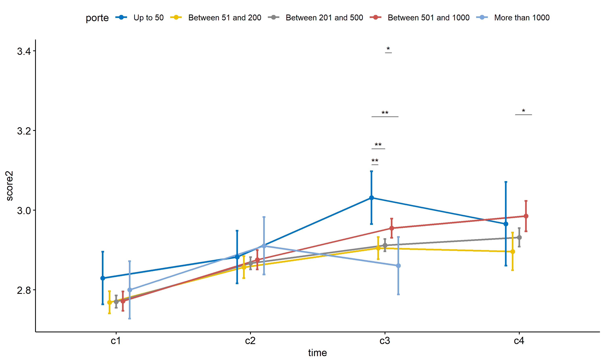<!-- -->

``` r
(pwc <- ldat %>% group_by(porte) %>%
    emmeans_test(score2 ~ time, detailed = T, p.adjust.method = "bonferroni"))
```

    ## # A tibble: 30 × 15
    ##    porte     term  .y.   group1 group2 null.value estimate     se    df conf.low
    ##  * <fct>     <chr> <chr> <chr>  <chr>       <dbl>    <dbl>  <dbl> <dbl>    <dbl>
    ##  1 Up to 50  time  scor… c1     c2              0  -0.0527 0.0478  9419  -0.146 
    ##  2 Up to 50  time  scor… c1     c3              0  -0.202  0.0478  9419  -0.295 
    ##  3 Up to 50  time  scor… c1     c4              0  -0.136  0.0633  9419  -0.260 
    ##  4 Up to 50  time  scor… c2     c3              0  -0.149  0.0478  9419  -0.243 
    ##  5 Up to 50  time  scor… c2     c4              0  -0.0834 0.0633  9419  -0.207 
    ##  6 Up to 50  time  scor… c3     c4              0   0.0657 0.0633  9419  -0.0584
    ##  7 Between … time  scor… c1     c2              0  -0.0883 0.0200  9419  -0.128 
    ##  8 Between … time  scor… c1     c3              0  -0.136  0.0200  9419  -0.176 
    ##  9 Between … time  scor… c1     c4              0  -0.128  0.0280  9419  -0.183 
    ## 10 Between … time  scor… c2     c3              0  -0.0481 0.0200  9419  -0.0873
    ## # ℹ 20 more rows
    ## # ℹ 5 more variables: conf.high <dbl>, statistic <dbl>, p <dbl>, p.adj <dbl>,
    ## #   p.adj.signif <chr>

| porte                | term | .y.    | group1 | group2 | null.value | estimate |    se |   df | conf.low | conf.high | statistic |     p | p.adj | p.adj.signif |
|:---------------------|:-----|:-------|:-------|:-------|-----------:|---------:|------:|-----:|---------:|----------:|----------:|------:|------:|:-------------|
| Up to 50             | time | score2 | c1     | c2     |          0 |   -0.053 | 0.048 | 9419 |   -0.146 |     0.041 |    -1.104 | 0.270 | 1.000 | ns           |
| Up to 50             | time | score2 | c1     | c3     |          0 |   -0.202 | 0.048 | 9419 |   -0.295 |    -0.108 |    -4.226 | 0.000 | 0.000 | \*\*\*       |
| Up to 50             | time | score2 | c1     | c4     |          0 |   -0.136 | 0.063 | 9419 |   -0.260 |    -0.012 |    -2.150 | 0.032 | 0.190 | ns           |
| Up to 50             | time | score2 | c2     | c3     |          0 |   -0.149 | 0.048 | 9419 |   -0.243 |    -0.055 |    -3.122 | 0.002 | 0.011 | \*           |
| Up to 50             | time | score2 | c2     | c4     |          0 |   -0.083 | 0.063 | 9419 |   -0.207 |     0.041 |    -1.317 | 0.188 | 1.000 | ns           |
| Up to 50             | time | score2 | c3     | c4     |          0 |    0.066 | 0.063 | 9419 |   -0.058 |     0.190 |     1.038 | 0.299 | 1.000 | ns           |
| Between 51 and 200   | time | score2 | c1     | c2     |          0 |   -0.088 | 0.020 | 9419 |   -0.128 |    -0.049 |    -4.414 | 0.000 | 0.000 | \*\*\*\*     |
| Between 51 and 200   | time | score2 | c1     | c3     |          0 |   -0.136 | 0.020 | 9419 |   -0.176 |    -0.097 |    -6.816 | 0.000 | 0.000 | \*\*\*\*     |
| Between 51 and 200   | time | score2 | c1     | c4     |          0 |   -0.128 | 0.028 | 9419 |   -0.183 |    -0.073 |    -4.565 | 0.000 | 0.000 | \*\*\*\*     |
| Between 51 and 200   | time | score2 | c2     | c3     |          0 |   -0.048 | 0.020 | 9419 |   -0.087 |    -0.009 |    -2.402 | 0.016 | 0.098 | ns           |
| Between 51 and 200   | time | score2 | c2     | c4     |          0 |   -0.040 | 0.028 | 9419 |   -0.094 |     0.015 |    -1.412 | 0.158 | 0.949 | ns           |
| Between 51 and 200   | time | score2 | c3     | c4     |          0 |    0.009 | 0.028 | 9419 |   -0.046 |     0.063 |     0.304 | 0.761 | 1.000 | ns           |
| Between 201 and 500  | time | score2 | c1     | c2     |          0 |   -0.096 | 0.011 | 9419 |   -0.118 |    -0.075 |    -8.670 | 0.000 | 0.000 | \*\*\*\*     |
| Between 201 and 500  | time | score2 | c1     | c3     |          0 |   -0.142 | 0.011 | 9419 |   -0.163 |    -0.120 |   -12.728 | 0.000 | 0.000 | \*\*\*\*     |
| Between 201 and 500  | time | score2 | c1     | c4     |          0 |   -0.161 | 0.014 | 9419 |   -0.189 |    -0.133 |   -11.333 | 0.000 | 0.000 | \*\*\*\*     |
| Between 201 and 500  | time | score2 | c2     | c3     |          0 |   -0.045 | 0.011 | 9419 |   -0.067 |    -0.023 |    -4.058 | 0.000 | 0.000 | \*\*\*       |
| Between 201 and 500  | time | score2 | c2     | c4     |          0 |   -0.065 | 0.014 | 9419 |   -0.093 |    -0.037 |    -4.548 | 0.000 | 0.000 | \*\*\*\*     |
| Between 201 and 500  | time | score2 | c3     | c4     |          0 |   -0.019 | 0.014 | 9419 |   -0.047 |     0.008 |    -1.371 | 0.170 | 1.000 | ns           |
| Between 501 and 1000 | time | score2 | c1     | c2     |          0 |   -0.103 | 0.018 | 9419 |   -0.138 |    -0.069 |    -5.913 | 0.000 | 0.000 | \*\*\*\*     |
| Between 501 and 1000 | time | score2 | c1     | c3     |          0 |   -0.183 | 0.018 | 9419 |   -0.217 |    -0.149 |   -10.448 | 0.000 | 0.000 | \*\*\*\*     |
| Between 501 and 1000 | time | score2 | c1     | c4     |          0 |   -0.213 | 0.023 | 9419 |   -0.259 |    -0.168 |    -9.241 | 0.000 | 0.000 | \*\*\*\*     |
| Between 501 and 1000 | time | score2 | c2     | c3     |          0 |   -0.079 | 0.018 | 9419 |   -0.114 |    -0.045 |    -4.534 | 0.000 | 0.000 | \*\*\*\*     |
| Between 501 and 1000 | time | score2 | c2     | c4     |          0 |   -0.110 | 0.023 | 9419 |   -0.155 |    -0.065 |    -4.759 | 0.000 | 0.000 | \*\*\*\*     |
| Between 501 and 1000 | time | score2 | c3     | c4     |          0 |   -0.031 | 0.023 | 9419 |   -0.076 |     0.015 |    -1.323 | 0.186 | 1.000 | ns           |
| More than 1000       | time | score2 | c1     | c2     |          0 |   -0.111 | 0.052 | 9419 |   -0.213 |    -0.009 |    -2.129 | 0.033 | 0.100 | ns           |
| More than 1000       | time | score2 | c1     | c3     |          0 |   -0.061 | 0.052 | 9419 |   -0.163 |     0.041 |    -1.168 | 0.243 | 0.729 | ns           |
| More than 1000       | time | score2 | c1     | c4     |          0 |       NA |    NA |   NA |       NA |        NA |        NA |    NA |    NA |              |
| More than 1000       | time | score2 | c2     | c3     |          0 |    0.050 | 0.052 | 9419 |   -0.052 |     0.152 |     0.962 | 0.336 | 1.000 | ns           |
| More than 1000       | time | score2 | c2     | c4     |          0 |       NA |    NA |   NA |       NA |        NA |        NA |    NA |    NA |              |
| More than 1000       | time | score2 | c3     | c4     |          0 |       NA |    NA |   NA |       NA |        NA |        NA |    NA |    NA |              |

``` r
(emms <- get_emmeans(pwc))
```

    ## # A tibble: 20 × 8
    ##    porte                time  emmean       se    df conf.low conf.high method   
    ##    <fct>                <fct>  <dbl>    <dbl> <dbl>    <dbl>     <dbl> <chr>    
    ##  1 Up to 50             c1      2.83  0.0338   9419     2.76      2.90 Emmeans …
    ##  2 Up to 50             c2      2.88  0.0338   9419     2.82      2.95 Emmeans …
    ##  3 Up to 50             c3      3.03  0.0338   9419     2.97      3.10 Emmeans …
    ##  4 Up to 50             c4      2.97  0.0536   9419     2.86      3.07 Emmeans …
    ##  5 Between 51 and 200   c1      2.77  0.0141   9419     2.74      2.80 Emmeans …
    ##  6 Between 51 and 200   c2      2.86  0.0141   9419     2.83      2.88 Emmeans …
    ##  7 Between 51 and 200   c3      2.91  0.0141   9419     2.88      2.93 Emmeans …
    ##  8 Between 51 and 200   c4      2.90  0.0242   9419     2.85      2.94 Emmeans …
    ##  9 Between 201 and 500  c1      2.77  0.00787  9419     2.76      2.79 Emmeans …
    ## 10 Between 201 and 500  c2      2.87  0.00787  9419     2.85      2.88 Emmeans …
    ## 11 Between 201 and 500  c3      2.91  0.00787  9419     2.90      2.93 Emmeans …
    ## 12 Between 201 and 500  c4      2.93  0.0118   9419     2.91      2.95 Emmeans …
    ## 13 Between 501 and 1000 c1      2.77  0.0124   9419     2.75      2.80 Emmeans …
    ## 14 Between 501 and 1000 c2      2.88  0.0124   9419     2.85      2.90 Emmeans …
    ## 15 Between 501 and 1000 c3      2.95  0.0124   9419     2.93      2.98 Emmeans …
    ## 16 Between 501 and 1000 c4      2.99  0.0195   9419     2.95      3.02 Emmeans …
    ## 17 More than 1000       c1      2.80  0.0368   9419     2.73      2.87 Emmeans …
    ## 18 More than 1000       c2      2.91  0.0368   9419     2.84      2.98 Emmeans …
    ## 19 More than 1000       c3      2.86  0.0368   9419     2.79      2.93 Emmeans …
    ## 20 More than 1000       c4     NA    NA          NA    NA        NA    Emmeans …

| porte                | time | emmean |    se |   df | conf.low | conf.high | method       |
|:---------------------|:-----|-------:|------:|-----:|---------:|----------:|:-------------|
| Up to 50             | c1   |  2.830 | 0.034 | 9419 |    2.764 |     2.896 | Emmeans test |
| Up to 50             | c2   |  2.883 | 0.034 | 9419 |    2.816 |     2.949 | Emmeans test |
| Up to 50             | c3   |  3.032 | 0.034 | 9419 |    2.965 |     3.098 | Emmeans test |
| Up to 50             | c4   |  2.966 | 0.054 | 9419 |    2.861 |     3.071 | Emmeans test |
| Between 51 and 200   | c1   |  2.769 | 0.014 | 9419 |    2.741 |     2.796 | Emmeans test |
| Between 51 and 200   | c2   |  2.857 | 0.014 | 9419 |    2.829 |     2.885 | Emmeans test |
| Between 51 and 200   | c3   |  2.905 | 0.014 | 9419 |    2.877 |     2.933 | Emmeans test |
| Between 51 and 200   | c4   |  2.897 | 0.024 | 9419 |    2.849 |     2.944 | Emmeans test |
| Between 201 and 500  | c1   |  2.771 | 0.008 | 9419 |    2.755 |     2.786 | Emmeans test |
| Between 201 and 500  | c2   |  2.867 | 0.008 | 9419 |    2.852 |     2.882 | Emmeans test |
| Between 201 and 500  | c3   |  2.912 | 0.008 | 9419 |    2.897 |     2.928 | Emmeans test |
| Between 201 and 500  | c4   |  2.932 | 0.012 | 9419 |    2.908 |     2.955 | Emmeans test |
| Between 501 and 1000 | c1   |  2.772 | 0.012 | 9419 |    2.748 |     2.796 | Emmeans test |
| Between 501 and 1000 | c2   |  2.876 | 0.012 | 9419 |    2.851 |     2.900 | Emmeans test |
| Between 501 and 1000 | c3   |  2.955 | 0.012 | 9419 |    2.931 |     2.979 | Emmeans test |
| Between 501 and 1000 | c4   |  2.985 | 0.019 | 9419 |    2.947 |     3.024 | Emmeans test |
| More than 1000       | c1   |  2.800 | 0.037 | 9419 |    2.728 |     2.872 | Emmeans test |
| More than 1000       | c2   |  2.911 | 0.037 | 9419 |    2.839 |     2.983 | Emmeans test |
| More than 1000       | c3   |  2.861 | 0.037 | 9419 |    2.789 |     2.933 | Emmeans test |
| More than 1000       | c4   |     NA |    NA |   NA |       NA |        NA | Emmeans test |

``` r
emms.gg <- emms[which(emms$porte == "Up to 50"),]
if (nrow(emms.gg) > 0)
  ggline(emms.gg, x = "time", y = "emmean", color = "#0073C2FF", ylab = "score2", size = 1) +
    geom_errorbar(aes(ymin = conf.low, ymax = conf.high),
                  width = 0.1, color = "#0073C2FF", linewidth = 1) +
    stat_pvalue_manual(
      add_xy_position(pwc[which(pwc$porte == "Up to 50"),],
                      x = "time", fun = "mean_se"),
      hide.ns = T, color = "#0073C2FF", tip.length = F) +
    theme(legend.text = element_blank())
```

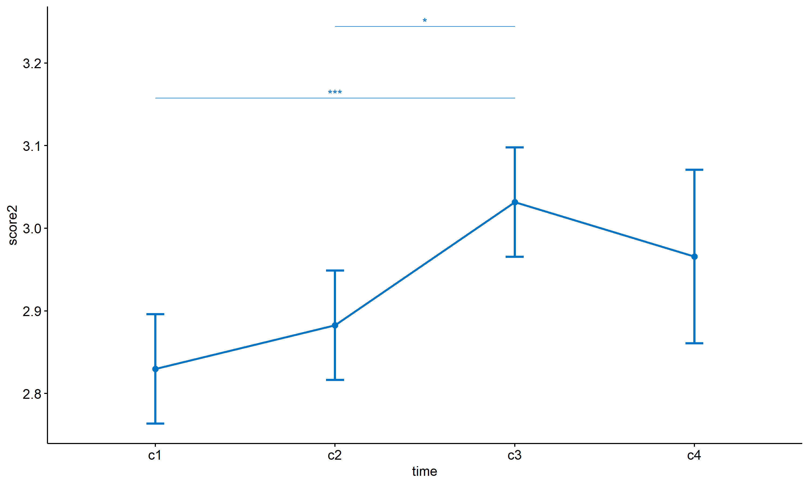<!-- -->

``` r
emms.gg <- emms[which(emms$porte == "Between 51 and 200"),]
if (nrow(emms.gg) > 0)
  ggline(emms.gg, x = "time", y = "emmean", color = "#EFC000FF", ylab = "score2", size = 1) +
    geom_errorbar(aes(ymin = conf.low, ymax = conf.high),
                  width = 0.1, color = "#EFC000FF", linewidth = 1) +
    stat_pvalue_manual(
      add_xy_position(pwc[which(pwc$porte == "Between 51 and 200"),],
                      x = "time", fun = "mean_se"),
      hide.ns = T, color = "#EFC000FF", tip.length = F) +
    theme(legend.text = element_blank())
```

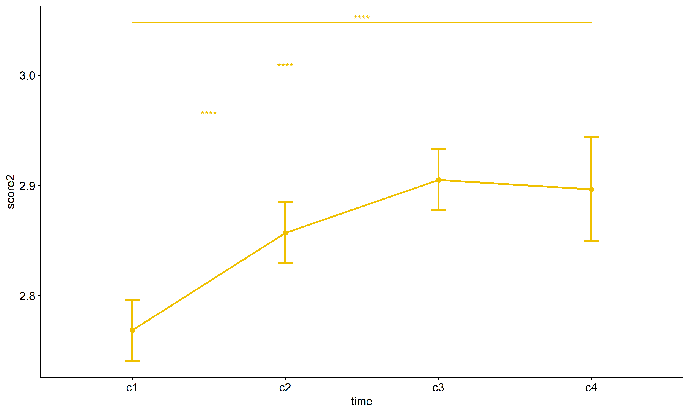<!-- -->

``` r
emms.gg <- emms[which(emms$porte == "Between 201 and 500"),]
if (nrow(emms.gg) > 0)
  ggline(emms.gg, x = "time", y = "emmean", color = "#868686FF", ylab = "score2", size = 1) +
    geom_errorbar(aes(ymin = conf.low, ymax = conf.high),
                  width = 0.1, color = "#868686FF", linewidth = 1) +
    stat_pvalue_manual(
      add_xy_position(pwc[which(pwc$porte == "Between 201 and 500"),],
                      x = "time", fun = "mean_se"),
      hide.ns = T, color = "#868686FF", tip.length = F) +
    theme(legend.text = element_blank())
```

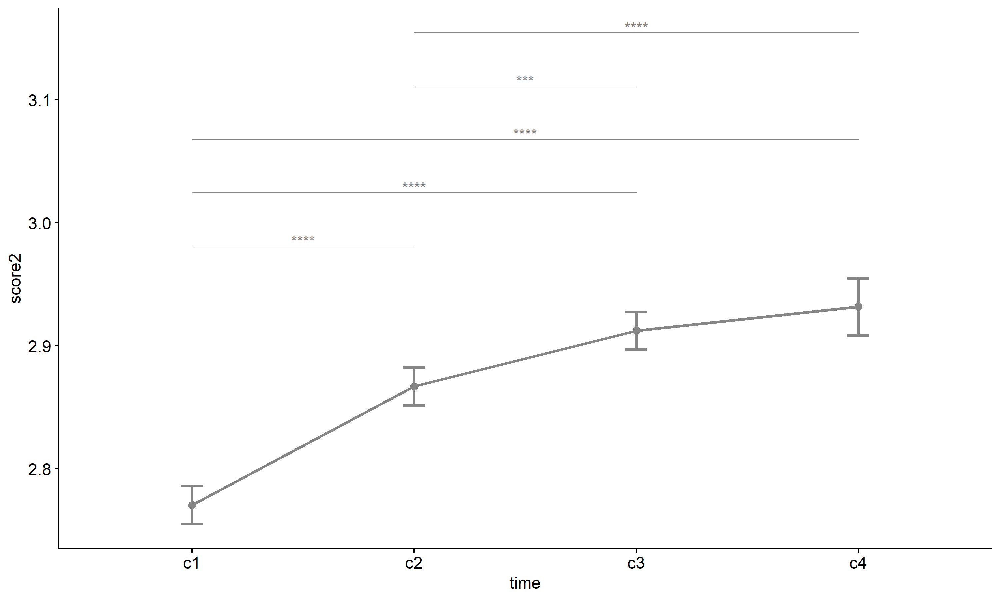<!-- -->

``` r
emms.gg <- emms[which(emms$porte == "Between 501 and 1000"),]
if (nrow(emms.gg) > 0)
  ggline(emms.gg, x = "time", y = "emmean", color = "#CD534CFF", ylab = "score2", size = 1) +
    geom_errorbar(aes(ymin = conf.low, ymax = conf.high),
                  width = 0.2, color = "#CD534CFF", linewidth = 1) +
    stat_pvalue_manual(
      add_xy_position(pwc[which(pwc$porte == "Between 501 and 1000"),],
                      x = "time", fun = "mean_se"),
      hide.ns = T, color = "#CD534CFF", tip.length = F) +
    theme(legend.text = element_blank())
```

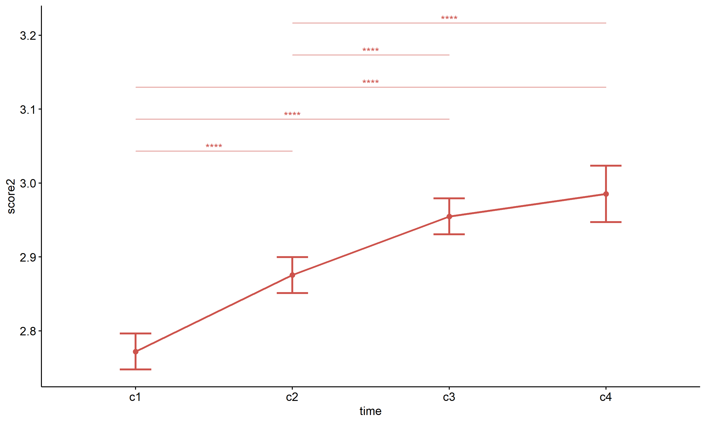<!-- -->
