ANOVA test for adequacao_a_proposta
================
Geiser C. Challco <geiser@alumni.usp.br>

- [ANOVA: adequacao_a_proposta ~
  time](#anova-adequacao_a_proposta--time)
  - [Data Preparation](#data-preparation)
  - [Summary Statistics](#summary-statistics)
  - [ANOVA Computation](#anova-computation)
  - [PairWise Computation](#pairwise-computation)
- [ANOVA: adequacao_a_proposta ~ time\*gender +
  Error(id/time)](#anova-adequacao_a_proposta--timegender--erroridtime)
  - [Data Preparation](#data-preparation-1)
    - [Check assumptions: Identifying
      Outliers](#check-assumptions-identifying-outliers)
    - [Check assumptions: Normality
      Test](#check-assumptions-normality-test)
    - [Summary Statistics](#summary-statistics-1)
  - [ANOVA Computation](#anova-computation-1)
  - [ANOVA Computation after removing non.normal
    data](#anova-computation-after-removing-nonnormal-data)
  - [PairWise Computation](#pairwise-computation-1)
  - [PairWise Computation after removing non.normal
    data](#pairwise-computation-after-removing-nonnormal-data)
- [ANOVA: adequacao_a_proposta ~ time\*localizacao +
  Error(id/time)](#anova-adequacao_a_proposta--timelocalizacao--erroridtime)
  - [Data Preparation](#data-preparation-2)
    - [Check assumptions: Identifying
      Outliers](#check-assumptions-identifying-outliers-1)
    - [Check assumptions: Normality
      Test](#check-assumptions-normality-test-1)
    - [Summary Statistics](#summary-statistics-2)
  - [ANOVA Computation](#anova-computation-2)
  - [ANOVA Computation after removing non.normal
    data](#anova-computation-after-removing-nonnormal-data-1)
  - [PairWise Computation](#pairwise-computation-2)
  - [PairWise Computation after removing non.normal
    data](#pairwise-computation-after-removing-nonnormal-data-1)
- [ANOVA: adequacao_a_proposta ~ time\*regiao +
  Error(id/time)](#anova-adequacao_a_proposta--timeregiao--erroridtime)
  - [Data Preparation](#data-preparation-3)
    - [Check assumptions: Identifying
      Outliers](#check-assumptions-identifying-outliers-2)
    - [Check assumptions: Normality
      Test](#check-assumptions-normality-test-2)
    - [Summary Statistics](#summary-statistics-3)
  - [ANOVA Computation](#anova-computation-3)
  - [ANOVA Computation after removing non.normal
    data](#anova-computation-after-removing-nonnormal-data-2)
  - [PairWise Computation](#pairwise-computation-3)
  - [PairWise Computation after removing non.normal
    data](#pairwise-computation-after-removing-nonnormal-data-2)
- [ANOVA: adequacao_a_proposta ~ time\*porte +
  Error(id/time)](#anova-adequacao_a_proposta--timeporte--erroridtime)
  - [Data Preparation](#data-preparation-4)
    - [Check assumptions: Identifying
      Outliers](#check-assumptions-identifying-outliers-3)
    - [Check assumptions: Normality
      Test](#check-assumptions-normality-test-3)
    - [Summary Statistics](#summary-statistics-4)
  - [ANOVA Computation](#anova-computation-4)
  - [ANOVA Computation after removing non.normal
    data](#anova-computation-after-removing-nonnormal-data-3)
  - [PairWise Computation](#pairwise-computation-4)
  - [PairWise Computation after removing non.normal
    data](#pairwise-computation-after-removing-nonnormal-data-3)

``` r
dat <- read_excel("../data/data.xlsx", sheet = "alunos_ef14")

escolas <- read_excel("../data/data.xlsx", sheet = "escolas")
edat <- merge(dat, escolas, by = "cod_escola", all.x = T)
```

# ANOVA: adequacao_a_proposta ~ time

## Data Preparation

``` r
data <- edat[,c("aluno_id","ciclo","adequacao_a_proposta")]
data$ciclo <- factor(edat$ciclo, c("Primeiro Ciclo","Segundo Ciclo",
                                   "Terceiro Ciclo","Quarto Ciclo"))

wdat <- spread(data, ciclo, adequacao_a_proposta)
wdat <- wdat[complete.cases(wdat),]
colnames(wdat) <- c("id","c1","c2","c3","c4")

ldat <- gather(wdat, key = time, value = adequacao_a_proposta, c1, c2, c3, c4) %>%
  convert_as_factor(id, time)
ldat <- rshinystatistics::remove_group_data(ldat, "adequacao_a_proposta", "time", n.limit = 30)
```

## Summary Statistics

``` r
(sdat <- ldat %>% group_by(time) %>%
   get_summary_stats(adequacao_a_proposta, type = "mean_sd"))
```

    ## # A tibble: 4 × 5
    ##   time  variable                 n  mean    sd
    ##   <fct> <fct>                <dbl> <dbl> <dbl>
    ## 1 c1    adequacao_a_proposta  1126     3     0
    ## 2 c2    adequacao_a_proposta  1126     3     0
    ## 3 c3    adequacao_a_proposta  1126     3     0
    ## 4 c4    adequacao_a_proposta  1126     3     0

| time | variable             |    n | mean |  sd |
|:-----|:---------------------|-----:|-----:|----:|
| c1   | adequacao_a_proposta | 1126 |    3 |   0 |
| c2   | adequacao_a_proposta | 1126 |    3 |   0 |
| c3   | adequacao_a_proposta | 1126 |    3 |   0 |
| c4   | adequacao_a_proposta | 1126 |    3 |   0 |

## ANOVA Computation

``` r
(res.aov <- anova_test(ldat, dv = adequacao_a_proposta, wid = id, within = time))
```

    ## ANOVA Table (type III tests)
    ## 
    ##   Effect DFn  DFd   F   p p<.05 ges
    ## 1   time   3 3375 NaN NaN  <NA>   0

## PairWise Computation

``` r
(pwc <- ldat %>% emmeans_test(adequacao_a_proposta ~ time, detailed = T, p.adjust.method = "bonferroni"))
```

    ## # A tibble: 6 × 14
    ##   term  .y.          group1 group2 null.value  estimate       se    df  conf.low
    ## * <chr> <chr>        <chr>  <chr>       <dbl>     <dbl>    <dbl> <dbl>     <dbl>
    ## 1 time  adequacao_a… c1     c2              0 -1.58e-14 1.12e-14  4500 -3.76e-14
    ## 2 time  adequacao_a… c1     c3              0 -1.58e-14 1.12e-14  4500 -3.76e-14
    ## 3 time  adequacao_a… c1     c4              0 -1.58e-14 1.12e-14  4500 -3.76e-14
    ## 4 time  adequacao_a… c2     c3              0 -5.14e-27 1.12e-14  4500 -2.19e-14
    ## 5 time  adequacao_a… c2     c4              0  9.39e-27 1.12e-14  4500 -2.19e-14
    ## 6 time  adequacao_a… c3     c4              0  1.45e-26 1.12e-14  4500 -2.19e-14
    ## # ℹ 5 more variables: conf.high <dbl>, statistic <dbl>, p <dbl>, p.adj <dbl>,
    ## #   p.adj.signif <chr>

| term | .y.                  | group1 | group2 | null.value | estimate |  se |   df | conf.low | conf.high | statistic |     p | p.adj | p.adj.signif |
|:-----|:---------------------|:-------|:-------|-----------:|---------:|----:|-----:|---------:|----------:|----------:|------:|------:|:-------------|
| time | adequacao_a_proposta | c1     | c2     |          0 |        0 |   0 | 4500 |        0 |         0 |    -1.414 | 0.157 | 0.944 | ns           |
| time | adequacao_a_proposta | c1     | c3     |          0 |        0 |   0 | 4500 |        0 |         0 |    -1.414 | 0.157 | 0.944 | ns           |
| time | adequacao_a_proposta | c1     | c4     |          0 |        0 |   0 | 4500 |        0 |         0 |    -1.414 | 0.157 | 0.944 | ns           |
| time | adequacao_a_proposta | c2     | c3     |          0 |        0 |   0 | 4500 |        0 |         0 |     0.000 | 1.000 | 1.000 | ns           |
| time | adequacao_a_proposta | c2     | c4     |          0 |        0 |   0 | 4500 |        0 |         0 |     0.000 | 1.000 | 1.000 | ns           |
| time | adequacao_a_proposta | c3     | c4     |          0 |        0 |   0 | 4500 |        0 |         0 |     0.000 | 1.000 | 1.000 | ns           |

``` r
pwc <- add_xy_position(pwc, x = "time", fun = "mean_se")
ggline(get_emmeans(pwc), x = "time", y = "emmean", ylab = "adequacao_a_proposta") +
  geom_errorbar(aes(ymin = conf.low, ymax = conf.high), width = 0.2) +
  stat_pvalue_manual(pwc, hide.ns = T, tip.length = F)
```

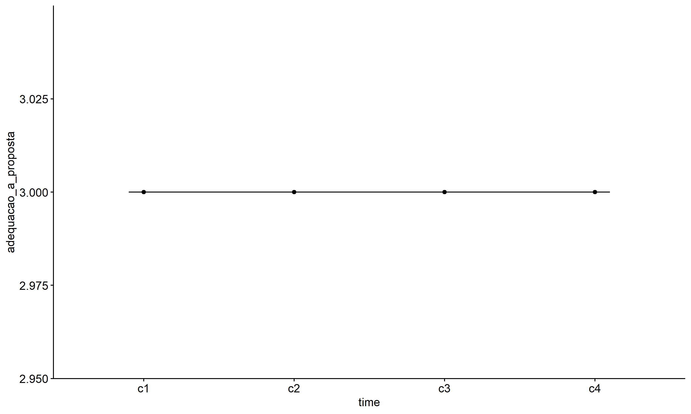<!-- -->

# ANOVA: adequacao_a_proposta ~ time\*gender + Error(id/time)

## Data Preparation

``` r
data <- edat[,c("aluno_id","gender","ciclo","adequacao_a_proposta")]
data$ciclo <- factor(data$ciclo, c("Primeiro Ciclo","Segundo Ciclo",
                                   "Terceiro Ciclo","Quarto Ciclo"))

wdat <- spread(data, ciclo, adequacao_a_proposta)
wdat <- wdat[complete.cases(wdat),]
colnames(wdat) <- c("id","gender","c1","c2","c3","c4")

ldat <- gather(wdat, key = time, value = adequacao_a_proposta, c1, c2, c3, c4) %>%
  convert_as_factor(id, time)
ldat <- remove_group_data(ldat, "adequacao_a_proposta", c("time", "gender"), n.limit = 30)
ldat$gender <- factor(ldat$gender, sort(unique(ldat$gender)))
```

### Check assumptions: Identifying Outliers

``` r
outliers <- identify_outliers(group_by(ldat, time, gender), adequacao_a_proposta)
(outliers <- outliers[outliers$is.extreme == T,])
```

    ## [1] gender               time                 id                  
    ## [4] adequacao_a_proposta is.outlier           is.extreme          
    ## <0 rows> (or 0-length row.names)

| gender | time | id  | adequacao_a_proposta | is.outlier | is.extreme |
|:-------|:-----|:----|---------------------:|:-----------|:-----------|

### Check assumptions: Normality Test

``` r
(normality.df <- normality.test.per.groups(ldat, "adequacao_a_proposta", c("time", "gender")))
```

    ##                    var             variable time gender   n skewness kurtosis
    ## 1 adequacao_a_proposta adequacao_a_proposta   c1 Female 552        0        0
    ## 2 adequacao_a_proposta adequacao_a_proposta   c1   Male 513        0        0
    ## 3 adequacao_a_proposta adequacao_a_proposta   c2 Female 552        0        0
    ## 4 adequacao_a_proposta adequacao_a_proposta   c2   Male 513        0        0
    ## 5 adequacao_a_proposta adequacao_a_proposta   c3 Female 552        0        0
    ## 6 adequacao_a_proposta adequacao_a_proposta   c3   Male 513        0        0
    ## 7 adequacao_a_proposta adequacao_a_proposta   c4 Female 552        0        0
    ## 8 adequacao_a_proposta adequacao_a_proposta   c4   Male 513        0        0
    ##   symmetry statistic method p p.signif normality
    ## 1 few data        NA     NA 1       NA        NO
    ## 2 few data        NA     NA 1       NA        NO
    ## 3 few data        NA     NA 1       NA        NO
    ## 4 few data        NA     NA 1       NA        NO
    ## 5 few data        NA     NA 1       NA        NO
    ## 6 few data        NA     NA 1       NA        NO
    ## 7 few data        NA     NA 1       NA        NO
    ## 8 few data        NA     NA 1       NA        NO

| var                  | variable             | time | gender |   n | skewness | kurtosis | symmetry | statistic | method |   p | p.signif | normality |
|:---------------------|:---------------------|:-----|:-------|----:|---------:|---------:|:---------|:----------|:-------|----:|:---------|:----------|
| adequacao_a_proposta | adequacao_a_proposta | c1   | Female | 552 |        0 |        0 | few data | NA        | NA     |   1 | NA       | NO        |
| adequacao_a_proposta | adequacao_a_proposta | c1   | Male   | 513 |        0 |        0 | few data | NA        | NA     |   1 | NA       | NO        |
| adequacao_a_proposta | adequacao_a_proposta | c2   | Female | 552 |        0 |        0 | few data | NA        | NA     |   1 | NA       | NO        |
| adequacao_a_proposta | adequacao_a_proposta | c2   | Male   | 513 |        0 |        0 | few data | NA        | NA     |   1 | NA       | NO        |
| adequacao_a_proposta | adequacao_a_proposta | c3   | Female | 552 |        0 |        0 | few data | NA        | NA     |   1 | NA       | NO        |
| adequacao_a_proposta | adequacao_a_proposta | c3   | Male   | 513 |        0 |        0 | few data | NA        | NA     |   1 | NA       | NO        |
| adequacao_a_proposta | adequacao_a_proposta | c4   | Female | 552 |        0 |        0 | few data | NA        | NA     |   1 | NA       | NO        |
| adequacao_a_proposta | adequacao_a_proposta | c4   | Male   | 513 |        0 |        0 | few data | NA        | NA     |   1 | NA       | NO        |

``` r
(non.ids <- unique(do.call(
  c, lapply(which(normality.df$normality == 'NO'), FUN = function(i) {
  idx = which(ldat$time == normality.df$time[i] &
                ldat$gender == normality.df$gender[i])
  getNonNormal(ldat$"adequacao_a_proposta"[idx], ldat$id[idx])
}))))
```

    ## NULL

``` r
if (length(non.ids) > 0)
  ldat2 <- ldat[!ldat$id %in% non.ids,]
```

### Summary Statistics

``` r
(sdat <- ldat %>% group_by(time, gender) %>%
   get_summary_stats(adequacao_a_proposta, type = "mean_sd"))
```

    ## # A tibble: 8 × 6
    ##   gender time  variable                 n  mean    sd
    ##   <fct>  <fct> <fct>                <dbl> <dbl> <dbl>
    ## 1 Female c1    adequacao_a_proposta   552     3     0
    ## 2 Male   c1    adequacao_a_proposta   513     3     0
    ## 3 Female c2    adequacao_a_proposta   552     3     0
    ## 4 Male   c2    adequacao_a_proposta   513     3     0
    ## 5 Female c3    adequacao_a_proposta   552     3     0
    ## 6 Male   c3    adequacao_a_proposta   513     3     0
    ## 7 Female c4    adequacao_a_proposta   552     3     0
    ## 8 Male   c4    adequacao_a_proposta   513     3     0

| gender | time | variable             |   n | mean |  sd |
|:-------|:-----|:---------------------|----:|-----:|----:|
| Female | c1   | adequacao_a_proposta | 552 |    3 |   0 |
| Male   | c1   | adequacao_a_proposta | 513 |    3 |   0 |
| Female | c2   | adequacao_a_proposta | 552 |    3 |   0 |
| Male   | c2   | adequacao_a_proposta | 513 |    3 |   0 |
| Female | c3   | adequacao_a_proposta | 552 |    3 |   0 |
| Male   | c3   | adequacao_a_proposta | 513 |    3 |   0 |
| Female | c4   | adequacao_a_proposta | 552 |    3 |   0 |
| Male   | c4   | adequacao_a_proposta | 513 |    3 |   0 |

``` r
if (length(non.ids) > 0)
  (sdat <- ldat2 %>% group_by(time, gender) %>%
      get_summary_stats(adequacao_a_proposta, type = "mean_sd"))
```

| gender | time | variable             |   n | mean |  sd |
|:-------|:-----|:---------------------|----:|-----:|----:|
| Female | c1   | adequacao_a_proposta | 552 |    3 |   0 |
| Male   | c1   | adequacao_a_proposta | 513 |    3 |   0 |
| Female | c2   | adequacao_a_proposta | 552 |    3 |   0 |
| Male   | c2   | adequacao_a_proposta | 513 |    3 |   0 |
| Female | c3   | adequacao_a_proposta | 552 |    3 |   0 |
| Male   | c3   | adequacao_a_proposta | 513 |    3 |   0 |
| Female | c4   | adequacao_a_proposta | 552 |    3 |   0 |
| Male   | c4   | adequacao_a_proposta | 513 |    3 |   0 |

## ANOVA Computation

``` r
(res.aov <- anova_test(ldat, dv = adequacao_a_proposta, wid = id, between = gender, within = time))
```

    ## ANOVA Table (type III tests)
    ## 
    ##        Effect DFn  DFd     F   p p<.05   ges
    ## 1      gender   1 1063 1.076 0.3       0.001
    ## 2        time   3 3189   NaN NaN  <NA> 0.000
    ## 3 gender:time   3 3189   NaN NaN  <NA> 0.000

## ANOVA Computation after removing non.normal data

``` r
if (length(non.ids) > 0)
  (res.aov2 <- anova_test(ldat2, dv = adequacao_a_proposta, wid = id, between = gender , within = time))
```

## PairWise Computation

``` r
(pwc <- ldat %>% group_by(time) %>%
   emmeans_test(adequacao_a_proposta ~ gender, detailed = T, p.adjust.method = "bonferroni"))
```

    ## # A tibble: 4 × 15
    ##   time  term   .y.   group1 group2 null.value  estimate       se    df  conf.low
    ## * <fct> <chr>  <chr> <chr>  <chr>       <dbl>     <dbl>    <dbl> <dbl>     <dbl>
    ## 1 c1    gender adeq… Female Male            0 -2.14e-14 1.03e-14  4252 -4.16e-14
    ## 2 c2    gender adeq… Female Male            0  6.02e-27 1.03e-14  4252 -2.02e-14
    ## 3 c3    gender adeq… Female Male            0  1.00e-26 1.03e-14  4252 -2.02e-14
    ## 4 c4    gender adeq… Female Male            0  8.28e-27 1.03e-14  4252 -2.02e-14
    ## # ℹ 5 more variables: conf.high <dbl>, statistic <dbl>, p <dbl>, p.adj <dbl>,
    ## #   p.adj.signif <chr>

| time | term   | .y.                  | group1 | group2 | null.value | estimate |  se |   df | conf.low | conf.high | statistic |     p | p.adj | p.adj.signif |
|:-----|:-------|:---------------------|:-------|:-------|-----------:|---------:|----:|-----:|---------:|----------:|----------:|------:|------:|:-------------|
| c1   | gender | adequacao_a_proposta | Female | Male   |          0 |        0 |   0 | 4252 |        0 |         0 |    -2.075 | 0.038 | 0.038 | \*           |
| c2   | gender | adequacao_a_proposta | Female | Male   |          0 |        0 |   0 | 4252 |        0 |         0 |     0.000 | 1.000 | 1.000 | ns           |
| c3   | gender | adequacao_a_proposta | Female | Male   |          0 |        0 |   0 | 4252 |        0 |         0 |     0.000 | 1.000 | 1.000 | ns           |
| c4   | gender | adequacao_a_proposta | Female | Male   |          0 |        0 |   0 | 4252 |        0 |         0 |     0.000 | 1.000 | 1.000 | ns           |

``` r
(emms <- get_emmeans(pwc))
```

    ## # A tibble: 8 × 8
    ##   time  gender emmean       se    df conf.low conf.high method      
    ##   <fct> <fct>   <dbl>    <dbl> <dbl>    <dbl>     <dbl> <chr>       
    ## 1 c1    Female   3.00 7.16e-15  4252     3.00      3.00 Emmeans test
    ## 2 c1    Male     3.00 7.43e-15  4252     3.00      3.00 Emmeans test
    ## 3 c2    Female   3.00 7.16e-15  4252     3.00      3.00 Emmeans test
    ## 4 c2    Male     3.00 7.43e-15  4252     3.00      3.00 Emmeans test
    ## 5 c3    Female   3.00 7.16e-15  4252     3.00      3.00 Emmeans test
    ## 6 c3    Male     3.00 7.43e-15  4252     3.00      3.00 Emmeans test
    ## 7 c4    Female   3.00 7.16e-15  4252     3.00      3.00 Emmeans test
    ## 8 c4    Male     3.00 7.43e-15  4252     3.00      3.00 Emmeans test

| time | gender | emmean |  se |   df | conf.low | conf.high | method       |
|:-----|:-------|-------:|----:|-----:|---------:|----------:|:-------------|
| c1   | Female |      3 |   0 | 4252 |        3 |         3 | Emmeans test |
| c1   | Male   |      3 |   0 | 4252 |        3 |         3 | Emmeans test |
| c2   | Female |      3 |   0 | 4252 |        3 |         3 | Emmeans test |
| c2   | Male   |      3 |   0 | 4252 |        3 |         3 | Emmeans test |
| c3   | Female |      3 |   0 | 4252 |        3 |         3 | Emmeans test |
| c3   | Male   |      3 |   0 | 4252 |        3 |         3 | Emmeans test |
| c4   | Female |      3 |   0 | 4252 |        3 |         3 | Emmeans test |
| c4   | Male   |      3 |   0 | 4252 |        3 |         3 | Emmeans test |

``` r
pwc <- add_xy_position(pwc, x = "time", fun = "mean_se", dodge = 0.25)
pd <- position_dodge(width = 0.25)
ggline(emms, x = "time", y = "emmean", color = "gender",
       palette = c("#FF007F","#4D4DFF"),
       position = pd, ylab = "adequacao_a_proposta") +
  geom_errorbar(aes(ymin = conf.low, ymax = conf.high, color = gender),
                position = pd, width = 0.2) +
  stat_pvalue_manual(pwc, hide.ns = T, tip.length = F, linetype = 1)
```

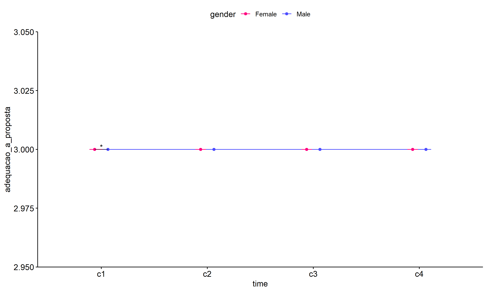<!-- -->

``` r
(pwc <- ldat %>% group_by(gender) %>%
    emmeans_test(adequacao_a_proposta ~ time, detailed = T, p.adjust.method = "bonferroni"))
```

    ## # A tibble: 12 × 15
    ##    gender term  .y.            group1 group2 null.value  estimate       se    df
    ##  * <fct>  <chr> <chr>          <chr>  <chr>       <dbl>     <dbl>    <dbl> <dbl>
    ##  1 Female time  adequacao_a_p… c1     c2              0 -2.32e-26 1.01e-14  4252
    ##  2 Female time  adequacao_a_p… c1     c3              0 -2.52e-26 1.01e-14  4252
    ##  3 Female time  adequacao_a_p… c1     c4              0 -2.96e-26 1.01e-14  4252
    ##  4 Female time  adequacao_a_p… c2     c3              0 -1.97e-27 1.01e-14  4252
    ##  5 Female time  adequacao_a_p… c2     c4              0 -6.36e-27 1.01e-14  4252
    ##  6 Female time  adequacao_a_p… c3     c4              0 -4.39e-27 1.01e-14  4252
    ##  7 Male   time  adequacao_a_p… c1     c2              0  2.14e-14 1.05e-14  4252
    ##  8 Male   time  adequacao_a_p… c1     c3              0  2.14e-14 1.05e-14  4252
    ##  9 Male   time  adequacao_a_p… c1     c4              0  2.14e-14 1.05e-14  4252
    ## 10 Male   time  adequacao_a_p… c2     c3              0 -3.50e-27 1.05e-14  4252
    ## 11 Male   time  adequacao_a_p… c2     c4              0 -9.99e-27 1.05e-14  4252
    ## 12 Male   time  adequacao_a_p… c3     c4              0 -6.49e-27 1.05e-14  4252
    ## # ℹ 6 more variables: conf.low <dbl>, conf.high <dbl>, statistic <dbl>,
    ## #   p <dbl>, p.adj <dbl>, p.adj.signif <chr>

| gender | term | .y.                  | group1 | group2 | null.value | estimate |  se |   df | conf.low | conf.high | statistic |     p | p.adj | p.adj.signif |
|:-------|:-----|:---------------------|:-------|:-------|-----------:|---------:|----:|-----:|---------:|----------:|----------:|------:|------:|:-------------|
| Female | time | adequacao_a_proposta | c1     | c2     |          0 |        0 |   0 | 4252 |        0 |         0 |     0.000 | 1.000 |  1.00 | ns           |
| Female | time | adequacao_a_proposta | c1     | c3     |          0 |        0 |   0 | 4252 |        0 |         0 |     0.000 | 1.000 |  1.00 | ns           |
| Female | time | adequacao_a_proposta | c1     | c4     |          0 |        0 |   0 | 4252 |        0 |         0 |     0.000 | 1.000 |  1.00 | ns           |
| Female | time | adequacao_a_proposta | c2     | c3     |          0 |        0 |   0 | 4252 |        0 |         0 |     0.000 | 1.000 |  1.00 | ns           |
| Female | time | adequacao_a_proposta | c2     | c4     |          0 |        0 |   0 | 4252 |        0 |         0 |     0.000 | 1.000 |  1.00 | ns           |
| Female | time | adequacao_a_proposta | c3     | c4     |          0 |        0 |   0 | 4252 |        0 |         0 |     0.000 | 1.000 |  1.00 | ns           |
| Male   | time | adequacao_a_proposta | c1     | c2     |          0 |        0 |   0 | 4252 |        0 |         0 |     2.038 | 0.042 |  0.25 | ns           |
| Male   | time | adequacao_a_proposta | c1     | c3     |          0 |        0 |   0 | 4252 |        0 |         0 |     2.038 | 0.042 |  0.25 | ns           |
| Male   | time | adequacao_a_proposta | c1     | c4     |          0 |        0 |   0 | 4252 |        0 |         0 |     2.038 | 0.042 |  0.25 | ns           |
| Male   | time | adequacao_a_proposta | c2     | c3     |          0 |        0 |   0 | 4252 |        0 |         0 |     0.000 | 1.000 |  1.00 | ns           |
| Male   | time | adequacao_a_proposta | c2     | c4     |          0 |        0 |   0 | 4252 |        0 |         0 |     0.000 | 1.000 |  1.00 | ns           |
| Male   | time | adequacao_a_proposta | c3     | c4     |          0 |        0 |   0 | 4252 |        0 |         0 |     0.000 | 1.000 |  1.00 | ns           |

``` r
(emms <- get_emmeans(pwc))
```

    ## # A tibble: 8 × 8
    ##   gender time  emmean       se    df conf.low conf.high method      
    ##   <fct>  <fct>  <dbl>    <dbl> <dbl>    <dbl>     <dbl> <chr>       
    ## 1 Female c1      3.00 7.16e-15  4252     3.00      3.00 Emmeans test
    ## 2 Female c2      3.00 7.16e-15  4252     3.00      3.00 Emmeans test
    ## 3 Female c3      3.00 7.16e-15  4252     3.00      3.00 Emmeans test
    ## 4 Female c4      3.00 7.16e-15  4252     3.00      3.00 Emmeans test
    ## 5 Male   c1      3.00 7.43e-15  4252     3.00      3.00 Emmeans test
    ## 6 Male   c2      3.00 7.43e-15  4252     3.00      3.00 Emmeans test
    ## 7 Male   c3      3.00 7.43e-15  4252     3.00      3.00 Emmeans test
    ## 8 Male   c4      3.00 7.43e-15  4252     3.00      3.00 Emmeans test

| gender | time | emmean |  se |   df | conf.low | conf.high | method       |
|:-------|:-----|-------:|----:|-----:|---------:|----------:|:-------------|
| Female | c1   |      3 |   0 | 4252 |        3 |         3 | Emmeans test |
| Female | c2   |      3 |   0 | 4252 |        3 |         3 | Emmeans test |
| Female | c3   |      3 |   0 | 4252 |        3 |         3 | Emmeans test |
| Female | c4   |      3 |   0 | 4252 |        3 |         3 | Emmeans test |
| Male   | c1   |      3 |   0 | 4252 |        3 |         3 | Emmeans test |
| Male   | c2   |      3 |   0 | 4252 |        3 |         3 | Emmeans test |
| Male   | c3   |      3 |   0 | 4252 |        3 |         3 | Emmeans test |
| Male   | c4   |      3 |   0 | 4252 |        3 |         3 | Emmeans test |

``` r
emms.gg <- emms[which(emms$gender == "Female"),]
if (nrow(emms.gg) > 0)
  ggline(emms.gg, x = "time", y = "emmean", color = "#FF007F", ylab = "adequacao_a_proposta") +
    geom_errorbar(aes(ymin = conf.low, ymax = conf.high),
                  width = 0.2, color = "#FF007F") +
    stat_pvalue_manual(
      add_xy_position(pwc[which(pwc$gender == "Female"),],
                      x = "time", fun = "mean_se"),
      hide.ns = T, color = "#FF007F", tip.length = F) +
    labs(title = "gender: Female")+
    theme(legend.text = element_blank())
```

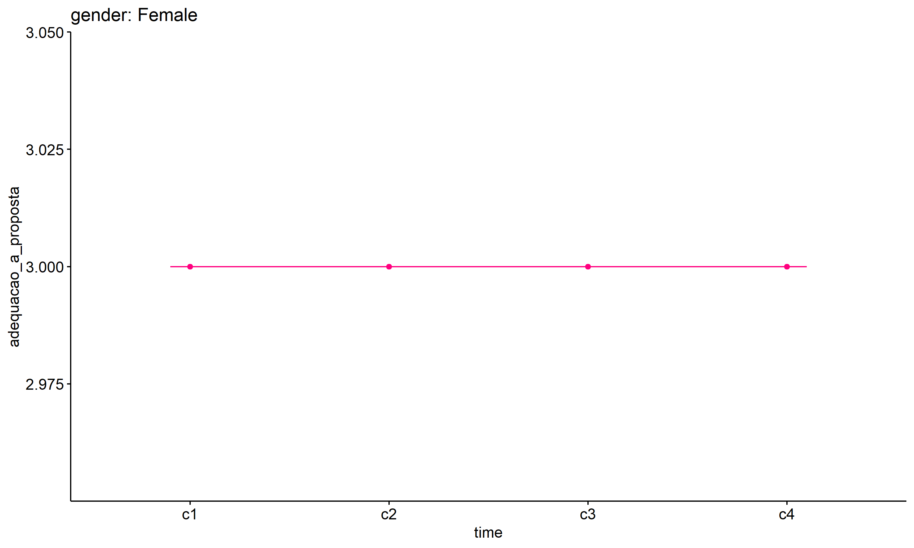<!-- -->

``` r
emms.gg <- emms[which(emms$gender == "Male"),]
if (nrow(emms.gg) > 0)
  ggline(emms.gg, x = "time", y = "emmean", color = "#4D4DFF", ylab = "adequacao_a_proposta") +
    geom_errorbar(aes(ymin = conf.low, ymax = conf.high),
                  width = 0.2, color = "#4D4DFF") +
    stat_pvalue_manual(
      add_xy_position(pwc[which(pwc$gender == "Male"),],
                      x = "time", fun = "mean_se"),
      hide.ns = T, color = "#4D4DFF", tip.length = F) +
    labs(title = "gender: Male")+
    theme(legend.text = element_blank())
```

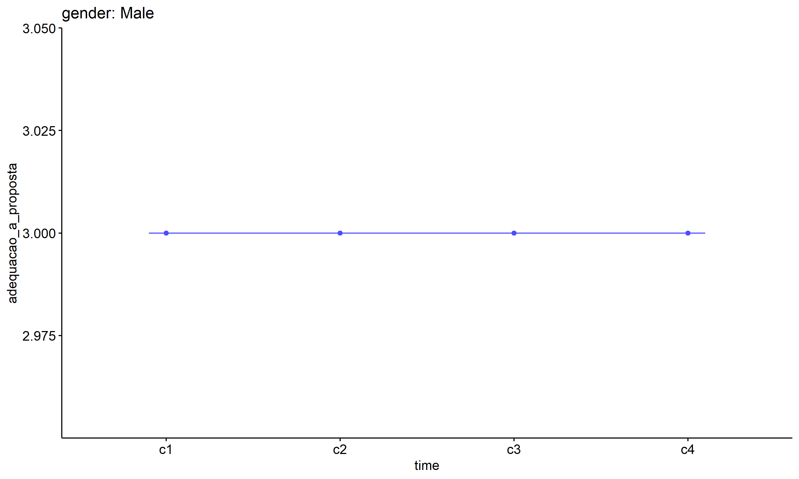<!-- -->

## PairWise Computation after removing non.normal data

``` r
if (length(non.ids) > 0)
  (pwc2 <- ldat2 %>% group_by(time) %>%
     emmeans_test(adequacao_a_proposta ~ gender, detailed = T, p.adjust.method = "bonferroni"))
```

``` r
if (length(non.ids) > 0)
  (emms2 <- get_emmeans(pwc2))
```

``` r
if (length(non.ids) > 0) {
  pwc2 <- add_xy_position(pwc2, x = "time", fun = "mean_se", dodge = 0.25)
  pd2 <- position_dodge(width = 0.25)
  
  ggline(emms2, x = "time", y = "emmean", color = "gender",
         palette = c("#FF007F","#4D4DFF"),
         position = pd, ylab = "adequacao_a_proposta") +
    geom_errorbar(aes(ymin = conf.low, ymax = conf.high, color = gender),
                position = pd, width = 0.2) +
    stat_pvalue_manual(pwc2, hide.ns = T, tip.length = F, linetype = 1)
}
```

``` r
if (length(non.ids) > 0)
  (pwc2 <- ldat2 %>% group_by(gender) %>%
     emmeans_test(adequacao_a_proposta ~ time, detailed = T, p.adjust.method = "bonferroni"))
```

``` r
if (length(non.ids) > 0)
  (emms2 <- get_emmeans(pwc2))
```

``` r
if (length(non.ids) > 0) {
  emms.gg <- emms2[which(emms2$gender == "Female"),]
  if (nrow(emms.gg) > 0)
    ggline(emms.gg, x = "time", y = "emmean", color = "#FF007F", ylab = "adequacao_a_proposta") +
    geom_errorbar(aes(ymin = conf.low, ymax = conf.high),
                  width = 0.2, color = "#FF007F") +
    stat_pvalue_manual(
      add_xy_position(pwc[which(pwc$gender == "Female"),],
                      x = "time", fun = "mean_se"),
      hide.ns = T, color = "#FF007F", tip.length = F) +
    labs(title = "gender: Female") +
    theme(legend.text = element_blank())
}
```

``` r
if (length(non.ids) > 0) {
  emms.gg <- emms2[which(emms2$gender == "Male"),]
  if (nrow(emms.gg) > 0)
    ggline(emms.gg, x = "time", y = "emmean", color = "#4D4DFF", ylab = "adequacao_a_proposta") +
    geom_errorbar(aes(ymin = conf.low, ymax = conf.high),
                  width = 0.2, color = "#4D4DFF") +
    stat_pvalue_manual(
      add_xy_position(pwc[which(pwc$gender == "Male"),],
                      x = "time", fun = "mean_se"),
      hide.ns = T, color = "#4D4DFF", tip.length = F) +
    labs(title = "gender: Male") +
    theme(legend.text = element_blank())
}
```

# ANOVA: adequacao_a_proposta ~ time\*localizacao + Error(id/time)

## Data Preparation

``` r
data <- edat[,c("aluno_id","localizacao","ciclo","adequacao_a_proposta")]
data$ciclo <- factor(data$ciclo, c("Primeiro Ciclo","Segundo Ciclo",
                                   "Terceiro Ciclo","Quarto Ciclo"))

wdat <- spread(data, ciclo, adequacao_a_proposta)
wdat <- wdat[complete.cases(wdat),]
colnames(wdat) <- c("id","localizacao","c1","c2","c3","c4")

ldat <- gather(wdat, key = time, value = adequacao_a_proposta, c1, c2, c3, c4) %>%
  convert_as_factor(id, time)
ldat <- remove_group_data(ldat, "adequacao_a_proposta", c("time", "localizacao"), n.limit = 30)
ldat$localizacao <- factor(ldat$localizacao, sort(unique(ldat$localizacao)))
```

### Check assumptions: Identifying Outliers

``` r
outliers <- identify_outliers(group_by(ldat, time, localizacao), adequacao_a_proposta)
(outliers <- outliers[outliers$is.extreme == T,])
```

    ## [1] localizacao          time                 id                  
    ## [4] adequacao_a_proposta is.outlier           is.extreme          
    ## <0 rows> (or 0-length row.names)

| localizacao | time | id  | adequacao_a_proposta | is.outlier | is.extreme |
|:------------|:-----|:----|---------------------:|:-----------|:-----------|

### Check assumptions: Normality Test

``` r
(normality.df <- normality.test.per.groups(ldat, "adequacao_a_proposta", c("time", "localizacao")))
```

    ##                    var             variable time localizacao   n skewness
    ## 1 adequacao_a_proposta adequacao_a_proposta   c1       Rural 181        0
    ## 2 adequacao_a_proposta adequacao_a_proposta   c1      Urbana 945        0
    ## 3 adequacao_a_proposta adequacao_a_proposta   c2       Rural 181        0
    ## 4 adequacao_a_proposta adequacao_a_proposta   c2      Urbana 945        0
    ## 5 adequacao_a_proposta adequacao_a_proposta   c3       Rural 181        0
    ## 6 adequacao_a_proposta adequacao_a_proposta   c3      Urbana 945        0
    ## 7 adequacao_a_proposta adequacao_a_proposta   c4       Rural 181        0
    ## 8 adequacao_a_proposta adequacao_a_proposta   c4      Urbana 945        0
    ##   kurtosis symmetry statistic method p p.signif normality
    ## 1        0 few data        NA     NA 1       NA        NO
    ## 2        0 few data        NA     NA 1       NA        NO
    ## 3        0 few data        NA     NA 1       NA        NO
    ## 4        0 few data        NA     NA 1       NA        NO
    ## 5        0 few data        NA     NA 1       NA        NO
    ## 6        0 few data        NA     NA 1       NA        NO
    ## 7        0 few data        NA     NA 1       NA        NO
    ## 8        0 few data        NA     NA 1       NA        NO

| var                  | variable             | time | localizacao |   n | skewness | kurtosis | symmetry | statistic | method |   p | p.signif | normality |
|:---------------------|:---------------------|:-----|:------------|----:|---------:|---------:|:---------|:----------|:-------|----:|:---------|:----------|
| adequacao_a_proposta | adequacao_a_proposta | c1   | Rural       | 181 |        0 |        0 | few data | NA        | NA     |   1 | NA       | NO        |
| adequacao_a_proposta | adequacao_a_proposta | c1   | Urbana      | 945 |        0 |        0 | few data | NA        | NA     |   1 | NA       | NO        |
| adequacao_a_proposta | adequacao_a_proposta | c2   | Rural       | 181 |        0 |        0 | few data | NA        | NA     |   1 | NA       | NO        |
| adequacao_a_proposta | adequacao_a_proposta | c2   | Urbana      | 945 |        0 |        0 | few data | NA        | NA     |   1 | NA       | NO        |
| adequacao_a_proposta | adequacao_a_proposta | c3   | Rural       | 181 |        0 |        0 | few data | NA        | NA     |   1 | NA       | NO        |
| adequacao_a_proposta | adequacao_a_proposta | c3   | Urbana      | 945 |        0 |        0 | few data | NA        | NA     |   1 | NA       | NO        |
| adequacao_a_proposta | adequacao_a_proposta | c4   | Rural       | 181 |        0 |        0 | few data | NA        | NA     |   1 | NA       | NO        |
| adequacao_a_proposta | adequacao_a_proposta | c4   | Urbana      | 945 |        0 |        0 | few data | NA        | NA     |   1 | NA       | NO        |

``` r
(non.ids <- unique(do.call(
  c, lapply(which(normality.df$normality == 'NO'), FUN = function(i) {
  idx = which(ldat$time == normality.df$time[i] &
                ldat$localizacao == normality.df$localizacao[i])
  getNonNormal(ldat$"adequacao_a_proposta"[idx], ldat$id[idx])
}))))
```

    ## NULL

``` r
if (length(non.ids) > 0)
  ldat2 <- ldat[!ldat$id %in% non.ids,]
```

### Summary Statistics

``` r
(sdat <- ldat %>% group_by(time, localizacao) %>%
   get_summary_stats(adequacao_a_proposta, type = "mean_sd"))
```

    ## # A tibble: 8 × 6
    ##   localizacao time  variable                 n  mean    sd
    ##   <fct>       <fct> <fct>                <dbl> <dbl> <dbl>
    ## 1 Rural       c1    adequacao_a_proposta   181     3     0
    ## 2 Urbana      c1    adequacao_a_proposta   945     3     0
    ## 3 Rural       c2    adequacao_a_proposta   181     3     0
    ## 4 Urbana      c2    adequacao_a_proposta   945     3     0
    ## 5 Rural       c3    adequacao_a_proposta   181     3     0
    ## 6 Urbana      c3    adequacao_a_proposta   945     3     0
    ## 7 Rural       c4    adequacao_a_proposta   181     3     0
    ## 8 Urbana      c4    adequacao_a_proposta   945     3     0

| localizacao | time | variable             |   n | mean |  sd |
|:------------|:-----|:---------------------|----:|-----:|----:|
| Rural       | c1   | adequacao_a_proposta | 181 |    3 |   0 |
| Urbana      | c1   | adequacao_a_proposta | 945 |    3 |   0 |
| Rural       | c2   | adequacao_a_proposta | 181 |    3 |   0 |
| Urbana      | c2   | adequacao_a_proposta | 945 |    3 |   0 |
| Rural       | c3   | adequacao_a_proposta | 181 |    3 |   0 |
| Urbana      | c3   | adequacao_a_proposta | 945 |    3 |   0 |
| Rural       | c4   | adequacao_a_proposta | 181 |    3 |   0 |
| Urbana      | c4   | adequacao_a_proposta | 945 |    3 |   0 |

``` r
if (length(non.ids) > 0)
  (sdat <- ldat2 %>% group_by(time, localizacao) %>%
      get_summary_stats(adequacao_a_proposta, type = "mean_sd"))
```

| localizacao | time | variable             |   n | mean |  sd |
|:------------|:-----|:---------------------|----:|-----:|----:|
| Rural       | c1   | adequacao_a_proposta | 181 |    3 |   0 |
| Urbana      | c1   | adequacao_a_proposta | 945 |    3 |   0 |
| Rural       | c2   | adequacao_a_proposta | 181 |    3 |   0 |
| Urbana      | c2   | adequacao_a_proposta | 945 |    3 |   0 |
| Rural       | c3   | adequacao_a_proposta | 181 |    3 |   0 |
| Urbana      | c3   | adequacao_a_proposta | 945 |    3 |   0 |
| Rural       | c4   | adequacao_a_proposta | 181 |    3 |   0 |
| Urbana      | c4   | adequacao_a_proposta | 945 |    3 |   0 |

## ANOVA Computation

``` r
(res.aov <- anova_test(ldat, dv = adequacao_a_proposta, wid = id, between = localizacao, within = time))
```

    ## ANOVA Table (type III tests)
    ## 
    ##             Effect DFn  DFd     F     p p<.05     ges
    ## 1      localizacao   1 1124 0.191 0.662       0.00017
    ## 2             time   3 3372   NaN   NaN  <NA> 0.00000
    ## 3 localizacao:time   3 3372   NaN   NaN  <NA> 0.00000

## ANOVA Computation after removing non.normal data

``` r
if (length(non.ids) > 0)
  (res.aov2 <- anova_test(ldat2, dv = adequacao_a_proposta, wid = id, between = localizacao , within = time))
```

## PairWise Computation

``` r
(pwc <- ldat %>% group_by(time) %>%
   emmeans_test(adequacao_a_proposta ~ localizacao, detailed = T, p.adjust.method = "bonferroni"))
```

    ## # A tibble: 4 × 15
    ##   time  term   .y.   group1 group2 null.value  estimate       se    df  conf.low
    ## * <fct> <chr>  <chr> <chr>  <chr>       <dbl>     <dbl>    <dbl> <dbl>     <dbl>
    ## 1 c1    local… adeq… Rural  Urbana          0  1.88e-14 2.15e-14  4496 -2.33e-14
    ## 2 c2    local… adeq… Rural  Urbana          0 -8.72e-27 2.15e-14  4496 -4.21e-14
    ## 3 c3    local… adeq… Rural  Urbana          0 -4.07e-27 2.15e-14  4496 -4.21e-14
    ## 4 c4    local… adeq… Rural  Urbana          0 -5.41e-27 2.15e-14  4496 -4.21e-14
    ## # ℹ 5 more variables: conf.high <dbl>, statistic <dbl>, p <dbl>, p.adj <dbl>,
    ## #   p.adj.signif <chr>

| time | term        | .y.                  | group1 | group2 | null.value | estimate |  se |   df | conf.low | conf.high | statistic |     p | p.adj | p.adj.signif |
|:-----|:------------|:---------------------|:-------|:-------|-----------:|---------:|----:|-----:|---------:|----------:|----------:|------:|------:|:-------------|
| c1   | localizacao | adequacao_a_proposta | Rural  | Urbana |          0 |        0 |   0 | 4496 |        0 |         0 |     0.875 | 0.382 | 0.382 | ns           |
| c2   | localizacao | adequacao_a_proposta | Rural  | Urbana |          0 |        0 |   0 | 4496 |        0 |         0 |     0.000 | 1.000 | 1.000 | ns           |
| c3   | localizacao | adequacao_a_proposta | Rural  | Urbana |          0 |        0 |   0 | 4496 |        0 |         0 |     0.000 | 1.000 | 1.000 | ns           |
| c4   | localizacao | adequacao_a_proposta | Rural  | Urbana |          0 |        0 |   0 | 4496 |        0 |         0 |     0.000 | 1.000 | 1.000 | ns           |

``` r
(emms <- get_emmeans(pwc))
```

    ## # A tibble: 8 × 8
    ##   time  localizacao emmean       se    df conf.low conf.high method      
    ##   <fct> <fct>        <dbl>    <dbl> <dbl>    <dbl>     <dbl> <chr>       
    ## 1 c1    Rural         3.00 1.97e-14  4496     3.00      3.00 Emmeans test
    ## 2 c1    Urbana        3.00 8.61e-15  4496     3.00      3.00 Emmeans test
    ## 3 c2    Rural         3.00 1.97e-14  4496     3.00      3.00 Emmeans test
    ## 4 c2    Urbana        3.00 8.61e-15  4496     3.00      3.00 Emmeans test
    ## 5 c3    Rural         3.00 1.97e-14  4496     3.00      3.00 Emmeans test
    ## 6 c3    Urbana        3.00 8.61e-15  4496     3.00      3.00 Emmeans test
    ## 7 c4    Rural         3.00 1.97e-14  4496     3.00      3.00 Emmeans test
    ## 8 c4    Urbana        3.00 8.61e-15  4496     3.00      3.00 Emmeans test

| time | localizacao | emmean |  se |   df | conf.low | conf.high | method       |
|:-----|:------------|-------:|----:|-----:|---------:|----------:|:-------------|
| c1   | Rural       |      3 |   0 | 4496 |        3 |         3 | Emmeans test |
| c1   | Urbana      |      3 |   0 | 4496 |        3 |         3 | Emmeans test |
| c2   | Rural       |      3 |   0 | 4496 |        3 |         3 | Emmeans test |
| c2   | Urbana      |      3 |   0 | 4496 |        3 |         3 | Emmeans test |
| c3   | Rural       |      3 |   0 | 4496 |        3 |         3 | Emmeans test |
| c3   | Urbana      |      3 |   0 | 4496 |        3 |         3 | Emmeans test |
| c4   | Rural       |      3 |   0 | 4496 |        3 |         3 | Emmeans test |
| c4   | Urbana      |      3 |   0 | 4496 |        3 |         3 | Emmeans test |

``` r
pwc <- add_xy_position(pwc, x = "time", fun = "mean_se", dodge = 0.25)
pd <- position_dodge(width = 0.25)
ggline(emms, x = "time", y = "emmean", color = "localizacao",
       palette = c("#AA00FF","#00CCCC"),
       position = pd, ylab = "adequacao_a_proposta") +
  geom_errorbar(aes(ymin = conf.low, ymax = conf.high, color = localizacao),
                position = pd, width = 0.2) +
  stat_pvalue_manual(pwc, hide.ns = T, tip.length = F, linetype = 1)
```

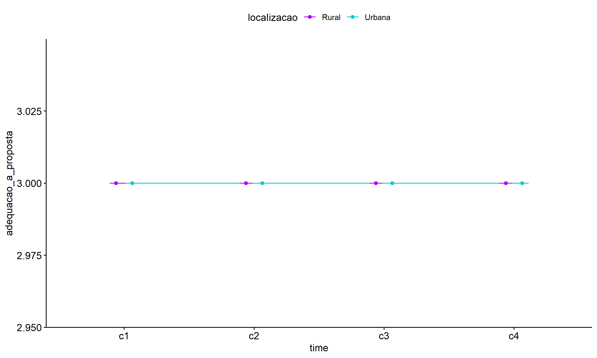<!-- -->

``` r
(pwc <- ldat %>% group_by(localizacao) %>%
    emmeans_test(adequacao_a_proposta ~ time, detailed = T, p.adjust.method = "bonferroni"))
```

    ## # A tibble: 12 × 15
    ##    localizacao term  .y.       group1 group2 null.value  estimate       se    df
    ##  * <fct>       <chr> <chr>     <chr>  <chr>       <dbl>     <dbl>    <dbl> <dbl>
    ##  1 Rural       time  adequaca… c1     c2              0  1.79e-25 2.78e-14  4496
    ##  2 Rural       time  adequaca… c1     c3              0  1.82e-25 2.78e-14  4496
    ##  3 Rural       time  adequaca… c1     c4              0  1.66e-25 2.78e-14  4496
    ##  4 Rural       time  adequaca… c2     c3              0  3.29e-27 2.78e-14  4496
    ##  5 Rural       time  adequaca… c2     c4              0 -1.26e-26 2.78e-14  4496
    ##  6 Rural       time  adequaca… c3     c4              0 -1.59e-26 2.78e-14  4496
    ##  7 Urbana      time  adequaca… c1     c2              0 -1.88e-14 1.22e-14  4496
    ##  8 Urbana      time  adequaca… c1     c3              0 -1.88e-14 1.22e-14  4496
    ##  9 Urbana      time  adequaca… c1     c4              0 -1.88e-14 1.22e-14  4496
    ## 10 Urbana      time  adequaca… c2     c3              0  6.69e-27 1.22e-14  4496
    ## 11 Urbana      time  adequaca… c2     c4              0 -1.98e-27 1.22e-14  4496
    ## 12 Urbana      time  adequaca… c3     c4              0 -8.68e-27 1.22e-14  4496
    ## # ℹ 6 more variables: conf.low <dbl>, conf.high <dbl>, statistic <dbl>,
    ## #   p <dbl>, p.adj <dbl>, p.adj.signif <chr>

| localizacao | term | .y.                  | group1 | group2 | null.value | estimate |  se |   df | conf.low | conf.high | statistic |     p | p.adj | p.adj.signif |
|:------------|:-----|:---------------------|:-------|:-------|-----------:|---------:|----:|-----:|---------:|----------:|----------:|------:|------:|:-------------|
| Rural       | time | adequacao_a_proposta | c1     | c2     |          0 |        0 |   0 | 4496 |        0 |         0 |     0.000 | 1.000 | 1.000 | ns           |
| Rural       | time | adequacao_a_proposta | c1     | c3     |          0 |        0 |   0 | 4496 |        0 |         0 |     0.000 | 1.000 | 1.000 | ns           |
| Rural       | time | adequacao_a_proposta | c1     | c4     |          0 |        0 |   0 | 4496 |        0 |         0 |     0.000 | 1.000 | 1.000 | ns           |
| Rural       | time | adequacao_a_proposta | c2     | c3     |          0 |        0 |   0 | 4496 |        0 |         0 |     0.000 | 1.000 | 1.000 | ns           |
| Rural       | time | adequacao_a_proposta | c2     | c4     |          0 |        0 |   0 | 4496 |        0 |         0 |     0.000 | 1.000 | 1.000 | ns           |
| Rural       | time | adequacao_a_proposta | c3     | c4     |          0 |        0 |   0 | 4496 |        0 |         0 |     0.000 | 1.000 | 1.000 | ns           |
| Urbana      | time | adequacao_a_proposta | c1     | c2     |          0 |        0 |   0 | 4496 |        0 |         0 |    -1.543 | 0.123 | 0.737 | ns           |
| Urbana      | time | adequacao_a_proposta | c1     | c3     |          0 |        0 |   0 | 4496 |        0 |         0 |    -1.543 | 0.123 | 0.737 | ns           |
| Urbana      | time | adequacao_a_proposta | c1     | c4     |          0 |        0 |   0 | 4496 |        0 |         0 |    -1.543 | 0.123 | 0.737 | ns           |
| Urbana      | time | adequacao_a_proposta | c2     | c3     |          0 |        0 |   0 | 4496 |        0 |         0 |     0.000 | 1.000 | 1.000 | ns           |
| Urbana      | time | adequacao_a_proposta | c2     | c4     |          0 |        0 |   0 | 4496 |        0 |         0 |     0.000 | 1.000 | 1.000 | ns           |
| Urbana      | time | adequacao_a_proposta | c3     | c4     |          0 |        0 |   0 | 4496 |        0 |         0 |     0.000 | 1.000 | 1.000 | ns           |

``` r
(emms <- get_emmeans(pwc))
```

    ## # A tibble: 8 × 8
    ##   localizacao time  emmean       se    df conf.low conf.high method      
    ##   <fct>       <fct>  <dbl>    <dbl> <dbl>    <dbl>     <dbl> <chr>       
    ## 1 Rural       c1      3.00 1.97e-14  4496     3.00      3.00 Emmeans test
    ## 2 Rural       c2      3.00 1.97e-14  4496     3.00      3.00 Emmeans test
    ## 3 Rural       c3      3.00 1.97e-14  4496     3.00      3.00 Emmeans test
    ## 4 Rural       c4      3.00 1.97e-14  4496     3.00      3.00 Emmeans test
    ## 5 Urbana      c1      3.00 8.61e-15  4496     3.00      3.00 Emmeans test
    ## 6 Urbana      c2      3.00 8.61e-15  4496     3.00      3.00 Emmeans test
    ## 7 Urbana      c3      3.00 8.61e-15  4496     3.00      3.00 Emmeans test
    ## 8 Urbana      c4      3.00 8.61e-15  4496     3.00      3.00 Emmeans test

| localizacao | time | emmean |  se |   df | conf.low | conf.high | method       |
|:------------|:-----|-------:|----:|-----:|---------:|----------:|:-------------|
| Rural       | c1   |      3 |   0 | 4496 |        3 |         3 | Emmeans test |
| Rural       | c2   |      3 |   0 | 4496 |        3 |         3 | Emmeans test |
| Rural       | c3   |      3 |   0 | 4496 |        3 |         3 | Emmeans test |
| Rural       | c4   |      3 |   0 | 4496 |        3 |         3 | Emmeans test |
| Urbana      | c1   |      3 |   0 | 4496 |        3 |         3 | Emmeans test |
| Urbana      | c2   |      3 |   0 | 4496 |        3 |         3 | Emmeans test |
| Urbana      | c3   |      3 |   0 | 4496 |        3 |         3 | Emmeans test |
| Urbana      | c4   |      3 |   0 | 4496 |        3 |         3 | Emmeans test |

``` r
emms.gg <- emms[which(emms$localizacao == "Rural"),]
if (nrow(emms.gg) > 0)
  ggline(emms.gg, x = "time", y = "emmean", color = "#AA00FF", ylab = "adequacao_a_proposta") +
    geom_errorbar(aes(ymin = conf.low, ymax = conf.high),
                  width = 0.2, color = "#AA00FF") +
    stat_pvalue_manual(
      add_xy_position(pwc[which(pwc$localizacao == "Rural"),],
                      x = "time", fun = "mean_se"),
      hide.ns = T, color = "#AA00FF", tip.length = F) +
    labs(title = "localizacao: Rural")+
    theme(legend.text = element_blank())
```

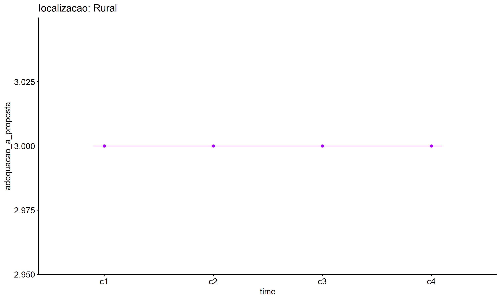<!-- -->

``` r
emms.gg <- emms[which(emms$localizacao == "Urbana"),]
if (nrow(emms.gg) > 0)
  ggline(emms.gg, x = "time", y = "emmean", color = "#00CCCC", ylab = "adequacao_a_proposta") +
    geom_errorbar(aes(ymin = conf.low, ymax = conf.high),
                  width = 0.2, color = "#00CCCC") +
    stat_pvalue_manual(
      add_xy_position(pwc[which(pwc$localizacao == "Urbana"),],
                      x = "time", fun = "mean_se"),
      hide.ns = T, color = "#00CCCC", tip.length = F) +
    labs(title = "localizacao: Urbana")+
    theme(legend.text = element_blank())
```

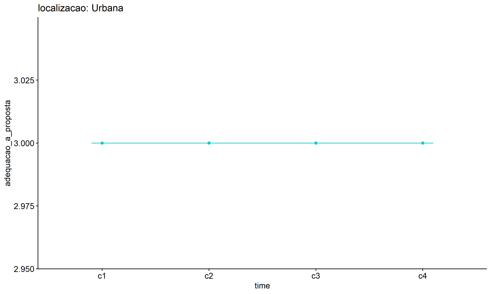<!-- -->

## PairWise Computation after removing non.normal data

``` r
if (length(non.ids) > 0)
  (pwc2 <- ldat2 %>% group_by(time) %>%
     emmeans_test(adequacao_a_proposta ~ localizacao, detailed = T, p.adjust.method = "bonferroni"))
```

``` r
if (length(non.ids) > 0)
  (emms2 <- get_emmeans(pwc2))
```

``` r
if (length(non.ids) > 0) {
  pwc2 <- add_xy_position(pwc2, x = "time", fun = "mean_se", dodge = 0.25)
  pd2 <- position_dodge(width = 0.25)
  
  ggline(emms2, x = "time", y = "emmean", color = "localizacao",
         palette = c("#AA00FF","#00CCCC"),
         position = pd, ylab = "adequacao_a_proposta") +
    geom_errorbar(aes(ymin = conf.low, ymax = conf.high, color = localizacao),
                position = pd, width = 0.2) +
    stat_pvalue_manual(pwc2, hide.ns = T, tip.length = F, linetype = 1)
}
```

``` r
if (length(non.ids) > 0)
  (pwc2 <- ldat2 %>% group_by(localizacao) %>%
     emmeans_test(adequacao_a_proposta ~ time, detailed = T, p.adjust.method = "bonferroni"))
```

``` r
if (length(non.ids) > 0)
  (emms2 <- get_emmeans(pwc2))
```

``` r
if (length(non.ids) > 0) {
  emms.gg <- emms2[which(emms2$localizacao == "Rural"),]
  if (nrow(emms.gg) > 0)
    ggline(emms.gg, x = "time", y = "emmean", color = "#AA00FF", ylab = "adequacao_a_proposta") +
    geom_errorbar(aes(ymin = conf.low, ymax = conf.high),
                  width = 0.2, color = "#AA00FF") +
    stat_pvalue_manual(
      add_xy_position(pwc[which(pwc$localizacao == "Rural"),],
                      x = "time", fun = "mean_se"),
      hide.ns = T, color = "#AA00FF", tip.length = F) +
    labs(title = "localizacao: Rural") +
    theme(legend.text = element_blank())
}
```

``` r
if (length(non.ids) > 0) {
  emms.gg <- emms2[which(emms2$localizacao == "Urbana"),]
  if (nrow(emms.gg) > 0)
    ggline(emms.gg, x = "time", y = "emmean", color = "#00CCCC", ylab = "adequacao_a_proposta") +
    geom_errorbar(aes(ymin = conf.low, ymax = conf.high),
                  width = 0.2, color = "#00CCCC") +
    stat_pvalue_manual(
      add_xy_position(pwc[which(pwc$localizacao == "Urbana"),],
                      x = "time", fun = "mean_se"),
      hide.ns = T, color = "#00CCCC", tip.length = F) +
    labs(title = "localizacao: Urbana") +
    theme(legend.text = element_blank())
}
```

# ANOVA: adequacao_a_proposta ~ time\*regiao + Error(id/time)

## Data Preparation

``` r
data <- edat[,c("aluno_id","regiao","ciclo","adequacao_a_proposta")]
data$ciclo <- factor(data$ciclo, c("Primeiro Ciclo","Segundo Ciclo",
                                   "Terceiro Ciclo","Quarto Ciclo"))

wdat <- spread(data, ciclo, adequacao_a_proposta)
wdat <- wdat[complete.cases(wdat),]
colnames(wdat) <- c("id","regiao","c1","c2","c3","c4")

ldat <- gather(wdat, key = time, value = adequacao_a_proposta, c1, c2, c3, c4) %>%
  convert_as_factor(id, time)
ldat <- remove_group_data(ldat, "adequacao_a_proposta", c("time", "regiao"), n.limit = 30)
ldat$regiao <- factor(ldat$regiao, sort(unique(ldat$regiao)))
```

### Check assumptions: Identifying Outliers

``` r
outliers <- identify_outliers(group_by(ldat, time, regiao), adequacao_a_proposta)
(outliers <- outliers[outliers$is.extreme == T,])
```

    ## [1] regiao               time                 id                  
    ## [4] adequacao_a_proposta is.outlier           is.extreme          
    ## <0 rows> (or 0-length row.names)

| regiao | time | id  | adequacao_a_proposta | is.outlier | is.extreme |
|:-------|:-----|:----|---------------------:|:-----------|:-----------|

### Check assumptions: Normality Test

``` r
(normality.df <- normality.test.per.groups(ldat, "adequacao_a_proposta", c("time", "regiao")))
```

    ##                     var             variable time       regiao   n skewness
    ## 1  adequacao_a_proposta adequacao_a_proposta   c1 Centro-Oeste  48        0
    ## 2  adequacao_a_proposta adequacao_a_proposta   c1     Nordeste 545        0
    ## 3  adequacao_a_proposta adequacao_a_proposta   c1        Norte  78        0
    ## 4  adequacao_a_proposta adequacao_a_proposta   c1      Sudeste 393        0
    ## 5  adequacao_a_proposta adequacao_a_proposta   c1          Sul  62        0
    ## 6  adequacao_a_proposta adequacao_a_proposta   c2 Centro-Oeste  48        0
    ## 7  adequacao_a_proposta adequacao_a_proposta   c2     Nordeste 545        0
    ## 8  adequacao_a_proposta adequacao_a_proposta   c2        Norte  78        0
    ## 9  adequacao_a_proposta adequacao_a_proposta   c2      Sudeste 393        0
    ## 10 adequacao_a_proposta adequacao_a_proposta   c2          Sul  62        0
    ## 11 adequacao_a_proposta adequacao_a_proposta   c3 Centro-Oeste  48        0
    ## 12 adequacao_a_proposta adequacao_a_proposta   c3     Nordeste 545        0
    ## 13 adequacao_a_proposta adequacao_a_proposta   c3        Norte  78        0
    ## 14 adequacao_a_proposta adequacao_a_proposta   c3      Sudeste 393        0
    ## 15 adequacao_a_proposta adequacao_a_proposta   c3          Sul  62        0
    ## 16 adequacao_a_proposta adequacao_a_proposta   c4 Centro-Oeste  48        0
    ## 17 adequacao_a_proposta adequacao_a_proposta   c4     Nordeste 545        0
    ## 18 adequacao_a_proposta adequacao_a_proposta   c4        Norte  78        0
    ## 19 adequacao_a_proposta adequacao_a_proposta   c4      Sudeste 393        0
    ## 20 adequacao_a_proposta adequacao_a_proposta   c4          Sul  62        0
    ##    kurtosis symmetry statistic method p p.signif normality
    ## 1         0 few data        NA     NA 1       NA        NO
    ## 2         0 few data        NA     NA 1       NA        NO
    ## 3         0 few data        NA     NA 1       NA        NO
    ## 4         0 few data        NA     NA 1       NA        NO
    ## 5         0 few data        NA     NA 1       NA        NO
    ## 6         0 few data        NA     NA 1       NA        NO
    ## 7         0 few data        NA     NA 1       NA        NO
    ## 8         0 few data        NA     NA 1       NA        NO
    ## 9         0 few data        NA     NA 1       NA        NO
    ## 10        0 few data        NA     NA 1       NA        NO
    ## 11        0 few data        NA     NA 1       NA        NO
    ## 12        0 few data        NA     NA 1       NA        NO
    ## 13        0 few data        NA     NA 1       NA        NO
    ## 14        0 few data        NA     NA 1       NA        NO
    ## 15        0 few data        NA     NA 1       NA        NO
    ## 16        0 few data        NA     NA 1       NA        NO
    ## 17        0 few data        NA     NA 1       NA        NO
    ## 18        0 few data        NA     NA 1       NA        NO
    ## 19        0 few data        NA     NA 1       NA        NO
    ## 20        0 few data        NA     NA 1       NA        NO

| var                  | variable             | time | regiao       |   n | skewness | kurtosis | symmetry | statistic | method |   p | p.signif | normality |
|:---------------------|:---------------------|:-----|:-------------|----:|---------:|---------:|:---------|:----------|:-------|----:|:---------|:----------|
| adequacao_a_proposta | adequacao_a_proposta | c1   | Centro-Oeste |  48 |        0 |        0 | few data | NA        | NA     |   1 | NA       | NO        |
| adequacao_a_proposta | adequacao_a_proposta | c1   | Nordeste     | 545 |        0 |        0 | few data | NA        | NA     |   1 | NA       | NO        |
| adequacao_a_proposta | adequacao_a_proposta | c1   | Norte        |  78 |        0 |        0 | few data | NA        | NA     |   1 | NA       | NO        |
| adequacao_a_proposta | adequacao_a_proposta | c1   | Sudeste      | 393 |        0 |        0 | few data | NA        | NA     |   1 | NA       | NO        |
| adequacao_a_proposta | adequacao_a_proposta | c1   | Sul          |  62 |        0 |        0 | few data | NA        | NA     |   1 | NA       | NO        |
| adequacao_a_proposta | adequacao_a_proposta | c2   | Centro-Oeste |  48 |        0 |        0 | few data | NA        | NA     |   1 | NA       | NO        |
| adequacao_a_proposta | adequacao_a_proposta | c2   | Nordeste     | 545 |        0 |        0 | few data | NA        | NA     |   1 | NA       | NO        |
| adequacao_a_proposta | adequacao_a_proposta | c2   | Norte        |  78 |        0 |        0 | few data | NA        | NA     |   1 | NA       | NO        |
| adequacao_a_proposta | adequacao_a_proposta | c2   | Sudeste      | 393 |        0 |        0 | few data | NA        | NA     |   1 | NA       | NO        |
| adequacao_a_proposta | adequacao_a_proposta | c2   | Sul          |  62 |        0 |        0 | few data | NA        | NA     |   1 | NA       | NO        |
| adequacao_a_proposta | adequacao_a_proposta | c3   | Centro-Oeste |  48 |        0 |        0 | few data | NA        | NA     |   1 | NA       | NO        |
| adequacao_a_proposta | adequacao_a_proposta | c3   | Nordeste     | 545 |        0 |        0 | few data | NA        | NA     |   1 | NA       | NO        |
| adequacao_a_proposta | adequacao_a_proposta | c3   | Norte        |  78 |        0 |        0 | few data | NA        | NA     |   1 | NA       | NO        |
| adequacao_a_proposta | adequacao_a_proposta | c3   | Sudeste      | 393 |        0 |        0 | few data | NA        | NA     |   1 | NA       | NO        |
| adequacao_a_proposta | adequacao_a_proposta | c3   | Sul          |  62 |        0 |        0 | few data | NA        | NA     |   1 | NA       | NO        |
| adequacao_a_proposta | adequacao_a_proposta | c4   | Centro-Oeste |  48 |        0 |        0 | few data | NA        | NA     |   1 | NA       | NO        |
| adequacao_a_proposta | adequacao_a_proposta | c4   | Nordeste     | 545 |        0 |        0 | few data | NA        | NA     |   1 | NA       | NO        |
| adequacao_a_proposta | adequacao_a_proposta | c4   | Norte        |  78 |        0 |        0 | few data | NA        | NA     |   1 | NA       | NO        |
| adequacao_a_proposta | adequacao_a_proposta | c4   | Sudeste      | 393 |        0 |        0 | few data | NA        | NA     |   1 | NA       | NO        |
| adequacao_a_proposta | adequacao_a_proposta | c4   | Sul          |  62 |        0 |        0 | few data | NA        | NA     |   1 | NA       | NO        |

``` r
(non.ids <- unique(do.call(
  c, lapply(which(normality.df$normality == 'NO'), FUN = function(i) {
  idx = which(ldat$time == normality.df$time[i] &
                ldat$regiao == normality.df$regiao[i])
  getNonNormal(ldat$"adequacao_a_proposta"[idx], ldat$id[idx])
}))))
```

    ## NULL

``` r
if (length(non.ids) > 0)
  ldat2 <- ldat[!ldat$id %in% non.ids,]
```

### Summary Statistics

``` r
(sdat <- ldat %>% group_by(time, regiao) %>%
   get_summary_stats(adequacao_a_proposta, type = "mean_sd"))
```

    ## # A tibble: 20 × 6
    ##    regiao       time  variable                 n  mean    sd
    ##    <fct>        <fct> <fct>                <dbl> <dbl> <dbl>
    ##  1 Centro-Oeste c1    adequacao_a_proposta    48     3     0
    ##  2 Nordeste     c1    adequacao_a_proposta   545     3     0
    ##  3 Norte        c1    adequacao_a_proposta    78     3     0
    ##  4 Sudeste      c1    adequacao_a_proposta   393     3     0
    ##  5 Sul          c1    adequacao_a_proposta    62     3     0
    ##  6 Centro-Oeste c2    adequacao_a_proposta    48     3     0
    ##  7 Nordeste     c2    adequacao_a_proposta   545     3     0
    ##  8 Norte        c2    adequacao_a_proposta    78     3     0
    ##  9 Sudeste      c2    adequacao_a_proposta   393     3     0
    ## 10 Sul          c2    adequacao_a_proposta    62     3     0
    ## 11 Centro-Oeste c3    adequacao_a_proposta    48     3     0
    ## 12 Nordeste     c3    adequacao_a_proposta   545     3     0
    ## 13 Norte        c3    adequacao_a_proposta    78     3     0
    ## 14 Sudeste      c3    adequacao_a_proposta   393     3     0
    ## 15 Sul          c3    adequacao_a_proposta    62     3     0
    ## 16 Centro-Oeste c4    adequacao_a_proposta    48     3     0
    ## 17 Nordeste     c4    adequacao_a_proposta   545     3     0
    ## 18 Norte        c4    adequacao_a_proposta    78     3     0
    ## 19 Sudeste      c4    adequacao_a_proposta   393     3     0
    ## 20 Sul          c4    adequacao_a_proposta    62     3     0

| regiao       | time | variable             |   n | mean |  sd |
|:-------------|:-----|:---------------------|----:|-----:|----:|
| Centro-Oeste | c1   | adequacao_a_proposta |  48 |    3 |   0 |
| Nordeste     | c1   | adequacao_a_proposta | 545 |    3 |   0 |
| Norte        | c1   | adequacao_a_proposta |  78 |    3 |   0 |
| Sudeste      | c1   | adequacao_a_proposta | 393 |    3 |   0 |
| Sul          | c1   | adequacao_a_proposta |  62 |    3 |   0 |
| Centro-Oeste | c2   | adequacao_a_proposta |  48 |    3 |   0 |
| Nordeste     | c2   | adequacao_a_proposta | 545 |    3 |   0 |
| Norte        | c2   | adequacao_a_proposta |  78 |    3 |   0 |
| Sudeste      | c2   | adequacao_a_proposta | 393 |    3 |   0 |
| Sul          | c2   | adequacao_a_proposta |  62 |    3 |   0 |
| Centro-Oeste | c3   | adequacao_a_proposta |  48 |    3 |   0 |
| Nordeste     | c3   | adequacao_a_proposta | 545 |    3 |   0 |
| Norte        | c3   | adequacao_a_proposta |  78 |    3 |   0 |
| Sudeste      | c3   | adequacao_a_proposta | 393 |    3 |   0 |
| Sul          | c3   | adequacao_a_proposta |  62 |    3 |   0 |
| Centro-Oeste | c4   | adequacao_a_proposta |  48 |    3 |   0 |
| Nordeste     | c4   | adequacao_a_proposta | 545 |    3 |   0 |
| Norte        | c4   | adequacao_a_proposta |  78 |    3 |   0 |
| Sudeste      | c4   | adequacao_a_proposta | 393 |    3 |   0 |
| Sul          | c4   | adequacao_a_proposta |  62 |    3 |   0 |

``` r
if (length(non.ids) > 0)
  (sdat <- ldat2 %>% group_by(time, regiao) %>%
      get_summary_stats(adequacao_a_proposta, type = "mean_sd"))
```

| regiao       | time | variable             |   n | mean |  sd |
|:-------------|:-----|:---------------------|----:|-----:|----:|
| Centro-Oeste | c1   | adequacao_a_proposta |  48 |    3 |   0 |
| Nordeste     | c1   | adequacao_a_proposta | 545 |    3 |   0 |
| Norte        | c1   | adequacao_a_proposta |  78 |    3 |   0 |
| Sudeste      | c1   | adequacao_a_proposta | 393 |    3 |   0 |
| Sul          | c1   | adequacao_a_proposta |  62 |    3 |   0 |
| Centro-Oeste | c2   | adequacao_a_proposta |  48 |    3 |   0 |
| Nordeste     | c2   | adequacao_a_proposta | 545 |    3 |   0 |
| Norte        | c2   | adequacao_a_proposta |  78 |    3 |   0 |
| Sudeste      | c2   | adequacao_a_proposta | 393 |    3 |   0 |
| Sul          | c2   | adequacao_a_proposta |  62 |    3 |   0 |
| Centro-Oeste | c3   | adequacao_a_proposta |  48 |    3 |   0 |
| Nordeste     | c3   | adequacao_a_proposta | 545 |    3 |   0 |
| Norte        | c3   | adequacao_a_proposta |  78 |    3 |   0 |
| Sudeste      | c3   | adequacao_a_proposta | 393 |    3 |   0 |
| Sul          | c3   | adequacao_a_proposta |  62 |    3 |   0 |
| Centro-Oeste | c4   | adequacao_a_proposta |  48 |    3 |   0 |
| Nordeste     | c4   | adequacao_a_proposta | 545 |    3 |   0 |
| Norte        | c4   | adequacao_a_proposta |  78 |    3 |   0 |
| Sudeste      | c4   | adequacao_a_proposta | 393 |    3 |   0 |
| Sul          | c4   | adequacao_a_proposta |  62 |    3 |   0 |

## ANOVA Computation

``` r
(res.aov <- anova_test(ldat, dv = adequacao_a_proposta, wid = id, between = regiao, within = time))
```

    ## ANOVA Table (type III tests)
    ## 
    ##        Effect DFn  DFd     F   p p<.05      ges
    ## 1      regiao   4 1121 0.266 0.9       0.000948
    ## 2        time   3 3363   NaN NaN  <NA> 0.000000
    ## 3 regiao:time  12 3363   NaN NaN  <NA> 0.000000

## ANOVA Computation after removing non.normal data

``` r
if (length(non.ids) > 0)
  (res.aov2 <- anova_test(ldat2, dv = adequacao_a_proposta, wid = id, between = regiao , within = time))
```

## PairWise Computation

``` r
(pwc <- ldat %>% group_by(time) %>%
   emmeans_test(adequacao_a_proposta ~ regiao, detailed = T, p.adjust.method = "bonferroni"))
```

    ## Warning: Expected 2 pieces. Additional pieces discarded in 16 rows [1, 2, 3, 4, 11, 12,
    ## 13, 14, 21, 22, 23, 24, 31, 32, 33, 34].

    ## # A tibble: 40 × 15
    ##    time  term  .y.   group1 group2 null.value  estimate       se    df  conf.low
    ##  * <fct> <chr> <chr> <chr>  <chr>       <dbl>     <dbl>    <dbl> <dbl>     <dbl>
    ##  1 c1    regi… adeq… Centro Oeste           0  3.26e-14 3.99e-14  4484 -4.56e-14
    ##  2 c1    regi… adeq… Centro Oeste           0  7.35e-25 4.86e-14  4484 -9.53e-14
    ##  3 c1    regi… adeq… Centro Oeste           0  7.59e-25 4.05e-14  4484 -7.94e-14
    ##  4 c1    regi… adeq… Centro Oeste           0  7.32e-25 5.10e-14  4484 -9.99e-14
    ##  5 c1    regi… adeq… Norde… Norte           0 -3.26e-14 3.21e-14  4484 -9.55e-14
    ##  6 c1    regi… adeq… Norde… Sudes…          0 -3.26e-14 1.75e-14  4484 -6.70e-14
    ##  7 c1    regi… adeq… Norde… Sul             0 -3.26e-14 3.55e-14  4484 -1.02e-13
    ##  8 c1    regi… adeq… Norte  Sudes…          0  2.32e-26 3.29e-14  4484 -6.44e-14
    ##  9 c1    regi… adeq… Norte  Sul             0 -2.93e-27 4.51e-14  4484 -8.84e-14
    ## 10 c1    regi… adeq… Sudes… Sul             0 -2.62e-26 3.62e-14  4484 -7.10e-14
    ## # ℹ 30 more rows
    ## # ℹ 5 more variables: conf.high <dbl>, statistic <dbl>, p <dbl>, p.adj <dbl>,
    ## #   p.adj.signif <chr>

| time | term   | .y.                  | group1   | group2  | null.value | estimate |  se |   df | conf.low | conf.high | statistic |     p | p.adj | p.adj.signif |
|:-----|:-------|:---------------------|:---------|:--------|-----------:|---------:|----:|-----:|---------:|----------:|----------:|------:|------:|:-------------|
| c1   | regiao | adequacao_a_proposta | Centro   | Oeste   |          0 |        0 |   0 | 4484 |        0 |         0 |     0.817 | 0.414 | 1.000 | ns           |
| c1   | regiao | adequacao_a_proposta | Centro   | Oeste   |          0 |        0 |   0 | 4484 |        0 |         0 |     0.000 | 1.000 | 1.000 | ns           |
| c1   | regiao | adequacao_a_proposta | Centro   | Oeste   |          0 |        0 |   0 | 4484 |        0 |         0 |     0.000 | 1.000 | 1.000 | ns           |
| c1   | regiao | adequacao_a_proposta | Centro   | Oeste   |          0 |        0 |   0 | 4484 |        0 |         0 |     0.000 | 1.000 | 1.000 | ns           |
| c1   | regiao | adequacao_a_proposta | Nordeste | Norte   |          0 |        0 |   0 | 4484 |        0 |         0 |    -1.016 | 0.310 | 1.000 | ns           |
| c1   | regiao | adequacao_a_proposta | Nordeste | Sudeste |          0 |        0 |   0 | 4484 |        0 |         0 |    -1.858 | 0.063 | 0.632 | ns           |
| c1   | regiao | adequacao_a_proposta | Nordeste | Sul     |          0 |        0 |   0 | 4484 |        0 |         0 |    -0.918 | 0.359 | 1.000 | ns           |
| c1   | regiao | adequacao_a_proposta | Norte    | Sudeste |          0 |        0 |   0 | 4484 |        0 |         0 |     0.000 | 1.000 | 1.000 | ns           |
| c1   | regiao | adequacao_a_proposta | Norte    | Sul     |          0 |        0 |   0 | 4484 |        0 |         0 |     0.000 | 1.000 | 1.000 | ns           |
| c1   | regiao | adequacao_a_proposta | Sudeste  | Sul     |          0 |        0 |   0 | 4484 |        0 |         0 |     0.000 | 1.000 | 1.000 | ns           |
| c2   | regiao | adequacao_a_proposta | Centro   | Oeste   |          0 |        0 |   0 | 4484 |        0 |         0 |     0.000 | 1.000 | 1.000 | ns           |
| c2   | regiao | adequacao_a_proposta | Centro   | Oeste   |          0 |        0 |   0 | 4484 |        0 |         0 |     0.000 | 1.000 | 1.000 | ns           |
| c2   | regiao | adequacao_a_proposta | Centro   | Oeste   |          0 |        0 |   0 | 4484 |        0 |         0 |     0.000 | 1.000 | 1.000 | ns           |
| c2   | regiao | adequacao_a_proposta | Centro   | Oeste   |          0 |        0 |   0 | 4484 |        0 |         0 |     0.000 | 1.000 | 1.000 | ns           |
| c2   | regiao | adequacao_a_proposta | Nordeste | Norte   |          0 |        0 |   0 | 4484 |        0 |         0 |     0.000 | 1.000 | 1.000 | ns           |
| c2   | regiao | adequacao_a_proposta | Nordeste | Sudeste |          0 |        0 |   0 | 4484 |        0 |         0 |     0.000 | 1.000 | 1.000 | ns           |
| c2   | regiao | adequacao_a_proposta | Nordeste | Sul     |          0 |        0 |   0 | 4484 |        0 |         0 |     0.000 | 1.000 | 1.000 | ns           |
| c2   | regiao | adequacao_a_proposta | Norte    | Sudeste |          0 |        0 |   0 | 4484 |        0 |         0 |     0.000 | 1.000 | 1.000 | ns           |
| c2   | regiao | adequacao_a_proposta | Norte    | Sul     |          0 |        0 |   0 | 4484 |        0 |         0 |     0.000 | 1.000 | 1.000 | ns           |
| c2   | regiao | adequacao_a_proposta | Sudeste  | Sul     |          0 |        0 |   0 | 4484 |        0 |         0 |     0.000 | 1.000 | 1.000 | ns           |
| c3   | regiao | adequacao_a_proposta | Centro   | Oeste   |          0 |        0 |   0 | 4484 |        0 |         0 |     0.000 | 1.000 | 1.000 | ns           |
| c3   | regiao | adequacao_a_proposta | Centro   | Oeste   |          0 |        0 |   0 | 4484 |        0 |         0 |     0.000 | 1.000 | 1.000 | ns           |
| c3   | regiao | adequacao_a_proposta | Centro   | Oeste   |          0 |        0 |   0 | 4484 |        0 |         0 |     0.000 | 1.000 | 1.000 | ns           |
| c3   | regiao | adequacao_a_proposta | Centro   | Oeste   |          0 |        0 |   0 | 4484 |        0 |         0 |     0.000 | 1.000 | 1.000 | ns           |
| c3   | regiao | adequacao_a_proposta | Nordeste | Norte   |          0 |        0 |   0 | 4484 |        0 |         0 |     0.000 | 1.000 | 1.000 | ns           |
| c3   | regiao | adequacao_a_proposta | Nordeste | Sudeste |          0 |        0 |   0 | 4484 |        0 |         0 |     0.000 | 1.000 | 1.000 | ns           |
| c3   | regiao | adequacao_a_proposta | Nordeste | Sul     |          0 |        0 |   0 | 4484 |        0 |         0 |     0.000 | 1.000 | 1.000 | ns           |
| c3   | regiao | adequacao_a_proposta | Norte    | Sudeste |          0 |        0 |   0 | 4484 |        0 |         0 |     0.000 | 1.000 | 1.000 | ns           |
| c3   | regiao | adequacao_a_proposta | Norte    | Sul     |          0 |        0 |   0 | 4484 |        0 |         0 |     0.000 | 1.000 | 1.000 | ns           |
| c3   | regiao | adequacao_a_proposta | Sudeste  | Sul     |          0 |        0 |   0 | 4484 |        0 |         0 |     0.000 | 1.000 | 1.000 | ns           |
| c4   | regiao | adequacao_a_proposta | Centro   | Oeste   |          0 |        0 |   0 | 4484 |        0 |         0 |     0.000 | 1.000 | 1.000 | ns           |
| c4   | regiao | adequacao_a_proposta | Centro   | Oeste   |          0 |        0 |   0 | 4484 |        0 |         0 |     0.000 | 1.000 | 1.000 | ns           |
| c4   | regiao | adequacao_a_proposta | Centro   | Oeste   |          0 |        0 |   0 | 4484 |        0 |         0 |     0.000 | 1.000 | 1.000 | ns           |
| c4   | regiao | adequacao_a_proposta | Centro   | Oeste   |          0 |        0 |   0 | 4484 |        0 |         0 |     0.000 | 1.000 | 1.000 | ns           |
| c4   | regiao | adequacao_a_proposta | Nordeste | Norte   |          0 |        0 |   0 | 4484 |        0 |         0 |     0.000 | 1.000 | 1.000 | ns           |
| c4   | regiao | adequacao_a_proposta | Nordeste | Sudeste |          0 |        0 |   0 | 4484 |        0 |         0 |     0.000 | 1.000 | 1.000 | ns           |
| c4   | regiao | adequacao_a_proposta | Nordeste | Sul     |          0 |        0 |   0 | 4484 |        0 |         0 |     0.000 | 1.000 | 1.000 | ns           |
| c4   | regiao | adequacao_a_proposta | Norte    | Sudeste |          0 |        0 |   0 | 4484 |        0 |         0 |     0.000 | 1.000 | 1.000 | ns           |
| c4   | regiao | adequacao_a_proposta | Norte    | Sul     |          0 |        0 |   0 | 4484 |        0 |         0 |     0.000 | 1.000 | 1.000 | ns           |
| c4   | regiao | adequacao_a_proposta | Sudeste  | Sul     |          0 |        0 |   0 | 4484 |        0 |         0 |     0.000 | 1.000 | 1.000 | ns           |

``` r
(emms <- get_emmeans(pwc))
```

    ## # A tibble: 20 × 8
    ##    time  regiao       emmean       se    df conf.low conf.high method      
    ##    <fct> <fct>         <dbl>    <dbl> <dbl>    <dbl>     <dbl> <chr>       
    ##  1 c1    Centro-Oeste   3.00 3.83e-14  4484     3.00      3.00 Emmeans test
    ##  2 c1    Nordeste       3.00 1.14e-14  4484     3.00      3.00 Emmeans test
    ##  3 c1    Norte          3.00 3.00e-14  4484     3.00      3.00 Emmeans test
    ##  4 c1    Sudeste        3.00 1.34e-14  4484     3.00      3.00 Emmeans test
    ##  5 c1    Sul            3.00 3.37e-14  4484     3.00      3.00 Emmeans test
    ##  6 c2    Centro-Oeste   3.00 3.83e-14  4484     3.00      3.00 Emmeans test
    ##  7 c2    Nordeste       3.00 1.14e-14  4484     3.00      3.00 Emmeans test
    ##  8 c2    Norte          3.00 3.00e-14  4484     3.00      3.00 Emmeans test
    ##  9 c2    Sudeste        3.00 1.34e-14  4484     3.00      3.00 Emmeans test
    ## 10 c2    Sul            3.00 3.37e-14  4484     3.00      3.00 Emmeans test
    ## 11 c3    Centro-Oeste   3.00 3.83e-14  4484     3.00      3.00 Emmeans test
    ## 12 c3    Nordeste       3.00 1.14e-14  4484     3.00      3.00 Emmeans test
    ## 13 c3    Norte          3.00 3.00e-14  4484     3.00      3.00 Emmeans test
    ## 14 c3    Sudeste        3.00 1.34e-14  4484     3.00      3.00 Emmeans test
    ## 15 c3    Sul            3.00 3.37e-14  4484     3.00      3.00 Emmeans test
    ## 16 c4    Centro-Oeste   3.00 3.83e-14  4484     3.00      3.00 Emmeans test
    ## 17 c4    Nordeste       3.00 1.14e-14  4484     3.00      3.00 Emmeans test
    ## 18 c4    Norte          3.00 3.00e-14  4484     3.00      3.00 Emmeans test
    ## 19 c4    Sudeste        3.00 1.34e-14  4484     3.00      3.00 Emmeans test
    ## 20 c4    Sul            3.00 3.37e-14  4484     3.00      3.00 Emmeans test

| time | regiao       | emmean |  se |   df | conf.low | conf.high | method       |
|:-----|:-------------|-------:|----:|-----:|---------:|----------:|:-------------|
| c1   | Centro-Oeste |      3 |   0 | 4484 |        3 |         3 | Emmeans test |
| c1   | Nordeste     |      3 |   0 | 4484 |        3 |         3 | Emmeans test |
| c1   | Norte        |      3 |   0 | 4484 |        3 |         3 | Emmeans test |
| c1   | Sudeste      |      3 |   0 | 4484 |        3 |         3 | Emmeans test |
| c1   | Sul          |      3 |   0 | 4484 |        3 |         3 | Emmeans test |
| c2   | Centro-Oeste |      3 |   0 | 4484 |        3 |         3 | Emmeans test |
| c2   | Nordeste     |      3 |   0 | 4484 |        3 |         3 | Emmeans test |
| c2   | Norte        |      3 |   0 | 4484 |        3 |         3 | Emmeans test |
| c2   | Sudeste      |      3 |   0 | 4484 |        3 |         3 | Emmeans test |
| c2   | Sul          |      3 |   0 | 4484 |        3 |         3 | Emmeans test |
| c3   | Centro-Oeste |      3 |   0 | 4484 |        3 |         3 | Emmeans test |
| c3   | Nordeste     |      3 |   0 | 4484 |        3 |         3 | Emmeans test |
| c3   | Norte        |      3 |   0 | 4484 |        3 |         3 | Emmeans test |
| c3   | Sudeste      |      3 |   0 | 4484 |        3 |         3 | Emmeans test |
| c3   | Sul          |      3 |   0 | 4484 |        3 |         3 | Emmeans test |
| c4   | Centro-Oeste |      3 |   0 | 4484 |        3 |         3 | Emmeans test |
| c4   | Nordeste     |      3 |   0 | 4484 |        3 |         3 | Emmeans test |
| c4   | Norte        |      3 |   0 | 4484 |        3 |         3 | Emmeans test |
| c4   | Sudeste      |      3 |   0 | 4484 |        3 |         3 | Emmeans test |
| c4   | Sul          |      3 |   0 | 4484 |        3 |         3 | Emmeans test |

``` r
pwc <- add_xy_position(pwc, x = "time", fun = "mean_se", dodge = 0.25)
pd <- position_dodge(width = 0.25)
ggline(emms, x = "time", y = "emmean", color = "regiao",
       palette = c("#0073C2FF","#EFC000FF","#868686FF","#CD534CFF","#7AA6DCFF"),
       position = pd, ylab = "adequacao_a_proposta") +
  geom_errorbar(aes(ymin = conf.low, ymax = conf.high, color = regiao),
                position = pd, width = 0.2) +
  stat_pvalue_manual(pwc, hide.ns = T, tip.length = F, linetype = 1)
```

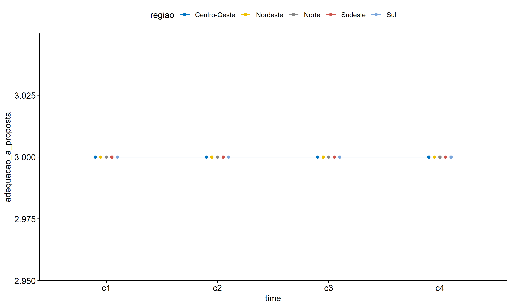<!-- -->

``` r
(pwc <- ldat %>% group_by(regiao) %>%
    emmeans_test(adequacao_a_proposta ~ time, detailed = T, p.adjust.method = "bonferroni"))
```

    ## # A tibble: 30 × 15
    ##    regiao       term  .y.      group1 group2 null.value  estimate       se    df
    ##  * <fct>        <chr> <chr>    <chr>  <chr>       <dbl>     <dbl>    <dbl> <dbl>
    ##  1 Centro-Oeste time  adequac… c1     c2              0  9.33e-25 5.41e-14  4484
    ##  2 Centro-Oeste time  adequac… c1     c3              0  9.33e-25 5.41e-14  4484
    ##  3 Centro-Oeste time  adequac… c1     c4              0  9.26e-25 5.41e-14  4484
    ##  4 Centro-Oeste time  adequac… c2     c3              0  2.38e-29 5.41e-14  4484
    ##  5 Centro-Oeste time  adequac… c2     c4              0 -7.53e-27 5.41e-14  4484
    ##  6 Centro-Oeste time  adequac… c3     c4              0 -7.55e-27 5.41e-14  4484
    ##  7 Nordeste     time  adequac… c1     c2              0 -3.26e-14 1.61e-14  4484
    ##  8 Nordeste     time  adequac… c1     c3              0 -3.26e-14 1.61e-14  4484
    ##  9 Nordeste     time  adequac… c1     c4              0 -3.26e-14 1.61e-14  4484
    ## 10 Nordeste     time  adequac… c2     c3              0  1.01e-27 1.61e-14  4484
    ## # ℹ 20 more rows
    ## # ℹ 6 more variables: conf.low <dbl>, conf.high <dbl>, statistic <dbl>,
    ## #   p <dbl>, p.adj <dbl>, p.adj.signif <chr>

| regiao       | term | .y.                  | group1 | group2 | null.value | estimate |  se |   df | conf.low | conf.high | statistic |     p | p.adj | p.adj.signif |
|:-------------|:-----|:---------------------|:-------|:-------|-----------:|---------:|----:|-----:|---------:|----------:|----------:|------:|------:|:-------------|
| Centro-Oeste | time | adequacao_a_proposta | c1     | c2     |          0 |        0 |   0 | 4484 |        0 |         0 |      0.00 | 1.000 | 1.000 | ns           |
| Centro-Oeste | time | adequacao_a_proposta | c1     | c3     |          0 |        0 |   0 | 4484 |        0 |         0 |      0.00 | 1.000 | 1.000 | ns           |
| Centro-Oeste | time | adequacao_a_proposta | c1     | c4     |          0 |        0 |   0 | 4484 |        0 |         0 |      0.00 | 1.000 | 1.000 | ns           |
| Centro-Oeste | time | adequacao_a_proposta | c2     | c3     |          0 |        0 |   0 | 4484 |        0 |         0 |      0.00 | 1.000 | 1.000 | ns           |
| Centro-Oeste | time | adequacao_a_proposta | c2     | c4     |          0 |        0 |   0 | 4484 |        0 |         0 |      0.00 | 1.000 | 1.000 | ns           |
| Centro-Oeste | time | adequacao_a_proposta | c3     | c4     |          0 |        0 |   0 | 4484 |        0 |         0 |      0.00 | 1.000 | 1.000 | ns           |
| Nordeste     | time | adequacao_a_proposta | c1     | c2     |          0 |        0 |   0 | 4484 |        0 |         0 |     -2.03 | 0.042 | 0.254 | ns           |
| Nordeste     | time | adequacao_a_proposta | c1     | c3     |          0 |        0 |   0 | 4484 |        0 |         0 |     -2.03 | 0.042 | 0.254 | ns           |
| Nordeste     | time | adequacao_a_proposta | c1     | c4     |          0 |        0 |   0 | 4484 |        0 |         0 |     -2.03 | 0.042 | 0.254 | ns           |
| Nordeste     | time | adequacao_a_proposta | c2     | c3     |          0 |        0 |   0 | 4484 |        0 |         0 |      0.00 | 1.000 | 1.000 | ns           |
| Nordeste     | time | adequacao_a_proposta | c2     | c4     |          0 |        0 |   0 | 4484 |        0 |         0 |      0.00 | 1.000 | 1.000 | ns           |
| Nordeste     | time | adequacao_a_proposta | c3     | c4     |          0 |        0 |   0 | 4484 |        0 |         0 |      0.00 | 1.000 | 1.000 | ns           |
| Norte        | time | adequacao_a_proposta | c1     | c2     |          0 |        0 |   0 | 4484 |        0 |         0 |      0.00 | 1.000 | 1.000 | ns           |
| Norte        | time | adequacao_a_proposta | c1     | c3     |          0 |        0 |   0 | 4484 |        0 |         0 |      0.00 | 1.000 | 1.000 | ns           |
| Norte        | time | adequacao_a_proposta | c1     | c4     |          0 |        0 |   0 | 4484 |        0 |         0 |      0.00 | 1.000 | 1.000 | ns           |
| Norte        | time | adequacao_a_proposta | c2     | c3     |          0 |        0 |   0 | 4484 |        0 |         0 |      0.00 | 1.000 | 1.000 | ns           |
| Norte        | time | adequacao_a_proposta | c2     | c4     |          0 |        0 |   0 | 4484 |        0 |         0 |      0.00 | 1.000 | 1.000 | ns           |
| Norte        | time | adequacao_a_proposta | c3     | c4     |          0 |        0 |   0 | 4484 |        0 |         0 |      0.00 | 1.000 | 1.000 | ns           |
| Sudeste      | time | adequacao_a_proposta | c1     | c2     |          0 |        0 |   0 | 4484 |        0 |         0 |      0.00 | 1.000 | 1.000 | ns           |
| Sudeste      | time | adequacao_a_proposta | c1     | c3     |          0 |        0 |   0 | 4484 |        0 |         0 |      0.00 | 1.000 | 1.000 | ns           |
| Sudeste      | time | adequacao_a_proposta | c1     | c4     |          0 |        0 |   0 | 4484 |        0 |         0 |      0.00 | 1.000 | 1.000 | ns           |
| Sudeste      | time | adequacao_a_proposta | c2     | c3     |          0 |        0 |   0 | 4484 |        0 |         0 |      0.00 | 1.000 | 1.000 | ns           |
| Sudeste      | time | adequacao_a_proposta | c2     | c4     |          0 |        0 |   0 | 4484 |        0 |         0 |      0.00 | 1.000 | 1.000 | ns           |
| Sudeste      | time | adequacao_a_proposta | c3     | c4     |          0 |        0 |   0 | 4484 |        0 |         0 |      0.00 | 1.000 | 1.000 | ns           |
| Sul          | time | adequacao_a_proposta | c1     | c2     |          0 |        0 |   0 | 4484 |        0 |         0 |      0.00 | 1.000 | 1.000 | ns           |
| Sul          | time | adequacao_a_proposta | c1     | c3     |          0 |        0 |   0 | 4484 |        0 |         0 |      0.00 | 1.000 | 1.000 | ns           |
| Sul          | time | adequacao_a_proposta | c1     | c4     |          0 |        0 |   0 | 4484 |        0 |         0 |      0.00 | 1.000 | 1.000 | ns           |
| Sul          | time | adequacao_a_proposta | c2     | c3     |          0 |        0 |   0 | 4484 |        0 |         0 |      0.00 | 1.000 | 1.000 | ns           |
| Sul          | time | adequacao_a_proposta | c2     | c4     |          0 |        0 |   0 | 4484 |        0 |         0 |      0.00 | 1.000 | 1.000 | ns           |
| Sul          | time | adequacao_a_proposta | c3     | c4     |          0 |        0 |   0 | 4484 |        0 |         0 |      0.00 | 1.000 | 1.000 | ns           |

``` r
(emms <- get_emmeans(pwc))
```

    ## # A tibble: 20 × 8
    ##    regiao       time  emmean       se    df conf.low conf.high method      
    ##    <fct>        <fct>  <dbl>    <dbl> <dbl>    <dbl>     <dbl> <chr>       
    ##  1 Centro-Oeste c1      3.00 3.83e-14  4484     3.00      3.00 Emmeans test
    ##  2 Centro-Oeste c2      3.00 3.83e-14  4484     3.00      3.00 Emmeans test
    ##  3 Centro-Oeste c3      3.00 3.83e-14  4484     3.00      3.00 Emmeans test
    ##  4 Centro-Oeste c4      3.00 3.83e-14  4484     3.00      3.00 Emmeans test
    ##  5 Nordeste     c1      3.00 1.14e-14  4484     3.00      3.00 Emmeans test
    ##  6 Nordeste     c2      3.00 1.14e-14  4484     3.00      3.00 Emmeans test
    ##  7 Nordeste     c3      3.00 1.14e-14  4484     3.00      3.00 Emmeans test
    ##  8 Nordeste     c4      3.00 1.14e-14  4484     3.00      3.00 Emmeans test
    ##  9 Norte        c1      3.00 3.00e-14  4484     3.00      3.00 Emmeans test
    ## 10 Norte        c2      3.00 3.00e-14  4484     3.00      3.00 Emmeans test
    ## 11 Norte        c3      3.00 3.00e-14  4484     3.00      3.00 Emmeans test
    ## 12 Norte        c4      3.00 3.00e-14  4484     3.00      3.00 Emmeans test
    ## 13 Sudeste      c1      3.00 1.34e-14  4484     3.00      3.00 Emmeans test
    ## 14 Sudeste      c2      3.00 1.34e-14  4484     3.00      3.00 Emmeans test
    ## 15 Sudeste      c3      3.00 1.34e-14  4484     3.00      3.00 Emmeans test
    ## 16 Sudeste      c4      3.00 1.34e-14  4484     3.00      3.00 Emmeans test
    ## 17 Sul          c1      3.00 3.37e-14  4484     3.00      3.00 Emmeans test
    ## 18 Sul          c2      3.00 3.37e-14  4484     3.00      3.00 Emmeans test
    ## 19 Sul          c3      3.00 3.37e-14  4484     3.00      3.00 Emmeans test
    ## 20 Sul          c4      3.00 3.37e-14  4484     3.00      3.00 Emmeans test

| regiao       | time | emmean |  se |   df | conf.low | conf.high | method       |
|:-------------|:-----|-------:|----:|-----:|---------:|----------:|:-------------|
| Centro-Oeste | c1   |      3 |   0 | 4484 |        3 |         3 | Emmeans test |
| Centro-Oeste | c2   |      3 |   0 | 4484 |        3 |         3 | Emmeans test |
| Centro-Oeste | c3   |      3 |   0 | 4484 |        3 |         3 | Emmeans test |
| Centro-Oeste | c4   |      3 |   0 | 4484 |        3 |         3 | Emmeans test |
| Nordeste     | c1   |      3 |   0 | 4484 |        3 |         3 | Emmeans test |
| Nordeste     | c2   |      3 |   0 | 4484 |        3 |         3 | Emmeans test |
| Nordeste     | c3   |      3 |   0 | 4484 |        3 |         3 | Emmeans test |
| Nordeste     | c4   |      3 |   0 | 4484 |        3 |         3 | Emmeans test |
| Norte        | c1   |      3 |   0 | 4484 |        3 |         3 | Emmeans test |
| Norte        | c2   |      3 |   0 | 4484 |        3 |         3 | Emmeans test |
| Norte        | c3   |      3 |   0 | 4484 |        3 |         3 | Emmeans test |
| Norte        | c4   |      3 |   0 | 4484 |        3 |         3 | Emmeans test |
| Sudeste      | c1   |      3 |   0 | 4484 |        3 |         3 | Emmeans test |
| Sudeste      | c2   |      3 |   0 | 4484 |        3 |         3 | Emmeans test |
| Sudeste      | c3   |      3 |   0 | 4484 |        3 |         3 | Emmeans test |
| Sudeste      | c4   |      3 |   0 | 4484 |        3 |         3 | Emmeans test |
| Sul          | c1   |      3 |   0 | 4484 |        3 |         3 | Emmeans test |
| Sul          | c2   |      3 |   0 | 4484 |        3 |         3 | Emmeans test |
| Sul          | c3   |      3 |   0 | 4484 |        3 |         3 | Emmeans test |
| Sul          | c4   |      3 |   0 | 4484 |        3 |         3 | Emmeans test |

``` r
emms.gg <- emms[which(emms$regiao == "Centro-Oeste"),]
if (nrow(emms.gg) > 0)
  ggline(emms.gg, x = "time", y = "emmean", color = "#0073C2FF", ylab = "adequacao_a_proposta") +
    geom_errorbar(aes(ymin = conf.low, ymax = conf.high),
                  width = 0.2, color = "#0073C2FF") +
    stat_pvalue_manual(
      add_xy_position(pwc[which(pwc$regiao == "Centro-Oeste"),],
                      x = "time", fun = "mean_se"),
      hide.ns = T, color = "#0073C2FF", tip.length = F) +
    labs(title = "regiao: Centro-Oeste")+
    theme(legend.text = element_blank())
```

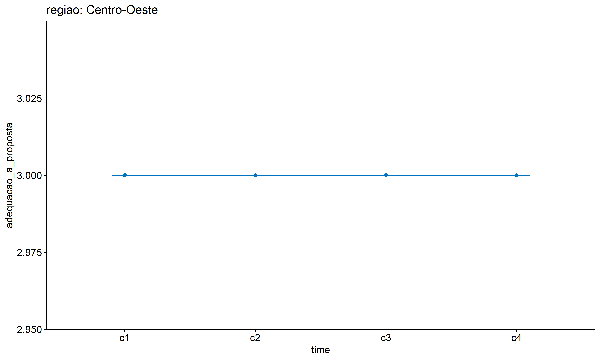<!-- -->

``` r
emms.gg <- emms[which(emms$regiao == "Nordeste"),]
if (nrow(emms.gg) > 0)
  ggline(emms.gg, x = "time", y = "emmean", color = "#EFC000FF", ylab = "adequacao_a_proposta") +
    geom_errorbar(aes(ymin = conf.low, ymax = conf.high),
                  width = 0.2, color = "#EFC000FF") +
    stat_pvalue_manual(
      add_xy_position(pwc[which(pwc$regiao == "Nordeste"),],
                      x = "time", fun = "mean_se"),
      hide.ns = T, color = "#EFC000FF", tip.length = F) +
    labs(title = "regiao: Nordeste")+
    theme(legend.text = element_blank())
```

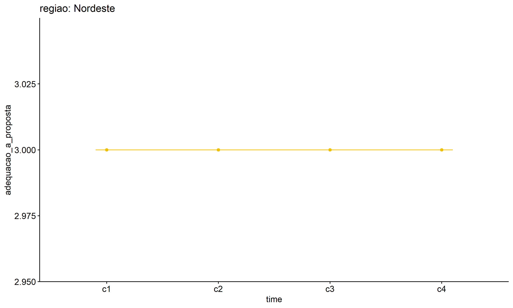<!-- -->

``` r
emms.gg <- emms[which(emms$regiao == "Norte"),]
if (nrow(emms.gg) > 0)
  ggline(emms.gg, x = "time", y = "emmean", color = "#868686FF", ylab = "adequacao_a_proposta") +
    geom_errorbar(aes(ymin = conf.low, ymax = conf.high),
                  width = 0.2, color = "#868686FF") +
    stat_pvalue_manual(
      add_xy_position(pwc[which(pwc$regiao == "Norte"),],
                      x = "time", fun = "mean_se"),
      hide.ns = T, color = "#868686FF", tip.length = F) +
    labs(title = "regiao: Norte")+
    theme(legend.text = element_blank())
```

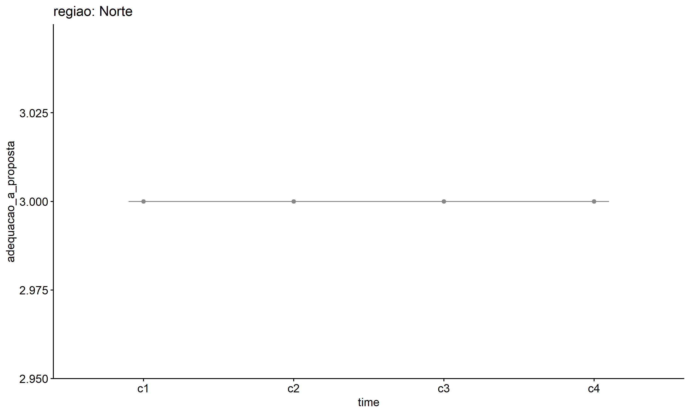<!-- -->

``` r
emms.gg <- emms[which(emms$regiao == "Sudeste"),]
if (nrow(emms.gg) > 0)
  ggline(emms.gg, x = "time", y = "emmean", color = "#CD534CFF", ylab = "adequacao_a_proposta") +
    geom_errorbar(aes(ymin = conf.low, ymax = conf.high),
                  width = 0.2, color = "#CD534CFF") +
    stat_pvalue_manual(
      add_xy_position(pwc[which(pwc$regiao == "Sudeste"),],
                      x = "time", fun = "mean_se"),
      hide.ns = T, color = "#CD534CFF", tip.length = F) +
    labs(title = "regiao: Sudeste")+
    theme(legend.text = element_blank())
```

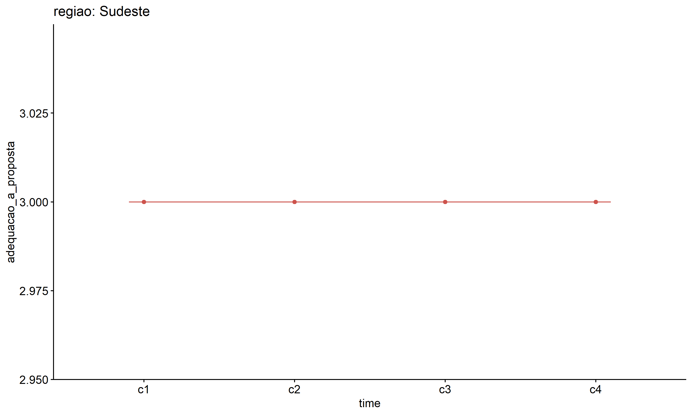<!-- -->

``` r
emms.gg <- emms[which(emms$regiao == "Sul"),]
if (nrow(emms.gg) > 0)
  ggline(emms.gg, x = "time", y = "emmean", color = "#7AA6DCFF", ylab = "adequacao_a_proposta") +
    geom_errorbar(aes(ymin = conf.low, ymax = conf.high),
                  width = 0.2, color = "#7AA6DCFF") +
    stat_pvalue_manual(
      add_xy_position(pwc[which(pwc$regiao == "Sul"),],
                      x = "time", fun = "mean_se"),
      hide.ns = T, color = "#7AA6DCFF", tip.length = F) +
    labs(title = "regiao: Sul")+
    theme(legend.text = element_blank())
```

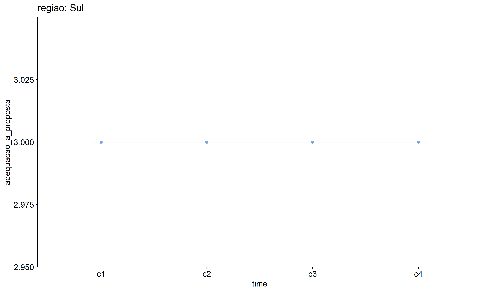<!-- -->

## PairWise Computation after removing non.normal data

``` r
if (length(non.ids) > 0)
  (pwc2 <- ldat2 %>% group_by(time) %>%
     emmeans_test(adequacao_a_proposta ~ regiao, detailed = T, p.adjust.method = "bonferroni"))
```

``` r
if (length(non.ids) > 0)
  (emms2 <- get_emmeans(pwc2))
```

``` r
if (length(non.ids) > 0) {
  pwc2 <- add_xy_position(pwc2, x = "time", fun = "mean_se", dodge = 0.25)
  pd2 <- position_dodge(width = 0.25)
  
  ggline(emms2, x = "time", y = "emmean", color = "regiao",
         palette = c("#0073C2FF","#EFC000FF","#868686FF","#CD534CFF","#7AA6DCFF"),
         position = pd, ylab = "adequacao_a_proposta") +
    geom_errorbar(aes(ymin = conf.low, ymax = conf.high, color = regiao),
                position = pd, width = 0.2) +
    stat_pvalue_manual(pwc2, hide.ns = T, tip.length = F, linetype = 1)
}
```

``` r
if (length(non.ids) > 0)
  (pwc2 <- ldat2 %>% group_by(regiao) %>%
     emmeans_test(adequacao_a_proposta ~ time, detailed = T, p.adjust.method = "bonferroni"))
```

``` r
if (length(non.ids) > 0)
  (emms2 <- get_emmeans(pwc2))
```

``` r
if (length(non.ids) > 0) {
  emms.gg <- emms2[which(emms2$regiao == "Centro-Oeste"),]
  if (nrow(emms.gg) > 0)
    ggline(emms.gg, x = "time", y = "emmean", color = "#0073C2FF", ylab = "adequacao_a_proposta") +
    geom_errorbar(aes(ymin = conf.low, ymax = conf.high),
                  width = 0.2, color = "#0073C2FF") +
    stat_pvalue_manual(
      add_xy_position(pwc[which(pwc$regiao == "Centro-Oeste"),],
                      x = "time", fun = "mean_se"),
      hide.ns = T, color = "#0073C2FF", tip.length = F) +
    labs(title = "regiao: Centro-Oeste") +
    theme(legend.text = element_blank())
}
```

``` r
if (length(non.ids) > 0) {
  emms.gg <- emms2[which(emms2$regiao == "Nordeste"),]
  if (nrow(emms.gg) > 0)
    ggline(emms.gg, x = "time", y = "emmean", color = "#EFC000FF", ylab = "adequacao_a_proposta") +
    geom_errorbar(aes(ymin = conf.low, ymax = conf.high),
                  width = 0.2, color = "#EFC000FF") +
    stat_pvalue_manual(
      add_xy_position(pwc[which(pwc$regiao == "Nordeste"),],
                      x = "time", fun = "mean_se"),
      hide.ns = T, color = "#EFC000FF", tip.length = F) +
    labs(title = "regiao: Nordeste") +
    theme(legend.text = element_blank())
}
```

``` r
if (length(non.ids) > 0) {
  emms.gg <- emms2[which(emms2$regiao == "Norte"),]
  if (nrow(emms.gg) > 0)
    ggline(emms.gg, x = "time", y = "emmean", color = "#868686FF", ylab = "adequacao_a_proposta") +
    geom_errorbar(aes(ymin = conf.low, ymax = conf.high),
                  width = 0.2, color = "#868686FF") +
    stat_pvalue_manual(
      add_xy_position(pwc[which(pwc$regiao == "Norte"),],
                      x = "time", fun = "mean_se"),
      hide.ns = T, color = "#868686FF", tip.length = F) +
    labs(title = "regiao: Norte") +
    theme(legend.text = element_blank())
}
```

``` r
if (length(non.ids) > 0) {
  emms.gg <- emms2[which(emms2$regiao == "Sudeste"),]
  if (nrow(emms.gg) > 0)
    ggline(emms.gg, x = "time", y = "emmean", color = "#CD534CFF", ylab = "adequacao_a_proposta") +
    geom_errorbar(aes(ymin = conf.low, ymax = conf.high),
                  width = 0.2, color = "#CD534CFF") +
    stat_pvalue_manual(
      add_xy_position(pwc[which(pwc$regiao == "Sudeste"),],
                      x = "time", fun = "mean_se"),
      hide.ns = T, color = "#CD534CFF", tip.length = F) +
    labs(title = "regiao: Sudeste") +
    theme(legend.text = element_blank())
}
```

``` r
if (length(non.ids) > 0) {
  emms.gg <- emms2[which(emms2$regiao == "Sul"),]
  if (nrow(emms.gg) > 0)
    ggline(emms.gg, x = "time", y = "emmean", color = "#7AA6DCFF", ylab = "adequacao_a_proposta") +
    geom_errorbar(aes(ymin = conf.low, ymax = conf.high),
                  width = 0.2, color = "#7AA6DCFF") +
    stat_pvalue_manual(
      add_xy_position(pwc[which(pwc$regiao == "Sul"),],
                      x = "time", fun = "mean_se"),
      hide.ns = T, color = "#7AA6DCFF", tip.length = F) +
    labs(title = "regiao: Sul") +
    theme(legend.text = element_blank())
}
```

# ANOVA: adequacao_a_proposta ~ time\*porte + Error(id/time)

## Data Preparation

``` r
data <- edat[,c("aluno_id","porte","ciclo","adequacao_a_proposta")]
data$ciclo <- factor(data$ciclo, c("Primeiro Ciclo","Segundo Ciclo",
                                   "Terceiro Ciclo","Quarto Ciclo"))

wdat <- spread(data, ciclo, adequacao_a_proposta)
wdat <- wdat[complete.cases(wdat),]
colnames(wdat) <- c("id","porte","c1","c2","c3","c4")

ldat <- gather(wdat, key = time, value = adequacao_a_proposta, c1, c2, c3, c4) %>%
  convert_as_factor(id, time)
ldat <- remove_group_data(ldat, "adequacao_a_proposta", c("time", "porte"), n.limit = 30)
ldat$porte <- factor(ldat$porte, sort(unique(ldat$porte)))
```

### Check assumptions: Identifying Outliers

``` r
outliers <- identify_outliers(group_by(ldat, time, porte), adequacao_a_proposta)
(outliers <- outliers[outliers$is.extreme == T,])
```

    ## [1] porte                time                 id                  
    ## [4] adequacao_a_proposta is.outlier           is.extreme          
    ## <0 rows> (or 0-length row.names)

| porte | time | id  | adequacao_a_proposta | is.outlier | is.extreme |
|:------|:-----|:----|---------------------:|:-----------|:-----------|

### Check assumptions: Normality Test

``` r
(normality.df <- normality.test.per.groups(ldat, "adequacao_a_proposta", c("time", "porte")))
```

    ##                     var             variable time
    ## 1  adequacao_a_proposta adequacao_a_proposta   c1
    ## 2  adequacao_a_proposta adequacao_a_proposta   c1
    ## 3  adequacao_a_proposta adequacao_a_proposta   c1
    ## 4  adequacao_a_proposta adequacao_a_proposta   c1
    ## 5  adequacao_a_proposta adequacao_a_proposta   c2
    ## 6  adequacao_a_proposta adequacao_a_proposta   c2
    ## 7  adequacao_a_proposta adequacao_a_proposta   c2
    ## 8  adequacao_a_proposta adequacao_a_proposta   c2
    ## 9  adequacao_a_proposta adequacao_a_proposta   c3
    ## 10 adequacao_a_proposta adequacao_a_proposta   c3
    ## 11 adequacao_a_proposta adequacao_a_proposta   c3
    ## 12 adequacao_a_proposta adequacao_a_proposta   c3
    ## 13 adequacao_a_proposta adequacao_a_proposta   c4
    ## 14 adequacao_a_proposta adequacao_a_proposta   c4
    ## 15 adequacao_a_proposta adequacao_a_proposta   c4
    ## 16 adequacao_a_proposta adequacao_a_proposta   c4
    ##                                           porte   n skewness kurtosis symmetry
    ## 1            Até 50 matrículas de escolarização  33        0        0 few data
    ## 2   Entre 201 e 500 matrículas de escolarização 675        0        0 few data
    ## 3  Entre 501 e 1000 matrículas de escolarização 249        0        0 few data
    ## 4    Entre 51 e 200 matrículas de escolarização 162        0        0 few data
    ## 5            Até 50 matrículas de escolarização  33        0        0 few data
    ## 6   Entre 201 e 500 matrículas de escolarização 675        0        0 few data
    ## 7  Entre 501 e 1000 matrículas de escolarização 249        0        0 few data
    ## 8    Entre 51 e 200 matrículas de escolarização 162        0        0 few data
    ## 9            Até 50 matrículas de escolarização  33        0        0 few data
    ## 10  Entre 201 e 500 matrículas de escolarização 675        0        0 few data
    ## 11 Entre 501 e 1000 matrículas de escolarização 249        0        0 few data
    ## 12   Entre 51 e 200 matrículas de escolarização 162        0        0 few data
    ## 13           Até 50 matrículas de escolarização  33        0        0 few data
    ## 14  Entre 201 e 500 matrículas de escolarização 675        0        0 few data
    ## 15 Entre 501 e 1000 matrículas de escolarização 249        0        0 few data
    ## 16   Entre 51 e 200 matrículas de escolarização 162        0        0 few data
    ##    statistic method p p.signif normality
    ## 1         NA     NA 1       NA        NO
    ## 2         NA     NA 1       NA        NO
    ## 3         NA     NA 1       NA        NO
    ## 4         NA     NA 1       NA        NO
    ## 5         NA     NA 1       NA        NO
    ## 6         NA     NA 1       NA        NO
    ## 7         NA     NA 1       NA        NO
    ## 8         NA     NA 1       NA        NO
    ## 9         NA     NA 1       NA        NO
    ## 10        NA     NA 1       NA        NO
    ## 11        NA     NA 1       NA        NO
    ## 12        NA     NA 1       NA        NO
    ## 13        NA     NA 1       NA        NO
    ## 14        NA     NA 1       NA        NO
    ## 15        NA     NA 1       NA        NO
    ## 16        NA     NA 1       NA        NO

| var                  | variable             | time | porte                                        |   n | skewness | kurtosis | symmetry | statistic | method |   p | p.signif | normality |
|:---------------------|:---------------------|:-----|:---------------------------------------------|----:|---------:|---------:|:---------|:----------|:-------|----:|:---------|:----------|
| adequacao_a_proposta | adequacao_a_proposta | c1   | Até 50 matrículas de escolarização           |  33 |        0 |        0 | few data | NA        | NA     |   1 | NA       | NO        |
| adequacao_a_proposta | adequacao_a_proposta | c1   | Entre 201 e 500 matrículas de escolarização  | 675 |        0 |        0 | few data | NA        | NA     |   1 | NA       | NO        |
| adequacao_a_proposta | adequacao_a_proposta | c1   | Entre 501 e 1000 matrículas de escolarização | 249 |        0 |        0 | few data | NA        | NA     |   1 | NA       | NO        |
| adequacao_a_proposta | adequacao_a_proposta | c1   | Entre 51 e 200 matrículas de escolarização   | 162 |        0 |        0 | few data | NA        | NA     |   1 | NA       | NO        |
| adequacao_a_proposta | adequacao_a_proposta | c2   | Até 50 matrículas de escolarização           |  33 |        0 |        0 | few data | NA        | NA     |   1 | NA       | NO        |
| adequacao_a_proposta | adequacao_a_proposta | c2   | Entre 201 e 500 matrículas de escolarização  | 675 |        0 |        0 | few data | NA        | NA     |   1 | NA       | NO        |
| adequacao_a_proposta | adequacao_a_proposta | c2   | Entre 501 e 1000 matrículas de escolarização | 249 |        0 |        0 | few data | NA        | NA     |   1 | NA       | NO        |
| adequacao_a_proposta | adequacao_a_proposta | c2   | Entre 51 e 200 matrículas de escolarização   | 162 |        0 |        0 | few data | NA        | NA     |   1 | NA       | NO        |
| adequacao_a_proposta | adequacao_a_proposta | c3   | Até 50 matrículas de escolarização           |  33 |        0 |        0 | few data | NA        | NA     |   1 | NA       | NO        |
| adequacao_a_proposta | adequacao_a_proposta | c3   | Entre 201 e 500 matrículas de escolarização  | 675 |        0 |        0 | few data | NA        | NA     |   1 | NA       | NO        |
| adequacao_a_proposta | adequacao_a_proposta | c3   | Entre 501 e 1000 matrículas de escolarização | 249 |        0 |        0 | few data | NA        | NA     |   1 | NA       | NO        |
| adequacao_a_proposta | adequacao_a_proposta | c3   | Entre 51 e 200 matrículas de escolarização   | 162 |        0 |        0 | few data | NA        | NA     |   1 | NA       | NO        |
| adequacao_a_proposta | adequacao_a_proposta | c4   | Até 50 matrículas de escolarização           |  33 |        0 |        0 | few data | NA        | NA     |   1 | NA       | NO        |
| adequacao_a_proposta | adequacao_a_proposta | c4   | Entre 201 e 500 matrículas de escolarização  | 675 |        0 |        0 | few data | NA        | NA     |   1 | NA       | NO        |
| adequacao_a_proposta | adequacao_a_proposta | c4   | Entre 501 e 1000 matrículas de escolarização | 249 |        0 |        0 | few data | NA        | NA     |   1 | NA       | NO        |
| adequacao_a_proposta | adequacao_a_proposta | c4   | Entre 51 e 200 matrículas de escolarização   | 162 |        0 |        0 | few data | NA        | NA     |   1 | NA       | NO        |

``` r
(non.ids <- unique(do.call(
  c, lapply(which(normality.df$normality == 'NO'), FUN = function(i) {
  idx = which(ldat$time == normality.df$time[i] &
                ldat$porte == normality.df$porte[i])
  getNonNormal(ldat$"adequacao_a_proposta"[idx], ldat$id[idx])
}))))
```

    ## NULL

``` r
if (length(non.ids) > 0)
  ldat2 <- ldat[!ldat$id %in% non.ids,]
```

### Summary Statistics

``` r
(sdat <- ldat %>% group_by(time, porte) %>%
   get_summary_stats(adequacao_a_proposta, type = "mean_sd"))
```

    ## # A tibble: 16 × 6
    ##    porte                                        time  variable     n  mean    sd
    ##    <fct>                                        <fct> <fct>    <dbl> <dbl> <dbl>
    ##  1 Até 50 matrículas de escolarização           c1    adequac…    33     3     0
    ##  2 Entre 201 e 500 matrículas de escolarização  c1    adequac…   675     3     0
    ##  3 Entre 501 e 1000 matrículas de escolarização c1    adequac…   249     3     0
    ##  4 Entre 51 e 200 matrículas de escolarização   c1    adequac…   162     3     0
    ##  5 Até 50 matrículas de escolarização           c2    adequac…    33     3     0
    ##  6 Entre 201 e 500 matrículas de escolarização  c2    adequac…   675     3     0
    ##  7 Entre 501 e 1000 matrículas de escolarização c2    adequac…   249     3     0
    ##  8 Entre 51 e 200 matrículas de escolarização   c2    adequac…   162     3     0
    ##  9 Até 50 matrículas de escolarização           c3    adequac…    33     3     0
    ## 10 Entre 201 e 500 matrículas de escolarização  c3    adequac…   675     3     0
    ## 11 Entre 501 e 1000 matrículas de escolarização c3    adequac…   249     3     0
    ## 12 Entre 51 e 200 matrículas de escolarização   c3    adequac…   162     3     0
    ## 13 Até 50 matrículas de escolarização           c4    adequac…    33     3     0
    ## 14 Entre 201 e 500 matrículas de escolarização  c4    adequac…   675     3     0
    ## 15 Entre 501 e 1000 matrículas de escolarização c4    adequac…   249     3     0
    ## 16 Entre 51 e 200 matrículas de escolarização   c4    adequac…   162     3     0

| porte                                        | time | variable             |   n | mean |  sd |
|:---------------------------------------------|:-----|:---------------------|----:|-----:|----:|
| Até 50 matrículas de escolarização           | c1   | adequacao_a_proposta |  33 |    3 |   0 |
| Entre 201 e 500 matrículas de escolarização  | c1   | adequacao_a_proposta | 675 |    3 |   0 |
| Entre 501 e 1000 matrículas de escolarização | c1   | adequacao_a_proposta | 249 |    3 |   0 |
| Entre 51 e 200 matrículas de escolarização   | c1   | adequacao_a_proposta | 162 |    3 |   0 |
| Até 50 matrículas de escolarização           | c2   | adequacao_a_proposta |  33 |    3 |   0 |
| Entre 201 e 500 matrículas de escolarização  | c2   | adequacao_a_proposta | 675 |    3 |   0 |
| Entre 501 e 1000 matrículas de escolarização | c2   | adequacao_a_proposta | 249 |    3 |   0 |
| Entre 51 e 200 matrículas de escolarização   | c2   | adequacao_a_proposta | 162 |    3 |   0 |
| Até 50 matrículas de escolarização           | c3   | adequacao_a_proposta |  33 |    3 |   0 |
| Entre 201 e 500 matrículas de escolarização  | c3   | adequacao_a_proposta | 675 |    3 |   0 |
| Entre 501 e 1000 matrículas de escolarização | c3   | adequacao_a_proposta | 249 |    3 |   0 |
| Entre 51 e 200 matrículas de escolarização   | c3   | adequacao_a_proposta | 162 |    3 |   0 |
| Até 50 matrículas de escolarização           | c4   | adequacao_a_proposta |  33 |    3 |   0 |
| Entre 201 e 500 matrículas de escolarização  | c4   | adequacao_a_proposta | 675 |    3 |   0 |
| Entre 501 e 1000 matrículas de escolarização | c4   | adequacao_a_proposta | 249 |    3 |   0 |
| Entre 51 e 200 matrículas de escolarização   | c4   | adequacao_a_proposta | 162 |    3 |   0 |

``` r
if (length(non.ids) > 0)
  (sdat <- ldat2 %>% group_by(time, porte) %>%
      get_summary_stats(adequacao_a_proposta, type = "mean_sd"))
```

| porte                                        | time | variable             |   n | mean |  sd |
|:---------------------------------------------|:-----|:---------------------|----:|-----:|----:|
| Até 50 matrículas de escolarização           | c1   | adequacao_a_proposta |  33 |    3 |   0 |
| Entre 201 e 500 matrículas de escolarização  | c1   | adequacao_a_proposta | 675 |    3 |   0 |
| Entre 501 e 1000 matrículas de escolarização | c1   | adequacao_a_proposta | 249 |    3 |   0 |
| Entre 51 e 200 matrículas de escolarização   | c1   | adequacao_a_proposta | 162 |    3 |   0 |
| Até 50 matrículas de escolarização           | c2   | adequacao_a_proposta |  33 |    3 |   0 |
| Entre 201 e 500 matrículas de escolarização  | c2   | adequacao_a_proposta | 675 |    3 |   0 |
| Entre 501 e 1000 matrículas de escolarização | c2   | adequacao_a_proposta | 249 |    3 |   0 |
| Entre 51 e 200 matrículas de escolarização   | c2   | adequacao_a_proposta | 162 |    3 |   0 |
| Até 50 matrículas de escolarização           | c3   | adequacao_a_proposta |  33 |    3 |   0 |
| Entre 201 e 500 matrículas de escolarização  | c3   | adequacao_a_proposta | 675 |    3 |   0 |
| Entre 501 e 1000 matrículas de escolarização | c3   | adequacao_a_proposta | 249 |    3 |   0 |
| Entre 51 e 200 matrículas de escolarização   | c3   | adequacao_a_proposta | 162 |    3 |   0 |
| Até 50 matrículas de escolarização           | c4   | adequacao_a_proposta |  33 |    3 |   0 |
| Entre 201 e 500 matrículas de escolarização  | c4   | adequacao_a_proposta | 675 |    3 |   0 |
| Entre 501 e 1000 matrículas de escolarização | c4   | adequacao_a_proposta | 249 |    3 |   0 |
| Entre 51 e 200 matrículas de escolarização   | c4   | adequacao_a_proposta | 162 |    3 |   0 |

## ANOVA Computation

``` r
(res.aov <- anova_test(ldat, dv = adequacao_a_proposta, wid = id, between = porte, within = time))
```

    ## ANOVA Table (type III tests)
    ## 
    ##       Effect DFn  DFd     F     p p<.05   ges
    ## 1      porte   3 1115 1.974 0.116       0.005
    ## 2       time   3 3345   NaN   NaN  <NA> 0.000
    ## 3 porte:time   9 3345   NaN   NaN  <NA> 0.000

## ANOVA Computation after removing non.normal data

``` r
if (length(non.ids) > 0)
  (res.aov2 <- anova_test(ldat2, dv = adequacao_a_proposta, wid = id, between = porte , within = time))
```

## PairWise Computation

``` r
(pwc <- ldat %>% group_by(time) %>%
   emmeans_test(adequacao_a_proposta ~ porte, detailed = T, p.adjust.method = "bonferroni"))
```

    ## # A tibble: 24 × 15
    ##    time  term  .y.   group1 group2 null.value  estimate       se    df  conf.low
    ##  * <fct> <chr> <chr> <chr>  <chr>       <dbl>     <dbl>    <dbl> <dbl>     <dbl>
    ##  1 c1    porte adeq… Até 5… Entre…          0  1.47e-25 1.37e-14  4460 -2.68e-14
    ##  2 c1    porte adeq… Até 5… Entre…          0  1.56e-25 1.42e-14  4460 -2.79e-14
    ##  3 c1    porte adeq… Até 5… Entre…          0 -3.17e-14 1.47e-14  4460 -6.05e-14
    ##  4 c1    porte adeq… Entre… Entre…          0  9.47e-27 5.69e-15  4460 -1.12e-14
    ##  5 c1    porte adeq… Entre… Entre…          0 -3.17e-14 6.71e-15  4460 -4.49e-14
    ##  6 c1    porte adeq… Entre… Entre…          0 -3.17e-14 7.74e-15  4460 -4.69e-14
    ##  7 c2    porte adeq… Até 5… Entre…          0 -4.58e-26 1.37e-14  4460 -2.68e-14
    ##  8 c2    porte adeq… Até 5… Entre…          0 -4.65e-26 1.42e-14  4460 -2.79e-14
    ##  9 c2    porte adeq… Até 5… Entre…          0 -4.59e-26 1.47e-14  4460 -2.87e-14
    ## 10 c2    porte adeq… Entre… Entre…          0 -7.01e-28 5.69e-15  4460 -1.12e-14
    ## # ℹ 14 more rows
    ## # ℹ 5 more variables: conf.high <dbl>, statistic <dbl>, p <dbl>, p.adj <dbl>,
    ## #   p.adj.signif <chr>

| time | term  | .y.                  | group1                                       | group2                                       | null.value | estimate |  se |   df | conf.low | conf.high | statistic |    p | p.adj | p.adj.signif |
|:-----|:------|:---------------------|:---------------------------------------------|:---------------------------------------------|-----------:|---------:|----:|-----:|---------:|----------:|----------:|-----:|------:|:-------------|
| c1   | porte | adequacao_a_proposta | Até 50 matrículas de escolarização           | Entre 201 e 500 matrículas de escolarização  |          0 |        0 |   0 | 4460 |        0 |         0 |     0.000 | 1.00 | 1.000 | ns           |
| c1   | porte | adequacao_a_proposta | Até 50 matrículas de escolarização           | Entre 501 e 1000 matrículas de escolarização |          0 |        0 |   0 | 4460 |        0 |         0 |     0.000 | 1.00 | 1.000 | ns           |
| c1   | porte | adequacao_a_proposta | Até 50 matrículas de escolarização           | Entre 51 e 200 matrículas de escolarização   |          0 |        0 |   0 | 4460 |        0 |         0 |    -2.165 | 0.03 | 0.183 | ns           |
| c1   | porte | adequacao_a_proposta | Entre 201 e 500 matrículas de escolarização  | Entre 501 e 1000 matrículas de escolarização |          0 |        0 |   0 | 4460 |        0 |         0 |     0.000 | 1.00 | 1.000 | ns           |
| c1   | porte | adequacao_a_proposta | Entre 201 e 500 matrículas de escolarização  | Entre 51 e 200 matrículas de escolarização   |          0 |        0 |   0 | 4460 |        0 |         0 |    -4.727 | 0.00 | 0.000 | \*\*\*\*     |
| c1   | porte | adequacao_a_proposta | Entre 501 e 1000 matrículas de escolarização | Entre 51 e 200 matrículas de escolarização   |          0 |        0 |   0 | 4460 |        0 |         0 |    -4.097 | 0.00 | 0.000 | \*\*\*       |
| c2   | porte | adequacao_a_proposta | Até 50 matrículas de escolarização           | Entre 201 e 500 matrículas de escolarização  |          0 |        0 |   0 | 4460 |        0 |         0 |     0.000 | 1.00 | 1.000 | ns           |
| c2   | porte | adequacao_a_proposta | Até 50 matrículas de escolarização           | Entre 501 e 1000 matrículas de escolarização |          0 |        0 |   0 | 4460 |        0 |         0 |     0.000 | 1.00 | 1.000 | ns           |
| c2   | porte | adequacao_a_proposta | Até 50 matrículas de escolarização           | Entre 51 e 200 matrículas de escolarização   |          0 |        0 |   0 | 4460 |        0 |         0 |     0.000 | 1.00 | 1.000 | ns           |
| c2   | porte | adequacao_a_proposta | Entre 201 e 500 matrículas de escolarização  | Entre 501 e 1000 matrículas de escolarização |          0 |        0 |   0 | 4460 |        0 |         0 |     0.000 | 1.00 | 1.000 | ns           |
| c2   | porte | adequacao_a_proposta | Entre 201 e 500 matrículas de escolarização  | Entre 51 e 200 matrículas de escolarização   |          0 |        0 |   0 | 4460 |        0 |         0 |     0.000 | 1.00 | 1.000 | ns           |
| c2   | porte | adequacao_a_proposta | Entre 501 e 1000 matrículas de escolarização | Entre 51 e 200 matrículas de escolarização   |          0 |        0 |   0 | 4460 |        0 |         0 |     0.000 | 1.00 | 1.000 | ns           |
| c3   | porte | adequacao_a_proposta | Até 50 matrículas de escolarização           | Entre 201 e 500 matrículas de escolarização  |          0 |        0 |   0 | 4460 |        0 |         0 |     0.000 | 1.00 | 1.000 | ns           |
| c3   | porte | adequacao_a_proposta | Até 50 matrículas de escolarização           | Entre 501 e 1000 matrículas de escolarização |          0 |        0 |   0 | 4460 |        0 |         0 |     0.000 | 1.00 | 1.000 | ns           |
| c3   | porte | adequacao_a_proposta | Até 50 matrículas de escolarização           | Entre 51 e 200 matrículas de escolarização   |          0 |        0 |   0 | 4460 |        0 |         0 |     0.000 | 1.00 | 1.000 | ns           |
| c3   | porte | adequacao_a_proposta | Entre 201 e 500 matrículas de escolarização  | Entre 501 e 1000 matrículas de escolarização |          0 |        0 |   0 | 4460 |        0 |         0 |     0.000 | 1.00 | 1.000 | ns           |
| c3   | porte | adequacao_a_proposta | Entre 201 e 500 matrículas de escolarização  | Entre 51 e 200 matrículas de escolarização   |          0 |        0 |   0 | 4460 |        0 |         0 |     0.000 | 1.00 | 1.000 | ns           |
| c3   | porte | adequacao_a_proposta | Entre 501 e 1000 matrículas de escolarização | Entre 51 e 200 matrículas de escolarização   |          0 |        0 |   0 | 4460 |        0 |         0 |     0.000 | 1.00 | 1.000 | ns           |
| c4   | porte | adequacao_a_proposta | Até 50 matrículas de escolarização           | Entre 201 e 500 matrículas de escolarização  |          0 |        0 |   0 | 4460 |        0 |         0 |     0.000 | 1.00 | 1.000 | ns           |
| c4   | porte | adequacao_a_proposta | Até 50 matrículas de escolarização           | Entre 501 e 1000 matrículas de escolarização |          0 |        0 |   0 | 4460 |        0 |         0 |     0.000 | 1.00 | 1.000 | ns           |
| c4   | porte | adequacao_a_proposta | Até 50 matrículas de escolarização           | Entre 51 e 200 matrículas de escolarização   |          0 |        0 |   0 | 4460 |        0 |         0 |     0.000 | 1.00 | 1.000 | ns           |
| c4   | porte | adequacao_a_proposta | Entre 201 e 500 matrículas de escolarização  | Entre 501 e 1000 matrículas de escolarização |          0 |        0 |   0 | 4460 |        0 |         0 |     0.000 | 1.00 | 1.000 | ns           |
| c4   | porte | adequacao_a_proposta | Entre 201 e 500 matrículas de escolarização  | Entre 51 e 200 matrículas de escolarização   |          0 |        0 |   0 | 4460 |        0 |         0 |     0.000 | 1.00 | 1.000 | ns           |
| c4   | porte | adequacao_a_proposta | Entre 501 e 1000 matrículas de escolarização | Entre 51 e 200 matrículas de escolarização   |          0 |        0 |   0 | 4460 |        0 |         0 |     0.000 | 1.00 | 1.000 | ns           |

``` r
(emms <- get_emmeans(pwc))
```

    ## # A tibble: 16 × 8
    ##    time  porte                   emmean       se    df conf.low conf.high method
    ##    <fct> <fct>                    <dbl>    <dbl> <dbl>    <dbl>     <dbl> <chr> 
    ##  1 c1    Até 50 matrículas de e…   3.00 1.34e-14  4460     3.00      3.00 Emmea…
    ##  2 c1    Entre 201 e 500 matríc…   3.00 2.95e-15  4460     3.00      3.00 Emmea…
    ##  3 c1    Entre 501 e 1000 matrí…   3.00 4.86e-15  4460     3.00      3.00 Emmea…
    ##  4 c1    Entre 51 e 200 matrícu…   3.00 6.03e-15  4460     3.00      3.00 Emmea…
    ##  5 c2    Até 50 matrículas de e…   3.00 1.34e-14  4460     3.00      3.00 Emmea…
    ##  6 c2    Entre 201 e 500 matríc…   3.00 2.95e-15  4460     3.00      3.00 Emmea…
    ##  7 c2    Entre 501 e 1000 matrí…   3.00 4.86e-15  4460     3.00      3.00 Emmea…
    ##  8 c2    Entre 51 e 200 matrícu…   3.00 6.03e-15  4460     3.00      3.00 Emmea…
    ##  9 c3    Até 50 matrículas de e…   3.00 1.34e-14  4460     3.00      3.00 Emmea…
    ## 10 c3    Entre 201 e 500 matríc…   3.00 2.95e-15  4460     3.00      3.00 Emmea…
    ## 11 c3    Entre 501 e 1000 matrí…   3.00 4.86e-15  4460     3.00      3.00 Emmea…
    ## 12 c3    Entre 51 e 200 matrícu…   3.00 6.03e-15  4460     3.00      3.00 Emmea…
    ## 13 c4    Até 50 matrículas de e…   3.00 1.34e-14  4460     3.00      3.00 Emmea…
    ## 14 c4    Entre 201 e 500 matríc…   3.00 2.95e-15  4460     3.00      3.00 Emmea…
    ## 15 c4    Entre 501 e 1000 matrí…   3.00 4.86e-15  4460     3.00      3.00 Emmea…
    ## 16 c4    Entre 51 e 200 matrícu…   3.00 6.03e-15  4460     3.00      3.00 Emmea…

| time | porte                                        | emmean |  se |   df | conf.low | conf.high | method       |
|:-----|:---------------------------------------------|-------:|----:|-----:|---------:|----------:|:-------------|
| c1   | Até 50 matrículas de escolarização           |      3 |   0 | 4460 |        3 |         3 | Emmeans test |
| c1   | Entre 201 e 500 matrículas de escolarização  |      3 |   0 | 4460 |        3 |         3 | Emmeans test |
| c1   | Entre 501 e 1000 matrículas de escolarização |      3 |   0 | 4460 |        3 |         3 | Emmeans test |
| c1   | Entre 51 e 200 matrículas de escolarização   |      3 |   0 | 4460 |        3 |         3 | Emmeans test |
| c2   | Até 50 matrículas de escolarização           |      3 |   0 | 4460 |        3 |         3 | Emmeans test |
| c2   | Entre 201 e 500 matrículas de escolarização  |      3 |   0 | 4460 |        3 |         3 | Emmeans test |
| c2   | Entre 501 e 1000 matrículas de escolarização |      3 |   0 | 4460 |        3 |         3 | Emmeans test |
| c2   | Entre 51 e 200 matrículas de escolarização   |      3 |   0 | 4460 |        3 |         3 | Emmeans test |
| c3   | Até 50 matrículas de escolarização           |      3 |   0 | 4460 |        3 |         3 | Emmeans test |
| c3   | Entre 201 e 500 matrículas de escolarização  |      3 |   0 | 4460 |        3 |         3 | Emmeans test |
| c3   | Entre 501 e 1000 matrículas de escolarização |      3 |   0 | 4460 |        3 |         3 | Emmeans test |
| c3   | Entre 51 e 200 matrículas de escolarização   |      3 |   0 | 4460 |        3 |         3 | Emmeans test |
| c4   | Até 50 matrículas de escolarização           |      3 |   0 | 4460 |        3 |         3 | Emmeans test |
| c4   | Entre 201 e 500 matrículas de escolarização  |      3 |   0 | 4460 |        3 |         3 | Emmeans test |
| c4   | Entre 501 e 1000 matrículas de escolarização |      3 |   0 | 4460 |        3 |         3 | Emmeans test |
| c4   | Entre 51 e 200 matrículas de escolarização   |      3 |   0 | 4460 |        3 |         3 | Emmeans test |

``` r
pwc <- add_xy_position(pwc, x = "time", fun = "mean_se", dodge = 0.25)
pd <- position_dodge(width = 0.25)
ggline(emms, x = "time", y = "emmean", color = "porte",
       palette = c("#0073C2FF","#EFC000FF","#868686FF","#CD534CFF","#7AA6DCFF"),
       position = pd, ylab = "adequacao_a_proposta") +
  geom_errorbar(aes(ymin = conf.low, ymax = conf.high, color = porte),
                position = pd, width = 0.2) +
  stat_pvalue_manual(pwc, hide.ns = T, tip.length = F, linetype = 1)
```

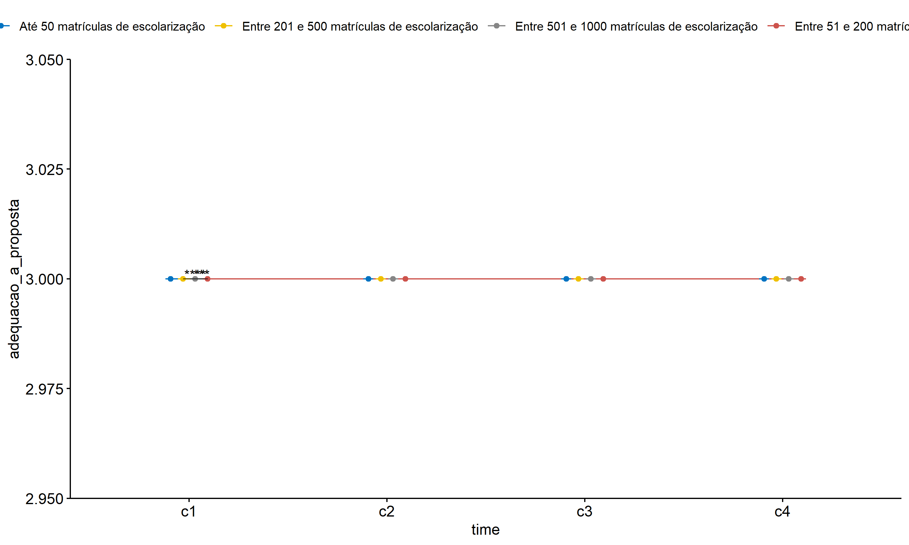<!-- -->

``` r
(pwc <- ldat %>% group_by(porte) %>%
    emmeans_test(adequacao_a_proposta ~ time, detailed = T, p.adjust.method = "bonferroni"))
```

    ## # A tibble: 24 × 15
    ##    porte term  .y.   group1 group2 null.value  estimate       se    df  conf.low
    ##  * <fct> <chr> <chr> <chr>  <chr>       <dbl>     <dbl>    <dbl> <dbl>     <dbl>
    ##  1 Até … time  adeq… c1     c2              0  2.07e-25 1.89e-14  4460 -3.70e-14
    ##  2 Até … time  adeq… c1     c3              0  2.10e-25 1.89e-14  4460 -3.70e-14
    ##  3 Até … time  adeq… c1     c4              0  2.06e-25 1.89e-14  4460 -3.70e-14
    ##  4 Até … time  adeq… c2     c3              0  2.41e-27 1.89e-14  4460 -3.70e-14
    ##  5 Até … time  adeq… c2     c4              0 -1.67e-27 1.89e-14  4460 -3.70e-14
    ##  6 Até … time  adeq… c3     c4              0 -4.08e-27 1.89e-14  4460 -3.70e-14
    ##  7 Entr… time  adeq… c1     c2              0  6.76e-27 4.18e-15  4460 -8.19e-15
    ##  8 Entr… time  adeq… c1     c3              0  8.62e-27 4.18e-15  4460 -8.19e-15
    ##  9 Entr… time  adeq… c1     c4              0  5.11e-27 4.18e-15  4460 -8.19e-15
    ## 10 Entr… time  adeq… c2     c3              0  1.87e-27 4.18e-15  4460 -8.19e-15
    ## # ℹ 14 more rows
    ## # ℹ 5 more variables: conf.high <dbl>, statistic <dbl>, p <dbl>, p.adj <dbl>,
    ## #   p.adj.signif <chr>

| porte                                        | term | .y.                  | group1 | group2 | null.value | estimate |  se |   df | conf.low | conf.high | statistic |   p | p.adj | p.adj.signif |
|:---------------------------------------------|:-----|:---------------------|:-------|:-------|-----------:|---------:|----:|-----:|---------:|----------:|----------:|----:|------:|:-------------|
| Até 50 matrículas de escolarização           | time | adequacao_a_proposta | c1     | c2     |          0 |        0 |   0 | 4460 |        0 |         0 |     0.000 |   1 | 1.000 | ns           |
| Até 50 matrículas de escolarização           | time | adequacao_a_proposta | c1     | c3     |          0 |        0 |   0 | 4460 |        0 |         0 |     0.000 |   1 | 1.000 | ns           |
| Até 50 matrículas de escolarização           | time | adequacao_a_proposta | c1     | c4     |          0 |        0 |   0 | 4460 |        0 |         0 |     0.000 |   1 | 1.000 | ns           |
| Até 50 matrículas de escolarização           | time | adequacao_a_proposta | c2     | c3     |          0 |        0 |   0 | 4460 |        0 |         0 |     0.000 |   1 | 1.000 | ns           |
| Até 50 matrículas de escolarização           | time | adequacao_a_proposta | c2     | c4     |          0 |        0 |   0 | 4460 |        0 |         0 |     0.000 |   1 | 1.000 | ns           |
| Até 50 matrículas de escolarização           | time | adequacao_a_proposta | c3     | c4     |          0 |        0 |   0 | 4460 |        0 |         0 |     0.000 |   1 | 1.000 | ns           |
| Entre 201 e 500 matrículas de escolarização  | time | adequacao_a_proposta | c1     | c2     |          0 |        0 |   0 | 4460 |        0 |         0 |     0.000 |   1 | 1.000 | ns           |
| Entre 201 e 500 matrículas de escolarização  | time | adequacao_a_proposta | c1     | c3     |          0 |        0 |   0 | 4460 |        0 |         0 |     0.000 |   1 | 1.000 | ns           |
| Entre 201 e 500 matrículas de escolarização  | time | adequacao_a_proposta | c1     | c4     |          0 |        0 |   0 | 4460 |        0 |         0 |     0.000 |   1 | 1.000 | ns           |
| Entre 201 e 500 matrículas de escolarização  | time | adequacao_a_proposta | c2     | c3     |          0 |        0 |   0 | 4460 |        0 |         0 |     0.000 |   1 | 1.000 | ns           |
| Entre 201 e 500 matrículas de escolarização  | time | adequacao_a_proposta | c2     | c4     |          0 |        0 |   0 | 4460 |        0 |         0 |     0.000 |   1 | 1.000 | ns           |
| Entre 201 e 500 matrículas de escolarização  | time | adequacao_a_proposta | c3     | c4     |          0 |        0 |   0 | 4460 |        0 |         0 |     0.000 |   1 | 1.000 | ns           |
| Entre 501 e 1000 matrículas de escolarização | time | adequacao_a_proposta | c1     | c2     |          0 |        0 |   0 | 4460 |        0 |         0 |     0.000 |   1 | 1.000 | ns           |
| Entre 501 e 1000 matrículas de escolarização | time | adequacao_a_proposta | c1     | c3     |          0 |        0 |   0 | 4460 |        0 |         0 |     0.000 |   1 | 1.000 | ns           |
| Entre 501 e 1000 matrículas de escolarização | time | adequacao_a_proposta | c1     | c4     |          0 |        0 |   0 | 4460 |        0 |         0 |     0.000 |   1 | 1.000 | ns           |
| Entre 501 e 1000 matrículas de escolarização | time | adequacao_a_proposta | c2     | c3     |          0 |        0 |   0 | 4460 |        0 |         0 |     0.000 |   1 | 1.000 | ns           |
| Entre 501 e 1000 matrículas de escolarização | time | adequacao_a_proposta | c2     | c4     |          0 |        0 |   0 | 4460 |        0 |         0 |     0.000 |   1 | 1.000 | ns           |
| Entre 501 e 1000 matrículas de escolarização | time | adequacao_a_proposta | c3     | c4     |          0 |        0 |   0 | 4460 |        0 |         0 |     0.000 |   1 | 1.000 | ns           |
| Entre 51 e 200 matrículas de escolarização   | time | adequacao_a_proposta | c1     | c2     |          0 |        0 |   0 | 4460 |        0 |         0 |     3.722 |   0 | 0.001 | \*\*         |
| Entre 51 e 200 matrículas de escolarização   | time | adequacao_a_proposta | c1     | c3     |          0 |        0 |   0 | 4460 |        0 |         0 |     3.722 |   0 | 0.001 | \*\*         |
| Entre 51 e 200 matrículas de escolarização   | time | adequacao_a_proposta | c1     | c4     |          0 |        0 |   0 | 4460 |        0 |         0 |     3.722 |   0 | 0.001 | \*\*         |
| Entre 51 e 200 matrículas de escolarização   | time | adequacao_a_proposta | c2     | c3     |          0 |        0 |   0 | 4460 |        0 |         0 |     0.000 |   1 | 1.000 | ns           |
| Entre 51 e 200 matrículas de escolarização   | time | adequacao_a_proposta | c2     | c4     |          0 |        0 |   0 | 4460 |        0 |         0 |     0.000 |   1 | 1.000 | ns           |
| Entre 51 e 200 matrículas de escolarização   | time | adequacao_a_proposta | c3     | c4     |          0 |        0 |   0 | 4460 |        0 |         0 |     0.000 |   1 | 1.000 | ns           |

``` r
(emms <- get_emmeans(pwc))
```

    ## # A tibble: 16 × 8
    ##    porte                   time  emmean       se    df conf.low conf.high method
    ##    <fct>                   <fct>  <dbl>    <dbl> <dbl>    <dbl>     <dbl> <chr> 
    ##  1 Até 50 matrículas de e… c1      3.00 1.34e-14  4460     3.00      3.00 Emmea…
    ##  2 Até 50 matrículas de e… c2      3.00 1.34e-14  4460     3.00      3.00 Emmea…
    ##  3 Até 50 matrículas de e… c3      3.00 1.34e-14  4460     3.00      3.00 Emmea…
    ##  4 Até 50 matrículas de e… c4      3.00 1.34e-14  4460     3.00      3.00 Emmea…
    ##  5 Entre 201 e 500 matríc… c1      3.00 2.95e-15  4460     3.00      3.00 Emmea…
    ##  6 Entre 201 e 500 matríc… c2      3.00 2.95e-15  4460     3.00      3.00 Emmea…
    ##  7 Entre 201 e 500 matríc… c3      3.00 2.95e-15  4460     3.00      3.00 Emmea…
    ##  8 Entre 201 e 500 matríc… c4      3.00 2.95e-15  4460     3.00      3.00 Emmea…
    ##  9 Entre 501 e 1000 matrí… c1      3.00 4.86e-15  4460     3.00      3.00 Emmea…
    ## 10 Entre 501 e 1000 matrí… c2      3.00 4.86e-15  4460     3.00      3.00 Emmea…
    ## 11 Entre 501 e 1000 matrí… c3      3.00 4.86e-15  4460     3.00      3.00 Emmea…
    ## 12 Entre 501 e 1000 matrí… c4      3.00 4.86e-15  4460     3.00      3.00 Emmea…
    ## 13 Entre 51 e 200 matrícu… c1      3.00 6.03e-15  4460     3.00      3.00 Emmea…
    ## 14 Entre 51 e 200 matrícu… c2      3.00 6.03e-15  4460     3.00      3.00 Emmea…
    ## 15 Entre 51 e 200 matrícu… c3      3.00 6.03e-15  4460     3.00      3.00 Emmea…
    ## 16 Entre 51 e 200 matrícu… c4      3.00 6.03e-15  4460     3.00      3.00 Emmea…

| porte                                        | time | emmean |  se |   df | conf.low | conf.high | method       |
|:---------------------------------------------|:-----|-------:|----:|-----:|---------:|----------:|:-------------|
| Até 50 matrículas de escolarização           | c1   |      3 |   0 | 4460 |        3 |         3 | Emmeans test |
| Até 50 matrículas de escolarização           | c2   |      3 |   0 | 4460 |        3 |         3 | Emmeans test |
| Até 50 matrículas de escolarização           | c3   |      3 |   0 | 4460 |        3 |         3 | Emmeans test |
| Até 50 matrículas de escolarização           | c4   |      3 |   0 | 4460 |        3 |         3 | Emmeans test |
| Entre 201 e 500 matrículas de escolarização  | c1   |      3 |   0 | 4460 |        3 |         3 | Emmeans test |
| Entre 201 e 500 matrículas de escolarização  | c2   |      3 |   0 | 4460 |        3 |         3 | Emmeans test |
| Entre 201 e 500 matrículas de escolarização  | c3   |      3 |   0 | 4460 |        3 |         3 | Emmeans test |
| Entre 201 e 500 matrículas de escolarização  | c4   |      3 |   0 | 4460 |        3 |         3 | Emmeans test |
| Entre 501 e 1000 matrículas de escolarização | c1   |      3 |   0 | 4460 |        3 |         3 | Emmeans test |
| Entre 501 e 1000 matrículas de escolarização | c2   |      3 |   0 | 4460 |        3 |         3 | Emmeans test |
| Entre 501 e 1000 matrículas de escolarização | c3   |      3 |   0 | 4460 |        3 |         3 | Emmeans test |
| Entre 501 e 1000 matrículas de escolarização | c4   |      3 |   0 | 4460 |        3 |         3 | Emmeans test |
| Entre 51 e 200 matrículas de escolarização   | c1   |      3 |   0 | 4460 |        3 |         3 | Emmeans test |
| Entre 51 e 200 matrículas de escolarização   | c2   |      3 |   0 | 4460 |        3 |         3 | Emmeans test |
| Entre 51 e 200 matrículas de escolarização   | c3   |      3 |   0 | 4460 |        3 |         3 | Emmeans test |
| Entre 51 e 200 matrículas de escolarização   | c4   |      3 |   0 | 4460 |        3 |         3 | Emmeans test |

``` r
emms.gg <- emms[which(emms$porte == "Até 50 matrículas de escolarização"),]
if (nrow(emms.gg) > 0)
  ggline(emms.gg, x = "time", y = "emmean", color = "#0073C2FF", ylab = "adequacao_a_proposta") +
    geom_errorbar(aes(ymin = conf.low, ymax = conf.high),
                  width = 0.2, color = "#0073C2FF") +
    stat_pvalue_manual(
      add_xy_position(pwc[which(pwc$porte == "Até 50 matrículas de escolarização"),],
                      x = "time", fun = "mean_se"),
      hide.ns = T, color = "#0073C2FF", tip.length = F) +
    labs(title = "porte: Até 50 matrículas de escolarização")+
    theme(legend.text = element_blank())
```

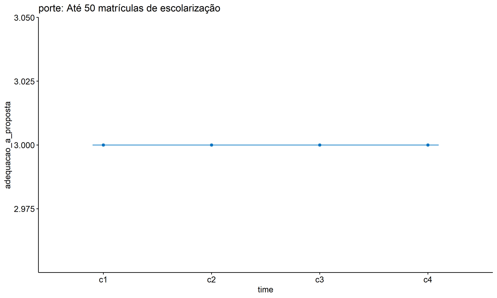<!-- -->

``` r
emms.gg <- emms[which(emms$porte == "Entre 201 e 500 matrículas de escolarização"),]
if (nrow(emms.gg) > 0)
  ggline(emms.gg, x = "time", y = "emmean", color = "#EFC000FF", ylab = "adequacao_a_proposta") +
    geom_errorbar(aes(ymin = conf.low, ymax = conf.high),
                  width = 0.2, color = "#EFC000FF") +
    stat_pvalue_manual(
      add_xy_position(pwc[which(pwc$porte == "Entre 201 e 500 matrículas de escolarização"),],
                      x = "time", fun = "mean_se"),
      hide.ns = T, color = "#EFC000FF", tip.length = F) +
    labs(title = "porte: Entre 201 e 500 matrículas de escolarização")+
    theme(legend.text = element_blank())
```

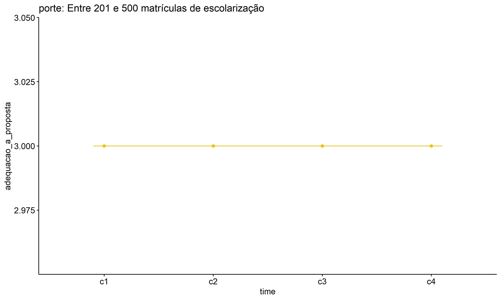<!-- -->

``` r
emms.gg <- emms[which(emms$porte == "Entre 501 e 1000 matrículas de escolarização"),]
if (nrow(emms.gg) > 0)
  ggline(emms.gg, x = "time", y = "emmean", color = "#868686FF", ylab = "adequacao_a_proposta") +
    geom_errorbar(aes(ymin = conf.low, ymax = conf.high),
                  width = 0.2, color = "#868686FF") +
    stat_pvalue_manual(
      add_xy_position(pwc[which(pwc$porte == "Entre 501 e 1000 matrículas de escolarização"),],
                      x = "time", fun = "mean_se"),
      hide.ns = T, color = "#868686FF", tip.length = F) +
    labs(title = "porte: Entre 501 e 1000 matrículas de escolarização")+
    theme(legend.text = element_blank())
```

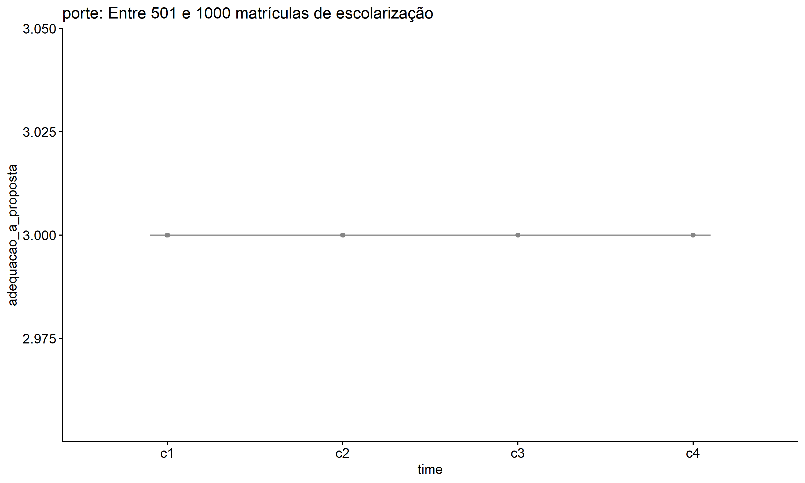<!-- -->

``` r
emms.gg <- emms[which(emms$porte == "Entre 51 e 200 matrículas de escolarização"),]
if (nrow(emms.gg) > 0)
  ggline(emms.gg, x = "time", y = "emmean", color = "#CD534CFF", ylab = "adequacao_a_proposta") +
    geom_errorbar(aes(ymin = conf.low, ymax = conf.high),
                  width = 0.2, color = "#CD534CFF") +
    stat_pvalue_manual(
      add_xy_position(pwc[which(pwc$porte == "Entre 51 e 200 matrículas de escolarização"),],
                      x = "time", fun = "mean_se"),
      hide.ns = T, color = "#CD534CFF", tip.length = F) +
    labs(title = "porte: Entre 51 e 200 matrículas de escolarização")+
    theme(legend.text = element_blank())
```

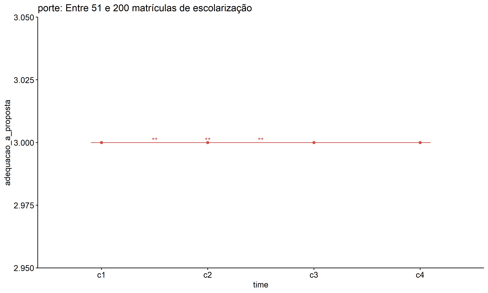<!-- -->

``` r
emms.gg <- emms[which(emms$porte == "Mais de 1000 matrículas de escolarização"),]
if (nrow(emms.gg) > 0)
  ggline(emms.gg, x = "time", y = "emmean", color = "#7AA6DCFF", ylab = "adequacao_a_proposta") +
    geom_errorbar(aes(ymin = conf.low, ymax = conf.high),
                  width = 0.2, color = "#7AA6DCFF") +
    stat_pvalue_manual(
      add_xy_position(pwc[which(pwc$porte == "Mais de 1000 matrículas de escolarização"),],
                      x = "time", fun = "mean_se"),
      hide.ns = T, color = "#7AA6DCFF", tip.length = F) +
    labs(title = "porte: Mais de 1000 matrículas de escolarização")+
    theme(legend.text = element_blank())
```

## PairWise Computation after removing non.normal data

``` r
if (length(non.ids) > 0)
  (pwc2 <- ldat2 %>% group_by(time) %>%
     emmeans_test(adequacao_a_proposta ~ porte, detailed = T, p.adjust.method = "bonferroni"))
```

``` r
if (length(non.ids) > 0)
  (emms2 <- get_emmeans(pwc2))
```

``` r
if (length(non.ids) > 0) {
  pwc2 <- add_xy_position(pwc2, x = "time", fun = "mean_se", dodge = 0.25)
  pd2 <- position_dodge(width = 0.25)
  
  ggline(emms2, x = "time", y = "emmean", color = "porte",
         palette = c("#0073C2FF","#EFC000FF","#868686FF","#CD534CFF","#7AA6DCFF"),
         position = pd, ylab = "adequacao_a_proposta") +
    geom_errorbar(aes(ymin = conf.low, ymax = conf.high, color = porte),
                position = pd, width = 0.2) +
    stat_pvalue_manual(pwc2, hide.ns = T, tip.length = F, linetype = 1)
}
```

``` r
if (length(non.ids) > 0)
  (pwc2 <- ldat2 %>% group_by(porte) %>%
     emmeans_test(adequacao_a_proposta ~ time, detailed = T, p.adjust.method = "bonferroni"))
```

``` r
if (length(non.ids) > 0)
  (emms2 <- get_emmeans(pwc2))
```

``` r
if (length(non.ids) > 0) {
  emms.gg <- emms2[which(emms2$porte == "Até 50 matrículas de escolarização"),]
  if (nrow(emms.gg) > 0)
    ggline(emms.gg, x = "time", y = "emmean", color = "#0073C2FF", ylab = "adequacao_a_proposta") +
    geom_errorbar(aes(ymin = conf.low, ymax = conf.high),
                  width = 0.2, color = "#0073C2FF") +
    stat_pvalue_manual(
      add_xy_position(pwc[which(pwc$porte == "Até 50 matrículas de escolarização"),],
                      x = "time", fun = "mean_se"),
      hide.ns = T, color = "#0073C2FF", tip.length = F) +
    labs(title = "porte: Até 50 matrículas de escolarização") +
    theme(legend.text = element_blank())
}
```

``` r
if (length(non.ids) > 0) {
  emms.gg <- emms2[which(emms2$porte == "Entre 201 e 500 matrículas de escolarização"),]
  if (nrow(emms.gg) > 0)
    ggline(emms.gg, x = "time", y = "emmean", color = "#EFC000FF", ylab = "adequacao_a_proposta") +
    geom_errorbar(aes(ymin = conf.low, ymax = conf.high),
                  width = 0.2, color = "#EFC000FF") +
    stat_pvalue_manual(
      add_xy_position(pwc[which(pwc$porte == "Entre 201 e 500 matrículas de escolarização"),],
                      x = "time", fun = "mean_se"),
      hide.ns = T, color = "#EFC000FF", tip.length = F) +
    labs(title = "porte: Entre 201 e 500 matrículas de escolarização") +
    theme(legend.text = element_blank())
}
```

``` r
if (length(non.ids) > 0) {
  emms.gg <- emms2[which(emms2$porte == "Entre 501 e 1000 matrículas de escolarização"),]
  if (nrow(emms.gg) > 0)
    ggline(emms.gg, x = "time", y = "emmean", color = "#868686FF", ylab = "adequacao_a_proposta") +
    geom_errorbar(aes(ymin = conf.low, ymax = conf.high),
                  width = 0.2, color = "#868686FF") +
    stat_pvalue_manual(
      add_xy_position(pwc[which(pwc$porte == "Entre 501 e 1000 matrículas de escolarização"),],
                      x = "time", fun = "mean_se"),
      hide.ns = T, color = "#868686FF", tip.length = F) +
    labs(title = "porte: Entre 501 e 1000 matrículas de escolarização") +
    theme(legend.text = element_blank())
}
```

``` r
if (length(non.ids) > 0) {
  emms.gg <- emms2[which(emms2$porte == "Entre 51 e 200 matrículas de escolarização"),]
  if (nrow(emms.gg) > 0)
    ggline(emms.gg, x = "time", y = "emmean", color = "#CD534CFF", ylab = "adequacao_a_proposta") +
    geom_errorbar(aes(ymin = conf.low, ymax = conf.high),
                  width = 0.2, color = "#CD534CFF") +
    stat_pvalue_manual(
      add_xy_position(pwc[which(pwc$porte == "Entre 51 e 200 matrículas de escolarização"),],
                      x = "time", fun = "mean_se"),
      hide.ns = T, color = "#CD534CFF", tip.length = F) +
    labs(title = "porte: Entre 51 e 200 matrículas de escolarização") +
    theme(legend.text = element_blank())
}
```

``` r
if (length(non.ids) > 0) {
  emms.gg <- emms2[which(emms2$porte == "Mais de 1000 matrículas de escolarização"),]
  if (nrow(emms.gg) > 0)
    ggline(emms.gg, x = "time", y = "emmean", color = "#7AA6DCFF", ylab = "adequacao_a_proposta") +
    geom_errorbar(aes(ymin = conf.low, ymax = conf.high),
                  width = 0.2, color = "#7AA6DCFF") +
    stat_pvalue_manual(
      add_xy_position(pwc[which(pwc$porte == "Mais de 1000 matrículas de escolarização"),],
                      x = "time", fun = "mean_se"),
      hide.ns = T, color = "#7AA6DCFF", tip.length = F) +
    labs(title = "porte: Mais de 1000 matrículas de escolarização") +
    theme(legend.text = element_blank())
}
```
