ANOVA test for coesao
================
Geiser C. Challco <geiser@alumni.usp.br>

- [ANOVA: coesao ~ time](#anova-coesao--time)
  - [Data Preparation](#data-preparation)
  - [Summary Statistics](#summary-statistics)
  - [ANOVA Computation](#anova-computation)
  - [PairWise Computation](#pairwise-computation)
- [ANOVA: coesao ~ time\*gender +
  Error(id/time)](#anova-coesao--timegender--erroridtime)
  - [Data Preparation](#data-preparation-1)
    - [Check assumptions: Identifying
      Outliers](#check-assumptions-identifying-outliers)
    - [Check assumptions: Normality
      Test](#check-assumptions-normality-test)
    - [Summary Statistics](#summary-statistics-1)
  - [ANOVA Computation](#anova-computation-1)
  - [ANOVA Computation after removing non.normal
    data](#anova-computation-after-removing-nonnormal-data)
  - [PairWise Computation](#pairwise-computation-1)
  - [PairWise Computation after removing non.normal
    data](#pairwise-computation-after-removing-nonnormal-data)
- [ANOVA: coesao ~ time\*localizacao +
  Error(id/time)](#anova-coesao--timelocalizacao--erroridtime)
  - [Data Preparation](#data-preparation-2)
    - [Check assumptions: Identifying
      Outliers](#check-assumptions-identifying-outliers-1)
    - [Check assumptions: Normality
      Test](#check-assumptions-normality-test-1)
    - [Summary Statistics](#summary-statistics-2)
  - [ANOVA Computation](#anova-computation-2)
  - [ANOVA Computation after removing non.normal
    data](#anova-computation-after-removing-nonnormal-data-1)
  - [PairWise Computation](#pairwise-computation-2)
  - [PairWise Computation after removing non.normal
    data](#pairwise-computation-after-removing-nonnormal-data-1)
- [ANOVA: coesao ~ time\*regiao +
  Error(id/time)](#anova-coesao--timeregiao--erroridtime)
  - [Data Preparation](#data-preparation-3)
    - [Check assumptions: Identifying
      Outliers](#check-assumptions-identifying-outliers-2)
    - [Check assumptions: Normality
      Test](#check-assumptions-normality-test-2)
    - [Summary Statistics](#summary-statistics-3)
  - [ANOVA Computation](#anova-computation-3)
  - [ANOVA Computation after removing non.normal
    data](#anova-computation-after-removing-nonnormal-data-2)
  - [PairWise Computation](#pairwise-computation-3)
  - [PairWise Computation after removing non.normal
    data](#pairwise-computation-after-removing-nonnormal-data-2)
- [ANOVA: coesao ~ time\*porte +
  Error(id/time)](#anova-coesao--timeporte--erroridtime)
  - [Data Preparation](#data-preparation-4)
    - [Check assumptions: Identifying
      Outliers](#check-assumptions-identifying-outliers-3)
    - [Check assumptions: Normality
      Test](#check-assumptions-normality-test-3)
    - [Summary Statistics](#summary-statistics-4)
  - [ANOVA Computation](#anova-computation-4)
  - [ANOVA Computation after removing non.normal
    data](#anova-computation-after-removing-nonnormal-data-3)
  - [PairWise Computation](#pairwise-computation-4)
  - [PairWise Computation after removing non.normal
    data](#pairwise-computation-after-removing-nonnormal-data-3)

``` r
dat <- read_excel("../data/data.xlsx", sheet = "alunos_ef14")

escolas <- read_excel("../data/data.xlsx", sheet = "escolas")
edat <- merge(dat, escolas, by = "cod_escola", all.x = T)
```

# ANOVA: coesao ~ time

## Data Preparation

``` r
data <- edat[,c("aluno_id","ciclo","coesao")]
data$ciclo <- factor(edat$ciclo, c("Primeiro Ciclo","Segundo Ciclo",
                                   "Terceiro Ciclo","Quarto Ciclo"))

wdat <- spread(data, ciclo, coesao)
wdat <- wdat[complete.cases(wdat),]
colnames(wdat) <- c("id","c1","c2","c3","c4")

ldat <- gather(wdat, key = time, value = coesao, c1, c2, c3, c4) %>%
  convert_as_factor(id, time)
ldat <- rshinystatistics::remove_group_data(ldat, "coesao", "time", n.limit = 30)
```

## Summary Statistics

``` r
(sdat <- ldat %>% group_by(time) %>%
   get_summary_stats(coesao, type = "mean_sd"))
```

    ## # A tibble: 4 × 5
    ##   time  variable     n  mean    sd
    ##   <fct> <fct>    <dbl> <dbl> <dbl>
    ## 1 c1    coesao    1126  2.01 0.099
    ## 2 c2    coesao    1126  2.03 0.248
    ## 3 c3    coesao    1126  2.03 0.245
    ## 4 c4    coesao    1126  2.02 0.176

| time | variable |    n |  mean |    sd |
|:-----|:---------|-----:|------:|------:|
| c1   | coesao   | 1126 | 2.006 | 0.099 |
| c2   | coesao   | 1126 | 2.030 | 0.248 |
| c3   | coesao   | 1126 | 2.028 | 0.245 |
| c4   | coesao   | 1126 | 2.016 | 0.176 |

## ANOVA Computation

``` r
(res.aov <- anova_test(ldat, dv = coesao, wid = id, within = time))
```

    ## ANOVA Table (type III tests)
    ## 
    ## $ANOVA
    ##   Effect DFn  DFd     F     p p<.05   ges
    ## 1   time   3 3375 3.743 0.011     * 0.002
    ## 
    ## $`Mauchly's Test for Sphericity`
    ##   Effect     W        p p<.05
    ## 1   time 0.749 4.18e-68     *
    ## 
    ## $`Sphericity Corrections`
    ##   Effect   GGe        DF[GG] p[GG] p[GG]<.05   HFe        DF[HF] p[HF]
    ## 1   time 0.874 2.62, 2948.59 0.014         * 0.876 2.63, 2956.09 0.014
    ##   p[HF]<.05
    ## 1         *

| Effect | DFn |  DFd |     F |     p | p\<.05 |   ges |
|:-------|----:|-----:|------:|------:|:-------|------:|
| time   |   3 | 3375 | 3.743 | 0.011 | \*     | 0.002 |

| Effect |     W |   p | p\<.05 |
|:-------|------:|----:|:-------|
| time   | 0.749 |   0 | \*     |

| Effect |   GGe | DF\[GG\]      | p\[GG\] | p\[GG\]\<.05 |   HFe | DF\[HF\]      | p\[HF\] | p\[HF\]\<.05 |
|:-------|------:|:--------------|--------:|:-------------|------:|:--------------|--------:|:-------------|
| time   | 0.874 | 2.62, 2948.59 |   0.014 | \*           | 0.876 | 2.63, 2956.09 |   0.014 | \*           |

## PairWise Computation

``` r
(pwc <- ldat %>% emmeans_test(coesao ~ time, detailed = T, p.adjust.method = "bonferroni"))
```

    ## # A tibble: 6 × 14
    ##   term  .y.   group1 group2 null.value estimate      se    df conf.low conf.high
    ## * <chr> <chr> <chr>  <chr>       <dbl>    <dbl>   <dbl> <dbl>    <dbl>     <dbl>
    ## 1 time  coes… c1     c2              0 -0.0240  0.00849  4500 -0.0406   -0.00734
    ## 2 time  coes… c1     c3              0 -0.0222  0.00849  4500 -0.0388   -0.00556
    ## 3 time  coes… c1     c4              0 -0.0102  0.00849  4500 -0.0269    0.00642
    ## 4 time  coes… c2     c3              0  0.00178 0.00849  4500 -0.0149    0.0184 
    ## 5 time  coes… c2     c4              0  0.0138  0.00849  4500 -0.00287   0.0304 
    ## 6 time  coes… c3     c4              0  0.0120  0.00849  4500 -0.00465   0.0286 
    ## # ℹ 4 more variables: statistic <dbl>, p <dbl>, p.adj <dbl>, p.adj.signif <chr>

| term | .y.    | group1 | group2 | null.value | estimate |    se |   df | conf.low | conf.high | statistic |     p | p.adj | p.adj.signif |
|:-----|:-------|:-------|:-------|-----------:|---------:|------:|-----:|---------:|----------:|----------:|------:|------:|:-------------|
| time | coesao | c1     | c2     |          0 |   -0.024 | 0.008 | 4500 |   -0.041 |    -0.007 |    -2.825 | 0.005 | 0.028 | \*           |
| time | coesao | c1     | c3     |          0 |   -0.022 | 0.008 | 4500 |   -0.039 |    -0.006 |    -2.616 | 0.009 | 0.054 | ns           |
| time | coesao | c1     | c4     |          0 |   -0.010 | 0.008 | 4500 |   -0.027 |     0.006 |    -1.203 | 0.229 | 1.000 | ns           |
| time | coesao | c2     | c3     |          0 |    0.002 | 0.008 | 4500 |   -0.015 |     0.018 |     0.209 | 0.834 | 1.000 | ns           |
| time | coesao | c2     | c4     |          0 |    0.014 | 0.008 | 4500 |   -0.003 |     0.030 |     1.622 | 0.105 | 0.629 | ns           |
| time | coesao | c3     | c4     |          0 |    0.012 | 0.008 | 4500 |   -0.005 |     0.029 |     1.413 | 0.158 | 0.947 | ns           |

``` r
pwc <- add_xy_position(pwc, x = "time", fun = "mean_se")
ggline(get_emmeans(pwc), x = "time", y = "emmean", ylab = "coesao") +
  geom_errorbar(aes(ymin = conf.low, ymax = conf.high), width = 0.2) +
  stat_pvalue_manual(pwc, hide.ns = T, tip.length = F)
```

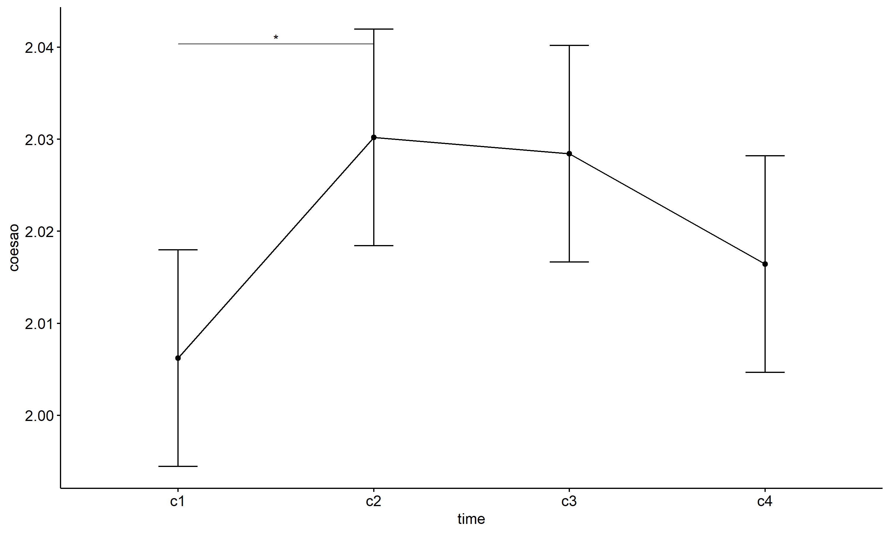<!-- -->

# ANOVA: coesao ~ time\*gender + Error(id/time)

## Data Preparation

``` r
data <- edat[,c("aluno_id","gender","ciclo","coesao")]
data$ciclo <- factor(data$ciclo, c("Primeiro Ciclo","Segundo Ciclo",
                                   "Terceiro Ciclo","Quarto Ciclo"))

wdat <- spread(data, ciclo, coesao)
wdat <- wdat[complete.cases(wdat),]
colnames(wdat) <- c("id","gender","c1","c2","c3","c4")

ldat <- gather(wdat, key = time, value = coesao, c1, c2, c3, c4) %>%
  convert_as_factor(id, time)
ldat <- remove_group_data(ldat, "coesao", c("time", "gender"), n.limit = 30)
ldat$gender <- factor(ldat$gender, sort(unique(ldat$gender)))
```

### Check assumptions: Identifying Outliers

``` r
outliers <- identify_outliers(group_by(ldat, time, gender), coesao)
(outliers <- outliers[outliers$is.extreme == T,])
```

    ## # A tibble: 49 × 6
    ##    gender time  id                   coesao is.outlier is.extreme
    ##    <fct>  <fct> <fct>                 <dbl> <lgl>      <lgl>     
    ##  1 Female c1    IZ2Xmfi9jueckwdzfkiG      3 TRUE       TRUE      
    ##  2 Male   c1    JRyGpNQA6mOEl1nzl1af      3 TRUE       TRUE      
    ##  3 Male   c1    Kaj54imycuE0bbwH7xlD      3 TRUE       TRUE      
    ##  4 Male   c1    W8iXxSmW48zvfJyikMZb      4 TRUE       TRUE      
    ##  5 Male   c1    Y7HozU436KQ0wqdBGugu      4 TRUE       TRUE      
    ##  6 Female c2    0mGtUd2Axg2fjQmYZ4CC      3 TRUE       TRUE      
    ##  7 Female c2    EqNpFnKTbLOWH4nmuu6d      4 TRUE       TRUE      
    ##  8 Female c2    G4NIt8gEc7nfeQ9k2OkL      4 TRUE       TRUE      
    ##  9 Female c2    i5EZ8Ck9IgDueyMbw55v      3 TRUE       TRUE      
    ## 10 Female c2    oGUJyWRMYYbF9PNegJZh      4 TRUE       TRUE      
    ## # ℹ 39 more rows

| gender | time | id                   | coesao | is.outlier | is.extreme |
|:-------|:-----|:---------------------|-------:|:-----------|:-----------|
| Female | c1   | IZ2Xmfi9jueckwdzfkiG |    3.0 | TRUE       | TRUE       |
| Male   | c1   | JRyGpNQA6mOEl1nzl1af |    3.0 | TRUE       | TRUE       |
| Male   | c1   | Kaj54imycuE0bbwH7xlD |    3.0 | TRUE       | TRUE       |
| Male   | c1   | W8iXxSmW48zvfJyikMZb |    4.0 | TRUE       | TRUE       |
| Male   | c1   | Y7HozU436KQ0wqdBGugu |    4.0 | TRUE       | TRUE       |
| Female | c2   | 0mGtUd2Axg2fjQmYZ4CC |    3.0 | TRUE       | TRUE       |
| Female | c2   | EqNpFnKTbLOWH4nmuu6d |    4.0 | TRUE       | TRUE       |
| Female | c2   | G4NIt8gEc7nfeQ9k2OkL |    4.0 | TRUE       | TRUE       |
| Female | c2   | i5EZ8Ck9IgDueyMbw55v |    3.0 | TRUE       | TRUE       |
| Female | c2   | oGUJyWRMYYbF9PNegJZh |    4.0 | TRUE       | TRUE       |
| Female | c2   | xk7eC5haTYuFQaJovsBZ |    4.0 | TRUE       | TRUE       |
| Female | c2   | xQIlV1qQiNpzi4Bna9Ut |    4.0 | TRUE       | TRUE       |
| Female | c2   | YTYFFWzK4C7ejf1X1TUB |    4.0 | TRUE       | TRUE       |
| Male   | c2   | cuknOzzwN4oCRum5U5ph |    5.0 | TRUE       | TRUE       |
| Male   | c2   | G7bqQeqXmsQ3kiJNeYlz |    3.0 | TRUE       | TRUE       |
| Male   | c2   | HsQF2J0r79mHSWNe4l6n |    4.0 | TRUE       | TRUE       |
| Male   | c2   | j31LU8Xwm0EQ7Mihkhjj |    4.0 | TRUE       | TRUE       |
| Male   | c2   | qyt5dpIrCcmnZfDJIazf |    4.0 | TRUE       | TRUE       |
| Male   | c2   | W8iXxSmW48zvfJyikMZb |    4.0 | TRUE       | TRUE       |
| Male   | c2   | wgOGhRdGeAbGeHUAguQ5 |    5.0 | TRUE       | TRUE       |
| Male   | c2   | wQnhAn0Gfye5OP5zaTgh |    4.0 | TRUE       | TRUE       |
| Male   | c2   | wuumviqqlrNK6QzeoJPr |    4.0 | TRUE       | TRUE       |
| Male   | c2   | XxtCdGkKAnQOx88fyxk4 |    3.0 | TRUE       | TRUE       |
| Female | c3   | 6bEKmKQpOuvY6PSQvzqj |    4.0 | TRUE       | TRUE       |
| Female | c3   | CCVIt7MPeYMUOCCyBxPh |    4.0 | TRUE       | TRUE       |
| Female | c3   | i5EZ8Ck9IgDueyMbw55v |    5.0 | TRUE       | TRUE       |
| Female | c3   | m5yRlxfIj73j4ossfTOB |    5.0 | TRUE       | TRUE       |
| Female | c3   | OvwAQTWkdj8SYpPS8dgn |    4.0 | TRUE       | TRUE       |
| Female | c3   | u65Z834z75LDIy0slvaX |    5.0 | TRUE       | TRUE       |
| Female | c3   | vaOhaNww5ga5d9G6Cftj |    4.0 | TRUE       | TRUE       |
| Female | c3   | xk7eC5haTYuFQaJovsBZ |    4.0 | TRUE       | TRUE       |
| Male   | c3   | E3u63riyMFS8A2cNBnvC |    3.0 | TRUE       | TRUE       |
| Male   | c3   | EtUjsyq1GNevicwMDXlw |    3.5 | TRUE       | TRUE       |
| Male   | c3   | FkJFrnPezc8Ng4SSMx1z |    4.0 | TRUE       | TRUE       |
| Male   | c3   | GN5vxU0haHKd9W22JGyk |    4.0 | TRUE       | TRUE       |
| Male   | c3   | HsQF2J0r79mHSWNe4l6n |    3.0 | TRUE       | TRUE       |
| Male   | c3   | j31LU8Xwm0EQ7Mihkhjj |    4.0 | TRUE       | TRUE       |
| Male   | c3   | QAyx2z41ILLaMN0o7pjc |    3.0 | TRUE       | TRUE       |
| Male   | c3   | TKvc4Eu2XaDXYPxuS7Qn |    4.0 | TRUE       | TRUE       |
| Female | c4   | 6bEKmKQpOuvY6PSQvzqj |    4.0 | TRUE       | TRUE       |
| Female | c4   | DP1fbT1lGhLiBnOFILLi |    4.0 | TRUE       | TRUE       |
| Female | c4   | fgNBRPWfCa0TP4bDO8d2 |    4.0 | TRUE       | TRUE       |
| Female | c4   | jVbbowshsqkUpPuGSIMu |    4.0 | TRUE       | TRUE       |
| Female | c4   | N7zTvCPK4nAUgH9eo3hg |    4.0 | TRUE       | TRUE       |
| Female | c4   | tVMilOzYDlVoWwNezYUi |    4.0 | TRUE       | TRUE       |
| Female | c4   | VRWfIoYUFgdA8nGO5bpD |    4.0 | TRUE       | TRUE       |
| Female | c4   | zq67YfRtJ2g4hWPYAfkU |    3.0 | TRUE       | TRUE       |
| Male   | c4   | 3DdYC9Dpykr9Mtg6YR91 |    4.0 | TRUE       | TRUE       |
| Male   | c4   | IMHqraVHK59KiF08zsGi |    3.5 | TRUE       | TRUE       |

### Check assumptions: Normality Test

``` r
(normality.df <- normality.test.per.groups(ldat, "coesao", c("time", "gender")))
```

    ##      var variable time gender   n skewness kurtosis symmetry statistic
    ## 1 coesao   coesao   c1 Female 552 0.000000  0.00000 few data        NA
    ## 2 coesao   coesao   c1   Male 513 0.000000  0.00000 few data        NA
    ## 3 coesao   coesao   c2 Female 552 0.000000  0.00000 few data        NA
    ## 4 coesao   coesao   c2   Male 513 7.861704 63.79694       NO  737.6279
    ## 5 coesao   coesao   c3 Female 552 0.000000  0.00000 few data        NA
    ## 6 coesao   coesao   c3   Male 513 8.678249 76.66803       NO  782.9274
    ## 7 coesao   coesao   c4 Female 552 0.000000  0.00000 few data        NA
    ## 8 coesao   coesao   c4   Male 513 0.000000  0.00000 few data        NA
    ##       method p p.signif normality
    ## 1       <NA> 1     <NA>        NO
    ## 2       <NA> 1     <NA>        NO
    ## 3       <NA> 1     <NA>        NO
    ## 4 D'Agostino 0     ****         -
    ## 5       <NA> 1     <NA>        NO
    ## 6 D'Agostino 0     ****         -
    ## 7       <NA> 1     <NA>        NO
    ## 8       <NA> 1     <NA>        NO

| var    | variable | time | gender |   n | skewness | kurtosis | symmetry | statistic | method     |   p | p.signif | normality |
|:-------|:---------|:-----|:-------|----:|---------:|---------:|:---------|----------:|:-----------|----:|:---------|:----------|
| coesao | coesao   | c1   | Female | 552 |    0.000 |    0.000 | few data |        NA | NA         |   1 | NA       | NO        |
| coesao | coesao   | c1   | Male   | 513 |    0.000 |    0.000 | few data |        NA | NA         |   1 | NA       | NO        |
| coesao | coesao   | c2   | Female | 552 |    0.000 |    0.000 | few data |        NA | NA         |   1 | NA       | NO        |
| coesao | coesao   | c2   | Male   | 513 |    7.862 |   63.797 | NO       |   737.628 | D’Agostino |   0 | \*\*\*\* | \-        |
| coesao | coesao   | c3   | Female | 552 |    0.000 |    0.000 | few data |        NA | NA         |   1 | NA       | NO        |
| coesao | coesao   | c3   | Male   | 513 |    8.678 |   76.668 | NO       |   782.927 | D’Agostino |   0 | \*\*\*\* | \-        |
| coesao | coesao   | c4   | Female | 552 |    0.000 |    0.000 | few data |        NA | NA         |   1 | NA       | NO        |
| coesao | coesao   | c4   | Male   | 513 |    0.000 |    0.000 | few data |        NA | NA         |   1 | NA       | NO        |

``` r
(non.ids <- unique(do.call(
  c, lapply(which(normality.df$normality == 'NO'), FUN = function(i) {
  idx = which(ldat$time == normality.df$time[i] &
                ldat$gender == normality.df$gender[i])
  getNonNormal(ldat$"coesao"[idx], ldat$id[idx])
}))))
```

    ## NULL

``` r
if (length(non.ids) > 0)
  ldat2 <- ldat[!ldat$id %in% non.ids,]
```

### Summary Statistics

``` r
(sdat <- ldat %>% group_by(time, gender) %>%
   get_summary_stats(coesao, type = "mean_sd"))
```

    ## # A tibble: 8 × 6
    ##   gender time  variable     n  mean    sd
    ##   <fct>  <fct> <fct>    <dbl> <dbl> <dbl>
    ## 1 Female c1    coesao     552  2.00 0.043
    ## 2 Male   c1    coesao     513  2.01 0.139
    ## 3 Female c2    coesao     552  2.02 0.216
    ## 4 Male   c2    coesao     513  2.04 0.291
    ## 5 Female c3    coesao     552  2.03 0.29 
    ## 6 Male   c3    coesao     513  2.02 0.202
    ## 7 Female c4    coesao     552  2.03 0.228
    ## 8 Male   c4    coesao     513  2.01 0.11

| gender | time | variable |   n |  mean |    sd |
|:-------|:-----|:---------|----:|------:|------:|
| Female | c1   | coesao   | 552 | 2.002 | 0.043 |
| Male   | c1   | coesao   | 513 | 2.012 | 0.139 |
| Female | c2   | coesao   | 552 | 2.025 | 0.216 |
| Male   | c2   | coesao   | 513 | 2.039 | 0.291 |
| Female | c3   | coesao   | 552 | 2.034 | 0.290 |
| Male   | c3   | coesao   | 513 | 2.024 | 0.202 |
| Female | c4   | coesao   | 552 | 2.027 | 0.228 |
| Male   | c4   | coesao   | 513 | 2.007 | 0.110 |

``` r
if (length(non.ids) > 0)
  (sdat <- ldat2 %>% group_by(time, gender) %>%
      get_summary_stats(coesao, type = "mean_sd"))
```

| gender | time | variable |   n |  mean |    sd |
|:-------|:-----|:---------|----:|------:|------:|
| Female | c1   | coesao   | 552 | 2.002 | 0.043 |
| Male   | c1   | coesao   | 513 | 2.012 | 0.139 |
| Female | c2   | coesao   | 552 | 2.025 | 0.216 |
| Male   | c2   | coesao   | 513 | 2.039 | 0.291 |
| Female | c3   | coesao   | 552 | 2.034 | 0.290 |
| Male   | c3   | coesao   | 513 | 2.024 | 0.202 |
| Female | c4   | coesao   | 552 | 2.027 | 0.228 |
| Male   | c4   | coesao   | 513 | 2.007 | 0.110 |

## ANOVA Computation

``` r
(res.aov <- anova_test(ldat, dv = coesao, wid = id, between = gender, within = time))
```

    ## ANOVA Table (type III tests)
    ## 
    ## $ANOVA
    ##        Effect DFn  DFd     F     p p<.05      ges
    ## 1      gender   1 1063 0.061 0.804       1.74e-05
    ## 2        time   3 3189 3.678 0.012     * 2.00e-03
    ## 3 gender:time   3 3189 1.748 0.155       1.00e-03
    ## 
    ## $`Mauchly's Test for Sphericity`
    ##        Effect     W        p p<.05
    ## 1        time 0.748 2.27e-64     *
    ## 2 gender:time 0.748 2.27e-64     *
    ## 
    ## $`Sphericity Corrections`
    ##        Effect   GGe        DF[GG] p[GG] p[GG]<.05   HFe        DF[HF] p[HF]
    ## 1        time 0.874 2.62, 2785.67 0.016         * 0.876 2.63, 2793.18 0.016
    ## 2 gender:time 0.874 2.62, 2785.67 0.162           0.876 2.63, 2793.18 0.162
    ##   p[HF]<.05
    ## 1         *
    ## 2

| Effect      | DFn |  DFd |     F |     p | p\<.05 |   ges |
|:------------|----:|-----:|------:|------:|:-------|------:|
| gender      |   1 | 1063 | 0.061 | 0.804 |        | 0.000 |
| time        |   3 | 3189 | 3.678 | 0.012 | \*     | 0.002 |
| gender:time |   3 | 3189 | 1.748 | 0.155 |        | 0.001 |

| Effect      |     W |   p | p\<.05 |
|:------------|------:|----:|:-------|
| time        | 0.748 |   0 | \*     |
| gender:time | 0.748 |   0 | \*     |

| Effect      |   GGe | DF\[GG\]      | p\[GG\] | p\[GG\]\<.05 |   HFe | DF\[HF\]      | p\[HF\] | p\[HF\]\<.05 |
|:------------|------:|:--------------|--------:|:-------------|------:|:--------------|--------:|:-------------|
| time        | 0.874 | 2.62, 2785.67 |   0.016 | \*           | 0.876 | 2.63, 2793.18 |   0.016 | \*           |
| gender:time | 0.874 | 2.62, 2785.67 |   0.162 |              | 0.876 | 2.63, 2793.18 |   0.162 |              |

## ANOVA Computation after removing non.normal data

``` r
if (length(non.ids) > 0)
  (res.aov2 <- anova_test(ldat2, dv = coesao, wid = id, between = gender , within = time))
```

## PairWise Computation

``` r
(pwc <- ldat %>% group_by(time) %>%
   emmeans_test(coesao ~ gender, detailed = T, p.adjust.method = "bonferroni"))
```

    ## # A tibble: 4 × 15
    ##   time  term   .y.    group1 group2 null.value estimate     se    df conf.low
    ## * <fct> <chr>  <chr>  <chr>  <chr>       <dbl>    <dbl>  <dbl> <dbl>    <dbl>
    ## 1 c1    gender coesao Female Male            0 -0.00988 0.0127  4252 -0.0348 
    ## 2 c2    gender coesao Female Male            0 -0.0136  0.0127  4252 -0.0385 
    ## 3 c3    gender coesao Female Male            0  0.0101  0.0127  4252 -0.0148 
    ## 4 c4    gender coesao Female Male            0  0.0204  0.0127  4252 -0.00452
    ## # ℹ 5 more variables: conf.high <dbl>, statistic <dbl>, p <dbl>, p.adj <dbl>,
    ## #   p.adj.signif <chr>

| time | term   | .y.    | group1 | group2 | null.value | estimate |    se |   df | conf.low | conf.high | statistic |     p | p.adj | p.adj.signif |
|:-----|:-------|:-------|:-------|:-------|-----------:|---------:|------:|-----:|---------:|----------:|----------:|------:|------:|:-------------|
| c1   | gender | coesao | Female | Male   |          0 |   -0.010 | 0.013 | 4252 |   -0.035 |     0.015 |    -0.779 | 0.436 | 0.436 | ns           |
| c2   | gender | coesao | Female | Male   |          0 |   -0.014 | 0.013 | 4252 |   -0.038 |     0.011 |    -1.074 | 0.283 | 0.283 | ns           |
| c3   | gender | coesao | Female | Male   |          0 |    0.010 | 0.013 | 4252 |   -0.015 |     0.035 |     0.793 | 0.428 | 0.428 | ns           |
| c4   | gender | coesao | Female | Male   |          0 |    0.020 | 0.013 | 4252 |   -0.005 |     0.045 |     1.604 | 0.109 | 0.109 | ns           |

``` r
(emms <- get_emmeans(pwc))
```

    ## # A tibble: 8 × 8
    ##   time  gender emmean      se    df conf.low conf.high method      
    ##   <fct> <fct>   <dbl>   <dbl> <dbl>    <dbl>     <dbl> <chr>       
    ## 1 c1    Female   2.00 0.00880  4252     1.98      2.02 Emmeans test
    ## 2 c1    Male     2.01 0.00913  4252     1.99      2.03 Emmeans test
    ## 3 c2    Female   2.03 0.00880  4252     2.01      2.04 Emmeans test
    ## 4 c2    Male     2.04 0.00913  4252     2.02      2.06 Emmeans test
    ## 5 c3    Female   2.03 0.00880  4252     2.02      2.05 Emmeans test
    ## 6 c3    Male     2.02 0.00913  4252     2.01      2.04 Emmeans test
    ## 7 c4    Female   2.03 0.00880  4252     2.01      2.04 Emmeans test
    ## 8 c4    Male     2.01 0.00913  4252     1.99      2.02 Emmeans test

| time | gender | emmean |    se |   df | conf.low | conf.high | method       |
|:-----|:-------|-------:|------:|-----:|---------:|----------:|:-------------|
| c1   | Female |  2.002 | 0.009 | 4252 |    1.985 |     2.019 | Emmeans test |
| c1   | Male   |  2.012 | 0.009 | 4252 |    1.994 |     2.030 | Emmeans test |
| c2   | Female |  2.025 | 0.009 | 4252 |    2.008 |     2.043 | Emmeans test |
| c2   | Male   |  2.039 | 0.009 | 4252 |    2.021 |     2.057 | Emmeans test |
| c3   | Female |  2.034 | 0.009 | 4252 |    2.017 |     2.052 | Emmeans test |
| c3   | Male   |  2.024 | 0.009 | 4252 |    2.006 |     2.042 | Emmeans test |
| c4   | Female |  2.027 | 0.009 | 4252 |    2.010 |     2.044 | Emmeans test |
| c4   | Male   |  2.007 | 0.009 | 4252 |    1.989 |     2.025 | Emmeans test |

``` r
pwc <- add_xy_position(pwc, x = "time", fun = "mean_se", dodge = 0.25)
pd <- position_dodge(width = 0.25)
ggline(emms, x = "time", y = "emmean", color = "gender",
       palette = c("#FF007F","#4D4DFF"),
       position = pd, ylab = "coesao") +
  geom_errorbar(aes(ymin = conf.low, ymax = conf.high, color = gender),
                position = pd, width = 0.2) +
  stat_pvalue_manual(pwc, hide.ns = T, tip.length = F, linetype = 1)
```

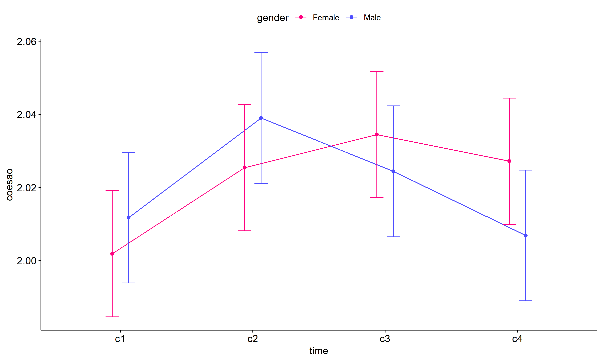<!-- -->

``` r
(pwc <- ldat %>% group_by(gender) %>%
    emmeans_test(coesao ~ time, detailed = T, p.adjust.method = "bonferroni"))
```

    ## # A tibble: 12 × 15
    ##    gender term  .y.    group1 group2 null.value estimate     se    df conf.low
    ##  * <fct>  <chr> <chr>  <chr>  <chr>       <dbl>    <dbl>  <dbl> <dbl>    <dbl>
    ##  1 Female time  coesao c1     c2              0 -0.0236  0.0124  4252 -0.0480 
    ##  2 Female time  coesao c1     c3              0 -0.0326  0.0124  4252 -0.0570 
    ##  3 Female time  coesao c1     c4              0 -0.0254  0.0124  4252 -0.0498 
    ##  4 Female time  coesao c2     c3              0 -0.00906 0.0124  4252 -0.0335 
    ##  5 Female time  coesao c2     c4              0 -0.00181 0.0124  4252 -0.0262 
    ##  6 Female time  coesao c3     c4              0  0.00725 0.0124  4252 -0.0172 
    ##  7 Male   time  coesao c1     c2              0 -0.0273  0.0129  4252 -0.0526 
    ##  8 Male   time  coesao c1     c3              0 -0.0127  0.0129  4252 -0.0380 
    ##  9 Male   time  coesao c1     c4              0  0.00487 0.0129  4252 -0.0204 
    ## 10 Male   time  coesao c2     c3              0  0.0146  0.0129  4252 -0.0107 
    ## 11 Male   time  coesao c2     c4              0  0.0322  0.0129  4252  0.00684
    ## 12 Male   time  coesao c3     c4              0  0.0175  0.0129  4252 -0.00778
    ## # ℹ 5 more variables: conf.high <dbl>, statistic <dbl>, p <dbl>, p.adj <dbl>,
    ## #   p.adj.signif <chr>

| gender | term | .y.    | group1 | group2 | null.value | estimate |    se |   df | conf.low | conf.high | statistic |     p | p.adj | p.adj.signif |
|:-------|:-----|:-------|:-------|:-------|-----------:|---------:|------:|-----:|---------:|----------:|----------:|------:|------:|:-------------|
| Female | time | coesao | c1     | c2     |          0 |   -0.024 | 0.012 | 4252 |   -0.048 |     0.001 |    -1.892 | 0.059 | 0.352 | ns           |
| Female | time | coesao | c1     | c3     |          0 |   -0.033 | 0.012 | 4252 |   -0.057 |    -0.008 |    -2.619 | 0.009 | 0.053 | ns           |
| Female | time | coesao | c1     | c4     |          0 |   -0.025 | 0.012 | 4252 |   -0.050 |    -0.001 |    -2.037 | 0.042 | 0.250 | ns           |
| Female | time | coesao | c2     | c3     |          0 |   -0.009 | 0.012 | 4252 |   -0.033 |     0.015 |    -0.728 | 0.467 | 1.000 | ns           |
| Female | time | coesao | c2     | c4     |          0 |   -0.002 | 0.012 | 4252 |   -0.026 |     0.023 |    -0.146 | 0.884 | 1.000 | ns           |
| Female | time | coesao | c3     | c4     |          0 |    0.007 | 0.012 | 4252 |   -0.017 |     0.032 |     0.582 | 0.561 | 1.000 | ns           |
| Male   | time | coesao | c1     | c2     |          0 |   -0.027 | 0.013 | 4252 |   -0.053 |    -0.002 |    -2.113 | 0.035 | 0.208 | ns           |
| Male   | time | coesao | c1     | c3     |          0 |   -0.013 | 0.013 | 4252 |   -0.038 |     0.013 |    -0.981 | 0.327 | 1.000 | ns           |
| Male   | time | coesao | c1     | c4     |          0 |    0.005 | 0.013 | 4252 |   -0.020 |     0.030 |     0.377 | 0.706 | 1.000 | ns           |
| Male   | time | coesao | c2     | c3     |          0 |    0.015 | 0.013 | 4252 |   -0.011 |     0.040 |     1.132 | 0.258 | 1.000 | ns           |
| Male   | time | coesao | c2     | c4     |          0 |    0.032 | 0.013 | 4252 |    0.007 |     0.057 |     2.491 | 0.013 | 0.077 | ns           |
| Male   | time | coesao | c3     | c4     |          0 |    0.018 | 0.013 | 4252 |   -0.008 |     0.043 |     1.358 | 0.174 | 1.000 | ns           |

``` r
(emms <- get_emmeans(pwc))
```

    ## # A tibble: 8 × 8
    ##   gender time  emmean      se    df conf.low conf.high method      
    ##   <fct>  <fct>  <dbl>   <dbl> <dbl>    <dbl>     <dbl> <chr>       
    ## 1 Female c1      2.00 0.00880  4252     1.98      2.02 Emmeans test
    ## 2 Female c2      2.03 0.00880  4252     2.01      2.04 Emmeans test
    ## 3 Female c3      2.03 0.00880  4252     2.02      2.05 Emmeans test
    ## 4 Female c4      2.03 0.00880  4252     2.01      2.04 Emmeans test
    ## 5 Male   c1      2.01 0.00913  4252     1.99      2.03 Emmeans test
    ## 6 Male   c2      2.04 0.00913  4252     2.02      2.06 Emmeans test
    ## 7 Male   c3      2.02 0.00913  4252     2.01      2.04 Emmeans test
    ## 8 Male   c4      2.01 0.00913  4252     1.99      2.02 Emmeans test

| gender | time | emmean |    se |   df | conf.low | conf.high | method       |
|:-------|:-----|-------:|------:|-----:|---------:|----------:|:-------------|
| Female | c1   |  2.002 | 0.009 | 4252 |    1.985 |     2.019 | Emmeans test |
| Female | c2   |  2.025 | 0.009 | 4252 |    2.008 |     2.043 | Emmeans test |
| Female | c3   |  2.034 | 0.009 | 4252 |    2.017 |     2.052 | Emmeans test |
| Female | c4   |  2.027 | 0.009 | 4252 |    2.010 |     2.044 | Emmeans test |
| Male   | c1   |  2.012 | 0.009 | 4252 |    1.994 |     2.030 | Emmeans test |
| Male   | c2   |  2.039 | 0.009 | 4252 |    2.021 |     2.057 | Emmeans test |
| Male   | c3   |  2.024 | 0.009 | 4252 |    2.006 |     2.042 | Emmeans test |
| Male   | c4   |  2.007 | 0.009 | 4252 |    1.989 |     2.025 | Emmeans test |

``` r
emms.gg <- emms[which(emms$gender == "Female"),]
if (nrow(emms.gg) > 0)
  ggline(emms.gg, x = "time", y = "emmean", color = "#FF007F", ylab = "coesao") +
    geom_errorbar(aes(ymin = conf.low, ymax = conf.high),
                  width = 0.2, color = "#FF007F") +
    stat_pvalue_manual(
      add_xy_position(pwc[which(pwc$gender == "Female"),],
                      x = "time", fun = "mean_se"),
      hide.ns = T, color = "#FF007F", tip.length = F) +
    labs(title = "gender: Female")+
    theme(legend.text = element_blank())
```

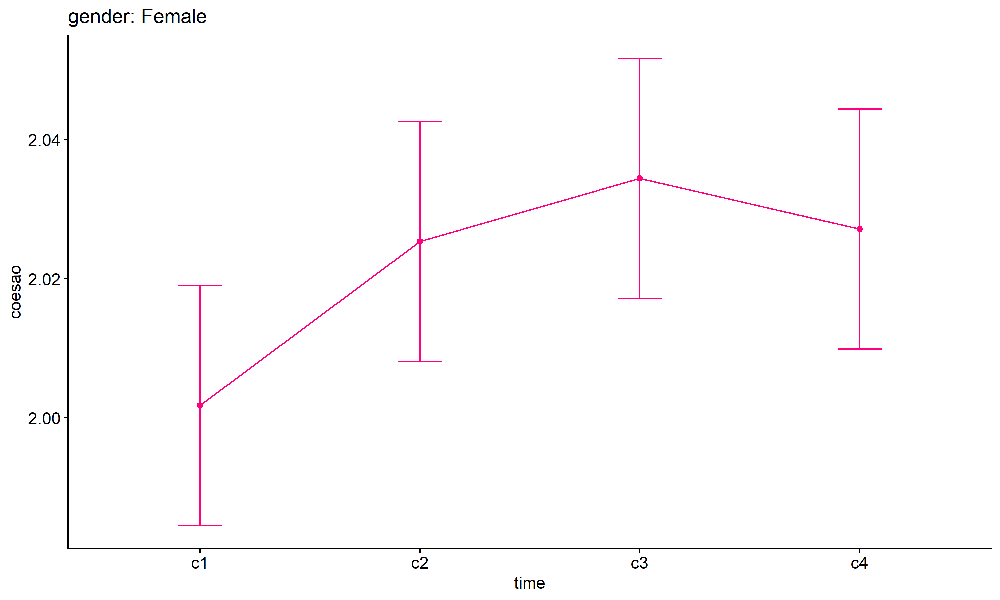<!-- -->

``` r
emms.gg <- emms[which(emms$gender == "Male"),]
if (nrow(emms.gg) > 0)
  ggline(emms.gg, x = "time", y = "emmean", color = "#4D4DFF", ylab = "coesao") +
    geom_errorbar(aes(ymin = conf.low, ymax = conf.high),
                  width = 0.2, color = "#4D4DFF") +
    stat_pvalue_manual(
      add_xy_position(pwc[which(pwc$gender == "Male"),],
                      x = "time", fun = "mean_se"),
      hide.ns = T, color = "#4D4DFF", tip.length = F) +
    labs(title = "gender: Male")+
    theme(legend.text = element_blank())
```

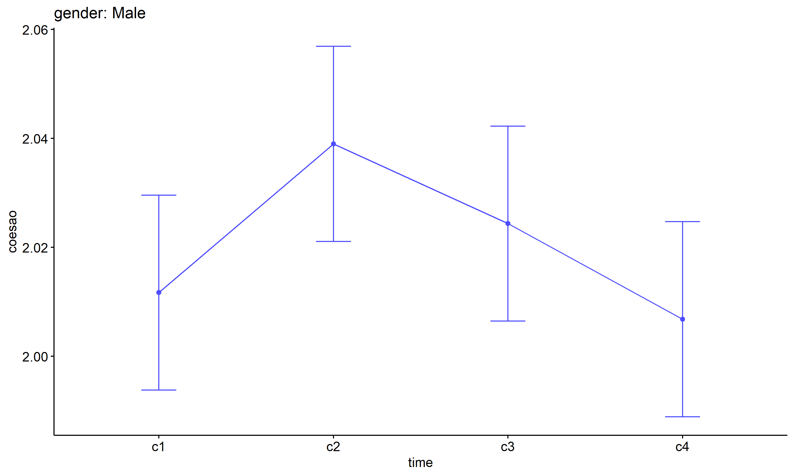<!-- -->

## PairWise Computation after removing non.normal data

``` r
if (length(non.ids) > 0)
  (pwc2 <- ldat2 %>% group_by(time) %>%
     emmeans_test(coesao ~ gender, detailed = T, p.adjust.method = "bonferroni"))
```

``` r
if (length(non.ids) > 0)
  (emms2 <- get_emmeans(pwc2))
```

``` r
if (length(non.ids) > 0) {
  pwc2 <- add_xy_position(pwc2, x = "time", fun = "mean_se", dodge = 0.25)
  pd2 <- position_dodge(width = 0.25)
  
  ggline(emms2, x = "time", y = "emmean", color = "gender",
         palette = c("#FF007F","#4D4DFF"),
         position = pd, ylab = "coesao") +
    geom_errorbar(aes(ymin = conf.low, ymax = conf.high, color = gender),
                position = pd, width = 0.2) +
    stat_pvalue_manual(pwc2, hide.ns = T, tip.length = F, linetype = 1)
}
```

``` r
if (length(non.ids) > 0)
  (pwc2 <- ldat2 %>% group_by(gender) %>%
     emmeans_test(coesao ~ time, detailed = T, p.adjust.method = "bonferroni"))
```

``` r
if (length(non.ids) > 0)
  (emms2 <- get_emmeans(pwc2))
```

``` r
if (length(non.ids) > 0) {
  emms.gg <- emms2[which(emms2$gender == "Female"),]
  if (nrow(emms.gg) > 0)
    ggline(emms.gg, x = "time", y = "emmean", color = "#FF007F", ylab = "coesao") +
    geom_errorbar(aes(ymin = conf.low, ymax = conf.high),
                  width = 0.2, color = "#FF007F") +
    stat_pvalue_manual(
      add_xy_position(pwc[which(pwc$gender == "Female"),],
                      x = "time", fun = "mean_se"),
      hide.ns = T, color = "#FF007F", tip.length = F) +
    labs(title = "gender: Female") +
    theme(legend.text = element_blank())
}
```

``` r
if (length(non.ids) > 0) {
  emms.gg <- emms2[which(emms2$gender == "Male"),]
  if (nrow(emms.gg) > 0)
    ggline(emms.gg, x = "time", y = "emmean", color = "#4D4DFF", ylab = "coesao") +
    geom_errorbar(aes(ymin = conf.low, ymax = conf.high),
                  width = 0.2, color = "#4D4DFF") +
    stat_pvalue_manual(
      add_xy_position(pwc[which(pwc$gender == "Male"),],
                      x = "time", fun = "mean_se"),
      hide.ns = T, color = "#4D4DFF", tip.length = F) +
    labs(title = "gender: Male") +
    theme(legend.text = element_blank())
}
```

# ANOVA: coesao ~ time\*localizacao + Error(id/time)

## Data Preparation

``` r
data <- edat[,c("aluno_id","localizacao","ciclo","coesao")]
data$ciclo <- factor(data$ciclo, c("Primeiro Ciclo","Segundo Ciclo",
                                   "Terceiro Ciclo","Quarto Ciclo"))

wdat <- spread(data, ciclo, coesao)
wdat <- wdat[complete.cases(wdat),]
colnames(wdat) <- c("id","localizacao","c1","c2","c3","c4")

ldat <- gather(wdat, key = time, value = coesao, c1, c2, c3, c4) %>%
  convert_as_factor(id, time)
ldat <- remove_group_data(ldat, "coesao", c("time", "localizacao"), n.limit = 30)
ldat$localizacao <- factor(ldat$localizacao, sort(unique(ldat$localizacao)))
```

### Check assumptions: Identifying Outliers

``` r
outliers <- identify_outliers(group_by(ldat, time, localizacao), coesao)
(outliers <- outliers[outliers$is.extreme == T,])
```

    ## # A tibble: 50 × 6
    ##    localizacao time  id                   coesao is.outlier is.extreme
    ##    <fct>       <fct> <fct>                 <dbl> <lgl>      <lgl>     
    ##  1 Rural       c1    Kaj54imycuE0bbwH7xlD      3 TRUE       TRUE      
    ##  2 Urbana      c1    IZ2Xmfi9jueckwdzfkiG      3 TRUE       TRUE      
    ##  3 Urbana      c1    JRyGpNQA6mOEl1nzl1af      3 TRUE       TRUE      
    ##  4 Urbana      c1    W8iXxSmW48zvfJyikMZb      4 TRUE       TRUE      
    ##  5 Urbana      c1    Y7HozU436KQ0wqdBGugu      4 TRUE       TRUE      
    ##  6 Rural       c2    G7bqQeqXmsQ3kiJNeYlz      3 TRUE       TRUE      
    ##  7 Urbana      c2    0mGtUd2Axg2fjQmYZ4CC      3 TRUE       TRUE      
    ##  8 Urbana      c2    cuknOzzwN4oCRum5U5ph      5 TRUE       TRUE      
    ##  9 Urbana      c2    EqNpFnKTbLOWH4nmuu6d      4 TRUE       TRUE      
    ## 10 Urbana      c2    G4NIt8gEc7nfeQ9k2OkL      4 TRUE       TRUE      
    ## # ℹ 40 more rows

| localizacao | time | id                   | coesao | is.outlier | is.extreme |
|:------------|:-----|:---------------------|-------:|:-----------|:-----------|
| Rural       | c1   | Kaj54imycuE0bbwH7xlD |    3.0 | TRUE       | TRUE       |
| Urbana      | c1   | IZ2Xmfi9jueckwdzfkiG |    3.0 | TRUE       | TRUE       |
| Urbana      | c1   | JRyGpNQA6mOEl1nzl1af |    3.0 | TRUE       | TRUE       |
| Urbana      | c1   | W8iXxSmW48zvfJyikMZb |    4.0 | TRUE       | TRUE       |
| Urbana      | c1   | Y7HozU436KQ0wqdBGugu |    4.0 | TRUE       | TRUE       |
| Rural       | c2   | G7bqQeqXmsQ3kiJNeYlz |    3.0 | TRUE       | TRUE       |
| Urbana      | c2   | 0mGtUd2Axg2fjQmYZ4CC |    3.0 | TRUE       | TRUE       |
| Urbana      | c2   | cuknOzzwN4oCRum5U5ph |    5.0 | TRUE       | TRUE       |
| Urbana      | c2   | EqNpFnKTbLOWH4nmuu6d |    4.0 | TRUE       | TRUE       |
| Urbana      | c2   | G4NIt8gEc7nfeQ9k2OkL |    4.0 | TRUE       | TRUE       |
| Urbana      | c2   | HsQF2J0r79mHSWNe4l6n |    4.0 | TRUE       | TRUE       |
| Urbana      | c2   | i5EZ8Ck9IgDueyMbw55v |    3.0 | TRUE       | TRUE       |
| Urbana      | c2   | j31LU8Xwm0EQ7Mihkhjj |    4.0 | TRUE       | TRUE       |
| Urbana      | c2   | oGUJyWRMYYbF9PNegJZh |    4.0 | TRUE       | TRUE       |
| Urbana      | c2   | qyt5dpIrCcmnZfDJIazf |    4.0 | TRUE       | TRUE       |
| Urbana      | c2   | W8iXxSmW48zvfJyikMZb |    4.0 | TRUE       | TRUE       |
| Urbana      | c2   | wgOGhRdGeAbGeHUAguQ5 |    5.0 | TRUE       | TRUE       |
| Urbana      | c2   | wQnhAn0Gfye5OP5zaTgh |    4.0 | TRUE       | TRUE       |
| Urbana      | c2   | wuumviqqlrNK6QzeoJPr |    4.0 | TRUE       | TRUE       |
| Urbana      | c2   | xk7eC5haTYuFQaJovsBZ |    4.0 | TRUE       | TRUE       |
| Urbana      | c2   | xQIlV1qQiNpzi4Bna9Ut |    4.0 | TRUE       | TRUE       |
| Urbana      | c2   | XxtCdGkKAnQOx88fyxk4 |    3.0 | TRUE       | TRUE       |
| Urbana      | c2   | YTYFFWzK4C7ejf1X1TUB |    4.0 | TRUE       | TRUE       |
| Rural       | c3   | PfTab7CnJIl6lys2Cxuq |    2.5 | TRUE       | TRUE       |
| Rural       | c3   | vaOhaNww5ga5d9G6Cftj |    4.0 | TRUE       | TRUE       |
| Urbana      | c3   | 6bEKmKQpOuvY6PSQvzqj |    4.0 | TRUE       | TRUE       |
| Urbana      | c3   | CCVIt7MPeYMUOCCyBxPh |    4.0 | TRUE       | TRUE       |
| Urbana      | c3   | E3u63riyMFS8A2cNBnvC |    3.0 | TRUE       | TRUE       |
| Urbana      | c3   | EtUjsyq1GNevicwMDXlw |    3.5 | TRUE       | TRUE       |
| Urbana      | c3   | FkJFrnPezc8Ng4SSMx1z |    4.0 | TRUE       | TRUE       |
| Urbana      | c3   | GN5vxU0haHKd9W22JGyk |    4.0 | TRUE       | TRUE       |
| Urbana      | c3   | HsQF2J0r79mHSWNe4l6n |    3.0 | TRUE       | TRUE       |
| Urbana      | c3   | i5EZ8Ck9IgDueyMbw55v |    5.0 | TRUE       | TRUE       |
| Urbana      | c3   | j31LU8Xwm0EQ7Mihkhjj |    4.0 | TRUE       | TRUE       |
| Urbana      | c3   | m5yRlxfIj73j4ossfTOB |    5.0 | TRUE       | TRUE       |
| Urbana      | c3   | OvwAQTWkdj8SYpPS8dgn |    4.0 | TRUE       | TRUE       |
| Urbana      | c3   | QAyx2z41ILLaMN0o7pjc |    3.0 | TRUE       | TRUE       |
| Urbana      | c3   | TKvc4Eu2XaDXYPxuS7Qn |    4.0 | TRUE       | TRUE       |
| Urbana      | c3   | u65Z834z75LDIy0slvaX |    5.0 | TRUE       | TRUE       |
| Urbana      | c3   | xk7eC5haTYuFQaJovsBZ |    4.0 | TRUE       | TRUE       |
| Rural       | c4   | fgNBRPWfCa0TP4bDO8d2 |    4.0 | TRUE       | TRUE       |
| Urbana      | c4   | 3DdYC9Dpykr9Mtg6YR91 |    4.0 | TRUE       | TRUE       |
| Urbana      | c4   | 6bEKmKQpOuvY6PSQvzqj |    4.0 | TRUE       | TRUE       |
| Urbana      | c4   | DP1fbT1lGhLiBnOFILLi |    4.0 | TRUE       | TRUE       |
| Urbana      | c4   | IMHqraVHK59KiF08zsGi |    3.5 | TRUE       | TRUE       |
| Urbana      | c4   | jVbbowshsqkUpPuGSIMu |    4.0 | TRUE       | TRUE       |
| Urbana      | c4   | N7zTvCPK4nAUgH9eo3hg |    4.0 | TRUE       | TRUE       |
| Urbana      | c4   | tVMilOzYDlVoWwNezYUi |    4.0 | TRUE       | TRUE       |
| Urbana      | c4   | VRWfIoYUFgdA8nGO5bpD |    4.0 | TRUE       | TRUE       |
| Urbana      | c4   | zq67YfRtJ2g4hWPYAfkU |    3.0 | TRUE       | TRUE       |

### Check assumptions: Normality Test

``` r
(normality.df <- normality.test.per.groups(ldat, "coesao", c("time", "localizacao")))
```

    ##      var variable time localizacao   n  skewness  kurtosis symmetry statistic
    ## 1 coesao   coesao   c1       Rural 181  0.000000   0.00000 few data        NA
    ## 2 coesao   coesao   c1      Urbana 945  0.000000   0.00000 few data        NA
    ## 3 coesao   coesao   c2       Rural 181  0.000000   0.00000 few data        NA
    ## 4 coesao   coesao   c2      Urbana 945  8.010072  65.85718       NO  1325.132
    ## 5 coesao   coesao   c3       Rural 181  0.000000   0.00000 few data        NA
    ## 6 coesao   coesao   c3      Urbana 945  8.855880  81.77178       NO  1409.720
    ## 7 coesao   coesao   c4       Rural 181  0.000000   0.00000 few data        NA
    ## 8 coesao   coesao   c4      Urbana 945 10.465956 109.04461       NO  1547.952
    ##       method p p.signif normality
    ## 1       <NA> 1     <NA>        NO
    ## 2       <NA> 1     <NA>        NO
    ## 3       <NA> 1     <NA>        NO
    ## 4 D'Agostino 0     ****         -
    ## 5       <NA> 1     <NA>        NO
    ## 6 D'Agostino 0     ****         -
    ## 7       <NA> 1     <NA>        NO
    ## 8 D'Agostino 0     ****         -

| var    | variable | time | localizacao |   n | skewness | kurtosis | symmetry | statistic | method     |   p | p.signif | normality |
|:-------|:---------|:-----|:------------|----:|---------:|---------:|:---------|----------:|:-----------|----:|:---------|:----------|
| coesao | coesao   | c1   | Rural       | 181 |    0.000 |    0.000 | few data |        NA | NA         |   1 | NA       | NO        |
| coesao | coesao   | c1   | Urbana      | 945 |    0.000 |    0.000 | few data |        NA | NA         |   1 | NA       | NO        |
| coesao | coesao   | c2   | Rural       | 181 |    0.000 |    0.000 | few data |        NA | NA         |   1 | NA       | NO        |
| coesao | coesao   | c2   | Urbana      | 945 |    8.010 |   65.857 | NO       |  1325.132 | D’Agostino |   0 | \*\*\*\* | \-        |
| coesao | coesao   | c3   | Rural       | 181 |    0.000 |    0.000 | few data |        NA | NA         |   1 | NA       | NO        |
| coesao | coesao   | c3   | Urbana      | 945 |    8.856 |   81.772 | NO       |  1409.720 | D’Agostino |   0 | \*\*\*\* | \-        |
| coesao | coesao   | c4   | Rural       | 181 |    0.000 |    0.000 | few data |        NA | NA         |   1 | NA       | NO        |
| coesao | coesao   | c4   | Urbana      | 945 |   10.466 |  109.045 | NO       |  1547.952 | D’Agostino |   0 | \*\*\*\* | \-        |

``` r
(non.ids <- unique(do.call(
  c, lapply(which(normality.df$normality == 'NO'), FUN = function(i) {
  idx = which(ldat$time == normality.df$time[i] &
                ldat$localizacao == normality.df$localizacao[i])
  getNonNormal(ldat$"coesao"[idx], ldat$id[idx])
}))))
```

    ## NULL

``` r
if (length(non.ids) > 0)
  ldat2 <- ldat[!ldat$id %in% non.ids,]
```

### Summary Statistics

``` r
(sdat <- ldat %>% group_by(time, localizacao) %>%
   get_summary_stats(coesao, type = "mean_sd"))
```

    ## # A tibble: 8 × 6
    ##   localizacao time  variable     n  mean    sd
    ##   <fct>       <fct> <fct>    <dbl> <dbl> <dbl>
    ## 1 Rural       c1    coesao     181  2.01 0.074
    ## 2 Urbana      c1    coesao     945  2.01 0.103
    ## 3 Rural       c2    coesao     181  2.01 0.074
    ## 4 Urbana      c2    coesao     945  2.04 0.268
    ## 5 Rural       c3    coesao     181  2.01 0.153
    ## 6 Urbana      c3    coesao     945  2.03 0.259
    ## 7 Rural       c4    coesao     181  2.01 0.149
    ## 8 Urbana      c4    coesao     945  2.02 0.181

| localizacao | time | variable |   n |  mean |    sd |
|:------------|:-----|:---------|----:|------:|------:|
| Rural       | c1   | coesao   | 181 | 2.006 | 0.074 |
| Urbana      | c1   | coesao   | 945 | 2.006 | 0.103 |
| Rural       | c2   | coesao   | 181 | 2.006 | 0.074 |
| Urbana      | c2   | coesao   | 945 | 2.035 | 0.268 |
| Rural       | c3   | coesao   | 181 | 2.014 | 0.153 |
| Urbana      | c3   | coesao   | 945 | 2.031 | 0.259 |
| Rural       | c4   | coesao   | 181 | 2.011 | 0.149 |
| Urbana      | c4   | coesao   | 945 | 2.017 | 0.181 |

``` r
if (length(non.ids) > 0)
  (sdat <- ldat2 %>% group_by(time, localizacao) %>%
      get_summary_stats(coesao, type = "mean_sd"))
```

| localizacao | time | variable |   n |  mean |    sd |
|:------------|:-----|:---------|----:|------:|------:|
| Rural       | c1   | coesao   | 181 | 2.006 | 0.074 |
| Urbana      | c1   | coesao   | 945 | 2.006 | 0.103 |
| Rural       | c2   | coesao   | 181 | 2.006 | 0.074 |
| Urbana      | c2   | coesao   | 945 | 2.035 | 0.268 |
| Rural       | c3   | coesao   | 181 | 2.014 | 0.153 |
| Urbana      | c3   | coesao   | 945 | 2.031 | 0.259 |
| Rural       | c4   | coesao   | 181 | 2.011 | 0.149 |
| Urbana      | c4   | coesao   | 945 | 2.017 | 0.181 |

## ANOVA Computation

``` r
(res.aov <- anova_test(ldat, dv = coesao, wid = id, between = localizacao, within = time))
```

    ## ANOVA Table (type III tests)
    ## 
    ## $ANOVA
    ##             Effect DFn  DFd     F     p p<.05      ges
    ## 1      localizacao   1 1124 2.278 0.132       0.000608
    ## 2             time   3 3372 0.880 0.451       0.000547
    ## 3 localizacao:time   3 3372 0.641 0.589       0.000399
    ## 
    ## $`Mauchly's Test for Sphericity`
    ##             Effect     W        p p<.05
    ## 1             time 0.749 4.38e-68     *
    ## 2 localizacao:time 0.749 4.38e-68     *
    ## 
    ## $`Sphericity Corrections`
    ##             Effect   GGe        DF[GG] p[GG] p[GG]<.05   HFe        DF[HF]
    ## 1             time 0.874 2.62, 2945.75 0.439           0.876 2.63, 2953.26
    ## 2 localizacao:time 0.874 2.62, 2945.75 0.568           0.876 2.63, 2953.26
    ##   p[HF] p[HF]<.05
    ## 1 0.439          
    ## 2 0.568

| Effect           | DFn |  DFd |     F |     p | p\<.05 |   ges |
|:-----------------|----:|-----:|------:|------:|:-------|------:|
| localizacao      |   1 | 1124 | 2.278 | 0.132 |        | 0.001 |
| time             |   3 | 3372 | 0.880 | 0.451 |        | 0.001 |
| localizacao:time |   3 | 3372 | 0.641 | 0.589 |        | 0.000 |

| Effect           |     W |   p | p\<.05 |
|:-----------------|------:|----:|:-------|
| time             | 0.749 |   0 | \*     |
| localizacao:time | 0.749 |   0 | \*     |

| Effect           |   GGe | DF\[GG\]      | p\[GG\] | p\[GG\]\<.05 |   HFe | DF\[HF\]      | p\[HF\] | p\[HF\]\<.05 |
|:-----------------|------:|:--------------|--------:|:-------------|------:|:--------------|--------:|:-------------|
| time             | 0.874 | 2.62, 2945.75 |   0.439 |              | 0.876 | 2.63, 2953.26 |   0.439 |              |
| localizacao:time | 0.874 | 2.62, 2945.75 |   0.568 |              | 0.876 | 2.63, 2953.26 |   0.568 |              |

## ANOVA Computation after removing non.normal data

``` r
if (length(non.ids) > 0)
  (res.aov2 <- anova_test(ldat2, dv = coesao, wid = id, between = localizacao , within = time))
```

## PairWise Computation

``` r
(pwc <- ldat %>% group_by(time) %>%
   emmeans_test(coesao ~ localizacao, detailed = T, p.adjust.method = "bonferroni"))
```

    ## # A tibble: 4 × 15
    ##   time  term       .y.   group1 group2 null.value estimate     se    df conf.low
    ## * <fct> <chr>      <chr> <chr>  <chr>       <dbl>    <dbl>  <dbl> <dbl>    <dbl>
    ## 1 c1    localizac… coes… Rural  Urbana          0 -8.24e-4 0.0163  4496  -0.0329
    ## 2 c2    localizac… coes… Rural  Urbana          0 -2.94e-2 0.0163  4496  -0.0614
    ## 3 c3    localizac… coes… Rural  Urbana          0 -1.74e-2 0.0163  4496  -0.0494
    ## 4 c4    localizac… coes… Rural  Urbana          0 -6.41e-3 0.0163  4496  -0.0384
    ## # ℹ 5 more variables: conf.high <dbl>, statistic <dbl>, p <dbl>, p.adj <dbl>,
    ## #   p.adj.signif <chr>

| time | term        | .y.    | group1 | group2 | null.value | estimate |    se |   df | conf.low | conf.high | statistic |     p | p.adj | p.adj.signif |
|:-----|:------------|:-------|:-------|:-------|-----------:|---------:|------:|-----:|---------:|----------:|----------:|------:|------:|:-------------|
| c1   | localizacao | coesao | Rural  | Urbana |          0 |   -0.001 | 0.016 | 4496 |   -0.033 |     0.031 |    -0.050 | 0.960 | 0.960 | ns           |
| c2   | localizacao | coesao | Rural  | Urbana |          0 |   -0.029 | 0.016 | 4496 |   -0.061 |     0.003 |    -1.799 | 0.072 | 0.072 | ns           |
| c3   | localizacao | coesao | Rural  | Urbana |          0 |   -0.017 | 0.016 | 4496 |   -0.049 |     0.015 |    -1.065 | 0.287 | 0.287 | ns           |
| c4   | localizacao | coesao | Rural  | Urbana |          0 |   -0.006 | 0.016 | 4496 |   -0.038 |     0.026 |    -0.392 | 0.695 | 0.695 | ns           |

``` r
(emms <- get_emmeans(pwc))
```

    ## # A tibble: 8 × 8
    ##   time  localizacao emmean      se    df conf.low conf.high method      
    ##   <fct> <fct>        <dbl>   <dbl> <dbl>    <dbl>     <dbl> <chr>       
    ## 1 c1    Rural         2.01 0.0150   4496     1.98      2.03 Emmeans test
    ## 2 c1    Urbana        2.01 0.00655  4496     1.99      2.02 Emmeans test
    ## 3 c2    Rural         2.01 0.0150   4496     1.98      2.03 Emmeans test
    ## 4 c2    Urbana        2.03 0.00655  4496     2.02      2.05 Emmeans test
    ## 5 c3    Rural         2.01 0.0150   4496     1.98      2.04 Emmeans test
    ## 6 c3    Urbana        2.03 0.00655  4496     2.02      2.04 Emmeans test
    ## 7 c4    Rural         2.01 0.0150   4496     1.98      2.04 Emmeans test
    ## 8 c4    Urbana        2.02 0.00655  4496     2.00      2.03 Emmeans test

| time | localizacao | emmean |    se |   df | conf.low | conf.high | method       |
|:-----|:------------|-------:|------:|-----:|---------:|----------:|:-------------|
| c1   | Rural       |  2.006 | 0.015 | 4496 |    1.976 |     2.035 | Emmeans test |
| c1   | Urbana      |  2.006 | 0.007 | 4496 |    1.994 |     2.019 | Emmeans test |
| c2   | Rural       |  2.006 | 0.015 | 4496 |    1.976 |     2.035 | Emmeans test |
| c2   | Urbana      |  2.035 | 0.007 | 4496 |    2.022 |     2.048 | Emmeans test |
| c3   | Rural       |  2.014 | 0.015 | 4496 |    1.984 |     2.043 | Emmeans test |
| c3   | Urbana      |  2.031 | 0.007 | 4496 |    2.018 |     2.044 | Emmeans test |
| c4   | Rural       |  2.011 | 0.015 | 4496 |    1.982 |     2.040 | Emmeans test |
| c4   | Urbana      |  2.017 | 0.007 | 4496 |    2.005 |     2.030 | Emmeans test |

``` r
pwc <- add_xy_position(pwc, x = "time", fun = "mean_se", dodge = 0.25)
pd <- position_dodge(width = 0.25)
ggline(emms, x = "time", y = "emmean", color = "localizacao",
       palette = c("#AA00FF","#00CCCC"),
       position = pd, ylab = "coesao") +
  geom_errorbar(aes(ymin = conf.low, ymax = conf.high, color = localizacao),
                position = pd, width = 0.2) +
  stat_pvalue_manual(pwc, hide.ns = T, tip.length = F, linetype = 1)
```

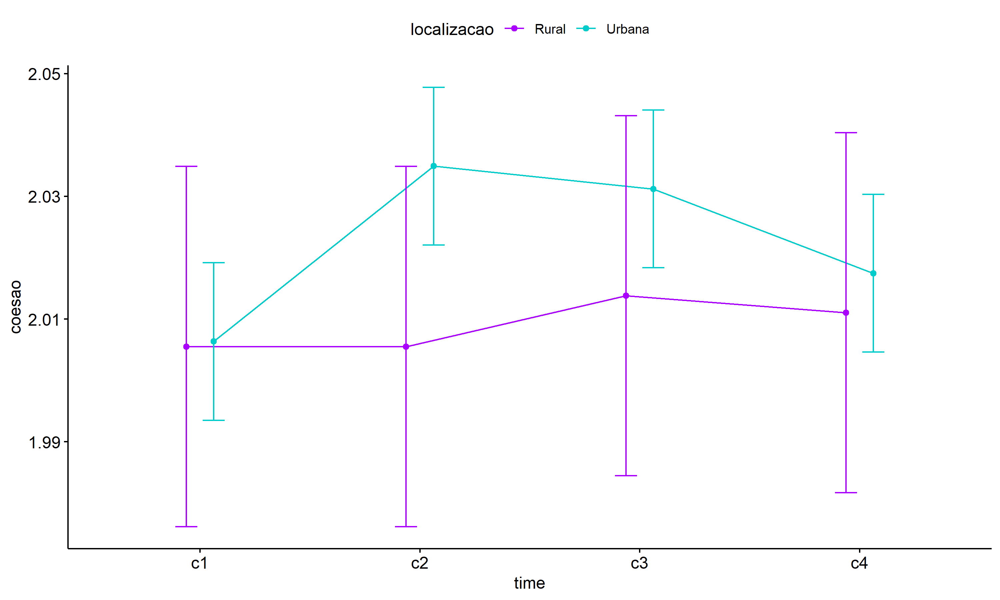<!-- -->

``` r
(pwc <- ldat %>% group_by(localizacao) %>%
    emmeans_test(coesao ~ time, detailed = T, p.adjust.method = "bonferroni"))
```

    ## # A tibble: 12 × 15
    ##    localizacao term  .y.    group1 group2 null.value  estimate      se    df
    ##  * <fct>       <chr> <chr>  <chr>  <chr>       <dbl>     <dbl>   <dbl> <dbl>
    ##  1 Rural       time  coesao c1     c2              0 -5.91e-15 0.0212   4496
    ##  2 Rural       time  coesao c1     c3              0 -8.29e- 3 0.0212   4496
    ##  3 Rural       time  coesao c1     c4              0 -5.52e- 3 0.0212   4496
    ##  4 Rural       time  coesao c2     c3              0 -8.29e- 3 0.0212   4496
    ##  5 Rural       time  coesao c2     c4              0 -5.52e- 3 0.0212   4496
    ##  6 Rural       time  coesao c3     c4              0  2.76e- 3 0.0212   4496
    ##  7 Urbana      time  coesao c1     c2              0 -2.86e- 2 0.00926  4496
    ##  8 Urbana      time  coesao c1     c3              0 -2.49e- 2 0.00926  4496
    ##  9 Urbana      time  coesao c1     c4              0 -1.11e- 2 0.00926  4496
    ## 10 Urbana      time  coesao c2     c3              0  3.70e- 3 0.00926  4496
    ## 11 Urbana      time  coesao c2     c4              0  1.75e- 2 0.00926  4496
    ## 12 Urbana      time  coesao c3     c4              0  1.38e- 2 0.00926  4496
    ## # ℹ 6 more variables: conf.low <dbl>, conf.high <dbl>, statistic <dbl>,
    ## #   p <dbl>, p.adj <dbl>, p.adj.signif <chr>

| localizacao | term | .y.    | group1 | group2 | null.value | estimate |    se |   df | conf.low | conf.high | statistic |     p | p.adj | p.adj.signif |
|:------------|:-----|:-------|:-------|:-------|-----------:|---------:|------:|-----:|---------:|----------:|----------:|------:|------:|:-------------|
| Rural       | time | coesao | c1     | c2     |          0 |    0.000 | 0.021 | 4496 |   -0.041 |     0.041 |     0.000 | 1.000 | 1.000 | ns           |
| Rural       | time | coesao | c1     | c3     |          0 |   -0.008 | 0.021 | 4496 |   -0.050 |     0.033 |    -0.392 | 0.695 | 1.000 | ns           |
| Rural       | time | coesao | c1     | c4     |          0 |   -0.006 | 0.021 | 4496 |   -0.047 |     0.036 |    -0.261 | 0.794 | 1.000 | ns           |
| Rural       | time | coesao | c2     | c3     |          0 |   -0.008 | 0.021 | 4496 |   -0.050 |     0.033 |    -0.392 | 0.695 | 1.000 | ns           |
| Rural       | time | coesao | c2     | c4     |          0 |   -0.006 | 0.021 | 4496 |   -0.047 |     0.036 |    -0.261 | 0.794 | 1.000 | ns           |
| Rural       | time | coesao | c3     | c4     |          0 |    0.003 | 0.021 | 4496 |   -0.039 |     0.044 |     0.131 | 0.896 | 1.000 | ns           |
| Urbana      | time | coesao | c1     | c2     |          0 |   -0.029 | 0.009 | 4496 |   -0.047 |    -0.010 |    -3.084 | 0.002 | 0.012 | \*           |
| Urbana      | time | coesao | c1     | c3     |          0 |   -0.025 | 0.009 | 4496 |   -0.043 |    -0.007 |    -2.685 | 0.007 | 0.044 | \*           |
| Urbana      | time | coesao | c1     | c4     |          0 |   -0.011 | 0.009 | 4496 |   -0.029 |     0.007 |    -1.199 | 0.230 | 1.000 | ns           |
| Urbana      | time | coesao | c2     | c3     |          0 |    0.004 | 0.009 | 4496 |   -0.014 |     0.022 |     0.400 | 0.689 | 1.000 | ns           |
| Urbana      | time | coesao | c2     | c4     |          0 |    0.017 | 0.009 | 4496 |   -0.001 |     0.036 |     1.885 | 0.060 | 0.357 | ns           |
| Urbana      | time | coesao | c3     | c4     |          0 |    0.014 | 0.009 | 4496 |   -0.004 |     0.032 |     1.485 | 0.138 | 0.826 | ns           |

``` r
(emms <- get_emmeans(pwc))
```

    ## # A tibble: 8 × 8
    ##   localizacao time  emmean      se    df conf.low conf.high method      
    ##   <fct>       <fct>  <dbl>   <dbl> <dbl>    <dbl>     <dbl> <chr>       
    ## 1 Rural       c1      2.01 0.0150   4496     1.98      2.03 Emmeans test
    ## 2 Rural       c2      2.01 0.0150   4496     1.98      2.03 Emmeans test
    ## 3 Rural       c3      2.01 0.0150   4496     1.98      2.04 Emmeans test
    ## 4 Rural       c4      2.01 0.0150   4496     1.98      2.04 Emmeans test
    ## 5 Urbana      c1      2.01 0.00655  4496     1.99      2.02 Emmeans test
    ## 6 Urbana      c2      2.03 0.00655  4496     2.02      2.05 Emmeans test
    ## 7 Urbana      c3      2.03 0.00655  4496     2.02      2.04 Emmeans test
    ## 8 Urbana      c4      2.02 0.00655  4496     2.00      2.03 Emmeans test

| localizacao | time | emmean |    se |   df | conf.low | conf.high | method       |
|:------------|:-----|-------:|------:|-----:|---------:|----------:|:-------------|
| Rural       | c1   |  2.006 | 0.015 | 4496 |    1.976 |     2.035 | Emmeans test |
| Rural       | c2   |  2.006 | 0.015 | 4496 |    1.976 |     2.035 | Emmeans test |
| Rural       | c3   |  2.014 | 0.015 | 4496 |    1.984 |     2.043 | Emmeans test |
| Rural       | c4   |  2.011 | 0.015 | 4496 |    1.982 |     2.040 | Emmeans test |
| Urbana      | c1   |  2.006 | 0.007 | 4496 |    1.994 |     2.019 | Emmeans test |
| Urbana      | c2   |  2.035 | 0.007 | 4496 |    2.022 |     2.048 | Emmeans test |
| Urbana      | c3   |  2.031 | 0.007 | 4496 |    2.018 |     2.044 | Emmeans test |
| Urbana      | c4   |  2.017 | 0.007 | 4496 |    2.005 |     2.030 | Emmeans test |

``` r
emms.gg <- emms[which(emms$localizacao == "Rural"),]
if (nrow(emms.gg) > 0)
  ggline(emms.gg, x = "time", y = "emmean", color = "#AA00FF", ylab = "coesao") +
    geom_errorbar(aes(ymin = conf.low, ymax = conf.high),
                  width = 0.2, color = "#AA00FF") +
    stat_pvalue_manual(
      add_xy_position(pwc[which(pwc$localizacao == "Rural"),],
                      x = "time", fun = "mean_se"),
      hide.ns = T, color = "#AA00FF", tip.length = F) +
    labs(title = "localizacao: Rural")+
    theme(legend.text = element_blank())
```

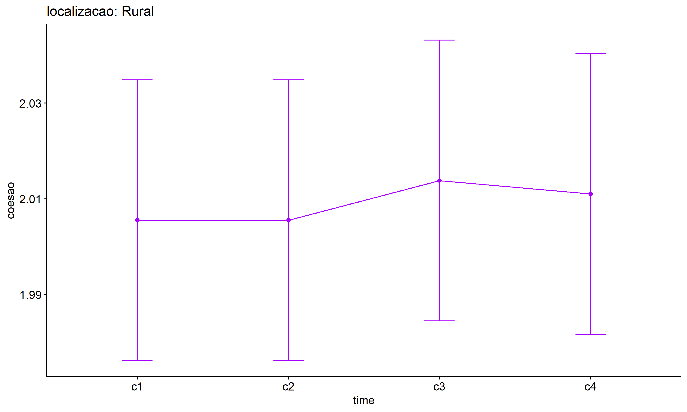<!-- -->

``` r
emms.gg <- emms[which(emms$localizacao == "Urbana"),]
if (nrow(emms.gg) > 0)
  ggline(emms.gg, x = "time", y = "emmean", color = "#00CCCC", ylab = "coesao") +
    geom_errorbar(aes(ymin = conf.low, ymax = conf.high),
                  width = 0.2, color = "#00CCCC") +
    stat_pvalue_manual(
      add_xy_position(pwc[which(pwc$localizacao == "Urbana"),],
                      x = "time", fun = "mean_se"),
      hide.ns = T, color = "#00CCCC", tip.length = F) +
    labs(title = "localizacao: Urbana")+
    theme(legend.text = element_blank())
```

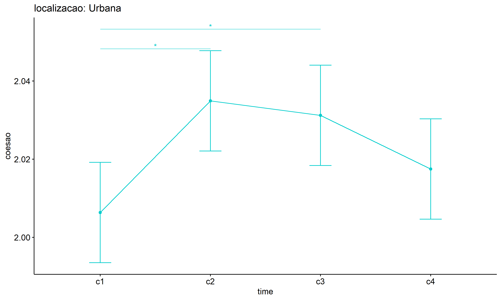<!-- -->

## PairWise Computation after removing non.normal data

``` r
if (length(non.ids) > 0)
  (pwc2 <- ldat2 %>% group_by(time) %>%
     emmeans_test(coesao ~ localizacao, detailed = T, p.adjust.method = "bonferroni"))
```

``` r
if (length(non.ids) > 0)
  (emms2 <- get_emmeans(pwc2))
```

``` r
if (length(non.ids) > 0) {
  pwc2 <- add_xy_position(pwc2, x = "time", fun = "mean_se", dodge = 0.25)
  pd2 <- position_dodge(width = 0.25)
  
  ggline(emms2, x = "time", y = "emmean", color = "localizacao",
         palette = c("#AA00FF","#00CCCC"),
         position = pd, ylab = "coesao") +
    geom_errorbar(aes(ymin = conf.low, ymax = conf.high, color = localizacao),
                position = pd, width = 0.2) +
    stat_pvalue_manual(pwc2, hide.ns = T, tip.length = F, linetype = 1)
}
```

``` r
if (length(non.ids) > 0)
  (pwc2 <- ldat2 %>% group_by(localizacao) %>%
     emmeans_test(coesao ~ time, detailed = T, p.adjust.method = "bonferroni"))
```

``` r
if (length(non.ids) > 0)
  (emms2 <- get_emmeans(pwc2))
```

``` r
if (length(non.ids) > 0) {
  emms.gg <- emms2[which(emms2$localizacao == "Rural"),]
  if (nrow(emms.gg) > 0)
    ggline(emms.gg, x = "time", y = "emmean", color = "#AA00FF", ylab = "coesao") +
    geom_errorbar(aes(ymin = conf.low, ymax = conf.high),
                  width = 0.2, color = "#AA00FF") +
    stat_pvalue_manual(
      add_xy_position(pwc[which(pwc$localizacao == "Rural"),],
                      x = "time", fun = "mean_se"),
      hide.ns = T, color = "#AA00FF", tip.length = F) +
    labs(title = "localizacao: Rural") +
    theme(legend.text = element_blank())
}
```

``` r
if (length(non.ids) > 0) {
  emms.gg <- emms2[which(emms2$localizacao == "Urbana"),]
  if (nrow(emms.gg) > 0)
    ggline(emms.gg, x = "time", y = "emmean", color = "#00CCCC", ylab = "coesao") +
    geom_errorbar(aes(ymin = conf.low, ymax = conf.high),
                  width = 0.2, color = "#00CCCC") +
    stat_pvalue_manual(
      add_xy_position(pwc[which(pwc$localizacao == "Urbana"),],
                      x = "time", fun = "mean_se"),
      hide.ns = T, color = "#00CCCC", tip.length = F) +
    labs(title = "localizacao: Urbana") +
    theme(legend.text = element_blank())
}
```

# ANOVA: coesao ~ time\*regiao + Error(id/time)

## Data Preparation

``` r
data <- edat[,c("aluno_id","regiao","ciclo","coesao")]
data$ciclo <- factor(data$ciclo, c("Primeiro Ciclo","Segundo Ciclo",
                                   "Terceiro Ciclo","Quarto Ciclo"))

wdat <- spread(data, ciclo, coesao)
wdat <- wdat[complete.cases(wdat),]
colnames(wdat) <- c("id","regiao","c1","c2","c3","c4")

ldat <- gather(wdat, key = time, value = coesao, c1, c2, c3, c4) %>%
  convert_as_factor(id, time)
ldat <- remove_group_data(ldat, "coesao", c("time", "regiao"), n.limit = 30)
ldat$regiao <- factor(ldat$regiao, sort(unique(ldat$regiao)))
```

### Check assumptions: Identifying Outliers

``` r
outliers <- identify_outliers(group_by(ldat, time, regiao), coesao)
(outliers <- outliers[outliers$is.extreme == T,])
```

    ## # A tibble: 50 × 6
    ##    regiao   time  id                   coesao is.outlier is.extreme
    ##    <fct>    <fct> <fct>                 <dbl> <lgl>      <lgl>     
    ##  1 Nordeste c1    IZ2Xmfi9jueckwdzfkiG      3 TRUE       TRUE      
    ##  2 Nordeste c1    Kaj54imycuE0bbwH7xlD      3 TRUE       TRUE      
    ##  3 Sudeste  c1    W8iXxSmW48zvfJyikMZb      4 TRUE       TRUE      
    ##  4 Sudeste  c1    Y7HozU436KQ0wqdBGugu      4 TRUE       TRUE      
    ##  5 Sul      c1    JRyGpNQA6mOEl1nzl1af      3 TRUE       TRUE      
    ##  6 Nordeste c2    cuknOzzwN4oCRum5U5ph      5 TRUE       TRUE      
    ##  7 Nordeste c2    EqNpFnKTbLOWH4nmuu6d      4 TRUE       TRUE      
    ##  8 Nordeste c2    G7bqQeqXmsQ3kiJNeYlz      3 TRUE       TRUE      
    ##  9 Nordeste c2    i5EZ8Ck9IgDueyMbw55v      3 TRUE       TRUE      
    ## 10 Nordeste c2    oGUJyWRMYYbF9PNegJZh      4 TRUE       TRUE      
    ## # ℹ 40 more rows

| regiao   | time | id                   | coesao | is.outlier | is.extreme |
|:---------|:-----|:---------------------|-------:|:-----------|:-----------|
| Nordeste | c1   | IZ2Xmfi9jueckwdzfkiG |    3.0 | TRUE       | TRUE       |
| Nordeste | c1   | Kaj54imycuE0bbwH7xlD |    3.0 | TRUE       | TRUE       |
| Sudeste  | c1   | W8iXxSmW48zvfJyikMZb |    4.0 | TRUE       | TRUE       |
| Sudeste  | c1   | Y7HozU436KQ0wqdBGugu |    4.0 | TRUE       | TRUE       |
| Sul      | c1   | JRyGpNQA6mOEl1nzl1af |    3.0 | TRUE       | TRUE       |
| Nordeste | c2   | cuknOzzwN4oCRum5U5ph |    5.0 | TRUE       | TRUE       |
| Nordeste | c2   | EqNpFnKTbLOWH4nmuu6d |    4.0 | TRUE       | TRUE       |
| Nordeste | c2   | G7bqQeqXmsQ3kiJNeYlz |    3.0 | TRUE       | TRUE       |
| Nordeste | c2   | i5EZ8Ck9IgDueyMbw55v |    3.0 | TRUE       | TRUE       |
| Nordeste | c2   | oGUJyWRMYYbF9PNegJZh |    4.0 | TRUE       | TRUE       |
| Nordeste | c2   | qyt5dpIrCcmnZfDJIazf |    4.0 | TRUE       | TRUE       |
| Nordeste | c2   | wgOGhRdGeAbGeHUAguQ5 |    5.0 | TRUE       | TRUE       |
| Nordeste | c2   | wQnhAn0Gfye5OP5zaTgh |    4.0 | TRUE       | TRUE       |
| Nordeste | c2   | xQIlV1qQiNpzi4Bna9Ut |    4.0 | TRUE       | TRUE       |
| Nordeste | c2   | XxtCdGkKAnQOx88fyxk4 |    3.0 | TRUE       | TRUE       |
| Sudeste  | c2   | 0mGtUd2Axg2fjQmYZ4CC |    3.0 | TRUE       | TRUE       |
| Sudeste  | c2   | G4NIt8gEc7nfeQ9k2OkL |    4.0 | TRUE       | TRUE       |
| Sudeste  | c2   | HsQF2J0r79mHSWNe4l6n |    4.0 | TRUE       | TRUE       |
| Sudeste  | c2   | j31LU8Xwm0EQ7Mihkhjj |    4.0 | TRUE       | TRUE       |
| Sudeste  | c2   | W8iXxSmW48zvfJyikMZb |    4.0 | TRUE       | TRUE       |
| Sudeste  | c2   | wuumviqqlrNK6QzeoJPr |    4.0 | TRUE       | TRUE       |
| Sudeste  | c2   | xk7eC5haTYuFQaJovsBZ |    4.0 | TRUE       | TRUE       |
| Sudeste  | c2   | YTYFFWzK4C7ejf1X1TUB |    4.0 | TRUE       | TRUE       |
| Nordeste | c3   | CCVIt7MPeYMUOCCyBxPh |    4.0 | TRUE       | TRUE       |
| Nordeste | c3   | E3u63riyMFS8A2cNBnvC |    3.0 | TRUE       | TRUE       |
| Nordeste | c3   | GN5vxU0haHKd9W22JGyk |    4.0 | TRUE       | TRUE       |
| Nordeste | c3   | i5EZ8Ck9IgDueyMbw55v |    5.0 | TRUE       | TRUE       |
| Nordeste | c3   | m5yRlxfIj73j4ossfTOB |    5.0 | TRUE       | TRUE       |
| Nordeste | c3   | PfTab7CnJIl6lys2Cxuq |    2.5 | TRUE       | TRUE       |
| Nordeste | c3   | vaOhaNww5ga5d9G6Cftj |    4.0 | TRUE       | TRUE       |
| Norte    | c3   | QAyx2z41ILLaMN0o7pjc |    3.0 | TRUE       | TRUE       |
| Sudeste  | c3   | 6bEKmKQpOuvY6PSQvzqj |    4.0 | TRUE       | TRUE       |
| Sudeste  | c3   | EtUjsyq1GNevicwMDXlw |    3.5 | TRUE       | TRUE       |
| Sudeste  | c3   | FkJFrnPezc8Ng4SSMx1z |    4.0 | TRUE       | TRUE       |
| Sudeste  | c3   | HsQF2J0r79mHSWNe4l6n |    3.0 | TRUE       | TRUE       |
| Sudeste  | c3   | j31LU8Xwm0EQ7Mihkhjj |    4.0 | TRUE       | TRUE       |
| Sudeste  | c3   | TKvc4Eu2XaDXYPxuS7Qn |    4.0 | TRUE       | TRUE       |
| Sudeste  | c3   | u65Z834z75LDIy0slvaX |    5.0 | TRUE       | TRUE       |
| Sudeste  | c3   | xk7eC5haTYuFQaJovsBZ |    4.0 | TRUE       | TRUE       |
| Sul      | c3   | OvwAQTWkdj8SYpPS8dgn |    4.0 | TRUE       | TRUE       |
| Nordeste | c4   | 3DdYC9Dpykr9Mtg6YR91 |    4.0 | TRUE       | TRUE       |
| Sudeste  | c4   | 6bEKmKQpOuvY6PSQvzqj |    4.0 | TRUE       | TRUE       |
| Sudeste  | c4   | DP1fbT1lGhLiBnOFILLi |    4.0 | TRUE       | TRUE       |
| Sudeste  | c4   | fgNBRPWfCa0TP4bDO8d2 |    4.0 | TRUE       | TRUE       |
| Sudeste  | c4   | IMHqraVHK59KiF08zsGi |    3.5 | TRUE       | TRUE       |
| Sudeste  | c4   | jVbbowshsqkUpPuGSIMu |    4.0 | TRUE       | TRUE       |
| Sudeste  | c4   | N7zTvCPK4nAUgH9eo3hg |    4.0 | TRUE       | TRUE       |
| Sudeste  | c4   | zq67YfRtJ2g4hWPYAfkU |    3.0 | TRUE       | TRUE       |
| Sul      | c4   | tVMilOzYDlVoWwNezYUi |    4.0 | TRUE       | TRUE       |
| Sul      | c4   | VRWfIoYUFgdA8nGO5bpD |    4.0 | TRUE       | TRUE       |

### Check assumptions: Normality Test

``` r
(normality.df <- normality.test.per.groups(ldat, "coesao", c("time", "regiao")))
```

    ##       var variable time       regiao   n  skewness  kurtosis symmetry statistic
    ## 1  coesao   coesao   c1 Centro-Oeste  48  0.000000   0.00000 few data        NA
    ## 2  coesao   coesao   c1     Nordeste 545  0.000000   0.00000 few data        NA
    ## 3  coesao   coesao   c1        Norte  78  0.000000   0.00000 few data        NA
    ## 4  coesao   coesao   c1      Sudeste 393  0.000000   0.00000 few data        NA
    ## 5  coesao   coesao   c1          Sul  62  0.000000   0.00000 few data        NA
    ## 6  coesao   coesao   c2 Centro-Oeste  48  0.000000   0.00000 few data        NA
    ## 7  coesao   coesao   c2     Nordeste 545  8.429240  74.34603       NO  814.9720
    ## 8  coesao   coesao   c2        Norte  78  0.000000   0.00000 few data        NA
    ## 9  coesao   coesao   c2      Sudeste 393  0.000000   0.00000 few data        NA
    ## 10 coesao   coesao   c2          Sul  62  0.000000   0.00000 few data        NA
    ## 11 coesao   coesao   c3 Centro-Oeste  48  0.000000   0.00000 few data        NA
    ## 12 coesao   coesao   c3     Nordeste 545 10.404132 112.52142       NO  920.5753
    ## 13 coesao   coesao   c3        Norte  78  0.000000   0.00000 few data        NA
    ## 14 coesao   coesao   c3      Sudeste 393  7.502452  57.97435       NO  561.6308
    ## 15 coesao   coesao   c3          Sul  62  0.000000   0.00000 few data        NA
    ## 16 coesao   coesao   c4 Centro-Oeste  48  0.000000   0.00000 few data        NA
    ## 17 coesao   coesao   c4     Nordeste 545  0.000000   0.00000 few data        NA
    ## 18 coesao   coesao   c4        Norte  78  0.000000   0.00000 few data        NA
    ## 19 coesao   coesao   c4      Sudeste 393  7.625411  57.31387       NO  565.6365
    ## 20 coesao   coesao   c4          Sul  62  0.000000   0.00000 few data        NA
    ##        method p p.signif normality
    ## 1        <NA> 1     <NA>        NO
    ## 2        <NA> 1     <NA>        NO
    ## 3        <NA> 1     <NA>        NO
    ## 4        <NA> 1     <NA>        NO
    ## 5        <NA> 1     <NA>        NO
    ## 6        <NA> 1     <NA>        NO
    ## 7  D'Agostino 0     ****         -
    ## 8        <NA> 1     <NA>        NO
    ## 9        <NA> 1     <NA>        NO
    ## 10       <NA> 1     <NA>        NO
    ## 11       <NA> 1     <NA>        NO
    ## 12 D'Agostino 0     ****         -
    ## 13       <NA> 1     <NA>        NO
    ## 14 D'Agostino 0     ****         -
    ## 15       <NA> 1     <NA>        NO
    ## 16       <NA> 1     <NA>        NO
    ## 17       <NA> 1     <NA>        NO
    ## 18       <NA> 1     <NA>        NO
    ## 19 D'Agostino 0     ****         -
    ## 20       <NA> 1     <NA>        NO

| var    | variable | time | regiao       |   n | skewness | kurtosis | symmetry | statistic | method     |   p | p.signif | normality |
|:-------|:---------|:-----|:-------------|----:|---------:|---------:|:---------|----------:|:-----------|----:|:---------|:----------|
| coesao | coesao   | c1   | Centro-Oeste |  48 |    0.000 |    0.000 | few data |        NA | NA         |   1 | NA       | NO        |
| coesao | coesao   | c1   | Nordeste     | 545 |    0.000 |    0.000 | few data |        NA | NA         |   1 | NA       | NO        |
| coesao | coesao   | c1   | Norte        |  78 |    0.000 |    0.000 | few data |        NA | NA         |   1 | NA       | NO        |
| coesao | coesao   | c1   | Sudeste      | 393 |    0.000 |    0.000 | few data |        NA | NA         |   1 | NA       | NO        |
| coesao | coesao   | c1   | Sul          |  62 |    0.000 |    0.000 | few data |        NA | NA         |   1 | NA       | NO        |
| coesao | coesao   | c2   | Centro-Oeste |  48 |    0.000 |    0.000 | few data |        NA | NA         |   1 | NA       | NO        |
| coesao | coesao   | c2   | Nordeste     | 545 |    8.429 |   74.346 | NO       |   814.972 | D’Agostino |   0 | \*\*\*\* | \-        |
| coesao | coesao   | c2   | Norte        |  78 |    0.000 |    0.000 | few data |        NA | NA         |   1 | NA       | NO        |
| coesao | coesao   | c2   | Sudeste      | 393 |    0.000 |    0.000 | few data |        NA | NA         |   1 | NA       | NO        |
| coesao | coesao   | c2   | Sul          |  62 |    0.000 |    0.000 | few data |        NA | NA         |   1 | NA       | NO        |
| coesao | coesao   | c3   | Centro-Oeste |  48 |    0.000 |    0.000 | few data |        NA | NA         |   1 | NA       | NO        |
| coesao | coesao   | c3   | Nordeste     | 545 |   10.404 |  112.521 | NO       |   920.575 | D’Agostino |   0 | \*\*\*\* | \-        |
| coesao | coesao   | c3   | Norte        |  78 |    0.000 |    0.000 | few data |        NA | NA         |   1 | NA       | NO        |
| coesao | coesao   | c3   | Sudeste      | 393 |    7.502 |   57.974 | NO       |   561.631 | D’Agostino |   0 | \*\*\*\* | \-        |
| coesao | coesao   | c3   | Sul          |  62 |    0.000 |    0.000 | few data |        NA | NA         |   1 | NA       | NO        |
| coesao | coesao   | c4   | Centro-Oeste |  48 |    0.000 |    0.000 | few data |        NA | NA         |   1 | NA       | NO        |
| coesao | coesao   | c4   | Nordeste     | 545 |    0.000 |    0.000 | few data |        NA | NA         |   1 | NA       | NO        |
| coesao | coesao   | c4   | Norte        |  78 |    0.000 |    0.000 | few data |        NA | NA         |   1 | NA       | NO        |
| coesao | coesao   | c4   | Sudeste      | 393 |    7.625 |   57.314 | NO       |   565.637 | D’Agostino |   0 | \*\*\*\* | \-        |
| coesao | coesao   | c4   | Sul          |  62 |    0.000 |    0.000 | few data |        NA | NA         |   1 | NA       | NO        |

``` r
(non.ids <- unique(do.call(
  c, lapply(which(normality.df$normality == 'NO'), FUN = function(i) {
  idx = which(ldat$time == normality.df$time[i] &
                ldat$regiao == normality.df$regiao[i])
  getNonNormal(ldat$"coesao"[idx], ldat$id[idx])
}))))
```

    ## NULL

``` r
if (length(non.ids) > 0)
  ldat2 <- ldat[!ldat$id %in% non.ids,]
```

### Summary Statistics

``` r
(sdat <- ldat %>% group_by(time, regiao) %>%
   get_summary_stats(coesao, type = "mean_sd"))
```

    ## # A tibble: 20 × 6
    ##    regiao       time  variable     n  mean    sd
    ##    <fct>        <fct> <fct>    <dbl> <dbl> <dbl>
    ##  1 Centro-Oeste c1    coesao      48  2    0    
    ##  2 Nordeste     c1    coesao     545  2.00 0.061
    ##  3 Norte        c1    coesao      78  2    0    
    ##  4 Sudeste      c1    coesao     393  2.01 0.142
    ##  5 Sul          c1    coesao      62  2.02 0.127
    ##  6 Centro-Oeste c2    coesao      48  2    0    
    ##  7 Nordeste     c2    coesao     545  2.04 0.272
    ##  8 Norte        c2    coesao      78  2    0    
    ##  9 Sudeste      c2    coesao     393  2.04 0.269
    ## 10 Sul          c2    coesao      62  2    0    
    ## 11 Centro-Oeste c3    coesao      48  2    0    
    ## 12 Nordeste     c3    coesao     545  2.02 0.238
    ## 13 Norte        c3    coesao      78  2.01 0.113
    ## 14 Sudeste      c3    coesao     393  2.04 0.284
    ## 15 Sul          c3    coesao      62  2.03 0.254
    ## 16 Centro-Oeste c4    coesao      48  2    0    
    ## 17 Nordeste     c4    coesao     545  2.00 0.086
    ## 18 Norte        c4    coesao      78  2    0    
    ## 19 Sudeste      c4    coesao     393  2.03 0.241
    ## 20 Sul          c4    coesao      62  2.06 0.356

| regiao       | time | variable |   n |  mean |    sd |
|:-------------|:-----|:---------|----:|------:|------:|
| Centro-Oeste | c1   | coesao   |  48 | 2.000 | 0.000 |
| Nordeste     | c1   | coesao   | 545 | 2.004 | 0.061 |
| Norte        | c1   | coesao   |  78 | 2.000 | 0.000 |
| Sudeste      | c1   | coesao   | 393 | 2.010 | 0.142 |
| Sul          | c1   | coesao   |  62 | 2.016 | 0.127 |
| Centro-Oeste | c2   | coesao   |  48 | 2.000 | 0.000 |
| Nordeste     | c2   | coesao   | 545 | 2.035 | 0.272 |
| Norte        | c2   | coesao   |  78 | 2.000 | 0.000 |
| Sudeste      | c2   | coesao   | 393 | 2.038 | 0.269 |
| Sul          | c2   | coesao   |  62 | 2.000 | 0.000 |
| Centro-Oeste | c3   | coesao   |  48 | 2.000 | 0.000 |
| Nordeste     | c3   | coesao   | 545 | 2.025 | 0.238 |
| Norte        | c3   | coesao   |  78 | 2.013 | 0.113 |
| Sudeste      | c3   | coesao   | 393 | 2.039 | 0.284 |
| Sul          | c3   | coesao   |  62 | 2.032 | 0.254 |
| Centro-Oeste | c4   | coesao   |  48 | 2.000 | 0.000 |
| Nordeste     | c4   | coesao   | 545 | 2.004 | 0.086 |
| Norte        | c4   | coesao   |  78 | 2.000 | 0.000 |
| Sudeste      | c4   | coesao   | 393 | 2.032 | 0.241 |
| Sul          | c4   | coesao   |  62 | 2.065 | 0.356 |

``` r
if (length(non.ids) > 0)
  (sdat <- ldat2 %>% group_by(time, regiao) %>%
      get_summary_stats(coesao, type = "mean_sd"))
```

| regiao       | time | variable |   n |  mean |    sd |
|:-------------|:-----|:---------|----:|------:|------:|
| Centro-Oeste | c1   | coesao   |  48 | 2.000 | 0.000 |
| Nordeste     | c1   | coesao   | 545 | 2.004 | 0.061 |
| Norte        | c1   | coesao   |  78 | 2.000 | 0.000 |
| Sudeste      | c1   | coesao   | 393 | 2.010 | 0.142 |
| Sul          | c1   | coesao   |  62 | 2.016 | 0.127 |
| Centro-Oeste | c2   | coesao   |  48 | 2.000 | 0.000 |
| Nordeste     | c2   | coesao   | 545 | 2.035 | 0.272 |
| Norte        | c2   | coesao   |  78 | 2.000 | 0.000 |
| Sudeste      | c2   | coesao   | 393 | 2.038 | 0.269 |
| Sul          | c2   | coesao   |  62 | 2.000 | 0.000 |
| Centro-Oeste | c3   | coesao   |  48 | 2.000 | 0.000 |
| Nordeste     | c3   | coesao   | 545 | 2.025 | 0.238 |
| Norte        | c3   | coesao   |  78 | 2.013 | 0.113 |
| Sudeste      | c3   | coesao   | 393 | 2.039 | 0.284 |
| Sul          | c3   | coesao   |  62 | 2.032 | 0.254 |
| Centro-Oeste | c4   | coesao   |  48 | 2.000 | 0.000 |
| Nordeste     | c4   | coesao   | 545 | 2.004 | 0.086 |
| Norte        | c4   | coesao   |  78 | 2.000 | 0.000 |
| Sudeste      | c4   | coesao   | 393 | 2.032 | 0.241 |
| Sul          | c4   | coesao   |  62 | 2.065 | 0.356 |

## ANOVA Computation

``` r
(res.aov <- anova_test(ldat, dv = coesao, wid = id, between = regiao, within = time))
```

    ## ANOVA Table (type III tests)
    ## 
    ## $ANOVA
    ##        Effect DFn  DFd     F     p p<.05      ges
    ## 1      regiao   4 1121 1.843 0.118       0.002000
    ## 2        time   3 3363 0.617 0.604       0.000385
    ## 3 regiao:time  12 3363 0.756 0.697       0.002000
    ## 
    ## $`Mauchly's Test for Sphericity`
    ##        Effect     W        p p<.05
    ## 1        time 0.749 7.19e-68     *
    ## 2 regiao:time 0.749 7.19e-68     *
    ## 
    ## $`Sphericity Corrections`
    ##        Effect   GGe         DF[GG] p[GG] p[GG]<.05   HFe        DF[HF] p[HF]
    ## 1        time 0.874  2.62, 2937.99 0.582           0.876  2.63, 2945.5 0.583
    ## 2 regiao:time 0.874 10.48, 2937.99 0.678           0.876 10.51, 2945.5 0.679
    ##   p[HF]<.05
    ## 1          
    ## 2

| Effect      | DFn |  DFd |     F |     p | p\<.05 |   ges |
|:------------|----:|-----:|------:|------:|:-------|------:|
| regiao      |   4 | 1121 | 1.843 | 0.118 |        | 0.002 |
| time        |   3 | 3363 | 0.617 | 0.604 |        | 0.000 |
| regiao:time |  12 | 3363 | 0.756 | 0.697 |        | 0.002 |

| Effect      |     W |   p | p\<.05 |
|:------------|------:|----:|:-------|
| time        | 0.749 |   0 | \*     |
| regiao:time | 0.749 |   0 | \*     |

| Effect      |   GGe | DF\[GG\]       | p\[GG\] | p\[GG\]\<.05 |   HFe | DF\[HF\]      | p\[HF\] | p\[HF\]\<.05 |
|:------------|------:|:---------------|--------:|:-------------|------:|:--------------|--------:|:-------------|
| time        | 0.874 | 2.62, 2937.99  |   0.582 |              | 0.876 | 2.63, 2945.5  |   0.583 |              |
| regiao:time | 0.874 | 10.48, 2937.99 |   0.678 |              | 0.876 | 10.51, 2945.5 |   0.679 |              |

## ANOVA Computation after removing non.normal data

``` r
if (length(non.ids) > 0)
  (res.aov2 <- anova_test(ldat2, dv = coesao, wid = id, between = regiao , within = time))
```

## PairWise Computation

``` r
(pwc <- ldat %>% group_by(time) %>%
   emmeans_test(coesao ~ regiao, detailed = T, p.adjust.method = "bonferroni"))
```

    ## Warning: Expected 2 pieces. Additional pieces discarded in 16 rows [1, 2, 3, 4, 11, 12,
    ## 13, 14, 21, 22, 23, 24, 31, 32, 33, 34].

    ## # A tibble: 40 × 15
    ##    time  term   .y.    group1  group2 null.value  estimate     se    df conf.low
    ##  * <fct> <chr>  <chr>  <chr>   <chr>       <dbl>     <dbl>  <dbl> <dbl>    <dbl>
    ##  1 c1    regiao coesao Centro  Oeste           0 -3.67e- 3 0.0303  4484  -0.0631
    ##  2 c1    regiao coesao Centro  Oeste           0  2.32e-15 0.0369  4484  -0.0724
    ##  3 c1    regiao coesao Centro  Oeste           0 -1.02e- 2 0.0308  4484  -0.0705
    ##  4 c1    regiao coesao Centro  Oeste           0 -1.61e- 2 0.0387  4484  -0.0920
    ##  5 c1    regiao coesao Nordes… Norte           0  3.67e- 3 0.0244  4484  -0.0441
    ##  6 c1    regiao coesao Nordes… Sudes…          0 -6.51e- 3 0.0133  4484  -0.0326
    ##  7 c1    regiao coesao Nordes… Sul             0 -1.25e- 2 0.0270  4484  -0.0654
    ##  8 c1    regiao coesao Norte   Sudes…          0 -1.02e- 2 0.0250  4484  -0.0591
    ##  9 c1    regiao coesao Norte   Sul             0 -1.61e- 2 0.0343  4484  -0.0833
    ## 10 c1    regiao coesao Sudeste Sul             0 -5.95e- 3 0.0275  4484  -0.0599
    ## # ℹ 30 more rows
    ## # ℹ 5 more variables: conf.high <dbl>, statistic <dbl>, p <dbl>, p.adj <dbl>,
    ## #   p.adj.signif <chr>

| time | term   | .y.    | group1   | group2  | null.value | estimate |    se |   df | conf.low | conf.high | statistic |     p | p.adj | p.adj.signif |
|:-----|:-------|:-------|:---------|:--------|-----------:|---------:|------:|-----:|---------:|----------:|----------:|------:|------:|:-------------|
| c1   | regiao | coesao | Centro   | Oeste   |          0 |   -0.004 | 0.030 | 4484 |   -0.063 |     0.056 |    -0.121 | 0.904 | 1.000 | ns           |
| c1   | regiao | coesao | Centro   | Oeste   |          0 |    0.000 | 0.037 | 4484 |   -0.072 |     0.072 |     0.000 | 1.000 | 1.000 | ns           |
| c1   | regiao | coesao | Centro   | Oeste   |          0 |   -0.010 | 0.031 | 4484 |   -0.071 |     0.050 |    -0.331 | 0.741 | 1.000 | ns           |
| c1   | regiao | coesao | Centro   | Oeste   |          0 |   -0.016 | 0.039 | 4484 |   -0.092 |     0.060 |    -0.417 | 0.677 | 1.000 | ns           |
| c1   | regiao | coesao | Nordeste | Norte   |          0 |    0.004 | 0.024 | 4484 |   -0.044 |     0.051 |     0.151 | 0.880 | 1.000 | ns           |
| c1   | regiao | coesao | Nordeste | Sudeste |          0 |   -0.007 | 0.013 | 4484 |   -0.033 |     0.020 |    -0.488 | 0.625 | 1.000 | ns           |
| c1   | regiao | coesao | Nordeste | Sul     |          0 |   -0.012 | 0.027 | 4484 |   -0.065 |     0.040 |    -0.462 | 0.644 | 1.000 | ns           |
| c1   | regiao | coesao | Norte    | Sudeste |          0 |   -0.010 | 0.025 | 4484 |   -0.059 |     0.039 |    -0.408 | 0.683 | 1.000 | ns           |
| c1   | regiao | coesao | Norte    | Sul     |          0 |   -0.016 | 0.034 | 4484 |   -0.083 |     0.051 |    -0.471 | 0.638 | 1.000 | ns           |
| c1   | regiao | coesao | Sudeste  | Sul     |          0 |   -0.006 | 0.028 | 4484 |   -0.060 |     0.048 |    -0.216 | 0.829 | 1.000 | ns           |
| c2   | regiao | coesao | Centro   | Oeste   |          0 |   -0.035 | 0.030 | 4484 |   -0.094 |     0.025 |    -1.150 | 0.250 | 1.000 | ns           |
| c2   | regiao | coesao | Centro   | Oeste   |          0 |    0.000 | 0.037 | 4484 |   -0.072 |     0.072 |     0.000 | 1.000 | 1.000 | ns           |
| c2   | regiao | coesao | Centro   | Oeste   |          0 |   -0.038 | 0.031 | 4484 |   -0.099 |     0.022 |    -1.240 | 0.215 | 1.000 | ns           |
| c2   | regiao | coesao | Centro   | Oeste   |          0 |    0.000 | 0.039 | 4484 |   -0.076 |     0.076 |     0.000 | 1.000 | 1.000 | ns           |
| c2   | regiao | coesao | Nordeste | Norte   |          0 |    0.035 | 0.024 | 4484 |   -0.013 |     0.083 |     1.430 | 0.153 | 1.000 | ns           |
| c2   | regiao | coesao | Nordeste | Sudeste |          0 |   -0.003 | 0.013 | 4484 |   -0.029 |     0.023 |    -0.248 | 0.804 | 1.000 | ns           |
| c2   | regiao | coesao | Nordeste | Sul     |          0 |    0.035 | 0.027 | 4484 |   -0.018 |     0.088 |     1.292 | 0.196 | 1.000 | ns           |
| c2   | regiao | coesao | Norte    | Sudeste |          0 |   -0.038 | 0.025 | 4484 |   -0.087 |     0.011 |    -1.529 | 0.126 | 1.000 | ns           |
| c2   | regiao | coesao | Norte    | Sul     |          0 |    0.000 | 0.034 | 4484 |   -0.067 |     0.067 |     0.000 | 1.000 | 1.000 | ns           |
| c2   | regiao | coesao | Sudeste  | Sul     |          0 |    0.038 | 0.028 | 4484 |   -0.016 |     0.092 |     1.387 | 0.165 | 1.000 | ns           |
| c3   | regiao | coesao | Centro   | Oeste   |          0 |   -0.025 | 0.030 | 4484 |   -0.084 |     0.035 |    -0.817 | 0.414 | 1.000 | ns           |
| c3   | regiao | coesao | Centro   | Oeste   |          0 |   -0.013 | 0.037 | 4484 |   -0.085 |     0.060 |    -0.347 | 0.729 | 1.000 | ns           |
| c3   | regiao | coesao | Centro   | Oeste   |          0 |   -0.039 | 0.031 | 4484 |   -0.100 |     0.021 |    -1.281 | 0.200 | 1.000 | ns           |
| c3   | regiao | coesao | Centro   | Oeste   |          0 |   -0.032 | 0.039 | 4484 |   -0.108 |     0.044 |    -0.833 | 0.405 | 1.000 | ns           |
| c3   | regiao | coesao | Nordeste | Norte   |          0 |    0.012 | 0.024 | 4484 |   -0.036 |     0.060 |     0.490 | 0.624 | 1.000 | ns           |
| c3   | regiao | coesao | Nordeste | Sudeste |          0 |   -0.015 | 0.013 | 4484 |   -0.041 |     0.011 |    -1.101 | 0.271 | 1.000 | ns           |
| c3   | regiao | coesao | Nordeste | Sul     |          0 |   -0.007 | 0.027 | 4484 |   -0.060 |     0.045 |    -0.277 | 0.781 | 1.000 | ns           |
| c3   | regiao | coesao | Norte    | Sudeste |          0 |   -0.027 | 0.025 | 4484 |   -0.076 |     0.022 |    -1.067 | 0.286 | 1.000 | ns           |
| c3   | regiao | coesao | Norte    | Sul     |          0 |   -0.019 | 0.034 | 4484 |   -0.087 |     0.048 |    -0.567 | 0.570 | 1.000 | ns           |
| c3   | regiao | coesao | Sudeste  | Sul     |          0 |    0.007 | 0.028 | 4484 |   -0.047 |     0.061 |     0.261 | 0.794 | 1.000 | ns           |
| c4   | regiao | coesao | Centro   | Oeste   |          0 |   -0.004 | 0.030 | 4484 |   -0.063 |     0.056 |    -0.121 | 0.904 | 1.000 | ns           |
| c4   | regiao | coesao | Centro   | Oeste   |          0 |    0.000 | 0.037 | 4484 |   -0.072 |     0.072 |     0.000 | 1.000 | 1.000 | ns           |
| c4   | regiao | coesao | Centro   | Oeste   |          0 |   -0.032 | 0.031 | 4484 |   -0.092 |     0.029 |    -1.033 | 0.302 | 1.000 | ns           |
| c4   | regiao | coesao | Centro   | Oeste   |          0 |   -0.065 | 0.039 | 4484 |   -0.140 |     0.011 |    -1.667 | 0.096 | 0.956 | ns           |
| c4   | regiao | coesao | Nordeste | Norte   |          0 |    0.004 | 0.024 | 4484 |   -0.044 |     0.051 |     0.151 | 0.880 | 1.000 | ns           |
| c4   | regiao | coesao | Nordeste | Sudeste |          0 |   -0.028 | 0.013 | 4484 |   -0.054 |    -0.002 |    -2.112 | 0.035 | 0.348 | ns           |
| c4   | regiao | coesao | Nordeste | Sul     |          0 |   -0.061 | 0.027 | 4484 |   -0.114 |    -0.008 |    -2.255 | 0.024 | 0.242 | ns           |
| c4   | regiao | coesao | Norte    | Sudeste |          0 |   -0.032 | 0.025 | 4484 |   -0.081 |     0.017 |    -1.274 | 0.203 | 1.000 | ns           |
| c4   | regiao | coesao | Norte    | Sul     |          0 |   -0.065 | 0.034 | 4484 |   -0.132 |     0.003 |    -1.883 | 0.060 | 0.597 | ns           |
| c4   | regiao | coesao | Sudeste  | Sul     |          0 |   -0.033 | 0.028 | 4484 |   -0.087 |     0.021 |    -1.189 | 0.235 | 1.000 | ns           |

``` r
(emms <- get_emmeans(pwc))
```

    ## # A tibble: 20 × 8
    ##    time  regiao       emmean      se    df conf.low conf.high method      
    ##    <fct> <fct>         <dbl>   <dbl> <dbl>    <dbl>     <dbl> <chr>       
    ##  1 c1    Centro-Oeste   2.00 0.0291   4484     1.94      2.06 Emmeans test
    ##  2 c1    Nordeste       2.00 0.00862  4484     1.99      2.02 Emmeans test
    ##  3 c1    Norte          2.00 0.0228   4484     1.96      2.04 Emmeans test
    ##  4 c1    Sudeste        2.01 0.0102   4484     1.99      2.03 Emmeans test
    ##  5 c1    Sul            2.02 0.0256   4484     1.97      2.07 Emmeans test
    ##  6 c2    Centro-Oeste   2.00 0.0291   4484     1.94      2.06 Emmeans test
    ##  7 c2    Nordeste       2.03 0.00862  4484     2.02      2.05 Emmeans test
    ##  8 c2    Norte          2.00 0.0228   4484     1.96      2.04 Emmeans test
    ##  9 c2    Sudeste        2.04 0.0102   4484     2.02      2.06 Emmeans test
    ## 10 c2    Sul            2.00 0.0256   4484     1.95      2.05 Emmeans test
    ## 11 c3    Centro-Oeste   2.00 0.0291   4484     1.94      2.06 Emmeans test
    ## 12 c3    Nordeste       2.02 0.00862  4484     2.01      2.04 Emmeans test
    ## 13 c3    Norte          2.01 0.0228   4484     1.97      2.06 Emmeans test
    ## 14 c3    Sudeste        2.04 0.0102   4484     2.02      2.06 Emmeans test
    ## 15 c3    Sul            2.03 0.0256   4484     1.98      2.08 Emmeans test
    ## 16 c4    Centro-Oeste   2.00 0.0291   4484     1.94      2.06 Emmeans test
    ## 17 c4    Nordeste       2.00 0.00862  4484     1.99      2.02 Emmeans test
    ## 18 c4    Norte          2.00 0.0228   4484     1.96      2.04 Emmeans test
    ## 19 c4    Sudeste        2.03 0.0102   4484     2.01      2.05 Emmeans test
    ## 20 c4    Sul            2.06 0.0256   4484     2.01      2.11 Emmeans test

| time | regiao       | emmean |    se |   df | conf.low | conf.high | method       |
|:-----|:-------------|-------:|------:|-----:|---------:|----------:|:-------------|
| c1   | Centro-Oeste |  2.000 | 0.029 | 4484 |    1.943 |     2.057 | Emmeans test |
| c1   | Nordeste     |  2.004 | 0.009 | 4484 |    1.987 |     2.021 | Emmeans test |
| c1   | Norte        |  2.000 | 0.023 | 4484 |    1.955 |     2.045 | Emmeans test |
| c1   | Sudeste      |  2.010 | 0.010 | 4484 |    1.990 |     2.030 | Emmeans test |
| c1   | Sul          |  2.016 | 0.026 | 4484 |    1.966 |     2.066 | Emmeans test |
| c2   | Centro-Oeste |  2.000 | 0.029 | 4484 |    1.943 |     2.057 | Emmeans test |
| c2   | Nordeste     |  2.035 | 0.009 | 4484 |    2.018 |     2.052 | Emmeans test |
| c2   | Norte        |  2.000 | 0.023 | 4484 |    1.955 |     2.045 | Emmeans test |
| c2   | Sudeste      |  2.038 | 0.010 | 4484 |    2.018 |     2.058 | Emmeans test |
| c2   | Sul          |  2.000 | 0.026 | 4484 |    1.950 |     2.050 | Emmeans test |
| c3   | Centro-Oeste |  2.000 | 0.029 | 4484 |    1.943 |     2.057 | Emmeans test |
| c3   | Nordeste     |  2.025 | 0.009 | 4484 |    2.008 |     2.042 | Emmeans test |
| c3   | Norte        |  2.013 | 0.023 | 4484 |    1.968 |     2.058 | Emmeans test |
| c3   | Sudeste      |  2.039 | 0.010 | 4484 |    2.020 |     2.059 | Emmeans test |
| c3   | Sul          |  2.032 | 0.026 | 4484 |    1.982 |     2.082 | Emmeans test |
| c4   | Centro-Oeste |  2.000 | 0.029 | 4484 |    1.943 |     2.057 | Emmeans test |
| c4   | Nordeste     |  2.004 | 0.009 | 4484 |    1.987 |     2.021 | Emmeans test |
| c4   | Norte        |  2.000 | 0.023 | 4484 |    1.955 |     2.045 | Emmeans test |
| c4   | Sudeste      |  2.032 | 0.010 | 4484 |    2.012 |     2.052 | Emmeans test |
| c4   | Sul          |  2.065 | 0.026 | 4484 |    2.014 |     2.115 | Emmeans test |

``` r
pwc <- add_xy_position(pwc, x = "time", fun = "mean_se", dodge = 0.25)
pd <- position_dodge(width = 0.25)
ggline(emms, x = "time", y = "emmean", color = "regiao",
       palette = c("#0073C2FF","#EFC000FF","#868686FF","#CD534CFF","#7AA6DCFF"),
       position = pd, ylab = "coesao") +
  geom_errorbar(aes(ymin = conf.low, ymax = conf.high, color = regiao),
                position = pd, width = 0.2) +
  stat_pvalue_manual(pwc, hide.ns = T, tip.length = F, linetype = 1)
```

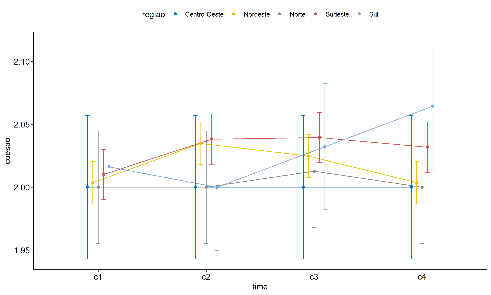<!-- -->

``` r
(pwc <- ldat %>% group_by(regiao) %>%
    emmeans_test(coesao ~ time, detailed = T, p.adjust.method = "bonferroni"))
```

    ## # A tibble: 30 × 15
    ##    regiao   term  .y.   group1 group2 null.value  estimate     se    df conf.low
    ##  * <fct>    <chr> <chr> <chr>  <chr>       <dbl>     <dbl>  <dbl> <dbl>    <dbl>
    ##  1 Centro-… time  coes… c1     c2              0 -1.26e-16 0.0411  4484  -0.0806
    ##  2 Centro-… time  coes… c1     c3              0  1.69e-15 0.0411  4484  -0.0806
    ##  3 Centro-… time  coes… c1     c4              0 -1.20e-15 0.0411  4484  -0.0806
    ##  4 Centro-… time  coes… c2     c3              0  1.82e-15 0.0411  4484  -0.0806
    ##  5 Centro-… time  coes… c2     c4              0 -1.08e-15 0.0411  4484  -0.0806
    ##  6 Centro-… time  coes… c3     c4              0 -2.90e-15 0.0411  4484  -0.0806
    ##  7 Nordeste time  coes… c1     c2              0 -3.12e- 2 0.0122  4484  -0.0551
    ##  8 Nordeste time  coes… c1     c3              0 -2.11e- 2 0.0122  4484  -0.0450
    ##  9 Nordeste time  coes… c1     c4              0  6.99e-15 0.0122  4484  -0.0239
    ## 10 Nordeste time  coes… c2     c3              0  1.01e- 2 0.0122  4484  -0.0138
    ## # ℹ 20 more rows
    ## # ℹ 5 more variables: conf.high <dbl>, statistic <dbl>, p <dbl>, p.adj <dbl>,
    ## #   p.adj.signif <chr>

| regiao       | term | .y.    | group1 | group2 | null.value | estimate |    se |   df | conf.low | conf.high | statistic |     p | p.adj | p.adj.signif |
|:-------------|:-----|:-------|:-------|:-------|-----------:|---------:|------:|-----:|---------:|----------:|----------:|------:|------:|:-------------|
| Centro-Oeste | time | coesao | c1     | c2     |          0 |    0.000 | 0.041 | 4484 |   -0.081 |     0.081 |     0.000 | 1.000 | 1.000 | ns           |
| Centro-Oeste | time | coesao | c1     | c3     |          0 |    0.000 | 0.041 | 4484 |   -0.081 |     0.081 |     0.000 | 1.000 | 1.000 | ns           |
| Centro-Oeste | time | coesao | c1     | c4     |          0 |    0.000 | 0.041 | 4484 |   -0.081 |     0.081 |     0.000 | 1.000 | 1.000 | ns           |
| Centro-Oeste | time | coesao | c2     | c3     |          0 |    0.000 | 0.041 | 4484 |   -0.081 |     0.081 |     0.000 | 1.000 | 1.000 | ns           |
| Centro-Oeste | time | coesao | c2     | c4     |          0 |    0.000 | 0.041 | 4484 |   -0.081 |     0.081 |     0.000 | 1.000 | 1.000 | ns           |
| Centro-Oeste | time | coesao | c3     | c4     |          0 |    0.000 | 0.041 | 4484 |   -0.081 |     0.081 |     0.000 | 1.000 | 1.000 | ns           |
| Nordeste     | time | coesao | c1     | c2     |          0 |   -0.031 | 0.012 | 4484 |   -0.055 |    -0.007 |    -2.557 | 0.011 | 0.063 | ns           |
| Nordeste     | time | coesao | c1     | c3     |          0 |   -0.021 | 0.012 | 4484 |   -0.045 |     0.003 |    -1.730 | 0.084 | 0.502 | ns           |
| Nordeste     | time | coesao | c1     | c4     |          0 |    0.000 | 0.012 | 4484 |   -0.024 |     0.024 |     0.000 | 1.000 | 1.000 | ns           |
| Nordeste     | time | coesao | c2     | c3     |          0 |    0.010 | 0.012 | 4484 |   -0.014 |     0.034 |     0.827 | 0.408 | 1.000 | ns           |
| Nordeste     | time | coesao | c2     | c4     |          0 |    0.031 | 0.012 | 4484 |    0.007 |     0.055 |     2.557 | 0.011 | 0.063 | ns           |
| Nordeste     | time | coesao | c3     | c4     |          0 |    0.021 | 0.012 | 4484 |   -0.003 |     0.045 |     1.730 | 0.084 | 0.502 | ns           |
| Norte        | time | coesao | c1     | c2     |          0 |    0.000 | 0.032 | 4484 |   -0.063 |     0.063 |     0.000 | 1.000 | 1.000 | ns           |
| Norte        | time | coesao | c1     | c3     |          0 |   -0.013 | 0.032 | 4484 |   -0.076 |     0.050 |    -0.398 | 0.691 | 1.000 | ns           |
| Norte        | time | coesao | c1     | c4     |          0 |    0.000 | 0.032 | 4484 |   -0.063 |     0.063 |     0.000 | 1.000 | 1.000 | ns           |
| Norte        | time | coesao | c2     | c3     |          0 |   -0.013 | 0.032 | 4484 |   -0.076 |     0.050 |    -0.398 | 0.691 | 1.000 | ns           |
| Norte        | time | coesao | c2     | c4     |          0 |    0.000 | 0.032 | 4484 |   -0.063 |     0.063 |     0.000 | 1.000 | 1.000 | ns           |
| Norte        | time | coesao | c3     | c4     |          0 |    0.013 | 0.032 | 4484 |   -0.050 |     0.076 |     0.398 | 0.691 | 1.000 | ns           |
| Sudeste      | time | coesao | c1     | c2     |          0 |   -0.028 | 0.014 | 4484 |   -0.056 |     0.000 |    -1.949 | 0.051 | 0.308 | ns           |
| Sudeste      | time | coesao | c1     | c3     |          0 |   -0.029 | 0.014 | 4484 |   -0.057 |    -0.001 |    -2.037 | 0.042 | 0.250 | ns           |
| Sudeste      | time | coesao | c1     | c4     |          0 |   -0.022 | 0.014 | 4484 |   -0.050 |     0.007 |    -1.506 | 0.132 | 0.793 | ns           |
| Sudeste      | time | coesao | c2     | c3     |          0 |   -0.001 | 0.014 | 4484 |   -0.029 |     0.027 |    -0.089 | 0.929 | 1.000 | ns           |
| Sudeste      | time | coesao | c2     | c4     |          0 |    0.006 | 0.014 | 4484 |   -0.022 |     0.035 |     0.443 | 0.658 | 1.000 | ns           |
| Sudeste      | time | coesao | c3     | c4     |          0 |    0.008 | 0.014 | 4484 |   -0.021 |     0.036 |     0.531 | 0.595 | 1.000 | ns           |
| Sul          | time | coesao | c1     | c2     |          0 |    0.016 | 0.036 | 4484 |   -0.055 |     0.087 |     0.446 | 0.656 | 1.000 | ns           |
| Sul          | time | coesao | c1     | c3     |          0 |   -0.016 | 0.036 | 4484 |   -0.087 |     0.055 |    -0.446 | 0.656 | 1.000 | ns           |
| Sul          | time | coesao | c1     | c4     |          0 |   -0.048 | 0.036 | 4484 |   -0.119 |     0.023 |    -1.338 | 0.181 | 1.000 | ns           |
| Sul          | time | coesao | c2     | c3     |          0 |   -0.032 | 0.036 | 4484 |   -0.103 |     0.039 |    -0.892 | 0.372 | 1.000 | ns           |
| Sul          | time | coesao | c2     | c4     |          0 |   -0.065 | 0.036 | 4484 |   -0.135 |     0.006 |    -1.784 | 0.074 | 0.447 | ns           |
| Sul          | time | coesao | c3     | c4     |          0 |   -0.032 | 0.036 | 4484 |   -0.103 |     0.039 |    -0.892 | 0.372 | 1.000 | ns           |

``` r
(emms <- get_emmeans(pwc))
```

    ## # A tibble: 20 × 8
    ##    regiao       time  emmean      se    df conf.low conf.high method      
    ##    <fct>        <fct>  <dbl>   <dbl> <dbl>    <dbl>     <dbl> <chr>       
    ##  1 Centro-Oeste c1      2.00 0.0291   4484     1.94      2.06 Emmeans test
    ##  2 Centro-Oeste c2      2.00 0.0291   4484     1.94      2.06 Emmeans test
    ##  3 Centro-Oeste c3      2.00 0.0291   4484     1.94      2.06 Emmeans test
    ##  4 Centro-Oeste c4      2.00 0.0291   4484     1.94      2.06 Emmeans test
    ##  5 Nordeste     c1      2.00 0.00862  4484     1.99      2.02 Emmeans test
    ##  6 Nordeste     c2      2.03 0.00862  4484     2.02      2.05 Emmeans test
    ##  7 Nordeste     c3      2.02 0.00862  4484     2.01      2.04 Emmeans test
    ##  8 Nordeste     c4      2.00 0.00862  4484     1.99      2.02 Emmeans test
    ##  9 Norte        c1      2.00 0.0228   4484     1.96      2.04 Emmeans test
    ## 10 Norte        c2      2.00 0.0228   4484     1.96      2.04 Emmeans test
    ## 11 Norte        c3      2.01 0.0228   4484     1.97      2.06 Emmeans test
    ## 12 Norte        c4      2.00 0.0228   4484     1.96      2.04 Emmeans test
    ## 13 Sudeste      c1      2.01 0.0102   4484     1.99      2.03 Emmeans test
    ## 14 Sudeste      c2      2.04 0.0102   4484     2.02      2.06 Emmeans test
    ## 15 Sudeste      c3      2.04 0.0102   4484     2.02      2.06 Emmeans test
    ## 16 Sudeste      c4      2.03 0.0102   4484     2.01      2.05 Emmeans test
    ## 17 Sul          c1      2.02 0.0256   4484     1.97      2.07 Emmeans test
    ## 18 Sul          c2      2.00 0.0256   4484     1.95      2.05 Emmeans test
    ## 19 Sul          c3      2.03 0.0256   4484     1.98      2.08 Emmeans test
    ## 20 Sul          c4      2.06 0.0256   4484     2.01      2.11 Emmeans test

| regiao       | time | emmean |    se |   df | conf.low | conf.high | method       |
|:-------------|:-----|-------:|------:|-----:|---------:|----------:|:-------------|
| Centro-Oeste | c1   |  2.000 | 0.029 | 4484 |    1.943 |     2.057 | Emmeans test |
| Centro-Oeste | c2   |  2.000 | 0.029 | 4484 |    1.943 |     2.057 | Emmeans test |
| Centro-Oeste | c3   |  2.000 | 0.029 | 4484 |    1.943 |     2.057 | Emmeans test |
| Centro-Oeste | c4   |  2.000 | 0.029 | 4484 |    1.943 |     2.057 | Emmeans test |
| Nordeste     | c1   |  2.004 | 0.009 | 4484 |    1.987 |     2.021 | Emmeans test |
| Nordeste     | c2   |  2.035 | 0.009 | 4484 |    2.018 |     2.052 | Emmeans test |
| Nordeste     | c3   |  2.025 | 0.009 | 4484 |    2.008 |     2.042 | Emmeans test |
| Nordeste     | c4   |  2.004 | 0.009 | 4484 |    1.987 |     2.021 | Emmeans test |
| Norte        | c1   |  2.000 | 0.023 | 4484 |    1.955 |     2.045 | Emmeans test |
| Norte        | c2   |  2.000 | 0.023 | 4484 |    1.955 |     2.045 | Emmeans test |
| Norte        | c3   |  2.013 | 0.023 | 4484 |    1.968 |     2.058 | Emmeans test |
| Norte        | c4   |  2.000 | 0.023 | 4484 |    1.955 |     2.045 | Emmeans test |
| Sudeste      | c1   |  2.010 | 0.010 | 4484 |    1.990 |     2.030 | Emmeans test |
| Sudeste      | c2   |  2.038 | 0.010 | 4484 |    2.018 |     2.058 | Emmeans test |
| Sudeste      | c3   |  2.039 | 0.010 | 4484 |    2.020 |     2.059 | Emmeans test |
| Sudeste      | c4   |  2.032 | 0.010 | 4484 |    2.012 |     2.052 | Emmeans test |
| Sul          | c1   |  2.016 | 0.026 | 4484 |    1.966 |     2.066 | Emmeans test |
| Sul          | c2   |  2.000 | 0.026 | 4484 |    1.950 |     2.050 | Emmeans test |
| Sul          | c3   |  2.032 | 0.026 | 4484 |    1.982 |     2.082 | Emmeans test |
| Sul          | c4   |  2.065 | 0.026 | 4484 |    2.014 |     2.115 | Emmeans test |

``` r
emms.gg <- emms[which(emms$regiao == "Centro-Oeste"),]
if (nrow(emms.gg) > 0)
  ggline(emms.gg, x = "time", y = "emmean", color = "#0073C2FF", ylab = "coesao") +
    geom_errorbar(aes(ymin = conf.low, ymax = conf.high),
                  width = 0.2, color = "#0073C2FF") +
    stat_pvalue_manual(
      add_xy_position(pwc[which(pwc$regiao == "Centro-Oeste"),],
                      x = "time", fun = "mean_se"),
      hide.ns = T, color = "#0073C2FF", tip.length = F) +
    labs(title = "regiao: Centro-Oeste")+
    theme(legend.text = element_blank())
```

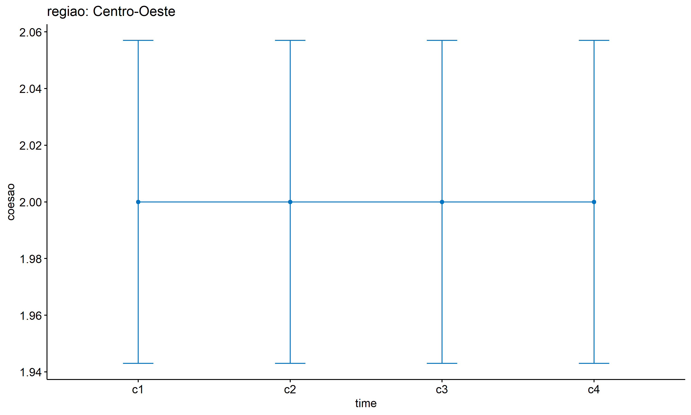<!-- -->

``` r
emms.gg <- emms[which(emms$regiao == "Nordeste"),]
if (nrow(emms.gg) > 0)
  ggline(emms.gg, x = "time", y = "emmean", color = "#EFC000FF", ylab = "coesao") +
    geom_errorbar(aes(ymin = conf.low, ymax = conf.high),
                  width = 0.2, color = "#EFC000FF") +
    stat_pvalue_manual(
      add_xy_position(pwc[which(pwc$regiao == "Nordeste"),],
                      x = "time", fun = "mean_se"),
      hide.ns = T, color = "#EFC000FF", tip.length = F) +
    labs(title = "regiao: Nordeste")+
    theme(legend.text = element_blank())
```

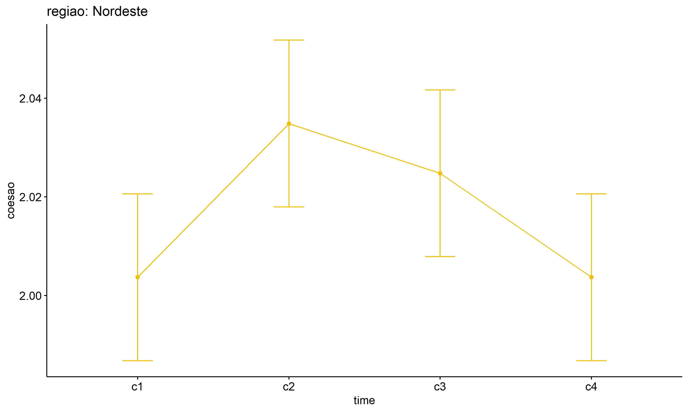<!-- -->

``` r
emms.gg <- emms[which(emms$regiao == "Norte"),]
if (nrow(emms.gg) > 0)
  ggline(emms.gg, x = "time", y = "emmean", color = "#868686FF", ylab = "coesao") +
    geom_errorbar(aes(ymin = conf.low, ymax = conf.high),
                  width = 0.2, color = "#868686FF") +
    stat_pvalue_manual(
      add_xy_position(pwc[which(pwc$regiao == "Norte"),],
                      x = "time", fun = "mean_se"),
      hide.ns = T, color = "#868686FF", tip.length = F) +
    labs(title = "regiao: Norte")+
    theme(legend.text = element_blank())
```

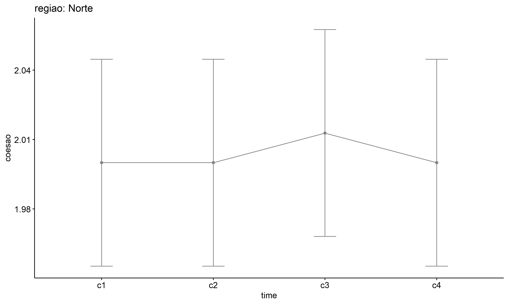<!-- -->

``` r
emms.gg <- emms[which(emms$regiao == "Sudeste"),]
if (nrow(emms.gg) > 0)
  ggline(emms.gg, x = "time", y = "emmean", color = "#CD534CFF", ylab = "coesao") +
    geom_errorbar(aes(ymin = conf.low, ymax = conf.high),
                  width = 0.2, color = "#CD534CFF") +
    stat_pvalue_manual(
      add_xy_position(pwc[which(pwc$regiao == "Sudeste"),],
                      x = "time", fun = "mean_se"),
      hide.ns = T, color = "#CD534CFF", tip.length = F) +
    labs(title = "regiao: Sudeste")+
    theme(legend.text = element_blank())
```

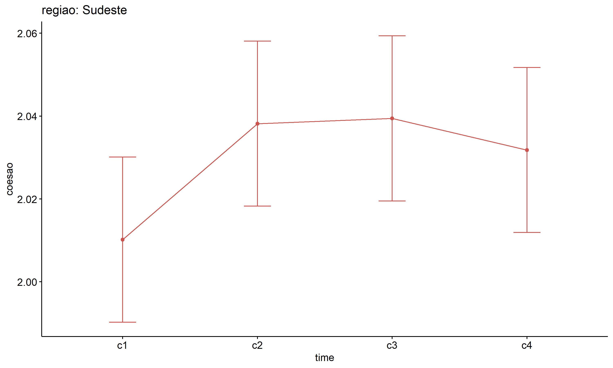<!-- -->

``` r
emms.gg <- emms[which(emms$regiao == "Sul"),]
if (nrow(emms.gg) > 0)
  ggline(emms.gg, x = "time", y = "emmean", color = "#7AA6DCFF", ylab = "coesao") +
    geom_errorbar(aes(ymin = conf.low, ymax = conf.high),
                  width = 0.2, color = "#7AA6DCFF") +
    stat_pvalue_manual(
      add_xy_position(pwc[which(pwc$regiao == "Sul"),],
                      x = "time", fun = "mean_se"),
      hide.ns = T, color = "#7AA6DCFF", tip.length = F) +
    labs(title = "regiao: Sul")+
    theme(legend.text = element_blank())
```

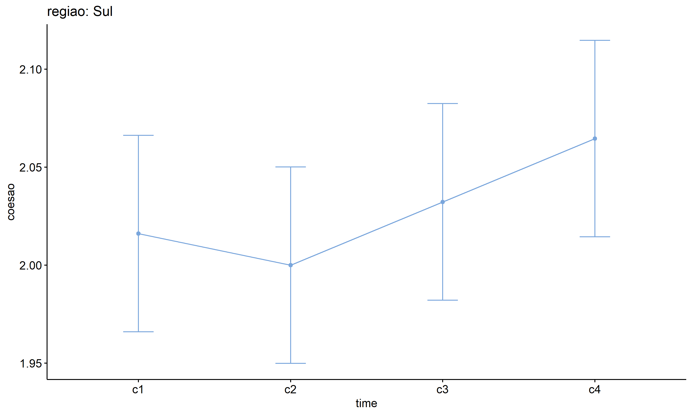<!-- -->

## PairWise Computation after removing non.normal data

``` r
if (length(non.ids) > 0)
  (pwc2 <- ldat2 %>% group_by(time) %>%
     emmeans_test(coesao ~ regiao, detailed = T, p.adjust.method = "bonferroni"))
```

``` r
if (length(non.ids) > 0)
  (emms2 <- get_emmeans(pwc2))
```

``` r
if (length(non.ids) > 0) {
  pwc2 <- add_xy_position(pwc2, x = "time", fun = "mean_se", dodge = 0.25)
  pd2 <- position_dodge(width = 0.25)
  
  ggline(emms2, x = "time", y = "emmean", color = "regiao",
         palette = c("#0073C2FF","#EFC000FF","#868686FF","#CD534CFF","#7AA6DCFF"),
         position = pd, ylab = "coesao") +
    geom_errorbar(aes(ymin = conf.low, ymax = conf.high, color = regiao),
                position = pd, width = 0.2) +
    stat_pvalue_manual(pwc2, hide.ns = T, tip.length = F, linetype = 1)
}
```

``` r
if (length(non.ids) > 0)
  (pwc2 <- ldat2 %>% group_by(regiao) %>%
     emmeans_test(coesao ~ time, detailed = T, p.adjust.method = "bonferroni"))
```

``` r
if (length(non.ids) > 0)
  (emms2 <- get_emmeans(pwc2))
```

``` r
if (length(non.ids) > 0) {
  emms.gg <- emms2[which(emms2$regiao == "Centro-Oeste"),]
  if (nrow(emms.gg) > 0)
    ggline(emms.gg, x = "time", y = "emmean", color = "#0073C2FF", ylab = "coesao") +
    geom_errorbar(aes(ymin = conf.low, ymax = conf.high),
                  width = 0.2, color = "#0073C2FF") +
    stat_pvalue_manual(
      add_xy_position(pwc[which(pwc$regiao == "Centro-Oeste"),],
                      x = "time", fun = "mean_se"),
      hide.ns = T, color = "#0073C2FF", tip.length = F) +
    labs(title = "regiao: Centro-Oeste") +
    theme(legend.text = element_blank())
}
```

``` r
if (length(non.ids) > 0) {
  emms.gg <- emms2[which(emms2$regiao == "Nordeste"),]
  if (nrow(emms.gg) > 0)
    ggline(emms.gg, x = "time", y = "emmean", color = "#EFC000FF", ylab = "coesao") +
    geom_errorbar(aes(ymin = conf.low, ymax = conf.high),
                  width = 0.2, color = "#EFC000FF") +
    stat_pvalue_manual(
      add_xy_position(pwc[which(pwc$regiao == "Nordeste"),],
                      x = "time", fun = "mean_se"),
      hide.ns = T, color = "#EFC000FF", tip.length = F) +
    labs(title = "regiao: Nordeste") +
    theme(legend.text = element_blank())
}
```

``` r
if (length(non.ids) > 0) {
  emms.gg <- emms2[which(emms2$regiao == "Norte"),]
  if (nrow(emms.gg) > 0)
    ggline(emms.gg, x = "time", y = "emmean", color = "#868686FF", ylab = "coesao") +
    geom_errorbar(aes(ymin = conf.low, ymax = conf.high),
                  width = 0.2, color = "#868686FF") +
    stat_pvalue_manual(
      add_xy_position(pwc[which(pwc$regiao == "Norte"),],
                      x = "time", fun = "mean_se"),
      hide.ns = T, color = "#868686FF", tip.length = F) +
    labs(title = "regiao: Norte") +
    theme(legend.text = element_blank())
}
```

``` r
if (length(non.ids) > 0) {
  emms.gg <- emms2[which(emms2$regiao == "Sudeste"),]
  if (nrow(emms.gg) > 0)
    ggline(emms.gg, x = "time", y = "emmean", color = "#CD534CFF", ylab = "coesao") +
    geom_errorbar(aes(ymin = conf.low, ymax = conf.high),
                  width = 0.2, color = "#CD534CFF") +
    stat_pvalue_manual(
      add_xy_position(pwc[which(pwc$regiao == "Sudeste"),],
                      x = "time", fun = "mean_se"),
      hide.ns = T, color = "#CD534CFF", tip.length = F) +
    labs(title = "regiao: Sudeste") +
    theme(legend.text = element_blank())
}
```

``` r
if (length(non.ids) > 0) {
  emms.gg <- emms2[which(emms2$regiao == "Sul"),]
  if (nrow(emms.gg) > 0)
    ggline(emms.gg, x = "time", y = "emmean", color = "#7AA6DCFF", ylab = "coesao") +
    geom_errorbar(aes(ymin = conf.low, ymax = conf.high),
                  width = 0.2, color = "#7AA6DCFF") +
    stat_pvalue_manual(
      add_xy_position(pwc[which(pwc$regiao == "Sul"),],
                      x = "time", fun = "mean_se"),
      hide.ns = T, color = "#7AA6DCFF", tip.length = F) +
    labs(title = "regiao: Sul") +
    theme(legend.text = element_blank())
}
```

# ANOVA: coesao ~ time\*porte + Error(id/time)

## Data Preparation

``` r
data <- edat[,c("aluno_id","porte","ciclo","coesao")]
data$ciclo <- factor(data$ciclo, c("Primeiro Ciclo","Segundo Ciclo",
                                   "Terceiro Ciclo","Quarto Ciclo"))

wdat <- spread(data, ciclo, coesao)
wdat <- wdat[complete.cases(wdat),]
colnames(wdat) <- c("id","porte","c1","c2","c3","c4")

ldat <- gather(wdat, key = time, value = coesao, c1, c2, c3, c4) %>%
  convert_as_factor(id, time)
ldat <- remove_group_data(ldat, "coesao", c("time", "porte"), n.limit = 30)
ldat$porte <- factor(ldat$porte, sort(unique(ldat$porte)))
```

### Check assumptions: Identifying Outliers

``` r
outliers <- identify_outliers(group_by(ldat, time, porte), coesao)
(outliers <- outliers[outliers$is.extreme == T,])
```

    ## # A tibble: 50 × 6
    ##    porte                                time  id    coesao is.outlier is.extreme
    ##    <fct>                                <fct> <fct>  <dbl> <lgl>      <lgl>     
    ##  1 Entre 201 e 500 matrículas de escol… c1    JRyG…      3 TRUE       TRUE      
    ##  2 Entre 201 e 500 matrículas de escol… c1    Kaj5…      3 TRUE       TRUE      
    ##  3 Entre 201 e 500 matrículas de escol… c1    W8iX…      4 TRUE       TRUE      
    ##  4 Entre 201 e 500 matrículas de escol… c1    Y7Ho…      4 TRUE       TRUE      
    ##  5 Entre 51 e 200 matrículas de escola… c1    IZ2X…      3 TRUE       TRUE      
    ##  6 Entre 201 e 500 matrículas de escol… c2    cukn…      5 TRUE       TRUE      
    ##  7 Entre 201 e 500 matrículas de escol… c2    EqNp…      4 TRUE       TRUE      
    ##  8 Entre 201 e 500 matrículas de escol… c2    G4NI…      4 TRUE       TRUE      
    ##  9 Entre 201 e 500 matrículas de escol… c2    HsQF…      4 TRUE       TRUE      
    ## 10 Entre 201 e 500 matrículas de escol… c2    i5EZ…      3 TRUE       TRUE      
    ## # ℹ 40 more rows

| porte                                        | time | id                   | coesao | is.outlier | is.extreme |
|:---------------------------------------------|:-----|:---------------------|-------:|:-----------|:-----------|
| Entre 201 e 500 matrículas de escolarização  | c1   | JRyGpNQA6mOEl1nzl1af |    3.0 | TRUE       | TRUE       |
| Entre 201 e 500 matrículas de escolarização  | c1   | Kaj54imycuE0bbwH7xlD |    3.0 | TRUE       | TRUE       |
| Entre 201 e 500 matrículas de escolarização  | c1   | W8iXxSmW48zvfJyikMZb |    4.0 | TRUE       | TRUE       |
| Entre 201 e 500 matrículas de escolarização  | c1   | Y7HozU436KQ0wqdBGugu |    4.0 | TRUE       | TRUE       |
| Entre 51 e 200 matrículas de escolarização   | c1   | IZ2Xmfi9jueckwdzfkiG |    3.0 | TRUE       | TRUE       |
| Entre 201 e 500 matrículas de escolarização  | c2   | cuknOzzwN4oCRum5U5ph |    5.0 | TRUE       | TRUE       |
| Entre 201 e 500 matrículas de escolarização  | c2   | EqNpFnKTbLOWH4nmuu6d |    4.0 | TRUE       | TRUE       |
| Entre 201 e 500 matrículas de escolarização  | c2   | G4NIt8gEc7nfeQ9k2OkL |    4.0 | TRUE       | TRUE       |
| Entre 201 e 500 matrículas de escolarização  | c2   | HsQF2J0r79mHSWNe4l6n |    4.0 | TRUE       | TRUE       |
| Entre 201 e 500 matrículas de escolarização  | c2   | i5EZ8Ck9IgDueyMbw55v |    3.0 | TRUE       | TRUE       |
| Entre 201 e 500 matrículas de escolarização  | c2   | j31LU8Xwm0EQ7Mihkhjj |    4.0 | TRUE       | TRUE       |
| Entre 201 e 500 matrículas de escolarização  | c2   | oGUJyWRMYYbF9PNegJZh |    4.0 | TRUE       | TRUE       |
| Entre 201 e 500 matrículas de escolarização  | c2   | qyt5dpIrCcmnZfDJIazf |    4.0 | TRUE       | TRUE       |
| Entre 201 e 500 matrículas de escolarização  | c2   | W8iXxSmW48zvfJyikMZb |    4.0 | TRUE       | TRUE       |
| Entre 201 e 500 matrículas de escolarização  | c2   | wQnhAn0Gfye5OP5zaTgh |    4.0 | TRUE       | TRUE       |
| Entre 201 e 500 matrículas de escolarização  | c2   | wuumviqqlrNK6QzeoJPr |    4.0 | TRUE       | TRUE       |
| Entre 201 e 500 matrículas de escolarização  | c2   | xk7eC5haTYuFQaJovsBZ |    4.0 | TRUE       | TRUE       |
| Entre 201 e 500 matrículas de escolarização  | c2   | xQIlV1qQiNpzi4Bna9Ut |    4.0 | TRUE       | TRUE       |
| Entre 201 e 500 matrículas de escolarização  | c2   | XxtCdGkKAnQOx88fyxk4 |    3.0 | TRUE       | TRUE       |
| Entre 201 e 500 matrículas de escolarização  | c2   | YTYFFWzK4C7ejf1X1TUB |    4.0 | TRUE       | TRUE       |
| Entre 501 e 1000 matrículas de escolarização | c2   | G7bqQeqXmsQ3kiJNeYlz |    3.0 | TRUE       | TRUE       |
| Entre 501 e 1000 matrículas de escolarização | c2   | wgOGhRdGeAbGeHUAguQ5 |    5.0 | TRUE       | TRUE       |
| Entre 51 e 200 matrículas de escolarização   | c2   | 0mGtUd2Axg2fjQmYZ4CC |    3.0 | TRUE       | TRUE       |
| Entre 201 e 500 matrículas de escolarização  | c3   | CCVIt7MPeYMUOCCyBxPh |    4.0 | TRUE       | TRUE       |
| Entre 201 e 500 matrículas de escolarização  | c3   | E3u63riyMFS8A2cNBnvC |    3.0 | TRUE       | TRUE       |
| Entre 201 e 500 matrículas de escolarização  | c3   | EtUjsyq1GNevicwMDXlw |    3.5 | TRUE       | TRUE       |
| Entre 201 e 500 matrículas de escolarização  | c3   | GN5vxU0haHKd9W22JGyk |    4.0 | TRUE       | TRUE       |
| Entre 201 e 500 matrículas de escolarização  | c3   | HsQF2J0r79mHSWNe4l6n |    3.0 | TRUE       | TRUE       |
| Entre 201 e 500 matrículas de escolarização  | c3   | i5EZ8Ck9IgDueyMbw55v |    5.0 | TRUE       | TRUE       |
| Entre 201 e 500 matrículas de escolarização  | c3   | j31LU8Xwm0EQ7Mihkhjj |    4.0 | TRUE       | TRUE       |
| Entre 201 e 500 matrículas de escolarização  | c3   | m5yRlxfIj73j4ossfTOB |    5.0 | TRUE       | TRUE       |
| Entre 201 e 500 matrículas de escolarização  | c3   | OvwAQTWkdj8SYpPS8dgn |    4.0 | TRUE       | TRUE       |
| Entre 201 e 500 matrículas de escolarização  | c3   | xk7eC5haTYuFQaJovsBZ |    4.0 | TRUE       | TRUE       |
| Entre 501 e 1000 matrículas de escolarização | c3   | 6bEKmKQpOuvY6PSQvzqj |    4.0 | TRUE       | TRUE       |
| Entre 501 e 1000 matrículas de escolarização | c3   | FkJFrnPezc8Ng4SSMx1z |    4.0 | TRUE       | TRUE       |
| Entre 501 e 1000 matrículas de escolarização | c3   | QAyx2z41ILLaMN0o7pjc |    3.0 | TRUE       | TRUE       |
| Entre 501 e 1000 matrículas de escolarização | c3   | TKvc4Eu2XaDXYPxuS7Qn |    4.0 | TRUE       | TRUE       |
| Entre 501 e 1000 matrículas de escolarização | c3   | u65Z834z75LDIy0slvaX |    5.0 | TRUE       | TRUE       |
| Entre 501 e 1000 matrículas de escolarização | c3   | vaOhaNww5ga5d9G6Cftj |    4.0 | TRUE       | TRUE       |
| Entre 51 e 200 matrículas de escolarização   | c3   | PfTab7CnJIl6lys2Cxuq |    2.5 | TRUE       | TRUE       |
| Entre 201 e 500 matrículas de escolarização  | c4   | 3DdYC9Dpykr9Mtg6YR91 |    4.0 | TRUE       | TRUE       |
| Entre 201 e 500 matrículas de escolarização  | c4   | IMHqraVHK59KiF08zsGi |    3.5 | TRUE       | TRUE       |
| Entre 201 e 500 matrículas de escolarização  | c4   | jVbbowshsqkUpPuGSIMu |    4.0 | TRUE       | TRUE       |
| Entre 201 e 500 matrículas de escolarização  | c4   | VRWfIoYUFgdA8nGO5bpD |    4.0 | TRUE       | TRUE       |
| Entre 501 e 1000 matrículas de escolarização | c4   | 6bEKmKQpOuvY6PSQvzqj |    4.0 | TRUE       | TRUE       |
| Entre 501 e 1000 matrículas de escolarização | c4   | DP1fbT1lGhLiBnOFILLi |    4.0 | TRUE       | TRUE       |
| Entre 501 e 1000 matrículas de escolarização | c4   | zq67YfRtJ2g4hWPYAfkU |    3.0 | TRUE       | TRUE       |
| Entre 51 e 200 matrículas de escolarização   | c4   | fgNBRPWfCa0TP4bDO8d2 |    4.0 | TRUE       | TRUE       |
| Entre 51 e 200 matrículas de escolarização   | c4   | N7zTvCPK4nAUgH9eo3hg |    4.0 | TRUE       | TRUE       |
| Entre 51 e 200 matrículas de escolarização   | c4   | tVMilOzYDlVoWwNezYUi |    4.0 | TRUE       | TRUE       |

### Check assumptions: Normality Test

``` r
(normality.df <- normality.test.per.groups(ldat, "coesao", c("time", "porte")))
```

    ##       var variable time                                        porte   n
    ## 1  coesao   coesao   c1           Até 50 matrículas de escolarização  33
    ## 2  coesao   coesao   c1  Entre 201 e 500 matrículas de escolarização 675
    ## 3  coesao   coesao   c1 Entre 501 e 1000 matrículas de escolarização 249
    ## 4  coesao   coesao   c1   Entre 51 e 200 matrículas de escolarização 162
    ## 5  coesao   coesao   c2           Até 50 matrículas de escolarização  33
    ## 6  coesao   coesao   c2  Entre 201 e 500 matrículas de escolarização 675
    ## 7  coesao   coesao   c2 Entre 501 e 1000 matrículas de escolarização 249
    ## 8  coesao   coesao   c2   Entre 51 e 200 matrículas de escolarização 162
    ## 9  coesao   coesao   c3           Até 50 matrículas de escolarização  33
    ## 10 coesao   coesao   c3  Entre 201 e 500 matrículas de escolarização 675
    ## 11 coesao   coesao   c3 Entre 501 e 1000 matrículas de escolarização 249
    ## 12 coesao   coesao   c3   Entre 51 e 200 matrículas de escolarização 162
    ## 13 coesao   coesao   c4           Até 50 matrículas de escolarização  33
    ## 14 coesao   coesao   c4  Entre 201 e 500 matrículas de escolarização 675
    ## 15 coesao   coesao   c4 Entre 501 e 1000 matrículas de escolarização 249
    ## 16 coesao   coesao   c4   Entre 51 e 200 matrículas de escolarização 162
    ##    skewness kurtosis symmetry statistic     method p p.signif normality
    ## 1  0.000000  0.00000 few data        NA       <NA> 1     <NA>        NO
    ## 2  0.000000  0.00000 few data        NA       <NA> 1     <NA>        NO
    ## 3  0.000000  0.00000 few data        NA       <NA> 1     <NA>        NO
    ## 4  0.000000  0.00000 few data        NA       <NA> 1     <NA>        NO
    ## 5  0.000000  0.00000 few data        NA       <NA> 1     <NA>        NO
    ## 6  6.940003 48.28219       NO  877.0650 D'Agostino 0     ****         -
    ## 7  0.000000  0.00000 few data        NA       <NA> 1     <NA>        NO
    ## 8  0.000000  0.00000 few data        NA       <NA> 1     <NA>        NO
    ## 9  0.000000  0.00000 few data        NA       <NA> 1     <NA>        NO
    ## 10 9.221688 89.09033       NO 1049.6666 D'Agostino 0     ****         -
    ## 11 6.888975 48.51806       NO  355.7851 D'Agostino 0     ****         -
    ## 12 0.000000  0.00000 few data        NA       <NA> 1     <NA>        NO
    ## 13 0.000000  0.00000 few data        NA       <NA> 1     <NA>        NO
    ## 14 0.000000  0.00000 few data        NA       <NA> 1     <NA>        NO
    ## 15 0.000000  0.00000 few data        NA       <NA> 1     <NA>        NO
    ## 16 0.000000  0.00000 few data        NA       <NA> 1     <NA>        NO

| var    | variable | time | porte                                        |   n | skewness | kurtosis | symmetry | statistic | method     |   p | p.signif | normality |
|:-------|:---------|:-----|:---------------------------------------------|----:|---------:|---------:|:---------|----------:|:-----------|----:|:---------|:----------|
| coesao | coesao   | c1   | Até 50 matrículas de escolarização           |  33 |    0.000 |    0.000 | few data |        NA | NA         |   1 | NA       | NO        |
| coesao | coesao   | c1   | Entre 201 e 500 matrículas de escolarização  | 675 |    0.000 |    0.000 | few data |        NA | NA         |   1 | NA       | NO        |
| coesao | coesao   | c1   | Entre 501 e 1000 matrículas de escolarização | 249 |    0.000 |    0.000 | few data |        NA | NA         |   1 | NA       | NO        |
| coesao | coesao   | c1   | Entre 51 e 200 matrículas de escolarização   | 162 |    0.000 |    0.000 | few data |        NA | NA         |   1 | NA       | NO        |
| coesao | coesao   | c2   | Até 50 matrículas de escolarização           |  33 |    0.000 |    0.000 | few data |        NA | NA         |   1 | NA       | NO        |
| coesao | coesao   | c2   | Entre 201 e 500 matrículas de escolarização  | 675 |    6.940 |   48.282 | NO       |   877.065 | D’Agostino |   0 | \*\*\*\* | \-        |
| coesao | coesao   | c2   | Entre 501 e 1000 matrículas de escolarização | 249 |    0.000 |    0.000 | few data |        NA | NA         |   1 | NA       | NO        |
| coesao | coesao   | c2   | Entre 51 e 200 matrículas de escolarização   | 162 |    0.000 |    0.000 | few data |        NA | NA         |   1 | NA       | NO        |
| coesao | coesao   | c3   | Até 50 matrículas de escolarização           |  33 |    0.000 |    0.000 | few data |        NA | NA         |   1 | NA       | NO        |
| coesao | coesao   | c3   | Entre 201 e 500 matrículas de escolarização  | 675 |    9.222 |   89.090 | NO       |  1049.667 | D’Agostino |   0 | \*\*\*\* | \-        |
| coesao | coesao   | c3   | Entre 501 e 1000 matrículas de escolarização | 249 |    6.889 |   48.518 | NO       |   355.785 | D’Agostino |   0 | \*\*\*\* | \-        |
| coesao | coesao   | c3   | Entre 51 e 200 matrículas de escolarização   | 162 |    0.000 |    0.000 | few data |        NA | NA         |   1 | NA       | NO        |
| coesao | coesao   | c4   | Até 50 matrículas de escolarização           |  33 |    0.000 |    0.000 | few data |        NA | NA         |   1 | NA       | NO        |
| coesao | coesao   | c4   | Entre 201 e 500 matrículas de escolarização  | 675 |    0.000 |    0.000 | few data |        NA | NA         |   1 | NA       | NO        |
| coesao | coesao   | c4   | Entre 501 e 1000 matrículas de escolarização | 249 |    0.000 |    0.000 | few data |        NA | NA         |   1 | NA       | NO        |
| coesao | coesao   | c4   | Entre 51 e 200 matrículas de escolarização   | 162 |    0.000 |    0.000 | few data |        NA | NA         |   1 | NA       | NO        |

``` r
(non.ids <- unique(do.call(
  c, lapply(which(normality.df$normality == 'NO'), FUN = function(i) {
  idx = which(ldat$time == normality.df$time[i] &
                ldat$porte == normality.df$porte[i])
  getNonNormal(ldat$"coesao"[idx], ldat$id[idx])
}))))
```

    ## NULL

``` r
if (length(non.ids) > 0)
  ldat2 <- ldat[!ldat$id %in% non.ids,]
```

### Summary Statistics

``` r
(sdat <- ldat %>% group_by(time, porte) %>%
   get_summary_stats(coesao, type = "mean_sd"))
```

    ## # A tibble: 16 × 6
    ##    porte                                        time  variable     n  mean    sd
    ##    <fct>                                        <fct> <fct>    <dbl> <dbl> <dbl>
    ##  1 Até 50 matrículas de escolarização           c1    coesao      33  2    0    
    ##  2 Entre 201 e 500 matrículas de escolarização  c1    coesao     675  2.01 0.121
    ##  3 Entre 501 e 1000 matrículas de escolarização c1    coesao     249  2    0    
    ##  4 Entre 51 e 200 matrículas de escolarização   c1    coesao     162  2.01 0.079
    ##  5 Até 50 matrículas de escolarização           c2    coesao      33  2    0    
    ##  6 Entre 201 e 500 matrículas de escolarização  c2    coesao     675  2.04 0.293
    ##  7 Entre 501 e 1000 matrículas de escolarização c2    coesao     249  2.02 0.2  
    ##  8 Entre 51 e 200 matrículas de escolarização   c2    coesao     162  2.01 0.079
    ##  9 Até 50 matrículas de escolarização           c3    coesao      33  2    0    
    ## 10 Entre 201 e 500 matrículas de escolarização  c3    coesao     675  2.03 0.249
    ## 11 Entre 501 e 1000 matrículas de escolarização c3    coesao     249  2.05 0.32 
    ## 12 Entre 51 e 200 matrículas de escolarização   c3    coesao     162  2.00 0.039
    ## 13 Até 50 matrículas de escolarização           c4    coesao      33  2    0    
    ## 14 Entre 201 e 500 matrículas de escolarização  c4    coesao     675  2.01 0.145
    ## 15 Entre 501 e 1000 matrículas de escolarização c4    coesao     249  2.02 0.189
    ## 16 Entre 51 e 200 matrículas de escolarização   c4    coesao     162  2.04 0.27

| porte                                        | time | variable |   n |  mean |    sd |
|:---------------------------------------------|:-----|:---------|----:|------:|------:|
| Até 50 matrículas de escolarização           | c1   | coesao   |  33 | 2.000 | 0.000 |
| Entre 201 e 500 matrículas de escolarização  | c1   | coesao   | 675 | 2.009 | 0.121 |
| Entre 501 e 1000 matrículas de escolarização | c1   | coesao   | 249 | 2.000 | 0.000 |
| Entre 51 e 200 matrículas de escolarização   | c1   | coesao   | 162 | 2.006 | 0.079 |
| Até 50 matrículas de escolarização           | c2   | coesao   |  33 | 2.000 | 0.000 |
| Entre 201 e 500 matrículas de escolarização  | c2   | coesao   | 675 | 2.043 | 0.293 |
| Entre 501 e 1000 matrículas de escolarização | c2   | coesao   | 249 | 2.016 | 0.200 |
| Entre 51 e 200 matrículas de escolarização   | c2   | coesao   | 162 | 2.006 | 0.079 |
| Até 50 matrículas de escolarização           | c3   | coesao   |  33 | 2.000 | 0.000 |
| Entre 201 e 500 matrículas de escolarização  | c3   | coesao   | 675 | 2.029 | 0.249 |
| Entre 501 e 1000 matrículas de escolarização | c3   | coesao   | 249 | 2.048 | 0.320 |
| Entre 51 e 200 matrículas de escolarização   | c3   | coesao   | 162 | 2.003 | 0.039 |
| Até 50 matrículas de escolarização           | c4   | coesao   |  33 | 2.000 | 0.000 |
| Entre 201 e 500 matrículas de escolarização  | c4   | coesao   | 675 | 2.011 | 0.145 |
| Entre 501 e 1000 matrículas de escolarização | c4   | coesao   | 249 | 2.020 | 0.189 |
| Entre 51 e 200 matrículas de escolarização   | c4   | coesao   | 162 | 2.037 | 0.270 |

``` r
if (length(non.ids) > 0)
  (sdat <- ldat2 %>% group_by(time, porte) %>%
      get_summary_stats(coesao, type = "mean_sd"))
```

| porte                                        | time | variable |   n |  mean |    sd |
|:---------------------------------------------|:-----|:---------|----:|------:|------:|
| Até 50 matrículas de escolarização           | c1   | coesao   |  33 | 2.000 | 0.000 |
| Entre 201 e 500 matrículas de escolarização  | c1   | coesao   | 675 | 2.009 | 0.121 |
| Entre 501 e 1000 matrículas de escolarização | c1   | coesao   | 249 | 2.000 | 0.000 |
| Entre 51 e 200 matrículas de escolarização   | c1   | coesao   | 162 | 2.006 | 0.079 |
| Até 50 matrículas de escolarização           | c2   | coesao   |  33 | 2.000 | 0.000 |
| Entre 201 e 500 matrículas de escolarização  | c2   | coesao   | 675 | 2.043 | 0.293 |
| Entre 501 e 1000 matrículas de escolarização | c2   | coesao   | 249 | 2.016 | 0.200 |
| Entre 51 e 200 matrículas de escolarização   | c2   | coesao   | 162 | 2.006 | 0.079 |
| Até 50 matrículas de escolarização           | c3   | coesao   |  33 | 2.000 | 0.000 |
| Entre 201 e 500 matrículas de escolarização  | c3   | coesao   | 675 | 2.029 | 0.249 |
| Entre 501 e 1000 matrículas de escolarização | c3   | coesao   | 249 | 2.048 | 0.320 |
| Entre 51 e 200 matrículas de escolarização   | c3   | coesao   | 162 | 2.003 | 0.039 |
| Até 50 matrículas de escolarização           | c4   | coesao   |  33 | 2.000 | 0.000 |
| Entre 201 e 500 matrículas de escolarização  | c4   | coesao   | 675 | 2.011 | 0.145 |
| Entre 501 e 1000 matrículas de escolarização | c4   | coesao   | 249 | 2.020 | 0.189 |
| Entre 51 e 200 matrículas de escolarização   | c4   | coesao   | 162 | 2.037 | 0.270 |

## ANOVA Computation

``` r
(res.aov <- anova_test(ldat, dv = coesao, wid = id, between = porte, within = time))
```

    ## ANOVA Table (type III tests)
    ## 
    ## $ANOVA
    ##       Effect DFn  DFd    F     p p<.05      ges
    ## 1      porte   3 1115 0.73 0.534       0.000591
    ## 2       time   3 3345 0.52 0.668       0.000326
    ## 3 porte:time   9 3345 1.52 0.135       0.003000
    ## 
    ## $`Mauchly's Test for Sphericity`
    ##       Effect    W        p p<.05
    ## 1       time 0.75 5.01e-67     *
    ## 2 porte:time 0.75 5.01e-67     *
    ## 
    ## $`Sphericity Corrections`
    ##       Effect   GGe        DF[GG] p[GG] p[GG]<.05   HFe       DF[HF] p[HF]
    ## 1       time 0.874 2.62, 2924.18 0.644           0.876 2.63, 2931.7 0.644
    ## 2 porte:time 0.874 7.87, 2924.18 0.146           0.876 7.89, 2931.7 0.146
    ##   p[HF]<.05
    ## 1          
    ## 2

| Effect     | DFn |  DFd |    F |     p | p\<.05 |   ges |
|:-----------|----:|-----:|-----:|------:|:-------|------:|
| porte      |   3 | 1115 | 0.73 | 0.534 |        | 0.001 |
| time       |   3 | 3345 | 0.52 | 0.668 |        | 0.000 |
| porte:time |   9 | 3345 | 1.52 | 0.135 |        | 0.003 |

| Effect     |    W |   p | p\<.05 |
|:-----------|-----:|----:|:-------|
| time       | 0.75 |   0 | \*     |
| porte:time | 0.75 |   0 | \*     |

| Effect     |   GGe | DF\[GG\]      | p\[GG\] | p\[GG\]\<.05 |   HFe | DF\[HF\]     | p\[HF\] | p\[HF\]\<.05 |
|:-----------|------:|:--------------|--------:|:-------------|------:|:-------------|--------:|:-------------|
| time       | 0.874 | 2.62, 2924.18 |   0.644 |              | 0.876 | 2.63, 2931.7 |   0.644 |              |
| porte:time | 0.874 | 7.87, 2924.18 |   0.146 |              | 0.876 | 7.89, 2931.7 |   0.146 |              |

## ANOVA Computation after removing non.normal data

``` r
if (length(non.ids) > 0)
  (res.aov2 <- anova_test(ldat2, dv = coesao, wid = id, between = porte , within = time))
```

## PairWise Computation

``` r
(pwc <- ldat %>% group_by(time) %>%
   emmeans_test(coesao ~ porte, detailed = T, p.adjust.method = "bonferroni"))
```

    ## # A tibble: 24 × 15
    ##    time  term  .y.    group1   group2 null.value  estimate     se    df conf.low
    ##  * <fct> <chr> <chr>  <chr>    <chr>       <dbl>     <dbl>  <dbl> <dbl>    <dbl>
    ##  1 c1    porte coesao Até 50 … Entre…          0 -8.89e- 3 0.0360  4460 -0.0795 
    ##  2 c1    porte coesao Até 50 … Entre…          0  2.76e-15 0.0374  4460 -0.0733 
    ##  3 c1    porte coesao Até 50 … Entre…          0 -6.17e- 3 0.0386  4460 -0.0818 
    ##  4 c1    porte coesao Entre 2… Entre…          0  8.89e- 3 0.0150  4460 -0.0205 
    ##  5 c1    porte coesao Entre 2… Entre…          0  2.72e- 3 0.0177  4460 -0.0319 
    ##  6 c1    porte coesao Entre 5… Entre…          0 -6.17e- 3 0.0204  4460 -0.0461 
    ##  7 c2    porte coesao Até 50 … Entre…          0 -4.30e- 2 0.0360  4460 -0.114  
    ##  8 c2    porte coesao Até 50 … Entre…          0 -1.61e- 2 0.0374  4460 -0.0894 
    ##  9 c2    porte coesao Até 50 … Entre…          0 -6.17e- 3 0.0386  4460 -0.0818 
    ## 10 c2    porte coesao Entre 2… Entre…          0  2.69e- 2 0.0150  4460 -0.00245
    ## # ℹ 14 more rows
    ## # ℹ 5 more variables: conf.high <dbl>, statistic <dbl>, p <dbl>, p.adj <dbl>,
    ## #   p.adj.signif <chr>

| time | term  | .y.    | group1                                       | group2                                       | null.value | estimate |    se |   df | conf.low | conf.high | statistic |     p | p.adj | p.adj.signif |
|:-----|:------|:-------|:---------------------------------------------|:---------------------------------------------|-----------:|---------:|------:|-----:|---------:|----------:|----------:|------:|------:|:-------------|
| c1   | porte | coesao | Até 50 matrículas de escolarização           | Entre 201 e 500 matrículas de escolarização  |          0 |   -0.009 | 0.036 | 4460 |   -0.079 |     0.062 |    -0.247 | 0.805 | 1.000 | ns           |
| c1   | porte | coesao | Até 50 matrículas de escolarização           | Entre 501 e 1000 matrículas de escolarização |          0 |    0.000 | 0.037 | 4460 |   -0.073 |     0.073 |     0.000 | 1.000 | 1.000 | ns           |
| c1   | porte | coesao | Até 50 matrículas de escolarização           | Entre 51 e 200 matrículas de escolarização   |          0 |   -0.006 | 0.039 | 4460 |   -0.082 |     0.069 |    -0.160 | 0.873 | 1.000 | ns           |
| c1   | porte | coesao | Entre 201 e 500 matrículas de escolarização  | Entre 501 e 1000 matrículas de escolarização |          0 |    0.009 | 0.015 | 4460 |   -0.020 |     0.038 |     0.594 | 0.553 | 1.000 | ns           |
| c1   | porte | coesao | Entre 201 e 500 matrículas de escolarização  | Entre 51 e 200 matrículas de escolarização   |          0 |    0.003 | 0.018 | 4460 |   -0.032 |     0.037 |     0.154 | 0.878 | 1.000 | ns           |
| c1   | porte | coesao | Entre 501 e 1000 matrículas de escolarização | Entre 51 e 200 matrículas de escolarização   |          0 |   -0.006 | 0.020 | 4460 |   -0.046 |     0.034 |    -0.303 | 0.762 | 1.000 | ns           |
| c2   | porte | coesao | Até 50 matrículas de escolarização           | Entre 201 e 500 matrículas de escolarização  |          0 |   -0.043 | 0.036 | 4460 |   -0.114 |     0.028 |    -1.194 | 0.233 | 1.000 | ns           |
| c2   | porte | coesao | Até 50 matrículas de escolarização           | Entre 501 e 1000 matrículas de escolarização |          0 |   -0.016 | 0.037 | 4460 |   -0.089 |     0.057 |    -0.429 | 0.668 | 1.000 | ns           |
| c2   | porte | coesao | Até 50 matrículas de escolarização           | Entre 51 e 200 matrículas de escolarização   |          0 |   -0.006 | 0.039 | 4460 |   -0.082 |     0.069 |    -0.160 | 0.873 | 1.000 | ns           |
| c2   | porte | coesao | Entre 201 e 500 matrículas de escolarização  | Entre 501 e 1000 matrículas de escolarização |          0 |    0.027 | 0.015 | 4460 |   -0.002 |     0.056 |     1.797 | 0.072 | 0.435 | ns           |
| c2   | porte | coesao | Entre 201 e 500 matrículas de escolarização  | Entre 51 e 200 matrículas de escolarização   |          0 |    0.037 | 0.018 | 4460 |    0.002 |     0.071 |     2.083 | 0.037 | 0.224 | ns           |
| c2   | porte | coesao | Entre 501 e 1000 matrículas de escolarização | Entre 51 e 200 matrículas de escolarização   |          0 |    0.010 | 0.020 | 4460 |   -0.030 |     0.050 |     0.485 | 0.627 | 1.000 | ns           |
| c3   | porte | coesao | Até 50 matrículas de escolarização           | Entre 201 e 500 matrículas de escolarização  |          0 |   -0.029 | 0.036 | 4460 |   -0.099 |     0.042 |    -0.803 | 0.422 | 1.000 | ns           |
| c3   | porte | coesao | Até 50 matrículas de escolarização           | Entre 501 e 1000 matrículas de escolarização |          0 |   -0.048 | 0.037 | 4460 |   -0.122 |     0.025 |    -1.288 | 0.198 | 1.000 | ns           |
| c3   | porte | coesao | Até 50 matrículas de escolarização           | Entre 51 e 200 matrículas de escolarização   |          0 |   -0.003 | 0.039 | 4460 |   -0.079 |     0.073 |    -0.080 | 0.936 | 1.000 | ns           |
| c3   | porte | coesao | Entre 201 e 500 matrículas de escolarização  | Entre 501 e 1000 matrículas de escolarização |          0 |   -0.019 | 0.015 | 4460 |   -0.049 |     0.010 |    -1.289 | 0.197 | 1.000 | ns           |
| c3   | porte | coesao | Entre 201 e 500 matrículas de escolarização  | Entre 51 e 200 matrículas de escolarização   |          0 |    0.026 | 0.018 | 4460 |   -0.009 |     0.060 |     1.461 | 0.144 | 0.865 | ns           |
| c3   | porte | coesao | Entre 501 e 1000 matrículas de escolarização | Entre 51 e 200 matrículas de escolarização   |          0 |    0.045 | 0.020 | 4460 |    0.005 |     0.085 |     2.213 | 0.027 | 0.162 | ns           |
| c4   | porte | coesao | Até 50 matrículas de escolarização           | Entre 201 e 500 matrículas de escolarização  |          0 |   -0.011 | 0.036 | 4460 |   -0.082 |     0.059 |    -0.309 | 0.758 | 1.000 | ns           |
| c4   | porte | coesao | Até 50 matrículas de escolarização           | Entre 501 e 1000 matrículas de escolarização |          0 |   -0.020 | 0.037 | 4460 |   -0.093 |     0.053 |    -0.537 | 0.591 | 1.000 | ns           |
| c4   | porte | coesao | Até 50 matrículas de escolarização           | Entre 51 e 200 matrículas de escolarização   |          0 |   -0.037 | 0.039 | 4460 |   -0.113 |     0.039 |    -0.960 | 0.337 | 1.000 | ns           |
| c4   | porte | coesao | Entre 201 e 500 matrículas de escolarização  | Entre 501 e 1000 matrículas de escolarização |          0 |   -0.009 | 0.015 | 4460 |   -0.038 |     0.020 |    -0.599 | 0.549 | 1.000 | ns           |
| c4   | porte | coesao | Entre 201 e 500 matrículas de escolarização  | Entre 51 e 200 matrículas de escolarização   |          0 |   -0.026 | 0.018 | 4460 |   -0.061 |     0.009 |    -1.468 | 0.142 | 0.854 | ns           |
| c4   | porte | coesao | Entre 501 e 1000 matrículas de escolarização | Entre 51 e 200 matrículas de escolarização   |          0 |   -0.017 | 0.020 | 4460 |   -0.057 |     0.023 |    -0.832 | 0.405 | 1.000 | ns           |

``` r
(emms <- get_emmeans(pwc))
```

    ## # A tibble: 16 × 8
    ##    time  porte                    emmean      se    df conf.low conf.high method
    ##    <fct> <fct>                     <dbl>   <dbl> <dbl>    <dbl>     <dbl> <chr> 
    ##  1 c1    Até 50 matrículas de es…   2.00 0.0351   4460     1.93      2.07 Emmea…
    ##  2 c1    Entre 201 e 500 matrícu…   2.01 0.00777  4460     1.99      2.02 Emmea…
    ##  3 c1    Entre 501 e 1000 matríc…   2.00 0.0128   4460     1.97      2.03 Emmea…
    ##  4 c1    Entre 51 e 200 matrícul…   2.01 0.0159   4460     1.98      2.04 Emmea…
    ##  5 c2    Até 50 matrículas de es…   2.00 0.0351   4460     1.93      2.07 Emmea…
    ##  6 c2    Entre 201 e 500 matrícu…   2.04 0.00777  4460     2.03      2.06 Emmea…
    ##  7 c2    Entre 501 e 1000 matríc…   2.02 0.0128   4460     1.99      2.04 Emmea…
    ##  8 c2    Entre 51 e 200 matrícul…   2.01 0.0159   4460     1.98      2.04 Emmea…
    ##  9 c3    Até 50 matrículas de es…   2.00 0.0351   4460     1.93      2.07 Emmea…
    ## 10 c3    Entre 201 e 500 matrícu…   2.03 0.00777  4460     2.01      2.04 Emmea…
    ## 11 c3    Entre 501 e 1000 matríc…   2.05 0.0128   4460     2.02      2.07 Emmea…
    ## 12 c3    Entre 51 e 200 matrícul…   2.00 0.0159   4460     1.97      2.03 Emmea…
    ## 13 c4    Até 50 matrículas de es…   2.00 0.0351   4460     1.93      2.07 Emmea…
    ## 14 c4    Entre 201 e 500 matrícu…   2.01 0.00777  4460     2.00      2.03 Emmea…
    ## 15 c4    Entre 501 e 1000 matríc…   2.02 0.0128   4460     1.99      2.05 Emmea…
    ## 16 c4    Entre 51 e 200 matrícul…   2.04 0.0159   4460     2.01      2.07 Emmea…

| time | porte                                        | emmean |    se |   df | conf.low | conf.high | method       |
|:-----|:---------------------------------------------|-------:|------:|-----:|---------:|----------:|:-------------|
| c1   | Até 50 matrículas de escolarização           |  2.000 | 0.035 | 4460 |    1.931 |     2.069 | Emmeans test |
| c1   | Entre 201 e 500 matrículas de escolarização  |  2.009 | 0.008 | 4460 |    1.994 |     2.024 | Emmeans test |
| c1   | Entre 501 e 1000 matrículas de escolarização |  2.000 | 0.013 | 4460 |    1.975 |     2.025 | Emmeans test |
| c1   | Entre 51 e 200 matrículas de escolarização   |  2.006 | 0.016 | 4460 |    1.975 |     2.037 | Emmeans test |
| c2   | Até 50 matrículas de escolarização           |  2.000 | 0.035 | 4460 |    1.931 |     2.069 | Emmeans test |
| c2   | Entre 201 e 500 matrículas de escolarização  |  2.043 | 0.008 | 4460 |    2.028 |     2.058 | Emmeans test |
| c2   | Entre 501 e 1000 matrículas de escolarização |  2.016 | 0.013 | 4460 |    1.991 |     2.041 | Emmeans test |
| c2   | Entre 51 e 200 matrículas de escolarização   |  2.006 | 0.016 | 4460 |    1.975 |     2.037 | Emmeans test |
| c3   | Até 50 matrículas de escolarização           |  2.000 | 0.035 | 4460 |    1.931 |     2.069 | Emmeans test |
| c3   | Entre 201 e 500 matrículas de escolarização  |  2.029 | 0.008 | 4460 |    2.014 |     2.044 | Emmeans test |
| c3   | Entre 501 e 1000 matrículas de escolarização |  2.048 | 0.013 | 4460 |    2.023 |     2.073 | Emmeans test |
| c3   | Entre 51 e 200 matrículas de escolarização   |  2.003 | 0.016 | 4460 |    1.972 |     2.034 | Emmeans test |
| c4   | Até 50 matrículas de escolarização           |  2.000 | 0.035 | 4460 |    1.931 |     2.069 | Emmeans test |
| c4   | Entre 201 e 500 matrículas de escolarização  |  2.011 | 0.008 | 4460 |    1.996 |     2.026 | Emmeans test |
| c4   | Entre 501 e 1000 matrículas de escolarização |  2.020 | 0.013 | 4460 |    1.995 |     2.045 | Emmeans test |
| c4   | Entre 51 e 200 matrículas de escolarização   |  2.037 | 0.016 | 4460 |    2.006 |     2.068 | Emmeans test |

``` r
pwc <- add_xy_position(pwc, x = "time", fun = "mean_se", dodge = 0.25)
pd <- position_dodge(width = 0.25)
ggline(emms, x = "time", y = "emmean", color = "porte",
       palette = c("#0073C2FF","#EFC000FF","#868686FF","#CD534CFF","#7AA6DCFF"),
       position = pd, ylab = "coesao") +
  geom_errorbar(aes(ymin = conf.low, ymax = conf.high, color = porte),
                position = pd, width = 0.2) +
  stat_pvalue_manual(pwc, hide.ns = T, tip.length = F, linetype = 1)
```

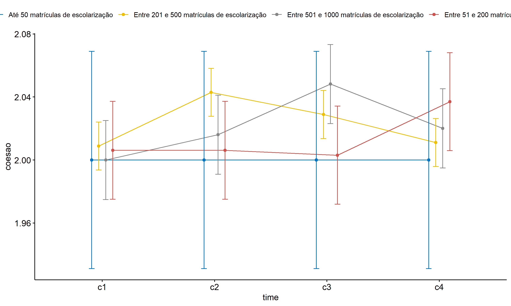<!-- -->

``` r
(pwc <- ldat %>% group_by(porte) %>%
    emmeans_test(coesao ~ time, detailed = T, p.adjust.method = "bonferroni"))
```

    ## # A tibble: 24 × 15
    ##    porte    term  .y.   group1 group2 null.value  estimate     se    df conf.low
    ##  * <fct>    <chr> <chr> <chr>  <chr>       <dbl>     <dbl>  <dbl> <dbl>    <dbl>
    ##  1 Até 50 … time  coes… c1     c2              0  2.60e-17 0.0497  4460 -0.0975 
    ##  2 Até 50 … time  coes… c1     c3              0 -1.66e-15 0.0497  4460 -0.0975 
    ##  3 Até 50 … time  coes… c1     c4              0 -1.02e-15 0.0497  4460 -0.0975 
    ##  4 Até 50 … time  coes… c2     c3              0 -1.69e-15 0.0497  4460 -0.0975 
    ##  5 Até 50 … time  coes… c2     c4              0 -1.05e-15 0.0497  4460 -0.0975 
    ##  6 Até 50 … time  coes… c3     c4              0  6.37e-16 0.0497  4460 -0.0975 
    ##  7 Entre 2… time  coes… c1     c2              0 -3.41e- 2 0.0110  4460 -0.0556 
    ##  8 Entre 2… time  coes… c1     c3              0 -2.00e- 2 0.0110  4460 -0.0415 
    ##  9 Entre 2… time  coes… c1     c4              0 -2.22e- 3 0.0110  4460 -0.0238 
    ## 10 Entre 2… time  coes… c2     c3              0  1.41e- 2 0.0110  4460 -0.00747
    ## # ℹ 14 more rows
    ## # ℹ 5 more variables: conf.high <dbl>, statistic <dbl>, p <dbl>, p.adj <dbl>,
    ## #   p.adj.signif <chr>

| porte                                        | term | .y.    | group1 | group2 | null.value | estimate |    se |   df | conf.low | conf.high | statistic |     p | p.adj | p.adj.signif |
|:---------------------------------------------|:-----|:-------|:-------|:-------|-----------:|---------:|------:|-----:|---------:|----------:|----------:|------:|------:|:-------------|
| Até 50 matrículas de escolarização           | time | coesao | c1     | c2     |          0 |    0.000 | 0.050 | 4460 |   -0.097 |     0.097 |     0.000 | 1.000 | 1.000 | ns           |
| Até 50 matrículas de escolarização           | time | coesao | c1     | c3     |          0 |    0.000 | 0.050 | 4460 |   -0.097 |     0.097 |     0.000 | 1.000 | 1.000 | ns           |
| Até 50 matrículas de escolarização           | time | coesao | c1     | c4     |          0 |    0.000 | 0.050 | 4460 |   -0.097 |     0.097 |     0.000 | 1.000 | 1.000 | ns           |
| Até 50 matrículas de escolarização           | time | coesao | c2     | c3     |          0 |    0.000 | 0.050 | 4460 |   -0.097 |     0.097 |     0.000 | 1.000 | 1.000 | ns           |
| Até 50 matrículas de escolarização           | time | coesao | c2     | c4     |          0 |    0.000 | 0.050 | 4460 |   -0.097 |     0.097 |     0.000 | 1.000 | 1.000 | ns           |
| Até 50 matrículas de escolarização           | time | coesao | c3     | c4     |          0 |    0.000 | 0.050 | 4460 |   -0.097 |     0.097 |     0.000 | 1.000 | 1.000 | ns           |
| Entre 201 e 500 matrículas de escolarização  | time | coesao | c1     | c2     |          0 |   -0.034 | 0.011 | 4460 |   -0.056 |    -0.013 |    -3.100 | 0.002 | 0.012 | \*           |
| Entre 201 e 500 matrículas de escolarização  | time | coesao | c1     | c3     |          0 |   -0.020 | 0.011 | 4460 |   -0.042 |     0.002 |    -1.820 | 0.069 | 0.413 | ns           |
| Entre 201 e 500 matrículas de escolarização  | time | coesao | c1     | c4     |          0 |   -0.002 | 0.011 | 4460 |   -0.024 |     0.019 |    -0.202 | 0.840 | 1.000 | ns           |
| Entre 201 e 500 matrículas de escolarização  | time | coesao | c2     | c3     |          0 |    0.014 | 0.011 | 4460 |   -0.007 |     0.036 |     1.281 | 0.200 | 1.000 | ns           |
| Entre 201 e 500 matrículas de escolarização  | time | coesao | c2     | c4     |          0 |    0.032 | 0.011 | 4460 |    0.010 |     0.053 |     2.898 | 0.004 | 0.023 | \*           |
| Entre 201 e 500 matrículas de escolarização  | time | coesao | c3     | c4     |          0 |    0.018 | 0.011 | 4460 |   -0.004 |     0.039 |     1.618 | 0.106 | 0.635 | ns           |
| Entre 501 e 1000 matrículas de escolarização | time | coesao | c1     | c2     |          0 |   -0.016 | 0.018 | 4460 |   -0.052 |     0.019 |    -0.888 | 0.375 | 1.000 | ns           |
| Entre 501 e 1000 matrículas de escolarização | time | coesao | c1     | c3     |          0 |   -0.048 | 0.018 | 4460 |   -0.084 |    -0.013 |    -2.663 | 0.008 | 0.047 | \*           |
| Entre 501 e 1000 matrículas de escolarização | time | coesao | c1     | c4     |          0 |   -0.020 | 0.018 | 4460 |   -0.056 |     0.015 |    -1.110 | 0.267 | 1.000 | ns           |
| Entre 501 e 1000 matrículas de escolarização | time | coesao | c2     | c3     |          0 |   -0.032 | 0.018 | 4460 |   -0.068 |     0.003 |    -1.775 | 0.076 | 0.455 | ns           |
| Entre 501 e 1000 matrículas de escolarização | time | coesao | c2     | c4     |          0 |   -0.004 | 0.018 | 4460 |   -0.039 |     0.031 |    -0.222 | 0.824 | 1.000 | ns           |
| Entre 501 e 1000 matrículas de escolarização | time | coesao | c3     | c4     |          0 |    0.028 | 0.018 | 4460 |   -0.007 |     0.064 |     1.554 | 0.120 | 0.722 | ns           |
| Entre 51 e 200 matrículas de escolarização   | time | coesao | c1     | c2     |          0 |    0.000 | 0.022 | 4460 |   -0.044 |     0.044 |     0.000 | 1.000 | 1.000 | ns           |
| Entre 51 e 200 matrículas de escolarização   | time | coesao | c1     | c3     |          0 |    0.003 | 0.022 | 4460 |   -0.041 |     0.047 |     0.138 | 0.891 | 1.000 | ns           |
| Entre 51 e 200 matrículas de escolarização   | time | coesao | c1     | c4     |          0 |   -0.031 | 0.022 | 4460 |   -0.075 |     0.013 |    -1.376 | 0.169 | 1.000 | ns           |
| Entre 51 e 200 matrículas de escolarização   | time | coesao | c2     | c3     |          0 |    0.003 | 0.022 | 4460 |   -0.041 |     0.047 |     0.138 | 0.891 | 1.000 | ns           |
| Entre 51 e 200 matrículas de escolarização   | time | coesao | c2     | c4     |          0 |   -0.031 | 0.022 | 4460 |   -0.075 |     0.013 |    -1.376 | 0.169 | 1.000 | ns           |
| Entre 51 e 200 matrículas de escolarização   | time | coesao | c3     | c4     |          0 |   -0.034 | 0.022 | 4460 |   -0.078 |     0.010 |    -1.513 | 0.130 | 0.782 | ns           |

``` r
(emms <- get_emmeans(pwc))
```

    ## # A tibble: 16 × 8
    ##    porte                    time  emmean      se    df conf.low conf.high method
    ##    <fct>                    <fct>  <dbl>   <dbl> <dbl>    <dbl>     <dbl> <chr> 
    ##  1 Até 50 matrículas de es… c1      2.00 0.0351   4460     1.93      2.07 Emmea…
    ##  2 Até 50 matrículas de es… c2      2.00 0.0351   4460     1.93      2.07 Emmea…
    ##  3 Até 50 matrículas de es… c3      2.00 0.0351   4460     1.93      2.07 Emmea…
    ##  4 Até 50 matrículas de es… c4      2.00 0.0351   4460     1.93      2.07 Emmea…
    ##  5 Entre 201 e 500 matrícu… c1      2.01 0.00777  4460     1.99      2.02 Emmea…
    ##  6 Entre 201 e 500 matrícu… c2      2.04 0.00777  4460     2.03      2.06 Emmea…
    ##  7 Entre 201 e 500 matrícu… c3      2.03 0.00777  4460     2.01      2.04 Emmea…
    ##  8 Entre 201 e 500 matrícu… c4      2.01 0.00777  4460     2.00      2.03 Emmea…
    ##  9 Entre 501 e 1000 matríc… c1      2.00 0.0128   4460     1.97      2.03 Emmea…
    ## 10 Entre 501 e 1000 matríc… c2      2.02 0.0128   4460     1.99      2.04 Emmea…
    ## 11 Entre 501 e 1000 matríc… c3      2.05 0.0128   4460     2.02      2.07 Emmea…
    ## 12 Entre 501 e 1000 matríc… c4      2.02 0.0128   4460     1.99      2.05 Emmea…
    ## 13 Entre 51 e 200 matrícul… c1      2.01 0.0159   4460     1.98      2.04 Emmea…
    ## 14 Entre 51 e 200 matrícul… c2      2.01 0.0159   4460     1.98      2.04 Emmea…
    ## 15 Entre 51 e 200 matrícul… c3      2.00 0.0159   4460     1.97      2.03 Emmea…
    ## 16 Entre 51 e 200 matrícul… c4      2.04 0.0159   4460     2.01      2.07 Emmea…

| porte                                        | time | emmean |    se |   df | conf.low | conf.high | method       |
|:---------------------------------------------|:-----|-------:|------:|-----:|---------:|----------:|:-------------|
| Até 50 matrículas de escolarização           | c1   |  2.000 | 0.035 | 4460 |    1.931 |     2.069 | Emmeans test |
| Até 50 matrículas de escolarização           | c2   |  2.000 | 0.035 | 4460 |    1.931 |     2.069 | Emmeans test |
| Até 50 matrículas de escolarização           | c3   |  2.000 | 0.035 | 4460 |    1.931 |     2.069 | Emmeans test |
| Até 50 matrículas de escolarização           | c4   |  2.000 | 0.035 | 4460 |    1.931 |     2.069 | Emmeans test |
| Entre 201 e 500 matrículas de escolarização  | c1   |  2.009 | 0.008 | 4460 |    1.994 |     2.024 | Emmeans test |
| Entre 201 e 500 matrículas de escolarização  | c2   |  2.043 | 0.008 | 4460 |    2.028 |     2.058 | Emmeans test |
| Entre 201 e 500 matrículas de escolarização  | c3   |  2.029 | 0.008 | 4460 |    2.014 |     2.044 | Emmeans test |
| Entre 201 e 500 matrículas de escolarização  | c4   |  2.011 | 0.008 | 4460 |    1.996 |     2.026 | Emmeans test |
| Entre 501 e 1000 matrículas de escolarização | c1   |  2.000 | 0.013 | 4460 |    1.975 |     2.025 | Emmeans test |
| Entre 501 e 1000 matrículas de escolarização | c2   |  2.016 | 0.013 | 4460 |    1.991 |     2.041 | Emmeans test |
| Entre 501 e 1000 matrículas de escolarização | c3   |  2.048 | 0.013 | 4460 |    2.023 |     2.073 | Emmeans test |
| Entre 501 e 1000 matrículas de escolarização | c4   |  2.020 | 0.013 | 4460 |    1.995 |     2.045 | Emmeans test |
| Entre 51 e 200 matrículas de escolarização   | c1   |  2.006 | 0.016 | 4460 |    1.975 |     2.037 | Emmeans test |
| Entre 51 e 200 matrículas de escolarização   | c2   |  2.006 | 0.016 | 4460 |    1.975 |     2.037 | Emmeans test |
| Entre 51 e 200 matrículas de escolarização   | c3   |  2.003 | 0.016 | 4460 |    1.972 |     2.034 | Emmeans test |
| Entre 51 e 200 matrículas de escolarização   | c4   |  2.037 | 0.016 | 4460 |    2.006 |     2.068 | Emmeans test |

``` r
emms.gg <- emms[which(emms$porte == "Até 50 matrículas de escolarização"),]
if (nrow(emms.gg) > 0)
  ggline(emms.gg, x = "time", y = "emmean", color = "#0073C2FF", ylab = "coesao") +
    geom_errorbar(aes(ymin = conf.low, ymax = conf.high),
                  width = 0.2, color = "#0073C2FF") +
    stat_pvalue_manual(
      add_xy_position(pwc[which(pwc$porte == "Até 50 matrículas de escolarização"),],
                      x = "time", fun = "mean_se"),
      hide.ns = T, color = "#0073C2FF", tip.length = F) +
    labs(title = "porte: Até 50 matrículas de escolarização")+
    theme(legend.text = element_blank())
```

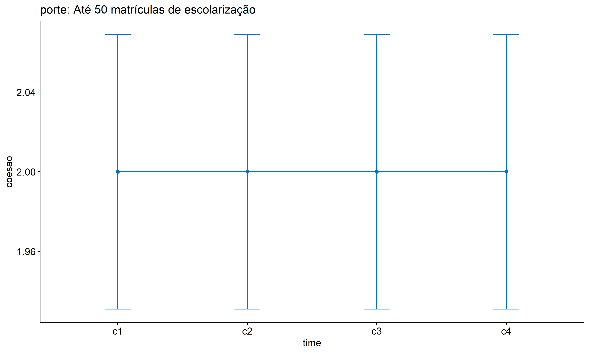<!-- -->

``` r
emms.gg <- emms[which(emms$porte == "Entre 201 e 500 matrículas de escolarização"),]
if (nrow(emms.gg) > 0)
  ggline(emms.gg, x = "time", y = "emmean", color = "#EFC000FF", ylab = "coesao") +
    geom_errorbar(aes(ymin = conf.low, ymax = conf.high),
                  width = 0.2, color = "#EFC000FF") +
    stat_pvalue_manual(
      add_xy_position(pwc[which(pwc$porte == "Entre 201 e 500 matrículas de escolarização"),],
                      x = "time", fun = "mean_se"),
      hide.ns = T, color = "#EFC000FF", tip.length = F) +
    labs(title = "porte: Entre 201 e 500 matrículas de escolarização")+
    theme(legend.text = element_blank())
```

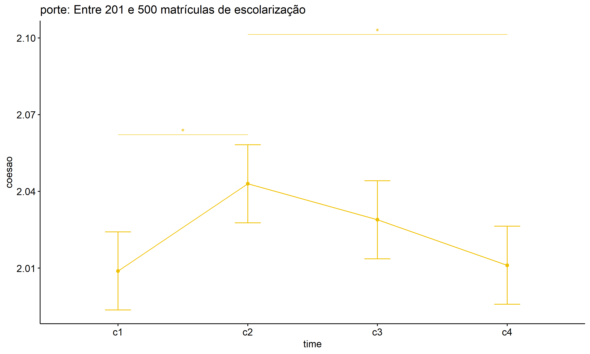<!-- -->

``` r
emms.gg <- emms[which(emms$porte == "Entre 501 e 1000 matrículas de escolarização"),]
if (nrow(emms.gg) > 0)
  ggline(emms.gg, x = "time", y = "emmean", color = "#868686FF", ylab = "coesao") +
    geom_errorbar(aes(ymin = conf.low, ymax = conf.high),
                  width = 0.2, color = "#868686FF") +
    stat_pvalue_manual(
      add_xy_position(pwc[which(pwc$porte == "Entre 501 e 1000 matrículas de escolarização"),],
                      x = "time", fun = "mean_se"),
      hide.ns = T, color = "#868686FF", tip.length = F) +
    labs(title = "porte: Entre 501 e 1000 matrículas de escolarização")+
    theme(legend.text = element_blank())
```

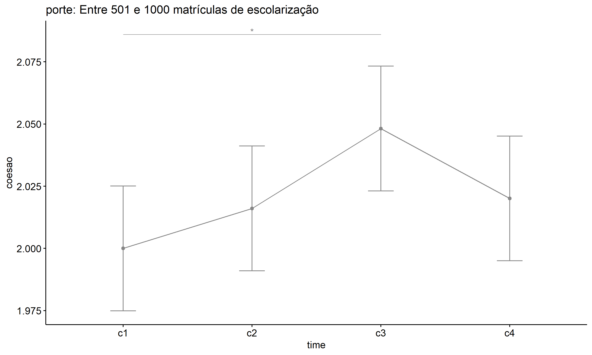<!-- -->

``` r
emms.gg <- emms[which(emms$porte == "Entre 51 e 200 matrículas de escolarização"),]
if (nrow(emms.gg) > 0)
  ggline(emms.gg, x = "time", y = "emmean", color = "#CD534CFF", ylab = "coesao") +
    geom_errorbar(aes(ymin = conf.low, ymax = conf.high),
                  width = 0.2, color = "#CD534CFF") +
    stat_pvalue_manual(
      add_xy_position(pwc[which(pwc$porte == "Entre 51 e 200 matrículas de escolarização"),],
                      x = "time", fun = "mean_se"),
      hide.ns = T, color = "#CD534CFF", tip.length = F) +
    labs(title = "porte: Entre 51 e 200 matrículas de escolarização")+
    theme(legend.text = element_blank())
```

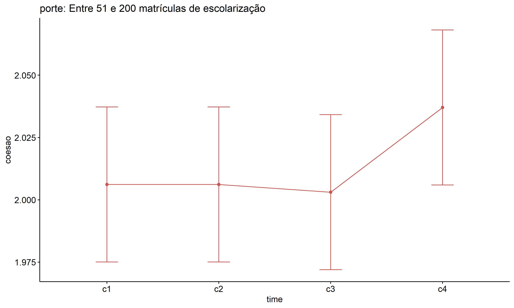<!-- -->

``` r
emms.gg <- emms[which(emms$porte == "Mais de 1000 matrículas de escolarização"),]
if (nrow(emms.gg) > 0)
  ggline(emms.gg, x = "time", y = "emmean", color = "#7AA6DCFF", ylab = "coesao") +
    geom_errorbar(aes(ymin = conf.low, ymax = conf.high),
                  width = 0.2, color = "#7AA6DCFF") +
    stat_pvalue_manual(
      add_xy_position(pwc[which(pwc$porte == "Mais de 1000 matrículas de escolarização"),],
                      x = "time", fun = "mean_se"),
      hide.ns = T, color = "#7AA6DCFF", tip.length = F) +
    labs(title = "porte: Mais de 1000 matrículas de escolarização")+
    theme(legend.text = element_blank())
```

## PairWise Computation after removing non.normal data

``` r
if (length(non.ids) > 0)
  (pwc2 <- ldat2 %>% group_by(time) %>%
     emmeans_test(coesao ~ porte, detailed = T, p.adjust.method = "bonferroni"))
```

``` r
if (length(non.ids) > 0)
  (emms2 <- get_emmeans(pwc2))
```

``` r
if (length(non.ids) > 0) {
  pwc2 <- add_xy_position(pwc2, x = "time", fun = "mean_se", dodge = 0.25)
  pd2 <- position_dodge(width = 0.25)
  
  ggline(emms2, x = "time", y = "emmean", color = "porte",
         palette = c("#0073C2FF","#EFC000FF","#868686FF","#CD534CFF","#7AA6DCFF"),
         position = pd, ylab = "coesao") +
    geom_errorbar(aes(ymin = conf.low, ymax = conf.high, color = porte),
                position = pd, width = 0.2) +
    stat_pvalue_manual(pwc2, hide.ns = T, tip.length = F, linetype = 1)
}
```

``` r
if (length(non.ids) > 0)
  (pwc2 <- ldat2 %>% group_by(porte) %>%
     emmeans_test(coesao ~ time, detailed = T, p.adjust.method = "bonferroni"))
```

``` r
if (length(non.ids) > 0)
  (emms2 <- get_emmeans(pwc2))
```

``` r
if (length(non.ids) > 0) {
  emms.gg <- emms2[which(emms2$porte == "Até 50 matrículas de escolarização"),]
  if (nrow(emms.gg) > 0)
    ggline(emms.gg, x = "time", y = "emmean", color = "#0073C2FF", ylab = "coesao") +
    geom_errorbar(aes(ymin = conf.low, ymax = conf.high),
                  width = 0.2, color = "#0073C2FF") +
    stat_pvalue_manual(
      add_xy_position(pwc[which(pwc$porte == "Até 50 matrículas de escolarização"),],
                      x = "time", fun = "mean_se"),
      hide.ns = T, color = "#0073C2FF", tip.length = F) +
    labs(title = "porte: Até 50 matrículas de escolarização") +
    theme(legend.text = element_blank())
}
```

``` r
if (length(non.ids) > 0) {
  emms.gg <- emms2[which(emms2$porte == "Entre 201 e 500 matrículas de escolarização"),]
  if (nrow(emms.gg) > 0)
    ggline(emms.gg, x = "time", y = "emmean", color = "#EFC000FF", ylab = "coesao") +
    geom_errorbar(aes(ymin = conf.low, ymax = conf.high),
                  width = 0.2, color = "#EFC000FF") +
    stat_pvalue_manual(
      add_xy_position(pwc[which(pwc$porte == "Entre 201 e 500 matrículas de escolarização"),],
                      x = "time", fun = "mean_se"),
      hide.ns = T, color = "#EFC000FF", tip.length = F) +
    labs(title = "porte: Entre 201 e 500 matrículas de escolarização") +
    theme(legend.text = element_blank())
}
```

``` r
if (length(non.ids) > 0) {
  emms.gg <- emms2[which(emms2$porte == "Entre 501 e 1000 matrículas de escolarização"),]
  if (nrow(emms.gg) > 0)
    ggline(emms.gg, x = "time", y = "emmean", color = "#868686FF", ylab = "coesao") +
    geom_errorbar(aes(ymin = conf.low, ymax = conf.high),
                  width = 0.2, color = "#868686FF") +
    stat_pvalue_manual(
      add_xy_position(pwc[which(pwc$porte == "Entre 501 e 1000 matrículas de escolarização"),],
                      x = "time", fun = "mean_se"),
      hide.ns = T, color = "#868686FF", tip.length = F) +
    labs(title = "porte: Entre 501 e 1000 matrículas de escolarização") +
    theme(legend.text = element_blank())
}
```

``` r
if (length(non.ids) > 0) {
  emms.gg <- emms2[which(emms2$porte == "Entre 51 e 200 matrículas de escolarização"),]
  if (nrow(emms.gg) > 0)
    ggline(emms.gg, x = "time", y = "emmean", color = "#CD534CFF", ylab = "coesao") +
    geom_errorbar(aes(ymin = conf.low, ymax = conf.high),
                  width = 0.2, color = "#CD534CFF") +
    stat_pvalue_manual(
      add_xy_position(pwc[which(pwc$porte == "Entre 51 e 200 matrículas de escolarização"),],
                      x = "time", fun = "mean_se"),
      hide.ns = T, color = "#CD534CFF", tip.length = F) +
    labs(title = "porte: Entre 51 e 200 matrículas de escolarização") +
    theme(legend.text = element_blank())
}
```

``` r
if (length(non.ids) > 0) {
  emms.gg <- emms2[which(emms2$porte == "Mais de 1000 matrículas de escolarização"),]
  if (nrow(emms.gg) > 0)
    ggline(emms.gg, x = "time", y = "emmean", color = "#7AA6DCFF", ylab = "coesao") +
    geom_errorbar(aes(ymin = conf.low, ymax = conf.high),
                  width = 0.2, color = "#7AA6DCFF") +
    stat_pvalue_manual(
      add_xy_position(pwc[which(pwc$porte == "Mais de 1000 matrículas de escolarização"),],
                      x = "time", fun = "mean_se"),
      hide.ns = T, color = "#7AA6DCFF", tip.length = F) +
    labs(title = "porte: Mais de 1000 matrículas de escolarização") +
    theme(legend.text = element_blank())
}
```
