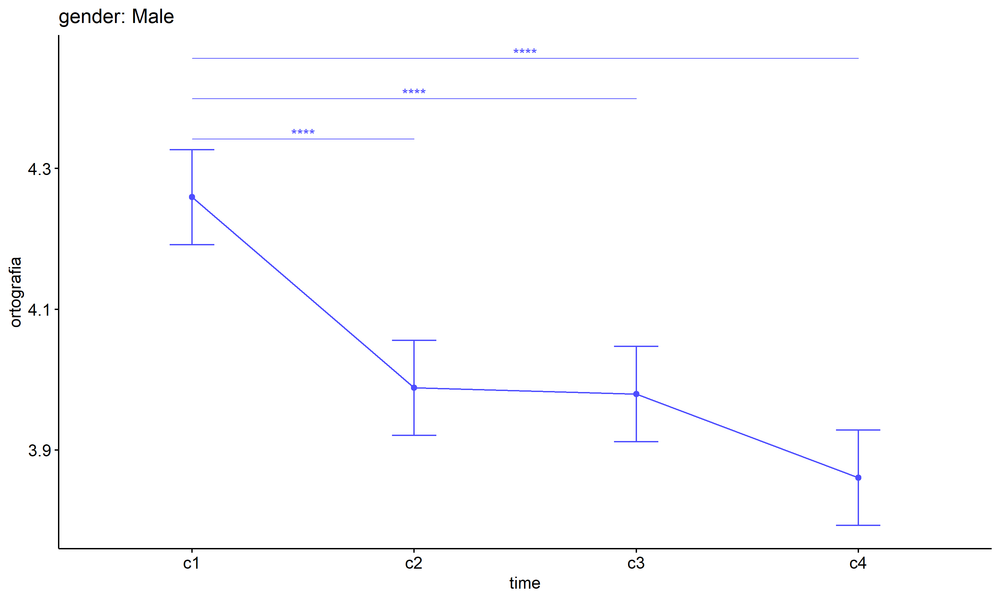

ANOVA test for ortografia
================
Geiser C. Challco <geiser@alumni.usp.br>

- [ANOVA: ortografia ~ time](#anova-ortografia--time)
  - [Data Preparation](#data-preparation)
  - [Summary Statistics](#summary-statistics)
  - [ANOVA Computation](#anova-computation)
  - [PairWise Computation](#pairwise-computation)
- [ANOVA: ortografia ~ time\*gender +
  Error(id/time)](#anova-ortografia--timegender--erroridtime)
  - [Data Preparation](#data-preparation-1)
    - [Check assumptions: Identifying
      Outliers](#check-assumptions-identifying-outliers)
    - [Check assumptions: Normality
      Test](#check-assumptions-normality-test)
    - [Summary Statistics](#summary-statistics-1)
  - [ANOVA Computation](#anova-computation-1)
  - [ANOVA Computation after removing non.normal
    data](#anova-computation-after-removing-nonnormal-data)
  - [PairWise Computation](#pairwise-computation-1)
  - [PairWise Computation after removing non.normal
    data](#pairwise-computation-after-removing-nonnormal-data)
- [ANOVA: ortografia ~ time\*localizacao +
  Error(id/time)](#anova-ortografia--timelocalizacao--erroridtime)
  - [Data Preparation](#data-preparation-2)
    - [Check assumptions: Identifying
      Outliers](#check-assumptions-identifying-outliers-1)
    - [Check assumptions: Normality
      Test](#check-assumptions-normality-test-1)
    - [Summary Statistics](#summary-statistics-2)
  - [ANOVA Computation](#anova-computation-2)
  - [ANOVA Computation after removing non.normal
    data](#anova-computation-after-removing-nonnormal-data-1)
  - [PairWise Computation](#pairwise-computation-2)
  - [PairWise Computation after removing non.normal
    data](#pairwise-computation-after-removing-nonnormal-data-1)
- [ANOVA: ortografia ~ time\*regiao +
  Error(id/time)](#anova-ortografia--timeregiao--erroridtime)
  - [Data Preparation](#data-preparation-3)
    - [Check assumptions: Identifying
      Outliers](#check-assumptions-identifying-outliers-2)
    - [Check assumptions: Normality
      Test](#check-assumptions-normality-test-2)
    - [Summary Statistics](#summary-statistics-3)
  - [ANOVA Computation](#anova-computation-3)
  - [ANOVA Computation after removing non.normal
    data](#anova-computation-after-removing-nonnormal-data-2)
  - [PairWise Computation](#pairwise-computation-3)
  - [PairWise Computation after removing non.normal
    data](#pairwise-computation-after-removing-nonnormal-data-2)
- [ANOVA: ortografia ~ time\*porte +
  Error(id/time)](#anova-ortografia--timeporte--erroridtime)
  - [Data Preparation](#data-preparation-4)
    - [Check assumptions: Identifying
      Outliers](#check-assumptions-identifying-outliers-3)
    - [Check assumptions: Normality
      Test](#check-assumptions-normality-test-3)
    - [Summary Statistics](#summary-statistics-4)
  - [ANOVA Computation](#anova-computation-4)
  - [ANOVA Computation after removing non.normal
    data](#anova-computation-after-removing-nonnormal-data-3)
  - [PairWise Computation](#pairwise-computation-4)

``` r
dat <- read_excel("../data/data.xlsx", sheet = "alunos_ef14")

escolas <- read_excel("../data/data.xlsx", sheet = "escolas")
edat <- merge(dat, escolas, by = "cod_escola", all.x = T)
```

# ANOVA: ortografia ~ time

## Data Preparation

``` r
data <- edat[,c("aluno_id","ciclo","ortografia")]
data$ciclo <- factor(edat$ciclo, c("Primeiro Ciclo","Segundo Ciclo",
                                   "Terceiro Ciclo","Quarto Ciclo"))

wdat <- spread(data, ciclo, ortografia)
wdat <- wdat[complete.cases(wdat),]
colnames(wdat) <- c("id","c1","c2","c3","c4")

ldat <- gather(wdat, key = time, value = ortografia, c1, c2, c3, c4) %>%
  convert_as_factor(id, time)
ldat <- rshinystatistics::remove_group_data(ldat, "ortografia", "time", n.limit = 30)
```

## Summary Statistics

``` r
(sdat <- ldat %>% group_by(time) %>%
   get_summary_stats(ortografia, type = "mean_sd"))
```

    ## # A tibble: 4 × 5
    ##   time  variable       n  mean    sd
    ##   <fct> <fct>      <dbl> <dbl> <dbl>
    ## 1 c1    ortografia  1126  4.23 0.785
    ## 2 c2    ortografia  1126  3.97 0.793
    ## 3 c3    ortografia  1126  3.94 0.767
    ## 4 c4    ortografia  1126  3.92 0.776

| time | variable   |    n |  mean |    sd |
|:-----|:-----------|-----:|------:|------:|
| c1   | ortografia | 1126 | 4.226 | 0.785 |
| c2   | ortografia | 1126 | 3.970 | 0.793 |
| c3   | ortografia | 1126 | 3.944 | 0.767 |
| c4   | ortografia | 1126 | 3.921 | 0.776 |

## ANOVA Computation

``` r
(res.aov <- anova_test(ldat, dv = ortografia, wid = id, within = time))
```

    ## ANOVA Table (type III tests)
    ## 
    ## $ANOVA
    ##   Effect DFn  DFd      F        p p<.05   ges
    ## 1   time   3 3375 43.853 8.54e-28     * 0.024
    ## 
    ## $`Mauchly's Test for Sphericity`
    ##   Effect     W     p p<.05
    ## 1   time 0.989 0.027     *
    ## 
    ## $`Sphericity Corrections`
    ##   Effect   GGe        DF[GG]    p[GG] p[GG]<.05   HFe        DF[HF]    p[HF]
    ## 1   time 0.992 2.98, 3349.13 1.33e-27         * 0.995 2.99, 3358.99 1.12e-27
    ##   p[HF]<.05
    ## 1         *

| Effect | DFn |  DFd |      F |   p | p\<.05 |   ges |
|:-------|----:|-----:|-------:|----:|:-------|------:|
| time   |   3 | 3375 | 43.853 |   0 | \*     | 0.024 |

| Effect |     W |     p | p\<.05 |
|:-------|------:|------:|:-------|
| time   | 0.989 | 0.027 | \*     |

| Effect |   GGe | DF\[GG\]      | p\[GG\] | p\[GG\]\<.05 |   HFe | DF\[HF\]      | p\[HF\] | p\[HF\]\<.05 |
|:-------|------:|:--------------|--------:|:-------------|------:|:--------------|--------:|:-------------|
| time   | 0.992 | 2.98, 3349.13 |       0 | \*           | 0.995 | 2.99, 3358.99 |       0 | \*           |

## PairWise Computation

``` r
(pwc <- ldat %>% emmeans_test(ortografia ~ time, detailed = T, p.adjust.method = "bonferroni"))
```

    ## # A tibble: 6 × 14
    ##   term  .y.    group1 group2 null.value estimate     se    df conf.low conf.high
    ## * <chr> <chr>  <chr>  <chr>       <dbl>    <dbl>  <dbl> <dbl>    <dbl>     <dbl>
    ## 1 time  ortog… c1     c2              0   0.256  0.0329  4500   0.191     0.320 
    ## 2 time  ortog… c1     c3              0   0.282  0.0329  4500   0.217     0.346 
    ## 3 time  ortog… c1     c4              0   0.305  0.0329  4500   0.241     0.370 
    ## 4 time  ortog… c2     c3              0   0.0261 0.0329  4500  -0.0384    0.0905
    ## 5 time  ortog… c2     c4              0   0.0496 0.0329  4500  -0.0149    0.114 
    ## 6 time  ortog… c3     c4              0   0.0235 0.0329  4500  -0.0410    0.0880
    ## # ℹ 4 more variables: statistic <dbl>, p <dbl>, p.adj <dbl>, p.adj.signif <chr>

| term | .y.        | group1 | group2 | null.value | estimate |    se |   df | conf.low | conf.high | statistic |     p | p.adj | p.adj.signif |
|:-----|:-----------|:-------|:-------|-----------:|---------:|------:|-----:|---------:|----------:|----------:|------:|------:|:-------------|
| time | ortografia | c1     | c2     |          0 |    0.256 | 0.033 | 4500 |    0.191 |     0.320 |     7.772 | 0.000 |  0.00 | \*\*\*\*     |
| time | ortografia | c1     | c3     |          0 |    0.282 | 0.033 | 4500 |    0.217 |     0.346 |     8.564 | 0.000 |  0.00 | \*\*\*\*     |
| time | ortografia | c1     | c4     |          0 |    0.305 | 0.033 | 4500 |    0.241 |     0.370 |     9.279 | 0.000 |  0.00 | \*\*\*\*     |
| time | ortografia | c2     | c3     |          0 |    0.026 | 0.033 | 4500 |   -0.038 |     0.091 |     0.792 | 0.428 |  1.00 | ns           |
| time | ortografia | c2     | c4     |          0 |    0.050 | 0.033 | 4500 |   -0.015 |     0.114 |     1.508 | 0.132 |  0.79 | ns           |
| time | ortografia | c3     | c4     |          0 |    0.024 | 0.033 | 4500 |   -0.041 |     0.088 |     0.716 | 0.474 |  1.00 | ns           |

``` r
pwc <- add_xy_position(pwc, x = "time", fun = "mean_se")
ggline(get_emmeans(pwc), x = "time", y = "emmean", ylab = "ortografia") +
  geom_errorbar(aes(ymin = conf.low, ymax = conf.high), width = 0.2) +
  stat_pvalue_manual(pwc, hide.ns = T, tip.length = F)
```

<!-- -->

# ANOVA: ortografia ~ time\*gender + Error(id/time)

## Data Preparation

``` r
data <- edat[,c("aluno_id","gender","ciclo","ortografia")]
data$ciclo <- factor(data$ciclo, c("Primeiro Ciclo","Segundo Ciclo",
                                   "Terceiro Ciclo","Quarto Ciclo"))

wdat <- spread(data, ciclo, ortografia)
wdat <- wdat[complete.cases(wdat),]
colnames(wdat) <- c("id","gender","c1","c2","c3","c4")

ldat <- gather(wdat, key = time, value = ortografia, c1, c2, c3, c4) %>%
  convert_as_factor(id, time)
ldat <- remove_group_data(ldat, "ortografia", c("time", "gender"), n.limit = 30)
ldat$gender <- factor(ldat$gender, sort(unique(ldat$gender)))
```

### Check assumptions: Identifying Outliers

``` r
outliers <- identify_outliers(group_by(ldat, time, gender), ortografia)
(outliers <- outliers[outliers$is.extreme == T,])
```

    ## [1] gender     time       id         ortografia is.outlier is.extreme
    ## <0 rows> (or 0-length row.names)

| gender | time | id  | ortografia | is.outlier | is.extreme |
|:-------|:-----|:----|-----------:|:-----------|:-----------|

### Check assumptions: Normality Test

``` r
(normality.df <- normality.test.per.groups(ldat, "ortografia", c("time", "gender")))
```

    ##          var   variable time gender   n     skewness  kurtosis symmetry
    ## 1 ortografia ortografia   c1 Female 552 -0.376083415 -1.320924      YES
    ## 2 ortografia ortografia   c1   Male 513 -0.520483005 -1.248268       NO
    ## 3 ortografia ortografia   c2 Female 552  0.077888733 -1.478998      YES
    ## 4 ortografia ortografia   c2   Male 513  0.002822173 -1.460892      YES
    ## 5 ortografia ortografia   c3 Female 552  0.103115900 -1.370211      YES
    ## 6 ortografia ortografia   c3   Male 513  0.019183698 -1.355139      YES
    ## 7 ortografia ortografia   c4 Female 552  0.019732006 -1.399905      YES
    ## 8 ortografia ortografia   c4   Male 513  0.209771757 -1.425977      YES
    ##    statistic     method p p.signif normality
    ## 1  1100.9881 D'Agostino 0     ****         -
    ## 2   471.1104 D'Agostino 0     ****         -
    ## 3  5321.1559 D'Agostino 0     ****         -
    ## 4  5860.1509 D'Agostino 0     ****         -
    ## 5  3023.2555 D'Agostino 0     ****         -
    ## 6  1691.0401 D'Agostino 0     ****         -
    ## 7 35944.3849 D'Agostino 0     ****         -
    ## 8  9306.7505 D'Agostino 0     ****         -

| var        | variable   | time | gender |   n | skewness | kurtosis | symmetry | statistic | method     |   p | p.signif | normality |
|:-----------|:-----------|:-----|:-------|----:|---------:|---------:|:---------|----------:|:-----------|----:|:---------|:----------|
| ortografia | ortografia | c1   | Female | 552 |   -0.376 |   -1.321 | YES      |  1100.988 | D’Agostino |   0 | \*\*\*\* | \-        |
| ortografia | ortografia | c1   | Male   | 513 |   -0.520 |   -1.248 | NO       |   471.110 | D’Agostino |   0 | \*\*\*\* | \-        |
| ortografia | ortografia | c2   | Female | 552 |    0.078 |   -1.479 | YES      |  5321.156 | D’Agostino |   0 | \*\*\*\* | \-        |
| ortografia | ortografia | c2   | Male   | 513 |    0.003 |   -1.461 | YES      |  5860.151 | D’Agostino |   0 | \*\*\*\* | \-        |
| ortografia | ortografia | c3   | Female | 552 |    0.103 |   -1.370 | YES      |  3023.255 | D’Agostino |   0 | \*\*\*\* | \-        |
| ortografia | ortografia | c3   | Male   | 513 |    0.019 |   -1.355 | YES      |  1691.040 | D’Agostino |   0 | \*\*\*\* | \-        |
| ortografia | ortografia | c4   | Female | 552 |    0.020 |   -1.400 | YES      | 35944.385 | D’Agostino |   0 | \*\*\*\* | \-        |
| ortografia | ortografia | c4   | Male   | 513 |    0.210 |   -1.426 | YES      |  9306.751 | D’Agostino |   0 | \*\*\*\* | \-        |

``` r
(non.ids <- unique(do.call(
  c, lapply(which(normality.df$normality == 'NO'), FUN = function(i) {
  idx = which(ldat$time == normality.df$time[i] &
                ldat$gender == normality.df$gender[i])
  getNonNormal(ldat$"ortografia"[idx], ldat$id[idx])
}))))
```

    ## NULL

``` r
if (length(non.ids) > 0)
  ldat2 <- ldat[!ldat$id %in% non.ids,]
```

### Summary Statistics

``` r
(sdat <- ldat %>% group_by(time, gender) %>%
   get_summary_stats(ortografia, type = "mean_sd"))
```

    ## # A tibble: 8 × 6
    ##   gender time  variable       n  mean    sd
    ##   <fct>  <fct> <fct>      <dbl> <dbl> <dbl>
    ## 1 Female c1    ortografia   552  4.19 0.782
    ## 2 Male   c1    ortografia   513  4.26 0.787
    ## 3 Female c2    ortografia   552  3.94 0.8  
    ## 4 Male   c2    ortografia   513  3.99 0.792
    ## 5 Female c3    ortografia   552  3.92 0.768
    ## 6 Male   c3    ortografia   513  3.98 0.761
    ## 7 Female c4    ortografia   552  3.98 0.774
    ## 8 Male   c4    ortografia   513  3.86 0.782

| gender | time | variable   |   n |  mean |    sd |
|:-------|:-----|:-----------|----:|------:|------:|
| Female | c1   | ortografia | 552 | 4.190 | 0.782 |
| Male   | c1   | ortografia | 513 | 4.259 | 0.787 |
| Female | c2   | ortografia | 552 | 3.944 | 0.800 |
| Male   | c2   | ortografia | 513 | 3.988 | 0.792 |
| Female | c3   | ortografia | 552 | 3.919 | 0.768 |
| Male   | c3   | ortografia | 513 | 3.980 | 0.761 |
| Female | c4   | ortografia | 552 | 3.977 | 0.774 |
| Male   | c4   | ortografia | 513 | 3.861 | 0.782 |

``` r
if (length(non.ids) > 0)
  (sdat <- ldat2 %>% group_by(time, gender) %>%
      get_summary_stats(ortografia, type = "mean_sd"))
```

| gender | time | variable   |   n |  mean |    sd |
|:-------|:-----|:-----------|----:|------:|------:|
| Female | c1   | ortografia | 552 | 4.190 | 0.782 |
| Male   | c1   | ortografia | 513 | 4.259 | 0.787 |
| Female | c2   | ortografia | 552 | 3.944 | 0.800 |
| Male   | c2   | ortografia | 513 | 3.988 | 0.792 |
| Female | c3   | ortografia | 552 | 3.919 | 0.768 |
| Male   | c3   | ortografia | 513 | 3.980 | 0.761 |
| Female | c4   | ortografia | 552 | 3.977 | 0.774 |
| Male   | c4   | ortografia | 513 | 3.861 | 0.782 |

## ANOVA Computation

``` r
(res.aov <- anova_test(ldat, dv = ortografia, wid = id, between = gender, within = time))
```

    ## ANOVA Table (type III tests)
    ## 
    ## $ANOVA
    ##        Effect DFn  DFd      F        p p<.05      ges
    ## 1      gender   1 1063  0.238 6.26e-01       8.13e-05
    ## 2        time   3 3189 41.000 5.44e-26     * 2.40e-02
    ## 3 gender:time   3 3189  3.962 8.00e-03     * 2.00e-03
    ## 
    ## $`Mauchly's Test for Sphericity`
    ##        Effect    W     p p<.05
    ## 1        time 0.99 0.049     *
    ## 2 gender:time 0.99 0.049     *
    ## 
    ## $`Sphericity Corrections`
    ##        Effect   GGe        DF[GG]    p[GG] p[GG]<.05   HFe        DF[HF]
    ## 1        time 0.993 2.98, 3166.29 7.98e-26         * 0.996 2.99, 3176.16
    ## 2 gender:time 0.993 2.98, 3166.29 8.00e-03         * 0.996 2.99, 3176.16
    ##      p[HF] p[HF]<.05
    ## 1 6.75e-26         *
    ## 2 8.00e-03         *

| Effect      | DFn |  DFd |      F |     p | p\<.05 |   ges |
|:------------|----:|-----:|-------:|------:|:-------|------:|
| gender      |   1 | 1063 |  0.238 | 0.626 |        | 0.000 |
| time        |   3 | 3189 | 41.000 | 0.000 | \*     | 0.024 |
| gender:time |   3 | 3189 |  3.962 | 0.008 | \*     | 0.002 |

| Effect      |    W |     p | p\<.05 |
|:------------|-----:|------:|:-------|
| time        | 0.99 | 0.049 | \*     |
| gender:time | 0.99 | 0.049 | \*     |

| Effect      |   GGe | DF\[GG\]      | p\[GG\] | p\[GG\]\<.05 |   HFe | DF\[HF\]      | p\[HF\] | p\[HF\]\<.05 |
|:------------|------:|:--------------|--------:|:-------------|------:|:--------------|--------:|:-------------|
| time        | 0.993 | 2.98, 3166.29 |   0.000 | \*           | 0.996 | 2.99, 3176.16 |   0.000 | \*           |
| gender:time | 0.993 | 2.98, 3166.29 |   0.008 | \*           | 0.996 | 2.99, 3176.16 |   0.008 | \*           |

## ANOVA Computation after removing non.normal data

``` r
if (length(non.ids) > 0)
  (res.aov2 <- anova_test(ldat2, dv = ortografia, wid = id, between = gender , within = time))
```

## PairWise Computation

``` r
(pwc <- ldat %>% group_by(time) %>%
   emmeans_test(ortografia ~ gender, detailed = T, p.adjust.method = "bonferroni"))
```

    ## # A tibble: 4 × 15
    ##   time  term   .y.       group1 group2 null.value estimate     se    df conf.low
    ## * <fct> <chr>  <chr>     <chr>  <chr>       <dbl>    <dbl>  <dbl> <dbl>    <dbl>
    ## 1 c1    gender ortograf… Female Male            0  -0.0690 0.0479  4252  -0.163 
    ## 2 c2    gender ortograf… Female Male            0  -0.0439 0.0479  4252  -0.138 
    ## 3 c3    gender ortograf… Female Male            0  -0.0601 0.0479  4252  -0.154 
    ## 4 c4    gender ortograf… Female Male            0   0.117  0.0479  4252   0.0228
    ## # ℹ 5 more variables: conf.high <dbl>, statistic <dbl>, p <dbl>, p.adj <dbl>,
    ## #   p.adj.signif <chr>

| time | term   | .y.        | group1 | group2 | null.value | estimate |    se |   df | conf.low | conf.high | statistic |     p | p.adj | p.adj.signif |
|:-----|:-------|:-----------|:-------|:-------|-----------:|---------:|------:|-----:|---------:|----------:|----------:|------:|------:|:-------------|
| c1   | gender | ortografia | Female | Male   |          0 |   -0.069 | 0.048 | 4252 |   -0.163 |     0.025 |    -1.442 | 0.149 | 0.149 | ns           |
| c2   | gender | ortografia | Female | Male   |          0 |   -0.044 | 0.048 | 4252 |   -0.138 |     0.050 |    -0.916 | 0.360 | 0.360 | ns           |
| c3   | gender | ortografia | Female | Male   |          0 |   -0.060 | 0.048 | 4252 |   -0.154 |     0.034 |    -1.256 | 0.209 | 0.209 | ns           |
| c4   | gender | ortografia | Female | Male   |          0 |    0.117 | 0.048 | 4252 |    0.023 |     0.211 |     2.438 | 0.015 | 0.015 | \*           |

``` r
(emms <- get_emmeans(pwc))
```

    ## # A tibble: 8 × 8
    ##   time  gender emmean     se    df conf.low conf.high method      
    ##   <fct> <fct>   <dbl>  <dbl> <dbl>    <dbl>     <dbl> <chr>       
    ## 1 c1    Female   4.19 0.0332  4252     4.13      4.26 Emmeans test
    ## 2 c1    Male     4.26 0.0345  4252     4.19      4.33 Emmeans test
    ## 3 c2    Female   3.94 0.0332  4252     3.88      4.01 Emmeans test
    ## 4 c2    Male     3.99 0.0345  4252     3.92      4.06 Emmeans test
    ## 5 c3    Female   3.92 0.0332  4252     3.85      3.98 Emmeans test
    ## 6 c3    Male     3.98 0.0345  4252     3.91      4.05 Emmeans test
    ## 7 c4    Female   3.98 0.0332  4252     3.91      4.04 Emmeans test
    ## 8 c4    Male     3.86 0.0345  4252     3.79      3.93 Emmeans test

| time | gender | emmean |    se |   df | conf.low | conf.high | method       |
|:-----|:-------|-------:|------:|-----:|---------:|----------:|:-------------|
| c1   | Female |  4.190 | 0.033 | 4252 |    4.125 |     4.255 | Emmeans test |
| c1   | Male   |  4.259 | 0.034 | 4252 |    4.192 |     4.327 | Emmeans test |
| c2   | Female |  3.944 | 0.033 | 4252 |    3.879 |     4.010 | Emmeans test |
| c2   | Male   |  3.988 | 0.034 | 4252 |    3.921 |     4.056 | Emmeans test |
| c3   | Female |  3.919 | 0.033 | 4252 |    3.854 |     3.985 | Emmeans test |
| c3   | Male   |  3.980 | 0.034 | 4252 |    3.912 |     4.047 | Emmeans test |
| c4   | Female |  3.977 | 0.033 | 4252 |    3.912 |     4.043 | Emmeans test |
| c4   | Male   |  3.861 | 0.034 | 4252 |    3.793 |     3.928 | Emmeans test |

``` r
pwc <- add_xy_position(pwc, x = "time", fun = "mean_se", dodge = 0.25)
pd <- position_dodge(width = 0.25)
ggline(emms, x = "time", y = "emmean", color = "gender",
       palette = c("#FF007F","#4D4DFF"),
       position = pd, ylab = "ortografia") +
  geom_errorbar(aes(ymin = conf.low, ymax = conf.high, color = gender),
                position = pd, width = 0.2) +
  stat_pvalue_manual(pwc, hide.ns = T, tip.length = F, linetype = 1)
```

<!-- -->

``` r
(pwc <- ldat %>% group_by(gender) %>%
    emmeans_test(ortografia ~ time, detailed = T, p.adjust.method = "bonferroni"))
```

    ## # A tibble: 12 × 15
    ##    gender term  .y.      group1 group2 null.value estimate     se    df conf.low
    ##  * <fct>  <chr> <chr>    <chr>  <chr>       <dbl>    <dbl>  <dbl> <dbl>    <dbl>
    ##  1 Female time  ortogra… c1     c2              0  0.246   0.0470  4252   0.154 
    ##  2 Female time  ortogra… c1     c3              0  0.271   0.0470  4252   0.179 
    ##  3 Female time  ortogra… c1     c4              0  0.213   0.0470  4252   0.121 
    ##  4 Female time  ortogra… c2     c3              0  0.0251  0.0470  4252  -0.0671
    ##  5 Female time  ortogra… c2     c4              0 -0.0329  0.0470  4252  -0.125 
    ##  6 Female time  ortogra… c3     c4              0 -0.0580  0.0470  4252  -0.150 
    ##  7 Male   time  ortogra… c1     c2              0  0.271   0.0488  4252   0.175 
    ##  8 Male   time  ortogra… c1     c3              0  0.280   0.0488  4252   0.184 
    ##  9 Male   time  ortogra… c1     c4              0  0.399   0.0488  4252   0.303 
    ## 10 Male   time  ortogra… c2     c3              0  0.00877 0.0488  4252  -0.0868
    ## 11 Male   time  ortogra… c2     c4              0  0.128   0.0488  4252   0.0321
    ## 12 Male   time  ortogra… c3     c4              0  0.119   0.0488  4252   0.0233
    ## # ℹ 5 more variables: conf.high <dbl>, statistic <dbl>, p <dbl>, p.adj <dbl>,
    ## #   p.adj.signif <chr>

| gender | term | .y.        | group1 | group2 | null.value | estimate |    se |   df | conf.low | conf.high | statistic |     p | p.adj | p.adj.signif |
|:-------|:-----|:-----------|:-------|:-------|-----------:|---------:|------:|-----:|---------:|----------:|----------:|------:|------:|:-------------|
| Female | time | ortografia | c1     | c2     |          0 |    0.246 | 0.047 | 4252 |    0.154 |     0.338 |     5.229 | 0.000 | 0.000 | \*\*\*\*     |
| Female | time | ortografia | c1     | c3     |          0 |    0.271 | 0.047 | 4252 |    0.179 |     0.363 |     5.762 | 0.000 | 0.000 | \*\*\*\*     |
| Female | time | ortografia | c1     | c4     |          0 |    0.213 | 0.047 | 4252 |    0.121 |     0.305 |     4.529 | 0.000 | 0.000 | \*\*\*\*     |
| Female | time | ortografia | c2     | c3     |          0 |    0.025 | 0.047 | 4252 |   -0.067 |     0.117 |     0.533 | 0.594 | 1.000 | ns           |
| Female | time | ortografia | c2     | c4     |          0 |   -0.033 | 0.047 | 4252 |   -0.125 |     0.059 |    -0.700 | 0.484 | 1.000 | ns           |
| Female | time | ortografia | c3     | c4     |          0 |   -0.058 | 0.047 | 4252 |   -0.150 |     0.034 |    -1.233 | 0.218 | 1.000 | ns           |
| Male   | time | ortografia | c1     | c2     |          0 |    0.271 | 0.049 | 4252 |    0.175 |     0.367 |     5.557 | 0.000 | 0.000 | \*\*\*\*     |
| Male   | time | ortografia | c1     | c3     |          0 |    0.280 | 0.049 | 4252 |    0.184 |     0.375 |     5.737 | 0.000 | 0.000 | \*\*\*\*     |
| Male   | time | ortografia | c1     | c4     |          0 |    0.399 | 0.049 | 4252 |    0.303 |     0.494 |     8.176 | 0.000 | 0.000 | \*\*\*\*     |
| Male   | time | ortografia | c2     | c3     |          0 |    0.009 | 0.049 | 4252 |   -0.087 |     0.104 |     0.180 | 0.857 | 1.000 | ns           |
| Male   | time | ortografia | c2     | c4     |          0 |    0.128 | 0.049 | 4252 |    0.032 |     0.223 |     2.619 | 0.009 | 0.053 | ns           |
| Male   | time | ortografia | c3     | c4     |          0 |    0.119 | 0.049 | 4252 |    0.023 |     0.214 |     2.439 | 0.015 | 0.089 | ns           |

``` r
(emms <- get_emmeans(pwc))
```

    ## # A tibble: 8 × 8
    ##   gender time  emmean     se    df conf.low conf.high method      
    ##   <fct>  <fct>  <dbl>  <dbl> <dbl>    <dbl>     <dbl> <chr>       
    ## 1 Female c1      4.19 0.0332  4252     4.13      4.26 Emmeans test
    ## 2 Female c2      3.94 0.0332  4252     3.88      4.01 Emmeans test
    ## 3 Female c3      3.92 0.0332  4252     3.85      3.98 Emmeans test
    ## 4 Female c4      3.98 0.0332  4252     3.91      4.04 Emmeans test
    ## 5 Male   c1      4.26 0.0345  4252     4.19      4.33 Emmeans test
    ## 6 Male   c2      3.99 0.0345  4252     3.92      4.06 Emmeans test
    ## 7 Male   c3      3.98 0.0345  4252     3.91      4.05 Emmeans test
    ## 8 Male   c4      3.86 0.0345  4252     3.79      3.93 Emmeans test

| gender | time | emmean |    se |   df | conf.low | conf.high | method       |
|:-------|:-----|-------:|------:|-----:|---------:|----------:|:-------------|
| Female | c1   |  4.190 | 0.033 | 4252 |    4.125 |     4.255 | Emmeans test |
| Female | c2   |  3.944 | 0.033 | 4252 |    3.879 |     4.010 | Emmeans test |
| Female | c3   |  3.919 | 0.033 | 4252 |    3.854 |     3.985 | Emmeans test |
| Female | c4   |  3.977 | 0.033 | 4252 |    3.912 |     4.043 | Emmeans test |
| Male   | c1   |  4.259 | 0.034 | 4252 |    4.192 |     4.327 | Emmeans test |
| Male   | c2   |  3.988 | 0.034 | 4252 |    3.921 |     4.056 | Emmeans test |
| Male   | c3   |  3.980 | 0.034 | 4252 |    3.912 |     4.047 | Emmeans test |
| Male   | c4   |  3.861 | 0.034 | 4252 |    3.793 |     3.928 | Emmeans test |

``` r
emms.gg <- emms[which(emms$gender == "Female"),]
if (nrow(emms.gg) > 0)
  ggline(emms.gg, x = "time", y = "emmean", color = "#FF007F", ylab = "ortografia") +
    geom_errorbar(aes(ymin = conf.low, ymax = conf.high),
                  width = 0.2, color = "#FF007F") +
    stat_pvalue_manual(
      add_xy_position(pwc[which(pwc$gender == "Female"),],
                      x = "time", fun = "mean_se"),
      hide.ns = T, color = "#FF007F", tip.length = F) +
    labs(title = "gender: Female")+
    theme(legend.text = element_blank())
```

<!-- -->

``` r
emms.gg <- emms[which(emms$gender == "Male"),]
if (nrow(emms.gg) > 0)
  ggline(emms.gg, x = "time", y = "emmean", color = "#4D4DFF", ylab = "ortografia") +
    geom_errorbar(aes(ymin = conf.low, ymax = conf.high),
                  width = 0.2, color = "#4D4DFF") +
    stat_pvalue_manual(
      add_xy_position(pwc[which(pwc$gender == "Male"),],
                      x = "time", fun = "mean_se"),
      hide.ns = T, color = "#4D4DFF", tip.length = F) +
    labs(title = "gender: Male")+
    theme(legend.text = element_blank())
```

<!-- -->

## PairWise Computation after removing non.normal data

``` r
if (length(non.ids) > 0)
  (pwc2 <- ldat2 %>% group_by(time) %>%
     emmeans_test(ortografia ~ gender, detailed = T, p.adjust.method = "bonferroni"))
```

``` r
if (length(non.ids) > 0)
  (emms2 <- get_emmeans(pwc2))
```

``` r
if (length(non.ids) > 0) {
  pwc2 <- add_xy_position(pwc2, x = "time", fun = "mean_se", dodge = 0.25)
  pd2 <- position_dodge(width = 0.25)
  
  ggline(emms2, x = "time", y = "emmean", color = "gender",
         palette = c("#FF007F","#4D4DFF"),
         position = pd, ylab = "ortografia") +
    geom_errorbar(aes(ymin = conf.low, ymax = conf.high, color = gender),
                position = pd, width = 0.2) +
    stat_pvalue_manual(pwc2, hide.ns = T, tip.length = F, linetype = 1)
}
```

``` r
if (length(non.ids) > 0)
  (pwc2 <- ldat2 %>% group_by(gender) %>%
     emmeans_test(ortografia ~ time, detailed = T, p.adjust.method = "bonferroni"))
```

``` r
if (length(non.ids) > 0)
  (emms2 <- get_emmeans(pwc2))
```

``` r
if (length(non.ids) > 0) {
  emms.gg <- emms2[which(emms2$gender == "Female"),]
  if (nrow(emms.gg) > 0)
    ggline(emms.gg, x = "time", y = "emmean", color = "#FF007F", ylab = "ortografia") +
    geom_errorbar(aes(ymin = conf.low, ymax = conf.high),
                  width = 0.2, color = "#FF007F") +
    stat_pvalue_manual(
      add_xy_position(pwc[which(pwc$gender == "Female"),],
                      x = "time", fun = "mean_se"),
      hide.ns = T, color = "#FF007F", tip.length = F) +
    labs(title = "gender: Female") +
    theme(legend.text = element_blank())
}
```

``` r
if (length(non.ids) > 0) {
  emms.gg <- emms2[which(emms2$gender == "Male"),]
  if (nrow(emms.gg) > 0)
    ggline(emms.gg, x = "time", y = "emmean", color = "#4D4DFF", ylab = "ortografia") +
    geom_errorbar(aes(ymin = conf.low, ymax = conf.high),
                  width = 0.2, color = "#4D4DFF") +
    stat_pvalue_manual(
      add_xy_position(pwc[which(pwc$gender == "Male"),],
                      x = "time", fun = "mean_se"),
      hide.ns = T, color = "#4D4DFF", tip.length = F) +
    labs(title = "gender: Male") +
    theme(legend.text = element_blank())
}
```

# ANOVA: ortografia ~ time\*localizacao + Error(id/time)

## Data Preparation

``` r
data <- edat[,c("aluno_id","localizacao","ciclo","ortografia")]
data$ciclo <- factor(data$ciclo, c("Primeiro Ciclo","Segundo Ciclo",
                                   "Terceiro Ciclo","Quarto Ciclo"))

wdat <- spread(data, ciclo, ortografia)
wdat <- wdat[complete.cases(wdat),]
colnames(wdat) <- c("id","localizacao","c1","c2","c3","c4")

ldat <- gather(wdat, key = time, value = ortografia, c1, c2, c3, c4) %>%
  convert_as_factor(id, time)
ldat <- remove_group_data(ldat, "ortografia", c("time", "localizacao"), n.limit = 30)
ldat$localizacao <- factor(ldat$localizacao, sort(unique(ldat$localizacao)))
```

### Check assumptions: Identifying Outliers

``` r
outliers <- identify_outliers(group_by(ldat, time, localizacao), ortografia)
(outliers <- outliers[outliers$is.extreme == T,])
```

    ## [1] localizacao time        id          ortografia  is.outlier  is.extreme 
    ## <0 rows> (or 0-length row.names)

| localizacao | time | id  | ortografia | is.outlier | is.extreme |
|:------------|:-----|:----|-----------:|:-----------|:-----------|

### Check assumptions: Normality Test

``` r
(normality.df <- normality.test.per.groups(ldat, "ortografia", c("time", "localizacao")))
```

    ##          var   variable time localizacao   n    skewness  kurtosis symmetry
    ## 1 ortografia ortografia   c1       Rural 181 -0.56126204 -1.126250       NO
    ## 2 ortografia ortografia   c1      Urbana 945 -0.42568385 -1.317504      YES
    ## 3 ortografia ortografia   c2       Rural 181 -0.05024091 -1.545970      YES
    ## 4 ortografia ortografia   c2      Urbana 945  0.04657452 -1.445309      YES
    ## 5 ortografia ortografia   c3       Rural 181  0.23167022 -1.322238      YES
    ## 6 ortografia ortografia   c3      Urbana 945  0.04076148 -1.377860      YES
    ## 7 ortografia ortografia   c4       Rural 181  0.23336592 -1.492570      YES
    ## 8 ortografia ortografia   c4      Urbana 945  0.09034653 -1.388926      YES
    ##     statistic     method            p p.signif normality
    ## 1    58.40701 D'Agostino 2.075007e-13     ****        QQ
    ## 2  2558.52523 D'Agostino 0.000000e+00     ****         -
    ## 3  3756.36706 D'Agostino 0.000000e+00     ****        QQ
    ## 4  9009.30547 D'Agostino 0.000000e+00     ****         -
    ## 5   153.13327 D'Agostino 0.000000e+00     ****        QQ
    ## 6 32632.08646 D'Agostino 0.000000e+00     ****         -
    ## 7  1435.51384 D'Agostino 0.000000e+00     ****        QQ
    ## 8 18811.57421 D'Agostino 0.000000e+00     ****         -

| var        | variable   | time | localizacao |   n | skewness | kurtosis | symmetry | statistic | method     |   p | p.signif | normality |
|:-----------|:-----------|:-----|:------------|----:|---------:|---------:|:---------|----------:|:-----------|----:|:---------|:----------|
| ortografia | ortografia | c1   | Rural       | 181 |   -0.561 |   -1.126 | NO       |    58.407 | D’Agostino |   0 | \*\*\*\* | QQ        |
| ortografia | ortografia | c1   | Urbana      | 945 |   -0.426 |   -1.318 | YES      |  2558.525 | D’Agostino |   0 | \*\*\*\* | \-        |
| ortografia | ortografia | c2   | Rural       | 181 |   -0.050 |   -1.546 | YES      |  3756.367 | D’Agostino |   0 | \*\*\*\* | QQ        |
| ortografia | ortografia | c2   | Urbana      | 945 |    0.047 |   -1.445 | YES      |  9009.305 | D’Agostino |   0 | \*\*\*\* | \-        |
| ortografia | ortografia | c3   | Rural       | 181 |    0.232 |   -1.322 | YES      |   153.133 | D’Agostino |   0 | \*\*\*\* | QQ        |
| ortografia | ortografia | c3   | Urbana      | 945 |    0.041 |   -1.378 | YES      | 32632.086 | D’Agostino |   0 | \*\*\*\* | \-        |
| ortografia | ortografia | c4   | Rural       | 181 |    0.233 |   -1.493 | YES      |  1435.514 | D’Agostino |   0 | \*\*\*\* | QQ        |
| ortografia | ortografia | c4   | Urbana      | 945 |    0.090 |   -1.389 | YES      | 18811.574 | D’Agostino |   0 | \*\*\*\* | \-        |

``` r
(non.ids <- unique(do.call(
  c, lapply(which(normality.df$normality == 'NO'), FUN = function(i) {
  idx = which(ldat$time == normality.df$time[i] &
                ldat$localizacao == normality.df$localizacao[i])
  getNonNormal(ldat$"ortografia"[idx], ldat$id[idx])
}))))
```

    ## NULL

``` r
if (length(non.ids) > 0)
  ldat2 <- ldat[!ldat$id %in% non.ids,]
```

### Summary Statistics

``` r
(sdat <- ldat %>% group_by(time, localizacao) %>%
   get_summary_stats(ortografia, type = "mean_sd"))
```

    ## # A tibble: 8 × 6
    ##   localizacao time  variable       n  mean    sd
    ##   <fct>       <fct> <fct>      <dbl> <dbl> <dbl>
    ## 1 Rural       c1    ortografia   181  4.27 0.765
    ## 2 Urbana      c1    ortografia   945  4.22 0.788
    ## 3 Rural       c2    ortografia   181  4.01 0.82 
    ## 4 Urbana      c2    ortografia   945  3.96 0.788
    ## 5 Rural       c3    ortografia   181  3.88 0.757
    ## 6 Urbana      c3    ortografia   945  3.96 0.769
    ## 7 Rural       c4    ortografia   181  3.87 0.804
    ## 8 Urbana      c4    ortografia   945  3.93 0.771

| localizacao | time | variable   |   n |  mean |    sd |
|:------------|:-----|:-----------|----:|------:|------:|
| Rural       | c1   | ortografia | 181 | 4.273 | 0.765 |
| Urbana      | c1   | ortografia | 945 | 4.217 | 0.788 |
| Rural       | c2   | ortografia | 181 | 4.011 | 0.820 |
| Urbana      | c2   | ortografia | 945 | 3.962 | 0.788 |
| Rural       | c3   | ortografia | 181 | 3.881 | 0.757 |
| Urbana      | c3   | ortografia | 945 | 3.956 | 0.769 |
| Rural       | c4   | ortografia | 181 | 3.867 | 0.804 |
| Urbana      | c4   | ortografia | 945 | 3.931 | 0.771 |

``` r
if (length(non.ids) > 0)
  (sdat <- ldat2 %>% group_by(time, localizacao) %>%
      get_summary_stats(ortografia, type = "mean_sd"))
```

| localizacao | time | variable   |   n |  mean |    sd |
|:------------|:-----|:-----------|----:|------:|------:|
| Rural       | c1   | ortografia | 181 | 4.273 | 0.765 |
| Urbana      | c1   | ortografia | 945 | 4.217 | 0.788 |
| Rural       | c2   | ortografia | 181 | 4.011 | 0.820 |
| Urbana      | c2   | ortografia | 945 | 3.962 | 0.788 |
| Rural       | c3   | ortografia | 181 | 3.881 | 0.757 |
| Urbana      | c3   | ortografia | 945 | 3.956 | 0.769 |
| Rural       | c4   | ortografia | 181 | 3.867 | 0.804 |
| Urbana      | c4   | ortografia | 945 | 3.931 | 0.771 |

## ANOVA Computation

``` r
(res.aov <- anova_test(ldat, dv = ortografia, wid = id, between = localizacao, within = time))
```

    ## ANOVA Table (type III tests)
    ## 
    ## $ANOVA
    ##             Effect DFn  DFd      F        p p<.05      ges
    ## 1      localizacao   1 1124  0.045 8.32e-01       1.46e-05
    ## 2             time   3 3372 29.961 4.13e-19     * 1.70e-02
    ## 3 localizacao:time   3 3372  1.467 2.22e-01       8.29e-04
    ## 
    ## $`Mauchly's Test for Sphericity`
    ##             Effect     W     p p<.05
    ## 1             time 0.989 0.029     *
    ## 2 localizacao:time 0.989 0.029     *
    ## 
    ## $`Sphericity Corrections`
    ##             Effect   GGe        DF[GG]    p[GG] p[GG]<.05   HFe        DF[HF]
    ## 1             time 0.992 2.98, 3346.42 5.51e-19         * 0.995 2.99, 3356.28
    ## 2 localizacao:time 0.992 2.98, 3346.42 2.22e-01           0.995 2.99, 3356.28
    ##      p[HF] p[HF]<.05
    ## 1 4.93e-19         *
    ## 2 2.22e-01

| Effect           | DFn |  DFd |      F |     p | p\<.05 |   ges |
|:-----------------|----:|-----:|-------:|------:|:-------|------:|
| localizacao      |   1 | 1124 |  0.045 | 0.832 |        | 0.000 |
| time             |   3 | 3372 | 29.961 | 0.000 | \*     | 0.017 |
| localizacao:time |   3 | 3372 |  1.467 | 0.222 |        | 0.001 |

| Effect           |     W |     p | p\<.05 |
|:-----------------|------:|------:|:-------|
| time             | 0.989 | 0.029 | \*     |
| localizacao:time | 0.989 | 0.029 | \*     |

| Effect           |   GGe | DF\[GG\]      | p\[GG\] | p\[GG\]\<.05 |   HFe | DF\[HF\]      | p\[HF\] | p\[HF\]\<.05 |
|:-----------------|------:|:--------------|--------:|:-------------|------:|:--------------|--------:|:-------------|
| time             | 0.992 | 2.98, 3346.42 |   0.000 | \*           | 0.995 | 2.99, 3356.28 |   0.000 | \*           |
| localizacao:time | 0.992 | 2.98, 3346.42 |   0.222 |              | 0.995 | 2.99, 3356.28 |   0.222 |              |

## ANOVA Computation after removing non.normal data

``` r
if (length(non.ids) > 0)
  (res.aov2 <- anova_test(ldat2, dv = ortografia, wid = id, between = localizacao , within = time))
```

## PairWise Computation

``` r
(pwc <- ldat %>% group_by(time) %>%
   emmeans_test(ortografia ~ localizacao, detailed = T, p.adjust.method = "bonferroni"))
```

    ## # A tibble: 4 × 15
    ##   time  term       .y.   group1 group2 null.value estimate     se    df conf.low
    ## * <fct> <chr>      <chr> <chr>  <chr>       <dbl>    <dbl>  <dbl> <dbl>    <dbl>
    ## 1 c1    localizac… orto… Rural  Urbana          0   0.0569 0.0633  4496  -0.0672
    ## 2 c2    localizac… orto… Rural  Urbana          0   0.0488 0.0633  4496  -0.0754
    ## 3 c3    localizac… orto… Rural  Urbana          0  -0.0749 0.0633  4496  -0.199 
    ## 4 c4    localizac… orto… Rural  Urbana          0  -0.0633 0.0633  4496  -0.187 
    ## # ℹ 5 more variables: conf.high <dbl>, statistic <dbl>, p <dbl>, p.adj <dbl>,
    ## #   p.adj.signif <chr>

| time | term        | .y.        | group1 | group2 | null.value | estimate |    se |   df | conf.low | conf.high | statistic |     p | p.adj | p.adj.signif |
|:-----|:------------|:-----------|:-------|:-------|-----------:|---------:|------:|-----:|---------:|----------:|----------:|------:|------:|:-------------|
| c1   | localizacao | ortografia | Rural  | Urbana |          0 |    0.057 | 0.063 | 4496 |   -0.067 |     0.181 |     0.899 | 0.369 | 0.369 | ns           |
| c2   | localizacao | ortografia | Rural  | Urbana |          0 |    0.049 | 0.063 | 4496 |   -0.075 |     0.173 |     0.771 | 0.441 | 0.441 | ns           |
| c3   | localizacao | ortografia | Rural  | Urbana |          0 |   -0.075 | 0.063 | 4496 |   -0.199 |     0.049 |    -1.182 | 0.237 | 0.237 | ns           |
| c4   | localizacao | ortografia | Rural  | Urbana |          0 |   -0.063 | 0.063 | 4496 |   -0.187 |     0.061 |    -0.999 | 0.318 | 0.318 | ns           |

``` r
(emms <- get_emmeans(pwc))
```

    ## # A tibble: 8 × 8
    ##   time  localizacao emmean     se    df conf.low conf.high method      
    ##   <fct> <fct>        <dbl>  <dbl> <dbl>    <dbl>     <dbl> <chr>       
    ## 1 c1    Rural         4.27 0.0580  4496     4.16      4.39 Emmeans test
    ## 2 c1    Urbana        4.22 0.0254  4496     4.17      4.27 Emmeans test
    ## 3 c2    Rural         4.01 0.0580  4496     3.90      4.12 Emmeans test
    ## 4 c2    Urbana        3.96 0.0254  4496     3.91      4.01 Emmeans test
    ## 5 c3    Rural         3.88 0.0580  4496     3.77      3.99 Emmeans test
    ## 6 c3    Urbana        3.96 0.0254  4496     3.91      4.01 Emmeans test
    ## 7 c4    Rural         3.87 0.0580  4496     3.75      3.98 Emmeans test
    ## 8 c4    Urbana        3.93 0.0254  4496     3.88      3.98 Emmeans test

| time | localizacao | emmean |    se |   df | conf.low | conf.high | method       |
|:-----|:------------|-------:|------:|-----:|---------:|----------:|:-------------|
| c1   | Rural       |  4.273 | 0.058 | 4496 |    4.160 |     4.387 | Emmeans test |
| c1   | Urbana      |  4.217 | 0.025 | 4496 |    4.167 |     4.266 | Emmeans test |
| c2   | Rural       |  4.011 | 0.058 | 4496 |    3.897 |     4.125 | Emmeans test |
| c2   | Urbana      |  3.962 | 0.025 | 4496 |    3.912 |     4.012 | Emmeans test |
| c3   | Rural       |  3.881 | 0.058 | 4496 |    3.767 |     3.995 | Emmeans test |
| c3   | Urbana      |  3.956 | 0.025 | 4496 |    3.906 |     4.006 | Emmeans test |
| c4   | Rural       |  3.867 | 0.058 | 4496 |    3.754 |     3.981 | Emmeans test |
| c4   | Urbana      |  3.931 | 0.025 | 4496 |    3.881 |     3.980 | Emmeans test |

``` r
pwc <- add_xy_position(pwc, x = "time", fun = "mean_se", dodge = 0.25)
pd <- position_dodge(width = 0.25)
ggline(emms, x = "time", y = "emmean", color = "localizacao",
       palette = c("#AA00FF","#00CCCC"),
       position = pd, ylab = "ortografia") +
  geom_errorbar(aes(ymin = conf.low, ymax = conf.high, color = localizacao),
                position = pd, width = 0.2) +
  stat_pvalue_manual(pwc, hide.ns = T, tip.length = F, linetype = 1)
```

<!-- -->

``` r
(pwc <- ldat %>% group_by(localizacao) %>%
    emmeans_test(ortografia ~ time, detailed = T, p.adjust.method = "bonferroni"))
```

    ## # A tibble: 12 × 15
    ##    localizacao term  .y.        group1 group2 null.value estimate     se    df
    ##  * <fct>       <chr> <chr>      <chr>  <chr>       <dbl>    <dbl>  <dbl> <dbl>
    ##  1 Rural       time  ortografia c1     c2              0  0.262   0.0820  4496
    ##  2 Rural       time  ortografia c1     c3              0  0.392   0.0820  4496
    ##  3 Rural       time  ortografia c1     c4              0  0.406   0.0820  4496
    ##  4 Rural       time  ortografia c2     c3              0  0.130   0.0820  4496
    ##  5 Rural       time  ortografia c2     c4              0  0.144   0.0820  4496
    ##  6 Rural       time  ortografia c3     c4              0  0.0138  0.0820  4496
    ##  7 Urbana      time  ortografia c1     c2              0  0.254   0.0359  4496
    ##  8 Urbana      time  ortografia c1     c3              0  0.260   0.0359  4496
    ##  9 Urbana      time  ortografia c1     c4              0  0.286   0.0359  4496
    ## 10 Urbana      time  ortografia c2     c3              0  0.00617 0.0359  4496
    ## 11 Urbana      time  ortografia c2     c4              0  0.0316  0.0359  4496
    ## 12 Urbana      time  ortografia c3     c4              0  0.0254  0.0359  4496
    ## # ℹ 6 more variables: conf.low <dbl>, conf.high <dbl>, statistic <dbl>,
    ## #   p <dbl>, p.adj <dbl>, p.adj.signif <chr>

| localizacao | term | .y.        | group1 | group2 | null.value | estimate |    se |   df | conf.low | conf.high | statistic |     p | p.adj | p.adj.signif |
|:------------|:-----|:-----------|:-------|:-------|-----------:|---------:|------:|-----:|---------:|----------:|----------:|------:|------:|:-------------|
| Rural       | time | ortografia | c1     | c2     |          0 |    0.262 | 0.082 | 4496 |    0.102 |     0.423 |     3.199 | 0.001 | 0.008 | \*\*         |
| Rural       | time | ortografia | c1     | c3     |          0 |    0.392 | 0.082 | 4496 |    0.231 |     0.553 |     4.781 | 0.000 | 0.000 | \*\*\*\*     |
| Rural       | time | ortografia | c1     | c4     |          0 |    0.406 | 0.082 | 4496 |    0.245 |     0.567 |     4.950 | 0.000 | 0.000 | \*\*\*\*     |
| Rural       | time | ortografia | c2     | c3     |          0 |    0.130 | 0.082 | 4496 |   -0.031 |     0.291 |     1.583 | 0.114 | 0.682 | ns           |
| Rural       | time | ortografia | c2     | c4     |          0 |    0.144 | 0.082 | 4496 |   -0.017 |     0.304 |     1.751 | 0.080 | 0.480 | ns           |
| Rural       | time | ortografia | c3     | c4     |          0 |    0.014 | 0.082 | 4496 |   -0.147 |     0.175 |     0.168 | 0.866 | 1.000 | ns           |
| Urbana      | time | ortografia | c1     | c2     |          0 |    0.254 | 0.036 | 4496 |    0.184 |     0.325 |     7.083 | 0.000 | 0.000 | \*\*\*\*     |
| Urbana      | time | ortografia | c1     | c3     |          0 |    0.260 | 0.036 | 4496 |    0.190 |     0.331 |     7.255 | 0.000 | 0.000 | \*\*\*\*     |
| Urbana      | time | ortografia | c1     | c4     |          0 |    0.286 | 0.036 | 4496 |    0.215 |     0.356 |     7.962 | 0.000 | 0.000 | \*\*\*\*     |
| Urbana      | time | ortografia | c2     | c3     |          0 |    0.006 | 0.036 | 4496 |   -0.064 |     0.077 |     0.172 | 0.864 | 1.000 | ns           |
| Urbana      | time | ortografia | c2     | c4     |          0 |    0.032 | 0.036 | 4496 |   -0.039 |     0.102 |     0.879 | 0.379 | 1.000 | ns           |
| Urbana      | time | ortografia | c3     | c4     |          0 |    0.025 | 0.036 | 4496 |   -0.045 |     0.096 |     0.707 | 0.479 | 1.000 | ns           |

``` r
(emms <- get_emmeans(pwc))
```

    ## # A tibble: 8 × 8
    ##   localizacao time  emmean     se    df conf.low conf.high method      
    ##   <fct>       <fct>  <dbl>  <dbl> <dbl>    <dbl>     <dbl> <chr>       
    ## 1 Rural       c1      4.27 0.0580  4496     4.16      4.39 Emmeans test
    ## 2 Rural       c2      4.01 0.0580  4496     3.90      4.12 Emmeans test
    ## 3 Rural       c3      3.88 0.0580  4496     3.77      3.99 Emmeans test
    ## 4 Rural       c4      3.87 0.0580  4496     3.75      3.98 Emmeans test
    ## 5 Urbana      c1      4.22 0.0254  4496     4.17      4.27 Emmeans test
    ## 6 Urbana      c2      3.96 0.0254  4496     3.91      4.01 Emmeans test
    ## 7 Urbana      c3      3.96 0.0254  4496     3.91      4.01 Emmeans test
    ## 8 Urbana      c4      3.93 0.0254  4496     3.88      3.98 Emmeans test

| localizacao | time | emmean |    se |   df | conf.low | conf.high | method       |
|:------------|:-----|-------:|------:|-----:|---------:|----------:|:-------------|
| Rural       | c1   |  4.273 | 0.058 | 4496 |    4.160 |     4.387 | Emmeans test |
| Rural       | c2   |  4.011 | 0.058 | 4496 |    3.897 |     4.125 | Emmeans test |
| Rural       | c3   |  3.881 | 0.058 | 4496 |    3.767 |     3.995 | Emmeans test |
| Rural       | c4   |  3.867 | 0.058 | 4496 |    3.754 |     3.981 | Emmeans test |
| Urbana      | c1   |  4.217 | 0.025 | 4496 |    4.167 |     4.266 | Emmeans test |
| Urbana      | c2   |  3.962 | 0.025 | 4496 |    3.912 |     4.012 | Emmeans test |
| Urbana      | c3   |  3.956 | 0.025 | 4496 |    3.906 |     4.006 | Emmeans test |
| Urbana      | c4   |  3.931 | 0.025 | 4496 |    3.881 |     3.980 | Emmeans test |

``` r
emms.gg <- emms[which(emms$localizacao == "Rural"),]
if (nrow(emms.gg) > 0)
  ggline(emms.gg, x = "time", y = "emmean", color = "#AA00FF", ylab = "ortografia") +
    geom_errorbar(aes(ymin = conf.low, ymax = conf.high),
                  width = 0.2, color = "#AA00FF") +
    stat_pvalue_manual(
      add_xy_position(pwc[which(pwc$localizacao == "Rural"),],
                      x = "time", fun = "mean_se"),
      hide.ns = T, color = "#AA00FF", tip.length = F) +
    labs(title = "localizacao: Rural")+
    theme(legend.text = element_blank())
```

<!-- -->

``` r
emms.gg <- emms[which(emms$localizacao == "Urbana"),]
if (nrow(emms.gg) > 0)
  ggline(emms.gg, x = "time", y = "emmean", color = "#00CCCC", ylab = "ortografia") +
    geom_errorbar(aes(ymin = conf.low, ymax = conf.high),
                  width = 0.2, color = "#00CCCC") +
    stat_pvalue_manual(
      add_xy_position(pwc[which(pwc$localizacao == "Urbana"),],
                      x = "time", fun = "mean_se"),
      hide.ns = T, color = "#00CCCC", tip.length = F) +
    labs(title = "localizacao: Urbana")+
    theme(legend.text = element_blank())
```

<!-- -->

## PairWise Computation after removing non.normal data

``` r
if (length(non.ids) > 0)
  (pwc2 <- ldat2 %>% group_by(time) %>%
     emmeans_test(ortografia ~ localizacao, detailed = T, p.adjust.method = "bonferroni"))
```

``` r
if (length(non.ids) > 0)
  (emms2 <- get_emmeans(pwc2))
```

``` r
if (length(non.ids) > 0) {
  pwc2 <- add_xy_position(pwc2, x = "time", fun = "mean_se", dodge = 0.25)
  pd2 <- position_dodge(width = 0.25)
  
  ggline(emms2, x = "time", y = "emmean", color = "localizacao",
         palette = c("#AA00FF","#00CCCC"),
         position = pd, ylab = "ortografia") +
    geom_errorbar(aes(ymin = conf.low, ymax = conf.high, color = localizacao),
                position = pd, width = 0.2) +
    stat_pvalue_manual(pwc2, hide.ns = T, tip.length = F, linetype = 1)
}
```

``` r
if (length(non.ids) > 0)
  (pwc2 <- ldat2 %>% group_by(localizacao) %>%
     emmeans_test(ortografia ~ time, detailed = T, p.adjust.method = "bonferroni"))
```

``` r
if (length(non.ids) > 0)
  (emms2 <- get_emmeans(pwc2))
```

``` r
if (length(non.ids) > 0) {
  emms.gg <- emms2[which(emms2$localizacao == "Rural"),]
  if (nrow(emms.gg) > 0)
    ggline(emms.gg, x = "time", y = "emmean", color = "#AA00FF", ylab = "ortografia") +
    geom_errorbar(aes(ymin = conf.low, ymax = conf.high),
                  width = 0.2, color = "#AA00FF") +
    stat_pvalue_manual(
      add_xy_position(pwc[which(pwc$localizacao == "Rural"),],
                      x = "time", fun = "mean_se"),
      hide.ns = T, color = "#AA00FF", tip.length = F) +
    labs(title = "localizacao: Rural") +
    theme(legend.text = element_blank())
}
```

``` r
if (length(non.ids) > 0) {
  emms.gg <- emms2[which(emms2$localizacao == "Urbana"),]
  if (nrow(emms.gg) > 0)
    ggline(emms.gg, x = "time", y = "emmean", color = "#00CCCC", ylab = "ortografia") +
    geom_errorbar(aes(ymin = conf.low, ymax = conf.high),
                  width = 0.2, color = "#00CCCC") +
    stat_pvalue_manual(
      add_xy_position(pwc[which(pwc$localizacao == "Urbana"),],
                      x = "time", fun = "mean_se"),
      hide.ns = T, color = "#00CCCC", tip.length = F) +
    labs(title = "localizacao: Urbana") +
    theme(legend.text = element_blank())
}
```

# ANOVA: ortografia ~ time\*regiao + Error(id/time)

## Data Preparation

``` r
data <- edat[,c("aluno_id","regiao","ciclo","ortografia")]
data$ciclo <- factor(data$ciclo, c("Primeiro Ciclo","Segundo Ciclo",
                                   "Terceiro Ciclo","Quarto Ciclo"))

wdat <- spread(data, ciclo, ortografia)
wdat <- wdat[complete.cases(wdat),]
colnames(wdat) <- c("id","regiao","c1","c2","c3","c4")

ldat <- gather(wdat, key = time, value = ortografia, c1, c2, c3, c4) %>%
  convert_as_factor(id, time)
ldat <- remove_group_data(ldat, "ortografia", c("time", "regiao"), n.limit = 30)
ldat$regiao <- factor(ldat$regiao, sort(unique(ldat$regiao)))
```

### Check assumptions: Identifying Outliers

``` r
outliers <- identify_outliers(group_by(ldat, time, regiao), ortografia)
(outliers <- outliers[outliers$is.extreme == T,])
```

    ## # A tibble: 19 × 6
    ##    regiao time  id                   ortografia is.outlier is.extreme
    ##    <fct>  <fct> <fct>                     <dbl> <lgl>      <lgl>     
    ##  1 Norte  c1    0Yib1O7JnhfpPr2v5QTr       4    TRUE       TRUE      
    ##  2 Norte  c1    2hRYk5Ant545stWX17Xb       4.5  TRUE       TRUE      
    ##  3 Norte  c1    5AeP0IQ84CerIQVenp2G       4    TRUE       TRUE      
    ##  4 Norte  c1    5JAU6KgxtPpvOFcIs6rW       4    TRUE       TRUE      
    ##  5 Norte  c1    7WTXqn4B7aG5f8XMF9ow       4    TRUE       TRUE      
    ##  6 Norte  c1    knPmAE3VLSnirKKQgoQL       3.67 TRUE       TRUE      
    ##  7 Norte  c1    OqRUhx1jhRZAcU4L57VG       3    TRUE       TRUE      
    ##  8 Norte  c1    p1VserpteNOF4vPAJcXk       4.5  TRUE       TRUE      
    ##  9 Norte  c1    p60GU5cf9uaftl79CXwQ       4.5  TRUE       TRUE      
    ## 10 Norte  c1    r0MWkZrx9MvBa9Tx8Okb       4    TRUE       TRUE      
    ## 11 Norte  c1    RG5EPSzbZxigtb7hYi0o       3.5  TRUE       TRUE      
    ## 12 Norte  c1    sqpv9PeCZ7wwRh2srw1I       4    TRUE       TRUE      
    ## 13 Norte  c1    T7LyWcmMC7ND1ybbKOSC       3.5  TRUE       TRUE      
    ## 14 Norte  c1    uvbG68yspOWVeG7vqGSx       4.5  TRUE       TRUE      
    ## 15 Norte  c1    XNUevhFi1klsxXnVIzQh       4    TRUE       TRUE      
    ## 16 Norte  c1    XwEKXhJtekbFWF6eQECC       3    TRUE       TRUE      
    ## 17 Norte  c1    YSmpjBm1uxtGCFC4GrkG       4    TRUE       TRUE      
    ## 18 Norte  c1    z8HoZfofL0zC9Rg4P8Kj       4    TRUE       TRUE      
    ## 19 Norte  c1    zkW6c2m0BkbGXx8JpERU       3    TRUE       TRUE

| regiao | time | id                   | ortografia | is.outlier | is.extreme |
|:-------|:-----|:---------------------|-----------:|:-----------|:-----------|
| Norte  | c1   | 0Yib1O7JnhfpPr2v5QTr |      4.000 | TRUE       | TRUE       |
| Norte  | c1   | 2hRYk5Ant545stWX17Xb |      4.500 | TRUE       | TRUE       |
| Norte  | c1   | 5AeP0IQ84CerIQVenp2G |      4.000 | TRUE       | TRUE       |
| Norte  | c1   | 5JAU6KgxtPpvOFcIs6rW |      4.000 | TRUE       | TRUE       |
| Norte  | c1   | 7WTXqn4B7aG5f8XMF9ow |      4.000 | TRUE       | TRUE       |
| Norte  | c1   | knPmAE3VLSnirKKQgoQL |      3.667 | TRUE       | TRUE       |
| Norte  | c1   | OqRUhx1jhRZAcU4L57VG |      3.000 | TRUE       | TRUE       |
| Norte  | c1   | p1VserpteNOF4vPAJcXk |      4.500 | TRUE       | TRUE       |
| Norte  | c1   | p60GU5cf9uaftl79CXwQ |      4.500 | TRUE       | TRUE       |
| Norte  | c1   | r0MWkZrx9MvBa9Tx8Okb |      4.000 | TRUE       | TRUE       |
| Norte  | c1   | RG5EPSzbZxigtb7hYi0o |      3.500 | TRUE       | TRUE       |
| Norte  | c1   | sqpv9PeCZ7wwRh2srw1I |      4.000 | TRUE       | TRUE       |
| Norte  | c1   | T7LyWcmMC7ND1ybbKOSC |      3.500 | TRUE       | TRUE       |
| Norte  | c1   | uvbG68yspOWVeG7vqGSx |      4.500 | TRUE       | TRUE       |
| Norte  | c1   | XNUevhFi1klsxXnVIzQh |      4.000 | TRUE       | TRUE       |
| Norte  | c1   | XwEKXhJtekbFWF6eQECC |      3.000 | TRUE       | TRUE       |
| Norte  | c1   | YSmpjBm1uxtGCFC4GrkG |      4.000 | TRUE       | TRUE       |
| Norte  | c1   | z8HoZfofL0zC9Rg4P8Kj |      4.000 | TRUE       | TRUE       |
| Norte  | c1   | zkW6c2m0BkbGXx8JpERU |      3.000 | TRUE       | TRUE       |

### Check assumptions: Normality Test

``` r
(normality.df <- normality.test.per.groups(ldat, "ortografia", c("time", "regiao")))
```

    ##           var   variable time       regiao   n    skewness   kurtosis symmetry
    ## 1  ortografia ortografia   c1 Centro-Oeste  48 -0.17425164 -1.5406062      YES
    ## 2  ortografia ortografia   c1     Nordeste 545 -0.50622443 -1.2618648       NO
    ## 3  ortografia ortografia   c1        Norte  78 -1.84210920  2.3257696       NO
    ## 4  ortografia ortografia   c1      Sudeste 393 -0.31248105 -1.3473877      YES
    ## 5  ortografia ortografia   c1          Sul  62  0.12665928 -1.2912610      YES
    ## 6  ortografia ortografia   c2 Centro-Oeste  48 -0.15091928 -1.4369988      YES
    ## 7  ortografia ortografia   c2     Nordeste 545 -0.08238349 -1.4470866      YES
    ## 8  ortografia ortografia   c2        Norte  78  0.24882396 -1.5596637      YES
    ## 9  ortografia ortografia   c2      Sudeste 393  0.17190334 -1.3652243      YES
    ## 10 ortografia ortografia   c2          Sul  62 -0.01352076 -1.7552516      YES
    ## 11 ortografia ortografia   c3 Centro-Oeste  48 -0.52430248 -1.0410448       NO
    ## 12 ortografia ortografia   c3     Nordeste 545  0.02496933 -1.3704417      YES
    ## 13 ortografia ortografia   c3        Norte  78 -0.39662940 -1.2968020      YES
    ## 14 ortografia ortografia   c3      Sudeste 393  0.20398933 -1.3007648      YES
    ## 15 ortografia ortografia   c3          Sul  62  0.68416525 -0.8681161       NO
    ## 16 ortografia ortografia   c4 Centro-Oeste  48 -0.32679582 -1.5190727      YES
    ## 17 ortografia ortografia   c4     Nordeste 545  0.01574163 -1.4135771      YES
    ## 18 ortografia ortografia   c4        Norte  78 -0.15060028 -1.0487638      YES
    ## 19 ortografia ortografia   c4      Sudeste 393  0.27650927 -1.4091614      YES
    ## 20 ortografia ortografia   c4          Sul  62  0.45440806 -1.1773756      YES
    ##       statistic       method            p p.signif normality
    ## 1  8.398456e-01 Shapiro-Wilk 1.181573e-05     ****        NO
    ## 2  5.732382e+02   D'Agostino 0.000000e+00     ****         -
    ## 3  3.641791e+01   D'Agostino 1.235811e-08     ****        NO
    ## 4  8.474510e+02   D'Agostino 0.000000e+00     ****         -
    ## 5  1.907936e+01   D'Agostino 7.193996e-05     ****        NO
    ## 6  8.535113e-01 Shapiro-Wilk 2.698462e-05     ****        NO
    ## 7  6.767150e+03   D'Agostino 0.000000e+00     ****         -
    ## 8  1.335166e+02   D'Agostino 0.000000e+00     ****        NO
    ## 9  1.120446e+03   D'Agostino 0.000000e+00     ****         -
    ## 10 5.275509e+02   D'Agostino 0.000000e+00     ****        NO
    ## 11 8.351797e-01 Shapiro-Wilk 8.990780e-06     ****        NO
    ## 12 2.933766e+03   D'Agostino 0.000000e+00     ****         -
    ## 13 3.149310e+01   D'Agostino 1.449975e-07     ****        NO
    ## 14 4.881107e+02   D'Agostino 0.000000e+00     ****         -
    ## 15 8.258742e+00   D'Agostino 1.609300e-02        *        NO
    ## 16 7.956751e-01 Shapiro-Wilk 1.038993e-06     ****        NO
    ## 17 1.242039e+04   D'Agostino 0.000000e+00     ****         -
    ## 18 1.021434e+01   D'Agostino 6.053184e-03       **        NO
    ## 19 4.348503e+03   D'Agostino 0.000000e+00     ****         -
    ## 20 1.414903e+01   D'Agostino 8.464036e-04      ***        NO

| var        | variable   | time | regiao       |   n | skewness | kurtosis | symmetry | statistic | method       |     p | p.signif | normality |
|:-----------|:-----------|:-----|:-------------|----:|---------:|---------:|:---------|----------:|:-------------|------:|:---------|:----------|
| ortografia | ortografia | c1   | Centro-Oeste |  48 |   -0.174 |   -1.541 | YES      |     0.840 | Shapiro-Wilk | 0.000 | \*\*\*\* | NO        |
| ortografia | ortografia | c1   | Nordeste     | 545 |   -0.506 |   -1.262 | NO       |   573.238 | D’Agostino   | 0.000 | \*\*\*\* | \-        |
| ortografia | ortografia | c1   | Norte        |  78 |   -1.842 |    2.326 | NO       |    36.418 | D’Agostino   | 0.000 | \*\*\*\* | NO        |
| ortografia | ortografia | c1   | Sudeste      | 393 |   -0.312 |   -1.347 | YES      |   847.451 | D’Agostino   | 0.000 | \*\*\*\* | \-        |
| ortografia | ortografia | c1   | Sul          |  62 |    0.127 |   -1.291 | YES      |    19.079 | D’Agostino   | 0.000 | \*\*\*\* | NO        |
| ortografia | ortografia | c2   | Centro-Oeste |  48 |   -0.151 |   -1.437 | YES      |     0.854 | Shapiro-Wilk | 0.000 | \*\*\*\* | NO        |
| ortografia | ortografia | c2   | Nordeste     | 545 |   -0.082 |   -1.447 | YES      |  6767.150 | D’Agostino   | 0.000 | \*\*\*\* | \-        |
| ortografia | ortografia | c2   | Norte        |  78 |    0.249 |   -1.560 | YES      |   133.517 | D’Agostino   | 0.000 | \*\*\*\* | NO        |
| ortografia | ortografia | c2   | Sudeste      | 393 |    0.172 |   -1.365 | YES      |  1120.446 | D’Agostino   | 0.000 | \*\*\*\* | \-        |
| ortografia | ortografia | c2   | Sul          |  62 |   -0.014 |   -1.755 | YES      |   527.551 | D’Agostino   | 0.000 | \*\*\*\* | NO        |
| ortografia | ortografia | c3   | Centro-Oeste |  48 |   -0.524 |   -1.041 | NO       |     0.835 | Shapiro-Wilk | 0.000 | \*\*\*\* | NO        |
| ortografia | ortografia | c3   | Nordeste     | 545 |    0.025 |   -1.370 | YES      |  2933.766 | D’Agostino   | 0.000 | \*\*\*\* | \-        |
| ortografia | ortografia | c3   | Norte        |  78 |   -0.397 |   -1.297 | YES      |    31.493 | D’Agostino   | 0.000 | \*\*\*\* | NO        |
| ortografia | ortografia | c3   | Sudeste      | 393 |    0.204 |   -1.301 | YES      |   488.111 | D’Agostino   | 0.000 | \*\*\*\* | \-        |
| ortografia | ortografia | c3   | Sul          |  62 |    0.684 |   -0.868 | NO       |     8.259 | D’Agostino   | 0.016 | \*       | NO        |
| ortografia | ortografia | c4   | Centro-Oeste |  48 |   -0.327 |   -1.519 | YES      |     0.796 | Shapiro-Wilk | 0.000 | \*\*\*\* | NO        |
| ortografia | ortografia | c4   | Nordeste     | 545 |    0.016 |   -1.414 | YES      | 12420.391 | D’Agostino   | 0.000 | \*\*\*\* | \-        |
| ortografia | ortografia | c4   | Norte        |  78 |   -0.151 |   -1.049 | YES      |    10.214 | D’Agostino   | 0.006 | \*\*     | NO        |
| ortografia | ortografia | c4   | Sudeste      | 393 |    0.277 |   -1.409 | YES      |  4348.503 | D’Agostino   | 0.000 | \*\*\*\* | \-        |
| ortografia | ortografia | c4   | Sul          |  62 |    0.454 |   -1.177 | YES      |    14.149 | D’Agostino   | 0.001 | \*\*\*   | NO        |

``` r
(non.ids <- unique(do.call(
  c, lapply(which(normality.df$normality == 'NO'), FUN = function(i) {
  idx = which(ldat$time == normality.df$time[i] &
                ldat$regiao == normality.df$regiao[i])
  getNonNormal(ldat$"ortografia"[idx], ldat$id[idx])
}))))
```

    ##   [1] "XPDsLJmk5xRPBBQTOEFf" "3fTmP8cTTJq8WUIEU0Xl" "uqX7aPoHn8tMaKAp9y3I"
    ##   [4] "3mBgwnK6Vvt3dkhVOTAf" "sV9mhY7G3TGd1YYuX6Tn" "8p6QYQYkfhR3QOACXZvj"
    ##   [7] "q2OHBM4WxXWQPFhPS0zC" "9jd1C85ixCoJf3EINYfx" "oB5KNHL8aUZyGZK3jNIP"
    ##  [10] "D5ZRR3Ps7EtPoEi233KU" "LC1uBEBe3hZn8Q1mQe7A" "gzBUwnjjYHnioTnd4stC"
    ##  [13] "KPMkDhksSiEWVEIUT1LG" "i5Gd55pjKNa1DpzdbUJf" "IJtLVa8jEy3VAWIMlskm"
    ##  [16] "LSOWrW4dOhXZ9uMW17va" "sXB3m8f7P40lRXYwY22p" "H5F4r5nnGQTG1FzfyxrY"
    ##  [19] "edONhkMBY1DIsXNuuodO" "18EWxrJZtjBVpzckkv21" "vSolOA78V6l7oYJ1h4LA"
    ##  [22] "atydp19vM0PjiOQCWemR" "OqRUhx1jhRZAcU4L57VG" "XwEKXhJtekbFWF6eQECC"
    ##  [25] "zkW6c2m0BkbGXx8JpERU" "RG5EPSzbZxigtb7hYi0o" "T7LyWcmMC7ND1ybbKOSC"
    ##  [28] "knPmAE3VLSnirKKQgoQL" "1M4bMmWG0ZmjAN8eePwD" "5dTW1T1ER6Ig8ZOhKC2q"
    ##  [31] "ul0PgHFaS5fXGvdx1O9S" "5LQ0t7JuIopawwuHaYqd" "9w7fsQmTt0KXHULPLQeu"
    ##  [34] "caJZotxjZgCkmAoI7E6m" "DKEsQosaERswlkB803hB" "sffGDKv6xIaW7M5huGEp"
    ##  [37] "EzAC2fhSVjbiGVreVQkr" "f8lbqRJeObyskQrt1pLC" "WshMGLj49S97LCd6BetO"
    ##  [40] "WCSObSsiS3xWwGKtJ3Wu" "dKIqav6TRc1lClMWW6hS" "q1RelulkOweB4lCMWfxy"
    ##  [43] "ZwZKuoXF7JaYzVxPoHvk" "ZDsN200AOSuZkmxgcc8n" "1Z1Qz8zDaMkaAz1Ah80K"
    ##  [46] "wSTeItj2YyZhZQ0kiCqW" "TupwpKp0mSf2xCyx7nhJ" "qbpdhqIdqf7n3lmU2n4I"
    ##  [49] "mlVHgMvvOBjvX07edHxQ" "AIyVJKr8sUUkQIogcjw3" "AIzwxJCfbDsO8ZT4ZZ4h"
    ##  [52] "y5L9fA08vmo684jURWry" "0rFiZU3E0rQ5w337VW1f" "2hRYk5Ant545stWX17Xb"
    ##  [55] "2qImUoLJjkPXNUzMS9d4" "xw1iA26Aw4CX3lM7q1Qf" "3Ugm6wd42djxxIa9v8nX"
    ##  [58] "sqpv9PeCZ7wwRh2srw1I" "5JAU6KgxtPpvOFcIs6rW" "7hA9dTcMihNepxAII972"
    ##  [61] "spELrVesxWgYNoPHzd7p" "8GcjmcklNVQeUpNHP1hB" "9ZgjvRy0pzK2NOHnuf9Q"
    ##  [64] "bOhetFcZCcckN4VKJMtL" "p60GU5cf9uaftl79CXwQ" "Ho6XhD21vYcP3f3cT4x5"
    ##  [67] "jNCQPmeV14UEpZJwghgA" "p1VserpteNOF4vPAJcXk" "jyPnE8v5zMmOb9D818he"
    ##  [70] "LC67V5LShu6RMdyHjAJx" "oB0FOxzsLr7yBiRPTQ2A" "LENIWLSSDEOzE5PXnvXp"
    ##  [73] "LrI1NgNOZMbBnuVElrFm" "nzSi9kSv8tyksM7sR4WD" "kawoN82yCIrXmmgbhH2x"
    ##  [76] "Q3CCnrZoSPx08SF7zj3N" "QAyx2z41ILLaMN0o7pjc" "K34anZEBbiYHYRSBkUK2"
    ##  [79] "qyZts39yg6YfFi0kaeU5" "fG86EI7DcC48zeKBVr8r" "r0MWkZrx9MvBa9Tx8Okb"
    ##  [82] "Rq2OTnqvauiedrQ0PVcm" "D2pOFdXWqe1zu0vNxz89" "3D9IwGXM7idoo9DzopOI"
    ##  [85] "C9dvUN6kqWXP0sCuT1qx" "rVzZOrbUfwQY0UUelHKU" "u5hJDswFRptq4y76Kutb"
    ##  [88] "u2yL1ky5OBJMZ5twQehh" "AypBhseeTW0r2FXDFr9W" "sFCXYNUhJ9CzwAbad5RT"
    ##  [91] "adLuVVMS0UYoOiJolMNI" "Swge4GG9Qmg1w9YaAeDP" "ojZafSSNhdquBdGe5nyl"
    ##  [94] "x3Xw8snMHFPilY4HCQUJ" "XNUevhFi1klsxXnVIzQh" "84eMLEkOxEAhysQoqAVy"
    ##  [97] "7WTXqn4B7aG5f8XMF9ow" "nAL4XkrqwRlP2AS2UzW3" "AH1sCf7O5jOA17AZz4Sv"
    ## [100] "yuQxSYP8P0Ad4ogL8QBS" "0anDuhDMTormRx17gQtL" "Xrf5Lbt8nP2dhJXjSxjO"
    ## [103] "1SRNX4oiWybPQGHJHSiA" "xaqASJuCIVjoL7gzYQEN" "tVMilOzYDlVoWwNezYUi"
    ## [106] "ti6XvEjdQSyErILlcsE4" "5VDTmb4kGRlJV9SdulWs" "sRR37KpbkBZSh9H2UpSB"
    ## [109] "67OZnVg6i2P9C6aaYo9r" "6bilKfhgwjZLq47wbAdZ" "sRpuYYphDIEJmS4FtZnj"
    ## [112] "PKoPTKC1RrGaREkbINPf" "cbI61MqpmkFaeVWoT0lx" "paiSlgxr2Ok3upCNUWAj"
    ## [115] "OvwAQTWkdj8SYpPS8dgn" "DUJcrDJVlBT5gdZcX8kW" "o0DoDtp2hSE7RkEiiHPo"
    ## [118] "EvhUflU1mIrYd73einYa" "m5AeVuITWa7uCAG6h1Qh" "LScpXEwIwjyin2YiObRU"
    ## [121] "KgqoDcMNgZGVvBJkoiie" "IcZt7QUc4OD7AirNP2X7" "JddM9KE8KjRXgyOPbfed"
    ## [124] "ltOCfuKereDnvy2o0H2m" "kDI8ffxQ9G7CkgpDZkJH" "NvNm1xaPB3KHPReTSrMD"
    ## [127] "JRyGpNQA6mOEl1nzl1af" "3XOQzgoErsKmvF4VxZjc" "QrHkXccozBdZ5kb36fep"
    ## [130] "A2kwKFVaoVM0Mz9PdeJH" "C2oQcql6mvlGfsqeZFsp" "eFZnncpWRqhvRJ3Xwu6d"
    ## [133] "SeJzWPr8zlxbm8wjVXuB" "IqlCdAFggly91AcE1yTQ" "W2wDjQEsQ2OrBec6HSf7"
    ## [136] "VRWfIoYUFgdA8nGO5bpD" "gCYnSeemj9nTertqwswp" "GRfzvfMZn7GiCgHSW9Iz"
    ## [139] "vvjX443BD3mkWYYMec2R" "OTNUMYnL8AF930i7Db8H" "t7y3FwNYyKYp3l9JHFSZ"
    ## [142] "3ETydorel7bIDQKYclir" "0HZYO8qt2G3sqgoXITwe" "fCbOJlY4s8hncfy108S2"
    ## [145] "aOGxFSPrreKjHqmQIKKA" "lpeOVPtPO4XZ29YrnWY7" "z8HoZfofL0zC9Rg4P8Kj"
    ## [148] "2Mvl0siGmos3P6uCJoI6" "yJyr8QJweeFvX2FfVsL8" "vF1wv9aDV5UGHKuqCkC3"
    ## [151] "13ksa3iHOsfBObErxHP7" "XzMIZjd0GDHSpif5ypWf" "SUUBEP9mj3TbwoV3WPBu"
    ## [154] "pX3oKxaMTnCJ8g1GtRWG" "QasU7a9JiIu1XHAPVJk9" "uvbG68yspOWVeG7vqGSx"
    ## [157] "gQrcj9cWKflBkLIcUIon" "izXF16GeW2H794nwnaVD" "PoGsNdwD58xE967TyLSP"
    ## [160] "Yb2eaW2pnm7JzCpExGsl" "pY1SX5fAiZjYayAEfiIw" "RTbkHP5ZAedrE08Wg5kZ"
    ## [163] "seKNLIccXWvNfAsfYfvU"

``` r
if (length(non.ids) > 0)
  ldat2 <- ldat[!ldat$id %in% non.ids,]
```

### Summary Statistics

``` r
(sdat <- ldat %>% group_by(time, regiao) %>%
   get_summary_stats(ortografia, type = "mean_sd"))
```

    ## # A tibble: 20 × 6
    ##    regiao       time  variable       n  mean    sd
    ##    <fct>        <fct> <fct>      <dbl> <dbl> <dbl>
    ##  1 Centro-Oeste c1    ortografia    48  4.08 0.794
    ##  2 Nordeste     c1    ortografia   545  4.25 0.789
    ##  3 Norte        c1    ortografia    78  4.73 0.54 
    ##  4 Sudeste      c1    ortografia   393  4.16 0.78 
    ##  5 Sul          c1    ortografia    62  3.92 0.748
    ##  6 Centro-Oeste c2    ortografia    48  4.05 0.773
    ##  7 Nordeste     c2    ortografia   545  4.02 0.793
    ##  8 Norte        c2    ortografia    78  3.88 0.823
    ##  9 Sudeste      c2    ortografia   393  3.90 0.772
    ## 10 Sul          c2    ortografia    62  4.00 0.884
    ## 11 Centro-Oeste c3    ortografia    48  4.23 0.729
    ## 12 Nordeste     c3    ortografia   545  3.98 0.767
    ## 13 Norte        c3    ortografia    78  4.20 0.762
    ## 14 Sudeste      c3    ortografia   393  3.86 0.754
    ## 15 Sul          c3    ortografia    62  3.64 0.714
    ## 16 Centro-Oeste c4    ortografia    48  4.16 0.826
    ## 17 Nordeste     c4    ortografia   545  3.97 0.776
    ## 18 Norte        c4    ortografia    78  4.18 0.669
    ## 19 Sudeste      c4    ortografia   393  3.84 0.786
    ## 20 Sul          c4    ortografia    62  3.52 0.572

| regiao       | time | variable   |   n |  mean |    sd |
|:-------------|:-----|:-----------|----:|------:|------:|
| Centro-Oeste | c1   | ortografia |  48 | 4.083 | 0.794 |
| Nordeste     | c1   | ortografia | 545 | 4.252 | 0.789 |
| Norte        | c1   | ortografia |  78 | 4.726 | 0.540 |
| Sudeste      | c1   | ortografia | 393 | 4.155 | 0.780 |
| Sul          | c1   | ortografia |  62 | 3.919 | 0.748 |
| Centro-Oeste | c2   | ortografia |  48 | 4.047 | 0.773 |
| Nordeste     | c2   | ortografia | 545 | 4.023 | 0.793 |
| Norte        | c2   | ortografia |  78 | 3.878 | 0.823 |
| Sudeste      | c2   | ortografia | 393 | 3.901 | 0.772 |
| Sul          | c2   | ortografia |  62 | 3.999 | 0.884 |
| Centro-Oeste | c3   | ortografia |  48 | 4.229 | 0.729 |
| Nordeste     | c3   | ortografia | 545 | 3.980 | 0.767 |
| Norte        | c3   | ortografia |  78 | 4.205 | 0.762 |
| Sudeste      | c3   | ortografia | 393 | 3.856 | 0.754 |
| Sul          | c3   | ortografia |  62 | 3.637 | 0.714 |
| Centro-Oeste | c4   | ortografia |  48 | 4.156 | 0.826 |
| Nordeste     | c4   | ortografia | 545 | 3.966 | 0.776 |
| Norte        | c4   | ortografia |  78 | 4.179 | 0.669 |
| Sudeste      | c4   | ortografia | 393 | 3.841 | 0.786 |
| Sul          | c4   | ortografia |  62 | 3.516 | 0.572 |

``` r
if (length(non.ids) > 0)
  (sdat <- ldat2 %>% group_by(time, regiao) %>%
      get_summary_stats(ortografia, type = "mean_sd"))
```

    ## # A tibble: 20 × 6
    ##    regiao       time  variable       n  mean     sd
    ##    <fct>        <fct> <fct>      <dbl> <dbl>  <dbl>
    ##  1 Centro-Oeste c1    ortografia     1  4.5  NA    
    ##  2 Nordeste     c1    ortografia   545  4.25  0.789
    ##  3 Norte        c1    ortografia    19  4.84  0.375
    ##  4 Sudeste      c1    ortografia   393  4.16  0.78 
    ##  5 Sul          c1    ortografia     5  4.4   0.894
    ##  6 Centro-Oeste c2    ortografia     1  4.5  NA    
    ##  7 Nordeste     c2    ortografia   545  4.02  0.793
    ##  8 Norte        c2    ortografia    19  4.05  0.575
    ##  9 Sudeste      c2    ortografia   393  3.90  0.772
    ## 10 Sul          c2    ortografia     5  4.13  0.794
    ## 11 Centro-Oeste c3    ortografia     1  3.5  NA    
    ## 12 Nordeste     c3    ortografia   545  3.98  0.767
    ## 13 Norte        c3    ortografia    19  4.05  0.724
    ## 14 Sudeste      c3    ortografia   393  3.86  0.754
    ## 15 Sul          c3    ortografia     5  4.2   0.837
    ## 16 Centro-Oeste c4    ortografia     1  4.5  NA    
    ## 17 Nordeste     c4    ortografia   545  3.97  0.776
    ## 18 Norte        c4    ortografia    19  4.21  0.631
    ## 19 Sudeste      c4    ortografia   393  3.84  0.786
    ## 20 Sul          c4    ortografia     5  4     0.354

| regiao       | time | variable   |   n |  mean |    sd |
|:-------------|:-----|:-----------|----:|------:|------:|
| Centro-Oeste | c1   | ortografia |   1 | 4.500 |    NA |
| Nordeste     | c1   | ortografia | 545 | 4.252 | 0.789 |
| Norte        | c1   | ortografia |  19 | 4.842 | 0.375 |
| Sudeste      | c1   | ortografia | 393 | 4.155 | 0.780 |
| Sul          | c1   | ortografia |   5 | 4.400 | 0.894 |
| Centro-Oeste | c2   | ortografia |   1 | 4.500 |    NA |
| Nordeste     | c2   | ortografia | 545 | 4.023 | 0.793 |
| Norte        | c2   | ortografia |  19 | 4.053 | 0.575 |
| Sudeste      | c2   | ortografia | 393 | 3.901 | 0.772 |
| Sul          | c2   | ortografia |   5 | 4.133 | 0.794 |
| Centro-Oeste | c3   | ortografia |   1 | 3.500 |    NA |
| Nordeste     | c3   | ortografia | 545 | 3.980 | 0.767 |
| Norte        | c3   | ortografia |  19 | 4.053 | 0.724 |
| Sudeste      | c3   | ortografia | 393 | 3.856 | 0.754 |
| Sul          | c3   | ortografia |   5 | 4.200 | 0.837 |
| Centro-Oeste | c4   | ortografia |   1 | 4.500 |    NA |
| Nordeste     | c4   | ortografia | 545 | 3.966 | 0.776 |
| Norte        | c4   | ortografia |  19 | 4.211 | 0.631 |
| Sudeste      | c4   | ortografia | 393 | 3.841 | 0.786 |
| Sul          | c4   | ortografia |   5 | 4.000 | 0.354 |

## ANOVA Computation

``` r
(res.aov <- anova_test(ldat, dv = ortografia, wid = id, between = regiao, within = time))
```

    ## ANOVA Table (type III tests)
    ## 
    ## $ANOVA
    ##        Effect DFn  DFd      F        p p<.05   ges
    ## 1      regiao   4 1121 13.950 4.12e-11     * 0.017
    ## 2        time   3 3363 16.437 1.33e-10     * 0.009
    ## 3 regiao:time  12 3363  4.285 8.90e-07     * 0.010
    ## 
    ## $`Mauchly's Test for Sphericity`
    ##        Effect     W     p p<.05
    ## 1        time 0.989 0.031     *
    ## 2 regiao:time 0.989 0.031     *
    ## 
    ## $`Sphericity Corrections`
    ##        Effect   GGe        DF[GG]    p[GG] p[GG]<.05   HFe         DF[HF]
    ## 1        time 0.992  2.98, 3337.7 1.54e-10         * 0.995  2.99, 3347.57
    ## 2 regiao:time 0.992 11.91, 3337.7 9.69e-07         * 0.995 11.94, 3347.57
    ##      p[HF] p[HF]<.05
    ## 1 1.45e-10         *
    ## 2 9.38e-07         *

| Effect      | DFn |  DFd |      F |   p | p\<.05 |   ges |
|:------------|----:|-----:|-------:|----:|:-------|------:|
| regiao      |   4 | 1121 | 13.950 |   0 | \*     | 0.017 |
| time        |   3 | 3363 | 16.437 |   0 | \*     | 0.009 |
| regiao:time |  12 | 3363 |  4.285 |   0 | \*     | 0.010 |

| Effect      |     W |     p | p\<.05 |
|:------------|------:|------:|:-------|
| time        | 0.989 | 0.031 | \*     |
| regiao:time | 0.989 | 0.031 | \*     |

| Effect      |   GGe | DF\[GG\]      | p\[GG\] | p\[GG\]\<.05 |   HFe | DF\[HF\]       | p\[HF\] | p\[HF\]\<.05 |
|:------------|------:|:--------------|--------:|:-------------|------:|:---------------|--------:|:-------------|
| time        | 0.992 | 2.98, 3337.7  |       0 | \*           | 0.995 | 2.99, 3347.57  |       0 | \*           |
| regiao:time | 0.992 | 11.91, 3337.7 |       0 | \*           | 0.995 | 11.94, 3347.57 |       0 | \*           |

## ANOVA Computation after removing non.normal data

``` r
if (length(non.ids) > 0)
  (res.aov2 <- anova_test(ldat2, dv = ortografia, wid = id, between = regiao , within = time))
```

    ## ANOVA Table (type III tests)
    ## 
    ## $ANOVA
    ##        Effect DFn  DFd     F        p p<.05   ges
    ## 1      regiao   4  958 5.474 0.000233     * 0.008
    ## 2        time   3 2874 1.767 0.151000       0.001
    ## 3 regiao:time  12 2874 0.714 0.739000       0.002
    ## 
    ## $`Mauchly's Test for Sphericity`
    ##        Effect     W     p p<.05
    ## 1        time 0.984 0.009     *
    ## 2 regiao:time 0.984 0.009     *
    ## 
    ## $`Sphericity Corrections`
    ##        Effect   GGe         DF[GG] p[GG] p[GG]<.05   HFe         DF[HF] p[HF]
    ## 1        time 0.989  2.97, 2842.09 0.152           0.992  2.98, 2851.89 0.152
    ## 2 regiao:time 0.989 11.87, 2842.09 0.738           0.992 11.91, 2851.89 0.738
    ##   p[HF]<.05
    ## 1          
    ## 2

| Effect      | DFn |  DFd |     F |     p | p\<.05 |   ges |
|:------------|----:|-----:|------:|------:|:-------|------:|
| regiao      |   4 |  958 | 5.474 | 0.000 | \*     | 0.008 |
| time        |   3 | 2874 | 1.767 | 0.151 |        | 0.001 |
| regiao:time |  12 | 2874 | 0.714 | 0.739 |        | 0.002 |

| Effect      |     W |     p | p\<.05 |
|:------------|------:|------:|:-------|
| time        | 0.984 | 0.009 | \*     |
| regiao:time | 0.984 | 0.009 | \*     |

| Effect      |   GGe | DF\[GG\]       | p\[GG\] | p\[GG\]\<.05 |   HFe | DF\[HF\]       | p\[HF\] | p\[HF\]\<.05 |
|:------------|------:|:---------------|--------:|:-------------|------:|:---------------|--------:|:-------------|
| time        | 0.989 | 2.97, 2842.09  |   0.152 |              | 0.992 | 2.98, 2851.89  |   0.152 |              |
| regiao:time | 0.989 | 11.87, 2842.09 |   0.738 |              | 0.992 | 11.91, 2851.89 |   0.738 |              |

## PairWise Computation

``` r
(pwc <- ldat %>% group_by(time) %>%
   emmeans_test(ortografia ~ regiao, detailed = T, p.adjust.method = "bonferroni"))
```

    ## Warning: Expected 2 pieces. Additional pieces discarded in 16 rows [1, 2, 3, 4, 11, 12,
    ## 13, 14, 21, 22, 23, 24, 31, 32, 33, 34].

    ## # A tibble: 40 × 15
    ##    time  term   .y.      group1 group2 null.value estimate     se    df conf.low
    ##  * <fct> <chr>  <chr>    <chr>  <chr>       <dbl>    <dbl>  <dbl> <dbl>    <dbl>
    ##  1 c1    regiao ortogra… Centro Oeste           0  -0.169  0.116   4484 -0.397  
    ##  2 c1    regiao ortogra… Centro Oeste           0  -0.643  0.141   4484 -0.921  
    ##  3 c1    regiao ortogra… Centro Oeste           0  -0.0719 0.118   4484 -0.303  
    ##  4 c1    regiao ortogra… Centro Oeste           0   0.164  0.148   4484 -0.127  
    ##  5 c1    regiao ortogra… Norde… Norte           0  -0.474  0.0934  4484 -0.657  
    ##  6 c1    regiao ortogra… Norde… Sudes…          0   0.0971 0.0510  4484 -0.00299
    ##  7 c1    regiao ortogra… Norde… Sul             0   0.333  0.103   4484  0.130  
    ##  8 c1    regiao ortogra… Norte  Sudes…          0   0.571  0.0956  4484  0.384  
    ##  9 c1    regiao ortogra… Norte  Sul             0   0.807  0.131   4484  0.550  
    ## 10 c1    regiao ortogra… Sudes… Sul             0   0.236  0.105   4484  0.0292 
    ## # ℹ 30 more rows
    ## # ℹ 5 more variables: conf.high <dbl>, statistic <dbl>, p <dbl>, p.adj <dbl>,
    ## #   p.adj.signif <chr>

| time | term   | .y.        | group1   | group2  | null.value | estimate |    se |   df | conf.low | conf.high | statistic |     p | p.adj | p.adj.signif |
|:-----|:-------|:-----------|:---------|:--------|-----------:|---------:|------:|-----:|---------:|----------:|----------:|------:|------:|:-------------|
| c1   | regiao | ortografia | Centro   | Oeste   |          0 |   -0.169 | 0.116 | 4484 |   -0.397 |     0.059 |    -1.455 | 0.146 | 1.000 | ns           |
| c1   | regiao | ortografia | Centro   | Oeste   |          0 |   -0.643 | 0.141 | 4484 |   -0.921 |    -0.366 |    -4.546 | 0.000 | 0.000 | \*\*\*\*     |
| c1   | regiao | ortografia | Centro   | Oeste   |          0 |   -0.072 | 0.118 | 4484 |   -0.303 |     0.159 |    -0.610 | 0.542 | 1.000 | ns           |
| c1   | regiao | ortografia | Centro   | Oeste   |          0 |    0.164 | 0.148 | 4484 |   -0.127 |     0.455 |     1.106 | 0.269 | 1.000 | ns           |
| c1   | regiao | ortografia | Nordeste | Norte   |          0 |   -0.474 | 0.093 | 4484 |   -0.657 |    -0.291 |    -5.079 | 0.000 | 0.000 | \*\*\*\*     |
| c1   | regiao | ortografia | Nordeste | Sudeste |          0 |    0.097 | 0.051 | 4484 |   -0.003 |     0.197 |     1.902 | 0.057 | 0.572 | ns           |
| c1   | regiao | ortografia | Nordeste | Sul     |          0 |    0.333 | 0.103 | 4484 |    0.130 |     0.536 |     3.221 | 0.001 | 0.013 | \*           |
| c1   | regiao | ortografia | Norte    | Sudeste |          0 |    0.571 | 0.096 | 4484 |    0.384 |     0.759 |     5.975 | 0.000 | 0.000 | \*\*\*\*     |
| c1   | regiao | ortografia | Norte    | Sul     |          0 |    0.807 | 0.131 | 4484 |    0.550 |     1.064 |     6.151 | 0.000 | 0.000 | \*\*\*\*     |
| c1   | regiao | ortografia | Sudeste  | Sul     |          0 |    0.236 | 0.105 | 4484 |    0.029 |     0.442 |     2.238 | 0.025 | 0.253 | ns           |
| c2   | regiao | ortografia | Centro   | Oeste   |          0 |    0.024 | 0.116 | 4484 |   -0.204 |     0.251 |     0.205 | 0.838 | 1.000 | ns           |
| c2   | regiao | ortografia | Centro   | Oeste   |          0 |    0.169 | 0.141 | 4484 |   -0.109 |     0.446 |     1.192 | 0.233 | 1.000 | ns           |
| c2   | regiao | ortografia | Centro   | Oeste   |          0 |    0.146 | 0.118 | 4484 |   -0.085 |     0.377 |     1.237 | 0.216 | 1.000 | ns           |
| c2   | regiao | ortografia | Centro   | Oeste   |          0 |    0.048 | 0.148 | 4484 |   -0.242 |     0.339 |     0.325 | 0.745 | 1.000 | ns           |
| c2   | regiao | ortografia | Nordeste | Norte   |          0 |    0.145 | 0.093 | 4484 |   -0.038 |     0.328 |     1.552 | 0.121 | 1.000 | ns           |
| c2   | regiao | ortografia | Nordeste | Sudeste |          0 |    0.122 | 0.051 | 4484 |    0.022 |     0.222 |     2.392 | 0.017 | 0.168 | ns           |
| c2   | regiao | ortografia | Nordeste | Sul     |          0 |    0.024 | 0.103 | 4484 |   -0.178 |     0.227 |     0.236 | 0.813 | 1.000 | ns           |
| c2   | regiao | ortografia | Norte    | Sudeste |          0 |   -0.023 | 0.096 | 4484 |   -0.210 |     0.165 |    -0.238 | 0.812 | 1.000 | ns           |
| c2   | regiao | ortografia | Norte    | Sul     |          0 |   -0.120 | 0.131 | 4484 |   -0.378 |     0.137 |    -0.918 | 0.359 | 1.000 | ns           |
| c2   | regiao | ortografia | Sudeste  | Sul     |          0 |   -0.098 | 0.105 | 4484 |   -0.304 |     0.109 |    -0.927 | 0.354 | 1.000 | ns           |
| c3   | regiao | ortografia | Centro   | Oeste   |          0 |    0.249 | 0.116 | 4484 |    0.022 |     0.477 |     2.147 | 0.032 | 0.318 | ns           |
| c3   | regiao | ortografia | Centro   | Oeste   |          0 |    0.024 | 0.141 | 4484 |   -0.253 |     0.301 |     0.170 | 0.865 | 1.000 | ns           |
| c3   | regiao | ortografia | Centro   | Oeste   |          0 |    0.373 | 0.118 | 4484 |    0.142 |     0.604 |     3.162 | 0.002 | 0.016 | \*           |
| c3   | regiao | ortografia | Centro   | Oeste   |          0 |    0.592 | 0.148 | 4484 |    0.301 |     0.883 |     3.993 | 0.000 | 0.001 | \*\*\*       |
| c3   | regiao | ortografia | Nordeste | Norte   |          0 |   -0.225 | 0.093 | 4484 |   -0.408 |    -0.042 |    -2.413 | 0.016 | 0.159 | ns           |
| c3   | regiao | ortografia | Nordeste | Sudeste |          0 |    0.124 | 0.051 | 4484 |    0.024 |     0.224 |     2.421 | 0.016 | 0.155 | ns           |
| c3   | regiao | ortografia | Nordeste | Sul     |          0 |    0.343 | 0.103 | 4484 |    0.140 |     0.545 |     3.315 | 0.001 | 0.009 | \*\*         |
| c3   | regiao | ortografia | Norte    | Sudeste |          0 |    0.349 | 0.096 | 4484 |    0.161 |     0.536 |     3.649 | 0.000 | 0.003 | \*\*         |
| c3   | regiao | ortografia | Norte    | Sul     |          0 |    0.568 | 0.131 | 4484 |    0.311 |     0.825 |     4.328 | 0.000 | 0.000 | \*\*\*       |
| c3   | regiao | ortografia | Sudeste  | Sul     |          0 |    0.219 | 0.105 | 4484 |    0.013 |     0.426 |     2.079 | 0.038 | 0.377 | ns           |
| c4   | regiao | ortografia | Centro   | Oeste   |          0 |    0.190 | 0.116 | 4484 |   -0.037 |     0.418 |     1.638 | 0.102 | 1.000 | ns           |
| c4   | regiao | ortografia | Centro   | Oeste   |          0 |   -0.023 | 0.141 | 4484 |   -0.301 |     0.254 |    -0.164 | 0.870 | 1.000 | ns           |
| c4   | regiao | ortografia | Centro   | Oeste   |          0 |    0.315 | 0.118 | 4484 |    0.084 |     0.546 |     2.674 | 0.008 | 0.075 | ns           |
| c4   | regiao | ortografia | Centro   | Oeste   |          0 |    0.640 | 0.148 | 4484 |    0.349 |     0.931 |     4.317 | 0.000 | 0.000 | \*\*\*       |
| c4   | regiao | ortografia | Nordeste | Norte   |          0 |   -0.213 | 0.093 | 4484 |   -0.396 |    -0.030 |    -2.286 | 0.022 | 0.223 | ns           |
| c4   | regiao | ortografia | Nordeste | Sudeste |          0 |    0.125 | 0.051 | 4484 |    0.025 |     0.225 |     2.451 | 0.014 | 0.143 | ns           |
| c4   | regiao | ortografia | Nordeste | Sul     |          0 |    0.450 | 0.103 | 4484 |    0.247 |     0.653 |     4.352 | 0.000 | 0.000 | \*\*\*       |
| c4   | regiao | ortografia | Norte    | Sudeste |          0 |    0.339 | 0.096 | 4484 |    0.151 |     0.526 |     3.541 | 0.000 | 0.004 | \*\*         |
| c4   | regiao | ortografia | Norte    | Sul     |          0 |    0.663 | 0.131 | 4484 |    0.406 |     0.921 |     5.055 | 0.000 | 0.000 | \*\*\*\*     |
| c4   | regiao | ortografia | Sudeste  | Sul     |          0 |    0.325 | 0.105 | 4484 |    0.118 |     0.531 |     3.082 | 0.002 | 0.021 | \*           |

``` r
(emms <- get_emmeans(pwc))
```

    ## # A tibble: 20 × 8
    ##    time  regiao       emmean     se    df conf.low conf.high method      
    ##    <fct> <fct>         <dbl>  <dbl> <dbl>    <dbl>     <dbl> <chr>       
    ##  1 c1    Centro-Oeste   4.08 0.111   4484     3.87      4.30 Emmeans test
    ##  2 c1    Nordeste       4.25 0.0330  4484     4.19      4.32 Emmeans test
    ##  3 c1    Norte          4.73 0.0873  4484     4.56      4.90 Emmeans test
    ##  4 c1    Sudeste        4.16 0.0389  4484     4.08      4.23 Emmeans test
    ##  5 c1    Sul            3.92 0.0980  4484     3.73      4.11 Emmeans test
    ##  6 c2    Centro-Oeste   4.05 0.111   4484     3.83      4.27 Emmeans test
    ##  7 c2    Nordeste       4.02 0.0330  4484     3.96      4.09 Emmeans test
    ##  8 c2    Norte          3.88 0.0873  4484     3.71      4.05 Emmeans test
    ##  9 c2    Sudeste        3.90 0.0389  4484     3.82      3.98 Emmeans test
    ## 10 c2    Sul            4.00 0.0980  4484     3.81      4.19 Emmeans test
    ## 11 c3    Centro-Oeste   4.23 0.111   4484     4.01      4.45 Emmeans test
    ## 12 c3    Nordeste       3.98 0.0330  4484     3.92      4.04 Emmeans test
    ## 13 c3    Norte          4.21 0.0873  4484     4.03      4.38 Emmeans test
    ## 14 c3    Sudeste        3.86 0.0389  4484     3.78      3.93 Emmeans test
    ## 15 c3    Sul            3.64 0.0980  4484     3.45      3.83 Emmeans test
    ## 16 c4    Centro-Oeste   4.16 0.111   4484     3.94      4.37 Emmeans test
    ## 17 c4    Nordeste       3.97 0.0330  4484     3.90      4.03 Emmeans test
    ## 18 c4    Norte          4.18 0.0873  4484     4.01      4.35 Emmeans test
    ## 19 c4    Sudeste        3.84 0.0389  4484     3.76      3.92 Emmeans test
    ## 20 c4    Sul            3.52 0.0980  4484     3.32      3.71 Emmeans test

| time | regiao       | emmean |    se |   df | conf.low | conf.high | method       |
|:-----|:-------------|-------:|------:|-----:|---------:|----------:|:-------------|
| c1   | Centro-Oeste |  4.083 | 0.111 | 4484 |    3.865 |     4.302 | Emmeans test |
| c1   | Nordeste     |  4.252 | 0.033 | 4484 |    4.188 |     4.317 | Emmeans test |
| c1   | Norte        |  4.726 | 0.087 | 4484 |    4.555 |     4.898 | Emmeans test |
| c1   | Sudeste      |  4.155 | 0.039 | 4484 |    4.079 |     4.231 | Emmeans test |
| c1   | Sul          |  3.919 | 0.098 | 4484 |    3.727 |     4.111 | Emmeans test |
| c2   | Centro-Oeste |  4.047 | 0.111 | 4484 |    3.829 |     4.265 | Emmeans test |
| c2   | Nordeste     |  4.023 | 0.033 | 4484 |    3.958 |     4.088 | Emmeans test |
| c2   | Norte        |  3.878 | 0.087 | 4484 |    3.707 |     4.049 | Emmeans test |
| c2   | Sudeste      |  3.901 | 0.039 | 4484 |    3.825 |     3.977 | Emmeans test |
| c2   | Sul          |  3.999 | 0.098 | 4484 |    3.807 |     4.191 | Emmeans test |
| c3   | Centro-Oeste |  4.229 | 0.111 | 4484 |    4.011 |     4.447 | Emmeans test |
| c3   | Nordeste     |  3.980 | 0.033 | 4484 |    3.915 |     4.045 | Emmeans test |
| c3   | Norte        |  4.205 | 0.087 | 4484 |    4.034 |     4.376 | Emmeans test |
| c3   | Sudeste      |  3.856 | 0.039 | 4484 |    3.780 |     3.933 | Emmeans test |
| c3   | Sul          |  3.637 | 0.098 | 4484 |    3.445 |     3.829 | Emmeans test |
| c4   | Centro-Oeste |  4.156 | 0.111 | 4484 |    3.938 |     4.375 | Emmeans test |
| c4   | Nordeste     |  3.966 | 0.033 | 4484 |    3.901 |     4.031 | Emmeans test |
| c4   | Norte        |  4.179 | 0.087 | 4484 |    4.008 |     4.351 | Emmeans test |
| c4   | Sudeste      |  3.841 | 0.039 | 4484 |    3.765 |     3.917 | Emmeans test |
| c4   | Sul          |  3.516 | 0.098 | 4484 |    3.324 |     3.708 | Emmeans test |

``` r
pwc <- add_xy_position(pwc, x = "time", fun = "mean_se", dodge = 0.25)
pd <- position_dodge(width = 0.25)
ggline(emms, x = "time", y = "emmean", color = "regiao",
       palette = c("#0073C2FF","#EFC000FF","#868686FF","#CD534CFF","#7AA6DCFF"),
       position = pd, ylab = "ortografia") +
  geom_errorbar(aes(ymin = conf.low, ymax = conf.high, color = regiao),
                position = pd, width = 0.2) +
  stat_pvalue_manual(pwc, hide.ns = T, tip.length = F, linetype = 1)
```

    ## Warning: Removed 4 rows containing non-finite values (`stat_bracket()`).

<!-- -->

``` r
(pwc <- ldat %>% group_by(regiao) %>%
    emmeans_test(ortografia ~ time, detailed = T, p.adjust.method = "bonferroni"))
```

    ## # A tibble: 30 × 15
    ##    regiao    term  .y.   group1 group2 null.value estimate     se    df conf.low
    ##  * <fct>     <chr> <chr> <chr>  <chr>       <dbl>    <dbl>  <dbl> <dbl>    <dbl>
    ##  1 Centro-O… time  orto… c1     c2              0   0.0365 0.157   4484  -0.272 
    ##  2 Centro-O… time  orto… c1     c3              0  -0.146  0.157   4484  -0.454 
    ##  3 Centro-O… time  orto… c1     c4              0  -0.0729 0.157   4484  -0.382 
    ##  4 Centro-O… time  orto… c2     c3              0  -0.182  0.157   4484  -0.491 
    ##  5 Centro-O… time  orto… c2     c4              0  -0.109  0.157   4484  -0.418 
    ##  6 Centro-O… time  orto… c3     c4              0   0.0729 0.157   4484  -0.236 
    ##  7 Nordeste  time  orto… c1     c2              0   0.229  0.0467  4484   0.138 
    ##  8 Nordeste  time  orto… c1     c3              0   0.272  0.0467  4484   0.181 
    ##  9 Nordeste  time  orto… c1     c4              0   0.286  0.0467  4484   0.195 
    ## 10 Nordeste  time  orto… c2     c3              0   0.0433 0.0467  4484  -0.0483
    ## # ℹ 20 more rows
    ## # ℹ 5 more variables: conf.high <dbl>, statistic <dbl>, p <dbl>, p.adj <dbl>,
    ## #   p.adj.signif <chr>

| regiao       | term | .y.        | group1 | group2 | null.value | estimate |    se |   df | conf.low | conf.high | statistic |     p | p.adj | p.adj.signif |
|:-------------|:-----|:-----------|:-------|:-------|-----------:|---------:|------:|-----:|---------:|----------:|----------:|------:|------:|:-------------|
| Centro-Oeste | time | ortografia | c1     | c2     |          0 |    0.036 | 0.157 | 4484 |   -0.272 |     0.345 |     0.232 | 0.817 | 1.000 | ns           |
| Centro-Oeste | time | ortografia | c1     | c3     |          0 |   -0.146 | 0.157 | 4484 |   -0.454 |     0.163 |    -0.926 | 0.354 | 1.000 | ns           |
| Centro-Oeste | time | ortografia | c1     | c4     |          0 |   -0.073 | 0.157 | 4484 |   -0.382 |     0.236 |    -0.463 | 0.643 | 1.000 | ns           |
| Centro-Oeste | time | ortografia | c2     | c3     |          0 |   -0.182 | 0.157 | 4484 |   -0.491 |     0.126 |    -1.158 | 0.247 | 1.000 | ns           |
| Centro-Oeste | time | ortografia | c2     | c4     |          0 |   -0.109 | 0.157 | 4484 |   -0.418 |     0.199 |    -0.695 | 0.487 | 1.000 | ns           |
| Centro-Oeste | time | ortografia | c3     | c4     |          0 |    0.073 | 0.157 | 4484 |   -0.236 |     0.382 |     0.463 | 0.643 | 1.000 | ns           |
| Nordeste     | time | ortografia | c1     | c2     |          0 |    0.229 | 0.047 | 4484 |    0.138 |     0.321 |     4.906 | 0.000 | 0.000 | \*\*\*\*     |
| Nordeste     | time | ortografia | c1     | c3     |          0 |    0.272 | 0.047 | 4484 |    0.181 |     0.364 |     5.832 | 0.000 | 0.000 | \*\*\*\*     |
| Nordeste     | time | ortografia | c1     | c4     |          0 |    0.286 | 0.047 | 4484 |    0.195 |     0.378 |     6.126 | 0.000 | 0.000 | \*\*\*\*     |
| Nordeste     | time | ortografia | c2     | c3     |          0 |    0.043 | 0.047 | 4484 |   -0.048 |     0.135 |     0.926 | 0.354 | 1.000 | ns           |
| Nordeste     | time | ortografia | c2     | c4     |          0 |    0.057 | 0.047 | 4484 |   -0.035 |     0.149 |     1.221 | 0.222 | 1.000 | ns           |
| Nordeste     | time | ortografia | c3     | c4     |          0 |    0.014 | 0.047 | 4484 |   -0.078 |     0.105 |     0.295 | 0.768 | 1.000 | ns           |
| Norte        | time | ortografia | c1     | c2     |          0 |    0.848 | 0.124 | 4484 |    0.606 |     1.090 |     6.868 | 0.000 | 0.000 | \*\*\*\*     |
| Norte        | time | ortografia | c1     | c3     |          0 |    0.521 | 0.124 | 4484 |    0.279 |     0.763 |     4.221 | 0.000 | 0.000 | \*\*\*       |
| Norte        | time | ortografia | c1     | c4     |          0 |    0.547 | 0.124 | 4484 |    0.305 |     0.789 |     4.429 | 0.000 | 0.000 | \*\*\*\*     |
| Norte        | time | ortografia | c2     | c3     |          0 |   -0.327 | 0.124 | 4484 |   -0.569 |    -0.085 |    -2.647 | 0.008 | 0.049 | \*           |
| Norte        | time | ortografia | c2     | c4     |          0 |   -0.301 | 0.124 | 4484 |   -0.543 |    -0.059 |    -2.439 | 0.015 | 0.088 | ns           |
| Norte        | time | ortografia | c3     | c4     |          0 |    0.026 | 0.124 | 4484 |   -0.216 |     0.268 |     0.208 | 0.836 | 1.000 | ns           |
| Sudeste      | time | ortografia | c1     | c2     |          0 |    0.254 | 0.055 | 4484 |    0.146 |     0.362 |     4.621 | 0.000 | 0.000 | \*\*\*\*     |
| Sudeste      | time | ortografia | c1     | c3     |          0 |    0.299 | 0.055 | 4484 |    0.191 |     0.407 |     5.434 | 0.000 | 0.000 | \*\*\*\*     |
| Sudeste      | time | ortografia | c1     | c4     |          0 |    0.314 | 0.055 | 4484 |    0.206 |     0.422 |     5.711 | 0.000 | 0.000 | \*\*\*\*     |
| Sudeste      | time | ortografia | c2     | c3     |          0 |    0.045 | 0.055 | 4484 |   -0.063 |     0.153 |     0.813 | 0.416 | 1.000 | ns           |
| Sudeste      | time | ortografia | c2     | c4     |          0 |    0.060 | 0.055 | 4484 |   -0.048 |     0.168 |     1.091 | 0.275 | 1.000 | ns           |
| Sudeste      | time | ortografia | c3     | c4     |          0 |    0.015 | 0.055 | 4484 |   -0.093 |     0.123 |     0.277 | 0.781 | 1.000 | ns           |
| Sul          | time | ortografia | c1     | c2     |          0 |   -0.079 | 0.139 | 4484 |   -0.351 |     0.192 |    -0.572 | 0.567 | 1.000 | ns           |
| Sul          | time | ortografia | c1     | c3     |          0 |    0.282 | 0.139 | 4484 |    0.011 |     0.554 |     2.038 | 0.042 | 0.250 | ns           |
| Sul          | time | ortografia | c1     | c4     |          0 |    0.403 | 0.139 | 4484 |    0.132 |     0.675 |     2.911 | 0.004 | 0.022 | \*           |
| Sul          | time | ortografia | c2     | c3     |          0 |    0.362 | 0.139 | 4484 |    0.090 |     0.633 |     2.610 | 0.009 | 0.055 | ns           |
| Sul          | time | ortografia | c2     | c4     |          0 |    0.483 | 0.139 | 4484 |    0.211 |     0.754 |     3.483 | 0.001 | 0.003 | \*\*         |
| Sul          | time | ortografia | c3     | c4     |          0 |    0.121 | 0.139 | 4484 |   -0.151 |     0.393 |     0.873 | 0.383 | 1.000 | ns           |

``` r
(emms <- get_emmeans(pwc))
```

    ## # A tibble: 20 × 8
    ##    regiao       time  emmean     se    df conf.low conf.high method      
    ##    <fct>        <fct>  <dbl>  <dbl> <dbl>    <dbl>     <dbl> <chr>       
    ##  1 Centro-Oeste c1      4.08 0.111   4484     3.87      4.30 Emmeans test
    ##  2 Centro-Oeste c2      4.05 0.111   4484     3.83      4.27 Emmeans test
    ##  3 Centro-Oeste c3      4.23 0.111   4484     4.01      4.45 Emmeans test
    ##  4 Centro-Oeste c4      4.16 0.111   4484     3.94      4.37 Emmeans test
    ##  5 Nordeste     c1      4.25 0.0330  4484     4.19      4.32 Emmeans test
    ##  6 Nordeste     c2      4.02 0.0330  4484     3.96      4.09 Emmeans test
    ##  7 Nordeste     c3      3.98 0.0330  4484     3.92      4.04 Emmeans test
    ##  8 Nordeste     c4      3.97 0.0330  4484     3.90      4.03 Emmeans test
    ##  9 Norte        c1      4.73 0.0873  4484     4.56      4.90 Emmeans test
    ## 10 Norte        c2      3.88 0.0873  4484     3.71      4.05 Emmeans test
    ## 11 Norte        c3      4.21 0.0873  4484     4.03      4.38 Emmeans test
    ## 12 Norte        c4      4.18 0.0873  4484     4.01      4.35 Emmeans test
    ## 13 Sudeste      c1      4.16 0.0389  4484     4.08      4.23 Emmeans test
    ## 14 Sudeste      c2      3.90 0.0389  4484     3.82      3.98 Emmeans test
    ## 15 Sudeste      c3      3.86 0.0389  4484     3.78      3.93 Emmeans test
    ## 16 Sudeste      c4      3.84 0.0389  4484     3.76      3.92 Emmeans test
    ## 17 Sul          c1      3.92 0.0980  4484     3.73      4.11 Emmeans test
    ## 18 Sul          c2      4.00 0.0980  4484     3.81      4.19 Emmeans test
    ## 19 Sul          c3      3.64 0.0980  4484     3.45      3.83 Emmeans test
    ## 20 Sul          c4      3.52 0.0980  4484     3.32      3.71 Emmeans test

| regiao       | time | emmean |    se |   df | conf.low | conf.high | method       |
|:-------------|:-----|-------:|------:|-----:|---------:|----------:|:-------------|
| Centro-Oeste | c1   |  4.083 | 0.111 | 4484 |    3.865 |     4.302 | Emmeans test |
| Centro-Oeste | c2   |  4.047 | 0.111 | 4484 |    3.829 |     4.265 | Emmeans test |
| Centro-Oeste | c3   |  4.229 | 0.111 | 4484 |    4.011 |     4.447 | Emmeans test |
| Centro-Oeste | c4   |  4.156 | 0.111 | 4484 |    3.938 |     4.375 | Emmeans test |
| Nordeste     | c1   |  4.252 | 0.033 | 4484 |    4.188 |     4.317 | Emmeans test |
| Nordeste     | c2   |  4.023 | 0.033 | 4484 |    3.958 |     4.088 | Emmeans test |
| Nordeste     | c3   |  3.980 | 0.033 | 4484 |    3.915 |     4.045 | Emmeans test |
| Nordeste     | c4   |  3.966 | 0.033 | 4484 |    3.901 |     4.031 | Emmeans test |
| Norte        | c1   |  4.726 | 0.087 | 4484 |    4.555 |     4.898 | Emmeans test |
| Norte        | c2   |  3.878 | 0.087 | 4484 |    3.707 |     4.049 | Emmeans test |
| Norte        | c3   |  4.205 | 0.087 | 4484 |    4.034 |     4.376 | Emmeans test |
| Norte        | c4   |  4.179 | 0.087 | 4484 |    4.008 |     4.351 | Emmeans test |
| Sudeste      | c1   |  4.155 | 0.039 | 4484 |    4.079 |     4.231 | Emmeans test |
| Sudeste      | c2   |  3.901 | 0.039 | 4484 |    3.825 |     3.977 | Emmeans test |
| Sudeste      | c3   |  3.856 | 0.039 | 4484 |    3.780 |     3.933 | Emmeans test |
| Sudeste      | c4   |  3.841 | 0.039 | 4484 |    3.765 |     3.917 | Emmeans test |
| Sul          | c1   |  3.919 | 0.098 | 4484 |    3.727 |     4.111 | Emmeans test |
| Sul          | c2   |  3.999 | 0.098 | 4484 |    3.807 |     4.191 | Emmeans test |
| Sul          | c3   |  3.637 | 0.098 | 4484 |    3.445 |     3.829 | Emmeans test |
| Sul          | c4   |  3.516 | 0.098 | 4484 |    3.324 |     3.708 | Emmeans test |

``` r
emms.gg <- emms[which(emms$regiao == "Centro-Oeste"),]
if (nrow(emms.gg) > 0)
  ggline(emms.gg, x = "time", y = "emmean", color = "#0073C2FF", ylab = "ortografia") +
    geom_errorbar(aes(ymin = conf.low, ymax = conf.high),
                  width = 0.2, color = "#0073C2FF") +
    stat_pvalue_manual(
      add_xy_position(pwc[which(pwc$regiao == "Centro-Oeste"),],
                      x = "time", fun = "mean_se"),
      hide.ns = T, color = "#0073C2FF", tip.length = F) +
    labs(title = "regiao: Centro-Oeste")+
    theme(legend.text = element_blank())
```

<!-- -->

``` r
emms.gg <- emms[which(emms$regiao == "Nordeste"),]
if (nrow(emms.gg) > 0)
  ggline(emms.gg, x = "time", y = "emmean", color = "#EFC000FF", ylab = "ortografia") +
    geom_errorbar(aes(ymin = conf.low, ymax = conf.high),
                  width = 0.2, color = "#EFC000FF") +
    stat_pvalue_manual(
      add_xy_position(pwc[which(pwc$regiao == "Nordeste"),],
                      x = "time", fun = "mean_se"),
      hide.ns = T, color = "#EFC000FF", tip.length = F) +
    labs(title = "regiao: Nordeste")+
    theme(legend.text = element_blank())
```

<!-- -->

``` r
emms.gg <- emms[which(emms$regiao == "Norte"),]
if (nrow(emms.gg) > 0)
  ggline(emms.gg, x = "time", y = "emmean", color = "#868686FF", ylab = "ortografia") +
    geom_errorbar(aes(ymin = conf.low, ymax = conf.high),
                  width = 0.2, color = "#868686FF") +
    stat_pvalue_manual(
      add_xy_position(pwc[which(pwc$regiao == "Norte"),],
                      x = "time", fun = "mean_se"),
      hide.ns = T, color = "#868686FF", tip.length = F) +
    labs(title = "regiao: Norte")+
    theme(legend.text = element_blank())
```

<!-- -->

``` r
emms.gg <- emms[which(emms$regiao == "Sudeste"),]
if (nrow(emms.gg) > 0)
  ggline(emms.gg, x = "time", y = "emmean", color = "#CD534CFF", ylab = "ortografia") +
    geom_errorbar(aes(ymin = conf.low, ymax = conf.high),
                  width = 0.2, color = "#CD534CFF") +
    stat_pvalue_manual(
      add_xy_position(pwc[which(pwc$regiao == "Sudeste"),],
                      x = "time", fun = "mean_se"),
      hide.ns = T, color = "#CD534CFF", tip.length = F) +
    labs(title = "regiao: Sudeste")+
    theme(legend.text = element_blank())
```

<!-- -->

``` r
emms.gg <- emms[which(emms$regiao == "Sul"),]
if (nrow(emms.gg) > 0)
  ggline(emms.gg, x = "time", y = "emmean", color = "#7AA6DCFF", ylab = "ortografia") +
    geom_errorbar(aes(ymin = conf.low, ymax = conf.high),
                  width = 0.2, color = "#7AA6DCFF") +
    stat_pvalue_manual(
      add_xy_position(pwc[which(pwc$regiao == "Sul"),],
                      x = "time", fun = "mean_se"),
      hide.ns = T, color = "#7AA6DCFF", tip.length = F) +
    labs(title = "regiao: Sul")+
    theme(legend.text = element_blank())
```

<!-- -->

## PairWise Computation after removing non.normal data

``` r
if (length(non.ids) > 0)
  (pwc2 <- ldat2 %>% group_by(time) %>%
     emmeans_test(ortografia ~ regiao, detailed = T, p.adjust.method = "bonferroni"))
```

    ## Warning: Expected 2 pieces. Additional pieces discarded in 16 rows [1, 2, 3, 4, 11, 12,
    ## 13, 14, 21, 22, 23, 24, 31, 32, 33, 34].

    ## # A tibble: 40 × 15
    ##    time  term   .y.      group1 group2 null.value estimate     se    df conf.low
    ##  * <fct> <chr>  <chr>    <chr>  <chr>       <dbl>    <dbl>  <dbl> <dbl>    <dbl>
    ##  1 c1    regiao ortogra… Centro Oeste           0   0.248  0.775   3832 -1.27   
    ##  2 c1    regiao ortogra… Centro Oeste           0  -0.342  0.795   3832 -1.90   
    ##  3 c1    regiao ortogra… Centro Oeste           0   0.345  0.776   3832 -1.18   
    ##  4 c1    regiao ortogra… Centro Oeste           0   0.100  0.849   3832 -1.56   
    ##  5 c1    regiao ortogra… Norde… Norte           0  -0.590  0.181   3832 -0.944  
    ##  6 c1    regiao ortogra… Norde… Sudes…          0   0.0971 0.0513  3832 -0.00344
    ##  7 c1    regiao ortogra… Norde… Sul             0  -0.148  0.348   3832 -0.830  
    ##  8 c1    regiao ortogra… Norte  Sudes…          0   0.687  0.182   3832  0.330  
    ##  9 c1    regiao ortogra… Norte  Sul             0   0.442  0.389   3832 -0.321  
    ## 10 c1    regiao ortogra… Sudes… Sul             0  -0.245  0.349   3832 -0.928  
    ## # ℹ 30 more rows
    ## # ℹ 5 more variables: conf.high <dbl>, statistic <dbl>, p <dbl>, p.adj <dbl>,
    ## #   p.adj.signif <chr>

| time | term   | .y.        | group1   | group2  | null.value | estimate |    se |   df | conf.low | conf.high | statistic |     p | p.adj | p.adj.signif |
|:-----|:-------|:-----------|:---------|:--------|-----------:|---------:|------:|-----:|---------:|----------:|----------:|------:|------:|:-------------|
| c1   | regiao | ortografia | Centro   | Oeste   |          0 |    0.248 | 0.775 | 3832 |   -1.273 |     1.768 |     0.319 | 0.749 | 1.000 | ns           |
| c1   | regiao | ortografia | Centro   | Oeste   |          0 |   -0.342 | 0.795 | 3832 |   -1.901 |     1.216 |    -0.430 | 0.667 | 1.000 | ns           |
| c1   | regiao | ortografia | Centro   | Oeste   |          0 |    0.345 | 0.776 | 3832 |   -1.176 |     1.866 |     0.444 | 0.657 | 1.000 | ns           |
| c1   | regiao | ortografia | Centro   | Oeste   |          0 |    0.100 | 0.849 | 3832 |   -1.564 |     1.764 |     0.118 | 0.906 | 1.000 | ns           |
| c1   | regiao | ortografia | Nordeste | Norte   |          0 |   -0.590 | 0.181 | 3832 |   -0.944 |    -0.235 |    -3.262 | 0.001 | 0.011 | \*           |
| c1   | regiao | ortografia | Nordeste | Sudeste |          0 |    0.097 | 0.051 | 3832 |   -0.003 |     0.198 |     1.893 | 0.058 | 0.584 | ns           |
| c1   | regiao | ortografia | Nordeste | Sul     |          0 |   -0.148 | 0.348 | 3832 |   -0.830 |     0.535 |    -0.424 | 0.671 | 1.000 | ns           |
| c1   | regiao | ortografia | Norte    | Sudeste |          0 |    0.687 | 0.182 | 3832 |    0.330 |     1.044 |     3.774 | 0.000 | 0.002 | \*\*         |
| c1   | regiao | ortografia | Norte    | Sul     |          0 |    0.442 | 0.389 | 3832 |   -0.321 |     1.206 |     1.135 | 0.256 | 1.000 | ns           |
| c1   | regiao | ortografia | Sudeste  | Sul     |          0 |   -0.245 | 0.349 | 3832 |   -0.928 |     0.439 |    -0.702 | 0.483 | 1.000 | ns           |
| c2   | regiao | ortografia | Centro   | Oeste   |          0 |    0.477 | 0.775 | 3832 |   -1.043 |     1.997 |     0.615 | 0.539 | 1.000 | ns           |
| c2   | regiao | ortografia | Centro   | Oeste   |          0 |    0.447 | 0.795 | 3832 |   -1.111 |     2.006 |     0.563 | 0.574 | 1.000 | ns           |
| c2   | regiao | ortografia | Centro   | Oeste   |          0 |    0.599 | 0.776 | 3832 |   -0.922 |     2.120 |     0.772 | 0.440 | 1.000 | ns           |
| c2   | regiao | ortografia | Centro   | Oeste   |          0 |    0.367 | 0.849 | 3832 |   -1.297 |     2.031 |     0.432 | 0.666 | 1.000 | ns           |
| c2   | regiao | ortografia | Nordeste | Norte   |          0 |   -0.030 | 0.181 | 3832 |   -0.384 |     0.325 |    -0.163 | 0.870 | 1.000 | ns           |
| c2   | regiao | ortografia | Nordeste | Sudeste |          0 |    0.122 | 0.051 | 3832 |    0.022 |     0.223 |     2.382 | 0.017 | 0.173 | ns           |
| c2   | regiao | ortografia | Nordeste | Sul     |          0 |   -0.110 | 0.348 | 3832 |   -0.793 |     0.572 |    -0.317 | 0.751 | 1.000 | ns           |
| c2   | regiao | ortografia | Norte    | Sudeste |          0 |    0.152 | 0.182 | 3832 |   -0.205 |     0.508 |     0.833 | 0.405 | 1.000 | ns           |
| c2   | regiao | ortografia | Norte    | Sul     |          0 |   -0.081 | 0.389 | 3832 |   -0.844 |     0.683 |    -0.207 | 0.836 | 1.000 | ns           |
| c2   | regiao | ortografia | Sudeste  | Sul     |          0 |   -0.232 | 0.349 | 3832 |   -0.916 |     0.451 |    -0.666 | 0.505 | 1.000 | ns           |
| c3   | regiao | ortografia | Centro   | Oeste   |          0 |   -0.480 | 0.775 | 3832 |   -2.000 |     1.041 |    -0.619 | 0.536 | 1.000 | ns           |
| c3   | regiao | ortografia | Centro   | Oeste   |          0 |   -0.553 | 0.795 | 3832 |   -2.111 |     1.006 |    -0.695 | 0.487 | 1.000 | ns           |
| c3   | regiao | ortografia | Centro   | Oeste   |          0 |   -0.356 | 0.776 | 3832 |   -1.877 |     1.165 |    -0.459 | 0.646 | 1.000 | ns           |
| c3   | regiao | ortografia | Centro   | Oeste   |          0 |   -0.700 | 0.849 | 3832 |   -2.364 |     0.964 |    -0.825 | 0.410 | 1.000 | ns           |
| c3   | regiao | ortografia | Nordeste | Norte   |          0 |   -0.073 | 0.181 | 3832 |   -0.427 |     0.282 |    -0.403 | 0.687 | 1.000 | ns           |
| c3   | regiao | ortografia | Nordeste | Sudeste |          0 |    0.124 | 0.051 | 3832 |    0.023 |     0.224 |     2.410 | 0.016 | 0.160 | ns           |
| c3   | regiao | ortografia | Nordeste | Sul     |          0 |   -0.220 | 0.348 | 3832 |   -0.903 |     0.462 |    -0.633 | 0.527 | 1.000 | ns           |
| c3   | regiao | ortografia | Norte    | Sudeste |          0 |    0.196 | 0.182 | 3832 |   -0.160 |     0.553 |     1.079 | 0.281 | 1.000 | ns           |
| c3   | regiao | ortografia | Norte    | Sul     |          0 |   -0.147 | 0.389 | 3832 |   -0.911 |     0.616 |    -0.378 | 0.705 | 1.000 | ns           |
| c3   | regiao | ortografia | Sudeste  | Sul     |          0 |   -0.344 | 0.349 | 3832 |   -1.027 |     0.340 |    -0.986 | 0.324 | 1.000 | ns           |
| c4   | regiao | ortografia | Centro   | Oeste   |          0 |    0.534 | 0.775 | 3832 |   -0.986 |     2.054 |     0.689 | 0.491 | 1.000 | ns           |
| c4   | regiao | ortografia | Centro   | Oeste   |          0 |    0.289 | 0.795 | 3832 |   -1.269 |     1.848 |     0.364 | 0.716 | 1.000 | ns           |
| c4   | regiao | ortografia | Centro   | Oeste   |          0 |    0.659 | 0.776 | 3832 |   -0.862 |     2.180 |     0.850 | 0.396 | 1.000 | ns           |
| c4   | regiao | ortografia | Centro   | Oeste   |          0 |    0.500 | 0.849 | 3832 |   -1.164 |     2.164 |     0.589 | 0.556 | 1.000 | ns           |
| c4   | regiao | ortografia | Nordeste | Norte   |          0 |   -0.244 | 0.181 | 3832 |   -0.599 |     0.110 |    -1.352 | 0.176 | 1.000 | ns           |
| c4   | regiao | ortografia | Nordeste | Sudeste |          0 |    0.125 | 0.051 | 3832 |    0.025 |     0.226 |     2.440 | 0.015 | 0.147 | ns           |
| c4   | regiao | ortografia | Nordeste | Sul     |          0 |   -0.034 | 0.348 | 3832 |   -0.716 |     0.648 |    -0.098 | 0.922 | 1.000 | ns           |
| c4   | regiao | ortografia | Norte    | Sudeste |          0 |    0.370 | 0.182 | 3832 |    0.013 |     0.726 |     2.031 | 0.042 | 0.424 | ns           |
| c4   | regiao | ortografia | Norte    | Sul     |          0 |    0.211 | 0.389 | 3832 |   -0.553 |     0.974 |     0.541 | 0.589 | 1.000 | ns           |
| c4   | regiao | ortografia | Sudeste  | Sul     |          0 |   -0.159 | 0.349 | 3832 |   -0.843 |     0.525 |    -0.456 | 0.648 | 1.000 | ns           |

``` r
if (length(non.ids) > 0)
  (emms2 <- get_emmeans(pwc2))
```

    ## # A tibble: 20 × 8
    ##    time  regiao       emmean     se    df conf.low conf.high method      
    ##    <fct> <fct>         <dbl>  <dbl> <dbl>    <dbl>     <dbl> <chr>       
    ##  1 c1    Centro-Oeste   4.50 0.775   3832     2.98      6.02 Emmeans test
    ##  2 c1    Nordeste       4.25 0.0332  3832     4.19      4.32 Emmeans test
    ##  3 c1    Norte          4.84 0.178   3832     4.49      5.19 Emmeans test
    ##  4 c1    Sudeste        4.16 0.0391  3832     4.08      4.23 Emmeans test
    ##  5 c1    Sul            4.40 0.346   3832     3.72      5.08 Emmeans test
    ##  6 c2    Centro-Oeste   4.50 0.775   3832     2.98      6.02 Emmeans test
    ##  7 c2    Nordeste       4.02 0.0332  3832     3.96      4.09 Emmeans test
    ##  8 c2    Norte          4.05 0.178   3832     3.70      4.40 Emmeans test
    ##  9 c2    Sudeste        3.90 0.0391  3832     3.82      3.98 Emmeans test
    ## 10 c2    Sul            4.13 0.346   3832     3.45      4.81 Emmeans test
    ## 11 c3    Centro-Oeste   3.50 0.775   3832     1.98      5.02 Emmeans test
    ## 12 c3    Nordeste       3.98 0.0332  3832     3.91      4.04 Emmeans test
    ## 13 c3    Norte          4.05 0.178   3832     3.70      4.40 Emmeans test
    ## 14 c3    Sudeste        3.86 0.0391  3832     3.78      3.93 Emmeans test
    ## 15 c3    Sul            4.20 0.346   3832     3.52      4.88 Emmeans test
    ## 16 c4    Centro-Oeste   4.50 0.775   3832     2.98      6.02 Emmeans test
    ## 17 c4    Nordeste       3.97 0.0332  3832     3.90      4.03 Emmeans test
    ## 18 c4    Norte          4.21 0.178   3832     3.86      4.56 Emmeans test
    ## 19 c4    Sudeste        3.84 0.0391  3832     3.76      3.92 Emmeans test
    ## 20 c4    Sul            4.00 0.346   3832     3.32      4.68 Emmeans test

| time | regiao       | emmean |    se |   df | conf.low | conf.high | method       |
|:-----|:-------------|-------:|------:|-----:|---------:|----------:|:-------------|
| c1   | Centro-Oeste |  4.500 | 0.775 | 3832 |    2.981 |     6.019 | Emmeans test |
| c1   | Nordeste     |  4.252 | 0.033 | 3832 |    4.187 |     4.317 | Emmeans test |
| c1   | Norte        |  4.842 | 0.178 | 3832 |    4.494 |     5.191 | Emmeans test |
| c1   | Sudeste      |  4.155 | 0.039 | 3832 |    4.079 |     4.232 | Emmeans test |
| c1   | Sul          |  4.400 | 0.346 | 3832 |    3.721 |     5.079 | Emmeans test |
| c2   | Centro-Oeste |  4.500 | 0.775 | 3832 |    2.981 |     6.019 | Emmeans test |
| c2   | Nordeste     |  4.023 | 0.033 | 3832 |    3.958 |     4.088 | Emmeans test |
| c2   | Norte        |  4.053 | 0.178 | 3832 |    3.704 |     4.401 | Emmeans test |
| c2   | Sudeste      |  3.901 | 0.039 | 3832 |    3.824 |     3.978 | Emmeans test |
| c2   | Sul          |  4.133 | 0.346 | 3832 |    3.454 |     4.813 | Emmeans test |
| c3   | Centro-Oeste |  3.500 | 0.775 | 3832 |    1.981 |     5.019 | Emmeans test |
| c3   | Nordeste     |  3.980 | 0.033 | 3832 |    3.915 |     4.045 | Emmeans test |
| c3   | Norte        |  4.053 | 0.178 | 3832 |    3.704 |     4.401 | Emmeans test |
| c3   | Sudeste      |  3.856 | 0.039 | 3832 |    3.780 |     3.933 | Emmeans test |
| c3   | Sul          |  4.200 | 0.346 | 3832 |    3.521 |     4.879 | Emmeans test |
| c4   | Centro-Oeste |  4.500 | 0.775 | 3832 |    2.981 |     6.019 | Emmeans test |
| c4   | Nordeste     |  3.966 | 0.033 | 3832 |    3.901 |     4.031 | Emmeans test |
| c4   | Norte        |  4.211 | 0.178 | 3832 |    3.862 |     4.559 | Emmeans test |
| c4   | Sudeste      |  3.841 | 0.039 | 3832 |    3.764 |     3.918 | Emmeans test |
| c4   | Sul          |  4.000 | 0.346 | 3832 |    3.321 |     4.679 | Emmeans test |

``` r
if (length(non.ids) > 0) {
  pwc2 <- add_xy_position(pwc2, x = "time", fun = "mean_se", dodge = 0.25)
  pd2 <- position_dodge(width = 0.25)
  
  ggline(emms2, x = "time", y = "emmean", color = "regiao",
         palette = c("#0073C2FF","#EFC000FF","#868686FF","#CD534CFF","#7AA6DCFF"),
         position = pd, ylab = "ortografia") +
    geom_errorbar(aes(ymin = conf.low, ymax = conf.high, color = regiao),
                position = pd, width = 0.2) +
    stat_pvalue_manual(pwc2, hide.ns = T, tip.length = F, linetype = 1)
}
```

<!-- -->

``` r
if (length(non.ids) > 0)
  (pwc2 <- ldat2 %>% group_by(regiao) %>%
     emmeans_test(ortografia ~ time, detailed = T, p.adjust.method = "bonferroni"))
```

    ## # A tibble: 30 × 15
    ##    regiao   term  .y.   group1 group2 null.value  estimate     se    df conf.low
    ##  * <fct>    <chr> <chr> <chr>  <chr>       <dbl>     <dbl>  <dbl> <dbl>    <dbl>
    ##  1 Centro-… time  orto… c1     c2              0  4.55e-12 1.10    3832  -2.15  
    ##  2 Centro-… time  orto… c1     c3              0  1.00e+ 0 1.10    3832  -1.15  
    ##  3 Centro-… time  orto… c1     c4              0  4.67e-12 1.10    3832  -2.15  
    ##  4 Centro-… time  orto… c2     c3              0  1.00e+ 0 1.10    3832  -1.15  
    ##  5 Centro-… time  orto… c2     c4              0  1.22e-13 1.10    3832  -2.15  
    ##  6 Centro-… time  orto… c3     c4              0 -1.00e+ 0 1.10    3832  -3.15  
    ##  7 Nordeste time  orto… c1     c2              0  2.29e- 1 0.0469  3832   0.137 
    ##  8 Nordeste time  orto… c1     c3              0  2.72e- 1 0.0469  3832   0.180 
    ##  9 Nordeste time  orto… c1     c4              0  2.86e- 1 0.0469  3832   0.194 
    ## 10 Nordeste time  orto… c2     c3              0  4.33e- 2 0.0469  3832  -0.0487
    ## # ℹ 20 more rows
    ## # ℹ 5 more variables: conf.high <dbl>, statistic <dbl>, p <dbl>, p.adj <dbl>,
    ## #   p.adj.signif <chr>

| regiao       | term | .y.        | group1 | group2 | null.value | estimate |    se |   df | conf.low | conf.high | statistic |     p | p.adj | p.adj.signif |
|:-------------|:-----|:-----------|:-------|:-------|-----------:|---------:|------:|-----:|---------:|----------:|----------:|------:|------:|:-------------|
| Centro-Oeste | time | ortografia | c1     | c2     |          0 |    0.000 | 1.096 | 3832 |   -2.148 |     2.148 |     0.000 | 1.000 | 1.000 | ns           |
| Centro-Oeste | time | ortografia | c1     | c3     |          0 |    1.000 | 1.096 | 3832 |   -1.148 |     3.148 |     0.913 | 0.361 | 1.000 | ns           |
| Centro-Oeste | time | ortografia | c1     | c4     |          0 |    0.000 | 1.096 | 3832 |   -2.148 |     2.148 |     0.000 | 1.000 | 1.000 | ns           |
| Centro-Oeste | time | ortografia | c2     | c3     |          0 |    1.000 | 1.096 | 3832 |   -1.148 |     3.148 |     0.913 | 0.361 | 1.000 | ns           |
| Centro-Oeste | time | ortografia | c2     | c4     |          0 |    0.000 | 1.096 | 3832 |   -2.148 |     2.148 |     0.000 | 1.000 | 1.000 | ns           |
| Centro-Oeste | time | ortografia | c3     | c4     |          0 |   -1.000 | 1.096 | 3832 |   -3.148 |     1.148 |    -0.913 | 0.361 | 1.000 | ns           |
| Nordeste     | time | ortografia | c1     | c2     |          0 |    0.229 | 0.047 | 3832 |    0.137 |     0.321 |     4.884 | 0.000 | 0.000 | \*\*\*\*     |
| Nordeste     | time | ortografia | c1     | c3     |          0 |    0.272 | 0.047 | 3832 |    0.180 |     0.364 |     5.806 | 0.000 | 0.000 | \*\*\*\*     |
| Nordeste     | time | ortografia | c1     | c4     |          0 |    0.286 | 0.047 | 3832 |    0.194 |     0.378 |     6.099 | 0.000 | 0.000 | \*\*\*\*     |
| Nordeste     | time | ortografia | c2     | c3     |          0 |    0.043 | 0.047 | 3832 |   -0.049 |     0.135 |     0.922 | 0.357 | 1.000 | ns           |
| Nordeste     | time | ortografia | c2     | c4     |          0 |    0.057 | 0.047 | 3832 |   -0.035 |     0.149 |     1.215 | 0.224 | 1.000 | ns           |
| Nordeste     | time | ortografia | c3     | c4     |          0 |    0.014 | 0.047 | 3832 |   -0.078 |     0.106 |     0.293 | 0.769 | 1.000 | ns           |
| Norte        | time | ortografia | c1     | c2     |          0 |    0.789 | 0.251 | 3832 |    0.297 |     1.282 |     3.141 | 0.002 | 0.010 | \*           |
| Norte        | time | ortografia | c1     | c3     |          0 |    0.789 | 0.251 | 3832 |    0.297 |     1.282 |     3.141 | 0.002 | 0.010 | \*           |
| Norte        | time | ortografia | c1     | c4     |          0 |    0.632 | 0.251 | 3832 |    0.139 |     1.124 |     2.513 | 0.012 | 0.072 | ns           |
| Norte        | time | ortografia | c2     | c3     |          0 |    0.000 | 0.251 | 3832 |   -0.493 |     0.493 |     0.000 | 1.000 | 1.000 | ns           |
| Norte        | time | ortografia | c2     | c4     |          0 |   -0.158 | 0.251 | 3832 |   -0.651 |     0.335 |    -0.628 | 0.530 | 1.000 | ns           |
| Norte        | time | ortografia | c3     | c4     |          0 |   -0.158 | 0.251 | 3832 |   -0.651 |     0.335 |    -0.628 | 0.530 | 1.000 | ns           |
| Sudeste      | time | ortografia | c1     | c2     |          0 |    0.254 | 0.055 | 3832 |    0.146 |     0.363 |     4.600 | 0.000 | 0.000 | \*\*\*\*     |
| Sudeste      | time | ortografia | c1     | c3     |          0 |    0.299 | 0.055 | 3832 |    0.191 |     0.407 |     5.410 | 0.000 | 0.000 | \*\*\*\*     |
| Sudeste      | time | ortografia | c1     | c4     |          0 |    0.314 | 0.055 | 3832 |    0.206 |     0.423 |     5.686 | 0.000 | 0.000 | \*\*\*\*     |
| Sudeste      | time | ortografia | c2     | c3     |          0 |    0.045 | 0.055 | 3832 |   -0.064 |     0.153 |     0.810 | 0.418 | 1.000 | ns           |
| Sudeste      | time | ortografia | c2     | c4     |          0 |    0.060 | 0.055 | 3832 |   -0.048 |     0.168 |     1.086 | 0.278 | 1.000 | ns           |
| Sudeste      | time | ortografia | c3     | c4     |          0 |    0.015 | 0.055 | 3832 |   -0.093 |     0.124 |     0.276 | 0.782 | 1.000 | ns           |
| Sul          | time | ortografia | c1     | c2     |          0 |    0.267 | 0.490 | 3832 |   -0.694 |     1.227 |     0.544 | 0.586 | 1.000 | ns           |
| Sul          | time | ortografia | c1     | c3     |          0 |    0.200 | 0.490 | 3832 |   -0.761 |     1.161 |     0.408 | 0.683 | 1.000 | ns           |
| Sul          | time | ortografia | c1     | c4     |          0 |    0.400 | 0.490 | 3832 |   -0.561 |     1.361 |     0.816 | 0.414 | 1.000 | ns           |
| Sul          | time | ortografia | c2     | c3     |          0 |   -0.067 | 0.490 | 3832 |   -1.027 |     0.894 |    -0.136 | 0.892 | 1.000 | ns           |
| Sul          | time | ortografia | c2     | c4     |          0 |    0.133 | 0.490 | 3832 |   -0.827 |     1.094 |     0.272 | 0.786 | 1.000 | ns           |
| Sul          | time | ortografia | c3     | c4     |          0 |    0.200 | 0.490 | 3832 |   -0.761 |     1.161 |     0.408 | 0.683 | 1.000 | ns           |

``` r
if (length(non.ids) > 0)
  (emms2 <- get_emmeans(pwc2))
```

    ## # A tibble: 20 × 8
    ##    regiao       time  emmean     se    df conf.low conf.high method      
    ##    <fct>        <fct>  <dbl>  <dbl> <dbl>    <dbl>     <dbl> <chr>       
    ##  1 Centro-Oeste c1      4.50 0.775   3832     2.98      6.02 Emmeans test
    ##  2 Centro-Oeste c2      4.50 0.775   3832     2.98      6.02 Emmeans test
    ##  3 Centro-Oeste c3      3.50 0.775   3832     1.98      5.02 Emmeans test
    ##  4 Centro-Oeste c4      4.50 0.775   3832     2.98      6.02 Emmeans test
    ##  5 Nordeste     c1      4.25 0.0332  3832     4.19      4.32 Emmeans test
    ##  6 Nordeste     c2      4.02 0.0332  3832     3.96      4.09 Emmeans test
    ##  7 Nordeste     c3      3.98 0.0332  3832     3.91      4.04 Emmeans test
    ##  8 Nordeste     c4      3.97 0.0332  3832     3.90      4.03 Emmeans test
    ##  9 Norte        c1      4.84 0.178   3832     4.49      5.19 Emmeans test
    ## 10 Norte        c2      4.05 0.178   3832     3.70      4.40 Emmeans test
    ## 11 Norte        c3      4.05 0.178   3832     3.70      4.40 Emmeans test
    ## 12 Norte        c4      4.21 0.178   3832     3.86      4.56 Emmeans test
    ## 13 Sudeste      c1      4.16 0.0391  3832     4.08      4.23 Emmeans test
    ## 14 Sudeste      c2      3.90 0.0391  3832     3.82      3.98 Emmeans test
    ## 15 Sudeste      c3      3.86 0.0391  3832     3.78      3.93 Emmeans test
    ## 16 Sudeste      c4      3.84 0.0391  3832     3.76      3.92 Emmeans test
    ## 17 Sul          c1      4.40 0.346   3832     3.72      5.08 Emmeans test
    ## 18 Sul          c2      4.13 0.346   3832     3.45      4.81 Emmeans test
    ## 19 Sul          c3      4.20 0.346   3832     3.52      4.88 Emmeans test
    ## 20 Sul          c4      4.00 0.346   3832     3.32      4.68 Emmeans test

| regiao       | time | emmean |    se |   df | conf.low | conf.high | method       |
|:-------------|:-----|-------:|------:|-----:|---------:|----------:|:-------------|
| Centro-Oeste | c1   |  4.500 | 0.775 | 3832 |    2.981 |     6.019 | Emmeans test |
| Centro-Oeste | c2   |  4.500 | 0.775 | 3832 |    2.981 |     6.019 | Emmeans test |
| Centro-Oeste | c3   |  3.500 | 0.775 | 3832 |    1.981 |     5.019 | Emmeans test |
| Centro-Oeste | c4   |  4.500 | 0.775 | 3832 |    2.981 |     6.019 | Emmeans test |
| Nordeste     | c1   |  4.252 | 0.033 | 3832 |    4.187 |     4.317 | Emmeans test |
| Nordeste     | c2   |  4.023 | 0.033 | 3832 |    3.958 |     4.088 | Emmeans test |
| Nordeste     | c3   |  3.980 | 0.033 | 3832 |    3.915 |     4.045 | Emmeans test |
| Nordeste     | c4   |  3.966 | 0.033 | 3832 |    3.901 |     4.031 | Emmeans test |
| Norte        | c1   |  4.842 | 0.178 | 3832 |    4.494 |     5.191 | Emmeans test |
| Norte        | c2   |  4.053 | 0.178 | 3832 |    3.704 |     4.401 | Emmeans test |
| Norte        | c3   |  4.053 | 0.178 | 3832 |    3.704 |     4.401 | Emmeans test |
| Norte        | c4   |  4.211 | 0.178 | 3832 |    3.862 |     4.559 | Emmeans test |
| Sudeste      | c1   |  4.155 | 0.039 | 3832 |    4.079 |     4.232 | Emmeans test |
| Sudeste      | c2   |  3.901 | 0.039 | 3832 |    3.824 |     3.978 | Emmeans test |
| Sudeste      | c3   |  3.856 | 0.039 | 3832 |    3.780 |     3.933 | Emmeans test |
| Sudeste      | c4   |  3.841 | 0.039 | 3832 |    3.764 |     3.918 | Emmeans test |
| Sul          | c1   |  4.400 | 0.346 | 3832 |    3.721 |     5.079 | Emmeans test |
| Sul          | c2   |  4.133 | 0.346 | 3832 |    3.454 |     4.813 | Emmeans test |
| Sul          | c3   |  4.200 | 0.346 | 3832 |    3.521 |     4.879 | Emmeans test |
| Sul          | c4   |  4.000 | 0.346 | 3832 |    3.321 |     4.679 | Emmeans test |

``` r
if (length(non.ids) > 0) {
  emms.gg <- emms2[which(emms2$regiao == "Centro-Oeste"),]
  if (nrow(emms.gg) > 0)
    ggline(emms.gg, x = "time", y = "emmean", color = "#0073C2FF", ylab = "ortografia") +
    geom_errorbar(aes(ymin = conf.low, ymax = conf.high),
                  width = 0.2, color = "#0073C2FF") +
    stat_pvalue_manual(
      add_xy_position(pwc[which(pwc$regiao == "Centro-Oeste"),],
                      x = "time", fun = "mean_se"),
      hide.ns = T, color = "#0073C2FF", tip.length = F) +
    labs(title = "regiao: Centro-Oeste") +
    theme(legend.text = element_blank())
}
```

<!-- -->

``` r
if (length(non.ids) > 0) {
  emms.gg <- emms2[which(emms2$regiao == "Nordeste"),]
  if (nrow(emms.gg) > 0)
    ggline(emms.gg, x = "time", y = "emmean", color = "#EFC000FF", ylab = "ortografia") +
    geom_errorbar(aes(ymin = conf.low, ymax = conf.high),
                  width = 0.2, color = "#EFC000FF") +
    stat_pvalue_manual(
      add_xy_position(pwc[which(pwc$regiao == "Nordeste"),],
                      x = "time", fun = "mean_se"),
      hide.ns = T, color = "#EFC000FF", tip.length = F) +
    labs(title = "regiao: Nordeste") +
    theme(legend.text = element_blank())
}
```

<!-- -->

``` r
if (length(non.ids) > 0) {
  emms.gg <- emms2[which(emms2$regiao == "Norte"),]
  if (nrow(emms.gg) > 0)
    ggline(emms.gg, x = "time", y = "emmean", color = "#868686FF", ylab = "ortografia") +
    geom_errorbar(aes(ymin = conf.low, ymax = conf.high),
                  width = 0.2, color = "#868686FF") +
    stat_pvalue_manual(
      add_xy_position(pwc[which(pwc$regiao == "Norte"),],
                      x = "time", fun = "mean_se"),
      hide.ns = T, color = "#868686FF", tip.length = F) +
    labs(title = "regiao: Norte") +
    theme(legend.text = element_blank())
}
```

<!-- -->

``` r
if (length(non.ids) > 0) {
  emms.gg <- emms2[which(emms2$regiao == "Sudeste"),]
  if (nrow(emms.gg) > 0)
    ggline(emms.gg, x = "time", y = "emmean", color = "#CD534CFF", ylab = "ortografia") +
    geom_errorbar(aes(ymin = conf.low, ymax = conf.high),
                  width = 0.2, color = "#CD534CFF") +
    stat_pvalue_manual(
      add_xy_position(pwc[which(pwc$regiao == "Sudeste"),],
                      x = "time", fun = "mean_se"),
      hide.ns = T, color = "#CD534CFF", tip.length = F) +
    labs(title = "regiao: Sudeste") +
    theme(legend.text = element_blank())
}
```

<!-- -->

``` r
if (length(non.ids) > 0) {
  emms.gg <- emms2[which(emms2$regiao == "Sul"),]
  if (nrow(emms.gg) > 0)
    ggline(emms.gg, x = "time", y = "emmean", color = "#7AA6DCFF", ylab = "ortografia") +
    geom_errorbar(aes(ymin = conf.low, ymax = conf.high),
                  width = 0.2, color = "#7AA6DCFF") +
    stat_pvalue_manual(
      add_xy_position(pwc[which(pwc$regiao == "Sul"),],
                      x = "time", fun = "mean_se"),
      hide.ns = T, color = "#7AA6DCFF", tip.length = F) +
    labs(title = "regiao: Sul") +
    theme(legend.text = element_blank())
}
```

<!-- -->

# ANOVA: ortografia ~ time\*porte + Error(id/time)

## Data Preparation

``` r
data <- edat[,c("aluno_id","porte","ciclo","ortografia")]
data$ciclo <- factor(data$ciclo, c("Primeiro Ciclo","Segundo Ciclo",
                                   "Terceiro Ciclo","Quarto Ciclo"))

wdat <- spread(data, ciclo, ortografia)
wdat <- wdat[complete.cases(wdat),]
colnames(wdat) <- c("id","porte","c1","c2","c3","c4")

ldat <- gather(wdat, key = time, value = ortografia, c1, c2, c3, c4) %>%
  convert_as_factor(id, time)
ldat <- remove_group_data(ldat, "ortografia", c("time", "porte"), n.limit = 30)
ldat$porte <- factor(ldat$porte, sort(unique(ldat$porte)))
```

### Check assumptions: Identifying Outliers

``` r
outliers <- identify_outliers(group_by(ldat, time, porte), ortografia)
(outliers <- outliers[outliers$is.extreme == T,])
```

    ## [1] porte      time       id         ortografia is.outlier is.extreme
    ## <0 rows> (or 0-length row.names)

| porte | time | id  | ortografia | is.outlier | is.extreme |
|:------|:-----|:----|-----------:|:-----------|:-----------|

### Check assumptions: Normality Test

``` r
(normality.df <- normality.test.per.groups(ldat, "ortografia", c("time", "porte")))
```

    ##           var   variable time                                        porte   n
    ## 1  ortografia ortografia   c1           Até 50 matrículas de escolarização  33
    ## 2  ortografia ortografia   c1  Entre 201 e 500 matrículas de escolarização 675
    ## 3  ortografia ortografia   c1 Entre 501 e 1000 matrículas de escolarização 249
    ## 4  ortografia ortografia   c1   Entre 51 e 200 matrículas de escolarização 162
    ## 5  ortografia ortografia   c2           Até 50 matrículas de escolarização  33
    ## 6  ortografia ortografia   c2  Entre 201 e 500 matrículas de escolarização 675
    ## 7  ortografia ortografia   c2 Entre 501 e 1000 matrículas de escolarização 249
    ## 8  ortografia ortografia   c2   Entre 51 e 200 matrículas de escolarização 162
    ## 9  ortografia ortografia   c3           Até 50 matrículas de escolarização  33
    ## 10 ortografia ortografia   c3  Entre 201 e 500 matrículas de escolarização 675
    ## 11 ortografia ortografia   c3 Entre 501 e 1000 matrículas de escolarização 249
    ## 12 ortografia ortografia   c3   Entre 51 e 200 matrículas de escolarização 162
    ## 13 ortografia ortografia   c4           Até 50 matrículas de escolarização  33
    ## 14 ortografia ortografia   c4  Entre 201 e 500 matrículas de escolarização 675
    ## 15 ortografia ortografia   c4 Entre 501 e 1000 matrículas de escolarização 249
    ## 16 ortografia ortografia   c4   Entre 51 e 200 matrículas de escolarização 162
    ##       skewness   kurtosis symmetry    statistic       method            p
    ## 1  -0.29353951 -0.9762014      YES 8.437431e-01 Shapiro-Wilk 2.486772e-04
    ## 2  -0.48232280 -1.2531846      YES 7.095726e+02   D'Agostino 0.000000e+00
    ## 3  -0.46526431 -1.2734936      YES 1.932896e+02   D'Agostino 0.000000e+00
    ## 4  -0.24892025 -1.5152488      YES 1.521870e+03   D'Agostino 0.000000e+00
    ## 5  -0.04202335 -1.5171426      YES 8.292917e-01 Shapiro-Wilk 1.231118e-04
    ## 6   0.08441420 -1.3614828      YES 3.949760e+03   D'Agostino 0.000000e+00
    ## 7  -0.12013189 -1.5220869      YES 3.491601e+03   D'Agostino 0.000000e+00
    ## 8   0.07960405 -1.6774375      YES 1.612021e+03   D'Agostino 0.000000e+00
    ## 9   0.09880444 -1.4915322      YES 8.452459e-01 Shapiro-Wilk 2.680126e-04
    ## 10  0.04316126 -1.3673069      YES 5.022165e+03   D'Agostino 0.000000e+00
    ## 11  0.04976848 -1.4298607      YES 1.114730e+03   D'Agostino 0.000000e+00
    ## 12  0.26697199 -1.2568989      YES 8.488628e+01   D'Agostino 0.000000e+00
    ## 13  0.55369022 -1.4588446       NO 7.413606e-01 Shapiro-Wilk 2.944720e-06
    ## 14  0.10299094 -1.4168147      YES 1.033919e+04   D'Agostino 0.000000e+00
    ## 15  0.21505877 -1.2426387      YES 1.517294e+02   D'Agostino 0.000000e+00
    ## 16 -0.09940466 -1.4979102      YES 8.759014e+02   D'Agostino 0.000000e+00
    ##    p.signif normality
    ## 1       ***        NO
    ## 2      ****         -
    ## 3      ****         -
    ## 4      ****        QQ
    ## 5       ***        NO
    ## 6      ****         -
    ## 7      ****         -
    ## 8      ****        QQ
    ## 9       ***        NO
    ## 10     ****         -
    ## 11     ****         -
    ## 12     ****        QQ
    ## 13     ****        NO
    ## 14     ****         -
    ## 15     ****         -
    ## 16     ****        QQ

| var        | variable   | time | porte                                        |   n | skewness | kurtosis | symmetry | statistic | method       |   p | p.signif | normality |
|:-----------|:-----------|:-----|:---------------------------------------------|----:|---------:|---------:|:---------|----------:|:-------------|----:|:---------|:----------|
| ortografia | ortografia | c1   | Até 50 matrículas de escolarização           |  33 |   -0.294 |   -0.976 | YES      |     0.844 | Shapiro-Wilk |   0 | \*\*\*   | NO        |
| ortografia | ortografia | c1   | Entre 201 e 500 matrículas de escolarização  | 675 |   -0.482 |   -1.253 | YES      |   709.573 | D’Agostino   |   0 | \*\*\*\* | \-        |
| ortografia | ortografia | c1   | Entre 501 e 1000 matrículas de escolarização | 249 |   -0.465 |   -1.273 | YES      |   193.290 | D’Agostino   |   0 | \*\*\*\* | \-        |
| ortografia | ortografia | c1   | Entre 51 e 200 matrículas de escolarização   | 162 |   -0.249 |   -1.515 | YES      |  1521.870 | D’Agostino   |   0 | \*\*\*\* | QQ        |
| ortografia | ortografia | c2   | Até 50 matrículas de escolarização           |  33 |   -0.042 |   -1.517 | YES      |     0.829 | Shapiro-Wilk |   0 | \*\*\*   | NO        |
| ortografia | ortografia | c2   | Entre 201 e 500 matrículas de escolarização  | 675 |    0.084 |   -1.361 | YES      |  3949.760 | D’Agostino   |   0 | \*\*\*\* | \-        |
| ortografia | ortografia | c2   | Entre 501 e 1000 matrículas de escolarização | 249 |   -0.120 |   -1.522 | YES      |  3491.601 | D’Agostino   |   0 | \*\*\*\* | \-        |
| ortografia | ortografia | c2   | Entre 51 e 200 matrículas de escolarização   | 162 |    0.080 |   -1.677 | YES      |  1612.021 | D’Agostino   |   0 | \*\*\*\* | QQ        |
| ortografia | ortografia | c3   | Até 50 matrículas de escolarização           |  33 |    0.099 |   -1.492 | YES      |     0.845 | Shapiro-Wilk |   0 | \*\*\*   | NO        |
| ortografia | ortografia | c3   | Entre 201 e 500 matrículas de escolarização  | 675 |    0.043 |   -1.367 | YES      |  5022.165 | D’Agostino   |   0 | \*\*\*\* | \-        |
| ortografia | ortografia | c3   | Entre 501 e 1000 matrículas de escolarização | 249 |    0.050 |   -1.430 | YES      |  1114.730 | D’Agostino   |   0 | \*\*\*\* | \-        |
| ortografia | ortografia | c3   | Entre 51 e 200 matrículas de escolarização   | 162 |    0.267 |   -1.257 | YES      |    84.886 | D’Agostino   |   0 | \*\*\*\* | QQ        |
| ortografia | ortografia | c4   | Até 50 matrículas de escolarização           |  33 |    0.554 |   -1.459 | NO       |     0.741 | Shapiro-Wilk |   0 | \*\*\*\* | NO        |
| ortografia | ortografia | c4   | Entre 201 e 500 matrículas de escolarização  | 675 |    0.103 |   -1.417 | YES      | 10339.190 | D’Agostino   |   0 | \*\*\*\* | \-        |
| ortografia | ortografia | c4   | Entre 501 e 1000 matrículas de escolarização | 249 |    0.215 |   -1.243 | YES      |   151.729 | D’Agostino   |   0 | \*\*\*\* | \-        |
| ortografia | ortografia | c4   | Entre 51 e 200 matrículas de escolarização   | 162 |   -0.099 |   -1.498 | YES      |   875.901 | D’Agostino   |   0 | \*\*\*\* | QQ        |

``` r
(non.ids <- unique(do.call(
  c, lapply(which(normality.df$normality == 'NO'), FUN = function(i) {
  idx = which(ldat$time == normality.df$time[i] &
                ldat$porte == normality.df$porte[i])
  getNonNormal(ldat$"ortografia"[idx], ldat$id[idx])
}))))
```

    ##  [1] "xD1wHpF1gkJCyVbkGGdU" "w7548cNc0knlzDezHzBq" "ltYX0dLBB2brT2djXB5i"
    ##  [4] "z2bvFgOm1tRPAL3buvNQ" "ygCWEOBsngyfEt5hGLmw" "hOmouhZRJ53dvfn3tBsJ"
    ##  [7] "U2EyQT1K48KPitv2x16k" "Lbwu9s0newf9Wi294FdL" "xAo0TzCEx1bIrmjqKgbj"
    ## [10] "VNQYsv3kH0OTOqJH3yYT" "ADdqL4oAf1WRDDiOJwkj" "vgyELVyPKZx09yEhXnEW"
    ## [13] "KBTZEriJAFvcWw48Xxgc" "UgYoK4SY4Mtbi2xic7Rv" "jljcKPNPjBo1MdiK1ffQ"
    ## [16] "L0gX2yfP95da5eDy6w4E" "8QJX5P6FygYXzjqA5njF" "iutpBZMAtM92qcbyCDHB"
    ## [19] "0bDRQAUpq62jJm9vcptp" "0w3VhiMf67CbcpR6aZCL" "1ZE6i0Is22PBIAZbrM0J"
    ## [22] "BGXXXnQoaKaHn2dkhSeE" "Rw0335zUaR2w467v8I7t" "hhm3dmBw9wzrZNM837xU"
    ## [25] "ewKlsdM2p1FOYevFZJEB" "4fSdH8m80yxwok1ooZYh" "7gsjMtGuUxQPUSVFnNcm"
    ## [28] "8qKHWcxVACuKJJSMclyf" "1D0FkPiZPusHHIh6zphq" "BFW9EcP6GxS4r3JYDkkn"
    ## [31] "d7fkDImOtMuiednMD3E1" "i84ihNmDZFogrHoxo3Im" "MdfO8FPiIZis82vN8Qvn"

``` r
if (length(non.ids) > 0)
  ldat2 <- ldat[!ldat$id %in% non.ids,]
```

### Summary Statistics

``` r
(sdat <- ldat %>% group_by(time, porte) %>%
   get_summary_stats(ortografia, type = "mean_sd"))
```

    ## # A tibble: 16 × 6
    ##    porte                                        time  variable     n  mean    sd
    ##    <fct>                                        <fct> <fct>    <dbl> <dbl> <dbl>
    ##  1 Até 50 matrículas de escolarização           c1    ortogra…    33  4.18 0.683
    ##  2 Entre 201 e 500 matrículas de escolarização  c1    ortogra…   675  4.24 0.781
    ##  3 Entre 501 e 1000 matrículas de escolarização c1    ortogra…   249  4.24 0.777
    ##  4 Entre 51 e 200 matrículas de escolarização   c1    ortogra…   162  4.11 0.823
    ##  5 Até 50 matrículas de escolarização           c2    ortogra…    33  3.97 0.79 
    ##  6 Entre 201 e 500 matrículas de escolarização  c2    ortogra…   675  3.94 0.766
    ##  7 Entre 501 e 1000 matrículas de escolarização c2    ortogra…   249  4.06 0.814
    ##  8 Entre 51 e 200 matrículas de escolarização   c2    ortogra…   162  3.95 0.861
    ##  9 Até 50 matrículas de escolarização           c3    ortogra…    33  3.91 0.775
    ## 10 Entre 201 e 500 matrículas de escolarização  c3    ortogra…   675  3.95 0.766
    ## 11 Entre 501 e 1000 matrículas de escolarização c3    ortogra…   249  3.96 0.779
    ## 12 Entre 51 e 200 matrículas de escolarização   c3    ortogra…   162  3.86 0.749
    ## 13 Até 50 matrículas de escolarização           c4    ortogra…    33  3.68 0.827
    ## 14 Entre 201 e 500 matrículas de escolarização  c4    ortogra…   675  3.92 0.777
    ## 15 Entre 501 e 1000 matrículas de escolarização c4    ortogra…   249  3.88 0.739
    ## 16 Entre 51 e 200 matrículas de escolarização   c4    ortogra…   162  4.03 0.807

| porte                                        | time | variable   |   n |  mean |    sd |
|:---------------------------------------------|:-----|:-----------|----:|------:|------:|
| Até 50 matrículas de escolarização           | c1   | ortografia |  33 | 4.182 | 0.683 |
| Entre 201 e 500 matrículas de escolarização  | c1   | ortografia | 675 | 4.243 | 0.781 |
| Entre 501 e 1000 matrículas de escolarização | c1   | ortografia | 249 | 4.244 | 0.777 |
| Entre 51 e 200 matrículas de escolarização   | c1   | ortografia | 162 | 4.114 | 0.823 |
| Até 50 matrículas de escolarização           | c2   | ortografia |  33 | 3.970 | 0.790 |
| Entre 201 e 500 matrículas de escolarização  | c2   | ortografia | 675 | 3.937 | 0.766 |
| Entre 501 e 1000 matrículas de escolarização | c2   | ortografia | 249 | 4.058 | 0.814 |
| Entre 51 e 200 matrículas de escolarização   | c2   | ortografia | 162 | 3.949 | 0.861 |
| Até 50 matrículas de escolarização           | c3   | ortografia |  33 | 3.909 | 0.775 |
| Entre 201 e 500 matrículas de escolarização  | c3   | ortografia | 675 | 3.952 | 0.766 |
| Entre 501 e 1000 matrículas de escolarização | c3   | ortografia | 249 | 3.962 | 0.779 |
| Entre 51 e 200 matrículas de escolarização   | c3   | ortografia | 162 | 3.858 | 0.749 |
| Até 50 matrículas de escolarização           | c4   | ortografia |  33 | 3.682 | 0.827 |
| Entre 201 e 500 matrículas de escolarização  | c4   | ortografia | 675 | 3.922 | 0.777 |
| Entre 501 e 1000 matrículas de escolarização | c4   | ortografia | 249 | 3.878 | 0.739 |
| Entre 51 e 200 matrículas de escolarização   | c4   | ortografia | 162 | 4.031 | 0.807 |

``` r
if (length(non.ids) > 0)
  (sdat <- ldat2 %>% group_by(time, porte) %>%
      get_summary_stats(ortografia, type = "mean_sd"))
```

    ## # A tibble: 12 × 6
    ##    porte                                        time  variable     n  mean    sd
    ##    <fct>                                        <fct> <fct>    <dbl> <dbl> <dbl>
    ##  1 Entre 201 e 500 matrículas de escolarização  c1    ortogra…   675  4.24 0.781
    ##  2 Entre 501 e 1000 matrículas de escolarização c1    ortogra…   249  4.24 0.777
    ##  3 Entre 51 e 200 matrículas de escolarização   c1    ortogra…   162  4.11 0.823
    ##  4 Entre 201 e 500 matrículas de escolarização  c2    ortogra…   675  3.94 0.766
    ##  5 Entre 501 e 1000 matrículas de escolarização c2    ortogra…   249  4.06 0.814
    ##  6 Entre 51 e 200 matrículas de escolarização   c2    ortogra…   162  3.95 0.861
    ##  7 Entre 201 e 500 matrículas de escolarização  c3    ortogra…   675  3.95 0.766
    ##  8 Entre 501 e 1000 matrículas de escolarização c3    ortogra…   249  3.96 0.779
    ##  9 Entre 51 e 200 matrículas de escolarização   c3    ortogra…   162  3.86 0.749
    ## 10 Entre 201 e 500 matrículas de escolarização  c4    ortogra…   675  3.92 0.777
    ## 11 Entre 501 e 1000 matrículas de escolarização c4    ortogra…   249  3.88 0.739
    ## 12 Entre 51 e 200 matrículas de escolarização   c4    ortogra…   162  4.03 0.807

| porte                                        | time | variable   |   n |  mean |    sd |
|:---------------------------------------------|:-----|:-----------|----:|------:|------:|
| Entre 201 e 500 matrículas de escolarização  | c1   | ortografia | 675 | 4.243 | 0.781 |
| Entre 501 e 1000 matrículas de escolarização | c1   | ortografia | 249 | 4.244 | 0.777 |
| Entre 51 e 200 matrículas de escolarização   | c1   | ortografia | 162 | 4.114 | 0.823 |
| Entre 201 e 500 matrículas de escolarização  | c2   | ortografia | 675 | 3.937 | 0.766 |
| Entre 501 e 1000 matrículas de escolarização | c2   | ortografia | 249 | 4.058 | 0.814 |
| Entre 51 e 200 matrículas de escolarização   | c2   | ortografia | 162 | 3.949 | 0.861 |
| Entre 201 e 500 matrículas de escolarização  | c3   | ortografia | 675 | 3.952 | 0.766 |
| Entre 501 e 1000 matrículas de escolarização | c3   | ortografia | 249 | 3.962 | 0.779 |
| Entre 51 e 200 matrículas de escolarização   | c3   | ortografia | 162 | 3.858 | 0.749 |
| Entre 201 e 500 matrículas de escolarização  | c4   | ortografia | 675 | 3.922 | 0.777 |
| Entre 501 e 1000 matrículas de escolarização | c4   | ortografia | 249 | 3.878 | 0.739 |
| Entre 51 e 200 matrículas de escolarização   | c4   | ortografia | 162 | 4.031 | 0.807 |

## ANOVA Computation

``` r
(res.aov <- anova_test(ldat, dv = ortografia, wid = id, between = porte, within = time))
```

    ## ANOVA Table (type III tests)
    ## 
    ## $ANOVA
    ##       Effect DFn  DFd      F        p p<.05      ges
    ## 1      porte   3 1115  0.638 5.90e-01       0.000624
    ## 2       time   3 3345 14.747 1.54e-09     * 0.008000
    ## 3 porte:time   9 3345  1.954 4.10e-02     * 0.003000
    ## 
    ## $`Mauchly's Test for Sphericity`
    ##       Effect     W     p p<.05
    ## 1       time 0.988 0.017     *
    ## 2 porte:time 0.988 0.017     *
    ## 
    ## $`Sphericity Corrections`
    ##       Effect   GGe        DF[GG]    p[GG] p[GG]<.05   HFe        DF[HF]
    ## 1       time 0.992 2.97, 3316.69 1.78e-09         * 0.994 2.98, 3326.54
    ## 2 porte:time 0.992 8.92, 3316.69 4.10e-02         * 0.994 8.95, 3326.54
    ##      p[HF] p[HF]<.05
    ## 1 1.69e-09         *
    ## 2 4.10e-02         *

| Effect     | DFn |  DFd |      F |     p | p\<.05 |   ges |
|:-----------|----:|-----:|-------:|------:|:-------|------:|
| porte      |   3 | 1115 |  0.638 | 0.590 |        | 0.001 |
| time       |   3 | 3345 | 14.747 | 0.000 | \*     | 0.008 |
| porte:time |   9 | 3345 |  1.954 | 0.041 | \*     | 0.003 |

| Effect     |     W |     p | p\<.05 |
|:-----------|------:|------:|:-------|
| time       | 0.988 | 0.017 | \*     |
| porte:time | 0.988 | 0.017 | \*     |

| Effect     |   GGe | DF\[GG\]      | p\[GG\] | p\[GG\]\<.05 |   HFe | DF\[HF\]      | p\[HF\] | p\[HF\]\<.05 |
|:-----------|------:|:--------------|--------:|:-------------|------:|:--------------|--------:|:-------------|
| time       | 0.992 | 2.97, 3316.69 |   0.000 | \*           | 0.994 | 2.98, 3326.54 |   0.000 | \*           |
| porte:time | 0.992 | 8.92, 3316.69 |   0.041 | \*           | 0.994 | 8.95, 3326.54 |   0.041 | \*           |

## ANOVA Computation after removing non.normal data

``` r
if (length(non.ids) > 0)
  (res.aov2 <- anova_test(ldat2, dv = ortografia, wid = id, between = porte , within = time))
```

    ## ANOVA Table (type III tests)
    ## 
    ## $ANOVA
    ##       Effect DFn  DFd      F        p p<.05      ges
    ## 1      porte   2 1083  0.503 6.05e-01       0.000339
    ## 2       time   3 3249 24.399 1.31e-15     * 0.014000
    ## 3 porte:time   6 3249  2.535 1.90e-02     * 0.003000
    ## 
    ## $`Mauchly's Test for Sphericity`
    ##       Effect     W     p p<.05
    ## 1       time 0.986 0.011     *
    ## 2 porte:time 0.986 0.011     *
    ## 
    ## $`Sphericity Corrections`
    ##       Effect   GGe        DF[GG]    p[GG] p[GG]<.05   HFe        DF[HF]
    ## 1       time 0.991 2.97, 3218.55 1.74e-15         * 0.994 2.98, 3228.38
    ## 2 porte:time 0.991 5.94, 3218.55 1.90e-02         * 0.994 5.96, 3228.38
    ##      p[HF] p[HF]<.05
    ## 1 1.59e-15         *
    ## 2 1.90e-02         *

| Effect     | DFn |  DFd |      F |     p | p\<.05 |   ges |
|:-----------|----:|-----:|-------:|------:|:-------|------:|
| porte      |   2 | 1083 |  0.503 | 0.605 |        | 0.000 |
| time       |   3 | 3249 | 24.399 | 0.000 | \*     | 0.014 |
| porte:time |   6 | 3249 |  2.535 | 0.019 | \*     | 0.003 |

| Effect     |     W |     p | p\<.05 |
|:-----------|------:|------:|:-------|
| time       | 0.986 | 0.011 | \*     |
| porte:time | 0.986 | 0.011 | \*     |

| Effect     |   GGe | DF\[GG\]      | p\[GG\] | p\[GG\]\<.05 |   HFe | DF\[HF\]      | p\[HF\] | p\[HF\]\<.05 |
|:-----------|------:|:--------------|--------:|:-------------|------:|:--------------|--------:|:-------------|
| time       | 0.991 | 2.97, 3218.55 |   0.000 | \*           | 0.994 | 2.98, 3228.38 |   0.000 | \*           |
| porte:time | 0.991 | 5.94, 3218.55 |   0.019 | \*           | 0.994 | 5.96, 3228.38 |   0.019 | \*           |

## PairWise Computation

``` r
(pwc <- ldat %>% group_by(time) %>%
   emmeans_test(ortografia ~ porte, detailed = T, p.adjust.method = "bonferroni"))
```

    ## # A tibble: 24 × 15
    ##    time  term  .y.       group1 group2 null.value estimate     se    df conf.low
    ##  * <fct> <chr> <chr>     <chr>  <chr>       <dbl>    <dbl>  <dbl> <dbl>    <dbl>
    ##  1 c1    porte ortograf… Até 5… Entre…          0 -6.11e-2 0.139   4460 -0.334  
    ##  2 c1    porte ortograf… Até 5… Entre…          0 -6.18e-2 0.144   4460 -0.345  
    ##  3 c1    porte ortograf… Até 5… Entre…          0  6.76e-2 0.149   4460 -0.224  
    ##  4 c1    porte ortograf… Entre… Entre…          0 -6.78e-4 0.0578  4460 -0.114  
    ##  5 c1    porte ortograf… Entre… Entre…          0  1.29e-1 0.0682  4460 -0.00490
    ##  6 c1    porte ortograf… Entre… Entre…          0  1.29e-1 0.0787  4460 -0.0248 
    ##  7 c2    porte ortograf… Até 5… Entre…          0  3.32e-2 0.139   4460 -0.239  
    ##  8 c2    porte ortograf… Até 5… Entre…          0 -8.85e-2 0.144   4460 -0.372  
    ##  9 c2    porte ortograf… Até 5… Entre…          0  2.11e-2 0.149   4460 -0.271  
    ## 10 c2    porte ortograf… Entre… Entre…          0 -1.22e-1 0.0578  4460 -0.235  
    ## # ℹ 14 more rows
    ## # ℹ 5 more variables: conf.high <dbl>, statistic <dbl>, p <dbl>, p.adj <dbl>,
    ## #   p.adj.signif <chr>

| time | term  | .y.        | group1                                       | group2                                       | null.value | estimate |    se |   df | conf.low | conf.high | statistic |     p | p.adj | p.adj.signif |
|:-----|:------|:-----------|:---------------------------------------------|:---------------------------------------------|-----------:|---------:|------:|-----:|---------:|----------:|----------:|------:|------:|:-------------|
| c1   | porte | ortografia | Até 50 matrículas de escolarização           | Entre 201 e 500 matrículas de escolarização  |          0 |   -0.061 | 0.139 | 4460 |   -0.334 |     0.211 |    -0.440 | 0.660 | 1.000 | ns           |
| c1   | porte | ortografia | Até 50 matrículas de escolarização           | Entre 501 e 1000 matrículas de escolarização |          0 |   -0.062 | 0.144 | 4460 |   -0.345 |     0.221 |    -0.428 | 0.668 | 1.000 | ns           |
| c1   | porte | ortografia | Até 50 matrículas de escolarização           | Entre 51 e 200 matrículas de escolarização   |          0 |    0.068 | 0.149 | 4460 |   -0.224 |     0.359 |     0.454 | 0.650 | 1.000 | ns           |
| c1   | porte | ortografia | Entre 201 e 500 matrículas de escolarização  | Entre 501 e 1000 matrículas de escolarização |          0 |   -0.001 | 0.058 | 4460 |   -0.114 |     0.113 |    -0.012 | 0.991 | 1.000 | ns           |
| c1   | porte | ortografia | Entre 201 e 500 matrículas de escolarização  | Entre 51 e 200 matrículas de escolarização   |          0 |    0.129 | 0.068 | 4460 |   -0.005 |     0.262 |     1.889 | 0.059 | 0.354 | ns           |
| c1   | porte | ortografia | Entre 501 e 1000 matrículas de escolarização | Entre 51 e 200 matrículas de escolarização   |          0 |    0.129 | 0.079 | 4460 |   -0.025 |     0.284 |     1.646 | 0.100 | 0.599 | ns           |
| c2   | porte | ortografia | Até 50 matrículas de escolarização           | Entre 201 e 500 matrículas de escolarização  |          0 |    0.033 | 0.139 | 4460 |   -0.239 |     0.306 |     0.239 | 0.811 | 1.000 | ns           |
| c2   | porte | ortografia | Até 50 matrículas de escolarização           | Entre 501 e 1000 matrículas de escolarização |          0 |   -0.089 | 0.144 | 4460 |   -0.372 |     0.194 |    -0.613 | 0.540 | 1.000 | ns           |
| c2   | porte | ortografia | Até 50 matrículas de escolarização           | Entre 51 e 200 matrículas de escolarização   |          0 |    0.021 | 0.149 | 4460 |   -0.271 |     0.313 |     0.142 | 0.887 | 1.000 | ns           |
| c2   | porte | ortografia | Entre 201 e 500 matrículas de escolarização  | Entre 501 e 1000 matrículas de escolarização |          0 |   -0.122 | 0.058 | 4460 |   -0.235 |    -0.008 |    -2.106 | 0.035 | 0.211 | ns           |
| c2   | porte | ortografia | Entre 201 e 500 matrículas de escolarização  | Entre 51 e 200 matrículas de escolarização   |          0 |   -0.012 | 0.068 | 4460 |   -0.146 |     0.122 |    -0.176 | 0.860 | 1.000 | ns           |
| c2   | porte | ortografia | Entre 501 e 1000 matrículas de escolarização | Entre 51 e 200 matrículas de escolarização   |          0 |    0.110 | 0.079 | 4460 |   -0.045 |     0.264 |     1.394 | 0.163 | 0.980 | ns           |
| c3   | porte | ortografia | Até 50 matrículas de escolarização           | Entre 201 e 500 matrículas de escolarização  |          0 |   -0.043 | 0.139 | 4460 |   -0.315 |     0.230 |    -0.308 | 0.758 | 1.000 | ns           |
| c3   | porte | ortografia | Até 50 matrículas de escolarização           | Entre 501 e 1000 matrículas de escolarização |          0 |   -0.053 | 0.144 | 4460 |   -0.336 |     0.230 |    -0.365 | 0.715 | 1.000 | ns           |
| c3   | porte | ortografia | Até 50 matrículas de escolarização           | Entre 51 e 200 matrículas de escolarização   |          0 |    0.051 | 0.149 | 4460 |   -0.241 |     0.343 |     0.343 | 0.732 | 1.000 | ns           |
| c3   | porte | ortografia | Entre 201 e 500 matrículas de escolarização  | Entre 501 e 1000 matrículas de escolarização |          0 |   -0.010 | 0.058 | 4460 |   -0.123 |     0.103 |    -0.173 | 0.863 | 1.000 | ns           |
| c3   | porte | ortografia | Entre 201 e 500 matrículas de escolarização  | Entre 51 e 200 matrículas de escolarização   |          0 |    0.094 | 0.068 | 4460 |   -0.040 |     0.227 |     1.376 | 0.169 | 1.000 | ns           |
| c3   | porte | ortografia | Entre 501 e 1000 matrículas de escolarização | Entre 51 e 200 matrículas de escolarização   |          0 |    0.104 | 0.079 | 4460 |   -0.050 |     0.258 |     1.320 | 0.187 | 1.000 | ns           |
| c4   | porte | ortografia | Até 50 matrículas de escolarização           | Entre 201 e 500 matrículas de escolarização  |          0 |   -0.240 | 0.139 | 4460 |   -0.513 |     0.032 |    -1.730 | 0.084 | 0.502 | ns           |
| c4   | porte | ortografia | Até 50 matrículas de escolarização           | Entre 501 e 1000 matrículas de escolarização |          0 |   -0.196 | 0.144 | 4460 |   -0.479 |     0.087 |    -1.356 | 0.175 | 1.000 | ns           |
| c4   | porte | ortografia | Até 50 matrículas de escolarização           | Entre 51 e 200 matrículas de escolarização   |          0 |   -0.349 | 0.149 | 4460 |   -0.641 |    -0.057 |    -2.345 | 0.019 | 0.114 | ns           |
| c4   | porte | ortografia | Entre 201 e 500 matrículas de escolarização  | Entre 501 e 1000 matrículas de escolarização |          0 |    0.045 | 0.058 | 4460 |   -0.069 |     0.158 |     0.774 | 0.439 | 1.000 | ns           |
| c4   | porte | ortografia | Entre 201 e 500 matrículas de escolarização  | Entre 51 e 200 matrículas de escolarização   |          0 |   -0.109 | 0.068 | 4460 |   -0.242 |     0.025 |    -1.594 | 0.111 | 0.667 | ns           |
| c4   | porte | ortografia | Entre 501 e 1000 matrículas de escolarização | Entre 51 e 200 matrículas de escolarização   |          0 |   -0.153 | 0.079 | 4460 |   -0.308 |     0.001 |    -1.950 | 0.051 | 0.308 | ns           |

``` r
(emms <- get_emmeans(pwc))
```

    ## # A tibble: 16 × 8
    ##    time  porte                     emmean     se    df conf.low conf.high method
    ##    <fct> <fct>                      <dbl>  <dbl> <dbl>    <dbl>     <dbl> <chr> 
    ##  1 c1    Até 50 matrículas de esc…   4.18 0.136   4460     3.92      4.45 Emmea…
    ##  2 c1    Entre 201 e 500 matrícul…   4.24 0.0300  4460     4.18      4.30 Emmea…
    ##  3 c1    Entre 501 e 1000 matrícu…   4.24 0.0494  4460     4.15      4.34 Emmea…
    ##  4 c1    Entre 51 e 200 matrícula…   4.11 0.0612  4460     3.99      4.23 Emmea…
    ##  5 c2    Até 50 matrículas de esc…   3.97 0.136   4460     3.70      4.24 Emmea…
    ##  6 c2    Entre 201 e 500 matrícul…   3.94 0.0300  4460     3.88      4.00 Emmea…
    ##  7 c2    Entre 501 e 1000 matrícu…   4.06 0.0494  4460     3.96      4.16 Emmea…
    ##  8 c2    Entre 51 e 200 matrícula…   3.95 0.0612  4460     3.83      4.07 Emmea…
    ##  9 c3    Até 50 matrículas de esc…   3.91 0.136   4460     3.64      4.18 Emmea…
    ## 10 c3    Entre 201 e 500 matrícul…   3.95 0.0300  4460     3.89      4.01 Emmea…
    ## 11 c3    Entre 501 e 1000 matrícu…   3.96 0.0494  4460     3.87      4.06 Emmea…
    ## 12 c3    Entre 51 e 200 matrícula…   3.86 0.0612  4460     3.74      3.98 Emmea…
    ## 13 c4    Até 50 matrículas de esc…   3.68 0.136   4460     3.42      3.95 Emmea…
    ## 14 c4    Entre 201 e 500 matrícul…   3.92 0.0300  4460     3.86      3.98 Emmea…
    ## 15 c4    Entre 501 e 1000 matrícu…   3.88 0.0494  4460     3.78      3.97 Emmea…
    ## 16 c4    Entre 51 e 200 matrícula…   4.03 0.0612  4460     3.91      4.15 Emmea…

| time | porte                                        | emmean |    se |   df | conf.low | conf.high | method       |
|:-----|:---------------------------------------------|-------:|------:|-----:|---------:|----------:|:-------------|
| c1   | Até 50 matrículas de escolarização           |  4.182 | 0.136 | 4460 |    3.916 |     4.448 | Emmeans test |
| c1   | Entre 201 e 500 matrículas de escolarização  |  4.243 | 0.030 | 4460 |    4.184 |     4.302 | Emmeans test |
| c1   | Entre 501 e 1000 matrículas de escolarização |  4.244 | 0.049 | 4460 |    4.147 |     4.340 | Emmeans test |
| c1   | Entre 51 e 200 matrículas de escolarização   |  4.114 | 0.061 | 4460 |    3.994 |     4.234 | Emmeans test |
| c2   | Até 50 matrículas de escolarização           |  3.970 | 0.136 | 4460 |    3.704 |     4.236 | Emmeans test |
| c2   | Entre 201 e 500 matrículas de escolarização  |  3.937 | 0.030 | 4460 |    3.878 |     3.995 | Emmeans test |
| c2   | Entre 501 e 1000 matrículas de escolarização |  4.058 | 0.049 | 4460 |    3.961 |     4.155 | Emmeans test |
| c2   | Entre 51 e 200 matrículas de escolarização   |  3.949 | 0.061 | 4460 |    3.829 |     4.069 | Emmeans test |
| c3   | Até 50 matrículas de escolarização           |  3.909 | 0.136 | 4460 |    3.643 |     4.175 | Emmeans test |
| c3   | Entre 201 e 500 matrículas de escolarização  |  3.952 | 0.030 | 4460 |    3.893 |     4.011 | Emmeans test |
| c3   | Entre 501 e 1000 matrículas de escolarização |  3.962 | 0.049 | 4460 |    3.865 |     4.059 | Emmeans test |
| c3   | Entre 51 e 200 matrículas de escolarização   |  3.858 | 0.061 | 4460 |    3.738 |     3.978 | Emmeans test |
| c4   | Até 50 matrículas de escolarização           |  3.682 | 0.136 | 4460 |    3.416 |     3.948 | Emmeans test |
| c4   | Entre 201 e 500 matrículas de escolarização  |  3.922 | 0.030 | 4460 |    3.863 |     3.981 | Emmeans test |
| c4   | Entre 501 e 1000 matrículas de escolarização |  3.878 | 0.049 | 4460 |    3.781 |     3.974 | Emmeans test |
| c4   | Entre 51 e 200 matrículas de escolarização   |  4.031 | 0.061 | 4460 |    3.911 |     4.151 | Emmeans test |

``` r
pwc <- add_xy_position(pwc, x = "time", fun = "mean_se", dodge = 0.25)
pd <- position_dodge(width = 0.25)
ggline(emms, x = "time", y = "emmean", color = "porte",
       palette = c("#0073C2FF","#EFC000FF","#868686FF","#CD534CFF","#7AA6DCFF"),
       position = pd, ylab = "ortografia") +
  geom_errorbar(aes(ymin = conf.low, ymax = conf.high, color = porte),
                position = pd, width = 0.2) +
  stat_pvalue_manual(pwc, hide.ns = T, tip.length = F, linetype = 1)
```

<!-- -->

``` r
(pwc <- ldat %>% group_by(porte) %>%
    emmeans_test(ortografia ~ time, detailed = T, p.adjust.method = "bonferroni"))
```

    ## # A tibble: 24 × 15
    ##    porte     term  .y.   group1 group2 null.value estimate     se    df conf.low
    ##  * <fct>     <chr> <chr> <chr>  <chr>       <dbl>    <dbl>  <dbl> <dbl>    <dbl>
    ##  1 Até 50 m… time  orto… c1     c2              0   0.212  0.192   4460  -0.164 
    ##  2 Até 50 m… time  orto… c1     c3              0   0.273  0.192   4460  -0.103 
    ##  3 Até 50 m… time  orto… c1     c4              0   0.500  0.192   4460   0.124 
    ##  4 Até 50 m… time  orto… c2     c3              0   0.0606 0.192   4460  -0.316 
    ##  5 Até 50 m… time  orto… c2     c4              0   0.288  0.192   4460  -0.0882
    ##  6 Até 50 m… time  orto… c3     c4              0   0.227  0.192   4460  -0.149 
    ##  7 Entre 20… time  orto… c1     c2              0   0.306  0.0424  4460   0.223 
    ##  8 Entre 20… time  orto… c1     c3              0   0.291  0.0424  4460   0.208 
    ##  9 Entre 20… time  orto… c1     c4              0   0.321  0.0424  4460   0.238 
    ## 10 Entre 20… time  orto… c2     c3              0  -0.0153 0.0424  4460  -0.0985
    ## # ℹ 14 more rows
    ## # ℹ 5 more variables: conf.high <dbl>, statistic <dbl>, p <dbl>, p.adj <dbl>,
    ## #   p.adj.signif <chr>

| porte                                        | term | .y.        | group1 | group2 | null.value | estimate |    se |   df | conf.low | conf.high | statistic |     p | p.adj | p.adj.signif |
|:---------------------------------------------|:-----|:-----------|:-------|:-------|-----------:|---------:|------:|-----:|---------:|----------:|----------:|------:|------:|:-------------|
| Até 50 matrículas de escolarização           | time | ortografia | c1     | c2     |          0 |    0.212 | 0.192 | 4460 |   -0.164 |     0.588 |     1.106 | 0.269 | 1.000 | ns           |
| Até 50 matrículas de escolarização           | time | ortografia | c1     | c3     |          0 |    0.273 | 0.192 | 4460 |   -0.103 |     0.649 |     1.422 | 0.155 | 0.931 | ns           |
| Até 50 matrículas de escolarização           | time | ortografia | c1     | c4     |          0 |    0.500 | 0.192 | 4460 |    0.124 |     0.876 |     2.606 | 0.009 | 0.055 | ns           |
| Até 50 matrículas de escolarização           | time | ortografia | c2     | c3     |          0 |    0.061 | 0.192 | 4460 |   -0.316 |     0.437 |     0.316 | 0.752 | 1.000 | ns           |
| Até 50 matrículas de escolarização           | time | ortografia | c2     | c4     |          0 |    0.288 | 0.192 | 4460 |   -0.088 |     0.664 |     1.501 | 0.134 | 0.801 | ns           |
| Até 50 matrículas de escolarização           | time | ortografia | c3     | c4     |          0 |    0.227 | 0.192 | 4460 |   -0.149 |     0.603 |     1.185 | 0.236 | 1.000 | ns           |
| Entre 201 e 500 matrículas de escolarização  | time | ortografia | c1     | c2     |          0 |    0.306 | 0.042 | 4460 |    0.223 |     0.390 |     7.224 | 0.000 | 0.000 | \*\*\*\*     |
| Entre 201 e 500 matrículas de escolarização  | time | ortografia | c1     | c3     |          0 |    0.291 | 0.042 | 4460 |    0.208 |     0.374 |     6.863 | 0.000 | 0.000 | \*\*\*\*     |
| Entre 201 e 500 matrículas de escolarização  | time | ortografia | c1     | c4     |          0 |    0.321 | 0.042 | 4460 |    0.238 |     0.404 |     7.561 | 0.000 | 0.000 | \*\*\*\*     |
| Entre 201 e 500 matrículas de escolarização  | time | ortografia | c2     | c3     |          0 |   -0.015 | 0.042 | 4460 |   -0.098 |     0.068 |    -0.361 | 0.718 | 1.000 | ns           |
| Entre 201 e 500 matrículas de escolarização  | time | ortografia | c2     | c4     |          0 |    0.014 | 0.042 | 4460 |   -0.069 |     0.097 |     0.338 | 0.736 | 1.000 | ns           |
| Entre 201 e 500 matrículas de escolarização  | time | ortografia | c3     | c4     |          0 |    0.030 | 0.042 | 4460 |   -0.054 |     0.113 |     0.699 | 0.485 | 1.000 | ns           |
| Entre 501 e 1000 matrículas de escolarização | time | ortografia | c1     | c2     |          0 |    0.185 | 0.070 | 4460 |    0.048 |     0.322 |     2.655 | 0.008 | 0.048 | \*           |
| Entre 501 e 1000 matrículas de escolarização | time | ortografia | c1     | c3     |          0 |    0.282 | 0.070 | 4460 |    0.145 |     0.419 |     4.035 | 0.000 | 0.000 | \*\*\*       |
| Entre 501 e 1000 matrículas de escolarização | time | ortografia | c1     | c4     |          0 |    0.366 | 0.070 | 4460 |    0.229 |     0.503 |     5.242 | 0.000 | 0.000 | \*\*\*\*     |
| Entre 501 e 1000 matrículas de escolarização | time | ortografia | c2     | c3     |          0 |    0.096 | 0.070 | 4460 |   -0.041 |     0.233 |     1.380 | 0.168 | 1.000 | ns           |
| Entre 501 e 1000 matrículas de escolarização | time | ortografia | c2     | c4     |          0 |    0.181 | 0.070 | 4460 |    0.044 |     0.318 |     2.588 | 0.010 | 0.058 | ns           |
| Entre 501 e 1000 matrículas de escolarização | time | ortografia | c3     | c4     |          0 |    0.084 | 0.070 | 4460 |   -0.053 |     0.221 |     1.208 | 0.227 | 1.000 | ns           |
| Entre 51 e 200 matrículas de escolarização   | time | ortografia | c1     | c2     |          0 |    0.166 | 0.087 | 4460 |   -0.004 |     0.335 |     1.913 | 0.056 | 0.335 | ns           |
| Entre 51 e 200 matrículas de escolarização   | time | ortografia | c1     | c3     |          0 |    0.256 | 0.087 | 4460 |    0.086 |     0.426 |     2.959 | 0.003 | 0.019 | \*           |
| Entre 51 e 200 matrículas de escolarização   | time | ortografia | c1     | c4     |          0 |    0.083 | 0.087 | 4460 |   -0.086 |     0.253 |     0.962 | 0.336 | 1.000 | ns           |
| Entre 51 e 200 matrículas de escolarização   | time | ortografia | c2     | c3     |          0 |    0.091 | 0.087 | 4460 |   -0.079 |     0.260 |     1.046 | 0.296 | 1.000 | ns           |
| Entre 51 e 200 matrículas de escolarização   | time | ortografia | c2     | c4     |          0 |   -0.082 | 0.087 | 4460 |   -0.252 |     0.087 |    -0.951 | 0.342 | 1.000 | ns           |
| Entre 51 e 200 matrículas de escolarização   | time | ortografia | c3     | c4     |          0 |   -0.173 | 0.087 | 4460 |   -0.343 |    -0.003 |    -1.996 | 0.046 | 0.276 | ns           |

``` r
(emms <- get_emmeans(pwc))
```

    ## # A tibble: 16 × 8
    ##    porte                     time  emmean     se    df conf.low conf.high method
    ##    <fct>                     <fct>  <dbl>  <dbl> <dbl>    <dbl>     <dbl> <chr> 
    ##  1 Até 50 matrículas de esc… c1      4.18 0.136   4460     3.92      4.45 Emmea…
    ##  2 Até 50 matrículas de esc… c2      3.97 0.136   4460     3.70      4.24 Emmea…
    ##  3 Até 50 matrículas de esc… c3      3.91 0.136   4460     3.64      4.18 Emmea…
    ##  4 Até 50 matrículas de esc… c4      3.68 0.136   4460     3.42      3.95 Emmea…
    ##  5 Entre 201 e 500 matrícul… c1      4.24 0.0300  4460     4.18      4.30 Emmea…
    ##  6 Entre 201 e 500 matrícul… c2      3.94 0.0300  4460     3.88      4.00 Emmea…
    ##  7 Entre 201 e 500 matrícul… c3      3.95 0.0300  4460     3.89      4.01 Emmea…
    ##  8 Entre 201 e 500 matrícul… c4      3.92 0.0300  4460     3.86      3.98 Emmea…
    ##  9 Entre 501 e 1000 matrícu… c1      4.24 0.0494  4460     4.15      4.34 Emmea…
    ## 10 Entre 501 e 1000 matrícu… c2      4.06 0.0494  4460     3.96      4.16 Emmea…
    ## 11 Entre 501 e 1000 matrícu… c3      3.96 0.0494  4460     3.87      4.06 Emmea…
    ## 12 Entre 501 e 1000 matrícu… c4      3.88 0.0494  4460     3.78      3.97 Emmea…
    ## 13 Entre 51 e 200 matrícula… c1      4.11 0.0612  4460     3.99      4.23 Emmea…
    ## 14 Entre 51 e 200 matrícula… c2      3.95 0.0612  4460     3.83      4.07 Emmea…
    ## 15 Entre 51 e 200 matrícula… c3      3.86 0.0612  4460     3.74      3.98 Emmea…
    ## 16 Entre 51 e 200 matrícula… c4      4.03 0.0612  4460     3.91      4.15 Emmea…

| porte                                        | time | emmean |    se |   df | conf.low | conf.high | method       |
|:---------------------------------------------|:-----|-------:|------:|-----:|---------:|----------:|:-------------|
| Até 50 matrículas de escolarização           | c1   |  4.182 | 0.136 | 4460 |    3.916 |     4.448 | Emmeans test |
| Até 50 matrículas de escolarização           | c2   |  3.970 | 0.136 | 4460 |    3.704 |     4.236 | Emmeans test |
| Até 50 matrículas de escolarização           | c3   |  3.909 | 0.136 | 4460 |    3.643 |     4.175 | Emmeans test |
| Até 50 matrículas de escolarização           | c4   |  3.682 | 0.136 | 4460 |    3.416 |     3.948 | Emmeans test |
| Entre 201 e 500 matrículas de escolarização  | c1   |  4.243 | 0.030 | 4460 |    4.184 |     4.302 | Emmeans test |
| Entre 201 e 500 matrículas de escolarização  | c2   |  3.937 | 0.030 | 4460 |    3.878 |     3.995 | Emmeans test |
| Entre 201 e 500 matrículas de escolarização  | c3   |  3.952 | 0.030 | 4460 |    3.893 |     4.011 | Emmeans test |
| Entre 201 e 500 matrículas de escolarização  | c4   |  3.922 | 0.030 | 4460 |    3.863 |     3.981 | Emmeans test |
| Entre 501 e 1000 matrículas de escolarização | c1   |  4.244 | 0.049 | 4460 |    4.147 |     4.340 | Emmeans test |
| Entre 501 e 1000 matrículas de escolarização | c2   |  4.058 | 0.049 | 4460 |    3.961 |     4.155 | Emmeans test |
| Entre 501 e 1000 matrículas de escolarização | c3   |  3.962 | 0.049 | 4460 |    3.865 |     4.059 | Emmeans test |
| Entre 501 e 1000 matrículas de escolarização | c4   |  3.878 | 0.049 | 4460 |    3.781 |     3.974 | Emmeans test |
| Entre 51 e 200 matrículas de escolarização   | c1   |  4.114 | 0.061 | 4460 |    3.994 |     4.234 | Emmeans test |
| Entre 51 e 200 matrículas de escolarização   | c2   |  3.949 | 0.061 | 4460 |    3.829 |     4.069 | Emmeans test |
| Entre 51 e 200 matrículas de escolarização   | c3   |  3.858 | 0.061 | 4460 |    3.738 |     3.978 | Emmeans test |
| Entre 51 e 200 matrículas de escolarização   | c4   |  4.031 | 0.061 | 4460 |    3.911 |     4.151 | Emmeans test |

``` r
emms.gg <- emms[which(emms$porte == "Até 50 matrículas de escolarização"),]
if (nrow(emms.gg) > 0)
  ggline(emms.gg, x = "time", y = "emmean", color = "#0073C2FF", ylab = "ortografia") +
    geom_errorbar(aes(ymin = conf.low, ymax = conf.high),
                  width = 0.2, color = "#0073C2FF") +
    stat_pvalue_manual(
      add_xy_position(pwc[which(pwc$porte == "Até 50 matrículas de escolarização"),],
                      x = "time", fun = "mean_se"),
      hide.ns = T, color = "#0073C2FF", tip.length = F) +
    labs(title = "porte: Até 50 matrículas de escolarização")+
    theme(legend.text = element_blank())
```

<!-- -->

``` r
emms.gg <- emms[which(emms$porte == "Entre 201 e 500 matrículas de escolarização"),]
if (nrow(emms.gg) > 0)
  ggline(emms.gg, x = "time", y = "emmean", color = "#EFC000FF", ylab = "ortografia") +
    geom_errorbar(aes(ymin = conf.low, ymax = conf.high),
                  width = 0.2, color = "#EFC000FF") +
    stat_pvalue_manual(
      add_xy_position(pwc[which(pwc$porte == "Entre 201 e 500 matrículas de escolarização"),],
                      x = "time", fun = "mean_se"),
      hide.ns = T, color = "#EFC000FF", tip.length = F) +
    labs(title = "porte: Entre 201 e 500 matrículas de escolarização")+
    theme(legend.text = element_blank())
```

<!-- -->

``` r
emms.gg <- emms[which(emms$porte == "Entre 501 e 1000 matrículas de escolarização"),]
if (nrow(emms.gg) > 0)
  ggline(emms.gg, x = "time", y = "emmean", color = "#868686FF", ylab = "ortografia") +
    geom_errorbar(aes(ymin = conf.low, ymax = conf.high),
                  width = 0.2, color = "#868686FF") +
    stat_pvalue_manual(
      add_xy_position(pwc[which(pwc$porte == "Entre 501 e 1000 matrículas de escolarização"),],
                      x = "time", fun = "mean_se"),
      hide.ns = T, color = "#868686FF", tip.length = F) +
    labs(title = "porte: Entre 501 e 1000 matrículas de escolarização")+
    theme(legend.text = element_blank())
```

<!-- -->

``` r
emms.gg <- emms[which(emms$porte == "Entre 51 e 200 matrículas de escolarização"),]
if (nrow(emms.gg) > 0)
  ggline(emms.gg, x = "time", y = "emmean", color = "#CD534CFF", ylab = "ortografia") +
    geom_errorbar(aes(ymin = conf.low, ymax = conf.high),
                  width = 0.2, color = "#CD534CFF") +
    stat_pvalue_manual(
      add_xy_position(pwc[which(pwc$porte == "Entre 51 e 200 matrículas de escolarização"),],
                      x = "time", fun = "mean_se"),
      hide.ns = T, color = "#CD534CFF", tip.length = F) +
    labs(title = "porte: Entre 51 e 200 matrículas de escolarização")+
    theme(legend.text = element_blank())
```

<!-- -->

``` r
emms.gg <- emms[which(emms$porte == "Mais de 1000 matrículas de escolarização"),]
if (nrow(emms.gg) > 0)
  ggline(emms.gg, x = "time", y = "emmean", color = "#7AA6DCFF", ylab = "ortografia") +
    geom_errorbar(aes(ymin = conf.low, ymax = conf.high),
                  width = 0.2, color = "#7AA6DCFF") +
    stat_pvalue_manual(
      add_xy_position(pwc[which(pwc$porte == "Mais de 1000 matrículas de escolarização"),],
                      x = "time", fun = "mean_se"),
      hide.ns = T, color = "#7AA6DCFF", tip.length = F) +
    labs(title = "porte: Mais de 1000 matrículas de escolarização")+
    theme(legend.text = element_blank())
```
