ANOVA test for pontuacao
================
Geiser C. Challco <geiser@alumni.usp.br>

- [ANOVA: pontuacao ~ time](#anova-pontuacao--time)
  - [Data Preparation](#data-preparation)
  - [Summary Statistics](#summary-statistics)
  - [ANOVA Computation](#anova-computation)
  - [PairWise Computation](#pairwise-computation)
- [ANOVA: pontuacao ~ time\*gender +
  Error(id/time)](#anova-pontuacao--timegender--erroridtime)
  - [Data Preparation](#data-preparation-1)
    - [Check assumptions: Identifying
      Outliers](#check-assumptions-identifying-outliers)
    - [Check assumptions: Normality
      Test](#check-assumptions-normality-test)
    - [Summary Statistics](#summary-statistics-1)
  - [ANOVA Computation](#anova-computation-1)
  - [ANOVA Computation after removing non.normal
    data](#anova-computation-after-removing-nonnormal-data)
  - [PairWise Computation](#pairwise-computation-1)
  - [PairWise Computation after removing non.normal
    data](#pairwise-computation-after-removing-nonnormal-data)
- [ANOVA: pontuacao ~ time\*localizacao +
  Error(id/time)](#anova-pontuacao--timelocalizacao--erroridtime)
  - [Data Preparation](#data-preparation-2)
    - [Check assumptions: Identifying
      Outliers](#check-assumptions-identifying-outliers-1)
    - [Check assumptions: Normality
      Test](#check-assumptions-normality-test-1)
    - [Summary Statistics](#summary-statistics-2)
  - [ANOVA Computation](#anova-computation-2)
  - [ANOVA Computation after removing non.normal
    data](#anova-computation-after-removing-nonnormal-data-1)
  - [PairWise Computation](#pairwise-computation-2)
  - [PairWise Computation after removing non.normal
    data](#pairwise-computation-after-removing-nonnormal-data-1)
- [ANOVA: pontuacao ~ time\*regiao +
  Error(id/time)](#anova-pontuacao--timeregiao--erroridtime)
  - [Data Preparation](#data-preparation-3)
    - [Check assumptions: Identifying
      Outliers](#check-assumptions-identifying-outliers-2)
    - [Check assumptions: Normality
      Test](#check-assumptions-normality-test-2)
    - [Summary Statistics](#summary-statistics-3)
  - [ANOVA Computation](#anova-computation-3)
  - [ANOVA Computation after removing non.normal
    data](#anova-computation-after-removing-nonnormal-data-2)
  - [PairWise Computation](#pairwise-computation-3)
  - [PairWise Computation after removing non.normal
    data](#pairwise-computation-after-removing-nonnormal-data-2)
- [ANOVA: pontuacao ~ time\*porte +
  Error(id/time)](#anova-pontuacao--timeporte--erroridtime)
  - [Data Preparation](#data-preparation-4)
    - [Check assumptions: Identifying
      Outliers](#check-assumptions-identifying-outliers-3)
    - [Check assumptions: Normality
      Test](#check-assumptions-normality-test-3)
    - [Summary Statistics](#summary-statistics-4)
  - [ANOVA Computation](#anova-computation-4)
  - [ANOVA Computation after removing non.normal
    data](#anova-computation-after-removing-nonnormal-data-3)
  - [PairWise Computation](#pairwise-computation-4)
  - [PairWise Computation after removing non.normal
    data](#pairwise-computation-after-removing-nonnormal-data-3)

``` r
dat <- read_excel("../data/data.xlsx", sheet = "alunos_ef14")

escolas <- read_excel("../data/data.xlsx", sheet = "escolas")
edat <- merge(dat, escolas, by = "cod_escola", all.x = T)
```

# ANOVA: pontuacao ~ time

## Data Preparation

``` r
data <- edat[,c("aluno_id","ciclo","pontuacao")]
data$ciclo <- factor(edat$ciclo, c("Primeiro Ciclo","Segundo Ciclo",
                                   "Terceiro Ciclo","Quarto Ciclo"))

wdat <- spread(data, ciclo, pontuacao)
wdat <- wdat[complete.cases(wdat),]
colnames(wdat) <- c("id","c1","c2","c3","c4")

ldat <- gather(wdat, key = time, value = pontuacao, c1, c2, c3, c4) %>%
  convert_as_factor(id, time)
ldat <- rshinystatistics::remove_group_data(ldat, "pontuacao", "time", n.limit = 30)
```

## Summary Statistics

``` r
(sdat <- ldat %>% group_by(time) %>%
   get_summary_stats(pontuacao, type = "mean_sd"))
```

    ## # A tibble: 4 × 5
    ##   time  variable      n  mean    sd
    ##   <fct> <fct>     <dbl> <dbl> <dbl>
    ## 1 c1    pontuacao  1126  2.15 0.574
    ## 2 c2    pontuacao  1126  2.28 0.773
    ## 3 c3    pontuacao  1126  2.51 1.03 
    ## 4 c4    pontuacao  1126  2.43 0.956

| time | variable  |    n |  mean |    sd |
|:-----|:----------|-----:|------:|------:|
| c1   | pontuacao | 1126 | 2.153 | 0.574 |
| c2   | pontuacao | 1126 | 2.284 | 0.773 |
| c3   | pontuacao | 1126 | 2.507 | 1.029 |
| c4   | pontuacao | 1126 | 2.431 | 0.956 |

## ANOVA Computation

``` r
(res.aov <- anova_test(ldat, dv = pontuacao, wid = id, within = time))
```

    ## ANOVA Table (type III tests)
    ## 
    ## $ANOVA
    ##   Effect DFn  DFd      F        p p<.05   ges
    ## 1   time   3 3375 43.071 2.62e-27     * 0.025
    ## 
    ## $`Mauchly's Test for Sphericity`
    ##   Effect     W        p p<.05
    ## 1   time 0.915 4.91e-20     *
    ## 
    ## $`Sphericity Corrections`
    ##   Effect  GGe        DF[GG]   p[GG] p[GG]<.05   HFe        DF[HF]    p[HF] p[HF]<.05
    ## 1   time 0.95 2.85, 3205.97 4.5e-26         * 0.953 2.86, 3214.96 3.87e-26         *

| Effect | DFn |  DFd |      F |   p | p\<.05 |   ges |
|:-------|----:|-----:|-------:|----:|:-------|------:|
| time   |   3 | 3375 | 43.071 |   0 | \*     | 0.025 |

| Effect |     W |   p | p\<.05 |
|:-------|------:|----:|:-------|
| time   | 0.915 |   0 | \*     |

| Effect |  GGe | DF\[GG\]      | p\[GG\] | p\[GG\]\<.05 |   HFe | DF\[HF\]      | p\[HF\] | p\[HF\]\<.05 |
|:-------|-----:|:--------------|--------:|:-------------|------:|:--------------|--------:|:-------------|
| time   | 0.95 | 2.85, 3205.97 |       0 | \*           | 0.953 | 2.86, 3214.96 |       0 | \*           |

## PairWise Computation

``` r
(pwc <- ldat %>% emmeans_test(pontuacao ~ time, detailed = T, p.adjust.method = "bonferroni"))
```

    ## # A tibble: 6 × 14
    ##   term  .y.       group1 group2 null.value estimate     se    df conf.low conf.high statistic
    ## * <chr> <chr>     <chr>  <chr>       <dbl>    <dbl>  <dbl> <dbl>    <dbl>     <dbl>     <dbl>
    ## 1 time  pontuacao c1     c2              0  -0.131  0.0359  4500 -0.201     -0.0605     -3.65
    ## 2 time  pontuacao c1     c3              0  -0.354  0.0359  4500 -0.425     -0.284      -9.88
    ## 3 time  pontuacao c1     c4              0  -0.278  0.0359  4500 -0.349     -0.208      -7.76
    ## 4 time  pontuacao c2     c3              0  -0.224  0.0359  4500 -0.294     -0.153      -6.23
    ## 5 time  pontuacao c2     c4              0  -0.148  0.0359  4500 -0.218     -0.0772     -4.11
    ## 6 time  pontuacao c3     c4              0   0.0759 0.0359  4500  0.00560    0.146       2.12
    ## # ℹ 3 more variables: p <dbl>, p.adj <dbl>, p.adj.signif <chr>

| term | .y.       | group1 | group2 | null.value | estimate |    se |   df | conf.low | conf.high | statistic |     p | p.adj | p.adj.signif |
|:-----|:----------|:-------|:-------|-----------:|---------:|------:|-----:|---------:|----------:|----------:|------:|------:|:-------------|
| time | pontuacao | c1     | c2     |          0 |   -0.131 | 0.036 | 4500 |   -0.201 |    -0.061 |    -3.647 | 0.000 | 0.002 | \*\*         |
| time | pontuacao | c1     | c3     |          0 |   -0.354 | 0.036 | 4500 |   -0.425 |    -0.284 |    -9.877 | 0.000 | 0.000 | \*\*\*\*     |
| time | pontuacao | c1     | c4     |          0 |   -0.278 | 0.036 | 4500 |   -0.349 |    -0.208 |    -7.760 | 0.000 | 0.000 | \*\*\*\*     |
| time | pontuacao | c2     | c3     |          0 |   -0.224 | 0.036 | 4500 |   -0.294 |    -0.153 |    -6.230 | 0.000 | 0.000 | \*\*\*\*     |
| time | pontuacao | c2     | c4     |          0 |   -0.148 | 0.036 | 4500 |   -0.218 |    -0.077 |    -4.113 | 0.000 | 0.000 | \*\*\*       |
| time | pontuacao | c3     | c4     |          0 |    0.076 | 0.036 | 4500 |    0.006 |     0.146 |     2.116 | 0.034 | 0.206 | ns           |

``` r
pwc <- add_xy_position(pwc, x = "time", fun = "mean_se")
ggline(get_emmeans(pwc), x = "time", y = "emmean", ylab = "pontuacao") +
  geom_errorbar(aes(ymin = conf.low, ymax = conf.high), width = 0.2) +
  stat_pvalue_manual(pwc, hide.ns = T, tip.length = F)
```

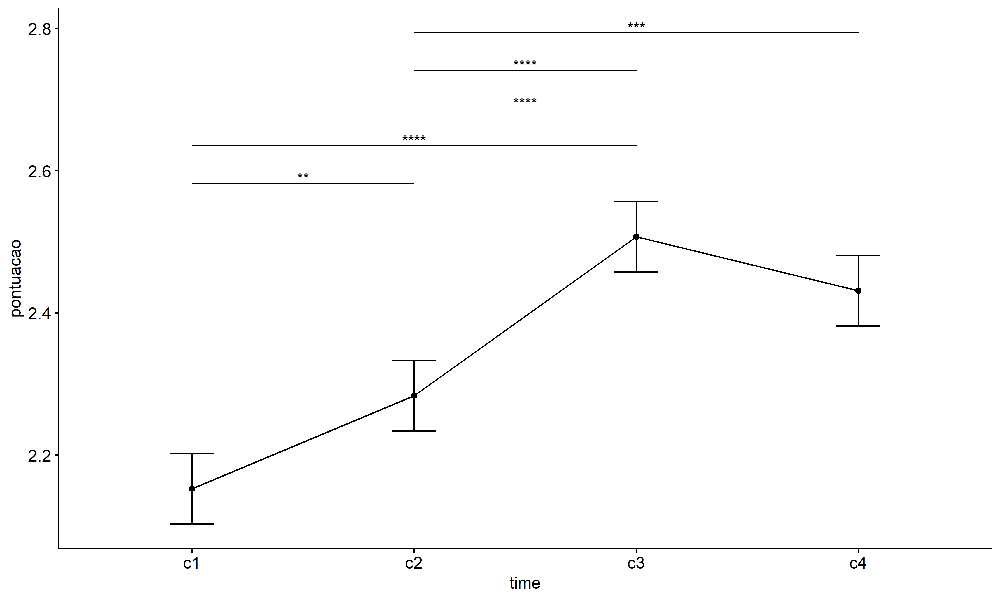<!-- -->

# ANOVA: pontuacao ~ time\*gender + Error(id/time)

## Data Preparation

``` r
data <- edat[,c("aluno_id","gender","ciclo","pontuacao")]
data$ciclo <- factor(data$ciclo, c("Primeiro Ciclo","Segundo Ciclo",
                                   "Terceiro Ciclo","Quarto Ciclo"))

wdat <- spread(data, ciclo, pontuacao)
wdat <- wdat[complete.cases(wdat),]
colnames(wdat) <- c("id","gender","c1","c2","c3","c4")

ldat <- gather(wdat, key = time, value = pontuacao, c1, c2, c3, c4) %>%
  convert_as_factor(id, time)
ldat <- remove_group_data(ldat, "pontuacao", c("time", "gender"), n.limit = 30)
ldat$gender <- factor(ldat$gender, sort(unique(ldat$gender)))
```

### Check assumptions: Identifying Outliers

``` r
outliers <- identify_outliers(group_by(ldat, time, gender), pontuacao)
(outliers <- outliers[outliers$is.extreme == T,])
```

    ## # A tibble: 650 × 6
    ##    gender time  id                   pontuacao is.outlier is.extreme
    ##    <fct>  <fct> <fct>                    <dbl> <lgl>      <lgl>     
    ##  1 Female c1    0wDHSyctDDkjP6OPE3c8       5   TRUE       TRUE      
    ##  2 Female c1    1DlydHhFt2IkhBETPR4s       3.5 TRUE       TRUE      
    ##  3 Female c1    46nUNvt4sDOPsC9jnkiG       4.5 TRUE       TRUE      
    ##  4 Female c1    55GlwifTTyiOSKTB9vc9       5   TRUE       TRUE      
    ##  5 Female c1    5AeP0IQ84CerIQVenp2G       3   TRUE       TRUE      
    ##  6 Female c1    6IoOZmGw52LYlznSYXzK       3   TRUE       TRUE      
    ##  7 Female c1    6Xlhq905iNT5kvJFoSW5       5   TRUE       TRUE      
    ##  8 Female c1    7AaMrLZQiyhSoBaer5VH       3.5 TRUE       TRUE      
    ##  9 Female c1    A8Rx15QryUqDDm8ooiZr       3   TRUE       TRUE      
    ## 10 Female c1    cy0oZFPyT8aGHBq7CR9A       3.5 TRUE       TRUE      
    ## # ℹ 640 more rows

| gender | time | id                   | pontuacao | is.outlier | is.extreme |
|:-------|:-----|:---------------------|----------:|:-----------|:-----------|
| Female | c1   | 0wDHSyctDDkjP6OPE3c8 |     5.000 | TRUE       | TRUE       |
| Female | c1   | 1DlydHhFt2IkhBETPR4s |     3.500 | TRUE       | TRUE       |
| Female | c1   | 46nUNvt4sDOPsC9jnkiG |     4.500 | TRUE       | TRUE       |
| Female | c1   | 55GlwifTTyiOSKTB9vc9 |     5.000 | TRUE       | TRUE       |
| Female | c1   | 5AeP0IQ84CerIQVenp2G |     3.000 | TRUE       | TRUE       |
| Female | c1   | 6IoOZmGw52LYlznSYXzK |     3.000 | TRUE       | TRUE       |
| Female | c1   | 6Xlhq905iNT5kvJFoSW5 |     5.000 | TRUE       | TRUE       |
| Female | c1   | 7AaMrLZQiyhSoBaer5VH |     3.500 | TRUE       | TRUE       |
| Female | c1   | A8Rx15QryUqDDm8ooiZr |     3.000 | TRUE       | TRUE       |
| Female | c1   | cy0oZFPyT8aGHBq7CR9A |     3.500 | TRUE       | TRUE       |
| Female | c1   | dSM9U89FZYdICjBucW8v |     3.000 | TRUE       | TRUE       |
| Female | c1   | F5Ux4BYYqSnMt1Om6Trf |     3.500 | TRUE       | TRUE       |
| Female | c1   | g0SSATlv7RDhoBk6jsCz |     3.500 | TRUE       | TRUE       |
| Female | c1   | G2SUhDEavPTLyA8yz9AL |     3.500 | TRUE       | TRUE       |
| Female | c1   | G4NIt8gEc7nfeQ9k2OkL |     3.500 | TRUE       | TRUE       |
| Female | c1   | H8te97gR9TCOM0CiCXj1 |     3.500 | TRUE       | TRUE       |
| Female | c1   | I1x9Y5cYi4OfnwWUeTXz |     4.000 | TRUE       | TRUE       |
| Female | c1   | I5SKdDmPvNCpOHCfh7Is |     4.000 | TRUE       | TRUE       |
| Female | c1   | ixToGS5nyKWTy1PjTzZW |     3.000 | TRUE       | TRUE       |
| Female | c1   | Jgsj4or0goDAXdQU3UwR |     3.000 | TRUE       | TRUE       |
| Female | c1   | jVbbowshsqkUpPuGSIMu |     4.000 | TRUE       | TRUE       |
| Female | c1   | KPMkDhksSiEWVEIUT1LG |     3.500 | TRUE       | TRUE       |
| Female | c1   | KWsflPBHSK0g0ZYy9I1L |     5.000 | TRUE       | TRUE       |
| Female | c1   | lt4Za0V8VmneMBIicN4R |     3.000 | TRUE       | TRUE       |
| Female | c1   | m5yRlxfIj73j4ossfTOB |     5.000 | TRUE       | TRUE       |
| Female | c1   | MTyNplLkcaNxd9NT392Q |     3.500 | TRUE       | TRUE       |
| Female | c1   | N3zF1kdLVvTXfbcXiMqe |     3.500 | TRUE       | TRUE       |
| Female | c1   | pca9LmykrugFnjsHp7MR |     5.000 | TRUE       | TRUE       |
| Female | c1   | QasU7a9JiIu1XHAPVJk9 |     3.000 | TRUE       | TRUE       |
| Female | c1   | rijPm1LRjDwEh0XEZEeR |     4.000 | TRUE       | TRUE       |
| Female | c1   | Rq2OTnqvauiedrQ0PVcm |     3.500 | TRUE       | TRUE       |
| Female | c1   | Ru3SPRo97iXBvXbvneKh |     5.000 | TRUE       | TRUE       |
| Female | c1   | UKLVcE0VqppSSC8hDubG |     5.000 | TRUE       | TRUE       |
| Female | c1   | UTcQeAJVgrgjSdUJBAKT |     3.000 | TRUE       | TRUE       |
| Female | c1   | vc8pPoYau2AIAuCQJipW |     5.000 | TRUE       | TRUE       |
| Female | c1   | xAo0TzCEx1bIrmjqKgbj |     3.500 | TRUE       | TRUE       |
| Female | c1   | xZ5yKSWaJFp2osYZSjqL |     5.000 | TRUE       | TRUE       |
| Female | c1   | YTYFFWzK4C7ejf1X1TUB |     5.000 | TRUE       | TRUE       |
| Female | c1   | zu9ITSnIAecxMpJmNxCE |     5.000 | TRUE       | TRUE       |
| Male   | c1   | 0w3VhiMf67CbcpR6aZCL |     5.000 | TRUE       | TRUE       |
| Male   | c1   | 1PlxEF4tmJySD3G46PLB |     3.500 | TRUE       | TRUE       |
| Male   | c1   | 1Z1Qz8zDaMkaAz1Ah80K |     5.000 | TRUE       | TRUE       |
| Male   | c1   | 4hmXg2uo4wxSAX9SaxpN |     3.500 | TRUE       | TRUE       |
| Male   | c1   | 6oE4k979jigSP7Zbs2m1 |     3.500 | TRUE       | TRUE       |
| Male   | c1   | 7nfO1ouMUuN7IzvlCKr0 |     3.500 | TRUE       | TRUE       |
| Male   | c1   | A5EETpEr617bpnSh1wp6 |     3.500 | TRUE       | TRUE       |
| Male   | c1   | AIzwxJCfbDsO8ZT4ZZ4h |     3.000 | TRUE       | TRUE       |
| Male   | c1   | b9PlhVhdvhl9EPK9QVCv |     5.000 | TRUE       | TRUE       |
| Male   | c1   | cao1agmzaedA3s0PVAPS |     5.000 | TRUE       | TRUE       |
| Male   | c1   | cJoqgrk6T3HsA9EOVe7D |     5.000 | TRUE       | TRUE       |
| Male   | c1   | cuknOzzwN4oCRum5U5ph |     3.500 | TRUE       | TRUE       |
| Male   | c1   | D1HfJKTVqjrpCJx97l3v |     5.000 | TRUE       | TRUE       |
| Male   | c1   | DFTbWP0xF5gxFgxEN0dL |     3.000 | TRUE       | TRUE       |
| Male   | c1   | dieaAtUumyYxX7zGb7Sb |     4.000 | TRUE       | TRUE       |
| Male   | c1   | DKEsQosaERswlkB803hB |     3.500 | TRUE       | TRUE       |
| Male   | c1   | E8XEhNJhfANZZtqHam0A |     3.000 | TRUE       | TRUE       |
| Male   | c1   | G5WjH8t1I6LAiAOCuM2v |     3.500 | TRUE       | TRUE       |
| Male   | c1   | i6M2WLEfaiylCRyZ9XnE |     3.500 | TRUE       | TRUE       |
| Male   | c1   | iutpBZMAtM92qcbyCDHB |     3.500 | TRUE       | TRUE       |
| Male   | c1   | iXqE1bAFPsYn56jTzZQS |     5.000 | TRUE       | TRUE       |
| Male   | c1   | JdRySX8i3hE3pxcYyUcf |     3.000 | TRUE       | TRUE       |
| Male   | c1   | nnPTfCmTsFmqbk9q3PJG |     3.500 | TRUE       | TRUE       |
| Male   | c1   | NW7xi0uw2xX7J2ch6WFX |     5.000 | TRUE       | TRUE       |
| Male   | c1   | oafpBD8HTXvsKOiHN7p8 |     3.500 | TRUE       | TRUE       |
| Male   | c1   | PKoPTKC1RrGaREkbINPf |     3.500 | TRUE       | TRUE       |
| Male   | c1   | PMsVKgnivLJr3CQYAKsP |     3.500 | TRUE       | TRUE       |
| Male   | c1   | qbpdhqIdqf7n3lmU2n4I |     3.500 | TRUE       | TRUE       |
| Male   | c1   | R7yCqYgzTa9KdpJQ4uXb |     5.000 | TRUE       | TRUE       |
| Male   | c1   | RlqnAYUyOdC7g4eDY9UO |     5.000 | TRUE       | TRUE       |
| Male   | c1   | sM3c4noBIP8hnYWA6pAe |     4.000 | TRUE       | TRUE       |
| Male   | c1   | snoeXZt7a8Ds16UvPGhk |     5.000 | TRUE       | TRUE       |
| Male   | c1   | sRR37KpbkBZSh9H2UpSB |     4.000 | TRUE       | TRUE       |
| Male   | c1   | Swge4GG9Qmg1w9YaAeDP |     3.500 | TRUE       | TRUE       |
| Male   | c1   | TABveJnXO5hRaweFnAMh |     5.000 | TRUE       | TRUE       |
| Male   | c1   | TKvc4Eu2XaDXYPxuS7Qn |     3.000 | TRUE       | TRUE       |
| Male   | c1   | uCBI6gnllsawWJlgqkr5 |     5.000 | TRUE       | TRUE       |
| Male   | c1   | wJgBRtIUF5VG22EJXZKz |     4.000 | TRUE       | TRUE       |
| Male   | c1   | XeSX4FsDK2KmCwATUvcu |     3.500 | TRUE       | TRUE       |
| Male   | c1   | xgWi8MM2PHEEfdjn61b7 |     5.000 | TRUE       | TRUE       |
| Male   | c1   | xmtNEz12lXmE9RzmND2z |     3.500 | TRUE       | TRUE       |
| Male   | c1   | xUKKiLMXz1z5e7g1kX4m |     5.000 | TRUE       | TRUE       |
| Male   | c1   | Y7HozU436KQ0wqdBGugu |     3.500 | TRUE       | TRUE       |
| Male   | c1   | YxfFrbwSijoyTMWGIYqQ |     5.000 | TRUE       | TRUE       |
| Male   | c1   | YZl0xc1Gu4ixxN2rOCtH |     5.000 | TRUE       | TRUE       |
| Male   | c1   | ZdpC4Xaxucxlaqa0o7wm |     5.000 | TRUE       | TRUE       |
| Female | c2   | 0JP4C8o7n2HYsnPDx4qx |     3.500 | TRUE       | TRUE       |
| Female | c2   | 1gvgnHo5onRSLXTnds8W |     3.500 | TRUE       | TRUE       |
| Female | c2   | 1rGKIQ7fdZBOxxGdPFrp |     3.500 | TRUE       | TRUE       |
| Female | c2   | 3WvSQRVfYSeH8PCOQB0n |     3.500 | TRUE       | TRUE       |
| Female | c2   | 3XOQzgoErsKmvF4VxZjc |     5.000 | TRUE       | TRUE       |
| Female | c2   | 4AM4nonwJ45LiMy6b4lp |     5.000 | TRUE       | TRUE       |
| Female | c2   | 5l1OLNAprJvzHRinnoF0 |     3.500 | TRUE       | TRUE       |
| Female | c2   | 6bEKmKQpOuvY6PSQvzqj |     4.000 | TRUE       | TRUE       |
| Female | c2   | 6Xlhq905iNT5kvJFoSW5 |     5.000 | TRUE       | TRUE       |
| Female | c2   | 8jXS39U6Aje4RlDntJHg |     3.500 | TRUE       | TRUE       |
| Female | c2   | 8p6QYQYkfhR3QOACXZvj |     3.000 | TRUE       | TRUE       |
| Female | c2   | A8Rx15QryUqDDm8ooiZr |     5.000 | TRUE       | TRUE       |
| Female | c2   | ahHqNPxM9dDITA6mjtpB |     3.500 | TRUE       | TRUE       |
| Female | c2   | AUp01jGBKvRyiH5yAcYg |     3.500 | TRUE       | TRUE       |
| Female | c2   | bxxcpVcdJ03akf9XTPVs |     5.000 | TRUE       | TRUE       |
| Female | c2   | d1JgyezU4pt7F4SebGoe |     4.000 | TRUE       | TRUE       |
| Female | c2   | D3zCmRj97N1xSw2RGyIX |     4.000 | TRUE       | TRUE       |
| Female | c2   | dCPfML2azPAOx7s4eHfR |     3.500 | TRUE       | TRUE       |
| Female | c2   | dSM9U89FZYdICjBucW8v |     5.000 | TRUE       | TRUE       |
| Female | c2   | e1nlLe6lCBYUzF23dTrW |     4.000 | TRUE       | TRUE       |
| Female | c2   | EcAgL4tVyGSoqslrQjcI |     3.500 | TRUE       | TRUE       |
| Female | c2   | efGqYqTmvxysOA8bmE9u |     4.000 | TRUE       | TRUE       |
| Female | c2   | F5Ux4BYYqSnMt1Om6Trf |     5.000 | TRUE       | TRUE       |
| Female | c2   | ffnFAMZehkOjgmmGyq3E |     5.000 | TRUE       | TRUE       |
| Female | c2   | G6w5RiWtWQbT4xtExf7d |     5.000 | TRUE       | TRUE       |
| Female | c2   | gBmp7DCcMF8YynwrJWmq |     5.000 | TRUE       | TRUE       |
| Female | c2   | GLiaONiGLGsIMU5p88Cl |     3.667 | TRUE       | TRUE       |
| Female | c2   | gzBUwnjjYHnioTnd4stC |     3.000 | TRUE       | TRUE       |
| Female | c2   | H8te97gR9TCOM0CiCXj1 |     3.000 | TRUE       | TRUE       |
| Female | c2   | hcMHfjgGtVOBlWeqw37Q |     5.000 | TRUE       | TRUE       |
| Female | c2   | I1x9Y5cYi4OfnwWUeTXz |     4.000 | TRUE       | TRUE       |
| Female | c2   | I6ZCrdQMaOdo9ltkC1r2 |     5.000 | TRUE       | TRUE       |
| Female | c2   | IXZlZBy7uRBHUFPQg8hX |     5.000 | TRUE       | TRUE       |
| Female | c2   | jGesTMYpGOc4DJQ77fHt |     3.000 | TRUE       | TRUE       |
| Female | c2   | jipIzfMPngc6Se2mEtoO |     3.500 | TRUE       | TRUE       |
| Female | c2   | jljcKPNPjBo1MdiK1ffQ |     3.500 | TRUE       | TRUE       |
| Female | c2   | jVbbowshsqkUpPuGSIMu |     4.000 | TRUE       | TRUE       |
| Female | c2   | k1Byic1gWlgNIFT8qDpn |     5.000 | TRUE       | TRUE       |
| Female | c2   | k2S15ANRrwJKgCuiwaKC |     3.000 | TRUE       | TRUE       |
| Female | c2   | K3la9byFQsBzKaukPsOq |     3.500 | TRUE       | TRUE       |
| Female | c2   | KxltaXnk31onNRVrLE5Y |     3.500 | TRUE       | TRUE       |
| Female | c2   | LC67V5LShu6RMdyHjAJx |     3.500 | TRUE       | TRUE       |
| Female | c2   | mTxfHO37mmdyGuVi0AcC |     4.000 | TRUE       | TRUE       |
| Female | c2   | MTyNplLkcaNxd9NT392Q |     5.000 | TRUE       | TRUE       |
| Female | c2   | MxgQUA6KrQnZN4Fm7oCW |     3.500 | TRUE       | TRUE       |
| Female | c2   | N9cRf5BDMjp45ygmrq1a |     5.000 | TRUE       | TRUE       |
| Female | c2   | nI311xKanqD5k4XdM5QB |     4.000 | TRUE       | TRUE       |
| Female | c2   | NiBOt9OUO2x3fZe7eXO0 |     5.000 | TRUE       | TRUE       |
| Female | c2   | NJuhIhcV6SgR0FBfCWdk |     3.000 | TRUE       | TRUE       |
| Female | c2   | oGUJyWRMYYbF9PNegJZh |     5.000 | TRUE       | TRUE       |
| Female | c2   | pkFNtaKBdbUsYSrekUQh |     3.000 | TRUE       | TRUE       |
| Female | c2   | Puj0Lljgb9yE7UxApjnK |     5.000 | TRUE       | TRUE       |
| Female | c2   | pX3oKxaMTnCJ8g1GtRWG |     2.750 | TRUE       | TRUE       |
| Female | c2   | RCY3F2HtV0DPrs21Q5KB |     3.000 | TRUE       | TRUE       |
| Female | c2   | RuLO4wjZ8eP202TWX6R8 |     4.000 | TRUE       | TRUE       |
| Female | c2   | ScmLumR6WUA4APWBqXFX |     4.000 | TRUE       | TRUE       |
| Female | c2   | SFojZKDHvdJbhHKzsN2I |     4.000 | TRUE       | TRUE       |
| Female | c2   | sSEiBqKCIt9z1Qg8SihU |     5.000 | TRUE       | TRUE       |
| Female | c2   | tfmKp0SXpwvJkZn03aN4 |     4.000 | TRUE       | TRUE       |
| Female | c2   | trOCyMFe6S3DDEhf2HL7 |     5.000 | TRUE       | TRUE       |
| Female | c2   | u5hJDswFRptq4y76Kutb |     3.500 | TRUE       | TRUE       |
| Female | c2   | uO9nfkLEYn0z361QEH7Q |     5.000 | TRUE       | TRUE       |
| Female | c2   | UpctgaJMOEgDuI3wov8S |     3.500 | TRUE       | TRUE       |
| Female | c2   | uqX7aPoHn8tMaKAp9y3I |     3.000 | TRUE       | TRUE       |
| Female | c2   | UTcQeAJVgrgjSdUJBAKT |     5.000 | TRUE       | TRUE       |
| Female | c2   | uXrGgSVZ1ZKfQuJ3neSu |     3.500 | TRUE       | TRUE       |
| Female | c2   | v5KF7y11Ncyud2q4dKmD |     3.000 | TRUE       | TRUE       |
| Female | c2   | WKxFXpseomxCYgOSyrdB |     4.000 | TRUE       | TRUE       |
| Female | c2   | WSRSxbb9igUPQVN86BSH |     5.000 | TRUE       | TRUE       |
| Female | c2   | xCgFRSJhxUFZEqK4qpC9 |     5.000 | TRUE       | TRUE       |
| Female | c2   | Xfs4ydu0jiJkaDwInzXx |     5.000 | TRUE       | TRUE       |
| Female | c2   | xgjVK7rnOUUArvnA4ZiQ |     5.000 | TRUE       | TRUE       |
| Female | c2   | xk7eC5haTYuFQaJovsBZ |     5.000 | TRUE       | TRUE       |
| Female | c2   | XzMIZjd0GDHSpif5ypWf |     3.500 | TRUE       | TRUE       |
| Female | c2   | ZDsN200AOSuZkmxgcc8n |     4.000 | TRUE       | TRUE       |
| Female | c2   | zqSde1r6leyecbET0INz |     5.000 | TRUE       | TRUE       |
| Male   | c2   | 0w3VhiMf67CbcpR6aZCL |     5.000 | TRUE       | TRUE       |
| Male   | c2   | 1g6aBXXFdmJWTIwXaf4A |     5.000 | TRUE       | TRUE       |
| Male   | c2   | 1KTN8KwyWSigGGMFIG9F |     5.000 | TRUE       | TRUE       |
| Male   | c2   | 1l2CPmeR5hbmhcJoY5Gs |     4.000 | TRUE       | TRUE       |
| Male   | c2   | 1ZE6i0Is22PBIAZbrM0J |     5.000 | TRUE       | TRUE       |
| Male   | c2   | 2eFfyVVi6PFZAieFgek6 |     5.000 | TRUE       | TRUE       |
| Male   | c2   | 2gOTOJWpjODv0nBxtJgU |     5.000 | TRUE       | TRUE       |
| Male   | c2   | 2Mvl0siGmos3P6uCJoI6 |     4.000 | TRUE       | TRUE       |
| Male   | c2   | 2wBgWJVF1mK6rnsBiZ99 |     5.000 | TRUE       | TRUE       |
| Male   | c2   | 3ETydorel7bIDQKYclir |     2.750 | TRUE       | TRUE       |
| Male   | c2   | 4gepVdqUGSJq9eKKqU4U |     4.000 | TRUE       | TRUE       |
| Male   | c2   | 4hmXg2uo4wxSAX9SaxpN |     3.000 | TRUE       | TRUE       |
| Male   | c2   | 8GRRowomccTgY63JK0hV |     3.000 | TRUE       | TRUE       |
| Male   | c2   | 8PyXW7ejCnDsMsEjrlsy |     3.000 | TRUE       | TRUE       |
| Male   | c2   | ao9Hy7cVw5W6MXhO5Ylm |     3.500 | TRUE       | TRUE       |
| Male   | c2   | atydp19vM0PjiOQCWemR |     3.000 | TRUE       | TRUE       |
| Male   | c2   | cuknOzzwN4oCRum5U5ph |     5.000 | TRUE       | TRUE       |
| Male   | c2   | d78FW2LeEQ1zVALsO8FL |     3.333 | TRUE       | TRUE       |
| Male   | c2   | DmzTbIYJpxJm9o8FEyCL |     2.500 | TRUE       | TRUE       |
| Male   | c2   | eKNF6EdIBYr2bZIgYfpt |     5.000 | TRUE       | TRUE       |
| Male   | c2   | EXP9vzjLIJFDlyiQt1hn |     3.000 | TRUE       | TRUE       |
| Male   | c2   | FkJFrnPezc8Ng4SSMx1z |     5.000 | TRUE       | TRUE       |
| Male   | c2   | GAEVtgOgvNASXuwIPENX |     3.000 | TRUE       | TRUE       |
| Male   | c2   | ggH0twWM1TpDTguT2sSU |     3.500 | TRUE       | TRUE       |
| Male   | c2   | gRiK9OMij8RxayU0KCFv |     3.000 | TRUE       | TRUE       |
| Male   | c2   | HqTgiqhYnEvVciVol3PS |     5.000 | TRUE       | TRUE       |
| Male   | c2   | HsQF2J0r79mHSWNe4l6n |     5.000 | TRUE       | TRUE       |
| Male   | c2   | i6M2WLEfaiylCRyZ9XnE |     5.000 | TRUE       | TRUE       |
| Male   | c2   | iSIgLPCScY5Oq0MlhbEz |     3.500 | TRUE       | TRUE       |
| Male   | c2   | ITZKcm29e0hwUQiiDtaF |     5.000 | TRUE       | TRUE       |
| Male   | c2   | iXqE1bAFPsYn56jTzZQS |     4.000 | TRUE       | TRUE       |
| Male   | c2   | Iy3Q4VZAPE7yypxlEgZV |     4.000 | TRUE       | TRUE       |
| Male   | c2   | j31LU8Xwm0EQ7Mihkhjj |     5.000 | TRUE       | TRUE       |
| Male   | c2   | JmKGEFyVZnIRSzkWkGSo |     5.000 | TRUE       | TRUE       |
| Male   | c2   | K3oo1Kn5UlJH6lIGaZTL |     5.000 | TRUE       | TRUE       |
| Male   | c2   | LJrBpSpYOJUxZWUehnpX |     3.500 | TRUE       | TRUE       |
| Male   | c2   | LMrt1klH9kXyo7kH4gB8 |     3.000 | TRUE       | TRUE       |
| Male   | c2   | MO5oCAGyztcuEpHPXGxD |     3.500 | TRUE       | TRUE       |
| Male   | c2   | mp70aTuAiwYmhEHntRfm |     3.500 | TRUE       | TRUE       |
| Male   | c2   | Mv8Pv2YBEg4SX5h40YAU |     5.000 | TRUE       | TRUE       |
| Male   | c2   | NxEhBT0ZChu4oRR5q6bd |     3.500 | TRUE       | TRUE       |
| Male   | c2   | nZK9NUDQSwfWTTfSeqPH |     5.000 | TRUE       | TRUE       |
| Male   | c2   | oafpBD8HTXvsKOiHN7p8 |     5.000 | TRUE       | TRUE       |
| Male   | c2   | OiJwZNTmMiomnpFEIgBN |     3.000 | TRUE       | TRUE       |
| Male   | c2   | OTNUMYnL8AF930i7Db8H |     3.500 | TRUE       | TRUE       |
| Male   | c2   | pOZO9oAcxPz33Ypnsv2X |     2.500 | TRUE       | TRUE       |
| Male   | c2   | Q3CCnrZoSPx08SF7zj3N |     3.500 | TRUE       | TRUE       |
| Male   | c2   | qlQnX21ByGDabhAiIbdF |     5.000 | TRUE       | TRUE       |
| Male   | c2   | QWZGR164QoEvdqudnbNc |     3.667 | TRUE       | TRUE       |
| Male   | c2   | rknK8GEk9H27CI9GSt4V |     2.667 | TRUE       | TRUE       |
| Male   | c2   | RU6W5zawYsr9WEMqiDC2 |     5.000 | TRUE       | TRUE       |
| Male   | c2   | sXB3m8f7P40lRXYwY22p |     3.000 | TRUE       | TRUE       |
| Male   | c2   | UaBRzohcAqFW1qjmBSvw |     3.000 | TRUE       | TRUE       |
| Male   | c2   | v4NaY6TWYcpu9RoVkXwS |     5.000 | TRUE       | TRUE       |
| Male   | c2   | vCC3nTZphL0vITkOGcBP |     5.000 | TRUE       | TRUE       |
| Male   | c2   | vF1wv9aDV5UGHKuqCkC3 |     3.500 | TRUE       | TRUE       |
| Male   | c2   | vSolOA78V6l7oYJ1h4LA |     3.500 | TRUE       | TRUE       |
| Male   | c2   | W8iXxSmW48zvfJyikMZb |     5.000 | TRUE       | TRUE       |
| Male   | c2   | WcaFnyTs2jyODcXLIWQo |     3.500 | TRUE       | TRUE       |
| Male   | c2   | wSjwY5eBTqgIzBqdtazC |     5.000 | TRUE       | TRUE       |
| Male   | c2   | wxyQb8UYLyuIeyTuqWHK |     4.000 | TRUE       | TRUE       |
| Male   | c2   | YAjRLL4Bd2nV1EigssjM |     5.000 | TRUE       | TRUE       |
| Male   | c2   | ygdicz3svMOl4mNIiwtJ |     2.500 | TRUE       | TRUE       |
| Male   | c2   | ygFJxqySABX8ax57ihIq |     3.500 | TRUE       | TRUE       |
| Male   | c2   | YxfFrbwSijoyTMWGIYqQ |     2.750 | TRUE       | TRUE       |
| Male   | c2   | z3p6Ot4uvkPmGXOS9D3e |     5.000 | TRUE       | TRUE       |
| Male   | c2   | ZFjyLFTCim7WZrtYy2tK |     2.750 | TRUE       | TRUE       |
| Male   | c2   | zPWlocgrVt4Mfvr0UwaQ |     3.000 | TRUE       | TRUE       |
| Female | c3   | 06Vps080bCd2ORWNulNM |     5.000 | TRUE       | TRUE       |
| Female | c3   | 0RcoTM8hDTCRz53xkhWB |     3.000 | TRUE       | TRUE       |
| Female | c3   | 12jZHvX32WJ4t8qQybyG |     4.000 | TRUE       | TRUE       |
| Female | c3   | 1A2mocpG7GSFNtfkfwOO |     5.000 | TRUE       | TRUE       |
| Female | c3   | 1gvgnHo5onRSLXTnds8W |     5.000 | TRUE       | TRUE       |
| Female | c3   | 2hRYk5Ant545stWX17Xb |     3.500 | TRUE       | TRUE       |
| Female | c3   | 2qbgEyCWhU8ChVoKwmf5 |     4.000 | TRUE       | TRUE       |
| Female | c3   | 3Ugm6wd42djxxIa9v8nX |     4.000 | TRUE       | TRUE       |
| Female | c3   | 3WvSQRVfYSeH8PCOQB0n |     5.000 | TRUE       | TRUE       |
| Female | c3   | 4KHHEYjMyMuMUSgMFBWA |     5.000 | TRUE       | TRUE       |
| Female | c3   | 4yfL5oD3wSgUl76whOak |     3.500 | TRUE       | TRUE       |
| Female | c3   | 53wwkxtWpNW5sqGU32Kc |     5.000 | TRUE       | TRUE       |
| Female | c3   | 5VDTmb4kGRlJV9SdulWs |     3.500 | TRUE       | TRUE       |
| Female | c3   | 6bEKmKQpOuvY6PSQvzqj |     5.000 | TRUE       | TRUE       |
| Female | c3   | 6bilKfhgwjZLq47wbAdZ |     4.000 | TRUE       | TRUE       |
| Female | c3   | 6Xq4LeahCPnI2sZLyCEb |     4.000 | TRUE       | TRUE       |
| Female | c3   | 6zAoYaCiBz0ok4UtPFa7 |     3.500 | TRUE       | TRUE       |
| Female | c3   | 7QdmUXiS7buOngwYdftX |     5.000 | TRUE       | TRUE       |
| Female | c3   | 8lfWsRb6bqeqiqAn2iPn |     3.000 | TRUE       | TRUE       |
| Female | c3   | 9lNtpPrfhHbUHX7Ff5Dr |     4.000 | TRUE       | TRUE       |
| Female | c3   | 9w7fsQmTt0KXHULPLQeu |     4.000 | TRUE       | TRUE       |
| Female | c3   | A8Rx15QryUqDDm8ooiZr |     5.000 | TRUE       | TRUE       |
| Female | c3   | ahHqNPxM9dDITA6mjtpB |     5.000 | TRUE       | TRUE       |
| Female | c3   | BNZfqw7XySxL88fdeSei |     5.000 | TRUE       | TRUE       |
| Female | c3   | bXcDzsLedzCkI9NdHElu |     4.000 | TRUE       | TRUE       |
| Female | c3   | bxxcpVcdJ03akf9XTPVs |     5.000 | TRUE       | TRUE       |
| Female | c3   | C2oQcql6mvlGfsqeZFsp |     5.000 | TRUE       | TRUE       |
| Female | c3   | caBw1yIwyPNhQpF4YjDL |     3.500 | TRUE       | TRUE       |
| Female | c3   | CCVIt7MPeYMUOCCyBxPh |     5.000 | TRUE       | TRUE       |
| Female | c3   | CgvAFLYBdj9BcT4wqIMs |     5.000 | TRUE       | TRUE       |
| Female | c3   | ctPckNjlaNbES9mZqihR |     3.500 | TRUE       | TRUE       |
| Female | c3   | cydOGNsA77RCWBtBqYh5 |     5.000 | TRUE       | TRUE       |
| Female | c3   | D3zCmRj97N1xSw2RGyIX |     5.000 | TRUE       | TRUE       |
| Female | c3   | D8KSabtZJPDlGt2oRAxv |     5.000 | TRUE       | TRUE       |
| Female | c3   | dA8lMeqqjFwYggPWeRI5 |     3.500 | TRUE       | TRUE       |
| Female | c3   | dJQJl5Fk0r29tPHPdig0 |     3.500 | TRUE       | TRUE       |
| Female | c3   | DP1fbT1lGhLiBnOFILLi |     4.000 | TRUE       | TRUE       |
| Female | c3   | DUJcrDJVlBT5gdZcX8kW |     5.000 | TRUE       | TRUE       |
| Female | c3   | e1nlLe6lCBYUzF23dTrW |     5.000 | TRUE       | TRUE       |
| Female | c3   | eJIS5phShRkrssLcQEFX |     4.000 | TRUE       | TRUE       |
| Female | c3   | ENJRVpm8juAbCQseoj2s |     4.000 | TRUE       | TRUE       |
| Female | c3   | eq0Rj5zuFcDJ5FYBpA5I |     3.500 | TRUE       | TRUE       |
| Female | c3   | F5Ux4BYYqSnMt1Om6Trf |     4.000 | TRUE       | TRUE       |
| Female | c3   | f8lbqRJeObyskQrt1pLC |     3.500 | TRUE       | TRUE       |
| Female | c3   | fCbOJlY4s8hncfy108S2 |     5.000 | TRUE       | TRUE       |
| Female | c3   | ffnFAMZehkOjgmmGyq3E |     3.500 | TRUE       | TRUE       |
| Female | c3   | Fi4GbIUCONhurKvVuApq |     5.000 | TRUE       | TRUE       |
| Female | c3   | g6NpZa7qfNr4u2gcV0gv |     3.500 | TRUE       | TRUE       |
| Female | c3   | gg2eAzivpClhTi3MMhGx |     3.500 | TRUE       | TRUE       |
| Female | c3   | GPKNql6mLSl2GTOcrfly |     5.000 | TRUE       | TRUE       |
| Female | c3   | gxJPyFA0RVy0KUeig6Og |     4.000 | TRUE       | TRUE       |
| Female | c3   | gXltZ1xUukXCmx7pkwyZ |     5.000 | TRUE       | TRUE       |
| Female | c3   | H8te97gR9TCOM0CiCXj1 |     5.000 | TRUE       | TRUE       |
| Female | c3   | hcMHfjgGtVOBlWeqw37Q |     5.000 | TRUE       | TRUE       |
| Female | c3   | Hg8iN2vzo1ksCskFMPj3 |     4.000 | TRUE       | TRUE       |
| Female | c3   | hRZ3W07vIGZqIgKr5aa4 |     4.000 | TRUE       | TRUE       |
| Female | c3   | i5EZ8Ck9IgDueyMbw55v |     5.000 | TRUE       | TRUE       |
| Female | c3   | I6ZCrdQMaOdo9ltkC1r2 |     3.500 | TRUE       | TRUE       |
| Female | c3   | IcZt7QUc4OD7AirNP2X7 |     4.000 | TRUE       | TRUE       |
| Female | c3   | iiM2iLDGfLDnbfRHOvFj |     5.000 | TRUE       | TRUE       |
| Female | c3   | ivFllXWfEslU3cxgCA9Q |     3.500 | TRUE       | TRUE       |
| Female | c3   | iX345M9KQ9N4Kry5sBE2 |     5.000 | TRUE       | TRUE       |
| Female | c3   | ixToGS5nyKWTy1PjTzZW |     5.000 | TRUE       | TRUE       |
| Female | c3   | j8Veec9MuDzxfRE357f6 |     3.000 | TRUE       | TRUE       |
| Female | c3   | jbfUYgUV1IQaJBbJcsbQ |     5.000 | TRUE       | TRUE       |
| Female | c3   | jGesTMYpGOc4DJQ77fHt |     3.500 | TRUE       | TRUE       |
| Female | c3   | jipIzfMPngc6Se2mEtoO |     5.000 | TRUE       | TRUE       |
| Female | c3   | JKWf7sGxzhaGCpawL6E1 |     5.000 | TRUE       | TRUE       |
| Female | c3   | jun7qgJhfjNUaQApJ5ms |     3.000 | TRUE       | TRUE       |
| Female | c3   | JxX3nksd9DRPbsDAtYWe |     3.500 | TRUE       | TRUE       |
| Female | c3   | k4dskXNNlc2s0qDSigl6 |     3.000 | TRUE       | TRUE       |
| Female | c3   | kffQMq8uCfHTlsJoIXoI |     5.000 | TRUE       | TRUE       |
| Female | c3   | LqXZaVWT9FdJpQfgzVUe |     4.000 | TRUE       | TRUE       |
| Female | c3   | m5Ka0ZzAUazMzIFy3vsd |     3.500 | TRUE       | TRUE       |
| Female | c3   | m5yRlxfIj73j4ossfTOB |     5.000 | TRUE       | TRUE       |
| Female | c3   | MKDm8EQM8YmmEYeUWp3V |     3.500 | TRUE       | TRUE       |
| Female | c3   | mTxfHO37mmdyGuVi0AcC |     5.000 | TRUE       | TRUE       |
| Female | c3   | MUc3qGx1A0WHNgpBGhXF |     4.000 | TRUE       | TRUE       |
| Female | c3   | N9cRf5BDMjp45ygmrq1a |     3.500 | TRUE       | TRUE       |
| Female | c3   | nI311xKanqD5k4XdM5QB |     5.000 | TRUE       | TRUE       |
| Female | c3   | NiBOt9OUO2x3fZe7eXO0 |     5.000 | TRUE       | TRUE       |
| Female | c3   | nq3BpIiJrIusr21T3qZD |     3.500 | TRUE       | TRUE       |
| Female | c3   | NudgAXrN7PT8EiGwjm46 |     3.500 | TRUE       | TRUE       |
| Female | c3   | oN0ADw4gTFoLF4lFHvIG |     3.500 | TRUE       | TRUE       |
| Female | c3   | OvwAQTWkdj8SYpPS8dgn |     5.000 | TRUE       | TRUE       |
| Female | c3   | p67KslC0SdpayMWeJgoV |     3.000 | TRUE       | TRUE       |
| Female | c3   | pkFNtaKBdbUsYSrekUQh |     5.000 | TRUE       | TRUE       |
| Female | c3   | pNlkHfQQS4iAH4ujgMUN |     4.000 | TRUE       | TRUE       |
| Female | c3   | pX3oKxaMTnCJ8g1GtRWG |     5.000 | TRUE       | TRUE       |
| Female | c3   | Q15clc5UxsVnlVzIemGt |     3.500 | TRUE       | TRUE       |
| Female | c3   | QEexGPjcigH7dYsFeS3X |     5.000 | TRUE       | TRUE       |
| Female | c3   | QYTt79UHmaJSsiaUWdtX |     5.000 | TRUE       | TRUE       |
| Female | c3   | R30CbcxLKbUIEyoQAUlq |     3.500 | TRUE       | TRUE       |
| Female | c3   | RCY3F2HtV0DPrs21Q5KB |     3.500 | TRUE       | TRUE       |
| Female | c3   | RkRJsrzuZjQPcgr9Bu7D |     5.000 | TRUE       | TRUE       |
| Female | c3   | RuLO4wjZ8eP202TWX6R8 |     4.000 | TRUE       | TRUE       |
| Female | c3   | ScmLumR6WUA4APWBqXFX |     5.000 | TRUE       | TRUE       |
| Female | c3   | SU6czOtKve6SjqEn1eC5 |     5.000 | TRUE       | TRUE       |
| Female | c3   | Tk2K3QhlHplGLyvx33jV |     5.000 | TRUE       | TRUE       |
| Female | c3   | trOCyMFe6S3DDEhf2HL7 |     5.000 | TRUE       | TRUE       |
| Female | c3   | tVMilOzYDlVoWwNezYUi |     3.500 | TRUE       | TRUE       |
| Female | c3   | ul0PgHFaS5fXGvdx1O9S |     5.000 | TRUE       | TRUE       |
| Female | c3   | UpctgaJMOEgDuI3wov8S |     5.000 | TRUE       | TRUE       |
| Female | c3   | Uw9TTHYQm43ueZv7TUSA |     4.000 | TRUE       | TRUE       |
| Female | c3   | vaOhaNww5ga5d9G6Cftj |     4.000 | TRUE       | TRUE       |
| Female | c3   | VkZ6rh12P4aLY7fGeYVD |     5.000 | TRUE       | TRUE       |
| Female | c3   | VZ5nCFXzmtQ05LLhwHqf |     5.000 | TRUE       | TRUE       |
| Female | c3   | W1n0n9K7aJfFR168KYBN |     5.000 | TRUE       | TRUE       |
| Female | c3   | w7548cNc0knlzDezHzBq |     5.000 | TRUE       | TRUE       |
| Female | c3   | wcIujz4o56dsZBNRkvdS |     4.000 | TRUE       | TRUE       |
| Female | c3   | WnJzvWgvQHzDZLiIUqRs |     5.000 | TRUE       | TRUE       |
| Female | c3   | xk7eC5haTYuFQaJovsBZ |     3.500 | TRUE       | TRUE       |
| Female | c3   | Xv4iyh1Z4e6Acccb4Ets |     3.000 | TRUE       | TRUE       |
| Female | c3   | YTYFFWzK4C7ejf1X1TUB |     3.500 | TRUE       | TRUE       |
| Female | c3   | ZI9wNv0qBKoM6uKk20hY |     5.000 | TRUE       | TRUE       |
| Female | c3   | zjwtgmvpt40zalgMDwFc |     5.000 | TRUE       | TRUE       |
| Female | c3   | ZomZAA194k4oRw8eCC4P |     3.500 | TRUE       | TRUE       |
| Female | c3   | zqSde1r6leyecbET0INz |     5.000 | TRUE       | TRUE       |
| Male   | c3   | 03prrbuQMUZ1aXaNSpNg |     5.000 | TRUE       | TRUE       |
| Male   | c3   | 13fdHVWOWq2M68PrcPIp |     5.000 | TRUE       | TRUE       |
| Male   | c3   | 1PlxEF4tmJySD3G46PLB |     5.000 | TRUE       | TRUE       |
| Male   | c3   | 1ZE6i0Is22PBIAZbrM0J |     5.000 | TRUE       | TRUE       |
| Male   | c3   | 2eTy4XnB3HL1Lip3fbQn |     3.500 | TRUE       | TRUE       |
| Male   | c3   | 2gOTOJWpjODv0nBxtJgU |     5.000 | TRUE       | TRUE       |
| Male   | c3   | 2wBgWJVF1mK6rnsBiZ99 |     5.000 | TRUE       | TRUE       |
| Male   | c3   | 3ajgkVWABlKXn2M8i6nE |     5.000 | TRUE       | TRUE       |
| Male   | c3   | 3DdYC9Dpykr9Mtg6YR91 |     5.000 | TRUE       | TRUE       |
| Male   | c3   | 4fSdH8m80yxwok1ooZYh |     5.000 | TRUE       | TRUE       |
| Male   | c3   | 4gepVdqUGSJq9eKKqU4U |     4.000 | TRUE       | TRUE       |
| Male   | c3   | 5dTW1T1ER6Ig8ZOhKC2q |     3.500 | TRUE       | TRUE       |
| Male   | c3   | 67OZnVg6i2P9C6aaYo9r |     5.000 | TRUE       | TRUE       |
| Male   | c3   | 6ICRgE0rvAmB7lOuAmyQ |     3.500 | TRUE       | TRUE       |
| Male   | c3   | 6xovhyxrooDvapRfozKf |     4.000 | TRUE       | TRUE       |
| Male   | c3   | 7AsCrRYMyhVRQHX4kZdc |     5.000 | TRUE       | TRUE       |
| Male   | c3   | 7nfO1ouMUuN7IzvlCKr0 |     3.000 | TRUE       | TRUE       |
| Male   | c3   | 8wybyUZuGQnCWXZqUuos |     5.000 | TRUE       | TRUE       |
| Male   | c3   | AH1sCf7O5jOA17AZz4Sv |     3.500 | TRUE       | TRUE       |
| Male   | c3   | AmerU5JsGxhj1ABeNqNx |     3.500 | TRUE       | TRUE       |
| Male   | c3   | AOPm2hrgIi21mhz4AWVa |     4.000 | TRUE       | TRUE       |
| Male   | c3   | atydp19vM0PjiOQCWemR |     3.500 | TRUE       | TRUE       |
| Male   | c3   | BGXXXnQoaKaHn2dkhSeE |     4.000 | TRUE       | TRUE       |
| Male   | c3   | bHobujEJH9Ye5qPYW9o3 |     3.500 | TRUE       | TRUE       |
| Male   | c3   | BmlG2Ru6d2oECCkX0RIT |     3.500 | TRUE       | TRUE       |
| Male   | c3   | C9yrnovcTaV6PYqDq8Hh |     5.000 | TRUE       | TRUE       |
| Male   | c3   | csAIMjKcgvv3bFbaGEa9 |     5.000 | TRUE       | TRUE       |
| Male   | c3   | CUr5w2LPd0WLEdkAq7VQ |     5.000 | TRUE       | TRUE       |
| Male   | c3   | D1HfJKTVqjrpCJx97l3v |     5.000 | TRUE       | TRUE       |
| Male   | c3   | D5ZRR3Ps7EtPoEi233KU |     5.000 | TRUE       | TRUE       |
| Male   | c3   | dBlo0AwHuiC5vwUZqfJe |     5.000 | TRUE       | TRUE       |
| Male   | c3   | dieaAtUumyYxX7zGb7Sb |     5.000 | TRUE       | TRUE       |
| Male   | c3   | DmzTbIYJpxJm9o8FEyCL |     3.000 | TRUE       | TRUE       |
| Male   | c3   | E2ATsCpvXlGvoIuV8Rw8 |     4.000 | TRUE       | TRUE       |
| Male   | c3   | E8XEhNJhfANZZtqHam0A |     4.000 | TRUE       | TRUE       |
| Male   | c3   | edsO15qwgEcHZYs53VSn |     5.000 | TRUE       | TRUE       |
| Male   | c3   | EfG6x9puTT2YH9f12KWQ |     5.000 | TRUE       | TRUE       |
| Male   | c3   | eKNF6EdIBYr2bZIgYfpt |     5.000 | TRUE       | TRUE       |
| Male   | c3   | F6SabmHKUu6XswZuiXeA |     5.000 | TRUE       | TRUE       |
| Male   | c3   | faZEP9emsHKHPITLqnHj |     4.000 | TRUE       | TRUE       |
| Male   | c3   | fDvadZl517Acs8ORUZAf |     5.000 | TRUE       | TRUE       |
| Male   | c3   | G7bqQeqXmsQ3kiJNeYlz |     5.000 | TRUE       | TRUE       |
| Male   | c3   | GaixfRTaHdeXkQujJJrz |     3.500 | TRUE       | TRUE       |
| Male   | c3   | GRfzvfMZn7GiCgHSW9Iz |     5.000 | TRUE       | TRUE       |
| Male   | c3   | GRXCU0bF6TElSKj1QNCL |     3.500 | TRUE       | TRUE       |
| Male   | c3   | H5F4r5nnGQTG1FzfyxrY |     3.500 | TRUE       | TRUE       |
| Male   | c3   | HdPQVhyRWcp5iPlYI7lk |     3.500 | TRUE       | TRUE       |
| Male   | c3   | hIMdGoOfUiZGzF6OaRWX |     5.000 | TRUE       | TRUE       |
| Male   | c3   | HsQF2J0r79mHSWNe4l6n |     3.500 | TRUE       | TRUE       |
| Male   | c3   | HtZtYxSbCTf1YGKUWjMm |     5.000 | TRUE       | TRUE       |
| Male   | c3   | i6M2WLEfaiylCRyZ9XnE |     5.000 | TRUE       | TRUE       |
| Male   | c3   | iSIgLPCScY5Oq0MlhbEz |     3.500 | TRUE       | TRUE       |
| Male   | c3   | iutpBZMAtM92qcbyCDHB |     4.000 | TRUE       | TRUE       |
| Male   | c3   | Iy3Q4VZAPE7yypxlEgZV |     5.000 | TRUE       | TRUE       |
| Male   | c3   | jB07JuCnF0cqL9A4H9AV |     5.000 | TRUE       | TRUE       |
| Male   | c3   | JdRySX8i3hE3pxcYyUcf |     3.500 | TRUE       | TRUE       |
| Male   | c3   | jfsOn7gTkNKxI342o9a9 |     5.000 | TRUE       | TRUE       |
| Male   | c3   | JmKGEFyVZnIRSzkWkGSo |     3.500 | TRUE       | TRUE       |
| Male   | c3   | jP2nYSdWXBqkugGjxKV4 |     3.000 | TRUE       | TRUE       |
| Male   | c3   | Jsajj2fjuYJNHIk5aako |     5.000 | TRUE       | TRUE       |
| Male   | c3   | JSoaRuc9zGh6ic1QoQSW |     5.000 | TRUE       | TRUE       |
| Male   | c3   | JSvHxiJstu91jFThXk6p |     5.000 | TRUE       | TRUE       |
| Male   | c3   | k9c8WvuByplGpGhnnbb9 |     5.000 | TRUE       | TRUE       |
| Male   | c3   | kifyGVAfMTF5hQBzNd1R |     3.500 | TRUE       | TRUE       |
| Male   | c3   | L0gX2yfP95da5eDy6w4E |     5.000 | TRUE       | TRUE       |
| Male   | c3   | LSOWrW4dOhXZ9uMW17va |     3.500 | TRUE       | TRUE       |
| Male   | c3   | LxqeE6TiTs0QSXlTGao9 |     5.000 | TRUE       | TRUE       |
| Male   | c3   | m5AeVuITWa7uCAG6h1Qh |     3.500 | TRUE       | TRUE       |
| Male   | c3   | mMgPRogPOxPYN1LJr3zA |     5.000 | TRUE       | TRUE       |
| Male   | c3   | MuJCYQ2aKWaJuTpC1mDU |     3.500 | TRUE       | TRUE       |
| Male   | c3   | N2lpoJnRk0y0QdG6HYcN |     5.000 | TRUE       | TRUE       |
| Male   | c3   | NvNm1xaPB3KHPReTSrMD |     5.000 | TRUE       | TRUE       |
| Male   | c3   | nZK9NUDQSwfWTTfSeqPH |     4.000 | TRUE       | TRUE       |
| Male   | c3   | OgALLmt19rGLgCnddCM3 |     5.000 | TRUE       | TRUE       |
| Male   | c3   | posPfuH8HzAtPFhEphfK |     3.000 | TRUE       | TRUE       |
| Male   | c3   | QAyx2z41ILLaMN0o7pjc |     3.000 | TRUE       | TRUE       |
| Male   | c3   | QX2uYYKb3XPlpRbQrB1s |     5.000 | TRUE       | TRUE       |
| Male   | c3   | rknK8GEk9H27CI9GSt4V |     3.500 | TRUE       | TRUE       |
| Male   | c3   | RlqnAYUyOdC7g4eDY9UO |     5.000 | TRUE       | TRUE       |
| Male   | c3   | RU6W5zawYsr9WEMqiDC2 |     5.000 | TRUE       | TRUE       |
| Male   | c3   | sRR37KpbkBZSh9H2UpSB |     5.000 | TRUE       | TRUE       |
| Male   | c3   | sV9mhY7G3TGd1YYuX6Tn |     3.500 | TRUE       | TRUE       |
| Male   | c3   | sXB3m8f7P40lRXYwY22p |     5.000 | TRUE       | TRUE       |
| Male   | c3   | TRlm6LOgJs6e8ojQI6Sl |     5.000 | TRUE       | TRUE       |
| Male   | c3   | TupwpKp0mSf2xCyx7nhJ |     5.000 | TRUE       | TRUE       |
| Male   | c3   | uCBI6gnllsawWJlgqkr5 |     5.000 | TRUE       | TRUE       |
| Male   | c3   | UiL1HSTkcU8feKke2wpp |     5.000 | TRUE       | TRUE       |
| Male   | c3   | v4NaY6TWYcpu9RoVkXwS |     5.000 | TRUE       | TRUE       |
| Male   | c3   | vCC3nTZphL0vITkOGcBP |     5.000 | TRUE       | TRUE       |
| Male   | c3   | VCRvL14THKB4t5wjAPf7 |     5.000 | TRUE       | TRUE       |
| Male   | c3   | vdDUZAvljeAfNLcAYbHT |     4.000 | TRUE       | TRUE       |
| Male   | c3   | VMf7UKjc7cG7poogQBWN |     4.000 | TRUE       | TRUE       |
| Male   | c3   | vSolOA78V6l7oYJ1h4LA |     5.000 | TRUE       | TRUE       |
| Male   | c3   | wbD8yLFkNtL13gxP852K |     4.000 | TRUE       | TRUE       |
| Male   | c3   | WcaFnyTs2jyODcXLIWQo |     5.000 | TRUE       | TRUE       |
| Male   | c3   | wf0v2mo3wtJsolYy5uzg |     5.000 | TRUE       | TRUE       |
| Male   | c3   | wSjwY5eBTqgIzBqdtazC |     5.000 | TRUE       | TRUE       |
| Male   | c3   | wuumviqqlrNK6QzeoJPr |     5.000 | TRUE       | TRUE       |
| Male   | c3   | XeSX4FsDK2KmCwATUvcu |     5.000 | TRUE       | TRUE       |
| Male   | c3   | XJ7ipDixomJ8NPJa43wZ |     5.000 | TRUE       | TRUE       |
| Male   | c3   | xokT6vcs9ufiDqNHMFDj |     5.000 | TRUE       | TRUE       |
| Male   | c3   | Xrf5Lbt8nP2dhJXjSxjO |     5.000 | TRUE       | TRUE       |
| Male   | c3   | xU7WK9uLv6NWfJW35InB |     5.000 | TRUE       | TRUE       |
| Male   | c3   | XxtCdGkKAnQOx88fyxk4 |     3.500 | TRUE       | TRUE       |
| Male   | c3   | y744fkAaj9kAhrO7WEmG |     3.000 | TRUE       | TRUE       |
| Male   | c3   | YAjRLL4Bd2nV1EigssjM |     5.000 | TRUE       | TRUE       |
| Male   | c3   | Ycy1yVbEtOQA64UcyFeO |     3.500 | TRUE       | TRUE       |
| Male   | c3   | ygFJxqySABX8ax57ihIq |     3.500 | TRUE       | TRUE       |
| Male   | c3   | yuQxSYP8P0Ad4ogL8QBS |     5.000 | TRUE       | TRUE       |
| Male   | c3   | Z9TpomcsILd3IESmp9BA |     4.000 | TRUE       | TRUE       |
| Female | c4   | 1A2mocpG7GSFNtfkfwOO |     5.000 | TRUE       | TRUE       |
| Female | c4   | 1gvgnHo5onRSLXTnds8W |     3.500 | TRUE       | TRUE       |
| Female | c4   | 2cpHOz4s7cCLzGdmp7eX |     5.000 | TRUE       | TRUE       |
| Female | c4   | 2DvDBlRadL6QdD6eJdDP |     3.500 | TRUE       | TRUE       |
| Female | c4   | 2qbgEyCWhU8ChVoKwmf5 |     5.000 | TRUE       | TRUE       |
| Female | c4   | 3XOQzgoErsKmvF4VxZjc |     5.000 | TRUE       | TRUE       |
| Female | c4   | 4tC0rHbjrsSU8gnHaaJ3 |     5.000 | TRUE       | TRUE       |
| Female | c4   | 5oETzuaU7JBXdfViSGkO |     5.000 | TRUE       | TRUE       |
| Female | c4   | 5VDTmb4kGRlJV9SdulWs |     4.000 | TRUE       | TRUE       |
| Female | c4   | 6bEKmKQpOuvY6PSQvzqj |     4.000 | TRUE       | TRUE       |
| Female | c4   | 6bilKfhgwjZLq47wbAdZ |     4.000 | TRUE       | TRUE       |
| Female | c4   | 6Xlhq905iNT5kvJFoSW5 |     4.000 | TRUE       | TRUE       |
| Female | c4   | 86wyjAbaR1TVKVNxDV26 |     3.000 | TRUE       | TRUE       |
| Female | c4   | 8n4JXvpaksp7w7L2JeUi |     5.000 | TRUE       | TRUE       |
| Female | c4   | 8p6QYQYkfhR3QOACXZvj |     4.000 | TRUE       | TRUE       |
| Female | c4   | A8Rx15QryUqDDm8ooiZr |     5.000 | TRUE       | TRUE       |
| Female | c4   | ahHqNPxM9dDITA6mjtpB |     5.000 | TRUE       | TRUE       |
| Female | c4   | AuVuWIEc6T2fiJBNL1uB |     3.500 | TRUE       | TRUE       |
| Female | c4   | BJqanJLBeoQL72hwwzBH |     4.000 | TRUE       | TRUE       |
| Female | c4   | BNZfqw7XySxL88fdeSei |     5.000 | TRUE       | TRUE       |
| Female | c4   | BRtRxxKQtDwwUag059K4 |     5.000 | TRUE       | TRUE       |
| Female | c4   | bXcDzsLedzCkI9NdHElu |     5.000 | TRUE       | TRUE       |
| Female | c4   | bxxcpVcdJ03akf9XTPVs |     5.000 | TRUE       | TRUE       |
| Female | c4   | C0W9PHVJNdUAviLlH9f2 |     4.000 | TRUE       | TRUE       |
| Female | c4   | C2oQcql6mvlGfsqeZFsp |     3.000 | TRUE       | TRUE       |
| Female | c4   | cbI61MqpmkFaeVWoT0lx |     5.000 | TRUE       | TRUE       |
| Female | c4   | D3zCmRj97N1xSw2RGyIX |     3.500 | TRUE       | TRUE       |
| Female | c4   | D8KSabtZJPDlGt2oRAxv |     4.000 | TRUE       | TRUE       |
| Female | c4   | dJQJl5Fk0r29tPHPdig0 |     3.000 | TRUE       | TRUE       |
| Female | c4   | dmLrafeUBlPdwLaPXx3S |     5.000 | TRUE       | TRUE       |
| Female | c4   | DP1fbT1lGhLiBnOFILLi |     4.000 | TRUE       | TRUE       |
| Female | c4   | dSM9U89FZYdICjBucW8v |     5.000 | TRUE       | TRUE       |
| Female | c4   | DUJcrDJVlBT5gdZcX8kW |     4.000 | TRUE       | TRUE       |
| Female | c4   | edONhkMBY1DIsXNuuodO |     5.000 | TRUE       | TRUE       |
| Female | c4   | F6Rc9DXFZYoUrb5COONd |     5.000 | TRUE       | TRUE       |
| Female | c4   | f8lbqRJeObyskQrt1pLC |     4.000 | TRUE       | TRUE       |
| Female | c4   | fgNBRPWfCa0TP4bDO8d2 |     5.000 | TRUE       | TRUE       |
| Female | c4   | Fi4GbIUCONhurKvVuApq |     5.000 | TRUE       | TRUE       |
| Female | c4   | G2SUhDEavPTLyA8yz9AL |     5.000 | TRUE       | TRUE       |
| Female | c4   | GamlaMI7tqFIPFuF3d9C |     3.000 | TRUE       | TRUE       |
| Female | c4   | gBmp7DCcMF8YynwrJWmq |     5.000 | TRUE       | TRUE       |
| Female | c4   | GLiaONiGLGsIMU5p88Cl |     4.000 | TRUE       | TRUE       |
| Female | c4   | GPKNql6mLSl2GTOcrfly |     4.000 | TRUE       | TRUE       |
| Female | c4   | gXltZ1xUukXCmx7pkwyZ |     4.000 | TRUE       | TRUE       |
| Female | c4   | GZ0UITdPp8t2T6Q4cKfK |     4.000 | TRUE       | TRUE       |
| Female | c4   | h769bpSlN63It1SWF1C3 |     4.000 | TRUE       | TRUE       |
| Female | c4   | H8te97gR9TCOM0CiCXj1 |     3.500 | TRUE       | TRUE       |
| Female | c4   | HizQNn7gSYCRmgD6boO1 |     3.500 | TRUE       | TRUE       |
| Female | c4   | hRZ3W07vIGZqIgKr5aa4 |     5.000 | TRUE       | TRUE       |
| Female | c4   | I6ZCrdQMaOdo9ltkC1r2 |     3.000 | TRUE       | TRUE       |
| Female | c4   | IMmXmmhvDBICq953gIip |     4.000 | TRUE       | TRUE       |
| Female | c4   | ixToGS5nyKWTy1PjTzZW |     5.000 | TRUE       | TRUE       |
| Female | c4   | jIACQZ0e09rWwpGFQtwt |     3.500 | TRUE       | TRUE       |
| Female | c4   | jipIzfMPngc6Se2mEtoO |     5.000 | TRUE       | TRUE       |
| Female | c4   | JxX3nksd9DRPbsDAtYWe |     3.500 | TRUE       | TRUE       |
| Female | c4   | jyPnE8v5zMmOb9D818he |     5.000 | TRUE       | TRUE       |
| Female | c4   | kffQMq8uCfHTlsJoIXoI |     3.500 | TRUE       | TRUE       |
| Female | c4   | kFvRH3RtPD461qVG04iW |     5.000 | TRUE       | TRUE       |
| Female | c4   | KHm1d4KDOhh06X7m981B |     3.500 | TRUE       | TRUE       |
| Female | c4   | lhunwGXEdkeKLaO5a7QM |     3.500 | TRUE       | TRUE       |
| Female | c4   | LScpXEwIwjyin2YiObRU |     5.000 | TRUE       | TRUE       |
| Female | c4   | MKDm8EQM8YmmEYeUWp3V |     5.000 | TRUE       | TRUE       |
| Female | c4   | mTxfHO37mmdyGuVi0AcC |     4.000 | TRUE       | TRUE       |
| Female | c4   | MUc3qGx1A0WHNgpBGhXF |     5.000 | TRUE       | TRUE       |
| Female | c4   | n62sL2yWw89pwGGnlyEP |     5.000 | TRUE       | TRUE       |
| Female | c4   | N9cRf5BDMjp45ygmrq1a |     3.500 | TRUE       | TRUE       |
| Female | c4   | NiBOt9OUO2x3fZe7eXO0 |     3.500 | TRUE       | TRUE       |
| Female | c4   | Nis4EIdrgdT84oYYAGc2 |     4.000 | TRUE       | TRUE       |
| Female | c4   | nkFg9hVBI2UmeNm4FSef |     3.500 | TRUE       | TRUE       |
| Female | c4   | nQzbQslUi6liNxlBFPRR |     5.000 | TRUE       | TRUE       |
| Female | c4   | o0DoDtp2hSE7RkEiiHPo |     5.000 | TRUE       | TRUE       |
| Female | c4   | oXSgcc3DBRVhE2rUkzsC |     5.000 | TRUE       | TRUE       |
| Female | c4   | pNlkHfQQS4iAH4ujgMUN |     5.000 | TRUE       | TRUE       |
| Female | c4   | PoGsNdwD58xE967TyLSP |     5.000 | TRUE       | TRUE       |
| Female | c4   | PZJ6CleqURERCau51lXu |     5.000 | TRUE       | TRUE       |
| Female | c4   | QEexGPjcigH7dYsFeS3X |     4.000 | TRUE       | TRUE       |
| Female | c4   | QYTt79UHmaJSsiaUWdtX |     5.000 | TRUE       | TRUE       |
| Female | c4   | RCY3F2HtV0DPrs21Q5KB |     3.500 | TRUE       | TRUE       |
| Female | c4   | RuLO4wjZ8eP202TWX6R8 |     4.000 | TRUE       | TRUE       |
| Female | c4   | ScmLumR6WUA4APWBqXFX |     5.000 | TRUE       | TRUE       |
| Female | c4   | seKNLIccXWvNfAsfYfvU |     4.000 | TRUE       | TRUE       |
| Female | c4   | sIWw1qwtjP0iAI0B3mXQ |     5.000 | TRUE       | TRUE       |
| Female | c4   | SKvd0ZBGYWKgg0jdRAYP |     5.000 | TRUE       | TRUE       |
| Female | c4   | SmWpXZ8zf5jmXU5CMOVw |     5.000 | TRUE       | TRUE       |
| Female | c4   | sSEiBqKCIt9z1Qg8SihU |     5.000 | TRUE       | TRUE       |
| Female | c4   | t7y3FwNYyKYp3l9JHFSZ |     4.000 | TRUE       | TRUE       |
| Female | c4   | tfmKp0SXpwvJkZn03aN4 |     3.500 | TRUE       | TRUE       |
| Female | c4   | UC1AjdZVYm0vREwvlhXA |     4.000 | TRUE       | TRUE       |
| Female | c4   | ul0PgHFaS5fXGvdx1O9S |     3.500 | TRUE       | TRUE       |
| Female | c4   | UpctgaJMOEgDuI3wov8S |     5.000 | TRUE       | TRUE       |
| Female | c4   | UTcQeAJVgrgjSdUJBAKT |     5.000 | TRUE       | TRUE       |
| Female | c4   | VkZ6rh12P4aLY7fGeYVD |     4.000 | TRUE       | TRUE       |
| Female | c4   | VNQYsv3kH0OTOqJH3yYT |     5.000 | TRUE       | TRUE       |
| Female | c4   | vvjX443BD3mkWYYMec2R |     3.500 | TRUE       | TRUE       |
| Female | c4   | W1n0n9K7aJfFR168KYBN |     5.000 | TRUE       | TRUE       |
| Female | c4   | w7548cNc0knlzDezHzBq |     5.000 | TRUE       | TRUE       |
| Female | c4   | xgjVK7rnOUUArvnA4ZiQ |     5.000 | TRUE       | TRUE       |
| Female | c4   | xk7eC5haTYuFQaJovsBZ |     5.000 | TRUE       | TRUE       |
| Female | c4   | YmKYSkGWgWM2iiqx8rwJ |     4.000 | TRUE       | TRUE       |
| Female | c4   | YTYFFWzK4C7ejf1X1TUB |     5.000 | TRUE       | TRUE       |
| Female | c4   | ZCVCGJHEWkjFZlvJPEzn |     4.000 | TRUE       | TRUE       |
| Female | c4   | zq67YfRtJ2g4hWPYAfkU |     5.000 | TRUE       | TRUE       |
| Male   | c4   | 03prrbuQMUZ1aXaNSpNg |     3.500 | TRUE       | TRUE       |
| Male   | c4   | 10CKeLbE8e6E39tDaDg2 |     5.000 | TRUE       | TRUE       |
| Male   | c4   | 1l2CPmeR5hbmhcJoY5Gs |     4.000 | TRUE       | TRUE       |
| Male   | c4   | 2eFfyVVi6PFZAieFgek6 |     4.000 | TRUE       | TRUE       |
| Male   | c4   | 4fSdH8m80yxwok1ooZYh |     5.000 | TRUE       | TRUE       |
| Male   | c4   | 4hmXg2uo4wxSAX9SaxpN |     3.500 | TRUE       | TRUE       |
| Male   | c4   | 50vtYG1rY98yWdxQrI3E |     5.000 | TRUE       | TRUE       |
| Male   | c4   | 5dTW1T1ER6Ig8ZOhKC2q |     5.000 | TRUE       | TRUE       |
| Male   | c4   | 5MJshP0kp19vpSf9kCw1 |     3.500 | TRUE       | TRUE       |
| Male   | c4   | 66k1mgdisI5m2S7kJsyb |     4.000 | TRUE       | TRUE       |
| Male   | c4   | 67OZnVg6i2P9C6aaYo9r |     5.000 | TRUE       | TRUE       |
| Male   | c4   | 6xovhyxrooDvapRfozKf |     4.000 | TRUE       | TRUE       |
| Male   | c4   | 7tfh2dhNzHoki0jXFM10 |     4.000 | TRUE       | TRUE       |
| Male   | c4   | 8GRRowomccTgY63JK0hV |     4.000 | TRUE       | TRUE       |
| Male   | c4   | 9jd1C85ixCoJf3EINYfx |     5.000 | TRUE       | TRUE       |
| Male   | c4   | Aa6k6vW26y0UQkbnkOOf |     3.000 | TRUE       | TRUE       |
| Male   | c4   | AfD95a4v41voiLmRaSUe |     5.000 | TRUE       | TRUE       |
| Male   | c4   | AH1sCf7O5jOA17AZz4Sv |     5.000 | TRUE       | TRUE       |
| Male   | c4   | aTzXXjgRhdKdHdXnTrxm |     5.000 | TRUE       | TRUE       |
| Male   | c4   | BCdMsV8b1rekzcjDGIe0 |     5.000 | TRUE       | TRUE       |
| Male   | c4   | bHobujEJH9Ye5qPYW9o3 |     3.500 | TRUE       | TRUE       |
| Male   | c4   | BIbetpcVxKad9A1owz54 |     3.000 | TRUE       | TRUE       |
| Male   | c4   | Bl2UG8BUihCmQclW2klk |     3.000 | TRUE       | TRUE       |
| Male   | c4   | BmlG2Ru6d2oECCkX0RIT |     4.000 | TRUE       | TRUE       |
| Male   | c4   | caJZotxjZgCkmAoI7E6m |     5.000 | TRUE       | TRUE       |
| Male   | c4   | Cwe3jJ7NE2J7kG6g1Ox7 |     5.000 | TRUE       | TRUE       |
| Male   | c4   | dQqZlD6fJHRdWfSxDgiv |     5.000 | TRUE       | TRUE       |
| Male   | c4   | dsgsJAD17cDiZhwevwhU |     4.000 | TRUE       | TRUE       |
| Male   | c4   | ELCvZulM59iviUF8nN4j |     3.500 | TRUE       | TRUE       |
| Male   | c4   | FEnmeYPVP8f5Ugerho3M |     5.000 | TRUE       | TRUE       |
| Male   | c4   | FZeYth2awRkcS9LrWQ6j |     5.000 | TRUE       | TRUE       |
| Male   | c4   | GN5vxU0haHKd9W22JGyk |     5.000 | TRUE       | TRUE       |
| Male   | c4   | GRXCU0bF6TElSKj1QNCL |     3.000 | TRUE       | TRUE       |
| Male   | c4   | HdPQVhyRWcp5iPlYI7lk |     5.000 | TRUE       | TRUE       |
| Male   | c4   | hIMdGoOfUiZGzF6OaRWX |     5.000 | TRUE       | TRUE       |
| Male   | c4   | IMHqraVHK59KiF08zsGi |     3.500 | TRUE       | TRUE       |
| Male   | c4   | iutpBZMAtM92qcbyCDHB |     5.000 | TRUE       | TRUE       |
| Male   | c4   | iXqE1bAFPsYn56jTzZQS |     4.000 | TRUE       | TRUE       |
| Male   | c4   | Iy3Q4VZAPE7yypxlEgZV |     5.000 | TRUE       | TRUE       |
| Male   | c4   | j31LU8Xwm0EQ7Mihkhjj |     5.000 | TRUE       | TRUE       |
| Male   | c4   | jB07JuCnF0cqL9A4H9AV |     5.000 | TRUE       | TRUE       |
| Male   | c4   | JddM9KE8KjRXgyOPbfed |     5.000 | TRUE       | TRUE       |
| Male   | c4   | JdRySX8i3hE3pxcYyUcf |     5.000 | TRUE       | TRUE       |
| Male   | c4   | JjI9s6o2qJNKZjGmrhDF |     3.500 | TRUE       | TRUE       |
| Male   | c4   | jNCQPmeV14UEpZJwghgA |     3.500 | TRUE       | TRUE       |
| Male   | c4   | JSoaRuc9zGh6ic1QoQSW |     5.000 | TRUE       | TRUE       |
| Male   | c4   | K3oo1Kn5UlJH6lIGaZTL |     5.000 | TRUE       | TRUE       |
| Male   | c4   | kawoN82yCIrXmmgbhH2x |     3.500 | TRUE       | TRUE       |
| Male   | c4   | kDI8ffxQ9G7CkgpDZkJH |     3.500 | TRUE       | TRUE       |
| Male   | c4   | kifyGVAfMTF5hQBzNd1R |     5.000 | TRUE       | TRUE       |
| Male   | c4   | KJ85bcsrWdw5Ghol82L4 |     5.000 | TRUE       | TRUE       |
| Male   | c4   | KkjNfyLppGqTzUlRQYUa |     4.000 | TRUE       | TRUE       |
| Male   | c4   | KuFOZXYUz9J2InVp7rHj |     3.000 | TRUE       | TRUE       |
| Male   | c4   | lEPERgsbz7sn6paXIvu5 |     3.500 | TRUE       | TRUE       |
| Male   | c4   | lMfQu79KrQTuKghFsQ62 |     3.500 | TRUE       | TRUE       |
| Male   | c4   | m5AeVuITWa7uCAG6h1Qh |     5.000 | TRUE       | TRUE       |
| Male   | c4   | MVd4X6uNnkV1tPCQLVVn |     3.500 | TRUE       | TRUE       |
| Male   | c4   | N1moyOPv6LwxPn3bNcWi |     3.500 | TRUE       | TRUE       |
| Male   | c4   | n2i00IVeZPVdjrDvPP99 |     3.500 | TRUE       | TRUE       |
| Male   | c4   | nc9wDEXwefs14iPK8q4b |     4.000 | TRUE       | TRUE       |
| Male   | c4   | NRErIHMorWhZNoH91zIQ |     5.000 | TRUE       | TRUE       |
| Male   | c4   | NvNm1xaPB3KHPReTSrMD |     5.000 | TRUE       | TRUE       |
| Male   | c4   | nZK9NUDQSwfWTTfSeqPH |     4.000 | TRUE       | TRUE       |
| Male   | c4   | O3iYOYEGjbneuih5lpHY |     3.500 | TRUE       | TRUE       |
| Male   | c4   | q67ozEa3RB9q9rIAaBtw |     5.000 | TRUE       | TRUE       |
| Male   | c4   | qJQ5skRgo5F0NoU6qTZn |     4.000 | TRUE       | TRUE       |
| Male   | c4   | Qo7t2fDy6aFRTf3NUXgf |     5.000 | TRUE       | TRUE       |
| Male   | c4   | r5HVE6UdbOZDAON1YN8h |     3.500 | TRUE       | TRUE       |
| Male   | c4   | R8Cpj06eOE8snJn14VVH |     5.000 | TRUE       | TRUE       |
| Male   | c4   | rknK8GEk9H27CI9GSt4V |     3.000 | TRUE       | TRUE       |
| Male   | c4   | RU6W5zawYsr9WEMqiDC2 |     5.000 | TRUE       | TRUE       |
| Male   | c4   | sFCXYNUhJ9CzwAbad5RT |     3.500 | TRUE       | TRUE       |
| Male   | c4   | SWvOKzOkudMvwd5JyKr9 |     5.000 | TRUE       | TRUE       |
| Male   | c4   | TKvc4Eu2XaDXYPxuS7Qn |     5.000 | TRUE       | TRUE       |
| Male   | c4   | UaBRzohcAqFW1qjmBSvw |     3.500 | TRUE       | TRUE       |
| Male   | c4   | UiL1HSTkcU8feKke2wpp |     3.500 | TRUE       | TRUE       |
| Male   | c4   | uNamFcxAOgEisbgKQwxN |     3.000 | TRUE       | TRUE       |
| Male   | c4   | VCRvL14THKB4t5wjAPf7 |     5.000 | TRUE       | TRUE       |
| Male   | c4   | VkaeMzH6LzTNTF4Ndmaw |     3.500 | TRUE       | TRUE       |
| Male   | c4   | Vm3Xz6Sgesh4JTumK9lH |     4.000 | TRUE       | TRUE       |
| Male   | c4   | W3QFtcv2guuHXfCsMol8 |     3.500 | TRUE       | TRUE       |
| Male   | c4   | WcaFnyTs2jyODcXLIWQo |     3.500 | TRUE       | TRUE       |
| Male   | c4   | wQnhAn0Gfye5OP5zaTgh |     5.000 | TRUE       | TRUE       |
| Male   | c4   | wSjwY5eBTqgIzBqdtazC |     5.000 | TRUE       | TRUE       |
| Male   | c4   | wuumviqqlrNK6QzeoJPr |     5.000 | TRUE       | TRUE       |
| Male   | c4   | XJ7ipDixomJ8NPJa43wZ |     4.000 | TRUE       | TRUE       |
| Male   | c4   | xokT6vcs9ufiDqNHMFDj |     5.000 | TRUE       | TRUE       |
| Male   | c4   | y744fkAaj9kAhrO7WEmG |     5.000 | TRUE       | TRUE       |
| Male   | c4   | YSqZBl82JKfkjZUNa1mD |     3.500 | TRUE       | TRUE       |
| Male   | c4   | ZdpC4Xaxucxlaqa0o7wm |     5.000 | TRUE       | TRUE       |
| Male   | c4   | zTiwOfHYGwbcJ9Oi2Oms |     4.000 | TRUE       | TRUE       |

### Check assumptions: Normality Test

``` r
(normality.df <- normality.test.per.groups(ldat, "pontuacao", c("time", "gender")))
```

    ##         var  variable time gender   n skewness  kurtosis symmetry statistic     method p
    ## 1 pontuacao pontuacao   c1 Female 552 4.218143 17.568957       NO  499.2658 D'Agostino 0
    ## 2 pontuacao pontuacao   c1   Male 513 3.521423 11.544590       NO  393.3180 D'Agostino 0
    ## 3 pontuacao pontuacao   c2 Female 552 2.631858  5.654764       NO  304.5950 D'Agostino 0
    ## 4 pontuacao pontuacao   c2   Male 513 2.898782  7.187295       NO  318.9391 D'Agostino 0
    ## 5 pontuacao pontuacao   c3 Female 552 1.745355  1.414569       NO  164.7113 D'Agostino 0
    ## 6 pontuacao pontuacao   c3   Male 513 1.688059  1.116492       NO  143.5729 D'Agostino 0
    ## 7 pontuacao pontuacao   c4 Female 552 1.925101  2.050858       NO  193.1415 D'Agostino 0
    ## 8 pontuacao pontuacao   c4   Male 513 2.074974  2.742117       NO  203.8188 D'Agostino 0
    ##   p.signif normality
    ## 1     ****         -
    ## 2     ****         -
    ## 3     ****         -
    ## 4     ****         -
    ## 5     ****         -
    ## 6     ****         -
    ## 7     ****         -
    ## 8     ****         -

| var       | variable  | time | gender |   n | skewness | kurtosis | symmetry | statistic | method     |   p | p.signif | normality |
|:----------|:----------|:-----|:-------|----:|---------:|---------:|:---------|----------:|:-----------|----:|:---------|:----------|
| pontuacao | pontuacao | c1   | Female | 552 |    4.218 |   17.569 | NO       |   499.266 | D’Agostino |   0 | \*\*\*\* | \-        |
| pontuacao | pontuacao | c1   | Male   | 513 |    3.521 |   11.545 | NO       |   393.318 | D’Agostino |   0 | \*\*\*\* | \-        |
| pontuacao | pontuacao | c2   | Female | 552 |    2.632 |    5.655 | NO       |   304.595 | D’Agostino |   0 | \*\*\*\* | \-        |
| pontuacao | pontuacao | c2   | Male   | 513 |    2.899 |    7.187 | NO       |   318.939 | D’Agostino |   0 | \*\*\*\* | \-        |
| pontuacao | pontuacao | c3   | Female | 552 |    1.745 |    1.415 | NO       |   164.711 | D’Agostino |   0 | \*\*\*\* | \-        |
| pontuacao | pontuacao | c3   | Male   | 513 |    1.688 |    1.116 | NO       |   143.573 | D’Agostino |   0 | \*\*\*\* | \-        |
| pontuacao | pontuacao | c4   | Female | 552 |    1.925 |    2.051 | NO       |   193.142 | D’Agostino |   0 | \*\*\*\* | \-        |
| pontuacao | pontuacao | c4   | Male   | 513 |    2.075 |    2.742 | NO       |   203.819 | D’Agostino |   0 | \*\*\*\* | \-        |

``` r
(non.ids <- unique(do.call(
  c, lapply(which(normality.df$normality == 'NO'), FUN = function(i) {
  idx = which(ldat$time == normality.df$time[i] &
                ldat$gender == normality.df$gender[i])
  getNonNormal(ldat$"pontuacao"[idx], ldat$id[idx])
}))))
```

    ## NULL

``` r
if (length(non.ids) > 0)
  ldat2 <- ldat[!ldat$id %in% non.ids,]
```

### Summary Statistics

``` r
(sdat <- ldat %>% group_by(time, gender) %>%
   get_summary_stats(pontuacao, type = "mean_sd"))
```

    ## # A tibble: 8 × 6
    ##   gender time  variable      n  mean    sd
    ##   <fct>  <fct> <fct>     <dbl> <dbl> <dbl>
    ## 1 Female c1    pontuacao   552  2.14 0.536
    ## 2 Male   c1    pontuacao   513  2.19 0.637
    ## 3 Female c2    pontuacao   552  2.29 0.778
    ## 4 Male   c2    pontuacao   513  2.26 0.752
    ## 5 Female c3    pontuacao   552  2.49 1.00 
    ## 6 Male   c3    pontuacao   513  2.52 1.05 
    ## 7 Female c4    pontuacao   552  2.44 0.967
    ## 8 Male   c4    pontuacao   513  2.40 0.924

| gender | time | variable  |   n |  mean |    sd |
|:-------|:-----|:----------|----:|------:|------:|
| Female | c1   | pontuacao | 552 | 2.136 | 0.536 |
| Male   | c1   | pontuacao | 513 | 2.186 | 0.637 |
| Female | c2   | pontuacao | 552 | 2.289 | 0.778 |
| Male   | c2   | pontuacao | 513 | 2.263 | 0.752 |
| Female | c3   | pontuacao | 552 | 2.493 | 1.003 |
| Male   | c3   | pontuacao | 513 | 2.521 | 1.054 |
| Female | c4   | pontuacao | 552 | 2.438 | 0.967 |
| Male   | c4   | pontuacao | 513 | 2.404 | 0.924 |

``` r
if (length(non.ids) > 0)
  (sdat <- ldat2 %>% group_by(time, gender) %>%
      get_summary_stats(pontuacao, type = "mean_sd"))
```

| gender | time | variable  |   n |  mean |    sd |
|:-------|:-----|:----------|----:|------:|------:|
| Female | c1   | pontuacao | 552 | 2.136 | 0.536 |
| Male   | c1   | pontuacao | 513 | 2.186 | 0.637 |
| Female | c2   | pontuacao | 552 | 2.289 | 0.778 |
| Male   | c2   | pontuacao | 513 | 2.263 | 0.752 |
| Female | c3   | pontuacao | 552 | 2.493 | 1.003 |
| Male   | c3   | pontuacao | 513 | 2.521 | 1.054 |
| Female | c4   | pontuacao | 552 | 2.438 | 0.967 |
| Male   | c4   | pontuacao | 513 | 2.404 | 0.924 |

## ANOVA Computation

``` r
(res.aov <- anova_test(ldat, dv = pontuacao, wid = id, between = gender, within = time))
```

    ## ANOVA Table (type III tests)
    ## 
    ## $ANOVA
    ##        Effect DFn  DFd      F        p p<.05      ges
    ## 1      gender   1 1063  0.024 8.78e-01       7.25e-06
    ## 2        time   3 3189 38.608 1.68e-24     * 2.40e-02
    ## 3 gender:time   3 3189  0.704 5.49e-01       4.47e-04
    ## 
    ## $`Mauchly's Test for Sphericity`
    ##        Effect     W        p p<.05
    ## 1        time 0.914 5.07e-19     *
    ## 2 gender:time 0.914 5.07e-19     *
    ## 
    ## $`Sphericity Corrections`
    ##        Effect  GGe        DF[GG]    p[GG] p[GG]<.05   HFe        DF[HF]    p[HF] p[HF]<.05
    ## 1        time 0.95 2.85, 3028.72 2.11e-23         * 0.953 2.86, 3037.71 1.83e-23         *
    ## 2 gender:time 0.95 2.85, 3028.72 5.42e-01           0.953 2.86, 3037.71 5.43e-01

| Effect      | DFn |  DFd |      F |     p | p\<.05 |   ges |
|:------------|----:|-----:|-------:|------:|:-------|------:|
| gender      |   1 | 1063 |  0.024 | 0.878 |        | 0.000 |
| time        |   3 | 3189 | 38.608 | 0.000 | \*     | 0.024 |
| gender:time |   3 | 3189 |  0.704 | 0.549 |        | 0.000 |

| Effect      |     W |   p | p\<.05 |
|:------------|------:|----:|:-------|
| time        | 0.914 |   0 | \*     |
| gender:time | 0.914 |   0 | \*     |

| Effect      |  GGe | DF\[GG\]      | p\[GG\] | p\[GG\]\<.05 |   HFe | DF\[HF\]      | p\[HF\] | p\[HF\]\<.05 |
|:------------|-----:|:--------------|--------:|:-------------|------:|:--------------|--------:|:-------------|
| time        | 0.95 | 2.85, 3028.72 |   0.000 | \*           | 0.953 | 2.86, 3037.71 |   0.000 | \*           |
| gender:time | 0.95 | 2.85, 3028.72 |   0.542 |              | 0.953 | 2.86, 3037.71 |   0.543 |              |

## ANOVA Computation after removing non.normal data

``` r
if (length(non.ids) > 0)
  (res.aov2 <- anova_test(ldat2, dv = pontuacao, wid = id, between = gender , within = time))
```

## PairWise Computation

``` r
(pwc <- ldat %>% group_by(time) %>%
   emmeans_test(pontuacao ~ gender, detailed = T, p.adjust.method = "bonferroni"))
```

    ## # A tibble: 4 × 15
    ##   time  term   .y.    group1 group2 null.value estimate     se    df conf.low conf.high statistic
    ## * <fct> <chr>  <chr>  <chr>  <chr>       <dbl>    <dbl>  <dbl> <dbl>    <dbl>     <dbl>     <dbl>
    ## 1 c1    gender pontu… Female Male            0  -0.0503 0.0521  4252  -0.152     0.0518    -0.966
    ## 2 c2    gender pontu… Female Male            0   0.0258 0.0521  4252  -0.0763    0.128      0.496
    ## 3 c3    gender pontu… Female Male            0  -0.0287 0.0521  4252  -0.131     0.0734    -0.551
    ## 4 c4    gender pontu… Female Male            0   0.0349 0.0521  4252  -0.0672    0.137      0.670
    ## # ℹ 3 more variables: p <dbl>, p.adj <dbl>, p.adj.signif <chr>

| time | term   | .y.       | group1 | group2 | null.value | estimate |    se |   df | conf.low | conf.high | statistic |     p | p.adj | p.adj.signif |
|:-----|:-------|:----------|:-------|:-------|-----------:|---------:|------:|-----:|---------:|----------:|----------:|------:|------:|:-------------|
| c1   | gender | pontuacao | Female | Male   |          0 |   -0.050 | 0.052 | 4252 |   -0.152 |     0.052 |    -0.966 | 0.334 | 0.334 | ns           |
| c2   | gender | pontuacao | Female | Male   |          0 |    0.026 | 0.052 | 4252 |   -0.076 |     0.128 |     0.496 | 0.620 | 0.620 | ns           |
| c3   | gender | pontuacao | Female | Male   |          0 |   -0.029 | 0.052 | 4252 |   -0.131 |     0.073 |    -0.551 | 0.582 | 0.582 | ns           |
| c4   | gender | pontuacao | Female | Male   |          0 |    0.035 | 0.052 | 4252 |   -0.067 |     0.137 |     0.670 | 0.503 | 0.503 | ns           |

``` r
(emms <- get_emmeans(pwc))
```

    ## # A tibble: 8 × 8
    ##   time  gender emmean     se    df conf.low conf.high method      
    ##   <fct> <fct>   <dbl>  <dbl> <dbl>    <dbl>     <dbl> <chr>       
    ## 1 c1    Female   2.14 0.0361  4252     2.07      2.21 Emmeans test
    ## 2 c1    Male     2.19 0.0375  4252     2.11      2.26 Emmeans test
    ## 3 c2    Female   2.29 0.0361  4252     2.22      2.36 Emmeans test
    ## 4 c2    Male     2.26 0.0375  4252     2.19      2.34 Emmeans test
    ## 5 c3    Female   2.49 0.0361  4252     2.42      2.56 Emmeans test
    ## 6 c3    Male     2.52 0.0375  4252     2.45      2.59 Emmeans test
    ## 7 c4    Female   2.44 0.0361  4252     2.37      2.51 Emmeans test
    ## 8 c4    Male     2.40 0.0375  4252     2.33      2.48 Emmeans test

| time | gender | emmean |    se |   df | conf.low | conf.high | method       |
|:-----|:-------|-------:|------:|-----:|---------:|----------:|:-------------|
| c1   | Female |  2.136 | 0.036 | 4252 |    2.065 |     2.207 | Emmeans test |
| c1   | Male   |  2.186 | 0.037 | 4252 |    2.113 |     2.260 | Emmeans test |
| c2   | Female |  2.289 | 0.036 | 4252 |    2.218 |     2.360 | Emmeans test |
| c2   | Male   |  2.263 | 0.037 | 4252 |    2.190 |     2.336 | Emmeans test |
| c3   | Female |  2.493 | 0.036 | 4252 |    2.422 |     2.564 | Emmeans test |
| c3   | Male   |  2.521 | 0.037 | 4252 |    2.448 |     2.595 | Emmeans test |
| c4   | Female |  2.438 | 0.036 | 4252 |    2.368 |     2.509 | Emmeans test |
| c4   | Male   |  2.404 | 0.037 | 4252 |    2.330 |     2.477 | Emmeans test |

``` r
pwc <- add_xy_position(pwc, x = "time", fun = "mean_se", dodge = 0.25)
pd <- position_dodge(width = 0.25)
ggline(emms, x = "time", y = "emmean", color = "gender",
       palette = c("#FF007F","#4D4DFF"),
       position = pd, ylab = "pontuacao") +
  geom_errorbar(aes(ymin = conf.low, ymax = conf.high, color = gender),
                position = pd, width = 0.2) +
  stat_pvalue_manual(pwc, hide.ns = T, tip.length = F, linetype = 1)
```

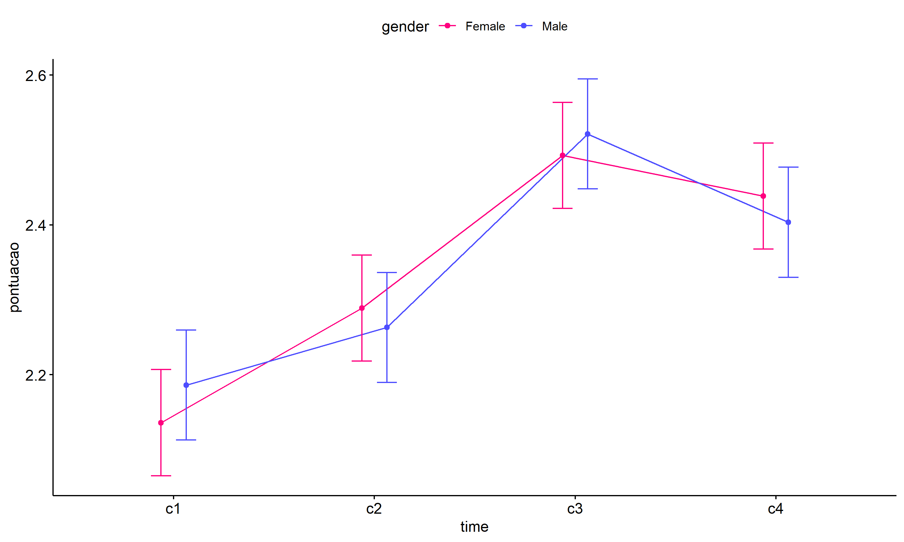<!-- -->

``` r
(pwc <- ldat %>% group_by(gender) %>%
    emmeans_test(pontuacao ~ time, detailed = T, p.adjust.method = "bonferroni"))
```

    ## # A tibble: 12 × 15
    ##    gender term  .y.   group1 group2 null.value estimate     se    df conf.low conf.high statistic
    ##  * <fct>  <chr> <chr> <chr>  <chr>       <dbl>    <dbl>  <dbl> <dbl>    <dbl>     <dbl>     <dbl>
    ##  1 Female time  pont… c1     c2              0  -0.153  0.0511  4252  -0.253    -0.0527     -2.99
    ##  2 Female time  pont… c1     c3              0  -0.357  0.0511  4252  -0.457    -0.257      -6.98
    ##  3 Female time  pont… c1     c4              0  -0.303  0.0511  4252  -0.403    -0.202      -5.92
    ##  4 Female time  pont… c2     c3              0  -0.204  0.0511  4252  -0.304    -0.104      -3.99
    ##  5 Female time  pont… c2     c4              0  -0.150  0.0511  4252  -0.250    -0.0494     -2.93
    ##  6 Female time  pont… c3     c4              0   0.0543 0.0511  4252  -0.0458    0.155       1.06
    ##  7 Male   time  pont… c1     c2              0  -0.0768 0.0530  4252  -0.181     0.0271     -1.45
    ##  8 Male   time  pont… c1     c3              0  -0.335  0.0530  4252  -0.439    -0.231      -6.32
    ##  9 Male   time  pont… c1     c4              0  -0.217  0.0530  4252  -0.321    -0.113      -4.10
    ## 10 Male   time  pont… c2     c3              0  -0.258  0.0530  4252  -0.362    -0.155      -4.88
    ## 11 Male   time  pont… c2     c4              0  -0.141  0.0530  4252  -0.244    -0.0366     -2.65
    ## 12 Male   time  pont… c3     c4              0   0.118  0.0530  4252   0.0140    0.222       2.22
    ## # ℹ 3 more variables: p <dbl>, p.adj <dbl>, p.adj.signif <chr>

| gender | term | .y.       | group1 | group2 | null.value | estimate |    se |   df | conf.low | conf.high | statistic |     p | p.adj | p.adj.signif |
|:-------|:-----|:----------|:-------|:-------|-----------:|---------:|------:|-----:|---------:|----------:|----------:|------:|------:|:-------------|
| Female | time | pontuacao | c1     | c2     |          0 |   -0.153 | 0.051 | 4252 |   -0.253 |    -0.053 |    -2.992 | 0.003 | 0.017 | \*           |
| Female | time | pontuacao | c1     | c3     |          0 |   -0.357 | 0.051 | 4252 |   -0.457 |    -0.257 |    -6.983 | 0.000 | 0.000 | \*\*\*\*     |
| Female | time | pontuacao | c1     | c4     |          0 |   -0.303 | 0.051 | 4252 |   -0.403 |    -0.202 |    -5.920 | 0.000 | 0.000 | \*\*\*\*     |
| Female | time | pontuacao | c2     | c3     |          0 |   -0.204 | 0.051 | 4252 |   -0.304 |    -0.104 |    -3.991 | 0.000 | 0.000 | \*\*\*       |
| Female | time | pontuacao | c2     | c4     |          0 |   -0.150 | 0.051 | 4252 |   -0.250 |    -0.049 |    -2.927 | 0.003 | 0.021 | \*           |
| Female | time | pontuacao | c3     | c4     |          0 |    0.054 | 0.051 | 4252 |   -0.046 |     0.155 |     1.063 | 0.288 | 1.000 | ns           |
| Male   | time | pontuacao | c1     | c2     |          0 |   -0.077 | 0.053 | 4252 |   -0.181 |     0.027 |    -1.449 | 0.147 | 0.884 | ns           |
| Male   | time | pontuacao | c1     | c3     |          0 |   -0.335 | 0.053 | 4252 |   -0.439 |    -0.231 |    -6.325 | 0.000 | 0.000 | \*\*\*\*     |
| Male   | time | pontuacao | c1     | c4     |          0 |   -0.217 | 0.053 | 4252 |   -0.321 |    -0.113 |    -4.100 | 0.000 | 0.000 | \*\*\*       |
| Male   | time | pontuacao | c2     | c3     |          0 |   -0.258 | 0.053 | 4252 |   -0.362 |    -0.155 |    -4.875 | 0.000 | 0.000 | \*\*\*\*     |
| Male   | time | pontuacao | c2     | c4     |          0 |   -0.141 | 0.053 | 4252 |   -0.244 |    -0.037 |    -2.651 | 0.008 | 0.048 | \*           |
| Male   | time | pontuacao | c3     | c4     |          0 |    0.118 | 0.053 | 4252 |    0.014 |     0.222 |     2.225 | 0.026 | 0.157 | ns           |

``` r
(emms <- get_emmeans(pwc))
```

    ## # A tibble: 8 × 8
    ##   gender time  emmean     se    df conf.low conf.high method      
    ##   <fct>  <fct>  <dbl>  <dbl> <dbl>    <dbl>     <dbl> <chr>       
    ## 1 Female c1      2.14 0.0361  4252     2.07      2.21 Emmeans test
    ## 2 Female c2      2.29 0.0361  4252     2.22      2.36 Emmeans test
    ## 3 Female c3      2.49 0.0361  4252     2.42      2.56 Emmeans test
    ## 4 Female c4      2.44 0.0361  4252     2.37      2.51 Emmeans test
    ## 5 Male   c1      2.19 0.0375  4252     2.11      2.26 Emmeans test
    ## 6 Male   c2      2.26 0.0375  4252     2.19      2.34 Emmeans test
    ## 7 Male   c3      2.52 0.0375  4252     2.45      2.59 Emmeans test
    ## 8 Male   c4      2.40 0.0375  4252     2.33      2.48 Emmeans test

| gender | time | emmean |    se |   df | conf.low | conf.high | method       |
|:-------|:-----|-------:|------:|-----:|---------:|----------:|:-------------|
| Female | c1   |  2.136 | 0.036 | 4252 |    2.065 |     2.207 | Emmeans test |
| Female | c2   |  2.289 | 0.036 | 4252 |    2.218 |     2.360 | Emmeans test |
| Female | c3   |  2.493 | 0.036 | 4252 |    2.422 |     2.564 | Emmeans test |
| Female | c4   |  2.438 | 0.036 | 4252 |    2.368 |     2.509 | Emmeans test |
| Male   | c1   |  2.186 | 0.037 | 4252 |    2.113 |     2.260 | Emmeans test |
| Male   | c2   |  2.263 | 0.037 | 4252 |    2.190 |     2.336 | Emmeans test |
| Male   | c3   |  2.521 | 0.037 | 4252 |    2.448 |     2.595 | Emmeans test |
| Male   | c4   |  2.404 | 0.037 | 4252 |    2.330 |     2.477 | Emmeans test |

``` r
emms.gg <- emms[which(emms$gender == "Female"),]
if (nrow(emms.gg) > 0)
  ggline(emms.gg, x = "time", y = "emmean", color = "#FF007F", ylab = "pontuacao") +
    geom_errorbar(aes(ymin = conf.low, ymax = conf.high),
                  width = 0.2, color = "#FF007F") +
    stat_pvalue_manual(
      add_xy_position(pwc[which(pwc$gender == "Female"),],
                      x = "time", fun = "mean_se"),
      hide.ns = T, color = "#FF007F", tip.length = F) +
    labs(title = "gender: Female")+
    theme(legend.text = element_blank())
```

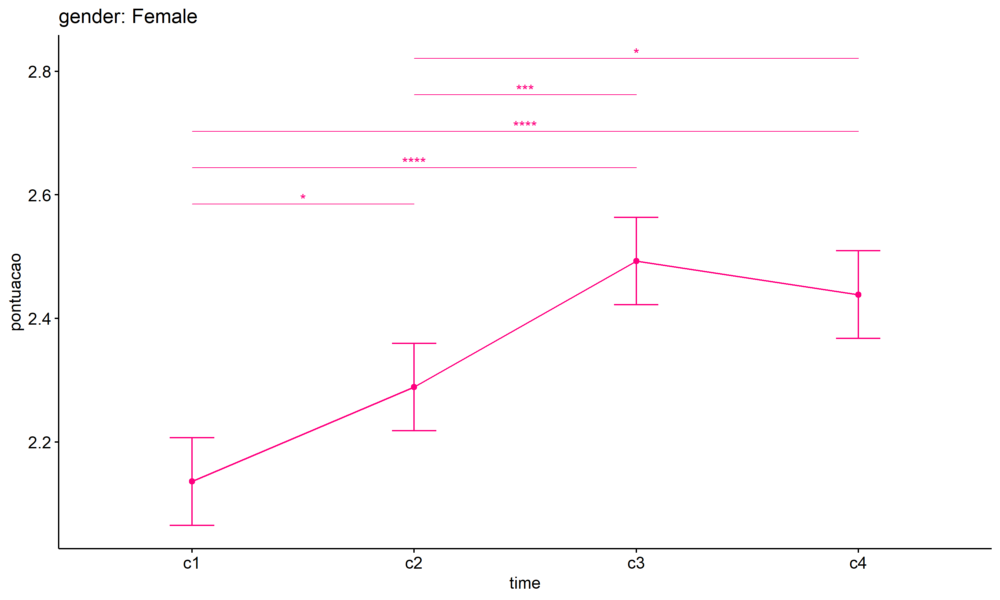<!-- -->

``` r
emms.gg <- emms[which(emms$gender == "Male"),]
if (nrow(emms.gg) > 0)
  ggline(emms.gg, x = "time", y = "emmean", color = "#4D4DFF", ylab = "pontuacao") +
    geom_errorbar(aes(ymin = conf.low, ymax = conf.high),
                  width = 0.2, color = "#4D4DFF") +
    stat_pvalue_manual(
      add_xy_position(pwc[which(pwc$gender == "Male"),],
                      x = "time", fun = "mean_se"),
      hide.ns = T, color = "#4D4DFF", tip.length = F) +
    labs(title = "gender: Male")+
    theme(legend.text = element_blank())
```

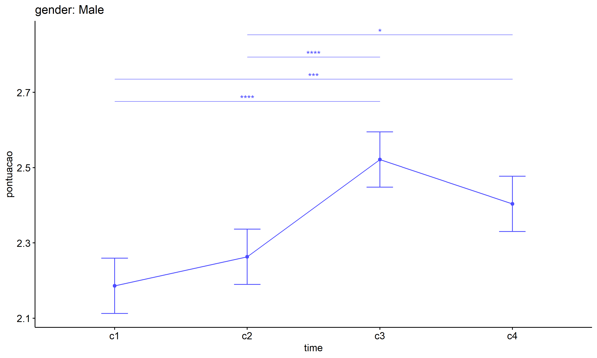<!-- -->

## PairWise Computation after removing non.normal data

``` r
if (length(non.ids) > 0)
  (pwc2 <- ldat2 %>% group_by(time) %>%
     emmeans_test(pontuacao ~ gender, detailed = T, p.adjust.method = "bonferroni"))
```

``` r
if (length(non.ids) > 0)
  (emms2 <- get_emmeans(pwc2))
```

``` r
if (length(non.ids) > 0) {
  pwc2 <- add_xy_position(pwc2, x = "time", fun = "mean_se", dodge = 0.25)
  pd2 <- position_dodge(width = 0.25)
  
  ggline(emms2, x = "time", y = "emmean", color = "gender",
         palette = c("#FF007F","#4D4DFF"),
         position = pd, ylab = "pontuacao") +
    geom_errorbar(aes(ymin = conf.low, ymax = conf.high, color = gender),
                position = pd, width = 0.2) +
    stat_pvalue_manual(pwc2, hide.ns = T, tip.length = F, linetype = 1)
}
```

``` r
if (length(non.ids) > 0)
  (pwc2 <- ldat2 %>% group_by(gender) %>%
     emmeans_test(pontuacao ~ time, detailed = T, p.adjust.method = "bonferroni"))
```

``` r
if (length(non.ids) > 0)
  (emms2 <- get_emmeans(pwc2))
```

``` r
if (length(non.ids) > 0) {
  emms.gg <- emms2[which(emms2$gender == "Female"),]
  if (nrow(emms.gg) > 0)
    ggline(emms.gg, x = "time", y = "emmean", color = "#FF007F", ylab = "pontuacao") +
    geom_errorbar(aes(ymin = conf.low, ymax = conf.high),
                  width = 0.2, color = "#FF007F") +
    stat_pvalue_manual(
      add_xy_position(pwc[which(pwc$gender == "Female"),],
                      x = "time", fun = "mean_se"),
      hide.ns = T, color = "#FF007F", tip.length = F) +
    labs(title = "gender: Female") +
    theme(legend.text = element_blank())
}
```

``` r
if (length(non.ids) > 0) {
  emms.gg <- emms2[which(emms2$gender == "Male"),]
  if (nrow(emms.gg) > 0)
    ggline(emms.gg, x = "time", y = "emmean", color = "#4D4DFF", ylab = "pontuacao") +
    geom_errorbar(aes(ymin = conf.low, ymax = conf.high),
                  width = 0.2, color = "#4D4DFF") +
    stat_pvalue_manual(
      add_xy_position(pwc[which(pwc$gender == "Male"),],
                      x = "time", fun = "mean_se"),
      hide.ns = T, color = "#4D4DFF", tip.length = F) +
    labs(title = "gender: Male") +
    theme(legend.text = element_blank())
}
```

# ANOVA: pontuacao ~ time\*localizacao + Error(id/time)

## Data Preparation

``` r
data <- edat[,c("aluno_id","localizacao","ciclo","pontuacao")]
data$ciclo <- factor(data$ciclo, c("Primeiro Ciclo","Segundo Ciclo",
                                   "Terceiro Ciclo","Quarto Ciclo"))

wdat <- spread(data, ciclo, pontuacao)
wdat <- wdat[complete.cases(wdat),]
colnames(wdat) <- c("id","localizacao","c1","c2","c3","c4")

ldat <- gather(wdat, key = time, value = pontuacao, c1, c2, c3, c4) %>%
  convert_as_factor(id, time)
ldat <- remove_group_data(ldat, "pontuacao", c("time", "localizacao"), n.limit = 30)
ldat$localizacao <- factor(ldat$localizacao, sort(unique(ldat$localizacao)))
```

### Check assumptions: Identifying Outliers

``` r
outliers <- identify_outliers(group_by(ldat, time, localizacao), pontuacao)
(outliers <- outliers[outliers$is.extreme == T,])
```

    ## # A tibble: 643 × 6
    ##    localizacao time  id                   pontuacao is.outlier is.extreme
    ##    <fct>       <fct> <fct>                    <dbl> <lgl>      <lgl>     
    ##  1 Rural       c1    0w3VhiMf67CbcpR6aZCL       5   TRUE       TRUE      
    ##  2 Rural       c1    1PlxEF4tmJySD3G46PLB       3.5 TRUE       TRUE      
    ##  3 Rural       c1    D1HfJKTVqjrpCJx97l3v       5   TRUE       TRUE      
    ##  4 Rural       c1    dieaAtUumyYxX7zGb7Sb       4   TRUE       TRUE      
    ##  5 Rural       c1    DKEsQosaERswlkB803hB       3.5 TRUE       TRUE      
    ##  6 Rural       c1    iutpBZMAtM92qcbyCDHB       3.5 TRUE       TRUE      
    ##  7 Rural       c1    iXqE1bAFPsYn56jTzZQS       5   TRUE       TRUE      
    ##  8 Rural       c1    rijPm1LRjDwEh0XEZEeR       4   TRUE       TRUE      
    ##  9 Rural       c1    snoeXZt7a8Ds16UvPGhk       5   TRUE       TRUE      
    ## 10 Rural       c1    xAo0TzCEx1bIrmjqKgbj       3.5 TRUE       TRUE      
    ## # ℹ 633 more rows

| localizacao | time | id                   | pontuacao | is.outlier | is.extreme |
|:------------|:-----|:---------------------|----------:|:-----------|:-----------|
| Rural       | c1   | 0w3VhiMf67CbcpR6aZCL |     5.000 | TRUE       | TRUE       |
| Rural       | c1   | 1PlxEF4tmJySD3G46PLB |     3.500 | TRUE       | TRUE       |
| Rural       | c1   | D1HfJKTVqjrpCJx97l3v |     5.000 | TRUE       | TRUE       |
| Rural       | c1   | dieaAtUumyYxX7zGb7Sb |     4.000 | TRUE       | TRUE       |
| Rural       | c1   | DKEsQosaERswlkB803hB |     3.500 | TRUE       | TRUE       |
| Rural       | c1   | iutpBZMAtM92qcbyCDHB |     3.500 | TRUE       | TRUE       |
| Rural       | c1   | iXqE1bAFPsYn56jTzZQS |     5.000 | TRUE       | TRUE       |
| Rural       | c1   | rijPm1LRjDwEh0XEZEeR |     4.000 | TRUE       | TRUE       |
| Rural       | c1   | snoeXZt7a8Ds16UvPGhk |     5.000 | TRUE       | TRUE       |
| Rural       | c1   | xAo0TzCEx1bIrmjqKgbj |     3.500 | TRUE       | TRUE       |
| Rural       | c1   | xZ5yKSWaJFp2osYZSjqL |     5.000 | TRUE       | TRUE       |
| Urbana      | c1   | 0wDHSyctDDkjP6OPE3c8 |     5.000 | TRUE       | TRUE       |
| Urbana      | c1   | 1DlydHhFt2IkhBETPR4s |     3.500 | TRUE       | TRUE       |
| Urbana      | c1   | 1Z1Qz8zDaMkaAz1Ah80K |     5.000 | TRUE       | TRUE       |
| Urbana      | c1   | 46nUNvt4sDOPsC9jnkiG |     4.500 | TRUE       | TRUE       |
| Urbana      | c1   | 4hmXg2uo4wxSAX9SaxpN |     3.500 | TRUE       | TRUE       |
| Urbana      | c1   | 55GlwifTTyiOSKTB9vc9 |     5.000 | TRUE       | TRUE       |
| Urbana      | c1   | 5AeP0IQ84CerIQVenp2G |     3.000 | TRUE       | TRUE       |
| Urbana      | c1   | 6IoOZmGw52LYlznSYXzK |     3.000 | TRUE       | TRUE       |
| Urbana      | c1   | 6oE4k979jigSP7Zbs2m1 |     3.500 | TRUE       | TRUE       |
| Urbana      | c1   | 6Xlhq905iNT5kvJFoSW5 |     5.000 | TRUE       | TRUE       |
| Urbana      | c1   | 7AaMrLZQiyhSoBaer5VH |     3.500 | TRUE       | TRUE       |
| Urbana      | c1   | 7nfO1ouMUuN7IzvlCKr0 |     3.500 | TRUE       | TRUE       |
| Urbana      | c1   | A5EETpEr617bpnSh1wp6 |     3.500 | TRUE       | TRUE       |
| Urbana      | c1   | A8Rx15QryUqDDm8ooiZr |     3.000 | TRUE       | TRUE       |
| Urbana      | c1   | AIzwxJCfbDsO8ZT4ZZ4h |     3.000 | TRUE       | TRUE       |
| Urbana      | c1   | b9PlhVhdvhl9EPK9QVCv |     5.000 | TRUE       | TRUE       |
| Urbana      | c1   | cao1agmzaedA3s0PVAPS |     5.000 | TRUE       | TRUE       |
| Urbana      | c1   | cJoqgrk6T3HsA9EOVe7D |     5.000 | TRUE       | TRUE       |
| Urbana      | c1   | cuknOzzwN4oCRum5U5ph |     3.500 | TRUE       | TRUE       |
| Urbana      | c1   | cy0oZFPyT8aGHBq7CR9A |     3.500 | TRUE       | TRUE       |
| Urbana      | c1   | DFTbWP0xF5gxFgxEN0dL |     3.000 | TRUE       | TRUE       |
| Urbana      | c1   | dSM9U89FZYdICjBucW8v |     3.000 | TRUE       | TRUE       |
| Urbana      | c1   | E8XEhNJhfANZZtqHam0A |     3.000 | TRUE       | TRUE       |
| Urbana      | c1   | erFWuFkPr2piNKvHuKrD |     3.500 | TRUE       | TRUE       |
| Urbana      | c1   | F5Ux4BYYqSnMt1Om6Trf |     3.500 | TRUE       | TRUE       |
| Urbana      | c1   | g0SSATlv7RDhoBk6jsCz |     3.500 | TRUE       | TRUE       |
| Urbana      | c1   | G2SUhDEavPTLyA8yz9AL |     3.500 | TRUE       | TRUE       |
| Urbana      | c1   | G4NIt8gEc7nfeQ9k2OkL |     3.500 | TRUE       | TRUE       |
| Urbana      | c1   | G5WjH8t1I6LAiAOCuM2v |     3.500 | TRUE       | TRUE       |
| Urbana      | c1   | H8te97gR9TCOM0CiCXj1 |     3.500 | TRUE       | TRUE       |
| Urbana      | c1   | I1x9Y5cYi4OfnwWUeTXz |     4.000 | TRUE       | TRUE       |
| Urbana      | c1   | I5SKdDmPvNCpOHCfh7Is |     4.000 | TRUE       | TRUE       |
| Urbana      | c1   | i6M2WLEfaiylCRyZ9XnE |     3.500 | TRUE       | TRUE       |
| Urbana      | c1   | ixToGS5nyKWTy1PjTzZW |     3.000 | TRUE       | TRUE       |
| Urbana      | c1   | JdRySX8i3hE3pxcYyUcf |     3.000 | TRUE       | TRUE       |
| Urbana      | c1   | Jgsj4or0goDAXdQU3UwR |     3.000 | TRUE       | TRUE       |
| Urbana      | c1   | jVbbowshsqkUpPuGSIMu |     4.000 | TRUE       | TRUE       |
| Urbana      | c1   | KPMkDhksSiEWVEIUT1LG |     3.500 | TRUE       | TRUE       |
| Urbana      | c1   | KWsflPBHSK0g0ZYy9I1L |     5.000 | TRUE       | TRUE       |
| Urbana      | c1   | lt4Za0V8VmneMBIicN4R |     3.000 | TRUE       | TRUE       |
| Urbana      | c1   | m5yRlxfIj73j4ossfTOB |     5.000 | TRUE       | TRUE       |
| Urbana      | c1   | MTyNplLkcaNxd9NT392Q |     3.500 | TRUE       | TRUE       |
| Urbana      | c1   | N3zF1kdLVvTXfbcXiMqe |     3.500 | TRUE       | TRUE       |
| Urbana      | c1   | nnPTfCmTsFmqbk9q3PJG |     3.500 | TRUE       | TRUE       |
| Urbana      | c1   | NW7xi0uw2xX7J2ch6WFX |     5.000 | TRUE       | TRUE       |
| Urbana      | c1   | oafpBD8HTXvsKOiHN7p8 |     3.500 | TRUE       | TRUE       |
| Urbana      | c1   | pca9LmykrugFnjsHp7MR |     5.000 | TRUE       | TRUE       |
| Urbana      | c1   | PKoPTKC1RrGaREkbINPf |     3.500 | TRUE       | TRUE       |
| Urbana      | c1   | PMsVKgnivLJr3CQYAKsP |     3.500 | TRUE       | TRUE       |
| Urbana      | c1   | QasU7a9JiIu1XHAPVJk9 |     3.000 | TRUE       | TRUE       |
| Urbana      | c1   | qbpdhqIdqf7n3lmU2n4I |     3.500 | TRUE       | TRUE       |
| Urbana      | c1   | R7yCqYgzTa9KdpJQ4uXb |     5.000 | TRUE       | TRUE       |
| Urbana      | c1   | RlqnAYUyOdC7g4eDY9UO |     5.000 | TRUE       | TRUE       |
| Urbana      | c1   | Rq2OTnqvauiedrQ0PVcm |     3.500 | TRUE       | TRUE       |
| Urbana      | c1   | Ru3SPRo97iXBvXbvneKh |     5.000 | TRUE       | TRUE       |
| Urbana      | c1   | sM3c4noBIP8hnYWA6pAe |     4.000 | TRUE       | TRUE       |
| Urbana      | c1   | sRR37KpbkBZSh9H2UpSB |     4.000 | TRUE       | TRUE       |
| Urbana      | c1   | Swge4GG9Qmg1w9YaAeDP |     3.500 | TRUE       | TRUE       |
| Urbana      | c1   | TABveJnXO5hRaweFnAMh |     5.000 | TRUE       | TRUE       |
| Urbana      | c1   | TKvc4Eu2XaDXYPxuS7Qn |     3.000 | TRUE       | TRUE       |
| Urbana      | c1   | uCBI6gnllsawWJlgqkr5 |     5.000 | TRUE       | TRUE       |
| Urbana      | c1   | UKLVcE0VqppSSC8hDubG |     5.000 | TRUE       | TRUE       |
| Urbana      | c1   | UTcQeAJVgrgjSdUJBAKT |     3.000 | TRUE       | TRUE       |
| Urbana      | c1   | vc8pPoYau2AIAuCQJipW |     5.000 | TRUE       | TRUE       |
| Urbana      | c1   | wJgBRtIUF5VG22EJXZKz |     4.000 | TRUE       | TRUE       |
| Urbana      | c1   | XeSX4FsDK2KmCwATUvcu |     3.500 | TRUE       | TRUE       |
| Urbana      | c1   | xgWi8MM2PHEEfdjn61b7 |     5.000 | TRUE       | TRUE       |
| Urbana      | c1   | xmtNEz12lXmE9RzmND2z |     3.500 | TRUE       | TRUE       |
| Urbana      | c1   | xUKKiLMXz1z5e7g1kX4m |     5.000 | TRUE       | TRUE       |
| Urbana      | c1   | Y7HozU436KQ0wqdBGugu |     3.500 | TRUE       | TRUE       |
| Urbana      | c1   | YTYFFWzK4C7ejf1X1TUB |     5.000 | TRUE       | TRUE       |
| Urbana      | c1   | YxfFrbwSijoyTMWGIYqQ |     5.000 | TRUE       | TRUE       |
| Urbana      | c1   | YZl0xc1Gu4ixxN2rOCtH |     5.000 | TRUE       | TRUE       |
| Urbana      | c1   | ZdpC4Xaxucxlaqa0o7wm |     5.000 | TRUE       | TRUE       |
| Urbana      | c1   | zu9ITSnIAecxMpJmNxCE |     5.000 | TRUE       | TRUE       |
| Rural       | c2   | 0w3VhiMf67CbcpR6aZCL |     5.000 | TRUE       | TRUE       |
| Rural       | c2   | 1gvgnHo5onRSLXTnds8W |     3.500 | TRUE       | TRUE       |
| Rural       | c2   | 1ZE6i0Is22PBIAZbrM0J |     5.000 | TRUE       | TRUE       |
| Rural       | c2   | 2gOTOJWpjODv0nBxtJgU |     5.000 | TRUE       | TRUE       |
| Rural       | c2   | 2wBgWJVF1mK6rnsBiZ99 |     5.000 | TRUE       | TRUE       |
| Rural       | c2   | 3XOQzgoErsKmvF4VxZjc |     5.000 | TRUE       | TRUE       |
| Rural       | c2   | 8jXS39U6Aje4RlDntJHg |     3.500 | TRUE       | TRUE       |
| Rural       | c2   | ahHqNPxM9dDITA6mjtpB |     3.500 | TRUE       | TRUE       |
| Rural       | c2   | AUp01jGBKvRyiH5yAcYg |     3.500 | TRUE       | TRUE       |
| Rural       | c2   | D3zCmRj97N1xSw2RGyIX |     4.000 | TRUE       | TRUE       |
| Rural       | c2   | DnO4jcQLjmp6OZ15Qnyw |     4.000 | TRUE       | TRUE       |
| Rural       | c2   | efGqYqTmvxysOA8bmE9u |     4.000 | TRUE       | TRUE       |
| Rural       | c2   | ey1dPZ6oy134PkSs4ZDO |     5.000 | TRUE       | TRUE       |
| Rural       | c2   | i84ihNmDZFogrHoxo3Im |     3.000 | TRUE       | TRUE       |
| Rural       | c2   | iSIgLPCScY5Oq0MlhbEz |     3.500 | TRUE       | TRUE       |
| Rural       | c2   | ITZKcm29e0hwUQiiDtaF |     5.000 | TRUE       | TRUE       |
| Rural       | c2   | iXqE1bAFPsYn56jTzZQS |     4.000 | TRUE       | TRUE       |
| Rural       | c2   | jGesTMYpGOc4DJQ77fHt |     3.000 | TRUE       | TRUE       |
| Rural       | c2   | jljcKPNPjBo1MdiK1ffQ |     3.500 | TRUE       | TRUE       |
| Rural       | c2   | JmKGEFyVZnIRSzkWkGSo |     5.000 | TRUE       | TRUE       |
| Rural       | c2   | k1Byic1gWlgNIFT8qDpn |     5.000 | TRUE       | TRUE       |
| Rural       | c2   | MePraql0XSzwJi42Obwf |     3.500 | TRUE       | TRUE       |
| Rural       | c2   | N9cRf5BDMjp45ygmrq1a |     5.000 | TRUE       | TRUE       |
| Rural       | c2   | NiBOt9OUO2x3fZe7eXO0 |     5.000 | TRUE       | TRUE       |
| Rural       | c2   | PfTab7CnJIl6lys2Cxuq |     4.500 | TRUE       | TRUE       |
| Rural       | c2   | RU6W5zawYsr9WEMqiDC2 |     5.000 | TRUE       | TRUE       |
| Rural       | c2   | sSEiBqKCIt9z1Qg8SihU |     5.000 | TRUE       | TRUE       |
| Rural       | c2   | UaBRzohcAqFW1qjmBSvw |     3.000 | TRUE       | TRUE       |
| Rural       | c2   | UpctgaJMOEgDuI3wov8S |     3.500 | TRUE       | TRUE       |
| Rural       | c2   | WcaFnyTs2jyODcXLIWQo |     3.500 | TRUE       | TRUE       |
| Rural       | c2   | wcqg0kZ9Dn7SD7uVGbmL |     3.500 | TRUE       | TRUE       |
| Rural       | c2   | WKxFXpseomxCYgOSyrdB |     4.000 | TRUE       | TRUE       |
| Rural       | c2   | xCgFRSJhxUFZEqK4qpC9 |     5.000 | TRUE       | TRUE       |
| Rural       | c2   | z3p6Ot4uvkPmGXOS9D3e |     5.000 | TRUE       | TRUE       |
| Urbana      | c2   | 0JP4C8o7n2HYsnPDx4qx |     3.500 | TRUE       | TRUE       |
| Urbana      | c2   | 1g6aBXXFdmJWTIwXaf4A |     5.000 | TRUE       | TRUE       |
| Urbana      | c2   | 1KTN8KwyWSigGGMFIG9F |     5.000 | TRUE       | TRUE       |
| Urbana      | c2   | 1l2CPmeR5hbmhcJoY5Gs |     4.000 | TRUE       | TRUE       |
| Urbana      | c2   | 1rGKIQ7fdZBOxxGdPFrp |     3.500 | TRUE       | TRUE       |
| Urbana      | c2   | 2eFfyVVi6PFZAieFgek6 |     5.000 | TRUE       | TRUE       |
| Urbana      | c2   | 2Mvl0siGmos3P6uCJoI6 |     4.000 | TRUE       | TRUE       |
| Urbana      | c2   | 3ETydorel7bIDQKYclir |     2.750 | TRUE       | TRUE       |
| Urbana      | c2   | 3WvSQRVfYSeH8PCOQB0n |     3.500 | TRUE       | TRUE       |
| Urbana      | c2   | 4AM4nonwJ45LiMy6b4lp |     5.000 | TRUE       | TRUE       |
| Urbana      | c2   | 4gepVdqUGSJq9eKKqU4U |     4.000 | TRUE       | TRUE       |
| Urbana      | c2   | 4hmXg2uo4wxSAX9SaxpN |     3.000 | TRUE       | TRUE       |
| Urbana      | c2   | 5l1OLNAprJvzHRinnoF0 |     3.500 | TRUE       | TRUE       |
| Urbana      | c2   | 6bEKmKQpOuvY6PSQvzqj |     4.000 | TRUE       | TRUE       |
| Urbana      | c2   | 6Xlhq905iNT5kvJFoSW5 |     5.000 | TRUE       | TRUE       |
| Urbana      | c2   | 8GRRowomccTgY63JK0hV |     3.000 | TRUE       | TRUE       |
| Urbana      | c2   | 8p6QYQYkfhR3QOACXZvj |     3.000 | TRUE       | TRUE       |
| Urbana      | c2   | 8PyXW7ejCnDsMsEjrlsy |     3.000 | TRUE       | TRUE       |
| Urbana      | c2   | 8x1O4EwGS3PLQhs7ljBM |     5.000 | TRUE       | TRUE       |
| Urbana      | c2   | 9ZgjvRy0pzK2NOHnuf9Q |     3.500 | TRUE       | TRUE       |
| Urbana      | c2   | A8Rx15QryUqDDm8ooiZr |     5.000 | TRUE       | TRUE       |
| Urbana      | c2   | ao9Hy7cVw5W6MXhO5Ylm |     3.500 | TRUE       | TRUE       |
| Urbana      | c2   | atydp19vM0PjiOQCWemR |     3.000 | TRUE       | TRUE       |
| Urbana      | c2   | bxxcpVcdJ03akf9XTPVs |     5.000 | TRUE       | TRUE       |
| Urbana      | c2   | cuknOzzwN4oCRum5U5ph |     5.000 | TRUE       | TRUE       |
| Urbana      | c2   | d1JgyezU4pt7F4SebGoe |     4.000 | TRUE       | TRUE       |
| Urbana      | c2   | d78FW2LeEQ1zVALsO8FL |     3.333 | TRUE       | TRUE       |
| Urbana      | c2   | dCPfML2azPAOx7s4eHfR |     3.500 | TRUE       | TRUE       |
| Urbana      | c2   | DmzTbIYJpxJm9o8FEyCL |     2.500 | TRUE       | TRUE       |
| Urbana      | c2   | dSM9U89FZYdICjBucW8v |     5.000 | TRUE       | TRUE       |
| Urbana      | c2   | e1nlLe6lCBYUzF23dTrW |     4.000 | TRUE       | TRUE       |
| Urbana      | c2   | EcAgL4tVyGSoqslrQjcI |     3.500 | TRUE       | TRUE       |
| Urbana      | c2   | eJDGpLsooEaszwDWmzb7 |     3.500 | TRUE       | TRUE       |
| Urbana      | c2   | eKNF6EdIBYr2bZIgYfpt |     5.000 | TRUE       | TRUE       |
| Urbana      | c2   | EXP9vzjLIJFDlyiQt1hn |     3.000 | TRUE       | TRUE       |
| Urbana      | c2   | F5Ux4BYYqSnMt1Om6Trf |     5.000 | TRUE       | TRUE       |
| Urbana      | c2   | ffnFAMZehkOjgmmGyq3E |     5.000 | TRUE       | TRUE       |
| Urbana      | c2   | FkJFrnPezc8Ng4SSMx1z |     5.000 | TRUE       | TRUE       |
| Urbana      | c2   | G6w5RiWtWQbT4xtExf7d |     5.000 | TRUE       | TRUE       |
| Urbana      | c2   | GAEVtgOgvNASXuwIPENX |     3.000 | TRUE       | TRUE       |
| Urbana      | c2   | gBmp7DCcMF8YynwrJWmq |     5.000 | TRUE       | TRUE       |
| Urbana      | c2   | ggH0twWM1TpDTguT2sSU |     3.500 | TRUE       | TRUE       |
| Urbana      | c2   | GLiaONiGLGsIMU5p88Cl |     3.667 | TRUE       | TRUE       |
| Urbana      | c2   | gRiK9OMij8RxayU0KCFv |     3.000 | TRUE       | TRUE       |
| Urbana      | c2   | gzBUwnjjYHnioTnd4stC |     3.000 | TRUE       | TRUE       |
| Urbana      | c2   | H8te97gR9TCOM0CiCXj1 |     3.000 | TRUE       | TRUE       |
| Urbana      | c2   | hcMHfjgGtVOBlWeqw37Q |     5.000 | TRUE       | TRUE       |
| Urbana      | c2   | HqTgiqhYnEvVciVol3PS |     5.000 | TRUE       | TRUE       |
| Urbana      | c2   | HsQF2J0r79mHSWNe4l6n |     5.000 | TRUE       | TRUE       |
| Urbana      | c2   | I1x9Y5cYi4OfnwWUeTXz |     4.000 | TRUE       | TRUE       |
| Urbana      | c2   | i6M2WLEfaiylCRyZ9XnE |     5.000 | TRUE       | TRUE       |
| Urbana      | c2   | I6ZCrdQMaOdo9ltkC1r2 |     5.000 | TRUE       | TRUE       |
| Urbana      | c2   | IXZlZBy7uRBHUFPQg8hX |     5.000 | TRUE       | TRUE       |
| Urbana      | c2   | Iy3Q4VZAPE7yypxlEgZV |     4.000 | TRUE       | TRUE       |
| Urbana      | c2   | j31LU8Xwm0EQ7Mihkhjj |     5.000 | TRUE       | TRUE       |
| Urbana      | c2   | jipIzfMPngc6Se2mEtoO |     3.500 | TRUE       | TRUE       |
| Urbana      | c2   | jVbbowshsqkUpPuGSIMu |     4.000 | TRUE       | TRUE       |
| Urbana      | c2   | k2S15ANRrwJKgCuiwaKC |     3.000 | TRUE       | TRUE       |
| Urbana      | c2   | K3la9byFQsBzKaukPsOq |     3.500 | TRUE       | TRUE       |
| Urbana      | c2   | K3oo1Kn5UlJH6lIGaZTL |     5.000 | TRUE       | TRUE       |
| Urbana      | c2   | KxltaXnk31onNRVrLE5Y |     3.500 | TRUE       | TRUE       |
| Urbana      | c2   | LC67V5LShu6RMdyHjAJx |     3.500 | TRUE       | TRUE       |
| Urbana      | c2   | LJrBpSpYOJUxZWUehnpX |     3.500 | TRUE       | TRUE       |
| Urbana      | c2   | LMrt1klH9kXyo7kH4gB8 |     3.000 | TRUE       | TRUE       |
| Urbana      | c2   | MO5oCAGyztcuEpHPXGxD |     3.500 | TRUE       | TRUE       |
| Urbana      | c2   | mp70aTuAiwYmhEHntRfm |     3.500 | TRUE       | TRUE       |
| Urbana      | c2   | mTxfHO37mmdyGuVi0AcC |     4.000 | TRUE       | TRUE       |
| Urbana      | c2   | MTyNplLkcaNxd9NT392Q |     5.000 | TRUE       | TRUE       |
| Urbana      | c2   | Mv8Pv2YBEg4SX5h40YAU |     5.000 | TRUE       | TRUE       |
| Urbana      | c2   | MxgQUA6KrQnZN4Fm7oCW |     3.500 | TRUE       | TRUE       |
| Urbana      | c2   | nI311xKanqD5k4XdM5QB |     4.000 | TRUE       | TRUE       |
| Urbana      | c2   | NJuhIhcV6SgR0FBfCWdk |     3.000 | TRUE       | TRUE       |
| Urbana      | c2   | Nm6WeD34RnKIBjlDrkaO |     5.000 | TRUE       | TRUE       |
| Urbana      | c2   | NxEhBT0ZChu4oRR5q6bd |     3.500 | TRUE       | TRUE       |
| Urbana      | c2   | nZK9NUDQSwfWTTfSeqPH |     5.000 | TRUE       | TRUE       |
| Urbana      | c2   | oafpBD8HTXvsKOiHN7p8 |     5.000 | TRUE       | TRUE       |
| Urbana      | c2   | oGUJyWRMYYbF9PNegJZh |     5.000 | TRUE       | TRUE       |
| Urbana      | c2   | OiJwZNTmMiomnpFEIgBN |     3.000 | TRUE       | TRUE       |
| Urbana      | c2   | OTNUMYnL8AF930i7Db8H |     3.500 | TRUE       | TRUE       |
| Urbana      | c2   | pkFNtaKBdbUsYSrekUQh |     3.000 | TRUE       | TRUE       |
| Urbana      | c2   | pOZO9oAcxPz33Ypnsv2X |     2.500 | TRUE       | TRUE       |
| Urbana      | c2   | Puj0Lljgb9yE7UxApjnK |     5.000 | TRUE       | TRUE       |
| Urbana      | c2   | pX3oKxaMTnCJ8g1GtRWG |     2.750 | TRUE       | TRUE       |
| Urbana      | c2   | Q3CCnrZoSPx08SF7zj3N |     3.500 | TRUE       | TRUE       |
| Urbana      | c2   | qlQnX21ByGDabhAiIbdF |     5.000 | TRUE       | TRUE       |
| Urbana      | c2   | QWZGR164QoEvdqudnbNc |     3.667 | TRUE       | TRUE       |
| Urbana      | c2   | qXTbctZqWWGjKtZpvSzg |     3.500 | TRUE       | TRUE       |
| Urbana      | c2   | RCY3F2HtV0DPrs21Q5KB |     3.000 | TRUE       | TRUE       |
| Urbana      | c2   | rknK8GEk9H27CI9GSt4V |     2.667 | TRUE       | TRUE       |
| Urbana      | c2   | RuLO4wjZ8eP202TWX6R8 |     4.000 | TRUE       | TRUE       |
| Urbana      | c2   | ScmLumR6WUA4APWBqXFX |     4.000 | TRUE       | TRUE       |
| Urbana      | c2   | SFojZKDHvdJbhHKzsN2I |     4.000 | TRUE       | TRUE       |
| Urbana      | c2   | sXB3m8f7P40lRXYwY22p |     3.000 | TRUE       | TRUE       |
| Urbana      | c2   | tfmKp0SXpwvJkZn03aN4 |     4.000 | TRUE       | TRUE       |
| Urbana      | c2   | trOCyMFe6S3DDEhf2HL7 |     5.000 | TRUE       | TRUE       |
| Urbana      | c2   | u5hJDswFRptq4y76Kutb |     3.500 | TRUE       | TRUE       |
| Urbana      | c2   | uO9nfkLEYn0z361QEH7Q |     5.000 | TRUE       | TRUE       |
| Urbana      | c2   | uqX7aPoHn8tMaKAp9y3I |     3.000 | TRUE       | TRUE       |
| Urbana      | c2   | UTcQeAJVgrgjSdUJBAKT |     5.000 | TRUE       | TRUE       |
| Urbana      | c2   | uXrGgSVZ1ZKfQuJ3neSu |     3.500 | TRUE       | TRUE       |
| Urbana      | c2   | v4NaY6TWYcpu9RoVkXwS |     5.000 | TRUE       | TRUE       |
| Urbana      | c2   | v5KF7y11Ncyud2q4dKmD |     3.000 | TRUE       | TRUE       |
| Urbana      | c2   | vCC3nTZphL0vITkOGcBP |     5.000 | TRUE       | TRUE       |
| Urbana      | c2   | vF1wv9aDV5UGHKuqCkC3 |     3.500 | TRUE       | TRUE       |
| Urbana      | c2   | vSolOA78V6l7oYJ1h4LA |     3.500 | TRUE       | TRUE       |
| Urbana      | c2   | W8iXxSmW48zvfJyikMZb |     5.000 | TRUE       | TRUE       |
| Urbana      | c2   | wAdhjRHCCyiW6GtcGaQE |     5.000 | TRUE       | TRUE       |
| Urbana      | c2   | wSjwY5eBTqgIzBqdtazC |     5.000 | TRUE       | TRUE       |
| Urbana      | c2   | WSRSxbb9igUPQVN86BSH |     5.000 | TRUE       | TRUE       |
| Urbana      | c2   | wxyQb8UYLyuIeyTuqWHK |     4.000 | TRUE       | TRUE       |
| Urbana      | c2   | Xfs4ydu0jiJkaDwInzXx |     5.000 | TRUE       | TRUE       |
| Urbana      | c2   | xgjVK7rnOUUArvnA4ZiQ |     5.000 | TRUE       | TRUE       |
| Urbana      | c2   | xk7eC5haTYuFQaJovsBZ |     5.000 | TRUE       | TRUE       |
| Urbana      | c2   | XzMIZjd0GDHSpif5ypWf |     3.500 | TRUE       | TRUE       |
| Urbana      | c2   | YAjRLL4Bd2nV1EigssjM |     5.000 | TRUE       | TRUE       |
| Urbana      | c2   | ygdicz3svMOl4mNIiwtJ |     2.500 | TRUE       | TRUE       |
| Urbana      | c2   | ygFJxqySABX8ax57ihIq |     3.500 | TRUE       | TRUE       |
| Urbana      | c2   | YxfFrbwSijoyTMWGIYqQ |     2.750 | TRUE       | TRUE       |
| Urbana      | c2   | ZDsN200AOSuZkmxgcc8n |     4.000 | TRUE       | TRUE       |
| Urbana      | c2   | ZFjyLFTCim7WZrtYy2tK |     2.750 | TRUE       | TRUE       |
| Urbana      | c2   | zPWlocgrVt4Mfvr0UwaQ |     3.000 | TRUE       | TRUE       |
| Urbana      | c2   | zqSde1r6leyecbET0INz |     5.000 | TRUE       | TRUE       |
| Urbana      | c3   | 03prrbuQMUZ1aXaNSpNg |     5.000 | TRUE       | TRUE       |
| Urbana      | c3   | 06Vps080bCd2ORWNulNM |     5.000 | TRUE       | TRUE       |
| Urbana      | c3   | 0RcoTM8hDTCRz53xkhWB |     3.000 | TRUE       | TRUE       |
| Urbana      | c3   | 12jZHvX32WJ4t8qQybyG |     4.000 | TRUE       | TRUE       |
| Urbana      | c3   | 13fdHVWOWq2M68PrcPIp |     5.000 | TRUE       | TRUE       |
| Urbana      | c3   | 1A2mocpG7GSFNtfkfwOO |     5.000 | TRUE       | TRUE       |
| Urbana      | c3   | 2eTy4XnB3HL1Lip3fbQn |     3.500 | TRUE       | TRUE       |
| Urbana      | c3   | 2hRYk5Ant545stWX17Xb |     3.500 | TRUE       | TRUE       |
| Urbana      | c3   | 2qbgEyCWhU8ChVoKwmf5 |     4.000 | TRUE       | TRUE       |
| Urbana      | c3   | 3ajgkVWABlKXn2M8i6nE |     5.000 | TRUE       | TRUE       |
| Urbana      | c3   | 3DdYC9Dpykr9Mtg6YR91 |     5.000 | TRUE       | TRUE       |
| Urbana      | c3   | 3Ugm6wd42djxxIa9v8nX |     4.000 | TRUE       | TRUE       |
| Urbana      | c3   | 3WvSQRVfYSeH8PCOQB0n |     5.000 | TRUE       | TRUE       |
| Urbana      | c3   | 4gepVdqUGSJq9eKKqU4U |     4.000 | TRUE       | TRUE       |
| Urbana      | c3   | 4KHHEYjMyMuMUSgMFBWA |     5.000 | TRUE       | TRUE       |
| Urbana      | c3   | 53wwkxtWpNW5sqGU32Kc |     5.000 | TRUE       | TRUE       |
| Urbana      | c3   | 67OZnVg6i2P9C6aaYo9r |     5.000 | TRUE       | TRUE       |
| Urbana      | c3   | 6bEKmKQpOuvY6PSQvzqj |     5.000 | TRUE       | TRUE       |
| Urbana      | c3   | 6bilKfhgwjZLq47wbAdZ |     4.000 | TRUE       | TRUE       |
| Urbana      | c3   | 6ICRgE0rvAmB7lOuAmyQ |     3.500 | TRUE       | TRUE       |
| Urbana      | c3   | 6xovhyxrooDvapRfozKf |     4.000 | TRUE       | TRUE       |
| Urbana      | c3   | 6Xq4LeahCPnI2sZLyCEb |     4.000 | TRUE       | TRUE       |
| Urbana      | c3   | 6zAoYaCiBz0ok4UtPFa7 |     3.500 | TRUE       | TRUE       |
| Urbana      | c3   | 7nfO1ouMUuN7IzvlCKr0 |     3.000 | TRUE       | TRUE       |
| Urbana      | c3   | 7QdmUXiS7buOngwYdftX |     5.000 | TRUE       | TRUE       |
| Urbana      | c3   | 8lfWsRb6bqeqiqAn2iPn |     3.000 | TRUE       | TRUE       |
| Urbana      | c3   | 8wybyUZuGQnCWXZqUuos |     5.000 | TRUE       | TRUE       |
| Urbana      | c3   | 8x1O4EwGS3PLQhs7ljBM |     5.000 | TRUE       | TRUE       |
| Urbana      | c3   | 9lNtpPrfhHbUHX7Ff5Dr |     4.000 | TRUE       | TRUE       |
| Urbana      | c3   | 9w7fsQmTt0KXHULPLQeu |     4.000 | TRUE       | TRUE       |
| Urbana      | c3   | A8Rx15QryUqDDm8ooiZr |     5.000 | TRUE       | TRUE       |
| Urbana      | c3   | AH1sCf7O5jOA17AZz4Sv |     3.500 | TRUE       | TRUE       |
| Urbana      | c3   | AmerU5JsGxhj1ABeNqNx |     3.500 | TRUE       | TRUE       |
| Urbana      | c3   | AOPm2hrgIi21mhz4AWVa |     4.000 | TRUE       | TRUE       |
| Urbana      | c3   | atydp19vM0PjiOQCWemR |     3.500 | TRUE       | TRUE       |
| Urbana      | c3   | B6xIvjauiVhTb6iysf2q |     3.500 | TRUE       | TRUE       |
| Urbana      | c3   | bHobujEJH9Ye5qPYW9o3 |     3.500 | TRUE       | TRUE       |
| Urbana      | c3   | BmlG2Ru6d2oECCkX0RIT |     3.500 | TRUE       | TRUE       |
| Urbana      | c3   | BNZfqw7XySxL88fdeSei |     5.000 | TRUE       | TRUE       |
| Urbana      | c3   | bXcDzsLedzCkI9NdHElu |     4.000 | TRUE       | TRUE       |
| Urbana      | c3   | bxxcpVcdJ03akf9XTPVs |     5.000 | TRUE       | TRUE       |
| Urbana      | c3   | C9yrnovcTaV6PYqDq8Hh |     5.000 | TRUE       | TRUE       |
| Urbana      | c3   | CCVIt7MPeYMUOCCyBxPh |     5.000 | TRUE       | TRUE       |
| Urbana      | c3   | CgvAFLYBdj9BcT4wqIMs |     5.000 | TRUE       | TRUE       |
| Urbana      | c3   | csAIMjKcgvv3bFbaGEa9 |     5.000 | TRUE       | TRUE       |
| Urbana      | c3   | cSyRnui4Al6UpZ9ZyE3P |     3.000 | TRUE       | TRUE       |
| Urbana      | c3   | ctPckNjlaNbES9mZqihR |     3.500 | TRUE       | TRUE       |
| Urbana      | c3   | CUr5w2LPd0WLEdkAq7VQ |     5.000 | TRUE       | TRUE       |
| Urbana      | c3   | cydOGNsA77RCWBtBqYh5 |     5.000 | TRUE       | TRUE       |
| Urbana      | c3   | D5ZRR3Ps7EtPoEi233KU |     5.000 | TRUE       | TRUE       |
| Urbana      | c3   | D8KSabtZJPDlGt2oRAxv |     5.000 | TRUE       | TRUE       |
| Urbana      | c3   | dBlo0AwHuiC5vwUZqfJe |     5.000 | TRUE       | TRUE       |
| Urbana      | c3   | DFNYak7rpBZ2BrT75mKx |     5.000 | TRUE       | TRUE       |
| Urbana      | c3   | dJQJl5Fk0r29tPHPdig0 |     3.500 | TRUE       | TRUE       |
| Urbana      | c3   | DmzTbIYJpxJm9o8FEyCL |     3.000 | TRUE       | TRUE       |
| Urbana      | c3   | DP1fbT1lGhLiBnOFILLi |     4.000 | TRUE       | TRUE       |
| Urbana      | c3   | DUJcrDJVlBT5gdZcX8kW |     5.000 | TRUE       | TRUE       |
| Urbana      | c3   | e1nlLe6lCBYUzF23dTrW |     5.000 | TRUE       | TRUE       |
| Urbana      | c3   | E2ATsCpvXlGvoIuV8Rw8 |     4.000 | TRUE       | TRUE       |
| Urbana      | c3   | E8XEhNJhfANZZtqHam0A |     4.000 | TRUE       | TRUE       |
| Urbana      | c3   | edsO15qwgEcHZYs53VSn |     5.000 | TRUE       | TRUE       |
| Urbana      | c3   | EfG6x9puTT2YH9f12KWQ |     5.000 | TRUE       | TRUE       |
| Urbana      | c3   | eJIS5phShRkrssLcQEFX |     4.000 | TRUE       | TRUE       |
| Urbana      | c3   | eKNF6EdIBYr2bZIgYfpt |     5.000 | TRUE       | TRUE       |
| Urbana      | c3   | ENJRVpm8juAbCQseoj2s |     4.000 | TRUE       | TRUE       |
| Urbana      | c3   | eq0Rj5zuFcDJ5FYBpA5I |     3.500 | TRUE       | TRUE       |
| Urbana      | c3   | erFWuFkPr2piNKvHuKrD |     5.000 | TRUE       | TRUE       |
| Urbana      | c3   | F5Ux4BYYqSnMt1Om6Trf |     4.000 | TRUE       | TRUE       |
| Urbana      | c3   | F6SabmHKUu6XswZuiXeA |     5.000 | TRUE       | TRUE       |
| Urbana      | c3   | fCbOJlY4s8hncfy108S2 |     5.000 | TRUE       | TRUE       |
| Urbana      | c3   | fDvadZl517Acs8ORUZAf |     5.000 | TRUE       | TRUE       |
| Urbana      | c3   | ffnFAMZehkOjgmmGyq3E |     3.500 | TRUE       | TRUE       |
| Urbana      | c3   | Fi4GbIUCONhurKvVuApq |     5.000 | TRUE       | TRUE       |
| Urbana      | c3   | g6NpZa7qfNr4u2gcV0gv |     3.500 | TRUE       | TRUE       |
| Urbana      | c3   | GaixfRTaHdeXkQujJJrz |     3.500 | TRUE       | TRUE       |
| Urbana      | c3   | gg2eAzivpClhTi3MMhGx |     3.500 | TRUE       | TRUE       |
| Urbana      | c3   | GPKNql6mLSl2GTOcrfly |     5.000 | TRUE       | TRUE       |
| Urbana      | c3   | GWQN2L9hVYsUdDjaFvSw |     5.000 | TRUE       | TRUE       |
| Urbana      | c3   | gxJPyFA0RVy0KUeig6Og |     4.000 | TRUE       | TRUE       |
| Urbana      | c3   | gXltZ1xUukXCmx7pkwyZ |     5.000 | TRUE       | TRUE       |
| Urbana      | c3   | H5F4r5nnGQTG1FzfyxrY |     3.500 | TRUE       | TRUE       |
| Urbana      | c3   | H8te97gR9TCOM0CiCXj1 |     5.000 | TRUE       | TRUE       |
| Urbana      | c3   | hbGcxkhsoYOewenkB55n |     4.000 | TRUE       | TRUE       |
| Urbana      | c3   | hcMHfjgGtVOBlWeqw37Q |     5.000 | TRUE       | TRUE       |
| Urbana      | c3   | HdPQVhyRWcp5iPlYI7lk |     3.500 | TRUE       | TRUE       |
| Urbana      | c3   | Hg8iN2vzo1ksCskFMPj3 |     4.000 | TRUE       | TRUE       |
| Urbana      | c3   | hIMdGoOfUiZGzF6OaRWX |     5.000 | TRUE       | TRUE       |
| Urbana      | c3   | hRZ3W07vIGZqIgKr5aa4 |     4.000 | TRUE       | TRUE       |
| Urbana      | c3   | HsQF2J0r79mHSWNe4l6n |     3.500 | TRUE       | TRUE       |
| Urbana      | c3   | HtZtYxSbCTf1YGKUWjMm |     5.000 | TRUE       | TRUE       |
| Urbana      | c3   | i5EZ8Ck9IgDueyMbw55v |     5.000 | TRUE       | TRUE       |
| Urbana      | c3   | i6M2WLEfaiylCRyZ9XnE |     5.000 | TRUE       | TRUE       |
| Urbana      | c3   | I6ZCrdQMaOdo9ltkC1r2 |     3.500 | TRUE       | TRUE       |
| Urbana      | c3   | IcZt7QUc4OD7AirNP2X7 |     4.000 | TRUE       | TRUE       |
| Urbana      | c3   | iiM2iLDGfLDnbfRHOvFj |     5.000 | TRUE       | TRUE       |
| Urbana      | c3   | IpT6m7yJFNEZ8tzpmj2U |     5.000 | TRUE       | TRUE       |
| Urbana      | c3   | ivFllXWfEslU3cxgCA9Q |     3.500 | TRUE       | TRUE       |
| Urbana      | c3   | iX345M9KQ9N4Kry5sBE2 |     5.000 | TRUE       | TRUE       |
| Urbana      | c3   | ixToGS5nyKWTy1PjTzZW |     5.000 | TRUE       | TRUE       |
| Urbana      | c3   | Iy3Q4VZAPE7yypxlEgZV |     5.000 | TRUE       | TRUE       |
| Urbana      | c3   | jB07JuCnF0cqL9A4H9AV |     5.000 | TRUE       | TRUE       |
| Urbana      | c3   | jbfUYgUV1IQaJBbJcsbQ |     5.000 | TRUE       | TRUE       |
| Urbana      | c3   | JdRySX8i3hE3pxcYyUcf |     3.500 | TRUE       | TRUE       |
| Urbana      | c3   | jfsOn7gTkNKxI342o9a9 |     5.000 | TRUE       | TRUE       |
| Urbana      | c3   | jipIzfMPngc6Se2mEtoO |     5.000 | TRUE       | TRUE       |
| Urbana      | c3   | JKWf7sGxzhaGCpawL6E1 |     5.000 | TRUE       | TRUE       |
| Urbana      | c3   | jP2nYSdWXBqkugGjxKV4 |     3.000 | TRUE       | TRUE       |
| Urbana      | c3   | JSoaRuc9zGh6ic1QoQSW |     5.000 | TRUE       | TRUE       |
| Urbana      | c3   | jun7qgJhfjNUaQApJ5ms |     3.000 | TRUE       | TRUE       |
| Urbana      | c3   | k4dskXNNlc2s0qDSigl6 |     3.000 | TRUE       | TRUE       |
| Urbana      | c3   | k9c8WvuByplGpGhnnbb9 |     5.000 | TRUE       | TRUE       |
| Urbana      | c3   | kffQMq8uCfHTlsJoIXoI |     5.000 | TRUE       | TRUE       |
| Urbana      | c3   | kifyGVAfMTF5hQBzNd1R |     3.500 | TRUE       | TRUE       |
| Urbana      | c3   | LqXZaVWT9FdJpQfgzVUe |     4.000 | TRUE       | TRUE       |
| Urbana      | c3   | LSOWrW4dOhXZ9uMW17va |     3.500 | TRUE       | TRUE       |
| Urbana      | c3   | LxqeE6TiTs0QSXlTGao9 |     5.000 | TRUE       | TRUE       |
| Urbana      | c3   | m5Ka0ZzAUazMzIFy3vsd |     3.500 | TRUE       | TRUE       |
| Urbana      | c3   | m5yRlxfIj73j4ossfTOB |     5.000 | TRUE       | TRUE       |
| Urbana      | c3   | MKDm8EQM8YmmEYeUWp3V |     3.500 | TRUE       | TRUE       |
| Urbana      | c3   | mMgPRogPOxPYN1LJr3zA |     5.000 | TRUE       | TRUE       |
| Urbana      | c3   | mTxfHO37mmdyGuVi0AcC |     5.000 | TRUE       | TRUE       |
| Urbana      | c3   | MUc3qGx1A0WHNgpBGhXF |     4.000 | TRUE       | TRUE       |
| Urbana      | c3   | MuJCYQ2aKWaJuTpC1mDU |     3.500 | TRUE       | TRUE       |
| Urbana      | c3   | nI311xKanqD5k4XdM5QB |     5.000 | TRUE       | TRUE       |
| Urbana      | c3   | nq3BpIiJrIusr21T3qZD |     3.500 | TRUE       | TRUE       |
| Urbana      | c3   | NudgAXrN7PT8EiGwjm46 |     3.500 | TRUE       | TRUE       |
| Urbana      | c3   | nZK9NUDQSwfWTTfSeqPH |     4.000 | TRUE       | TRUE       |
| Urbana      | c3   | OgALLmt19rGLgCnddCM3 |     5.000 | TRUE       | TRUE       |
| Urbana      | c3   | oN0ADw4gTFoLF4lFHvIG |     3.500 | TRUE       | TRUE       |
| Urbana      | c3   | OvwAQTWkdj8SYpPS8dgn |     5.000 | TRUE       | TRUE       |
| Urbana      | c3   | p67KslC0SdpayMWeJgoV |     3.000 | TRUE       | TRUE       |
| Urbana      | c3   | pkFNtaKBdbUsYSrekUQh |     5.000 | TRUE       | TRUE       |
| Urbana      | c3   | pNlkHfQQS4iAH4ujgMUN |     4.000 | TRUE       | TRUE       |
| Urbana      | c3   | posPfuH8HzAtPFhEphfK |     3.000 | TRUE       | TRUE       |
| Urbana      | c3   | pX3oKxaMTnCJ8g1GtRWG |     5.000 | TRUE       | TRUE       |
| Urbana      | c3   | Q15clc5UxsVnlVzIemGt |     3.500 | TRUE       | TRUE       |
| Urbana      | c3   | QAyx2z41ILLaMN0o7pjc |     3.000 | TRUE       | TRUE       |
| Urbana      | c3   | QEexGPjcigH7dYsFeS3X |     5.000 | TRUE       | TRUE       |
| Urbana      | c3   | qoyfwWbl8xzbmC9YDxVc |     3.500 | TRUE       | TRUE       |
| Urbana      | c3   | QX2uYYKb3XPlpRbQrB1s |     5.000 | TRUE       | TRUE       |
| Urbana      | c3   | QYTt79UHmaJSsiaUWdtX |     5.000 | TRUE       | TRUE       |
| Urbana      | c3   | R30CbcxLKbUIEyoQAUlq |     3.500 | TRUE       | TRUE       |
| Urbana      | c3   | RCY3F2HtV0DPrs21Q5KB |     3.500 | TRUE       | TRUE       |
| Urbana      | c3   | rknK8GEk9H27CI9GSt4V |     3.500 | TRUE       | TRUE       |
| Urbana      | c3   | RkRJsrzuZjQPcgr9Bu7D |     5.000 | TRUE       | TRUE       |
| Urbana      | c3   | RlqnAYUyOdC7g4eDY9UO |     5.000 | TRUE       | TRUE       |
| Urbana      | c3   | RuLO4wjZ8eP202TWX6R8 |     4.000 | TRUE       | TRUE       |
| Urbana      | c3   | ScmLumR6WUA4APWBqXFX |     5.000 | TRUE       | TRUE       |
| Urbana      | c3   | sRR37KpbkBZSh9H2UpSB |     5.000 | TRUE       | TRUE       |
| Urbana      | c3   | SU6czOtKve6SjqEn1eC5 |     5.000 | TRUE       | TRUE       |
| Urbana      | c3   | sV9mhY7G3TGd1YYuX6Tn |     3.500 | TRUE       | TRUE       |
| Urbana      | c3   | sXB3m8f7P40lRXYwY22p |     5.000 | TRUE       | TRUE       |
| Urbana      | c3   | Tk2K3QhlHplGLyvx33jV |     5.000 | TRUE       | TRUE       |
| Urbana      | c3   | TRlm6LOgJs6e8ojQI6Sl |     5.000 | TRUE       | TRUE       |
| Urbana      | c3   | trOCyMFe6S3DDEhf2HL7 |     5.000 | TRUE       | TRUE       |
| Urbana      | c3   | TupwpKp0mSf2xCyx7nhJ |     5.000 | TRUE       | TRUE       |
| Urbana      | c3   | tVMilOzYDlVoWwNezYUi |     3.500 | TRUE       | TRUE       |
| Urbana      | c3   | uCBI6gnllsawWJlgqkr5 |     5.000 | TRUE       | TRUE       |
| Urbana      | c3   | UiL1HSTkcU8feKke2wpp |     5.000 | TRUE       | TRUE       |
| Urbana      | c3   | ul0PgHFaS5fXGvdx1O9S |     5.000 | TRUE       | TRUE       |
| Urbana      | c3   | Uw9TTHYQm43ueZv7TUSA |     4.000 | TRUE       | TRUE       |
| Urbana      | c3   | v4NaY6TWYcpu9RoVkXwS |     5.000 | TRUE       | TRUE       |
| Urbana      | c3   | vCC3nTZphL0vITkOGcBP |     5.000 | TRUE       | TRUE       |
| Urbana      | c3   | vdDUZAvljeAfNLcAYbHT |     4.000 | TRUE       | TRUE       |
| Urbana      | c3   | VkZ6rh12P4aLY7fGeYVD |     5.000 | TRUE       | TRUE       |
| Urbana      | c3   | VMf7UKjc7cG7poogQBWN |     4.000 | TRUE       | TRUE       |
| Urbana      | c3   | vSolOA78V6l7oYJ1h4LA |     5.000 | TRUE       | TRUE       |
| Urbana      | c3   | VZ5nCFXzmtQ05LLhwHqf |     5.000 | TRUE       | TRUE       |
| Urbana      | c3   | W1n0n9K7aJfFR168KYBN |     5.000 | TRUE       | TRUE       |
| Urbana      | c3   | wcIujz4o56dsZBNRkvdS |     4.000 | TRUE       | TRUE       |
| Urbana      | c3   | WnJzvWgvQHzDZLiIUqRs |     5.000 | TRUE       | TRUE       |
| Urbana      | c3   | wSjwY5eBTqgIzBqdtazC |     5.000 | TRUE       | TRUE       |
| Urbana      | c3   | wuumviqqlrNK6QzeoJPr |     5.000 | TRUE       | TRUE       |
| Urbana      | c3   | XeSX4FsDK2KmCwATUvcu |     5.000 | TRUE       | TRUE       |
| Urbana      | c3   | XJ7ipDixomJ8NPJa43wZ |     5.000 | TRUE       | TRUE       |
| Urbana      | c3   | xk7eC5haTYuFQaJovsBZ |     3.500 | TRUE       | TRUE       |
| Urbana      | c3   | xokT6vcs9ufiDqNHMFDj |     5.000 | TRUE       | TRUE       |
| Urbana      | c3   | Xrf5Lbt8nP2dhJXjSxjO |     5.000 | TRUE       | TRUE       |
| Urbana      | c3   | xU7WK9uLv6NWfJW35InB |     5.000 | TRUE       | TRUE       |
| Urbana      | c3   | Xv4iyh1Z4e6Acccb4Ets |     3.000 | TRUE       | TRUE       |
| Urbana      | c3   | XxtCdGkKAnQOx88fyxk4 |     3.500 | TRUE       | TRUE       |
| Urbana      | c3   | y744fkAaj9kAhrO7WEmG |     3.000 | TRUE       | TRUE       |
| Urbana      | c3   | YAjRLL4Bd2nV1EigssjM |     5.000 | TRUE       | TRUE       |
| Urbana      | c3   | Ycy1yVbEtOQA64UcyFeO |     3.500 | TRUE       | TRUE       |
| Urbana      | c3   | ygFJxqySABX8ax57ihIq |     3.500 | TRUE       | TRUE       |
| Urbana      | c3   | YTYFFWzK4C7ejf1X1TUB |     3.500 | TRUE       | TRUE       |
| Urbana      | c3   | yuQxSYP8P0Ad4ogL8QBS |     5.000 | TRUE       | TRUE       |
| Urbana      | c3   | Z9TpomcsILd3IESmp9BA |     4.000 | TRUE       | TRUE       |
| Urbana      | c3   | ZI9wNv0qBKoM6uKk20hY |     5.000 | TRUE       | TRUE       |
| Urbana      | c3   | zjwtgmvpt40zalgMDwFc |     5.000 | TRUE       | TRUE       |
| Urbana      | c3   | ZomZAA194k4oRw8eCC4P |     3.500 | TRUE       | TRUE       |
| Urbana      | c3   | Zq65QdbIuVnL5lXFkqJc |     5.000 | TRUE       | TRUE       |
| Urbana      | c3   | zqSde1r6leyecbET0INz |     5.000 | TRUE       | TRUE       |
| Rural       | c4   | 1gvgnHo5onRSLXTnds8W |     3.500 | TRUE       | TRUE       |
| Rural       | c4   | 1OE4fvPj9Y2Q9Bnwr0xz |     5.000 | TRUE       | TRUE       |
| Rural       | c4   | 3XOQzgoErsKmvF4VxZjc |     5.000 | TRUE       | TRUE       |
| Rural       | c4   | 4fSdH8m80yxwok1ooZYh |     5.000 | TRUE       | TRUE       |
| Rural       | c4   | 50vtYG1rY98yWdxQrI3E |     5.000 | TRUE       | TRUE       |
| Rural       | c4   | 5dTW1T1ER6Ig8ZOhKC2q |     5.000 | TRUE       | TRUE       |
| Rural       | c4   | 5VDTmb4kGRlJV9SdulWs |     4.000 | TRUE       | TRUE       |
| Rural       | c4   | ahHqNPxM9dDITA6mjtpB |     5.000 | TRUE       | TRUE       |
| Rural       | c4   | C2oQcql6mvlGfsqeZFsp |     3.000 | TRUE       | TRUE       |
| Rural       | c4   | cbI61MqpmkFaeVWoT0lx |     5.000 | TRUE       | TRUE       |
| Rural       | c4   | D3zCmRj97N1xSw2RGyIX |     3.500 | TRUE       | TRUE       |
| Rural       | c4   | ey1dPZ6oy134PkSs4ZDO |     5.000 | TRUE       | TRUE       |
| Rural       | c4   | f8lbqRJeObyskQrt1pLC |     4.000 | TRUE       | TRUE       |
| Rural       | c4   | fgNBRPWfCa0TP4bDO8d2 |     5.000 | TRUE       | TRUE       |
| Rural       | c4   | GRXCU0bF6TElSKj1QNCL |     3.000 | TRUE       | TRUE       |
| Rural       | c4   | GZ0UITdPp8t2T6Q4cKfK |     4.000 | TRUE       | TRUE       |
| Rural       | c4   | i84ihNmDZFogrHoxo3Im |     5.000 | TRUE       | TRUE       |
| Rural       | c4   | iutpBZMAtM92qcbyCDHB |     5.000 | TRUE       | TRUE       |
| Rural       | c4   | iXqE1bAFPsYn56jTzZQS |     4.000 | TRUE       | TRUE       |
| Rural       | c4   | JddM9KE8KjRXgyOPbfed |     5.000 | TRUE       | TRUE       |
| Rural       | c4   | JjI9s6o2qJNKZjGmrhDF |     3.500 | TRUE       | TRUE       |
| Rural       | c4   | JxX3nksd9DRPbsDAtYWe |     3.500 | TRUE       | TRUE       |
| Rural       | c4   | kFvRH3RtPD461qVG04iW |     5.000 | TRUE       | TRUE       |
| Rural       | c4   | KuFOZXYUz9J2InVp7rHj |     3.000 | TRUE       | TRUE       |
| Rural       | c4   | m5AeVuITWa7uCAG6h1Qh |     5.000 | TRUE       | TRUE       |
| Rural       | c4   | MePraql0XSzwJi42Obwf |     5.000 | TRUE       | TRUE       |
| Rural       | c4   | N9cRf5BDMjp45ygmrq1a |     3.500 | TRUE       | TRUE       |
| Rural       | c4   | NiBOt9OUO2x3fZe7eXO0 |     3.500 | TRUE       | TRUE       |
| Rural       | c4   | NvNm1xaPB3KHPReTSrMD |     5.000 | TRUE       | TRUE       |
| Rural       | c4   | o0DoDtp2hSE7RkEiiHPo |     5.000 | TRUE       | TRUE       |
| Rural       | c4   | O3iYOYEGjbneuih5lpHY |     3.500 | TRUE       | TRUE       |
| Rural       | c4   | RU6W5zawYsr9WEMqiDC2 |     5.000 | TRUE       | TRUE       |
| Rural       | c4   | seKNLIccXWvNfAsfYfvU |     4.000 | TRUE       | TRUE       |
| Rural       | c4   | sSEiBqKCIt9z1Qg8SihU |     5.000 | TRUE       | TRUE       |
| Rural       | c4   | UaBRzohcAqFW1qjmBSvw |     3.500 | TRUE       | TRUE       |
| Rural       | c4   | UpctgaJMOEgDuI3wov8S |     5.000 | TRUE       | TRUE       |
| Rural       | c4   | VCRvL14THKB4t5wjAPf7 |     5.000 | TRUE       | TRUE       |
| Rural       | c4   | VNQYsv3kH0OTOqJH3yYT |     5.000 | TRUE       | TRUE       |
| Rural       | c4   | w7548cNc0knlzDezHzBq |     5.000 | TRUE       | TRUE       |
| Rural       | c4   | WcaFnyTs2jyODcXLIWQo |     3.500 | TRUE       | TRUE       |
| Rural       | c4   | wcqg0kZ9Dn7SD7uVGbmL |     5.000 | TRUE       | TRUE       |
| Urbana      | c4   | 03prrbuQMUZ1aXaNSpNg |     3.500 | TRUE       | TRUE       |
| Urbana      | c4   | 10CKeLbE8e6E39tDaDg2 |     5.000 | TRUE       | TRUE       |
| Urbana      | c4   | 1A2mocpG7GSFNtfkfwOO |     5.000 | TRUE       | TRUE       |
| Urbana      | c4   | 1l2CPmeR5hbmhcJoY5Gs |     4.000 | TRUE       | TRUE       |
| Urbana      | c4   | 2cpHOz4s7cCLzGdmp7eX |     5.000 | TRUE       | TRUE       |
| Urbana      | c4   | 2DvDBlRadL6QdD6eJdDP |     3.500 | TRUE       | TRUE       |
| Urbana      | c4   | 2eFfyVVi6PFZAieFgek6 |     4.000 | TRUE       | TRUE       |
| Urbana      | c4   | 2qbgEyCWhU8ChVoKwmf5 |     5.000 | TRUE       | TRUE       |
| Urbana      | c4   | 4hmXg2uo4wxSAX9SaxpN |     3.500 | TRUE       | TRUE       |
| Urbana      | c4   | 4tC0rHbjrsSU8gnHaaJ3 |     5.000 | TRUE       | TRUE       |
| Urbana      | c4   | 5MJshP0kp19vpSf9kCw1 |     3.500 | TRUE       | TRUE       |
| Urbana      | c4   | 5oETzuaU7JBXdfViSGkO |     5.000 | TRUE       | TRUE       |
| Urbana      | c4   | 66k1mgdisI5m2S7kJsyb |     4.000 | TRUE       | TRUE       |
| Urbana      | c4   | 67OZnVg6i2P9C6aaYo9r |     5.000 | TRUE       | TRUE       |
| Urbana      | c4   | 6bEKmKQpOuvY6PSQvzqj |     4.000 | TRUE       | TRUE       |
| Urbana      | c4   | 6bilKfhgwjZLq47wbAdZ |     4.000 | TRUE       | TRUE       |
| Urbana      | c4   | 6Xlhq905iNT5kvJFoSW5 |     4.000 | TRUE       | TRUE       |
| Urbana      | c4   | 6xovhyxrooDvapRfozKf |     4.000 | TRUE       | TRUE       |
| Urbana      | c4   | 7tfh2dhNzHoki0jXFM10 |     4.000 | TRUE       | TRUE       |
| Urbana      | c4   | 86wyjAbaR1TVKVNxDV26 |     3.000 | TRUE       | TRUE       |
| Urbana      | c4   | 8GRRowomccTgY63JK0hV |     4.000 | TRUE       | TRUE       |
| Urbana      | c4   | 8n4JXvpaksp7w7L2JeUi |     5.000 | TRUE       | TRUE       |
| Urbana      | c4   | 8p6QYQYkfhR3QOACXZvj |     4.000 | TRUE       | TRUE       |
| Urbana      | c4   | 9jd1C85ixCoJf3EINYfx |     5.000 | TRUE       | TRUE       |
| Urbana      | c4   | 9ZgjvRy0pzK2NOHnuf9Q |     3.500 | TRUE       | TRUE       |
| Urbana      | c4   | A8Rx15QryUqDDm8ooiZr |     5.000 | TRUE       | TRUE       |
| Urbana      | c4   | Aa6k6vW26y0UQkbnkOOf |     3.000 | TRUE       | TRUE       |
| Urbana      | c4   | AfD95a4v41voiLmRaSUe |     5.000 | TRUE       | TRUE       |
| Urbana      | c4   | AH1sCf7O5jOA17AZz4Sv |     5.000 | TRUE       | TRUE       |
| Urbana      | c4   | aTzXXjgRhdKdHdXnTrxm |     5.000 | TRUE       | TRUE       |
| Urbana      | c4   | AuVuWIEc6T2fiJBNL1uB |     3.500 | TRUE       | TRUE       |
| Urbana      | c4   | B6xIvjauiVhTb6iysf2q |     3.500 | TRUE       | TRUE       |
| Urbana      | c4   | BCdMsV8b1rekzcjDGIe0 |     5.000 | TRUE       | TRUE       |
| Urbana      | c4   | bHobujEJH9Ye5qPYW9o3 |     3.500 | TRUE       | TRUE       |
| Urbana      | c4   | BIbetpcVxKad9A1owz54 |     3.000 | TRUE       | TRUE       |
| Urbana      | c4   | BJqanJLBeoQL72hwwzBH |     4.000 | TRUE       | TRUE       |
| Urbana      | c4   | Bl2UG8BUihCmQclW2klk |     3.000 | TRUE       | TRUE       |
| Urbana      | c4   | BmlG2Ru6d2oECCkX0RIT |     4.000 | TRUE       | TRUE       |
| Urbana      | c4   | BNZfqw7XySxL88fdeSei |     5.000 | TRUE       | TRUE       |
| Urbana      | c4   | BRtRxxKQtDwwUag059K4 |     5.000 | TRUE       | TRUE       |
| Urbana      | c4   | bXcDzsLedzCkI9NdHElu |     5.000 | TRUE       | TRUE       |
| Urbana      | c4   | bxxcpVcdJ03akf9XTPVs |     5.000 | TRUE       | TRUE       |
| Urbana      | c4   | C0W9PHVJNdUAviLlH9f2 |     4.000 | TRUE       | TRUE       |
| Urbana      | c4   | caJZotxjZgCkmAoI7E6m |     5.000 | TRUE       | TRUE       |
| Urbana      | c4   | Cwe3jJ7NE2J7kG6g1Ox7 |     5.000 | TRUE       | TRUE       |
| Urbana      | c4   | D8KSabtZJPDlGt2oRAxv |     4.000 | TRUE       | TRUE       |
| Urbana      | c4   | dJQJl5Fk0r29tPHPdig0 |     3.000 | TRUE       | TRUE       |
| Urbana      | c4   | dmLrafeUBlPdwLaPXx3S |     5.000 | TRUE       | TRUE       |
| Urbana      | c4   | DP1fbT1lGhLiBnOFILLi |     4.000 | TRUE       | TRUE       |
| Urbana      | c4   | dQqZlD6fJHRdWfSxDgiv |     5.000 | TRUE       | TRUE       |
| Urbana      | c4   | dsgsJAD17cDiZhwevwhU |     4.000 | TRUE       | TRUE       |
| Urbana      | c4   | dSM9U89FZYdICjBucW8v |     5.000 | TRUE       | TRUE       |
| Urbana      | c4   | DUJcrDJVlBT5gdZcX8kW |     4.000 | TRUE       | TRUE       |
| Urbana      | c4   | edONhkMBY1DIsXNuuodO |     5.000 | TRUE       | TRUE       |
| Urbana      | c4   | ELCvZulM59iviUF8nN4j |     3.500 | TRUE       | TRUE       |
| Urbana      | c4   | erFWuFkPr2piNKvHuKrD |     5.000 | TRUE       | TRUE       |
| Urbana      | c4   | F6Rc9DXFZYoUrb5COONd |     5.000 | TRUE       | TRUE       |
| Urbana      | c4   | FEnmeYPVP8f5Ugerho3M |     5.000 | TRUE       | TRUE       |
| Urbana      | c4   | Fi4GbIUCONhurKvVuApq |     5.000 | TRUE       | TRUE       |
| Urbana      | c4   | FZeYth2awRkcS9LrWQ6j |     5.000 | TRUE       | TRUE       |
| Urbana      | c4   | G2SUhDEavPTLyA8yz9AL |     5.000 | TRUE       | TRUE       |
| Urbana      | c4   | GamlaMI7tqFIPFuF3d9C |     3.000 | TRUE       | TRUE       |
| Urbana      | c4   | gBmp7DCcMF8YynwrJWmq |     5.000 | TRUE       | TRUE       |
| Urbana      | c4   | GLiaONiGLGsIMU5p88Cl |     4.000 | TRUE       | TRUE       |
| Urbana      | c4   | GN5vxU0haHKd9W22JGyk |     5.000 | TRUE       | TRUE       |
| Urbana      | c4   | GPKNql6mLSl2GTOcrfly |     4.000 | TRUE       | TRUE       |
| Urbana      | c4   | gXltZ1xUukXCmx7pkwyZ |     4.000 | TRUE       | TRUE       |
| Urbana      | c4   | h769bpSlN63It1SWF1C3 |     4.000 | TRUE       | TRUE       |
| Urbana      | c4   | H8te97gR9TCOM0CiCXj1 |     3.500 | TRUE       | TRUE       |
| Urbana      | c4   | HdPQVhyRWcp5iPlYI7lk |     5.000 | TRUE       | TRUE       |
| Urbana      | c4   | hIMdGoOfUiZGzF6OaRWX |     5.000 | TRUE       | TRUE       |
| Urbana      | c4   | HizQNn7gSYCRmgD6boO1 |     3.500 | TRUE       | TRUE       |
| Urbana      | c4   | hRZ3W07vIGZqIgKr5aa4 |     5.000 | TRUE       | TRUE       |
| Urbana      | c4   | I6ZCrdQMaOdo9ltkC1r2 |     3.000 | TRUE       | TRUE       |
| Urbana      | c4   | IMHqraVHK59KiF08zsGi |     3.500 | TRUE       | TRUE       |
| Urbana      | c4   | IMmXmmhvDBICq953gIip |     4.000 | TRUE       | TRUE       |
| Urbana      | c4   | ixToGS5nyKWTy1PjTzZW |     5.000 | TRUE       | TRUE       |
| Urbana      | c4   | Iy3Q4VZAPE7yypxlEgZV |     5.000 | TRUE       | TRUE       |
| Urbana      | c4   | j31LU8Xwm0EQ7Mihkhjj |     5.000 | TRUE       | TRUE       |
| Urbana      | c4   | jB07JuCnF0cqL9A4H9AV |     5.000 | TRUE       | TRUE       |
| Urbana      | c4   | JdRySX8i3hE3pxcYyUcf |     5.000 | TRUE       | TRUE       |
| Urbana      | c4   | jIACQZ0e09rWwpGFQtwt |     3.500 | TRUE       | TRUE       |
| Urbana      | c4   | jipIzfMPngc6Se2mEtoO |     5.000 | TRUE       | TRUE       |
| Urbana      | c4   | jNCQPmeV14UEpZJwghgA |     3.500 | TRUE       | TRUE       |
| Urbana      | c4   | JSoaRuc9zGh6ic1QoQSW |     5.000 | TRUE       | TRUE       |
| Urbana      | c4   | jyPnE8v5zMmOb9D818he |     5.000 | TRUE       | TRUE       |
| Urbana      | c4   | K3oo1Kn5UlJH6lIGaZTL |     5.000 | TRUE       | TRUE       |
| Urbana      | c4   | kawoN82yCIrXmmgbhH2x |     3.500 | TRUE       | TRUE       |
| Urbana      | c4   | kDI8ffxQ9G7CkgpDZkJH |     3.500 | TRUE       | TRUE       |
| Urbana      | c4   | kffQMq8uCfHTlsJoIXoI |     3.500 | TRUE       | TRUE       |
| Urbana      | c4   | KHm1d4KDOhh06X7m981B |     3.500 | TRUE       | TRUE       |
| Urbana      | c4   | kifyGVAfMTF5hQBzNd1R |     5.000 | TRUE       | TRUE       |
| Urbana      | c4   | KJ85bcsrWdw5Ghol82L4 |     5.000 | TRUE       | TRUE       |
| Urbana      | c4   | KkjNfyLppGqTzUlRQYUa |     4.000 | TRUE       | TRUE       |
| Urbana      | c4   | knPmAE3VLSnirKKQgoQL |     5.000 | TRUE       | TRUE       |
| Urbana      | c4   | lEPERgsbz7sn6paXIvu5 |     3.500 | TRUE       | TRUE       |
| Urbana      | c4   | lhunwGXEdkeKLaO5a7QM |     3.500 | TRUE       | TRUE       |
| Urbana      | c4   | lMfQu79KrQTuKghFsQ62 |     3.500 | TRUE       | TRUE       |
| Urbana      | c4   | LScpXEwIwjyin2YiObRU |     5.000 | TRUE       | TRUE       |
| Urbana      | c4   | MfYD9X99pM7vXIVmGJfR |     4.000 | TRUE       | TRUE       |
| Urbana      | c4   | MKDm8EQM8YmmEYeUWp3V |     5.000 | TRUE       | TRUE       |
| Urbana      | c4   | mTxfHO37mmdyGuVi0AcC |     4.000 | TRUE       | TRUE       |
| Urbana      | c4   | MUc3qGx1A0WHNgpBGhXF |     5.000 | TRUE       | TRUE       |
| Urbana      | c4   | MVd4X6uNnkV1tPCQLVVn |     3.500 | TRUE       | TRUE       |
| Urbana      | c4   | N1moyOPv6LwxPn3bNcWi |     3.500 | TRUE       | TRUE       |
| Urbana      | c4   | n2i00IVeZPVdjrDvPP99 |     3.500 | TRUE       | TRUE       |
| Urbana      | c4   | n62sL2yWw89pwGGnlyEP |     5.000 | TRUE       | TRUE       |
| Urbana      | c4   | nc9wDEXwefs14iPK8q4b |     4.000 | TRUE       | TRUE       |
| Urbana      | c4   | Nis4EIdrgdT84oYYAGc2 |     4.000 | TRUE       | TRUE       |
| Urbana      | c4   | nkFg9hVBI2UmeNm4FSef |     3.500 | TRUE       | TRUE       |
| Urbana      | c4   | nlLHOHIAwPVqxa41Jkwh |     3.500 | TRUE       | TRUE       |
| Urbana      | c4   | Nm6WeD34RnKIBjlDrkaO |     5.000 | TRUE       | TRUE       |
| Urbana      | c4   | nQzbQslUi6liNxlBFPRR |     5.000 | TRUE       | TRUE       |
| Urbana      | c4   | NRErIHMorWhZNoH91zIQ |     5.000 | TRUE       | TRUE       |
| Urbana      | c4   | nZK9NUDQSwfWTTfSeqPH |     4.000 | TRUE       | TRUE       |
| Urbana      | c4   | oXSgcc3DBRVhE2rUkzsC |     5.000 | TRUE       | TRUE       |
| Urbana      | c4   | pNlkHfQQS4iAH4ujgMUN |     5.000 | TRUE       | TRUE       |
| Urbana      | c4   | PoGsNdwD58xE967TyLSP |     5.000 | TRUE       | TRUE       |
| Urbana      | c4   | PZJ6CleqURERCau51lXu |     5.000 | TRUE       | TRUE       |
| Urbana      | c4   | q67ozEa3RB9q9rIAaBtw |     5.000 | TRUE       | TRUE       |
| Urbana      | c4   | QEexGPjcigH7dYsFeS3X |     4.000 | TRUE       | TRUE       |
| Urbana      | c4   | qJQ5skRgo5F0NoU6qTZn |     4.000 | TRUE       | TRUE       |
| Urbana      | c4   | Qo7t2fDy6aFRTf3NUXgf |     5.000 | TRUE       | TRUE       |
| Urbana      | c4   | QYTt79UHmaJSsiaUWdtX |     5.000 | TRUE       | TRUE       |
| Urbana      | c4   | r5HVE6UdbOZDAON1YN8h |     3.500 | TRUE       | TRUE       |
| Urbana      | c4   | R8Cpj06eOE8snJn14VVH |     5.000 | TRUE       | TRUE       |
| Urbana      | c4   | RCY3F2HtV0DPrs21Q5KB |     3.500 | TRUE       | TRUE       |
| Urbana      | c4   | rknK8GEk9H27CI9GSt4V |     3.000 | TRUE       | TRUE       |
| Urbana      | c4   | RuLO4wjZ8eP202TWX6R8 |     4.000 | TRUE       | TRUE       |
| Urbana      | c4   | ScmLumR6WUA4APWBqXFX |     5.000 | TRUE       | TRUE       |
| Urbana      | c4   | sFCXYNUhJ9CzwAbad5RT |     3.500 | TRUE       | TRUE       |
| Urbana      | c4   | sIWw1qwtjP0iAI0B3mXQ |     5.000 | TRUE       | TRUE       |
| Urbana      | c4   | SKvd0ZBGYWKgg0jdRAYP |     5.000 | TRUE       | TRUE       |
| Urbana      | c4   | SmWpXZ8zf5jmXU5CMOVw |     5.000 | TRUE       | TRUE       |
| Urbana      | c4   | SWvOKzOkudMvwd5JyKr9 |     5.000 | TRUE       | TRUE       |
| Urbana      | c4   | t7y3FwNYyKYp3l9JHFSZ |     4.000 | TRUE       | TRUE       |
| Urbana      | c4   | tfmKp0SXpwvJkZn03aN4 |     3.500 | TRUE       | TRUE       |
| Urbana      | c4   | TKvc4Eu2XaDXYPxuS7Qn |     5.000 | TRUE       | TRUE       |
| Urbana      | c4   | UC1AjdZVYm0vREwvlhXA |     4.000 | TRUE       | TRUE       |
| Urbana      | c4   | UiL1HSTkcU8feKke2wpp |     3.500 | TRUE       | TRUE       |
| Urbana      | c4   | ul0PgHFaS5fXGvdx1O9S |     3.500 | TRUE       | TRUE       |
| Urbana      | c4   | uNamFcxAOgEisbgKQwxN |     3.000 | TRUE       | TRUE       |
| Urbana      | c4   | UTcQeAJVgrgjSdUJBAKT |     5.000 | TRUE       | TRUE       |
| Urbana      | c4   | VkaeMzH6LzTNTF4Ndmaw |     3.500 | TRUE       | TRUE       |
| Urbana      | c4   | VkZ6rh12P4aLY7fGeYVD |     4.000 | TRUE       | TRUE       |
| Urbana      | c4   | Vm3Xz6Sgesh4JTumK9lH |     4.000 | TRUE       | TRUE       |
| Urbana      | c4   | vvjX443BD3mkWYYMec2R |     3.500 | TRUE       | TRUE       |
| Urbana      | c4   | W1n0n9K7aJfFR168KYBN |     5.000 | TRUE       | TRUE       |
| Urbana      | c4   | W3QFtcv2guuHXfCsMol8 |     3.500 | TRUE       | TRUE       |
| Urbana      | c4   | wAdhjRHCCyiW6GtcGaQE |     4.000 | TRUE       | TRUE       |
| Urbana      | c4   | wQnhAn0Gfye5OP5zaTgh |     5.000 | TRUE       | TRUE       |
| Urbana      | c4   | wSjwY5eBTqgIzBqdtazC |     5.000 | TRUE       | TRUE       |
| Urbana      | c4   | wuumviqqlrNK6QzeoJPr |     5.000 | TRUE       | TRUE       |
| Urbana      | c4   | xgjVK7rnOUUArvnA4ZiQ |     5.000 | TRUE       | TRUE       |
| Urbana      | c4   | XJ7ipDixomJ8NPJa43wZ |     4.000 | TRUE       | TRUE       |
| Urbana      | c4   | xk7eC5haTYuFQaJovsBZ |     5.000 | TRUE       | TRUE       |
| Urbana      | c4   | xokT6vcs9ufiDqNHMFDj |     5.000 | TRUE       | TRUE       |
| Urbana      | c4   | xrN4MES5TJGvn2JWtYLd |     4.000 | TRUE       | TRUE       |
| Urbana      | c4   | y744fkAaj9kAhrO7WEmG |     5.000 | TRUE       | TRUE       |
| Urbana      | c4   | YmKYSkGWgWM2iiqx8rwJ |     4.000 | TRUE       | TRUE       |
| Urbana      | c4   | YSqZBl82JKfkjZUNa1mD |     3.500 | TRUE       | TRUE       |
| Urbana      | c4   | YTYFFWzK4C7ejf1X1TUB |     5.000 | TRUE       | TRUE       |
| Urbana      | c4   | ZCVCGJHEWkjFZlvJPEzn |     4.000 | TRUE       | TRUE       |
| Urbana      | c4   | ZdpC4Xaxucxlaqa0o7wm |     5.000 | TRUE       | TRUE       |
| Urbana      | c4   | Zq65QdbIuVnL5lXFkqJc |     4.000 | TRUE       | TRUE       |
| Urbana      | c4   | zq67YfRtJ2g4hWPYAfkU |     5.000 | TRUE       | TRUE       |
| Urbana      | c4   | zTiwOfHYGwbcJ9Oi2Oms |     4.000 | TRUE       | TRUE       |

### Check assumptions: Normality Test

``` r
(normality.df <- normality.test.per.groups(ldat, "pontuacao", c("time", "localizacao")))
```

    ##         var  variable time localizacao   n skewness   kurtosis symmetry statistic     method
    ## 1 pontuacao pontuacao   c1       Rural 181 4.162619 16.4928470       NO 184.39942 D'Agostino
    ## 2 pontuacao pontuacao   c1      Urbana 945 3.913783 14.8528182       NO 775.46898 D'Agostino
    ## 3 pontuacao pontuacao   c2       Rural 181 1.999775  2.4681499       NO  76.12166 D'Agostino
    ## 4 pontuacao pontuacao   c2      Urbana 945 2.889005  7.1911450       NO 566.93883 D'Agostino
    ## 5 pontuacao pontuacao   c3       Rural 181 1.353035  0.0900018       NO  37.58895 D'Agostino
    ## 6 pontuacao pontuacao   c3      Urbana 945 1.801801  1.5755002       NO 289.39065 D'Agostino
    ## 7 pontuacao pontuacao   c4       Rural 181 1.612750  0.8743228       NO  51.60505 D'Agostino
    ## 8 pontuacao pontuacao   c4      Urbana 945 2.034024  2.5394339       NO 352.83107 D'Agostino
    ##              p p.signif normality
    ## 1 0.000000e+00     ****        QQ
    ## 2 0.000000e+00     ****         -
    ## 3 0.000000e+00     ****        QQ
    ## 4 0.000000e+00     ****         -
    ## 5 6.881174e-09     ****        QQ
    ## 6 0.000000e+00     ****         -
    ## 7 6.224465e-12     ****        QQ
    ## 8 0.000000e+00     ****         -

| var       | variable  | time | localizacao |   n | skewness | kurtosis | symmetry | statistic | method     |   p | p.signif | normality |
|:----------|:----------|:-----|:------------|----:|---------:|---------:|:---------|----------:|:-----------|----:|:---------|:----------|
| pontuacao | pontuacao | c1   | Rural       | 181 |    4.163 |   16.493 | NO       |   184.399 | D’Agostino |   0 | \*\*\*\* | QQ        |
| pontuacao | pontuacao | c1   | Urbana      | 945 |    3.914 |   14.853 | NO       |   775.469 | D’Agostino |   0 | \*\*\*\* | \-        |
| pontuacao | pontuacao | c2   | Rural       | 181 |    2.000 |    2.468 | NO       |    76.122 | D’Agostino |   0 | \*\*\*\* | QQ        |
| pontuacao | pontuacao | c2   | Urbana      | 945 |    2.889 |    7.191 | NO       |   566.939 | D’Agostino |   0 | \*\*\*\* | \-        |
| pontuacao | pontuacao | c3   | Rural       | 181 |    1.353 |    0.090 | NO       |    37.589 | D’Agostino |   0 | \*\*\*\* | QQ        |
| pontuacao | pontuacao | c3   | Urbana      | 945 |    1.802 |    1.576 | NO       |   289.391 | D’Agostino |   0 | \*\*\*\* | \-        |
| pontuacao | pontuacao | c4   | Rural       | 181 |    1.613 |    0.874 | NO       |    51.605 | D’Agostino |   0 | \*\*\*\* | QQ        |
| pontuacao | pontuacao | c4   | Urbana      | 945 |    2.034 |    2.539 | NO       |   352.831 | D’Agostino |   0 | \*\*\*\* | \-        |

``` r
(non.ids <- unique(do.call(
  c, lapply(which(normality.df$normality == 'NO'), FUN = function(i) {
  idx = which(ldat$time == normality.df$time[i] &
                ldat$localizacao == normality.df$localizacao[i])
  getNonNormal(ldat$"pontuacao"[idx], ldat$id[idx])
}))))
```

    ## NULL

``` r
if (length(non.ids) > 0)
  ldat2 <- ldat[!ldat$id %in% non.ids,]
```

### Summary Statistics

``` r
(sdat <- ldat %>% group_by(time, localizacao) %>%
   get_summary_stats(pontuacao, type = "mean_sd"))
```

    ## # A tibble: 8 × 6
    ##   localizacao time  variable      n  mean    sd
    ##   <fct>       <fct> <fct>     <dbl> <dbl> <dbl>
    ## 1 Rural       c1    pontuacao   181  2.14 0.57 
    ## 2 Urbana      c1    pontuacao   945  2.16 0.575
    ## 3 Rural       c2    pontuacao   181  2.42 0.929
    ## 4 Urbana      c2    pontuacao   945  2.26 0.737
    ## 5 Rural       c3    pontuacao   181  2.64 1.13 
    ## 6 Urbana      c3    pontuacao   945  2.48 1.01 
    ## 7 Rural       c4    pontuacao   181  2.54 1.07 
    ## 8 Urbana      c4    pontuacao   945  2.41 0.932

| localizacao | time | variable  |   n |  mean |    sd |
|:------------|:-----|:----------|----:|------:|------:|
| Rural       | c1   | pontuacao | 181 | 2.138 | 0.570 |
| Urbana      | c1   | pontuacao | 945 | 2.156 | 0.575 |
| Rural       | c2   | pontuacao | 181 | 2.417 | 0.929 |
| Urbana      | c2   | pontuacao | 945 | 2.258 | 0.737 |
| Rural       | c3   | pontuacao | 181 | 2.641 | 1.131 |
| Urbana      | c3   | pontuacao | 945 | 2.481 | 1.007 |
| Rural       | c4   | pontuacao | 181 | 2.544 | 1.069 |
| Urbana      | c4   | pontuacao | 945 | 2.410 | 0.932 |

``` r
if (length(non.ids) > 0)
  (sdat <- ldat2 %>% group_by(time, localizacao) %>%
      get_summary_stats(pontuacao, type = "mean_sd"))
```

| localizacao | time | variable  |   n |  mean |    sd |
|:------------|:-----|:----------|----:|------:|------:|
| Rural       | c1   | pontuacao | 181 | 2.138 | 0.570 |
| Urbana      | c1   | pontuacao | 945 | 2.156 | 0.575 |
| Rural       | c2   | pontuacao | 181 | 2.417 | 0.929 |
| Urbana      | c2   | pontuacao | 945 | 2.258 | 0.737 |
| Rural       | c3   | pontuacao | 181 | 2.641 | 1.131 |
| Urbana      | c3   | pontuacao | 945 | 2.481 | 1.007 |
| Rural       | c4   | pontuacao | 181 | 2.544 | 1.069 |
| Urbana      | c4   | pontuacao | 945 | 2.410 | 0.932 |

## ANOVA Computation

``` r
(res.aov <- anova_test(ldat, dv = pontuacao, wid = id, between = localizacao, within = time))
```

    ## ANOVA Table (type III tests)
    ## 
    ## $ANOVA
    ##             Effect DFn  DFd      F        p p<.05   ges
    ## 1      localizacao   1 1124  7.611 6.00e-03     * 0.002
    ## 2             time   3 3372 30.739 1.34e-19     * 0.018
    ## 3 localizacao:time   3 3372  1.695 1.66e-01       0.001
    ## 
    ## $`Mauchly's Test for Sphericity`
    ##             Effect     W        p p<.05
    ## 1             time 0.913 2.36e-20     *
    ## 2 localizacao:time 0.913 2.36e-20     *
    ## 
    ## $`Sphericity Corrections`
    ##             Effect   GGe       DF[GG]    p[GG] p[GG]<.05   HFe        DF[HF]    p[HF] p[HF]<.05
    ## 1             time 0.949 2.85, 3200.8 9.87e-19         * 0.952 2.86, 3209.78 8.89e-19         *
    ## 2 localizacao:time 0.949 2.85, 3200.8 1.69e-01           0.952 2.86, 3209.78 1.69e-01

| Effect           | DFn |  DFd |      F |     p | p\<.05 |   ges |
|:-----------------|----:|-----:|-------:|------:|:-------|------:|
| localizacao      |   1 | 1124 |  7.611 | 0.006 | \*     | 0.002 |
| time             |   3 | 3372 | 30.739 | 0.000 | \*     | 0.018 |
| localizacao:time |   3 | 3372 |  1.695 | 0.166 |        | 0.001 |

| Effect           |     W |   p | p\<.05 |
|:-----------------|------:|----:|:-------|
| time             | 0.913 |   0 | \*     |
| localizacao:time | 0.913 |   0 | \*     |

| Effect           |   GGe | DF\[GG\]     | p\[GG\] | p\[GG\]\<.05 |   HFe | DF\[HF\]      | p\[HF\] | p\[HF\]\<.05 |
|:-----------------|------:|:-------------|--------:|:-------------|------:|:--------------|--------:|:-------------|
| time             | 0.949 | 2.85, 3200.8 |   0.000 | \*           | 0.952 | 2.86, 3209.78 |   0.000 | \*           |
| localizacao:time | 0.949 | 2.85, 3200.8 |   0.169 |              | 0.952 | 2.86, 3209.78 |   0.169 |              |

## ANOVA Computation after removing non.normal data

``` r
if (length(non.ids) > 0)
  (res.aov2 <- anova_test(ldat2, dv = pontuacao, wid = id, between = localizacao , within = time))
```

## PairWise Computation

``` r
(pwc <- ldat %>% group_by(time) %>%
   emmeans_test(pontuacao ~ localizacao, detailed = T, p.adjust.method = "bonferroni"))
```

    ## # A tibble: 4 × 15
    ##   time  term    .y.   group1 group2 null.value estimate     se    df conf.low conf.high statistic
    ## * <fct> <chr>   <chr> <chr>  <chr>       <dbl>    <dbl>  <dbl> <dbl>    <dbl>     <dbl>     <dbl>
    ## 1 c1    locali… pont… Rural  Urbana          0  -0.0174 0.0690  4496 -1.53e-1     0.118    -0.253
    ## 2 c2    locali… pont… Rural  Urbana          0   0.159  0.0690  4496  2.39e-2     0.294     2.31 
    ## 3 c3    locali… pont… Rural  Urbana          0   0.159  0.0690  4496  2.42e-2     0.295     2.31 
    ## 4 c4    locali… pont… Rural  Urbana          0   0.135  0.0690  4496 -5.77e-4     0.270     1.95 
    ## # ℹ 3 more variables: p <dbl>, p.adj <dbl>, p.adj.signif <chr>

| time | term        | .y.       | group1 | group2 | null.value | estimate |    se |   df | conf.low | conf.high | statistic |     p | p.adj | p.adj.signif |
|:-----|:------------|:----------|:-------|:-------|-----------:|---------:|------:|-----:|---------:|----------:|----------:|------:|------:|:-------------|
| c1   | localizacao | pontuacao | Rural  | Urbana |          0 |   -0.017 | 0.069 | 4496 |   -0.153 |     0.118 |    -0.253 | 0.801 | 0.801 | ns           |
| c2   | localizacao | pontuacao | Rural  | Urbana |          0 |    0.159 | 0.069 | 4496 |    0.024 |     0.294 |     2.306 | 0.021 | 0.021 | \*           |
| c3   | localizacao | pontuacao | Rural  | Urbana |          0 |    0.159 | 0.069 | 4496 |    0.024 |     0.295 |     2.311 | 0.021 | 0.021 | \*           |
| c4   | localizacao | pontuacao | Rural  | Urbana |          0 |    0.135 | 0.069 | 4496 |   -0.001 |     0.270 |     1.952 | 0.051 | 0.051 | ns           |

``` r
(emms <- get_emmeans(pwc))
```

    ## # A tibble: 8 × 8
    ##   time  localizacao emmean     se    df conf.low conf.high method      
    ##   <fct> <fct>        <dbl>  <dbl> <dbl>    <dbl>     <dbl> <chr>       
    ## 1 c1    Rural         2.14 0.0632  4496     2.01      2.26 Emmeans test
    ## 2 c1    Urbana        2.16 0.0277  4496     2.10      2.21 Emmeans test
    ## 3 c2    Rural         2.42 0.0632  4496     2.29      2.54 Emmeans test
    ## 4 c2    Urbana        2.26 0.0277  4496     2.20      2.31 Emmeans test
    ## 5 c3    Rural         2.64 0.0632  4496     2.52      2.76 Emmeans test
    ## 6 c3    Urbana        2.48 0.0277  4496     2.43      2.54 Emmeans test
    ## 7 c4    Rural         2.54 0.0632  4496     2.42      2.67 Emmeans test
    ## 8 c4    Urbana        2.41 0.0277  4496     2.36      2.46 Emmeans test

| time | localizacao | emmean |    se |   df | conf.low | conf.high | method       |
|:-----|:------------|-------:|------:|-----:|---------:|----------:|:-------------|
| c1   | Rural       |  2.138 | 0.063 | 4496 |    2.014 |     2.262 | Emmeans test |
| c1   | Urbana      |  2.156 | 0.028 | 4496 |    2.101 |     2.210 | Emmeans test |
| c2   | Rural       |  2.417 | 0.063 | 4496 |    2.293 |     2.541 | Emmeans test |
| c2   | Urbana      |  2.258 | 0.028 | 4496 |    2.204 |     2.312 | Emmeans test |
| c3   | Rural       |  2.641 | 0.063 | 4496 |    2.517 |     2.765 | Emmeans test |
| c3   | Urbana      |  2.481 | 0.028 | 4496 |    2.427 |     2.536 | Emmeans test |
| c4   | Rural       |  2.544 | 0.063 | 4496 |    2.420 |     2.668 | Emmeans test |
| c4   | Urbana      |  2.410 | 0.028 | 4496 |    2.355 |     2.464 | Emmeans test |

``` r
pwc <- add_xy_position(pwc, x = "time", fun = "mean_se", dodge = 0.25)
pd <- position_dodge(width = 0.25)
ggline(emms, x = "time", y = "emmean", color = "localizacao",
       palette = c("#AA00FF","#00CCCC"),
       position = pd, ylab = "pontuacao") +
  geom_errorbar(aes(ymin = conf.low, ymax = conf.high, color = localizacao),
                position = pd, width = 0.2) +
  stat_pvalue_manual(pwc, hide.ns = T, tip.length = F, linetype = 1)
```

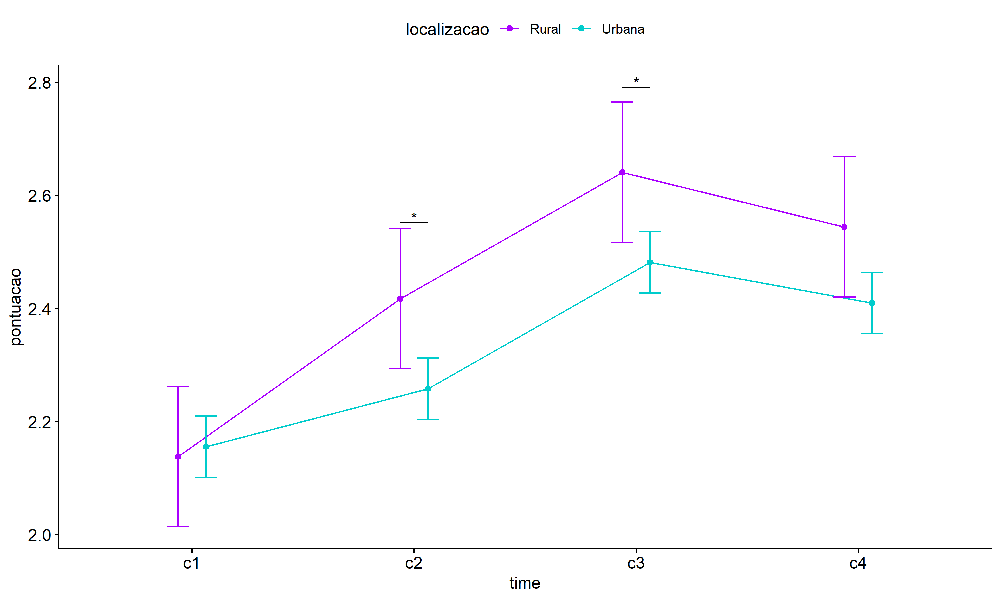<!-- -->

``` r
(pwc <- ldat %>% group_by(localizacao) %>%
    emmeans_test(pontuacao ~ time, detailed = T, p.adjust.method = "bonferroni"))
```

    ## # A tibble: 12 × 15
    ##    localizacao term  .y.       group1 group2 null.value estimate     se    df conf.low conf.high
    ##  * <fct>       <chr> <chr>     <chr>  <chr>       <dbl>    <dbl>  <dbl> <dbl>    <dbl>     <dbl>
    ##  1 Rural       time  pontuacao c1     c2              0  -0.279  0.0894  4496 -0.454     -0.104 
    ##  2 Rural       time  pontuacao c1     c3              0  -0.503  0.0894  4496 -0.678     -0.328 
    ##  3 Rural       time  pontuacao c1     c4              0  -0.406  0.0894  4496 -0.581     -0.231 
    ##  4 Rural       time  pontuacao c2     c3              0  -0.224  0.0894  4496 -0.399     -0.0485
    ##  5 Rural       time  pontuacao c2     c4              0  -0.127  0.0894  4496 -0.302      0.0482
    ##  6 Rural       time  pontuacao c3     c4              0   0.0967 0.0894  4496 -0.0785     0.272 
    ##  7 Urbana      time  pontuacao c1     c2              0  -0.102  0.0391  4496 -0.179     -0.0258
    ##  8 Urbana      time  pontuacao c1     c3              0  -0.326  0.0391  4496 -0.403     -0.249 
    ##  9 Urbana      time  pontuacao c1     c4              0  -0.254  0.0391  4496 -0.331     -0.177 
    ## 10 Urbana      time  pontuacao c2     c3              0  -0.223  0.0391  4496 -0.300     -0.147 
    ## 11 Urbana      time  pontuacao c2     c4              0  -0.151  0.0391  4496 -0.228     -0.0748
    ## 12 Urbana      time  pontuacao c3     c4              0   0.0720 0.0391  4496 -0.00473    0.149 
    ## # ℹ 4 more variables: statistic <dbl>, p <dbl>, p.adj <dbl>, p.adj.signif <chr>

| localizacao | term | .y.       | group1 | group2 | null.value | estimate |    se |   df | conf.low | conf.high | statistic |     p | p.adj | p.adj.signif |
|:------------|:-----|:----------|:-------|:-------|-----------:|---------:|------:|-----:|---------:|----------:|----------:|------:|------:|:-------------|
| Rural       | time | pontuacao | c1     | c2     |          0 |   -0.279 | 0.089 | 4496 |   -0.454 |    -0.104 |    -3.122 | 0.002 | 0.011 | \*           |
| Rural       | time | pontuacao | c1     | c3     |          0 |   -0.503 | 0.089 | 4496 |   -0.678 |    -0.328 |    -5.625 | 0.000 | 0.000 | \*\*\*\*     |
| Rural       | time | pontuacao | c1     | c4     |          0 |   -0.406 | 0.089 | 4496 |   -0.581 |    -0.231 |    -4.543 | 0.000 | 0.000 | \*\*\*\*     |
| Rural       | time | pontuacao | c2     | c3     |          0 |   -0.224 | 0.089 | 4496 |   -0.399 |    -0.049 |    -2.503 | 0.012 | 0.074 | ns           |
| Rural       | time | pontuacao | c2     | c4     |          0 |   -0.127 | 0.089 | 4496 |   -0.302 |     0.048 |    -1.422 | 0.155 | 0.931 | ns           |
| Rural       | time | pontuacao | c3     | c4     |          0 |    0.097 | 0.089 | 4496 |   -0.079 |     0.272 |     1.082 | 0.279 | 1.000 | ns           |
| Urbana      | time | pontuacao | c1     | c2     |          0 |   -0.102 | 0.039 | 4496 |   -0.179 |    -0.026 |    -2.620 | 0.009 | 0.053 | ns           |
| Urbana      | time | pontuacao | c1     | c3     |          0 |   -0.326 | 0.039 | 4496 |   -0.403 |    -0.249 |    -8.332 | 0.000 | 0.000 | \*\*\*\*     |
| Urbana      | time | pontuacao | c1     | c4     |          0 |   -0.254 | 0.039 | 4496 |   -0.331 |    -0.177 |    -6.493 | 0.000 | 0.000 | \*\*\*\*     |
| Urbana      | time | pontuacao | c2     | c3     |          0 |   -0.223 | 0.039 | 4496 |   -0.300 |    -0.147 |    -5.713 | 0.000 | 0.000 | \*\*\*\*     |
| Urbana      | time | pontuacao | c2     | c4     |          0 |   -0.151 | 0.039 | 4496 |   -0.228 |    -0.075 |    -3.873 | 0.000 | 0.001 | \*\*\*       |
| Urbana      | time | pontuacao | c3     | c4     |          0 |    0.072 | 0.039 | 4496 |   -0.005 |     0.149 |     1.840 | 0.066 | 0.395 | ns           |

``` r
(emms <- get_emmeans(pwc))
```

    ## # A tibble: 8 × 8
    ##   localizacao time  emmean     se    df conf.low conf.high method      
    ##   <fct>       <fct>  <dbl>  <dbl> <dbl>    <dbl>     <dbl> <chr>       
    ## 1 Rural       c1      2.14 0.0632  4496     2.01      2.26 Emmeans test
    ## 2 Rural       c2      2.42 0.0632  4496     2.29      2.54 Emmeans test
    ## 3 Rural       c3      2.64 0.0632  4496     2.52      2.76 Emmeans test
    ## 4 Rural       c4      2.54 0.0632  4496     2.42      2.67 Emmeans test
    ## 5 Urbana      c1      2.16 0.0277  4496     2.10      2.21 Emmeans test
    ## 6 Urbana      c2      2.26 0.0277  4496     2.20      2.31 Emmeans test
    ## 7 Urbana      c3      2.48 0.0277  4496     2.43      2.54 Emmeans test
    ## 8 Urbana      c4      2.41 0.0277  4496     2.36      2.46 Emmeans test

| localizacao | time | emmean |    se |   df | conf.low | conf.high | method       |
|:------------|:-----|-------:|------:|-----:|---------:|----------:|:-------------|
| Rural       | c1   |  2.138 | 0.063 | 4496 |    2.014 |     2.262 | Emmeans test |
| Rural       | c2   |  2.417 | 0.063 | 4496 |    2.293 |     2.541 | Emmeans test |
| Rural       | c3   |  2.641 | 0.063 | 4496 |    2.517 |     2.765 | Emmeans test |
| Rural       | c4   |  2.544 | 0.063 | 4496 |    2.420 |     2.668 | Emmeans test |
| Urbana      | c1   |  2.156 | 0.028 | 4496 |    2.101 |     2.210 | Emmeans test |
| Urbana      | c2   |  2.258 | 0.028 | 4496 |    2.204 |     2.312 | Emmeans test |
| Urbana      | c3   |  2.481 | 0.028 | 4496 |    2.427 |     2.536 | Emmeans test |
| Urbana      | c4   |  2.410 | 0.028 | 4496 |    2.355 |     2.464 | Emmeans test |

``` r
emms.gg <- emms[which(emms$localizacao == "Rural"),]
if (nrow(emms.gg) > 0)
  ggline(emms.gg, x = "time", y = "emmean", color = "#AA00FF", ylab = "pontuacao") +
    geom_errorbar(aes(ymin = conf.low, ymax = conf.high),
                  width = 0.2, color = "#AA00FF") +
    stat_pvalue_manual(
      add_xy_position(pwc[which(pwc$localizacao == "Rural"),],
                      x = "time", fun = "mean_se"),
      hide.ns = T, color = "#AA00FF", tip.length = F) +
    labs(title = "localizacao: Rural")+
    theme(legend.text = element_blank())
```

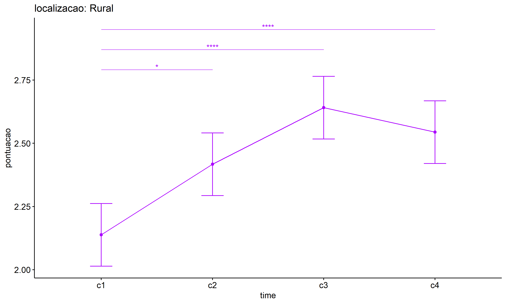<!-- -->

``` r
emms.gg <- emms[which(emms$localizacao == "Urbana"),]
if (nrow(emms.gg) > 0)
  ggline(emms.gg, x = "time", y = "emmean", color = "#00CCCC", ylab = "pontuacao") +
    geom_errorbar(aes(ymin = conf.low, ymax = conf.high),
                  width = 0.2, color = "#00CCCC") +
    stat_pvalue_manual(
      add_xy_position(pwc[which(pwc$localizacao == "Urbana"),],
                      x = "time", fun = "mean_se"),
      hide.ns = T, color = "#00CCCC", tip.length = F) +
    labs(title = "localizacao: Urbana")+
    theme(legend.text = element_blank())
```

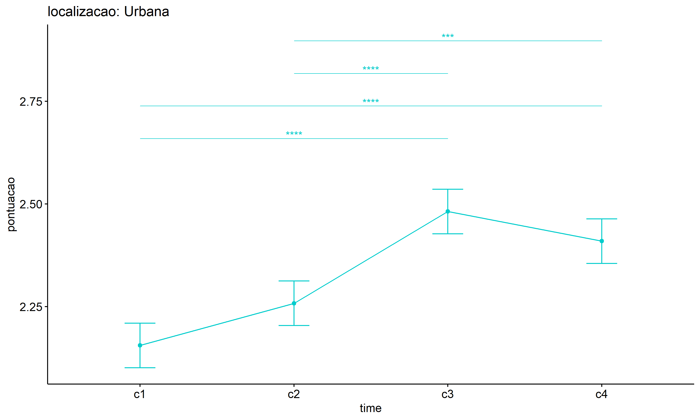<!-- -->

## PairWise Computation after removing non.normal data

``` r
if (length(non.ids) > 0)
  (pwc2 <- ldat2 %>% group_by(time) %>%
     emmeans_test(pontuacao ~ localizacao, detailed = T, p.adjust.method = "bonferroni"))
```

``` r
if (length(non.ids) > 0)
  (emms2 <- get_emmeans(pwc2))
```

``` r
if (length(non.ids) > 0) {
  pwc2 <- add_xy_position(pwc2, x = "time", fun = "mean_se", dodge = 0.25)
  pd2 <- position_dodge(width = 0.25)
  
  ggline(emms2, x = "time", y = "emmean", color = "localizacao",
         palette = c("#AA00FF","#00CCCC"),
         position = pd, ylab = "pontuacao") +
    geom_errorbar(aes(ymin = conf.low, ymax = conf.high, color = localizacao),
                position = pd, width = 0.2) +
    stat_pvalue_manual(pwc2, hide.ns = T, tip.length = F, linetype = 1)
}
```

``` r
if (length(non.ids) > 0)
  (pwc2 <- ldat2 %>% group_by(localizacao) %>%
     emmeans_test(pontuacao ~ time, detailed = T, p.adjust.method = "bonferroni"))
```

``` r
if (length(non.ids) > 0)
  (emms2 <- get_emmeans(pwc2))
```

``` r
if (length(non.ids) > 0) {
  emms.gg <- emms2[which(emms2$localizacao == "Rural"),]
  if (nrow(emms.gg) > 0)
    ggline(emms.gg, x = "time", y = "emmean", color = "#AA00FF", ylab = "pontuacao") +
    geom_errorbar(aes(ymin = conf.low, ymax = conf.high),
                  width = 0.2, color = "#AA00FF") +
    stat_pvalue_manual(
      add_xy_position(pwc[which(pwc$localizacao == "Rural"),],
                      x = "time", fun = "mean_se"),
      hide.ns = T, color = "#AA00FF", tip.length = F) +
    labs(title = "localizacao: Rural") +
    theme(legend.text = element_blank())
}
```

``` r
if (length(non.ids) > 0) {
  emms.gg <- emms2[which(emms2$localizacao == "Urbana"),]
  if (nrow(emms.gg) > 0)
    ggline(emms.gg, x = "time", y = "emmean", color = "#00CCCC", ylab = "pontuacao") +
    geom_errorbar(aes(ymin = conf.low, ymax = conf.high),
                  width = 0.2, color = "#00CCCC") +
    stat_pvalue_manual(
      add_xy_position(pwc[which(pwc$localizacao == "Urbana"),],
                      x = "time", fun = "mean_se"),
      hide.ns = T, color = "#00CCCC", tip.length = F) +
    labs(title = "localizacao: Urbana") +
    theme(legend.text = element_blank())
}
```

# ANOVA: pontuacao ~ time\*regiao + Error(id/time)

## Data Preparation

``` r
data <- edat[,c("aluno_id","regiao","ciclo","pontuacao")]
data$ciclo <- factor(data$ciclo, c("Primeiro Ciclo","Segundo Ciclo",
                                   "Terceiro Ciclo","Quarto Ciclo"))

wdat <- spread(data, ciclo, pontuacao)
wdat <- wdat[complete.cases(wdat),]
colnames(wdat) <- c("id","regiao","c1","c2","c3","c4")

ldat <- gather(wdat, key = time, value = pontuacao, c1, c2, c3, c4) %>%
  convert_as_factor(id, time)
ldat <- remove_group_data(ldat, "pontuacao", c("time", "regiao"), n.limit = 30)
ldat$regiao <- factor(ldat$regiao, sort(unique(ldat$regiao)))
```

### Check assumptions: Identifying Outliers

``` r
outliers <- identify_outliers(group_by(ldat, time, regiao), pontuacao)
(outliers <- outliers[outliers$is.extreme == T,])
```

    ## # A tibble: 550 × 6
    ##    regiao       time  id                   pontuacao is.outlier is.extreme
    ##    <fct>        <fct> <fct>                    <dbl> <lgl>      <lgl>     
    ##  1 Centro-Oeste c1    1Z1Qz8zDaMkaAz1Ah80K       5   TRUE       TRUE      
    ##  2 Centro-Oeste c1    AIzwxJCfbDsO8ZT4ZZ4h       3   TRUE       TRUE      
    ##  3 Centro-Oeste c1    KPMkDhksSiEWVEIUT1LG       3.5 TRUE       TRUE      
    ##  4 Centro-Oeste c1    QasU7a9JiIu1XHAPVJk9       3   TRUE       TRUE      
    ##  5 Centro-Oeste c1    qbpdhqIdqf7n3lmU2n4I       3.5 TRUE       TRUE      
    ##  6 Nordeste     c1    0w3VhiMf67CbcpR6aZCL       5   TRUE       TRUE      
    ##  7 Nordeste     c1    0wDHSyctDDkjP6OPE3c8       5   TRUE       TRUE      
    ##  8 Nordeste     c1    1PlxEF4tmJySD3G46PLB       3.5 TRUE       TRUE      
    ##  9 Nordeste     c1    55GlwifTTyiOSKTB9vc9       5   TRUE       TRUE      
    ## 10 Nordeste     c1    7AaMrLZQiyhSoBaer5VH       3.5 TRUE       TRUE      
    ## # ℹ 540 more rows

| regiao       | time | id                   | pontuacao | is.outlier | is.extreme |
|:-------------|:-----|:---------------------|----------:|:-----------|:-----------|
| Centro-Oeste | c1   | 1Z1Qz8zDaMkaAz1Ah80K |     5.000 | TRUE       | TRUE       |
| Centro-Oeste | c1   | AIzwxJCfbDsO8ZT4ZZ4h |     3.000 | TRUE       | TRUE       |
| Centro-Oeste | c1   | KPMkDhksSiEWVEIUT1LG |     3.500 | TRUE       | TRUE       |
| Centro-Oeste | c1   | QasU7a9JiIu1XHAPVJk9 |     3.000 | TRUE       | TRUE       |
| Centro-Oeste | c1   | qbpdhqIdqf7n3lmU2n4I |     3.500 | TRUE       | TRUE       |
| Nordeste     | c1   | 0w3VhiMf67CbcpR6aZCL |     5.000 | TRUE       | TRUE       |
| Nordeste     | c1   | 0wDHSyctDDkjP6OPE3c8 |     5.000 | TRUE       | TRUE       |
| Nordeste     | c1   | 1PlxEF4tmJySD3G46PLB |     3.500 | TRUE       | TRUE       |
| Nordeste     | c1   | 55GlwifTTyiOSKTB9vc9 |     5.000 | TRUE       | TRUE       |
| Nordeste     | c1   | 7AaMrLZQiyhSoBaer5VH |     3.500 | TRUE       | TRUE       |
| Nordeste     | c1   | b9PlhVhdvhl9EPK9QVCv |     5.000 | TRUE       | TRUE       |
| Nordeste     | c1   | cao1agmzaedA3s0PVAPS |     5.000 | TRUE       | TRUE       |
| Nordeste     | c1   | cJoqgrk6T3HsA9EOVe7D |     5.000 | TRUE       | TRUE       |
| Nordeste     | c1   | cuknOzzwN4oCRum5U5ph |     3.500 | TRUE       | TRUE       |
| Nordeste     | c1   | D1HfJKTVqjrpCJx97l3v |     5.000 | TRUE       | TRUE       |
| Nordeste     | c1   | DFTbWP0xF5gxFgxEN0dL |     3.000 | TRUE       | TRUE       |
| Nordeste     | c1   | dSM9U89FZYdICjBucW8v |     3.000 | TRUE       | TRUE       |
| Nordeste     | c1   | G2SUhDEavPTLyA8yz9AL |     3.500 | TRUE       | TRUE       |
| Nordeste     | c1   | H8te97gR9TCOM0CiCXj1 |     3.500 | TRUE       | TRUE       |
| Nordeste     | c1   | I5SKdDmPvNCpOHCfh7Is |     4.000 | TRUE       | TRUE       |
| Nordeste     | c1   | iutpBZMAtM92qcbyCDHB |     3.500 | TRUE       | TRUE       |
| Nordeste     | c1   | iXqE1bAFPsYn56jTzZQS |     5.000 | TRUE       | TRUE       |
| Nordeste     | c1   | KWsflPBHSK0g0ZYy9I1L |     5.000 | TRUE       | TRUE       |
| Nordeste     | c1   | m5yRlxfIj73j4ossfTOB |     5.000 | TRUE       | TRUE       |
| Nordeste     | c1   | nnPTfCmTsFmqbk9q3PJG |     3.500 | TRUE       | TRUE       |
| Nordeste     | c1   | NW7xi0uw2xX7J2ch6WFX |     5.000 | TRUE       | TRUE       |
| Nordeste     | c1   | pca9LmykrugFnjsHp7MR |     5.000 | TRUE       | TRUE       |
| Nordeste     | c1   | PMsVKgnivLJr3CQYAKsP |     3.500 | TRUE       | TRUE       |
| Nordeste     | c1   | rijPm1LRjDwEh0XEZEeR |     4.000 | TRUE       | TRUE       |
| Nordeste     | c1   | Ru3SPRo97iXBvXbvneKh |     5.000 | TRUE       | TRUE       |
| Nordeste     | c1   | snoeXZt7a8Ds16UvPGhk |     5.000 | TRUE       | TRUE       |
| Nordeste     | c1   | uCBI6gnllsawWJlgqkr5 |     5.000 | TRUE       | TRUE       |
| Nordeste     | c1   | UKLVcE0VqppSSC8hDubG |     5.000 | TRUE       | TRUE       |
| Nordeste     | c1   | vc8pPoYau2AIAuCQJipW |     5.000 | TRUE       | TRUE       |
| Nordeste     | c1   | xAo0TzCEx1bIrmjqKgbj |     3.500 | TRUE       | TRUE       |
| Nordeste     | c1   | XeSX4FsDK2KmCwATUvcu |     3.500 | TRUE       | TRUE       |
| Nordeste     | c1   | xgWi8MM2PHEEfdjn61b7 |     5.000 | TRUE       | TRUE       |
| Nordeste     | c1   | xZ5yKSWaJFp2osYZSjqL |     5.000 | TRUE       | TRUE       |
| Nordeste     | c1   | YxfFrbwSijoyTMWGIYqQ |     5.000 | TRUE       | TRUE       |
| Norte        | c1   | 5AeP0IQ84CerIQVenp2G |     3.000 | TRUE       | TRUE       |
| Norte        | c1   | A5EETpEr617bpnSh1wp6 |     3.500 | TRUE       | TRUE       |
| Norte        | c1   | Rq2OTnqvauiedrQ0PVcm |     3.500 | TRUE       | TRUE       |
| Norte        | c1   | Swge4GG9Qmg1w9YaAeDP |     3.500 | TRUE       | TRUE       |
| Sudeste      | c1   | 1DlydHhFt2IkhBETPR4s |     3.500 | TRUE       | TRUE       |
| Sudeste      | c1   | 46nUNvt4sDOPsC9jnkiG |     4.500 | TRUE       | TRUE       |
| Sudeste      | c1   | 4hmXg2uo4wxSAX9SaxpN |     3.500 | TRUE       | TRUE       |
| Sudeste      | c1   | 6IoOZmGw52LYlznSYXzK |     3.000 | TRUE       | TRUE       |
| Sudeste      | c1   | 6oE4k979jigSP7Zbs2m1 |     3.500 | TRUE       | TRUE       |
| Sudeste      | c1   | 6Xlhq905iNT5kvJFoSW5 |     5.000 | TRUE       | TRUE       |
| Sudeste      | c1   | 7nfO1ouMUuN7IzvlCKr0 |     3.500 | TRUE       | TRUE       |
| Sudeste      | c1   | A8Rx15QryUqDDm8ooiZr |     3.000 | TRUE       | TRUE       |
| Sudeste      | c1   | cy0oZFPyT8aGHBq7CR9A |     3.500 | TRUE       | TRUE       |
| Sudeste      | c1   | dieaAtUumyYxX7zGb7Sb |     4.000 | TRUE       | TRUE       |
| Sudeste      | c1   | E8XEhNJhfANZZtqHam0A |     3.000 | TRUE       | TRUE       |
| Sudeste      | c1   | erFWuFkPr2piNKvHuKrD |     3.500 | TRUE       | TRUE       |
| Sudeste      | c1   | F5Ux4BYYqSnMt1Om6Trf |     3.500 | TRUE       | TRUE       |
| Sudeste      | c1   | g0SSATlv7RDhoBk6jsCz |     3.500 | TRUE       | TRUE       |
| Sudeste      | c1   | G4NIt8gEc7nfeQ9k2OkL |     3.500 | TRUE       | TRUE       |
| Sudeste      | c1   | G5WjH8t1I6LAiAOCuM2v |     3.500 | TRUE       | TRUE       |
| Sudeste      | c1   | I1x9Y5cYi4OfnwWUeTXz |     4.000 | TRUE       | TRUE       |
| Sudeste      | c1   | i6M2WLEfaiylCRyZ9XnE |     3.500 | TRUE       | TRUE       |
| Sudeste      | c1   | ixToGS5nyKWTy1PjTzZW |     3.000 | TRUE       | TRUE       |
| Sudeste      | c1   | JdRySX8i3hE3pxcYyUcf |     3.000 | TRUE       | TRUE       |
| Sudeste      | c1   | Jgsj4or0goDAXdQU3UwR |     3.000 | TRUE       | TRUE       |
| Sudeste      | c1   | jVbbowshsqkUpPuGSIMu |     4.000 | TRUE       | TRUE       |
| Sudeste      | c1   | lt4Za0V8VmneMBIicN4R |     3.000 | TRUE       | TRUE       |
| Sudeste      | c1   | MTyNplLkcaNxd9NT392Q |     3.500 | TRUE       | TRUE       |
| Sudeste      | c1   | N3zF1kdLVvTXfbcXiMqe |     3.500 | TRUE       | TRUE       |
| Sudeste      | c1   | oafpBD8HTXvsKOiHN7p8 |     3.500 | TRUE       | TRUE       |
| Sudeste      | c1   | R7yCqYgzTa9KdpJQ4uXb |     5.000 | TRUE       | TRUE       |
| Sudeste      | c1   | RlqnAYUyOdC7g4eDY9UO |     5.000 | TRUE       | TRUE       |
| Sudeste      | c1   | sM3c4noBIP8hnYWA6pAe |     4.000 | TRUE       | TRUE       |
| Sudeste      | c1   | TABveJnXO5hRaweFnAMh |     5.000 | TRUE       | TRUE       |
| Sudeste      | c1   | TKvc4Eu2XaDXYPxuS7Qn |     3.000 | TRUE       | TRUE       |
| Sudeste      | c1   | UTcQeAJVgrgjSdUJBAKT |     3.000 | TRUE       | TRUE       |
| Sudeste      | c1   | wJgBRtIUF5VG22EJXZKz |     4.000 | TRUE       | TRUE       |
| Sudeste      | c1   | xmtNEz12lXmE9RzmND2z |     3.500 | TRUE       | TRUE       |
| Sudeste      | c1   | xUKKiLMXz1z5e7g1kX4m |     5.000 | TRUE       | TRUE       |
| Sudeste      | c1   | Y7HozU436KQ0wqdBGugu |     3.500 | TRUE       | TRUE       |
| Sudeste      | c1   | YTYFFWzK4C7ejf1X1TUB |     5.000 | TRUE       | TRUE       |
| Sudeste      | c1   | YZl0xc1Gu4ixxN2rOCtH |     5.000 | TRUE       | TRUE       |
| Sudeste      | c1   | ZdpC4Xaxucxlaqa0o7wm |     5.000 | TRUE       | TRUE       |
| Sudeste      | c1   | zu9ITSnIAecxMpJmNxCE |     5.000 | TRUE       | TRUE       |
| Sul          | c1   | DKEsQosaERswlkB803hB |     3.500 | TRUE       | TRUE       |
| Sul          | c1   | PKoPTKC1RrGaREkbINPf |     3.500 | TRUE       | TRUE       |
| Sul          | c1   | sRR37KpbkBZSh9H2UpSB |     4.000 | TRUE       | TRUE       |
| Centro-Oeste | c2   | 8p6QYQYkfhR3QOACXZvj |     3.000 | TRUE       | TRUE       |
| Centro-Oeste | c2   | atydp19vM0PjiOQCWemR |     3.000 | TRUE       | TRUE       |
| Centro-Oeste | c2   | gzBUwnjjYHnioTnd4stC |     3.000 | TRUE       | TRUE       |
| Centro-Oeste | c2   | OTNUMYnL8AF930i7Db8H |     3.500 | TRUE       | TRUE       |
| Centro-Oeste | c2   | sXB3m8f7P40lRXYwY22p |     3.000 | TRUE       | TRUE       |
| Centro-Oeste | c2   | uqX7aPoHn8tMaKAp9y3I |     3.000 | TRUE       | TRUE       |
| Centro-Oeste | c2   | vSolOA78V6l7oYJ1h4LA |     3.500 | TRUE       | TRUE       |
| Centro-Oeste | c2   | XzMIZjd0GDHSpif5ypWf |     3.500 | TRUE       | TRUE       |
| Centro-Oeste | c2   | ygFJxqySABX8ax57ihIq |     3.500 | TRUE       | TRUE       |
| Centro-Oeste | c2   | ZDsN200AOSuZkmxgcc8n |     4.000 | TRUE       | TRUE       |
| Nordeste     | c2   | 0w3VhiMf67CbcpR6aZCL |     5.000 | TRUE       | TRUE       |
| Nordeste     | c2   | 1g6aBXXFdmJWTIwXaf4A |     5.000 | TRUE       | TRUE       |
| Nordeste     | c2   | 1gvgnHo5onRSLXTnds8W |     3.500 | TRUE       | TRUE       |
| Nordeste     | c2   | 1KTN8KwyWSigGGMFIG9F |     5.000 | TRUE       | TRUE       |
| Nordeste     | c2   | 1l2CPmeR5hbmhcJoY5Gs |     4.000 | TRUE       | TRUE       |
| Nordeste     | c2   | 1rGKIQ7fdZBOxxGdPFrp |     3.500 | TRUE       | TRUE       |
| Nordeste     | c2   | 1ZE6i0Is22PBIAZbrM0J |     5.000 | TRUE       | TRUE       |
| Nordeste     | c2   | 2gOTOJWpjODv0nBxtJgU |     5.000 | TRUE       | TRUE       |
| Nordeste     | c2   | 2wBgWJVF1mK6rnsBiZ99 |     5.000 | TRUE       | TRUE       |
| Nordeste     | c2   | 4gepVdqUGSJq9eKKqU4U |     4.000 | TRUE       | TRUE       |
| Nordeste     | c2   | 5l1OLNAprJvzHRinnoF0 |     3.500 | TRUE       | TRUE       |
| Nordeste     | c2   | 8jXS39U6Aje4RlDntJHg |     3.500 | TRUE       | TRUE       |
| Nordeste     | c2   | ahHqNPxM9dDITA6mjtpB |     3.500 | TRUE       | TRUE       |
| Nordeste     | c2   | ao9Hy7cVw5W6MXhO5Ylm |     3.500 | TRUE       | TRUE       |
| Nordeste     | c2   | AUp01jGBKvRyiH5yAcYg |     3.500 | TRUE       | TRUE       |
| Nordeste     | c2   | bxxcpVcdJ03akf9XTPVs |     5.000 | TRUE       | TRUE       |
| Nordeste     | c2   | cuknOzzwN4oCRum5U5ph |     5.000 | TRUE       | TRUE       |
| Nordeste     | c2   | D3zCmRj97N1xSw2RGyIX |     4.000 | TRUE       | TRUE       |
| Nordeste     | c2   | dCPfML2azPAOx7s4eHfR |     3.500 | TRUE       | TRUE       |
| Nordeste     | c2   | DnO4jcQLjmp6OZ15Qnyw |     4.000 | TRUE       | TRUE       |
| Nordeste     | c2   | dSM9U89FZYdICjBucW8v |     5.000 | TRUE       | TRUE       |
| Nordeste     | c2   | e1nlLe6lCBYUzF23dTrW |     4.000 | TRUE       | TRUE       |
| Nordeste     | c2   | EcAgL4tVyGSoqslrQjcI |     3.500 | TRUE       | TRUE       |
| Nordeste     | c2   | efGqYqTmvxysOA8bmE9u |     4.000 | TRUE       | TRUE       |
| Nordeste     | c2   | eJDGpLsooEaszwDWmzb7 |     3.500 | TRUE       | TRUE       |
| Nordeste     | c2   | eKNF6EdIBYr2bZIgYfpt |     5.000 | TRUE       | TRUE       |
| Nordeste     | c2   | EXP9vzjLIJFDlyiQt1hn |     3.000 | TRUE       | TRUE       |
| Nordeste     | c2   | ey1dPZ6oy134PkSs4ZDO |     5.000 | TRUE       | TRUE       |
| Nordeste     | c2   | GAEVtgOgvNASXuwIPENX |     3.000 | TRUE       | TRUE       |
| Nordeste     | c2   | H8te97gR9TCOM0CiCXj1 |     3.000 | TRUE       | TRUE       |
| Nordeste     | c2   | hcMHfjgGtVOBlWeqw37Q |     5.000 | TRUE       | TRUE       |
| Nordeste     | c2   | i84ihNmDZFogrHoxo3Im |     3.000 | TRUE       | TRUE       |
| Nordeste     | c2   | iSIgLPCScY5Oq0MlhbEz |     3.500 | TRUE       | TRUE       |
| Nordeste     | c2   | ITZKcm29e0hwUQiiDtaF |     5.000 | TRUE       | TRUE       |
| Nordeste     | c2   | iXqE1bAFPsYn56jTzZQS |     4.000 | TRUE       | TRUE       |
| Nordeste     | c2   | jGesTMYpGOc4DJQ77fHt |     3.000 | TRUE       | TRUE       |
| Nordeste     | c2   | jljcKPNPjBo1MdiK1ffQ |     3.500 | TRUE       | TRUE       |
| Nordeste     | c2   | JmKGEFyVZnIRSzkWkGSo |     5.000 | TRUE       | TRUE       |
| Nordeste     | c2   | k1Byic1gWlgNIFT8qDpn |     5.000 | TRUE       | TRUE       |
| Nordeste     | c2   | K3la9byFQsBzKaukPsOq |     3.500 | TRUE       | TRUE       |
| Nordeste     | c2   | K3oo1Kn5UlJH6lIGaZTL |     5.000 | TRUE       | TRUE       |
| Nordeste     | c2   | MePraql0XSzwJi42Obwf |     3.500 | TRUE       | TRUE       |
| Nordeste     | c2   | MxgQUA6KrQnZN4Fm7oCW |     3.500 | TRUE       | TRUE       |
| Nordeste     | c2   | N9cRf5BDMjp45ygmrq1a |     5.000 | TRUE       | TRUE       |
| Nordeste     | c2   | nI311xKanqD5k4XdM5QB |     4.000 | TRUE       | TRUE       |
| Nordeste     | c2   | NiBOt9OUO2x3fZe7eXO0 |     5.000 | TRUE       | TRUE       |
| Nordeste     | c2   | Nm6WeD34RnKIBjlDrkaO |     5.000 | TRUE       | TRUE       |
| Nordeste     | c2   | NxEhBT0ZChu4oRR5q6bd |     3.500 | TRUE       | TRUE       |
| Nordeste     | c2   | nZK9NUDQSwfWTTfSeqPH |     5.000 | TRUE       | TRUE       |
| Nordeste     | c2   | oGUJyWRMYYbF9PNegJZh |     5.000 | TRUE       | TRUE       |
| Nordeste     | c2   | PfTab7CnJIl6lys2Cxuq |     4.500 | TRUE       | TRUE       |
| Nordeste     | c2   | QWZGR164QoEvdqudnbNc |     3.667 | TRUE       | TRUE       |
| Nordeste     | c2   | qXTbctZqWWGjKtZpvSzg |     3.500 | TRUE       | TRUE       |
| Nordeste     | c2   | RU6W5zawYsr9WEMqiDC2 |     5.000 | TRUE       | TRUE       |
| Nordeste     | c2   | sSEiBqKCIt9z1Qg8SihU |     5.000 | TRUE       | TRUE       |
| Nordeste     | c2   | tfmKp0SXpwvJkZn03aN4 |     4.000 | TRUE       | TRUE       |
| Nordeste     | c2   | UaBRzohcAqFW1qjmBSvw |     3.000 | TRUE       | TRUE       |
| Nordeste     | c2   | uO9nfkLEYn0z361QEH7Q |     5.000 | TRUE       | TRUE       |
| Nordeste     | c2   | UpctgaJMOEgDuI3wov8S |     3.500 | TRUE       | TRUE       |
| Nordeste     | c2   | v5KF7y11Ncyud2q4dKmD |     3.000 | TRUE       | TRUE       |
| Nordeste     | c2   | WcaFnyTs2jyODcXLIWQo |     3.500 | TRUE       | TRUE       |
| Nordeste     | c2   | wcqg0kZ9Dn7SD7uVGbmL |     3.500 | TRUE       | TRUE       |
| Nordeste     | c2   | WKxFXpseomxCYgOSyrdB |     4.000 | TRUE       | TRUE       |
| Nordeste     | c2   | wSjwY5eBTqgIzBqdtazC |     5.000 | TRUE       | TRUE       |
| Nordeste     | c2   | wxyQb8UYLyuIeyTuqWHK |     4.000 | TRUE       | TRUE       |
| Nordeste     | c2   | xCgFRSJhxUFZEqK4qpC9 |     5.000 | TRUE       | TRUE       |
| Nordeste     | c2   | Xfs4ydu0jiJkaDwInzXx |     5.000 | TRUE       | TRUE       |
| Nordeste     | c2   | xgjVK7rnOUUArvnA4ZiQ |     5.000 | TRUE       | TRUE       |
| Nordeste     | c2   | YxfFrbwSijoyTMWGIYqQ |     2.750 | TRUE       | TRUE       |
| Nordeste     | c2   | z3p6Ot4uvkPmGXOS9D3e |     5.000 | TRUE       | TRUE       |
| Nordeste     | c2   | zqSde1r6leyecbET0INz |     5.000 | TRUE       | TRUE       |
| Norte        | c2   | 0JP4C8o7n2HYsnPDx4qx |     3.500 | TRUE       | TRUE       |
| Norte        | c2   | 2Mvl0siGmos3P6uCJoI6 |     4.000 | TRUE       | TRUE       |
| Norte        | c2   | 9ZgjvRy0pzK2NOHnuf9Q |     3.500 | TRUE       | TRUE       |
| Norte        | c2   | LC67V5LShu6RMdyHjAJx |     3.500 | TRUE       | TRUE       |
| Norte        | c2   | Q3CCnrZoSPx08SF7zj3N |     3.500 | TRUE       | TRUE       |
| Norte        | c2   | u5hJDswFRptq4y76Kutb |     3.500 | TRUE       | TRUE       |
| Norte        | c2   | vF1wv9aDV5UGHKuqCkC3 |     3.500 | TRUE       | TRUE       |
| Sudeste      | c2   | 2eFfyVVi6PFZAieFgek6 |     5.000 | TRUE       | TRUE       |
| Sudeste      | c2   | 3WvSQRVfYSeH8PCOQB0n |     3.500 | TRUE       | TRUE       |
| Sudeste      | c2   | 4AM4nonwJ45LiMy6b4lp |     5.000 | TRUE       | TRUE       |
| Sudeste      | c2   | 4hmXg2uo4wxSAX9SaxpN |     3.000 | TRUE       | TRUE       |
| Sudeste      | c2   | 6bEKmKQpOuvY6PSQvzqj |     4.000 | TRUE       | TRUE       |
| Sudeste      | c2   | 6Xlhq905iNT5kvJFoSW5 |     5.000 | TRUE       | TRUE       |
| Sudeste      | c2   | 8GRRowomccTgY63JK0hV |     3.000 | TRUE       | TRUE       |
| Sudeste      | c2   | 8PyXW7ejCnDsMsEjrlsy |     3.000 | TRUE       | TRUE       |
| Sudeste      | c2   | 8x1O4EwGS3PLQhs7ljBM |     5.000 | TRUE       | TRUE       |
| Sudeste      | c2   | A8Rx15QryUqDDm8ooiZr |     5.000 | TRUE       | TRUE       |
| Sudeste      | c2   | d1JgyezU4pt7F4SebGoe |     4.000 | TRUE       | TRUE       |
| Sudeste      | c2   | d78FW2LeEQ1zVALsO8FL |     3.333 | TRUE       | TRUE       |
| Sudeste      | c2   | DmzTbIYJpxJm9o8FEyCL |     2.500 | TRUE       | TRUE       |
| Sudeste      | c2   | F5Ux4BYYqSnMt1Om6Trf |     5.000 | TRUE       | TRUE       |
| Sudeste      | c2   | ffnFAMZehkOjgmmGyq3E |     5.000 | TRUE       | TRUE       |
| Sudeste      | c2   | FkJFrnPezc8Ng4SSMx1z |     5.000 | TRUE       | TRUE       |
| Sudeste      | c2   | G6w5RiWtWQbT4xtExf7d |     5.000 | TRUE       | TRUE       |
| Sudeste      | c2   | gBmp7DCcMF8YynwrJWmq |     5.000 | TRUE       | TRUE       |
| Sudeste      | c2   | ggH0twWM1TpDTguT2sSU |     3.500 | TRUE       | TRUE       |
| Sudeste      | c2   | GLiaONiGLGsIMU5p88Cl |     3.667 | TRUE       | TRUE       |
| Sudeste      | c2   | gRiK9OMij8RxayU0KCFv |     3.000 | TRUE       | TRUE       |
| Sudeste      | c2   | HqTgiqhYnEvVciVol3PS |     5.000 | TRUE       | TRUE       |
| Sudeste      | c2   | HsQF2J0r79mHSWNe4l6n |     5.000 | TRUE       | TRUE       |
| Sudeste      | c2   | I1x9Y5cYi4OfnwWUeTXz |     4.000 | TRUE       | TRUE       |
| Sudeste      | c2   | i6M2WLEfaiylCRyZ9XnE |     5.000 | TRUE       | TRUE       |
| Sudeste      | c2   | I6ZCrdQMaOdo9ltkC1r2 |     5.000 | TRUE       | TRUE       |
| Sudeste      | c2   | IXZlZBy7uRBHUFPQg8hX |     5.000 | TRUE       | TRUE       |
| Sudeste      | c2   | Iy3Q4VZAPE7yypxlEgZV |     4.000 | TRUE       | TRUE       |
| Sudeste      | c2   | j31LU8Xwm0EQ7Mihkhjj |     5.000 | TRUE       | TRUE       |
| Sudeste      | c2   | jipIzfMPngc6Se2mEtoO |     3.500 | TRUE       | TRUE       |
| Sudeste      | c2   | jVbbowshsqkUpPuGSIMu |     4.000 | TRUE       | TRUE       |
| Sudeste      | c2   | k2S15ANRrwJKgCuiwaKC |     3.000 | TRUE       | TRUE       |
| Sudeste      | c2   | KxltaXnk31onNRVrLE5Y |     3.500 | TRUE       | TRUE       |
| Sudeste      | c2   | LJrBpSpYOJUxZWUehnpX |     3.500 | TRUE       | TRUE       |
| Sudeste      | c2   | LMrt1klH9kXyo7kH4gB8 |     3.000 | TRUE       | TRUE       |
| Sudeste      | c2   | MO5oCAGyztcuEpHPXGxD |     3.500 | TRUE       | TRUE       |
| Sudeste      | c2   | mp70aTuAiwYmhEHntRfm |     3.500 | TRUE       | TRUE       |
| Sudeste      | c2   | mTxfHO37mmdyGuVi0AcC |     4.000 | TRUE       | TRUE       |
| Sudeste      | c2   | MTyNplLkcaNxd9NT392Q |     5.000 | TRUE       | TRUE       |
| Sudeste      | c2   | Mv8Pv2YBEg4SX5h40YAU |     5.000 | TRUE       | TRUE       |
| Sudeste      | c2   | NJuhIhcV6SgR0FBfCWdk |     3.000 | TRUE       | TRUE       |
| Sudeste      | c2   | oafpBD8HTXvsKOiHN7p8 |     5.000 | TRUE       | TRUE       |
| Sudeste      | c2   | OiJwZNTmMiomnpFEIgBN |     3.000 | TRUE       | TRUE       |
| Sudeste      | c2   | pkFNtaKBdbUsYSrekUQh |     3.000 | TRUE       | TRUE       |
| Sudeste      | c2   | pOZO9oAcxPz33Ypnsv2X |     2.500 | TRUE       | TRUE       |
| Sudeste      | c2   | Puj0Lljgb9yE7UxApjnK |     5.000 | TRUE       | TRUE       |
| Sudeste      | c2   | qlQnX21ByGDabhAiIbdF |     5.000 | TRUE       | TRUE       |
| Sudeste      | c2   | RCY3F2HtV0DPrs21Q5KB |     3.000 | TRUE       | TRUE       |
| Sudeste      | c2   | rknK8GEk9H27CI9GSt4V |     2.667 | TRUE       | TRUE       |
| Sudeste      | c2   | RuLO4wjZ8eP202TWX6R8 |     4.000 | TRUE       | TRUE       |
| Sudeste      | c2   | ScmLumR6WUA4APWBqXFX |     4.000 | TRUE       | TRUE       |
| Sudeste      | c2   | SFojZKDHvdJbhHKzsN2I |     4.000 | TRUE       | TRUE       |
| Sudeste      | c2   | trOCyMFe6S3DDEhf2HL7 |     5.000 | TRUE       | TRUE       |
| Sudeste      | c2   | UTcQeAJVgrgjSdUJBAKT |     5.000 | TRUE       | TRUE       |
| Sudeste      | c2   | uXrGgSVZ1ZKfQuJ3neSu |     3.500 | TRUE       | TRUE       |
| Sudeste      | c2   | v4NaY6TWYcpu9RoVkXwS |     5.000 | TRUE       | TRUE       |
| Sudeste      | c2   | vCC3nTZphL0vITkOGcBP |     5.000 | TRUE       | TRUE       |
| Sudeste      | c2   | W8iXxSmW48zvfJyikMZb |     5.000 | TRUE       | TRUE       |
| Sudeste      | c2   | wAdhjRHCCyiW6GtcGaQE |     5.000 | TRUE       | TRUE       |
| Sudeste      | c2   | WSRSxbb9igUPQVN86BSH |     5.000 | TRUE       | TRUE       |
| Sudeste      | c2   | xk7eC5haTYuFQaJovsBZ |     5.000 | TRUE       | TRUE       |
| Sudeste      | c2   | YAjRLL4Bd2nV1EigssjM |     5.000 | TRUE       | TRUE       |
| Sudeste      | c2   | ygdicz3svMOl4mNIiwtJ |     2.500 | TRUE       | TRUE       |
| Sudeste      | c2   | ZFjyLFTCim7WZrtYy2tK |     2.750 | TRUE       | TRUE       |
| Sudeste      | c2   | zPWlocgrVt4Mfvr0UwaQ |     3.000 | TRUE       | TRUE       |
| Sul          | c2   | 3XOQzgoErsKmvF4VxZjc |     5.000 | TRUE       | TRUE       |
| Centro-Oeste | c3   | atydp19vM0PjiOQCWemR |     3.500 | TRUE       | TRUE       |
| Centro-Oeste | c3   | D5ZRR3Ps7EtPoEi233KU |     5.000 | TRUE       | TRUE       |
| Centro-Oeste | c3   | fCbOJlY4s8hncfy108S2 |     5.000 | TRUE       | TRUE       |
| Centro-Oeste | c3   | H5F4r5nnGQTG1FzfyxrY |     3.500 | TRUE       | TRUE       |
| Centro-Oeste | c3   | LSOWrW4dOhXZ9uMW17va |     3.500 | TRUE       | TRUE       |
| Centro-Oeste | c3   | pX3oKxaMTnCJ8g1GtRWG |     5.000 | TRUE       | TRUE       |
| Centro-Oeste | c3   | sV9mhY7G3TGd1YYuX6Tn |     3.500 | TRUE       | TRUE       |
| Centro-Oeste | c3   | sXB3m8f7P40lRXYwY22p |     5.000 | TRUE       | TRUE       |
| Centro-Oeste | c3   | TupwpKp0mSf2xCyx7nhJ |     5.000 | TRUE       | TRUE       |
| Centro-Oeste | c3   | vSolOA78V6l7oYJ1h4LA |     5.000 | TRUE       | TRUE       |
| Centro-Oeste | c3   | ygFJxqySABX8ax57ihIq |     3.500 | TRUE       | TRUE       |
| Nordeste     | c3   | 06Vps080bCd2ORWNulNM |     5.000 | TRUE       | TRUE       |
| Nordeste     | c3   | 12jZHvX32WJ4t8qQybyG |     4.000 | TRUE       | TRUE       |
| Nordeste     | c3   | 1gvgnHo5onRSLXTnds8W |     5.000 | TRUE       | TRUE       |
| Nordeste     | c3   | 1OE4fvPj9Y2Q9Bnwr0xz |     5.000 | TRUE       | TRUE       |
| Nordeste     | c3   | 1PlxEF4tmJySD3G46PLB |     5.000 | TRUE       | TRUE       |
| Nordeste     | c3   | 1ZE6i0Is22PBIAZbrM0J |     5.000 | TRUE       | TRUE       |
| Nordeste     | c3   | 2gOTOJWpjODv0nBxtJgU |     5.000 | TRUE       | TRUE       |
| Nordeste     | c3   | 2qbgEyCWhU8ChVoKwmf5 |     4.000 | TRUE       | TRUE       |
| Nordeste     | c3   | 2wBgWJVF1mK6rnsBiZ99 |     5.000 | TRUE       | TRUE       |
| Nordeste     | c3   | 3DdYC9Dpykr9Mtg6YR91 |     5.000 | TRUE       | TRUE       |
| Nordeste     | c3   | 4fSdH8m80yxwok1ooZYh |     5.000 | TRUE       | TRUE       |
| Nordeste     | c3   | 4gepVdqUGSJq9eKKqU4U |     4.000 | TRUE       | TRUE       |
| Nordeste     | c3   | 4yfL5oD3wSgUl76whOak |     3.500 | TRUE       | TRUE       |
| Nordeste     | c3   | 7AsCrRYMyhVRQHX4kZdc |     5.000 | TRUE       | TRUE       |
| Nordeste     | c3   | 7QdmUXiS7buOngwYdftX |     5.000 | TRUE       | TRUE       |
| Nordeste     | c3   | ahHqNPxM9dDITA6mjtpB |     5.000 | TRUE       | TRUE       |
| Nordeste     | c3   | B6xIvjauiVhTb6iysf2q |     3.500 | TRUE       | TRUE       |
| Nordeste     | c3   | BGXXXnQoaKaHn2dkhSeE |     4.000 | TRUE       | TRUE       |
| Nordeste     | c3   | BmlG2Ru6d2oECCkX0RIT |     3.500 | TRUE       | TRUE       |
| Nordeste     | c3   | bxxcpVcdJ03akf9XTPVs |     5.000 | TRUE       | TRUE       |
| Nordeste     | c3   | caBw1yIwyPNhQpF4YjDL |     3.500 | TRUE       | TRUE       |
| Nordeste     | c3   | CCVIt7MPeYMUOCCyBxPh |     5.000 | TRUE       | TRUE       |
| Nordeste     | c3   | CUr5w2LPd0WLEdkAq7VQ |     5.000 | TRUE       | TRUE       |
| Nordeste     | c3   | cydOGNsA77RCWBtBqYh5 |     5.000 | TRUE       | TRUE       |
| Nordeste     | c3   | D1HfJKTVqjrpCJx97l3v |     5.000 | TRUE       | TRUE       |
| Nordeste     | c3   | D3zCmRj97N1xSw2RGyIX |     5.000 | TRUE       | TRUE       |
| Nordeste     | c3   | dA8lMeqqjFwYggPWeRI5 |     3.500 | TRUE       | TRUE       |
| Nordeste     | c3   | dBlo0AwHuiC5vwUZqfJe |     5.000 | TRUE       | TRUE       |
| Nordeste     | c3   | e1nlLe6lCBYUzF23dTrW |     5.000 | TRUE       | TRUE       |
| Nordeste     | c3   | EfG6x9puTT2YH9f12KWQ |     5.000 | TRUE       | TRUE       |
| Nordeste     | c3   | eKNF6EdIBYr2bZIgYfpt |     5.000 | TRUE       | TRUE       |
| Nordeste     | c3   | F6SabmHKUu6XswZuiXeA |     5.000 | TRUE       | TRUE       |
| Nordeste     | c3   | g6NpZa7qfNr4u2gcV0gv |     3.500 | TRUE       | TRUE       |
| Nordeste     | c3   | G7bqQeqXmsQ3kiJNeYlz |     5.000 | TRUE       | TRUE       |
| Nordeste     | c3   | GaixfRTaHdeXkQujJJrz |     3.500 | TRUE       | TRUE       |
| Nordeste     | c3   | gg2eAzivpClhTi3MMhGx |     3.500 | TRUE       | TRUE       |
| Nordeste     | c3   | GRXCU0bF6TElSKj1QNCL |     3.500 | TRUE       | TRUE       |
| Nordeste     | c3   | GWQN2L9hVYsUdDjaFvSw |     5.000 | TRUE       | TRUE       |
| Nordeste     | c3   | gxJPyFA0RVy0KUeig6Og |     4.000 | TRUE       | TRUE       |
| Nordeste     | c3   | H8te97gR9TCOM0CiCXj1 |     5.000 | TRUE       | TRUE       |
| Nordeste     | c3   | hbGcxkhsoYOewenkB55n |     4.000 | TRUE       | TRUE       |
| Nordeste     | c3   | hcMHfjgGtVOBlWeqw37Q |     5.000 | TRUE       | TRUE       |
| Nordeste     | c3   | hIMdGoOfUiZGzF6OaRWX |     5.000 | TRUE       | TRUE       |
| Nordeste     | c3   | HtZtYxSbCTf1YGKUWjMm |     5.000 | TRUE       | TRUE       |
| Nordeste     | c3   | i5EZ8Ck9IgDueyMbw55v |     5.000 | TRUE       | TRUE       |
| Nordeste     | c3   | IpT6m7yJFNEZ8tzpmj2U |     5.000 | TRUE       | TRUE       |
| Nordeste     | c3   | iSIgLPCScY5Oq0MlhbEz |     3.500 | TRUE       | TRUE       |
| Nordeste     | c3   | iutpBZMAtM92qcbyCDHB |     4.000 | TRUE       | TRUE       |
| Nordeste     | c3   | ivFllXWfEslU3cxgCA9Q |     3.500 | TRUE       | TRUE       |
| Nordeste     | c3   | iX345M9KQ9N4Kry5sBE2 |     5.000 | TRUE       | TRUE       |
| Nordeste     | c3   | j8Veec9MuDzxfRE357f6 |     3.000 | TRUE       | TRUE       |
| Nordeste     | c3   | jfsOn7gTkNKxI342o9a9 |     5.000 | TRUE       | TRUE       |
| Nordeste     | c3   | jGesTMYpGOc4DJQ77fHt |     3.500 | TRUE       | TRUE       |
| Nordeste     | c3   | JKWf7sGxzhaGCpawL6E1 |     5.000 | TRUE       | TRUE       |
| Nordeste     | c3   | JmKGEFyVZnIRSzkWkGSo |     3.500 | TRUE       | TRUE       |
| Nordeste     | c3   | Jsajj2fjuYJNHIk5aako |     5.000 | TRUE       | TRUE       |
| Nordeste     | c3   | JSvHxiJstu91jFThXk6p |     5.000 | TRUE       | TRUE       |
| Nordeste     | c3   | jun7qgJhfjNUaQApJ5ms |     3.000 | TRUE       | TRUE       |
| Nordeste     | c3   | JxX3nksd9DRPbsDAtYWe |     3.500 | TRUE       | TRUE       |
| Nordeste     | c3   | k4dskXNNlc2s0qDSigl6 |     3.000 | TRUE       | TRUE       |
| Nordeste     | c3   | k9c8WvuByplGpGhnnbb9 |     5.000 | TRUE       | TRUE       |
| Nordeste     | c3   | L0gX2yfP95da5eDy6w4E |     5.000 | TRUE       | TRUE       |
| Nordeste     | c3   | m5yRlxfIj73j4ossfTOB |     5.000 | TRUE       | TRUE       |
| Nordeste     | c3   | MePraql0XSzwJi42Obwf |     3.500 | TRUE       | TRUE       |
| Nordeste     | c3   | mMgPRogPOxPYN1LJr3zA |     5.000 | TRUE       | TRUE       |
| Nordeste     | c3   | MuJCYQ2aKWaJuTpC1mDU |     3.500 | TRUE       | TRUE       |
| Nordeste     | c3   | N2lpoJnRk0y0QdG6HYcN |     5.000 | TRUE       | TRUE       |
| Nordeste     | c3   | N9cRf5BDMjp45ygmrq1a |     3.500 | TRUE       | TRUE       |
| Nordeste     | c3   | nI311xKanqD5k4XdM5QB |     5.000 | TRUE       | TRUE       |
| Nordeste     | c3   | NiBOt9OUO2x3fZe7eXO0 |     5.000 | TRUE       | TRUE       |
| Nordeste     | c3   | nZK9NUDQSwfWTTfSeqPH |     4.000 | TRUE       | TRUE       |
| Nordeste     | c3   | oN0ADw4gTFoLF4lFHvIG |     3.500 | TRUE       | TRUE       |
| Nordeste     | c3   | pNlkHfQQS4iAH4ujgMUN |     4.000 | TRUE       | TRUE       |
| Nordeste     | c3   | posPfuH8HzAtPFhEphfK |     3.000 | TRUE       | TRUE       |
| Nordeste     | c3   | Q15clc5UxsVnlVzIemGt |     3.500 | TRUE       | TRUE       |
| Nordeste     | c3   | QEexGPjcigH7dYsFeS3X |     5.000 | TRUE       | TRUE       |
| Nordeste     | c3   | qoyfwWbl8xzbmC9YDxVc |     3.500 | TRUE       | TRUE       |
| Nordeste     | c3   | QX2uYYKb3XPlpRbQrB1s |     5.000 | TRUE       | TRUE       |
| Nordeste     | c3   | R30CbcxLKbUIEyoQAUlq |     3.500 | TRUE       | TRUE       |
| Nordeste     | c3   | RkRJsrzuZjQPcgr9Bu7D |     5.000 | TRUE       | TRUE       |
| Nordeste     | c3   | RU6W5zawYsr9WEMqiDC2 |     5.000 | TRUE       | TRUE       |
| Nordeste     | c3   | Tk2K3QhlHplGLyvx33jV |     5.000 | TRUE       | TRUE       |
| Nordeste     | c3   | uCBI6gnllsawWJlgqkr5 |     5.000 | TRUE       | TRUE       |
| Nordeste     | c3   | UpctgaJMOEgDuI3wov8S |     5.000 | TRUE       | TRUE       |
| Nordeste     | c3   | vaOhaNww5ga5d9G6Cftj |     4.000 | TRUE       | TRUE       |
| Nordeste     | c3   | vdDUZAvljeAfNLcAYbHT |     4.000 | TRUE       | TRUE       |
| Nordeste     | c3   | VkZ6rh12P4aLY7fGeYVD |     5.000 | TRUE       | TRUE       |
| Nordeste     | c3   | VZ5nCFXzmtQ05LLhwHqf |     5.000 | TRUE       | TRUE       |
| Nordeste     | c3   | W1n0n9K7aJfFR168KYBN |     5.000 | TRUE       | TRUE       |
| Nordeste     | c3   | w7548cNc0knlzDezHzBq |     5.000 | TRUE       | TRUE       |
| Nordeste     | c3   | wbD8yLFkNtL13gxP852K |     4.000 | TRUE       | TRUE       |
| Nordeste     | c3   | WcaFnyTs2jyODcXLIWQo |     5.000 | TRUE       | TRUE       |
| Nordeste     | c3   | wcqg0kZ9Dn7SD7uVGbmL |     5.000 | TRUE       | TRUE       |
| Nordeste     | c3   | wf0v2mo3wtJsolYy5uzg |     5.000 | TRUE       | TRUE       |
| Nordeste     | c3   | wSjwY5eBTqgIzBqdtazC |     5.000 | TRUE       | TRUE       |
| Nordeste     | c3   | XeSX4FsDK2KmCwATUvcu |     5.000 | TRUE       | TRUE       |
| Nordeste     | c3   | XJ7ipDixomJ8NPJa43wZ |     5.000 | TRUE       | TRUE       |
| Nordeste     | c3   | xokT6vcs9ufiDqNHMFDj |     5.000 | TRUE       | TRUE       |
| Nordeste     | c3   | XxtCdGkKAnQOx88fyxk4 |     3.500 | TRUE       | TRUE       |
| Nordeste     | c3   | Ycy1yVbEtOQA64UcyFeO |     3.500 | TRUE       | TRUE       |
| Nordeste     | c3   | Z9TpomcsILd3IESmp9BA |     4.000 | TRUE       | TRUE       |
| Nordeste     | c3   | ZI9wNv0qBKoM6uKk20hY |     5.000 | TRUE       | TRUE       |
| Nordeste     | c3   | ZomZAA194k4oRw8eCC4P |     3.500 | TRUE       | TRUE       |
| Nordeste     | c3   | Zq65QdbIuVnL5lXFkqJc |     5.000 | TRUE       | TRUE       |
| Nordeste     | c3   | zqSde1r6leyecbET0INz |     5.000 | TRUE       | TRUE       |
| Norte        | c3   | 2hRYk5Ant545stWX17Xb |     3.500 | TRUE       | TRUE       |
| Norte        | c3   | 3Ugm6wd42djxxIa9v8nX |     4.000 | TRUE       | TRUE       |
| Norte        | c3   | 6ICRgE0rvAmB7lOuAmyQ |     3.500 | TRUE       | TRUE       |
| Norte        | c3   | AH1sCf7O5jOA17AZz4Sv |     3.500 | TRUE       | TRUE       |
| Norte        | c3   | QAyx2z41ILLaMN0o7pjc |     3.000 | TRUE       | TRUE       |
| Centro-Oeste | c4   | 8p6QYQYkfhR3QOACXZvj |     4.000 | TRUE       | TRUE       |
| Centro-Oeste | c4   | 9jd1C85ixCoJf3EINYfx |     5.000 | TRUE       | TRUE       |
| Centro-Oeste | c4   | edONhkMBY1DIsXNuuodO |     5.000 | TRUE       | TRUE       |
| Centro-Oeste | c4   | t7y3FwNYyKYp3l9JHFSZ |     4.000 | TRUE       | TRUE       |
| Centro-Oeste | c4   | vvjX443BD3mkWYYMec2R |     3.500 | TRUE       | TRUE       |
| Nordeste     | c4   | 1gvgnHo5onRSLXTnds8W |     3.500 | TRUE       | TRUE       |
| Nordeste     | c4   | 1l2CPmeR5hbmhcJoY5Gs |     4.000 | TRUE       | TRUE       |
| Nordeste     | c4   | 1OE4fvPj9Y2Q9Bnwr0xz |     5.000 | TRUE       | TRUE       |
| Nordeste     | c4   | 2qbgEyCWhU8ChVoKwmf5 |     5.000 | TRUE       | TRUE       |
| Nordeste     | c4   | 4fSdH8m80yxwok1ooZYh |     5.000 | TRUE       | TRUE       |
| Nordeste     | c4   | 4tC0rHbjrsSU8gnHaaJ3 |     5.000 | TRUE       | TRUE       |
| Nordeste     | c4   | 7tfh2dhNzHoki0jXFM10 |     4.000 | TRUE       | TRUE       |
| Nordeste     | c4   | 86wyjAbaR1TVKVNxDV26 |     3.000 | TRUE       | TRUE       |
| Nordeste     | c4   | 8n4JXvpaksp7w7L2JeUi |     5.000 | TRUE       | TRUE       |
| Nordeste     | c4   | Aa6k6vW26y0UQkbnkOOf |     3.000 | TRUE       | TRUE       |
| Nordeste     | c4   | ahHqNPxM9dDITA6mjtpB |     5.000 | TRUE       | TRUE       |
| Nordeste     | c4   | aTzXXjgRhdKdHdXnTrxm |     5.000 | TRUE       | TRUE       |
| Nordeste     | c4   | B6xIvjauiVhTb6iysf2q |     3.500 | TRUE       | TRUE       |
| Nordeste     | c4   | BIbetpcVxKad9A1owz54 |     3.000 | TRUE       | TRUE       |
| Nordeste     | c4   | BmlG2Ru6d2oECCkX0RIT |     4.000 | TRUE       | TRUE       |
| Nordeste     | c4   | BRtRxxKQtDwwUag059K4 |     5.000 | TRUE       | TRUE       |
| Nordeste     | c4   | bxxcpVcdJ03akf9XTPVs |     5.000 | TRUE       | TRUE       |
| Nordeste     | c4   | D3zCmRj97N1xSw2RGyIX |     3.500 | TRUE       | TRUE       |
| Nordeste     | c4   | dmLrafeUBlPdwLaPXx3S |     5.000 | TRUE       | TRUE       |
| Nordeste     | c4   | dSM9U89FZYdICjBucW8v |     5.000 | TRUE       | TRUE       |
| Nordeste     | c4   | ey1dPZ6oy134PkSs4ZDO |     5.000 | TRUE       | TRUE       |
| Nordeste     | c4   | G2SUhDEavPTLyA8yz9AL |     5.000 | TRUE       | TRUE       |
| Nordeste     | c4   | GN5vxU0haHKd9W22JGyk |     5.000 | TRUE       | TRUE       |
| Nordeste     | c4   | GRXCU0bF6TElSKj1QNCL |     3.000 | TRUE       | TRUE       |
| Nordeste     | c4   | H8te97gR9TCOM0CiCXj1 |     3.500 | TRUE       | TRUE       |
| Nordeste     | c4   | hIMdGoOfUiZGzF6OaRWX |     5.000 | TRUE       | TRUE       |
| Nordeste     | c4   | HizQNn7gSYCRmgD6boO1 |     3.500 | TRUE       | TRUE       |
| Nordeste     | c4   | i84ihNmDZFogrHoxo3Im |     5.000 | TRUE       | TRUE       |
| Nordeste     | c4   | iutpBZMAtM92qcbyCDHB |     5.000 | TRUE       | TRUE       |
| Nordeste     | c4   | iXqE1bAFPsYn56jTzZQS |     4.000 | TRUE       | TRUE       |
| Nordeste     | c4   | jIACQZ0e09rWwpGFQtwt |     3.500 | TRUE       | TRUE       |
| Nordeste     | c4   | JjI9s6o2qJNKZjGmrhDF |     3.500 | TRUE       | TRUE       |
| Nordeste     | c4   | JxX3nksd9DRPbsDAtYWe |     3.500 | TRUE       | TRUE       |
| Nordeste     | c4   | K3oo1Kn5UlJH6lIGaZTL |     5.000 | TRUE       | TRUE       |
| Nordeste     | c4   | kFvRH3RtPD461qVG04iW |     5.000 | TRUE       | TRUE       |
| Nordeste     | c4   | KHm1d4KDOhh06X7m981B |     3.500 | TRUE       | TRUE       |
| Nordeste     | c4   | KuFOZXYUz9J2InVp7rHj |     3.000 | TRUE       | TRUE       |
| Nordeste     | c4   | lEPERgsbz7sn6paXIvu5 |     3.500 | TRUE       | TRUE       |
| Nordeste     | c4   | MePraql0XSzwJi42Obwf |     5.000 | TRUE       | TRUE       |
| Nordeste     | c4   | MfYD9X99pM7vXIVmGJfR |     4.000 | TRUE       | TRUE       |
| Nordeste     | c4   | n2i00IVeZPVdjrDvPP99 |     3.500 | TRUE       | TRUE       |
| Nordeste     | c4   | n62sL2yWw89pwGGnlyEP |     5.000 | TRUE       | TRUE       |
| Nordeste     | c4   | N9cRf5BDMjp45ygmrq1a |     3.500 | TRUE       | TRUE       |
| Nordeste     | c4   | NiBOt9OUO2x3fZe7eXO0 |     3.500 | TRUE       | TRUE       |
| Nordeste     | c4   | Nm6WeD34RnKIBjlDrkaO |     5.000 | TRUE       | TRUE       |
| Nordeste     | c4   | nZK9NUDQSwfWTTfSeqPH |     4.000 | TRUE       | TRUE       |
| Nordeste     | c4   | O3iYOYEGjbneuih5lpHY |     3.500 | TRUE       | TRUE       |
| Nordeste     | c4   | oXSgcc3DBRVhE2rUkzsC |     5.000 | TRUE       | TRUE       |
| Nordeste     | c4   | pNlkHfQQS4iAH4ujgMUN |     5.000 | TRUE       | TRUE       |
| Nordeste     | c4   | PZJ6CleqURERCau51lXu |     5.000 | TRUE       | TRUE       |
| Nordeste     | c4   | QEexGPjcigH7dYsFeS3X |     4.000 | TRUE       | TRUE       |
| Nordeste     | c4   | Qo7t2fDy6aFRTf3NUXgf |     5.000 | TRUE       | TRUE       |
| Nordeste     | c4   | r5HVE6UdbOZDAON1YN8h |     3.500 | TRUE       | TRUE       |
| Nordeste     | c4   | R8Cpj06eOE8snJn14VVH |     5.000 | TRUE       | TRUE       |
| Nordeste     | c4   | RU6W5zawYsr9WEMqiDC2 |     5.000 | TRUE       | TRUE       |
| Nordeste     | c4   | sIWw1qwtjP0iAI0B3mXQ |     5.000 | TRUE       | TRUE       |
| Nordeste     | c4   | SmWpXZ8zf5jmXU5CMOVw |     5.000 | TRUE       | TRUE       |
| Nordeste     | c4   | sSEiBqKCIt9z1Qg8SihU |     5.000 | TRUE       | TRUE       |
| Nordeste     | c4   | SWvOKzOkudMvwd5JyKr9 |     5.000 | TRUE       | TRUE       |
| Nordeste     | c4   | tfmKp0SXpwvJkZn03aN4 |     3.500 | TRUE       | TRUE       |
| Nordeste     | c4   | UaBRzohcAqFW1qjmBSvw |     3.500 | TRUE       | TRUE       |
| Nordeste     | c4   | UC1AjdZVYm0vREwvlhXA |     4.000 | TRUE       | TRUE       |
| Nordeste     | c4   | uNamFcxAOgEisbgKQwxN |     3.000 | TRUE       | TRUE       |
| Nordeste     | c4   | UpctgaJMOEgDuI3wov8S |     5.000 | TRUE       | TRUE       |
| Nordeste     | c4   | VkaeMzH6LzTNTF4Ndmaw |     3.500 | TRUE       | TRUE       |
| Nordeste     | c4   | VkZ6rh12P4aLY7fGeYVD |     4.000 | TRUE       | TRUE       |
| Nordeste     | c4   | Vm3Xz6Sgesh4JTumK9lH |     4.000 | TRUE       | TRUE       |
| Nordeste     | c4   | VNQYsv3kH0OTOqJH3yYT |     5.000 | TRUE       | TRUE       |
| Nordeste     | c4   | W1n0n9K7aJfFR168KYBN |     5.000 | TRUE       | TRUE       |
| Nordeste     | c4   | w7548cNc0knlzDezHzBq |     5.000 | TRUE       | TRUE       |
| Nordeste     | c4   | WcaFnyTs2jyODcXLIWQo |     3.500 | TRUE       | TRUE       |
| Nordeste     | c4   | wcqg0kZ9Dn7SD7uVGbmL |     5.000 | TRUE       | TRUE       |
| Nordeste     | c4   | wQnhAn0Gfye5OP5zaTgh |     5.000 | TRUE       | TRUE       |
| Nordeste     | c4   | wSjwY5eBTqgIzBqdtazC |     5.000 | TRUE       | TRUE       |
| Nordeste     | c4   | xgjVK7rnOUUArvnA4ZiQ |     5.000 | TRUE       | TRUE       |
| Nordeste     | c4   | XJ7ipDixomJ8NPJa43wZ |     4.000 | TRUE       | TRUE       |
| Nordeste     | c4   | xokT6vcs9ufiDqNHMFDj |     5.000 | TRUE       | TRUE       |
| Nordeste     | c4   | YmKYSkGWgWM2iiqx8rwJ |     4.000 | TRUE       | TRUE       |
| Nordeste     | c4   | YSqZBl82JKfkjZUNa1mD |     3.500 | TRUE       | TRUE       |
| Nordeste     | c4   | ZCVCGJHEWkjFZlvJPEzn |     4.000 | TRUE       | TRUE       |
| Nordeste     | c4   | Zq65QdbIuVnL5lXFkqJc |     4.000 | TRUE       | TRUE       |
| Nordeste     | c4   | zTiwOfHYGwbcJ9Oi2Oms |     4.000 | TRUE       | TRUE       |
| Norte        | c4   | 5MJshP0kp19vpSf9kCw1 |     3.500 | TRUE       | TRUE       |
| Norte        | c4   | 66k1mgdisI5m2S7kJsyb |     4.000 | TRUE       | TRUE       |
| Norte        | c4   | 9ZgjvRy0pzK2NOHnuf9Q |     3.500 | TRUE       | TRUE       |
| Norte        | c4   | AH1sCf7O5jOA17AZz4Sv |     5.000 | TRUE       | TRUE       |
| Norte        | c4   | jNCQPmeV14UEpZJwghgA |     3.500 | TRUE       | TRUE       |
| Norte        | c4   | jyPnE8v5zMmOb9D818he |     5.000 | TRUE       | TRUE       |
| Norte        | c4   | kawoN82yCIrXmmgbhH2x |     3.500 | TRUE       | TRUE       |
| Norte        | c4   | knPmAE3VLSnirKKQgoQL |     5.000 | TRUE       | TRUE       |
| Norte        | c4   | sFCXYNUhJ9CzwAbad5RT |     3.500 | TRUE       | TRUE       |
| Sudeste      | c4   | 03prrbuQMUZ1aXaNSpNg |     3.500 | TRUE       | TRUE       |
| Sudeste      | c4   | 10CKeLbE8e6E39tDaDg2 |     5.000 | TRUE       | TRUE       |
| Sudeste      | c4   | 1A2mocpG7GSFNtfkfwOO |     5.000 | TRUE       | TRUE       |
| Sudeste      | c4   | 2cpHOz4s7cCLzGdmp7eX |     5.000 | TRUE       | TRUE       |
| Sudeste      | c4   | 2DvDBlRadL6QdD6eJdDP |     3.500 | TRUE       | TRUE       |
| Sudeste      | c4   | 2eFfyVVi6PFZAieFgek6 |     4.000 | TRUE       | TRUE       |
| Sudeste      | c4   | 4hmXg2uo4wxSAX9SaxpN |     3.500 | TRUE       | TRUE       |
| Sudeste      | c4   | 50vtYG1rY98yWdxQrI3E |     5.000 | TRUE       | TRUE       |
| Sudeste      | c4   | 5oETzuaU7JBXdfViSGkO |     5.000 | TRUE       | TRUE       |
| Sudeste      | c4   | 6bEKmKQpOuvY6PSQvzqj |     4.000 | TRUE       | TRUE       |
| Sudeste      | c4   | 6Xlhq905iNT5kvJFoSW5 |     4.000 | TRUE       | TRUE       |
| Sudeste      | c4   | 6xovhyxrooDvapRfozKf |     4.000 | TRUE       | TRUE       |
| Sudeste      | c4   | 8GRRowomccTgY63JK0hV |     4.000 | TRUE       | TRUE       |
| Sudeste      | c4   | A8Rx15QryUqDDm8ooiZr |     5.000 | TRUE       | TRUE       |
| Sudeste      | c4   | AfD95a4v41voiLmRaSUe |     5.000 | TRUE       | TRUE       |
| Sudeste      | c4   | AuVuWIEc6T2fiJBNL1uB |     3.500 | TRUE       | TRUE       |
| Sudeste      | c4   | BCdMsV8b1rekzcjDGIe0 |     5.000 | TRUE       | TRUE       |
| Sudeste      | c4   | bHobujEJH9Ye5qPYW9o3 |     3.500 | TRUE       | TRUE       |
| Sudeste      | c4   | BJqanJLBeoQL72hwwzBH |     4.000 | TRUE       | TRUE       |
| Sudeste      | c4   | Bl2UG8BUihCmQclW2klk |     3.000 | TRUE       | TRUE       |
| Sudeste      | c4   | BNZfqw7XySxL88fdeSei |     5.000 | TRUE       | TRUE       |
| Sudeste      | c4   | bXcDzsLedzCkI9NdHElu |     5.000 | TRUE       | TRUE       |
| Sudeste      | c4   | C0W9PHVJNdUAviLlH9f2 |     4.000 | TRUE       | TRUE       |
| Sudeste      | c4   | Cwe3jJ7NE2J7kG6g1Ox7 |     5.000 | TRUE       | TRUE       |
| Sudeste      | c4   | D8KSabtZJPDlGt2oRAxv |     4.000 | TRUE       | TRUE       |
| Sudeste      | c4   | dJQJl5Fk0r29tPHPdig0 |     3.000 | TRUE       | TRUE       |
| Sudeste      | c4   | DP1fbT1lGhLiBnOFILLi |     4.000 | TRUE       | TRUE       |
| Sudeste      | c4   | dQqZlD6fJHRdWfSxDgiv |     5.000 | TRUE       | TRUE       |
| Sudeste      | c4   | dsgsJAD17cDiZhwevwhU |     4.000 | TRUE       | TRUE       |
| Sudeste      | c4   | ELCvZulM59iviUF8nN4j |     3.500 | TRUE       | TRUE       |
| Sudeste      | c4   | erFWuFkPr2piNKvHuKrD |     5.000 | TRUE       | TRUE       |
| Sudeste      | c4   | F6Rc9DXFZYoUrb5COONd |     5.000 | TRUE       | TRUE       |
| Sudeste      | c4   | FEnmeYPVP8f5Ugerho3M |     5.000 | TRUE       | TRUE       |
| Sudeste      | c4   | fgNBRPWfCa0TP4bDO8d2 |     5.000 | TRUE       | TRUE       |
| Sudeste      | c4   | Fi4GbIUCONhurKvVuApq |     5.000 | TRUE       | TRUE       |
| Sudeste      | c4   | FZeYth2awRkcS9LrWQ6j |     5.000 | TRUE       | TRUE       |
| Sudeste      | c4   | GamlaMI7tqFIPFuF3d9C |     3.000 | TRUE       | TRUE       |
| Sudeste      | c4   | gBmp7DCcMF8YynwrJWmq |     5.000 | TRUE       | TRUE       |
| Sudeste      | c4   | GLiaONiGLGsIMU5p88Cl |     4.000 | TRUE       | TRUE       |
| Sudeste      | c4   | GPKNql6mLSl2GTOcrfly |     4.000 | TRUE       | TRUE       |
| Sudeste      | c4   | gXltZ1xUukXCmx7pkwyZ |     4.000 | TRUE       | TRUE       |
| Sudeste      | c4   | GZ0UITdPp8t2T6Q4cKfK |     4.000 | TRUE       | TRUE       |
| Sudeste      | c4   | h769bpSlN63It1SWF1C3 |     4.000 | TRUE       | TRUE       |
| Sudeste      | c4   | HdPQVhyRWcp5iPlYI7lk |     5.000 | TRUE       | TRUE       |
| Sudeste      | c4   | hRZ3W07vIGZqIgKr5aa4 |     5.000 | TRUE       | TRUE       |
| Sudeste      | c4   | I6ZCrdQMaOdo9ltkC1r2 |     3.000 | TRUE       | TRUE       |
| Sudeste      | c4   | IMHqraVHK59KiF08zsGi |     3.500 | TRUE       | TRUE       |
| Sudeste      | c4   | IMmXmmhvDBICq953gIip |     4.000 | TRUE       | TRUE       |
| Sudeste      | c4   | ixToGS5nyKWTy1PjTzZW |     5.000 | TRUE       | TRUE       |
| Sudeste      | c4   | Iy3Q4VZAPE7yypxlEgZV |     5.000 | TRUE       | TRUE       |
| Sudeste      | c4   | j31LU8Xwm0EQ7Mihkhjj |     5.000 | TRUE       | TRUE       |
| Sudeste      | c4   | jB07JuCnF0cqL9A4H9AV |     5.000 | TRUE       | TRUE       |
| Sudeste      | c4   | JdRySX8i3hE3pxcYyUcf |     5.000 | TRUE       | TRUE       |
| Sudeste      | c4   | jipIzfMPngc6Se2mEtoO |     5.000 | TRUE       | TRUE       |
| Sudeste      | c4   | JSoaRuc9zGh6ic1QoQSW |     5.000 | TRUE       | TRUE       |
| Sudeste      | c4   | kffQMq8uCfHTlsJoIXoI |     3.500 | TRUE       | TRUE       |
| Sudeste      | c4   | kifyGVAfMTF5hQBzNd1R |     5.000 | TRUE       | TRUE       |
| Sudeste      | c4   | KJ85bcsrWdw5Ghol82L4 |     5.000 | TRUE       | TRUE       |
| Sudeste      | c4   | KkjNfyLppGqTzUlRQYUa |     4.000 | TRUE       | TRUE       |
| Sudeste      | c4   | lhunwGXEdkeKLaO5a7QM |     3.500 | TRUE       | TRUE       |
| Sudeste      | c4   | lMfQu79KrQTuKghFsQ62 |     3.500 | TRUE       | TRUE       |
| Sudeste      | c4   | MKDm8EQM8YmmEYeUWp3V |     5.000 | TRUE       | TRUE       |
| Sudeste      | c4   | mTxfHO37mmdyGuVi0AcC |     4.000 | TRUE       | TRUE       |
| Sudeste      | c4   | MUc3qGx1A0WHNgpBGhXF |     5.000 | TRUE       | TRUE       |
| Sudeste      | c4   | MVd4X6uNnkV1tPCQLVVn |     3.500 | TRUE       | TRUE       |
| Sudeste      | c4   | N1moyOPv6LwxPn3bNcWi |     3.500 | TRUE       | TRUE       |
| Sudeste      | c4   | nc9wDEXwefs14iPK8q4b |     4.000 | TRUE       | TRUE       |
| Sudeste      | c4   | Nis4EIdrgdT84oYYAGc2 |     4.000 | TRUE       | TRUE       |
| Sudeste      | c4   | nkFg9hVBI2UmeNm4FSef |     3.500 | TRUE       | TRUE       |
| Sudeste      | c4   | nlLHOHIAwPVqxa41Jkwh |     3.500 | TRUE       | TRUE       |
| Sudeste      | c4   | nQzbQslUi6liNxlBFPRR |     5.000 | TRUE       | TRUE       |
| Sudeste      | c4   | NRErIHMorWhZNoH91zIQ |     5.000 | TRUE       | TRUE       |
| Sudeste      | c4   | q67ozEa3RB9q9rIAaBtw |     5.000 | TRUE       | TRUE       |
| Sudeste      | c4   | qJQ5skRgo5F0NoU6qTZn |     4.000 | TRUE       | TRUE       |
| Sudeste      | c4   | QYTt79UHmaJSsiaUWdtX |     5.000 | TRUE       | TRUE       |
| Sudeste      | c4   | RCY3F2HtV0DPrs21Q5KB |     3.500 | TRUE       | TRUE       |
| Sudeste      | c4   | rknK8GEk9H27CI9GSt4V |     3.000 | TRUE       | TRUE       |
| Sudeste      | c4   | RuLO4wjZ8eP202TWX6R8 |     4.000 | TRUE       | TRUE       |
| Sudeste      | c4   | ScmLumR6WUA4APWBqXFX |     5.000 | TRUE       | TRUE       |
| Sudeste      | c4   | SKvd0ZBGYWKgg0jdRAYP |     5.000 | TRUE       | TRUE       |
| Sudeste      | c4   | TKvc4Eu2XaDXYPxuS7Qn |     5.000 | TRUE       | TRUE       |
| Sudeste      | c4   | UiL1HSTkcU8feKke2wpp |     3.500 | TRUE       | TRUE       |
| Sudeste      | c4   | UTcQeAJVgrgjSdUJBAKT |     5.000 | TRUE       | TRUE       |
| Sudeste      | c4   | VCRvL14THKB4t5wjAPf7 |     5.000 | TRUE       | TRUE       |
| Sudeste      | c4   | W3QFtcv2guuHXfCsMol8 |     3.500 | TRUE       | TRUE       |
| Sudeste      | c4   | wAdhjRHCCyiW6GtcGaQE |     4.000 | TRUE       | TRUE       |
| Sudeste      | c4   | wuumviqqlrNK6QzeoJPr |     5.000 | TRUE       | TRUE       |
| Sudeste      | c4   | xk7eC5haTYuFQaJovsBZ |     5.000 | TRUE       | TRUE       |
| Sudeste      | c4   | xrN4MES5TJGvn2JWtYLd |     4.000 | TRUE       | TRUE       |
| Sudeste      | c4   | y744fkAaj9kAhrO7WEmG |     5.000 | TRUE       | TRUE       |
| Sudeste      | c4   | YTYFFWzK4C7ejf1X1TUB |     5.000 | TRUE       | TRUE       |
| Sudeste      | c4   | ZdpC4Xaxucxlaqa0o7wm |     5.000 | TRUE       | TRUE       |
| Sudeste      | c4   | zq67YfRtJ2g4hWPYAfkU |     5.000 | TRUE       | TRUE       |

### Check assumptions: Normality Test

``` r
(normality.df <- normality.test.per.groups(ldat, "pontuacao", c("time", "regiao")))
```

    ##          var  variable time       regiao   n skewness   kurtosis symmetry   statistic
    ## 1  pontuacao pontuacao   c1 Centro-Oeste  48 3.580977 13.4560309       NO   0.3471620
    ## 2  pontuacao pontuacao   c1     Nordeste 545 4.106101 15.6500893       NO 478.2382607
    ## 3  pontuacao pontuacao   c1        Norte  78 0.000000  0.0000000 few data          NA
    ## 4  pontuacao pontuacao   c1      Sudeste 393 3.406501 11.2104800       NO 300.1845084
    ## 5  pontuacao pontuacao   c1          Sul  62 0.000000  0.0000000 few data          NA
    ## 6  pontuacao pontuacao   c2 Centro-Oeste  48 1.500776  0.8345059       NO   0.5920295
    ## 7  pontuacao pontuacao   c2     Nordeste 545 2.690607  5.9038934       NO 308.4771766
    ## 8  pontuacao pontuacao   c2        Norte  78 0.000000  0.0000000 few data          NA
    ## 9  pontuacao pontuacao   c2      Sudeste 393 2.373255  4.1431521       NO 193.4400166
    ## 10 pontuacao pontuacao   c2          Sul  62 0.000000  0.0000000 few data          NA
    ## 11 pontuacao pontuacao   c3 Centro-Oeste  48 0.000000  0.0000000 few data          NA
    ## 12 pontuacao pontuacao   c3     Nordeste 545 1.840290  1.6587061       NO 176.1994314
    ## 13 pontuacao pontuacao   c3        Norte  78 3.754394 12.9127588       NO  89.8512644
    ## 14 pontuacao pontuacao   c3      Sudeste 393 1.456424  0.4315348       NO  86.5915211
    ## 15 pontuacao pontuacao   c3          Sul  62 1.098161 -0.5404744       NO  11.7994419
    ## 16 pontuacao pontuacao   c4 Centro-Oeste  48 2.836296  6.7707882       NO   0.3627539
    ## 17 pontuacao pontuacao   c4     Nordeste 545 2.335890  3.9132775       NO 255.6131900
    ## 18 pontuacao pontuacao   c4        Norte  78 2.896253  7.4663190       NO  68.3981653
    ## 19 pontuacao pontuacao   c4      Sudeste 393 1.538628  0.6741019       NO  95.4022116
    ## 20 pontuacao pontuacao   c4          Sul  62 1.060567 -0.6853700       NO  11.9401682
    ##          method            p p.signif normality
    ## 1  Shapiro-Wilk 2.656938e-13     ****        NO
    ## 2    D'Agostino 0.000000e+00     ****         -
    ## 3          <NA> 1.000000e+00     <NA>        NO
    ## 4    D'Agostino 0.000000e+00     ****         -
    ## 5          <NA> 1.000000e+00     <NA>        NO
    ## 6  Shapiro-Wilk 2.536749e-10     ****        NO
    ## 7    D'Agostino 0.000000e+00     ****         -
    ## 8          <NA> 1.000000e+00     <NA>        NO
    ## 9    D'Agostino 0.000000e+00     ****         -
    ## 10         <NA> 1.000000e+00     <NA>        NO
    ## 11         <NA> 1.000000e+00     <NA>        NO
    ## 12   D'Agostino 0.000000e+00     ****         -
    ## 13   D'Agostino 0.000000e+00     ****        NO
    ## 14   D'Agostino 0.000000e+00     ****         -
    ## 15   D'Agostino 2.740209e-03       **        NO
    ## 16 Shapiro-Wilk 3.872526e-13     ****        NO
    ## 17   D'Agostino 0.000000e+00     ****         -
    ## 18   D'Agostino 1.443290e-15     ****        NO
    ## 19   D'Agostino 0.000000e+00     ****         -
    ## 20   D'Agostino 2.554027e-03       **        NO

| var       | variable  | time | regiao       |   n | skewness | kurtosis | symmetry | statistic | method       |     p | p.signif | normality |
|:----------|:----------|:-----|:-------------|----:|---------:|---------:|:---------|----------:|:-------------|------:|:---------|:----------|
| pontuacao | pontuacao | c1   | Centro-Oeste |  48 |    3.581 |   13.456 | NO       |     0.347 | Shapiro-Wilk | 0.000 | \*\*\*\* | NO        |
| pontuacao | pontuacao | c1   | Nordeste     | 545 |    4.106 |   15.650 | NO       |   478.238 | D’Agostino   | 0.000 | \*\*\*\* | \-        |
| pontuacao | pontuacao | c1   | Norte        |  78 |    0.000 |    0.000 | few data |        NA | NA           | 1.000 | NA       | NO        |
| pontuacao | pontuacao | c1   | Sudeste      | 393 |    3.407 |   11.210 | NO       |   300.185 | D’Agostino   | 0.000 | \*\*\*\* | \-        |
| pontuacao | pontuacao | c1   | Sul          |  62 |    0.000 |    0.000 | few data |        NA | NA           | 1.000 | NA       | NO        |
| pontuacao | pontuacao | c2   | Centro-Oeste |  48 |    1.501 |    0.835 | NO       |     0.592 | Shapiro-Wilk | 0.000 | \*\*\*\* | NO        |
| pontuacao | pontuacao | c2   | Nordeste     | 545 |    2.691 |    5.904 | NO       |   308.477 | D’Agostino   | 0.000 | \*\*\*\* | \-        |
| pontuacao | pontuacao | c2   | Norte        |  78 |    0.000 |    0.000 | few data |        NA | NA           | 1.000 | NA       | NO        |
| pontuacao | pontuacao | c2   | Sudeste      | 393 |    2.373 |    4.143 | NO       |   193.440 | D’Agostino   | 0.000 | \*\*\*\* | \-        |
| pontuacao | pontuacao | c2   | Sul          |  62 |    0.000 |    0.000 | few data |        NA | NA           | 1.000 | NA       | NO        |
| pontuacao | pontuacao | c3   | Centro-Oeste |  48 |    0.000 |    0.000 | few data |        NA | NA           | 1.000 | NA       | NO        |
| pontuacao | pontuacao | c3   | Nordeste     | 545 |    1.840 |    1.659 | NO       |   176.199 | D’Agostino   | 0.000 | \*\*\*\* | \-        |
| pontuacao | pontuacao | c3   | Norte        |  78 |    3.754 |   12.913 | NO       |    89.851 | D’Agostino   | 0.000 | \*\*\*\* | NO        |
| pontuacao | pontuacao | c3   | Sudeste      | 393 |    1.456 |    0.432 | NO       |    86.592 | D’Agostino   | 0.000 | \*\*\*\* | \-        |
| pontuacao | pontuacao | c3   | Sul          |  62 |    1.098 |   -0.540 | NO       |    11.799 | D’Agostino   | 0.003 | \*\*     | NO        |
| pontuacao | pontuacao | c4   | Centro-Oeste |  48 |    2.836 |    6.771 | NO       |     0.363 | Shapiro-Wilk | 0.000 | \*\*\*\* | NO        |
| pontuacao | pontuacao | c4   | Nordeste     | 545 |    2.336 |    3.913 | NO       |   255.613 | D’Agostino   | 0.000 | \*\*\*\* | \-        |
| pontuacao | pontuacao | c4   | Norte        |  78 |    2.896 |    7.466 | NO       |    68.398 | D’Agostino   | 0.000 | \*\*\*\* | NO        |
| pontuacao | pontuacao | c4   | Sudeste      | 393 |    1.539 |    0.674 | NO       |    95.402 | D’Agostino   | 0.000 | \*\*\*\* | \-        |
| pontuacao | pontuacao | c4   | Sul          |  62 |    1.061 |   -0.685 | NO       |    11.940 | D’Agostino   | 0.003 | \*\*     | NO        |

``` r
(non.ids <- unique(do.call(
  c, lapply(which(normality.df$normality == 'NO'), FUN = function(i) {
  idx = which(ldat$time == normality.df$time[i] &
                ldat$regiao == normality.df$regiao[i])
  getNonNormal(ldat$"pontuacao"[idx], ldat$id[idx])
}))))
```

    ##  [1] "1Z1Qz8zDaMkaAz1Ah80K" "ZDsN200AOSuZkmxgcc8n" "OTNUMYnL8AF930i7Db8H" "vSolOA78V6l7oYJ1h4LA"
    ##  [5] "XzMIZjd0GDHSpif5ypWf" "ygFJxqySABX8ax57ihIq" "3Ugm6wd42djxxIa9v8nX" "0anDuhDMTormRx17gQtL"
    ##  [9] "13ksa3iHOsfBObErxHP7" "1M4bMmWG0ZmjAN8eePwD" "1SRNX4oiWybPQGHJHSiA" "3XOQzgoErsKmvF4VxZjc"
    ## [13] "5LQ0t7JuIopawwuHaYqd" "A2kwKFVaoVM0Mz9PdeJH" "caJZotxjZgCkmAoI7E6m" "cbI61MqpmkFaeVWoT0lx"
    ## [17] "cnKeYGAwJAReeUpM6n1V" "DKEsQosaERswlkB803hB" "eFZnncpWRqhvRJ3Xwu6d" "EvhUflU1mIrYd73einYa"
    ## [21] "EzAC2fhSVjbiGVreVQkr" "gCYnSeemj9nTertqwswp" "gQrcj9cWKflBkLIcUIon" "h6KMb8Xr9njSUEntazsJ"
    ## [25] "IqlCdAFggly91AcE1yTQ" "izXF16GeW2H794nwnaVD" "JddM9KE8KjRXgyOPbfed" "JRyGpNQA6mOEl1nzl1af"
    ## [29] "kDI8ffxQ9G7CkgpDZkJH" "KgqoDcMNgZGVvBJkoiie" "yuQxSYP8P0Ad4ogL8QBS" "LScpXEwIwjyin2YiObRU"
    ## [33] "ltOCfuKereDnvy2o0H2m" "o0DoDtp2hSE7RkEiiHPo" "Xrf5Lbt8nP2dhJXjSxjO" "paiSlgxr2Ok3upCNUWAj"
    ## [37] "PKoPTKC1RrGaREkbINPf" "PoGsNdwD58xE967TyLSP" "ul0PgHFaS5fXGvdx1O9S" "pY1SX5fAiZjYayAEfiIw"
    ## [41] "QrHkXccozBdZ5kb36fep" "RCtwG0Gv6QBL1v6bSIiK" "sRR37KpbkBZSh9H2UpSB" "rrFrDfgUOXcJdbMKRdyp"
    ## [45] "RTbkHP5ZAedrE08Wg5kZ" "SeJzWPr8zlxbm8wjVXuB" "OvwAQTWkdj8SYpPS8dgn" "seKNLIccXWvNfAsfYfvU"
    ## [49] "sffGDKv6xIaW7M5huGEp" "sRpuYYphDIEJmS4FtZnj" "NvNm1xaPB3KHPReTSrMD" "ti6XvEjdQSyErILlcsE4"
    ## [53] "5dTW1T1ER6Ig8ZOhKC2q" "Yb2eaW2pnm7JzCpExGsl" "xaqASJuCIVjoL7gzYQEN" "W2wDjQEsQ2OrBec6HSf7"
    ## [57] "GRfzvfMZn7GiCgHSW9Iz" "9jd1C85ixCoJf3EINYfx" "edONhkMBY1DIsXNuuodO" "AH1sCf7O5jOA17AZz4Sv"
    ## [61] "jyPnE8v5zMmOb9D818he" "knPmAE3VLSnirKKQgoQL" "9w7fsQmTt0KXHULPLQeu" "IcZt7QUc4OD7AirNP2X7"
    ## [65] "m5AeVuITWa7uCAG6h1Qh" "tVMilOzYDlVoWwNezYUi" "Uw9TTHYQm43ueZv7TUSA" "VRWfIoYUFgdA8nGO5bpD"

``` r
if (length(non.ids) > 0)
  ldat2 <- ldat[!ldat$id %in% non.ids,]
```

### Summary Statistics

``` r
(sdat <- ldat %>% group_by(time, regiao) %>%
   get_summary_stats(pontuacao, type = "mean_sd"))
```

    ## # A tibble: 20 × 6
    ##    regiao       time  variable      n  mean    sd
    ##    <fct>        <fct> <fct>     <dbl> <dbl> <dbl>
    ##  1 Centro-Oeste c1    pontuacao    48  2.17 0.549
    ##  2 Nordeste     c1    pontuacao   545  2.15 0.607
    ##  3 Norte        c1    pontuacao    78  2.07 0.309
    ##  4 Sudeste      c1    pontuacao   393  2.18 0.595
    ##  5 Sul          c1    pontuacao    62  2.08 0.364
    ##  6 Centro-Oeste c2    pontuacao    48  2.30 0.56 
    ##  7 Nordeste     c2    pontuacao   545  2.28 0.781
    ##  8 Norte        c2    pontuacao    78  2.14 0.455
    ##  9 Sudeste      c2    pontuacao   393  2.35 0.865
    ## 10 Sul          c2    pontuacao    62  2.05 0.381
    ## 11 Centro-Oeste c3    pontuacao    48  2.53 1.05 
    ## 12 Nordeste     c3    pontuacao   545  2.47 1.02 
    ## 13 Norte        c3    pontuacao    78  2.10 0.378
    ## 14 Sudeste      c3    pontuacao   393  2.60 1.08 
    ## 15 Sul          c3    pontuacao    62  2.73 1.17 
    ## 16 Centro-Oeste c4    pontuacao    48  2.24 0.737
    ## 17 Nordeste     c4    pontuacao   545  2.35 0.873
    ## 18 Norte        c4    pontuacao    78  2.24 0.701
    ## 19 Sudeste      c4    pontuacao   393  2.56 1.06 
    ## 20 Sul          c4    pontuacao    62  2.76 1.21

| regiao       | time | variable  |   n |  mean |    sd |
|:-------------|:-----|:----------|----:|------:|------:|
| Centro-Oeste | c1   | pontuacao |  48 | 2.167 | 0.549 |
| Nordeste     | c1   | pontuacao | 545 | 2.149 | 0.607 |
| Norte        | c1   | pontuacao |  78 | 2.071 | 0.309 |
| Sudeste      | c1   | pontuacao | 393 | 2.184 | 0.595 |
| Sul          | c1   | pontuacao |  62 | 2.081 | 0.364 |
| Centro-Oeste | c2   | pontuacao |  48 | 2.302 | 0.560 |
| Nordeste     | c2   | pontuacao | 545 | 2.282 | 0.781 |
| Norte        | c2   | pontuacao |  78 | 2.141 | 0.455 |
| Sudeste      | c2   | pontuacao | 393 | 2.348 | 0.865 |
| Sul          | c2   | pontuacao |  62 | 2.048 | 0.381 |
| Centro-Oeste | c3   | pontuacao |  48 | 2.531 | 1.049 |
| Nordeste     | c3   | pontuacao | 545 | 2.473 | 1.018 |
| Norte        | c3   | pontuacao |  78 | 2.096 | 0.378 |
| Sudeste      | c3   | pontuacao | 393 | 2.597 | 1.084 |
| Sul          | c3   | pontuacao |  62 | 2.734 | 1.172 |
| Centro-Oeste | c4   | pontuacao |  48 | 2.240 | 0.737 |
| Nordeste     | c4   | pontuacao | 545 | 2.347 | 0.873 |
| Norte        | c4   | pontuacao |  78 | 2.237 | 0.701 |
| Sudeste      | c4   | pontuacao | 393 | 2.559 | 1.059 |
| Sul          | c4   | pontuacao |  62 | 2.758 | 1.207 |

``` r
if (length(non.ids) > 0)
  (sdat <- ldat2 %>% group_by(time, regiao) %>%
      get_summary_stats(pontuacao, type = "mean_sd"))
```

    ## # A tibble: 20 × 6
    ##    regiao       time  variable      n  mean    sd
    ##    <fct>        <fct> <fct>     <dbl> <dbl> <dbl>
    ##  1 Centro-Oeste c1    pontuacao    40  2.12 0.388
    ##  2 Nordeste     c1    pontuacao   545  2.15 0.607
    ##  3 Norte        c1    pontuacao    74  2.07 0.317
    ##  4 Sudeste      c1    pontuacao   393  2.18 0.595
    ##  5 Sul          c1    pontuacao     6  2    0    
    ##  6 Centro-Oeste c2    pontuacao    40  2.16 0.361
    ##  7 Nordeste     c2    pontuacao   545  2.28 0.781
    ##  8 Norte        c2    pontuacao    74  2.15 0.466
    ##  9 Sudeste      c2    pontuacao   393  2.35 0.865
    ## 10 Sul          c2    pontuacao     6  2    0    
    ## 11 Centro-Oeste c3    pontuacao    40  2.52 1.05 
    ## 12 Nordeste     c3    pontuacao   545  2.47 1.02 
    ## 13 Norte        c3    pontuacao    74  2.05 0.269
    ## 14 Sudeste      c3    pontuacao   393  2.60 1.08 
    ## 15 Sul          c3    pontuacao     6  4.33 0.753
    ## 16 Centro-Oeste c4    pontuacao    40  2.14 0.493
    ## 17 Nordeste     c4    pontuacao   545  2.35 0.873
    ## 18 Norte        c4    pontuacao    74  2.13 0.438
    ## 19 Sudeste      c4    pontuacao   393  2.56 1.06 
    ## 20 Sul          c4    pontuacao     6  4    0.632

| regiao       | time | variable  |   n |  mean |    sd |
|:-------------|:-----|:----------|----:|------:|------:|
| Centro-Oeste | c1   | pontuacao |  40 | 2.125 | 0.388 |
| Nordeste     | c1   | pontuacao | 545 | 2.149 | 0.607 |
| Norte        | c1   | pontuacao |  74 | 2.074 | 0.317 |
| Sudeste      | c1   | pontuacao | 393 | 2.184 | 0.595 |
| Sul          | c1   | pontuacao |   6 | 2.000 | 0.000 |
| Centro-Oeste | c2   | pontuacao |  40 | 2.163 | 0.361 |
| Nordeste     | c2   | pontuacao | 545 | 2.282 | 0.781 |
| Norte        | c2   | pontuacao |  74 | 2.149 | 0.466 |
| Sudeste      | c2   | pontuacao | 393 | 2.348 | 0.865 |
| Sul          | c2   | pontuacao |   6 | 2.000 | 0.000 |
| Centro-Oeste | c3   | pontuacao |  40 | 2.525 | 1.050 |
| Nordeste     | c3   | pontuacao | 545 | 2.473 | 1.018 |
| Norte        | c3   | pontuacao |  74 | 2.054 | 0.269 |
| Sudeste      | c3   | pontuacao | 393 | 2.597 | 1.084 |
| Sul          | c3   | pontuacao |   6 | 4.333 | 0.753 |
| Centro-Oeste | c4   | pontuacao |  40 | 2.138 | 0.493 |
| Nordeste     | c4   | pontuacao | 545 | 2.347 | 0.873 |
| Norte        | c4   | pontuacao |  74 | 2.128 | 0.438 |
| Sudeste      | c4   | pontuacao | 393 | 2.559 | 1.059 |
| Sul          | c4   | pontuacao |   6 | 4.000 | 0.632 |

## ANOVA Computation

``` r
(res.aov <- anova_test(ldat, dv = pontuacao, wid = id, between = regiao, within = time))
```

    ## ANOVA Table (type III tests)
    ## 
    ## $ANOVA
    ##        Effect DFn  DFd      F        p p<.05   ges
    ## 1      regiao   4 1121  7.051 1.32e-05     * 0.008
    ## 2        time   3 3363 20.177 5.88e-13     * 0.012
    ## 3 regiao:time  12 3363  3.025 3.06e-04     * 0.007
    ## 
    ## $`Mauchly's Test for Sphericity`
    ##        Effect     W        p p<.05
    ## 1        time 0.917 2.33e-19     *
    ## 2 regiao:time 0.917 2.33e-19     *
    ## 
    ## $`Sphericity Corrections`
    ##        Effect   GGe         DF[GG]    p[GG] p[GG]<.05   HFe        DF[HF]    p[HF] p[HF]<.05
    ## 1        time 0.951  2.85, 3197.69 1.95e-12         * 0.954  2.86, 3206.7 1.83e-12         *
    ## 2 regiao:time 0.951 11.41, 3197.69 4.08e-04         * 0.954 11.44, 3206.7 4.02e-04         *

| Effect      | DFn |  DFd |      F |   p | p\<.05 |   ges |
|:------------|----:|-----:|-------:|----:|:-------|------:|
| regiao      |   4 | 1121 |  7.051 |   0 | \*     | 0.008 |
| time        |   3 | 3363 | 20.177 |   0 | \*     | 0.012 |
| regiao:time |  12 | 3363 |  3.025 |   0 | \*     | 0.007 |

| Effect      |     W |   p | p\<.05 |
|:------------|------:|----:|:-------|
| time        | 0.917 |   0 | \*     |
| regiao:time | 0.917 |   0 | \*     |

| Effect      |   GGe | DF\[GG\]       | p\[GG\] | p\[GG\]\<.05 |   HFe | DF\[HF\]      | p\[HF\] | p\[HF\]\<.05 |
|:------------|------:|:---------------|--------:|:-------------|------:|:--------------|--------:|:-------------|
| time        | 0.951 | 2.85, 3197.69  |       0 | \*           | 0.954 | 2.86, 3206.7  |       0 | \*           |
| regiao:time | 0.951 | 11.41, 3197.69 |       0 | \*           | 0.954 | 11.44, 3206.7 |       0 | \*           |

## ANOVA Computation after removing non.normal data

``` r
if (length(non.ids) > 0)
  (res.aov2 <- anova_test(ldat2, dv = pontuacao, wid = id, between = regiao , within = time))
```

    ## ANOVA Table (type III tests)
    ## 
    ## $ANOVA
    ##        Effect DFn  DFd      F        p p<.05   ges
    ## 1      regiao   4 1053 11.869 1.96e-09     * 0.015
    ## 2        time   3 3159 21.528 8.45e-14     * 0.014
    ## 3 regiao:time  12 3159  4.637 1.63e-07     * 0.012
    ## 
    ## $`Mauchly's Test for Sphericity`
    ##        Effect     W        p p<.05
    ## 1        time 0.932 1.78e-14     *
    ## 2 regiao:time 0.932 1.78e-14     *
    ## 
    ## $`Sphericity Corrections`
    ##        Effect   GGe        DF[GG]    p[GG] p[GG]<.05   HFe         DF[HF]    p[HF] p[HF]<.05
    ## 1        time 0.958 2.88, 3027.85 2.52e-13         * 0.961  2.88, 3037.02 2.33e-13         *
    ## 2 regiao:time 0.958 11.5, 3027.85 2.79e-07         * 0.961 11.54, 3037.02 2.69e-07         *

| Effect      | DFn |  DFd |      F |   p | p\<.05 |   ges |
|:------------|----:|-----:|-------:|----:|:-------|------:|
| regiao      |   4 | 1053 | 11.869 |   0 | \*     | 0.015 |
| time        |   3 | 3159 | 21.528 |   0 | \*     | 0.014 |
| regiao:time |  12 | 3159 |  4.637 |   0 | \*     | 0.012 |

| Effect      |     W |   p | p\<.05 |
|:------------|------:|----:|:-------|
| time        | 0.932 |   0 | \*     |
| regiao:time | 0.932 |   0 | \*     |

| Effect      |   GGe | DF\[GG\]      | p\[GG\] | p\[GG\]\<.05 |   HFe | DF\[HF\]       | p\[HF\] | p\[HF\]\<.05 |
|:------------|------:|:--------------|--------:|:-------------|------:|:---------------|--------:|:-------------|
| time        | 0.958 | 2.88, 3027.85 |       0 | \*           | 0.961 | 2.88, 3037.02  |       0 | \*           |
| regiao:time | 0.958 | 11.5, 3027.85 |       0 | \*           | 0.961 | 11.54, 3037.02 |       0 | \*           |

## PairWise Computation

``` r
(pwc <- ldat %>% group_by(time) %>%
   emmeans_test(pontuacao ~ regiao, detailed = T, p.adjust.method = "bonferroni"))
```

    ## Warning: Expected 2 pieces. Additional pieces discarded in 16 rows [1, 2, 3, 4, 11, 12, 13, 14, 21, 22,
    ## 23, 24, 31, 32, 33, 34].

    ## # A tibble: 40 × 15
    ##    time  term   .y.   group1 group2 null.value estimate     se    df conf.low conf.high statistic
    ##  * <fct> <chr>  <chr> <chr>  <chr>       <dbl>    <dbl>  <dbl> <dbl>    <dbl>     <dbl>     <dbl>
    ##  1 c1    regiao pont… Centro Oeste           0   0.0180 0.127   4484   -0.232    0.268     0.142 
    ##  2 c1    regiao pont… Centro Oeste           0   0.0962 0.155   4484   -0.208    0.401     0.619 
    ##  3 c1    regiao pont… Centro Oeste           0  -0.0178 0.129   4484   -0.271    0.236    -0.138 
    ##  4 c1    regiao pont… Centro Oeste           0   0.0860 0.163   4484   -0.233    0.405     0.529 
    ##  5 c1    regiao pont… Norde… Norte           0   0.0781 0.102   4484   -0.123    0.279     0.762 
    ##  6 c1    regiao pont… Norde… Sudes…          0  -0.0359 0.0560  4484   -0.146    0.0739   -0.640 
    ##  7 c1    regiao pont… Norde… Sul             0   0.0680 0.113   4484   -0.154    0.290     0.599 
    ##  8 c1    regiao pont… Norte  Sudes…          0  -0.114  0.105   4484   -0.320    0.0917   -1.09  
    ##  9 c1    regiao pont… Norte  Sul             0  -0.0101 0.144   4484   -0.292    0.272    -0.0704
    ## 10 c1    regiao pont… Sudes… Sul             0   0.104  0.116   4484   -0.123    0.331     0.898 
    ## # ℹ 30 more rows
    ## # ℹ 3 more variables: p <dbl>, p.adj <dbl>, p.adj.signif <chr>

| time | term   | .y.       | group1   | group2  | null.value | estimate |    se |   df | conf.low | conf.high | statistic |     p | p.adj | p.adj.signif |
|:-----|:-------|:----------|:---------|:--------|-----------:|---------:|------:|-----:|---------:|----------:|----------:|------:|------:|:-------------|
| c1   | regiao | pontuacao | Centro   | Oeste   |          0 |    0.018 | 0.127 | 4484 |   -0.232 |     0.268 |     0.142 | 0.887 | 1.000 | ns           |
| c1   | regiao | pontuacao | Centro   | Oeste   |          0 |    0.096 | 0.155 | 4484 |   -0.208 |     0.401 |     0.619 | 0.536 | 1.000 | ns           |
| c1   | regiao | pontuacao | Centro   | Oeste   |          0 |   -0.018 | 0.129 | 4484 |   -0.271 |     0.236 |    -0.138 | 0.891 | 1.000 | ns           |
| c1   | regiao | pontuacao | Centro   | Oeste   |          0 |    0.086 | 0.163 | 4484 |   -0.233 |     0.405 |     0.529 | 0.597 | 1.000 | ns           |
| c1   | regiao | pontuacao | Nordeste | Norte   |          0 |    0.078 | 0.102 | 4484 |   -0.123 |     0.279 |     0.762 | 0.446 | 1.000 | ns           |
| c1   | regiao | pontuacao | Nordeste | Sudeste |          0 |   -0.036 | 0.056 | 4484 |   -0.146 |     0.074 |    -0.640 | 0.522 | 1.000 | ns           |
| c1   | regiao | pontuacao | Nordeste | Sul     |          0 |    0.068 | 0.113 | 4484 |   -0.154 |     0.290 |     0.599 | 0.549 | 1.000 | ns           |
| c1   | regiao | pontuacao | Norte    | Sudeste |          0 |   -0.114 | 0.105 | 4484 |   -0.320 |     0.092 |    -1.086 | 0.277 | 1.000 | ns           |
| c1   | regiao | pontuacao | Norte    | Sul     |          0 |   -0.010 | 0.144 | 4484 |   -0.292 |     0.272 |    -0.070 | 0.944 | 1.000 | ns           |
| c1   | regiao | pontuacao | Sudeste  | Sul     |          0 |    0.104 | 0.116 | 4484 |   -0.123 |     0.331 |     0.898 | 0.369 | 1.000 | ns           |
| c2   | regiao | pontuacao | Centro   | Oeste   |          0 |    0.020 | 0.127 | 4484 |   -0.230 |     0.269 |     0.154 | 0.877 | 1.000 | ns           |
| c2   | regiao | pontuacao | Centro   | Oeste   |          0 |    0.161 | 0.155 | 4484 |   -0.143 |     0.465 |     1.037 | 0.300 | 1.000 | ns           |
| c2   | regiao | pontuacao | Centro   | Oeste   |          0 |   -0.046 | 0.129 | 4484 |   -0.300 |     0.207 |    -0.358 | 0.720 | 1.000 | ns           |
| c2   | regiao | pontuacao | Centro   | Oeste   |          0 |    0.254 | 0.163 | 4484 |   -0.065 |     0.573 |     1.559 | 0.119 | 1.000 | ns           |
| c2   | regiao | pontuacao | Nordeste | Norte   |          0 |    0.141 | 0.102 | 4484 |   -0.059 |     0.342 |     1.380 | 0.168 | 1.000 | ns           |
| c2   | regiao | pontuacao | Nordeste | Sudeste |          0 |   -0.066 | 0.056 | 4484 |   -0.176 |     0.044 |    -1.178 | 0.239 | 1.000 | ns           |
| c2   | regiao | pontuacao | Nordeste | Sul     |          0 |    0.234 | 0.113 | 4484 |    0.012 |     0.456 |     2.063 | 0.039 | 0.391 | ns           |
| c2   | regiao | pontuacao | Norte    | Sudeste |          0 |   -0.207 | 0.105 | 4484 |   -0.413 |    -0.002 |    -1.977 | 0.048 | 0.481 | ns           |
| c2   | regiao | pontuacao | Norte    | Sul     |          0 |    0.093 | 0.144 | 4484 |   -0.190 |     0.375 |     0.643 | 0.520 | 1.000 | ns           |
| c2   | regiao | pontuacao | Sudeste  | Sul     |          0 |    0.300 | 0.116 | 4484 |    0.073 |     0.527 |     2.594 | 0.010 | 0.095 | ns           |
| c3   | regiao | pontuacao | Centro   | Oeste   |          0 |    0.058 | 0.127 | 4484 |   -0.192 |     0.308 |     0.454 | 0.650 | 1.000 | ns           |
| c3   | regiao | pontuacao | Centro   | Oeste   |          0 |    0.435 | 0.155 | 4484 |    0.131 |     0.739 |     2.803 | 0.005 | 0.051 | ns           |
| c3   | regiao | pontuacao | Centro   | Oeste   |          0 |   -0.065 | 0.129 | 4484 |   -0.319 |     0.188 |    -0.506 | 0.613 | 1.000 | ns           |
| c3   | regiao | pontuacao | Centro   | Oeste   |          0 |   -0.203 | 0.163 | 4484 |   -0.522 |     0.116 |    -1.245 | 0.213 | 1.000 | ns           |
| c3   | regiao | pontuacao | Nordeste | Norte   |          0 |    0.377 | 0.102 | 4484 |    0.176 |     0.578 |     3.682 | 0.000 | 0.002 | \*\*         |
| c3   | regiao | pontuacao | Nordeste | Sudeste |          0 |   -0.123 | 0.056 | 4484 |   -0.233 |    -0.014 |    -2.202 | 0.028 | 0.277 | ns           |
| c3   | regiao | pontuacao | Nordeste | Sul     |          0 |   -0.260 | 0.113 | 4484 |   -0.483 |    -0.038 |    -2.296 | 0.022 | 0.217 | ns           |
| c3   | regiao | pontuacao | Norte    | Sudeste |          0 |   -0.501 | 0.105 | 4484 |   -0.706 |    -0.295 |    -4.772 | 0.000 | 0.000 | \*\*\*\*     |
| c3   | regiao | pontuacao | Norte    | Sul     |          0 |   -0.638 | 0.144 | 4484 |   -0.920 |    -0.355 |    -4.429 | 0.000 | 0.000 | \*\*\*\*     |
| c3   | regiao | pontuacao | Sudeste  | Sul     |          0 |   -0.137 | 0.116 | 4484 |   -0.364 |     0.090 |    -1.186 | 0.236 | 1.000 | ns           |
| c4   | regiao | pontuacao | Centro   | Oeste   |          0 |   -0.107 | 0.127 | 4484 |   -0.357 |     0.143 |    -0.841 | 0.400 | 1.000 | ns           |
| c4   | regiao | pontuacao | Centro   | Oeste   |          0 |    0.002 | 0.155 | 4484 |   -0.302 |     0.307 |     0.015 | 0.988 | 1.000 | ns           |
| c4   | regiao | pontuacao | Centro   | Oeste   |          0 |   -0.319 | 0.129 | 4484 |   -0.573 |    -0.065 |    -2.465 | 0.014 | 0.137 | ns           |
| c4   | regiao | pontuacao | Centro   | Oeste   |          0 |   -0.518 | 0.163 | 4484 |   -0.837 |    -0.200 |    -3.187 | 0.001 | 0.014 | \*           |
| c4   | regiao | pontuacao | Nordeste | Norte   |          0 |    0.110 | 0.102 | 4484 |   -0.091 |     0.310 |     1.070 | 0.285 | 1.000 | ns           |
| c4   | regiao | pontuacao | Nordeste | Sudeste |          0 |   -0.212 | 0.056 | 4484 |   -0.322 |    -0.102 |    -3.781 | 0.000 | 0.002 | \*\*         |
| c4   | regiao | pontuacao | Nordeste | Sul     |          0 |   -0.411 | 0.113 | 4484 |   -0.634 |    -0.189 |    -3.626 | 0.000 | 0.003 | \*\*         |
| c4   | regiao | pontuacao | Norte    | Sudeste |          0 |   -0.321 | 0.105 | 4484 |   -0.527 |    -0.116 |    -3.063 | 0.002 | 0.022 | \*           |
| c4   | regiao | pontuacao | Norte    | Sul     |          0 |   -0.521 | 0.144 | 4484 |   -0.803 |    -0.239 |    -3.618 | 0.000 | 0.003 | \*\*         |
| c4   | regiao | pontuacao | Sudeste  | Sul     |          0 |   -0.200 | 0.116 | 4484 |   -0.426 |     0.027 |    -1.725 | 0.085 | 0.845 | ns           |

``` r
(emms <- get_emmeans(pwc))
```

    ## # A tibble: 20 × 8
    ##    time  regiao       emmean     se    df conf.low conf.high method      
    ##    <fct> <fct>         <dbl>  <dbl> <dbl>    <dbl>     <dbl> <chr>       
    ##  1 c1    Centro-Oeste   2.17 0.122   4484     1.93      2.41 Emmeans test
    ##  2 c1    Nordeste       2.15 0.0363  4484     2.08      2.22 Emmeans test
    ##  3 c1    Norte          2.07 0.0958  4484     1.88      2.26 Emmeans test
    ##  4 c1    Sudeste        2.18 0.0427  4484     2.10      2.27 Emmeans test
    ##  5 c1    Sul            2.08 0.107   4484     1.87      2.29 Emmeans test
    ##  6 c2    Centro-Oeste   2.30 0.122   4484     2.06      2.54 Emmeans test
    ##  7 c2    Nordeste       2.28 0.0363  4484     2.21      2.35 Emmeans test
    ##  8 c2    Norte          2.14 0.0958  4484     1.95      2.33 Emmeans test
    ##  9 c2    Sudeste        2.35 0.0427  4484     2.26      2.43 Emmeans test
    ## 10 c2    Sul            2.05 0.107   4484     1.84      2.26 Emmeans test
    ## 11 c3    Centro-Oeste   2.53 0.122   4484     2.29      2.77 Emmeans test
    ## 12 c3    Nordeste       2.47 0.0363  4484     2.40      2.54 Emmeans test
    ## 13 c3    Norte          2.10 0.0958  4484     1.91      2.28 Emmeans test
    ## 14 c3    Sudeste        2.60 0.0427  4484     2.51      2.68 Emmeans test
    ## 15 c3    Sul            2.73 0.107   4484     2.52      2.94 Emmeans test
    ## 16 c4    Centro-Oeste   2.24 0.122   4484     2.00      2.48 Emmeans test
    ## 17 c4    Nordeste       2.35 0.0363  4484     2.28      2.42 Emmeans test
    ## 18 c4    Norte          2.24 0.0958  4484     2.05      2.43 Emmeans test
    ## 19 c4    Sudeste        2.56 0.0427  4484     2.47      2.64 Emmeans test
    ## 20 c4    Sul            2.76 0.107   4484     2.55      2.97 Emmeans test

| time | regiao       | emmean |    se |   df | conf.low | conf.high | method       |
|:-----|:-------------|-------:|------:|-----:|---------:|----------:|:-------------|
| c1   | Centro-Oeste |  2.167 | 0.122 | 4484 |    1.927 |     2.406 | Emmeans test |
| c1   | Nordeste     |  2.149 | 0.036 | 4484 |    2.078 |     2.220 | Emmeans test |
| c1   | Norte        |  2.071 | 0.096 | 4484 |    1.883 |     2.258 | Emmeans test |
| c1   | Sudeste      |  2.184 | 0.043 | 4484 |    2.101 |     2.268 | Emmeans test |
| c1   | Sul          |  2.081 | 0.107 | 4484 |    1.870 |     2.291 | Emmeans test |
| c2   | Centro-Oeste |  2.302 | 0.122 | 4484 |    2.063 |     2.542 | Emmeans test |
| c2   | Nordeste     |  2.282 | 0.036 | 4484 |    2.211 |     2.353 | Emmeans test |
| c2   | Norte        |  2.141 | 0.096 | 4484 |    1.953 |     2.329 | Emmeans test |
| c2   | Sudeste      |  2.348 | 0.043 | 4484 |    2.265 |     2.432 | Emmeans test |
| c2   | Sul          |  2.048 | 0.107 | 4484 |    1.838 |     2.259 | Emmeans test |
| c3   | Centro-Oeste |  2.531 | 0.122 | 4484 |    2.292 |     2.771 | Emmeans test |
| c3   | Nordeste     |  2.473 | 0.036 | 4484 |    2.402 |     2.544 | Emmeans test |
| c3   | Norte        |  2.096 | 0.096 | 4484 |    1.908 |     2.284 | Emmeans test |
| c3   | Sudeste      |  2.597 | 0.043 | 4484 |    2.513 |     2.680 | Emmeans test |
| c3   | Sul          |  2.734 | 0.107 | 4484 |    2.523 |     2.945 | Emmeans test |
| c4   | Centro-Oeste |  2.240 | 0.122 | 4484 |    2.000 |     2.479 | Emmeans test |
| c4   | Nordeste     |  2.347 | 0.036 | 4484 |    2.276 |     2.418 | Emmeans test |
| c4   | Norte        |  2.237 | 0.096 | 4484 |    2.049 |     2.425 | Emmeans test |
| c4   | Sudeste      |  2.559 | 0.043 | 4484 |    2.475 |     2.642 | Emmeans test |
| c4   | Sul          |  2.758 | 0.107 | 4484 |    2.547 |     2.969 | Emmeans test |

``` r
pwc <- add_xy_position(pwc, x = "time", fun = "mean_se", dodge = 0.25)
pd <- position_dodge(width = 0.25)
ggline(emms, x = "time", y = "emmean", color = "regiao",
       palette = c("#0073C2FF","#EFC000FF","#868686FF","#CD534CFF","#7AA6DCFF"),
       position = pd, ylab = "pontuacao") +
  geom_errorbar(aes(ymin = conf.low, ymax = conf.high, color = regiao),
                position = pd, width = 0.2) +
  stat_pvalue_manual(pwc, hide.ns = T, tip.length = F, linetype = 1)
```

    ## Warning: Removed 1 rows containing non-finite values (`stat_bracket()`).

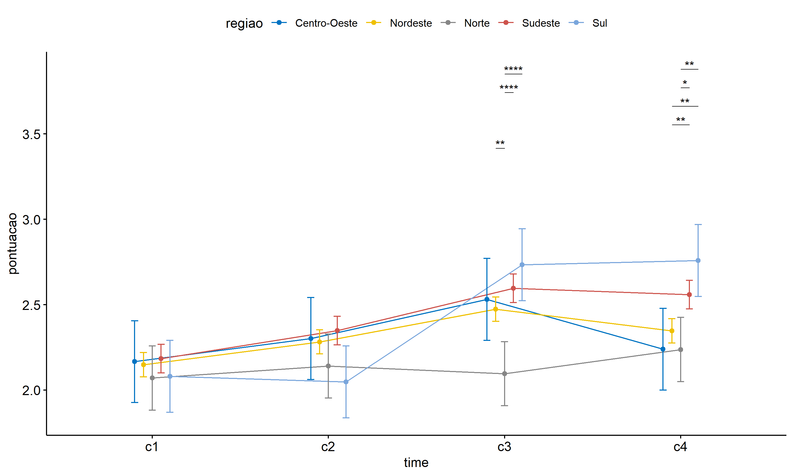<!-- -->

``` r
(pwc <- ldat %>% group_by(regiao) %>%
    emmeans_test(pontuacao ~ time, detailed = T, p.adjust.method = "bonferroni"))
```

    ## # A tibble: 30 × 15
    ##    regiao term  .y.   group1 group2 null.value estimate     se    df conf.low conf.high statistic
    ##  * <fct>  <chr> <chr> <chr>  <chr>       <dbl>    <dbl>  <dbl> <dbl>    <dbl>     <dbl>     <dbl>
    ##  1 Centr… time  pont… c1     c2              0  -0.135  0.173   4484  -0.474     0.203     -0.784
    ##  2 Centr… time  pont… c1     c3              0  -0.365  0.173   4484  -0.703    -0.0259    -2.11 
    ##  3 Centr… time  pont… c1     c4              0  -0.0729 0.173   4484  -0.412     0.266     -0.422
    ##  4 Centr… time  pont… c2     c3              0  -0.229  0.173   4484  -0.568     0.109     -1.33 
    ##  5 Centr… time  pont… c2     c4              0   0.0625 0.173   4484  -0.276     0.401      0.362
    ##  6 Centr… time  pont… c3     c4              0   0.292  0.173   4484  -0.0470    0.630      1.69 
    ##  7 Norde… time  pont… c1     c2              0  -0.134  0.0513  4484  -0.234    -0.0333    -2.61 
    ##  8 Norde… time  pont… c1     c3              0  -0.325  0.0513  4484  -0.425    -0.224     -6.34 
    ##  9 Norde… time  pont… c1     c4              0  -0.198  0.0513  4484  -0.299    -0.0977    -3.87 
    ## 10 Norde… time  pont… c2     c3              0  -0.191  0.0513  4484  -0.291    -0.0905    -3.73 
    ## # ℹ 20 more rows
    ## # ℹ 3 more variables: p <dbl>, p.adj <dbl>, p.adj.signif <chr>

| regiao       | term | .y.       | group1 | group2 | null.value | estimate |    se |   df | conf.low | conf.high | statistic |     p | p.adj | p.adj.signif |
|:-------------|:-----|:----------|:-------|:-------|-----------:|---------:|------:|-----:|---------:|----------:|----------:|------:|------:|:-------------|
| Centro-Oeste | time | pontuacao | c1     | c2     |          0 |   -0.135 | 0.173 | 4484 |   -0.474 |     0.203 |    -0.784 | 0.433 | 1.000 | ns           |
| Centro-Oeste | time | pontuacao | c1     | c3     |          0 |   -0.365 | 0.173 | 4484 |   -0.703 |    -0.026 |    -2.111 | 0.035 | 0.209 | ns           |
| Centro-Oeste | time | pontuacao | c1     | c4     |          0 |   -0.073 | 0.173 | 4484 |   -0.412 |     0.266 |    -0.422 | 0.673 | 1.000 | ns           |
| Centro-Oeste | time | pontuacao | c2     | c3     |          0 |   -0.229 | 0.173 | 4484 |   -0.568 |     0.109 |    -1.327 | 0.185 | 1.000 | ns           |
| Centro-Oeste | time | pontuacao | c2     | c4     |          0 |    0.062 | 0.173 | 4484 |   -0.276 |     0.401 |     0.362 | 0.718 | 1.000 | ns           |
| Centro-Oeste | time | pontuacao | c3     | c4     |          0 |    0.292 | 0.173 | 4484 |   -0.047 |     0.630 |     1.688 | 0.091 | 0.548 | ns           |
| Nordeste     | time | pontuacao | c1     | c2     |          0 |   -0.134 | 0.051 | 4484 |   -0.234 |    -0.033 |    -2.610 | 0.009 | 0.055 | ns           |
| Nordeste     | time | pontuacao | c1     | c3     |          0 |   -0.325 | 0.051 | 4484 |   -0.425 |    -0.224 |    -6.335 | 0.000 | 0.000 | \*\*\*\*     |
| Nordeste     | time | pontuacao | c1     | c4     |          0 |   -0.198 | 0.051 | 4484 |   -0.299 |    -0.098 |    -3.865 | 0.000 | 0.001 | \*\*\*       |
| Nordeste     | time | pontuacao | c2     | c3     |          0 |   -0.191 | 0.051 | 4484 |   -0.291 |    -0.090 |    -3.725 | 0.000 | 0.001 | \*\*         |
| Nordeste     | time | pontuacao | c2     | c4     |          0 |   -0.064 | 0.051 | 4484 |   -0.165 |     0.036 |    -1.256 | 0.209 | 1.000 | ns           |
| Nordeste     | time | pontuacao | c3     | c4     |          0 |    0.127 | 0.051 | 4484 |    0.026 |     0.227 |     2.470 | 0.014 | 0.081 | ns           |
| Norte        | time | pontuacao | c1     | c2     |          0 |   -0.071 | 0.136 | 4484 |   -0.336 |     0.195 |    -0.520 | 0.603 | 1.000 | ns           |
| Norte        | time | pontuacao | c1     | c3     |          0 |   -0.026 | 0.136 | 4484 |   -0.291 |     0.240 |    -0.189 | 0.850 | 1.000 | ns           |
| Norte        | time | pontuacao | c1     | c4     |          0 |   -0.167 | 0.136 | 4484 |   -0.432 |     0.099 |    -1.230 | 0.219 | 1.000 | ns           |
| Norte        | time | pontuacao | c2     | c3     |          0 |    0.045 | 0.136 | 4484 |   -0.221 |     0.311 |     0.331 | 0.741 | 1.000 | ns           |
| Norte        | time | pontuacao | c2     | c4     |          0 |   -0.096 | 0.136 | 4484 |   -0.362 |     0.170 |    -0.710 | 0.478 | 1.000 | ns           |
| Norte        | time | pontuacao | c3     | c4     |          0 |   -0.141 | 0.136 | 4484 |   -0.407 |     0.125 |    -1.041 | 0.298 | 1.000 | ns           |
| Sudeste      | time | pontuacao | c1     | c2     |          0 |   -0.164 | 0.060 | 4484 |   -0.282 |    -0.046 |    -2.715 | 0.007 | 0.040 | \*           |
| Sudeste      | time | pontuacao | c1     | c3     |          0 |   -0.412 | 0.060 | 4484 |   -0.531 |    -0.294 |    -6.828 | 0.000 | 0.000 | \*\*\*\*     |
| Sudeste      | time | pontuacao | c1     | c4     |          0 |   -0.374 | 0.060 | 4484 |   -0.492 |    -0.256 |    -6.196 | 0.000 | 0.000 | \*\*\*\*     |
| Sudeste      | time | pontuacao | c2     | c3     |          0 |   -0.248 | 0.060 | 4484 |   -0.367 |    -0.130 |    -4.113 | 0.000 | 0.000 | \*\*\*       |
| Sudeste      | time | pontuacao | c2     | c4     |          0 |   -0.210 | 0.060 | 4484 |   -0.328 |    -0.092 |    -3.481 | 0.001 | 0.003 | \*\*         |
| Sudeste      | time | pontuacao | c3     | c4     |          0 |    0.038 | 0.060 | 4484 |   -0.080 |     0.157 |     0.632 | 0.527 | 1.000 | ns           |
| Sul          | time | pontuacao | c1     | c2     |          0 |    0.032 | 0.152 | 4484 |   -0.266 |     0.330 |     0.212 | 0.832 | 1.000 | ns           |
| Sul          | time | pontuacao | c1     | c3     |          0 |   -0.653 | 0.152 | 4484 |   -0.951 |    -0.355 |    -4.298 | 0.000 | 0.000 | \*\*\*       |
| Sul          | time | pontuacao | c1     | c4     |          0 |   -0.677 | 0.152 | 4484 |   -0.975 |    -0.379 |    -4.457 | 0.000 | 0.000 | \*\*\*\*     |
| Sul          | time | pontuacao | c2     | c3     |          0 |   -0.685 | 0.152 | 4484 |   -0.983 |    -0.387 |    -4.510 | 0.000 | 0.000 | \*\*\*\*     |
| Sul          | time | pontuacao | c2     | c4     |          0 |   -0.710 | 0.152 | 4484 |   -1.008 |    -0.412 |    -4.669 | 0.000 | 0.000 | \*\*\*\*     |
| Sul          | time | pontuacao | c3     | c4     |          0 |   -0.024 | 0.152 | 4484 |   -0.322 |     0.274 |    -0.159 | 0.874 | 1.000 | ns           |

``` r
(emms <- get_emmeans(pwc))
```

    ## # A tibble: 20 × 8
    ##    regiao       time  emmean     se    df conf.low conf.high method      
    ##    <fct>        <fct>  <dbl>  <dbl> <dbl>    <dbl>     <dbl> <chr>       
    ##  1 Centro-Oeste c1      2.17 0.122   4484     1.93      2.41 Emmeans test
    ##  2 Centro-Oeste c2      2.30 0.122   4484     2.06      2.54 Emmeans test
    ##  3 Centro-Oeste c3      2.53 0.122   4484     2.29      2.77 Emmeans test
    ##  4 Centro-Oeste c4      2.24 0.122   4484     2.00      2.48 Emmeans test
    ##  5 Nordeste     c1      2.15 0.0363  4484     2.08      2.22 Emmeans test
    ##  6 Nordeste     c2      2.28 0.0363  4484     2.21      2.35 Emmeans test
    ##  7 Nordeste     c3      2.47 0.0363  4484     2.40      2.54 Emmeans test
    ##  8 Nordeste     c4      2.35 0.0363  4484     2.28      2.42 Emmeans test
    ##  9 Norte        c1      2.07 0.0958  4484     1.88      2.26 Emmeans test
    ## 10 Norte        c2      2.14 0.0958  4484     1.95      2.33 Emmeans test
    ## 11 Norte        c3      2.10 0.0958  4484     1.91      2.28 Emmeans test
    ## 12 Norte        c4      2.24 0.0958  4484     2.05      2.43 Emmeans test
    ## 13 Sudeste      c1      2.18 0.0427  4484     2.10      2.27 Emmeans test
    ## 14 Sudeste      c2      2.35 0.0427  4484     2.26      2.43 Emmeans test
    ## 15 Sudeste      c3      2.60 0.0427  4484     2.51      2.68 Emmeans test
    ## 16 Sudeste      c4      2.56 0.0427  4484     2.47      2.64 Emmeans test
    ## 17 Sul          c1      2.08 0.107   4484     1.87      2.29 Emmeans test
    ## 18 Sul          c2      2.05 0.107   4484     1.84      2.26 Emmeans test
    ## 19 Sul          c3      2.73 0.107   4484     2.52      2.94 Emmeans test
    ## 20 Sul          c4      2.76 0.107   4484     2.55      2.97 Emmeans test

| regiao       | time | emmean |    se |   df | conf.low | conf.high | method       |
|:-------------|:-----|-------:|------:|-----:|---------:|----------:|:-------------|
| Centro-Oeste | c1   |  2.167 | 0.122 | 4484 |    1.927 |     2.406 | Emmeans test |
| Centro-Oeste | c2   |  2.302 | 0.122 | 4484 |    2.063 |     2.542 | Emmeans test |
| Centro-Oeste | c3   |  2.531 | 0.122 | 4484 |    2.292 |     2.771 | Emmeans test |
| Centro-Oeste | c4   |  2.240 | 0.122 | 4484 |    2.000 |     2.479 | Emmeans test |
| Nordeste     | c1   |  2.149 | 0.036 | 4484 |    2.078 |     2.220 | Emmeans test |
| Nordeste     | c2   |  2.282 | 0.036 | 4484 |    2.211 |     2.353 | Emmeans test |
| Nordeste     | c3   |  2.473 | 0.036 | 4484 |    2.402 |     2.544 | Emmeans test |
| Nordeste     | c4   |  2.347 | 0.036 | 4484 |    2.276 |     2.418 | Emmeans test |
| Norte        | c1   |  2.071 | 0.096 | 4484 |    1.883 |     2.258 | Emmeans test |
| Norte        | c2   |  2.141 | 0.096 | 4484 |    1.953 |     2.329 | Emmeans test |
| Norte        | c3   |  2.096 | 0.096 | 4484 |    1.908 |     2.284 | Emmeans test |
| Norte        | c4   |  2.237 | 0.096 | 4484 |    2.049 |     2.425 | Emmeans test |
| Sudeste      | c1   |  2.184 | 0.043 | 4484 |    2.101 |     2.268 | Emmeans test |
| Sudeste      | c2   |  2.348 | 0.043 | 4484 |    2.265 |     2.432 | Emmeans test |
| Sudeste      | c3   |  2.597 | 0.043 | 4484 |    2.513 |     2.680 | Emmeans test |
| Sudeste      | c4   |  2.559 | 0.043 | 4484 |    2.475 |     2.642 | Emmeans test |
| Sul          | c1   |  2.081 | 0.107 | 4484 |    1.870 |     2.291 | Emmeans test |
| Sul          | c2   |  2.048 | 0.107 | 4484 |    1.838 |     2.259 | Emmeans test |
| Sul          | c3   |  2.734 | 0.107 | 4484 |    2.523 |     2.945 | Emmeans test |
| Sul          | c4   |  2.758 | 0.107 | 4484 |    2.547 |     2.969 | Emmeans test |

``` r
emms.gg <- emms[which(emms$regiao == "Centro-Oeste"),]
if (nrow(emms.gg) > 0)
  ggline(emms.gg, x = "time", y = "emmean", color = "#0073C2FF", ylab = "pontuacao") +
    geom_errorbar(aes(ymin = conf.low, ymax = conf.high),
                  width = 0.2, color = "#0073C2FF") +
    stat_pvalue_manual(
      add_xy_position(pwc[which(pwc$regiao == "Centro-Oeste"),],
                      x = "time", fun = "mean_se"),
      hide.ns = T, color = "#0073C2FF", tip.length = F) +
    labs(title = "regiao: Centro-Oeste")+
    theme(legend.text = element_blank())
```

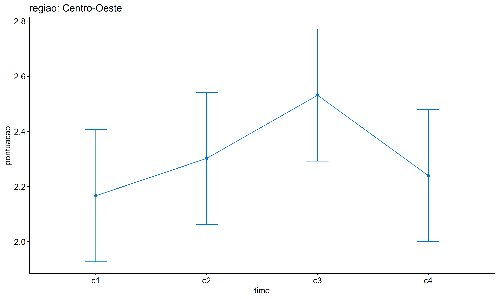<!-- -->

``` r
emms.gg <- emms[which(emms$regiao == "Nordeste"),]
if (nrow(emms.gg) > 0)
  ggline(emms.gg, x = "time", y = "emmean", color = "#EFC000FF", ylab = "pontuacao") +
    geom_errorbar(aes(ymin = conf.low, ymax = conf.high),
                  width = 0.2, color = "#EFC000FF") +
    stat_pvalue_manual(
      add_xy_position(pwc[which(pwc$regiao == "Nordeste"),],
                      x = "time", fun = "mean_se"),
      hide.ns = T, color = "#EFC000FF", tip.length = F) +
    labs(title = "regiao: Nordeste")+
    theme(legend.text = element_blank())
```

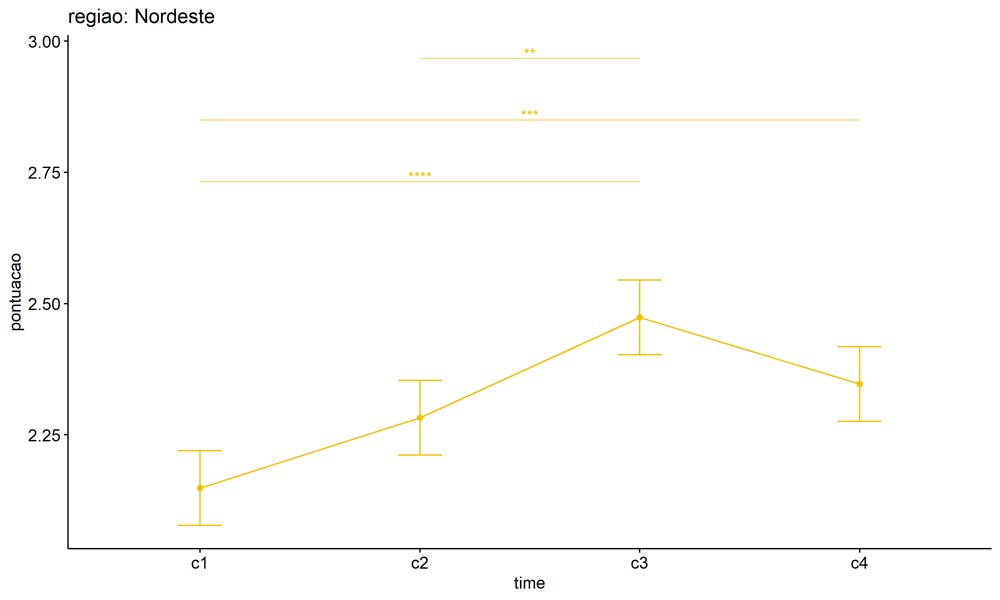<!-- -->

``` r
emms.gg <- emms[which(emms$regiao == "Norte"),]
if (nrow(emms.gg) > 0)
  ggline(emms.gg, x = "time", y = "emmean", color = "#868686FF", ylab = "pontuacao") +
    geom_errorbar(aes(ymin = conf.low, ymax = conf.high),
                  width = 0.2, color = "#868686FF") +
    stat_pvalue_manual(
      add_xy_position(pwc[which(pwc$regiao == "Norte"),],
                      x = "time", fun = "mean_se"),
      hide.ns = T, color = "#868686FF", tip.length = F) +
    labs(title = "regiao: Norte")+
    theme(legend.text = element_blank())
```

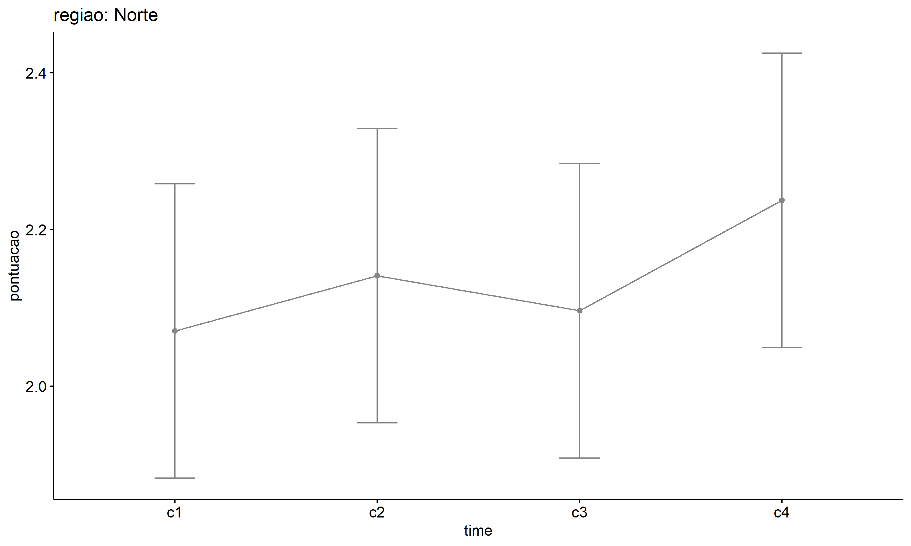<!-- -->

``` r
emms.gg <- emms[which(emms$regiao == "Sudeste"),]
if (nrow(emms.gg) > 0)
  ggline(emms.gg, x = "time", y = "emmean", color = "#CD534CFF", ylab = "pontuacao") +
    geom_errorbar(aes(ymin = conf.low, ymax = conf.high),
                  width = 0.2, color = "#CD534CFF") +
    stat_pvalue_manual(
      add_xy_position(pwc[which(pwc$regiao == "Sudeste"),],
                      x = "time", fun = "mean_se"),
      hide.ns = T, color = "#CD534CFF", tip.length = F) +
    labs(title = "regiao: Sudeste")+
    theme(legend.text = element_blank())
```

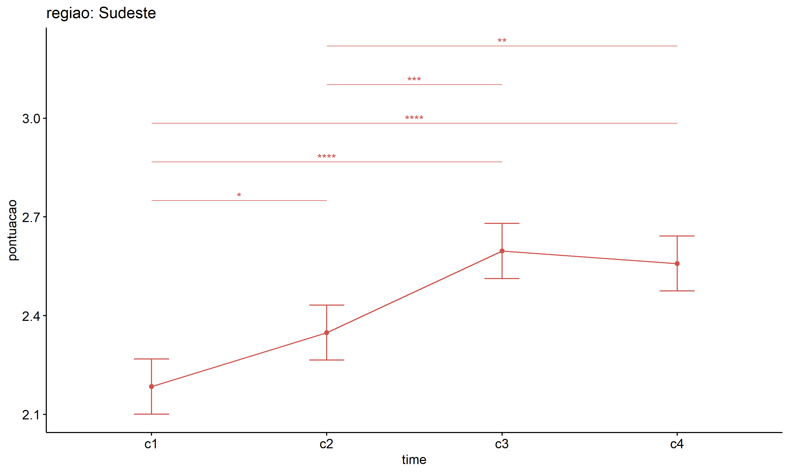<!-- -->

``` r
emms.gg <- emms[which(emms$regiao == "Sul"),]
if (nrow(emms.gg) > 0)
  ggline(emms.gg, x = "time", y = "emmean", color = "#7AA6DCFF", ylab = "pontuacao") +
    geom_errorbar(aes(ymin = conf.low, ymax = conf.high),
                  width = 0.2, color = "#7AA6DCFF") +
    stat_pvalue_manual(
      add_xy_position(pwc[which(pwc$regiao == "Sul"),],
                      x = "time", fun = "mean_se"),
      hide.ns = T, color = "#7AA6DCFF", tip.length = F) +
    labs(title = "regiao: Sul")+
    theme(legend.text = element_blank())
```

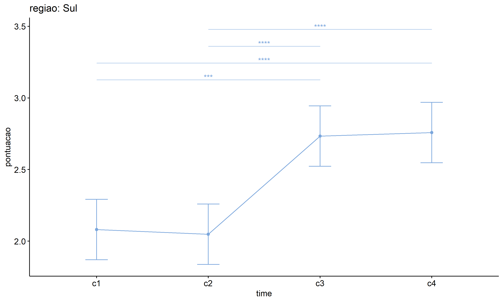<!-- -->

## PairWise Computation after removing non.normal data

``` r
if (length(non.ids) > 0)
  (pwc2 <- ldat2 %>% group_by(time) %>%
     emmeans_test(pontuacao ~ regiao, detailed = T, p.adjust.method = "bonferroni"))
```

    ## Warning: Expected 2 pieces. Additional pieces discarded in 16 rows [1, 2, 3, 4, 11, 12, 13, 14, 21, 22,
    ## 23, 24, 31, 32, 33, 34].

    ## # A tibble: 40 × 15
    ##    time  term   .y.   group1 group2 null.value estimate     se    df conf.low conf.high statistic
    ##  * <fct> <chr>  <chr> <chr>  <chr>       <dbl>    <dbl>  <dbl> <dbl>    <dbl>     <dbl>     <dbl>
    ##  1 c1    regiao pont… Centro Oeste           0  -0.0236 0.137   4212   -0.293    0.245     -0.172
    ##  2 c1    regiao pont… Centro Oeste           0   0.0507 0.164   4212   -0.272    0.373      0.308
    ##  3 c1    regiao pont… Centro Oeste           0  -0.0595 0.139   4212   -0.332    0.213     -0.428
    ##  4 c1    regiao pont… Centro Oeste           0   0.125  0.367   4212   -0.594    0.844      0.341
    ##  5 c1    regiao pont… Norde… Norte           0   0.0743 0.104   4212   -0.129    0.278      0.716
    ##  6 c1    regiao pont… Norde… Sudes…          0  -0.0359 0.0554  4212   -0.145    0.0728    -0.647
    ##  7 c1    regiao pont… Norde… Sul             0   0.149  0.344   4212   -0.525    0.823      0.432
    ##  8 c1    regiao pont… Norte  Sudes…          0  -0.110  0.106   4212   -0.318    0.0979    -1.04 
    ##  9 c1    regiao pont… Norte  Sul             0   0.0743 0.355   4212   -0.623    0.771      0.209
    ## 10 c1    regiao pont… Sudes… Sul             0   0.184  0.344   4212   -0.491    0.860      0.536
    ## # ℹ 30 more rows
    ## # ℹ 3 more variables: p <dbl>, p.adj <dbl>, p.adj.signif <chr>

| time | term   | .y.       | group1   | group2  | null.value | estimate |    se |   df | conf.low | conf.high | statistic |     p | p.adj | p.adj.signif |
|:-----|:-------|:----------|:---------|:--------|-----------:|---------:|------:|-----:|---------:|----------:|----------:|------:|------:|:-------------|
| c1   | regiao | pontuacao | Centro   | Oeste   |          0 |   -0.024 | 0.137 | 4212 |   -0.293 |     0.245 |    -0.172 | 0.863 | 1.000 | ns           |
| c1   | regiao | pontuacao | Centro   | Oeste   |          0 |    0.051 | 0.164 | 4212 |   -0.272 |     0.373 |     0.308 | 0.758 | 1.000 | ns           |
| c1   | regiao | pontuacao | Centro   | Oeste   |          0 |   -0.059 | 0.139 | 4212 |   -0.332 |     0.213 |    -0.428 | 0.669 | 1.000 | ns           |
| c1   | regiao | pontuacao | Centro   | Oeste   |          0 |    0.125 | 0.367 | 4212 |   -0.594 |     0.844 |     0.341 | 0.733 | 1.000 | ns           |
| c1   | regiao | pontuacao | Nordeste | Norte   |          0 |    0.074 | 0.104 | 4212 |   -0.129 |     0.278 |     0.716 | 0.474 | 1.000 | ns           |
| c1   | regiao | pontuacao | Nordeste | Sudeste |          0 |   -0.036 | 0.055 | 4212 |   -0.145 |     0.073 |    -0.647 | 0.518 | 1.000 | ns           |
| c1   | regiao | pontuacao | Nordeste | Sul     |          0 |    0.149 | 0.344 | 4212 |   -0.525 |     0.823 |     0.432 | 0.666 | 1.000 | ns           |
| c1   | regiao | pontuacao | Norte    | Sudeste |          0 |   -0.110 | 0.106 | 4212 |   -0.318 |     0.098 |    -1.038 | 0.299 | 1.000 | ns           |
| c1   | regiao | pontuacao | Norte    | Sul     |          0 |    0.074 | 0.355 | 4212 |   -0.623 |     0.771 |     0.209 | 0.834 | 1.000 | ns           |
| c1   | regiao | pontuacao | Sudeste  | Sul     |          0 |    0.184 | 0.344 | 4212 |   -0.491 |     0.860 |     0.536 | 0.592 | 1.000 | ns           |
| c2   | regiao | pontuacao | Centro   | Oeste   |          0 |   -0.120 | 0.137 | 4212 |   -0.389 |     0.149 |    -0.874 | 0.382 | 1.000 | ns           |
| c2   | regiao | pontuacao | Centro   | Oeste   |          0 |    0.014 | 0.164 | 4212 |   -0.308 |     0.336 |     0.084 | 0.933 | 1.000 | ns           |
| c2   | regiao | pontuacao | Centro   | Oeste   |          0 |   -0.186 | 0.139 | 4212 |   -0.458 |     0.087 |    -1.337 | 0.181 | 1.000 | ns           |
| c2   | regiao | pontuacao | Centro   | Oeste   |          0 |    0.163 | 0.367 | 4212 |   -0.556 |     0.881 |     0.443 | 0.658 | 1.000 | ns           |
| c2   | regiao | pontuacao | Nordeste | Norte   |          0 |    0.134 | 0.104 | 4212 |   -0.070 |     0.337 |     1.289 | 0.197 | 1.000 | ns           |
| c2   | regiao | pontuacao | Nordeste | Sudeste |          0 |   -0.066 | 0.055 | 4212 |   -0.175 |     0.043 |    -1.190 | 0.234 | 1.000 | ns           |
| c2   | regiao | pontuacao | Nordeste | Sul     |          0 |    0.282 | 0.344 | 4212 |   -0.392 |     0.956 |     0.822 | 0.411 | 1.000 | ns           |
| c2   | regiao | pontuacao | Norte    | Sudeste |          0 |   -0.200 | 0.106 | 4212 |   -0.408 |     0.008 |    -1.882 | 0.060 | 0.599 | ns           |
| c2   | regiao | pontuacao | Norte    | Sul     |          0 |    0.149 | 0.355 | 4212 |   -0.548 |     0.846 |     0.418 | 0.676 | 1.000 | ns           |
| c2   | regiao | pontuacao | Sudeste  | Sul     |          0 |    0.348 | 0.344 | 4212 |   -0.327 |     1.024 |     1.011 | 0.312 | 1.000 | ns           |
| c3   | regiao | pontuacao | Centro   | Oeste   |          0 |    0.052 | 0.137 | 4212 |   -0.217 |     0.321 |     0.376 | 0.707 | 1.000 | ns           |
| c3   | regiao | pontuacao | Centro   | Oeste   |          0 |    0.471 | 0.164 | 4212 |    0.149 |     0.793 |     2.865 | 0.004 | 0.042 | \*           |
| c3   | regiao | pontuacao | Centro   | Oeste   |          0 |   -0.072 | 0.139 | 4212 |   -0.344 |     0.201 |    -0.516 | 0.606 | 1.000 | ns           |
| c3   | regiao | pontuacao | Centro   | Oeste   |          0 |   -1.808 | 0.367 | 4212 |   -2.527 |    -1.090 |    -4.932 | 0.000 | 0.000 | \*\*\*\*     |
| c3   | regiao | pontuacao | Nordeste | Norte   |          0 |    0.419 | 0.104 | 4212 |    0.216 |     0.623 |     4.042 | 0.000 | 0.001 | \*\*\*       |
| c3   | regiao | pontuacao | Nordeste | Sudeste |          0 |   -0.123 | 0.055 | 4212 |   -0.232 |    -0.015 |    -2.225 | 0.026 | 0.262 | ns           |
| c3   | regiao | pontuacao | Nordeste | Sul     |          0 |   -1.860 | 0.344 | 4212 |   -2.534 |    -1.186 |    -5.410 | 0.000 | 0.000 | \*\*\*\*     |
| c3   | regiao | pontuacao | Norte    | Sudeste |          0 |   -0.543 | 0.106 | 4212 |   -0.751 |    -0.335 |    -5.113 | 0.000 | 0.000 | \*\*\*\*     |
| c3   | regiao | pontuacao | Norte    | Sul     |          0 |   -2.279 | 0.355 | 4212 |   -2.976 |    -1.582 |    -6.412 | 0.000 | 0.000 | \*\*\*\*     |
| c3   | regiao | pontuacao | Sudeste  | Sul     |          0 |   -1.737 | 0.344 | 4212 |   -2.412 |    -1.061 |    -5.041 | 0.000 | 0.000 | \*\*\*\*     |
| c4   | regiao | pontuacao | Centro   | Oeste   |          0 |   -0.209 | 0.137 | 4212 |   -0.478 |     0.060 |    -1.526 | 0.127 | 1.000 | ns           |
| c4   | regiao | pontuacao | Centro   | Oeste   |          0 |    0.009 | 0.164 | 4212 |   -0.313 |     0.331 |     0.056 | 0.956 | 1.000 | ns           |
| c4   | regiao | pontuacao | Centro   | Oeste   |          0 |   -0.421 | 0.139 | 4212 |   -0.694 |    -0.149 |    -3.029 | 0.002 | 0.025 | \*           |
| c4   | regiao | pontuacao | Centro   | Oeste   |          0 |   -1.862 | 0.367 | 4212 |   -2.581 |    -1.144 |    -5.080 | 0.000 | 0.000 | \*\*\*\*     |
| c4   | regiao | pontuacao | Nordeste | Norte   |          0 |    0.218 | 0.104 | 4212 |    0.015 |     0.422 |     2.105 | 0.035 | 0.353 | ns           |
| c4   | regiao | pontuacao | Nordeste | Sudeste |          0 |   -0.212 | 0.055 | 4212 |   -0.320 |    -0.103 |    -3.820 | 0.000 | 0.001 | \*\*         |
| c4   | regiao | pontuacao | Nordeste | Sul     |          0 |   -1.653 | 0.344 | 4212 |   -2.327 |    -0.979 |    -4.809 | 0.000 | 0.000 | \*\*\*\*     |
| c4   | regiao | pontuacao | Norte    | Sudeste |          0 |   -0.430 | 0.106 | 4212 |   -0.638 |    -0.222 |    -4.053 | 0.000 | 0.001 | \*\*\*       |
| c4   | regiao | pontuacao | Norte    | Sul     |          0 |   -1.872 | 0.355 | 4212 |   -2.569 |    -1.175 |    -5.265 | 0.000 | 0.000 | \*\*\*\*     |
| c4   | regiao | pontuacao | Sudeste  | Sul     |          0 |   -1.441 | 0.344 | 4212 |   -2.117 |    -0.766 |    -4.184 | 0.000 | 0.000 | \*\*\*       |

``` r
if (length(non.ids) > 0)
  (emms2 <- get_emmeans(pwc2))
```

    ## # A tibble: 20 × 8
    ##    time  regiao       emmean     se    df conf.low conf.high method      
    ##    <fct> <fct>         <dbl>  <dbl> <dbl>    <dbl>     <dbl> <chr>       
    ##  1 c1    Centro-Oeste   2.12 0.132   4212     1.87      2.38 Emmeans test
    ##  2 c1    Nordeste       2.15 0.0359  4212     2.08      2.22 Emmeans test
    ##  3 c1    Norte          2.07 0.0974  4212     1.88      2.27 Emmeans test
    ##  4 c1    Sudeste        2.18 0.0422  4212     2.10      2.27 Emmeans test
    ##  5 c1    Sul            2.00 0.342   4212     1.33      2.67 Emmeans test
    ##  6 c2    Centro-Oeste   2.16 0.132   4212     1.90      2.42 Emmeans test
    ##  7 c2    Nordeste       2.28 0.0359  4212     2.21      2.35 Emmeans test
    ##  8 c2    Norte          2.15 0.0974  4212     1.96      2.34 Emmeans test
    ##  9 c2    Sudeste        2.35 0.0422  4212     2.27      2.43 Emmeans test
    ## 10 c2    Sul            2.00 0.342   4212     1.33      2.67 Emmeans test
    ## 11 c3    Centro-Oeste   2.52 0.132   4212     2.27      2.78 Emmeans test
    ## 12 c3    Nordeste       2.47 0.0359  4212     2.40      2.54 Emmeans test
    ## 13 c3    Norte          2.05 0.0974  4212     1.86      2.24 Emmeans test
    ## 14 c3    Sudeste        2.60 0.0422  4212     2.51      2.68 Emmeans test
    ## 15 c3    Sul            4.33 0.342   4212     3.66      5.00 Emmeans test
    ## 16 c4    Centro-Oeste   2.14 0.132   4212     1.88      2.40 Emmeans test
    ## 17 c4    Nordeste       2.35 0.0359  4212     2.28      2.42 Emmeans test
    ## 18 c4    Norte          2.13 0.0974  4212     1.94      2.32 Emmeans test
    ## 19 c4    Sudeste        2.56 0.0422  4212     2.48      2.64 Emmeans test
    ## 20 c4    Sul            4.00 0.342   4212     3.33      4.67 Emmeans test

| time | regiao       | emmean |    se |   df | conf.low | conf.high | method       |
|:-----|:-------------|-------:|------:|-----:|---------:|----------:|:-------------|
| c1   | Centro-Oeste |  2.125 | 0.132 | 4212 |    1.865 |     2.385 | Emmeans test |
| c1   | Nordeste     |  2.149 | 0.036 | 4212 |    2.078 |     2.219 | Emmeans test |
| c1   | Norte        |  2.074 | 0.097 | 4212 |    1.883 |     2.265 | Emmeans test |
| c1   | Sudeste      |  2.184 | 0.042 | 4212 |    2.102 |     2.267 | Emmeans test |
| c1   | Sul          |  2.000 | 0.342 | 4212 |    1.330 |     2.670 | Emmeans test |
| c2   | Centro-Oeste |  2.162 | 0.132 | 4212 |    1.903 |     2.422 | Emmeans test |
| c2   | Nordeste     |  2.282 | 0.036 | 4212 |    2.212 |     2.353 | Emmeans test |
| c2   | Norte        |  2.149 | 0.097 | 4212 |    1.958 |     2.340 | Emmeans test |
| c2   | Sudeste      |  2.348 | 0.042 | 4212 |    2.266 |     2.431 | Emmeans test |
| c2   | Sul          |  2.000 | 0.342 | 4212 |    1.330 |     2.670 | Emmeans test |
| c3   | Centro-Oeste |  2.525 | 0.132 | 4212 |    2.265 |     2.785 | Emmeans test |
| c3   | Nordeste     |  2.473 | 0.036 | 4212 |    2.403 |     2.544 | Emmeans test |
| c3   | Norte        |  2.054 | 0.097 | 4212 |    1.863 |     2.245 | Emmeans test |
| c3   | Sudeste      |  2.597 | 0.042 | 4212 |    2.514 |     2.680 | Emmeans test |
| c3   | Sul          |  4.333 | 0.342 | 4212 |    3.663 |     5.004 | Emmeans test |
| c4   | Centro-Oeste |  2.137 | 0.132 | 4212 |    1.878 |     2.397 | Emmeans test |
| c4   | Nordeste     |  2.347 | 0.036 | 4212 |    2.276 |     2.417 | Emmeans test |
| c4   | Norte        |  2.128 | 0.097 | 4212 |    1.938 |     2.319 | Emmeans test |
| c4   | Sudeste      |  2.559 | 0.042 | 4212 |    2.476 |     2.641 | Emmeans test |
| c4   | Sul          |  4.000 | 0.342 | 4212 |    3.330 |     4.670 | Emmeans test |

``` r
if (length(non.ids) > 0) {
  pwc2 <- add_xy_position(pwc2, x = "time", fun = "mean_se", dodge = 0.25)
  pd2 <- position_dodge(width = 0.25)
  
  ggline(emms2, x = "time", y = "emmean", color = "regiao",
         palette = c("#0073C2FF","#EFC000FF","#868686FF","#CD534CFF","#7AA6DCFF"),
         position = pd, ylab = "pontuacao") +
    geom_errorbar(aes(ymin = conf.low, ymax = conf.high, color = regiao),
                position = pd, width = 0.2) +
    stat_pvalue_manual(pwc2, hide.ns = T, tip.length = F, linetype = 1)
}
```

    ## Warning: Removed 4 rows containing non-finite values (`stat_bracket()`).

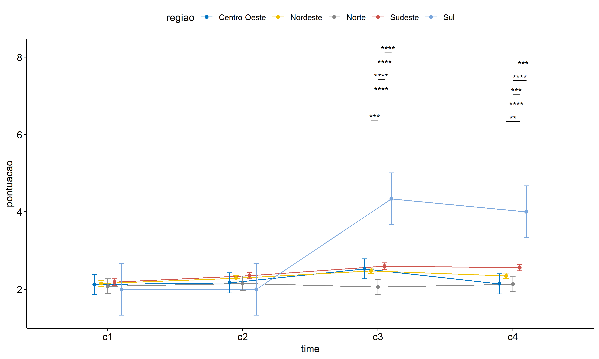<!-- -->

``` r
if (length(non.ids) > 0)
  (pwc2 <- ldat2 %>% group_by(regiao) %>%
     emmeans_test(pontuacao ~ time, detailed = T, p.adjust.method = "bonferroni"))
```

    ## # A tibble: 30 × 15
    ##    regiao term  .y.   group1 group2 null.value estimate     se    df conf.low conf.high statistic
    ##  * <fct>  <chr> <chr> <chr>  <chr>       <dbl>    <dbl>  <dbl> <dbl>    <dbl>     <dbl>     <dbl>
    ##  1 Centr… time  pont… c1     c2              0  -0.0375 0.187   4212  -0.405    0.330     -0.200 
    ##  2 Centr… time  pont… c1     c3              0  -0.400  0.187   4212  -0.767   -0.0329    -2.14  
    ##  3 Centr… time  pont… c1     c4              0  -0.0125 0.187   4212  -0.380    0.355     -0.0668
    ##  4 Centr… time  pont… c2     c3              0  -0.363  0.187   4212  -0.730    0.00464   -1.94  
    ##  5 Centr… time  pont… c2     c4              0   0.0250 0.187   4212  -0.342    0.392      0.134 
    ##  6 Centr… time  pont… c3     c4              0   0.387  0.187   4212   0.0204   0.755      2.07  
    ##  7 Norde… time  pont… c1     c2              0  -0.134  0.0507  4212  -0.233   -0.0343    -2.64  
    ##  8 Norde… time  pont… c1     c3              0  -0.325  0.0507  4212  -0.424   -0.225     -6.40  
    ##  9 Norde… time  pont… c1     c4              0  -0.198  0.0507  4212  -0.298   -0.0987    -3.91  
    ## 10 Norde… time  pont… c2     c3              0  -0.191  0.0507  4212  -0.290   -0.0915    -3.76  
    ## # ℹ 20 more rows
    ## # ℹ 3 more variables: p <dbl>, p.adj <dbl>, p.adj.signif <chr>

| regiao       | term | .y.       | group1 | group2 | null.value | estimate |    se |   df | conf.low | conf.high | statistic |     p | p.adj | p.adj.signif |
|:-------------|:-----|:----------|:-------|:-------|-----------:|---------:|------:|-----:|---------:|----------:|----------:|------:|------:|:-------------|
| Centro-Oeste | time | pontuacao | c1     | c2     |          0 |   -0.037 | 0.187 | 4212 |   -0.405 |     0.330 |    -0.200 | 0.841 | 1.000 | ns           |
| Centro-Oeste | time | pontuacao | c1     | c3     |          0 |   -0.400 | 0.187 | 4212 |   -0.767 |    -0.033 |    -2.136 | 0.033 | 0.196 | ns           |
| Centro-Oeste | time | pontuacao | c1     | c4     |          0 |   -0.013 | 0.187 | 4212 |   -0.380 |     0.355 |    -0.067 | 0.947 | 1.000 | ns           |
| Centro-Oeste | time | pontuacao | c2     | c3     |          0 |   -0.363 | 0.187 | 4212 |   -0.730 |     0.005 |    -1.936 | 0.053 | 0.318 | ns           |
| Centro-Oeste | time | pontuacao | c2     | c4     |          0 |    0.025 | 0.187 | 4212 |   -0.342 |     0.392 |     0.134 | 0.894 | 1.000 | ns           |
| Centro-Oeste | time | pontuacao | c3     | c4     |          0 |    0.387 | 0.187 | 4212 |    0.020 |     0.755 |     2.069 | 0.039 | 0.231 | ns           |
| Nordeste     | time | pontuacao | c1     | c2     |          0 |   -0.134 | 0.051 | 4212 |   -0.233 |    -0.034 |    -2.637 | 0.008 | 0.050 | ns           |
| Nordeste     | time | pontuacao | c1     | c3     |          0 |   -0.325 | 0.051 | 4212 |   -0.424 |    -0.225 |    -6.402 | 0.000 | 0.000 | \*\*\*\*     |
| Nordeste     | time | pontuacao | c1     | c4     |          0 |   -0.198 | 0.051 | 4212 |   -0.298 |    -0.099 |    -3.906 | 0.000 | 0.001 | \*\*\*       |
| Nordeste     | time | pontuacao | c2     | c3     |          0 |   -0.191 | 0.051 | 4212 |   -0.290 |    -0.092 |    -3.764 | 0.000 | 0.001 | \*\*         |
| Nordeste     | time | pontuacao | c2     | c4     |          0 |   -0.064 | 0.051 | 4212 |   -0.164 |     0.035 |    -1.269 | 0.205 | 1.000 | ns           |
| Nordeste     | time | pontuacao | c3     | c4     |          0 |    0.127 | 0.051 | 4212 |    0.027 |     0.226 |     2.496 | 0.013 | 0.076 | ns           |
| Norte        | time | pontuacao | c1     | c2     |          0 |   -0.074 | 0.138 | 4212 |   -0.344 |     0.196 |    -0.540 | 0.589 | 1.000 | ns           |
| Norte        | time | pontuacao | c1     | c3     |          0 |    0.020 | 0.138 | 4212 |   -0.250 |     0.290 |     0.147 | 0.883 | 1.000 | ns           |
| Norte        | time | pontuacao | c1     | c4     |          0 |   -0.054 | 0.138 | 4212 |   -0.324 |     0.216 |    -0.393 | 0.695 | 1.000 | ns           |
| Norte        | time | pontuacao | c2     | c3     |          0 |    0.095 | 0.138 | 4212 |   -0.175 |     0.365 |     0.687 | 0.492 | 1.000 | ns           |
| Norte        | time | pontuacao | c2     | c4     |          0 |    0.020 | 0.138 | 4212 |   -0.250 |     0.290 |     0.147 | 0.883 | 1.000 | ns           |
| Norte        | time | pontuacao | c3     | c4     |          0 |   -0.074 | 0.138 | 4212 |   -0.344 |     0.196 |    -0.540 | 0.589 | 1.000 | ns           |
| Sudeste      | time | pontuacao | c1     | c2     |          0 |   -0.164 | 0.060 | 4212 |   -0.281 |    -0.047 |    -2.744 | 0.006 | 0.037 | \*           |
| Sudeste      | time | pontuacao | c1     | c3     |          0 |   -0.412 | 0.060 | 4212 |   -0.529 |    -0.295 |    -6.900 | 0.000 | 0.000 | \*\*\*\*     |
| Sudeste      | time | pontuacao | c1     | c4     |          0 |   -0.374 | 0.060 | 4212 |   -0.491 |    -0.257 |    -6.261 | 0.000 | 0.000 | \*\*\*\*     |
| Sudeste      | time | pontuacao | c2     | c3     |          0 |   -0.248 | 0.060 | 4212 |   -0.365 |    -0.131 |    -4.156 | 0.000 | 0.000 | \*\*\*       |
| Sudeste      | time | pontuacao | c2     | c4     |          0 |   -0.210 | 0.060 | 4212 |   -0.327 |    -0.093 |    -3.517 | 0.000 | 0.003 | \*\*         |
| Sudeste      | time | pontuacao | c3     | c4     |          0 |    0.038 | 0.060 | 4212 |   -0.079 |     0.155 |     0.639 | 0.523 | 1.000 | ns           |
| Sul          | time | pontuacao | c1     | c2     |          0 |    0.000 | 0.484 | 4212 |   -0.948 |     0.948 |     0.000 | 1.000 | 1.000 | ns           |
| Sul          | time | pontuacao | c1     | c3     |          0 |   -2.333 | 0.484 | 4212 |   -3.281 |    -1.385 |    -4.826 | 0.000 | 0.000 | \*\*\*\*     |
| Sul          | time | pontuacao | c1     | c4     |          0 |   -2.000 | 0.484 | 4212 |   -2.948 |    -1.052 |    -4.136 | 0.000 | 0.000 | \*\*\*       |
| Sul          | time | pontuacao | c2     | c3     |          0 |   -2.333 | 0.484 | 4212 |   -3.281 |    -1.385 |    -4.826 | 0.000 | 0.000 | \*\*\*\*     |
| Sul          | time | pontuacao | c2     | c4     |          0 |   -2.000 | 0.484 | 4212 |   -2.948 |    -1.052 |    -4.136 | 0.000 | 0.000 | \*\*\*       |
| Sul          | time | pontuacao | c3     | c4     |          0 |    0.333 | 0.484 | 4212 |   -0.615 |     1.281 |     0.689 | 0.491 | 1.000 | ns           |

``` r
if (length(non.ids) > 0)
  (emms2 <- get_emmeans(pwc2))
```

    ## # A tibble: 20 × 8
    ##    regiao       time  emmean     se    df conf.low conf.high method      
    ##    <fct>        <fct>  <dbl>  <dbl> <dbl>    <dbl>     <dbl> <chr>       
    ##  1 Centro-Oeste c1      2.12 0.132   4212     1.87      2.38 Emmeans test
    ##  2 Centro-Oeste c2      2.16 0.132   4212     1.90      2.42 Emmeans test
    ##  3 Centro-Oeste c3      2.52 0.132   4212     2.27      2.78 Emmeans test
    ##  4 Centro-Oeste c4      2.14 0.132   4212     1.88      2.40 Emmeans test
    ##  5 Nordeste     c1      2.15 0.0359  4212     2.08      2.22 Emmeans test
    ##  6 Nordeste     c2      2.28 0.0359  4212     2.21      2.35 Emmeans test
    ##  7 Nordeste     c3      2.47 0.0359  4212     2.40      2.54 Emmeans test
    ##  8 Nordeste     c4      2.35 0.0359  4212     2.28      2.42 Emmeans test
    ##  9 Norte        c1      2.07 0.0974  4212     1.88      2.27 Emmeans test
    ## 10 Norte        c2      2.15 0.0974  4212     1.96      2.34 Emmeans test
    ## 11 Norte        c3      2.05 0.0974  4212     1.86      2.24 Emmeans test
    ## 12 Norte        c4      2.13 0.0974  4212     1.94      2.32 Emmeans test
    ## 13 Sudeste      c1      2.18 0.0422  4212     2.10      2.27 Emmeans test
    ## 14 Sudeste      c2      2.35 0.0422  4212     2.27      2.43 Emmeans test
    ## 15 Sudeste      c3      2.60 0.0422  4212     2.51      2.68 Emmeans test
    ## 16 Sudeste      c4      2.56 0.0422  4212     2.48      2.64 Emmeans test
    ## 17 Sul          c1      2.00 0.342   4212     1.33      2.67 Emmeans test
    ## 18 Sul          c2      2.00 0.342   4212     1.33      2.67 Emmeans test
    ## 19 Sul          c3      4.33 0.342   4212     3.66      5.00 Emmeans test
    ## 20 Sul          c4      4.00 0.342   4212     3.33      4.67 Emmeans test

| regiao       | time | emmean |    se |   df | conf.low | conf.high | method       |
|:-------------|:-----|-------:|------:|-----:|---------:|----------:|:-------------|
| Centro-Oeste | c1   |  2.125 | 0.132 | 4212 |    1.865 |     2.385 | Emmeans test |
| Centro-Oeste | c2   |  2.162 | 0.132 | 4212 |    1.903 |     2.422 | Emmeans test |
| Centro-Oeste | c3   |  2.525 | 0.132 | 4212 |    2.265 |     2.785 | Emmeans test |
| Centro-Oeste | c4   |  2.137 | 0.132 | 4212 |    1.878 |     2.397 | Emmeans test |
| Nordeste     | c1   |  2.149 | 0.036 | 4212 |    2.078 |     2.219 | Emmeans test |
| Nordeste     | c2   |  2.282 | 0.036 | 4212 |    2.212 |     2.353 | Emmeans test |
| Nordeste     | c3   |  2.473 | 0.036 | 4212 |    2.403 |     2.544 | Emmeans test |
| Nordeste     | c4   |  2.347 | 0.036 | 4212 |    2.276 |     2.417 | Emmeans test |
| Norte        | c1   |  2.074 | 0.097 | 4212 |    1.883 |     2.265 | Emmeans test |
| Norte        | c2   |  2.149 | 0.097 | 4212 |    1.958 |     2.340 | Emmeans test |
| Norte        | c3   |  2.054 | 0.097 | 4212 |    1.863 |     2.245 | Emmeans test |
| Norte        | c4   |  2.128 | 0.097 | 4212 |    1.938 |     2.319 | Emmeans test |
| Sudeste      | c1   |  2.184 | 0.042 | 4212 |    2.102 |     2.267 | Emmeans test |
| Sudeste      | c2   |  2.348 | 0.042 | 4212 |    2.266 |     2.431 | Emmeans test |
| Sudeste      | c3   |  2.597 | 0.042 | 4212 |    2.514 |     2.680 | Emmeans test |
| Sudeste      | c4   |  2.559 | 0.042 | 4212 |    2.476 |     2.641 | Emmeans test |
| Sul          | c1   |  2.000 | 0.342 | 4212 |    1.330 |     2.670 | Emmeans test |
| Sul          | c2   |  2.000 | 0.342 | 4212 |    1.330 |     2.670 | Emmeans test |
| Sul          | c3   |  4.333 | 0.342 | 4212 |    3.663 |     5.004 | Emmeans test |
| Sul          | c4   |  4.000 | 0.342 | 4212 |    3.330 |     4.670 | Emmeans test |

``` r
if (length(non.ids) > 0) {
  emms.gg <- emms2[which(emms2$regiao == "Centro-Oeste"),]
  if (nrow(emms.gg) > 0)
    ggline(emms.gg, x = "time", y = "emmean", color = "#0073C2FF", ylab = "pontuacao") +
    geom_errorbar(aes(ymin = conf.low, ymax = conf.high),
                  width = 0.2, color = "#0073C2FF") +
    stat_pvalue_manual(
      add_xy_position(pwc[which(pwc$regiao == "Centro-Oeste"),],
                      x = "time", fun = "mean_se"),
      hide.ns = T, color = "#0073C2FF", tip.length = F) +
    labs(title = "regiao: Centro-Oeste") +
    theme(legend.text = element_blank())
}
```

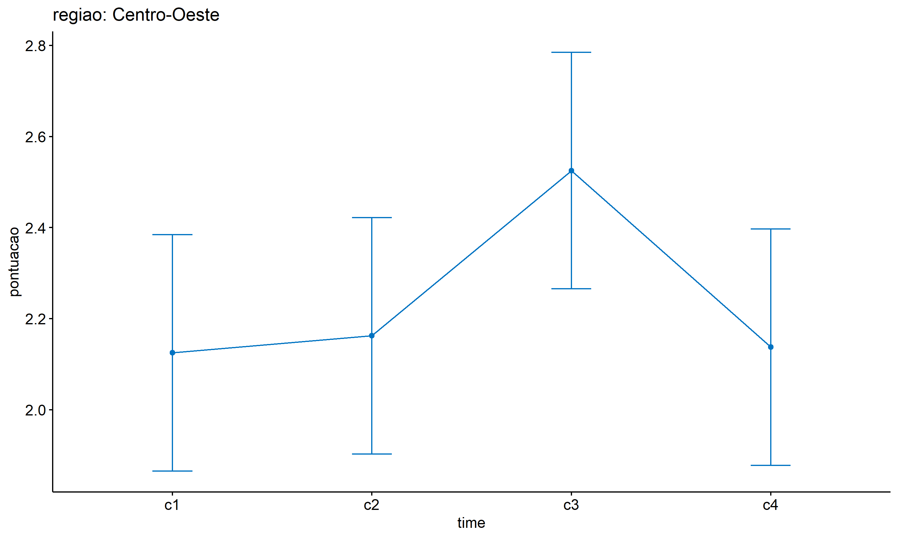<!-- -->

``` r
if (length(non.ids) > 0) {
  emms.gg <- emms2[which(emms2$regiao == "Nordeste"),]
  if (nrow(emms.gg) > 0)
    ggline(emms.gg, x = "time", y = "emmean", color = "#EFC000FF", ylab = "pontuacao") +
    geom_errorbar(aes(ymin = conf.low, ymax = conf.high),
                  width = 0.2, color = "#EFC000FF") +
    stat_pvalue_manual(
      add_xy_position(pwc[which(pwc$regiao == "Nordeste"),],
                      x = "time", fun = "mean_se"),
      hide.ns = T, color = "#EFC000FF", tip.length = F) +
    labs(title = "regiao: Nordeste") +
    theme(legend.text = element_blank())
}
```

<!-- -->

``` r
if (length(non.ids) > 0) {
  emms.gg <- emms2[which(emms2$regiao == "Norte"),]
  if (nrow(emms.gg) > 0)
    ggline(emms.gg, x = "time", y = "emmean", color = "#868686FF", ylab = "pontuacao") +
    geom_errorbar(aes(ymin = conf.low, ymax = conf.high),
                  width = 0.2, color = "#868686FF") +
    stat_pvalue_manual(
      add_xy_position(pwc[which(pwc$regiao == "Norte"),],
                      x = "time", fun = "mean_se"),
      hide.ns = T, color = "#868686FF", tip.length = F) +
    labs(title = "regiao: Norte") +
    theme(legend.text = element_blank())
}
```

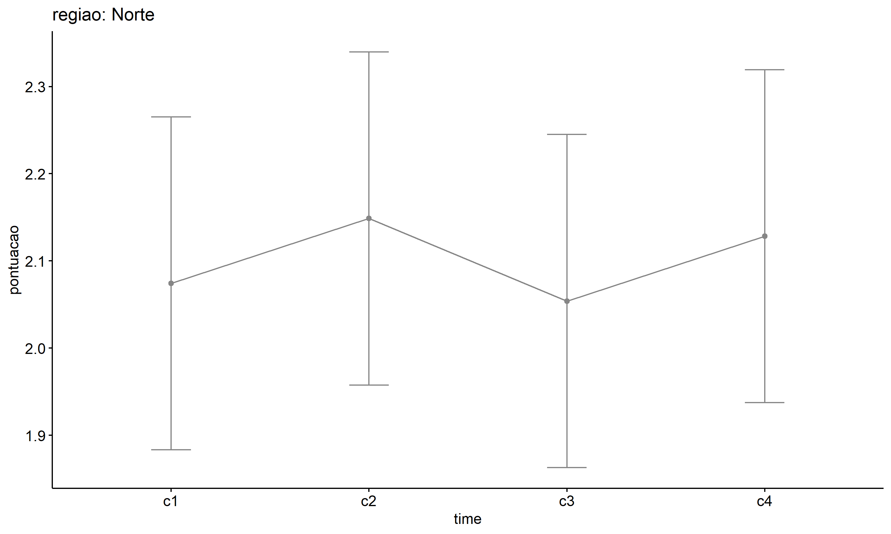<!-- -->

``` r
if (length(non.ids) > 0) {
  emms.gg <- emms2[which(emms2$regiao == "Sudeste"),]
  if (nrow(emms.gg) > 0)
    ggline(emms.gg, x = "time", y = "emmean", color = "#CD534CFF", ylab = "pontuacao") +
    geom_errorbar(aes(ymin = conf.low, ymax = conf.high),
                  width = 0.2, color = "#CD534CFF") +
    stat_pvalue_manual(
      add_xy_position(pwc[which(pwc$regiao == "Sudeste"),],
                      x = "time", fun = "mean_se"),
      hide.ns = T, color = "#CD534CFF", tip.length = F) +
    labs(title = "regiao: Sudeste") +
    theme(legend.text = element_blank())
}
```

<!-- -->

``` r
if (length(non.ids) > 0) {
  emms.gg <- emms2[which(emms2$regiao == "Sul"),]
  if (nrow(emms.gg) > 0)
    ggline(emms.gg, x = "time", y = "emmean", color = "#7AA6DCFF", ylab = "pontuacao") +
    geom_errorbar(aes(ymin = conf.low, ymax = conf.high),
                  width = 0.2, color = "#7AA6DCFF") +
    stat_pvalue_manual(
      add_xy_position(pwc[which(pwc$regiao == "Sul"),],
                      x = "time", fun = "mean_se"),
      hide.ns = T, color = "#7AA6DCFF", tip.length = F) +
    labs(title = "regiao: Sul") +
    theme(legend.text = element_blank())
}
```

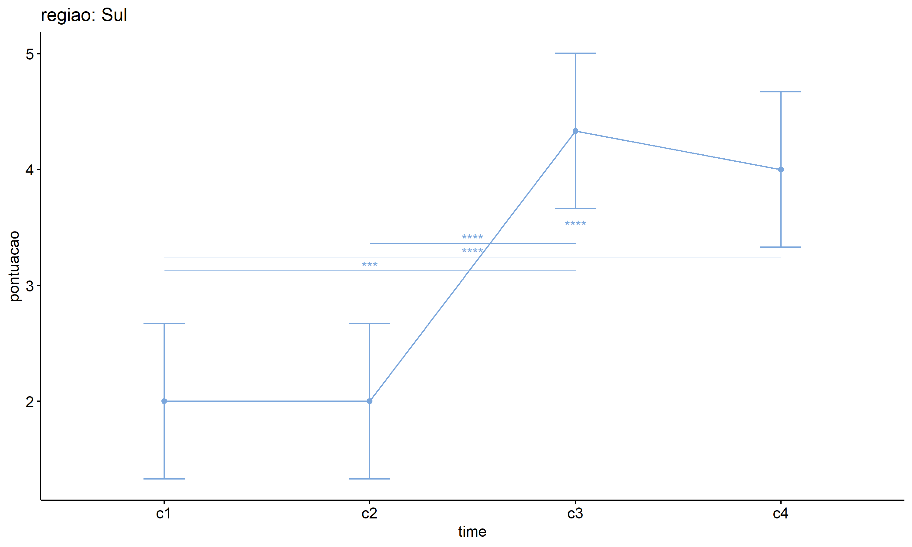<!-- -->

# ANOVA: pontuacao ~ time\*porte + Error(id/time)

## Data Preparation

``` r
data <- edat[,c("aluno_id","porte","ciclo","pontuacao")]
data$ciclo <- factor(data$ciclo, c("Primeiro Ciclo","Segundo Ciclo",
                                   "Terceiro Ciclo","Quarto Ciclo"))

wdat <- spread(data, ciclo, pontuacao)
wdat <- wdat[complete.cases(wdat),]
colnames(wdat) <- c("id","porte","c1","c2","c3","c4")

ldat <- gather(wdat, key = time, value = pontuacao, c1, c2, c3, c4) %>%
  convert_as_factor(id, time)
ldat <- remove_group_data(ldat, "pontuacao", c("time", "porte"), n.limit = 30)
ldat$porte <- factor(ldat$porte, sort(unique(ldat$porte)))
```

### Check assumptions: Identifying Outliers

``` r
outliers <- identify_outliers(group_by(ldat, time, porte), pontuacao)
(outliers <- outliers[outliers$is.extreme == T,])
```

    ## # A tibble: 555 × 6
    ##    porte                                       time  id           pontuacao is.outlier is.extreme
    ##    <fct>                                       <fct> <fct>            <dbl> <lgl>      <lgl>     
    ##  1 Até 50 matrículas de escolarização          c1    0w3VhiMf67C…       5   TRUE       TRUE      
    ##  2 Até 50 matrículas de escolarização          c1    iutpBZMAtM9…       3.5 TRUE       TRUE      
    ##  3 Até 50 matrículas de escolarização          c1    xAo0TzCEx1b…       3.5 TRUE       TRUE      
    ##  4 Entre 201 e 500 matrículas de escolarização c1    0wDHSyctDDk…       5   TRUE       TRUE      
    ##  5 Entre 201 e 500 matrículas de escolarização c1    46nUNvt4sDO…       4.5 TRUE       TRUE      
    ##  6 Entre 201 e 500 matrículas de escolarização c1    4hmXg2uo4wx…       3.5 TRUE       TRUE      
    ##  7 Entre 201 e 500 matrículas de escolarização c1    55GlwifTTyi…       5   TRUE       TRUE      
    ##  8 Entre 201 e 500 matrículas de escolarização c1    5AeP0IQ84Ce…       3   TRUE       TRUE      
    ##  9 Entre 201 e 500 matrículas de escolarização c1    6IoOZmGw52L…       3   TRUE       TRUE      
    ## 10 Entre 201 e 500 matrículas de escolarização c1    6Xlhq905iNT…       5   TRUE       TRUE      
    ## # ℹ 545 more rows

| porte                                        | time | id                   | pontuacao | is.outlier | is.extreme |
|:---------------------------------------------|:-----|:---------------------|----------:|:-----------|:-----------|
| Até 50 matrículas de escolarização           | c1   | 0w3VhiMf67CbcpR6aZCL |     5.000 | TRUE       | TRUE       |
| Até 50 matrículas de escolarização           | c1   | iutpBZMAtM92qcbyCDHB |     3.500 | TRUE       | TRUE       |
| Até 50 matrículas de escolarização           | c1   | xAo0TzCEx1bIrmjqKgbj |     3.500 | TRUE       | TRUE       |
| Entre 201 e 500 matrículas de escolarização  | c1   | 0wDHSyctDDkjP6OPE3c8 |     5.000 | TRUE       | TRUE       |
| Entre 201 e 500 matrículas de escolarização  | c1   | 46nUNvt4sDOPsC9jnkiG |     4.500 | TRUE       | TRUE       |
| Entre 201 e 500 matrículas de escolarização  | c1   | 4hmXg2uo4wxSAX9SaxpN |     3.500 | TRUE       | TRUE       |
| Entre 201 e 500 matrículas de escolarização  | c1   | 55GlwifTTyiOSKTB9vc9 |     5.000 | TRUE       | TRUE       |
| Entre 201 e 500 matrículas de escolarização  | c1   | 5AeP0IQ84CerIQVenp2G |     3.000 | TRUE       | TRUE       |
| Entre 201 e 500 matrículas de escolarização  | c1   | 6IoOZmGw52LYlznSYXzK |     3.000 | TRUE       | TRUE       |
| Entre 201 e 500 matrículas de escolarização  | c1   | 6Xlhq905iNT5kvJFoSW5 |     5.000 | TRUE       | TRUE       |
| Entre 201 e 500 matrículas de escolarização  | c1   | 7AaMrLZQiyhSoBaer5VH |     3.500 | TRUE       | TRUE       |
| Entre 201 e 500 matrículas de escolarização  | c1   | 7nfO1ouMUuN7IzvlCKr0 |     3.500 | TRUE       | TRUE       |
| Entre 201 e 500 matrículas de escolarização  | c1   | A5EETpEr617bpnSh1wp6 |     3.500 | TRUE       | TRUE       |
| Entre 201 e 500 matrículas de escolarização  | c1   | AIzwxJCfbDsO8ZT4ZZ4h |     3.000 | TRUE       | TRUE       |
| Entre 201 e 500 matrículas de escolarização  | c1   | b9PlhVhdvhl9EPK9QVCv |     5.000 | TRUE       | TRUE       |
| Entre 201 e 500 matrículas de escolarização  | c1   | cuknOzzwN4oCRum5U5ph |     3.500 | TRUE       | TRUE       |
| Entre 201 e 500 matrículas de escolarização  | c1   | cy0oZFPyT8aGHBq7CR9A |     3.500 | TRUE       | TRUE       |
| Entre 201 e 500 matrículas de escolarização  | c1   | DFTbWP0xF5gxFgxEN0dL |     3.000 | TRUE       | TRUE       |
| Entre 201 e 500 matrículas de escolarização  | c1   | E8XEhNJhfANZZtqHam0A |     3.000 | TRUE       | TRUE       |
| Entre 201 e 500 matrículas de escolarização  | c1   | F5Ux4BYYqSnMt1Om6Trf |     3.500 | TRUE       | TRUE       |
| Entre 201 e 500 matrículas de escolarização  | c1   | G2SUhDEavPTLyA8yz9AL |     3.500 | TRUE       | TRUE       |
| Entre 201 e 500 matrículas de escolarização  | c1   | G4NIt8gEc7nfeQ9k2OkL |     3.500 | TRUE       | TRUE       |
| Entre 201 e 500 matrículas de escolarização  | c1   | I1x9Y5cYi4OfnwWUeTXz |     4.000 | TRUE       | TRUE       |
| Entre 201 e 500 matrículas de escolarização  | c1   | I5SKdDmPvNCpOHCfh7Is |     4.000 | TRUE       | TRUE       |
| Entre 201 e 500 matrículas de escolarização  | c1   | i6M2WLEfaiylCRyZ9XnE |     3.500 | TRUE       | TRUE       |
| Entre 201 e 500 matrículas de escolarização  | c1   | JdRySX8i3hE3pxcYyUcf |     3.000 | TRUE       | TRUE       |
| Entre 201 e 500 matrículas de escolarização  | c1   | jVbbowshsqkUpPuGSIMu |     4.000 | TRUE       | TRUE       |
| Entre 201 e 500 matrículas de escolarização  | c1   | KPMkDhksSiEWVEIUT1LG |     3.500 | TRUE       | TRUE       |
| Entre 201 e 500 matrículas de escolarização  | c1   | lt4Za0V8VmneMBIicN4R |     3.000 | TRUE       | TRUE       |
| Entre 201 e 500 matrículas de escolarização  | c1   | m5yRlxfIj73j4ossfTOB |     5.000 | TRUE       | TRUE       |
| Entre 201 e 500 matrículas de escolarização  | c1   | N3zF1kdLVvTXfbcXiMqe |     3.500 | TRUE       | TRUE       |
| Entre 201 e 500 matrículas de escolarização  | c1   | nnPTfCmTsFmqbk9q3PJG |     3.500 | TRUE       | TRUE       |
| Entre 201 e 500 matrículas de escolarização  | c1   | oafpBD8HTXvsKOiHN7p8 |     3.500 | TRUE       | TRUE       |
| Entre 201 e 500 matrículas de escolarização  | c1   | pca9LmykrugFnjsHp7MR |     5.000 | TRUE       | TRUE       |
| Entre 201 e 500 matrículas de escolarização  | c1   | QasU7a9JiIu1XHAPVJk9 |     3.000 | TRUE       | TRUE       |
| Entre 201 e 500 matrículas de escolarização  | c1   | R7yCqYgzTa9KdpJQ4uXb |     5.000 | TRUE       | TRUE       |
| Entre 201 e 500 matrículas de escolarização  | c1   | RlqnAYUyOdC7g4eDY9UO |     5.000 | TRUE       | TRUE       |
| Entre 201 e 500 matrículas de escolarização  | c1   | Rq2OTnqvauiedrQ0PVcm |     3.500 | TRUE       | TRUE       |
| Entre 201 e 500 matrículas de escolarização  | c1   | Ru3SPRo97iXBvXbvneKh |     5.000 | TRUE       | TRUE       |
| Entre 201 e 500 matrículas de escolarização  | c1   | TABveJnXO5hRaweFnAMh |     5.000 | TRUE       | TRUE       |
| Entre 201 e 500 matrículas de escolarização  | c1   | uCBI6gnllsawWJlgqkr5 |     5.000 | TRUE       | TRUE       |
| Entre 201 e 500 matrículas de escolarização  | c1   | vc8pPoYau2AIAuCQJipW |     5.000 | TRUE       | TRUE       |
| Entre 201 e 500 matrículas de escolarização  | c1   | wJgBRtIUF5VG22EJXZKz |     4.000 | TRUE       | TRUE       |
| Entre 201 e 500 matrículas de escolarização  | c1   | XeSX4FsDK2KmCwATUvcu |     3.500 | TRUE       | TRUE       |
| Entre 201 e 500 matrículas de escolarização  | c1   | xgWi8MM2PHEEfdjn61b7 |     5.000 | TRUE       | TRUE       |
| Entre 201 e 500 matrículas de escolarização  | c1   | xmtNEz12lXmE9RzmND2z |     3.500 | TRUE       | TRUE       |
| Entre 201 e 500 matrículas de escolarização  | c1   | Y7HozU436KQ0wqdBGugu |     3.500 | TRUE       | TRUE       |
| Entre 201 e 500 matrículas de escolarização  | c1   | YTYFFWzK4C7ejf1X1TUB |     5.000 | TRUE       | TRUE       |
| Entre 201 e 500 matrículas de escolarização  | c1   | YZl0xc1Gu4ixxN2rOCtH |     5.000 | TRUE       | TRUE       |
| Entre 201 e 500 matrículas de escolarização  | c1   | ZdpC4Xaxucxlaqa0o7wm |     5.000 | TRUE       | TRUE       |
| Entre 201 e 500 matrículas de escolarização  | c1   | zu9ITSnIAecxMpJmNxCE |     5.000 | TRUE       | TRUE       |
| Entre 501 e 1000 matrículas de escolarização | c1   | 1PlxEF4tmJySD3G46PLB |     3.500 | TRUE       | TRUE       |
| Entre 501 e 1000 matrículas de escolarização | c1   | A8Rx15QryUqDDm8ooiZr |     3.000 | TRUE       | TRUE       |
| Entre 501 e 1000 matrículas de escolarização | c1   | cJoqgrk6T3HsA9EOVe7D |     5.000 | TRUE       | TRUE       |
| Entre 501 e 1000 matrículas de escolarização | c1   | D1HfJKTVqjrpCJx97l3v |     5.000 | TRUE       | TRUE       |
| Entre 501 e 1000 matrículas de escolarização | c1   | dSM9U89FZYdICjBucW8v |     3.000 | TRUE       | TRUE       |
| Entre 501 e 1000 matrículas de escolarização | c1   | erFWuFkPr2piNKvHuKrD |     3.500 | TRUE       | TRUE       |
| Entre 501 e 1000 matrículas de escolarização | c1   | g0SSATlv7RDhoBk6jsCz |     3.500 | TRUE       | TRUE       |
| Entre 501 e 1000 matrículas de escolarização | c1   | G5WjH8t1I6LAiAOCuM2v |     3.500 | TRUE       | TRUE       |
| Entre 501 e 1000 matrículas de escolarização | c1   | iXqE1bAFPsYn56jTzZQS |     5.000 | TRUE       | TRUE       |
| Entre 501 e 1000 matrículas de escolarização | c1   | ixToGS5nyKWTy1PjTzZW |     3.000 | TRUE       | TRUE       |
| Entre 501 e 1000 matrículas de escolarização | c1   | Jgsj4or0goDAXdQU3UwR |     3.000 | TRUE       | TRUE       |
| Entre 501 e 1000 matrículas de escolarização | c1   | NW7xi0uw2xX7J2ch6WFX |     5.000 | TRUE       | TRUE       |
| Entre 501 e 1000 matrículas de escolarização | c1   | PMsVKgnivLJr3CQYAKsP |     3.500 | TRUE       | TRUE       |
| Entre 501 e 1000 matrículas de escolarização | c1   | sM3c4noBIP8hnYWA6pAe |     4.000 | TRUE       | TRUE       |
| Entre 501 e 1000 matrículas de escolarização | c1   | Swge4GG9Qmg1w9YaAeDP |     3.500 | TRUE       | TRUE       |
| Entre 501 e 1000 matrículas de escolarização | c1   | TKvc4Eu2XaDXYPxuS7Qn |     3.000 | TRUE       | TRUE       |
| Entre 501 e 1000 matrículas de escolarização | c1   | UTcQeAJVgrgjSdUJBAKT |     3.000 | TRUE       | TRUE       |
| Entre 501 e 1000 matrículas de escolarização | c1   | xUKKiLMXz1z5e7g1kX4m |     5.000 | TRUE       | TRUE       |
| Entre 51 e 200 matrículas de escolarização   | c1   | 1Z1Qz8zDaMkaAz1Ah80K |     5.000 | TRUE       | TRUE       |
| Entre 51 e 200 matrículas de escolarização   | c1   | 6oE4k979jigSP7Zbs2m1 |     3.500 | TRUE       | TRUE       |
| Entre 51 e 200 matrículas de escolarização   | c1   | cao1agmzaedA3s0PVAPS |     5.000 | TRUE       | TRUE       |
| Entre 51 e 200 matrículas de escolarização   | c1   | dieaAtUumyYxX7zGb7Sb |     4.000 | TRUE       | TRUE       |
| Entre 51 e 200 matrículas de escolarização   | c1   | DKEsQosaERswlkB803hB |     3.500 | TRUE       | TRUE       |
| Entre 51 e 200 matrículas de escolarização   | c1   | H8te97gR9TCOM0CiCXj1 |     3.500 | TRUE       | TRUE       |
| Entre 51 e 200 matrículas de escolarização   | c1   | KWsflPBHSK0g0ZYy9I1L |     5.000 | TRUE       | TRUE       |
| Entre 51 e 200 matrículas de escolarização   | c1   | MTyNplLkcaNxd9NT392Q |     3.500 | TRUE       | TRUE       |
| Entre 51 e 200 matrículas de escolarização   | c1   | PKoPTKC1RrGaREkbINPf |     3.500 | TRUE       | TRUE       |
| Entre 51 e 200 matrículas de escolarização   | c1   | qbpdhqIdqf7n3lmU2n4I |     3.500 | TRUE       | TRUE       |
| Entre 51 e 200 matrículas de escolarização   | c1   | rijPm1LRjDwEh0XEZEeR |     4.000 | TRUE       | TRUE       |
| Entre 51 e 200 matrículas de escolarização   | c1   | snoeXZt7a8Ds16UvPGhk |     5.000 | TRUE       | TRUE       |
| Entre 51 e 200 matrículas de escolarização   | c1   | sRR37KpbkBZSh9H2UpSB |     4.000 | TRUE       | TRUE       |
| Entre 51 e 200 matrículas de escolarização   | c1   | UKLVcE0VqppSSC8hDubG |     5.000 | TRUE       | TRUE       |
| Entre 51 e 200 matrículas de escolarização   | c1   | xZ5yKSWaJFp2osYZSjqL |     5.000 | TRUE       | TRUE       |
| Entre 51 e 200 matrículas de escolarização   | c1   | YxfFrbwSijoyTMWGIYqQ |     5.000 | TRUE       | TRUE       |
| Até 50 matrículas de escolarização           | c2   | 0w3VhiMf67CbcpR6aZCL |     5.000 | TRUE       | TRUE       |
| Até 50 matrículas de escolarização           | c2   | 1ZE6i0Is22PBIAZbrM0J |     5.000 | TRUE       | TRUE       |
| Até 50 matrículas de escolarização           | c2   | i84ihNmDZFogrHoxo3Im |     3.000 | TRUE       | TRUE       |
| Até 50 matrículas de escolarização           | c2   | jljcKPNPjBo1MdiK1ffQ |     3.500 | TRUE       | TRUE       |
| Entre 201 e 500 matrículas de escolarização  | c2   | 0JP4C8o7n2HYsnPDx4qx |     3.500 | TRUE       | TRUE       |
| Entre 201 e 500 matrículas de escolarização  | c2   | 1g6aBXXFdmJWTIwXaf4A |     5.000 | TRUE       | TRUE       |
| Entre 201 e 500 matrículas de escolarização  | c2   | 1l2CPmeR5hbmhcJoY5Gs |     4.000 | TRUE       | TRUE       |
| Entre 201 e 500 matrículas de escolarização  | c2   | 1rGKIQ7fdZBOxxGdPFrp |     3.500 | TRUE       | TRUE       |
| Entre 201 e 500 matrículas de escolarização  | c2   | 2gOTOJWpjODv0nBxtJgU |     5.000 | TRUE       | TRUE       |
| Entre 201 e 500 matrículas de escolarização  | c2   | 2Mvl0siGmos3P6uCJoI6 |     4.000 | TRUE       | TRUE       |
| Entre 201 e 500 matrículas de escolarização  | c2   | 3ETydorel7bIDQKYclir |     2.750 | TRUE       | TRUE       |
| Entre 201 e 500 matrículas de escolarização  | c2   | 4AM4nonwJ45LiMy6b4lp |     5.000 | TRUE       | TRUE       |
| Entre 201 e 500 matrículas de escolarização  | c2   | 4gepVdqUGSJq9eKKqU4U |     4.000 | TRUE       | TRUE       |
| Entre 201 e 500 matrículas de escolarização  | c2   | 4hmXg2uo4wxSAX9SaxpN |     3.000 | TRUE       | TRUE       |
| Entre 201 e 500 matrículas de escolarização  | c2   | 5l1OLNAprJvzHRinnoF0 |     3.500 | TRUE       | TRUE       |
| Entre 201 e 500 matrículas de escolarização  | c2   | 6Xlhq905iNT5kvJFoSW5 |     5.000 | TRUE       | TRUE       |
| Entre 201 e 500 matrículas de escolarização  | c2   | 8GRRowomccTgY63JK0hV |     3.000 | TRUE       | TRUE       |
| Entre 201 e 500 matrículas de escolarização  | c2   | 8jXS39U6Aje4RlDntJHg |     3.500 | TRUE       | TRUE       |
| Entre 201 e 500 matrículas de escolarização  | c2   | 8p6QYQYkfhR3QOACXZvj |     3.000 | TRUE       | TRUE       |
| Entre 201 e 500 matrículas de escolarização  | c2   | 8PyXW7ejCnDsMsEjrlsy |     3.000 | TRUE       | TRUE       |
| Entre 201 e 500 matrículas de escolarização  | c2   | ao9Hy7cVw5W6MXhO5Ylm |     3.500 | TRUE       | TRUE       |
| Entre 201 e 500 matrículas de escolarização  | c2   | atydp19vM0PjiOQCWemR |     3.000 | TRUE       | TRUE       |
| Entre 201 e 500 matrículas de escolarização  | c2   | AUp01jGBKvRyiH5yAcYg |     3.500 | TRUE       | TRUE       |
| Entre 201 e 500 matrículas de escolarização  | c2   | bxxcpVcdJ03akf9XTPVs |     5.000 | TRUE       | TRUE       |
| Entre 201 e 500 matrículas de escolarização  | c2   | cuknOzzwN4oCRum5U5ph |     5.000 | TRUE       | TRUE       |
| Entre 201 e 500 matrículas de escolarização  | c2   | d1JgyezU4pt7F4SebGoe |     4.000 | TRUE       | TRUE       |
| Entre 201 e 500 matrículas de escolarização  | c2   | d78FW2LeEQ1zVALsO8FL |     3.333 | TRUE       | TRUE       |
| Entre 201 e 500 matrículas de escolarização  | c2   | DmzTbIYJpxJm9o8FEyCL |     2.500 | TRUE       | TRUE       |
| Entre 201 e 500 matrículas de escolarização  | c2   | e1nlLe6lCBYUzF23dTrW |     4.000 | TRUE       | TRUE       |
| Entre 201 e 500 matrículas de escolarização  | c2   | EcAgL4tVyGSoqslrQjcI |     3.500 | TRUE       | TRUE       |
| Entre 201 e 500 matrículas de escolarização  | c2   | efGqYqTmvxysOA8bmE9u |     4.000 | TRUE       | TRUE       |
| Entre 201 e 500 matrículas de escolarização  | c2   | eKNF6EdIBYr2bZIgYfpt |     5.000 | TRUE       | TRUE       |
| Entre 201 e 500 matrículas de escolarização  | c2   | EXP9vzjLIJFDlyiQt1hn |     3.000 | TRUE       | TRUE       |
| Entre 201 e 500 matrículas de escolarização  | c2   | F5Ux4BYYqSnMt1Om6Trf |     5.000 | TRUE       | TRUE       |
| Entre 201 e 500 matrículas de escolarização  | c2   | ffnFAMZehkOjgmmGyq3E |     5.000 | TRUE       | TRUE       |
| Entre 201 e 500 matrículas de escolarização  | c2   | G6w5RiWtWQbT4xtExf7d |     5.000 | TRUE       | TRUE       |
| Entre 201 e 500 matrículas de escolarização  | c2   | GAEVtgOgvNASXuwIPENX |     3.000 | TRUE       | TRUE       |
| Entre 201 e 500 matrículas de escolarização  | c2   | gBmp7DCcMF8YynwrJWmq |     5.000 | TRUE       | TRUE       |
| Entre 201 e 500 matrículas de escolarização  | c2   | ggH0twWM1TpDTguT2sSU |     3.500 | TRUE       | TRUE       |
| Entre 201 e 500 matrículas de escolarização  | c2   | GLiaONiGLGsIMU5p88Cl |     3.667 | TRUE       | TRUE       |
| Entre 201 e 500 matrículas de escolarização  | c2   | gRiK9OMij8RxayU0KCFv |     3.000 | TRUE       | TRUE       |
| Entre 201 e 500 matrículas de escolarização  | c2   | gzBUwnjjYHnioTnd4stC |     3.000 | TRUE       | TRUE       |
| Entre 201 e 500 matrículas de escolarização  | c2   | hcMHfjgGtVOBlWeqw37Q |     5.000 | TRUE       | TRUE       |
| Entre 201 e 500 matrículas de escolarização  | c2   | HqTgiqhYnEvVciVol3PS |     5.000 | TRUE       | TRUE       |
| Entre 201 e 500 matrículas de escolarização  | c2   | HsQF2J0r79mHSWNe4l6n |     5.000 | TRUE       | TRUE       |
| Entre 201 e 500 matrículas de escolarização  | c2   | I1x9Y5cYi4OfnwWUeTXz |     4.000 | TRUE       | TRUE       |
| Entre 201 e 500 matrículas de escolarização  | c2   | i6M2WLEfaiylCRyZ9XnE |     5.000 | TRUE       | TRUE       |
| Entre 201 e 500 matrículas de escolarização  | c2   | I6ZCrdQMaOdo9ltkC1r2 |     5.000 | TRUE       | TRUE       |
| Entre 201 e 500 matrículas de escolarização  | c2   | ITZKcm29e0hwUQiiDtaF |     5.000 | TRUE       | TRUE       |
| Entre 201 e 500 matrículas de escolarização  | c2   | IXZlZBy7uRBHUFPQg8hX |     5.000 | TRUE       | TRUE       |
| Entre 201 e 500 matrículas de escolarização  | c2   | j31LU8Xwm0EQ7Mihkhjj |     5.000 | TRUE       | TRUE       |
| Entre 201 e 500 matrículas de escolarização  | c2   | jVbbowshsqkUpPuGSIMu |     4.000 | TRUE       | TRUE       |
| Entre 201 e 500 matrículas de escolarização  | c2   | k1Byic1gWlgNIFT8qDpn |     5.000 | TRUE       | TRUE       |
| Entre 201 e 500 matrículas de escolarização  | c2   | k2S15ANRrwJKgCuiwaKC |     3.000 | TRUE       | TRUE       |
| Entre 201 e 500 matrículas de escolarização  | c2   | K3la9byFQsBzKaukPsOq |     3.500 | TRUE       | TRUE       |
| Entre 201 e 500 matrículas de escolarização  | c2   | K3oo1Kn5UlJH6lIGaZTL |     5.000 | TRUE       | TRUE       |
| Entre 201 e 500 matrículas de escolarização  | c2   | KxltaXnk31onNRVrLE5Y |     3.500 | TRUE       | TRUE       |
| Entre 201 e 500 matrículas de escolarização  | c2   | LC67V5LShu6RMdyHjAJx |     3.500 | TRUE       | TRUE       |
| Entre 201 e 500 matrículas de escolarização  | c2   | LJrBpSpYOJUxZWUehnpX |     3.500 | TRUE       | TRUE       |
| Entre 201 e 500 matrículas de escolarização  | c2   | LMrt1klH9kXyo7kH4gB8 |     3.000 | TRUE       | TRUE       |
| Entre 201 e 500 matrículas de escolarização  | c2   | MO5oCAGyztcuEpHPXGxD |     3.500 | TRUE       | TRUE       |
| Entre 201 e 500 matrículas de escolarização  | c2   | mp70aTuAiwYmhEHntRfm |     3.500 | TRUE       | TRUE       |
| Entre 201 e 500 matrículas de escolarização  | c2   | mTxfHO37mmdyGuVi0AcC |     4.000 | TRUE       | TRUE       |
| Entre 201 e 500 matrículas de escolarização  | c2   | Mv8Pv2YBEg4SX5h40YAU |     5.000 | TRUE       | TRUE       |
| Entre 201 e 500 matrículas de escolarização  | c2   | MxgQUA6KrQnZN4Fm7oCW |     3.500 | TRUE       | TRUE       |
| Entre 201 e 500 matrículas de escolarização  | c2   | nI311xKanqD5k4XdM5QB |     4.000 | TRUE       | TRUE       |
| Entre 201 e 500 matrículas de escolarização  | c2   | NJuhIhcV6SgR0FBfCWdk |     3.000 | TRUE       | TRUE       |
| Entre 201 e 500 matrículas de escolarização  | c2   | Nm6WeD34RnKIBjlDrkaO |     5.000 | TRUE       | TRUE       |
| Entre 201 e 500 matrículas de escolarização  | c2   | nZK9NUDQSwfWTTfSeqPH |     5.000 | TRUE       | TRUE       |
| Entre 201 e 500 matrículas de escolarização  | c2   | oafpBD8HTXvsKOiHN7p8 |     5.000 | TRUE       | TRUE       |
| Entre 201 e 500 matrículas de escolarização  | c2   | oGUJyWRMYYbF9PNegJZh |     5.000 | TRUE       | TRUE       |
| Entre 201 e 500 matrículas de escolarização  | c2   | OiJwZNTmMiomnpFEIgBN |     3.000 | TRUE       | TRUE       |
| Entre 201 e 500 matrículas de escolarização  | c2   | OTNUMYnL8AF930i7Db8H |     3.500 | TRUE       | TRUE       |
| Entre 201 e 500 matrículas de escolarização  | c2   | pOZO9oAcxPz33Ypnsv2X |     2.500 | TRUE       | TRUE       |
| Entre 201 e 500 matrículas de escolarização  | c2   | pX3oKxaMTnCJ8g1GtRWG |     2.750 | TRUE       | TRUE       |
| Entre 201 e 500 matrículas de escolarização  | c2   | Q3CCnrZoSPx08SF7zj3N |     3.500 | TRUE       | TRUE       |
| Entre 201 e 500 matrículas de escolarização  | c2   | QWZGR164QoEvdqudnbNc |     3.667 | TRUE       | TRUE       |
| Entre 201 e 500 matrículas de escolarização  | c2   | qXTbctZqWWGjKtZpvSzg |     3.500 | TRUE       | TRUE       |
| Entre 201 e 500 matrículas de escolarização  | c2   | RCY3F2HtV0DPrs21Q5KB |     3.000 | TRUE       | TRUE       |
| Entre 201 e 500 matrículas de escolarização  | c2   | rknK8GEk9H27CI9GSt4V |     2.667 | TRUE       | TRUE       |
| Entre 201 e 500 matrículas de escolarização  | c2   | SFojZKDHvdJbhHKzsN2I |     4.000 | TRUE       | TRUE       |
| Entre 201 e 500 matrículas de escolarização  | c2   | sSEiBqKCIt9z1Qg8SihU |     5.000 | TRUE       | TRUE       |
| Entre 201 e 500 matrículas de escolarização  | c2   | sXB3m8f7P40lRXYwY22p |     3.000 | TRUE       | TRUE       |
| Entre 201 e 500 matrículas de escolarização  | c2   | tfmKp0SXpwvJkZn03aN4 |     4.000 | TRUE       | TRUE       |
| Entre 201 e 500 matrículas de escolarização  | c2   | u5hJDswFRptq4y76Kutb |     3.500 | TRUE       | TRUE       |
| Entre 201 e 500 matrículas de escolarização  | c2   | UaBRzohcAqFW1qjmBSvw |     3.000 | TRUE       | TRUE       |
| Entre 201 e 500 matrículas de escolarização  | c2   | uO9nfkLEYn0z361QEH7Q |     5.000 | TRUE       | TRUE       |
| Entre 201 e 500 matrículas de escolarização  | c2   | uqX7aPoHn8tMaKAp9y3I |     3.000 | TRUE       | TRUE       |
| Entre 201 e 500 matrículas de escolarização  | c2   | uXrGgSVZ1ZKfQuJ3neSu |     3.500 | TRUE       | TRUE       |
| Entre 201 e 500 matrículas de escolarização  | c2   | v4NaY6TWYcpu9RoVkXwS |     5.000 | TRUE       | TRUE       |
| Entre 201 e 500 matrículas de escolarização  | c2   | v5KF7y11Ncyud2q4dKmD |     3.000 | TRUE       | TRUE       |
| Entre 201 e 500 matrículas de escolarização  | c2   | vF1wv9aDV5UGHKuqCkC3 |     3.500 | TRUE       | TRUE       |
| Entre 201 e 500 matrículas de escolarização  | c2   | vSolOA78V6l7oYJ1h4LA |     3.500 | TRUE       | TRUE       |
| Entre 201 e 500 matrículas de escolarização  | c2   | W8iXxSmW48zvfJyikMZb |     5.000 | TRUE       | TRUE       |
| Entre 201 e 500 matrículas de escolarização  | c2   | wAdhjRHCCyiW6GtcGaQE |     5.000 | TRUE       | TRUE       |
| Entre 201 e 500 matrículas de escolarização  | c2   | wSjwY5eBTqgIzBqdtazC |     5.000 | TRUE       | TRUE       |
| Entre 201 e 500 matrículas de escolarização  | c2   | WSRSxbb9igUPQVN86BSH |     5.000 | TRUE       | TRUE       |
| Entre 201 e 500 matrículas de escolarização  | c2   | wxyQb8UYLyuIeyTuqWHK |     4.000 | TRUE       | TRUE       |
| Entre 201 e 500 matrículas de escolarização  | c2   | Xfs4ydu0jiJkaDwInzXx |     5.000 | TRUE       | TRUE       |
| Entre 201 e 500 matrículas de escolarização  | c2   | xgjVK7rnOUUArvnA4ZiQ |     5.000 | TRUE       | TRUE       |
| Entre 201 e 500 matrículas de escolarização  | c2   | xk7eC5haTYuFQaJovsBZ |     5.000 | TRUE       | TRUE       |
| Entre 201 e 500 matrículas de escolarização  | c2   | XzMIZjd0GDHSpif5ypWf |     3.500 | TRUE       | TRUE       |
| Entre 201 e 500 matrículas de escolarização  | c2   | ygdicz3svMOl4mNIiwtJ |     2.500 | TRUE       | TRUE       |
| Entre 201 e 500 matrículas de escolarização  | c2   | ygFJxqySABX8ax57ihIq |     3.500 | TRUE       | TRUE       |
| Entre 201 e 500 matrículas de escolarização  | c2   | z3p6Ot4uvkPmGXOS9D3e |     5.000 | TRUE       | TRUE       |
| Entre 201 e 500 matrículas de escolarização  | c2   | ZDsN200AOSuZkmxgcc8n |     4.000 | TRUE       | TRUE       |
| Entre 201 e 500 matrículas de escolarização  | c2   | ZFjyLFTCim7WZrtYy2tK |     2.750 | TRUE       | TRUE       |
| Entre 201 e 500 matrículas de escolarização  | c2   | zPWlocgrVt4Mfvr0UwaQ |     3.000 | TRUE       | TRUE       |
| Entre 201 e 500 matrículas de escolarização  | c2   | zqSde1r6leyecbET0INz |     5.000 | TRUE       | TRUE       |
| Entre 501 e 1000 matrículas de escolarização | c2   | 1gvgnHo5onRSLXTnds8W |     3.500 | TRUE       | TRUE       |
| Entre 501 e 1000 matrículas de escolarização | c2   | 2eFfyVVi6PFZAieFgek6 |     5.000 | TRUE       | TRUE       |
| Entre 501 e 1000 matrículas de escolarização | c2   | 2wBgWJVF1mK6rnsBiZ99 |     5.000 | TRUE       | TRUE       |
| Entre 501 e 1000 matrículas de escolarização | c2   | 3WvSQRVfYSeH8PCOQB0n |     3.500 | TRUE       | TRUE       |
| Entre 501 e 1000 matrículas de escolarização | c2   | 6bEKmKQpOuvY6PSQvzqj |     4.000 | TRUE       | TRUE       |
| Entre 501 e 1000 matrículas de escolarização | c2   | 8x1O4EwGS3PLQhs7ljBM |     5.000 | TRUE       | TRUE       |
| Entre 501 e 1000 matrículas de escolarização | c2   | 9ZgjvRy0pzK2NOHnuf9Q |     3.500 | TRUE       | TRUE       |
| Entre 501 e 1000 matrículas de escolarização | c2   | A8Rx15QryUqDDm8ooiZr |     5.000 | TRUE       | TRUE       |
| Entre 501 e 1000 matrículas de escolarização | c2   | ahHqNPxM9dDITA6mjtpB |     3.500 | TRUE       | TRUE       |
| Entre 501 e 1000 matrículas de escolarização | c2   | DnO4jcQLjmp6OZ15Qnyw |     4.000 | TRUE       | TRUE       |
| Entre 501 e 1000 matrículas de escolarização | c2   | dSM9U89FZYdICjBucW8v |     5.000 | TRUE       | TRUE       |
| Entre 501 e 1000 matrículas de escolarização | c2   | eJDGpLsooEaszwDWmzb7 |     3.500 | TRUE       | TRUE       |
| Entre 501 e 1000 matrículas de escolarização | c2   | ey1dPZ6oy134PkSs4ZDO |     5.000 | TRUE       | TRUE       |
| Entre 501 e 1000 matrículas de escolarização | c2   | FkJFrnPezc8Ng4SSMx1z |     5.000 | TRUE       | TRUE       |
| Entre 501 e 1000 matrículas de escolarização | c2   | iSIgLPCScY5Oq0MlhbEz |     3.500 | TRUE       | TRUE       |
| Entre 501 e 1000 matrículas de escolarização | c2   | iXqE1bAFPsYn56jTzZQS |     4.000 | TRUE       | TRUE       |
| Entre 501 e 1000 matrículas de escolarização | c2   | Iy3Q4VZAPE7yypxlEgZV |     4.000 | TRUE       | TRUE       |
| Entre 501 e 1000 matrículas de escolarização | c2   | jipIzfMPngc6Se2mEtoO |     3.500 | TRUE       | TRUE       |
| Entre 501 e 1000 matrículas de escolarização | c2   | JmKGEFyVZnIRSzkWkGSo |     5.000 | TRUE       | TRUE       |
| Entre 501 e 1000 matrículas de escolarização | c2   | MePraql0XSzwJi42Obwf |     3.500 | TRUE       | TRUE       |
| Entre 501 e 1000 matrículas de escolarização | c2   | N9cRf5BDMjp45ygmrq1a |     5.000 | TRUE       | TRUE       |
| Entre 501 e 1000 matrículas de escolarização | c2   | NiBOt9OUO2x3fZe7eXO0 |     5.000 | TRUE       | TRUE       |
| Entre 501 e 1000 matrículas de escolarização | c2   | NxEhBT0ZChu4oRR5q6bd |     3.500 | TRUE       | TRUE       |
| Entre 501 e 1000 matrículas de escolarização | c2   | pkFNtaKBdbUsYSrekUQh |     3.000 | TRUE       | TRUE       |
| Entre 501 e 1000 matrículas de escolarização | c2   | qlQnX21ByGDabhAiIbdF |     5.000 | TRUE       | TRUE       |
| Entre 501 e 1000 matrículas de escolarização | c2   | RU6W5zawYsr9WEMqiDC2 |     5.000 | TRUE       | TRUE       |
| Entre 501 e 1000 matrículas de escolarização | c2   | RuLO4wjZ8eP202TWX6R8 |     4.000 | TRUE       | TRUE       |
| Entre 501 e 1000 matrículas de escolarização | c2   | ScmLumR6WUA4APWBqXFX |     4.000 | TRUE       | TRUE       |
| Entre 501 e 1000 matrículas de escolarização | c2   | trOCyMFe6S3DDEhf2HL7 |     5.000 | TRUE       | TRUE       |
| Entre 501 e 1000 matrículas de escolarização | c2   | UpctgaJMOEgDuI3wov8S |     3.500 | TRUE       | TRUE       |
| Entre 501 e 1000 matrículas de escolarização | c2   | UTcQeAJVgrgjSdUJBAKT |     5.000 | TRUE       | TRUE       |
| Entre 501 e 1000 matrículas de escolarização | c2   | WcaFnyTs2jyODcXLIWQo |     3.500 | TRUE       | TRUE       |
| Entre 501 e 1000 matrículas de escolarização | c2   | wcqg0kZ9Dn7SD7uVGbmL |     3.500 | TRUE       | TRUE       |
| Entre 501 e 1000 matrículas de escolarização | c2   | WKxFXpseomxCYgOSyrdB |     4.000 | TRUE       | TRUE       |
| Entre 501 e 1000 matrículas de escolarização | c2   | xCgFRSJhxUFZEqK4qpC9 |     5.000 | TRUE       | TRUE       |
| Entre 501 e 1000 matrículas de escolarização | c2   | YAjRLL4Bd2nV1EigssjM |     5.000 | TRUE       | TRUE       |
| Entre 51 e 200 matrículas de escolarização   | c2   | 1KTN8KwyWSigGGMFIG9F |     5.000 | TRUE       | TRUE       |
| Entre 51 e 200 matrículas de escolarização   | c2   | 3XOQzgoErsKmvF4VxZjc |     5.000 | TRUE       | TRUE       |
| Entre 51 e 200 matrículas de escolarização   | c2   | D3zCmRj97N1xSw2RGyIX |     4.000 | TRUE       | TRUE       |
| Entre 51 e 200 matrículas de escolarização   | c2   | dCPfML2azPAOx7s4eHfR |     3.500 | TRUE       | TRUE       |
| Entre 51 e 200 matrículas de escolarização   | c2   | H8te97gR9TCOM0CiCXj1 |     3.000 | TRUE       | TRUE       |
| Entre 51 e 200 matrículas de escolarização   | c2   | jGesTMYpGOc4DJQ77fHt |     3.000 | TRUE       | TRUE       |
| Entre 51 e 200 matrículas de escolarização   | c2   | MTyNplLkcaNxd9NT392Q |     5.000 | TRUE       | TRUE       |
| Entre 51 e 200 matrículas de escolarização   | c2   | PfTab7CnJIl6lys2Cxuq |     4.500 | TRUE       | TRUE       |
| Entre 51 e 200 matrículas de escolarização   | c2   | Puj0Lljgb9yE7UxApjnK |     5.000 | TRUE       | TRUE       |
| Entre 51 e 200 matrículas de escolarização   | c2   | vCC3nTZphL0vITkOGcBP |     5.000 | TRUE       | TRUE       |
| Entre 51 e 200 matrículas de escolarização   | c2   | YxfFrbwSijoyTMWGIYqQ |     2.750 | TRUE       | TRUE       |
| Até 50 matrículas de escolarização           | c3   | 1ZE6i0Is22PBIAZbrM0J |     5.000 | TRUE       | TRUE       |
| Até 50 matrículas de escolarização           | c3   | 4fSdH8m80yxwok1ooZYh |     5.000 | TRUE       | TRUE       |
| Até 50 matrículas de escolarização           | c3   | BGXXXnQoaKaHn2dkhSeE |     4.000 | TRUE       | TRUE       |
| Até 50 matrículas de escolarização           | c3   | iutpBZMAtM92qcbyCDHB |     4.000 | TRUE       | TRUE       |
| Até 50 matrículas de escolarização           | c3   | L0gX2yfP95da5eDy6w4E |     5.000 | TRUE       | TRUE       |
| Até 50 matrículas de escolarização           | c3   | w7548cNc0knlzDezHzBq |     5.000 | TRUE       | TRUE       |
| Entre 201 e 500 matrículas de escolarização  | c3   | 06Vps080bCd2ORWNulNM |     5.000 | TRUE       | TRUE       |
| Entre 201 e 500 matrículas de escolarização  | c3   | 0RcoTM8hDTCRz53xkhWB |     3.000 | TRUE       | TRUE       |
| Entre 201 e 500 matrículas de escolarização  | c3   | 1OE4fvPj9Y2Q9Bnwr0xz |     5.000 | TRUE       | TRUE       |
| Entre 201 e 500 matrículas de escolarização  | c3   | 2gOTOJWpjODv0nBxtJgU |     5.000 | TRUE       | TRUE       |
| Entre 201 e 500 matrículas de escolarização  | c3   | 2qbgEyCWhU8ChVoKwmf5 |     4.000 | TRUE       | TRUE       |
| Entre 201 e 500 matrículas de escolarização  | c3   | 3ajgkVWABlKXn2M8i6nE |     5.000 | TRUE       | TRUE       |
| Entre 201 e 500 matrículas de escolarização  | c3   | 3DdYC9Dpykr9Mtg6YR91 |     5.000 | TRUE       | TRUE       |
| Entre 201 e 500 matrículas de escolarização  | c3   | 4gepVdqUGSJq9eKKqU4U |     4.000 | TRUE       | TRUE       |
| Entre 201 e 500 matrículas de escolarização  | c3   | 67OZnVg6i2P9C6aaYo9r |     5.000 | TRUE       | TRUE       |
| Entre 201 e 500 matrículas de escolarização  | c3   | 6bilKfhgwjZLq47wbAdZ |     4.000 | TRUE       | TRUE       |
| Entre 201 e 500 matrículas de escolarização  | c3   | 6ICRgE0rvAmB7lOuAmyQ |     3.500 | TRUE       | TRUE       |
| Entre 201 e 500 matrículas de escolarização  | c3   | 7AsCrRYMyhVRQHX4kZdc |     5.000 | TRUE       | TRUE       |
| Entre 201 e 500 matrículas de escolarização  | c3   | 7nfO1ouMUuN7IzvlCKr0 |     3.000 | TRUE       | TRUE       |
| Entre 201 e 500 matrículas de escolarização  | c3   | 7QdmUXiS7buOngwYdftX |     5.000 | TRUE       | TRUE       |
| Entre 201 e 500 matrículas de escolarização  | c3   | 8lfWsRb6bqeqiqAn2iPn |     3.000 | TRUE       | TRUE       |
| Entre 201 e 500 matrículas de escolarização  | c3   | 9w7fsQmTt0KXHULPLQeu |     4.000 | TRUE       | TRUE       |
| Entre 201 e 500 matrículas de escolarização  | c3   | AH1sCf7O5jOA17AZz4Sv |     3.500 | TRUE       | TRUE       |
| Entre 201 e 500 matrículas de escolarização  | c3   | atydp19vM0PjiOQCWemR |     3.500 | TRUE       | TRUE       |
| Entre 201 e 500 matrículas de escolarização  | c3   | BmlG2Ru6d2oECCkX0RIT |     3.500 | TRUE       | TRUE       |
| Entre 201 e 500 matrículas de escolarização  | c3   | bXcDzsLedzCkI9NdHElu |     4.000 | TRUE       | TRUE       |
| Entre 201 e 500 matrículas de escolarização  | c3   | bxxcpVcdJ03akf9XTPVs |     5.000 | TRUE       | TRUE       |
| Entre 201 e 500 matrículas de escolarização  | c3   | C9yrnovcTaV6PYqDq8Hh |     5.000 | TRUE       | TRUE       |
| Entre 201 e 500 matrículas de escolarização  | c3   | CCVIt7MPeYMUOCCyBxPh |     5.000 | TRUE       | TRUE       |
| Entre 201 e 500 matrículas de escolarização  | c3   | CgvAFLYBdj9BcT4wqIMs |     5.000 | TRUE       | TRUE       |
| Entre 201 e 500 matrículas de escolarização  | c3   | csAIMjKcgvv3bFbaGEa9 |     5.000 | TRUE       | TRUE       |
| Entre 201 e 500 matrículas de escolarização  | c3   | cSyRnui4Al6UpZ9ZyE3P |     3.000 | TRUE       | TRUE       |
| Entre 201 e 500 matrículas de escolarização  | c3   | ctPckNjlaNbES9mZqihR |     3.500 | TRUE       | TRUE       |
| Entre 201 e 500 matrículas de escolarização  | c3   | cydOGNsA77RCWBtBqYh5 |     5.000 | TRUE       | TRUE       |
| Entre 201 e 500 matrículas de escolarização  | c3   | D5ZRR3Ps7EtPoEi233KU |     5.000 | TRUE       | TRUE       |
| Entre 201 e 500 matrículas de escolarização  | c3   | dBlo0AwHuiC5vwUZqfJe |     5.000 | TRUE       | TRUE       |
| Entre 201 e 500 matrículas de escolarização  | c3   | DFNYak7rpBZ2BrT75mKx |     5.000 | TRUE       | TRUE       |
| Entre 201 e 500 matrículas de escolarização  | c3   | dJQJl5Fk0r29tPHPdig0 |     3.500 | TRUE       | TRUE       |
| Entre 201 e 500 matrículas de escolarização  | c3   | DmzTbIYJpxJm9o8FEyCL |     3.000 | TRUE       | TRUE       |
| Entre 201 e 500 matrículas de escolarização  | c3   | DUJcrDJVlBT5gdZcX8kW |     5.000 | TRUE       | TRUE       |
| Entre 201 e 500 matrículas de escolarização  | c3   | e1nlLe6lCBYUzF23dTrW |     5.000 | TRUE       | TRUE       |
| Entre 201 e 500 matrículas de escolarização  | c3   | E2ATsCpvXlGvoIuV8Rw8 |     4.000 | TRUE       | TRUE       |
| Entre 201 e 500 matrículas de escolarização  | c3   | E8XEhNJhfANZZtqHam0A |     4.000 | TRUE       | TRUE       |
| Entre 201 e 500 matrículas de escolarização  | c3   | edsO15qwgEcHZYs53VSn |     5.000 | TRUE       | TRUE       |
| Entre 201 e 500 matrículas de escolarização  | c3   | EfG6x9puTT2YH9f12KWQ |     5.000 | TRUE       | TRUE       |
| Entre 201 e 500 matrículas de escolarização  | c3   | eKNF6EdIBYr2bZIgYfpt |     5.000 | TRUE       | TRUE       |
| Entre 201 e 500 matrículas de escolarização  | c3   | eq0Rj5zuFcDJ5FYBpA5I |     3.500 | TRUE       | TRUE       |
| Entre 201 e 500 matrículas de escolarização  | c3   | F5Ux4BYYqSnMt1Om6Trf |     4.000 | TRUE       | TRUE       |
| Entre 201 e 500 matrículas de escolarização  | c3   | F6SabmHKUu6XswZuiXeA |     5.000 | TRUE       | TRUE       |
| Entre 201 e 500 matrículas de escolarização  | c3   | fCbOJlY4s8hncfy108S2 |     5.000 | TRUE       | TRUE       |
| Entre 201 e 500 matrículas de escolarização  | c3   | fDvadZl517Acs8ORUZAf |     5.000 | TRUE       | TRUE       |
| Entre 201 e 500 matrículas de escolarização  | c3   | ffnFAMZehkOjgmmGyq3E |     3.500 | TRUE       | TRUE       |
| Entre 201 e 500 matrículas de escolarização  | c3   | Fi4GbIUCONhurKvVuApq |     5.000 | TRUE       | TRUE       |
| Entre 201 e 500 matrículas de escolarização  | c3   | gg2eAzivpClhTi3MMhGx |     3.500 | TRUE       | TRUE       |
| Entre 201 e 500 matrículas de escolarização  | c3   | GWQN2L9hVYsUdDjaFvSw |     5.000 | TRUE       | TRUE       |
| Entre 201 e 500 matrículas de escolarização  | c3   | gxJPyFA0RVy0KUeig6Og |     4.000 | TRUE       | TRUE       |
| Entre 201 e 500 matrículas de escolarização  | c3   | gXltZ1xUukXCmx7pkwyZ |     5.000 | TRUE       | TRUE       |
| Entre 201 e 500 matrículas de escolarização  | c3   | H5F4r5nnGQTG1FzfyxrY |     3.500 | TRUE       | TRUE       |
| Entre 201 e 500 matrículas de escolarização  | c3   | hbGcxkhsoYOewenkB55n |     4.000 | TRUE       | TRUE       |
| Entre 201 e 500 matrículas de escolarização  | c3   | hcMHfjgGtVOBlWeqw37Q |     5.000 | TRUE       | TRUE       |
| Entre 201 e 500 matrículas de escolarização  | c3   | HdPQVhyRWcp5iPlYI7lk |     3.500 | TRUE       | TRUE       |
| Entre 201 e 500 matrículas de escolarização  | c3   | Hg8iN2vzo1ksCskFMPj3 |     4.000 | TRUE       | TRUE       |
| Entre 201 e 500 matrículas de escolarização  | c3   | hIMdGoOfUiZGzF6OaRWX |     5.000 | TRUE       | TRUE       |
| Entre 201 e 500 matrículas de escolarização  | c3   | hRZ3W07vIGZqIgKr5aa4 |     4.000 | TRUE       | TRUE       |
| Entre 201 e 500 matrículas de escolarização  | c3   | HsQF2J0r79mHSWNe4l6n |     3.500 | TRUE       | TRUE       |
| Entre 201 e 500 matrículas de escolarização  | c3   | HtZtYxSbCTf1YGKUWjMm |     5.000 | TRUE       | TRUE       |
| Entre 201 e 500 matrículas de escolarização  | c3   | i5EZ8Ck9IgDueyMbw55v |     5.000 | TRUE       | TRUE       |
| Entre 201 e 500 matrículas de escolarização  | c3   | i6M2WLEfaiylCRyZ9XnE |     5.000 | TRUE       | TRUE       |
| Entre 201 e 500 matrículas de escolarização  | c3   | I6ZCrdQMaOdo9ltkC1r2 |     3.500 | TRUE       | TRUE       |
| Entre 201 e 500 matrículas de escolarização  | c3   | IcZt7QUc4OD7AirNP2X7 |     4.000 | TRUE       | TRUE       |
| Entre 201 e 500 matrículas de escolarização  | c3   | iiM2iLDGfLDnbfRHOvFj |     5.000 | TRUE       | TRUE       |
| Entre 201 e 500 matrículas de escolarização  | c3   | IpT6m7yJFNEZ8tzpmj2U |     5.000 | TRUE       | TRUE       |
| Entre 201 e 500 matrículas de escolarização  | c3   | ivFllXWfEslU3cxgCA9Q |     3.500 | TRUE       | TRUE       |
| Entre 201 e 500 matrículas de escolarização  | c3   | j8Veec9MuDzxfRE357f6 |     3.000 | TRUE       | TRUE       |
| Entre 201 e 500 matrículas de escolarização  | c3   | JdRySX8i3hE3pxcYyUcf |     3.500 | TRUE       | TRUE       |
| Entre 201 e 500 matrículas de escolarização  | c3   | jfsOn7gTkNKxI342o9a9 |     5.000 | TRUE       | TRUE       |
| Entre 201 e 500 matrículas de escolarização  | c3   | jP2nYSdWXBqkugGjxKV4 |     3.000 | TRUE       | TRUE       |
| Entre 201 e 500 matrículas de escolarização  | c3   | jun7qgJhfjNUaQApJ5ms |     3.000 | TRUE       | TRUE       |
| Entre 201 e 500 matrículas de escolarização  | c3   | k4dskXNNlc2s0qDSigl6 |     3.000 | TRUE       | TRUE       |
| Entre 201 e 500 matrículas de escolarização  | c3   | k9c8WvuByplGpGhnnbb9 |     5.000 | TRUE       | TRUE       |
| Entre 201 e 500 matrículas de escolarização  | c3   | LqXZaVWT9FdJpQfgzVUe |     4.000 | TRUE       | TRUE       |
| Entre 201 e 500 matrículas de escolarização  | c3   | LSOWrW4dOhXZ9uMW17va |     3.500 | TRUE       | TRUE       |
| Entre 201 e 500 matrículas de escolarização  | c3   | LxqeE6TiTs0QSXlTGao9 |     5.000 | TRUE       | TRUE       |
| Entre 201 e 500 matrículas de escolarização  | c3   | m5yRlxfIj73j4ossfTOB |     5.000 | TRUE       | TRUE       |
| Entre 201 e 500 matrículas de escolarização  | c3   | MKDm8EQM8YmmEYeUWp3V |     3.500 | TRUE       | TRUE       |
| Entre 201 e 500 matrículas de escolarização  | c3   | mMgPRogPOxPYN1LJr3zA |     5.000 | TRUE       | TRUE       |
| Entre 201 e 500 matrículas de escolarização  | c3   | mTxfHO37mmdyGuVi0AcC |     5.000 | TRUE       | TRUE       |
| Entre 201 e 500 matrículas de escolarização  | c3   | MUc3qGx1A0WHNgpBGhXF |     4.000 | TRUE       | TRUE       |
| Entre 201 e 500 matrículas de escolarização  | c3   | MuJCYQ2aKWaJuTpC1mDU |     3.500 | TRUE       | TRUE       |
| Entre 201 e 500 matrículas de escolarização  | c3   | N2lpoJnRk0y0QdG6HYcN |     5.000 | TRUE       | TRUE       |
| Entre 201 e 500 matrículas de escolarização  | c3   | nI311xKanqD5k4XdM5QB |     5.000 | TRUE       | TRUE       |
| Entre 201 e 500 matrículas de escolarização  | c3   | NudgAXrN7PT8EiGwjm46 |     3.500 | TRUE       | TRUE       |
| Entre 201 e 500 matrículas de escolarização  | c3   | nZK9NUDQSwfWTTfSeqPH |     4.000 | TRUE       | TRUE       |
| Entre 201 e 500 matrículas de escolarização  | c3   | oN0ADw4gTFoLF4lFHvIG |     3.500 | TRUE       | TRUE       |
| Entre 201 e 500 matrículas de escolarização  | c3   | OvwAQTWkdj8SYpPS8dgn |     5.000 | TRUE       | TRUE       |
| Entre 201 e 500 matrículas de escolarização  | c3   | posPfuH8HzAtPFhEphfK |     3.000 | TRUE       | TRUE       |
| Entre 201 e 500 matrículas de escolarização  | c3   | pX3oKxaMTnCJ8g1GtRWG |     5.000 | TRUE       | TRUE       |
| Entre 201 e 500 matrículas de escolarização  | c3   | Q15clc5UxsVnlVzIemGt |     3.500 | TRUE       | TRUE       |
| Entre 201 e 500 matrículas de escolarização  | c3   | QEexGPjcigH7dYsFeS3X |     5.000 | TRUE       | TRUE       |
| Entre 201 e 500 matrículas de escolarização  | c3   | qoyfwWbl8xzbmC9YDxVc |     3.500 | TRUE       | TRUE       |
| Entre 201 e 500 matrículas de escolarização  | c3   | QX2uYYKb3XPlpRbQrB1s |     5.000 | TRUE       | TRUE       |
| Entre 201 e 500 matrículas de escolarização  | c3   | QYTt79UHmaJSsiaUWdtX |     5.000 | TRUE       | TRUE       |
| Entre 201 e 500 matrículas de escolarização  | c3   | R30CbcxLKbUIEyoQAUlq |     3.500 | TRUE       | TRUE       |
| Entre 201 e 500 matrículas de escolarização  | c3   | RCY3F2HtV0DPrs21Q5KB |     3.500 | TRUE       | TRUE       |
| Entre 201 e 500 matrículas de escolarização  | c3   | rknK8GEk9H27CI9GSt4V |     3.500 | TRUE       | TRUE       |
| Entre 201 e 500 matrículas de escolarização  | c3   | RkRJsrzuZjQPcgr9Bu7D |     5.000 | TRUE       | TRUE       |
| Entre 201 e 500 matrículas de escolarização  | c3   | RlqnAYUyOdC7g4eDY9UO |     5.000 | TRUE       | TRUE       |
| Entre 201 e 500 matrículas de escolarização  | c3   | sV9mhY7G3TGd1YYuX6Tn |     3.500 | TRUE       | TRUE       |
| Entre 201 e 500 matrículas de escolarização  | c3   | sXB3m8f7P40lRXYwY22p |     5.000 | TRUE       | TRUE       |
| Entre 201 e 500 matrículas de escolarização  | c3   | Tk2K3QhlHplGLyvx33jV |     5.000 | TRUE       | TRUE       |
| Entre 201 e 500 matrículas de escolarização  | c3   | TRlm6LOgJs6e8ojQI6Sl |     5.000 | TRUE       | TRUE       |
| Entre 201 e 500 matrículas de escolarização  | c3   | uCBI6gnllsawWJlgqkr5 |     5.000 | TRUE       | TRUE       |
| Entre 201 e 500 matrículas de escolarização  | c3   | ul0PgHFaS5fXGvdx1O9S |     5.000 | TRUE       | TRUE       |
| Entre 201 e 500 matrículas de escolarização  | c3   | Uw9TTHYQm43ueZv7TUSA |     4.000 | TRUE       | TRUE       |
| Entre 201 e 500 matrículas de escolarização  | c3   | v4NaY6TWYcpu9RoVkXwS |     5.000 | TRUE       | TRUE       |
| Entre 201 e 500 matrículas de escolarização  | c3   | vdDUZAvljeAfNLcAYbHT |     4.000 | TRUE       | TRUE       |
| Entre 201 e 500 matrículas de escolarização  | c3   | VkZ6rh12P4aLY7fGeYVD |     5.000 | TRUE       | TRUE       |
| Entre 201 e 500 matrículas de escolarização  | c3   | vSolOA78V6l7oYJ1h4LA |     5.000 | TRUE       | TRUE       |
| Entre 201 e 500 matrículas de escolarização  | c3   | VZ5nCFXzmtQ05LLhwHqf |     5.000 | TRUE       | TRUE       |
| Entre 201 e 500 matrículas de escolarização  | c3   | W1n0n9K7aJfFR168KYBN |     5.000 | TRUE       | TRUE       |
| Entre 201 e 500 matrículas de escolarização  | c3   | wbD8yLFkNtL13gxP852K |     4.000 | TRUE       | TRUE       |
| Entre 201 e 500 matrículas de escolarização  | c3   | wcIujz4o56dsZBNRkvdS |     4.000 | TRUE       | TRUE       |
| Entre 201 e 500 matrículas de escolarização  | c3   | wf0v2mo3wtJsolYy5uzg |     5.000 | TRUE       | TRUE       |
| Entre 201 e 500 matrículas de escolarização  | c3   | wSjwY5eBTqgIzBqdtazC |     5.000 | TRUE       | TRUE       |
| Entre 201 e 500 matrículas de escolarização  | c3   | wuumviqqlrNK6QzeoJPr |     5.000 | TRUE       | TRUE       |
| Entre 201 e 500 matrículas de escolarização  | c3   | XeSX4FsDK2KmCwATUvcu |     5.000 | TRUE       | TRUE       |
| Entre 201 e 500 matrículas de escolarização  | c3   | XJ7ipDixomJ8NPJa43wZ |     5.000 | TRUE       | TRUE       |
| Entre 201 e 500 matrículas de escolarização  | c3   | xk7eC5haTYuFQaJovsBZ |     3.500 | TRUE       | TRUE       |
| Entre 201 e 500 matrículas de escolarização  | c3   | xokT6vcs9ufiDqNHMFDj |     5.000 | TRUE       | TRUE       |
| Entre 201 e 500 matrículas de escolarização  | c3   | Xv4iyh1Z4e6Acccb4Ets |     3.000 | TRUE       | TRUE       |
| Entre 201 e 500 matrículas de escolarização  | c3   | XxtCdGkKAnQOx88fyxk4 |     3.500 | TRUE       | TRUE       |
| Entre 201 e 500 matrículas de escolarização  | c3   | Ycy1yVbEtOQA64UcyFeO |     3.500 | TRUE       | TRUE       |
| Entre 201 e 500 matrículas de escolarização  | c3   | ygFJxqySABX8ax57ihIq |     3.500 | TRUE       | TRUE       |
| Entre 201 e 500 matrículas de escolarização  | c3   | YTYFFWzK4C7ejf1X1TUB |     3.500 | TRUE       | TRUE       |
| Entre 201 e 500 matrículas de escolarização  | c3   | yuQxSYP8P0Ad4ogL8QBS |     5.000 | TRUE       | TRUE       |
| Entre 201 e 500 matrículas de escolarização  | c3   | Z9TpomcsILd3IESmp9BA |     4.000 | TRUE       | TRUE       |
| Entre 201 e 500 matrículas de escolarização  | c3   | ZI9wNv0qBKoM6uKk20hY |     5.000 | TRUE       | TRUE       |
| Entre 201 e 500 matrículas de escolarização  | c3   | zjwtgmvpt40zalgMDwFc |     5.000 | TRUE       | TRUE       |
| Entre 201 e 500 matrículas de escolarização  | c3   | Zq65QdbIuVnL5lXFkqJc |     5.000 | TRUE       | TRUE       |
| Entre 201 e 500 matrículas de escolarização  | c3   | zqSde1r6leyecbET0INz |     5.000 | TRUE       | TRUE       |
| Entre 51 e 200 matrículas de escolarização   | c3   | 13fdHVWOWq2M68PrcPIp |     5.000 | TRUE       | TRUE       |
| Entre 51 e 200 matrículas de escolarização   | c3   | 1A2mocpG7GSFNtfkfwOO |     5.000 | TRUE       | TRUE       |
| Entre 51 e 200 matrículas de escolarização   | c3   | 5dTW1T1ER6Ig8ZOhKC2q |     3.500 | TRUE       | TRUE       |
| Entre 51 e 200 matrículas de escolarização   | c3   | 5VDTmb4kGRlJV9SdulWs |     3.500 | TRUE       | TRUE       |
| Entre 51 e 200 matrículas de escolarização   | c3   | 6zAoYaCiBz0ok4UtPFa7 |     3.500 | TRUE       | TRUE       |
| Entre 51 e 200 matrículas de escolarização   | c3   | 9lNtpPrfhHbUHX7Ff5Dr |     4.000 | TRUE       | TRUE       |
| Entre 51 e 200 matrículas de escolarização   | c3   | C2oQcql6mvlGfsqeZFsp |     5.000 | TRUE       | TRUE       |
| Entre 51 e 200 matrículas de escolarização   | c3   | CUr5w2LPd0WLEdkAq7VQ |     5.000 | TRUE       | TRUE       |
| Entre 51 e 200 matrículas de escolarização   | c3   | D3zCmRj97N1xSw2RGyIX |     5.000 | TRUE       | TRUE       |
| Entre 51 e 200 matrículas de escolarização   | c3   | dieaAtUumyYxX7zGb7Sb |     5.000 | TRUE       | TRUE       |
| Entre 51 e 200 matrículas de escolarização   | c3   | f8lbqRJeObyskQrt1pLC |     3.500 | TRUE       | TRUE       |
| Entre 51 e 200 matrículas de escolarização   | c3   | faZEP9emsHKHPITLqnHj |     4.000 | TRUE       | TRUE       |
| Entre 51 e 200 matrículas de escolarização   | c3   | g6NpZa7qfNr4u2gcV0gv |     3.500 | TRUE       | TRUE       |
| Entre 51 e 200 matrículas de escolarização   | c3   | GaixfRTaHdeXkQujJJrz |     3.500 | TRUE       | TRUE       |
| Entre 51 e 200 matrículas de escolarização   | c3   | GRfzvfMZn7GiCgHSW9Iz |     5.000 | TRUE       | TRUE       |
| Entre 51 e 200 matrículas de escolarização   | c3   | H8te97gR9TCOM0CiCXj1 |     5.000 | TRUE       | TRUE       |
| Entre 51 e 200 matrículas de escolarização   | c3   | iX345M9KQ9N4Kry5sBE2 |     5.000 | TRUE       | TRUE       |
| Entre 51 e 200 matrículas de escolarização   | c3   | jGesTMYpGOc4DJQ77fHt |     3.500 | TRUE       | TRUE       |
| Entre 51 e 200 matrículas de escolarização   | c3   | Jsajj2fjuYJNHIk5aako |     5.000 | TRUE       | TRUE       |
| Entre 51 e 200 matrículas de escolarização   | c3   | m5AeVuITWa7uCAG6h1Qh |     3.500 | TRUE       | TRUE       |
| Entre 51 e 200 matrículas de escolarização   | c3   | NvNm1xaPB3KHPReTSrMD |     5.000 | TRUE       | TRUE       |
| Entre 51 e 200 matrículas de escolarização   | c3   | OgALLmt19rGLgCnddCM3 |     5.000 | TRUE       | TRUE       |
| Entre 51 e 200 matrículas de escolarização   | c3   | sRR37KpbkBZSh9H2UpSB |     5.000 | TRUE       | TRUE       |
| Entre 51 e 200 matrículas de escolarização   | c3   | SU6czOtKve6SjqEn1eC5 |     5.000 | TRUE       | TRUE       |
| Entre 51 e 200 matrículas de escolarização   | c3   | TupwpKp0mSf2xCyx7nhJ |     5.000 | TRUE       | TRUE       |
| Entre 51 e 200 matrículas de escolarização   | c3   | tVMilOzYDlVoWwNezYUi |     3.500 | TRUE       | TRUE       |
| Entre 51 e 200 matrículas de escolarização   | c3   | vCC3nTZphL0vITkOGcBP |     5.000 | TRUE       | TRUE       |
| Entre 51 e 200 matrículas de escolarização   | c3   | VCRvL14THKB4t5wjAPf7 |     5.000 | TRUE       | TRUE       |
| Entre 51 e 200 matrículas de escolarização   | c3   | Xrf5Lbt8nP2dhJXjSxjO |     5.000 | TRUE       | TRUE       |
| Entre 51 e 200 matrículas de escolarização   | c3   | ZomZAA194k4oRw8eCC4P |     3.500 | TRUE       | TRUE       |
| Até 50 matrículas de escolarização           | c4   | 4fSdH8m80yxwok1ooZYh |     5.000 | TRUE       | TRUE       |
| Até 50 matrículas de escolarização           | c4   | i84ihNmDZFogrHoxo3Im |     5.000 | TRUE       | TRUE       |
| Até 50 matrículas de escolarização           | c4   | iutpBZMAtM92qcbyCDHB |     5.000 | TRUE       | TRUE       |
| Até 50 matrículas de escolarização           | c4   | VNQYsv3kH0OTOqJH3yYT |     5.000 | TRUE       | TRUE       |
| Até 50 matrículas de escolarização           | c4   | w7548cNc0knlzDezHzBq |     5.000 | TRUE       | TRUE       |
| Entre 201 e 500 matrículas de escolarização  | c4   | 1l2CPmeR5hbmhcJoY5Gs |     4.000 | TRUE       | TRUE       |
| Entre 201 e 500 matrículas de escolarização  | c4   | 1OE4fvPj9Y2Q9Bnwr0xz |     5.000 | TRUE       | TRUE       |
| Entre 201 e 500 matrículas de escolarização  | c4   | 2qbgEyCWhU8ChVoKwmf5 |     5.000 | TRUE       | TRUE       |
| Entre 201 e 500 matrículas de escolarização  | c4   | 4hmXg2uo4wxSAX9SaxpN |     3.500 | TRUE       | TRUE       |
| Entre 201 e 500 matrículas de escolarização  | c4   | 4tC0rHbjrsSU8gnHaaJ3 |     5.000 | TRUE       | TRUE       |
| Entre 201 e 500 matrículas de escolarização  | c4   | 5MJshP0kp19vpSf9kCw1 |     3.500 | TRUE       | TRUE       |
| Entre 201 e 500 matrículas de escolarização  | c4   | 5oETzuaU7JBXdfViSGkO |     5.000 | TRUE       | TRUE       |
| Entre 201 e 500 matrículas de escolarização  | c4   | 66k1mgdisI5m2S7kJsyb |     4.000 | TRUE       | TRUE       |
| Entre 201 e 500 matrículas de escolarização  | c4   | 67OZnVg6i2P9C6aaYo9r |     5.000 | TRUE       | TRUE       |
| Entre 201 e 500 matrículas de escolarização  | c4   | 6bilKfhgwjZLq47wbAdZ |     4.000 | TRUE       | TRUE       |
| Entre 201 e 500 matrículas de escolarização  | c4   | 6Xlhq905iNT5kvJFoSW5 |     4.000 | TRUE       | TRUE       |
| Entre 201 e 500 matrículas de escolarização  | c4   | 7tfh2dhNzHoki0jXFM10 |     4.000 | TRUE       | TRUE       |
| Entre 201 e 500 matrículas de escolarização  | c4   | 8GRRowomccTgY63JK0hV |     4.000 | TRUE       | TRUE       |
| Entre 201 e 500 matrículas de escolarização  | c4   | 8n4JXvpaksp7w7L2JeUi |     5.000 | TRUE       | TRUE       |
| Entre 201 e 500 matrículas de escolarização  | c4   | 8p6QYQYkfhR3QOACXZvj |     4.000 | TRUE       | TRUE       |
| Entre 201 e 500 matrículas de escolarização  | c4   | AfD95a4v41voiLmRaSUe |     5.000 | TRUE       | TRUE       |
| Entre 201 e 500 matrículas de escolarização  | c4   | AH1sCf7O5jOA17AZz4Sv |     5.000 | TRUE       | TRUE       |
| Entre 201 e 500 matrículas de escolarização  | c4   | aTzXXjgRhdKdHdXnTrxm |     5.000 | TRUE       | TRUE       |
| Entre 201 e 500 matrículas de escolarização  | c4   | AuVuWIEc6T2fiJBNL1uB |     3.500 | TRUE       | TRUE       |
| Entre 201 e 500 matrículas de escolarização  | c4   | BCdMsV8b1rekzcjDGIe0 |     5.000 | TRUE       | TRUE       |
| Entre 201 e 500 matrículas de escolarização  | c4   | BJqanJLBeoQL72hwwzBH |     4.000 | TRUE       | TRUE       |
| Entre 201 e 500 matrículas de escolarização  | c4   | Bl2UG8BUihCmQclW2klk |     3.000 | TRUE       | TRUE       |
| Entre 201 e 500 matrículas de escolarização  | c4   | BmlG2Ru6d2oECCkX0RIT |     4.000 | TRUE       | TRUE       |
| Entre 201 e 500 matrículas de escolarização  | c4   | BRtRxxKQtDwwUag059K4 |     5.000 | TRUE       | TRUE       |
| Entre 201 e 500 matrículas de escolarização  | c4   | bXcDzsLedzCkI9NdHElu |     5.000 | TRUE       | TRUE       |
| Entre 201 e 500 matrículas de escolarização  | c4   | bxxcpVcdJ03akf9XTPVs |     5.000 | TRUE       | TRUE       |
| Entre 201 e 500 matrículas de escolarização  | c4   | C0W9PHVJNdUAviLlH9f2 |     4.000 | TRUE       | TRUE       |
| Entre 201 e 500 matrículas de escolarização  | c4   | Cwe3jJ7NE2J7kG6g1Ox7 |     5.000 | TRUE       | TRUE       |
| Entre 201 e 500 matrículas de escolarização  | c4   | dJQJl5Fk0r29tPHPdig0 |     3.000 | TRUE       | TRUE       |
| Entre 201 e 500 matrículas de escolarização  | c4   | dmLrafeUBlPdwLaPXx3S |     5.000 | TRUE       | TRUE       |
| Entre 201 e 500 matrículas de escolarização  | c4   | dQqZlD6fJHRdWfSxDgiv |     5.000 | TRUE       | TRUE       |
| Entre 201 e 500 matrículas de escolarização  | c4   | dsgsJAD17cDiZhwevwhU |     4.000 | TRUE       | TRUE       |
| Entre 201 e 500 matrículas de escolarização  | c4   | DUJcrDJVlBT5gdZcX8kW |     4.000 | TRUE       | TRUE       |
| Entre 201 e 500 matrículas de escolarização  | c4   | ELCvZulM59iviUF8nN4j |     3.500 | TRUE       | TRUE       |
| Entre 201 e 500 matrículas de escolarização  | c4   | F6Rc9DXFZYoUrb5COONd |     5.000 | TRUE       | TRUE       |
| Entre 201 e 500 matrículas de escolarização  | c4   | FEnmeYPVP8f5Ugerho3M |     5.000 | TRUE       | TRUE       |
| Entre 201 e 500 matrículas de escolarização  | c4   | Fi4GbIUCONhurKvVuApq |     5.000 | TRUE       | TRUE       |
| Entre 201 e 500 matrículas de escolarização  | c4   | FZeYth2awRkcS9LrWQ6j |     5.000 | TRUE       | TRUE       |
| Entre 201 e 500 matrículas de escolarização  | c4   | G2SUhDEavPTLyA8yz9AL |     5.000 | TRUE       | TRUE       |
| Entre 201 e 500 matrículas de escolarização  | c4   | GamlaMI7tqFIPFuF3d9C |     3.000 | TRUE       | TRUE       |
| Entre 201 e 500 matrículas de escolarização  | c4   | gBmp7DCcMF8YynwrJWmq |     5.000 | TRUE       | TRUE       |
| Entre 201 e 500 matrículas de escolarização  | c4   | GLiaONiGLGsIMU5p88Cl |     4.000 | TRUE       | TRUE       |
| Entre 201 e 500 matrículas de escolarização  | c4   | GN5vxU0haHKd9W22JGyk |     5.000 | TRUE       | TRUE       |
| Entre 201 e 500 matrículas de escolarização  | c4   | gXltZ1xUukXCmx7pkwyZ |     4.000 | TRUE       | TRUE       |
| Entre 201 e 500 matrículas de escolarização  | c4   | HdPQVhyRWcp5iPlYI7lk |     5.000 | TRUE       | TRUE       |
| Entre 201 e 500 matrículas de escolarização  | c4   | hIMdGoOfUiZGzF6OaRWX |     5.000 | TRUE       | TRUE       |
| Entre 201 e 500 matrículas de escolarização  | c4   | HizQNn7gSYCRmgD6boO1 |     3.500 | TRUE       | TRUE       |
| Entre 201 e 500 matrículas de escolarização  | c4   | hRZ3W07vIGZqIgKr5aa4 |     5.000 | TRUE       | TRUE       |
| Entre 201 e 500 matrículas de escolarização  | c4   | I6ZCrdQMaOdo9ltkC1r2 |     3.000 | TRUE       | TRUE       |
| Entre 201 e 500 matrículas de escolarização  | c4   | IMHqraVHK59KiF08zsGi |     3.500 | TRUE       | TRUE       |
| Entre 201 e 500 matrículas de escolarização  | c4   | j31LU8Xwm0EQ7Mihkhjj |     5.000 | TRUE       | TRUE       |
| Entre 201 e 500 matrículas de escolarização  | c4   | JdRySX8i3hE3pxcYyUcf |     5.000 | TRUE       | TRUE       |
| Entre 201 e 500 matrículas de escolarização  | c4   | K3oo1Kn5UlJH6lIGaZTL |     5.000 | TRUE       | TRUE       |
| Entre 201 e 500 matrículas de escolarização  | c4   | kawoN82yCIrXmmgbhH2x |     3.500 | TRUE       | TRUE       |
| Entre 201 e 500 matrículas de escolarização  | c4   | kFvRH3RtPD461qVG04iW |     5.000 | TRUE       | TRUE       |
| Entre 201 e 500 matrículas de escolarização  | c4   | KHm1d4KDOhh06X7m981B |     3.500 | TRUE       | TRUE       |
| Entre 201 e 500 matrículas de escolarização  | c4   | KkjNfyLppGqTzUlRQYUa |     4.000 | TRUE       | TRUE       |
| Entre 201 e 500 matrículas de escolarização  | c4   | lEPERgsbz7sn6paXIvu5 |     3.500 | TRUE       | TRUE       |
| Entre 201 e 500 matrículas de escolarização  | c4   | lhunwGXEdkeKLaO5a7QM |     3.500 | TRUE       | TRUE       |
| Entre 201 e 500 matrículas de escolarização  | c4   | lMfQu79KrQTuKghFsQ62 |     3.500 | TRUE       | TRUE       |
| Entre 201 e 500 matrículas de escolarização  | c4   | LScpXEwIwjyin2YiObRU |     5.000 | TRUE       | TRUE       |
| Entre 201 e 500 matrículas de escolarização  | c4   | MfYD9X99pM7vXIVmGJfR |     4.000 | TRUE       | TRUE       |
| Entre 201 e 500 matrículas de escolarização  | c4   | MKDm8EQM8YmmEYeUWp3V |     5.000 | TRUE       | TRUE       |
| Entre 201 e 500 matrículas de escolarização  | c4   | mTxfHO37mmdyGuVi0AcC |     4.000 | TRUE       | TRUE       |
| Entre 201 e 500 matrículas de escolarização  | c4   | MUc3qGx1A0WHNgpBGhXF |     5.000 | TRUE       | TRUE       |
| Entre 201 e 500 matrículas de escolarização  | c4   | n2i00IVeZPVdjrDvPP99 |     3.500 | TRUE       | TRUE       |
| Entre 201 e 500 matrículas de escolarização  | c4   | nc9wDEXwefs14iPK8q4b |     4.000 | TRUE       | TRUE       |
| Entre 201 e 500 matrículas de escolarização  | c4   | Nis4EIdrgdT84oYYAGc2 |     4.000 | TRUE       | TRUE       |
| Entre 201 e 500 matrículas de escolarização  | c4   | nkFg9hVBI2UmeNm4FSef |     3.500 | TRUE       | TRUE       |
| Entre 201 e 500 matrículas de escolarização  | c4   | nlLHOHIAwPVqxa41Jkwh |     3.500 | TRUE       | TRUE       |
| Entre 201 e 500 matrículas de escolarização  | c4   | Nm6WeD34RnKIBjlDrkaO |     5.000 | TRUE       | TRUE       |
| Entre 201 e 500 matrículas de escolarização  | c4   | nZK9NUDQSwfWTTfSeqPH |     4.000 | TRUE       | TRUE       |
| Entre 201 e 500 matrículas de escolarização  | c4   | O3iYOYEGjbneuih5lpHY |     3.500 | TRUE       | TRUE       |
| Entre 201 e 500 matrículas de escolarização  | c4   | oXSgcc3DBRVhE2rUkzsC |     5.000 | TRUE       | TRUE       |
| Entre 201 e 500 matrículas de escolarização  | c4   | PoGsNdwD58xE967TyLSP |     5.000 | TRUE       | TRUE       |
| Entre 201 e 500 matrículas de escolarização  | c4   | q67ozEa3RB9q9rIAaBtw |     5.000 | TRUE       | TRUE       |
| Entre 201 e 500 matrículas de escolarização  | c4   | QEexGPjcigH7dYsFeS3X |     4.000 | TRUE       | TRUE       |
| Entre 201 e 500 matrículas de escolarização  | c4   | Qo7t2fDy6aFRTf3NUXgf |     5.000 | TRUE       | TRUE       |
| Entre 201 e 500 matrículas de escolarização  | c4   | QYTt79UHmaJSsiaUWdtX |     5.000 | TRUE       | TRUE       |
| Entre 201 e 500 matrículas de escolarização  | c4   | R8Cpj06eOE8snJn14VVH |     5.000 | TRUE       | TRUE       |
| Entre 201 e 500 matrículas de escolarização  | c4   | RCY3F2HtV0DPrs21Q5KB |     3.500 | TRUE       | TRUE       |
| Entre 201 e 500 matrículas de escolarização  | c4   | rknK8GEk9H27CI9GSt4V |     3.000 | TRUE       | TRUE       |
| Entre 201 e 500 matrículas de escolarização  | c4   | sIWw1qwtjP0iAI0B3mXQ |     5.000 | TRUE       | TRUE       |
| Entre 201 e 500 matrículas de escolarização  | c4   | SKvd0ZBGYWKgg0jdRAYP |     5.000 | TRUE       | TRUE       |
| Entre 201 e 500 matrículas de escolarização  | c4   | SmWpXZ8zf5jmXU5CMOVw |     5.000 | TRUE       | TRUE       |
| Entre 201 e 500 matrículas de escolarização  | c4   | sSEiBqKCIt9z1Qg8SihU |     5.000 | TRUE       | TRUE       |
| Entre 201 e 500 matrículas de escolarização  | c4   | SWvOKzOkudMvwd5JyKr9 |     5.000 | TRUE       | TRUE       |
| Entre 201 e 500 matrículas de escolarização  | c4   | t7y3FwNYyKYp3l9JHFSZ |     4.000 | TRUE       | TRUE       |
| Entre 201 e 500 matrículas de escolarização  | c4   | tfmKp0SXpwvJkZn03aN4 |     3.500 | TRUE       | TRUE       |
| Entre 201 e 500 matrículas de escolarização  | c4   | UaBRzohcAqFW1qjmBSvw |     3.500 | TRUE       | TRUE       |
| Entre 201 e 500 matrículas de escolarização  | c4   | UC1AjdZVYm0vREwvlhXA |     4.000 | TRUE       | TRUE       |
| Entre 201 e 500 matrículas de escolarização  | c4   | ul0PgHFaS5fXGvdx1O9S |     3.500 | TRUE       | TRUE       |
| Entre 201 e 500 matrículas de escolarização  | c4   | uNamFcxAOgEisbgKQwxN |     3.000 | TRUE       | TRUE       |
| Entre 201 e 500 matrículas de escolarização  | c4   | VkZ6rh12P4aLY7fGeYVD |     4.000 | TRUE       | TRUE       |
| Entre 201 e 500 matrículas de escolarização  | c4   | vvjX443BD3mkWYYMec2R |     3.500 | TRUE       | TRUE       |
| Entre 201 e 500 matrículas de escolarização  | c4   | W1n0n9K7aJfFR168KYBN |     5.000 | TRUE       | TRUE       |
| Entre 201 e 500 matrículas de escolarização  | c4   | W3QFtcv2guuHXfCsMol8 |     3.500 | TRUE       | TRUE       |
| Entre 201 e 500 matrículas de escolarização  | c4   | wAdhjRHCCyiW6GtcGaQE |     4.000 | TRUE       | TRUE       |
| Entre 201 e 500 matrículas de escolarização  | c4   | wQnhAn0Gfye5OP5zaTgh |     5.000 | TRUE       | TRUE       |
| Entre 201 e 500 matrículas de escolarização  | c4   | wSjwY5eBTqgIzBqdtazC |     5.000 | TRUE       | TRUE       |
| Entre 201 e 500 matrículas de escolarização  | c4   | wuumviqqlrNK6QzeoJPr |     5.000 | TRUE       | TRUE       |
| Entre 201 e 500 matrículas de escolarização  | c4   | xgjVK7rnOUUArvnA4ZiQ |     5.000 | TRUE       | TRUE       |
| Entre 201 e 500 matrículas de escolarização  | c4   | XJ7ipDixomJ8NPJa43wZ |     4.000 | TRUE       | TRUE       |
| Entre 201 e 500 matrículas de escolarização  | c4   | xk7eC5haTYuFQaJovsBZ |     5.000 | TRUE       | TRUE       |
| Entre 201 e 500 matrículas de escolarização  | c4   | xokT6vcs9ufiDqNHMFDj |     5.000 | TRUE       | TRUE       |
| Entre 201 e 500 matrículas de escolarização  | c4   | YmKYSkGWgWM2iiqx8rwJ |     4.000 | TRUE       | TRUE       |
| Entre 201 e 500 matrículas de escolarização  | c4   | YSqZBl82JKfkjZUNa1mD |     3.500 | TRUE       | TRUE       |
| Entre 201 e 500 matrículas de escolarização  | c4   | YTYFFWzK4C7ejf1X1TUB |     5.000 | TRUE       | TRUE       |
| Entre 201 e 500 matrículas de escolarização  | c4   | ZCVCGJHEWkjFZlvJPEzn |     4.000 | TRUE       | TRUE       |
| Entre 201 e 500 matrículas de escolarização  | c4   | ZdpC4Xaxucxlaqa0o7wm |     5.000 | TRUE       | TRUE       |
| Entre 201 e 500 matrículas de escolarização  | c4   | Zq65QdbIuVnL5lXFkqJc |     4.000 | TRUE       | TRUE       |
| Entre 201 e 500 matrículas de escolarização  | c4   | zTiwOfHYGwbcJ9Oi2Oms |     4.000 | TRUE       | TRUE       |
| Entre 51 e 200 matrículas de escolarização   | c4   | 10CKeLbE8e6E39tDaDg2 |     5.000 | TRUE       | TRUE       |
| Entre 51 e 200 matrículas de escolarização   | c4   | 1A2mocpG7GSFNtfkfwOO |     5.000 | TRUE       | TRUE       |
| Entre 51 e 200 matrículas de escolarização   | c4   | 2cpHOz4s7cCLzGdmp7eX |     5.000 | TRUE       | TRUE       |
| Entre 51 e 200 matrículas de escolarização   | c4   | 3XOQzgoErsKmvF4VxZjc |     5.000 | TRUE       | TRUE       |
| Entre 51 e 200 matrículas de escolarização   | c4   | 50vtYG1rY98yWdxQrI3E |     5.000 | TRUE       | TRUE       |
| Entre 51 e 200 matrículas de escolarização   | c4   | 5dTW1T1ER6Ig8ZOhKC2q |     5.000 | TRUE       | TRUE       |
| Entre 51 e 200 matrículas de escolarização   | c4   | 5VDTmb4kGRlJV9SdulWs |     4.000 | TRUE       | TRUE       |
| Entre 51 e 200 matrículas de escolarização   | c4   | 9jd1C85ixCoJf3EINYfx |     5.000 | TRUE       | TRUE       |
| Entre 51 e 200 matrículas de escolarização   | c4   | BIbetpcVxKad9A1owz54 |     3.000 | TRUE       | TRUE       |
| Entre 51 e 200 matrículas de escolarização   | c4   | C2oQcql6mvlGfsqeZFsp |     3.000 | TRUE       | TRUE       |
| Entre 51 e 200 matrículas de escolarização   | c4   | caJZotxjZgCkmAoI7E6m |     5.000 | TRUE       | TRUE       |
| Entre 51 e 200 matrículas de escolarização   | c4   | cbI61MqpmkFaeVWoT0lx |     5.000 | TRUE       | TRUE       |
| Entre 51 e 200 matrículas de escolarização   | c4   | D3zCmRj97N1xSw2RGyIX |     3.500 | TRUE       | TRUE       |
| Entre 51 e 200 matrículas de escolarização   | c4   | edONhkMBY1DIsXNuuodO |     5.000 | TRUE       | TRUE       |
| Entre 51 e 200 matrículas de escolarização   | c4   | f8lbqRJeObyskQrt1pLC |     4.000 | TRUE       | TRUE       |
| Entre 51 e 200 matrículas de escolarização   | c4   | fgNBRPWfCa0TP4bDO8d2 |     5.000 | TRUE       | TRUE       |
| Entre 51 e 200 matrículas de escolarização   | c4   | GZ0UITdPp8t2T6Q4cKfK |     4.000 | TRUE       | TRUE       |
| Entre 51 e 200 matrículas de escolarização   | c4   | H8te97gR9TCOM0CiCXj1 |     3.500 | TRUE       | TRUE       |
| Entre 51 e 200 matrículas de escolarização   | c4   | JddM9KE8KjRXgyOPbfed |     5.000 | TRUE       | TRUE       |
| Entre 51 e 200 matrículas de escolarização   | c4   | JjI9s6o2qJNKZjGmrhDF |     3.500 | TRUE       | TRUE       |
| Entre 51 e 200 matrículas de escolarização   | c4   | kDI8ffxQ9G7CkgpDZkJH |     3.500 | TRUE       | TRUE       |
| Entre 51 e 200 matrículas de escolarização   | c4   | KuFOZXYUz9J2InVp7rHj |     3.000 | TRUE       | TRUE       |
| Entre 51 e 200 matrículas de escolarização   | c4   | m5AeVuITWa7uCAG6h1Qh |     5.000 | TRUE       | TRUE       |
| Entre 51 e 200 matrículas de escolarização   | c4   | NvNm1xaPB3KHPReTSrMD |     5.000 | TRUE       | TRUE       |
| Entre 51 e 200 matrículas de escolarização   | c4   | o0DoDtp2hSE7RkEiiHPo |     5.000 | TRUE       | TRUE       |
| Entre 51 e 200 matrículas de escolarização   | c4   | seKNLIccXWvNfAsfYfvU |     4.000 | TRUE       | TRUE       |
| Entre 51 e 200 matrículas de escolarização   | c4   | VCRvL14THKB4t5wjAPf7 |     5.000 | TRUE       | TRUE       |

### Check assumptions: Normality Test

``` r
(normality.df <- normality.test.per.groups(ldat, "pontuacao", c("time", "porte")))
```

    ##          var  variable time                                        porte   n skewness   kurtosis
    ## 1  pontuacao pontuacao   c1           Até 50 matrículas de escolarização  33 0.000000  0.0000000
    ## 2  pontuacao pontuacao   c1  Entre 201 e 500 matrículas de escolarização 675 4.118760 16.4927710
    ## 3  pontuacao pontuacao   c1 Entre 501 e 1000 matrículas de escolarização 249 4.368458 19.4589784
    ## 4  pontuacao pontuacao   c1   Entre 51 e 200 matrículas de escolarização 162 3.104383  8.4340421
    ## 5  pontuacao pontuacao   c2           Até 50 matrículas de escolarização  33 2.839919  6.9026790
    ## 6  pontuacao pontuacao   c2  Entre 201 e 500 matrículas de escolarização 675 2.573266  5.4062222
    ## 7  pontuacao pontuacao   c2 Entre 501 e 1000 matrículas de escolarização 249 2.409031  4.3670851
    ## 8  pontuacao pontuacao   c2   Entre 51 e 200 matrículas de escolarização 162 4.119262 15.9197523
    ## 9  pontuacao pontuacao   c3           Até 50 matrículas de escolarização  33 0.000000  0.0000000
    ## 10 pontuacao pontuacao   c3  Entre 201 e 500 matrículas de escolarização 675 1.866493  1.8344271
    ## 11 pontuacao pontuacao   c3 Entre 501 e 1000 matrículas de escolarização 249 1.274218 -0.1245528
    ## 12 pontuacao pontuacao   c3   Entre 51 e 200 matrículas de escolarização 162 1.908484  1.9586671
    ## 13 pontuacao pontuacao   c4           Até 50 matrículas de escolarização  33 0.000000  0.0000000
    ## 14 pontuacao pontuacao   c4  Entre 201 e 500 matrículas de escolarização 675 2.126863  2.9304637
    ## 15 pontuacao pontuacao   c4 Entre 501 e 1000 matrículas de escolarização 249 1.498315  0.6348068
    ## 16 pontuacao pontuacao   c4   Entre 51 e 200 matrículas de escolarização 162 2.106095  2.7533794
    ##    symmetry   statistic       method            p p.signif normality
    ## 1  few data          NA         <NA> 1.000000e+00     <NA>        NO
    ## 2        NO 589.2676310   D'Agostino 0.000000e+00     ****         -
    ## 3        NO 253.0837877   D'Agostino 0.000000e+00     ****         -
    ## 4        NO 125.6394924   D'Agostino 0.000000e+00     ****        QQ
    ## 5        NO   0.3774217 Shapiro-Wilk 1.026002e-10     ****        NO
    ## 6        NO 358.7565811   D'Agostino 0.000000e+00     ****         -
    ## 7        NO 131.6160113   D'Agostino 0.000000e+00     ****         -
    ## 8        NO 166.7977124   D'Agostino 0.000000e+00     ****        QQ
    ## 9  few data          NA         <NA> 1.000000e+00     <NA>        NO
    ## 10       NO 222.4546842   D'Agostino 0.000000e+00     ****         -
    ## 11       NO  45.7062617   D'Agostino 1.188534e-10     ****         -
    ## 12       NO  63.5053526   D'Agostino 1.620926e-14     ****        QQ
    ## 13 few data          NA         <NA> 1.000000e+00     <NA>        NO
    ## 14       NO 273.3011472   D'Agostino 0.000000e+00     ****         -
    ## 15       NO  60.5892503   D'Agostino 6.972201e-14     ****         -
    ## 16       NO  74.3951921   D'Agostino 1.110223e-16     ****        QQ

| var       | variable  | time | porte                                        |   n | skewness | kurtosis | symmetry | statistic | method       |   p | p.signif | normality |
|:----------|:----------|:-----|:---------------------------------------------|----:|---------:|---------:|:---------|----------:|:-------------|----:|:---------|:----------|
| pontuacao | pontuacao | c1   | Até 50 matrículas de escolarização           |  33 |    0.000 |    0.000 | few data |        NA | NA           |   1 | NA       | NO        |
| pontuacao | pontuacao | c1   | Entre 201 e 500 matrículas de escolarização  | 675 |    4.119 |   16.493 | NO       |   589.268 | D’Agostino   |   0 | \*\*\*\* | \-        |
| pontuacao | pontuacao | c1   | Entre 501 e 1000 matrículas de escolarização | 249 |    4.368 |   19.459 | NO       |   253.084 | D’Agostino   |   0 | \*\*\*\* | \-        |
| pontuacao | pontuacao | c1   | Entre 51 e 200 matrículas de escolarização   | 162 |    3.104 |    8.434 | NO       |   125.639 | D’Agostino   |   0 | \*\*\*\* | QQ        |
| pontuacao | pontuacao | c2   | Até 50 matrículas de escolarização           |  33 |    2.840 |    6.903 | NO       |     0.377 | Shapiro-Wilk |   0 | \*\*\*\* | NO        |
| pontuacao | pontuacao | c2   | Entre 201 e 500 matrículas de escolarização  | 675 |    2.573 |    5.406 | NO       |   358.757 | D’Agostino   |   0 | \*\*\*\* | \-        |
| pontuacao | pontuacao | c2   | Entre 501 e 1000 matrículas de escolarização | 249 |    2.409 |    4.367 | NO       |   131.616 | D’Agostino   |   0 | \*\*\*\* | \-        |
| pontuacao | pontuacao | c2   | Entre 51 e 200 matrículas de escolarização   | 162 |    4.119 |   15.920 | NO       |   166.798 | D’Agostino   |   0 | \*\*\*\* | QQ        |
| pontuacao | pontuacao | c3   | Até 50 matrículas de escolarização           |  33 |    0.000 |    0.000 | few data |        NA | NA           |   1 | NA       | NO        |
| pontuacao | pontuacao | c3   | Entre 201 e 500 matrículas de escolarização  | 675 |    1.866 |    1.834 | NO       |   222.455 | D’Agostino   |   0 | \*\*\*\* | \-        |
| pontuacao | pontuacao | c3   | Entre 501 e 1000 matrículas de escolarização | 249 |    1.274 |   -0.125 | NO       |    45.706 | D’Agostino   |   0 | \*\*\*\* | \-        |
| pontuacao | pontuacao | c3   | Entre 51 e 200 matrículas de escolarização   | 162 |    1.908 |    1.959 | NO       |    63.505 | D’Agostino   |   0 | \*\*\*\* | QQ        |
| pontuacao | pontuacao | c4   | Até 50 matrículas de escolarização           |  33 |    0.000 |    0.000 | few data |        NA | NA           |   1 | NA       | NO        |
| pontuacao | pontuacao | c4   | Entre 201 e 500 matrículas de escolarização  | 675 |    2.127 |    2.930 | NO       |   273.301 | D’Agostino   |   0 | \*\*\*\* | \-        |
| pontuacao | pontuacao | c4   | Entre 501 e 1000 matrículas de escolarização | 249 |    1.498 |    0.635 | NO       |    60.589 | D’Agostino   |   0 | \*\*\*\* | \-        |
| pontuacao | pontuacao | c4   | Entre 51 e 200 matrículas de escolarização   | 162 |    2.106 |    2.753 | NO       |    74.395 | D’Agostino   |   0 | \*\*\*\* | QQ        |

``` r
(non.ids <- unique(do.call(
  c, lapply(which(normality.df$normality == 'NO'), FUN = function(i) {
  idx = which(ldat$time == normality.df$time[i] &
                ldat$porte == normality.df$porte[i])
  getNonNormal(ldat$"pontuacao"[idx], ldat$id[idx])
}))))
```

    ## [1] "0w3VhiMf67CbcpR6aZCL" "1ZE6i0Is22PBIAZbrM0J"

``` r
if (length(non.ids) > 0)
  ldat2 <- ldat[!ldat$id %in% non.ids,]
```

### Summary Statistics

``` r
(sdat <- ldat %>% group_by(time, porte) %>%
   get_summary_stats(pontuacao, type = "mean_sd"))
```

    ## # A tibble: 16 × 6
    ##    porte                                        time  variable      n  mean    sd
    ##    <fct>                                        <fct> <fct>     <dbl> <dbl> <dbl>
    ##  1 Até 50 matrículas de escolarização           c1    pontuacao    33  2.18 0.623
    ##  2 Entre 201 e 500 matrículas de escolarização  c1    pontuacao   675  2.14 0.558
    ##  3 Entre 501 e 1000 matrículas de escolarização c1    pontuacao   249  2.13 0.51 
    ##  4 Entre 51 e 200 matrículas de escolarização   c1    pontuacao   162  2.22 0.707
    ##  5 Até 50 matrículas de escolarização           c2    pontuacao    33  2.26 0.772
    ##  6 Entre 201 e 500 matrículas de escolarização  c2    pontuacao   675  2.31 0.788
    ##  7 Entre 501 e 1000 matrículas de escolarização c2    pontuacao   249  2.33 0.837
    ##  8 Entre 51 e 200 matrículas de escolarização   c2    pontuacao   162  2.15 0.593
    ##  9 Até 50 matrículas de escolarização           c3    pontuacao    33  2.48 1.06 
    ## 10 Entre 201 e 500 matrículas de escolarização  c3    pontuacao   675  2.46 0.989
    ## 11 Entre 501 e 1000 matrículas de escolarização c3    pontuacao   249  2.67 1.14 
    ## 12 Entre 51 e 200 matrículas de escolarização   c3    pontuacao   162  2.45 0.996
    ## 13 Até 50 matrículas de escolarização           c4    pontuacao    33  2.46 1.09 
    ## 14 Entre 201 e 500 matrículas de escolarização  c4    pontuacao   675  2.39 0.912
    ## 15 Entre 501 e 1000 matrículas de escolarização c4    pontuacao   249  2.57 1.04 
    ## 16 Entre 51 e 200 matrículas de escolarização   c4    pontuacao   162  2.40 0.952

| porte                                        | time | variable  |   n |  mean |    sd |
|:---------------------------------------------|:-----|:----------|----:|------:|------:|
| Até 50 matrículas de escolarização           | c1   | pontuacao |  33 | 2.182 | 0.623 |
| Entre 201 e 500 matrículas de escolarização  | c1   | pontuacao | 675 | 2.143 | 0.558 |
| Entre 501 e 1000 matrículas de escolarização | c1   | pontuacao | 249 | 2.129 | 0.510 |
| Entre 51 e 200 matrículas de escolarização   | c1   | pontuacao | 162 | 2.222 | 0.707 |
| Até 50 matrículas de escolarização           | c2   | pontuacao |  33 | 2.258 | 0.772 |
| Entre 201 e 500 matrículas de escolarização  | c2   | pontuacao | 675 | 2.305 | 0.788 |
| Entre 501 e 1000 matrículas de escolarização | c2   | pontuacao | 249 | 2.325 | 0.837 |
| Entre 51 e 200 matrículas de escolarização   | c2   | pontuacao | 162 | 2.147 | 0.593 |
| Até 50 matrículas de escolarização           | c3   | pontuacao |  33 | 2.485 | 1.064 |
| Entre 201 e 500 matrículas de escolarização  | c3   | pontuacao | 675 | 2.463 | 0.989 |
| Entre 501 e 1000 matrículas de escolarização | c3   | pontuacao | 249 | 2.671 | 1.145 |
| Entre 51 e 200 matrículas de escolarização   | c3   | pontuacao | 162 | 2.451 | 0.996 |
| Até 50 matrículas de escolarização           | c4   | pontuacao |  33 | 2.455 | 1.092 |
| Entre 201 e 500 matrículas de escolarização  | c4   | pontuacao | 675 | 2.387 | 0.912 |
| Entre 501 e 1000 matrículas de escolarização | c4   | pontuacao | 249 | 2.568 | 1.042 |
| Entre 51 e 200 matrículas de escolarização   | c4   | pontuacao | 162 | 2.401 | 0.952 |

``` r
if (length(non.ids) > 0)
  (sdat <- ldat2 %>% group_by(time, porte) %>%
      get_summary_stats(pontuacao, type = "mean_sd"))
```

    ## # A tibble: 16 × 6
    ##    porte                                        time  variable      n  mean    sd
    ##    <fct>                                        <fct> <fct>     <dbl> <dbl> <dbl>
    ##  1 Até 50 matrículas de escolarização           c1    pontuacao    31  2.10 0.375
    ##  2 Entre 201 e 500 matrículas de escolarização  c1    pontuacao   675  2.14 0.558
    ##  3 Entre 501 e 1000 matrículas de escolarização c1    pontuacao   249  2.13 0.51 
    ##  4 Entre 51 e 200 matrículas de escolarização   c1    pontuacao   162  2.22 0.707
    ##  5 Até 50 matrículas de escolarização           c2    pontuacao    31  2.08 0.319
    ##  6 Entre 201 e 500 matrículas de escolarização  c2    pontuacao   675  2.31 0.788
    ##  7 Entre 501 e 1000 matrículas de escolarização c2    pontuacao   249  2.33 0.837
    ##  8 Entre 51 e 200 matrículas de escolarização   c2    pontuacao   162  2.15 0.593
    ##  9 Até 50 matrículas de escolarização           c3    pontuacao    31  2.42 0.992
    ## 10 Entre 201 e 500 matrículas de escolarização  c3    pontuacao   675  2.46 0.989
    ## 11 Entre 501 e 1000 matrículas de escolarização c3    pontuacao   249  2.67 1.14 
    ## 12 Entre 51 e 200 matrículas de escolarização   c3    pontuacao   162  2.45 0.996
    ## 13 Até 50 matrículas de escolarização           c4    pontuacao    31  2.48 1.12 
    ## 14 Entre 201 e 500 matrículas de escolarização  c4    pontuacao   675  2.39 0.912
    ## 15 Entre 501 e 1000 matrículas de escolarização c4    pontuacao   249  2.57 1.04 
    ## 16 Entre 51 e 200 matrículas de escolarização   c4    pontuacao   162  2.40 0.952

| porte                                        | time | variable  |   n |  mean |    sd |
|:---------------------------------------------|:-----|:----------|----:|------:|------:|
| Até 50 matrículas de escolarização           | c1   | pontuacao |  31 | 2.097 | 0.375 |
| Entre 201 e 500 matrículas de escolarização  | c1   | pontuacao | 675 | 2.143 | 0.558 |
| Entre 501 e 1000 matrículas de escolarização | c1   | pontuacao | 249 | 2.129 | 0.510 |
| Entre 51 e 200 matrículas de escolarização   | c1   | pontuacao | 162 | 2.222 | 0.707 |
| Até 50 matrículas de escolarização           | c2   | pontuacao |  31 | 2.081 | 0.319 |
| Entre 201 e 500 matrículas de escolarização  | c2   | pontuacao | 675 | 2.305 | 0.788 |
| Entre 501 e 1000 matrículas de escolarização | c2   | pontuacao | 249 | 2.325 | 0.837 |
| Entre 51 e 200 matrículas de escolarização   | c2   | pontuacao | 162 | 2.147 | 0.593 |
| Até 50 matrículas de escolarização           | c3   | pontuacao |  31 | 2.419 | 0.992 |
| Entre 201 e 500 matrículas de escolarização  | c3   | pontuacao | 675 | 2.463 | 0.989 |
| Entre 501 e 1000 matrículas de escolarização | c3   | pontuacao | 249 | 2.671 | 1.145 |
| Entre 51 e 200 matrículas de escolarização   | c3   | pontuacao | 162 | 2.451 | 0.996 |
| Até 50 matrículas de escolarização           | c4   | pontuacao |  31 | 2.484 | 1.122 |
| Entre 201 e 500 matrículas de escolarização  | c4   | pontuacao | 675 | 2.387 | 0.912 |
| Entre 501 e 1000 matrículas de escolarização | c4   | pontuacao | 249 | 2.568 | 1.042 |
| Entre 51 e 200 matrículas de escolarização   | c4   | pontuacao | 162 | 2.401 | 0.952 |

## ANOVA Computation

``` r
(res.aov <- anova_test(ldat, dv = pontuacao, wid = id, between = porte, within = time))
```

    ## ANOVA Table (type III tests)
    ## 
    ## $ANOVA
    ##       Effect DFn  DFd      F        p p<.05   ges
    ## 1      porte   3 1115  2.893 3.40e-02     * 0.003
    ## 2       time   3 3345 15.614 4.39e-10     * 0.009
    ## 3 porte:time   9 3345  1.931 4.30e-02     * 0.003
    ## 
    ## $`Mauchly's Test for Sphericity`
    ##       Effect     W        p p<.05
    ## 1       time 0.913 3.17e-20     *
    ## 2 porte:time 0.913 3.17e-20     *
    ## 
    ## $`Sphericity Corrections`
    ##       Effect   GGe       DF[GG]   p[GG] p[GG]<.05   HFe        DF[HF]    p[HF] p[HF]<.05
    ## 1       time 0.949 2.85, 3174.3 1.1e-09         * 0.952 2.85, 3183.28 1.05e-09         *
    ## 2 porte:time 0.949 8.54, 3174.3 4.7e-02         * 0.952 8.56, 3183.28 4.70e-02         *

| Effect     | DFn |  DFd |      F |     p | p\<.05 |   ges |
|:-----------|----:|-----:|-------:|------:|:-------|------:|
| porte      |   3 | 1115 |  2.893 | 0.034 | \*     | 0.003 |
| time       |   3 | 3345 | 15.614 | 0.000 | \*     | 0.009 |
| porte:time |   9 | 3345 |  1.931 | 0.043 | \*     | 0.003 |

| Effect     |     W |   p | p\<.05 |
|:-----------|------:|----:|:-------|
| time       | 0.913 |   0 | \*     |
| porte:time | 0.913 |   0 | \*     |

| Effect     |   GGe | DF\[GG\]     | p\[GG\] | p\[GG\]\<.05 |   HFe | DF\[HF\]      | p\[HF\] | p\[HF\]\<.05 |
|:-----------|------:|:-------------|--------:|:-------------|------:|:--------------|--------:|:-------------|
| time       | 0.949 | 2.85, 3174.3 |   0.000 | \*           | 0.952 | 2.85, 3183.28 |   0.000 | \*           |
| porte:time | 0.949 | 8.54, 3174.3 |   0.047 | \*           | 0.952 | 8.56, 3183.28 |   0.047 | \*           |

## ANOVA Computation after removing non.normal data

``` r
if (length(non.ids) > 0)
  (res.aov2 <- anova_test(ldat2, dv = pontuacao, wid = id, between = porte , within = time))
```

    ## ANOVA Table (type III tests)
    ## 
    ## $ANOVA
    ##       Effect DFn  DFd      F        p p<.05   ges
    ## 1      porte   3 1113  3.153 2.40e-02     * 0.003
    ## 2       time   3 3339 17.495 2.88e-11     * 0.010
    ## 3 porte:time   9 3339  2.108 2.60e-02     * 0.004
    ## 
    ## $`Mauchly's Test for Sphericity`
    ##       Effect     W        p p<.05
    ## 1       time 0.913 3.01e-20     *
    ## 2 porte:time 0.913 3.01e-20     *
    ## 
    ## $`Sphericity Corrections`
    ##       Effect   GGe        DF[GG]    p[GG] p[GG]<.05   HFe        DF[HF]    p[HF] p[HF]<.05
    ## 1       time 0.949 2.85, 3167.66 8.31e-11         * 0.951 2.85, 3176.63 7.86e-11         *
    ## 2 porte:time 0.949 8.54, 3167.66 2.80e-02         * 0.951 8.56, 3176.63 2.80e-02         *

| Effect     | DFn |  DFd |      F |     p | p\<.05 |   ges |
|:-----------|----:|-----:|-------:|------:|:-------|------:|
| porte      |   3 | 1113 |  3.153 | 0.024 | \*     | 0.003 |
| time       |   3 | 3339 | 17.495 | 0.000 | \*     | 0.010 |
| porte:time |   9 | 3339 |  2.108 | 0.026 | \*     | 0.004 |

| Effect     |     W |   p | p\<.05 |
|:-----------|------:|----:|:-------|
| time       | 0.913 |   0 | \*     |
| porte:time | 0.913 |   0 | \*     |

| Effect     |   GGe | DF\[GG\]      | p\[GG\] | p\[GG\]\<.05 |   HFe | DF\[HF\]      | p\[HF\] | p\[HF\]\<.05 |
|:-----------|------:|:--------------|--------:|:-------------|------:|:--------------|--------:|:-------------|
| time       | 0.949 | 2.85, 3167.66 |   0.000 | \*           | 0.951 | 2.85, 3176.63 |   0.000 | \*           |
| porte:time | 0.949 | 8.54, 3167.66 |   0.028 | \*           | 0.951 | 8.56, 3176.63 |   0.028 | \*           |

## PairWise Computation

``` r
(pwc <- ldat %>% group_by(time) %>%
   emmeans_test(pontuacao ~ porte, detailed = T, p.adjust.method = "bonferroni"))
```

    ## # A tibble: 24 × 15
    ##    time  term  .y.    group1 group2 null.value estimate     se    df conf.low conf.high statistic
    ##  * <fct> <chr> <chr>  <chr>  <chr>       <dbl>    <dbl>  <dbl> <dbl>    <dbl>     <dbl>     <dbl>
    ##  1 c1    porte pontu… Até 5… Entre…          0   0.0389 0.152   4460   -0.259    0.336      0.256
    ##  2 c1    porte pontu… Até 5… Entre…          0   0.0533 0.158   4460   -0.256    0.362      0.338
    ##  3 c1    porte pontu… Até 5… Entre…          0  -0.0404 0.163   4460   -0.359    0.278     -0.249
    ##  4 c1    porte pontu… Entre… Entre…          0   0.0144 0.0631  4460   -0.109    0.138      0.229
    ##  5 c1    porte pontu… Entre… Entre…          0  -0.0793 0.0744  4460   -0.225    0.0667    -1.06 
    ##  6 c1    porte pontu… Entre… Entre…          0  -0.0937 0.0859  4460   -0.262    0.0747    -1.09 
    ##  7 c2    porte pontu… Até 5… Entre…          0  -0.0477 0.152   4460   -0.345    0.250     -0.315
    ##  8 c2    porte pontu… Até 5… Entre…          0  -0.0677 0.158   4460   -0.377    0.241     -0.430
    ##  9 c2    porte pontu… Até 5… Entre…          0   0.111  0.163   4460   -0.208    0.430      0.683
    ## 10 c2    porte pontu… Entre… Entre…          0  -0.0200 0.0631  4460   -0.144    0.104     -0.317
    ## # ℹ 14 more rows
    ## # ℹ 3 more variables: p <dbl>, p.adj <dbl>, p.adj.signif <chr>

| time | term  | .y.       | group1                                       | group2                                       | null.value | estimate |    se |   df | conf.low | conf.high | statistic |     p | p.adj | p.adj.signif |
|:-----|:------|:----------|:---------------------------------------------|:---------------------------------------------|-----------:|---------:|------:|-----:|---------:|----------:|----------:|------:|------:|:-------------|
| c1   | porte | pontuacao | Até 50 matrículas de escolarização           | Entre 201 e 500 matrículas de escolarização  |          0 |    0.039 | 0.152 | 4460 |   -0.259 |     0.336 |     0.256 | 0.798 | 1.000 | ns           |
| c1   | porte | pontuacao | Até 50 matrículas de escolarização           | Entre 501 e 1000 matrículas de escolarização |          0 |    0.053 | 0.158 | 4460 |   -0.256 |     0.362 |     0.338 | 0.735 | 1.000 | ns           |
| c1   | porte | pontuacao | Até 50 matrículas de escolarização           | Entre 51 e 200 matrículas de escolarização   |          0 |   -0.040 | 0.163 | 4460 |   -0.359 |     0.278 |    -0.249 | 0.804 | 1.000 | ns           |
| c1   | porte | pontuacao | Entre 201 e 500 matrículas de escolarização  | Entre 501 e 1000 matrículas de escolarização |          0 |    0.014 | 0.063 | 4460 |   -0.109 |     0.138 |     0.229 | 0.819 | 1.000 | ns           |
| c1   | porte | pontuacao | Entre 201 e 500 matrículas de escolarização  | Entre 51 e 200 matrículas de escolarização   |          0 |   -0.079 | 0.074 | 4460 |   -0.225 |     0.067 |    -1.065 | 0.287 | 1.000 | ns           |
| c1   | porte | pontuacao | Entre 501 e 1000 matrículas de escolarização | Entre 51 e 200 matrículas de escolarização   |          0 |   -0.094 | 0.086 | 4460 |   -0.262 |     0.075 |    -1.091 | 0.275 | 1.000 | ns           |
| c2   | porte | pontuacao | Até 50 matrículas de escolarização           | Entre 201 e 500 matrículas de escolarização  |          0 |   -0.048 | 0.152 | 4460 |   -0.345 |     0.250 |    -0.315 | 0.753 | 1.000 | ns           |
| c2   | porte | pontuacao | Até 50 matrículas de escolarização           | Entre 501 e 1000 matrículas de escolarização |          0 |   -0.068 | 0.158 | 4460 |   -0.377 |     0.241 |    -0.430 | 0.667 | 1.000 | ns           |
| c2   | porte | pontuacao | Até 50 matrículas de escolarização           | Entre 51 e 200 matrículas de escolarização   |          0 |    0.111 | 0.163 | 4460 |   -0.208 |     0.430 |     0.683 | 0.495 | 1.000 | ns           |
| c2   | porte | pontuacao | Entre 201 e 500 matrículas de escolarização  | Entre 501 e 1000 matrículas de escolarização |          0 |   -0.020 | 0.063 | 4460 |   -0.144 |     0.104 |    -0.317 | 0.751 | 1.000 | ns           |
| c2   | porte | pontuacao | Entre 201 e 500 matrículas de escolarização  | Entre 51 e 200 matrículas de escolarização   |          0 |    0.159 | 0.074 | 4460 |    0.013 |     0.305 |     2.132 | 0.033 | 0.198 | ns           |
| c2   | porte | pontuacao | Entre 501 e 1000 matrículas de escolarização | Entre 51 e 200 matrículas de escolarização   |          0 |    0.179 | 0.086 | 4460 |    0.010 |     0.347 |     2.081 | 0.038 | 0.225 | ns           |
| c3   | porte | pontuacao | Até 50 matrículas de escolarização           | Entre 201 e 500 matrículas de escolarização  |          0 |    0.022 | 0.152 | 4460 |   -0.276 |     0.319 |     0.144 | 0.885 | 1.000 | ns           |
| c3   | porte | pontuacao | Até 50 matrículas de escolarização           | Entre 501 e 1000 matrículas de escolarização |          0 |   -0.186 | 0.158 | 4460 |   -0.495 |     0.123 |    -1.179 | 0.238 | 1.000 | ns           |
| c3   | porte | pontuacao | Até 50 matrículas de escolarização           | Entre 51 e 200 matrículas de escolarização   |          0 |    0.034 | 0.163 | 4460 |   -0.284 |     0.353 |     0.211 | 0.833 | 1.000 | ns           |
| c3   | porte | pontuacao | Entre 201 e 500 matrículas de escolarização  | Entre 501 e 1000 matrículas de escolarização |          0 |   -0.208 | 0.063 | 4460 |   -0.331 |    -0.084 |    -3.293 | 0.001 | 0.006 | \*\*         |
| c3   | porte | pontuacao | Entre 201 e 500 matrículas de escolarização  | Entre 51 e 200 matrículas de escolarização   |          0 |    0.012 | 0.074 | 4460 |   -0.134 |     0.158 |     0.166 | 0.868 | 1.000 | ns           |
| c3   | porte | pontuacao | Entre 501 e 1000 matrículas de escolarização | Entre 51 e 200 matrículas de escolarização   |          0 |    0.220 | 0.086 | 4460 |    0.052 |     0.388 |     2.562 | 0.010 | 0.063 | ns           |
| c4   | porte | pontuacao | Até 50 matrículas de escolarização           | Entre 201 e 500 matrículas de escolarização  |          0 |    0.068 | 0.152 | 4460 |   -0.230 |     0.365 |     0.447 | 0.655 | 1.000 | ns           |
| c4   | porte | pontuacao | Até 50 matrículas de escolarização           | Entre 501 e 1000 matrículas de escolarização |          0 |   -0.114 | 0.158 | 4460 |   -0.423 |     0.195 |    -0.722 | 0.471 | 1.000 | ns           |
| c4   | porte | pontuacao | Até 50 matrículas de escolarização           | Entre 51 e 200 matrículas de escolarização   |          0 |    0.053 | 0.163 | 4460 |   -0.265 |     0.372 |     0.328 | 0.743 | 1.000 | ns           |
| c4   | porte | pontuacao | Entre 201 e 500 matrículas de escolarização  | Entre 501 e 1000 matrículas de escolarização |          0 |   -0.182 | 0.063 | 4460 |   -0.305 |    -0.058 |    -2.879 | 0.004 | 0.024 | \*           |
| c4   | porte | pontuacao | Entre 201 e 500 matrículas de escolarização  | Entre 51 e 200 matrículas de escolarização   |          0 |   -0.015 | 0.074 | 4460 |   -0.161 |     0.131 |    -0.196 | 0.845 | 1.000 | ns           |
| c4   | porte | pontuacao | Entre 501 e 1000 matrículas de escolarização | Entre 51 e 200 matrículas de escolarização   |          0 |    0.167 | 0.086 | 4460 |   -0.001 |     0.335 |     1.945 | 0.052 | 0.311 | ns           |

``` r
(emms <- get_emmeans(pwc))
```

    ## # A tibble: 16 × 8
    ##    time  porte                                      emmean     se    df conf.low conf.high method
    ##    <fct> <fct>                                       <dbl>  <dbl> <dbl>    <dbl>     <dbl> <chr> 
    ##  1 c1    Até 50 matrículas de escolarização           2.18 0.148   4460     1.89      2.47 Emmea…
    ##  2 c1    Entre 201 e 500 matrículas de escolarizaç…   2.14 0.0327  4460     2.08      2.21 Emmea…
    ##  3 c1    Entre 501 e 1000 matrículas de escolariza…   2.13 0.0539  4460     2.02      2.23 Emmea…
    ##  4 c1    Entre 51 e 200 matrículas de escolarização   2.22 0.0668  4460     2.09      2.35 Emmea…
    ##  5 c2    Até 50 matrículas de escolarização           2.26 0.148   4460     1.97      2.55 Emmea…
    ##  6 c2    Entre 201 e 500 matrículas de escolarizaç…   2.31 0.0327  4460     2.24      2.37 Emmea…
    ##  7 c2    Entre 501 e 1000 matrículas de escolariza…   2.33 0.0539  4460     2.22      2.43 Emmea…
    ##  8 c2    Entre 51 e 200 matrículas de escolarização   2.15 0.0668  4460     2.02      2.28 Emmea…
    ##  9 c3    Até 50 matrículas de escolarização           2.48 0.148   4460     2.19      2.78 Emmea…
    ## 10 c3    Entre 201 e 500 matrículas de escolarizaç…   2.46 0.0327  4460     2.40      2.53 Emmea…
    ## 11 c3    Entre 501 e 1000 matrículas de escolariza…   2.67 0.0539  4460     2.56      2.78 Emmea…
    ## 12 c3    Entre 51 e 200 matrículas de escolarização   2.45 0.0668  4460     2.32      2.58 Emmea…
    ## 13 c4    Até 50 matrículas de escolarização           2.45 0.148   4460     2.16      2.74 Emmea…
    ## 14 c4    Entre 201 e 500 matrículas de escolarizaç…   2.39 0.0327  4460     2.32      2.45 Emmea…
    ## 15 c4    Entre 501 e 1000 matrículas de escolariza…   2.57 0.0539  4460     2.46      2.67 Emmea…
    ## 16 c4    Entre 51 e 200 matrículas de escolarização   2.40 0.0668  4460     2.27      2.53 Emmea…

| time | porte                                        | emmean |    se |   df | conf.low | conf.high | method       |
|:-----|:---------------------------------------------|-------:|------:|-----:|---------:|----------:|:-------------|
| c1   | Até 50 matrículas de escolarização           |  2.182 | 0.148 | 4460 |    1.891 |     2.472 | Emmeans test |
| c1   | Entre 201 e 500 matrículas de escolarização  |  2.143 | 0.033 | 4460 |    2.079 |     2.207 | Emmeans test |
| c1   | Entre 501 e 1000 matrículas de escolarização |  2.129 | 0.054 | 4460 |    2.023 |     2.234 | Emmeans test |
| c1   | Entre 51 e 200 matrículas de escolarização   |  2.222 | 0.067 | 4460 |    2.091 |     2.353 | Emmeans test |
| c2   | Até 50 matrículas de escolarização           |  2.258 | 0.148 | 4460 |    1.967 |     2.548 | Emmeans test |
| c2   | Entre 201 e 500 matrículas de escolarização  |  2.305 | 0.033 | 4460 |    2.241 |     2.370 | Emmeans test |
| c2   | Entre 501 e 1000 matrículas de escolarização |  2.325 | 0.054 | 4460 |    2.220 |     2.431 | Emmeans test |
| c2   | Entre 51 e 200 matrículas de escolarização   |  2.147 | 0.067 | 4460 |    2.016 |     2.278 | Emmeans test |
| c3   | Até 50 matrículas de escolarização           |  2.485 | 0.148 | 4460 |    2.194 |     2.775 | Emmeans test |
| c3   | Entre 201 e 500 matrículas de escolarização  |  2.463 | 0.033 | 4460 |    2.399 |     2.527 | Emmeans test |
| c3   | Entre 501 e 1000 matrículas de escolarização |  2.671 | 0.054 | 4460 |    2.565 |     2.776 | Emmeans test |
| c3   | Entre 51 e 200 matrículas de escolarização   |  2.451 | 0.067 | 4460 |    2.320 |     2.582 | Emmeans test |
| c4   | Até 50 matrículas de escolarização           |  2.455 | 0.148 | 4460 |    2.164 |     2.745 | Emmeans test |
| c4   | Entre 201 e 500 matrículas de escolarização  |  2.387 | 0.033 | 4460 |    2.322 |     2.451 | Emmeans test |
| c4   | Entre 501 e 1000 matrículas de escolarização |  2.568 | 0.054 | 4460 |    2.463 |     2.674 | Emmeans test |
| c4   | Entre 51 e 200 matrículas de escolarização   |  2.401 | 0.067 | 4460 |    2.270 |     2.532 | Emmeans test |

``` r
pwc <- add_xy_position(pwc, x = "time", fun = "mean_se", dodge = 0.25)
pd <- position_dodge(width = 0.25)
ggline(emms, x = "time", y = "emmean", color = "porte",
       palette = c("#0073C2FF","#EFC000FF","#868686FF","#CD534CFF","#7AA6DCFF"),
       position = pd, ylab = "pontuacao") +
  geom_errorbar(aes(ymin = conf.low, ymax = conf.high, color = porte),
                position = pd, width = 0.2) +
  stat_pvalue_manual(pwc, hide.ns = T, tip.length = F, linetype = 1)
```

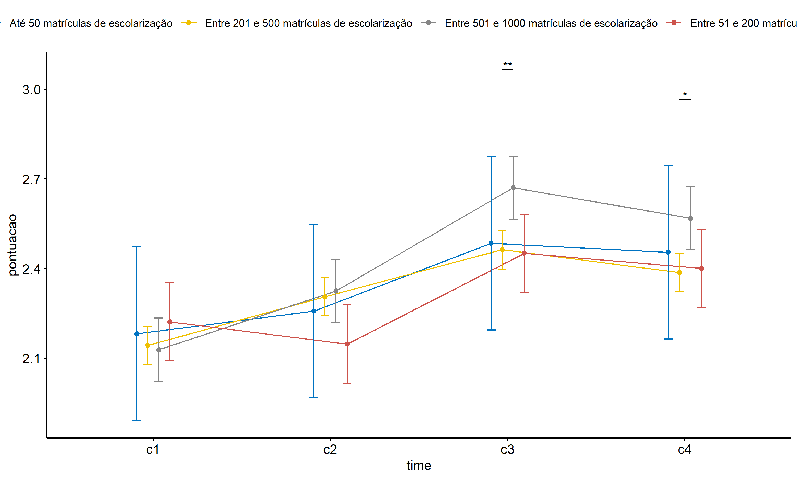<!-- -->

``` r
(pwc <- ldat %>% group_by(porte) %>%
    emmeans_test(pontuacao ~ time, detailed = T, p.adjust.method = "bonferroni"))
```

    ## # A tibble: 24 × 15
    ##    porte  term  .y.   group1 group2 null.value estimate     se    df conf.low conf.high statistic
    ##  * <fct>  <chr> <chr> <chr>  <chr>       <dbl>    <dbl>  <dbl> <dbl>    <dbl>     <dbl>     <dbl>
    ##  1 Até 5… time  pont… c1     c2              0  -0.0758 0.209   4460   -0.486    0.335     -0.362
    ##  2 Até 5… time  pont… c1     c3              0  -0.303  0.209   4460   -0.714    0.108     -1.45 
    ##  3 Até 5… time  pont… c1     c4              0  -0.273  0.209   4460   -0.683    0.138     -1.30 
    ##  4 Até 5… time  pont… c2     c3              0  -0.227  0.209   4460   -0.638    0.183     -1.09 
    ##  5 Até 5… time  pont… c2     c4              0  -0.197  0.209   4460   -0.608    0.214     -0.940
    ##  6 Até 5… time  pont… c3     c4              0   0.0303 0.209   4460   -0.380    0.441      0.145
    ##  7 Entre… time  pont… c1     c2              0  -0.162  0.0463  4460   -0.253   -0.0715    -3.51 
    ##  8 Entre… time  pont… c1     c3              0  -0.320  0.0463  4460   -0.411   -0.229     -6.91 
    ##  9 Entre… time  pont… c1     c4              0  -0.244  0.0463  4460   -0.335   -0.153     -5.26 
    ## 10 Entre… time  pont… c2     c3              0  -0.158  0.0463  4460   -0.248   -0.0669    -3.40 
    ## # ℹ 14 more rows
    ## # ℹ 3 more variables: p <dbl>, p.adj <dbl>, p.adj.signif <chr>

| porte                                        | term | .y.       | group1 | group2 | null.value | estimate |    se |   df | conf.low | conf.high | statistic |     p | p.adj | p.adj.signif |
|:---------------------------------------------|:-----|:----------|:-------|:-------|-----------:|---------:|------:|-----:|---------:|----------:|----------:|------:|------:|:-------------|
| Até 50 matrículas de escolarização           | time | pontuacao | c1     | c2     |          0 |   -0.076 | 0.209 | 4460 |   -0.486 |     0.335 |    -0.362 | 0.718 | 1.000 | ns           |
| Até 50 matrículas de escolarização           | time | pontuacao | c1     | c3     |          0 |   -0.303 | 0.209 | 4460 |   -0.714 |     0.108 |    -1.447 | 0.148 | 0.888 | ns           |
| Até 50 matrículas de escolarização           | time | pontuacao | c1     | c4     |          0 |   -0.273 | 0.209 | 4460 |   -0.683 |     0.138 |    -1.302 | 0.193 | 1.000 | ns           |
| Até 50 matrículas de escolarização           | time | pontuacao | c2     | c3     |          0 |   -0.227 | 0.209 | 4460 |   -0.638 |     0.183 |    -1.085 | 0.278 | 1.000 | ns           |
| Até 50 matrículas de escolarização           | time | pontuacao | c2     | c4     |          0 |   -0.197 | 0.209 | 4460 |   -0.608 |     0.214 |    -0.940 | 0.347 | 1.000 | ns           |
| Até 50 matrículas de escolarização           | time | pontuacao | c3     | c4     |          0 |    0.030 | 0.209 | 4460 |   -0.380 |     0.441 |     0.145 | 0.885 | 1.000 | ns           |
| Entre 201 e 500 matrículas de escolarização  | time | pontuacao | c1     | c2     |          0 |   -0.162 | 0.046 | 4460 |   -0.253 |    -0.072 |    -3.505 | 0.000 | 0.003 | \*\*         |
| Entre 201 e 500 matrículas de escolarização  | time | pontuacao | c1     | c3     |          0 |   -0.320 | 0.046 | 4460 |   -0.411 |    -0.229 |    -6.909 | 0.000 | 0.000 | \*\*\*\*     |
| Entre 201 e 500 matrículas de escolarização  | time | pontuacao | c1     | c4     |          0 |   -0.244 | 0.046 | 4460 |   -0.335 |    -0.153 |    -5.262 | 0.000 | 0.000 | \*\*\*\*     |
| Entre 201 e 500 matrículas de escolarização  | time | pontuacao | c2     | c3     |          0 |   -0.158 | 0.046 | 4460 |   -0.248 |    -0.067 |    -3.404 | 0.001 | 0.004 | \*\*         |
| Entre 201 e 500 matrículas de escolarização  | time | pontuacao | c2     | c4     |          0 |   -0.081 | 0.046 | 4460 |   -0.172 |     0.009 |    -1.757 | 0.079 | 0.474 | ns           |
| Entre 201 e 500 matrículas de escolarização  | time | pontuacao | c3     | c4     |          0 |    0.076 | 0.046 | 4460 |   -0.015 |     0.167 |     1.647 | 0.100 | 0.597 | ns           |
| Entre 501 e 1000 matrículas de escolarização | time | pontuacao | c1     | c2     |          0 |   -0.197 | 0.076 | 4460 |   -0.346 |    -0.047 |    -2.581 | 0.010 | 0.059 | ns           |
| Entre 501 e 1000 matrículas de escolarização | time | pontuacao | c1     | c3     |          0 |   -0.542 | 0.076 | 4460 |   -0.692 |    -0.393 |    -7.110 | 0.000 | 0.000 | \*\*\*\*     |
| Entre 501 e 1000 matrículas de escolarização | time | pontuacao | c1     | c4     |          0 |   -0.440 | 0.076 | 4460 |   -0.589 |    -0.290 |    -5.767 | 0.000 | 0.000 | \*\*\*\*     |
| Entre 501 e 1000 matrículas de escolarização | time | pontuacao | c2     | c3     |          0 |   -0.345 | 0.076 | 4460 |   -0.495 |    -0.196 |    -4.529 | 0.000 | 0.000 | \*\*\*\*     |
| Entre 501 e 1000 matrículas de escolarização | time | pontuacao | c2     | c4     |          0 |   -0.243 | 0.076 | 4460 |   -0.392 |    -0.093 |    -3.186 | 0.001 | 0.009 | \*\*         |
| Entre 501 e 1000 matrículas de escolarização | time | pontuacao | c3     | c4     |          0 |    0.102 | 0.076 | 4460 |   -0.047 |     0.252 |     1.343 | 0.179 | 1.000 | ns           |
| Entre 51 e 200 matrículas de escolarização   | time | pontuacao | c1     | c2     |          0 |    0.076 | 0.095 | 4460 |   -0.110 |     0.261 |     0.800 | 0.424 | 1.000 | ns           |
| Entre 51 e 200 matrículas de escolarização   | time | pontuacao | c1     | c3     |          0 |   -0.228 | 0.095 | 4460 |   -0.414 |    -0.043 |    -2.416 | 0.016 | 0.094 | ns           |
| Entre 51 e 200 matrículas de escolarização   | time | pontuacao | c1     | c4     |          0 |   -0.179 | 0.095 | 4460 |   -0.364 |     0.006 |    -1.894 | 0.058 | 0.350 | ns           |
| Entre 51 e 200 matrículas de escolarização   | time | pontuacao | c2     | c3     |          0 |   -0.304 | 0.095 | 4460 |   -0.489 |    -0.119 |    -3.216 | 0.001 | 0.008 | \*\*         |
| Entre 51 e 200 matrículas de escolarização   | time | pontuacao | c2     | c4     |          0 |   -0.255 | 0.095 | 4460 |   -0.440 |    -0.069 |    -2.693 | 0.007 | 0.043 | \*           |
| Entre 51 e 200 matrículas de escolarização   | time | pontuacao | c3     | c4     |          0 |    0.049 | 0.095 | 4460 |   -0.136 |     0.235 |     0.522 | 0.601 | 1.000 | ns           |

``` r
(emms <- get_emmeans(pwc))
```

    ## # A tibble: 16 × 8
    ##    porte                                      time  emmean     se    df conf.low conf.high method
    ##    <fct>                                      <fct>  <dbl>  <dbl> <dbl>    <dbl>     <dbl> <chr> 
    ##  1 Até 50 matrículas de escolarização         c1      2.18 0.148   4460     1.89      2.47 Emmea…
    ##  2 Até 50 matrículas de escolarização         c2      2.26 0.148   4460     1.97      2.55 Emmea…
    ##  3 Até 50 matrículas de escolarização         c3      2.48 0.148   4460     2.19      2.78 Emmea…
    ##  4 Até 50 matrículas de escolarização         c4      2.45 0.148   4460     2.16      2.74 Emmea…
    ##  5 Entre 201 e 500 matrículas de escolarizaç… c1      2.14 0.0327  4460     2.08      2.21 Emmea…
    ##  6 Entre 201 e 500 matrículas de escolarizaç… c2      2.31 0.0327  4460     2.24      2.37 Emmea…
    ##  7 Entre 201 e 500 matrículas de escolarizaç… c3      2.46 0.0327  4460     2.40      2.53 Emmea…
    ##  8 Entre 201 e 500 matrículas de escolarizaç… c4      2.39 0.0327  4460     2.32      2.45 Emmea…
    ##  9 Entre 501 e 1000 matrículas de escolariza… c1      2.13 0.0539  4460     2.02      2.23 Emmea…
    ## 10 Entre 501 e 1000 matrículas de escolariza… c2      2.33 0.0539  4460     2.22      2.43 Emmea…
    ## 11 Entre 501 e 1000 matrículas de escolariza… c3      2.67 0.0539  4460     2.56      2.78 Emmea…
    ## 12 Entre 501 e 1000 matrículas de escolariza… c4      2.57 0.0539  4460     2.46      2.67 Emmea…
    ## 13 Entre 51 e 200 matrículas de escolarização c1      2.22 0.0668  4460     2.09      2.35 Emmea…
    ## 14 Entre 51 e 200 matrículas de escolarização c2      2.15 0.0668  4460     2.02      2.28 Emmea…
    ## 15 Entre 51 e 200 matrículas de escolarização c3      2.45 0.0668  4460     2.32      2.58 Emmea…
    ## 16 Entre 51 e 200 matrículas de escolarização c4      2.40 0.0668  4460     2.27      2.53 Emmea…

| porte                                        | time | emmean |    se |   df | conf.low | conf.high | method       |
|:---------------------------------------------|:-----|-------:|------:|-----:|---------:|----------:|:-------------|
| Até 50 matrículas de escolarização           | c1   |  2.182 | 0.148 | 4460 |    1.891 |     2.472 | Emmeans test |
| Até 50 matrículas de escolarização           | c2   |  2.258 | 0.148 | 4460 |    1.967 |     2.548 | Emmeans test |
| Até 50 matrículas de escolarização           | c3   |  2.485 | 0.148 | 4460 |    2.194 |     2.775 | Emmeans test |
| Até 50 matrículas de escolarização           | c4   |  2.455 | 0.148 | 4460 |    2.164 |     2.745 | Emmeans test |
| Entre 201 e 500 matrículas de escolarização  | c1   |  2.143 | 0.033 | 4460 |    2.079 |     2.207 | Emmeans test |
| Entre 201 e 500 matrículas de escolarização  | c2   |  2.305 | 0.033 | 4460 |    2.241 |     2.370 | Emmeans test |
| Entre 201 e 500 matrículas de escolarização  | c3   |  2.463 | 0.033 | 4460 |    2.399 |     2.527 | Emmeans test |
| Entre 201 e 500 matrículas de escolarização  | c4   |  2.387 | 0.033 | 4460 |    2.322 |     2.451 | Emmeans test |
| Entre 501 e 1000 matrículas de escolarização | c1   |  2.129 | 0.054 | 4460 |    2.023 |     2.234 | Emmeans test |
| Entre 501 e 1000 matrículas de escolarização | c2   |  2.325 | 0.054 | 4460 |    2.220 |     2.431 | Emmeans test |
| Entre 501 e 1000 matrículas de escolarização | c3   |  2.671 | 0.054 | 4460 |    2.565 |     2.776 | Emmeans test |
| Entre 501 e 1000 matrículas de escolarização | c4   |  2.568 | 0.054 | 4460 |    2.463 |     2.674 | Emmeans test |
| Entre 51 e 200 matrículas de escolarização   | c1   |  2.222 | 0.067 | 4460 |    2.091 |     2.353 | Emmeans test |
| Entre 51 e 200 matrículas de escolarização   | c2   |  2.147 | 0.067 | 4460 |    2.016 |     2.278 | Emmeans test |
| Entre 51 e 200 matrículas de escolarização   | c3   |  2.451 | 0.067 | 4460 |    2.320 |     2.582 | Emmeans test |
| Entre 51 e 200 matrículas de escolarização   | c4   |  2.401 | 0.067 | 4460 |    2.270 |     2.532 | Emmeans test |

``` r
emms.gg <- emms[which(emms$porte == "Até 50 matrículas de escolarização"),]
if (nrow(emms.gg) > 0)
  ggline(emms.gg, x = "time", y = "emmean", color = "#0073C2FF", ylab = "pontuacao") +
    geom_errorbar(aes(ymin = conf.low, ymax = conf.high),
                  width = 0.2, color = "#0073C2FF") +
    stat_pvalue_manual(
      add_xy_position(pwc[which(pwc$porte == "Até 50 matrículas de escolarização"),],
                      x = "time", fun = "mean_se"),
      hide.ns = T, color = "#0073C2FF", tip.length = F) +
    labs(title = "porte: Até 50 matrículas de escolarização")+
    theme(legend.text = element_blank())
```

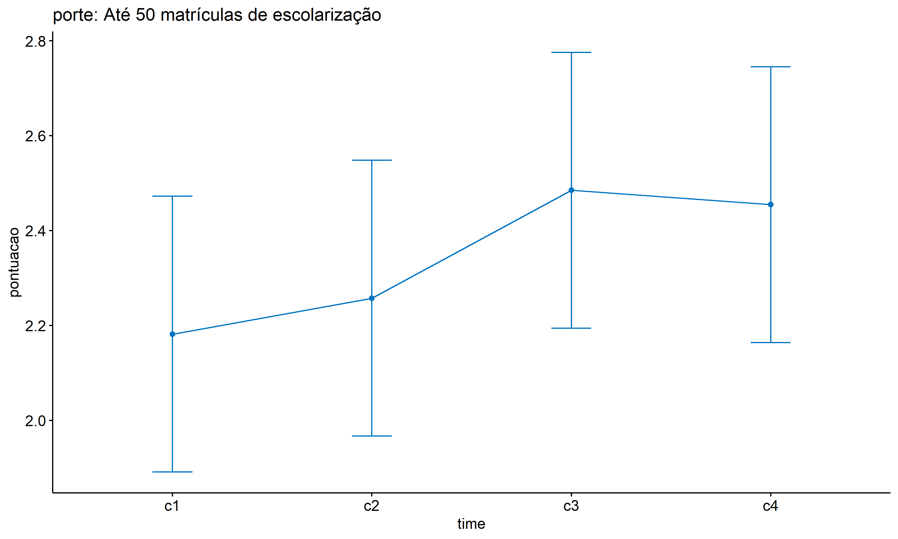<!-- -->

``` r
emms.gg <- emms[which(emms$porte == "Entre 201 e 500 matrículas de escolarização"),]
if (nrow(emms.gg) > 0)
  ggline(emms.gg, x = "time", y = "emmean", color = "#EFC000FF", ylab = "pontuacao") +
    geom_errorbar(aes(ymin = conf.low, ymax = conf.high),
                  width = 0.2, color = "#EFC000FF") +
    stat_pvalue_manual(
      add_xy_position(pwc[which(pwc$porte == "Entre 201 e 500 matrículas de escolarização"),],
                      x = "time", fun = "mean_se"),
      hide.ns = T, color = "#EFC000FF", tip.length = F) +
    labs(title = "porte: Entre 201 e 500 matrículas de escolarização")+
    theme(legend.text = element_blank())
```

<!-- -->

``` r
emms.gg <- emms[which(emms$porte == "Entre 501 e 1000 matrículas de escolarização"),]
if (nrow(emms.gg) > 0)
  ggline(emms.gg, x = "time", y = "emmean", color = "#868686FF", ylab = "pontuacao") +
    geom_errorbar(aes(ymin = conf.low, ymax = conf.high),
                  width = 0.2, color = "#868686FF") +
    stat_pvalue_manual(
      add_xy_position(pwc[which(pwc$porte == "Entre 501 e 1000 matrículas de escolarização"),],
                      x = "time", fun = "mean_se"),
      hide.ns = T, color = "#868686FF", tip.length = F) +
    labs(title = "porte: Entre 501 e 1000 matrículas de escolarização")+
    theme(legend.text = element_blank())
```

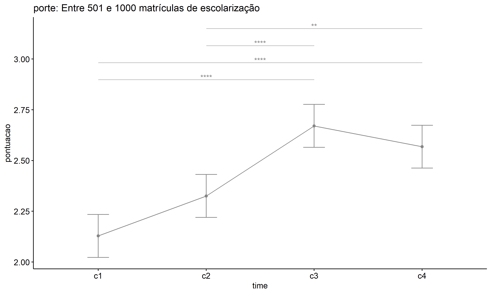<!-- -->

``` r
emms.gg <- emms[which(emms$porte == "Entre 51 e 200 matrículas de escolarização"),]
if (nrow(emms.gg) > 0)
  ggline(emms.gg, x = "time", y = "emmean", color = "#CD534CFF", ylab = "pontuacao") +
    geom_errorbar(aes(ymin = conf.low, ymax = conf.high),
                  width = 0.2, color = "#CD534CFF") +
    stat_pvalue_manual(
      add_xy_position(pwc[which(pwc$porte == "Entre 51 e 200 matrículas de escolarização"),],
                      x = "time", fun = "mean_se"),
      hide.ns = T, color = "#CD534CFF", tip.length = F) +
    labs(title = "porte: Entre 51 e 200 matrículas de escolarização")+
    theme(legend.text = element_blank())
```

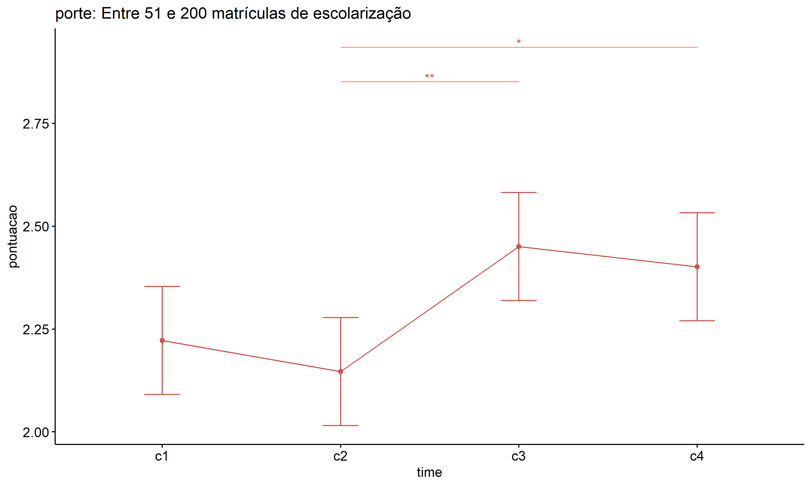<!-- -->

``` r
emms.gg <- emms[which(emms$porte == "Mais de 1000 matrículas de escolarização"),]
if (nrow(emms.gg) > 0)
  ggline(emms.gg, x = "time", y = "emmean", color = "#7AA6DCFF", ylab = "pontuacao") +
    geom_errorbar(aes(ymin = conf.low, ymax = conf.high),
                  width = 0.2, color = "#7AA6DCFF") +
    stat_pvalue_manual(
      add_xy_position(pwc[which(pwc$porte == "Mais de 1000 matrículas de escolarização"),],
                      x = "time", fun = "mean_se"),
      hide.ns = T, color = "#7AA6DCFF", tip.length = F) +
    labs(title = "porte: Mais de 1000 matrículas de escolarização")+
    theme(legend.text = element_blank())
```

## PairWise Computation after removing non.normal data

``` r
if (length(non.ids) > 0)
  (pwc2 <- ldat2 %>% group_by(time) %>%
     emmeans_test(pontuacao ~ porte, detailed = T, p.adjust.method = "bonferroni"))
```

    ## # A tibble: 24 × 15
    ##    time  term  .y.    group1 group2 null.value estimate     se    df conf.low conf.high statistic
    ##  * <fct> <chr> <chr>  <chr>  <chr>       <dbl>    <dbl>  <dbl> <dbl>    <dbl>     <dbl>     <dbl>
    ##  1 c1    porte pontu… Até 5… Entre…          0  -0.0462 0.156   4452   -0.351    0.259     -0.297
    ##  2 c1    porte pontu… Até 5… Entre…          0  -0.0317 0.161   4452   -0.348    0.285     -0.197
    ##  3 c1    porte pontu… Até 5… Entre…          0  -0.125  0.166   4452   -0.451    0.200     -0.755
    ##  4 c1    porte pontu… Entre… Entre…          0   0.0144 0.0628  4452   -0.109    0.138      0.230
    ##  5 c1    porte pontu… Entre… Entre…          0  -0.0793 0.0741  4452   -0.225    0.0661    -1.07 
    ##  6 c1    porte pontu… Entre… Entre…          0  -0.0937 0.0855  4452   -0.261    0.0740    -1.10 
    ##  7 c2    porte pontu… Até 5… Entre…          0  -0.225  0.156   4452   -0.530    0.0805    -1.44 
    ##  8 c2    porte pontu… Até 5… Entre…          0  -0.245  0.161   4452   -0.561    0.0718    -1.52 
    ##  9 c2    porte pontu… Até 5… Entre…          0  -0.0660 0.166   4452   -0.392    0.260     -0.397
    ## 10 c2    porte pontu… Entre… Entre…          0  -0.0200 0.0628  4452   -0.143    0.103     -0.318
    ## # ℹ 14 more rows
    ## # ℹ 3 more variables: p <dbl>, p.adj <dbl>, p.adj.signif <chr>

| time | term  | .y.       | group1                                       | group2                                       | null.value | estimate |    se |   df | conf.low | conf.high | statistic |     p | p.adj | p.adj.signif |
|:-----|:------|:----------|:---------------------------------------------|:---------------------------------------------|-----------:|---------:|------:|-----:|---------:|----------:|----------:|------:|------:|:-------------|
| c1   | porte | pontuacao | Até 50 matrículas de escolarização           | Entre 201 e 500 matrículas de escolarização  |          0 |   -0.046 | 0.156 | 4452 |   -0.351 |     0.259 |    -0.297 | 0.767 | 1.000 | ns           |
| c1   | porte | pontuacao | Até 50 matrículas de escolarização           | Entre 501 e 1000 matrículas de escolarização |          0 |   -0.032 | 0.161 | 4452 |   -0.348 |     0.285 |    -0.197 | 0.844 | 1.000 | ns           |
| c1   | porte | pontuacao | Até 50 matrículas de escolarização           | Entre 51 e 200 matrículas de escolarização   |          0 |   -0.125 | 0.166 | 4452 |   -0.451 |     0.200 |    -0.755 | 0.450 | 1.000 | ns           |
| c1   | porte | pontuacao | Entre 201 e 500 matrículas de escolarização  | Entre 501 e 1000 matrículas de escolarização |          0 |    0.014 | 0.063 | 4452 |   -0.109 |     0.138 |     0.230 | 0.818 | 1.000 | ns           |
| c1   | porte | pontuacao | Entre 201 e 500 matrículas de escolarização  | Entre 51 e 200 matrículas de escolarização   |          0 |   -0.079 | 0.074 | 4452 |   -0.225 |     0.066 |    -1.069 | 0.285 | 1.000 | ns           |
| c1   | porte | pontuacao | Entre 501 e 1000 matrículas de escolarização | Entre 51 e 200 matrículas de escolarização   |          0 |   -0.094 | 0.086 | 4452 |   -0.261 |     0.074 |    -1.095 | 0.273 | 1.000 | ns           |
| c2   | porte | pontuacao | Até 50 matrículas de escolarização           | Entre 201 e 500 matrículas de escolarização  |          0 |   -0.225 | 0.156 | 4452 |   -0.530 |     0.081 |    -1.443 | 0.149 | 0.894 | ns           |
| c2   | porte | pontuacao | Até 50 matrículas de escolarização           | Entre 501 e 1000 matrículas de escolarização |          0 |   -0.245 | 0.161 | 4452 |   -0.561 |     0.072 |    -1.516 | 0.130 | 0.778 | ns           |
| c2   | porte | pontuacao | Até 50 matrículas de escolarização           | Entre 51 e 200 matrículas de escolarização   |          0 |   -0.066 | 0.166 | 4452 |   -0.392 |     0.260 |    -0.397 | 0.691 | 1.000 | ns           |
| c2   | porte | pontuacao | Entre 201 e 500 matrículas de escolarização  | Entre 501 e 1000 matrículas de escolarização |          0 |   -0.020 | 0.063 | 4452 |   -0.143 |     0.103 |    -0.318 | 0.750 | 1.000 | ns           |
| c2   | porte | pontuacao | Entre 201 e 500 matrículas de escolarização  | Entre 51 e 200 matrículas de escolarização   |          0 |    0.159 | 0.074 | 4452 |    0.013 |     0.304 |     2.140 | 0.032 | 0.194 | ns           |
| c2   | porte | pontuacao | Entre 501 e 1000 matrículas de escolarização | Entre 51 e 200 matrículas de escolarização   |          0 |    0.179 | 0.086 | 4452 |    0.011 |     0.346 |     2.089 | 0.037 | 0.221 | ns           |
| c3   | porte | pontuacao | Até 50 matrículas de escolarização           | Entre 201 e 500 matrículas de escolarização  |          0 |   -0.044 | 0.156 | 4452 |   -0.349 |     0.262 |    -0.280 | 0.779 | 1.000 | ns           |
| c3   | porte | pontuacao | Até 50 matrículas de escolarização           | Entre 501 e 1000 matrículas de escolarização |          0 |   -0.251 | 0.161 | 4452 |   -0.568 |     0.065 |    -1.557 | 0.120 | 0.717 | ns           |
| c3   | porte | pontuacao | Até 50 matrículas de escolarização           | Entre 51 e 200 matrículas de escolarização   |          0 |   -0.031 | 0.166 | 4452 |   -0.357 |     0.294 |    -0.188 | 0.851 | 1.000 | ns           |
| c3   | porte | pontuacao | Entre 201 e 500 matrículas de escolarização  | Entre 501 e 1000 matrículas de escolarização |          0 |   -0.208 | 0.063 | 4452 |   -0.331 |    -0.085 |    -3.306 | 0.001 | 0.006 | \*\*         |
| c3   | porte | pontuacao | Entre 201 e 500 matrículas de escolarização  | Entre 51 e 200 matrículas de escolarização   |          0 |    0.012 | 0.074 | 4452 |   -0.133 |     0.158 |     0.167 | 0.868 | 1.000 | ns           |
| c3   | porte | pontuacao | Entre 501 e 1000 matrículas de escolarização | Entre 51 e 200 matrículas de escolarização   |          0 |    0.220 | 0.086 | 4452 |    0.052 |     0.388 |     2.573 | 0.010 | 0.061 | ns           |
| c4   | porte | pontuacao | Até 50 matrículas de escolarização           | Entre 201 e 500 matrículas de escolarização  |          0 |    0.097 | 0.156 | 4452 |   -0.208 |     0.402 |     0.624 | 0.532 | 1.000 | ns           |
| c4   | porte | pontuacao | Até 50 matrículas de escolarização           | Entre 501 e 1000 matrículas de escolarização |          0 |   -0.084 | 0.161 | 4452 |   -0.401 |     0.232 |    -0.523 | 0.601 | 1.000 | ns           |
| c4   | porte | pontuacao | Até 50 matrículas de escolarização           | Entre 51 e 200 matrículas de escolarização   |          0 |    0.083 | 0.166 | 4452 |   -0.243 |     0.408 |     0.497 | 0.619 | 1.000 | ns           |
| c4   | porte | pontuacao | Entre 201 e 500 matrículas de escolarização  | Entre 501 e 1000 matrículas de escolarização |          0 |   -0.182 | 0.063 | 4452 |   -0.305 |    -0.058 |    -2.890 | 0.004 | 0.023 | \*           |
| c4   | porte | pontuacao | Entre 201 e 500 matrículas de escolarização  | Entre 51 e 200 matrículas de escolarização   |          0 |   -0.015 | 0.074 | 4452 |   -0.160 |     0.131 |    -0.196 | 0.844 | 1.000 | ns           |
| c4   | porte | pontuacao | Entre 501 e 1000 matrículas de escolarização | Entre 51 e 200 matrículas de escolarização   |          0 |    0.167 | 0.086 | 4452 |   -0.001 |     0.335 |     1.953 | 0.051 | 0.306 | ns           |

``` r
if (length(non.ids) > 0)
  (emms2 <- get_emmeans(pwc2))
```

    ## # A tibble: 16 × 8
    ##    time  porte                                      emmean     se    df conf.low conf.high method
    ##    <fct> <fct>                                       <dbl>  <dbl> <dbl>    <dbl>     <dbl> <chr> 
    ##  1 c1    Até 50 matrículas de escolarização           2.10 0.152   4452     1.80      2.40 Emmea…
    ##  2 c1    Entre 201 e 500 matrículas de escolarizaç…   2.14 0.0326  4452     2.08      2.21 Emmea…
    ##  3 c1    Entre 501 e 1000 matrículas de escolariza…   2.13 0.0537  4452     2.02      2.23 Emmea…
    ##  4 c1    Entre 51 e 200 matrículas de escolarização   2.22 0.0666  4452     2.09      2.35 Emmea…
    ##  5 c2    Até 50 matrículas de escolarização           2.08 0.152   4452     1.78      2.38 Emmea…
    ##  6 c2    Entre 201 e 500 matrículas de escolarizaç…   2.31 0.0326  4452     2.24      2.37 Emmea…
    ##  7 c2    Entre 501 e 1000 matrículas de escolariza…   2.33 0.0537  4452     2.22      2.43 Emmea…
    ##  8 c2    Entre 51 e 200 matrículas de escolarização   2.15 0.0666  4452     2.02      2.28 Emmea…
    ##  9 c3    Até 50 matrículas de escolarização           2.42 0.152   4452     2.12      2.72 Emmea…
    ## 10 c3    Entre 201 e 500 matrículas de escolarizaç…   2.46 0.0326  4452     2.40      2.53 Emmea…
    ## 11 c3    Entre 501 e 1000 matrículas de escolariza…   2.67 0.0537  4452     2.57      2.78 Emmea…
    ## 12 c3    Entre 51 e 200 matrículas de escolarização   2.45 0.0666  4452     2.32      2.58 Emmea…
    ## 13 c4    Até 50 matrículas de escolarização           2.48 0.152   4452     2.19      2.78 Emmea…
    ## 14 c4    Entre 201 e 500 matrículas de escolarizaç…   2.39 0.0326  4452     2.32      2.45 Emmea…
    ## 15 c4    Entre 501 e 1000 matrículas de escolariza…   2.57 0.0537  4452     2.46      2.67 Emmea…
    ## 16 c4    Entre 51 e 200 matrículas de escolarização   2.40 0.0666  4452     2.27      2.53 Emmea…

| time | porte                                        | emmean |    se |   df | conf.low | conf.high | method       |
|:-----|:---------------------------------------------|-------:|------:|-----:|---------:|----------:|:-------------|
| c1   | Até 50 matrículas de escolarização           |  2.097 | 0.152 | 4452 |    1.798 |     2.395 | Emmeans test |
| c1   | Entre 201 e 500 matrículas de escolarização  |  2.143 | 0.033 | 4452 |    2.079 |     2.207 | Emmeans test |
| c1   | Entre 501 e 1000 matrículas de escolarização |  2.129 | 0.054 | 4452 |    2.023 |     2.234 | Emmeans test |
| c1   | Entre 51 e 200 matrículas de escolarização   |  2.222 | 0.067 | 4452 |    2.092 |     2.353 | Emmeans test |
| c2   | Até 50 matrículas de escolarização           |  2.081 | 0.152 | 4452 |    1.782 |     2.379 | Emmeans test |
| c2   | Entre 201 e 500 matrículas de escolarização  |  2.305 | 0.033 | 4452 |    2.241 |     2.369 | Emmeans test |
| c2   | Entre 501 e 1000 matrículas de escolarização |  2.325 | 0.054 | 4452 |    2.220 |     2.431 | Emmeans test |
| c2   | Entre 51 e 200 matrículas de escolarização   |  2.147 | 0.067 | 4452 |    2.016 |     2.277 | Emmeans test |
| c3   | Até 50 matrículas de escolarização           |  2.419 | 0.152 | 4452 |    2.121 |     2.718 | Emmeans test |
| c3   | Entre 201 e 500 matrículas de escolarização  |  2.463 | 0.033 | 4452 |    2.399 |     2.527 | Emmeans test |
| c3   | Entre 501 e 1000 matrículas de escolarização |  2.671 | 0.054 | 4452 |    2.565 |     2.776 | Emmeans test |
| c3   | Entre 51 e 200 matrículas de escolarização   |  2.451 | 0.067 | 4452 |    2.320 |     2.581 | Emmeans test |
| c4   | Até 50 matrículas de escolarização           |  2.484 | 0.152 | 4452 |    2.185 |     2.782 | Emmeans test |
| c4   | Entre 201 e 500 matrículas de escolarização  |  2.387 | 0.033 | 4452 |    2.323 |     2.451 | Emmeans test |
| c4   | Entre 501 e 1000 matrículas de escolarização |  2.568 | 0.054 | 4452 |    2.463 |     2.674 | Emmeans test |
| c4   | Entre 51 e 200 matrículas de escolarização   |  2.401 | 0.067 | 4452 |    2.271 |     2.532 | Emmeans test |

``` r
if (length(non.ids) > 0) {
  pwc2 <- add_xy_position(pwc2, x = "time", fun = "mean_se", dodge = 0.25)
  pd2 <- position_dodge(width = 0.25)
  
  ggline(emms2, x = "time", y = "emmean", color = "porte",
         palette = c("#0073C2FF","#EFC000FF","#868686FF","#CD534CFF","#7AA6DCFF"),
         position = pd, ylab = "pontuacao") +
    geom_errorbar(aes(ymin = conf.low, ymax = conf.high, color = porte),
                position = pd, width = 0.2) +
    stat_pvalue_manual(pwc2, hide.ns = T, tip.length = F, linetype = 1)
}
```

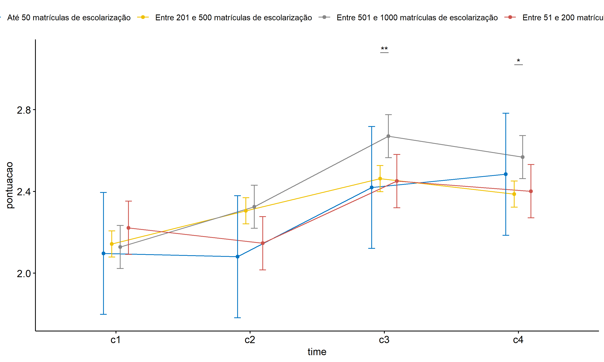<!-- -->

``` r
if (length(non.ids) > 0)
  (pwc2 <- ldat2 %>% group_by(porte) %>%
     emmeans_test(pontuacao ~ time, detailed = T, p.adjust.method = "bonferroni"))
```

    ## # A tibble: 24 × 15
    ##    porte  term  .y.   group1 group2 null.value estimate     se    df conf.low conf.high statistic
    ##  * <fct>  <chr> <chr> <chr>  <chr>       <dbl>    <dbl>  <dbl> <dbl>    <dbl>     <dbl>     <dbl>
    ##  1 Até 5… time  pont… c1     c2              0   0.0161 0.215   4452   -0.406    0.438     0.0749
    ##  2 Até 5… time  pont… c1     c3              0  -0.323  0.215   4452   -0.745    0.0994   -1.50  
    ##  3 Até 5… time  pont… c1     c4              0  -0.387  0.215   4452   -0.809    0.0349   -1.80  
    ##  4 Até 5… time  pont… c2     c3              0  -0.339  0.215   4452   -0.761    0.0833   -1.57  
    ##  5 Até 5… time  pont… c2     c4              0  -0.403  0.215   4452   -0.825    0.0188   -1.87  
    ##  6 Até 5… time  pont… c3     c4              0  -0.0645 0.215   4452   -0.487    0.357    -0.300 
    ##  7 Entre… time  pont… c1     c2              0  -0.162  0.0461  4452   -0.253   -0.0719   -3.52  
    ##  8 Entre… time  pont… c1     c3              0  -0.320  0.0461  4452   -0.410   -0.230    -6.94  
    ##  9 Entre… time  pont… c1     c4              0  -0.244  0.0461  4452   -0.334   -0.153    -5.28  
    ## 10 Entre… time  pont… c2     c3              0  -0.158  0.0461  4452   -0.248   -0.0672   -3.42  
    ## # ℹ 14 more rows
    ## # ℹ 3 more variables: p <dbl>, p.adj <dbl>, p.adj.signif <chr>

| porte                                        | term | .y.       | group1 | group2 | null.value | estimate |    se |   df | conf.low | conf.high | statistic |     p | p.adj | p.adj.signif |
|:---------------------------------------------|:-----|:----------|:-------|:-------|-----------:|---------:|------:|-----:|---------:|----------:|----------:|------:|------:|:-------------|
| Até 50 matrículas de escolarização           | time | pontuacao | c1     | c2     |          0 |    0.016 | 0.215 | 4452 |   -0.406 |     0.438 |     0.075 | 0.940 | 1.000 | ns           |
| Até 50 matrículas de escolarização           | time | pontuacao | c1     | c3     |          0 |   -0.323 | 0.215 | 4452 |   -0.745 |     0.099 |    -1.499 | 0.134 | 0.804 | ns           |
| Até 50 matrículas de escolarização           | time | pontuacao | c1     | c4     |          0 |   -0.387 | 0.215 | 4452 |   -0.809 |     0.035 |    -1.798 | 0.072 | 0.433 | ns           |
| Até 50 matrículas de escolarização           | time | pontuacao | c2     | c3     |          0 |   -0.339 | 0.215 | 4452 |   -0.761 |     0.083 |    -1.574 | 0.116 | 0.694 | ns           |
| Até 50 matrículas de escolarização           | time | pontuacao | c2     | c4     |          0 |   -0.403 | 0.215 | 4452 |   -0.825 |     0.019 |    -1.873 | 0.061 | 0.367 | ns           |
| Até 50 matrículas de escolarização           | time | pontuacao | c3     | c4     |          0 |   -0.065 | 0.215 | 4452 |   -0.487 |     0.357 |    -0.300 | 0.764 | 1.000 | ns           |
| Entre 201 e 500 matrículas de escolarização  | time | pontuacao | c1     | c2     |          0 |   -0.162 | 0.046 | 4452 |   -0.253 |    -0.072 |    -3.519 | 0.000 | 0.003 | \*\*         |
| Entre 201 e 500 matrículas de escolarização  | time | pontuacao | c1     | c3     |          0 |   -0.320 | 0.046 | 4452 |   -0.410 |    -0.230 |    -6.937 | 0.000 | 0.000 | \*\*\*\*     |
| Entre 201 e 500 matrículas de escolarização  | time | pontuacao | c1     | c4     |          0 |   -0.244 | 0.046 | 4452 |   -0.334 |    -0.153 |    -5.283 | 0.000 | 0.000 | \*\*\*\*     |
| Entre 201 e 500 matrículas de escolarização  | time | pontuacao | c2     | c3     |          0 |   -0.158 | 0.046 | 4452 |   -0.248 |    -0.067 |    -3.418 | 0.001 | 0.004 | \*\*         |
| Entre 201 e 500 matrículas de escolarização  | time | pontuacao | c2     | c4     |          0 |   -0.081 | 0.046 | 4452 |   -0.172 |     0.009 |    -1.764 | 0.078 | 0.467 | ns           |
| Entre 201 e 500 matrículas de escolarização  | time | pontuacao | c3     | c4     |          0 |    0.076 | 0.046 | 4452 |   -0.014 |     0.167 |     1.654 | 0.098 | 0.589 | ns           |
| Entre 501 e 1000 matrículas de escolarização | time | pontuacao | c1     | c2     |          0 |   -0.197 | 0.076 | 4452 |   -0.346 |    -0.048 |    -2.591 | 0.010 | 0.058 | ns           |
| Entre 501 e 1000 matrículas de escolarização | time | pontuacao | c1     | c3     |          0 |   -0.542 | 0.076 | 4452 |   -0.691 |    -0.393 |    -7.138 | 0.000 | 0.000 | \*\*\*\*     |
| Entre 501 e 1000 matrículas de escolarização | time | pontuacao | c1     | c4     |          0 |   -0.440 | 0.076 | 4452 |   -0.589 |    -0.291 |    -5.790 | 0.000 | 0.000 | \*\*\*\*     |
| Entre 501 e 1000 matrículas de escolarização | time | pontuacao | c2     | c3     |          0 |   -0.345 | 0.076 | 4452 |   -0.494 |    -0.196 |    -4.547 | 0.000 | 0.000 | \*\*\*\*     |
| Entre 501 e 1000 matrículas de escolarização | time | pontuacao | c2     | c4     |          0 |   -0.243 | 0.076 | 4452 |   -0.392 |    -0.094 |    -3.199 | 0.001 | 0.008 | \*\*         |
| Entre 501 e 1000 matrículas de escolarização | time | pontuacao | c3     | c4     |          0 |    0.102 | 0.076 | 4452 |   -0.046 |     0.251 |     1.348 | 0.178 | 1.000 | ns           |
| Entre 51 e 200 matrículas de escolarização   | time | pontuacao | c1     | c2     |          0 |    0.076 | 0.094 | 4452 |   -0.109 |     0.260 |     0.803 | 0.422 | 1.000 | ns           |
| Entre 51 e 200 matrículas de escolarização   | time | pontuacao | c1     | c3     |          0 |   -0.228 | 0.094 | 4452 |   -0.413 |    -0.044 |    -2.426 | 0.015 | 0.092 | ns           |
| Entre 51 e 200 matrículas de escolarização   | time | pontuacao | c1     | c4     |          0 |   -0.179 | 0.094 | 4452 |   -0.364 |     0.006 |    -1.901 | 0.057 | 0.344 | ns           |
| Entre 51 e 200 matrículas de escolarização   | time | pontuacao | c2     | c3     |          0 |   -0.304 | 0.094 | 4452 |   -0.489 |    -0.119 |    -3.229 | 0.001 | 0.008 | \*\*         |
| Entre 51 e 200 matrículas de escolarização   | time | pontuacao | c2     | c4     |          0 |   -0.255 | 0.094 | 4452 |   -0.439 |    -0.070 |    -2.704 | 0.007 | 0.041 | \*           |
| Entre 51 e 200 matrículas de escolarização   | time | pontuacao | c3     | c4     |          0 |    0.049 | 0.094 | 4452 |   -0.135 |     0.234 |     0.524 | 0.600 | 1.000 | ns           |

``` r
if (length(non.ids) > 0)
  (emms2 <- get_emmeans(pwc2))
```

    ## # A tibble: 16 × 8
    ##    porte                                      time  emmean     se    df conf.low conf.high method
    ##    <fct>                                      <fct>  <dbl>  <dbl> <dbl>    <dbl>     <dbl> <chr> 
    ##  1 Até 50 matrículas de escolarização         c1      2.10 0.152   4452     1.80      2.40 Emmea…
    ##  2 Até 50 matrículas de escolarização         c2      2.08 0.152   4452     1.78      2.38 Emmea…
    ##  3 Até 50 matrículas de escolarização         c3      2.42 0.152   4452     2.12      2.72 Emmea…
    ##  4 Até 50 matrículas de escolarização         c4      2.48 0.152   4452     2.19      2.78 Emmea…
    ##  5 Entre 201 e 500 matrículas de escolarizaç… c1      2.14 0.0326  4452     2.08      2.21 Emmea…
    ##  6 Entre 201 e 500 matrículas de escolarizaç… c2      2.31 0.0326  4452     2.24      2.37 Emmea…
    ##  7 Entre 201 e 500 matrículas de escolarizaç… c3      2.46 0.0326  4452     2.40      2.53 Emmea…
    ##  8 Entre 201 e 500 matrículas de escolarizaç… c4      2.39 0.0326  4452     2.32      2.45 Emmea…
    ##  9 Entre 501 e 1000 matrículas de escolariza… c1      2.13 0.0537  4452     2.02      2.23 Emmea…
    ## 10 Entre 501 e 1000 matrículas de escolariza… c2      2.33 0.0537  4452     2.22      2.43 Emmea…
    ## 11 Entre 501 e 1000 matrículas de escolariza… c3      2.67 0.0537  4452     2.57      2.78 Emmea…
    ## 12 Entre 501 e 1000 matrículas de escolariza… c4      2.57 0.0537  4452     2.46      2.67 Emmea…
    ## 13 Entre 51 e 200 matrículas de escolarização c1      2.22 0.0666  4452     2.09      2.35 Emmea…
    ## 14 Entre 51 e 200 matrículas de escolarização c2      2.15 0.0666  4452     2.02      2.28 Emmea…
    ## 15 Entre 51 e 200 matrículas de escolarização c3      2.45 0.0666  4452     2.32      2.58 Emmea…
    ## 16 Entre 51 e 200 matrículas de escolarização c4      2.40 0.0666  4452     2.27      2.53 Emmea…

| porte                                        | time | emmean |    se |   df | conf.low | conf.high | method       |
|:---------------------------------------------|:-----|-------:|------:|-----:|---------:|----------:|:-------------|
| Até 50 matrículas de escolarização           | c1   |  2.097 | 0.152 | 4452 |    1.798 |     2.395 | Emmeans test |
| Até 50 matrículas de escolarização           | c2   |  2.081 | 0.152 | 4452 |    1.782 |     2.379 | Emmeans test |
| Até 50 matrículas de escolarização           | c3   |  2.419 | 0.152 | 4452 |    2.121 |     2.718 | Emmeans test |
| Até 50 matrículas de escolarização           | c4   |  2.484 | 0.152 | 4452 |    2.185 |     2.782 | Emmeans test |
| Entre 201 e 500 matrículas de escolarização  | c1   |  2.143 | 0.033 | 4452 |    2.079 |     2.207 | Emmeans test |
| Entre 201 e 500 matrículas de escolarização  | c2   |  2.305 | 0.033 | 4452 |    2.241 |     2.369 | Emmeans test |
| Entre 201 e 500 matrículas de escolarização  | c3   |  2.463 | 0.033 | 4452 |    2.399 |     2.527 | Emmeans test |
| Entre 201 e 500 matrículas de escolarização  | c4   |  2.387 | 0.033 | 4452 |    2.323 |     2.451 | Emmeans test |
| Entre 501 e 1000 matrículas de escolarização | c1   |  2.129 | 0.054 | 4452 |    2.023 |     2.234 | Emmeans test |
| Entre 501 e 1000 matrículas de escolarização | c2   |  2.325 | 0.054 | 4452 |    2.220 |     2.431 | Emmeans test |
| Entre 501 e 1000 matrículas de escolarização | c3   |  2.671 | 0.054 | 4452 |    2.565 |     2.776 | Emmeans test |
| Entre 501 e 1000 matrículas de escolarização | c4   |  2.568 | 0.054 | 4452 |    2.463 |     2.674 | Emmeans test |
| Entre 51 e 200 matrículas de escolarização   | c1   |  2.222 | 0.067 | 4452 |    2.092 |     2.353 | Emmeans test |
| Entre 51 e 200 matrículas de escolarização   | c2   |  2.147 | 0.067 | 4452 |    2.016 |     2.277 | Emmeans test |
| Entre 51 e 200 matrículas de escolarização   | c3   |  2.451 | 0.067 | 4452 |    2.320 |     2.581 | Emmeans test |
| Entre 51 e 200 matrículas de escolarização   | c4   |  2.401 | 0.067 | 4452 |    2.271 |     2.532 | Emmeans test |

``` r
if (length(non.ids) > 0) {
  emms.gg <- emms2[which(emms2$porte == "Até 50 matrículas de escolarização"),]
  if (nrow(emms.gg) > 0)
    ggline(emms.gg, x = "time", y = "emmean", color = "#0073C2FF", ylab = "pontuacao") +
    geom_errorbar(aes(ymin = conf.low, ymax = conf.high),
                  width = 0.2, color = "#0073C2FF") +
    stat_pvalue_manual(
      add_xy_position(pwc[which(pwc$porte == "Até 50 matrículas de escolarização"),],
                      x = "time", fun = "mean_se"),
      hide.ns = T, color = "#0073C2FF", tip.length = F) +
    labs(title = "porte: Até 50 matrículas de escolarização") +
    theme(legend.text = element_blank())
}
```

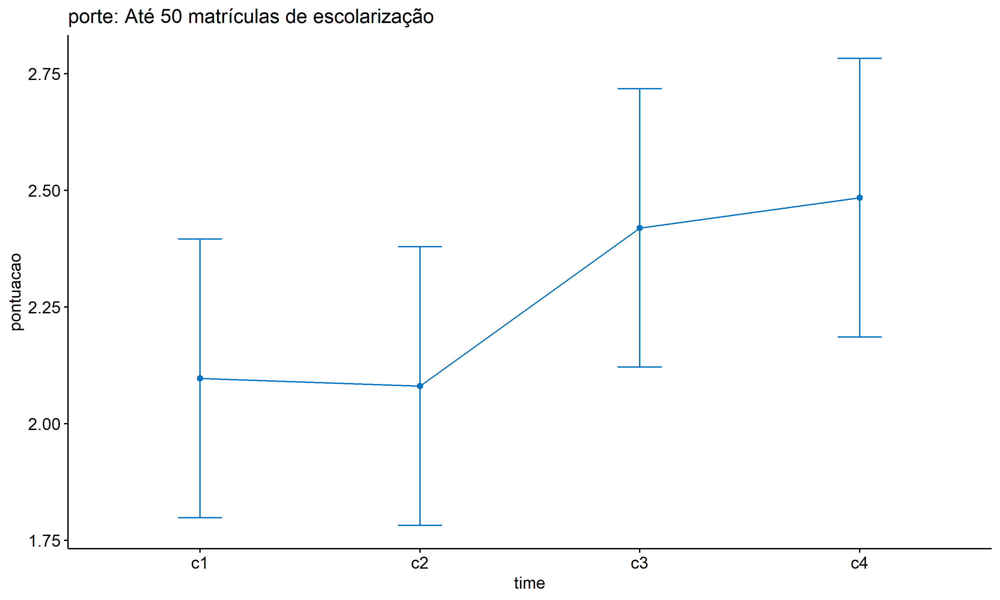<!-- -->

``` r
if (length(non.ids) > 0) {
  emms.gg <- emms2[which(emms2$porte == "Entre 201 e 500 matrículas de escolarização"),]
  if (nrow(emms.gg) > 0)
    ggline(emms.gg, x = "time", y = "emmean", color = "#EFC000FF", ylab = "pontuacao") +
    geom_errorbar(aes(ymin = conf.low, ymax = conf.high),
                  width = 0.2, color = "#EFC000FF") +
    stat_pvalue_manual(
      add_xy_position(pwc[which(pwc$porte == "Entre 201 e 500 matrículas de escolarização"),],
                      x = "time", fun = "mean_se"),
      hide.ns = T, color = "#EFC000FF", tip.length = F) +
    labs(title = "porte: Entre 201 e 500 matrículas de escolarização") +
    theme(legend.text = element_blank())
}
```

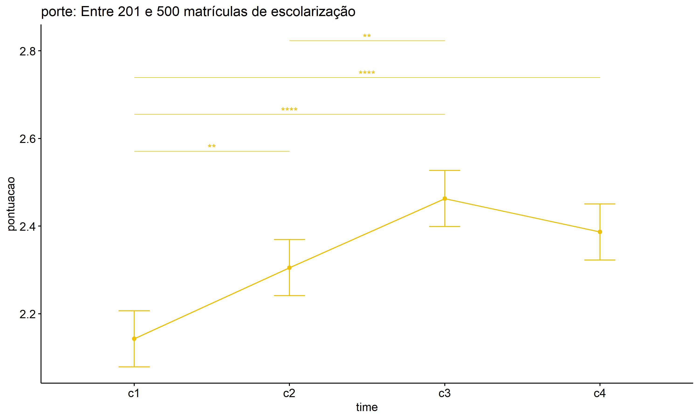<!-- -->

``` r
if (length(non.ids) > 0) {
  emms.gg <- emms2[which(emms2$porte == "Entre 501 e 1000 matrículas de escolarização"),]
  if (nrow(emms.gg) > 0)
    ggline(emms.gg, x = "time", y = "emmean", color = "#868686FF", ylab = "pontuacao") +
    geom_errorbar(aes(ymin = conf.low, ymax = conf.high),
                  width = 0.2, color = "#868686FF") +
    stat_pvalue_manual(
      add_xy_position(pwc[which(pwc$porte == "Entre 501 e 1000 matrículas de escolarização"),],
                      x = "time", fun = "mean_se"),
      hide.ns = T, color = "#868686FF", tip.length = F) +
    labs(title = "porte: Entre 501 e 1000 matrículas de escolarização") +
    theme(legend.text = element_blank())
}
```

<!-- -->

``` r
if (length(non.ids) > 0) {
  emms.gg <- emms2[which(emms2$porte == "Entre 51 e 200 matrículas de escolarização"),]
  if (nrow(emms.gg) > 0)
    ggline(emms.gg, x = "time", y = "emmean", color = "#CD534CFF", ylab = "pontuacao") +
    geom_errorbar(aes(ymin = conf.low, ymax = conf.high),
                  width = 0.2, color = "#CD534CFF") +
    stat_pvalue_manual(
      add_xy_position(pwc[which(pwc$porte == "Entre 51 e 200 matrículas de escolarização"),],
                      x = "time", fun = "mean_se"),
      hide.ns = T, color = "#CD534CFF", tip.length = F) +
    labs(title = "porte: Entre 51 e 200 matrículas de escolarização") +
    theme(legend.text = element_blank())
}
```

<!-- -->

``` r
if (length(non.ids) > 0) {
  emms.gg <- emms2[which(emms2$porte == "Mais de 1000 matrículas de escolarização"),]
  if (nrow(emms.gg) > 0)
    ggline(emms.gg, x = "time", y = "emmean", color = "#7AA6DCFF", ylab = "pontuacao") +
    geom_errorbar(aes(ymin = conf.low, ymax = conf.high),
                  width = 0.2, color = "#7AA6DCFF") +
    stat_pvalue_manual(
      add_xy_position(pwc[which(pwc$porte == "Mais de 1000 matrículas de escolarização"),],
                      x = "time", fun = "mean_se"),
      hide.ns = T, color = "#7AA6DCFF", tip.length = F) +
    labs(title = "porte: Mais de 1000 matrículas de escolarização") +
    theme(legend.text = element_blank())
}
```
