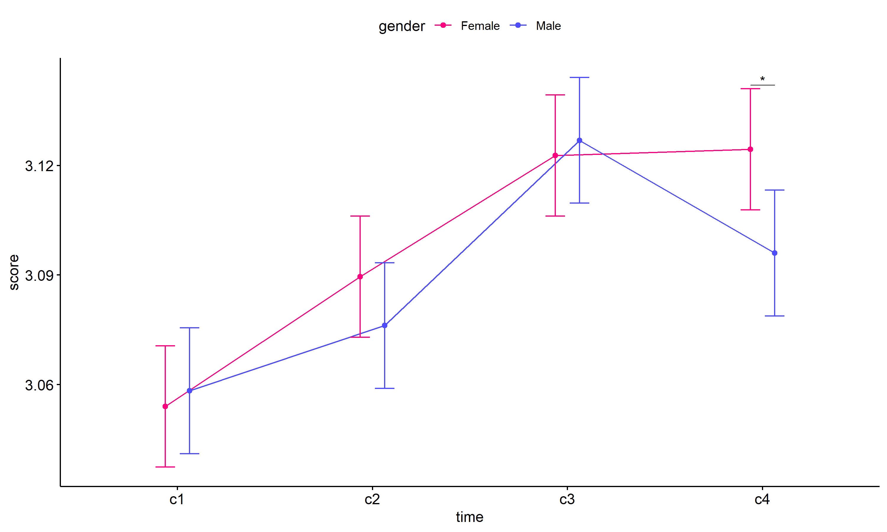

ANOVA test for score
================
Geiser C. Challco <geiser@alumni.usp.br>

- [ANOVA: score ~ time](#anova-score--time)
  - [Data Preparation](#data-preparation)
  - [Summary Statistics](#summary-statistics)
  - [ANOVA Computation](#anova-computation)
  - [PairWise Computation](#pairwise-computation)
- [ANOVA: score ~ time\*gender +
  Error(id/time)](#anova-score--timegender--erroridtime)
  - [Data Preparation](#data-preparation-1)
    - [Check assumptions: Identifying
      Outliers](#check-assumptions-identifying-outliers)
    - [Check assumptions: Normality
      Test](#check-assumptions-normality-test)
    - [Summary Statistics](#summary-statistics-1)
  - [ANOVA Computation](#anova-computation-1)
  - [ANOVA Computation after removing non.normal
    data](#anova-computation-after-removing-nonnormal-data)
  - [PairWise Computation](#pairwise-computation-1)
  - [PairWise Computation after removing non.normal
    data](#pairwise-computation-after-removing-nonnormal-data)
- [ANOVA: score ~ time\*localizacao +
  Error(id/time)](#anova-score--timelocalizacao--erroridtime)
  - [Data Preparation](#data-preparation-2)
    - [Check assumptions: Identifying
      Outliers](#check-assumptions-identifying-outliers-1)
    - [Check assumptions: Normality
      Test](#check-assumptions-normality-test-1)
    - [Summary Statistics](#summary-statistics-2)
  - [ANOVA Computation](#anova-computation-2)
  - [ANOVA Computation after removing non.normal
    data](#anova-computation-after-removing-nonnormal-data-1)
  - [PairWise Computation](#pairwise-computation-2)
  - [PairWise Computation after removing non.normal
    data](#pairwise-computation-after-removing-nonnormal-data-1)
- [ANOVA: score ~ time\*regiao +
  Error(id/time)](#anova-score--timeregiao--erroridtime)
  - [Data Preparation](#data-preparation-3)
    - [Check assumptions: Identifying
      Outliers](#check-assumptions-identifying-outliers-2)
    - [Check assumptions: Normality
      Test](#check-assumptions-normality-test-2)
    - [Summary Statistics](#summary-statistics-3)
  - [ANOVA Computation](#anova-computation-3)
  - [ANOVA Computation after removing non.normal
    data](#anova-computation-after-removing-nonnormal-data-2)
  - [PairWise Computation](#pairwise-computation-3)
  - [PairWise Computation after removing non.normal
    data](#pairwise-computation-after-removing-nonnormal-data-2)
- [ANOVA: score ~ time\*porte +
  Error(id/time)](#anova-score--timeporte--erroridtime)
  - [Data Preparation](#data-preparation-4)
    - [Check assumptions: Identifying
      Outliers](#check-assumptions-identifying-outliers-3)
    - [Check assumptions: Normality
      Test](#check-assumptions-normality-test-3)
    - [Summary Statistics](#summary-statistics-4)
  - [ANOVA Computation](#anova-computation-4)
  - [ANOVA Computation after removing non.normal
    data](#anova-computation-after-removing-nonnormal-data-3)
  - [PairWise Computation](#pairwise-computation-4)
  - [PairWise Computation after removing non.normal
    data](#pairwise-computation-after-removing-nonnormal-data-3)

``` r
dat <- read_excel("../data/data.xlsx", sheet = "alunos_ef14")

escolas <- read_excel("../data/data.xlsx", sheet = "escolas")
edat <- merge(dat, escolas, by = "cod_escola", all.x = T)
```

# ANOVA: score ~ time

## Data Preparation

``` r
data <- edat[,c("aluno_id","ciclo","score")]
data$ciclo <- factor(edat$ciclo, c("Primeiro Ciclo","Segundo Ciclo",
                                   "Terceiro Ciclo","Quarto Ciclo"))

wdat <- spread(data, ciclo, score)
wdat <- wdat[complete.cases(wdat),]
colnames(wdat) <- c("id","c1","c2","c3","c4")

ldat <- gather(wdat, key = time, value = score, c1, c2, c3, c4) %>%
  convert_as_factor(id, time)
ldat <- rshinystatistics::remove_group_data(ldat, "score", "time", n.limit = 30)
```

## Summary Statistics

``` r
(sdat <- ldat %>% group_by(time) %>%
   get_summary_stats(score, type = "mean_sd"))
```

    ## # A tibble: 4 × 5
    ##   time  variable     n  mean    sd
    ##   <fct> <fct>    <dbl> <dbl> <dbl>
    ## 1 c1    score     1126  3.06 0.174
    ## 2 c2    score     1126  3.09 0.191
    ## 3 c3    score     1126  3.13 0.215
    ## 4 c4    score     1126  3.11 0.211

| time | variable |    n |  mean |    sd |
|:-----|:---------|-----:|------:|------:|
| c1   | score    | 1126 | 3.055 | 0.174 |
| c2   | score    | 1126 | 3.086 | 0.191 |
| c3   | score    | 1126 | 3.126 | 0.215 |
| c4   | score    | 1126 | 3.113 | 0.211 |

## ANOVA Computation

``` r
(res.aov <- anova_test(ldat, dv = score, wid = id, within = time))
```

    ## ANOVA Table (type III tests)
    ## 
    ## $ANOVA
    ##   Effect DFn  DFd      F        p p<.05   ges
    ## 1   time   3 3375 30.394 2.21e-19     * 0.018
    ## 
    ## $`Mauchly's Test for Sphericity`
    ##   Effect     W     p p<.05
    ## 1   time 0.985 0.005     *
    ## 
    ## $`Sphericity Corrections`
    ##   Effect   GGe        DF[GG]    p[GG] p[GG]<.05   HFe        DF[HF]    p[HF] p[HF]<.05
    ## 1   time 0.991 2.97, 3343.22 3.18e-19         * 0.993 2.98, 3353.04 2.84e-19         *

| Effect | DFn |  DFd |      F |   p | p\<.05 |   ges |
|:-------|----:|-----:|-------:|----:|:-------|------:|
| time   |   3 | 3375 | 30.394 |   0 | \*     | 0.018 |

| Effect |     W |     p | p\<.05 |
|:-------|------:|------:|:-------|
| time   | 0.985 | 0.005 | \*     |

| Effect |   GGe | DF\[GG\]      | p\[GG\] | p\[GG\]\<.05 |   HFe | DF\[HF\]      | p\[HF\] | p\[HF\]\<.05 |
|:-------|------:|:--------------|--------:|:-------------|------:|:--------------|--------:|:-------------|
| time   | 0.991 | 2.97, 3343.22 |       0 | \*           | 0.993 | 2.98, 3353.04 |       0 | \*           |

## PairWise Computation

``` r
(pwc <- ldat %>% emmeans_test(score ~ time, detailed = T, p.adjust.method = "bonferroni"))
```

    ## # A tibble: 6 × 14
    ##   term  .y.   group1 group2 null.value estimate      se    df conf.low conf.high statistic
    ## * <chr> <chr> <chr>  <chr>       <dbl>    <dbl>   <dbl> <dbl>    <dbl>     <dbl>     <dbl>
    ## 1 time  score c1     c2              0  -0.0307 0.00836  4500 -0.0470    -0.0143     -3.67
    ## 2 time  score c1     c3              0  -0.0706 0.00836  4500 -0.0869    -0.0542     -8.44
    ## 3 time  score c1     c4              0  -0.0583 0.00836  4500 -0.0747    -0.0419     -6.97
    ## 4 time  score c2     c3              0  -0.0399 0.00836  4500 -0.0563    -0.0235     -4.77
    ## 5 time  score c2     c4              0  -0.0276 0.00836  4500 -0.0440    -0.0112     -3.30
    ## 6 time  score c3     c4              0   0.0123 0.00836  4500 -0.00411    0.0287      1.47
    ## # ℹ 3 more variables: p <dbl>, p.adj <dbl>, p.adj.signif <chr>

| term | .y.   | group1 | group2 | null.value | estimate |    se |   df | conf.low | conf.high | statistic |     p | p.adj | p.adj.signif |
|:-----|:------|:-------|:-------|-----------:|---------:|------:|-----:|---------:|----------:|----------:|------:|------:|:-------------|
| time | score | c1     | c2     |          0 |   -0.031 | 0.008 | 4500 |   -0.047 |    -0.014 |    -3.665 | 0.000 | 0.001 | \*\*         |
| time | score | c1     | c3     |          0 |   -0.071 | 0.008 | 4500 |   -0.087 |    -0.054 |    -8.437 | 0.000 | 0.000 | \*\*\*\*     |
| time | score | c1     | c4     |          0 |   -0.058 | 0.008 | 4500 |   -0.075 |    -0.042 |    -6.968 | 0.000 | 0.000 | \*\*\*\*     |
| time | score | c2     | c3     |          0 |   -0.040 | 0.008 | 4500 |   -0.056 |    -0.024 |    -4.772 | 0.000 | 0.000 | \*\*\*\*     |
| time | score | c2     | c4     |          0 |   -0.028 | 0.008 | 4500 |   -0.044 |    -0.011 |    -3.303 | 0.001 | 0.006 | \*\*         |
| time | score | c3     | c4     |          0 |    0.012 | 0.008 | 4500 |   -0.004 |     0.029 |     1.469 | 0.142 | 0.851 | ns           |

``` r
pwc <- add_xy_position(pwc, x = "time", fun = "mean_se")
ggline(get_emmeans(pwc), x = "time", y = "emmean", ylab = "score") +
  geom_errorbar(aes(ymin = conf.low, ymax = conf.high), width = 0.2) +
  stat_pvalue_manual(pwc, hide.ns = T, tip.length = F)
```

<!-- -->

# ANOVA: score ~ time\*gender + Error(id/time)

## Data Preparation

``` r
data <- edat[,c("aluno_id","gender","ciclo","score")]
data$ciclo <- factor(data$ciclo, c("Primeiro Ciclo","Segundo Ciclo",
                                   "Terceiro Ciclo","Quarto Ciclo"))

wdat <- spread(data, ciclo, score)
wdat <- wdat[complete.cases(wdat),]
colnames(wdat) <- c("id","gender","c1","c2","c3","c4")

ldat <- gather(wdat, key = time, value = score, c1, c2, c3, c4) %>%
  convert_as_factor(id, time)
ldat <- remove_group_data(ldat, "score", c("time", "gender"), n.limit = 30)
ldat$gender <- factor(ldat$gender, sort(unique(ldat$gender)))
```

### Check assumptions: Identifying Outliers

``` r
outliers <- identify_outliers(group_by(ldat, time, gender), score)
(outliers <- outliers[outliers$is.extreme == T,])
```

    ## # A tibble: 21 × 6
    ##    gender time  id                   score is.outlier is.extreme
    ##    <fct>  <fct> <fct>                <dbl> <lgl>      <lgl>     
    ##  1 Female c1    Ru3SPRo97iXBvXbvneKh  3.83 TRUE       TRUE      
    ##  2 Female c1    vc8pPoYau2AIAuCQJipW  3.83 TRUE       TRUE      
    ##  3 Male   c1    0w3VhiMf67CbcpR6aZCL  3.83 TRUE       TRUE      
    ##  4 Male   c1    1Z1Qz8zDaMkaAz1Ah80K  3.83 TRUE       TRUE      
    ##  5 Male   c1    D1HfJKTVqjrpCJx97l3v  3.75 TRUE       TRUE      
    ##  6 Male   c1    uCBI6gnllsawWJlgqkr5  3.83 TRUE       TRUE      
    ##  7 Female c2    oGUJyWRMYYbF9PNegJZh  3.83 TRUE       TRUE      
    ##  8 Male   c2    cuknOzzwN4oCRum5U5ph  4    TRUE       TRUE      
    ##  9 Male   c2    HsQF2J0r79mHSWNe4l6n  3.83 TRUE       TRUE      
    ## 10 Male   c2    j31LU8Xwm0EQ7Mihkhjj  3.83 TRUE       TRUE      
    ## # ℹ 11 more rows

| gender | time | id                   | score | is.outlier | is.extreme |
|:-------|:-----|:---------------------|------:|:-----------|:-----------|
| Female | c1   | Ru3SPRo97iXBvXbvneKh | 3.833 | TRUE       | TRUE       |
| Female | c1   | vc8pPoYau2AIAuCQJipW | 3.833 | TRUE       | TRUE       |
| Male   | c1   | 0w3VhiMf67CbcpR6aZCL | 3.833 | TRUE       | TRUE       |
| Male   | c1   | 1Z1Qz8zDaMkaAz1Ah80K | 3.833 | TRUE       | TRUE       |
| Male   | c1   | D1HfJKTVqjrpCJx97l3v | 3.750 | TRUE       | TRUE       |
| Male   | c1   | uCBI6gnllsawWJlgqkr5 | 3.833 | TRUE       | TRUE       |
| Female | c2   | oGUJyWRMYYbF9PNegJZh | 3.833 | TRUE       | TRUE       |
| Male   | c2   | cuknOzzwN4oCRum5U5ph | 4.000 | TRUE       | TRUE       |
| Male   | c2   | HsQF2J0r79mHSWNe4l6n | 3.833 | TRUE       | TRUE       |
| Male   | c2   | j31LU8Xwm0EQ7Mihkhjj | 3.833 | TRUE       | TRUE       |
| Male   | c2   | z3p6Ot4uvkPmGXOS9D3e | 3.833 | TRUE       | TRUE       |
| Female | c3   | 6bEKmKQpOuvY6PSQvzqj | 4.000 | TRUE       | TRUE       |
| Female | c3   | CCVIt7MPeYMUOCCyBxPh | 4.000 | TRUE       | TRUE       |
| Female | c3   | i5EZ8Ck9IgDueyMbw55v | 4.000 | TRUE       | TRUE       |
| Female | c3   | m5yRlxfIj73j4ossfTOB | 4.000 | TRUE       | TRUE       |
| Female | c3   | OvwAQTWkdj8SYpPS8dgn | 3.833 | TRUE       | TRUE       |
| Female | c3   | RkRJsrzuZjQPcgr9Bu7D | 3.833 | TRUE       | TRUE       |
| Female | c4   | DP1fbT1lGhLiBnOFILLi | 3.833 | TRUE       | TRUE       |
| Female | c4   | fgNBRPWfCa0TP4bDO8d2 | 3.833 | TRUE       | TRUE       |
| Female | c4   | kFvRH3RtPD461qVG04iW | 3.833 | TRUE       | TRUE       |
| Female | c4   | PZJ6CleqURERCau51lXu | 3.750 | TRUE       | TRUE       |

### Check assumptions: Normality Test

``` r
(normality.df <- normality.test.per.groups(ldat, "score", c("time", "gender")))
```

    ##     var variable time gender   n  skewness  kurtosis symmetry statistic     method            p
    ## 1 score    score   c1 Female 552 0.7680607 2.1004398       NO  75.73653 D'Agostino 0.000000e+00
    ## 2 score    score   c1   Male 513 0.9177898 2.5970433       NO  91.70099 D'Agostino 0.000000e+00
    ## 3 score    score   c2 Female 552 0.8773295 1.3594136       NO  74.22015 D'Agostino 1.110223e-16
    ## 4 score    score   c2   Male 513 0.8790069 2.2926351       NO  83.74395 D'Agostino 0.000000e+00
    ## 5 score    score   c3 Female 552 1.0802058 1.4927513       NO  97.19295 D'Agostino 0.000000e+00
    ## 6 score    score   c3   Male 513 0.7849097 0.1975376       NO  44.39819 D'Agostino 2.285888e-10
    ## 7 score    score   c4 Female 552 0.8261134 0.6660274       NO  57.63845 D'Agostino 3.047562e-13
    ## 8 score    score   c4   Male 513 0.7876196 0.7049213       NO  50.86628 D'Agostino 9.005907e-12
    ##   p.signif normality
    ## 1     ****         -
    ## 2     ****         -
    ## 3     ****         -
    ## 4     ****         -
    ## 5     ****         -
    ## 6     ****         -
    ## 7     ****         -
    ## 8     ****         -

| var   | variable | time | gender |   n | skewness | kurtosis | symmetry | statistic | method     |   p | p.signif | normality |
|:------|:---------|:-----|:-------|----:|---------:|---------:|:---------|----------:|:-----------|----:|:---------|:----------|
| score | score    | c1   | Female | 552 |    0.768 |    2.100 | NO       |    75.737 | D’Agostino |   0 | \*\*\*\* | \-        |
| score | score    | c1   | Male   | 513 |    0.918 |    2.597 | NO       |    91.701 | D’Agostino |   0 | \*\*\*\* | \-        |
| score | score    | c2   | Female | 552 |    0.877 |    1.359 | NO       |    74.220 | D’Agostino |   0 | \*\*\*\* | \-        |
| score | score    | c2   | Male   | 513 |    0.879 |    2.293 | NO       |    83.744 | D’Agostino |   0 | \*\*\*\* | \-        |
| score | score    | c3   | Female | 552 |    1.080 |    1.493 | NO       |    97.193 | D’Agostino |   0 | \*\*\*\* | \-        |
| score | score    | c3   | Male   | 513 |    0.785 |    0.198 | NO       |    44.398 | D’Agostino |   0 | \*\*\*\* | \-        |
| score | score    | c4   | Female | 552 |    0.826 |    0.666 | NO       |    57.638 | D’Agostino |   0 | \*\*\*\* | \-        |
| score | score    | c4   | Male   | 513 |    0.788 |    0.705 | NO       |    50.866 | D’Agostino |   0 | \*\*\*\* | \-        |

``` r
(non.ids <- unique(do.call(
  c, lapply(which(normality.df$normality == 'NO'), FUN = function(i) {
  idx = which(ldat$time == normality.df$time[i] &
                ldat$gender == normality.df$gender[i])
  getNonNormal(ldat$"score"[idx], ldat$id[idx])
}))))
```

    ## NULL

``` r
if (length(non.ids) > 0)
  ldat2 <- ldat[!ldat$id %in% non.ids,]
```

### Summary Statistics

``` r
(sdat <- ldat %>% group_by(time, gender) %>%
   get_summary_stats(score, type = "mean_sd"))
```

    ## # A tibble: 8 × 6
    ##   gender time  variable     n  mean    sd
    ##   <fct>  <fct> <fct>    <dbl> <dbl> <dbl>
    ## 1 Female c1    score      552  3.05 0.169
    ## 2 Male   c1    score      513  3.06 0.185
    ## 3 Female c2    score      552  3.09 0.184
    ## 4 Male   c2    score      513  3.08 0.198
    ## 5 Female c3    score      552  3.12 0.223
    ## 6 Male   c3    score      513  3.13 0.209
    ## 7 Female c4    score      552  3.12 0.217
    ## 8 Male   c4    score      513  3.10 0.201

| gender | time | variable |   n |  mean |    sd |
|:-------|:-----|:---------|----:|------:|------:|
| Female | c1   | score    | 552 | 3.054 | 0.169 |
| Male   | c1   | score    | 513 | 3.058 | 0.185 |
| Female | c2   | score    | 552 | 3.090 | 0.184 |
| Male   | c2   | score    | 513 | 3.076 | 0.198 |
| Female | c3   | score    | 552 | 3.123 | 0.223 |
| Male   | c3   | score    | 513 | 3.127 | 0.209 |
| Female | c4   | score    | 552 | 3.124 | 0.217 |
| Male   | c4   | score    | 513 | 3.096 | 0.201 |

``` r
if (length(non.ids) > 0)
  (sdat <- ldat2 %>% group_by(time, gender) %>%
      get_summary_stats(score, type = "mean_sd"))
```

| gender | time | variable |   n |  mean |    sd |
|:-------|:-----|:---------|----:|------:|------:|
| Female | c1   | score    | 552 | 3.054 | 0.169 |
| Male   | c1   | score    | 513 | 3.058 | 0.185 |
| Female | c2   | score    | 552 | 3.090 | 0.184 |
| Male   | c2   | score    | 513 | 3.076 | 0.198 |
| Female | c3   | score    | 552 | 3.123 | 0.223 |
| Male   | c3   | score    | 513 | 3.127 | 0.209 |
| Female | c4   | score    | 552 | 3.124 | 0.217 |
| Male   | c4   | score    | 513 | 3.096 | 0.201 |

## ANOVA Computation

``` r
(res.aov <- anova_test(ldat, dv = score, wid = id, between = gender, within = time))
```

    ## ANOVA Table (type III tests)
    ## 
    ## $ANOVA
    ##        Effect DFn  DFd      F        p p<.05      ges
    ## 1      gender   1 1063  1.553 2.13e-01       0.000439
    ## 2        time   3 3189 26.585 5.59e-17     * 0.017000
    ## 3 gender:time   3 3189  1.783 1.48e-01       0.001000
    ## 
    ## $`Mauchly's Test for Sphericity`
    ##        Effect     W     p p<.05
    ## 1        time 0.984 0.005     *
    ## 2 gender:time 0.984 0.005     *
    ## 
    ## $`Sphericity Corrections`
    ##        Effect  GGe     DF[GG]    p[GG] p[GG]<.05   HFe        DF[HF]    p[HF] p[HF]<.05
    ## 1        time 0.99 2.97, 3157 7.81e-17         * 0.993 2.98, 3166.82 7.05e-17         *
    ## 2 gender:time 0.99 2.97, 3157 1.49e-01           0.993 2.98, 3166.82 1.49e-01

| Effect      | DFn |  DFd |      F |     p | p\<.05 |   ges |
|:------------|----:|-----:|-------:|------:|:-------|------:|
| gender      |   1 | 1063 |  1.553 | 0.213 |        | 0.000 |
| time        |   3 | 3189 | 26.585 | 0.000 | \*     | 0.017 |
| gender:time |   3 | 3189 |  1.783 | 0.148 |        | 0.001 |

| Effect      |     W |     p | p\<.05 |
|:------------|------:|------:|:-------|
| time        | 0.984 | 0.005 | \*     |
| gender:time | 0.984 | 0.005 | \*     |

| Effect      |  GGe | DF\[GG\]   | p\[GG\] | p\[GG\]\<.05 |   HFe | DF\[HF\]      | p\[HF\] | p\[HF\]\<.05 |
|:------------|-----:|:-----------|--------:|:-------------|------:|:--------------|--------:|:-------------|
| time        | 0.99 | 2.97, 3157 |   0.000 | \*           | 0.993 | 2.98, 3166.82 |   0.000 | \*           |
| gender:time | 0.99 | 2.97, 3157 |   0.149 |              | 0.993 | 2.98, 3166.82 |   0.149 |              |

## ANOVA Computation after removing non.normal data

``` r
if (length(non.ids) > 0)
  (res.aov2 <- anova_test(ldat2, dv = score, wid = id, between = gender , within = time))
```

## PairWise Computation

``` r
(pwc <- ldat %>% group_by(time) %>%
   emmeans_test(score ~ gender, detailed = T, p.adjust.method = "bonferroni"))
```

    ## # A tibble: 4 × 15
    ##   time  term   .y.   group1 group2 null.value estimate     se    df conf.low conf.high statistic
    ## * <fct> <chr>  <chr> <chr>  <chr>       <dbl>    <dbl>  <dbl> <dbl>    <dbl>     <dbl>     <dbl>
    ## 1 c1    gender score Female Male            0 -0.00427 0.0122  4252 -0.0282     0.0196    -0.350
    ## 2 c2    gender score Female Male            0  0.0134  0.0122  4252 -0.0105     0.0373     1.10 
    ## 3 c3    gender score Female Male            0 -0.00413 0.0122  4252 -0.0280     0.0198    -0.339
    ## 4 c4    gender score Female Male            0  0.0284  0.0122  4252  0.00448    0.0523     2.33 
    ## # ℹ 3 more variables: p <dbl>, p.adj <dbl>, p.adj.signif <chr>

| time | term   | .y.   | group1 | group2 | null.value | estimate |    se |   df | conf.low | conf.high | statistic |     p | p.adj | p.adj.signif |
|:-----|:-------|:------|:-------|:-------|-----------:|---------:|------:|-----:|---------:|----------:|----------:|------:|------:|:-------------|
| c1   | gender | score | Female | Male   |          0 |   -0.004 | 0.012 | 4252 |   -0.028 |     0.020 |    -0.350 | 0.726 | 0.726 | ns           |
| c2   | gender | score | Female | Male   |          0 |    0.013 | 0.012 | 4252 |   -0.011 |     0.037 |     1.096 | 0.273 | 0.273 | ns           |
| c3   | gender | score | Female | Male   |          0 |   -0.004 | 0.012 | 4252 |   -0.028 |     0.020 |    -0.339 | 0.735 | 0.735 | ns           |
| c4   | gender | score | Female | Male   |          0 |    0.028 | 0.012 | 4252 |    0.004 |     0.052 |     2.328 | 0.020 | 0.020 | \*           |

``` r
(emms <- get_emmeans(pwc))
```

    ## # A tibble: 8 × 8
    ##   time  gender emmean      se    df conf.low conf.high method      
    ##   <fct> <fct>   <dbl>   <dbl> <dbl>    <dbl>     <dbl> <chr>       
    ## 1 c1    Female   3.05 0.00847  4252     3.04      3.07 Emmeans test
    ## 2 c1    Male     3.06 0.00878  4252     3.04      3.08 Emmeans test
    ## 3 c2    Female   3.09 0.00847  4252     3.07      3.11 Emmeans test
    ## 4 c2    Male     3.08 0.00878  4252     3.06      3.09 Emmeans test
    ## 5 c3    Female   3.12 0.00847  4252     3.11      3.14 Emmeans test
    ## 6 c3    Male     3.13 0.00878  4252     3.11      3.14 Emmeans test
    ## 7 c4    Female   3.12 0.00847  4252     3.11      3.14 Emmeans test
    ## 8 c4    Male     3.10 0.00878  4252     3.08      3.11 Emmeans test

| time | gender | emmean |    se |   df | conf.low | conf.high | method       |
|:-----|:-------|-------:|------:|-----:|---------:|----------:|:-------------|
| c1   | Female |  3.054 | 0.008 | 4252 |    3.037 |     3.071 | Emmeans test |
| c1   | Male   |  3.058 | 0.009 | 4252 |    3.041 |     3.076 | Emmeans test |
| c2   | Female |  3.090 | 0.008 | 4252 |    3.073 |     3.106 | Emmeans test |
| c2   | Male   |  3.076 | 0.009 | 4252 |    3.059 |     3.093 | Emmeans test |
| c3   | Female |  3.123 | 0.008 | 4252 |    3.106 |     3.139 | Emmeans test |
| c3   | Male   |  3.127 | 0.009 | 4252 |    3.110 |     3.144 | Emmeans test |
| c4   | Female |  3.124 | 0.008 | 4252 |    3.108 |     3.141 | Emmeans test |
| c4   | Male   |  3.096 | 0.009 | 4252 |    3.079 |     3.113 | Emmeans test |

``` r
pwc <- add_xy_position(pwc, x = "time", fun = "mean_se", dodge = 0.25)
pd <- position_dodge(width = 0.25)
ggline(emms, x = "time", y = "emmean", color = "gender",
       palette = c("#FF007F","#4D4DFF"),
       position = pd, ylab = "score") +
  geom_errorbar(aes(ymin = conf.low, ymax = conf.high, color = gender),
                position = pd, width = 0.2) +
  stat_pvalue_manual(pwc, hide.ns = T, tip.length = F, linetype = 1)
```

<!-- -->

``` r
(pwc <- ldat %>% group_by(gender) %>%
    emmeans_test(score ~ time, detailed = T, p.adjust.method = "bonferroni"))
```

    ## # A tibble: 12 × 15
    ##    gender term  .y.   group1 group2 null.value estimate     se    df conf.low conf.high statistic
    ##  * <fct>  <chr> <chr> <chr>  <chr>       <dbl>    <dbl>  <dbl> <dbl>    <dbl>     <dbl>     <dbl>
    ##  1 Female time  score c1     c2              0 -0.0355  0.0120  4252 -0.0589   -0.0120     -2.96 
    ##  2 Female time  score c1     c3              0 -0.0687  0.0120  4252 -0.0922   -0.0452     -5.74 
    ##  3 Female time  score c1     c4              0 -0.0704  0.0120  4252 -0.0938   -0.0469     -5.88 
    ##  4 Female time  score c2     c3              0 -0.0332  0.0120  4252 -0.0567   -0.00974    -2.77 
    ##  5 Female time  score c2     c4              0 -0.0349  0.0120  4252 -0.0583   -0.0114     -2.91 
    ##  6 Female time  score c3     c4              0 -0.00166 0.0120  4252 -0.0251    0.0218     -0.139
    ##  7 Male   time  score c1     c2              0 -0.0178  0.0124  4252 -0.0422    0.00651    -1.44 
    ##  8 Male   time  score c1     c3              0 -0.0686  0.0124  4252 -0.0929   -0.0442     -5.52 
    ##  9 Male   time  score c1     c4              0 -0.0377  0.0124  4252 -0.0620   -0.0133     -3.03 
    ## 10 Male   time  score c2     c3              0 -0.0507  0.0124  4252 -0.0751   -0.0264     -4.08 
    ## 11 Male   time  score c2     c4              0 -0.0198  0.0124  4252 -0.0442    0.00450    -1.60 
    ## 12 Male   time  score c3     c4              0  0.0309  0.0124  4252  0.00652   0.0552      2.49 
    ## # ℹ 3 more variables: p <dbl>, p.adj <dbl>, p.adj.signif <chr>

| gender | term | .y.   | group1 | group2 | null.value | estimate |    se |   df | conf.low | conf.high | statistic |     p | p.adj | p.adj.signif |
|:-------|:-----|:------|:-------|:-------|-----------:|---------:|------:|-----:|---------:|----------:|----------:|------:|------:|:-------------|
| Female | time | score | c1     | c2     |          0 |   -0.035 | 0.012 | 4252 |   -0.059 |    -0.012 |    -2.963 | 0.003 | 0.018 | \*           |
| Female | time | score | c1     | c3     |          0 |   -0.069 | 0.012 | 4252 |   -0.092 |    -0.045 |    -5.738 | 0.000 | 0.000 | \*\*\*\*     |
| Female | time | score | c1     | c4     |          0 |   -0.070 | 0.012 | 4252 |   -0.094 |    -0.047 |    -5.876 | 0.000 | 0.000 | \*\*\*\*     |
| Female | time | score | c2     | c3     |          0 |   -0.033 | 0.012 | 4252 |   -0.057 |    -0.010 |    -2.774 | 0.006 | 0.033 | \*           |
| Female | time | score | c2     | c4     |          0 |   -0.035 | 0.012 | 4252 |   -0.058 |    -0.011 |    -2.913 | 0.004 | 0.022 | \*           |
| Female | time | score | c3     | c4     |          0 |   -0.002 | 0.012 | 4252 |   -0.025 |     0.022 |    -0.139 | 0.890 | 1.000 | ns           |
| Male   | time | score | c1     | c2     |          0 |   -0.018 | 0.012 | 4252 |   -0.042 |     0.007 |    -1.437 | 0.151 | 0.905 | ns           |
| Male   | time | score | c1     | c3     |          0 |   -0.069 | 0.012 | 4252 |   -0.093 |    -0.044 |    -5.520 | 0.000 | 0.000 | \*\*\*\*     |
| Male   | time | score | c1     | c4     |          0 |   -0.038 | 0.012 | 4252 |   -0.062 |    -0.013 |    -3.035 | 0.002 | 0.015 | \*           |
| Male   | time | score | c2     | c3     |          0 |   -0.051 | 0.012 | 4252 |   -0.075 |    -0.026 |    -4.083 | 0.000 | 0.000 | \*\*\*       |
| Male   | time | score | c2     | c4     |          0 |   -0.020 | 0.012 | 4252 |   -0.044 |     0.005 |    -1.598 | 0.110 | 0.661 | ns           |
| Male   | time | score | c3     | c4     |          0 |    0.031 | 0.012 | 4252 |    0.007 |     0.055 |     2.485 | 0.013 | 0.078 | ns           |

``` r
(emms <- get_emmeans(pwc))
```

    ## # A tibble: 8 × 8
    ##   gender time  emmean      se    df conf.low conf.high method      
    ##   <fct>  <fct>  <dbl>   <dbl> <dbl>    <dbl>     <dbl> <chr>       
    ## 1 Female c1      3.05 0.00847  4252     3.04      3.07 Emmeans test
    ## 2 Female c2      3.09 0.00847  4252     3.07      3.11 Emmeans test
    ## 3 Female c3      3.12 0.00847  4252     3.11      3.14 Emmeans test
    ## 4 Female c4      3.12 0.00847  4252     3.11      3.14 Emmeans test
    ## 5 Male   c1      3.06 0.00878  4252     3.04      3.08 Emmeans test
    ## 6 Male   c2      3.08 0.00878  4252     3.06      3.09 Emmeans test
    ## 7 Male   c3      3.13 0.00878  4252     3.11      3.14 Emmeans test
    ## 8 Male   c4      3.10 0.00878  4252     3.08      3.11 Emmeans test

| gender | time | emmean |    se |   df | conf.low | conf.high | method       |
|:-------|:-----|-------:|------:|-----:|---------:|----------:|:-------------|
| Female | c1   |  3.054 | 0.008 | 4252 |    3.037 |     3.071 | Emmeans test |
| Female | c2   |  3.090 | 0.008 | 4252 |    3.073 |     3.106 | Emmeans test |
| Female | c3   |  3.123 | 0.008 | 4252 |    3.106 |     3.139 | Emmeans test |
| Female | c4   |  3.124 | 0.008 | 4252 |    3.108 |     3.141 | Emmeans test |
| Male   | c1   |  3.058 | 0.009 | 4252 |    3.041 |     3.076 | Emmeans test |
| Male   | c2   |  3.076 | 0.009 | 4252 |    3.059 |     3.093 | Emmeans test |
| Male   | c3   |  3.127 | 0.009 | 4252 |    3.110 |     3.144 | Emmeans test |
| Male   | c4   |  3.096 | 0.009 | 4252 |    3.079 |     3.113 | Emmeans test |

``` r
emms.gg <- emms[which(emms$gender == "Female"),]
if (nrow(emms.gg) > 0)
  ggline(emms.gg, x = "time", y = "emmean", color = "#FF007F", ylab = "score") +
    geom_errorbar(aes(ymin = conf.low, ymax = conf.high),
                  width = 0.2, color = "#FF007F") +
    stat_pvalue_manual(
      add_xy_position(pwc[which(pwc$gender == "Female"),],
                      x = "time", fun = "mean_se"),
      hide.ns = T, color = "#FF007F", tip.length = F) +
    labs(title = "gender: Female")+
    theme(legend.text = element_blank())
```

<!-- -->

``` r
emms.gg <- emms[which(emms$gender == "Male"),]
if (nrow(emms.gg) > 0)
  ggline(emms.gg, x = "time", y = "emmean", color = "#4D4DFF", ylab = "score") +
    geom_errorbar(aes(ymin = conf.low, ymax = conf.high),
                  width = 0.2, color = "#4D4DFF") +
    stat_pvalue_manual(
      add_xy_position(pwc[which(pwc$gender == "Male"),],
                      x = "time", fun = "mean_se"),
      hide.ns = T, color = "#4D4DFF", tip.length = F) +
    labs(title = "gender: Male")+
    theme(legend.text = element_blank())
```

<!-- -->

## PairWise Computation after removing non.normal data

``` r
if (length(non.ids) > 0)
  (pwc2 <- ldat2 %>% group_by(time) %>%
     emmeans_test(score ~ gender, detailed = T, p.adjust.method = "bonferroni"))
```

``` r
if (length(non.ids) > 0)
  (emms2 <- get_emmeans(pwc2))
```

``` r
if (length(non.ids) > 0) {
  pwc2 <- add_xy_position(pwc2, x = "time", fun = "mean_se", dodge = 0.25)
  pd2 <- position_dodge(width = 0.25)
  
  ggline(emms2, x = "time", y = "emmean", color = "gender",
         palette = c("#FF007F","#4D4DFF"),
         position = pd, ylab = "score") +
    geom_errorbar(aes(ymin = conf.low, ymax = conf.high, color = gender),
                position = pd, width = 0.2) +
    stat_pvalue_manual(pwc2, hide.ns = T, tip.length = F, linetype = 1)
}
```

``` r
if (length(non.ids) > 0)
  (pwc2 <- ldat2 %>% group_by(gender) %>%
     emmeans_test(score ~ time, detailed = T, p.adjust.method = "bonferroni"))
```

``` r
if (length(non.ids) > 0)
  (emms2 <- get_emmeans(pwc2))
```

``` r
if (length(non.ids) > 0) {
  emms.gg <- emms2[which(emms2$gender == "Female"),]
  if (nrow(emms.gg) > 0)
    ggline(emms.gg, x = "time", y = "emmean", color = "#FF007F", ylab = "score") +
    geom_errorbar(aes(ymin = conf.low, ymax = conf.high),
                  width = 0.2, color = "#FF007F") +
    stat_pvalue_manual(
      add_xy_position(pwc[which(pwc$gender == "Female"),],
                      x = "time", fun = "mean_se"),
      hide.ns = T, color = "#FF007F", tip.length = F) +
    labs(title = "gender: Female") +
    theme(legend.text = element_blank())
}
```

``` r
if (length(non.ids) > 0) {
  emms.gg <- emms2[which(emms2$gender == "Male"),]
  if (nrow(emms.gg) > 0)
    ggline(emms.gg, x = "time", y = "emmean", color = "#4D4DFF", ylab = "score") +
    geom_errorbar(aes(ymin = conf.low, ymax = conf.high),
                  width = 0.2, color = "#4D4DFF") +
    stat_pvalue_manual(
      add_xy_position(pwc[which(pwc$gender == "Male"),],
                      x = "time", fun = "mean_se"),
      hide.ns = T, color = "#4D4DFF", tip.length = F) +
    labs(title = "gender: Male") +
    theme(legend.text = element_blank())
}
```

# ANOVA: score ~ time\*localizacao + Error(id/time)

## Data Preparation

``` r
data <- edat[,c("aluno_id","localizacao","ciclo","score")]
data$ciclo <- factor(data$ciclo, c("Primeiro Ciclo","Segundo Ciclo",
                                   "Terceiro Ciclo","Quarto Ciclo"))

wdat <- spread(data, ciclo, score)
wdat <- wdat[complete.cases(wdat),]
colnames(wdat) <- c("id","localizacao","c1","c2","c3","c4")

ldat <- gather(wdat, key = time, value = score, c1, c2, c3, c4) %>%
  convert_as_factor(id, time)
ldat <- remove_group_data(ldat, "score", c("time", "localizacao"), n.limit = 30)
ldat$localizacao <- factor(ldat$localizacao, sort(unique(ldat$localizacao)))
```

### Check assumptions: Identifying Outliers

``` r
outliers <- identify_outliers(group_by(ldat, time, localizacao), score)
(outliers <- outliers[outliers$is.extreme == T,])
```

    ## # A tibble: 22 × 6
    ##    localizacao time  id                   score is.outlier is.extreme
    ##    <fct>       <fct> <fct>                <dbl> <lgl>      <lgl>     
    ##  1 Rural       c1    0w3VhiMf67CbcpR6aZCL  3.83 TRUE       TRUE      
    ##  2 Rural       c1    D1HfJKTVqjrpCJx97l3v  3.75 TRUE       TRUE      
    ##  3 Urbana      c1    1Z1Qz8zDaMkaAz1Ah80K  3.83 TRUE       TRUE      
    ##  4 Urbana      c1    Ru3SPRo97iXBvXbvneKh  3.83 TRUE       TRUE      
    ##  5 Urbana      c1    uCBI6gnllsawWJlgqkr5  3.83 TRUE       TRUE      
    ##  6 Urbana      c1    vc8pPoYau2AIAuCQJipW  3.83 TRUE       TRUE      
    ##  7 Rural       c2    z3p6Ot4uvkPmGXOS9D3e  3.83 TRUE       TRUE      
    ##  8 Urbana      c2    cuknOzzwN4oCRum5U5ph  4    TRUE       TRUE      
    ##  9 Urbana      c2    HsQF2J0r79mHSWNe4l6n  3.83 TRUE       TRUE      
    ## 10 Urbana      c2    j31LU8Xwm0EQ7Mihkhjj  3.83 TRUE       TRUE      
    ## # ℹ 12 more rows

| localizacao | time | id                   | score | is.outlier | is.extreme |
|:------------|:-----|:---------------------|------:|:-----------|:-----------|
| Rural       | c1   | 0w3VhiMf67CbcpR6aZCL | 3.833 | TRUE       | TRUE       |
| Rural       | c1   | D1HfJKTVqjrpCJx97l3v | 3.750 | TRUE       | TRUE       |
| Urbana      | c1   | 1Z1Qz8zDaMkaAz1Ah80K | 3.833 | TRUE       | TRUE       |
| Urbana      | c1   | Ru3SPRo97iXBvXbvneKh | 3.833 | TRUE       | TRUE       |
| Urbana      | c1   | uCBI6gnllsawWJlgqkr5 | 3.833 | TRUE       | TRUE       |
| Urbana      | c1   | vc8pPoYau2AIAuCQJipW | 3.833 | TRUE       | TRUE       |
| Rural       | c2   | z3p6Ot4uvkPmGXOS9D3e | 3.833 | TRUE       | TRUE       |
| Urbana      | c2   | cuknOzzwN4oCRum5U5ph | 4.000 | TRUE       | TRUE       |
| Urbana      | c2   | HsQF2J0r79mHSWNe4l6n | 3.833 | TRUE       | TRUE       |
| Urbana      | c2   | j31LU8Xwm0EQ7Mihkhjj | 3.833 | TRUE       | TRUE       |
| Urbana      | c2   | oGUJyWRMYYbF9PNegJZh | 3.833 | TRUE       | TRUE       |
| Urbana      | c3   | 6bEKmKQpOuvY6PSQvzqj | 4.000 | TRUE       | TRUE       |
| Urbana      | c3   | CCVIt7MPeYMUOCCyBxPh | 4.000 | TRUE       | TRUE       |
| Urbana      | c3   | i5EZ8Ck9IgDueyMbw55v | 4.000 | TRUE       | TRUE       |
| Urbana      | c3   | m5yRlxfIj73j4ossfTOB | 4.000 | TRUE       | TRUE       |
| Urbana      | c3   | OvwAQTWkdj8SYpPS8dgn | 3.833 | TRUE       | TRUE       |
| Urbana      | c3   | RkRJsrzuZjQPcgr9Bu7D | 3.833 | TRUE       | TRUE       |
| Rural       | c4   | 1OE4fvPj9Y2Q9Bnwr0xz | 3.833 | TRUE       | TRUE       |
| Rural       | c4   | fgNBRPWfCa0TP4bDO8d2 | 3.833 | TRUE       | TRUE       |
| Rural       | c4   | kFvRH3RtPD461qVG04iW | 3.833 | TRUE       | TRUE       |
| Urbana      | c4   | DP1fbT1lGhLiBnOFILLi | 3.833 | TRUE       | TRUE       |
| Urbana      | c4   | PZJ6CleqURERCau51lXu | 3.750 | TRUE       | TRUE       |

### Check assumptions: Normality Test

``` r
(normality.df <- normality.test.per.groups(ldat, "score", c("time", "localizacao")))
```

    ##     var variable time localizacao   n  skewness   kurtosis symmetry statistic     method
    ## 1 score    score   c1       Rural 181 0.9626195  3.5205113       NO  43.73800 D'Agostino
    ## 2 score    score   c1      Urbana 945 0.8433006  2.3341529       NO 143.91565 D'Agostino
    ## 3 score    score   c2       Rural 181 0.6264629  0.5975063       NO  14.03047 D'Agostino
    ## 4 score    score   c2      Urbana 945 0.9166824  2.1625749       NO 151.87838 D'Agostino
    ## 5 score    score   c3       Rural 181 0.6994970 -0.2000273       NO  13.56569 D'Agostino
    ## 6 score    score   c3      Urbana 945 1.0039431  1.2140906       NO 141.22856 D'Agostino
    ## 7 score    score   c4       Rural 181 1.1238038  1.0836762       NO  34.69333 D'Agostino
    ## 8 score    score   c4      Urbana 945 0.7781698  0.6478032       NO  88.08347 D'Agostino
    ##              p p.signif normality
    ## 1 3.179896e-10     ****        QQ
    ## 2 0.000000e+00     ****         -
    ## 3 8.980943e-04       **        QQ
    ## 4 0.000000e+00     ****         -
    ## 5 1.133045e-03        *        QQ
    ## 6 0.000000e+00     ****         -
    ## 7 2.927114e-08     ****        QQ
    ## 8 0.000000e+00     ****         -

| var   | variable | time | localizacao |   n | skewness | kurtosis | symmetry | statistic | method     |     p | p.signif | normality |
|:------|:---------|:-----|:------------|----:|---------:|---------:|:---------|----------:|:-----------|------:|:---------|:----------|
| score | score    | c1   | Rural       | 181 |    0.963 |    3.521 | NO       |    43.738 | D’Agostino | 0.000 | \*\*\*\* | QQ        |
| score | score    | c1   | Urbana      | 945 |    0.843 |    2.334 | NO       |   143.916 | D’Agostino | 0.000 | \*\*\*\* | \-        |
| score | score    | c2   | Rural       | 181 |    0.626 |    0.598 | NO       |    14.030 | D’Agostino | 0.001 | \*\*     | QQ        |
| score | score    | c2   | Urbana      | 945 |    0.917 |    2.163 | NO       |   151.878 | D’Agostino | 0.000 | \*\*\*\* | \-        |
| score | score    | c3   | Rural       | 181 |    0.699 |   -0.200 | NO       |    13.566 | D’Agostino | 0.001 | \*       | QQ        |
| score | score    | c3   | Urbana      | 945 |    1.004 |    1.214 | NO       |   141.229 | D’Agostino | 0.000 | \*\*\*\* | \-        |
| score | score    | c4   | Rural       | 181 |    1.124 |    1.084 | NO       |    34.693 | D’Agostino | 0.000 | \*\*\*\* | QQ        |
| score | score    | c4   | Urbana      | 945 |    0.778 |    0.648 | NO       |    88.083 | D’Agostino | 0.000 | \*\*\*\* | \-        |

``` r
(non.ids <- unique(do.call(
  c, lapply(which(normality.df$normality == 'NO'), FUN = function(i) {
  idx = which(ldat$time == normality.df$time[i] &
                ldat$localizacao == normality.df$localizacao[i])
  getNonNormal(ldat$"score"[idx], ldat$id[idx])
}))))
```

    ## NULL

``` r
if (length(non.ids) > 0)
  ldat2 <- ldat[!ldat$id %in% non.ids,]
```

### Summary Statistics

``` r
(sdat <- ldat %>% group_by(time, localizacao) %>%
   get_summary_stats(score, type = "mean_sd"))
```

    ## # A tibble: 8 × 6
    ##   localizacao time  variable     n  mean    sd
    ##   <fct>       <fct> <fct>    <dbl> <dbl> <dbl>
    ## 1 Rural       c1    score      181  3.06 0.166
    ## 2 Urbana      c1    score      945  3.05 0.176
    ## 3 Rural       c2    score      181  3.11 0.211
    ## 4 Urbana      c2    score      945  3.08 0.186
    ## 5 Rural       c3    score      181  3.16 0.224
    ## 6 Urbana      c3    score      945  3.12 0.213
    ## 7 Rural       c4    score      181  3.13 0.218
    ## 8 Urbana      c4    score      945  3.11 0.209

| localizacao | time | variable |   n |  mean |    sd |
|:------------|:-----|:---------|----:|------:|------:|
| Rural       | c1   | score    | 181 | 3.063 | 0.166 |
| Urbana      | c1   | score    | 945 | 3.053 | 0.176 |
| Rural       | c2   | score    | 181 | 3.107 | 0.211 |
| Urbana      | c2   | score    | 945 | 3.081 | 0.186 |
| Rural       | c3   | score    | 181 | 3.159 | 0.224 |
| Urbana      | c3   | score    | 945 | 3.119 | 0.213 |
| Rural       | c4   | score    | 181 | 3.128 | 0.218 |
| Urbana      | c4   | score    | 945 | 3.110 | 0.209 |

``` r
if (length(non.ids) > 0)
  (sdat <- ldat2 %>% group_by(time, localizacao) %>%
      get_summary_stats(score, type = "mean_sd"))
```

| localizacao | time | variable |   n |  mean |    sd |
|:------------|:-----|:---------|----:|------:|------:|
| Rural       | c1   | score    | 181 | 3.063 | 0.166 |
| Urbana      | c1   | score    | 945 | 3.053 | 0.176 |
| Rural       | c2   | score    | 181 | 3.107 | 0.211 |
| Urbana      | c2   | score    | 945 | 3.081 | 0.186 |
| Rural       | c3   | score    | 181 | 3.159 | 0.224 |
| Urbana      | c3   | score    | 945 | 3.119 | 0.213 |
| Rural       | c4   | score    | 181 | 3.128 | 0.218 |
| Urbana      | c4   | score    | 945 | 3.110 | 0.209 |

## ANOVA Computation

``` r
(res.aov <- anova_test(ldat, dv = score, wid = id, between = localizacao, within = time))
```

    ## ANOVA Table (type III tests)
    ## 
    ## $ANOVA
    ##             Effect DFn  DFd      F        p p<.05      ges
    ## 1      localizacao   1 1124  7.004 8.00e-03     * 0.002000
    ## 2             time   3 3372 20.281 5.05e-13     * 0.012000
    ## 3 localizacao:time   3 3372  0.702 5.51e-01       0.000435
    ## 
    ## $`Mauchly's Test for Sphericity`
    ##             Effect     W     p p<.05
    ## 1             time 0.985 0.005     *
    ## 2 localizacao:time 0.985 0.005     *
    ## 
    ## $`Sphericity Corrections`
    ##             Effect   GGe        DF[GG]    p[GG] p[GG]<.05   HFe        DF[HF]    p[HF] p[HF]<.05
    ## 1             time 0.991 2.97, 3340.16 6.36e-13         * 0.993 2.98, 3349.99 5.92e-13         *
    ## 2 localizacao:time 0.991 2.97, 3340.16 5.49e-01           0.993 2.98, 3349.99 5.50e-01

| Effect           | DFn |  DFd |      F |     p | p\<.05 |   ges |
|:-----------------|----:|-----:|-------:|------:|:-------|------:|
| localizacao      |   1 | 1124 |  7.004 | 0.008 | \*     | 0.002 |
| time             |   3 | 3372 | 20.281 | 0.000 | \*     | 0.012 |
| localizacao:time |   3 | 3372 |  0.702 | 0.551 |        | 0.000 |

| Effect           |     W |     p | p\<.05 |
|:-----------------|------:|------:|:-------|
| time             | 0.985 | 0.005 | \*     |
| localizacao:time | 0.985 | 0.005 | \*     |

| Effect           |   GGe | DF\[GG\]      | p\[GG\] | p\[GG\]\<.05 |   HFe | DF\[HF\]      | p\[HF\] | p\[HF\]\<.05 |
|:-----------------|------:|:--------------|--------:|:-------------|------:|:--------------|--------:|:-------------|
| time             | 0.991 | 2.97, 3340.16 |   0.000 | \*           | 0.993 | 2.98, 3349.99 |    0.00 | \*           |
| localizacao:time | 0.991 | 2.97, 3340.16 |   0.549 |              | 0.993 | 2.98, 3349.99 |    0.55 |              |

## ANOVA Computation after removing non.normal data

``` r
if (length(non.ids) > 0)
  (res.aov2 <- anova_test(ldat2, dv = score, wid = id, between = localizacao , within = time))
```

## PairWise Computation

``` r
(pwc <- ldat %>% group_by(time) %>%
   emmeans_test(score ~ localizacao, detailed = T, p.adjust.method = "bonferroni"))
```

    ## # A tibble: 4 × 15
    ##   time  term    .y.   group1 group2 null.value estimate     se    df conf.low conf.high statistic
    ## * <fct> <chr>   <chr> <chr>  <chr>       <dbl>    <dbl>  <dbl> <dbl>    <dbl>     <dbl>     <dbl>
    ## 1 c1    locali… score Rural  Urbana          0  0.00967 0.0161  4496 -0.0219     0.0412     0.601
    ## 2 c2    locali… score Rural  Urbana          0  0.0258  0.0161  4496 -0.00573    0.0573     1.60 
    ## 3 c3    locali… score Rural  Urbana          0  0.0403  0.0161  4496  0.00871    0.0718     2.50 
    ## 4 c4    locali… score Rural  Urbana          0  0.0181  0.0161  4496 -0.0134     0.0497     1.13 
    ## # ℹ 3 more variables: p <dbl>, p.adj <dbl>, p.adj.signif <chr>

| time | term        | .y.   | group1 | group2 | null.value | estimate |    se |   df | conf.low | conf.high | statistic |     p | p.adj | p.adj.signif |
|:-----|:------------|:------|:-------|:-------|-----------:|---------:|------:|-----:|---------:|----------:|----------:|------:|------:|:-------------|
| c1   | localizacao | score | Rural  | Urbana |          0 |    0.010 | 0.016 | 4496 |   -0.022 |     0.041 |     0.601 | 0.548 | 0.548 | ns           |
| c2   | localizacao | score | Rural  | Urbana |          0 |    0.026 | 0.016 | 4496 |   -0.006 |     0.057 |     1.604 | 0.109 | 0.109 | ns           |
| c3   | localizacao | score | Rural  | Urbana |          0 |    0.040 | 0.016 | 4496 |    0.009 |     0.072 |     2.502 | 0.012 | 0.012 | \*           |
| c4   | localizacao | score | Rural  | Urbana |          0 |    0.018 | 0.016 | 4496 |   -0.013 |     0.050 |     1.127 | 0.260 | 0.260 | ns           |

``` r
(emms <- get_emmeans(pwc))
```

    ## # A tibble: 8 × 8
    ##   time  localizacao emmean      se    df conf.low conf.high method      
    ##   <fct> <fct>        <dbl>   <dbl> <dbl>    <dbl>     <dbl> <chr>       
    ## 1 c1    Rural         3.06 0.0147   4496     3.03      3.09 Emmeans test
    ## 2 c1    Urbana        3.05 0.00645  4496     3.04      3.07 Emmeans test
    ## 3 c2    Rural         3.11 0.0147   4496     3.08      3.14 Emmeans test
    ## 4 c2    Urbana        3.08 0.00645  4496     3.07      3.09 Emmeans test
    ## 5 c3    Rural         3.16 0.0147   4496     3.13      3.19 Emmeans test
    ## 6 c3    Urbana        3.12 0.00645  4496     3.11      3.13 Emmeans test
    ## 7 c4    Rural         3.13 0.0147   4496     3.10      3.16 Emmeans test
    ## 8 c4    Urbana        3.11 0.00645  4496     3.10      3.12 Emmeans test

| time | localizacao | emmean |    se |   df | conf.low | conf.high | method       |
|:-----|:------------|-------:|------:|-----:|---------:|----------:|:-------------|
| c1   | Rural       |  3.063 | 0.015 | 4496 |    3.034 |     3.092 | Emmeans test |
| c1   | Urbana      |  3.053 | 0.006 | 4496 |    3.041 |     3.066 | Emmeans test |
| c2   | Rural       |  3.107 | 0.015 | 4496 |    3.078 |     3.136 | Emmeans test |
| c2   | Urbana      |  3.081 | 0.006 | 4496 |    3.069 |     3.094 | Emmeans test |
| c3   | Rural       |  3.159 | 0.015 | 4496 |    3.130 |     3.188 | Emmeans test |
| c3   | Urbana      |  3.119 | 0.006 | 4496 |    3.106 |     3.132 | Emmeans test |
| c4   | Rural       |  3.128 | 0.015 | 4496 |    3.100 |     3.157 | Emmeans test |
| c4   | Urbana      |  3.110 | 0.006 | 4496 |    3.098 |     3.123 | Emmeans test |

``` r
pwc <- add_xy_position(pwc, x = "time", fun = "mean_se", dodge = 0.25)
pd <- position_dodge(width = 0.25)
ggline(emms, x = "time", y = "emmean", color = "localizacao",
       palette = c("#AA00FF","#00CCCC"),
       position = pd, ylab = "score") +
  geom_errorbar(aes(ymin = conf.low, ymax = conf.high, color = localizacao),
                position = pd, width = 0.2) +
  stat_pvalue_manual(pwc, hide.ns = T, tip.length = F, linetype = 1)
```

<!-- -->

``` r
(pwc <- ldat %>% group_by(localizacao) %>%
    emmeans_test(score ~ time, detailed = T, p.adjust.method = "bonferroni"))
```

    ## # A tibble: 12 × 15
    ##    localizacao term  .y.   group1 group2 null.value estimate      se    df conf.low conf.high
    ##  * <fct>       <chr> <chr> <chr>  <chr>       <dbl>    <dbl>   <dbl> <dbl>    <dbl>     <dbl>
    ##  1 Rural       time  score c1     c2              0 -0.0442  0.0208   4496 -0.0851   -0.00334
    ##  2 Rural       time  score c1     c3              0 -0.0962  0.0208   4496 -0.137    -0.0554 
    ##  3 Rural       time  score c1     c4              0 -0.0654  0.0208   4496 -0.106    -0.0245 
    ##  4 Rural       time  score c2     c3              0 -0.0520  0.0208   4496 -0.0929   -0.0112 
    ##  5 Rural       time  score c2     c4              0 -0.0212  0.0208   4496 -0.0620    0.0197 
    ##  6 Rural       time  score c3     c4              0  0.0308  0.0208   4496 -0.0100    0.0717 
    ##  7 Urbana      time  score c1     c2              0 -0.0281  0.00912  4496 -0.0459   -0.0102 
    ##  8 Urbana      time  score c1     c3              0 -0.0656  0.00912  4496 -0.0835   -0.0478 
    ##  9 Urbana      time  score c1     c4              0 -0.0569  0.00912  4496 -0.0748   -0.0390 
    ## 10 Urbana      time  score c2     c3              0 -0.0376  0.00912  4496 -0.0555   -0.0197 
    ## 11 Urbana      time  score c2     c4              0 -0.0289  0.00912  4496 -0.0467   -0.0110 
    ## 12 Urbana      time  score c3     c4              0  0.00873 0.00912  4496 -0.00915   0.0266 
    ## # ℹ 4 more variables: statistic <dbl>, p <dbl>, p.adj <dbl>, p.adj.signif <chr>

| localizacao | term | .y.   | group1 | group2 | null.value | estimate |    se |   df | conf.low | conf.high | statistic |     p | p.adj | p.adj.signif |
|:------------|:-----|:------|:-------|:-------|-----------:|---------:|------:|-----:|---------:|----------:|----------:|------:|------:|:-------------|
| Rural       | time | score | c1     | c2     |          0 |   -0.044 | 0.021 | 4496 |   -0.085 |    -0.003 |    -2.121 | 0.034 | 0.204 | ns           |
| Rural       | time | score | c1     | c3     |          0 |   -0.096 | 0.021 | 4496 |   -0.137 |    -0.055 |    -4.617 | 0.000 | 0.000 | \*\*\*\*     |
| Rural       | time | score | c1     | c4     |          0 |   -0.065 | 0.021 | 4496 |   -0.106 |    -0.025 |    -3.137 | 0.002 | 0.010 | \*           |
| Rural       | time | score | c2     | c3     |          0 |   -0.052 | 0.021 | 4496 |   -0.093 |    -0.011 |    -2.496 | 0.013 | 0.076 | ns           |
| Rural       | time | score | c2     | c4     |          0 |   -0.021 | 0.021 | 4496 |   -0.062 |     0.020 |    -1.016 | 0.310 | 1.000 | ns           |
| Rural       | time | score | c3     | c4     |          0 |    0.031 | 0.021 | 4496 |   -0.010 |     0.072 |     1.480 | 0.139 | 0.834 | ns           |
| Urbana      | time | score | c1     | c2     |          0 |   -0.028 | 0.009 | 4496 |   -0.046 |    -0.010 |    -3.076 | 0.002 | 0.013 | \*           |
| Urbana      | time | score | c1     | c3     |          0 |   -0.066 | 0.009 | 4496 |   -0.084 |    -0.048 |    -7.196 | 0.000 | 0.000 | \*\*\*\*     |
| Urbana      | time | score | c1     | c4     |          0 |   -0.057 | 0.009 | 4496 |   -0.075 |    -0.039 |    -6.239 | 0.000 | 0.000 | \*\*\*\*     |
| Urbana      | time | score | c2     | c3     |          0 |   -0.038 | 0.009 | 4496 |   -0.055 |    -0.020 |    -4.120 | 0.000 | 0.000 | \*\*\*       |
| Urbana      | time | score | c2     | c4     |          0 |   -0.029 | 0.009 | 4496 |   -0.047 |    -0.011 |    -3.163 | 0.002 | 0.009 | \*\*         |
| Urbana      | time | score | c3     | c4     |          0 |    0.009 | 0.009 | 4496 |   -0.009 |     0.027 |     0.957 | 0.339 | 1.000 | ns           |

``` r
(emms <- get_emmeans(pwc))
```

    ## # A tibble: 8 × 8
    ##   localizacao time  emmean      se    df conf.low conf.high method      
    ##   <fct>       <fct>  <dbl>   <dbl> <dbl>    <dbl>     <dbl> <chr>       
    ## 1 Rural       c1      3.06 0.0147   4496     3.03      3.09 Emmeans test
    ## 2 Rural       c2      3.11 0.0147   4496     3.08      3.14 Emmeans test
    ## 3 Rural       c3      3.16 0.0147   4496     3.13      3.19 Emmeans test
    ## 4 Rural       c4      3.13 0.0147   4496     3.10      3.16 Emmeans test
    ## 5 Urbana      c1      3.05 0.00645  4496     3.04      3.07 Emmeans test
    ## 6 Urbana      c2      3.08 0.00645  4496     3.07      3.09 Emmeans test
    ## 7 Urbana      c3      3.12 0.00645  4496     3.11      3.13 Emmeans test
    ## 8 Urbana      c4      3.11 0.00645  4496     3.10      3.12 Emmeans test

| localizacao | time | emmean |    se |   df | conf.low | conf.high | method       |
|:------------|:-----|-------:|------:|-----:|---------:|----------:|:-------------|
| Rural       | c1   |  3.063 | 0.015 | 4496 |    3.034 |     3.092 | Emmeans test |
| Rural       | c2   |  3.107 | 0.015 | 4496 |    3.078 |     3.136 | Emmeans test |
| Rural       | c3   |  3.159 | 0.015 | 4496 |    3.130 |     3.188 | Emmeans test |
| Rural       | c4   |  3.128 | 0.015 | 4496 |    3.100 |     3.157 | Emmeans test |
| Urbana      | c1   |  3.053 | 0.006 | 4496 |    3.041 |     3.066 | Emmeans test |
| Urbana      | c2   |  3.081 | 0.006 | 4496 |    3.069 |     3.094 | Emmeans test |
| Urbana      | c3   |  3.119 | 0.006 | 4496 |    3.106 |     3.132 | Emmeans test |
| Urbana      | c4   |  3.110 | 0.006 | 4496 |    3.098 |     3.123 | Emmeans test |

``` r
emms.gg <- emms[which(emms$localizacao == "Rural"),]
if (nrow(emms.gg) > 0)
  ggline(emms.gg, x = "time", y = "emmean", color = "#AA00FF", ylab = "score") +
    geom_errorbar(aes(ymin = conf.low, ymax = conf.high),
                  width = 0.2, color = "#AA00FF") +
    stat_pvalue_manual(
      add_xy_position(pwc[which(pwc$localizacao == "Rural"),],
                      x = "time", fun = "mean_se"),
      hide.ns = T, color = "#AA00FF", tip.length = F) +
    labs(title = "localizacao: Rural")+
    theme(legend.text = element_blank())
```

<!-- -->

``` r
emms.gg <- emms[which(emms$localizacao == "Urbana"),]
if (nrow(emms.gg) > 0)
  ggline(emms.gg, x = "time", y = "emmean", color = "#00CCCC", ylab = "score") +
    geom_errorbar(aes(ymin = conf.low, ymax = conf.high),
                  width = 0.2, color = "#00CCCC") +
    stat_pvalue_manual(
      add_xy_position(pwc[which(pwc$localizacao == "Urbana"),],
                      x = "time", fun = "mean_se"),
      hide.ns = T, color = "#00CCCC", tip.length = F) +
    labs(title = "localizacao: Urbana")+
    theme(legend.text = element_blank())
```

<!-- -->

## PairWise Computation after removing non.normal data

``` r
if (length(non.ids) > 0)
  (pwc2 <- ldat2 %>% group_by(time) %>%
     emmeans_test(score ~ localizacao, detailed = T, p.adjust.method = "bonferroni"))
```

``` r
if (length(non.ids) > 0)
  (emms2 <- get_emmeans(pwc2))
```

``` r
if (length(non.ids) > 0) {
  pwc2 <- add_xy_position(pwc2, x = "time", fun = "mean_se", dodge = 0.25)
  pd2 <- position_dodge(width = 0.25)
  
  ggline(emms2, x = "time", y = "emmean", color = "localizacao",
         palette = c("#AA00FF","#00CCCC"),
         position = pd, ylab = "score") +
    geom_errorbar(aes(ymin = conf.low, ymax = conf.high, color = localizacao),
                position = pd, width = 0.2) +
    stat_pvalue_manual(pwc2, hide.ns = T, tip.length = F, linetype = 1)
}
```

``` r
if (length(non.ids) > 0)
  (pwc2 <- ldat2 %>% group_by(localizacao) %>%
     emmeans_test(score ~ time, detailed = T, p.adjust.method = "bonferroni"))
```

``` r
if (length(non.ids) > 0)
  (emms2 <- get_emmeans(pwc2))
```

``` r
if (length(non.ids) > 0) {
  emms.gg <- emms2[which(emms2$localizacao == "Rural"),]
  if (nrow(emms.gg) > 0)
    ggline(emms.gg, x = "time", y = "emmean", color = "#AA00FF", ylab = "score") +
    geom_errorbar(aes(ymin = conf.low, ymax = conf.high),
                  width = 0.2, color = "#AA00FF") +
    stat_pvalue_manual(
      add_xy_position(pwc[which(pwc$localizacao == "Rural"),],
                      x = "time", fun = "mean_se"),
      hide.ns = T, color = "#AA00FF", tip.length = F) +
    labs(title = "localizacao: Rural") +
    theme(legend.text = element_blank())
}
```

``` r
if (length(non.ids) > 0) {
  emms.gg <- emms2[which(emms2$localizacao == "Urbana"),]
  if (nrow(emms.gg) > 0)
    ggline(emms.gg, x = "time", y = "emmean", color = "#00CCCC", ylab = "score") +
    geom_errorbar(aes(ymin = conf.low, ymax = conf.high),
                  width = 0.2, color = "#00CCCC") +
    stat_pvalue_manual(
      add_xy_position(pwc[which(pwc$localizacao == "Urbana"),],
                      x = "time", fun = "mean_se"),
      hide.ns = T, color = "#00CCCC", tip.length = F) +
    labs(title = "localizacao: Urbana") +
    theme(legend.text = element_blank())
}
```

# ANOVA: score ~ time\*regiao + Error(id/time)

## Data Preparation

``` r
data <- edat[,c("aluno_id","regiao","ciclo","score")]
data$ciclo <- factor(data$ciclo, c("Primeiro Ciclo","Segundo Ciclo",
                                   "Terceiro Ciclo","Quarto Ciclo"))

wdat <- spread(data, ciclo, score)
wdat <- wdat[complete.cases(wdat),]
colnames(wdat) <- c("id","regiao","c1","c2","c3","c4")

ldat <- gather(wdat, key = time, value = score, c1, c2, c3, c4) %>%
  convert_as_factor(id, time)
ldat <- remove_group_data(ldat, "score", c("time", "regiao"), n.limit = 30)
ldat$regiao <- factor(ldat$regiao, sort(unique(ldat$regiao)))
```

### Check assumptions: Identifying Outliers

``` r
outliers <- identify_outliers(group_by(ldat, time, regiao), score)
(outliers <- outliers[outliers$is.extreme == T,])
```

    ## # A tibble: 17 × 6
    ##    regiao   time  id                   score is.outlier is.extreme
    ##    <fct>    <fct> <fct>                <dbl> <lgl>      <lgl>     
    ##  1 Nordeste c1    0w3VhiMf67CbcpR6aZCL  3.83 TRUE       TRUE      
    ##  2 Nordeste c1    D1HfJKTVqjrpCJx97l3v  3.75 TRUE       TRUE      
    ##  3 Nordeste c1    Ru3SPRo97iXBvXbvneKh  3.83 TRUE       TRUE      
    ##  4 Nordeste c1    uCBI6gnllsawWJlgqkr5  3.83 TRUE       TRUE      
    ##  5 Nordeste c1    vc8pPoYau2AIAuCQJipW  3.83 TRUE       TRUE      
    ##  6 Nordeste c2    cuknOzzwN4oCRum5U5ph  4    TRUE       TRUE      
    ##  7 Nordeste c2    oGUJyWRMYYbF9PNegJZh  3.83 TRUE       TRUE      
    ##  8 Nordeste c2    z3p6Ot4uvkPmGXOS9D3e  3.83 TRUE       TRUE      
    ##  9 Sudeste  c2    HsQF2J0r79mHSWNe4l6n  3.83 TRUE       TRUE      
    ## 10 Sudeste  c2    j31LU8Xwm0EQ7Mihkhjj  3.83 TRUE       TRUE      
    ## 11 Nordeste c3    CCVIt7MPeYMUOCCyBxPh  4    TRUE       TRUE      
    ## 12 Nordeste c3    i5EZ8Ck9IgDueyMbw55v  4    TRUE       TRUE      
    ## 13 Nordeste c3    m5yRlxfIj73j4ossfTOB  4    TRUE       TRUE      
    ## 14 Nordeste c3    RkRJsrzuZjQPcgr9Bu7D  3.83 TRUE       TRUE      
    ## 15 Nordeste c4    1OE4fvPj9Y2Q9Bnwr0xz  3.83 TRUE       TRUE      
    ## 16 Nordeste c4    kFvRH3RtPD461qVG04iW  3.83 TRUE       TRUE      
    ## 17 Nordeste c4    PZJ6CleqURERCau51lXu  3.75 TRUE       TRUE

| regiao   | time | id                   | score | is.outlier | is.extreme |
|:---------|:-----|:---------------------|------:|:-----------|:-----------|
| Nordeste | c1   | 0w3VhiMf67CbcpR6aZCL | 3.833 | TRUE       | TRUE       |
| Nordeste | c1   | D1HfJKTVqjrpCJx97l3v | 3.750 | TRUE       | TRUE       |
| Nordeste | c1   | Ru3SPRo97iXBvXbvneKh | 3.833 | TRUE       | TRUE       |
| Nordeste | c1   | uCBI6gnllsawWJlgqkr5 | 3.833 | TRUE       | TRUE       |
| Nordeste | c1   | vc8pPoYau2AIAuCQJipW | 3.833 | TRUE       | TRUE       |
| Nordeste | c2   | cuknOzzwN4oCRum5U5ph | 4.000 | TRUE       | TRUE       |
| Nordeste | c2   | oGUJyWRMYYbF9PNegJZh | 3.833 | TRUE       | TRUE       |
| Nordeste | c2   | z3p6Ot4uvkPmGXOS9D3e | 3.833 | TRUE       | TRUE       |
| Sudeste  | c2   | HsQF2J0r79mHSWNe4l6n | 3.833 | TRUE       | TRUE       |
| Sudeste  | c2   | j31LU8Xwm0EQ7Mihkhjj | 3.833 | TRUE       | TRUE       |
| Nordeste | c3   | CCVIt7MPeYMUOCCyBxPh | 4.000 | TRUE       | TRUE       |
| Nordeste | c3   | i5EZ8Ck9IgDueyMbw55v | 4.000 | TRUE       | TRUE       |
| Nordeste | c3   | m5yRlxfIj73j4ossfTOB | 4.000 | TRUE       | TRUE       |
| Nordeste | c3   | RkRJsrzuZjQPcgr9Bu7D | 3.833 | TRUE       | TRUE       |
| Nordeste | c4   | 1OE4fvPj9Y2Q9Bnwr0xz | 3.833 | TRUE       | TRUE       |
| Nordeste | c4   | kFvRH3RtPD461qVG04iW | 3.833 | TRUE       | TRUE       |
| Nordeste | c4   | PZJ6CleqURERCau51lXu | 3.750 | TRUE       | TRUE       |

### Check assumptions: Normality Test

``` r
(normality.df <- normality.test.per.groups(ldat, "score", c("time", "regiao")))
```

    ##      var variable time       regiao   n    skewness    kurtosis symmetry   statistic
    ## 1  score    score   c1 Centro-Oeste  48  1.49462737  3.87523302       NO   0.8603051
    ## 2  score    score   c1     Nordeste 545  0.93748206  2.75683441       NO 101.2637654
    ## 3  score    score   c1        Norte  78  0.38150092  0.05709334      YES   2.5458637
    ## 4  score    score   c1      Sudeste 393  0.57704959  1.21599484       NO  32.1482328
    ## 5  score    score   c1          Sul  62  0.60989205  0.58781560       NO   6.2481067
    ## 6  score    score   c2 Centro-Oeste  48  0.09312193 -0.81019032      YES   0.9346137
    ## 7  score    score   c2     Nordeste 545  0.85100607  1.76346567       NO  77.4447656
    ## 8  score    score   c2        Norte  78  0.20352434  0.30673735      YES   1.7054526
    ## 9  score    score   c2      Sudeste 393  0.95634123  1.62265432       NO  63.2834519
    ## 10 score    score   c2          Sul  62 -0.22520685  0.87650652      YES   3.5931948
    ## 11 score    score   c3 Centro-Oeste  48  1.06032260  0.31589047       NO   0.8697445
    ## 12 score    score   c3     Nordeste 545  1.08351447  1.31095456       NO  93.3343213
    ## 13 score    score   c3        Norte  78  0.36547003 -0.21658994      YES   2.0034155
    ## 14 score    score   c3      Sudeste 393  0.73840973  0.20764987       NO  31.3786296
    ## 15 score    score   c3          Sul  62  0.81542961  0.48060359       NO   8.6981089
    ## 16 score    score   c4 Centro-Oeste  48  0.67324338  1.00696455       NO   0.9118654
    ## 17 score    score   c4     Nordeste 545  1.01915660  1.37989622       NO  87.9154924
    ## 18 score    score   c4        Norte  78  0.81492361  1.27466827       NO  13.1936583
    ## 19 score    score   c4      Sudeste 393  0.67345921  0.17142980       NO  26.7826381
    ## 20 score    score   c4          Sul  62  0.47915237 -0.29964571      YES   2.7666117
    ##          method            p p.signif normality
    ## 1  Shapiro-Wilk 4.130369e-05     ****        NO
    ## 2    D'Agostino 0.000000e+00     ****         -
    ## 3    D'Agostino 2.800095e-01       ns       YES
    ## 4    D'Agostino 1.044961e-07     ****         -
    ## 5    D'Agostino 4.397855e-02        *        NO
    ## 6  Shapiro-Wilk 1.012657e-02        *        NO
    ## 7    D'Agostino 0.000000e+00     ****         -
    ## 8    D'Agostino 4.262513e-01       ns       YES
    ## 9    D'Agostino 1.809664e-14     ****         -
    ## 10   D'Agostino 1.658623e-01       ns       YES
    ## 11 Shapiro-Wilk 7.597451e-05     ****        NO
    ## 12   D'Agostino 0.000000e+00     ****         -
    ## 13   D'Agostino 3.672517e-01       ns       YES
    ## 14   D'Agostino 1.535384e-07     ****         -
    ## 15   D'Agostino 1.291902e-02        *        NO
    ## 16 Shapiro-Wilk 1.554277e-03       **        NO
    ## 17   D'Agostino 0.000000e+00     ****         -
    ## 18   D'Agostino 1.364688e-03       **        NO
    ## 19   D'Agostino 1.528354e-06     ****         -
    ## 20   D'Agostino 2.507482e-01       ns       YES

| var   | variable | time | regiao       |   n | skewness | kurtosis | symmetry | statistic | method       |     p | p.signif | normality |
|:------|:---------|:-----|:-------------|----:|---------:|---------:|:---------|----------:|:-------------|------:|:---------|:----------|
| score | score    | c1   | Centro-Oeste |  48 |    1.495 |    3.875 | NO       |     0.860 | Shapiro-Wilk | 0.000 | \*\*\*\* | NO        |
| score | score    | c1   | Nordeste     | 545 |    0.937 |    2.757 | NO       |   101.264 | D’Agostino   | 0.000 | \*\*\*\* | \-        |
| score | score    | c1   | Norte        |  78 |    0.382 |    0.057 | YES      |     2.546 | D’Agostino   | 0.280 | ns       | YES       |
| score | score    | c1   | Sudeste      | 393 |    0.577 |    1.216 | NO       |    32.148 | D’Agostino   | 0.000 | \*\*\*\* | \-        |
| score | score    | c1   | Sul          |  62 |    0.610 |    0.588 | NO       |     6.248 | D’Agostino   | 0.044 | \*       | NO        |
| score | score    | c2   | Centro-Oeste |  48 |    0.093 |   -0.810 | YES      |     0.935 | Shapiro-Wilk | 0.010 | \*       | NO        |
| score | score    | c2   | Nordeste     | 545 |    0.851 |    1.763 | NO       |    77.445 | D’Agostino   | 0.000 | \*\*\*\* | \-        |
| score | score    | c2   | Norte        |  78 |    0.204 |    0.307 | YES      |     1.705 | D’Agostino   | 0.426 | ns       | YES       |
| score | score    | c2   | Sudeste      | 393 |    0.956 |    1.623 | NO       |    63.283 | D’Agostino   | 0.000 | \*\*\*\* | \-        |
| score | score    | c2   | Sul          |  62 |   -0.225 |    0.877 | YES      |     3.593 | D’Agostino   | 0.166 | ns       | YES       |
| score | score    | c3   | Centro-Oeste |  48 |    1.060 |    0.316 | NO       |     0.870 | Shapiro-Wilk | 0.000 | \*\*\*\* | NO        |
| score | score    | c3   | Nordeste     | 545 |    1.084 |    1.311 | NO       |    93.334 | D’Agostino   | 0.000 | \*\*\*\* | \-        |
| score | score    | c3   | Norte        |  78 |    0.365 |   -0.217 | YES      |     2.003 | D’Agostino   | 0.367 | ns       | YES       |
| score | score    | c3   | Sudeste      | 393 |    0.738 |    0.208 | NO       |    31.379 | D’Agostino   | 0.000 | \*\*\*\* | \-        |
| score | score    | c3   | Sul          |  62 |    0.815 |    0.481 | NO       |     8.698 | D’Agostino   | 0.013 | \*       | NO        |
| score | score    | c4   | Centro-Oeste |  48 |    0.673 |    1.007 | NO       |     0.912 | Shapiro-Wilk | 0.002 | \*\*     | NO        |
| score | score    | c4   | Nordeste     | 545 |    1.019 |    1.380 | NO       |    87.915 | D’Agostino   | 0.000 | \*\*\*\* | \-        |
| score | score    | c4   | Norte        |  78 |    0.815 |    1.275 | NO       |    13.194 | D’Agostino   | 0.001 | \*\*     | NO        |
| score | score    | c4   | Sudeste      | 393 |    0.673 |    0.171 | NO       |    26.783 | D’Agostino   | 0.000 | \*\*\*\* | \-        |
| score | score    | c4   | Sul          |  62 |    0.479 |   -0.300 | YES      |     2.767 | D’Agostino   | 0.251 | ns       | YES       |

``` r
(non.ids <- unique(do.call(
  c, lapply(which(normality.df$normality == 'NO'), FUN = function(i) {
  idx = which(ldat$time == normality.df$time[i] &
                ldat$regiao == normality.df$regiao[i])
  getNonNormal(ldat$"score"[idx], ldat$id[idx])
}))))
```

    ##  [1] "1Z1Qz8zDaMkaAz1Ah80K" "3fTmP8cTTJq8WUIEU0Xl" "3mBgwnK6Vvt3dkhVOTAf" "8p6QYQYkfhR3QOACXZvj"
    ##  [5] "ZwZKuoXF7JaYzVxPoHvk" "WCSObSsiS3xWwGKtJ3Wu" "9jd1C85ixCoJf3EINYfx" "gzBUwnjjYHnioTnd4stC"
    ##  [9] "0HZYO8qt2G3sqgoXITwe" "uqX7aPoHn8tMaKAp9y3I" "sXB3m8f7P40lRXYwY22p" "D5ZRR3Ps7EtPoEi233KU"
    ## [13] "sRR37KpbkBZSh9H2UpSB" "LC1uBEBe3hZn8Q1mQe7A" "OTNUMYnL8AF930i7Db8H" "wSTeItj2YyZhZQ0kiCqW"
    ## [17] "vSolOA78V6l7oYJ1h4LA" "18EWxrJZtjBVpzckkv21" "pX3oKxaMTnCJ8g1GtRWG" "fCbOJlY4s8hncfy108S2"
    ## [21] "TupwpKp0mSf2xCyx7nhJ" "3ETydorel7bIDQKYclir" "OvwAQTWkdj8SYpPS8dgn" "edONhkMBY1DIsXNuuodO"
    ## [25] "t7y3FwNYyKYp3l9JHFSZ" "LSOWrW4dOhXZ9uMW17va" "q2OHBM4WxXWQPFhPS0zC" "XPDsLJmk5xRPBBQTOEFf"
    ## [29] "AIyVJKr8sUUkQIogcjw3" "AIzwxJCfbDsO8ZT4ZZ4h" "vvjX443BD3mkWYYMec2R" "dKIqav6TRc1lClMWW6hS"
    ## [33] "AH1sCf7O5jOA17AZz4Sv" "knPmAE3VLSnirKKQgoQL"

``` r
if (length(non.ids) > 0)
  ldat2 <- ldat[!ldat$id %in% non.ids,]
```

### Summary Statistics

``` r
(sdat <- ldat %>% group_by(time, regiao) %>%
   get_summary_stats(score, type = "mean_sd"))
```

    ## # A tibble: 20 × 6
    ##    regiao       time  variable     n  mean    sd
    ##    <fct>        <fct> <fct>    <dbl> <dbl> <dbl>
    ##  1 Centro-Oeste c1    score       48  3.05 0.189
    ##  2 Nordeste     c1    score      545  3.07 0.185
    ##  3 Norte        c1    score       78  3.06 0.114
    ##  4 Sudeste      c1    score      393  3.04 0.168
    ##  5 Sul          c1    score       62  3.01 0.162
    ##  6 Centro-Oeste c2    score       48  3.09 0.144
    ##  7 Nordeste     c2    score      545  3.10 0.195
    ##  8 Norte        c2    score       78  3.04 0.156
    ##  9 Sudeste      c2    score      393  3.09 0.2  
    ## 10 Sul          c2    score       62  3.04 0.143
    ## 11 Centro-Oeste c3    score       48  3.16 0.202
    ## 12 Nordeste     c3    score      545  3.13 0.215
    ## 13 Norte        c3    score       78  3.08 0.127
    ## 14 Sudeste      c3    score      393  3.12 0.228
    ## 15 Sul          c3    score       62  3.14 0.223
    ## 16 Centro-Oeste c4    score       48  3.13 0.193
    ## 17 Nordeste     c4    score      545  3.10 0.202
    ## 18 Norte        c4    score       78  3.1  0.175
    ## 19 Sudeste      c4    score      393  3.13 0.225
    ## 20 Sul          c4    score       62  3.16 0.236

| regiao       | time | variable |   n |  mean |    sd |
|:-------------|:-----|:---------|----:|------:|------:|
| Centro-Oeste | c1   | score    |  48 | 3.054 | 0.189 |
| Nordeste     | c1   | score    | 545 | 3.069 | 0.185 |
| Norte        | c1   | score    |  78 | 3.056 | 0.114 |
| Sudeste      | c1   | score    | 393 | 3.043 | 0.168 |
| Sul          | c1   | score    |  62 | 3.012 | 0.162 |
| Centro-Oeste | c2   | score    |  48 | 3.091 | 0.144 |
| Nordeste     | c2   | score    | 545 | 3.096 | 0.195 |
| Norte        | c2   | score    |  78 | 3.036 | 0.156 |
| Sudeste      | c2   | score    | 393 | 3.088 | 0.200 |
| Sul          | c2   | score    |  62 | 3.036 | 0.143 |
| Centro-Oeste | c3   | score    |  48 | 3.156 | 0.202 |
| Nordeste     | c3   | score    | 545 | 3.128 | 0.215 |
| Norte        | c3   | score    |  78 | 3.081 | 0.127 |
| Sudeste      | c3   | score    | 393 | 3.125 | 0.228 |
| Sul          | c3   | score    |  62 | 3.138 | 0.223 |
| Centro-Oeste | c4   | score    |  48 | 3.128 | 0.193 |
| Nordeste     | c4   | score    | 545 | 3.098 | 0.202 |
| Norte        | c4   | score    |  78 | 3.100 | 0.175 |
| Sudeste      | c4   | score    | 393 | 3.127 | 0.225 |
| Sul          | c4   | score    |  62 | 3.163 | 0.236 |

``` r
if (length(non.ids) > 0)
  (sdat <- ldat2 %>% group_by(time, regiao) %>%
      get_summary_stats(score, type = "mean_sd"))
```

    ## # A tibble: 20 × 6
    ##    regiao       time  variable     n  mean    sd
    ##    <fct>        <fct> <fct>    <dbl> <dbl> <dbl>
    ##  1 Centro-Oeste c1    score       18  3.07 0.167
    ##  2 Nordeste     c1    score      545  3.07 0.185
    ##  3 Norte        c1    score       76  3.06 0.115
    ##  4 Sudeste      c1    score      393  3.04 0.168
    ##  5 Sul          c1    score       60  3.00 0.152
    ##  6 Centro-Oeste c2    score       18  3.10 0.118
    ##  7 Nordeste     c2    score      545  3.10 0.195
    ##  8 Norte        c2    score       76  3.04 0.157
    ##  9 Sudeste      c2    score      393  3.09 0.2  
    ## 10 Sul          c2    score       60  3.03 0.144
    ## 11 Centro-Oeste c3    score       18  3.12 0.125
    ## 12 Nordeste     c3    score      545  3.13 0.215
    ## 13 Norte        c3    score       76  3.08 0.123
    ## 14 Sudeste      c3    score      393  3.12 0.228
    ## 15 Sul          c3    score       60  3.13 0.208
    ## 16 Centro-Oeste c4    score       18  3.08 0.15 
    ## 17 Nordeste     c4    score      545  3.10 0.202
    ## 18 Norte        c4    score       76  3.09 0.151
    ## 19 Sudeste      c4    score      393  3.13 0.225
    ## 20 Sul          c4    score       60  3.16 0.24

| regiao       | time | variable |   n |  mean |    sd |
|:-------------|:-----|:---------|----:|------:|------:|
| Centro-Oeste | c1   | score    |  18 | 3.069 | 0.167 |
| Nordeste     | c1   | score    | 545 | 3.069 | 0.185 |
| Norte        | c1   | score    |  76 | 3.055 | 0.115 |
| Sudeste      | c1   | score    | 393 | 3.043 | 0.168 |
| Sul          | c1   | score    |  60 | 3.003 | 0.152 |
| Centro-Oeste | c2   | score    |  18 | 3.105 | 0.118 |
| Nordeste     | c2   | score    | 545 | 3.096 | 0.195 |
| Norte        | c2   | score    |  76 | 3.036 | 0.157 |
| Sudeste      | c2   | score    | 393 | 3.088 | 0.200 |
| Sul          | c2   | score    |  60 | 3.034 | 0.144 |
| Centro-Oeste | c3   | score    |  18 | 3.116 | 0.125 |
| Nordeste     | c3   | score    | 545 | 3.128 | 0.215 |
| Norte        | c3   | score    |  76 | 3.078 | 0.123 |
| Sudeste      | c3   | score    | 393 | 3.125 | 0.228 |
| Sul          | c3   | score    |  60 | 3.126 | 0.208 |
| Centro-Oeste | c4   | score    |  18 | 3.079 | 0.150 |
| Nordeste     | c4   | score    | 545 | 3.098 | 0.202 |
| Norte        | c4   | score    |  76 | 3.086 | 0.151 |
| Sudeste      | c4   | score    | 393 | 3.127 | 0.225 |
| Sul          | c4   | score    |  60 | 3.163 | 0.240 |

## ANOVA Computation

``` r
(res.aov <- anova_test(ldat, dv = score, wid = id, between = regiao, within = time))
```

    ## ANOVA Table (type III tests)
    ## 
    ## $ANOVA
    ##        Effect DFn  DFd      F        p p<.05   ges
    ## 1      regiao   4 1121  1.463 2.11e-01       0.002
    ## 2        time   3 3363 19.826 9.76e-13     * 0.012
    ## 3 regiao:time  12 3363  2.279 7.00e-03     * 0.006
    ## 
    ## $`Mauchly's Test for Sphericity`
    ##        Effect     W     p p<.05
    ## 1        time 0.986 0.008     *
    ## 2 regiao:time 0.986 0.008     *
    ## 
    ## $`Sphericity Corrections`
    ##        Effect   GGe        DF[GG]   p[GG] p[GG]<.05   HFe         DF[HF]    p[HF] p[HF]<.05
    ## 1        time 0.991  2.97, 3333.5 1.2e-12         * 0.994  2.98, 3343.34 1.12e-12         *
    ## 2 regiao:time 0.991 11.89, 3333.5 7.0e-03         * 0.994 11.93, 3343.34 7.00e-03         *

| Effect      | DFn |  DFd |      F |     p | p\<.05 |   ges |
|:------------|----:|-----:|-------:|------:|:-------|------:|
| regiao      |   4 | 1121 |  1.463 | 0.211 |        | 0.002 |
| time        |   3 | 3363 | 19.826 | 0.000 | \*     | 0.012 |
| regiao:time |  12 | 3363 |  2.279 | 0.007 | \*     | 0.006 |

| Effect      |     W |     p | p\<.05 |
|:------------|------:|------:|:-------|
| time        | 0.986 | 0.008 | \*     |
| regiao:time | 0.986 | 0.008 | \*     |

| Effect      |   GGe | DF\[GG\]      | p\[GG\] | p\[GG\]\<.05 |   HFe | DF\[HF\]       | p\[HF\] | p\[HF\]\<.05 |
|:------------|------:|:--------------|--------:|:-------------|------:|:---------------|--------:|:-------------|
| time        | 0.991 | 2.97, 3333.5  |   0.000 | \*           | 0.994 | 2.98, 3343.34  |   0.000 | \*           |
| regiao:time | 0.991 | 11.89, 3333.5 |   0.007 | \*           | 0.994 | 11.93, 3343.34 |   0.007 | \*           |

## ANOVA Computation after removing non.normal data

``` r
if (length(non.ids) > 0)
  (res.aov2 <- anova_test(ldat2, dv = score, wid = id, between = regiao , within = time))
```

    ## ANOVA Table (type III tests)
    ## 
    ## $ANOVA
    ##        Effect DFn  DFd     F        p p<.05   ges
    ## 1      regiao   4 1087 1.840 1.19e-01       0.002
    ## 2        time   3 3261 7.968 2.72e-05     * 0.005
    ## 3 regiao:time  12 3261 2.281 7.00e-03     * 0.006
    ## 
    ## $`Mauchly's Test for Sphericity`
    ##        Effect     W     p p<.05
    ## 1        time 0.989 0.037     *
    ## 2 regiao:time 0.989 0.037     *
    ## 
    ## $`Sphericity Corrections`
    ##        Effect   GGe         DF[GG]    p[GG] p[GG]<.05   HFe        DF[HF]    p[HF] p[HF]<.05
    ## 1        time 0.993  2.98, 3238.32 2.87e-05         * 0.996  2.99, 3248.2 2.81e-05         *
    ## 2 regiao:time 0.993 11.92, 3238.32 7.00e-03         * 0.996 11.95, 3248.2 7.00e-03         *

| Effect      | DFn |  DFd |     F |     p | p\<.05 |   ges |
|:------------|----:|-----:|------:|------:|:-------|------:|
| regiao      |   4 | 1087 | 1.840 | 0.119 |        | 0.002 |
| time        |   3 | 3261 | 7.968 | 0.000 | \*     | 0.005 |
| regiao:time |  12 | 3261 | 2.281 | 0.007 | \*     | 0.006 |

| Effect      |     W |     p | p\<.05 |
|:------------|------:|------:|:-------|
| time        | 0.989 | 0.037 | \*     |
| regiao:time | 0.989 | 0.037 | \*     |

| Effect      |   GGe | DF\[GG\]       | p\[GG\] | p\[GG\]\<.05 |   HFe | DF\[HF\]      | p\[HF\] | p\[HF\]\<.05 |
|:------------|------:|:---------------|--------:|:-------------|------:|:--------------|--------:|:-------------|
| time        | 0.993 | 2.98, 3238.32  |   0.000 | \*           | 0.996 | 2.99, 3248.2  |   0.000 | \*           |
| regiao:time | 0.993 | 11.92, 3238.32 |   0.007 | \*           | 0.996 | 11.95, 3248.2 |   0.007 | \*           |

## PairWise Computation

``` r
(pwc <- ldat %>% group_by(time) %>%
   emmeans_test(score ~ regiao, detailed = T, p.adjust.method = "bonferroni"))
```

    ## Warning: Expected 2 pieces. Additional pieces discarded in 16 rows [1, 2, 3, 4, 11, 12, 13, 14, 21, 22,
    ## 23, 24, 31, 32, 33, 34].

    ## # A tibble: 40 × 15
    ##    time  term   .y.   group1 group2 null.value estimate     se    df conf.low conf.high statistic
    ##  * <fct> <chr>  <chr> <chr>  <chr>       <dbl>    <dbl>  <dbl> <dbl>    <dbl>     <dbl>     <dbl>
    ##  1 c1    regiao score Centro Oeste           0 -0.0147  0.0298  4484 -7.31e-2    0.0438   -0.492 
    ##  2 c1    regiao score Centro Oeste           0 -0.00245 0.0363  4484 -7.37e-2    0.0688   -0.0674
    ##  3 c1    regiao score Centro Oeste           0  0.0110  0.0303  4484 -4.84e-2    0.0704    0.363 
    ##  4 c1    regiao score Centro Oeste           0  0.0417  0.0381  4484 -3.29e-2    0.116     1.10  
    ##  5 c1    regiao score Norde… Norte           0  0.0122  0.0240  4484 -3.48e-2    0.0592    0.510 
    ##  6 c1    regiao score Norde… Sudes…          0  0.0257  0.0131  4484 -2.75e-5    0.0514    1.96  
    ##  7 c1    regiao score Norde… Sul             0  0.0564  0.0265  4484  4.36e-3    0.108     2.12  
    ##  8 c1    regiao score Norte  Sudes…          0  0.0134  0.0246  4484 -3.47e-2    0.0616    0.547 
    ##  9 c1    regiao score Norte  Sul             0  0.0442  0.0337  4484 -2.19e-2    0.110     1.31  
    ## 10 c1    regiao score Sudes… Sul             0  0.0307  0.0271  4484 -2.23e-2    0.0838    1.14  
    ## # ℹ 30 more rows
    ## # ℹ 3 more variables: p <dbl>, p.adj <dbl>, p.adj.signif <chr>

| time | term   | .y.   | group1   | group2  | null.value | estimate |    se |   df | conf.low | conf.high | statistic |     p | p.adj | p.adj.signif |
|:-----|:-------|:------|:---------|:--------|-----------:|---------:|------:|-----:|---------:|----------:|----------:|------:|------:|:-------------|
| c1   | regiao | score | Centro   | Oeste   |          0 |   -0.015 | 0.030 | 4484 |   -0.073 |     0.044 |    -0.492 | 0.622 | 1.000 | ns           |
| c1   | regiao | score | Centro   | Oeste   |          0 |   -0.002 | 0.036 | 4484 |   -0.074 |     0.069 |    -0.067 | 0.946 | 1.000 | ns           |
| c1   | regiao | score | Centro   | Oeste   |          0 |    0.011 | 0.030 | 4484 |   -0.048 |     0.070 |     0.363 | 0.717 | 1.000 | ns           |
| c1   | regiao | score | Centro   | Oeste   |          0 |    0.042 | 0.038 | 4484 |   -0.033 |     0.116 |     1.096 | 0.273 | 1.000 | ns           |
| c1   | regiao | score | Nordeste | Norte   |          0 |    0.012 | 0.024 | 4484 |   -0.035 |     0.059 |     0.510 | 0.610 | 1.000 | ns           |
| c1   | regiao | score | Nordeste | Sudeste |          0 |    0.026 | 0.013 | 4484 |    0.000 |     0.051 |     1.958 | 0.050 | 0.502 | ns           |
| c1   | regiao | score | Nordeste | Sul     |          0 |    0.056 | 0.027 | 4484 |    0.004 |     0.108 |     2.125 | 0.034 | 0.337 | ns           |
| c1   | regiao | score | Norte    | Sudeste |          0 |    0.013 | 0.025 | 4484 |   -0.035 |     0.062 |     0.547 | 0.584 | 1.000 | ns           |
| c1   | regiao | score | Norte    | Sul     |          0 |    0.044 | 0.034 | 4484 |   -0.022 |     0.110 |     1.311 | 0.190 | 1.000 | ns           |
| c1   | regiao | score | Sudeste  | Sul     |          0 |    0.031 | 0.027 | 4484 |   -0.022 |     0.084 |     1.136 | 0.256 | 1.000 | ns           |
| c2   | regiao | score | Centro   | Oeste   |          0 |   -0.005 | 0.030 | 4484 |   -0.063 |     0.054 |    -0.163 | 0.870 | 1.000 | ns           |
| c2   | regiao | score | Centro   | Oeste   |          0 |    0.055 | 0.036 | 4484 |   -0.016 |     0.126 |     1.517 | 0.129 | 1.000 | ns           |
| c2   | regiao | score | Centro   | Oeste   |          0 |    0.004 | 0.030 | 4484 |   -0.056 |     0.063 |     0.122 | 0.903 | 1.000 | ns           |
| c2   | regiao | score | Centro   | Oeste   |          0 |    0.056 | 0.038 | 4484 |   -0.019 |     0.130 |     1.466 | 0.143 | 1.000 | ns           |
| c2   | regiao | score | Nordeste | Norte   |          0 |    0.060 | 0.024 | 4484 |    0.013 |     0.107 |     2.502 | 0.012 | 0.124 | ns           |
| c2   | regiao | score | Nordeste | Sudeste |          0 |    0.009 | 0.013 | 4484 |   -0.017 |     0.034 |     0.653 | 0.514 | 1.000 | ns           |
| c2   | regiao | score | Nordeste | Sul     |          0 |    0.061 | 0.027 | 4484 |    0.009 |     0.113 |     2.286 | 0.022 | 0.223 | ns           |
| c2   | regiao | score | Norte    | Sudeste |          0 |   -0.051 | 0.025 | 4484 |   -0.100 |    -0.003 |    -2.095 | 0.036 | 0.363 | ns           |
| c2   | regiao | score | Norte    | Sul     |          0 |    0.001 | 0.034 | 4484 |   -0.065 |     0.067 |     0.021 | 0.983 | 1.000 | ns           |
| c2   | regiao | score | Sudeste  | Sul     |          0 |    0.052 | 0.027 | 4484 |   -0.001 |     0.105 |     1.926 | 0.054 | 0.541 | ns           |
| c3   | regiao | score | Centro   | Oeste   |          0 |    0.028 | 0.030 | 4484 |   -0.030 |     0.086 |     0.938 | 0.348 | 1.000 | ns           |
| c3   | regiao | score | Centro   | Oeste   |          0 |    0.075 | 0.036 | 4484 |    0.004 |     0.146 |     2.066 | 0.039 | 0.389 | ns           |
| c3   | regiao | score | Centro   | Oeste   |          0 |    0.032 | 0.030 | 4484 |   -0.028 |     0.091 |     1.042 | 0.297 | 1.000 | ns           |
| c3   | regiao | score | Centro   | Oeste   |          0 |    0.018 | 0.038 | 4484 |   -0.057 |     0.092 |     0.468 | 0.640 | 1.000 | ns           |
| c3   | regiao | score | Nordeste | Norte   |          0 |    0.047 | 0.024 | 4484 |    0.000 |     0.094 |     1.964 | 0.050 | 0.496 | ns           |
| c3   | regiao | score | Nordeste | Sudeste |          0 |    0.004 | 0.013 | 4484 |   -0.022 |     0.029 |     0.275 | 0.783 | 1.000 | ns           |
| c3   | regiao | score | Nordeste | Sul     |          0 |   -0.010 | 0.027 | 4484 |   -0.062 |     0.042 |    -0.382 | 0.702 | 1.000 | ns           |
| c3   | regiao | score | Norte    | Sudeste |          0 |   -0.043 | 0.025 | 4484 |   -0.092 |     0.005 |    -1.771 | 0.077 | 0.766 | ns           |
| c3   | regiao | score | Norte    | Sul     |          0 |   -0.057 | 0.034 | 4484 |   -0.123 |     0.009 |    -1.699 | 0.089 | 0.894 | ns           |
| c3   | regiao | score | Sudeste  | Sul     |          0 |   -0.014 | 0.027 | 4484 |   -0.067 |     0.039 |    -0.508 | 0.611 | 1.000 | ns           |
| c4   | regiao | score | Centro   | Oeste   |          0 |    0.030 | 0.030 | 4484 |   -0.028 |     0.089 |     1.021 | 0.307 | 1.000 | ns           |
| c4   | regiao | score | Centro   | Oeste   |          0 |    0.028 | 0.036 | 4484 |   -0.043 |     0.099 |     0.772 | 0.440 | 1.000 | ns           |
| c4   | regiao | score | Centro   | Oeste   |          0 |    0.001 | 0.030 | 4484 |   -0.058 |     0.061 |     0.041 | 0.967 | 1.000 | ns           |
| c4   | regiao | score | Centro   | Oeste   |          0 |   -0.034 | 0.038 | 4484 |   -0.109 |     0.040 |    -0.897 | 0.370 | 1.000 | ns           |
| c4   | regiao | score | Nordeste | Norte   |          0 |   -0.002 | 0.024 | 4484 |   -0.049 |     0.045 |    -0.101 | 0.920 | 1.000 | ns           |
| c4   | regiao | score | Nordeste | Sudeste |          0 |   -0.029 | 0.013 | 4484 |   -0.055 |    -0.004 |    -2.229 | 0.026 | 0.259 | ns           |
| c4   | regiao | score | Nordeste | Sul     |          0 |   -0.065 | 0.027 | 4484 |   -0.117 |    -0.013 |    -2.434 | 0.015 | 0.150 | ns           |
| c4   | regiao | score | Norte    | Sudeste |          0 |   -0.027 | 0.025 | 4484 |   -0.075 |     0.021 |    -1.092 | 0.275 | 1.000 | ns           |
| c4   | regiao | score | Norte    | Sul     |          0 |   -0.062 | 0.034 | 4484 |   -0.128 |     0.004 |    -1.846 | 0.065 | 0.650 | ns           |
| c4   | regiao | score | Sudeste  | Sul     |          0 |   -0.035 | 0.027 | 4484 |   -0.088 |     0.018 |    -1.308 | 0.191 | 1.000 | ns           |

``` r
(emms <- get_emmeans(pwc))
```

    ## # A tibble: 20 × 8
    ##    time  regiao       emmean      se    df conf.low conf.high method      
    ##    <fct> <fct>         <dbl>   <dbl> <dbl>    <dbl>     <dbl> <chr>       
    ##  1 c1    Centro-Oeste   3.05 0.0286   4484     3.00      3.11 Emmeans test
    ##  2 c1    Nordeste       3.07 0.00848  4484     3.05      3.09 Emmeans test
    ##  3 c1    Norte          3.06 0.0224   4484     3.01      3.10 Emmeans test
    ##  4 c1    Sudeste        3.04 0.00999  4484     3.02      3.06 Emmeans test
    ##  5 c1    Sul            3.01 0.0252   4484     2.96      3.06 Emmeans test
    ##  6 c2    Centro-Oeste   3.09 0.0286   4484     3.04      3.15 Emmeans test
    ##  7 c2    Nordeste       3.10 0.00848  4484     3.08      3.11 Emmeans test
    ##  8 c2    Norte          3.04 0.0224   4484     2.99      3.08 Emmeans test
    ##  9 c2    Sudeste        3.09 0.00999  4484     3.07      3.11 Emmeans test
    ## 10 c2    Sul            3.04 0.0252   4484     2.99      3.08 Emmeans test
    ## 11 c3    Centro-Oeste   3.16 0.0286   4484     3.10      3.21 Emmeans test
    ## 12 c3    Nordeste       3.13 0.00848  4484     3.11      3.14 Emmeans test
    ## 13 c3    Norte          3.08 0.0224   4484     3.04      3.13 Emmeans test
    ## 14 c3    Sudeste        3.12 0.00999  4484     3.11      3.14 Emmeans test
    ## 15 c3    Sul            3.14 0.0252   4484     3.09      3.19 Emmeans test
    ## 16 c4    Centro-Oeste   3.13 0.0286   4484     3.07      3.18 Emmeans test
    ## 17 c4    Nordeste       3.10 0.00848  4484     3.08      3.11 Emmeans test
    ## 18 c4    Norte          3.10 0.0224   4484     3.06      3.14 Emmeans test
    ## 19 c4    Sudeste        3.13 0.00999  4484     3.11      3.15 Emmeans test
    ## 20 c4    Sul            3.16 0.0252   4484     3.11      3.21 Emmeans test

| time | regiao       | emmean |    se |   df | conf.low | conf.high | method       |
|:-----|:-------------|-------:|------:|-----:|---------:|----------:|:-------------|
| c1   | Centro-Oeste |  3.054 | 0.029 | 4484 |    2.998 |     3.110 | Emmeans test |
| c1   | Nordeste     |  3.069 | 0.008 | 4484 |    3.052 |     3.085 | Emmeans test |
| c1   | Norte        |  3.056 | 0.022 | 4484 |    3.012 |     3.100 | Emmeans test |
| c1   | Sudeste      |  3.043 | 0.010 | 4484 |    3.023 |     3.062 | Emmeans test |
| c1   | Sul          |  3.012 | 0.025 | 4484 |    2.963 |     3.061 | Emmeans test |
| c2   | Centro-Oeste |  3.091 | 0.029 | 4484 |    3.035 |     3.147 | Emmeans test |
| c2   | Nordeste     |  3.096 | 0.008 | 4484 |    3.080 |     3.113 | Emmeans test |
| c2   | Norte        |  3.036 | 0.022 | 4484 |    2.992 |     3.080 | Emmeans test |
| c2   | Sudeste      |  3.088 | 0.010 | 4484 |    3.068 |     3.107 | Emmeans test |
| c2   | Sul          |  3.036 | 0.025 | 4484 |    2.986 |     3.085 | Emmeans test |
| c3   | Centro-Oeste |  3.156 | 0.029 | 4484 |    3.100 |     3.212 | Emmeans test |
| c3   | Nordeste     |  3.128 | 0.008 | 4484 |    3.112 |     3.145 | Emmeans test |
| c3   | Norte        |  3.081 | 0.022 | 4484 |    3.037 |     3.125 | Emmeans test |
| c3   | Sudeste      |  3.125 | 0.010 | 4484 |    3.105 |     3.144 | Emmeans test |
| c3   | Sul          |  3.138 | 0.025 | 4484 |    3.089 |     3.188 | Emmeans test |
| c4   | Centro-Oeste |  3.128 | 0.029 | 4484 |    3.072 |     3.185 | Emmeans test |
| c4   | Nordeste     |  3.098 | 0.008 | 4484 |    3.081 |     3.115 | Emmeans test |
| c4   | Norte        |  3.100 | 0.022 | 4484 |    3.056 |     3.144 | Emmeans test |
| c4   | Sudeste      |  3.127 | 0.010 | 4484 |    3.108 |     3.147 | Emmeans test |
| c4   | Sul          |  3.163 | 0.025 | 4484 |    3.113 |     3.212 | Emmeans test |

``` r
pwc <- add_xy_position(pwc, x = "time", fun = "mean_se", dodge = 0.25)
pd <- position_dodge(width = 0.25)
ggline(emms, x = "time", y = "emmean", color = "regiao",
       palette = c("#0073C2FF","#EFC000FF","#868686FF","#CD534CFF","#7AA6DCFF"),
       position = pd, ylab = "score") +
  geom_errorbar(aes(ymin = conf.low, ymax = conf.high, color = regiao),
                position = pd, width = 0.2) +
  stat_pvalue_manual(pwc, hide.ns = T, tip.length = F, linetype = 1)
```

<!-- -->

``` r
(pwc <- ldat %>% group_by(regiao) %>%
    emmeans_test(score ~ time, detailed = T, p.adjust.method = "bonferroni"))
```

    ## # A tibble: 30 × 15
    ##    regiao term  .y.   group1 group2 null.value estimate     se    df conf.low conf.high statistic
    ##  * <fct>  <chr> <chr> <chr>  <chr>       <dbl>    <dbl>  <dbl> <dbl>    <dbl>     <dbl>     <dbl>
    ##  1 Centr… time  score c1     c2              0  -0.0376 0.0404  4484  -0.117    0.0416     -0.930
    ##  2 Centr… time  score c1     c3              0  -0.102  0.0404  4484  -0.182   -0.0232     -2.53 
    ##  3 Centr… time  score c1     c4              0  -0.0747 0.0404  4484  -0.154    0.00461    -1.85 
    ##  4 Centr… time  score c2     c3              0  -0.0648 0.0404  4484  -0.144    0.0144     -1.60 
    ##  5 Centr… time  score c2     c4              0  -0.0370 0.0404  4484  -0.116    0.0422     -0.916
    ##  6 Centr… time  score c3     c4              0   0.0278 0.0404  4484  -0.0515   0.107       0.687
    ##  7 Norde… time  score c1     c2              0  -0.0278 0.0120  4484  -0.0513  -0.00428    -2.32 
    ##  8 Norde… time  score c1     c3              0  -0.0598 0.0120  4484  -0.0833  -0.0363     -4.98 
    ##  9 Norde… time  score c1     c4              0  -0.0295 0.0120  4484  -0.0530  -0.00599    -2.46 
    ## 10 Norde… time  score c2     c3              0  -0.0320 0.0120  4484  -0.0555  -0.00846    -2.67 
    ## # ℹ 20 more rows
    ## # ℹ 3 more variables: p <dbl>, p.adj <dbl>, p.adj.signif <chr>

| regiao       | term | .y.   | group1 | group2 | null.value | estimate |    se |   df | conf.low | conf.high | statistic |     p | p.adj | p.adj.signif |
|:-------------|:-----|:------|:-------|:-------|-----------:|---------:|------:|-----:|---------:|----------:|----------:|------:|------:|:-------------|
| Centro-Oeste | time | score | c1     | c2     |          0 |   -0.038 | 0.040 | 4484 |   -0.117 |     0.042 |    -0.930 | 0.352 | 1.000 | ns           |
| Centro-Oeste | time | score | c1     | c3     |          0 |   -0.102 | 0.040 | 4484 |   -0.182 |    -0.023 |    -2.534 | 0.011 | 0.068 | ns           |
| Centro-Oeste | time | score | c1     | c4     |          0 |   -0.075 | 0.040 | 4484 |   -0.154 |     0.005 |    -1.847 | 0.065 | 0.389 | ns           |
| Centro-Oeste | time | score | c2     | c3     |          0 |   -0.065 | 0.040 | 4484 |   -0.144 |     0.014 |    -1.603 | 0.109 | 0.654 | ns           |
| Centro-Oeste | time | score | c2     | c4     |          0 |   -0.037 | 0.040 | 4484 |   -0.116 |     0.042 |    -0.916 | 0.360 | 1.000 | ns           |
| Centro-Oeste | time | score | c3     | c4     |          0 |    0.028 | 0.040 | 4484 |   -0.051 |     0.107 |     0.687 | 0.492 | 1.000 | ns           |
| Nordeste     | time | score | c1     | c2     |          0 |   -0.028 | 0.012 | 4484 |   -0.051 |    -0.004 |    -2.317 | 0.021 | 0.123 | ns           |
| Nordeste     | time | score | c1     | c3     |          0 |   -0.060 | 0.012 | 4484 |   -0.083 |    -0.036 |    -4.983 | 0.000 | 0.000 | \*\*\*\*     |
| Nordeste     | time | score | c1     | c4     |          0 |   -0.030 | 0.012 | 4484 |   -0.053 |    -0.006 |    -2.460 | 0.014 | 0.084 | ns           |
| Nordeste     | time | score | c2     | c3     |          0 |   -0.032 | 0.012 | 4484 |   -0.056 |    -0.008 |    -2.666 | 0.008 | 0.046 | \*           |
| Nordeste     | time | score | c2     | c4     |          0 |   -0.002 | 0.012 | 4484 |   -0.025 |     0.022 |    -0.142 | 0.887 | 1.000 | ns           |
| Nordeste     | time | score | c3     | c4     |          0 |    0.030 | 0.012 | 4484 |    0.007 |     0.054 |     2.523 | 0.012 | 0.070 | ns           |
| Norte        | time | score | c1     | c2     |          0 |    0.020 | 0.032 | 4484 |   -0.042 |     0.082 |     0.629 | 0.529 | 1.000 | ns           |
| Norte        | time | score | c1     | c3     |          0 |   -0.025 | 0.032 | 4484 |   -0.087 |     0.037 |    -0.786 | 0.432 | 1.000 | ns           |
| Norte        | time | score | c1     | c4     |          0 |   -0.044 | 0.032 | 4484 |   -0.106 |     0.018 |    -1.392 | 0.164 | 0.983 | ns           |
| Norte        | time | score | c2     | c3     |          0 |   -0.045 | 0.032 | 4484 |   -0.107 |     0.017 |    -1.415 | 0.157 | 0.943 | ns           |
| Norte        | time | score | c2     | c4     |          0 |   -0.064 | 0.032 | 4484 |   -0.126 |    -0.002 |    -2.021 | 0.043 | 0.260 | ns           |
| Norte        | time | score | c3     | c4     |          0 |   -0.019 | 0.032 | 4484 |   -0.081 |     0.043 |    -0.606 | 0.544 | 1.000 | ns           |
| Sudeste      | time | score | c1     | c2     |          0 |   -0.045 | 0.014 | 4484 |   -0.073 |    -0.017 |    -3.179 | 0.001 | 0.009 | \*\*         |
| Sudeste      | time | score | c1     | c3     |          0 |   -0.082 | 0.014 | 4484 |   -0.110 |    -0.054 |    -5.793 | 0.000 | 0.000 | \*\*\*\*     |
| Sudeste      | time | score | c1     | c4     |          0 |   -0.084 | 0.014 | 4484 |   -0.112 |    -0.057 |    -5.973 | 0.000 | 0.000 | \*\*\*\*     |
| Sudeste      | time | score | c2     | c3     |          0 |   -0.037 | 0.014 | 4484 |   -0.065 |    -0.009 |    -2.614 | 0.009 | 0.054 | ns           |
| Sudeste      | time | score | c2     | c4     |          0 |   -0.039 | 0.014 | 4484 |   -0.067 |    -0.012 |    -2.794 | 0.005 | 0.031 | \*           |
| Sudeste      | time | score | c3     | c4     |          0 |   -0.003 | 0.014 | 4484 |   -0.030 |     0.025 |    -0.180 | 0.857 | 1.000 | ns           |
| Sul          | time | score | c1     | c2     |          0 |   -0.024 | 0.036 | 4484 |   -0.093 |     0.046 |    -0.661 | 0.509 | 1.000 | ns           |
| Sul          | time | score | c1     | c3     |          0 |   -0.126 | 0.036 | 4484 |   -0.196 |    -0.057 |    -3.552 | 0.000 | 0.002 | \*\*         |
| Sul          | time | score | c1     | c4     |          0 |   -0.151 | 0.036 | 4484 |   -0.220 |    -0.081 |    -4.232 | 0.000 | 0.000 | \*\*\*       |
| Sul          | time | score | c2     | c3     |          0 |   -0.103 | 0.036 | 4484 |   -0.173 |    -0.033 |    -2.891 | 0.004 | 0.023 | \*           |
| Sul          | time | score | c2     | c4     |          0 |   -0.127 | 0.036 | 4484 |   -0.197 |    -0.057 |    -3.571 | 0.000 | 0.002 | \*\*         |
| Sul          | time | score | c3     | c4     |          0 |   -0.024 | 0.036 | 4484 |   -0.094 |     0.046 |    -0.680 | 0.496 | 1.000 | ns           |

``` r
(emms <- get_emmeans(pwc))
```

    ## # A tibble: 20 × 8
    ##    regiao       time  emmean      se    df conf.low conf.high method      
    ##    <fct>        <fct>  <dbl>   <dbl> <dbl>    <dbl>     <dbl> <chr>       
    ##  1 Centro-Oeste c1      3.05 0.0286   4484     3.00      3.11 Emmeans test
    ##  2 Centro-Oeste c2      3.09 0.0286   4484     3.04      3.15 Emmeans test
    ##  3 Centro-Oeste c3      3.16 0.0286   4484     3.10      3.21 Emmeans test
    ##  4 Centro-Oeste c4      3.13 0.0286   4484     3.07      3.18 Emmeans test
    ##  5 Nordeste     c1      3.07 0.00848  4484     3.05      3.09 Emmeans test
    ##  6 Nordeste     c2      3.10 0.00848  4484     3.08      3.11 Emmeans test
    ##  7 Nordeste     c3      3.13 0.00848  4484     3.11      3.14 Emmeans test
    ##  8 Nordeste     c4      3.10 0.00848  4484     3.08      3.11 Emmeans test
    ##  9 Norte        c1      3.06 0.0224   4484     3.01      3.10 Emmeans test
    ## 10 Norte        c2      3.04 0.0224   4484     2.99      3.08 Emmeans test
    ## 11 Norte        c3      3.08 0.0224   4484     3.04      3.13 Emmeans test
    ## 12 Norte        c4      3.10 0.0224   4484     3.06      3.14 Emmeans test
    ## 13 Sudeste      c1      3.04 0.00999  4484     3.02      3.06 Emmeans test
    ## 14 Sudeste      c2      3.09 0.00999  4484     3.07      3.11 Emmeans test
    ## 15 Sudeste      c3      3.12 0.00999  4484     3.11      3.14 Emmeans test
    ## 16 Sudeste      c4      3.13 0.00999  4484     3.11      3.15 Emmeans test
    ## 17 Sul          c1      3.01 0.0252   4484     2.96      3.06 Emmeans test
    ## 18 Sul          c2      3.04 0.0252   4484     2.99      3.08 Emmeans test
    ## 19 Sul          c3      3.14 0.0252   4484     3.09      3.19 Emmeans test
    ## 20 Sul          c4      3.16 0.0252   4484     3.11      3.21 Emmeans test

| regiao       | time | emmean |    se |   df | conf.low | conf.high | method       |
|:-------------|:-----|-------:|------:|-----:|---------:|----------:|:-------------|
| Centro-Oeste | c1   |  3.054 | 0.029 | 4484 |    2.998 |     3.110 | Emmeans test |
| Centro-Oeste | c2   |  3.091 | 0.029 | 4484 |    3.035 |     3.147 | Emmeans test |
| Centro-Oeste | c3   |  3.156 | 0.029 | 4484 |    3.100 |     3.212 | Emmeans test |
| Centro-Oeste | c4   |  3.128 | 0.029 | 4484 |    3.072 |     3.185 | Emmeans test |
| Nordeste     | c1   |  3.069 | 0.008 | 4484 |    3.052 |     3.085 | Emmeans test |
| Nordeste     | c2   |  3.096 | 0.008 | 4484 |    3.080 |     3.113 | Emmeans test |
| Nordeste     | c3   |  3.128 | 0.008 | 4484 |    3.112 |     3.145 | Emmeans test |
| Nordeste     | c4   |  3.098 | 0.008 | 4484 |    3.081 |     3.115 | Emmeans test |
| Norte        | c1   |  3.056 | 0.022 | 4484 |    3.012 |     3.100 | Emmeans test |
| Norte        | c2   |  3.036 | 0.022 | 4484 |    2.992 |     3.080 | Emmeans test |
| Norte        | c3   |  3.081 | 0.022 | 4484 |    3.037 |     3.125 | Emmeans test |
| Norte        | c4   |  3.100 | 0.022 | 4484 |    3.056 |     3.144 | Emmeans test |
| Sudeste      | c1   |  3.043 | 0.010 | 4484 |    3.023 |     3.062 | Emmeans test |
| Sudeste      | c2   |  3.088 | 0.010 | 4484 |    3.068 |     3.107 | Emmeans test |
| Sudeste      | c3   |  3.125 | 0.010 | 4484 |    3.105 |     3.144 | Emmeans test |
| Sudeste      | c4   |  3.127 | 0.010 | 4484 |    3.108 |     3.147 | Emmeans test |
| Sul          | c1   |  3.012 | 0.025 | 4484 |    2.963 |     3.061 | Emmeans test |
| Sul          | c2   |  3.036 | 0.025 | 4484 |    2.986 |     3.085 | Emmeans test |
| Sul          | c3   |  3.138 | 0.025 | 4484 |    3.089 |     3.188 | Emmeans test |
| Sul          | c4   |  3.163 | 0.025 | 4484 |    3.113 |     3.212 | Emmeans test |

``` r
emms.gg <- emms[which(emms$regiao == "Centro-Oeste"),]
if (nrow(emms.gg) > 0)
  ggline(emms.gg, x = "time", y = "emmean", color = "#0073C2FF", ylab = "score") +
    geom_errorbar(aes(ymin = conf.low, ymax = conf.high),
                  width = 0.2, color = "#0073C2FF") +
    stat_pvalue_manual(
      add_xy_position(pwc[which(pwc$regiao == "Centro-Oeste"),],
                      x = "time", fun = "mean_se"),
      hide.ns = T, color = "#0073C2FF", tip.length = F) +
    labs(title = "regiao: Centro-Oeste")+
    theme(legend.text = element_blank())
```

<!-- -->

``` r
emms.gg <- emms[which(emms$regiao == "Nordeste"),]
if (nrow(emms.gg) > 0)
  ggline(emms.gg, x = "time", y = "emmean", color = "#EFC000FF", ylab = "score") +
    geom_errorbar(aes(ymin = conf.low, ymax = conf.high),
                  width = 0.2, color = "#EFC000FF") +
    stat_pvalue_manual(
      add_xy_position(pwc[which(pwc$regiao == "Nordeste"),],
                      x = "time", fun = "mean_se"),
      hide.ns = T, color = "#EFC000FF", tip.length = F) +
    labs(title = "regiao: Nordeste")+
    theme(legend.text = element_blank())
```

<!-- -->

``` r
emms.gg <- emms[which(emms$regiao == "Norte"),]
if (nrow(emms.gg) > 0)
  ggline(emms.gg, x = "time", y = "emmean", color = "#868686FF", ylab = "score") +
    geom_errorbar(aes(ymin = conf.low, ymax = conf.high),
                  width = 0.2, color = "#868686FF") +
    stat_pvalue_manual(
      add_xy_position(pwc[which(pwc$regiao == "Norte"),],
                      x = "time", fun = "mean_se"),
      hide.ns = T, color = "#868686FF", tip.length = F) +
    labs(title = "regiao: Norte")+
    theme(legend.text = element_blank())
```

<!-- -->

``` r
emms.gg <- emms[which(emms$regiao == "Sudeste"),]
if (nrow(emms.gg) > 0)
  ggline(emms.gg, x = "time", y = "emmean", color = "#CD534CFF", ylab = "score") +
    geom_errorbar(aes(ymin = conf.low, ymax = conf.high),
                  width = 0.2, color = "#CD534CFF") +
    stat_pvalue_manual(
      add_xy_position(pwc[which(pwc$regiao == "Sudeste"),],
                      x = "time", fun = "mean_se"),
      hide.ns = T, color = "#CD534CFF", tip.length = F) +
    labs(title = "regiao: Sudeste")+
    theme(legend.text = element_blank())
```

<!-- -->

``` r
emms.gg <- emms[which(emms$regiao == "Sul"),]
if (nrow(emms.gg) > 0)
  ggline(emms.gg, x = "time", y = "emmean", color = "#7AA6DCFF", ylab = "score") +
    geom_errorbar(aes(ymin = conf.low, ymax = conf.high),
                  width = 0.2, color = "#7AA6DCFF") +
    stat_pvalue_manual(
      add_xy_position(pwc[which(pwc$regiao == "Sul"),],
                      x = "time", fun = "mean_se"),
      hide.ns = T, color = "#7AA6DCFF", tip.length = F) +
    labs(title = "regiao: Sul")+
    theme(legend.text = element_blank())
```

<!-- -->

## PairWise Computation after removing non.normal data

``` r
if (length(non.ids) > 0)
  (pwc2 <- ldat2 %>% group_by(time) %>%
     emmeans_test(score ~ regiao, detailed = T, p.adjust.method = "bonferroni"))
```

    ## Warning: Expected 2 pieces. Additional pieces discarded in 16 rows [1, 2, 3, 4, 11, 12, 13, 14, 21, 22,
    ## 23, 24, 31, 32, 33, 34].

    ## # A tibble: 40 × 15
    ##    time  term   .y.   group1 group2 null.value estimate     se    df conf.low conf.high statistic
    ##  * <fct> <chr>  <chr> <chr>  <chr>       <dbl>    <dbl>  <dbl> <dbl>    <dbl>     <dbl>     <dbl>
    ##  1 c1    regiao score Centro Oeste           0 0.000943 0.0473  4348 -9.17e-2    0.0936    0.0199
    ##  2 c1    regiao score Centro Oeste           0 0.0146   0.0517  4348 -8.68e-2    0.116     0.283 
    ##  3 c1    regiao score Centro Oeste           0 0.0266   0.0476  4348 -6.67e-2    0.120     0.559 
    ##  4 c1    regiao score Centro Oeste           0 0.0667   0.0530  4348 -3.73e-2    0.171     1.26  
    ##  5 c1    regiao score Norde… Norte           0 0.0137   0.0242  4348 -3.37e-2    0.0611    0.566 
    ##  6 c1    regiao score Norde… Sudes…          0 0.0257   0.0131  4348  6.34e-5    0.0513    1.97  
    ##  7 c1    regiao score Norde… Sul             0 0.0657   0.0268  4348  1.31e-2    0.118     2.45  
    ##  8 c1    regiao score Norte  Sudes…          0 0.0120   0.0247  4348 -3.65e-2    0.0605    0.485 
    ##  9 c1    regiao score Norte  Sul             0 0.0520   0.0341  4348 -1.48e-2    0.119     1.53  
    ## 10 c1    regiao score Sudes… Sul             0 0.0401   0.0274  4348 -1.36e-2    0.0937    1.46  
    ## # ℹ 30 more rows
    ## # ℹ 3 more variables: p <dbl>, p.adj <dbl>, p.adj.signif <chr>

| time | term   | .y.   | group1   | group2  | null.value | estimate |    se |   df | conf.low | conf.high | statistic |     p | p.adj | p.adj.signif |
|:-----|:-------|:------|:---------|:--------|-----------:|---------:|------:|-----:|---------:|----------:|----------:|------:|------:|:-------------|
| c1   | regiao | score | Centro   | Oeste   |          0 |    0.001 | 0.047 | 4348 |   -0.092 |     0.094 |     0.020 | 0.984 | 1.000 | ns           |
| c1   | regiao | score | Centro   | Oeste   |          0 |    0.015 | 0.052 | 4348 |   -0.087 |     0.116 |     0.283 | 0.777 | 1.000 | ns           |
| c1   | regiao | score | Centro   | Oeste   |          0 |    0.027 | 0.048 | 4348 |   -0.067 |     0.120 |     0.559 | 0.576 | 1.000 | ns           |
| c1   | regiao | score | Centro   | Oeste   |          0 |    0.067 | 0.053 | 4348 |   -0.037 |     0.171 |     1.257 | 0.209 | 1.000 | ns           |
| c1   | regiao | score | Nordeste | Norte   |          0 |    0.014 | 0.024 | 4348 |   -0.034 |     0.061 |     0.566 | 0.571 | 1.000 | ns           |
| c1   | regiao | score | Nordeste | Sudeste |          0 |    0.026 | 0.013 | 4348 |    0.000 |     0.051 |     1.965 | 0.049 | 0.494 | ns           |
| c1   | regiao | score | Nordeste | Sul     |          0 |    0.066 | 0.027 | 4348 |    0.013 |     0.118 |     2.448 | 0.014 | 0.144 | ns           |
| c1   | regiao | score | Norte    | Sudeste |          0 |    0.012 | 0.025 | 4348 |   -0.036 |     0.060 |     0.485 | 0.628 | 1.000 | ns           |
| c1   | regiao | score | Norte    | Sul     |          0 |    0.052 | 0.034 | 4348 |   -0.015 |     0.119 |     1.527 | 0.127 | 1.000 | ns           |
| c1   | regiao | score | Sudeste  | Sul     |          0 |    0.040 | 0.027 | 4348 |   -0.014 |     0.094 |     1.464 | 0.143 | 1.000 | ns           |
| c2   | regiao | score | Centro   | Oeste   |          0 |    0.009 | 0.047 | 4348 |   -0.084 |     0.101 |     0.183 | 0.855 | 1.000 | ns           |
| c2   | regiao | score | Centro   | Oeste   |          0 |    0.069 | 0.052 | 4348 |   -0.033 |     0.170 |     1.329 | 0.184 | 1.000 | ns           |
| c2   | regiao | score | Centro   | Oeste   |          0 |    0.017 | 0.048 | 4348 |   -0.076 |     0.110 |     0.361 | 0.718 | 1.000 | ns           |
| c2   | regiao | score | Centro   | Oeste   |          0 |    0.071 | 0.053 | 4348 |   -0.033 |     0.175 |     1.337 | 0.181 | 1.000 | ns           |
| c2   | regiao | score | Nordeste | Norte   |          0 |    0.060 | 0.024 | 4348 |    0.013 |     0.107 |     2.488 | 0.013 | 0.129 | ns           |
| c2   | regiao | score | Nordeste | Sudeste |          0 |    0.009 | 0.013 | 4348 |   -0.017 |     0.034 |     0.655 | 0.513 | 1.000 | ns           |
| c2   | regiao | score | Nordeste | Sul     |          0 |    0.062 | 0.027 | 4348 |    0.010 |     0.115 |     2.320 | 0.020 | 0.204 | ns           |
| c2   | regiao | score | Norte    | Sudeste |          0 |   -0.052 | 0.025 | 4348 |   -0.100 |    -0.003 |    -2.085 | 0.037 | 0.371 | ns           |
| c2   | regiao | score | Norte    | Sul     |          0 |    0.002 | 0.034 | 4348 |   -0.065 |     0.069 |     0.063 | 0.950 | 1.000 | ns           |
| c2   | regiao | score | Sudeste  | Sul     |          0 |    0.054 | 0.027 | 4348 |    0.000 |     0.107 |     1.964 | 0.050 | 0.496 | ns           |
| c3   | regiao | score | Centro   | Oeste   |          0 |   -0.013 | 0.047 | 4348 |   -0.105 |     0.080 |    -0.265 | 0.791 | 1.000 | ns           |
| c3   | regiao | score | Centro   | Oeste   |          0 |    0.038 | 0.052 | 4348 |   -0.064 |     0.139 |     0.732 | 0.464 | 1.000 | ns           |
| c3   | regiao | score | Centro   | Oeste   |          0 |   -0.009 | 0.048 | 4348 |   -0.102 |     0.084 |    -0.188 | 0.851 | 1.000 | ns           |
| c3   | regiao | score | Centro   | Oeste   |          0 |   -0.011 | 0.053 | 4348 |   -0.115 |     0.093 |    -0.201 | 0.841 | 1.000 | ns           |
| c3   | regiao | score | Nordeste | Norte   |          0 |    0.050 | 0.024 | 4348 |    0.003 |     0.098 |     2.087 | 0.037 | 0.369 | ns           |
| c3   | regiao | score | Nordeste | Sudeste |          0 |    0.004 | 0.013 | 4348 |   -0.022 |     0.029 |     0.276 | 0.783 | 1.000 | ns           |
| c3   | regiao | score | Nordeste | Sul     |          0 |    0.002 | 0.027 | 4348 |   -0.051 |     0.055 |     0.071 | 0.944 | 1.000 | ns           |
| c3   | regiao | score | Norte    | Sudeste |          0 |   -0.047 | 0.025 | 4348 |   -0.095 |     0.002 |    -1.894 | 0.058 | 0.583 | ns           |
| c3   | regiao | score | Norte    | Sul     |          0 |   -0.049 | 0.034 | 4348 |   -0.115 |     0.018 |    -1.424 | 0.154 | 1.000 | ns           |
| c3   | regiao | score | Sudeste  | Sul     |          0 |   -0.002 | 0.027 | 4348 |   -0.055 |     0.052 |    -0.062 | 0.950 | 1.000 | ns           |
| c4   | regiao | score | Centro   | Oeste   |          0 |   -0.019 | 0.047 | 4348 |   -0.112 |     0.073 |    -0.408 | 0.683 | 1.000 | ns           |
| c4   | regiao | score | Centro   | Oeste   |          0 |   -0.007 | 0.052 | 4348 |   -0.108 |     0.095 |    -0.132 | 0.895 | 1.000 | ns           |
| c4   | regiao | score | Centro   | Oeste   |          0 |   -0.049 | 0.048 | 4348 |   -0.142 |     0.045 |    -1.020 | 0.308 | 1.000 | ns           |
| c4   | regiao | score | Centro   | Oeste   |          0 |   -0.084 | 0.053 | 4348 |   -0.188 |     0.020 |    -1.580 | 0.114 | 1.000 | ns           |
| c4   | regiao | score | Nordeste | Norte   |          0 |    0.012 | 0.024 | 4348 |   -0.035 |     0.060 |     0.517 | 0.605 | 1.000 | ns           |
| c4   | regiao | score | Nordeste | Sudeste |          0 |   -0.029 | 0.013 | 4348 |   -0.055 |    -0.004 |    -2.237 | 0.025 | 0.253 | ns           |
| c4   | regiao | score | Nordeste | Sul     |          0 |   -0.064 | 0.027 | 4348 |   -0.117 |    -0.012 |    -2.402 | 0.016 | 0.163 | ns           |
| c4   | regiao | score | Norte    | Sudeste |          0 |   -0.042 | 0.025 | 4348 |   -0.090 |     0.007 |    -1.686 | 0.092 | 0.918 | ns           |
| c4   | regiao | score | Norte    | Sul     |          0 |   -0.077 | 0.034 | 4348 |   -0.144 |    -0.010 |    -2.258 | 0.024 | 0.240 | ns           |
| c4   | regiao | score | Sudeste  | Sul     |          0 |   -0.035 | 0.027 | 4348 |   -0.089 |     0.018 |    -1.289 | 0.197 | 1.000 | ns           |

``` r
if (length(non.ids) > 0)
  (emms2 <- get_emmeans(pwc2))
```

    ## # A tibble: 20 × 8
    ##    time  regiao       emmean      se    df conf.low conf.high method      
    ##    <fct> <fct>         <dbl>   <dbl> <dbl>    <dbl>     <dbl> <chr>       
    ##  1 c1    Centro-Oeste   3.07 0.0465   4348     2.98      3.16 Emmeans test
    ##  2 c1    Nordeste       3.07 0.00845  4348     3.05      3.09 Emmeans test
    ##  3 c1    Norte          3.05 0.0226   4348     3.01      3.10 Emmeans test
    ##  4 c1    Sudeste        3.04 0.00996  4348     3.02      3.06 Emmeans test
    ##  5 c1    Sul            3.00 0.0255   4348     2.95      3.05 Emmeans test
    ##  6 c2    Centro-Oeste   3.10 0.0465   4348     3.01      3.20 Emmeans test
    ##  7 c2    Nordeste       3.10 0.00845  4348     3.08      3.11 Emmeans test
    ##  8 c2    Norte          3.04 0.0226   4348     2.99      3.08 Emmeans test
    ##  9 c2    Sudeste        3.09 0.00996  4348     3.07      3.11 Emmeans test
    ## 10 c2    Sul            3.03 0.0255   4348     2.98      3.08 Emmeans test
    ## 11 c3    Centro-Oeste   3.12 0.0465   4348     3.02      3.21 Emmeans test
    ## 12 c3    Nordeste       3.13 0.00845  4348     3.11      3.14 Emmeans test
    ## 13 c3    Norte          3.08 0.0226   4348     3.03      3.12 Emmeans test
    ## 14 c3    Sudeste        3.12 0.00996  4348     3.11      3.14 Emmeans test
    ## 15 c3    Sul            3.13 0.0255   4348     3.08      3.18 Emmeans test
    ## 16 c4    Centro-Oeste   3.08 0.0465   4348     2.99      3.17 Emmeans test
    ## 17 c4    Nordeste       3.10 0.00845  4348     3.08      3.11 Emmeans test
    ## 18 c4    Norte          3.09 0.0226   4348     3.04      3.13 Emmeans test
    ## 19 c4    Sudeste        3.13 0.00996  4348     3.11      3.15 Emmeans test
    ## 20 c4    Sul            3.16 0.0255   4348     3.11      3.21 Emmeans test

| time | regiao       | emmean |    se |   df | conf.low | conf.high | method       |
|:-----|:-------------|-------:|------:|-----:|---------:|----------:|:-------------|
| c1   | Centro-Oeste |  3.069 | 0.047 | 4348 |    2.978 |     3.161 | Emmeans test |
| c1   | Nordeste     |  3.069 | 0.008 | 4348 |    3.052 |     3.085 | Emmeans test |
| c1   | Norte        |  3.055 | 0.023 | 4348 |    3.010 |     3.099 | Emmeans test |
| c1   | Sudeste      |  3.043 | 0.010 | 4348 |    3.023 |     3.062 | Emmeans test |
| c1   | Sul          |  3.003 | 0.025 | 4348 |    2.953 |     3.053 | Emmeans test |
| c2   | Centro-Oeste |  3.105 | 0.047 | 4348 |    3.014 |     3.196 | Emmeans test |
| c2   | Nordeste     |  3.096 | 0.008 | 4348 |    3.080 |     3.113 | Emmeans test |
| c2   | Norte        |  3.036 | 0.023 | 4348 |    2.992 |     3.081 | Emmeans test |
| c2   | Sudeste      |  3.088 | 0.010 | 4348 |    3.068 |     3.107 | Emmeans test |
| c2   | Sul          |  3.034 | 0.025 | 4348 |    2.984 |     3.084 | Emmeans test |
| c3   | Centro-Oeste |  3.116 | 0.047 | 4348 |    3.025 |     3.207 | Emmeans test |
| c3   | Nordeste     |  3.128 | 0.008 | 4348 |    3.112 |     3.145 | Emmeans test |
| c3   | Norte        |  3.078 | 0.023 | 4348 |    3.033 |     3.122 | Emmeans test |
| c3   | Sudeste      |  3.125 | 0.010 | 4348 |    3.105 |     3.144 | Emmeans test |
| c3   | Sul          |  3.126 | 0.025 | 4348 |    3.076 |     3.176 | Emmeans test |
| c4   | Centro-Oeste |  3.079 | 0.047 | 4348 |    2.988 |     3.170 | Emmeans test |
| c4   | Nordeste     |  3.098 | 0.008 | 4348 |    3.081 |     3.115 | Emmeans test |
| c4   | Norte        |  3.086 | 0.023 | 4348 |    3.041 |     3.130 | Emmeans test |
| c4   | Sudeste      |  3.127 | 0.010 | 4348 |    3.108 |     3.147 | Emmeans test |
| c4   | Sul          |  3.163 | 0.025 | 4348 |    3.113 |     3.212 | Emmeans test |

``` r
if (length(non.ids) > 0) {
  pwc2 <- add_xy_position(pwc2, x = "time", fun = "mean_se", dodge = 0.25)
  pd2 <- position_dodge(width = 0.25)
  
  ggline(emms2, x = "time", y = "emmean", color = "regiao",
         palette = c("#0073C2FF","#EFC000FF","#868686FF","#CD534CFF","#7AA6DCFF"),
         position = pd, ylab = "score") +
    geom_errorbar(aes(ymin = conf.low, ymax = conf.high, color = regiao),
                position = pd, width = 0.2) +
    stat_pvalue_manual(pwc2, hide.ns = T, tip.length = F, linetype = 1)
}
```

<!-- -->

``` r
if (length(non.ids) > 0)
  (pwc2 <- ldat2 %>% group_by(regiao) %>%
     emmeans_test(score ~ time, detailed = T, p.adjust.method = "bonferroni"))
```

    ## # A tibble: 30 × 15
    ##    regiao term  .y.   group1 group2 null.value estimate     se    df conf.low conf.high statistic
    ##  * <fct>  <chr> <chr> <chr>  <chr>       <dbl>    <dbl>  <dbl> <dbl>    <dbl>     <dbl>     <dbl>
    ##  1 Centr… time  score c1     c2              0 -0.0355  0.0658  4348  -0.164    0.0935     -0.540
    ##  2 Centr… time  score c1     c3              0 -0.0463  0.0658  4348  -0.175    0.0827     -0.704
    ##  3 Centr… time  score c1     c4              0 -0.00926 0.0658  4348  -0.138    0.120      -0.141
    ##  4 Centr… time  score c2     c3              0 -0.0108  0.0658  4348  -0.140    0.118      -0.164
    ##  5 Centr… time  score c2     c4              0  0.0262  0.0658  4348  -0.103    0.155       0.399
    ##  6 Centr… time  score c3     c4              0  0.0370  0.0658  4348  -0.0919   0.166       0.563
    ##  7 Norde… time  score c1     c2              0 -0.0278  0.0120  4348  -0.0512  -0.00436    -2.33 
    ##  8 Norde… time  score c1     c3              0 -0.0598  0.0120  4348  -0.0832  -0.0363     -5.00 
    ##  9 Norde… time  score c1     c4              0 -0.0295  0.0120  4348  -0.0529  -0.00607    -2.47 
    ## 10 Norde… time  score c2     c3              0 -0.0320  0.0120  4348  -0.0554  -0.00854    -2.68 
    ## # ℹ 20 more rows
    ## # ℹ 3 more variables: p <dbl>, p.adj <dbl>, p.adj.signif <chr>

| regiao       | term | .y.   | group1 | group2 | null.value | estimate |    se |   df | conf.low | conf.high | statistic |     p | p.adj | p.adj.signif |
|:-------------|:-----|:------|:-------|:-------|-----------:|---------:|------:|-----:|---------:|----------:|----------:|------:|------:|:-------------|
| Centro-Oeste | time | score | c1     | c2     |          0 |   -0.035 | 0.066 | 4348 |   -0.164 |     0.093 |    -0.540 | 0.590 | 1.000 | ns           |
| Centro-Oeste | time | score | c1     | c3     |          0 |   -0.046 | 0.066 | 4348 |   -0.175 |     0.083 |    -0.704 | 0.482 | 1.000 | ns           |
| Centro-Oeste | time | score | c1     | c4     |          0 |   -0.009 | 0.066 | 4348 |   -0.138 |     0.120 |    -0.141 | 0.888 | 1.000 | ns           |
| Centro-Oeste | time | score | c2     | c3     |          0 |   -0.011 | 0.066 | 4348 |   -0.140 |     0.118 |    -0.164 | 0.870 | 1.000 | ns           |
| Centro-Oeste | time | score | c2     | c4     |          0 |    0.026 | 0.066 | 4348 |   -0.103 |     0.155 |     0.399 | 0.690 | 1.000 | ns           |
| Centro-Oeste | time | score | c3     | c4     |          0 |    0.037 | 0.066 | 4348 |   -0.092 |     0.166 |     0.563 | 0.573 | 1.000 | ns           |
| Nordeste     | time | score | c1     | c2     |          0 |   -0.028 | 0.012 | 4348 |   -0.051 |    -0.004 |    -2.326 | 0.020 | 0.121 | ns           |
| Nordeste     | time | score | c1     | c3     |          0 |   -0.060 | 0.012 | 4348 |   -0.083 |    -0.036 |    -5.001 | 0.000 | 0.000 | \*\*\*\*     |
| Nordeste     | time | score | c1     | c4     |          0 |   -0.030 | 0.012 | 4348 |   -0.053 |    -0.006 |    -2.468 | 0.014 | 0.082 | ns           |
| Nordeste     | time | score | c2     | c3     |          0 |   -0.032 | 0.012 | 4348 |   -0.055 |    -0.009 |    -2.675 | 0.007 | 0.045 | \*           |
| Nordeste     | time | score | c2     | c4     |          0 |   -0.002 | 0.012 | 4348 |   -0.025 |     0.022 |    -0.143 | 0.886 | 1.000 | ns           |
| Nordeste     | time | score | c3     | c4     |          0 |    0.030 | 0.012 | 4348 |    0.007 |     0.054 |     2.532 | 0.011 | 0.068 | ns           |
| Norte        | time | score | c1     | c2     |          0 |    0.019 | 0.032 | 4348 |   -0.044 |     0.081 |     0.582 | 0.560 | 1.000 | ns           |
| Norte        | time | score | c1     | c3     |          0 |   -0.023 | 0.032 | 4348 |   -0.086 |     0.040 |    -0.719 | 0.472 | 1.000 | ns           |
| Norte        | time | score | c1     | c4     |          0 |   -0.031 | 0.032 | 4348 |   -0.093 |     0.032 |    -0.959 | 0.338 | 1.000 | ns           |
| Norte        | time | score | c2     | c3     |          0 |   -0.042 | 0.032 | 4348 |   -0.104 |     0.021 |    -1.301 | 0.193 | 1.000 | ns           |
| Norte        | time | score | c2     | c4     |          0 |   -0.049 | 0.032 | 4348 |   -0.112 |     0.013 |    -1.541 | 0.123 | 0.740 | ns           |
| Norte        | time | score | c3     | c4     |          0 |   -0.008 | 0.032 | 4348 |   -0.070 |     0.055 |    -0.240 | 0.811 | 1.000 | ns           |
| Sudeste      | time | score | c1     | c2     |          0 |   -0.045 | 0.014 | 4348 |   -0.073 |    -0.017 |    -3.190 | 0.001 | 0.009 | \*\*         |
| Sudeste      | time | score | c1     | c3     |          0 |   -0.082 | 0.014 | 4348 |   -0.109 |    -0.054 |    -5.814 | 0.000 | 0.000 | \*\*\*\*     |
| Sudeste      | time | score | c1     | c4     |          0 |   -0.084 | 0.014 | 4348 |   -0.112 |    -0.057 |    -5.994 | 0.000 | 0.000 | \*\*\*\*     |
| Sudeste      | time | score | c2     | c3     |          0 |   -0.037 | 0.014 | 4348 |   -0.065 |    -0.009 |    -2.623 | 0.009 | 0.052 | ns           |
| Sudeste      | time | score | c2     | c4     |          0 |   -0.039 | 0.014 | 4348 |   -0.067 |    -0.012 |    -2.804 | 0.005 | 0.030 | \*           |
| Sudeste      | time | score | c3     | c4     |          0 |   -0.003 | 0.014 | 4348 |   -0.030 |     0.025 |    -0.181 | 0.857 | 1.000 | ns           |
| Sul          | time | score | c1     | c2     |          0 |   -0.031 | 0.036 | 4348 |   -0.102 |     0.039 |    -0.867 | 0.386 | 1.000 | ns           |
| Sul          | time | score | c1     | c3     |          0 |   -0.124 | 0.036 | 4348 |   -0.194 |    -0.053 |    -3.431 | 0.001 | 0.004 | \*\*         |
| Sul          | time | score | c1     | c4     |          0 |   -0.160 | 0.036 | 4348 |   -0.230 |    -0.089 |    -4.433 | 0.000 | 0.000 | \*\*\*\*     |
| Sul          | time | score | c2     | c3     |          0 |   -0.092 | 0.036 | 4348 |   -0.163 |    -0.022 |    -2.563 | 0.010 | 0.062 | ns           |
| Sul          | time | score | c2     | c4     |          0 |   -0.128 | 0.036 | 4348 |   -0.199 |    -0.058 |    -3.565 | 0.000 | 0.002 | \*\*         |
| Sul          | time | score | c3     | c4     |          0 |   -0.036 | 0.036 | 4348 |   -0.107 |     0.035 |    -1.002 | 0.316 | 1.000 | ns           |

``` r
if (length(non.ids) > 0)
  (emms2 <- get_emmeans(pwc2))
```

    ## # A tibble: 20 × 8
    ##    regiao       time  emmean      se    df conf.low conf.high method      
    ##    <fct>        <fct>  <dbl>   <dbl> <dbl>    <dbl>     <dbl> <chr>       
    ##  1 Centro-Oeste c1      3.07 0.0465   4348     2.98      3.16 Emmeans test
    ##  2 Centro-Oeste c2      3.10 0.0465   4348     3.01      3.20 Emmeans test
    ##  3 Centro-Oeste c3      3.12 0.0465   4348     3.02      3.21 Emmeans test
    ##  4 Centro-Oeste c4      3.08 0.0465   4348     2.99      3.17 Emmeans test
    ##  5 Nordeste     c1      3.07 0.00845  4348     3.05      3.09 Emmeans test
    ##  6 Nordeste     c2      3.10 0.00845  4348     3.08      3.11 Emmeans test
    ##  7 Nordeste     c3      3.13 0.00845  4348     3.11      3.14 Emmeans test
    ##  8 Nordeste     c4      3.10 0.00845  4348     3.08      3.11 Emmeans test
    ##  9 Norte        c1      3.05 0.0226   4348     3.01      3.10 Emmeans test
    ## 10 Norte        c2      3.04 0.0226   4348     2.99      3.08 Emmeans test
    ## 11 Norte        c3      3.08 0.0226   4348     3.03      3.12 Emmeans test
    ## 12 Norte        c4      3.09 0.0226   4348     3.04      3.13 Emmeans test
    ## 13 Sudeste      c1      3.04 0.00996  4348     3.02      3.06 Emmeans test
    ## 14 Sudeste      c2      3.09 0.00996  4348     3.07      3.11 Emmeans test
    ## 15 Sudeste      c3      3.12 0.00996  4348     3.11      3.14 Emmeans test
    ## 16 Sudeste      c4      3.13 0.00996  4348     3.11      3.15 Emmeans test
    ## 17 Sul          c1      3.00 0.0255   4348     2.95      3.05 Emmeans test
    ## 18 Sul          c2      3.03 0.0255   4348     2.98      3.08 Emmeans test
    ## 19 Sul          c3      3.13 0.0255   4348     3.08      3.18 Emmeans test
    ## 20 Sul          c4      3.16 0.0255   4348     3.11      3.21 Emmeans test

| regiao       | time | emmean |    se |   df | conf.low | conf.high | method       |
|:-------------|:-----|-------:|------:|-----:|---------:|----------:|:-------------|
| Centro-Oeste | c1   |  3.069 | 0.047 | 4348 |    2.978 |     3.161 | Emmeans test |
| Centro-Oeste | c2   |  3.105 | 0.047 | 4348 |    3.014 |     3.196 | Emmeans test |
| Centro-Oeste | c3   |  3.116 | 0.047 | 4348 |    3.025 |     3.207 | Emmeans test |
| Centro-Oeste | c4   |  3.079 | 0.047 | 4348 |    2.988 |     3.170 | Emmeans test |
| Nordeste     | c1   |  3.069 | 0.008 | 4348 |    3.052 |     3.085 | Emmeans test |
| Nordeste     | c2   |  3.096 | 0.008 | 4348 |    3.080 |     3.113 | Emmeans test |
| Nordeste     | c3   |  3.128 | 0.008 | 4348 |    3.112 |     3.145 | Emmeans test |
| Nordeste     | c4   |  3.098 | 0.008 | 4348 |    3.081 |     3.115 | Emmeans test |
| Norte        | c1   |  3.055 | 0.023 | 4348 |    3.010 |     3.099 | Emmeans test |
| Norte        | c2   |  3.036 | 0.023 | 4348 |    2.992 |     3.081 | Emmeans test |
| Norte        | c3   |  3.078 | 0.023 | 4348 |    3.033 |     3.122 | Emmeans test |
| Norte        | c4   |  3.086 | 0.023 | 4348 |    3.041 |     3.130 | Emmeans test |
| Sudeste      | c1   |  3.043 | 0.010 | 4348 |    3.023 |     3.062 | Emmeans test |
| Sudeste      | c2   |  3.088 | 0.010 | 4348 |    3.068 |     3.107 | Emmeans test |
| Sudeste      | c3   |  3.125 | 0.010 | 4348 |    3.105 |     3.144 | Emmeans test |
| Sudeste      | c4   |  3.127 | 0.010 | 4348 |    3.108 |     3.147 | Emmeans test |
| Sul          | c1   |  3.003 | 0.025 | 4348 |    2.953 |     3.053 | Emmeans test |
| Sul          | c2   |  3.034 | 0.025 | 4348 |    2.984 |     3.084 | Emmeans test |
| Sul          | c3   |  3.126 | 0.025 | 4348 |    3.076 |     3.176 | Emmeans test |
| Sul          | c4   |  3.163 | 0.025 | 4348 |    3.113 |     3.212 | Emmeans test |

``` r
if (length(non.ids) > 0) {
  emms.gg <- emms2[which(emms2$regiao == "Centro-Oeste"),]
  if (nrow(emms.gg) > 0)
    ggline(emms.gg, x = "time", y = "emmean", color = "#0073C2FF", ylab = "score") +
    geom_errorbar(aes(ymin = conf.low, ymax = conf.high),
                  width = 0.2, color = "#0073C2FF") +
    stat_pvalue_manual(
      add_xy_position(pwc[which(pwc$regiao == "Centro-Oeste"),],
                      x = "time", fun = "mean_se"),
      hide.ns = T, color = "#0073C2FF", tip.length = F) +
    labs(title = "regiao: Centro-Oeste") +
    theme(legend.text = element_blank())
}
```

<!-- -->

``` r
if (length(non.ids) > 0) {
  emms.gg <- emms2[which(emms2$regiao == "Nordeste"),]
  if (nrow(emms.gg) > 0)
    ggline(emms.gg, x = "time", y = "emmean", color = "#EFC000FF", ylab = "score") +
    geom_errorbar(aes(ymin = conf.low, ymax = conf.high),
                  width = 0.2, color = "#EFC000FF") +
    stat_pvalue_manual(
      add_xy_position(pwc[which(pwc$regiao == "Nordeste"),],
                      x = "time", fun = "mean_se"),
      hide.ns = T, color = "#EFC000FF", tip.length = F) +
    labs(title = "regiao: Nordeste") +
    theme(legend.text = element_blank())
}
```

<!-- -->

``` r
if (length(non.ids) > 0) {
  emms.gg <- emms2[which(emms2$regiao == "Norte"),]
  if (nrow(emms.gg) > 0)
    ggline(emms.gg, x = "time", y = "emmean", color = "#868686FF", ylab = "score") +
    geom_errorbar(aes(ymin = conf.low, ymax = conf.high),
                  width = 0.2, color = "#868686FF") +
    stat_pvalue_manual(
      add_xy_position(pwc[which(pwc$regiao == "Norte"),],
                      x = "time", fun = "mean_se"),
      hide.ns = T, color = "#868686FF", tip.length = F) +
    labs(title = "regiao: Norte") +
    theme(legend.text = element_blank())
}
```

<!-- -->

``` r
if (length(non.ids) > 0) {
  emms.gg <- emms2[which(emms2$regiao == "Sudeste"),]
  if (nrow(emms.gg) > 0)
    ggline(emms.gg, x = "time", y = "emmean", color = "#CD534CFF", ylab = "score") +
    geom_errorbar(aes(ymin = conf.low, ymax = conf.high),
                  width = 0.2, color = "#CD534CFF") +
    stat_pvalue_manual(
      add_xy_position(pwc[which(pwc$regiao == "Sudeste"),],
                      x = "time", fun = "mean_se"),
      hide.ns = T, color = "#CD534CFF", tip.length = F) +
    labs(title = "regiao: Sudeste") +
    theme(legend.text = element_blank())
}
```

<!-- -->

``` r
if (length(non.ids) > 0) {
  emms.gg <- emms2[which(emms2$regiao == "Sul"),]
  if (nrow(emms.gg) > 0)
    ggline(emms.gg, x = "time", y = "emmean", color = "#7AA6DCFF", ylab = "score") +
    geom_errorbar(aes(ymin = conf.low, ymax = conf.high),
                  width = 0.2, color = "#7AA6DCFF") +
    stat_pvalue_manual(
      add_xy_position(pwc[which(pwc$regiao == "Sul"),],
                      x = "time", fun = "mean_se"),
      hide.ns = T, color = "#7AA6DCFF", tip.length = F) +
    labs(title = "regiao: Sul") +
    theme(legend.text = element_blank())
}
```

<!-- -->

# ANOVA: score ~ time\*porte + Error(id/time)

## Data Preparation

``` r
data <- edat[,c("aluno_id","porte","ciclo","score")]
data$ciclo <- factor(data$ciclo, c("Primeiro Ciclo","Segundo Ciclo",
                                   "Terceiro Ciclo","Quarto Ciclo"))

wdat <- spread(data, ciclo, score)
wdat <- wdat[complete.cases(wdat),]
colnames(wdat) <- c("id","porte","c1","c2","c3","c4")

ldat <- gather(wdat, key = time, value = score, c1, c2, c3, c4) %>%
  convert_as_factor(id, time)
ldat <- remove_group_data(ldat, "score", c("time", "porte"), n.limit = 30)
ldat$porte <- factor(ldat$porte, sort(unique(ldat$porte)))
```

### Check assumptions: Identifying Outliers

``` r
outliers <- identify_outliers(group_by(ldat, time, porte), score)
(outliers <- outliers[outliers$is.extreme == T,])
```

    ## # A tibble: 18 × 6
    ##    porte                                        time  id              score is.outlier is.extreme
    ##    <fct>                                        <fct> <fct>           <dbl> <lgl>      <lgl>     
    ##  1 Até 50 matrículas de escolarização           c1    0w3VhiMf67Cbcp…  3.83 TRUE       TRUE      
    ##  2 Entre 201 e 500 matrículas de escolarização  c1    Ru3SPRo97iXBvX…  3.83 TRUE       TRUE      
    ##  3 Entre 201 e 500 matrículas de escolarização  c1    uCBI6gnllsawWJ…  3.83 TRUE       TRUE      
    ##  4 Entre 201 e 500 matrículas de escolarização  c1    vc8pPoYau2AIAu…  3.83 TRUE       TRUE      
    ##  5 Entre 501 e 1000 matrículas de escolarização c1    D1HfJKTVqjrpCJ…  3.75 TRUE       TRUE      
    ##  6 Entre 201 e 500 matrículas de escolarização  c2    cuknOzzwN4oCRu…  4    TRUE       TRUE      
    ##  7 Entre 201 e 500 matrículas de escolarização  c2    HsQF2J0r79mHSW…  3.83 TRUE       TRUE      
    ##  8 Entre 201 e 500 matrículas de escolarização  c2    j31LU8Xwm0EQ7M…  3.83 TRUE       TRUE      
    ##  9 Entre 201 e 500 matrículas de escolarização  c2    oGUJyWRMYYbF9P…  3.83 TRUE       TRUE      
    ## 10 Entre 201 e 500 matrículas de escolarização  c2    z3p6Ot4uvkPmGX…  3.83 TRUE       TRUE      
    ## 11 Entre 201 e 500 matrículas de escolarização  c3    CCVIt7MPeYMUOC…  4    TRUE       TRUE      
    ## 12 Entre 201 e 500 matrículas de escolarização  c3    i5EZ8Ck9IgDuey…  4    TRUE       TRUE      
    ## 13 Entre 201 e 500 matrículas de escolarização  c3    m5yRlxfIj73j4o…  4    TRUE       TRUE      
    ## 14 Entre 201 e 500 matrículas de escolarização  c3    OvwAQTWkdj8SYp…  3.83 TRUE       TRUE      
    ## 15 Entre 201 e 500 matrículas de escolarização  c3    RkRJsrzuZjQPcg…  3.83 TRUE       TRUE      
    ## 16 Entre 201 e 500 matrículas de escolarização  c4    1OE4fvPj9Y2Q9B…  3.83 TRUE       TRUE      
    ## 17 Entre 201 e 500 matrículas de escolarização  c4    kFvRH3RtPD461q…  3.83 TRUE       TRUE      
    ## 18 Entre 51 e 200 matrículas de escolarização   c4    fgNBRPWfCa0TP4…  3.83 TRUE       TRUE

| porte                                        | time | id                   | score | is.outlier | is.extreme |
|:---------------------------------------------|:-----|:---------------------|------:|:-----------|:-----------|
| Até 50 matrículas de escolarização           | c1   | 0w3VhiMf67CbcpR6aZCL | 3.833 | TRUE       | TRUE       |
| Entre 201 e 500 matrículas de escolarização  | c1   | Ru3SPRo97iXBvXbvneKh | 3.833 | TRUE       | TRUE       |
| Entre 201 e 500 matrículas de escolarização  | c1   | uCBI6gnllsawWJlgqkr5 | 3.833 | TRUE       | TRUE       |
| Entre 201 e 500 matrículas de escolarização  | c1   | vc8pPoYau2AIAuCQJipW | 3.833 | TRUE       | TRUE       |
| Entre 501 e 1000 matrículas de escolarização | c1   | D1HfJKTVqjrpCJx97l3v | 3.750 | TRUE       | TRUE       |
| Entre 201 e 500 matrículas de escolarização  | c2   | cuknOzzwN4oCRum5U5ph | 4.000 | TRUE       | TRUE       |
| Entre 201 e 500 matrículas de escolarização  | c2   | HsQF2J0r79mHSWNe4l6n | 3.833 | TRUE       | TRUE       |
| Entre 201 e 500 matrículas de escolarização  | c2   | j31LU8Xwm0EQ7Mihkhjj | 3.833 | TRUE       | TRUE       |
| Entre 201 e 500 matrículas de escolarização  | c2   | oGUJyWRMYYbF9PNegJZh | 3.833 | TRUE       | TRUE       |
| Entre 201 e 500 matrículas de escolarização  | c2   | z3p6Ot4uvkPmGXOS9D3e | 3.833 | TRUE       | TRUE       |
| Entre 201 e 500 matrículas de escolarização  | c3   | CCVIt7MPeYMUOCCyBxPh | 4.000 | TRUE       | TRUE       |
| Entre 201 e 500 matrículas de escolarização  | c3   | i5EZ8Ck9IgDueyMbw55v | 4.000 | TRUE       | TRUE       |
| Entre 201 e 500 matrículas de escolarização  | c3   | m5yRlxfIj73j4ossfTOB | 4.000 | TRUE       | TRUE       |
| Entre 201 e 500 matrículas de escolarização  | c3   | OvwAQTWkdj8SYpPS8dgn | 3.833 | TRUE       | TRUE       |
| Entre 201 e 500 matrículas de escolarização  | c3   | RkRJsrzuZjQPcgr9Bu7D | 3.833 | TRUE       | TRUE       |
| Entre 201 e 500 matrículas de escolarização  | c4   | 1OE4fvPj9Y2Q9Bnwr0xz | 3.833 | TRUE       | TRUE       |
| Entre 201 e 500 matrículas de escolarização  | c4   | kFvRH3RtPD461qVG04iW | 3.833 | TRUE       | TRUE       |
| Entre 51 e 200 matrículas de escolarização   | c4   | fgNBRPWfCa0TP4bDO8d2 | 3.833 | TRUE       | TRUE       |

### Check assumptions: Normality Test

``` r
(normality.df <- normality.test.per.groups(ldat, "score", c("time", "porte")))
```

    ##      var variable time                                        porte   n  skewness   kurtosis
    ## 1  score    score   c1           Até 50 matrículas de escolarização  33 1.5877386  5.8183189
    ## 2  score    score   c1  Entre 201 e 500 matrículas de escolarização 675 0.8669586  2.2374109
    ## 3  score    score   c1 Entre 501 e 1000 matrículas de escolarização 249 1.1732479  3.7329947
    ## 4  score    score   c1   Entre 51 e 200 matrículas de escolarização 162 0.6515187  1.2539110
    ## 5  score    score   c2           Até 50 matrículas de escolarização  33 0.5251623 -0.6208665
    ## 6  score    score   c2  Entre 201 e 500 matrículas de escolarização 675 0.9220391  2.0402341
    ## 7  score    score   c2 Entre 501 e 1000 matrículas de escolarização 249 0.9441657  1.1956636
    ## 8  score    score   c2   Entre 51 e 200 matrículas de escolarização 162 0.3811939  1.0379864
    ## 9  score    score   c3           Até 50 matrículas de escolarização  33 0.8677136  0.2563912
    ## 10 score    score   c3  Entre 201 e 500 matrículas de escolarização 675 0.9779737  1.2973995
    ## 11 score    score   c3 Entre 501 e 1000 matrículas de escolarização 249 0.7746906  0.0280816
    ## 12 score    score   c3   Entre 51 e 200 matrículas de escolarização 162 1.1169901  0.9889998
    ## 13 score    score   c4           Até 50 matrículas de escolarização  33 0.9846119 -0.0181759
    ## 14 score    score   c4  Entre 201 e 500 matrículas de escolarização 675 0.8822207  0.9355434
    ## 15 score    score   c4 Entre 501 e 1000 matrículas de escolarização 249 0.6982481  0.3160975
    ## 16 score    score   c4   Entre 51 e 200 matrículas de escolarização 162 0.8518243  0.8140097
    ##    symmetry   statistic       method            p p.signif normality
    ## 1        NO   0.8202434 Shapiro-Wilk 8.046088e-05     ****        NO
    ## 2        NO 105.6688444   D'Agostino 0.000000e+00     ****         -
    ## 3        NO  68.6713604   D'Agostino 1.221245e-15     ****         -
    ## 4        NO  17.5461073   D'Agostino 1.548500e-04       **        QQ
    ## 5        NO   0.9151238 Shapiro-Wilk 1.345625e-02        *        NO
    ## 6        NO 108.6429210   D'Agostino 0.000000e+00     ****         -
    ## 7        NO  37.8679257   D'Agostino 5.985279e-09     ****         -
    ## 8       YES   9.4622629   D'Agostino 8.816490e-03        *        QQ
    ## 9        NO   0.8947246 Shapiro-Wilk 3.898101e-03       **        NO
    ## 10       NO 100.7873924   D'Agostino 0.000000e+00     ****         -
    ## 11       NO  21.5637172   D'Agostino 2.077296e-05      ***         -
    ## 12       NO  30.7932733   D'Agostino 2.057433e-07     ****        QQ
    ## 13       NO   0.8327192 Shapiro-Wilk 1.450573e-04      ***        NO
    ## 14       NO  81.7140463   D'Agostino 0.000000e+00     ****         -
    ## 15       NO  19.4681787   D'Agostino 5.922959e-05      ***         -
    ## 16       NO  20.9211524   D'Agostino 2.864372e-05      ***        QQ

| var   | variable | time | porte                                        |   n | skewness | kurtosis | symmetry | statistic | method       |     p | p.signif | normality |
|:------|:---------|:-----|:---------------------------------------------|----:|---------:|---------:|:---------|----------:|:-------------|------:|:---------|:----------|
| score | score    | c1   | Até 50 matrículas de escolarização           |  33 |    1.588 |    5.818 | NO       |     0.820 | Shapiro-Wilk | 0.000 | \*\*\*\* | NO        |
| score | score    | c1   | Entre 201 e 500 matrículas de escolarização  | 675 |    0.867 |    2.237 | NO       |   105.669 | D’Agostino   | 0.000 | \*\*\*\* | \-        |
| score | score    | c1   | Entre 501 e 1000 matrículas de escolarização | 249 |    1.173 |    3.733 | NO       |    68.671 | D’Agostino   | 0.000 | \*\*\*\* | \-        |
| score | score    | c1   | Entre 51 e 200 matrículas de escolarização   | 162 |    0.652 |    1.254 | NO       |    17.546 | D’Agostino   | 0.000 | \*\*     | QQ        |
| score | score    | c2   | Até 50 matrículas de escolarização           |  33 |    0.525 |   -0.621 | NO       |     0.915 | Shapiro-Wilk | 0.013 | \*       | NO        |
| score | score    | c2   | Entre 201 e 500 matrículas de escolarização  | 675 |    0.922 |    2.040 | NO       |   108.643 | D’Agostino   | 0.000 | \*\*\*\* | \-        |
| score | score    | c2   | Entre 501 e 1000 matrículas de escolarização | 249 |    0.944 |    1.196 | NO       |    37.868 | D’Agostino   | 0.000 | \*\*\*\* | \-        |
| score | score    | c2   | Entre 51 e 200 matrículas de escolarização   | 162 |    0.381 |    1.038 | YES      |     9.462 | D’Agostino   | 0.009 | \*       | QQ        |
| score | score    | c3   | Até 50 matrículas de escolarização           |  33 |    0.868 |    0.256 | NO       |     0.895 | Shapiro-Wilk | 0.004 | \*\*     | NO        |
| score | score    | c3   | Entre 201 e 500 matrículas de escolarização  | 675 |    0.978 |    1.297 | NO       |   100.787 | D’Agostino   | 0.000 | \*\*\*\* | \-        |
| score | score    | c3   | Entre 501 e 1000 matrículas de escolarização | 249 |    0.775 |    0.028 | NO       |    21.564 | D’Agostino   | 0.000 | \*\*\*   | \-        |
| score | score    | c3   | Entre 51 e 200 matrículas de escolarização   | 162 |    1.117 |    0.989 | NO       |    30.793 | D’Agostino   | 0.000 | \*\*\*\* | QQ        |
| score | score    | c4   | Até 50 matrículas de escolarização           |  33 |    0.985 |   -0.018 | NO       |     0.833 | Shapiro-Wilk | 0.000 | \*\*\*   | NO        |
| score | score    | c4   | Entre 201 e 500 matrículas de escolarização  | 675 |    0.882 |    0.936 | NO       |    81.714 | D’Agostino   | 0.000 | \*\*\*\* | \-        |
| score | score    | c4   | Entre 501 e 1000 matrículas de escolarização | 249 |    0.698 |    0.316 | NO       |    19.468 | D’Agostino   | 0.000 | \*\*\*   | \-        |
| score | score    | c4   | Entre 51 e 200 matrículas de escolarização   | 162 |    0.852 |    0.814 | NO       |    20.921 | D’Agostino   | 0.000 | \*\*\*   | QQ        |

``` r
(non.ids <- unique(do.call(
  c, lapply(which(normality.df$normality == 'NO'), FUN = function(i) {
  idx = which(ldat$time == normality.df$time[i] &
                ldat$porte == normality.df$porte[i])
  getNonNormal(ldat$"score"[idx], ldat$id[idx])
}))))
```

    ##  [1] "0w3VhiMf67CbcpR6aZCL" "ADdqL4oAf1WRDDiOJwkj" "VNQYsv3kH0OTOqJH3yYT" "xD1wHpF1gkJCyVbkGGdU"
    ##  [5] "xAo0TzCEx1bIrmjqKgbj" "1ZE6i0Is22PBIAZbrM0J" "vgyELVyPKZx09yEhXnEW" "L0gX2yfP95da5eDy6w4E"
    ##  [9] "4fSdH8m80yxwok1ooZYh" "w7548cNc0knlzDezHzBq" "U2EyQT1K48KPitv2x16k" "8QJX5P6FygYXzjqA5njF"
    ## [13] "iutpBZMAtM92qcbyCDHB" "i84ihNmDZFogrHoxo3Im" "z2bvFgOm1tRPAL3buvNQ" "ygCWEOBsngyfEt5hGLmw"
    ## [17] "Lbwu9s0newf9Wi294FdL" "d7fkDImOtMuiednMD3E1" "7gsjMtGuUxQPUSVFnNcm" "UgYoK4SY4Mtbi2xic7Rv"
    ## [21] "MdfO8FPiIZis82vN8Qvn" "ltYX0dLBB2brT2djXB5i" "KBTZEriJAFvcWw48Xxgc" "jljcKPNPjBo1MdiK1ffQ"

``` r
if (length(non.ids) > 0)
  ldat2 <- ldat[!ldat$id %in% non.ids,]
```

### Summary Statistics

``` r
(sdat <- ldat %>% group_by(time, porte) %>%
   get_summary_stats(score, type = "mean_sd"))
```

    ## # A tibble: 16 × 6
    ##    porte                                        time  variable     n  mean    sd
    ##    <fct>                                        <fct> <fct>    <dbl> <dbl> <dbl>
    ##  1 Até 50 matrículas de escolarização           c1    score       33  3.08 0.189
    ##  2 Entre 201 e 500 matrículas de escolarização  c1    score      675  3.06 0.175
    ##  3 Entre 501 e 1000 matrículas de escolarização c1    score      249  3.06 0.144
    ##  4 Entre 51 e 200 matrículas de escolarização   c1    score      162  3.04 0.209
    ##  5 Até 50 matrículas de escolarização           c2    score       33  3.08 0.176
    ##  6 Entre 201 e 500 matrículas de escolarização  c2    score      675  3.09 0.197
    ##  7 Entre 501 e 1000 matrículas de escolarização c2    score      249  3.10 0.184
    ##  8 Entre 51 e 200 matrículas de escolarização   c2    score      162  3.03 0.17 
    ##  9 Até 50 matrículas de escolarização           c3    score       33  3.12 0.204
    ## 10 Entre 201 e 500 matrículas de escolarização  c3    score      675  3.12 0.215
    ## 11 Entre 501 e 1000 matrículas de escolarização c3    score      249  3.17 0.226
    ## 12 Entre 51 e 200 matrículas de escolarização   c3    score      162  3.10 0.195
    ## 13 Até 50 matrículas de escolarização           c4    score       33  3.09 0.192
    ## 14 Entre 201 e 500 matrículas de escolarização  c4    score      675  3.11 0.205
    ## 15 Entre 501 e 1000 matrículas de escolarização c4    score      249  3.14 0.22 
    ## 16 Entre 51 e 200 matrículas de escolarização   c4    score      162  3.10 0.224

| porte                                        | time | variable |   n |  mean |    sd |
|:---------------------------------------------|:-----|:---------|----:|------:|------:|
| Até 50 matrículas de escolarização           | c1   | score    |  33 | 3.076 | 0.189 |
| Entre 201 e 500 matrículas de escolarização  | c1   | score    | 675 | 3.056 | 0.175 |
| Entre 501 e 1000 matrículas de escolarização | c1   | score    | 249 | 3.060 | 0.144 |
| Entre 51 e 200 matrículas de escolarização   | c1   | score    | 162 | 3.038 | 0.209 |
| Até 50 matrículas de escolarização           | c2   | score    |  33 | 3.083 | 0.176 |
| Entre 201 e 500 matrículas de escolarização  | c2   | score    | 675 | 3.093 | 0.197 |
| Entre 501 e 1000 matrículas de escolarização | c2   | score    | 249 | 3.102 | 0.184 |
| Entre 51 e 200 matrículas de escolarização   | c2   | score    | 162 | 3.030 | 0.170 |
| Até 50 matrículas de escolarização           | c3   | score    |  33 | 3.119 | 0.204 |
| Entre 201 e 500 matrículas de escolarização  | c3   | score    | 675 | 3.117 | 0.215 |
| Entre 501 e 1000 matrículas de escolarização | c3   | score    | 249 | 3.167 | 0.226 |
| Entre 51 e 200 matrículas de escolarização   | c3   | score    | 162 | 3.103 | 0.195 |
| Até 50 matrículas de escolarização           | c4   | score    |  33 | 3.091 | 0.192 |
| Entre 201 e 500 matrículas de escolarização  | c4   | score    | 675 | 3.108 | 0.205 |
| Entre 501 e 1000 matrículas de escolarização | c4   | score    | 249 | 3.137 | 0.220 |
| Entre 51 e 200 matrículas de escolarização   | c4   | score    | 162 | 3.103 | 0.224 |

``` r
if (length(non.ids) > 0)
  (sdat <- ldat2 %>% group_by(time, porte) %>%
      get_summary_stats(score, type = "mean_sd"))
```

    ## # A tibble: 16 × 6
    ##    porte                                        time  variable     n  mean    sd
    ##    <fct>                                        <fct> <fct>    <dbl> <dbl> <dbl>
    ##  1 Até 50 matrículas de escolarização           c1    score        9  3.06 0.091
    ##  2 Entre 201 e 500 matrículas de escolarização  c1    score      675  3.06 0.175
    ##  3 Entre 501 e 1000 matrículas de escolarização c1    score      249  3.06 0.144
    ##  4 Entre 51 e 200 matrículas de escolarização   c1    score      162  3.04 0.209
    ##  5 Até 50 matrículas de escolarização           c2    score        9  3.05 0.151
    ##  6 Entre 201 e 500 matrículas de escolarização  c2    score      675  3.09 0.197
    ##  7 Entre 501 e 1000 matrículas de escolarização c2    score      249  3.10 0.184
    ##  8 Entre 51 e 200 matrículas de escolarização   c2    score      162  3.03 0.17 
    ##  9 Até 50 matrículas de escolarização           c3    score        9  3.06 0.143
    ## 10 Entre 201 e 500 matrículas de escolarização  c3    score      675  3.12 0.215
    ## 11 Entre 501 e 1000 matrículas de escolarização c3    score      249  3.17 0.226
    ## 12 Entre 51 e 200 matrículas de escolarização   c3    score      162  3.10 0.195
    ## 13 Até 50 matrículas de escolarização           c4    score        9  3.02 0.069
    ## 14 Entre 201 e 500 matrículas de escolarização  c4    score      675  3.11 0.205
    ## 15 Entre 501 e 1000 matrículas de escolarização c4    score      249  3.14 0.22 
    ## 16 Entre 51 e 200 matrículas de escolarização   c4    score      162  3.10 0.224

| porte                                        | time | variable |   n |  mean |    sd |
|:---------------------------------------------|:-----|:---------|----:|------:|------:|
| Até 50 matrículas de escolarização           | c1   | score    |   9 | 3.065 | 0.091 |
| Entre 201 e 500 matrículas de escolarização  | c1   | score    | 675 | 3.056 | 0.175 |
| Entre 501 e 1000 matrículas de escolarização | c1   | score    | 249 | 3.060 | 0.144 |
| Entre 51 e 200 matrículas de escolarização   | c1   | score    | 162 | 3.038 | 0.209 |
| Até 50 matrículas de escolarização           | c2   | score    |   9 | 3.046 | 0.151 |
| Entre 201 e 500 matrículas de escolarização  | c2   | score    | 675 | 3.093 | 0.197 |
| Entre 501 e 1000 matrículas de escolarização | c2   | score    | 249 | 3.102 | 0.184 |
| Entre 51 e 200 matrículas de escolarização   | c2   | score    | 162 | 3.030 | 0.170 |
| Até 50 matrículas de escolarização           | c3   | score    |   9 | 3.065 | 0.143 |
| Entre 201 e 500 matrículas de escolarização  | c3   | score    | 675 | 3.117 | 0.215 |
| Entre 501 e 1000 matrículas de escolarização | c3   | score    | 249 | 3.167 | 0.226 |
| Entre 51 e 200 matrículas de escolarização   | c3   | score    | 162 | 3.103 | 0.195 |
| Até 50 matrículas de escolarização           | c4   | score    |   9 | 3.019 | 0.069 |
| Entre 201 e 500 matrículas de escolarização  | c4   | score    | 675 | 3.108 | 0.205 |
| Entre 501 e 1000 matrículas de escolarização | c4   | score    | 249 | 3.137 | 0.220 |
| Entre 51 e 200 matrículas de escolarização   | c4   | score    | 162 | 3.103 | 0.224 |

## ANOVA Computation

``` r
(res.aov <- anova_test(ldat, dv = score, wid = id, between = porte, within = time))
```

    ## ANOVA Table (type III tests)
    ## 
    ## $ANOVA
    ##       Effect DFn  DFd      F        p p<.05   ges
    ## 1      porte   3 1115  6.491 2.35e-04     * 0.005
    ## 2       time   3 3345 10.172 1.15e-06     * 0.006
    ## 3 porte:time   9 3345  1.561 1.21e-01       0.003
    ## 
    ## $`Mauchly's Test for Sphericity`
    ##       Effect     W     p p<.05
    ## 1       time 0.985 0.005     *
    ## 2 porte:time 0.985 0.005     *
    ## 
    ## $`Sphericity Corrections`
    ##       Effect   GGe        DF[GG]    p[GG] p[GG]<.05   HFe        DF[HF]    p[HF] p[HF]<.05
    ## 1       time 0.991 2.97, 3313.44 1.27e-06         * 0.994 2.98, 3323.27 1.23e-06         *
    ## 2 porte:time 0.991 8.92, 3313.44 1.22e-01           0.994 8.94, 3323.27 1.22e-01

| Effect     | DFn |  DFd |      F |     p | p\<.05 |   ges |
|:-----------|----:|-----:|-------:|------:|:-------|------:|
| porte      |   3 | 1115 |  6.491 | 0.000 | \*     | 0.005 |
| time       |   3 | 3345 | 10.172 | 0.000 | \*     | 0.006 |
| porte:time |   9 | 3345 |  1.561 | 0.121 |        | 0.003 |

| Effect     |     W |     p | p\<.05 |
|:-----------|------:|------:|:-------|
| time       | 0.985 | 0.005 | \*     |
| porte:time | 0.985 | 0.005 | \*     |

| Effect     |   GGe | DF\[GG\]      | p\[GG\] | p\[GG\]\<.05 |   HFe | DF\[HF\]      | p\[HF\] | p\[HF\]\<.05 |
|:-----------|------:|:--------------|--------:|:-------------|------:|:--------------|--------:|:-------------|
| time       | 0.991 | 2.97, 3313.44 |   0.000 | \*           | 0.994 | 2.98, 3323.27 |   0.000 | \*           |
| porte:time | 0.991 | 8.92, 3313.44 |   0.122 |              | 0.994 | 8.94, 3323.27 |   0.122 |              |

## ANOVA Computation after removing non.normal data

``` r
if (length(non.ids) > 0)
  (res.aov2 <- anova_test(ldat2, dv = score, wid = id, between = porte , within = time))
```

    ## ANOVA Table (type III tests)
    ## 
    ## $ANOVA
    ##       Effect DFn  DFd     F        p p<.05   ges
    ## 1      porte   3 1091 7.083 0.000103     * 0.006
    ## 2       time   3 3273 2.387 0.067000       0.002
    ## 3 porte:time   9 3273 1.622 0.103000       0.003
    ## 
    ## $`Mauchly's Test for Sphericity`
    ##       Effect     W     p p<.05
    ## 1       time 0.986 0.009     *
    ## 2 porte:time 0.986 0.009     *
    ## 
    ## $`Sphericity Corrections`
    ##       Effect   GGe        DF[GG] p[GG] p[GG]<.05   HFe        DF[HF] p[HF] p[HF]<.05
    ## 1       time 0.991 2.97, 3243.98 0.068           0.994 2.98, 3253.82 0.068          
    ## 2 porte:time 0.991 8.92, 3243.98 0.104           0.994 8.95, 3253.82 0.104

| Effect     | DFn |  DFd |     F |     p | p\<.05 |   ges |
|:-----------|----:|-----:|------:|------:|:-------|------:|
| porte      |   3 | 1091 | 7.083 | 0.000 | \*     | 0.006 |
| time       |   3 | 3273 | 2.387 | 0.067 |        | 0.002 |
| porte:time |   9 | 3273 | 1.622 | 0.103 |        | 0.003 |

| Effect     |     W |     p | p\<.05 |
|:-----------|------:|------:|:-------|
| time       | 0.986 | 0.009 | \*     |
| porte:time | 0.986 | 0.009 | \*     |

| Effect     |   GGe | DF\[GG\]      | p\[GG\] | p\[GG\]\<.05 |   HFe | DF\[HF\]      | p\[HF\] | p\[HF\]\<.05 |
|:-----------|------:|:--------------|--------:|:-------------|------:|:--------------|--------:|:-------------|
| time       | 0.991 | 2.97, 3243.98 |   0.068 |              | 0.994 | 2.98, 3253.82 |   0.068 |              |
| porte:time | 0.991 | 8.92, 3243.98 |   0.104 |              | 0.994 | 8.95, 3253.82 |   0.104 |              |

## PairWise Computation

``` r
(pwc <- ldat %>% group_by(time) %>%
   emmeans_test(score ~ porte, detailed = T, p.adjust.method = "bonferroni"))
```

    ## # A tibble: 24 × 15
    ##    time  term  .y.   group1  group2 null.value estimate     se    df conf.low conf.high statistic
    ##  * <fct> <chr> <chr> <chr>   <chr>       <dbl>    <dbl>  <dbl> <dbl>    <dbl>     <dbl>     <dbl>
    ##  1 c1    porte score Até 50… Entre…          0  0.0198  0.0353  4460  -0.0494    0.0890     0.562
    ##  2 c1    porte score Até 50… Entre…          0  0.0156  0.0367  4460  -0.0563    0.0875     0.426
    ##  3 c1    porte score Até 50… Entre…          0  0.0377  0.0378  4460  -0.0364    0.112      0.997
    ##  4 c1    porte score Entre … Entre…          0 -0.00420 0.0147  4460  -0.0330    0.0246    -0.286
    ##  5 c1    porte score Entre … Entre…          0  0.0179  0.0173  4460  -0.0161    0.0518     1.03 
    ##  6 c1    porte score Entre … Entre…          0  0.0221  0.0200  4460  -0.0171    0.0612     1.10 
    ##  7 c2    porte score Até 50… Entre…          0 -0.00979 0.0353  4460  -0.0790    0.0594    -0.278
    ##  8 c2    porte score Até 50… Entre…          0 -0.0184  0.0367  4460  -0.0903    0.0535    -0.502
    ##  9 c2    porte score Até 50… Entre…          0  0.0538  0.0378  4460  -0.0204    0.128      1.42 
    ## 10 c2    porte score Entre … Entre…          0 -0.00861 0.0147  4460  -0.0374    0.0202    -0.587
    ## # ℹ 14 more rows
    ## # ℹ 3 more variables: p <dbl>, p.adj <dbl>, p.adj.signif <chr>

| time | term  | .y.   | group1                                       | group2                                       | null.value | estimate |    se |   df | conf.low | conf.high | statistic |     p | p.adj | p.adj.signif |
|:-----|:------|:------|:---------------------------------------------|:---------------------------------------------|-----------:|---------:|------:|-----:|---------:|----------:|----------:|------:|------:|:-------------|
| c1   | porte | score | Até 50 matrículas de escolarização           | Entre 201 e 500 matrículas de escolarização  |          0 |    0.020 | 0.035 | 4460 |   -0.049 |     0.089 |     0.562 | 0.574 | 1.000 | ns           |
| c1   | porte | score | Até 50 matrículas de escolarização           | Entre 501 e 1000 matrículas de escolarização |          0 |    0.016 | 0.037 | 4460 |   -0.056 |     0.088 |     0.426 | 0.670 | 1.000 | ns           |
| c1   | porte | score | Até 50 matrículas de escolarização           | Entre 51 e 200 matrículas de escolarização   |          0 |    0.038 | 0.038 | 4460 |   -0.036 |     0.112 |     0.997 | 0.319 | 1.000 | ns           |
| c1   | porte | score | Entre 201 e 500 matrículas de escolarização  | Entre 501 e 1000 matrículas de escolarização |          0 |   -0.004 | 0.015 | 4460 |   -0.033 |     0.025 |    -0.286 | 0.775 | 1.000 | ns           |
| c1   | porte | score | Entre 201 e 500 matrículas de escolarização  | Entre 51 e 200 matrículas de escolarização   |          0 |    0.018 | 0.017 | 4460 |   -0.016 |     0.052 |     1.031 | 0.303 | 1.000 | ns           |
| c1   | porte | score | Entre 501 e 1000 matrículas de escolarização | Entre 51 e 200 matrículas de escolarização   |          0 |    0.022 | 0.020 | 4460 |   -0.017 |     0.061 |     1.104 | 0.270 | 1.000 | ns           |
| c2   | porte | score | Até 50 matrículas de escolarização           | Entre 201 e 500 matrículas de escolarização  |          0 |   -0.010 | 0.035 | 4460 |   -0.079 |     0.059 |    -0.278 | 0.781 | 1.000 | ns           |
| c2   | porte | score | Até 50 matrículas de escolarização           | Entre 501 e 1000 matrículas de escolarização |          0 |   -0.018 | 0.037 | 4460 |   -0.090 |     0.053 |    -0.502 | 0.616 | 1.000 | ns           |
| c2   | porte | score | Até 50 matrículas de escolarização           | Entre 51 e 200 matrículas de escolarização   |          0 |    0.054 | 0.038 | 4460 |   -0.020 |     0.128 |     1.422 | 0.155 | 0.931 | ns           |
| c2   | porte | score | Entre 201 e 500 matrículas de escolarização  | Entre 501 e 1000 matrículas de escolarização |          0 |   -0.009 | 0.015 | 4460 |   -0.037 |     0.020 |    -0.587 | 0.557 | 1.000 | ns           |
| c2   | porte | score | Entre 201 e 500 matrículas de escolarização  | Entre 51 e 200 matrículas de escolarização   |          0 |    0.064 | 0.017 | 4460 |    0.030 |     0.098 |     3.669 | 0.000 | 0.001 | \*\*         |
| c2   | porte | score | Entre 501 e 1000 matrículas de escolarização | Entre 51 e 200 matrículas de escolarização   |          0 |    0.072 | 0.020 | 4460 |    0.033 |     0.111 |     3.611 | 0.000 | 0.002 | \*\*         |
| c3   | porte | score | Até 50 matrículas de escolarização           | Entre 201 e 500 matrículas de escolarização  |          0 |    0.002 | 0.035 | 4460 |   -0.067 |     0.071 |     0.054 | 0.957 | 1.000 | ns           |
| c3   | porte | score | Até 50 matrículas de escolarização           | Entre 501 e 1000 matrículas de escolarização |          0 |   -0.049 | 0.037 | 4460 |   -0.121 |     0.023 |    -1.327 | 0.185 | 1.000 | ns           |
| c3   | porte | score | Até 50 matrículas de escolarização           | Entre 51 e 200 matrículas de escolarização   |          0 |    0.015 | 0.038 | 4460 |   -0.059 |     0.089 |     0.404 | 0.686 | 1.000 | ns           |
| c3   | porte | score | Entre 201 e 500 matrículas de escolarização  | Entre 501 e 1000 matrículas de escolarização |          0 |   -0.051 | 0.015 | 4460 |   -0.079 |    -0.022 |    -3.444 | 0.001 | 0.003 | \*\*         |
| c3   | porte | score | Entre 201 e 500 matrículas de escolarização  | Entre 51 e 200 matrículas de escolarização   |          0 |    0.013 | 0.017 | 4460 |   -0.021 |     0.047 |     0.773 | 0.439 | 1.000 | ns           |
| c3   | porte | score | Entre 501 e 1000 matrículas de escolarização | Entre 51 e 200 matrículas de escolarização   |          0 |    0.064 | 0.020 | 4460 |    0.025 |     0.103 |     3.200 | 0.001 | 0.008 | \*\*         |
| c4   | porte | score | Até 50 matrículas de escolarização           | Entre 201 e 500 matrículas de escolarização  |          0 |   -0.017 | 0.035 | 4460 |   -0.086 |     0.052 |    -0.488 | 0.625 | 1.000 | ns           |
| c4   | porte | score | Até 50 matrículas de escolarização           | Entre 501 e 1000 matrículas de escolarização |          0 |   -0.046 | 0.037 | 4460 |   -0.118 |     0.026 |    -1.244 | 0.213 | 1.000 | ns           |
| c4   | porte | score | Até 50 matrículas de escolarização           | Entre 51 e 200 matrículas de escolarização   |          0 |   -0.012 | 0.038 | 4460 |   -0.086 |     0.062 |    -0.317 | 0.752 | 1.000 | ns           |
| c4   | porte | score | Entre 201 e 500 matrículas de escolarização  | Entre 501 e 1000 matrículas de escolarização |          0 |   -0.028 | 0.015 | 4460 |   -0.057 |     0.000 |    -1.935 | 0.053 | 0.319 | ns           |
| c4   | porte | score | Entre 201 e 500 matrículas de escolarização  | Entre 51 e 200 matrículas de escolarização   |          0 |    0.005 | 0.017 | 4460 |   -0.029 |     0.039 |     0.304 | 0.761 | 1.000 | ns           |
| c4   | porte | score | Entre 501 e 1000 matrículas de escolarização | Entre 51 e 200 matrículas de escolarização   |          0 |    0.034 | 0.020 | 4460 |   -0.006 |     0.073 |     1.685 | 0.092 | 0.553 | ns           |

``` r
(emms <- get_emmeans(pwc))
```

    ## # A tibble: 16 × 8
    ##    time  porte                                     emmean      se    df conf.low conf.high method
    ##    <fct> <fct>                                      <dbl>   <dbl> <dbl>    <dbl>     <dbl> <chr> 
    ##  1 c1    Até 50 matrículas de escolarização          3.08 0.0345   4460     3.01      3.14 Emmea…
    ##  2 c1    Entre 201 e 500 matrículas de escolariza…   3.06 0.00762  4460     3.04      3.07 Emmea…
    ##  3 c1    Entre 501 e 1000 matrículas de escolariz…   3.06 0.0125   4460     3.04      3.08 Emmea…
    ##  4 c1    Entre 51 e 200 matrículas de escolarizaç…   3.04 0.0156   4460     3.01      3.07 Emmea…
    ##  5 c2    Até 50 matrículas de escolarização          3.08 0.0345   4460     3.02      3.15 Emmea…
    ##  6 c2    Entre 201 e 500 matrículas de escolariza…   3.09 0.00762  4460     3.08      3.11 Emmea…
    ##  7 c2    Entre 501 e 1000 matrículas de escolariz…   3.10 0.0125   4460     3.08      3.13 Emmea…
    ##  8 c2    Entre 51 e 200 matrículas de escolarizaç…   3.03 0.0156   4460     3.00      3.06 Emmea…
    ##  9 c3    Até 50 matrículas de escolarização          3.12 0.0345   4460     3.05      3.19 Emmea…
    ## 10 c3    Entre 201 e 500 matrículas de escolariza…   3.12 0.00762  4460     3.10      3.13 Emmea…
    ## 11 c3    Entre 501 e 1000 matrículas de escolariz…   3.17 0.0125   4460     3.14      3.19 Emmea…
    ## 12 c3    Entre 51 e 200 matrículas de escolarizaç…   3.10 0.0156   4460     3.07      3.13 Emmea…
    ## 13 c4    Até 50 matrículas de escolarização          3.09 0.0345   4460     3.02      3.16 Emmea…
    ## 14 c4    Entre 201 e 500 matrículas de escolariza…   3.11 0.00762  4460     3.09      3.12 Emmea…
    ## 15 c4    Entre 501 e 1000 matrículas de escolariz…   3.14 0.0125   4460     3.11      3.16 Emmea…
    ## 16 c4    Entre 51 e 200 matrículas de escolarizaç…   3.10 0.0156   4460     3.07      3.13 Emmea…

| time | porte                                        | emmean |    se |   df | conf.low | conf.high | method       |
|:-----|:---------------------------------------------|-------:|------:|-----:|---------:|----------:|:-------------|
| c1   | Até 50 matrículas de escolarização           |  3.076 | 0.034 | 4460 |    3.008 |     3.143 | Emmeans test |
| c1   | Entre 201 e 500 matrículas de escolarização  |  3.056 | 0.008 | 4460 |    3.041 |     3.071 | Emmeans test |
| c1   | Entre 501 e 1000 matrículas de escolarização |  3.060 | 0.013 | 4460 |    3.036 |     3.085 | Emmeans test |
| c1   | Entre 51 e 200 matrículas de escolarização   |  3.038 | 0.016 | 4460 |    3.008 |     3.069 | Emmeans test |
| c2   | Até 50 matrículas de escolarização           |  3.083 | 0.034 | 4460 |    3.016 |     3.151 | Emmeans test |
| c2   | Entre 201 e 500 matrículas de escolarização  |  3.093 | 0.008 | 4460 |    3.078 |     3.108 | Emmeans test |
| c2   | Entre 501 e 1000 matrículas de escolarização |  3.102 | 0.013 | 4460 |    3.077 |     3.126 | Emmeans test |
| c2   | Entre 51 e 200 matrículas de escolarização   |  3.030 | 0.016 | 4460 |    2.999 |     3.060 | Emmeans test |
| c3   | Até 50 matrículas de escolarização           |  3.119 | 0.034 | 4460 |    3.051 |     3.186 | Emmeans test |
| c3   | Entre 201 e 500 matrículas de escolarização  |  3.117 | 0.008 | 4460 |    3.102 |     3.132 | Emmeans test |
| c3   | Entre 501 e 1000 matrículas de escolarização |  3.167 | 0.013 | 4460 |    3.143 |     3.192 | Emmeans test |
| c3   | Entre 51 e 200 matrículas de escolarização   |  3.103 | 0.016 | 4460 |    3.073 |     3.134 | Emmeans test |
| c4   | Até 50 matrículas de escolarização           |  3.091 | 0.034 | 4460 |    3.023 |     3.158 | Emmeans test |
| c4   | Entre 201 e 500 matrículas de escolarização  |  3.108 | 0.008 | 4460 |    3.093 |     3.123 | Emmeans test |
| c4   | Entre 501 e 1000 matrículas de escolarização |  3.137 | 0.013 | 4460 |    3.112 |     3.161 | Emmeans test |
| c4   | Entre 51 e 200 matrículas de escolarização   |  3.103 | 0.016 | 4460 |    3.072 |     3.133 | Emmeans test |

``` r
pwc <- add_xy_position(pwc, x = "time", fun = "mean_se", dodge = 0.25)
pd <- position_dodge(width = 0.25)
ggline(emms, x = "time", y = "emmean", color = "porte",
       palette = c("#0073C2FF","#EFC000FF","#868686FF","#CD534CFF","#7AA6DCFF"),
       position = pd, ylab = "score") +
  geom_errorbar(aes(ymin = conf.low, ymax = conf.high, color = porte),
                position = pd, width = 0.2) +
  stat_pvalue_manual(pwc, hide.ns = T, tip.length = F, linetype = 1)
```

<!-- -->

``` r
(pwc <- ldat %>% group_by(porte) %>%
    emmeans_test(score ~ time, detailed = T, p.adjust.method = "bonferroni"))
```

    ## # A tibble: 24 × 15
    ##    porte  term  .y.   group1 group2 null.value estimate     se    df conf.low conf.high statistic
    ##  * <fct>  <chr> <chr> <chr>  <chr>       <dbl>    <dbl>  <dbl> <dbl>    <dbl>     <dbl>     <dbl>
    ##  1 Até 5… time  score c1     c2              0 -0.00758 0.0487  4460  -0.103    0.0880     -0.155
    ##  2 Até 5… time  score c1     c3              0 -0.0429  0.0487  4460  -0.138    0.0526     -0.881
    ##  3 Até 5… time  score c1     c4              0 -0.0152  0.0487  4460  -0.111    0.0804     -0.311
    ##  4 Até 5… time  score c2     c3              0 -0.0354  0.0487  4460  -0.131    0.0602     -0.725
    ##  5 Até 5… time  score c2     c4              0 -0.00758 0.0487  4460  -0.103    0.0880     -0.155
    ##  6 Até 5… time  score c3     c4              0  0.0278  0.0487  4460  -0.0678   0.123       0.570
    ##  7 Entre… time  score c1     c2              0 -0.0372  0.0108  4460  -0.0583  -0.0161     -3.45 
    ##  8 Entre… time  score c1     c3              0 -0.0609  0.0108  4460  -0.0820  -0.0397     -5.65 
    ##  9 Entre… time  score c1     c4              0 -0.0522  0.0108  4460  -0.0733  -0.0311     -4.85 
    ## 10 Entre… time  score c2     c3              0 -0.0237  0.0108  4460  -0.0448  -0.00254    -2.20 
    ## # ℹ 14 more rows
    ## # ℹ 3 more variables: p <dbl>, p.adj <dbl>, p.adj.signif <chr>

| porte                                        | term | .y.   | group1 | group2 | null.value | estimate |    se |   df | conf.low | conf.high | statistic |     p | p.adj | p.adj.signif |
|:---------------------------------------------|:-----|:------|:-------|:-------|-----------:|---------:|------:|-----:|---------:|----------:|----------:|------:|------:|:-------------|
| Até 50 matrículas de escolarização           | time | score | c1     | c2     |          0 |   -0.008 | 0.049 | 4460 |   -0.103 |     0.088 |    -0.155 | 0.876 | 1.000 | ns           |
| Até 50 matrículas de escolarização           | time | score | c1     | c3     |          0 |   -0.043 | 0.049 | 4460 |   -0.138 |     0.053 |    -0.881 | 0.378 | 1.000 | ns           |
| Até 50 matrículas de escolarização           | time | score | c1     | c4     |          0 |   -0.015 | 0.049 | 4460 |   -0.111 |     0.080 |    -0.311 | 0.756 | 1.000 | ns           |
| Até 50 matrículas de escolarização           | time | score | c2     | c3     |          0 |   -0.035 | 0.049 | 4460 |   -0.131 |     0.060 |    -0.725 | 0.468 | 1.000 | ns           |
| Até 50 matrículas de escolarização           | time | score | c2     | c4     |          0 |   -0.008 | 0.049 | 4460 |   -0.103 |     0.088 |    -0.155 | 0.876 | 1.000 | ns           |
| Até 50 matrículas de escolarização           | time | score | c3     | c4     |          0 |    0.028 | 0.049 | 4460 |   -0.068 |     0.123 |     0.570 | 0.569 | 1.000 | ns           |
| Entre 201 e 500 matrículas de escolarização  | time | score | c1     | c2     |          0 |   -0.037 | 0.011 | 4460 |   -0.058 |    -0.016 |    -3.452 | 0.001 | 0.003 | \*\*         |
| Entre 201 e 500 matrículas de escolarização  | time | score | c1     | c3     |          0 |   -0.061 | 0.011 | 4460 |   -0.082 |    -0.040 |    -5.648 | 0.000 | 0.000 | \*\*\*\*     |
| Entre 201 e 500 matrículas de escolarização  | time | score | c1     | c4     |          0 |   -0.052 | 0.011 | 4460 |   -0.073 |    -0.031 |    -4.846 | 0.000 | 0.000 | \*\*\*\*     |
| Entre 201 e 500 matrículas de escolarização  | time | score | c2     | c3     |          0 |   -0.024 | 0.011 | 4460 |   -0.045 |    -0.003 |    -2.196 | 0.028 | 0.169 | ns           |
| Entre 201 e 500 matrículas de escolarização  | time | score | c2     | c4     |          0 |   -0.015 | 0.011 | 4460 |   -0.036 |     0.006 |    -1.394 | 0.163 | 0.981 | ns           |
| Entre 201 e 500 matrículas de escolarização  | time | score | c3     | c4     |          0 |    0.009 | 0.011 | 4460 |   -0.012 |     0.030 |     0.802 | 0.423 | 1.000 | ns           |
| Entre 501 e 1000 matrículas de escolarização | time | score | c1     | c2     |          0 |   -0.042 | 0.018 | 4460 |   -0.076 |    -0.007 |    -2.345 | 0.019 | 0.114 | ns           |
| Entre 501 e 1000 matrículas de escolarização | time | score | c1     | c3     |          0 |   -0.107 | 0.018 | 4460 |   -0.142 |    -0.072 |    -6.042 | 0.000 | 0.000 | \*\*\*\*     |
| Entre 501 e 1000 matrículas de escolarização | time | score | c1     | c4     |          0 |   -0.076 | 0.018 | 4460 |   -0.111 |    -0.042 |    -4.307 | 0.000 | 0.000 | \*\*\*       |
| Entre 501 e 1000 matrículas de escolarização | time | score | c2     | c3     |          0 |   -0.066 | 0.018 | 4460 |   -0.100 |    -0.031 |    -3.697 | 0.000 | 0.001 | \*\*         |
| Entre 501 e 1000 matrículas de escolarização | time | score | c2     | c4     |          0 |   -0.035 | 0.018 | 4460 |   -0.070 |     0.000 |    -1.962 | 0.050 | 0.299 | ns           |
| Entre 501 e 1000 matrículas de escolarização | time | score | c3     | c4     |          0 |    0.031 | 0.018 | 4460 |   -0.004 |     0.066 |     1.735 | 0.083 | 0.496 | ns           |
| Entre 51 e 200 matrículas de escolarização   | time | score | c1     | c2     |          0 |    0.008 | 0.022 | 4460 |   -0.035 |     0.052 |     0.386 | 0.700 | 1.000 | ns           |
| Entre 51 e 200 matrículas de escolarização   | time | score | c1     | c3     |          0 |   -0.065 | 0.022 | 4460 |   -0.108 |    -0.022 |    -2.970 | 0.003 | 0.018 | \*           |
| Entre 51 e 200 matrículas de escolarização   | time | score | c1     | c4     |          0 |   -0.065 | 0.022 | 4460 |   -0.108 |    -0.022 |    -2.947 | 0.003 | 0.019 | \*           |
| Entre 51 e 200 matrículas de escolarização   | time | score | c2     | c3     |          0 |   -0.074 | 0.022 | 4460 |   -0.117 |    -0.031 |    -3.356 | 0.001 | 0.005 | \*\*         |
| Entre 51 e 200 matrículas de escolarização   | time | score | c2     | c4     |          0 |   -0.073 | 0.022 | 4460 |   -0.116 |    -0.030 |    -3.332 | 0.001 | 0.005 | \*\*         |
| Entre 51 e 200 matrículas de escolarização   | time | score | c3     | c4     |          0 |    0.001 | 0.022 | 4460 |   -0.043 |     0.044 |     0.023 | 0.981 | 1.000 | ns           |

``` r
(emms <- get_emmeans(pwc))
```

    ## # A tibble: 16 × 8
    ##    porte                                     time  emmean      se    df conf.low conf.high method
    ##    <fct>                                     <fct>  <dbl>   <dbl> <dbl>    <dbl>     <dbl> <chr> 
    ##  1 Até 50 matrículas de escolarização        c1      3.08 0.0345   4460     3.01      3.14 Emmea…
    ##  2 Até 50 matrículas de escolarização        c2      3.08 0.0345   4460     3.02      3.15 Emmea…
    ##  3 Até 50 matrículas de escolarização        c3      3.12 0.0345   4460     3.05      3.19 Emmea…
    ##  4 Até 50 matrículas de escolarização        c4      3.09 0.0345   4460     3.02      3.16 Emmea…
    ##  5 Entre 201 e 500 matrículas de escolariza… c1      3.06 0.00762  4460     3.04      3.07 Emmea…
    ##  6 Entre 201 e 500 matrículas de escolariza… c2      3.09 0.00762  4460     3.08      3.11 Emmea…
    ##  7 Entre 201 e 500 matrículas de escolariza… c3      3.12 0.00762  4460     3.10      3.13 Emmea…
    ##  8 Entre 201 e 500 matrículas de escolariza… c4      3.11 0.00762  4460     3.09      3.12 Emmea…
    ##  9 Entre 501 e 1000 matrículas de escolariz… c1      3.06 0.0125   4460     3.04      3.08 Emmea…
    ## 10 Entre 501 e 1000 matrículas de escolariz… c2      3.10 0.0125   4460     3.08      3.13 Emmea…
    ## 11 Entre 501 e 1000 matrículas de escolariz… c3      3.17 0.0125   4460     3.14      3.19 Emmea…
    ## 12 Entre 501 e 1000 matrículas de escolariz… c4      3.14 0.0125   4460     3.11      3.16 Emmea…
    ## 13 Entre 51 e 200 matrículas de escolarizaç… c1      3.04 0.0156   4460     3.01      3.07 Emmea…
    ## 14 Entre 51 e 200 matrículas de escolarizaç… c2      3.03 0.0156   4460     3.00      3.06 Emmea…
    ## 15 Entre 51 e 200 matrículas de escolarizaç… c3      3.10 0.0156   4460     3.07      3.13 Emmea…
    ## 16 Entre 51 e 200 matrículas de escolarizaç… c4      3.10 0.0156   4460     3.07      3.13 Emmea…

| porte                                        | time | emmean |    se |   df | conf.low | conf.high | method       |
|:---------------------------------------------|:-----|-------:|------:|-----:|---------:|----------:|:-------------|
| Até 50 matrículas de escolarização           | c1   |  3.076 | 0.034 | 4460 |    3.008 |     3.143 | Emmeans test |
| Até 50 matrículas de escolarização           | c2   |  3.083 | 0.034 | 4460 |    3.016 |     3.151 | Emmeans test |
| Até 50 matrículas de escolarização           | c3   |  3.119 | 0.034 | 4460 |    3.051 |     3.186 | Emmeans test |
| Até 50 matrículas de escolarização           | c4   |  3.091 | 0.034 | 4460 |    3.023 |     3.158 | Emmeans test |
| Entre 201 e 500 matrículas de escolarização  | c1   |  3.056 | 0.008 | 4460 |    3.041 |     3.071 | Emmeans test |
| Entre 201 e 500 matrículas de escolarização  | c2   |  3.093 | 0.008 | 4460 |    3.078 |     3.108 | Emmeans test |
| Entre 201 e 500 matrículas de escolarização  | c3   |  3.117 | 0.008 | 4460 |    3.102 |     3.132 | Emmeans test |
| Entre 201 e 500 matrículas de escolarização  | c4   |  3.108 | 0.008 | 4460 |    3.093 |     3.123 | Emmeans test |
| Entre 501 e 1000 matrículas de escolarização | c1   |  3.060 | 0.013 | 4460 |    3.036 |     3.085 | Emmeans test |
| Entre 501 e 1000 matrículas de escolarização | c2   |  3.102 | 0.013 | 4460 |    3.077 |     3.126 | Emmeans test |
| Entre 501 e 1000 matrículas de escolarização | c3   |  3.167 | 0.013 | 4460 |    3.143 |     3.192 | Emmeans test |
| Entre 501 e 1000 matrículas de escolarização | c4   |  3.137 | 0.013 | 4460 |    3.112 |     3.161 | Emmeans test |
| Entre 51 e 200 matrículas de escolarização   | c1   |  3.038 | 0.016 | 4460 |    3.008 |     3.069 | Emmeans test |
| Entre 51 e 200 matrículas de escolarização   | c2   |  3.030 | 0.016 | 4460 |    2.999 |     3.060 | Emmeans test |
| Entre 51 e 200 matrículas de escolarização   | c3   |  3.103 | 0.016 | 4460 |    3.073 |     3.134 | Emmeans test |
| Entre 51 e 200 matrículas de escolarização   | c4   |  3.103 | 0.016 | 4460 |    3.072 |     3.133 | Emmeans test |

``` r
emms.gg <- emms[which(emms$porte == "Até 50 matrículas de escolarização"),]
if (nrow(emms.gg) > 0)
  ggline(emms.gg, x = "time", y = "emmean", color = "#0073C2FF", ylab = "score") +
    geom_errorbar(aes(ymin = conf.low, ymax = conf.high),
                  width = 0.2, color = "#0073C2FF") +
    stat_pvalue_manual(
      add_xy_position(pwc[which(pwc$porte == "Até 50 matrículas de escolarização"),],
                      x = "time", fun = "mean_se"),
      hide.ns = T, color = "#0073C2FF", tip.length = F) +
    labs(title = "porte: Até 50 matrículas de escolarização")+
    theme(legend.text = element_blank())
```

<!-- -->

``` r
emms.gg <- emms[which(emms$porte == "Entre 201 e 500 matrículas de escolarização"),]
if (nrow(emms.gg) > 0)
  ggline(emms.gg, x = "time", y = "emmean", color = "#EFC000FF", ylab = "score") +
    geom_errorbar(aes(ymin = conf.low, ymax = conf.high),
                  width = 0.2, color = "#EFC000FF") +
    stat_pvalue_manual(
      add_xy_position(pwc[which(pwc$porte == "Entre 201 e 500 matrículas de escolarização"),],
                      x = "time", fun = "mean_se"),
      hide.ns = T, color = "#EFC000FF", tip.length = F) +
    labs(title = "porte: Entre 201 e 500 matrículas de escolarização")+
    theme(legend.text = element_blank())
```

<!-- -->

``` r
emms.gg <- emms[which(emms$porte == "Entre 501 e 1000 matrículas de escolarização"),]
if (nrow(emms.gg) > 0)
  ggline(emms.gg, x = "time", y = "emmean", color = "#868686FF", ylab = "score") +
    geom_errorbar(aes(ymin = conf.low, ymax = conf.high),
                  width = 0.2, color = "#868686FF") +
    stat_pvalue_manual(
      add_xy_position(pwc[which(pwc$porte == "Entre 501 e 1000 matrículas de escolarização"),],
                      x = "time", fun = "mean_se"),
      hide.ns = T, color = "#868686FF", tip.length = F) +
    labs(title = "porte: Entre 501 e 1000 matrículas de escolarização")+
    theme(legend.text = element_blank())
```

<!-- -->

``` r
emms.gg <- emms[which(emms$porte == "Entre 51 e 200 matrículas de escolarização"),]
if (nrow(emms.gg) > 0)
  ggline(emms.gg, x = "time", y = "emmean", color = "#CD534CFF", ylab = "score") +
    geom_errorbar(aes(ymin = conf.low, ymax = conf.high),
                  width = 0.2, color = "#CD534CFF") +
    stat_pvalue_manual(
      add_xy_position(pwc[which(pwc$porte == "Entre 51 e 200 matrículas de escolarização"),],
                      x = "time", fun = "mean_se"),
      hide.ns = T, color = "#CD534CFF", tip.length = F) +
    labs(title = "porte: Entre 51 e 200 matrículas de escolarização")+
    theme(legend.text = element_blank())
```

<!-- -->

``` r
emms.gg <- emms[which(emms$porte == "Mais de 1000 matrículas de escolarização"),]
if (nrow(emms.gg) > 0)
  ggline(emms.gg, x = "time", y = "emmean", color = "#7AA6DCFF", ylab = "score") +
    geom_errorbar(aes(ymin = conf.low, ymax = conf.high),
                  width = 0.2, color = "#7AA6DCFF") +
    stat_pvalue_manual(
      add_xy_position(pwc[which(pwc$porte == "Mais de 1000 matrículas de escolarização"),],
                      x = "time", fun = "mean_se"),
      hide.ns = T, color = "#7AA6DCFF", tip.length = F) +
    labs(title = "porte: Mais de 1000 matrículas de escolarização")+
    theme(legend.text = element_blank())
```

## PairWise Computation after removing non.normal data

``` r
if (length(non.ids) > 0)
  (pwc2 <- ldat2 %>% group_by(time) %>%
     emmeans_test(score ~ porte, detailed = T, p.adjust.method = "bonferroni"))
```

    ## # A tibble: 24 × 15
    ##    time  term  .y.   group1  group2 null.value estimate     se    df conf.low conf.high statistic
    ##  * <fct> <chr> <chr> <chr>   <chr>       <dbl>    <dbl>  <dbl> <dbl>    <dbl>     <dbl>     <dbl>
    ##  1 c1    porte score Até 50… Entre…          0  0.00889 0.0663  4364  -0.121     0.139     0.134 
    ##  2 c1    porte score Até 50… Entre…          0  0.00469 0.0671  4364  -0.127     0.136     0.0698
    ##  3 c1    porte score Até 50… Entre…          0  0.0267  0.0677  4364  -0.106     0.159     0.395 
    ##  4 c1    porte score Entre … Entre…          0 -0.00420 0.0147  4364  -0.0329    0.0245   -0.287 
    ##  5 c1    porte score Entre … Entre…          0  0.0179  0.0173  4364  -0.0161    0.0518    1.03  
    ##  6 c1    porte score Entre … Entre…          0  0.0221  0.0200  4364  -0.0171    0.0612    1.11  
    ##  7 c2    porte score Até 50… Entre…          0 -0.0468  0.0663  4364  -0.177     0.0832   -0.706 
    ##  8 c2    porte score Até 50… Entre…          0 -0.0554  0.0671  4364  -0.187     0.0761   -0.826 
    ##  9 c2    porte score Até 50… Entre…          0  0.0167  0.0677  4364  -0.116     0.149     0.247 
    ## 10 c2    porte score Entre … Entre…          0 -0.00861 0.0147  4364  -0.0374    0.0201   -0.588 
    ## # ℹ 14 more rows
    ## # ℹ 3 more variables: p <dbl>, p.adj <dbl>, p.adj.signif <chr>

| time | term  | .y.   | group1                                       | group2                                       | null.value | estimate |    se |   df | conf.low | conf.high | statistic |     p | p.adj | p.adj.signif |
|:-----|:------|:------|:---------------------------------------------|:---------------------------------------------|-----------:|---------:|------:|-----:|---------:|----------:|----------:|------:|------:|:-------------|
| c1   | porte | score | Até 50 matrículas de escolarização           | Entre 201 e 500 matrículas de escolarização  |          0 |    0.009 | 0.066 | 4364 |   -0.121 |     0.139 |     0.134 | 0.893 | 1.000 | ns           |
| c1   | porte | score | Até 50 matrículas de escolarização           | Entre 501 e 1000 matrículas de escolarização |          0 |    0.005 | 0.067 | 4364 |   -0.127 |     0.136 |     0.070 | 0.944 | 1.000 | ns           |
| c1   | porte | score | Até 50 matrículas de escolarização           | Entre 51 e 200 matrículas de escolarização   |          0 |    0.027 | 0.068 | 4364 |   -0.106 |     0.159 |     0.395 | 0.693 | 1.000 | ns           |
| c1   | porte | score | Entre 201 e 500 matrículas de escolarização  | Entre 501 e 1000 matrículas de escolarização |          0 |   -0.004 | 0.015 | 4364 |   -0.033 |     0.025 |    -0.287 | 0.774 | 1.000 | ns           |
| c1   | porte | score | Entre 201 e 500 matrículas de escolarização  | Entre 51 e 200 matrículas de escolarização   |          0 |    0.018 | 0.017 | 4364 |   -0.016 |     0.052 |     1.032 | 0.302 | 1.000 | ns           |
| c1   | porte | score | Entre 501 e 1000 matrículas de escolarização | Entre 51 e 200 matrículas de escolarização   |          0 |    0.022 | 0.020 | 4364 |   -0.017 |     0.061 |     1.106 | 0.269 | 1.000 | ns           |
| c2   | porte | score | Até 50 matrículas de escolarização           | Entre 201 e 500 matrículas de escolarização  |          0 |   -0.047 | 0.066 | 4364 |   -0.177 |     0.083 |    -0.706 | 0.480 | 1.000 | ns           |
| c2   | porte | score | Até 50 matrículas de escolarização           | Entre 501 e 1000 matrículas de escolarização |          0 |   -0.055 | 0.067 | 4364 |   -0.187 |     0.076 |    -0.826 | 0.409 | 1.000 | ns           |
| c2   | porte | score | Até 50 matrículas de escolarização           | Entre 51 e 200 matrículas de escolarização   |          0 |    0.017 | 0.068 | 4364 |   -0.116 |     0.149 |     0.247 | 0.805 | 1.000 | ns           |
| c2   | porte | score | Entre 201 e 500 matrículas de escolarização  | Entre 501 e 1000 matrículas de escolarização |          0 |   -0.009 | 0.015 | 4364 |   -0.037 |     0.020 |    -0.588 | 0.557 | 1.000 | ns           |
| c2   | porte | score | Entre 201 e 500 matrículas de escolarização  | Entre 51 e 200 matrículas de escolarização   |          0 |    0.064 | 0.017 | 4364 |    0.030 |     0.097 |     3.674 | 0.000 | 0.001 | \*\*         |
| c2   | porte | score | Entre 501 e 1000 matrículas de escolarização | Entre 51 e 200 matrículas de escolarização   |          0 |    0.072 | 0.020 | 4364 |    0.033 |     0.111 |     3.616 | 0.000 | 0.002 | \*\*         |
| c3   | porte | score | Até 50 matrículas de escolarização           | Entre 201 e 500 matrículas de escolarização  |          0 |   -0.052 | 0.066 | 4364 |   -0.182 |     0.078 |    -0.783 | 0.433 | 1.000 | ns           |
| c3   | porte | score | Até 50 matrículas de escolarização           | Entre 501 e 1000 matrículas de escolarização |          0 |   -0.103 | 0.067 | 4364 |   -0.234 |     0.029 |    -1.528 | 0.127 | 0.759 | ns           |
| c3   | porte | score | Até 50 matrículas de escolarização           | Entre 51 e 200 matrículas de escolarização   |          0 |   -0.039 | 0.068 | 4364 |   -0.171 |     0.094 |    -0.570 | 0.569 | 1.000 | ns           |
| c3   | porte | score | Entre 201 e 500 matrículas de escolarização  | Entre 501 e 1000 matrículas de escolarização |          0 |   -0.051 | 0.015 | 4364 |   -0.079 |    -0.022 |    -3.448 | 0.001 | 0.003 | \*\*         |
| c3   | porte | score | Entre 201 e 500 matrículas de escolarização  | Entre 51 e 200 matrículas de escolarização   |          0 |    0.013 | 0.017 | 4364 |   -0.021 |     0.047 |     0.774 | 0.439 | 1.000 | ns           |
| c3   | porte | score | Entre 501 e 1000 matrículas de escolarização | Entre 51 e 200 matrículas de escolarização   |          0 |    0.064 | 0.020 | 4364 |    0.025 |     0.103 |     3.204 | 0.001 | 0.008 | \*\*         |
| c4   | porte | score | Até 50 matrículas de escolarização           | Entre 201 e 500 matrículas de escolarização  |          0 |   -0.090 | 0.066 | 4364 |   -0.220 |     0.040 |    -1.351 | 0.177 | 1.000 | ns           |
| c4   | porte | score | Até 50 matrículas de escolarização           | Entre 501 e 1000 matrículas de escolarização |          0 |   -0.118 | 0.067 | 4364 |   -0.250 |     0.013 |    -1.759 | 0.079 | 0.472 | ns           |
| c4   | porte | score | Até 50 matrículas de escolarização           | Entre 51 e 200 matrículas de escolarização   |          0 |   -0.084 | 0.068 | 4364 |   -0.217 |     0.048 |    -1.246 | 0.213 | 1.000 | ns           |
| c4   | porte | score | Entre 201 e 500 matrículas de escolarização  | Entre 501 e 1000 matrículas de escolarização |          0 |   -0.028 | 0.015 | 4364 |   -0.057 |     0.000 |    -1.937 | 0.053 | 0.317 | ns           |
| c4   | porte | score | Entre 201 e 500 matrículas de escolarização  | Entre 51 e 200 matrículas de escolarização   |          0 |    0.005 | 0.017 | 4364 |   -0.029 |     0.039 |     0.305 | 0.761 | 1.000 | ns           |
| c4   | porte | score | Entre 501 e 1000 matrículas de escolarização | Entre 51 e 200 matrículas de escolarização   |          0 |    0.034 | 0.020 | 4364 |   -0.005 |     0.073 |     1.687 | 0.092 | 0.550 | ns           |

``` r
if (length(non.ids) > 0)
  (emms2 <- get_emmeans(pwc2))
```

    ## # A tibble: 16 × 8
    ##    time  porte                                     emmean      se    df conf.low conf.high method
    ##    <fct> <fct>                                      <dbl>   <dbl> <dbl>    <dbl>     <dbl> <chr> 
    ##  1 c1    Até 50 matrículas de escolarização          3.06 0.0659   4364     2.94      3.19 Emmea…
    ##  2 c1    Entre 201 e 500 matrículas de escolariza…   3.06 0.00761  4364     3.04      3.07 Emmea…
    ##  3 c1    Entre 501 e 1000 matrículas de escolariz…   3.06 0.0125   4364     3.04      3.08 Emmea…
    ##  4 c1    Entre 51 e 200 matrículas de escolarizaç…   3.04 0.0155   4364     3.01      3.07 Emmea…
    ##  5 c2    Até 50 matrículas de escolarização          3.05 0.0659   4364     2.92      3.18 Emmea…
    ##  6 c2    Entre 201 e 500 matrículas de escolariza…   3.09 0.00761  4364     3.08      3.11 Emmea…
    ##  7 c2    Entre 501 e 1000 matrículas de escolariz…   3.10 0.0125   4364     3.08      3.13 Emmea…
    ##  8 c2    Entre 51 e 200 matrículas de escolarizaç…   3.03 0.0155   4364     3.00      3.06 Emmea…
    ##  9 c3    Até 50 matrículas de escolarização          3.06 0.0659   4364     2.94      3.19 Emmea…
    ## 10 c3    Entre 201 e 500 matrículas de escolariza…   3.12 0.00761  4364     3.10      3.13 Emmea…
    ## 11 c3    Entre 501 e 1000 matrículas de escolariz…   3.17 0.0125   4364     3.14      3.19 Emmea…
    ## 12 c3    Entre 51 e 200 matrículas de escolarizaç…   3.10 0.0155   4364     3.07      3.13 Emmea…
    ## 13 c4    Até 50 matrículas de escolarização          3.02 0.0659   4364     2.89      3.15 Emmea…
    ## 14 c4    Entre 201 e 500 matrículas de escolariza…   3.11 0.00761  4364     3.09      3.12 Emmea…
    ## 15 c4    Entre 501 e 1000 matrículas de escolariz…   3.14 0.0125   4364     3.11      3.16 Emmea…
    ## 16 c4    Entre 51 e 200 matrículas de escolarizaç…   3.10 0.0155   4364     3.07      3.13 Emmea…

| time | porte                                        | emmean |    se |   df | conf.low | conf.high | method       |
|:-----|:---------------------------------------------|-------:|------:|-----:|---------:|----------:|:-------------|
| c1   | Até 50 matrículas de escolarização           |  3.065 | 0.066 | 4364 |    2.936 |     3.194 | Emmeans test |
| c1   | Entre 201 e 500 matrículas de escolarização  |  3.056 | 0.008 | 4364 |    3.041 |     3.071 | Emmeans test |
| c1   | Entre 501 e 1000 matrículas de escolarização |  3.060 | 0.013 | 4364 |    3.036 |     3.085 | Emmeans test |
| c1   | Entre 51 e 200 matrículas de escolarização   |  3.038 | 0.016 | 4364 |    3.008 |     3.069 | Emmeans test |
| c2   | Até 50 matrículas de escolarização           |  3.046 | 0.066 | 4364 |    2.917 |     3.176 | Emmeans test |
| c2   | Entre 201 e 500 matrículas de escolarização  |  3.093 | 0.008 | 4364 |    3.078 |     3.108 | Emmeans test |
| c2   | Entre 501 e 1000 matrículas de escolarização |  3.102 | 0.013 | 4364 |    3.077 |     3.126 | Emmeans test |
| c2   | Entre 51 e 200 matrículas de escolarização   |  3.030 | 0.016 | 4364 |    2.999 |     3.060 | Emmeans test |
| c3   | Até 50 matrículas de escolarização           |  3.065 | 0.066 | 4364 |    2.936 |     3.194 | Emmeans test |
| c3   | Entre 201 e 500 matrículas de escolarização  |  3.117 | 0.008 | 4364 |    3.102 |     3.132 | Emmeans test |
| c3   | Entre 501 e 1000 matrículas de escolarização |  3.167 | 0.013 | 4364 |    3.143 |     3.192 | Emmeans test |
| c3   | Entre 51 e 200 matrículas de escolarização   |  3.103 | 0.016 | 4364 |    3.073 |     3.134 | Emmeans test |
| c4   | Até 50 matrículas de escolarização           |  3.019 | 0.066 | 4364 |    2.889 |     3.148 | Emmeans test |
| c4   | Entre 201 e 500 matrículas de escolarização  |  3.108 | 0.008 | 4364 |    3.093 |     3.123 | Emmeans test |
| c4   | Entre 501 e 1000 matrículas de escolarização |  3.137 | 0.013 | 4364 |    3.112 |     3.161 | Emmeans test |
| c4   | Entre 51 e 200 matrículas de escolarização   |  3.103 | 0.016 | 4364 |    3.072 |     3.133 | Emmeans test |

``` r
if (length(non.ids) > 0) {
  pwc2 <- add_xy_position(pwc2, x = "time", fun = "mean_se", dodge = 0.25)
  pd2 <- position_dodge(width = 0.25)
  
  ggline(emms2, x = "time", y = "emmean", color = "porte",
         palette = c("#0073C2FF","#EFC000FF","#868686FF","#CD534CFF","#7AA6DCFF"),
         position = pd, ylab = "score") +
    geom_errorbar(aes(ymin = conf.low, ymax = conf.high, color = porte),
                position = pd, width = 0.2) +
    stat_pvalue_manual(pwc2, hide.ns = T, tip.length = F, linetype = 1)
}
```

<!-- -->

``` r
if (length(non.ids) > 0)
  (pwc2 <- ldat2 %>% group_by(porte) %>%
     emmeans_test(score ~ time, detailed = T, p.adjust.method = "bonferroni"))
```

    ## # A tibble: 24 × 15
    ##    porte term  .y.   group1 group2 null.value  estimate     se    df conf.low conf.high statistic
    ##  * <fct> <chr> <chr> <chr>  <chr>       <dbl>     <dbl>  <dbl> <dbl>    <dbl>     <dbl>     <dbl>
    ##  1 Até … time  score c1     c2              0  1.85e- 2 0.0932  4364  -0.164    0.201    1.99e- 1
    ##  2 Até … time  score c1     c3              0  7.31e-14 0.0932  4364  -0.183    0.183    7.85e-13
    ##  3 Até … time  score c1     c4              0  4.63e- 2 0.0932  4364  -0.136    0.229    4.97e- 1
    ##  4 Até … time  score c2     c3              0 -1.85e- 2 0.0932  4364  -0.201    0.164   -1.99e- 1
    ##  5 Até … time  score c2     c4              0  2.78e- 2 0.0932  4364  -0.155    0.211    2.98e- 1
    ##  6 Até … time  score c3     c4              0  4.63e- 2 0.0932  4364  -0.136    0.229    4.97e- 1
    ##  7 Entr… time  score c1     c2              0 -3.72e- 2 0.0108  4364  -0.0583  -0.0161  -3.46e+ 0
    ##  8 Entr… time  score c1     c3              0 -6.09e- 2 0.0108  4364  -0.0820  -0.0398  -5.66e+ 0
    ##  9 Entr… time  score c1     c4              0 -5.22e- 2 0.0108  4364  -0.0733  -0.0311  -4.85e+ 0
    ## 10 Entr… time  score c2     c3              0 -2.37e- 2 0.0108  4364  -0.0448  -0.00256 -2.20e+ 0
    ## # ℹ 14 more rows
    ## # ℹ 3 more variables: p <dbl>, p.adj <dbl>, p.adj.signif <chr>

| porte                                        | term | .y.   | group1 | group2 | null.value | estimate |    se |   df | conf.low | conf.high | statistic |     p | p.adj | p.adj.signif |
|:---------------------------------------------|:-----|:------|:-------|:-------|-----------:|---------:|------:|-----:|---------:|----------:|----------:|------:|------:|:-------------|
| Até 50 matrículas de escolarização           | time | score | c1     | c2     |          0 |    0.019 | 0.093 | 4364 |   -0.164 |     0.201 |     0.199 | 0.843 | 1.000 | ns           |
| Até 50 matrículas de escolarização           | time | score | c1     | c3     |          0 |    0.000 | 0.093 | 4364 |   -0.183 |     0.183 |     0.000 | 1.000 | 1.000 | ns           |
| Até 50 matrículas de escolarização           | time | score | c1     | c4     |          0 |    0.046 | 0.093 | 4364 |   -0.136 |     0.229 |     0.497 | 0.619 | 1.000 | ns           |
| Até 50 matrículas de escolarização           | time | score | c2     | c3     |          0 |   -0.019 | 0.093 | 4364 |   -0.201 |     0.164 |    -0.199 | 0.843 | 1.000 | ns           |
| Até 50 matrículas de escolarização           | time | score | c2     | c4     |          0 |    0.028 | 0.093 | 4364 |   -0.155 |     0.211 |     0.298 | 0.766 | 1.000 | ns           |
| Até 50 matrículas de escolarização           | time | score | c3     | c4     |          0 |    0.046 | 0.093 | 4364 |   -0.136 |     0.229 |     0.497 | 0.619 | 1.000 | ns           |
| Entre 201 e 500 matrículas de escolarização  | time | score | c1     | c2     |          0 |   -0.037 | 0.011 | 4364 |   -0.058 |    -0.016 |    -3.457 | 0.001 | 0.003 | \*\*         |
| Entre 201 e 500 matrículas de escolarização  | time | score | c1     | c3     |          0 |   -0.061 | 0.011 | 4364 |   -0.082 |    -0.040 |    -5.655 | 0.000 | 0.000 | \*\*\*\*     |
| Entre 201 e 500 matrículas de escolarização  | time | score | c1     | c4     |          0 |   -0.052 | 0.011 | 4364 |   -0.073 |    -0.031 |    -4.852 | 0.000 | 0.000 | \*\*\*\*     |
| Entre 201 e 500 matrículas de escolarização  | time | score | c2     | c3     |          0 |   -0.024 | 0.011 | 4364 |   -0.045 |    -0.003 |    -2.199 | 0.028 | 0.168 | ns           |
| Entre 201 e 500 matrículas de escolarização  | time | score | c2     | c4     |          0 |   -0.015 | 0.011 | 4364 |   -0.036 |     0.006 |    -1.396 | 0.163 | 0.977 | ns           |
| Entre 201 e 500 matrículas de escolarização  | time | score | c3     | c4     |          0 |    0.009 | 0.011 | 4364 |   -0.012 |     0.030 |     0.803 | 0.422 | 1.000 | ns           |
| Entre 501 e 1000 matrículas de escolarização | time | score | c1     | c2     |          0 |   -0.042 | 0.018 | 4364 |   -0.076 |    -0.007 |    -2.348 | 0.019 | 0.113 | ns           |
| Entre 501 e 1000 matrículas de escolarização | time | score | c1     | c3     |          0 |   -0.107 | 0.018 | 4364 |   -0.142 |    -0.072 |    -6.050 | 0.000 | 0.000 | \*\*\*\*     |
| Entre 501 e 1000 matrículas de escolarização | time | score | c1     | c4     |          0 |   -0.076 | 0.018 | 4364 |   -0.111 |    -0.042 |    -4.313 | 0.000 | 0.000 | \*\*\*\*     |
| Entre 501 e 1000 matrículas de escolarização | time | score | c2     | c3     |          0 |   -0.066 | 0.018 | 4364 |   -0.100 |    -0.031 |    -3.702 | 0.000 | 0.001 | \*\*         |
| Entre 501 e 1000 matrículas de escolarização | time | score | c2     | c4     |          0 |   -0.035 | 0.018 | 4364 |   -0.070 |     0.000 |    -1.964 | 0.050 | 0.297 | ns           |
| Entre 501 e 1000 matrículas de escolarização | time | score | c3     | c4     |          0 |    0.031 | 0.018 | 4364 |   -0.004 |     0.066 |     1.738 | 0.082 | 0.494 | ns           |
| Entre 51 e 200 matrículas de escolarização   | time | score | c1     | c2     |          0 |    0.008 | 0.022 | 4364 |   -0.035 |     0.052 |     0.386 | 0.699 | 1.000 | ns           |
| Entre 51 e 200 matrículas de escolarização   | time | score | c1     | c3     |          0 |   -0.065 | 0.022 | 4364 |   -0.108 |    -0.022 |    -2.974 | 0.003 | 0.018 | \*           |
| Entre 51 e 200 matrículas de escolarização   | time | score | c1     | c4     |          0 |   -0.065 | 0.022 | 4364 |   -0.108 |    -0.022 |    -2.950 | 0.003 | 0.019 | \*           |
| Entre 51 e 200 matrículas de escolarização   | time | score | c2     | c3     |          0 |   -0.074 | 0.022 | 4364 |   -0.117 |    -0.031 |    -3.360 | 0.001 | 0.005 | \*\*         |
| Entre 51 e 200 matrículas de escolarização   | time | score | c2     | c4     |          0 |   -0.073 | 0.022 | 4364 |   -0.116 |    -0.030 |    -3.337 | 0.001 | 0.005 | \*\*         |
| Entre 51 e 200 matrículas de escolarização   | time | score | c3     | c4     |          0 |    0.001 | 0.022 | 4364 |   -0.043 |     0.044 |     0.023 | 0.981 | 1.000 | ns           |

``` r
if (length(non.ids) > 0)
  (emms2 <- get_emmeans(pwc2))
```

    ## # A tibble: 16 × 8
    ##    porte                                     time  emmean      se    df conf.low conf.high method
    ##    <fct>                                     <fct>  <dbl>   <dbl> <dbl>    <dbl>     <dbl> <chr> 
    ##  1 Até 50 matrículas de escolarização        c1      3.06 0.0659   4364     2.94      3.19 Emmea…
    ##  2 Até 50 matrículas de escolarização        c2      3.05 0.0659   4364     2.92      3.18 Emmea…
    ##  3 Até 50 matrículas de escolarização        c3      3.06 0.0659   4364     2.94      3.19 Emmea…
    ##  4 Até 50 matrículas de escolarização        c4      3.02 0.0659   4364     2.89      3.15 Emmea…
    ##  5 Entre 201 e 500 matrículas de escolariza… c1      3.06 0.00761  4364     3.04      3.07 Emmea…
    ##  6 Entre 201 e 500 matrículas de escolariza… c2      3.09 0.00761  4364     3.08      3.11 Emmea…
    ##  7 Entre 201 e 500 matrículas de escolariza… c3      3.12 0.00761  4364     3.10      3.13 Emmea…
    ##  8 Entre 201 e 500 matrículas de escolariza… c4      3.11 0.00761  4364     3.09      3.12 Emmea…
    ##  9 Entre 501 e 1000 matrículas de escolariz… c1      3.06 0.0125   4364     3.04      3.08 Emmea…
    ## 10 Entre 501 e 1000 matrículas de escolariz… c2      3.10 0.0125   4364     3.08      3.13 Emmea…
    ## 11 Entre 501 e 1000 matrículas de escolariz… c3      3.17 0.0125   4364     3.14      3.19 Emmea…
    ## 12 Entre 501 e 1000 matrículas de escolariz… c4      3.14 0.0125   4364     3.11      3.16 Emmea…
    ## 13 Entre 51 e 200 matrículas de escolarizaç… c1      3.04 0.0155   4364     3.01      3.07 Emmea…
    ## 14 Entre 51 e 200 matrículas de escolarizaç… c2      3.03 0.0155   4364     3.00      3.06 Emmea…
    ## 15 Entre 51 e 200 matrículas de escolarizaç… c3      3.10 0.0155   4364     3.07      3.13 Emmea…
    ## 16 Entre 51 e 200 matrículas de escolarizaç… c4      3.10 0.0155   4364     3.07      3.13 Emmea…

| porte                                        | time | emmean |    se |   df | conf.low | conf.high | method       |
|:---------------------------------------------|:-----|-------:|------:|-----:|---------:|----------:|:-------------|
| Até 50 matrículas de escolarização           | c1   |  3.065 | 0.066 | 4364 |    2.936 |     3.194 | Emmeans test |
| Até 50 matrículas de escolarização           | c2   |  3.046 | 0.066 | 4364 |    2.917 |     3.176 | Emmeans test |
| Até 50 matrículas de escolarização           | c3   |  3.065 | 0.066 | 4364 |    2.936 |     3.194 | Emmeans test |
| Até 50 matrículas de escolarização           | c4   |  3.019 | 0.066 | 4364 |    2.889 |     3.148 | Emmeans test |
| Entre 201 e 500 matrículas de escolarização  | c1   |  3.056 | 0.008 | 4364 |    3.041 |     3.071 | Emmeans test |
| Entre 201 e 500 matrículas de escolarização  | c2   |  3.093 | 0.008 | 4364 |    3.078 |     3.108 | Emmeans test |
| Entre 201 e 500 matrículas de escolarização  | c3   |  3.117 | 0.008 | 4364 |    3.102 |     3.132 | Emmeans test |
| Entre 201 e 500 matrículas de escolarização  | c4   |  3.108 | 0.008 | 4364 |    3.093 |     3.123 | Emmeans test |
| Entre 501 e 1000 matrículas de escolarização | c1   |  3.060 | 0.013 | 4364 |    3.036 |     3.085 | Emmeans test |
| Entre 501 e 1000 matrículas de escolarização | c2   |  3.102 | 0.013 | 4364 |    3.077 |     3.126 | Emmeans test |
| Entre 501 e 1000 matrículas de escolarização | c3   |  3.167 | 0.013 | 4364 |    3.143 |     3.192 | Emmeans test |
| Entre 501 e 1000 matrículas de escolarização | c4   |  3.137 | 0.013 | 4364 |    3.112 |     3.161 | Emmeans test |
| Entre 51 e 200 matrículas de escolarização   | c1   |  3.038 | 0.016 | 4364 |    3.008 |     3.069 | Emmeans test |
| Entre 51 e 200 matrículas de escolarização   | c2   |  3.030 | 0.016 | 4364 |    2.999 |     3.060 | Emmeans test |
| Entre 51 e 200 matrículas de escolarização   | c3   |  3.103 | 0.016 | 4364 |    3.073 |     3.134 | Emmeans test |
| Entre 51 e 200 matrículas de escolarização   | c4   |  3.103 | 0.016 | 4364 |    3.072 |     3.133 | Emmeans test |

``` r
if (length(non.ids) > 0) {
  emms.gg <- emms2[which(emms2$porte == "Até 50 matrículas de escolarização"),]
  if (nrow(emms.gg) > 0)
    ggline(emms.gg, x = "time", y = "emmean", color = "#0073C2FF", ylab = "score") +
    geom_errorbar(aes(ymin = conf.low, ymax = conf.high),
                  width = 0.2, color = "#0073C2FF") +
    stat_pvalue_manual(
      add_xy_position(pwc[which(pwc$porte == "Até 50 matrículas de escolarização"),],
                      x = "time", fun = "mean_se"),
      hide.ns = T, color = "#0073C2FF", tip.length = F) +
    labs(title = "porte: Até 50 matrículas de escolarização") +
    theme(legend.text = element_blank())
}
```

<!-- -->

``` r
if (length(non.ids) > 0) {
  emms.gg <- emms2[which(emms2$porte == "Entre 201 e 500 matrículas de escolarização"),]
  if (nrow(emms.gg) > 0)
    ggline(emms.gg, x = "time", y = "emmean", color = "#EFC000FF", ylab = "score") +
    geom_errorbar(aes(ymin = conf.low, ymax = conf.high),
                  width = 0.2, color = "#EFC000FF") +
    stat_pvalue_manual(
      add_xy_position(pwc[which(pwc$porte == "Entre 201 e 500 matrículas de escolarização"),],
                      x = "time", fun = "mean_se"),
      hide.ns = T, color = "#EFC000FF", tip.length = F) +
    labs(title = "porte: Entre 201 e 500 matrículas de escolarização") +
    theme(legend.text = element_blank())
}
```

<!-- -->

``` r
if (length(non.ids) > 0) {
  emms.gg <- emms2[which(emms2$porte == "Entre 501 e 1000 matrículas de escolarização"),]
  if (nrow(emms.gg) > 0)
    ggline(emms.gg, x = "time", y = "emmean", color = "#868686FF", ylab = "score") +
    geom_errorbar(aes(ymin = conf.low, ymax = conf.high),
                  width = 0.2, color = "#868686FF") +
    stat_pvalue_manual(
      add_xy_position(pwc[which(pwc$porte == "Entre 501 e 1000 matrículas de escolarização"),],
                      x = "time", fun = "mean_se"),
      hide.ns = T, color = "#868686FF", tip.length = F) +
    labs(title = "porte: Entre 501 e 1000 matrículas de escolarização") +
    theme(legend.text = element_blank())
}
```

<!-- -->

``` r
if (length(non.ids) > 0) {
  emms.gg <- emms2[which(emms2$porte == "Entre 51 e 200 matrículas de escolarização"),]
  if (nrow(emms.gg) > 0)
    ggline(emms.gg, x = "time", y = "emmean", color = "#CD534CFF", ylab = "score") +
    geom_errorbar(aes(ymin = conf.low, ymax = conf.high),
                  width = 0.2, color = "#CD534CFF") +
    stat_pvalue_manual(
      add_xy_position(pwc[which(pwc$porte == "Entre 51 e 200 matrículas de escolarização"),],
                      x = "time", fun = "mean_se"),
      hide.ns = T, color = "#CD534CFF", tip.length = F) +
    labs(title = "porte: Entre 51 e 200 matrículas de escolarização") +
    theme(legend.text = element_blank())
}
```

<!-- -->

``` r
if (length(non.ids) > 0) {
  emms.gg <- emms2[which(emms2$porte == "Mais de 1000 matrículas de escolarização"),]
  if (nrow(emms.gg) > 0)
    ggline(emms.gg, x = "time", y = "emmean", color = "#7AA6DCFF", ylab = "score") +
    geom_errorbar(aes(ymin = conf.low, ymax = conf.high),
                  width = 0.2, color = "#7AA6DCFF") +
    stat_pvalue_manual(
      add_xy_position(pwc[which(pwc$porte == "Mais de 1000 matrículas de escolarização"),],
                      x = "time", fun = "mean_se"),
      hide.ns = T, color = "#7AA6DCFF", tip.length = F) +
    labs(title = "porte: Mais de 1000 matrículas de escolarização") +
    theme(legend.text = element_blank())
}
```
