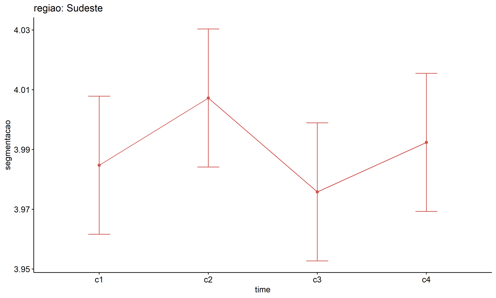
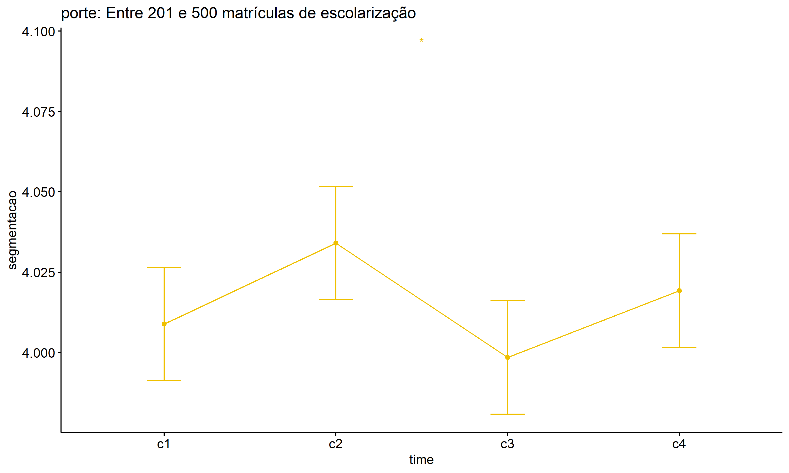

ANOVA test for segmentacao
================
Geiser C. Challco <geiser@alumni.usp.br>

- [ANOVA: segmentacao ~ time](#anova-segmentacao--time)
  - [Data Preparation](#data-preparation)
  - [Summary Statistics](#summary-statistics)
  - [ANOVA Computation](#anova-computation)
  - [PairWise Computation](#pairwise-computation)
- [ANOVA: segmentacao ~ time\*gender +
  Error(id/time)](#anova-segmentacao--timegender--erroridtime)
  - [Data Preparation](#data-preparation-1)
    - [Check assumptions: Identifying
      Outliers](#check-assumptions-identifying-outliers)
    - [Check assumptions: Normality
      Test](#check-assumptions-normality-test)
    - [Summary Statistics](#summary-statistics-1)
  - [ANOVA Computation](#anova-computation-1)
  - [ANOVA Computation after removing non.normal
    data](#anova-computation-after-removing-nonnormal-data)
  - [PairWise Computation](#pairwise-computation-1)
  - [PairWise Computation after removing non.normal
    data](#pairwise-computation-after-removing-nonnormal-data)
- [ANOVA: segmentacao ~ time\*localizacao +
  Error(id/time)](#anova-segmentacao--timelocalizacao--erroridtime)
  - [Data Preparation](#data-preparation-2)
    - [Check assumptions: Identifying
      Outliers](#check-assumptions-identifying-outliers-1)
    - [Check assumptions: Normality
      Test](#check-assumptions-normality-test-1)
    - [Summary Statistics](#summary-statistics-2)
  - [ANOVA Computation](#anova-computation-2)
  - [ANOVA Computation after removing non.normal
    data](#anova-computation-after-removing-nonnormal-data-1)
  - [PairWise Computation](#pairwise-computation-2)
  - [PairWise Computation after removing non.normal
    data](#pairwise-computation-after-removing-nonnormal-data-1)
- [ANOVA: segmentacao ~ time\*regiao +
  Error(id/time)](#anova-segmentacao--timeregiao--erroridtime)
  - [Data Preparation](#data-preparation-3)
    - [Check assumptions: Identifying
      Outliers](#check-assumptions-identifying-outliers-2)
    - [Check assumptions: Normality
      Test](#check-assumptions-normality-test-2)
    - [Summary Statistics](#summary-statistics-3)
  - [ANOVA Computation](#anova-computation-3)
  - [ANOVA Computation after removing non.normal
    data](#anova-computation-after-removing-nonnormal-data-2)
  - [PairWise Computation](#pairwise-computation-3)
  - [PairWise Computation after removing non.normal
    data](#pairwise-computation-after-removing-nonnormal-data-2)
- [ANOVA: segmentacao ~ time\*porte +
  Error(id/time)](#anova-segmentacao--timeporte--erroridtime)
  - [Data Preparation](#data-preparation-4)
    - [Check assumptions: Identifying
      Outliers](#check-assumptions-identifying-outliers-3)
    - [Check assumptions: Normality
      Test](#check-assumptions-normality-test-3)
    - [Summary Statistics](#summary-statistics-4)
  - [ANOVA Computation](#anova-computation-4)
  - [ANOVA Computation after removing non.normal
    data](#anova-computation-after-removing-nonnormal-data-3)
  - [PairWise Computation](#pairwise-computation-4)
  - [PairWise Computation after removing non.normal
    data](#pairwise-computation-after-removing-nonnormal-data-3)

``` r
dat <- read_excel("../data/data.xlsx", sheet = "alunos_ef14")

escolas <- read_excel("../data/data.xlsx", sheet = "escolas")
edat <- merge(dat, escolas, by = "cod_escola", all.x = T)
```

# ANOVA: segmentacao ~ time

## Data Preparation

``` r
data <- edat[,c("aluno_id","ciclo","segmentacao")]
data$ciclo <- factor(edat$ciclo, c("Primeiro Ciclo","Segundo Ciclo",
                                   "Terceiro Ciclo","Quarto Ciclo"))

wdat <- spread(data, ciclo, segmentacao)
wdat <- wdat[complete.cases(wdat),]
colnames(wdat) <- c("id","c1","c2","c3","c4")

ldat <- gather(wdat, key = time, value = segmentacao, c1, c2, c3, c4) %>%
  convert_as_factor(id, time)
ldat <- rshinystatistics::remove_group_data(ldat, "segmentacao", "time", n.limit = 30)
```

## Summary Statistics

``` r
(sdat <- ldat %>% group_by(time) %>%
   get_summary_stats(segmentacao, type = "mean_sd"))
```

    ## # A tibble: 4 × 5
    ##   time  variable        n  mean    sd
    ##   <fct> <fct>       <dbl> <dbl> <dbl>
    ## 1 c1    segmentacao  1126  4.02 0.289
    ## 2 c2    segmentacao  1126  4.02 0.238
    ## 3 c3    segmentacao  1126  4.00 0.193
    ## 4 c4    segmentacao  1126  4.01 0.206

| time | variable    |    n |  mean |    sd |
|:-----|:------------|-----:|------:|------:|
| c1   | segmentacao | 1126 | 4.016 | 0.289 |
| c2   | segmentacao | 1126 | 4.023 | 0.238 |
| c3   | segmentacao | 1126 | 3.999 | 0.193 |
| c4   | segmentacao | 1126 | 4.015 | 0.206 |

## ANOVA Computation

``` r
(res.aov <- anova_test(ldat, dv = segmentacao, wid = id, within = time))
```

    ## ANOVA Table (type III tests)
    ## 
    ## $ANOVA
    ##   Effect DFn  DFd     F     p p<.05   ges
    ## 1   time   3 3375 2.217 0.084       0.001
    ## 
    ## $`Mauchly's Test for Sphericity`
    ##   Effect     W       p p<.05
    ## 1   time 0.895 2.9e-25     *
    ## 
    ## $`Sphericity Corrections`
    ##   Effect  GGe        DF[GG] p[GG] p[GG]<.05   HFe       DF[HF] p[HF] p[HF]<.05
    ## 1   time 0.93 2.79, 3139.74 0.089           0.933 2.8, 3148.34 0.089

| Effect | DFn |  DFd |     F |     p | p\<.05 |   ges |
|:-------|----:|-----:|------:|------:|:-------|------:|
| time   |   3 | 3375 | 2.217 | 0.084 |        | 0.001 |

| Effect |     W |   p | p\<.05 |
|:-------|------:|----:|:-------|
| time   | 0.895 |   0 | \*     |

| Effect |  GGe | DF\[GG\]      | p\[GG\] | p\[GG\]\<.05 |   HFe | DF\[HF\]     | p\[HF\] | p\[HF\]\<.05 |
|:-------|-----:|:--------------|--------:|:-------------|------:|:-------------|--------:|:-------------|
| time   | 0.93 | 2.79, 3139.74 |   0.089 |              | 0.933 | 2.8, 3148.34 |   0.089 |              |

## PairWise Computation

``` r
(pwc <- ldat %>% emmeans_test(segmentacao ~ time, detailed = T, p.adjust.method = "bonferroni"))
```

    ## # A tibble: 6 × 14
    ##   term  .y.   group1 group2 null.value estimate      se    df conf.low conf.high statistic      p
    ## * <chr> <chr> <chr>  <chr>       <dbl>    <dbl>   <dbl> <dbl>    <dbl>     <dbl>     <dbl>  <dbl>
    ## 1 time  segm… c1     c2              0 -6.73e-3 0.00988  4500 -0.0261    0.0126    -0.682  0.495 
    ## 2 time  segm… c1     c3              0  1.73e-2 0.00988  4500 -0.00204   0.0367     1.75   0.0796
    ## 3 time  segm… c1     c4              0  8.88e-4 0.00988  4500 -0.0185    0.0203     0.0899 0.928 
    ## 4 time  segm… c2     c3              0  2.41e-2 0.00988  4500  0.00469   0.0434     2.44   0.0149
    ## 5 time  segm… c2     c4              0  7.62e-3 0.00988  4500 -0.0117    0.0270     0.772  0.440 
    ## 6 time  segm… c3     c4              0 -1.64e-2 0.00988  4500 -0.0358    0.00293   -1.66   0.0963
    ## # ℹ 2 more variables: p.adj <dbl>, p.adj.signif <chr>

| term | .y.         | group1 | group2 | null.value | estimate |   se |   df | conf.low | conf.high | statistic |     p | p.adj | p.adj.signif |
|:-----|:------------|:-------|:-------|-----------:|---------:|-----:|-----:|---------:|----------:|----------:|------:|------:|:-------------|
| time | segmentacao | c1     | c2     |          0 |   -0.007 | 0.01 | 4500 |   -0.026 |     0.013 |    -0.682 | 0.495 | 1.000 | ns           |
| time | segmentacao | c1     | c3     |          0 |    0.017 | 0.01 | 4500 |   -0.002 |     0.037 |     1.754 | 0.080 | 0.478 | ns           |
| time | segmentacao | c1     | c4     |          0 |    0.001 | 0.01 | 4500 |   -0.018 |     0.020 |     0.090 | 0.928 | 1.000 | ns           |
| time | segmentacao | c2     | c3     |          0 |    0.024 | 0.01 | 4500 |    0.005 |     0.043 |     2.435 | 0.015 | 0.089 | ns           |
| time | segmentacao | c2     | c4     |          0 |    0.008 | 0.01 | 4500 |   -0.012 |     0.027 |     0.772 | 0.440 | 1.000 | ns           |
| time | segmentacao | c3     | c4     |          0 |   -0.016 | 0.01 | 4500 |   -0.036 |     0.003 |    -1.664 | 0.096 | 0.578 | ns           |

``` r
pwc <- add_xy_position(pwc, x = "time", fun = "mean_se")
ggline(get_emmeans(pwc), x = "time", y = "emmean", ylab = "segmentacao") +
  geom_errorbar(aes(ymin = conf.low, ymax = conf.high), width = 0.2) +
  stat_pvalue_manual(pwc, hide.ns = T, tip.length = F)
```

<!-- -->

# ANOVA: segmentacao ~ time\*gender + Error(id/time)

## Data Preparation

``` r
data <- edat[,c("aluno_id","gender","ciclo","segmentacao")]
data$ciclo <- factor(data$ciclo, c("Primeiro Ciclo","Segundo Ciclo",
                                   "Terceiro Ciclo","Quarto Ciclo"))

wdat <- spread(data, ciclo, segmentacao)
wdat <- wdat[complete.cases(wdat),]
colnames(wdat) <- c("id","gender","c1","c2","c3","c4")

ldat <- gather(wdat, key = time, value = segmentacao, c1, c2, c3, c4) %>%
  convert_as_factor(id, time)
ldat <- remove_group_data(ldat, "segmentacao", c("time", "gender"), n.limit = 30)
ldat$gender <- factor(ldat$gender, sort(unique(ldat$gender)))
```

### Check assumptions: Identifying Outliers

``` r
outliers <- identify_outliers(group_by(ldat, time, gender), segmentacao)
(outliers <- outliers[outliers$is.extreme == T,])
```

    ## # A tibble: 429 × 6
    ##    gender time  id                   segmentacao is.outlier is.extreme
    ##    <fct>  <fct> <fct>                      <dbl> <lgl>      <lgl>     
    ##  1 Female c1    1Ao7d6oeWOGn5CkNSJxn         4.5 TRUE       TRUE      
    ##  2 Female c1    1rGKIQ7fdZBOxxGdPFrp         5   TRUE       TRUE      
    ##  3 Female c1    2DvDBlRadL6QdD6eJdDP         5   TRUE       TRUE      
    ##  4 Female c1    2JRv4aJX5ZiAWFd1UXo7         3.5 TRUE       TRUE      
    ##  5 Female c1    2qbgEyCWhU8ChVoKwmf5         5   TRUE       TRUE      
    ##  6 Female c1    46nUNvt4sDOPsC9jnkiG         3.5 TRUE       TRUE      
    ##  7 Female c1    4AM4nonwJ45LiMy6b4lp         4.5 TRUE       TRUE      
    ##  8 Female c1    4tC0rHbjrsSU8gnHaaJ3         3.5 TRUE       TRUE      
    ##  9 Female c1    4tkeMKZn4I9ZqCsB9HtZ         4.5 TRUE       TRUE      
    ## 10 Female c1    5AeP0IQ84CerIQVenp2G         4.5 TRUE       TRUE      
    ## # ℹ 419 more rows

| gender | time | id                   | segmentacao | is.outlier | is.extreme |
|:-------|:-----|:---------------------|------------:|:-----------|:-----------|
| Female | c1   | 1Ao7d6oeWOGn5CkNSJxn |       4.500 | TRUE       | TRUE       |
| Female | c1   | 1rGKIQ7fdZBOxxGdPFrp |       5.000 | TRUE       | TRUE       |
| Female | c1   | 2DvDBlRadL6QdD6eJdDP |       5.000 | TRUE       | TRUE       |
| Female | c1   | 2JRv4aJX5ZiAWFd1UXo7 |       3.500 | TRUE       | TRUE       |
| Female | c1   | 2qbgEyCWhU8ChVoKwmf5 |       5.000 | TRUE       | TRUE       |
| Female | c1   | 46nUNvt4sDOPsC9jnkiG |       3.500 | TRUE       | TRUE       |
| Female | c1   | 4AM4nonwJ45LiMy6b4lp |       4.500 | TRUE       | TRUE       |
| Female | c1   | 4tC0rHbjrsSU8gnHaaJ3 |       3.500 | TRUE       | TRUE       |
| Female | c1   | 4tkeMKZn4I9ZqCsB9HtZ |       4.500 | TRUE       | TRUE       |
| Female | c1   | 5AeP0IQ84CerIQVenp2G |       4.500 | TRUE       | TRUE       |
| Female | c1   | 5aLGVYNAMR84kxneNKFw |       3.000 | TRUE       | TRUE       |
| Female | c1   | 5WOchSZgUhx0OWTzb7cj |       3.000 | TRUE       | TRUE       |
| Female | c1   | AcPM8yalCG1JwgFkGEUa |       5.000 | TRUE       | TRUE       |
| Female | c1   | aOGxFSPrreKjHqmQIKKA |       4.500 | TRUE       | TRUE       |
| Female | c1   | bOhetFcZCcckN4VKJMtL |       3.000 | TRUE       | TRUE       |
| Female | c1   | CquTenVuBSFELLzcDuZm |       5.000 | TRUE       | TRUE       |
| Female | c1   | CRe8TWnc28z2KudiaQpG |       4.500 | TRUE       | TRUE       |
| Female | c1   | cV5XHPnJL5QhFRSG3oM4 |       3.000 | TRUE       | TRUE       |
| Female | c1   | d1JgyezU4pt7F4SebGoe |       3.000 | TRUE       | TRUE       |
| Female | c1   | D3zCmRj97N1xSw2RGyIX |       4.500 | TRUE       | TRUE       |
| Female | c1   | dJQJl5Fk0r29tPHPdig0 |       3.000 | TRUE       | TRUE       |
| Female | c1   | DP1fbT1lGhLiBnOFILLi |       4.500 | TRUE       | TRUE       |
| Female | c1   | e01kWx8LyQ5MBbqcIbXn |       5.000 | TRUE       | TRUE       |
| Female | c1   | ffnFAMZehkOjgmmGyq3E |       3.000 | TRUE       | TRUE       |
| Female | c1   | g6NpZa7qfNr4u2gcV0gv |       5.000 | TRUE       | TRUE       |
| Female | c1   | GcoCtxzprm7V40SNuUHZ |       5.000 | TRUE       | TRUE       |
| Female | c1   | gTUYwk2z23T9FqE617Q6 |       3.500 | TRUE       | TRUE       |
| Female | c1   | hruSgzhJbTGT2UHE0CPK |       4.500 | TRUE       | TRUE       |
| Female | c1   | jipIzfMPngc6Se2mEtoO |       5.000 | TRUE       | TRUE       |
| Female | c1   | k1Byic1gWlgNIFT8qDpn |       4.500 | TRUE       | TRUE       |
| Female | c1   | k4dskXNNlc2s0qDSigl6 |       4.500 | TRUE       | TRUE       |
| Female | c1   | k6zJZtkUuna5iM7hDW1g |       4.500 | TRUE       | TRUE       |
| Female | c1   | LC67V5LShu6RMdyHjAJx |       4.500 | TRUE       | TRUE       |
| Female | c1   | LENIWLSSDEOzE5PXnvXp |       3.000 | TRUE       | TRUE       |
| Female | c1   | lhunwGXEdkeKLaO5a7QM |       5.000 | TRUE       | TRUE       |
| Female | c1   | lt4Za0V8VmneMBIicN4R |       3.500 | TRUE       | TRUE       |
| Female | c1   | mTxfHO37mmdyGuVi0AcC |       4.500 | TRUE       | TRUE       |
| Female | c1   | nI311xKanqD5k4XdM5QB |       4.500 | TRUE       | TRUE       |
| Female | c1   | Nxx94hXNUgZI0TqkLGim |       4.500 | TRUE       | TRUE       |
| Female | c1   | o0DoDtp2hSE7RkEiiHPo |       5.000 | TRUE       | TRUE       |
| Female | c1   | o7ae3s3byv8mIlSj13gp |       3.500 | TRUE       | TRUE       |
| Female | c1   | oB5KNHL8aUZyGZK3jNIP |       4.500 | TRUE       | TRUE       |
| Female | c1   | oDMkReJJYWsd4uzwRHCT |       5.000 | TRUE       | TRUE       |
| Female | c1   | oGSieiW0e0ZBuFzxvRmw |       5.000 | TRUE       | TRUE       |
| Female | c1   | ojZafSSNhdquBdGe5nyl |       5.000 | TRUE       | TRUE       |
| Female | c1   | oN0ADw4gTFoLF4lFHvIG |       4.500 | TRUE       | TRUE       |
| Female | c1   | oXSgcc3DBRVhE2rUkzsC |       4.500 | TRUE       | TRUE       |
| Female | c1   | PGyZRq71Ur0tx7eDyjsA |       3.000 | TRUE       | TRUE       |
| Female | c1   | PoGsNdwD58xE967TyLSP |       4.500 | TRUE       | TRUE       |
| Female | c1   | q1RelulkOweB4lCMWfxy |       4.500 | TRUE       | TRUE       |
| Female | c1   | QYTt79UHmaJSsiaUWdtX |       4.500 | TRUE       | TRUE       |
| Female | c1   | R30CbcxLKbUIEyoQAUlq |       4.500 | TRUE       | TRUE       |
| Female | c1   | RCY3F2HtV0DPrs21Q5KB |       5.000 | TRUE       | TRUE       |
| Female | c1   | Rq2OTnqvauiedrQ0PVcm |       3.500 | TRUE       | TRUE       |
| Female | c1   | tCb4rrRwUManE1rIKMDG |       3.000 | TRUE       | TRUE       |
| Female | c1   | tCUAVlzX0WYxtKIF01rT |       5.000 | TRUE       | TRUE       |
| Female | c1   | TkOknTGAXiI0iu1peCXq |       5.000 | TRUE       | TRUE       |
| Female | c1   | u2aUk1r7PC4IziM3zuK5 |       4.500 | TRUE       | TRUE       |
| Female | c1   | wSTeItj2YyZhZQ0kiCqW |       4.500 | TRUE       | TRUE       |
| Female | c1   | x3Xw8snMHFPilY4HCQUJ |       5.000 | TRUE       | TRUE       |
| Female | c1   | xk7eC5haTYuFQaJovsBZ |       3.500 | TRUE       | TRUE       |
| Female | c1   | Xp2WjFJXcpGZCU8vSfqe |       4.500 | TRUE       | TRUE       |
| Female | c1   | xYGLlb7JnNykkazrxJHF |       3.000 | TRUE       | TRUE       |
| Female | c1   | YHXNZ5EZVEDetoRKI6Jt |       3.000 | TRUE       | TRUE       |
| Female | c1   | Yk1rmaDGgunEYzXa80ii |       4.500 | TRUE       | TRUE       |
| Female | c1   | ysWmkmTNdvDazR3vKFJw |       4.500 | TRUE       | TRUE       |
| Female | c1   | z21xC87TEju0zLTwYiBi |       3.000 | TRUE       | TRUE       |
| Female | c1   | ZNG4KlCVU8OQIv8HDYLP |       4.500 | TRUE       | TRUE       |
| Female | c1   | zWZKZqZshi1gy6r2jYoM |       4.500 | TRUE       | TRUE       |
| Male   | c1   | 03prrbuQMUZ1aXaNSpNg |       3.500 | TRUE       | TRUE       |
| Male   | c1   | 0rFiZU3E0rQ5w337VW1f |       4.500 | TRUE       | TRUE       |
| Male   | c1   | 2eFfyVVi6PFZAieFgek6 |       4.500 | TRUE       | TRUE       |
| Male   | c1   | 2wBgWJVF1mK6rnsBiZ99 |       3.000 | TRUE       | TRUE       |
| Male   | c1   | 53lsfK6za4noVZe68et6 |       3.000 | TRUE       | TRUE       |
| Male   | c1   | 7AsCrRYMyhVRQHX4kZdc |       3.000 | TRUE       | TRUE       |
| Male   | c1   | 7g3GunKKkHWAtnvcV4AX |       4.500 | TRUE       | TRUE       |
| Male   | c1   | 8TnTXVBQUI6JQuADMpd3 |       5.000 | TRUE       | TRUE       |
| Male   | c1   | 9jd1C85ixCoJf3EINYfx |       5.000 | TRUE       | TRUE       |
| Male   | c1   | 9ylUEO2PMilJk8pF3sWj |       3.500 | TRUE       | TRUE       |
| Male   | c1   | ao9Hy7cVw5W6MXhO5Ylm |       3.500 | TRUE       | TRUE       |
| Male   | c1   | aT7LCUsqZ1GEFzMoTQbc |       5.000 | TRUE       | TRUE       |
| Male   | c1   | atydp19vM0PjiOQCWemR |       5.000 | TRUE       | TRUE       |
| Male   | c1   | BCdMsV8b1rekzcjDGIe0 |       3.500 | TRUE       | TRUE       |
| Male   | c1   | C9yrnovcTaV6PYqDq8Hh |       5.000 | TRUE       | TRUE       |
| Male   | c1   | cuknOzzwN4oCRum5U5ph |       3.500 | TRUE       | TRUE       |
| Male   | c1   | Cwe3jJ7NE2J7kG6g1Ox7 |       5.000 | TRUE       | TRUE       |
| Male   | c1   | cWhCU9PZ3Uh5Q4Rfe7h1 |       3.500 | TRUE       | TRUE       |
| Male   | c1   | dexrClGilncb86c5HWYP |       3.500 | TRUE       | TRUE       |
| Male   | c1   | EXP9vzjLIJFDlyiQt1hn |       3.000 | TRUE       | TRUE       |
| Male   | c1   | FEnmeYPVP8f5Ugerho3M |       3.500 | TRUE       | TRUE       |
| Male   | c1   | fETGhIde8enSW1EPqWMS |       3.000 | TRUE       | TRUE       |
| Male   | c1   | GN5vxU0haHKd9W22JGyk |       4.500 | TRUE       | TRUE       |
| Male   | c1   | gpkCMVwYM8Ew33RRq4gG |       3.000 | TRUE       | TRUE       |
| Male   | c1   | GRXCU0bF6TElSKj1QNCL |       4.500 | TRUE       | TRUE       |
| Male   | c1   | Gsyp9rOr8D3HurDARL2r |       3.500 | TRUE       | TRUE       |
| Male   | c1   | H6FKfkHmJvp7I0x9JRY4 |       5.000 | TRUE       | TRUE       |
| Male   | c1   | Ho6XhD21vYcP3f3cT4x5 |       3.000 | TRUE       | TRUE       |
| Male   | c1   | IhMESsBNHf0ZnXXy9IZ7 |       3.500 | TRUE       | TRUE       |
| Male   | c1   | jjh5s0TSBRsF1PDf5w2n |       3.000 | TRUE       | TRUE       |
| Male   | c1   | K34anZEBbiYHYRSBkUK2 |       3.000 | TRUE       | TRUE       |
| Male   | c1   | KBTZEriJAFvcWw48Xxgc |       3.500 | TRUE       | TRUE       |
| Male   | c1   | LC1uBEBe3hZn8Q1mQe7A |       4.500 | TRUE       | TRUE       |
| Male   | c1   | LfvhKtKBun3aJ73ldMri |       3.000 | TRUE       | TRUE       |
| Male   | c1   | lLzQkeToSulF52LL5WOf |       3.500 | TRUE       | TRUE       |
| Male   | c1   | LxqeE6TiTs0QSXlTGao9 |       4.500 | TRUE       | TRUE       |
| Male   | c1   | m5AeVuITWa7uCAG6h1Qh |       3.000 | TRUE       | TRUE       |
| Male   | c1   | MO5oCAGyztcuEpHPXGxD |       3.000 | TRUE       | TRUE       |
| Male   | c1   | mp70aTuAiwYmhEHntRfm |       3.000 | TRUE       | TRUE       |
| Male   | c1   | Mv8Pv2YBEg4SX5h40YAU |       3.000 | TRUE       | TRUE       |
| Male   | c1   | n2i00IVeZPVdjrDvPP99 |       3.500 | TRUE       | TRUE       |
| Male   | c1   | nzSi9kSv8tyksM7sR4WD |       5.000 | TRUE       | TRUE       |
| Male   | c1   | o8RPNQAPzP7e1GvMGN7T |       5.000 | TRUE       | TRUE       |
| Male   | c1   | OVb2go0X1GM1ZVAiE2zt |       4.500 | TRUE       | TRUE       |
| Male   | c1   | p60GU5cf9uaftl79CXwQ |       4.500 | TRUE       | TRUE       |
| Male   | c1   | PMsVKgnivLJr3CQYAKsP |       3.500 | TRUE       | TRUE       |
| Male   | c1   | pNPcjHpCzgp8RVz7e05C |       5.000 | TRUE       | TRUE       |
| Male   | c1   | pP3lgJSF2kQmRiN1eltw |       3.000 | TRUE       | TRUE       |
| Male   | c1   | PqGNJ3ulcYyMvHLXk5pI |       3.500 | TRUE       | TRUE       |
| Male   | c1   | q6EYDD8UOyDyvcYk09qw |       3.000 | TRUE       | TRUE       |
| Male   | c1   | r6czAkrctrloI6Gqug6d |       4.500 | TRUE       | TRUE       |
| Male   | c1   | R8Cpj06eOE8snJn14VVH |       4.500 | TRUE       | TRUE       |
| Male   | c1   | RG5EPSzbZxigtb7hYi0o |       4.500 | TRUE       | TRUE       |
| Male   | c1   | rrFrDfgUOXcJdbMKRdyp |       5.000 | TRUE       | TRUE       |
| Male   | c1   | RTbkHP5ZAedrE08Wg5kZ |       5.000 | TRUE       | TRUE       |
| Male   | c1   | stZ7BNgO3kxuXDMYZTmD |       4.500 | TRUE       | TRUE       |
| Male   | c1   | Swge4GG9Qmg1w9YaAeDP |       3.500 | TRUE       | TRUE       |
| Male   | c1   | t0XYes69zn36ucbZar6f |       3.000 | TRUE       | TRUE       |
| Male   | c1   | Tpl9wyWP6dRFrgwOV5RA |       4.500 | TRUE       | TRUE       |
| Male   | c1   | TupwpKp0mSf2xCyx7nhJ |       4.500 | TRUE       | TRUE       |
| Male   | c1   | UhxZSpqIzLIFQwwQAvfG |       5.000 | TRUE       | TRUE       |
| Male   | c1   | uNamFcxAOgEisbgKQwxN |       4.500 | TRUE       | TRUE       |
| Male   | c1   | UtQWTWpXSmspTBb0k7Cc |       5.000 | TRUE       | TRUE       |
| Male   | c1   | V0gCA9bbGhM3m5WM6ues |       3.000 | TRUE       | TRUE       |
| Male   | c1   | Vwua9sTVCHVhVU5gFc9F |       4.500 | TRUE       | TRUE       |
| Male   | c1   | w5VKD1TwdnbLmwZYCgxK |       3.000 | TRUE       | TRUE       |
| Male   | c1   | wf0v2mo3wtJsolYy5uzg |       4.500 | TRUE       | TRUE       |
| Male   | c1   | WI9GCOH8SCiOQFVeGq82 |       4.500 | TRUE       | TRUE       |
| Male   | c1   | WKtApwahDCFsZcicoOQJ |       3.500 | TRUE       | TRUE       |
| Male   | c1   | xAWL4I2V4r38Wn9MvMvZ |       5.000 | TRUE       | TRUE       |
| Male   | c1   | XJ7ipDixomJ8NPJa43wZ |       4.500 | TRUE       | TRUE       |
| Male   | c1   | y5L9fA08vmo684jURWry |       3.000 | TRUE       | TRUE       |
| Male   | c1   | YCwKAjLsULoWxNT4JSDS |       4.500 | TRUE       | TRUE       |
| Male   | c1   | Ycy1yVbEtOQA64UcyFeO |       5.000 | TRUE       | TRUE       |
| Male   | c1   | ygFJxqySABX8ax57ihIq |       4.500 | TRUE       | TRUE       |
| Male   | c1   | z3p6Ot4uvkPmGXOS9D3e |       4.500 | TRUE       | TRUE       |
| Male   | c1   | ZFjyLFTCim7WZrtYy2tK |       3.500 | TRUE       | TRUE       |
| Male   | c1   | ZofyIIr5bSebSJqbw1PI |       5.000 | TRUE       | TRUE       |
| Female | c2   | 12jZHvX32WJ4t8qQybyG |       3.500 | TRUE       | TRUE       |
| Female | c2   | 2aoO9dS9UrOP9B1X12G8 |       4.500 | TRUE       | TRUE       |
| Female | c2   | 2q793p1L7LjOwORT2yTo |       4.500 | TRUE       | TRUE       |
| Female | c2   | 2vdWL372vCcXVAl1N1hj |       5.000 | TRUE       | TRUE       |
| Female | c2   | 3fTmP8cTTJq8WUIEU0Xl |       3.000 | TRUE       | TRUE       |
| Female | c2   | 3Ugm6wd42djxxIa9v8nX |       5.000 | TRUE       | TRUE       |
| Female | c2   | 46nUNvt4sDOPsC9jnkiG |       3.500 | TRUE       | TRUE       |
| Female | c2   | 4IjHAZhbMyECEihJ2TGR |       4.500 | TRUE       | TRUE       |
| Female | c2   | 4KHHEYjMyMuMUSgMFBWA |       4.500 | TRUE       | TRUE       |
| Female | c2   | 53wwkxtWpNW5sqGU32Kc |       3.000 | TRUE       | TRUE       |
| Female | c2   | 5AeP0IQ84CerIQVenp2G |       4.500 | TRUE       | TRUE       |
| Female | c2   | 8jXS39U6Aje4RlDntJHg |       4.500 | TRUE       | TRUE       |
| Female | c2   | 8lfWsRb6bqeqiqAn2iPn |       4.500 | TRUE       | TRUE       |
| Female | c2   | 8n4JXvpaksp7w7L2JeUi |       5.000 | TRUE       | TRUE       |
| Female | c2   | AUp01jGBKvRyiH5yAcYg |       4.500 | TRUE       | TRUE       |
| Female | c2   | AuVuWIEc6T2fiJBNL1uB |       5.000 | TRUE       | TRUE       |
| Female | c2   | BJqanJLBeoQL72hwwzBH |       4.500 | TRUE       | TRUE       |
| Female | c2   | bleizMxfI8NH6utKgnAr |       4.500 | TRUE       | TRUE       |
| Female | c2   | CGgRvAFnhfRuB2rwvU5E |       4.500 | TRUE       | TRUE       |
| Female | c2   | CgX6BVJGx7gjW8HB4i3R |       4.500 | TRUE       | TRUE       |
| Female | c2   | DAQSh7QyUdOOn9MIrgQx |       3.500 | TRUE       | TRUE       |
| Female | c2   | dzc3X9DkUqRGgLgEqR3M |       4.500 | TRUE       | TRUE       |
| Female | c2   | EcAgL4tVyGSoqslrQjcI |       4.500 | TRUE       | TRUE       |
| Female | c2   | fv4E2FaI0vtzRUTR2HfI |       3.000 | TRUE       | TRUE       |
| Female | c2   | g6NpZa7qfNr4u2gcV0gv |       4.333 | TRUE       | TRUE       |
| Female | c2   | gpwJJdOJEYwiQDcpuWQI |       3.500 | TRUE       | TRUE       |
| Female | c2   | gwqD0OEFT31g58P8CTXA |       5.000 | TRUE       | TRUE       |
| Female | c2   | iiM2iLDGfLDnbfRHOvFj |       4.500 | TRUE       | TRUE       |
| Female | c2   | Ipbr5yW2g7LG6DIsw0MA |       4.500 | TRUE       | TRUE       |
| Female | c2   | IQG9Amy6vysT4R53wSDd |       5.000 | TRUE       | TRUE       |
| Female | c2   | IZvD1XFz2w9MybpQpGNW |       3.000 | TRUE       | TRUE       |
| Female | c2   | JCY9pJdHIMp1aixpihKP |       4.500 | TRUE       | TRUE       |
| Female | c2   | KgqoDcMNgZGVvBJkoiie |       3.000 | TRUE       | TRUE       |
| Female | c2   | KhmQYGX5BHYFPnziCxPk |       4.500 | TRUE       | TRUE       |
| Female | c2   | lJK4lb1citUZhSEsfDpF |       5.000 | TRUE       | TRUE       |
| Female | c2   | MLtbgHxX9fPA600cR1nJ |       3.500 | TRUE       | TRUE       |
| Female | c2   | NudgAXrN7PT8EiGwjm46 |       4.500 | TRUE       | TRUE       |
| Female | c2   | o7ae3s3byv8mIlSj13gp |       3.500 | TRUE       | TRUE       |
| Female | c2   | oN4vkQYTWXOXTfMLi4no |       4.500 | TRUE       | TRUE       |
| Female | c2   | p67KslC0SdpayMWeJgoV |       4.500 | TRUE       | TRUE       |
| Female | c2   | qK2akctCoTCPVn9gQ3TD |       5.000 | TRUE       | TRUE       |
| Female | c2   | qtuRl17SS1cu3JNFJ6rG |       4.500 | TRUE       | TRUE       |
| Female | c2   | rB3yZB34TUuIABF8CVJT |       4.500 | TRUE       | TRUE       |
| Female | c2   | RCtwG0Gv6QBL1v6bSIiK |       4.250 | TRUE       | TRUE       |
| Female | c2   | s5sOLvCaEo2QjQ0SbIgm |       4.500 | TRUE       | TRUE       |
| Female | c2   | tCb4rrRwUManE1rIKMDG |       4.500 | TRUE       | TRUE       |
| Female | c2   | u65Z834z75LDIy0slvaX |       3.000 | TRUE       | TRUE       |
| Female | c2   | UC1AjdZVYm0vREwvlhXA |       3.000 | TRUE       | TRUE       |
| Female | c2   | vaRJiqfg9CvKqc7DM43c |       4.500 | TRUE       | TRUE       |
| Female | c2   | WqVEFbjIwGz4GcqsHGeS |       4.500 | TRUE       | TRUE       |
| Female | c2   | YFTC62AlPZvihI7w34a9 |       4.250 | TRUE       | TRUE       |
| Female | c2   | yJyr8QJweeFvX2FfVsL8 |       4.500 | TRUE       | TRUE       |
| Female | c2   | yNWoLoC2fizKV3ipSR8O |       5.000 | TRUE       | TRUE       |
| Female | c2   | z2bvFgOm1tRPAL3buvNQ |       5.000 | TRUE       | TRUE       |
| Female | c2   | zkW6c2m0BkbGXx8JpERU |       5.000 | TRUE       | TRUE       |
| Female | c2   | ZNG4KlCVU8OQIv8HDYLP |       4.500 | TRUE       | TRUE       |
| Female | c2   | zXoAy3ZEimi0b2mfR9sy |       5.000 | TRUE       | TRUE       |
| Male   | c2   | 1UYoCnz1CIUnpWS0Oqug |       4.500 | TRUE       | TRUE       |
| Male   | c2   | 2H9ye7xRvswNjLL7LiYm |       4.500 | TRUE       | TRUE       |
| Male   | c2   | 3ETydorel7bIDQKYclir |       4.250 | TRUE       | TRUE       |
| Male   | c2   | 3MUJ4HoQRSD2yMvXBBHX |       3.000 | TRUE       | TRUE       |
| Male   | c2   | 4Tdh2ezpRZQPFALXk9Zl |       4.500 | TRUE       | TRUE       |
| Male   | c2   | 5MJshP0kp19vpSf9kCw1 |       5.000 | TRUE       | TRUE       |
| Male   | c2   | 66k1mgdisI5m2S7kJsyb |       5.000 | TRUE       | TRUE       |
| Male   | c2   | 6bihB1I2r8NvIjfOvK7h |       4.500 | TRUE       | TRUE       |
| Male   | c2   | 84eMLEkOxEAhysQoqAVy |       3.000 | TRUE       | TRUE       |
| Male   | c2   | 8chAa9iLK3kUxrVJ0Yd5 |       5.000 | TRUE       | TRUE       |
| Male   | c2   | A5EETpEr617bpnSh1wp6 |       4.500 | TRUE       | TRUE       |
| Male   | c2   | alukiCdlqbDjIaNtcal6 |       5.000 | TRUE       | TRUE       |
| Male   | c2   | AmerU5JsGxhj1ABeNqNx |       4.500 | TRUE       | TRUE       |
| Male   | c2   | BCdMsV8b1rekzcjDGIe0 |       3.500 | TRUE       | TRUE       |
| Male   | c2   | dRG8aYJwJKM1rzag9orw |       3.500 | TRUE       | TRUE       |
| Male   | c2   | dudVd9dDXH8Gf0z5C7hV |       4.500 | TRUE       | TRUE       |
| Male   | c2   | E8XEhNJhfANZZtqHam0A |       3.000 | TRUE       | TRUE       |
| Male   | c2   | EciuZB7Xc506GnnOoqiE |       3.500 | TRUE       | TRUE       |
| Male   | c2   | FEnmeYPVP8f5Ugerho3M |       3.000 | TRUE       | TRUE       |
| Male   | c2   | FZeYth2awRkcS9LrWQ6j |       4.500 | TRUE       | TRUE       |
| Male   | c2   | GAEVtgOgvNASXuwIPENX |       4.500 | TRUE       | TRUE       |
| Male   | c2   | gRiK9OMij8RxayU0KCFv |       3.667 | TRUE       | TRUE       |
| Male   | c2   | HqTgiqhYnEvVciVol3PS |       3.500 | TRUE       | TRUE       |
| Male   | c2   | HtZtYxSbCTf1YGKUWjMm |       3.000 | TRUE       | TRUE       |
| Male   | c2   | jjh5s0TSBRsF1PDf5w2n |       3.500 | TRUE       | TRUE       |
| Male   | c2   | lEPERgsbz7sn6paXIvu5 |       5.000 | TRUE       | TRUE       |
| Male   | c2   | lk2YDJ1bLqxyJWxA4H3c |       3.000 | TRUE       | TRUE       |
| Male   | c2   | lLzQkeToSulF52LL5WOf |       3.000 | TRUE       | TRUE       |
| Male   | c2   | mLhkpaZkhjIYzD3JODx8 |       3.000 | TRUE       | TRUE       |
| Male   | c2   | MO5oCAGyztcuEpHPXGxD |       4.500 | TRUE       | TRUE       |
| Male   | c2   | nH1M6rVx02k2Hr3TdrNL |       4.500 | TRUE       | TRUE       |
| Male   | c2   | O3iYOYEGjbneuih5lpHY |       4.500 | TRUE       | TRUE       |
| Male   | c2   | OVb2go0X1GM1ZVAiE2zt |       5.000 | TRUE       | TRUE       |
| Male   | c2   | PKoPTKC1RrGaREkbINPf |       3.500 | TRUE       | TRUE       |
| Male   | c2   | pzeM62TqsDvBbSHCceqe |       5.000 | TRUE       | TRUE       |
| Male   | c2   | QgsijD1gkPD35eUh7fsV |       3.500 | TRUE       | TRUE       |
| Male   | c2   | Qhz0r7FNBiZ6BXvAn3EY |       5.000 | TRUE       | TRUE       |
| Male   | c2   | qJUI6FkVBuCDbGxvd5Os |       5.000 | TRUE       | TRUE       |
| Male   | c2   | R48qS0stXTGLkb41s9Kz |       3.500 | TRUE       | TRUE       |
| Male   | c2   | rBH6YQ5gYS5B7XrOrbZA |       5.000 | TRUE       | TRUE       |
| Male   | c2   | rknK8GEk9H27CI9GSt4V |       3.667 | TRUE       | TRUE       |
| Male   | c2   | sM3c4noBIP8hnYWA6pAe |       5.000 | TRUE       | TRUE       |
| Male   | c2   | stZ7BNgO3kxuXDMYZTmD |       5.000 | TRUE       | TRUE       |
| Male   | c2   | sV9mhY7G3TGd1YYuX6Tn |       4.333 | TRUE       | TRUE       |
| Male   | c2   | sXB3m8f7P40lRXYwY22p |       4.333 | TRUE       | TRUE       |
| Male   | c2   | uvbG68yspOWVeG7vqGSx |       4.500 | TRUE       | TRUE       |
| Male   | c2   | uvZ3TuV0KCa2WSQ5kCaf |       3.500 | TRUE       | TRUE       |
| Male   | c2   | vQXf6gnvo8tFFkQquhvU |       3.000 | TRUE       | TRUE       |
| Male   | c2   | WCSObSsiS3xWwGKtJ3Wu |       3.000 | TRUE       | TRUE       |
| Male   | c2   | wUSw2Yh2LxJS7rngqFXC |       5.000 | TRUE       | TRUE       |
| Male   | c2   | xAWL4I2V4r38Wn9MvMvZ |       5.000 | TRUE       | TRUE       |
| Male   | c2   | xVsCCmMyzdnbKR7BdWXo |       4.500 | TRUE       | TRUE       |
| Male   | c2   | ygCWEOBsngyfEt5hGLmw |       4.500 | TRUE       | TRUE       |
| Male   | c2   | yLadwnZfaYziyxKlMRcG |       3.500 | TRUE       | TRUE       |
| Male   | c2   | YSqZBl82JKfkjZUNa1mD |       5.000 | TRUE       | TRUE       |
| Male   | c2   | z0ZNx9ERJCowGHVo39UE |       5.000 | TRUE       | TRUE       |
| Male   | c2   | zDbZkpn8NBDdlUATuEX2 |       4.500 | TRUE       | TRUE       |
| Male   | c2   | ZdpC4Xaxucxlaqa0o7wm |       3.000 | TRUE       | TRUE       |
| Female | c3   | 2DvDBlRadL6QdD6eJdDP |       3.000 | TRUE       | TRUE       |
| Female | c3   | 2JRv4aJX5ZiAWFd1UXo7 |       3.000 | TRUE       | TRUE       |
| Female | c3   | 428hAnBUps0BqZ1DSPJ3 |       4.500 | TRUE       | TRUE       |
| Female | c3   | 5AeP0IQ84CerIQVenp2G |       5.000 | TRUE       | TRUE       |
| Female | c3   | 5aLGVYNAMR84kxneNKFw |       4.500 | TRUE       | TRUE       |
| Female | c3   | 6zAoYaCiBz0ok4UtPFa7 |       4.500 | TRUE       | TRUE       |
| Female | c3   | C6MwPqqVDphs0V0LkTcZ |       5.000 | TRUE       | TRUE       |
| Female | c3   | cdDXdUow4GgYvVCA0fM4 |       4.500 | TRUE       | TRUE       |
| Female | c3   | Etqtu93XqNkSWbokojKW |       4.500 | TRUE       | TRUE       |
| Female | c3   | F6Rc9DXFZYoUrb5COONd |       3.000 | TRUE       | TRUE       |
| Female | c3   | fbG1AkJFlVZGXT8Fznxj |       3.000 | TRUE       | TRUE       |
| Female | c3   | FYlqwRvhbtBOGUaep4NX |       3.500 | TRUE       | TRUE       |
| Female | c3   | FZ4xpkxh3rewF1CrCOjp |       4.500 | TRUE       | TRUE       |
| Female | c3   | g6NpZa7qfNr4u2gcV0gv |       4.500 | TRUE       | TRUE       |
| Female | c3   | GcoCtxzprm7V40SNuUHZ |       5.000 | TRUE       | TRUE       |
| Female | c3   | gwqD0OEFT31g58P8CTXA |       4.500 | TRUE       | TRUE       |
| Female | c3   | h1SbGJLE0AMRAFE7c8Gm |       4.500 | TRUE       | TRUE       |
| Female | c3   | i3TcORTWUFCvTPk4psJY |       3.000 | TRUE       | TRUE       |
| Female | c3   | JCY9pJdHIMp1aixpihKP |       3.500 | TRUE       | TRUE       |
| Female | c3   | LMM7USaf7Oavhb0hsq18 |       4.500 | TRUE       | TRUE       |
| Female | c3   | LrI1NgNOZMbBnuVElrFm |       4.500 | TRUE       | TRUE       |
| Female | c3   | MQQzCobZnYpZIFa6hmO3 |       3.000 | TRUE       | TRUE       |
| Female | c3   | MxgQUA6KrQnZN4Fm7oCW |       3.500 | TRUE       | TRUE       |
| Female | c3   | oD5GxaNjeDAC3crjbEQU |       3.000 | TRUE       | TRUE       |
| Female | c3   | oN4vkQYTWXOXTfMLi4no |       3.000 | TRUE       | TRUE       |
| Female | c3   | p67KslC0SdpayMWeJgoV |       4.500 | TRUE       | TRUE       |
| Female | c3   | QfYtalFBEUYn592AA7VS |       3.000 | TRUE       | TRUE       |
| Female | c3   | QoZgk4198xISuJZrDx5q |       3.000 | TRUE       | TRUE       |
| Female | c3   | rwRhSmD8z5JtVSIArv2d |       5.000 | TRUE       | TRUE       |
| Female | c3   | SOMDig3yF6qMmyrUF7OT |       4.500 | TRUE       | TRUE       |
| Female | c3   | Tx00OuDqtxwpgtcPjPyb |       5.000 | TRUE       | TRUE       |
| Female | c3   | uXrGgSVZ1ZKfQuJ3neSu |       4.500 | TRUE       | TRUE       |
| Female | c3   | wC5CCryfUyofpyKyVtEe |       4.500 | TRUE       | TRUE       |
| Female | c3   | x3Xw8snMHFPilY4HCQUJ |       5.000 | TRUE       | TRUE       |
| Female | c3   | XA1RZvBiW1VNEOjMkxQC |       3.500 | TRUE       | TRUE       |
| Female | c3   | Xfs4ydu0jiJkaDwInzXx |       4.500 | TRUE       | TRUE       |
| Female | c3   | zhAsZE7XXg7kRRaz37fe |       4.500 | TRUE       | TRUE       |
| Female | c3   | zu9ITSnIAecxMpJmNxCE |       4.500 | TRUE       | TRUE       |
| Female | c3   | zXoAy3ZEimi0b2mfR9sy |       5.000 | TRUE       | TRUE       |
| Male   | c3   | 13ksa3iHOsfBObErxHP7 |       3.500 | TRUE       | TRUE       |
| Male   | c3   | 18EWxrJZtjBVpzckkv21 |       5.000 | TRUE       | TRUE       |
| Male   | c3   | 1D0FkPiZPusHHIh6zphq |       4.500 | TRUE       | TRUE       |
| Male   | c3   | 2eTy4XnB3HL1Lip3fbQn |       3.500 | TRUE       | TRUE       |
| Male   | c3   | 5MJshP0kp19vpSf9kCw1 |       3.000 | TRUE       | TRUE       |
| Male   | c3   | 8chAa9iLK3kUxrVJ0Yd5 |       3.000 | TRUE       | TRUE       |
| Male   | c3   | 8TnTXVBQUI6JQuADMpd3 |       3.500 | TRUE       | TRUE       |
| Male   | c3   | bHobujEJH9Ye5qPYW9o3 |       3.500 | TRUE       | TRUE       |
| Male   | c3   | cJoqgrk6T3HsA9EOVe7D |       3.500 | TRUE       | TRUE       |
| Male   | c3   | ct84G9jl4uDInOFHztuC |       5.000 | TRUE       | TRUE       |
| Male   | c3   | Cwe3jJ7NE2J7kG6g1Ox7 |       3.500 | TRUE       | TRUE       |
| Male   | c3   | dRG8aYJwJKM1rzag9orw |       3.000 | TRUE       | TRUE       |
| Male   | c3   | fEYVARleb30C16nBEYEI |       4.500 | TRUE       | TRUE       |
| Male   | c3   | G5WjH8t1I6LAiAOCuM2v |       4.500 | TRUE       | TRUE       |
| Male   | c3   | GAEVtgOgvNASXuwIPENX |       4.500 | TRUE       | TRUE       |
| Male   | c3   | GaixfRTaHdeXkQujJJrz |       3.500 | TRUE       | TRUE       |
| Male   | c3   | H5F4r5nnGQTG1FzfyxrY |       3.500 | TRUE       | TRUE       |
| Male   | c3   | HqTgiqhYnEvVciVol3PS |       3.500 | TRUE       | TRUE       |
| Male   | c3   | hUt4VxcTjmxpmXmKlBG9 |       3.500 | TRUE       | TRUE       |
| Male   | c3   | ITZKcm29e0hwUQiiDtaF |       4.500 | TRUE       | TRUE       |
| Male   | c3   | IY1WPkRNTt5TtOVLPSsJ |       4.500 | TRUE       | TRUE       |
| Male   | c3   | jKv0Lh0R5ij5dbHktuzW |       3.000 | TRUE       | TRUE       |
| Male   | c3   | kifyGVAfMTF5hQBzNd1R |       3.500 | TRUE       | TRUE       |
| Male   | c3   | lLzQkeToSulF52LL5WOf |       3.500 | TRUE       | TRUE       |
| Male   | c3   | ltOCfuKereDnvy2o0H2m |       4.500 | TRUE       | TRUE       |
| Male   | c3   | mLhkpaZkhjIYzD3JODx8 |       3.500 | TRUE       | TRUE       |
| Male   | c3   | Mv8Pv2YBEg4SX5h40YAU |       3.500 | TRUE       | TRUE       |
| Male   | c3   | N1moyOPv6LwxPn3bNcWi |       3.500 | TRUE       | TRUE       |
| Male   | c3   | nH1M6rVx02k2Hr3TdrNL |       4.500 | TRUE       | TRUE       |
| Male   | c3   | NRErIHMorWhZNoH91zIQ |       3.500 | TRUE       | TRUE       |
| Male   | c3   | pzeM62TqsDvBbSHCceqe |       3.000 | TRUE       | TRUE       |
| Male   | c3   | QDEIDD9IHOpXjJTYgqBL |       5.000 | TRUE       | TRUE       |
| Male   | c3   | qJUI6FkVBuCDbGxvd5Os |       4.500 | TRUE       | TRUE       |
| Male   | c3   | rknK8GEk9H27CI9GSt4V |       3.500 | TRUE       | TRUE       |
| Male   | c3   | t7Simft4IeyuUEMt5luw |       3.500 | TRUE       | TRUE       |
| Male   | c3   | TABveJnXO5hRaweFnAMh |       3.000 | TRUE       | TRUE       |
| Male   | c3   | UtQWTWpXSmspTBb0k7Cc |       4.500 | TRUE       | TRUE       |
| Male   | c3   | Vr7uBkv2gof3A8VU5QNL |       3.500 | TRUE       | TRUE       |
| Male   | c3   | WKtApwahDCFsZcicoOQJ |       4.500 | TRUE       | TRUE       |
| Male   | c3   | xLfsAGPaFCLpMOhLH2U1 |       3.500 | TRUE       | TRUE       |
| Male   | c3   | YxfFrbwSijoyTMWGIYqQ |       4.500 | TRUE       | TRUE       |
| Female | c4   | 0sWGvx6cIYhP7QAuwzfH |       5.000 | TRUE       | TRUE       |
| Female | c4   | 12jZHvX32WJ4t8qQybyG |       4.500 | TRUE       | TRUE       |
| Female | c4   | 1XhIv6wOvsaHw9CAB7QB |       4.500 | TRUE       | TRUE       |
| Female | c4   | 2IiRmGg9mfeaPhHUN8JX |       3.500 | TRUE       | TRUE       |
| Female | c4   | 2vdWL372vCcXVAl1N1hj |       3.000 | TRUE       | TRUE       |
| Female | c4   | 4tkeMKZn4I9ZqCsB9HtZ |       4.500 | TRUE       | TRUE       |
| Female | c4   | 5AeP0IQ84CerIQVenp2G |       4.500 | TRUE       | TRUE       |
| Female | c4   | 6G6n552emVnSHTVpUDh7 |       3.000 | TRUE       | TRUE       |
| Female | c4   | 7hA9dTcMihNepxAII972 |       5.000 | TRUE       | TRUE       |
| Female | c4   | 86wyjAbaR1TVKVNxDV26 |       4.500 | TRUE       | TRUE       |
| Female | c4   | A13mziV1SG0BMBKyPUEg |       3.500 | TRUE       | TRUE       |
| Female | c4   | ApMVFhWdzFYFZQLvNeTf |       4.500 | TRUE       | TRUE       |
| Female | c4   | C6MwPqqVDphs0V0LkTcZ |       4.500 | TRUE       | TRUE       |
| Female | c4   | cdDXdUow4GgYvVCA0fM4 |       3.500 | TRUE       | TRUE       |
| Female | c4   | CSFDxyN0N1ryLwYdWmbA |       4.500 | TRUE       | TRUE       |
| Female | c4   | dKIqav6TRc1lClMWW6hS |       5.000 | TRUE       | TRUE       |
| Female | c4   | EcAgL4tVyGSoqslrQjcI |       5.000 | TRUE       | TRUE       |
| Female | c4   | EG2Gp1WYzgnRFaTV2kLL |       4.500 | TRUE       | TRUE       |
| Female | c4   | F5IzNn1iYsGSN8ZEACOv |       4.500 | TRUE       | TRUE       |
| Female | c4   | FZ4xpkxh3rewF1CrCOjp |       4.500 | TRUE       | TRUE       |
| Female | c4   | g6NpZa7qfNr4u2gcV0gv |       5.000 | TRUE       | TRUE       |
| Female | c4   | gg2eAzivpClhTi3MMhGx |       5.000 | TRUE       | TRUE       |
| Female | c4   | giIcAtW4aW8lbLf0vlqx |       5.000 | TRUE       | TRUE       |
| Female | c4   | Hg8iN2vzo1ksCskFMPj3 |       3.500 | TRUE       | TRUE       |
| Female | c4   | HizQNn7gSYCRmgD6boO1 |       4.500 | TRUE       | TRUE       |
| Female | c4   | i5EZ8Ck9IgDueyMbw55v |       3.000 | TRUE       | TRUE       |
| Female | c4   | i8IZitBinI3UzdFNoL7y |       3.000 | TRUE       | TRUE       |
| Female | c4   | iiM2iLDGfLDnbfRHOvFj |       4.500 | TRUE       | TRUE       |
| Female | c4   | IZvD1XFz2w9MybpQpGNW |       3.000 | TRUE       | TRUE       |
| Female | c4   | k2S15ANRrwJKgCuiwaKC |       4.500 | TRUE       | TRUE       |
| Female | c4   | kJsR1vygrPw33o83uFvA |       3.500 | TRUE       | TRUE       |
| Female | c4   | kkQAVCoq62oo5gCDbjUJ |       5.000 | TRUE       | TRUE       |
| Female | c4   | KPMkDhksSiEWVEIUT1LG |       5.000 | TRUE       | TRUE       |
| Female | c4   | ksyYPKujlKLUIK9PRqC0 |       5.000 | TRUE       | TRUE       |
| Female | c4   | Lbwu9s0newf9Wi294FdL |       3.000 | TRUE       | TRUE       |
| Female | c4   | lhunwGXEdkeKLaO5a7QM |       4.500 | TRUE       | TRUE       |
| Female | c4   | lmcKFLQZ2c44BM61BnmQ |       4.500 | TRUE       | TRUE       |
| Female | c4   | lpeOVPtPO4XZ29YrnWY7 |       3.000 | TRUE       | TRUE       |
| Female | c4   | MLtbgHxX9fPA600cR1nJ |       3.000 | TRUE       | TRUE       |
| Female | c4   | nkFg9hVBI2UmeNm4FSef |       4.500 | TRUE       | TRUE       |
| Female | c4   | nq3BpIiJrIusr21T3qZD |       3.000 | TRUE       | TRUE       |
| Female | c4   | q1RelulkOweB4lCMWfxy |       3.500 | TRUE       | TRUE       |
| Female | c4   | QasU7a9JiIu1XHAPVJk9 |       5.000 | TRUE       | TRUE       |
| Female | c4   | s5sOLvCaEo2QjQ0SbIgm |       4.500 | TRUE       | TRUE       |
| Female | c4   | sOQOd3O96nSetZMCZkgE |       4.500 | TRUE       | TRUE       |
| Female | c4   | tCUAVlzX0WYxtKIF01rT |       4.500 | TRUE       | TRUE       |
| Female | c4   | TxEfne8jh2iVBWIXrbzA |       5.000 | TRUE       | TRUE       |
| Female | c4   | u2aUk1r7PC4IziM3zuK5 |       4.500 | TRUE       | TRUE       |
| Female | c4   | vvjX443BD3mkWYYMec2R |       4.500 | TRUE       | TRUE       |
| Female | c4   | VZ5nCFXzmtQ05LLhwHqf |       3.500 | TRUE       | TRUE       |
| Female | c4   | wcIujz4o56dsZBNRkvdS |       3.000 | TRUE       | TRUE       |
| Female | c4   | xZ5yKSWaJFp2osYZSjqL |       4.500 | TRUE       | TRUE       |
| Female | c4   | YSmpjBm1uxtGCFC4GrkG |       4.500 | TRUE       | TRUE       |
| Female | c4   | zWZKZqZshi1gy6r2jYoM |       4.500 | TRUE       | TRUE       |
| Male   | c4   | 0Yib1O7JnhfpPr2v5QTr |       4.500 | TRUE       | TRUE       |
| Male   | c4   | 1KTN8KwyWSigGGMFIG9F |       3.500 | TRUE       | TRUE       |
| Male   | c4   | 1NP9cRWq3iZyRij8Xllh |       4.500 | TRUE       | TRUE       |
| Male   | c4   | 2oJAUd14XKDOnKMh69ly |       4.500 | TRUE       | TRUE       |
| Male   | c4   | 7AsCrRYMyhVRQHX4kZdc |       5.000 | TRUE       | TRUE       |
| Male   | c4   | 7JriFjHxxyNKTrtpjPMH |       5.000 | TRUE       | TRUE       |
| Male   | c4   | Aa6k6vW26y0UQkbnkOOf |       3.500 | TRUE       | TRUE       |
| Male   | c4   | AmerU5JsGxhj1ABeNqNx |       4.500 | TRUE       | TRUE       |
| Male   | c4   | aOymmr8Hm0lvsW9CUl4n |       3.000 | TRUE       | TRUE       |
| Male   | c4   | cJoqgrk6T3HsA9EOVe7D |       4.500 | TRUE       | TRUE       |
| Male   | c4   | cWhCU9PZ3Uh5Q4Rfe7h1 |       5.000 | TRUE       | TRUE       |
| Male   | c4   | dpFeK32hqw7SlOFCpff4 |       5.000 | TRUE       | TRUE       |
| Male   | c4   | HqTgiqhYnEvVciVol3PS |       3.000 | TRUE       | TRUE       |
| Male   | c4   | IGubSA6Od03Q9J7MNky2 |       5.000 | TRUE       | TRUE       |
| Male   | c4   | IhMESsBNHf0ZnXXy9IZ7 |       4.500 | TRUE       | TRUE       |
| Male   | c4   | jaYt0WVSs5LiutV4rUrA |       3.000 | TRUE       | TRUE       |
| Male   | c4   | jKv0Lh0R5ij5dbHktuzW |       3.500 | TRUE       | TRUE       |
| Male   | c4   | Jsajj2fjuYJNHIk5aako |       4.500 | TRUE       | TRUE       |
| Male   | c4   | lEPERgsbz7sn6paXIvu5 |       4.500 | TRUE       | TRUE       |
| Male   | c4   | mp70aTuAiwYmhEHntRfm |       4.500 | TRUE       | TRUE       |
| Male   | c4   | p60GU5cf9uaftl79CXwQ |       3.000 | TRUE       | TRUE       |
| Male   | c4   | R48qS0stXTGLkb41s9Kz |       3.000 | TRUE       | TRUE       |
| Male   | c4   | sV9mhY7G3TGd1YYuX6Tn |       3.500 | TRUE       | TRUE       |
| Male   | c4   | sVTRfJk48V4fgef8SucN |       4.500 | TRUE       | TRUE       |
| Male   | c4   | UiL1HSTkcU8feKke2wpp |       4.500 | TRUE       | TRUE       |
| Male   | c4   | uvbG68yspOWVeG7vqGSx |       4.500 | TRUE       | TRUE       |
| Male   | c4   | VkaeMzH6LzTNTF4Ndmaw |       3.500 | TRUE       | TRUE       |
| Male   | c4   | vSolOA78V6l7oYJ1h4LA |       4.500 | TRUE       | TRUE       |
| Male   | c4   | XHGqy2zRfbXI2vCmqpVn |       3.500 | TRUE       | TRUE       |
| Male   | c4   | YSqZBl82JKfkjZUNa1mD |       3.500 | TRUE       | TRUE       |
| Male   | c4   | YxfFrbwSijoyTMWGIYqQ |       4.500 | TRUE       | TRUE       |
| Male   | c4   | z0ZNx9ERJCowGHVo39UE |       3.500 | TRUE       | TRUE       |
| Male   | c4   | ZofyIIr5bSebSJqbw1PI |       5.000 | TRUE       | TRUE       |

### Check assumptions: Normality Test

``` r
(normality.df <- normality.test.per.groups(ldat, "segmentacao", c("time", "gender")))
```

    ##           var    variable time gender   n   skewness  kurtosis symmetry statistic     method p
    ## 1 segmentacao segmentacao   c1 Female 552  0.3935709  8.213271       NO 110.59448 D'Agostino 0
    ## 2 segmentacao segmentacao   c1   Male 513 -0.1555346  6.053425       NO  76.33144 D'Agostino 0
    ## 3 segmentacao segmentacao   c2 Female 552  0.8705609 11.880326       NO 174.40232 D'Agostino 0
    ## 4 segmentacao segmentacao   c2   Male 513  0.4729871  9.629611       NO 117.86395 D'Agostino 0
    ## 5 segmentacao segmentacao   c3 Female 552 -0.3824561 17.061744       NO 155.38361 D'Agostino 0
    ## 6 segmentacao segmentacao   c3   Male 513 -1.0744335 16.313777       NO 201.38931 D'Agostino 0
    ## 7 segmentacao segmentacao   c4 Female 552  0.3554236 11.717500       NO 130.01724 D'Agostino 0
    ## 8 segmentacao segmentacao   c4   Male 513  0.4610782 20.223917       NO 160.74726 D'Agostino 0
    ##   p.signif normality
    ## 1     ****         -
    ## 2     ****         -
    ## 3     ****         -
    ## 4     ****         -
    ## 5     ****         -
    ## 6     ****         -
    ## 7     ****         -
    ## 8     ****         -

| var         | variable    | time | gender |   n | skewness | kurtosis | symmetry | statistic | method     |   p | p.signif | normality |
|:------------|:------------|:-----|:-------|----:|---------:|---------:|:---------|----------:|:-----------|----:|:---------|:----------|
| segmentacao | segmentacao | c1   | Female | 552 |    0.394 |    8.213 | NO       |   110.594 | D’Agostino |   0 | \*\*\*\* | \-        |
| segmentacao | segmentacao | c1   | Male   | 513 |   -0.156 |    6.053 | NO       |    76.331 | D’Agostino |   0 | \*\*\*\* | \-        |
| segmentacao | segmentacao | c2   | Female | 552 |    0.871 |   11.880 | NO       |   174.402 | D’Agostino |   0 | \*\*\*\* | \-        |
| segmentacao | segmentacao | c2   | Male   | 513 |    0.473 |    9.630 | NO       |   117.864 | D’Agostino |   0 | \*\*\*\* | \-        |
| segmentacao | segmentacao | c3   | Female | 552 |   -0.382 |   17.062 | NO       |   155.384 | D’Agostino |   0 | \*\*\*\* | \-        |
| segmentacao | segmentacao | c3   | Male   | 513 |   -1.074 |   16.314 | NO       |   201.389 | D’Agostino |   0 | \*\*\*\* | \-        |
| segmentacao | segmentacao | c4   | Female | 552 |    0.355 |   11.718 | NO       |   130.017 | D’Agostino |   0 | \*\*\*\* | \-        |
| segmentacao | segmentacao | c4   | Male   | 513 |    0.461 |   20.224 | NO       |   160.747 | D’Agostino |   0 | \*\*\*\* | \-        |

``` r
(non.ids <- unique(do.call(
  c, lapply(which(normality.df$normality == 'NO'), FUN = function(i) {
  idx = which(ldat$time == normality.df$time[i] &
                ldat$gender == normality.df$gender[i])
  getNonNormal(ldat$"segmentacao"[idx], ldat$id[idx])
}))))
```

    ## NULL

``` r
if (length(non.ids) > 0)
  ldat2 <- ldat[!ldat$id %in% non.ids,]
```

### Summary Statistics

``` r
(sdat <- ldat %>% group_by(time, gender) %>%
   get_summary_stats(segmentacao, type = "mean_sd"))
```

    ## # A tibble: 8 × 6
    ##   gender time  variable        n  mean    sd
    ##   <fct>  <fct> <fct>       <dbl> <dbl> <dbl>
    ## 1 Female c1    segmentacao   552  4.03 0.27 
    ## 2 Male   c1    segmentacao   513  4.00 0.304
    ## 3 Female c2    segmentacao   552  4.03 0.223
    ## 4 Male   c2    segmentacao   513  4.02 0.257
    ## 5 Female c3    segmentacao   552  4.01 0.202
    ## 6 Male   c3    segmentacao   513  3.99 0.182
    ## 7 Female c4    segmentacao   552  4.02 0.232
    ## 8 Male   c4    segmentacao   513  4.01 0.179

| gender | time | variable    |   n |  mean |    sd |
|:-------|:-----|:------------|----:|------:|------:|
| Female | c1   | segmentacao | 552 | 4.029 | 0.270 |
| Male   | c1   | segmentacao | 513 | 3.999 | 0.304 |
| Female | c2   | segmentacao | 552 | 4.031 | 0.223 |
| Male   | c2   | segmentacao | 513 | 4.016 | 0.257 |
| Female | c3   | segmentacao | 552 | 4.007 | 0.202 |
| Male   | c3   | segmentacao | 513 | 3.986 | 0.182 |
| Female | c4   | segmentacao | 552 | 4.020 | 0.232 |
| Male   | c4   | segmentacao | 513 | 4.008 | 0.179 |

``` r
if (length(non.ids) > 0)
  (sdat <- ldat2 %>% group_by(time, gender) %>%
      get_summary_stats(segmentacao, type = "mean_sd"))
```

| gender | time | variable    |   n |  mean |    sd |
|:-------|:-----|:------------|----:|------:|------:|
| Female | c1   | segmentacao | 552 | 4.029 | 0.270 |
| Male   | c1   | segmentacao | 513 | 3.999 | 0.304 |
| Female | c2   | segmentacao | 552 | 4.031 | 0.223 |
| Male   | c2   | segmentacao | 513 | 4.016 | 0.257 |
| Female | c3   | segmentacao | 552 | 4.007 | 0.202 |
| Male   | c3   | segmentacao | 513 | 3.986 | 0.182 |
| Female | c4   | segmentacao | 552 | 4.020 | 0.232 |
| Male   | c4   | segmentacao | 513 | 4.008 | 0.179 |

## ANOVA Computation

``` r
(res.aov <- anova_test(ldat, dv = segmentacao, wid = id, between = gender, within = time))
```

    ## ANOVA Table (type III tests)
    ## 
    ## $ANOVA
    ##        Effect DFn  DFd     F     p p<.05      ges
    ## 1      gender   1 1063 6.687 0.010     * 0.002000
    ## 2        time   3 3189 2.511 0.057       0.002000
    ## 3 gender:time   3 3189 0.305 0.821       0.000208
    ## 
    ## $`Mauchly's Test for Sphericity`
    ##        Effect     W        p p<.05
    ## 1        time 0.901 2.85e-22     *
    ## 2 gender:time 0.901 2.85e-22     *
    ## 
    ## $`Sphericity Corrections`
    ##        Effect   GGe       DF[GG] p[GG] p[GG]<.05   HFe        DF[HF] p[HF] p[HF]<.05
    ## 1        time 0.935 2.8, 2981.05 0.061           0.938 2.81, 2989.74 0.061          
    ## 2 gender:time 0.935 2.8, 2981.05 0.808           0.938 2.81, 2989.74 0.809

| Effect      | DFn |  DFd |     F |     p | p\<.05 |   ges |
|:------------|----:|-----:|------:|------:|:-------|------:|
| gender      |   1 | 1063 | 6.687 | 0.010 | \*     | 0.002 |
| time        |   3 | 3189 | 2.511 | 0.057 |        | 0.002 |
| gender:time |   3 | 3189 | 0.305 | 0.821 |        | 0.000 |

| Effect      |     W |   p | p\<.05 |
|:------------|------:|----:|:-------|
| time        | 0.901 |   0 | \*     |
| gender:time | 0.901 |   0 | \*     |

| Effect      |   GGe | DF\[GG\]     | p\[GG\] | p\[GG\]\<.05 |   HFe | DF\[HF\]      | p\[HF\] | p\[HF\]\<.05 |
|:------------|------:|:-------------|--------:|:-------------|------:|:--------------|--------:|:-------------|
| time        | 0.935 | 2.8, 2981.05 |   0.061 |              | 0.938 | 2.81, 2989.74 |   0.061 |              |
| gender:time | 0.935 | 2.8, 2981.05 |   0.808 |              | 0.938 | 2.81, 2989.74 |   0.809 |              |

## ANOVA Computation after removing non.normal data

``` r
if (length(non.ids) > 0)
  (res.aov2 <- anova_test(ldat2, dv = segmentacao, wid = id, between = gender , within = time))
```

## PairWise Computation

``` r
(pwc <- ldat %>% group_by(time) %>%
   emmeans_test(segmentacao ~ gender, detailed = T, p.adjust.method = "bonferroni"))
```

    ## # A tibble: 4 × 15
    ##   time  term   .y.    group1 group2 null.value estimate     se    df conf.low conf.high statistic
    ## * <fct> <chr>  <chr>  <chr>  <chr>       <dbl>    <dbl>  <dbl> <dbl>    <dbl>     <dbl>     <dbl>
    ## 1 c1    gender segme… Female Male            0   0.0300 0.0144  4252  0.00174    0.0582     2.08 
    ## 2 c2    gender segme… Female Male            0   0.0153 0.0144  4252 -0.0129     0.0435     1.06 
    ## 3 c3    gender segme… Female Male            0   0.0209 0.0144  4252 -0.00733    0.0491     1.45 
    ## 4 c4    gender segme… Female Male            0   0.0121 0.0144  4252 -0.0161     0.0403     0.843
    ## # ℹ 3 more variables: p <dbl>, p.adj <dbl>, p.adj.signif <chr>

| time | term   | .y.         | group1 | group2 | null.value | estimate |    se |   df | conf.low | conf.high | statistic |     p | p.adj | p.adj.signif |
|:-----|:-------|:------------|:-------|:-------|-----------:|---------:|------:|-----:|---------:|----------:|----------:|------:|------:|:-------------|
| c1   | gender | segmentacao | Female | Male   |          0 |    0.030 | 0.014 | 4252 |    0.002 |     0.058 |     2.081 | 0.037 | 0.037 | \*           |
| c2   | gender | segmentacao | Female | Male   |          0 |    0.015 | 0.014 | 4252 |   -0.013 |     0.044 |     1.064 | 0.287 | 0.287 | ns           |
| c3   | gender | segmentacao | Female | Male   |          0 |    0.021 | 0.014 | 4252 |   -0.007 |     0.049 |     1.451 | 0.147 | 0.147 | ns           |
| c4   | gender | segmentacao | Female | Male   |          0 |    0.012 | 0.014 | 4252 |   -0.016 |     0.040 |     0.843 | 0.399 | 0.399 | ns           |

``` r
(emms <- get_emmeans(pwc))
```

    ## # A tibble: 8 × 8
    ##   time  gender emmean      se    df conf.low conf.high method      
    ##   <fct> <fct>   <dbl>   <dbl> <dbl>    <dbl>     <dbl> <chr>       
    ## 1 c1    Female   4.03 0.00999  4252     4.01      4.05 Emmeans test
    ## 2 c1    Male     4.00 0.0104   4252     3.98      4.02 Emmeans test
    ## 3 c2    Female   4.03 0.00999  4252     4.01      4.05 Emmeans test
    ## 4 c2    Male     4.02 0.0104   4252     4.00      4.04 Emmeans test
    ## 5 c3    Female   4.01 0.00999  4252     3.99      4.03 Emmeans test
    ## 6 c3    Male     3.99 0.0104   4252     3.97      4.01 Emmeans test
    ## 7 c4    Female   4.02 0.00999  4252     4.00      4.04 Emmeans test
    ## 8 c4    Male     4.01 0.0104   4252     3.99      4.03 Emmeans test

| time | gender | emmean |   se |   df | conf.low | conf.high | method       |
|:-----|:-------|-------:|-----:|-----:|---------:|----------:|:-------------|
| c1   | Female |  4.029 | 0.01 | 4252 |    4.009 |     4.049 | Emmeans test |
| c1   | Male   |  3.999 | 0.01 | 4252 |    3.979 |     4.019 | Emmeans test |
| c2   | Female |  4.031 | 0.01 | 4252 |    4.012 |     4.051 | Emmeans test |
| c2   | Male   |  4.016 | 0.01 | 4252 |    3.996 |     4.036 | Emmeans test |
| c3   | Female |  4.007 | 0.01 | 4252 |    3.988 |     4.027 | Emmeans test |
| c3   | Male   |  3.986 | 0.01 | 4252 |    3.966 |     4.007 | Emmeans test |
| c4   | Female |  4.020 | 0.01 | 4252 |    4.000 |     4.040 | Emmeans test |
| c4   | Male   |  4.008 | 0.01 | 4252 |    3.987 |     4.028 | Emmeans test |

``` r
pwc <- add_xy_position(pwc, x = "time", fun = "mean_se", dodge = 0.25)
pd <- position_dodge(width = 0.25)
ggline(emms, x = "time", y = "emmean", color = "gender",
       palette = c("#FF007F","#4D4DFF"),
       position = pd, ylab = "segmentacao") +
  geom_errorbar(aes(ymin = conf.low, ymax = conf.high, color = gender),
                position = pd, width = 0.2) +
  stat_pvalue_manual(pwc, hide.ns = T, tip.length = F, linetype = 1)
```

<!-- -->

``` r
(pwc <- ldat %>% group_by(gender) %>%
    emmeans_test(segmentacao ~ time, detailed = T, p.adjust.method = "bonferroni"))
```

    ## # A tibble: 12 × 15
    ##    gender term  .y.   group1 group2 null.value estimate     se    df conf.low conf.high statistic
    ##  * <fct>  <chr> <chr> <chr>  <chr>       <dbl>    <dbl>  <dbl> <dbl>    <dbl>     <dbl>     <dbl>
    ##  1 Female time  segm… c1     c2              0 -0.00242 0.0141  4252 -3.01e-2   0.0253     -0.171
    ##  2 Female time  segm… c1     c3              0  0.0217  0.0141  4252 -5.96e-3   0.0494      1.54 
    ##  3 Female time  segm… c1     c4              0  0.00906 0.0141  4252 -1.86e-2   0.0368      0.641
    ##  4 Female time  segm… c2     c3              0  0.0242  0.0141  4252 -3.54e-3   0.0519      1.71 
    ##  5 Female time  segm… c2     c4              0  0.0115  0.0141  4252 -1.62e-2   0.0392      0.812
    ##  6 Female time  segm… c3     c4              0 -0.0127  0.0141  4252 -4.04e-2   0.0150     -0.898
    ##  7 Male   time  segm… c1     c2              0 -0.0171  0.0147  4252 -4.58e-2   0.0117     -1.16 
    ##  8 Male   time  segm… c1     c3              0  0.0127  0.0147  4252 -1.61e-2   0.0414      0.865
    ##  9 Male   time  segm… c1     c4              0 -0.00877 0.0147  4252 -3.75e-2   0.0200     -0.599
    ## 10 Male   time  segm… c2     c3              0  0.0297  0.0147  4252  9.96e-4   0.0585      2.03 
    ## 11 Male   time  segm… c2     c4              0  0.00828 0.0147  4252 -2.04e-2   0.0370      0.565
    ## 12 Male   time  segm… c3     c4              0 -0.0214  0.0147  4252 -5.02e-2   0.00729    -1.46 
    ## # ℹ 3 more variables: p <dbl>, p.adj <dbl>, p.adj.signif <chr>

| gender | term | .y.         | group1 | group2 | null.value | estimate |    se |   df | conf.low | conf.high | statistic |     p | p.adj | p.adj.signif |
|:-------|:-----|:------------|:-------|:-------|-----------:|---------:|------:|-----:|---------:|----------:|----------:|------:|------:|:-------------|
| Female | time | segmentacao | c1     | c2     |          0 |   -0.002 | 0.014 | 4252 |   -0.030 |     0.025 |    -0.171 | 0.864 | 1.000 | ns           |
| Female | time | segmentacao | c1     | c3     |          0 |    0.022 | 0.014 | 4252 |   -0.006 |     0.049 |     1.539 | 0.124 | 0.744 | ns           |
| Female | time | segmentacao | c1     | c4     |          0 |    0.009 | 0.014 | 4252 |   -0.019 |     0.037 |     0.641 | 0.521 | 1.000 | ns           |
| Female | time | segmentacao | c2     | c3     |          0 |    0.024 | 0.014 | 4252 |   -0.004 |     0.052 |     1.710 | 0.087 | 0.524 | ns           |
| Female | time | segmentacao | c2     | c4     |          0 |    0.011 | 0.014 | 4252 |   -0.016 |     0.039 |     0.812 | 0.417 | 1.000 | ns           |
| Female | time | segmentacao | c3     | c4     |          0 |   -0.013 | 0.014 | 4252 |   -0.040 |     0.015 |    -0.898 | 0.369 | 1.000 | ns           |
| Male   | time | segmentacao | c1     | c2     |          0 |   -0.017 | 0.015 | 4252 |   -0.046 |     0.012 |    -1.164 | 0.245 | 1.000 | ns           |
| Male   | time | segmentacao | c1     | c3     |          0 |    0.013 | 0.015 | 4252 |   -0.016 |     0.041 |     0.865 | 0.387 | 1.000 | ns           |
| Male   | time | segmentacao | c1     | c4     |          0 |   -0.009 | 0.015 | 4252 |   -0.038 |     0.020 |    -0.599 | 0.549 | 1.000 | ns           |
| Male   | time | segmentacao | c2     | c3     |          0 |    0.030 | 0.015 | 4252 |    0.001 |     0.058 |     2.028 | 0.043 | 0.255 | ns           |
| Male   | time | segmentacao | c2     | c4     |          0 |    0.008 | 0.015 | 4252 |   -0.020 |     0.037 |     0.565 | 0.572 | 1.000 | ns           |
| Male   | time | segmentacao | c3     | c4     |          0 |   -0.021 | 0.015 | 4252 |   -0.050 |     0.007 |    -1.463 | 0.143 | 0.861 | ns           |

``` r
(emms <- get_emmeans(pwc))
```

    ## # A tibble: 8 × 8
    ##   gender time  emmean      se    df conf.low conf.high method      
    ##   <fct>  <fct>  <dbl>   <dbl> <dbl>    <dbl>     <dbl> <chr>       
    ## 1 Female c1      4.03 0.00999  4252     4.01      4.05 Emmeans test
    ## 2 Female c2      4.03 0.00999  4252     4.01      4.05 Emmeans test
    ## 3 Female c3      4.01 0.00999  4252     3.99      4.03 Emmeans test
    ## 4 Female c4      4.02 0.00999  4252     4.00      4.04 Emmeans test
    ## 5 Male   c1      4.00 0.0104   4252     3.98      4.02 Emmeans test
    ## 6 Male   c2      4.02 0.0104   4252     4.00      4.04 Emmeans test
    ## 7 Male   c3      3.99 0.0104   4252     3.97      4.01 Emmeans test
    ## 8 Male   c4      4.01 0.0104   4252     3.99      4.03 Emmeans test

| gender | time | emmean |   se |   df | conf.low | conf.high | method       |
|:-------|:-----|-------:|-----:|-----:|---------:|----------:|:-------------|
| Female | c1   |  4.029 | 0.01 | 4252 |    4.009 |     4.049 | Emmeans test |
| Female | c2   |  4.031 | 0.01 | 4252 |    4.012 |     4.051 | Emmeans test |
| Female | c3   |  4.007 | 0.01 | 4252 |    3.988 |     4.027 | Emmeans test |
| Female | c4   |  4.020 | 0.01 | 4252 |    4.000 |     4.040 | Emmeans test |
| Male   | c1   |  3.999 | 0.01 | 4252 |    3.979 |     4.019 | Emmeans test |
| Male   | c2   |  4.016 | 0.01 | 4252 |    3.996 |     4.036 | Emmeans test |
| Male   | c3   |  3.986 | 0.01 | 4252 |    3.966 |     4.007 | Emmeans test |
| Male   | c4   |  4.008 | 0.01 | 4252 |    3.987 |     4.028 | Emmeans test |

``` r
emms.gg <- emms[which(emms$gender == "Female"),]
if (nrow(emms.gg) > 0)
  ggline(emms.gg, x = "time", y = "emmean", color = "#FF007F", ylab = "segmentacao") +
    geom_errorbar(aes(ymin = conf.low, ymax = conf.high),
                  width = 0.2, color = "#FF007F") +
    stat_pvalue_manual(
      add_xy_position(pwc[which(pwc$gender == "Female"),],
                      x = "time", fun = "mean_se"),
      hide.ns = T, color = "#FF007F", tip.length = F) +
    labs(title = "gender: Female")+
    theme(legend.text = element_blank())
```

<!-- -->

``` r
emms.gg <- emms[which(emms$gender == "Male"),]
if (nrow(emms.gg) > 0)
  ggline(emms.gg, x = "time", y = "emmean", color = "#4D4DFF", ylab = "segmentacao") +
    geom_errorbar(aes(ymin = conf.low, ymax = conf.high),
                  width = 0.2, color = "#4D4DFF") +
    stat_pvalue_manual(
      add_xy_position(pwc[which(pwc$gender == "Male"),],
                      x = "time", fun = "mean_se"),
      hide.ns = T, color = "#4D4DFF", tip.length = F) +
    labs(title = "gender: Male")+
    theme(legend.text = element_blank())
```

<!-- -->

## PairWise Computation after removing non.normal data

``` r
if (length(non.ids) > 0)
  (pwc2 <- ldat2 %>% group_by(time) %>%
     emmeans_test(segmentacao ~ gender, detailed = T, p.adjust.method = "bonferroni"))
```

``` r
if (length(non.ids) > 0)
  (emms2 <- get_emmeans(pwc2))
```

``` r
if (length(non.ids) > 0) {
  pwc2 <- add_xy_position(pwc2, x = "time", fun = "mean_se", dodge = 0.25)
  pd2 <- position_dodge(width = 0.25)
  
  ggline(emms2, x = "time", y = "emmean", color = "gender",
         palette = c("#FF007F","#4D4DFF"),
         position = pd, ylab = "segmentacao") +
    geom_errorbar(aes(ymin = conf.low, ymax = conf.high, color = gender),
                position = pd, width = 0.2) +
    stat_pvalue_manual(pwc2, hide.ns = T, tip.length = F, linetype = 1)
}
```

``` r
if (length(non.ids) > 0)
  (pwc2 <- ldat2 %>% group_by(gender) %>%
     emmeans_test(segmentacao ~ time, detailed = T, p.adjust.method = "bonferroni"))
```

``` r
if (length(non.ids) > 0)
  (emms2 <- get_emmeans(pwc2))
```

``` r
if (length(non.ids) > 0) {
  emms.gg <- emms2[which(emms2$gender == "Female"),]
  if (nrow(emms.gg) > 0)
    ggline(emms.gg, x = "time", y = "emmean", color = "#FF007F", ylab = "segmentacao") +
    geom_errorbar(aes(ymin = conf.low, ymax = conf.high),
                  width = 0.2, color = "#FF007F") +
    stat_pvalue_manual(
      add_xy_position(pwc[which(pwc$gender == "Female"),],
                      x = "time", fun = "mean_se"),
      hide.ns = T, color = "#FF007F", tip.length = F) +
    labs(title = "gender: Female") +
    theme(legend.text = element_blank())
}
```

``` r
if (length(non.ids) > 0) {
  emms.gg <- emms2[which(emms2$gender == "Male"),]
  if (nrow(emms.gg) > 0)
    ggline(emms.gg, x = "time", y = "emmean", color = "#4D4DFF", ylab = "segmentacao") +
    geom_errorbar(aes(ymin = conf.low, ymax = conf.high),
                  width = 0.2, color = "#4D4DFF") +
    stat_pvalue_manual(
      add_xy_position(pwc[which(pwc$gender == "Male"),],
                      x = "time", fun = "mean_se"),
      hide.ns = T, color = "#4D4DFF", tip.length = F) +
    labs(title = "gender: Male") +
    theme(legend.text = element_blank())
}
```

# ANOVA: segmentacao ~ time\*localizacao + Error(id/time)

## Data Preparation

``` r
data <- edat[,c("aluno_id","localizacao","ciclo","segmentacao")]
data$ciclo <- factor(data$ciclo, c("Primeiro Ciclo","Segundo Ciclo",
                                   "Terceiro Ciclo","Quarto Ciclo"))

wdat <- spread(data, ciclo, segmentacao)
wdat <- wdat[complete.cases(wdat),]
colnames(wdat) <- c("id","localizacao","c1","c2","c3","c4")

ldat <- gather(wdat, key = time, value = segmentacao, c1, c2, c3, c4) %>%
  convert_as_factor(id, time)
ldat <- remove_group_data(ldat, "segmentacao", c("time", "localizacao"), n.limit = 30)
ldat$localizacao <- factor(ldat$localizacao, sort(unique(ldat$localizacao)))
```

### Check assumptions: Identifying Outliers

``` r
outliers <- identify_outliers(group_by(ldat, time, localizacao), segmentacao)
(outliers <- outliers[outliers$is.extreme == T,])
```

    ## # A tibble: 446 × 6
    ##    localizacao time  id                   segmentacao is.outlier is.extreme
    ##    <fct>       <fct> <fct>                      <dbl> <lgl>      <lgl>     
    ##  1 Rural       c1    1Ao7d6oeWOGn5CkNSJxn         4.5 TRUE       TRUE      
    ##  2 Rural       c1    2wBgWJVF1mK6rnsBiZ99         3   TRUE       TRUE      
    ##  3 Rural       c1    7AsCrRYMyhVRQHX4kZdc         3   TRUE       TRUE      
    ##  4 Rural       c1    D3zCmRj97N1xSw2RGyIX         4.5 TRUE       TRUE      
    ##  5 Rural       c1    fETGhIde8enSW1EPqWMS         3   TRUE       TRUE      
    ##  6 Rural       c1    GRXCU0bF6TElSKj1QNCL         4.5 TRUE       TRUE      
    ##  7 Rural       c1    hruSgzhJbTGT2UHE0CPK         4.5 TRUE       TRUE      
    ##  8 Rural       c1    k1Byic1gWlgNIFT8qDpn         4.5 TRUE       TRUE      
    ##  9 Rural       c1    KBTZEriJAFvcWw48Xxgc         3.5 TRUE       TRUE      
    ## 10 Rural       c1    m5AeVuITWa7uCAG6h1Qh         3   TRUE       TRUE      
    ## # ℹ 436 more rows

| localizacao | time | id                   | segmentacao | is.outlier | is.extreme |
|:------------|:-----|:---------------------|------------:|:-----------|:-----------|
| Rural       | c1   | 1Ao7d6oeWOGn5CkNSJxn |       4.500 | TRUE       | TRUE       |
| Rural       | c1   | 2wBgWJVF1mK6rnsBiZ99 |       3.000 | TRUE       | TRUE       |
| Rural       | c1   | 7AsCrRYMyhVRQHX4kZdc |       3.000 | TRUE       | TRUE       |
| Rural       | c1   | D3zCmRj97N1xSw2RGyIX |       4.500 | TRUE       | TRUE       |
| Rural       | c1   | fETGhIde8enSW1EPqWMS |       3.000 | TRUE       | TRUE       |
| Rural       | c1   | GRXCU0bF6TElSKj1QNCL |       4.500 | TRUE       | TRUE       |
| Rural       | c1   | hruSgzhJbTGT2UHE0CPK |       4.500 | TRUE       | TRUE       |
| Rural       | c1   | k1Byic1gWlgNIFT8qDpn |       4.500 | TRUE       | TRUE       |
| Rural       | c1   | KBTZEriJAFvcWw48Xxgc |       3.500 | TRUE       | TRUE       |
| Rural       | c1   | m5AeVuITWa7uCAG6h1Qh |       3.000 | TRUE       | TRUE       |
| Rural       | c1   | MePraql0XSzwJi42Obwf |       5.000 | TRUE       | TRUE       |
| Rural       | c1   | Nxx94hXNUgZI0TqkLGim |       4.500 | TRUE       | TRUE       |
| Rural       | c1   | o0DoDtp2hSE7RkEiiHPo |       5.000 | TRUE       | TRUE       |
| Rural       | c1   | oGSieiW0e0ZBuFzxvRmw |       5.000 | TRUE       | TRUE       |
| Rural       | c1   | pP3lgJSF2kQmRiN1eltw |       3.000 | TRUE       | TRUE       |
| Rural       | c1   | qVf3yLO4EGyVqSr6kJyV |       4.500 | TRUE       | TRUE       |
| Rural       | c1   | RTbkHP5ZAedrE08Wg5kZ |       5.000 | TRUE       | TRUE       |
| Rural       | c1   | Tpl9wyWP6dRFrgwOV5RA |       4.500 | TRUE       | TRUE       |
| Rural       | c1   | uSDPAxQySD9MjbYUf3Wu |       5.000 | TRUE       | TRUE       |
| Rural       | c1   | wf0v2mo3wtJsolYy5uzg |       4.500 | TRUE       | TRUE       |
| Rural       | c1   | YCwKAjLsULoWxNT4JSDS |       4.500 | TRUE       | TRUE       |
| Rural       | c1   | z21xC87TEju0zLTwYiBi |       3.000 | TRUE       | TRUE       |
| Rural       | c1   | z3p6Ot4uvkPmGXOS9D3e |       4.500 | TRUE       | TRUE       |
| Urbana      | c1   | 03prrbuQMUZ1aXaNSpNg |       3.500 | TRUE       | TRUE       |
| Urbana      | c1   | 0rFiZU3E0rQ5w337VW1f |       4.500 | TRUE       | TRUE       |
| Urbana      | c1   | 1rGKIQ7fdZBOxxGdPFrp |       5.000 | TRUE       | TRUE       |
| Urbana      | c1   | 2DvDBlRadL6QdD6eJdDP |       5.000 | TRUE       | TRUE       |
| Urbana      | c1   | 2eFfyVVi6PFZAieFgek6 |       4.500 | TRUE       | TRUE       |
| Urbana      | c1   | 2JRv4aJX5ZiAWFd1UXo7 |       3.500 | TRUE       | TRUE       |
| Urbana      | c1   | 2qbgEyCWhU8ChVoKwmf5 |       5.000 | TRUE       | TRUE       |
| Urbana      | c1   | 46nUNvt4sDOPsC9jnkiG |       3.500 | TRUE       | TRUE       |
| Urbana      | c1   | 4AM4nonwJ45LiMy6b4lp |       4.500 | TRUE       | TRUE       |
| Urbana      | c1   | 4tC0rHbjrsSU8gnHaaJ3 |       3.500 | TRUE       | TRUE       |
| Urbana      | c1   | 4tkeMKZn4I9ZqCsB9HtZ |       4.500 | TRUE       | TRUE       |
| Urbana      | c1   | 53lsfK6za4noVZe68et6 |       3.000 | TRUE       | TRUE       |
| Urbana      | c1   | 5AeP0IQ84CerIQVenp2G |       4.500 | TRUE       | TRUE       |
| Urbana      | c1   | 5aLGVYNAMR84kxneNKFw |       3.000 | TRUE       | TRUE       |
| Urbana      | c1   | 5WOchSZgUhx0OWTzb7cj |       3.000 | TRUE       | TRUE       |
| Urbana      | c1   | 7g3GunKKkHWAtnvcV4AX |       4.500 | TRUE       | TRUE       |
| Urbana      | c1   | 8TnTXVBQUI6JQuADMpd3 |       5.000 | TRUE       | TRUE       |
| Urbana      | c1   | 9jd1C85ixCoJf3EINYfx |       5.000 | TRUE       | TRUE       |
| Urbana      | c1   | 9ylUEO2PMilJk8pF3sWj |       3.500 | TRUE       | TRUE       |
| Urbana      | c1   | AcPM8yalCG1JwgFkGEUa |       5.000 | TRUE       | TRUE       |
| Urbana      | c1   | ao9Hy7cVw5W6MXhO5Ylm |       3.500 | TRUE       | TRUE       |
| Urbana      | c1   | aOGxFSPrreKjHqmQIKKA |       4.500 | TRUE       | TRUE       |
| Urbana      | c1   | aT7LCUsqZ1GEFzMoTQbc |       5.000 | TRUE       | TRUE       |
| Urbana      | c1   | atydp19vM0PjiOQCWemR |       5.000 | TRUE       | TRUE       |
| Urbana      | c1   | BCdMsV8b1rekzcjDGIe0 |       3.500 | TRUE       | TRUE       |
| Urbana      | c1   | bOhetFcZCcckN4VKJMtL |       3.000 | TRUE       | TRUE       |
| Urbana      | c1   | C9yrnovcTaV6PYqDq8Hh |       5.000 | TRUE       | TRUE       |
| Urbana      | c1   | CquTenVuBSFELLzcDuZm |       5.000 | TRUE       | TRUE       |
| Urbana      | c1   | CRe8TWnc28z2KudiaQpG |       4.500 | TRUE       | TRUE       |
| Urbana      | c1   | cuknOzzwN4oCRum5U5ph |       3.500 | TRUE       | TRUE       |
| Urbana      | c1   | cV5XHPnJL5QhFRSG3oM4 |       3.000 | TRUE       | TRUE       |
| Urbana      | c1   | Cwe3jJ7NE2J7kG6g1Ox7 |       5.000 | TRUE       | TRUE       |
| Urbana      | c1   | cWhCU9PZ3Uh5Q4Rfe7h1 |       3.500 | TRUE       | TRUE       |
| Urbana      | c1   | d1JgyezU4pt7F4SebGoe |       3.000 | TRUE       | TRUE       |
| Urbana      | c1   | dexrClGilncb86c5HWYP |       3.500 | TRUE       | TRUE       |
| Urbana      | c1   | dJQJl5Fk0r29tPHPdig0 |       3.000 | TRUE       | TRUE       |
| Urbana      | c1   | DP1fbT1lGhLiBnOFILLi |       4.500 | TRUE       | TRUE       |
| Urbana      | c1   | e01kWx8LyQ5MBbqcIbXn |       5.000 | TRUE       | TRUE       |
| Urbana      | c1   | eJDGpLsooEaszwDWmzb7 |       5.000 | TRUE       | TRUE       |
| Urbana      | c1   | EMQCYuwE2sju5dZtKiOn |       3.000 | TRUE       | TRUE       |
| Urbana      | c1   | EXP9vzjLIJFDlyiQt1hn |       3.000 | TRUE       | TRUE       |
| Urbana      | c1   | FEnmeYPVP8f5Ugerho3M |       3.500 | TRUE       | TRUE       |
| Urbana      | c1   | ffnFAMZehkOjgmmGyq3E |       3.000 | TRUE       | TRUE       |
| Urbana      | c1   | g6NpZa7qfNr4u2gcV0gv |       5.000 | TRUE       | TRUE       |
| Urbana      | c1   | GcoCtxzprm7V40SNuUHZ |       5.000 | TRUE       | TRUE       |
| Urbana      | c1   | GN5vxU0haHKd9W22JGyk |       4.500 | TRUE       | TRUE       |
| Urbana      | c1   | goC0bbJnYpzgY6ol6rsz |       3.000 | TRUE       | TRUE       |
| Urbana      | c1   | gpkCMVwYM8Ew33RRq4gG |       3.000 | TRUE       | TRUE       |
| Urbana      | c1   | Gsyp9rOr8D3HurDARL2r |       3.500 | TRUE       | TRUE       |
| Urbana      | c1   | gTUYwk2z23T9FqE617Q6 |       3.500 | TRUE       | TRUE       |
| Urbana      | c1   | H6FKfkHmJvp7I0x9JRY4 |       5.000 | TRUE       | TRUE       |
| Urbana      | c1   | Ho6XhD21vYcP3f3cT4x5 |       3.000 | TRUE       | TRUE       |
| Urbana      | c1   | IhMESsBNHf0ZnXXy9IZ7 |       3.500 | TRUE       | TRUE       |
| Urbana      | c1   | jipIzfMPngc6Se2mEtoO |       5.000 | TRUE       | TRUE       |
| Urbana      | c1   | jjh5s0TSBRsF1PDf5w2n |       3.000 | TRUE       | TRUE       |
| Urbana      | c1   | K34anZEBbiYHYRSBkUK2 |       3.000 | TRUE       | TRUE       |
| Urbana      | c1   | k4dskXNNlc2s0qDSigl6 |       4.500 | TRUE       | TRUE       |
| Urbana      | c1   | k6zJZtkUuna5iM7hDW1g |       4.500 | TRUE       | TRUE       |
| Urbana      | c1   | LC1uBEBe3hZn8Q1mQe7A |       4.500 | TRUE       | TRUE       |
| Urbana      | c1   | LC67V5LShu6RMdyHjAJx |       4.500 | TRUE       | TRUE       |
| Urbana      | c1   | LENIWLSSDEOzE5PXnvXp |       3.000 | TRUE       | TRUE       |
| Urbana      | c1   | LfvhKtKBun3aJ73ldMri |       3.000 | TRUE       | TRUE       |
| Urbana      | c1   | lhunwGXEdkeKLaO5a7QM |       5.000 | TRUE       | TRUE       |
| Urbana      | c1   | lLzQkeToSulF52LL5WOf |       3.500 | TRUE       | TRUE       |
| Urbana      | c1   | lt4Za0V8VmneMBIicN4R |       3.500 | TRUE       | TRUE       |
| Urbana      | c1   | LxqeE6TiTs0QSXlTGao9 |       4.500 | TRUE       | TRUE       |
| Urbana      | c1   | MO5oCAGyztcuEpHPXGxD |       3.000 | TRUE       | TRUE       |
| Urbana      | c1   | mp70aTuAiwYmhEHntRfm |       3.000 | TRUE       | TRUE       |
| Urbana      | c1   | mTxfHO37mmdyGuVi0AcC |       4.500 | TRUE       | TRUE       |
| Urbana      | c1   | Mv8Pv2YBEg4SX5h40YAU |       3.000 | TRUE       | TRUE       |
| Urbana      | c1   | n2i00IVeZPVdjrDvPP99 |       3.500 | TRUE       | TRUE       |
| Urbana      | c1   | nI311xKanqD5k4XdM5QB |       4.500 | TRUE       | TRUE       |
| Urbana      | c1   | nzSi9kSv8tyksM7sR4WD |       5.000 | TRUE       | TRUE       |
| Urbana      | c1   | o7ae3s3byv8mIlSj13gp |       3.500 | TRUE       | TRUE       |
| Urbana      | c1   | o8RPNQAPzP7e1GvMGN7T |       5.000 | TRUE       | TRUE       |
| Urbana      | c1   | oB5KNHL8aUZyGZK3jNIP |       4.500 | TRUE       | TRUE       |
| Urbana      | c1   | oDMkReJJYWsd4uzwRHCT |       5.000 | TRUE       | TRUE       |
| Urbana      | c1   | ojZafSSNhdquBdGe5nyl |       5.000 | TRUE       | TRUE       |
| Urbana      | c1   | oN0ADw4gTFoLF4lFHvIG |       4.500 | TRUE       | TRUE       |
| Urbana      | c1   | OVb2go0X1GM1ZVAiE2zt |       4.500 | TRUE       | TRUE       |
| Urbana      | c1   | oXSgcc3DBRVhE2rUkzsC |       4.500 | TRUE       | TRUE       |
| Urbana      | c1   | p60GU5cf9uaftl79CXwQ |       4.500 | TRUE       | TRUE       |
| Urbana      | c1   | PGyZRq71Ur0tx7eDyjsA |       3.000 | TRUE       | TRUE       |
| Urbana      | c1   | PMsVKgnivLJr3CQYAKsP |       3.500 | TRUE       | TRUE       |
| Urbana      | c1   | pNPcjHpCzgp8RVz7e05C |       5.000 | TRUE       | TRUE       |
| Urbana      | c1   | PoGsNdwD58xE967TyLSP |       4.500 | TRUE       | TRUE       |
| Urbana      | c1   | PqGNJ3ulcYyMvHLXk5pI |       3.500 | TRUE       | TRUE       |
| Urbana      | c1   | q1RelulkOweB4lCMWfxy |       4.500 | TRUE       | TRUE       |
| Urbana      | c1   | q6EYDD8UOyDyvcYk09qw |       3.000 | TRUE       | TRUE       |
| Urbana      | c1   | QYTt79UHmaJSsiaUWdtX |       4.500 | TRUE       | TRUE       |
| Urbana      | c1   | R30CbcxLKbUIEyoQAUlq |       4.500 | TRUE       | TRUE       |
| Urbana      | c1   | r6czAkrctrloI6Gqug6d |       4.500 | TRUE       | TRUE       |
| Urbana      | c1   | R8Cpj06eOE8snJn14VVH |       4.500 | TRUE       | TRUE       |
| Urbana      | c1   | RCY3F2HtV0DPrs21Q5KB |       5.000 | TRUE       | TRUE       |
| Urbana      | c1   | RG5EPSzbZxigtb7hYi0o |       4.500 | TRUE       | TRUE       |
| Urbana      | c1   | Rq2OTnqvauiedrQ0PVcm |       3.500 | TRUE       | TRUE       |
| Urbana      | c1   | rrFrDfgUOXcJdbMKRdyp |       5.000 | TRUE       | TRUE       |
| Urbana      | c1   | stZ7BNgO3kxuXDMYZTmD |       4.500 | TRUE       | TRUE       |
| Urbana      | c1   | Swge4GG9Qmg1w9YaAeDP |       3.500 | TRUE       | TRUE       |
| Urbana      | c1   | t0XYes69zn36ucbZar6f |       3.000 | TRUE       | TRUE       |
| Urbana      | c1   | tCb4rrRwUManE1rIKMDG |       3.000 | TRUE       | TRUE       |
| Urbana      | c1   | tCUAVlzX0WYxtKIF01rT |       5.000 | TRUE       | TRUE       |
| Urbana      | c1   | TkOknTGAXiI0iu1peCXq |       5.000 | TRUE       | TRUE       |
| Urbana      | c1   | TupwpKp0mSf2xCyx7nhJ |       4.500 | TRUE       | TRUE       |
| Urbana      | c1   | u2aUk1r7PC4IziM3zuK5 |       4.500 | TRUE       | TRUE       |
| Urbana      | c1   | UhxZSpqIzLIFQwwQAvfG |       5.000 | TRUE       | TRUE       |
| Urbana      | c1   | uNamFcxAOgEisbgKQwxN |       4.500 | TRUE       | TRUE       |
| Urbana      | c1   | UtQWTWpXSmspTBb0k7Cc |       5.000 | TRUE       | TRUE       |
| Urbana      | c1   | V0gCA9bbGhM3m5WM6ues |       3.000 | TRUE       | TRUE       |
| Urbana      | c1   | v9i34ctGsXTEyWTsmiu6 |       5.000 | TRUE       | TRUE       |
| Urbana      | c1   | Vwua9sTVCHVhVU5gFc9F |       4.500 | TRUE       | TRUE       |
| Urbana      | c1   | w5VKD1TwdnbLmwZYCgxK |       3.000 | TRUE       | TRUE       |
| Urbana      | c1   | WI9GCOH8SCiOQFVeGq82 |       4.500 | TRUE       | TRUE       |
| Urbana      | c1   | WKtApwahDCFsZcicoOQJ |       3.500 | TRUE       | TRUE       |
| Urbana      | c1   | wSTeItj2YyZhZQ0kiCqW |       4.500 | TRUE       | TRUE       |
| Urbana      | c1   | x3Xw8snMHFPilY4HCQUJ |       5.000 | TRUE       | TRUE       |
| Urbana      | c1   | xAWL4I2V4r38Wn9MvMvZ |       5.000 | TRUE       | TRUE       |
| Urbana      | c1   | XJ7ipDixomJ8NPJa43wZ |       4.500 | TRUE       | TRUE       |
| Urbana      | c1   | xk7eC5haTYuFQaJovsBZ |       3.500 | TRUE       | TRUE       |
| Urbana      | c1   | Xp2WjFJXcpGZCU8vSfqe |       4.500 | TRUE       | TRUE       |
| Urbana      | c1   | xYGLlb7JnNykkazrxJHF |       3.000 | TRUE       | TRUE       |
| Urbana      | c1   | y5L9fA08vmo684jURWry |       3.000 | TRUE       | TRUE       |
| Urbana      | c1   | Ycy1yVbEtOQA64UcyFeO |       5.000 | TRUE       | TRUE       |
| Urbana      | c1   | ygFJxqySABX8ax57ihIq |       4.500 | TRUE       | TRUE       |
| Urbana      | c1   | YHXNZ5EZVEDetoRKI6Jt |       3.000 | TRUE       | TRUE       |
| Urbana      | c1   | Yk1rmaDGgunEYzXa80ii |       4.500 | TRUE       | TRUE       |
| Urbana      | c1   | ysWmkmTNdvDazR3vKFJw |       4.500 | TRUE       | TRUE       |
| Urbana      | c1   | ZFjyLFTCim7WZrtYy2tK |       3.500 | TRUE       | TRUE       |
| Urbana      | c1   | ZNG4KlCVU8OQIv8HDYLP |       4.500 | TRUE       | TRUE       |
| Urbana      | c1   | ZofyIIr5bSebSJqbw1PI |       5.000 | TRUE       | TRUE       |
| Urbana      | c1   | zWZKZqZshi1gy6r2jYoM |       4.500 | TRUE       | TRUE       |
| Rural       | c2   | 2H9ye7xRvswNjLL7LiYm |       4.500 | TRUE       | TRUE       |
| Rural       | c2   | 3MUJ4HoQRSD2yMvXBBHX |       3.000 | TRUE       | TRUE       |
| Rural       | c2   | 4IjHAZhbMyECEihJ2TGR |       4.500 | TRUE       | TRUE       |
| Rural       | c2   | 8jXS39U6Aje4RlDntJHg |       4.500 | TRUE       | TRUE       |
| Rural       | c2   | AUp01jGBKvRyiH5yAcYg |       4.500 | TRUE       | TRUE       |
| Rural       | c2   | DAQSh7QyUdOOn9MIrgQx |       3.500 | TRUE       | TRUE       |
| Rural       | c2   | dzc3X9DkUqRGgLgEqR3M |       4.500 | TRUE       | TRUE       |
| Rural       | c2   | IQG9Amy6vysT4R53wSDd |       5.000 | TRUE       | TRUE       |
| Rural       | c2   | IZvD1XFz2w9MybpQpGNW |       3.000 | TRUE       | TRUE       |
| Rural       | c2   | JCY9pJdHIMp1aixpihKP |       4.500 | TRUE       | TRUE       |
| Rural       | c2   | lJK4lb1citUZhSEsfDpF |       5.000 | TRUE       | TRUE       |
| Rural       | c2   | O3iYOYEGjbneuih5lpHY |       4.500 | TRUE       | TRUE       |
| Rural       | c2   | R48qS0stXTGLkb41s9Kz |       3.500 | TRUE       | TRUE       |
| Rural       | c2   | ygCWEOBsngyfEt5hGLmw |       4.500 | TRUE       | TRUE       |
| Rural       | c2   | yNWoLoC2fizKV3ipSR8O |       5.000 | TRUE       | TRUE       |
| Rural       | c2   | z2bvFgOm1tRPAL3buvNQ |       5.000 | TRUE       | TRUE       |
| Urbana      | c2   | 12jZHvX32WJ4t8qQybyG |       3.500 | TRUE       | TRUE       |
| Urbana      | c2   | 1UYoCnz1CIUnpWS0Oqug |       4.500 | TRUE       | TRUE       |
| Urbana      | c2   | 2aoO9dS9UrOP9B1X12G8 |       4.500 | TRUE       | TRUE       |
| Urbana      | c2   | 2q793p1L7LjOwORT2yTo |       4.500 | TRUE       | TRUE       |
| Urbana      | c2   | 2vdWL372vCcXVAl1N1hj |       5.000 | TRUE       | TRUE       |
| Urbana      | c2   | 3ETydorel7bIDQKYclir |       4.250 | TRUE       | TRUE       |
| Urbana      | c2   | 3fTmP8cTTJq8WUIEU0Xl |       3.000 | TRUE       | TRUE       |
| Urbana      | c2   | 3Ugm6wd42djxxIa9v8nX |       5.000 | TRUE       | TRUE       |
| Urbana      | c2   | 46nUNvt4sDOPsC9jnkiG |       3.500 | TRUE       | TRUE       |
| Urbana      | c2   | 4KHHEYjMyMuMUSgMFBWA |       4.500 | TRUE       | TRUE       |
| Urbana      | c2   | 4Tdh2ezpRZQPFALXk9Zl |       4.500 | TRUE       | TRUE       |
| Urbana      | c2   | 53wwkxtWpNW5sqGU32Kc |       3.000 | TRUE       | TRUE       |
| Urbana      | c2   | 5AeP0IQ84CerIQVenp2G |       4.500 | TRUE       | TRUE       |
| Urbana      | c2   | 5MJshP0kp19vpSf9kCw1 |       5.000 | TRUE       | TRUE       |
| Urbana      | c2   | 66k1mgdisI5m2S7kJsyb |       5.000 | TRUE       | TRUE       |
| Urbana      | c2   | 6bihB1I2r8NvIjfOvK7h |       4.500 | TRUE       | TRUE       |
| Urbana      | c2   | 84eMLEkOxEAhysQoqAVy |       3.000 | TRUE       | TRUE       |
| Urbana      | c2   | 8chAa9iLK3kUxrVJ0Yd5 |       5.000 | TRUE       | TRUE       |
| Urbana      | c2   | 8lfWsRb6bqeqiqAn2iPn |       4.500 | TRUE       | TRUE       |
| Urbana      | c2   | 8n4JXvpaksp7w7L2JeUi |       5.000 | TRUE       | TRUE       |
| Urbana      | c2   | A5EETpEr617bpnSh1wp6 |       4.500 | TRUE       | TRUE       |
| Urbana      | c2   | alukiCdlqbDjIaNtcal6 |       5.000 | TRUE       | TRUE       |
| Urbana      | c2   | AmerU5JsGxhj1ABeNqNx |       4.500 | TRUE       | TRUE       |
| Urbana      | c2   | AuVuWIEc6T2fiJBNL1uB |       5.000 | TRUE       | TRUE       |
| Urbana      | c2   | BCdMsV8b1rekzcjDGIe0 |       3.500 | TRUE       | TRUE       |
| Urbana      | c2   | BfCnEx40QnZ6eAlBfoOD |       4.500 | TRUE       | TRUE       |
| Urbana      | c2   | BJqanJLBeoQL72hwwzBH |       4.500 | TRUE       | TRUE       |
| Urbana      | c2   | bleizMxfI8NH6utKgnAr |       4.500 | TRUE       | TRUE       |
| Urbana      | c2   | CGgRvAFnhfRuB2rwvU5E |       4.500 | TRUE       | TRUE       |
| Urbana      | c2   | CgX6BVJGx7gjW8HB4i3R |       4.500 | TRUE       | TRUE       |
| Urbana      | c2   | dRG8aYJwJKM1rzag9orw |       3.500 | TRUE       | TRUE       |
| Urbana      | c2   | dudVd9dDXH8Gf0z5C7hV |       4.500 | TRUE       | TRUE       |
| Urbana      | c2   | E8XEhNJhfANZZtqHam0A |       3.000 | TRUE       | TRUE       |
| Urbana      | c2   | EcAgL4tVyGSoqslrQjcI |       4.500 | TRUE       | TRUE       |
| Urbana      | c2   | EciuZB7Xc506GnnOoqiE |       3.500 | TRUE       | TRUE       |
| Urbana      | c2   | FEnmeYPVP8f5Ugerho3M |       3.000 | TRUE       | TRUE       |
| Urbana      | c2   | fv4E2FaI0vtzRUTR2HfI |       3.000 | TRUE       | TRUE       |
| Urbana      | c2   | FZeYth2awRkcS9LrWQ6j |       4.500 | TRUE       | TRUE       |
| Urbana      | c2   | g6NpZa7qfNr4u2gcV0gv |       4.333 | TRUE       | TRUE       |
| Urbana      | c2   | GAEVtgOgvNASXuwIPENX |       4.500 | TRUE       | TRUE       |
| Urbana      | c2   | gpwJJdOJEYwiQDcpuWQI |       3.500 | TRUE       | TRUE       |
| Urbana      | c2   | gRiK9OMij8RxayU0KCFv |       3.667 | TRUE       | TRUE       |
| Urbana      | c2   | gwqD0OEFT31g58P8CTXA |       5.000 | TRUE       | TRUE       |
| Urbana      | c2   | HqTgiqhYnEvVciVol3PS |       3.500 | TRUE       | TRUE       |
| Urbana      | c2   | HtZtYxSbCTf1YGKUWjMm |       3.000 | TRUE       | TRUE       |
| Urbana      | c2   | iiM2iLDGfLDnbfRHOvFj |       4.500 | TRUE       | TRUE       |
| Urbana      | c2   | Ipbr5yW2g7LG6DIsw0MA |       4.500 | TRUE       | TRUE       |
| Urbana      | c2   | IpT6m7yJFNEZ8tzpmj2U |       5.000 | TRUE       | TRUE       |
| Urbana      | c2   | jjh5s0TSBRsF1PDf5w2n |       3.500 | TRUE       | TRUE       |
| Urbana      | c2   | KgqoDcMNgZGVvBJkoiie |       3.000 | TRUE       | TRUE       |
| Urbana      | c2   | KhmQYGX5BHYFPnziCxPk |       4.500 | TRUE       | TRUE       |
| Urbana      | c2   | lEPERgsbz7sn6paXIvu5 |       5.000 | TRUE       | TRUE       |
| Urbana      | c2   | lk2YDJ1bLqxyJWxA4H3c |       3.000 | TRUE       | TRUE       |
| Urbana      | c2   | lLzQkeToSulF52LL5WOf |       3.000 | TRUE       | TRUE       |
| Urbana      | c2   | mLhkpaZkhjIYzD3JODx8 |       3.000 | TRUE       | TRUE       |
| Urbana      | c2   | MLtbgHxX9fPA600cR1nJ |       3.500 | TRUE       | TRUE       |
| Urbana      | c2   | MO5oCAGyztcuEpHPXGxD |       4.500 | TRUE       | TRUE       |
| Urbana      | c2   | nH1M6rVx02k2Hr3TdrNL |       4.500 | TRUE       | TRUE       |
| Urbana      | c2   | nlLHOHIAwPVqxa41Jkwh |       3.000 | TRUE       | TRUE       |
| Urbana      | c2   | NudgAXrN7PT8EiGwjm46 |       4.500 | TRUE       | TRUE       |
| Urbana      | c2   | o7ae3s3byv8mIlSj13gp |       3.500 | TRUE       | TRUE       |
| Urbana      | c2   | oN4vkQYTWXOXTfMLi4no |       4.500 | TRUE       | TRUE       |
| Urbana      | c2   | OVb2go0X1GM1ZVAiE2zt |       5.000 | TRUE       | TRUE       |
| Urbana      | c2   | p67KslC0SdpayMWeJgoV |       4.500 | TRUE       | TRUE       |
| Urbana      | c2   | PKoPTKC1RrGaREkbINPf |       3.500 | TRUE       | TRUE       |
| Urbana      | c2   | pzeM62TqsDvBbSHCceqe |       5.000 | TRUE       | TRUE       |
| Urbana      | c2   | QgsijD1gkPD35eUh7fsV |       3.500 | TRUE       | TRUE       |
| Urbana      | c2   | Qhz0r7FNBiZ6BXvAn3EY |       5.000 | TRUE       | TRUE       |
| Urbana      | c2   | qJUI6FkVBuCDbGxvd5Os |       5.000 | TRUE       | TRUE       |
| Urbana      | c2   | qK2akctCoTCPVn9gQ3TD |       5.000 | TRUE       | TRUE       |
| Urbana      | c2   | qtuRl17SS1cu3JNFJ6rG |       4.500 | TRUE       | TRUE       |
| Urbana      | c2   | qXTbctZqWWGjKtZpvSzg |       3.500 | TRUE       | TRUE       |
| Urbana      | c2   | rB3yZB34TUuIABF8CVJT |       4.500 | TRUE       | TRUE       |
| Urbana      | c2   | rBH6YQ5gYS5B7XrOrbZA |       5.000 | TRUE       | TRUE       |
| Urbana      | c2   | RCtwG0Gv6QBL1v6bSIiK |       4.250 | TRUE       | TRUE       |
| Urbana      | c2   | rknK8GEk9H27CI9GSt4V |       3.667 | TRUE       | TRUE       |
| Urbana      | c2   | s5sOLvCaEo2QjQ0SbIgm |       4.500 | TRUE       | TRUE       |
| Urbana      | c2   | sM3c4noBIP8hnYWA6pAe |       5.000 | TRUE       | TRUE       |
| Urbana      | c2   | stZ7BNgO3kxuXDMYZTmD |       5.000 | TRUE       | TRUE       |
| Urbana      | c2   | sV9mhY7G3TGd1YYuX6Tn |       4.333 | TRUE       | TRUE       |
| Urbana      | c2   | sXB3m8f7P40lRXYwY22p |       4.333 | TRUE       | TRUE       |
| Urbana      | c2   | tCb4rrRwUManE1rIKMDG |       4.500 | TRUE       | TRUE       |
| Urbana      | c2   | u65Z834z75LDIy0slvaX |       3.000 | TRUE       | TRUE       |
| Urbana      | c2   | UC1AjdZVYm0vREwvlhXA |       3.000 | TRUE       | TRUE       |
| Urbana      | c2   | uvbG68yspOWVeG7vqGSx |       4.500 | TRUE       | TRUE       |
| Urbana      | c2   | uvZ3TuV0KCa2WSQ5kCaf |       3.500 | TRUE       | TRUE       |
| Urbana      | c2   | vaRJiqfg9CvKqc7DM43c |       4.500 | TRUE       | TRUE       |
| Urbana      | c2   | vQXf6gnvo8tFFkQquhvU |       3.000 | TRUE       | TRUE       |
| Urbana      | c2   | WCSObSsiS3xWwGKtJ3Wu |       3.000 | TRUE       | TRUE       |
| Urbana      | c2   | WqVEFbjIwGz4GcqsHGeS |       4.500 | TRUE       | TRUE       |
| Urbana      | c2   | wUSw2Yh2LxJS7rngqFXC |       5.000 | TRUE       | TRUE       |
| Urbana      | c2   | xAWL4I2V4r38Wn9MvMvZ |       5.000 | TRUE       | TRUE       |
| Urbana      | c2   | xVsCCmMyzdnbKR7BdWXo |       4.500 | TRUE       | TRUE       |
| Urbana      | c2   | YFTC62AlPZvihI7w34a9 |       4.250 | TRUE       | TRUE       |
| Urbana      | c2   | yJyr8QJweeFvX2FfVsL8 |       4.500 | TRUE       | TRUE       |
| Urbana      | c2   | yLadwnZfaYziyxKlMRcG |       3.500 | TRUE       | TRUE       |
| Urbana      | c2   | YSqZBl82JKfkjZUNa1mD |       5.000 | TRUE       | TRUE       |
| Urbana      | c2   | z0ZNx9ERJCowGHVo39UE |       5.000 | TRUE       | TRUE       |
| Urbana      | c2   | zDbZkpn8NBDdlUATuEX2 |       4.500 | TRUE       | TRUE       |
| Urbana      | c2   | ZdpC4Xaxucxlaqa0o7wm |       3.000 | TRUE       | TRUE       |
| Urbana      | c2   | zkW6c2m0BkbGXx8JpERU |       5.000 | TRUE       | TRUE       |
| Urbana      | c2   | ZNG4KlCVU8OQIv8HDYLP |       4.500 | TRUE       | TRUE       |
| Urbana      | c2   | zXoAy3ZEimi0b2mfR9sy |       5.000 | TRUE       | TRUE       |
| Rural       | c3   | 02DE4eigpLBDVK7YPIdG |       3.500 | TRUE       | TRUE       |
| Rural       | c3   | 1D0FkPiZPusHHIh6zphq |       4.500 | TRUE       | TRUE       |
| Rural       | c3   | C6MwPqqVDphs0V0LkTcZ |       5.000 | TRUE       | TRUE       |
| Rural       | c3   | ITZKcm29e0hwUQiiDtaF |       4.500 | TRUE       | TRUE       |
| Rural       | c3   | JCY9pJdHIMp1aixpihKP |       3.500 | TRUE       | TRUE       |
| Rural       | c3   | jKv0Lh0R5ij5dbHktuzW |       3.000 | TRUE       | TRUE       |
| Rural       | c3   | MQQzCobZnYpZIFa6hmO3 |       3.000 | TRUE       | TRUE       |
| Rural       | c3   | QDEIDD9IHOpXjJTYgqBL |       5.000 | TRUE       | TRUE       |
| Rural       | c3   | QfYtalFBEUYn592AA7VS |       3.000 | TRUE       | TRUE       |
| Urbana      | c3   | 13ksa3iHOsfBObErxHP7 |       3.500 | TRUE       | TRUE       |
| Urbana      | c3   | 18EWxrJZtjBVpzckkv21 |       5.000 | TRUE       | TRUE       |
| Urbana      | c3   | 2DvDBlRadL6QdD6eJdDP |       3.000 | TRUE       | TRUE       |
| Urbana      | c3   | 2eTy4XnB3HL1Lip3fbQn |       3.500 | TRUE       | TRUE       |
| Urbana      | c3   | 2JRv4aJX5ZiAWFd1UXo7 |       3.000 | TRUE       | TRUE       |
| Urbana      | c3   | 428hAnBUps0BqZ1DSPJ3 |       4.500 | TRUE       | TRUE       |
| Urbana      | c3   | 5AeP0IQ84CerIQVenp2G |       5.000 | TRUE       | TRUE       |
| Urbana      | c3   | 5aLGVYNAMR84kxneNKFw |       4.500 | TRUE       | TRUE       |
| Urbana      | c3   | 5MJshP0kp19vpSf9kCw1 |       3.000 | TRUE       | TRUE       |
| Urbana      | c3   | 6zAoYaCiBz0ok4UtPFa7 |       4.500 | TRUE       | TRUE       |
| Urbana      | c3   | 8chAa9iLK3kUxrVJ0Yd5 |       3.000 | TRUE       | TRUE       |
| Urbana      | c3   | 8TnTXVBQUI6JQuADMpd3 |       3.500 | TRUE       | TRUE       |
| Urbana      | c3   | bHobujEJH9Ye5qPYW9o3 |       3.500 | TRUE       | TRUE       |
| Urbana      | c3   | cdDXdUow4GgYvVCA0fM4 |       4.500 | TRUE       | TRUE       |
| Urbana      | c3   | cJoqgrk6T3HsA9EOVe7D |       3.500 | TRUE       | TRUE       |
| Urbana      | c3   | ct84G9jl4uDInOFHztuC |       5.000 | TRUE       | TRUE       |
| Urbana      | c3   | Cwe3jJ7NE2J7kG6g1Ox7 |       3.500 | TRUE       | TRUE       |
| Urbana      | c3   | dRG8aYJwJKM1rzag9orw |       3.000 | TRUE       | TRUE       |
| Urbana      | c3   | Etqtu93XqNkSWbokojKW |       4.500 | TRUE       | TRUE       |
| Urbana      | c3   | F6Rc9DXFZYoUrb5COONd |       3.000 | TRUE       | TRUE       |
| Urbana      | c3   | fbG1AkJFlVZGXT8Fznxj |       3.000 | TRUE       | TRUE       |
| Urbana      | c3   | fEYVARleb30C16nBEYEI |       4.500 | TRUE       | TRUE       |
| Urbana      | c3   | FYlqwRvhbtBOGUaep4NX |       3.500 | TRUE       | TRUE       |
| Urbana      | c3   | FZ4xpkxh3rewF1CrCOjp |       4.500 | TRUE       | TRUE       |
| Urbana      | c3   | G5WjH8t1I6LAiAOCuM2v |       4.500 | TRUE       | TRUE       |
| Urbana      | c3   | g6NpZa7qfNr4u2gcV0gv |       4.500 | TRUE       | TRUE       |
| Urbana      | c3   | GAEVtgOgvNASXuwIPENX |       4.500 | TRUE       | TRUE       |
| Urbana      | c3   | GaixfRTaHdeXkQujJJrz |       3.500 | TRUE       | TRUE       |
| Urbana      | c3   | GcoCtxzprm7V40SNuUHZ |       5.000 | TRUE       | TRUE       |
| Urbana      | c3   | gwqD0OEFT31g58P8CTXA |       4.500 | TRUE       | TRUE       |
| Urbana      | c3   | h1SbGJLE0AMRAFE7c8Gm |       4.500 | TRUE       | TRUE       |
| Urbana      | c3   | H5F4r5nnGQTG1FzfyxrY |       3.500 | TRUE       | TRUE       |
| Urbana      | c3   | HqTgiqhYnEvVciVol3PS |       3.500 | TRUE       | TRUE       |
| Urbana      | c3   | hUt4VxcTjmxpmXmKlBG9 |       3.500 | TRUE       | TRUE       |
| Urbana      | c3   | i3TcORTWUFCvTPk4psJY |       3.000 | TRUE       | TRUE       |
| Urbana      | c3   | IY1WPkRNTt5TtOVLPSsJ |       4.500 | TRUE       | TRUE       |
| Urbana      | c3   | kifyGVAfMTF5hQBzNd1R |       3.500 | TRUE       | TRUE       |
| Urbana      | c3   | lLzQkeToSulF52LL5WOf |       3.500 | TRUE       | TRUE       |
| Urbana      | c3   | LMM7USaf7Oavhb0hsq18 |       4.500 | TRUE       | TRUE       |
| Urbana      | c3   | LrI1NgNOZMbBnuVElrFm |       4.500 | TRUE       | TRUE       |
| Urbana      | c3   | ltOCfuKereDnvy2o0H2m |       4.500 | TRUE       | TRUE       |
| Urbana      | c3   | mLhkpaZkhjIYzD3JODx8 |       3.500 | TRUE       | TRUE       |
| Urbana      | c3   | Mv8Pv2YBEg4SX5h40YAU |       3.500 | TRUE       | TRUE       |
| Urbana      | c3   | MxgQUA6KrQnZN4Fm7oCW |       3.500 | TRUE       | TRUE       |
| Urbana      | c3   | N1moyOPv6LwxPn3bNcWi |       3.500 | TRUE       | TRUE       |
| Urbana      | c3   | nH1M6rVx02k2Hr3TdrNL |       4.500 | TRUE       | TRUE       |
| Urbana      | c3   | NRErIHMorWhZNoH91zIQ |       3.500 | TRUE       | TRUE       |
| Urbana      | c3   | oD5GxaNjeDAC3crjbEQU |       3.000 | TRUE       | TRUE       |
| Urbana      | c3   | oN4vkQYTWXOXTfMLi4no |       3.000 | TRUE       | TRUE       |
| Urbana      | c3   | p67KslC0SdpayMWeJgoV |       4.500 | TRUE       | TRUE       |
| Urbana      | c3   | pzeM62TqsDvBbSHCceqe |       3.000 | TRUE       | TRUE       |
| Urbana      | c3   | qJUI6FkVBuCDbGxvd5Os |       4.500 | TRUE       | TRUE       |
| Urbana      | c3   | QoZgk4198xISuJZrDx5q |       3.000 | TRUE       | TRUE       |
| Urbana      | c3   | rknK8GEk9H27CI9GSt4V |       3.500 | TRUE       | TRUE       |
| Urbana      | c3   | rwRhSmD8z5JtVSIArv2d |       5.000 | TRUE       | TRUE       |
| Urbana      | c3   | SOMDig3yF6qMmyrUF7OT |       4.500 | TRUE       | TRUE       |
| Urbana      | c3   | t7Simft4IeyuUEMt5luw |       3.500 | TRUE       | TRUE       |
| Urbana      | c3   | TABveJnXO5hRaweFnAMh |       3.000 | TRUE       | TRUE       |
| Urbana      | c3   | Tx00OuDqtxwpgtcPjPyb |       5.000 | TRUE       | TRUE       |
| Urbana      | c3   | uctsm0aryttlecYCQ1Ta |       5.000 | TRUE       | TRUE       |
| Urbana      | c3   | ugphtWXIDthd1rJdtnry |       5.000 | TRUE       | TRUE       |
| Urbana      | c3   | UtQWTWpXSmspTBb0k7Cc |       4.500 | TRUE       | TRUE       |
| Urbana      | c3   | uXrGgSVZ1ZKfQuJ3neSu |       4.500 | TRUE       | TRUE       |
| Urbana      | c3   | Vr7uBkv2gof3A8VU5QNL |       3.500 | TRUE       | TRUE       |
| Urbana      | c3   | wC5CCryfUyofpyKyVtEe |       4.500 | TRUE       | TRUE       |
| Urbana      | c3   | WKtApwahDCFsZcicoOQJ |       4.500 | TRUE       | TRUE       |
| Urbana      | c3   | x3Xw8snMHFPilY4HCQUJ |       5.000 | TRUE       | TRUE       |
| Urbana      | c3   | XA1RZvBiW1VNEOjMkxQC |       3.500 | TRUE       | TRUE       |
| Urbana      | c3   | Xfs4ydu0jiJkaDwInzXx |       4.500 | TRUE       | TRUE       |
| Urbana      | c3   | xLfsAGPaFCLpMOhLH2U1 |       3.500 | TRUE       | TRUE       |
| Urbana      | c3   | YxfFrbwSijoyTMWGIYqQ |       4.500 | TRUE       | TRUE       |
| Urbana      | c3   | zhAsZE7XXg7kRRaz37fe |       4.500 | TRUE       | TRUE       |
| Urbana      | c3   | zu9ITSnIAecxMpJmNxCE |       4.500 | TRUE       | TRUE       |
| Urbana      | c3   | zXoAy3ZEimi0b2mfR9sy |       5.000 | TRUE       | TRUE       |
| Rural       | c4   | 1XhIv6wOvsaHw9CAB7QB |       4.500 | TRUE       | TRUE       |
| Rural       | c4   | 7AsCrRYMyhVRQHX4kZdc |       5.000 | TRUE       | TRUE       |
| Rural       | c4   | C6MwPqqVDphs0V0LkTcZ |       4.500 | TRUE       | TRUE       |
| Rural       | c4   | giIcAtW4aW8lbLf0vlqx |       5.000 | TRUE       | TRUE       |
| Rural       | c4   | IZvD1XFz2w9MybpQpGNW |       3.000 | TRUE       | TRUE       |
| Rural       | c4   | jaYt0WVSs5LiutV4rUrA |       3.000 | TRUE       | TRUE       |
| Rural       | c4   | jKv0Lh0R5ij5dbHktuzW |       3.500 | TRUE       | TRUE       |
| Rural       | c4   | Jsajj2fjuYJNHIk5aako |       4.500 | TRUE       | TRUE       |
| Rural       | c4   | Lbwu9s0newf9Wi294FdL |       3.000 | TRUE       | TRUE       |
| Rural       | c4   | QhKNoQHArCueWlxpZzUN |       4.500 | TRUE       | TRUE       |
| Rural       | c4   | R48qS0stXTGLkb41s9Kz |       3.000 | TRUE       | TRUE       |
| Rural       | c4   | uOuKHluEYLfhPuA52UtF |       4.500 | TRUE       | TRUE       |
| Rural       | c4   | xZ5yKSWaJFp2osYZSjqL |       4.500 | TRUE       | TRUE       |
| Urbana      | c4   | 0sWGvx6cIYhP7QAuwzfH |       5.000 | TRUE       | TRUE       |
| Urbana      | c4   | 0Yib1O7JnhfpPr2v5QTr |       4.500 | TRUE       | TRUE       |
| Urbana      | c4   | 12jZHvX32WJ4t8qQybyG |       4.500 | TRUE       | TRUE       |
| Urbana      | c4   | 1KTN8KwyWSigGGMFIG9F |       3.500 | TRUE       | TRUE       |
| Urbana      | c4   | 1NP9cRWq3iZyRij8Xllh |       4.500 | TRUE       | TRUE       |
| Urbana      | c4   | 2IiRmGg9mfeaPhHUN8JX |       3.500 | TRUE       | TRUE       |
| Urbana      | c4   | 2oJAUd14XKDOnKMh69ly |       4.500 | TRUE       | TRUE       |
| Urbana      | c4   | 2vdWL372vCcXVAl1N1hj |       3.000 | TRUE       | TRUE       |
| Urbana      | c4   | 4tkeMKZn4I9ZqCsB9HtZ |       4.500 | TRUE       | TRUE       |
| Urbana      | c4   | 5AeP0IQ84CerIQVenp2G |       4.500 | TRUE       | TRUE       |
| Urbana      | c4   | 6G6n552emVnSHTVpUDh7 |       3.000 | TRUE       | TRUE       |
| Urbana      | c4   | 7hA9dTcMihNepxAII972 |       5.000 | TRUE       | TRUE       |
| Urbana      | c4   | 7JriFjHxxyNKTrtpjPMH |       5.000 | TRUE       | TRUE       |
| Urbana      | c4   | 86wyjAbaR1TVKVNxDV26 |       4.500 | TRUE       | TRUE       |
| Urbana      | c4   | 8iTtJHhjjvPfk8UO9Bp0 |       5.000 | TRUE       | TRUE       |
| Urbana      | c4   | A13mziV1SG0BMBKyPUEg |       3.500 | TRUE       | TRUE       |
| Urbana      | c4   | Aa6k6vW26y0UQkbnkOOf |       3.500 | TRUE       | TRUE       |
| Urbana      | c4   | AmerU5JsGxhj1ABeNqNx |       4.500 | TRUE       | TRUE       |
| Urbana      | c4   | aOymmr8Hm0lvsW9CUl4n |       3.000 | TRUE       | TRUE       |
| Urbana      | c4   | ApMVFhWdzFYFZQLvNeTf |       4.500 | TRUE       | TRUE       |
| Urbana      | c4   | cdDXdUow4GgYvVCA0fM4 |       3.500 | TRUE       | TRUE       |
| Urbana      | c4   | cJoqgrk6T3HsA9EOVe7D |       4.500 | TRUE       | TRUE       |
| Urbana      | c4   | CSFDxyN0N1ryLwYdWmbA |       4.500 | TRUE       | TRUE       |
| Urbana      | c4   | cWhCU9PZ3Uh5Q4Rfe7h1 |       5.000 | TRUE       | TRUE       |
| Urbana      | c4   | dKIqav6TRc1lClMWW6hS |       5.000 | TRUE       | TRUE       |
| Urbana      | c4   | dpFeK32hqw7SlOFCpff4 |       5.000 | TRUE       | TRUE       |
| Urbana      | c4   | EcAgL4tVyGSoqslrQjcI |       5.000 | TRUE       | TRUE       |
| Urbana      | c4   | EG2Gp1WYzgnRFaTV2kLL |       4.500 | TRUE       | TRUE       |
| Urbana      | c4   | F5IzNn1iYsGSN8ZEACOv |       4.500 | TRUE       | TRUE       |
| Urbana      | c4   | FZ4xpkxh3rewF1CrCOjp |       4.500 | TRUE       | TRUE       |
| Urbana      | c4   | g6NpZa7qfNr4u2gcV0gv |       5.000 | TRUE       | TRUE       |
| Urbana      | c4   | gg2eAzivpClhTi3MMhGx |       5.000 | TRUE       | TRUE       |
| Urbana      | c4   | Hg8iN2vzo1ksCskFMPj3 |       3.500 | TRUE       | TRUE       |
| Urbana      | c4   | HizQNn7gSYCRmgD6boO1 |       4.500 | TRUE       | TRUE       |
| Urbana      | c4   | HqTgiqhYnEvVciVol3PS |       3.000 | TRUE       | TRUE       |
| Urbana      | c4   | i5EZ8Ck9IgDueyMbw55v |       3.000 | TRUE       | TRUE       |
| Urbana      | c4   | i8IZitBinI3UzdFNoL7y |       3.000 | TRUE       | TRUE       |
| Urbana      | c4   | IGubSA6Od03Q9J7MNky2 |       5.000 | TRUE       | TRUE       |
| Urbana      | c4   | IhMESsBNHf0ZnXXy9IZ7 |       4.500 | TRUE       | TRUE       |
| Urbana      | c4   | iiM2iLDGfLDnbfRHOvFj |       4.500 | TRUE       | TRUE       |
| Urbana      | c4   | k2S15ANRrwJKgCuiwaKC |       4.500 | TRUE       | TRUE       |
| Urbana      | c4   | kJsR1vygrPw33o83uFvA |       3.500 | TRUE       | TRUE       |
| Urbana      | c4   | kkQAVCoq62oo5gCDbjUJ |       5.000 | TRUE       | TRUE       |
| Urbana      | c4   | KPMkDhksSiEWVEIUT1LG |       5.000 | TRUE       | TRUE       |
| Urbana      | c4   | ksyYPKujlKLUIK9PRqC0 |       5.000 | TRUE       | TRUE       |
| Urbana      | c4   | lEPERgsbz7sn6paXIvu5 |       4.500 | TRUE       | TRUE       |
| Urbana      | c4   | lhunwGXEdkeKLaO5a7QM |       4.500 | TRUE       | TRUE       |
| Urbana      | c4   | lmcKFLQZ2c44BM61BnmQ |       4.500 | TRUE       | TRUE       |
| Urbana      | c4   | lpeOVPtPO4XZ29YrnWY7 |       3.000 | TRUE       | TRUE       |
| Urbana      | c4   | MLtbgHxX9fPA600cR1nJ |       3.000 | TRUE       | TRUE       |
| Urbana      | c4   | mp70aTuAiwYmhEHntRfm |       4.500 | TRUE       | TRUE       |
| Urbana      | c4   | nkFg9hVBI2UmeNm4FSef |       4.500 | TRUE       | TRUE       |
| Urbana      | c4   | nq3BpIiJrIusr21T3qZD |       3.000 | TRUE       | TRUE       |
| Urbana      | c4   | p60GU5cf9uaftl79CXwQ |       3.000 | TRUE       | TRUE       |
| Urbana      | c4   | q1RelulkOweB4lCMWfxy |       3.500 | TRUE       | TRUE       |
| Urbana      | c4   | QasU7a9JiIu1XHAPVJk9 |       5.000 | TRUE       | TRUE       |
| Urbana      | c4   | s5sOLvCaEo2QjQ0SbIgm |       4.500 | TRUE       | TRUE       |
| Urbana      | c4   | sOQOd3O96nSetZMCZkgE |       4.500 | TRUE       | TRUE       |
| Urbana      | c4   | sV9mhY7G3TGd1YYuX6Tn |       3.500 | TRUE       | TRUE       |
| Urbana      | c4   | sVTRfJk48V4fgef8SucN |       4.500 | TRUE       | TRUE       |
| Urbana      | c4   | tCUAVlzX0WYxtKIF01rT |       4.500 | TRUE       | TRUE       |
| Urbana      | c4   | TxEfne8jh2iVBWIXrbzA |       5.000 | TRUE       | TRUE       |
| Urbana      | c4   | u2aUk1r7PC4IziM3zuK5 |       4.500 | TRUE       | TRUE       |
| Urbana      | c4   | UiL1HSTkcU8feKke2wpp |       4.500 | TRUE       | TRUE       |
| Urbana      | c4   | uvbG68yspOWVeG7vqGSx |       4.500 | TRUE       | TRUE       |
| Urbana      | c4   | VkaeMzH6LzTNTF4Ndmaw |       3.500 | TRUE       | TRUE       |
| Urbana      | c4   | vSolOA78V6l7oYJ1h4LA |       4.500 | TRUE       | TRUE       |
| Urbana      | c4   | vvjX443BD3mkWYYMec2R |       4.500 | TRUE       | TRUE       |
| Urbana      | c4   | VZ5nCFXzmtQ05LLhwHqf |       3.500 | TRUE       | TRUE       |
| Urbana      | c4   | wcIujz4o56dsZBNRkvdS |       3.000 | TRUE       | TRUE       |
| Urbana      | c4   | XHGqy2zRfbXI2vCmqpVn |       3.500 | TRUE       | TRUE       |
| Urbana      | c4   | YSmpjBm1uxtGCFC4GrkG |       4.500 | TRUE       | TRUE       |
| Urbana      | c4   | YSqZBl82JKfkjZUNa1mD |       3.500 | TRUE       | TRUE       |
| Urbana      | c4   | YxfFrbwSijoyTMWGIYqQ |       4.500 | TRUE       | TRUE       |
| Urbana      | c4   | z0ZNx9ERJCowGHVo39UE |       3.500 | TRUE       | TRUE       |
| Urbana      | c4   | ZofyIIr5bSebSJqbw1PI |       5.000 | TRUE       | TRUE       |
| Urbana      | c4   | zWZKZqZshi1gy6r2jYoM |       4.500 | TRUE       | TRUE       |

### Check assumptions: Normality Test

``` r
(normality.df <- normality.test.per.groups(ldat, "segmentacao", c("time", "localizacao")))
```

    ##           var    variable time localizacao   n   skewness  kurtosis symmetry statistic
    ## 1 segmentacao segmentacao   c1       Rural 181 -0.1733796  7.885394       NO  39.55224
    ## 2 segmentacao segmentacao   c1      Urbana 945  0.1593504  6.912409       NO 145.03165
    ## 3 segmentacao segmentacao   c2       Rural 181  1.1329429 13.281624       NO  80.72200
    ## 4 segmentacao segmentacao   c2      Urbana 945  0.5426896 10.628970       NO 224.81788
    ## 5 segmentacao segmentacao   c3       Rural 181 -0.8187323 23.048496       NO  83.63012
    ## 6 segmentacao segmentacao   c3      Urbana 945 -0.3328726 16.318713       NO 243.78321
    ## 7 segmentacao segmentacao   c4       Rural 181 -0.8902676 16.239011       NO  77.04043
    ## 8 segmentacao segmentacao   c4      Urbana 945  0.7929620 15.030016       NO 298.03516
    ##       method            p p.signif normality
    ## 1 D'Agostino 2.578341e-09     ****        QQ
    ## 2 D'Agostino 0.000000e+00     ****         -
    ## 3 D'Agostino 0.000000e+00     ****        QQ
    ## 4 D'Agostino 0.000000e+00     ****         -
    ## 5 D'Agostino 0.000000e+00     ****        QQ
    ## 6 D'Agostino 0.000000e+00     ****         -
    ## 7 D'Agostino 0.000000e+00     ****        QQ
    ## 8 D'Agostino 0.000000e+00     ****         -

| var         | variable    | time | localizacao |   n | skewness | kurtosis | symmetry | statistic | method     |   p | p.signif | normality |
|:------------|:------------|:-----|:------------|----:|---------:|---------:|:---------|----------:|:-----------|----:|:---------|:----------|
| segmentacao | segmentacao | c1   | Rural       | 181 |   -0.173 |    7.885 | NO       |    39.552 | D’Agostino |   0 | \*\*\*\* | QQ        |
| segmentacao | segmentacao | c1   | Urbana      | 945 |    0.159 |    6.912 | NO       |   145.032 | D’Agostino |   0 | \*\*\*\* | \-        |
| segmentacao | segmentacao | c2   | Rural       | 181 |    1.133 |   13.282 | NO       |    80.722 | D’Agostino |   0 | \*\*\*\* | QQ        |
| segmentacao | segmentacao | c2   | Urbana      | 945 |    0.543 |   10.629 | NO       |   224.818 | D’Agostino |   0 | \*\*\*\* | \-        |
| segmentacao | segmentacao | c3   | Rural       | 181 |   -0.819 |   23.048 | NO       |    83.630 | D’Agostino |   0 | \*\*\*\* | QQ        |
| segmentacao | segmentacao | c3   | Urbana      | 945 |   -0.333 |   16.319 | NO       |   243.783 | D’Agostino |   0 | \*\*\*\* | \-        |
| segmentacao | segmentacao | c4   | Rural       | 181 |   -0.890 |   16.239 | NO       |    77.040 | D’Agostino |   0 | \*\*\*\* | QQ        |
| segmentacao | segmentacao | c4   | Urbana      | 945 |    0.793 |   15.030 | NO       |   298.035 | D’Agostino |   0 | \*\*\*\* | \-        |

``` r
(non.ids <- unique(do.call(
  c, lapply(which(normality.df$normality == 'NO'), FUN = function(i) {
  idx = which(ldat$time == normality.df$time[i] &
                ldat$localizacao == normality.df$localizacao[i])
  getNonNormal(ldat$"segmentacao"[idx], ldat$id[idx])
}))))
```

    ## NULL

``` r
if (length(non.ids) > 0)
  ldat2 <- ldat[!ldat$id %in% non.ids,]
```

### Summary Statistics

``` r
(sdat <- ldat %>% group_by(time, localizacao) %>%
   get_summary_stats(segmentacao, type = "mean_sd"))
```

    ## # A tibble: 8 × 6
    ##   localizacao time  variable        n  mean    sd
    ##   <fct>       <fct> <fct>       <dbl> <dbl> <dbl>
    ## 1 Rural       c1    segmentacao   181  4.02 0.278
    ## 2 Urbana      c1    segmentacao   945  4.01 0.291
    ## 3 Rural       c2    segmentacao   181  4.03 0.216
    ## 4 Urbana      c2    segmentacao   945  4.02 0.243
    ## 5 Rural       c3    segmentacao   181  3.99 0.182
    ## 6 Urbana      c3    segmentacao   945  4.00 0.195
    ## 7 Rural       c4    segmentacao   181  4.00 0.207
    ## 8 Urbana      c4    segmentacao   945  4.02 0.206

| localizacao | time | variable    |   n |  mean |    sd |
|:------------|:-----|:------------|----:|------:|------:|
| Rural       | c1   | segmentacao | 181 | 4.022 | 0.278 |
| Urbana      | c1   | segmentacao | 945 | 4.015 | 0.291 |
| Rural       | c2   | segmentacao | 181 | 4.028 | 0.216 |
| Urbana      | c2   | segmentacao | 945 | 4.022 | 0.243 |
| Rural       | c3   | segmentacao | 181 | 3.994 | 0.182 |
| Urbana      | c3   | segmentacao | 945 | 3.999 | 0.195 |
| Rural       | c4   | segmentacao | 181 | 4.003 | 0.207 |
| Urbana      | c4   | segmentacao | 945 | 4.017 | 0.206 |

``` r
if (length(non.ids) > 0)
  (sdat <- ldat2 %>% group_by(time, localizacao) %>%
      get_summary_stats(segmentacao, type = "mean_sd"))
```

| localizacao | time | variable    |   n |  mean |    sd |
|:------------|:-----|:------------|----:|------:|------:|
| Rural       | c1   | segmentacao | 181 | 4.022 | 0.278 |
| Urbana      | c1   | segmentacao | 945 | 4.015 | 0.291 |
| Rural       | c2   | segmentacao | 181 | 4.028 | 0.216 |
| Urbana      | c2   | segmentacao | 945 | 4.022 | 0.243 |
| Rural       | c3   | segmentacao | 181 | 3.994 | 0.182 |
| Urbana      | c3   | segmentacao | 945 | 3.999 | 0.195 |
| Rural       | c4   | segmentacao | 181 | 4.003 | 0.207 |
| Urbana      | c4   | segmentacao | 945 | 4.017 | 0.206 |

## ANOVA Computation

``` r
(res.aov <- anova_test(ldat, dv = segmentacao, wid = id, between = localizacao, within = time))
```

    ## ANOVA Table (type III tests)
    ## 
    ## $ANOVA
    ##             Effect DFn  DFd     F     p p<.05      ges
    ## 1      localizacao   1 1124 0.027 0.870       6.63e-06
    ## 2             time   3 3372 1.646 0.177       1.00e-03
    ## 3 localizacao:time   3 3372 0.303 0.823       1.95e-04
    ## 
    ## $`Mauchly's Test for Sphericity`
    ##             Effect     W        p p<.05
    ## 1             time 0.895 3.06e-25     *
    ## 2 localizacao:time 0.895 3.06e-25     *
    ## 
    ## $`Sphericity Corrections`
    ##             Effect  GGe        DF[GG] p[GG] p[GG]<.05   HFe       DF[HF] p[HF] p[HF]<.05
    ## 1             time 0.93 2.79, 3136.88 0.180           0.933 2.8, 3145.48 0.180          
    ## 2 localizacao:time 0.93 2.79, 3136.88 0.809           0.933 2.8, 3145.48 0.809

| Effect           | DFn |  DFd |     F |     p | p\<.05 |   ges |
|:-----------------|----:|-----:|------:|------:|:-------|------:|
| localizacao      |   1 | 1124 | 0.027 | 0.870 |        | 0.000 |
| time             |   3 | 3372 | 1.646 | 0.177 |        | 0.001 |
| localizacao:time |   3 | 3372 | 0.303 | 0.823 |        | 0.000 |

| Effect           |     W |   p | p\<.05 |
|:-----------------|------:|----:|:-------|
| time             | 0.895 |   0 | \*     |
| localizacao:time | 0.895 |   0 | \*     |

| Effect           |  GGe | DF\[GG\]      | p\[GG\] | p\[GG\]\<.05 |   HFe | DF\[HF\]     | p\[HF\] | p\[HF\]\<.05 |
|:-----------------|-----:|:--------------|--------:|:-------------|------:|:-------------|--------:|:-------------|
| time             | 0.93 | 2.79, 3136.88 |   0.180 |              | 0.933 | 2.8, 3145.48 |   0.180 |              |
| localizacao:time | 0.93 | 2.79, 3136.88 |   0.809 |              | 0.933 | 2.8, 3145.48 |   0.809 |              |

## ANOVA Computation after removing non.normal data

``` r
if (length(non.ids) > 0)
  (res.aov2 <- anova_test(ldat2, dv = segmentacao, wid = id, between = localizacao , within = time))
```

## PairWise Computation

``` r
(pwc <- ldat %>% group_by(time) %>%
   emmeans_test(segmentacao ~ localizacao, detailed = T, p.adjust.method = "bonferroni"))
```

    ## # A tibble: 4 × 15
    ##   time  term    .y.   group1 group2 null.value estimate     se    df conf.low conf.high statistic
    ## * <fct> <chr>   <chr> <chr>  <chr>       <dbl>    <dbl>  <dbl> <dbl>    <dbl>     <dbl>     <dbl>
    ## 1 c1    locali… segm… Rural  Urbana          0  0.00728 0.0190  4496  -0.0300    0.0446     0.383
    ## 2 c2    locali… segm… Rural  Urbana          0  0.00584 0.0190  4496  -0.0314    0.0431     0.307
    ## 3 c3    locali… segm… Rural  Urbana          0 -0.00500 0.0190  4496  -0.0423    0.0323    -0.263
    ## 4 c4    locali… segm… Rural  Urbana          0 -0.0147  0.0190  4496  -0.0520    0.0226    -0.773
    ## # ℹ 3 more variables: p <dbl>, p.adj <dbl>, p.adj.signif <chr>

| time | term        | .y.         | group1 | group2 | null.value | estimate |    se |   df | conf.low | conf.high | statistic |     p | p.adj | p.adj.signif |
|:-----|:------------|:------------|:-------|:-------|-----------:|---------:|------:|-----:|---------:|----------:|----------:|------:|------:|:-------------|
| c1   | localizacao | segmentacao | Rural  | Urbana |          0 |    0.007 | 0.019 | 4496 |   -0.030 |     0.045 |     0.383 | 0.702 | 0.702 | ns           |
| c2   | localizacao | segmentacao | Rural  | Urbana |          0 |    0.006 | 0.019 | 4496 |   -0.031 |     0.043 |     0.307 | 0.759 | 0.759 | ns           |
| c3   | localizacao | segmentacao | Rural  | Urbana |          0 |   -0.005 | 0.019 | 4496 |   -0.042 |     0.032 |    -0.263 | 0.793 | 0.793 | ns           |
| c4   | localizacao | segmentacao | Rural  | Urbana |          0 |   -0.015 | 0.019 | 4496 |   -0.052 |     0.023 |    -0.773 | 0.440 | 0.440 | ns           |

``` r
(emms <- get_emmeans(pwc))
```

    ## # A tibble: 8 × 8
    ##   time  localizacao emmean      se    df conf.low conf.high method      
    ##   <fct> <fct>        <dbl>   <dbl> <dbl>    <dbl>     <dbl> <chr>       
    ## 1 c1    Rural         4.02 0.0174   4496     3.99      4.06 Emmeans test
    ## 2 c1    Urbana        4.01 0.00763  4496     4.00      4.03 Emmeans test
    ## 3 c2    Rural         4.03 0.0174   4496     3.99      4.06 Emmeans test
    ## 4 c2    Urbana        4.02 0.00763  4496     4.01      4.04 Emmeans test
    ## 5 c3    Rural         3.99 0.0174   4496     3.96      4.03 Emmeans test
    ## 6 c3    Urbana        4.00 0.00763  4496     3.98      4.01 Emmeans test
    ## 7 c4    Rural         4.00 0.0174   4496     3.97      4.04 Emmeans test
    ## 8 c4    Urbana        4.02 0.00763  4496     4.00      4.03 Emmeans test

| time | localizacao | emmean |    se |   df | conf.low | conf.high | method       |
|:-----|:------------|-------:|------:|-----:|---------:|----------:|:-------------|
| c1   | Rural       |  4.022 | 0.017 | 4496 |    3.988 |     4.056 | Emmeans test |
| c1   | Urbana      |  4.015 | 0.008 | 4496 |    4.000 |     4.030 | Emmeans test |
| c2   | Rural       |  4.028 | 0.017 | 4496 |    3.993 |     4.062 | Emmeans test |
| c2   | Urbana      |  4.022 | 0.008 | 4496 |    4.007 |     4.037 | Emmeans test |
| c3   | Rural       |  3.994 | 0.017 | 4496 |    3.960 |     4.029 | Emmeans test |
| c3   | Urbana      |  3.999 | 0.008 | 4496 |    3.985 |     4.014 | Emmeans test |
| c4   | Rural       |  4.003 | 0.017 | 4496 |    3.969 |     4.037 | Emmeans test |
| c4   | Urbana      |  4.017 | 0.008 | 4496 |    4.003 |     4.032 | Emmeans test |

``` r
pwc <- add_xy_position(pwc, x = "time", fun = "mean_se", dodge = 0.25)
pd <- position_dodge(width = 0.25)
ggline(emms, x = "time", y = "emmean", color = "localizacao",
       palette = c("#AA00FF","#00CCCC"),
       position = pd, ylab = "segmentacao") +
  geom_errorbar(aes(ymin = conf.low, ymax = conf.high, color = localizacao),
                position = pd, width = 0.2) +
  stat_pvalue_manual(pwc, hide.ns = T, tip.length = F, linetype = 1)
```

<!-- -->

``` r
(pwc <- ldat %>% group_by(localizacao) %>%
    emmeans_test(segmentacao ~ time, detailed = T, p.adjust.method = "bonferroni"))
```

    ## # A tibble: 12 × 15
    ##    localizacao term  .y.        group1 group2 null.value estimate     se    df conf.low conf.high
    ##  * <fct>       <chr> <chr>      <chr>  <chr>       <dbl>    <dbl>  <dbl> <dbl>    <dbl>     <dbl>
    ##  1 Rural       time  segmentac… c1     c2              0 -0.00552 0.0246  4496 -0.0538    0.0428 
    ##  2 Rural       time  segmentac… c1     c3              0  0.0276  0.0246  4496 -0.0207    0.0759 
    ##  3 Rural       time  segmentac… c1     c4              0  0.0193  0.0246  4496 -0.0290    0.0676 
    ##  4 Rural       time  segmentac… c2     c3              0  0.0331  0.0246  4496 -0.0152    0.0815 
    ##  5 Rural       time  segmentac… c2     c4              0  0.0249  0.0246  4496 -0.0234    0.0732 
    ##  6 Rural       time  segmentac… c3     c4              0 -0.00829 0.0246  4496 -0.0566    0.0400 
    ##  7 Urbana      time  segmentac… c1     c2              0 -0.00697 0.0108  4496 -0.0281    0.0142 
    ##  8 Urbana      time  segmentac… c1     c3              0  0.0153  0.0108  4496 -0.00580   0.0365 
    ##  9 Urbana      time  segmentac… c1     c4              0 -0.00265 0.0108  4496 -0.0238    0.0185 
    ## 10 Urbana      time  segmentac… c2     c3              0  0.0223  0.0108  4496  0.00117   0.0435 
    ## 11 Urbana      time  segmentac… c2     c4              0  0.00432 0.0108  4496 -0.0168    0.0255 
    ## 12 Urbana      time  segmentac… c3     c4              0 -0.0180  0.0108  4496 -0.0391    0.00315
    ## # ℹ 4 more variables: statistic <dbl>, p <dbl>, p.adj <dbl>, p.adj.signif <chr>

| localizacao | term | .y.         | group1 | group2 | null.value | estimate |    se |   df | conf.low | conf.high | statistic |     p | p.adj | p.adj.signif |
|:------------|:-----|:------------|:-------|:-------|-----------:|---------:|------:|-----:|---------:|----------:|----------:|------:|------:|:-------------|
| Rural       | time | segmentacao | c1     | c2     |          0 |   -0.006 | 0.025 | 4496 |   -0.054 |     0.043 |    -0.224 | 0.823 | 1.000 | ns           |
| Rural       | time | segmentacao | c1     | c3     |          0 |    0.028 | 0.025 | 4496 |   -0.021 |     0.076 |     1.121 | 0.262 | 1.000 | ns           |
| Rural       | time | segmentacao | c1     | c4     |          0 |    0.019 | 0.025 | 4496 |   -0.029 |     0.068 |     0.785 | 0.433 | 1.000 | ns           |
| Rural       | time | segmentacao | c2     | c3     |          0 |    0.033 | 0.025 | 4496 |   -0.015 |     0.081 |     1.345 | 0.179 | 1.000 | ns           |
| Rural       | time | segmentacao | c2     | c4     |          0 |    0.025 | 0.025 | 4496 |   -0.023 |     0.073 |     1.009 | 0.313 | 1.000 | ns           |
| Rural       | time | segmentacao | c3     | c4     |          0 |   -0.008 | 0.025 | 4496 |   -0.057 |     0.040 |    -0.336 | 0.737 | 1.000 | ns           |
| Urbana      | time | segmentacao | c1     | c2     |          0 |   -0.007 | 0.011 | 4496 |   -0.028 |     0.014 |    -0.646 | 0.518 | 1.000 | ns           |
| Urbana      | time | segmentacao | c1     | c3     |          0 |    0.015 | 0.011 | 4496 |   -0.006 |     0.036 |     1.423 | 0.155 | 0.929 | ns           |
| Urbana      | time | segmentacao | c1     | c4     |          0 |   -0.003 | 0.011 | 4496 |   -0.024 |     0.018 |    -0.245 | 0.806 | 1.000 | ns           |
| Urbana      | time | segmentacao | c2     | c3     |          0 |    0.022 | 0.011 | 4496 |    0.001 |     0.043 |     2.069 | 0.039 | 0.232 | ns           |
| Urbana      | time | segmentacao | c2     | c4     |          0 |    0.004 | 0.011 | 4496 |   -0.017 |     0.025 |     0.401 | 0.689 | 1.000 | ns           |
| Urbana      | time | segmentacao | c3     | c4     |          0 |   -0.018 | 0.011 | 4496 |   -0.039 |     0.003 |    -1.668 | 0.095 | 0.572 | ns           |

``` r
(emms <- get_emmeans(pwc))
```

    ## # A tibble: 8 × 8
    ##   localizacao time  emmean      se    df conf.low conf.high method      
    ##   <fct>       <fct>  <dbl>   <dbl> <dbl>    <dbl>     <dbl> <chr>       
    ## 1 Rural       c1      4.02 0.0174   4496     3.99      4.06 Emmeans test
    ## 2 Rural       c2      4.03 0.0174   4496     3.99      4.06 Emmeans test
    ## 3 Rural       c3      3.99 0.0174   4496     3.96      4.03 Emmeans test
    ## 4 Rural       c4      4.00 0.0174   4496     3.97      4.04 Emmeans test
    ## 5 Urbana      c1      4.01 0.00763  4496     4.00      4.03 Emmeans test
    ## 6 Urbana      c2      4.02 0.00763  4496     4.01      4.04 Emmeans test
    ## 7 Urbana      c3      4.00 0.00763  4496     3.98      4.01 Emmeans test
    ## 8 Urbana      c4      4.02 0.00763  4496     4.00      4.03 Emmeans test

| localizacao | time | emmean |    se |   df | conf.low | conf.high | method       |
|:------------|:-----|-------:|------:|-----:|---------:|----------:|:-------------|
| Rural       | c1   |  4.022 | 0.017 | 4496 |    3.988 |     4.056 | Emmeans test |
| Rural       | c2   |  4.028 | 0.017 | 4496 |    3.993 |     4.062 | Emmeans test |
| Rural       | c3   |  3.994 | 0.017 | 4496 |    3.960 |     4.029 | Emmeans test |
| Rural       | c4   |  4.003 | 0.017 | 4496 |    3.969 |     4.037 | Emmeans test |
| Urbana      | c1   |  4.015 | 0.008 | 4496 |    4.000 |     4.030 | Emmeans test |
| Urbana      | c2   |  4.022 | 0.008 | 4496 |    4.007 |     4.037 | Emmeans test |
| Urbana      | c3   |  3.999 | 0.008 | 4496 |    3.985 |     4.014 | Emmeans test |
| Urbana      | c4   |  4.017 | 0.008 | 4496 |    4.003 |     4.032 | Emmeans test |

``` r
emms.gg <- emms[which(emms$localizacao == "Rural"),]
if (nrow(emms.gg) > 0)
  ggline(emms.gg, x = "time", y = "emmean", color = "#AA00FF", ylab = "segmentacao") +
    geom_errorbar(aes(ymin = conf.low, ymax = conf.high),
                  width = 0.2, color = "#AA00FF") +
    stat_pvalue_manual(
      add_xy_position(pwc[which(pwc$localizacao == "Rural"),],
                      x = "time", fun = "mean_se"),
      hide.ns = T, color = "#AA00FF", tip.length = F) +
    labs(title = "localizacao: Rural")+
    theme(legend.text = element_blank())
```

<!-- -->

``` r
emms.gg <- emms[which(emms$localizacao == "Urbana"),]
if (nrow(emms.gg) > 0)
  ggline(emms.gg, x = "time", y = "emmean", color = "#00CCCC", ylab = "segmentacao") +
    geom_errorbar(aes(ymin = conf.low, ymax = conf.high),
                  width = 0.2, color = "#00CCCC") +
    stat_pvalue_manual(
      add_xy_position(pwc[which(pwc$localizacao == "Urbana"),],
                      x = "time", fun = "mean_se"),
      hide.ns = T, color = "#00CCCC", tip.length = F) +
    labs(title = "localizacao: Urbana")+
    theme(legend.text = element_blank())
```

<!-- -->

## PairWise Computation after removing non.normal data

``` r
if (length(non.ids) > 0)
  (pwc2 <- ldat2 %>% group_by(time) %>%
     emmeans_test(segmentacao ~ localizacao, detailed = T, p.adjust.method = "bonferroni"))
```

``` r
if (length(non.ids) > 0)
  (emms2 <- get_emmeans(pwc2))
```

``` r
if (length(non.ids) > 0) {
  pwc2 <- add_xy_position(pwc2, x = "time", fun = "mean_se", dodge = 0.25)
  pd2 <- position_dodge(width = 0.25)
  
  ggline(emms2, x = "time", y = "emmean", color = "localizacao",
         palette = c("#AA00FF","#00CCCC"),
         position = pd, ylab = "segmentacao") +
    geom_errorbar(aes(ymin = conf.low, ymax = conf.high, color = localizacao),
                position = pd, width = 0.2) +
    stat_pvalue_manual(pwc2, hide.ns = T, tip.length = F, linetype = 1)
}
```

``` r
if (length(non.ids) > 0)
  (pwc2 <- ldat2 %>% group_by(localizacao) %>%
     emmeans_test(segmentacao ~ time, detailed = T, p.adjust.method = "bonferroni"))
```

``` r
if (length(non.ids) > 0)
  (emms2 <- get_emmeans(pwc2))
```

``` r
if (length(non.ids) > 0) {
  emms.gg <- emms2[which(emms2$localizacao == "Rural"),]
  if (nrow(emms.gg) > 0)
    ggline(emms.gg, x = "time", y = "emmean", color = "#AA00FF", ylab = "segmentacao") +
    geom_errorbar(aes(ymin = conf.low, ymax = conf.high),
                  width = 0.2, color = "#AA00FF") +
    stat_pvalue_manual(
      add_xy_position(pwc[which(pwc$localizacao == "Rural"),],
                      x = "time", fun = "mean_se"),
      hide.ns = T, color = "#AA00FF", tip.length = F) +
    labs(title = "localizacao: Rural") +
    theme(legend.text = element_blank())
}
```

``` r
if (length(non.ids) > 0) {
  emms.gg <- emms2[which(emms2$localizacao == "Urbana"),]
  if (nrow(emms.gg) > 0)
    ggline(emms.gg, x = "time", y = "emmean", color = "#00CCCC", ylab = "segmentacao") +
    geom_errorbar(aes(ymin = conf.low, ymax = conf.high),
                  width = 0.2, color = "#00CCCC") +
    stat_pvalue_manual(
      add_xy_position(pwc[which(pwc$localizacao == "Urbana"),],
                      x = "time", fun = "mean_se"),
      hide.ns = T, color = "#00CCCC", tip.length = F) +
    labs(title = "localizacao: Urbana") +
    theme(legend.text = element_blank())
}
```

# ANOVA: segmentacao ~ time\*regiao + Error(id/time)

## Data Preparation

``` r
data <- edat[,c("aluno_id","regiao","ciclo","segmentacao")]
data$ciclo <- factor(data$ciclo, c("Primeiro Ciclo","Segundo Ciclo",
                                   "Terceiro Ciclo","Quarto Ciclo"))

wdat <- spread(data, ciclo, segmentacao)
wdat <- wdat[complete.cases(wdat),]
colnames(wdat) <- c("id","regiao","c1","c2","c3","c4")

ldat <- gather(wdat, key = time, value = segmentacao, c1, c2, c3, c4) %>%
  convert_as_factor(id, time)
ldat <- remove_group_data(ldat, "segmentacao", c("time", "regiao"), n.limit = 30)
ldat$regiao <- factor(ldat$regiao, sort(unique(ldat$regiao)))
```

### Check assumptions: Identifying Outliers

``` r
outliers <- identify_outliers(group_by(ldat, time, regiao), segmentacao)
(outliers <- outliers[outliers$is.extreme == T,])
```

    ## # A tibble: 446 × 6
    ##    regiao       time  id                   segmentacao is.outlier is.extreme
    ##    <fct>        <fct> <fct>                      <dbl> <lgl>      <lgl>     
    ##  1 Centro-Oeste c1    9jd1C85ixCoJf3EINYfx         5   TRUE       TRUE      
    ##  2 Centro-Oeste c1    aOGxFSPrreKjHqmQIKKA         4.5 TRUE       TRUE      
    ##  3 Centro-Oeste c1    atydp19vM0PjiOQCWemR         5   TRUE       TRUE      
    ##  4 Centro-Oeste c1    LC1uBEBe3hZn8Q1mQe7A         4.5 TRUE       TRUE      
    ##  5 Centro-Oeste c1    oB5KNHL8aUZyGZK3jNIP         4.5 TRUE       TRUE      
    ##  6 Centro-Oeste c1    q1RelulkOweB4lCMWfxy         4.5 TRUE       TRUE      
    ##  7 Centro-Oeste c1    TupwpKp0mSf2xCyx7nhJ         4.5 TRUE       TRUE      
    ##  8 Centro-Oeste c1    wSTeItj2YyZhZQ0kiCqW         4.5 TRUE       TRUE      
    ##  9 Centro-Oeste c1    ygFJxqySABX8ax57ihIq         4.5 TRUE       TRUE      
    ## 10 Nordeste     c1    1Ao7d6oeWOGn5CkNSJxn         4.5 TRUE       TRUE      
    ## # ℹ 436 more rows

| regiao       | time | id                   | segmentacao | is.outlier | is.extreme |
|:-------------|:-----|:---------------------|------------:|:-----------|:-----------|
| Centro-Oeste | c1   | 9jd1C85ixCoJf3EINYfx |       5.000 | TRUE       | TRUE       |
| Centro-Oeste | c1   | aOGxFSPrreKjHqmQIKKA |       4.500 | TRUE       | TRUE       |
| Centro-Oeste | c1   | atydp19vM0PjiOQCWemR |       5.000 | TRUE       | TRUE       |
| Centro-Oeste | c1   | LC1uBEBe3hZn8Q1mQe7A |       4.500 | TRUE       | TRUE       |
| Centro-Oeste | c1   | oB5KNHL8aUZyGZK3jNIP |       4.500 | TRUE       | TRUE       |
| Centro-Oeste | c1   | q1RelulkOweB4lCMWfxy |       4.500 | TRUE       | TRUE       |
| Centro-Oeste | c1   | TupwpKp0mSf2xCyx7nhJ |       4.500 | TRUE       | TRUE       |
| Centro-Oeste | c1   | wSTeItj2YyZhZQ0kiCqW |       4.500 | TRUE       | TRUE       |
| Centro-Oeste | c1   | ygFJxqySABX8ax57ihIq |       4.500 | TRUE       | TRUE       |
| Nordeste     | c1   | 1Ao7d6oeWOGn5CkNSJxn |       4.500 | TRUE       | TRUE       |
| Nordeste     | c1   | 1rGKIQ7fdZBOxxGdPFrp |       5.000 | TRUE       | TRUE       |
| Nordeste     | c1   | 2qbgEyCWhU8ChVoKwmf5 |       5.000 | TRUE       | TRUE       |
| Nordeste     | c1   | 2wBgWJVF1mK6rnsBiZ99 |       3.000 | TRUE       | TRUE       |
| Nordeste     | c1   | 4tC0rHbjrsSU8gnHaaJ3 |       3.500 | TRUE       | TRUE       |
| Nordeste     | c1   | 53lsfK6za4noVZe68et6 |       3.000 | TRUE       | TRUE       |
| Nordeste     | c1   | 5WOchSZgUhx0OWTzb7cj |       3.000 | TRUE       | TRUE       |
| Nordeste     | c1   | 7AsCrRYMyhVRQHX4kZdc |       3.000 | TRUE       | TRUE       |
| Nordeste     | c1   | ao9Hy7cVw5W6MXhO5Ylm |       3.500 | TRUE       | TRUE       |
| Nordeste     | c1   | aT7LCUsqZ1GEFzMoTQbc |       5.000 | TRUE       | TRUE       |
| Nordeste     | c1   | CquTenVuBSFELLzcDuZm |       5.000 | TRUE       | TRUE       |
| Nordeste     | c1   | CRe8TWnc28z2KudiaQpG |       4.500 | TRUE       | TRUE       |
| Nordeste     | c1   | cuknOzzwN4oCRum5U5ph |       3.500 | TRUE       | TRUE       |
| Nordeste     | c1   | cWhCU9PZ3Uh5Q4Rfe7h1 |       3.500 | TRUE       | TRUE       |
| Nordeste     | c1   | D3zCmRj97N1xSw2RGyIX |       4.500 | TRUE       | TRUE       |
| Nordeste     | c1   | dexrClGilncb86c5HWYP |       3.500 | TRUE       | TRUE       |
| Nordeste     | c1   | e01kWx8LyQ5MBbqcIbXn |       5.000 | TRUE       | TRUE       |
| Nordeste     | c1   | eJDGpLsooEaszwDWmzb7 |       5.000 | TRUE       | TRUE       |
| Nordeste     | c1   | EMQCYuwE2sju5dZtKiOn |       3.000 | TRUE       | TRUE       |
| Nordeste     | c1   | EXP9vzjLIJFDlyiQt1hn |       3.000 | TRUE       | TRUE       |
| Nordeste     | c1   | fETGhIde8enSW1EPqWMS |       3.000 | TRUE       | TRUE       |
| Nordeste     | c1   | g6NpZa7qfNr4u2gcV0gv |       5.000 | TRUE       | TRUE       |
| Nordeste     | c1   | GcoCtxzprm7V40SNuUHZ |       5.000 | TRUE       | TRUE       |
| Nordeste     | c1   | GN5vxU0haHKd9W22JGyk |       4.500 | TRUE       | TRUE       |
| Nordeste     | c1   | gpkCMVwYM8Ew33RRq4gG |       3.000 | TRUE       | TRUE       |
| Nordeste     | c1   | GRXCU0bF6TElSKj1QNCL |       4.500 | TRUE       | TRUE       |
| Nordeste     | c1   | gTUYwk2z23T9FqE617Q6 |       3.500 | TRUE       | TRUE       |
| Nordeste     | c1   | hruSgzhJbTGT2UHE0CPK |       4.500 | TRUE       | TRUE       |
| Nordeste     | c1   | IhMESsBNHf0ZnXXy9IZ7 |       3.500 | TRUE       | TRUE       |
| Nordeste     | c1   | jjh5s0TSBRsF1PDf5w2n |       3.000 | TRUE       | TRUE       |
| Nordeste     | c1   | k1Byic1gWlgNIFT8qDpn |       4.500 | TRUE       | TRUE       |
| Nordeste     | c1   | k4dskXNNlc2s0qDSigl6 |       4.500 | TRUE       | TRUE       |
| Nordeste     | c1   | KBTZEriJAFvcWw48Xxgc |       3.500 | TRUE       | TRUE       |
| Nordeste     | c1   | MePraql0XSzwJi42Obwf |       5.000 | TRUE       | TRUE       |
| Nordeste     | c1   | n2i00IVeZPVdjrDvPP99 |       3.500 | TRUE       | TRUE       |
| Nordeste     | c1   | nI311xKanqD5k4XdM5QB |       4.500 | TRUE       | TRUE       |
| Nordeste     | c1   | Nxx94hXNUgZI0TqkLGim |       4.500 | TRUE       | TRUE       |
| Nordeste     | c1   | o8RPNQAPzP7e1GvMGN7T |       5.000 | TRUE       | TRUE       |
| Nordeste     | c1   | oDMkReJJYWsd4uzwRHCT |       5.000 | TRUE       | TRUE       |
| Nordeste     | c1   | oGSieiW0e0ZBuFzxvRmw |       5.000 | TRUE       | TRUE       |
| Nordeste     | c1   | oN0ADw4gTFoLF4lFHvIG |       4.500 | TRUE       | TRUE       |
| Nordeste     | c1   | oXSgcc3DBRVhE2rUkzsC |       4.500 | TRUE       | TRUE       |
| Nordeste     | c1   | PMsVKgnivLJr3CQYAKsP |       3.500 | TRUE       | TRUE       |
| Nordeste     | c1   | pNPcjHpCzgp8RVz7e05C |       5.000 | TRUE       | TRUE       |
| Nordeste     | c1   | q6EYDD8UOyDyvcYk09qw |       3.000 | TRUE       | TRUE       |
| Nordeste     | c1   | qVf3yLO4EGyVqSr6kJyV |       4.500 | TRUE       | TRUE       |
| Nordeste     | c1   | R30CbcxLKbUIEyoQAUlq |       4.500 | TRUE       | TRUE       |
| Nordeste     | c1   | r6czAkrctrloI6Gqug6d |       4.500 | TRUE       | TRUE       |
| Nordeste     | c1   | R8Cpj06eOE8snJn14VVH |       4.500 | TRUE       | TRUE       |
| Nordeste     | c1   | stZ7BNgO3kxuXDMYZTmD |       4.500 | TRUE       | TRUE       |
| Nordeste     | c1   | tCUAVlzX0WYxtKIF01rT |       5.000 | TRUE       | TRUE       |
| Nordeste     | c1   | TkOknTGAXiI0iu1peCXq |       5.000 | TRUE       | TRUE       |
| Nordeste     | c1   | Tpl9wyWP6dRFrgwOV5RA |       4.500 | TRUE       | TRUE       |
| Nordeste     | c1   | uNamFcxAOgEisbgKQwxN |       4.500 | TRUE       | TRUE       |
| Nordeste     | c1   | uSDPAxQySD9MjbYUf3Wu |       5.000 | TRUE       | TRUE       |
| Nordeste     | c1   | UtQWTWpXSmspTBb0k7Cc |       5.000 | TRUE       | TRUE       |
| Nordeste     | c1   | v9i34ctGsXTEyWTsmiu6 |       5.000 | TRUE       | TRUE       |
| Nordeste     | c1   | Vwua9sTVCHVhVU5gFc9F |       4.500 | TRUE       | TRUE       |
| Nordeste     | c1   | w5VKD1TwdnbLmwZYCgxK |       3.000 | TRUE       | TRUE       |
| Nordeste     | c1   | wf0v2mo3wtJsolYy5uzg |       4.500 | TRUE       | TRUE       |
| Nordeste     | c1   | xAWL4I2V4r38Wn9MvMvZ |       5.000 | TRUE       | TRUE       |
| Nordeste     | c1   | XJ7ipDixomJ8NPJa43wZ |       4.500 | TRUE       | TRUE       |
| Nordeste     | c1   | Xp2WjFJXcpGZCU8vSfqe |       4.500 | TRUE       | TRUE       |
| Nordeste     | c1   | xYGLlb7JnNykkazrxJHF |       3.000 | TRUE       | TRUE       |
| Nordeste     | c1   | YCwKAjLsULoWxNT4JSDS |       4.500 | TRUE       | TRUE       |
| Nordeste     | c1   | Ycy1yVbEtOQA64UcyFeO |       5.000 | TRUE       | TRUE       |
| Nordeste     | c1   | ysWmkmTNdvDazR3vKFJw |       4.500 | TRUE       | TRUE       |
| Nordeste     | c1   | z3p6Ot4uvkPmGXOS9D3e |       4.500 | TRUE       | TRUE       |
| Nordeste     | c1   | ZofyIIr5bSebSJqbw1PI |       5.000 | TRUE       | TRUE       |
| Nordeste     | c1   | zWZKZqZshi1gy6r2jYoM |       4.500 | TRUE       | TRUE       |
| Norte        | c1   | 0rFiZU3E0rQ5w337VW1f |       4.500 | TRUE       | TRUE       |
| Norte        | c1   | 5AeP0IQ84CerIQVenp2G |       4.500 | TRUE       | TRUE       |
| Norte        | c1   | bOhetFcZCcckN4VKJMtL |       3.000 | TRUE       | TRUE       |
| Norte        | c1   | goC0bbJnYpzgY6ol6rsz |       3.000 | TRUE       | TRUE       |
| Norte        | c1   | Ho6XhD21vYcP3f3cT4x5 |       3.000 | TRUE       | TRUE       |
| Norte        | c1   | K34anZEBbiYHYRSBkUK2 |       3.000 | TRUE       | TRUE       |
| Norte        | c1   | LC67V5LShu6RMdyHjAJx |       4.500 | TRUE       | TRUE       |
| Norte        | c1   | LENIWLSSDEOzE5PXnvXp |       3.000 | TRUE       | TRUE       |
| Norte        | c1   | nzSi9kSv8tyksM7sR4WD |       5.000 | TRUE       | TRUE       |
| Norte        | c1   | ojZafSSNhdquBdGe5nyl |       5.000 | TRUE       | TRUE       |
| Norte        | c1   | p60GU5cf9uaftl79CXwQ |       4.500 | TRUE       | TRUE       |
| Norte        | c1   | RG5EPSzbZxigtb7hYi0o |       4.500 | TRUE       | TRUE       |
| Norte        | c1   | Rq2OTnqvauiedrQ0PVcm |       3.500 | TRUE       | TRUE       |
| Norte        | c1   | Swge4GG9Qmg1w9YaAeDP |       3.500 | TRUE       | TRUE       |
| Norte        | c1   | x3Xw8snMHFPilY4HCQUJ |       5.000 | TRUE       | TRUE       |
| Norte        | c1   | y5L9fA08vmo684jURWry |       3.000 | TRUE       | TRUE       |
| Sudeste      | c1   | 03prrbuQMUZ1aXaNSpNg |       3.500 | TRUE       | TRUE       |
| Sudeste      | c1   | 2DvDBlRadL6QdD6eJdDP |       5.000 | TRUE       | TRUE       |
| Sudeste      | c1   | 2eFfyVVi6PFZAieFgek6 |       4.500 | TRUE       | TRUE       |
| Sudeste      | c1   | 2JRv4aJX5ZiAWFd1UXo7 |       3.500 | TRUE       | TRUE       |
| Sudeste      | c1   | 46nUNvt4sDOPsC9jnkiG |       3.500 | TRUE       | TRUE       |
| Sudeste      | c1   | 4AM4nonwJ45LiMy6b4lp |       4.500 | TRUE       | TRUE       |
| Sudeste      | c1   | 4tkeMKZn4I9ZqCsB9HtZ |       4.500 | TRUE       | TRUE       |
| Sudeste      | c1   | 5aLGVYNAMR84kxneNKFw |       3.000 | TRUE       | TRUE       |
| Sudeste      | c1   | 7g3GunKKkHWAtnvcV4AX |       4.500 | TRUE       | TRUE       |
| Sudeste      | c1   | 8TnTXVBQUI6JQuADMpd3 |       5.000 | TRUE       | TRUE       |
| Sudeste      | c1   | 9ylUEO2PMilJk8pF3sWj |       3.500 | TRUE       | TRUE       |
| Sudeste      | c1   | AcPM8yalCG1JwgFkGEUa |       5.000 | TRUE       | TRUE       |
| Sudeste      | c1   | BCdMsV8b1rekzcjDGIe0 |       3.500 | TRUE       | TRUE       |
| Sudeste      | c1   | C9yrnovcTaV6PYqDq8Hh |       5.000 | TRUE       | TRUE       |
| Sudeste      | c1   | cV5XHPnJL5QhFRSG3oM4 |       3.000 | TRUE       | TRUE       |
| Sudeste      | c1   | Cwe3jJ7NE2J7kG6g1Ox7 |       5.000 | TRUE       | TRUE       |
| Sudeste      | c1   | d1JgyezU4pt7F4SebGoe |       3.000 | TRUE       | TRUE       |
| Sudeste      | c1   | dJQJl5Fk0r29tPHPdig0 |       3.000 | TRUE       | TRUE       |
| Sudeste      | c1   | DP1fbT1lGhLiBnOFILLi |       4.500 | TRUE       | TRUE       |
| Sudeste      | c1   | FEnmeYPVP8f5Ugerho3M |       3.500 | TRUE       | TRUE       |
| Sudeste      | c1   | ffnFAMZehkOjgmmGyq3E |       3.000 | TRUE       | TRUE       |
| Sudeste      | c1   | Gsyp9rOr8D3HurDARL2r |       3.500 | TRUE       | TRUE       |
| Sudeste      | c1   | H6FKfkHmJvp7I0x9JRY4 |       5.000 | TRUE       | TRUE       |
| Sudeste      | c1   | jipIzfMPngc6Se2mEtoO |       5.000 | TRUE       | TRUE       |
| Sudeste      | c1   | k6zJZtkUuna5iM7hDW1g |       4.500 | TRUE       | TRUE       |
| Sudeste      | c1   | LfvhKtKBun3aJ73ldMri |       3.000 | TRUE       | TRUE       |
| Sudeste      | c1   | lhunwGXEdkeKLaO5a7QM |       5.000 | TRUE       | TRUE       |
| Sudeste      | c1   | lLzQkeToSulF52LL5WOf |       3.500 | TRUE       | TRUE       |
| Sudeste      | c1   | lt4Za0V8VmneMBIicN4R |       3.500 | TRUE       | TRUE       |
| Sudeste      | c1   | LxqeE6TiTs0QSXlTGao9 |       4.500 | TRUE       | TRUE       |
| Sudeste      | c1   | MO5oCAGyztcuEpHPXGxD |       3.000 | TRUE       | TRUE       |
| Sudeste      | c1   | mp70aTuAiwYmhEHntRfm |       3.000 | TRUE       | TRUE       |
| Sudeste      | c1   | mTxfHO37mmdyGuVi0AcC |       4.500 | TRUE       | TRUE       |
| Sudeste      | c1   | Mv8Pv2YBEg4SX5h40YAU |       3.000 | TRUE       | TRUE       |
| Sudeste      | c1   | o7ae3s3byv8mIlSj13gp |       3.500 | TRUE       | TRUE       |
| Sudeste      | c1   | OVb2go0X1GM1ZVAiE2zt |       4.500 | TRUE       | TRUE       |
| Sudeste      | c1   | PGyZRq71Ur0tx7eDyjsA |       3.000 | TRUE       | TRUE       |
| Sudeste      | c1   | pP3lgJSF2kQmRiN1eltw |       3.000 | TRUE       | TRUE       |
| Sudeste      | c1   | PqGNJ3ulcYyMvHLXk5pI |       3.500 | TRUE       | TRUE       |
| Sudeste      | c1   | QYTt79UHmaJSsiaUWdtX |       4.500 | TRUE       | TRUE       |
| Sudeste      | c1   | RCY3F2HtV0DPrs21Q5KB |       5.000 | TRUE       | TRUE       |
| Sudeste      | c1   | t0XYes69zn36ucbZar6f |       3.000 | TRUE       | TRUE       |
| Sudeste      | c1   | tCb4rrRwUManE1rIKMDG |       3.000 | TRUE       | TRUE       |
| Sudeste      | c1   | u2aUk1r7PC4IziM3zuK5 |       4.500 | TRUE       | TRUE       |
| Sudeste      | c1   | UhxZSpqIzLIFQwwQAvfG |       5.000 | TRUE       | TRUE       |
| Sudeste      | c1   | V0gCA9bbGhM3m5WM6ues |       3.000 | TRUE       | TRUE       |
| Sudeste      | c1   | WI9GCOH8SCiOQFVeGq82 |       4.500 | TRUE       | TRUE       |
| Sudeste      | c1   | WKtApwahDCFsZcicoOQJ |       3.500 | TRUE       | TRUE       |
| Sudeste      | c1   | xk7eC5haTYuFQaJovsBZ |       3.500 | TRUE       | TRUE       |
| Sudeste      | c1   | YHXNZ5EZVEDetoRKI6Jt |       3.000 | TRUE       | TRUE       |
| Sudeste      | c1   | Yk1rmaDGgunEYzXa80ii |       4.500 | TRUE       | TRUE       |
| Sudeste      | c1   | z21xC87TEju0zLTwYiBi |       3.000 | TRUE       | TRUE       |
| Sudeste      | c1   | ZFjyLFTCim7WZrtYy2tK |       3.500 | TRUE       | TRUE       |
| Sudeste      | c1   | ZNG4KlCVU8OQIv8HDYLP |       4.500 | TRUE       | TRUE       |
| Sul          | c1   | m5AeVuITWa7uCAG6h1Qh |       3.000 | TRUE       | TRUE       |
| Sul          | c1   | o0DoDtp2hSE7RkEiiHPo |       5.000 | TRUE       | TRUE       |
| Sul          | c1   | PoGsNdwD58xE967TyLSP |       4.500 | TRUE       | TRUE       |
| Sul          | c1   | rrFrDfgUOXcJdbMKRdyp |       5.000 | TRUE       | TRUE       |
| Sul          | c1   | RTbkHP5ZAedrE08Wg5kZ |       5.000 | TRUE       | TRUE       |
| Centro-Oeste | c2   | 3ETydorel7bIDQKYclir |       4.250 | TRUE       | TRUE       |
| Centro-Oeste | c2   | 3fTmP8cTTJq8WUIEU0Xl |       3.000 | TRUE       | TRUE       |
| Centro-Oeste | c2   | sV9mhY7G3TGd1YYuX6Tn |       4.333 | TRUE       | TRUE       |
| Centro-Oeste | c2   | sXB3m8f7P40lRXYwY22p |       4.333 | TRUE       | TRUE       |
| Centro-Oeste | c2   | WCSObSsiS3xWwGKtJ3Wu |       3.000 | TRUE       | TRUE       |
| Nordeste     | c2   | 12jZHvX32WJ4t8qQybyG |       3.500 | TRUE       | TRUE       |
| Nordeste     | c2   | 1UYoCnz1CIUnpWS0Oqug |       4.500 | TRUE       | TRUE       |
| Nordeste     | c2   | 2aoO9dS9UrOP9B1X12G8 |       4.500 | TRUE       | TRUE       |
| Nordeste     | c2   | 2H9ye7xRvswNjLL7LiYm |       4.500 | TRUE       | TRUE       |
| Nordeste     | c2   | 2q793p1L7LjOwORT2yTo |       4.500 | TRUE       | TRUE       |
| Nordeste     | c2   | 4IjHAZhbMyECEihJ2TGR |       4.500 | TRUE       | TRUE       |
| Nordeste     | c2   | 6bihB1I2r8NvIjfOvK7h |       4.500 | TRUE       | TRUE       |
| Nordeste     | c2   | 8jXS39U6Aje4RlDntJHg |       4.500 | TRUE       | TRUE       |
| Nordeste     | c2   | 8n4JXvpaksp7w7L2JeUi |       5.000 | TRUE       | TRUE       |
| Nordeste     | c2   | alukiCdlqbDjIaNtcal6 |       5.000 | TRUE       | TRUE       |
| Nordeste     | c2   | AUp01jGBKvRyiH5yAcYg |       4.500 | TRUE       | TRUE       |
| Nordeste     | c2   | BfCnEx40QnZ6eAlBfoOD |       4.500 | TRUE       | TRUE       |
| Nordeste     | c2   | CGgRvAFnhfRuB2rwvU5E |       4.500 | TRUE       | TRUE       |
| Nordeste     | c2   | CgX6BVJGx7gjW8HB4i3R |       4.500 | TRUE       | TRUE       |
| Nordeste     | c2   | DAQSh7QyUdOOn9MIrgQx |       3.500 | TRUE       | TRUE       |
| Nordeste     | c2   | dzc3X9DkUqRGgLgEqR3M |       4.500 | TRUE       | TRUE       |
| Nordeste     | c2   | EcAgL4tVyGSoqslrQjcI |       4.500 | TRUE       | TRUE       |
| Nordeste     | c2   | fv4E2FaI0vtzRUTR2HfI |       3.000 | TRUE       | TRUE       |
| Nordeste     | c2   | g6NpZa7qfNr4u2gcV0gv |       4.333 | TRUE       | TRUE       |
| Nordeste     | c2   | GAEVtgOgvNASXuwIPENX |       4.500 | TRUE       | TRUE       |
| Nordeste     | c2   | gwqD0OEFT31g58P8CTXA |       5.000 | TRUE       | TRUE       |
| Nordeste     | c2   | HtZtYxSbCTf1YGKUWjMm |       3.000 | TRUE       | TRUE       |
| Nordeste     | c2   | Ipbr5yW2g7LG6DIsw0MA |       4.500 | TRUE       | TRUE       |
| Nordeste     | c2   | IpT6m7yJFNEZ8tzpmj2U |       5.000 | TRUE       | TRUE       |
| Nordeste     | c2   | IZvD1XFz2w9MybpQpGNW |       3.000 | TRUE       | TRUE       |
| Nordeste     | c2   | JCY9pJdHIMp1aixpihKP |       4.500 | TRUE       | TRUE       |
| Nordeste     | c2   | jjh5s0TSBRsF1PDf5w2n |       3.500 | TRUE       | TRUE       |
| Nordeste     | c2   | KhmQYGX5BHYFPnziCxPk |       4.500 | TRUE       | TRUE       |
| Nordeste     | c2   | lEPERgsbz7sn6paXIvu5 |       5.000 | TRUE       | TRUE       |
| Nordeste     | c2   | lJK4lb1citUZhSEsfDpF |       5.000 | TRUE       | TRUE       |
| Nordeste     | c2   | lk2YDJ1bLqxyJWxA4H3c |       3.000 | TRUE       | TRUE       |
| Nordeste     | c2   | mLhkpaZkhjIYzD3JODx8 |       3.000 | TRUE       | TRUE       |
| Nordeste     | c2   | nH1M6rVx02k2Hr3TdrNL |       4.500 | TRUE       | TRUE       |
| Nordeste     | c2   | O3iYOYEGjbneuih5lpHY |       4.500 | TRUE       | TRUE       |
| Nordeste     | c2   | pzeM62TqsDvBbSHCceqe |       5.000 | TRUE       | TRUE       |
| Nordeste     | c2   | QgsijD1gkPD35eUh7fsV |       3.500 | TRUE       | TRUE       |
| Nordeste     | c2   | Qhz0r7FNBiZ6BXvAn3EY |       5.000 | TRUE       | TRUE       |
| Nordeste     | c2   | qJUI6FkVBuCDbGxvd5Os |       5.000 | TRUE       | TRUE       |
| Nordeste     | c2   | qK2akctCoTCPVn9gQ3TD |       5.000 | TRUE       | TRUE       |
| Nordeste     | c2   | qtuRl17SS1cu3JNFJ6rG |       4.500 | TRUE       | TRUE       |
| Nordeste     | c2   | qXTbctZqWWGjKtZpvSzg |       3.500 | TRUE       | TRUE       |
| Nordeste     | c2   | R48qS0stXTGLkb41s9Kz |       3.500 | TRUE       | TRUE       |
| Nordeste     | c2   | rB3yZB34TUuIABF8CVJT |       4.500 | TRUE       | TRUE       |
| Nordeste     | c2   | s5sOLvCaEo2QjQ0SbIgm |       4.500 | TRUE       | TRUE       |
| Nordeste     | c2   | stZ7BNgO3kxuXDMYZTmD |       5.000 | TRUE       | TRUE       |
| Nordeste     | c2   | UC1AjdZVYm0vREwvlhXA |       3.000 | TRUE       | TRUE       |
| Nordeste     | c2   | uvZ3TuV0KCa2WSQ5kCaf |       3.500 | TRUE       | TRUE       |
| Nordeste     | c2   | vaRJiqfg9CvKqc7DM43c |       4.500 | TRUE       | TRUE       |
| Nordeste     | c2   | vQXf6gnvo8tFFkQquhvU |       3.000 | TRUE       | TRUE       |
| Nordeste     | c2   | wUSw2Yh2LxJS7rngqFXC |       5.000 | TRUE       | TRUE       |
| Nordeste     | c2   | xAWL4I2V4r38Wn9MvMvZ |       5.000 | TRUE       | TRUE       |
| Nordeste     | c2   | xVsCCmMyzdnbKR7BdWXo |       4.500 | TRUE       | TRUE       |
| Nordeste     | c2   | YFTC62AlPZvihI7w34a9 |       4.250 | TRUE       | TRUE       |
| Nordeste     | c2   | ygCWEOBsngyfEt5hGLmw |       4.500 | TRUE       | TRUE       |
| Nordeste     | c2   | yNWoLoC2fizKV3ipSR8O |       5.000 | TRUE       | TRUE       |
| Nordeste     | c2   | YSqZBl82JKfkjZUNa1mD |       5.000 | TRUE       | TRUE       |
| Nordeste     | c2   | z0ZNx9ERJCowGHVo39UE |       5.000 | TRUE       | TRUE       |
| Nordeste     | c2   | z2bvFgOm1tRPAL3buvNQ |       5.000 | TRUE       | TRUE       |
| Nordeste     | c2   | zXoAy3ZEimi0b2mfR9sy |       5.000 | TRUE       | TRUE       |
| Norte        | c2   | 3Ugm6wd42djxxIa9v8nX |       5.000 | TRUE       | TRUE       |
| Norte        | c2   | 5AeP0IQ84CerIQVenp2G |       4.500 | TRUE       | TRUE       |
| Norte        | c2   | 5MJshP0kp19vpSf9kCw1 |       5.000 | TRUE       | TRUE       |
| Norte        | c2   | 66k1mgdisI5m2S7kJsyb |       5.000 | TRUE       | TRUE       |
| Norte        | c2   | 84eMLEkOxEAhysQoqAVy |       3.000 | TRUE       | TRUE       |
| Norte        | c2   | A5EETpEr617bpnSh1wp6 |       4.500 | TRUE       | TRUE       |
| Norte        | c2   | EciuZB7Xc506GnnOoqiE |       3.500 | TRUE       | TRUE       |
| Norte        | c2   | uvbG68yspOWVeG7vqGSx |       4.500 | TRUE       | TRUE       |
| Norte        | c2   | yJyr8QJweeFvX2FfVsL8 |       4.500 | TRUE       | TRUE       |
| Norte        | c2   | zkW6c2m0BkbGXx8JpERU |       5.000 | TRUE       | TRUE       |
| Sudeste      | c2   | 2vdWL372vCcXVAl1N1hj |       5.000 | TRUE       | TRUE       |
| Sudeste      | c2   | 3MUJ4HoQRSD2yMvXBBHX |       3.000 | TRUE       | TRUE       |
| Sudeste      | c2   | 46nUNvt4sDOPsC9jnkiG |       3.500 | TRUE       | TRUE       |
| Sudeste      | c2   | 4KHHEYjMyMuMUSgMFBWA |       4.500 | TRUE       | TRUE       |
| Sudeste      | c2   | 4Tdh2ezpRZQPFALXk9Zl |       4.500 | TRUE       | TRUE       |
| Sudeste      | c2   | 53wwkxtWpNW5sqGU32Kc |       3.000 | TRUE       | TRUE       |
| Sudeste      | c2   | 8chAa9iLK3kUxrVJ0Yd5 |       5.000 | TRUE       | TRUE       |
| Sudeste      | c2   | 8lfWsRb6bqeqiqAn2iPn |       4.500 | TRUE       | TRUE       |
| Sudeste      | c2   | AmerU5JsGxhj1ABeNqNx |       4.500 | TRUE       | TRUE       |
| Sudeste      | c2   | AuVuWIEc6T2fiJBNL1uB |       5.000 | TRUE       | TRUE       |
| Sudeste      | c2   | BCdMsV8b1rekzcjDGIe0 |       3.500 | TRUE       | TRUE       |
| Sudeste      | c2   | BJqanJLBeoQL72hwwzBH |       4.500 | TRUE       | TRUE       |
| Sudeste      | c2   | bleizMxfI8NH6utKgnAr |       4.500 | TRUE       | TRUE       |
| Sudeste      | c2   | dRG8aYJwJKM1rzag9orw |       3.500 | TRUE       | TRUE       |
| Sudeste      | c2   | dudVd9dDXH8Gf0z5C7hV |       4.500 | TRUE       | TRUE       |
| Sudeste      | c2   | E8XEhNJhfANZZtqHam0A |       3.000 | TRUE       | TRUE       |
| Sudeste      | c2   | FEnmeYPVP8f5Ugerho3M |       3.000 | TRUE       | TRUE       |
| Sudeste      | c2   | FZeYth2awRkcS9LrWQ6j |       4.500 | TRUE       | TRUE       |
| Sudeste      | c2   | gpwJJdOJEYwiQDcpuWQI |       3.500 | TRUE       | TRUE       |
| Sudeste      | c2   | gRiK9OMij8RxayU0KCFv |       3.667 | TRUE       | TRUE       |
| Sudeste      | c2   | HqTgiqhYnEvVciVol3PS |       3.500 | TRUE       | TRUE       |
| Sudeste      | c2   | iiM2iLDGfLDnbfRHOvFj |       4.500 | TRUE       | TRUE       |
| Sudeste      | c2   | IQG9Amy6vysT4R53wSDd |       5.000 | TRUE       | TRUE       |
| Sudeste      | c2   | lLzQkeToSulF52LL5WOf |       3.000 | TRUE       | TRUE       |
| Sudeste      | c2   | MLtbgHxX9fPA600cR1nJ |       3.500 | TRUE       | TRUE       |
| Sudeste      | c2   | MO5oCAGyztcuEpHPXGxD |       4.500 | TRUE       | TRUE       |
| Sudeste      | c2   | nlLHOHIAwPVqxa41Jkwh |       3.000 | TRUE       | TRUE       |
| Sudeste      | c2   | NudgAXrN7PT8EiGwjm46 |       4.500 | TRUE       | TRUE       |
| Sudeste      | c2   | o7ae3s3byv8mIlSj13gp |       3.500 | TRUE       | TRUE       |
| Sudeste      | c2   | oN4vkQYTWXOXTfMLi4no |       4.500 | TRUE       | TRUE       |
| Sudeste      | c2   | OVb2go0X1GM1ZVAiE2zt |       5.000 | TRUE       | TRUE       |
| Sudeste      | c2   | p67KslC0SdpayMWeJgoV |       4.500 | TRUE       | TRUE       |
| Sudeste      | c2   | rBH6YQ5gYS5B7XrOrbZA |       5.000 | TRUE       | TRUE       |
| Sudeste      | c2   | rknK8GEk9H27CI9GSt4V |       3.667 | TRUE       | TRUE       |
| Sudeste      | c2   | sM3c4noBIP8hnYWA6pAe |       5.000 | TRUE       | TRUE       |
| Sudeste      | c2   | tCb4rrRwUManE1rIKMDG |       4.500 | TRUE       | TRUE       |
| Sudeste      | c2   | u65Z834z75LDIy0slvaX |       3.000 | TRUE       | TRUE       |
| Sudeste      | c2   | WqVEFbjIwGz4GcqsHGeS |       4.500 | TRUE       | TRUE       |
| Sudeste      | c2   | yLadwnZfaYziyxKlMRcG |       3.500 | TRUE       | TRUE       |
| Sudeste      | c2   | zDbZkpn8NBDdlUATuEX2 |       4.500 | TRUE       | TRUE       |
| Sudeste      | c2   | ZdpC4Xaxucxlaqa0o7wm |       3.000 | TRUE       | TRUE       |
| Sudeste      | c2   | ZNG4KlCVU8OQIv8HDYLP |       4.500 | TRUE       | TRUE       |
| Sul          | c2   | KgqoDcMNgZGVvBJkoiie |       3.000 | TRUE       | TRUE       |
| Sul          | c2   | PKoPTKC1RrGaREkbINPf |       3.500 | TRUE       | TRUE       |
| Sul          | c2   | RCtwG0Gv6QBL1v6bSIiK |       4.250 | TRUE       | TRUE       |
| Centro-Oeste | c3   | 18EWxrJZtjBVpzckkv21 |       5.000 | TRUE       | TRUE       |
| Centro-Oeste | c3   | H5F4r5nnGQTG1FzfyxrY |       3.500 | TRUE       | TRUE       |
| Nordeste     | c3   | 02DE4eigpLBDVK7YPIdG |       3.500 | TRUE       | TRUE       |
| Nordeste     | c3   | 1D0FkPiZPusHHIh6zphq |       4.500 | TRUE       | TRUE       |
| Nordeste     | c3   | 428hAnBUps0BqZ1DSPJ3 |       4.500 | TRUE       | TRUE       |
| Nordeste     | c3   | C6MwPqqVDphs0V0LkTcZ |       5.000 | TRUE       | TRUE       |
| Nordeste     | c3   | cJoqgrk6T3HsA9EOVe7D |       3.500 | TRUE       | TRUE       |
| Nordeste     | c3   | Etqtu93XqNkSWbokojKW |       4.500 | TRUE       | TRUE       |
| Nordeste     | c3   | FYlqwRvhbtBOGUaep4NX |       3.500 | TRUE       | TRUE       |
| Nordeste     | c3   | FZ4xpkxh3rewF1CrCOjp |       4.500 | TRUE       | TRUE       |
| Nordeste     | c3   | g6NpZa7qfNr4u2gcV0gv |       4.500 | TRUE       | TRUE       |
| Nordeste     | c3   | GAEVtgOgvNASXuwIPENX |       4.500 | TRUE       | TRUE       |
| Nordeste     | c3   | GaixfRTaHdeXkQujJJrz |       3.500 | TRUE       | TRUE       |
| Nordeste     | c3   | GcoCtxzprm7V40SNuUHZ |       5.000 | TRUE       | TRUE       |
| Nordeste     | c3   | gwqD0OEFT31g58P8CTXA |       4.500 | TRUE       | TRUE       |
| Nordeste     | c3   | h1SbGJLE0AMRAFE7c8Gm |       4.500 | TRUE       | TRUE       |
| Nordeste     | c3   | hUt4VxcTjmxpmXmKlBG9 |       3.500 | TRUE       | TRUE       |
| Nordeste     | c3   | ITZKcm29e0hwUQiiDtaF |       4.500 | TRUE       | TRUE       |
| Nordeste     | c3   | JCY9pJdHIMp1aixpihKP |       3.500 | TRUE       | TRUE       |
| Nordeste     | c3   | jKv0Lh0R5ij5dbHktuzW |       3.000 | TRUE       | TRUE       |
| Nordeste     | c3   | LMM7USaf7Oavhb0hsq18 |       4.500 | TRUE       | TRUE       |
| Nordeste     | c3   | mLhkpaZkhjIYzD3JODx8 |       3.500 | TRUE       | TRUE       |
| Nordeste     | c3   | MQQzCobZnYpZIFa6hmO3 |       3.000 | TRUE       | TRUE       |
| Nordeste     | c3   | MxgQUA6KrQnZN4Fm7oCW |       3.500 | TRUE       | TRUE       |
| Nordeste     | c3   | nH1M6rVx02k2Hr3TdrNL |       4.500 | TRUE       | TRUE       |
| Nordeste     | c3   | oD5GxaNjeDAC3crjbEQU |       3.000 | TRUE       | TRUE       |
| Nordeste     | c3   | pzeM62TqsDvBbSHCceqe |       3.000 | TRUE       | TRUE       |
| Nordeste     | c3   | QDEIDD9IHOpXjJTYgqBL |       5.000 | TRUE       | TRUE       |
| Nordeste     | c3   | QfYtalFBEUYn592AA7VS |       3.000 | TRUE       | TRUE       |
| Nordeste     | c3   | qJUI6FkVBuCDbGxvd5Os |       4.500 | TRUE       | TRUE       |
| Nordeste     | c3   | QoZgk4198xISuJZrDx5q |       3.000 | TRUE       | TRUE       |
| Nordeste     | c3   | rwRhSmD8z5JtVSIArv2d |       5.000 | TRUE       | TRUE       |
| Nordeste     | c3   | Tx00OuDqtxwpgtcPjPyb |       5.000 | TRUE       | TRUE       |
| Nordeste     | c3   | uctsm0aryttlecYCQ1Ta |       5.000 | TRUE       | TRUE       |
| Nordeste     | c3   | ugphtWXIDthd1rJdtnry |       5.000 | TRUE       | TRUE       |
| Nordeste     | c3   | UtQWTWpXSmspTBb0k7Cc |       4.500 | TRUE       | TRUE       |
| Nordeste     | c3   | Xfs4ydu0jiJkaDwInzXx |       4.500 | TRUE       | TRUE       |
| Nordeste     | c3   | xLfsAGPaFCLpMOhLH2U1 |       3.500 | TRUE       | TRUE       |
| Nordeste     | c3   | YxfFrbwSijoyTMWGIYqQ |       4.500 | TRUE       | TRUE       |
| Nordeste     | c3   | zhAsZE7XXg7kRRaz37fe |       4.500 | TRUE       | TRUE       |
| Nordeste     | c3   | zXoAy3ZEimi0b2mfR9sy |       5.000 | TRUE       | TRUE       |
| Norte        | c3   | 5AeP0IQ84CerIQVenp2G |       5.000 | TRUE       | TRUE       |
| Norte        | c3   | 5MJshP0kp19vpSf9kCw1 |       3.000 | TRUE       | TRUE       |
| Norte        | c3   | fEYVARleb30C16nBEYEI |       4.500 | TRUE       | TRUE       |
| Norte        | c3   | LrI1NgNOZMbBnuVElrFm |       4.500 | TRUE       | TRUE       |
| Norte        | c3   | x3Xw8snMHFPilY4HCQUJ |       5.000 | TRUE       | TRUE       |
| Sudeste      | c3   | 2DvDBlRadL6QdD6eJdDP |       3.000 | TRUE       | TRUE       |
| Sudeste      | c3   | 2eTy4XnB3HL1Lip3fbQn |       3.500 | TRUE       | TRUE       |
| Sudeste      | c3   | 2JRv4aJX5ZiAWFd1UXo7 |       3.000 | TRUE       | TRUE       |
| Sudeste      | c3   | 5aLGVYNAMR84kxneNKFw |       4.500 | TRUE       | TRUE       |
| Sudeste      | c3   | 6zAoYaCiBz0ok4UtPFa7 |       4.500 | TRUE       | TRUE       |
| Sudeste      | c3   | 8chAa9iLK3kUxrVJ0Yd5 |       3.000 | TRUE       | TRUE       |
| Sudeste      | c3   | 8TnTXVBQUI6JQuADMpd3 |       3.500 | TRUE       | TRUE       |
| Sudeste      | c3   | bHobujEJH9Ye5qPYW9o3 |       3.500 | TRUE       | TRUE       |
| Sudeste      | c3   | cdDXdUow4GgYvVCA0fM4 |       4.500 | TRUE       | TRUE       |
| Sudeste      | c3   | ct84G9jl4uDInOFHztuC |       5.000 | TRUE       | TRUE       |
| Sudeste      | c3   | Cwe3jJ7NE2J7kG6g1Ox7 |       3.500 | TRUE       | TRUE       |
| Sudeste      | c3   | dRG8aYJwJKM1rzag9orw |       3.000 | TRUE       | TRUE       |
| Sudeste      | c3   | F6Rc9DXFZYoUrb5COONd |       3.000 | TRUE       | TRUE       |
| Sudeste      | c3   | fbG1AkJFlVZGXT8Fznxj |       3.000 | TRUE       | TRUE       |
| Sudeste      | c3   | G5WjH8t1I6LAiAOCuM2v |       4.500 | TRUE       | TRUE       |
| Sudeste      | c3   | HqTgiqhYnEvVciVol3PS |       3.500 | TRUE       | TRUE       |
| Sudeste      | c3   | i3TcORTWUFCvTPk4psJY |       3.000 | TRUE       | TRUE       |
| Sudeste      | c3   | IY1WPkRNTt5TtOVLPSsJ |       4.500 | TRUE       | TRUE       |
| Sudeste      | c3   | kifyGVAfMTF5hQBzNd1R |       3.500 | TRUE       | TRUE       |
| Sudeste      | c3   | lLzQkeToSulF52LL5WOf |       3.500 | TRUE       | TRUE       |
| Sudeste      | c3   | Mv8Pv2YBEg4SX5h40YAU |       3.500 | TRUE       | TRUE       |
| Sudeste      | c3   | N1moyOPv6LwxPn3bNcWi |       3.500 | TRUE       | TRUE       |
| Sudeste      | c3   | NRErIHMorWhZNoH91zIQ |       3.500 | TRUE       | TRUE       |
| Sudeste      | c3   | oN4vkQYTWXOXTfMLi4no |       3.000 | TRUE       | TRUE       |
| Sudeste      | c3   | p67KslC0SdpayMWeJgoV |       4.500 | TRUE       | TRUE       |
| Sudeste      | c3   | rknK8GEk9H27CI9GSt4V |       3.500 | TRUE       | TRUE       |
| Sudeste      | c3   | SOMDig3yF6qMmyrUF7OT |       4.500 | TRUE       | TRUE       |
| Sudeste      | c3   | t7Simft4IeyuUEMt5luw |       3.500 | TRUE       | TRUE       |
| Sudeste      | c3   | TABveJnXO5hRaweFnAMh |       3.000 | TRUE       | TRUE       |
| Sudeste      | c3   | uXrGgSVZ1ZKfQuJ3neSu |       4.500 | TRUE       | TRUE       |
| Sudeste      | c3   | Vr7uBkv2gof3A8VU5QNL |       3.500 | TRUE       | TRUE       |
| Sudeste      | c3   | wC5CCryfUyofpyKyVtEe |       4.500 | TRUE       | TRUE       |
| Sudeste      | c3   | WKtApwahDCFsZcicoOQJ |       4.500 | TRUE       | TRUE       |
| Sudeste      | c3   | XA1RZvBiW1VNEOjMkxQC |       3.500 | TRUE       | TRUE       |
| Sudeste      | c3   | zu9ITSnIAecxMpJmNxCE |       4.500 | TRUE       | TRUE       |
| Sul          | c3   | 13ksa3iHOsfBObErxHP7 |       3.500 | TRUE       | TRUE       |
| Sul          | c3   | ltOCfuKereDnvy2o0H2m |       4.500 | TRUE       | TRUE       |
| Centro-Oeste | c4   | dKIqav6TRc1lClMWW6hS |       5.000 | TRUE       | TRUE       |
| Centro-Oeste | c4   | KPMkDhksSiEWVEIUT1LG |       5.000 | TRUE       | TRUE       |
| Centro-Oeste | c4   | lpeOVPtPO4XZ29YrnWY7 |       3.000 | TRUE       | TRUE       |
| Centro-Oeste | c4   | q1RelulkOweB4lCMWfxy |       3.500 | TRUE       | TRUE       |
| Centro-Oeste | c4   | QasU7a9JiIu1XHAPVJk9 |       5.000 | TRUE       | TRUE       |
| Centro-Oeste | c4   | sV9mhY7G3TGd1YYuX6Tn |       3.500 | TRUE       | TRUE       |
| Centro-Oeste | c4   | vSolOA78V6l7oYJ1h4LA |       4.500 | TRUE       | TRUE       |
| Centro-Oeste | c4   | vvjX443BD3mkWYYMec2R |       4.500 | TRUE       | TRUE       |
| Nordeste     | c4   | 0sWGvx6cIYhP7QAuwzfH |       5.000 | TRUE       | TRUE       |
| Nordeste     | c4   | 12jZHvX32WJ4t8qQybyG |       4.500 | TRUE       | TRUE       |
| Nordeste     | c4   | 1KTN8KwyWSigGGMFIG9F |       3.500 | TRUE       | TRUE       |
| Nordeste     | c4   | 1NP9cRWq3iZyRij8Xllh |       4.500 | TRUE       | TRUE       |
| Nordeste     | c4   | 1XhIv6wOvsaHw9CAB7QB |       4.500 | TRUE       | TRUE       |
| Nordeste     | c4   | 2IiRmGg9mfeaPhHUN8JX |       3.500 | TRUE       | TRUE       |
| Nordeste     | c4   | 2oJAUd14XKDOnKMh69ly |       4.500 | TRUE       | TRUE       |
| Nordeste     | c4   | 7AsCrRYMyhVRQHX4kZdc |       5.000 | TRUE       | TRUE       |
| Nordeste     | c4   | 7JriFjHxxyNKTrtpjPMH |       5.000 | TRUE       | TRUE       |
| Nordeste     | c4   | 86wyjAbaR1TVKVNxDV26 |       4.500 | TRUE       | TRUE       |
| Nordeste     | c4   | 8iTtJHhjjvPfk8UO9Bp0 |       5.000 | TRUE       | TRUE       |
| Nordeste     | c4   | A13mziV1SG0BMBKyPUEg |       3.500 | TRUE       | TRUE       |
| Nordeste     | c4   | Aa6k6vW26y0UQkbnkOOf |       3.500 | TRUE       | TRUE       |
| Nordeste     | c4   | aOymmr8Hm0lvsW9CUl4n |       3.000 | TRUE       | TRUE       |
| Nordeste     | c4   | ApMVFhWdzFYFZQLvNeTf |       4.500 | TRUE       | TRUE       |
| Nordeste     | c4   | C6MwPqqVDphs0V0LkTcZ |       4.500 | TRUE       | TRUE       |
| Nordeste     | c4   | cJoqgrk6T3HsA9EOVe7D |       4.500 | TRUE       | TRUE       |
| Nordeste     | c4   | CSFDxyN0N1ryLwYdWmbA |       4.500 | TRUE       | TRUE       |
| Nordeste     | c4   | cWhCU9PZ3Uh5Q4Rfe7h1 |       5.000 | TRUE       | TRUE       |
| Nordeste     | c4   | dpFeK32hqw7SlOFCpff4 |       5.000 | TRUE       | TRUE       |
| Nordeste     | c4   | EcAgL4tVyGSoqslrQjcI |       5.000 | TRUE       | TRUE       |
| Nordeste     | c4   | EG2Gp1WYzgnRFaTV2kLL |       4.500 | TRUE       | TRUE       |
| Nordeste     | c4   | F5IzNn1iYsGSN8ZEACOv |       4.500 | TRUE       | TRUE       |
| Nordeste     | c4   | FZ4xpkxh3rewF1CrCOjp |       4.500 | TRUE       | TRUE       |
| Nordeste     | c4   | g6NpZa7qfNr4u2gcV0gv |       5.000 | TRUE       | TRUE       |
| Nordeste     | c4   | gg2eAzivpClhTi3MMhGx |       5.000 | TRUE       | TRUE       |
| Nordeste     | c4   | giIcAtW4aW8lbLf0vlqx |       5.000 | TRUE       | TRUE       |
| Nordeste     | c4   | HizQNn7gSYCRmgD6boO1 |       4.500 | TRUE       | TRUE       |
| Nordeste     | c4   | i5EZ8Ck9IgDueyMbw55v |       3.000 | TRUE       | TRUE       |
| Nordeste     | c4   | IhMESsBNHf0ZnXXy9IZ7 |       4.500 | TRUE       | TRUE       |
| Nordeste     | c4   | IZvD1XFz2w9MybpQpGNW |       3.000 | TRUE       | TRUE       |
| Nordeste     | c4   | jaYt0WVSs5LiutV4rUrA |       3.000 | TRUE       | TRUE       |
| Nordeste     | c4   | jKv0Lh0R5ij5dbHktuzW |       3.500 | TRUE       | TRUE       |
| Nordeste     | c4   | Jsajj2fjuYJNHIk5aako |       4.500 | TRUE       | TRUE       |
| Nordeste     | c4   | kkQAVCoq62oo5gCDbjUJ |       5.000 | TRUE       | TRUE       |
| Nordeste     | c4   | ksyYPKujlKLUIK9PRqC0 |       5.000 | TRUE       | TRUE       |
| Nordeste     | c4   | lEPERgsbz7sn6paXIvu5 |       4.500 | TRUE       | TRUE       |
| Nordeste     | c4   | lmcKFLQZ2c44BM61BnmQ |       4.500 | TRUE       | TRUE       |
| Nordeste     | c4   | QhKNoQHArCueWlxpZzUN |       4.500 | TRUE       | TRUE       |
| Nordeste     | c4   | R48qS0stXTGLkb41s9Kz |       3.000 | TRUE       | TRUE       |
| Nordeste     | c4   | s5sOLvCaEo2QjQ0SbIgm |       4.500 | TRUE       | TRUE       |
| Nordeste     | c4   | sOQOd3O96nSetZMCZkgE |       4.500 | TRUE       | TRUE       |
| Nordeste     | c4   | sVTRfJk48V4fgef8SucN |       4.500 | TRUE       | TRUE       |
| Nordeste     | c4   | tCUAVlzX0WYxtKIF01rT |       4.500 | TRUE       | TRUE       |
| Nordeste     | c4   | TxEfne8jh2iVBWIXrbzA |       5.000 | TRUE       | TRUE       |
| Nordeste     | c4   | VkaeMzH6LzTNTF4Ndmaw |       3.500 | TRUE       | TRUE       |
| Nordeste     | c4   | VZ5nCFXzmtQ05LLhwHqf |       3.500 | TRUE       | TRUE       |
| Nordeste     | c4   | xZ5yKSWaJFp2osYZSjqL |       4.500 | TRUE       | TRUE       |
| Nordeste     | c4   | YSqZBl82JKfkjZUNa1mD |       3.500 | TRUE       | TRUE       |
| Nordeste     | c4   | YxfFrbwSijoyTMWGIYqQ |       4.500 | TRUE       | TRUE       |
| Nordeste     | c4   | z0ZNx9ERJCowGHVo39UE |       3.500 | TRUE       | TRUE       |
| Nordeste     | c4   | ZofyIIr5bSebSJqbw1PI |       5.000 | TRUE       | TRUE       |
| Nordeste     | c4   | zWZKZqZshi1gy6r2jYoM |       4.500 | TRUE       | TRUE       |
| Norte        | c4   | 0Yib1O7JnhfpPr2v5QTr |       4.500 | TRUE       | TRUE       |
| Norte        | c4   | 5AeP0IQ84CerIQVenp2G |       4.500 | TRUE       | TRUE       |
| Norte        | c4   | 6G6n552emVnSHTVpUDh7 |       3.000 | TRUE       | TRUE       |
| Norte        | c4   | 7hA9dTcMihNepxAII972 |       5.000 | TRUE       | TRUE       |
| Norte        | c4   | p60GU5cf9uaftl79CXwQ |       3.000 | TRUE       | TRUE       |
| Norte        | c4   | uvbG68yspOWVeG7vqGSx |       4.500 | TRUE       | TRUE       |
| Norte        | c4   | YSmpjBm1uxtGCFC4GrkG |       4.500 | TRUE       | TRUE       |
| Sudeste      | c4   | 2vdWL372vCcXVAl1N1hj |       3.000 | TRUE       | TRUE       |
| Sudeste      | c4   | 4tkeMKZn4I9ZqCsB9HtZ |       4.500 | TRUE       | TRUE       |
| Sudeste      | c4   | AmerU5JsGxhj1ABeNqNx |       4.500 | TRUE       | TRUE       |
| Sudeste      | c4   | cdDXdUow4GgYvVCA0fM4 |       3.500 | TRUE       | TRUE       |
| Sudeste      | c4   | Hg8iN2vzo1ksCskFMPj3 |       3.500 | TRUE       | TRUE       |
| Sudeste      | c4   | HqTgiqhYnEvVciVol3PS |       3.000 | TRUE       | TRUE       |
| Sudeste      | c4   | i8IZitBinI3UzdFNoL7y |       3.000 | TRUE       | TRUE       |
| Sudeste      | c4   | IGubSA6Od03Q9J7MNky2 |       5.000 | TRUE       | TRUE       |
| Sudeste      | c4   | iiM2iLDGfLDnbfRHOvFj |       4.500 | TRUE       | TRUE       |
| Sudeste      | c4   | k2S15ANRrwJKgCuiwaKC |       4.500 | TRUE       | TRUE       |
| Sudeste      | c4   | kJsR1vygrPw33o83uFvA |       3.500 | TRUE       | TRUE       |
| Sudeste      | c4   | Lbwu9s0newf9Wi294FdL |       3.000 | TRUE       | TRUE       |
| Sudeste      | c4   | lhunwGXEdkeKLaO5a7QM |       4.500 | TRUE       | TRUE       |
| Sudeste      | c4   | MLtbgHxX9fPA600cR1nJ |       3.000 | TRUE       | TRUE       |
| Sudeste      | c4   | mp70aTuAiwYmhEHntRfm |       4.500 | TRUE       | TRUE       |
| Sudeste      | c4   | nkFg9hVBI2UmeNm4FSef |       4.500 | TRUE       | TRUE       |
| Sudeste      | c4   | nq3BpIiJrIusr21T3qZD |       3.000 | TRUE       | TRUE       |
| Sudeste      | c4   | u2aUk1r7PC4IziM3zuK5 |       4.500 | TRUE       | TRUE       |
| Sudeste      | c4   | UiL1HSTkcU8feKke2wpp |       4.500 | TRUE       | TRUE       |
| Sudeste      | c4   | uOuKHluEYLfhPuA52UtF |       4.500 | TRUE       | TRUE       |
| Sudeste      | c4   | wcIujz4o56dsZBNRkvdS |       3.000 | TRUE       | TRUE       |
| Sudeste      | c4   | XHGqy2zRfbXI2vCmqpVn |       3.500 | TRUE       | TRUE       |

### Check assumptions: Normality Test

``` r
(normality.df <- normality.test.per.groups(ldat, "segmentacao", c("time", "regiao")))
```

    ##            var    variable time       regiao   n    skewness  kurtosis symmetry   statistic
    ## 1  segmentacao segmentacao   c1 Centro-Oeste  48  0.00000000  0.000000 few data          NA
    ## 2  segmentacao segmentacao   c1     Nordeste 545  0.61333781  7.667983       NO 122.0065996
    ## 3  segmentacao segmentacao   c1        Norte  78 -0.49498517  3.123314       NO  14.9956401
    ## 4  segmentacao segmentacao   c1      Sudeste 393 -0.46984330  6.903456       NO  78.4103607
    ## 5  segmentacao segmentacao   c1          Sul  62  1.47200348 10.110293       NO  41.6119255
    ## 6  segmentacao segmentacao   c2 Centro-Oeste  48 -3.47028011 13.782854       NO   0.3513151
    ## 7  segmentacao segmentacao   c2     Nordeste 545  1.21242379 10.083174       NO 197.0649245
    ## 8  segmentacao segmentacao   c2        Norte  78  1.37262109  6.862316       NO  39.9601250
    ## 9  segmentacao segmentacao   c2      Sudeste 393 -0.08212822 11.098143       NO  86.5451063
    ## 10 segmentacao segmentacao   c2          Sul  62 -5.42432204 32.496432       NO 110.0656686
    ## 11 segmentacao segmentacao   c3 Centro-Oeste  48  0.00000000  0.000000 few data          NA
    ## 12 segmentacao segmentacao   c3     Nordeste 545  0.58055837 17.583116       NO 170.1656449
    ## 13 segmentacao segmentacao   c3        Norte  78  1.33010145 16.240227       NO  52.3073281
    ## 14 segmentacao segmentacao   c3      Sudeste 393 -2.21984692 13.467655       NO 234.0167022
    ## 15 segmentacao segmentacao   c3          Sul  62  0.00000000  0.000000 few data          NA
    ## 16 segmentacao segmentacao   c4 Centro-Oeste  48  0.85092246  4.554734       NO   0.5624707
    ## 17 segmentacao segmentacao   c4     Nordeste 545  1.40618145 11.864579       NO 227.0573346
    ## 18 segmentacao segmentacao   c4        Norte  78 -0.71104973 12.680988       NO  37.1190776
    ## 19 segmentacao segmentacao   c4      Sudeste 393 -2.53295175 22.880199       NO 280.0533930
    ## 20 segmentacao segmentacao   c4          Sul  62  0.00000000  0.000000 few data          NA
    ##          method            p p.signif normality
    ## 1          <NA> 1.000000e+00     <NA>        NO
    ## 2    D'Agostino 0.000000e+00     ****         -
    ## 3    D'Agostino 5.542914e-04      ***        NO
    ## 4    D'Agostino 0.000000e+00     ****         -
    ## 5    D'Agostino 9.206301e-10     ****        NO
    ## 6  Shapiro-Wilk 2.935530e-13     ****        NO
    ## 7    D'Agostino 0.000000e+00     ****         -
    ## 8    D'Agostino 2.102660e-09     ****        NO
    ## 9    D'Agostino 0.000000e+00     ****         -
    ## 10   D'Agostino 0.000000e+00     ****        NO
    ## 11         <NA> 1.000000e+00     <NA>        NO
    ## 12   D'Agostino 0.000000e+00     ****         -
    ## 13   D'Agostino 4.381384e-12     ****        NO
    ## 14   D'Agostino 0.000000e+00     ****         -
    ## 15         <NA> 1.000000e+00     <NA>        NO
    ## 16 Shapiro-Wilk 9.724495e-11     ****        NO
    ## 17   D'Agostino 0.000000e+00     ****         -
    ## 18   D'Agostino 8.703515e-09     ****        NO
    ## 19   D'Agostino 0.000000e+00     ****         -
    ## 20         <NA> 1.000000e+00     <NA>        NO

| var         | variable    | time | regiao       |   n | skewness | kurtosis | symmetry | statistic | method       |     p | p.signif | normality |
|:------------|:------------|:-----|:-------------|----:|---------:|---------:|:---------|----------:|:-------------|------:|:---------|:----------|
| segmentacao | segmentacao | c1   | Centro-Oeste |  48 |    0.000 |    0.000 | few data |        NA | NA           | 1.000 | NA       | NO        |
| segmentacao | segmentacao | c1   | Nordeste     | 545 |    0.613 |    7.668 | NO       |   122.007 | D’Agostino   | 0.000 | \*\*\*\* | \-        |
| segmentacao | segmentacao | c1   | Norte        |  78 |   -0.495 |    3.123 | NO       |    14.996 | D’Agostino   | 0.001 | \*\*\*   | NO        |
| segmentacao | segmentacao | c1   | Sudeste      | 393 |   -0.470 |    6.903 | NO       |    78.410 | D’Agostino   | 0.000 | \*\*\*\* | \-        |
| segmentacao | segmentacao | c1   | Sul          |  62 |    1.472 |   10.110 | NO       |    41.612 | D’Agostino   | 0.000 | \*\*\*\* | NO        |
| segmentacao | segmentacao | c2   | Centro-Oeste |  48 |   -3.470 |   13.783 | NO       |     0.351 | Shapiro-Wilk | 0.000 | \*\*\*\* | NO        |
| segmentacao | segmentacao | c2   | Nordeste     | 545 |    1.212 |   10.083 | NO       |   197.065 | D’Agostino   | 0.000 | \*\*\*\* | \-        |
| segmentacao | segmentacao | c2   | Norte        |  78 |    1.373 |    6.862 | NO       |    39.960 | D’Agostino   | 0.000 | \*\*\*\* | NO        |
| segmentacao | segmentacao | c2   | Sudeste      | 393 |   -0.082 |   11.098 | NO       |    86.545 | D’Agostino   | 0.000 | \*\*\*\* | \-        |
| segmentacao | segmentacao | c2   | Sul          |  62 |   -5.424 |   32.496 | NO       |   110.066 | D’Agostino   | 0.000 | \*\*\*\* | NO        |
| segmentacao | segmentacao | c3   | Centro-Oeste |  48 |    0.000 |    0.000 | few data |        NA | NA           | 1.000 | NA       | NO        |
| segmentacao | segmentacao | c3   | Nordeste     | 545 |    0.581 |   17.583 | NO       |   170.166 | D’Agostino   | 0.000 | \*\*\*\* | \-        |
| segmentacao | segmentacao | c3   | Norte        |  78 |    1.330 |   16.240 | NO       |    52.307 | D’Agostino   | 0.000 | \*\*\*\* | NO        |
| segmentacao | segmentacao | c3   | Sudeste      | 393 |   -2.220 |   13.468 | NO       |   234.017 | D’Agostino   | 0.000 | \*\*\*\* | \-        |
| segmentacao | segmentacao | c3   | Sul          |  62 |    0.000 |    0.000 | few data |        NA | NA           | 1.000 | NA       | NO        |
| segmentacao | segmentacao | c4   | Centro-Oeste |  48 |    0.851 |    4.555 | NO       |     0.562 | Shapiro-Wilk | 0.000 | \*\*\*\* | NO        |
| segmentacao | segmentacao | c4   | Nordeste     | 545 |    1.406 |   11.865 | NO       |   227.057 | D’Agostino   | 0.000 | \*\*\*\* | \-        |
| segmentacao | segmentacao | c4   | Norte        |  78 |   -0.711 |   12.681 | NO       |    37.119 | D’Agostino   | 0.000 | \*\*\*\* | NO        |
| segmentacao | segmentacao | c4   | Sudeste      | 393 |   -2.533 |   22.880 | NO       |   280.053 | D’Agostino   | 0.000 | \*\*\*\* | \-        |
| segmentacao | segmentacao | c4   | Sul          |  62 |    0.000 |    0.000 | few data |        NA | NA           | 1.000 | NA       | NO        |

``` r
(non.ids <- unique(do.call(
  c, lapply(which(normality.df$normality == 'NO'), FUN = function(i) {
  idx = which(ldat$time == normality.df$time[i] &
                ldat$regiao == normality.df$regiao[i])
  getNonNormal(ldat$"segmentacao"[idx], ldat$id[idx])
}))))
```

    ##  [1] "bOhetFcZCcckN4VKJMtL" "goC0bbJnYpzgY6ol6rsz" "Ho6XhD21vYcP3f3cT4x5" "K34anZEBbiYHYRSBkUK2"
    ##  [5] "LENIWLSSDEOzE5PXnvXp" "y5L9fA08vmo684jURWry" "nzSi9kSv8tyksM7sR4WD" "ojZafSSNhdquBdGe5nyl"
    ##  [9] "x3Xw8snMHFPilY4HCQUJ" "m5AeVuITWa7uCAG6h1Qh" "3fTmP8cTTJq8WUIEU0Xl" "WCSObSsiS3xWwGKtJ3Wu"
    ## [13] "84eMLEkOxEAhysQoqAVy" "3Ugm6wd42djxxIa9v8nX" "5MJshP0kp19vpSf9kCw1" "66k1mgdisI5m2S7kJsyb"
    ## [17] "zkW6c2m0BkbGXx8JpERU" "KgqoDcMNgZGVvBJkoiie" "lpeOVPtPO4XZ29YrnWY7" "dKIqav6TRc1lClMWW6hS"
    ## [21] "KPMkDhksSiEWVEIUT1LG" "QasU7a9JiIu1XHAPVJk9" "6G6n552emVnSHTVpUDh7" "p60GU5cf9uaftl79CXwQ"

``` r
if (length(non.ids) > 0)
  ldat2 <- ldat[!ldat$id %in% non.ids,]
```

### Summary Statistics

``` r
(sdat <- ldat %>% group_by(time, regiao) %>%
   get_summary_stats(segmentacao, type = "mean_sd"))
```

    ## # A tibble: 20 × 6
    ##    regiao       time  variable        n  mean    sd
    ##    <fct>        <fct> <fct>       <dbl> <dbl> <dbl>
    ##  1 Centro-Oeste c1    segmentacao    48  4.12 0.258
    ##  2 Nordeste     c1    segmentacao   545  4.03 0.277
    ##  3 Norte        c1    segmentacao    78  3.98 0.373
    ##  4 Sudeste      c1    segmentacao   393  3.98 0.29 
    ##  5 Sul          c1    segmentacao    62  4.04 0.261
    ##  6 Centro-Oeste c2    segmentacao    48  3.98 0.219
    ##  7 Nordeste     c2    segmentacao   545  4.04 0.244
    ##  8 Norte        c2    segmentacao    78  4.06 0.279
    ##  9 Sudeste      c2    segmentacao   393  4.01 0.234
    ## 10 Sul          c2    segmentacao    62  3.98 0.145
    ## 11 Centro-Oeste c3    segmentacao    48  4.01 0.163
    ## 12 Nordeste     c3    segmentacao   545  4.01 0.193
    ## 13 Norte        c3    segmentacao    78  4.03 0.212
    ## 14 Sudeste      c3    segmentacao   393  3.98 0.202
    ## 15 Sul          c3    segmentacao    62  4    0.091
    ## 16 Centro-Oeste c4    segmentacao    48  4.04 0.323
    ## 17 Nordeste     c4    segmentacao   545  4.03 0.223
    ## 18 Norte        c4    segmentacao    78  4.01 0.228
    ## 19 Sudeste      c4    segmentacao   393  3.99 0.171
    ## 20 Sul          c4    segmentacao    62  4    0

| regiao       | time | variable    |   n |  mean |    sd |
|:-------------|:-----|:------------|----:|------:|------:|
| Centro-Oeste | c1   | segmentacao |  48 | 4.115 | 0.258 |
| Nordeste     | c1   | segmentacao | 545 | 4.032 | 0.277 |
| Norte        | c1   | segmentacao |  78 | 3.981 | 0.373 |
| Sudeste      | c1   | segmentacao | 393 | 3.985 | 0.290 |
| Sul          | c1   | segmentacao |  62 | 4.040 | 0.261 |
| Centro-Oeste | c2   | segmentacao |  48 | 3.977 | 0.219 |
| Nordeste     | c2   | segmentacao | 545 | 4.038 | 0.244 |
| Norte        | c2   | segmentacao |  78 | 4.058 | 0.279 |
| Sudeste      | c2   | segmentacao | 393 | 4.007 | 0.234 |
| Sul          | c2   | segmentacao |  62 | 3.980 | 0.145 |
| Centro-Oeste | c3   | segmentacao |  48 | 4.010 | 0.163 |
| Nordeste     | c3   | segmentacao | 545 | 4.010 | 0.193 |
| Norte        | c3   | segmentacao |  78 | 4.026 | 0.212 |
| Sudeste      | c3   | segmentacao | 393 | 3.976 | 0.202 |
| Sul          | c3   | segmentacao |  62 | 4.000 | 0.091 |
| Centro-Oeste | c4   | segmentacao |  48 | 4.042 | 0.323 |
| Nordeste     | c4   | segmentacao | 545 | 4.031 | 0.223 |
| Norte        | c4   | segmentacao |  78 | 4.013 | 0.228 |
| Sudeste      | c4   | segmentacao | 393 | 3.992 | 0.171 |
| Sul          | c4   | segmentacao |  62 | 4.000 | 0.000 |

``` r
if (length(non.ids) > 0)
  (sdat <- ldat2 %>% group_by(time, regiao) %>%
      get_summary_stats(segmentacao, type = "mean_sd"))
```

    ## # A tibble: 20 × 6
    ##    regiao       time  variable        n  mean    sd
    ##    <fct>        <fct> <fct>       <dbl> <dbl> <dbl>
    ##  1 Centro-Oeste c1    segmentacao    42  4.13 0.272
    ##  2 Nordeste     c1    segmentacao   545  4.03 0.277
    ##  3 Norte        c1    segmentacao    62  4.02 0.156
    ##  4 Sudeste      c1    segmentacao   393  3.98 0.29 
    ##  5 Sul          c1    segmentacao    60  4.06 0.227
    ##  6 Centro-Oeste c2    segmentacao    42  4.02 0.08 
    ##  7 Nordeste     c2    segmentacao   545  4.04 0.244
    ##  8 Norte        c2    segmentacao    62  4.02 0.141
    ##  9 Sudeste      c2    segmentacao   393  4.01 0.234
    ## 10 Sul          c2    segmentacao    60  4.00 0.073
    ## 11 Centro-Oeste c3    segmentacao    42  4.01 0.174
    ## 12 Nordeste     c3    segmentacao   545  4.01 0.193
    ## 13 Norte        c3    segmentacao    62  4.03 0.153
    ## 14 Sudeste      c3    segmentacao   393  3.98 0.202
    ## 15 Sul          c3    segmentacao    60  4    0.092
    ## 16 Centro-Oeste c4    segmentacao    42  4    0.156
    ## 17 Nordeste     c4    segmentacao   545  4.03 0.223
    ## 18 Norte        c4    segmentacao    62  4.05 0.174
    ## 19 Sudeste      c4    segmentacao   393  3.99 0.171
    ## 20 Sul          c4    segmentacao    60  4    0

| regiao       | time | variable    |   n |  mean |    sd |
|:-------------|:-----|:------------|----:|------:|------:|
| Centro-Oeste | c1   | segmentacao |  42 | 4.131 | 0.272 |
| Nordeste     | c1   | segmentacao | 545 | 4.032 | 0.277 |
| Norte        | c1   | segmentacao |  62 | 4.016 | 0.156 |
| Sudeste      | c1   | segmentacao | 393 | 3.985 | 0.290 |
| Sul          | c1   | segmentacao |  60 | 4.058 | 0.227 |
| Centro-Oeste | c2   | segmentacao |  42 | 4.022 | 0.080 |
| Nordeste     | c2   | segmentacao | 545 | 4.038 | 0.244 |
| Norte        | c2   | segmentacao |  62 | 4.024 | 0.141 |
| Sudeste      | c2   | segmentacao | 393 | 4.007 | 0.234 |
| Sul          | c2   | segmentacao |  60 | 3.996 | 0.073 |
| Centro-Oeste | c3   | segmentacao |  42 | 4.012 | 0.174 |
| Nordeste     | c3   | segmentacao | 545 | 4.010 | 0.193 |
| Norte        | c3   | segmentacao |  62 | 4.032 | 0.153 |
| Sudeste      | c3   | segmentacao | 393 | 3.976 | 0.202 |
| Sul          | c3   | segmentacao |  60 | 4.000 | 0.092 |
| Centro-Oeste | c4   | segmentacao |  42 | 4.000 | 0.156 |
| Nordeste     | c4   | segmentacao | 545 | 4.031 | 0.223 |
| Norte        | c4   | segmentacao |  62 | 4.048 | 0.174 |
| Sudeste      | c4   | segmentacao | 393 | 3.992 | 0.171 |
| Sul          | c4   | segmentacao |  60 | 4.000 | 0.000 |

## ANOVA Computation

``` r
(res.aov <- anova_test(ldat, dv = segmentacao, wid = id, between = regiao, within = time))
```

    ## ANOVA Table (type III tests)
    ## 
    ## $ANOVA
    ##        Effect DFn  DFd     F        p p<.05     ges
    ## 1      regiao   4 1121 6.026 8.49e-05     * 0.00600
    ## 2        time   3 3363 1.049 3.70e-01       0.00068
    ## 3 regiao:time  12 3363 1.493 1.19e-01       0.00400
    ## 
    ## $`Mauchly's Test for Sphericity`
    ##        Effect     W        p p<.05
    ## 1        time 0.897 1.52e-24     *
    ## 2 regiao:time 0.897 1.52e-24     *
    ## 
    ## $`Sphericity Corrections`
    ##        Effect   GGe         DF[GG] p[GG] p[GG]<.05   HFe         DF[HF] p[HF] p[HF]<.05
    ## 1        time 0.932   2.8, 3133.93 0.367           0.934   2.8, 3142.56 0.367          
    ## 2 regiao:time 0.932 11.18, 3133.93 0.125           0.934 11.21, 3142.56 0.125

| Effect      | DFn |  DFd |     F |     p | p\<.05 |   ges |
|:------------|----:|-----:|------:|------:|:-------|------:|
| regiao      |   4 | 1121 | 6.026 | 0.000 | \*     | 0.006 |
| time        |   3 | 3363 | 1.049 | 0.370 |        | 0.001 |
| regiao:time |  12 | 3363 | 1.493 | 0.119 |        | 0.004 |

| Effect      |     W |   p | p\<.05 |
|:------------|------:|----:|:-------|
| time        | 0.897 |   0 | \*     |
| regiao:time | 0.897 |   0 | \*     |

| Effect      |   GGe | DF\[GG\]       | p\[GG\] | p\[GG\]\<.05 |   HFe | DF\[HF\]       | p\[HF\] | p\[HF\]\<.05 |
|:------------|------:|:---------------|--------:|:-------------|------:|:---------------|--------:|:-------------|
| time        | 0.932 | 2.8, 3133.93   |   0.367 |              | 0.934 | 2.8, 3142.56   |   0.367 |              |
| regiao:time | 0.932 | 11.18, 3133.93 |   0.125 |              | 0.934 | 11.21, 3142.56 |   0.125 |              |

## ANOVA Computation after removing non.normal data

``` r
if (length(non.ids) > 0)
  (res.aov2 <- anova_test(ldat2, dv = segmentacao, wid = id, between = regiao , within = time))
```

    ## ANOVA Table (type III tests)
    ## 
    ## $ANOVA
    ##        Effect DFn  DFd     F        p p<.05   ges
    ## 1      regiao   4 1097 6.857 1.89e-05     * 0.007
    ## 2        time   3 3291 2.361 7.00e-02       0.002
    ## 3 regiao:time  12 3291 1.246 2.45e-01       0.003
    ## 
    ## $`Mauchly's Test for Sphericity`
    ##        Effect     W       p p<.05
    ## 1        time 0.901 5.7e-23     *
    ## 2 regiao:time 0.901 5.7e-23     *
    ## 
    ## $`Sphericity Corrections`
    ##        Effect   GGe        DF[GG] p[GG] p[GG]<.05   HFe         DF[HF] p[HF] p[HF]<.05
    ## 1        time 0.933  2.8, 3071.27 0.074           0.936  2.81, 3079.93 0.074          
    ## 2 regiao:time 0.933 11.2, 3071.27 0.249           0.936 11.23, 3079.93 0.249

| Effect      | DFn |  DFd |     F |     p | p\<.05 |   ges |
|:------------|----:|-----:|------:|------:|:-------|------:|
| regiao      |   4 | 1097 | 6.857 | 0.000 | \*     | 0.007 |
| time        |   3 | 3291 | 2.361 | 0.070 |        | 0.002 |
| regiao:time |  12 | 3291 | 1.246 | 0.245 |        | 0.003 |

| Effect      |     W |   p | p\<.05 |
|:------------|------:|----:|:-------|
| time        | 0.901 |   0 | \*     |
| regiao:time | 0.901 |   0 | \*     |

| Effect      |   GGe | DF\[GG\]      | p\[GG\] | p\[GG\]\<.05 |   HFe | DF\[HF\]       | p\[HF\] | p\[HF\]\<.05 |
|:------------|------:|:--------------|--------:|:-------------|------:|:---------------|--------:|:-------------|
| time        | 0.933 | 2.8, 3071.27  |   0.074 |              | 0.936 | 2.81, 3079.93  |   0.074 |              |
| regiao:time | 0.933 | 11.2, 3071.27 |   0.249 |              | 0.936 | 11.23, 3079.93 |   0.249 |              |

## PairWise Computation

``` r
(pwc <- ldat %>% group_by(time) %>%
   emmeans_test(segmentacao ~ regiao, detailed = T, p.adjust.method = "bonferroni"))
```

    ## Warning: Expected 2 pieces. Additional pieces discarded in 16 rows [1, 2, 3, 4, 11, 12, 13, 14, 21, 22,
    ## 23, 24, 31, 32, 33, 34].

    ## # A tibble: 40 × 15
    ##    time  term   .y.   group1 group2 null.value estimate     se    df conf.low conf.high statistic
    ##  * <fct> <chr>  <chr> <chr>  <chr>       <dbl>    <dbl>  <dbl> <dbl>    <dbl>     <dbl>     <dbl>
    ##  1 c1    regiao segm… Centro Oeste           0  0.0825  0.0352  4484  0.0135    0.151       2.34 
    ##  2 c1    regiao segm… Centro Oeste           0  0.134   0.0429  4484  0.0498    0.218       3.12 
    ##  3 c1    regiao segm… Centro Oeste           0  0.130   0.0357  4484  0.0598    0.200       3.64 
    ##  4 c1    regiao segm… Centro Oeste           0  0.0743  0.0449  4484 -0.0138    0.162       1.65 
    ##  5 c1    regiao segm… Norde… Norte           0  0.0513  0.0283  4484 -0.00411   0.107       1.82 
    ##  6 c1    regiao segm… Norde… Sudes…          0  0.0474  0.0155  4484  0.0171    0.0777      3.06 
    ##  7 c1    regiao segm… Norde… Sul             0 -0.00821 0.0313  4484 -0.0696    0.0532     -0.262
    ##  8 c1    regiao segm… Norte  Sudes…          0 -0.00396 0.0290  4484 -0.0607    0.0528     -0.137
    ##  9 c1    regiao segm… Norte  Sul             0 -0.0596  0.0397  4484 -0.137     0.0184     -1.50 
    ## 10 c1    regiao segm… Sudes… Sul             0 -0.0556  0.0319  4484 -0.118     0.00700    -1.74 
    ## # ℹ 30 more rows
    ## # ℹ 3 more variables: p <dbl>, p.adj <dbl>, p.adj.signif <chr>

| time | term   | .y.         | group1   | group2  | null.value | estimate |    se |   df | conf.low | conf.high | statistic |     p | p.adj | p.adj.signif |
|:-----|:-------|:------------|:---------|:--------|-----------:|---------:|------:|-----:|---------:|----------:|----------:|------:|------:|:-------------|
| c1   | regiao | segmentacao | Centro   | Oeste   |          0 |    0.082 | 0.035 | 4484 |    0.014 |     0.151 |     2.345 | 0.019 | 0.191 | ns           |
| c1   | regiao | segmentacao | Centro   | Oeste   |          0 |    0.134 | 0.043 | 4484 |    0.050 |     0.218 |     3.122 | 0.002 | 0.018 | \*           |
| c1   | regiao | segmentacao | Centro   | Oeste   |          0 |    0.130 | 0.036 | 4484 |    0.060 |     0.200 |     3.635 | 0.000 | 0.003 | \*\*         |
| c1   | regiao | segmentacao | Centro   | Oeste   |          0 |    0.074 | 0.045 | 4484 |   -0.014 |     0.162 |     1.653 | 0.098 | 0.983 | ns           |
| c1   | regiao | segmentacao | Nordeste | Norte   |          0 |    0.051 | 0.028 | 4484 |   -0.004 |     0.107 |     1.815 | 0.070 | 0.695 | ns           |
| c1   | regiao | segmentacao | Nordeste | Sudeste |          0 |    0.047 | 0.015 | 4484 |    0.017 |     0.078 |     3.064 | 0.002 | 0.022 | \*           |
| c1   | regiao | segmentacao | Nordeste | Sul     |          0 |   -0.008 | 0.031 | 4484 |   -0.070 |     0.053 |    -0.262 | 0.793 | 1.000 | ns           |
| c1   | regiao | segmentacao | Norte    | Sudeste |          0 |   -0.004 | 0.029 | 4484 |   -0.061 |     0.053 |    -0.137 | 0.891 | 1.000 | ns           |
| c1   | regiao | segmentacao | Norte    | Sul     |          0 |   -0.060 | 0.040 | 4484 |   -0.137 |     0.018 |    -1.498 | 0.134 | 1.000 | ns           |
| c1   | regiao | segmentacao | Sudeste  | Sul     |          0 |   -0.056 | 0.032 | 4484 |   -0.118 |     0.007 |    -1.741 | 0.082 | 0.817 | ns           |
| c2   | regiao | segmentacao | Centro   | Oeste   |          0 |   -0.060 | 0.035 | 4484 |   -0.129 |     0.009 |    -1.715 | 0.086 | 0.863 | ns           |
| c2   | regiao | segmentacao | Centro   | Oeste   |          0 |   -0.080 | 0.043 | 4484 |   -0.164 |     0.004 |    -1.873 | 0.061 | 0.612 | ns           |
| c2   | regiao | segmentacao | Centro   | Oeste   |          0 |   -0.030 | 0.036 | 4484 |   -0.100 |     0.040 |    -0.834 | 0.405 | 1.000 | ns           |
| c2   | regiao | segmentacao | Centro   | Oeste   |          0 |   -0.002 | 0.045 | 4484 |   -0.090 |     0.086 |    -0.054 | 0.957 | 1.000 | ns           |
| c2   | regiao | segmentacao | Nordeste | Norte   |          0 |   -0.020 | 0.028 | 4484 |   -0.075 |     0.036 |    -0.705 | 0.481 | 1.000 | ns           |
| c2   | regiao | segmentacao | Nordeste | Sudeste |          0 |    0.031 | 0.015 | 4484 |    0.000 |     0.061 |     1.977 | 0.048 | 0.482 | ns           |
| c2   | regiao | segmentacao | Nordeste | Sul     |          0 |    0.058 | 0.031 | 4484 |   -0.003 |     0.119 |     1.850 | 0.064 | 0.644 | ns           |
| c2   | regiao | segmentacao | Norte    | Sudeste |          0 |    0.050 | 0.029 | 4484 |   -0.006 |     0.107 |     1.743 | 0.081 | 0.814 | ns           |
| c2   | regiao | segmentacao | Norte    | Sul     |          0 |    0.078 | 0.040 | 4484 |    0.000 |     0.156 |     1.959 | 0.050 | 0.502 | ns           |
| c2   | regiao | segmentacao | Sudeste  | Sul     |          0 |    0.027 | 0.032 | 4484 |   -0.035 |     0.090 |     0.857 | 0.391 | 1.000 | ns           |
| c3   | regiao | segmentacao | Centro   | Oeste   |          0 |    0.000 | 0.035 | 4484 |   -0.069 |     0.069 |     0.009 | 0.993 | 1.000 | ns           |
| c3   | regiao | segmentacao | Centro   | Oeste   |          0 |   -0.015 | 0.043 | 4484 |   -0.099 |     0.069 |    -0.355 | 0.722 | 1.000 | ns           |
| c3   | regiao | segmentacao | Centro   | Oeste   |          0 |    0.035 | 0.036 | 4484 |   -0.035 |     0.105 |     0.968 | 0.333 | 1.000 | ns           |
| c3   | regiao | segmentacao | Centro   | Oeste   |          0 |    0.010 | 0.045 | 4484 |   -0.078 |     0.098 |     0.232 | 0.817 | 1.000 | ns           |
| c3   | regiao | segmentacao | Nordeste | Norte   |          0 |   -0.016 | 0.028 | 4484 |   -0.071 |     0.040 |    -0.550 | 0.582 | 1.000 | ns           |
| c3   | regiao | segmentacao | Nordeste | Sudeste |          0 |    0.034 | 0.015 | 4484 |    0.004 |     0.065 |     2.216 | 0.027 | 0.267 | ns           |
| c3   | regiao | segmentacao | Nordeste | Sul     |          0 |    0.010 | 0.031 | 4484 |   -0.051 |     0.071 |     0.322 | 0.747 | 1.000 | ns           |
| c3   | regiao | segmentacao | Norte    | Sudeste |          0 |    0.050 | 0.029 | 4484 |   -0.007 |     0.107 |     1.720 | 0.085 | 0.855 | ns           |
| c3   | regiao | segmentacao | Norte    | Sul     |          0 |    0.026 | 0.040 | 4484 |   -0.052 |     0.104 |     0.645 | 0.519 | 1.000 | ns           |
| c3   | regiao | segmentacao | Sudeste  | Sul     |          0 |   -0.024 | 0.032 | 4484 |   -0.087 |     0.038 |    -0.757 | 0.449 | 1.000 | ns           |
| c4   | regiao | segmentacao | Centro   | Oeste   |          0 |    0.010 | 0.035 | 4484 |   -0.058 |     0.079 |     0.298 | 0.766 | 1.000 | ns           |
| c4   | regiao | segmentacao | Centro   | Oeste   |          0 |    0.029 | 0.043 | 4484 |   -0.055 |     0.113 |     0.673 | 0.501 | 1.000 | ns           |
| c4   | regiao | segmentacao | Centro   | Oeste   |          0 |    0.049 | 0.036 | 4484 |   -0.021 |     0.119 |     1.380 | 0.168 | 1.000 | ns           |
| c4   | regiao | segmentacao | Centro   | Oeste   |          0 |    0.042 | 0.045 | 4484 |   -0.046 |     0.130 |     0.928 | 0.354 | 1.000 | ns           |
| c4   | regiao | segmentacao | Nordeste | Norte   |          0 |    0.018 | 0.028 | 4484 |   -0.037 |     0.074 |     0.650 | 0.516 | 1.000 | ns           |
| c4   | regiao | segmentacao | Nordeste | Sudeste |          0 |    0.039 | 0.015 | 4484 |    0.009 |     0.069 |     2.511 | 0.012 | 0.121 | ns           |
| c4   | regiao | segmentacao | Nordeste | Sul     |          0 |    0.031 | 0.031 | 4484 |   -0.030 |     0.093 |     0.996 | 0.319 | 1.000 | ns           |
| c4   | regiao | segmentacao | Norte    | Sudeste |          0 |    0.020 | 0.029 | 4484 |   -0.036 |     0.077 |     0.706 | 0.480 | 1.000 | ns           |
| c4   | regiao | segmentacao | Norte    | Sul     |          0 |    0.013 | 0.040 | 4484 |   -0.065 |     0.091 |     0.323 | 0.747 | 1.000 | ns           |
| c4   | regiao | segmentacao | Sudeste  | Sul     |          0 |   -0.008 | 0.032 | 4484 |   -0.070 |     0.055 |    -0.239 | 0.811 | 1.000 | ns           |

``` r
(emms <- get_emmeans(pwc))
```

    ## # A tibble: 20 × 8
    ##    time  regiao       emmean     se    df conf.low conf.high method      
    ##    <fct> <fct>         <dbl>  <dbl> <dbl>    <dbl>     <dbl> <chr>       
    ##  1 c1    Centro-Oeste   4.11 0.0337  4484     4.05      4.18 Emmeans test
    ##  2 c1    Nordeste       4.03 0.0100  4484     4.01      4.05 Emmeans test
    ##  3 c1    Norte          3.98 0.0265  4484     3.93      4.03 Emmeans test
    ##  4 c1    Sudeste        3.98 0.0118  4484     3.96      4.01 Emmeans test
    ##  5 c1    Sul            4.04 0.0297  4484     3.98      4.10 Emmeans test
    ##  6 c2    Centro-Oeste   3.98 0.0337  4484     3.91      4.04 Emmeans test
    ##  7 c2    Nordeste       4.04 0.0100  4484     4.02      4.06 Emmeans test
    ##  8 c2    Norte          4.06 0.0265  4484     4.01      4.11 Emmeans test
    ##  9 c2    Sudeste        4.01 0.0118  4484     3.98      4.03 Emmeans test
    ## 10 c2    Sul            3.98 0.0297  4484     3.92      4.04 Emmeans test
    ## 11 c3    Centro-Oeste   4.01 0.0337  4484     3.94      4.08 Emmeans test
    ## 12 c3    Nordeste       4.01 0.0100  4484     3.99      4.03 Emmeans test
    ## 13 c3    Norte          4.03 0.0265  4484     3.97      4.08 Emmeans test
    ## 14 c3    Sudeste        3.98 0.0118  4484     3.95      4.00 Emmeans test
    ## 15 c3    Sul            4.00 0.0297  4484     3.94      4.06 Emmeans test
    ## 16 c4    Centro-Oeste   4.04 0.0337  4484     3.98      4.11 Emmeans test
    ## 17 c4    Nordeste       4.03 0.0100  4484     4.01      4.05 Emmeans test
    ## 18 c4    Norte          4.01 0.0265  4484     3.96      4.06 Emmeans test
    ## 19 c4    Sudeste        3.99 0.0118  4484     3.97      4.02 Emmeans test
    ## 20 c4    Sul            4.00 0.0297  4484     3.94      4.06 Emmeans test

| time | regiao       | emmean |    se |   df | conf.low | conf.high | method       |
|:-----|:-------------|-------:|------:|-----:|---------:|----------:|:-------------|
| c1   | Centro-Oeste |  4.115 | 0.034 | 4484 |    4.048 |     4.181 | Emmeans test |
| c1   | Nordeste     |  4.032 | 0.010 | 4484 |    4.012 |     4.052 | Emmeans test |
| c1   | Norte        |  3.981 | 0.026 | 4484 |    3.929 |     4.033 | Emmeans test |
| c1   | Sudeste      |  3.985 | 0.012 | 4484 |    3.962 |     4.008 | Emmeans test |
| c1   | Sul          |  4.040 | 0.030 | 4484 |    3.982 |     4.098 | Emmeans test |
| c2   | Centro-Oeste |  3.977 | 0.034 | 4484 |    3.911 |     4.044 | Emmeans test |
| c2   | Nordeste     |  4.038 | 0.010 | 4484 |    4.018 |     4.057 | Emmeans test |
| c2   | Norte        |  4.058 | 0.026 | 4484 |    4.006 |     4.110 | Emmeans test |
| c2   | Sudeste      |  4.007 | 0.012 | 4484 |    3.984 |     4.030 | Emmeans test |
| c2   | Sul          |  3.980 | 0.030 | 4484 |    3.922 |     4.038 | Emmeans test |
| c3   | Centro-Oeste |  4.010 | 0.034 | 4484 |    3.944 |     4.077 | Emmeans test |
| c3   | Nordeste     |  4.010 | 0.010 | 4484 |    3.990 |     4.030 | Emmeans test |
| c3   | Norte        |  4.026 | 0.026 | 4484 |    3.974 |     4.078 | Emmeans test |
| c3   | Sudeste      |  3.976 | 0.012 | 4484 |    3.953 |     3.999 | Emmeans test |
| c3   | Sul          |  4.000 | 0.030 | 4484 |    3.942 |     4.058 | Emmeans test |
| c4   | Centro-Oeste |  4.042 | 0.034 | 4484 |    3.976 |     4.108 | Emmeans test |
| c4   | Nordeste     |  4.031 | 0.010 | 4484 |    4.012 |     4.051 | Emmeans test |
| c4   | Norte        |  4.013 | 0.026 | 4484 |    3.961 |     4.065 | Emmeans test |
| c4   | Sudeste      |  3.992 | 0.012 | 4484 |    3.969 |     4.015 | Emmeans test |
| c4   | Sul          |  4.000 | 0.030 | 4484 |    3.942 |     4.058 | Emmeans test |

``` r
pwc <- add_xy_position(pwc, x = "time", fun = "mean_se", dodge = 0.25)
pd <- position_dodge(width = 0.25)
ggline(emms, x = "time", y = "emmean", color = "regiao",
       palette = c("#0073C2FF","#EFC000FF","#868686FF","#CD534CFF","#7AA6DCFF"),
       position = pd, ylab = "segmentacao") +
  geom_errorbar(aes(ymin = conf.low, ymax = conf.high, color = regiao),
                position = pd, width = 0.2) +
  stat_pvalue_manual(pwc, hide.ns = T, tip.length = F, linetype = 1)
```

    ## Warning: Removed 2 rows containing non-finite values (`stat_bracket()`).

<!-- -->

``` r
(pwc <- ldat %>% group_by(regiao) %>%
    emmeans_test(segmentacao ~ time, detailed = T, p.adjust.method = "bonferroni"))
```

    ## # A tibble: 30 × 15
    ##    regiao term  .y.   group1 group2 null.value estimate     se    df conf.low conf.high statistic
    ##  * <fct>  <chr> <chr> <chr>  <chr>       <dbl>    <dbl>  <dbl> <dbl>    <dbl>     <dbl>     <dbl>
    ##  1 Centr… time  segm… c1     c2              0  1.37e-1 0.0477  4484  4.37e-2    0.231     2.88  
    ##  2 Centr… time  segm… c1     c3              0  1.04e-1 0.0477  4484  1.07e-2    0.198     2.18  
    ##  3 Centr… time  segm… c1     c4              0  7.29e-2 0.0477  4484 -2.06e-2    0.166     1.53  
    ##  4 Centr… time  segm… c2     c3              0 -3.30e-2 0.0477  4484 -1.26e-1    0.0605   -0.692 
    ##  5 Centr… time  segm… c2     c4              0 -6.42e-2 0.0477  4484 -1.58e-1    0.0293   -1.35  
    ##  6 Centr… time  segm… c3     c4              0 -3.13e-2 0.0477  4484 -1.25e-1    0.0622   -0.655 
    ##  7 Norde… time  segm… c1     c2              0 -5.66e-3 0.0142  4484 -3.34e-2    0.0221   -0.400 
    ##  8 Norde… time  segm… c1     c3              0  2.20e-2 0.0142  4484 -5.73e-3    0.0498    1.56  
    ##  9 Norde… time  segm… c1     c4              0  9.17e-4 0.0142  4484 -2.68e-2    0.0287    0.0648
    ## 10 Norde… time  segm… c2     c3              0  2.77e-2 0.0142  4484 -6.98e-5    0.0554    1.96  
    ## # ℹ 20 more rows
    ## # ℹ 3 more variables: p <dbl>, p.adj <dbl>, p.adj.signif <chr>

| regiao       | term | .y.         | group1 | group2 | null.value | estimate |    se |   df | conf.low | conf.high | statistic |     p | p.adj | p.adj.signif |
|:-------------|:-----|:------------|:-------|:-------|-----------:|---------:|------:|-----:|---------:|----------:|----------:|------:|------:|:-------------|
| Centro-Oeste | time | segmentacao | c1     | c2     |          0 |    0.137 | 0.048 | 4484 |    0.044 |     0.231 |     2.876 | 0.004 | 0.024 | \*           |
| Centro-Oeste | time | segmentacao | c1     | c3     |          0 |    0.104 | 0.048 | 4484 |    0.011 |     0.198 |     2.184 | 0.029 | 0.174 | ns           |
| Centro-Oeste | time | segmentacao | c1     | c4     |          0 |    0.073 | 0.048 | 4484 |   -0.021 |     0.166 |     1.529 | 0.126 | 0.758 | ns           |
| Centro-Oeste | time | segmentacao | c2     | c3     |          0 |   -0.033 | 0.048 | 4484 |   -0.126 |     0.061 |    -0.692 | 0.489 | 1.000 | ns           |
| Centro-Oeste | time | segmentacao | c2     | c4     |          0 |   -0.064 | 0.048 | 4484 |   -0.158 |     0.029 |    -1.347 | 0.178 | 1.000 | ns           |
| Centro-Oeste | time | segmentacao | c3     | c4     |          0 |   -0.031 | 0.048 | 4484 |   -0.125 |     0.062 |    -0.655 | 0.512 | 1.000 | ns           |
| Nordeste     | time | segmentacao | c1     | c2     |          0 |   -0.006 | 0.014 | 4484 |   -0.033 |     0.022 |    -0.400 | 0.689 | 1.000 | ns           |
| Nordeste     | time | segmentacao | c1     | c3     |          0 |    0.022 | 0.014 | 4484 |   -0.006 |     0.050 |     1.556 | 0.120 | 0.719 | ns           |
| Nordeste     | time | segmentacao | c1     | c4     |          0 |    0.001 | 0.014 | 4484 |   -0.027 |     0.029 |     0.065 | 0.948 | 1.000 | ns           |
| Nordeste     | time | segmentacao | c2     | c3     |          0 |    0.028 | 0.014 | 4484 |    0.000 |     0.055 |     1.956 | 0.051 | 0.303 | ns           |
| Nordeste     | time | segmentacao | c2     | c4     |          0 |    0.007 | 0.014 | 4484 |   -0.021 |     0.034 |     0.465 | 0.642 | 1.000 | ns           |
| Nordeste     | time | segmentacao | c3     | c4     |          0 |   -0.021 | 0.014 | 4484 |   -0.049 |     0.007 |    -1.491 | 0.136 | 0.816 | ns           |
| Norte        | time | segmentacao | c1     | c2     |          0 |   -0.077 | 0.037 | 4484 |   -0.150 |    -0.004 |    -2.056 | 0.040 | 0.239 | ns           |
| Norte        | time | segmentacao | c1     | c3     |          0 |   -0.045 | 0.037 | 4484 |   -0.118 |     0.028 |    -1.199 | 0.230 | 1.000 | ns           |
| Norte        | time | segmentacao | c1     | c4     |          0 |   -0.032 | 0.037 | 4484 |   -0.105 |     0.041 |    -0.857 | 0.392 | 1.000 | ns           |
| Norte        | time | segmentacao | c2     | c3     |          0 |    0.032 | 0.037 | 4484 |   -0.041 |     0.105 |     0.857 | 0.392 | 1.000 | ns           |
| Norte        | time | segmentacao | c2     | c4     |          0 |    0.045 | 0.037 | 4484 |   -0.028 |     0.118 |     1.199 | 0.230 | 1.000 | ns           |
| Norte        | time | segmentacao | c3     | c4     |          0 |    0.013 | 0.037 | 4484 |   -0.061 |     0.086 |     0.343 | 0.732 | 1.000 | ns           |
| Sudeste      | time | segmentacao | c1     | c2     |          0 |   -0.022 | 0.017 | 4484 |   -0.055 |     0.010 |    -1.349 | 0.178 | 1.000 | ns           |
| Sudeste      | time | segmentacao | c1     | c3     |          0 |    0.009 | 0.017 | 4484 |   -0.024 |     0.042 |     0.534 | 0.593 | 1.000 | ns           |
| Sudeste      | time | segmentacao | c1     | c4     |          0 |   -0.008 | 0.017 | 4484 |   -0.040 |     0.025 |    -0.458 | 0.647 | 1.000 | ns           |
| Sudeste      | time | segmentacao | c2     | c3     |          0 |    0.031 | 0.017 | 4484 |   -0.001 |     0.064 |     1.883 | 0.060 | 0.359 | ns           |
| Sudeste      | time | segmentacao | c2     | c4     |          0 |    0.015 | 0.017 | 4484 |   -0.018 |     0.048 |     0.891 | 0.373 | 1.000 | ns           |
| Sudeste      | time | segmentacao | c3     | c4     |          0 |   -0.017 | 0.017 | 4484 |   -0.049 |     0.016 |    -0.992 | 0.321 | 1.000 | ns           |
| Sul          | time | segmentacao | c1     | c2     |          0 |    0.060 | 0.042 | 4484 |   -0.022 |     0.143 |     1.441 | 0.150 | 0.897 | ns           |
| Sul          | time | segmentacao | c1     | c3     |          0 |    0.040 | 0.042 | 4484 |   -0.042 |     0.123 |     0.961 | 0.337 | 1.000 | ns           |
| Sul          | time | segmentacao | c1     | c4     |          0 |    0.040 | 0.042 | 4484 |   -0.042 |     0.123 |     0.961 | 0.337 | 1.000 | ns           |
| Sul          | time | segmentacao | c2     | c3     |          0 |   -0.020 | 0.042 | 4484 |   -0.102 |     0.062 |    -0.480 | 0.631 | 1.000 | ns           |
| Sul          | time | segmentacao | c2     | c4     |          0 |   -0.020 | 0.042 | 4484 |   -0.102 |     0.062 |    -0.480 | 0.631 | 1.000 | ns           |
| Sul          | time | segmentacao | c3     | c4     |          0 |    0.000 | 0.042 | 4484 |   -0.082 |     0.082 |     0.000 | 1.000 | 1.000 | ns           |

``` r
(emms <- get_emmeans(pwc))
```

    ## # A tibble: 20 × 8
    ##    regiao       time  emmean     se    df conf.low conf.high method      
    ##    <fct>        <fct>  <dbl>  <dbl> <dbl>    <dbl>     <dbl> <chr>       
    ##  1 Centro-Oeste c1      4.11 0.0337  4484     4.05      4.18 Emmeans test
    ##  2 Centro-Oeste c2      3.98 0.0337  4484     3.91      4.04 Emmeans test
    ##  3 Centro-Oeste c3      4.01 0.0337  4484     3.94      4.08 Emmeans test
    ##  4 Centro-Oeste c4      4.04 0.0337  4484     3.98      4.11 Emmeans test
    ##  5 Nordeste     c1      4.03 0.0100  4484     4.01      4.05 Emmeans test
    ##  6 Nordeste     c2      4.04 0.0100  4484     4.02      4.06 Emmeans test
    ##  7 Nordeste     c3      4.01 0.0100  4484     3.99      4.03 Emmeans test
    ##  8 Nordeste     c4      4.03 0.0100  4484     4.01      4.05 Emmeans test
    ##  9 Norte        c1      3.98 0.0265  4484     3.93      4.03 Emmeans test
    ## 10 Norte        c2      4.06 0.0265  4484     4.01      4.11 Emmeans test
    ## 11 Norte        c3      4.03 0.0265  4484     3.97      4.08 Emmeans test
    ## 12 Norte        c4      4.01 0.0265  4484     3.96      4.06 Emmeans test
    ## 13 Sudeste      c1      3.98 0.0118  4484     3.96      4.01 Emmeans test
    ## 14 Sudeste      c2      4.01 0.0118  4484     3.98      4.03 Emmeans test
    ## 15 Sudeste      c3      3.98 0.0118  4484     3.95      4.00 Emmeans test
    ## 16 Sudeste      c4      3.99 0.0118  4484     3.97      4.02 Emmeans test
    ## 17 Sul          c1      4.04 0.0297  4484     3.98      4.10 Emmeans test
    ## 18 Sul          c2      3.98 0.0297  4484     3.92      4.04 Emmeans test
    ## 19 Sul          c3      4.00 0.0297  4484     3.94      4.06 Emmeans test
    ## 20 Sul          c4      4.00 0.0297  4484     3.94      4.06 Emmeans test

| regiao       | time | emmean |    se |   df | conf.low | conf.high | method       |
|:-------------|:-----|-------:|------:|-----:|---------:|----------:|:-------------|
| Centro-Oeste | c1   |  4.115 | 0.034 | 4484 |    4.048 |     4.181 | Emmeans test |
| Centro-Oeste | c2   |  3.977 | 0.034 | 4484 |    3.911 |     4.044 | Emmeans test |
| Centro-Oeste | c3   |  4.010 | 0.034 | 4484 |    3.944 |     4.077 | Emmeans test |
| Centro-Oeste | c4   |  4.042 | 0.034 | 4484 |    3.976 |     4.108 | Emmeans test |
| Nordeste     | c1   |  4.032 | 0.010 | 4484 |    4.012 |     4.052 | Emmeans test |
| Nordeste     | c2   |  4.038 | 0.010 | 4484 |    4.018 |     4.057 | Emmeans test |
| Nordeste     | c3   |  4.010 | 0.010 | 4484 |    3.990 |     4.030 | Emmeans test |
| Nordeste     | c4   |  4.031 | 0.010 | 4484 |    4.012 |     4.051 | Emmeans test |
| Norte        | c1   |  3.981 | 0.026 | 4484 |    3.929 |     4.033 | Emmeans test |
| Norte        | c2   |  4.058 | 0.026 | 4484 |    4.006 |     4.110 | Emmeans test |
| Norte        | c3   |  4.026 | 0.026 | 4484 |    3.974 |     4.078 | Emmeans test |
| Norte        | c4   |  4.013 | 0.026 | 4484 |    3.961 |     4.065 | Emmeans test |
| Sudeste      | c1   |  3.985 | 0.012 | 4484 |    3.962 |     4.008 | Emmeans test |
| Sudeste      | c2   |  4.007 | 0.012 | 4484 |    3.984 |     4.030 | Emmeans test |
| Sudeste      | c3   |  3.976 | 0.012 | 4484 |    3.953 |     3.999 | Emmeans test |
| Sudeste      | c4   |  3.992 | 0.012 | 4484 |    3.969 |     4.015 | Emmeans test |
| Sul          | c1   |  4.040 | 0.030 | 4484 |    3.982 |     4.098 | Emmeans test |
| Sul          | c2   |  3.980 | 0.030 | 4484 |    3.922 |     4.038 | Emmeans test |
| Sul          | c3   |  4.000 | 0.030 | 4484 |    3.942 |     4.058 | Emmeans test |
| Sul          | c4   |  4.000 | 0.030 | 4484 |    3.942 |     4.058 | Emmeans test |

``` r
emms.gg <- emms[which(emms$regiao == "Centro-Oeste"),]
if (nrow(emms.gg) > 0)
  ggline(emms.gg, x = "time", y = "emmean", color = "#0073C2FF", ylab = "segmentacao") +
    geom_errorbar(aes(ymin = conf.low, ymax = conf.high),
                  width = 0.2, color = "#0073C2FF") +
    stat_pvalue_manual(
      add_xy_position(pwc[which(pwc$regiao == "Centro-Oeste"),],
                      x = "time", fun = "mean_se"),
      hide.ns = T, color = "#0073C2FF", tip.length = F) +
    labs(title = "regiao: Centro-Oeste")+
    theme(legend.text = element_blank())
```

<!-- -->

``` r
emms.gg <- emms[which(emms$regiao == "Nordeste"),]
if (nrow(emms.gg) > 0)
  ggline(emms.gg, x = "time", y = "emmean", color = "#EFC000FF", ylab = "segmentacao") +
    geom_errorbar(aes(ymin = conf.low, ymax = conf.high),
                  width = 0.2, color = "#EFC000FF") +
    stat_pvalue_manual(
      add_xy_position(pwc[which(pwc$regiao == "Nordeste"),],
                      x = "time", fun = "mean_se"),
      hide.ns = T, color = "#EFC000FF", tip.length = F) +
    labs(title = "regiao: Nordeste")+
    theme(legend.text = element_blank())
```

<!-- -->

``` r
emms.gg <- emms[which(emms$regiao == "Norte"),]
if (nrow(emms.gg) > 0)
  ggline(emms.gg, x = "time", y = "emmean", color = "#868686FF", ylab = "segmentacao") +
    geom_errorbar(aes(ymin = conf.low, ymax = conf.high),
                  width = 0.2, color = "#868686FF") +
    stat_pvalue_manual(
      add_xy_position(pwc[which(pwc$regiao == "Norte"),],
                      x = "time", fun = "mean_se"),
      hide.ns = T, color = "#868686FF", tip.length = F) +
    labs(title = "regiao: Norte")+
    theme(legend.text = element_blank())
```

<!-- -->

``` r
emms.gg <- emms[which(emms$regiao == "Sudeste"),]
if (nrow(emms.gg) > 0)
  ggline(emms.gg, x = "time", y = "emmean", color = "#CD534CFF", ylab = "segmentacao") +
    geom_errorbar(aes(ymin = conf.low, ymax = conf.high),
                  width = 0.2, color = "#CD534CFF") +
    stat_pvalue_manual(
      add_xy_position(pwc[which(pwc$regiao == "Sudeste"),],
                      x = "time", fun = "mean_se"),
      hide.ns = T, color = "#CD534CFF", tip.length = F) +
    labs(title = "regiao: Sudeste")+
    theme(legend.text = element_blank())
```

<!-- -->

``` r
emms.gg <- emms[which(emms$regiao == "Sul"),]
if (nrow(emms.gg) > 0)
  ggline(emms.gg, x = "time", y = "emmean", color = "#7AA6DCFF", ylab = "segmentacao") +
    geom_errorbar(aes(ymin = conf.low, ymax = conf.high),
                  width = 0.2, color = "#7AA6DCFF") +
    stat_pvalue_manual(
      add_xy_position(pwc[which(pwc$regiao == "Sul"),],
                      x = "time", fun = "mean_se"),
      hide.ns = T, color = "#7AA6DCFF", tip.length = F) +
    labs(title = "regiao: Sul")+
    theme(legend.text = element_blank())
```

<!-- -->

## PairWise Computation after removing non.normal data

``` r
if (length(non.ids) > 0)
  (pwc2 <- ldat2 %>% group_by(time) %>%
     emmeans_test(segmentacao ~ regiao, detailed = T, p.adjust.method = "bonferroni"))
```

    ## Warning: Expected 2 pieces. Additional pieces discarded in 16 rows [1, 2, 3, 4, 11, 12, 13, 14, 21, 22,
    ## 23, 24, 31, 32, 33, 34].

    ## # A tibble: 40 × 15
    ##    time  term   .y.   group1 group2 null.value estimate     se    df conf.low conf.high statistic
    ##  * <fct> <chr>  <chr> <chr>  <chr>       <dbl>    <dbl>  <dbl> <dbl>    <dbl>     <dbl>     <dbl>
    ##  1 c1    regiao segm… Centro Oeste           0   0.0988 0.0357  4388   0.0288    0.169      2.77 
    ##  2 c1    regiao segm… Centro Oeste           0   0.115  0.0446  4388   0.0274    0.202      2.57 
    ##  3 c1    regiao segm… Centro Oeste           0   0.146  0.0362  4388   0.0752    0.217      4.04 
    ##  4 c1    regiao segm… Centro Oeste           0   0.0726 0.0449  4388  -0.0154    0.161      1.62 
    ##  5 c1    regiao segm… Norde… Norte           0   0.0160 0.0299  4388  -0.0427    0.0746     0.534
    ##  6 c1    regiao segm… Norde… Sudes…          0   0.0474 0.0148  4388   0.0184    0.0763     3.21 
    ##  7 c1    regiao segm… Norde… Sul             0  -0.0262 0.0304  4388  -0.0857    0.0333    -0.864
    ##  8 c1    regiao segm… Norte  Sudes…          0   0.0314 0.0305  4388  -0.0284    0.0912     1.03 
    ##  9 c1    regiao segm… Norte  Sul             0  -0.0422 0.0404  4388  -0.121     0.0370    -1.04 
    ## 10 c1    regiao segm… Sudes… Sul             0  -0.0736 0.0309  4388  -0.134    -0.0130    -2.38 
    ## # ℹ 30 more rows
    ## # ℹ 3 more variables: p <dbl>, p.adj <dbl>, p.adj.signif <chr>

| time | term   | .y.         | group1   | group2  | null.value | estimate |    se |   df | conf.low | conf.high | statistic |     p | p.adj | p.adj.signif |
|:-----|:-------|:------------|:---------|:--------|-----------:|---------:|------:|-----:|---------:|----------:|----------:|------:|------:|:-------------|
| c1   | regiao | segmentacao | Centro   | Oeste   |          0 |    0.099 | 0.036 | 4388 |    0.029 |     0.169 |     2.766 | 0.006 | 0.057 | ns           |
| c1   | regiao | segmentacao | Centro   | Oeste   |          0 |    0.115 | 0.045 | 4388 |    0.027 |     0.202 |     2.575 | 0.010 | 0.101 | ns           |
| c1   | regiao | segmentacao | Centro   | Oeste   |          0 |    0.146 | 0.036 | 4388 |    0.075 |     0.217 |     4.036 | 0.000 | 0.001 | \*\*\*       |
| c1   | regiao | segmentacao | Centro   | Oeste   |          0 |    0.073 | 0.045 | 4388 |   -0.015 |     0.161 |     1.618 | 0.106 | 1.000 | ns           |
| c1   | regiao | segmentacao | Nordeste | Norte   |          0 |    0.016 | 0.030 | 4388 |   -0.043 |     0.075 |     0.534 | 0.593 | 1.000 | ns           |
| c1   | regiao | segmentacao | Nordeste | Sudeste |          0 |    0.047 | 0.015 | 4388 |    0.018 |     0.076 |     3.208 | 0.001 | 0.013 | \*           |
| c1   | regiao | segmentacao | Nordeste | Sul     |          0 |   -0.026 | 0.030 | 4388 |   -0.086 |     0.033 |    -0.864 | 0.388 | 1.000 | ns           |
| c1   | regiao | segmentacao | Norte    | Sudeste |          0 |    0.031 | 0.030 | 4388 |   -0.028 |     0.091 |     1.030 | 0.303 | 1.000 | ns           |
| c1   | regiao | segmentacao | Norte    | Sul     |          0 |   -0.042 | 0.040 | 4388 |   -0.121 |     0.037 |    -1.044 | 0.296 | 1.000 | ns           |
| c1   | regiao | segmentacao | Sudeste  | Sul     |          0 |   -0.074 | 0.031 | 4388 |   -0.134 |    -0.013 |    -2.380 | 0.017 | 0.174 | ns           |
| c2   | regiao | segmentacao | Centro   | Oeste   |          0 |   -0.016 | 0.036 | 4388 |   -0.086 |     0.054 |    -0.446 | 0.656 | 1.000 | ns           |
| c2   | regiao | segmentacao | Centro   | Oeste   |          0 |   -0.002 | 0.045 | 4388 |   -0.090 |     0.085 |    -0.053 | 0.958 | 1.000 | ns           |
| c2   | regiao | segmentacao | Centro   | Oeste   |          0 |    0.015 | 0.036 | 4388 |   -0.056 |     0.086 |     0.403 | 0.687 | 1.000 | ns           |
| c2   | regiao | segmentacao | Centro   | Oeste   |          0 |    0.026 | 0.045 | 4388 |   -0.062 |     0.114 |     0.579 | 0.563 | 1.000 | ns           |
| c2   | regiao | segmentacao | Nordeste | Norte   |          0 |    0.014 | 0.030 | 4388 |   -0.045 |     0.072 |     0.454 | 0.650 | 1.000 | ns           |
| c2   | regiao | segmentacao | Nordeste | Sudeste |          0 |    0.031 | 0.015 | 4388 |    0.002 |     0.060 |     2.069 | 0.039 | 0.386 | ns           |
| c2   | regiao | segmentacao | Nordeste | Sul     |          0 |    0.042 | 0.030 | 4388 |   -0.018 |     0.101 |     1.382 | 0.167 | 1.000 | ns           |
| c2   | regiao | segmentacao | Norte    | Sudeste |          0 |    0.017 | 0.030 | 4388 |   -0.043 |     0.077 |     0.557 | 0.578 | 1.000 | ns           |
| c2   | regiao | segmentacao | Norte    | Sul     |          0 |    0.028 | 0.040 | 4388 |   -0.051 |     0.108 |     0.702 | 0.483 | 1.000 | ns           |
| c2   | regiao | segmentacao | Sudeste  | Sul     |          0 |    0.011 | 0.031 | 4388 |   -0.049 |     0.072 |     0.368 | 0.713 | 1.000 | ns           |
| c3   | regiao | segmentacao | Centro   | Oeste   |          0 |    0.002 | 0.036 | 4388 |   -0.068 |     0.072 |     0.051 | 0.960 | 1.000 | ns           |
| c3   | regiao | segmentacao | Centro   | Oeste   |          0 |   -0.020 | 0.045 | 4388 |   -0.108 |     0.067 |    -0.456 | 0.648 | 1.000 | ns           |
| c3   | regiao | segmentacao | Centro   | Oeste   |          0 |    0.036 | 0.036 | 4388 |   -0.035 |     0.107 |     0.996 | 0.319 | 1.000 | ns           |
| c3   | regiao | segmentacao | Centro   | Oeste   |          0 |    0.012 | 0.045 | 4388 |   -0.076 |     0.100 |     0.265 | 0.791 | 1.000 | ns           |
| c3   | regiao | segmentacao | Nordeste | Norte   |          0 |   -0.022 | 0.030 | 4388 |   -0.081 |     0.036 |    -0.741 | 0.459 | 1.000 | ns           |
| c3   | regiao | segmentacao | Nordeste | Sudeste |          0 |    0.034 | 0.015 | 4388 |    0.005 |     0.063 |     2.320 | 0.020 | 0.204 | ns           |
| c3   | regiao | segmentacao | Nordeste | Sul     |          0 |    0.010 | 0.030 | 4388 |   -0.049 |     0.070 |     0.332 | 0.740 | 1.000 | ns           |
| c3   | regiao | segmentacao | Norte    | Sudeste |          0 |    0.056 | 0.030 | 4388 |   -0.003 |     0.116 |     1.851 | 0.064 | 0.643 | ns           |
| c3   | regiao | segmentacao | Norte    | Sul     |          0 |    0.032 | 0.040 | 4388 |   -0.047 |     0.111 |     0.798 | 0.425 | 1.000 | ns           |
| c3   | regiao | segmentacao | Sudeste  | Sul     |          0 |   -0.024 | 0.031 | 4388 |   -0.085 |     0.036 |    -0.782 | 0.435 | 1.000 | ns           |
| c4   | regiao | segmentacao | Centro   | Oeste   |          0 |   -0.031 | 0.036 | 4388 |   -0.101 |     0.039 |    -0.873 | 0.383 | 1.000 | ns           |
| c4   | regiao | segmentacao | Centro   | Oeste   |          0 |   -0.048 | 0.045 | 4388 |   -0.136 |     0.039 |    -1.085 | 0.278 | 1.000 | ns           |
| c4   | regiao | segmentacao | Centro   | Oeste   |          0 |    0.008 | 0.036 | 4388 |   -0.063 |     0.079 |     0.211 | 0.833 | 1.000 | ns           |
| c4   | regiao | segmentacao | Centro   | Oeste   |          0 |    0.000 | 0.045 | 4388 |   -0.088 |     0.088 |     0.000 | 1.000 | 1.000 | ns           |
| c4   | regiao | segmentacao | Nordeste | Norte   |          0 |   -0.017 | 0.030 | 4388 |   -0.076 |     0.041 |    -0.575 | 0.565 | 1.000 | ns           |
| c4   | regiao | segmentacao | Nordeste | Sudeste |          0 |    0.039 | 0.015 | 4388 |    0.010 |     0.068 |     2.629 | 0.009 | 0.086 | ns           |
| c4   | regiao | segmentacao | Nordeste | Sul     |          0 |    0.031 | 0.030 | 4388 |   -0.028 |     0.091 |     1.028 | 0.304 | 1.000 | ns           |
| c4   | regiao | segmentacao | Norte    | Sudeste |          0 |    0.056 | 0.030 | 4388 |   -0.004 |     0.116 |     1.837 | 0.066 | 0.663 | ns           |
| c4   | regiao | segmentacao | Norte    | Sul     |          0 |    0.048 | 0.040 | 4388 |   -0.031 |     0.128 |     1.197 | 0.231 | 1.000 | ns           |
| c4   | regiao | segmentacao | Sudeste  | Sul     |          0 |   -0.008 | 0.031 | 4388 |   -0.068 |     0.053 |    -0.247 | 0.805 | 1.000 | ns           |

``` r
if (length(non.ids) > 0)
  (emms2 <- get_emmeans(pwc2))
```

    ## # A tibble: 20 × 8
    ##    time  regiao       emmean      se    df conf.low conf.high method      
    ##    <fct> <fct>         <dbl>   <dbl> <dbl>    <dbl>     <dbl> <chr>       
    ##  1 c1    Centro-Oeste   4.13 0.0344   4388     4.06      4.20 Emmeans test
    ##  2 c1    Nordeste       4.03 0.00956  4388     4.01      4.05 Emmeans test
    ##  3 c1    Norte          4.02 0.0283   4388     3.96      4.07 Emmeans test
    ##  4 c1    Sudeste        3.98 0.0113   4388     3.96      4.01 Emmeans test
    ##  5 c1    Sul            4.06 0.0288   4388     4.00      4.11 Emmeans test
    ##  6 c2    Centro-Oeste   4.02 0.0344   4388     3.95      4.09 Emmeans test
    ##  7 c2    Nordeste       4.04 0.00956  4388     4.02      4.06 Emmeans test
    ##  8 c2    Norte          4.02 0.0283   4388     3.97      4.08 Emmeans test
    ##  9 c2    Sudeste        4.01 0.0113   4388     3.99      4.03 Emmeans test
    ## 10 c2    Sul            4.00 0.0288   4388     3.94      4.05 Emmeans test
    ## 11 c3    Centro-Oeste   4.01 0.0344   4388     3.94      4.08 Emmeans test
    ## 12 c3    Nordeste       4.01 0.00956  4388     3.99      4.03 Emmeans test
    ## 13 c3    Norte          4.03 0.0283   4388     3.98      4.09 Emmeans test
    ## 14 c3    Sudeste        3.98 0.0113   4388     3.95      4.00 Emmeans test
    ## 15 c3    Sul            4.00 0.0288   4388     3.94      4.06 Emmeans test
    ## 16 c4    Centro-Oeste   4.00 0.0344   4388     3.93      4.07 Emmeans test
    ## 17 c4    Nordeste       4.03 0.00956  4388     4.01      4.05 Emmeans test
    ## 18 c4    Norte          4.05 0.0283   4388     3.99      4.10 Emmeans test
    ## 19 c4    Sudeste        3.99 0.0113   4388     3.97      4.01 Emmeans test
    ## 20 c4    Sul            4.00 0.0288   4388     3.94      4.06 Emmeans test

| time | regiao       | emmean |    se |   df | conf.low | conf.high | method       |
|:-----|:-------------|-------:|------:|-----:|---------:|----------:|:-------------|
| c1   | Centro-Oeste |  4.131 | 0.034 | 4388 |    4.063 |     4.198 | Emmeans test |
| c1   | Nordeste     |  4.032 | 0.010 | 4388 |    4.013 |     4.051 | Emmeans test |
| c1   | Norte        |  4.016 | 0.028 | 4388 |    3.961 |     4.072 | Emmeans test |
| c1   | Sudeste      |  3.985 | 0.011 | 4388 |    3.963 |     4.007 | Emmeans test |
| c1   | Sul          |  4.058 | 0.029 | 4388 |    4.002 |     4.115 | Emmeans test |
| c2   | Centro-Oeste |  4.022 | 0.034 | 4388 |    3.954 |     4.089 | Emmeans test |
| c2   | Nordeste     |  4.038 | 0.010 | 4388 |    4.019 |     4.057 | Emmeans test |
| c2   | Norte        |  4.024 | 0.028 | 4388 |    3.969 |     4.080 | Emmeans test |
| c2   | Sudeste      |  4.007 | 0.011 | 4388 |    3.985 |     4.029 | Emmeans test |
| c2   | Sul          |  3.996 | 0.029 | 4388 |    3.939 |     4.052 | Emmeans test |
| c3   | Centro-Oeste |  4.012 | 0.034 | 4388 |    3.944 |     4.079 | Emmeans test |
| c3   | Nordeste     |  4.010 | 0.010 | 4388 |    3.991 |     4.029 | Emmeans test |
| c3   | Norte        |  4.032 | 0.028 | 4388 |    3.977 |     4.088 | Emmeans test |
| c3   | Sudeste      |  3.976 | 0.011 | 4388 |    3.954 |     3.998 | Emmeans test |
| c3   | Sul          |  4.000 | 0.029 | 4388 |    3.944 |     4.056 | Emmeans test |
| c4   | Centro-Oeste |  4.000 | 0.034 | 4388 |    3.932 |     4.068 | Emmeans test |
| c4   | Nordeste     |  4.031 | 0.010 | 4388 |    4.012 |     4.050 | Emmeans test |
| c4   | Norte        |  4.048 | 0.028 | 4388 |    3.993 |     4.104 | Emmeans test |
| c4   | Sudeste      |  3.992 | 0.011 | 4388 |    3.970 |     4.014 | Emmeans test |
| c4   | Sul          |  4.000 | 0.029 | 4388 |    3.944 |     4.056 | Emmeans test |

``` r
if (length(non.ids) > 0) {
  pwc2 <- add_xy_position(pwc2, x = "time", fun = "mean_se", dodge = 0.25)
  pd2 <- position_dodge(width = 0.25)
  
  ggline(emms2, x = "time", y = "emmean", color = "regiao",
         palette = c("#0073C2FF","#EFC000FF","#868686FF","#CD534CFF","#7AA6DCFF"),
         position = pd, ylab = "segmentacao") +
    geom_errorbar(aes(ymin = conf.low, ymax = conf.high, color = regiao),
                position = pd, width = 0.2) +
    stat_pvalue_manual(pwc2, hide.ns = T, tip.length = F, linetype = 1)
}
```

    ## Warning: Removed 1 rows containing non-finite values (`stat_bracket()`).

<!-- -->

``` r
if (length(non.ids) > 0)
  (pwc2 <- ldat2 %>% group_by(regiao) %>%
     emmeans_test(segmentacao ~ time, detailed = T, p.adjust.method = "bonferroni"))
```

    ## # A tibble: 30 × 15
    ##    regiao term  .y.   group1 group2 null.value estimate     se    df conf.low conf.high statistic
    ##  * <fct>  <chr> <chr> <chr>  <chr>       <dbl>    <dbl>  <dbl> <dbl>    <dbl>     <dbl>     <dbl>
    ##  1 Centr… time  segm… c1     c2              0  1.09e-1 0.0487  4388  0.0137     0.205     2.24  
    ##  2 Centr… time  segm… c1     c3              0  1.19e-1 0.0487  4388  0.0236     0.215     2.44  
    ##  3 Centr… time  segm… c1     c4              0  1.31e-1 0.0487  4388  0.0355     0.226     2.69  
    ##  4 Centr… time  segm… c2     c3              0  9.92e-3 0.0487  4388 -0.0855     0.105     0.204 
    ##  5 Centr… time  segm… c2     c4              0  2.18e-2 0.0487  4388 -0.0736     0.117     0.448 
    ##  6 Centr… time  segm… c3     c4              0  1.19e-2 0.0487  4388 -0.0836     0.107     0.244 
    ##  7 Norde… time  segm… c1     c2              0 -5.66e-3 0.0135  4388 -0.0322     0.0208   -0.419 
    ##  8 Norde… time  segm… c1     c3              0  2.20e-2 0.0135  4388 -0.00448    0.0485    1.63  
    ##  9 Norde… time  segm… c1     c4              0  9.17e-4 0.0135  4388 -0.0256     0.0274    0.0679
    ## 10 Norde… time  segm… c2     c3              0  2.77e-2 0.0135  4388  0.00117    0.0542    2.05  
    ## # ℹ 20 more rows
    ## # ℹ 3 more variables: p <dbl>, p.adj <dbl>, p.adj.signif <chr>

| regiao       | term | .y.         | group1 | group2 | null.value | estimate |    se |   df | conf.low | conf.high | statistic |     p | p.adj | p.adj.signif |
|:-------------|:-----|:------------|:-------|:-------|-----------:|---------:|------:|-----:|---------:|----------:|----------:|------:|------:|:-------------|
| Centro-Oeste | time | segmentacao | c1     | c2     |          0 |    0.109 | 0.049 | 4388 |    0.014 |     0.205 |     2.241 | 0.025 | 0.150 | ns           |
| Centro-Oeste | time | segmentacao | c1     | c3     |          0 |    0.119 | 0.049 | 4388 |    0.024 |     0.215 |     2.445 | 0.015 | 0.087 | ns           |
| Centro-Oeste | time | segmentacao | c1     | c4     |          0 |    0.131 | 0.049 | 4388 |    0.035 |     0.226 |     2.689 | 0.007 | 0.043 | \*           |
| Centro-Oeste | time | segmentacao | c2     | c3     |          0 |    0.010 | 0.049 | 4388 |   -0.086 |     0.105 |     0.204 | 0.839 | 1.000 | ns           |
| Centro-Oeste | time | segmentacao | c2     | c4     |          0 |    0.022 | 0.049 | 4388 |   -0.074 |     0.117 |     0.448 | 0.654 | 1.000 | ns           |
| Centro-Oeste | time | segmentacao | c3     | c4     |          0 |    0.012 | 0.049 | 4388 |   -0.084 |     0.107 |     0.244 | 0.807 | 1.000 | ns           |
| Nordeste     | time | segmentacao | c1     | c2     |          0 |   -0.006 | 0.014 | 4388 |   -0.032 |     0.021 |    -0.419 | 0.676 | 1.000 | ns           |
| Nordeste     | time | segmentacao | c1     | c3     |          0 |    0.022 | 0.014 | 4388 |   -0.004 |     0.049 |     1.629 | 0.103 | 0.620 | ns           |
| Nordeste     | time | segmentacao | c1     | c4     |          0 |    0.001 | 0.014 | 4388 |   -0.026 |     0.027 |     0.068 | 0.946 | 1.000 | ns           |
| Nordeste     | time | segmentacao | c2     | c3     |          0 |    0.028 | 0.014 | 4388 |    0.001 |     0.054 |     2.047 | 0.041 | 0.244 | ns           |
| Nordeste     | time | segmentacao | c2     | c4     |          0 |    0.007 | 0.014 | 4388 |   -0.020 |     0.033 |     0.486 | 0.627 | 1.000 | ns           |
| Nordeste     | time | segmentacao | c3     | c4     |          0 |   -0.021 | 0.014 | 4388 |   -0.048 |     0.005 |    -1.561 | 0.119 | 0.712 | ns           |
| Norte        | time | segmentacao | c1     | c2     |          0 |   -0.008 | 0.040 | 4388 |   -0.087 |     0.071 |    -0.201 | 0.841 | 1.000 | ns           |
| Norte        | time | segmentacao | c1     | c3     |          0 |   -0.016 | 0.040 | 4388 |   -0.095 |     0.062 |    -0.402 | 0.687 | 1.000 | ns           |
| Norte        | time | segmentacao | c1     | c4     |          0 |   -0.032 | 0.040 | 4388 |   -0.111 |     0.046 |    -0.805 | 0.421 | 1.000 | ns           |
| Norte        | time | segmentacao | c2     | c3     |          0 |   -0.008 | 0.040 | 4388 |   -0.087 |     0.071 |    -0.201 | 0.841 | 1.000 | ns           |
| Norte        | time | segmentacao | c2     | c4     |          0 |   -0.024 | 0.040 | 4388 |   -0.103 |     0.054 |    -0.604 | 0.546 | 1.000 | ns           |
| Norte        | time | segmentacao | c3     | c4     |          0 |   -0.016 | 0.040 | 4388 |   -0.095 |     0.062 |    -0.402 | 0.687 | 1.000 | ns           |
| Sudeste      | time | segmentacao | c1     | c2     |          0 |   -0.022 | 0.016 | 4388 |   -0.054 |     0.009 |    -1.412 | 0.158 | 0.948 | ns           |
| Sudeste      | time | segmentacao | c1     | c3     |          0 |    0.009 | 0.016 | 4388 |   -0.022 |     0.040 |     0.559 | 0.576 | 1.000 | ns           |
| Sudeste      | time | segmentacao | c1     | c4     |          0 |   -0.008 | 0.016 | 4388 |   -0.039 |     0.024 |    -0.480 | 0.632 | 1.000 | ns           |
| Sudeste      | time | segmentacao | c2     | c3     |          0 |    0.031 | 0.016 | 4388 |    0.000 |     0.063 |     1.971 | 0.049 | 0.292 | ns           |
| Sudeste      | time | segmentacao | c2     | c4     |          0 |    0.015 | 0.016 | 4388 |   -0.016 |     0.046 |     0.932 | 0.351 | 1.000 | ns           |
| Sudeste      | time | segmentacao | c3     | c4     |          0 |   -0.017 | 0.016 | 4388 |   -0.048 |     0.015 |    -1.039 | 0.299 | 1.000 | ns           |
| Sul          | time | segmentacao | c1     | c2     |          0 |    0.062 | 0.041 | 4388 |   -0.017 |     0.142 |     1.534 | 0.125 | 0.750 | ns           |
| Sul          | time | segmentacao | c1     | c3     |          0 |    0.058 | 0.041 | 4388 |   -0.022 |     0.138 |     1.432 | 0.152 | 0.914 | ns           |
| Sul          | time | segmentacao | c1     | c4     |          0 |    0.058 | 0.041 | 4388 |   -0.022 |     0.138 |     1.432 | 0.152 | 0.914 | ns           |
| Sul          | time | segmentacao | c2     | c3     |          0 |   -0.004 | 0.041 | 4388 |   -0.084 |     0.076 |    -0.102 | 0.919 | 1.000 | ns           |
| Sul          | time | segmentacao | c2     | c4     |          0 |   -0.004 | 0.041 | 4388 |   -0.084 |     0.076 |    -0.102 | 0.919 | 1.000 | ns           |
| Sul          | time | segmentacao | c3     | c4     |          0 |    0.000 | 0.041 | 4388 |   -0.080 |     0.080 |     0.000 | 1.000 | 1.000 | ns           |

``` r
if (length(non.ids) > 0)
  (emms2 <- get_emmeans(pwc2))
```

    ## # A tibble: 20 × 8
    ##    regiao       time  emmean      se    df conf.low conf.high method      
    ##    <fct>        <fct>  <dbl>   <dbl> <dbl>    <dbl>     <dbl> <chr>       
    ##  1 Centro-Oeste c1      4.13 0.0344   4388     4.06      4.20 Emmeans test
    ##  2 Centro-Oeste c2      4.02 0.0344   4388     3.95      4.09 Emmeans test
    ##  3 Centro-Oeste c3      4.01 0.0344   4388     3.94      4.08 Emmeans test
    ##  4 Centro-Oeste c4      4.00 0.0344   4388     3.93      4.07 Emmeans test
    ##  5 Nordeste     c1      4.03 0.00956  4388     4.01      4.05 Emmeans test
    ##  6 Nordeste     c2      4.04 0.00956  4388     4.02      4.06 Emmeans test
    ##  7 Nordeste     c3      4.01 0.00956  4388     3.99      4.03 Emmeans test
    ##  8 Nordeste     c4      4.03 0.00956  4388     4.01      4.05 Emmeans test
    ##  9 Norte        c1      4.02 0.0283   4388     3.96      4.07 Emmeans test
    ## 10 Norte        c2      4.02 0.0283   4388     3.97      4.08 Emmeans test
    ## 11 Norte        c3      4.03 0.0283   4388     3.98      4.09 Emmeans test
    ## 12 Norte        c4      4.05 0.0283   4388     3.99      4.10 Emmeans test
    ## 13 Sudeste      c1      3.98 0.0113   4388     3.96      4.01 Emmeans test
    ## 14 Sudeste      c2      4.01 0.0113   4388     3.99      4.03 Emmeans test
    ## 15 Sudeste      c3      3.98 0.0113   4388     3.95      4.00 Emmeans test
    ## 16 Sudeste      c4      3.99 0.0113   4388     3.97      4.01 Emmeans test
    ## 17 Sul          c1      4.06 0.0288   4388     4.00      4.11 Emmeans test
    ## 18 Sul          c2      4.00 0.0288   4388     3.94      4.05 Emmeans test
    ## 19 Sul          c3      4.00 0.0288   4388     3.94      4.06 Emmeans test
    ## 20 Sul          c4      4.00 0.0288   4388     3.94      4.06 Emmeans test

| regiao       | time | emmean |    se |   df | conf.low | conf.high | method       |
|:-------------|:-----|-------:|------:|-----:|---------:|----------:|:-------------|
| Centro-Oeste | c1   |  4.131 | 0.034 | 4388 |    4.063 |     4.198 | Emmeans test |
| Centro-Oeste | c2   |  4.022 | 0.034 | 4388 |    3.954 |     4.089 | Emmeans test |
| Centro-Oeste | c3   |  4.012 | 0.034 | 4388 |    3.944 |     4.079 | Emmeans test |
| Centro-Oeste | c4   |  4.000 | 0.034 | 4388 |    3.932 |     4.068 | Emmeans test |
| Nordeste     | c1   |  4.032 | 0.010 | 4388 |    4.013 |     4.051 | Emmeans test |
| Nordeste     | c2   |  4.038 | 0.010 | 4388 |    4.019 |     4.057 | Emmeans test |
| Nordeste     | c3   |  4.010 | 0.010 | 4388 |    3.991 |     4.029 | Emmeans test |
| Nordeste     | c4   |  4.031 | 0.010 | 4388 |    4.012 |     4.050 | Emmeans test |
| Norte        | c1   |  4.016 | 0.028 | 4388 |    3.961 |     4.072 | Emmeans test |
| Norte        | c2   |  4.024 | 0.028 | 4388 |    3.969 |     4.080 | Emmeans test |
| Norte        | c3   |  4.032 | 0.028 | 4388 |    3.977 |     4.088 | Emmeans test |
| Norte        | c4   |  4.048 | 0.028 | 4388 |    3.993 |     4.104 | Emmeans test |
| Sudeste      | c1   |  3.985 | 0.011 | 4388 |    3.963 |     4.007 | Emmeans test |
| Sudeste      | c2   |  4.007 | 0.011 | 4388 |    3.985 |     4.029 | Emmeans test |
| Sudeste      | c3   |  3.976 | 0.011 | 4388 |    3.954 |     3.998 | Emmeans test |
| Sudeste      | c4   |  3.992 | 0.011 | 4388 |    3.970 |     4.014 | Emmeans test |
| Sul          | c1   |  4.058 | 0.029 | 4388 |    4.002 |     4.115 | Emmeans test |
| Sul          | c2   |  3.996 | 0.029 | 4388 |    3.939 |     4.052 | Emmeans test |
| Sul          | c3   |  4.000 | 0.029 | 4388 |    3.944 |     4.056 | Emmeans test |
| Sul          | c4   |  4.000 | 0.029 | 4388 |    3.944 |     4.056 | Emmeans test |

``` r
if (length(non.ids) > 0) {
  emms.gg <- emms2[which(emms2$regiao == "Centro-Oeste"),]
  if (nrow(emms.gg) > 0)
    ggline(emms.gg, x = "time", y = "emmean", color = "#0073C2FF", ylab = "segmentacao") +
    geom_errorbar(aes(ymin = conf.low, ymax = conf.high),
                  width = 0.2, color = "#0073C2FF") +
    stat_pvalue_manual(
      add_xy_position(pwc[which(pwc$regiao == "Centro-Oeste"),],
                      x = "time", fun = "mean_se"),
      hide.ns = T, color = "#0073C2FF", tip.length = F) +
    labs(title = "regiao: Centro-Oeste") +
    theme(legend.text = element_blank())
}
```

<!-- -->

``` r
if (length(non.ids) > 0) {
  emms.gg <- emms2[which(emms2$regiao == "Nordeste"),]
  if (nrow(emms.gg) > 0)
    ggline(emms.gg, x = "time", y = "emmean", color = "#EFC000FF", ylab = "segmentacao") +
    geom_errorbar(aes(ymin = conf.low, ymax = conf.high),
                  width = 0.2, color = "#EFC000FF") +
    stat_pvalue_manual(
      add_xy_position(pwc[which(pwc$regiao == "Nordeste"),],
                      x = "time", fun = "mean_se"),
      hide.ns = T, color = "#EFC000FF", tip.length = F) +
    labs(title = "regiao: Nordeste") +
    theme(legend.text = element_blank())
}
```

<!-- -->

``` r
if (length(non.ids) > 0) {
  emms.gg <- emms2[which(emms2$regiao == "Norte"),]
  if (nrow(emms.gg) > 0)
    ggline(emms.gg, x = "time", y = "emmean", color = "#868686FF", ylab = "segmentacao") +
    geom_errorbar(aes(ymin = conf.low, ymax = conf.high),
                  width = 0.2, color = "#868686FF") +
    stat_pvalue_manual(
      add_xy_position(pwc[which(pwc$regiao == "Norte"),],
                      x = "time", fun = "mean_se"),
      hide.ns = T, color = "#868686FF", tip.length = F) +
    labs(title = "regiao: Norte") +
    theme(legend.text = element_blank())
}
```

<!-- -->

``` r
if (length(non.ids) > 0) {
  emms.gg <- emms2[which(emms2$regiao == "Sudeste"),]
  if (nrow(emms.gg) > 0)
    ggline(emms.gg, x = "time", y = "emmean", color = "#CD534CFF", ylab = "segmentacao") +
    geom_errorbar(aes(ymin = conf.low, ymax = conf.high),
                  width = 0.2, color = "#CD534CFF") +
    stat_pvalue_manual(
      add_xy_position(pwc[which(pwc$regiao == "Sudeste"),],
                      x = "time", fun = "mean_se"),
      hide.ns = T, color = "#CD534CFF", tip.length = F) +
    labs(title = "regiao: Sudeste") +
    theme(legend.text = element_blank())
}
```

<!-- -->

``` r
if (length(non.ids) > 0) {
  emms.gg <- emms2[which(emms2$regiao == "Sul"),]
  if (nrow(emms.gg) > 0)
    ggline(emms.gg, x = "time", y = "emmean", color = "#7AA6DCFF", ylab = "segmentacao") +
    geom_errorbar(aes(ymin = conf.low, ymax = conf.high),
                  width = 0.2, color = "#7AA6DCFF") +
    stat_pvalue_manual(
      add_xy_position(pwc[which(pwc$regiao == "Sul"),],
                      x = "time", fun = "mean_se"),
      hide.ns = T, color = "#7AA6DCFF", tip.length = F) +
    labs(title = "regiao: Sul") +
    theme(legend.text = element_blank())
}
```

<!-- -->

# ANOVA: segmentacao ~ time\*porte + Error(id/time)

## Data Preparation

``` r
data <- edat[,c("aluno_id","porte","ciclo","segmentacao")]
data$ciclo <- factor(data$ciclo, c("Primeiro Ciclo","Segundo Ciclo",
                                   "Terceiro Ciclo","Quarto Ciclo"))

wdat <- spread(data, ciclo, segmentacao)
wdat <- wdat[complete.cases(wdat),]
colnames(wdat) <- c("id","porte","c1","c2","c3","c4")

ldat <- gather(wdat, key = time, value = segmentacao, c1, c2, c3, c4) %>%
  convert_as_factor(id, time)
ldat <- remove_group_data(ldat, "segmentacao", c("time", "porte"), n.limit = 30)
ldat$porte <- factor(ldat$porte, sort(unique(ldat$porte)))
```

### Check assumptions: Identifying Outliers

``` r
outliers <- identify_outliers(group_by(ldat, time, porte), segmentacao)
(outliers <- outliers[outliers$is.extreme == T,])
```

    ## # A tibble: 443 × 6
    ##    porte                                       time  id         segmentacao is.outlier is.extreme
    ##    <fct>                                       <fct> <fct>            <dbl> <lgl>      <lgl>     
    ##  1 Até 50 matrículas de escolarização          c1    KBTZEriJA…         3.5 TRUE       TRUE      
    ##  2 Entre 201 e 500 matrículas de escolarização c1    1Ao7d6oeW…         4.5 TRUE       TRUE      
    ##  3 Entre 201 e 500 matrículas de escolarização c1    1rGKIQ7fd…         5   TRUE       TRUE      
    ##  4 Entre 201 e 500 matrículas de escolarização c1    2qbgEyCWh…         5   TRUE       TRUE      
    ##  5 Entre 201 e 500 matrículas de escolarização c1    46nUNvt4s…         3.5 TRUE       TRUE      
    ##  6 Entre 201 e 500 matrículas de escolarização c1    4AM4nonwJ…         4.5 TRUE       TRUE      
    ##  7 Entre 201 e 500 matrículas de escolarização c1    4tC0rHbjr…         3.5 TRUE       TRUE      
    ##  8 Entre 201 e 500 matrículas de escolarização c1    53lsfK6za…         3   TRUE       TRUE      
    ##  9 Entre 201 e 500 matrículas de escolarização c1    5AeP0IQ84…         4.5 TRUE       TRUE      
    ## 10 Entre 201 e 500 matrículas de escolarização c1    5aLGVYNAM…         3   TRUE       TRUE      
    ## # ℹ 433 more rows

| porte                                        | time | id                   | segmentacao | is.outlier | is.extreme |
|:---------------------------------------------|:-----|:---------------------|------------:|:-----------|:-----------|
| Até 50 matrículas de escolarização           | c1   | KBTZEriJAFvcWw48Xxgc |       3.500 | TRUE       | TRUE       |
| Entre 201 e 500 matrículas de escolarização  | c1   | 1Ao7d6oeWOGn5CkNSJxn |       4.500 | TRUE       | TRUE       |
| Entre 201 e 500 matrículas de escolarização  | c1   | 1rGKIQ7fdZBOxxGdPFrp |       5.000 | TRUE       | TRUE       |
| Entre 201 e 500 matrículas de escolarização  | c1   | 2qbgEyCWhU8ChVoKwmf5 |       5.000 | TRUE       | TRUE       |
| Entre 201 e 500 matrículas de escolarização  | c1   | 46nUNvt4sDOPsC9jnkiG |       3.500 | TRUE       | TRUE       |
| Entre 201 e 500 matrículas de escolarização  | c1   | 4AM4nonwJ45LiMy6b4lp |       4.500 | TRUE       | TRUE       |
| Entre 201 e 500 matrículas de escolarização  | c1   | 4tC0rHbjrsSU8gnHaaJ3 |       3.500 | TRUE       | TRUE       |
| Entre 201 e 500 matrículas de escolarização  | c1   | 53lsfK6za4noVZe68et6 |       3.000 | TRUE       | TRUE       |
| Entre 201 e 500 matrículas de escolarização  | c1   | 5AeP0IQ84CerIQVenp2G |       4.500 | TRUE       | TRUE       |
| Entre 201 e 500 matrículas de escolarização  | c1   | 5aLGVYNAMR84kxneNKFw |       3.000 | TRUE       | TRUE       |
| Entre 201 e 500 matrículas de escolarização  | c1   | 5WOchSZgUhx0OWTzb7cj |       3.000 | TRUE       | TRUE       |
| Entre 201 e 500 matrículas de escolarização  | c1   | 7AsCrRYMyhVRQHX4kZdc |       3.000 | TRUE       | TRUE       |
| Entre 201 e 500 matrículas de escolarização  | c1   | 7g3GunKKkHWAtnvcV4AX |       4.500 | TRUE       | TRUE       |
| Entre 201 e 500 matrículas de escolarização  | c1   | 8TnTXVBQUI6JQuADMpd3 |       5.000 | TRUE       | TRUE       |
| Entre 201 e 500 matrículas de escolarização  | c1   | 9ylUEO2PMilJk8pF3sWj |       3.500 | TRUE       | TRUE       |
| Entre 201 e 500 matrículas de escolarização  | c1   | ao9Hy7cVw5W6MXhO5Ylm |       3.500 | TRUE       | TRUE       |
| Entre 201 e 500 matrículas de escolarização  | c1   | aOGxFSPrreKjHqmQIKKA |       4.500 | TRUE       | TRUE       |
| Entre 201 e 500 matrículas de escolarização  | c1   | aT7LCUsqZ1GEFzMoTQbc |       5.000 | TRUE       | TRUE       |
| Entre 201 e 500 matrículas de escolarização  | c1   | atydp19vM0PjiOQCWemR |       5.000 | TRUE       | TRUE       |
| Entre 201 e 500 matrículas de escolarização  | c1   | BCdMsV8b1rekzcjDGIe0 |       3.500 | TRUE       | TRUE       |
| Entre 201 e 500 matrículas de escolarização  | c1   | bOhetFcZCcckN4VKJMtL |       3.000 | TRUE       | TRUE       |
| Entre 201 e 500 matrículas de escolarização  | c1   | C9yrnovcTaV6PYqDq8Hh |       5.000 | TRUE       | TRUE       |
| Entre 201 e 500 matrículas de escolarização  | c1   | CquTenVuBSFELLzcDuZm |       5.000 | TRUE       | TRUE       |
| Entre 201 e 500 matrículas de escolarização  | c1   | CRe8TWnc28z2KudiaQpG |       4.500 | TRUE       | TRUE       |
| Entre 201 e 500 matrículas de escolarização  | c1   | cuknOzzwN4oCRum5U5ph |       3.500 | TRUE       | TRUE       |
| Entre 201 e 500 matrículas de escolarização  | c1   | cV5XHPnJL5QhFRSG3oM4 |       3.000 | TRUE       | TRUE       |
| Entre 201 e 500 matrículas de escolarização  | c1   | Cwe3jJ7NE2J7kG6g1Ox7 |       5.000 | TRUE       | TRUE       |
| Entre 201 e 500 matrículas de escolarização  | c1   | cWhCU9PZ3Uh5Q4Rfe7h1 |       3.500 | TRUE       | TRUE       |
| Entre 201 e 500 matrículas de escolarização  | c1   | d1JgyezU4pt7F4SebGoe |       3.000 | TRUE       | TRUE       |
| Entre 201 e 500 matrículas de escolarização  | c1   | dJQJl5Fk0r29tPHPdig0 |       3.000 | TRUE       | TRUE       |
| Entre 201 e 500 matrículas de escolarização  | c1   | e01kWx8LyQ5MBbqcIbXn |       5.000 | TRUE       | TRUE       |
| Entre 201 e 500 matrículas de escolarização  | c1   | EMQCYuwE2sju5dZtKiOn |       3.000 | TRUE       | TRUE       |
| Entre 201 e 500 matrículas de escolarização  | c1   | EXP9vzjLIJFDlyiQt1hn |       3.000 | TRUE       | TRUE       |
| Entre 201 e 500 matrículas de escolarização  | c1   | FEnmeYPVP8f5Ugerho3M |       3.500 | TRUE       | TRUE       |
| Entre 201 e 500 matrículas de escolarização  | c1   | fETGhIde8enSW1EPqWMS |       3.000 | TRUE       | TRUE       |
| Entre 201 e 500 matrículas de escolarização  | c1   | ffnFAMZehkOjgmmGyq3E |       3.000 | TRUE       | TRUE       |
| Entre 201 e 500 matrículas de escolarização  | c1   | GN5vxU0haHKd9W22JGyk |       4.500 | TRUE       | TRUE       |
| Entre 201 e 500 matrículas de escolarização  | c1   | gpkCMVwYM8Ew33RRq4gG |       3.000 | TRUE       | TRUE       |
| Entre 201 e 500 matrículas de escolarização  | c1   | hruSgzhJbTGT2UHE0CPK |       4.500 | TRUE       | TRUE       |
| Entre 201 e 500 matrículas de escolarização  | c1   | IhMESsBNHf0ZnXXy9IZ7 |       3.500 | TRUE       | TRUE       |
| Entre 201 e 500 matrículas de escolarização  | c1   | k1Byic1gWlgNIFT8qDpn |       4.500 | TRUE       | TRUE       |
| Entre 201 e 500 matrículas de escolarização  | c1   | K34anZEBbiYHYRSBkUK2 |       3.000 | TRUE       | TRUE       |
| Entre 201 e 500 matrículas de escolarização  | c1   | k4dskXNNlc2s0qDSigl6 |       4.500 | TRUE       | TRUE       |
| Entre 201 e 500 matrículas de escolarização  | c1   | k6zJZtkUuna5iM7hDW1g |       4.500 | TRUE       | TRUE       |
| Entre 201 e 500 matrículas de escolarização  | c1   | LC67V5LShu6RMdyHjAJx |       4.500 | TRUE       | TRUE       |
| Entre 201 e 500 matrículas de escolarização  | c1   | LfvhKtKBun3aJ73ldMri |       3.000 | TRUE       | TRUE       |
| Entre 201 e 500 matrículas de escolarização  | c1   | lhunwGXEdkeKLaO5a7QM |       5.000 | TRUE       | TRUE       |
| Entre 201 e 500 matrículas de escolarização  | c1   | lLzQkeToSulF52LL5WOf |       3.500 | TRUE       | TRUE       |
| Entre 201 e 500 matrículas de escolarização  | c1   | lt4Za0V8VmneMBIicN4R |       3.500 | TRUE       | TRUE       |
| Entre 201 e 500 matrículas de escolarização  | c1   | LxqeE6TiTs0QSXlTGao9 |       4.500 | TRUE       | TRUE       |
| Entre 201 e 500 matrículas de escolarização  | c1   | MO5oCAGyztcuEpHPXGxD |       3.000 | TRUE       | TRUE       |
| Entre 201 e 500 matrículas de escolarização  | c1   | mp70aTuAiwYmhEHntRfm |       3.000 | TRUE       | TRUE       |
| Entre 201 e 500 matrículas de escolarização  | c1   | mTxfHO37mmdyGuVi0AcC |       4.500 | TRUE       | TRUE       |
| Entre 201 e 500 matrículas de escolarização  | c1   | Mv8Pv2YBEg4SX5h40YAU |       3.000 | TRUE       | TRUE       |
| Entre 201 e 500 matrículas de escolarização  | c1   | n2i00IVeZPVdjrDvPP99 |       3.500 | TRUE       | TRUE       |
| Entre 201 e 500 matrículas de escolarização  | c1   | nI311xKanqD5k4XdM5QB |       4.500 | TRUE       | TRUE       |
| Entre 201 e 500 matrículas de escolarização  | c1   | Nxx94hXNUgZI0TqkLGim |       4.500 | TRUE       | TRUE       |
| Entre 201 e 500 matrículas de escolarização  | c1   | o7ae3s3byv8mIlSj13gp |       3.500 | TRUE       | TRUE       |
| Entre 201 e 500 matrículas de escolarização  | c1   | o8RPNQAPzP7e1GvMGN7T |       5.000 | TRUE       | TRUE       |
| Entre 201 e 500 matrículas de escolarização  | c1   | oB5KNHL8aUZyGZK3jNIP |       4.500 | TRUE       | TRUE       |
| Entre 201 e 500 matrículas de escolarização  | c1   | oDMkReJJYWsd4uzwRHCT |       5.000 | TRUE       | TRUE       |
| Entre 201 e 500 matrículas de escolarização  | c1   | oN0ADw4gTFoLF4lFHvIG |       4.500 | TRUE       | TRUE       |
| Entre 201 e 500 matrículas de escolarização  | c1   | oXSgcc3DBRVhE2rUkzsC |       4.500 | TRUE       | TRUE       |
| Entre 201 e 500 matrículas de escolarização  | c1   | pNPcjHpCzgp8RVz7e05C |       5.000 | TRUE       | TRUE       |
| Entre 201 e 500 matrículas de escolarização  | c1   | PoGsNdwD58xE967TyLSP |       4.500 | TRUE       | TRUE       |
| Entre 201 e 500 matrículas de escolarização  | c1   | q1RelulkOweB4lCMWfxy |       4.500 | TRUE       | TRUE       |
| Entre 201 e 500 matrículas de escolarização  | c1   | q6EYDD8UOyDyvcYk09qw |       3.000 | TRUE       | TRUE       |
| Entre 201 e 500 matrículas de escolarização  | c1   | qVf3yLO4EGyVqSr6kJyV |       4.500 | TRUE       | TRUE       |
| Entre 201 e 500 matrículas de escolarização  | c1   | QYTt79UHmaJSsiaUWdtX |       4.500 | TRUE       | TRUE       |
| Entre 201 e 500 matrículas de escolarização  | c1   | R30CbcxLKbUIEyoQAUlq |       4.500 | TRUE       | TRUE       |
| Entre 201 e 500 matrículas de escolarização  | c1   | r6czAkrctrloI6Gqug6d |       4.500 | TRUE       | TRUE       |
| Entre 201 e 500 matrículas de escolarização  | c1   | R8Cpj06eOE8snJn14VVH |       4.500 | TRUE       | TRUE       |
| Entre 201 e 500 matrículas de escolarização  | c1   | RCY3F2HtV0DPrs21Q5KB |       5.000 | TRUE       | TRUE       |
| Entre 201 e 500 matrículas de escolarização  | c1   | Rq2OTnqvauiedrQ0PVcm |       3.500 | TRUE       | TRUE       |
| Entre 201 e 500 matrículas de escolarização  | c1   | rrFrDfgUOXcJdbMKRdyp |       5.000 | TRUE       | TRUE       |
| Entre 201 e 500 matrículas de escolarização  | c1   | stZ7BNgO3kxuXDMYZTmD |       4.500 | TRUE       | TRUE       |
| Entre 201 e 500 matrículas de escolarização  | c1   | tCb4rrRwUManE1rIKMDG |       3.000 | TRUE       | TRUE       |
| Entre 201 e 500 matrículas de escolarização  | c1   | TkOknTGAXiI0iu1peCXq |       5.000 | TRUE       | TRUE       |
| Entre 201 e 500 matrículas de escolarização  | c1   | Tpl9wyWP6dRFrgwOV5RA |       4.500 | TRUE       | TRUE       |
| Entre 201 e 500 matrículas de escolarização  | c1   | uNamFcxAOgEisbgKQwxN |       4.500 | TRUE       | TRUE       |
| Entre 201 e 500 matrículas de escolarização  | c1   | uSDPAxQySD9MjbYUf3Wu |       5.000 | TRUE       | TRUE       |
| Entre 201 e 500 matrículas de escolarização  | c1   | V0gCA9bbGhM3m5WM6ues |       3.000 | TRUE       | TRUE       |
| Entre 201 e 500 matrículas de escolarização  | c1   | v9i34ctGsXTEyWTsmiu6 |       5.000 | TRUE       | TRUE       |
| Entre 201 e 500 matrículas de escolarização  | c1   | w5VKD1TwdnbLmwZYCgxK |       3.000 | TRUE       | TRUE       |
| Entre 201 e 500 matrículas de escolarização  | c1   | wf0v2mo3wtJsolYy5uzg |       4.500 | TRUE       | TRUE       |
| Entre 201 e 500 matrículas de escolarização  | c1   | WKtApwahDCFsZcicoOQJ |       3.500 | TRUE       | TRUE       |
| Entre 201 e 500 matrículas de escolarização  | c1   | wSTeItj2YyZhZQ0kiCqW |       4.500 | TRUE       | TRUE       |
| Entre 201 e 500 matrículas de escolarização  | c1   | xAWL4I2V4r38Wn9MvMvZ |       5.000 | TRUE       | TRUE       |
| Entre 201 e 500 matrículas de escolarização  | c1   | XJ7ipDixomJ8NPJa43wZ |       4.500 | TRUE       | TRUE       |
| Entre 201 e 500 matrículas de escolarização  | c1   | xk7eC5haTYuFQaJovsBZ |       3.500 | TRUE       | TRUE       |
| Entre 201 e 500 matrículas de escolarização  | c1   | Xp2WjFJXcpGZCU8vSfqe |       4.500 | TRUE       | TRUE       |
| Entre 201 e 500 matrículas de escolarização  | c1   | xYGLlb7JnNykkazrxJHF |       3.000 | TRUE       | TRUE       |
| Entre 201 e 500 matrículas de escolarização  | c1   | y5L9fA08vmo684jURWry |       3.000 | TRUE       | TRUE       |
| Entre 201 e 500 matrículas de escolarização  | c1   | Ycy1yVbEtOQA64UcyFeO |       5.000 | TRUE       | TRUE       |
| Entre 201 e 500 matrículas de escolarização  | c1   | ygFJxqySABX8ax57ihIq |       4.500 | TRUE       | TRUE       |
| Entre 201 e 500 matrículas de escolarização  | c1   | ysWmkmTNdvDazR3vKFJw |       4.500 | TRUE       | TRUE       |
| Entre 201 e 500 matrículas de escolarização  | c1   | z21xC87TEju0zLTwYiBi |       3.000 | TRUE       | TRUE       |
| Entre 201 e 500 matrículas de escolarização  | c1   | z3p6Ot4uvkPmGXOS9D3e |       4.500 | TRUE       | TRUE       |
| Entre 201 e 500 matrículas de escolarização  | c1   | ZFjyLFTCim7WZrtYy2tK |       3.500 | TRUE       | TRUE       |
| Entre 201 e 500 matrículas de escolarização  | c1   | ZofyIIr5bSebSJqbw1PI |       5.000 | TRUE       | TRUE       |
| Entre 201 e 500 matrículas de escolarização  | c1   | zWZKZqZshi1gy6r2jYoM |       4.500 | TRUE       | TRUE       |
| Entre 501 e 1000 matrículas de escolarização | c1   | 03prrbuQMUZ1aXaNSpNg |       3.500 | TRUE       | TRUE       |
| Entre 501 e 1000 matrículas de escolarização | c1   | 0rFiZU3E0rQ5w337VW1f |       4.500 | TRUE       | TRUE       |
| Entre 501 e 1000 matrículas de escolarização | c1   | 2DvDBlRadL6QdD6eJdDP |       5.000 | TRUE       | TRUE       |
| Entre 501 e 1000 matrículas de escolarização | c1   | 2eFfyVVi6PFZAieFgek6 |       4.500 | TRUE       | TRUE       |
| Entre 501 e 1000 matrículas de escolarização | c1   | 2wBgWJVF1mK6rnsBiZ99 |       3.000 | TRUE       | TRUE       |
| Entre 501 e 1000 matrículas de escolarização | c1   | 4tkeMKZn4I9ZqCsB9HtZ |       4.500 | TRUE       | TRUE       |
| Entre 501 e 1000 matrículas de escolarização | c1   | AcPM8yalCG1JwgFkGEUa |       5.000 | TRUE       | TRUE       |
| Entre 501 e 1000 matrículas de escolarização | c1   | dexrClGilncb86c5HWYP |       3.500 | TRUE       | TRUE       |
| Entre 501 e 1000 matrículas de escolarização | c1   | DP1fbT1lGhLiBnOFILLi |       4.500 | TRUE       | TRUE       |
| Entre 501 e 1000 matrículas de escolarização | c1   | eJDGpLsooEaszwDWmzb7 |       5.000 | TRUE       | TRUE       |
| Entre 501 e 1000 matrículas de escolarização | c1   | GcoCtxzprm7V40SNuUHZ |       5.000 | TRUE       | TRUE       |
| Entre 501 e 1000 matrículas de escolarização | c1   | goC0bbJnYpzgY6ol6rsz |       3.000 | TRUE       | TRUE       |
| Entre 501 e 1000 matrículas de escolarização | c1   | GRXCU0bF6TElSKj1QNCL |       4.500 | TRUE       | TRUE       |
| Entre 501 e 1000 matrículas de escolarização | c1   | gTUYwk2z23T9FqE617Q6 |       3.500 | TRUE       | TRUE       |
| Entre 501 e 1000 matrículas de escolarização | c1   | H6FKfkHmJvp7I0x9JRY4 |       5.000 | TRUE       | TRUE       |
| Entre 501 e 1000 matrículas de escolarização | c1   | Ho6XhD21vYcP3f3cT4x5 |       3.000 | TRUE       | TRUE       |
| Entre 501 e 1000 matrículas de escolarização | c1   | jipIzfMPngc6Se2mEtoO |       5.000 | TRUE       | TRUE       |
| Entre 501 e 1000 matrículas de escolarização | c1   | LENIWLSSDEOzE5PXnvXp |       3.000 | TRUE       | TRUE       |
| Entre 501 e 1000 matrículas de escolarização | c1   | MePraql0XSzwJi42Obwf |       5.000 | TRUE       | TRUE       |
| Entre 501 e 1000 matrículas de escolarização | c1   | nzSi9kSv8tyksM7sR4WD |       5.000 | TRUE       | TRUE       |
| Entre 501 e 1000 matrículas de escolarização | c1   | ojZafSSNhdquBdGe5nyl |       5.000 | TRUE       | TRUE       |
| Entre 501 e 1000 matrículas de escolarização | c1   | OVb2go0X1GM1ZVAiE2zt |       4.500 | TRUE       | TRUE       |
| Entre 501 e 1000 matrículas de escolarização | c1   | p60GU5cf9uaftl79CXwQ |       4.500 | TRUE       | TRUE       |
| Entre 501 e 1000 matrículas de escolarização | c1   | PGyZRq71Ur0tx7eDyjsA |       3.000 | TRUE       | TRUE       |
| Entre 501 e 1000 matrículas de escolarização | c1   | PMsVKgnivLJr3CQYAKsP |       3.500 | TRUE       | TRUE       |
| Entre 501 e 1000 matrículas de escolarização | c1   | PqGNJ3ulcYyMvHLXk5pI |       3.500 | TRUE       | TRUE       |
| Entre 501 e 1000 matrículas de escolarização | c1   | RG5EPSzbZxigtb7hYi0o |       4.500 | TRUE       | TRUE       |
| Entre 501 e 1000 matrículas de escolarização | c1   | Swge4GG9Qmg1w9YaAeDP |       3.500 | TRUE       | TRUE       |
| Entre 501 e 1000 matrículas de escolarização | c1   | u2aUk1r7PC4IziM3zuK5 |       4.500 | TRUE       | TRUE       |
| Entre 501 e 1000 matrículas de escolarização | c1   | UtQWTWpXSmspTBb0k7Cc |       5.000 | TRUE       | TRUE       |
| Entre 501 e 1000 matrículas de escolarização | c1   | Vwua9sTVCHVhVU5gFc9F |       4.500 | TRUE       | TRUE       |
| Entre 501 e 1000 matrículas de escolarização | c1   | WI9GCOH8SCiOQFVeGq82 |       4.500 | TRUE       | TRUE       |
| Entre 501 e 1000 matrículas de escolarização | c1   | x3Xw8snMHFPilY4HCQUJ |       5.000 | TRUE       | TRUE       |
| Entre 501 e 1000 matrículas de escolarização | c1   | YCwKAjLsULoWxNT4JSDS |       4.500 | TRUE       | TRUE       |
| Entre 501 e 1000 matrículas de escolarização | c1   | YHXNZ5EZVEDetoRKI6Jt |       3.000 | TRUE       | TRUE       |
| Entre 501 e 1000 matrículas de escolarização | c1   | Yk1rmaDGgunEYzXa80ii |       4.500 | TRUE       | TRUE       |
| Entre 501 e 1000 matrículas de escolarização | c1   | ZNG4KlCVU8OQIv8HDYLP |       4.500 | TRUE       | TRUE       |
| Entre 51 e 200 matrículas de escolarização   | c1   | 2JRv4aJX5ZiAWFd1UXo7 |       3.500 | TRUE       | TRUE       |
| Entre 51 e 200 matrículas de escolarização   | c1   | 9jd1C85ixCoJf3EINYfx |       5.000 | TRUE       | TRUE       |
| Entre 51 e 200 matrículas de escolarização   | c1   | D3zCmRj97N1xSw2RGyIX |       4.500 | TRUE       | TRUE       |
| Entre 51 e 200 matrículas de escolarização   | c1   | g6NpZa7qfNr4u2gcV0gv |       5.000 | TRUE       | TRUE       |
| Entre 51 e 200 matrículas de escolarização   | c1   | Gsyp9rOr8D3HurDARL2r |       3.500 | TRUE       | TRUE       |
| Entre 51 e 200 matrículas de escolarização   | c1   | jjh5s0TSBRsF1PDf5w2n |       3.000 | TRUE       | TRUE       |
| Entre 51 e 200 matrículas de escolarização   | c1   | LC1uBEBe3hZn8Q1mQe7A |       4.500 | TRUE       | TRUE       |
| Entre 51 e 200 matrículas de escolarização   | c1   | m5AeVuITWa7uCAG6h1Qh |       3.000 | TRUE       | TRUE       |
| Entre 51 e 200 matrículas de escolarização   | c1   | o0DoDtp2hSE7RkEiiHPo |       5.000 | TRUE       | TRUE       |
| Entre 51 e 200 matrículas de escolarização   | c1   | oGSieiW0e0ZBuFzxvRmw |       5.000 | TRUE       | TRUE       |
| Entre 51 e 200 matrículas de escolarização   | c1   | pP3lgJSF2kQmRiN1eltw |       3.000 | TRUE       | TRUE       |
| Entre 51 e 200 matrículas de escolarização   | c1   | RTbkHP5ZAedrE08Wg5kZ |       5.000 | TRUE       | TRUE       |
| Entre 51 e 200 matrículas de escolarização   | c1   | t0XYes69zn36ucbZar6f |       3.000 | TRUE       | TRUE       |
| Entre 51 e 200 matrículas de escolarização   | c1   | tCUAVlzX0WYxtKIF01rT |       5.000 | TRUE       | TRUE       |
| Entre 51 e 200 matrículas de escolarização   | c1   | TupwpKp0mSf2xCyx7nhJ |       4.500 | TRUE       | TRUE       |
| Entre 51 e 200 matrículas de escolarização   | c1   | UhxZSpqIzLIFQwwQAvfG |       5.000 | TRUE       | TRUE       |
| Até 50 matrículas de escolarização           | c2   | ygCWEOBsngyfEt5hGLmw |       4.500 | TRUE       | TRUE       |
| Até 50 matrículas de escolarização           | c2   | z2bvFgOm1tRPAL3buvNQ |       5.000 | TRUE       | TRUE       |
| Entre 201 e 500 matrículas de escolarização  | c2   | 2aoO9dS9UrOP9B1X12G8 |       4.500 | TRUE       | TRUE       |
| Entre 201 e 500 matrículas de escolarização  | c2   | 2H9ye7xRvswNjLL7LiYm |       4.500 | TRUE       | TRUE       |
| Entre 201 e 500 matrículas de escolarização  | c2   | 3ETydorel7bIDQKYclir |       4.250 | TRUE       | TRUE       |
| Entre 201 e 500 matrículas de escolarização  | c2   | 3MUJ4HoQRSD2yMvXBBHX |       3.000 | TRUE       | TRUE       |
| Entre 201 e 500 matrículas de escolarização  | c2   | 46nUNvt4sDOPsC9jnkiG |       3.500 | TRUE       | TRUE       |
| Entre 201 e 500 matrículas de escolarização  | c2   | 4IjHAZhbMyECEihJ2TGR |       4.500 | TRUE       | TRUE       |
| Entre 201 e 500 matrículas de escolarização  | c2   | 4Tdh2ezpRZQPFALXk9Zl |       4.500 | TRUE       | TRUE       |
| Entre 201 e 500 matrículas de escolarização  | c2   | 5AeP0IQ84CerIQVenp2G |       4.500 | TRUE       | TRUE       |
| Entre 201 e 500 matrículas de escolarização  | c2   | 5MJshP0kp19vpSf9kCw1 |       5.000 | TRUE       | TRUE       |
| Entre 201 e 500 matrículas de escolarização  | c2   | 66k1mgdisI5m2S7kJsyb |       5.000 | TRUE       | TRUE       |
| Entre 201 e 500 matrículas de escolarização  | c2   | 8chAa9iLK3kUxrVJ0Yd5 |       5.000 | TRUE       | TRUE       |
| Entre 201 e 500 matrículas de escolarização  | c2   | 8jXS39U6Aje4RlDntJHg |       4.500 | TRUE       | TRUE       |
| Entre 201 e 500 matrículas de escolarização  | c2   | 8lfWsRb6bqeqiqAn2iPn |       4.500 | TRUE       | TRUE       |
| Entre 201 e 500 matrículas de escolarização  | c2   | 8n4JXvpaksp7w7L2JeUi |       5.000 | TRUE       | TRUE       |
| Entre 201 e 500 matrículas de escolarização  | c2   | A5EETpEr617bpnSh1wp6 |       4.500 | TRUE       | TRUE       |
| Entre 201 e 500 matrículas de escolarização  | c2   | alukiCdlqbDjIaNtcal6 |       5.000 | TRUE       | TRUE       |
| Entre 201 e 500 matrículas de escolarização  | c2   | AUp01jGBKvRyiH5yAcYg |       4.500 | TRUE       | TRUE       |
| Entre 201 e 500 matrículas de escolarização  | c2   | AuVuWIEc6T2fiJBNL1uB |       5.000 | TRUE       | TRUE       |
| Entre 201 e 500 matrículas de escolarização  | c2   | BCdMsV8b1rekzcjDGIe0 |       3.500 | TRUE       | TRUE       |
| Entre 201 e 500 matrículas de escolarização  | c2   | BfCnEx40QnZ6eAlBfoOD |       4.500 | TRUE       | TRUE       |
| Entre 201 e 500 matrículas de escolarização  | c2   | BJqanJLBeoQL72hwwzBH |       4.500 | TRUE       | TRUE       |
| Entre 201 e 500 matrículas de escolarização  | c2   | CGgRvAFnhfRuB2rwvU5E |       4.500 | TRUE       | TRUE       |
| Entre 201 e 500 matrículas de escolarização  | c2   | CgX6BVJGx7gjW8HB4i3R |       4.500 | TRUE       | TRUE       |
| Entre 201 e 500 matrículas de escolarização  | c2   | dRG8aYJwJKM1rzag9orw |       3.500 | TRUE       | TRUE       |
| Entre 201 e 500 matrículas de escolarização  | c2   | dudVd9dDXH8Gf0z5C7hV |       4.500 | TRUE       | TRUE       |
| Entre 201 e 500 matrículas de escolarização  | c2   | E8XEhNJhfANZZtqHam0A |       3.000 | TRUE       | TRUE       |
| Entre 201 e 500 matrículas de escolarização  | c2   | EcAgL4tVyGSoqslrQjcI |       4.500 | TRUE       | TRUE       |
| Entre 201 e 500 matrículas de escolarização  | c2   | FEnmeYPVP8f5Ugerho3M |       3.000 | TRUE       | TRUE       |
| Entre 201 e 500 matrículas de escolarização  | c2   | FZeYth2awRkcS9LrWQ6j |       4.500 | TRUE       | TRUE       |
| Entre 201 e 500 matrículas de escolarização  | c2   | GAEVtgOgvNASXuwIPENX |       4.500 | TRUE       | TRUE       |
| Entre 201 e 500 matrículas de escolarização  | c2   | gpwJJdOJEYwiQDcpuWQI |       3.500 | TRUE       | TRUE       |
| Entre 201 e 500 matrículas de escolarização  | c2   | gRiK9OMij8RxayU0KCFv |       3.667 | TRUE       | TRUE       |
| Entre 201 e 500 matrículas de escolarização  | c2   | gwqD0OEFT31g58P8CTXA |       5.000 | TRUE       | TRUE       |
| Entre 201 e 500 matrículas de escolarização  | c2   | HqTgiqhYnEvVciVol3PS |       3.500 | TRUE       | TRUE       |
| Entre 201 e 500 matrículas de escolarização  | c2   | HtZtYxSbCTf1YGKUWjMm |       3.000 | TRUE       | TRUE       |
| Entre 201 e 500 matrículas de escolarização  | c2   | iiM2iLDGfLDnbfRHOvFj |       4.500 | TRUE       | TRUE       |
| Entre 201 e 500 matrículas de escolarização  | c2   | Ipbr5yW2g7LG6DIsw0MA |       4.500 | TRUE       | TRUE       |
| Entre 201 e 500 matrículas de escolarização  | c2   | IpT6m7yJFNEZ8tzpmj2U |       5.000 | TRUE       | TRUE       |
| Entre 201 e 500 matrículas de escolarização  | c2   | IQG9Amy6vysT4R53wSDd |       5.000 | TRUE       | TRUE       |
| Entre 201 e 500 matrículas de escolarização  | c2   | IZvD1XFz2w9MybpQpGNW |       3.000 | TRUE       | TRUE       |
| Entre 201 e 500 matrículas de escolarização  | c2   | JCY9pJdHIMp1aixpihKP |       4.500 | TRUE       | TRUE       |
| Entre 201 e 500 matrículas de escolarização  | c2   | KhmQYGX5BHYFPnziCxPk |       4.500 | TRUE       | TRUE       |
| Entre 201 e 500 matrículas de escolarização  | c2   | lEPERgsbz7sn6paXIvu5 |       5.000 | TRUE       | TRUE       |
| Entre 201 e 500 matrículas de escolarização  | c2   | lLzQkeToSulF52LL5WOf |       3.000 | TRUE       | TRUE       |
| Entre 201 e 500 matrículas de escolarização  | c2   | MO5oCAGyztcuEpHPXGxD |       4.500 | TRUE       | TRUE       |
| Entre 201 e 500 matrículas de escolarização  | c2   | nH1M6rVx02k2Hr3TdrNL |       4.500 | TRUE       | TRUE       |
| Entre 201 e 500 matrículas de escolarização  | c2   | nlLHOHIAwPVqxa41Jkwh |       3.000 | TRUE       | TRUE       |
| Entre 201 e 500 matrículas de escolarização  | c2   | NudgAXrN7PT8EiGwjm46 |       4.500 | TRUE       | TRUE       |
| Entre 201 e 500 matrículas de escolarização  | c2   | O3iYOYEGjbneuih5lpHY |       4.500 | TRUE       | TRUE       |
| Entre 201 e 500 matrículas de escolarização  | c2   | o7ae3s3byv8mIlSj13gp |       3.500 | TRUE       | TRUE       |
| Entre 201 e 500 matrículas de escolarização  | c2   | pzeM62TqsDvBbSHCceqe |       5.000 | TRUE       | TRUE       |
| Entre 201 e 500 matrículas de escolarização  | c2   | qJUI6FkVBuCDbGxvd5Os |       5.000 | TRUE       | TRUE       |
| Entre 201 e 500 matrículas de escolarização  | c2   | qK2akctCoTCPVn9gQ3TD |       5.000 | TRUE       | TRUE       |
| Entre 201 e 500 matrículas de escolarização  | c2   | qtuRl17SS1cu3JNFJ6rG |       4.500 | TRUE       | TRUE       |
| Entre 201 e 500 matrículas de escolarização  | c2   | qXTbctZqWWGjKtZpvSzg |       3.500 | TRUE       | TRUE       |
| Entre 201 e 500 matrículas de escolarização  | c2   | rB3yZB34TUuIABF8CVJT |       4.500 | TRUE       | TRUE       |
| Entre 201 e 500 matrículas de escolarização  | c2   | rBH6YQ5gYS5B7XrOrbZA |       5.000 | TRUE       | TRUE       |
| Entre 201 e 500 matrículas de escolarização  | c2   | RCtwG0Gv6QBL1v6bSIiK |       4.250 | TRUE       | TRUE       |
| Entre 201 e 500 matrículas de escolarização  | c2   | rknK8GEk9H27CI9GSt4V |       3.667 | TRUE       | TRUE       |
| Entre 201 e 500 matrículas de escolarização  | c2   | s5sOLvCaEo2QjQ0SbIgm |       4.500 | TRUE       | TRUE       |
| Entre 201 e 500 matrículas de escolarização  | c2   | stZ7BNgO3kxuXDMYZTmD |       5.000 | TRUE       | TRUE       |
| Entre 201 e 500 matrículas de escolarização  | c2   | sV9mhY7G3TGd1YYuX6Tn |       4.333 | TRUE       | TRUE       |
| Entre 201 e 500 matrículas de escolarização  | c2   | sXB3m8f7P40lRXYwY22p |       4.333 | TRUE       | TRUE       |
| Entre 201 e 500 matrículas de escolarização  | c2   | tCb4rrRwUManE1rIKMDG |       4.500 | TRUE       | TRUE       |
| Entre 201 e 500 matrículas de escolarização  | c2   | UC1AjdZVYm0vREwvlhXA |       3.000 | TRUE       | TRUE       |
| Entre 201 e 500 matrículas de escolarização  | c2   | uvbG68yspOWVeG7vqGSx |       4.500 | TRUE       | TRUE       |
| Entre 201 e 500 matrículas de escolarização  | c2   | vaRJiqfg9CvKqc7DM43c |       4.500 | TRUE       | TRUE       |
| Entre 201 e 500 matrículas de escolarização  | c2   | vQXf6gnvo8tFFkQquhvU |       3.000 | TRUE       | TRUE       |
| Entre 201 e 500 matrículas de escolarização  | c2   | WCSObSsiS3xWwGKtJ3Wu |       3.000 | TRUE       | TRUE       |
| Entre 201 e 500 matrículas de escolarização  | c2   | WqVEFbjIwGz4GcqsHGeS |       4.500 | TRUE       | TRUE       |
| Entre 201 e 500 matrículas de escolarização  | c2   | wUSw2Yh2LxJS7rngqFXC |       5.000 | TRUE       | TRUE       |
| Entre 201 e 500 matrículas de escolarização  | c2   | xAWL4I2V4r38Wn9MvMvZ |       5.000 | TRUE       | TRUE       |
| Entre 201 e 500 matrículas de escolarização  | c2   | yLadwnZfaYziyxKlMRcG |       3.500 | TRUE       | TRUE       |
| Entre 201 e 500 matrículas de escolarização  | c2   | yNWoLoC2fizKV3ipSR8O |       5.000 | TRUE       | TRUE       |
| Entre 201 e 500 matrículas de escolarização  | c2   | YSqZBl82JKfkjZUNa1mD |       5.000 | TRUE       | TRUE       |
| Entre 201 e 500 matrículas de escolarização  | c2   | z0ZNx9ERJCowGHVo39UE |       5.000 | TRUE       | TRUE       |
| Entre 201 e 500 matrículas de escolarização  | c2   | zDbZkpn8NBDdlUATuEX2 |       4.500 | TRUE       | TRUE       |
| Entre 201 e 500 matrículas de escolarização  | c2   | ZdpC4Xaxucxlaqa0o7wm |       3.000 | TRUE       | TRUE       |
| Entre 201 e 500 matrículas de escolarização  | c2   | zXoAy3ZEimi0b2mfR9sy |       5.000 | TRUE       | TRUE       |
| Entre 501 e 1000 matrículas de escolarização | c2   | 12jZHvX32WJ4t8qQybyG |       3.500 | TRUE       | TRUE       |
| Entre 501 e 1000 matrículas de escolarização | c2   | 1UYoCnz1CIUnpWS0Oqug |       4.500 | TRUE       | TRUE       |
| Entre 501 e 1000 matrículas de escolarização | c2   | 2q793p1L7LjOwORT2yTo |       4.500 | TRUE       | TRUE       |
| Entre 501 e 1000 matrículas de escolarização | c2   | 2vdWL372vCcXVAl1N1hj |       5.000 | TRUE       | TRUE       |
| Entre 501 e 1000 matrículas de escolarização | c2   | 3Ugm6wd42djxxIa9v8nX |       5.000 | TRUE       | TRUE       |
| Entre 501 e 1000 matrículas de escolarização | c2   | 4KHHEYjMyMuMUSgMFBWA |       4.500 | TRUE       | TRUE       |
| Entre 501 e 1000 matrículas de escolarização | c2   | 53wwkxtWpNW5sqGU32Kc |       3.000 | TRUE       | TRUE       |
| Entre 501 e 1000 matrículas de escolarização | c2   | 84eMLEkOxEAhysQoqAVy |       3.000 | TRUE       | TRUE       |
| Entre 501 e 1000 matrículas de escolarização | c2   | AmerU5JsGxhj1ABeNqNx |       4.500 | TRUE       | TRUE       |
| Entre 501 e 1000 matrículas de escolarização | c2   | bleizMxfI8NH6utKgnAr |       4.500 | TRUE       | TRUE       |
| Entre 501 e 1000 matrículas de escolarização | c2   | EciuZB7Xc506GnnOoqiE |       3.500 | TRUE       | TRUE       |
| Entre 501 e 1000 matrículas de escolarização | c2   | MLtbgHxX9fPA600cR1nJ |       3.500 | TRUE       | TRUE       |
| Entre 501 e 1000 matrículas de escolarização | c2   | oN4vkQYTWXOXTfMLi4no |       4.500 | TRUE       | TRUE       |
| Entre 501 e 1000 matrículas de escolarização | c2   | OVb2go0X1GM1ZVAiE2zt |       5.000 | TRUE       | TRUE       |
| Entre 501 e 1000 matrículas de escolarização | c2   | p67KslC0SdpayMWeJgoV |       4.500 | TRUE       | TRUE       |
| Entre 501 e 1000 matrículas de escolarização | c2   | Qhz0r7FNBiZ6BXvAn3EY |       5.000 | TRUE       | TRUE       |
| Entre 501 e 1000 matrículas de escolarização | c2   | sM3c4noBIP8hnYWA6pAe |       5.000 | TRUE       | TRUE       |
| Entre 501 e 1000 matrículas de escolarização | c2   | u65Z834z75LDIy0slvaX |       3.000 | TRUE       | TRUE       |
| Entre 501 e 1000 matrículas de escolarização | c2   | xVsCCmMyzdnbKR7BdWXo |       4.500 | TRUE       | TRUE       |
| Entre 501 e 1000 matrículas de escolarização | c2   | yJyr8QJweeFvX2FfVsL8 |       4.500 | TRUE       | TRUE       |
| Entre 501 e 1000 matrículas de escolarização | c2   | zkW6c2m0BkbGXx8JpERU |       5.000 | TRUE       | TRUE       |
| Entre 501 e 1000 matrículas de escolarização | c2   | ZNG4KlCVU8OQIv8HDYLP |       4.500 | TRUE       | TRUE       |
| Entre 51 e 200 matrículas de escolarização   | c2   | 3fTmP8cTTJq8WUIEU0Xl |       3.000 | TRUE       | TRUE       |
| Entre 51 e 200 matrículas de escolarização   | c2   | 6bihB1I2r8NvIjfOvK7h |       4.500 | TRUE       | TRUE       |
| Entre 51 e 200 matrículas de escolarização   | c2   | DAQSh7QyUdOOn9MIrgQx |       3.500 | TRUE       | TRUE       |
| Entre 51 e 200 matrículas de escolarização   | c2   | dzc3X9DkUqRGgLgEqR3M |       4.500 | TRUE       | TRUE       |
| Entre 51 e 200 matrículas de escolarização   | c2   | fv4E2FaI0vtzRUTR2HfI |       3.000 | TRUE       | TRUE       |
| Entre 51 e 200 matrículas de escolarização   | c2   | g6NpZa7qfNr4u2gcV0gv |       4.333 | TRUE       | TRUE       |
| Entre 51 e 200 matrículas de escolarização   | c2   | jjh5s0TSBRsF1PDf5w2n |       3.500 | TRUE       | TRUE       |
| Entre 51 e 200 matrículas de escolarização   | c2   | KgqoDcMNgZGVvBJkoiie |       3.000 | TRUE       | TRUE       |
| Entre 51 e 200 matrículas de escolarização   | c2   | lJK4lb1citUZhSEsfDpF |       5.000 | TRUE       | TRUE       |
| Entre 51 e 200 matrículas de escolarização   | c2   | lk2YDJ1bLqxyJWxA4H3c |       3.000 | TRUE       | TRUE       |
| Entre 51 e 200 matrículas de escolarização   | c2   | mLhkpaZkhjIYzD3JODx8 |       3.000 | TRUE       | TRUE       |
| Entre 51 e 200 matrículas de escolarização   | c2   | PKoPTKC1RrGaREkbINPf |       3.500 | TRUE       | TRUE       |
| Entre 51 e 200 matrículas de escolarização   | c2   | QgsijD1gkPD35eUh7fsV |       3.500 | TRUE       | TRUE       |
| Entre 51 e 200 matrículas de escolarização   | c2   | R48qS0stXTGLkb41s9Kz |       3.500 | TRUE       | TRUE       |
| Entre 51 e 200 matrículas de escolarização   | c2   | uvZ3TuV0KCa2WSQ5kCaf |       3.500 | TRUE       | TRUE       |
| Entre 51 e 200 matrículas de escolarização   | c2   | YFTC62AlPZvihI7w34a9 |       4.250 | TRUE       | TRUE       |
| Até 50 matrículas de escolarização           | c3   | 1D0FkPiZPusHHIh6zphq |       4.500 | TRUE       | TRUE       |
| Entre 201 e 500 matrículas de escolarização  | c3   | 13ksa3iHOsfBObErxHP7 |       3.500 | TRUE       | TRUE       |
| Entre 201 e 500 matrículas de escolarização  | c3   | 428hAnBUps0BqZ1DSPJ3 |       4.500 | TRUE       | TRUE       |
| Entre 201 e 500 matrículas de escolarização  | c3   | 5AeP0IQ84CerIQVenp2G |       5.000 | TRUE       | TRUE       |
| Entre 201 e 500 matrículas de escolarização  | c3   | 5aLGVYNAMR84kxneNKFw |       4.500 | TRUE       | TRUE       |
| Entre 201 e 500 matrículas de escolarização  | c3   | 5MJshP0kp19vpSf9kCw1 |       3.000 | TRUE       | TRUE       |
| Entre 201 e 500 matrículas de escolarização  | c3   | 8chAa9iLK3kUxrVJ0Yd5 |       3.000 | TRUE       | TRUE       |
| Entre 201 e 500 matrículas de escolarização  | c3   | 8TnTXVBQUI6JQuADMpd3 |       3.500 | TRUE       | TRUE       |
| Entre 201 e 500 matrículas de escolarização  | c3   | cdDXdUow4GgYvVCA0fM4 |       4.500 | TRUE       | TRUE       |
| Entre 201 e 500 matrículas de escolarização  | c3   | Cwe3jJ7NE2J7kG6g1Ox7 |       3.500 | TRUE       | TRUE       |
| Entre 201 e 500 matrículas de escolarização  | c3   | dRG8aYJwJKM1rzag9orw |       3.000 | TRUE       | TRUE       |
| Entre 201 e 500 matrículas de escolarização  | c3   | Etqtu93XqNkSWbokojKW |       4.500 | TRUE       | TRUE       |
| Entre 201 e 500 matrículas de escolarização  | c3   | F6Rc9DXFZYoUrb5COONd |       3.000 | TRUE       | TRUE       |
| Entre 201 e 500 matrículas de escolarização  | c3   | fEYVARleb30C16nBEYEI |       4.500 | TRUE       | TRUE       |
| Entre 201 e 500 matrículas de escolarização  | c3   | GAEVtgOgvNASXuwIPENX |       4.500 | TRUE       | TRUE       |
| Entre 201 e 500 matrículas de escolarização  | c3   | gwqD0OEFT31g58P8CTXA |       4.500 | TRUE       | TRUE       |
| Entre 201 e 500 matrículas de escolarização  | c3   | h1SbGJLE0AMRAFE7c8Gm |       4.500 | TRUE       | TRUE       |
| Entre 201 e 500 matrículas de escolarização  | c3   | H5F4r5nnGQTG1FzfyxrY |       3.500 | TRUE       | TRUE       |
| Entre 201 e 500 matrículas de escolarização  | c3   | HqTgiqhYnEvVciVol3PS |       3.500 | TRUE       | TRUE       |
| Entre 201 e 500 matrículas de escolarização  | c3   | hUt4VxcTjmxpmXmKlBG9 |       3.500 | TRUE       | TRUE       |
| Entre 201 e 500 matrículas de escolarização  | c3   | ITZKcm29e0hwUQiiDtaF |       4.500 | TRUE       | TRUE       |
| Entre 201 e 500 matrículas de escolarização  | c3   | IY1WPkRNTt5TtOVLPSsJ |       4.500 | TRUE       | TRUE       |
| Entre 201 e 500 matrículas de escolarização  | c3   | JCY9pJdHIMp1aixpihKP |       3.500 | TRUE       | TRUE       |
| Entre 201 e 500 matrículas de escolarização  | c3   | lLzQkeToSulF52LL5WOf |       3.500 | TRUE       | TRUE       |
| Entre 201 e 500 matrículas de escolarização  | c3   | LMM7USaf7Oavhb0hsq18 |       4.500 | TRUE       | TRUE       |
| Entre 201 e 500 matrículas de escolarização  | c3   | ltOCfuKereDnvy2o0H2m |       4.500 | TRUE       | TRUE       |
| Entre 201 e 500 matrículas de escolarização  | c3   | MQQzCobZnYpZIFa6hmO3 |       3.000 | TRUE       | TRUE       |
| Entre 201 e 500 matrículas de escolarização  | c3   | Mv8Pv2YBEg4SX5h40YAU |       3.500 | TRUE       | TRUE       |
| Entre 201 e 500 matrículas de escolarização  | c3   | MxgQUA6KrQnZN4Fm7oCW |       3.500 | TRUE       | TRUE       |
| Entre 201 e 500 matrículas de escolarização  | c3   | nH1M6rVx02k2Hr3TdrNL |       4.500 | TRUE       | TRUE       |
| Entre 201 e 500 matrículas de escolarização  | c3   | pzeM62TqsDvBbSHCceqe |       3.000 | TRUE       | TRUE       |
| Entre 201 e 500 matrículas de escolarização  | c3   | QfYtalFBEUYn592AA7VS |       3.000 | TRUE       | TRUE       |
| Entre 201 e 500 matrículas de escolarização  | c3   | qJUI6FkVBuCDbGxvd5Os |       4.500 | TRUE       | TRUE       |
| Entre 201 e 500 matrículas de escolarização  | c3   | rknK8GEk9H27CI9GSt4V |       3.500 | TRUE       | TRUE       |
| Entre 201 e 500 matrículas de escolarização  | c3   | rwRhSmD8z5JtVSIArv2d |       5.000 | TRUE       | TRUE       |
| Entre 201 e 500 matrículas de escolarização  | c3   | SOMDig3yF6qMmyrUF7OT |       4.500 | TRUE       | TRUE       |
| Entre 201 e 500 matrículas de escolarização  | c3   | TABveJnXO5hRaweFnAMh |       3.000 | TRUE       | TRUE       |
| Entre 201 e 500 matrículas de escolarização  | c3   | uXrGgSVZ1ZKfQuJ3neSu |       4.500 | TRUE       | TRUE       |
| Entre 201 e 500 matrículas de escolarização  | c3   | Vr7uBkv2gof3A8VU5QNL |       3.500 | TRUE       | TRUE       |
| Entre 201 e 500 matrículas de escolarização  | c3   | wC5CCryfUyofpyKyVtEe |       4.500 | TRUE       | TRUE       |
| Entre 201 e 500 matrículas de escolarização  | c3   | WKtApwahDCFsZcicoOQJ |       4.500 | TRUE       | TRUE       |
| Entre 201 e 500 matrículas de escolarização  | c3   | XA1RZvBiW1VNEOjMkxQC |       3.500 | TRUE       | TRUE       |
| Entre 201 e 500 matrículas de escolarização  | c3   | Xfs4ydu0jiJkaDwInzXx |       4.500 | TRUE       | TRUE       |
| Entre 201 e 500 matrículas de escolarização  | c3   | zhAsZE7XXg7kRRaz37fe |       4.500 | TRUE       | TRUE       |
| Entre 201 e 500 matrículas de escolarização  | c3   | zu9ITSnIAecxMpJmNxCE |       4.500 | TRUE       | TRUE       |
| Entre 201 e 500 matrículas de escolarização  | c3   | zXoAy3ZEimi0b2mfR9sy |       5.000 | TRUE       | TRUE       |
| Entre 501 e 1000 matrículas de escolarização | c3   | 02DE4eigpLBDVK7YPIdG |       3.500 | TRUE       | TRUE       |
| Entre 501 e 1000 matrículas de escolarização | c3   | 2DvDBlRadL6QdD6eJdDP |       3.000 | TRUE       | TRUE       |
| Entre 501 e 1000 matrículas de escolarização | c3   | bHobujEJH9Ye5qPYW9o3 |       3.500 | TRUE       | TRUE       |
| Entre 501 e 1000 matrículas de escolarização | c3   | cJoqgrk6T3HsA9EOVe7D |       3.500 | TRUE       | TRUE       |
| Entre 501 e 1000 matrículas de escolarização | c3   | ct84G9jl4uDInOFHztuC |       5.000 | TRUE       | TRUE       |
| Entre 501 e 1000 matrículas de escolarização | c3   | G5WjH8t1I6LAiAOCuM2v |       4.500 | TRUE       | TRUE       |
| Entre 501 e 1000 matrículas de escolarização | c3   | GcoCtxzprm7V40SNuUHZ |       5.000 | TRUE       | TRUE       |
| Entre 501 e 1000 matrículas de escolarização | c3   | kifyGVAfMTF5hQBzNd1R |       3.500 | TRUE       | TRUE       |
| Entre 501 e 1000 matrículas de escolarização | c3   | LrI1NgNOZMbBnuVElrFm |       4.500 | TRUE       | TRUE       |
| Entre 501 e 1000 matrículas de escolarização | c3   | N1moyOPv6LwxPn3bNcWi |       3.500 | TRUE       | TRUE       |
| Entre 501 e 1000 matrículas de escolarização | c3   | NRErIHMorWhZNoH91zIQ |       3.500 | TRUE       | TRUE       |
| Entre 501 e 1000 matrículas de escolarização | c3   | oN4vkQYTWXOXTfMLi4no |       3.000 | TRUE       | TRUE       |
| Entre 501 e 1000 matrículas de escolarização | c3   | p67KslC0SdpayMWeJgoV |       4.500 | TRUE       | TRUE       |
| Entre 501 e 1000 matrículas de escolarização | c3   | QDEIDD9IHOpXjJTYgqBL |       5.000 | TRUE       | TRUE       |
| Entre 501 e 1000 matrículas de escolarização | c3   | QoZgk4198xISuJZrDx5q |       3.000 | TRUE       | TRUE       |
| Entre 501 e 1000 matrículas de escolarização | c3   | t7Simft4IeyuUEMt5luw |       3.500 | TRUE       | TRUE       |
| Entre 501 e 1000 matrículas de escolarização | c3   | uctsm0aryttlecYCQ1Ta |       5.000 | TRUE       | TRUE       |
| Entre 501 e 1000 matrículas de escolarização | c3   | ugphtWXIDthd1rJdtnry |       5.000 | TRUE       | TRUE       |
| Entre 501 e 1000 matrículas de escolarização | c3   | UtQWTWpXSmspTBb0k7Cc |       4.500 | TRUE       | TRUE       |
| Entre 501 e 1000 matrículas de escolarização | c3   | x3Xw8snMHFPilY4HCQUJ |       5.000 | TRUE       | TRUE       |
| Entre 51 e 200 matrículas de escolarização   | c3   | 18EWxrJZtjBVpzckkv21 |       5.000 | TRUE       | TRUE       |
| Entre 51 e 200 matrículas de escolarização   | c3   | 2JRv4aJX5ZiAWFd1UXo7 |       3.000 | TRUE       | TRUE       |
| Entre 51 e 200 matrículas de escolarização   | c3   | 6zAoYaCiBz0ok4UtPFa7 |       4.500 | TRUE       | TRUE       |
| Entre 51 e 200 matrículas de escolarização   | c3   | C6MwPqqVDphs0V0LkTcZ |       5.000 | TRUE       | TRUE       |
| Entre 51 e 200 matrículas de escolarização   | c3   | FYlqwRvhbtBOGUaep4NX |       3.500 | TRUE       | TRUE       |
| Entre 51 e 200 matrículas de escolarização   | c3   | FZ4xpkxh3rewF1CrCOjp |       4.500 | TRUE       | TRUE       |
| Entre 51 e 200 matrículas de escolarização   | c3   | g6NpZa7qfNr4u2gcV0gv |       4.500 | TRUE       | TRUE       |
| Entre 51 e 200 matrículas de escolarização   | c3   | GaixfRTaHdeXkQujJJrz |       3.500 | TRUE       | TRUE       |
| Entre 51 e 200 matrículas de escolarização   | c3   | jKv0Lh0R5ij5dbHktuzW |       3.000 | TRUE       | TRUE       |
| Entre 51 e 200 matrículas de escolarização   | c3   | mLhkpaZkhjIYzD3JODx8 |       3.500 | TRUE       | TRUE       |
| Entre 51 e 200 matrículas de escolarização   | c3   | oD5GxaNjeDAC3crjbEQU |       3.000 | TRUE       | TRUE       |
| Entre 51 e 200 matrículas de escolarização   | c3   | Tx00OuDqtxwpgtcPjPyb |       5.000 | TRUE       | TRUE       |
| Entre 51 e 200 matrículas de escolarização   | c3   | xLfsAGPaFCLpMOhLH2U1 |       3.500 | TRUE       | TRUE       |
| Entre 51 e 200 matrículas de escolarização   | c3   | YxfFrbwSijoyTMWGIYqQ |       4.500 | TRUE       | TRUE       |
| Até 50 matrículas de escolarização           | c4   | Lbwu9s0newf9Wi294FdL |       3.000 | TRUE       | TRUE       |
| Entre 201 e 500 matrículas de escolarização  | c4   | 0Yib1O7JnhfpPr2v5QTr |       4.500 | TRUE       | TRUE       |
| Entre 201 e 500 matrículas de escolarização  | c4   | 1XhIv6wOvsaHw9CAB7QB |       4.500 | TRUE       | TRUE       |
| Entre 201 e 500 matrículas de escolarização  | c4   | 2oJAUd14XKDOnKMh69ly |       4.500 | TRUE       | TRUE       |
| Entre 201 e 500 matrículas de escolarização  | c4   | 5AeP0IQ84CerIQVenp2G |       4.500 | TRUE       | TRUE       |
| Entre 201 e 500 matrículas de escolarização  | c4   | 7AsCrRYMyhVRQHX4kZdc |       5.000 | TRUE       | TRUE       |
| Entre 201 e 500 matrículas de escolarização  | c4   | 8iTtJHhjjvPfk8UO9Bp0 |       5.000 | TRUE       | TRUE       |
| Entre 201 e 500 matrículas de escolarização  | c4   | A13mziV1SG0BMBKyPUEg |       3.500 | TRUE       | TRUE       |
| Entre 201 e 500 matrículas de escolarização  | c4   | aOymmr8Hm0lvsW9CUl4n |       3.000 | TRUE       | TRUE       |
| Entre 201 e 500 matrículas de escolarização  | c4   | ApMVFhWdzFYFZQLvNeTf |       4.500 | TRUE       | TRUE       |
| Entre 201 e 500 matrículas de escolarização  | c4   | cdDXdUow4GgYvVCA0fM4 |       3.500 | TRUE       | TRUE       |
| Entre 201 e 500 matrículas de escolarização  | c4   | CSFDxyN0N1ryLwYdWmbA |       4.500 | TRUE       | TRUE       |
| Entre 201 e 500 matrículas de escolarização  | c4   | cWhCU9PZ3Uh5Q4Rfe7h1 |       5.000 | TRUE       | TRUE       |
| Entre 201 e 500 matrículas de escolarização  | c4   | dKIqav6TRc1lClMWW6hS |       5.000 | TRUE       | TRUE       |
| Entre 201 e 500 matrículas de escolarização  | c4   | dpFeK32hqw7SlOFCpff4 |       5.000 | TRUE       | TRUE       |
| Entre 201 e 500 matrículas de escolarização  | c4   | EcAgL4tVyGSoqslrQjcI |       5.000 | TRUE       | TRUE       |
| Entre 201 e 500 matrículas de escolarização  | c4   | EG2Gp1WYzgnRFaTV2kLL |       4.500 | TRUE       | TRUE       |
| Entre 201 e 500 matrículas de escolarização  | c4   | F5IzNn1iYsGSN8ZEACOv |       4.500 | TRUE       | TRUE       |
| Entre 201 e 500 matrículas de escolarização  | c4   | gg2eAzivpClhTi3MMhGx |       5.000 | TRUE       | TRUE       |
| Entre 201 e 500 matrículas de escolarização  | c4   | Hg8iN2vzo1ksCskFMPj3 |       3.500 | TRUE       | TRUE       |
| Entre 201 e 500 matrículas de escolarização  | c4   | HizQNn7gSYCRmgD6boO1 |       4.500 | TRUE       | TRUE       |
| Entre 201 e 500 matrículas de escolarização  | c4   | HqTgiqhYnEvVciVol3PS |       3.000 | TRUE       | TRUE       |
| Entre 201 e 500 matrículas de escolarização  | c4   | i5EZ8Ck9IgDueyMbw55v |       3.000 | TRUE       | TRUE       |
| Entre 201 e 500 matrículas de escolarização  | c4   | i8IZitBinI3UzdFNoL7y |       3.000 | TRUE       | TRUE       |
| Entre 201 e 500 matrículas de escolarização  | c4   | IGubSA6Od03Q9J7MNky2 |       5.000 | TRUE       | TRUE       |
| Entre 201 e 500 matrículas de escolarização  | c4   | IhMESsBNHf0ZnXXy9IZ7 |       4.500 | TRUE       | TRUE       |
| Entre 201 e 500 matrículas de escolarização  | c4   | iiM2iLDGfLDnbfRHOvFj |       4.500 | TRUE       | TRUE       |
| Entre 201 e 500 matrículas de escolarização  | c4   | IZvD1XFz2w9MybpQpGNW |       3.000 | TRUE       | TRUE       |
| Entre 201 e 500 matrículas de escolarização  | c4   | jaYt0WVSs5LiutV4rUrA |       3.000 | TRUE       | TRUE       |
| Entre 201 e 500 matrículas de escolarização  | c4   | k2S15ANRrwJKgCuiwaKC |       4.500 | TRUE       | TRUE       |
| Entre 201 e 500 matrículas de escolarização  | c4   | kJsR1vygrPw33o83uFvA |       3.500 | TRUE       | TRUE       |
| Entre 201 e 500 matrículas de escolarização  | c4   | KPMkDhksSiEWVEIUT1LG |       5.000 | TRUE       | TRUE       |
| Entre 201 e 500 matrículas de escolarização  | c4   | ksyYPKujlKLUIK9PRqC0 |       5.000 | TRUE       | TRUE       |
| Entre 201 e 500 matrículas de escolarização  | c4   | lEPERgsbz7sn6paXIvu5 |       4.500 | TRUE       | TRUE       |
| Entre 201 e 500 matrículas de escolarização  | c4   | lhunwGXEdkeKLaO5a7QM |       4.500 | TRUE       | TRUE       |
| Entre 201 e 500 matrículas de escolarização  | c4   | lmcKFLQZ2c44BM61BnmQ |       4.500 | TRUE       | TRUE       |
| Entre 201 e 500 matrículas de escolarização  | c4   | lpeOVPtPO4XZ29YrnWY7 |       3.000 | TRUE       | TRUE       |
| Entre 201 e 500 matrículas de escolarização  | c4   | mp70aTuAiwYmhEHntRfm |       4.500 | TRUE       | TRUE       |
| Entre 201 e 500 matrículas de escolarização  | c4   | nkFg9hVBI2UmeNm4FSef |       4.500 | TRUE       | TRUE       |
| Entre 201 e 500 matrículas de escolarização  | c4   | q1RelulkOweB4lCMWfxy |       3.500 | TRUE       | TRUE       |
| Entre 201 e 500 matrículas de escolarização  | c4   | QasU7a9JiIu1XHAPVJk9 |       5.000 | TRUE       | TRUE       |
| Entre 201 e 500 matrículas de escolarização  | c4   | QhKNoQHArCueWlxpZzUN |       4.500 | TRUE       | TRUE       |
| Entre 201 e 500 matrículas de escolarização  | c4   | s5sOLvCaEo2QjQ0SbIgm |       4.500 | TRUE       | TRUE       |
| Entre 201 e 500 matrículas de escolarização  | c4   | sOQOd3O96nSetZMCZkgE |       4.500 | TRUE       | TRUE       |
| Entre 201 e 500 matrículas de escolarização  | c4   | sV9mhY7G3TGd1YYuX6Tn |       3.500 | TRUE       | TRUE       |
| Entre 201 e 500 matrículas de escolarização  | c4   | sVTRfJk48V4fgef8SucN |       4.500 | TRUE       | TRUE       |
| Entre 201 e 500 matrículas de escolarização  | c4   | TxEfne8jh2iVBWIXrbzA |       5.000 | TRUE       | TRUE       |
| Entre 201 e 500 matrículas de escolarização  | c4   | uvbG68yspOWVeG7vqGSx |       4.500 | TRUE       | TRUE       |
| Entre 201 e 500 matrículas de escolarização  | c4   | vSolOA78V6l7oYJ1h4LA |       4.500 | TRUE       | TRUE       |
| Entre 201 e 500 matrículas de escolarização  | c4   | vvjX443BD3mkWYYMec2R |       4.500 | TRUE       | TRUE       |
| Entre 201 e 500 matrículas de escolarização  | c4   | VZ5nCFXzmtQ05LLhwHqf |       3.500 | TRUE       | TRUE       |
| Entre 201 e 500 matrículas de escolarização  | c4   | wcIujz4o56dsZBNRkvdS |       3.000 | TRUE       | TRUE       |
| Entre 201 e 500 matrículas de escolarização  | c4   | XHGqy2zRfbXI2vCmqpVn |       3.500 | TRUE       | TRUE       |
| Entre 201 e 500 matrículas de escolarização  | c4   | YSmpjBm1uxtGCFC4GrkG |       4.500 | TRUE       | TRUE       |
| Entre 201 e 500 matrículas de escolarização  | c4   | YSqZBl82JKfkjZUNa1mD |       3.500 | TRUE       | TRUE       |
| Entre 201 e 500 matrículas de escolarização  | c4   | z0ZNx9ERJCowGHVo39UE |       3.500 | TRUE       | TRUE       |
| Entre 201 e 500 matrículas de escolarização  | c4   | ZofyIIr5bSebSJqbw1PI |       5.000 | TRUE       | TRUE       |
| Entre 201 e 500 matrículas de escolarização  | c4   | zWZKZqZshi1gy6r2jYoM |       4.500 | TRUE       | TRUE       |
| Entre 501 e 1000 matrículas de escolarização | c4   | 12jZHvX32WJ4t8qQybyG |       4.500 | TRUE       | TRUE       |
| Entre 501 e 1000 matrículas de escolarização | c4   | 1NP9cRWq3iZyRij8Xllh |       4.500 | TRUE       | TRUE       |
| Entre 501 e 1000 matrículas de escolarização | c4   | 2IiRmGg9mfeaPhHUN8JX |       3.500 | TRUE       | TRUE       |
| Entre 501 e 1000 matrículas de escolarização | c4   | 2vdWL372vCcXVAl1N1hj |       3.000 | TRUE       | TRUE       |
| Entre 501 e 1000 matrículas de escolarização | c4   | 4tkeMKZn4I9ZqCsB9HtZ |       4.500 | TRUE       | TRUE       |
| Entre 501 e 1000 matrículas de escolarização | c4   | 6G6n552emVnSHTVpUDh7 |       3.000 | TRUE       | TRUE       |
| Entre 501 e 1000 matrículas de escolarização | c4   | 7hA9dTcMihNepxAII972 |       5.000 | TRUE       | TRUE       |
| Entre 501 e 1000 matrículas de escolarização | c4   | 7JriFjHxxyNKTrtpjPMH |       5.000 | TRUE       | TRUE       |
| Entre 501 e 1000 matrículas de escolarização | c4   | 86wyjAbaR1TVKVNxDV26 |       4.500 | TRUE       | TRUE       |
| Entre 501 e 1000 matrículas de escolarização | c4   | Aa6k6vW26y0UQkbnkOOf |       3.500 | TRUE       | TRUE       |
| Entre 501 e 1000 matrículas de escolarização | c4   | AmerU5JsGxhj1ABeNqNx |       4.500 | TRUE       | TRUE       |
| Entre 501 e 1000 matrículas de escolarização | c4   | cJoqgrk6T3HsA9EOVe7D |       4.500 | TRUE       | TRUE       |
| Entre 501 e 1000 matrículas de escolarização | c4   | MLtbgHxX9fPA600cR1nJ |       3.000 | TRUE       | TRUE       |
| Entre 501 e 1000 matrículas de escolarização | c4   | nq3BpIiJrIusr21T3qZD |       3.000 | TRUE       | TRUE       |
| Entre 501 e 1000 matrículas de escolarização | c4   | p60GU5cf9uaftl79CXwQ |       3.000 | TRUE       | TRUE       |
| Entre 501 e 1000 matrículas de escolarização | c4   | u2aUk1r7PC4IziM3zuK5 |       4.500 | TRUE       | TRUE       |
| Entre 501 e 1000 matrículas de escolarização | c4   | UiL1HSTkcU8feKke2wpp |       4.500 | TRUE       | TRUE       |
| Entre 501 e 1000 matrículas de escolarização | c4   | VkaeMzH6LzTNTF4Ndmaw |       3.500 | TRUE       | TRUE       |
| Entre 51 e 200 matrículas de escolarização   | c4   | 0sWGvx6cIYhP7QAuwzfH |       5.000 | TRUE       | TRUE       |
| Entre 51 e 200 matrículas de escolarização   | c4   | 1KTN8KwyWSigGGMFIG9F |       3.500 | TRUE       | TRUE       |
| Entre 51 e 200 matrículas de escolarização   | c4   | C6MwPqqVDphs0V0LkTcZ |       4.500 | TRUE       | TRUE       |
| Entre 51 e 200 matrículas de escolarização   | c4   | FZ4xpkxh3rewF1CrCOjp |       4.500 | TRUE       | TRUE       |
| Entre 51 e 200 matrículas de escolarização   | c4   | g6NpZa7qfNr4u2gcV0gv |       5.000 | TRUE       | TRUE       |
| Entre 51 e 200 matrículas de escolarização   | c4   | giIcAtW4aW8lbLf0vlqx |       5.000 | TRUE       | TRUE       |
| Entre 51 e 200 matrículas de escolarização   | c4   | jKv0Lh0R5ij5dbHktuzW |       3.500 | TRUE       | TRUE       |
| Entre 51 e 200 matrículas de escolarização   | c4   | Jsajj2fjuYJNHIk5aako |       4.500 | TRUE       | TRUE       |
| Entre 51 e 200 matrículas de escolarização   | c4   | kkQAVCoq62oo5gCDbjUJ |       5.000 | TRUE       | TRUE       |
| Entre 51 e 200 matrículas de escolarização   | c4   | R48qS0stXTGLkb41s9Kz |       3.000 | TRUE       | TRUE       |
| Entre 51 e 200 matrículas de escolarização   | c4   | tCUAVlzX0WYxtKIF01rT |       4.500 | TRUE       | TRUE       |
| Entre 51 e 200 matrículas de escolarização   | c4   | uOuKHluEYLfhPuA52UtF |       4.500 | TRUE       | TRUE       |
| Entre 51 e 200 matrículas de escolarização   | c4   | xZ5yKSWaJFp2osYZSjqL |       4.500 | TRUE       | TRUE       |
| Entre 51 e 200 matrículas de escolarização   | c4   | YxfFrbwSijoyTMWGIYqQ |       4.500 | TRUE       | TRUE       |

### Check assumptions: Normality Test

``` r
(normality.df <- normality.test.per.groups(ldat, "segmentacao", c("time", "porte")))
```

    ##            var    variable time                                        porte   n   skewness
    ## 1  segmentacao segmentacao   c1           Até 50 matrículas de escolarização  33  0.0000000
    ## 2  segmentacao segmentacao   c1  Entre 201 e 500 matrículas de escolarização 675 -0.1745224
    ## 3  segmentacao segmentacao   c1 Entre 501 e 1000 matrículas de escolarização 249  0.5654681
    ## 4  segmentacao segmentacao   c1   Entre 51 e 200 matrículas de escolarização 162  0.6929588
    ## 5  segmentacao segmentacao   c2           Até 50 matrículas de escolarização  33  0.0000000
    ## 6  segmentacao segmentacao   c2  Entre 201 e 500 matrículas de escolarização 675  0.8401263
    ## 7  segmentacao segmentacao   c2 Entre 501 e 1000 matrículas de escolarização 249  1.0924844
    ## 8  segmentacao segmentacao   c2   Entre 51 e 200 matrículas de escolarização 162 -2.0311852
    ## 9  segmentacao segmentacao   c3           Até 50 matrículas de escolarização  33  0.0000000
    ## 10 segmentacao segmentacao   c3  Entre 201 e 500 matrículas de escolarização 675 -1.1782324
    ## 11 segmentacao segmentacao   c3 Entre 501 e 1000 matrículas de escolarização 249  0.9406684
    ## 12 segmentacao segmentacao   c3   Entre 51 e 200 matrículas de escolarização 162  0.0000000
    ## 13 segmentacao segmentacao   c4           Até 50 matrículas de escolarização  33  0.0000000
    ## 14 segmentacao segmentacao   c4  Entre 201 e 500 matrículas de escolarização 675  0.8429350
    ## 15 segmentacao segmentacao   c4 Entre 501 e 1000 matrículas de escolarização 249 -1.1935135
    ## 16 segmentacao segmentacao   c4   Entre 51 e 200 matrículas de escolarização 162  1.9476059
    ##     kurtosis symmetry statistic     method            p p.signif normality
    ## 1   0.000000 few data        NA       <NA> 1.000000e+00     <NA>        NO
    ## 2   6.418563       NO 102.07235 D'Agostino 0.000000e+00     ****         -
    ## 3   6.229255       NO  54.22324 D'Agostino 1.680989e-12     ****         -
    ## 4   8.957789       NO  50.63902 D'Agostino 1.008971e-11     ****        QQ
    ## 5   0.000000 few data        NA       <NA> 1.000000e+00     <NA>        NO
    ## 6   9.615271       NO 190.24357 D'Agostino 0.000000e+00     ****         -
    ## 7  13.007700       NO 101.42412 D'Agostino 0.000000e+00     ****         -
    ## 8  11.967793       NO 101.83196 D'Agostino 0.000000e+00     ****        QQ
    ## 9   0.000000 few data        NA       <NA> 1.000000e+00     <NA>        NO
    ## 10 20.191859       NO 287.89611 D'Agostino 0.000000e+00     ****         -
    ## 11 14.249585       NO  96.98193 D'Agostino 0.000000e+00     ****         -
    ## 12 13.250627       NO  47.86927 D'Agostino 4.030132e-11     ****        QQ
    ## 13  0.000000 few data        NA       <NA> 1.000000e+00     <NA>        NO
    ## 14 14.320234       NO 220.31026 D'Agostino 0.000000e+00     ****         -
    ## 15 16.929834       NO 115.09239 D'Agostino 0.000000e+00     ****         -
    ## 16 13.419893       NO 101.87581 D'Agostino 0.000000e+00     ****        QQ

| var         | variable    | time | porte                                        |   n | skewness | kurtosis | symmetry | statistic | method     |   p | p.signif | normality |
|:------------|:------------|:-----|:---------------------------------------------|----:|---------:|---------:|:---------|----------:|:-----------|----:|:---------|:----------|
| segmentacao | segmentacao | c1   | Até 50 matrículas de escolarização           |  33 |    0.000 |    0.000 | few data |        NA | NA         |   1 | NA       | NO        |
| segmentacao | segmentacao | c1   | Entre 201 e 500 matrículas de escolarização  | 675 |   -0.175 |    6.419 | NO       |   102.072 | D’Agostino |   0 | \*\*\*\* | \-        |
| segmentacao | segmentacao | c1   | Entre 501 e 1000 matrículas de escolarização | 249 |    0.565 |    6.229 | NO       |    54.223 | D’Agostino |   0 | \*\*\*\* | \-        |
| segmentacao | segmentacao | c1   | Entre 51 e 200 matrículas de escolarização   | 162 |    0.693 |    8.958 | NO       |    50.639 | D’Agostino |   0 | \*\*\*\* | QQ        |
| segmentacao | segmentacao | c2   | Até 50 matrículas de escolarização           |  33 |    0.000 |    0.000 | few data |        NA | NA         |   1 | NA       | NO        |
| segmentacao | segmentacao | c2   | Entre 201 e 500 matrículas de escolarização  | 675 |    0.840 |    9.615 | NO       |   190.244 | D’Agostino |   0 | \*\*\*\* | \-        |
| segmentacao | segmentacao | c2   | Entre 501 e 1000 matrículas de escolarização | 249 |    1.092 |   13.008 | NO       |   101.424 | D’Agostino |   0 | \*\*\*\* | \-        |
| segmentacao | segmentacao | c2   | Entre 51 e 200 matrículas de escolarização   | 162 |   -2.031 |   11.968 | NO       |   101.832 | D’Agostino |   0 | \*\*\*\* | QQ        |
| segmentacao | segmentacao | c3   | Até 50 matrículas de escolarização           |  33 |    0.000 |    0.000 | few data |        NA | NA         |   1 | NA       | NO        |
| segmentacao | segmentacao | c3   | Entre 201 e 500 matrículas de escolarização  | 675 |   -1.178 |   20.192 | NO       |   287.896 | D’Agostino |   0 | \*\*\*\* | \-        |
| segmentacao | segmentacao | c3   | Entre 501 e 1000 matrículas de escolarização | 249 |    0.941 |   14.250 | NO       |    96.982 | D’Agostino |   0 | \*\*\*\* | \-        |
| segmentacao | segmentacao | c3   | Entre 51 e 200 matrículas de escolarização   | 162 |    0.000 |   13.251 | NO       |    47.869 | D’Agostino |   0 | \*\*\*\* | QQ        |
| segmentacao | segmentacao | c4   | Até 50 matrículas de escolarização           |  33 |    0.000 |    0.000 | few data |        NA | NA         |   1 | NA       | NO        |
| segmentacao | segmentacao | c4   | Entre 201 e 500 matrículas de escolarização  | 675 |    0.843 |   14.320 | NO       |   220.310 | D’Agostino |   0 | \*\*\*\* | \-        |
| segmentacao | segmentacao | c4   | Entre 501 e 1000 matrículas de escolarização | 249 |   -1.194 |   16.930 | NO       |   115.092 | D’Agostino |   0 | \*\*\*\* | \-        |
| segmentacao | segmentacao | c4   | Entre 51 e 200 matrículas de escolarização   | 162 |    1.948 |   13.420 | NO       |   101.876 | D’Agostino |   0 | \*\*\*\* | QQ        |

``` r
(non.ids <- unique(do.call(
  c, lapply(which(normality.df$normality == 'NO'), FUN = function(i) {
  idx = which(ldat$time == normality.df$time[i] &
                ldat$porte == normality.df$porte[i])
  getNonNormal(ldat$"segmentacao"[idx], ldat$id[idx])
}))))
```

    ## NULL

``` r
if (length(non.ids) > 0)
  ldat2 <- ldat[!ldat$id %in% non.ids,]
```

### Summary Statistics

``` r
(sdat <- ldat %>% group_by(time, porte) %>%
   get_summary_stats(segmentacao, type = "mean_sd"))
```

    ## # A tibble: 16 × 6
    ##    porte                                        time  variable        n  mean    sd
    ##    <fct>                                        <fct> <fct>       <dbl> <dbl> <dbl>
    ##  1 Até 50 matrículas de escolarização           c1    segmentacao    33  3.98 0.087
    ##  2 Entre 201 e 500 matrículas de escolarização  c1    segmentacao   675  4.01 0.297
    ##  3 Entre 501 e 1000 matrículas de escolarização c1    segmentacao   249  4.04 0.296
    ##  4 Entre 51 e 200 matrículas de escolarização   c1    segmentacao   162  4.02 0.275
    ##  5 Até 50 matrículas de escolarização           c2    segmentacao    33  4.04 0.192
    ##  6 Entre 201 e 500 matrículas de escolarização  c2    segmentacao   675  4.03 0.25 
    ##  7 Entre 501 e 1000 matrículas de escolarização c2    segmentacao   249  4.03 0.221
    ##  8 Entre 51 e 200 matrículas de escolarização   c2    segmentacao   162  3.97 0.223
    ##  9 Até 50 matrículas de escolarização           c3    segmentacao    33  4.01 0.087
    ## 10 Entre 201 e 500 matrículas de escolarização  c3    segmentacao   675  4.00 0.17 
    ## 11 Entre 501 e 1000 matrículas de escolarização c3    segmentacao   249  4.01 0.218
    ## 12 Entre 51 e 200 matrículas de escolarização   c3    segmentacao   162  4    0.223
    ## 13 Até 50 matrículas de escolarização           c4    segmentacao    33  3.97 0.174
    ## 14 Entre 201 e 500 matrículas de escolarização  c4    segmentacao   675  4.02 0.21 
    ## 15 Entre 501 e 1000 matrículas de escolarização c4    segmentacao   249  4.00 0.198
    ## 16 Entre 51 e 200 matrículas de escolarização   c4    segmentacao   162  4.03 0.209

| porte                                        | time | variable    |   n |  mean |    sd |
|:---------------------------------------------|:-----|:------------|----:|------:|------:|
| Até 50 matrículas de escolarização           | c1   | segmentacao |  33 | 3.985 | 0.087 |
| Entre 201 e 500 matrículas de escolarização  | c1   | segmentacao | 675 | 4.009 | 0.297 |
| Entre 501 e 1000 matrículas de escolarização | c1   | segmentacao | 249 | 4.036 | 0.296 |
| Entre 51 e 200 matrículas de escolarização   | c1   | segmentacao | 162 | 4.022 | 0.275 |
| Até 50 matrículas de escolarização           | c2   | segmentacao |  33 | 4.045 | 0.192 |
| Entre 201 e 500 matrículas de escolarização  | c2   | segmentacao | 675 | 4.034 | 0.250 |
| Entre 501 e 1000 matrículas de escolarização | c2   | segmentacao | 249 | 4.026 | 0.221 |
| Entre 51 e 200 matrículas de escolarização   | c2   | segmentacao | 162 | 3.967 | 0.223 |
| Até 50 matrículas de escolarização           | c3   | segmentacao |  33 | 4.015 | 0.087 |
| Entre 201 e 500 matrículas de escolarização  | c3   | segmentacao | 675 | 3.999 | 0.170 |
| Entre 501 e 1000 matrículas de escolarização | c3   | segmentacao | 249 | 4.006 | 0.218 |
| Entre 51 e 200 matrículas de escolarização   | c3   | segmentacao | 162 | 4.000 | 0.223 |
| Até 50 matrículas de escolarização           | c4   | segmentacao |  33 | 3.970 | 0.174 |
| Entre 201 e 500 matrículas de escolarização  | c4   | segmentacao | 675 | 4.019 | 0.210 |
| Entre 501 e 1000 matrículas de escolarização | c4   | segmentacao | 249 | 3.998 | 0.198 |
| Entre 51 e 200 matrículas de escolarização   | c4   | segmentacao | 162 | 4.034 | 0.209 |

``` r
if (length(non.ids) > 0)
  (sdat <- ldat2 %>% group_by(time, porte) %>%
      get_summary_stats(segmentacao, type = "mean_sd"))
```

| porte                                        | time | variable    |   n |  mean |    sd |
|:---------------------------------------------|:-----|:------------|----:|------:|------:|
| Até 50 matrículas de escolarização           | c1   | segmentacao |  33 | 3.985 | 0.087 |
| Entre 201 e 500 matrículas de escolarização  | c1   | segmentacao | 675 | 4.009 | 0.297 |
| Entre 501 e 1000 matrículas de escolarização | c1   | segmentacao | 249 | 4.036 | 0.296 |
| Entre 51 e 200 matrículas de escolarização   | c1   | segmentacao | 162 | 4.022 | 0.275 |
| Até 50 matrículas de escolarização           | c2   | segmentacao |  33 | 4.045 | 0.192 |
| Entre 201 e 500 matrículas de escolarização  | c2   | segmentacao | 675 | 4.034 | 0.250 |
| Entre 501 e 1000 matrículas de escolarização | c2   | segmentacao | 249 | 4.026 | 0.221 |
| Entre 51 e 200 matrículas de escolarização   | c2   | segmentacao | 162 | 3.967 | 0.223 |
| Até 50 matrículas de escolarização           | c3   | segmentacao |  33 | 4.015 | 0.087 |
| Entre 201 e 500 matrículas de escolarização  | c3   | segmentacao | 675 | 3.999 | 0.170 |
| Entre 501 e 1000 matrículas de escolarização | c3   | segmentacao | 249 | 4.006 | 0.218 |
| Entre 51 e 200 matrículas de escolarização   | c3   | segmentacao | 162 | 4.000 | 0.223 |
| Até 50 matrículas de escolarização           | c4   | segmentacao |  33 | 3.970 | 0.174 |
| Entre 201 e 500 matrículas de escolarização  | c4   | segmentacao | 675 | 4.019 | 0.210 |
| Entre 501 e 1000 matrículas de escolarização | c4   | segmentacao | 249 | 3.998 | 0.198 |
| Entre 51 e 200 matrículas de escolarização   | c4   | segmentacao | 162 | 4.034 | 0.209 |

## ANOVA Computation

``` r
(res.aov <- anova_test(ldat, dv = segmentacao, wid = id, between = porte, within = time))
```

    ## ANOVA Table (type III tests)
    ## 
    ## $ANOVA
    ##       Effect DFn  DFd     F     p p<.05      ges
    ## 1      porte   3 1115 0.387 0.762       0.000288
    ## 2       time   3 3345 0.292 0.831       0.000190
    ## 3 porte:time   9 3345 1.996 0.036     * 0.004000
    ## 
    ## $`Mauchly's Test for Sphericity`
    ##       Effect     W        p p<.05
    ## 1       time 0.886 2.56e-27     *
    ## 2 porte:time 0.886 2.56e-27     *
    ## 
    ## $`Sphericity Corrections`
    ##       Effect   GGe       DF[GG] p[GG] p[GG]<.05   HFe       DF[HF] p[HF] p[HF]<.05
    ## 1       time 0.925 2.77, 3094.1 0.816           0.928 2.78, 3102.6 0.816          
    ## 2 porte:time 0.925 8.32, 3094.1 0.041         * 0.928 8.35, 3102.6 0.041         *

| Effect     | DFn |  DFd |     F |     p | p\<.05 |   ges |
|:-----------|----:|-----:|------:|------:|:-------|------:|
| porte      |   3 | 1115 | 0.387 | 0.762 |        | 0.000 |
| time       |   3 | 3345 | 0.292 | 0.831 |        | 0.000 |
| porte:time |   9 | 3345 | 1.996 | 0.036 | \*     | 0.004 |

| Effect     |     W |   p | p\<.05 |
|:-----------|------:|----:|:-------|
| time       | 0.886 |   0 | \*     |
| porte:time | 0.886 |   0 | \*     |

| Effect     |   GGe | DF\[GG\]     | p\[GG\] | p\[GG\]\<.05 |   HFe | DF\[HF\]     | p\[HF\] | p\[HF\]\<.05 |
|:-----------|------:|:-------------|--------:|:-------------|------:|:-------------|--------:|:-------------|
| time       | 0.925 | 2.77, 3094.1 |   0.816 |              | 0.928 | 2.78, 3102.6 |   0.816 |              |
| porte:time | 0.925 | 8.32, 3094.1 |   0.041 | \*           | 0.928 | 8.35, 3102.6 |   0.041 | \*           |

## ANOVA Computation after removing non.normal data

``` r
if (length(non.ids) > 0)
  (res.aov2 <- anova_test(ldat2, dv = segmentacao, wid = id, between = porte , within = time))
```

## PairWise Computation

``` r
(pwc <- ldat %>% group_by(time) %>%
   emmeans_test(segmentacao ~ porte, detailed = T, p.adjust.method = "bonferroni"))
```

    ## # A tibble: 24 × 15
    ##    time  term  .y.    group1 group2 null.value estimate     se    df conf.low conf.high statistic
    ##  * <fct> <chr> <chr>  <chr>  <chr>       <dbl>    <dbl>  <dbl> <dbl>    <dbl>     <dbl>     <dbl>
    ##  1 c1    porte segme… Até 5… Entre…          0 -0.0240  0.0417  4460 -0.106     0.0577     -0.577
    ##  2 c1    porte segme… Até 5… Entre…          0 -0.0513  0.0433  4460 -0.136     0.0336     -1.18 
    ##  3 c1    porte segme… Até 5… Entre…          0 -0.0368  0.0447  4460 -0.124     0.0508     -0.823
    ##  4 c1    porte segme… Entre… Entre…          0 -0.0273  0.0173  4460 -0.0612    0.00673    -1.57 
    ##  5 c1    porte segme… Entre… Entre…          0 -0.0127  0.0205  4460 -0.0528    0.0274     -0.622
    ##  6 c1    porte segme… Entre… Entre…          0  0.0145  0.0236  4460 -0.0317    0.0608      0.616
    ##  7 c2    porte segme… Até 5… Entre…          0  0.0114  0.0417  4460 -0.0703    0.0931      0.273
    ##  8 c2    porte segme… Até 5… Entre…          0  0.0194  0.0433  4460 -0.0656    0.104       0.447
    ##  9 c2    porte segme… Até 5… Entre…          0  0.0789  0.0447  4460 -0.00866   0.166       1.77 
    ## 10 c2    porte segme… Entre… Entre…          0  0.00797 0.0173  4460 -0.0260    0.0420      0.460
    ## # ℹ 14 more rows
    ## # ℹ 3 more variables: p <dbl>, p.adj <dbl>, p.adj.signif <chr>

| time | term  | .y.         | group1                                       | group2                                       | null.value | estimate |    se |   df | conf.low | conf.high | statistic |     p | p.adj | p.adj.signif |
|:-----|:------|:------------|:---------------------------------------------|:---------------------------------------------|-----------:|---------:|------:|-----:|---------:|----------:|----------:|------:|------:|:-------------|
| c1   | porte | segmentacao | Até 50 matrículas de escolarização           | Entre 201 e 500 matrículas de escolarização  |          0 |   -0.024 | 0.042 | 4460 |   -0.106 |     0.058 |    -0.577 | 0.564 | 1.000 | ns           |
| c1   | porte | segmentacao | Até 50 matrículas de escolarização           | Entre 501 e 1000 matrículas de escolarização |          0 |   -0.051 | 0.043 | 4460 |   -0.136 |     0.034 |    -1.184 | 0.236 | 1.000 | ns           |
| c1   | porte | segmentacao | Até 50 matrículas de escolarização           | Entre 51 e 200 matrículas de escolarização   |          0 |   -0.037 | 0.045 | 4460 |   -0.124 |     0.051 |    -0.823 | 0.411 | 1.000 | ns           |
| c1   | porte | segmentacao | Entre 201 e 500 matrículas de escolarização  | Entre 501 e 1000 matrículas de escolarização |          0 |   -0.027 | 0.017 | 4460 |   -0.061 |     0.007 |    -1.572 | 0.116 | 0.696 | ns           |
| c1   | porte | segmentacao | Entre 201 e 500 matrículas de escolarização  | Entre 51 e 200 matrículas de escolarização   |          0 |   -0.013 | 0.020 | 4460 |   -0.053 |     0.027 |    -0.622 | 0.534 | 1.000 | ns           |
| c1   | porte | segmentacao | Entre 501 e 1000 matrículas de escolarização | Entre 51 e 200 matrículas de escolarização   |          0 |    0.015 | 0.024 | 4460 |   -0.032 |     0.061 |     0.616 | 0.538 | 1.000 | ns           |
| c2   | porte | segmentacao | Até 50 matrículas de escolarização           | Entre 201 e 500 matrículas de escolarização  |          0 |    0.011 | 0.042 | 4460 |   -0.070 |     0.093 |     0.273 | 0.785 | 1.000 | ns           |
| c2   | porte | segmentacao | Até 50 matrículas de escolarização           | Entre 501 e 1000 matrículas de escolarização |          0 |    0.019 | 0.043 | 4460 |   -0.066 |     0.104 |     0.447 | 0.655 | 1.000 | ns           |
| c2   | porte | segmentacao | Até 50 matrículas de escolarização           | Entre 51 e 200 matrículas de escolarização   |          0 |    0.079 | 0.045 | 4460 |   -0.009 |     0.166 |     1.767 | 0.077 | 0.464 | ns           |
| c2   | porte | segmentacao | Entre 201 e 500 matrículas de escolarização  | Entre 501 e 1000 matrículas de escolarização |          0 |    0.008 | 0.017 | 4460 |   -0.026 |     0.042 |     0.460 | 0.646 | 1.000 | ns           |
| c2   | porte | segmentacao | Entre 201 e 500 matrículas de escolarização  | Entre 51 e 200 matrículas de escolarização   |          0 |    0.068 | 0.020 | 4460 |    0.027 |     0.108 |     3.300 | 0.001 | 0.006 | \*\*         |
| c2   | porte | segmentacao | Entre 501 e 1000 matrículas de escolarização | Entre 51 e 200 matrículas de escolarização   |          0 |    0.060 | 0.024 | 4460 |    0.013 |     0.106 |     2.523 | 0.012 | 0.070 | ns           |
| c3   | porte | segmentacao | Até 50 matrículas de escolarização           | Entre 201 e 500 matrículas de escolarização  |          0 |    0.017 | 0.042 | 4460 |   -0.065 |     0.098 |     0.399 | 0.690 | 1.000 | ns           |
| c3   | porte | segmentacao | Até 50 matrículas de escolarização           | Entre 501 e 1000 matrículas de escolarização |          0 |    0.009 | 0.043 | 4460 |   -0.076 |     0.094 |     0.211 | 0.833 | 1.000 | ns           |
| c3   | porte | segmentacao | Até 50 matrículas de escolarização           | Entre 51 e 200 matrículas de escolarização   |          0 |    0.015 | 0.045 | 4460 |   -0.072 |     0.103 |     0.339 | 0.734 | 1.000 | ns           |
| c3   | porte | segmentacao | Entre 201 e 500 matrículas de escolarização  | Entre 501 e 1000 matrículas de escolarização |          0 |   -0.008 | 0.017 | 4460 |   -0.041 |     0.026 |    -0.433 | 0.665 | 1.000 | ns           |
| c3   | porte | segmentacao | Entre 201 e 500 matrículas de escolarização  | Entre 51 e 200 matrículas de escolarização   |          0 |   -0.001 | 0.020 | 4460 |   -0.042 |     0.039 |    -0.072 | 0.942 | 1.000 | ns           |
| c3   | porte | segmentacao | Entre 501 e 1000 matrículas de escolarização | Entre 51 e 200 matrículas de escolarização   |          0 |    0.006 | 0.024 | 4460 |   -0.040 |     0.052 |     0.255 | 0.799 | 1.000 | ns           |
| c4   | porte | segmentacao | Até 50 matrículas de escolarização           | Entre 201 e 500 matrículas de escolarização  |          0 |   -0.050 | 0.042 | 4460 |   -0.131 |     0.032 |    -1.189 | 0.235 | 1.000 | ns           |
| c4   | porte | segmentacao | Até 50 matrículas de escolarização           | Entre 501 e 1000 matrículas de escolarização |          0 |   -0.028 | 0.043 | 4460 |   -0.113 |     0.057 |    -0.653 | 0.514 | 1.000 | ns           |
| c4   | porte | segmentacao | Até 50 matrículas de escolarização           | Entre 51 e 200 matrículas de escolarização   |          0 |   -0.064 | 0.045 | 4460 |   -0.152 |     0.023 |    -1.439 | 0.150 | 0.902 | ns           |
| c4   | porte | segmentacao | Entre 201 e 500 matrículas de escolarização  | Entre 501 e 1000 matrículas de escolarização |          0 |    0.021 | 0.017 | 4460 |   -0.013 |     0.055 |     1.227 | 0.220 | 1.000 | ns           |
| c4   | porte | segmentacao | Entre 201 e 500 matrículas de escolarização  | Entre 51 e 200 matrículas de escolarização   |          0 |   -0.015 | 0.020 | 4460 |   -0.055 |     0.025 |    -0.718 | 0.473 | 1.000 | ns           |
| c4   | porte | segmentacao | Entre 501 e 1000 matrículas de escolarização | Entre 51 e 200 matrículas de escolarização   |          0 |   -0.036 | 0.024 | 4460 |   -0.082 |     0.010 |    -1.524 | 0.128 | 0.766 | ns           |

``` r
(emms <- get_emmeans(pwc))
```

    ## # A tibble: 16 × 8
    ##    time  porte                                     emmean      se    df conf.low conf.high method
    ##    <fct> <fct>                                      <dbl>   <dbl> <dbl>    <dbl>     <dbl> <chr> 
    ##  1 c1    Até 50 matrículas de escolarização          3.98 0.0407   4460     3.91      4.06 Emmea…
    ##  2 c1    Entre 201 e 500 matrículas de escolariza…   4.01 0.00900  4460     3.99      4.03 Emmea…
    ##  3 c1    Entre 501 e 1000 matrículas de escolariz…   4.04 0.0148   4460     4.01      4.07 Emmea…
    ##  4 c1    Entre 51 e 200 matrículas de escolarizaç…   4.02 0.0184   4460     3.99      4.06 Emmea…
    ##  5 c2    Até 50 matrículas de escolarização          4.05 0.0407   4460     3.97      4.13 Emmea…
    ##  6 c2    Entre 201 e 500 matrículas de escolariza…   4.03 0.00900  4460     4.02      4.05 Emmea…
    ##  7 c2    Entre 501 e 1000 matrículas de escolariz…   4.03 0.0148   4460     4.00      4.06 Emmea…
    ##  8 c2    Entre 51 e 200 matrículas de escolarizaç…   3.97 0.0184   4460     3.93      4.00 Emmea…
    ##  9 c3    Até 50 matrículas de escolarização          4.02 0.0407   4460     3.94      4.09 Emmea…
    ## 10 c3    Entre 201 e 500 matrículas de escolariza…   4.00 0.00900  4460     3.98      4.02 Emmea…
    ## 11 c3    Entre 501 e 1000 matrículas de escolariz…   4.01 0.0148   4460     3.98      4.04 Emmea…
    ## 12 c3    Entre 51 e 200 matrículas de escolarizaç…   4.00 0.0184   4460     3.96      4.04 Emmea…
    ## 13 c4    Até 50 matrículas de escolarização          3.97 0.0407   4460     3.89      4.05 Emmea…
    ## 14 c4    Entre 201 e 500 matrículas de escolariza…   4.02 0.00900  4460     4.00      4.04 Emmea…
    ## 15 c4    Entre 501 e 1000 matrículas de escolariz…   4.00 0.0148   4460     3.97      4.03 Emmea…
    ## 16 c4    Entre 51 e 200 matrículas de escolarizaç…   4.03 0.0184   4460     4.00      4.07 Emmea…

| time | porte                                        | emmean |    se |   df | conf.low | conf.high | method       |
|:-----|:---------------------------------------------|-------:|------:|-----:|---------:|----------:|:-------------|
| c1   | Até 50 matrículas de escolarização           |  3.985 | 0.041 | 4460 |    3.905 |     4.065 | Emmeans test |
| c1   | Entre 201 e 500 matrículas de escolarização  |  4.009 | 0.009 | 4460 |    3.991 |     4.027 | Emmeans test |
| c1   | Entre 501 e 1000 matrículas de escolarização |  4.036 | 0.015 | 4460 |    4.007 |     4.065 | Emmeans test |
| c1   | Entre 51 e 200 matrículas de escolarização   |  4.022 | 0.018 | 4460 |    3.986 |     4.058 | Emmeans test |
| c2   | Até 50 matrículas de escolarização           |  4.045 | 0.041 | 4460 |    3.966 |     4.125 | Emmeans test |
| c2   | Entre 201 e 500 matrículas de escolarização  |  4.034 | 0.009 | 4460 |    4.016 |     4.052 | Emmeans test |
| c2   | Entre 501 e 1000 matrículas de escolarização |  4.026 | 0.015 | 4460 |    3.997 |     4.055 | Emmeans test |
| c2   | Entre 51 e 200 matrículas de escolarização   |  3.967 | 0.018 | 4460 |    3.931 |     4.003 | Emmeans test |
| c3   | Até 50 matrículas de escolarização           |  4.015 | 0.041 | 4460 |    3.935 |     4.095 | Emmeans test |
| c3   | Entre 201 e 500 matrículas de escolarização  |  3.999 | 0.009 | 4460 |    3.981 |     4.016 | Emmeans test |
| c3   | Entre 501 e 1000 matrículas de escolarização |  4.006 | 0.015 | 4460 |    3.977 |     4.035 | Emmeans test |
| c3   | Entre 51 e 200 matrículas de escolarização   |  4.000 | 0.018 | 4460 |    3.964 |     4.036 | Emmeans test |
| c4   | Até 50 matrículas de escolarização           |  3.970 | 0.041 | 4460 |    3.890 |     4.049 | Emmeans test |
| c4   | Entre 201 e 500 matrículas de escolarização  |  4.019 | 0.009 | 4460 |    4.002 |     4.037 | Emmeans test |
| c4   | Entre 501 e 1000 matrículas de escolarização |  3.998 | 0.015 | 4460 |    3.969 |     4.027 | Emmeans test |
| c4   | Entre 51 e 200 matrículas de escolarização   |  4.034 | 0.018 | 4460 |    3.998 |     4.070 | Emmeans test |

``` r
pwc <- add_xy_position(pwc, x = "time", fun = "mean_se", dodge = 0.25)
pd <- position_dodge(width = 0.25)
ggline(emms, x = "time", y = "emmean", color = "porte",
       palette = c("#0073C2FF","#EFC000FF","#868686FF","#CD534CFF","#7AA6DCFF"),
       position = pd, ylab = "segmentacao") +
  geom_errorbar(aes(ymin = conf.low, ymax = conf.high, color = porte),
                position = pd, width = 0.2) +
  stat_pvalue_manual(pwc, hide.ns = T, tip.length = F, linetype = 1)
```

<!-- -->

``` r
(pwc <- ldat %>% group_by(porte) %>%
    emmeans_test(segmentacao ~ time, detailed = T, p.adjust.method = "bonferroni"))
```

    ## # A tibble: 24 × 15
    ##    porte  term  .y.   group1 group2 null.value estimate     se    df conf.low conf.high statistic
    ##  * <fct>  <chr> <chr> <chr>  <chr>       <dbl>    <dbl>  <dbl> <dbl>    <dbl>     <dbl>     <dbl>
    ##  1 Até 5… time  segm… c1     c2              0  -0.0606 0.0576  4460  -0.173   0.0522      -1.05 
    ##  2 Até 5… time  segm… c1     c3              0  -0.0303 0.0576  4460  -0.143   0.0825      -0.526
    ##  3 Até 5… time  segm… c1     c4              0   0.0152 0.0576  4460  -0.0977  0.128        0.263
    ##  4 Até 5… time  segm… c2     c3              0   0.0303 0.0576  4460  -0.0825  0.143        0.526
    ##  5 Até 5… time  segm… c2     c4              0   0.0758 0.0576  4460  -0.0371  0.189        1.32 
    ##  6 Até 5… time  segm… c3     c4              0   0.0455 0.0576  4460  -0.0674  0.158        0.790
    ##  7 Entre… time  segm… c1     c2              0  -0.0252 0.0127  4460  -0.0501 -0.000233    -1.98 
    ##  8 Entre… time  segm… c1     c3              0   0.0104 0.0127  4460  -0.0146  0.0353       0.815
    ##  9 Entre… time  segm… c1     c4              0  -0.0104 0.0127  4460  -0.0353  0.0146      -0.815
    ## 10 Entre… time  segm… c2     c3              0   0.0356 0.0127  4460   0.0106  0.0605       2.79 
    ## # ℹ 14 more rows
    ## # ℹ 3 more variables: p <dbl>, p.adj <dbl>, p.adj.signif <chr>

| porte                                        | term | .y.         | group1 | group2 | null.value | estimate |    se |   df | conf.low | conf.high | statistic |     p | p.adj | p.adj.signif |
|:---------------------------------------------|:-----|:------------|:-------|:-------|-----------:|---------:|------:|-----:|---------:|----------:|----------:|------:|------:|:-------------|
| Até 50 matrículas de escolarização           | time | segmentacao | c1     | c2     |          0 |   -0.061 | 0.058 | 4460 |   -0.173 |     0.052 |    -1.053 | 0.292 | 1.000 | ns           |
| Até 50 matrículas de escolarização           | time | segmentacao | c1     | c3     |          0 |   -0.030 | 0.058 | 4460 |   -0.143 |     0.083 |    -0.526 | 0.599 | 1.000 | ns           |
| Até 50 matrículas de escolarização           | time | segmentacao | c1     | c4     |          0 |    0.015 | 0.058 | 4460 |   -0.098 |     0.128 |     0.263 | 0.792 | 1.000 | ns           |
| Até 50 matrículas de escolarização           | time | segmentacao | c2     | c3     |          0 |    0.030 | 0.058 | 4460 |   -0.083 |     0.143 |     0.526 | 0.599 | 1.000 | ns           |
| Até 50 matrículas de escolarização           | time | segmentacao | c2     | c4     |          0 |    0.076 | 0.058 | 4460 |   -0.037 |     0.189 |     1.316 | 0.188 | 1.000 | ns           |
| Até 50 matrículas de escolarização           | time | segmentacao | c3     | c4     |          0 |    0.045 | 0.058 | 4460 |   -0.067 |     0.158 |     0.790 | 0.430 | 1.000 | ns           |
| Entre 201 e 500 matrículas de escolarização  | time | segmentacao | c1     | c2     |          0 |   -0.025 | 0.013 | 4460 |   -0.050 |     0.000 |    -1.979 | 0.048 | 0.287 | ns           |
| Entre 201 e 500 matrículas de escolarização  | time | segmentacao | c1     | c3     |          0 |    0.010 | 0.013 | 4460 |   -0.015 |     0.035 |     0.815 | 0.415 | 1.000 | ns           |
| Entre 201 e 500 matrículas de escolarização  | time | segmentacao | c1     | c4     |          0 |   -0.010 | 0.013 | 4460 |   -0.035 |     0.015 |    -0.815 | 0.415 | 1.000 | ns           |
| Entre 201 e 500 matrículas de escolarização  | time | segmentacao | c2     | c3     |          0 |    0.036 | 0.013 | 4460 |    0.011 |     0.061 |     2.794 | 0.005 | 0.031 | \*           |
| Entre 201 e 500 matrículas de escolarização  | time | segmentacao | c2     | c4     |          0 |    0.015 | 0.013 | 4460 |   -0.010 |     0.040 |     1.164 | 0.244 | 1.000 | ns           |
| Entre 201 e 500 matrículas de escolarização  | time | segmentacao | c3     | c4     |          0 |   -0.021 | 0.013 | 4460 |   -0.046 |     0.004 |    -1.630 | 0.103 | 0.620 | ns           |
| Entre 501 e 1000 matrículas de escolarização | time | segmentacao | c1     | c2     |          0 |    0.010 | 0.021 | 4460 |   -0.031 |     0.051 |     0.479 | 0.632 | 1.000 | ns           |
| Entre 501 e 1000 matrículas de escolarização | time | segmentacao | c1     | c3     |          0 |    0.030 | 0.021 | 4460 |   -0.011 |     0.071 |     1.437 | 0.151 | 0.904 | ns           |
| Entre 501 e 1000 matrículas de escolarização | time | segmentacao | c1     | c4     |          0 |    0.038 | 0.021 | 4460 |   -0.003 |     0.079 |     1.821 | 0.069 | 0.412 | ns           |
| Entre 501 e 1000 matrículas de escolarização | time | segmentacao | c2     | c3     |          0 |    0.020 | 0.021 | 4460 |   -0.021 |     0.061 |     0.958 | 0.338 | 1.000 | ns           |
| Entre 501 e 1000 matrículas de escolarização | time | segmentacao | c2     | c4     |          0 |    0.028 | 0.021 | 4460 |   -0.013 |     0.069 |     1.342 | 0.180 | 1.000 | ns           |
| Entre 501 e 1000 matrículas de escolarização | time | segmentacao | c3     | c4     |          0 |    0.008 | 0.021 | 4460 |   -0.033 |     0.049 |     0.383 | 0.702 | 1.000 | ns           |
| Entre 51 e 200 matrículas de escolarização   | time | segmentacao | c1     | c2     |          0 |    0.055 | 0.026 | 4460 |    0.004 |     0.106 |     2.119 | 0.034 | 0.205 | ns           |
| Entre 51 e 200 matrículas de escolarização   | time | segmentacao | c1     | c3     |          0 |    0.022 | 0.026 | 4460 |   -0.029 |     0.073 |     0.832 | 0.406 | 1.000 | ns           |
| Entre 51 e 200 matrículas de escolarização   | time | segmentacao | c1     | c4     |          0 |   -0.012 | 0.026 | 4460 |   -0.063 |     0.039 |    -0.475 | 0.635 | 1.000 | ns           |
| Entre 51 e 200 matrículas de escolarização   | time | segmentacao | c2     | c3     |          0 |   -0.033 | 0.026 | 4460 |   -0.084 |     0.017 |    -1.287 | 0.198 | 1.000 | ns           |
| Entre 51 e 200 matrículas de escolarização   | time | segmentacao | c2     | c4     |          0 |   -0.067 | 0.026 | 4460 |   -0.118 |    -0.016 |    -2.594 | 0.010 | 0.057 | ns           |
| Entre 51 e 200 matrículas de escolarização   | time | segmentacao | c3     | c4     |          0 |   -0.034 | 0.026 | 4460 |   -0.085 |     0.017 |    -1.307 | 0.191 | 1.000 | ns           |

``` r
(emms <- get_emmeans(pwc))
```

    ## # A tibble: 16 × 8
    ##    porte                                     time  emmean      se    df conf.low conf.high method
    ##    <fct>                                     <fct>  <dbl>   <dbl> <dbl>    <dbl>     <dbl> <chr> 
    ##  1 Até 50 matrículas de escolarização        c1      3.98 0.0407   4460     3.91      4.06 Emmea…
    ##  2 Até 50 matrículas de escolarização        c2      4.05 0.0407   4460     3.97      4.13 Emmea…
    ##  3 Até 50 matrículas de escolarização        c3      4.02 0.0407   4460     3.94      4.09 Emmea…
    ##  4 Até 50 matrículas de escolarização        c4      3.97 0.0407   4460     3.89      4.05 Emmea…
    ##  5 Entre 201 e 500 matrículas de escolariza… c1      4.01 0.00900  4460     3.99      4.03 Emmea…
    ##  6 Entre 201 e 500 matrículas de escolariza… c2      4.03 0.00900  4460     4.02      4.05 Emmea…
    ##  7 Entre 201 e 500 matrículas de escolariza… c3      4.00 0.00900  4460     3.98      4.02 Emmea…
    ##  8 Entre 201 e 500 matrículas de escolariza… c4      4.02 0.00900  4460     4.00      4.04 Emmea…
    ##  9 Entre 501 e 1000 matrículas de escolariz… c1      4.04 0.0148   4460     4.01      4.07 Emmea…
    ## 10 Entre 501 e 1000 matrículas de escolariz… c2      4.03 0.0148   4460     4.00      4.06 Emmea…
    ## 11 Entre 501 e 1000 matrículas de escolariz… c3      4.01 0.0148   4460     3.98      4.04 Emmea…
    ## 12 Entre 501 e 1000 matrículas de escolariz… c4      4.00 0.0148   4460     3.97      4.03 Emmea…
    ## 13 Entre 51 e 200 matrículas de escolarizaç… c1      4.02 0.0184   4460     3.99      4.06 Emmea…
    ## 14 Entre 51 e 200 matrículas de escolarizaç… c2      3.97 0.0184   4460     3.93      4.00 Emmea…
    ## 15 Entre 51 e 200 matrículas de escolarizaç… c3      4.00 0.0184   4460     3.96      4.04 Emmea…
    ## 16 Entre 51 e 200 matrículas de escolarizaç… c4      4.03 0.0184   4460     4.00      4.07 Emmea…

| porte                                        | time | emmean |    se |   df | conf.low | conf.high | method       |
|:---------------------------------------------|:-----|-------:|------:|-----:|---------:|----------:|:-------------|
| Até 50 matrículas de escolarização           | c1   |  3.985 | 0.041 | 4460 |    3.905 |     4.065 | Emmeans test |
| Até 50 matrículas de escolarização           | c2   |  4.045 | 0.041 | 4460 |    3.966 |     4.125 | Emmeans test |
| Até 50 matrículas de escolarização           | c3   |  4.015 | 0.041 | 4460 |    3.935 |     4.095 | Emmeans test |
| Até 50 matrículas de escolarização           | c4   |  3.970 | 0.041 | 4460 |    3.890 |     4.049 | Emmeans test |
| Entre 201 e 500 matrículas de escolarização  | c1   |  4.009 | 0.009 | 4460 |    3.991 |     4.027 | Emmeans test |
| Entre 201 e 500 matrículas de escolarização  | c2   |  4.034 | 0.009 | 4460 |    4.016 |     4.052 | Emmeans test |
| Entre 201 e 500 matrículas de escolarização  | c3   |  3.999 | 0.009 | 4460 |    3.981 |     4.016 | Emmeans test |
| Entre 201 e 500 matrículas de escolarização  | c4   |  4.019 | 0.009 | 4460 |    4.002 |     4.037 | Emmeans test |
| Entre 501 e 1000 matrículas de escolarização | c1   |  4.036 | 0.015 | 4460 |    4.007 |     4.065 | Emmeans test |
| Entre 501 e 1000 matrículas de escolarização | c2   |  4.026 | 0.015 | 4460 |    3.997 |     4.055 | Emmeans test |
| Entre 501 e 1000 matrículas de escolarização | c3   |  4.006 | 0.015 | 4460 |    3.977 |     4.035 | Emmeans test |
| Entre 501 e 1000 matrículas de escolarização | c4   |  3.998 | 0.015 | 4460 |    3.969 |     4.027 | Emmeans test |
| Entre 51 e 200 matrículas de escolarização   | c1   |  4.022 | 0.018 | 4460 |    3.986 |     4.058 | Emmeans test |
| Entre 51 e 200 matrículas de escolarização   | c2   |  3.967 | 0.018 | 4460 |    3.931 |     4.003 | Emmeans test |
| Entre 51 e 200 matrículas de escolarização   | c3   |  4.000 | 0.018 | 4460 |    3.964 |     4.036 | Emmeans test |
| Entre 51 e 200 matrículas de escolarização   | c4   |  4.034 | 0.018 | 4460 |    3.998 |     4.070 | Emmeans test |

``` r
emms.gg <- emms[which(emms$porte == "Até 50 matrículas de escolarização"),]
if (nrow(emms.gg) > 0)
  ggline(emms.gg, x = "time", y = "emmean", color = "#0073C2FF", ylab = "segmentacao") +
    geom_errorbar(aes(ymin = conf.low, ymax = conf.high),
                  width = 0.2, color = "#0073C2FF") +
    stat_pvalue_manual(
      add_xy_position(pwc[which(pwc$porte == "Até 50 matrículas de escolarização"),],
                      x = "time", fun = "mean_se"),
      hide.ns = T, color = "#0073C2FF", tip.length = F) +
    labs(title = "porte: Até 50 matrículas de escolarização")+
    theme(legend.text = element_blank())
```

<!-- -->

``` r
emms.gg <- emms[which(emms$porte == "Entre 201 e 500 matrículas de escolarização"),]
if (nrow(emms.gg) > 0)
  ggline(emms.gg, x = "time", y = "emmean", color = "#EFC000FF", ylab = "segmentacao") +
    geom_errorbar(aes(ymin = conf.low, ymax = conf.high),
                  width = 0.2, color = "#EFC000FF") +
    stat_pvalue_manual(
      add_xy_position(pwc[which(pwc$porte == "Entre 201 e 500 matrículas de escolarização"),],
                      x = "time", fun = "mean_se"),
      hide.ns = T, color = "#EFC000FF", tip.length = F) +
    labs(title = "porte: Entre 201 e 500 matrículas de escolarização")+
    theme(legend.text = element_blank())
```

<!-- -->

``` r
emms.gg <- emms[which(emms$porte == "Entre 501 e 1000 matrículas de escolarização"),]
if (nrow(emms.gg) > 0)
  ggline(emms.gg, x = "time", y = "emmean", color = "#868686FF", ylab = "segmentacao") +
    geom_errorbar(aes(ymin = conf.low, ymax = conf.high),
                  width = 0.2, color = "#868686FF") +
    stat_pvalue_manual(
      add_xy_position(pwc[which(pwc$porte == "Entre 501 e 1000 matrículas de escolarização"),],
                      x = "time", fun = "mean_se"),
      hide.ns = T, color = "#868686FF", tip.length = F) +
    labs(title = "porte: Entre 501 e 1000 matrículas de escolarização")+
    theme(legend.text = element_blank())
```

<!-- -->

``` r
emms.gg <- emms[which(emms$porte == "Entre 51 e 200 matrículas de escolarização"),]
if (nrow(emms.gg) > 0)
  ggline(emms.gg, x = "time", y = "emmean", color = "#CD534CFF", ylab = "segmentacao") +
    geom_errorbar(aes(ymin = conf.low, ymax = conf.high),
                  width = 0.2, color = "#CD534CFF") +
    stat_pvalue_manual(
      add_xy_position(pwc[which(pwc$porte == "Entre 51 e 200 matrículas de escolarização"),],
                      x = "time", fun = "mean_se"),
      hide.ns = T, color = "#CD534CFF", tip.length = F) +
    labs(title = "porte: Entre 51 e 200 matrículas de escolarização")+
    theme(legend.text = element_blank())
```

<!-- -->

``` r
emms.gg <- emms[which(emms$porte == "Mais de 1000 matrículas de escolarização"),]
if (nrow(emms.gg) > 0)
  ggline(emms.gg, x = "time", y = "emmean", color = "#7AA6DCFF", ylab = "segmentacao") +
    geom_errorbar(aes(ymin = conf.low, ymax = conf.high),
                  width = 0.2, color = "#7AA6DCFF") +
    stat_pvalue_manual(
      add_xy_position(pwc[which(pwc$porte == "Mais de 1000 matrículas de escolarização"),],
                      x = "time", fun = "mean_se"),
      hide.ns = T, color = "#7AA6DCFF", tip.length = F) +
    labs(title = "porte: Mais de 1000 matrículas de escolarização")+
    theme(legend.text = element_blank())
```

## PairWise Computation after removing non.normal data

``` r
if (length(non.ids) > 0)
  (pwc2 <- ldat2 %>% group_by(time) %>%
     emmeans_test(segmentacao ~ porte, detailed = T, p.adjust.method = "bonferroni"))
```

``` r
if (length(non.ids) > 0)
  (emms2 <- get_emmeans(pwc2))
```

``` r
if (length(non.ids) > 0) {
  pwc2 <- add_xy_position(pwc2, x = "time", fun = "mean_se", dodge = 0.25)
  pd2 <- position_dodge(width = 0.25)
  
  ggline(emms2, x = "time", y = "emmean", color = "porte",
         palette = c("#0073C2FF","#EFC000FF","#868686FF","#CD534CFF","#7AA6DCFF"),
         position = pd, ylab = "segmentacao") +
    geom_errorbar(aes(ymin = conf.low, ymax = conf.high, color = porte),
                position = pd, width = 0.2) +
    stat_pvalue_manual(pwc2, hide.ns = T, tip.length = F, linetype = 1)
}
```

``` r
if (length(non.ids) > 0)
  (pwc2 <- ldat2 %>% group_by(porte) %>%
     emmeans_test(segmentacao ~ time, detailed = T, p.adjust.method = "bonferroni"))
```

``` r
if (length(non.ids) > 0)
  (emms2 <- get_emmeans(pwc2))
```

``` r
if (length(non.ids) > 0) {
  emms.gg <- emms2[which(emms2$porte == "Até 50 matrículas de escolarização"),]
  if (nrow(emms.gg) > 0)
    ggline(emms.gg, x = "time", y = "emmean", color = "#0073C2FF", ylab = "segmentacao") +
    geom_errorbar(aes(ymin = conf.low, ymax = conf.high),
                  width = 0.2, color = "#0073C2FF") +
    stat_pvalue_manual(
      add_xy_position(pwc[which(pwc$porte == "Até 50 matrículas de escolarização"),],
                      x = "time", fun = "mean_se"),
      hide.ns = T, color = "#0073C2FF", tip.length = F) +
    labs(title = "porte: Até 50 matrículas de escolarização") +
    theme(legend.text = element_blank())
}
```

``` r
if (length(non.ids) > 0) {
  emms.gg <- emms2[which(emms2$porte == "Entre 201 e 500 matrículas de escolarização"),]
  if (nrow(emms.gg) > 0)
    ggline(emms.gg, x = "time", y = "emmean", color = "#EFC000FF", ylab = "segmentacao") +
    geom_errorbar(aes(ymin = conf.low, ymax = conf.high),
                  width = 0.2, color = "#EFC000FF") +
    stat_pvalue_manual(
      add_xy_position(pwc[which(pwc$porte == "Entre 201 e 500 matrículas de escolarização"),],
                      x = "time", fun = "mean_se"),
      hide.ns = T, color = "#EFC000FF", tip.length = F) +
    labs(title = "porte: Entre 201 e 500 matrículas de escolarização") +
    theme(legend.text = element_blank())
}
```

``` r
if (length(non.ids) > 0) {
  emms.gg <- emms2[which(emms2$porte == "Entre 501 e 1000 matrículas de escolarização"),]
  if (nrow(emms.gg) > 0)
    ggline(emms.gg, x = "time", y = "emmean", color = "#868686FF", ylab = "segmentacao") +
    geom_errorbar(aes(ymin = conf.low, ymax = conf.high),
                  width = 0.2, color = "#868686FF") +
    stat_pvalue_manual(
      add_xy_position(pwc[which(pwc$porte == "Entre 501 e 1000 matrículas de escolarização"),],
                      x = "time", fun = "mean_se"),
      hide.ns = T, color = "#868686FF", tip.length = F) +
    labs(title = "porte: Entre 501 e 1000 matrículas de escolarização") +
    theme(legend.text = element_blank())
}
```

``` r
if (length(non.ids) > 0) {
  emms.gg <- emms2[which(emms2$porte == "Entre 51 e 200 matrículas de escolarização"),]
  if (nrow(emms.gg) > 0)
    ggline(emms.gg, x = "time", y = "emmean", color = "#CD534CFF", ylab = "segmentacao") +
    geom_errorbar(aes(ymin = conf.low, ymax = conf.high),
                  width = 0.2, color = "#CD534CFF") +
    stat_pvalue_manual(
      add_xy_position(pwc[which(pwc$porte == "Entre 51 e 200 matrículas de escolarização"),],
                      x = "time", fun = "mean_se"),
      hide.ns = T, color = "#CD534CFF", tip.length = F) +
    labs(title = "porte: Entre 51 e 200 matrículas de escolarização") +
    theme(legend.text = element_blank())
}
```

``` r
if (length(non.ids) > 0) {
  emms.gg <- emms2[which(emms2$porte == "Mais de 1000 matrículas de escolarização"),]
  if (nrow(emms.gg) > 0)
    ggline(emms.gg, x = "time", y = "emmean", color = "#7AA6DCFF", ylab = "segmentacao") +
    geom_errorbar(aes(ymin = conf.low, ymax = conf.high),
                  width = 0.2, color = "#7AA6DCFF") +
    stat_pvalue_manual(
      add_xy_position(pwc[which(pwc$porte == "Mais de 1000 matrículas de escolarização"),],
                      x = "time", fun = "mean_se"),
      hide.ns = T, color = "#7AA6DCFF", tip.length = F) +
    labs(title = "porte: Mais de 1000 matrículas de escolarização") +
    theme(legend.text = element_blank())
}
```
