ANOVA test for tipologia_textual
================
Geiser C. Challco <geiser@alumni.usp.br>

- [ANOVA: tipologia_textual ~ time](#anova-tipologia_textual--time)
  - [Data Preparation](#data-preparation)
  - [Summary Statistics](#summary-statistics)
  - [ANOVA Computation](#anova-computation)
  - [PairWise Computation](#pairwise-computation)
- [ANOVA: tipologia_textual ~ time\*gender +
  Error(id/time)](#anova-tipologia_textual--timegender--erroridtime)
  - [Data Preparation](#data-preparation-1)
    - [Check assumptions: Identifying
      Outliers](#check-assumptions-identifying-outliers)
    - [Check assumptions: Normality
      Test](#check-assumptions-normality-test)
    - [Summary Statistics](#summary-statistics-1)
  - [ANOVA Computation](#anova-computation-1)
  - [ANOVA Computation after removing non.normal
    data](#anova-computation-after-removing-nonnormal-data)
  - [PairWise Computation](#pairwise-computation-1)
  - [PairWise Computation after removing non.normal
    data](#pairwise-computation-after-removing-nonnormal-data)
- [ANOVA: tipologia_textual ~ time\*localizacao +
  Error(id/time)](#anova-tipologia_textual--timelocalizacao--erroridtime)
  - [Data Preparation](#data-preparation-2)
    - [Check assumptions: Identifying
      Outliers](#check-assumptions-identifying-outliers-1)
    - [Check assumptions: Normality
      Test](#check-assumptions-normality-test-1)
    - [Summary Statistics](#summary-statistics-2)
  - [ANOVA Computation](#anova-computation-2)
  - [ANOVA Computation after removing non.normal
    data](#anova-computation-after-removing-nonnormal-data-1)
  - [PairWise Computation](#pairwise-computation-2)
  - [PairWise Computation after removing non.normal
    data](#pairwise-computation-after-removing-nonnormal-data-1)
- [ANOVA: tipologia_textual ~ time\*regiao +
  Error(id/time)](#anova-tipologia_textual--timeregiao--erroridtime)
  - [Data Preparation](#data-preparation-3)
    - [Check assumptions: Identifying
      Outliers](#check-assumptions-identifying-outliers-2)
    - [Check assumptions: Normality
      Test](#check-assumptions-normality-test-2)
    - [Summary Statistics](#summary-statistics-3)
  - [ANOVA Computation](#anova-computation-3)
  - [ANOVA Computation after removing non.normal
    data](#anova-computation-after-removing-nonnormal-data-2)
  - [PairWise Computation](#pairwise-computation-3)
- [ANOVA: tipologia_textual ~ time\*porte +
  Error(id/time)](#anova-tipologia_textual--timeporte--erroridtime)
  - [Data Preparation](#data-preparation-4)
    - [Check assumptions: Identifying
      Outliers](#check-assumptions-identifying-outliers-3)
    - [Check assumptions: Normality
      Test](#check-assumptions-normality-test-3)
    - [Summary Statistics](#summary-statistics-4)
  - [ANOVA Computation](#anova-computation-4)
  - [ANOVA Computation after removing non.normal
    data](#anova-computation-after-removing-nonnormal-data-3)
  - [PairWise Computation](#pairwise-computation-4)
  - [PairWise Computation after removing non.normal
    data](#pairwise-computation-after-removing-nonnormal-data-2)

``` r
dat <- read_excel("../data/data.xlsx", sheet = "alunos_ef14")

escolas <- read_excel("../data/data.xlsx", sheet = "escolas")
edat <- merge(dat, escolas, by = "cod_escola", all.x = T)
```

# ANOVA: tipologia_textual ~ time

## Data Preparation

``` r
data <- edat[,c("aluno_id","ciclo","tipologia_textual")]
data$ciclo <- factor(edat$ciclo, c("Primeiro Ciclo","Segundo Ciclo",
                                   "Terceiro Ciclo","Quarto Ciclo"))

wdat <- spread(data, ciclo, tipologia_textual)
wdat <- wdat[complete.cases(wdat),]
colnames(wdat) <- c("id","c1","c2","c3","c4")

ldat <- gather(wdat, key = time, value = tipologia_textual, c1, c2, c3, c4) %>%
  convert_as_factor(id, time)
ldat <- rshinystatistics::remove_group_data(ldat, "tipologia_textual", "time", n.limit = 30)
```

## Summary Statistics

``` r
(sdat <- ldat %>% group_by(time) %>%
   get_summary_stats(tipologia_textual, type = "mean_sd"))
```

    ## # A tibble: 4 × 5
    ##   time  variable              n  mean    sd
    ##   <fct> <fct>             <dbl> <dbl> <dbl>
    ## 1 c1    tipologia_textual  1126  2.93 0.753
    ## 2 c2    tipologia_textual  1126  3.21 0.748
    ## 3 c3    tipologia_textual  1126  3.28 0.726
    ## 4 c4    tipologia_textual  1126  3.30 0.75

| time | variable          |    n |  mean |    sd |
|:-----|:------------------|-----:|------:|------:|
| c1   | tipologia_textual | 1126 | 2.929 | 0.753 |
| c2   | tipologia_textual | 1126 | 3.207 | 0.748 |
| c3   | tipologia_textual | 1126 | 3.275 | 0.726 |
| c4   | tipologia_textual | 1126 | 3.296 | 0.750 |

## ANOVA Computation

``` r
(res.aov <- anova_test(ldat, dv = tipologia_textual, wid = id, within = time))
```

    ## ANOVA Table (type III tests)
    ## 
    ## $ANOVA
    ##   Effect DFn  DFd      F        p p<.05   ges
    ## 1   time   3 3375 69.588 1.16e-43     * 0.037
    ## 
    ## $`Mauchly's Test for Sphericity`
    ##   Effect     W       p p<.05
    ## 1   time 0.969 1.5e-06     *
    ## 
    ## $`Sphericity Corrections`
    ##   Effect   GGe        DF[GG]    p[GG] p[GG]<.05   HFe        DF[HF]    p[HF]
    ## 1   time 0.979 2.94, 3304.22 8.33e-43         * 0.982 2.95, 3313.81 6.38e-43
    ##   p[HF]<.05
    ## 1         *

| Effect | DFn |  DFd |      F |   p | p\<.05 |   ges |
|:-------|----:|-----:|-------:|----:|:-------|------:|
| time   |   3 | 3375 | 69.588 |   0 | \*     | 0.037 |

| Effect |     W |   p | p\<.05 |
|:-------|------:|----:|:-------|
| time   | 0.969 |   0 | \*     |

| Effect |   GGe | DF\[GG\]      | p\[GG\] | p\[GG\]\<.05 |   HFe | DF\[HF\]      | p\[HF\] | p\[HF\]\<.05 |
|:-------|------:|:--------------|--------:|:-------------|------:|:--------------|--------:|:-------------|
| time   | 0.979 | 2.94, 3304.22 |       0 | \*           | 0.982 | 2.95, 3313.81 |       0 | \*           |

## PairWise Computation

``` r
(pwc <- ldat %>% emmeans_test(tipologia_textual ~ time, detailed = T, p.adjust.method = "bonferroni"))
```

    ## # A tibble: 6 × 14
    ##   term  .y.    group1 group2 null.value estimate     se    df conf.low conf.high
    ## * <chr> <chr>  <chr>  <chr>       <dbl>    <dbl>  <dbl> <dbl>    <dbl>     <dbl>
    ## 1 time  tipol… c1     c2              0  -0.278  0.0314  4500  -0.339   -0.216  
    ## 2 time  tipol… c1     c3              0  -0.346  0.0314  4500  -0.407   -0.284  
    ## 3 time  tipol… c1     c4              0  -0.367  0.0314  4500  -0.429   -0.306  
    ## 4 time  tipol… c2     c3              0  -0.0678 0.0314  4500  -0.129   -0.00630
    ## 5 time  tipol… c2     c4              0  -0.0891 0.0314  4500  -0.151   -0.0276 
    ## 6 time  tipol… c3     c4              0  -0.0213 0.0314  4500  -0.0828   0.0402 
    ## # ℹ 4 more variables: statistic <dbl>, p <dbl>, p.adj <dbl>, p.adj.signif <chr>

| term | .y.               | group1 | group2 | null.value | estimate |    se |   df | conf.low | conf.high | statistic |     p | p.adj | p.adj.signif |
|:-----|:------------------|:-------|:-------|-----------:|---------:|------:|-----:|---------:|----------:|----------:|------:|------:|:-------------|
| time | tipologia_textual | c1     | c2     |          0 |   -0.278 | 0.031 | 4500 |   -0.339 |    -0.216 |    -8.862 | 0.000 | 0.000 | \*\*\*\*     |
| time | tipologia_textual | c1     | c3     |          0 |   -0.346 | 0.031 | 4500 |   -0.407 |    -0.284 |   -11.023 | 0.000 | 0.000 | \*\*\*\*     |
| time | tipologia_textual | c1     | c4     |          0 |   -0.367 | 0.031 | 4500 |   -0.429 |    -0.306 |   -11.703 | 0.000 | 0.000 | \*\*\*\*     |
| time | tipologia_textual | c2     | c3     |          0 |   -0.068 | 0.031 | 4500 |   -0.129 |    -0.006 |    -2.161 | 0.031 | 0.184 | ns           |
| time | tipologia_textual | c2     | c4     |          0 |   -0.089 | 0.031 | 4500 |   -0.151 |    -0.028 |    -2.841 | 0.005 | 0.027 | \*           |
| time | tipologia_textual | c3     | c4     |          0 |   -0.021 | 0.031 | 4500 |   -0.083 |     0.040 |    -0.680 | 0.497 | 1.000 | ns           |

``` r
pwc <- add_xy_position(pwc, x = "time", fun = "mean_se")
ggline(get_emmeans(pwc), x = "time", y = "emmean", ylab = "tipologia_textual") +
  geom_errorbar(aes(ymin = conf.low, ymax = conf.high), width = 0.2) +
  stat_pvalue_manual(pwc, hide.ns = T, tip.length = F)
```

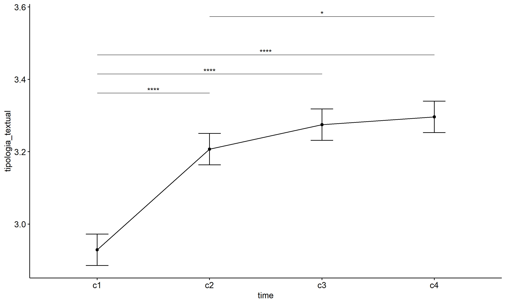<!-- -->

# ANOVA: tipologia_textual ~ time\*gender + Error(id/time)

## Data Preparation

``` r
data <- edat[,c("aluno_id","gender","ciclo","tipologia_textual")]
data$ciclo <- factor(data$ciclo, c("Primeiro Ciclo","Segundo Ciclo",
                                   "Terceiro Ciclo","Quarto Ciclo"))

wdat <- spread(data, ciclo, tipologia_textual)
wdat <- wdat[complete.cases(wdat),]
colnames(wdat) <- c("id","gender","c1","c2","c3","c4")

ldat <- gather(wdat, key = time, value = tipologia_textual, c1, c2, c3, c4) %>%
  convert_as_factor(id, time)
ldat <- remove_group_data(ldat, "tipologia_textual", c("time", "gender"), n.limit = 30)
ldat$gender <- factor(ldat$gender, sort(unique(ldat$gender)))
```

### Check assumptions: Identifying Outliers

``` r
outliers <- identify_outliers(group_by(ldat, time, gender), tipologia_textual)
(outliers <- outliers[outliers$is.extreme == T,])
```

    ## [1] gender            time              id                tipologia_textual
    ## [5] is.outlier        is.extreme       
    ## <0 rows> (or 0-length row.names)

| gender | time | id  | tipologia_textual | is.outlier | is.extreme |
|:-------|:-----|:----|------------------:|:-----------|:-----------|

### Check assumptions: Normality Test

``` r
(normality.df <- normality.test.per.groups(ldat, "tipologia_textual", c("time", "gender")))
```

    ##                 var          variable time gender   n    skewness  kurtosis
    ## 1 tipologia_textual tipologia_textual   c1 Female 552  0.02095806 -1.301567
    ## 2 tipologia_textual tipologia_textual   c1   Male 513  0.17922232 -1.375926
    ## 3 tipologia_textual tipologia_textual   c2 Female 552 -0.45787903 -1.146322
    ## 4 tipologia_textual tipologia_textual   c2   Male 513 -0.30342098 -1.286263
    ## 5 tipologia_textual tipologia_textual   c3 Female 552 -0.51467689 -1.015697
    ## 6 tipologia_textual tipologia_textual   c3   Male 513 -0.49680897 -1.055991
    ## 7 tipologia_textual tipologia_textual   c4 Female 552 -0.55271772 -1.092799
    ## 8 tipologia_textual tipologia_textual   c4   Male 513 -0.58611661 -1.115590
    ##   symmetry statistic     method p p.signif normality
    ## 1      YES  847.8065 D'Agostino 0     ****         -
    ## 2      YES 2942.1023 D'Agostino 0     ****         -
    ## 3      YES  258.0519 D'Agostino 0     ****         -
    ## 4      YES  646.9158 D'Agostino 0     ****         -
    ## 5       NO  139.0058 D'Agostino 0     ****         -
    ## 6      YES  151.3571 D'Agostino 0     ****         -
    ## 7       NO  200.8667 D'Agostino 0     ****         -
    ## 8       NO  209.0475 D'Agostino 0     ****         -

| var               | variable          | time | gender |   n | skewness | kurtosis | symmetry | statistic | method     |   p | p.signif | normality |
|:------------------|:------------------|:-----|:-------|----:|---------:|---------:|:---------|----------:|:-----------|----:|:---------|:----------|
| tipologia_textual | tipologia_textual | c1   | Female | 552 |    0.021 |   -1.302 | YES      |   847.806 | D’Agostino |   0 | \*\*\*\* | \-        |
| tipologia_textual | tipologia_textual | c1   | Male   | 513 |    0.179 |   -1.376 | YES      |  2942.102 | D’Agostino |   0 | \*\*\*\* | \-        |
| tipologia_textual | tipologia_textual | c2   | Female | 552 |   -0.458 |   -1.146 | YES      |   258.052 | D’Agostino |   0 | \*\*\*\* | \-        |
| tipologia_textual | tipologia_textual | c2   | Male   | 513 |   -0.303 |   -1.286 | YES      |   646.916 | D’Agostino |   0 | \*\*\*\* | \-        |
| tipologia_textual | tipologia_textual | c3   | Female | 552 |   -0.515 |   -1.016 | NO       |   139.006 | D’Agostino |   0 | \*\*\*\* | \-        |
| tipologia_textual | tipologia_textual | c3   | Male   | 513 |   -0.497 |   -1.056 | YES      |   151.357 | D’Agostino |   0 | \*\*\*\* | \-        |
| tipologia_textual | tipologia_textual | c4   | Female | 552 |   -0.553 |   -1.093 | NO       |   200.867 | D’Agostino |   0 | \*\*\*\* | \-        |
| tipologia_textual | tipologia_textual | c4   | Male   | 513 |   -0.586 |   -1.116 | NO       |   209.048 | D’Agostino |   0 | \*\*\*\* | \-        |

``` r
(non.ids <- unique(do.call(
  c, lapply(which(normality.df$normality == 'NO'), FUN = function(i) {
  idx = which(ldat$time == normality.df$time[i] &
                ldat$gender == normality.df$gender[i])
  getNonNormal(ldat$"tipologia_textual"[idx], ldat$id[idx])
}))))
```

    ## NULL

``` r
if (length(non.ids) > 0)
  ldat2 <- ldat[!ldat$id %in% non.ids,]
```

### Summary Statistics

``` r
(sdat <- ldat %>% group_by(time, gender) %>%
   get_summary_stats(tipologia_textual, type = "mean_sd"))
```

    ## # A tibble: 8 × 6
    ##   gender time  variable              n  mean    sd
    ##   <fct>  <fct> <fct>             <dbl> <dbl> <dbl>
    ## 1 Female c1    tipologia_textual   552  2.97 0.738
    ## 2 Male   c1    tipologia_textual   513  2.89 0.764
    ## 3 Female c2    tipologia_textual   552  3.25 0.743
    ## 4 Male   c2    tipologia_textual   513  3.15 0.759
    ## 5 Female c3    tipologia_textual   552  3.28 0.723
    ## 6 Male   c3    tipologia_textual   513  3.25 0.73 
    ## 7 Female c4    tipologia_textual   552  3.28 0.748
    ## 8 Male   c4    tipologia_textual   513  3.30 0.761

| gender | time | variable          |   n |  mean |    sd |
|:-------|:-----|:------------------|----:|------:|------:|
| Female | c1   | tipologia_textual | 552 | 2.967 | 0.738 |
| Male   | c1   | tipologia_textual | 513 | 2.894 | 0.764 |
| Female | c2   | tipologia_textual | 552 | 3.247 | 0.743 |
| Male   | c2   | tipologia_textual | 513 | 3.151 | 0.759 |
| Female | c3   | tipologia_textual | 552 | 3.283 | 0.723 |
| Male   | c3   | tipologia_textual | 513 | 3.250 | 0.730 |
| Female | c4   | tipologia_textual | 552 | 3.284 | 0.748 |
| Male   | c4   | tipologia_textual | 513 | 3.297 | 0.761 |

``` r
if (length(non.ids) > 0)
  (sdat <- ldat2 %>% group_by(time, gender) %>%
      get_summary_stats(tipologia_textual, type = "mean_sd"))
```

| gender | time | variable          |   n |  mean |    sd |
|:-------|:-----|:------------------|----:|------:|------:|
| Female | c1   | tipologia_textual | 552 | 2.967 | 0.738 |
| Male   | c1   | tipologia_textual | 513 | 2.894 | 0.764 |
| Female | c2   | tipologia_textual | 552 | 3.247 | 0.743 |
| Male   | c2   | tipologia_textual | 513 | 3.151 | 0.759 |
| Female | c3   | tipologia_textual | 552 | 3.283 | 0.723 |
| Male   | c3   | tipologia_textual | 513 | 3.250 | 0.730 |
| Female | c4   | tipologia_textual | 552 | 3.284 | 0.748 |
| Male   | c4   | tipologia_textual | 513 | 3.297 | 0.761 |

## ANOVA Computation

``` r
(res.aov <- anova_test(ldat, dv = tipologia_textual, wid = id, between = gender, within = time))
```

    ## ANOVA Table (type III tests)
    ## 
    ## $ANOVA
    ##        Effect DFn  DFd      F       p p<.05      ges
    ## 1      gender   1 1063  2.898 8.9e-02       0.001000
    ## 2        time   3 3189 62.194 4.5e-39     * 0.036000
    ## 3 gender:time   3 3189  1.339 2.6e-01       0.000792
    ## 
    ## $`Mauchly's Test for Sphericity`
    ##        Effect     W        p p<.05
    ## 1        time 0.972 1.69e-05     *
    ## 2 gender:time 0.972 1.69e-05     *
    ## 
    ## $`Sphericity Corrections`
    ##        Effect   GGe        DF[GG]    p[GG] p[GG]<.05   HFe        DF[HF]
    ## 1        time 0.981 2.94, 3128.25 2.21e-38         * 0.984 2.95, 3137.88
    ## 2 gender:time 0.981 2.94, 3128.25 2.60e-01           0.984 2.95, 3137.88
    ##      p[HF] p[HF]<.05
    ## 1 1.71e-38         *
    ## 2 2.60e-01

| Effect      | DFn |  DFd |      F |     p | p\<.05 |   ges |
|:------------|----:|-----:|-------:|------:|:-------|------:|
| gender      |   1 | 1063 |  2.898 | 0.089 |        | 0.001 |
| time        |   3 | 3189 | 62.194 | 0.000 | \*     | 0.036 |
| gender:time |   3 | 3189 |  1.339 | 0.260 |        | 0.001 |

| Effect      |     W |   p | p\<.05 |
|:------------|------:|----:|:-------|
| time        | 0.972 |   0 | \*     |
| gender:time | 0.972 |   0 | \*     |

| Effect      |   GGe | DF\[GG\]      | p\[GG\] | p\[GG\]\<.05 |   HFe | DF\[HF\]      | p\[HF\] | p\[HF\]\<.05 |
|:------------|------:|:--------------|--------:|:-------------|------:|:--------------|--------:|:-------------|
| time        | 0.981 | 2.94, 3128.25 |    0.00 | \*           | 0.984 | 2.95, 3137.88 |    0.00 | \*           |
| gender:time | 0.981 | 2.94, 3128.25 |    0.26 |              | 0.984 | 2.95, 3137.88 |    0.26 |              |

## ANOVA Computation after removing non.normal data

``` r
if (length(non.ids) > 0)
  (res.aov2 <- anova_test(ldat2, dv = tipologia_textual, wid = id, between = gender , within = time))
```

## PairWise Computation

``` r
(pwc <- ldat %>% group_by(time) %>%
   emmeans_test(tipologia_textual ~ gender, detailed = T, p.adjust.method = "bonferroni"))
```

    ## # A tibble: 4 × 15
    ##   time  term   .y.       group1 group2 null.value estimate     se    df conf.low
    ## * <fct> <chr>  <chr>     <chr>  <chr>       <dbl>    <dbl>  <dbl> <dbl>    <dbl>
    ## 1 c1    gender tipologi… Female Male            0   0.0736 0.0457  4252 -0.0160 
    ## 2 c2    gender tipologi… Female Male            0   0.0965 0.0457  4252  0.00690
    ## 3 c3    gender tipologi… Female Male            0   0.0331 0.0457  4252 -0.0566 
    ## 4 c4    gender tipologi… Female Male            0  -0.0138 0.0457  4252 -0.103  
    ## # ℹ 5 more variables: conf.high <dbl>, statistic <dbl>, p <dbl>, p.adj <dbl>,
    ## #   p.adj.signif <chr>

| time | term   | .y.               | group1 | group2 | null.value | estimate |    se |   df | conf.low | conf.high | statistic |     p | p.adj | p.adj.signif |
|:-----|:-------|:------------------|:-------|:-------|-----------:|---------:|------:|-----:|---------:|----------:|----------:|------:|------:|:-------------|
| c1   | gender | tipologia_textual | Female | Male   |          0 |    0.074 | 0.046 | 4252 |   -0.016 |     0.163 |     1.610 | 0.107 | 0.107 | ns           |
| c2   | gender | tipologia_textual | Female | Male   |          0 |    0.097 | 0.046 | 4252 |    0.007 |     0.186 |     2.111 | 0.035 | 0.035 | \*           |
| c3   | gender | tipologia_textual | Female | Male   |          0 |    0.033 | 0.046 | 4252 |   -0.057 |     0.123 |     0.724 | 0.469 | 0.469 | ns           |
| c4   | gender | tipologia_textual | Female | Male   |          0 |   -0.014 | 0.046 | 4252 |   -0.103 |     0.076 |    -0.301 | 0.764 | 0.764 | ns           |

``` r
(emms <- get_emmeans(pwc))
```

    ## # A tibble: 8 × 8
    ##   time  gender emmean     se    df conf.low conf.high method      
    ##   <fct> <fct>   <dbl>  <dbl> <dbl>    <dbl>     <dbl> <chr>       
    ## 1 c1    Female   2.97 0.0317  4252     2.91      3.03 Emmeans test
    ## 2 c1    Male     2.89 0.0329  4252     2.83      2.96 Emmeans test
    ## 3 c2    Female   3.25 0.0317  4252     3.18      3.31 Emmeans test
    ## 4 c2    Male     3.15 0.0329  4252     3.09      3.22 Emmeans test
    ## 5 c3    Female   3.28 0.0317  4252     3.22      3.34 Emmeans test
    ## 6 c3    Male     3.25 0.0329  4252     3.18      3.31 Emmeans test
    ## 7 c4    Female   3.28 0.0317  4252     3.22      3.35 Emmeans test
    ## 8 c4    Male     3.30 0.0329  4252     3.23      3.36 Emmeans test

| time | gender | emmean |    se |   df | conf.low | conf.high | method       |
|:-----|:-------|-------:|------:|-----:|---------:|----------:|:-------------|
| c1   | Female |  2.967 | 0.032 | 4252 |    2.905 |     3.030 | Emmeans test |
| c1   | Male   |  2.894 | 0.033 | 4252 |    2.829 |     2.958 | Emmeans test |
| c2   | Female |  3.247 | 0.032 | 4252 |    3.185 |     3.309 | Emmeans test |
| c2   | Male   |  3.151 | 0.033 | 4252 |    3.086 |     3.215 | Emmeans test |
| c3   | Female |  3.283 | 0.032 | 4252 |    3.220 |     3.345 | Emmeans test |
| c3   | Male   |  3.250 | 0.033 | 4252 |    3.185 |     3.314 | Emmeans test |
| c4   | Female |  3.284 | 0.032 | 4252 |    3.221 |     3.346 | Emmeans test |
| c4   | Male   |  3.297 | 0.033 | 4252 |    3.233 |     3.362 | Emmeans test |

``` r
pwc <- add_xy_position(pwc, x = "time", fun = "mean_se", dodge = 0.25)
pd <- position_dodge(width = 0.25)
ggline(emms, x = "time", y = "emmean", color = "gender",
       palette = c("#FF007F","#4D4DFF"),
       position = pd, ylab = "tipologia_textual") +
  geom_errorbar(aes(ymin = conf.low, ymax = conf.high, color = gender),
                position = pd, width = 0.2) +
  stat_pvalue_manual(pwc, hide.ns = T, tip.length = F, linetype = 1)
```

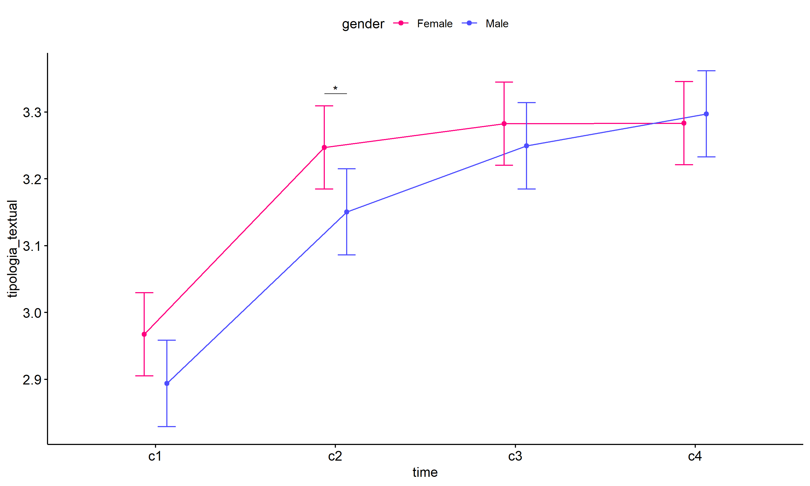<!-- -->

``` r
(pwc <- ldat %>% group_by(gender) %>%
    emmeans_test(tipologia_textual ~ time, detailed = T, p.adjust.method = "bonferroni"))
```

    ## # A tibble: 12 × 15
    ##    gender term  .y.      group1 group2 null.value estimate     se    df conf.low
    ##  * <fct>  <chr> <chr>    <chr>  <chr>       <dbl>    <dbl>  <dbl> <dbl>    <dbl>
    ##  1 Female time  tipolog… c1     c2              0 -2.80e-1 0.0449  4252  -0.368 
    ##  2 Female time  tipolog… c1     c3              0 -3.15e-1 0.0449  4252  -0.403 
    ##  3 Female time  tipolog… c1     c4              0 -3.16e-1 0.0449  4252  -0.404 
    ##  4 Female time  tipolog… c2     c3              0 -3.55e-2 0.0449  4252  -0.123 
    ##  5 Female time  tipolog… c2     c4              0 -3.64e-2 0.0449  4252  -0.124 
    ##  6 Female time  tipolog… c3     c4              0 -9.06e-4 0.0449  4252  -0.0889
    ##  7 Male   time  tipolog… c1     c2              0 -2.57e-1 0.0466  4252  -0.348 
    ##  8 Male   time  tipolog… c1     c3              0 -3.56e-1 0.0466  4252  -0.447 
    ##  9 Male   time  tipolog… c1     c4              0 -4.04e-1 0.0466  4252  -0.495 
    ## 10 Male   time  tipolog… c2     c3              0 -9.89e-2 0.0466  4252  -0.190 
    ## 11 Male   time  tipolog… c2     c4              0 -1.47e-1 0.0466  4252  -0.238 
    ## 12 Male   time  tipolog… c3     c4              0 -4.78e-2 0.0466  4252  -0.139 
    ## # ℹ 5 more variables: conf.high <dbl>, statistic <dbl>, p <dbl>, p.adj <dbl>,
    ## #   p.adj.signif <chr>

| gender | term | .y.               | group1 | group2 | null.value | estimate |    se |   df | conf.low | conf.high | statistic |     p | p.adj | p.adj.signif |
|:-------|:-----|:------------------|:-------|:-------|-----------:|---------:|------:|-----:|---------:|----------:|----------:|------:|------:|:-------------|
| Female | time | tipologia_textual | c1     | c2     |          0 |   -0.280 | 0.045 | 4252 |   -0.368 |    -0.192 |    -6.233 | 0.000 | 0.000 | \*\*\*\*     |
| Female | time | tipologia_textual | c1     | c3     |          0 |   -0.315 | 0.045 | 4252 |   -0.403 |    -0.227 |    -7.023 | 0.000 | 0.000 | \*\*\*\*     |
| Female | time | tipologia_textual | c1     | c4     |          0 |   -0.316 | 0.045 | 4252 |   -0.404 |    -0.228 |    -7.044 | 0.000 | 0.000 | \*\*\*\*     |
| Female | time | tipologia_textual | c2     | c3     |          0 |   -0.035 | 0.045 | 4252 |   -0.123 |     0.053 |    -0.790 | 0.429 | 1.000 | ns           |
| Female | time | tipologia_textual | c2     | c4     |          0 |   -0.036 | 0.045 | 4252 |   -0.124 |     0.052 |    -0.811 | 0.418 | 1.000 | ns           |
| Female | time | tipologia_textual | c3     | c4     |          0 |   -0.001 | 0.045 | 4252 |   -0.089 |     0.087 |    -0.020 | 0.984 | 1.000 | ns           |
| Male   | time | tipologia_textual | c1     | c2     |          0 |   -0.257 | 0.047 | 4252 |   -0.348 |    -0.166 |    -5.516 | 0.000 | 0.000 | \*\*\*\*     |
| Male   | time | tipologia_textual | c1     | c3     |          0 |   -0.356 | 0.047 | 4252 |   -0.447 |    -0.264 |    -7.641 | 0.000 | 0.000 | \*\*\*\*     |
| Male   | time | tipologia_textual | c1     | c4     |          0 |   -0.404 | 0.047 | 4252 |   -0.495 |    -0.312 |    -8.667 | 0.000 | 0.000 | \*\*\*\*     |
| Male   | time | tipologia_textual | c2     | c3     |          0 |   -0.099 | 0.047 | 4252 |   -0.190 |    -0.008 |    -2.125 | 0.034 | 0.202 | ns           |
| Male   | time | tipologia_textual | c2     | c4     |          0 |   -0.147 | 0.047 | 4252 |   -0.238 |    -0.055 |    -3.151 | 0.002 | 0.010 | \*\*         |
| Male   | time | tipologia_textual | c3     | c4     |          0 |   -0.048 | 0.047 | 4252 |   -0.139 |     0.044 |    -1.026 | 0.305 | 1.000 | ns           |

``` r
(emms <- get_emmeans(pwc))
```

    ## # A tibble: 8 × 8
    ##   gender time  emmean     se    df conf.low conf.high method      
    ##   <fct>  <fct>  <dbl>  <dbl> <dbl>    <dbl>     <dbl> <chr>       
    ## 1 Female c1      2.97 0.0317  4252     2.91      3.03 Emmeans test
    ## 2 Female c2      3.25 0.0317  4252     3.18      3.31 Emmeans test
    ## 3 Female c3      3.28 0.0317  4252     3.22      3.34 Emmeans test
    ## 4 Female c4      3.28 0.0317  4252     3.22      3.35 Emmeans test
    ## 5 Male   c1      2.89 0.0329  4252     2.83      2.96 Emmeans test
    ## 6 Male   c2      3.15 0.0329  4252     3.09      3.22 Emmeans test
    ## 7 Male   c3      3.25 0.0329  4252     3.18      3.31 Emmeans test
    ## 8 Male   c4      3.30 0.0329  4252     3.23      3.36 Emmeans test

| gender | time | emmean |    se |   df | conf.low | conf.high | method       |
|:-------|:-----|-------:|------:|-----:|---------:|----------:|:-------------|
| Female | c1   |  2.967 | 0.032 | 4252 |    2.905 |     3.030 | Emmeans test |
| Female | c2   |  3.247 | 0.032 | 4252 |    3.185 |     3.309 | Emmeans test |
| Female | c3   |  3.283 | 0.032 | 4252 |    3.220 |     3.345 | Emmeans test |
| Female | c4   |  3.284 | 0.032 | 4252 |    3.221 |     3.346 | Emmeans test |
| Male   | c1   |  2.894 | 0.033 | 4252 |    2.829 |     2.958 | Emmeans test |
| Male   | c2   |  3.151 | 0.033 | 4252 |    3.086 |     3.215 | Emmeans test |
| Male   | c3   |  3.250 | 0.033 | 4252 |    3.185 |     3.314 | Emmeans test |
| Male   | c4   |  3.297 | 0.033 | 4252 |    3.233 |     3.362 | Emmeans test |

``` r
emms.gg <- emms[which(emms$gender == "Female"),]
if (nrow(emms.gg) > 0)
  ggline(emms.gg, x = "time", y = "emmean", color = "#FF007F", ylab = "tipologia_textual") +
    geom_errorbar(aes(ymin = conf.low, ymax = conf.high),
                  width = 0.2, color = "#FF007F") +
    stat_pvalue_manual(
      add_xy_position(pwc[which(pwc$gender == "Female"),],
                      x = "time", fun = "mean_se"),
      hide.ns = T, color = "#FF007F", tip.length = F) +
    labs(title = "gender: Female")+
    theme(legend.text = element_blank())
```

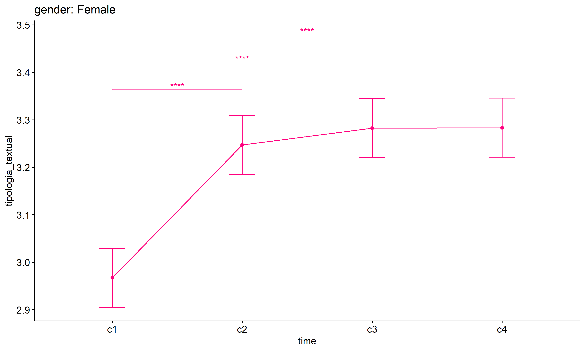<!-- -->

``` r
emms.gg <- emms[which(emms$gender == "Male"),]
if (nrow(emms.gg) > 0)
  ggline(emms.gg, x = "time", y = "emmean", color = "#4D4DFF", ylab = "tipologia_textual") +
    geom_errorbar(aes(ymin = conf.low, ymax = conf.high),
                  width = 0.2, color = "#4D4DFF") +
    stat_pvalue_manual(
      add_xy_position(pwc[which(pwc$gender == "Male"),],
                      x = "time", fun = "mean_se"),
      hide.ns = T, color = "#4D4DFF", tip.length = F) +
    labs(title = "gender: Male")+
    theme(legend.text = element_blank())
```

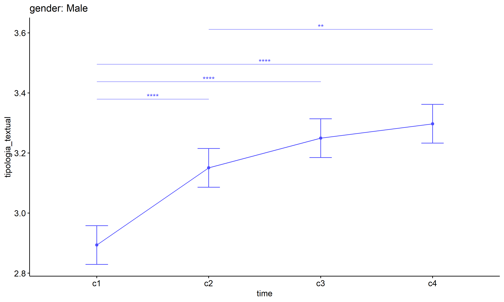<!-- -->

## PairWise Computation after removing non.normal data

``` r
if (length(non.ids) > 0)
  (pwc2 <- ldat2 %>% group_by(time) %>%
     emmeans_test(tipologia_textual ~ gender, detailed = T, p.adjust.method = "bonferroni"))
```

``` r
if (length(non.ids) > 0)
  (emms2 <- get_emmeans(pwc2))
```

``` r
if (length(non.ids) > 0) {
  pwc2 <- add_xy_position(pwc2, x = "time", fun = "mean_se", dodge = 0.25)
  pd2 <- position_dodge(width = 0.25)
  
  ggline(emms2, x = "time", y = "emmean", color = "gender",
         palette = c("#FF007F","#4D4DFF"),
         position = pd, ylab = "tipologia_textual") +
    geom_errorbar(aes(ymin = conf.low, ymax = conf.high, color = gender),
                position = pd, width = 0.2) +
    stat_pvalue_manual(pwc2, hide.ns = T, tip.length = F, linetype = 1)
}
```

``` r
if (length(non.ids) > 0)
  (pwc2 <- ldat2 %>% group_by(gender) %>%
     emmeans_test(tipologia_textual ~ time, detailed = T, p.adjust.method = "bonferroni"))
```

``` r
if (length(non.ids) > 0)
  (emms2 <- get_emmeans(pwc2))
```

``` r
if (length(non.ids) > 0) {
  emms.gg <- emms2[which(emms2$gender == "Female"),]
  if (nrow(emms.gg) > 0)
    ggline(emms.gg, x = "time", y = "emmean", color = "#FF007F", ylab = "tipologia_textual") +
    geom_errorbar(aes(ymin = conf.low, ymax = conf.high),
                  width = 0.2, color = "#FF007F") +
    stat_pvalue_manual(
      add_xy_position(pwc[which(pwc$gender == "Female"),],
                      x = "time", fun = "mean_se"),
      hide.ns = T, color = "#FF007F", tip.length = F) +
    labs(title = "gender: Female") +
    theme(legend.text = element_blank())
}
```

``` r
if (length(non.ids) > 0) {
  emms.gg <- emms2[which(emms2$gender == "Male"),]
  if (nrow(emms.gg) > 0)
    ggline(emms.gg, x = "time", y = "emmean", color = "#4D4DFF", ylab = "tipologia_textual") +
    geom_errorbar(aes(ymin = conf.low, ymax = conf.high),
                  width = 0.2, color = "#4D4DFF") +
    stat_pvalue_manual(
      add_xy_position(pwc[which(pwc$gender == "Male"),],
                      x = "time", fun = "mean_se"),
      hide.ns = T, color = "#4D4DFF", tip.length = F) +
    labs(title = "gender: Male") +
    theme(legend.text = element_blank())
}
```

# ANOVA: tipologia_textual ~ time\*localizacao + Error(id/time)

## Data Preparation

``` r
data <- edat[,c("aluno_id","localizacao","ciclo","tipologia_textual")]
data$ciclo <- factor(data$ciclo, c("Primeiro Ciclo","Segundo Ciclo",
                                   "Terceiro Ciclo","Quarto Ciclo"))

wdat <- spread(data, ciclo, tipologia_textual)
wdat <- wdat[complete.cases(wdat),]
colnames(wdat) <- c("id","localizacao","c1","c2","c3","c4")

ldat <- gather(wdat, key = time, value = tipologia_textual, c1, c2, c3, c4) %>%
  convert_as_factor(id, time)
ldat <- remove_group_data(ldat, "tipologia_textual", c("time", "localizacao"), n.limit = 30)
ldat$localizacao <- factor(ldat$localizacao, sort(unique(ldat$localizacao)))
```

### Check assumptions: Identifying Outliers

``` r
outliers <- identify_outliers(group_by(ldat, time, localizacao), tipologia_textual)
(outliers <- outliers[outliers$is.extreme == T,])
```

    ## [1] localizacao       time              id                tipologia_textual
    ## [5] is.outlier        is.extreme       
    ## <0 rows> (or 0-length row.names)

| localizacao | time | id  | tipologia_textual | is.outlier | is.extreme |
|:------------|:-----|:----|------------------:|:-----------|:-----------|

### Check assumptions: Normality Test

``` r
(normality.df <- normality.test.per.groups(ldat, "tipologia_textual", c("time", "localizacao")))
```

    ##                 var          variable time localizacao   n    skewness
    ## 1 tipologia_textual tipologia_textual   c1       Rural 181  0.10760091
    ## 2 tipologia_textual tipologia_textual   c1      Urbana 945  0.09866504
    ## 3 tipologia_textual tipologia_textual   c2       Rural 181 -0.32031667
    ## 4 tipologia_textual tipologia_textual   c2      Urbana 945 -0.40729724
    ## 5 tipologia_textual tipologia_textual   c3       Rural 181 -0.86672058
    ## 6 tipologia_textual tipologia_textual   c3      Urbana 945 -0.46191266
    ## 7 tipologia_textual tipologia_textual   c4       Rural 181 -0.62407072
    ## 8 tipologia_textual tipologia_textual   c4      Urbana 945 -0.56560073
    ##     kurtosis symmetry   statistic     method            p p.signif normality
    ## 1 -1.5186364      YES 18207.62967 D'Agostino 0.000000e+00     ****        QQ
    ## 2 -1.3160354      YES  2465.01953 D'Agostino 0.000000e+00     ****         -
    ## 3 -1.1978609      YES    74.28087 D'Agostino 1.110223e-16     ****        QQ
    ## 4 -1.1972298      YES   677.95628 D'Agostino 0.000000e+00     ****         -
    ## 5 -0.4515101       NO    20.81163 D'Agostino 3.025598e-05      ***        QQ
    ## 6 -1.0867043      YES   346.06049 D'Agostino 0.000000e+00     ****         -
    ## 7 -0.9084726       NO    29.03530 D'Agostino 4.955237e-07     ****        QQ
    ## 8 -1.1158756       NO   419.50955 D'Agostino 0.000000e+00     ****         -

| var               | variable          | time | localizacao |   n | skewness | kurtosis | symmetry | statistic | method     |   p | p.signif | normality |
|:------------------|:------------------|:-----|:------------|----:|---------:|---------:|:---------|----------:|:-----------|----:|:---------|:----------|
| tipologia_textual | tipologia_textual | c1   | Rural       | 181 |    0.108 |   -1.519 | YES      | 18207.630 | D’Agostino |   0 | \*\*\*\* | QQ        |
| tipologia_textual | tipologia_textual | c1   | Urbana      | 945 |    0.099 |   -1.316 | YES      |  2465.020 | D’Agostino |   0 | \*\*\*\* | \-        |
| tipologia_textual | tipologia_textual | c2   | Rural       | 181 |   -0.320 |   -1.198 | YES      |    74.281 | D’Agostino |   0 | \*\*\*\* | QQ        |
| tipologia_textual | tipologia_textual | c2   | Urbana      | 945 |   -0.407 |   -1.197 | YES      |   677.956 | D’Agostino |   0 | \*\*\*\* | \-        |
| tipologia_textual | tipologia_textual | c3   | Rural       | 181 |   -0.867 |   -0.452 | NO       |    20.812 | D’Agostino |   0 | \*\*\*   | QQ        |
| tipologia_textual | tipologia_textual | c3   | Urbana      | 945 |   -0.462 |   -1.087 | YES      |   346.060 | D’Agostino |   0 | \*\*\*\* | \-        |
| tipologia_textual | tipologia_textual | c4   | Rural       | 181 |   -0.624 |   -0.908 | NO       |    29.035 | D’Agostino |   0 | \*\*\*\* | QQ        |
| tipologia_textual | tipologia_textual | c4   | Urbana      | 945 |   -0.566 |   -1.116 | NO       |   419.510 | D’Agostino |   0 | \*\*\*\* | \-        |

``` r
(non.ids <- unique(do.call(
  c, lapply(which(normality.df$normality == 'NO'), FUN = function(i) {
  idx = which(ldat$time == normality.df$time[i] &
                ldat$localizacao == normality.df$localizacao[i])
  getNonNormal(ldat$"tipologia_textual"[idx], ldat$id[idx])
}))))
```

    ## NULL

``` r
if (length(non.ids) > 0)
  ldat2 <- ldat[!ldat$id %in% non.ids,]
```

### Summary Statistics

``` r
(sdat <- ldat %>% group_by(time, localizacao) %>%
   get_summary_stats(tipologia_textual, type = "mean_sd"))
```

    ## # A tibble: 8 × 6
    ##   localizacao time  variable              n  mean    sd
    ##   <fct>       <fct> <fct>             <dbl> <dbl> <dbl>
    ## 1 Rural       c1    tipologia_textual   181  2.94 0.795
    ## 2 Urbana      c1    tipologia_textual   945  2.93 0.745
    ## 3 Rural       c2    tipologia_textual   181  3.18 0.74 
    ## 4 Urbana      c2    tipologia_textual   945  3.21 0.75 
    ## 5 Rural       c3    tipologia_textual   181  3.42 0.674
    ## 6 Urbana      c3    tipologia_textual   945  3.25 0.733
    ## 7 Rural       c4    tipologia_textual   181  3.34 0.706
    ## 8 Urbana      c4    tipologia_textual   945  3.29 0.758

| localizacao | time | variable          |   n |  mean |    sd |
|:------------|:-----|:------------------|----:|------:|------:|
| Rural       | c1   | tipologia_textual | 181 | 2.939 | 0.795 |
| Urbana      | c1   | tipologia_textual | 945 | 2.927 | 0.745 |
| Rural       | c2   | tipologia_textual | 181 | 3.182 | 0.740 |
| Urbana      | c2   | tipologia_textual | 945 | 3.212 | 0.750 |
| Rural       | c3   | tipologia_textual | 181 | 3.425 | 0.674 |
| Urbana      | c3   | tipologia_textual | 945 | 3.246 | 0.733 |
| Rural       | c4   | tipologia_textual | 181 | 3.345 | 0.706 |
| Urbana      | c4   | tipologia_textual | 945 | 3.287 | 0.758 |

``` r
if (length(non.ids) > 0)
  (sdat <- ldat2 %>% group_by(time, localizacao) %>%
      get_summary_stats(tipologia_textual, type = "mean_sd"))
```

| localizacao | time | variable          |   n |  mean |    sd |
|:------------|:-----|:------------------|----:|------:|------:|
| Rural       | c1   | tipologia_textual | 181 | 2.939 | 0.795 |
| Urbana      | c1   | tipologia_textual | 945 | 2.927 | 0.745 |
| Rural       | c2   | tipologia_textual | 181 | 3.182 | 0.740 |
| Urbana      | c2   | tipologia_textual | 945 | 3.212 | 0.750 |
| Rural       | c3   | tipologia_textual | 181 | 3.425 | 0.674 |
| Urbana      | c3   | tipologia_textual | 945 | 3.246 | 0.733 |
| Rural       | c4   | tipologia_textual | 181 | 3.345 | 0.706 |
| Urbana      | c4   | tipologia_textual | 945 | 3.287 | 0.758 |

## ANOVA Computation

``` r
(res.aov <- anova_test(ldat, dv = tipologia_textual, wid = id, between = localizacao, within = time))
```

    ## ANOVA Table (type III tests)
    ## 
    ## $ANOVA
    ##             Effect DFn  DFd      F        p p<.05      ges
    ## 1      localizacao   1 1124  2.249 1.34e-01       0.000742
    ## 2             time   3 3372 44.967 1.73e-28     * 0.025000
    ## 3 localizacao:time   3 3372  2.670 4.60e-02     * 0.001000
    ## 
    ## $`Mauchly's Test for Sphericity`
    ##             Effect     W        p p<.05
    ## 1             time 0.969 1.32e-06     *
    ## 2 localizacao:time 0.969 1.32e-06     *
    ## 
    ## $`Sphericity Corrections`
    ##             Effect   GGe        DF[GG]    p[GG] p[GG]<.05   HFe        DF[HF]
    ## 1             time 0.979 2.94, 3300.43 6.12e-28         * 0.982 2.94, 3310.01
    ## 2 localizacao:time 0.979 2.94, 3300.43 4.70e-02         * 0.982 2.94, 3310.01
    ##      p[HF] p[HF]<.05
    ## 1 5.17e-28         *
    ## 2 4.70e-02         *

| Effect           | DFn |  DFd |      F |     p | p\<.05 |   ges |
|:-----------------|----:|-----:|-------:|------:|:-------|------:|
| localizacao      |   1 | 1124 |  2.249 | 0.134 |        | 0.001 |
| time             |   3 | 3372 | 44.967 | 0.000 | \*     | 0.025 |
| localizacao:time |   3 | 3372 |  2.670 | 0.046 | \*     | 0.001 |

| Effect           |     W |   p | p\<.05 |
|:-----------------|------:|----:|:-------|
| time             | 0.969 |   0 | \*     |
| localizacao:time | 0.969 |   0 | \*     |

| Effect           |   GGe | DF\[GG\]      | p\[GG\] | p\[GG\]\<.05 |   HFe | DF\[HF\]      | p\[HF\] | p\[HF\]\<.05 |
|:-----------------|------:|:--------------|--------:|:-------------|------:|:--------------|--------:|:-------------|
| time             | 0.979 | 2.94, 3300.43 |   0.000 | \*           | 0.982 | 2.94, 3310.01 |   0.000 | \*           |
| localizacao:time | 0.979 | 2.94, 3300.43 |   0.047 | \*           | 0.982 | 2.94, 3310.01 |   0.047 | \*           |

## ANOVA Computation after removing non.normal data

``` r
if (length(non.ids) > 0)
  (res.aov2 <- anova_test(ldat2, dv = tipologia_textual, wid = id, between = localizacao , within = time))
```

## PairWise Computation

``` r
(pwc <- ldat %>% group_by(time) %>%
   emmeans_test(tipologia_textual ~ localizacao, detailed = T, p.adjust.method = "bonferroni"))
```

    ## # A tibble: 4 × 15
    ##   time  term       .y.   group1 group2 null.value estimate     se    df conf.low
    ## * <fct> <chr>      <chr> <chr>  <chr>       <dbl>    <dbl>  <dbl> <dbl>    <dbl>
    ## 1 c1    localizac… tipo… Rural  Urbana          0   0.0121 0.0603  4496  -0.106 
    ## 2 c2    localizac… tipo… Rural  Urbana          0  -0.0295 0.0603  4496  -0.148 
    ## 3 c3    localizac… tipo… Rural  Urbana          0   0.179  0.0603  4496   0.0611
    ## 4 c4    localizac… tipo… Rural  Urbana          0   0.0585 0.0603  4496  -0.0598
    ## # ℹ 5 more variables: conf.high <dbl>, statistic <dbl>, p <dbl>, p.adj <dbl>,
    ## #   p.adj.signif <chr>

| time | term        | .y.               | group1 | group2 | null.value | estimate |   se |   df | conf.low | conf.high | statistic |     p | p.adj | p.adj.signif |
|:-----|:------------|:------------------|:-------|:-------|-----------:|---------:|-----:|-----:|---------:|----------:|----------:|------:|------:|:-------------|
| c1   | localizacao | tipologia_textual | Rural  | Urbana |          0 |    0.012 | 0.06 | 4496 |   -0.106 |     0.130 |     0.200 | 0.842 | 0.842 | ns           |
| c2   | localizacao | tipologia_textual | Rural  | Urbana |          0 |   -0.029 | 0.06 | 4496 |   -0.148 |     0.089 |    -0.489 | 0.625 | 0.625 | ns           |
| c3   | localizacao | tipologia_textual | Rural  | Urbana |          0 |    0.179 | 0.06 | 4496 |    0.061 |     0.298 |     2.973 | 0.003 | 0.003 | \*\*         |
| c4   | localizacao | tipologia_textual | Rural  | Urbana |          0 |    0.059 | 0.06 | 4496 |   -0.060 |     0.177 |     0.970 | 0.332 | 0.332 | ns           |

``` r
(emms <- get_emmeans(pwc))
```

    ## # A tibble: 8 × 8
    ##   time  localizacao emmean     se    df conf.low conf.high method      
    ##   <fct> <fct>        <dbl>  <dbl> <dbl>    <dbl>     <dbl> <chr>       
    ## 1 c1    Rural         2.94 0.0553  4496     2.83      3.05 Emmeans test
    ## 2 c1    Urbana        2.93 0.0242  4496     2.88      2.97 Emmeans test
    ## 3 c2    Rural         3.18 0.0553  4496     3.07      3.29 Emmeans test
    ## 4 c2    Urbana        3.21 0.0242  4496     3.16      3.26 Emmeans test
    ## 5 c3    Rural         3.43 0.0553  4496     3.32      3.53 Emmeans test
    ## 6 c3    Urbana        3.25 0.0242  4496     3.20      3.29 Emmeans test
    ## 7 c4    Rural         3.35 0.0553  4496     3.24      3.45 Emmeans test
    ## 8 c4    Urbana        3.29 0.0242  4496     3.24      3.33 Emmeans test

| time | localizacao | emmean |    se |   df | conf.low | conf.high | method       |
|:-----|:------------|-------:|------:|-----:|---------:|----------:|:-------------|
| c1   | Rural       |  2.939 | 0.055 | 4496 |    2.831 |     3.048 | Emmeans test |
| c1   | Urbana      |  2.927 | 0.024 | 4496 |    2.880 |     2.975 | Emmeans test |
| c2   | Rural       |  3.182 | 0.055 | 4496 |    3.074 |     3.291 | Emmeans test |
| c2   | Urbana      |  3.212 | 0.024 | 4496 |    3.164 |     3.259 | Emmeans test |
| c3   | Rural       |  3.425 | 0.055 | 4496 |    3.317 |     3.534 | Emmeans test |
| c3   | Urbana      |  3.246 | 0.024 | 4496 |    3.199 |     3.293 | Emmeans test |
| c4   | Rural       |  3.345 | 0.055 | 4496 |    3.237 |     3.454 | Emmeans test |
| c4   | Urbana      |  3.287 | 0.024 | 4496 |    3.239 |     3.334 | Emmeans test |

``` r
pwc <- add_xy_position(pwc, x = "time", fun = "mean_se", dodge = 0.25)
pd <- position_dodge(width = 0.25)
ggline(emms, x = "time", y = "emmean", color = "localizacao",
       palette = c("#AA00FF","#00CCCC"),
       position = pd, ylab = "tipologia_textual") +
  geom_errorbar(aes(ymin = conf.low, ymax = conf.high, color = localizacao),
                position = pd, width = 0.2) +
  stat_pvalue_manual(pwc, hide.ns = T, tip.length = F, linetype = 1)
```

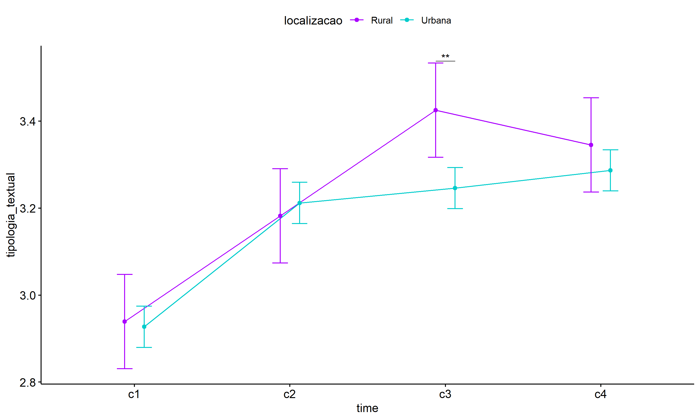<!-- -->

``` r
(pwc <- ldat %>% group_by(localizacao) %>%
    emmeans_test(tipologia_textual ~ time, detailed = T, p.adjust.method = "bonferroni"))
```

    ## # A tibble: 12 × 15
    ##    localizacao term  .y.          group1 group2 null.value estimate     se    df
    ##  * <fct>       <chr> <chr>        <chr>  <chr>       <dbl>    <dbl>  <dbl> <dbl>
    ##  1 Rural       time  tipologia_t… c1     c2              0  -0.243  0.0782  4496
    ##  2 Rural       time  tipologia_t… c1     c3              0  -0.486  0.0782  4496
    ##  3 Rural       time  tipologia_t… c1     c4              0  -0.406  0.0782  4496
    ##  4 Rural       time  tipologia_t… c2     c3              0  -0.243  0.0782  4496
    ##  5 Rural       time  tipologia_t… c2     c4              0  -0.163  0.0782  4496
    ##  6 Rural       time  tipologia_t… c3     c4              0   0.0801 0.0782  4496
    ##  7 Urbana      time  tipologia_t… c1     c2              0  -0.285  0.0342  4496
    ##  8 Urbana      time  tipologia_t… c1     c3              0  -0.319  0.0342  4496
    ##  9 Urbana      time  tipologia_t… c1     c4              0  -0.360  0.0342  4496
    ## 10 Urbana      time  tipologia_t… c2     c3              0  -0.0342 0.0342  4496
    ## 11 Urbana      time  tipologia_t… c2     c4              0  -0.0750 0.0342  4496
    ## 12 Urbana      time  tipologia_t… c3     c4              0  -0.0407 0.0342  4496
    ## # ℹ 6 more variables: conf.low <dbl>, conf.high <dbl>, statistic <dbl>,
    ## #   p <dbl>, p.adj <dbl>, p.adj.signif <chr>

| localizacao | term | .y.               | group1 | group2 | null.value | estimate |    se |   df | conf.low | conf.high | statistic |     p | p.adj | p.adj.signif |
|:------------|:-----|:------------------|:-------|:-------|-----------:|---------:|------:|-----:|---------:|----------:|----------:|------:|------:|:-------------|
| Rural       | time | tipologia_textual | c1     | c2     |          0 |   -0.243 | 0.078 | 4496 |   -0.396 |    -0.090 |    -3.109 | 0.002 | 0.011 | \*           |
| Rural       | time | tipologia_textual | c1     | c3     |          0 |   -0.486 | 0.078 | 4496 |   -0.639 |    -0.333 |    -6.219 | 0.000 | 0.000 | \*\*\*\*     |
| Rural       | time | tipologia_textual | c1     | c4     |          0 |   -0.406 | 0.078 | 4496 |   -0.559 |    -0.253 |    -5.194 | 0.000 | 0.000 | \*\*\*\*     |
| Rural       | time | tipologia_textual | c2     | c3     |          0 |   -0.243 | 0.078 | 4496 |   -0.396 |    -0.090 |    -3.109 | 0.002 | 0.011 | \*           |
| Rural       | time | tipologia_textual | c2     | c4     |          0 |   -0.163 | 0.078 | 4496 |   -0.316 |    -0.010 |    -2.085 | 0.037 | 0.223 | ns           |
| Rural       | time | tipologia_textual | c3     | c4     |          0 |    0.080 | 0.078 | 4496 |   -0.073 |     0.233 |     1.025 | 0.306 | 1.000 | ns           |
| Urbana      | time | tipologia_textual | c1     | c2     |          0 |   -0.285 | 0.034 | 4496 |   -0.352 |    -0.218 |    -8.319 | 0.000 | 0.000 | \*\*\*\*     |
| Urbana      | time | tipologia_textual | c1     | c3     |          0 |   -0.319 | 0.034 | 4496 |   -0.386 |    -0.252 |    -9.319 | 0.000 | 0.000 | \*\*\*\*     |
| Urbana      | time | tipologia_textual | c1     | c4     |          0 |   -0.360 | 0.034 | 4496 |   -0.427 |    -0.293 |   -10.510 | 0.000 | 0.000 | \*\*\*\*     |
| Urbana      | time | tipologia_textual | c2     | c3     |          0 |   -0.034 | 0.034 | 4496 |   -0.101 |     0.033 |    -1.000 | 0.317 | 1.000 | ns           |
| Urbana      | time | tipologia_textual | c2     | c4     |          0 |   -0.075 | 0.034 | 4496 |   -0.142 |    -0.008 |    -2.191 | 0.029 | 0.171 | ns           |
| Urbana      | time | tipologia_textual | c3     | c4     |          0 |   -0.041 | 0.034 | 4496 |   -0.108 |     0.026 |    -1.191 | 0.234 | 1.000 | ns           |

``` r
(emms <- get_emmeans(pwc))
```

    ## # A tibble: 8 × 8
    ##   localizacao time  emmean     se    df conf.low conf.high method      
    ##   <fct>       <fct>  <dbl>  <dbl> <dbl>    <dbl>     <dbl> <chr>       
    ## 1 Rural       c1      2.94 0.0553  4496     2.83      3.05 Emmeans test
    ## 2 Rural       c2      3.18 0.0553  4496     3.07      3.29 Emmeans test
    ## 3 Rural       c3      3.43 0.0553  4496     3.32      3.53 Emmeans test
    ## 4 Rural       c4      3.35 0.0553  4496     3.24      3.45 Emmeans test
    ## 5 Urbana      c1      2.93 0.0242  4496     2.88      2.97 Emmeans test
    ## 6 Urbana      c2      3.21 0.0242  4496     3.16      3.26 Emmeans test
    ## 7 Urbana      c3      3.25 0.0242  4496     3.20      3.29 Emmeans test
    ## 8 Urbana      c4      3.29 0.0242  4496     3.24      3.33 Emmeans test

| localizacao | time | emmean |    se |   df | conf.low | conf.high | method       |
|:------------|:-----|-------:|------:|-----:|---------:|----------:|:-------------|
| Rural       | c1   |  2.939 | 0.055 | 4496 |    2.831 |     3.048 | Emmeans test |
| Rural       | c2   |  3.182 | 0.055 | 4496 |    3.074 |     3.291 | Emmeans test |
| Rural       | c3   |  3.425 | 0.055 | 4496 |    3.317 |     3.534 | Emmeans test |
| Rural       | c4   |  3.345 | 0.055 | 4496 |    3.237 |     3.454 | Emmeans test |
| Urbana      | c1   |  2.927 | 0.024 | 4496 |    2.880 |     2.975 | Emmeans test |
| Urbana      | c2   |  3.212 | 0.024 | 4496 |    3.164 |     3.259 | Emmeans test |
| Urbana      | c3   |  3.246 | 0.024 | 4496 |    3.199 |     3.293 | Emmeans test |
| Urbana      | c4   |  3.287 | 0.024 | 4496 |    3.239 |     3.334 | Emmeans test |

``` r
emms.gg <- emms[which(emms$localizacao == "Rural"),]
if (nrow(emms.gg) > 0)
  ggline(emms.gg, x = "time", y = "emmean", color = "#AA00FF", ylab = "tipologia_textual") +
    geom_errorbar(aes(ymin = conf.low, ymax = conf.high),
                  width = 0.2, color = "#AA00FF") +
    stat_pvalue_manual(
      add_xy_position(pwc[which(pwc$localizacao == "Rural"),],
                      x = "time", fun = "mean_se"),
      hide.ns = T, color = "#AA00FF", tip.length = F) +
    labs(title = "localizacao: Rural")+
    theme(legend.text = element_blank())
```

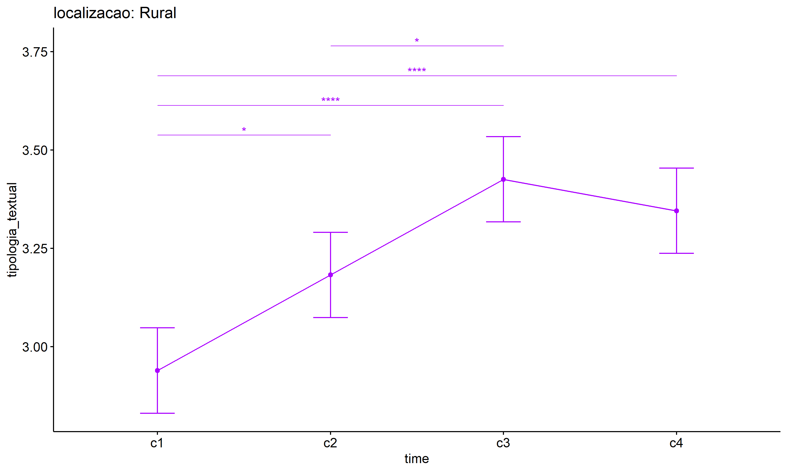<!-- -->

``` r
emms.gg <- emms[which(emms$localizacao == "Urbana"),]
if (nrow(emms.gg) > 0)
  ggline(emms.gg, x = "time", y = "emmean", color = "#00CCCC", ylab = "tipologia_textual") +
    geom_errorbar(aes(ymin = conf.low, ymax = conf.high),
                  width = 0.2, color = "#00CCCC") +
    stat_pvalue_manual(
      add_xy_position(pwc[which(pwc$localizacao == "Urbana"),],
                      x = "time", fun = "mean_se"),
      hide.ns = T, color = "#00CCCC", tip.length = F) +
    labs(title = "localizacao: Urbana")+
    theme(legend.text = element_blank())
```

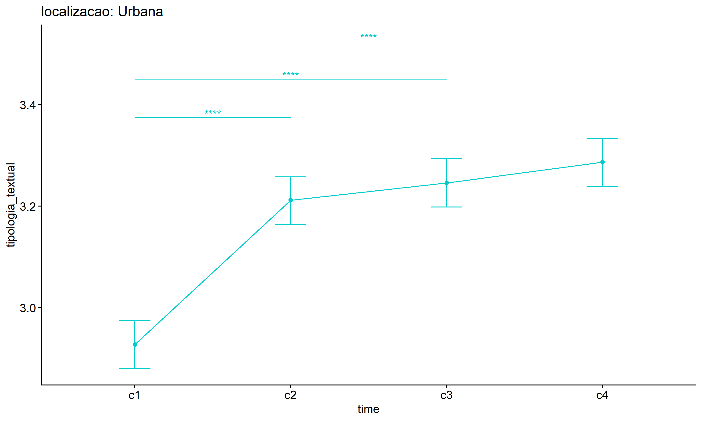<!-- -->

## PairWise Computation after removing non.normal data

``` r
if (length(non.ids) > 0)
  (pwc2 <- ldat2 %>% group_by(time) %>%
     emmeans_test(tipologia_textual ~ localizacao, detailed = T, p.adjust.method = "bonferroni"))
```

``` r
if (length(non.ids) > 0)
  (emms2 <- get_emmeans(pwc2))
```

``` r
if (length(non.ids) > 0) {
  pwc2 <- add_xy_position(pwc2, x = "time", fun = "mean_se", dodge = 0.25)
  pd2 <- position_dodge(width = 0.25)
  
  ggline(emms2, x = "time", y = "emmean", color = "localizacao",
         palette = c("#AA00FF","#00CCCC"),
         position = pd, ylab = "tipologia_textual") +
    geom_errorbar(aes(ymin = conf.low, ymax = conf.high, color = localizacao),
                position = pd, width = 0.2) +
    stat_pvalue_manual(pwc2, hide.ns = T, tip.length = F, linetype = 1)
}
```

``` r
if (length(non.ids) > 0)
  (pwc2 <- ldat2 %>% group_by(localizacao) %>%
     emmeans_test(tipologia_textual ~ time, detailed = T, p.adjust.method = "bonferroni"))
```

``` r
if (length(non.ids) > 0)
  (emms2 <- get_emmeans(pwc2))
```

``` r
if (length(non.ids) > 0) {
  emms.gg <- emms2[which(emms2$localizacao == "Rural"),]
  if (nrow(emms.gg) > 0)
    ggline(emms.gg, x = "time", y = "emmean", color = "#AA00FF", ylab = "tipologia_textual") +
    geom_errorbar(aes(ymin = conf.low, ymax = conf.high),
                  width = 0.2, color = "#AA00FF") +
    stat_pvalue_manual(
      add_xy_position(pwc[which(pwc$localizacao == "Rural"),],
                      x = "time", fun = "mean_se"),
      hide.ns = T, color = "#AA00FF", tip.length = F) +
    labs(title = "localizacao: Rural") +
    theme(legend.text = element_blank())
}
```

``` r
if (length(non.ids) > 0) {
  emms.gg <- emms2[which(emms2$localizacao == "Urbana"),]
  if (nrow(emms.gg) > 0)
    ggline(emms.gg, x = "time", y = "emmean", color = "#00CCCC", ylab = "tipologia_textual") +
    geom_errorbar(aes(ymin = conf.low, ymax = conf.high),
                  width = 0.2, color = "#00CCCC") +
    stat_pvalue_manual(
      add_xy_position(pwc[which(pwc$localizacao == "Urbana"),],
                      x = "time", fun = "mean_se"),
      hide.ns = T, color = "#00CCCC", tip.length = F) +
    labs(title = "localizacao: Urbana") +
    theme(legend.text = element_blank())
}
```

# ANOVA: tipologia_textual ~ time\*regiao + Error(id/time)

## Data Preparation

``` r
data <- edat[,c("aluno_id","regiao","ciclo","tipologia_textual")]
data$ciclo <- factor(data$ciclo, c("Primeiro Ciclo","Segundo Ciclo",
                                   "Terceiro Ciclo","Quarto Ciclo"))

wdat <- spread(data, ciclo, tipologia_textual)
wdat <- wdat[complete.cases(wdat),]
colnames(wdat) <- c("id","regiao","c1","c2","c3","c4")

ldat <- gather(wdat, key = time, value = tipologia_textual, c1, c2, c3, c4) %>%
  convert_as_factor(id, time)
ldat <- remove_group_data(ldat, "tipologia_textual", c("time", "regiao"), n.limit = 30)
ldat$regiao <- factor(ldat$regiao, sort(unique(ldat$regiao)))
```

### Check assumptions: Identifying Outliers

``` r
outliers <- identify_outliers(group_by(ldat, time, regiao), tipologia_textual)
(outliers <- outliers[outliers$is.extreme == T,])
```

    ## # A tibble: 0 × 6
    ## # ℹ 6 variables: regiao <fct>, time <fct>, id <fct>, tipologia_textual <dbl>,
    ## #   is.outlier <lgl>, is.extreme <lgl>

| regiao | time | id  | tipologia_textual | is.outlier | is.extreme |
|:-------|:-----|:----|------------------:|:-----------|:-----------|

### Check assumptions: Normality Test

``` r
(normality.df <- normality.test.per.groups(ldat, "tipologia_textual", c("time", "regiao")))
```

    ##                  var          variable time       regiao   n    skewness
    ## 1  tipologia_textual tipologia_textual   c1 Centro-Oeste  48 -0.03774909
    ## 2  tipologia_textual tipologia_textual   c1     Nordeste 545  0.02907756
    ## 3  tipologia_textual tipologia_textual   c1        Norte  78  0.84117902
    ## 4  tipologia_textual tipologia_textual   c1      Sudeste 393  0.11351654
    ## 5  tipologia_textual tipologia_textual   c1          Sul  62 -0.11545806
    ## 6  tipologia_textual tipologia_textual   c2 Centro-Oeste  48 -0.55131673
    ## 7  tipologia_textual tipologia_textual   c2     Nordeste 545 -0.37552844
    ## 8  tipologia_textual tipologia_textual   c2        Norte  78 -0.24361949
    ## 9  tipologia_textual tipologia_textual   c2      Sudeste 393 -0.43499598
    ## 10 tipologia_textual tipologia_textual   c2          Sul  62 -0.34747430
    ## 11 tipologia_textual tipologia_textual   c3 Centro-Oeste  48 -0.50206365
    ## 12 tipologia_textual tipologia_textual   c3     Nordeste 545 -0.51647612
    ## 13 tipologia_textual tipologia_textual   c3        Norte  78 -0.38683423
    ## 14 tipologia_textual tipologia_textual   c3      Sudeste 393 -0.51824854
    ## 15 tipologia_textual tipologia_textual   c3          Sul  62 -0.88861752
    ## 16 tipologia_textual tipologia_textual   c4 Centro-Oeste  48 -0.71547094
    ## 17 tipologia_textual tipologia_textual   c4     Nordeste 545 -0.45319611
    ## 18 tipologia_textual tipologia_textual   c4        Norte  78 -0.36847111
    ## 19 tipologia_textual tipologia_textual   c4      Sudeste 393 -0.67833611
    ## 20 tipologia_textual tipologia_textual   c4          Sul  62 -1.20486921
    ##      kurtosis symmetry    statistic       method            p p.signif
    ## 1  -0.8820980      YES    0.8965031 Shapiro-Wilk 4.857864e-04      ***
    ## 2  -1.3524229      YES 1825.9502942   D'Agostino 0.000000e+00     ****
    ## 3  -0.5170179       NO    9.4892099   D'Agostino 8.698497e-03       **
    ## 4  -1.4058819      YES 3587.4136016   D'Agostino 0.000000e+00     ****
    ## 5  -1.2963823      YES   19.4671796   D'Agostino 5.925918e-05     ****
    ## 6  -0.6414787       NO    0.8675365 Shapiro-Wilk 6.575231e-05     ****
    ## 7  -1.1941373      YES  335.2455555   D'Agostino 0.000000e+00     ****
    ## 8  -1.2299081      YES   22.4601624   D'Agostino 1.326898e-05     ****
    ## 9  -1.1967872      YES  225.5701560   D'Agostino 0.000000e+00     ****
    ## 10 -1.5697081      YES   77.1934647   D'Agostino 0.000000e+00     ****
    ## 11 -0.9069614       NO    0.8574702 Shapiro-Wilk 3.453759e-05     ****
    ## 12 -0.9810118       NO  118.9266592   D'Agostino 0.000000e+00     ****
    ## 13 -1.0446933      YES   11.9180843   D'Agostino 2.582384e-03       **
    ## 14 -1.0935661       NO  132.9014476   D'Agostino 0.000000e+00     ****
    ## 15 -0.8328809       NO   10.6988196   D'Agostino 4.750954e-03       **
    ## 16 -1.2091547       NO    0.7299663 Shapiro-Wilk 4.675396e-08     ****
    ## 17 -1.1701512      YES  292.2421459   D'Agostino 0.000000e+00     ****
    ## 18 -1.3101842      YES   33.0654791   D'Agostino 6.605755e-08     ****
    ## 19 -0.9865267       NO   94.0599200   D'Agostino 0.000000e+00     ****
    ## 20  0.2717267       NO   14.0943203   D'Agostino 8.698758e-04      ***
    ##    normality
    ## 1         NO
    ## 2          -
    ## 3         NO
    ## 4          -
    ## 5         NO
    ## 6         NO
    ## 7          -
    ## 8         NO
    ## 9          -
    ## 10        NO
    ## 11        NO
    ## 12         -
    ## 13        NO
    ## 14         -
    ## 15        NO
    ## 16        NO
    ## 17         -
    ## 18        NO
    ## 19         -
    ## 20        NO

| var               | variable          | time | regiao       |   n | skewness | kurtosis | symmetry | statistic | method       |     p | p.signif | normality |
|:------------------|:------------------|:-----|:-------------|----:|---------:|---------:|:---------|----------:|:-------------|------:|:---------|:----------|
| tipologia_textual | tipologia_textual | c1   | Centro-Oeste |  48 |   -0.038 |   -0.882 | YES      |     0.897 | Shapiro-Wilk | 0.000 | \*\*\*   | NO        |
| tipologia_textual | tipologia_textual | c1   | Nordeste     | 545 |    0.029 |   -1.352 | YES      |  1825.950 | D’Agostino   | 0.000 | \*\*\*\* | \-        |
| tipologia_textual | tipologia_textual | c1   | Norte        |  78 |    0.841 |   -0.517 | NO       |     9.489 | D’Agostino   | 0.009 | \*\*     | NO        |
| tipologia_textual | tipologia_textual | c1   | Sudeste      | 393 |    0.114 |   -1.406 | YES      |  3587.414 | D’Agostino   | 0.000 | \*\*\*\* | \-        |
| tipologia_textual | tipologia_textual | c1   | Sul          |  62 |   -0.115 |   -1.296 | YES      |    19.467 | D’Agostino   | 0.000 | \*\*\*\* | NO        |
| tipologia_textual | tipologia_textual | c2   | Centro-Oeste |  48 |   -0.551 |   -0.641 | NO       |     0.868 | Shapiro-Wilk | 0.000 | \*\*\*\* | NO        |
| tipologia_textual | tipologia_textual | c2   | Nordeste     | 545 |   -0.376 |   -1.194 | YES      |   335.246 | D’Agostino   | 0.000 | \*\*\*\* | \-        |
| tipologia_textual | tipologia_textual | c2   | Norte        |  78 |   -0.244 |   -1.230 | YES      |    22.460 | D’Agostino   | 0.000 | \*\*\*\* | NO        |
| tipologia_textual | tipologia_textual | c2   | Sudeste      | 393 |   -0.435 |   -1.197 | YES      |   225.570 | D’Agostino   | 0.000 | \*\*\*\* | \-        |
| tipologia_textual | tipologia_textual | c2   | Sul          |  62 |   -0.347 |   -1.570 | YES      |    77.193 | D’Agostino   | 0.000 | \*\*\*\* | NO        |
| tipologia_textual | tipologia_textual | c3   | Centro-Oeste |  48 |   -0.502 |   -0.907 | NO       |     0.857 | Shapiro-Wilk | 0.000 | \*\*\*\* | NO        |
| tipologia_textual | tipologia_textual | c3   | Nordeste     | 545 |   -0.516 |   -0.981 | NO       |   118.927 | D’Agostino   | 0.000 | \*\*\*\* | \-        |
| tipologia_textual | tipologia_textual | c3   | Norte        |  78 |   -0.387 |   -1.045 | YES      |    11.918 | D’Agostino   | 0.003 | \*\*     | NO        |
| tipologia_textual | tipologia_textual | c3   | Sudeste      | 393 |   -0.518 |   -1.094 | NO       |   132.901 | D’Agostino   | 0.000 | \*\*\*\* | \-        |
| tipologia_textual | tipologia_textual | c3   | Sul          |  62 |   -0.889 |   -0.833 | NO       |    10.699 | D’Agostino   | 0.005 | \*\*     | NO        |
| tipologia_textual | tipologia_textual | c4   | Centro-Oeste |  48 |   -0.715 |   -1.209 | NO       |     0.730 | Shapiro-Wilk | 0.000 | \*\*\*\* | NO        |
| tipologia_textual | tipologia_textual | c4   | Nordeste     | 545 |   -0.453 |   -1.170 | YES      |   292.242 | D’Agostino   | 0.000 | \*\*\*\* | \-        |
| tipologia_textual | tipologia_textual | c4   | Norte        |  78 |   -0.368 |   -1.310 | YES      |    33.065 | D’Agostino   | 0.000 | \*\*\*\* | NO        |
| tipologia_textual | tipologia_textual | c4   | Sudeste      | 393 |   -0.678 |   -0.987 | NO       |    94.060 | D’Agostino   | 0.000 | \*\*\*\* | \-        |
| tipologia_textual | tipologia_textual | c4   | Sul          |  62 |   -1.205 |    0.272 | NO       |    14.094 | D’Agostino   | 0.001 | \*\*\*   | NO        |

``` r
(non.ids <- unique(do.call(
  c, lapply(which(normality.df$normality == 'NO'), FUN = function(i) {
  idx = which(ldat$time == normality.df$time[i] &
                ldat$regiao == normality.df$regiao[i])
  getNonNormal(ldat$"tipologia_textual"[idx], ldat$id[idx])
}))))
```

    ##   [1] "ZwZKuoXF7JaYzVxPoHvk" "9jd1C85ixCoJf3EINYfx" "atydp19vM0PjiOQCWemR"
    ##   [4] "XPDsLJmk5xRPBBQTOEFf" "vvjX443BD3mkWYYMec2R" "edONhkMBY1DIsXNuuodO"
    ##   [7] "oB5KNHL8aUZyGZK3jNIP" "0HZYO8qt2G3sqgoXITwe" "LSOWrW4dOhXZ9uMW17va"
    ##  [10] "q1RelulkOweB4lCMWfxy" "ygFJxqySABX8ax57ihIq" "18EWxrJZtjBVpzckkv21"
    ##  [13] "3fTmP8cTTJq8WUIEU0Xl" "3mBgwnK6Vvt3dkhVOTAf" "q2OHBM4WxXWQPFhPS0zC"
    ##  [16] "8p6QYQYkfhR3QOACXZvj" "WshMGLj49S97LCd6BetO" "i5Gd55pjKNa1DpzdbUJf"
    ##  [19] "vSolOA78V6l7oYJ1h4LA" "AIyVJKr8sUUkQIogcjw3" "aOGxFSPrreKjHqmQIKKA"
    ##  [22] "fCbOJlY4s8hncfy108S2" "qbpdhqIdqf7n3lmU2n4I" "IJtLVa8jEy3VAWIMlskm"
    ##  [25] "gzBUwnjjYHnioTnd4stC" "H5F4r5nnGQTG1FzfyxrY" "0JP4C8o7n2HYsnPDx4qx"
    ##  [28] "0rFiZU3E0rQ5w337VW1f" "2Mvl0siGmos3P6uCJoI6" "6G6n552emVnSHTVpUDh7"
    ##  [31] "6ICRgE0rvAmB7lOuAmyQ" "7hA9dTcMihNepxAII972" "84eMLEkOxEAhysQoqAVy"
    ##  [34] "9ZgjvRy0pzK2NOHnuf9Q" "adLuVVMS0UYoOiJolMNI" "AypBhseeTW0r2FXDFr9W"
    ##  [37] "bOhetFcZCcckN4VKJMtL" "C7qUNZkE9MPTJTXcamV9" "D2pOFdXWqe1zu0vNxz89"
    ##  [40] "fEYVARleb30C16nBEYEI" "fG86EI7DcC48zeKBVr8r" "GGTfV3iZASa8xWD4aoiL"
    ##  [43] "goC0bbJnYpzgY6ol6rsz" "oB0FOxzsLr7yBiRPTQ2A" "0anDuhDMTormRx17gQtL"
    ##  [46] "Xrf5Lbt8nP2dhJXjSxjO" "13ksa3iHOsfBObErxHP7" "1SRNX4oiWybPQGHJHSiA"
    ##  [49] "Uw9TTHYQm43ueZv7TUSA" "5dTW1T1ER6Ig8ZOhKC2q" "5VDTmb4kGRlJV9SdulWs"
    ##  [52] "sRR37KpbkBZSh9H2UpSB" "WCSObSsiS3xWwGKtJ3Wu" "KPMkDhksSiEWVEIUT1LG"
    ##  [55] "TupwpKp0mSf2xCyx7nhJ" "AIzwxJCfbDsO8ZT4ZZ4h" "D5ZRR3Ps7EtPoEi233KU"
    ##  [58] "LC1uBEBe3hZn8Q1mQe7A" "QasU7a9JiIu1XHAPVJk9" "SUUBEP9mj3TbwoV3WPBu"
    ##  [61] "zkW6c2m0BkbGXx8JpERU" "Z9kXQKBKGVHaxVVWv55q" "3D9IwGXM7idoo9DzopOI"
    ##  [64] "z8HoZfofL0zC9Rg4P8Kj" "vF1wv9aDV5UGHKuqCkC3" "T7LyWcmMC7ND1ybbKOSC"
    ##  [67] "sFCXYNUhJ9CzwAbad5RT" "66k1mgdisI5m2S7kJsyb" "rVzZOrbUfwQY0UUelHKU"
    ##  [70] "Rq2OTnqvauiedrQ0PVcm" "RG5EPSzbZxigtb7hYi0o" "r0MWkZrx9MvBa9Tx8Okb"
    ##  [73] "qyZts39yg6YfFi0kaeU5" "VRWfIoYUFgdA8nGO5bpD" "3XOQzgoErsKmvF4VxZjc"
    ##  [76] "caJZotxjZgCkmAoI7E6m" "seKNLIccXWvNfAsfYfvU" "DKEsQosaERswlkB803hB"
    ##  [79] "SeJzWPr8zlxbm8wjVXuB" "h6KMb8Xr9njSUEntazsJ" "RTbkHP5ZAedrE08Wg5kZ"
    ##  [82] "rrFrDfgUOXcJdbMKRdyp" "IqlCdAFggly91AcE1yTQ" "QrHkXccozBdZ5kb36fep"
    ##  [85] "pY1SX5fAiZjYayAEfiIw" "NvNm1xaPB3KHPReTSrMD" "JRyGpNQA6mOEl1nzl1af"
    ##  [88] "m5AeVuITWa7uCAG6h1Qh" "JddM9KE8KjRXgyOPbfed" "KgqoDcMNgZGVvBJkoiie"
    ##  [91] "izXF16GeW2H794nwnaVD" "IcZt7QUc4OD7AirNP2X7" "GRfzvfMZn7GiCgHSW9Iz"
    ##  [94] "ltOCfuKereDnvy2o0H2m" "gCYnSeemj9nTertqwswp" "yuQxSYP8P0Ad4ogL8QBS"
    ##  [97] "f8lbqRJeObyskQrt1pLC" "EzAC2fhSVjbiGVreVQkr" "EvhUflU1mIrYd73einYa"
    ## [100] "xaqASJuCIVjoL7gzYQEN" "Yb2eaW2pnm7JzCpExGsl" "eFZnncpWRqhvRJ3Xwu6d"
    ## [103] "cbI61MqpmkFaeVWoT0lx" "C2oQcql6mvlGfsqeZFsp" "paiSlgxr2Ok3upCNUWAj"
    ## [106] "A2kwKFVaoVM0Mz9PdeJH" "W2wDjQEsQ2OrBec6HSf7" "6bilKfhgwjZLq47wbAdZ"
    ## [109] "sffGDKv6xIaW7M5huGEp" "67OZnVg6i2P9C6aaYo9r" "PoGsNdwD58xE967TyLSP"
    ## [112] "PKoPTKC1RrGaREkbINPf" "ul0PgHFaS5fXGvdx1O9S" "tVMilOzYDlVoWwNezYUi"
    ## [115] "ti6XvEjdQSyErILlcsE4" "OvwAQTWkdj8SYpPS8dgn" "o0DoDtp2hSE7RkEiiHPo"
    ## [118] "wSTeItj2YyZhZQ0kiCqW" "sV9mhY7G3TGd1YYuX6Tn" "mlVHgMvvOBjvX07edHxQ"
    ## [121] "3ETydorel7bIDQKYclir" "1Z1Qz8zDaMkaAz1Ah80K" "t7y3FwNYyKYp3l9JHFSZ"
    ## [124] "dKIqav6TRc1lClMWW6hS" "lpeOVPtPO4XZ29YrnWY7" "pX3oKxaMTnCJ8g1GtRWG"
    ## [127] "ZZE9Y18qrnn5Lh6jmltn" "y5L9fA08vmo684jURWry" "yJyr8QJweeFvX2FfVsL8"
    ## [130] "XwEKXhJtekbFWF6eQECC" "x3Xw8snMHFPilY4HCQUJ" "kDI8ffxQ9G7CkgpDZkJH"
    ## [133] "cnKeYGAwJAReeUpM6n1V" "LScpXEwIwjyin2YiObRU" "DUJcrDJVlBT5gdZcX8kW"
    ## [136] "9w7fsQmTt0KXHULPLQeu" "sRpuYYphDIEJmS4FtZnj" "5LQ0t7JuIopawwuHaYqd"
    ## [139] "XzMIZjd0GDHSpif5ypWf" "uqX7aPoHn8tMaKAp9y3I" "sXB3m8f7P40lRXYwY22p"
    ## [142] "OTNUMYnL8AF930i7Db8H" "3Ugm6wd42djxxIa9v8nX" "u2yL1ky5OBJMZ5twQehh"
    ## [145] "5AeP0IQ84CerIQVenp2G" "spELrVesxWgYNoPHzd7p" "Q3CCnrZoSPx08SF7zj3N"
    ## [148] "nAL4XkrqwRlP2AS2UzW3" "LENIWLSSDEOzE5PXnvXp" "A5EETpEr617bpnSh1wp6"
    ## [151] "knPmAE3VLSnirKKQgoQL" "K34anZEBbiYHYRSBkUK2" "jNCQPmeV14UEpZJwghgA"
    ## [154] "nzSi9kSv8tyksM7sR4WD" "OqRUhx1jhRZAcU4L57VG" "1M4bMmWG0ZmjAN8eePwD"
    ## [157] "gQrcj9cWKflBkLIcUIon" "RCtwG0Gv6QBL1v6bSIiK"

``` r
if (length(non.ids) > 0)
  ldat2 <- ldat[!ldat$id %in% non.ids,]
```

### Summary Statistics

``` r
(sdat <- ldat %>% group_by(time, regiao) %>%
   get_summary_stats(tipologia_textual, type = "mean_sd"))
```

    ## # A tibble: 20 × 6
    ##    regiao       time  variable              n  mean    sd
    ##    <fct>        <fct> <fct>             <dbl> <dbl> <dbl>
    ##  1 Centro-Oeste c1    tipologia_textual    48  2.96 0.626
    ##  2 Nordeste     c1    tipologia_textual   545  2.97 0.753
    ##  3 Norte        c1    tipologia_textual    78  2.56 0.668
    ##  4 Sudeste      c1    tipologia_textual   393  2.92 0.769
    ##  5 Sul          c1    tipologia_textual    62  3.02 0.735
    ##  6 Centro-Oeste c2    tipologia_textual    48  3.22 0.652
    ##  7 Nordeste     c2    tipologia_textual   545  3.2  0.744
    ##  8 Norte        c2    tipologia_textual    78  3.14 0.734
    ##  9 Sudeste      c2    tipologia_textual   393  3.23 0.752
    ## 10 Sul          c2    tipologia_textual    62  3.19 0.852
    ## 11 Centro-Oeste c3    tipologia_textual    48  3.17 0.687
    ## 12 Nordeste     c3    tipologia_textual   545  3.28 0.711
    ## 13 Norte        c3    tipologia_textual    78  3.15 0.712
    ## 14 Sudeste      c3    tipologia_textual   393  3.28 0.744
    ## 15 Sul          c3    tipologia_textual    62  3.43 0.773
    ## 16 Centro-Oeste c4    tipologia_textual    48  3.33 0.827
    ## 17 Nordeste     c4    tipologia_textual   545  3.24 0.747
    ## 18 Norte        c4    tipologia_textual    78  3.17 0.759
    ## 19 Sudeste      c4    tipologia_textual   393  3.34 0.752
    ## 20 Sul          c4    tipologia_textual    62  3.64 0.567

| regiao       | time | variable          |   n |  mean |    sd |
|:-------------|:-----|:------------------|----:|------:|------:|
| Centro-Oeste | c1   | tipologia_textual |  48 | 2.958 | 0.626 |
| Nordeste     | c1   | tipologia_textual | 545 | 2.974 | 0.753 |
| Norte        | c1   | tipologia_textual |  78 | 2.560 | 0.668 |
| Sudeste      | c1   | tipologia_textual | 393 | 2.922 | 0.769 |
| Sul          | c1   | tipologia_textual |  62 | 3.016 | 0.735 |
| Centro-Oeste | c2   | tipologia_textual |  48 | 3.222 | 0.652 |
| Nordeste     | c2   | tipologia_textual | 545 | 3.200 | 0.744 |
| Norte        | c2   | tipologia_textual |  78 | 3.141 | 0.734 |
| Sudeste      | c2   | tipologia_textual | 393 | 3.232 | 0.752 |
| Sul          | c2   | tipologia_textual |  62 | 3.187 | 0.852 |
| Centro-Oeste | c3   | tipologia_textual |  48 | 3.167 | 0.687 |
| Nordeste     | c3   | tipologia_textual | 545 | 3.282 | 0.711 |
| Norte        | c3   | tipologia_textual |  78 | 3.147 | 0.712 |
| Sudeste      | c3   | tipologia_textual | 393 | 3.280 | 0.744 |
| Sul          | c3   | tipologia_textual |  62 | 3.427 | 0.773 |
| Centro-Oeste | c4   | tipologia_textual |  48 | 3.333 | 0.827 |
| Nordeste     | c4   | tipologia_textual | 545 | 3.240 | 0.747 |
| Norte        | c4   | tipologia_textual |  78 | 3.173 | 0.759 |
| Sudeste      | c4   | tipologia_textual | 393 | 3.340 | 0.752 |
| Sul          | c4   | tipologia_textual |  62 | 3.637 | 0.567 |

``` r
if (length(non.ids) > 0)
  (sdat <- ldat2 %>% group_by(time, regiao) %>%
      get_summary_stats(tipologia_textual, type = "mean_sd"))
```

    ## # A tibble: 16 × 6
    ##    regiao       time  variable              n  mean     sd
    ##    <fct>        <fct> <fct>             <dbl> <dbl>  <dbl>
    ##  1 Centro-Oeste c1    tipologia_textual     1  2    NA    
    ##  2 Nordeste     c1    tipologia_textual   545  2.97  0.753
    ##  3 Norte        c1    tipologia_textual    29  2.71  0.526
    ##  4 Sudeste      c1    tipologia_textual   393  2.92  0.769
    ##  5 Centro-Oeste c2    tipologia_textual     1  3    NA    
    ##  6 Nordeste     c2    tipologia_textual   545  3.2   0.744
    ##  7 Norte        c2    tipologia_textual    29  2.88  0.703
    ##  8 Sudeste      c2    tipologia_textual   393  3.23  0.752
    ##  9 Centro-Oeste c3    tipologia_textual     1  3    NA    
    ## 10 Nordeste     c3    tipologia_textual   545  3.28  0.711
    ## 11 Norte        c3    tipologia_textual    29  3.21  0.662
    ## 12 Sudeste      c3    tipologia_textual   393  3.28  0.744
    ## 13 Centro-Oeste c4    tipologia_textual     1  3.5  NA    
    ## 14 Nordeste     c4    tipologia_textual   545  3.24  0.747
    ## 15 Norte        c4    tipologia_textual    29  3.05  0.686
    ## 16 Sudeste      c4    tipologia_textual   393  3.34  0.752

| regiao       | time | variable          |   n |  mean |    sd |
|:-------------|:-----|:------------------|----:|------:|------:|
| Centro-Oeste | c1   | tipologia_textual |   1 | 2.000 |    NA |
| Nordeste     | c1   | tipologia_textual | 545 | 2.974 | 0.753 |
| Norte        | c1   | tipologia_textual |  29 | 2.707 | 0.526 |
| Sudeste      | c1   | tipologia_textual | 393 | 2.922 | 0.769 |
| Centro-Oeste | c2   | tipologia_textual |   1 | 3.000 |    NA |
| Nordeste     | c2   | tipologia_textual | 545 | 3.200 | 0.744 |
| Norte        | c2   | tipologia_textual |  29 | 2.879 | 0.703 |
| Sudeste      | c2   | tipologia_textual | 393 | 3.232 | 0.752 |
| Centro-Oeste | c3   | tipologia_textual |   1 | 3.000 |    NA |
| Nordeste     | c3   | tipologia_textual | 545 | 3.282 | 0.711 |
| Norte        | c3   | tipologia_textual |  29 | 3.207 | 0.662 |
| Sudeste      | c3   | tipologia_textual | 393 | 3.280 | 0.744 |
| Centro-Oeste | c4   | tipologia_textual |   1 | 3.500 |    NA |
| Nordeste     | c4   | tipologia_textual | 545 | 3.240 | 0.747 |
| Norte        | c4   | tipologia_textual |  29 | 3.052 | 0.686 |
| Sudeste      | c4   | tipologia_textual | 393 | 3.340 | 0.752 |

## ANOVA Computation

``` r
(res.aov <- anova_test(ldat, dv = tipologia_textual, wid = id, between = regiao, within = time))
```

    ## ANOVA Table (type III tests)
    ## 
    ## $ANOVA
    ##        Effect DFn  DFd      F        p p<.05   ges
    ## 1      regiao   4 1121  4.464 1.00e-03     * 0.006
    ## 2        time   3 3363 39.904 2.48e-25     * 0.022
    ## 3 regiao:time  12 3363  2.275 7.00e-03     * 0.005
    ## 
    ## $`Mauchly's Test for Sphericity`
    ##        Effect    W        p p<.05
    ## 1        time 0.97 2.34e-06     *
    ## 2 regiao:time 0.97 2.34e-06     *
    ## 
    ## $`Sphericity Corrections`
    ##        Effect  GGe         DF[GG]    p[GG] p[GG]<.05   HFe         DF[HF]
    ## 1        time 0.98  2.94, 3294.42 7.19e-25         * 0.982  2.95, 3304.02
    ## 2 regiao:time 0.98 11.76, 3294.42 8.00e-03         * 0.982 11.79, 3304.02
    ##     p[HF] p[HF]<.05
    ## 1 6.2e-25         *
    ## 2 8.0e-03         *

| Effect      | DFn |  DFd |      F |     p | p\<.05 |   ges |
|:------------|----:|-----:|-------:|------:|:-------|------:|
| regiao      |   4 | 1121 |  4.464 | 0.001 | \*     | 0.006 |
| time        |   3 | 3363 | 39.904 | 0.000 | \*     | 0.022 |
| regiao:time |  12 | 3363 |  2.275 | 0.007 | \*     | 0.005 |

| Effect      |    W |   p | p\<.05 |
|:------------|-----:|----:|:-------|
| time        | 0.97 |   0 | \*     |
| regiao:time | 0.97 |   0 | \*     |

| Effect      |  GGe | DF\[GG\]       | p\[GG\] | p\[GG\]\<.05 |   HFe | DF\[HF\]       | p\[HF\] | p\[HF\]\<.05 |
|:------------|-----:|:---------------|--------:|:-------------|------:|:---------------|--------:|:-------------|
| time        | 0.98 | 2.94, 3294.42  |   0.000 | \*           | 0.982 | 2.95, 3304.02  |   0.000 | \*           |
| regiao:time | 0.98 | 11.76, 3294.42 |   0.008 | \*           | 0.982 | 11.79, 3304.02 |   0.008 | \*           |

## ANOVA Computation after removing non.normal data

``` r
if (length(non.ids) > 0)
  (res.aov2 <- anova_test(ldat2, dv = tipologia_textual, wid = id, between = regiao , within = time))
```

    ## ANOVA Table (type III tests)
    ## 
    ## $ANOVA
    ##        Effect DFn  DFd     F     p p<.05   ges
    ## 1      regiao   3  964 2.473 0.060       0.003
    ## 2        time   3 2892 2.634 0.048     * 0.002
    ## 3 regiao:time   9 2892 1.081 0.374       0.002
    ## 
    ## $`Mauchly's Test for Sphericity`
    ##        Effect    W        p p<.05
    ## 1        time 0.97 2.16e-05     *
    ## 2 regiao:time 0.97 2.16e-05     *
    ## 
    ## $`Sphericity Corrections`
    ##        Effect   GGe        DF[GG] p[GG] p[GG]<.05   HFe        DF[HF] p[HF]
    ## 1        time 0.979 2.94, 2832.63 0.050         * 0.983 2.95, 2842.23 0.049
    ## 2 regiao:time 0.979 8.82, 2832.63 0.374           0.983 8.85, 2842.23 0.374
    ##   p[HF]<.05
    ## 1         *
    ## 2

| Effect      | DFn |  DFd |     F |     p | p\<.05 |   ges |
|:------------|----:|-----:|------:|------:|:-------|------:|
| regiao      |   3 |  964 | 2.473 | 0.060 |        | 0.003 |
| time        |   3 | 2892 | 2.634 | 0.048 | \*     | 0.002 |
| regiao:time |   9 | 2892 | 1.081 | 0.374 |        | 0.002 |

| Effect      |    W |   p | p\<.05 |
|:------------|-----:|----:|:-------|
| time        | 0.97 |   0 | \*     |
| regiao:time | 0.97 |   0 | \*     |

| Effect      |   GGe | DF\[GG\]      | p\[GG\] | p\[GG\]\<.05 |   HFe | DF\[HF\]      | p\[HF\] | p\[HF\]\<.05 |
|:------------|------:|:--------------|--------:|:-------------|------:|:--------------|--------:|:-------------|
| time        | 0.979 | 2.94, 2832.63 |   0.050 | \*           | 0.983 | 2.95, 2842.23 |   0.049 | \*           |
| regiao:time | 0.979 | 8.82, 2832.63 |   0.374 |              | 0.983 | 8.85, 2842.23 |   0.374 |              |

## PairWise Computation

``` r
(pwc <- ldat %>% group_by(time) %>%
   emmeans_test(tipologia_textual ~ regiao, detailed = T, p.adjust.method = "bonferroni"))
```

    ## Warning: Expected 2 pieces. Additional pieces discarded in 16 rows [1, 2, 3, 4, 11, 12,
    ## 13, 14, 21, 22, 23, 24, 31, 32, 33, 34].

    ## # A tibble: 40 × 15
    ##    time  term   .y.      group1 group2 null.value estimate     se    df conf.low
    ##  * <fct> <chr>  <chr>    <chr>  <chr>       <dbl>    <dbl>  <dbl> <dbl>    <dbl>
    ##  1 c1    regiao tipolog… Centro Oeste           0  -0.0160 0.112   4484  -0.235 
    ##  2 c1    regiao tipolog… Centro Oeste           0   0.399  0.136   4484   0.132 
    ##  3 c1    regiao tipolog… Centro Oeste           0   0.0359 0.113   4484  -0.186 
    ##  4 c1    regiao tipolog… Centro Oeste           0  -0.0578 0.143   4484  -0.337 
    ##  5 c1    regiao tipolog… Norde… Norte           0   0.414  0.0898  4484   0.238 
    ##  6 c1    regiao tipolog… Norde… Sudes…          0   0.0519 0.0491  4484  -0.0443
    ##  7 c1    regiao tipolog… Norde… Sul             0  -0.0418 0.0994  4484  -0.237 
    ##  8 c1    regiao tipolog… Norte  Sudes…          0  -0.363  0.0919  4484  -0.543 
    ##  9 c1    regiao tipolog… Norte  Sul             0  -0.456  0.126   4484  -0.704 
    ## 10 c1    regiao tipolog… Sudes… Sul             0  -0.0937 0.101   4484  -0.292 
    ## # ℹ 30 more rows
    ## # ℹ 5 more variables: conf.high <dbl>, statistic <dbl>, p <dbl>, p.adj <dbl>,
    ## #   p.adj.signif <chr>

| time | term   | .y.               | group1   | group2  | null.value | estimate |    se |   df | conf.low | conf.high | statistic |     p | p.adj | p.adj.signif |
|:-----|:-------|:------------------|:---------|:--------|-----------:|---------:|------:|-----:|---------:|----------:|----------:|------:|------:|:-------------|
| c1   | regiao | tipologia_textual | Centro   | Oeste   |          0 |   -0.016 | 0.112 | 4484 |   -0.235 |     0.203 |    -0.143 | 0.886 | 1.000 | ns           |
| c1   | regiao | tipologia_textual | Centro   | Oeste   |          0 |    0.399 | 0.136 | 4484 |    0.132 |     0.665 |     2.929 | 0.003 | 0.034 | \*           |
| c1   | regiao | tipologia_textual | Centro   | Oeste   |          0 |    0.036 | 0.113 | 4484 |   -0.186 |     0.258 |     0.317 | 0.751 | 1.000 | ns           |
| c1   | regiao | tipologia_textual | Centro   | Oeste   |          0 |   -0.058 | 0.143 | 4484 |   -0.337 |     0.222 |    -0.405 | 0.685 | 1.000 | ns           |
| c1   | regiao | tipologia_textual | Nordeste | Norte   |          0 |    0.414 | 0.090 | 4484 |    0.238 |     0.590 |     4.617 | 0.000 | 0.000 | \*\*\*\*     |
| c1   | regiao | tipologia_textual | Nordeste | Sudeste |          0 |    0.052 | 0.049 | 4484 |   -0.044 |     0.148 |     1.058 | 0.290 | 1.000 | ns           |
| c1   | regiao | tipologia_textual | Nordeste | Sul     |          0 |   -0.042 | 0.099 | 4484 |   -0.237 |     0.153 |    -0.421 | 0.674 | 1.000 | ns           |
| c1   | regiao | tipologia_textual | Norte    | Sudeste |          0 |   -0.363 | 0.092 | 4484 |   -0.543 |    -0.182 |    -3.944 | 0.000 | 0.001 | \*\*\*       |
| c1   | regiao | tipologia_textual | Norte    | Sul     |          0 |   -0.456 | 0.126 | 4484 |   -0.704 |    -0.209 |    -3.617 | 0.000 | 0.003 | \*\*         |
| c1   | regiao | tipologia_textual | Sudeste  | Sul     |          0 |   -0.094 | 0.101 | 4484 |   -0.292 |     0.105 |    -0.925 | 0.355 | 1.000 | ns           |
| c2   | regiao | tipologia_textual | Centro   | Oeste   |          0 |    0.023 | 0.112 | 4484 |   -0.196 |     0.241 |     0.202 | 0.840 | 1.000 | ns           |
| c2   | regiao | tipologia_textual | Centro   | Oeste   |          0 |    0.081 | 0.136 | 4484 |   -0.185 |     0.348 |     0.597 | 0.551 | 1.000 | ns           |
| c2   | regiao | tipologia_textual | Centro   | Oeste   |          0 |   -0.010 | 0.113 | 4484 |   -0.232 |     0.213 |    -0.084 | 0.933 | 1.000 | ns           |
| c2   | regiao | tipologia_textual | Centro   | Oeste   |          0 |    0.035 | 0.143 | 4484 |   -0.244 |     0.315 |     0.248 | 0.804 | 1.000 | ns           |
| c2   | regiao | tipologia_textual | Nordeste | Norte   |          0 |    0.059 | 0.090 | 4484 |   -0.117 |     0.235 |     0.654 | 0.513 | 1.000 | ns           |
| c2   | regiao | tipologia_textual | Nordeste | Sudeste |          0 |   -0.032 | 0.049 | 4484 |   -0.128 |     0.064 |    -0.654 | 0.513 | 1.000 | ns           |
| c2   | regiao | tipologia_textual | Nordeste | Sul     |          0 |    0.013 | 0.099 | 4484 |   -0.182 |     0.208 |     0.129 | 0.897 | 1.000 | ns           |
| c2   | regiao | tipologia_textual | Norte    | Sudeste |          0 |   -0.091 | 0.092 | 4484 |   -0.271 |     0.089 |    -0.987 | 0.324 | 1.000 | ns           |
| c2   | regiao | tipologia_textual | Norte    | Sul     |          0 |   -0.046 | 0.126 | 4484 |   -0.293 |     0.202 |    -0.363 | 0.717 | 1.000 | ns           |
| c2   | regiao | tipologia_textual | Sudeste  | Sul     |          0 |    0.045 | 0.101 | 4484 |   -0.154 |     0.244 |     0.443 | 0.657 | 1.000 | ns           |
| c3   | regiao | tipologia_textual | Centro   | Oeste   |          0 |   -0.115 | 0.112 | 4484 |   -0.334 |     0.104 |    -1.030 | 0.303 | 1.000 | ns           |
| c3   | regiao | tipologia_textual | Centro   | Oeste   |          0 |    0.019 | 0.136 | 4484 |   -0.247 |     0.286 |     0.141 | 0.888 | 1.000 | ns           |
| c3   | regiao | tipologia_textual | Centro   | Oeste   |          0 |   -0.113 | 0.113 | 4484 |   -0.336 |     0.109 |    -0.999 | 0.318 | 1.000 | ns           |
| c3   | regiao | tipologia_textual | Centro   | Oeste   |          0 |   -0.261 | 0.143 | 4484 |   -0.540 |     0.019 |    -1.829 | 0.067 | 0.675 | ns           |
| c3   | regiao | tipologia_textual | Nordeste | Norte   |          0 |    0.134 | 0.090 | 4484 |   -0.042 |     0.310 |     1.495 | 0.135 | 1.000 | ns           |
| c3   | regiao | tipologia_textual | Nordeste | Sudeste |          0 |    0.002 | 0.049 | 4484 |   -0.094 |     0.098 |     0.036 | 0.972 | 1.000 | ns           |
| c3   | regiao | tipologia_textual | Nordeste | Sul     |          0 |   -0.146 | 0.099 | 4484 |   -0.341 |     0.049 |    -1.467 | 0.143 | 1.000 | ns           |
| c3   | regiao | tipologia_textual | Norte    | Sudeste |          0 |   -0.132 | 0.092 | 4484 |   -0.313 |     0.048 |    -1.441 | 0.150 | 1.000 | ns           |
| c3   | regiao | tipologia_textual | Norte    | Sul     |          0 |   -0.280 | 0.126 | 4484 |   -0.527 |    -0.033 |    -2.219 | 0.027 | 0.265 | ns           |
| c3   | regiao | tipologia_textual | Sudeste  | Sul     |          0 |   -0.148 | 0.101 | 4484 |   -0.346 |     0.051 |    -1.456 | 0.146 | 1.000 | ns           |
| c4   | regiao | tipologia_textual | Centro   | Oeste   |          0 |    0.093 | 0.112 | 4484 |   -0.126 |     0.312 |     0.833 | 0.405 | 1.000 | ns           |
| c4   | regiao | tipologia_textual | Centro   | Oeste   |          0 |    0.160 | 0.136 | 4484 |   -0.106 |     0.427 |     1.178 | 0.239 | 1.000 | ns           |
| c4   | regiao | tipologia_textual | Centro   | Oeste   |          0 |   -0.006 | 0.113 | 4484 |   -0.229 |     0.216 |    -0.056 | 0.955 | 1.000 | ns           |
| c4   | regiao | tipologia_textual | Centro   | Oeste   |          0 |   -0.304 | 0.143 | 4484 |   -0.583 |    -0.024 |    -2.131 | 0.033 | 0.332 | ns           |
| c4   | regiao | tipologia_textual | Nordeste | Norte   |          0 |    0.067 | 0.090 | 4484 |   -0.109 |     0.243 |     0.750 | 0.454 | 1.000 | ns           |
| c4   | regiao | tipologia_textual | Nordeste | Sudeste |          0 |   -0.099 | 0.049 | 4484 |   -0.196 |    -0.003 |    -2.024 | 0.043 | 0.430 | ns           |
| c4   | regiao | tipologia_textual | Nordeste | Sul     |          0 |   -0.397 | 0.099 | 4484 |   -0.592 |    -0.202 |    -3.992 | 0.000 | 0.001 | \*\*\*       |
| c4   | regiao | tipologia_textual | Norte    | Sudeste |          0 |   -0.167 | 0.092 | 4484 |   -0.347 |     0.014 |    -1.813 | 0.070 | 0.699 | ns           |
| c4   | regiao | tipologia_textual | Norte    | Sul     |          0 |   -0.464 | 0.126 | 4484 |   -0.711 |    -0.217 |    -3.678 | 0.000 | 0.002 | \*\*         |
| c4   | regiao | tipologia_textual | Sudeste  | Sul     |          0 |   -0.297 | 0.101 | 4484 |   -0.496 |    -0.099 |    -2.935 | 0.003 | 0.034 | \*           |

``` r
(emms <- get_emmeans(pwc))
```

    ## # A tibble: 20 × 8
    ##    time  regiao       emmean     se    df conf.low conf.high method      
    ##    <fct> <fct>         <dbl>  <dbl> <dbl>    <dbl>     <dbl> <chr>       
    ##  1 c1    Centro-Oeste   2.96 0.107   4484     2.75      3.17 Emmeans test
    ##  2 c1    Nordeste       2.97 0.0318  4484     2.91      3.04 Emmeans test
    ##  3 c1    Norte          2.56 0.0840  4484     2.40      2.72 Emmeans test
    ##  4 c1    Sudeste        2.92 0.0374  4484     2.85      3.00 Emmeans test
    ##  5 c1    Sul            3.02 0.0942  4484     2.83      3.20 Emmeans test
    ##  6 c2    Centro-Oeste   3.22 0.107   4484     3.01      3.43 Emmeans test
    ##  7 c2    Nordeste       3.20 0.0318  4484     3.14      3.26 Emmeans test
    ##  8 c2    Norte          3.14 0.0840  4484     2.98      3.31 Emmeans test
    ##  9 c2    Sudeste        3.23 0.0374  4484     3.16      3.31 Emmeans test
    ## 10 c2    Sul            3.19 0.0942  4484     3.00      3.37 Emmeans test
    ## 11 c3    Centro-Oeste   3.17 0.107   4484     2.96      3.38 Emmeans test
    ## 12 c3    Nordeste       3.28 0.0318  4484     3.22      3.34 Emmeans test
    ## 13 c3    Norte          3.15 0.0840  4484     2.98      3.31 Emmeans test
    ## 14 c3    Sudeste        3.28 0.0374  4484     3.21      3.35 Emmeans test
    ## 15 c3    Sul            3.43 0.0942  4484     3.24      3.61 Emmeans test
    ## 16 c4    Centro-Oeste   3.33 0.107   4484     3.12      3.54 Emmeans test
    ## 17 c4    Nordeste       3.24 0.0318  4484     3.18      3.30 Emmeans test
    ## 18 c4    Norte          3.17 0.0840  4484     3.01      3.34 Emmeans test
    ## 19 c4    Sudeste        3.34 0.0374  4484     3.27      3.41 Emmeans test
    ## 20 c4    Sul            3.64 0.0942  4484     3.45      3.82 Emmeans test

| time | regiao       | emmean |    se |   df | conf.low | conf.high | method       |
|:-----|:-------------|-------:|------:|-----:|---------:|----------:|:-------------|
| c1   | Centro-Oeste |  2.958 | 0.107 | 4484 |    2.749 |     3.168 | Emmeans test |
| c1   | Nordeste     |  2.974 | 0.032 | 4484 |    2.912 |     3.037 | Emmeans test |
| c1   | Norte        |  2.560 | 0.084 | 4484 |    2.395 |     2.724 | Emmeans test |
| c1   | Sudeste      |  2.922 | 0.037 | 4484 |    2.849 |     2.996 | Emmeans test |
| c1   | Sul          |  3.016 | 0.094 | 4484 |    2.832 |     3.201 | Emmeans test |
| c2   | Centro-Oeste |  3.222 | 0.107 | 4484 |    3.012 |     3.432 | Emmeans test |
| c2   | Nordeste     |  3.200 | 0.032 | 4484 |    3.137 |     3.262 | Emmeans test |
| c2   | Norte        |  3.141 | 0.084 | 4484 |    2.976 |     3.306 | Emmeans test |
| c2   | Sudeste      |  3.232 | 0.037 | 4484 |    3.158 |     3.305 | Emmeans test |
| c2   | Sul          |  3.187 | 0.094 | 4484 |    3.002 |     3.371 | Emmeans test |
| c3   | Centro-Oeste |  3.167 | 0.107 | 4484 |    2.957 |     3.376 | Emmeans test |
| c3   | Nordeste     |  3.282 | 0.032 | 4484 |    3.219 |     3.344 | Emmeans test |
| c3   | Norte        |  3.147 | 0.084 | 4484 |    2.983 |     3.312 | Emmeans test |
| c3   | Sudeste      |  3.280 | 0.037 | 4484 |    3.207 |     3.353 | Emmeans test |
| c3   | Sul          |  3.427 | 0.094 | 4484 |    3.243 |     3.612 | Emmeans test |
| c4   | Centro-Oeste |  3.333 | 0.107 | 4484 |    3.124 |     3.543 | Emmeans test |
| c4   | Nordeste     |  3.240 | 0.032 | 4484 |    3.178 |     3.303 | Emmeans test |
| c4   | Norte        |  3.173 | 0.084 | 4484 |    3.008 |     3.338 | Emmeans test |
| c4   | Sudeste      |  3.340 | 0.037 | 4484 |    3.266 |     3.413 | Emmeans test |
| c4   | Sul          |  3.637 | 0.094 | 4484 |    3.452 |     3.822 | Emmeans test |

``` r
pwc <- add_xy_position(pwc, x = "time", fun = "mean_se", dodge = 0.25)
pd <- position_dodge(width = 0.25)
ggline(emms, x = "time", y = "emmean", color = "regiao",
       palette = c("#0073C2FF","#EFC000FF","#868686FF","#CD534CFF","#7AA6DCFF"),
       position = pd, ylab = "tipologia_textual") +
  geom_errorbar(aes(ymin = conf.low, ymax = conf.high, color = regiao),
                position = pd, width = 0.2) +
  stat_pvalue_manual(pwc, hide.ns = T, tip.length = F, linetype = 1)
```

    ## Warning: Removed 1 rows containing non-finite values (`stat_bracket()`).

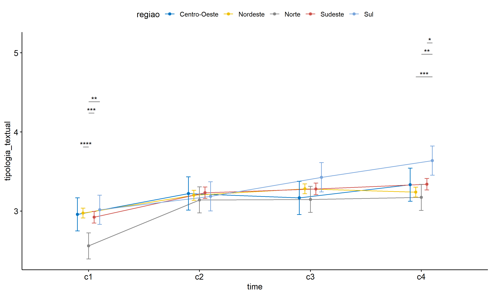<!-- -->

``` r
(pwc <- ldat %>% group_by(regiao) %>%
    emmeans_test(tipologia_textual ~ time, detailed = T, p.adjust.method = "bonferroni"))
```

    ## # A tibble: 30 × 15
    ##    regiao    term  .y.   group1 group2 null.value estimate     se    df conf.low
    ##  * <fct>     <chr> <chr> <chr>  <chr>       <dbl>    <dbl>  <dbl> <dbl>    <dbl>
    ##  1 Centro-O… time  tipo… c1     c2              0  -0.264  0.151   4484   -0.561
    ##  2 Centro-O… time  tipo… c1     c3              0  -0.208  0.151   4484   -0.505
    ##  3 Centro-O… time  tipo… c1     c4              0  -0.375  0.151   4484   -0.672
    ##  4 Centro-O… time  tipo… c2     c3              0   0.0556 0.151   4484   -0.241
    ##  5 Centro-O… time  tipo… c2     c4              0  -0.111  0.151   4484   -0.408
    ##  6 Centro-O… time  tipo… c3     c4              0  -0.167  0.151   4484   -0.463
    ##  7 Nordeste  time  tipo… c1     c2              0  -0.225  0.0449  4484   -0.313
    ##  8 Nordeste  time  tipo… c1     c3              0  -0.307  0.0449  4484   -0.395
    ##  9 Nordeste  time  tipo… c1     c4              0  -0.266  0.0449  4484   -0.354
    ## 10 Nordeste  time  tipo… c2     c3              0  -0.0820 0.0449  4484   -0.170
    ## # ℹ 20 more rows
    ## # ℹ 5 more variables: conf.high <dbl>, statistic <dbl>, p <dbl>, p.adj <dbl>,
    ## #   p.adj.signif <chr>

| regiao       | term | .y.               | group1 | group2 | null.value | estimate |    se |   df | conf.low | conf.high | statistic |     p | p.adj | p.adj.signif |
|:-------------|:-----|:------------------|:-------|:-------|-----------:|---------:|------:|-----:|---------:|----------:|----------:|------:|------:|:-------------|
| Centro-Oeste | time | tipologia_textual | c1     | c2     |          0 |   -0.264 | 0.151 | 4484 |   -0.561 |     0.033 |    -1.743 | 0.081 | 0.488 | ns           |
| Centro-Oeste | time | tipologia_textual | c1     | c3     |          0 |   -0.208 | 0.151 | 4484 |   -0.505 |     0.088 |    -1.376 | 0.169 | 1.000 | ns           |
| Centro-Oeste | time | tipologia_textual | c1     | c4     |          0 |   -0.375 | 0.151 | 4484 |   -0.672 |    -0.078 |    -2.477 | 0.013 | 0.080 | ns           |
| Centro-Oeste | time | tipologia_textual | c2     | c3     |          0 |    0.056 | 0.151 | 4484 |   -0.241 |     0.352 |     0.367 | 0.714 | 1.000 | ns           |
| Centro-Oeste | time | tipologia_textual | c2     | c4     |          0 |   -0.111 | 0.151 | 4484 |   -0.408 |     0.186 |    -0.734 | 0.463 | 1.000 | ns           |
| Centro-Oeste | time | tipologia_textual | c3     | c4     |          0 |   -0.167 | 0.151 | 4484 |   -0.463 |     0.130 |    -1.101 | 0.271 | 1.000 | ns           |
| Nordeste     | time | tipologia_textual | c1     | c2     |          0 |   -0.225 | 0.045 | 4484 |   -0.313 |    -0.137 |    -5.017 | 0.000 | 0.000 | \*\*\*\*     |
| Nordeste     | time | tipologia_textual | c1     | c3     |          0 |   -0.307 | 0.045 | 4484 |   -0.395 |    -0.219 |    -6.842 | 0.000 | 0.000 | \*\*\*\*     |
| Nordeste     | time | tipologia_textual | c1     | c4     |          0 |   -0.266 | 0.045 | 4484 |   -0.354 |    -0.178 |    -5.923 | 0.000 | 0.000 | \*\*\*\*     |
| Nordeste     | time | tipologia_textual | c2     | c3     |          0 |   -0.082 | 0.045 | 4484 |   -0.170 |     0.006 |    -1.824 | 0.068 | 0.409 | ns           |
| Nordeste     | time | tipologia_textual | c2     | c4     |          0 |   -0.041 | 0.045 | 4484 |   -0.129 |     0.047 |    -0.905 | 0.365 | 1.000 | ns           |
| Nordeste     | time | tipologia_textual | c3     | c4     |          0 |    0.041 | 0.045 | 4484 |   -0.047 |     0.129 |     0.919 | 0.358 | 1.000 | ns           |
| Norte        | time | tipologia_textual | c1     | c2     |          0 |   -0.581 | 0.119 | 4484 |   -0.814 |    -0.348 |    -4.895 | 0.000 | 0.000 | \*\*\*\*     |
| Norte        | time | tipologia_textual | c1     | c3     |          0 |   -0.588 | 0.119 | 4484 |   -0.820 |    -0.355 |    -4.949 | 0.000 | 0.000 | \*\*\*\*     |
| Norte        | time | tipologia_textual | c1     | c4     |          0 |   -0.613 | 0.119 | 4484 |   -0.846 |    -0.380 |    -5.165 | 0.000 | 0.000 | \*\*\*\*     |
| Norte        | time | tipologia_textual | c2     | c3     |          0 |   -0.006 | 0.119 | 4484 |   -0.239 |     0.226 |    -0.054 | 0.957 | 1.000 | ns           |
| Norte        | time | tipologia_textual | c2     | c4     |          0 |   -0.032 | 0.119 | 4484 |   -0.265 |     0.201 |    -0.270 | 0.787 | 1.000 | ns           |
| Norte        | time | tipologia_textual | c3     | c4     |          0 |   -0.026 | 0.119 | 4484 |   -0.258 |     0.207 |    -0.216 | 0.829 | 1.000 | ns           |
| Sudeste      | time | tipologia_textual | c1     | c2     |          0 |   -0.309 | 0.053 | 4484 |   -0.413 |    -0.206 |    -5.848 | 0.000 | 0.000 | \*\*\*\*     |
| Sudeste      | time | tipologia_textual | c1     | c3     |          0 |   -0.358 | 0.053 | 4484 |   -0.461 |    -0.254 |    -6.758 | 0.000 | 0.000 | \*\*\*\*     |
| Sudeste      | time | tipologia_textual | c1     | c4     |          0 |   -0.417 | 0.053 | 4484 |   -0.521 |    -0.314 |    -7.889 | 0.000 | 0.000 | \*\*\*\*     |
| Sudeste      | time | tipologia_textual | c2     | c3     |          0 |   -0.048 | 0.053 | 4484 |   -0.152 |     0.056 |    -0.910 | 0.363 | 1.000 | ns           |
| Sudeste      | time | tipologia_textual | c2     | c4     |          0 |   -0.108 | 0.053 | 4484 |   -0.212 |    -0.004 |    -2.040 | 0.041 | 0.248 | ns           |
| Sudeste      | time | tipologia_textual | c3     | c4     |          0 |   -0.060 | 0.053 | 4484 |   -0.164 |     0.044 |    -1.130 | 0.258 | 1.000 | ns           |
| Sul          | time | tipologia_textual | c1     | c2     |          0 |   -0.171 | 0.133 | 4484 |   -0.432 |     0.090 |    -1.282 | 0.200 | 1.000 | ns           |
| Sul          | time | tipologia_textual | c1     | c3     |          0 |   -0.411 | 0.133 | 4484 |   -0.672 |    -0.150 |    -3.088 | 0.002 | 0.012 | \*           |
| Sul          | time | tipologia_textual | c1     | c4     |          0 |   -0.621 | 0.133 | 4484 |   -0.882 |    -0.360 |    -4.663 | 0.000 | 0.000 | \*\*\*\*     |
| Sul          | time | tipologia_textual | c2     | c3     |          0 |   -0.241 | 0.133 | 4484 |   -0.502 |     0.021 |    -1.806 | 0.071 | 0.425 | ns           |
| Sul          | time | tipologia_textual | c2     | c4     |          0 |   -0.450 | 0.133 | 4484 |   -0.711 |    -0.189 |    -3.381 | 0.001 | 0.004 | \*\*         |
| Sul          | time | tipologia_textual | c3     | c4     |          0 |   -0.210 | 0.133 | 4484 |   -0.471 |     0.051 |    -1.574 | 0.115 | 0.693 | ns           |

``` r
(emms <- get_emmeans(pwc))
```

    ## # A tibble: 20 × 8
    ##    regiao       time  emmean     se    df conf.low conf.high method      
    ##    <fct>        <fct>  <dbl>  <dbl> <dbl>    <dbl>     <dbl> <chr>       
    ##  1 Centro-Oeste c1      2.96 0.107   4484     2.75      3.17 Emmeans test
    ##  2 Centro-Oeste c2      3.22 0.107   4484     3.01      3.43 Emmeans test
    ##  3 Centro-Oeste c3      3.17 0.107   4484     2.96      3.38 Emmeans test
    ##  4 Centro-Oeste c4      3.33 0.107   4484     3.12      3.54 Emmeans test
    ##  5 Nordeste     c1      2.97 0.0318  4484     2.91      3.04 Emmeans test
    ##  6 Nordeste     c2      3.20 0.0318  4484     3.14      3.26 Emmeans test
    ##  7 Nordeste     c3      3.28 0.0318  4484     3.22      3.34 Emmeans test
    ##  8 Nordeste     c4      3.24 0.0318  4484     3.18      3.30 Emmeans test
    ##  9 Norte        c1      2.56 0.0840  4484     2.40      2.72 Emmeans test
    ## 10 Norte        c2      3.14 0.0840  4484     2.98      3.31 Emmeans test
    ## 11 Norte        c3      3.15 0.0840  4484     2.98      3.31 Emmeans test
    ## 12 Norte        c4      3.17 0.0840  4484     3.01      3.34 Emmeans test
    ## 13 Sudeste      c1      2.92 0.0374  4484     2.85      3.00 Emmeans test
    ## 14 Sudeste      c2      3.23 0.0374  4484     3.16      3.31 Emmeans test
    ## 15 Sudeste      c3      3.28 0.0374  4484     3.21      3.35 Emmeans test
    ## 16 Sudeste      c4      3.34 0.0374  4484     3.27      3.41 Emmeans test
    ## 17 Sul          c1      3.02 0.0942  4484     2.83      3.20 Emmeans test
    ## 18 Sul          c2      3.19 0.0942  4484     3.00      3.37 Emmeans test
    ## 19 Sul          c3      3.43 0.0942  4484     3.24      3.61 Emmeans test
    ## 20 Sul          c4      3.64 0.0942  4484     3.45      3.82 Emmeans test

| regiao       | time | emmean |    se |   df | conf.low | conf.high | method       |
|:-------------|:-----|-------:|------:|-----:|---------:|----------:|:-------------|
| Centro-Oeste | c1   |  2.958 | 0.107 | 4484 |    2.749 |     3.168 | Emmeans test |
| Centro-Oeste | c2   |  3.222 | 0.107 | 4484 |    3.012 |     3.432 | Emmeans test |
| Centro-Oeste | c3   |  3.167 | 0.107 | 4484 |    2.957 |     3.376 | Emmeans test |
| Centro-Oeste | c4   |  3.333 | 0.107 | 4484 |    3.124 |     3.543 | Emmeans test |
| Nordeste     | c1   |  2.974 | 0.032 | 4484 |    2.912 |     3.037 | Emmeans test |
| Nordeste     | c2   |  3.200 | 0.032 | 4484 |    3.137 |     3.262 | Emmeans test |
| Nordeste     | c3   |  3.282 | 0.032 | 4484 |    3.219 |     3.344 | Emmeans test |
| Nordeste     | c4   |  3.240 | 0.032 | 4484 |    3.178 |     3.303 | Emmeans test |
| Norte        | c1   |  2.560 | 0.084 | 4484 |    2.395 |     2.724 | Emmeans test |
| Norte        | c2   |  3.141 | 0.084 | 4484 |    2.976 |     3.306 | Emmeans test |
| Norte        | c3   |  3.147 | 0.084 | 4484 |    2.983 |     3.312 | Emmeans test |
| Norte        | c4   |  3.173 | 0.084 | 4484 |    3.008 |     3.338 | Emmeans test |
| Sudeste      | c1   |  2.922 | 0.037 | 4484 |    2.849 |     2.996 | Emmeans test |
| Sudeste      | c2   |  3.232 | 0.037 | 4484 |    3.158 |     3.305 | Emmeans test |
| Sudeste      | c3   |  3.280 | 0.037 | 4484 |    3.207 |     3.353 | Emmeans test |
| Sudeste      | c4   |  3.340 | 0.037 | 4484 |    3.266 |     3.413 | Emmeans test |
| Sul          | c1   |  3.016 | 0.094 | 4484 |    2.832 |     3.201 | Emmeans test |
| Sul          | c2   |  3.187 | 0.094 | 4484 |    3.002 |     3.371 | Emmeans test |
| Sul          | c3   |  3.427 | 0.094 | 4484 |    3.243 |     3.612 | Emmeans test |
| Sul          | c4   |  3.637 | 0.094 | 4484 |    3.452 |     3.822 | Emmeans test |

``` r
emms.gg <- emms[which(emms$regiao == "Centro-Oeste"),]
if (nrow(emms.gg) > 0)
  ggline(emms.gg, x = "time", y = "emmean", color = "#0073C2FF", ylab = "tipologia_textual") +
    geom_errorbar(aes(ymin = conf.low, ymax = conf.high),
                  width = 0.2, color = "#0073C2FF") +
    stat_pvalue_manual(
      add_xy_position(pwc[which(pwc$regiao == "Centro-Oeste"),],
                      x = "time", fun = "mean_se"),
      hide.ns = T, color = "#0073C2FF", tip.length = F) +
    labs(title = "regiao: Centro-Oeste")+
    theme(legend.text = element_blank())
```

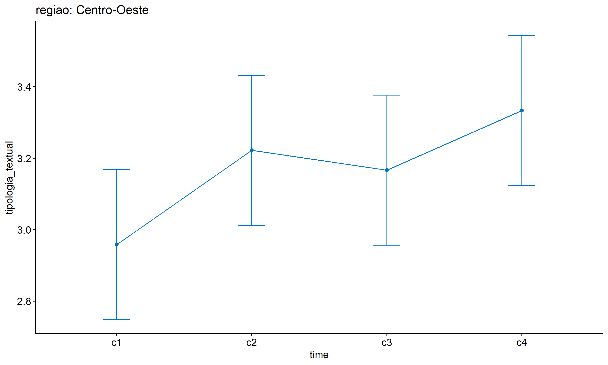<!-- -->

``` r
emms.gg <- emms[which(emms$regiao == "Nordeste"),]
if (nrow(emms.gg) > 0)
  ggline(emms.gg, x = "time", y = "emmean", color = "#EFC000FF", ylab = "tipologia_textual") +
    geom_errorbar(aes(ymin = conf.low, ymax = conf.high),
                  width = 0.2, color = "#EFC000FF") +
    stat_pvalue_manual(
      add_xy_position(pwc[which(pwc$regiao == "Nordeste"),],
                      x = "time", fun = "mean_se"),
      hide.ns = T, color = "#EFC000FF", tip.length = F) +
    labs(title = "regiao: Nordeste")+
    theme(legend.text = element_blank())
```

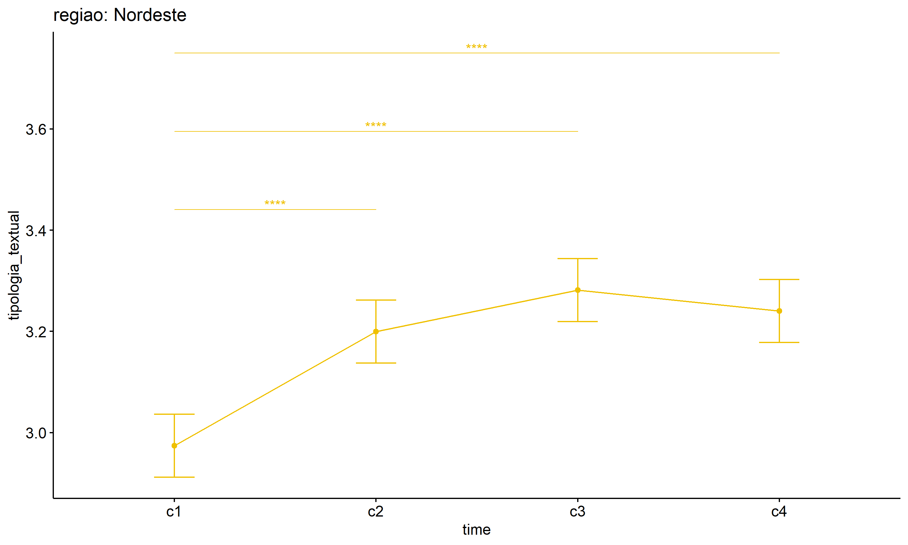<!-- -->

``` r
emms.gg <- emms[which(emms$regiao == "Norte"),]
if (nrow(emms.gg) > 0)
  ggline(emms.gg, x = "time", y = "emmean", color = "#868686FF", ylab = "tipologia_textual") +
    geom_errorbar(aes(ymin = conf.low, ymax = conf.high),
                  width = 0.2, color = "#868686FF") +
    stat_pvalue_manual(
      add_xy_position(pwc[which(pwc$regiao == "Norte"),],
                      x = "time", fun = "mean_se"),
      hide.ns = T, color = "#868686FF", tip.length = F) +
    labs(title = "regiao: Norte")+
    theme(legend.text = element_blank())
```

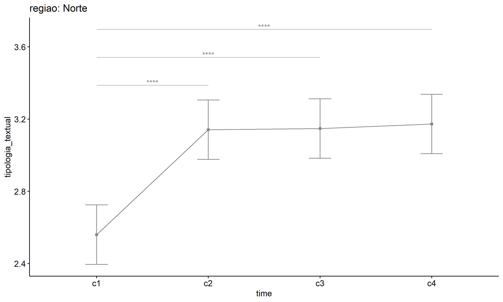<!-- -->

``` r
emms.gg <- emms[which(emms$regiao == "Sudeste"),]
if (nrow(emms.gg) > 0)
  ggline(emms.gg, x = "time", y = "emmean", color = "#CD534CFF", ylab = "tipologia_textual") +
    geom_errorbar(aes(ymin = conf.low, ymax = conf.high),
                  width = 0.2, color = "#CD534CFF") +
    stat_pvalue_manual(
      add_xy_position(pwc[which(pwc$regiao == "Sudeste"),],
                      x = "time", fun = "mean_se"),
      hide.ns = T, color = "#CD534CFF", tip.length = F) +
    labs(title = "regiao: Sudeste")+
    theme(legend.text = element_blank())
```

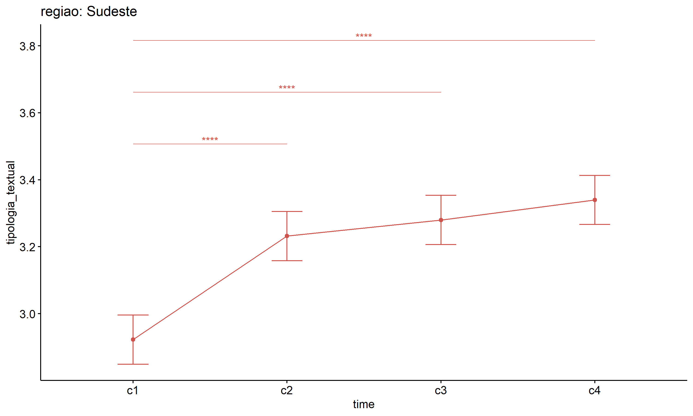<!-- -->

``` r
emms.gg <- emms[which(emms$regiao == "Sul"),]
if (nrow(emms.gg) > 0)
  ggline(emms.gg, x = "time", y = "emmean", color = "#7AA6DCFF", ylab = "tipologia_textual") +
    geom_errorbar(aes(ymin = conf.low, ymax = conf.high),
                  width = 0.2, color = "#7AA6DCFF") +
    stat_pvalue_manual(
      add_xy_position(pwc[which(pwc$regiao == "Sul"),],
                      x = "time", fun = "mean_se"),
      hide.ns = T, color = "#7AA6DCFF", tip.length = F) +
    labs(title = "regiao: Sul")+
    theme(legend.text = element_blank())
```

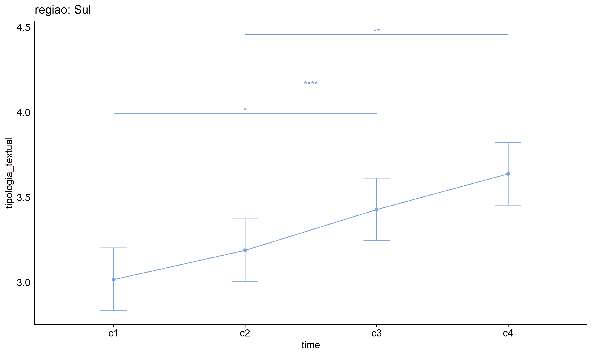<!-- -->

# ANOVA: tipologia_textual ~ time\*porte + Error(id/time)

## Data Preparation

``` r
data <- edat[,c("aluno_id","porte","ciclo","tipologia_textual")]
data$ciclo <- factor(data$ciclo, c("Primeiro Ciclo","Segundo Ciclo",
                                   "Terceiro Ciclo","Quarto Ciclo"))

wdat <- spread(data, ciclo, tipologia_textual)
wdat <- wdat[complete.cases(wdat),]
colnames(wdat) <- c("id","porte","c1","c2","c3","c4")

ldat <- gather(wdat, key = time, value = tipologia_textual, c1, c2, c3, c4) %>%
  convert_as_factor(id, time)
ldat <- remove_group_data(ldat, "tipologia_textual", c("time", "porte"), n.limit = 30)
ldat$porte <- factor(ldat$porte, sort(unique(ldat$porte)))
```

### Check assumptions: Identifying Outliers

``` r
outliers <- identify_outliers(group_by(ldat, time, porte), tipologia_textual)
(outliers <- outliers[outliers$is.extreme == T,])
```

    ## [1] porte             time              id                tipologia_textual
    ## [5] is.outlier        is.extreme       
    ## <0 rows> (or 0-length row.names)

| porte | time | id  | tipologia_textual | is.outlier | is.extreme |
|:------|:-----|:----|------------------:|:-----------|:-----------|

### Check assumptions: Normality Test

``` r
(normality.df <- normality.test.per.groups(ldat, "tipologia_textual", c("time", "porte")))
```

    ##                  var          variable time
    ## 1  tipologia_textual tipologia_textual   c1
    ## 2  tipologia_textual tipologia_textual   c1
    ## 3  tipologia_textual tipologia_textual   c1
    ## 4  tipologia_textual tipologia_textual   c1
    ## 5  tipologia_textual tipologia_textual   c2
    ## 6  tipologia_textual tipologia_textual   c2
    ## 7  tipologia_textual tipologia_textual   c2
    ## 8  tipologia_textual tipologia_textual   c2
    ## 9  tipologia_textual tipologia_textual   c3
    ## 10 tipologia_textual tipologia_textual   c3
    ## 11 tipologia_textual tipologia_textual   c3
    ## 12 tipologia_textual tipologia_textual   c3
    ## 13 tipologia_textual tipologia_textual   c4
    ## 14 tipologia_textual tipologia_textual   c4
    ## 15 tipologia_textual tipologia_textual   c4
    ## 16 tipologia_textual tipologia_textual   c4
    ##                                           porte   n    skewness   kurtosis
    ## 1            Até 50 matrículas de escolarização  33 -0.24629719 -1.4506733
    ## 2   Entre 201 e 500 matrículas de escolarização 675  0.09628451 -1.3114272
    ## 3  Entre 501 e 1000 matrículas de escolarização 249  0.06067024 -1.3235217
    ## 4    Entre 51 e 200 matrículas de escolarização 162  0.22600860 -1.4864606
    ## 5            Até 50 matrículas de escolarização  33 -0.27847454 -1.1721216
    ## 6   Entre 201 e 500 matrículas de escolarização 675 -0.43676521 -1.0789914
    ## 7  Entre 501 e 1000 matrículas de escolarização 249 -0.35896870 -1.2983042
    ## 8    Entre 51 e 200 matrículas de escolarização 162 -0.23360138 -1.5315378
    ## 9            Até 50 matrículas de escolarização  33 -0.40587062 -1.0642951
    ## 10  Entre 201 e 500 matrículas de escolarização 675 -0.49003433 -0.9711263
    ## 11 Entre 501 e 1000 matrículas de escolarização 249 -0.63426928 -0.9492115
    ## 12   Entre 51 e 200 matrículas de escolarização 162 -0.58038211 -1.1708889
    ## 13           Até 50 matrículas de escolarização  33 -0.84944317 -0.6836781
    ## 14  Entre 201 e 500 matrículas de escolarização 675 -0.62246665 -0.9976644
    ## 15 Entre 501 e 1000 matrículas de escolarização 249 -0.69642508 -0.9423862
    ## 16   Entre 51 e 200 matrículas de escolarização 162 -0.16709942 -1.4451897
    ##    symmetry    statistic       method            p p.signif normality
    ## 1       YES    0.8453150 Shapiro-Wilk 2.689384e-04      ***        NO
    ## 2       YES 1331.8042680   D'Agostino 0.000000e+00     ****         -
    ## 3       YES  272.5855241   D'Agostino 0.000000e+00     ****         -
    ## 4       YES  680.6838598   D'Agostino 0.000000e+00     ****        QQ
    ## 5       YES    0.8433079 Shapiro-Wilk 2.433584e-04      ***        NO
    ## 6       YES  225.7781119   D'Agostino 0.000000e+00     ****         -
    ## 7       YES  227.1288257   D'Agostino 0.000000e+00     ****         -
    ## 8       YES 5229.3127717   D'Agostino 0.000000e+00     ****        QQ
    ## 9       YES    0.8395433 Shapiro-Wilk 2.020873e-04      ***        NO
    ## 10      YES  142.1834508   D'Agostino 0.000000e+00     ****         -
    ## 11       NO   47.8132539   D'Agostino 4.144607e-11     ****         -
    ## 12       NO   61.1318611   D'Agostino 5.317968e-14     ****        QQ
    ## 13       NO    0.7491282 Shapiro-Wilk 3.968106e-06     ****        NO
    ## 14       NO  171.9785542   D'Agostino 0.000000e+00     ****         -
    ## 15       NO   49.4594804   D'Agostino 1.819744e-11     ****         -
    ## 16      YES  361.4879490   D'Agostino 0.000000e+00     ****        QQ

| var               | variable          | time | porte                                        |   n | skewness | kurtosis | symmetry | statistic | method       |   p | p.signif | normality |
|:------------------|:------------------|:-----|:---------------------------------------------|----:|---------:|---------:|:---------|----------:|:-------------|----:|:---------|:----------|
| tipologia_textual | tipologia_textual | c1   | Até 50 matrículas de escolarização           |  33 |   -0.246 |   -1.451 | YES      |     0.845 | Shapiro-Wilk |   0 | \*\*\*   | NO        |
| tipologia_textual | tipologia_textual | c1   | Entre 201 e 500 matrículas de escolarização  | 675 |    0.096 |   -1.311 | YES      |  1331.804 | D’Agostino   |   0 | \*\*\*\* | \-        |
| tipologia_textual | tipologia_textual | c1   | Entre 501 e 1000 matrículas de escolarização | 249 |    0.061 |   -1.324 | YES      |   272.586 | D’Agostino   |   0 | \*\*\*\* | \-        |
| tipologia_textual | tipologia_textual | c1   | Entre 51 e 200 matrículas de escolarização   | 162 |    0.226 |   -1.486 | YES      |   680.684 | D’Agostino   |   0 | \*\*\*\* | QQ        |
| tipologia_textual | tipologia_textual | c2   | Até 50 matrículas de escolarização           |  33 |   -0.278 |   -1.172 | YES      |     0.843 | Shapiro-Wilk |   0 | \*\*\*   | NO        |
| tipologia_textual | tipologia_textual | c2   | Entre 201 e 500 matrículas de escolarização  | 675 |   -0.437 |   -1.079 | YES      |   225.778 | D’Agostino   |   0 | \*\*\*\* | \-        |
| tipologia_textual | tipologia_textual | c2   | Entre 501 e 1000 matrículas de escolarização | 249 |   -0.359 |   -1.298 | YES      |   227.129 | D’Agostino   |   0 | \*\*\*\* | \-        |
| tipologia_textual | tipologia_textual | c2   | Entre 51 e 200 matrículas de escolarização   | 162 |   -0.234 |   -1.532 | YES      |  5229.313 | D’Agostino   |   0 | \*\*\*\* | QQ        |
| tipologia_textual | tipologia_textual | c3   | Até 50 matrículas de escolarização           |  33 |   -0.406 |   -1.064 | YES      |     0.840 | Shapiro-Wilk |   0 | \*\*\*   | NO        |
| tipologia_textual | tipologia_textual | c3   | Entre 201 e 500 matrículas de escolarização  | 675 |   -0.490 |   -0.971 | YES      |   142.183 | D’Agostino   |   0 | \*\*\*\* | \-        |
| tipologia_textual | tipologia_textual | c3   | Entre 501 e 1000 matrículas de escolarização | 249 |   -0.634 |   -0.949 | NO       |    47.813 | D’Agostino   |   0 | \*\*\*\* | \-        |
| tipologia_textual | tipologia_textual | c3   | Entre 51 e 200 matrículas de escolarização   | 162 |   -0.580 |   -1.171 | NO       |    61.132 | D’Agostino   |   0 | \*\*\*\* | QQ        |
| tipologia_textual | tipologia_textual | c4   | Até 50 matrículas de escolarização           |  33 |   -0.849 |   -0.684 | NO       |     0.749 | Shapiro-Wilk |   0 | \*\*\*\* | NO        |
| tipologia_textual | tipologia_textual | c4   | Entre 201 e 500 matrículas de escolarização  | 675 |   -0.622 |   -0.998 | NO       |   171.979 | D’Agostino   |   0 | \*\*\*\* | \-        |
| tipologia_textual | tipologia_textual | c4   | Entre 501 e 1000 matrículas de escolarização | 249 |   -0.696 |   -0.942 | NO       |    49.459 | D’Agostino   |   0 | \*\*\*\* | \-        |
| tipologia_textual | tipologia_textual | c4   | Entre 51 e 200 matrículas de escolarização   | 162 |   -0.167 |   -1.445 | YES      |   361.488 | D’Agostino   |   0 | \*\*\*\* | QQ        |

``` r
(non.ids <- unique(do.call(
  c, lapply(which(normality.df$normality == 'NO'), FUN = function(i) {
  idx = which(ldat$time == normality.df$time[i] &
                ldat$porte == normality.df$porte[i])
  getNonNormal(ldat$"tipologia_textual"[idx], ldat$id[idx])
}))))
```

    ##  [1] "vgyELVyPKZx09yEhXnEW" "0bDRQAUpq62jJm9vcptp" "UgYoK4SY4Mtbi2xic7Rv"
    ##  [4] "ltYX0dLBB2brT2djXB5i" "ewKlsdM2p1FOYevFZJEB" "ADdqL4oAf1WRDDiOJwkj"
    ##  [7] "BFW9EcP6GxS4r3JYDkkn" "d7fkDImOtMuiednMD3E1" "8qKHWcxVACuKJJSMclyf"
    ## [10] "ygCWEOBsngyfEt5hGLmw" "7gsjMtGuUxQPUSVFnNcm" "0w3VhiMf67CbcpR6aZCL"
    ## [13] "Lbwu9s0newf9Wi294FdL" "BGXXXnQoaKaHn2dkhSeE" "z2bvFgOm1tRPAL3buvNQ"
    ## [16] "xAo0TzCEx1bIrmjqKgbj" "MdfO8FPiIZis82vN8Qvn" "xD1wHpF1gkJCyVbkGGdU"
    ## [19] "VNQYsv3kH0OTOqJH3yYT" "U2EyQT1K48KPitv2x16k" "hhm3dmBw9wzrZNM837xU"
    ## [22] "Rw0335zUaR2w467v8I7t" "8QJX5P6FygYXzjqA5njF" "w7548cNc0knlzDezHzBq"
    ## [25] "L0gX2yfP95da5eDy6w4E" "iutpBZMAtM92qcbyCDHB" "jljcKPNPjBo1MdiK1ffQ"
    ## [28] "hOmouhZRJ53dvfn3tBsJ" "1D0FkPiZPusHHIh6zphq" "KBTZEriJAFvcWw48Xxgc"

``` r
if (length(non.ids) > 0)
  ldat2 <- ldat[!ldat$id %in% non.ids,]
```

### Summary Statistics

``` r
(sdat <- ldat %>% group_by(time, porte) %>%
   get_summary_stats(tipologia_textual, type = "mean_sd"))
```

    ## # A tibble: 16 × 6
    ##    porte                                        time  variable     n  mean    sd
    ##    <fct>                                        <fct> <fct>    <dbl> <dbl> <dbl>
    ##  1 Até 50 matrículas de escolarização           c1    tipolog…    33  3.11 0.778
    ##  2 Entre 201 e 500 matrículas de escolarização  c1    tipolog…   675  2.93 0.744
    ##  3 Entre 501 e 1000 matrículas de escolarização c1    tipolog…   249  2.95 0.742
    ##  4 Entre 51 e 200 matrículas de escolarização   c1    tipolog…   162  2.86 0.796
    ##  5 Até 50 matrículas de escolarização           c2    tipolog…    33  3.23 0.697
    ##  6 Entre 201 e 500 matrículas de escolarização  c2    tipolog…   675  3.24 0.722
    ##  7 Entre 501 e 1000 matrículas de escolarização c2    tipolog…   249  3.18 0.77 
    ##  8 Entre 51 e 200 matrículas de escolarização   c2    tipolog…   162  3.11 0.825
    ##  9 Até 50 matrículas de escolarização           c3    tipolog…    33  3.30 0.672
    ## 10 Entre 201 e 500 matrículas de escolarização  c3    tipolog…   675  3.26 0.71 
    ## 11 Entre 501 e 1000 matrículas de escolarização c3    tipolog…   249  3.32 0.738
    ## 12 Entre 51 e 200 matrículas de escolarização   c3    tipolog…   162  3.31 0.766
    ## 13 Até 50 matrículas de escolarização           c4    tipolog…    33  3.44 0.715
    ## 14 Entre 201 e 500 matrículas de escolarização  c4    tipolog…   675  3.31 0.743
    ## 15 Entre 501 e 1000 matrículas de escolarização c4    tipolog…   249  3.36 0.735
    ## 16 Entre 51 e 200 matrículas de escolarização   c4    tipolog…   162  3.11 0.785

| porte                                        | time | variable          |   n |  mean |    sd |
|:---------------------------------------------|:-----|:------------------|----:|------:|------:|
| Até 50 matrículas de escolarização           | c1   | tipologia_textual |  33 | 3.106 | 0.778 |
| Entre 201 e 500 matrículas de escolarização  | c1   | tipologia_textual | 675 | 2.932 | 0.744 |
| Entre 501 e 1000 matrículas de escolarização | c1   | tipologia_textual | 249 | 2.952 | 0.742 |
| Entre 51 e 200 matrículas de escolarização   | c1   | tipologia_textual | 162 | 2.864 | 0.796 |
| Até 50 matrículas de escolarização           | c2   | tipologia_textual |  33 | 3.227 | 0.697 |
| Entre 201 e 500 matrículas de escolarização  | c2   | tipologia_textual | 675 | 3.240 | 0.722 |
| Entre 501 e 1000 matrículas de escolarização | c2   | tipologia_textual | 249 | 3.185 | 0.770 |
| Entre 51 e 200 matrículas de escolarização   | c2   | tipologia_textual | 162 | 3.110 | 0.825 |
| Até 50 matrículas de escolarização           | c3   | tipologia_textual |  33 | 3.303 | 0.672 |
| Entre 201 e 500 matrículas de escolarização  | c3   | tipologia_textual | 675 | 3.259 | 0.710 |
| Entre 501 e 1000 matrículas de escolarização | c3   | tipologia_textual | 249 | 3.317 | 0.738 |
| Entre 51 e 200 matrículas de escolarização   | c3   | tipologia_textual | 162 | 3.309 | 0.766 |
| Até 50 matrículas de escolarização           | c4   | tipologia_textual |  33 | 3.439 | 0.715 |
| Entre 201 e 500 matrículas de escolarização  | c4   | tipologia_textual | 675 | 3.310 | 0.743 |
| Entre 501 e 1000 matrículas de escolarização | c4   | tipologia_textual | 249 | 3.355 | 0.735 |
| Entre 51 e 200 matrículas de escolarização   | c4   | tipologia_textual | 162 | 3.114 | 0.785 |

``` r
if (length(non.ids) > 0)
  (sdat <- ldat2 %>% group_by(time, porte) %>%
      get_summary_stats(tipologia_textual, type = "mean_sd"))
```

    ## # A tibble: 16 × 6
    ##    porte                                        time  variable     n  mean    sd
    ##    <fct>                                        <fct> <fct>    <dbl> <dbl> <dbl>
    ##  1 Até 50 matrículas de escolarização           c1    tipolog…     3  3.33 1.16 
    ##  2 Entre 201 e 500 matrículas de escolarização  c1    tipolog…   675  2.93 0.744
    ##  3 Entre 501 e 1000 matrículas de escolarização c1    tipolog…   249  2.95 0.742
    ##  4 Entre 51 e 200 matrículas de escolarização   c1    tipolog…   162  2.86 0.796
    ##  5 Até 50 matrículas de escolarização           c2    tipolog…     3  2.83 0.289
    ##  6 Entre 201 e 500 matrículas de escolarização  c2    tipolog…   675  3.24 0.722
    ##  7 Entre 501 e 1000 matrículas de escolarização c2    tipolog…   249  3.18 0.77 
    ##  8 Entre 51 e 200 matrículas de escolarização   c2    tipolog…   162  3.11 0.825
    ##  9 Até 50 matrículas de escolarização           c3    tipolog…     3  3.17 0.764
    ## 10 Entre 201 e 500 matrículas de escolarização  c3    tipolog…   675  3.26 0.71 
    ## 11 Entre 501 e 1000 matrículas de escolarização c3    tipolog…   249  3.32 0.738
    ## 12 Entre 51 e 200 matrículas de escolarização   c3    tipolog…   162  3.31 0.766
    ## 13 Até 50 matrículas de escolarização           c4    tipolog…     3  3.67 0.577
    ## 14 Entre 201 e 500 matrículas de escolarização  c4    tipolog…   675  3.31 0.743
    ## 15 Entre 501 e 1000 matrículas de escolarização c4    tipolog…   249  3.36 0.735
    ## 16 Entre 51 e 200 matrículas de escolarização   c4    tipolog…   162  3.11 0.785

| porte                                        | time | variable          |   n |  mean |    sd |
|:---------------------------------------------|:-----|:------------------|----:|------:|------:|
| Até 50 matrículas de escolarização           | c1   | tipologia_textual |   3 | 3.333 | 1.155 |
| Entre 201 e 500 matrículas de escolarização  | c1   | tipologia_textual | 675 | 2.932 | 0.744 |
| Entre 501 e 1000 matrículas de escolarização | c1   | tipologia_textual | 249 | 2.952 | 0.742 |
| Entre 51 e 200 matrículas de escolarização   | c1   | tipologia_textual | 162 | 2.864 | 0.796 |
| Até 50 matrículas de escolarização           | c2   | tipologia_textual |   3 | 2.833 | 0.289 |
| Entre 201 e 500 matrículas de escolarização  | c2   | tipologia_textual | 675 | 3.240 | 0.722 |
| Entre 501 e 1000 matrículas de escolarização | c2   | tipologia_textual | 249 | 3.185 | 0.770 |
| Entre 51 e 200 matrículas de escolarização   | c2   | tipologia_textual | 162 | 3.110 | 0.825 |
| Até 50 matrículas de escolarização           | c3   | tipologia_textual |   3 | 3.167 | 0.764 |
| Entre 201 e 500 matrículas de escolarização  | c3   | tipologia_textual | 675 | 3.259 | 0.710 |
| Entre 501 e 1000 matrículas de escolarização | c3   | tipologia_textual | 249 | 3.317 | 0.738 |
| Entre 51 e 200 matrículas de escolarização   | c3   | tipologia_textual | 162 | 3.309 | 0.766 |
| Até 50 matrículas de escolarização           | c4   | tipologia_textual |   3 | 3.667 | 0.577 |
| Entre 201 e 500 matrículas de escolarização  | c4   | tipologia_textual | 675 | 3.310 | 0.743 |
| Entre 501 e 1000 matrículas de escolarização | c4   | tipologia_textual | 249 | 3.355 | 0.735 |
| Entre 51 e 200 matrículas de escolarização   | c4   | tipologia_textual | 162 | 3.114 | 0.785 |

## ANOVA Computation

``` r
(res.aov <- anova_test(ldat, dv = tipologia_textual, wid = id, between = porte, within = time))
```

    ## ANOVA Table (type III tests)
    ## 
    ## $ANOVA
    ##       Effect DFn  DFd      F        p p<.05   ges
    ## 1      porte   3 1115  2.377 6.80e-02       0.002
    ## 2       time   3 3345 20.836 2.26e-13     * 0.012
    ## 3 porte:time   9 3345  1.503 1.41e-01       0.003
    ## 
    ## $`Mauchly's Test for Sphericity`
    ##       Effect     W        p p<.05
    ## 1       time 0.966 3.25e-07     *
    ## 2 porte:time 0.966 3.25e-07     *
    ## 
    ## $`Sphericity Corrections`
    ##       Effect   GGe        DF[GG]    p[GG] p[GG]<.05  HFe        DF[HF]    p[HF]
    ## 1       time 0.977 2.93, 3267.44 4.07e-13         * 0.98 2.94, 3276.98 3.79e-13
    ## 2 porte:time 0.977 8.79, 3267.44 1.43e-01           0.98 8.82, 3276.98 1.43e-01
    ##   p[HF]<.05
    ## 1         *
    ## 2

| Effect     | DFn |  DFd |      F |     p | p\<.05 |   ges |
|:-----------|----:|-----:|-------:|------:|:-------|------:|
| porte      |   3 | 1115 |  2.377 | 0.068 |        | 0.002 |
| time       |   3 | 3345 | 20.836 | 0.000 | \*     | 0.012 |
| porte:time |   9 | 3345 |  1.503 | 0.141 |        | 0.003 |

| Effect     |     W |   p | p\<.05 |
|:-----------|------:|----:|:-------|
| time       | 0.966 |   0 | \*     |
| porte:time | 0.966 |   0 | \*     |

| Effect     |   GGe | DF\[GG\]      | p\[GG\] | p\[GG\]\<.05 |  HFe | DF\[HF\]      | p\[HF\] | p\[HF\]\<.05 |
|:-----------|------:|:--------------|--------:|:-------------|-----:|:--------------|--------:|:-------------|
| time       | 0.977 | 2.93, 3267.44 |   0.000 | \*           | 0.98 | 2.94, 3276.98 |   0.000 | \*           |
| porte:time | 0.977 | 8.79, 3267.44 |   0.143 |              | 0.98 | 8.82, 3276.98 |   0.143 |              |

## ANOVA Computation after removing non.normal data

``` r
if (length(non.ids) > 0)
  (res.aov2 <- anova_test(ldat2, dv = tipologia_textual, wid = id, between = porte , within = time))
```

    ## ANOVA Table (type III tests)
    ## 
    ## $ANOVA
    ##       Effect DFn  DFd     F     p p<.05   ges
    ## 1      porte   3 1085 1.951 0.120       0.002
    ## 2       time   3 3255 2.434 0.063       0.001
    ## 3 porte:time   9 3255 1.654 0.095       0.003
    ## 
    ## $`Mauchly's Test for Sphericity`
    ##       Effect     W        p p<.05
    ## 1       time 0.962 7.44e-08     *
    ## 2 porte:time 0.962 7.44e-08     *
    ## 
    ## $`Sphericity Corrections`
    ##       Effect   GGe        DF[GG] p[GG] p[GG]<.05   HFe        DF[HF] p[HF]
    ## 1       time 0.974 2.92, 3171.34 0.065           0.977 2.93, 3180.83 0.064
    ## 2 porte:time 0.974 8.77, 3171.34 0.097           0.977 8.79, 3180.83 0.097
    ##   p[HF]<.05
    ## 1          
    ## 2

| Effect     | DFn |  DFd |     F |     p | p\<.05 |   ges |
|:-----------|----:|-----:|------:|------:|:-------|------:|
| porte      |   3 | 1085 | 1.951 | 0.120 |        | 0.002 |
| time       |   3 | 3255 | 2.434 | 0.063 |        | 0.001 |
| porte:time |   9 | 3255 | 1.654 | 0.095 |        | 0.003 |

| Effect     |     W |   p | p\<.05 |
|:-----------|------:|----:|:-------|
| time       | 0.962 |   0 | \*     |
| porte:time | 0.962 |   0 | \*     |

| Effect     |   GGe | DF\[GG\]      | p\[GG\] | p\[GG\]\<.05 |   HFe | DF\[HF\]      | p\[HF\] | p\[HF\]\<.05 |
|:-----------|------:|:--------------|--------:|:-------------|------:|:--------------|--------:|:-------------|
| time       | 0.974 | 2.92, 3171.34 |   0.065 |              | 0.977 | 2.93, 3180.83 |   0.064 |              |
| porte:time | 0.974 | 8.77, 3171.34 |   0.097 |              | 0.977 | 8.79, 3180.83 |   0.097 |              |

## PairWise Computation

``` r
(pwc <- ldat %>% group_by(time) %>%
   emmeans_test(tipologia_textual ~ porte, detailed = T, p.adjust.method = "bonferroni"))
```

    ## # A tibble: 24 × 15
    ##    time  term  .y.       group1 group2 null.value estimate     se    df conf.low
    ##  * <fct> <chr> <chr>     <chr>  <chr>       <dbl>    <dbl>  <dbl> <dbl>    <dbl>
    ##  1 c1    porte tipologi… Até 5… Entre…          0   0.174  0.132   4460  -0.0854
    ##  2 c1    porte tipologi… Até 5… Entre…          0   0.154  0.138   4460  -0.116 
    ##  3 c1    porte tipologi… Até 5… Entre…          0   0.242  0.142   4460  -0.0362
    ##  4 c1    porte tipologi… Entre… Entre…          0  -0.0206 0.0551  4460  -0.129 
    ##  5 c1    porte tipologi… Entre… Entre…          0   0.0677 0.0650  4460  -0.0597
    ##  6 c1    porte tipologi… Entre… Entre…          0   0.0883 0.0750  4460  -0.0587
    ##  7 c2    porte tipologi… Até 5… Entre…          0  -0.0126 0.132   4460  -0.272 
    ##  8 c2    porte tipologi… Até 5… Entre…          0   0.0425 0.138   4460  -0.227 
    ##  9 c2    porte tipologi… Até 5… Entre…          0   0.118  0.142   4460  -0.160 
    ## 10 c2    porte tipologi… Entre… Entre…          0   0.0551 0.0551  4460  -0.0528
    ## # ℹ 14 more rows
    ## # ℹ 5 more variables: conf.high <dbl>, statistic <dbl>, p <dbl>, p.adj <dbl>,
    ## #   p.adj.signif <chr>

| time | term  | .y.               | group1                                       | group2                                       | null.value | estimate |    se |   df | conf.low | conf.high | statistic |     p | p.adj | p.adj.signif |
|:-----|:------|:------------------|:---------------------------------------------|:---------------------------------------------|-----------:|---------:|------:|-----:|---------:|----------:|----------:|------:|------:|:-------------|
| c1   | porte | tipologia_textual | Até 50 matrículas de escolarização           | Entre 201 e 500 matrículas de escolarização  |          0 |    0.174 | 0.132 | 4460 |   -0.085 |     0.434 |     1.316 | 0.188 | 1.000 | ns           |
| c1   | porte | tipologia_textual | Até 50 matrículas de escolarização           | Entre 501 e 1000 matrículas de escolarização |          0 |    0.154 | 0.138 | 4460 |   -0.116 |     0.423 |     1.116 | 0.264 | 1.000 | ns           |
| c1   | porte | tipologia_textual | Até 50 matrículas de escolarização           | Entre 51 e 200 matrículas de escolarização   |          0 |    0.242 | 0.142 | 4460 |   -0.036 |     0.520 |     1.705 | 0.088 | 0.529 | ns           |
| c1   | porte | tipologia_textual | Entre 201 e 500 matrículas de escolarização  | Entre 501 e 1000 matrículas de escolarização |          0 |   -0.021 | 0.055 | 4460 |   -0.129 |     0.087 |    -0.375 | 0.708 | 1.000 | ns           |
| c1   | porte | tipologia_textual | Entre 201 e 500 matrículas de escolarização  | Entre 51 e 200 matrículas de escolarização   |          0 |    0.068 | 0.065 | 4460 |   -0.060 |     0.195 |     1.041 | 0.298 | 1.000 | ns           |
| c1   | porte | tipologia_textual | Entre 501 e 1000 matrículas de escolarização | Entre 51 e 200 matrículas de escolarização   |          0 |    0.088 | 0.075 | 4460 |   -0.059 |     0.235 |     1.178 | 0.239 | 1.000 | ns           |
| c2   | porte | tipologia_textual | Até 50 matrículas de escolarização           | Entre 201 e 500 matrículas de escolarização  |          0 |   -0.013 | 0.132 | 4460 |   -0.272 |     0.247 |    -0.095 | 0.924 | 1.000 | ns           |
| c2   | porte | tipologia_textual | Até 50 matrículas de escolarização           | Entre 501 e 1000 matrículas de escolarização |          0 |    0.043 | 0.138 | 4460 |   -0.227 |     0.312 |     0.309 | 0.757 | 1.000 | ns           |
| c2   | porte | tipologia_textual | Até 50 matrículas de escolarização           | Entre 51 e 200 matrículas de escolarização   |          0 |    0.118 | 0.142 | 4460 |   -0.160 |     0.396 |     0.830 | 0.407 | 1.000 | ns           |
| c2   | porte | tipologia_textual | Entre 201 e 500 matrículas de escolarização  | Entre 501 e 1000 matrículas de escolarização |          0 |    0.055 | 0.055 | 4460 |   -0.053 |     0.163 |     1.001 | 0.317 | 1.000 | ns           |
| c2   | porte | tipologia_textual | Entre 201 e 500 matrículas de escolarização  | Entre 51 e 200 matrículas de escolarização   |          0 |    0.130 | 0.065 | 4460 |    0.003 |     0.258 |     2.006 | 0.045 | 0.270 | ns           |
| c2   | porte | tipologia_textual | Entre 501 e 1000 matrículas de escolarização | Entre 51 e 200 matrículas de escolarização   |          0 |    0.075 | 0.075 | 4460 |   -0.072 |     0.222 |     1.003 | 0.316 | 1.000 | ns           |
| c3   | porte | tipologia_textual | Até 50 matrículas de escolarização           | Entre 201 e 500 matrículas de escolarização  |          0 |    0.045 | 0.132 | 4460 |   -0.215 |     0.304 |     0.336 | 0.737 | 1.000 | ns           |
| c3   | porte | tipologia_textual | Até 50 matrículas de escolarização           | Entre 501 e 1000 matrículas de escolarização |          0 |   -0.014 | 0.138 | 4460 |   -0.284 |     0.255 |    -0.103 | 0.918 | 1.000 | ns           |
| c3   | porte | tipologia_textual | Até 50 matrículas de escolarização           | Entre 51 e 200 matrículas de escolarização   |          0 |   -0.006 | 0.142 | 4460 |   -0.284 |     0.272 |    -0.040 | 0.968 | 1.000 | ns           |
| c3   | porte | tipologia_textual | Entre 201 e 500 matrículas de escolarização  | Entre 501 e 1000 matrículas de escolarização |          0 |   -0.059 | 0.055 | 4460 |   -0.167 |     0.049 |    -1.067 | 0.286 | 1.000 | ns           |
| c3   | porte | tipologia_textual | Entre 201 e 500 matrículas de escolarização  | Entre 51 e 200 matrículas de escolarização   |          0 |   -0.050 | 0.065 | 4460 |   -0.178 |     0.077 |    -0.771 | 0.440 | 1.000 | ns           |
| c3   | porte | tipologia_textual | Entre 501 e 1000 matrículas de escolarização | Entre 51 e 200 matrículas de escolarização   |          0 |    0.009 | 0.075 | 4460 |   -0.138 |     0.156 |     0.115 | 0.908 | 1.000 | ns           |
| c4   | porte | tipologia_textual | Até 50 matrículas de escolarização           | Entre 201 e 500 matrículas de escolarização  |          0 |    0.130 | 0.132 | 4460 |   -0.130 |     0.389 |     0.980 | 0.327 | 1.000 | ns           |
| c4   | porte | tipologia_textual | Até 50 matrículas de escolarização           | Entre 501 e 1000 matrículas de escolarização |          0 |    0.084 | 0.138 | 4460 |   -0.186 |     0.354 |     0.610 | 0.542 | 1.000 | ns           |
| c4   | porte | tipologia_textual | Até 50 matrículas de escolarização           | Entre 51 e 200 matrículas de escolarização   |          0 |    0.325 | 0.142 | 4460 |    0.047 |     0.603 |     2.293 | 0.022 | 0.131 | ns           |
| c4   | porte | tipologia_textual | Entre 201 e 500 matrículas de escolarização  | Entre 501 e 1000 matrículas de escolarização |          0 |   -0.046 | 0.055 | 4460 |   -0.154 |     0.062 |    -0.832 | 0.406 | 1.000 | ns           |
| c4   | porte | tipologia_textual | Entre 201 e 500 matrículas de escolarização  | Entre 51 e 200 matrículas de escolarização   |          0 |    0.195 | 0.065 | 4460 |    0.068 |     0.323 |     3.008 | 0.003 | 0.016 | \*           |
| c4   | porte | tipologia_textual | Entre 501 e 1000 matrículas de escolarização | Entre 51 e 200 matrículas de escolarização   |          0 |    0.241 | 0.075 | 4460 |    0.094 |     0.388 |     3.218 | 0.001 | 0.008 | \*\*         |

``` r
(emms <- get_emmeans(pwc))
```

    ## # A tibble: 16 × 8
    ##    time  porte                     emmean     se    df conf.low conf.high method
    ##    <fct> <fct>                      <dbl>  <dbl> <dbl>    <dbl>     <dbl> <chr> 
    ##  1 c1    Até 50 matrículas de esc…   3.11 0.129   4460     2.85      3.36 Emmea…
    ##  2 c1    Entre 201 e 500 matrícul…   2.93 0.0286  4460     2.88      2.99 Emmea…
    ##  3 c1    Entre 501 e 1000 matrícu…   2.95 0.0471  4460     2.86      3.04 Emmea…
    ##  4 c1    Entre 51 e 200 matrícula…   2.86 0.0583  4460     2.75      2.98 Emmea…
    ##  5 c2    Até 50 matrículas de esc…   3.23 0.129   4460     2.97      3.48 Emmea…
    ##  6 c2    Entre 201 e 500 matrícul…   3.24 0.0286  4460     3.18      3.30 Emmea…
    ##  7 c2    Entre 501 e 1000 matrícu…   3.18 0.0471  4460     3.09      3.28 Emmea…
    ##  8 c2    Entre 51 e 200 matrícula…   3.11 0.0583  4460     3.00      3.22 Emmea…
    ##  9 c3    Até 50 matrículas de esc…   3.30 0.129   4460     3.05      3.56 Emmea…
    ## 10 c3    Entre 201 e 500 matrícul…   3.26 0.0286  4460     3.20      3.31 Emmea…
    ## 11 c3    Entre 501 e 1000 matrícu…   3.32 0.0471  4460     3.22      3.41 Emmea…
    ## 12 c3    Entre 51 e 200 matrícula…   3.31 0.0583  4460     3.19      3.42 Emmea…
    ## 13 c4    Até 50 matrículas de esc…   3.44 0.129   4460     3.19      3.69 Emmea…
    ## 14 c4    Entre 201 e 500 matrícul…   3.31 0.0286  4460     3.25      3.37 Emmea…
    ## 15 c4    Entre 501 e 1000 matrícu…   3.36 0.0471  4460     3.26      3.45 Emmea…
    ## 16 c4    Entre 51 e 200 matrícula…   3.11 0.0583  4460     3.00      3.23 Emmea…

| time | porte                                        | emmean |    se |   df | conf.low | conf.high | method       |
|:-----|:---------------------------------------------|-------:|------:|-----:|---------:|----------:|:-------------|
| c1   | Até 50 matrículas de escolarização           |  3.106 | 0.129 | 4460 |    2.853 |     3.360 | Emmeans test |
| c1   | Entre 201 e 500 matrículas de escolarização  |  2.932 | 0.029 | 4460 |    2.876 |     2.988 | Emmeans test |
| c1   | Entre 501 e 1000 matrículas de escolarização |  2.952 | 0.047 | 4460 |    2.860 |     3.045 | Emmeans test |
| c1   | Entre 51 e 200 matrículas de escolarização   |  2.864 | 0.058 | 4460 |    2.750 |     2.979 | Emmeans test |
| c2   | Até 50 matrículas de escolarização           |  3.227 | 0.129 | 4460 |    2.974 |     3.481 | Emmeans test |
| c2   | Entre 201 e 500 matrículas de escolarização  |  3.240 | 0.029 | 4460 |    3.184 |     3.296 | Emmeans test |
| c2   | Entre 501 e 1000 matrículas de escolarização |  3.185 | 0.047 | 4460 |    3.092 |     3.277 | Emmeans test |
| c2   | Entre 51 e 200 matrículas de escolarização   |  3.110 | 0.058 | 4460 |    2.995 |     3.224 | Emmeans test |
| c3   | Até 50 matrículas de escolarização           |  3.303 | 0.129 | 4460 |    3.050 |     3.556 | Emmeans test |
| c3   | Entre 201 e 500 matrículas de escolarização  |  3.259 | 0.029 | 4460 |    3.202 |     3.315 | Emmeans test |
| c3   | Entre 501 e 1000 matrículas de escolarização |  3.317 | 0.047 | 4460 |    3.225 |     3.410 | Emmeans test |
| c3   | Entre 51 e 200 matrículas de escolarização   |  3.309 | 0.058 | 4460 |    3.194 |     3.423 | Emmeans test |
| c4   | Até 50 matrículas de escolarização           |  3.439 | 0.129 | 4460 |    3.186 |     3.693 | Emmeans test |
| c4   | Entre 201 e 500 matrículas de escolarização  |  3.310 | 0.029 | 4460 |    3.254 |     3.366 | Emmeans test |
| c4   | Entre 501 e 1000 matrículas de escolarização |  3.355 | 0.047 | 4460 |    3.263 |     3.448 | Emmeans test |
| c4   | Entre 51 e 200 matrículas de escolarização   |  3.114 | 0.058 | 4460 |    3.000 |     3.229 | Emmeans test |

``` r
pwc <- add_xy_position(pwc, x = "time", fun = "mean_se", dodge = 0.25)
pd <- position_dodge(width = 0.25)
ggline(emms, x = "time", y = "emmean", color = "porte",
       palette = c("#0073C2FF","#EFC000FF","#868686FF","#CD534CFF","#7AA6DCFF"),
       position = pd, ylab = "tipologia_textual") +
  geom_errorbar(aes(ymin = conf.low, ymax = conf.high, color = porte),
                position = pd, width = 0.2) +
  stat_pvalue_manual(pwc, hide.ns = T, tip.length = F, linetype = 1)
```

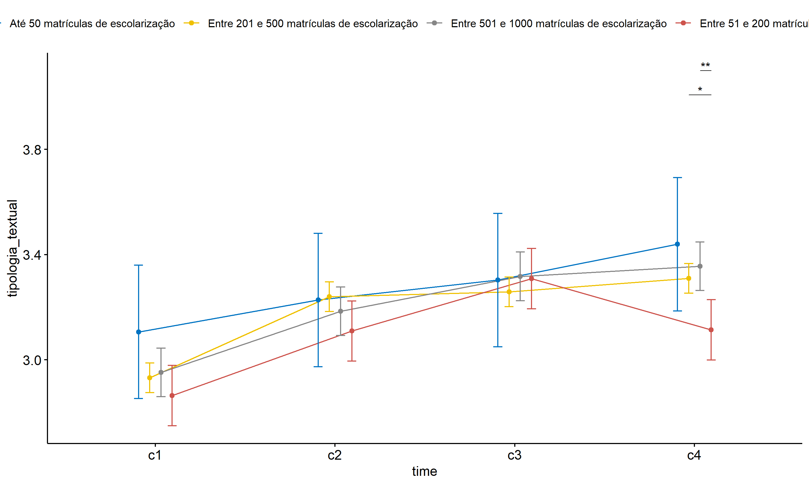<!-- -->

``` r
(pwc <- ldat %>% group_by(porte) %>%
    emmeans_test(tipologia_textual ~ time, detailed = T, p.adjust.method = "bonferroni"))
```

    ## # A tibble: 24 × 15
    ##    porte     term  .y.   group1 group2 null.value estimate     se    df conf.low
    ##  * <fct>     <chr> <chr> <chr>  <chr>       <dbl>    <dbl>  <dbl> <dbl>    <dbl>
    ##  1 Até 50 m… time  tipo… c1     c2              0  -0.121  0.183   4460  -0.480 
    ##  2 Até 50 m… time  tipo… c1     c3              0  -0.197  0.183   4460  -0.555 
    ##  3 Até 50 m… time  tipo… c1     c4              0  -0.333  0.183   4460  -0.692 
    ##  4 Até 50 m… time  tipo… c2     c3              0  -0.0758 0.183   4460  -0.434 
    ##  5 Até 50 m… time  tipo… c2     c4              0  -0.212  0.183   4460  -0.571 
    ##  6 Até 50 m… time  tipo… c3     c4              0  -0.136  0.183   4460  -0.495 
    ##  7 Entre 20… time  tipo… c1     c2              0  -0.308  0.0404  4460  -0.387 
    ##  8 Entre 20… time  tipo… c1     c3              0  -0.327  0.0404  4460  -0.406 
    ##  9 Entre 20… time  tipo… c1     c4              0  -0.378  0.0404  4460  -0.457 
    ## 10 Entre 20… time  tipo… c2     c3              0  -0.0186 0.0404  4460  -0.0979
    ## # ℹ 14 more rows
    ## # ℹ 5 more variables: conf.high <dbl>, statistic <dbl>, p <dbl>, p.adj <dbl>,
    ## #   p.adj.signif <chr>

| porte                                        | term | .y.               | group1 | group2 | null.value | estimate |    se |   df | conf.low | conf.high | statistic |     p | p.adj | p.adj.signif |
|:---------------------------------------------|:-----|:------------------|:-------|:-------|-----------:|---------:|------:|-----:|---------:|----------:|----------:|------:|------:|:-------------|
| Até 50 matrículas de escolarização           | time | tipologia_textual | c1     | c2     |          0 |   -0.121 | 0.183 | 4460 |   -0.480 |     0.237 |    -0.663 | 0.507 | 1.000 | ns           |
| Até 50 matrículas de escolarização           | time | tipologia_textual | c1     | c3     |          0 |   -0.197 | 0.183 | 4460 |   -0.555 |     0.161 |    -1.077 | 0.281 | 1.000 | ns           |
| Até 50 matrículas de escolarização           | time | tipologia_textual | c1     | c4     |          0 |   -0.333 | 0.183 | 4460 |   -0.692 |     0.025 |    -1.823 | 0.068 | 0.410 | ns           |
| Até 50 matrículas de escolarização           | time | tipologia_textual | c2     | c3     |          0 |   -0.076 | 0.183 | 4460 |   -0.434 |     0.283 |    -0.414 | 0.679 | 1.000 | ns           |
| Até 50 matrículas de escolarização           | time | tipologia_textual | c2     | c4     |          0 |   -0.212 | 0.183 | 4460 |   -0.571 |     0.146 |    -1.160 | 0.246 | 1.000 | ns           |
| Até 50 matrículas de escolarização           | time | tipologia_textual | c3     | c4     |          0 |   -0.136 | 0.183 | 4460 |   -0.495 |     0.222 |    -0.746 | 0.456 | 1.000 | ns           |
| Entre 201 e 500 matrículas de escolarização  | time | tipologia_textual | c1     | c2     |          0 |   -0.308 | 0.040 | 4460 |   -0.387 |    -0.229 |    -7.620 | 0.000 | 0.000 | \*\*\*\*     |
| Entre 201 e 500 matrículas de escolarização  | time | tipologia_textual | c1     | c3     |          0 |   -0.327 | 0.040 | 4460 |   -0.406 |    -0.247 |    -8.081 | 0.000 | 0.000 | \*\*\*\*     |
| Entre 201 e 500 matrículas de escolarização  | time | tipologia_textual | c1     | c4     |          0 |   -0.378 | 0.040 | 4460 |   -0.457 |    -0.299 |    -9.345 | 0.000 | 0.000 | \*\*\*\*     |
| Entre 201 e 500 matrículas de escolarização  | time | tipologia_textual | c2     | c3     |          0 |   -0.019 | 0.040 | 4460 |   -0.098 |     0.061 |    -0.461 | 0.645 | 1.000 | ns           |
| Entre 201 e 500 matrículas de escolarização  | time | tipologia_textual | c2     | c4     |          0 |   -0.070 | 0.040 | 4460 |   -0.149 |     0.010 |    -1.725 | 0.085 | 0.507 | ns           |
| Entre 201 e 500 matrículas de escolarização  | time | tipologia_textual | c3     | c4     |          0 |   -0.051 | 0.040 | 4460 |   -0.130 |     0.028 |    -1.264 | 0.206 | 1.000 | ns           |
| Entre 501 e 1000 matrículas de escolarização | time | tipologia_textual | c1     | c2     |          0 |   -0.232 | 0.067 | 4460 |   -0.363 |    -0.102 |    -3.490 | 0.000 | 0.003 | \*\*         |
| Entre 501 e 1000 matrículas de escolarização | time | tipologia_textual | c1     | c3     |          0 |   -0.365 | 0.067 | 4460 |   -0.495 |    -0.234 |    -5.481 | 0.000 | 0.000 | \*\*\*\*     |
| Entre 501 e 1000 matrículas de escolarização | time | tipologia_textual | c1     | c4     |          0 |   -0.403 | 0.067 | 4460 |   -0.533 |    -0.272 |    -6.054 | 0.000 | 0.000 | \*\*\*\*     |
| Entre 501 e 1000 matrículas de escolarização | time | tipologia_textual | c2     | c3     |          0 |   -0.133 | 0.067 | 4460 |   -0.263 |    -0.002 |    -1.991 | 0.047 | 0.279 | ns           |
| Entre 501 e 1000 matrículas de escolarização | time | tipologia_textual | c2     | c4     |          0 |   -0.171 | 0.067 | 4460 |   -0.301 |    -0.040 |    -2.564 | 0.010 | 0.062 | ns           |
| Entre 501 e 1000 matrículas de escolarização | time | tipologia_textual | c3     | c4     |          0 |   -0.038 | 0.067 | 4460 |   -0.169 |     0.092 |    -0.573 | 0.567 | 1.000 | ns           |
| Entre 51 e 200 matrículas de escolarização   | time | tipologia_textual | c1     | c2     |          0 |   -0.245 | 0.083 | 4460 |   -0.407 |    -0.084 |    -2.974 | 0.003 | 0.018 | \*           |
| Entre 51 e 200 matrículas de escolarização   | time | tipologia_textual | c1     | c3     |          0 |   -0.444 | 0.083 | 4460 |   -0.606 |    -0.283 |    -5.386 | 0.000 | 0.000 | \*\*\*\*     |
| Entre 51 e 200 matrículas de escolarização   | time | tipologia_textual | c1     | c4     |          0 |   -0.250 | 0.083 | 4460 |   -0.412 |    -0.088 |    -3.030 | 0.002 | 0.015 | \*           |
| Entre 51 e 200 matrículas de escolarização   | time | tipologia_textual | c2     | c3     |          0 |   -0.199 | 0.083 | 4460 |   -0.361 |    -0.037 |    -2.412 | 0.016 | 0.095 | ns           |
| Entre 51 e 200 matrículas de escolarização   | time | tipologia_textual | c2     | c4     |          0 |   -0.005 | 0.083 | 4460 |   -0.166 |     0.157 |    -0.056 | 0.955 | 1.000 | ns           |
| Entre 51 e 200 matrículas de escolarização   | time | tipologia_textual | c3     | c4     |          0 |    0.194 | 0.083 | 4460 |    0.033 |     0.356 |     2.356 | 0.018 | 0.111 | ns           |

``` r
(emms <- get_emmeans(pwc))
```

    ## # A tibble: 16 × 8
    ##    porte                     time  emmean     se    df conf.low conf.high method
    ##    <fct>                     <fct>  <dbl>  <dbl> <dbl>    <dbl>     <dbl> <chr> 
    ##  1 Até 50 matrículas de esc… c1      3.11 0.129   4460     2.85      3.36 Emmea…
    ##  2 Até 50 matrículas de esc… c2      3.23 0.129   4460     2.97      3.48 Emmea…
    ##  3 Até 50 matrículas de esc… c3      3.30 0.129   4460     3.05      3.56 Emmea…
    ##  4 Até 50 matrículas de esc… c4      3.44 0.129   4460     3.19      3.69 Emmea…
    ##  5 Entre 201 e 500 matrícul… c1      2.93 0.0286  4460     2.88      2.99 Emmea…
    ##  6 Entre 201 e 500 matrícul… c2      3.24 0.0286  4460     3.18      3.30 Emmea…
    ##  7 Entre 201 e 500 matrícul… c3      3.26 0.0286  4460     3.20      3.31 Emmea…
    ##  8 Entre 201 e 500 matrícul… c4      3.31 0.0286  4460     3.25      3.37 Emmea…
    ##  9 Entre 501 e 1000 matrícu… c1      2.95 0.0471  4460     2.86      3.04 Emmea…
    ## 10 Entre 501 e 1000 matrícu… c2      3.18 0.0471  4460     3.09      3.28 Emmea…
    ## 11 Entre 501 e 1000 matrícu… c3      3.32 0.0471  4460     3.22      3.41 Emmea…
    ## 12 Entre 501 e 1000 matrícu… c4      3.36 0.0471  4460     3.26      3.45 Emmea…
    ## 13 Entre 51 e 200 matrícula… c1      2.86 0.0583  4460     2.75      2.98 Emmea…
    ## 14 Entre 51 e 200 matrícula… c2      3.11 0.0583  4460     3.00      3.22 Emmea…
    ## 15 Entre 51 e 200 matrícula… c3      3.31 0.0583  4460     3.19      3.42 Emmea…
    ## 16 Entre 51 e 200 matrícula… c4      3.11 0.0583  4460     3.00      3.23 Emmea…

| porte                                        | time | emmean |    se |   df | conf.low | conf.high | method       |
|:---------------------------------------------|:-----|-------:|------:|-----:|---------:|----------:|:-------------|
| Até 50 matrículas de escolarização           | c1   |  3.106 | 0.129 | 4460 |    2.853 |     3.360 | Emmeans test |
| Até 50 matrículas de escolarização           | c2   |  3.227 | 0.129 | 4460 |    2.974 |     3.481 | Emmeans test |
| Até 50 matrículas de escolarização           | c3   |  3.303 | 0.129 | 4460 |    3.050 |     3.556 | Emmeans test |
| Até 50 matrículas de escolarização           | c4   |  3.439 | 0.129 | 4460 |    3.186 |     3.693 | Emmeans test |
| Entre 201 e 500 matrículas de escolarização  | c1   |  2.932 | 0.029 | 4460 |    2.876 |     2.988 | Emmeans test |
| Entre 201 e 500 matrículas de escolarização  | c2   |  3.240 | 0.029 | 4460 |    3.184 |     3.296 | Emmeans test |
| Entre 201 e 500 matrículas de escolarização  | c3   |  3.259 | 0.029 | 4460 |    3.202 |     3.315 | Emmeans test |
| Entre 201 e 500 matrículas de escolarização  | c4   |  3.310 | 0.029 | 4460 |    3.254 |     3.366 | Emmeans test |
| Entre 501 e 1000 matrículas de escolarização | c1   |  2.952 | 0.047 | 4460 |    2.860 |     3.045 | Emmeans test |
| Entre 501 e 1000 matrículas de escolarização | c2   |  3.185 | 0.047 | 4460 |    3.092 |     3.277 | Emmeans test |
| Entre 501 e 1000 matrículas de escolarização | c3   |  3.317 | 0.047 | 4460 |    3.225 |     3.410 | Emmeans test |
| Entre 501 e 1000 matrículas de escolarização | c4   |  3.355 | 0.047 | 4460 |    3.263 |     3.448 | Emmeans test |
| Entre 51 e 200 matrículas de escolarização   | c1   |  2.864 | 0.058 | 4460 |    2.750 |     2.979 | Emmeans test |
| Entre 51 e 200 matrículas de escolarização   | c2   |  3.110 | 0.058 | 4460 |    2.995 |     3.224 | Emmeans test |
| Entre 51 e 200 matrículas de escolarização   | c3   |  3.309 | 0.058 | 4460 |    3.194 |     3.423 | Emmeans test |
| Entre 51 e 200 matrículas de escolarização   | c4   |  3.114 | 0.058 | 4460 |    3.000 |     3.229 | Emmeans test |

``` r
emms.gg <- emms[which(emms$porte == "Até 50 matrículas de escolarização"),]
if (nrow(emms.gg) > 0)
  ggline(emms.gg, x = "time", y = "emmean", color = "#0073C2FF", ylab = "tipologia_textual") +
    geom_errorbar(aes(ymin = conf.low, ymax = conf.high),
                  width = 0.2, color = "#0073C2FF") +
    stat_pvalue_manual(
      add_xy_position(pwc[which(pwc$porte == "Até 50 matrículas de escolarização"),],
                      x = "time", fun = "mean_se"),
      hide.ns = T, color = "#0073C2FF", tip.length = F) +
    labs(title = "porte: Até 50 matrículas de escolarização")+
    theme(legend.text = element_blank())
```

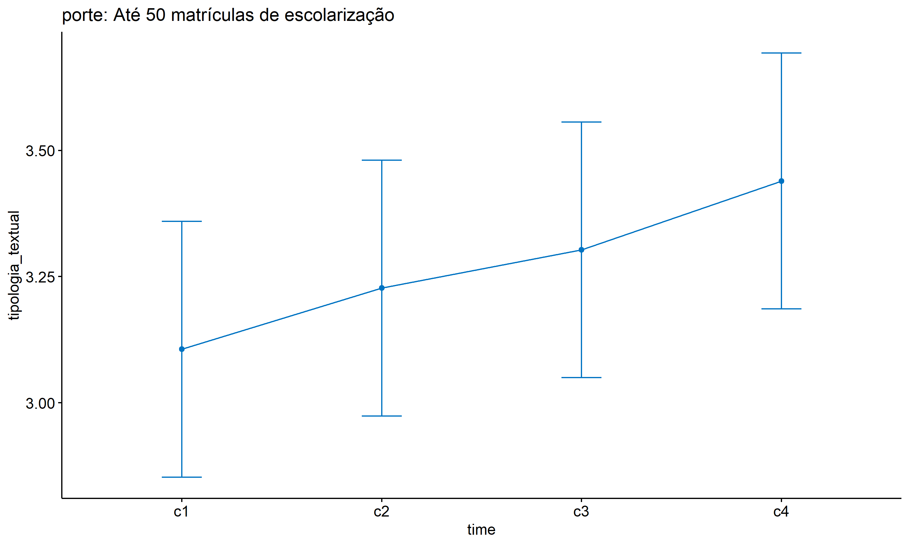<!-- -->

``` r
emms.gg <- emms[which(emms$porte == "Entre 201 e 500 matrículas de escolarização"),]
if (nrow(emms.gg) > 0)
  ggline(emms.gg, x = "time", y = "emmean", color = "#EFC000FF", ylab = "tipologia_textual") +
    geom_errorbar(aes(ymin = conf.low, ymax = conf.high),
                  width = 0.2, color = "#EFC000FF") +
    stat_pvalue_manual(
      add_xy_position(pwc[which(pwc$porte == "Entre 201 e 500 matrículas de escolarização"),],
                      x = "time", fun = "mean_se"),
      hide.ns = T, color = "#EFC000FF", tip.length = F) +
    labs(title = "porte: Entre 201 e 500 matrículas de escolarização")+
    theme(legend.text = element_blank())
```

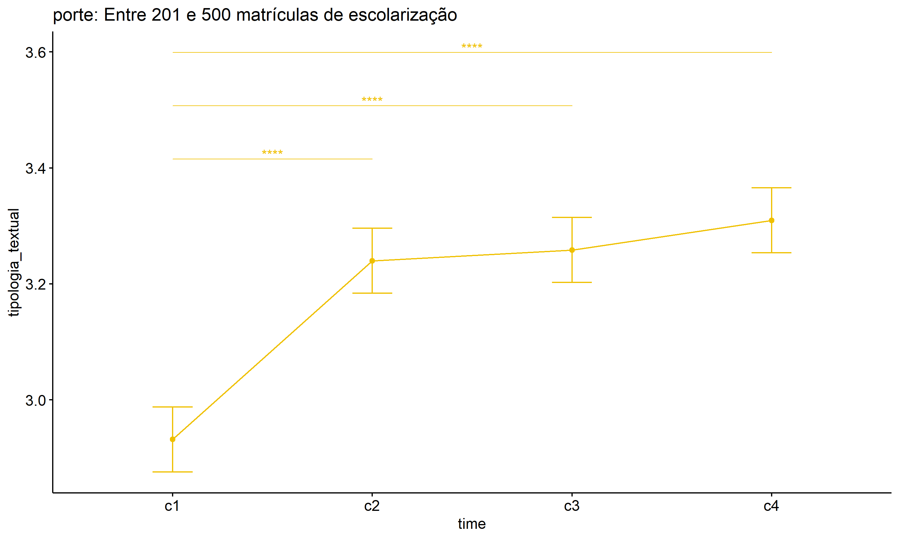<!-- -->

``` r
emms.gg <- emms[which(emms$porte == "Entre 501 e 1000 matrículas de escolarização"),]
if (nrow(emms.gg) > 0)
  ggline(emms.gg, x = "time", y = "emmean", color = "#868686FF", ylab = "tipologia_textual") +
    geom_errorbar(aes(ymin = conf.low, ymax = conf.high),
                  width = 0.2, color = "#868686FF") +
    stat_pvalue_manual(
      add_xy_position(pwc[which(pwc$porte == "Entre 501 e 1000 matrículas de escolarização"),],
                      x = "time", fun = "mean_se"),
      hide.ns = T, color = "#868686FF", tip.length = F) +
    labs(title = "porte: Entre 501 e 1000 matrículas de escolarização")+
    theme(legend.text = element_blank())
```

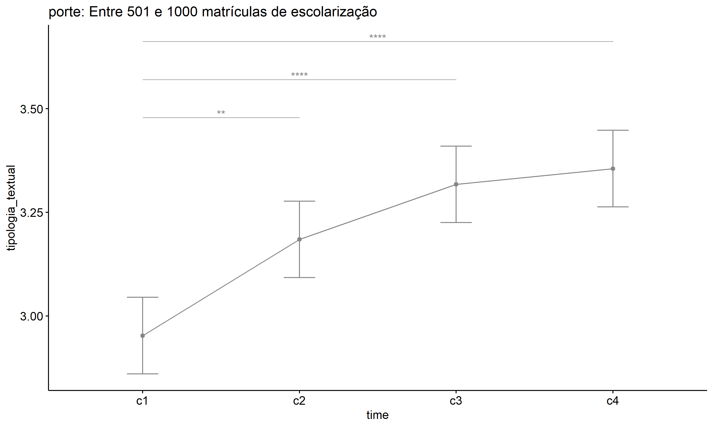<!-- -->

``` r
emms.gg <- emms[which(emms$porte == "Entre 51 e 200 matrículas de escolarização"),]
if (nrow(emms.gg) > 0)
  ggline(emms.gg, x = "time", y = "emmean", color = "#CD534CFF", ylab = "tipologia_textual") +
    geom_errorbar(aes(ymin = conf.low, ymax = conf.high),
                  width = 0.2, color = "#CD534CFF") +
    stat_pvalue_manual(
      add_xy_position(pwc[which(pwc$porte == "Entre 51 e 200 matrículas de escolarização"),],
                      x = "time", fun = "mean_se"),
      hide.ns = T, color = "#CD534CFF", tip.length = F) +
    labs(title = "porte: Entre 51 e 200 matrículas de escolarização")+
    theme(legend.text = element_blank())
```

<!-- -->

``` r
emms.gg <- emms[which(emms$porte == "Mais de 1000 matrículas de escolarização"),]
if (nrow(emms.gg) > 0)
  ggline(emms.gg, x = "time", y = "emmean", color = "#7AA6DCFF", ylab = "tipologia_textual") +
    geom_errorbar(aes(ymin = conf.low, ymax = conf.high),
                  width = 0.2, color = "#7AA6DCFF") +
    stat_pvalue_manual(
      add_xy_position(pwc[which(pwc$porte == "Mais de 1000 matrículas de escolarização"),],
                      x = "time", fun = "mean_se"),
      hide.ns = T, color = "#7AA6DCFF", tip.length = F) +
    labs(title = "porte: Mais de 1000 matrículas de escolarização")+
    theme(legend.text = element_blank())
```

## PairWise Computation after removing non.normal data

``` r
if (length(non.ids) > 0)
  (pwc2 <- ldat2 %>% group_by(time) %>%
     emmeans_test(tipologia_textual ~ porte, detailed = T, p.adjust.method = "bonferroni"))
```

    ## # A tibble: 24 × 15
    ##    time  term  .y.       group1 group2 null.value estimate     se    df conf.low
    ##  * <fct> <chr> <chr>     <chr>  <chr>       <dbl>    <dbl>  <dbl> <dbl>    <dbl>
    ##  1 c1    porte tipologi… Até 5… Entre…          0   0.401  0.430   4340  -0.442 
    ##  2 c1    porte tipologi… Até 5… Entre…          0   0.381  0.432   4340  -0.466 
    ##  3 c1    porte tipologi… Até 5… Entre…          0   0.469  0.433   4340  -0.380 
    ##  4 c1    porte tipologi… Entre… Entre…          0  -0.0206 0.0551  4340  -0.129 
    ##  5 c1    porte tipologi… Entre… Entre…          0   0.0677 0.0650  4340  -0.0599
    ##  6 c1    porte tipologi… Entre… Entre…          0   0.0883 0.0750  4340  -0.0588
    ##  7 c2    porte tipologi… Até 5… Entre…          0  -0.407  0.430   4340  -1.25  
    ##  8 c2    porte tipologi… Até 5… Entre…          0  -0.351  0.432   4340  -1.20  
    ##  9 c2    porte tipologi… Até 5… Entre…          0  -0.276  0.433   4340  -1.13  
    ## 10 c2    porte tipologi… Entre… Entre…          0   0.0551 0.0551  4340  -0.0529
    ## # ℹ 14 more rows
    ## # ℹ 5 more variables: conf.high <dbl>, statistic <dbl>, p <dbl>, p.adj <dbl>,
    ## #   p.adj.signif <chr>

| time | term  | .y.               | group1                                       | group2                                       | null.value | estimate |    se |   df | conf.low | conf.high | statistic |     p | p.adj | p.adj.signif |
|:-----|:------|:------------------|:---------------------------------------------|:---------------------------------------------|-----------:|---------:|------:|-----:|---------:|----------:|----------:|------:|------:|:-------------|
| c1   | porte | tipologia_textual | Até 50 matrículas de escolarização           | Entre 201 e 500 matrículas de escolarização  |          0 |    0.401 | 0.430 | 4340 |   -0.442 |     1.245 |     0.933 | 0.351 | 1.000 | ns           |
| c1   | porte | tipologia_textual | Até 50 matrículas de escolarização           | Entre 501 e 1000 matrículas de escolarização |          0 |    0.381 | 0.432 | 4340 |   -0.466 |     1.227 |     0.882 | 0.378 | 1.000 | ns           |
| c1   | porte | tipologia_textual | Até 50 matrículas de escolarização           | Entre 51 e 200 matrículas de escolarização   |          0 |    0.469 | 0.433 | 4340 |   -0.380 |     1.318 |     1.083 | 0.279 | 1.000 | ns           |
| c1   | porte | tipologia_textual | Entre 201 e 500 matrículas de escolarização  | Entre 501 e 1000 matrículas de escolarização |          0 |   -0.021 | 0.055 | 4340 |   -0.129 |     0.087 |    -0.374 | 0.708 | 1.000 | ns           |
| c1   | porte | tipologia_textual | Entre 201 e 500 matrículas de escolarização  | Entre 51 e 200 matrículas de escolarização   |          0 |    0.068 | 0.065 | 4340 |   -0.060 |     0.195 |     1.040 | 0.298 | 1.000 | ns           |
| c1   | porte | tipologia_textual | Entre 501 e 1000 matrículas de escolarização | Entre 51 e 200 matrículas de escolarização   |          0 |    0.088 | 0.075 | 4340 |   -0.059 |     0.235 |     1.176 | 0.240 | 1.000 | ns           |
| c2   | porte | tipologia_textual | Até 50 matrículas de escolarização           | Entre 201 e 500 matrículas de escolarização  |          0 |   -0.407 | 0.430 | 4340 |   -1.250 |     0.437 |    -0.945 | 0.345 | 1.000 | ns           |
| c2   | porte | tipologia_textual | Até 50 matrículas de escolarização           | Entre 501 e 1000 matrículas de escolarização |          0 |   -0.351 | 0.432 | 4340 |   -1.198 |     0.495 |    -0.814 | 0.416 | 1.000 | ns           |
| c2   | porte | tipologia_textual | Até 50 matrículas de escolarização           | Entre 51 e 200 matrículas de escolarização   |          0 |   -0.276 | 0.433 | 4340 |   -1.126 |     0.573 |    -0.638 | 0.524 | 1.000 | ns           |
| c2   | porte | tipologia_textual | Entre 201 e 500 matrículas de escolarização  | Entre 501 e 1000 matrículas de escolarização |          0 |    0.055 | 0.055 | 4340 |   -0.053 |     0.163 |     1.000 | 0.317 | 1.000 | ns           |
| c2   | porte | tipologia_textual | Entre 201 e 500 matrículas de escolarização  | Entre 51 e 200 matrículas de escolarização   |          0 |    0.130 | 0.065 | 4340 |    0.003 |     0.258 |     2.003 | 0.045 | 0.271 | ns           |
| c2   | porte | tipologia_textual | Entre 501 e 1000 matrículas de escolarização | Entre 51 e 200 matrículas de escolarização   |          0 |    0.075 | 0.075 | 4340 |   -0.072 |     0.222 |     1.002 | 0.317 | 1.000 | ns           |
| c3   | porte | tipologia_textual | Até 50 matrículas de escolarização           | Entre 201 e 500 matrículas de escolarização  |          0 |   -0.092 | 0.430 | 4340 |   -0.935 |     0.752 |    -0.214 | 0.831 | 1.000 | ns           |
| c3   | porte | tipologia_textual | Até 50 matrículas de escolarização           | Entre 501 e 1000 matrículas de escolarização |          0 |   -0.151 | 0.432 | 4340 |   -0.997 |     0.696 |    -0.349 | 0.727 | 1.000 | ns           |
| c3   | porte | tipologia_textual | Até 50 matrículas de escolarização           | Entre 51 e 200 matrículas de escolarização   |          0 |   -0.142 | 0.433 | 4340 |   -0.991 |     0.707 |    -0.328 | 0.743 | 1.000 | ns           |
| c3   | porte | tipologia_textual | Entre 201 e 500 matrículas de escolarização  | Entre 501 e 1000 matrículas de escolarização |          0 |   -0.059 | 0.055 | 4340 |   -0.167 |     0.049 |    -1.066 | 0.287 | 1.000 | ns           |
| c3   | porte | tipologia_textual | Entre 201 e 500 matrículas de escolarização  | Entre 51 e 200 matrículas de escolarização   |          0 |   -0.050 | 0.065 | 4340 |   -0.178 |     0.077 |    -0.771 | 0.441 | 1.000 | ns           |
| c3   | porte | tipologia_textual | Entre 501 e 1000 matrículas de escolarização | Entre 51 e 200 matrículas de escolarização   |          0 |    0.009 | 0.075 | 4340 |   -0.138 |     0.156 |     0.115 | 0.908 | 1.000 | ns           |
| c4   | porte | tipologia_textual | Até 50 matrículas de escolarização           | Entre 201 e 500 matrículas de escolarização  |          0 |    0.357 | 0.430 | 4340 |   -0.486 |     1.200 |     0.830 | 0.407 | 1.000 | ns           |
| c4   | porte | tipologia_textual | Até 50 matrículas de escolarização           | Entre 501 e 1000 matrículas de escolarização |          0 |    0.311 | 0.432 | 4340 |   -0.535 |     1.158 |     0.721 | 0.471 | 1.000 | ns           |
| c4   | porte | tipologia_textual | Até 50 matrículas de escolarização           | Entre 51 e 200 matrículas de escolarização   |          0 |    0.552 | 0.433 | 4340 |   -0.297 |     1.402 |     1.275 | 0.202 | 1.000 | ns           |
| c4   | porte | tipologia_textual | Entre 201 e 500 matrículas de escolarização  | Entre 501 e 1000 matrículas de escolarização |          0 |   -0.046 | 0.055 | 4340 |   -0.154 |     0.062 |    -0.831 | 0.406 | 1.000 | ns           |
| c4   | porte | tipologia_textual | Entre 201 e 500 matrículas de escolarização  | Entre 51 e 200 matrículas de escolarização   |          0 |    0.195 | 0.065 | 4340 |    0.068 |     0.323 |     3.005 | 0.003 | 0.016 | \*           |
| c4   | porte | tipologia_textual | Entre 501 e 1000 matrículas de escolarização | Entre 51 e 200 matrículas de escolarização   |          0 |    0.241 | 0.075 | 4340 |    0.094 |     0.388 |     3.214 | 0.001 | 0.008 | \*\*         |

``` r
if (length(non.ids) > 0)
  (emms2 <- get_emmeans(pwc2))
```

    ## # A tibble: 16 × 8
    ##    time  porte                     emmean     se    df conf.low conf.high method
    ##    <fct> <fct>                      <dbl>  <dbl> <dbl>    <dbl>     <dbl> <chr> 
    ##  1 c1    Até 50 matrículas de esc…   3.33 0.429   4340     2.49      4.17 Emmea…
    ##  2 c1    Entre 201 e 500 matrícul…   2.93 0.0286  4340     2.88      2.99 Emmea…
    ##  3 c1    Entre 501 e 1000 matrícu…   2.95 0.0471  4340     2.86      3.04 Emmea…
    ##  4 c1    Entre 51 e 200 matrícula…   2.86 0.0584  4340     2.75      2.98 Emmea…
    ##  5 c2    Até 50 matrículas de esc…   2.83 0.429   4340     1.99      3.67 Emmea…
    ##  6 c2    Entre 201 e 500 matrícul…   3.24 0.0286  4340     3.18      3.30 Emmea…
    ##  7 c2    Entre 501 e 1000 matrícu…   3.18 0.0471  4340     3.09      3.28 Emmea…
    ##  8 c2    Entre 51 e 200 matrícula…   3.11 0.0584  4340     3.00      3.22 Emmea…
    ##  9 c3    Até 50 matrículas de esc…   3.17 0.429   4340     2.33      4.01 Emmea…
    ## 10 c3    Entre 201 e 500 matrícul…   3.26 0.0286  4340     3.20      3.31 Emmea…
    ## 11 c3    Entre 501 e 1000 matrícu…   3.32 0.0471  4340     3.22      3.41 Emmea…
    ## 12 c3    Entre 51 e 200 matrícula…   3.31 0.0584  4340     3.19      3.42 Emmea…
    ## 13 c4    Até 50 matrículas de esc…   3.67 0.429   4340     2.83      4.51 Emmea…
    ## 14 c4    Entre 201 e 500 matrícul…   3.31 0.0286  4340     3.25      3.37 Emmea…
    ## 15 c4    Entre 501 e 1000 matrícu…   3.36 0.0471  4340     3.26      3.45 Emmea…
    ## 16 c4    Entre 51 e 200 matrícula…   3.11 0.0584  4340     3.00      3.23 Emmea…

| time | porte                                        | emmean |    se |   df | conf.low | conf.high | method       |
|:-----|:---------------------------------------------|-------:|------:|-----:|---------:|----------:|:-------------|
| c1   | Até 50 matrículas de escolarização           |  3.333 | 0.429 | 4340 |    2.492 |     4.175 | Emmeans test |
| c1   | Entre 201 e 500 matrículas de escolarização  |  2.932 | 0.029 | 4340 |    2.876 |     2.988 | Emmeans test |
| c1   | Entre 501 e 1000 matrículas de escolarização |  2.952 | 0.047 | 4340 |    2.860 |     3.045 | Emmeans test |
| c1   | Entre 51 e 200 matrículas de escolarização   |  2.864 | 0.058 | 4340 |    2.750 |     2.979 | Emmeans test |
| c2   | Até 50 matrículas de escolarização           |  2.833 | 0.429 | 4340 |    1.992 |     3.675 | Emmeans test |
| c2   | Entre 201 e 500 matrículas de escolarização  |  3.240 | 0.029 | 4340 |    3.184 |     3.296 | Emmeans test |
| c2   | Entre 501 e 1000 matrículas de escolarização |  3.185 | 0.047 | 4340 |    3.092 |     3.277 | Emmeans test |
| c2   | Entre 51 e 200 matrículas de escolarização   |  3.110 | 0.058 | 4340 |    2.995 |     3.224 | Emmeans test |
| c3   | Até 50 matrículas de escolarização           |  3.167 | 0.429 | 4340 |    2.325 |     4.008 | Emmeans test |
| c3   | Entre 201 e 500 matrículas de escolarização  |  3.259 | 0.029 | 4340 |    3.202 |     3.315 | Emmeans test |
| c3   | Entre 501 e 1000 matrículas de escolarização |  3.317 | 0.047 | 4340 |    3.225 |     3.410 | Emmeans test |
| c3   | Entre 51 e 200 matrículas de escolarização   |  3.309 | 0.058 | 4340 |    3.194 |     3.423 | Emmeans test |
| c4   | Até 50 matrículas de escolarização           |  3.667 | 0.429 | 4340 |    2.825 |     4.508 | Emmeans test |
| c4   | Entre 201 e 500 matrículas de escolarização  |  3.310 | 0.029 | 4340 |    3.254 |     3.366 | Emmeans test |
| c4   | Entre 501 e 1000 matrículas de escolarização |  3.355 | 0.047 | 4340 |    3.263 |     3.448 | Emmeans test |
| c4   | Entre 51 e 200 matrículas de escolarização   |  3.114 | 0.058 | 4340 |    3.000 |     3.229 | Emmeans test |

``` r
if (length(non.ids) > 0) {
  pwc2 <- add_xy_position(pwc2, x = "time", fun = "mean_se", dodge = 0.25)
  pd2 <- position_dodge(width = 0.25)
  
  ggline(emms2, x = "time", y = "emmean", color = "porte",
         palette = c("#0073C2FF","#EFC000FF","#868686FF","#CD534CFF","#7AA6DCFF"),
         position = pd, ylab = "tipologia_textual") +
    geom_errorbar(aes(ymin = conf.low, ymax = conf.high, color = porte),
                position = pd, width = 0.2) +
    stat_pvalue_manual(pwc2, hide.ns = T, tip.length = F, linetype = 1)
}
```

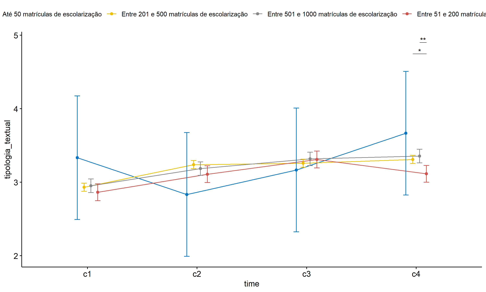<!-- -->

``` r
if (length(non.ids) > 0)
  (pwc2 <- ldat2 %>% group_by(porte) %>%
     emmeans_test(tipologia_textual ~ time, detailed = T, p.adjust.method = "bonferroni"))
```

    ## # A tibble: 24 × 15
    ##    porte     term  .y.   group1 group2 null.value estimate     se    df conf.low
    ##  * <fct>     <chr> <chr> <chr>  <chr>       <dbl>    <dbl>  <dbl> <dbl>    <dbl>
    ##  1 Até 50 m… time  tipo… c1     c2              0   0.500  0.607   4340  -0.690 
    ##  2 Até 50 m… time  tipo… c1     c3              0   0.167  0.607   4340  -1.02  
    ##  3 Até 50 m… time  tipo… c1     c4              0  -0.333  0.607   4340  -1.52  
    ##  4 Até 50 m… time  tipo… c2     c3              0  -0.333  0.607   4340  -1.52  
    ##  5 Até 50 m… time  tipo… c2     c4              0  -0.833  0.607   4340  -2.02  
    ##  6 Até 50 m… time  tipo… c3     c4              0  -0.500  0.607   4340  -1.69  
    ##  7 Entre 20… time  tipo… c1     c2              0  -0.308  0.0405  4340  -0.387 
    ##  8 Entre 20… time  tipo… c1     c3              0  -0.327  0.0405  4340  -0.406 
    ##  9 Entre 20… time  tipo… c1     c4              0  -0.378  0.0405  4340  -0.457 
    ## 10 Entre 20… time  tipo… c2     c3              0  -0.0186 0.0405  4340  -0.0980
    ## # ℹ 14 more rows
    ## # ℹ 5 more variables: conf.high <dbl>, statistic <dbl>, p <dbl>, p.adj <dbl>,
    ## #   p.adj.signif <chr>

| porte                                        | term | .y.               | group1 | group2 | null.value | estimate |    se |   df | conf.low | conf.high | statistic |     p | p.adj | p.adj.signif |
|:---------------------------------------------|:-----|:------------------|:-------|:-------|-----------:|---------:|------:|-----:|---------:|----------:|----------:|------:|------:|:-------------|
| Até 50 matrículas de escolarização           | time | tipologia_textual | c1     | c2     |          0 |    0.500 | 0.607 | 4340 |   -0.690 |     1.690 |     0.824 | 0.410 | 1.000 | ns           |
| Até 50 matrículas de escolarização           | time | tipologia_textual | c1     | c3     |          0 |    0.167 | 0.607 | 4340 |   -1.023 |     1.357 |     0.275 | 0.784 | 1.000 | ns           |
| Até 50 matrículas de escolarização           | time | tipologia_textual | c1     | c4     |          0 |   -0.333 | 0.607 | 4340 |   -1.523 |     0.857 |    -0.549 | 0.583 | 1.000 | ns           |
| Até 50 matrículas de escolarização           | time | tipologia_textual | c2     | c3     |          0 |   -0.333 | 0.607 | 4340 |   -1.523 |     0.857 |    -0.549 | 0.583 | 1.000 | ns           |
| Até 50 matrículas de escolarização           | time | tipologia_textual | c2     | c4     |          0 |   -0.833 | 0.607 | 4340 |   -2.023 |     0.357 |    -1.373 | 0.170 | 1.000 | ns           |
| Até 50 matrículas de escolarização           | time | tipologia_textual | c3     | c4     |          0 |   -0.500 | 0.607 | 4340 |   -1.690 |     0.690 |    -0.824 | 0.410 | 1.000 | ns           |
| Entre 201 e 500 matrículas de escolarização  | time | tipologia_textual | c1     | c2     |          0 |   -0.308 | 0.040 | 4340 |   -0.387 |    -0.229 |    -7.611 | 0.000 | 0.000 | \*\*\*\*     |
| Entre 201 e 500 matrículas de escolarização  | time | tipologia_textual | c1     | c3     |          0 |   -0.327 | 0.040 | 4340 |   -0.406 |    -0.247 |    -8.072 | 0.000 | 0.000 | \*\*\*\*     |
| Entre 201 e 500 matrículas de escolarização  | time | tipologia_textual | c1     | c4     |          0 |   -0.378 | 0.040 | 4340 |   -0.457 |    -0.298 |    -9.335 | 0.000 | 0.000 | \*\*\*\*     |
| Entre 201 e 500 matrículas de escolarização  | time | tipologia_textual | c2     | c3     |          0 |   -0.019 | 0.040 | 4340 |   -0.098 |     0.061 |    -0.461 | 0.645 | 1.000 | ns           |
| Entre 201 e 500 matrículas de escolarização  | time | tipologia_textual | c2     | c4     |          0 |   -0.070 | 0.040 | 4340 |   -0.149 |     0.010 |    -1.724 | 0.085 | 0.509 | ns           |
| Entre 201 e 500 matrículas de escolarização  | time | tipologia_textual | c3     | c4     |          0 |   -0.051 | 0.040 | 4340 |   -0.130 |     0.028 |    -1.263 | 0.207 | 1.000 | ns           |
| Entre 501 e 1000 matrículas de escolarização | time | tipologia_textual | c1     | c2     |          0 |   -0.232 | 0.067 | 4340 |   -0.363 |    -0.102 |    -3.486 | 0.000 | 0.003 | \*\*         |
| Entre 501 e 1000 matrículas de escolarização | time | tipologia_textual | c1     | c3     |          0 |   -0.365 | 0.067 | 4340 |   -0.495 |    -0.234 |    -5.475 | 0.000 | 0.000 | \*\*\*\*     |
| Entre 501 e 1000 matrículas de escolarização | time | tipologia_textual | c1     | c4     |          0 |   -0.403 | 0.067 | 4340 |   -0.534 |    -0.272 |    -6.047 | 0.000 | 0.000 | \*\*\*\*     |
| Entre 501 e 1000 matrículas de escolarização | time | tipologia_textual | c2     | c3     |          0 |   -0.133 | 0.067 | 4340 |   -0.263 |    -0.002 |    -1.989 | 0.047 | 0.281 | ns           |
| Entre 501 e 1000 matrículas de escolarização | time | tipologia_textual | c2     | c4     |          0 |   -0.171 | 0.067 | 4340 |   -0.301 |    -0.040 |    -2.562 | 0.010 | 0.063 | ns           |
| Entre 501 e 1000 matrículas de escolarização | time | tipologia_textual | c3     | c4     |          0 |   -0.038 | 0.067 | 4340 |   -0.169 |     0.092 |    -0.573 | 0.567 | 1.000 | ns           |
| Entre 51 e 200 matrículas de escolarização   | time | tipologia_textual | c1     | c2     |          0 |   -0.245 | 0.083 | 4340 |   -0.407 |    -0.083 |    -2.970 | 0.003 | 0.018 | \*           |
| Entre 51 e 200 matrículas de escolarização   | time | tipologia_textual | c1     | c3     |          0 |   -0.444 | 0.083 | 4340 |   -0.606 |    -0.282 |    -5.380 | 0.000 | 0.000 | \*\*\*\*     |
| Entre 51 e 200 matrículas de escolarização   | time | tipologia_textual | c1     | c4     |          0 |   -0.250 | 0.083 | 4340 |   -0.412 |    -0.088 |    -3.026 | 0.002 | 0.015 | \*           |
| Entre 51 e 200 matrículas de escolarização   | time | tipologia_textual | c2     | c3     |          0 |   -0.199 | 0.083 | 4340 |   -0.361 |    -0.037 |    -2.410 | 0.016 | 0.096 | ns           |
| Entre 51 e 200 matrículas de escolarização   | time | tipologia_textual | c2     | c4     |          0 |   -0.005 | 0.083 | 4340 |   -0.167 |     0.157 |    -0.056 | 0.955 | 1.000 | ns           |
| Entre 51 e 200 matrículas de escolarização   | time | tipologia_textual | c3     | c4     |          0 |    0.194 | 0.083 | 4340 |    0.032 |     0.356 |     2.354 | 0.019 | 0.112 | ns           |

``` r
if (length(non.ids) > 0)
  (emms2 <- get_emmeans(pwc2))
```

    ## # A tibble: 16 × 8
    ##    porte                     time  emmean     se    df conf.low conf.high method
    ##    <fct>                     <fct>  <dbl>  <dbl> <dbl>    <dbl>     <dbl> <chr> 
    ##  1 Até 50 matrículas de esc… c1      3.33 0.429   4340     2.49      4.17 Emmea…
    ##  2 Até 50 matrículas de esc… c2      2.83 0.429   4340     1.99      3.67 Emmea…
    ##  3 Até 50 matrículas de esc… c3      3.17 0.429   4340     2.33      4.01 Emmea…
    ##  4 Até 50 matrículas de esc… c4      3.67 0.429   4340     2.83      4.51 Emmea…
    ##  5 Entre 201 e 500 matrícul… c1      2.93 0.0286  4340     2.88      2.99 Emmea…
    ##  6 Entre 201 e 500 matrícul… c2      3.24 0.0286  4340     3.18      3.30 Emmea…
    ##  7 Entre 201 e 500 matrícul… c3      3.26 0.0286  4340     3.20      3.31 Emmea…
    ##  8 Entre 201 e 500 matrícul… c4      3.31 0.0286  4340     3.25      3.37 Emmea…
    ##  9 Entre 501 e 1000 matrícu… c1      2.95 0.0471  4340     2.86      3.04 Emmea…
    ## 10 Entre 501 e 1000 matrícu… c2      3.18 0.0471  4340     3.09      3.28 Emmea…
    ## 11 Entre 501 e 1000 matrícu… c3      3.32 0.0471  4340     3.22      3.41 Emmea…
    ## 12 Entre 501 e 1000 matrícu… c4      3.36 0.0471  4340     3.26      3.45 Emmea…
    ## 13 Entre 51 e 200 matrícula… c1      2.86 0.0584  4340     2.75      2.98 Emmea…
    ## 14 Entre 51 e 200 matrícula… c2      3.11 0.0584  4340     3.00      3.22 Emmea…
    ## 15 Entre 51 e 200 matrícula… c3      3.31 0.0584  4340     3.19      3.42 Emmea…
    ## 16 Entre 51 e 200 matrícula… c4      3.11 0.0584  4340     3.00      3.23 Emmea…

| porte                                        | time | emmean |    se |   df | conf.low | conf.high | method       |
|:---------------------------------------------|:-----|-------:|------:|-----:|---------:|----------:|:-------------|
| Até 50 matrículas de escolarização           | c1   |  3.333 | 0.429 | 4340 |    2.492 |     4.175 | Emmeans test |
| Até 50 matrículas de escolarização           | c2   |  2.833 | 0.429 | 4340 |    1.992 |     3.675 | Emmeans test |
| Até 50 matrículas de escolarização           | c3   |  3.167 | 0.429 | 4340 |    2.325 |     4.008 | Emmeans test |
| Até 50 matrículas de escolarização           | c4   |  3.667 | 0.429 | 4340 |    2.825 |     4.508 | Emmeans test |
| Entre 201 e 500 matrículas de escolarização  | c1   |  2.932 | 0.029 | 4340 |    2.876 |     2.988 | Emmeans test |
| Entre 201 e 500 matrículas de escolarização  | c2   |  3.240 | 0.029 | 4340 |    3.184 |     3.296 | Emmeans test |
| Entre 201 e 500 matrículas de escolarização  | c3   |  3.259 | 0.029 | 4340 |    3.202 |     3.315 | Emmeans test |
| Entre 201 e 500 matrículas de escolarização  | c4   |  3.310 | 0.029 | 4340 |    3.254 |     3.366 | Emmeans test |
| Entre 501 e 1000 matrículas de escolarização | c1   |  2.952 | 0.047 | 4340 |    2.860 |     3.045 | Emmeans test |
| Entre 501 e 1000 matrículas de escolarização | c2   |  3.185 | 0.047 | 4340 |    3.092 |     3.277 | Emmeans test |
| Entre 501 e 1000 matrículas de escolarização | c3   |  3.317 | 0.047 | 4340 |    3.225 |     3.410 | Emmeans test |
| Entre 501 e 1000 matrículas de escolarização | c4   |  3.355 | 0.047 | 4340 |    3.263 |     3.448 | Emmeans test |
| Entre 51 e 200 matrículas de escolarização   | c1   |  2.864 | 0.058 | 4340 |    2.750 |     2.979 | Emmeans test |
| Entre 51 e 200 matrículas de escolarização   | c2   |  3.110 | 0.058 | 4340 |    2.995 |     3.224 | Emmeans test |
| Entre 51 e 200 matrículas de escolarização   | c3   |  3.309 | 0.058 | 4340 |    3.194 |     3.423 | Emmeans test |
| Entre 51 e 200 matrículas de escolarização   | c4   |  3.114 | 0.058 | 4340 |    3.000 |     3.229 | Emmeans test |

``` r
if (length(non.ids) > 0) {
  emms.gg <- emms2[which(emms2$porte == "Até 50 matrículas de escolarização"),]
  if (nrow(emms.gg) > 0)
    ggline(emms.gg, x = "time", y = "emmean", color = "#0073C2FF", ylab = "tipologia_textual") +
    geom_errorbar(aes(ymin = conf.low, ymax = conf.high),
                  width = 0.2, color = "#0073C2FF") +
    stat_pvalue_manual(
      add_xy_position(pwc[which(pwc$porte == "Até 50 matrículas de escolarização"),],
                      x = "time", fun = "mean_se"),
      hide.ns = T, color = "#0073C2FF", tip.length = F) +
    labs(title = "porte: Até 50 matrículas de escolarização") +
    theme(legend.text = element_blank())
}
```

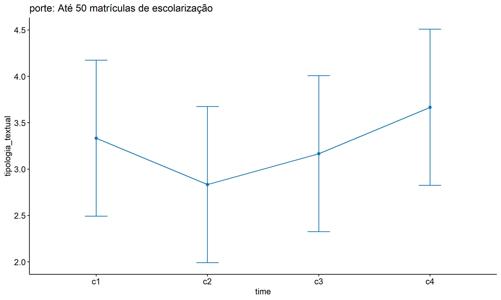<!-- -->

``` r
if (length(non.ids) > 0) {
  emms.gg <- emms2[which(emms2$porte == "Entre 201 e 500 matrículas de escolarização"),]
  if (nrow(emms.gg) > 0)
    ggline(emms.gg, x = "time", y = "emmean", color = "#EFC000FF", ylab = "tipologia_textual") +
    geom_errorbar(aes(ymin = conf.low, ymax = conf.high),
                  width = 0.2, color = "#EFC000FF") +
    stat_pvalue_manual(
      add_xy_position(pwc[which(pwc$porte == "Entre 201 e 500 matrículas de escolarização"),],
                      x = "time", fun = "mean_se"),
      hide.ns = T, color = "#EFC000FF", tip.length = F) +
    labs(title = "porte: Entre 201 e 500 matrículas de escolarização") +
    theme(legend.text = element_blank())
}
```

<!-- -->

``` r
if (length(non.ids) > 0) {
  emms.gg <- emms2[which(emms2$porte == "Entre 501 e 1000 matrículas de escolarização"),]
  if (nrow(emms.gg) > 0)
    ggline(emms.gg, x = "time", y = "emmean", color = "#868686FF", ylab = "tipologia_textual") +
    geom_errorbar(aes(ymin = conf.low, ymax = conf.high),
                  width = 0.2, color = "#868686FF") +
    stat_pvalue_manual(
      add_xy_position(pwc[which(pwc$porte == "Entre 501 e 1000 matrículas de escolarização"),],
                      x = "time", fun = "mean_se"),
      hide.ns = T, color = "#868686FF", tip.length = F) +
    labs(title = "porte: Entre 501 e 1000 matrículas de escolarização") +
    theme(legend.text = element_blank())
}
```

<!-- -->

``` r
if (length(non.ids) > 0) {
  emms.gg <- emms2[which(emms2$porte == "Entre 51 e 200 matrículas de escolarização"),]
  if (nrow(emms.gg) > 0)
    ggline(emms.gg, x = "time", y = "emmean", color = "#CD534CFF", ylab = "tipologia_textual") +
    geom_errorbar(aes(ymin = conf.low, ymax = conf.high),
                  width = 0.2, color = "#CD534CFF") +
    stat_pvalue_manual(
      add_xy_position(pwc[which(pwc$porte == "Entre 51 e 200 matrículas de escolarização"),],
                      x = "time", fun = "mean_se"),
      hide.ns = T, color = "#CD534CFF", tip.length = F) +
    labs(title = "porte: Entre 51 e 200 matrículas de escolarização") +
    theme(legend.text = element_blank())
}
```

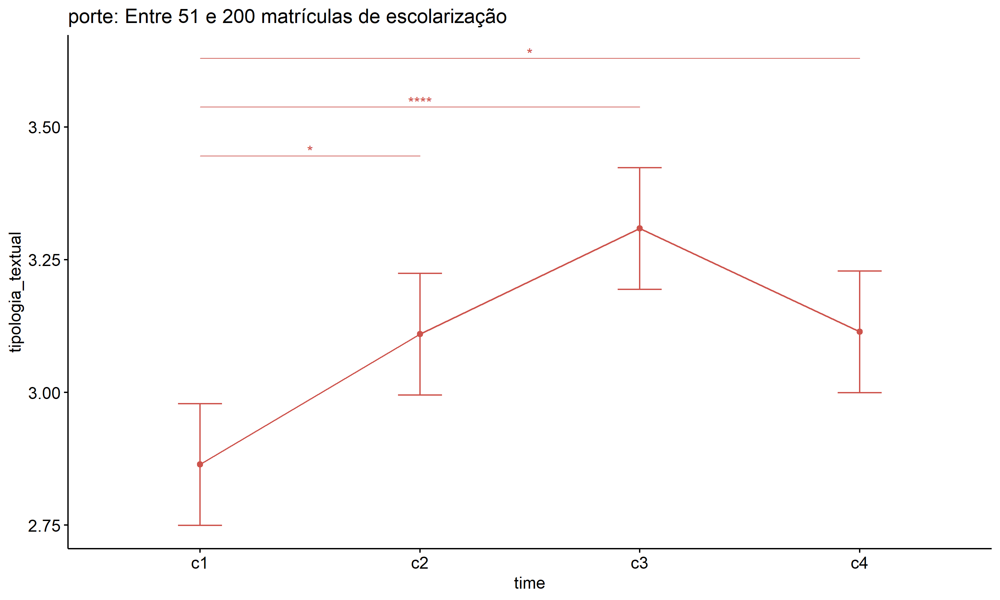<!-- -->

``` r
if (length(non.ids) > 0) {
  emms.gg <- emms2[which(emms2$porte == "Mais de 1000 matrículas de escolarização"),]
  if (nrow(emms.gg) > 0)
    ggline(emms.gg, x = "time", y = "emmean", color = "#7AA6DCFF", ylab = "tipologia_textual") +
    geom_errorbar(aes(ymin = conf.low, ymax = conf.high),
                  width = 0.2, color = "#7AA6DCFF") +
    stat_pvalue_manual(
      add_xy_position(pwc[which(pwc$porte == "Mais de 1000 matrículas de escolarização"),],
                      x = "time", fun = "mean_se"),
      hide.ns = T, color = "#7AA6DCFF", tip.length = F) +
    labs(title = "porte: Mais de 1000 matrículas de escolarização") +
    theme(legend.text = element_blank())
}
```
