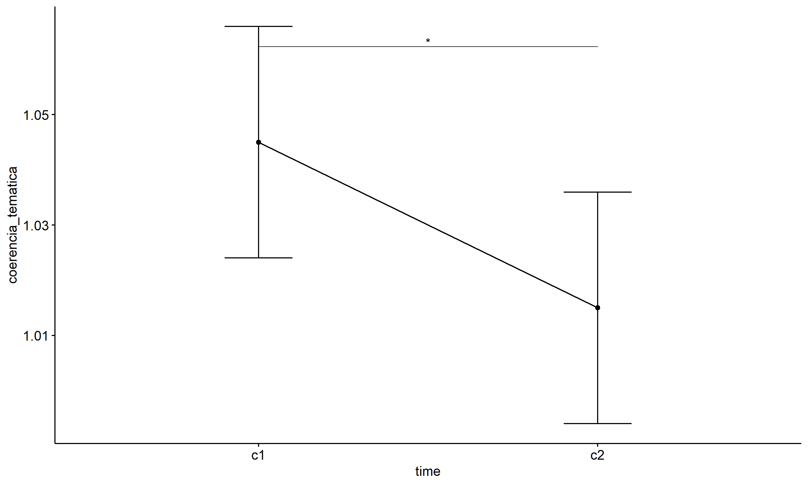
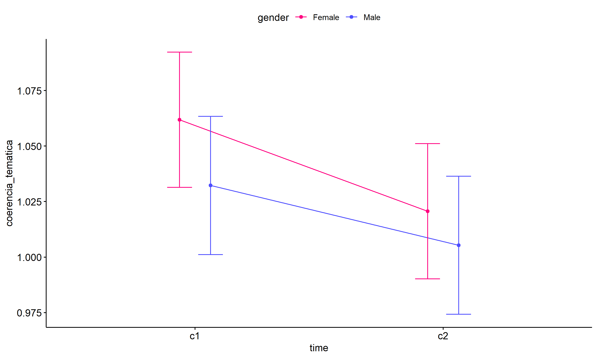
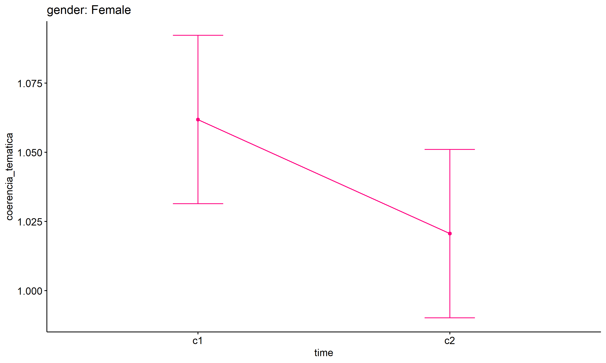
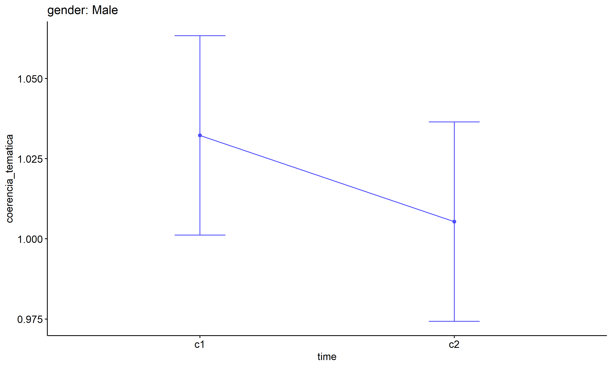
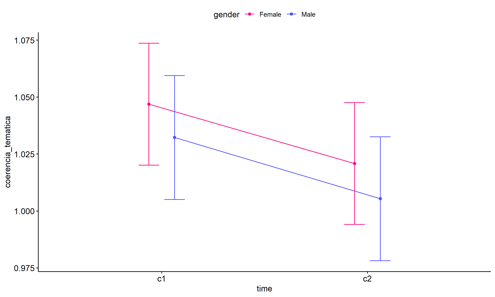
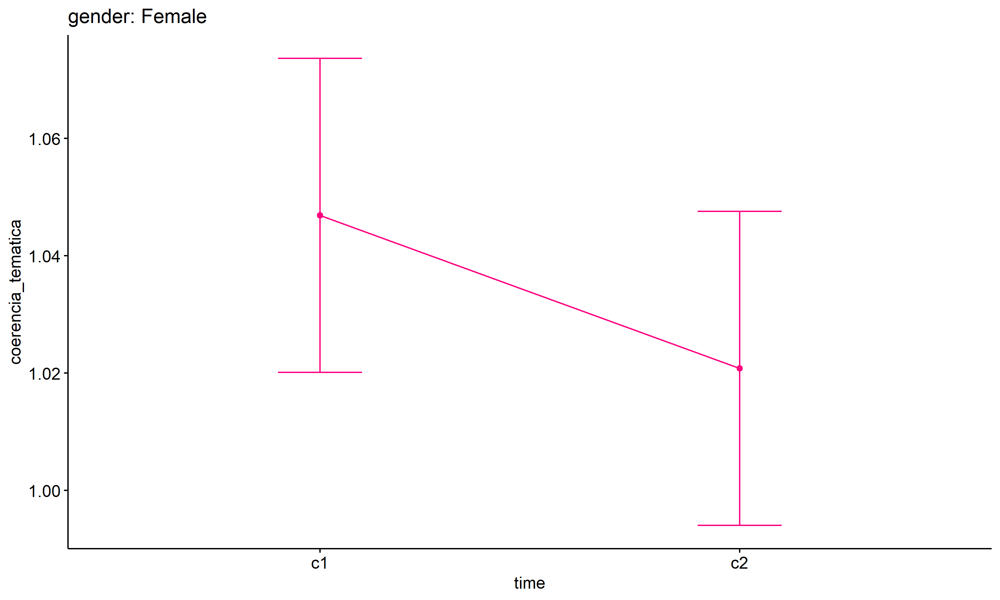
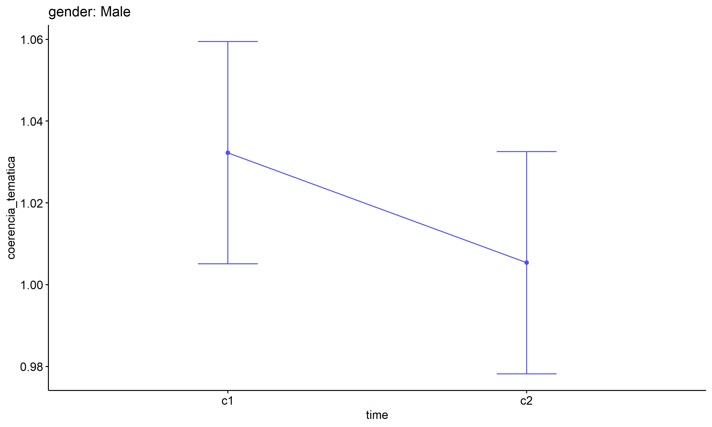
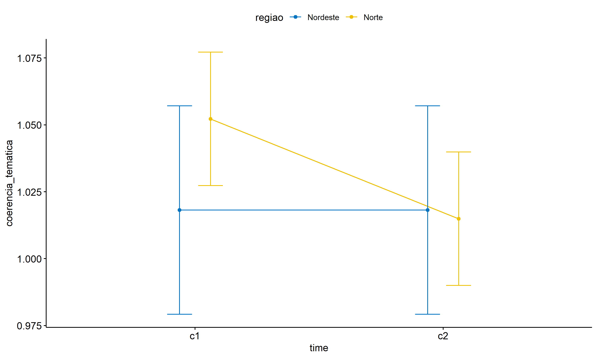
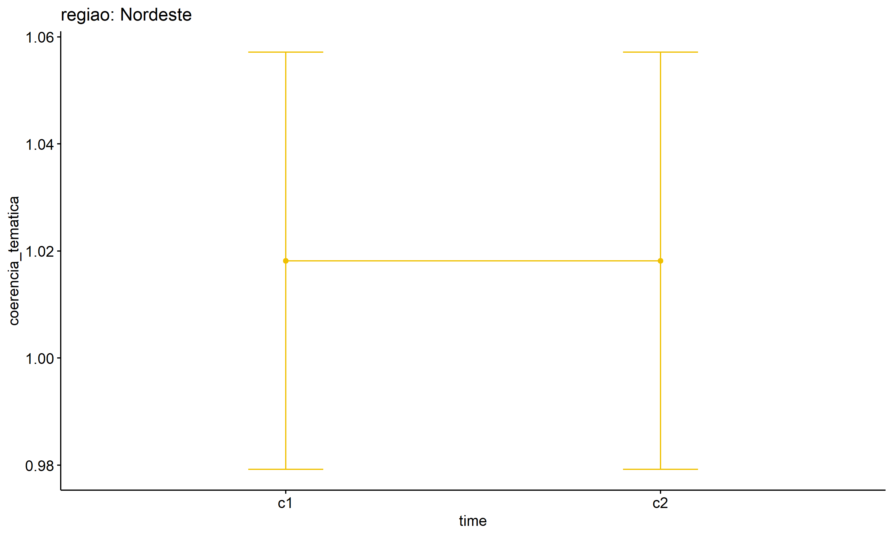
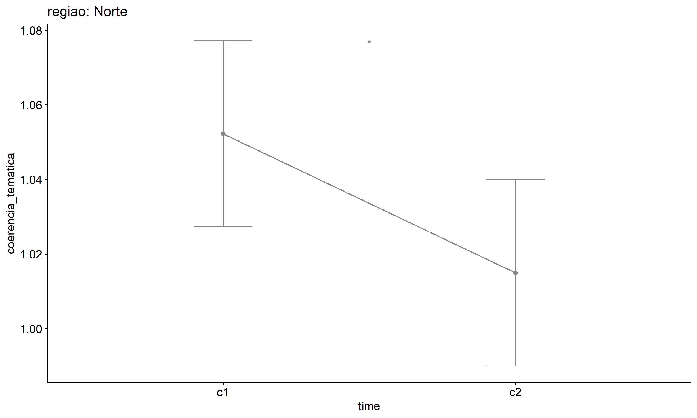

ANOVA test for coerencia_tematica
================
Geiser C. Challco <geiser@alumni.usp.br>

- [ANOVA: coerencia_tematica ~ time](#anova-coerencia_tematica--time)
  - [Data Preparation](#data-preparation)
  - [Summary Statistics](#summary-statistics)
  - [ANOVA Computation](#anova-computation)
  - [PairWise Computation](#pairwise-computation)
- [ANOVA: coerencia_tematica ~ time\*gender +
  Error(id/time)](#anova-coerencia_tematica--timegender--erroridtime)
  - [Data Preparation](#data-preparation-1)
    - [Check assumptions: Identifying
      Outliers](#check-assumptions-identifying-outliers)
    - [Check assumptions: Normality
      Test](#check-assumptions-normality-test)
    - [Summary Statistics](#summary-statistics-1)
  - [ANOVA Computation](#anova-computation-1)
  - [ANOVA Computation after removing non.normal
    data](#anova-computation-after-removing-nonnormal-data)
  - [PairWise Computation](#pairwise-computation-1)
  - [PairWise Computation after removing non.normal
    data](#pairwise-computation-after-removing-nonnormal-data)
- [ANOVA: coerencia_tematica ~ time\*regiao +
  Error(id/time)](#anova-coerencia_tematica--timeregiao--erroridtime)
  - [Data Preparation](#data-preparation-2)
    - [Check assumptions: Identifying
      Outliers](#check-assumptions-identifying-outliers-1)
    - [Check assumptions: Normality
      Test](#check-assumptions-normality-test-1)
    - [Summary Statistics](#summary-statistics-2)
  - [ANOVA Computation](#anova-computation-2)
  - [ANOVA Computation after removing non.normal
    data](#anova-computation-after-removing-nonnormal-data-1)
  - [PairWise Computation](#pairwise-computation-2)
  - [PairWise Computation after removing non.normal
    data](#pairwise-computation-after-removing-nonnormal-data-1)

``` r
dat <- read_excel("../data/data.xlsx", sheet = "alunos_ef59")

escolas <- read_excel("../data/data.xlsx", sheet = "escolas")
edat <- merge(dat, escolas, by = "cod_escola", all.x = T)
```

# ANOVA: coerencia_tematica ~ time

## Data Preparation

``` r
data <- edat[,c("aluno_id","ciclo","coerencia_tematica")]
data <- data[data$ciclo %in% c("Primeiro Ciclo","Segundo Ciclo"),]
data$ciclo <- factor(data$ciclo, c("Primeiro Ciclo","Segundo Ciclo"))
data <- unique(data)

wdat <- spread(data, ciclo, coerencia_tematica)
wdat <- wdat[complete.cases(wdat),]
colnames(wdat) <- c("id","c1","c2")

ldat <- gather(wdat, key = time, value = coerencia_tematica, c1,c2) %>%
  convert_as_factor(id, time)
ldat <- rshinystatistics::remove_group_data(ldat, "coerencia_tematica", "time", n.limit = 30)
```

## Summary Statistics

``` r
(sdat <- ldat %>% group_by(time) %>%
   get_summary_stats(coerencia_tematica, type = "mean_sd"))
```

    ## # A tibble: 2 × 5
    ##   time  variable               n  mean    sd
    ##   <fct> <fct>              <dbl> <dbl> <dbl>
    ## 1 c1    coerencia_tematica   200  1.04 0.189
    ## 2 c2    coerencia_tematica   200  1.01 0.099

| time | variable           |   n |  mean |    sd |
|:-----|:-------------------|----:|------:|------:|
| c1   | coerencia_tematica | 200 | 1.045 | 0.189 |
| c2   | coerencia_tematica | 200 | 1.015 | 0.099 |

## ANOVA Computation

``` r
(res.aov <- anova_test(ldat, dv = coerencia_tematica, wid = id, within = time))
```

    ## ANOVA Table (type III tests)
    ## 
    ##   Effect DFn DFd     F     p p<.05  ges
    ## 1   time   1 199 3.843 0.051       0.01

## PairWise Computation

``` r
(pwc <- ldat %>% emmeans_test(coerencia_tematica ~ time, detailed = T, p.adjust.method = "bonferroni"))
```

    ## # A tibble: 1 × 14
    ##   term  .y.    group1 group2 null.value estimate     se    df conf.low conf.high
    ## * <chr> <chr>  <chr>  <chr>       <dbl>    <dbl>  <dbl> <dbl>    <dbl>     <dbl>
    ## 1 time  coere… c1     c2              0   0.0300 0.0151   398 0.000355    0.0596
    ## # ℹ 4 more variables: statistic <dbl>, p <dbl>, p.adj <dbl>, p.adj.signif <chr>

| term | .y.                | group1 | group2 | null.value | estimate |    se |  df | conf.low | conf.high | statistic |     p | p.adj | p.adj.signif |
|:-----|:-------------------|:-------|:-------|-----------:|---------:|------:|----:|---------:|----------:|----------:|------:|------:|:-------------|
| time | coerencia_tematica | c1     | c2     |          0 |     0.03 | 0.015 | 398 |        0 |      0.06 |     1.989 | 0.047 | 0.047 | \*           |

``` r
pwc <- add_xy_position(pwc, x = "time", fun = "mean_se")
ggline(get_emmeans(pwc), x = "time", y = "emmean", ylab = "coerencia_tematica") +
  geom_errorbar(aes(ymin = conf.low, ymax = conf.high), width = 0.2) +
  stat_pvalue_manual(pwc, hide.ns = T, tip.length = F)
```

<!-- -->

# ANOVA: coerencia_tematica ~ time\*gender + Error(id/time)

## Data Preparation

``` r
data <- edat[,c("aluno_id","gender","ciclo","coerencia_tematica")]
data <- data[data$ciclo %in% c("Primeiro Ciclo","Segundo Ciclo"),]
data$ciclo <- factor(data$ciclo, c("Primeiro Ciclo","Segundo Ciclo"))
data <- unique(data)

wdat <- spread(data, ciclo, coerencia_tematica)
wdat <- wdat[complete.cases(wdat),]
colnames(wdat) <- c("id","gender","c1","c2")

ldat <- gather(wdat, key = time, value = coerencia_tematica, c1,c2) %>%
  convert_as_factor(id, time)
ldat <- remove_group_data(ldat, "coerencia_tematica", c("time", "gender"), n.limit = 30)
ldat$gender <- factor(ldat$gender, sort(unique(ldat$gender)))
```

### Check assumptions: Identifying Outliers

``` r
outliers <- identify_outliers(group_by(ldat, time, gender), coerencia_tematica)
(outliers <- outliers[outliers$is.extreme == T,])
```

    ## # A tibble: 17 × 6
    ##    gender time  id                   coerencia_tematica is.outlier is.extreme
    ##    <fct>  <fct> <fct>                             <dbl> <lgl>      <lgl>     
    ##  1 Female c1    cjYyn7kyQk5O85alkSeE                1.5 TRUE       TRUE      
    ##  2 Female c1    ERj84tGQC5nYcjX7aP5V                1.5 TRUE       TRUE      
    ##  3 Female c1    GYtRZCXHIA804eR4moHB                1.5 TRUE       TRUE      
    ##  4 Female c1    MIbJD06B1Lx36y6OzOtU                1.5 TRUE       TRUE      
    ##  5 Female c1    sC1rXri73KmhsT44WXKp                2   TRUE       TRUE      
    ##  6 Female c1    uNGPLN9AAPGgZYqjVfuP                1.5 TRUE       TRUE      
    ##  7 Female c1    w93dzK60i0SNf6SHjoAn                2.5 TRUE       TRUE      
    ##  8 Female c1    yMSE5XTP4wD8kCCzaBkH                1.5 TRUE       TRUE      
    ##  9 Female c1    ZkwPqOsHvF3gcrRI7eAK                1.5 TRUE       TRUE      
    ## 10 Male   c1    1sAyq3nFuLprZT0oxkct                1.5 TRUE       TRUE      
    ## 11 Male   c1    3cRsjiyrvPlLivyefAed                2   TRUE       TRUE      
    ## 12 Male   c1    Jm2fgpyOvi0XJxXORvbB                1.5 TRUE       TRUE      
    ## 13 Male   c1    N1UKPjlnM6gAIZttTozL                2   TRUE       TRUE      
    ## 14 Female c2    AeLclaSBIWD4d8hP3Ks2                1.5 TRUE       TRUE      
    ## 15 Female c2    mE96GQ2Poz3915Zoj4ga                1.5 TRUE       TRUE      
    ## 16 Female c2    PFaDDCoGG1zZiignks0r                2   TRUE       TRUE      
    ## 17 Male   c2    YJ7CmE6EqSdCvxGhqFeZ                1.5 TRUE       TRUE

| gender | time | id                   | coerencia_tematica | is.outlier | is.extreme |
|:-------|:-----|:---------------------|-------------------:|:-----------|:-----------|
| Female | c1   | cjYyn7kyQk5O85alkSeE |                1.5 | TRUE       | TRUE       |
| Female | c1   | ERj84tGQC5nYcjX7aP5V |                1.5 | TRUE       | TRUE       |
| Female | c1   | GYtRZCXHIA804eR4moHB |                1.5 | TRUE       | TRUE       |
| Female | c1   | MIbJD06B1Lx36y6OzOtU |                1.5 | TRUE       | TRUE       |
| Female | c1   | sC1rXri73KmhsT44WXKp |                2.0 | TRUE       | TRUE       |
| Female | c1   | uNGPLN9AAPGgZYqjVfuP |                1.5 | TRUE       | TRUE       |
| Female | c1   | w93dzK60i0SNf6SHjoAn |                2.5 | TRUE       | TRUE       |
| Female | c1   | yMSE5XTP4wD8kCCzaBkH |                1.5 | TRUE       | TRUE       |
| Female | c1   | ZkwPqOsHvF3gcrRI7eAK |                1.5 | TRUE       | TRUE       |
| Male   | c1   | 1sAyq3nFuLprZT0oxkct |                1.5 | TRUE       | TRUE       |
| Male   | c1   | 3cRsjiyrvPlLivyefAed |                2.0 | TRUE       | TRUE       |
| Male   | c1   | Jm2fgpyOvi0XJxXORvbB |                1.5 | TRUE       | TRUE       |
| Male   | c1   | N1UKPjlnM6gAIZttTozL |                2.0 | TRUE       | TRUE       |
| Female | c2   | AeLclaSBIWD4d8hP3Ks2 |                1.5 | TRUE       | TRUE       |
| Female | c2   | mE96GQ2Poz3915Zoj4ga |                1.5 | TRUE       | TRUE       |
| Female | c2   | PFaDDCoGG1zZiignks0r |                2.0 | TRUE       | TRUE       |
| Male   | c2   | YJ7CmE6EqSdCvxGhqFeZ |                1.5 | TRUE       | TRUE       |

### Check assumptions: Normality Test

``` r
(normality.df <- normality.test.per.groups(ldat, "coerencia_tematica", c("time", "gender")))
```

    ##                  var           variable time gender  n skewness kurtosis
    ## 1 coerencia_tematica coerencia_tematica   c1 Female 97 4.253179 20.55283
    ## 2 coerencia_tematica coerencia_tematica   c1   Male 93 0.000000  0.00000
    ## 3 coerencia_tematica coerencia_tematica   c2 Female 97 0.000000  0.00000
    ## 4 coerencia_tematica coerencia_tematica   c2   Male 93 0.000000  0.00000
    ##   symmetry statistic     method p p.signif normality
    ## 1       NO  120.4105 D'Agostino 0     ****        NO
    ## 2 few data        NA       <NA> 1     <NA>        NO
    ## 3 few data        NA       <NA> 1     <NA>        NO
    ## 4 few data        NA       <NA> 1     <NA>        NO

| var                | variable           | time | gender |   n | skewness | kurtosis | symmetry | statistic | method     |   p | p.signif | normality |
|:-------------------|:-------------------|:-----|:-------|----:|---------:|---------:|:---------|----------:|:-----------|----:|:---------|:----------|
| coerencia_tematica | coerencia_tematica | c1   | Female |  97 |    4.253 |   20.553 | NO       |    120.41 | D’Agostino |   0 | \*\*\*\* | NO        |
| coerencia_tematica | coerencia_tematica | c1   | Male   |  93 |    0.000 |    0.000 | few data |        NA | NA         |   1 | NA       | NO        |
| coerencia_tematica | coerencia_tematica | c2   | Female |  97 |    0.000 |    0.000 | few data |        NA | NA         |   1 | NA       | NO        |
| coerencia_tematica | coerencia_tematica | c2   | Male   |  93 |    0.000 |    0.000 | few data |        NA | NA         |   1 | NA       | NO        |

``` r
(non.ids <- unique(do.call(
  c, lapply(which(normality.df$normality == 'NO'), FUN = function(i) {
  idx = which(ldat$time == normality.df$time[i] &
                ldat$gender == normality.df$gender[i])
  getNonNormal(ldat$"coerencia_tematica"[idx], ldat$id[idx])
}))))
```

    ## [1] "w93dzK60i0SNf6SHjoAn"

``` r
if (length(non.ids) > 0)
  ldat2 <- ldat[!ldat$id %in% non.ids,]
```

### Summary Statistics

``` r
(sdat <- ldat %>% group_by(time, gender) %>%
   get_summary_stats(coerencia_tematica, type = "mean_sd"))
```

    ## # A tibble: 4 × 6
    ##   gender time  variable               n  mean    sd
    ##   <fct>  <fct> <fct>              <dbl> <dbl> <dbl>
    ## 1 Female c1    coerencia_tematica    97  1.06 0.22 
    ## 2 Male   c1    coerencia_tematica    93  1.03 0.162
    ## 3 Female c2    coerencia_tematica    97  1.02 0.123
    ## 4 Male   c2    coerencia_tematica    93  1.00 0.052

| gender | time | variable           |   n |  mean |    sd |
|:-------|:-----|:-------------------|----:|------:|------:|
| Female | c1   | coerencia_tematica |  97 | 1.062 | 0.220 |
| Male   | c1   | coerencia_tematica |  93 | 1.032 | 0.162 |
| Female | c2   | coerencia_tematica |  97 | 1.021 | 0.123 |
| Male   | c2   | coerencia_tematica |  93 | 1.005 | 0.052 |

``` r
if (length(non.ids) > 0)
  (sdat <- ldat2 %>% group_by(time, gender) %>%
      get_summary_stats(coerencia_tematica, type = "mean_sd"))
```

    ## # A tibble: 4 × 6
    ##   gender time  variable               n  mean    sd
    ##   <fct>  <fct> <fct>              <dbl> <dbl> <dbl>
    ## 1 Female c1    coerencia_tematica    96  1.05 0.163
    ## 2 Male   c1    coerencia_tematica    93  1.03 0.162
    ## 3 Female c2    coerencia_tematica    96  1.02 0.124
    ## 4 Male   c2    coerencia_tematica    93  1.00 0.052

| gender | time | variable           |   n |  mean |    sd |
|:-------|:-----|:-------------------|----:|------:|------:|
| Female | c1   | coerencia_tematica |  96 | 1.047 | 0.163 |
| Male   | c1   | coerencia_tematica |  93 | 1.032 | 0.162 |
| Female | c2   | coerencia_tematica |  96 | 1.021 | 0.124 |
| Male   | c2   | coerencia_tematica |  93 | 1.005 | 0.052 |

## ANOVA Computation

``` r
(res.aov <- anova_test(ldat, dv = coerencia_tematica, wid = id, between = gender, within = time))
```

    ## ANOVA Table (type III tests)
    ## 
    ##        Effect DFn DFd     F     p p<.05     ges
    ## 1      gender   1 188 2.122 0.147       0.00500
    ## 2        time   1 188 4.593 0.033     * 0.01200
    ## 3 gender:time   1 188 0.204 0.652       0.00056

## ANOVA Computation after removing non.normal data

``` r
if (length(non.ids) > 0)
  (res.aov2 <- anova_test(ldat2, dv = coerencia_tematica, wid = id, between = gender , within = time))
```

    ## ANOVA Table (type III tests)
    ## 
    ##        Effect DFn DFd        F     p p<.05      ges
    ## 1      gender   1 187 1.243000 0.266       3.00e-03
    ## 2        time   1 187 3.603000 0.059       1.00e-02
    ## 3 gender:time   1 187 0.000908 0.976       2.51e-06

## PairWise Computation

``` r
(pwc <- ldat %>% group_by(time) %>%
   emmeans_test(coerencia_tematica ~ gender, detailed = T, p.adjust.method = "bonferroni"))
```

    ## # A tibble: 2 × 15
    ##   time  term   .y.       group1 group2 null.value estimate     se    df conf.low
    ## * <fct> <chr>  <chr>     <chr>  <chr>       <dbl>    <dbl>  <dbl> <dbl>    <dbl>
    ## 1 c1    gender coerenci… Female Male            0   0.0296 0.0221   376  -0.0139
    ## 2 c2    gender coerenci… Female Male            0   0.0152 0.0221   376  -0.0283
    ## # ℹ 5 more variables: conf.high <dbl>, statistic <dbl>, p <dbl>, p.adj <dbl>,
    ## #   p.adj.signif <chr>

| time | term   | .y.                | group1 | group2 | null.value | estimate |    se |  df | conf.low | conf.high | statistic |     p | p.adj | p.adj.signif |
|:-----|:-------|:-------------------|:-------|:-------|-----------:|---------:|------:|----:|---------:|----------:|----------:|------:|------:|:-------------|
| c1   | gender | coerencia_tematica | Female | Male   |          0 |    0.030 | 0.022 | 376 |   -0.014 |     0.073 |     1.338 | 0.182 | 0.182 | ns           |
| c2   | gender | coerencia_tematica | Female | Male   |          0 |    0.015 | 0.022 | 376 |   -0.028 |     0.059 |     0.689 | 0.491 | 0.491 | ns           |

``` r
(emms <- get_emmeans(pwc))
```

    ## # A tibble: 4 × 8
    ##   time  gender emmean     se    df conf.low conf.high method      
    ##   <fct> <fct>   <dbl>  <dbl> <dbl>    <dbl>     <dbl> <chr>       
    ## 1 c1    Female   1.06 0.0155   376    1.03       1.09 Emmeans test
    ## 2 c1    Male     1.03 0.0158   376    1.00       1.06 Emmeans test
    ## 3 c2    Female   1.02 0.0155   376    0.990      1.05 Emmeans test
    ## 4 c2    Male     1.01 0.0158   376    0.974      1.04 Emmeans test

| time | gender | emmean |    se |  df | conf.low | conf.high | method       |
|:-----|:-------|-------:|------:|----:|---------:|----------:|:-------------|
| c1   | Female |  1.062 | 0.015 | 376 |    1.031 |     1.092 | Emmeans test |
| c1   | Male   |  1.032 | 0.016 | 376 |    1.001 |     1.063 | Emmeans test |
| c2   | Female |  1.021 | 0.015 | 376 |    0.990 |     1.051 | Emmeans test |
| c2   | Male   |  1.005 | 0.016 | 376 |    0.974 |     1.036 | Emmeans test |

``` r
pwc <- add_xy_position(pwc, x = "time", fun = "mean_se", dodge = 0.25)
pd <- position_dodge(width = 0.25)
ggline(emms, x = "time", y = "emmean", color = "gender",
       palette = c("#FF007F","#4D4DFF"),
       position = pd, ylab = "coerencia_tematica") +
  geom_errorbar(aes(ymin = conf.low, ymax = conf.high, color = gender),
                position = pd, width = 0.2) +
  stat_pvalue_manual(pwc, hide.ns = T, tip.length = F, linetype = 1)
```

<!-- -->

``` r
(pwc <- ldat %>% group_by(gender) %>%
    emmeans_test(coerencia_tematica ~ time, detailed = T, p.adjust.method = "bonferroni"))
```

    ## # A tibble: 2 × 15
    ##   gender term  .y.       group1 group2 null.value estimate     se    df conf.low
    ## * <fct>  <chr> <chr>     <chr>  <chr>       <dbl>    <dbl>  <dbl> <dbl>    <dbl>
    ## 1 Female time  coerenci… c1     c2              0   0.0412 0.0219   376 -0.00181
    ## 2 Male   time  coerenci… c1     c2              0   0.0269 0.0224   376 -0.0171 
    ## # ℹ 5 more variables: conf.high <dbl>, statistic <dbl>, p <dbl>, p.adj <dbl>,
    ## #   p.adj.signif <chr>

| gender | term | .y.                | group1 | group2 | null.value | estimate |    se |  df | conf.low | conf.high | statistic |    p | p.adj | p.adj.signif |
|:-------|:-----|:-------------------|:-------|:-------|-----------:|---------:|------:|----:|---------:|----------:|----------:|-----:|------:|:-------------|
| Female | time | coerencia_tematica | c1     | c2     |          0 |    0.041 | 0.022 | 376 |   -0.002 |     0.084 |     1.884 | 0.06 |  0.06 | ns           |
| Male   | time | coerencia_tematica | c1     | c2     |          0 |    0.027 | 0.022 | 376 |   -0.017 |     0.071 |     1.202 | 0.23 |  0.23 | ns           |

``` r
(emms <- get_emmeans(pwc))
```

    ## # A tibble: 4 × 8
    ##   gender time  emmean     se    df conf.low conf.high method      
    ##   <fct>  <fct>  <dbl>  <dbl> <dbl>    <dbl>     <dbl> <chr>       
    ## 1 Female c1      1.06 0.0155   376    1.03       1.09 Emmeans test
    ## 2 Female c2      1.02 0.0155   376    0.990      1.05 Emmeans test
    ## 3 Male   c1      1.03 0.0158   376    1.00       1.06 Emmeans test
    ## 4 Male   c2      1.01 0.0158   376    0.974      1.04 Emmeans test

| gender | time | emmean |    se |  df | conf.low | conf.high | method       |
|:-------|:-----|-------:|------:|----:|---------:|----------:|:-------------|
| Female | c1   |  1.062 | 0.015 | 376 |    1.031 |     1.092 | Emmeans test |
| Female | c2   |  1.021 | 0.015 | 376 |    0.990 |     1.051 | Emmeans test |
| Male   | c1   |  1.032 | 0.016 | 376 |    1.001 |     1.063 | Emmeans test |
| Male   | c2   |  1.005 | 0.016 | 376 |    0.974 |     1.036 | Emmeans test |

``` r
emms.gg <- emms[which(emms$gender == "Female"),]
if (nrow(emms.gg) > 0)
  ggline(emms.gg, x = "time", y = "emmean", color = "#FF007F", ylab = "coerencia_tematica") +
    geom_errorbar(aes(ymin = conf.low, ymax = conf.high),
                  width = 0.2, color = "#FF007F") +
    stat_pvalue_manual(
      add_xy_position(pwc[which(pwc$gender == "Female"),],
                      x = "time", fun = "mean_se"),
      hide.ns = T, color = "#FF007F", tip.length = F) +
    labs(title = "gender: Female")+
    theme(legend.text = element_blank())
```

<!-- -->

``` r
emms.gg <- emms[which(emms$gender == "Male"),]
if (nrow(emms.gg) > 0)
  ggline(emms.gg, x = "time", y = "emmean", color = "#4D4DFF", ylab = "coerencia_tematica") +
    geom_errorbar(aes(ymin = conf.low, ymax = conf.high),
                  width = 0.2, color = "#4D4DFF") +
    stat_pvalue_manual(
      add_xy_position(pwc[which(pwc$gender == "Male"),],
                      x = "time", fun = "mean_se"),
      hide.ns = T, color = "#4D4DFF", tip.length = F) +
    labs(title = "gender: Male")+
    theme(legend.text = element_blank())
```

<!-- -->

## PairWise Computation after removing non.normal data

``` r
if (length(non.ids) > 0)
  (pwc2 <- ldat2 %>% group_by(time) %>%
     emmeans_test(coerencia_tematica ~ gender, detailed = T, p.adjust.method = "bonferroni"))
```

    ## # A tibble: 2 × 15
    ##   time  term   .y.       group1 group2 null.value estimate     se    df conf.low
    ## * <fct> <chr>  <chr>     <chr>  <chr>       <dbl>    <dbl>  <dbl> <dbl>    <dbl>
    ## 1 c1    gender coerenci… Female Male            0   0.0146 0.0194   374  -0.0235
    ## 2 c2    gender coerenci… Female Male            0   0.0155 0.0194   374  -0.0227
    ## # ℹ 5 more variables: conf.high <dbl>, statistic <dbl>, p <dbl>, p.adj <dbl>,
    ## #   p.adj.signif <chr>

| time | term   | .y.                | group1 | group2 | null.value | estimate |    se |  df | conf.low | conf.high | statistic |     p | p.adj | p.adj.signif |
|:-----|:-------|:-------------------|:-------|:-------|-----------:|---------:|------:|----:|---------:|----------:|----------:|------:|------:|:-------------|
| c1   | gender | coerencia_tematica | Female | Male   |          0 |    0.015 | 0.019 | 374 |   -0.024 |     0.053 |     0.754 | 0.452 | 0.452 | ns           |
| c2   | gender | coerencia_tematica | Female | Male   |          0 |    0.015 | 0.019 | 374 |   -0.023 |     0.054 |     0.797 | 0.426 | 0.426 | ns           |

``` r
if (length(non.ids) > 0)
  (emms2 <- get_emmeans(pwc2))
```

    ## # A tibble: 4 × 8
    ##   time  gender emmean     se    df conf.low conf.high method      
    ##   <fct> <fct>   <dbl>  <dbl> <dbl>    <dbl>     <dbl> <chr>       
    ## 1 c1    Female   1.05 0.0136   374    1.02       1.07 Emmeans test
    ## 2 c1    Male     1.03 0.0138   374    1.01       1.06 Emmeans test
    ## 3 c2    Female   1.02 0.0136   374    0.994      1.05 Emmeans test
    ## 4 c2    Male     1.01 0.0138   374    0.978      1.03 Emmeans test

| time | gender | emmean |    se |  df | conf.low | conf.high | method       |
|:-----|:-------|-------:|------:|----:|---------:|----------:|:-------------|
| c1   | Female |  1.047 | 0.014 | 374 |    1.020 |     1.074 | Emmeans test |
| c1   | Male   |  1.032 | 0.014 | 374 |    1.005 |     1.059 | Emmeans test |
| c2   | Female |  1.021 | 0.014 | 374 |    0.994 |     1.048 | Emmeans test |
| c2   | Male   |  1.005 | 0.014 | 374 |    0.978 |     1.033 | Emmeans test |

``` r
if (length(non.ids) > 0) {
  pwc2 <- add_xy_position(pwc2, x = "time", fun = "mean_se", dodge = 0.25)
  pd2 <- position_dodge(width = 0.25)
  
  ggline(emms2, x = "time", y = "emmean", color = "gender",
         palette = c("#FF007F","#4D4DFF"),
         position = pd, ylab = "coerencia_tematica") +
    geom_errorbar(aes(ymin = conf.low, ymax = conf.high, color = gender),
                position = pd, width = 0.2) +
    stat_pvalue_manual(pwc2, hide.ns = T, tip.length = F, linetype = 1)
}
```

<!-- -->

``` r
if (length(non.ids) > 0)
  (pwc2 <- ldat2 %>% group_by(gender) %>%
     emmeans_test(coerencia_tematica ~ time, detailed = T, p.adjust.method = "bonferroni"))
```

    ## # A tibble: 2 × 15
    ##   gender term  .y.       group1 group2 null.value estimate     se    df conf.low
    ## * <fct>  <chr> <chr>     <chr>  <chr>       <dbl>    <dbl>  <dbl> <dbl>    <dbl>
    ## 1 Female time  coerenci… c1     c2              0   0.0260 0.0192   374  -0.0118
    ## 2 Male   time  coerenci… c1     c2              0   0.0269 0.0196   374  -0.0116
    ## # ℹ 5 more variables: conf.high <dbl>, statistic <dbl>, p <dbl>, p.adj <dbl>,
    ## #   p.adj.signif <chr>

| gender | term | .y.                | group1 | group2 | null.value | estimate |    se |  df | conf.low | conf.high | statistic |     p | p.adj | p.adj.signif |
|:-------|:-----|:-------------------|:-------|:-------|-----------:|---------:|------:|----:|---------:|----------:|----------:|------:|------:|:-------------|
| Female | time | coerencia_tematica | c1     | c2     |          0 |    0.026 | 0.019 | 374 |   -0.012 |     0.064 |     1.353 | 0.177 | 0.177 | ns           |
| Male   | time | coerencia_tematica | c1     | c2     |          0 |    0.027 | 0.020 | 374 |   -0.012 |     0.065 |     1.375 | 0.170 | 0.170 | ns           |

``` r
if (length(non.ids) > 0)
  (emms2 <- get_emmeans(pwc2))
```

    ## # A tibble: 4 × 8
    ##   gender time  emmean     se    df conf.low conf.high method      
    ##   <fct>  <fct>  <dbl>  <dbl> <dbl>    <dbl>     <dbl> <chr>       
    ## 1 Female c1      1.05 0.0136   374    1.02       1.07 Emmeans test
    ## 2 Female c2      1.02 0.0136   374    0.994      1.05 Emmeans test
    ## 3 Male   c1      1.03 0.0138   374    1.01       1.06 Emmeans test
    ## 4 Male   c2      1.01 0.0138   374    0.978      1.03 Emmeans test

| gender | time | emmean |    se |  df | conf.low | conf.high | method       |
|:-------|:-----|-------:|------:|----:|---------:|----------:|:-------------|
| Female | c1   |  1.047 | 0.014 | 374 |    1.020 |     1.074 | Emmeans test |
| Female | c2   |  1.021 | 0.014 | 374 |    0.994 |     1.048 | Emmeans test |
| Male   | c1   |  1.032 | 0.014 | 374 |    1.005 |     1.059 | Emmeans test |
| Male   | c2   |  1.005 | 0.014 | 374 |    0.978 |     1.033 | Emmeans test |

``` r
if (length(non.ids) > 0) {
  emms.gg <- emms2[which(emms2$gender == "Female"),]
  if (nrow(emms.gg) > 0)
    ggline(emms.gg, x = "time", y = "emmean", color = "#FF007F", ylab = "coerencia_tematica") +
    geom_errorbar(aes(ymin = conf.low, ymax = conf.high),
                  width = 0.2, color = "#FF007F") +
    stat_pvalue_manual(
      add_xy_position(pwc[which(pwc$gender == "Female"),],
                      x = "time", fun = "mean_se"),
      hide.ns = T, color = "#FF007F", tip.length = F) +
    labs(title = "gender: Female") +
    theme(legend.text = element_blank())
}
```

<!-- -->

``` r
if (length(non.ids) > 0) {
  emms.gg <- emms2[which(emms2$gender == "Male"),]
  if (nrow(emms.gg) > 0)
    ggline(emms.gg, x = "time", y = "emmean", color = "#4D4DFF", ylab = "coerencia_tematica") +
    geom_errorbar(aes(ymin = conf.low, ymax = conf.high),
                  width = 0.2, color = "#4D4DFF") +
    stat_pvalue_manual(
      add_xy_position(pwc[which(pwc$gender == "Male"),],
                      x = "time", fun = "mean_se"),
      hide.ns = T, color = "#4D4DFF", tip.length = F) +
    labs(title = "gender: Male") +
    theme(legend.text = element_blank())
}
```

<!-- -->

# ANOVA: coerencia_tematica ~ time\*regiao + Error(id/time)

## Data Preparation

``` r
data <- edat[,c("aluno_id","regiao","ciclo","coerencia_tematica")]
data <- data[data$ciclo %in% c("Primeiro Ciclo","Segundo Ciclo"),]
data$ciclo <- factor(data$ciclo, c("Primeiro Ciclo","Segundo Ciclo"))
data <- unique(data)

wdat <- spread(data, ciclo, coerencia_tematica)
wdat <- wdat[complete.cases(wdat),]
colnames(wdat) <- c("id","regiao","c1","c2")

ldat <- gather(wdat, key = time, value = coerencia_tematica, c1,c2) %>%
  convert_as_factor(id, time)
ldat <- remove_group_data(ldat, "coerencia_tematica", c("time", "regiao"), n.limit = 30)
ldat$regiao <- factor(ldat$regiao, sort(unique(ldat$regiao)))
```

### Check assumptions: Identifying Outliers

``` r
outliers <- identify_outliers(group_by(ldat, time, regiao), coerencia_tematica)
(outliers <- outliers[outliers$is.extreme == T,])
```

    ## # A tibble: 17 × 6
    ##    regiao   time  id                   coerencia_tematica is.outlier is.extreme
    ##    <fct>    <fct> <fct>                             <dbl> <lgl>      <lgl>     
    ##  1 Nordeste c1    MIbJD06B1Lx36y6OzOtU                1.5 TRUE       TRUE      
    ##  2 Nordeste c1    yMSE5XTP4wD8kCCzaBkH                1.5 TRUE       TRUE      
    ##  3 Norte    c1    1sAyq3nFuLprZT0oxkct                1.5 TRUE       TRUE      
    ##  4 Norte    c1    3cRsjiyrvPlLivyefAed                2   TRUE       TRUE      
    ##  5 Norte    c1    cjYyn7kyQk5O85alkSeE                1.5 TRUE       TRUE      
    ##  6 Norte    c1    ERj84tGQC5nYcjX7aP5V                1.5 TRUE       TRUE      
    ##  7 Norte    c1    GYtRZCXHIA804eR4moHB                1.5 TRUE       TRUE      
    ##  8 Norte    c1    Jm2fgpyOvi0XJxXORvbB                1.5 TRUE       TRUE      
    ##  9 Norte    c1    N1UKPjlnM6gAIZttTozL                2   TRUE       TRUE      
    ## 10 Norte    c1    uNGPLN9AAPGgZYqjVfuP                1.5 TRUE       TRUE      
    ## 11 Norte    c1    w93dzK60i0SNf6SHjoAn                2.5 TRUE       TRUE      
    ## 12 Norte    c1    ZkwPqOsHvF3gcrRI7eAK                1.5 TRUE       TRUE      
    ## 13 Nordeste c2    9AgNRdZBtF1xcMbX4BEd                1.5 TRUE       TRUE      
    ## 14 Nordeste c2    AeLclaSBIWD4d8hP3Ks2                1.5 TRUE       TRUE      
    ## 15 Norte    c2    mE96GQ2Poz3915Zoj4ga                1.5 TRUE       TRUE      
    ## 16 Norte    c2    PFaDDCoGG1zZiignks0r                2   TRUE       TRUE      
    ## 17 Norte    c2    YJ7CmE6EqSdCvxGhqFeZ                1.5 TRUE       TRUE

| regiao   | time | id                   | coerencia_tematica | is.outlier | is.extreme |
|:---------|:-----|:---------------------|-------------------:|:-----------|:-----------|
| Nordeste | c1   | MIbJD06B1Lx36y6OzOtU |                1.5 | TRUE       | TRUE       |
| Nordeste | c1   | yMSE5XTP4wD8kCCzaBkH |                1.5 | TRUE       | TRUE       |
| Norte    | c1   | 1sAyq3nFuLprZT0oxkct |                1.5 | TRUE       | TRUE       |
| Norte    | c1   | 3cRsjiyrvPlLivyefAed |                2.0 | TRUE       | TRUE       |
| Norte    | c1   | cjYyn7kyQk5O85alkSeE |                1.5 | TRUE       | TRUE       |
| Norte    | c1   | ERj84tGQC5nYcjX7aP5V |                1.5 | TRUE       | TRUE       |
| Norte    | c1   | GYtRZCXHIA804eR4moHB |                1.5 | TRUE       | TRUE       |
| Norte    | c1   | Jm2fgpyOvi0XJxXORvbB |                1.5 | TRUE       | TRUE       |
| Norte    | c1   | N1UKPjlnM6gAIZttTozL |                2.0 | TRUE       | TRUE       |
| Norte    | c1   | uNGPLN9AAPGgZYqjVfuP |                1.5 | TRUE       | TRUE       |
| Norte    | c1   | w93dzK60i0SNf6SHjoAn |                2.5 | TRUE       | TRUE       |
| Norte    | c1   | ZkwPqOsHvF3gcrRI7eAK |                1.5 | TRUE       | TRUE       |
| Nordeste | c2   | 9AgNRdZBtF1xcMbX4BEd |                1.5 | TRUE       | TRUE       |
| Nordeste | c2   | AeLclaSBIWD4d8hP3Ks2 |                1.5 | TRUE       | TRUE       |
| Norte    | c2   | mE96GQ2Poz3915Zoj4ga |                1.5 | TRUE       | TRUE       |
| Norte    | c2   | PFaDDCoGG1zZiignks0r |                2.0 | TRUE       | TRUE       |
| Norte    | c2   | YJ7CmE6EqSdCvxGhqFeZ |                1.5 | TRUE       | TRUE       |

### Check assumptions: Normality Test

``` r
(normality.df <- normality.test.per.groups(ldat, "coerencia_tematica", c("time", "regiao")))
```

    ##                  var           variable time   regiao   n skewness kurtosis
    ## 1 coerencia_tematica coerencia_tematica   c1 Nordeste  55 0.000000   0.0000
    ## 2 coerencia_tematica coerencia_tematica   c1    Norte 134 4.577129  23.1526
    ## 3 coerencia_tematica coerencia_tematica   c2 Nordeste  55 0.000000   0.0000
    ## 4 coerencia_tematica coerencia_tematica   c2    Norte 134 0.000000   0.0000
    ##   symmetry statistic     method p p.signif normality
    ## 1 few data        NA       <NA> 1     <NA>        NO
    ## 2       NO  161.0859 D'Agostino 0     ****        QQ
    ## 3 few data        NA       <NA> 1     <NA>        NO
    ## 4 few data        NA       <NA> 1     <NA>        NO

| var                | variable           | time | regiao   |   n | skewness | kurtosis | symmetry | statistic | method     |   p | p.signif | normality |
|:-------------------|:-------------------|:-----|:---------|----:|---------:|---------:|:---------|----------:|:-----------|----:|:---------|:----------|
| coerencia_tematica | coerencia_tematica | c1   | Nordeste |  55 |    0.000 |    0.000 | few data |        NA | NA         |   1 | NA       | NO        |
| coerencia_tematica | coerencia_tematica | c1   | Norte    | 134 |    4.577 |   23.153 | NO       |   161.086 | D’Agostino |   0 | \*\*\*\* | QQ        |
| coerencia_tematica | coerencia_tematica | c2   | Nordeste |  55 |    0.000 |    0.000 | few data |        NA | NA         |   1 | NA       | NO        |
| coerencia_tematica | coerencia_tematica | c2   | Norte    | 134 |    0.000 |    0.000 | few data |        NA | NA         |   1 | NA       | NO        |

``` r
(non.ids <- unique(do.call(
  c, lapply(which(normality.df$normality == 'NO'), FUN = function(i) {
  idx = which(ldat$time == normality.df$time[i] &
                ldat$regiao == normality.df$regiao[i])
  getNonNormal(ldat$"coerencia_tematica"[idx], ldat$id[idx])
}))))
```

    ## NULL

``` r
if (length(non.ids) > 0)
  ldat2 <- ldat[!ldat$id %in% non.ids,]
```

### Summary Statistics

``` r
(sdat <- ldat %>% group_by(time, regiao) %>%
   get_summary_stats(coerencia_tematica, type = "mean_sd"))
```

    ## # A tibble: 4 × 6
    ##   regiao   time  variable               n  mean    sd
    ##   <fct>    <fct> <fct>              <dbl> <dbl> <dbl>
    ## 1 Nordeste c1    coerencia_tematica    55  1.02 0.094
    ## 2 Norte    c1    coerencia_tematica   134  1.05 0.206
    ## 3 Nordeste c2    coerencia_tematica    55  1.02 0.094
    ## 4 Norte    c2    coerencia_tematica   134  1.01 0.105

| regiao   | time | variable           |   n |  mean |    sd |
|:---------|:-----|:-------------------|----:|------:|------:|
| Nordeste | c1   | coerencia_tematica |  55 | 1.018 | 0.094 |
| Norte    | c1   | coerencia_tematica | 134 | 1.052 | 0.206 |
| Nordeste | c2   | coerencia_tematica |  55 | 1.018 | 0.094 |
| Norte    | c2   | coerencia_tematica | 134 | 1.015 | 0.105 |

``` r
if (length(non.ids) > 0)
  (sdat <- ldat2 %>% group_by(time, regiao) %>%
      get_summary_stats(coerencia_tematica, type = "mean_sd"))
```

| regiao   | time | variable           |   n |  mean |    sd |
|:---------|:-----|:-------------------|----:|------:|------:|
| Nordeste | c1   | coerencia_tematica |  55 | 1.018 | 0.094 |
| Norte    | c1   | coerencia_tematica | 134 | 1.052 | 0.206 |
| Nordeste | c2   | coerencia_tematica |  55 | 1.018 | 0.094 |
| Norte    | c2   | coerencia_tematica | 134 | 1.015 | 0.105 |

## ANOVA Computation

``` r
(res.aov <- anova_test(ldat, dv = coerencia_tematica, wid = id, between = regiao, within = time))
```

    ## ANOVA Table (type III tests)
    ## 
    ##        Effect DFn DFd     F     p p<.05   ges
    ## 1      regiao   1 187 0.884 0.348       0.002
    ## 2        time   1 187 1.221 0.271       0.003
    ## 3 regiao:time   1 187 1.221 0.271       0.003

## ANOVA Computation after removing non.normal data

``` r
if (length(non.ids) > 0)
  (res.aov2 <- anova_test(ldat2, dv = coerencia_tematica, wid = id, between = regiao , within = time))
```

## PairWise Computation

``` r
(pwc <- ldat %>% group_by(time) %>%
   emmeans_test(coerencia_tematica ~ regiao, detailed = T, p.adjust.method = "bonferroni"))
```

    ## # A tibble: 2 × 15
    ##   time  term   .y.       group1 group2 null.value estimate     se    df conf.low
    ## * <fct> <chr>  <chr>     <chr>  <chr>       <dbl>    <dbl>  <dbl> <dbl>    <dbl>
    ## 1 c1    regiao coerenci… Norde… Norte           0 -0.0341  0.0235   374  -0.0803
    ## 2 c2    regiao coerenci… Norde… Norte           0  0.00326 0.0235   374  -0.0430
    ## # ℹ 5 more variables: conf.high <dbl>, statistic <dbl>, p <dbl>, p.adj <dbl>,
    ## #   p.adj.signif <chr>

| time | term   | .y.                | group1   | group2 | null.value | estimate |    se |  df | conf.low | conf.high | statistic |     p | p.adj | p.adj.signif |
|:-----|:-------|:-------------------|:---------|:-------|-----------:|---------:|------:|----:|---------:|----------:|----------:|------:|------:|:-------------|
| c1   | regiao | coerencia_tematica | Nordeste | Norte  |          0 |   -0.034 | 0.024 | 374 |   -0.080 |     0.012 |    -1.448 | 0.148 | 0.148 | ns           |
| c2   | regiao | coerencia_tematica | Nordeste | Norte  |          0 |    0.003 | 0.024 | 374 |   -0.043 |     0.050 |     0.138 | 0.890 | 0.890 | ns           |

``` r
(emms <- get_emmeans(pwc))
```

    ## # A tibble: 4 × 8
    ##   time  regiao   emmean     se    df conf.low conf.high method      
    ##   <fct> <fct>     <dbl>  <dbl> <dbl>    <dbl>     <dbl> <chr>       
    ## 1 c1    Nordeste   1.02 0.0198   374    0.979      1.06 Emmeans test
    ## 2 c1    Norte      1.05 0.0127   374    1.03       1.08 Emmeans test
    ## 3 c2    Nordeste   1.02 0.0198   374    0.979      1.06 Emmeans test
    ## 4 c2    Norte      1.01 0.0127   374    0.990      1.04 Emmeans test

| time | regiao   | emmean |    se |  df | conf.low | conf.high | method       |
|:-----|:---------|-------:|------:|----:|---------:|----------:|:-------------|
| c1   | Nordeste |  1.018 | 0.020 | 374 |    0.979 |     1.057 | Emmeans test |
| c1   | Norte    |  1.052 | 0.013 | 374 |    1.027 |     1.077 | Emmeans test |
| c2   | Nordeste |  1.018 | 0.020 | 374 |    0.979 |     1.057 | Emmeans test |
| c2   | Norte    |  1.015 | 0.013 | 374 |    0.990 |     1.040 | Emmeans test |

``` r
pwc <- add_xy_position(pwc, x = "time", fun = "mean_se", dodge = 0.25)
pd <- position_dodge(width = 0.25)
ggline(emms, x = "time", y = "emmean", color = "regiao",
       palette = c("#0073C2FF","#EFC000FF","#868686FF","#CD534CFF","#7AA6DCFF"),
       position = pd, ylab = "coerencia_tematica") +
  geom_errorbar(aes(ymin = conf.low, ymax = conf.high, color = regiao),
                position = pd, width = 0.2) +
  stat_pvalue_manual(pwc, hide.ns = T, tip.length = F, linetype = 1)
```

<!-- -->

``` r
(pwc <- ldat %>% group_by(regiao) %>%
    emmeans_test(coerencia_tematica ~ time, detailed = T, p.adjust.method = "bonferroni"))
```

    ## # A tibble: 2 × 15
    ##   regiao   term  .y.     group1 group2 null.value estimate     se    df conf.low
    ## * <fct>    <chr> <chr>   <chr>  <chr>       <dbl>    <dbl>  <dbl> <dbl>    <dbl>
    ## 1 Nordeste time  coeren… c1     c2              0 4.51e-16 0.0280   374 -0.0551 
    ## 2 Norte    time  coeren… c1     c2              0 3.73e- 2 0.0179   374  0.00203
    ## # ℹ 5 more variables: conf.high <dbl>, statistic <dbl>, p <dbl>, p.adj <dbl>,
    ## #   p.adj.signif <chr>

| regiao   | term | .y.                | group1 | group2 | null.value | estimate |    se |  df | conf.low | conf.high | statistic |     p | p.adj | p.adj.signif |
|:---------|:-----|:-------------------|:-------|:-------|-----------:|---------:|------:|----:|---------:|----------:|----------:|------:|------:|:-------------|
| Nordeste | time | coerencia_tematica | c1     | c2     |          0 |    0.000 | 0.028 | 374 |   -0.055 |     0.055 |     0.000 | 1.000 | 1.000 | ns           |
| Norte    | time | coerencia_tematica | c1     | c2     |          0 |    0.037 | 0.018 | 374 |    0.002 |     0.073 |     2.079 | 0.038 | 0.038 | \*           |

``` r
(emms <- get_emmeans(pwc))
```

    ## # A tibble: 4 × 8
    ##   regiao   time  emmean     se    df conf.low conf.high method      
    ##   <fct>    <fct>  <dbl>  <dbl> <dbl>    <dbl>     <dbl> <chr>       
    ## 1 Nordeste c1      1.02 0.0198   374    0.979      1.06 Emmeans test
    ## 2 Nordeste c2      1.02 0.0198   374    0.979      1.06 Emmeans test
    ## 3 Norte    c1      1.05 0.0127   374    1.03       1.08 Emmeans test
    ## 4 Norte    c2      1.01 0.0127   374    0.990      1.04 Emmeans test

| regiao   | time | emmean |    se |  df | conf.low | conf.high | method       |
|:---------|:-----|-------:|------:|----:|---------:|----------:|:-------------|
| Nordeste | c1   |  1.018 | 0.020 | 374 |    0.979 |     1.057 | Emmeans test |
| Nordeste | c2   |  1.018 | 0.020 | 374 |    0.979 |     1.057 | Emmeans test |
| Norte    | c1   |  1.052 | 0.013 | 374 |    1.027 |     1.077 | Emmeans test |
| Norte    | c2   |  1.015 | 0.013 | 374 |    0.990 |     1.040 | Emmeans test |

``` r
emms.gg <- emms[which(emms$regiao == "Centro-Oeste"),]
if (nrow(emms.gg) > 0)
  ggline(emms.gg, x = "time", y = "emmean", color = "#0073C2FF", ylab = "coerencia_tematica") +
    geom_errorbar(aes(ymin = conf.low, ymax = conf.high),
                  width = 0.2, color = "#0073C2FF") +
    stat_pvalue_manual(
      add_xy_position(pwc[which(pwc$regiao == "Centro-Oeste"),],
                      x = "time", fun = "mean_se"),
      hide.ns = T, color = "#0073C2FF", tip.length = F) +
    labs(title = "regiao: Centro-Oeste")+
    theme(legend.text = element_blank())
```

``` r
emms.gg <- emms[which(emms$regiao == "Nordeste"),]
if (nrow(emms.gg) > 0)
  ggline(emms.gg, x = "time", y = "emmean", color = "#EFC000FF", ylab = "coerencia_tematica") +
    geom_errorbar(aes(ymin = conf.low, ymax = conf.high),
                  width = 0.2, color = "#EFC000FF") +
    stat_pvalue_manual(
      add_xy_position(pwc[which(pwc$regiao == "Nordeste"),],
                      x = "time", fun = "mean_se"),
      hide.ns = T, color = "#EFC000FF", tip.length = F) +
    labs(title = "regiao: Nordeste")+
    theme(legend.text = element_blank())
```

<!-- -->

``` r
emms.gg <- emms[which(emms$regiao == "Norte"),]
if (nrow(emms.gg) > 0)
  ggline(emms.gg, x = "time", y = "emmean", color = "#868686FF", ylab = "coerencia_tematica") +
    geom_errorbar(aes(ymin = conf.low, ymax = conf.high),
                  width = 0.2, color = "#868686FF") +
    stat_pvalue_manual(
      add_xy_position(pwc[which(pwc$regiao == "Norte"),],
                      x = "time", fun = "mean_se"),
      hide.ns = T, color = "#868686FF", tip.length = F) +
    labs(title = "regiao: Norte")+
    theme(legend.text = element_blank())
```

<!-- -->

``` r
emms.gg <- emms[which(emms$regiao == "Sudeste"),]
if (nrow(emms.gg) > 0)
  ggline(emms.gg, x = "time", y = "emmean", color = "#CD534CFF", ylab = "coerencia_tematica") +
    geom_errorbar(aes(ymin = conf.low, ymax = conf.high),
                  width = 0.2, color = "#CD534CFF") +
    stat_pvalue_manual(
      add_xy_position(pwc[which(pwc$regiao == "Sudeste"),],
                      x = "time", fun = "mean_se"),
      hide.ns = T, color = "#CD534CFF", tip.length = F) +
    labs(title = "regiao: Sudeste")+
    theme(legend.text = element_blank())
```

``` r
emms.gg <- emms[which(emms$regiao == "Sul"),]
if (nrow(emms.gg) > 0)
  ggline(emms.gg, x = "time", y = "emmean", color = "#7AA6DCFF", ylab = "coerencia_tematica") +
    geom_errorbar(aes(ymin = conf.low, ymax = conf.high),
                  width = 0.2, color = "#7AA6DCFF") +
    stat_pvalue_manual(
      add_xy_position(pwc[which(pwc$regiao == "Sul"),],
                      x = "time", fun = "mean_se"),
      hide.ns = T, color = "#7AA6DCFF", tip.length = F) +
    labs(title = "regiao: Sul")+
    theme(legend.text = element_blank())
```

## PairWise Computation after removing non.normal data

``` r
if (length(non.ids) > 0)
  (pwc2 <- ldat2 %>% group_by(time) %>%
     emmeans_test(coerencia_tematica ~ regiao, detailed = T, p.adjust.method = "bonferroni"))
```

``` r
if (length(non.ids) > 0)
  (emms2 <- get_emmeans(pwc2))
```

``` r
if (length(non.ids) > 0) {
  pwc2 <- add_xy_position(pwc2, x = "time", fun = "mean_se", dodge = 0.25)
  pd2 <- position_dodge(width = 0.25)
  
  ggline(emms2, x = "time", y = "emmean", color = "regiao",
         palette = c("#0073C2FF","#EFC000FF","#868686FF","#CD534CFF","#7AA6DCFF"),
         position = pd, ylab = "coerencia_tematica") +
    geom_errorbar(aes(ymin = conf.low, ymax = conf.high, color = regiao),
                position = pd, width = 0.2) +
    stat_pvalue_manual(pwc2, hide.ns = T, tip.length = F, linetype = 1)
}
```

``` r
if (length(non.ids) > 0)
  (pwc2 <- ldat2 %>% group_by(regiao) %>%
     emmeans_test(coerencia_tematica ~ time, detailed = T, p.adjust.method = "bonferroni"))
```

``` r
if (length(non.ids) > 0)
  (emms2 <- get_emmeans(pwc2))
```

``` r
if (length(non.ids) > 0) {
  emms.gg <- emms2[which(emms2$regiao == "Centro-Oeste"),]
  if (nrow(emms.gg) > 0)
    ggline(emms.gg, x = "time", y = "emmean", color = "#0073C2FF", ylab = "coerencia_tematica") +
    geom_errorbar(aes(ymin = conf.low, ymax = conf.high),
                  width = 0.2, color = "#0073C2FF") +
    stat_pvalue_manual(
      add_xy_position(pwc[which(pwc$regiao == "Centro-Oeste"),],
                      x = "time", fun = "mean_se"),
      hide.ns = T, color = "#0073C2FF", tip.length = F) +
    labs(title = "regiao: Centro-Oeste") +
    theme(legend.text = element_blank())
}
```

``` r
if (length(non.ids) > 0) {
  emms.gg <- emms2[which(emms2$regiao == "Nordeste"),]
  if (nrow(emms.gg) > 0)
    ggline(emms.gg, x = "time", y = "emmean", color = "#EFC000FF", ylab = "coerencia_tematica") +
    geom_errorbar(aes(ymin = conf.low, ymax = conf.high),
                  width = 0.2, color = "#EFC000FF") +
    stat_pvalue_manual(
      add_xy_position(pwc[which(pwc$regiao == "Nordeste"),],
                      x = "time", fun = "mean_se"),
      hide.ns = T, color = "#EFC000FF", tip.length = F) +
    labs(title = "regiao: Nordeste") +
    theme(legend.text = element_blank())
}
```

``` r
if (length(non.ids) > 0) {
  emms.gg <- emms2[which(emms2$regiao == "Norte"),]
  if (nrow(emms.gg) > 0)
    ggline(emms.gg, x = "time", y = "emmean", color = "#868686FF", ylab = "coerencia_tematica") +
    geom_errorbar(aes(ymin = conf.low, ymax = conf.high),
                  width = 0.2, color = "#868686FF") +
    stat_pvalue_manual(
      add_xy_position(pwc[which(pwc$regiao == "Norte"),],
                      x = "time", fun = "mean_se"),
      hide.ns = T, color = "#868686FF", tip.length = F) +
    labs(title = "regiao: Norte") +
    theme(legend.text = element_blank())
}
```

``` r
if (length(non.ids) > 0) {
  emms.gg <- emms2[which(emms2$regiao == "Sudeste"),]
  if (nrow(emms.gg) > 0)
    ggline(emms.gg, x = "time", y = "emmean", color = "#CD534CFF", ylab = "coerencia_tematica") +
    geom_errorbar(aes(ymin = conf.low, ymax = conf.high),
                  width = 0.2, color = "#CD534CFF") +
    stat_pvalue_manual(
      add_xy_position(pwc[which(pwc$regiao == "Sudeste"),],
                      x = "time", fun = "mean_se"),
      hide.ns = T, color = "#CD534CFF", tip.length = F) +
    labs(title = "regiao: Sudeste") +
    theme(legend.text = element_blank())
}
```

``` r
if (length(non.ids) > 0) {
  emms.gg <- emms2[which(emms2$regiao == "Sul"),]
  if (nrow(emms.gg) > 0)
    ggline(emms.gg, x = "time", y = "emmean", color = "#7AA6DCFF", ylab = "coerencia_tematica") +
    geom_errorbar(aes(ymin = conf.low, ymax = conf.high),
                  width = 0.2, color = "#7AA6DCFF") +
    stat_pvalue_manual(
      add_xy_position(pwc[which(pwc$regiao == "Sul"),],
                      x = "time", fun = "mean_se"),
      hide.ns = T, color = "#7AA6DCFF", tip.length = F) +
    labs(title = "regiao: Sul") +
    theme(legend.text = element_blank())
}
```
