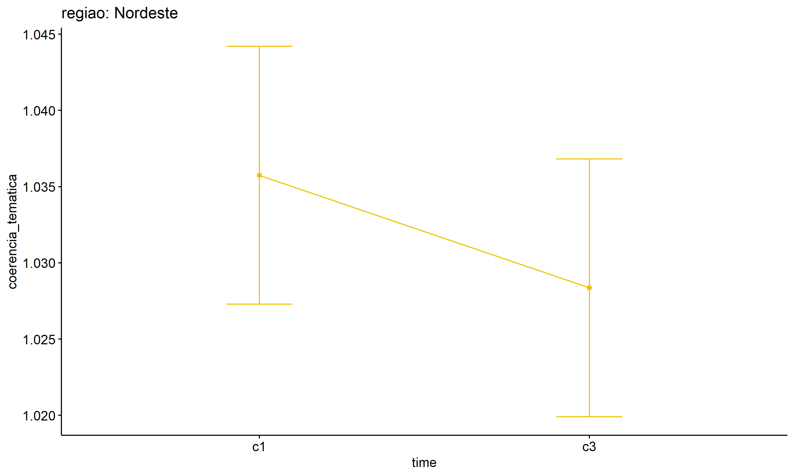
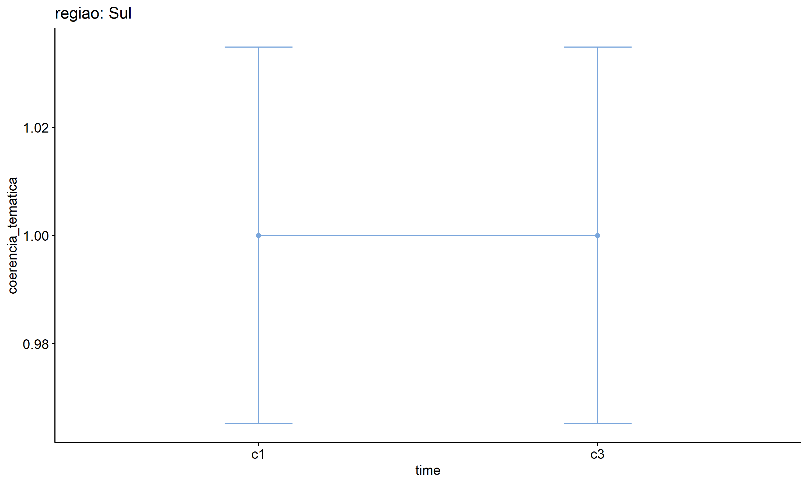

ANOVA test for coerencia_tematica
================
Geiser C. Challco <geiser@alumni.usp.br>

- [ANOVA: coerencia_tematica ~ time](#anova-coerencia_tematica--time)
  - [Data Preparation](#data-preparation)
  - [Summary Statistics](#summary-statistics)
  - [ANOVA Computation](#anova-computation)
  - [PairWise Computation](#pairwise-computation)
- [ANOVA: coerencia_tematica ~ time\*gender +
  Error(id/time)](#anova-coerencia_tematica--timegender--erroridtime)
  - [Data Preparation](#data-preparation-1)
    - [Check assumptions: Identifying
      Outliers](#check-assumptions-identifying-outliers)
    - [Check assumptions: Normality
      Test](#check-assumptions-normality-test)
    - [Summary Statistics](#summary-statistics-1)
  - [ANOVA Computation](#anova-computation-1)
  - [ANOVA Computation after removing non.normal
    data](#anova-computation-after-removing-nonnormal-data)
  - [PairWise Computation](#pairwise-computation-1)
  - [PairWise Computation after removing non.normal
    data](#pairwise-computation-after-removing-nonnormal-data)
- [ANOVA: coerencia_tematica ~ time\*localizacao +
  Error(id/time)](#anova-coerencia_tematica--timelocalizacao--erroridtime)
  - [Data Preparation](#data-preparation-2)
    - [Check assumptions: Identifying
      Outliers](#check-assumptions-identifying-outliers-1)
    - [Check assumptions: Normality
      Test](#check-assumptions-normality-test-1)
    - [Summary Statistics](#summary-statistics-2)
  - [ANOVA Computation](#anova-computation-2)
  - [ANOVA Computation after removing non.normal
    data](#anova-computation-after-removing-nonnormal-data-1)
  - [PairWise Computation](#pairwise-computation-2)
  - [PairWise Computation after removing non.normal
    data](#pairwise-computation-after-removing-nonnormal-data-1)
- [ANOVA: coerencia_tematica ~ time\*regiao +
  Error(id/time)](#anova-coerencia_tematica--timeregiao--erroridtime)
  - [Data Preparation](#data-preparation-3)
    - [Check assumptions: Identifying
      Outliers](#check-assumptions-identifying-outliers-2)
    - [Check assumptions: Normality
      Test](#check-assumptions-normality-test-2)
    - [Summary Statistics](#summary-statistics-3)
  - [ANOVA Computation](#anova-computation-3)
  - [ANOVA Computation after removing non.normal
    data](#anova-computation-after-removing-nonnormal-data-2)
  - [PairWise Computation](#pairwise-computation-3)
  - [PairWise Computation after removing non.normal
    data](#pairwise-computation-after-removing-nonnormal-data-2)
- [ANOVA: coerencia_tematica ~ time\*porte +
  Error(id/time)](#anova-coerencia_tematica--timeporte--erroridtime)
  - [Data Preparation](#data-preparation-4)
    - [Check assumptions: Identifying
      Outliers](#check-assumptions-identifying-outliers-3)
    - [Check assumptions: Normality
      Test](#check-assumptions-normality-test-3)
    - [Summary Statistics](#summary-statistics-4)
  - [ANOVA Computation](#anova-computation-4)
  - [ANOVA Computation after removing non.normal
    data](#anova-computation-after-removing-nonnormal-data-3)
  - [PairWise Computation](#pairwise-computation-4)
  - [PairWise Computation after removing non.normal
    data](#pairwise-computation-after-removing-nonnormal-data-3)

``` r
dat <- read_excel("../data/data.xlsx", sheet = "alunos_ef59")

escolas <- read_excel("../data/data.xlsx", sheet = "escolas")
edat <- merge(dat, escolas, by = "cod_escola", all.x = T)
```

# ANOVA: coerencia_tematica ~ time

## Data Preparation

``` r
data <- edat[,c("aluno_id","ciclo","coerencia_tematica")]
data <- data[data$ciclo %in% c("Primeiro Ciclo","Terceiro Ciclo"),]
data$ciclo <- factor(data$ciclo, c("Primeiro Ciclo","Terceiro Ciclo"))
data <- unique(data)

wdat <- spread(data, ciclo, coerencia_tematica)
wdat <- wdat[complete.cases(wdat),]
colnames(wdat) <- c("id","c1","c3")

ldat <- gather(wdat, key = time, value = coerencia_tematica, c1,c3) %>%
  convert_as_factor(id, time)
ldat <- rshinystatistics::remove_group_data(ldat, "coerencia_tematica", "time", n.limit = 30)
```

## Summary Statistics

``` r
(sdat <- ldat %>% group_by(time) %>%
   get_summary_stats(coerencia_tematica, type = "mean_sd"))
```

    ## # A tibble: 2 × 5
    ##   time  variable               n  mean    sd
    ##   <fct> <fct>              <dbl> <dbl> <dbl>
    ## 1 c1    coerencia_tematica  3997  1.03 0.145
    ## 2 c3    coerencia_tematica  3997  1.02 0.164

| time | variable           |    n |  mean |    sd |
|:-----|:-------------------|-----:|------:|------:|
| c1   | coerencia_tematica | 3997 | 1.027 | 0.145 |
| c3   | coerencia_tematica | 3997 | 1.023 | 0.164 |

## ANOVA Computation

``` r
(res.aov <- anova_test(ldat, dv = coerencia_tematica, wid = id, within = time))
```

    ## ANOVA Table (type III tests)
    ## 
    ##   Effect DFn  DFd     F     p p<.05      ges
    ## 1   time   1 3996 1.533 0.216       0.000188

## PairWise Computation

``` r
(pwc <- ldat %>% emmeans_test(coerencia_tematica ~ time, detailed = T, p.adjust.method = "bonferroni"))
```

    ## # A tibble: 1 × 14
    ##   term  .y.   group1 group2 null.value estimate      se    df conf.low conf.high
    ## * <chr> <chr> <chr>  <chr>       <dbl>    <dbl>   <dbl> <dbl>    <dbl>     <dbl>
    ## 1 time  coer… c1     c3              0  0.00425 0.00347  7992 -0.00254    0.0110
    ## # ℹ 4 more variables: statistic <dbl>, p <dbl>, p.adj <dbl>, p.adj.signif <chr>

| term | .y.                | group1 | group2 | null.value | estimate |    se |   df | conf.low | conf.high | statistic |    p | p.adj | p.adj.signif |
|:-----|:-------------------|:-------|:-------|-----------:|---------:|------:|-----:|---------:|----------:|----------:|-----:|------:|:-------------|
| time | coerencia_tematica | c1     | c3     |          0 |    0.004 | 0.003 | 7992 |   -0.003 |     0.011 |     1.227 | 0.22 |  0.22 | ns           |

``` r
pwc <- add_xy_position(pwc, x = "time", fun = "mean_se")
ggline(get_emmeans(pwc), x = "time", y = "emmean", ylab = "coerencia_tematica") +
  geom_errorbar(aes(ymin = conf.low, ymax = conf.high), width = 0.2) +
  stat_pvalue_manual(pwc, hide.ns = T, tip.length = F)
```

<!-- -->

# ANOVA: coerencia_tematica ~ time\*gender + Error(id/time)

## Data Preparation

``` r
data <- edat[,c("aluno_id","gender","ciclo","coerencia_tematica")]
data <- data[data$ciclo %in% c("Primeiro Ciclo","Terceiro Ciclo"),]
data$ciclo <- factor(data$ciclo, c("Primeiro Ciclo","Terceiro Ciclo"))
data <- unique(data)

wdat <- spread(data, ciclo, coerencia_tematica)
wdat <- wdat[complete.cases(wdat),]
colnames(wdat) <- c("id","gender","c1","c3")

ldat <- gather(wdat, key = time, value = coerencia_tematica, c1,c3) %>%
  convert_as_factor(id, time)
ldat <- remove_group_data(ldat, "coerencia_tematica", c("time", "gender"), n.limit = 30)
ldat$gender <- factor(ldat$gender, sort(unique(ldat$gender)))
```

### Check assumptions: Identifying Outliers

``` r
outliers <- identify_outliers(group_by(ldat, time, gender), coerencia_tematica)
(outliers <- outliers[outliers$is.extreme == T,])
```

    ## # A tibble: 232 × 6
    ##    gender time  id                   coerencia_tematica is.outlier is.extreme
    ##    <fct>  <fct> <fct>                             <dbl> <lgl>      <lgl>     
    ##  1 Female c1    bHdxquaZ8XUwfwDJQQCh                1.5 TRUE       TRUE      
    ##  2 Female c1    bkg0ArgSmyB4bWY1udDg                1.5 TRUE       TRUE      
    ##  3 Female c1    cea1pI9NTEIE2VL4YEQj                1.5 TRUE       TRUE      
    ##  4 Female c1    col2IMV8zL43sh3escHr                2   TRUE       TRUE      
    ##  5 Female c1    D7Sm25aUnnDccJUkASMn                1.5 TRUE       TRUE      
    ##  6 Female c1    EGPZ6xyZOiq8239Eo7wW                1.5 TRUE       TRUE      
    ##  7 Female c1    fSeGvYUypBxsn9UAjp8k                1.5 TRUE       TRUE      
    ##  8 Female c1    gcimPrBiERP821CKxZgH                2   TRUE       TRUE      
    ##  9 Female c1    GgNJ908EEM577taK2rcX                1.5 TRUE       TRUE      
    ## 10 Female c1    gLaZ7sLAnxfq8N5xhMue                1.5 TRUE       TRUE      
    ## # ℹ 222 more rows

| gender | time | id                   | coerencia_tematica | is.outlier | is.extreme |
|:-------|:-----|:---------------------|-------------------:|:-----------|:-----------|
| Female | c1   | bHdxquaZ8XUwfwDJQQCh |                1.5 | TRUE       | TRUE       |
| Female | c1   | bkg0ArgSmyB4bWY1udDg |                1.5 | TRUE       | TRUE       |
| Female | c1   | cea1pI9NTEIE2VL4YEQj |                1.5 | TRUE       | TRUE       |
| Female | c1   | col2IMV8zL43sh3escHr |                2.0 | TRUE       | TRUE       |
| Female | c1   | D7Sm25aUnnDccJUkASMn |                1.5 | TRUE       | TRUE       |
| Female | c1   | EGPZ6xyZOiq8239Eo7wW |                1.5 | TRUE       | TRUE       |
| Female | c1   | fSeGvYUypBxsn9UAjp8k |                1.5 | TRUE       | TRUE       |
| Female | c1   | gcimPrBiERP821CKxZgH |                2.0 | TRUE       | TRUE       |
| Female | c1   | GgNJ908EEM577taK2rcX |                1.5 | TRUE       | TRUE       |
| Female | c1   | gLaZ7sLAnxfq8N5xhMue |                1.5 | TRUE       | TRUE       |
| Female | c1   | GlJgaFJ0J70UlvV58ITK |                1.5 | TRUE       | TRUE       |
| Female | c1   | GzCLghK9h0oymTsDyqeC |                2.0 | TRUE       | TRUE       |
| Female | c1   | H9sVgyqV5zY8N7Wi2LrS |                1.5 | TRUE       | TRUE       |
| Female | c1   | HApaalSboYPfShjYpktE |                1.5 | TRUE       | TRUE       |
| Female | c1   | HKtncnQSZNrOf3mzAxMX |                1.5 | TRUE       | TRUE       |
| Female | c1   | hlcGuhp2a574dv9jSgxz |                2.0 | TRUE       | TRUE       |
| Female | c1   | hOZgVXc5g4oTkIUTunFc |                1.5 | TRUE       | TRUE       |
| Female | c1   | IOzFe8bKlKLXC426Bw0D |                2.0 | TRUE       | TRUE       |
| Female | c1   | iZ0kcpTQuPIIYCjF9JGs |                1.5 | TRUE       | TRUE       |
| Female | c1   | jAQQeILs5PIvqA7uZVxS |                2.0 | TRUE       | TRUE       |
| Female | c1   | JB59hVGoMYyAt1jIteQL |                1.5 | TRUE       | TRUE       |
| Female | c1   | JIH35Vxqf0kBuusEQEBK |                1.5 | TRUE       | TRUE       |
| Female | c1   | jj8zEwuvHwF3DSeBVY0j |                1.5 | TRUE       | TRUE       |
| Female | c1   | JYwsDgGHGraSAFkJIot2 |                2.0 | TRUE       | TRUE       |
| Female | c1   | K7TMBHPukqALYKzvf7cx |                2.0 | TRUE       | TRUE       |
| Female | c1   | KJEZahfRRCiaTwQuvtmh |                2.0 | TRUE       | TRUE       |
| Female | c1   | lA2MxCV3knz4ZwIQLhxL |                1.5 | TRUE       | TRUE       |
| Female | c1   | LAE7FZYedalWpiev4Efs |                2.0 | TRUE       | TRUE       |
| Female | c1   | li1Oo6JocIlOKbSbGGPL |                2.0 | TRUE       | TRUE       |
| Female | c1   | lkBCRumBZ1wjJR3vXPdU |                2.0 | TRUE       | TRUE       |
| Female | c1   | lxG00dubRlTaQZDSerkn |                2.0 | TRUE       | TRUE       |
| Female | c1   | M5ZQzPiHFsH3blr684YH |                1.5 | TRUE       | TRUE       |
| Female | c1   | MIbJD06B1Lx36y6OzOtU |                1.5 | TRUE       | TRUE       |
| Female | c1   | N8PMFQN9SOo3eRxv300R |                2.0 | TRUE       | TRUE       |
| Female | c1   | nlJhKb6kGFdBblURaujB |                1.5 | TRUE       | TRUE       |
| Female | c1   | NtjLRdxVy9JjnY8SJQHE |                2.0 | TRUE       | TRUE       |
| Female | c1   | NU88StbmGlGjaAXdZqqV |                1.5 | TRUE       | TRUE       |
| Female | c1   | NVQUYNS7GhPqK2eEzO44 |                1.5 | TRUE       | TRUE       |
| Female | c1   | oapVp4BCxANkgKzznDeT |                1.5 | TRUE       | TRUE       |
| Female | c1   | OJQJXGYqknL5VsaAN7Pa |                2.0 | TRUE       | TRUE       |
| Female | c1   | Ox5Y140vlMHrv0356KeS |                1.5 | TRUE       | TRUE       |
| Female | c1   | p2NKvpKsDu0AvEc8uQJD |                2.0 | TRUE       | TRUE       |
| Female | c1   | pL9KkClnpzw1iY57xtm7 |                1.5 | TRUE       | TRUE       |
| Female | c1   | pnS2LzVSCce5oJLEgChk |                2.0 | TRUE       | TRUE       |
| Female | c1   | pZ09kaFZtas3uftd4AYp |                1.5 | TRUE       | TRUE       |
| Female | c1   | q6k14XWSL1xOZtE905un |                1.5 | TRUE       | TRUE       |
| Female | c1   | QFC3MBVg4ONoKoWiWOpF |                1.5 | TRUE       | TRUE       |
| Female | c1   | qykgeDLP0ZtKZh2zTyYg |                2.0 | TRUE       | TRUE       |
| Female | c1   | QZVdyMaOQf4kv3N112qx |                1.5 | TRUE       | TRUE       |
| Female | c1   | R66FCSshbCupnBj09Gam |                1.5 | TRUE       | TRUE       |
| Female | c1   | R6OJgfDgNNflwASfs0Uh |                2.0 | TRUE       | TRUE       |
| Female | c1   | RdZuqHC3xwk8iHKXl8fD |                1.5 | TRUE       | TRUE       |
| Female | c1   | RUzG0IWkHG1Jwov3X5wn |                2.0 | TRUE       | TRUE       |
| Female | c1   | skw28HFlsDjqFEuX9Uue |                1.5 | TRUE       | TRUE       |
| Female | c1   | SsAcspod3iDDM8vBEyex |                1.5 | TRUE       | TRUE       |
| Female | c1   | t2er7ATpS1VHa3yWbdf5 |                2.0 | TRUE       | TRUE       |
| Female | c1   | TPobDcLYzJFEXhqR3YD0 |                2.0 | TRUE       | TRUE       |
| Female | c1   | TsxyiySdjBJDjL8WdbIe |                1.5 | TRUE       | TRUE       |
| Female | c1   | txVUfeS9yxSJgLxIA1LQ |                2.0 | TRUE       | TRUE       |
| Female | c1   | v8aquDX1Ryy24YbAe13O |                1.5 | TRUE       | TRUE       |
| Female | c1   | vBlaXuZ8ZY8rKwmDYaQ6 |                1.5 | TRUE       | TRUE       |
| Female | c1   | vcFSZlrZreRXDfzNZtRb |                1.5 | TRUE       | TRUE       |
| Female | c1   | VyHdZltvbxJuvAtW1dZu |                1.5 | TRUE       | TRUE       |
| Female | c1   | W1d2sdoSJ1krgfEYOq7l |                1.5 | TRUE       | TRUE       |
| Female | c1   | W5IOElp0cI4vYST9ZWay |                1.5 | TRUE       | TRUE       |
| Female | c1   | wvAAWEp4sGGNyMEkAyoG |                2.0 | TRUE       | TRUE       |
| Female | c1   | x4jodPIz1xkPF8DhqQXa |                1.5 | TRUE       | TRUE       |
| Female | c1   | x7yHoMUZwjLdOUGqf7YX |                1.5 | TRUE       | TRUE       |
| Female | c1   | X9aasiNZJiSQnbMXER59 |                1.5 | TRUE       | TRUE       |
| Female | c1   | xBIL2nocDb6QLHC7rsoh |                2.0 | TRUE       | TRUE       |
| Female | c1   | XcPx7krO0v9iVXHHQljJ |                1.5 | TRUE       | TRUE       |
| Female | c1   | xDpEmEuUzFkKJft4SmcT |                1.5 | TRUE       | TRUE       |
| Female | c1   | XkeSvJHKnKr17WHSCd0K |                2.0 | TRUE       | TRUE       |
| Female | c1   | xZOj3oH8wL7SV5Sr291t |                2.0 | TRUE       | TRUE       |
| Female | c1   | y0ZyLi3nm5LlevfGQaX0 |                1.5 | TRUE       | TRUE       |
| Female | c1   | Y2armBqB7Yw2X5Fnse5G |                1.5 | TRUE       | TRUE       |
| Female | c1   | yGeexXgQGywa1oYjtgD4 |                1.5 | TRUE       | TRUE       |
| Female | c1   | ygFDD5VKGRl4qhJhOBFL |                2.0 | TRUE       | TRUE       |
| Female | c1   | yMSE5XTP4wD8kCCzaBkH |                1.5 | TRUE       | TRUE       |
| Female | c1   | yqyZiP5lTzS4QJWcdjAQ |                1.5 | TRUE       | TRUE       |
| Female | c1   | zWGGIXi0VrJm2ozr2LxJ |                2.0 | TRUE       | TRUE       |
| Male   | c1   | 4QkqTlalDsL8IX5Fvsb1 |                1.5 | TRUE       | TRUE       |
| Male   | c1   | 59S3yEWZ6yEhlGpcDxVe |                1.5 | TRUE       | TRUE       |
| Male   | c1   | aCnO2mgesOBg3hrOHMyO |                1.5 | TRUE       | TRUE       |
| Male   | c1   | aQKm1fE5VWhl7lV4MbTV |                2.0 | TRUE       | TRUE       |
| Male   | c1   | b2u6T9w3LrOjxk84Egyw |                1.5 | TRUE       | TRUE       |
| Male   | c1   | bffqHWxVnoiLUPbcPV9j |                1.5 | TRUE       | TRUE       |
| Male   | c1   | bp33CvaJwna4IXIiGfG7 |                2.0 | TRUE       | TRUE       |
| Male   | c1   | cBj30f2ggO0OB96Qa2LS |                1.5 | TRUE       | TRUE       |
| Male   | c1   | eDDthAP6dWERQriBPjXp |                1.5 | TRUE       | TRUE       |
| Male   | c1   | gDRGUsOBQicWdVKdqivA |                1.5 | TRUE       | TRUE       |
| Male   | c1   | gW6zQXU87OM6vElD5www |                1.5 | TRUE       | TRUE       |
| Male   | c1   | HbX9wIM2m5EDRXj1cGIG |                2.0 | TRUE       | TRUE       |
| Male   | c1   | Hctnx0sTLnQqaq89jDXi |                1.5 | TRUE       | TRUE       |
| Male   | c1   | HgGRdu7lniMmL2jzkEXF |                1.5 | TRUE       | TRUE       |
| Male   | c1   | HMrd8at39YWy7kQ4CE0t |                1.5 | TRUE       | TRUE       |
| Male   | c1   | HtyGzYNgVgT1MqLvBs5Y |                1.5 | TRUE       | TRUE       |
| Male   | c1   | hxv0OTzSjM93n8hB8kju |                1.5 | TRUE       | TRUE       |
| Male   | c1   | i3ImRhfefZZ4n4XQG3YG |                1.5 | TRUE       | TRUE       |
| Male   | c1   | IhCtPNDrdPovpMIrstMI |                1.5 | TRUE       | TRUE       |
| Male   | c1   | IyzeDjuJr8JCvB0eV1AM |                1.5 | TRUE       | TRUE       |
| Male   | c1   | JKMqYuWXhJwdXTyZDk65 |                1.5 | TRUE       | TRUE       |
| Male   | c1   | JTsTbRkDqtZDpWZtOXWy |                1.5 | TRUE       | TRUE       |
| Male   | c1   | JuguWs7PeYkqoS8VMJ4x |                1.5 | TRUE       | TRUE       |
| Male   | c1   | KpFsr8OikgyHrJ760Rub |                1.5 | TRUE       | TRUE       |
| Male   | c1   | LC0VhwJD1zyXuvuGylt3 |                1.5 | TRUE       | TRUE       |
| Male   | c1   | lgbCEakOeFbmDSE42Un9 |                2.0 | TRUE       | TRUE       |
| Male   | c1   | Mqzh9bumIAP8MQZokMZx |                2.0 | TRUE       | TRUE       |
| Male   | c1   | neHeiZ9VsUQkSRZb8fmd |                2.0 | TRUE       | TRUE       |
| Male   | c1   | ngRhEyo2gYwntjRBCaRo |                1.5 | TRUE       | TRUE       |
| Male   | c1   | ODW7ukHXav3iXRTALzvo |                3.0 | TRUE       | TRUE       |
| Male   | c1   | oHGPgq5biGbtxuTKCcRI |                1.5 | TRUE       | TRUE       |
| Male   | c1   | OLOxlfCyza2ZKfGPA2pY |                1.5 | TRUE       | TRUE       |
| Male   | c1   | OYUbfGbyPB3JB9v6ALC4 |                1.5 | TRUE       | TRUE       |
| Male   | c1   | PYSRUEFDnlQqFeCaj1fG |                2.0 | TRUE       | TRUE       |
| Male   | c1   | QCF1QxUht4Fx9stOHp13 |                1.5 | TRUE       | TRUE       |
| Male   | c1   | qsgbDZxow2LbCePmX1C3 |                1.5 | TRUE       | TRUE       |
| Male   | c1   | R0uXXbZDMdN9GiFjk2Zr |                1.5 | TRUE       | TRUE       |
| Male   | c1   | R2fC8QvLjzoBWt4Nmofb |                1.5 | TRUE       | TRUE       |
| Male   | c1   | RAse3DBYoBaZh18s9CdL |                1.5 | TRUE       | TRUE       |
| Male   | c1   | rSnjLCmkPTnOf3VsNA3D |                2.0 | TRUE       | TRUE       |
| Male   | c1   | RUCpvrnKZiuHd4MdkpF8 |                1.5 | TRUE       | TRUE       |
| Male   | c1   | RUiarbHlHC1Y2yDMAWVN |                1.5 | TRUE       | TRUE       |
| Male   | c1   | sp0Fux6Pmq2Ch2Ef8fAU |                1.5 | TRUE       | TRUE       |
| Male   | c1   | SqycP86Vzy7VCLeYFXYW |                3.0 | TRUE       | TRUE       |
| Male   | c1   | SRxDw2UtOLJsN6egZ0WJ |                1.5 | TRUE       | TRUE       |
| Male   | c1   | SThIZGjB4Ic0ZkUGkOKU |                2.0 | TRUE       | TRUE       |
| Male   | c1   | stYStwHWnO2cdf2af8bX |                1.5 | TRUE       | TRUE       |
| Male   | c1   | T96u00mYwRAxuAomqH32 |                2.0 | TRUE       | TRUE       |
| Male   | c1   | TsFOQEsfu5hqo3DHq7mY |                1.5 | TRUE       | TRUE       |
| Male   | c1   | Tx7BN5al0OdrDP5cI8SC |                1.5 | TRUE       | TRUE       |
| Male   | c1   | UEh75GosPOcYzpLvP7ha |                2.0 | TRUE       | TRUE       |
| Male   | c1   | uWxJDkcrpzhxzrGA2lKN |                1.5 | TRUE       | TRUE       |
| Male   | c1   | UXyyStkdvsH6ileVMrou |                1.5 | TRUE       | TRUE       |
| Male   | c1   | V8quxJrDhdNtMw0IXsvX |                2.0 | TRUE       | TRUE       |
| Male   | c1   | V9jk8HEEzl4Qae6emMYV |                2.0 | TRUE       | TRUE       |
| Male   | c1   | vKsDZRuLwg40TM7HpYKE |                1.5 | TRUE       | TRUE       |
| Male   | c1   | voXJ8AKvlXnNSm2bPuXg |                1.5 | TRUE       | TRUE       |
| Male   | c1   | wDahW7PwVLOt1hTIN5AJ |                1.5 | TRUE       | TRUE       |
| Male   | c1   | whxd4R82WtHoWl6Okkmu |                1.5 | TRUE       | TRUE       |
| Male   | c1   | WNCBunijqR1yoirGAoMI |                1.5 | TRUE       | TRUE       |
| Male   | c1   | WXp6KChtWfwGR4v40naQ |                1.5 | TRUE       | TRUE       |
| Male   | c1   | XsGWduAIJd6PoNnUIg9i |                1.5 | TRUE       | TRUE       |
| Male   | c1   | Y09ukm6utsmdrnYqOapu |                1.5 | TRUE       | TRUE       |
| Male   | c1   | y73LnoGw0PXnuMfR76vZ |                2.0 | TRUE       | TRUE       |
| Male   | c1   | YJrFSXvBPUrJnUntaLb5 |                1.5 | TRUE       | TRUE       |
| Male   | c1   | z7uID99hhSU7FILwYyTB |                1.5 | TRUE       | TRUE       |
| Male   | c1   | zagt0ufyi7yAinJbuq0K |                1.5 | TRUE       | TRUE       |
| Male   | c1   | zFY3aRHtN4xArm4fhWpI |                1.5 | TRUE       | TRUE       |
| Female | c3   | a4b51nCgQhjPn07xLlKf |                3.0 | TRUE       | TRUE       |
| Female | c3   | ahZdnv4Ag0rvorAA1GLx |                2.0 | TRUE       | TRUE       |
| Female | c3   | bh5Fb8B6R9YSCFbBnCpn |                2.0 | TRUE       | TRUE       |
| Female | c3   | cqpWX9Yy7u0cOhNlFDho |                2.0 | TRUE       | TRUE       |
| Female | c3   | cvqWAQJgFaACUf8XmoGy |                2.0 | TRUE       | TRUE       |
| Female | c3   | cWlE2RI9elzfx0XbgxpQ |                2.0 | TRUE       | TRUE       |
| Female | c3   | dZvmQ9rSaYqWQCbmBInb |                1.5 | TRUE       | TRUE       |
| Female | c3   | HLrljndR3XaCw43KJcla |                2.0 | TRUE       | TRUE       |
| Female | c3   | I1eoabmfOcv6TkzTcsHE |                1.5 | TRUE       | TRUE       |
| Female | c3   | irNojMdYfQ0zl8bQyVx5 |                2.0 | TRUE       | TRUE       |
| Female | c3   | IULN0VP1vaKx0W9ypCCV |                1.5 | TRUE       | TRUE       |
| Female | c3   | IzbICdb3cJ7izXqGAtsw |                2.0 | TRUE       | TRUE       |
| Female | c3   | K7TMBHPukqALYKzvf7cx |                4.0 | TRUE       | TRUE       |
| Female | c3   | Kp2FlmxakPwS9hPeGO6M |                1.5 | TRUE       | TRUE       |
| Female | c3   | LDodA1oJwQ0TAoHr9W3W |                2.0 | TRUE       | TRUE       |
| Female | c3   | lUAatuXV2QbmpLb3n3Us |                3.0 | TRUE       | TRUE       |
| Female | c3   | lXWIkEauYtN6dk4nl8YX |                2.0 | TRUE       | TRUE       |
| Female | c3   | LzWPYoOmVmQ3VLWAmuvm |                2.0 | TRUE       | TRUE       |
| Female | c3   | MDBjy9YLF4vu6txQHdS0 |                2.0 | TRUE       | TRUE       |
| Female | c3   | MXOCmwjtYDAzd1ZFe9RR |                2.0 | TRUE       | TRUE       |
| Female | c3   | nAnck0BTSMsu8DFLR8ai |                2.0 | TRUE       | TRUE       |
| Female | c3   | nCM5CYexV1LFQJbnZ5jp |                2.0 | TRUE       | TRUE       |
| Female | c3   | nE1f8v156z9vaLcB8Mjg |                1.5 | TRUE       | TRUE       |
| Female | c3   | NexRCeXQSBDl46HOT50i |                2.0 | TRUE       | TRUE       |
| Female | c3   | NMCFViB91fsyE0UfAqDB |                2.0 | TRUE       | TRUE       |
| Female | c3   | NRpvTtomC2rUL57d5m3u |                2.0 | TRUE       | TRUE       |
| Female | c3   | o7v9PMFpokTxLa1wHPMw |                2.0 | TRUE       | TRUE       |
| Female | c3   | PZszZEyf9zurxXNTzPJe |                4.0 | TRUE       | TRUE       |
| Female | c3   | Q9Iy5FKK0eYDZBnRqfVU |                2.0 | TRUE       | TRUE       |
| Female | c3   | QDX5uX9MLYxIwbPxwl0x |                1.5 | TRUE       | TRUE       |
| Female | c3   | RgTYrNSBS7ppjWbxqD9a |                2.0 | TRUE       | TRUE       |
| Female | c3   | RL2sqeHLJRl73RspjIQs |                2.0 | TRUE       | TRUE       |
| Female | c3   | s1HPfABnWeZgXvyvANpF |                1.5 | TRUE       | TRUE       |
| Female | c3   | Sz8KeSJFzr7mIfbBfwiG |                2.0 | TRUE       | TRUE       |
| Female | c3   | T3dMatGW49XweHRCT2uT |                2.0 | TRUE       | TRUE       |
| Female | c3   | U5YPniK026Hb2s1rhHZ6 |                1.5 | TRUE       | TRUE       |
| Female | c3   | uc7P0bFpskX8aA2drX1J |                2.0 | TRUE       | TRUE       |
| Female | c3   | URCkbpqtIKFmwKWfGYIM |                2.0 | TRUE       | TRUE       |
| Female | c3   | utURqHGd1CGfeJMrlUbh |                4.0 | TRUE       | TRUE       |
| Female | c3   | UTVEQsZ3loc6mKHphW5t |                2.0 | TRUE       | TRUE       |
| Female | c3   | vlx8ILbjJq34wE7tV3OR |                2.0 | TRUE       | TRUE       |
| Female | c3   | VOBxjPc2H7iJTlpyUpgr |                2.0 | TRUE       | TRUE       |
| Female | c3   | WG4LWtWKmM2SiRPVCY9t |                2.0 | TRUE       | TRUE       |
| Female | c3   | XBw4qqKZBdocvmCDHT4C |                2.0 | TRUE       | TRUE       |
| Female | c3   | XsRsO3Q7iiyneVZwFu9I |                2.0 | TRUE       | TRUE       |
| Female | c3   | XWjFdPYH587cwoTJJ847 |                2.0 | TRUE       | TRUE       |
| Female | c3   | YxXLDovsstT2p1i37xPS |                2.0 | TRUE       | TRUE       |
| Female | c3   | z7NLr9sAtMLLfWf7n7sV |                2.0 | TRUE       | TRUE       |
| Female | c3   | zbbiHri3yhRNhHIl5WQP |                2.0 | TRUE       | TRUE       |
| Female | c3   | zegFvKqxMbo2rLo5oQIM |                2.0 | TRUE       | TRUE       |
| Female | c3   | ZwnnCMzkG2e0c4T4c0ax |                2.0 | TRUE       | TRUE       |
| Male   | c3   | aWKEvgmhDL4av2mv3UVK |                2.0 | TRUE       | TRUE       |
| Male   | c3   | cfJ9n2OLm2XQL0eIq0LV |                2.0 | TRUE       | TRUE       |
| Male   | c3   | cVGAEkdsHyZRSCLKV9lF |                2.0 | TRUE       | TRUE       |
| Male   | c3   | fRlahFOcIESmv0n0sJ5U |                2.0 | TRUE       | TRUE       |
| Male   | c3   | GudmA42ZHp8L62UnMnjr |                2.0 | TRUE       | TRUE       |
| Male   | c3   | i2xVe3MOaeGR6L5xLYEX |                2.0 | TRUE       | TRUE       |
| Male   | c3   | ikOaW9cHKJvfrbWz9GUp |                2.0 | TRUE       | TRUE       |
| Male   | c3   | J3Rbqwf13iApTedyaKow |                2.0 | TRUE       | TRUE       |
| Male   | c3   | jYSukzSzuBpk2mUsvKMt |                2.0 | TRUE       | TRUE       |
| Male   | c3   | KZmGDn2myk2hogGMQ5M8 |                2.0 | TRUE       | TRUE       |
| Male   | c3   | lM65UoEffuaKye4haxMG |                2.0 | TRUE       | TRUE       |
| Male   | c3   | moJZndP3kTNY6ZTOTHFr |                2.0 | TRUE       | TRUE       |
| Male   | c3   | MOSvkn6vmxvh2bODZ7zC |                2.0 | TRUE       | TRUE       |
| Male   | c3   | nnqKEAgmEprz6eF4lwTm |                1.5 | TRUE       | TRUE       |
| Male   | c3   | NYrnLmn3cWhJVFfXOrT1 |                1.5 | TRUE       | TRUE       |
| Male   | c3   | pyfhYyPj6FpkRRBCPpp3 |                2.0 | TRUE       | TRUE       |
| Male   | c3   | PZAXxSV4yfruANEN2Eyz |                2.0 | TRUE       | TRUE       |
| Male   | c3   | QhWCDHm049ffyFGimWE1 |                2.0 | TRUE       | TRUE       |
| Male   | c3   | QsKf81oVtGlRZfTZoVCK |                2.0 | TRUE       | TRUE       |
| Male   | c3   | rI0Q5jBiWC4475e7LYel |                2.0 | TRUE       | TRUE       |
| Male   | c3   | rsaQHh9Y4KyfA4AQT4zK |                2.0 | TRUE       | TRUE       |
| Male   | c3   | tMRUuM3ubecmwqncg4K1 |                2.0 | TRUE       | TRUE       |
| Male   | c3   | TzBq9p6dTjrnTjK70zU4 |                2.0 | TRUE       | TRUE       |
| Male   | c3   | wBDk0Kh9kT87t6kfymZd |                2.0 | TRUE       | TRUE       |
| Male   | c3   | xO5dAmscxdianoyWKABf |                2.0 | TRUE       | TRUE       |
| Male   | c3   | YBzmerz6Rz8QFtWi6ghI |                1.5 | TRUE       | TRUE       |
| Male   | c3   | YhXN9xyKKDBzBhyeizHx |                2.0 | TRUE       | TRUE       |
| Male   | c3   | YIgxirSPsN6BVSKSDiDB |                2.0 | TRUE       | TRUE       |
| Male   | c3   | yLieKs7GWZLonpgW4Wpf |                2.0 | TRUE       | TRUE       |
| Male   | c3   | Ymf1FbfWINDH8yBPxirw |                2.0 | TRUE       | TRUE       |
| Male   | c3   | z4w08iuYFPDdo1BfmUBd |                2.0 | TRUE       | TRUE       |
| Male   | c3   | zFY3aRHtN4xArm4fhWpI |                1.5 | TRUE       | TRUE       |

### Check assumptions: Normality Test

``` r
(normality.df <- normality.test.per.groups(ldat, "coerencia_tematica", c("time", "gender")))
```

    ##                  var           variable time gender    n skewness  kurtosis
    ## 1 coerencia_tematica coerencia_tematica   c1 Female 1880 0.000000   0.00000
    ## 2 coerencia_tematica coerencia_tematica   c1   Male 1927 7.556902  73.66179
    ## 3 coerencia_tematica coerencia_tematica   c3 Female 1880 8.924368 100.89089
    ## 4 coerencia_tematica coerencia_tematica   c3   Male 1927 0.000000   0.00000
    ##   symmetry statistic     method p p.signif normality
    ## 1 few data        NA       <NA> 1     <NA>        NO
    ## 2       NO  2586.372 D'Agostino 0     ****         -
    ## 3       NO  2786.534 D'Agostino 0     ****         -
    ## 4 few data        NA       <NA> 1     <NA>        NO

| var                | variable           | time | gender |    n | skewness | kurtosis | symmetry | statistic | method     |   p | p.signif | normality |
|:-------------------|:-------------------|:-----|:-------|-----:|---------:|---------:|:---------|----------:|:-----------|----:|:---------|:----------|
| coerencia_tematica | coerencia_tematica | c1   | Female | 1880 |    0.000 |    0.000 | few data |        NA | NA         |   1 | NA       | NO        |
| coerencia_tematica | coerencia_tematica | c1   | Male   | 1927 |    7.557 |   73.662 | NO       |  2586.372 | D’Agostino |   0 | \*\*\*\* | \-        |
| coerencia_tematica | coerencia_tematica | c3   | Female | 1880 |    8.924 |  100.891 | NO       |  2786.534 | D’Agostino |   0 | \*\*\*\* | \-        |
| coerencia_tematica | coerencia_tematica | c3   | Male   | 1927 |    0.000 |    0.000 | few data |        NA | NA         |   1 | NA       | NO        |

``` r
(non.ids <- unique(do.call(
  c, lapply(which(normality.df$normality == 'NO'), FUN = function(i) {
  idx = which(ldat$time == normality.df$time[i] &
                ldat$gender == normality.df$gender[i])
  getNonNormal(ldat$"coerencia_tematica"[idx], ldat$id[idx])
}))))
```

    ## NULL

``` r
if (length(non.ids) > 0)
  ldat2 <- ldat[!ldat$id %in% non.ids,]
```

### Summary Statistics

``` r
(sdat <- ldat %>% group_by(time, gender) %>%
   get_summary_stats(coerencia_tematica, type = "mean_sd"))
```

    ## # A tibble: 4 × 6
    ##   gender time  variable               n  mean    sd
    ##   <fct>  <fct> <fct>              <dbl> <dbl> <dbl>
    ## 1 Female c1    coerencia_tematica  1880  1.03 0.148
    ## 2 Male   c1    coerencia_tematica  1927  1.02 0.133
    ## 3 Female c3    coerencia_tematica  1880  1.03 0.198
    ## 4 Male   c3    coerencia_tematica  1927  1.02 0.122

| gender | time | variable           |    n |  mean |    sd |
|:-------|:-----|:-------------------|-----:|------:|------:|
| Female | c1   | coerencia_tematica | 1880 | 1.030 | 0.148 |
| Male   | c1   | coerencia_tematica | 1927 | 1.023 | 0.133 |
| Female | c3   | coerencia_tematica | 1880 | 1.029 | 0.198 |
| Male   | c3   | coerencia_tematica | 1927 | 1.016 | 0.122 |

``` r
if (length(non.ids) > 0)
  (sdat <- ldat2 %>% group_by(time, gender) %>%
      get_summary_stats(coerencia_tematica, type = "mean_sd"))
```

| gender | time | variable           |    n |  mean |    sd |
|:-------|:-----|:-------------------|-----:|------:|------:|
| Female | c1   | coerencia_tematica | 1880 | 1.030 | 0.148 |
| Male   | c1   | coerencia_tematica | 1927 | 1.023 | 0.133 |
| Female | c3   | coerencia_tematica | 1880 | 1.029 | 0.198 |
| Male   | c3   | coerencia_tematica | 1927 | 1.016 | 0.122 |

## ANOVA Computation

``` r
(res.aov <- anova_test(ldat, dv = coerencia_tematica, wid = id, between = gender, within = time))
```

    ## ANOVA Table (type III tests)
    ## 
    ##        Effect DFn  DFd     F     p p<.05      ges
    ## 1      gender   1 3805 8.402 0.004     * 0.001000
    ## 2        time   1 3805 1.173 0.279       0.000152
    ## 3 gender:time   1 3805 1.013 0.314       0.000132

## ANOVA Computation after removing non.normal data

``` r
if (length(non.ids) > 0)
  (res.aov2 <- anova_test(ldat2, dv = coerencia_tematica, wid = id, between = gender , within = time))
```

## PairWise Computation

``` r
(pwc <- ldat %>% group_by(time) %>%
   emmeans_test(coerencia_tematica ~ gender, detailed = T, p.adjust.method = "bonferroni"))
```

    ## # A tibble: 2 × 15
    ##   time  term   .y.      group1 group2 null.value estimate      se    df conf.low
    ## * <fct> <chr>  <chr>    <chr>  <chr>       <dbl>    <dbl>   <dbl> <dbl>    <dbl>
    ## 1 c1    gender coerenc… Female Male            0  0.00669 0.00494  7610 -0.00300
    ## 2 c3    gender coerenc… Female Male            0  0.0137  0.00494  7610  0.00399
    ## # ℹ 5 more variables: conf.high <dbl>, statistic <dbl>, p <dbl>, p.adj <dbl>,
    ## #   p.adj.signif <chr>

| time | term   | .y.                | group1 | group2 | null.value | estimate |    se |   df | conf.low | conf.high | statistic |     p | p.adj | p.adj.signif |
|:-----|:-------|:-------------------|:-------|:-------|-----------:|---------:|------:|-----:|---------:|----------:|----------:|------:|------:|:-------------|
| c1   | gender | coerencia_tematica | Female | Male   |          0 |    0.007 | 0.005 | 7610 |   -0.003 |     0.016 |     1.353 | 0.176 | 0.176 | ns           |
| c3   | gender | coerencia_tematica | Female | Male   |          0 |    0.014 | 0.005 | 7610 |    0.004 |     0.023 |     2.768 | 0.006 | 0.006 | \*\*         |

``` r
(emms <- get_emmeans(pwc))
```

    ## # A tibble: 4 × 8
    ##   time  gender emmean      se    df conf.low conf.high method      
    ##   <fct> <fct>   <dbl>   <dbl> <dbl>    <dbl>     <dbl> <chr>       
    ## 1 c1    Female   1.03 0.00352  7610     1.02      1.04 Emmeans test
    ## 2 c1    Male     1.02 0.00347  7610     1.02      1.03 Emmeans test
    ## 3 c3    Female   1.03 0.00352  7610     1.02      1.04 Emmeans test
    ## 4 c3    Male     1.02 0.00347  7610     1.01      1.02 Emmeans test

| time | gender | emmean |    se |   df | conf.low | conf.high | method       |
|:-----|:-------|-------:|------:|-----:|---------:|----------:|:-------------|
| c1   | Female |  1.030 | 0.004 | 7610 |    1.023 |     1.036 | Emmeans test |
| c1   | Male   |  1.023 | 0.003 | 7610 |    1.016 |     1.030 | Emmeans test |
| c3   | Female |  1.029 | 0.004 | 7610 |    1.022 |     1.036 | Emmeans test |
| c3   | Male   |  1.016 | 0.003 | 7610 |    1.009 |     1.022 | Emmeans test |

``` r
pwc <- add_xy_position(pwc, x = "time", fun = "mean_se", dodge = 0.25)
pd <- position_dodge(width = 0.25)
ggline(emms, x = "time", y = "emmean", color = "gender",
       palette = c("#FF007F","#4D4DFF"),
       position = pd, ylab = "coerencia_tematica") +
  geom_errorbar(aes(ymin = conf.low, ymax = conf.high, color = gender),
                position = pd, width = 0.2) +
  stat_pvalue_manual(pwc, hide.ns = T, tip.length = F, linetype = 1)
```

<!-- -->

``` r
(pwc <- ldat %>% group_by(gender) %>%
    emmeans_test(coerencia_tematica ~ time, detailed = T, p.adjust.method = "bonferroni"))
```

    ## # A tibble: 2 × 15
    ##   gender term  .y.      group1 group2 null.value estimate      se    df conf.low
    ## * <fct>  <chr> <chr>    <chr>  <chr>       <dbl>    <dbl>   <dbl> <dbl>    <dbl>
    ## 1 Female time  coerenc… c1     c3              0 0.000266 0.00497  7610 -0.00949
    ## 2 Male   time  coerenc… c1     c3              0 0.00727  0.00491  7610 -0.00237
    ## # ℹ 5 more variables: conf.high <dbl>, statistic <dbl>, p <dbl>, p.adj <dbl>,
    ## #   p.adj.signif <chr>

| gender | term | .y.                | group1 | group2 | null.value | estimate |    se |   df | conf.low | conf.high | statistic |     p | p.adj | p.adj.signif |
|:-------|:-----|:-------------------|:-------|:-------|-----------:|---------:|------:|-----:|---------:|----------:|----------:|------:|------:|:-------------|
| Female | time | coerencia_tematica | c1     | c3     |          0 |    0.000 | 0.005 | 7610 |   -0.009 |     0.010 |     0.053 | 0.957 | 0.957 | ns           |
| Male   | time | coerencia_tematica | c1     | c3     |          0 |    0.007 | 0.005 | 7610 |   -0.002 |     0.017 |     1.479 | 0.139 | 0.139 | ns           |

``` r
(emms <- get_emmeans(pwc))
```

    ## # A tibble: 4 × 8
    ##   gender time  emmean      se    df conf.low conf.high method      
    ##   <fct>  <fct>  <dbl>   <dbl> <dbl>    <dbl>     <dbl> <chr>       
    ## 1 Female c1      1.03 0.00352  7610     1.02      1.04 Emmeans test
    ## 2 Female c3      1.03 0.00352  7610     1.02      1.04 Emmeans test
    ## 3 Male   c1      1.02 0.00347  7610     1.02      1.03 Emmeans test
    ## 4 Male   c3      1.02 0.00347  7610     1.01      1.02 Emmeans test

| gender | time | emmean |    se |   df | conf.low | conf.high | method       |
|:-------|:-----|-------:|------:|-----:|---------:|----------:|:-------------|
| Female | c1   |  1.030 | 0.004 | 7610 |    1.023 |     1.036 | Emmeans test |
| Female | c3   |  1.029 | 0.004 | 7610 |    1.022 |     1.036 | Emmeans test |
| Male   | c1   |  1.023 | 0.003 | 7610 |    1.016 |     1.030 | Emmeans test |
| Male   | c3   |  1.016 | 0.003 | 7610 |    1.009 |     1.022 | Emmeans test |

``` r
emms.gg <- emms[which(emms$gender == "Female"),]
if (nrow(emms.gg) > 0)
  ggline(emms.gg, x = "time", y = "emmean", color = "#FF007F", ylab = "coerencia_tematica") +
    geom_errorbar(aes(ymin = conf.low, ymax = conf.high),
                  width = 0.2, color = "#FF007F") +
    stat_pvalue_manual(
      add_xy_position(pwc[which(pwc$gender == "Female"),],
                      x = "time", fun = "mean_se"),
      hide.ns = T, color = "#FF007F", tip.length = F) +
    labs(title = "gender: Female")+
    theme(legend.text = element_blank())
```

<!-- -->

``` r
emms.gg <- emms[which(emms$gender == "Male"),]
if (nrow(emms.gg) > 0)
  ggline(emms.gg, x = "time", y = "emmean", color = "#4D4DFF", ylab = "coerencia_tematica") +
    geom_errorbar(aes(ymin = conf.low, ymax = conf.high),
                  width = 0.2, color = "#4D4DFF") +
    stat_pvalue_manual(
      add_xy_position(pwc[which(pwc$gender == "Male"),],
                      x = "time", fun = "mean_se"),
      hide.ns = T, color = "#4D4DFF", tip.length = F) +
    labs(title = "gender: Male")+
    theme(legend.text = element_blank())
```

<!-- -->

## PairWise Computation after removing non.normal data

``` r
if (length(non.ids) > 0)
  (pwc2 <- ldat2 %>% group_by(time) %>%
     emmeans_test(coerencia_tematica ~ gender, detailed = T, p.adjust.method = "bonferroni"))
```

``` r
if (length(non.ids) > 0)
  (emms2 <- get_emmeans(pwc2))
```

``` r
if (length(non.ids) > 0) {
  pwc2 <- add_xy_position(pwc2, x = "time", fun = "mean_se", dodge = 0.25)
  pd2 <- position_dodge(width = 0.25)
  
  ggline(emms2, x = "time", y = "emmean", color = "gender",
         palette = c("#FF007F","#4D4DFF"),
         position = pd, ylab = "coerencia_tematica") +
    geom_errorbar(aes(ymin = conf.low, ymax = conf.high, color = gender),
                position = pd, width = 0.2) +
    stat_pvalue_manual(pwc2, hide.ns = T, tip.length = F, linetype = 1)
}
```

``` r
if (length(non.ids) > 0)
  (pwc2 <- ldat2 %>% group_by(gender) %>%
     emmeans_test(coerencia_tematica ~ time, detailed = T, p.adjust.method = "bonferroni"))
```

``` r
if (length(non.ids) > 0)
  (emms2 <- get_emmeans(pwc2))
```

``` r
if (length(non.ids) > 0) {
  emms.gg <- emms2[which(emms2$gender == "Female"),]
  if (nrow(emms.gg) > 0)
    ggline(emms.gg, x = "time", y = "emmean", color = "#FF007F", ylab = "coerencia_tematica") +
    geom_errorbar(aes(ymin = conf.low, ymax = conf.high),
                  width = 0.2, color = "#FF007F") +
    stat_pvalue_manual(
      add_xy_position(pwc[which(pwc$gender == "Female"),],
                      x = "time", fun = "mean_se"),
      hide.ns = T, color = "#FF007F", tip.length = F) +
    labs(title = "gender: Female") +
    theme(legend.text = element_blank())
}
```

``` r
if (length(non.ids) > 0) {
  emms.gg <- emms2[which(emms2$gender == "Male"),]
  if (nrow(emms.gg) > 0)
    ggline(emms.gg, x = "time", y = "emmean", color = "#4D4DFF", ylab = "coerencia_tematica") +
    geom_errorbar(aes(ymin = conf.low, ymax = conf.high),
                  width = 0.2, color = "#4D4DFF") +
    stat_pvalue_manual(
      add_xy_position(pwc[which(pwc$gender == "Male"),],
                      x = "time", fun = "mean_se"),
      hide.ns = T, color = "#4D4DFF", tip.length = F) +
    labs(title = "gender: Male") +
    theme(legend.text = element_blank())
}
```

# ANOVA: coerencia_tematica ~ time\*localizacao + Error(id/time)

## Data Preparation

``` r
data <- edat[,c("aluno_id","localizacao","ciclo","coerencia_tematica")]
data <- data[data$ciclo %in% c("Primeiro Ciclo","Terceiro Ciclo"),]
data$ciclo <- factor(data$ciclo, c("Primeiro Ciclo","Terceiro Ciclo"))
data <- unique(data)

wdat <- spread(data, ciclo, coerencia_tematica)
wdat <- wdat[complete.cases(wdat),]
colnames(wdat) <- c("id","localizacao","c1","c3")

ldat <- gather(wdat, key = time, value = coerencia_tematica, c1,c3) %>%
  convert_as_factor(id, time)
ldat <- remove_group_data(ldat, "coerencia_tematica", c("time", "localizacao"), n.limit = 30)
ldat$localizacao <- factor(ldat$localizacao, sort(unique(ldat$localizacao)))
```

### Check assumptions: Identifying Outliers

``` r
outliers <- identify_outliers(group_by(ldat, time, localizacao), coerencia_tematica)
(outliers <- outliers[outliers$is.extreme == T,])
```

    ## # A tibble: 248 × 6
    ##    localizacao time  id                 coerencia_tematica is.outlier is.extreme
    ##    <fct>       <fct> <fct>                           <dbl> <lgl>      <lgl>     
    ##  1 Rural       c1    A9RUkyTkFXi5lp8ry…                2   TRUE       TRUE      
    ##  2 Rural       c1    bkg0ArgSmyB4bWY1u…                1.5 TRUE       TRUE      
    ##  3 Rural       c1    eDDthAP6dWERQriBP…                1.5 TRUE       TRUE      
    ##  4 Rural       c1    gDRGUsOBQicWdVKdq…                1.5 TRUE       TRUE      
    ##  5 Rural       c1    gLaZ7sLAnxfq8N5xh…                1.5 TRUE       TRUE      
    ##  6 Rural       c1    HbX9wIM2m5EDRXj1c…                2   TRUE       TRUE      
    ##  7 Rural       c1    hOZgVXc5g4oTkIUTu…                1.5 TRUE       TRUE      
    ##  8 Rural       c1    HZkpVVbxvFMJQ62DB…                1.5 TRUE       TRUE      
    ##  9 Rural       c1    i3ImRhfefZZ4n4XQG…                1.5 TRUE       TRUE      
    ## 10 Rural       c1    JB59hVGoMYyAt1jIt…                1.5 TRUE       TRUE      
    ## # ℹ 238 more rows

| localizacao | time | id                   | coerencia_tematica | is.outlier | is.extreme |
|:------------|:-----|:---------------------|-------------------:|:-----------|:-----------|
| Rural       | c1   | A9RUkyTkFXi5lp8ryfZ7 |                2.0 | TRUE       | TRUE       |
| Rural       | c1   | bkg0ArgSmyB4bWY1udDg |                1.5 | TRUE       | TRUE       |
| Rural       | c1   | eDDthAP6dWERQriBPjXp |                1.5 | TRUE       | TRUE       |
| Rural       | c1   | gDRGUsOBQicWdVKdqivA |                1.5 | TRUE       | TRUE       |
| Rural       | c1   | gLaZ7sLAnxfq8N5xhMue |                1.5 | TRUE       | TRUE       |
| Rural       | c1   | HbX9wIM2m5EDRXj1cGIG |                2.0 | TRUE       | TRUE       |
| Rural       | c1   | hOZgVXc5g4oTkIUTunFc |                1.5 | TRUE       | TRUE       |
| Rural       | c1   | HZkpVVbxvFMJQ62DBzoy |                1.5 | TRUE       | TRUE       |
| Rural       | c1   | i3ImRhfefZZ4n4XQG3YG |                1.5 | TRUE       | TRUE       |
| Rural       | c1   | JB59hVGoMYyAt1jIteQL |                1.5 | TRUE       | TRUE       |
| Rural       | c1   | li1Oo6JocIlOKbSbGGPL |                2.0 | TRUE       | TRUE       |
| Rural       | c1   | N8PMFQN9SOo3eRxv300R |                2.0 | TRUE       | TRUE       |
| Rural       | c1   | NU88StbmGlGjaAXdZqqV |                1.5 | TRUE       | TRUE       |
| Rural       | c1   | OJQJXGYqknL5VsaAN7Pa |                2.0 | TRUE       | TRUE       |
| Rural       | c1   | OLOxlfCyza2ZKfGPA2pY |                1.5 | TRUE       | TRUE       |
| Rural       | c1   | OYUbfGbyPB3JB9v6ALC4 |                1.5 | TRUE       | TRUE       |
| Rural       | c1   | R2fC8QvLjzoBWt4Nmofb |                1.5 | TRUE       | TRUE       |
| Rural       | c1   | RUiarbHlHC1Y2yDMAWVN |                1.5 | TRUE       | TRUE       |
| Rural       | c1   | Ry2i88KcujFgfmcnR7XF |                1.5 | TRUE       | TRUE       |
| Rural       | c1   | sp0Fux6Pmq2Ch2Ef8fAU |                1.5 | TRUE       | TRUE       |
| Rural       | c1   | stYStwHWnO2cdf2af8bX |                1.5 | TRUE       | TRUE       |
| Rural       | c1   | TPobDcLYzJFEXhqR3YD0 |                2.0 | TRUE       | TRUE       |
| Rural       | c1   | TQpscKy5rHe0PmM5tF7j |                1.5 | TRUE       | TRUE       |
| Rural       | c1   | TsFOQEsfu5hqo3DHq7mY |                1.5 | TRUE       | TRUE       |
| Rural       | c1   | Ucc4PNrqBenHHXkHEewv |                2.0 | TRUE       | TRUE       |
| Rural       | c1   | UXyyStkdvsH6ileVMrou |                1.5 | TRUE       | TRUE       |
| Rural       | c1   | v8aquDX1Ryy24YbAe13O |                1.5 | TRUE       | TRUE       |
| Rural       | c1   | V9jk8HEEzl4Qae6emMYV |                2.0 | TRUE       | TRUE       |
| Rural       | c1   | vBlaXuZ8ZY8rKwmDYaQ6 |                1.5 | TRUE       | TRUE       |
| Rural       | c1   | vcFSZlrZreRXDfzNZtRb |                1.5 | TRUE       | TRUE       |
| Rural       | c1   | vKsDZRuLwg40TM7HpYKE |                1.5 | TRUE       | TRUE       |
| Rural       | c1   | W1d2sdoSJ1krgfEYOq7l |                1.5 | TRUE       | TRUE       |
| Rural       | c1   | WNCBunijqR1yoirGAoMI |                1.5 | TRUE       | TRUE       |
| Rural       | c1   | XcPx7krO0v9iVXHHQljJ |                1.5 | TRUE       | TRUE       |
| Rural       | c1   | xZOj3oH8wL7SV5Sr291t |                2.0 | TRUE       | TRUE       |
| Rural       | c1   | YJrFSXvBPUrJnUntaLb5 |                1.5 | TRUE       | TRUE       |
| Rural       | c1   | zagt0ufyi7yAinJbuq0K |                1.5 | TRUE       | TRUE       |
| Urbana      | c1   | 4QkqTlalDsL8IX5Fvsb1 |                1.5 | TRUE       | TRUE       |
| Urbana      | c1   | 59S3yEWZ6yEhlGpcDxVe |                1.5 | TRUE       | TRUE       |
| Urbana      | c1   | aCnO2mgesOBg3hrOHMyO |                1.5 | TRUE       | TRUE       |
| Urbana      | c1   | aQKm1fE5VWhl7lV4MbTV |                2.0 | TRUE       | TRUE       |
| Urbana      | c1   | b2u6T9w3LrOjxk84Egyw |                1.5 | TRUE       | TRUE       |
| Urbana      | c1   | bffqHWxVnoiLUPbcPV9j |                1.5 | TRUE       | TRUE       |
| Urbana      | c1   | bHdxquaZ8XUwfwDJQQCh |                1.5 | TRUE       | TRUE       |
| Urbana      | c1   | bp33CvaJwna4IXIiGfG7 |                2.0 | TRUE       | TRUE       |
| Urbana      | c1   | cBj30f2ggO0OB96Qa2LS |                1.5 | TRUE       | TRUE       |
| Urbana      | c1   | cea1pI9NTEIE2VL4YEQj |                1.5 | TRUE       | TRUE       |
| Urbana      | c1   | col2IMV8zL43sh3escHr |                2.0 | TRUE       | TRUE       |
| Urbana      | c1   | ctt3C145LmF65O0UFPuM |                1.5 | TRUE       | TRUE       |
| Urbana      | c1   | D7Sm25aUnnDccJUkASMn |                1.5 | TRUE       | TRUE       |
| Urbana      | c1   | EGPZ6xyZOiq8239Eo7wW |                1.5 | TRUE       | TRUE       |
| Urbana      | c1   | fSeGvYUypBxsn9UAjp8k |                1.5 | TRUE       | TRUE       |
| Urbana      | c1   | gcimPrBiERP821CKxZgH |                2.0 | TRUE       | TRUE       |
| Urbana      | c1   | GgNJ908EEM577taK2rcX |                1.5 | TRUE       | TRUE       |
| Urbana      | c1   | GlJgaFJ0J70UlvV58ITK |                1.5 | TRUE       | TRUE       |
| Urbana      | c1   | gW6zQXU87OM6vElD5www |                1.5 | TRUE       | TRUE       |
| Urbana      | c1   | GzCLghK9h0oymTsDyqeC |                2.0 | TRUE       | TRUE       |
| Urbana      | c1   | H9sVgyqV5zY8N7Wi2LrS |                1.5 | TRUE       | TRUE       |
| Urbana      | c1   | HApaalSboYPfShjYpktE |                1.5 | TRUE       | TRUE       |
| Urbana      | c1   | Hctnx0sTLnQqaq89jDXi |                1.5 | TRUE       | TRUE       |
| Urbana      | c1   | HgGRdu7lniMmL2jzkEXF |                1.5 | TRUE       | TRUE       |
| Urbana      | c1   | HKtncnQSZNrOf3mzAxMX |                1.5 | TRUE       | TRUE       |
| Urbana      | c1   | hlcGuhp2a574dv9jSgxz |                2.0 | TRUE       | TRUE       |
| Urbana      | c1   | HMrd8at39YWy7kQ4CE0t |                1.5 | TRUE       | TRUE       |
| Urbana      | c1   | HtyGzYNgVgT1MqLvBs5Y |                1.5 | TRUE       | TRUE       |
| Urbana      | c1   | hxv0OTzSjM93n8hB8kju |                1.5 | TRUE       | TRUE       |
| Urbana      | c1   | IhCtPNDrdPovpMIrstMI |                1.5 | TRUE       | TRUE       |
| Urbana      | c1   | IOzFe8bKlKLXC426Bw0D |                2.0 | TRUE       | TRUE       |
| Urbana      | c1   | IyzeDjuJr8JCvB0eV1AM |                1.5 | TRUE       | TRUE       |
| Urbana      | c1   | iZ0kcpTQuPIIYCjF9JGs |                1.5 | TRUE       | TRUE       |
| Urbana      | c1   | jAQQeILs5PIvqA7uZVxS |                2.0 | TRUE       | TRUE       |
| Urbana      | c1   | JIH35Vxqf0kBuusEQEBK |                1.5 | TRUE       | TRUE       |
| Urbana      | c1   | jj8zEwuvHwF3DSeBVY0j |                1.5 | TRUE       | TRUE       |
| Urbana      | c1   | JKMqYuWXhJwdXTyZDk65 |                1.5 | TRUE       | TRUE       |
| Urbana      | c1   | JTsTbRkDqtZDpWZtOXWy |                1.5 | TRUE       | TRUE       |
| Urbana      | c1   | JuguWs7PeYkqoS8VMJ4x |                1.5 | TRUE       | TRUE       |
| Urbana      | c1   | JYwsDgGHGraSAFkJIot2 |                2.0 | TRUE       | TRUE       |
| Urbana      | c1   | K7TMBHPukqALYKzvf7cx |                2.0 | TRUE       | TRUE       |
| Urbana      | c1   | KJEZahfRRCiaTwQuvtmh |                2.0 | TRUE       | TRUE       |
| Urbana      | c1   | KpFsr8OikgyHrJ760Rub |                1.5 | TRUE       | TRUE       |
| Urbana      | c1   | lA2MxCV3knz4ZwIQLhxL |                1.5 | TRUE       | TRUE       |
| Urbana      | c1   | LAE7FZYedalWpiev4Efs |                2.0 | TRUE       | TRUE       |
| Urbana      | c1   | LC0VhwJD1zyXuvuGylt3 |                1.5 | TRUE       | TRUE       |
| Urbana      | c1   | lgbCEakOeFbmDSE42Un9 |                2.0 | TRUE       | TRUE       |
| Urbana      | c1   | lkBCRumBZ1wjJR3vXPdU |                2.0 | TRUE       | TRUE       |
| Urbana      | c1   | lxG00dubRlTaQZDSerkn |                2.0 | TRUE       | TRUE       |
| Urbana      | c1   | M5ZQzPiHFsH3blr684YH |                1.5 | TRUE       | TRUE       |
| Urbana      | c1   | MIbJD06B1Lx36y6OzOtU |                1.5 | TRUE       | TRUE       |
| Urbana      | c1   | Mqzh9bumIAP8MQZokMZx |                2.0 | TRUE       | TRUE       |
| Urbana      | c1   | neHeiZ9VsUQkSRZb8fmd |                2.0 | TRUE       | TRUE       |
| Urbana      | c1   | ngRhEyo2gYwntjRBCaRo |                1.5 | TRUE       | TRUE       |
| Urbana      | c1   | nlJhKb6kGFdBblURaujB |                1.5 | TRUE       | TRUE       |
| Urbana      | c1   | NtjLRdxVy9JjnY8SJQHE |                2.0 | TRUE       | TRUE       |
| Urbana      | c1   | NVQUYNS7GhPqK2eEzO44 |                1.5 | TRUE       | TRUE       |
| Urbana      | c1   | oapVp4BCxANkgKzznDeT |                1.5 | TRUE       | TRUE       |
| Urbana      | c1   | ODW7ukHXav3iXRTALzvo |                3.0 | TRUE       | TRUE       |
| Urbana      | c1   | oHGPgq5biGbtxuTKCcRI |                1.5 | TRUE       | TRUE       |
| Urbana      | c1   | Ox5Y140vlMHrv0356KeS |                1.5 | TRUE       | TRUE       |
| Urbana      | c1   | p2NKvpKsDu0AvEc8uQJD |                2.0 | TRUE       | TRUE       |
| Urbana      | c1   | pL9KkClnpzw1iY57xtm7 |                1.5 | TRUE       | TRUE       |
| Urbana      | c1   | pnS2LzVSCce5oJLEgChk |                2.0 | TRUE       | TRUE       |
| Urbana      | c1   | PYSRUEFDnlQqFeCaj1fG |                2.0 | TRUE       | TRUE       |
| Urbana      | c1   | pZ09kaFZtas3uftd4AYp |                1.5 | TRUE       | TRUE       |
| Urbana      | c1   | q6k14XWSL1xOZtE905un |                1.5 | TRUE       | TRUE       |
| Urbana      | c1   | QCF1QxUht4Fx9stOHp13 |                1.5 | TRUE       | TRUE       |
| Urbana      | c1   | QFC3MBVg4ONoKoWiWOpF |                1.5 | TRUE       | TRUE       |
| Urbana      | c1   | qsgbDZxow2LbCePmX1C3 |                1.5 | TRUE       | TRUE       |
| Urbana      | c1   | qykgeDLP0ZtKZh2zTyYg |                2.0 | TRUE       | TRUE       |
| Urbana      | c1   | QZVdyMaOQf4kv3N112qx |                1.5 | TRUE       | TRUE       |
| Urbana      | c1   | R0uXXbZDMdN9GiFjk2Zr |                1.5 | TRUE       | TRUE       |
| Urbana      | c1   | R66FCSshbCupnBj09Gam |                1.5 | TRUE       | TRUE       |
| Urbana      | c1   | R6OJgfDgNNflwASfs0Uh |                2.0 | TRUE       | TRUE       |
| Urbana      | c1   | RAse3DBYoBaZh18s9CdL |                1.5 | TRUE       | TRUE       |
| Urbana      | c1   | RDbZiCDEoTTiKO7AoWQU |                1.5 | TRUE       | TRUE       |
| Urbana      | c1   | RdZuqHC3xwk8iHKXl8fD |                1.5 | TRUE       | TRUE       |
| Urbana      | c1   | rSnjLCmkPTnOf3VsNA3D |                2.0 | TRUE       | TRUE       |
| Urbana      | c1   | RUCpvrnKZiuHd4MdkpF8 |                1.5 | TRUE       | TRUE       |
| Urbana      | c1   | RUzG0IWkHG1Jwov3X5wn |                2.0 | TRUE       | TRUE       |
| Urbana      | c1   | se587IksfwVSfG0UMXwo |                3.0 | TRUE       | TRUE       |
| Urbana      | c1   | skw28HFlsDjqFEuX9Uue |                1.5 | TRUE       | TRUE       |
| Urbana      | c1   | SqycP86Vzy7VCLeYFXYW |                3.0 | TRUE       | TRUE       |
| Urbana      | c1   | SRxDw2UtOLJsN6egZ0WJ |                1.5 | TRUE       | TRUE       |
| Urbana      | c1   | SsAcspod3iDDM8vBEyex |                1.5 | TRUE       | TRUE       |
| Urbana      | c1   | SThIZGjB4Ic0ZkUGkOKU |                2.0 | TRUE       | TRUE       |
| Urbana      | c1   | t2er7ATpS1VHa3yWbdf5 |                2.0 | TRUE       | TRUE       |
| Urbana      | c1   | T96u00mYwRAxuAomqH32 |                2.0 | TRUE       | TRUE       |
| Urbana      | c1   | TsxyiySdjBJDjL8WdbIe |                1.5 | TRUE       | TRUE       |
| Urbana      | c1   | Tx7BN5al0OdrDP5cI8SC |                1.5 | TRUE       | TRUE       |
| Urbana      | c1   | txVUfeS9yxSJgLxIA1LQ |                2.0 | TRUE       | TRUE       |
| Urbana      | c1   | UEh75GosPOcYzpLvP7ha |                2.0 | TRUE       | TRUE       |
| Urbana      | c1   | uWxJDkcrpzhxzrGA2lKN |                1.5 | TRUE       | TRUE       |
| Urbana      | c1   | V8quxJrDhdNtMw0IXsvX |                2.0 | TRUE       | TRUE       |
| Urbana      | c1   | voXJ8AKvlXnNSm2bPuXg |                1.5 | TRUE       | TRUE       |
| Urbana      | c1   | VyHdZltvbxJuvAtW1dZu |                1.5 | TRUE       | TRUE       |
| Urbana      | c1   | W5IOElp0cI4vYST9ZWay |                1.5 | TRUE       | TRUE       |
| Urbana      | c1   | wDahW7PwVLOt1hTIN5AJ |                1.5 | TRUE       | TRUE       |
| Urbana      | c1   | whxd4R82WtHoWl6Okkmu |                1.5 | TRUE       | TRUE       |
| Urbana      | c1   | wUV6meEAahx2LVjX4Ao2 |                2.0 | TRUE       | TRUE       |
| Urbana      | c1   | wvAAWEp4sGGNyMEkAyoG |                2.0 | TRUE       | TRUE       |
| Urbana      | c1   | WXp6KChtWfwGR4v40naQ |                1.5 | TRUE       | TRUE       |
| Urbana      | c1   | x4jodPIz1xkPF8DhqQXa |                1.5 | TRUE       | TRUE       |
| Urbana      | c1   | x7yHoMUZwjLdOUGqf7YX |                1.5 | TRUE       | TRUE       |
| Urbana      | c1   | X9aasiNZJiSQnbMXER59 |                1.5 | TRUE       | TRUE       |
| Urbana      | c1   | xBIL2nocDb6QLHC7rsoh |                2.0 | TRUE       | TRUE       |
| Urbana      | c1   | xDpEmEuUzFkKJft4SmcT |                1.5 | TRUE       | TRUE       |
| Urbana      | c1   | XkeSvJHKnKr17WHSCd0K |                2.0 | TRUE       | TRUE       |
| Urbana      | c1   | xmrRWNbJALljNZNvjRip |                2.0 | TRUE       | TRUE       |
| Urbana      | c1   | XsGWduAIJd6PoNnUIg9i |                1.5 | TRUE       | TRUE       |
| Urbana      | c1   | Y09ukm6utsmdrnYqOapu |                1.5 | TRUE       | TRUE       |
| Urbana      | c1   | y0ZyLi3nm5LlevfGQaX0 |                1.5 | TRUE       | TRUE       |
| Urbana      | c1   | Y2armBqB7Yw2X5Fnse5G |                1.5 | TRUE       | TRUE       |
| Urbana      | c1   | y73LnoGw0PXnuMfR76vZ |                2.0 | TRUE       | TRUE       |
| Urbana      | c1   | yGeexXgQGywa1oYjtgD4 |                1.5 | TRUE       | TRUE       |
| Urbana      | c1   | ygFDD5VKGRl4qhJhOBFL |                2.0 | TRUE       | TRUE       |
| Urbana      | c1   | yMSE5XTP4wD8kCCzaBkH |                1.5 | TRUE       | TRUE       |
| Urbana      | c1   | yqyZiP5lTzS4QJWcdjAQ |                1.5 | TRUE       | TRUE       |
| Urbana      | c1   | z7uID99hhSU7FILwYyTB |                1.5 | TRUE       | TRUE       |
| Urbana      | c1   | zFY3aRHtN4xArm4fhWpI |                1.5 | TRUE       | TRUE       |
| Urbana      | c1   | zWGGIXi0VrJm2ozr2LxJ |                2.0 | TRUE       | TRUE       |
| Rural       | c3   | ahZdnv4Ag0rvorAA1GLx |                2.0 | TRUE       | TRUE       |
| Rural       | c3   | asfp123QP1JDMAJb0IHI |                2.0 | TRUE       | TRUE       |
| Rural       | c3   | IULN0VP1vaKx0W9ypCCV |                1.5 | TRUE       | TRUE       |
| Rural       | c3   | lUAatuXV2QbmpLb3n3Us |                3.0 | TRUE       | TRUE       |
| Rural       | c3   | MXOCmwjtYDAzd1ZFe9RR |                2.0 | TRUE       | TRUE       |
| Rural       | c3   | PZAXxSV4yfruANEN2Eyz |                2.0 | TRUE       | TRUE       |
| Rural       | c3   | PZszZEyf9zurxXNTzPJe |                4.0 | TRUE       | TRUE       |
| Rural       | c3   | Q9Iy5FKK0eYDZBnRqfVU |                2.0 | TRUE       | TRUE       |
| Rural       | c3   | s1HPfABnWeZgXvyvANpF |                1.5 | TRUE       | TRUE       |
| Rural       | c3   | T3dMatGW49XweHRCT2uT |                2.0 | TRUE       | TRUE       |
| Rural       | c3   | tMRUuM3ubecmwqncg4K1 |                2.0 | TRUE       | TRUE       |
| Rural       | c3   | TzBq9p6dTjrnTjK70zU4 |                2.0 | TRUE       | TRUE       |
| Rural       | c3   | Ucc4PNrqBenHHXkHEewv |                2.0 | TRUE       | TRUE       |
| Rural       | c3   | vlx8ILbjJq34wE7tV3OR |                2.0 | TRUE       | TRUE       |
| Rural       | c3   | WG4LWtWKmM2SiRPVCY9t |                2.0 | TRUE       | TRUE       |
| Rural       | c3   | XsRsO3Q7iiyneVZwFu9I |                2.0 | TRUE       | TRUE       |
| Rural       | c3   | Ymf1FbfWINDH8yBPxirw |                2.0 | TRUE       | TRUE       |
| Urbana      | c3   | a4b51nCgQhjPn07xLlKf |                3.0 | TRUE       | TRUE       |
| Urbana      | c3   | aWKEvgmhDL4av2mv3UVK |                2.0 | TRUE       | TRUE       |
| Urbana      | c3   | b83xWZbwZsRMr6pkMKHP |                2.0 | TRUE       | TRUE       |
| Urbana      | c3   | bh5Fb8B6R9YSCFbBnCpn |                2.0 | TRUE       | TRUE       |
| Urbana      | c3   | cfJ9n2OLm2XQL0eIq0LV |                2.0 | TRUE       | TRUE       |
| Urbana      | c3   | cqpWX9Yy7u0cOhNlFDho |                2.0 | TRUE       | TRUE       |
| Urbana      | c3   | cVGAEkdsHyZRSCLKV9lF |                2.0 | TRUE       | TRUE       |
| Urbana      | c3   | cvqWAQJgFaACUf8XmoGy |                2.0 | TRUE       | TRUE       |
| Urbana      | c3   | cWlE2RI9elzfx0XbgxpQ |                2.0 | TRUE       | TRUE       |
| Urbana      | c3   | dZvmQ9rSaYqWQCbmBInb |                1.5 | TRUE       | TRUE       |
| Urbana      | c3   | fRlahFOcIESmv0n0sJ5U |                2.0 | TRUE       | TRUE       |
| Urbana      | c3   | GudmA42ZHp8L62UnMnjr |                2.0 | TRUE       | TRUE       |
| Urbana      | c3   | HF1R8VADR1ely5XD5PQ9 |                2.0 | TRUE       | TRUE       |
| Urbana      | c3   | HLrljndR3XaCw43KJcla |                2.0 | TRUE       | TRUE       |
| Urbana      | c3   | I1eoabmfOcv6TkzTcsHE |                1.5 | TRUE       | TRUE       |
| Urbana      | c3   | i2xVe3MOaeGR6L5xLYEX |                2.0 | TRUE       | TRUE       |
| Urbana      | c3   | IGOdaUCGMwNMGdZYHSaL |                2.0 | TRUE       | TRUE       |
| Urbana      | c3   | ikOaW9cHKJvfrbWz9GUp |                2.0 | TRUE       | TRUE       |
| Urbana      | c3   | irNojMdYfQ0zl8bQyVx5 |                2.0 | TRUE       | TRUE       |
| Urbana      | c3   | IzbICdb3cJ7izXqGAtsw |                2.0 | TRUE       | TRUE       |
| Urbana      | c3   | J3Rbqwf13iApTedyaKow |                2.0 | TRUE       | TRUE       |
| Urbana      | c3   | jYSukzSzuBpk2mUsvKMt |                2.0 | TRUE       | TRUE       |
| Urbana      | c3   | K7TMBHPukqALYKzvf7cx |                4.0 | TRUE       | TRUE       |
| Urbana      | c3   | Kp2FlmxakPwS9hPeGO6M |                1.5 | TRUE       | TRUE       |
| Urbana      | c3   | KZmGDn2myk2hogGMQ5M8 |                2.0 | TRUE       | TRUE       |
| Urbana      | c3   | LDodA1oJwQ0TAoHr9W3W |                2.0 | TRUE       | TRUE       |
| Urbana      | c3   | lM65UoEffuaKye4haxMG |                2.0 | TRUE       | TRUE       |
| Urbana      | c3   | lXWIkEauYtN6dk4nl8YX |                2.0 | TRUE       | TRUE       |
| Urbana      | c3   | LzWPYoOmVmQ3VLWAmuvm |                2.0 | TRUE       | TRUE       |
| Urbana      | c3   | MDBjy9YLF4vu6txQHdS0 |                2.0 | TRUE       | TRUE       |
| Urbana      | c3   | moJZndP3kTNY6ZTOTHFr |                2.0 | TRUE       | TRUE       |
| Urbana      | c3   | MOSvkn6vmxvh2bODZ7zC |                2.0 | TRUE       | TRUE       |
| Urbana      | c3   | nAnck0BTSMsu8DFLR8ai |                2.0 | TRUE       | TRUE       |
| Urbana      | c3   | nCM5CYexV1LFQJbnZ5jp |                2.0 | TRUE       | TRUE       |
| Urbana      | c3   | nE1f8v156z9vaLcB8Mjg |                1.5 | TRUE       | TRUE       |
| Urbana      | c3   | NexRCeXQSBDl46HOT50i |                2.0 | TRUE       | TRUE       |
| Urbana      | c3   | NMCFViB91fsyE0UfAqDB |                2.0 | TRUE       | TRUE       |
| Urbana      | c3   | nnqKEAgmEprz6eF4lwTm |                1.5 | TRUE       | TRUE       |
| Urbana      | c3   | NRpvTtomC2rUL57d5m3u |                2.0 | TRUE       | TRUE       |
| Urbana      | c3   | NYrnLmn3cWhJVFfXOrT1 |                1.5 | TRUE       | TRUE       |
| Urbana      | c3   | o7v9PMFpokTxLa1wHPMw |                2.0 | TRUE       | TRUE       |
| Urbana      | c3   | pyfhYyPj6FpkRRBCPpp3 |                2.0 | TRUE       | TRUE       |
| Urbana      | c3   | QDX5uX9MLYxIwbPxwl0x |                1.5 | TRUE       | TRUE       |
| Urbana      | c3   | QhWCDHm049ffyFGimWE1 |                2.0 | TRUE       | TRUE       |
| Urbana      | c3   | QsKf81oVtGlRZfTZoVCK |                2.0 | TRUE       | TRUE       |
| Urbana      | c3   | RgTYrNSBS7ppjWbxqD9a |                2.0 | TRUE       | TRUE       |
| Urbana      | c3   | rI0Q5jBiWC4475e7LYel |                2.0 | TRUE       | TRUE       |
| Urbana      | c3   | RL2sqeHLJRl73RspjIQs |                2.0 | TRUE       | TRUE       |
| Urbana      | c3   | rsaQHh9Y4KyfA4AQT4zK |                2.0 | TRUE       | TRUE       |
| Urbana      | c3   | ScKe1kTwCMv43NlrPRtt |                2.0 | TRUE       | TRUE       |
| Urbana      | c3   | Sz8KeSJFzr7mIfbBfwiG |                2.0 | TRUE       | TRUE       |
| Urbana      | c3   | U5YPniK026Hb2s1rhHZ6 |                1.5 | TRUE       | TRUE       |
| Urbana      | c3   | uc7P0bFpskX8aA2drX1J |                2.0 | TRUE       | TRUE       |
| Urbana      | c3   | URCkbpqtIKFmwKWfGYIM |                2.0 | TRUE       | TRUE       |
| Urbana      | c3   | utURqHGd1CGfeJMrlUbh |                4.0 | TRUE       | TRUE       |
| Urbana      | c3   | UTVEQsZ3loc6mKHphW5t |                2.0 | TRUE       | TRUE       |
| Urbana      | c3   | VOBxjPc2H7iJTlpyUpgr |                2.0 | TRUE       | TRUE       |
| Urbana      | c3   | wBDk0Kh9kT87t6kfymZd |                2.0 | TRUE       | TRUE       |
| Urbana      | c3   | XBw4qqKZBdocvmCDHT4C |                2.0 | TRUE       | TRUE       |
| Urbana      | c3   | xO5dAmscxdianoyWKABf |                2.0 | TRUE       | TRUE       |
| Urbana      | c3   | XWjFdPYH587cwoTJJ847 |                2.0 | TRUE       | TRUE       |
| Urbana      | c3   | YBzmerz6Rz8QFtWi6ghI |                1.5 | TRUE       | TRUE       |
| Urbana      | c3   | YhXN9xyKKDBzBhyeizHx |                2.0 | TRUE       | TRUE       |
| Urbana      | c3   | YIgxirSPsN6BVSKSDiDB |                2.0 | TRUE       | TRUE       |
| Urbana      | c3   | yLieKs7GWZLonpgW4Wpf |                2.0 | TRUE       | TRUE       |
| Urbana      | c3   | YxXLDovsstT2p1i37xPS |                2.0 | TRUE       | TRUE       |
| Urbana      | c3   | z4w08iuYFPDdo1BfmUBd |                2.0 | TRUE       | TRUE       |
| Urbana      | c3   | z7NLr9sAtMLLfWf7n7sV |                2.0 | TRUE       | TRUE       |
| Urbana      | c3   | zbbiHri3yhRNhHIl5WQP |                2.0 | TRUE       | TRUE       |
| Urbana      | c3   | zegFvKqxMbo2rLo5oQIM |                2.0 | TRUE       | TRUE       |
| Urbana      | c3   | zFY3aRHtN4xArm4fhWpI |                1.5 | TRUE       | TRUE       |
| Urbana      | c3   | ZwnnCMzkG2e0c4T4c0ax |                2.0 | TRUE       | TRUE       |

### Check assumptions: Normality Test

``` r
(normality.df <- normality.test.per.groups(ldat, "coerencia_tematica", c("time", "localizacao")))
```

    ##                  var           variable time localizacao    n skewness
    ## 1 coerencia_tematica coerencia_tematica   c1       Rural  683 0.000000
    ## 2 coerencia_tematica coerencia_tematica   c1      Urbana 3314 6.818175
    ## 3 coerencia_tematica coerencia_tematica   c3       Rural  683 9.076312
    ## 4 coerencia_tematica coerencia_tematica   c3      Urbana 3314 9.067625
    ##    kurtosis symmetry statistic     method p p.signif normality
    ## 1   0.00000 few data        NA       <NA> 1     <NA>        NO
    ## 2  56.29111       NO  4109.373 D'Agostino 0     ****         -
    ## 3 102.88623       NO  1062.296 D'Agostino 0     ****         -
    ## 4 109.10357       NO  4920.882 D'Agostino 0     ****         -

| var                | variable           | time | localizacao |    n | skewness | kurtosis | symmetry | statistic | method     |   p | p.signif | normality |
|:-------------------|:-------------------|:-----|:------------|-----:|---------:|---------:|:---------|----------:|:-----------|----:|:---------|:----------|
| coerencia_tematica | coerencia_tematica | c1   | Rural       |  683 |    0.000 |    0.000 | few data |        NA | NA         |   1 | NA       | NO        |
| coerencia_tematica | coerencia_tematica | c1   | Urbana      | 3314 |    6.818 |   56.291 | NO       |  4109.373 | D’Agostino |   0 | \*\*\*\* | \-        |
| coerencia_tematica | coerencia_tematica | c3   | Rural       |  683 |    9.076 |  102.886 | NO       |  1062.296 | D’Agostino |   0 | \*\*\*\* | \-        |
| coerencia_tematica | coerencia_tematica | c3   | Urbana      | 3314 |    9.068 |  109.104 | NO       |  4920.882 | D’Agostino |   0 | \*\*\*\* | \-        |

``` r
(non.ids <- unique(do.call(
  c, lapply(which(normality.df$normality == 'NO'), FUN = function(i) {
  idx = which(ldat$time == normality.df$time[i] &
                ldat$localizacao == normality.df$localizacao[i])
  getNonNormal(ldat$"coerencia_tematica"[idx], ldat$id[idx])
}))))
```

    ## NULL

``` r
if (length(non.ids) > 0)
  ldat2 <- ldat[!ldat$id %in% non.ids,]
```

### Summary Statistics

``` r
(sdat <- ldat %>% group_by(time, localizacao) %>%
   get_summary_stats(coerencia_tematica, type = "mean_sd"))
```

    ## # A tibble: 4 × 6
    ##   localizacao time  variable               n  mean    sd
    ##   <fct>       <fct> <fct>              <dbl> <dbl> <dbl>
    ## 1 Rural       c1    coerencia_tematica   683  1.03 0.149
    ## 2 Urbana      c1    coerencia_tematica  3314  1.03 0.144
    ## 3 Rural       c3    coerencia_tematica   683  1.03 0.195
    ## 4 Urbana      c3    coerencia_tematica  3314  1.02 0.157

| localizacao | time | variable           |    n |  mean |    sd |
|:------------|:-----|:-------------------|-----:|------:|------:|
| Rural       | c1   | coerencia_tematica |  683 | 1.034 | 0.149 |
| Urbana      | c1   | coerencia_tematica | 3314 | 1.026 | 0.144 |
| Rural       | c3   | coerencia_tematica |  683 | 1.028 | 0.195 |
| Urbana      | c3   | coerencia_tematica | 3314 | 1.022 | 0.157 |

``` r
if (length(non.ids) > 0)
  (sdat <- ldat2 %>% group_by(time, localizacao) %>%
      get_summary_stats(coerencia_tematica, type = "mean_sd"))
```

| localizacao | time | variable           |    n |  mean |    sd |
|:------------|:-----|:-------------------|-----:|------:|------:|
| Rural       | c1   | coerencia_tematica |  683 | 1.034 | 0.149 |
| Urbana      | c1   | coerencia_tematica | 3314 | 1.026 | 0.144 |
| Rural       | c3   | coerencia_tematica |  683 | 1.028 | 0.195 |
| Urbana      | c3   | coerencia_tematica | 3314 | 1.022 | 0.157 |

## ANOVA Computation

``` r
(res.aov <- anova_test(ldat, dv = coerencia_tematica, wid = id, between = localizacao, within = time))
```

    ## ANOVA Table (type III tests)
    ## 
    ##             Effect DFn  DFd     F     p p<.05      ges
    ## 1      localizacao   1 3995 2.307 0.129       2.94e-04
    ## 2             time   1 3995 1.148 0.284       1.41e-04
    ## 3 localizacao:time   1 3995 0.045 0.832       5.52e-06

## ANOVA Computation after removing non.normal data

``` r
if (length(non.ids) > 0)
  (res.aov2 <- anova_test(ldat2, dv = coerencia_tematica, wid = id, between = localizacao , within = time))
```

## PairWise Computation

``` r
(pwc <- ldat %>% group_by(time) %>%
   emmeans_test(coerencia_tematica ~ localizacao, detailed = T, p.adjust.method = "bonferroni"))
```

    ## # A tibble: 2 × 15
    ##   time  term      .y.   group1 group2 null.value estimate      se    df conf.low
    ## * <fct> <chr>     <chr> <chr>  <chr>       <dbl>    <dbl>   <dbl> <dbl>    <dbl>
    ## 1 c1    localiza… coer… Rural  Urbana          0  0.00803 0.00651  7990 -0.00474
    ## 2 c3    localiza… coer… Rural  Urbana          0  0.00609 0.00651  7990 -0.00668
    ## # ℹ 5 more variables: conf.high <dbl>, statistic <dbl>, p <dbl>, p.adj <dbl>,
    ## #   p.adj.signif <chr>

| time | term        | .y.                | group1 | group2 | null.value | estimate |    se |   df | conf.low | conf.high | statistic |     p | p.adj | p.adj.signif |
|:-----|:------------|:-------------------|:-------|:-------|-----------:|---------:|------:|-----:|---------:|----------:|----------:|------:|------:|:-------------|
| c1   | localizacao | coerencia_tematica | Rural  | Urbana |          0 |    0.008 | 0.007 | 7990 |   -0.005 |     0.021 |     1.232 | 0.218 | 0.218 | ns           |
| c3   | localizacao | coerencia_tematica | Rural  | Urbana |          0 |    0.006 | 0.007 | 7990 |   -0.007 |     0.019 |     0.935 | 0.350 | 0.350 | ns           |

``` r
(emms <- get_emmeans(pwc))
```

    ## # A tibble: 4 × 8
    ##   time  localizacao emmean      se    df conf.low conf.high method      
    ##   <fct> <fct>        <dbl>   <dbl> <dbl>    <dbl>     <dbl> <chr>       
    ## 1 c1    Rural         1.03 0.00593  7990     1.02      1.05 Emmeans test
    ## 2 c1    Urbana        1.03 0.00269  7990     1.02      1.03 Emmeans test
    ## 3 c3    Rural         1.03 0.00593  7990     1.02      1.04 Emmeans test
    ## 4 c3    Urbana        1.02 0.00269  7990     1.02      1.03 Emmeans test

| time | localizacao | emmean |    se |   df | conf.low | conf.high | method       |
|:-----|:------------|-------:|------:|-----:|---------:|----------:|:-------------|
| c1   | Rural       |  1.034 | 0.006 | 7990 |    1.022 |     1.045 | Emmeans test |
| c1   | Urbana      |  1.026 | 0.003 | 7990 |    1.020 |     1.031 | Emmeans test |
| c3   | Rural       |  1.028 | 0.006 | 7990 |    1.016 |     1.039 | Emmeans test |
| c3   | Urbana      |  1.022 | 0.003 | 7990 |    1.016 |     1.027 | Emmeans test |

``` r
pwc <- add_xy_position(pwc, x = "time", fun = "mean_se", dodge = 0.25)
pd <- position_dodge(width = 0.25)
ggline(emms, x = "time", y = "emmean", color = "localizacao",
       palette = c("#AA00FF","#00CCCC"),
       position = pd, ylab = "coerencia_tematica") +
  geom_errorbar(aes(ymin = conf.low, ymax = conf.high, color = localizacao),
                position = pd, width = 0.2) +
  stat_pvalue_manual(pwc, hide.ns = T, tip.length = F, linetype = 1)
```

<!-- -->

``` r
(pwc <- ldat %>% group_by(localizacao) %>%
    emmeans_test(coerencia_tematica ~ time, detailed = T, p.adjust.method = "bonferroni"))
```

    ## # A tibble: 2 × 15
    ##   localizacao term  .y.          group1 group2 null.value estimate      se    df
    ## * <fct>       <chr> <chr>        <chr>  <chr>       <dbl>    <dbl>   <dbl> <dbl>
    ## 1 Rural       time  coerencia_t… c1     c3              0  0.00586 0.00839  7990
    ## 2 Urbana      time  coerencia_t… c1     c3              0  0.00392 0.00381  7990
    ## # ℹ 6 more variables: conf.low <dbl>, conf.high <dbl>, statistic <dbl>,
    ## #   p <dbl>, p.adj <dbl>, p.adj.signif <chr>

| localizacao | term | .y.                | group1 | group2 | null.value | estimate |    se |   df | conf.low | conf.high | statistic |     p | p.adj | p.adj.signif |
|:------------|:-----|:-------------------|:-------|:-------|-----------:|---------:|------:|-----:|---------:|----------:|----------:|------:|------:|:-------------|
| Rural       | time | coerencia_tematica | c1     | c3     |          0 |    0.006 | 0.008 | 7990 |   -0.011 |     0.022 |     0.698 | 0.485 | 0.485 | ns           |
| Urbana      | time | coerencia_tematica | c1     | c3     |          0 |    0.004 | 0.004 | 7990 |   -0.004 |     0.011 |     1.030 | 0.303 | 0.303 | ns           |

``` r
(emms <- get_emmeans(pwc))
```

    ## # A tibble: 4 × 8
    ##   localizacao time  emmean      se    df conf.low conf.high method      
    ##   <fct>       <fct>  <dbl>   <dbl> <dbl>    <dbl>     <dbl> <chr>       
    ## 1 Rural       c1      1.03 0.00593  7990     1.02      1.05 Emmeans test
    ## 2 Rural       c3      1.03 0.00593  7990     1.02      1.04 Emmeans test
    ## 3 Urbana      c1      1.03 0.00269  7990     1.02      1.03 Emmeans test
    ## 4 Urbana      c3      1.02 0.00269  7990     1.02      1.03 Emmeans test

| localizacao | time | emmean |    se |   df | conf.low | conf.high | method       |
|:------------|:-----|-------:|------:|-----:|---------:|----------:|:-------------|
| Rural       | c1   |  1.034 | 0.006 | 7990 |    1.022 |     1.045 | Emmeans test |
| Rural       | c3   |  1.028 | 0.006 | 7990 |    1.016 |     1.039 | Emmeans test |
| Urbana      | c1   |  1.026 | 0.003 | 7990 |    1.020 |     1.031 | Emmeans test |
| Urbana      | c3   |  1.022 | 0.003 | 7990 |    1.016 |     1.027 | Emmeans test |

``` r
emms.gg <- emms[which(emms$localizacao == "Rural"),]
if (nrow(emms.gg) > 0)
  ggline(emms.gg, x = "time", y = "emmean", color = "#AA00FF", ylab = "coerencia_tematica") +
    geom_errorbar(aes(ymin = conf.low, ymax = conf.high),
                  width = 0.2, color = "#AA00FF") +
    stat_pvalue_manual(
      add_xy_position(pwc[which(pwc$localizacao == "Rural"),],
                      x = "time", fun = "mean_se"),
      hide.ns = T, color = "#AA00FF", tip.length = F) +
    labs(title = "localizacao: Rural")+
    theme(legend.text = element_blank())
```

<!-- -->

``` r
emms.gg <- emms[which(emms$localizacao == "Urbana"),]
if (nrow(emms.gg) > 0)
  ggline(emms.gg, x = "time", y = "emmean", color = "#00CCCC", ylab = "coerencia_tematica") +
    geom_errorbar(aes(ymin = conf.low, ymax = conf.high),
                  width = 0.2, color = "#00CCCC") +
    stat_pvalue_manual(
      add_xy_position(pwc[which(pwc$localizacao == "Urbana"),],
                      x = "time", fun = "mean_se"),
      hide.ns = T, color = "#00CCCC", tip.length = F) +
    labs(title = "localizacao: Urbana")+
    theme(legend.text = element_blank())
```

<!-- -->

## PairWise Computation after removing non.normal data

``` r
if (length(non.ids) > 0)
  (pwc2 <- ldat2 %>% group_by(time) %>%
     emmeans_test(coerencia_tematica ~ localizacao, detailed = T, p.adjust.method = "bonferroni"))
```

``` r
if (length(non.ids) > 0)
  (emms2 <- get_emmeans(pwc2))
```

``` r
if (length(non.ids) > 0) {
  pwc2 <- add_xy_position(pwc2, x = "time", fun = "mean_se", dodge = 0.25)
  pd2 <- position_dodge(width = 0.25)
  
  ggline(emms2, x = "time", y = "emmean", color = "localizacao",
         palette = c("#AA00FF","#00CCCC"),
         position = pd, ylab = "coerencia_tematica") +
    geom_errorbar(aes(ymin = conf.low, ymax = conf.high, color = localizacao),
                position = pd, width = 0.2) +
    stat_pvalue_manual(pwc2, hide.ns = T, tip.length = F, linetype = 1)
}
```

``` r
if (length(non.ids) > 0)
  (pwc2 <- ldat2 %>% group_by(localizacao) %>%
     emmeans_test(coerencia_tematica ~ time, detailed = T, p.adjust.method = "bonferroni"))
```

``` r
if (length(non.ids) > 0)
  (emms2 <- get_emmeans(pwc2))
```

``` r
if (length(non.ids) > 0) {
  emms.gg <- emms2[which(emms2$localizacao == "Rural"),]
  if (nrow(emms.gg) > 0)
    ggline(emms.gg, x = "time", y = "emmean", color = "#AA00FF", ylab = "coerencia_tematica") +
    geom_errorbar(aes(ymin = conf.low, ymax = conf.high),
                  width = 0.2, color = "#AA00FF") +
    stat_pvalue_manual(
      add_xy_position(pwc[which(pwc$localizacao == "Rural"),],
                      x = "time", fun = "mean_se"),
      hide.ns = T, color = "#AA00FF", tip.length = F) +
    labs(title = "localizacao: Rural") +
    theme(legend.text = element_blank())
}
```

``` r
if (length(non.ids) > 0) {
  emms.gg <- emms2[which(emms2$localizacao == "Urbana"),]
  if (nrow(emms.gg) > 0)
    ggline(emms.gg, x = "time", y = "emmean", color = "#00CCCC", ylab = "coerencia_tematica") +
    geom_errorbar(aes(ymin = conf.low, ymax = conf.high),
                  width = 0.2, color = "#00CCCC") +
    stat_pvalue_manual(
      add_xy_position(pwc[which(pwc$localizacao == "Urbana"),],
                      x = "time", fun = "mean_se"),
      hide.ns = T, color = "#00CCCC", tip.length = F) +
    labs(title = "localizacao: Urbana") +
    theme(legend.text = element_blank())
}
```

# ANOVA: coerencia_tematica ~ time\*regiao + Error(id/time)

## Data Preparation

``` r
data <- edat[,c("aluno_id","regiao","ciclo","coerencia_tematica")]
data <- data[data$ciclo %in% c("Primeiro Ciclo","Terceiro Ciclo"),]
data$ciclo <- factor(data$ciclo, c("Primeiro Ciclo","Terceiro Ciclo"))
data <- unique(data)

wdat <- spread(data, ciclo, coerencia_tematica)
wdat <- wdat[complete.cases(wdat),]
colnames(wdat) <- c("id","regiao","c1","c3")

ldat <- gather(wdat, key = time, value = coerencia_tematica, c1,c3) %>%
  convert_as_factor(id, time)
ldat <- remove_group_data(ldat, "coerencia_tematica", c("time", "regiao"), n.limit = 30)
ldat$regiao <- factor(ldat$regiao, sort(unique(ldat$regiao)))
```

### Check assumptions: Identifying Outliers

``` r
outliers <- identify_outliers(group_by(ldat, time, regiao), coerencia_tematica)
(outliers <- outliers[outliers$is.extreme == T,])
```

    ## # A tibble: 248 × 6
    ##    regiao       time  id                coerencia_tematica is.outlier is.extreme
    ##    <fct>        <fct> <fct>                          <dbl> <lgl>      <lgl>     
    ##  1 Centro-Oeste c1    bp33CvaJwna4IXIi…                2   TRUE       TRUE      
    ##  2 Centro-Oeste c1    cea1pI9NTEIE2VL4…                1.5 TRUE       TRUE      
    ##  3 Centro-Oeste c1    Hctnx0sTLnQqaq89…                1.5 TRUE       TRUE      
    ##  4 Centro-Oeste c1    IOzFe8bKlKLXC426…                2   TRUE       TRUE      
    ##  5 Centro-Oeste c1    lgbCEakOeFbmDSE4…                2   TRUE       TRUE      
    ##  6 Centro-Oeste c1    lkBCRumBZ1wjJR3v…                2   TRUE       TRUE      
    ##  7 Centro-Oeste c1    neHeiZ9VsUQkSRZb…                2   TRUE       TRUE      
    ##  8 Centro-Oeste c1    ngRhEyo2gYwntjRB…                1.5 TRUE       TRUE      
    ##  9 Centro-Oeste c1    RdZuqHC3xwk8iHKX…                1.5 TRUE       TRUE      
    ## 10 Centro-Oeste c1    rSnjLCmkPTnOf3Vs…                2   TRUE       TRUE      
    ## # ℹ 238 more rows

| regiao       | time | id                   | coerencia_tematica | is.outlier | is.extreme |
|:-------------|:-----|:---------------------|-------------------:|:-----------|:-----------|
| Centro-Oeste | c1   | bp33CvaJwna4IXIiGfG7 |                2.0 | TRUE       | TRUE       |
| Centro-Oeste | c1   | cea1pI9NTEIE2VL4YEQj |                1.5 | TRUE       | TRUE       |
| Centro-Oeste | c1   | Hctnx0sTLnQqaq89jDXi |                1.5 | TRUE       | TRUE       |
| Centro-Oeste | c1   | IOzFe8bKlKLXC426Bw0D |                2.0 | TRUE       | TRUE       |
| Centro-Oeste | c1   | lgbCEakOeFbmDSE42Un9 |                2.0 | TRUE       | TRUE       |
| Centro-Oeste | c1   | lkBCRumBZ1wjJR3vXPdU |                2.0 | TRUE       | TRUE       |
| Centro-Oeste | c1   | neHeiZ9VsUQkSRZb8fmd |                2.0 | TRUE       | TRUE       |
| Centro-Oeste | c1   | ngRhEyo2gYwntjRBCaRo |                1.5 | TRUE       | TRUE       |
| Centro-Oeste | c1   | RdZuqHC3xwk8iHKXl8fD |                1.5 | TRUE       | TRUE       |
| Centro-Oeste | c1   | rSnjLCmkPTnOf3VsNA3D |                2.0 | TRUE       | TRUE       |
| Centro-Oeste | c1   | wDahW7PwVLOt1hTIN5AJ |                1.5 | TRUE       | TRUE       |
| Centro-Oeste | c1   | wUV6meEAahx2LVjX4Ao2 |                2.0 | TRUE       | TRUE       |
| Centro-Oeste | c1   | WXp6KChtWfwGR4v40naQ |                1.5 | TRUE       | TRUE       |
| Centro-Oeste | c1   | y73LnoGw0PXnuMfR76vZ |                2.0 | TRUE       | TRUE       |
| Centro-Oeste | c1   | yqyZiP5lTzS4QJWcdjAQ |                1.5 | TRUE       | TRUE       |
| Nordeste     | c1   | 4QkqTlalDsL8IX5Fvsb1 |                1.5 | TRUE       | TRUE       |
| Nordeste     | c1   | A9RUkyTkFXi5lp8ryfZ7 |                2.0 | TRUE       | TRUE       |
| Nordeste     | c1   | cBj30f2ggO0OB96Qa2LS |                1.5 | TRUE       | TRUE       |
| Nordeste     | c1   | col2IMV8zL43sh3escHr |                2.0 | TRUE       | TRUE       |
| Nordeste     | c1   | ctt3C145LmF65O0UFPuM |                1.5 | TRUE       | TRUE       |
| Nordeste     | c1   | eDDthAP6dWERQriBPjXp |                1.5 | TRUE       | TRUE       |
| Nordeste     | c1   | fSeGvYUypBxsn9UAjp8k |                1.5 | TRUE       | TRUE       |
| Nordeste     | c1   | gcimPrBiERP821CKxZgH |                2.0 | TRUE       | TRUE       |
| Nordeste     | c1   | gDRGUsOBQicWdVKdqivA |                1.5 | TRUE       | TRUE       |
| Nordeste     | c1   | GgNJ908EEM577taK2rcX |                1.5 | TRUE       | TRUE       |
| Nordeste     | c1   | gLaZ7sLAnxfq8N5xhMue |                1.5 | TRUE       | TRUE       |
| Nordeste     | c1   | GlJgaFJ0J70UlvV58ITK |                1.5 | TRUE       | TRUE       |
| Nordeste     | c1   | gW6zQXU87OM6vElD5www |                1.5 | TRUE       | TRUE       |
| Nordeste     | c1   | HbX9wIM2m5EDRXj1cGIG |                2.0 | TRUE       | TRUE       |
| Nordeste     | c1   | HgGRdu7lniMmL2jzkEXF |                1.5 | TRUE       | TRUE       |
| Nordeste     | c1   | HMrd8at39YWy7kQ4CE0t |                1.5 | TRUE       | TRUE       |
| Nordeste     | c1   | hOZgVXc5g4oTkIUTunFc |                1.5 | TRUE       | TRUE       |
| Nordeste     | c1   | HZkpVVbxvFMJQ62DBzoy |                1.5 | TRUE       | TRUE       |
| Nordeste     | c1   | i3ImRhfefZZ4n4XQG3YG |                1.5 | TRUE       | TRUE       |
| Nordeste     | c1   | IhCtPNDrdPovpMIrstMI |                1.5 | TRUE       | TRUE       |
| Nordeste     | c1   | iZ0kcpTQuPIIYCjF9JGs |                1.5 | TRUE       | TRUE       |
| Nordeste     | c1   | jAQQeILs5PIvqA7uZVxS |                2.0 | TRUE       | TRUE       |
| Nordeste     | c1   | JB59hVGoMYyAt1jIteQL |                1.5 | TRUE       | TRUE       |
| Nordeste     | c1   | JIH35Vxqf0kBuusEQEBK |                1.5 | TRUE       | TRUE       |
| Nordeste     | c1   | JTsTbRkDqtZDpWZtOXWy |                1.5 | TRUE       | TRUE       |
| Nordeste     | c1   | K7TMBHPukqALYKzvf7cx |                2.0 | TRUE       | TRUE       |
| Nordeste     | c1   | li1Oo6JocIlOKbSbGGPL |                2.0 | TRUE       | TRUE       |
| Nordeste     | c1   | M5ZQzPiHFsH3blr684YH |                1.5 | TRUE       | TRUE       |
| Nordeste     | c1   | MIbJD06B1Lx36y6OzOtU |                1.5 | TRUE       | TRUE       |
| Nordeste     | c1   | N8PMFQN9SOo3eRxv300R |                2.0 | TRUE       | TRUE       |
| Nordeste     | c1   | nlJhKb6kGFdBblURaujB |                1.5 | TRUE       | TRUE       |
| Nordeste     | c1   | NtjLRdxVy9JjnY8SJQHE |                2.0 | TRUE       | TRUE       |
| Nordeste     | c1   | oapVp4BCxANkgKzznDeT |                1.5 | TRUE       | TRUE       |
| Nordeste     | c1   | OLOxlfCyza2ZKfGPA2pY |                1.5 | TRUE       | TRUE       |
| Nordeste     | c1   | OYUbfGbyPB3JB9v6ALC4 |                1.5 | TRUE       | TRUE       |
| Nordeste     | c1   | p2NKvpKsDu0AvEc8uQJD |                2.0 | TRUE       | TRUE       |
| Nordeste     | c1   | pnS2LzVSCce5oJLEgChk |                2.0 | TRUE       | TRUE       |
| Nordeste     | c1   | R2fC8QvLjzoBWt4Nmofb |                1.5 | TRUE       | TRUE       |
| Nordeste     | c1   | R66FCSshbCupnBj09Gam |                1.5 | TRUE       | TRUE       |
| Nordeste     | c1   | R6OJgfDgNNflwASfs0Uh |                2.0 | TRUE       | TRUE       |
| Nordeste     | c1   | Ry2i88KcujFgfmcnR7XF |                1.5 | TRUE       | TRUE       |
| Nordeste     | c1   | sp0Fux6Pmq2Ch2Ef8fAU |                1.5 | TRUE       | TRUE       |
| Nordeste     | c1   | SThIZGjB4Ic0ZkUGkOKU |                2.0 | TRUE       | TRUE       |
| Nordeste     | c1   | stYStwHWnO2cdf2af8bX |                1.5 | TRUE       | TRUE       |
| Nordeste     | c1   | T96u00mYwRAxuAomqH32 |                2.0 | TRUE       | TRUE       |
| Nordeste     | c1   | TPobDcLYzJFEXhqR3YD0 |                2.0 | TRUE       | TRUE       |
| Nordeste     | c1   | TQpscKy5rHe0PmM5tF7j |                1.5 | TRUE       | TRUE       |
| Nordeste     | c1   | Tx7BN5al0OdrDP5cI8SC |                1.5 | TRUE       | TRUE       |
| Nordeste     | c1   | Ucc4PNrqBenHHXkHEewv |                2.0 | TRUE       | TRUE       |
| Nordeste     | c1   | uWxJDkcrpzhxzrGA2lKN |                1.5 | TRUE       | TRUE       |
| Nordeste     | c1   | UXyyStkdvsH6ileVMrou |                1.5 | TRUE       | TRUE       |
| Nordeste     | c1   | v8aquDX1Ryy24YbAe13O |                1.5 | TRUE       | TRUE       |
| Nordeste     | c1   | V8quxJrDhdNtMw0IXsvX |                2.0 | TRUE       | TRUE       |
| Nordeste     | c1   | V9jk8HEEzl4Qae6emMYV |                2.0 | TRUE       | TRUE       |
| Nordeste     | c1   | vBlaXuZ8ZY8rKwmDYaQ6 |                1.5 | TRUE       | TRUE       |
| Nordeste     | c1   | vcFSZlrZreRXDfzNZtRb |                1.5 | TRUE       | TRUE       |
| Nordeste     | c1   | vKsDZRuLwg40TM7HpYKE |                1.5 | TRUE       | TRUE       |
| Nordeste     | c1   | VyHdZltvbxJuvAtW1dZu |                1.5 | TRUE       | TRUE       |
| Nordeste     | c1   | W1d2sdoSJ1krgfEYOq7l |                1.5 | TRUE       | TRUE       |
| Nordeste     | c1   | W5IOElp0cI4vYST9ZWay |                1.5 | TRUE       | TRUE       |
| Nordeste     | c1   | whxd4R82WtHoWl6Okkmu |                1.5 | TRUE       | TRUE       |
| Nordeste     | c1   | WNCBunijqR1yoirGAoMI |                1.5 | TRUE       | TRUE       |
| Nordeste     | c1   | wvAAWEp4sGGNyMEkAyoG |                2.0 | TRUE       | TRUE       |
| Nordeste     | c1   | XkeSvJHKnKr17WHSCd0K |                2.0 | TRUE       | TRUE       |
| Nordeste     | c1   | xmrRWNbJALljNZNvjRip |                2.0 | TRUE       | TRUE       |
| Nordeste     | c1   | xZOj3oH8wL7SV5Sr291t |                2.0 | TRUE       | TRUE       |
| Nordeste     | c1   | YJrFSXvBPUrJnUntaLb5 |                1.5 | TRUE       | TRUE       |
| Nordeste     | c1   | yMSE5XTP4wD8kCCzaBkH |                1.5 | TRUE       | TRUE       |
| Nordeste     | c1   | z7uID99hhSU7FILwYyTB |                1.5 | TRUE       | TRUE       |
| Nordeste     | c1   | zagt0ufyi7yAinJbuq0K |                1.5 | TRUE       | TRUE       |
| Norte        | c1   | aQKm1fE5VWhl7lV4MbTV |                2.0 | TRUE       | TRUE       |
| Norte        | c1   | bHdxquaZ8XUwfwDJQQCh |                1.5 | TRUE       | TRUE       |
| Norte        | c1   | GzCLghK9h0oymTsDyqeC |                2.0 | TRUE       | TRUE       |
| Norte        | c1   | H9sVgyqV5zY8N7Wi2LrS |                1.5 | TRUE       | TRUE       |
| Norte        | c1   | HApaalSboYPfShjYpktE |                1.5 | TRUE       | TRUE       |
| Norte        | c1   | pL9KkClnpzw1iY57xtm7 |                1.5 | TRUE       | TRUE       |
| Norte        | c1   | pZ09kaFZtas3uftd4AYp |                1.5 | TRUE       | TRUE       |
| Norte        | c1   | QCF1QxUht4Fx9stOHp13 |                1.5 | TRUE       | TRUE       |
| Norte        | c1   | RDbZiCDEoTTiKO7AoWQU |                1.5 | TRUE       | TRUE       |
| Norte        | c1   | txVUfeS9yxSJgLxIA1LQ |                2.0 | TRUE       | TRUE       |
| Norte        | c1   | x4jodPIz1xkPF8DhqQXa |                1.5 | TRUE       | TRUE       |
| Norte        | c1   | x7yHoMUZwjLdOUGqf7YX |                1.5 | TRUE       | TRUE       |
| Norte        | c1   | XcPx7krO0v9iVXHHQljJ |                1.5 | TRUE       | TRUE       |
| Norte        | c1   | yGeexXgQGywa1oYjtgD4 |                1.5 | TRUE       | TRUE       |
| Sudeste      | c1   | 59S3yEWZ6yEhlGpcDxVe |                1.5 | TRUE       | TRUE       |
| Sudeste      | c1   | aCnO2mgesOBg3hrOHMyO |                1.5 | TRUE       | TRUE       |
| Sudeste      | c1   | b2u6T9w3LrOjxk84Egyw |                1.5 | TRUE       | TRUE       |
| Sudeste      | c1   | bffqHWxVnoiLUPbcPV9j |                1.5 | TRUE       | TRUE       |
| Sudeste      | c1   | bkg0ArgSmyB4bWY1udDg |                1.5 | TRUE       | TRUE       |
| Sudeste      | c1   | D7Sm25aUnnDccJUkASMn |                1.5 | TRUE       | TRUE       |
| Sudeste      | c1   | EGPZ6xyZOiq8239Eo7wW |                1.5 | TRUE       | TRUE       |
| Sudeste      | c1   | HKtncnQSZNrOf3mzAxMX |                1.5 | TRUE       | TRUE       |
| Sudeste      | c1   | hlcGuhp2a574dv9jSgxz |                2.0 | TRUE       | TRUE       |
| Sudeste      | c1   | HtyGzYNgVgT1MqLvBs5Y |                1.5 | TRUE       | TRUE       |
| Sudeste      | c1   | hxv0OTzSjM93n8hB8kju |                1.5 | TRUE       | TRUE       |
| Sudeste      | c1   | IyzeDjuJr8JCvB0eV1AM |                1.5 | TRUE       | TRUE       |
| Sudeste      | c1   | jj8zEwuvHwF3DSeBVY0j |                1.5 | TRUE       | TRUE       |
| Sudeste      | c1   | JKMqYuWXhJwdXTyZDk65 |                1.5 | TRUE       | TRUE       |
| Sudeste      | c1   | JuguWs7PeYkqoS8VMJ4x |                1.5 | TRUE       | TRUE       |
| Sudeste      | c1   | JYwsDgGHGraSAFkJIot2 |                2.0 | TRUE       | TRUE       |
| Sudeste      | c1   | KJEZahfRRCiaTwQuvtmh |                2.0 | TRUE       | TRUE       |
| Sudeste      | c1   | KpFsr8OikgyHrJ760Rub |                1.5 | TRUE       | TRUE       |
| Sudeste      | c1   | lA2MxCV3knz4ZwIQLhxL |                1.5 | TRUE       | TRUE       |
| Sudeste      | c1   | LAE7FZYedalWpiev4Efs |                2.0 | TRUE       | TRUE       |
| Sudeste      | c1   | LC0VhwJD1zyXuvuGylt3 |                1.5 | TRUE       | TRUE       |
| Sudeste      | c1   | lxG00dubRlTaQZDSerkn |                2.0 | TRUE       | TRUE       |
| Sudeste      | c1   | Mqzh9bumIAP8MQZokMZx |                2.0 | TRUE       | TRUE       |
| Sudeste      | c1   | NU88StbmGlGjaAXdZqqV |                1.5 | TRUE       | TRUE       |
| Sudeste      | c1   | NVQUYNS7GhPqK2eEzO44 |                1.5 | TRUE       | TRUE       |
| Sudeste      | c1   | ODW7ukHXav3iXRTALzvo |                3.0 | TRUE       | TRUE       |
| Sudeste      | c1   | oHGPgq5biGbtxuTKCcRI |                1.5 | TRUE       | TRUE       |
| Sudeste      | c1   | OJQJXGYqknL5VsaAN7Pa |                2.0 | TRUE       | TRUE       |
| Sudeste      | c1   | Ox5Y140vlMHrv0356KeS |                1.5 | TRUE       | TRUE       |
| Sudeste      | c1   | PYSRUEFDnlQqFeCaj1fG |                2.0 | TRUE       | TRUE       |
| Sudeste      | c1   | q6k14XWSL1xOZtE905un |                1.5 | TRUE       | TRUE       |
| Sudeste      | c1   | QFC3MBVg4ONoKoWiWOpF |                1.5 | TRUE       | TRUE       |
| Sudeste      | c1   | qsgbDZxow2LbCePmX1C3 |                1.5 | TRUE       | TRUE       |
| Sudeste      | c1   | qykgeDLP0ZtKZh2zTyYg |                2.0 | TRUE       | TRUE       |
| Sudeste      | c1   | QZVdyMaOQf4kv3N112qx |                1.5 | TRUE       | TRUE       |
| Sudeste      | c1   | R0uXXbZDMdN9GiFjk2Zr |                1.5 | TRUE       | TRUE       |
| Sudeste      | c1   | RAse3DBYoBaZh18s9CdL |                1.5 | TRUE       | TRUE       |
| Sudeste      | c1   | RUCpvrnKZiuHd4MdkpF8 |                1.5 | TRUE       | TRUE       |
| Sudeste      | c1   | RUiarbHlHC1Y2yDMAWVN |                1.5 | TRUE       | TRUE       |
| Sudeste      | c1   | RUzG0IWkHG1Jwov3X5wn |                2.0 | TRUE       | TRUE       |
| Sudeste      | c1   | se587IksfwVSfG0UMXwo |                3.0 | TRUE       | TRUE       |
| Sudeste      | c1   | skw28HFlsDjqFEuX9Uue |                1.5 | TRUE       | TRUE       |
| Sudeste      | c1   | SqycP86Vzy7VCLeYFXYW |                3.0 | TRUE       | TRUE       |
| Sudeste      | c1   | SRxDw2UtOLJsN6egZ0WJ |                1.5 | TRUE       | TRUE       |
| Sudeste      | c1   | SsAcspod3iDDM8vBEyex |                1.5 | TRUE       | TRUE       |
| Sudeste      | c1   | t2er7ATpS1VHa3yWbdf5 |                2.0 | TRUE       | TRUE       |
| Sudeste      | c1   | TsFOQEsfu5hqo3DHq7mY |                1.5 | TRUE       | TRUE       |
| Sudeste      | c1   | TsxyiySdjBJDjL8WdbIe |                1.5 | TRUE       | TRUE       |
| Sudeste      | c1   | UEh75GosPOcYzpLvP7ha |                2.0 | TRUE       | TRUE       |
| Sudeste      | c1   | voXJ8AKvlXnNSm2bPuXg |                1.5 | TRUE       | TRUE       |
| Sudeste      | c1   | X9aasiNZJiSQnbMXER59 |                1.5 | TRUE       | TRUE       |
| Sudeste      | c1   | xBIL2nocDb6QLHC7rsoh |                2.0 | TRUE       | TRUE       |
| Sudeste      | c1   | xDpEmEuUzFkKJft4SmcT |                1.5 | TRUE       | TRUE       |
| Sudeste      | c1   | XsGWduAIJd6PoNnUIg9i |                1.5 | TRUE       | TRUE       |
| Sudeste      | c1   | Y09ukm6utsmdrnYqOapu |                1.5 | TRUE       | TRUE       |
| Sudeste      | c1   | y0ZyLi3nm5LlevfGQaX0 |                1.5 | TRUE       | TRUE       |
| Sudeste      | c1   | Y2armBqB7Yw2X5Fnse5G |                1.5 | TRUE       | TRUE       |
| Sudeste      | c1   | ygFDD5VKGRl4qhJhOBFL |                2.0 | TRUE       | TRUE       |
| Sudeste      | c1   | zFY3aRHtN4xArm4fhWpI |                1.5 | TRUE       | TRUE       |
| Sudeste      | c1   | zWGGIXi0VrJm2ozr2LxJ |                2.0 | TRUE       | TRUE       |
| Centro-Oeste | c3   | cWlE2RI9elzfx0XbgxpQ |                2.0 | TRUE       | TRUE       |
| Centro-Oeste | c3   | HLrljndR3XaCw43KJcla |                2.0 | TRUE       | TRUE       |
| Centro-Oeste | c3   | IGOdaUCGMwNMGdZYHSaL |                2.0 | TRUE       | TRUE       |
| Centro-Oeste | c3   | ikOaW9cHKJvfrbWz9GUp |                2.0 | TRUE       | TRUE       |
| Centro-Oeste | c3   | Kp2FlmxakPwS9hPeGO6M |                1.5 | TRUE       | TRUE       |
| Centro-Oeste | c3   | MDBjy9YLF4vu6txQHdS0 |                2.0 | TRUE       | TRUE       |
| Centro-Oeste | c3   | nAnck0BTSMsu8DFLR8ai |                2.0 | TRUE       | TRUE       |
| Centro-Oeste | c3   | NYrnLmn3cWhJVFfXOrT1 |                1.5 | TRUE       | TRUE       |
| Centro-Oeste | c3   | RgTYrNSBS7ppjWbxqD9a |                2.0 | TRUE       | TRUE       |
| Centro-Oeste | c3   | rsaQHh9Y4KyfA4AQT4zK |                2.0 | TRUE       | TRUE       |
| Centro-Oeste | c3   | wBDk0Kh9kT87t6kfymZd |                2.0 | TRUE       | TRUE       |
| Centro-Oeste | c3   | YhXN9xyKKDBzBhyeizHx |                2.0 | TRUE       | TRUE       |
| Nordeste     | c3   | ahZdnv4Ag0rvorAA1GLx |                2.0 | TRUE       | TRUE       |
| Nordeste     | c3   | asfp123QP1JDMAJb0IHI |                2.0 | TRUE       | TRUE       |
| Nordeste     | c3   | b83xWZbwZsRMr6pkMKHP |                2.0 | TRUE       | TRUE       |
| Nordeste     | c3   | cVGAEkdsHyZRSCLKV9lF |                2.0 | TRUE       | TRUE       |
| Nordeste     | c3   | K7TMBHPukqALYKzvf7cx |                4.0 | TRUE       | TRUE       |
| Nordeste     | c3   | lM65UoEffuaKye4haxMG |                2.0 | TRUE       | TRUE       |
| Nordeste     | c3   | lUAatuXV2QbmpLb3n3Us |                3.0 | TRUE       | TRUE       |
| Nordeste     | c3   | lXWIkEauYtN6dk4nl8YX |                2.0 | TRUE       | TRUE       |
| Nordeste     | c3   | LzWPYoOmVmQ3VLWAmuvm |                2.0 | TRUE       | TRUE       |
| Nordeste     | c3   | MXOCmwjtYDAzd1ZFe9RR |                2.0 | TRUE       | TRUE       |
| Nordeste     | c3   | NexRCeXQSBDl46HOT50i |                2.0 | TRUE       | TRUE       |
| Nordeste     | c3   | NRpvTtomC2rUL57d5m3u |                2.0 | TRUE       | TRUE       |
| Nordeste     | c3   | PZAXxSV4yfruANEN2Eyz |                2.0 | TRUE       | TRUE       |
| Nordeste     | c3   | PZszZEyf9zurxXNTzPJe |                4.0 | TRUE       | TRUE       |
| Nordeste     | c3   | Q9Iy5FKK0eYDZBnRqfVU |                2.0 | TRUE       | TRUE       |
| Nordeste     | c3   | QsKf81oVtGlRZfTZoVCK |                2.0 | TRUE       | TRUE       |
| Nordeste     | c3   | RL2sqeHLJRl73RspjIQs |                2.0 | TRUE       | TRUE       |
| Nordeste     | c3   | s1HPfABnWeZgXvyvANpF |                1.5 | TRUE       | TRUE       |
| Nordeste     | c3   | ScKe1kTwCMv43NlrPRtt |                2.0 | TRUE       | TRUE       |
| Nordeste     | c3   | T3dMatGW49XweHRCT2uT |                2.0 | TRUE       | TRUE       |
| Nordeste     | c3   | tMRUuM3ubecmwqncg4K1 |                2.0 | TRUE       | TRUE       |
| Nordeste     | c3   | TzBq9p6dTjrnTjK70zU4 |                2.0 | TRUE       | TRUE       |
| Nordeste     | c3   | U5YPniK026Hb2s1rhHZ6 |                1.5 | TRUE       | TRUE       |
| Nordeste     | c3   | Ucc4PNrqBenHHXkHEewv |                2.0 | TRUE       | TRUE       |
| Nordeste     | c3   | vlx8ILbjJq34wE7tV3OR |                2.0 | TRUE       | TRUE       |
| Nordeste     | c3   | WG4LWtWKmM2SiRPVCY9t |                2.0 | TRUE       | TRUE       |
| Nordeste     | c3   | xO5dAmscxdianoyWKABf |                2.0 | TRUE       | TRUE       |
| Nordeste     | c3   | XsRsO3Q7iiyneVZwFu9I |                2.0 | TRUE       | TRUE       |
| Nordeste     | c3   | YBzmerz6Rz8QFtWi6ghI |                1.5 | TRUE       | TRUE       |
| Nordeste     | c3   | Ymf1FbfWINDH8yBPxirw |                2.0 | TRUE       | TRUE       |
| Nordeste     | c3   | YxXLDovsstT2p1i37xPS |                2.0 | TRUE       | TRUE       |
| Nordeste     | c3   | z7NLr9sAtMLLfWf7n7sV |                2.0 | TRUE       | TRUE       |
| Nordeste     | c3   | ZwnnCMzkG2e0c4T4c0ax |                2.0 | TRUE       | TRUE       |
| Norte        | c3   | cfJ9n2OLm2XQL0eIq0LV |                2.0 | TRUE       | TRUE       |
| Norte        | c3   | fRlahFOcIESmv0n0sJ5U |                2.0 | TRUE       | TRUE       |
| Norte        | c3   | GudmA42ZHp8L62UnMnjr |                2.0 | TRUE       | TRUE       |
| Norte        | c3   | HF1R8VADR1ely5XD5PQ9 |                2.0 | TRUE       | TRUE       |
| Norte        | c3   | I1eoabmfOcv6TkzTcsHE |                1.5 | TRUE       | TRUE       |
| Norte        | c3   | KZmGDn2myk2hogGMQ5M8 |                2.0 | TRUE       | TRUE       |
| Norte        | c3   | MOSvkn6vmxvh2bODZ7zC |                2.0 | TRUE       | TRUE       |
| Norte        | c3   | nCM5CYexV1LFQJbnZ5jp |                2.0 | TRUE       | TRUE       |
| Norte        | c3   | NMCFViB91fsyE0UfAqDB |                2.0 | TRUE       | TRUE       |
| Norte        | c3   | utURqHGd1CGfeJMrlUbh |                4.0 | TRUE       | TRUE       |
| Norte        | c3   | XBw4qqKZBdocvmCDHT4C |                2.0 | TRUE       | TRUE       |
| Norte        | c3   | XWjFdPYH587cwoTJJ847 |                2.0 | TRUE       | TRUE       |
| Sudeste      | c3   | a4b51nCgQhjPn07xLlKf |                3.0 | TRUE       | TRUE       |
| Sudeste      | c3   | aWKEvgmhDL4av2mv3UVK |                2.0 | TRUE       | TRUE       |
| Sudeste      | c3   | bh5Fb8B6R9YSCFbBnCpn |                2.0 | TRUE       | TRUE       |
| Sudeste      | c3   | cqpWX9Yy7u0cOhNlFDho |                2.0 | TRUE       | TRUE       |
| Sudeste      | c3   | cvqWAQJgFaACUf8XmoGy |                2.0 | TRUE       | TRUE       |
| Sudeste      | c3   | dZvmQ9rSaYqWQCbmBInb |                1.5 | TRUE       | TRUE       |
| Sudeste      | c3   | i2xVe3MOaeGR6L5xLYEX |                2.0 | TRUE       | TRUE       |
| Sudeste      | c3   | irNojMdYfQ0zl8bQyVx5 |                2.0 | TRUE       | TRUE       |
| Sudeste      | c3   | IULN0VP1vaKx0W9ypCCV |                1.5 | TRUE       | TRUE       |
| Sudeste      | c3   | IzbICdb3cJ7izXqGAtsw |                2.0 | TRUE       | TRUE       |
| Sudeste      | c3   | J3Rbqwf13iApTedyaKow |                2.0 | TRUE       | TRUE       |
| Sudeste      | c3   | jYSukzSzuBpk2mUsvKMt |                2.0 | TRUE       | TRUE       |
| Sudeste      | c3   | LDodA1oJwQ0TAoHr9W3W |                2.0 | TRUE       | TRUE       |
| Sudeste      | c3   | moJZndP3kTNY6ZTOTHFr |                2.0 | TRUE       | TRUE       |
| Sudeste      | c3   | nE1f8v156z9vaLcB8Mjg |                1.5 | TRUE       | TRUE       |
| Sudeste      | c3   | nnqKEAgmEprz6eF4lwTm |                1.5 | TRUE       | TRUE       |
| Sudeste      | c3   | o7v9PMFpokTxLa1wHPMw |                2.0 | TRUE       | TRUE       |
| Sudeste      | c3   | pyfhYyPj6FpkRRBCPpp3 |                2.0 | TRUE       | TRUE       |
| Sudeste      | c3   | QDX5uX9MLYxIwbPxwl0x |                1.5 | TRUE       | TRUE       |
| Sudeste      | c3   | QhWCDHm049ffyFGimWE1 |                2.0 | TRUE       | TRUE       |
| Sudeste      | c3   | rI0Q5jBiWC4475e7LYel |                2.0 | TRUE       | TRUE       |
| Sudeste      | c3   | Sz8KeSJFzr7mIfbBfwiG |                2.0 | TRUE       | TRUE       |
| Sudeste      | c3   | uc7P0bFpskX8aA2drX1J |                2.0 | TRUE       | TRUE       |
| Sudeste      | c3   | URCkbpqtIKFmwKWfGYIM |                2.0 | TRUE       | TRUE       |
| Sudeste      | c3   | UTVEQsZ3loc6mKHphW5t |                2.0 | TRUE       | TRUE       |
| Sudeste      | c3   | VOBxjPc2H7iJTlpyUpgr |                2.0 | TRUE       | TRUE       |
| Sudeste      | c3   | YIgxirSPsN6BVSKSDiDB |                2.0 | TRUE       | TRUE       |
| Sudeste      | c3   | yLieKs7GWZLonpgW4Wpf |                2.0 | TRUE       | TRUE       |
| Sudeste      | c3   | z4w08iuYFPDdo1BfmUBd |                2.0 | TRUE       | TRUE       |
| Sudeste      | c3   | zbbiHri3yhRNhHIl5WQP |                2.0 | TRUE       | TRUE       |
| Sudeste      | c3   | zegFvKqxMbo2rLo5oQIM |                2.0 | TRUE       | TRUE       |
| Sudeste      | c3   | zFY3aRHtN4xArm4fhWpI |                1.5 | TRUE       | TRUE       |

### Check assumptions: Normality Test

``` r
(normality.df <- normality.test.per.groups(ldat, "coerencia_tematica", c("time", "regiao")))
```

    ##                   var           variable time       regiao    n skewness
    ## 1  coerencia_tematica coerencia_tematica   c1 Centro-Oeste  288 0.000000
    ## 2  coerencia_tematica coerencia_tematica   c1     Nordeste 1287 0.000000
    ## 3  coerencia_tematica coerencia_tematica   c1        Norte  249 0.000000
    ## 4  coerencia_tematica coerencia_tematica   c1      Sudeste 2097 8.665337
    ## 5  coerencia_tematica coerencia_tematica   c1          Sul   76 0.000000
    ## 6  coerencia_tematica coerencia_tematica   c3 Centro-Oeste  288 0.000000
    ## 7  coerencia_tematica coerencia_tematica   c3     Nordeste 1287 8.979149
    ## 8  coerencia_tematica coerencia_tematica   c3        Norte  249 6.706551
    ## 9  coerencia_tematica coerencia_tematica   c3      Sudeste 2097 9.005941
    ## 10 coerencia_tematica coerencia_tematica   c3          Sul   76 0.000000
    ##     kurtosis symmetry statistic     method p p.signif normality
    ## 1    0.00000 few data        NA       <NA> 1     <NA>        NO
    ## 2    0.00000 few data        NA       <NA> 1     <NA>        NO
    ## 3    0.00000 few data        NA       <NA> 1     <NA>        NO
    ## 4   93.91764       NO 3045.7502 D'Agostino 0     ****         -
    ## 5    0.00000 few data        NA       <NA> 1     <NA>        NO
    ## 6    0.00000 few data        NA       <NA> 1     <NA>        NO
    ## 7  102.74318       NO 1935.1226 D'Agostino 0     ****         -
    ## 8   57.03280       NO  355.8509 D'Agostino 0     ****         -
    ## 9   88.47035       NO 3091.1896 D'Agostino 0     ****         -
    ## 10   0.00000 few data        NA       <NA> 1     <NA>        NO

| var                | variable           | time | regiao       |    n | skewness | kurtosis | symmetry | statistic | method     |   p | p.signif | normality |
|:-------------------|:-------------------|:-----|:-------------|-----:|---------:|---------:|:---------|----------:|:-----------|----:|:---------|:----------|
| coerencia_tematica | coerencia_tematica | c1   | Centro-Oeste |  288 |    0.000 |    0.000 | few data |        NA | NA         |   1 | NA       | NO        |
| coerencia_tematica | coerencia_tematica | c1   | Nordeste     | 1287 |    0.000 |    0.000 | few data |        NA | NA         |   1 | NA       | NO        |
| coerencia_tematica | coerencia_tematica | c1   | Norte        |  249 |    0.000 |    0.000 | few data |        NA | NA         |   1 | NA       | NO        |
| coerencia_tematica | coerencia_tematica | c1   | Sudeste      | 2097 |    8.665 |   93.918 | NO       |  3045.750 | D’Agostino |   0 | \*\*\*\* | \-        |
| coerencia_tematica | coerencia_tematica | c1   | Sul          |   76 |    0.000 |    0.000 | few data |        NA | NA         |   1 | NA       | NO        |
| coerencia_tematica | coerencia_tematica | c3   | Centro-Oeste |  288 |    0.000 |    0.000 | few data |        NA | NA         |   1 | NA       | NO        |
| coerencia_tematica | coerencia_tematica | c3   | Nordeste     | 1287 |    8.979 |  102.743 | NO       |  1935.123 | D’Agostino |   0 | \*\*\*\* | \-        |
| coerencia_tematica | coerencia_tematica | c3   | Norte        |  249 |    6.707 |   57.033 | NO       |   355.851 | D’Agostino |   0 | \*\*\*\* | \-        |
| coerencia_tematica | coerencia_tematica | c3   | Sudeste      | 2097 |    9.006 |   88.470 | NO       |  3091.190 | D’Agostino |   0 | \*\*\*\* | \-        |
| coerencia_tematica | coerencia_tematica | c3   | Sul          |   76 |    0.000 |    0.000 | few data |        NA | NA         |   1 | NA       | NO        |

``` r
(non.ids <- unique(do.call(
  c, lapply(which(normality.df$normality == 'NO'), FUN = function(i) {
  idx = which(ldat$time == normality.df$time[i] &
                ldat$regiao == normality.df$regiao[i])
  getNonNormal(ldat$"coerencia_tematica"[idx], ldat$id[idx])
}))))
```

    ## NULL

``` r
if (length(non.ids) > 0)
  ldat2 <- ldat[!ldat$id %in% non.ids,]
```

### Summary Statistics

``` r
(sdat <- ldat %>% group_by(time, regiao) %>%
   get_summary_stats(coerencia_tematica, type = "mean_sd"))
```

    ## # A tibble: 10 × 6
    ##    regiao       time  variable               n  mean    sd
    ##    <fct>        <fct> <fct>              <dbl> <dbl> <dbl>
    ##  1 Centro-Oeste c1    coerencia_tematica   288  1.04 0.18 
    ##  2 Nordeste     c1    coerencia_tematica  1287  1.04 0.159
    ##  3 Norte        c1    coerencia_tematica   249  1.03 0.148
    ##  4 Sudeste      c1    coerencia_tematica  2097  1.02 0.132
    ##  5 Sul          c1    coerencia_tematica    76  1    0    
    ##  6 Centro-Oeste c3    coerencia_tematica   288  1.04 0.187
    ##  7 Nordeste     c3    coerencia_tematica  1287  1.03 0.195
    ##  8 Norte        c3    coerencia_tematica   249  1.05 0.273
    ##  9 Sudeste      c3    coerencia_tematica  2097  1.01 0.12 
    ## 10 Sul          c3    coerencia_tematica    76  1    0

| regiao       | time | variable           |    n |  mean |    sd |
|:-------------|:-----|:-------------------|-----:|------:|------:|
| Centro-Oeste | c1   | coerencia_tematica |  288 | 1.040 | 0.180 |
| Nordeste     | c1   | coerencia_tematica | 1287 | 1.036 | 0.159 |
| Norte        | c1   | coerencia_tematica |  249 | 1.034 | 0.148 |
| Sudeste      | c1   | coerencia_tematica | 2097 | 1.020 | 0.132 |
| Sul          | c1   | coerencia_tematica |   76 | 1.000 | 0.000 |
| Centro-Oeste | c3   | coerencia_tematica |  288 | 1.038 | 0.187 |
| Nordeste     | c3   | coerencia_tematica | 1287 | 1.028 | 0.195 |
| Norte        | c3   | coerencia_tematica |  249 | 1.054 | 0.273 |
| Sudeste      | c3   | coerencia_tematica | 2097 | 1.014 | 0.120 |
| Sul          | c3   | coerencia_tematica |   76 | 1.000 | 0.000 |

``` r
if (length(non.ids) > 0)
  (sdat <- ldat2 %>% group_by(time, regiao) %>%
      get_summary_stats(coerencia_tematica, type = "mean_sd"))
```

| regiao       | time | variable           |    n |  mean |    sd |
|:-------------|:-----|:-------------------|-----:|------:|------:|
| Centro-Oeste | c1   | coerencia_tematica |  288 | 1.040 | 0.180 |
| Nordeste     | c1   | coerencia_tematica | 1287 | 1.036 | 0.159 |
| Norte        | c1   | coerencia_tematica |  249 | 1.034 | 0.148 |
| Sudeste      | c1   | coerencia_tematica | 2097 | 1.020 | 0.132 |
| Sul          | c1   | coerencia_tematica |   76 | 1.000 | 0.000 |
| Centro-Oeste | c3   | coerencia_tematica |  288 | 1.038 | 0.187 |
| Nordeste     | c3   | coerencia_tematica | 1287 | 1.028 | 0.195 |
| Norte        | c3   | coerencia_tematica |  249 | 1.054 | 0.273 |
| Sudeste      | c3   | coerencia_tematica | 2097 | 1.014 | 0.120 |
| Sul          | c3   | coerencia_tematica |   76 | 1.000 | 0.000 |

## ANOVA Computation

``` r
(res.aov <- anova_test(ldat, dv = coerencia_tematica, wid = id, between = regiao, within = time))
```

    ## ANOVA Table (type III tests)
    ## 
    ##        Effect DFn  DFd     F        p p<.05      ges
    ## 1      regiao   4 3992 7.995 2.04e-06     * 4.00e-03
    ## 2        time   1 3992 0.027 8.70e-01       3.28e-06
    ## 3 regiao:time   4 3992 0.889 4.69e-01       4.39e-04

## ANOVA Computation after removing non.normal data

``` r
if (length(non.ids) > 0)
  (res.aov2 <- anova_test(ldat2, dv = coerencia_tematica, wid = id, between = regiao , within = time))
```

## PairWise Computation

``` r
(pwc <- ldat %>% group_by(time) %>%
   emmeans_test(coerencia_tematica ~ regiao, detailed = T, p.adjust.method = "bonferroni"))
```

    ## Warning: Expected 2 pieces. Additional pieces discarded in 8 rows [1, 2, 3, 4, 11, 12,
    ## 13, 14].

    ## # A tibble: 20 × 15
    ##    time  term   .y.     group1 group2 null.value estimate      se    df conf.low
    ##  * <fct> <chr>  <chr>   <chr>  <chr>       <dbl>    <dbl>   <dbl> <dbl>    <dbl>
    ##  1 c1    regiao coeren… Centro Oeste           0  0.00419 0.0101   7984 -1.56e-2
    ##  2 c1    regiao coeren… Centro Oeste           0  0.00579 0.0134   7984 -2.05e-2
    ##  3 c1    regiao coeren… Centro Oeste           0  0.0199  0.00972  7984  8.41e-4
    ##  4 c1    regiao coeren… Centro Oeste           0  0.0399  0.0200   7984  8.16e-4
    ##  5 c1    regiao coeren… Norde… Norte           0  0.00161 0.0107   7984 -1.94e-2
    ##  6 c1    regiao coeren… Norde… Sudes…          0  0.0157  0.00548  7984  4.97e-3
    ##  7 c1    regiao coeren… Norde… Sul             0  0.0357  0.0183   7984 -6.28e-5
    ##  8 c1    regiao coeren… Norte  Sudes…          0  0.0141  0.0104   7984 -6.22e-3
    ##  9 c1    regiao coeren… Norte  Sul             0  0.0341  0.0203   7984 -5.61e-3
    ## 10 c1    regiao coeren… Sudes… Sul             0  0.0200  0.0181   7984 -1.54e-2
    ## 11 c3    regiao coeren… Centro Oeste           0  0.00983 0.0101   7984 -9.94e-3
    ## 12 c3    regiao coeren… Centro Oeste           0 -0.0160  0.0134   7984 -4.23e-2
    ## 13 c3    regiao coeren… Centro Oeste           0  0.0239  0.00972  7984  4.83e-3
    ## 14 c3    regiao coeren… Centro Oeste           0  0.0382  0.0200   7984 -9.20e-4
    ## 15 c3    regiao coeren… Norde… Norte           0 -0.0259  0.0107   7984 -4.69e-2
    ## 16 c3    regiao coeren… Norde… Sudes…          0  0.0141  0.00548  7984  3.31e-3
    ## 17 c3    regiao coeren… Norde… Sul             0  0.0284  0.0183   7984 -7.44e-3
    ## 18 c3    regiao coeren… Norte  Sudes…          0  0.0399  0.0104   7984  1.96e-2
    ## 19 c3    regiao coeren… Norte  Sul             0  0.0542  0.0203   7984  1.45e-2
    ## 20 c3    regiao coeren… Sudes… Sul             0  0.0143  0.0181   7984 -2.11e-2
    ## # ℹ 5 more variables: conf.high <dbl>, statistic <dbl>, p <dbl>, p.adj <dbl>,
    ## #   p.adj.signif <chr>

| time | term   | .y.                | group1   | group2  | null.value | estimate |    se |   df | conf.low | conf.high | statistic |     p | p.adj | p.adj.signif |
|:-----|:-------|:-------------------|:---------|:--------|-----------:|---------:|------:|-----:|---------:|----------:|----------:|------:|------:|:-------------|
| c1   | regiao | coerencia_tematica | Centro   | Oeste   |          0 |    0.004 | 0.010 | 7984 |   -0.016 |     0.024 |     0.415 | 0.678 | 1.000 | ns           |
| c1   | regiao | coerencia_tematica | Centro   | Oeste   |          0 |    0.006 | 0.013 | 7984 |   -0.020 |     0.032 |     0.433 | 0.665 | 1.000 | ns           |
| c1   | regiao | coerencia_tematica | Centro   | Oeste   |          0 |    0.020 | 0.010 | 7984 |    0.001 |     0.039 |     2.047 | 0.041 | 0.407 | ns           |
| c1   | regiao | coerencia_tematica | Centro   | Oeste   |          0 |    0.040 | 0.020 | 7984 |    0.001 |     0.079 |     2.001 | 0.045 | 0.454 | ns           |
| c1   | regiao | coerencia_tematica | Nordeste | Norte   |          0 |    0.002 | 0.011 | 7984 |   -0.019 |     0.023 |     0.150 | 0.881 | 1.000 | ns           |
| c1   | regiao | coerencia_tematica | Nordeste | Sudeste |          0 |    0.016 | 0.005 | 7984 |    0.005 |     0.026 |     2.868 | 0.004 | 0.041 | \*           |
| c1   | regiao | coerencia_tematica | Nordeste | Sul     |          0 |    0.036 | 0.018 | 7984 |    0.000 |     0.072 |     1.957 | 0.050 | 0.504 | ns           |
| c1   | regiao | coerencia_tematica | Norte    | Sudeste |          0 |    0.014 | 0.010 | 7984 |   -0.006 |     0.034 |     1.360 | 0.174 | 1.000 | ns           |
| c1   | regiao | coerencia_tematica | Norte    | Sul     |          0 |    0.034 | 0.020 | 7984 |   -0.006 |     0.074 |     1.683 | 0.092 | 0.923 | ns           |
| c1   | regiao | coerencia_tematica | Sudeste  | Sul     |          0 |    0.020 | 0.018 | 7984 |   -0.015 |     0.055 |     1.109 | 0.268 | 1.000 | ns           |
| c3   | regiao | coerencia_tematica | Centro   | Oeste   |          0 |    0.010 | 0.010 | 7984 |   -0.010 |     0.030 |     0.975 | 0.330 | 1.000 | ns           |
| c3   | regiao | coerencia_tematica | Centro   | Oeste   |          0 |   -0.016 | 0.013 | 7984 |   -0.042 |     0.010 |    -1.197 | 0.231 | 1.000 | ns           |
| c3   | regiao | coerencia_tematica | Centro   | Oeste   |          0 |    0.024 | 0.010 | 7984 |    0.005 |     0.043 |     2.457 | 0.014 | 0.140 | ns           |
| c3   | regiao | coerencia_tematica | Centro   | Oeste   |          0 |    0.038 | 0.020 | 7984 |   -0.001 |     0.077 |     1.914 | 0.056 | 0.556 | ns           |
| c3   | regiao | coerencia_tematica | Nordeste | Norte   |          0 |   -0.026 | 0.011 | 7984 |   -0.047 |    -0.005 |    -2.414 | 0.016 | 0.158 | ns           |
| c3   | regiao | coerencia_tematica | Nordeste | Sudeste |          0 |    0.014 | 0.005 | 7984 |    0.003 |     0.025 |     2.565 | 0.010 | 0.103 | ns           |
| c3   | regiao | coerencia_tematica | Nordeste | Sul     |          0 |    0.028 | 0.018 | 7984 |   -0.007 |     0.064 |     1.553 | 0.121 | 1.000 | ns           |
| c3   | regiao | coerencia_tematica | Norte    | Sudeste |          0 |    0.040 | 0.010 | 7984 |    0.020 |     0.060 |     3.848 | 0.000 | 0.001 | \*\*         |
| c3   | regiao | coerencia_tematica | Norte    | Sul     |          0 |    0.054 | 0.020 | 7984 |    0.014 |     0.094 |     2.674 | 0.008 | 0.075 | ns           |
| c3   | regiao | coerencia_tematica | Sudeste  | Sul     |          0 |    0.014 | 0.018 | 7984 |   -0.021 |     0.050 |     0.792 | 0.428 | 1.000 | ns           |

``` r
(emms <- get_emmeans(pwc))
```

    ## # A tibble: 10 × 8
    ##    time  regiao       emmean      se    df conf.low conf.high method      
    ##    <fct> <fct>         <dbl>   <dbl> <dbl>    <dbl>     <dbl> <chr>       
    ##  1 c1    Centro-Oeste   1.04 0.00912  7984    1.02       1.06 Emmeans test
    ##  2 c1    Nordeste       1.04 0.00431  7984    1.03       1.04 Emmeans test
    ##  3 c1    Norte          1.03 0.00981  7984    1.01       1.05 Emmeans test
    ##  4 c1    Sudeste        1.02 0.00338  7984    1.01       1.03 Emmeans test
    ##  5 c1    Sul            1.00 0.0177   7984    0.965      1.03 Emmeans test
    ##  6 c3    Centro-Oeste   1.04 0.00912  7984    1.02       1.06 Emmeans test
    ##  7 c3    Nordeste       1.03 0.00431  7984    1.02       1.04 Emmeans test
    ##  8 c3    Norte          1.05 0.00981  7984    1.03       1.07 Emmeans test
    ##  9 c3    Sudeste        1.01 0.00338  7984    1.01       1.02 Emmeans test
    ## 10 c3    Sul            1.00 0.0177   7984    0.965      1.03 Emmeans test

| time | regiao       | emmean |    se |   df | conf.low | conf.high | method       |
|:-----|:-------------|-------:|------:|-----:|---------:|----------:|:-------------|
| c1   | Centro-Oeste |  1.040 | 0.009 | 7984 |    1.022 |     1.058 | Emmeans test |
| c1   | Nordeste     |  1.036 | 0.004 | 7984 |    1.027 |     1.044 | Emmeans test |
| c1   | Norte        |  1.034 | 0.010 | 7984 |    1.015 |     1.053 | Emmeans test |
| c1   | Sudeste      |  1.020 | 0.003 | 7984 |    1.013 |     1.027 | Emmeans test |
| c1   | Sul          |  1.000 | 0.018 | 7984 |    0.965 |     1.035 | Emmeans test |
| c3   | Centro-Oeste |  1.038 | 0.009 | 7984 |    1.020 |     1.056 | Emmeans test |
| c3   | Nordeste     |  1.028 | 0.004 | 7984 |    1.020 |     1.037 | Emmeans test |
| c3   | Norte        |  1.054 | 0.010 | 7984 |    1.035 |     1.073 | Emmeans test |
| c3   | Sudeste      |  1.014 | 0.003 | 7984 |    1.008 |     1.021 | Emmeans test |
| c3   | Sul          |  1.000 | 0.018 | 7984 |    0.965 |     1.035 | Emmeans test |

``` r
pwc <- add_xy_position(pwc, x = "time", fun = "mean_se", dodge = 0.25)
pd <- position_dodge(width = 0.25)
ggline(emms, x = "time", y = "emmean", color = "regiao",
       palette = c("#0073C2FF","#EFC000FF","#868686FF","#CD534CFF","#7AA6DCFF"),
       position = pd, ylab = "coerencia_tematica") +
  geom_errorbar(aes(ymin = conf.low, ymax = conf.high, color = regiao),
                position = pd, width = 0.2) +
  stat_pvalue_manual(pwc, hide.ns = T, tip.length = F, linetype = 1)
```

<!-- -->

``` r
(pwc <- ldat %>% group_by(regiao) %>%
    emmeans_test(coerencia_tematica ~ time, detailed = T, p.adjust.method = "bonferroni"))
```

    ## # A tibble: 5 × 15
    ##   regiao   term  .y.   group1 group2 null.value  estimate      se    df conf.low
    ## * <fct>    <chr> <chr> <chr>  <chr>       <dbl>     <dbl>   <dbl> <dbl>    <dbl>
    ## 1 Centro-… time  coer… c1     c3              0  1.74e- 3 0.0129   7984 -0.0235 
    ## 2 Nordeste time  coer… c1     c3              0  7.38e- 3 0.00610  7984 -0.00458
    ## 3 Norte    time  coer… c1     c3              0 -2.01e- 2 0.0139   7984 -0.0473 
    ## 4 Sudeste  time  coer… c1     c3              0  5.72e- 3 0.00478  7984 -0.00364
    ## 5 Sul      time  coer… c1     c3              0  9.15e-17 0.0251   7984 -0.0492 
    ## # ℹ 5 more variables: conf.high <dbl>, statistic <dbl>, p <dbl>, p.adj <dbl>,
    ## #   p.adj.signif <chr>

| regiao       | term | .y.                | group1 | group2 | null.value | estimate |    se |   df | conf.low | conf.high | statistic |     p | p.adj | p.adj.signif |
|:-------------|:-----|:-------------------|:-------|:-------|-----------:|---------:|------:|-----:|---------:|----------:|----------:|------:|------:|:-------------|
| Centro-Oeste | time | coerencia_tematica | c1     | c3     |          0 |    0.002 | 0.013 | 7984 |   -0.024 |     0.027 |     0.135 | 0.893 | 0.893 | ns           |
| Nordeste     | time | coerencia_tematica | c1     | c3     |          0 |    0.007 | 0.006 | 7984 |   -0.005 |     0.019 |     1.210 | 0.226 | 0.226 | ns           |
| Norte        | time | coerencia_tematica | c1     | c3     |          0 |   -0.020 | 0.014 | 7984 |   -0.047 |     0.007 |    -1.448 | 0.148 | 0.148 | ns           |
| Sudeste      | time | coerencia_tematica | c1     | c3     |          0 |    0.006 | 0.005 | 7984 |   -0.004 |     0.015 |     1.198 | 0.231 | 0.231 | ns           |
| Sul          | time | coerencia_tematica | c1     | c3     |          0 |    0.000 | 0.025 | 7984 |   -0.049 |     0.049 |     0.000 | 1.000 | 1.000 | ns           |

``` r
(emms <- get_emmeans(pwc))
```

    ## # A tibble: 10 × 8
    ##    regiao       time  emmean      se    df conf.low conf.high method      
    ##    <fct>        <fct>  <dbl>   <dbl> <dbl>    <dbl>     <dbl> <chr>       
    ##  1 Centro-Oeste c1      1.04 0.00912  7984    1.02       1.06 Emmeans test
    ##  2 Centro-Oeste c3      1.04 0.00912  7984    1.02       1.06 Emmeans test
    ##  3 Nordeste     c1      1.04 0.00431  7984    1.03       1.04 Emmeans test
    ##  4 Nordeste     c3      1.03 0.00431  7984    1.02       1.04 Emmeans test
    ##  5 Norte        c1      1.03 0.00981  7984    1.01       1.05 Emmeans test
    ##  6 Norte        c3      1.05 0.00981  7984    1.03       1.07 Emmeans test
    ##  7 Sudeste      c1      1.02 0.00338  7984    1.01       1.03 Emmeans test
    ##  8 Sudeste      c3      1.01 0.00338  7984    1.01       1.02 Emmeans test
    ##  9 Sul          c1      1.00 0.0177   7984    0.965      1.03 Emmeans test
    ## 10 Sul          c3      1.00 0.0177   7984    0.965      1.03 Emmeans test

| regiao       | time | emmean |    se |   df | conf.low | conf.high | method       |
|:-------------|:-----|-------:|------:|-----:|---------:|----------:|:-------------|
| Centro-Oeste | c1   |  1.040 | 0.009 | 7984 |    1.022 |     1.058 | Emmeans test |
| Centro-Oeste | c3   |  1.038 | 0.009 | 7984 |    1.020 |     1.056 | Emmeans test |
| Nordeste     | c1   |  1.036 | 0.004 | 7984 |    1.027 |     1.044 | Emmeans test |
| Nordeste     | c3   |  1.028 | 0.004 | 7984 |    1.020 |     1.037 | Emmeans test |
| Norte        | c1   |  1.034 | 0.010 | 7984 |    1.015 |     1.053 | Emmeans test |
| Norte        | c3   |  1.054 | 0.010 | 7984 |    1.035 |     1.073 | Emmeans test |
| Sudeste      | c1   |  1.020 | 0.003 | 7984 |    1.013 |     1.027 | Emmeans test |
| Sudeste      | c3   |  1.014 | 0.003 | 7984 |    1.008 |     1.021 | Emmeans test |
| Sul          | c1   |  1.000 | 0.018 | 7984 |    0.965 |     1.035 | Emmeans test |
| Sul          | c3   |  1.000 | 0.018 | 7984 |    0.965 |     1.035 | Emmeans test |

``` r
emms.gg <- emms[which(emms$regiao == "Centro-Oeste"),]
if (nrow(emms.gg) > 0)
  ggline(emms.gg, x = "time", y = "emmean", color = "#0073C2FF", ylab = "coerencia_tematica") +
    geom_errorbar(aes(ymin = conf.low, ymax = conf.high),
                  width = 0.2, color = "#0073C2FF") +
    stat_pvalue_manual(
      add_xy_position(pwc[which(pwc$regiao == "Centro-Oeste"),],
                      x = "time", fun = "mean_se"),
      hide.ns = T, color = "#0073C2FF", tip.length = F) +
    labs(title = "regiao: Centro-Oeste")+
    theme(legend.text = element_blank())
```

<!-- -->

``` r
emms.gg <- emms[which(emms$regiao == "Nordeste"),]
if (nrow(emms.gg) > 0)
  ggline(emms.gg, x = "time", y = "emmean", color = "#EFC000FF", ylab = "coerencia_tematica") +
    geom_errorbar(aes(ymin = conf.low, ymax = conf.high),
                  width = 0.2, color = "#EFC000FF") +
    stat_pvalue_manual(
      add_xy_position(pwc[which(pwc$regiao == "Nordeste"),],
                      x = "time", fun = "mean_se"),
      hide.ns = T, color = "#EFC000FF", tip.length = F) +
    labs(title = "regiao: Nordeste")+
    theme(legend.text = element_blank())
```

<!-- -->

``` r
emms.gg <- emms[which(emms$regiao == "Norte"),]
if (nrow(emms.gg) > 0)
  ggline(emms.gg, x = "time", y = "emmean", color = "#868686FF", ylab = "coerencia_tematica") +
    geom_errorbar(aes(ymin = conf.low, ymax = conf.high),
                  width = 0.2, color = "#868686FF") +
    stat_pvalue_manual(
      add_xy_position(pwc[which(pwc$regiao == "Norte"),],
                      x = "time", fun = "mean_se"),
      hide.ns = T, color = "#868686FF", tip.length = F) +
    labs(title = "regiao: Norte")+
    theme(legend.text = element_blank())
```

<!-- -->

``` r
emms.gg <- emms[which(emms$regiao == "Sudeste"),]
if (nrow(emms.gg) > 0)
  ggline(emms.gg, x = "time", y = "emmean", color = "#CD534CFF", ylab = "coerencia_tematica") +
    geom_errorbar(aes(ymin = conf.low, ymax = conf.high),
                  width = 0.2, color = "#CD534CFF") +
    stat_pvalue_manual(
      add_xy_position(pwc[which(pwc$regiao == "Sudeste"),],
                      x = "time", fun = "mean_se"),
      hide.ns = T, color = "#CD534CFF", tip.length = F) +
    labs(title = "regiao: Sudeste")+
    theme(legend.text = element_blank())
```

<!-- -->

``` r
emms.gg <- emms[which(emms$regiao == "Sul"),]
if (nrow(emms.gg) > 0)
  ggline(emms.gg, x = "time", y = "emmean", color = "#7AA6DCFF", ylab = "coerencia_tematica") +
    geom_errorbar(aes(ymin = conf.low, ymax = conf.high),
                  width = 0.2, color = "#7AA6DCFF") +
    stat_pvalue_manual(
      add_xy_position(pwc[which(pwc$regiao == "Sul"),],
                      x = "time", fun = "mean_se"),
      hide.ns = T, color = "#7AA6DCFF", tip.length = F) +
    labs(title = "regiao: Sul")+
    theme(legend.text = element_blank())
```

<!-- -->

## PairWise Computation after removing non.normal data

``` r
if (length(non.ids) > 0)
  (pwc2 <- ldat2 %>% group_by(time) %>%
     emmeans_test(coerencia_tematica ~ regiao, detailed = T, p.adjust.method = "bonferroni"))
```

``` r
if (length(non.ids) > 0)
  (emms2 <- get_emmeans(pwc2))
```

``` r
if (length(non.ids) > 0) {
  pwc2 <- add_xy_position(pwc2, x = "time", fun = "mean_se", dodge = 0.25)
  pd2 <- position_dodge(width = 0.25)
  
  ggline(emms2, x = "time", y = "emmean", color = "regiao",
         palette = c("#0073C2FF","#EFC000FF","#868686FF","#CD534CFF","#7AA6DCFF"),
         position = pd, ylab = "coerencia_tematica") +
    geom_errorbar(aes(ymin = conf.low, ymax = conf.high, color = regiao),
                position = pd, width = 0.2) +
    stat_pvalue_manual(pwc2, hide.ns = T, tip.length = F, linetype = 1)
}
```

``` r
if (length(non.ids) > 0)
  (pwc2 <- ldat2 %>% group_by(regiao) %>%
     emmeans_test(coerencia_tematica ~ time, detailed = T, p.adjust.method = "bonferroni"))
```

``` r
if (length(non.ids) > 0)
  (emms2 <- get_emmeans(pwc2))
```

``` r
if (length(non.ids) > 0) {
  emms.gg <- emms2[which(emms2$regiao == "Centro-Oeste"),]
  if (nrow(emms.gg) > 0)
    ggline(emms.gg, x = "time", y = "emmean", color = "#0073C2FF", ylab = "coerencia_tematica") +
    geom_errorbar(aes(ymin = conf.low, ymax = conf.high),
                  width = 0.2, color = "#0073C2FF") +
    stat_pvalue_manual(
      add_xy_position(pwc[which(pwc$regiao == "Centro-Oeste"),],
                      x = "time", fun = "mean_se"),
      hide.ns = T, color = "#0073C2FF", tip.length = F) +
    labs(title = "regiao: Centro-Oeste") +
    theme(legend.text = element_blank())
}
```

``` r
if (length(non.ids) > 0) {
  emms.gg <- emms2[which(emms2$regiao == "Nordeste"),]
  if (nrow(emms.gg) > 0)
    ggline(emms.gg, x = "time", y = "emmean", color = "#EFC000FF", ylab = "coerencia_tematica") +
    geom_errorbar(aes(ymin = conf.low, ymax = conf.high),
                  width = 0.2, color = "#EFC000FF") +
    stat_pvalue_manual(
      add_xy_position(pwc[which(pwc$regiao == "Nordeste"),],
                      x = "time", fun = "mean_se"),
      hide.ns = T, color = "#EFC000FF", tip.length = F) +
    labs(title = "regiao: Nordeste") +
    theme(legend.text = element_blank())
}
```

``` r
if (length(non.ids) > 0) {
  emms.gg <- emms2[which(emms2$regiao == "Norte"),]
  if (nrow(emms.gg) > 0)
    ggline(emms.gg, x = "time", y = "emmean", color = "#868686FF", ylab = "coerencia_tematica") +
    geom_errorbar(aes(ymin = conf.low, ymax = conf.high),
                  width = 0.2, color = "#868686FF") +
    stat_pvalue_manual(
      add_xy_position(pwc[which(pwc$regiao == "Norte"),],
                      x = "time", fun = "mean_se"),
      hide.ns = T, color = "#868686FF", tip.length = F) +
    labs(title = "regiao: Norte") +
    theme(legend.text = element_blank())
}
```

``` r
if (length(non.ids) > 0) {
  emms.gg <- emms2[which(emms2$regiao == "Sudeste"),]
  if (nrow(emms.gg) > 0)
    ggline(emms.gg, x = "time", y = "emmean", color = "#CD534CFF", ylab = "coerencia_tematica") +
    geom_errorbar(aes(ymin = conf.low, ymax = conf.high),
                  width = 0.2, color = "#CD534CFF") +
    stat_pvalue_manual(
      add_xy_position(pwc[which(pwc$regiao == "Sudeste"),],
                      x = "time", fun = "mean_se"),
      hide.ns = T, color = "#CD534CFF", tip.length = F) +
    labs(title = "regiao: Sudeste") +
    theme(legend.text = element_blank())
}
```

``` r
if (length(non.ids) > 0) {
  emms.gg <- emms2[which(emms2$regiao == "Sul"),]
  if (nrow(emms.gg) > 0)
    ggline(emms.gg, x = "time", y = "emmean", color = "#7AA6DCFF", ylab = "coerencia_tematica") +
    geom_errorbar(aes(ymin = conf.low, ymax = conf.high),
                  width = 0.2, color = "#7AA6DCFF") +
    stat_pvalue_manual(
      add_xy_position(pwc[which(pwc$regiao == "Sul"),],
                      x = "time", fun = "mean_se"),
      hide.ns = T, color = "#7AA6DCFF", tip.length = F) +
    labs(title = "regiao: Sul") +
    theme(legend.text = element_blank())
}
```

# ANOVA: coerencia_tematica ~ time\*porte + Error(id/time)

## Data Preparation

``` r
data <- edat[,c("aluno_id","porte","ciclo","coerencia_tematica")]
data <- data[data$ciclo %in% c("Primeiro Ciclo","Terceiro Ciclo"),]
data$ciclo <- factor(data$ciclo, c("Primeiro Ciclo","Terceiro Ciclo"))
data <- unique(data)

wdat <- spread(data, ciclo, coerencia_tematica)
wdat <- wdat[complete.cases(wdat),]
colnames(wdat) <- c("id","porte","c1","c3")

ldat <- gather(wdat, key = time, value = coerencia_tematica, c1,c3) %>%
  convert_as_factor(id, time)
ldat <- remove_group_data(ldat, "coerencia_tematica", c("time", "porte"), n.limit = 30)
ldat$porte <- factor(ldat$porte, sort(unique(ldat$porte)))
```

### Check assumptions: Identifying Outliers

``` r
outliers <- identify_outliers(group_by(ldat, time, porte), coerencia_tematica)
(outliers <- outliers[outliers$is.extreme == T,])
```

    ## # A tibble: 247 × 6
    ##    porte                    time  id    coerencia_tematica is.outlier is.extreme
    ##    <fct>                    <fct> <fct>              <dbl> <lgl>      <lgl>     
    ##  1 Entre 201 e 500 matrícu… c1    aQKm…                2   TRUE       TRUE      
    ##  2 Entre 201 e 500 matrícu… c1    bHdx…                1.5 TRUE       TRUE      
    ##  3 Entre 201 e 500 matrícu… c1    bkg0…                1.5 TRUE       TRUE      
    ##  4 Entre 201 e 500 matrícu… c1    col2…                2   TRUE       TRUE      
    ##  5 Entre 201 e 500 matrícu… c1    eDDt…                1.5 TRUE       TRUE      
    ##  6 Entre 201 e 500 matrícu… c1    gcim…                2   TRUE       TRUE      
    ##  7 Entre 201 e 500 matrícu… c1    H9sV…                1.5 TRUE       TRUE      
    ##  8 Entre 201 e 500 matrícu… c1    HApa…                1.5 TRUE       TRUE      
    ##  9 Entre 201 e 500 matrícu… c1    HbX9…                2   TRUE       TRUE      
    ## 10 Entre 201 e 500 matrícu… c1    HMrd…                1.5 TRUE       TRUE      
    ## # ℹ 237 more rows

| porte                                        | time | id                   | coerencia_tematica | is.outlier | is.extreme |
|:---------------------------------------------|:-----|:---------------------|-------------------:|:-----------|:-----------|
| Entre 201 e 500 matrículas de escolarização  | c1   | aQKm1fE5VWhl7lV4MbTV |                2.0 | TRUE       | TRUE       |
| Entre 201 e 500 matrículas de escolarização  | c1   | bHdxquaZ8XUwfwDJQQCh |                1.5 | TRUE       | TRUE       |
| Entre 201 e 500 matrículas de escolarização  | c1   | bkg0ArgSmyB4bWY1udDg |                1.5 | TRUE       | TRUE       |
| Entre 201 e 500 matrículas de escolarização  | c1   | col2IMV8zL43sh3escHr |                2.0 | TRUE       | TRUE       |
| Entre 201 e 500 matrículas de escolarização  | c1   | eDDthAP6dWERQriBPjXp |                1.5 | TRUE       | TRUE       |
| Entre 201 e 500 matrículas de escolarização  | c1   | gcimPrBiERP821CKxZgH |                2.0 | TRUE       | TRUE       |
| Entre 201 e 500 matrículas de escolarização  | c1   | H9sVgyqV5zY8N7Wi2LrS |                1.5 | TRUE       | TRUE       |
| Entre 201 e 500 matrículas de escolarização  | c1   | HApaalSboYPfShjYpktE |                1.5 | TRUE       | TRUE       |
| Entre 201 e 500 matrículas de escolarização  | c1   | HbX9wIM2m5EDRXj1cGIG |                2.0 | TRUE       | TRUE       |
| Entre 201 e 500 matrículas de escolarização  | c1   | HMrd8at39YWy7kQ4CE0t |                1.5 | TRUE       | TRUE       |
| Entre 201 e 500 matrículas de escolarização  | c1   | hOZgVXc5g4oTkIUTunFc |                1.5 | TRUE       | TRUE       |
| Entre 201 e 500 matrículas de escolarização  | c1   | i3ImRhfefZZ4n4XQG3YG |                1.5 | TRUE       | TRUE       |
| Entre 201 e 500 matrículas de escolarização  | c1   | iZ0kcpTQuPIIYCjF9JGs |                1.5 | TRUE       | TRUE       |
| Entre 201 e 500 matrículas de escolarização  | c1   | jAQQeILs5PIvqA7uZVxS |                2.0 | TRUE       | TRUE       |
| Entre 201 e 500 matrículas de escolarização  | c1   | JB59hVGoMYyAt1jIteQL |                1.5 | TRUE       | TRUE       |
| Entre 201 e 500 matrículas de escolarização  | c1   | JIH35Vxqf0kBuusEQEBK |                1.5 | TRUE       | TRUE       |
| Entre 201 e 500 matrículas de escolarização  | c1   | jj8zEwuvHwF3DSeBVY0j |                1.5 | TRUE       | TRUE       |
| Entre 201 e 500 matrículas de escolarização  | c1   | JKMqYuWXhJwdXTyZDk65 |                1.5 | TRUE       | TRUE       |
| Entre 201 e 500 matrículas de escolarização  | c1   | K7TMBHPukqALYKzvf7cx |                2.0 | TRUE       | TRUE       |
| Entre 201 e 500 matrículas de escolarização  | c1   | lgbCEakOeFbmDSE42Un9 |                2.0 | TRUE       | TRUE       |
| Entre 201 e 500 matrículas de escolarização  | c1   | li1Oo6JocIlOKbSbGGPL |                2.0 | TRUE       | TRUE       |
| Entre 201 e 500 matrículas de escolarização  | c1   | MIbJD06B1Lx36y6OzOtU |                1.5 | TRUE       | TRUE       |
| Entre 201 e 500 matrículas de escolarização  | c1   | Mqzh9bumIAP8MQZokMZx |                2.0 | TRUE       | TRUE       |
| Entre 201 e 500 matrículas de escolarização  | c1   | NU88StbmGlGjaAXdZqqV |                1.5 | TRUE       | TRUE       |
| Entre 201 e 500 matrículas de escolarização  | c1   | NVQUYNS7GhPqK2eEzO44 |                1.5 | TRUE       | TRUE       |
| Entre 201 e 500 matrículas de escolarização  | c1   | p2NKvpKsDu0AvEc8uQJD |                2.0 | TRUE       | TRUE       |
| Entre 201 e 500 matrículas de escolarização  | c1   | pL9KkClnpzw1iY57xtm7 |                1.5 | TRUE       | TRUE       |
| Entre 201 e 500 matrículas de escolarização  | c1   | PYSRUEFDnlQqFeCaj1fG |                2.0 | TRUE       | TRUE       |
| Entre 201 e 500 matrículas de escolarização  | c1   | pZ09kaFZtas3uftd4AYp |                1.5 | TRUE       | TRUE       |
| Entre 201 e 500 matrículas de escolarização  | c1   | QCF1QxUht4Fx9stOHp13 |                1.5 | TRUE       | TRUE       |
| Entre 201 e 500 matrículas de escolarização  | c1   | RUiarbHlHC1Y2yDMAWVN |                1.5 | TRUE       | TRUE       |
| Entre 201 e 500 matrículas de escolarização  | c1   | RUzG0IWkHG1Jwov3X5wn |                2.0 | TRUE       | TRUE       |
| Entre 201 e 500 matrículas de escolarização  | c1   | skw28HFlsDjqFEuX9Uue |                1.5 | TRUE       | TRUE       |
| Entre 201 e 500 matrículas de escolarização  | c1   | sp0Fux6Pmq2Ch2Ef8fAU |                1.5 | TRUE       | TRUE       |
| Entre 201 e 500 matrículas de escolarização  | c1   | SqycP86Vzy7VCLeYFXYW |                3.0 | TRUE       | TRUE       |
| Entre 201 e 500 matrículas de escolarização  | c1   | SsAcspod3iDDM8vBEyex |                1.5 | TRUE       | TRUE       |
| Entre 201 e 500 matrículas de escolarização  | c1   | SThIZGjB4Ic0ZkUGkOKU |                2.0 | TRUE       | TRUE       |
| Entre 201 e 500 matrículas de escolarização  | c1   | TsFOQEsfu5hqo3DHq7mY |                1.5 | TRUE       | TRUE       |
| Entre 201 e 500 matrículas de escolarização  | c1   | TsxyiySdjBJDjL8WdbIe |                1.5 | TRUE       | TRUE       |
| Entre 201 e 500 matrículas de escolarização  | c1   | txVUfeS9yxSJgLxIA1LQ |                2.0 | TRUE       | TRUE       |
| Entre 201 e 500 matrículas de escolarização  | c1   | WNCBunijqR1yoirGAoMI |                1.5 | TRUE       | TRUE       |
| Entre 201 e 500 matrículas de escolarização  | c1   | wvAAWEp4sGGNyMEkAyoG |                2.0 | TRUE       | TRUE       |
| Entre 201 e 500 matrículas de escolarização  | c1   | x7yHoMUZwjLdOUGqf7YX |                1.5 | TRUE       | TRUE       |
| Entre 201 e 500 matrículas de escolarização  | c1   | X9aasiNZJiSQnbMXER59 |                1.5 | TRUE       | TRUE       |
| Entre 201 e 500 matrículas de escolarização  | c1   | Y09ukm6utsmdrnYqOapu |                1.5 | TRUE       | TRUE       |
| Entre 201 e 500 matrículas de escolarização  | c1   | y0ZyLi3nm5LlevfGQaX0 |                1.5 | TRUE       | TRUE       |
| Entre 201 e 500 matrículas de escolarização  | c1   | yGeexXgQGywa1oYjtgD4 |                1.5 | TRUE       | TRUE       |
| Entre 201 e 500 matrículas de escolarização  | c1   | ygFDD5VKGRl4qhJhOBFL |                2.0 | TRUE       | TRUE       |
| Entre 201 e 500 matrículas de escolarização  | c1   | yMSE5XTP4wD8kCCzaBkH |                1.5 | TRUE       | TRUE       |
| Entre 201 e 500 matrículas de escolarização  | c1   | zWGGIXi0VrJm2ozr2LxJ |                2.0 | TRUE       | TRUE       |
| Entre 501 e 1000 matrículas de escolarização | c1   | 4QkqTlalDsL8IX5Fvsb1 |                1.5 | TRUE       | TRUE       |
| Entre 501 e 1000 matrículas de escolarização | c1   | 59S3yEWZ6yEhlGpcDxVe |                1.5 | TRUE       | TRUE       |
| Entre 501 e 1000 matrículas de escolarização | c1   | aCnO2mgesOBg3hrOHMyO |                1.5 | TRUE       | TRUE       |
| Entre 501 e 1000 matrículas de escolarização | c1   | b2u6T9w3LrOjxk84Egyw |                1.5 | TRUE       | TRUE       |
| Entre 501 e 1000 matrículas de escolarização | c1   | bffqHWxVnoiLUPbcPV9j |                1.5 | TRUE       | TRUE       |
| Entre 501 e 1000 matrículas de escolarização | c1   | bp33CvaJwna4IXIiGfG7 |                2.0 | TRUE       | TRUE       |
| Entre 501 e 1000 matrículas de escolarização | c1   | cBj30f2ggO0OB96Qa2LS |                1.5 | TRUE       | TRUE       |
| Entre 501 e 1000 matrículas de escolarização | c1   | cea1pI9NTEIE2VL4YEQj |                1.5 | TRUE       | TRUE       |
| Entre 501 e 1000 matrículas de escolarização | c1   | ctt3C145LmF65O0UFPuM |                1.5 | TRUE       | TRUE       |
| Entre 501 e 1000 matrículas de escolarização | c1   | D7Sm25aUnnDccJUkASMn |                1.5 | TRUE       | TRUE       |
| Entre 501 e 1000 matrículas de escolarização | c1   | EGPZ6xyZOiq8239Eo7wW |                1.5 | TRUE       | TRUE       |
| Entre 501 e 1000 matrículas de escolarização | c1   | fSeGvYUypBxsn9UAjp8k |                1.5 | TRUE       | TRUE       |
| Entre 501 e 1000 matrículas de escolarização | c1   | GgNJ908EEM577taK2rcX |                1.5 | TRUE       | TRUE       |
| Entre 501 e 1000 matrículas de escolarização | c1   | GlJgaFJ0J70UlvV58ITK |                1.5 | TRUE       | TRUE       |
| Entre 501 e 1000 matrículas de escolarização | c1   | gW6zQXU87OM6vElD5www |                1.5 | TRUE       | TRUE       |
| Entre 501 e 1000 matrículas de escolarização | c1   | GzCLghK9h0oymTsDyqeC |                2.0 | TRUE       | TRUE       |
| Entre 501 e 1000 matrículas de escolarização | c1   | Hctnx0sTLnQqaq89jDXi |                1.5 | TRUE       | TRUE       |
| Entre 501 e 1000 matrículas de escolarização | c1   | HgGRdu7lniMmL2jzkEXF |                1.5 | TRUE       | TRUE       |
| Entre 501 e 1000 matrículas de escolarização | c1   | HKtncnQSZNrOf3mzAxMX |                1.5 | TRUE       | TRUE       |
| Entre 501 e 1000 matrículas de escolarização | c1   | hlcGuhp2a574dv9jSgxz |                2.0 | TRUE       | TRUE       |
| Entre 501 e 1000 matrículas de escolarização | c1   | hxv0OTzSjM93n8hB8kju |                1.5 | TRUE       | TRUE       |
| Entre 501 e 1000 matrículas de escolarização | c1   | IhCtPNDrdPovpMIrstMI |                1.5 | TRUE       | TRUE       |
| Entre 501 e 1000 matrículas de escolarização | c1   | IOzFe8bKlKLXC426Bw0D |                2.0 | TRUE       | TRUE       |
| Entre 501 e 1000 matrículas de escolarização | c1   | JTsTbRkDqtZDpWZtOXWy |                1.5 | TRUE       | TRUE       |
| Entre 501 e 1000 matrículas de escolarização | c1   | JuguWs7PeYkqoS8VMJ4x |                1.5 | TRUE       | TRUE       |
| Entre 501 e 1000 matrículas de escolarização | c1   | JYwsDgGHGraSAFkJIot2 |                2.0 | TRUE       | TRUE       |
| Entre 501 e 1000 matrículas de escolarização | c1   | KJEZahfRRCiaTwQuvtmh |                2.0 | TRUE       | TRUE       |
| Entre 501 e 1000 matrículas de escolarização | c1   | KpFsr8OikgyHrJ760Rub |                1.5 | TRUE       | TRUE       |
| Entre 501 e 1000 matrículas de escolarização | c1   | lA2MxCV3knz4ZwIQLhxL |                1.5 | TRUE       | TRUE       |
| Entre 501 e 1000 matrículas de escolarização | c1   | LAE7FZYedalWpiev4Efs |                2.0 | TRUE       | TRUE       |
| Entre 501 e 1000 matrículas de escolarização | c1   | LC0VhwJD1zyXuvuGylt3 |                1.5 | TRUE       | TRUE       |
| Entre 501 e 1000 matrículas de escolarização | c1   | lxG00dubRlTaQZDSerkn |                2.0 | TRUE       | TRUE       |
| Entre 501 e 1000 matrículas de escolarização | c1   | M5ZQzPiHFsH3blr684YH |                1.5 | TRUE       | TRUE       |
| Entre 501 e 1000 matrículas de escolarização | c1   | N8PMFQN9SOo3eRxv300R |                2.0 | TRUE       | TRUE       |
| Entre 501 e 1000 matrículas de escolarização | c1   | neHeiZ9VsUQkSRZb8fmd |                2.0 | TRUE       | TRUE       |
| Entre 501 e 1000 matrículas de escolarização | c1   | ngRhEyo2gYwntjRBCaRo |                1.5 | TRUE       | TRUE       |
| Entre 501 e 1000 matrículas de escolarização | c1   | nlJhKb6kGFdBblURaujB |                1.5 | TRUE       | TRUE       |
| Entre 501 e 1000 matrículas de escolarização | c1   | NtjLRdxVy9JjnY8SJQHE |                2.0 | TRUE       | TRUE       |
| Entre 501 e 1000 matrículas de escolarização | c1   | oapVp4BCxANkgKzznDeT |                1.5 | TRUE       | TRUE       |
| Entre 501 e 1000 matrículas de escolarização | c1   | ODW7ukHXav3iXRTALzvo |                3.0 | TRUE       | TRUE       |
| Entre 501 e 1000 matrículas de escolarização | c1   | OLOxlfCyza2ZKfGPA2pY |                1.5 | TRUE       | TRUE       |
| Entre 501 e 1000 matrículas de escolarização | c1   | Ox5Y140vlMHrv0356KeS |                1.5 | TRUE       | TRUE       |
| Entre 501 e 1000 matrículas de escolarização | c1   | pnS2LzVSCce5oJLEgChk |                2.0 | TRUE       | TRUE       |
| Entre 501 e 1000 matrículas de escolarização | c1   | q6k14XWSL1xOZtE905un |                1.5 | TRUE       | TRUE       |
| Entre 501 e 1000 matrículas de escolarização | c1   | QFC3MBVg4ONoKoWiWOpF |                1.5 | TRUE       | TRUE       |
| Entre 501 e 1000 matrículas de escolarização | c1   | qsgbDZxow2LbCePmX1C3 |                1.5 | TRUE       | TRUE       |
| Entre 501 e 1000 matrículas de escolarização | c1   | qykgeDLP0ZtKZh2zTyYg |                2.0 | TRUE       | TRUE       |
| Entre 501 e 1000 matrículas de escolarização | c1   | QZVdyMaOQf4kv3N112qx |                1.5 | TRUE       | TRUE       |
| Entre 501 e 1000 matrículas de escolarização | c1   | R66FCSshbCupnBj09Gam |                1.5 | TRUE       | TRUE       |
| Entre 501 e 1000 matrículas de escolarização | c1   | RDbZiCDEoTTiKO7AoWQU |                1.5 | TRUE       | TRUE       |
| Entre 501 e 1000 matrículas de escolarização | c1   | RdZuqHC3xwk8iHKXl8fD |                1.5 | TRUE       | TRUE       |
| Entre 501 e 1000 matrículas de escolarização | c1   | rSnjLCmkPTnOf3VsNA3D |                2.0 | TRUE       | TRUE       |
| Entre 501 e 1000 matrículas de escolarização | c1   | se587IksfwVSfG0UMXwo |                3.0 | TRUE       | TRUE       |
| Entre 501 e 1000 matrículas de escolarização | c1   | SRxDw2UtOLJsN6egZ0WJ |                1.5 | TRUE       | TRUE       |
| Entre 501 e 1000 matrículas de escolarização | c1   | t2er7ATpS1VHa3yWbdf5 |                2.0 | TRUE       | TRUE       |
| Entre 501 e 1000 matrículas de escolarização | c1   | T96u00mYwRAxuAomqH32 |                2.0 | TRUE       | TRUE       |
| Entre 501 e 1000 matrículas de escolarização | c1   | Tx7BN5al0OdrDP5cI8SC |                1.5 | TRUE       | TRUE       |
| Entre 501 e 1000 matrículas de escolarização | c1   | UEh75GosPOcYzpLvP7ha |                2.0 | TRUE       | TRUE       |
| Entre 501 e 1000 matrículas de escolarização | c1   | uWxJDkcrpzhxzrGA2lKN |                1.5 | TRUE       | TRUE       |
| Entre 501 e 1000 matrículas de escolarização | c1   | V8quxJrDhdNtMw0IXsvX |                2.0 | TRUE       | TRUE       |
| Entre 501 e 1000 matrículas de escolarização | c1   | voXJ8AKvlXnNSm2bPuXg |                1.5 | TRUE       | TRUE       |
| Entre 501 e 1000 matrículas de escolarização | c1   | VyHdZltvbxJuvAtW1dZu |                1.5 | TRUE       | TRUE       |
| Entre 501 e 1000 matrículas de escolarização | c1   | W5IOElp0cI4vYST9ZWay |                1.5 | TRUE       | TRUE       |
| Entre 501 e 1000 matrículas de escolarização | c1   | wDahW7PwVLOt1hTIN5AJ |                1.5 | TRUE       | TRUE       |
| Entre 501 e 1000 matrículas de escolarização | c1   | whxd4R82WtHoWl6Okkmu |                1.5 | TRUE       | TRUE       |
| Entre 501 e 1000 matrículas de escolarização | c1   | wUV6meEAahx2LVjX4Ao2 |                2.0 | TRUE       | TRUE       |
| Entre 501 e 1000 matrículas de escolarização | c1   | WXp6KChtWfwGR4v40naQ |                1.5 | TRUE       | TRUE       |
| Entre 501 e 1000 matrículas de escolarização | c1   | x4jodPIz1xkPF8DhqQXa |                1.5 | TRUE       | TRUE       |
| Entre 501 e 1000 matrículas de escolarização | c1   | xBIL2nocDb6QLHC7rsoh |                2.0 | TRUE       | TRUE       |
| Entre 501 e 1000 matrículas de escolarização | c1   | xDpEmEuUzFkKJft4SmcT |                1.5 | TRUE       | TRUE       |
| Entre 501 e 1000 matrículas de escolarização | c1   | XkeSvJHKnKr17WHSCd0K |                2.0 | TRUE       | TRUE       |
| Entre 501 e 1000 matrículas de escolarização | c1   | xmrRWNbJALljNZNvjRip |                2.0 | TRUE       | TRUE       |
| Entre 501 e 1000 matrículas de escolarização | c1   | XsGWduAIJd6PoNnUIg9i |                1.5 | TRUE       | TRUE       |
| Entre 501 e 1000 matrículas de escolarização | c1   | Y2armBqB7Yw2X5Fnse5G |                1.5 | TRUE       | TRUE       |
| Entre 501 e 1000 matrículas de escolarização | c1   | y73LnoGw0PXnuMfR76vZ |                2.0 | TRUE       | TRUE       |
| Entre 501 e 1000 matrículas de escolarização | c1   | YJrFSXvBPUrJnUntaLb5 |                1.5 | TRUE       | TRUE       |
| Entre 501 e 1000 matrículas de escolarização | c1   | yqyZiP5lTzS4QJWcdjAQ |                1.5 | TRUE       | TRUE       |
| Entre 501 e 1000 matrículas de escolarização | c1   | z7uID99hhSU7FILwYyTB |                1.5 | TRUE       | TRUE       |
| Entre 501 e 1000 matrículas de escolarização | c1   | zagt0ufyi7yAinJbuq0K |                1.5 | TRUE       | TRUE       |
| Entre 501 e 1000 matrículas de escolarização | c1   | zFY3aRHtN4xArm4fhWpI |                1.5 | TRUE       | TRUE       |
| Entre 51 e 200 matrículas de escolarização   | c1   | A9RUkyTkFXi5lp8ryfZ7 |                2.0 | TRUE       | TRUE       |
| Entre 51 e 200 matrículas de escolarização   | c1   | gDRGUsOBQicWdVKdqivA |                1.5 | TRUE       | TRUE       |
| Entre 51 e 200 matrículas de escolarização   | c1   | gLaZ7sLAnxfq8N5xhMue |                1.5 | TRUE       | TRUE       |
| Entre 51 e 200 matrículas de escolarização   | c1   | HZkpVVbxvFMJQ62DBzoy |                1.5 | TRUE       | TRUE       |
| Entre 51 e 200 matrículas de escolarização   | c1   | OJQJXGYqknL5VsaAN7Pa |                2.0 | TRUE       | TRUE       |
| Entre 51 e 200 matrículas de escolarização   | c1   | OYUbfGbyPB3JB9v6ALC4 |                1.5 | TRUE       | TRUE       |
| Entre 51 e 200 matrículas de escolarização   | c1   | R2fC8QvLjzoBWt4Nmofb |                1.5 | TRUE       | TRUE       |
| Entre 51 e 200 matrículas de escolarização   | c1   | R6OJgfDgNNflwASfs0Uh |                2.0 | TRUE       | TRUE       |
| Entre 51 e 200 matrículas de escolarização   | c1   | Ry2i88KcujFgfmcnR7XF |                1.5 | TRUE       | TRUE       |
| Entre 51 e 200 matrículas de escolarização   | c1   | stYStwHWnO2cdf2af8bX |                1.5 | TRUE       | TRUE       |
| Entre 51 e 200 matrículas de escolarização   | c1   | TPobDcLYzJFEXhqR3YD0 |                2.0 | TRUE       | TRUE       |
| Entre 51 e 200 matrículas de escolarização   | c1   | TQpscKy5rHe0PmM5tF7j |                1.5 | TRUE       | TRUE       |
| Entre 51 e 200 matrículas de escolarização   | c1   | Ucc4PNrqBenHHXkHEewv |                2.0 | TRUE       | TRUE       |
| Entre 51 e 200 matrículas de escolarização   | c1   | UXyyStkdvsH6ileVMrou |                1.5 | TRUE       | TRUE       |
| Entre 51 e 200 matrículas de escolarização   | c1   | v8aquDX1Ryy24YbAe13O |                1.5 | TRUE       | TRUE       |
| Entre 51 e 200 matrículas de escolarização   | c1   | V9jk8HEEzl4Qae6emMYV |                2.0 | TRUE       | TRUE       |
| Entre 51 e 200 matrículas de escolarização   | c1   | vBlaXuZ8ZY8rKwmDYaQ6 |                1.5 | TRUE       | TRUE       |
| Entre 51 e 200 matrículas de escolarização   | c1   | vcFSZlrZreRXDfzNZtRb |                1.5 | TRUE       | TRUE       |
| Entre 51 e 200 matrículas de escolarização   | c1   | vKsDZRuLwg40TM7HpYKE |                1.5 | TRUE       | TRUE       |
| Entre 51 e 200 matrículas de escolarização   | c1   | W1d2sdoSJ1krgfEYOq7l |                1.5 | TRUE       | TRUE       |
| Entre 51 e 200 matrículas de escolarização   | c1   | XcPx7krO0v9iVXHHQljJ |                1.5 | TRUE       | TRUE       |
| Entre 51 e 200 matrículas de escolarização   | c1   | xZOj3oH8wL7SV5Sr291t |                2.0 | TRUE       | TRUE       |
| Mais de 1000 matrículas de escolarização     | c1   | HtyGzYNgVgT1MqLvBs5Y |                1.5 | TRUE       | TRUE       |
| Mais de 1000 matrículas de escolarização     | c1   | IyzeDjuJr8JCvB0eV1AM |                1.5 | TRUE       | TRUE       |
| Mais de 1000 matrículas de escolarização     | c1   | lkBCRumBZ1wjJR3vXPdU |                2.0 | TRUE       | TRUE       |
| Mais de 1000 matrículas de escolarização     | c1   | oHGPgq5biGbtxuTKCcRI |                1.5 | TRUE       | TRUE       |
| Mais de 1000 matrículas de escolarização     | c1   | R0uXXbZDMdN9GiFjk2Zr |                1.5 | TRUE       | TRUE       |
| Mais de 1000 matrículas de escolarização     | c1   | RAse3DBYoBaZh18s9CdL |                1.5 | TRUE       | TRUE       |
| Mais de 1000 matrículas de escolarização     | c1   | RUCpvrnKZiuHd4MdkpF8 |                1.5 | TRUE       | TRUE       |
| Entre 201 e 500 matrículas de escolarização  | c3   | bh5Fb8B6R9YSCFbBnCpn |                2.0 | TRUE       | TRUE       |
| Entre 201 e 500 matrículas de escolarização  | c3   | cfJ9n2OLm2XQL0eIq0LV |                2.0 | TRUE       | TRUE       |
| Entre 201 e 500 matrículas de escolarização  | c3   | cqpWX9Yy7u0cOhNlFDho |                2.0 | TRUE       | TRUE       |
| Entre 201 e 500 matrículas de escolarização  | c3   | fRlahFOcIESmv0n0sJ5U |                2.0 | TRUE       | TRUE       |
| Entre 201 e 500 matrículas de escolarização  | c3   | HF1R8VADR1ely5XD5PQ9 |                2.0 | TRUE       | TRUE       |
| Entre 201 e 500 matrículas de escolarização  | c3   | I1eoabmfOcv6TkzTcsHE |                1.5 | TRUE       | TRUE       |
| Entre 201 e 500 matrículas de escolarização  | c3   | IULN0VP1vaKx0W9ypCCV |                1.5 | TRUE       | TRUE       |
| Entre 201 e 500 matrículas de escolarização  | c3   | K7TMBHPukqALYKzvf7cx |                4.0 | TRUE       | TRUE       |
| Entre 201 e 500 matrículas de escolarização  | c3   | KZmGDn2myk2hogGMQ5M8 |                2.0 | TRUE       | TRUE       |
| Entre 201 e 500 matrículas de escolarização  | c3   | lUAatuXV2QbmpLb3n3Us |                3.0 | TRUE       | TRUE       |
| Entre 201 e 500 matrículas de escolarização  | c3   | LzWPYoOmVmQ3VLWAmuvm |                2.0 | TRUE       | TRUE       |
| Entre 201 e 500 matrículas de escolarização  | c3   | MDBjy9YLF4vu6txQHdS0 |                2.0 | TRUE       | TRUE       |
| Entre 201 e 500 matrículas de escolarização  | c3   | MOSvkn6vmxvh2bODZ7zC |                2.0 | TRUE       | TRUE       |
| Entre 201 e 500 matrículas de escolarização  | c3   | MXOCmwjtYDAzd1ZFe9RR |                2.0 | TRUE       | TRUE       |
| Entre 201 e 500 matrículas de escolarização  | c3   | NMCFViB91fsyE0UfAqDB |                2.0 | TRUE       | TRUE       |
| Entre 201 e 500 matrículas de escolarização  | c3   | NRpvTtomC2rUL57d5m3u |                2.0 | TRUE       | TRUE       |
| Entre 201 e 500 matrículas de escolarização  | c3   | URCkbpqtIKFmwKWfGYIM |                2.0 | TRUE       | TRUE       |
| Entre 201 e 500 matrículas de escolarização  | c3   | utURqHGd1CGfeJMrlUbh |                4.0 | TRUE       | TRUE       |
| Entre 201 e 500 matrículas de escolarização  | c3   | wBDk0Kh9kT87t6kfymZd |                2.0 | TRUE       | TRUE       |
| Entre 201 e 500 matrículas de escolarização  | c3   | XBw4qqKZBdocvmCDHT4C |                2.0 | TRUE       | TRUE       |
| Entre 201 e 500 matrículas de escolarização  | c3   | xO5dAmscxdianoyWKABf |                2.0 | TRUE       | TRUE       |
| Entre 201 e 500 matrículas de escolarização  | c3   | XsRsO3Q7iiyneVZwFu9I |                2.0 | TRUE       | TRUE       |
| Entre 201 e 500 matrículas de escolarização  | c3   | XWjFdPYH587cwoTJJ847 |                2.0 | TRUE       | TRUE       |
| Entre 201 e 500 matrículas de escolarização  | c3   | YBzmerz6Rz8QFtWi6ghI |                1.5 | TRUE       | TRUE       |
| Entre 501 e 1000 matrículas de escolarização | c3   | a4b51nCgQhjPn07xLlKf |                3.0 | TRUE       | TRUE       |
| Entre 501 e 1000 matrículas de escolarização | c3   | aWKEvgmhDL4av2mv3UVK |                2.0 | TRUE       | TRUE       |
| Entre 501 e 1000 matrículas de escolarização | c3   | b83xWZbwZsRMr6pkMKHP |                2.0 | TRUE       | TRUE       |
| Entre 501 e 1000 matrículas de escolarização | c3   | cVGAEkdsHyZRSCLKV9lF |                2.0 | TRUE       | TRUE       |
| Entre 501 e 1000 matrículas de escolarização | c3   | cvqWAQJgFaACUf8XmoGy |                2.0 | TRUE       | TRUE       |
| Entre 501 e 1000 matrículas de escolarização | c3   | dZvmQ9rSaYqWQCbmBInb |                1.5 | TRUE       | TRUE       |
| Entre 501 e 1000 matrículas de escolarização | c3   | IGOdaUCGMwNMGdZYHSaL |                2.0 | TRUE       | TRUE       |
| Entre 501 e 1000 matrículas de escolarização | c3   | ikOaW9cHKJvfrbWz9GUp |                2.0 | TRUE       | TRUE       |
| Entre 501 e 1000 matrículas de escolarização | c3   | irNojMdYfQ0zl8bQyVx5 |                2.0 | TRUE       | TRUE       |
| Entre 501 e 1000 matrículas de escolarização | c3   | IzbICdb3cJ7izXqGAtsw |                2.0 | TRUE       | TRUE       |
| Entre 501 e 1000 matrículas de escolarização | c3   | J3Rbqwf13iApTedyaKow |                2.0 | TRUE       | TRUE       |
| Entre 501 e 1000 matrículas de escolarização | c3   | jYSukzSzuBpk2mUsvKMt |                2.0 | TRUE       | TRUE       |
| Entre 501 e 1000 matrículas de escolarização | c3   | Kp2FlmxakPwS9hPeGO6M |                1.5 | TRUE       | TRUE       |
| Entre 501 e 1000 matrículas de escolarização | c3   | LDodA1oJwQ0TAoHr9W3W |                2.0 | TRUE       | TRUE       |
| Entre 501 e 1000 matrículas de escolarização | c3   | lM65UoEffuaKye4haxMG |                2.0 | TRUE       | TRUE       |
| Entre 501 e 1000 matrículas de escolarização | c3   | lXWIkEauYtN6dk4nl8YX |                2.0 | TRUE       | TRUE       |
| Entre 501 e 1000 matrículas de escolarização | c3   | moJZndP3kTNY6ZTOTHFr |                2.0 | TRUE       | TRUE       |
| Entre 501 e 1000 matrículas de escolarização | c3   | nAnck0BTSMsu8DFLR8ai |                2.0 | TRUE       | TRUE       |
| Entre 501 e 1000 matrículas de escolarização | c3   | nCM5CYexV1LFQJbnZ5jp |                2.0 | TRUE       | TRUE       |
| Entre 501 e 1000 matrículas de escolarização | c3   | nE1f8v156z9vaLcB8Mjg |                1.5 | TRUE       | TRUE       |
| Entre 501 e 1000 matrículas de escolarização | c3   | NexRCeXQSBDl46HOT50i |                2.0 | TRUE       | TRUE       |
| Entre 501 e 1000 matrículas de escolarização | c3   | nnqKEAgmEprz6eF4lwTm |                1.5 | TRUE       | TRUE       |
| Entre 501 e 1000 matrículas de escolarização | c3   | NYrnLmn3cWhJVFfXOrT1 |                1.5 | TRUE       | TRUE       |
| Entre 501 e 1000 matrículas de escolarização | c3   | o7v9PMFpokTxLa1wHPMw |                2.0 | TRUE       | TRUE       |
| Entre 501 e 1000 matrículas de escolarização | c3   | Q9Iy5FKK0eYDZBnRqfVU |                2.0 | TRUE       | TRUE       |
| Entre 501 e 1000 matrículas de escolarização | c3   | QDX5uX9MLYxIwbPxwl0x |                1.5 | TRUE       | TRUE       |
| Entre 501 e 1000 matrículas de escolarização | c3   | QhWCDHm049ffyFGimWE1 |                2.0 | TRUE       | TRUE       |
| Entre 501 e 1000 matrículas de escolarização | c3   | QsKf81oVtGlRZfTZoVCK |                2.0 | TRUE       | TRUE       |
| Entre 501 e 1000 matrículas de escolarização | c3   | RgTYrNSBS7ppjWbxqD9a |                2.0 | TRUE       | TRUE       |
| Entre 501 e 1000 matrículas de escolarização | c3   | rI0Q5jBiWC4475e7LYel |                2.0 | TRUE       | TRUE       |
| Entre 501 e 1000 matrículas de escolarização | c3   | RL2sqeHLJRl73RspjIQs |                2.0 | TRUE       | TRUE       |
| Entre 501 e 1000 matrículas de escolarização | c3   | rsaQHh9Y4KyfA4AQT4zK |                2.0 | TRUE       | TRUE       |
| Entre 501 e 1000 matrículas de escolarização | c3   | ScKe1kTwCMv43NlrPRtt |                2.0 | TRUE       | TRUE       |
| Entre 501 e 1000 matrículas de escolarização | c3   | Sz8KeSJFzr7mIfbBfwiG |                2.0 | TRUE       | TRUE       |
| Entre 501 e 1000 matrículas de escolarização | c3   | tMRUuM3ubecmwqncg4K1 |                2.0 | TRUE       | TRUE       |
| Entre 501 e 1000 matrículas de escolarização | c3   | U5YPniK026Hb2s1rhHZ6 |                1.5 | TRUE       | TRUE       |
| Entre 501 e 1000 matrículas de escolarização | c3   | VOBxjPc2H7iJTlpyUpgr |                2.0 | TRUE       | TRUE       |
| Entre 501 e 1000 matrículas de escolarização | c3   | YhXN9xyKKDBzBhyeizHx |                2.0 | TRUE       | TRUE       |
| Entre 501 e 1000 matrículas de escolarização | c3   | yLieKs7GWZLonpgW4Wpf |                2.0 | TRUE       | TRUE       |
| Entre 501 e 1000 matrículas de escolarização | c3   | Ymf1FbfWINDH8yBPxirw |                2.0 | TRUE       | TRUE       |
| Entre 501 e 1000 matrículas de escolarização | c3   | YxXLDovsstT2p1i37xPS |                2.0 | TRUE       | TRUE       |
| Entre 501 e 1000 matrículas de escolarização | c3   | z4w08iuYFPDdo1BfmUBd |                2.0 | TRUE       | TRUE       |
| Entre 501 e 1000 matrículas de escolarização | c3   | z7NLr9sAtMLLfWf7n7sV |                2.0 | TRUE       | TRUE       |
| Entre 501 e 1000 matrículas de escolarização | c3   | zbbiHri3yhRNhHIl5WQP |                2.0 | TRUE       | TRUE       |
| Entre 501 e 1000 matrículas de escolarização | c3   | zegFvKqxMbo2rLo5oQIM |                2.0 | TRUE       | TRUE       |
| Entre 501 e 1000 matrículas de escolarização | c3   | zFY3aRHtN4xArm4fhWpI |                1.5 | TRUE       | TRUE       |
| Entre 501 e 1000 matrículas de escolarização | c3   | ZwnnCMzkG2e0c4T4c0ax |                2.0 | TRUE       | TRUE       |
| Entre 51 e 200 matrículas de escolarização   | c3   | ahZdnv4Ag0rvorAA1GLx |                2.0 | TRUE       | TRUE       |
| Entre 51 e 200 matrículas de escolarização   | c3   | asfp123QP1JDMAJb0IHI |                2.0 | TRUE       | TRUE       |
| Entre 51 e 200 matrículas de escolarização   | c3   | cWlE2RI9elzfx0XbgxpQ |                2.0 | TRUE       | TRUE       |
| Entre 51 e 200 matrículas de escolarização   | c3   | HLrljndR3XaCw43KJcla |                2.0 | TRUE       | TRUE       |
| Entre 51 e 200 matrículas de escolarização   | c3   | PZAXxSV4yfruANEN2Eyz |                2.0 | TRUE       | TRUE       |
| Entre 51 e 200 matrículas de escolarização   | c3   | PZszZEyf9zurxXNTzPJe |                4.0 | TRUE       | TRUE       |
| Entre 51 e 200 matrículas de escolarização   | c3   | s1HPfABnWeZgXvyvANpF |                1.5 | TRUE       | TRUE       |
| Entre 51 e 200 matrículas de escolarização   | c3   | T3dMatGW49XweHRCT2uT |                2.0 | TRUE       | TRUE       |
| Entre 51 e 200 matrículas de escolarização   | c3   | TzBq9p6dTjrnTjK70zU4 |                2.0 | TRUE       | TRUE       |
| Entre 51 e 200 matrículas de escolarização   | c3   | Ucc4PNrqBenHHXkHEewv |                2.0 | TRUE       | TRUE       |
| Entre 51 e 200 matrículas de escolarização   | c3   | vlx8ILbjJq34wE7tV3OR |                2.0 | TRUE       | TRUE       |
| Entre 51 e 200 matrículas de escolarização   | c3   | WG4LWtWKmM2SiRPVCY9t |                2.0 | TRUE       | TRUE       |
| Mais de 1000 matrículas de escolarização     | c3   | GudmA42ZHp8L62UnMnjr |                2.0 | TRUE       | TRUE       |
| Mais de 1000 matrículas de escolarização     | c3   | i2xVe3MOaeGR6L5xLYEX |                2.0 | TRUE       | TRUE       |
| Mais de 1000 matrículas de escolarização     | c3   | uc7P0bFpskX8aA2drX1J |                2.0 | TRUE       | TRUE       |
| Mais de 1000 matrículas de escolarização     | c3   | UTVEQsZ3loc6mKHphW5t |                2.0 | TRUE       | TRUE       |
| Mais de 1000 matrículas de escolarização     | c3   | YIgxirSPsN6BVSKSDiDB |                2.0 | TRUE       | TRUE       |

### Check assumptions: Normality Test

``` r
(normality.df <- normality.test.per.groups(ldat, "coerencia_tematica", c("time", "porte")))
```

    ##                  var           variable time
    ## 1 coerencia_tematica coerencia_tematica   c1
    ## 2 coerencia_tematica coerencia_tematica   c1
    ## 3 coerencia_tematica coerencia_tematica   c1
    ## 4 coerencia_tematica coerencia_tematica   c1
    ## 5 coerencia_tematica coerencia_tematica   c3
    ## 6 coerencia_tematica coerencia_tematica   c3
    ## 7 coerencia_tematica coerencia_tematica   c3
    ## 8 coerencia_tematica coerencia_tematica   c3
    ##                                          porte    n skewness  kurtosis symmetry
    ## 1  Entre 201 e 500 matrículas de escolarização 1059 5.795252  39.74716       NO
    ## 2 Entre 501 e 1000 matrículas de escolarização 2315 7.177018  63.43098       NO
    ## 3   Entre 51 e 200 matrículas de escolarização  259 0.000000   0.00000 few data
    ## 4     Mais de 1000 matrículas de escolarização  344 0.000000   0.00000 few data
    ## 5  Entre 201 e 500 matrículas de escolarização 1059 9.908016 120.97657       NO
    ## 6 Entre 501 e 1000 matrículas de escolarização 2315 7.549177  60.34161       NO
    ## 7   Entre 51 e 200 matrículas de escolarização  259 6.848875  59.48659       NO
    ## 8     Mais de 1000 matrículas de escolarização  344 0.000000   0.00000 few data
    ##   statistic     method p p.signif normality
    ## 1 1206.2710 D'Agostino 0     ****         -
    ## 2 2987.4379 D'Agostino 0     ****         -
    ## 3        NA       <NA> 1     <NA>        NO
    ## 4        NA       <NA> 1     <NA>        NO
    ## 5 1692.8816 D'Agostino 0     ****         -
    ## 6 3052.9653 D'Agostino 0     ****         -
    ## 7  373.0772 D'Agostino 0     ****         -
    ## 8        NA       <NA> 1     <NA>        NO

| var                | variable           | time | porte                                        |    n | skewness | kurtosis | symmetry | statistic | method     |   p | p.signif | normality |
|:-------------------|:-------------------|:-----|:---------------------------------------------|-----:|---------:|---------:|:---------|----------:|:-----------|----:|:---------|:----------|
| coerencia_tematica | coerencia_tematica | c1   | Entre 201 e 500 matrículas de escolarização  | 1059 |    5.795 |   39.747 | NO       |  1206.271 | D’Agostino |   0 | \*\*\*\* | \-        |
| coerencia_tematica | coerencia_tematica | c1   | Entre 501 e 1000 matrículas de escolarização | 2315 |    7.177 |   63.431 | NO       |  2987.438 | D’Agostino |   0 | \*\*\*\* | \-        |
| coerencia_tematica | coerencia_tematica | c1   | Entre 51 e 200 matrículas de escolarização   |  259 |    0.000 |    0.000 | few data |        NA | NA         |   1 | NA       | NO        |
| coerencia_tematica | coerencia_tematica | c1   | Mais de 1000 matrículas de escolarização     |  344 |    0.000 |    0.000 | few data |        NA | NA         |   1 | NA       | NO        |
| coerencia_tematica | coerencia_tematica | c3   | Entre 201 e 500 matrículas de escolarização  | 1059 |    9.908 |  120.977 | NO       |  1692.882 | D’Agostino |   0 | \*\*\*\* | \-        |
| coerencia_tematica | coerencia_tematica | c3   | Entre 501 e 1000 matrículas de escolarização | 2315 |    7.549 |   60.342 | NO       |  3052.965 | D’Agostino |   0 | \*\*\*\* | \-        |
| coerencia_tematica | coerencia_tematica | c3   | Entre 51 e 200 matrículas de escolarização   |  259 |    6.849 |   59.487 | NO       |   373.077 | D’Agostino |   0 | \*\*\*\* | \-        |
| coerencia_tematica | coerencia_tematica | c3   | Mais de 1000 matrículas de escolarização     |  344 |    0.000 |    0.000 | few data |        NA | NA         |   1 | NA       | NO        |

``` r
(non.ids <- unique(do.call(
  c, lapply(which(normality.df$normality == 'NO'), FUN = function(i) {
  idx = which(ldat$time == normality.df$time[i] &
                ldat$porte == normality.df$porte[i])
  getNonNormal(ldat$"coerencia_tematica"[idx], ldat$id[idx])
}))))
```

    ## NULL

``` r
if (length(non.ids) > 0)
  ldat2 <- ldat[!ldat$id %in% non.ids,]
```

### Summary Statistics

``` r
(sdat <- ldat %>% group_by(time, porte) %>%
   get_summary_stats(coerencia_tematica, type = "mean_sd"))
```

    ## # A tibble: 8 × 6
    ##   porte                                        time  variable      n  mean    sd
    ##   <fct>                                        <fct> <fct>     <dbl> <dbl> <dbl>
    ## 1 Entre 201 e 500 matrículas de escolarização  c1    coerenci…  1059  1.03 0.162
    ## 2 Entre 501 e 1000 matrículas de escolarização c1    coerenci…  2315  1.02 0.137
    ## 3 Entre 51 e 200 matrículas de escolarização   c1    coerenci…   259  1.06 0.196
    ## 4 Mais de 1000 matrículas de escolarização     c1    coerenci…   344  1.01 0.085
    ## 5 Entre 201 e 500 matrículas de escolarização  c3    coerenci…  1059  1.03 0.195
    ## 6 Entre 501 e 1000 matrículas de escolarização c3    coerenci…  2315  1.02 0.137
    ## 7 Entre 51 e 200 matrículas de escolarização   c3    coerenci…   259  1.05 0.268
    ## 8 Mais de 1000 matrículas de escolarização     c3    coerenci…   344  1.01 0.12

| porte                                        | time | variable           |    n |  mean |    sd |
|:---------------------------------------------|:-----|:-------------------|-----:|------:|------:|
| Entre 201 e 500 matrículas de escolarização  | c1   | coerencia_tematica | 1059 | 1.033 | 0.162 |
| Entre 501 e 1000 matrículas de escolarização | c1   | coerencia_tematica | 2315 | 1.024 | 0.137 |
| Entre 51 e 200 matrículas de escolarização   | c1   | coerencia_tematica |  259 | 1.056 | 0.196 |
| Mais de 1000 matrículas de escolarização     | c1   | coerencia_tematica |  344 | 1.012 | 0.085 |
| Entre 201 e 500 matrículas de escolarização  | c3   | coerencia_tematica | 1059 | 1.026 | 0.195 |
| Entre 501 e 1000 matrículas de escolarização | c3   | coerencia_tematica | 2315 | 1.019 | 0.137 |
| Entre 51 e 200 matrículas de escolarização   | c3   | coerencia_tematica |  259 | 1.052 | 0.268 |
| Mais de 1000 matrículas de escolarização     | c3   | coerencia_tematica |  344 | 1.015 | 0.120 |

``` r
if (length(non.ids) > 0)
  (sdat <- ldat2 %>% group_by(time, porte) %>%
      get_summary_stats(coerencia_tematica, type = "mean_sd"))
```

| porte                                        | time | variable           |    n |  mean |    sd |
|:---------------------------------------------|:-----|:-------------------|-----:|------:|------:|
| Entre 201 e 500 matrículas de escolarização  | c1   | coerencia_tematica | 1059 | 1.033 | 0.162 |
| Entre 501 e 1000 matrículas de escolarização | c1   | coerencia_tematica | 2315 | 1.024 | 0.137 |
| Entre 51 e 200 matrículas de escolarização   | c1   | coerencia_tematica |  259 | 1.056 | 0.196 |
| Mais de 1000 matrículas de escolarização     | c1   | coerencia_tematica |  344 | 1.012 | 0.085 |
| Entre 201 e 500 matrículas de escolarização  | c3   | coerencia_tematica | 1059 | 1.026 | 0.195 |
| Entre 501 e 1000 matrículas de escolarização | c3   | coerencia_tematica | 2315 | 1.019 | 0.137 |
| Entre 51 e 200 matrículas de escolarização   | c3   | coerencia_tematica |  259 | 1.052 | 0.268 |
| Mais de 1000 matrículas de escolarização     | c3   | coerencia_tematica |  344 | 1.015 | 0.120 |

## ANOVA Computation

``` r
(res.aov <- anova_test(ldat, dv = coerencia_tematica, wid = id, between = porte, within = time))
```

    ## ANOVA Table (type III tests)
    ## 
    ##       Effect DFn  DFd     F        p p<.05      ges
    ## 1      porte   3 3973 8.797 8.22e-06     * 3.00e-03
    ## 2       time   1 3973 0.411 5.21e-01       5.10e-05
    ## 3 porte:time   3 3973 0.184 9.07e-01       6.84e-05

## ANOVA Computation after removing non.normal data

``` r
if (length(non.ids) > 0)
  (res.aov2 <- anova_test(ldat2, dv = coerencia_tematica, wid = id, between = porte , within = time))
```

## PairWise Computation

``` r
(pwc <- ldat %>% group_by(time) %>%
   emmeans_test(coerencia_tematica ~ porte, detailed = T, p.adjust.method = "bonferroni"))
```

    ## # A tibble: 12 × 15
    ##    time  term  .y.      group1 group2 null.value estimate      se    df conf.low
    ##  * <fct> <chr> <chr>    <chr>  <chr>       <dbl>    <dbl>   <dbl> <dbl>    <dbl>
    ##  1 c1    porte coerenc… Entre… Entre…          0  0.00951 0.00574  7946 -0.00175
    ##  2 c1    porte coerenc… Entre… Entre…          0 -0.0229  0.0107   7946 -0.0440 
    ##  3 c1    porte coerenc… Entre… Mais …          0  0.0214  0.00961  7946  0.00259
    ##  4 c1    porte coerenc… Entre… Entre…          0 -0.0324  0.0101   7946 -0.0523 
    ##  5 c1    porte coerenc… Entre… Mais …          0  0.0119  0.00894  7946 -0.00562
    ##  6 c1    porte coerenc… Entre… Mais …          0  0.0444  0.0127   7946  0.0194 
    ##  7 c3    porte coerenc… Entre… Entre…          0  0.00696 0.00574  7946 -0.00429
    ##  8 c3    porte coerenc… Entre… Entre…          0 -0.0262  0.0107   7946 -0.0472 
    ##  9 c3    porte coerenc… Entre… Mais …          0  0.0114  0.00961  7946 -0.00740
    ## 10 c3    porte coerenc… Entre… Entre…          0 -0.0331  0.0101   7946 -0.0530 
    ## 11 c3    porte coerenc… Entre… Mais …          0  0.00447 0.00894  7946 -0.0131 
    ## 12 c3    porte coerenc… Entre… Mais …          0  0.0376  0.0127   7946  0.0126 
    ## # ℹ 5 more variables: conf.high <dbl>, statistic <dbl>, p <dbl>, p.adj <dbl>,
    ## #   p.adj.signif <chr>

| time | term  | .y.                | group1                                       | group2                                       | null.value | estimate |    se |   df | conf.low | conf.high | statistic |     p | p.adj | p.adj.signif |
|:-----|:------|:-------------------|:---------------------------------------------|:---------------------------------------------|-----------:|---------:|------:|-----:|---------:|----------:|----------:|------:|------:|:-------------|
| c1   | porte | coerencia_tematica | Entre 201 e 500 matrículas de escolarização  | Entre 501 e 1000 matrículas de escolarização |          0 |    0.010 | 0.006 | 7946 |   -0.002 |     0.021 |     1.656 | 0.098 | 0.587 | ns           |
| c1   | porte | coerencia_tematica | Entre 201 e 500 matrículas de escolarização  | Entre 51 e 200 matrículas de escolarização   |          0 |   -0.023 | 0.011 | 7946 |   -0.044 |    -0.002 |    -2.137 | 0.033 | 0.196 | ns           |
| c1   | porte | coerencia_tematica | Entre 201 e 500 matrículas de escolarização  | Mais de 1000 matrículas de escolarização     |          0 |    0.021 | 0.010 | 7946 |    0.003 |     0.040 |     2.230 | 0.026 | 0.155 | ns           |
| c1   | porte | coerencia_tematica | Entre 501 e 1000 matrículas de escolarização | Entre 51 e 200 matrículas de escolarização   |          0 |   -0.032 | 0.010 | 7946 |   -0.052 |    -0.013 |    -3.199 | 0.001 | 0.008 | \*\*         |
| c1   | porte | coerencia_tematica | Entre 501 e 1000 matrículas de escolarização | Mais de 1000 matrículas de escolarização     |          0 |    0.012 | 0.009 | 7946 |   -0.006 |     0.029 |     1.332 | 0.183 | 1.000 | ns           |
| c1   | porte | coerencia_tematica | Entre 51 e 200 matrículas de escolarização   | Mais de 1000 matrículas de escolarização     |          0 |    0.044 | 0.013 | 7946 |    0.019 |     0.069 |     3.483 | 0.000 | 0.003 | \*\*         |
| c3   | porte | coerencia_tematica | Entre 201 e 500 matrículas de escolarização  | Entre 501 e 1000 matrículas de escolarização |          0 |    0.007 | 0.006 | 7946 |   -0.004 |     0.018 |     1.212 | 0.225 | 1.000 | ns           |
| c3   | porte | coerencia_tematica | Entre 201 e 500 matrículas de escolarização  | Entre 51 e 200 matrículas de escolarização   |          0 |   -0.026 | 0.011 | 7946 |   -0.047 |    -0.005 |    -2.438 | 0.015 | 0.089 | ns           |
| c3   | porte | coerencia_tematica | Entre 201 e 500 matrículas de escolarização  | Mais de 1000 matrículas de escolarização     |          0 |    0.011 | 0.010 | 7946 |   -0.007 |     0.030 |     1.190 | 0.234 | 1.000 | ns           |
| c3   | porte | coerencia_tematica | Entre 501 e 1000 matrículas de escolarização | Entre 51 e 200 matrículas de escolarização   |          0 |   -0.033 | 0.010 | 7946 |   -0.053 |    -0.013 |    -3.265 | 0.001 | 0.007 | \*\*         |
| c3   | porte | coerencia_tematica | Entre 501 e 1000 matrículas de escolarização | Mais de 1000 matrículas de escolarização     |          0 |    0.004 | 0.009 | 7946 |   -0.013 |     0.022 |     0.500 | 0.617 | 1.000 | ns           |
| c3   | porte | coerencia_tematica | Entre 51 e 200 matrículas de escolarização   | Mais de 1000 matrículas de escolarização     |          0 |    0.038 | 0.013 | 7946 |    0.013 |     0.063 |     2.952 | 0.003 | 0.019 | \*           |

``` r
(emms <- get_emmeans(pwc))
```

    ## # A tibble: 8 × 8
    ##   time  porte                     emmean      se    df conf.low conf.high method
    ##   <fct> <fct>                      <dbl>   <dbl> <dbl>    <dbl>     <dbl> <chr> 
    ## 1 c1    Entre 201 e 500 matrícul…   1.03 0.00476  7946    1.02       1.04 Emmea…
    ## 2 c1    Entre 501 e 1000 matrícu…   1.02 0.00322  7946    1.02       1.03 Emmea…
    ## 3 c1    Entre 51 e 200 matrícula…   1.06 0.00962  7946    1.04       1.07 Emmea…
    ## 4 c1    Mais de 1000 matrículas …   1.01 0.00835  7946    0.995      1.03 Emmea…
    ## 5 c3    Entre 201 e 500 matrícul…   1.03 0.00476  7946    1.02       1.04 Emmea…
    ## 6 c3    Entre 501 e 1000 matrícu…   1.02 0.00322  7946    1.01       1.03 Emmea…
    ## 7 c3    Entre 51 e 200 matrícula…   1.05 0.00962  7946    1.03       1.07 Emmea…
    ## 8 c3    Mais de 1000 matrículas …   1.01 0.00835  7946    0.998      1.03 Emmea…

| time | porte                                        | emmean |    se |   df | conf.low | conf.high | method       |
|:-----|:---------------------------------------------|-------:|------:|-----:|---------:|----------:|:-------------|
| c1   | Entre 201 e 500 matrículas de escolarização  |  1.033 | 0.005 | 7946 |    1.024 |     1.042 | Emmeans test |
| c1   | Entre 501 e 1000 matrículas de escolarização |  1.024 | 0.003 | 7946 |    1.017 |     1.030 | Emmeans test |
| c1   | Entre 51 e 200 matrículas de escolarização   |  1.056 | 0.010 | 7946 |    1.037 |     1.075 | Emmeans test |
| c1   | Mais de 1000 matrículas de escolarização     |  1.012 | 0.008 | 7946 |    0.995 |     1.028 | Emmeans test |
| c3   | Entre 201 e 500 matrículas de escolarização  |  1.026 | 0.005 | 7946 |    1.017 |     1.035 | Emmeans test |
| c3   | Entre 501 e 1000 matrículas de escolarização |  1.019 | 0.003 | 7946 |    1.013 |     1.025 | Emmeans test |
| c3   | Entre 51 e 200 matrículas de escolarização   |  1.052 | 0.010 | 7946 |    1.033 |     1.071 | Emmeans test |
| c3   | Mais de 1000 matrículas de escolarização     |  1.015 | 0.008 | 7946 |    0.998 |     1.031 | Emmeans test |

``` r
pwc <- add_xy_position(pwc, x = "time", fun = "mean_se", dodge = 0.25)
pd <- position_dodge(width = 0.25)
ggline(emms, x = "time", y = "emmean", color = "porte",
       palette = c("#0073C2FF","#EFC000FF","#868686FF","#CD534CFF","#7AA6DCFF"),
       position = pd, ylab = "coerencia_tematica") +
  geom_errorbar(aes(ymin = conf.low, ymax = conf.high, color = porte),
                position = pd, width = 0.2) +
  stat_pvalue_manual(pwc, hide.ns = T, tip.length = F, linetype = 1)
```

<!-- -->

``` r
(pwc <- ldat %>% group_by(porte) %>%
    emmeans_test(coerencia_tematica ~ time, detailed = T, p.adjust.method = "bonferroni"))
```

    ## # A tibble: 4 × 15
    ##   porte     term  .y.   group1 group2 null.value estimate      se    df conf.low
    ## * <fct>     <chr> <chr> <chr>  <chr>       <dbl>    <dbl>   <dbl> <dbl>    <dbl>
    ## 1 Entre 20… time  coer… c1     c3              0  0.00708 0.00673  7946 -0.00610
    ## 2 Entre 50… time  coer… c1     c3              0  0.00454 0.00455  7946 -0.00438
    ## 3 Entre 51… time  coer… c1     c3              0  0.00386 0.0136   7946 -0.0228 
    ## 4 Mais de … time  coer… c1     c3              0 -0.00291 0.0118   7946 -0.0260 
    ## # ℹ 5 more variables: conf.high <dbl>, statistic <dbl>, p <dbl>, p.adj <dbl>,
    ## #   p.adj.signif <chr>

| porte                                        | term | .y.                | group1 | group2 | null.value | estimate |    se |   df | conf.low | conf.high | statistic |     p | p.adj | p.adj.signif |
|:---------------------------------------------|:-----|:-------------------|:-------|:-------|-----------:|---------:|------:|-----:|---------:|----------:|----------:|------:|------:|:-------------|
| Entre 201 e 500 matrículas de escolarização  | time | coerencia_tematica | c1     | c3     |          0 |    0.007 | 0.007 | 7946 |   -0.006 |     0.020 |     1.053 | 0.292 | 0.292 | ns           |
| Entre 501 e 1000 matrículas de escolarização | time | coerencia_tematica | c1     | c3     |          0 |    0.005 | 0.005 | 7946 |   -0.004 |     0.013 |     0.997 | 0.319 | 0.319 | ns           |
| Entre 51 e 200 matrículas de escolarização   | time | coerencia_tematica | c1     | c3     |          0 |    0.004 | 0.014 | 7946 |   -0.023 |     0.031 |     0.284 | 0.777 | 0.777 | ns           |
| Mais de 1000 matrículas de escolarização     | time | coerencia_tematica | c1     | c3     |          0 |   -0.003 | 0.012 | 7946 |   -0.026 |     0.020 |    -0.246 | 0.805 | 0.805 | ns           |

``` r
(emms <- get_emmeans(pwc))
```

    ## # A tibble: 8 × 8
    ##   porte                     time  emmean      se    df conf.low conf.high method
    ##   <fct>                     <fct>  <dbl>   <dbl> <dbl>    <dbl>     <dbl> <chr> 
    ## 1 Entre 201 e 500 matrícul… c1      1.03 0.00476  7946    1.02       1.04 Emmea…
    ## 2 Entre 201 e 500 matrícul… c3      1.03 0.00476  7946    1.02       1.04 Emmea…
    ## 3 Entre 501 e 1000 matrícu… c1      1.02 0.00322  7946    1.02       1.03 Emmea…
    ## 4 Entre 501 e 1000 matrícu… c3      1.02 0.00322  7946    1.01       1.03 Emmea…
    ## 5 Entre 51 e 200 matrícula… c1      1.06 0.00962  7946    1.04       1.07 Emmea…
    ## 6 Entre 51 e 200 matrícula… c3      1.05 0.00962  7946    1.03       1.07 Emmea…
    ## 7 Mais de 1000 matrículas … c1      1.01 0.00835  7946    0.995      1.03 Emmea…
    ## 8 Mais de 1000 matrículas … c3      1.01 0.00835  7946    0.998      1.03 Emmea…

| porte                                        | time | emmean |    se |   df | conf.low | conf.high | method       |
|:---------------------------------------------|:-----|-------:|------:|-----:|---------:|----------:|:-------------|
| Entre 201 e 500 matrículas de escolarização  | c1   |  1.033 | 0.005 | 7946 |    1.024 |     1.042 | Emmeans test |
| Entre 201 e 500 matrículas de escolarização  | c3   |  1.026 | 0.005 | 7946 |    1.017 |     1.035 | Emmeans test |
| Entre 501 e 1000 matrículas de escolarização | c1   |  1.024 | 0.003 | 7946 |    1.017 |     1.030 | Emmeans test |
| Entre 501 e 1000 matrículas de escolarização | c3   |  1.019 | 0.003 | 7946 |    1.013 |     1.025 | Emmeans test |
| Entre 51 e 200 matrículas de escolarização   | c1   |  1.056 | 0.010 | 7946 |    1.037 |     1.075 | Emmeans test |
| Entre 51 e 200 matrículas de escolarização   | c3   |  1.052 | 0.010 | 7946 |    1.033 |     1.071 | Emmeans test |
| Mais de 1000 matrículas de escolarização     | c1   |  1.012 | 0.008 | 7946 |    0.995 |     1.028 | Emmeans test |
| Mais de 1000 matrículas de escolarização     | c3   |  1.015 | 0.008 | 7946 |    0.998 |     1.031 | Emmeans test |

``` r
emms.gg <- emms[which(emms$porte == "Até 50 matrículas de escolarização"),]
if (nrow(emms.gg) > 0)
  ggline(emms.gg, x = "time", y = "emmean", color = "#0073C2FF", ylab = "coerencia_tematica") +
    geom_errorbar(aes(ymin = conf.low, ymax = conf.high),
                  width = 0.2, color = "#0073C2FF") +
    stat_pvalue_manual(
      add_xy_position(pwc[which(pwc$porte == "Até 50 matrículas de escolarização"),],
                      x = "time", fun = "mean_se"),
      hide.ns = T, color = "#0073C2FF", tip.length = F) +
    labs(title = "porte: Até 50 matrículas de escolarização")+
    theme(legend.text = element_blank())
```

``` r
emms.gg <- emms[which(emms$porte == "Entre 201 e 500 matrículas de escolarização"),]
if (nrow(emms.gg) > 0)
  ggline(emms.gg, x = "time", y = "emmean", color = "#EFC000FF", ylab = "coerencia_tematica") +
    geom_errorbar(aes(ymin = conf.low, ymax = conf.high),
                  width = 0.2, color = "#EFC000FF") +
    stat_pvalue_manual(
      add_xy_position(pwc[which(pwc$porte == "Entre 201 e 500 matrículas de escolarização"),],
                      x = "time", fun = "mean_se"),
      hide.ns = T, color = "#EFC000FF", tip.length = F) +
    labs(title = "porte: Entre 201 e 500 matrículas de escolarização")+
    theme(legend.text = element_blank())
```

<!-- -->

``` r
emms.gg <- emms[which(emms$porte == "Entre 501 e 1000 matrículas de escolarização"),]
if (nrow(emms.gg) > 0)
  ggline(emms.gg, x = "time", y = "emmean", color = "#868686FF", ylab = "coerencia_tematica") +
    geom_errorbar(aes(ymin = conf.low, ymax = conf.high),
                  width = 0.2, color = "#868686FF") +
    stat_pvalue_manual(
      add_xy_position(pwc[which(pwc$porte == "Entre 501 e 1000 matrículas de escolarização"),],
                      x = "time", fun = "mean_se"),
      hide.ns = T, color = "#868686FF", tip.length = F) +
    labs(title = "porte: Entre 501 e 1000 matrículas de escolarização")+
    theme(legend.text = element_blank())
```

<!-- -->

``` r
emms.gg <- emms[which(emms$porte == "Entre 51 e 200 matrículas de escolarização"),]
if (nrow(emms.gg) > 0)
  ggline(emms.gg, x = "time", y = "emmean", color = "#CD534CFF", ylab = "coerencia_tematica") +
    geom_errorbar(aes(ymin = conf.low, ymax = conf.high),
                  width = 0.2, color = "#CD534CFF") +
    stat_pvalue_manual(
      add_xy_position(pwc[which(pwc$porte == "Entre 51 e 200 matrículas de escolarização"),],
                      x = "time", fun = "mean_se"),
      hide.ns = T, color = "#CD534CFF", tip.length = F) +
    labs(title = "porte: Entre 51 e 200 matrículas de escolarização")+
    theme(legend.text = element_blank())
```

<!-- -->

``` r
emms.gg <- emms[which(emms$porte == "Mais de 1000 matrículas de escolarização"),]
if (nrow(emms.gg) > 0)
  ggline(emms.gg, x = "time", y = "emmean", color = "#7AA6DCFF", ylab = "coerencia_tematica") +
    geom_errorbar(aes(ymin = conf.low, ymax = conf.high),
                  width = 0.2, color = "#7AA6DCFF") +
    stat_pvalue_manual(
      add_xy_position(pwc[which(pwc$porte == "Mais de 1000 matrículas de escolarização"),],
                      x = "time", fun = "mean_se"),
      hide.ns = T, color = "#7AA6DCFF", tip.length = F) +
    labs(title = "porte: Mais de 1000 matrículas de escolarização")+
    theme(legend.text = element_blank())
```

<!-- -->

## PairWise Computation after removing non.normal data

``` r
if (length(non.ids) > 0)
  (pwc2 <- ldat2 %>% group_by(time) %>%
     emmeans_test(coerencia_tematica ~ porte, detailed = T, p.adjust.method = "bonferroni"))
```

``` r
if (length(non.ids) > 0)
  (emms2 <- get_emmeans(pwc2))
```

``` r
if (length(non.ids) > 0) {
  pwc2 <- add_xy_position(pwc2, x = "time", fun = "mean_se", dodge = 0.25)
  pd2 <- position_dodge(width = 0.25)
  
  ggline(emms2, x = "time", y = "emmean", color = "porte",
         palette = c("#0073C2FF","#EFC000FF","#868686FF","#CD534CFF","#7AA6DCFF"),
         position = pd, ylab = "coerencia_tematica") +
    geom_errorbar(aes(ymin = conf.low, ymax = conf.high, color = porte),
                position = pd, width = 0.2) +
    stat_pvalue_manual(pwc2, hide.ns = T, tip.length = F, linetype = 1)
}
```

``` r
if (length(non.ids) > 0)
  (pwc2 <- ldat2 %>% group_by(porte) %>%
     emmeans_test(coerencia_tematica ~ time, detailed = T, p.adjust.method = "bonferroni"))
```

``` r
if (length(non.ids) > 0)
  (emms2 <- get_emmeans(pwc2))
```

``` r
if (length(non.ids) > 0) {
  emms.gg <- emms2[which(emms2$porte == "Até 50 matrículas de escolarização"),]
  if (nrow(emms.gg) > 0)
    ggline(emms.gg, x = "time", y = "emmean", color = "#0073C2FF", ylab = "coerencia_tematica") +
    geom_errorbar(aes(ymin = conf.low, ymax = conf.high),
                  width = 0.2, color = "#0073C2FF") +
    stat_pvalue_manual(
      add_xy_position(pwc[which(pwc$porte == "Até 50 matrículas de escolarização"),],
                      x = "time", fun = "mean_se"),
      hide.ns = T, color = "#0073C2FF", tip.length = F) +
    labs(title = "porte: Até 50 matrículas de escolarização") +
    theme(legend.text = element_blank())
}
```

``` r
if (length(non.ids) > 0) {
  emms.gg <- emms2[which(emms2$porte == "Entre 201 e 500 matrículas de escolarização"),]
  if (nrow(emms.gg) > 0)
    ggline(emms.gg, x = "time", y = "emmean", color = "#EFC000FF", ylab = "coerencia_tematica") +
    geom_errorbar(aes(ymin = conf.low, ymax = conf.high),
                  width = 0.2, color = "#EFC000FF") +
    stat_pvalue_manual(
      add_xy_position(pwc[which(pwc$porte == "Entre 201 e 500 matrículas de escolarização"),],
                      x = "time", fun = "mean_se"),
      hide.ns = T, color = "#EFC000FF", tip.length = F) +
    labs(title = "porte: Entre 201 e 500 matrículas de escolarização") +
    theme(legend.text = element_blank())
}
```

``` r
if (length(non.ids) > 0) {
  emms.gg <- emms2[which(emms2$porte == "Entre 501 e 1000 matrículas de escolarização"),]
  if (nrow(emms.gg) > 0)
    ggline(emms.gg, x = "time", y = "emmean", color = "#868686FF", ylab = "coerencia_tematica") +
    geom_errorbar(aes(ymin = conf.low, ymax = conf.high),
                  width = 0.2, color = "#868686FF") +
    stat_pvalue_manual(
      add_xy_position(pwc[which(pwc$porte == "Entre 501 e 1000 matrículas de escolarização"),],
                      x = "time", fun = "mean_se"),
      hide.ns = T, color = "#868686FF", tip.length = F) +
    labs(title = "porte: Entre 501 e 1000 matrículas de escolarização") +
    theme(legend.text = element_blank())
}
```

``` r
if (length(non.ids) > 0) {
  emms.gg <- emms2[which(emms2$porte == "Entre 51 e 200 matrículas de escolarização"),]
  if (nrow(emms.gg) > 0)
    ggline(emms.gg, x = "time", y = "emmean", color = "#CD534CFF", ylab = "coerencia_tematica") +
    geom_errorbar(aes(ymin = conf.low, ymax = conf.high),
                  width = 0.2, color = "#CD534CFF") +
    stat_pvalue_manual(
      add_xy_position(pwc[which(pwc$porte == "Entre 51 e 200 matrículas de escolarização"),],
                      x = "time", fun = "mean_se"),
      hide.ns = T, color = "#CD534CFF", tip.length = F) +
    labs(title = "porte: Entre 51 e 200 matrículas de escolarização") +
    theme(legend.text = element_blank())
}
```

``` r
if (length(non.ids) > 0) {
  emms.gg <- emms2[which(emms2$porte == "Mais de 1000 matrículas de escolarização"),]
  if (nrow(emms.gg) > 0)
    ggline(emms.gg, x = "time", y = "emmean", color = "#7AA6DCFF", ylab = "coerencia_tematica") +
    geom_errorbar(aes(ymin = conf.low, ymax = conf.high),
                  width = 0.2, color = "#7AA6DCFF") +
    stat_pvalue_manual(
      add_xy_position(pwc[which(pwc$porte == "Mais de 1000 matrículas de escolarização"),],
                      x = "time", fun = "mean_se"),
      hide.ns = T, color = "#7AA6DCFF", tip.length = F) +
    labs(title = "porte: Mais de 1000 matrículas de escolarização") +
    theme(legend.text = element_blank())
}
```
