ANOVA test for coerencia_tematica
================
Geiser C. Challco <geiser@alumni.usp.br>

- [ANOVA: coerencia_tematica ~ time](#anova-coerencia_tematica--time)
  - [Data Preparation](#data-preparation)
  - [Summary Statistics](#summary-statistics)
  - [ANOVA Computation](#anova-computation)
  - [PairWise Computation](#pairwise-computation)
- [ANOVA: coerencia_tematica ~ time\*gender +
  Error(id/time)](#anova-coerencia_tematica--timegender--erroridtime)
  - [Data Preparation](#data-preparation-1)
    - [Check assumptions: Identifying
      Outliers](#check-assumptions-identifying-outliers)
    - [Check assumptions: Normality
      Test](#check-assumptions-normality-test)
    - [Summary Statistics](#summary-statistics-1)
  - [ANOVA Computation](#anova-computation-1)
  - [ANOVA Computation after removing non.normal
    data](#anova-computation-after-removing-nonnormal-data)
  - [PairWise Computation](#pairwise-computation-1)
  - [PairWise Computation after removing non.normal
    data](#pairwise-computation-after-removing-nonnormal-data)
- [ANOVA: coerencia_tematica ~ time\*localizacao +
  Error(id/time)](#anova-coerencia_tematica--timelocalizacao--erroridtime)
  - [Data Preparation](#data-preparation-2)
    - [Check assumptions: Identifying
      Outliers](#check-assumptions-identifying-outliers-1)
    - [Check assumptions: Normality
      Test](#check-assumptions-normality-test-1)
    - [Summary Statistics](#summary-statistics-2)
  - [ANOVA Computation](#anova-computation-2)
  - [ANOVA Computation after removing non.normal
    data](#anova-computation-after-removing-nonnormal-data-1)
  - [PairWise Computation](#pairwise-computation-2)
  - [PairWise Computation after removing non.normal
    data](#pairwise-computation-after-removing-nonnormal-data-1)
- [ANOVA: coerencia_tematica ~ time\*regiao +
  Error(id/time)](#anova-coerencia_tematica--timeregiao--erroridtime)
  - [Data Preparation](#data-preparation-3)
    - [Check assumptions: Identifying
      Outliers](#check-assumptions-identifying-outliers-2)
    - [Check assumptions: Normality
      Test](#check-assumptions-normality-test-2)
    - [Summary Statistics](#summary-statistics-3)
  - [ANOVA Computation](#anova-computation-3)
  - [ANOVA Computation after removing non.normal
    data](#anova-computation-after-removing-nonnormal-data-2)
  - [PairWise Computation](#pairwise-computation-3)
  - [PairWise Computation after removing non.normal
    data](#pairwise-computation-after-removing-nonnormal-data-2)
- [ANOVA: coerencia_tematica ~ time\*porte +
  Error(id/time)](#anova-coerencia_tematica--timeporte--erroridtime)
  - [Data Preparation](#data-preparation-4)
    - [Check assumptions: Identifying
      Outliers](#check-assumptions-identifying-outliers-3)
    - [Check assumptions: Normality
      Test](#check-assumptions-normality-test-3)
    - [Summary Statistics](#summary-statistics-4)
  - [ANOVA Computation](#anova-computation-4)
  - [ANOVA Computation after removing non.normal
    data](#anova-computation-after-removing-nonnormal-data-3)
  - [PairWise Computation](#pairwise-computation-4)
  - [PairWise Computation after removing non.normal
    data](#pairwise-computation-after-removing-nonnormal-data-3)

``` r
dat <- read_excel("../data/data.xlsx", sheet = "alunos_ef59")

escolas <- read_excel("../data/data.xlsx", sheet = "escolas")
edat <- merge(dat, escolas, by = "cod_escola", all.x = T)
```

# ANOVA: coerencia_tematica ~ time

## Data Preparation

``` r
data <- edat[,c("aluno_id","ciclo","coerencia_tematica")]
data <- data[data$ciclo %in% c("Segundo Ciclo","Terceiro Ciclo"),]
data$ciclo <- factor(data$ciclo, c("Segundo Ciclo","Terceiro Ciclo"))
data <- unique(data)

wdat <- spread(data, ciclo, coerencia_tematica)
wdat <- wdat[complete.cases(wdat),]
colnames(wdat) <- c("id","c2","c3")

ldat <- gather(wdat, key = time, value = coerencia_tematica, c2,c3) %>%
  convert_as_factor(id, time)
ldat <- rshinystatistics::remove_group_data(ldat, "coerencia_tematica", "time", n.limit = 30)
```

## Summary Statistics

``` r
(sdat <- ldat %>% group_by(time) %>%
   get_summary_stats(coerencia_tematica, type = "mean_sd"))
```

    ## # A tibble: 2 × 5
    ##   time  variable               n  mean    sd
    ##   <fct> <fct>              <dbl> <dbl> <dbl>
    ## 1 c2    coerencia_tematica  4042  1.03 0.173
    ## 2 c3    coerencia_tematica  4042  1.03 0.17

| time | variable           |    n |  mean |    sd |
|:-----|:-------------------|-----:|------:|------:|
| c2   | coerencia_tematica | 4042 | 1.030 | 0.173 |
| c3   | coerencia_tematica | 4042 | 1.027 | 0.170 |

## ANOVA Computation

``` r
(res.aov <- anova_test(ldat, dv = coerencia_tematica, wid = id, within = time))
```

    ## ANOVA Table (type III tests)
    ## 
    ##   Effect DFn  DFd     F     p p<.05      ges
    ## 1   time   1 4041 0.592 0.442       6.39e-05

## PairWise Computation

``` r
(pwc <- ldat %>% emmeans_test(coerencia_tematica ~ time, detailed = T, p.adjust.method = "bonferroni"))
```

    ## # A tibble: 1 × 14
    ##   term  .y.   group1 group2 null.value estimate      se    df conf.low conf.high
    ## * <chr> <chr> <chr>  <chr>       <dbl>    <dbl>   <dbl> <dbl>    <dbl>     <dbl>
    ## 1 time  coer… c2     c3              0  0.00275 0.00383  8082 -0.00475    0.0103
    ## # ℹ 4 more variables: statistic <dbl>, p <dbl>, p.adj <dbl>, p.adj.signif <chr>

| term | .y.                | group1 | group2 | null.value | estimate |    se |   df | conf.low | conf.high | statistic |     p | p.adj | p.adj.signif |
|:-----|:-------------------|:-------|:-------|-----------:|---------:|------:|-----:|---------:|----------:|----------:|------:|------:|:-------------|
| time | coerencia_tematica | c2     | c3     |          0 |    0.003 | 0.004 | 8082 |   -0.005 |      0.01 |     0.719 | 0.472 | 0.472 | ns           |

``` r
pwc <- add_xy_position(pwc, x = "time", fun = "mean_se")
ggline(get_emmeans(pwc), x = "time", y = "emmean", ylab = "coerencia_tematica") +
  geom_errorbar(aes(ymin = conf.low, ymax = conf.high), width = 0.2) +
  stat_pvalue_manual(pwc, hide.ns = T, tip.length = F)
```

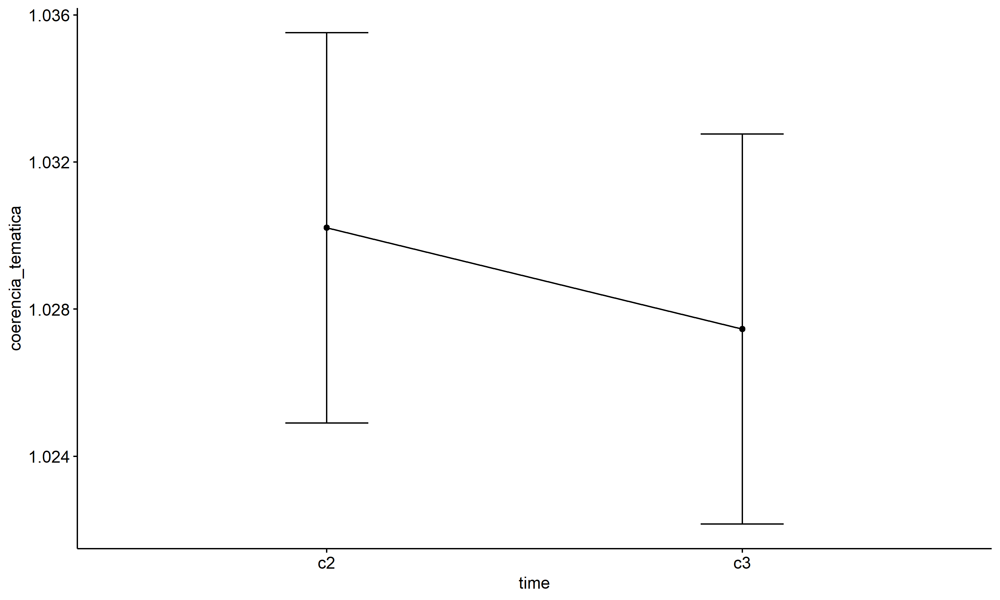<!-- -->

# ANOVA: coerencia_tematica ~ time\*gender + Error(id/time)

## Data Preparation

``` r
data <- edat[,c("aluno_id","gender","ciclo","coerencia_tematica")]
data <- data[data$ciclo %in% c("Segundo Ciclo","Terceiro Ciclo"),]
data$ciclo <- factor(data$ciclo, c("Segundo Ciclo","Terceiro Ciclo"))
data <- unique(data)

wdat <- spread(data, ciclo, coerencia_tematica)
wdat <- wdat[complete.cases(wdat),]
colnames(wdat) <- c("id","gender","c2","c3")

ldat <- gather(wdat, key = time, value = coerencia_tematica, c2,c3) %>%
  convert_as_factor(id, time)
ldat <- remove_group_data(ldat, "coerencia_tematica", c("time", "gender"), n.limit = 30)
ldat$gender <- factor(ldat$gender, sort(unique(ldat$gender)))
```

### Check assumptions: Identifying Outliers

``` r
outliers <- identify_outliers(group_by(ldat, time, gender), coerencia_tematica)
(outliers <- outliers[outliers$is.extreme == T,])
```

    ## # A tibble: 236 × 6
    ##    gender time  id                   coerencia_tematica is.outlier is.extreme
    ##    <fct>  <fct> <fct>                             <dbl> <lgl>      <lgl>     
    ##  1 Female c2    a8SWsJUcxVnZgfDuYhl9                1.5 TRUE       TRUE      
    ##  2 Female c2    aGe8oY0BM2o4WY2b3cMO                1.5 TRUE       TRUE      
    ##  3 Female c2    aHRArOnxnMCJAnjRvMkz                1.5 TRUE       TRUE      
    ##  4 Female c2    bBBGsbvYBLgWujzEuOES                2   TRUE       TRUE      
    ##  5 Female c2    bEH3ieH27FIqcQO2qaG5                1.5 TRUE       TRUE      
    ##  6 Female c2    cFxwLMwyCxWzWrkpwvkt                3   TRUE       TRUE      
    ##  7 Female c2    cUepYSggkyNVXrET7RCr                2   TRUE       TRUE      
    ##  8 Female c2    dzxWSwAxb1LbKLWq0f8W                2   TRUE       TRUE      
    ##  9 Female c2    e4T8ur8rXZ7jH6myH0wq                2   TRUE       TRUE      
    ## 10 Female c2    eakSXIhde0LSciiZKTJf                1.5 TRUE       TRUE      
    ## # ℹ 226 more rows

| gender | time | id                   | coerencia_tematica | is.outlier | is.extreme |
|:-------|:-----|:---------------------|-------------------:|:-----------|:-----------|
| Female | c2   | a8SWsJUcxVnZgfDuYhl9 |              1.500 | TRUE       | TRUE       |
| Female | c2   | aGe8oY0BM2o4WY2b3cMO |              1.500 | TRUE       | TRUE       |
| Female | c2   | aHRArOnxnMCJAnjRvMkz |              1.500 | TRUE       | TRUE       |
| Female | c2   | bBBGsbvYBLgWujzEuOES |              2.000 | TRUE       | TRUE       |
| Female | c2   | bEH3ieH27FIqcQO2qaG5 |              1.500 | TRUE       | TRUE       |
| Female | c2   | cFxwLMwyCxWzWrkpwvkt |              3.000 | TRUE       | TRUE       |
| Female | c2   | cUepYSggkyNVXrET7RCr |              2.000 | TRUE       | TRUE       |
| Female | c2   | dzxWSwAxb1LbKLWq0f8W |              2.000 | TRUE       | TRUE       |
| Female | c2   | e4T8ur8rXZ7jH6myH0wq |              2.000 | TRUE       | TRUE       |
| Female | c2   | eakSXIhde0LSciiZKTJf |              1.500 | TRUE       | TRUE       |
| Female | c2   | eMaYeLRiclZymf00Bgj3 |              2.000 | TRUE       | TRUE       |
| Female | c2   | fZbZWnu3vvhrwYpmrO9k |              2.000 | TRUE       | TRUE       |
| Female | c2   | g1Y9akoQG5mxUPxLhbcj |              1.500 | TRUE       | TRUE       |
| Female | c2   | gQc2WkGSPT6YRq2BbFmi |              1.333 | TRUE       | TRUE       |
| Female | c2   | gSjPJJEtnEyiq3yEKqic |              2.000 | TRUE       | TRUE       |
| Female | c2   | gVuMjTLcSjwi8PtQcX3g |              2.000 | TRUE       | TRUE       |
| Female | c2   | GyXkNYglZFaiWPdo2jHx |              1.500 | TRUE       | TRUE       |
| Female | c2   | hOPnyViTC3bVUvYv9zCC |              1.500 | TRUE       | TRUE       |
| Female | c2   | HuD1YErYaPFPc5BeAVhI |              2.000 | TRUE       | TRUE       |
| Female | c2   | iGhiHBHlWPESJbq2D7PI |              2.000 | TRUE       | TRUE       |
| Female | c2   | IIsMlpIp9iHmNHRVF1bc |              2.000 | TRUE       | TRUE       |
| Female | c2   | ILuG2m3xDKcwiThmAUW8 |              2.000 | TRUE       | TRUE       |
| Female | c2   | INm50SKxqFJZGliYbYuq |              2.000 | TRUE       | TRUE       |
| Female | c2   | IOvrLhjyL36foBOflXwo |              2.000 | TRUE       | TRUE       |
| Female | c2   | j29T3ZFdMcWxbBYVneR1 |              2.000 | TRUE       | TRUE       |
| Female | c2   | J5nICZq522sdxw5DKGD0 |              1.500 | TRUE       | TRUE       |
| Female | c2   | jibzqnofR0GRDwmmPk7Y |              2.000 | TRUE       | TRUE       |
| Female | c2   | JKEvnqvCpv10PSAycuzr |              2.000 | TRUE       | TRUE       |
| Female | c2   | jpC3vSNTUDnQh1bVVcfW |              1.500 | TRUE       | TRUE       |
| Female | c2   | jQ2edrW5GBEk3Jensn3T |              2.000 | TRUE       | TRUE       |
| Female | c2   | kJIRWfRQpGpgJ9XydSAv |              2.000 | TRUE       | TRUE       |
| Female | c2   | ks4CBM3zPHocVr9YlWDI |              1.500 | TRUE       | TRUE       |
| Female | c2   | ksgo1zWUwzzFyFHwP56e |              1.500 | TRUE       | TRUE       |
| Female | c2   | l23hjNOgy6nAwiy4LCWe |              2.000 | TRUE       | TRUE       |
| Female | c2   | llfmmeAJlptgMoFLELZa |              2.000 | TRUE       | TRUE       |
| Female | c2   | lW5qykPQQcYd17PAfD2m |              1.500 | TRUE       | TRUE       |
| Female | c2   | m0xj7CIrSEGFqXJYZr40 |              2.000 | TRUE       | TRUE       |
| Female | c2   | MMiQ1tmvspk2qTnYgmxJ |              1.500 | TRUE       | TRUE       |
| Female | c2   | N4IaRiNre0zdlO8WMnpU |              1.500 | TRUE       | TRUE       |
| Female | c2   | NhAQ8t5HSuELn12vygjO |              2.000 | TRUE       | TRUE       |
| Female | c2   | nKEm138VjOkYk302F3pH |              2.000 | TRUE       | TRUE       |
| Female | c2   | oEDVJwdVHdc8vvUBo2jy |              3.000 | TRUE       | TRUE       |
| Female | c2   | oiwBh6qBV0OXX5Ky4pUT |              2.000 | TRUE       | TRUE       |
| Female | c2   | OK7eABz6qpM3kySdwJEd |              3.000 | TRUE       | TRUE       |
| Female | c2   | p18Ra2eTsN3Mrl4bZFRG |              1.500 | TRUE       | TRUE       |
| Female | c2   | ptWlwZXM3ojHCTykyYEJ |              1.500 | TRUE       | TRUE       |
| Female | c2   | puJ0cHDwxp3cYxetrMyX |              2.000 | TRUE       | TRUE       |
| Female | c2   | qaLYnU8g3n0nW6adZKum |              2.000 | TRUE       | TRUE       |
| Female | c2   | qmI2dE4LuX6CGzXwWF7F |              2.000 | TRUE       | TRUE       |
| Female | c2   | QX1AYFz0937xfLHeuBgs |              2.000 | TRUE       | TRUE       |
| Female | c2   | rgdnkEyM80k12Pgg9BsY |              1.500 | TRUE       | TRUE       |
| Female | c2   | RhivsuJG4fBEZgQv82fM |              1.500 | TRUE       | TRUE       |
| Female | c2   | rNomRIEoQRUfprn0kDM8 |              1.500 | TRUE       | TRUE       |
| Female | c2   | SdzWHLHP8Pf2f5VFViDZ |              2.000 | TRUE       | TRUE       |
| Female | c2   | seS2r5RilRLBhpDRPKA6 |              2.000 | TRUE       | TRUE       |
| Female | c2   | Sj6yPHoyaHzrUcYzBdnz |              3.000 | TRUE       | TRUE       |
| Female | c2   | SmrNerrdGK4D40ZTwzyP |              2.000 | TRUE       | TRUE       |
| Female | c2   | T4FHGCkWdtu0VECvhUzE |              1.500 | TRUE       | TRUE       |
| Female | c2   | t9EXHmWcmpDl7WccMnBE |              2.000 | TRUE       | TRUE       |
| Female | c2   | tAOBN5KVkiroC03qobTH |              1.200 | TRUE       | TRUE       |
| Female | c2   | u1zil2OzxQVXB2KwkuTr |              2.000 | TRUE       | TRUE       |
| Female | c2   | U4aFjphBd5eS72XCccPw |              1.500 | TRUE       | TRUE       |
| Female | c2   | U5PipLs02KAxgksTobqi |              2.000 | TRUE       | TRUE       |
| Female | c2   | V6b5g1tzXwQnVKvwuGbb |              2.000 | TRUE       | TRUE       |
| Female | c2   | vdyvgr0lDaUCQsHOY8pt |              2.000 | TRUE       | TRUE       |
| Female | c2   | Vp1uLMoHAG4q1y7fsjcA |              1.500 | TRUE       | TRUE       |
| Female | c2   | VQdi9Txgkx29Z2pZytGE |              1.500 | TRUE       | TRUE       |
| Female | c2   | vyUaA4Vgc7mVjSpyy1kO |              2.000 | TRUE       | TRUE       |
| Female | c2   | w2KWF4yz1Qt8S6apg9Nq |              2.000 | TRUE       | TRUE       |
| Female | c2   | waSxu7TKpPaQubAUp8zA |              2.000 | TRUE       | TRUE       |
| Female | c2   | XlW7LrWByqhSEOcsBv1E |              2.000 | TRUE       | TRUE       |
| Female | c2   | XX5eGVd1Hbd37UnSUG7o |              2.000 | TRUE       | TRUE       |
| Female | c2   | YHYEP1qyyvGAVuey2ior |              1.500 | TRUE       | TRUE       |
| Female | c2   | Yn8j3irvKAHQerN2qYp4 |              1.500 | TRUE       | TRUE       |
| Female | c2   | Yp70Dh6vdviwhkjJUHAq |              2.000 | TRUE       | TRUE       |
| Female | c2   | YSo7fze1XP8h2d81TVJi |              2.000 | TRUE       | TRUE       |
| Female | c2   | YzgKSMitiFA4Sjy8RlMs |              2.000 | TRUE       | TRUE       |
| Female | c2   | zCTzxYoQjxqmWiQngsY4 |              2.000 | TRUE       | TRUE       |
| Female | c2   | ZPCvHMnIAftartnrtFEF |              2.500 | TRUE       | TRUE       |
| Female | c2   | zsCZBoyFpYhBL6PSjptX |              2.000 | TRUE       | TRUE       |
| Female | c2   | ZSvgF2tGGZ3ZPp3LsClQ |              1.500 | TRUE       | TRUE       |
| Female | c2   | zu0ran0dmHOopHf9H3cW |              1.500 | TRUE       | TRUE       |
| Male   | c2   | c8tCs09Zmla9HW6nXAba |              1.500 | TRUE       | TRUE       |
| Male   | c2   | dBufNE5pBAeoHmZz0nke |              2.000 | TRUE       | TRUE       |
| Male   | c2   | g2V94DT753T4rGOFLnO9 |              3.000 | TRUE       | TRUE       |
| Male   | c2   | gcpsjKSQtozLkdeuPlAQ |              1.500 | TRUE       | TRUE       |
| Male   | c2   | gELhuHqJ4d7stkaH7Zoe |              1.500 | TRUE       | TRUE       |
| Male   | c2   | GW2PAQxsvmLtpBNJNym7 |              1.333 | TRUE       | TRUE       |
| Male   | c2   | higntdffAusBUEJvytQY |              2.000 | TRUE       | TRUE       |
| Male   | c2   | hRksqP03n9bIhD3mMUSS |              1.500 | TRUE       | TRUE       |
| Male   | c2   | hV78K1w2Sy3NbDijChE1 |              2.000 | TRUE       | TRUE       |
| Male   | c2   | HW3iJR889Q9EdBWaQrFP |              1.500 | TRUE       | TRUE       |
| Male   | c2   | i2oRGsfJzmZ9N502mT77 |              1.500 | TRUE       | TRUE       |
| Male   | c2   | ITPXRLN2xaGJzebM4a3K |              1.500 | TRUE       | TRUE       |
| Male   | c2   | iYlYrwjNTF4uR2dhpyxO |              1.500 | TRUE       | TRUE       |
| Male   | c2   | j8nYm0EY03K9FNADOg7A |              2.000 | TRUE       | TRUE       |
| Male   | c2   | jqYuNJZAsKjE34sLcEiN |              2.000 | TRUE       | TRUE       |
| Male   | c2   | JxBy1XhCm6SIIhCxOv2f |              1.500 | TRUE       | TRUE       |
| Male   | c2   | JXVhAfQwMJmDyzL7Ow0f |              2.000 | TRUE       | TRUE       |
| Male   | c2   | kMT5lAiv5AQf4YJ6lpW4 |              2.000 | TRUE       | TRUE       |
| Male   | c2   | l14u3DL5ZLhsniQeUpJS |              1.500 | TRUE       | TRUE       |
| Male   | c2   | Lgo5TAkgaFVrGlgdORvr |              2.000 | TRUE       | TRUE       |
| Male   | c2   | LpaoylKKeSTt2YWXtA0F |              1.250 | TRUE       | TRUE       |
| Male   | c2   | LzPHYYb0TblKO9PPMzWp |              2.000 | TRUE       | TRUE       |
| Male   | c2   | mpLkf9CEZGlNTLxpjceW |              2.000 | TRUE       | TRUE       |
| Male   | c2   | mXNMQxPPCRPBTP33J1t6 |              2.000 | TRUE       | TRUE       |
| Male   | c2   | NGl9qiq97cW0ttDa3O3B |              2.000 | TRUE       | TRUE       |
| Male   | c2   | oHU6gZafmvgKSrwzZAeH |              2.000 | TRUE       | TRUE       |
| Male   | c2   | OIk9ePK7PgYC88XMBkjk |              3.000 | TRUE       | TRUE       |
| Male   | c2   | oQIlwAzaDraWYUdymlAL |              1.500 | TRUE       | TRUE       |
| Male   | c2   | Pjq4bh983tAK4i5CmeZh |              1.500 | TRUE       | TRUE       |
| Male   | c2   | PQBj15ebjZg4nyeHd9e4 |              3.000 | TRUE       | TRUE       |
| Male   | c2   | Pt8nmYgqUGtYaso9qysz |              2.000 | TRUE       | TRUE       |
| Male   | c2   | QnAoKinKY0S7LthcNMQr |              1.500 | TRUE       | TRUE       |
| Male   | c2   | SospesQs9lHWbeGvftYs |              1.500 | TRUE       | TRUE       |
| Male   | c2   | sqswiqzkWZWmnp3PhqTw |              1.500 | TRUE       | TRUE       |
| Male   | c2   | t9jUogxOix4zNYWIH0Kq |              1.500 | TRUE       | TRUE       |
| Male   | c2   | tHWlNuniDbS1xW7RctVI |              2.000 | TRUE       | TRUE       |
| Male   | c2   | U4ULFXX6YVmPHbvNon9P |              2.500 | TRUE       | TRUE       |
| Male   | c2   | u6FoUFi5Ge44kQlmqIQ2 |              2.000 | TRUE       | TRUE       |
| Male   | c2   | UHo9GyhW8xE8ImiVpMY3 |              1.500 | TRUE       | TRUE       |
| Male   | c2   | UVVPc0WHttdUCpLcxbc0 |              1.500 | TRUE       | TRUE       |
| Male   | c2   | V9dfZnfGlWWXgh6Mkts9 |              2.000 | TRUE       | TRUE       |
| Male   | c2   | WeQsbNRHqO7kuokO3wmj |              3.000 | TRUE       | TRUE       |
| Male   | c2   | wRbwfi4GayjRV5STbjHB |              1.500 | TRUE       | TRUE       |
| Male   | c2   | XB74qI0rwchkPii7rp7z |              2.000 | TRUE       | TRUE       |
| Male   | c2   | Xg1Qd24stqCttUg82X69 |              1.500 | TRUE       | TRUE       |
| Male   | c2   | XK7IkCw9kmNWFSoPss9S |              1.500 | TRUE       | TRUE       |
| Male   | c2   | XodGtJByOkgFYKUHapao |              2.000 | TRUE       | TRUE       |
| Male   | c2   | yYPvU7v7STKRyATXYjci |              1.500 | TRUE       | TRUE       |
| Male   | c2   | Z1kvDZdNO1IoGoYLcObB |              1.500 | TRUE       | TRUE       |
| Male   | c2   | ZcoiIYTK35GCty2HuClw |              2.000 | TRUE       | TRUE       |
| Male   | c2   | ZDZhpODoVH9TsZisJTN4 |              2.000 | TRUE       | TRUE       |
| Male   | c2   | ZSQiU7hvC1Mufec6oJ57 |              1.500 | TRUE       | TRUE       |
| Male   | c2   | zyjVeK0oD3vhd93yTzBU |              2.000 | TRUE       | TRUE       |
| Female | c3   | b2c2UbjbZgctiz7chBoi |              1.500 | TRUE       | TRUE       |
| Female | c3   | bBBGsbvYBLgWujzEuOES |              2.000 | TRUE       | TRUE       |
| Female | c3   | bco6M4CkAGsGFOtcIREv |              1.500 | TRUE       | TRUE       |
| Female | c3   | dcU6CRUOFKx80d4qzKAG |              2.000 | TRUE       | TRUE       |
| Female | c3   | eRF9JHCIujUxAsHjRfag |              2.000 | TRUE       | TRUE       |
| Female | c3   | eX7fqML5B4PyQVP7U66F |              2.000 | TRUE       | TRUE       |
| Female | c3   | f8DdFlx0Ol7BDBzvoeBr |              2.000 | TRUE       | TRUE       |
| Female | c3   | fptfQd1NJgg3eWAGfAtI |              2.000 | TRUE       | TRUE       |
| Female | c3   | GnYbHi1c0xZQJQvwqjgH |              2.000 | TRUE       | TRUE       |
| Female | c3   | gSjPJJEtnEyiq3yEKqic |              2.000 | TRUE       | TRUE       |
| Female | c3   | h3MA9XopgLfmchs0gnEg |              2.000 | TRUE       | TRUE       |
| Female | c3   | H8flYEMYWYQkc3jeNhBA |              1.500 | TRUE       | TRUE       |
| Female | c3   | hLgbwWFbQCF8d00gQPs7 |              2.000 | TRUE       | TRUE       |
| Female | c3   | Hs8ac6T8acMUDbU3vQYD |              2.000 | TRUE       | TRUE       |
| Female | c3   | ICbs5vZm4fYjLhtchehF |              2.000 | TRUE       | TRUE       |
| Female | c3   | IIsMlpIp9iHmNHRVF1bc |              2.000 | TRUE       | TRUE       |
| Female | c3   | iUvvM1tSOva70p5AnkYG |              1.500 | TRUE       | TRUE       |
| Female | c3   | iZt3rInCC7BOnmwDcFhS |              2.000 | TRUE       | TRUE       |
| Female | c3   | Je8vRI9ghkwFwzMA5kZk |              2.000 | TRUE       | TRUE       |
| Female | c3   | jgWNaPGZqoFPcx59s4sB |              2.000 | TRUE       | TRUE       |
| Female | c3   | jQ2edrW5GBEk3Jensn3T |              2.000 | TRUE       | TRUE       |
| Female | c3   | kEaYslABXOORAI6F6XMh |              2.000 | TRUE       | TRUE       |
| Female | c3   | kk3uMVq8ENKPQmWPht3I |              2.000 | TRUE       | TRUE       |
| Female | c3   | kkDlkMBIpptv0y6MvaFX |              2.000 | TRUE       | TRUE       |
| Female | c3   | kOYVDpaYtvTgohoW5kfB |              2.000 | TRUE       | TRUE       |
| Female | c3   | kTcIM9fJDgzp5VTsOoqX |              2.000 | TRUE       | TRUE       |
| Female | c3   | M5tDz0x1gycVNcU1ojUT |              2.000 | TRUE       | TRUE       |
| Female | c3   | mj0qaU1B1gIjFDPYSSa3 |              2.000 | TRUE       | TRUE       |
| Female | c3   | MMiQ1tmvspk2qTnYgmxJ |              2.000 | TRUE       | TRUE       |
| Female | c3   | NbyYadm0KlSOkN95IxXd |              2.000 | TRUE       | TRUE       |
| Female | c3   | NpRJivuysUpcn6ZxBLkV |              3.000 | TRUE       | TRUE       |
| Female | c3   | o6lY8TqKQe4iwloQR4xT |              2.000 | TRUE       | TRUE       |
| Female | c3   | Odz5tcojxCUUmkMLM6wI |              2.000 | TRUE       | TRUE       |
| Female | c3   | OhSVnXR39yzI9COvsiHG |              2.000 | TRUE       | TRUE       |
| Female | c3   | Or3JMYez1zH1xIGSqMuK |              2.000 | TRUE       | TRUE       |
| Female | c3   | PigGa9MraOlRyd51ggru |              2.000 | TRUE       | TRUE       |
| Female | c3   | qaLYnU8g3n0nW6adZKum |              2.000 | TRUE       | TRUE       |
| Female | c3   | sCajYZTVch88mXV6HiFf |              2.000 | TRUE       | TRUE       |
| Female | c3   | sYbSjWOWx8PxbnqSvNak |              2.000 | TRUE       | TRUE       |
| Female | c3   | tIUVTqnfVUkntZBZ7Z0p |              2.000 | TRUE       | TRUE       |
| Female | c3   | V6b5g1tzXwQnVKvwuGbb |              2.000 | TRUE       | TRUE       |
| Female | c3   | vEu7ZNrr9bqeW1JShJNH |              2.000 | TRUE       | TRUE       |
| Female | c3   | VXEvUdFA8gPP715ai6e9 |              1.500 | TRUE       | TRUE       |
| Female | c3   | WPg2EPsRupSkIdrJqXLK |              2.000 | TRUE       | TRUE       |
| Female | c3   | WqFMTjTnn9gRC0kMEy4f |              2.000 | TRUE       | TRUE       |
| Female | c3   | wVF0FFPeKW6n3Lh27bKc |              2.000 | TRUE       | TRUE       |
| Female | c3   | xba2ErfFvNC0iaGtcAEq |              2.000 | TRUE       | TRUE       |
| Female | c3   | XcmW37ovFYkcIxCmtQex |              2.000 | TRUE       | TRUE       |
| Female | c3   | XQqMi1QAydeb0dlM8trY |              2.000 | TRUE       | TRUE       |
| Female | c3   | XrQhehWf9VAuByaVgj62 |              2.000 | TRUE       | TRUE       |
| Female | c3   | ygluKcF3wOKKl3jfvWGo |              3.000 | TRUE       | TRUE       |
| Female | c3   | YK9newsAt2nZktabSMNx |              2.000 | TRUE       | TRUE       |
| Female | c3   | Z1VlwDTrD2qAu9GK95Ij |              2.000 | TRUE       | TRUE       |
| Female | c3   | ZaG3WvMlwUgZEyAZN6tO |              2.000 | TRUE       | TRUE       |
| Female | c3   | zcqlMpFR2UhCUNFv8n0s |              3.000 | TRUE       | TRUE       |
| Female | c3   | zsCZBoyFpYhBL6PSjptX |              2.000 | TRUE       | TRUE       |
| Male   | c3   | 1J37c92qD29MFCBtKjKW |              3.000 | TRUE       | TRUE       |
| Male   | c3   | 7ma5J2bWts20H4GWbej1 |              2.000 | TRUE       | TRUE       |
| Male   | c3   | eswJ6vikp92nAGcPFrb9 |              2.000 | TRUE       | TRUE       |
| Male   | c3   | g2V94DT753T4rGOFLnO9 |              3.000 | TRUE       | TRUE       |
| Male   | c3   | HGZ14QtGsbUz0aRWfFPW |              2.000 | TRUE       | TRUE       |
| Male   | c3   | HMEIfExIgYSJ8CwHyuA4 |              2.000 | TRUE       | TRUE       |
| Male   | c3   | iPhGwRIymYG05pYhmzNe |              2.000 | TRUE       | TRUE       |
| Male   | c3   | JfwlGZJwJ0al8syt6CeF |              2.000 | TRUE       | TRUE       |
| Male   | c3   | jsMjZAlI74DvYWexlJne |              2.000 | TRUE       | TRUE       |
| Male   | c3   | Kn8QSO3jYDqnFv6ZQ7k1 |              2.000 | TRUE       | TRUE       |
| Male   | c3   | kPtgux6bWosMrUxZKdY3 |              1.500 | TRUE       | TRUE       |
| Male   | c3   | kwv8mDfLyXwATUqKLiro |              3.000 | TRUE       | TRUE       |
| Male   | c3   | Lgo5TAkgaFVrGlgdORvr |              2.000 | TRUE       | TRUE       |
| Male   | c3   | ltNt2xv4X5BBBt8zLeSR |              2.000 | TRUE       | TRUE       |
| Male   | c3   | m0T3y1DP89OPiLYwch3A |              2.000 | TRUE       | TRUE       |
| Male   | c3   | m174kqNZ6QBvEUR1PFH3 |              2.000 | TRUE       | TRUE       |
| Male   | c3   | M6u2ZDjYaY5OeEaR0yma |              1.500 | TRUE       | TRUE       |
| Male   | c3   | mbCRk3X6UTuHOtvoDGp6 |              2.000 | TRUE       | TRUE       |
| Male   | c3   | mw9aS59BoHLVxRHNjSif |              2.000 | TRUE       | TRUE       |
| Male   | c3   | N5e5rrCKg6O7LTlDieIX |              2.000 | TRUE       | TRUE       |
| Male   | c3   | NQalozkOTNtTCxxOr1mS |              2.000 | TRUE       | TRUE       |
| Male   | c3   | oANZNFFrKV5YB9BlxSj0 |              2.000 | TRUE       | TRUE       |
| Male   | c3   | ome6iwtSSwFXPJK7ttYH |              2.000 | TRUE       | TRUE       |
| Male   | c3   | oR3NpvemK1la4MxMOiCS |              2.000 | TRUE       | TRUE       |
| Male   | c3   | oRIUHUK9b2AbOgiJcGBH |              2.000 | TRUE       | TRUE       |
| Male   | c3   | pBJb4ZkDR5VjLeWYTOQH |              2.000 | TRUE       | TRUE       |
| Male   | c3   | PQBj15ebjZg4nyeHd9e4 |              2.000 | TRUE       | TRUE       |
| Male   | c3   | qGURK8zR52A1rb6QpIWb |              1.500 | TRUE       | TRUE       |
| Male   | c3   | R19lMqeOEzZMw8pzWDxN |              2.000 | TRUE       | TRUE       |
| Male   | c3   | rMtDHd4xGWtaDyXBIjkZ |              2.000 | TRUE       | TRUE       |
| Male   | c3   | tHWlNuniDbS1xW7RctVI |              2.000 | TRUE       | TRUE       |
| Male   | c3   | UIxazvhO2FmZj13Cezfe |              2.000 | TRUE       | TRUE       |
| Male   | c3   | UMUTtIJsm8rVQ5w6gTYq |              2.000 | TRUE       | TRUE       |
| Male   | c3   | vehMYSY1EdhUXyzjC1Dv |              2.000 | TRUE       | TRUE       |
| Male   | c3   | VlmQwur54iwFM7qQik24 |              1.500 | TRUE       | TRUE       |
| Male   | c3   | vozs3t8ZDLtD8zXCEBQL |              2.000 | TRUE       | TRUE       |
| Male   | c3   | W7Xy8FJxJzAftxVg1Osz |              2.000 | TRUE       | TRUE       |
| Male   | c3   | WeQsbNRHqO7kuokO3wmj |              2.000 | TRUE       | TRUE       |
| Male   | c3   | wK3HAwveWKbrMkAvnuO4 |              2.000 | TRUE       | TRUE       |
| Male   | c3   | x6adt3AFuShDgGQIv9Ix |              2.000 | TRUE       | TRUE       |
| Male   | c3   | XGaIfl8tkDqEVyd0kxVA |              2.000 | TRUE       | TRUE       |
| Male   | c3   | XodGtJByOkgFYKUHapao |              2.000 | TRUE       | TRUE       |
| Male   | c3   | YBzmerz6Rz8QFtWi6ghI |              1.500 | TRUE       | TRUE       |
| Male   | c3   | yjJQyvoUJhMW80fWkpjs |              2.000 | TRUE       | TRUE       |
| Male   | c3   | zOcehc9xYjcDUdlaz7Ob |              2.000 | TRUE       | TRUE       |

### Check assumptions: Normality Test

``` r
(normality.df <- normality.test.per.groups(ldat, "coerencia_tematica", c("time", "gender")))
```

    ##                  var           variable time gender    n skewness kurtosis
    ## 1 coerencia_tematica coerencia_tematica   c2 Female 1876 5.792247 37.65393
    ## 2 coerencia_tematica coerencia_tematica   c2   Male 1917 8.188138 77.94980
    ## 3 coerencia_tematica coerencia_tematica   c3 Female 1876 6.328359 43.44938
    ## 4 coerencia_tematica coerencia_tematica   c3   Male 1917 7.371958 60.07298
    ##   symmetry statistic     method p p.signif normality
    ## 1       NO  2089.643 D'Agostino 0     ****         -
    ## 2       NO  2685.171 D'Agostino 0     ****         -
    ## 3       NO  2216.313 D'Agostino 0     ****         -
    ## 4       NO  2507.200 D'Agostino 0     ****         -

| var                | variable           | time | gender |    n | skewness | kurtosis | symmetry | statistic | method     |   p | p.signif | normality |
|:-------------------|:-------------------|:-----|:-------|-----:|---------:|---------:|:---------|----------:|:-----------|----:|:---------|:----------|
| coerencia_tematica | coerencia_tematica | c2   | Female | 1876 |    5.792 |   37.654 | NO       |  2089.643 | D’Agostino |   0 | \*\*\*\* | \-        |
| coerencia_tematica | coerencia_tematica | c2   | Male   | 1917 |    8.188 |   77.950 | NO       |  2685.171 | D’Agostino |   0 | \*\*\*\* | \-        |
| coerencia_tematica | coerencia_tematica | c3   | Female | 1876 |    6.328 |   43.449 | NO       |  2216.313 | D’Agostino |   0 | \*\*\*\* | \-        |
| coerencia_tematica | coerencia_tematica | c3   | Male   | 1917 |    7.372 |   60.073 | NO       |  2507.200 | D’Agostino |   0 | \*\*\*\* | \-        |

``` r
(non.ids <- unique(do.call(
  c, lapply(which(normality.df$normality == 'NO'), FUN = function(i) {
  idx = which(ldat$time == normality.df$time[i] &
                ldat$gender == normality.df$gender[i])
  getNonNormal(ldat$"coerencia_tematica"[idx], ldat$id[idx])
}))))
```

    ## NULL

``` r
if (length(non.ids) > 0)
  ldat2 <- ldat[!ldat$id %in% non.ids,]
```

### Summary Statistics

``` r
(sdat <- ldat %>% group_by(time, gender) %>%
   get_summary_stats(coerencia_tematica, type = "mean_sd"))
```

    ## # A tibble: 4 × 6
    ##   gender time  variable               n  mean    sd
    ##   <fct>  <fct> <fct>              <dbl> <dbl> <dbl>
    ## 1 Female c2    coerencia_tematica  1876  1.04 0.193
    ## 2 Male   c2    coerencia_tematica  1917  1.02 0.154
    ## 3 Female c3    coerencia_tematica  1876  1.03 0.178
    ## 4 Male   c3    coerencia_tematica  1917  1.02 0.16

| gender | time | variable           |    n |  mean |    sd |
|:-------|:-----|:-------------------|-----:|------:|------:|
| Female | c2   | coerencia_tematica | 1876 | 1.038 | 0.193 |
| Male   | c2   | coerencia_tematica | 1917 | 1.023 | 0.154 |
| Female | c3   | coerencia_tematica | 1876 | 1.030 | 0.178 |
| Male   | c3   | coerencia_tematica | 1917 | 1.024 | 0.160 |

``` r
if (length(non.ids) > 0)
  (sdat <- ldat2 %>% group_by(time, gender) %>%
      get_summary_stats(coerencia_tematica, type = "mean_sd"))
```

| gender | time | variable           |    n |  mean |    sd |
|:-------|:-----|:-------------------|-----:|------:|------:|
| Female | c2   | coerencia_tematica | 1876 | 1.038 | 0.193 |
| Male   | c2   | coerencia_tematica | 1917 | 1.023 | 0.154 |
| Female | c3   | coerencia_tematica | 1876 | 1.030 | 0.178 |
| Male   | c3   | coerencia_tematica | 1917 | 1.024 | 0.160 |

## ANOVA Computation

``` r
(res.aov <- anova_test(ldat, dv = coerencia_tematica, wid = id, between = gender, within = time))
```

    ## ANOVA Table (type III tests)
    ## 
    ##        Effect DFn  DFd     F     p p<.05      ges
    ## 1      gender   1 3791 6.379 0.012     * 0.000955
    ## 2        time   1 3791 0.914 0.339       0.000104
    ## 3 gender:time   1 3791 1.340 0.247       0.000152

## ANOVA Computation after removing non.normal data

``` r
if (length(non.ids) > 0)
  (res.aov2 <- anova_test(ldat2, dv = coerencia_tematica, wid = id, between = gender , within = time))
```

## PairWise Computation

``` r
(pwc <- ldat %>% group_by(time) %>%
   emmeans_test(coerencia_tematica ~ gender, detailed = T, p.adjust.method = "bonferroni"))
```

    ## # A tibble: 2 × 15
    ##   time  term   .y.      group1 group2 null.value estimate      se    df conf.low
    ## * <fct> <chr>  <chr>    <chr>  <chr>       <dbl>    <dbl>   <dbl> <dbl>    <dbl>
    ## 1 c2    gender coerenc… Female Male            0  0.0149  0.00558  7582  0.00393
    ## 2 c3    gender coerenc… Female Male            0  0.00638 0.00558  7582 -0.00456
    ## # ℹ 5 more variables: conf.high <dbl>, statistic <dbl>, p <dbl>, p.adj <dbl>,
    ## #   p.adj.signif <chr>

| time | term   | .y.                | group1 | group2 | null.value | estimate |    se |   df | conf.low | conf.high | statistic |     p | p.adj | p.adj.signif |
|:-----|:-------|:-------------------|:-------|:-------|-----------:|---------:|------:|-----:|---------:|----------:|----------:|------:|------:|:-------------|
| c2   | gender | coerencia_tematica | Female | Male   |          0 |    0.015 | 0.006 | 7582 |    0.004 |     0.026 |     2.665 | 0.008 | 0.008 | \*\*         |
| c3   | gender | coerencia_tematica | Female | Male   |          0 |    0.006 | 0.006 | 7582 |   -0.005 |     0.017 |     1.144 | 0.253 | 0.253 | ns           |

``` r
(emms <- get_emmeans(pwc))
```

    ## # A tibble: 4 × 8
    ##   time  gender emmean      se    df conf.low conf.high method      
    ##   <fct> <fct>   <dbl>   <dbl> <dbl>    <dbl>     <dbl> <chr>       
    ## 1 c2    Female   1.04 0.00397  7582     1.03      1.05 Emmeans test
    ## 2 c2    Male     1.02 0.00392  7582     1.02      1.03 Emmeans test
    ## 3 c3    Female   1.03 0.00397  7582     1.02      1.04 Emmeans test
    ## 4 c3    Male     1.02 0.00392  7582     1.02      1.03 Emmeans test

| time | gender | emmean |    se |   df | conf.low | conf.high | method       |
|:-----|:-------|-------:|------:|-----:|---------:|----------:|:-------------|
| c2   | Female |  1.038 | 0.004 | 7582 |    1.030 |     1.046 | Emmeans test |
| c2   | Male   |  1.023 | 0.004 | 7582 |    1.015 |     1.031 | Emmeans test |
| c3   | Female |  1.030 | 0.004 | 7582 |    1.022 |     1.038 | Emmeans test |
| c3   | Male   |  1.024 | 0.004 | 7582 |    1.016 |     1.031 | Emmeans test |

``` r
pwc <- add_xy_position(pwc, x = "time", fun = "mean_se", dodge = 0.25)
pd <- position_dodge(width = 0.25)
ggline(emms, x = "time", y = "emmean", color = "gender",
       palette = c("#FF007F","#4D4DFF"),
       position = pd, ylab = "coerencia_tematica") +
  geom_errorbar(aes(ymin = conf.low, ymax = conf.high, color = gender),
                position = pd, width = 0.2) +
  stat_pvalue_manual(pwc, hide.ns = T, tip.length = F, linetype = 1)
```

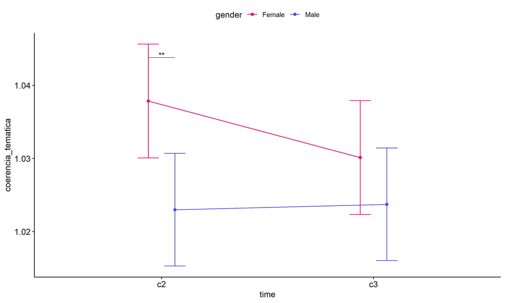<!-- -->

``` r
(pwc <- ldat %>% group_by(gender) %>%
    emmeans_test(coerencia_tematica ~ time, detailed = T, p.adjust.method = "bonferroni"))
```

    ## # A tibble: 2 × 15
    ##   gender term  .y.      group1 group2 null.value estimate      se    df conf.low
    ## * <fct>  <chr> <chr>    <chr>  <chr>       <dbl>    <dbl>   <dbl> <dbl>    <dbl>
    ## 1 Female time  coerenc… c2     c3              0  7.75e-3 0.00561  7582 -0.00325
    ## 2 Male   time  coerenc… c2     c3              0 -7.39e-4 0.00555  7582 -0.0116 
    ## # ℹ 5 more variables: conf.high <dbl>, statistic <dbl>, p <dbl>, p.adj <dbl>,
    ## #   p.adj.signif <chr>

| gender | term | .y.                | group1 | group2 | null.value | estimate |    se |   df | conf.low | conf.high | statistic |     p | p.adj | p.adj.signif |
|:-------|:-----|:-------------------|:-------|:-------|-----------:|---------:|------:|-----:|---------:|----------:|----------:|------:|------:|:-------------|
| Female | time | coerencia_tematica | c2     | c3     |          0 |    0.008 | 0.006 | 7582 |   -0.003 |     0.019 |     1.381 | 0.167 | 0.167 | ns           |
| Male   | time | coerencia_tematica | c2     | c3     |          0 |   -0.001 | 0.006 | 7582 |   -0.012 |     0.010 |    -0.133 | 0.894 | 0.894 | ns           |

``` r
(emms <- get_emmeans(pwc))
```

    ## # A tibble: 4 × 8
    ##   gender time  emmean      se    df conf.low conf.high method      
    ##   <fct>  <fct>  <dbl>   <dbl> <dbl>    <dbl>     <dbl> <chr>       
    ## 1 Female c2      1.04 0.00397  7582     1.03      1.05 Emmeans test
    ## 2 Female c3      1.03 0.00397  7582     1.02      1.04 Emmeans test
    ## 3 Male   c2      1.02 0.00392  7582     1.02      1.03 Emmeans test
    ## 4 Male   c3      1.02 0.00392  7582     1.02      1.03 Emmeans test

| gender | time | emmean |    se |   df | conf.low | conf.high | method       |
|:-------|:-----|-------:|------:|-----:|---------:|----------:|:-------------|
| Female | c2   |  1.038 | 0.004 | 7582 |    1.030 |     1.046 | Emmeans test |
| Female | c3   |  1.030 | 0.004 | 7582 |    1.022 |     1.038 | Emmeans test |
| Male   | c2   |  1.023 | 0.004 | 7582 |    1.015 |     1.031 | Emmeans test |
| Male   | c3   |  1.024 | 0.004 | 7582 |    1.016 |     1.031 | Emmeans test |

``` r
emms.gg <- emms[which(emms$gender == "Female"),]
if (nrow(emms.gg) > 0)
  ggline(emms.gg, x = "time", y = "emmean", color = "#FF007F", ylab = "coerencia_tematica") +
    geom_errorbar(aes(ymin = conf.low, ymax = conf.high),
                  width = 0.2, color = "#FF007F") +
    stat_pvalue_manual(
      add_xy_position(pwc[which(pwc$gender == "Female"),],
                      x = "time", fun = "mean_se"),
      hide.ns = T, color = "#FF007F", tip.length = F) +
    labs(title = "gender: Female")+
    theme(legend.text = element_blank())
```

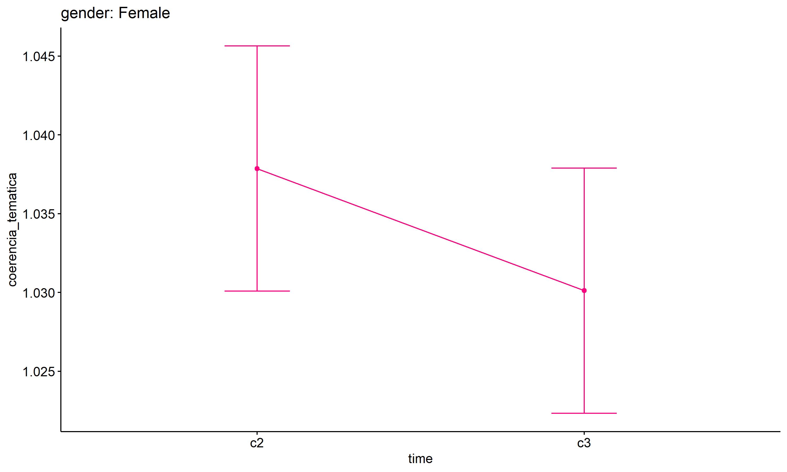<!-- -->

``` r
emms.gg <- emms[which(emms$gender == "Male"),]
if (nrow(emms.gg) > 0)
  ggline(emms.gg, x = "time", y = "emmean", color = "#4D4DFF", ylab = "coerencia_tematica") +
    geom_errorbar(aes(ymin = conf.low, ymax = conf.high),
                  width = 0.2, color = "#4D4DFF") +
    stat_pvalue_manual(
      add_xy_position(pwc[which(pwc$gender == "Male"),],
                      x = "time", fun = "mean_se"),
      hide.ns = T, color = "#4D4DFF", tip.length = F) +
    labs(title = "gender: Male")+
    theme(legend.text = element_blank())
```

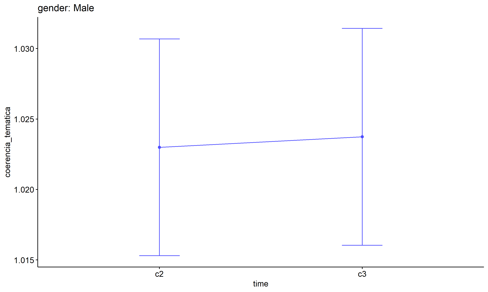<!-- -->

## PairWise Computation after removing non.normal data

``` r
if (length(non.ids) > 0)
  (pwc2 <- ldat2 %>% group_by(time) %>%
     emmeans_test(coerencia_tematica ~ gender, detailed = T, p.adjust.method = "bonferroni"))
```

``` r
if (length(non.ids) > 0)
  (emms2 <- get_emmeans(pwc2))
```

``` r
if (length(non.ids) > 0) {
  pwc2 <- add_xy_position(pwc2, x = "time", fun = "mean_se", dodge = 0.25)
  pd2 <- position_dodge(width = 0.25)
  
  ggline(emms2, x = "time", y = "emmean", color = "gender",
         palette = c("#FF007F","#4D4DFF"),
         position = pd, ylab = "coerencia_tematica") +
    geom_errorbar(aes(ymin = conf.low, ymax = conf.high, color = gender),
                position = pd, width = 0.2) +
    stat_pvalue_manual(pwc2, hide.ns = T, tip.length = F, linetype = 1)
}
```

``` r
if (length(non.ids) > 0)
  (pwc2 <- ldat2 %>% group_by(gender) %>%
     emmeans_test(coerencia_tematica ~ time, detailed = T, p.adjust.method = "bonferroni"))
```

``` r
if (length(non.ids) > 0)
  (emms2 <- get_emmeans(pwc2))
```

``` r
if (length(non.ids) > 0) {
  emms.gg <- emms2[which(emms2$gender == "Female"),]
  if (nrow(emms.gg) > 0)
    ggline(emms.gg, x = "time", y = "emmean", color = "#FF007F", ylab = "coerencia_tematica") +
    geom_errorbar(aes(ymin = conf.low, ymax = conf.high),
                  width = 0.2, color = "#FF007F") +
    stat_pvalue_manual(
      add_xy_position(pwc[which(pwc$gender == "Female"),],
                      x = "time", fun = "mean_se"),
      hide.ns = T, color = "#FF007F", tip.length = F) +
    labs(title = "gender: Female") +
    theme(legend.text = element_blank())
}
```

``` r
if (length(non.ids) > 0) {
  emms.gg <- emms2[which(emms2$gender == "Male"),]
  if (nrow(emms.gg) > 0)
    ggline(emms.gg, x = "time", y = "emmean", color = "#4D4DFF", ylab = "coerencia_tematica") +
    geom_errorbar(aes(ymin = conf.low, ymax = conf.high),
                  width = 0.2, color = "#4D4DFF") +
    stat_pvalue_manual(
      add_xy_position(pwc[which(pwc$gender == "Male"),],
                      x = "time", fun = "mean_se"),
      hide.ns = T, color = "#4D4DFF", tip.length = F) +
    labs(title = "gender: Male") +
    theme(legend.text = element_blank())
}
```

# ANOVA: coerencia_tematica ~ time\*localizacao + Error(id/time)

## Data Preparation

``` r
data <- edat[,c("aluno_id","localizacao","ciclo","coerencia_tematica")]
data <- data[data$ciclo %in% c("Segundo Ciclo","Terceiro Ciclo"),]
data$ciclo <- factor(data$ciclo, c("Segundo Ciclo","Terceiro Ciclo"))
data <- unique(data)

wdat <- spread(data, ciclo, coerencia_tematica)
wdat <- wdat[complete.cases(wdat),]
colnames(wdat) <- c("id","localizacao","c2","c3")

ldat <- gather(wdat, key = time, value = coerencia_tematica, c2,c3) %>%
  convert_as_factor(id, time)
ldat <- remove_group_data(ldat, "coerencia_tematica", c("time", "localizacao"), n.limit = 30)
ldat$localizacao <- factor(ldat$localizacao, sort(unique(ldat$localizacao)))
```

### Check assumptions: Identifying Outliers

``` r
outliers <- identify_outliers(group_by(ldat, time, localizacao), coerencia_tematica)
(outliers <- outliers[outliers$is.extreme == T,])
```

    ## # A tibble: 253 × 6
    ##    localizacao time  id                 coerencia_tematica is.outlier is.extreme
    ##    <fct>       <fct> <fct>                           <dbl> <lgl>      <lgl>     
    ##  1 Rural       c2    cUepYSggkyNVXrET7…                2   TRUE       TRUE      
    ##  2 Rural       c2    e4T8ur8rXZ7jH6myH…                2   TRUE       TRUE      
    ##  3 Rural       c2    eMaYeLRiclZymf00B…                2   TRUE       TRUE      
    ##  4 Rural       c2    gVuMjTLcSjwi8PtQc…                2   TRUE       TRUE      
    ##  5 Rural       c2    hV78K1w2Sy3NbDijC…                2   TRUE       TRUE      
    ##  6 Rural       c2    HW3iJR889Q9EdBWaQ…                1.5 TRUE       TRUE      
    ##  7 Rural       c2    iYlYrwjNTF4uR2dhp…                1.5 TRUE       TRUE      
    ##  8 Rural       c2    JKEvnqvCpv10PSAyc…                2   TRUE       TRUE      
    ##  9 Rural       c2    ks4CBM3zPHocVr9Yl…                1.5 TRUE       TRUE      
    ## 10 Rural       c2    lW5qykPQQcYd17PAf…                1.5 TRUE       TRUE      
    ## # ℹ 243 more rows

| localizacao | time | id                   | coerencia_tematica | is.outlier | is.extreme |
|:------------|:-----|:---------------------|-------------------:|:-----------|:-----------|
| Rural       | c2   | cUepYSggkyNVXrET7RCr |              2.000 | TRUE       | TRUE       |
| Rural       | c2   | e4T8ur8rXZ7jH6myH0wq |              2.000 | TRUE       | TRUE       |
| Rural       | c2   | eMaYeLRiclZymf00Bgj3 |              2.000 | TRUE       | TRUE       |
| Rural       | c2   | gVuMjTLcSjwi8PtQcX3g |              2.000 | TRUE       | TRUE       |
| Rural       | c2   | hV78K1w2Sy3NbDijChE1 |              2.000 | TRUE       | TRUE       |
| Rural       | c2   | HW3iJR889Q9EdBWaQrFP |              1.500 | TRUE       | TRUE       |
| Rural       | c2   | iYlYrwjNTF4uR2dhpyxO |              1.500 | TRUE       | TRUE       |
| Rural       | c2   | JKEvnqvCpv10PSAycuzr |              2.000 | TRUE       | TRUE       |
| Rural       | c2   | ks4CBM3zPHocVr9YlWDI |              1.500 | TRUE       | TRUE       |
| Rural       | c2   | lW5qykPQQcYd17PAfD2m |              1.500 | TRUE       | TRUE       |
| Rural       | c2   | N4IaRiNre0zdlO8WMnpU |              1.500 | TRUE       | TRUE       |
| Rural       | c2   | NhAQ8t5HSuELn12vygjO |              2.000 | TRUE       | TRUE       |
| Rural       | c2   | oEDVJwdVHdc8vvUBo2jy |              3.000 | TRUE       | TRUE       |
| Rural       | c2   | oiwBh6qBV0OXX5Ky4pUT |              2.000 | TRUE       | TRUE       |
| Rural       | c2   | PQBj15ebjZg4nyeHd9e4 |              3.000 | TRUE       | TRUE       |
| Rural       | c2   | ptWlwZXM3ojHCTykyYEJ |              1.500 | TRUE       | TRUE       |
| Rural       | c2   | puJ0cHDwxp3cYxetrMyX |              2.000 | TRUE       | TRUE       |
| Rural       | c2   | qmI2dE4LuX6CGzXwWF7F |              2.000 | TRUE       | TRUE       |
| Rural       | c2   | QX1AYFz0937xfLHeuBgs |              2.000 | TRUE       | TRUE       |
| Rural       | c2   | sqswiqzkWZWmnp3PhqTw |              1.500 | TRUE       | TRUE       |
| Rural       | c2   | T4FHGCkWdtu0VECvhUzE |              1.500 | TRUE       | TRUE       |
| Rural       | c2   | u0hPBK1IAHuD6dO6zj4d |              2.000 | TRUE       | TRUE       |
| Rural       | c2   | Vp1uLMoHAG4q1y7fsjcA |              1.500 | TRUE       | TRUE       |
| Rural       | c2   | XX5eGVd1Hbd37UnSUG7o |              2.000 | TRUE       | TRUE       |
| Rural       | c2   | yYPvU7v7STKRyATXYjci |              1.500 | TRUE       | TRUE       |
| Rural       | c2   | zyjVeK0oD3vhd93yTzBU |              2.000 | TRUE       | TRUE       |
| Urbana      | c2   | a8SWsJUcxVnZgfDuYhl9 |              1.500 | TRUE       | TRUE       |
| Urbana      | c2   | aGe8oY0BM2o4WY2b3cMO |              1.500 | TRUE       | TRUE       |
| Urbana      | c2   | aHRArOnxnMCJAnjRvMkz |              1.500 | TRUE       | TRUE       |
| Urbana      | c2   | bBBGsbvYBLgWujzEuOES |              2.000 | TRUE       | TRUE       |
| Urbana      | c2   | bEH3ieH27FIqcQO2qaG5 |              1.500 | TRUE       | TRUE       |
| Urbana      | c2   | c8tCs09Zmla9HW6nXAba |              1.500 | TRUE       | TRUE       |
| Urbana      | c2   | cFxwLMwyCxWzWrkpwvkt |              3.000 | TRUE       | TRUE       |
| Urbana      | c2   | cO1stoI0XTZlXCGzSYmR |              1.500 | TRUE       | TRUE       |
| Urbana      | c2   | dBufNE5pBAeoHmZz0nke |              2.000 | TRUE       | TRUE       |
| Urbana      | c2   | dzxWSwAxb1LbKLWq0f8W |              2.000 | TRUE       | TRUE       |
| Urbana      | c2   | eakSXIhde0LSciiZKTJf |              1.500 | TRUE       | TRUE       |
| Urbana      | c2   | fZbZWnu3vvhrwYpmrO9k |              2.000 | TRUE       | TRUE       |
| Urbana      | c2   | g1Y9akoQG5mxUPxLhbcj |              1.500 | TRUE       | TRUE       |
| Urbana      | c2   | g2V94DT753T4rGOFLnO9 |              3.000 | TRUE       | TRUE       |
| Urbana      | c2   | gcpsjKSQtozLkdeuPlAQ |              1.500 | TRUE       | TRUE       |
| Urbana      | c2   | gELhuHqJ4d7stkaH7Zoe |              1.500 | TRUE       | TRUE       |
| Urbana      | c2   | gQc2WkGSPT6YRq2BbFmi |              1.333 | TRUE       | TRUE       |
| Urbana      | c2   | gSjPJJEtnEyiq3yEKqic |              2.000 | TRUE       | TRUE       |
| Urbana      | c2   | GW2PAQxsvmLtpBNJNym7 |              1.333 | TRUE       | TRUE       |
| Urbana      | c2   | gXcnw3rDblx0csS2JTlO |              2.000 | TRUE       | TRUE       |
| Urbana      | c2   | GyXkNYglZFaiWPdo2jHx |              1.500 | TRUE       | TRUE       |
| Urbana      | c2   | higntdffAusBUEJvytQY |              2.000 | TRUE       | TRUE       |
| Urbana      | c2   | HjIfGleeETArbQSCh03g |              2.000 | TRUE       | TRUE       |
| Urbana      | c2   | hOPnyViTC3bVUvYv9zCC |              1.500 | TRUE       | TRUE       |
| Urbana      | c2   | hRksqP03n9bIhD3mMUSS |              1.500 | TRUE       | TRUE       |
| Urbana      | c2   | HuD1YErYaPFPc5BeAVhI |              2.000 | TRUE       | TRUE       |
| Urbana      | c2   | i2oRGsfJzmZ9N502mT77 |              1.500 | TRUE       | TRUE       |
| Urbana      | c2   | iGhiHBHlWPESJbq2D7PI |              2.000 | TRUE       | TRUE       |
| Urbana      | c2   | IIsMlpIp9iHmNHRVF1bc |              2.000 | TRUE       | TRUE       |
| Urbana      | c2   | ILuG2m3xDKcwiThmAUW8 |              2.000 | TRUE       | TRUE       |
| Urbana      | c2   | INm50SKxqFJZGliYbYuq |              2.000 | TRUE       | TRUE       |
| Urbana      | c2   | IOvrLhjyL36foBOflXwo |              2.000 | TRUE       | TRUE       |
| Urbana      | c2   | ITPXRLN2xaGJzebM4a3K |              1.500 | TRUE       | TRUE       |
| Urbana      | c2   | j29T3ZFdMcWxbBYVneR1 |              2.000 | TRUE       | TRUE       |
| Urbana      | c2   | J5nICZq522sdxw5DKGD0 |              1.500 | TRUE       | TRUE       |
| Urbana      | c2   | j8nYm0EY03K9FNADOg7A |              2.000 | TRUE       | TRUE       |
| Urbana      | c2   | jibzqnofR0GRDwmmPk7Y |              2.000 | TRUE       | TRUE       |
| Urbana      | c2   | jpC3vSNTUDnQh1bVVcfW |              1.500 | TRUE       | TRUE       |
| Urbana      | c2   | jQ2edrW5GBEk3Jensn3T |              2.000 | TRUE       | TRUE       |
| Urbana      | c2   | jqYuNJZAsKjE34sLcEiN |              2.000 | TRUE       | TRUE       |
| Urbana      | c2   | JxBy1XhCm6SIIhCxOv2f |              1.500 | TRUE       | TRUE       |
| Urbana      | c2   | JXVhAfQwMJmDyzL7Ow0f |              2.000 | TRUE       | TRUE       |
| Urbana      | c2   | kJIRWfRQpGpgJ9XydSAv |              2.000 | TRUE       | TRUE       |
| Urbana      | c2   | kMT5lAiv5AQf4YJ6lpW4 |              2.000 | TRUE       | TRUE       |
| Urbana      | c2   | ksgo1zWUwzzFyFHwP56e |              1.500 | TRUE       | TRUE       |
| Urbana      | c2   | l14u3DL5ZLhsniQeUpJS |              1.500 | TRUE       | TRUE       |
| Urbana      | c2   | l23hjNOgy6nAwiy4LCWe |              2.000 | TRUE       | TRUE       |
| Urbana      | c2   | Lgo5TAkgaFVrGlgdORvr |              2.000 | TRUE       | TRUE       |
| Urbana      | c2   | LjaXA0VBj0ofjYU1ASZY |              2.000 | TRUE       | TRUE       |
| Urbana      | c2   | llfmmeAJlptgMoFLELZa |              2.000 | TRUE       | TRUE       |
| Urbana      | c2   | LpaoylKKeSTt2YWXtA0F |              1.250 | TRUE       | TRUE       |
| Urbana      | c2   | LzPHYYb0TblKO9PPMzWp |              2.000 | TRUE       | TRUE       |
| Urbana      | c2   | m0xj7CIrSEGFqXJYZr40 |              2.000 | TRUE       | TRUE       |
| Urbana      | c2   | MMiQ1tmvspk2qTnYgmxJ |              1.500 | TRUE       | TRUE       |
| Urbana      | c2   | mpLkf9CEZGlNTLxpjceW |              2.000 | TRUE       | TRUE       |
| Urbana      | c2   | mXNMQxPPCRPBTP33J1t6 |              2.000 | TRUE       | TRUE       |
| Urbana      | c2   | NGl9qiq97cW0ttDa3O3B |              2.000 | TRUE       | TRUE       |
| Urbana      | c2   | nKEm138VjOkYk302F3pH |              2.000 | TRUE       | TRUE       |
| Urbana      | c2   | ODaAE1X2lfQ7W0LJlUWa |              1.500 | TRUE       | TRUE       |
| Urbana      | c2   | oHU6gZafmvgKSrwzZAeH |              2.000 | TRUE       | TRUE       |
| Urbana      | c2   | OIk9ePK7PgYC88XMBkjk |              3.000 | TRUE       | TRUE       |
| Urbana      | c2   | OK7eABz6qpM3kySdwJEd |              3.000 | TRUE       | TRUE       |
| Urbana      | c2   | oQIlwAzaDraWYUdymlAL |              1.500 | TRUE       | TRUE       |
| Urbana      | c2   | p18Ra2eTsN3Mrl4bZFRG |              1.500 | TRUE       | TRUE       |
| Urbana      | c2   | Pjq4bh983tAK4i5CmeZh |              1.500 | TRUE       | TRUE       |
| Urbana      | c2   | Pt8nmYgqUGtYaso9qysz |              2.000 | TRUE       | TRUE       |
| Urbana      | c2   | qaLYnU8g3n0nW6adZKum |              2.000 | TRUE       | TRUE       |
| Urbana      | c2   | QnAoKinKY0S7LthcNMQr |              1.500 | TRUE       | TRUE       |
| Urbana      | c2   | rgdnkEyM80k12Pgg9BsY |              1.500 | TRUE       | TRUE       |
| Urbana      | c2   | RhivsuJG4fBEZgQv82fM |              1.500 | TRUE       | TRUE       |
| Urbana      | c2   | rLiTdsMBwuJPGue8OKX6 |              2.000 | TRUE       | TRUE       |
| Urbana      | c2   | rNomRIEoQRUfprn0kDM8 |              1.500 | TRUE       | TRUE       |
| Urbana      | c2   | SdzWHLHP8Pf2f5VFViDZ |              2.000 | TRUE       | TRUE       |
| Urbana      | c2   | seS2r5RilRLBhpDRPKA6 |              2.000 | TRUE       | TRUE       |
| Urbana      | c2   | Sj6yPHoyaHzrUcYzBdnz |              3.000 | TRUE       | TRUE       |
| Urbana      | c2   | SmrNerrdGK4D40ZTwzyP |              2.000 | TRUE       | TRUE       |
| Urbana      | c2   | SospesQs9lHWbeGvftYs |              1.500 | TRUE       | TRUE       |
| Urbana      | c2   | t9EXHmWcmpDl7WccMnBE |              2.000 | TRUE       | TRUE       |
| Urbana      | c2   | t9jUogxOix4zNYWIH0Kq |              1.500 | TRUE       | TRUE       |
| Urbana      | c2   | tAOBN5KVkiroC03qobTH |              1.200 | TRUE       | TRUE       |
| Urbana      | c2   | tHWlNuniDbS1xW7RctVI |              2.000 | TRUE       | TRUE       |
| Urbana      | c2   | tw7Cm7BXPHSsi3uX3Mbs |              2.000 | TRUE       | TRUE       |
| Urbana      | c2   | u1zil2OzxQVXB2KwkuTr |              2.000 | TRUE       | TRUE       |
| Urbana      | c2   | U4aFjphBd5eS72XCccPw |              1.500 | TRUE       | TRUE       |
| Urbana      | c2   | U4ULFXX6YVmPHbvNon9P |              2.500 | TRUE       | TRUE       |
| Urbana      | c2   | U5PipLs02KAxgksTobqi |              2.000 | TRUE       | TRUE       |
| Urbana      | c2   | u6FoUFi5Ge44kQlmqIQ2 |              2.000 | TRUE       | TRUE       |
| Urbana      | c2   | UHo9GyhW8xE8ImiVpMY3 |              1.500 | TRUE       | TRUE       |
| Urbana      | c2   | UVVPc0WHttdUCpLcxbc0 |              1.500 | TRUE       | TRUE       |
| Urbana      | c2   | V6b5g1tzXwQnVKvwuGbb |              2.000 | TRUE       | TRUE       |
| Urbana      | c2   | V9dfZnfGlWWXgh6Mkts9 |              2.000 | TRUE       | TRUE       |
| Urbana      | c2   | vdyvgr0lDaUCQsHOY8pt |              2.000 | TRUE       | TRUE       |
| Urbana      | c2   | VQdi9Txgkx29Z2pZytGE |              1.500 | TRUE       | TRUE       |
| Urbana      | c2   | vyUaA4Vgc7mVjSpyy1kO |              2.000 | TRUE       | TRUE       |
| Urbana      | c2   | w2KWF4yz1Qt8S6apg9Nq |              2.000 | TRUE       | TRUE       |
| Urbana      | c2   | waSxu7TKpPaQubAUp8zA |              2.000 | TRUE       | TRUE       |
| Urbana      | c2   | WeQsbNRHqO7kuokO3wmj |              3.000 | TRUE       | TRUE       |
| Urbana      | c2   | wRbwfi4GayjRV5STbjHB |              1.500 | TRUE       | TRUE       |
| Urbana      | c2   | XB74qI0rwchkPii7rp7z |              2.000 | TRUE       | TRUE       |
| Urbana      | c2   | Xg1Qd24stqCttUg82X69 |              1.500 | TRUE       | TRUE       |
| Urbana      | c2   | XK7IkCw9kmNWFSoPss9S |              1.500 | TRUE       | TRUE       |
| Urbana      | c2   | XlW7LrWByqhSEOcsBv1E |              2.000 | TRUE       | TRUE       |
| Urbana      | c2   | XodGtJByOkgFYKUHapao |              2.000 | TRUE       | TRUE       |
| Urbana      | c2   | YHYEP1qyyvGAVuey2ior |              1.500 | TRUE       | TRUE       |
| Urbana      | c2   | Yn8j3irvKAHQerN2qYp4 |              1.500 | TRUE       | TRUE       |
| Urbana      | c2   | Yp70Dh6vdviwhkjJUHAq |              2.000 | TRUE       | TRUE       |
| Urbana      | c2   | YSo7fze1XP8h2d81TVJi |              2.000 | TRUE       | TRUE       |
| Urbana      | c2   | YzgKSMitiFA4Sjy8RlMs |              2.000 | TRUE       | TRUE       |
| Urbana      | c2   | Z1kvDZdNO1IoGoYLcObB |              1.500 | TRUE       | TRUE       |
| Urbana      | c2   | ZcoiIYTK35GCty2HuClw |              2.000 | TRUE       | TRUE       |
| Urbana      | c2   | zCTzxYoQjxqmWiQngsY4 |              2.000 | TRUE       | TRUE       |
| Urbana      | c2   | ZDZhpODoVH9TsZisJTN4 |              2.000 | TRUE       | TRUE       |
| Urbana      | c2   | ZPCvHMnIAftartnrtFEF |              2.500 | TRUE       | TRUE       |
| Urbana      | c2   | zsCZBoyFpYhBL6PSjptX |              2.000 | TRUE       | TRUE       |
| Urbana      | c2   | ZSQiU7hvC1Mufec6oJ57 |              1.500 | TRUE       | TRUE       |
| Urbana      | c2   | ZSvgF2tGGZ3ZPp3LsClQ |              1.500 | TRUE       | TRUE       |
| Urbana      | c2   | zu0ran0dmHOopHf9H3cW |              1.500 | TRUE       | TRUE       |
| Rural       | c3   | eswJ6vikp92nAGcPFrb9 |              2.000 | TRUE       | TRUE       |
| Rural       | c3   | f8DdFlx0Ol7BDBzvoeBr |              2.000 | TRUE       | TRUE       |
| Rural       | c3   | hfNLkhVKKWxZuQufmvQz |              2.000 | TRUE       | TRUE       |
| Rural       | c3   | iPhGwRIymYG05pYhmzNe |              2.000 | TRUE       | TRUE       |
| Rural       | c3   | iUvvM1tSOva70p5AnkYG |              1.500 | TRUE       | TRUE       |
| Rural       | c3   | kTcIM9fJDgzp5VTsOoqX |              2.000 | TRUE       | TRUE       |
| Rural       | c3   | mw9aS59BoHLVxRHNjSif |              2.000 | TRUE       | TRUE       |
| Rural       | c3   | N5e5rrCKg6O7LTlDieIX |              2.000 | TRUE       | TRUE       |
| Rural       | c3   | NpRJivuysUpcn6ZxBLkV |              3.000 | TRUE       | TRUE       |
| Rural       | c3   | o6lY8TqKQe4iwloQR4xT |              2.000 | TRUE       | TRUE       |
| Rural       | c3   | oANZNFFrKV5YB9BlxSj0 |              2.000 | TRUE       | TRUE       |
| Rural       | c3   | pBJb4ZkDR5VjLeWYTOQH |              2.000 | TRUE       | TRUE       |
| Rural       | c3   | PQBj15ebjZg4nyeHd9e4 |              2.000 | TRUE       | TRUE       |
| Rural       | c3   | qGURK8zR52A1rb6QpIWb |              1.500 | TRUE       | TRUE       |
| Rural       | c3   | sCajYZTVch88mXV6HiFf |              2.000 | TRUE       | TRUE       |
| Rural       | c3   | UMUTtIJsm8rVQ5w6gTYq |              2.000 | TRUE       | TRUE       |
| Rural       | c3   | uxVZFO2SmtDShrkOKILU |              2.000 | TRUE       | TRUE       |
| Rural       | c3   | VXEvUdFA8gPP715ai6e9 |              1.500 | TRUE       | TRUE       |
| Rural       | c3   | xba2ErfFvNC0iaGtcAEq |              2.000 | TRUE       | TRUE       |
| Rural       | c3   | ZaG3WvMlwUgZEyAZN6tO |              2.000 | TRUE       | TRUE       |
| Urbana      | c3   | 1J37c92qD29MFCBtKjKW |              3.000 | TRUE       | TRUE       |
| Urbana      | c3   | 7ma5J2bWts20H4GWbej1 |              2.000 | TRUE       | TRUE       |
| Urbana      | c3   | b2c2UbjbZgctiz7chBoi |              1.500 | TRUE       | TRUE       |
| Urbana      | c3   | bBBGsbvYBLgWujzEuOES |              2.000 | TRUE       | TRUE       |
| Urbana      | c3   | bco6M4CkAGsGFOtcIREv |              1.500 | TRUE       | TRUE       |
| Urbana      | c3   | d2onr8IRuQdgnrxrqeI8 |              2.000 | TRUE       | TRUE       |
| Urbana      | c3   | dcU6CRUOFKx80d4qzKAG |              2.000 | TRUE       | TRUE       |
| Urbana      | c3   | eRF9JHCIujUxAsHjRfag |              2.000 | TRUE       | TRUE       |
| Urbana      | c3   | eX7fqML5B4PyQVP7U66F |              2.000 | TRUE       | TRUE       |
| Urbana      | c3   | fptfQd1NJgg3eWAGfAtI |              2.000 | TRUE       | TRUE       |
| Urbana      | c3   | g2V94DT753T4rGOFLnO9 |              3.000 | TRUE       | TRUE       |
| Urbana      | c3   | GnYbHi1c0xZQJQvwqjgH |              2.000 | TRUE       | TRUE       |
| Urbana      | c3   | gSjPJJEtnEyiq3yEKqic |              2.000 | TRUE       | TRUE       |
| Urbana      | c3   | h3MA9XopgLfmchs0gnEg |              2.000 | TRUE       | TRUE       |
| Urbana      | c3   | H8flYEMYWYQkc3jeNhBA |              1.500 | TRUE       | TRUE       |
| Urbana      | c3   | HGZ14QtGsbUz0aRWfFPW |              2.000 | TRUE       | TRUE       |
| Urbana      | c3   | hLgbwWFbQCF8d00gQPs7 |              2.000 | TRUE       | TRUE       |
| Urbana      | c3   | HMEIfExIgYSJ8CwHyuA4 |              2.000 | TRUE       | TRUE       |
| Urbana      | c3   | Hs8ac6T8acMUDbU3vQYD |              2.000 | TRUE       | TRUE       |
| Urbana      | c3   | ICbs5vZm4fYjLhtchehF |              2.000 | TRUE       | TRUE       |
| Urbana      | c3   | IIsMlpIp9iHmNHRVF1bc |              2.000 | TRUE       | TRUE       |
| Urbana      | c3   | iZt3rInCC7BOnmwDcFhS |              2.000 | TRUE       | TRUE       |
| Urbana      | c3   | Je8vRI9ghkwFwzMA5kZk |              2.000 | TRUE       | TRUE       |
| Urbana      | c3   | JfwlGZJwJ0al8syt6CeF |              2.000 | TRUE       | TRUE       |
| Urbana      | c3   | jgWNaPGZqoFPcx59s4sB |              2.000 | TRUE       | TRUE       |
| Urbana      | c3   | jQ2edrW5GBEk3Jensn3T |              2.000 | TRUE       | TRUE       |
| Urbana      | c3   | jsMjZAlI74DvYWexlJne |              2.000 | TRUE       | TRUE       |
| Urbana      | c3   | kEaYslABXOORAI6F6XMh |              2.000 | TRUE       | TRUE       |
| Urbana      | c3   | kk3uMVq8ENKPQmWPht3I |              2.000 | TRUE       | TRUE       |
| Urbana      | c3   | kkDlkMBIpptv0y6MvaFX |              2.000 | TRUE       | TRUE       |
| Urbana      | c3   | Kn8QSO3jYDqnFv6ZQ7k1 |              2.000 | TRUE       | TRUE       |
| Urbana      | c3   | kOYVDpaYtvTgohoW5kfB |              2.000 | TRUE       | TRUE       |
| Urbana      | c3   | kPtgux6bWosMrUxZKdY3 |              1.500 | TRUE       | TRUE       |
| Urbana      | c3   | kwv8mDfLyXwATUqKLiro |              3.000 | TRUE       | TRUE       |
| Urbana      | c3   | Lgo5TAkgaFVrGlgdORvr |              2.000 | TRUE       | TRUE       |
| Urbana      | c3   | ltNt2xv4X5BBBt8zLeSR |              2.000 | TRUE       | TRUE       |
| Urbana      | c3   | m0T3y1DP89OPiLYwch3A |              2.000 | TRUE       | TRUE       |
| Urbana      | c3   | m174kqNZ6QBvEUR1PFH3 |              2.000 | TRUE       | TRUE       |
| Urbana      | c3   | M5tDz0x1gycVNcU1ojUT |              2.000 | TRUE       | TRUE       |
| Urbana      | c3   | M6u2ZDjYaY5OeEaR0yma |              1.500 | TRUE       | TRUE       |
| Urbana      | c3   | mbCRk3X6UTuHOtvoDGp6 |              2.000 | TRUE       | TRUE       |
| Urbana      | c3   | mj0qaU1B1gIjFDPYSSa3 |              2.000 | TRUE       | TRUE       |
| Urbana      | c3   | MMiQ1tmvspk2qTnYgmxJ |              2.000 | TRUE       | TRUE       |
| Urbana      | c3   | MSNQNsvHxmUOyoqzb173 |              2.000 | TRUE       | TRUE       |
| Urbana      | c3   | NbyYadm0KlSOkN95IxXd |              2.000 | TRUE       | TRUE       |
| Urbana      | c3   | NQalozkOTNtTCxxOr1mS |              2.000 | TRUE       | TRUE       |
| Urbana      | c3   | Odz5tcojxCUUmkMLM6wI |              2.000 | TRUE       | TRUE       |
| Urbana      | c3   | OhSVnXR39yzI9COvsiHG |              2.000 | TRUE       | TRUE       |
| Urbana      | c3   | ome6iwtSSwFXPJK7ttYH |              2.000 | TRUE       | TRUE       |
| Urbana      | c3   | Or3JMYez1zH1xIGSqMuK |              2.000 | TRUE       | TRUE       |
| Urbana      | c3   | oR3NpvemK1la4MxMOiCS |              2.000 | TRUE       | TRUE       |
| Urbana      | c3   | oRIUHUK9b2AbOgiJcGBH |              2.000 | TRUE       | TRUE       |
| Urbana      | c3   | PigGa9MraOlRyd51ggru |              2.000 | TRUE       | TRUE       |
| Urbana      | c3   | qaLYnU8g3n0nW6adZKum |              2.000 | TRUE       | TRUE       |
| Urbana      | c3   | R19lMqeOEzZMw8pzWDxN |              2.000 | TRUE       | TRUE       |
| Urbana      | c3   | r2NyGLY5OL3u1kBFRn5m |              2.000 | TRUE       | TRUE       |
| Urbana      | c3   | rMtDHd4xGWtaDyXBIjkZ |              2.000 | TRUE       | TRUE       |
| Urbana      | c3   | RvJEz73jXkG6onQ9asjU |              2.000 | TRUE       | TRUE       |
| Urbana      | c3   | sYbSjWOWx8PxbnqSvNak |              2.000 | TRUE       | TRUE       |
| Urbana      | c3   | tHWlNuniDbS1xW7RctVI |              2.000 | TRUE       | TRUE       |
| Urbana      | c3   | tIUVTqnfVUkntZBZ7Z0p |              2.000 | TRUE       | TRUE       |
| Urbana      | c3   | UIxazvhO2FmZj13Cezfe |              2.000 | TRUE       | TRUE       |
| Urbana      | c3   | V6b5g1tzXwQnVKvwuGbb |              2.000 | TRUE       | TRUE       |
| Urbana      | c3   | vehMYSY1EdhUXyzjC1Dv |              2.000 | TRUE       | TRUE       |
| Urbana      | c3   | vEu7ZNrr9bqeW1JShJNH |              2.000 | TRUE       | TRUE       |
| Urbana      | c3   | VlmQwur54iwFM7qQik24 |              1.500 | TRUE       | TRUE       |
| Urbana      | c3   | vozs3t8ZDLtD8zXCEBQL |              2.000 | TRUE       | TRUE       |
| Urbana      | c3   | W7Xy8FJxJzAftxVg1Osz |              2.000 | TRUE       | TRUE       |
| Urbana      | c3   | WeQsbNRHqO7kuokO3wmj |              2.000 | TRUE       | TRUE       |
| Urbana      | c3   | wK3HAwveWKbrMkAvnuO4 |              2.000 | TRUE       | TRUE       |
| Urbana      | c3   | WPg2EPsRupSkIdrJqXLK |              2.000 | TRUE       | TRUE       |
| Urbana      | c3   | WqFMTjTnn9gRC0kMEy4f |              2.000 | TRUE       | TRUE       |
| Urbana      | c3   | wVF0FFPeKW6n3Lh27bKc |              2.000 | TRUE       | TRUE       |
| Urbana      | c3   | x6adt3AFuShDgGQIv9Ix |              2.000 | TRUE       | TRUE       |
| Urbana      | c3   | XcmW37ovFYkcIxCmtQex |              2.000 | TRUE       | TRUE       |
| Urbana      | c3   | XGaIfl8tkDqEVyd0kxVA |              2.000 | TRUE       | TRUE       |
| Urbana      | c3   | XodGtJByOkgFYKUHapao |              2.000 | TRUE       | TRUE       |
| Urbana      | c3   | XQqMi1QAydeb0dlM8trY |              2.000 | TRUE       | TRUE       |
| Urbana      | c3   | XrQhehWf9VAuByaVgj62 |              2.000 | TRUE       | TRUE       |
| Urbana      | c3   | XuG5rUh56qxm9zMpoFJa |              2.000 | TRUE       | TRUE       |
| Urbana      | c3   | YBzmerz6Rz8QFtWi6ghI |              1.500 | TRUE       | TRUE       |
| Urbana      | c3   | ygluKcF3wOKKl3jfvWGo |              3.000 | TRUE       | TRUE       |
| Urbana      | c3   | yh2HsPztDUwwKBfY9TR4 |              2.000 | TRUE       | TRUE       |
| Urbana      | c3   | yjJQyvoUJhMW80fWkpjs |              2.000 | TRUE       | TRUE       |
| Urbana      | c3   | YK9newsAt2nZktabSMNx |              2.000 | TRUE       | TRUE       |
| Urbana      | c3   | Z1VlwDTrD2qAu9GK95Ij |              2.000 | TRUE       | TRUE       |
| Urbana      | c3   | zcqlMpFR2UhCUNFv8n0s |              3.000 | TRUE       | TRUE       |
| Urbana      | c3   | zOcehc9xYjcDUdlaz7Ob |              2.000 | TRUE       | TRUE       |
| Urbana      | c3   | zsCZBoyFpYhBL6PSjptX |              2.000 | TRUE       | TRUE       |
| Urbana      | c3   | zvNAgETyVZt6PdptZS2E |              2.000 | TRUE       | TRUE       |

### Check assumptions: Normality Test

``` r
(normality.df <- normality.test.per.groups(ldat, "coerencia_tematica", c("time", "localizacao")))
```

    ##                  var           variable time localizacao    n skewness kurtosis
    ## 1 coerencia_tematica coerencia_tematica   c2       Rural  701 6.595956 49.91027
    ## 2 coerencia_tematica coerencia_tematica   c2      Urbana 3341 6.714515 51.37492
    ## 3 coerencia_tematica coerencia_tematica   c3       Rural  701 6.594436 47.61826
    ## 4 coerencia_tematica coerencia_tematica   c3      Urbana 3341 6.676573 48.50163
    ##   symmetry statistic     method p p.signif normality
    ## 1       NO  887.9807 D'Agostino 0     ****         -
    ## 2       NO 4082.4640 D'Agostino 0     ****         -
    ## 3       NO  884.5446 D'Agostino 0     ****         -
    ## 4       NO 4052.8711 D'Agostino 0     ****         -

| var                | variable           | time | localizacao |    n | skewness | kurtosis | symmetry | statistic | method     |   p | p.signif | normality |
|:-------------------|:-------------------|:-----|:------------|-----:|---------:|---------:|:---------|----------:|:-----------|----:|:---------|:----------|
| coerencia_tematica | coerencia_tematica | c2   | Rural       |  701 |    6.596 |   49.910 | NO       |   887.981 | D’Agostino |   0 | \*\*\*\* | \-        |
| coerencia_tematica | coerencia_tematica | c2   | Urbana      | 3341 |    6.715 |   51.375 | NO       |  4082.464 | D’Agostino |   0 | \*\*\*\* | \-        |
| coerencia_tematica | coerencia_tematica | c3   | Rural       |  701 |    6.594 |   47.618 | NO       |   884.545 | D’Agostino |   0 | \*\*\*\* | \-        |
| coerencia_tematica | coerencia_tematica | c3   | Urbana      | 3341 |    6.677 |   48.502 | NO       |  4052.871 | D’Agostino |   0 | \*\*\*\* | \-        |

``` r
(non.ids <- unique(do.call(
  c, lapply(which(normality.df$normality == 'NO'), FUN = function(i) {
  idx = which(ldat$time == normality.df$time[i] &
                ldat$localizacao == normality.df$localizacao[i])
  getNonNormal(ldat$"coerencia_tematica"[idx], ldat$id[idx])
}))))
```

    ## NULL

``` r
if (length(non.ids) > 0)
  ldat2 <- ldat[!ldat$id %in% non.ids,]
```

### Summary Statistics

``` r
(sdat <- ldat %>% group_by(time, localizacao) %>%
   get_summary_stats(coerencia_tematica, type = "mean_sd"))
```

    ## # A tibble: 4 × 6
    ##   localizacao time  variable               n  mean    sd
    ##   <fct>       <fct> <fct>              <dbl> <dbl> <dbl>
    ## 1 Rural       c2    coerencia_tematica   701  1.03 0.184
    ## 2 Urbana      c2    coerencia_tematica  3341  1.03 0.171
    ## 3 Rural       c3    coerencia_tematica   701  1.03 0.17 
    ## 4 Urbana      c3    coerencia_tematica  3341  1.03 0.171

| localizacao | time | variable           |    n |  mean |    sd |
|:------------|:-----|:-------------------|-----:|------:|------:|
| Rural       | c2   | coerencia_tematica |  701 | 1.033 | 0.184 |
| Urbana      | c2   | coerencia_tematica | 3341 | 1.030 | 0.171 |
| Rural       | c3   | coerencia_tematica |  701 | 1.028 | 0.170 |
| Urbana      | c3   | coerencia_tematica | 3341 | 1.027 | 0.171 |

``` r
if (length(non.ids) > 0)
  (sdat <- ldat2 %>% group_by(time, localizacao) %>%
      get_summary_stats(coerencia_tematica, type = "mean_sd"))
```

| localizacao | time | variable           |    n |  mean |    sd |
|:------------|:-----|:-------------------|-----:|------:|------:|
| Rural       | c2   | coerencia_tematica |  701 | 1.033 | 0.184 |
| Urbana      | c2   | coerencia_tematica | 3341 | 1.030 | 0.171 |
| Rural       | c3   | coerencia_tematica |  701 | 1.028 | 0.170 |
| Urbana      | c3   | coerencia_tematica | 3341 | 1.027 | 0.171 |

## ANOVA Computation

``` r
(res.aov <- anova_test(ldat, dv = coerencia_tematica, wid = id, between = localizacao, within = time))
```

    ## ANOVA Table (type III tests)
    ## 
    ##             Effect DFn  DFd     F     p p<.05      ges
    ## 1      localizacao   1 4040 0.111 0.739       1.55e-05
    ## 2             time   1 4040 0.593 0.441       6.41e-05
    ## 3 localizacao:time   1 4040 0.083 0.774       8.92e-06

## ANOVA Computation after removing non.normal data

``` r
if (length(non.ids) > 0)
  (res.aov2 <- anova_test(ldat2, dv = coerencia_tematica, wid = id, between = localizacao , within = time))
```

## PairWise Computation

``` r
(pwc <- ldat %>% group_by(time) %>%
   emmeans_test(coerencia_tematica ~ localizacao, detailed = T, p.adjust.method = "bonferroni"))
```

    ## # A tibble: 2 × 15
    ##   time  term      .y.   group1 group2 null.value estimate      se    df conf.low
    ## * <fct> <chr>     <chr> <chr>  <chr>       <dbl>    <dbl>   <dbl> <dbl>    <dbl>
    ## 1 c2    localiza… coer… Rural  Urbana          0 0.00314  0.00715  8080  -0.0109
    ## 2 c3    localiza… coer… Rural  Urbana          0 0.000430 0.00715  8080  -0.0136
    ## # ℹ 5 more variables: conf.high <dbl>, statistic <dbl>, p <dbl>, p.adj <dbl>,
    ## #   p.adj.signif <chr>

| time | term        | .y.                | group1 | group2 | null.value | estimate |    se |   df | conf.low | conf.high | statistic |     p | p.adj | p.adj.signif |
|:-----|:------------|:-------------------|:-------|:-------|-----------:|---------:|------:|-----:|---------:|----------:|----------:|------:|------:|:-------------|
| c2   | localizacao | coerencia_tematica | Rural  | Urbana |          0 |    0.003 | 0.007 | 8080 |   -0.011 |     0.017 |      0.44 | 0.660 | 0.660 | ns           |
| c3   | localizacao | coerencia_tematica | Rural  | Urbana |          0 |    0.000 | 0.007 | 8080 |   -0.014 |     0.014 |      0.06 | 0.952 | 0.952 | ns           |

``` r
(emms <- get_emmeans(pwc))
```

    ## # A tibble: 4 × 8
    ##   time  localizacao emmean      se    df conf.low conf.high method      
    ##   <fct> <fct>        <dbl>   <dbl> <dbl>    <dbl>     <dbl> <chr>       
    ## 1 c2    Rural         1.03 0.00650  8080     1.02      1.05 Emmeans test
    ## 2 c2    Urbana        1.03 0.00298  8080     1.02      1.04 Emmeans test
    ## 3 c3    Rural         1.03 0.00650  8080     1.02      1.04 Emmeans test
    ## 4 c3    Urbana        1.03 0.00298  8080     1.02      1.03 Emmeans test

| time | localizacao | emmean |    se |   df | conf.low | conf.high | method       |
|:-----|:------------|-------:|------:|-----:|---------:|----------:|:-------------|
| c2   | Rural       |  1.033 | 0.006 | 8080 |    1.020 |     1.046 | Emmeans test |
| c2   | Urbana      |  1.030 | 0.003 | 8080 |    1.024 |     1.036 | Emmeans test |
| c3   | Rural       |  1.028 | 0.006 | 8080 |    1.015 |     1.041 | Emmeans test |
| c3   | Urbana      |  1.027 | 0.003 | 8080 |    1.022 |     1.033 | Emmeans test |

``` r
pwc <- add_xy_position(pwc, x = "time", fun = "mean_se", dodge = 0.25)
pd <- position_dodge(width = 0.25)
ggline(emms, x = "time", y = "emmean", color = "localizacao",
       palette = c("#AA00FF","#00CCCC"),
       position = pd, ylab = "coerencia_tematica") +
  geom_errorbar(aes(ymin = conf.low, ymax = conf.high, color = localizacao),
                position = pd, width = 0.2) +
  stat_pvalue_manual(pwc, hide.ns = T, tip.length = F, linetype = 1)
```

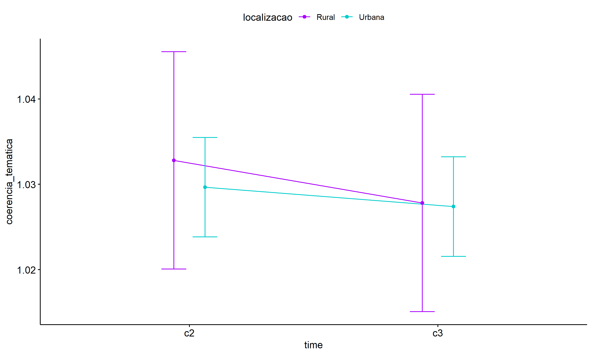<!-- -->

``` r
(pwc <- ldat %>% group_by(localizacao) %>%
    emmeans_test(coerencia_tematica ~ time, detailed = T, p.adjust.method = "bonferroni"))
```

    ## # A tibble: 2 × 15
    ##   localizacao term  .y.          group1 group2 null.value estimate      se    df
    ## * <fct>       <chr> <chr>        <chr>  <chr>       <dbl>    <dbl>   <dbl> <dbl>
    ## 1 Rural       time  coerencia_t… c2     c3              0  0.00499 0.00919  8080
    ## 2 Urbana      time  coerencia_t… c2     c3              0  0.00228 0.00421  8080
    ## # ℹ 6 more variables: conf.low <dbl>, conf.high <dbl>, statistic <dbl>,
    ## #   p <dbl>, p.adj <dbl>, p.adj.signif <chr>

| localizacao | term | .y.                | group1 | group2 | null.value | estimate |    se |   df | conf.low | conf.high | statistic |     p | p.adj | p.adj.signif |
|:------------|:-----|:-------------------|:-------|:-------|-----------:|---------:|------:|-----:|---------:|----------:|----------:|------:|------:|:-------------|
| Rural       | time | coerencia_tematica | c2     | c3     |          0 |    0.005 | 0.009 | 8080 |   -0.013 |     0.023 |     0.543 | 0.587 | 0.587 | ns           |
| Urbana      | time | coerencia_tematica | c2     | c3     |          0 |    0.002 | 0.004 | 8080 |   -0.006 |     0.011 |     0.542 | 0.588 | 0.588 | ns           |

``` r
(emms <- get_emmeans(pwc))
```

    ## # A tibble: 4 × 8
    ##   localizacao time  emmean      se    df conf.low conf.high method      
    ##   <fct>       <fct>  <dbl>   <dbl> <dbl>    <dbl>     <dbl> <chr>       
    ## 1 Rural       c2      1.03 0.00650  8080     1.02      1.05 Emmeans test
    ## 2 Rural       c3      1.03 0.00650  8080     1.02      1.04 Emmeans test
    ## 3 Urbana      c2      1.03 0.00298  8080     1.02      1.04 Emmeans test
    ## 4 Urbana      c3      1.03 0.00298  8080     1.02      1.03 Emmeans test

| localizacao | time | emmean |    se |   df | conf.low | conf.high | method       |
|:------------|:-----|-------:|------:|-----:|---------:|----------:|:-------------|
| Rural       | c2   |  1.033 | 0.006 | 8080 |    1.020 |     1.046 | Emmeans test |
| Rural       | c3   |  1.028 | 0.006 | 8080 |    1.015 |     1.041 | Emmeans test |
| Urbana      | c2   |  1.030 | 0.003 | 8080 |    1.024 |     1.036 | Emmeans test |
| Urbana      | c3   |  1.027 | 0.003 | 8080 |    1.022 |     1.033 | Emmeans test |

``` r
emms.gg <- emms[which(emms$localizacao == "Rural"),]
if (nrow(emms.gg) > 0)
  ggline(emms.gg, x = "time", y = "emmean", color = "#AA00FF", ylab = "coerencia_tematica") +
    geom_errorbar(aes(ymin = conf.low, ymax = conf.high),
                  width = 0.2, color = "#AA00FF") +
    stat_pvalue_manual(
      add_xy_position(pwc[which(pwc$localizacao == "Rural"),],
                      x = "time", fun = "mean_se"),
      hide.ns = T, color = "#AA00FF", tip.length = F) +
    labs(title = "localizacao: Rural")+
    theme(legend.text = element_blank())
```

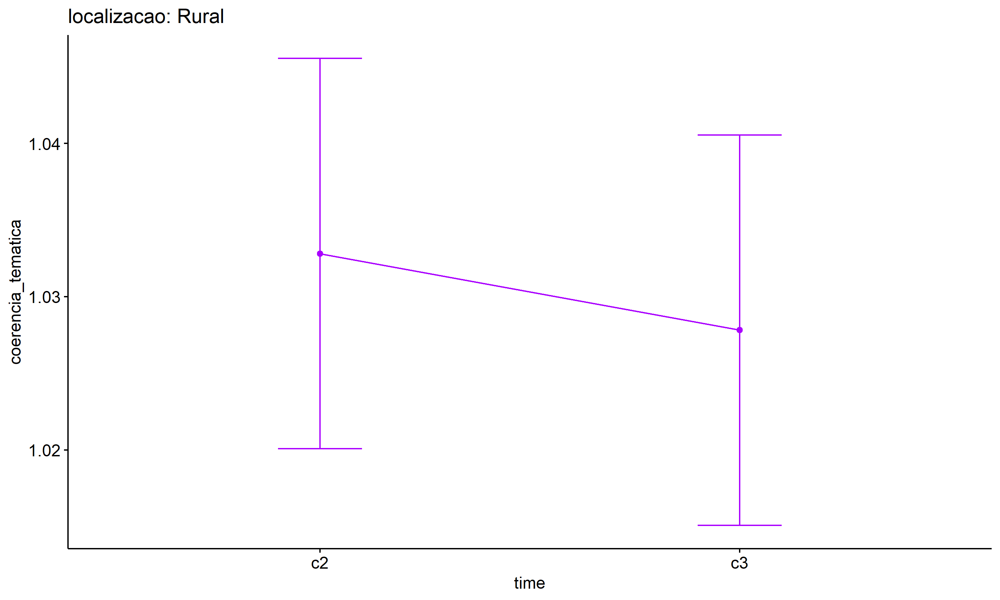<!-- -->

``` r
emms.gg <- emms[which(emms$localizacao == "Urbana"),]
if (nrow(emms.gg) > 0)
  ggline(emms.gg, x = "time", y = "emmean", color = "#00CCCC", ylab = "coerencia_tematica") +
    geom_errorbar(aes(ymin = conf.low, ymax = conf.high),
                  width = 0.2, color = "#00CCCC") +
    stat_pvalue_manual(
      add_xy_position(pwc[which(pwc$localizacao == "Urbana"),],
                      x = "time", fun = "mean_se"),
      hide.ns = T, color = "#00CCCC", tip.length = F) +
    labs(title = "localizacao: Urbana")+
    theme(legend.text = element_blank())
```

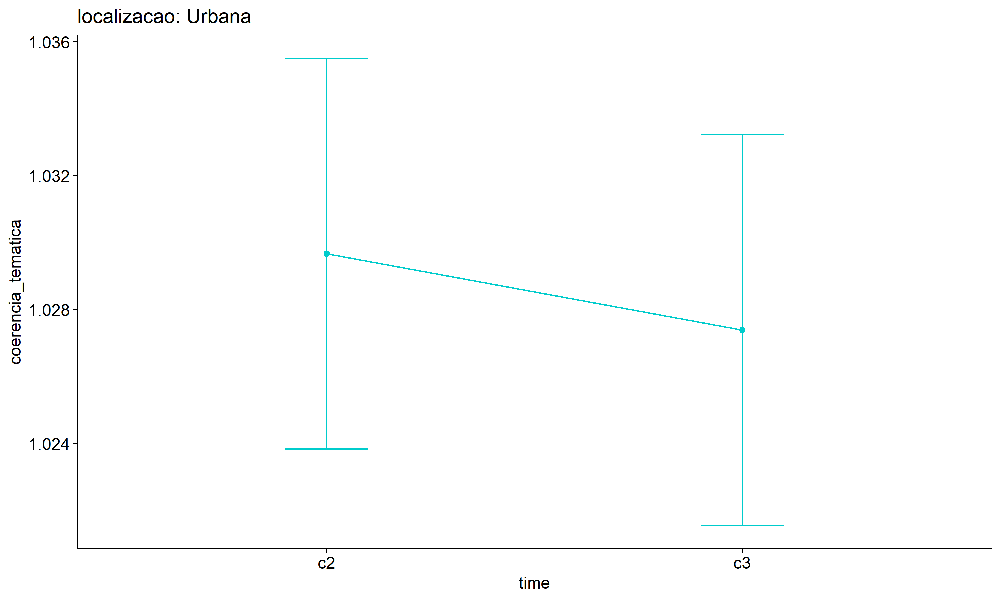<!-- -->

## PairWise Computation after removing non.normal data

``` r
if (length(non.ids) > 0)
  (pwc2 <- ldat2 %>% group_by(time) %>%
     emmeans_test(coerencia_tematica ~ localizacao, detailed = T, p.adjust.method = "bonferroni"))
```

``` r
if (length(non.ids) > 0)
  (emms2 <- get_emmeans(pwc2))
```

``` r
if (length(non.ids) > 0) {
  pwc2 <- add_xy_position(pwc2, x = "time", fun = "mean_se", dodge = 0.25)
  pd2 <- position_dodge(width = 0.25)
  
  ggline(emms2, x = "time", y = "emmean", color = "localizacao",
         palette = c("#AA00FF","#00CCCC"),
         position = pd, ylab = "coerencia_tematica") +
    geom_errorbar(aes(ymin = conf.low, ymax = conf.high, color = localizacao),
                position = pd, width = 0.2) +
    stat_pvalue_manual(pwc2, hide.ns = T, tip.length = F, linetype = 1)
}
```

``` r
if (length(non.ids) > 0)
  (pwc2 <- ldat2 %>% group_by(localizacao) %>%
     emmeans_test(coerencia_tematica ~ time, detailed = T, p.adjust.method = "bonferroni"))
```

``` r
if (length(non.ids) > 0)
  (emms2 <- get_emmeans(pwc2))
```

``` r
if (length(non.ids) > 0) {
  emms.gg <- emms2[which(emms2$localizacao == "Rural"),]
  if (nrow(emms.gg) > 0)
    ggline(emms.gg, x = "time", y = "emmean", color = "#AA00FF", ylab = "coerencia_tematica") +
    geom_errorbar(aes(ymin = conf.low, ymax = conf.high),
                  width = 0.2, color = "#AA00FF") +
    stat_pvalue_manual(
      add_xy_position(pwc[which(pwc$localizacao == "Rural"),],
                      x = "time", fun = "mean_se"),
      hide.ns = T, color = "#AA00FF", tip.length = F) +
    labs(title = "localizacao: Rural") +
    theme(legend.text = element_blank())
}
```

``` r
if (length(non.ids) > 0) {
  emms.gg <- emms2[which(emms2$localizacao == "Urbana"),]
  if (nrow(emms.gg) > 0)
    ggline(emms.gg, x = "time", y = "emmean", color = "#00CCCC", ylab = "coerencia_tematica") +
    geom_errorbar(aes(ymin = conf.low, ymax = conf.high),
                  width = 0.2, color = "#00CCCC") +
    stat_pvalue_manual(
      add_xy_position(pwc[which(pwc$localizacao == "Urbana"),],
                      x = "time", fun = "mean_se"),
      hide.ns = T, color = "#00CCCC", tip.length = F) +
    labs(title = "localizacao: Urbana") +
    theme(legend.text = element_blank())
}
```

# ANOVA: coerencia_tematica ~ time\*regiao + Error(id/time)

## Data Preparation

``` r
data <- edat[,c("aluno_id","regiao","ciclo","coerencia_tematica")]
data <- data[data$ciclo %in% c("Segundo Ciclo","Terceiro Ciclo"),]
data$ciclo <- factor(data$ciclo, c("Segundo Ciclo","Terceiro Ciclo"))
data <- unique(data)

wdat <- spread(data, ciclo, coerencia_tematica)
wdat <- wdat[complete.cases(wdat),]
colnames(wdat) <- c("id","regiao","c2","c3")

ldat <- gather(wdat, key = time, value = coerencia_tematica, c2,c3) %>%
  convert_as_factor(id, time)
ldat <- remove_group_data(ldat, "coerencia_tematica", c("time", "regiao"), n.limit = 30)
ldat$regiao <- factor(ldat$regiao, sort(unique(ldat$regiao)))
```

### Check assumptions: Identifying Outliers

``` r
outliers <- identify_outliers(group_by(ldat, time, regiao), coerencia_tematica)
(outliers <- outliers[outliers$is.extreme == T,])
```

    ## # A tibble: 253 × 6
    ##    regiao       time  id                coerencia_tematica is.outlier is.extreme
    ##    <fct>        <fct> <fct>                          <dbl> <lgl>      <lgl>     
    ##  1 Centro-Oeste c2    gSjPJJEtnEyiq3yE…                2   TRUE       TRUE      
    ##  2 Centro-Oeste c2    GyXkNYglZFaiWPdo…                1.5 TRUE       TRUE      
    ##  3 Centro-Oeste c2    Pt8nmYgqUGtYaso9…                2   TRUE       TRUE      
    ##  4 Centro-Oeste c2    w2KWF4yz1Qt8S6ap…                2   TRUE       TRUE      
    ##  5 Centro-Oeste c2    ZDZhpODoVH9TsZis…                2   TRUE       TRUE      
    ##  6 Nordeste     c2    bBBGsbvYBLgWujzE…                2   TRUE       TRUE      
    ##  7 Nordeste     c2    c8tCs09Zmla9HW6n…                1.5 TRUE       TRUE      
    ##  8 Nordeste     c2    cFxwLMwyCxWzWrkp…                3   TRUE       TRUE      
    ##  9 Nordeste     c2    cO1stoI0XTZlXCGz…                1.5 TRUE       TRUE      
    ## 10 Nordeste     c2    cUepYSggkyNVXrET…                2   TRUE       TRUE      
    ## # ℹ 243 more rows

| regiao       | time | id                   | coerencia_tematica | is.outlier | is.extreme |
|:-------------|:-----|:---------------------|-------------------:|:-----------|:-----------|
| Centro-Oeste | c2   | gSjPJJEtnEyiq3yEKqic |              2.000 | TRUE       | TRUE       |
| Centro-Oeste | c2   | GyXkNYglZFaiWPdo2jHx |              1.500 | TRUE       | TRUE       |
| Centro-Oeste | c2   | Pt8nmYgqUGtYaso9qysz |              2.000 | TRUE       | TRUE       |
| Centro-Oeste | c2   | w2KWF4yz1Qt8S6apg9Nq |              2.000 | TRUE       | TRUE       |
| Centro-Oeste | c2   | ZDZhpODoVH9TsZisJTN4 |              2.000 | TRUE       | TRUE       |
| Nordeste     | c2   | bBBGsbvYBLgWujzEuOES |              2.000 | TRUE       | TRUE       |
| Nordeste     | c2   | c8tCs09Zmla9HW6nXAba |              1.500 | TRUE       | TRUE       |
| Nordeste     | c2   | cFxwLMwyCxWzWrkpwvkt |              3.000 | TRUE       | TRUE       |
| Nordeste     | c2   | cO1stoI0XTZlXCGzSYmR |              1.500 | TRUE       | TRUE       |
| Nordeste     | c2   | cUepYSggkyNVXrET7RCr |              2.000 | TRUE       | TRUE       |
| Nordeste     | c2   | dzxWSwAxb1LbKLWq0f8W |              2.000 | TRUE       | TRUE       |
| Nordeste     | c2   | e4T8ur8rXZ7jH6myH0wq |              2.000 | TRUE       | TRUE       |
| Nordeste     | c2   | eakSXIhde0LSciiZKTJf |              1.500 | TRUE       | TRUE       |
| Nordeste     | c2   | eMaYeLRiclZymf00Bgj3 |              2.000 | TRUE       | TRUE       |
| Nordeste     | c2   | g2V94DT753T4rGOFLnO9 |              3.000 | TRUE       | TRUE       |
| Nordeste     | c2   | gcpsjKSQtozLkdeuPlAQ |              1.500 | TRUE       | TRUE       |
| Nordeste     | c2   | higntdffAusBUEJvytQY |              2.000 | TRUE       | TRUE       |
| Nordeste     | c2   | hOPnyViTC3bVUvYv9zCC |              1.500 | TRUE       | TRUE       |
| Nordeste     | c2   | HuD1YErYaPFPc5BeAVhI |              2.000 | TRUE       | TRUE       |
| Nordeste     | c2   | hV78K1w2Sy3NbDijChE1 |              2.000 | TRUE       | TRUE       |
| Nordeste     | c2   | HW3iJR889Q9EdBWaQrFP |              1.500 | TRUE       | TRUE       |
| Nordeste     | c2   | iGhiHBHlWPESJbq2D7PI |              2.000 | TRUE       | TRUE       |
| Nordeste     | c2   | ILuG2m3xDKcwiThmAUW8 |              2.000 | TRUE       | TRUE       |
| Nordeste     | c2   | INm50SKxqFJZGliYbYuq |              2.000 | TRUE       | TRUE       |
| Nordeste     | c2   | IOvrLhjyL36foBOflXwo |              2.000 | TRUE       | TRUE       |
| Nordeste     | c2   | ITPXRLN2xaGJzebM4a3K |              1.500 | TRUE       | TRUE       |
| Nordeste     | c2   | j29T3ZFdMcWxbBYVneR1 |              2.000 | TRUE       | TRUE       |
| Nordeste     | c2   | j8nYm0EY03K9FNADOg7A |              2.000 | TRUE       | TRUE       |
| Nordeste     | c2   | jqYuNJZAsKjE34sLcEiN |              2.000 | TRUE       | TRUE       |
| Nordeste     | c2   | kJIRWfRQpGpgJ9XydSAv |              2.000 | TRUE       | TRUE       |
| Nordeste     | c2   | l23hjNOgy6nAwiy4LCWe |              2.000 | TRUE       | TRUE       |
| Nordeste     | c2   | LjaXA0VBj0ofjYU1ASZY |              2.000 | TRUE       | TRUE       |
| Nordeste     | c2   | llfmmeAJlptgMoFLELZa |              2.000 | TRUE       | TRUE       |
| Nordeste     | c2   | lW5qykPQQcYd17PAfD2m |              1.500 | TRUE       | TRUE       |
| Nordeste     | c2   | LzPHYYb0TblKO9PPMzWp |              2.000 | TRUE       | TRUE       |
| Nordeste     | c2   | m0xj7CIrSEGFqXJYZr40 |              2.000 | TRUE       | TRUE       |
| Nordeste     | c2   | mXNMQxPPCRPBTP33J1t6 |              2.000 | TRUE       | TRUE       |
| Nordeste     | c2   | N4IaRiNre0zdlO8WMnpU |              1.500 | TRUE       | TRUE       |
| Nordeste     | c2   | NhAQ8t5HSuELn12vygjO |              2.000 | TRUE       | TRUE       |
| Nordeste     | c2   | nKEm138VjOkYk302F3pH |              2.000 | TRUE       | TRUE       |
| Nordeste     | c2   | ODaAE1X2lfQ7W0LJlUWa |              1.500 | TRUE       | TRUE       |
| Nordeste     | c2   | oHU6gZafmvgKSrwzZAeH |              2.000 | TRUE       | TRUE       |
| Nordeste     | c2   | OIk9ePK7PgYC88XMBkjk |              3.000 | TRUE       | TRUE       |
| Nordeste     | c2   | oQIlwAzaDraWYUdymlAL |              1.500 | TRUE       | TRUE       |
| Nordeste     | c2   | p18Ra2eTsN3Mrl4bZFRG |              1.500 | TRUE       | TRUE       |
| Nordeste     | c2   | PQBj15ebjZg4nyeHd9e4 |              3.000 | TRUE       | TRUE       |
| Nordeste     | c2   | ptWlwZXM3ojHCTykyYEJ |              1.500 | TRUE       | TRUE       |
| Nordeste     | c2   | QnAoKinKY0S7LthcNMQr |              1.500 | TRUE       | TRUE       |
| Nordeste     | c2   | QX1AYFz0937xfLHeuBgs |              2.000 | TRUE       | TRUE       |
| Nordeste     | c2   | rLiTdsMBwuJPGue8OKX6 |              2.000 | TRUE       | TRUE       |
| Nordeste     | c2   | SdzWHLHP8Pf2f5VFViDZ |              2.000 | TRUE       | TRUE       |
| Nordeste     | c2   | seS2r5RilRLBhpDRPKA6 |              2.000 | TRUE       | TRUE       |
| Nordeste     | c2   | Sj6yPHoyaHzrUcYzBdnz |              3.000 | TRUE       | TRUE       |
| Nordeste     | c2   | SmrNerrdGK4D40ZTwzyP |              2.000 | TRUE       | TRUE       |
| Nordeste     | c2   | sqswiqzkWZWmnp3PhqTw |              1.500 | TRUE       | TRUE       |
| Nordeste     | c2   | t9jUogxOix4zNYWIH0Kq |              1.500 | TRUE       | TRUE       |
| Nordeste     | c2   | u1zil2OzxQVXB2KwkuTr |              2.000 | TRUE       | TRUE       |
| Nordeste     | c2   | u6FoUFi5Ge44kQlmqIQ2 |              2.000 | TRUE       | TRUE       |
| Nordeste     | c2   | V6b5g1tzXwQnVKvwuGbb |              2.000 | TRUE       | TRUE       |
| Nordeste     | c2   | V9dfZnfGlWWXgh6Mkts9 |              2.000 | TRUE       | TRUE       |
| Nordeste     | c2   | Vp1uLMoHAG4q1y7fsjcA |              1.500 | TRUE       | TRUE       |
| Nordeste     | c2   | VQdi9Txgkx29Z2pZytGE |              1.500 | TRUE       | TRUE       |
| Nordeste     | c2   | vyUaA4Vgc7mVjSpyy1kO |              2.000 | TRUE       | TRUE       |
| Nordeste     | c2   | waSxu7TKpPaQubAUp8zA |              2.000 | TRUE       | TRUE       |
| Nordeste     | c2   | WeQsbNRHqO7kuokO3wmj |              3.000 | TRUE       | TRUE       |
| Nordeste     | c2   | wRbwfi4GayjRV5STbjHB |              1.500 | TRUE       | TRUE       |
| Nordeste     | c2   | XB74qI0rwchkPii7rp7z |              2.000 | TRUE       | TRUE       |
| Nordeste     | c2   | Xg1Qd24stqCttUg82X69 |              1.500 | TRUE       | TRUE       |
| Nordeste     | c2   | XK7IkCw9kmNWFSoPss9S |              1.500 | TRUE       | TRUE       |
| Nordeste     | c2   | XodGtJByOkgFYKUHapao |              2.000 | TRUE       | TRUE       |
| Nordeste     | c2   | YHYEP1qyyvGAVuey2ior |              1.500 | TRUE       | TRUE       |
| Nordeste     | c2   | Yn8j3irvKAHQerN2qYp4 |              1.500 | TRUE       | TRUE       |
| Nordeste     | c2   | Yp70Dh6vdviwhkjJUHAq |              2.000 | TRUE       | TRUE       |
| Nordeste     | c2   | YSo7fze1XP8h2d81TVJi |              2.000 | TRUE       | TRUE       |
| Nordeste     | c2   | yYPvU7v7STKRyATXYjci |              1.500 | TRUE       | TRUE       |
| Nordeste     | c2   | YzgKSMitiFA4Sjy8RlMs |              2.000 | TRUE       | TRUE       |
| Nordeste     | c2   | zCTzxYoQjxqmWiQngsY4 |              2.000 | TRUE       | TRUE       |
| Nordeste     | c2   | zyjVeK0oD3vhd93yTzBU |              2.000 | TRUE       | TRUE       |
| Norte        | c2   | gVuMjTLcSjwi8PtQcX3g |              2.000 | TRUE       | TRUE       |
| Norte        | c2   | jibzqnofR0GRDwmmPk7Y |              2.000 | TRUE       | TRUE       |
| Norte        | c2   | JKEvnqvCpv10PSAycuzr |              2.000 | TRUE       | TRUE       |
| Norte        | c2   | JxBy1XhCm6SIIhCxOv2f |              1.500 | TRUE       | TRUE       |
| Norte        | c2   | ks4CBM3zPHocVr9YlWDI |              1.500 | TRUE       | TRUE       |
| Norte        | c2   | ksgo1zWUwzzFyFHwP56e |              1.500 | TRUE       | TRUE       |
| Norte        | c2   | MMiQ1tmvspk2qTnYgmxJ |              1.500 | TRUE       | TRUE       |
| Norte        | c2   | oEDVJwdVHdc8vvUBo2jy |              3.000 | TRUE       | TRUE       |
| Norte        | c2   | oiwBh6qBV0OXX5Ky4pUT |              2.000 | TRUE       | TRUE       |
| Norte        | c2   | t9EXHmWcmpDl7WccMnBE |              2.000 | TRUE       | TRUE       |
| Norte        | c2   | tw7Cm7BXPHSsi3uX3Mbs |              2.000 | TRUE       | TRUE       |
| Norte        | c2   | u0hPBK1IAHuD6dO6zj4d |              2.000 | TRUE       | TRUE       |
| Norte        | c2   | XX5eGVd1Hbd37UnSUG7o |              2.000 | TRUE       | TRUE       |
| Sudeste      | c2   | aGe8oY0BM2o4WY2b3cMO |              1.500 | TRUE       | TRUE       |
| Sudeste      | c2   | aHRArOnxnMCJAnjRvMkz |              1.500 | TRUE       | TRUE       |
| Sudeste      | c2   | bEH3ieH27FIqcQO2qaG5 |              1.500 | TRUE       | TRUE       |
| Sudeste      | c2   | dBufNE5pBAeoHmZz0nke |              2.000 | TRUE       | TRUE       |
| Sudeste      | c2   | fZbZWnu3vvhrwYpmrO9k |              2.000 | TRUE       | TRUE       |
| Sudeste      | c2   | gELhuHqJ4d7stkaH7Zoe |              1.500 | TRUE       | TRUE       |
| Sudeste      | c2   | gQc2WkGSPT6YRq2BbFmi |              1.333 | TRUE       | TRUE       |
| Sudeste      | c2   | GW2PAQxsvmLtpBNJNym7 |              1.333 | TRUE       | TRUE       |
| Sudeste      | c2   | gXcnw3rDblx0csS2JTlO |              2.000 | TRUE       | TRUE       |
| Sudeste      | c2   | HjIfGleeETArbQSCh03g |              2.000 | TRUE       | TRUE       |
| Sudeste      | c2   | i2oRGsfJzmZ9N502mT77 |              1.500 | TRUE       | TRUE       |
| Sudeste      | c2   | IIsMlpIp9iHmNHRVF1bc |              2.000 | TRUE       | TRUE       |
| Sudeste      | c2   | iYlYrwjNTF4uR2dhpyxO |              1.500 | TRUE       | TRUE       |
| Sudeste      | c2   | J5nICZq522sdxw5DKGD0 |              1.500 | TRUE       | TRUE       |
| Sudeste      | c2   | jpC3vSNTUDnQh1bVVcfW |              1.500 | TRUE       | TRUE       |
| Sudeste      | c2   | jQ2edrW5GBEk3Jensn3T |              2.000 | TRUE       | TRUE       |
| Sudeste      | c2   | JXVhAfQwMJmDyzL7Ow0f |              2.000 | TRUE       | TRUE       |
| Sudeste      | c2   | kMT5lAiv5AQf4YJ6lpW4 |              2.000 | TRUE       | TRUE       |
| Sudeste      | c2   | l14u3DL5ZLhsniQeUpJS |              1.500 | TRUE       | TRUE       |
| Sudeste      | c2   | Lgo5TAkgaFVrGlgdORvr |              2.000 | TRUE       | TRUE       |
| Sudeste      | c2   | LpaoylKKeSTt2YWXtA0F |              1.250 | TRUE       | TRUE       |
| Sudeste      | c2   | mpLkf9CEZGlNTLxpjceW |              2.000 | TRUE       | TRUE       |
| Sudeste      | c2   | NGl9qiq97cW0ttDa3O3B |              2.000 | TRUE       | TRUE       |
| Sudeste      | c2   | OK7eABz6qpM3kySdwJEd |              3.000 | TRUE       | TRUE       |
| Sudeste      | c2   | Pjq4bh983tAK4i5CmeZh |              1.500 | TRUE       | TRUE       |
| Sudeste      | c2   | qaLYnU8g3n0nW6adZKum |              2.000 | TRUE       | TRUE       |
| Sudeste      | c2   | rgdnkEyM80k12Pgg9BsY |              1.500 | TRUE       | TRUE       |
| Sudeste      | c2   | rNomRIEoQRUfprn0kDM8 |              1.500 | TRUE       | TRUE       |
| Sudeste      | c2   | SospesQs9lHWbeGvftYs |              1.500 | TRUE       | TRUE       |
| Sudeste      | c2   | T4FHGCkWdtu0VECvhUzE |              1.500 | TRUE       | TRUE       |
| Sudeste      | c2   | tAOBN5KVkiroC03qobTH |              1.200 | TRUE       | TRUE       |
| Sudeste      | c2   | tHWlNuniDbS1xW7RctVI |              2.000 | TRUE       | TRUE       |
| Sudeste      | c2   | U4ULFXX6YVmPHbvNon9P |              2.500 | TRUE       | TRUE       |
| Sudeste      | c2   | U5PipLs02KAxgksTobqi |              2.000 | TRUE       | TRUE       |
| Sudeste      | c2   | UHo9GyhW8xE8ImiVpMY3 |              1.500 | TRUE       | TRUE       |
| Sudeste      | c2   | UVVPc0WHttdUCpLcxbc0 |              1.500 | TRUE       | TRUE       |
| Sudeste      | c2   | vdyvgr0lDaUCQsHOY8pt |              2.000 | TRUE       | TRUE       |
| Sudeste      | c2   | XlW7LrWByqhSEOcsBv1E |              2.000 | TRUE       | TRUE       |
| Sudeste      | c2   | Z1kvDZdNO1IoGoYLcObB |              1.500 | TRUE       | TRUE       |
| Sudeste      | c2   | ZcoiIYTK35GCty2HuClw |              2.000 | TRUE       | TRUE       |
| Sudeste      | c2   | zsCZBoyFpYhBL6PSjptX |              2.000 | TRUE       | TRUE       |
| Sudeste      | c2   | ZSQiU7hvC1Mufec6oJ57 |              1.500 | TRUE       | TRUE       |
| Sudeste      | c2   | ZSvgF2tGGZ3ZPp3LsClQ |              1.500 | TRUE       | TRUE       |
| Sudeste      | c2   | zu0ran0dmHOopHf9H3cW |              1.500 | TRUE       | TRUE       |
| Sul          | c2   | a8SWsJUcxVnZgfDuYhl9 |              1.500 | TRUE       | TRUE       |
| Sul          | c2   | g1Y9akoQG5mxUPxLhbcj |              1.500 | TRUE       | TRUE       |
| Sul          | c2   | hRksqP03n9bIhD3mMUSS |              1.500 | TRUE       | TRUE       |
| Sul          | c2   | puJ0cHDwxp3cYxetrMyX |              2.000 | TRUE       | TRUE       |
| Sul          | c2   | qmI2dE4LuX6CGzXwWF7F |              2.000 | TRUE       | TRUE       |
| Sul          | c2   | RhivsuJG4fBEZgQv82fM |              1.500 | TRUE       | TRUE       |
| Sul          | c2   | U4aFjphBd5eS72XCccPw |              1.500 | TRUE       | TRUE       |
| Sul          | c2   | ZPCvHMnIAftartnrtFEF |              2.500 | TRUE       | TRUE       |
| Centro-Oeste | c3   | bco6M4CkAGsGFOtcIREv |              1.500 | TRUE       | TRUE       |
| Centro-Oeste | c3   | eRF9JHCIujUxAsHjRfag |              2.000 | TRUE       | TRUE       |
| Centro-Oeste | c3   | GnYbHi1c0xZQJQvwqjgH |              2.000 | TRUE       | TRUE       |
| Centro-Oeste | c3   | gSjPJJEtnEyiq3yEKqic |              2.000 | TRUE       | TRUE       |
| Centro-Oeste | c3   | MSNQNsvHxmUOyoqzb173 |              2.000 | TRUE       | TRUE       |
| Centro-Oeste | c3   | XcmW37ovFYkcIxCmtQex |              2.000 | TRUE       | TRUE       |
| Nordeste     | c3   | 1J37c92qD29MFCBtKjKW |              3.000 | TRUE       | TRUE       |
| Nordeste     | c3   | bBBGsbvYBLgWujzEuOES |              2.000 | TRUE       | TRUE       |
| Nordeste     | c3   | d2onr8IRuQdgnrxrqeI8 |              2.000 | TRUE       | TRUE       |
| Nordeste     | c3   | eswJ6vikp92nAGcPFrb9 |              2.000 | TRUE       | TRUE       |
| Nordeste     | c3   | fptfQd1NJgg3eWAGfAtI |              2.000 | TRUE       | TRUE       |
| Nordeste     | c3   | g2V94DT753T4rGOFLnO9 |              3.000 | TRUE       | TRUE       |
| Nordeste     | c3   | h3MA9XopgLfmchs0gnEg |              2.000 | TRUE       | TRUE       |
| Nordeste     | c3   | Hs8ac6T8acMUDbU3vQYD |              2.000 | TRUE       | TRUE       |
| Nordeste     | c3   | ICbs5vZm4fYjLhtchehF |              2.000 | TRUE       | TRUE       |
| Nordeste     | c3   | iUvvM1tSOva70p5AnkYG |              1.500 | TRUE       | TRUE       |
| Nordeste     | c3   | Je8vRI9ghkwFwzMA5kZk |              2.000 | TRUE       | TRUE       |
| Nordeste     | c3   | JfwlGZJwJ0al8syt6CeF |              2.000 | TRUE       | TRUE       |
| Nordeste     | c3   | kEaYslABXOORAI6F6XMh |              2.000 | TRUE       | TRUE       |
| Nordeste     | c3   | Kn8QSO3jYDqnFv6ZQ7k1 |              2.000 | TRUE       | TRUE       |
| Nordeste     | c3   | kOYVDpaYtvTgohoW5kfB |              2.000 | TRUE       | TRUE       |
| Nordeste     | c3   | kTcIM9fJDgzp5VTsOoqX |              2.000 | TRUE       | TRUE       |
| Nordeste     | c3   | m0T3y1DP89OPiLYwch3A |              2.000 | TRUE       | TRUE       |
| Nordeste     | c3   | M6u2ZDjYaY5OeEaR0yma |              1.500 | TRUE       | TRUE       |
| Nordeste     | c3   | mbCRk3X6UTuHOtvoDGp6 |              2.000 | TRUE       | TRUE       |
| Nordeste     | c3   | mw9aS59BoHLVxRHNjSif |              2.000 | TRUE       | TRUE       |
| Nordeste     | c3   | NbyYadm0KlSOkN95IxXd |              2.000 | TRUE       | TRUE       |
| Nordeste     | c3   | o6lY8TqKQe4iwloQR4xT |              2.000 | TRUE       | TRUE       |
| Nordeste     | c3   | OhSVnXR39yzI9COvsiHG |              2.000 | TRUE       | TRUE       |
| Nordeste     | c3   | Or3JMYez1zH1xIGSqMuK |              2.000 | TRUE       | TRUE       |
| Nordeste     | c3   | oR3NpvemK1la4MxMOiCS |              2.000 | TRUE       | TRUE       |
| Nordeste     | c3   | pBJb4ZkDR5VjLeWYTOQH |              2.000 | TRUE       | TRUE       |
| Nordeste     | c3   | PigGa9MraOlRyd51ggru |              2.000 | TRUE       | TRUE       |
| Nordeste     | c3   | PQBj15ebjZg4nyeHd9e4 |              2.000 | TRUE       | TRUE       |
| Nordeste     | c3   | qGURK8zR52A1rb6QpIWb |              1.500 | TRUE       | TRUE       |
| Nordeste     | c3   | r2NyGLY5OL3u1kBFRn5m |              2.000 | TRUE       | TRUE       |
| Nordeste     | c3   | RvJEz73jXkG6onQ9asjU |              2.000 | TRUE       | TRUE       |
| Nordeste     | c3   | sYbSjWOWx8PxbnqSvNak |              2.000 | TRUE       | TRUE       |
| Nordeste     | c3   | tIUVTqnfVUkntZBZ7Z0p |              2.000 | TRUE       | TRUE       |
| Nordeste     | c3   | UIxazvhO2FmZj13Cezfe |              2.000 | TRUE       | TRUE       |
| Nordeste     | c3   | uxVZFO2SmtDShrkOKILU |              2.000 | TRUE       | TRUE       |
| Nordeste     | c3   | V6b5g1tzXwQnVKvwuGbb |              2.000 | TRUE       | TRUE       |
| Nordeste     | c3   | vehMYSY1EdhUXyzjC1Dv |              2.000 | TRUE       | TRUE       |
| Nordeste     | c3   | vEu7ZNrr9bqeW1JShJNH |              2.000 | TRUE       | TRUE       |
| Nordeste     | c3   | WeQsbNRHqO7kuokO3wmj |              2.000 | TRUE       | TRUE       |
| Nordeste     | c3   | wK3HAwveWKbrMkAvnuO4 |              2.000 | TRUE       | TRUE       |
| Nordeste     | c3   | WPg2EPsRupSkIdrJqXLK |              2.000 | TRUE       | TRUE       |
| Nordeste     | c3   | x6adt3AFuShDgGQIv9Ix |              2.000 | TRUE       | TRUE       |
| Nordeste     | c3   | XodGtJByOkgFYKUHapao |              2.000 | TRUE       | TRUE       |
| Nordeste     | c3   | XrQhehWf9VAuByaVgj62 |              2.000 | TRUE       | TRUE       |
| Nordeste     | c3   | XuG5rUh56qxm9zMpoFJa |              2.000 | TRUE       | TRUE       |
| Nordeste     | c3   | YBzmerz6Rz8QFtWi6ghI |              1.500 | TRUE       | TRUE       |
| Nordeste     | c3   | yh2HsPztDUwwKBfY9TR4 |              2.000 | TRUE       | TRUE       |
| Nordeste     | c3   | zcqlMpFR2UhCUNFv8n0s |              3.000 | TRUE       | TRUE       |
| Nordeste     | c3   | zvNAgETyVZt6PdptZS2E |              2.000 | TRUE       | TRUE       |
| Norte        | c3   | dcU6CRUOFKx80d4qzKAG |              2.000 | TRUE       | TRUE       |
| Norte        | c3   | eX7fqML5B4PyQVP7U66F |              2.000 | TRUE       | TRUE       |
| Norte        | c3   | MMiQ1tmvspk2qTnYgmxJ |              2.000 | TRUE       | TRUE       |
| Norte        | c3   | NpRJivuysUpcn6ZxBLkV |              3.000 | TRUE       | TRUE       |
| Norte        | c3   | NQalozkOTNtTCxxOr1mS |              2.000 | TRUE       | TRUE       |
| Norte        | c3   | oRIUHUK9b2AbOgiJcGBH |              2.000 | TRUE       | TRUE       |
| Sudeste      | c3   | b2c2UbjbZgctiz7chBoi |              1.500 | TRUE       | TRUE       |
| Sudeste      | c3   | H8flYEMYWYQkc3jeNhBA |              1.500 | TRUE       | TRUE       |
| Sudeste      | c3   | hfNLkhVKKWxZuQufmvQz |              2.000 | TRUE       | TRUE       |
| Sudeste      | c3   | HGZ14QtGsbUz0aRWfFPW |              2.000 | TRUE       | TRUE       |
| Sudeste      | c3   | hLgbwWFbQCF8d00gQPs7 |              2.000 | TRUE       | TRUE       |
| Sudeste      | c3   | HMEIfExIgYSJ8CwHyuA4 |              2.000 | TRUE       | TRUE       |
| Sudeste      | c3   | IIsMlpIp9iHmNHRVF1bc |              2.000 | TRUE       | TRUE       |
| Sudeste      | c3   | iZt3rInCC7BOnmwDcFhS |              2.000 | TRUE       | TRUE       |
| Sudeste      | c3   | jQ2edrW5GBEk3Jensn3T |              2.000 | TRUE       | TRUE       |
| Sudeste      | c3   | jsMjZAlI74DvYWexlJne |              2.000 | TRUE       | TRUE       |
| Sudeste      | c3   | kkDlkMBIpptv0y6MvaFX |              2.000 | TRUE       | TRUE       |
| Sudeste      | c3   | kPtgux6bWosMrUxZKdY3 |              1.500 | TRUE       | TRUE       |
| Sudeste      | c3   | kwv8mDfLyXwATUqKLiro |              3.000 | TRUE       | TRUE       |
| Sudeste      | c3   | Lgo5TAkgaFVrGlgdORvr |              2.000 | TRUE       | TRUE       |
| Sudeste      | c3   | ltNt2xv4X5BBBt8zLeSR |              2.000 | TRUE       | TRUE       |
| Sudeste      | c3   | m174kqNZ6QBvEUR1PFH3 |              2.000 | TRUE       | TRUE       |
| Sudeste      | c3   | M5tDz0x1gycVNcU1ojUT |              2.000 | TRUE       | TRUE       |
| Sudeste      | c3   | mj0qaU1B1gIjFDPYSSa3 |              2.000 | TRUE       | TRUE       |
| Sudeste      | c3   | N5e5rrCKg6O7LTlDieIX |              2.000 | TRUE       | TRUE       |
| Sudeste      | c3   | Odz5tcojxCUUmkMLM6wI |              2.000 | TRUE       | TRUE       |
| Sudeste      | c3   | ome6iwtSSwFXPJK7ttYH |              2.000 | TRUE       | TRUE       |
| Sudeste      | c3   | qaLYnU8g3n0nW6adZKum |              2.000 | TRUE       | TRUE       |
| Sudeste      | c3   | rMtDHd4xGWtaDyXBIjkZ |              2.000 | TRUE       | TRUE       |
| Sudeste      | c3   | sCajYZTVch88mXV6HiFf |              2.000 | TRUE       | TRUE       |
| Sudeste      | c3   | tHWlNuniDbS1xW7RctVI |              2.000 | TRUE       | TRUE       |
| Sudeste      | c3   | UMUTtIJsm8rVQ5w6gTYq |              2.000 | TRUE       | TRUE       |
| Sudeste      | c3   | VlmQwur54iwFM7qQik24 |              1.500 | TRUE       | TRUE       |
| Sudeste      | c3   | wVF0FFPeKW6n3Lh27bKc |              2.000 | TRUE       | TRUE       |
| Sudeste      | c3   | XGaIfl8tkDqEVyd0kxVA |              2.000 | TRUE       | TRUE       |
| Sudeste      | c3   | XQqMi1QAydeb0dlM8trY |              2.000 | TRUE       | TRUE       |
| Sudeste      | c3   | ygluKcF3wOKKl3jfvWGo |              3.000 | TRUE       | TRUE       |
| Sudeste      | c3   | yjJQyvoUJhMW80fWkpjs |              2.000 | TRUE       | TRUE       |
| Sudeste      | c3   | YK9newsAt2nZktabSMNx |              2.000 | TRUE       | TRUE       |
| Sudeste      | c3   | Z1VlwDTrD2qAu9GK95Ij |              2.000 | TRUE       | TRUE       |
| Sudeste      | c3   | zOcehc9xYjcDUdlaz7Ob |              2.000 | TRUE       | TRUE       |
| Sudeste      | c3   | zsCZBoyFpYhBL6PSjptX |              2.000 | TRUE       | TRUE       |
| Sul          | c3   | 7ma5J2bWts20H4GWbej1 |              2.000 | TRUE       | TRUE       |
| Sul          | c3   | f8DdFlx0Ol7BDBzvoeBr |              2.000 | TRUE       | TRUE       |
| Sul          | c3   | iPhGwRIymYG05pYhmzNe |              2.000 | TRUE       | TRUE       |
| Sul          | c3   | jgWNaPGZqoFPcx59s4sB |              2.000 | TRUE       | TRUE       |
| Sul          | c3   | kk3uMVq8ENKPQmWPht3I |              2.000 | TRUE       | TRUE       |
| Sul          | c3   | oANZNFFrKV5YB9BlxSj0 |              2.000 | TRUE       | TRUE       |
| Sul          | c3   | R19lMqeOEzZMw8pzWDxN |              2.000 | TRUE       | TRUE       |
| Sul          | c3   | vozs3t8ZDLtD8zXCEBQL |              2.000 | TRUE       | TRUE       |
| Sul          | c3   | VXEvUdFA8gPP715ai6e9 |              1.500 | TRUE       | TRUE       |
| Sul          | c3   | W7Xy8FJxJzAftxVg1Osz |              2.000 | TRUE       | TRUE       |
| Sul          | c3   | WqFMTjTnn9gRC0kMEy4f |              2.000 | TRUE       | TRUE       |
| Sul          | c3   | xba2ErfFvNC0iaGtcAEq |              2.000 | TRUE       | TRUE       |
| Sul          | c3   | ZaG3WvMlwUgZEyAZN6tO |              2.000 | TRUE       | TRUE       |

### Check assumptions: Normality Test

``` r
(normality.df <- normality.test.per.groups(ldat, "coerencia_tematica", c("time", "regiao")))
```

    ##                   var           variable time       regiao    n skewness
    ## 1  coerencia_tematica coerencia_tematica   c2 Centro-Oeste  198 0.000000
    ## 2  coerencia_tematica coerencia_tematica   c2     Nordeste 1464 5.506897
    ## 3  coerencia_tematica coerencia_tematica   c2        Norte  435 7.117844
    ## 4  coerencia_tematica coerencia_tematica   c2      Sudeste 1473 7.431643
    ## 5  coerencia_tematica coerencia_tematica   c2          Sul  472 9.930828
    ## 6  coerencia_tematica coerencia_tematica   c3 Centro-Oeste  198 0.000000
    ## 7  coerencia_tematica coerencia_tematica   c3     Nordeste 1464 5.991361
    ## 8  coerencia_tematica coerencia_tematica   c3        Norte  435 0.000000
    ## 9  coerencia_tematica coerencia_tematica   c3      Sudeste 1473 7.116142
    ## 10 coerencia_tematica coerencia_tematica   c3          Sul  472 0.000000
    ##     kurtosis symmetry statistic     method p p.signif normality
    ## 1    0.00000 few data        NA       <NA> 1     <NA>        NO
    ## 2   34.12464       NO 1582.8898 D'Agostino 0     ****         -
    ## 3   57.66763       NO  599.6824 D'Agostino 0     ****         -
    ## 4   63.43495       NO 1954.5485 D'Agostino 0     ****         -
    ## 5  110.04289       NO  788.6359 D'Agostino 0     ****         -
    ## 6    0.00000 few data        NA       <NA> 1     <NA>        NO
    ## 7   38.97698       NO 1675.8951 D'Agostino 0     ****         -
    ## 8    0.00000 few data        NA       <NA> 1     <NA>        NO
    ## 9   55.55304       NO 1894.8488 D'Agostino 0     ****         -
    ## 10   0.00000 few data        NA       <NA> 1     <NA>        NO

| var                | variable           | time | regiao       |    n | skewness | kurtosis | symmetry | statistic | method     |   p | p.signif | normality |
|:-------------------|:-------------------|:-----|:-------------|-----:|---------:|---------:|:---------|----------:|:-----------|----:|:---------|:----------|
| coerencia_tematica | coerencia_tematica | c2   | Centro-Oeste |  198 |    0.000 |    0.000 | few data |        NA | NA         |   1 | NA       | NO        |
| coerencia_tematica | coerencia_tematica | c2   | Nordeste     | 1464 |    5.507 |   34.125 | NO       |  1582.890 | D’Agostino |   0 | \*\*\*\* | \-        |
| coerencia_tematica | coerencia_tematica | c2   | Norte        |  435 |    7.118 |   57.668 | NO       |   599.682 | D’Agostino |   0 | \*\*\*\* | \-        |
| coerencia_tematica | coerencia_tematica | c2   | Sudeste      | 1473 |    7.432 |   63.435 | NO       |  1954.549 | D’Agostino |   0 | \*\*\*\* | \-        |
| coerencia_tematica | coerencia_tematica | c2   | Sul          |  472 |    9.931 |  110.043 | NO       |   788.636 | D’Agostino |   0 | \*\*\*\* | \-        |
| coerencia_tematica | coerencia_tematica | c3   | Centro-Oeste |  198 |    0.000 |    0.000 | few data |        NA | NA         |   1 | NA       | NO        |
| coerencia_tematica | coerencia_tematica | c3   | Nordeste     | 1464 |    5.991 |   38.977 | NO       |  1675.895 | D’Agostino |   0 | \*\*\*\* | \-        |
| coerencia_tematica | coerencia_tematica | c3   | Norte        |  435 |    0.000 |    0.000 | few data |        NA | NA         |   1 | NA       | NO        |
| coerencia_tematica | coerencia_tematica | c3   | Sudeste      | 1473 |    7.116 |   55.553 | NO       |  1894.849 | D’Agostino |   0 | \*\*\*\* | \-        |
| coerencia_tematica | coerencia_tematica | c3   | Sul          |  472 |    0.000 |    0.000 | few data |        NA | NA         |   1 | NA       | NO        |

``` r
(non.ids <- unique(do.call(
  c, lapply(which(normality.df$normality == 'NO'), FUN = function(i) {
  idx = which(ldat$time == normality.df$time[i] &
                ldat$regiao == normality.df$regiao[i])
  getNonNormal(ldat$"coerencia_tematica"[idx], ldat$id[idx])
}))))
```

    ## NULL

``` r
if (length(non.ids) > 0)
  ldat2 <- ldat[!ldat$id %in% non.ids,]
```

### Summary Statistics

``` r
(sdat <- ldat %>% group_by(time, regiao) %>%
   get_summary_stats(coerencia_tematica, type = "mean_sd"))
```

    ## # A tibble: 10 × 6
    ##    regiao       time  variable               n  mean    sd
    ##    <fct>        <fct> <fct>              <dbl> <dbl> <dbl>
    ##  1 Centro-Oeste c2    coerencia_tematica   198  1.02 0.145
    ##  2 Nordeste     c2    coerencia_tematica  1464  1.05 0.219
    ##  3 Norte        c2    coerencia_tematica   435  1.03 0.171
    ##  4 Sudeste      c2    coerencia_tematica  1473  1.02 0.14 
    ##  5 Sul          c2    coerencia_tematica   472  1.01 0.107
    ##  6 Centro-Oeste c3    coerencia_tematica   198  1.03 0.161
    ##  7 Nordeste     c3    coerencia_tematica  1464  1.03 0.191
    ##  8 Norte        c3    coerencia_tematica   435  1.02 0.143
    ##  9 Sudeste      c3    coerencia_tematica  1473  1.02 0.161
    ## 10 Sul          c3    coerencia_tematica   472  1.03 0.159

| regiao       | time | variable           |    n |  mean |    sd |
|:-------------|:-----|:-------------------|-----:|------:|------:|
| Centro-Oeste | c2   | coerencia_tematica |  198 | 1.023 | 0.145 |
| Nordeste     | c2   | coerencia_tematica | 1464 | 1.046 | 0.219 |
| Norte        | c2   | coerencia_tematica |  435 | 1.028 | 0.171 |
| Sudeste      | c2   | coerencia_tematica | 1473 | 1.022 | 0.140 |
| Sul          | c2   | coerencia_tematica |  472 | 1.013 | 0.107 |
| Centro-Oeste | c3   | coerencia_tematica |  198 | 1.028 | 0.161 |
| Nordeste     | c3   | coerencia_tematica | 1464 | 1.034 | 0.191 |
| Norte        | c3   | coerencia_tematica |  435 | 1.016 | 0.143 |
| Sudeste      | c3   | coerencia_tematica | 1473 | 1.024 | 0.161 |
| Sul          | c3   | coerencia_tematica |  472 | 1.026 | 0.159 |

``` r
if (length(non.ids) > 0)
  (sdat <- ldat2 %>% group_by(time, regiao) %>%
      get_summary_stats(coerencia_tematica, type = "mean_sd"))
```

| regiao       | time | variable           |    n |  mean |    sd |
|:-------------|:-----|:-------------------|-----:|------:|------:|
| Centro-Oeste | c2   | coerencia_tematica |  198 | 1.023 | 0.145 |
| Nordeste     | c2   | coerencia_tematica | 1464 | 1.046 | 0.219 |
| Norte        | c2   | coerencia_tematica |  435 | 1.028 | 0.171 |
| Sudeste      | c2   | coerencia_tematica | 1473 | 1.022 | 0.140 |
| Sul          | c2   | coerencia_tematica |  472 | 1.013 | 0.107 |
| Centro-Oeste | c3   | coerencia_tematica |  198 | 1.028 | 0.161 |
| Nordeste     | c3   | coerencia_tematica | 1464 | 1.034 | 0.191 |
| Norte        | c3   | coerencia_tematica |  435 | 1.016 | 0.143 |
| Sudeste      | c3   | coerencia_tematica | 1473 | 1.024 | 0.161 |
| Sul          | c3   | coerencia_tematica |  472 | 1.026 | 0.159 |

## ANOVA Computation

``` r
(res.aov <- anova_test(ldat, dv = coerencia_tematica, wid = id, between = regiao, within = time))
```

    ## ANOVA Table (type III tests)
    ## 
    ##        Effect DFn  DFd     F     p p<.05      ges
    ## 1      regiao   4 4037 4.373 0.002     * 2.00e-03
    ## 2        time   1 4037 0.007 0.933       7.65e-07
    ## 3 regiao:time   4 4037 1.581 0.176       6.85e-04

## ANOVA Computation after removing non.normal data

``` r
if (length(non.ids) > 0)
  (res.aov2 <- anova_test(ldat2, dv = coerencia_tematica, wid = id, between = regiao , within = time))
```

## PairWise Computation

``` r
(pwc <- ldat %>% group_by(time) %>%
   emmeans_test(coerencia_tematica ~ regiao, detailed = T, p.adjust.method = "bonferroni"))
```

    ## Warning: Expected 2 pieces. Additional pieces discarded in 8 rows [1, 2, 3, 4, 11, 12,
    ## 13, 14].

    ## # A tibble: 20 × 15
    ##    time  term   .y.     group1 group2 null.value estimate      se    df conf.low
    ##  * <fct> <chr>  <chr>   <chr>  <chr>       <dbl>    <dbl>   <dbl> <dbl>    <dbl>
    ##  1 c2    regiao coeren… Centro Oeste           0 -2.30e-2 0.0130   8074 -4.85e-2
    ##  2 c2    regiao coeren… Centro Oeste           0 -4.86e-3 0.0147   8074 -3.37e-2
    ##  3 c2    regiao coeren… Centro Oeste           0  5.84e-4 0.0130   8074 -2.49e-2
    ##  4 c2    regiao coeren… Centro Oeste           0  1.00e-2 0.0145   8074 -1.85e-2
    ##  5 c2    regiao coeren… Norde… Norte           0  1.82e-2 0.00938  8074 -2.13e-4
    ##  6 c2    regiao coeren… Norde… Sudes…          0  2.36e-2 0.00634  8074  1.12e-2
    ##  7 c2    regiao coeren… Norde… Sul             0  3.31e-2 0.00909  8074  1.52e-2
    ##  8 c2    regiao coeren… Norte  Sudes…          0  5.44e-3 0.00938  8074 -1.29e-2
    ##  9 c2    regiao coeren… Norte  Sul             0  1.49e-2 0.0114   8074 -7.51e-3
    ## 10 c2    regiao coeren… Sudes… Sul             0  9.43e-3 0.00909  8074 -8.38e-3
    ## 11 c3    regiao coeren… Centro Oeste           0 -6.38e-3 0.0130   8074 -3.19e-2
    ## 12 c3    regiao coeren… Centro Oeste           0  1.17e-2 0.0147   8074 -1.72e-2
    ## 13 c3    regiao coeren… Centro Oeste           0  3.34e-3 0.0130   8074 -2.22e-2
    ## 14 c3    regiao coeren… Centro Oeste           0  1.29e-3 0.0145   8074 -2.72e-2
    ## 15 c3    regiao coeren… Norde… Norte           0  1.81e-2 0.00938  8074 -3.30e-4
    ## 16 c3    regiao coeren… Norde… Sudes…          0  9.71e-3 0.00634  8074 -2.72e-3
    ## 17 c3    regiao coeren… Norde… Sul             0  7.67e-3 0.00909  8074 -1.02e-2
    ## 18 c3    regiao coeren… Norte  Sudes…          0 -8.35e-3 0.00938  8074 -2.67e-2
    ## 19 c3    regiao coeren… Norte  Sul             0 -1.04e-2 0.0114   8074 -3.28e-2
    ## 20 c3    regiao coeren… Sudes… Sul             0 -2.04e-3 0.00909  8074 -1.99e-2
    ## # ℹ 5 more variables: conf.high <dbl>, statistic <dbl>, p <dbl>, p.adj <dbl>,
    ## #   p.adj.signif <chr>

| time | term   | .y.                | group1   | group2  | null.value | estimate |    se |   df | conf.low | conf.high | statistic |     p | p.adj | p.adj.signif |
|:-----|:-------|:-------------------|:---------|:--------|-----------:|---------:|------:|-----:|---------:|----------:|----------:|------:|------:|:-------------|
| c2   | regiao | coerencia_tematica | Centro   | Oeste   |          0 |   -0.023 | 0.013 | 8074 |   -0.049 |     0.002 |    -1.771 | 0.077 | 0.766 | ns           |
| c2   | regiao | coerencia_tematica | Centro   | Oeste   |          0 |   -0.005 | 0.015 | 8074 |   -0.034 |     0.024 |    -0.330 | 0.741 | 1.000 | ns           |
| c2   | regiao | coerencia_tematica | Centro   | Oeste   |          0 |    0.001 | 0.013 | 8074 |   -0.025 |     0.026 |     0.045 | 0.964 | 1.000 | ns           |
| c2   | regiao | coerencia_tematica | Centro   | Oeste   |          0 |    0.010 | 0.015 | 8074 |   -0.019 |     0.039 |     0.688 | 0.491 | 1.000 | ns           |
| c2   | regiao | coerencia_tematica | Nordeste | Norte   |          0 |    0.018 | 0.009 | 8074 |    0.000 |     0.037 |     1.938 | 0.053 | 0.527 | ns           |
| c2   | regiao | coerencia_tematica | Nordeste | Sudeste |          0 |    0.024 | 0.006 | 8074 |    0.011 |     0.036 |     3.725 | 0.000 | 0.002 | \*\*         |
| c2   | regiao | coerencia_tematica | Nordeste | Sul     |          0 |    0.033 | 0.009 | 8074 |    0.015 |     0.051 |     3.635 | 0.000 | 0.003 | \*\*         |
| c2   | regiao | coerencia_tematica | Norte    | Sudeste |          0 |    0.005 | 0.009 | 8074 |   -0.013 |     0.024 |     0.581 | 0.562 | 1.000 | ns           |
| c2   | regiao | coerencia_tematica | Norte    | Sul     |          0 |    0.015 | 0.011 | 8074 |   -0.008 |     0.037 |     1.303 | 0.193 | 1.000 | ns           |
| c2   | regiao | coerencia_tematica | Sudeste  | Sul     |          0 |    0.009 | 0.009 | 8074 |   -0.008 |     0.027 |     1.038 | 0.299 | 1.000 | ns           |
| c3   | regiao | coerencia_tematica | Centro   | Oeste   |          0 |   -0.006 | 0.013 | 8074 |   -0.032 |     0.019 |    -0.490 | 0.624 | 1.000 | ns           |
| c3   | regiao | coerencia_tematica | Centro   | Oeste   |          0 |    0.012 | 0.015 | 8074 |   -0.017 |     0.041 |     0.793 | 0.428 | 1.000 | ns           |
| c3   | regiao | coerencia_tematica | Centro   | Oeste   |          0 |    0.003 | 0.013 | 8074 |   -0.022 |     0.029 |     0.257 | 0.797 | 1.000 | ns           |
| c3   | regiao | coerencia_tematica | Centro   | Oeste   |          0 |    0.001 | 0.015 | 8074 |   -0.027 |     0.030 |     0.089 | 0.929 | 1.000 | ns           |
| c3   | regiao | coerencia_tematica | Nordeste | Norte   |          0 |    0.018 | 0.009 | 8074 |    0.000 |     0.036 |     1.925 | 0.054 | 0.543 | ns           |
| c3   | regiao | coerencia_tematica | Nordeste | Sudeste |          0 |    0.010 | 0.006 | 8074 |   -0.003 |     0.022 |     1.532 | 0.126 | 1.000 | ns           |
| c3   | regiao | coerencia_tematica | Nordeste | Sul     |          0 |    0.008 | 0.009 | 8074 |   -0.010 |     0.025 |     0.843 | 0.399 | 1.000 | ns           |
| c3   | regiao | coerencia_tematica | Norte    | Sudeste |          0 |   -0.008 | 0.009 | 8074 |   -0.027 |     0.010 |    -0.890 | 0.373 | 1.000 | ns           |
| c3   | regiao | coerencia_tematica | Norte    | Sul     |          0 |   -0.010 | 0.011 | 8074 |   -0.033 |     0.012 |    -0.910 | 0.363 | 1.000 | ns           |
| c3   | regiao | coerencia_tematica | Sudeste  | Sul     |          0 |   -0.002 | 0.009 | 8074 |   -0.020 |     0.016 |    -0.225 | 0.822 | 1.000 | ns           |

``` r
(emms <- get_emmeans(pwc))
```

    ## # A tibble: 10 × 8
    ##    time  regiao       emmean      se    df conf.low conf.high method      
    ##    <fct> <fct>         <dbl>   <dbl> <dbl>    <dbl>     <dbl> <chr>       
    ##  1 c2    Centro-Oeste   1.02 0.0122   8074    0.999      1.05 Emmeans test
    ##  2 c2    Nordeste       1.05 0.00449  8074    1.04       1.05 Emmeans test
    ##  3 c2    Norte          1.03 0.00824  8074    1.01       1.04 Emmeans test
    ##  4 c2    Sudeste        1.02 0.00448  8074    1.01       1.03 Emmeans test
    ##  5 c2    Sul            1.01 0.00791  8074    0.997      1.03 Emmeans test
    ##  6 c3    Centro-Oeste   1.03 0.0122   8074    1.00       1.05 Emmeans test
    ##  7 c3    Nordeste       1.03 0.00449  8074    1.03       1.04 Emmeans test
    ##  8 c3    Norte          1.02 0.00824  8074    1.00       1.03 Emmeans test
    ##  9 c3    Sudeste        1.02 0.00448  8074    1.02       1.03 Emmeans test
    ## 10 c3    Sul            1.03 0.00791  8074    1.01       1.04 Emmeans test

| time | regiao       | emmean |    se |   df | conf.low | conf.high | method       |
|:-----|:-------------|-------:|------:|-----:|---------:|----------:|:-------------|
| c2   | Centro-Oeste |  1.023 | 0.012 | 8074 |    0.999 |     1.047 | Emmeans test |
| c2   | Nordeste     |  1.046 | 0.004 | 8074 |    1.037 |     1.055 | Emmeans test |
| c2   | Norte        |  1.028 | 0.008 | 8074 |    1.011 |     1.044 | Emmeans test |
| c2   | Sudeste      |  1.022 | 0.004 | 8074 |    1.013 |     1.031 | Emmeans test |
| c2   | Sul          |  1.013 | 0.008 | 8074 |    0.997 |     1.028 | Emmeans test |
| c3   | Centro-Oeste |  1.028 | 0.012 | 8074 |    1.004 |     1.052 | Emmeans test |
| c3   | Nordeste     |  1.034 | 0.004 | 8074 |    1.025 |     1.043 | Emmeans test |
| c3   | Norte        |  1.016 | 0.008 | 8074 |    1.000 |     1.032 | Emmeans test |
| c3   | Sudeste      |  1.024 | 0.004 | 8074 |    1.016 |     1.033 | Emmeans test |
| c3   | Sul          |  1.026 | 0.008 | 8074 |    1.011 |     1.042 | Emmeans test |

``` r
pwc <- add_xy_position(pwc, x = "time", fun = "mean_se", dodge = 0.25)
pd <- position_dodge(width = 0.25)
ggline(emms, x = "time", y = "emmean", color = "regiao",
       palette = c("#0073C2FF","#EFC000FF","#868686FF","#CD534CFF","#7AA6DCFF"),
       position = pd, ylab = "coerencia_tematica") +
  geom_errorbar(aes(ymin = conf.low, ymax = conf.high, color = regiao),
                position = pd, width = 0.2) +
  stat_pvalue_manual(pwc, hide.ns = T, tip.length = F, linetype = 1)
```

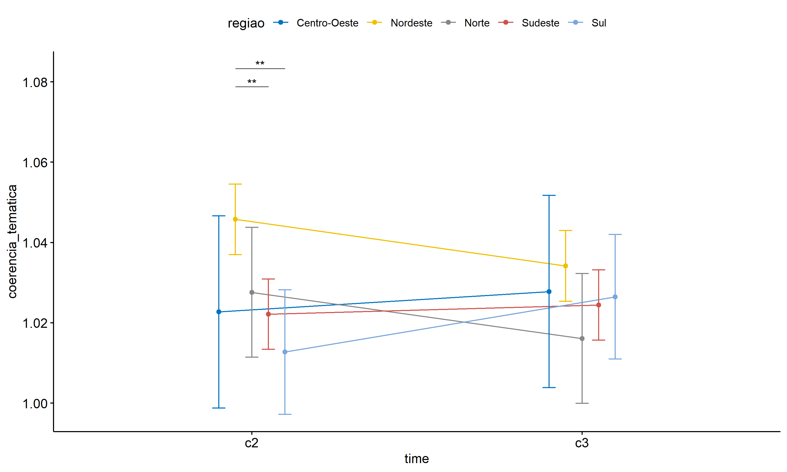<!-- -->

``` r
(pwc <- ldat %>% group_by(regiao) %>%
    emmeans_test(coerencia_tematica ~ time, detailed = T, p.adjust.method = "bonferroni"))
```

    ## # A tibble: 5 × 15
    ##   regiao    term  .y.   group1 group2 null.value estimate      se    df conf.low
    ## * <fct>     <chr> <chr> <chr>  <chr>       <dbl>    <dbl>   <dbl> <dbl>    <dbl>
    ## 1 Centro-O… time  coer… c2     c3              0 -0.00505 0.0173   8074 -3.89e-2
    ## 2 Nordeste  time  coer… c2     c3              0  0.0116  0.00635  8074 -8.36e-4
    ## 3 Norte     time  coer… c2     c3              0  0.0115  0.0117   8074 -1.13e-2
    ## 4 Sudeste   time  coer… c2     c3              0 -0.00230 0.00633  8074 -1.47e-2
    ## 5 Sul       time  coer… c2     c3              0 -0.0138  0.0112   8074 -3.57e-2
    ## # ℹ 5 more variables: conf.high <dbl>, statistic <dbl>, p <dbl>, p.adj <dbl>,
    ## #   p.adj.signif <chr>

| regiao       | term | .y.                | group1 | group2 | null.value | estimate |    se |   df | conf.low | conf.high | statistic |     p | p.adj | p.adj.signif |
|:-------------|:-----|:-------------------|:-------|:-------|-----------:|---------:|------:|-----:|---------:|----------:|----------:|------:|------:|:-------------|
| Centro-Oeste | time | coerencia_tematica | c2     | c3     |          0 |   -0.005 | 0.017 | 8074 |   -0.039 |     0.029 |    -0.292 | 0.770 | 0.770 | ns           |
| Nordeste     | time | coerencia_tematica | c2     | c3     |          0 |    0.012 | 0.006 | 8074 |   -0.001 |     0.024 |     1.829 | 0.068 | 0.068 | ns           |
| Norte        | time | coerencia_tematica | c2     | c3     |          0 |    0.011 | 0.012 | 8074 |   -0.011 |     0.034 |     0.987 | 0.324 | 0.324 | ns           |
| Sudeste      | time | coerencia_tematica | c2     | c3     |          0 |   -0.002 | 0.006 | 8074 |   -0.015 |     0.010 |    -0.363 | 0.717 | 0.717 | ns           |
| Sul          | time | coerencia_tematica | c2     | c3     |          0 |   -0.014 | 0.011 | 8074 |   -0.036 |     0.008 |    -1.231 | 0.218 | 0.218 | ns           |

``` r
(emms <- get_emmeans(pwc))
```

    ## # A tibble: 10 × 8
    ##    regiao       time  emmean      se    df conf.low conf.high method      
    ##    <fct>        <fct>  <dbl>   <dbl> <dbl>    <dbl>     <dbl> <chr>       
    ##  1 Centro-Oeste c2      1.02 0.0122   8074    0.999      1.05 Emmeans test
    ##  2 Centro-Oeste c3      1.03 0.0122   8074    1.00       1.05 Emmeans test
    ##  3 Nordeste     c2      1.05 0.00449  8074    1.04       1.05 Emmeans test
    ##  4 Nordeste     c3      1.03 0.00449  8074    1.03       1.04 Emmeans test
    ##  5 Norte        c2      1.03 0.00824  8074    1.01       1.04 Emmeans test
    ##  6 Norte        c3      1.02 0.00824  8074    1.00       1.03 Emmeans test
    ##  7 Sudeste      c2      1.02 0.00448  8074    1.01       1.03 Emmeans test
    ##  8 Sudeste      c3      1.02 0.00448  8074    1.02       1.03 Emmeans test
    ##  9 Sul          c2      1.01 0.00791  8074    0.997      1.03 Emmeans test
    ## 10 Sul          c3      1.03 0.00791  8074    1.01       1.04 Emmeans test

| regiao       | time | emmean |    se |   df | conf.low | conf.high | method       |
|:-------------|:-----|-------:|------:|-----:|---------:|----------:|:-------------|
| Centro-Oeste | c2   |  1.023 | 0.012 | 8074 |    0.999 |     1.047 | Emmeans test |
| Centro-Oeste | c3   |  1.028 | 0.012 | 8074 |    1.004 |     1.052 | Emmeans test |
| Nordeste     | c2   |  1.046 | 0.004 | 8074 |    1.037 |     1.055 | Emmeans test |
| Nordeste     | c3   |  1.034 | 0.004 | 8074 |    1.025 |     1.043 | Emmeans test |
| Norte        | c2   |  1.028 | 0.008 | 8074 |    1.011 |     1.044 | Emmeans test |
| Norte        | c3   |  1.016 | 0.008 | 8074 |    1.000 |     1.032 | Emmeans test |
| Sudeste      | c2   |  1.022 | 0.004 | 8074 |    1.013 |     1.031 | Emmeans test |
| Sudeste      | c3   |  1.024 | 0.004 | 8074 |    1.016 |     1.033 | Emmeans test |
| Sul          | c2   |  1.013 | 0.008 | 8074 |    0.997 |     1.028 | Emmeans test |
| Sul          | c3   |  1.026 | 0.008 | 8074 |    1.011 |     1.042 | Emmeans test |

``` r
emms.gg <- emms[which(emms$regiao == "Centro-Oeste"),]
if (nrow(emms.gg) > 0)
  ggline(emms.gg, x = "time", y = "emmean", color = "#0073C2FF", ylab = "coerencia_tematica") +
    geom_errorbar(aes(ymin = conf.low, ymax = conf.high),
                  width = 0.2, color = "#0073C2FF") +
    stat_pvalue_manual(
      add_xy_position(pwc[which(pwc$regiao == "Centro-Oeste"),],
                      x = "time", fun = "mean_se"),
      hide.ns = T, color = "#0073C2FF", tip.length = F) +
    labs(title = "regiao: Centro-Oeste")+
    theme(legend.text = element_blank())
```

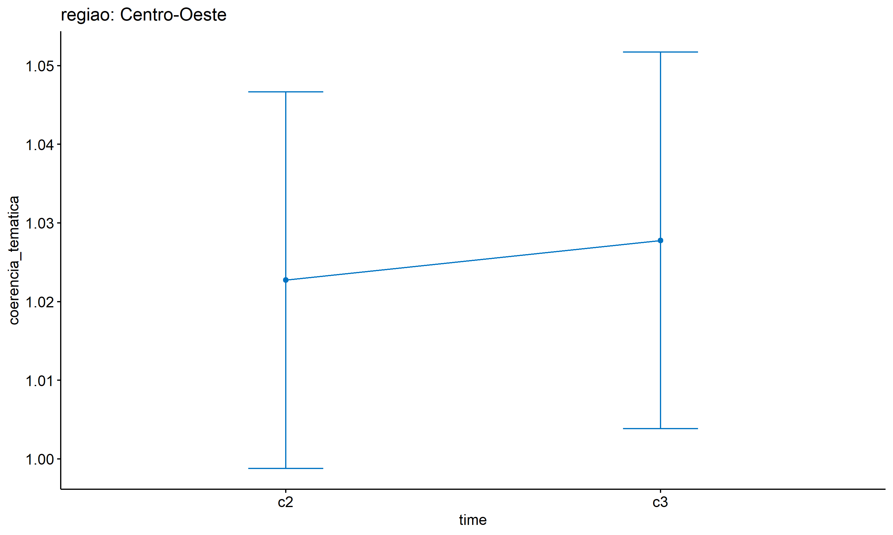<!-- -->

``` r
emms.gg <- emms[which(emms$regiao == "Nordeste"),]
if (nrow(emms.gg) > 0)
  ggline(emms.gg, x = "time", y = "emmean", color = "#EFC000FF", ylab = "coerencia_tematica") +
    geom_errorbar(aes(ymin = conf.low, ymax = conf.high),
                  width = 0.2, color = "#EFC000FF") +
    stat_pvalue_manual(
      add_xy_position(pwc[which(pwc$regiao == "Nordeste"),],
                      x = "time", fun = "mean_se"),
      hide.ns = T, color = "#EFC000FF", tip.length = F) +
    labs(title = "regiao: Nordeste")+
    theme(legend.text = element_blank())
```

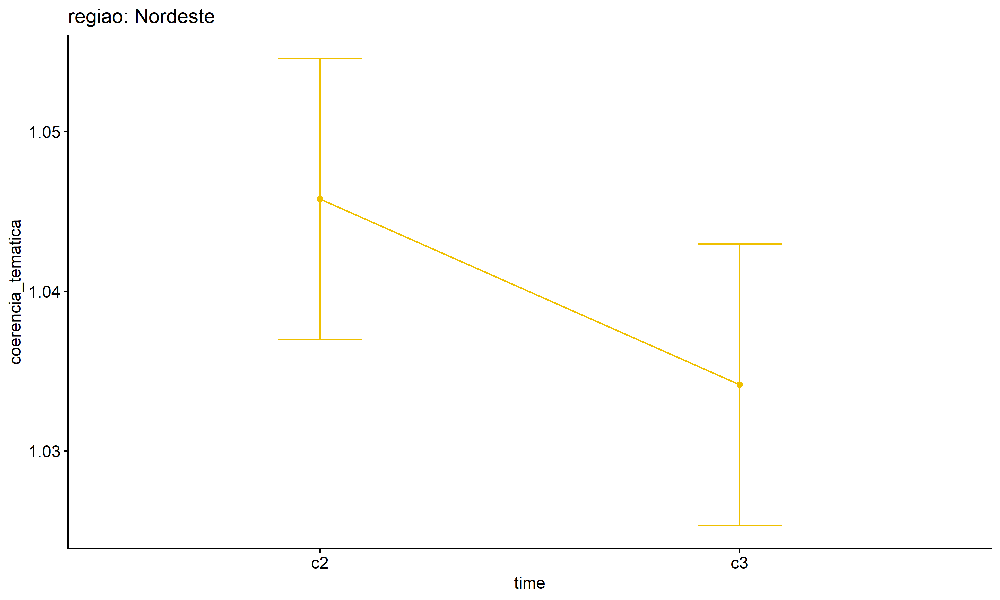<!-- -->

``` r
emms.gg <- emms[which(emms$regiao == "Norte"),]
if (nrow(emms.gg) > 0)
  ggline(emms.gg, x = "time", y = "emmean", color = "#868686FF", ylab = "coerencia_tematica") +
    geom_errorbar(aes(ymin = conf.low, ymax = conf.high),
                  width = 0.2, color = "#868686FF") +
    stat_pvalue_manual(
      add_xy_position(pwc[which(pwc$regiao == "Norte"),],
                      x = "time", fun = "mean_se"),
      hide.ns = T, color = "#868686FF", tip.length = F) +
    labs(title = "regiao: Norte")+
    theme(legend.text = element_blank())
```

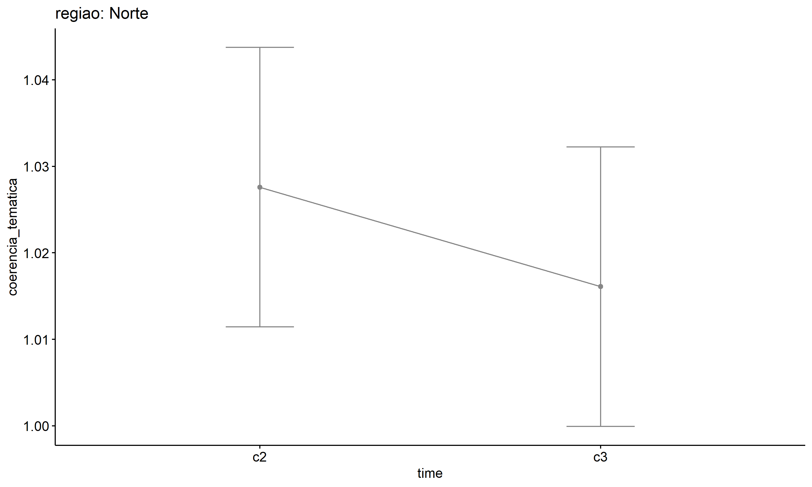<!-- -->

``` r
emms.gg <- emms[which(emms$regiao == "Sudeste"),]
if (nrow(emms.gg) > 0)
  ggline(emms.gg, x = "time", y = "emmean", color = "#CD534CFF", ylab = "coerencia_tematica") +
    geom_errorbar(aes(ymin = conf.low, ymax = conf.high),
                  width = 0.2, color = "#CD534CFF") +
    stat_pvalue_manual(
      add_xy_position(pwc[which(pwc$regiao == "Sudeste"),],
                      x = "time", fun = "mean_se"),
      hide.ns = T, color = "#CD534CFF", tip.length = F) +
    labs(title = "regiao: Sudeste")+
    theme(legend.text = element_blank())
```

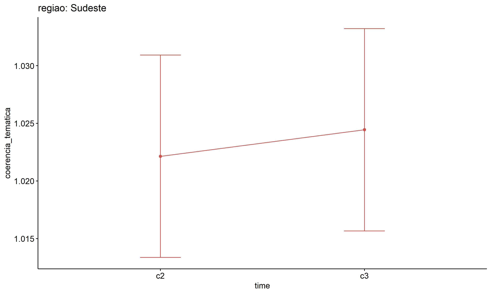<!-- -->

``` r
emms.gg <- emms[which(emms$regiao == "Sul"),]
if (nrow(emms.gg) > 0)
  ggline(emms.gg, x = "time", y = "emmean", color = "#7AA6DCFF", ylab = "coerencia_tematica") +
    geom_errorbar(aes(ymin = conf.low, ymax = conf.high),
                  width = 0.2, color = "#7AA6DCFF") +
    stat_pvalue_manual(
      add_xy_position(pwc[which(pwc$regiao == "Sul"),],
                      x = "time", fun = "mean_se"),
      hide.ns = T, color = "#7AA6DCFF", tip.length = F) +
    labs(title = "regiao: Sul")+
    theme(legend.text = element_blank())
```

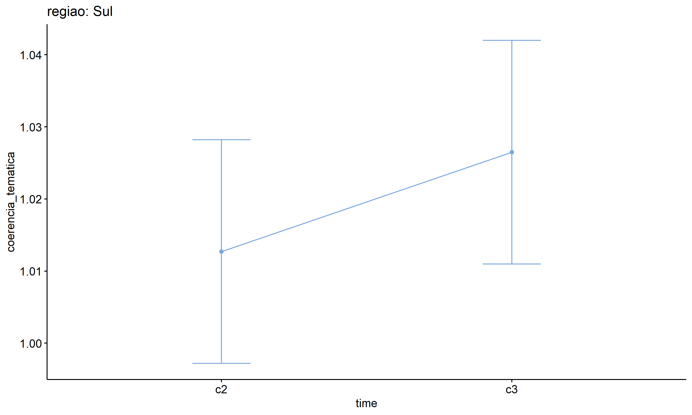<!-- -->

## PairWise Computation after removing non.normal data

``` r
if (length(non.ids) > 0)
  (pwc2 <- ldat2 %>% group_by(time) %>%
     emmeans_test(coerencia_tematica ~ regiao, detailed = T, p.adjust.method = "bonferroni"))
```

``` r
if (length(non.ids) > 0)
  (emms2 <- get_emmeans(pwc2))
```

``` r
if (length(non.ids) > 0) {
  pwc2 <- add_xy_position(pwc2, x = "time", fun = "mean_se", dodge = 0.25)
  pd2 <- position_dodge(width = 0.25)
  
  ggline(emms2, x = "time", y = "emmean", color = "regiao",
         palette = c("#0073C2FF","#EFC000FF","#868686FF","#CD534CFF","#7AA6DCFF"),
         position = pd, ylab = "coerencia_tematica") +
    geom_errorbar(aes(ymin = conf.low, ymax = conf.high, color = regiao),
                position = pd, width = 0.2) +
    stat_pvalue_manual(pwc2, hide.ns = T, tip.length = F, linetype = 1)
}
```

``` r
if (length(non.ids) > 0)
  (pwc2 <- ldat2 %>% group_by(regiao) %>%
     emmeans_test(coerencia_tematica ~ time, detailed = T, p.adjust.method = "bonferroni"))
```

``` r
if (length(non.ids) > 0)
  (emms2 <- get_emmeans(pwc2))
```

``` r
if (length(non.ids) > 0) {
  emms.gg <- emms2[which(emms2$regiao == "Centro-Oeste"),]
  if (nrow(emms.gg) > 0)
    ggline(emms.gg, x = "time", y = "emmean", color = "#0073C2FF", ylab = "coerencia_tematica") +
    geom_errorbar(aes(ymin = conf.low, ymax = conf.high),
                  width = 0.2, color = "#0073C2FF") +
    stat_pvalue_manual(
      add_xy_position(pwc[which(pwc$regiao == "Centro-Oeste"),],
                      x = "time", fun = "mean_se"),
      hide.ns = T, color = "#0073C2FF", tip.length = F) +
    labs(title = "regiao: Centro-Oeste") +
    theme(legend.text = element_blank())
}
```

``` r
if (length(non.ids) > 0) {
  emms.gg <- emms2[which(emms2$regiao == "Nordeste"),]
  if (nrow(emms.gg) > 0)
    ggline(emms.gg, x = "time", y = "emmean", color = "#EFC000FF", ylab = "coerencia_tematica") +
    geom_errorbar(aes(ymin = conf.low, ymax = conf.high),
                  width = 0.2, color = "#EFC000FF") +
    stat_pvalue_manual(
      add_xy_position(pwc[which(pwc$regiao == "Nordeste"),],
                      x = "time", fun = "mean_se"),
      hide.ns = T, color = "#EFC000FF", tip.length = F) +
    labs(title = "regiao: Nordeste") +
    theme(legend.text = element_blank())
}
```

``` r
if (length(non.ids) > 0) {
  emms.gg <- emms2[which(emms2$regiao == "Norte"),]
  if (nrow(emms.gg) > 0)
    ggline(emms.gg, x = "time", y = "emmean", color = "#868686FF", ylab = "coerencia_tematica") +
    geom_errorbar(aes(ymin = conf.low, ymax = conf.high),
                  width = 0.2, color = "#868686FF") +
    stat_pvalue_manual(
      add_xy_position(pwc[which(pwc$regiao == "Norte"),],
                      x = "time", fun = "mean_se"),
      hide.ns = T, color = "#868686FF", tip.length = F) +
    labs(title = "regiao: Norte") +
    theme(legend.text = element_blank())
}
```

``` r
if (length(non.ids) > 0) {
  emms.gg <- emms2[which(emms2$regiao == "Sudeste"),]
  if (nrow(emms.gg) > 0)
    ggline(emms.gg, x = "time", y = "emmean", color = "#CD534CFF", ylab = "coerencia_tematica") +
    geom_errorbar(aes(ymin = conf.low, ymax = conf.high),
                  width = 0.2, color = "#CD534CFF") +
    stat_pvalue_manual(
      add_xy_position(pwc[which(pwc$regiao == "Sudeste"),],
                      x = "time", fun = "mean_se"),
      hide.ns = T, color = "#CD534CFF", tip.length = F) +
    labs(title = "regiao: Sudeste") +
    theme(legend.text = element_blank())
}
```

``` r
if (length(non.ids) > 0) {
  emms.gg <- emms2[which(emms2$regiao == "Sul"),]
  if (nrow(emms.gg) > 0)
    ggline(emms.gg, x = "time", y = "emmean", color = "#7AA6DCFF", ylab = "coerencia_tematica") +
    geom_errorbar(aes(ymin = conf.low, ymax = conf.high),
                  width = 0.2, color = "#7AA6DCFF") +
    stat_pvalue_manual(
      add_xy_position(pwc[which(pwc$regiao == "Sul"),],
                      x = "time", fun = "mean_se"),
      hide.ns = T, color = "#7AA6DCFF", tip.length = F) +
    labs(title = "regiao: Sul") +
    theme(legend.text = element_blank())
}
```

# ANOVA: coerencia_tematica ~ time\*porte + Error(id/time)

## Data Preparation

``` r
data <- edat[,c("aluno_id","porte","ciclo","coerencia_tematica")]
data <- data[data$ciclo %in% c("Segundo Ciclo","Terceiro Ciclo"),]
data$ciclo <- factor(data$ciclo, c("Segundo Ciclo","Terceiro Ciclo"))
data <- unique(data)

wdat <- spread(data, ciclo, coerencia_tematica)
wdat <- wdat[complete.cases(wdat),]
colnames(wdat) <- c("id","porte","c2","c3")

ldat <- gather(wdat, key = time, value = coerencia_tematica, c2,c3) %>%
  convert_as_factor(id, time)
ldat <- remove_group_data(ldat, "coerencia_tematica", c("time", "porte"), n.limit = 30)
ldat$porte <- factor(ldat$porte, sort(unique(ldat$porte)))
```

### Check assumptions: Identifying Outliers

``` r
outliers <- identify_outliers(group_by(ldat, time, porte), coerencia_tematica)
(outliers <- outliers[outliers$is.extreme == T,])
```

    ## # A tibble: 253 × 6
    ##    porte                    time  id    coerencia_tematica is.outlier is.extreme
    ##    <fct>                    <fct> <fct>              <dbl> <lgl>      <lgl>     
    ##  1 Até 50 matrículas de es… c2    JKEv…                2   TRUE       TRUE      
    ##  2 Entre 201 e 500 matrícu… c2    bBBG…                2   TRUE       TRUE      
    ##  3 Entre 201 e 500 matrícu… c2    c8tC…                1.5 TRUE       TRUE      
    ##  4 Entre 201 e 500 matrícu… c2    cFxw…                3   TRUE       TRUE      
    ##  5 Entre 201 e 500 matrícu… c2    dzxW…                2   TRUE       TRUE      
    ##  6 Entre 201 e 500 matrícu… c2    g2V9…                3   TRUE       TRUE      
    ##  7 Entre 201 e 500 matrícu… c2    gcps…                1.5 TRUE       TRUE      
    ##  8 Entre 201 e 500 matrícu… c2    gVuM…                2   TRUE       TRUE      
    ##  9 Entre 201 e 500 matrícu… c2    GyXk…                1.5 TRUE       TRUE      
    ## 10 Entre 201 e 500 matrícu… c2    hign…                2   TRUE       TRUE      
    ## # ℹ 243 more rows

| porte                                        | time | id                   | coerencia_tematica | is.outlier | is.extreme |
|:---------------------------------------------|:-----|:---------------------|-------------------:|:-----------|:-----------|
| Até 50 matrículas de escolarização           | c2   | JKEvnqvCpv10PSAycuzr |              2.000 | TRUE       | TRUE       |
| Entre 201 e 500 matrículas de escolarização  | c2   | bBBGsbvYBLgWujzEuOES |              2.000 | TRUE       | TRUE       |
| Entre 201 e 500 matrículas de escolarização  | c2   | c8tCs09Zmla9HW6nXAba |              1.500 | TRUE       | TRUE       |
| Entre 201 e 500 matrículas de escolarização  | c2   | cFxwLMwyCxWzWrkpwvkt |              3.000 | TRUE       | TRUE       |
| Entre 201 e 500 matrículas de escolarização  | c2   | dzxWSwAxb1LbKLWq0f8W |              2.000 | TRUE       | TRUE       |
| Entre 201 e 500 matrículas de escolarização  | c2   | g2V94DT753T4rGOFLnO9 |              3.000 | TRUE       | TRUE       |
| Entre 201 e 500 matrículas de escolarização  | c2   | gcpsjKSQtozLkdeuPlAQ |              1.500 | TRUE       | TRUE       |
| Entre 201 e 500 matrículas de escolarização  | c2   | gVuMjTLcSjwi8PtQcX3g |              2.000 | TRUE       | TRUE       |
| Entre 201 e 500 matrículas de escolarização  | c2   | GyXkNYglZFaiWPdo2jHx |              1.500 | TRUE       | TRUE       |
| Entre 201 e 500 matrículas de escolarização  | c2   | higntdffAusBUEJvytQY |              2.000 | TRUE       | TRUE       |
| Entre 201 e 500 matrículas de escolarização  | c2   | hRksqP03n9bIhD3mMUSS |              1.500 | TRUE       | TRUE       |
| Entre 201 e 500 matrículas de escolarização  | c2   | hV78K1w2Sy3NbDijChE1 |              2.000 | TRUE       | TRUE       |
| Entre 201 e 500 matrículas de escolarização  | c2   | iGhiHBHlWPESJbq2D7PI |              2.000 | TRUE       | TRUE       |
| Entre 201 e 500 matrículas de escolarização  | c2   | ILuG2m3xDKcwiThmAUW8 |              2.000 | TRUE       | TRUE       |
| Entre 201 e 500 matrículas de escolarização  | c2   | ITPXRLN2xaGJzebM4a3K |              1.500 | TRUE       | TRUE       |
| Entre 201 e 500 matrículas de escolarização  | c2   | iYlYrwjNTF4uR2dhpyxO |              1.500 | TRUE       | TRUE       |
| Entre 201 e 500 matrículas de escolarização  | c2   | j29T3ZFdMcWxbBYVneR1 |              2.000 | TRUE       | TRUE       |
| Entre 201 e 500 matrículas de escolarização  | c2   | j8nYm0EY03K9FNADOg7A |              2.000 | TRUE       | TRUE       |
| Entre 201 e 500 matrículas de escolarização  | c2   | jibzqnofR0GRDwmmPk7Y |              2.000 | TRUE       | TRUE       |
| Entre 201 e 500 matrículas de escolarização  | c2   | JxBy1XhCm6SIIhCxOv2f |              1.500 | TRUE       | TRUE       |
| Entre 201 e 500 matrículas de escolarização  | c2   | kJIRWfRQpGpgJ9XydSAv |              2.000 | TRUE       | TRUE       |
| Entre 201 e 500 matrículas de escolarização  | c2   | ks4CBM3zPHocVr9YlWDI |              1.500 | TRUE       | TRUE       |
| Entre 201 e 500 matrículas de escolarização  | c2   | ksgo1zWUwzzFyFHwP56e |              1.500 | TRUE       | TRUE       |
| Entre 201 e 500 matrículas de escolarização  | c2   | l14u3DL5ZLhsniQeUpJS |              1.500 | TRUE       | TRUE       |
| Entre 201 e 500 matrículas de escolarização  | c2   | l23hjNOgy6nAwiy4LCWe |              2.000 | TRUE       | TRUE       |
| Entre 201 e 500 matrículas de escolarização  | c2   | LjaXA0VBj0ofjYU1ASZY |              2.000 | TRUE       | TRUE       |
| Entre 201 e 500 matrículas de escolarização  | c2   | llfmmeAJlptgMoFLELZa |              2.000 | TRUE       | TRUE       |
| Entre 201 e 500 matrículas de escolarização  | c2   | lW5qykPQQcYd17PAfD2m |              1.500 | TRUE       | TRUE       |
| Entre 201 e 500 matrículas de escolarização  | c2   | LzPHYYb0TblKO9PPMzWp |              2.000 | TRUE       | TRUE       |
| Entre 201 e 500 matrículas de escolarização  | c2   | m0xj7CIrSEGFqXJYZr40 |              2.000 | TRUE       | TRUE       |
| Entre 201 e 500 matrículas de escolarização  | c2   | MMiQ1tmvspk2qTnYgmxJ |              1.500 | TRUE       | TRUE       |
| Entre 201 e 500 matrículas de escolarização  | c2   | NhAQ8t5HSuELn12vygjO |              2.000 | TRUE       | TRUE       |
| Entre 201 e 500 matrículas de escolarização  | c2   | nKEm138VjOkYk302F3pH |              2.000 | TRUE       | TRUE       |
| Entre 201 e 500 matrículas de escolarização  | c2   | ODaAE1X2lfQ7W0LJlUWa |              1.500 | TRUE       | TRUE       |
| Entre 201 e 500 matrículas de escolarização  | c2   | oQIlwAzaDraWYUdymlAL |              1.500 | TRUE       | TRUE       |
| Entre 201 e 500 matrículas de escolarização  | c2   | p18Ra2eTsN3Mrl4bZFRG |              1.500 | TRUE       | TRUE       |
| Entre 201 e 500 matrículas de escolarização  | c2   | ptWlwZXM3ojHCTykyYEJ |              1.500 | TRUE       | TRUE       |
| Entre 201 e 500 matrículas de escolarização  | c2   | puJ0cHDwxp3cYxetrMyX |              2.000 | TRUE       | TRUE       |
| Entre 201 e 500 matrículas de escolarização  | c2   | QX1AYFz0937xfLHeuBgs |              2.000 | TRUE       | TRUE       |
| Entre 201 e 500 matrículas de escolarização  | c2   | rNomRIEoQRUfprn0kDM8 |              1.500 | TRUE       | TRUE       |
| Entre 201 e 500 matrículas de escolarização  | c2   | SdzWHLHP8Pf2f5VFViDZ |              2.000 | TRUE       | TRUE       |
| Entre 201 e 500 matrículas de escolarização  | c2   | seS2r5RilRLBhpDRPKA6 |              2.000 | TRUE       | TRUE       |
| Entre 201 e 500 matrículas de escolarização  | c2   | Sj6yPHoyaHzrUcYzBdnz |              3.000 | TRUE       | TRUE       |
| Entre 201 e 500 matrículas de escolarização  | c2   | sqswiqzkWZWmnp3PhqTw |              1.500 | TRUE       | TRUE       |
| Entre 201 e 500 matrículas de escolarização  | c2   | T4FHGCkWdtu0VECvhUzE |              1.500 | TRUE       | TRUE       |
| Entre 201 e 500 matrículas de escolarização  | c2   | u1zil2OzxQVXB2KwkuTr |              2.000 | TRUE       | TRUE       |
| Entre 201 e 500 matrículas de escolarização  | c2   | V6b5g1tzXwQnVKvwuGbb |              2.000 | TRUE       | TRUE       |
| Entre 201 e 500 matrículas de escolarização  | c2   | V9dfZnfGlWWXgh6Mkts9 |              2.000 | TRUE       | TRUE       |
| Entre 201 e 500 matrículas de escolarização  | c2   | vdyvgr0lDaUCQsHOY8pt |              2.000 | TRUE       | TRUE       |
| Entre 201 e 500 matrículas de escolarização  | c2   | Vp1uLMoHAG4q1y7fsjcA |              1.500 | TRUE       | TRUE       |
| Entre 201 e 500 matrículas de escolarização  | c2   | VQdi9Txgkx29Z2pZytGE |              1.500 | TRUE       | TRUE       |
| Entre 201 e 500 matrículas de escolarização  | c2   | vyUaA4Vgc7mVjSpyy1kO |              2.000 | TRUE       | TRUE       |
| Entre 201 e 500 matrículas de escolarização  | c2   | w2KWF4yz1Qt8S6apg9Nq |              2.000 | TRUE       | TRUE       |
| Entre 201 e 500 matrículas de escolarização  | c2   | waSxu7TKpPaQubAUp8zA |              2.000 | TRUE       | TRUE       |
| Entre 201 e 500 matrículas de escolarização  | c2   | WeQsbNRHqO7kuokO3wmj |              3.000 | TRUE       | TRUE       |
| Entre 201 e 500 matrículas de escolarização  | c2   | wRbwfi4GayjRV5STbjHB |              1.500 | TRUE       | TRUE       |
| Entre 201 e 500 matrículas de escolarização  | c2   | XB74qI0rwchkPii7rp7z |              2.000 | TRUE       | TRUE       |
| Entre 201 e 500 matrículas de escolarização  | c2   | Xg1Qd24stqCttUg82X69 |              1.500 | TRUE       | TRUE       |
| Entre 201 e 500 matrículas de escolarização  | c2   | XK7IkCw9kmNWFSoPss9S |              1.500 | TRUE       | TRUE       |
| Entre 201 e 500 matrículas de escolarização  | c2   | XodGtJByOkgFYKUHapao |              2.000 | TRUE       | TRUE       |
| Entre 201 e 500 matrículas de escolarização  | c2   | Yn8j3irvKAHQerN2qYp4 |              1.500 | TRUE       | TRUE       |
| Entre 201 e 500 matrículas de escolarização  | c2   | Yp70Dh6vdviwhkjJUHAq |              2.000 | TRUE       | TRUE       |
| Entre 201 e 500 matrículas de escolarização  | c2   | YSo7fze1XP8h2d81TVJi |              2.000 | TRUE       | TRUE       |
| Entre 201 e 500 matrículas de escolarização  | c2   | zCTzxYoQjxqmWiQngsY4 |              2.000 | TRUE       | TRUE       |
| Entre 201 e 500 matrículas de escolarização  | c2   | ZSvgF2tGGZ3ZPp3LsClQ |              1.500 | TRUE       | TRUE       |
| Entre 501 e 1000 matrículas de escolarização | c2   | a8SWsJUcxVnZgfDuYhl9 |              1.500 | TRUE       | TRUE       |
| Entre 501 e 1000 matrículas de escolarização | c2   | aGe8oY0BM2o4WY2b3cMO |              1.500 | TRUE       | TRUE       |
| Entre 501 e 1000 matrículas de escolarização | c2   | aHRArOnxnMCJAnjRvMkz |              1.500 | TRUE       | TRUE       |
| Entre 501 e 1000 matrículas de escolarização | c2   | bEH3ieH27FIqcQO2qaG5 |              1.500 | TRUE       | TRUE       |
| Entre 501 e 1000 matrículas de escolarização | c2   | cO1stoI0XTZlXCGzSYmR |              1.500 | TRUE       | TRUE       |
| Entre 501 e 1000 matrículas de escolarização | c2   | dBufNE5pBAeoHmZz0nke |              2.000 | TRUE       | TRUE       |
| Entre 501 e 1000 matrículas de escolarização | c2   | eakSXIhde0LSciiZKTJf |              1.500 | TRUE       | TRUE       |
| Entre 501 e 1000 matrículas de escolarização | c2   | fZbZWnu3vvhrwYpmrO9k |              2.000 | TRUE       | TRUE       |
| Entre 501 e 1000 matrículas de escolarização | c2   | g1Y9akoQG5mxUPxLhbcj |              1.500 | TRUE       | TRUE       |
| Entre 501 e 1000 matrículas de escolarização | c2   | gQc2WkGSPT6YRq2BbFmi |              1.333 | TRUE       | TRUE       |
| Entre 501 e 1000 matrículas de escolarização | c2   | GW2PAQxsvmLtpBNJNym7 |              1.333 | TRUE       | TRUE       |
| Entre 501 e 1000 matrículas de escolarização | c2   | gXcnw3rDblx0csS2JTlO |              2.000 | TRUE       | TRUE       |
| Entre 501 e 1000 matrículas de escolarização | c2   | HjIfGleeETArbQSCh03g |              2.000 | TRUE       | TRUE       |
| Entre 501 e 1000 matrículas de escolarização | c2   | hOPnyViTC3bVUvYv9zCC |              1.500 | TRUE       | TRUE       |
| Entre 501 e 1000 matrículas de escolarização | c2   | HuD1YErYaPFPc5BeAVhI |              2.000 | TRUE       | TRUE       |
| Entre 501 e 1000 matrículas de escolarização | c2   | i2oRGsfJzmZ9N502mT77 |              1.500 | TRUE       | TRUE       |
| Entre 501 e 1000 matrículas de escolarização | c2   | IIsMlpIp9iHmNHRVF1bc |              2.000 | TRUE       | TRUE       |
| Entre 501 e 1000 matrículas de escolarização | c2   | INm50SKxqFJZGliYbYuq |              2.000 | TRUE       | TRUE       |
| Entre 501 e 1000 matrículas de escolarização | c2   | IOvrLhjyL36foBOflXwo |              2.000 | TRUE       | TRUE       |
| Entre 501 e 1000 matrículas de escolarização | c2   | J5nICZq522sdxw5DKGD0 |              1.500 | TRUE       | TRUE       |
| Entre 501 e 1000 matrículas de escolarização | c2   | jpC3vSNTUDnQh1bVVcfW |              1.500 | TRUE       | TRUE       |
| Entre 501 e 1000 matrículas de escolarização | c2   | jQ2edrW5GBEk3Jensn3T |              2.000 | TRUE       | TRUE       |
| Entre 501 e 1000 matrículas de escolarização | c2   | jqYuNJZAsKjE34sLcEiN |              2.000 | TRUE       | TRUE       |
| Entre 501 e 1000 matrículas de escolarização | c2   | JXVhAfQwMJmDyzL7Ow0f |              2.000 | TRUE       | TRUE       |
| Entre 501 e 1000 matrículas de escolarização | c2   | kMT5lAiv5AQf4YJ6lpW4 |              2.000 | TRUE       | TRUE       |
| Entre 501 e 1000 matrículas de escolarização | c2   | Lgo5TAkgaFVrGlgdORvr |              2.000 | TRUE       | TRUE       |
| Entre 501 e 1000 matrículas de escolarização | c2   | LpaoylKKeSTt2YWXtA0F |              1.250 | TRUE       | TRUE       |
| Entre 501 e 1000 matrículas de escolarização | c2   | mpLkf9CEZGlNTLxpjceW |              2.000 | TRUE       | TRUE       |
| Entre 501 e 1000 matrículas de escolarização | c2   | mXNMQxPPCRPBTP33J1t6 |              2.000 | TRUE       | TRUE       |
| Entre 501 e 1000 matrículas de escolarização | c2   | N4IaRiNre0zdlO8WMnpU |              1.500 | TRUE       | TRUE       |
| Entre 501 e 1000 matrículas de escolarização | c2   | NGl9qiq97cW0ttDa3O3B |              2.000 | TRUE       | TRUE       |
| Entre 501 e 1000 matrículas de escolarização | c2   | oHU6gZafmvgKSrwzZAeH |              2.000 | TRUE       | TRUE       |
| Entre 501 e 1000 matrículas de escolarização | c2   | OIk9ePK7PgYC88XMBkjk |              3.000 | TRUE       | TRUE       |
| Entre 501 e 1000 matrículas de escolarização | c2   | oiwBh6qBV0OXX5Ky4pUT |              2.000 | TRUE       | TRUE       |
| Entre 501 e 1000 matrículas de escolarização | c2   | OK7eABz6qpM3kySdwJEd |              3.000 | TRUE       | TRUE       |
| Entre 501 e 1000 matrículas de escolarização | c2   | Pjq4bh983tAK4i5CmeZh |              1.500 | TRUE       | TRUE       |
| Entre 501 e 1000 matrículas de escolarização | c2   | qaLYnU8g3n0nW6adZKum |              2.000 | TRUE       | TRUE       |
| Entre 501 e 1000 matrículas de escolarização | c2   | QnAoKinKY0S7LthcNMQr |              1.500 | TRUE       | TRUE       |
| Entre 501 e 1000 matrículas de escolarização | c2   | rgdnkEyM80k12Pgg9BsY |              1.500 | TRUE       | TRUE       |
| Entre 501 e 1000 matrículas de escolarização | c2   | RhivsuJG4fBEZgQv82fM |              1.500 | TRUE       | TRUE       |
| Entre 501 e 1000 matrículas de escolarização | c2   | rLiTdsMBwuJPGue8OKX6 |              2.000 | TRUE       | TRUE       |
| Entre 501 e 1000 matrículas de escolarização | c2   | SmrNerrdGK4D40ZTwzyP |              2.000 | TRUE       | TRUE       |
| Entre 501 e 1000 matrículas de escolarização | c2   | SospesQs9lHWbeGvftYs |              1.500 | TRUE       | TRUE       |
| Entre 501 e 1000 matrículas de escolarização | c2   | t9EXHmWcmpDl7WccMnBE |              2.000 | TRUE       | TRUE       |
| Entre 501 e 1000 matrículas de escolarização | c2   | tAOBN5KVkiroC03qobTH |              1.200 | TRUE       | TRUE       |
| Entre 501 e 1000 matrículas de escolarização | c2   | tHWlNuniDbS1xW7RctVI |              2.000 | TRUE       | TRUE       |
| Entre 501 e 1000 matrículas de escolarização | c2   | tw7Cm7BXPHSsi3uX3Mbs |              2.000 | TRUE       | TRUE       |
| Entre 501 e 1000 matrículas de escolarização | c2   | U4aFjphBd5eS72XCccPw |              1.500 | TRUE       | TRUE       |
| Entre 501 e 1000 matrículas de escolarização | c2   | U4ULFXX6YVmPHbvNon9P |              2.500 | TRUE       | TRUE       |
| Entre 501 e 1000 matrículas de escolarização | c2   | U5PipLs02KAxgksTobqi |              2.000 | TRUE       | TRUE       |
| Entre 501 e 1000 matrículas de escolarização | c2   | UHo9GyhW8xE8ImiVpMY3 |              1.500 | TRUE       | TRUE       |
| Entre 501 e 1000 matrículas de escolarização | c2   | UVVPc0WHttdUCpLcxbc0 |              1.500 | TRUE       | TRUE       |
| Entre 501 e 1000 matrículas de escolarização | c2   | XlW7LrWByqhSEOcsBv1E |              2.000 | TRUE       | TRUE       |
| Entre 501 e 1000 matrículas de escolarização | c2   | XX5eGVd1Hbd37UnSUG7o |              2.000 | TRUE       | TRUE       |
| Entre 501 e 1000 matrículas de escolarização | c2   | YHYEP1qyyvGAVuey2ior |              1.500 | TRUE       | TRUE       |
| Entre 501 e 1000 matrículas de escolarização | c2   | YzgKSMitiFA4Sjy8RlMs |              2.000 | TRUE       | TRUE       |
| Entre 501 e 1000 matrículas de escolarização | c2   | Z1kvDZdNO1IoGoYLcObB |              1.500 | TRUE       | TRUE       |
| Entre 501 e 1000 matrículas de escolarização | c2   | ZcoiIYTK35GCty2HuClw |              2.000 | TRUE       | TRUE       |
| Entre 501 e 1000 matrículas de escolarização | c2   | ZDZhpODoVH9TsZisJTN4 |              2.000 | TRUE       | TRUE       |
| Entre 501 e 1000 matrículas de escolarização | c2   | ZPCvHMnIAftartnrtFEF |              2.500 | TRUE       | TRUE       |
| Entre 501 e 1000 matrículas de escolarização | c2   | zsCZBoyFpYhBL6PSjptX |              2.000 | TRUE       | TRUE       |
| Entre 501 e 1000 matrículas de escolarização | c2   | ZSQiU7hvC1Mufec6oJ57 |              1.500 | TRUE       | TRUE       |
| Entre 501 e 1000 matrículas de escolarização | c2   | zu0ran0dmHOopHf9H3cW |              1.500 | TRUE       | TRUE       |
| Entre 51 e 200 matrículas de escolarização   | c2   | cUepYSggkyNVXrET7RCr |              2.000 | TRUE       | TRUE       |
| Entre 51 e 200 matrículas de escolarização   | c2   | e4T8ur8rXZ7jH6myH0wq |              2.000 | TRUE       | TRUE       |
| Entre 51 e 200 matrículas de escolarização   | c2   | eMaYeLRiclZymf00Bgj3 |              2.000 | TRUE       | TRUE       |
| Entre 51 e 200 matrículas de escolarização   | c2   | gELhuHqJ4d7stkaH7Zoe |              1.500 | TRUE       | TRUE       |
| Entre 51 e 200 matrículas de escolarização   | c2   | gSjPJJEtnEyiq3yEKqic |              2.000 | TRUE       | TRUE       |
| Entre 51 e 200 matrículas de escolarização   | c2   | HW3iJR889Q9EdBWaQrFP |              1.500 | TRUE       | TRUE       |
| Entre 51 e 200 matrículas de escolarização   | c2   | oEDVJwdVHdc8vvUBo2jy |              3.000 | TRUE       | TRUE       |
| Entre 51 e 200 matrículas de escolarização   | c2   | PQBj15ebjZg4nyeHd9e4 |              3.000 | TRUE       | TRUE       |
| Entre 51 e 200 matrículas de escolarização   | c2   | Pt8nmYgqUGtYaso9qysz |              2.000 | TRUE       | TRUE       |
| Entre 51 e 200 matrículas de escolarização   | c2   | qmI2dE4LuX6CGzXwWF7F |              2.000 | TRUE       | TRUE       |
| Entre 51 e 200 matrículas de escolarização   | c2   | u0hPBK1IAHuD6dO6zj4d |              2.000 | TRUE       | TRUE       |
| Entre 51 e 200 matrículas de escolarização   | c2   | u6FoUFi5Ge44kQlmqIQ2 |              2.000 | TRUE       | TRUE       |
| Entre 51 e 200 matrículas de escolarização   | c2   | yYPvU7v7STKRyATXYjci |              1.500 | TRUE       | TRUE       |
| Entre 51 e 200 matrículas de escolarização   | c2   | zyjVeK0oD3vhd93yTzBU |              2.000 | TRUE       | TRUE       |
| Mais de 1000 matrículas de escolarização     | c2   | t9jUogxOix4zNYWIH0Kq |              1.500 | TRUE       | TRUE       |
| Até 50 matrículas de escolarização           | c3   | o6lY8TqKQe4iwloQR4xT |              2.000 | TRUE       | TRUE       |
| Entre 201 e 500 matrículas de escolarização  | c3   | 1J37c92qD29MFCBtKjKW |              3.000 | TRUE       | TRUE       |
| Entre 201 e 500 matrículas de escolarização  | c3   | bBBGsbvYBLgWujzEuOES |              2.000 | TRUE       | TRUE       |
| Entre 201 e 500 matrículas de escolarização  | c3   | bco6M4CkAGsGFOtcIREv |              1.500 | TRUE       | TRUE       |
| Entre 201 e 500 matrículas de escolarização  | c3   | fptfQd1NJgg3eWAGfAtI |              2.000 | TRUE       | TRUE       |
| Entre 201 e 500 matrículas de escolarização  | c3   | g2V94DT753T4rGOFLnO9 |              3.000 | TRUE       | TRUE       |
| Entre 201 e 500 matrículas de escolarização  | c3   | GnYbHi1c0xZQJQvwqjgH |              2.000 | TRUE       | TRUE       |
| Entre 201 e 500 matrículas de escolarização  | c3   | h3MA9XopgLfmchs0gnEg |              2.000 | TRUE       | TRUE       |
| Entre 201 e 500 matrículas de escolarização  | c3   | HGZ14QtGsbUz0aRWfFPW |              2.000 | TRUE       | TRUE       |
| Entre 201 e 500 matrículas de escolarização  | c3   | Hs8ac6T8acMUDbU3vQYD |              2.000 | TRUE       | TRUE       |
| Entre 201 e 500 matrículas de escolarização  | c3   | ICbs5vZm4fYjLhtchehF |              2.000 | TRUE       | TRUE       |
| Entre 201 e 500 matrículas de escolarização  | c3   | iPhGwRIymYG05pYhmzNe |              2.000 | TRUE       | TRUE       |
| Entre 201 e 500 matrículas de escolarização  | c3   | iUvvM1tSOva70p5AnkYG |              1.500 | TRUE       | TRUE       |
| Entre 201 e 500 matrículas de escolarização  | c3   | kEaYslABXOORAI6F6XMh |              2.000 | TRUE       | TRUE       |
| Entre 201 e 500 matrículas de escolarização  | c3   | kk3uMVq8ENKPQmWPht3I |              2.000 | TRUE       | TRUE       |
| Entre 201 e 500 matrículas de escolarização  | c3   | Kn8QSO3jYDqnFv6ZQ7k1 |              2.000 | TRUE       | TRUE       |
| Entre 201 e 500 matrículas de escolarização  | c3   | ltNt2xv4X5BBBt8zLeSR |              2.000 | TRUE       | TRUE       |
| Entre 201 e 500 matrículas de escolarização  | c3   | M6u2ZDjYaY5OeEaR0yma |              1.500 | TRUE       | TRUE       |
| Entre 201 e 500 matrículas de escolarização  | c3   | MMiQ1tmvspk2qTnYgmxJ |              2.000 | TRUE       | TRUE       |
| Entre 201 e 500 matrículas de escolarização  | c3   | N5e5rrCKg6O7LTlDieIX |              2.000 | TRUE       | TRUE       |
| Entre 201 e 500 matrículas de escolarização  | c3   | oANZNFFrKV5YB9BlxSj0 |              2.000 | TRUE       | TRUE       |
| Entre 201 e 500 matrículas de escolarização  | c3   | OhSVnXR39yzI9COvsiHG |              2.000 | TRUE       | TRUE       |
| Entre 201 e 500 matrículas de escolarização  | c3   | Or3JMYez1zH1xIGSqMuK |              2.000 | TRUE       | TRUE       |
| Entre 201 e 500 matrículas de escolarização  | c3   | oRIUHUK9b2AbOgiJcGBH |              2.000 | TRUE       | TRUE       |
| Entre 201 e 500 matrículas de escolarização  | c3   | PigGa9MraOlRyd51ggru |              2.000 | TRUE       | TRUE       |
| Entre 201 e 500 matrículas de escolarização  | c3   | RvJEz73jXkG6onQ9asjU |              2.000 | TRUE       | TRUE       |
| Entre 201 e 500 matrículas de escolarização  | c3   | sCajYZTVch88mXV6HiFf |              2.000 | TRUE       | TRUE       |
| Entre 201 e 500 matrículas de escolarização  | c3   | sYbSjWOWx8PxbnqSvNak |              2.000 | TRUE       | TRUE       |
| Entre 201 e 500 matrículas de escolarização  | c3   | tIUVTqnfVUkntZBZ7Z0p |              2.000 | TRUE       | TRUE       |
| Entre 201 e 500 matrículas de escolarização  | c3   | UIxazvhO2FmZj13Cezfe |              2.000 | TRUE       | TRUE       |
| Entre 201 e 500 matrículas de escolarização  | c3   | UMUTtIJsm8rVQ5w6gTYq |              2.000 | TRUE       | TRUE       |
| Entre 201 e 500 matrículas de escolarização  | c3   | uxVZFO2SmtDShrkOKILU |              2.000 | TRUE       | TRUE       |
| Entre 201 e 500 matrículas de escolarização  | c3   | V6b5g1tzXwQnVKvwuGbb |              2.000 | TRUE       | TRUE       |
| Entre 201 e 500 matrículas de escolarização  | c3   | vehMYSY1EdhUXyzjC1Dv |              2.000 | TRUE       | TRUE       |
| Entre 201 e 500 matrículas de escolarização  | c3   | vEu7ZNrr9bqeW1JShJNH |              2.000 | TRUE       | TRUE       |
| Entre 201 e 500 matrículas de escolarização  | c3   | VlmQwur54iwFM7qQik24 |              1.500 | TRUE       | TRUE       |
| Entre 201 e 500 matrículas de escolarização  | c3   | WeQsbNRHqO7kuokO3wmj |              2.000 | TRUE       | TRUE       |
| Entre 201 e 500 matrículas de escolarização  | c3   | wK3HAwveWKbrMkAvnuO4 |              2.000 | TRUE       | TRUE       |
| Entre 201 e 500 matrículas de escolarização  | c3   | WPg2EPsRupSkIdrJqXLK |              2.000 | TRUE       | TRUE       |
| Entre 201 e 500 matrículas de escolarização  | c3   | xba2ErfFvNC0iaGtcAEq |              2.000 | TRUE       | TRUE       |
| Entre 201 e 500 matrículas de escolarização  | c3   | XcmW37ovFYkcIxCmtQex |              2.000 | TRUE       | TRUE       |
| Entre 201 e 500 matrículas de escolarização  | c3   | XodGtJByOkgFYKUHapao |              2.000 | TRUE       | TRUE       |
| Entre 201 e 500 matrículas de escolarização  | c3   | XuG5rUh56qxm9zMpoFJa |              2.000 | TRUE       | TRUE       |
| Entre 201 e 500 matrículas de escolarização  | c3   | YBzmerz6Rz8QFtWi6ghI |              1.500 | TRUE       | TRUE       |
| Entre 201 e 500 matrículas de escolarização  | c3   | yh2HsPztDUwwKBfY9TR4 |              2.000 | TRUE       | TRUE       |
| Entre 201 e 500 matrículas de escolarização  | c3   | ZaG3WvMlwUgZEyAZN6tO |              2.000 | TRUE       | TRUE       |
| Entre 201 e 500 matrículas de escolarização  | c3   | zcqlMpFR2UhCUNFv8n0s |              3.000 | TRUE       | TRUE       |
| Entre 501 e 1000 matrículas de escolarização | c3   | 7ma5J2bWts20H4GWbej1 |              2.000 | TRUE       | TRUE       |
| Entre 501 e 1000 matrículas de escolarização | c3   | b2c2UbjbZgctiz7chBoi |              1.500 | TRUE       | TRUE       |
| Entre 501 e 1000 matrículas de escolarização | c3   | eX7fqML5B4PyQVP7U66F |              2.000 | TRUE       | TRUE       |
| Entre 501 e 1000 matrículas de escolarização | c3   | H8flYEMYWYQkc3jeNhBA |              1.500 | TRUE       | TRUE       |
| Entre 501 e 1000 matrículas de escolarização | c3   | hLgbwWFbQCF8d00gQPs7 |              2.000 | TRUE       | TRUE       |
| Entre 501 e 1000 matrículas de escolarização | c3   | HMEIfExIgYSJ8CwHyuA4 |              2.000 | TRUE       | TRUE       |
| Entre 501 e 1000 matrículas de escolarização | c3   | IIsMlpIp9iHmNHRVF1bc |              2.000 | TRUE       | TRUE       |
| Entre 501 e 1000 matrículas de escolarização | c3   | iZt3rInCC7BOnmwDcFhS |              2.000 | TRUE       | TRUE       |
| Entre 501 e 1000 matrículas de escolarização | c3   | Je8vRI9ghkwFwzMA5kZk |              2.000 | TRUE       | TRUE       |
| Entre 501 e 1000 matrículas de escolarização | c3   | JfwlGZJwJ0al8syt6CeF |              2.000 | TRUE       | TRUE       |
| Entre 501 e 1000 matrículas de escolarização | c3   | jQ2edrW5GBEk3Jensn3T |              2.000 | TRUE       | TRUE       |
| Entre 501 e 1000 matrículas de escolarização | c3   | jsMjZAlI74DvYWexlJne |              2.000 | TRUE       | TRUE       |
| Entre 501 e 1000 matrículas de escolarização | c3   | kkDlkMBIpptv0y6MvaFX |              2.000 | TRUE       | TRUE       |
| Entre 501 e 1000 matrículas de escolarização | c3   | kPtgux6bWosMrUxZKdY3 |              1.500 | TRUE       | TRUE       |
| Entre 501 e 1000 matrículas de escolarização | c3   | kwv8mDfLyXwATUqKLiro |              3.000 | TRUE       | TRUE       |
| Entre 501 e 1000 matrículas de escolarização | c3   | Lgo5TAkgaFVrGlgdORvr |              2.000 | TRUE       | TRUE       |
| Entre 501 e 1000 matrículas de escolarização | c3   | m174kqNZ6QBvEUR1PFH3 |              2.000 | TRUE       | TRUE       |
| Entre 501 e 1000 matrículas de escolarização | c3   | M5tDz0x1gycVNcU1ojUT |              2.000 | TRUE       | TRUE       |
| Entre 501 e 1000 matrículas de escolarização | c3   | mbCRk3X6UTuHOtvoDGp6 |              2.000 | TRUE       | TRUE       |
| Entre 501 e 1000 matrículas de escolarização | c3   | mj0qaU1B1gIjFDPYSSa3 |              2.000 | TRUE       | TRUE       |
| Entre 501 e 1000 matrículas de escolarização | c3   | NbyYadm0KlSOkN95IxXd |              2.000 | TRUE       | TRUE       |
| Entre 501 e 1000 matrículas de escolarização | c3   | Odz5tcojxCUUmkMLM6wI |              2.000 | TRUE       | TRUE       |
| Entre 501 e 1000 matrículas de escolarização | c3   | ome6iwtSSwFXPJK7ttYH |              2.000 | TRUE       | TRUE       |
| Entre 501 e 1000 matrículas de escolarização | c3   | oR3NpvemK1la4MxMOiCS |              2.000 | TRUE       | TRUE       |
| Entre 501 e 1000 matrículas de escolarização | c3   | qaLYnU8g3n0nW6adZKum |              2.000 | TRUE       | TRUE       |
| Entre 501 e 1000 matrículas de escolarização | c3   | R19lMqeOEzZMw8pzWDxN |              2.000 | TRUE       | TRUE       |
| Entre 501 e 1000 matrículas de escolarização | c3   | r2NyGLY5OL3u1kBFRn5m |              2.000 | TRUE       | TRUE       |
| Entre 501 e 1000 matrículas de escolarização | c3   | rMtDHd4xGWtaDyXBIjkZ |              2.000 | TRUE       | TRUE       |
| Entre 501 e 1000 matrículas de escolarização | c3   | tHWlNuniDbS1xW7RctVI |              2.000 | TRUE       | TRUE       |
| Entre 501 e 1000 matrículas de escolarização | c3   | vozs3t8ZDLtD8zXCEBQL |              2.000 | TRUE       | TRUE       |
| Entre 501 e 1000 matrículas de escolarização | c3   | W7Xy8FJxJzAftxVg1Osz |              2.000 | TRUE       | TRUE       |
| Entre 501 e 1000 matrículas de escolarização | c3   | wVF0FFPeKW6n3Lh27bKc |              2.000 | TRUE       | TRUE       |
| Entre 501 e 1000 matrículas de escolarização | c3   | x6adt3AFuShDgGQIv9Ix |              2.000 | TRUE       | TRUE       |
| Entre 501 e 1000 matrículas de escolarização | c3   | XGaIfl8tkDqEVyd0kxVA |              2.000 | TRUE       | TRUE       |
| Entre 501 e 1000 matrículas de escolarização | c3   | XQqMi1QAydeb0dlM8trY |              2.000 | TRUE       | TRUE       |
| Entre 501 e 1000 matrículas de escolarização | c3   | ygluKcF3wOKKl3jfvWGo |              3.000 | TRUE       | TRUE       |
| Entre 501 e 1000 matrículas de escolarização | c3   | yjJQyvoUJhMW80fWkpjs |              2.000 | TRUE       | TRUE       |
| Entre 501 e 1000 matrículas de escolarização | c3   | YK9newsAt2nZktabSMNx |              2.000 | TRUE       | TRUE       |
| Entre 501 e 1000 matrículas de escolarização | c3   | Z1VlwDTrD2qAu9GK95Ij |              2.000 | TRUE       | TRUE       |
| Entre 501 e 1000 matrículas de escolarização | c3   | zOcehc9xYjcDUdlaz7Ob |              2.000 | TRUE       | TRUE       |
| Entre 501 e 1000 matrículas de escolarização | c3   | zsCZBoyFpYhBL6PSjptX |              2.000 | TRUE       | TRUE       |
| Entre 501 e 1000 matrículas de escolarização | c3   | zvNAgETyVZt6PdptZS2E |              2.000 | TRUE       | TRUE       |
| Entre 51 e 200 matrículas de escolarização   | c3   | dcU6CRUOFKx80d4qzKAG |              2.000 | TRUE       | TRUE       |
| Entre 51 e 200 matrículas de escolarização   | c3   | eRF9JHCIujUxAsHjRfag |              2.000 | TRUE       | TRUE       |
| Entre 51 e 200 matrículas de escolarização   | c3   | eswJ6vikp92nAGcPFrb9 |              2.000 | TRUE       | TRUE       |
| Entre 51 e 200 matrículas de escolarização   | c3   | f8DdFlx0Ol7BDBzvoeBr |              2.000 | TRUE       | TRUE       |
| Entre 51 e 200 matrículas de escolarização   | c3   | gSjPJJEtnEyiq3yEKqic |              2.000 | TRUE       | TRUE       |
| Entre 51 e 200 matrículas de escolarização   | c3   | hfNLkhVKKWxZuQufmvQz |              2.000 | TRUE       | TRUE       |
| Entre 51 e 200 matrículas de escolarização   | c3   | jgWNaPGZqoFPcx59s4sB |              2.000 | TRUE       | TRUE       |
| Entre 51 e 200 matrículas de escolarização   | c3   | kTcIM9fJDgzp5VTsOoqX |              2.000 | TRUE       | TRUE       |
| Entre 51 e 200 matrículas de escolarização   | c3   | MSNQNsvHxmUOyoqzb173 |              2.000 | TRUE       | TRUE       |
| Entre 51 e 200 matrículas de escolarização   | c3   | mw9aS59BoHLVxRHNjSif |              2.000 | TRUE       | TRUE       |
| Entre 51 e 200 matrículas de escolarização   | c3   | NpRJivuysUpcn6ZxBLkV |              3.000 | TRUE       | TRUE       |
| Entre 51 e 200 matrículas de escolarização   | c3   | pBJb4ZkDR5VjLeWYTOQH |              2.000 | TRUE       | TRUE       |
| Entre 51 e 200 matrículas de escolarização   | c3   | PQBj15ebjZg4nyeHd9e4 |              2.000 | TRUE       | TRUE       |
| Entre 51 e 200 matrículas de escolarização   | c3   | qGURK8zR52A1rb6QpIWb |              1.500 | TRUE       | TRUE       |
| Entre 51 e 200 matrículas de escolarização   | c3   | VXEvUdFA8gPP715ai6e9 |              1.500 | TRUE       | TRUE       |
| Entre 51 e 200 matrículas de escolarização   | c3   | WqFMTjTnn9gRC0kMEy4f |              2.000 | TRUE       | TRUE       |
| Entre 51 e 200 matrículas de escolarização   | c3   | XrQhehWf9VAuByaVgj62 |              2.000 | TRUE       | TRUE       |
| Mais de 1000 matrículas de escolarização     | c3   | d2onr8IRuQdgnrxrqeI8 |              2.000 | TRUE       | TRUE       |
| Mais de 1000 matrículas de escolarização     | c3   | kOYVDpaYtvTgohoW5kfB |              2.000 | TRUE       | TRUE       |
| Mais de 1000 matrículas de escolarização     | c3   | m0T3y1DP89OPiLYwch3A |              2.000 | TRUE       | TRUE       |
| Mais de 1000 matrículas de escolarização     | c3   | NQalozkOTNtTCxxOr1mS |              2.000 | TRUE       | TRUE       |

### Check assumptions: Normality Test

``` r
(normality.df <- normality.test.per.groups(ldat, "coerencia_tematica", c("time", "porte")))
```

    ##                   var           variable time
    ## 1  coerencia_tematica coerencia_tematica   c2
    ## 2  coerencia_tematica coerencia_tematica   c2
    ## 3  coerencia_tematica coerencia_tematica   c2
    ## 4  coerencia_tematica coerencia_tematica   c2
    ## 5  coerencia_tematica coerencia_tematica   c2
    ## 6  coerencia_tematica coerencia_tematica   c3
    ## 7  coerencia_tematica coerencia_tematica   c3
    ## 8  coerencia_tematica coerencia_tematica   c3
    ## 9  coerencia_tematica coerencia_tematica   c3
    ## 10 coerencia_tematica coerencia_tematica   c3
    ##                                           porte    n skewness kurtosis symmetry
    ## 1            Até 50 matrículas de escolarização   39 0.000000  0.00000 few data
    ## 2   Entre 201 e 500 matrículas de escolarização 1488 6.052486 42.00147       NO
    ## 3  Entre 501 e 1000 matrículas de escolarização 1922 6.874074 53.25111       NO
    ## 4    Entre 51 e 200 matrículas de escolarização  502 7.387564 60.82750       NO
    ## 5      Mais de 1000 matrículas de escolarização   91 0.000000  0.00000 few data
    ## 6            Até 50 matrículas de escolarização   39 0.000000  0.00000 few data
    ## 7   Entre 201 e 500 matrículas de escolarização 1488 6.350712 44.20990       NO
    ## 8  Entre 501 e 1000 matrículas de escolarização 1922 7.357737 58.76967       NO
    ## 9    Entre 51 e 200 matrículas de escolarização  502 6.007891 39.38737       NO
    ## 10     Mais de 1000 matrículas de escolarização   91 0.000000  0.00000 few data
    ##    statistic     method p p.signif normality
    ## 1         NA       <NA> 1     <NA>        NO
    ## 2  1722.6743 D'Agostino 0     ****         -
    ## 3  2405.8297 D'Agostino 0     ****         -
    ## 4   699.0347 D'Agostino 0     ****         -
    ## 5         NA       <NA> 1     <NA>        NO
    ## 6         NA       <NA> 1     <NA>        NO
    ## 7  1774.0390 D'Agostino 0     ****         -
    ## 8  2507.3275 D'Agostino 0     ****         -
    ## 9   607.7432 D'Agostino 0     ****         -
    ## 10        NA       <NA> 1     <NA>        NO

| var                | variable           | time | porte                                        |    n | skewness | kurtosis | symmetry | statistic | method     |   p | p.signif | normality |
|:-------------------|:-------------------|:-----|:---------------------------------------------|-----:|---------:|---------:|:---------|----------:|:-----------|----:|:---------|:----------|
| coerencia_tematica | coerencia_tematica | c2   | Até 50 matrículas de escolarização           |   39 |    0.000 |    0.000 | few data |        NA | NA         |   1 | NA       | NO        |
| coerencia_tematica | coerencia_tematica | c2   | Entre 201 e 500 matrículas de escolarização  | 1488 |    6.052 |   42.001 | NO       |  1722.674 | D’Agostino |   0 | \*\*\*\* | \-        |
| coerencia_tematica | coerencia_tematica | c2   | Entre 501 e 1000 matrículas de escolarização | 1922 |    6.874 |   53.251 | NO       |  2405.830 | D’Agostino |   0 | \*\*\*\* | \-        |
| coerencia_tematica | coerencia_tematica | c2   | Entre 51 e 200 matrículas de escolarização   |  502 |    7.388 |   60.827 | NO       |   699.035 | D’Agostino |   0 | \*\*\*\* | \-        |
| coerencia_tematica | coerencia_tematica | c2   | Mais de 1000 matrículas de escolarização     |   91 |    0.000 |    0.000 | few data |        NA | NA         |   1 | NA       | NO        |
| coerencia_tematica | coerencia_tematica | c3   | Até 50 matrículas de escolarização           |   39 |    0.000 |    0.000 | few data |        NA | NA         |   1 | NA       | NO        |
| coerencia_tematica | coerencia_tematica | c3   | Entre 201 e 500 matrículas de escolarização  | 1488 |    6.351 |   44.210 | NO       |  1774.039 | D’Agostino |   0 | \*\*\*\* | \-        |
| coerencia_tematica | coerencia_tematica | c3   | Entre 501 e 1000 matrículas de escolarização | 1922 |    7.358 |   58.770 | NO       |  2507.328 | D’Agostino |   0 | \*\*\*\* | \-        |
| coerencia_tematica | coerencia_tematica | c3   | Entre 51 e 200 matrículas de escolarização   |  502 |    6.008 |   39.387 | NO       |   607.743 | D’Agostino |   0 | \*\*\*\* | \-        |
| coerencia_tematica | coerencia_tematica | c3   | Mais de 1000 matrículas de escolarização     |   91 |    0.000 |    0.000 | few data |        NA | NA         |   1 | NA       | NO        |

``` r
(non.ids <- unique(do.call(
  c, lapply(which(normality.df$normality == 'NO'), FUN = function(i) {
  idx = which(ldat$time == normality.df$time[i] &
                ldat$porte == normality.df$porte[i])
  getNonNormal(ldat$"coerencia_tematica"[idx], ldat$id[idx])
}))))
```

    ## NULL

``` r
if (length(non.ids) > 0)
  ldat2 <- ldat[!ldat$id %in% non.ids,]
```

### Summary Statistics

``` r
(sdat <- ldat %>% group_by(time, porte) %>%
   get_summary_stats(coerencia_tematica, type = "mean_sd"))
```

    ## # A tibble: 10 × 6
    ##    porte                                        time  variable     n  mean    sd
    ##    <fct>                                        <fct> <fct>    <dbl> <dbl> <dbl>
    ##  1 Até 50 matrículas de escolarização           c2    coerenc…    39  1.03 0.16 
    ##  2 Entre 201 e 500 matrículas de escolarização  c2    coerenc…  1488  1.04 0.191
    ##  3 Entre 501 e 1000 matrículas de escolarização c2    coerenc…  1922  1.03 0.159
    ##  4 Entre 51 e 200 matrículas de escolarização   c2    coerenc…   502  1.03 0.186
    ##  5 Mais de 1000 matrículas de escolarização     c2    coerenc…    91  1.00 0.052
    ##  6 Até 50 matrículas de escolarização           c3    coerenc…    39  1.03 0.16 
    ##  7 Entre 201 e 500 matrículas de escolarização  c3    coerenc…  1488  1.03 0.183
    ##  8 Entre 501 e 1000 matrículas de escolarização c3    coerenc…  1922  1.02 0.153
    ##  9 Entre 51 e 200 matrículas de escolarização   c3    coerenc…   502  1.03 0.189
    ## 10 Mais de 1000 matrículas de escolarização     c3    coerenc…    91  1.04 0.206

| porte                                        | time | variable           |    n |  mean |    sd |
|:---------------------------------------------|:-----|:-------------------|-----:|------:|------:|
| Até 50 matrículas de escolarização           | c2   | coerencia_tematica |   39 | 1.026 | 0.160 |
| Entre 201 e 500 matrículas de escolarização  | c2   | coerencia_tematica | 1488 | 1.037 | 0.191 |
| Entre 501 e 1000 matrículas de escolarização | c2   | coerencia_tematica | 1922 | 1.027 | 0.159 |
| Entre 51 e 200 matrículas de escolarização   | c2   | coerencia_tematica |  502 | 1.029 | 0.186 |
| Mais de 1000 matrículas de escolarização     | c2   | coerencia_tematica |   91 | 1.005 | 0.052 |
| Até 50 matrículas de escolarização           | c3   | coerencia_tematica |   39 | 1.026 | 0.160 |
| Entre 201 e 500 matrículas de escolarização  | c3   | coerencia_tematica | 1488 | 1.031 | 0.183 |
| Entre 501 e 1000 matrículas de escolarização | c3   | coerencia_tematica | 1922 | 1.022 | 0.153 |
| Entre 51 e 200 matrículas de escolarização   | c3   | coerencia_tematica |  502 | 1.034 | 0.189 |
| Mais de 1000 matrículas de escolarização     | c3   | coerencia_tematica |   91 | 1.044 | 0.206 |

``` r
if (length(non.ids) > 0)
  (sdat <- ldat2 %>% group_by(time, porte) %>%
      get_summary_stats(coerencia_tematica, type = "mean_sd"))
```

| porte                                        | time | variable           |    n |  mean |    sd |
|:---------------------------------------------|:-----|:-------------------|-----:|------:|------:|
| Até 50 matrículas de escolarização           | c2   | coerencia_tematica |   39 | 1.026 | 0.160 |
| Entre 201 e 500 matrículas de escolarização  | c2   | coerencia_tematica | 1488 | 1.037 | 0.191 |
| Entre 501 e 1000 matrículas de escolarização | c2   | coerencia_tematica | 1922 | 1.027 | 0.159 |
| Entre 51 e 200 matrículas de escolarização   | c2   | coerencia_tematica |  502 | 1.029 | 0.186 |
| Mais de 1000 matrículas de escolarização     | c2   | coerencia_tematica |   91 | 1.005 | 0.052 |
| Até 50 matrículas de escolarização           | c3   | coerencia_tematica |   39 | 1.026 | 0.160 |
| Entre 201 e 500 matrículas de escolarização  | c3   | coerencia_tematica | 1488 | 1.031 | 0.183 |
| Entre 501 e 1000 matrículas de escolarização | c3   | coerencia_tematica | 1922 | 1.022 | 0.153 |
| Entre 51 e 200 matrículas de escolarização   | c3   | coerencia_tematica |  502 | 1.034 | 0.189 |
| Mais de 1000 matrículas de escolarização     | c3   | coerencia_tematica |   91 | 1.044 | 0.206 |

## ANOVA Computation

``` r
(res.aov <- anova_test(ldat, dv = coerencia_tematica, wid = id, between = porte, within = time))
```

    ## ANOVA Table (type III tests)
    ## 
    ##       Effect DFn  DFd     F     p p<.05      ges
    ## 1      porte   4 4037 1.277 0.277       7.12e-04
    ## 2       time   1 4037 0.537 0.464       5.81e-05
    ## 3 porte:time   4 4037 0.985 0.414       4.26e-04

## ANOVA Computation after removing non.normal data

``` r
if (length(non.ids) > 0)
  (res.aov2 <- anova_test(ldat2, dv = coerencia_tematica, wid = id, between = porte , within = time))
```

## PairWise Computation

``` r
(pwc <- ldat %>% group_by(time) %>%
   emmeans_test(coerencia_tematica ~ porte, detailed = T, p.adjust.method = "bonferroni"))
```

    ## # A tibble: 20 × 15
    ##    time  term  .y.      group1 group2 null.value estimate      se    df conf.low
    ##  * <fct> <chr> <chr>    <chr>  <chr>       <dbl>    <dbl>   <dbl> <dbl>    <dbl>
    ##  1 c2    porte coerenc… Até 5… Entre…          0 -1.13e-2 0.0279   8074 -0.0660 
    ##  2 c2    porte coerenc… Até 5… Entre…          0 -9.55e-4 0.0278   8074 -0.0555 
    ##  3 c2    porte coerenc… Até 5… Entre…          0 -3.24e-3 0.0286   8074 -0.0593 
    ##  4 c2    porte coerenc… Até 5… Mais …          0  2.01e-2 0.0329   8074 -0.0444 
    ##  5 c2    porte coerenc… Entre… Entre…          0  1.04e-2 0.00594  8074 -0.00127
    ##  6 c2    porte coerenc… Entre… Entre…          0  8.08e-3 0.00888  8074 -0.00932
    ##  7 c2    porte coerenc… Entre… Mais …          0  3.15e-2 0.0186   8074 -0.00494
    ##  8 c2    porte coerenc… Entre… Entre…          0 -2.29e-3 0.00862  8074 -0.0192 
    ##  9 c2    porte coerenc… Entre… Mais …          0  2.11e-2 0.0185   8074 -0.0151 
    ## 10 c2    porte coerenc… Entre… Mais …          0  2.34e-2 0.0196   8074 -0.0150 
    ## 11 c3    porte coerenc… Até 5… Entre…          0 -5.61e-3 0.0279   8074 -0.0603 
    ## 12 c3    porte coerenc… Até 5… Entre…          0  3.53e-3 0.0278   8074 -0.0510 
    ## 13 c3    porte coerenc… Até 5… Entre…          0 -8.22e-3 0.0286   8074 -0.0643 
    ## 14 c3    porte coerenc… Até 5… Mais …          0 -1.83e-2 0.0329   8074 -0.0828 
    ## 15 c3    porte coerenc… Entre… Entre…          0  9.14e-3 0.00594  8074 -0.00250
    ## 16 c3    porte coerenc… Entre… Entre…          0 -2.61e-3 0.00888  8074 -0.0200 
    ## 17 c3    porte coerenc… Entre… Mais …          0 -1.27e-2 0.0186   8074 -0.0491 
    ## 18 c3    porte coerenc… Entre… Entre…          0 -1.18e-2 0.00862  8074 -0.0287 
    ## 19 c3    porte coerenc… Entre… Mais …          0 -2.18e-2 0.0185   8074 -0.0580 
    ## 20 c3    porte coerenc… Entre… Mais …          0 -1.01e-2 0.0196   8074 -0.0485 
    ## # ℹ 5 more variables: conf.high <dbl>, statistic <dbl>, p <dbl>, p.adj <dbl>,
    ## #   p.adj.signif <chr>

| time | term  | .y.                | group1                                       | group2                                       | null.value | estimate |    se |   df | conf.low | conf.high | statistic |     p | p.adj | p.adj.signif |
|:-----|:------|:-------------------|:---------------------------------------------|:---------------------------------------------|-----------:|---------:|------:|-----:|---------:|----------:|----------:|------:|------:|:-------------|
| c2   | porte | coerencia_tematica | Até 50 matrículas de escolarização           | Entre 201 e 500 matrículas de escolarização  |          0 |   -0.011 | 0.028 | 8074 |   -0.066 |     0.043 |    -0.406 | 0.685 | 1.000 | ns           |
| c2   | porte | coerencia_tematica | Até 50 matrículas de escolarização           | Entre 501 e 1000 matrículas de escolarização |          0 |   -0.001 | 0.028 | 8074 |   -0.055 |     0.054 |    -0.034 | 0.973 | 1.000 | ns           |
| c2   | porte | coerencia_tematica | Até 50 matrículas de escolarização           | Entre 51 e 200 matrículas de escolarização   |          0 |   -0.003 | 0.029 | 8074 |   -0.059 |     0.053 |    -0.113 | 0.910 | 1.000 | ns           |
| c2   | porte | coerencia_tematica | Até 50 matrículas de escolarização           | Mais de 1000 matrículas de escolarização     |          0 |    0.020 | 0.033 | 8074 |   -0.044 |     0.085 |     0.612 | 0.541 | 1.000 | ns           |
| c2   | porte | coerencia_tematica | Entre 201 e 500 matrículas de escolarização  | Entre 501 e 1000 matrículas de escolarização |          0 |    0.010 | 0.006 | 8074 |   -0.001 |     0.022 |     1.746 | 0.081 | 0.809 | ns           |
| c2   | porte | coerencia_tematica | Entre 201 e 500 matrículas de escolarização  | Entre 51 e 200 matrículas de escolarização   |          0 |    0.008 | 0.009 | 8074 |   -0.009 |     0.025 |     0.910 | 0.363 | 1.000 | ns           |
| c2   | porte | coerencia_tematica | Entre 201 e 500 matrículas de escolarização  | Mais de 1000 matrículas de escolarização     |          0 |    0.031 | 0.019 | 8074 |   -0.005 |     0.068 |     1.694 | 0.090 | 0.902 | ns           |
| c2   | porte | coerencia_tematica | Entre 501 e 1000 matrículas de escolarização | Entre 51 e 200 matrículas de escolarização   |          0 |   -0.002 | 0.009 | 8074 |   -0.019 |     0.015 |    -0.266 | 0.791 | 1.000 | ns           |
| c2   | porte | coerencia_tematica | Entre 501 e 1000 matrículas de escolarização | Mais de 1000 matrículas de escolarização     |          0 |    0.021 | 0.018 | 8074 |   -0.015 |     0.057 |     1.144 | 0.253 | 1.000 | ns           |
| c2   | porte | coerencia_tematica | Entre 51 e 200 matrículas de escolarização   | Mais de 1000 matrículas de escolarização     |          0 |    0.023 | 0.020 | 8074 |   -0.015 |     0.062 |     1.194 | 0.233 | 1.000 | ns           |
| c3   | porte | coerencia_tematica | Até 50 matrículas de escolarização           | Entre 201 e 500 matrículas de escolarização  |          0 |   -0.006 | 0.028 | 8074 |   -0.060 |     0.049 |    -0.201 | 0.841 | 1.000 | ns           |
| c3   | porte | coerencia_tematica | Até 50 matrículas de escolarização           | Entre 501 e 1000 matrículas de escolarização |          0 |    0.004 | 0.028 | 8074 |   -0.051 |     0.058 |     0.127 | 0.899 | 1.000 | ns           |
| c3   | porte | coerencia_tematica | Até 50 matrículas de escolarização           | Entre 51 e 200 matrículas de escolarização   |          0 |   -0.008 | 0.029 | 8074 |   -0.064 |     0.048 |    -0.288 | 0.774 | 1.000 | ns           |
| c3   | porte | coerencia_tematica | Até 50 matrículas de escolarização           | Mais de 1000 matrículas de escolarização     |          0 |   -0.018 | 0.033 | 8074 |   -0.083 |     0.046 |    -0.556 | 0.578 | 1.000 | ns           |
| c3   | porte | coerencia_tematica | Entre 201 e 500 matrículas de escolarização  | Entre 501 e 1000 matrículas de escolarização |          0 |    0.009 | 0.006 | 8074 |   -0.003 |     0.021 |     1.539 | 0.124 | 1.000 | ns           |
| c3   | porte | coerencia_tematica | Entre 201 e 500 matrículas de escolarização  | Entre 51 e 200 matrículas de escolarização   |          0 |   -0.003 | 0.009 | 8074 |   -0.020 |     0.015 |    -0.295 | 0.768 | 1.000 | ns           |
| c3   | porte | coerencia_tematica | Entre 201 e 500 matrículas de escolarização  | Mais de 1000 matrículas de escolarização     |          0 |   -0.013 | 0.019 | 8074 |   -0.049 |     0.024 |    -0.684 | 0.494 | 1.000 | ns           |
| c3   | porte | coerencia_tematica | Entre 501 e 1000 matrículas de escolarização | Entre 51 e 200 matrículas de escolarização   |          0 |   -0.012 | 0.009 | 8074 |   -0.029 |     0.005 |    -1.363 | 0.173 | 1.000 | ns           |
| c3   | porte | coerencia_tematica | Entre 501 e 1000 matrículas de escolarização | Mais de 1000 matrículas de escolarização     |          0 |   -0.022 | 0.018 | 8074 |   -0.058 |     0.014 |    -1.184 | 0.236 | 1.000 | ns           |
| c3   | porte | coerencia_tematica | Entre 51 e 200 matrículas de escolarização   | Mais de 1000 matrículas de escolarização     |          0 |   -0.010 | 0.020 | 8074 |   -0.049 |     0.028 |    -0.515 | 0.607 | 1.000 | ns           |

``` r
(emms <- get_emmeans(pwc))
```

    ## # A tibble: 10 × 8
    ##    time  porte                    emmean      se    df conf.low conf.high method
    ##    <fct> <fct>                     <dbl>   <dbl> <dbl>    <dbl>     <dbl> <chr> 
    ##  1 c2    Até 50 matrículas de es…   1.03 0.0275   8074    0.972      1.08 Emmea…
    ##  2 c2    Entre 201 e 500 matrícu…   1.04 0.00446  8074    1.03       1.05 Emmea…
    ##  3 c2    Entre 501 e 1000 matríc…   1.03 0.00392  8074    1.02       1.03 Emmea…
    ##  4 c2    Entre 51 e 200 matrícul…   1.03 0.00768  8074    1.01       1.04 Emmea…
    ##  5 c2    Mais de 1000 matrículas…   1.01 0.0180   8074    0.970      1.04 Emmea…
    ##  6 c3    Até 50 matrículas de es…   1.03 0.0275   8074    0.972      1.08 Emmea…
    ##  7 c3    Entre 201 e 500 matrícu…   1.03 0.00446  8074    1.02       1.04 Emmea…
    ##  8 c3    Entre 501 e 1000 matríc…   1.02 0.00392  8074    1.01       1.03 Emmea…
    ##  9 c3    Entre 51 e 200 matrícul…   1.03 0.00768  8074    1.02       1.05 Emmea…
    ## 10 c3    Mais de 1000 matrículas…   1.04 0.0180   8074    1.01       1.08 Emmea…

| time | porte                                        | emmean |    se |   df | conf.low | conf.high | method       |
|:-----|:---------------------------------------------|-------:|------:|-----:|---------:|----------:|:-------------|
| c2   | Até 50 matrículas de escolarização           |  1.026 | 0.028 | 8074 |    0.972 |     1.080 | Emmeans test |
| c2   | Entre 201 e 500 matrículas de escolarização  |  1.037 | 0.004 | 8074 |    1.028 |     1.046 | Emmeans test |
| c2   | Entre 501 e 1000 matrículas de escolarização |  1.027 | 0.004 | 8074 |    1.019 |     1.034 | Emmeans test |
| c2   | Entre 51 e 200 matrículas de escolarização   |  1.029 | 0.008 | 8074 |    1.014 |     1.044 | Emmeans test |
| c2   | Mais de 1000 matrículas de escolarização     |  1.005 | 0.018 | 8074 |    0.970 |     1.041 | Emmeans test |
| c3   | Até 50 matrículas de escolarização           |  1.026 | 0.028 | 8074 |    0.972 |     1.080 | Emmeans test |
| c3   | Entre 201 e 500 matrículas de escolarização  |  1.031 | 0.004 | 8074 |    1.023 |     1.040 | Emmeans test |
| c3   | Entre 501 e 1000 matrículas de escolarização |  1.022 | 0.004 | 8074 |    1.014 |     1.030 | Emmeans test |
| c3   | Entre 51 e 200 matrículas de escolarização   |  1.034 | 0.008 | 8074 |    1.019 |     1.049 | Emmeans test |
| c3   | Mais de 1000 matrículas de escolarização     |  1.044 | 0.018 | 8074 |    1.009 |     1.079 | Emmeans test |

``` r
pwc <- add_xy_position(pwc, x = "time", fun = "mean_se", dodge = 0.25)
pd <- position_dodge(width = 0.25)
ggline(emms, x = "time", y = "emmean", color = "porte",
       palette = c("#0073C2FF","#EFC000FF","#868686FF","#CD534CFF","#7AA6DCFF"),
       position = pd, ylab = "coerencia_tematica") +
  geom_errorbar(aes(ymin = conf.low, ymax = conf.high, color = porte),
                position = pd, width = 0.2) +
  stat_pvalue_manual(pwc, hide.ns = T, tip.length = F, linetype = 1)
```

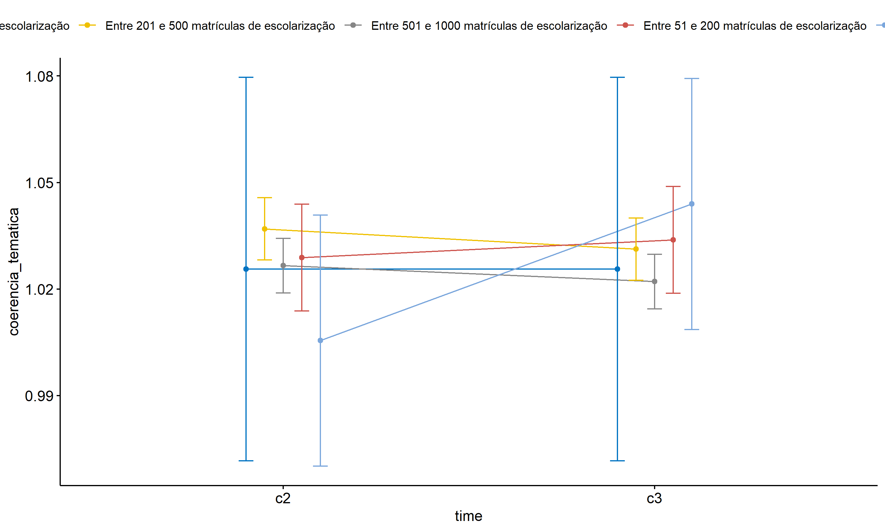<!-- -->

``` r
(pwc <- ldat %>% group_by(porte) %>%
    emmeans_test(coerencia_tematica ~ time, detailed = T, p.adjust.method = "bonferroni"))
```

    ## # A tibble: 5 × 15
    ##   porte    term  .y.   group1 group2 null.value  estimate      se    df conf.low
    ## * <fct>    <chr> <chr> <chr>  <chr>       <dbl>     <dbl>   <dbl> <dbl>    <dbl>
    ## 1 Até 50 … time  coer… c2     c3              0 -2.45e-16 0.0389   8074 -0.0763 
    ## 2 Entre 2… time  coer… c2     c3              0  5.71e- 3 0.00631  8074 -0.00665
    ## 3 Entre 5… time  coer… c2     c3              0  4.48e- 3 0.00555  8074 -0.00639
    ## 4 Entre 5… time  coer… c2     c3              0 -4.98e- 3 0.0109   8074 -0.0263 
    ## 5 Mais de… time  coer… c2     c3              0 -3.85e- 2 0.0255   8074 -0.0884 
    ## # ℹ 5 more variables: conf.high <dbl>, statistic <dbl>, p <dbl>, p.adj <dbl>,
    ## #   p.adj.signif <chr>

| porte                                        | term | .y.                | group1 | group2 | null.value | estimate |    se |   df | conf.low | conf.high | statistic |     p | p.adj | p.adj.signif |
|:---------------------------------------------|:-----|:-------------------|:-------|:-------|-----------:|---------:|------:|-----:|---------:|----------:|----------:|------:|------:|:-------------|
| Até 50 matrículas de escolarização           | time | coerencia_tematica | c2     | c3     |          0 |    0.000 | 0.039 | 8074 |   -0.076 |     0.076 |     0.000 | 1.000 | 1.000 | ns           |
| Entre 201 e 500 matrículas de escolarização  | time | coerencia_tematica | c2     | c3     |          0 |    0.006 | 0.006 | 8074 |   -0.007 |     0.018 |     0.906 | 0.365 | 0.365 | ns           |
| Entre 501 e 1000 matrículas de escolarização | time | coerencia_tematica | c2     | c3     |          0 |    0.004 | 0.006 | 8074 |   -0.006 |     0.015 |     0.808 | 0.419 | 0.419 | ns           |
| Entre 51 e 200 matrículas de escolarização   | time | coerencia_tematica | c2     | c3     |          0 |   -0.005 | 0.011 | 8074 |   -0.026 |     0.016 |    -0.459 | 0.646 | 0.646 | ns           |
| Mais de 1000 matrículas de escolarização     | time | coerencia_tematica | c2     | c3     |          0 |   -0.038 | 0.025 | 8074 |   -0.088 |     0.012 |    -1.509 | 0.131 | 0.131 | ns           |

``` r
(emms <- get_emmeans(pwc))
```

    ## # A tibble: 10 × 8
    ##    porte                    time  emmean      se    df conf.low conf.high method
    ##    <fct>                    <fct>  <dbl>   <dbl> <dbl>    <dbl>     <dbl> <chr> 
    ##  1 Até 50 matrículas de es… c2      1.03 0.0275   8074    0.972      1.08 Emmea…
    ##  2 Até 50 matrículas de es… c3      1.03 0.0275   8074    0.972      1.08 Emmea…
    ##  3 Entre 201 e 500 matrícu… c2      1.04 0.00446  8074    1.03       1.05 Emmea…
    ##  4 Entre 201 e 500 matrícu… c3      1.03 0.00446  8074    1.02       1.04 Emmea…
    ##  5 Entre 501 e 1000 matríc… c2      1.03 0.00392  8074    1.02       1.03 Emmea…
    ##  6 Entre 501 e 1000 matríc… c3      1.02 0.00392  8074    1.01       1.03 Emmea…
    ##  7 Entre 51 e 200 matrícul… c2      1.03 0.00768  8074    1.01       1.04 Emmea…
    ##  8 Entre 51 e 200 matrícul… c3      1.03 0.00768  8074    1.02       1.05 Emmea…
    ##  9 Mais de 1000 matrículas… c2      1.01 0.0180   8074    0.970      1.04 Emmea…
    ## 10 Mais de 1000 matrículas… c3      1.04 0.0180   8074    1.01       1.08 Emmea…

| porte                                        | time | emmean |    se |   df | conf.low | conf.high | method       |
|:---------------------------------------------|:-----|-------:|------:|-----:|---------:|----------:|:-------------|
| Até 50 matrículas de escolarização           | c2   |  1.026 | 0.028 | 8074 |    0.972 |     1.080 | Emmeans test |
| Até 50 matrículas de escolarização           | c3   |  1.026 | 0.028 | 8074 |    0.972 |     1.080 | Emmeans test |
| Entre 201 e 500 matrículas de escolarização  | c2   |  1.037 | 0.004 | 8074 |    1.028 |     1.046 | Emmeans test |
| Entre 201 e 500 matrículas de escolarização  | c3   |  1.031 | 0.004 | 8074 |    1.023 |     1.040 | Emmeans test |
| Entre 501 e 1000 matrículas de escolarização | c2   |  1.027 | 0.004 | 8074 |    1.019 |     1.034 | Emmeans test |
| Entre 501 e 1000 matrículas de escolarização | c3   |  1.022 | 0.004 | 8074 |    1.014 |     1.030 | Emmeans test |
| Entre 51 e 200 matrículas de escolarização   | c2   |  1.029 | 0.008 | 8074 |    1.014 |     1.044 | Emmeans test |
| Entre 51 e 200 matrículas de escolarização   | c3   |  1.034 | 0.008 | 8074 |    1.019 |     1.049 | Emmeans test |
| Mais de 1000 matrículas de escolarização     | c2   |  1.005 | 0.018 | 8074 |    0.970 |     1.041 | Emmeans test |
| Mais de 1000 matrículas de escolarização     | c3   |  1.044 | 0.018 | 8074 |    1.009 |     1.079 | Emmeans test |

``` r
emms.gg <- emms[which(emms$porte == "Até 50 matrículas de escolarização"),]
if (nrow(emms.gg) > 0)
  ggline(emms.gg, x = "time", y = "emmean", color = "#0073C2FF", ylab = "coerencia_tematica") +
    geom_errorbar(aes(ymin = conf.low, ymax = conf.high),
                  width = 0.2, color = "#0073C2FF") +
    stat_pvalue_manual(
      add_xy_position(pwc[which(pwc$porte == "Até 50 matrículas de escolarização"),],
                      x = "time", fun = "mean_se"),
      hide.ns = T, color = "#0073C2FF", tip.length = F) +
    labs(title = "porte: Até 50 matrículas de escolarização")+
    theme(legend.text = element_blank())
```

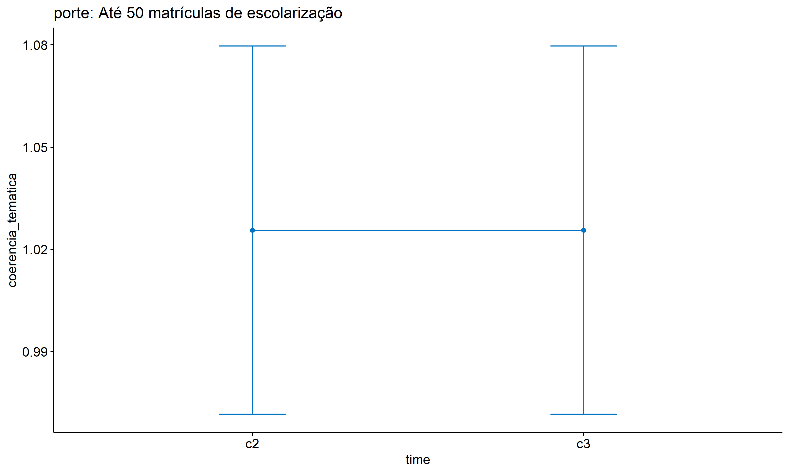<!-- -->

``` r
emms.gg <- emms[which(emms$porte == "Entre 201 e 500 matrículas de escolarização"),]
if (nrow(emms.gg) > 0)
  ggline(emms.gg, x = "time", y = "emmean", color = "#EFC000FF", ylab = "coerencia_tematica") +
    geom_errorbar(aes(ymin = conf.low, ymax = conf.high),
                  width = 0.2, color = "#EFC000FF") +
    stat_pvalue_manual(
      add_xy_position(pwc[which(pwc$porte == "Entre 201 e 500 matrículas de escolarização"),],
                      x = "time", fun = "mean_se"),
      hide.ns = T, color = "#EFC000FF", tip.length = F) +
    labs(title = "porte: Entre 201 e 500 matrículas de escolarização")+
    theme(legend.text = element_blank())
```

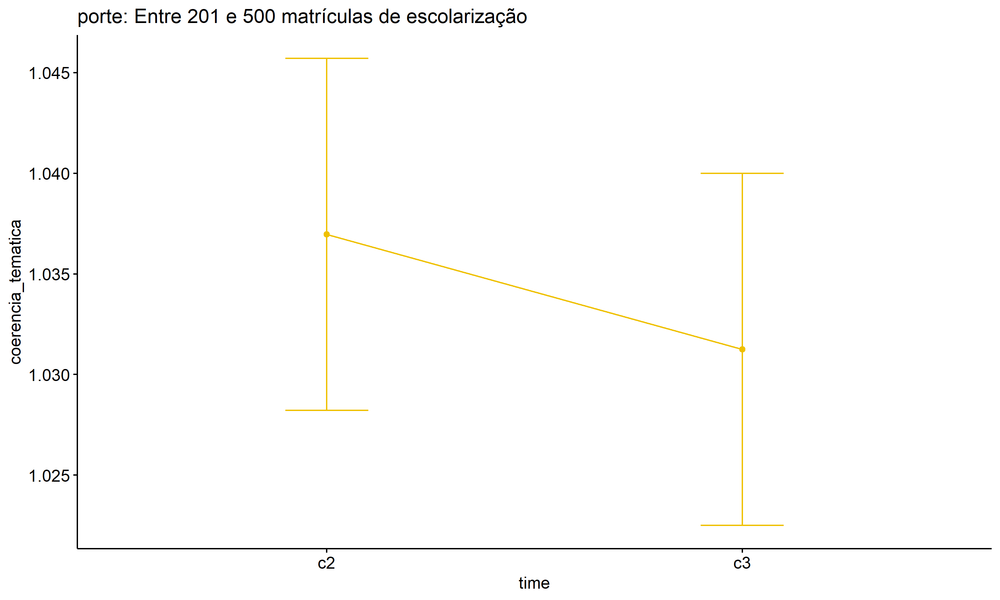<!-- -->

``` r
emms.gg <- emms[which(emms$porte == "Entre 501 e 1000 matrículas de escolarização"),]
if (nrow(emms.gg) > 0)
  ggline(emms.gg, x = "time", y = "emmean", color = "#868686FF", ylab = "coerencia_tematica") +
    geom_errorbar(aes(ymin = conf.low, ymax = conf.high),
                  width = 0.2, color = "#868686FF") +
    stat_pvalue_manual(
      add_xy_position(pwc[which(pwc$porte == "Entre 501 e 1000 matrículas de escolarização"),],
                      x = "time", fun = "mean_se"),
      hide.ns = T, color = "#868686FF", tip.length = F) +
    labs(title = "porte: Entre 501 e 1000 matrículas de escolarização")+
    theme(legend.text = element_blank())
```

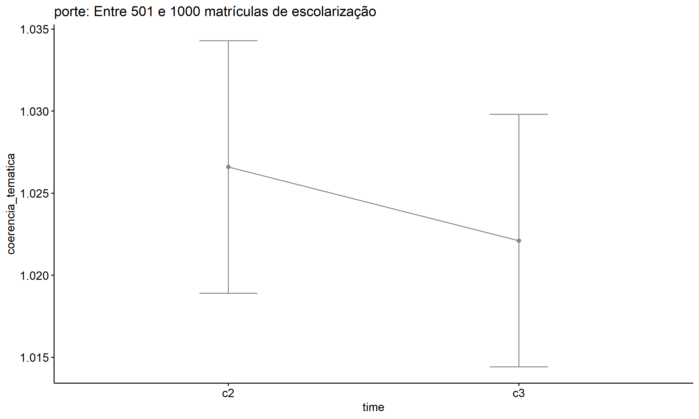<!-- -->

``` r
emms.gg <- emms[which(emms$porte == "Entre 51 e 200 matrículas de escolarização"),]
if (nrow(emms.gg) > 0)
  ggline(emms.gg, x = "time", y = "emmean", color = "#CD534CFF", ylab = "coerencia_tematica") +
    geom_errorbar(aes(ymin = conf.low, ymax = conf.high),
                  width = 0.2, color = "#CD534CFF") +
    stat_pvalue_manual(
      add_xy_position(pwc[which(pwc$porte == "Entre 51 e 200 matrículas de escolarização"),],
                      x = "time", fun = "mean_se"),
      hide.ns = T, color = "#CD534CFF", tip.length = F) +
    labs(title = "porte: Entre 51 e 200 matrículas de escolarização")+
    theme(legend.text = element_blank())
```

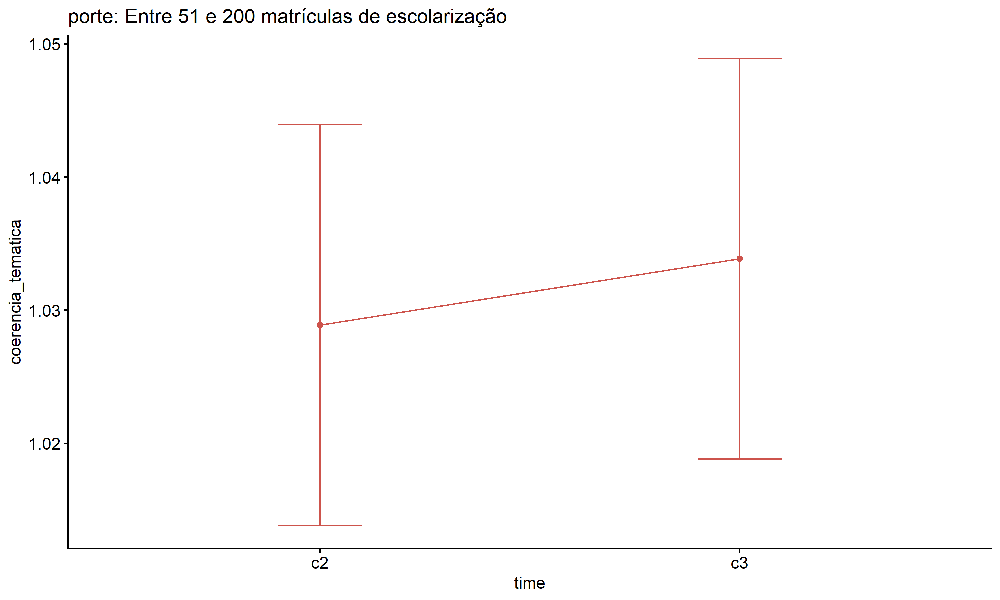<!-- -->

``` r
emms.gg <- emms[which(emms$porte == "Mais de 1000 matrículas de escolarização"),]
if (nrow(emms.gg) > 0)
  ggline(emms.gg, x = "time", y = "emmean", color = "#7AA6DCFF", ylab = "coerencia_tematica") +
    geom_errorbar(aes(ymin = conf.low, ymax = conf.high),
                  width = 0.2, color = "#7AA6DCFF") +
    stat_pvalue_manual(
      add_xy_position(pwc[which(pwc$porte == "Mais de 1000 matrículas de escolarização"),],
                      x = "time", fun = "mean_se"),
      hide.ns = T, color = "#7AA6DCFF", tip.length = F) +
    labs(title = "porte: Mais de 1000 matrículas de escolarização")+
    theme(legend.text = element_blank())
```

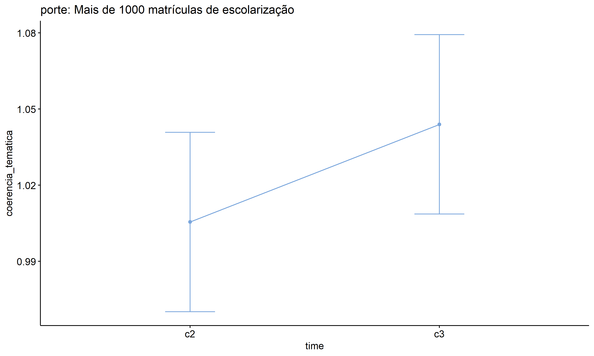<!-- -->

## PairWise Computation after removing non.normal data

``` r
if (length(non.ids) > 0)
  (pwc2 <- ldat2 %>% group_by(time) %>%
     emmeans_test(coerencia_tematica ~ porte, detailed = T, p.adjust.method = "bonferroni"))
```

``` r
if (length(non.ids) > 0)
  (emms2 <- get_emmeans(pwc2))
```

``` r
if (length(non.ids) > 0) {
  pwc2 <- add_xy_position(pwc2, x = "time", fun = "mean_se", dodge = 0.25)
  pd2 <- position_dodge(width = 0.25)
  
  ggline(emms2, x = "time", y = "emmean", color = "porte",
         palette = c("#0073C2FF","#EFC000FF","#868686FF","#CD534CFF","#7AA6DCFF"),
         position = pd, ylab = "coerencia_tematica") +
    geom_errorbar(aes(ymin = conf.low, ymax = conf.high, color = porte),
                position = pd, width = 0.2) +
    stat_pvalue_manual(pwc2, hide.ns = T, tip.length = F, linetype = 1)
}
```

``` r
if (length(non.ids) > 0)
  (pwc2 <- ldat2 %>% group_by(porte) %>%
     emmeans_test(coerencia_tematica ~ time, detailed = T, p.adjust.method = "bonferroni"))
```

``` r
if (length(non.ids) > 0)
  (emms2 <- get_emmeans(pwc2))
```

``` r
if (length(non.ids) > 0) {
  emms.gg <- emms2[which(emms2$porte == "Até 50 matrículas de escolarização"),]
  if (nrow(emms.gg) > 0)
    ggline(emms.gg, x = "time", y = "emmean", color = "#0073C2FF", ylab = "coerencia_tematica") +
    geom_errorbar(aes(ymin = conf.low, ymax = conf.high),
                  width = 0.2, color = "#0073C2FF") +
    stat_pvalue_manual(
      add_xy_position(pwc[which(pwc$porte == "Até 50 matrículas de escolarização"),],
                      x = "time", fun = "mean_se"),
      hide.ns = T, color = "#0073C2FF", tip.length = F) +
    labs(title = "porte: Até 50 matrículas de escolarização") +
    theme(legend.text = element_blank())
}
```

``` r
if (length(non.ids) > 0) {
  emms.gg <- emms2[which(emms2$porte == "Entre 201 e 500 matrículas de escolarização"),]
  if (nrow(emms.gg) > 0)
    ggline(emms.gg, x = "time", y = "emmean", color = "#EFC000FF", ylab = "coerencia_tematica") +
    geom_errorbar(aes(ymin = conf.low, ymax = conf.high),
                  width = 0.2, color = "#EFC000FF") +
    stat_pvalue_manual(
      add_xy_position(pwc[which(pwc$porte == "Entre 201 e 500 matrículas de escolarização"),],
                      x = "time", fun = "mean_se"),
      hide.ns = T, color = "#EFC000FF", tip.length = F) +
    labs(title = "porte: Entre 201 e 500 matrículas de escolarização") +
    theme(legend.text = element_blank())
}
```

``` r
if (length(non.ids) > 0) {
  emms.gg <- emms2[which(emms2$porte == "Entre 501 e 1000 matrículas de escolarização"),]
  if (nrow(emms.gg) > 0)
    ggline(emms.gg, x = "time", y = "emmean", color = "#868686FF", ylab = "coerencia_tematica") +
    geom_errorbar(aes(ymin = conf.low, ymax = conf.high),
                  width = 0.2, color = "#868686FF") +
    stat_pvalue_manual(
      add_xy_position(pwc[which(pwc$porte == "Entre 501 e 1000 matrículas de escolarização"),],
                      x = "time", fun = "mean_se"),
      hide.ns = T, color = "#868686FF", tip.length = F) +
    labs(title = "porte: Entre 501 e 1000 matrículas de escolarização") +
    theme(legend.text = element_blank())
}
```

``` r
if (length(non.ids) > 0) {
  emms.gg <- emms2[which(emms2$porte == "Entre 51 e 200 matrículas de escolarização"),]
  if (nrow(emms.gg) > 0)
    ggline(emms.gg, x = "time", y = "emmean", color = "#CD534CFF", ylab = "coerencia_tematica") +
    geom_errorbar(aes(ymin = conf.low, ymax = conf.high),
                  width = 0.2, color = "#CD534CFF") +
    stat_pvalue_manual(
      add_xy_position(pwc[which(pwc$porte == "Entre 51 e 200 matrículas de escolarização"),],
                      x = "time", fun = "mean_se"),
      hide.ns = T, color = "#CD534CFF", tip.length = F) +
    labs(title = "porte: Entre 51 e 200 matrículas de escolarização") +
    theme(legend.text = element_blank())
}
```

``` r
if (length(non.ids) > 0) {
  emms.gg <- emms2[which(emms2$porte == "Mais de 1000 matrículas de escolarização"),]
  if (nrow(emms.gg) > 0)
    ggline(emms.gg, x = "time", y = "emmean", color = "#7AA6DCFF", ylab = "coerencia_tematica") +
    geom_errorbar(aes(ymin = conf.low, ymax = conf.high),
                  width = 0.2, color = "#7AA6DCFF") +
    stat_pvalue_manual(
      add_xy_position(pwc[which(pwc$porte == "Mais de 1000 matrículas de escolarização"),],
                      x = "time", fun = "mean_se"),
      hide.ns = T, color = "#7AA6DCFF", tip.length = F) +
    labs(title = "porte: Mais de 1000 matrículas de escolarização") +
    theme(legend.text = element_blank())
}
```
