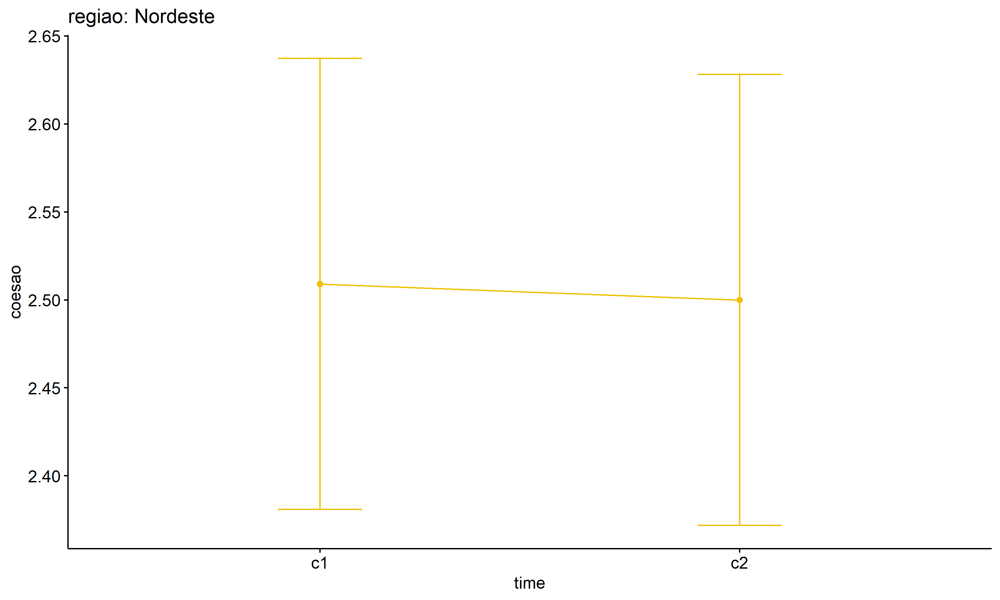
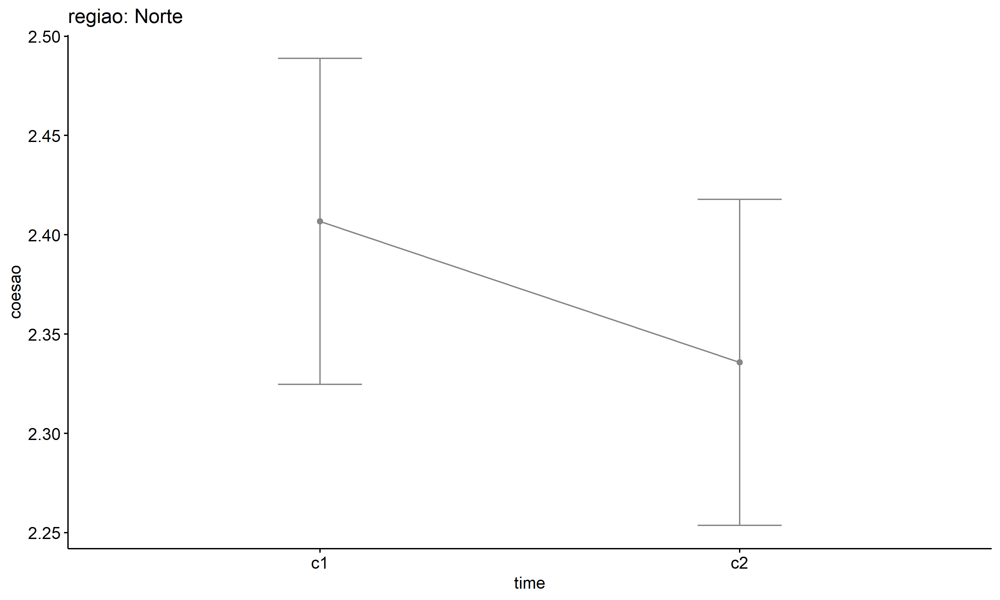

ANOVA test for coesao
================
Geiser C. Challco <geiser@alumni.usp.br>

- [ANOVA: coesao ~ time](#anova-coesao--time)
  - [Data Preparation](#data-preparation)
  - [Summary Statistics](#summary-statistics)
  - [ANOVA Computation](#anova-computation)
  - [PairWise Computation](#pairwise-computation)
- [ANOVA: coesao ~ time\*gender +
  Error(id/time)](#anova-coesao--timegender--erroridtime)
  - [Data Preparation](#data-preparation-1)
    - [Check assumptions: Identifying
      Outliers](#check-assumptions-identifying-outliers)
    - [Check assumptions: Normality
      Test](#check-assumptions-normality-test)
    - [Summary Statistics](#summary-statistics-1)
  - [ANOVA Computation](#anova-computation-1)
  - [ANOVA Computation after removing non.normal
    data](#anova-computation-after-removing-nonnormal-data)
  - [PairWise Computation](#pairwise-computation-1)
  - [PairWise Computation after removing non.normal
    data](#pairwise-computation-after-removing-nonnormal-data)
- [ANOVA: coesao ~ time\*regiao +
  Error(id/time)](#anova-coesao--timeregiao--erroridtime)
  - [Data Preparation](#data-preparation-2)
    - [Check assumptions: Identifying
      Outliers](#check-assumptions-identifying-outliers-1)
    - [Check assumptions: Normality
      Test](#check-assumptions-normality-test-1)
    - [Summary Statistics](#summary-statistics-2)
  - [ANOVA Computation](#anova-computation-2)
  - [ANOVA Computation after removing non.normal
    data](#anova-computation-after-removing-nonnormal-data-1)
  - [PairWise Computation](#pairwise-computation-2)
  - [PairWise Computation after removing non.normal
    data](#pairwise-computation-after-removing-nonnormal-data-1)

``` r
dat <- read_excel("../data/data.xlsx", sheet = "alunos_ef59")

escolas <- read_excel("../data/data.xlsx", sheet = "escolas")
edat <- merge(dat, escolas, by = "cod_escola", all.x = T)
```

# ANOVA: coesao ~ time

## Data Preparation

``` r
data <- edat[,c("aluno_id","ciclo","coesao")]
data <- data[data$ciclo %in% c("Primeiro Ciclo","Segundo Ciclo"),]
data$ciclo <- factor(data$ciclo, c("Primeiro Ciclo","Segundo Ciclo"))
data <- unique(data)

wdat <- spread(data, ciclo, coesao)
wdat <- wdat[complete.cases(wdat),]
colnames(wdat) <- c("id","c1","c2")

ldat <- gather(wdat, key = time, value = coesao, c1,c2) %>%
  convert_as_factor(id, time)
ldat <- rshinystatistics::remove_group_data(ldat, "coesao", "time", n.limit = 30)
```

## Summary Statistics

``` r
(sdat <- ldat %>% group_by(time) %>%
   get_summary_stats(coesao, type = "mean_sd"))
```

    ## # A tibble: 2 × 5
    ##   time  variable     n  mean    sd
    ##   <fct> <fct>    <dbl> <dbl> <dbl>
    ## 1 c1    coesao     200  2.44 0.491
    ## 2 c2    coesao     200  2.37 0.489

| time | variable |   n |  mean |    sd |
|:-----|:---------|----:|------:|------:|
| c1   | coesao   | 200 | 2.438 | 0.491 |
| c2   | coesao   | 200 | 2.372 | 0.489 |

## ANOVA Computation

``` r
(res.aov <- anova_test(ldat, dv = coesao, wid = id, within = time))
```

    ## ANOVA Table (type III tests)
    ## 
    ##   Effect DFn DFd     F     p p<.05   ges
    ## 1   time   1 199 1.905 0.169       0.004

## PairWise Computation

``` r
(pwc <- ldat %>% emmeans_test(coesao ~ time, detailed = T, p.adjust.method = "bonferroni"))
```

    ## # A tibble: 1 × 14
    ##   term  .y.    group1 group2 null.value estimate     se    df conf.low conf.high
    ## * <chr> <chr>  <chr>  <chr>       <dbl>    <dbl>  <dbl> <dbl>    <dbl>     <dbl>
    ## 1 time  coesao c1     c2              0   0.0650 0.0490   398  -0.0313     0.161
    ## # ℹ 4 more variables: statistic <dbl>, p <dbl>, p.adj <dbl>, p.adj.signif <chr>

| term | .y.    | group1 | group2 | null.value | estimate |    se |  df | conf.low | conf.high | statistic |     p | p.adj | p.adj.signif |
|:-----|:-------|:-------|:-------|-----------:|---------:|------:|----:|---------:|----------:|----------:|------:|------:|:-------------|
| time | coesao | c1     | c2     |          0 |    0.065 | 0.049 | 398 |   -0.031 |     0.161 |     1.326 | 0.185 | 0.185 | ns           |

``` r
pwc <- add_xy_position(pwc, x = "time", fun = "mean_se")
ggline(get_emmeans(pwc), x = "time", y = "emmean", ylab = "coesao") +
  geom_errorbar(aes(ymin = conf.low, ymax = conf.high), width = 0.2) +
  stat_pvalue_manual(pwc, hide.ns = T, tip.length = F)
```

<!-- -->

# ANOVA: coesao ~ time\*gender + Error(id/time)

## Data Preparation

``` r
data <- edat[,c("aluno_id","gender","ciclo","coesao")]
data <- data[data$ciclo %in% c("Primeiro Ciclo","Segundo Ciclo"),]
data$ciclo <- factor(data$ciclo, c("Primeiro Ciclo","Segundo Ciclo"))
data <- unique(data)

wdat <- spread(data, ciclo, coesao)
wdat <- wdat[complete.cases(wdat),]
colnames(wdat) <- c("id","gender","c1","c2")

ldat <- gather(wdat, key = time, value = coesao, c1,c2) %>%
  convert_as_factor(id, time)
ldat <- remove_group_data(ldat, "coesao", c("time", "gender"), n.limit = 30)
ldat$gender <- factor(ldat$gender, sort(unique(ldat$gender)))
```

### Check assumptions: Identifying Outliers

``` r
outliers <- identify_outliers(group_by(ldat, time, gender), coesao)
(outliers <- outliers[outliers$is.extreme == T,])
```

    ## # A tibble: 0 × 6
    ## # ℹ 6 variables: gender <fct>, time <fct>, id <fct>, coesao <dbl>,
    ## #   is.outlier <lgl>, is.extreme <lgl>

| gender | time | id  | coesao | is.outlier | is.extreme |
|:-------|:-----|:----|-------:|:-----------|:-----------|

### Check assumptions: Normality Test

``` r
(normality.df <- normality.test.per.groups(ldat, "coesao", c("time", "gender")))
```

    ##      var variable time gender  n   skewness   kurtosis symmetry statistic
    ## 1 coesao   coesao   c1 Female 97 -0.4791928 -0.4302750      YES  4.413126
    ## 2 coesao   coesao   c1   Male 93 -0.2728977 -0.5301154      YES  2.213510
    ## 3 coesao   coesao   c2 Female 97 -0.3726079 -0.6767086      YES  4.904386
    ## 4 coesao   coesao   c2   Male 93  0.1571348 -0.5510548      YES  1.482596
    ##       method          p p.signif normality
    ## 1 D'Agostino 0.11007831       ns       YES
    ## 2 D'Agostino 0.33063013       ns       YES
    ## 3 D'Agostino 0.08610456       ns       YES
    ## 4 D'Agostino 0.47649508       ns       YES

| var    | variable | time | gender |   n | skewness | kurtosis | symmetry | statistic | method     |     p | p.signif | normality |
|:-------|:---------|:-----|:-------|----:|---------:|---------:|:---------|----------:|:-----------|------:|:---------|:----------|
| coesao | coesao   | c1   | Female |  97 |   -0.479 |   -0.430 | YES      |     4.413 | D’Agostino | 0.110 | ns       | YES       |
| coesao | coesao   | c1   | Male   |  93 |   -0.273 |   -0.530 | YES      |     2.214 | D’Agostino | 0.331 | ns       | YES       |
| coesao | coesao   | c2   | Female |  97 |   -0.373 |   -0.677 | YES      |     4.904 | D’Agostino | 0.086 | ns       | YES       |
| coesao | coesao   | c2   | Male   |  93 |    0.157 |   -0.551 | YES      |     1.483 | D’Agostino | 0.476 | ns       | YES       |

``` r
(non.ids <- unique(do.call(
  c, lapply(which(normality.df$normality == 'NO'), FUN = function(i) {
  idx = which(ldat$time == normality.df$time[i] &
                ldat$gender == normality.df$gender[i])
  getNonNormal(ldat$"coesao"[idx], ldat$id[idx])
}))))
```

    ## NULL

``` r
if (length(non.ids) > 0)
  ldat2 <- ldat[!ldat$id %in% non.ids,]
```

### Summary Statistics

``` r
(sdat <- ldat %>% group_by(time, gender) %>%
   get_summary_stats(coesao, type = "mean_sd"))
```

    ## # A tibble: 4 × 6
    ##   gender time  variable     n  mean    sd
    ##   <fct>  <fct> <fct>    <dbl> <dbl> <dbl>
    ## 1 Female c1    coesao      97  2.48 0.465
    ## 2 Male   c1    coesao      93  2.40 0.496
    ## 3 Female c2    coesao      97  2.44 0.514
    ## 4 Male   c2    coesao      93  2.33 0.444

| gender | time | variable |   n |  mean |    sd |
|:-------|:-----|:---------|----:|------:|------:|
| Female | c1   | coesao   |  97 | 2.485 | 0.465 |
| Male   | c1   | coesao   |  93 | 2.403 | 0.496 |
| Female | c2   | coesao   |  97 | 2.436 | 0.514 |
| Male   | c2   | coesao   |  93 | 2.331 | 0.444 |

``` r
if (length(non.ids) > 0)
  (sdat <- ldat2 %>% group_by(time, gender) %>%
      get_summary_stats(coesao, type = "mean_sd"))
```

| gender | time | variable |   n |  mean |    sd |
|:-------|:-----|:---------|----:|------:|------:|
| Female | c1   | coesao   |  97 | 2.485 | 0.465 |
| Male   | c1   | coesao   |  93 | 2.403 | 0.496 |
| Female | c2   | coesao   |  97 | 2.436 | 0.514 |
| Male   | c2   | coesao   |  93 | 2.331 | 0.444 |

## ANOVA Computation

``` r
(res.aov <- anova_test(ldat, dv = coesao, wid = id, between = gender, within = time))
```

    ## ANOVA Table (type III tests)
    ## 
    ##        Effect DFn DFd     F     p p<.05      ges
    ## 1      gender   1 188 3.236 0.074       0.009000
    ## 2        time   1 188 1.687 0.196       0.004000
    ## 3 gender:time   1 188 0.064 0.801       0.000152

## ANOVA Computation after removing non.normal data

``` r
if (length(non.ids) > 0)
  (res.aov2 <- anova_test(ldat2, dv = coesao, wid = id, between = gender , within = time))
```

## PairWise Computation

``` r
(pwc <- ldat %>% group_by(time) %>%
   emmeans_test(coesao ~ gender, detailed = T, p.adjust.method = "bonferroni"))
```

    ## # A tibble: 2 × 15
    ##   time  term   .y.    group1 group2 null.value estimate     se    df conf.low
    ## * <fct> <chr>  <chr>  <chr>  <chr>       <dbl>    <dbl>  <dbl> <dbl>    <dbl>
    ## 1 c1    gender coesao Female Male            0   0.0813 0.0698   376  -0.0559
    ## 2 c2    gender coesao Female Male            0   0.105  0.0698   376  -0.0323
    ## # ℹ 5 more variables: conf.high <dbl>, statistic <dbl>, p <dbl>, p.adj <dbl>,
    ## #   p.adj.signif <chr>

| time | term   | .y.    | group1 | group2 | null.value | estimate |   se |  df | conf.low | conf.high | statistic |     p | p.adj | p.adj.signif |
|:-----|:-------|:-------|:-------|:-------|-----------:|---------:|-----:|----:|---------:|----------:|----------:|------:|------:|:-------------|
| c1   | gender | coesao | Female | Male   |          0 |    0.081 | 0.07 | 376 |   -0.056 |     0.219 |     1.165 | 0.245 | 0.245 | ns           |
| c2   | gender | coesao | Female | Male   |          0 |    0.105 | 0.07 | 376 |   -0.032 |     0.242 |     1.504 | 0.133 | 0.133 | ns           |

``` r
(emms <- get_emmeans(pwc))
```

    ## # A tibble: 4 × 8
    ##   time  gender emmean     se    df conf.low conf.high method      
    ##   <fct> <fct>   <dbl>  <dbl> <dbl>    <dbl>     <dbl> <chr>       
    ## 1 c1    Female   2.48 0.0488   376     2.39      2.58 Emmeans test
    ## 2 c1    Male     2.40 0.0499   376     2.31      2.50 Emmeans test
    ## 3 c2    Female   2.44 0.0488   376     2.34      2.53 Emmeans test
    ## 4 c2    Male     2.33 0.0499   376     2.23      2.43 Emmeans test

| time | gender | emmean |    se |  df | conf.low | conf.high | method       |
|:-----|:-------|-------:|------:|----:|---------:|----------:|:-------------|
| c1   | Female |  2.485 | 0.049 | 376 |    2.389 |     2.581 | Emmeans test |
| c1   | Male   |  2.403 | 0.050 | 376 |    2.305 |     2.501 | Emmeans test |
| c2   | Female |  2.436 | 0.049 | 376 |    2.340 |     2.532 | Emmeans test |
| c2   | Male   |  2.331 | 0.050 | 376 |    2.233 |     2.429 | Emmeans test |

``` r
pwc <- add_xy_position(pwc, x = "time", fun = "mean_se", dodge = 0.25)
pd <- position_dodge(width = 0.25)
ggline(emms, x = "time", y = "emmean", color = "gender",
       palette = c("#FF007F","#4D4DFF"),
       position = pd, ylab = "coesao") +
  geom_errorbar(aes(ymin = conf.low, ymax = conf.high, color = gender),
                position = pd, width = 0.2) +
  stat_pvalue_manual(pwc, hide.ns = T, tip.length = F, linetype = 1)
```

<!-- -->

``` r
(pwc <- ldat %>% group_by(gender) %>%
    emmeans_test(coesao ~ time, detailed = T, p.adjust.method = "bonferroni"))
```

    ## # A tibble: 2 × 15
    ##   gender term  .y.    group1 group2 null.value estimate     se    df conf.low
    ## * <fct>  <chr> <chr>  <chr>  <chr>       <dbl>    <dbl>  <dbl> <dbl>    <dbl>
    ## 1 Female time  coesao c1     c2              0   0.0490 0.0690   376  -0.0868
    ## 2 Male   time  coesao c1     c2              0   0.0726 0.0705   376  -0.0661
    ## # ℹ 5 more variables: conf.high <dbl>, statistic <dbl>, p <dbl>, p.adj <dbl>,
    ## #   p.adj.signif <chr>

| gender | term | .y.    | group1 | group2 | null.value | estimate |    se |  df | conf.low | conf.high | statistic |     p | p.adj | p.adj.signif |
|:-------|:-----|:-------|:-------|:-------|-----------:|---------:|------:|----:|---------:|----------:|----------:|------:|------:|:-------------|
| Female | time | coesao | c1     | c2     |          0 |    0.049 | 0.069 | 376 |   -0.087 |     0.185 |     0.709 | 0.479 | 0.479 | ns           |
| Male   | time | coesao | c1     | c2     |          0 |    0.073 | 0.071 | 376 |   -0.066 |     0.211 |     1.029 | 0.304 | 0.304 | ns           |

``` r
(emms <- get_emmeans(pwc))
```

    ## # A tibble: 4 × 8
    ##   gender time  emmean     se    df conf.low conf.high method      
    ##   <fct>  <fct>  <dbl>  <dbl> <dbl>    <dbl>     <dbl> <chr>       
    ## 1 Female c1      2.48 0.0488   376     2.39      2.58 Emmeans test
    ## 2 Female c2      2.44 0.0488   376     2.34      2.53 Emmeans test
    ## 3 Male   c1      2.40 0.0499   376     2.31      2.50 Emmeans test
    ## 4 Male   c2      2.33 0.0499   376     2.23      2.43 Emmeans test

| gender | time | emmean |    se |  df | conf.low | conf.high | method       |
|:-------|:-----|-------:|------:|----:|---------:|----------:|:-------------|
| Female | c1   |  2.485 | 0.049 | 376 |    2.389 |     2.581 | Emmeans test |
| Female | c2   |  2.436 | 0.049 | 376 |    2.340 |     2.532 | Emmeans test |
| Male   | c1   |  2.403 | 0.050 | 376 |    2.305 |     2.501 | Emmeans test |
| Male   | c2   |  2.331 | 0.050 | 376 |    2.233 |     2.429 | Emmeans test |

``` r
emms.gg <- emms[which(emms$gender == "Female"),]
if (nrow(emms.gg) > 0)
  ggline(emms.gg, x = "time", y = "emmean", color = "#FF007F", ylab = "coesao") +
    geom_errorbar(aes(ymin = conf.low, ymax = conf.high),
                  width = 0.2, color = "#FF007F") +
    stat_pvalue_manual(
      add_xy_position(pwc[which(pwc$gender == "Female"),],
                      x = "time", fun = "mean_se"),
      hide.ns = T, color = "#FF007F", tip.length = F) +
    labs(title = "gender: Female")+
    theme(legend.text = element_blank())
```

<!-- -->

``` r
emms.gg <- emms[which(emms$gender == "Male"),]
if (nrow(emms.gg) > 0)
  ggline(emms.gg, x = "time", y = "emmean", color = "#4D4DFF", ylab = "coesao") +
    geom_errorbar(aes(ymin = conf.low, ymax = conf.high),
                  width = 0.2, color = "#4D4DFF") +
    stat_pvalue_manual(
      add_xy_position(pwc[which(pwc$gender == "Male"),],
                      x = "time", fun = "mean_se"),
      hide.ns = T, color = "#4D4DFF", tip.length = F) +
    labs(title = "gender: Male")+
    theme(legend.text = element_blank())
```

<!-- -->

## PairWise Computation after removing non.normal data

``` r
if (length(non.ids) > 0)
  (pwc2 <- ldat2 %>% group_by(time) %>%
     emmeans_test(coesao ~ gender, detailed = T, p.adjust.method = "bonferroni"))
```

``` r
if (length(non.ids) > 0)
  (emms2 <- get_emmeans(pwc2))
```

``` r
if (length(non.ids) > 0) {
  pwc2 <- add_xy_position(pwc2, x = "time", fun = "mean_se", dodge = 0.25)
  pd2 <- position_dodge(width = 0.25)
  
  ggline(emms2, x = "time", y = "emmean", color = "gender",
         palette = c("#FF007F","#4D4DFF"),
         position = pd, ylab = "coesao") +
    geom_errorbar(aes(ymin = conf.low, ymax = conf.high, color = gender),
                position = pd, width = 0.2) +
    stat_pvalue_manual(pwc2, hide.ns = T, tip.length = F, linetype = 1)
}
```

``` r
if (length(non.ids) > 0)
  (pwc2 <- ldat2 %>% group_by(gender) %>%
     emmeans_test(coesao ~ time, detailed = T, p.adjust.method = "bonferroni"))
```

``` r
if (length(non.ids) > 0)
  (emms2 <- get_emmeans(pwc2))
```

``` r
if (length(non.ids) > 0) {
  emms.gg <- emms2[which(emms2$gender == "Female"),]
  if (nrow(emms.gg) > 0)
    ggline(emms.gg, x = "time", y = "emmean", color = "#FF007F", ylab = "coesao") +
    geom_errorbar(aes(ymin = conf.low, ymax = conf.high),
                  width = 0.2, color = "#FF007F") +
    stat_pvalue_manual(
      add_xy_position(pwc[which(pwc$gender == "Female"),],
                      x = "time", fun = "mean_se"),
      hide.ns = T, color = "#FF007F", tip.length = F) +
    labs(title = "gender: Female") +
    theme(legend.text = element_blank())
}
```

``` r
if (length(non.ids) > 0) {
  emms.gg <- emms2[which(emms2$gender == "Male"),]
  if (nrow(emms.gg) > 0)
    ggline(emms.gg, x = "time", y = "emmean", color = "#4D4DFF", ylab = "coesao") +
    geom_errorbar(aes(ymin = conf.low, ymax = conf.high),
                  width = 0.2, color = "#4D4DFF") +
    stat_pvalue_manual(
      add_xy_position(pwc[which(pwc$gender == "Male"),],
                      x = "time", fun = "mean_se"),
      hide.ns = T, color = "#4D4DFF", tip.length = F) +
    labs(title = "gender: Male") +
    theme(legend.text = element_blank())
}
```

# ANOVA: coesao ~ time\*regiao + Error(id/time)

## Data Preparation

``` r
data <- edat[,c("aluno_id","regiao","ciclo","coesao")]
data <- data[data$ciclo %in% c("Primeiro Ciclo","Segundo Ciclo"),]
data$ciclo <- factor(data$ciclo, c("Primeiro Ciclo","Segundo Ciclo"))
data <- unique(data)

wdat <- spread(data, ciclo, coesao)
wdat <- wdat[complete.cases(wdat),]
colnames(wdat) <- c("id","regiao","c1","c2")

ldat <- gather(wdat, key = time, value = coesao, c1,c2) %>%
  convert_as_factor(id, time)
ldat <- remove_group_data(ldat, "coesao", c("time", "regiao"), n.limit = 30)
ldat$regiao <- factor(ldat$regiao, sort(unique(ldat$regiao)))
```

### Check assumptions: Identifying Outliers

``` r
outliers <- identify_outliers(group_by(ldat, time, regiao), coesao)
(outliers <- outliers[outliers$is.extreme == T,])
```

    ## [1] regiao     time       id         coesao     is.outlier is.extreme
    ## <0 rows> (or 0-length row.names)

| regiao | time | id  | coesao | is.outlier | is.extreme |
|:-------|:-----|:----|-------:|:-----------|:-----------|

### Check assumptions: Normality Test

``` r
(normality.df <- normality.test.per.groups(ldat, "coesao", c("time", "regiao")))
```

    ##      var variable time   regiao   n   skewness   kurtosis symmetry statistic
    ## 1 coesao   coesao   c1 Nordeste  55 -0.7071494  0.1994616       NO  5.883432
    ## 2 coesao   coesao   c1    Norte 134 -0.3463318 -0.4460026      YES  3.804636
    ## 3 coesao   coesao   c2 Nordeste  55 -0.6937651  0.2572607       NO  5.869490
    ## 4 coesao   coesao   c2    Norte 134  0.0906717 -0.7466178      YES  5.847960
    ##       method          p p.signif normality
    ## 1 D'Agostino 0.05277508       ns       YES
    ## 2 D'Agostino 0.14922232       ns        QQ
    ## 3 D'Agostino 0.05314428       ns       YES
    ## 4 D'Agostino 0.05371946       ns        QQ

| var    | variable | time | regiao   |   n | skewness | kurtosis | symmetry | statistic | method     |     p | p.signif | normality |
|:-------|:---------|:-----|:---------|----:|---------:|---------:|:---------|----------:|:-----------|------:|:---------|:----------|
| coesao | coesao   | c1   | Nordeste |  55 |   -0.707 |    0.199 | NO       |     5.883 | D’Agostino | 0.053 | ns       | YES       |
| coesao | coesao   | c1   | Norte    | 134 |   -0.346 |   -0.446 | YES      |     3.805 | D’Agostino | 0.149 | ns       | QQ        |
| coesao | coesao   | c2   | Nordeste |  55 |   -0.694 |    0.257 | NO       |     5.869 | D’Agostino | 0.053 | ns       | YES       |
| coesao | coesao   | c2   | Norte    | 134 |    0.091 |   -0.747 | YES      |     5.848 | D’Agostino | 0.054 | ns       | QQ        |

``` r
(non.ids <- unique(do.call(
  c, lapply(which(normality.df$normality == 'NO'), FUN = function(i) {
  idx = which(ldat$time == normality.df$time[i] &
                ldat$regiao == normality.df$regiao[i])
  getNonNormal(ldat$"coesao"[idx], ldat$id[idx])
}))))
```

    ## NULL

``` r
if (length(non.ids) > 0)
  ldat2 <- ldat[!ldat$id %in% non.ids,]
```

### Summary Statistics

``` r
(sdat <- ldat %>% group_by(time, regiao) %>%
   get_summary_stats(coesao, type = "mean_sd"))
```

    ## # A tibble: 4 × 6
    ##   regiao   time  variable     n  mean    sd
    ##   <fct>    <fct> <fct>    <dbl> <dbl> <dbl>
    ## 1 Nordeste c1    coesao      55  2.51 0.466
    ## 2 Norte    c1    coesao     134  2.41 0.499
    ## 3 Nordeste c2    coesao      55  2.5  0.461
    ## 4 Norte    c2    coesao     134  2.34 0.483

| regiao   | time | variable |   n |  mean |    sd |
|:---------|:-----|:---------|----:|------:|------:|
| Nordeste | c1   | coesao   |  55 | 2.509 | 0.466 |
| Norte    | c1   | coesao   | 134 | 2.407 | 0.499 |
| Nordeste | c2   | coesao   |  55 | 2.500 | 0.461 |
| Norte    | c2   | coesao   | 134 | 2.336 | 0.483 |

``` r
if (length(non.ids) > 0)
  (sdat <- ldat2 %>% group_by(time, regiao) %>%
      get_summary_stats(coesao, type = "mean_sd"))
```

| regiao   | time | variable |   n |  mean |    sd |
|:---------|:-----|:---------|----:|------:|------:|
| Nordeste | c1   | coesao   |  55 | 2.509 | 0.466 |
| Norte    | c1   | coesao   | 134 | 2.407 | 0.499 |
| Nordeste | c2   | coesao   |  55 | 2.500 | 0.461 |
| Norte    | c2   | coesao   | 134 | 2.336 | 0.483 |

## ANOVA Computation

``` r
(res.aov <- anova_test(ldat, dv = coesao, wid = id, between = regiao, within = time))
```

    ## ANOVA Table (type III tests)
    ## 
    ##        Effect DFn DFd     F     p p<.05      ges
    ## 1      regiao   1 187 5.557 0.019     * 0.016000
    ## 2        time   1 187 0.573 0.450       0.001000
    ## 3 regiao:time   1 187 0.342 0.559       0.000852

## ANOVA Computation after removing non.normal data

``` r
if (length(non.ids) > 0)
  (res.aov2 <- anova_test(ldat2, dv = coesao, wid = id, between = regiao , within = time))
```

## PairWise Computation

``` r
(pwc <- ldat %>% group_by(time) %>%
   emmeans_test(coesao ~ regiao, detailed = T, p.adjust.method = "bonferroni"))
```

    ## # A tibble: 2 × 15
    ##   time  term   .y.    group1   group2 null.value estimate     se    df conf.low
    ## * <fct> <chr>  <chr>  <chr>    <chr>       <dbl>    <dbl>  <dbl> <dbl>    <dbl>
    ## 1 c1    regiao coesao Nordeste Norte           0    0.102 0.0774   374  -0.0498
    ## 2 c2    regiao coesao Nordeste Norte           0    0.164 0.0774   374   0.0120
    ## # ℹ 5 more variables: conf.high <dbl>, statistic <dbl>, p <dbl>, p.adj <dbl>,
    ## #   p.adj.signif <chr>

| time | term   | .y.    | group1   | group2 | null.value | estimate |    se |  df | conf.low | conf.high | statistic |     p | p.adj | p.adj.signif |
|:-----|:-------|:-------|:---------|:-------|-----------:|---------:|------:|----:|---------:|----------:|----------:|------:|------:|:-------------|
| c1   | regiao | coesao | Nordeste | Norte  |          0 |    0.102 | 0.077 | 374 |   -0.050 |     0.255 |     1.323 | 0.187 | 0.187 | ns           |
| c2   | regiao | coesao | Nordeste | Norte  |          0 |    0.164 | 0.077 | 374 |    0.012 |     0.316 |     2.122 | 0.035 | 0.035 | \*           |

``` r
(emms <- get_emmeans(pwc))
```

    ## # A tibble: 4 × 8
    ##   time  regiao   emmean     se    df conf.low conf.high method      
    ##   <fct> <fct>     <dbl>  <dbl> <dbl>    <dbl>     <dbl> <chr>       
    ## 1 c1    Nordeste   2.51 0.0652   374     2.38      2.64 Emmeans test
    ## 2 c1    Norte      2.41 0.0417   374     2.32      2.49 Emmeans test
    ## 3 c2    Nordeste   2.50 0.0652   374     2.37      2.63 Emmeans test
    ## 4 c2    Norte      2.34 0.0417   374     2.25      2.42 Emmeans test

| time | regiao   | emmean |    se |  df | conf.low | conf.high | method       |
|:-----|:---------|-------:|------:|----:|---------:|----------:|:-------------|
| c1   | Nordeste |  2.509 | 0.065 | 374 |    2.381 |     2.637 | Emmeans test |
| c1   | Norte    |  2.407 | 0.042 | 374 |    2.325 |     2.489 | Emmeans test |
| c2   | Nordeste |  2.500 | 0.065 | 374 |    2.372 |     2.628 | Emmeans test |
| c2   | Norte    |  2.336 | 0.042 | 374 |    2.254 |     2.418 | Emmeans test |

``` r
pwc <- add_xy_position(pwc, x = "time", fun = "mean_se", dodge = 0.25)
pd <- position_dodge(width = 0.25)
ggline(emms, x = "time", y = "emmean", color = "regiao",
       palette = c("#0073C2FF","#EFC000FF","#868686FF","#CD534CFF","#7AA6DCFF"),
       position = pd, ylab = "coesao") +
  geom_errorbar(aes(ymin = conf.low, ymax = conf.high, color = regiao),
                position = pd, width = 0.2) +
  stat_pvalue_manual(pwc, hide.ns = T, tip.length = F, linetype = 1)
```

<!-- -->

``` r
(pwc <- ldat %>% group_by(regiao) %>%
    emmeans_test(coesao ~ time, detailed = T, p.adjust.method = "bonferroni"))
```

    ## # A tibble: 2 × 15
    ##   regiao   term  .y.    group1 group2 null.value estimate     se    df conf.low
    ## * <fct>    <chr> <chr>  <chr>  <chr>       <dbl>    <dbl>  <dbl> <dbl>    <dbl>
    ## 1 Nordeste time  coesao c1     c2              0  0.00909 0.0922   374  -0.172 
    ## 2 Norte    time  coesao c1     c2              0  0.0709  0.0590   374  -0.0452
    ## # ℹ 5 more variables: conf.high <dbl>, statistic <dbl>, p <dbl>, p.adj <dbl>,
    ## #   p.adj.signif <chr>

| regiao   | term | .y.    | group1 | group2 | null.value | estimate |    se |  df | conf.low | conf.high | statistic |     p | p.adj | p.adj.signif |
|:---------|:-----|:-------|:-------|:-------|-----------:|---------:|------:|----:|---------:|----------:|----------:|------:|------:|:-------------|
| Nordeste | time | coesao | c1     | c2     |          0 |    0.009 | 0.092 | 374 |   -0.172 |     0.190 |     0.099 | 0.921 | 0.921 | ns           |
| Norte    | time | coesao | c1     | c2     |          0 |    0.071 | 0.059 | 374 |   -0.045 |     0.187 |     1.201 | 0.231 | 0.231 | ns           |

``` r
(emms <- get_emmeans(pwc))
```

    ## # A tibble: 4 × 8
    ##   regiao   time  emmean     se    df conf.low conf.high method      
    ##   <fct>    <fct>  <dbl>  <dbl> <dbl>    <dbl>     <dbl> <chr>       
    ## 1 Nordeste c1      2.51 0.0652   374     2.38      2.64 Emmeans test
    ## 2 Nordeste c2      2.50 0.0652   374     2.37      2.63 Emmeans test
    ## 3 Norte    c1      2.41 0.0417   374     2.32      2.49 Emmeans test
    ## 4 Norte    c2      2.34 0.0417   374     2.25      2.42 Emmeans test

| regiao   | time | emmean |    se |  df | conf.low | conf.high | method       |
|:---------|:-----|-------:|------:|----:|---------:|----------:|:-------------|
| Nordeste | c1   |  2.509 | 0.065 | 374 |    2.381 |     2.637 | Emmeans test |
| Nordeste | c2   |  2.500 | 0.065 | 374 |    2.372 |     2.628 | Emmeans test |
| Norte    | c1   |  2.407 | 0.042 | 374 |    2.325 |     2.489 | Emmeans test |
| Norte    | c2   |  2.336 | 0.042 | 374 |    2.254 |     2.418 | Emmeans test |

``` r
emms.gg <- emms[which(emms$regiao == "Centro-Oeste"),]
if (nrow(emms.gg) > 0)
  ggline(emms.gg, x = "time", y = "emmean", color = "#0073C2FF", ylab = "coesao") +
    geom_errorbar(aes(ymin = conf.low, ymax = conf.high),
                  width = 0.2, color = "#0073C2FF") +
    stat_pvalue_manual(
      add_xy_position(pwc[which(pwc$regiao == "Centro-Oeste"),],
                      x = "time", fun = "mean_se"),
      hide.ns = T, color = "#0073C2FF", tip.length = F) +
    labs(title = "regiao: Centro-Oeste")+
    theme(legend.text = element_blank())
```

``` r
emms.gg <- emms[which(emms$regiao == "Nordeste"),]
if (nrow(emms.gg) > 0)
  ggline(emms.gg, x = "time", y = "emmean", color = "#EFC000FF", ylab = "coesao") +
    geom_errorbar(aes(ymin = conf.low, ymax = conf.high),
                  width = 0.2, color = "#EFC000FF") +
    stat_pvalue_manual(
      add_xy_position(pwc[which(pwc$regiao == "Nordeste"),],
                      x = "time", fun = "mean_se"),
      hide.ns = T, color = "#EFC000FF", tip.length = F) +
    labs(title = "regiao: Nordeste")+
    theme(legend.text = element_blank())
```

<!-- -->

``` r
emms.gg <- emms[which(emms$regiao == "Norte"),]
if (nrow(emms.gg) > 0)
  ggline(emms.gg, x = "time", y = "emmean", color = "#868686FF", ylab = "coesao") +
    geom_errorbar(aes(ymin = conf.low, ymax = conf.high),
                  width = 0.2, color = "#868686FF") +
    stat_pvalue_manual(
      add_xy_position(pwc[which(pwc$regiao == "Norte"),],
                      x = "time", fun = "mean_se"),
      hide.ns = T, color = "#868686FF", tip.length = F) +
    labs(title = "regiao: Norte")+
    theme(legend.text = element_blank())
```

<!-- -->

``` r
emms.gg <- emms[which(emms$regiao == "Sudeste"),]
if (nrow(emms.gg) > 0)
  ggline(emms.gg, x = "time", y = "emmean", color = "#CD534CFF", ylab = "coesao") +
    geom_errorbar(aes(ymin = conf.low, ymax = conf.high),
                  width = 0.2, color = "#CD534CFF") +
    stat_pvalue_manual(
      add_xy_position(pwc[which(pwc$regiao == "Sudeste"),],
                      x = "time", fun = "mean_se"),
      hide.ns = T, color = "#CD534CFF", tip.length = F) +
    labs(title = "regiao: Sudeste")+
    theme(legend.text = element_blank())
```

``` r
emms.gg <- emms[which(emms$regiao == "Sul"),]
if (nrow(emms.gg) > 0)
  ggline(emms.gg, x = "time", y = "emmean", color = "#7AA6DCFF", ylab = "coesao") +
    geom_errorbar(aes(ymin = conf.low, ymax = conf.high),
                  width = 0.2, color = "#7AA6DCFF") +
    stat_pvalue_manual(
      add_xy_position(pwc[which(pwc$regiao == "Sul"),],
                      x = "time", fun = "mean_se"),
      hide.ns = T, color = "#7AA6DCFF", tip.length = F) +
    labs(title = "regiao: Sul")+
    theme(legend.text = element_blank())
```

## PairWise Computation after removing non.normal data

``` r
if (length(non.ids) > 0)
  (pwc2 <- ldat2 %>% group_by(time) %>%
     emmeans_test(coesao ~ regiao, detailed = T, p.adjust.method = "bonferroni"))
```

``` r
if (length(non.ids) > 0)
  (emms2 <- get_emmeans(pwc2))
```

``` r
if (length(non.ids) > 0) {
  pwc2 <- add_xy_position(pwc2, x = "time", fun = "mean_se", dodge = 0.25)
  pd2 <- position_dodge(width = 0.25)
  
  ggline(emms2, x = "time", y = "emmean", color = "regiao",
         palette = c("#0073C2FF","#EFC000FF","#868686FF","#CD534CFF","#7AA6DCFF"),
         position = pd, ylab = "coesao") +
    geom_errorbar(aes(ymin = conf.low, ymax = conf.high, color = regiao),
                position = pd, width = 0.2) +
    stat_pvalue_manual(pwc2, hide.ns = T, tip.length = F, linetype = 1)
}
```

``` r
if (length(non.ids) > 0)
  (pwc2 <- ldat2 %>% group_by(regiao) %>%
     emmeans_test(coesao ~ time, detailed = T, p.adjust.method = "bonferroni"))
```

``` r
if (length(non.ids) > 0)
  (emms2 <- get_emmeans(pwc2))
```

``` r
if (length(non.ids) > 0) {
  emms.gg <- emms2[which(emms2$regiao == "Centro-Oeste"),]
  if (nrow(emms.gg) > 0)
    ggline(emms.gg, x = "time", y = "emmean", color = "#0073C2FF", ylab = "coesao") +
    geom_errorbar(aes(ymin = conf.low, ymax = conf.high),
                  width = 0.2, color = "#0073C2FF") +
    stat_pvalue_manual(
      add_xy_position(pwc[which(pwc$regiao == "Centro-Oeste"),],
                      x = "time", fun = "mean_se"),
      hide.ns = T, color = "#0073C2FF", tip.length = F) +
    labs(title = "regiao: Centro-Oeste") +
    theme(legend.text = element_blank())
}
```

``` r
if (length(non.ids) > 0) {
  emms.gg <- emms2[which(emms2$regiao == "Nordeste"),]
  if (nrow(emms.gg) > 0)
    ggline(emms.gg, x = "time", y = "emmean", color = "#EFC000FF", ylab = "coesao") +
    geom_errorbar(aes(ymin = conf.low, ymax = conf.high),
                  width = 0.2, color = "#EFC000FF") +
    stat_pvalue_manual(
      add_xy_position(pwc[which(pwc$regiao == "Nordeste"),],
                      x = "time", fun = "mean_se"),
      hide.ns = T, color = "#EFC000FF", tip.length = F) +
    labs(title = "regiao: Nordeste") +
    theme(legend.text = element_blank())
}
```

``` r
if (length(non.ids) > 0) {
  emms.gg <- emms2[which(emms2$regiao == "Norte"),]
  if (nrow(emms.gg) > 0)
    ggline(emms.gg, x = "time", y = "emmean", color = "#868686FF", ylab = "coesao") +
    geom_errorbar(aes(ymin = conf.low, ymax = conf.high),
                  width = 0.2, color = "#868686FF") +
    stat_pvalue_manual(
      add_xy_position(pwc[which(pwc$regiao == "Norte"),],
                      x = "time", fun = "mean_se"),
      hide.ns = T, color = "#868686FF", tip.length = F) +
    labs(title = "regiao: Norte") +
    theme(legend.text = element_blank())
}
```

``` r
if (length(non.ids) > 0) {
  emms.gg <- emms2[which(emms2$regiao == "Sudeste"),]
  if (nrow(emms.gg) > 0)
    ggline(emms.gg, x = "time", y = "emmean", color = "#CD534CFF", ylab = "coesao") +
    geom_errorbar(aes(ymin = conf.low, ymax = conf.high),
                  width = 0.2, color = "#CD534CFF") +
    stat_pvalue_manual(
      add_xy_position(pwc[which(pwc$regiao == "Sudeste"),],
                      x = "time", fun = "mean_se"),
      hide.ns = T, color = "#CD534CFF", tip.length = F) +
    labs(title = "regiao: Sudeste") +
    theme(legend.text = element_blank())
}
```

``` r
if (length(non.ids) > 0) {
  emms.gg <- emms2[which(emms2$regiao == "Sul"),]
  if (nrow(emms.gg) > 0)
    ggline(emms.gg, x = "time", y = "emmean", color = "#7AA6DCFF", ylab = "coesao") +
    geom_errorbar(aes(ymin = conf.low, ymax = conf.high),
                  width = 0.2, color = "#7AA6DCFF") +
    stat_pvalue_manual(
      add_xy_position(pwc[which(pwc$regiao == "Sul"),],
                      x = "time", fun = "mean_se"),
      hide.ns = T, color = "#7AA6DCFF", tip.length = F) +
    labs(title = "regiao: Sul") +
    theme(legend.text = element_blank())
}
```
