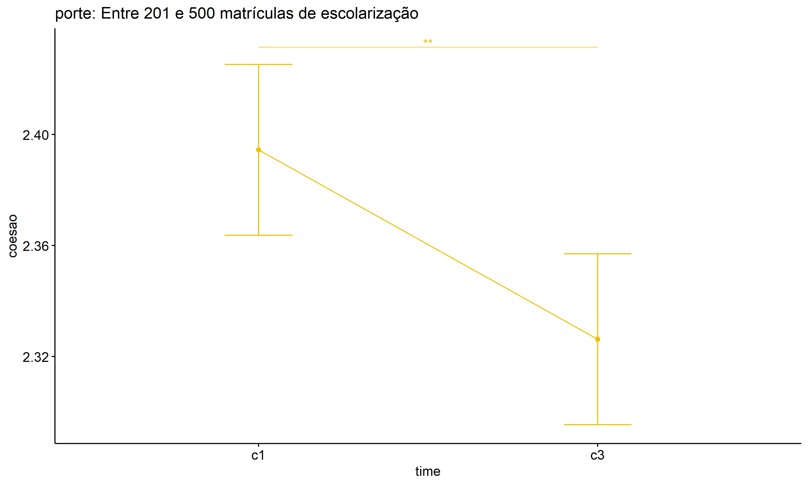

ANOVA test for coesao
================
Geiser C. Challco <geiser@alumni.usp.br>

- [ANOVA: coesao ~ time](#anova-coesao--time)
  - [Data Preparation](#data-preparation)
  - [Summary Statistics](#summary-statistics)
  - [ANOVA Computation](#anova-computation)
  - [PairWise Computation](#pairwise-computation)
- [ANOVA: coesao ~ time\*gender +
  Error(id/time)](#anova-coesao--timegender--erroridtime)
  - [Data Preparation](#data-preparation-1)
    - [Check assumptions: Identifying
      Outliers](#check-assumptions-identifying-outliers)
    - [Check assumptions: Normality
      Test](#check-assumptions-normality-test)
    - [Summary Statistics](#summary-statistics-1)
  - [ANOVA Computation](#anova-computation-1)
  - [ANOVA Computation after removing non.normal
    data](#anova-computation-after-removing-nonnormal-data)
  - [PairWise Computation](#pairwise-computation-1)
  - [PairWise Computation after removing non.normal
    data](#pairwise-computation-after-removing-nonnormal-data)
- [ANOVA: coesao ~ time\*localizacao +
  Error(id/time)](#anova-coesao--timelocalizacao--erroridtime)
  - [Data Preparation](#data-preparation-2)
    - [Check assumptions: Identifying
      Outliers](#check-assumptions-identifying-outliers-1)
    - [Check assumptions: Normality
      Test](#check-assumptions-normality-test-1)
    - [Summary Statistics](#summary-statistics-2)
  - [ANOVA Computation](#anova-computation-2)
  - [ANOVA Computation after removing non.normal
    data](#anova-computation-after-removing-nonnormal-data-1)
  - [PairWise Computation](#pairwise-computation-2)
  - [PairWise Computation after removing non.normal
    data](#pairwise-computation-after-removing-nonnormal-data-1)
- [ANOVA: coesao ~ time\*regiao +
  Error(id/time)](#anova-coesao--timeregiao--erroridtime)
  - [Data Preparation](#data-preparation-3)
    - [Check assumptions: Identifying
      Outliers](#check-assumptions-identifying-outliers-2)
    - [Check assumptions: Normality
      Test](#check-assumptions-normality-test-2)
    - [Summary Statistics](#summary-statistics-3)
  - [ANOVA Computation](#anova-computation-3)
  - [ANOVA Computation after removing non.normal
    data](#anova-computation-after-removing-nonnormal-data-2)
  - [PairWise Computation](#pairwise-computation-3)
  - [PairWise Computation after removing non.normal
    data](#pairwise-computation-after-removing-nonnormal-data-2)
- [ANOVA: coesao ~ time\*porte +
  Error(id/time)](#anova-coesao--timeporte--erroridtime)
  - [Data Preparation](#data-preparation-4)
    - [Check assumptions: Identifying
      Outliers](#check-assumptions-identifying-outliers-3)
    - [Check assumptions: Normality
      Test](#check-assumptions-normality-test-3)
    - [Summary Statistics](#summary-statistics-4)
  - [ANOVA Computation](#anova-computation-4)
  - [ANOVA Computation after removing non.normal
    data](#anova-computation-after-removing-nonnormal-data-3)
  - [PairWise Computation](#pairwise-computation-4)
  - [PairWise Computation after removing non.normal
    data](#pairwise-computation-after-removing-nonnormal-data-3)

``` r
dat <- read_excel("../data/data.xlsx", sheet = "alunos_ef59")

escolas <- read_excel("../data/data.xlsx", sheet = "escolas")
edat <- merge(dat, escolas, by = "cod_escola", all.x = T)
```

# ANOVA: coesao ~ time

## Data Preparation

``` r
data <- edat[,c("aluno_id","ciclo","coesao")]
data <- data[data$ciclo %in% c("Primeiro Ciclo","Terceiro Ciclo"),]
data$ciclo <- factor(data$ciclo, c("Primeiro Ciclo","Terceiro Ciclo"))
data <- unique(data)

wdat <- spread(data, ciclo, coesao)
wdat <- wdat[complete.cases(wdat),]
colnames(wdat) <- c("id","c1","c3")

ldat <- gather(wdat, key = time, value = coesao, c1,c3) %>%
  convert_as_factor(id, time)
ldat <- rshinystatistics::remove_group_data(ldat, "coesao", "time", n.limit = 30)
```

## Summary Statistics

``` r
(sdat <- ldat %>% group_by(time) %>%
   get_summary_stats(coesao, type = "mean_sd"))
```

    ## # A tibble: 2 × 5
    ##   time  variable     n  mean    sd
    ##   <fct> <fct>    <dbl> <dbl> <dbl>
    ## 1 c1    coesao    3997  2.40 0.479
    ## 2 c3    coesao    3997  2.34 0.543

| time | variable |    n |  mean |    sd |
|:-----|:---------|-----:|------:|------:|
| c1   | coesao   | 3997 | 2.401 | 0.479 |
| c3   | coesao   | 3997 | 2.344 | 0.543 |

## ANOVA Computation

``` r
(res.aov <- anova_test(ldat, dv = coesao, wid = id, within = time))
```

    ## ANOVA Table (type III tests)
    ## 
    ##   Effect DFn  DFd      F        p p<.05   ges
    ## 1   time   1 3996 26.199 3.22e-07     * 0.003

## PairWise Computation

``` r
(pwc <- ldat %>% emmeans_test(coesao ~ time, detailed = T, p.adjust.method = "bonferroni"))
```

    ## # A tibble: 1 × 14
    ##   term  .y.    group1 group2 null.value estimate     se    df conf.low conf.high
    ## * <chr> <chr>  <chr>  <chr>       <dbl>    <dbl>  <dbl> <dbl>    <dbl>     <dbl>
    ## 1 time  coesao c1     c3              0   0.0576 0.0114  7992   0.0352    0.0800
    ## # ℹ 4 more variables: statistic <dbl>, p <dbl>, p.adj <dbl>, p.adj.signif <chr>

| term | .y.    | group1 | group2 | null.value | estimate |    se |   df | conf.low | conf.high | statistic |   p | p.adj | p.adj.signif |
|:-----|:-------|:-------|:-------|-----------:|---------:|------:|-----:|---------:|----------:|----------:|----:|------:|:-------------|
| time | coesao | c1     | c3     |          0 |    0.058 | 0.011 | 7992 |    0.035 |      0.08 |     5.032 |   0 |     0 | \*\*\*\*     |

``` r
pwc <- add_xy_position(pwc, x = "time", fun = "mean_se")
ggline(get_emmeans(pwc), x = "time", y = "emmean", ylab = "coesao") +
  geom_errorbar(aes(ymin = conf.low, ymax = conf.high), width = 0.2) +
  stat_pvalue_manual(pwc, hide.ns = T, tip.length = F)
```

<!-- -->

# ANOVA: coesao ~ time\*gender + Error(id/time)

## Data Preparation

``` r
data <- edat[,c("aluno_id","gender","ciclo","coesao")]
data <- data[data$ciclo %in% c("Primeiro Ciclo","Terceiro Ciclo"),]
data$ciclo <- factor(data$ciclo, c("Primeiro Ciclo","Terceiro Ciclo"))
data <- unique(data)

wdat <- spread(data, ciclo, coesao)
wdat <- wdat[complete.cases(wdat),]
colnames(wdat) <- c("id","gender","c1","c3")

ldat <- gather(wdat, key = time, value = coesao, c1,c3) %>%
  convert_as_factor(id, time)
ldat <- remove_group_data(ldat, "coesao", c("time", "gender"), n.limit = 30)
ldat$gender <- factor(ldat$gender, sort(unique(ldat$gender)))
```

### Check assumptions: Identifying Outliers

``` r
outliers <- identify_outliers(group_by(ldat, time, gender), coesao)
(outliers <- outliers[outliers$is.extreme == T,])
```

    ## [1] gender     time       id         coesao     is.outlier is.extreme
    ## <0 rows> (or 0-length row.names)

| gender | time | id  | coesao | is.outlier | is.extreme |
|:-------|:-----|:----|-------:|:-----------|:-----------|

### Check assumptions: Normality Test

``` r
(normality.df <- normality.test.per.groups(ldat, "coesao", c("time", "gender")))
```

    ##      var variable time gender    n   skewness    kurtosis symmetry statistic
    ## 1 coesao   coesao   c1 Female 1880 -0.1405259 -0.17593761      YES  8.749615
    ## 2 coesao   coesao   c1   Male 1927 -0.2541658  0.08535017      YES 21.021202
    ## 3 coesao   coesao   c3 Female 1880 -0.1221903 -0.37663066      YES 20.920718
    ## 4 coesao   coesao   c3   Male 1927 -0.2602398 -0.40990076      YES 42.000648
    ##       method            p p.signif normality
    ## 1 D'Agostino 1.259056e-02       ns         -
    ## 2 D'Agostino 2.724608e-05      ***         -
    ## 3 D'Agostino 2.864994e-05      ***         -
    ## 4 D'Agostino 7.580103e-10     ****         -

| var    | variable | time | gender |    n | skewness | kurtosis | symmetry | statistic | method     |     p | p.signif | normality |
|:-------|:---------|:-----|:-------|-----:|---------:|---------:|:---------|----------:|:-----------|------:|:---------|:----------|
| coesao | coesao   | c1   | Female | 1880 |   -0.141 |   -0.176 | YES      |     8.750 | D’Agostino | 0.013 | ns       | \-        |
| coesao | coesao   | c1   | Male   | 1927 |   -0.254 |    0.085 | YES      |    21.021 | D’Agostino | 0.000 | \*\*\*   | \-        |
| coesao | coesao   | c3   | Female | 1880 |   -0.122 |   -0.377 | YES      |    20.921 | D’Agostino | 0.000 | \*\*\*   | \-        |
| coesao | coesao   | c3   | Male   | 1927 |   -0.260 |   -0.410 | YES      |    42.001 | D’Agostino | 0.000 | \*\*\*\* | \-        |

``` r
(non.ids <- unique(do.call(
  c, lapply(which(normality.df$normality == 'NO'), FUN = function(i) {
  idx = which(ldat$time == normality.df$time[i] &
                ldat$gender == normality.df$gender[i])
  getNonNormal(ldat$"coesao"[idx], ldat$id[idx])
}))))
```

    ## NULL

``` r
if (length(non.ids) > 0)
  ldat2 <- ldat[!ldat$id %in% non.ids,]
```

### Summary Statistics

``` r
(sdat <- ldat %>% group_by(time, gender) %>%
   get_summary_stats(coesao, type = "mean_sd"))
```

    ## # A tibble: 4 × 6
    ##   gender time  variable     n  mean    sd
    ##   <fct>  <fct> <fct>    <dbl> <dbl> <dbl>
    ## 1 Female c1    coesao    1880  2.42 0.478
    ## 2 Male   c1    coesao    1927  2.38 0.476
    ## 3 Female c3    coesao    1880  2.35 0.541
    ## 4 Male   c3    coesao    1927  2.34 0.548

| gender | time | variable |    n |  mean |    sd |
|:-------|:-----|:---------|-----:|------:|------:|
| Female | c1   | coesao   | 1880 | 2.425 | 0.478 |
| Male   | c1   | coesao   | 1927 | 2.380 | 0.476 |
| Female | c3   | coesao   | 1880 | 2.345 | 0.541 |
| Male   | c3   | coesao   | 1927 | 2.340 | 0.548 |

``` r
if (length(non.ids) > 0)
  (sdat <- ldat2 %>% group_by(time, gender) %>%
      get_summary_stats(coesao, type = "mean_sd"))
```

| gender | time | variable |    n |  mean |    sd |
|:-------|:-----|:---------|-----:|------:|------:|
| Female | c1   | coesao   | 1880 | 2.425 | 0.478 |
| Male   | c1   | coesao   | 1927 | 2.380 | 0.476 |
| Female | c3   | coesao   | 1880 | 2.345 | 0.541 |
| Male   | c3   | coesao   | 1927 | 2.340 | 0.548 |

## ANOVA Computation

``` r
(res.aov <- anova_test(ldat, dv = coesao, wid = id, between = gender, within = time))
```

    ## ANOVA Table (type III tests)
    ## 
    ##        Effect DFn  DFd      F        p p<.05      ges
    ## 1      gender   1 3805  4.275 3.90e-02     * 0.000579
    ## 2        time   1 3805 27.286 1.85e-07     * 0.003000
    ## 3 gender:time   1 3805  3.033 8.20e-02       0.000386

## ANOVA Computation after removing non.normal data

``` r
if (length(non.ids) > 0)
  (res.aov2 <- anova_test(ldat2, dv = coesao, wid = id, between = gender , within = time))
```

## PairWise Computation

``` r
(pwc <- ldat %>% group_by(time) %>%
   emmeans_test(coesao ~ gender, detailed = T, p.adjust.method = "bonferroni"))
```

    ## # A tibble: 2 × 15
    ##   time  term   .y.    group1 group2 null.value estimate     se    df conf.low
    ## * <fct> <chr>  <chr>  <chr>  <chr>       <dbl>    <dbl>  <dbl> <dbl>    <dbl>
    ## 1 c1    gender coesao Female Male            0  0.0447  0.0166  7610   0.0122
    ## 2 c3    gender coesao Female Male            0  0.00451 0.0166  7610  -0.0280
    ## # ℹ 5 more variables: conf.high <dbl>, statistic <dbl>, p <dbl>, p.adj <dbl>,
    ## #   p.adj.signif <chr>

| time | term   | .y.    | group1 | group2 | null.value | estimate |    se |   df | conf.low | conf.high | statistic |     p | p.adj | p.adj.signif |
|:-----|:-------|:-------|:-------|:-------|-----------:|---------:|------:|-----:|---------:|----------:|----------:|------:|------:|:-------------|
| c1   | gender | coesao | Female | Male   |          0 |    0.045 | 0.017 | 7610 |    0.012 |     0.077 |     2.697 | 0.007 | 0.007 | \*\*         |
| c3   | gender | coesao | Female | Male   |          0 |    0.005 | 0.017 | 7610 |   -0.028 |     0.037 |     0.272 | 0.786 | 0.786 | ns           |

``` r
(emms <- get_emmeans(pwc))
```

    ## # A tibble: 4 × 8
    ##   time  gender emmean     se    df conf.low conf.high method      
    ##   <fct> <fct>   <dbl>  <dbl> <dbl>    <dbl>     <dbl> <chr>       
    ## 1 c1    Female   2.43 0.0118  7610     2.40      2.45 Emmeans test
    ## 2 c1    Male     2.38 0.0117  7610     2.36      2.40 Emmeans test
    ## 3 c3    Female   2.34 0.0118  7610     2.32      2.37 Emmeans test
    ## 4 c3    Male     2.34 0.0117  7610     2.32      2.36 Emmeans test

| time | gender | emmean |    se |   df | conf.low | conf.high | method       |
|:-----|:-------|-------:|------:|-----:|---------:|----------:|:-------------|
| c1   | Female |  2.425 | 0.012 | 7610 |    2.402 |     2.448 | Emmeans test |
| c1   | Male   |  2.380 | 0.012 | 7610 |    2.358 |     2.403 | Emmeans test |
| c3   | Female |  2.345 | 0.012 | 7610 |    2.322 |     2.368 | Emmeans test |
| c3   | Male   |  2.340 | 0.012 | 7610 |    2.317 |     2.363 | Emmeans test |

``` r
pwc <- add_xy_position(pwc, x = "time", fun = "mean_se", dodge = 0.25)
pd <- position_dodge(width = 0.25)
ggline(emms, x = "time", y = "emmean", color = "gender",
       palette = c("#FF007F","#4D4DFF"),
       position = pd, ylab = "coesao") +
  geom_errorbar(aes(ymin = conf.low, ymax = conf.high, color = gender),
                position = pd, width = 0.2) +
  stat_pvalue_manual(pwc, hide.ns = T, tip.length = F, linetype = 1)
```

<!-- -->

``` r
(pwc <- ldat %>% group_by(gender) %>%
    emmeans_test(coesao ~ time, detailed = T, p.adjust.method = "bonferroni"))
```

    ## # A tibble: 2 × 15
    ##   gender term  .y.    group1 group2 null.value estimate     se    df conf.low
    ## * <fct>  <chr> <chr>  <chr>  <chr>       <dbl>    <dbl>  <dbl> <dbl>    <dbl>
    ## 1 Female time  coesao c1     c3              0   0.0805 0.0167  7610  0.0477 
    ## 2 Male   time  coesao c1     c3              0   0.0402 0.0165  7610  0.00789
    ## # ℹ 5 more variables: conf.high <dbl>, statistic <dbl>, p <dbl>, p.adj <dbl>,
    ## #   p.adj.signif <chr>

| gender | term | .y.    | group1 | group2 | null.value | estimate |    se |   df | conf.low | conf.high | statistic |     p | p.adj | p.adj.signif |
|:-------|:-----|:-------|:-------|:-------|-----------:|---------:|------:|-----:|---------:|----------:|----------:|------:|------:|:-------------|
| Female | time | coesao | c1     | c3     |          0 |     0.08 | 0.017 | 7610 |    0.048 |     0.113 |     4.819 | 0.000 | 0.000 | \*\*\*\*     |
| Male   | time | coesao | c1     | c3     |          0 |     0.04 | 0.016 | 7610 |    0.008 |     0.073 |     2.439 | 0.015 | 0.015 | \*           |

``` r
(emms <- get_emmeans(pwc))
```

    ## # A tibble: 4 × 8
    ##   gender time  emmean     se    df conf.low conf.high method      
    ##   <fct>  <fct>  <dbl>  <dbl> <dbl>    <dbl>     <dbl> <chr>       
    ## 1 Female c1      2.43 0.0118  7610     2.40      2.45 Emmeans test
    ## 2 Female c3      2.34 0.0118  7610     2.32      2.37 Emmeans test
    ## 3 Male   c1      2.38 0.0117  7610     2.36      2.40 Emmeans test
    ## 4 Male   c3      2.34 0.0117  7610     2.32      2.36 Emmeans test

| gender | time | emmean |    se |   df | conf.low | conf.high | method       |
|:-------|:-----|-------:|------:|-----:|---------:|----------:|:-------------|
| Female | c1   |  2.425 | 0.012 | 7610 |    2.402 |     2.448 | Emmeans test |
| Female | c3   |  2.345 | 0.012 | 7610 |    2.322 |     2.368 | Emmeans test |
| Male   | c1   |  2.380 | 0.012 | 7610 |    2.358 |     2.403 | Emmeans test |
| Male   | c3   |  2.340 | 0.012 | 7610 |    2.317 |     2.363 | Emmeans test |

``` r
emms.gg <- emms[which(emms$gender == "Female"),]
if (nrow(emms.gg) > 0)
  ggline(emms.gg, x = "time", y = "emmean", color = "#FF007F", ylab = "coesao") +
    geom_errorbar(aes(ymin = conf.low, ymax = conf.high),
                  width = 0.2, color = "#FF007F") +
    stat_pvalue_manual(
      add_xy_position(pwc[which(pwc$gender == "Female"),],
                      x = "time", fun = "mean_se"),
      hide.ns = T, color = "#FF007F", tip.length = F) +
    labs(title = "gender: Female")+
    theme(legend.text = element_blank())
```

<!-- -->

``` r
emms.gg <- emms[which(emms$gender == "Male"),]
if (nrow(emms.gg) > 0)
  ggline(emms.gg, x = "time", y = "emmean", color = "#4D4DFF", ylab = "coesao") +
    geom_errorbar(aes(ymin = conf.low, ymax = conf.high),
                  width = 0.2, color = "#4D4DFF") +
    stat_pvalue_manual(
      add_xy_position(pwc[which(pwc$gender == "Male"),],
                      x = "time", fun = "mean_se"),
      hide.ns = T, color = "#4D4DFF", tip.length = F) +
    labs(title = "gender: Male")+
    theme(legend.text = element_blank())
```

<!-- -->

## PairWise Computation after removing non.normal data

``` r
if (length(non.ids) > 0)
  (pwc2 <- ldat2 %>% group_by(time) %>%
     emmeans_test(coesao ~ gender, detailed = T, p.adjust.method = "bonferroni"))
```

``` r
if (length(non.ids) > 0)
  (emms2 <- get_emmeans(pwc2))
```

``` r
if (length(non.ids) > 0) {
  pwc2 <- add_xy_position(pwc2, x = "time", fun = "mean_se", dodge = 0.25)
  pd2 <- position_dodge(width = 0.25)
  
  ggline(emms2, x = "time", y = "emmean", color = "gender",
         palette = c("#FF007F","#4D4DFF"),
         position = pd, ylab = "coesao") +
    geom_errorbar(aes(ymin = conf.low, ymax = conf.high, color = gender),
                position = pd, width = 0.2) +
    stat_pvalue_manual(pwc2, hide.ns = T, tip.length = F, linetype = 1)
}
```

``` r
if (length(non.ids) > 0)
  (pwc2 <- ldat2 %>% group_by(gender) %>%
     emmeans_test(coesao ~ time, detailed = T, p.adjust.method = "bonferroni"))
```

``` r
if (length(non.ids) > 0)
  (emms2 <- get_emmeans(pwc2))
```

``` r
if (length(non.ids) > 0) {
  emms.gg <- emms2[which(emms2$gender == "Female"),]
  if (nrow(emms.gg) > 0)
    ggline(emms.gg, x = "time", y = "emmean", color = "#FF007F", ylab = "coesao") +
    geom_errorbar(aes(ymin = conf.low, ymax = conf.high),
                  width = 0.2, color = "#FF007F") +
    stat_pvalue_manual(
      add_xy_position(pwc[which(pwc$gender == "Female"),],
                      x = "time", fun = "mean_se"),
      hide.ns = T, color = "#FF007F", tip.length = F) +
    labs(title = "gender: Female") +
    theme(legend.text = element_blank())
}
```

``` r
if (length(non.ids) > 0) {
  emms.gg <- emms2[which(emms2$gender == "Male"),]
  if (nrow(emms.gg) > 0)
    ggline(emms.gg, x = "time", y = "emmean", color = "#4D4DFF", ylab = "coesao") +
    geom_errorbar(aes(ymin = conf.low, ymax = conf.high),
                  width = 0.2, color = "#4D4DFF") +
    stat_pvalue_manual(
      add_xy_position(pwc[which(pwc$gender == "Male"),],
                      x = "time", fun = "mean_se"),
      hide.ns = T, color = "#4D4DFF", tip.length = F) +
    labs(title = "gender: Male") +
    theme(legend.text = element_blank())
}
```

# ANOVA: coesao ~ time\*localizacao + Error(id/time)

## Data Preparation

``` r
data <- edat[,c("aluno_id","localizacao","ciclo","coesao")]
data <- data[data$ciclo %in% c("Primeiro Ciclo","Terceiro Ciclo"),]
data$ciclo <- factor(data$ciclo, c("Primeiro Ciclo","Terceiro Ciclo"))
data <- unique(data)

wdat <- spread(data, ciclo, coesao)
wdat <- wdat[complete.cases(wdat),]
colnames(wdat) <- c("id","localizacao","c1","c3")

ldat <- gather(wdat, key = time, value = coesao, c1,c3) %>%
  convert_as_factor(id, time)
ldat <- remove_group_data(ldat, "coesao", c("time", "localizacao"), n.limit = 30)
ldat$localizacao <- factor(ldat$localizacao, sort(unique(ldat$localizacao)))
```

### Check assumptions: Identifying Outliers

``` r
outliers <- identify_outliers(group_by(ldat, time, localizacao), coesao)
(outliers <- outliers[outliers$is.extreme == T,])
```

    ## [1] localizacao time        id          coesao      is.outlier  is.extreme 
    ## <0 rows> (or 0-length row.names)

| localizacao | time | id  | coesao | is.outlier | is.extreme |
|:------------|:-----|:----|-------:|:-----------|:-----------|

### Check assumptions: Normality Test

``` r
(normality.df <- normality.test.per.groups(ldat, "coesao", c("time", "localizacao")))
```

    ##      var variable time localizacao    n   skewness    kurtosis symmetry
    ## 1 coesao   coesao   c1       Rural  683 -0.2512170  0.13071914      YES
    ## 2 coesao   coesao   c1      Urbana 3314 -0.2126731 -0.03731984      YES
    ## 3 coesao   coesao   c3       Rural  683 -0.2631248 -0.42646961      YES
    ## 4 coesao   coesao   c3      Urbana 3314 -0.1745662 -0.39892352      YES
    ##   statistic     method            p p.signif normality
    ## 1  7.872304 D'Agostino 1.952320e-02       ns         -
    ## 2 24.703744 D'Agostino 4.321657e-06     ****         -
    ## 3 15.305205 D'Agostino 4.748068e-04       **         -
    ## 4 50.628572 D'Agostino 1.014255e-11     ****         -

| var    | variable | time | localizacao |    n | skewness | kurtosis | symmetry | statistic | method     |    p | p.signif | normality |
|:-------|:---------|:-----|:------------|-----:|---------:|---------:|:---------|----------:|:-----------|-----:|:---------|:----------|
| coesao | coesao   | c1   | Rural       |  683 |   -0.251 |    0.131 | YES      |     7.872 | D’Agostino | 0.02 | ns       | \-        |
| coesao | coesao   | c1   | Urbana      | 3314 |   -0.213 |   -0.037 | YES      |    24.704 | D’Agostino | 0.00 | \*\*\*\* | \-        |
| coesao | coesao   | c3   | Rural       |  683 |   -0.263 |   -0.426 | YES      |    15.305 | D’Agostino | 0.00 | \*\*     | \-        |
| coesao | coesao   | c3   | Urbana      | 3314 |   -0.175 |   -0.399 | YES      |    50.629 | D’Agostino | 0.00 | \*\*\*\* | \-        |

``` r
(non.ids <- unique(do.call(
  c, lapply(which(normality.df$normality == 'NO'), FUN = function(i) {
  idx = which(ldat$time == normality.df$time[i] &
                ldat$localizacao == normality.df$localizacao[i])
  getNonNormal(ldat$"coesao"[idx], ldat$id[idx])
}))))
```

    ## NULL

``` r
if (length(non.ids) > 0)
  ldat2 <- ldat[!ldat$id %in% non.ids,]
```

### Summary Statistics

``` r
(sdat <- ldat %>% group_by(time, localizacao) %>%
   get_summary_stats(coesao, type = "mean_sd"))
```

    ## # A tibble: 4 × 6
    ##   localizacao time  variable     n  mean    sd
    ##   <fct>       <fct> <fct>    <dbl> <dbl> <dbl>
    ## 1 Rural       c1    coesao     683  2.44 0.477
    ## 2 Urbana      c1    coesao    3314  2.39 0.479
    ## 3 Rural       c3    coesao     683  2.36 0.581
    ## 4 Urbana      c3    coesao    3314  2.34 0.535

| localizacao | time | variable |    n |  mean |    sd |
|:------------|:-----|:---------|-----:|------:|------:|
| Rural       | c1   | coesao   |  683 | 2.436 | 0.477 |
| Urbana      | c1   | coesao   | 3314 | 2.394 | 0.479 |
| Rural       | c3   | coesao   |  683 | 2.363 | 0.581 |
| Urbana      | c3   | coesao   | 3314 | 2.339 | 0.535 |

``` r
if (length(non.ids) > 0)
  (sdat <- ldat2 %>% group_by(time, localizacao) %>%
      get_summary_stats(coesao, type = "mean_sd"))
```

| localizacao | time | variable |    n |  mean |    sd |
|:------------|:-----|:---------|-----:|------:|------:|
| Rural       | c1   | coesao   |  683 | 2.436 | 0.477 |
| Urbana      | c1   | coesao   | 3314 | 2.394 | 0.479 |
| Rural       | c3   | coesao   |  683 | 2.363 | 0.581 |
| Urbana      | c3   | coesao   | 3314 | 2.339 | 0.535 |

## ANOVA Computation

``` r
(res.aov <- anova_test(ldat, dv = coesao, wid = id, between = localizacao, within = time))
```

    ## ANOVA Table (type III tests)
    ## 
    ##             Effect DFn  DFd      F        p p<.05      ges
    ## 1      localizacao   1 3995  4.572 3.30e-02     * 5.91e-04
    ## 2             time   1 3995 18.208 2.03e-05     * 2.00e-03
    ## 3 localizacao:time   1 3995  0.396 5.29e-01       4.79e-05

## ANOVA Computation after removing non.normal data

``` r
if (length(non.ids) > 0)
  (res.aov2 <- anova_test(ldat2, dv = coesao, wid = id, between = localizacao , within = time))
```

## PairWise Computation

``` r
(pwc <- ldat %>% group_by(time) %>%
   emmeans_test(coesao ~ localizacao, detailed = T, p.adjust.method = "bonferroni"))
```

    ## # A tibble: 2 × 15
    ##   time  term       .y.   group1 group2 null.value estimate     se    df conf.low
    ## * <fct> <chr>      <chr> <chr>  <chr>       <dbl>    <dbl>  <dbl> <dbl>    <dbl>
    ## 1 c1    localizac… coes… Rural  Urbana          0   0.0425 0.0215  7990  3.01e-4
    ## 2 c3    localizac… coes… Rural  Urbana          0   0.0236 0.0215  7990 -1.85e-2
    ## # ℹ 5 more variables: conf.high <dbl>, statistic <dbl>, p <dbl>, p.adj <dbl>,
    ## #   p.adj.signif <chr>

| time | term        | .y.    | group1 | group2 | null.value | estimate |    se |   df | conf.low | conf.high | statistic |     p | p.adj | p.adj.signif |
|:-----|:------------|:-------|:-------|:-------|-----------:|---------:|------:|-----:|---------:|----------:|----------:|------:|------:|:-------------|
| c1   | localizacao | coesao | Rural  | Urbana |          0 |    0.042 | 0.022 | 7990 |    0.000 |     0.085 |     1.974 | 0.048 | 0.048 | \*           |
| c3   | localizacao | coesao | Rural  | Urbana |          0 |    0.024 | 0.022 | 7990 |   -0.019 |     0.066 |     1.099 | 0.272 | 0.272 | ns           |

``` r
(emms <- get_emmeans(pwc))
```

    ## # A tibble: 4 × 8
    ##   time  localizacao emmean      se    df conf.low conf.high method      
    ##   <fct> <fct>        <dbl>   <dbl> <dbl>    <dbl>     <dbl> <chr>       
    ## 1 c1    Rural         2.44 0.0196   7990     2.40      2.47 Emmeans test
    ## 2 c1    Urbana        2.39 0.00889  7990     2.38      2.41 Emmeans test
    ## 3 c3    Rural         2.36 0.0196   7990     2.32      2.40 Emmeans test
    ## 4 c3    Urbana        2.34 0.00889  7990     2.32      2.36 Emmeans test

| time | localizacao | emmean |    se |   df | conf.low | conf.high | method       |
|:-----|:------------|-------:|------:|-----:|---------:|----------:|:-------------|
| c1   | Rural       |  2.436 | 0.020 | 7990 |    2.398 |     2.475 | Emmeans test |
| c1   | Urbana      |  2.394 | 0.009 | 7990 |    2.376 |     2.411 | Emmeans test |
| c3   | Rural       |  2.363 | 0.020 | 7990 |    2.325 |     2.401 | Emmeans test |
| c3   | Urbana      |  2.339 | 0.009 | 7990 |    2.322 |     2.357 | Emmeans test |

``` r
pwc <- add_xy_position(pwc, x = "time", fun = "mean_se", dodge = 0.25)
pd <- position_dodge(width = 0.25)
ggline(emms, x = "time", y = "emmean", color = "localizacao",
       palette = c("#AA00FF","#00CCCC"),
       position = pd, ylab = "coesao") +
  geom_errorbar(aes(ymin = conf.low, ymax = conf.high, color = localizacao),
                position = pd, width = 0.2) +
  stat_pvalue_manual(pwc, hide.ns = T, tip.length = F, linetype = 1)
```

<!-- -->

``` r
(pwc <- ldat %>% group_by(localizacao) %>%
    emmeans_test(coesao ~ time, detailed = T, p.adjust.method = "bonferroni"))
```

    ## # A tibble: 2 × 15
    ##   localizacao term  .y.    group1 group2 null.value estimate     se    df
    ## * <fct>       <chr> <chr>  <chr>  <chr>       <dbl>    <dbl>  <dbl> <dbl>
    ## 1 Rural       time  coesao c1     c3              0   0.0732 0.0277  7990
    ## 2 Urbana      time  coesao c1     c3              0   0.0544 0.0126  7990
    ## # ℹ 6 more variables: conf.low <dbl>, conf.high <dbl>, statistic <dbl>,
    ## #   p <dbl>, p.adj <dbl>, p.adj.signif <chr>

| localizacao | term | .y.    | group1 | group2 | null.value | estimate |    se |   df | conf.low | conf.high | statistic |     p | p.adj | p.adj.signif |
|:------------|:-----|:-------|:-------|:-------|-----------:|---------:|------:|-----:|---------:|----------:|----------:|------:|------:|:-------------|
| Rural       | time | coesao | c1     | c3     |          0 |    0.073 | 0.028 | 7990 |    0.019 |     0.127 |     2.644 | 0.008 | 0.008 | \*\*         |
| Urbana      | time | coesao | c1     | c3     |          0 |    0.054 | 0.013 | 7990 |    0.030 |     0.079 |     4.327 | 0.000 | 0.000 | \*\*\*\*     |

``` r
(emms <- get_emmeans(pwc))
```

    ## # A tibble: 4 × 8
    ##   localizacao time  emmean      se    df conf.low conf.high method      
    ##   <fct>       <fct>  <dbl>   <dbl> <dbl>    <dbl>     <dbl> <chr>       
    ## 1 Rural       c1      2.44 0.0196   7990     2.40      2.47 Emmeans test
    ## 2 Rural       c3      2.36 0.0196   7990     2.32      2.40 Emmeans test
    ## 3 Urbana      c1      2.39 0.00889  7990     2.38      2.41 Emmeans test
    ## 4 Urbana      c3      2.34 0.00889  7990     2.32      2.36 Emmeans test

| localizacao | time | emmean |    se |   df | conf.low | conf.high | method       |
|:------------|:-----|-------:|------:|-----:|---------:|----------:|:-------------|
| Rural       | c1   |  2.436 | 0.020 | 7990 |    2.398 |     2.475 | Emmeans test |
| Rural       | c3   |  2.363 | 0.020 | 7990 |    2.325 |     2.401 | Emmeans test |
| Urbana      | c1   |  2.394 | 0.009 | 7990 |    2.376 |     2.411 | Emmeans test |
| Urbana      | c3   |  2.339 | 0.009 | 7990 |    2.322 |     2.357 | Emmeans test |

``` r
emms.gg <- emms[which(emms$localizacao == "Rural"),]
if (nrow(emms.gg) > 0)
  ggline(emms.gg, x = "time", y = "emmean", color = "#AA00FF", ylab = "coesao") +
    geom_errorbar(aes(ymin = conf.low, ymax = conf.high),
                  width = 0.2, color = "#AA00FF") +
    stat_pvalue_manual(
      add_xy_position(pwc[which(pwc$localizacao == "Rural"),],
                      x = "time", fun = "mean_se"),
      hide.ns = T, color = "#AA00FF", tip.length = F) +
    labs(title = "localizacao: Rural")+
    theme(legend.text = element_blank())
```

<!-- -->

``` r
emms.gg <- emms[which(emms$localizacao == "Urbana"),]
if (nrow(emms.gg) > 0)
  ggline(emms.gg, x = "time", y = "emmean", color = "#00CCCC", ylab = "coesao") +
    geom_errorbar(aes(ymin = conf.low, ymax = conf.high),
                  width = 0.2, color = "#00CCCC") +
    stat_pvalue_manual(
      add_xy_position(pwc[which(pwc$localizacao == "Urbana"),],
                      x = "time", fun = "mean_se"),
      hide.ns = T, color = "#00CCCC", tip.length = F) +
    labs(title = "localizacao: Urbana")+
    theme(legend.text = element_blank())
```

<!-- -->

## PairWise Computation after removing non.normal data

``` r
if (length(non.ids) > 0)
  (pwc2 <- ldat2 %>% group_by(time) %>%
     emmeans_test(coesao ~ localizacao, detailed = T, p.adjust.method = "bonferroni"))
```

``` r
if (length(non.ids) > 0)
  (emms2 <- get_emmeans(pwc2))
```

``` r
if (length(non.ids) > 0) {
  pwc2 <- add_xy_position(pwc2, x = "time", fun = "mean_se", dodge = 0.25)
  pd2 <- position_dodge(width = 0.25)
  
  ggline(emms2, x = "time", y = "emmean", color = "localizacao",
         palette = c("#AA00FF","#00CCCC"),
         position = pd, ylab = "coesao") +
    geom_errorbar(aes(ymin = conf.low, ymax = conf.high, color = localizacao),
                position = pd, width = 0.2) +
    stat_pvalue_manual(pwc2, hide.ns = T, tip.length = F, linetype = 1)
}
```

``` r
if (length(non.ids) > 0)
  (pwc2 <- ldat2 %>% group_by(localizacao) %>%
     emmeans_test(coesao ~ time, detailed = T, p.adjust.method = "bonferroni"))
```

``` r
if (length(non.ids) > 0)
  (emms2 <- get_emmeans(pwc2))
```

``` r
if (length(non.ids) > 0) {
  emms.gg <- emms2[which(emms2$localizacao == "Rural"),]
  if (nrow(emms.gg) > 0)
    ggline(emms.gg, x = "time", y = "emmean", color = "#AA00FF", ylab = "coesao") +
    geom_errorbar(aes(ymin = conf.low, ymax = conf.high),
                  width = 0.2, color = "#AA00FF") +
    stat_pvalue_manual(
      add_xy_position(pwc[which(pwc$localizacao == "Rural"),],
                      x = "time", fun = "mean_se"),
      hide.ns = T, color = "#AA00FF", tip.length = F) +
    labs(title = "localizacao: Rural") +
    theme(legend.text = element_blank())
}
```

``` r
if (length(non.ids) > 0) {
  emms.gg <- emms2[which(emms2$localizacao == "Urbana"),]
  if (nrow(emms.gg) > 0)
    ggline(emms.gg, x = "time", y = "emmean", color = "#00CCCC", ylab = "coesao") +
    geom_errorbar(aes(ymin = conf.low, ymax = conf.high),
                  width = 0.2, color = "#00CCCC") +
    stat_pvalue_manual(
      add_xy_position(pwc[which(pwc$localizacao == "Urbana"),],
                      x = "time", fun = "mean_se"),
      hide.ns = T, color = "#00CCCC", tip.length = F) +
    labs(title = "localizacao: Urbana") +
    theme(legend.text = element_blank())
}
```

# ANOVA: coesao ~ time\*regiao + Error(id/time)

## Data Preparation

``` r
data <- edat[,c("aluno_id","regiao","ciclo","coesao")]
data <- data[data$ciclo %in% c("Primeiro Ciclo","Terceiro Ciclo"),]
data$ciclo <- factor(data$ciclo, c("Primeiro Ciclo","Terceiro Ciclo"))
data <- unique(data)

wdat <- spread(data, ciclo, coesao)
wdat <- wdat[complete.cases(wdat),]
colnames(wdat) <- c("id","regiao","c1","c3")

ldat <- gather(wdat, key = time, value = coesao, c1,c3) %>%
  convert_as_factor(id, time)
ldat <- remove_group_data(ldat, "coesao", c("time", "regiao"), n.limit = 30)
ldat$regiao <- factor(ldat$regiao, sort(unique(ldat$regiao)))
```

### Check assumptions: Identifying Outliers

``` r
outliers <- identify_outliers(group_by(ldat, time, regiao), coesao)
(outliers <- outliers[outliers$is.extreme == T,])
```

    ## # A tibble: 0 × 6
    ## # ℹ 6 variables: regiao <fct>, time <fct>, id <fct>, coesao <dbl>,
    ## #   is.outlier <lgl>, is.extreme <lgl>

| regiao | time | id  | coesao | is.outlier | is.extreme |
|:-------|:-----|:----|-------:|:-----------|:-----------|

### Check assumptions: Normality Test

``` r
(normality.df <- normality.test.per.groups(ldat, "coesao", c("time", "regiao")))
```

    ##       var variable time       regiao    n    skewness     kurtosis symmetry
    ## 1  coesao   coesao   c1 Centro-Oeste  288 -0.26921723 -0.012170963      YES
    ## 2  coesao   coesao   c1     Nordeste 1287 -0.33003202  0.008638592      YES
    ## 3  coesao   coesao   c1        Norte  249 -0.09423436 -0.263613726      YES
    ## 4  coesao   coesao   c1      Sudeste 2097 -0.20091270  0.018453718      YES
    ## 5  coesao   coesao   c1          Sul   76  0.05939996 -0.478242372      YES
    ## 6  coesao   coesao   c3 Centro-Oeste  288  0.05155431 -0.819205359      YES
    ## 7  coesao   coesao   c3     Nordeste 1287 -0.16357699 -0.400268283      YES
    ## 8  coesao   coesao   c3        Norte  249 -0.16224254 -0.668102657      YES
    ## 9  coesao   coesao   c3      Sudeste 2097 -0.22615359 -0.381612060      YES
    ## 10 coesao   coesao   c3          Sul   76 -0.07896705 -0.744956060      YES
    ##     statistic     method            p p.signif normality
    ## 1   3.6267245 D'Agostino 1.631048e-01       ns         -
    ## 2  22.5556907 D'Agostino 1.265010e-05      ***         -
    ## 3   0.8701967 D'Agostino 6.472010e-01       ns         -
    ## 4  14.0299059 D'Agostino 8.983481e-04       **         -
    ## 5   0.4237119 D'Agostino 8.090812e-01       ns       YES
    ## 6  21.5603289 D'Agostino 2.080818e-05      ***         -
    ## 7  18.4391923 D'Agostino 9.907869e-05      ***         -
    ## 8   9.8798243 D'Agostino 7.155227e-03        *         -
    ## 9  36.4236109 D'Agostino 1.232291e-08     ****         -
    ## 10  2.4039570 D'Agostino 3.005989e-01       ns       YES

| var    | variable | time | regiao       |    n | skewness | kurtosis | symmetry | statistic | method     |     p | p.signif | normality |
|:-------|:---------|:-----|:-------------|-----:|---------:|---------:|:---------|----------:|:-----------|------:|:---------|:----------|
| coesao | coesao   | c1   | Centro-Oeste |  288 |   -0.269 |   -0.012 | YES      |     3.627 | D’Agostino | 0.163 | ns       | \-        |
| coesao | coesao   | c1   | Nordeste     | 1287 |   -0.330 |    0.009 | YES      |    22.556 | D’Agostino | 0.000 | \*\*\*   | \-        |
| coesao | coesao   | c1   | Norte        |  249 |   -0.094 |   -0.264 | YES      |     0.870 | D’Agostino | 0.647 | ns       | \-        |
| coesao | coesao   | c1   | Sudeste      | 2097 |   -0.201 |    0.018 | YES      |    14.030 | D’Agostino | 0.001 | \*\*     | \-        |
| coesao | coesao   | c1   | Sul          |   76 |    0.059 |   -0.478 | YES      |     0.424 | D’Agostino | 0.809 | ns       | YES       |
| coesao | coesao   | c3   | Centro-Oeste |  288 |    0.052 |   -0.819 | YES      |    21.560 | D’Agostino | 0.000 | \*\*\*   | \-        |
| coesao | coesao   | c3   | Nordeste     | 1287 |   -0.164 |   -0.400 | YES      |    18.439 | D’Agostino | 0.000 | \*\*\*   | \-        |
| coesao | coesao   | c3   | Norte        |  249 |   -0.162 |   -0.668 | YES      |     9.880 | D’Agostino | 0.007 | \*       | \-        |
| coesao | coesao   | c3   | Sudeste      | 2097 |   -0.226 |   -0.382 | YES      |    36.424 | D’Agostino | 0.000 | \*\*\*\* | \-        |
| coesao | coesao   | c3   | Sul          |   76 |   -0.079 |   -0.745 | YES      |     2.404 | D’Agostino | 0.301 | ns       | YES       |

``` r
(non.ids <- unique(do.call(
  c, lapply(which(normality.df$normality == 'NO'), FUN = function(i) {
  idx = which(ldat$time == normality.df$time[i] &
                ldat$regiao == normality.df$regiao[i])
  getNonNormal(ldat$"coesao"[idx], ldat$id[idx])
}))))
```

    ## NULL

``` r
if (length(non.ids) > 0)
  ldat2 <- ldat[!ldat$id %in% non.ids,]
```

### Summary Statistics

``` r
(sdat <- ldat %>% group_by(time, regiao) %>%
   get_summary_stats(coesao, type = "mean_sd"))
```

    ## # A tibble: 10 × 6
    ##    regiao       time  variable     n  mean    sd
    ##    <fct>        <fct> <fct>    <dbl> <dbl> <dbl>
    ##  1 Centro-Oeste c1    coesao     288  2.45 0.472
    ##  2 Nordeste     c1    coesao    1287  2.43 0.481
    ##  3 Norte        c1    coesao     249  2.42 0.525
    ##  4 Sudeste      c1    coesao    2097  2.37 0.468
    ##  5 Sul          c1    coesao      76  2.57 0.538
    ##  6 Centro-Oeste c3    coesao     288  2.39 0.47 
    ##  7 Nordeste     c3    coesao    1287  2.37 0.549
    ##  8 Norte        c3    coesao     249  2.42 0.537
    ##  9 Sudeste      c3    coesao    2097  2.31 0.547
    ## 10 Sul          c3    coesao      76  2.34 0.549

| regiao       | time | variable |    n |  mean |    sd |
|:-------------|:-----|:---------|-----:|------:|------:|
| Centro-Oeste | c1   | coesao   |  288 | 2.450 | 0.472 |
| Nordeste     | c1   | coesao   | 1287 | 2.431 | 0.481 |
| Norte        | c1   | coesao   |  249 | 2.415 | 0.525 |
| Sudeste      | c1   | coesao   | 2097 | 2.368 | 0.468 |
| Sul          | c1   | coesao   |   76 | 2.566 | 0.538 |
| Centro-Oeste | c3   | coesao   |  288 | 2.389 | 0.470 |
| Nordeste     | c3   | coesao   | 1287 | 2.373 | 0.549 |
| Norte        | c3   | coesao   |  249 | 2.424 | 0.537 |
| Sudeste      | c3   | coesao   | 2097 | 2.310 | 0.547 |
| Sul          | c3   | coesao   |   76 | 2.342 | 0.549 |

``` r
if (length(non.ids) > 0)
  (sdat <- ldat2 %>% group_by(time, regiao) %>%
      get_summary_stats(coesao, type = "mean_sd"))
```

| regiao       | time | variable |    n |  mean |    sd |
|:-------------|:-----|:---------|-----:|------:|------:|
| Centro-Oeste | c1   | coesao   |  288 | 2.450 | 0.472 |
| Nordeste     | c1   | coesao   | 1287 | 2.431 | 0.481 |
| Norte        | c1   | coesao   |  249 | 2.415 | 0.525 |
| Sudeste      | c1   | coesao   | 2097 | 2.368 | 0.468 |
| Sul          | c1   | coesao   |   76 | 2.566 | 0.538 |
| Centro-Oeste | c3   | coesao   |  288 | 2.389 | 0.470 |
| Nordeste     | c3   | coesao   | 1287 | 2.373 | 0.549 |
| Norte        | c3   | coesao   |  249 | 2.424 | 0.537 |
| Sudeste      | c3   | coesao   | 2097 | 2.310 | 0.547 |
| Sul          | c3   | coesao   |   76 | 2.342 | 0.549 |

## ANOVA Computation

``` r
(res.aov <- anova_test(ldat, dv = coesao, wid = id, between = regiao, within = time))
```

    ## ANOVA Table (type III tests)
    ## 
    ##        Effect DFn  DFd      F        p p<.05     ges
    ## 1      regiao   4 3992  9.592 1.02e-07     * 0.00500
    ## 2        time   1 3992 13.892 1.96e-04     * 0.00200
    ## 3 regiao:time   4 3992  1.585 1.75e-01       0.00077

## ANOVA Computation after removing non.normal data

``` r
if (length(non.ids) > 0)
  (res.aov2 <- anova_test(ldat2, dv = coesao, wid = id, between = regiao , within = time))
```

## PairWise Computation

``` r
(pwc <- ldat %>% group_by(time) %>%
   emmeans_test(coesao ~ regiao, detailed = T, p.adjust.method = "bonferroni"))
```

    ## Warning: Expected 2 pieces. Additional pieces discarded in 8 rows [1, 2, 3, 4, 11, 12,
    ## 13, 14].

    ## # A tibble: 20 × 15
    ##    time  term   .y.    group1   group2 null.value estimate     se    df conf.low
    ##  * <fct> <chr>  <chr>  <chr>    <chr>       <dbl>    <dbl>  <dbl> <dbl>    <dbl>
    ##  1 c1    regiao coesao Centro   Oeste           0   0.0184 0.0333  7984  -0.0468
    ##  2 c1    regiao coesao Centro   Oeste           0   0.0350 0.0442  7984  -0.0516
    ##  3 c1    regiao coesao Centro   Oeste           0   0.0813 0.0321  7984   0.0184
    ##  4 c1    regiao coesao Centro   Oeste           0  -0.116  0.0658  7984  -0.245 
    ##  5 c1    regiao coesao Nordeste Norte           0   0.0166 0.0353  7984  -0.0527
    ##  6 c1    regiao coesao Nordeste Sudes…          0   0.0629 0.0181  7984   0.0274
    ##  7 c1    regiao coesao Nordeste Sul             0  -0.135  0.0603  7984  -0.253 
    ##  8 c1    regiao coesao Norte    Sudes…          0   0.0463 0.0342  7984  -0.0208
    ##  9 c1    regiao coesao Norte    Sul             0  -0.151  0.0669  7984  -0.282 
    ## 10 c1    regiao coesao Sudeste  Sul             0  -0.197  0.0596  7984  -0.314 
    ## 11 c3    regiao coesao Centro   Oeste           0   0.0159 0.0333  7984  -0.0493
    ## 12 c3    regiao coesao Centro   Oeste           0  -0.0348 0.0442  7984  -0.121 
    ## 13 c3    regiao coesao Centro   Oeste           0   0.0792 0.0321  7984   0.0163
    ## 14 c3    regiao coesao Centro   Oeste           0   0.0468 0.0658  7984  -0.0823
    ## 15 c3    regiao coesao Nordeste Norte           0  -0.0507 0.0353  7984  -0.120 
    ## 16 c3    regiao coesao Nordeste Sudes…          0   0.0632 0.0181  7984   0.0278
    ## 17 c3    regiao coesao Nordeste Sul             0   0.0309 0.0603  7984  -0.0873
    ## 18 c3    regiao coesao Norte    Sudes…          0   0.114  0.0342  7984   0.0469
    ## 19 c3    regiao coesao Norte    Sul             0   0.0816 0.0669  7984  -0.0496
    ## 20 c3    regiao coesao Sudeste  Sul             0  -0.0324 0.0596  7984  -0.149 
    ## # ℹ 5 more variables: conf.high <dbl>, statistic <dbl>, p <dbl>, p.adj <dbl>,
    ## #   p.adj.signif <chr>

| time | term   | .y.    | group1   | group2  | null.value | estimate |    se |   df | conf.low | conf.high | statistic |     p | p.adj | p.adj.signif |
|:-----|:-------|:-------|:---------|:--------|-----------:|---------:|------:|-----:|---------:|----------:|----------:|------:|------:|:-------------|
| c1   | regiao | coesao | Centro   | Oeste   |          0 |    0.018 | 0.033 | 7984 |   -0.047 |     0.084 |     0.553 | 0.580 | 1.000 | ns           |
| c1   | regiao | coesao | Centro   | Oeste   |          0 |    0.035 | 0.044 | 7984 |   -0.052 |     0.122 |     0.792 | 0.428 | 1.000 | ns           |
| c1   | regiao | coesao | Centro   | Oeste   |          0 |    0.081 | 0.032 | 7984 |    0.018 |     0.144 |     2.533 | 0.011 | 0.113 | ns           |
| c1   | regiao | coesao | Centro   | Oeste   |          0 |   -0.116 | 0.066 | 7984 |   -0.245 |     0.013 |    -1.764 | 0.078 | 0.778 | ns           |
| c1   | regiao | coesao | Nordeste | Norte   |          0 |    0.017 | 0.035 | 7984 |   -0.053 |     0.086 |     0.469 | 0.639 | 1.000 | ns           |
| c1   | regiao | coesao | Nordeste | Sudeste |          0 |    0.063 | 0.018 | 7984 |    0.027 |     0.098 |     3.476 | 0.001 | 0.005 | \*\*         |
| c1   | regiao | coesao | Nordeste | Sul     |          0 |   -0.135 | 0.060 | 7984 |   -0.253 |    -0.016 |    -2.232 | 0.026 | 0.256 | ns           |
| c1   | regiao | coesao | Norte    | Sudeste |          0 |    0.046 | 0.034 | 7984 |   -0.021 |     0.113 |     1.352 | 0.176 | 1.000 | ns           |
| c1   | regiao | coesao | Norte    | Sul     |          0 |   -0.151 | 0.067 | 7984 |   -0.282 |    -0.020 |    -2.259 | 0.024 | 0.239 | ns           |
| c1   | regiao | coesao | Sudeste  | Sul     |          0 |   -0.197 | 0.060 | 7984 |   -0.314 |    -0.081 |    -3.311 | 0.001 | 0.009 | \*\*         |
| c3   | regiao | coesao | Centro   | Oeste   |          0 |    0.016 | 0.033 | 7984 |   -0.049 |     0.081 |     0.479 | 0.632 | 1.000 | ns           |
| c3   | regiao | coesao | Centro   | Oeste   |          0 |   -0.035 | 0.044 | 7984 |   -0.121 |     0.052 |    -0.788 | 0.431 | 1.000 | ns           |
| c3   | regiao | coesao | Centro   | Oeste   |          0 |    0.079 | 0.032 | 7984 |    0.016 |     0.142 |     2.467 | 0.014 | 0.136 | ns           |
| c3   | regiao | coesao | Centro   | Oeste   |          0 |    0.047 | 0.066 | 7984 |   -0.082 |     0.176 |     0.711 | 0.477 | 1.000 | ns           |
| c3   | regiao | coesao | Nordeste | Norte   |          0 |   -0.051 | 0.035 | 7984 |   -0.120 |     0.019 |    -1.435 | 0.151 | 1.000 | ns           |
| c3   | regiao | coesao | Nordeste | Sudeste |          0 |    0.063 | 0.018 | 7984 |    0.028 |     0.099 |     3.497 | 0.000 | 0.005 | \*\*         |
| c3   | regiao | coesao | Nordeste | Sul     |          0 |    0.031 | 0.060 | 7984 |   -0.087 |     0.149 |     0.512 | 0.609 | 1.000 | ns           |
| c3   | regiao | coesao | Norte    | Sudeste |          0 |    0.114 | 0.034 | 7984 |    0.047 |     0.181 |     3.330 | 0.001 | 0.009 | \*\*         |
| c3   | regiao | coesao | Norte    | Sul     |          0 |    0.082 | 0.067 | 7984 |   -0.050 |     0.213 |     1.219 | 0.223 | 1.000 | ns           |
| c3   | regiao | coesao | Sudeste  | Sul     |          0 |   -0.032 | 0.060 | 7984 |   -0.149 |     0.084 |    -0.543 | 0.587 | 1.000 | ns           |

``` r
(emms <- get_emmeans(pwc))
```

    ## # A tibble: 10 × 8
    ##    time  regiao       emmean     se    df conf.low conf.high method      
    ##    <fct> <fct>         <dbl>  <dbl> <dbl>    <dbl>     <dbl> <chr>       
    ##  1 c1    Centro-Oeste   2.45 0.0301  7984     2.39      2.51 Emmeans test
    ##  2 c1    Nordeste       2.43 0.0142  7984     2.40      2.46 Emmeans test
    ##  3 c1    Norte          2.41 0.0324  7984     2.35      2.48 Emmeans test
    ##  4 c1    Sudeste        2.37 0.0111  7984     2.35      2.39 Emmeans test
    ##  5 c1    Sul            2.57 0.0586  7984     2.45      2.68 Emmeans test
    ##  6 c3    Centro-Oeste   2.39 0.0301  7984     2.33      2.45 Emmeans test
    ##  7 c3    Nordeste       2.37 0.0142  7984     2.35      2.40 Emmeans test
    ##  8 c3    Norte          2.42 0.0324  7984     2.36      2.49 Emmeans test
    ##  9 c3    Sudeste        2.31 0.0111  7984     2.29      2.33 Emmeans test
    ## 10 c3    Sul            2.34 0.0586  7984     2.23      2.46 Emmeans test

| time | regiao       | emmean |    se |   df | conf.low | conf.high | method       |
|:-----|:-------------|-------:|------:|-----:|---------:|----------:|:-------------|
| c1   | Centro-Oeste |  2.450 | 0.030 | 7984 |    2.391 |     2.509 | Emmeans test |
| c1   | Nordeste     |  2.431 | 0.014 | 7984 |    2.403 |     2.459 | Emmeans test |
| c1   | Norte        |  2.415 | 0.032 | 7984 |    2.351 |     2.478 | Emmeans test |
| c1   | Sudeste      |  2.368 | 0.011 | 7984 |    2.347 |     2.390 | Emmeans test |
| c1   | Sul          |  2.566 | 0.059 | 7984 |    2.451 |     2.681 | Emmeans test |
| c3   | Centro-Oeste |  2.389 | 0.030 | 7984 |    2.330 |     2.448 | Emmeans test |
| c3   | Nordeste     |  2.373 | 0.014 | 7984 |    2.345 |     2.401 | Emmeans test |
| c3   | Norte        |  2.424 | 0.032 | 7984 |    2.360 |     2.487 | Emmeans test |
| c3   | Sudeste      |  2.310 | 0.011 | 7984 |    2.288 |     2.332 | Emmeans test |
| c3   | Sul          |  2.342 | 0.059 | 7984 |    2.227 |     2.457 | Emmeans test |

``` r
pwc <- add_xy_position(pwc, x = "time", fun = "mean_se", dodge = 0.25)
pd <- position_dodge(width = 0.25)
ggline(emms, x = "time", y = "emmean", color = "regiao",
       palette = c("#0073C2FF","#EFC000FF","#868686FF","#CD534CFF","#7AA6DCFF"),
       position = pd, ylab = "coesao") +
  geom_errorbar(aes(ymin = conf.low, ymax = conf.high, color = regiao),
                position = pd, width = 0.2) +
  stat_pvalue_manual(pwc, hide.ns = T, tip.length = F, linetype = 1)
```

<!-- -->

``` r
(pwc <- ldat %>% group_by(regiao) %>%
    emmeans_test(coesao ~ time, detailed = T, p.adjust.method = "bonferroni"))
```

    ## # A tibble: 5 × 15
    ##   regiao     term  .y.   group1 group2 null.value estimate     se    df conf.low
    ## * <fct>      <chr> <chr> <chr>  <chr>       <dbl>    <dbl>  <dbl> <dbl>    <dbl>
    ## 1 Centro-Oe… time  coes… c1     c3              0  0.0608  0.0425  7984  -0.0226
    ## 2 Nordeste   time  coes… c1     c3              0  0.0583  0.0201  7984   0.0188
    ## 3 Norte      time  coes… c1     c3              0 -0.00904 0.0458  7984  -0.0987
    ## 4 Sudeste    time  coes… c1     c3              0  0.0587  0.0158  7984   0.0277
    ## 5 Sul        time  coes… c1     c3              0  0.224   0.0828  7984   0.0613
    ## # ℹ 5 more variables: conf.high <dbl>, statistic <dbl>, p <dbl>, p.adj <dbl>,
    ## #   p.adj.signif <chr>

| regiao       | term | .y.    | group1 | group2 | null.value | estimate |    se |   df | conf.low | conf.high | statistic |     p | p.adj | p.adj.signif |
|:-------------|:-----|:-------|:-------|:-------|-----------:|---------:|------:|-----:|---------:|----------:|----------:|------:|------:|:-------------|
| Centro-Oeste | time | coesao | c1     | c3     |          0 |    0.061 | 0.043 | 7984 |   -0.023 |     0.144 |     1.428 | 0.153 | 0.153 | ns           |
| Nordeste     | time | coesao | c1     | c3     |          0 |    0.058 | 0.020 | 7984 |    0.019 |     0.098 |     2.895 | 0.004 | 0.004 | \*\*         |
| Norte        | time | coesao | c1     | c3     |          0 |   -0.009 | 0.046 | 7984 |   -0.099 |     0.081 |    -0.197 | 0.843 | 0.843 | ns           |
| Sudeste      | time | coesao | c1     | c3     |          0 |    0.059 | 0.016 | 7984 |    0.028 |     0.090 |     3.720 | 0.000 | 0.000 | \*\*\*       |
| Sul          | time | coesao | c1     | c3     |          0 |    0.224 | 0.083 | 7984 |    0.061 |     0.386 |     2.701 | 0.007 | 0.007 | \*\*         |

``` r
(emms <- get_emmeans(pwc))
```

    ## # A tibble: 10 × 8
    ##    regiao       time  emmean     se    df conf.low conf.high method      
    ##    <fct>        <fct>  <dbl>  <dbl> <dbl>    <dbl>     <dbl> <chr>       
    ##  1 Centro-Oeste c1      2.45 0.0301  7984     2.39      2.51 Emmeans test
    ##  2 Centro-Oeste c3      2.39 0.0301  7984     2.33      2.45 Emmeans test
    ##  3 Nordeste     c1      2.43 0.0142  7984     2.40      2.46 Emmeans test
    ##  4 Nordeste     c3      2.37 0.0142  7984     2.35      2.40 Emmeans test
    ##  5 Norte        c1      2.41 0.0324  7984     2.35      2.48 Emmeans test
    ##  6 Norte        c3      2.42 0.0324  7984     2.36      2.49 Emmeans test
    ##  7 Sudeste      c1      2.37 0.0111  7984     2.35      2.39 Emmeans test
    ##  8 Sudeste      c3      2.31 0.0111  7984     2.29      2.33 Emmeans test
    ##  9 Sul          c1      2.57 0.0586  7984     2.45      2.68 Emmeans test
    ## 10 Sul          c3      2.34 0.0586  7984     2.23      2.46 Emmeans test

| regiao       | time | emmean |    se |   df | conf.low | conf.high | method       |
|:-------------|:-----|-------:|------:|-----:|---------:|----------:|:-------------|
| Centro-Oeste | c1   |  2.450 | 0.030 | 7984 |    2.391 |     2.509 | Emmeans test |
| Centro-Oeste | c3   |  2.389 | 0.030 | 7984 |    2.330 |     2.448 | Emmeans test |
| Nordeste     | c1   |  2.431 | 0.014 | 7984 |    2.403 |     2.459 | Emmeans test |
| Nordeste     | c3   |  2.373 | 0.014 | 7984 |    2.345 |     2.401 | Emmeans test |
| Norte        | c1   |  2.415 | 0.032 | 7984 |    2.351 |     2.478 | Emmeans test |
| Norte        | c3   |  2.424 | 0.032 | 7984 |    2.360 |     2.487 | Emmeans test |
| Sudeste      | c1   |  2.368 | 0.011 | 7984 |    2.347 |     2.390 | Emmeans test |
| Sudeste      | c3   |  2.310 | 0.011 | 7984 |    2.288 |     2.332 | Emmeans test |
| Sul          | c1   |  2.566 | 0.059 | 7984 |    2.451 |     2.681 | Emmeans test |
| Sul          | c3   |  2.342 | 0.059 | 7984 |    2.227 |     2.457 | Emmeans test |

``` r
emms.gg <- emms[which(emms$regiao == "Centro-Oeste"),]
if (nrow(emms.gg) > 0)
  ggline(emms.gg, x = "time", y = "emmean", color = "#0073C2FF", ylab = "coesao") +
    geom_errorbar(aes(ymin = conf.low, ymax = conf.high),
                  width = 0.2, color = "#0073C2FF") +
    stat_pvalue_manual(
      add_xy_position(pwc[which(pwc$regiao == "Centro-Oeste"),],
                      x = "time", fun = "mean_se"),
      hide.ns = T, color = "#0073C2FF", tip.length = F) +
    labs(title = "regiao: Centro-Oeste")+
    theme(legend.text = element_blank())
```

<!-- -->

``` r
emms.gg <- emms[which(emms$regiao == "Nordeste"),]
if (nrow(emms.gg) > 0)
  ggline(emms.gg, x = "time", y = "emmean", color = "#EFC000FF", ylab = "coesao") +
    geom_errorbar(aes(ymin = conf.low, ymax = conf.high),
                  width = 0.2, color = "#EFC000FF") +
    stat_pvalue_manual(
      add_xy_position(pwc[which(pwc$regiao == "Nordeste"),],
                      x = "time", fun = "mean_se"),
      hide.ns = T, color = "#EFC000FF", tip.length = F) +
    labs(title = "regiao: Nordeste")+
    theme(legend.text = element_blank())
```

<!-- -->

``` r
emms.gg <- emms[which(emms$regiao == "Norte"),]
if (nrow(emms.gg) > 0)
  ggline(emms.gg, x = "time", y = "emmean", color = "#868686FF", ylab = "coesao") +
    geom_errorbar(aes(ymin = conf.low, ymax = conf.high),
                  width = 0.2, color = "#868686FF") +
    stat_pvalue_manual(
      add_xy_position(pwc[which(pwc$regiao == "Norte"),],
                      x = "time", fun = "mean_se"),
      hide.ns = T, color = "#868686FF", tip.length = F) +
    labs(title = "regiao: Norte")+
    theme(legend.text = element_blank())
```

<!-- -->

``` r
emms.gg <- emms[which(emms$regiao == "Sudeste"),]
if (nrow(emms.gg) > 0)
  ggline(emms.gg, x = "time", y = "emmean", color = "#CD534CFF", ylab = "coesao") +
    geom_errorbar(aes(ymin = conf.low, ymax = conf.high),
                  width = 0.2, color = "#CD534CFF") +
    stat_pvalue_manual(
      add_xy_position(pwc[which(pwc$regiao == "Sudeste"),],
                      x = "time", fun = "mean_se"),
      hide.ns = T, color = "#CD534CFF", tip.length = F) +
    labs(title = "regiao: Sudeste")+
    theme(legend.text = element_blank())
```

<!-- -->

``` r
emms.gg <- emms[which(emms$regiao == "Sul"),]
if (nrow(emms.gg) > 0)
  ggline(emms.gg, x = "time", y = "emmean", color = "#7AA6DCFF", ylab = "coesao") +
    geom_errorbar(aes(ymin = conf.low, ymax = conf.high),
                  width = 0.2, color = "#7AA6DCFF") +
    stat_pvalue_manual(
      add_xy_position(pwc[which(pwc$regiao == "Sul"),],
                      x = "time", fun = "mean_se"),
      hide.ns = T, color = "#7AA6DCFF", tip.length = F) +
    labs(title = "regiao: Sul")+
    theme(legend.text = element_blank())
```

<!-- -->

## PairWise Computation after removing non.normal data

``` r
if (length(non.ids) > 0)
  (pwc2 <- ldat2 %>% group_by(time) %>%
     emmeans_test(coesao ~ regiao, detailed = T, p.adjust.method = "bonferroni"))
```

``` r
if (length(non.ids) > 0)
  (emms2 <- get_emmeans(pwc2))
```

``` r
if (length(non.ids) > 0) {
  pwc2 <- add_xy_position(pwc2, x = "time", fun = "mean_se", dodge = 0.25)
  pd2 <- position_dodge(width = 0.25)
  
  ggline(emms2, x = "time", y = "emmean", color = "regiao",
         palette = c("#0073C2FF","#EFC000FF","#868686FF","#CD534CFF","#7AA6DCFF"),
         position = pd, ylab = "coesao") +
    geom_errorbar(aes(ymin = conf.low, ymax = conf.high, color = regiao),
                position = pd, width = 0.2) +
    stat_pvalue_manual(pwc2, hide.ns = T, tip.length = F, linetype = 1)
}
```

``` r
if (length(non.ids) > 0)
  (pwc2 <- ldat2 %>% group_by(regiao) %>%
     emmeans_test(coesao ~ time, detailed = T, p.adjust.method = "bonferroni"))
```

``` r
if (length(non.ids) > 0)
  (emms2 <- get_emmeans(pwc2))
```

``` r
if (length(non.ids) > 0) {
  emms.gg <- emms2[which(emms2$regiao == "Centro-Oeste"),]
  if (nrow(emms.gg) > 0)
    ggline(emms.gg, x = "time", y = "emmean", color = "#0073C2FF", ylab = "coesao") +
    geom_errorbar(aes(ymin = conf.low, ymax = conf.high),
                  width = 0.2, color = "#0073C2FF") +
    stat_pvalue_manual(
      add_xy_position(pwc[which(pwc$regiao == "Centro-Oeste"),],
                      x = "time", fun = "mean_se"),
      hide.ns = T, color = "#0073C2FF", tip.length = F) +
    labs(title = "regiao: Centro-Oeste") +
    theme(legend.text = element_blank())
}
```

``` r
if (length(non.ids) > 0) {
  emms.gg <- emms2[which(emms2$regiao == "Nordeste"),]
  if (nrow(emms.gg) > 0)
    ggline(emms.gg, x = "time", y = "emmean", color = "#EFC000FF", ylab = "coesao") +
    geom_errorbar(aes(ymin = conf.low, ymax = conf.high),
                  width = 0.2, color = "#EFC000FF") +
    stat_pvalue_manual(
      add_xy_position(pwc[which(pwc$regiao == "Nordeste"),],
                      x = "time", fun = "mean_se"),
      hide.ns = T, color = "#EFC000FF", tip.length = F) +
    labs(title = "regiao: Nordeste") +
    theme(legend.text = element_blank())
}
```

``` r
if (length(non.ids) > 0) {
  emms.gg <- emms2[which(emms2$regiao == "Norte"),]
  if (nrow(emms.gg) > 0)
    ggline(emms.gg, x = "time", y = "emmean", color = "#868686FF", ylab = "coesao") +
    geom_errorbar(aes(ymin = conf.low, ymax = conf.high),
                  width = 0.2, color = "#868686FF") +
    stat_pvalue_manual(
      add_xy_position(pwc[which(pwc$regiao == "Norte"),],
                      x = "time", fun = "mean_se"),
      hide.ns = T, color = "#868686FF", tip.length = F) +
    labs(title = "regiao: Norte") +
    theme(legend.text = element_blank())
}
```

``` r
if (length(non.ids) > 0) {
  emms.gg <- emms2[which(emms2$regiao == "Sudeste"),]
  if (nrow(emms.gg) > 0)
    ggline(emms.gg, x = "time", y = "emmean", color = "#CD534CFF", ylab = "coesao") +
    geom_errorbar(aes(ymin = conf.low, ymax = conf.high),
                  width = 0.2, color = "#CD534CFF") +
    stat_pvalue_manual(
      add_xy_position(pwc[which(pwc$regiao == "Sudeste"),],
                      x = "time", fun = "mean_se"),
      hide.ns = T, color = "#CD534CFF", tip.length = F) +
    labs(title = "regiao: Sudeste") +
    theme(legend.text = element_blank())
}
```

``` r
if (length(non.ids) > 0) {
  emms.gg <- emms2[which(emms2$regiao == "Sul"),]
  if (nrow(emms.gg) > 0)
    ggline(emms.gg, x = "time", y = "emmean", color = "#7AA6DCFF", ylab = "coesao") +
    geom_errorbar(aes(ymin = conf.low, ymax = conf.high),
                  width = 0.2, color = "#7AA6DCFF") +
    stat_pvalue_manual(
      add_xy_position(pwc[which(pwc$regiao == "Sul"),],
                      x = "time", fun = "mean_se"),
      hide.ns = T, color = "#7AA6DCFF", tip.length = F) +
    labs(title = "regiao: Sul") +
    theme(legend.text = element_blank())
}
```

# ANOVA: coesao ~ time\*porte + Error(id/time)

## Data Preparation

``` r
data <- edat[,c("aluno_id","porte","ciclo","coesao")]
data <- data[data$ciclo %in% c("Primeiro Ciclo","Terceiro Ciclo"),]
data$ciclo <- factor(data$ciclo, c("Primeiro Ciclo","Terceiro Ciclo"))
data <- unique(data)

wdat <- spread(data, ciclo, coesao)
wdat <- wdat[complete.cases(wdat),]
colnames(wdat) <- c("id","porte","c1","c3")

ldat <- gather(wdat, key = time, value = coesao, c1,c3) %>%
  convert_as_factor(id, time)
ldat <- remove_group_data(ldat, "coesao", c("time", "porte"), n.limit = 30)
ldat$porte <- factor(ldat$porte, sort(unique(ldat$porte)))
```

### Check assumptions: Identifying Outliers

``` r
outliers <- identify_outliers(group_by(ldat, time, porte), coesao)
(outliers <- outliers[outliers$is.extreme == T,])
```

    ## # A tibble: 0 × 6
    ## # ℹ 6 variables: porte <fct>, time <fct>, id <fct>, coesao <dbl>,
    ## #   is.outlier <lgl>, is.extreme <lgl>

| porte | time | id  | coesao | is.outlier | is.extreme |
|:------|:-----|:----|-------:|:-----------|:-----------|

### Check assumptions: Normality Test

``` r
(normality.df <- normality.test.per.groups(ldat, "coesao", c("time", "porte")))
```

    ##      var variable time                                        porte    n
    ## 1 coesao   coesao   c1  Entre 201 e 500 matrículas de escolarização 1059
    ## 2 coesao   coesao   c1 Entre 501 e 1000 matrículas de escolarização 2315
    ## 3 coesao   coesao   c1   Entre 51 e 200 matrículas de escolarização  259
    ## 4 coesao   coesao   c1     Mais de 1000 matrículas de escolarização  344
    ## 5 coesao   coesao   c3  Entre 201 e 500 matrículas de escolarização 1059
    ## 6 coesao   coesao   c3 Entre 501 e 1000 matrículas de escolarização 2315
    ## 7 coesao   coesao   c3   Entre 51 e 200 matrículas de escolarização  259
    ## 8 coesao   coesao   c3     Mais de 1000 matrículas de escolarização  344
    ##     skewness    kurtosis symmetry statistic     method            p p.signif
    ## 1 -0.1442233 -0.07513709      YES  3.834282 D'Agostino 1.470267e-01       ns
    ## 2 -0.2062981 -0.16550617      YES 19.019477 D'Agostino 7.412643e-05      ***
    ## 3 -0.2825350  0.07129411      YES  3.824143 D'Agostino 1.477739e-01       ns
    ## 4 -0.3677012  0.20519648      YES  8.631100 D'Agostino 1.335920e-02       ns
    ## 5 -0.1612553 -0.45641798      YES 19.238630 D'Agostino 6.643309e-05      ***
    ## 6 -0.2236349 -0.40435311      YES 43.237235 D'Agostino 4.084639e-10     ****
    ## 7 -0.2048348 -0.30945066      YES  2.745776 D'Agostino 2.533741e-01       ns
    ## 8 -0.0282229 -0.40555141      YES  2.885893 D'Agostino 2.362307e-01       ns
    ##   normality
    ## 1         -
    ## 2         -
    ## 3         -
    ## 4         -
    ## 5         -
    ## 6         -
    ## 7         -
    ## 8         -

| var    | variable | time | porte                                        |    n | skewness | kurtosis | symmetry | statistic | method     |     p | p.signif | normality |
|:-------|:---------|:-----|:---------------------------------------------|-----:|---------:|---------:|:---------|----------:|:-----------|------:|:---------|:----------|
| coesao | coesao   | c1   | Entre 201 e 500 matrículas de escolarização  | 1059 |   -0.144 |   -0.075 | YES      |     3.834 | D’Agostino | 0.147 | ns       | \-        |
| coesao | coesao   | c1   | Entre 501 e 1000 matrículas de escolarização | 2315 |   -0.206 |   -0.166 | YES      |    19.019 | D’Agostino | 0.000 | \*\*\*   | \-        |
| coesao | coesao   | c1   | Entre 51 e 200 matrículas de escolarização   |  259 |   -0.283 |    0.071 | YES      |     3.824 | D’Agostino | 0.148 | ns       | \-        |
| coesao | coesao   | c1   | Mais de 1000 matrículas de escolarização     |  344 |   -0.368 |    0.205 | YES      |     8.631 | D’Agostino | 0.013 | ns       | \-        |
| coesao | coesao   | c3   | Entre 201 e 500 matrículas de escolarização  | 1059 |   -0.161 |   -0.456 | YES      |    19.239 | D’Agostino | 0.000 | \*\*\*   | \-        |
| coesao | coesao   | c3   | Entre 501 e 1000 matrículas de escolarização | 2315 |   -0.224 |   -0.404 | YES      |    43.237 | D’Agostino | 0.000 | \*\*\*\* | \-        |
| coesao | coesao   | c3   | Entre 51 e 200 matrículas de escolarização   |  259 |   -0.205 |   -0.309 | YES      |     2.746 | D’Agostino | 0.253 | ns       | \-        |
| coesao | coesao   | c3   | Mais de 1000 matrículas de escolarização     |  344 |   -0.028 |   -0.406 | YES      |     2.886 | D’Agostino | 0.236 | ns       | \-        |

``` r
(non.ids <- unique(do.call(
  c, lapply(which(normality.df$normality == 'NO'), FUN = function(i) {
  idx = which(ldat$time == normality.df$time[i] &
                ldat$porte == normality.df$porte[i])
  getNonNormal(ldat$"coesao"[idx], ldat$id[idx])
}))))
```

    ## NULL

``` r
if (length(non.ids) > 0)
  ldat2 <- ldat[!ldat$id %in% non.ids,]
```

### Summary Statistics

``` r
(sdat <- ldat %>% group_by(time, porte) %>%
   get_summary_stats(coesao, type = "mean_sd"))
```

    ## # A tibble: 8 × 6
    ##   porte                                        time  variable     n  mean    sd
    ##   <fct>                                        <fct> <fct>    <dbl> <dbl> <dbl>
    ## 1 Entre 201 e 500 matrículas de escolarização  c1    coesao    1059  2.39 0.502
    ## 2 Entre 501 e 1000 matrículas de escolarização c1    coesao    2315  2.42 0.453
    ## 3 Entre 51 e 200 matrículas de escolarização   c1    coesao     259  2.45 0.546
    ## 4 Mais de 1000 matrículas de escolarização     c1    coesao     344  2.27 0.493
    ## 5 Entre 201 e 500 matrículas de escolarização  c3    coesao    1059  2.33 0.566
    ## 6 Entre 501 e 1000 matrículas de escolarização c3    coesao    2315  2.36 0.529
    ## 7 Entre 51 e 200 matrículas de escolarização   c3    coesao     259  2.35 0.595
    ## 8 Mais de 1000 matrículas de escolarização     c3    coesao     344  2.31 0.518

| porte                                        | time | variable |    n |  mean |    sd |
|:---------------------------------------------|:-----|:---------|-----:|------:|------:|
| Entre 201 e 500 matrículas de escolarização  | c1   | coesao   | 1059 | 2.394 | 0.502 |
| Entre 501 e 1000 matrículas de escolarização | c1   | coesao   | 2315 | 2.417 | 0.453 |
| Entre 51 e 200 matrículas de escolarização   | c1   | coesao   |  259 | 2.450 | 0.546 |
| Mais de 1000 matrículas de escolarização     | c1   | coesao   |  344 | 2.270 | 0.493 |
| Entre 201 e 500 matrículas de escolarização  | c3   | coesao   | 1059 | 2.326 | 0.566 |
| Entre 501 e 1000 matrículas de escolarização | c3   | coesao   | 2315 | 2.356 | 0.529 |
| Entre 51 e 200 matrículas de escolarização   | c3   | coesao   |  259 | 2.353 | 0.595 |
| Mais de 1000 matrículas de escolarização     | c3   | coesao   |  344 | 2.307 | 0.518 |

``` r
if (length(non.ids) > 0)
  (sdat <- ldat2 %>% group_by(time, porte) %>%
      get_summary_stats(coesao, type = "mean_sd"))
```

| porte                                        | time | variable |    n |  mean |    sd |
|:---------------------------------------------|:-----|:---------|-----:|------:|------:|
| Entre 201 e 500 matrículas de escolarização  | c1   | coesao   | 1059 | 2.394 | 0.502 |
| Entre 501 e 1000 matrículas de escolarização | c1   | coesao   | 2315 | 2.417 | 0.453 |
| Entre 51 e 200 matrículas de escolarização   | c1   | coesao   |  259 | 2.450 | 0.546 |
| Mais de 1000 matrículas de escolarização     | c1   | coesao   |  344 | 2.270 | 0.493 |
| Entre 201 e 500 matrículas de escolarização  | c3   | coesao   | 1059 | 2.326 | 0.566 |
| Entre 501 e 1000 matrículas de escolarização | c3   | coesao   | 2315 | 2.356 | 0.529 |
| Entre 51 e 200 matrículas de escolarização   | c3   | coesao   |  259 | 2.353 | 0.595 |
| Mais de 1000 matrículas de escolarização     | c3   | coesao   |  344 | 2.307 | 0.518 |

## ANOVA Computation

``` r
(res.aov <- anova_test(ldat, dv = coesao, wid = id, between = porte, within = time))
```

    ## ANOVA Table (type III tests)
    ## 
    ##       Effect DFn  DFd     F        p p<.05      ges
    ## 1      porte   3 3973 8.108 2.21e-05     * 0.003000
    ## 2       time   1 3973 8.728 3.00e-03     * 0.001000
    ## 3 porte:time   3 3973 2.357 7.00e-02       0.000862

## ANOVA Computation after removing non.normal data

``` r
if (length(non.ids) > 0)
  (res.aov2 <- anova_test(ldat2, dv = coesao, wid = id, between = porte , within = time))
```

## PairWise Computation

``` r
(pwc <- ldat %>% group_by(time) %>%
   emmeans_test(coesao ~ porte, detailed = T, p.adjust.method = "bonferroni"))
```

    ## # A tibble: 12 × 15
    ##    time  term  .y.    group1    group2 null.value estimate     se    df conf.low
    ##  * <fct> <chr> <chr>  <chr>     <chr>       <dbl>    <dbl>  <dbl> <dbl>    <dbl>
    ##  1 c1    porte coesao Entre 20… Entre…          0 -0.0228  0.0189  7946 -0.0599 
    ##  2 c1    porte coesao Entre 20… Entre…          0 -0.0553  0.0354  7946 -0.125  
    ##  3 c1    porte coesao Entre 20… Mais …          0  0.124   0.0317  7946  0.0620 
    ##  4 c1    porte coesao Entre 50… Entre…          0 -0.0325  0.0335  7946 -0.0981 
    ##  5 c1    porte coesao Entre 50… Mais …          0  0.147   0.0295  7946  0.0891 
    ##  6 c1    porte coesao Entre 51… Mais …          0  0.179   0.0420  7946  0.0971 
    ##  7 c3    porte coesao Entre 20… Entre…          0 -0.0299  0.0189  7946 -0.0670 
    ##  8 c3    porte coesao Entre 20… Entre…          0 -0.0270  0.0354  7946 -0.0964 
    ##  9 c3    porte coesao Entre 20… Mais …          0  0.0196  0.0317  7946 -0.0425 
    ## 10 c3    porte coesao Entre 50… Entre…          0  0.00287 0.0335  7946 -0.0627 
    ## 11 c3    porte coesao Entre 50… Mais …          0  0.0495  0.0295  7946 -0.00837
    ## 12 c3    porte coesao Entre 51… Mais …          0  0.0466  0.0420  7946 -0.0357 
    ## # ℹ 5 more variables: conf.high <dbl>, statistic <dbl>, p <dbl>, p.adj <dbl>,
    ## #   p.adj.signif <chr>

| time | term  | .y.    | group1                                       | group2                                       | null.value | estimate |    se |   df | conf.low | conf.high | statistic |     p | p.adj | p.adj.signif |
|:-----|:------|:-------|:---------------------------------------------|:---------------------------------------------|-----------:|---------:|------:|-----:|---------:|----------:|----------:|------:|------:|:-------------|
| c1   | porte | coesao | Entre 201 e 500 matrículas de escolarização  | Entre 501 e 1000 matrículas de escolarização |          0 |   -0.023 | 0.019 | 7946 |   -0.060 |     0.014 |    -1.204 | 0.229 | 1.000 | ns           |
| c1   | porte | coesao | Entre 201 e 500 matrículas de escolarização  | Entre 51 e 200 matrículas de escolarização   |          0 |   -0.055 | 0.035 | 7946 |   -0.125 |     0.014 |    -1.563 | 0.118 | 0.708 | ns           |
| c1   | porte | coesao | Entre 201 e 500 matrículas de escolarização  | Mais de 1000 matrículas de escolarização     |          0 |    0.124 | 0.032 | 7946 |    0.062 |     0.186 |     3.917 | 0.000 | 0.001 | \*\*\*       |
| c1   | porte | coesao | Entre 501 e 1000 matrículas de escolarização | Entre 51 e 200 matrículas de escolarização   |          0 |   -0.033 | 0.033 | 7946 |   -0.098 |     0.033 |    -0.972 | 0.331 | 1.000 | ns           |
| c1   | porte | coesao | Entre 501 e 1000 matrículas de escolarização | Mais de 1000 matrículas de escolarização     |          0 |    0.147 | 0.030 | 7946 |    0.089 |     0.205 |     4.980 | 0.000 | 0.000 | \*\*\*\*     |
| c1   | porte | coesao | Entre 51 e 200 matrículas de escolarização   | Mais de 1000 matrículas de escolarização     |          0 |    0.179 | 0.042 | 7946 |    0.097 |     0.262 |     4.272 | 0.000 | 0.000 | \*\*\*       |
| c3   | porte | coesao | Entre 201 e 500 matrículas de escolarização  | Entre 501 e 1000 matrículas de escolarização |          0 |   -0.030 | 0.019 | 7946 |   -0.067 |     0.007 |    -1.579 | 0.114 | 0.687 | ns           |
| c3   | porte | coesao | Entre 201 e 500 matrículas de escolarização  | Entre 51 e 200 matrículas de escolarização   |          0 |   -0.027 | 0.035 | 7946 |   -0.096 |     0.042 |    -0.764 | 0.445 | 1.000 | ns           |
| c3   | porte | coesao | Entre 201 e 500 matrículas de escolarização  | Mais de 1000 matrículas de escolarização     |          0 |    0.020 | 0.032 | 7946 |   -0.043 |     0.082 |     0.617 | 0.537 | 1.000 | ns           |
| c3   | porte | coesao | Entre 501 e 1000 matrículas de escolarização | Entre 51 e 200 matrículas de escolarização   |          0 |    0.003 | 0.033 | 7946 |   -0.063 |     0.068 |     0.086 | 0.932 | 1.000 | ns           |
| c3   | porte | coesao | Entre 501 e 1000 matrículas de escolarização | Mais de 1000 matrículas de escolarização     |          0 |    0.049 | 0.030 | 7946 |   -0.008 |     0.107 |     1.677 | 0.094 | 0.562 | ns           |
| c3   | porte | coesao | Entre 51 e 200 matrículas de escolarização   | Mais de 1000 matrículas de escolarização     |          0 |    0.047 | 0.042 | 7946 |   -0.036 |     0.129 |     1.109 | 0.267 | 1.000 | ns           |

``` r
(emms <- get_emmeans(pwc))
```

    ## # A tibble: 8 × 8
    ##   time  porte                      emmean     se    df conf.low conf.high method
    ##   <fct> <fct>                       <dbl>  <dbl> <dbl>    <dbl>     <dbl> <chr> 
    ## 1 c1    Entre 201 e 500 matrícula…   2.39 0.0157  7946     2.36      2.43 Emmea…
    ## 2 c1    Entre 501 e 1000 matrícul…   2.42 0.0106  7946     2.40      2.44 Emmea…
    ## 3 c1    Entre 51 e 200 matrículas…   2.45 0.0317  7946     2.39      2.51 Emmea…
    ## 4 c1    Mais de 1000 matrículas d…   2.27 0.0275  7946     2.22      2.32 Emmea…
    ## 5 c3    Entre 201 e 500 matrícula…   2.33 0.0157  7946     2.30      2.36 Emmea…
    ## 6 c3    Entre 501 e 1000 matrícul…   2.36 0.0106  7946     2.34      2.38 Emmea…
    ## 7 c3    Entre 51 e 200 matrículas…   2.35 0.0317  7946     2.29      2.42 Emmea…
    ## 8 c3    Mais de 1000 matrículas d…   2.31 0.0275  7946     2.25      2.36 Emmea…

| time | porte                                        | emmean |    se |   df | conf.low | conf.high | method       |
|:-----|:---------------------------------------------|-------:|------:|-----:|---------:|----------:|:-------------|
| c1   | Entre 201 e 500 matrículas de escolarização  |  2.394 | 0.016 | 7946 |    2.364 |     2.425 | Emmeans test |
| c1   | Entre 501 e 1000 matrículas de escolarização |  2.417 | 0.011 | 7946 |    2.396 |     2.438 | Emmeans test |
| c1   | Entre 51 e 200 matrículas de escolarização   |  2.450 | 0.032 | 7946 |    2.388 |     2.512 | Emmeans test |
| c1   | Mais de 1000 matrículas de escolarização     |  2.270 | 0.028 | 7946 |    2.216 |     2.324 | Emmeans test |
| c3   | Entre 201 e 500 matrículas de escolarização  |  2.326 | 0.016 | 7946 |    2.295 |     2.357 | Emmeans test |
| c3   | Entre 501 e 1000 matrículas de escolarização |  2.356 | 0.011 | 7946 |    2.335 |     2.377 | Emmeans test |
| c3   | Entre 51 e 200 matrículas de escolarização   |  2.353 | 0.032 | 7946 |    2.291 |     2.415 | Emmeans test |
| c3   | Mais de 1000 matrículas de escolarização     |  2.307 | 0.028 | 7946 |    2.253 |     2.361 | Emmeans test |

``` r
pwc <- add_xy_position(pwc, x = "time", fun = "mean_se", dodge = 0.25)
pd <- position_dodge(width = 0.25)
ggline(emms, x = "time", y = "emmean", color = "porte",
       palette = c("#0073C2FF","#EFC000FF","#868686FF","#CD534CFF","#7AA6DCFF"),
       position = pd, ylab = "coesao") +
  geom_errorbar(aes(ymin = conf.low, ymax = conf.high, color = porte),
                position = pd, width = 0.2) +
  stat_pvalue_manual(pwc, hide.ns = T, tip.length = F, linetype = 1)
```

<!-- -->

``` r
(pwc <- ldat %>% group_by(porte) %>%
    emmeans_test(coesao ~ time, detailed = T, p.adjust.method = "bonferroni"))
```

    ## # A tibble: 4 × 15
    ##   porte      term  .y.   group1 group2 null.value estimate     se    df conf.low
    ## * <fct>      <chr> <chr> <chr>  <chr>       <dbl>    <dbl>  <dbl> <dbl>    <dbl>
    ## 1 Entre 201… time  coes… c1     c3              0   0.0682 0.0222  7946  0.0247 
    ## 2 Entre 501… time  coes… c1     c3              0   0.0611 0.0150  7946  0.0317 
    ## 3 Entre 51 … time  coes… c1     c3              0   0.0965 0.0449  7946  0.00857
    ## 4 Mais de 1… time  coes… c1     c3              0  -0.0363 0.0389  7946 -0.113  
    ## # ℹ 5 more variables: conf.high <dbl>, statistic <dbl>, p <dbl>, p.adj <dbl>,
    ## #   p.adj.signif <chr>

| porte                                        | term | .y.    | group1 | group2 | null.value | estimate |    se |   df | conf.low | conf.high | statistic |     p | p.adj | p.adj.signif |
|:---------------------------------------------|:-----|:-------|:-------|:-------|-----------:|---------:|------:|-----:|---------:|----------:|----------:|------:|------:|:-------------|
| Entre 201 e 500 matrículas de escolarização  | time | coesao | c1     | c3     |          0 |    0.068 | 0.022 | 7946 |    0.025 |     0.112 |     3.075 | 0.002 | 0.002 | \*\*         |
| Entre 501 e 1000 matrículas de escolarização | time | coesao | c1     | c3     |          0 |    0.061 | 0.015 | 7946 |    0.032 |     0.091 |     4.073 | 0.000 | 0.000 | \*\*\*\*     |
| Entre 51 e 200 matrículas de escolarização   | time | coesao | c1     | c3     |          0 |    0.097 | 0.045 | 7946 |    0.009 |     0.184 |     2.151 | 0.031 | 0.031 | \*           |
| Mais de 1000 matrículas de escolarização     | time | coesao | c1     | c3     |          0 |   -0.036 | 0.039 | 7946 |   -0.113 |     0.040 |    -0.933 | 0.351 | 0.351 | ns           |

``` r
(emms <- get_emmeans(pwc))
```

    ## # A tibble: 8 × 8
    ##   porte                      time  emmean     se    df conf.low conf.high method
    ##   <fct>                      <fct>  <dbl>  <dbl> <dbl>    <dbl>     <dbl> <chr> 
    ## 1 Entre 201 e 500 matrícula… c1      2.39 0.0157  7946     2.36      2.43 Emmea…
    ## 2 Entre 201 e 500 matrícula… c3      2.33 0.0157  7946     2.30      2.36 Emmea…
    ## 3 Entre 501 e 1000 matrícul… c1      2.42 0.0106  7946     2.40      2.44 Emmea…
    ## 4 Entre 501 e 1000 matrícul… c3      2.36 0.0106  7946     2.34      2.38 Emmea…
    ## 5 Entre 51 e 200 matrículas… c1      2.45 0.0317  7946     2.39      2.51 Emmea…
    ## 6 Entre 51 e 200 matrículas… c3      2.35 0.0317  7946     2.29      2.42 Emmea…
    ## 7 Mais de 1000 matrículas d… c1      2.27 0.0275  7946     2.22      2.32 Emmea…
    ## 8 Mais de 1000 matrículas d… c3      2.31 0.0275  7946     2.25      2.36 Emmea…

| porte                                        | time | emmean |    se |   df | conf.low | conf.high | method       |
|:---------------------------------------------|:-----|-------:|------:|-----:|---------:|----------:|:-------------|
| Entre 201 e 500 matrículas de escolarização  | c1   |  2.394 | 0.016 | 7946 |    2.364 |     2.425 | Emmeans test |
| Entre 201 e 500 matrículas de escolarização  | c3   |  2.326 | 0.016 | 7946 |    2.295 |     2.357 | Emmeans test |
| Entre 501 e 1000 matrículas de escolarização | c1   |  2.417 | 0.011 | 7946 |    2.396 |     2.438 | Emmeans test |
| Entre 501 e 1000 matrículas de escolarização | c3   |  2.356 | 0.011 | 7946 |    2.335 |     2.377 | Emmeans test |
| Entre 51 e 200 matrículas de escolarização   | c1   |  2.450 | 0.032 | 7946 |    2.388 |     2.512 | Emmeans test |
| Entre 51 e 200 matrículas de escolarização   | c3   |  2.353 | 0.032 | 7946 |    2.291 |     2.415 | Emmeans test |
| Mais de 1000 matrículas de escolarização     | c1   |  2.270 | 0.028 | 7946 |    2.216 |     2.324 | Emmeans test |
| Mais de 1000 matrículas de escolarização     | c3   |  2.307 | 0.028 | 7946 |    2.253 |     2.361 | Emmeans test |

``` r
emms.gg <- emms[which(emms$porte == "Até 50 matrículas de escolarização"),]
if (nrow(emms.gg) > 0)
  ggline(emms.gg, x = "time", y = "emmean", color = "#0073C2FF", ylab = "coesao") +
    geom_errorbar(aes(ymin = conf.low, ymax = conf.high),
                  width = 0.2, color = "#0073C2FF") +
    stat_pvalue_manual(
      add_xy_position(pwc[which(pwc$porte == "Até 50 matrículas de escolarização"),],
                      x = "time", fun = "mean_se"),
      hide.ns = T, color = "#0073C2FF", tip.length = F) +
    labs(title = "porte: Até 50 matrículas de escolarização")+
    theme(legend.text = element_blank())
```

``` r
emms.gg <- emms[which(emms$porte == "Entre 201 e 500 matrículas de escolarização"),]
if (nrow(emms.gg) > 0)
  ggline(emms.gg, x = "time", y = "emmean", color = "#EFC000FF", ylab = "coesao") +
    geom_errorbar(aes(ymin = conf.low, ymax = conf.high),
                  width = 0.2, color = "#EFC000FF") +
    stat_pvalue_manual(
      add_xy_position(pwc[which(pwc$porte == "Entre 201 e 500 matrículas de escolarização"),],
                      x = "time", fun = "mean_se"),
      hide.ns = T, color = "#EFC000FF", tip.length = F) +
    labs(title = "porte: Entre 201 e 500 matrículas de escolarização")+
    theme(legend.text = element_blank())
```

<!-- -->

``` r
emms.gg <- emms[which(emms$porte == "Entre 501 e 1000 matrículas de escolarização"),]
if (nrow(emms.gg) > 0)
  ggline(emms.gg, x = "time", y = "emmean", color = "#868686FF", ylab = "coesao") +
    geom_errorbar(aes(ymin = conf.low, ymax = conf.high),
                  width = 0.2, color = "#868686FF") +
    stat_pvalue_manual(
      add_xy_position(pwc[which(pwc$porte == "Entre 501 e 1000 matrículas de escolarização"),],
                      x = "time", fun = "mean_se"),
      hide.ns = T, color = "#868686FF", tip.length = F) +
    labs(title = "porte: Entre 501 e 1000 matrículas de escolarização")+
    theme(legend.text = element_blank())
```

<!-- -->

``` r
emms.gg <- emms[which(emms$porte == "Entre 51 e 200 matrículas de escolarização"),]
if (nrow(emms.gg) > 0)
  ggline(emms.gg, x = "time", y = "emmean", color = "#CD534CFF", ylab = "coesao") +
    geom_errorbar(aes(ymin = conf.low, ymax = conf.high),
                  width = 0.2, color = "#CD534CFF") +
    stat_pvalue_manual(
      add_xy_position(pwc[which(pwc$porte == "Entre 51 e 200 matrículas de escolarização"),],
                      x = "time", fun = "mean_se"),
      hide.ns = T, color = "#CD534CFF", tip.length = F) +
    labs(title = "porte: Entre 51 e 200 matrículas de escolarização")+
    theme(legend.text = element_blank())
```

<!-- -->

``` r
emms.gg <- emms[which(emms$porte == "Mais de 1000 matrículas de escolarização"),]
if (nrow(emms.gg) > 0)
  ggline(emms.gg, x = "time", y = "emmean", color = "#7AA6DCFF", ylab = "coesao") +
    geom_errorbar(aes(ymin = conf.low, ymax = conf.high),
                  width = 0.2, color = "#7AA6DCFF") +
    stat_pvalue_manual(
      add_xy_position(pwc[which(pwc$porte == "Mais de 1000 matrículas de escolarização"),],
                      x = "time", fun = "mean_se"),
      hide.ns = T, color = "#7AA6DCFF", tip.length = F) +
    labs(title = "porte: Mais de 1000 matrículas de escolarização")+
    theme(legend.text = element_blank())
```

<!-- -->

## PairWise Computation after removing non.normal data

``` r
if (length(non.ids) > 0)
  (pwc2 <- ldat2 %>% group_by(time) %>%
     emmeans_test(coesao ~ porte, detailed = T, p.adjust.method = "bonferroni"))
```

``` r
if (length(non.ids) > 0)
  (emms2 <- get_emmeans(pwc2))
```

``` r
if (length(non.ids) > 0) {
  pwc2 <- add_xy_position(pwc2, x = "time", fun = "mean_se", dodge = 0.25)
  pd2 <- position_dodge(width = 0.25)
  
  ggline(emms2, x = "time", y = "emmean", color = "porte",
         palette = c("#0073C2FF","#EFC000FF","#868686FF","#CD534CFF","#7AA6DCFF"),
         position = pd, ylab = "coesao") +
    geom_errorbar(aes(ymin = conf.low, ymax = conf.high, color = porte),
                position = pd, width = 0.2) +
    stat_pvalue_manual(pwc2, hide.ns = T, tip.length = F, linetype = 1)
}
```

``` r
if (length(non.ids) > 0)
  (pwc2 <- ldat2 %>% group_by(porte) %>%
     emmeans_test(coesao ~ time, detailed = T, p.adjust.method = "bonferroni"))
```

``` r
if (length(non.ids) > 0)
  (emms2 <- get_emmeans(pwc2))
```

``` r
if (length(non.ids) > 0) {
  emms.gg <- emms2[which(emms2$porte == "Até 50 matrículas de escolarização"),]
  if (nrow(emms.gg) > 0)
    ggline(emms.gg, x = "time", y = "emmean", color = "#0073C2FF", ylab = "coesao") +
    geom_errorbar(aes(ymin = conf.low, ymax = conf.high),
                  width = 0.2, color = "#0073C2FF") +
    stat_pvalue_manual(
      add_xy_position(pwc[which(pwc$porte == "Até 50 matrículas de escolarização"),],
                      x = "time", fun = "mean_se"),
      hide.ns = T, color = "#0073C2FF", tip.length = F) +
    labs(title = "porte: Até 50 matrículas de escolarização") +
    theme(legend.text = element_blank())
}
```

``` r
if (length(non.ids) > 0) {
  emms.gg <- emms2[which(emms2$porte == "Entre 201 e 500 matrículas de escolarização"),]
  if (nrow(emms.gg) > 0)
    ggline(emms.gg, x = "time", y = "emmean", color = "#EFC000FF", ylab = "coesao") +
    geom_errorbar(aes(ymin = conf.low, ymax = conf.high),
                  width = 0.2, color = "#EFC000FF") +
    stat_pvalue_manual(
      add_xy_position(pwc[which(pwc$porte == "Entre 201 e 500 matrículas de escolarização"),],
                      x = "time", fun = "mean_se"),
      hide.ns = T, color = "#EFC000FF", tip.length = F) +
    labs(title = "porte: Entre 201 e 500 matrículas de escolarização") +
    theme(legend.text = element_blank())
}
```

``` r
if (length(non.ids) > 0) {
  emms.gg <- emms2[which(emms2$porte == "Entre 501 e 1000 matrículas de escolarização"),]
  if (nrow(emms.gg) > 0)
    ggline(emms.gg, x = "time", y = "emmean", color = "#868686FF", ylab = "coesao") +
    geom_errorbar(aes(ymin = conf.low, ymax = conf.high),
                  width = 0.2, color = "#868686FF") +
    stat_pvalue_manual(
      add_xy_position(pwc[which(pwc$porte == "Entre 501 e 1000 matrículas de escolarização"),],
                      x = "time", fun = "mean_se"),
      hide.ns = T, color = "#868686FF", tip.length = F) +
    labs(title = "porte: Entre 501 e 1000 matrículas de escolarização") +
    theme(legend.text = element_blank())
}
```

``` r
if (length(non.ids) > 0) {
  emms.gg <- emms2[which(emms2$porte == "Entre 51 e 200 matrículas de escolarização"),]
  if (nrow(emms.gg) > 0)
    ggline(emms.gg, x = "time", y = "emmean", color = "#CD534CFF", ylab = "coesao") +
    geom_errorbar(aes(ymin = conf.low, ymax = conf.high),
                  width = 0.2, color = "#CD534CFF") +
    stat_pvalue_manual(
      add_xy_position(pwc[which(pwc$porte == "Entre 51 e 200 matrículas de escolarização"),],
                      x = "time", fun = "mean_se"),
      hide.ns = T, color = "#CD534CFF", tip.length = F) +
    labs(title = "porte: Entre 51 e 200 matrículas de escolarização") +
    theme(legend.text = element_blank())
}
```

``` r
if (length(non.ids) > 0) {
  emms.gg <- emms2[which(emms2$porte == "Mais de 1000 matrículas de escolarização"),]
  if (nrow(emms.gg) > 0)
    ggline(emms.gg, x = "time", y = "emmean", color = "#7AA6DCFF", ylab = "coesao") +
    geom_errorbar(aes(ymin = conf.low, ymax = conf.high),
                  width = 0.2, color = "#7AA6DCFF") +
    stat_pvalue_manual(
      add_xy_position(pwc[which(pwc$porte == "Mais de 1000 matrículas de escolarização"),],
                      x = "time", fun = "mean_se"),
      hide.ns = T, color = "#7AA6DCFF", tip.length = F) +
    labs(title = "porte: Mais de 1000 matrículas de escolarização") +
    theme(legend.text = element_blank())
}
```
