ANOVA test for coesao
================
Geiser C. Challco <geiser@alumni.usp.br>

- [ANOVA: coesao ~ time](#anova-coesao--time)
  - [Data Preparation](#data-preparation)
  - [Summary Statistics](#summary-statistics)
  - [ANOVA Computation](#anova-computation)
  - [PairWise Computation](#pairwise-computation)
- [ANOVA: coesao ~ time\*gender +
  Error(id/time)](#anova-coesao--timegender--erroridtime)
  - [Data Preparation](#data-preparation-1)
    - [Check assumptions: Identifying
      Outliers](#check-assumptions-identifying-outliers)
    - [Check assumptions: Normality
      Test](#check-assumptions-normality-test)
    - [Summary Statistics](#summary-statistics-1)
  - [ANOVA Computation](#anova-computation-1)
  - [ANOVA Computation after removing non.normal
    data](#anova-computation-after-removing-nonnormal-data)
  - [PairWise Computation](#pairwise-computation-1)
  - [PairWise Computation after removing non.normal
    data](#pairwise-computation-after-removing-nonnormal-data)
- [ANOVA: coesao ~ time\*localizacao +
  Error(id/time)](#anova-coesao--timelocalizacao--erroridtime)
  - [Data Preparation](#data-preparation-2)
    - [Check assumptions: Identifying
      Outliers](#check-assumptions-identifying-outliers-1)
    - [Check assumptions: Normality
      Test](#check-assumptions-normality-test-1)
    - [Summary Statistics](#summary-statistics-2)
  - [ANOVA Computation](#anova-computation-2)
  - [ANOVA Computation after removing non.normal
    data](#anova-computation-after-removing-nonnormal-data-1)
  - [PairWise Computation](#pairwise-computation-2)
  - [PairWise Computation after removing non.normal
    data](#pairwise-computation-after-removing-nonnormal-data-1)
- [ANOVA: coesao ~ time\*regiao +
  Error(id/time)](#anova-coesao--timeregiao--erroridtime)
  - [Data Preparation](#data-preparation-3)
    - [Check assumptions: Identifying
      Outliers](#check-assumptions-identifying-outliers-2)
    - [Check assumptions: Normality
      Test](#check-assumptions-normality-test-2)
    - [Summary Statistics](#summary-statistics-3)
  - [ANOVA Computation](#anova-computation-3)
  - [ANOVA Computation after removing non.normal
    data](#anova-computation-after-removing-nonnormal-data-2)
  - [PairWise Computation](#pairwise-computation-3)
  - [PairWise Computation after removing non.normal
    data](#pairwise-computation-after-removing-nonnormal-data-2)
- [ANOVA: coesao ~ time\*porte +
  Error(id/time)](#anova-coesao--timeporte--erroridtime)
  - [Data Preparation](#data-preparation-4)
    - [Check assumptions: Identifying
      Outliers](#check-assumptions-identifying-outliers-3)
    - [Check assumptions: Normality
      Test](#check-assumptions-normality-test-3)
    - [Summary Statistics](#summary-statistics-4)
  - [ANOVA Computation](#anova-computation-4)
  - [ANOVA Computation after removing non.normal
    data](#anova-computation-after-removing-nonnormal-data-3)
  - [PairWise Computation](#pairwise-computation-4)
  - [PairWise Computation after removing non.normal
    data](#pairwise-computation-after-removing-nonnormal-data-3)

``` r
dat <- read_excel("../data/data.xlsx", sheet = "alunos_ef59")

escolas <- read_excel("../data/data.xlsx", sheet = "escolas")
edat <- merge(dat, escolas, by = "cod_escola", all.x = T)
```

# ANOVA: coesao ~ time

## Data Preparation

``` r
data <- edat[,c("aluno_id","ciclo","coesao")]
data <- data[data$ciclo %in% c("Segundo Ciclo","Terceiro Ciclo"),]
data$ciclo <- factor(data$ciclo, c("Segundo Ciclo","Terceiro Ciclo"))
data <- unique(data)

wdat <- spread(data, ciclo, coesao)
wdat <- wdat[complete.cases(wdat),]
colnames(wdat) <- c("id","c2","c3")

ldat <- gather(wdat, key = time, value = coesao, c2,c3) %>%
  convert_as_factor(id, time)
ldat <- rshinystatistics::remove_group_data(ldat, "coesao", "time", n.limit = 30)
```

## Summary Statistics

``` r
(sdat <- ldat %>% group_by(time) %>%
   get_summary_stats(coesao, type = "mean_sd"))
```

    ## # A tibble: 2 × 5
    ##   time  variable     n  mean    sd
    ##   <fct> <fct>    <dbl> <dbl> <dbl>
    ## 1 c2    coesao    4042  2.36 0.508
    ## 2 c3    coesao    4042  2.36 0.546

| time | variable |    n |  mean |    sd |
|:-----|:---------|-----:|------:|------:|
| c2   | coesao   | 4042 | 2.362 | 0.508 |
| c3   | coesao   | 4042 | 2.357 | 0.546 |

## ANOVA Computation

``` r
(res.aov <- anova_test(ldat, dv = coesao, wid = id, within = time))
```

    ## ANOVA Table (type III tests)
    ## 
    ##   Effect DFn  DFd     F     p p<.05   ges
    ## 1   time   1 4041 0.182 0.669       2e-05

## PairWise Computation

``` r
(pwc <- ldat %>% emmeans_test(coesao ~ time, detailed = T, p.adjust.method = "bonferroni"))
```

    ## # A tibble: 1 × 14
    ##   term  .y.    group1 group2 null.value estimate     se    df conf.low conf.high
    ## * <chr> <chr>  <chr>  <chr>       <dbl>    <dbl>  <dbl> <dbl>    <dbl>     <dbl>
    ## 1 time  coesao c2     c3              0  0.00472 0.0117  8082  -0.0183    0.0277
    ## # ℹ 4 more variables: statistic <dbl>, p <dbl>, p.adj <dbl>, p.adj.signif <chr>

| term | .y.    | group1 | group2 | null.value | estimate |    se |   df | conf.low | conf.high | statistic |     p | p.adj | p.adj.signif |
|:-----|:-------|:-------|:-------|-----------:|---------:|------:|-----:|---------:|----------:|----------:|------:|------:|:-------------|
| time | coesao | c2     | c3     |          0 |    0.005 | 0.012 | 8082 |   -0.018 |     0.028 |     0.402 | 0.687 | 0.687 | ns           |

``` r
pwc <- add_xy_position(pwc, x = "time", fun = "mean_se")
ggline(get_emmeans(pwc), x = "time", y = "emmean", ylab = "coesao") +
  geom_errorbar(aes(ymin = conf.low, ymax = conf.high), width = 0.2) +
  stat_pvalue_manual(pwc, hide.ns = T, tip.length = F)
```

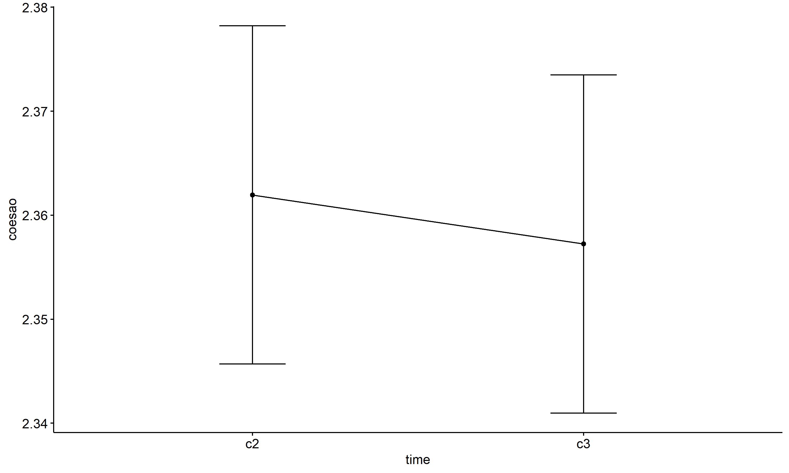<!-- -->

# ANOVA: coesao ~ time\*gender + Error(id/time)

## Data Preparation

``` r
data <- edat[,c("aluno_id","gender","ciclo","coesao")]
data <- data[data$ciclo %in% c("Segundo Ciclo","Terceiro Ciclo"),]
data$ciclo <- factor(data$ciclo, c("Segundo Ciclo","Terceiro Ciclo"))
data <- unique(data)

wdat <- spread(data, ciclo, coesao)
wdat <- wdat[complete.cases(wdat),]
colnames(wdat) <- c("id","gender","c2","c3")

ldat <- gather(wdat, key = time, value = coesao, c2,c3) %>%
  convert_as_factor(id, time)
ldat <- remove_group_data(ldat, "coesao", c("time", "gender"), n.limit = 30)
ldat$gender <- factor(ldat$gender, sort(unique(ldat$gender)))
```

### Check assumptions: Identifying Outliers

``` r
outliers <- identify_outliers(group_by(ldat, time, gender), coesao)
(outliers <- outliers[outliers$is.extreme == T,])
```

    ## [1] gender     time       id         coesao     is.outlier is.extreme
    ## <0 rows> (or 0-length row.names)

| gender | time | id  | coesao | is.outlier | is.extreme |
|:-------|:-----|:----|-------:|:-----------|:-----------|

### Check assumptions: Normality Test

``` r
(normality.df <- normality.test.per.groups(ldat, "coesao", c("time", "gender")))
```

    ##      var variable time gender    n   skewness   kurtosis symmetry statistic
    ## 1 coesao   coesao   c2 Female 1876 -0.2197488 -0.2488704      YES 20.709430
    ## 2 coesao   coesao   c2   Male 1917 -0.1301207 -0.1510535      YES  7.247789
    ## 3 coesao   coesao   c3 Female 1876 -0.2196073 -0.3675159      YES 30.085025
    ## 4 coesao   coesao   c3   Male 1917 -0.2300900 -0.4474931      YES 42.683529
    ##       method            p p.signif normality
    ## 1 D'Agostino 3.184229e-05      ***         -
    ## 2 D'Agostino 2.667857e-02       ns         -
    ## 3 D'Agostino 2.931701e-07     ****         -
    ## 4 D'Agostino 5.387527e-10     ****         -

| var    | variable | time | gender |    n | skewness | kurtosis | symmetry | statistic | method     |     p | p.signif | normality |
|:-------|:---------|:-----|:-------|-----:|---------:|---------:|:---------|----------:|:-----------|------:|:---------|:----------|
| coesao | coesao   | c2   | Female | 1876 |    -0.22 |   -0.249 | YES      |    20.709 | D’Agostino | 0.000 | \*\*\*   | \-        |
| coesao | coesao   | c2   | Male   | 1917 |    -0.13 |   -0.151 | YES      |     7.248 | D’Agostino | 0.027 | ns       | \-        |
| coesao | coesao   | c3   | Female | 1876 |    -0.22 |   -0.368 | YES      |    30.085 | D’Agostino | 0.000 | \*\*\*\* | \-        |
| coesao | coesao   | c3   | Male   | 1917 |    -0.23 |   -0.447 | YES      |    42.684 | D’Agostino | 0.000 | \*\*\*\* | \-        |

``` r
(non.ids <- unique(do.call(
  c, lapply(which(normality.df$normality == 'NO'), FUN = function(i) {
  idx = which(ldat$time == normality.df$time[i] &
                ldat$gender == normality.df$gender[i])
  getNonNormal(ldat$"coesao"[idx], ldat$id[idx])
}))))
```

    ## NULL

``` r
if (length(non.ids) > 0)
  ldat2 <- ldat[!ldat$id %in% non.ids,]
```

### Summary Statistics

``` r
(sdat <- ldat %>% group_by(time, gender) %>%
   get_summary_stats(coesao, type = "mean_sd"))
```

    ## # A tibble: 4 × 6
    ##   gender time  variable     n  mean    sd
    ##   <fct>  <fct> <fct>    <dbl> <dbl> <dbl>
    ## 1 Female c2    coesao    1876  2.39 0.518
    ## 2 Male   c2    coesao    1917  2.33 0.496
    ## 3 Female c3    coesao    1876  2.37 0.555
    ## 4 Male   c3    coesao    1917  2.34 0.54

| gender | time | variable |    n |  mean |    sd |
|:-------|:-----|:---------|-----:|------:|------:|
| Female | c2   | coesao   | 1876 | 2.390 | 0.518 |
| Male   | c2   | coesao   | 1917 | 2.329 | 0.496 |
| Female | c3   | coesao   | 1876 | 2.373 | 0.555 |
| Male   | c3   | coesao   | 1917 | 2.338 | 0.540 |

``` r
if (length(non.ids) > 0)
  (sdat <- ldat2 %>% group_by(time, gender) %>%
      get_summary_stats(coesao, type = "mean_sd"))
```

| gender | time | variable |    n |  mean |    sd |
|:-------|:-----|:---------|-----:|------:|------:|
| Female | c2   | coesao   | 1876 | 2.390 | 0.518 |
| Male   | c2   | coesao   | 1917 | 2.329 | 0.496 |
| Female | c3   | coesao   | 1876 | 2.373 | 0.555 |
| Male   | c3   | coesao   | 1917 | 2.338 | 0.540 |

## ANOVA Computation

``` r
(res.aov <- anova_test(ldat, dv = coesao, wid = id, between = gender, within = time))
```

    ## ANOVA Table (type III tests)
    ## 
    ##        Effect DFn  DFd      F        p p<.05      ges
    ## 1      gender   1 3791 14.149 0.000171     * 2.00e-03
    ## 2        time   1 3791  0.147 0.701000       1.74e-05
    ## 3 gender:time   1 3791  1.259 0.262000       1.49e-04

## ANOVA Computation after removing non.normal data

``` r
if (length(non.ids) > 0)
  (res.aov2 <- anova_test(ldat2, dv = coesao, wid = id, between = gender , within = time))
```

## PairWise Computation

``` r
(pwc <- ldat %>% group_by(time) %>%
   emmeans_test(coesao ~ gender, detailed = T, p.adjust.method = "bonferroni"))
```

    ## # A tibble: 2 × 15
    ##   time  term   .y.    group1 group2 null.value estimate     se    df conf.low
    ## * <fct> <chr>  <chr>  <chr>  <chr>       <dbl>    <dbl>  <dbl> <dbl>    <dbl>
    ## 1 c2    gender coesao Female Male            0   0.0608 0.0171  7582  0.0272 
    ## 2 c3    gender coesao Female Male            0   0.0351 0.0171  7582  0.00145
    ## # ℹ 5 more variables: conf.high <dbl>, statistic <dbl>, p <dbl>, p.adj <dbl>,
    ## #   p.adj.signif <chr>

| time | term   | .y.    | group1 | group2 | null.value | estimate |    se |   df | conf.low | conf.high | statistic |     p | p.adj | p.adj.signif |
|:-----|:-------|:-------|:-------|:-------|-----------:|---------:|------:|-----:|---------:|----------:|----------:|------:|------:|:-------------|
| c2   | gender | coesao | Female | Male   |          0 |    0.061 | 0.017 | 7582 |    0.027 |     0.094 |     3.546 | 0.000 | 0.000 | \*\*\*       |
| c3   | gender | coesao | Female | Male   |          0 |    0.035 | 0.017 | 7582 |    0.001 |     0.069 |     2.045 | 0.041 | 0.041 | \*           |

``` r
(emms <- get_emmeans(pwc))
```

    ## # A tibble: 4 × 8
    ##   time  gender emmean     se    df conf.low conf.high method      
    ##   <fct> <fct>   <dbl>  <dbl> <dbl>    <dbl>     <dbl> <chr>       
    ## 1 c2    Female   2.39 0.0122  7582     2.37      2.41 Emmeans test
    ## 2 c2    Male     2.33 0.0121  7582     2.31      2.35 Emmeans test
    ## 3 c3    Female   2.37 0.0122  7582     2.35      2.40 Emmeans test
    ## 4 c3    Male     2.34 0.0121  7582     2.31      2.36 Emmeans test

| time | gender | emmean |    se |   df | conf.low | conf.high | method       |
|:-----|:-------|-------:|------:|-----:|---------:|----------:|:-------------|
| c2   | Female |  2.390 | 0.012 | 7582 |    2.366 |     2.414 | Emmeans test |
| c2   | Male   |  2.329 | 0.012 | 7582 |    2.306 |     2.353 | Emmeans test |
| c3   | Female |  2.373 | 0.012 | 7582 |    2.349 |     2.397 | Emmeans test |
| c3   | Male   |  2.338 | 0.012 | 7582 |    2.314 |     2.362 | Emmeans test |

``` r
pwc <- add_xy_position(pwc, x = "time", fun = "mean_se", dodge = 0.25)
pd <- position_dodge(width = 0.25)
ggline(emms, x = "time", y = "emmean", color = "gender",
       palette = c("#FF007F","#4D4DFF"),
       position = pd, ylab = "coesao") +
  geom_errorbar(aes(ymin = conf.low, ymax = conf.high, color = gender),
                position = pd, width = 0.2) +
  stat_pvalue_manual(pwc, hide.ns = T, tip.length = F, linetype = 1)
```

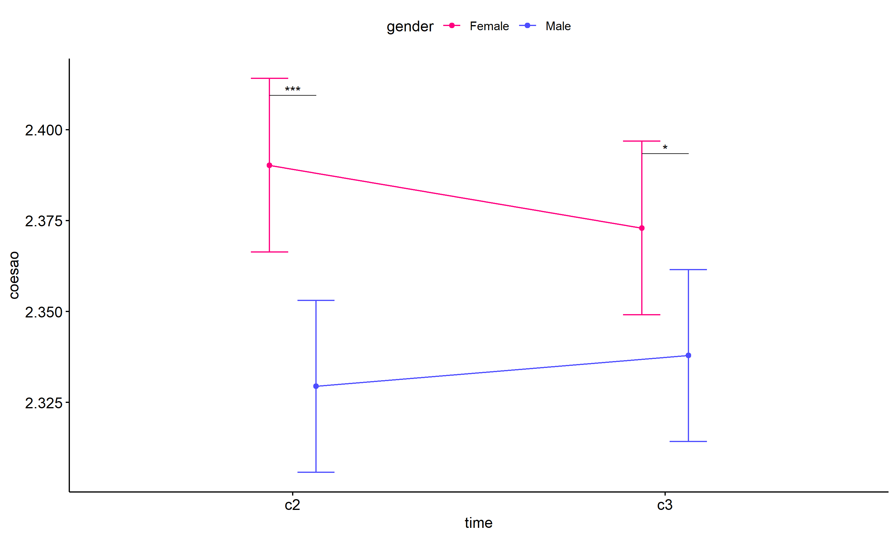<!-- -->

``` r
(pwc <- ldat %>% group_by(gender) %>%
    emmeans_test(coesao ~ time, detailed = T, p.adjust.method = "bonferroni"))
```

    ## # A tibble: 2 × 15
    ##   gender term  .y.    group1 group2 null.value estimate     se    df conf.low
    ## * <fct>  <chr> <chr>  <chr>  <chr>       <dbl>    <dbl>  <dbl> <dbl>    <dbl>
    ## 1 Female time  coesao c2     c3              0  0.0173  0.0172  7582  -0.0165
    ## 2 Male   time  coesao c2     c3              0 -0.00847 0.0171  7582  -0.0419
    ## # ℹ 5 more variables: conf.high <dbl>, statistic <dbl>, p <dbl>, p.adj <dbl>,
    ## #   p.adj.signif <chr>

| gender | term | .y.    | group1 | group2 | null.value | estimate |    se |   df | conf.low | conf.high | statistic |     p | p.adj | p.adj.signif |
|:-------|:-----|:-------|:-------|:-------|-----------:|---------:|------:|-----:|---------:|----------:|----------:|------:|------:|:-------------|
| Female | time | coesao | c2     | c3     |          0 |    0.017 | 0.017 | 7582 |   -0.017 |     0.051 |     1.002 | 0.316 | 0.316 | ns           |
| Male   | time | coesao | c2     | c3     |          0 |   -0.008 | 0.017 | 7582 |   -0.042 |     0.025 |    -0.497 | 0.619 | 0.619 | ns           |

``` r
(emms <- get_emmeans(pwc))
```

    ## # A tibble: 4 × 8
    ##   gender time  emmean     se    df conf.low conf.high method      
    ##   <fct>  <fct>  <dbl>  <dbl> <dbl>    <dbl>     <dbl> <chr>       
    ## 1 Female c2      2.39 0.0122  7582     2.37      2.41 Emmeans test
    ## 2 Female c3      2.37 0.0122  7582     2.35      2.40 Emmeans test
    ## 3 Male   c2      2.33 0.0121  7582     2.31      2.35 Emmeans test
    ## 4 Male   c3      2.34 0.0121  7582     2.31      2.36 Emmeans test

| gender | time | emmean |    se |   df | conf.low | conf.high | method       |
|:-------|:-----|-------:|------:|-----:|---------:|----------:|:-------------|
| Female | c2   |  2.390 | 0.012 | 7582 |    2.366 |     2.414 | Emmeans test |
| Female | c3   |  2.373 | 0.012 | 7582 |    2.349 |     2.397 | Emmeans test |
| Male   | c2   |  2.329 | 0.012 | 7582 |    2.306 |     2.353 | Emmeans test |
| Male   | c3   |  2.338 | 0.012 | 7582 |    2.314 |     2.362 | Emmeans test |

``` r
emms.gg <- emms[which(emms$gender == "Female"),]
if (nrow(emms.gg) > 0)
  ggline(emms.gg, x = "time", y = "emmean", color = "#FF007F", ylab = "coesao") +
    geom_errorbar(aes(ymin = conf.low, ymax = conf.high),
                  width = 0.2, color = "#FF007F") +
    stat_pvalue_manual(
      add_xy_position(pwc[which(pwc$gender == "Female"),],
                      x = "time", fun = "mean_se"),
      hide.ns = T, color = "#FF007F", tip.length = F) +
    labs(title = "gender: Female")+
    theme(legend.text = element_blank())
```

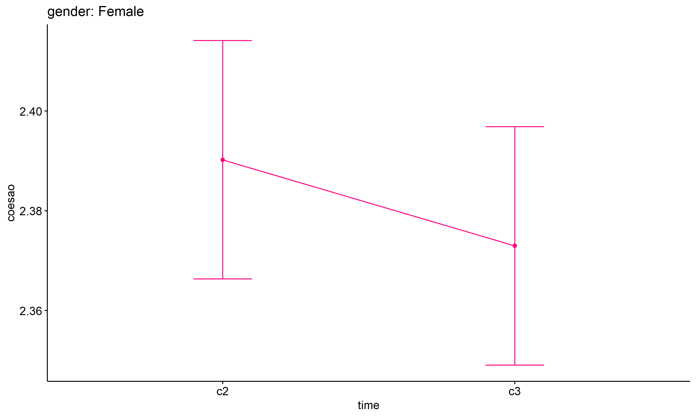<!-- -->

``` r
emms.gg <- emms[which(emms$gender == "Male"),]
if (nrow(emms.gg) > 0)
  ggline(emms.gg, x = "time", y = "emmean", color = "#4D4DFF", ylab = "coesao") +
    geom_errorbar(aes(ymin = conf.low, ymax = conf.high),
                  width = 0.2, color = "#4D4DFF") +
    stat_pvalue_manual(
      add_xy_position(pwc[which(pwc$gender == "Male"),],
                      x = "time", fun = "mean_se"),
      hide.ns = T, color = "#4D4DFF", tip.length = F) +
    labs(title = "gender: Male")+
    theme(legend.text = element_blank())
```

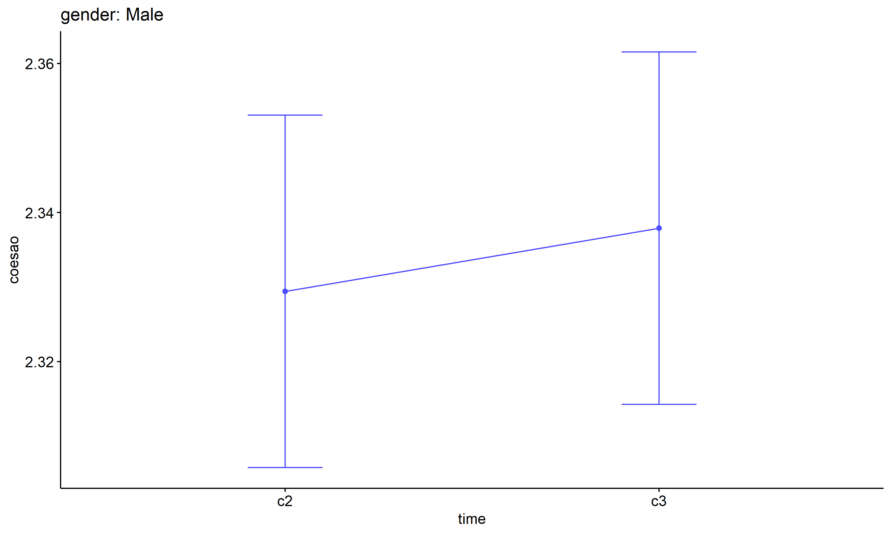<!-- -->

## PairWise Computation after removing non.normal data

``` r
if (length(non.ids) > 0)
  (pwc2 <- ldat2 %>% group_by(time) %>%
     emmeans_test(coesao ~ gender, detailed = T, p.adjust.method = "bonferroni"))
```

``` r
if (length(non.ids) > 0)
  (emms2 <- get_emmeans(pwc2))
```

``` r
if (length(non.ids) > 0) {
  pwc2 <- add_xy_position(pwc2, x = "time", fun = "mean_se", dodge = 0.25)
  pd2 <- position_dodge(width = 0.25)
  
  ggline(emms2, x = "time", y = "emmean", color = "gender",
         palette = c("#FF007F","#4D4DFF"),
         position = pd, ylab = "coesao") +
    geom_errorbar(aes(ymin = conf.low, ymax = conf.high, color = gender),
                position = pd, width = 0.2) +
    stat_pvalue_manual(pwc2, hide.ns = T, tip.length = F, linetype = 1)
}
```

``` r
if (length(non.ids) > 0)
  (pwc2 <- ldat2 %>% group_by(gender) %>%
     emmeans_test(coesao ~ time, detailed = T, p.adjust.method = "bonferroni"))
```

``` r
if (length(non.ids) > 0)
  (emms2 <- get_emmeans(pwc2))
```

``` r
if (length(non.ids) > 0) {
  emms.gg <- emms2[which(emms2$gender == "Female"),]
  if (nrow(emms.gg) > 0)
    ggline(emms.gg, x = "time", y = "emmean", color = "#FF007F", ylab = "coesao") +
    geom_errorbar(aes(ymin = conf.low, ymax = conf.high),
                  width = 0.2, color = "#FF007F") +
    stat_pvalue_manual(
      add_xy_position(pwc[which(pwc$gender == "Female"),],
                      x = "time", fun = "mean_se"),
      hide.ns = T, color = "#FF007F", tip.length = F) +
    labs(title = "gender: Female") +
    theme(legend.text = element_blank())
}
```

``` r
if (length(non.ids) > 0) {
  emms.gg <- emms2[which(emms2$gender == "Male"),]
  if (nrow(emms.gg) > 0)
    ggline(emms.gg, x = "time", y = "emmean", color = "#4D4DFF", ylab = "coesao") +
    geom_errorbar(aes(ymin = conf.low, ymax = conf.high),
                  width = 0.2, color = "#4D4DFF") +
    stat_pvalue_manual(
      add_xy_position(pwc[which(pwc$gender == "Male"),],
                      x = "time", fun = "mean_se"),
      hide.ns = T, color = "#4D4DFF", tip.length = F) +
    labs(title = "gender: Male") +
    theme(legend.text = element_blank())
}
```

# ANOVA: coesao ~ time\*localizacao + Error(id/time)

## Data Preparation

``` r
data <- edat[,c("aluno_id","localizacao","ciclo","coesao")]
data <- data[data$ciclo %in% c("Segundo Ciclo","Terceiro Ciclo"),]
data$ciclo <- factor(data$ciclo, c("Segundo Ciclo","Terceiro Ciclo"))
data <- unique(data)

wdat <- spread(data, ciclo, coesao)
wdat <- wdat[complete.cases(wdat),]
colnames(wdat) <- c("id","localizacao","c2","c3")

ldat <- gather(wdat, key = time, value = coesao, c2,c3) %>%
  convert_as_factor(id, time)
ldat <- remove_group_data(ldat, "coesao", c("time", "localizacao"), n.limit = 30)
ldat$localizacao <- factor(ldat$localizacao, sort(unique(ldat$localizacao)))
```

### Check assumptions: Identifying Outliers

``` r
outliers <- identify_outliers(group_by(ldat, time, localizacao), coesao)
(outliers <- outliers[outliers$is.extreme == T,])
```

    ## [1] localizacao time        id          coesao      is.outlier  is.extreme 
    ## <0 rows> (or 0-length row.names)

| localizacao | time | id  | coesao | is.outlier | is.extreme |
|:------------|:-----|:----|-------:|:-----------|:-----------|

### Check assumptions: Normality Test

``` r
(normality.df <- normality.test.per.groups(ldat, "coesao", c("time", "localizacao")))
```

    ##      var variable time localizacao    n   skewness   kurtosis symmetry
    ## 1 coesao   coesao   c2       Rural  701 -0.1793122 -0.2357631      YES
    ## 2 coesao   coesao   c2      Urbana 3341 -0.1597006 -0.2250926      YES
    ## 3 coesao   coesao   c3       Rural  701 -0.1494830 -0.5187326      YES
    ## 4 coesao   coesao   c3      Urbana 3341 -0.2332760 -0.4015199      YES
    ##   statistic     method            p p.signif normality
    ## 1  5.410342 D'Agostino 6.685888e-02       ns         -
    ## 2 22.618061 D'Agostino 1.226169e-05      ***         -
    ## 3 16.001257 D'Agostino 3.352519e-04       **         -
    ## 4 64.493142 D'Agostino 9.880985e-15     ****         -

| var    | variable | time | localizacao |    n | skewness | kurtosis | symmetry | statistic | method     |     p | p.signif | normality |
|:-------|:---------|:-----|:------------|-----:|---------:|---------:|:---------|----------:|:-----------|------:|:---------|:----------|
| coesao | coesao   | c2   | Rural       |  701 |   -0.179 |   -0.236 | YES      |     5.410 | D’Agostino | 0.067 | ns       | \-        |
| coesao | coesao   | c2   | Urbana      | 3341 |   -0.160 |   -0.225 | YES      |    22.618 | D’Agostino | 0.000 | \*\*\*   | \-        |
| coesao | coesao   | c3   | Rural       |  701 |   -0.149 |   -0.519 | YES      |    16.001 | D’Agostino | 0.000 | \*\*     | \-        |
| coesao | coesao   | c3   | Urbana      | 3341 |   -0.233 |   -0.402 | YES      |    64.493 | D’Agostino | 0.000 | \*\*\*\* | \-        |

``` r
(non.ids <- unique(do.call(
  c, lapply(which(normality.df$normality == 'NO'), FUN = function(i) {
  idx = which(ldat$time == normality.df$time[i] &
                ldat$localizacao == normality.df$localizacao[i])
  getNonNormal(ldat$"coesao"[idx], ldat$id[idx])
}))))
```

    ## NULL

``` r
if (length(non.ids) > 0)
  ldat2 <- ldat[!ldat$id %in% non.ids,]
```

### Summary Statistics

``` r
(sdat <- ldat %>% group_by(time, localizacao) %>%
   get_summary_stats(coesao, type = "mean_sd"))
```

    ## # A tibble: 4 × 6
    ##   localizacao time  variable     n  mean    sd
    ##   <fct>       <fct> <fct>    <dbl> <dbl> <dbl>
    ## 1 Rural       c2    coesao     701  2.37 0.539
    ## 2 Urbana      c2    coesao    3341  2.36 0.501
    ## 3 Rural       c3    coesao     701  2.36 0.536
    ## 4 Urbana      c3    coesao    3341  2.36 0.548

| localizacao | time | variable |    n |  mean |    sd |
|:------------|:-----|:---------|-----:|------:|------:|
| Rural       | c2   | coesao   |  701 | 2.369 | 0.539 |
| Urbana      | c2   | coesao   | 3341 | 2.360 | 0.501 |
| Rural       | c3   | coesao   |  701 | 2.360 | 0.536 |
| Urbana      | c3   | coesao   | 3341 | 2.357 | 0.548 |

``` r
if (length(non.ids) > 0)
  (sdat <- ldat2 %>% group_by(time, localizacao) %>%
      get_summary_stats(coesao, type = "mean_sd"))
```

| localizacao | time | variable |    n |  mean |    sd |
|:------------|:-----|:---------|-----:|------:|------:|
| Rural       | c2   | coesao   |  701 | 2.369 | 0.539 |
| Urbana      | c2   | coesao   | 3341 | 2.360 | 0.501 |
| Rural       | c3   | coesao   |  701 | 2.360 | 0.536 |
| Urbana      | c3   | coesao   | 3341 | 2.357 | 0.548 |

## ANOVA Computation

``` r
(res.aov <- anova_test(ldat, dv = coesao, wid = id, between = localizacao, within = time))
```

    ## ANOVA Table (type III tests)
    ## 
    ##             Effect DFn  DFd     F     p p<.05      ges
    ## 1      localizacao   1 4040 0.151 0.698       2.08e-05
    ## 2             time   1 4040 0.199 0.655       2.19e-05
    ## 3 localizacao:time   1 4040 0.036 0.850       3.91e-06

## ANOVA Computation after removing non.normal data

``` r
if (length(non.ids) > 0)
  (res.aov2 <- anova_test(ldat2, dv = coesao, wid = id, between = localizacao , within = time))
```

## PairWise Computation

``` r
(pwc <- ldat %>% group_by(time) %>%
   emmeans_test(coesao ~ localizacao, detailed = T, p.adjust.method = "bonferroni"))
```

    ## # A tibble: 2 × 15
    ##   time  term       .y.   group1 group2 null.value estimate     se    df conf.low
    ## * <fct> <chr>      <chr> <chr>  <chr>       <dbl>    <dbl>  <dbl> <dbl>    <dbl>
    ## 1 c2    localizac… coes… Rural  Urbana          0  0.00910 0.0219  8080  -0.0339
    ## 2 c3    localizac… coes… Rural  Urbana          0  0.00359 0.0219  8080  -0.0394
    ## # ℹ 5 more variables: conf.high <dbl>, statistic <dbl>, p <dbl>, p.adj <dbl>,
    ## #   p.adj.signif <chr>

| time | term        | .y.    | group1 | group2 | null.value | estimate |    se |   df | conf.low | conf.high | statistic |     p | p.adj | p.adj.signif |
|:-----|:------------|:-------|:-------|:-------|-----------:|---------:|------:|-----:|---------:|----------:|----------:|------:|------:|:-------------|
| c2   | localizacao | coesao | Rural  | Urbana |          0 |    0.009 | 0.022 | 8080 |   -0.034 |     0.052 |     0.415 | 0.678 | 0.678 | ns           |
| c3   | localizacao | coesao | Rural  | Urbana |          0 |    0.004 | 0.022 | 8080 |   -0.039 |     0.047 |     0.164 | 0.870 | 0.870 | ns           |

``` r
(emms <- get_emmeans(pwc))
```

    ## # A tibble: 4 × 8
    ##   time  localizacao emmean      se    df conf.low conf.high method      
    ##   <fct> <fct>        <dbl>   <dbl> <dbl>    <dbl>     <dbl> <chr>       
    ## 1 c2    Rural         2.37 0.0199   8080     2.33      2.41 Emmeans test
    ## 2 c2    Urbana        2.36 0.00913  8080     2.34      2.38 Emmeans test
    ## 3 c3    Rural         2.36 0.0199   8080     2.32      2.40 Emmeans test
    ## 4 c3    Urbana        2.36 0.00913  8080     2.34      2.37 Emmeans test

| time | localizacao | emmean |    se |   df | conf.low | conf.high | method       |
|:-----|:------------|-------:|------:|-----:|---------:|----------:|:-------------|
| c2   | Rural       |  2.369 | 0.020 | 8080 |    2.330 |     2.409 | Emmeans test |
| c2   | Urbana      |  2.360 | 0.009 | 8080 |    2.342 |     2.378 | Emmeans test |
| c3   | Rural       |  2.360 | 0.020 | 8080 |    2.321 |     2.399 | Emmeans test |
| c3   | Urbana      |  2.357 | 0.009 | 8080 |    2.339 |     2.374 | Emmeans test |

``` r
pwc <- add_xy_position(pwc, x = "time", fun = "mean_se", dodge = 0.25)
pd <- position_dodge(width = 0.25)
ggline(emms, x = "time", y = "emmean", color = "localizacao",
       palette = c("#AA00FF","#00CCCC"),
       position = pd, ylab = "coesao") +
  geom_errorbar(aes(ymin = conf.low, ymax = conf.high, color = localizacao),
                position = pd, width = 0.2) +
  stat_pvalue_manual(pwc, hide.ns = T, tip.length = F, linetype = 1)
```

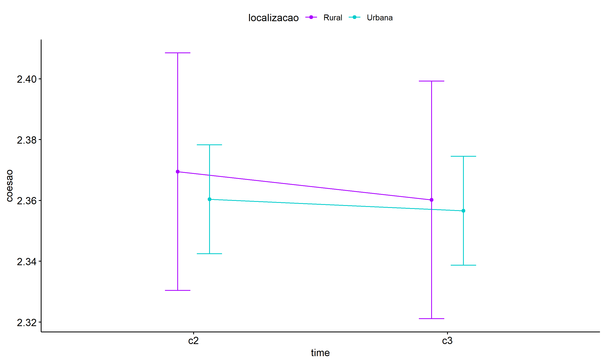<!-- -->

``` r
(pwc <- ldat %>% group_by(localizacao) %>%
    emmeans_test(coesao ~ time, detailed = T, p.adjust.method = "bonferroni"))
```

    ## # A tibble: 2 × 15
    ##   localizacao term  .y.    group1 group2 null.value estimate     se    df
    ## * <fct>       <chr> <chr>  <chr>  <chr>       <dbl>    <dbl>  <dbl> <dbl>
    ## 1 Rural       time  coesao c2     c3              0  0.00927 0.0282  8080
    ## 2 Urbana      time  coesao c2     c3              0  0.00377 0.0129  8080
    ## # ℹ 6 more variables: conf.low <dbl>, conf.high <dbl>, statistic <dbl>,
    ## #   p <dbl>, p.adj <dbl>, p.adj.signif <chr>

| localizacao | term | .y.    | group1 | group2 | null.value | estimate |    se |   df | conf.low | conf.high | statistic |     p | p.adj | p.adj.signif |
|:------------|:-----|:-------|:-------|:-------|-----------:|---------:|------:|-----:|---------:|----------:|----------:|------:|------:|:-------------|
| Rural       | time | coesao | c2     | c3     |          0 |    0.009 | 0.028 | 8080 |   -0.046 |     0.065 |     0.329 | 0.742 | 0.742 | ns           |
| Urbana      | time | coesao | c2     | c3     |          0 |    0.004 | 0.013 | 8080 |   -0.022 |     0.029 |     0.292 | 0.770 | 0.770 | ns           |

``` r
(emms <- get_emmeans(pwc))
```

    ## # A tibble: 4 × 8
    ##   localizacao time  emmean      se    df conf.low conf.high method      
    ##   <fct>       <fct>  <dbl>   <dbl> <dbl>    <dbl>     <dbl> <chr>       
    ## 1 Rural       c2      2.37 0.0199   8080     2.33      2.41 Emmeans test
    ## 2 Rural       c3      2.36 0.0199   8080     2.32      2.40 Emmeans test
    ## 3 Urbana      c2      2.36 0.00913  8080     2.34      2.38 Emmeans test
    ## 4 Urbana      c3      2.36 0.00913  8080     2.34      2.37 Emmeans test

| localizacao | time | emmean |    se |   df | conf.low | conf.high | method       |
|:------------|:-----|-------:|------:|-----:|---------:|----------:|:-------------|
| Rural       | c2   |  2.369 | 0.020 | 8080 |    2.330 |     2.409 | Emmeans test |
| Rural       | c3   |  2.360 | 0.020 | 8080 |    2.321 |     2.399 | Emmeans test |
| Urbana      | c2   |  2.360 | 0.009 | 8080 |    2.342 |     2.378 | Emmeans test |
| Urbana      | c3   |  2.357 | 0.009 | 8080 |    2.339 |     2.374 | Emmeans test |

``` r
emms.gg <- emms[which(emms$localizacao == "Rural"),]
if (nrow(emms.gg) > 0)
  ggline(emms.gg, x = "time", y = "emmean", color = "#AA00FF", ylab = "coesao") +
    geom_errorbar(aes(ymin = conf.low, ymax = conf.high),
                  width = 0.2, color = "#AA00FF") +
    stat_pvalue_manual(
      add_xy_position(pwc[which(pwc$localizacao == "Rural"),],
                      x = "time", fun = "mean_se"),
      hide.ns = T, color = "#AA00FF", tip.length = F) +
    labs(title = "localizacao: Rural")+
    theme(legend.text = element_blank())
```

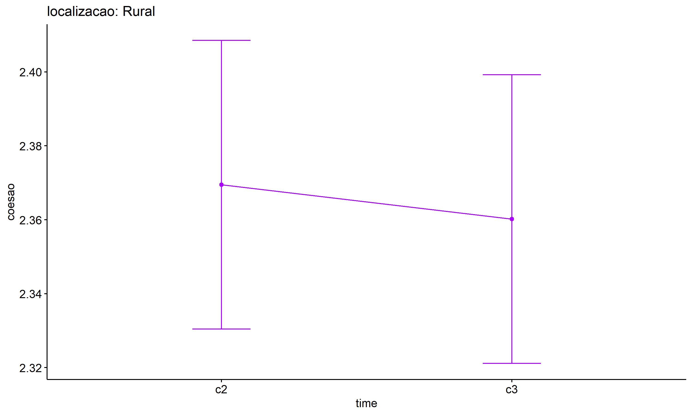<!-- -->

``` r
emms.gg <- emms[which(emms$localizacao == "Urbana"),]
if (nrow(emms.gg) > 0)
  ggline(emms.gg, x = "time", y = "emmean", color = "#00CCCC", ylab = "coesao") +
    geom_errorbar(aes(ymin = conf.low, ymax = conf.high),
                  width = 0.2, color = "#00CCCC") +
    stat_pvalue_manual(
      add_xy_position(pwc[which(pwc$localizacao == "Urbana"),],
                      x = "time", fun = "mean_se"),
      hide.ns = T, color = "#00CCCC", tip.length = F) +
    labs(title = "localizacao: Urbana")+
    theme(legend.text = element_blank())
```

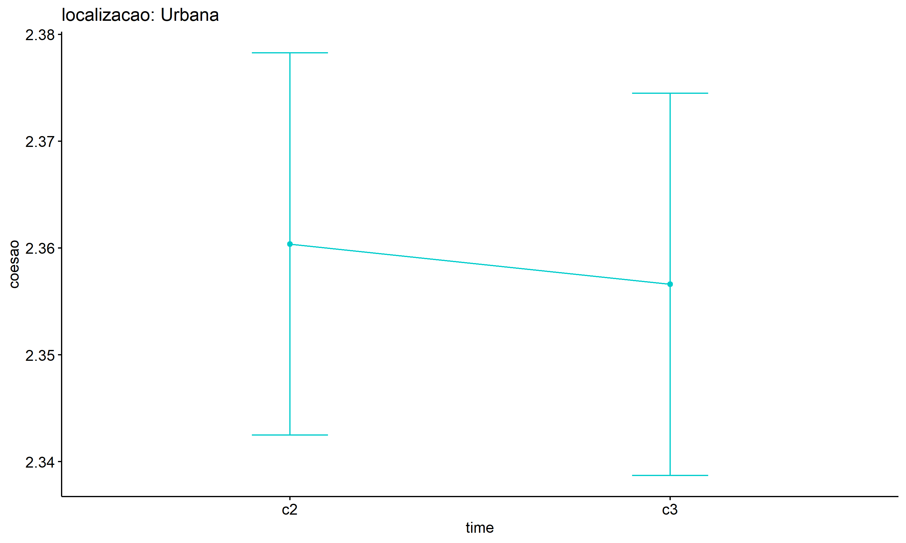<!-- -->

## PairWise Computation after removing non.normal data

``` r
if (length(non.ids) > 0)
  (pwc2 <- ldat2 %>% group_by(time) %>%
     emmeans_test(coesao ~ localizacao, detailed = T, p.adjust.method = "bonferroni"))
```

``` r
if (length(non.ids) > 0)
  (emms2 <- get_emmeans(pwc2))
```

``` r
if (length(non.ids) > 0) {
  pwc2 <- add_xy_position(pwc2, x = "time", fun = "mean_se", dodge = 0.25)
  pd2 <- position_dodge(width = 0.25)
  
  ggline(emms2, x = "time", y = "emmean", color = "localizacao",
         palette = c("#AA00FF","#00CCCC"),
         position = pd, ylab = "coesao") +
    geom_errorbar(aes(ymin = conf.low, ymax = conf.high, color = localizacao),
                position = pd, width = 0.2) +
    stat_pvalue_manual(pwc2, hide.ns = T, tip.length = F, linetype = 1)
}
```

``` r
if (length(non.ids) > 0)
  (pwc2 <- ldat2 %>% group_by(localizacao) %>%
     emmeans_test(coesao ~ time, detailed = T, p.adjust.method = "bonferroni"))
```

``` r
if (length(non.ids) > 0)
  (emms2 <- get_emmeans(pwc2))
```

``` r
if (length(non.ids) > 0) {
  emms.gg <- emms2[which(emms2$localizacao == "Rural"),]
  if (nrow(emms.gg) > 0)
    ggline(emms.gg, x = "time", y = "emmean", color = "#AA00FF", ylab = "coesao") +
    geom_errorbar(aes(ymin = conf.low, ymax = conf.high),
                  width = 0.2, color = "#AA00FF") +
    stat_pvalue_manual(
      add_xy_position(pwc[which(pwc$localizacao == "Rural"),],
                      x = "time", fun = "mean_se"),
      hide.ns = T, color = "#AA00FF", tip.length = F) +
    labs(title = "localizacao: Rural") +
    theme(legend.text = element_blank())
}
```

``` r
if (length(non.ids) > 0) {
  emms.gg <- emms2[which(emms2$localizacao == "Urbana"),]
  if (nrow(emms.gg) > 0)
    ggline(emms.gg, x = "time", y = "emmean", color = "#00CCCC", ylab = "coesao") +
    geom_errorbar(aes(ymin = conf.low, ymax = conf.high),
                  width = 0.2, color = "#00CCCC") +
    stat_pvalue_manual(
      add_xy_position(pwc[which(pwc$localizacao == "Urbana"),],
                      x = "time", fun = "mean_se"),
      hide.ns = T, color = "#00CCCC", tip.length = F) +
    labs(title = "localizacao: Urbana") +
    theme(legend.text = element_blank())
}
```

# ANOVA: coesao ~ time\*regiao + Error(id/time)

## Data Preparation

``` r
data <- edat[,c("aluno_id","regiao","ciclo","coesao")]
data <- data[data$ciclo %in% c("Segundo Ciclo","Terceiro Ciclo"),]
data$ciclo <- factor(data$ciclo, c("Segundo Ciclo","Terceiro Ciclo"))
data <- unique(data)

wdat <- spread(data, ciclo, coesao)
wdat <- wdat[complete.cases(wdat),]
colnames(wdat) <- c("id","regiao","c2","c3")

ldat <- gather(wdat, key = time, value = coesao, c2,c3) %>%
  convert_as_factor(id, time)
ldat <- remove_group_data(ldat, "coesao", c("time", "regiao"), n.limit = 30)
ldat$regiao <- factor(ldat$regiao, sort(unique(ldat$regiao)))
```

### Check assumptions: Identifying Outliers

``` r
outliers <- identify_outliers(group_by(ldat, time, regiao), coesao)
(outliers <- outliers[outliers$is.extreme == T,])
```

    ## # A tibble: 0 × 6
    ## # ℹ 6 variables: regiao <fct>, time <fct>, id <fct>, coesao <dbl>,
    ## #   is.outlier <lgl>, is.extreme <lgl>

| regiao | time | id  | coesao | is.outlier | is.extreme |
|:-------|:-----|:----|-------:|:-----------|:-----------|

### Check assumptions: Normality Test

``` r
(normality.df <- normality.test.per.groups(ldat, "coesao", c("time", "regiao")))
```

    ##       var variable time       regiao    n    skewness   kurtosis symmetry
    ## 1  coesao   coesao   c2 Centro-Oeste  198  0.12684646 -0.7661074      YES
    ## 2  coesao   coesao   c2     Nordeste 1464 -0.17077298 -0.3863569      YES
    ## 3  coesao   coesao   c2        Norte  435 -0.25301749 -0.3533233      YES
    ## 4  coesao   coesao   c2      Sudeste 1473 -0.12498333 -0.1047346      YES
    ## 5  coesao   coesao   c2          Sul  472 -0.23967033 -0.0294736      YES
    ## 6  coesao   coesao   c3 Centro-Oeste  198 -0.07337694  0.1997756      YES
    ## 7  coesao   coesao   c3     Nordeste 1464 -0.09307087 -0.6612780      YES
    ## 8  coesao   coesao   c3        Norte  435 -0.26594160 -0.3666328      YES
    ## 9  coesao   coesao   c3      Sudeste 1473 -0.31728009 -0.3762164      YES
    ## 10 coesao   coesao   c3          Sul  472 -0.28321407 -0.3947666      YES
    ##     statistic     method            p p.signif normality
    ## 1  11.0657226 D'Agostino 3.954657e-03        *        QQ
    ## 2  20.3921793 D'Agostino 3.731595e-05      ***         -
    ## 3   7.2876796 D'Agostino 2.615173e-02       ns         -
    ## 4   4.4032137 D'Agostino 1.106253e-01       ns         -
    ## 5   4.5715129 D'Agostino 1.016971e-01       ns         -
    ## 6   0.9566728 D'Agostino 6.198137e-01       ns        QQ
    ## 7  63.5116697 D'Agostino 1.620926e-14     ****         -
    ## 8   8.0446338 D'Agostino 1.791142e-02       ns         -
    ## 9  36.3491414 D'Agostino 1.279040e-08     ****         -
    ## 10 10.2232838 D'Agostino 6.026181e-03        *         -

| var    | variable | time | regiao       |    n | skewness | kurtosis | symmetry | statistic | method     |     p | p.signif | normality |
|:-------|:---------|:-----|:-------------|-----:|---------:|---------:|:---------|----------:|:-----------|------:|:---------|:----------|
| coesao | coesao   | c2   | Centro-Oeste |  198 |    0.127 |   -0.766 | YES      |    11.066 | D’Agostino | 0.004 | \*       | QQ        |
| coesao | coesao   | c2   | Nordeste     | 1464 |   -0.171 |   -0.386 | YES      |    20.392 | D’Agostino | 0.000 | \*\*\*   | \-        |
| coesao | coesao   | c2   | Norte        |  435 |   -0.253 |   -0.353 | YES      |     7.288 | D’Agostino | 0.026 | ns       | \-        |
| coesao | coesao   | c2   | Sudeste      | 1473 |   -0.125 |   -0.105 | YES      |     4.403 | D’Agostino | 0.111 | ns       | \-        |
| coesao | coesao   | c2   | Sul          |  472 |   -0.240 |   -0.029 | YES      |     4.572 | D’Agostino | 0.102 | ns       | \-        |
| coesao | coesao   | c3   | Centro-Oeste |  198 |   -0.073 |    0.200 | YES      |     0.957 | D’Agostino | 0.620 | ns       | QQ        |
| coesao | coesao   | c3   | Nordeste     | 1464 |   -0.093 |   -0.661 | YES      |    63.512 | D’Agostino | 0.000 | \*\*\*\* | \-        |
| coesao | coesao   | c3   | Norte        |  435 |   -0.266 |   -0.367 | YES      |     8.045 | D’Agostino | 0.018 | ns       | \-        |
| coesao | coesao   | c3   | Sudeste      | 1473 |   -0.317 |   -0.376 | YES      |    36.349 | D’Agostino | 0.000 | \*\*\*\* | \-        |
| coesao | coesao   | c3   | Sul          |  472 |   -0.283 |   -0.395 | YES      |    10.223 | D’Agostino | 0.006 | \*       | \-        |

``` r
(non.ids <- unique(do.call(
  c, lapply(which(normality.df$normality == 'NO'), FUN = function(i) {
  idx = which(ldat$time == normality.df$time[i] &
                ldat$regiao == normality.df$regiao[i])
  getNonNormal(ldat$"coesao"[idx], ldat$id[idx])
}))))
```

    ## NULL

``` r
if (length(non.ids) > 0)
  ldat2 <- ldat[!ldat$id %in% non.ids,]
```

### Summary Statistics

``` r
(sdat <- ldat %>% group_by(time, regiao) %>%
   get_summary_stats(coesao, type = "mean_sd"))
```

    ## # A tibble: 10 × 6
    ##    regiao       time  variable     n  mean    sd
    ##    <fct>        <fct> <fct>    <dbl> <dbl> <dbl>
    ##  1 Centro-Oeste c2    coesao     198  2.33 0.482
    ##  2 Nordeste     c2    coesao    1464  2.37 0.528
    ##  3 Norte        c2    coesao     435  2.36 0.527
    ##  4 Sudeste      c2    coesao    1473  2.36 0.467
    ##  5 Sul          c2    coesao     472  2.38 0.56 
    ##  6 Centro-Oeste c3    coesao     198  2.30 0.53 
    ##  7 Nordeste     c3    coesao    1464  2.38 0.534
    ##  8 Norte        c3    coesao     435  2.31 0.552
    ##  9 Sudeste      c3    coesao    1473  2.36 0.538
    ## 10 Sul          c3    coesao     472  2.37 0.604

| regiao       | time | variable |    n |  mean |    sd |
|:-------------|:-----|:---------|-----:|------:|------:|
| Centro-Oeste | c2   | coesao   |  198 | 2.331 | 0.482 |
| Nordeste     | c2   | coesao   | 1464 | 2.365 | 0.528 |
| Norte        | c2   | coesao   |  435 | 2.358 | 0.527 |
| Sudeste      | c2   | coesao   | 1473 | 2.359 | 0.467 |
| Sul          | c2   | coesao   |  472 | 2.377 | 0.560 |
| Centro-Oeste | c3   | coesao   |  198 | 2.301 | 0.530 |
| Nordeste     | c3   | coesao   | 1464 | 2.378 | 0.534 |
| Norte        | c3   | coesao   |  435 | 2.311 | 0.552 |
| Sudeste      | c3   | coesao   | 1473 | 2.355 | 0.538 |
| Sul          | c3   | coesao   |  472 | 2.365 | 0.604 |

``` r
if (length(non.ids) > 0)
  (sdat <- ldat2 %>% group_by(time, regiao) %>%
      get_summary_stats(coesao, type = "mean_sd"))
```

| regiao       | time | variable |    n |  mean |    sd |
|:-------------|:-----|:---------|-----:|------:|------:|
| Centro-Oeste | c2   | coesao   |  198 | 2.331 | 0.482 |
| Nordeste     | c2   | coesao   | 1464 | 2.365 | 0.528 |
| Norte        | c2   | coesao   |  435 | 2.358 | 0.527 |
| Sudeste      | c2   | coesao   | 1473 | 2.359 | 0.467 |
| Sul          | c2   | coesao   |  472 | 2.377 | 0.560 |
| Centro-Oeste | c3   | coesao   |  198 | 2.301 | 0.530 |
| Nordeste     | c3   | coesao   | 1464 | 2.378 | 0.534 |
| Norte        | c3   | coesao   |  435 | 2.311 | 0.552 |
| Sudeste      | c3   | coesao   | 1473 | 2.355 | 0.538 |
| Sul          | c3   | coesao   |  472 | 2.365 | 0.604 |

## ANOVA Computation

``` r
(res.aov <- anova_test(ldat, dv = coesao, wid = id, between = regiao, within = time))
```

    ## ANOVA Table (type III tests)
    ## 
    ##        Effect DFn  DFd     F     p p<.05      ges
    ## 1      regiao   4 4037 1.501 0.199       0.000826
    ## 2        time   1 4037 1.190 0.275       0.000131
    ## 3 regiao:time   4 4037 0.674 0.610       0.000297

## ANOVA Computation after removing non.normal data

``` r
if (length(non.ids) > 0)
  (res.aov2 <- anova_test(ldat2, dv = coesao, wid = id, between = regiao , within = time))
```

## PairWise Computation

``` r
(pwc <- ldat %>% group_by(time) %>%
   emmeans_test(coesao ~ regiao, detailed = T, p.adjust.method = "bonferroni"))
```

    ## Warning: Expected 2 pieces. Additional pieces discarded in 8 rows [1, 2, 3, 4, 11, 12,
    ## 13, 14].

    ## # A tibble: 20 × 15
    ##    time  term   .y.    group1   group2 null.value estimate     se    df conf.low
    ##  * <fct> <chr>  <chr>  <chr>    <chr>       <dbl>    <dbl>  <dbl> <dbl>    <dbl>
    ##  1 c2    regiao coesao Centro   Oeste           0 -0.0342  0.0399  8074 -0.112  
    ##  2 c2    regiao coesao Centro   Oeste           0 -0.0266  0.0452  8074 -0.115  
    ##  3 c2    regiao coesao Centro   Oeste           0 -0.0279  0.0399  8074 -0.106  
    ##  4 c2    regiao coesao Centro   Oeste           0 -0.0455  0.0447  8074 -0.133  
    ##  5 c2    regiao coesao Nordeste Norte           0  0.00753 0.0288  8074 -0.0489 
    ##  6 c2    regiao coesao Nordeste Sudes…          0  0.00625 0.0195  8074 -0.0319 
    ##  7 c2    regiao coesao Nordeste Sul             0 -0.0114  0.0279  8074 -0.0661 
    ##  8 c2    regiao coesao Norte    Sudes…          0 -0.00128 0.0288  8074 -0.0577 
    ##  9 c2    regiao coesao Norte    Sul             0 -0.0189  0.0351  8074 -0.0876 
    ## 10 c2    regiao coesao Sudeste  Sul             0 -0.0176  0.0279  8074 -0.0723 
    ## 11 c3    regiao coesao Centro   Oeste           0 -0.0772  0.0399  8074 -0.155  
    ## 12 c3    regiao coesao Centro   Oeste           0 -0.0110  0.0452  8074 -0.0996 
    ## 13 c3    regiao coesao Centro   Oeste           0 -0.0549  0.0399  8074 -0.133  
    ## 14 c3    regiao coesao Centro   Oeste           0 -0.0650  0.0447  8074 -0.152  
    ## 15 c3    regiao coesao Nordeste Norte           0  0.0662  0.0288  8074  0.00973
    ## 16 c3    regiao coesao Nordeste Sudes…          0  0.0223  0.0195  8074 -0.0159 
    ## 17 c3    regiao coesao Nordeste Sul             0  0.0122  0.0279  8074 -0.0425 
    ## 18 c3    regiao coesao Norte    Sudes…          0 -0.0439  0.0288  8074 -0.100  
    ## 19 c3    regiao coesao Norte    Sul             0 -0.0540  0.0351  8074 -0.123  
    ## 20 c3    regiao coesao Sudeste  Sul             0 -0.0101  0.0279  8074 -0.0648 
    ## # ℹ 5 more variables: conf.high <dbl>, statistic <dbl>, p <dbl>, p.adj <dbl>,
    ## #   p.adj.signif <chr>

| time | term   | .y.    | group1   | group2  | null.value | estimate |    se |   df | conf.low | conf.high | statistic |     p | p.adj | p.adj.signif |
|:-----|:-------|:-------|:---------|:--------|-----------:|---------:|------:|-----:|---------:|----------:|----------:|------:|------:|:-------------|
| c2   | regiao | coesao | Centro   | Oeste   |          0 |   -0.034 | 0.040 | 8074 |   -0.112 |     0.044 |    -0.855 | 0.392 | 1.000 | ns           |
| c2   | regiao | coesao | Centro   | Oeste   |          0 |   -0.027 | 0.045 | 8074 |   -0.115 |     0.062 |    -0.589 | 0.556 | 1.000 | ns           |
| c2   | regiao | coesao | Centro   | Oeste   |          0 |   -0.028 | 0.040 | 8074 |   -0.106 |     0.050 |    -0.699 | 0.485 | 1.000 | ns           |
| c2   | regiao | coesao | Centro   | Oeste   |          0 |   -0.046 | 0.045 | 8074 |   -0.133 |     0.042 |    -1.020 | 0.308 | 1.000 | ns           |
| c2   | regiao | coesao | Nordeste | Norte   |          0 |    0.008 | 0.029 | 8074 |   -0.049 |     0.064 |     0.261 | 0.794 | 1.000 | ns           |
| c2   | regiao | coesao | Nordeste | Sudeste |          0 |    0.006 | 0.019 | 8074 |   -0.032 |     0.044 |     0.321 | 0.748 | 1.000 | ns           |
| c2   | regiao | coesao | Nordeste | Sul     |          0 |   -0.011 | 0.028 | 8074 |   -0.066 |     0.043 |    -0.408 | 0.683 | 1.000 | ns           |
| c2   | regiao | coesao | Norte    | Sudeste |          0 |   -0.001 | 0.029 | 8074 |   -0.058 |     0.055 |    -0.044 | 0.965 | 1.000 | ns           |
| c2   | regiao | coesao | Norte    | Sul     |          0 |   -0.019 | 0.035 | 8074 |   -0.088 |     0.050 |    -0.539 | 0.590 | 1.000 | ns           |
| c2   | regiao | coesao | Sudeste  | Sul     |          0 |   -0.018 | 0.028 | 8074 |   -0.072 |     0.037 |    -0.632 | 0.527 | 1.000 | ns           |
| c3   | regiao | coesao | Centro   | Oeste   |          0 |   -0.077 | 0.040 | 8074 |   -0.155 |     0.001 |    -1.932 | 0.053 | 0.533 | ns           |
| c3   | regiao | coesao | Centro   | Oeste   |          0 |   -0.011 | 0.045 | 8074 |   -0.100 |     0.078 |    -0.243 | 0.808 | 1.000 | ns           |
| c3   | regiao | coesao | Centro   | Oeste   |          0 |   -0.055 | 0.040 | 8074 |   -0.133 |     0.023 |    -1.375 | 0.169 | 1.000 | ns           |
| c3   | regiao | coesao | Centro   | Oeste   |          0 |   -0.065 | 0.045 | 8074 |   -0.152 |     0.023 |    -1.455 | 0.146 | 1.000 | ns           |
| c3   | regiao | coesao | Nordeste | Norte   |          0 |    0.066 | 0.029 | 8074 |    0.010 |     0.123 |     2.298 | 0.022 | 0.216 | ns           |
| c3   | regiao | coesao | Nordeste | Sudeste |          0 |    0.022 | 0.019 | 8074 |   -0.016 |     0.060 |     1.145 | 0.252 | 1.000 | ns           |
| c3   | regiao | coesao | Nordeste | Sul     |          0 |    0.012 | 0.028 | 8074 |   -0.043 |     0.067 |     0.437 | 0.662 | 1.000 | ns           |
| c3   | regiao | coesao | Norte    | Sudeste |          0 |   -0.044 | 0.029 | 8074 |   -0.100 |     0.013 |    -1.525 | 0.127 | 1.000 | ns           |
| c3   | regiao | coesao | Norte    | Sul     |          0 |   -0.054 | 0.035 | 8074 |   -0.123 |     0.015 |    -1.540 | 0.124 | 1.000 | ns           |
| c3   | regiao | coesao | Sudeste  | Sul     |          0 |   -0.010 | 0.028 | 8074 |   -0.065 |     0.045 |    -0.361 | 0.718 | 1.000 | ns           |

``` r
(emms <- get_emmeans(pwc))
```

    ## # A tibble: 10 × 8
    ##    time  regiao       emmean     se    df conf.low conf.high method      
    ##    <fct> <fct>         <dbl>  <dbl> <dbl>    <dbl>     <dbl> <chr>       
    ##  1 c2    Centro-Oeste   2.33 0.0375  8074     2.26      2.40 Emmeans test
    ##  2 c2    Nordeste       2.37 0.0138  8074     2.34      2.39 Emmeans test
    ##  3 c2    Norte          2.36 0.0253  8074     2.31      2.41 Emmeans test
    ##  4 c2    Sudeste        2.36 0.0137  8074     2.33      2.39 Emmeans test
    ##  5 c2    Sul            2.38 0.0243  8074     2.33      2.42 Emmeans test
    ##  6 c3    Centro-Oeste   2.30 0.0375  8074     2.23      2.37 Emmeans test
    ##  7 c3    Nordeste       2.38 0.0138  8074     2.35      2.40 Emmeans test
    ##  8 c3    Norte          2.31 0.0253  8074     2.26      2.36 Emmeans test
    ##  9 c3    Sudeste        2.36 0.0137  8074     2.33      2.38 Emmeans test
    ## 10 c3    Sul            2.37 0.0243  8074     2.32      2.41 Emmeans test

| time | regiao       | emmean |    se |   df | conf.low | conf.high | method       |
|:-----|:-------------|-------:|------:|-----:|---------:|----------:|:-------------|
| c2   | Centro-Oeste |  2.331 | 0.037 | 8074 |    2.258 |     2.405 | Emmeans test |
| c2   | Nordeste     |  2.365 | 0.014 | 8074 |    2.338 |     2.392 | Emmeans test |
| c2   | Norte        |  2.358 | 0.025 | 8074 |    2.308 |     2.407 | Emmeans test |
| c2   | Sudeste      |  2.359 | 0.014 | 8074 |    2.332 |     2.386 | Emmeans test |
| c2   | Sul          |  2.377 | 0.024 | 8074 |    2.329 |     2.424 | Emmeans test |
| c3   | Centro-Oeste |  2.301 | 0.037 | 8074 |    2.227 |     2.374 | Emmeans test |
| c3   | Nordeste     |  2.378 | 0.014 | 8074 |    2.351 |     2.405 | Emmeans test |
| c3   | Norte        |  2.311 | 0.025 | 8074 |    2.262 |     2.361 | Emmeans test |
| c3   | Sudeste      |  2.355 | 0.014 | 8074 |    2.328 |     2.382 | Emmeans test |
| c3   | Sul          |  2.365 | 0.024 | 8074 |    2.318 |     2.413 | Emmeans test |

``` r
pwc <- add_xy_position(pwc, x = "time", fun = "mean_se", dodge = 0.25)
pd <- position_dodge(width = 0.25)
ggline(emms, x = "time", y = "emmean", color = "regiao",
       palette = c("#0073C2FF","#EFC000FF","#868686FF","#CD534CFF","#7AA6DCFF"),
       position = pd, ylab = "coesao") +
  geom_errorbar(aes(ymin = conf.low, ymax = conf.high, color = regiao),
                position = pd, width = 0.2) +
  stat_pvalue_manual(pwc, hide.ns = T, tip.length = F, linetype = 1)
```

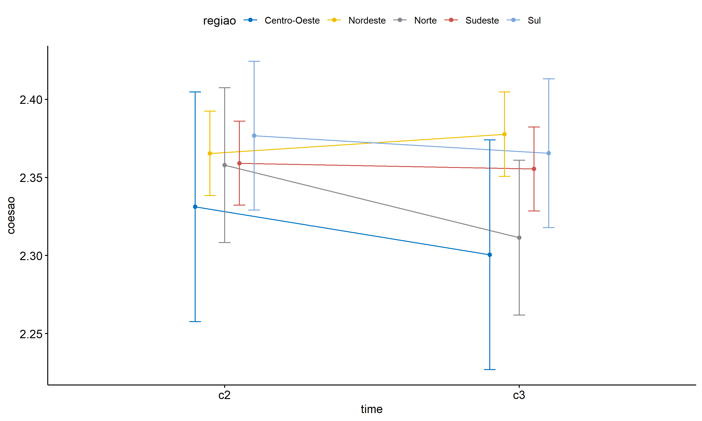<!-- -->

``` r
(pwc <- ldat %>% group_by(regiao) %>%
    emmeans_test(coesao ~ time, detailed = T, p.adjust.method = "bonferroni"))
```

    ## # A tibble: 5 × 15
    ##   regiao     term  .y.   group1 group2 null.value estimate     se    df conf.low
    ## * <fct>      <chr> <chr> <chr>  <chr>       <dbl>    <dbl>  <dbl> <dbl>    <dbl>
    ## 1 Centro-Oe… time  coes… c2     c3              0  0.0307  0.0530  8074  -0.0732
    ## 2 Nordeste   time  coes… c2     c3              0 -0.0123  0.0195  8074  -0.0505
    ## 3 Norte      time  coes… c2     c3              0  0.0464  0.0358  8074  -0.0237
    ## 4 Sudeste    time  coes… c2     c3              0  0.00373 0.0194  8074  -0.0344
    ## 5 Sul        time  coes… c2     c3              0  0.0113  0.0343  8074  -0.0560
    ## # ℹ 5 more variables: conf.high <dbl>, statistic <dbl>, p <dbl>, p.adj <dbl>,
    ## #   p.adj.signif <chr>

| regiao       | term | .y.    | group1 | group2 | null.value | estimate |    se |   df | conf.low | conf.high | statistic |     p | p.adj | p.adj.signif |
|:-------------|:-----|:-------|:-------|:-------|-----------:|---------:|------:|-----:|---------:|----------:|----------:|------:|------:|:-------------|
| Centro-Oeste | time | coesao | c2     | c3     |          0 |    0.031 | 0.053 | 8074 |   -0.073 |     0.135 |     0.580 | 0.562 | 0.562 | ns           |
| Nordeste     | time | coesao | c2     | c3     |          0 |   -0.012 | 0.019 | 8074 |   -0.051 |     0.026 |    -0.631 | 0.528 | 0.528 | ns           |
| Norte        | time | coesao | c2     | c3     |          0 |    0.046 | 0.036 | 8074 |   -0.024 |     0.116 |     1.296 | 0.195 | 0.195 | ns           |
| Sudeste      | time | coesao | c2     | c3     |          0 |    0.004 | 0.019 | 8074 |   -0.034 |     0.042 |     0.192 | 0.848 | 0.848 | ns           |
| Sul          | time | coesao | c2     | c3     |          0 |    0.011 | 0.034 | 8074 |   -0.056 |     0.079 |     0.329 | 0.742 | 0.742 | ns           |

``` r
(emms <- get_emmeans(pwc))
```

    ## # A tibble: 10 × 8
    ##    regiao       time  emmean     se    df conf.low conf.high method      
    ##    <fct>        <fct>  <dbl>  <dbl> <dbl>    <dbl>     <dbl> <chr>       
    ##  1 Centro-Oeste c2      2.33 0.0375  8074     2.26      2.40 Emmeans test
    ##  2 Centro-Oeste c3      2.30 0.0375  8074     2.23      2.37 Emmeans test
    ##  3 Nordeste     c2      2.37 0.0138  8074     2.34      2.39 Emmeans test
    ##  4 Nordeste     c3      2.38 0.0138  8074     2.35      2.40 Emmeans test
    ##  5 Norte        c2      2.36 0.0253  8074     2.31      2.41 Emmeans test
    ##  6 Norte        c3      2.31 0.0253  8074     2.26      2.36 Emmeans test
    ##  7 Sudeste      c2      2.36 0.0137  8074     2.33      2.39 Emmeans test
    ##  8 Sudeste      c3      2.36 0.0137  8074     2.33      2.38 Emmeans test
    ##  9 Sul          c2      2.38 0.0243  8074     2.33      2.42 Emmeans test
    ## 10 Sul          c3      2.37 0.0243  8074     2.32      2.41 Emmeans test

| regiao       | time | emmean |    se |   df | conf.low | conf.high | method       |
|:-------------|:-----|-------:|------:|-----:|---------:|----------:|:-------------|
| Centro-Oeste | c2   |  2.331 | 0.037 | 8074 |    2.258 |     2.405 | Emmeans test |
| Centro-Oeste | c3   |  2.301 | 0.037 | 8074 |    2.227 |     2.374 | Emmeans test |
| Nordeste     | c2   |  2.365 | 0.014 | 8074 |    2.338 |     2.392 | Emmeans test |
| Nordeste     | c3   |  2.378 | 0.014 | 8074 |    2.351 |     2.405 | Emmeans test |
| Norte        | c2   |  2.358 | 0.025 | 8074 |    2.308 |     2.407 | Emmeans test |
| Norte        | c3   |  2.311 | 0.025 | 8074 |    2.262 |     2.361 | Emmeans test |
| Sudeste      | c2   |  2.359 | 0.014 | 8074 |    2.332 |     2.386 | Emmeans test |
| Sudeste      | c3   |  2.355 | 0.014 | 8074 |    2.328 |     2.382 | Emmeans test |
| Sul          | c2   |  2.377 | 0.024 | 8074 |    2.329 |     2.424 | Emmeans test |
| Sul          | c3   |  2.365 | 0.024 | 8074 |    2.318 |     2.413 | Emmeans test |

``` r
emms.gg <- emms[which(emms$regiao == "Centro-Oeste"),]
if (nrow(emms.gg) > 0)
  ggline(emms.gg, x = "time", y = "emmean", color = "#0073C2FF", ylab = "coesao") +
    geom_errorbar(aes(ymin = conf.low, ymax = conf.high),
                  width = 0.2, color = "#0073C2FF") +
    stat_pvalue_manual(
      add_xy_position(pwc[which(pwc$regiao == "Centro-Oeste"),],
                      x = "time", fun = "mean_se"),
      hide.ns = T, color = "#0073C2FF", tip.length = F) +
    labs(title = "regiao: Centro-Oeste")+
    theme(legend.text = element_blank())
```

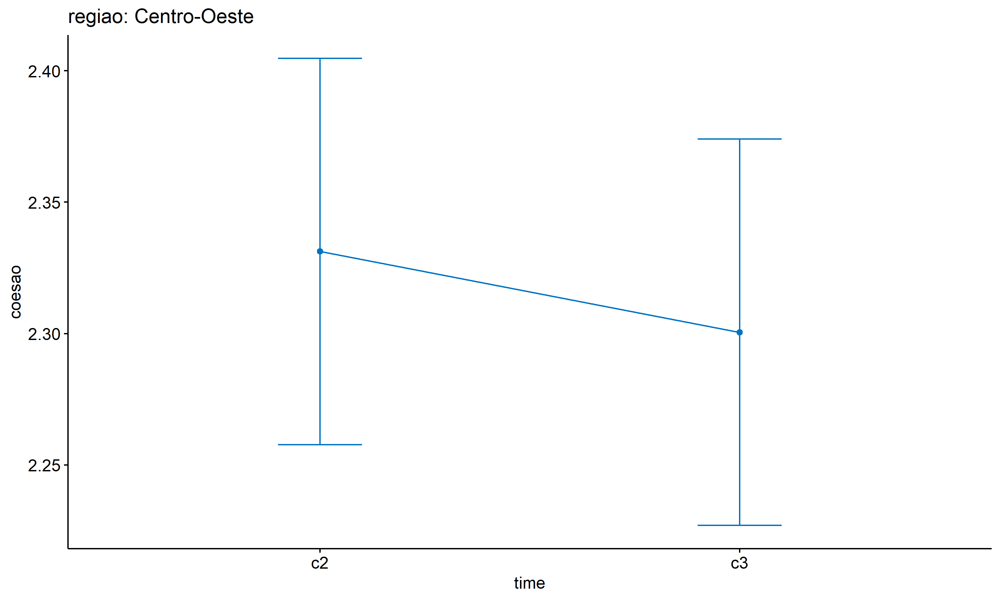<!-- -->

``` r
emms.gg <- emms[which(emms$regiao == "Nordeste"),]
if (nrow(emms.gg) > 0)
  ggline(emms.gg, x = "time", y = "emmean", color = "#EFC000FF", ylab = "coesao") +
    geom_errorbar(aes(ymin = conf.low, ymax = conf.high),
                  width = 0.2, color = "#EFC000FF") +
    stat_pvalue_manual(
      add_xy_position(pwc[which(pwc$regiao == "Nordeste"),],
                      x = "time", fun = "mean_se"),
      hide.ns = T, color = "#EFC000FF", tip.length = F) +
    labs(title = "regiao: Nordeste")+
    theme(legend.text = element_blank())
```

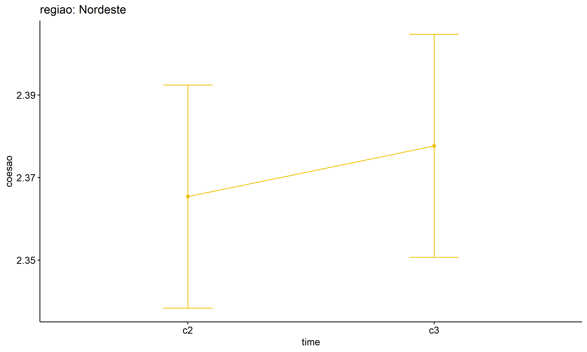<!-- -->

``` r
emms.gg <- emms[which(emms$regiao == "Norte"),]
if (nrow(emms.gg) > 0)
  ggline(emms.gg, x = "time", y = "emmean", color = "#868686FF", ylab = "coesao") +
    geom_errorbar(aes(ymin = conf.low, ymax = conf.high),
                  width = 0.2, color = "#868686FF") +
    stat_pvalue_manual(
      add_xy_position(pwc[which(pwc$regiao == "Norte"),],
                      x = "time", fun = "mean_se"),
      hide.ns = T, color = "#868686FF", tip.length = F) +
    labs(title = "regiao: Norte")+
    theme(legend.text = element_blank())
```

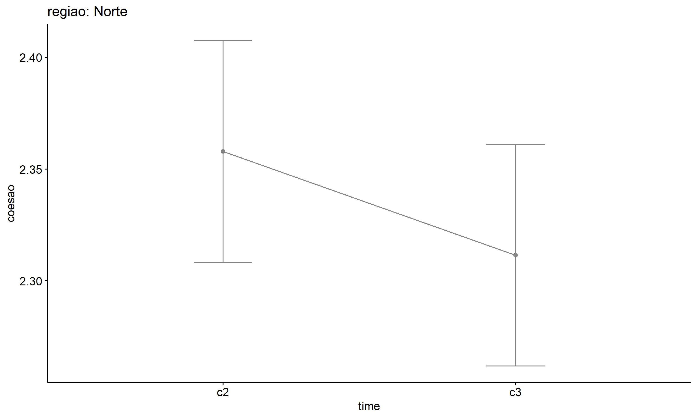<!-- -->

``` r
emms.gg <- emms[which(emms$regiao == "Sudeste"),]
if (nrow(emms.gg) > 0)
  ggline(emms.gg, x = "time", y = "emmean", color = "#CD534CFF", ylab = "coesao") +
    geom_errorbar(aes(ymin = conf.low, ymax = conf.high),
                  width = 0.2, color = "#CD534CFF") +
    stat_pvalue_manual(
      add_xy_position(pwc[which(pwc$regiao == "Sudeste"),],
                      x = "time", fun = "mean_se"),
      hide.ns = T, color = "#CD534CFF", tip.length = F) +
    labs(title = "regiao: Sudeste")+
    theme(legend.text = element_blank())
```

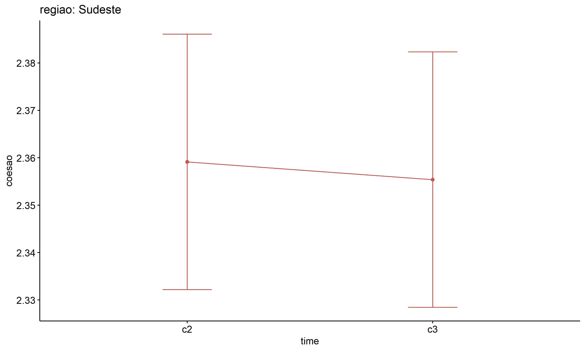<!-- -->

``` r
emms.gg <- emms[which(emms$regiao == "Sul"),]
if (nrow(emms.gg) > 0)
  ggline(emms.gg, x = "time", y = "emmean", color = "#7AA6DCFF", ylab = "coesao") +
    geom_errorbar(aes(ymin = conf.low, ymax = conf.high),
                  width = 0.2, color = "#7AA6DCFF") +
    stat_pvalue_manual(
      add_xy_position(pwc[which(pwc$regiao == "Sul"),],
                      x = "time", fun = "mean_se"),
      hide.ns = T, color = "#7AA6DCFF", tip.length = F) +
    labs(title = "regiao: Sul")+
    theme(legend.text = element_blank())
```

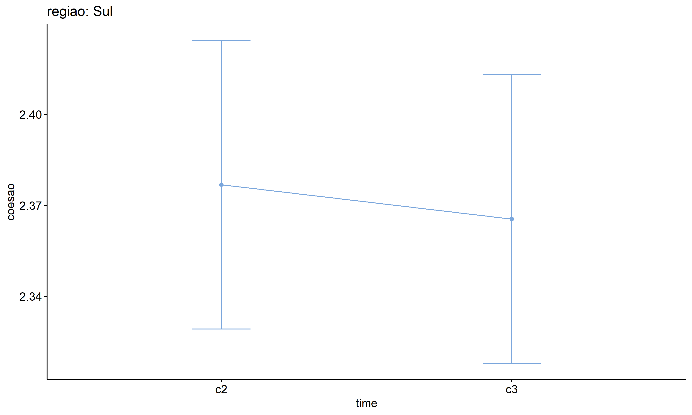<!-- -->

## PairWise Computation after removing non.normal data

``` r
if (length(non.ids) > 0)
  (pwc2 <- ldat2 %>% group_by(time) %>%
     emmeans_test(coesao ~ regiao, detailed = T, p.adjust.method = "bonferroni"))
```

``` r
if (length(non.ids) > 0)
  (emms2 <- get_emmeans(pwc2))
```

``` r
if (length(non.ids) > 0) {
  pwc2 <- add_xy_position(pwc2, x = "time", fun = "mean_se", dodge = 0.25)
  pd2 <- position_dodge(width = 0.25)
  
  ggline(emms2, x = "time", y = "emmean", color = "regiao",
         palette = c("#0073C2FF","#EFC000FF","#868686FF","#CD534CFF","#7AA6DCFF"),
         position = pd, ylab = "coesao") +
    geom_errorbar(aes(ymin = conf.low, ymax = conf.high, color = regiao),
                position = pd, width = 0.2) +
    stat_pvalue_manual(pwc2, hide.ns = T, tip.length = F, linetype = 1)
}
```

``` r
if (length(non.ids) > 0)
  (pwc2 <- ldat2 %>% group_by(regiao) %>%
     emmeans_test(coesao ~ time, detailed = T, p.adjust.method = "bonferroni"))
```

``` r
if (length(non.ids) > 0)
  (emms2 <- get_emmeans(pwc2))
```

``` r
if (length(non.ids) > 0) {
  emms.gg <- emms2[which(emms2$regiao == "Centro-Oeste"),]
  if (nrow(emms.gg) > 0)
    ggline(emms.gg, x = "time", y = "emmean", color = "#0073C2FF", ylab = "coesao") +
    geom_errorbar(aes(ymin = conf.low, ymax = conf.high),
                  width = 0.2, color = "#0073C2FF") +
    stat_pvalue_manual(
      add_xy_position(pwc[which(pwc$regiao == "Centro-Oeste"),],
                      x = "time", fun = "mean_se"),
      hide.ns = T, color = "#0073C2FF", tip.length = F) +
    labs(title = "regiao: Centro-Oeste") +
    theme(legend.text = element_blank())
}
```

``` r
if (length(non.ids) > 0) {
  emms.gg <- emms2[which(emms2$regiao == "Nordeste"),]
  if (nrow(emms.gg) > 0)
    ggline(emms.gg, x = "time", y = "emmean", color = "#EFC000FF", ylab = "coesao") +
    geom_errorbar(aes(ymin = conf.low, ymax = conf.high),
                  width = 0.2, color = "#EFC000FF") +
    stat_pvalue_manual(
      add_xy_position(pwc[which(pwc$regiao == "Nordeste"),],
                      x = "time", fun = "mean_se"),
      hide.ns = T, color = "#EFC000FF", tip.length = F) +
    labs(title = "regiao: Nordeste") +
    theme(legend.text = element_blank())
}
```

``` r
if (length(non.ids) > 0) {
  emms.gg <- emms2[which(emms2$regiao == "Norte"),]
  if (nrow(emms.gg) > 0)
    ggline(emms.gg, x = "time", y = "emmean", color = "#868686FF", ylab = "coesao") +
    geom_errorbar(aes(ymin = conf.low, ymax = conf.high),
                  width = 0.2, color = "#868686FF") +
    stat_pvalue_manual(
      add_xy_position(pwc[which(pwc$regiao == "Norte"),],
                      x = "time", fun = "mean_se"),
      hide.ns = T, color = "#868686FF", tip.length = F) +
    labs(title = "regiao: Norte") +
    theme(legend.text = element_blank())
}
```

``` r
if (length(non.ids) > 0) {
  emms.gg <- emms2[which(emms2$regiao == "Sudeste"),]
  if (nrow(emms.gg) > 0)
    ggline(emms.gg, x = "time", y = "emmean", color = "#CD534CFF", ylab = "coesao") +
    geom_errorbar(aes(ymin = conf.low, ymax = conf.high),
                  width = 0.2, color = "#CD534CFF") +
    stat_pvalue_manual(
      add_xy_position(pwc[which(pwc$regiao == "Sudeste"),],
                      x = "time", fun = "mean_se"),
      hide.ns = T, color = "#CD534CFF", tip.length = F) +
    labs(title = "regiao: Sudeste") +
    theme(legend.text = element_blank())
}
```

``` r
if (length(non.ids) > 0) {
  emms.gg <- emms2[which(emms2$regiao == "Sul"),]
  if (nrow(emms.gg) > 0)
    ggline(emms.gg, x = "time", y = "emmean", color = "#7AA6DCFF", ylab = "coesao") +
    geom_errorbar(aes(ymin = conf.low, ymax = conf.high),
                  width = 0.2, color = "#7AA6DCFF") +
    stat_pvalue_manual(
      add_xy_position(pwc[which(pwc$regiao == "Sul"),],
                      x = "time", fun = "mean_se"),
      hide.ns = T, color = "#7AA6DCFF", tip.length = F) +
    labs(title = "regiao: Sul") +
    theme(legend.text = element_blank())
}
```

# ANOVA: coesao ~ time\*porte + Error(id/time)

## Data Preparation

``` r
data <- edat[,c("aluno_id","porte","ciclo","coesao")]
data <- data[data$ciclo %in% c("Segundo Ciclo","Terceiro Ciclo"),]
data$ciclo <- factor(data$ciclo, c("Segundo Ciclo","Terceiro Ciclo"))
data <- unique(data)

wdat <- spread(data, ciclo, coesao)
wdat <- wdat[complete.cases(wdat),]
colnames(wdat) <- c("id","porte","c2","c3")

ldat <- gather(wdat, key = time, value = coesao, c2,c3) %>%
  convert_as_factor(id, time)
ldat <- remove_group_data(ldat, "coesao", c("time", "porte"), n.limit = 30)
ldat$porte <- factor(ldat$porte, sort(unique(ldat$porte)))
```

### Check assumptions: Identifying Outliers

``` r
outliers <- identify_outliers(group_by(ldat, time, porte), coesao)
(outliers <- outliers[outliers$is.extreme == T,])
```

    ## [1] porte      time       id         coesao     is.outlier is.extreme
    ## <0 rows> (or 0-length row.names)

| porte | time | id  | coesao | is.outlier | is.extreme |
|:------|:-----|:----|-------:|:-----------|:-----------|

### Check assumptions: Normality Test

``` r
(normality.df <- normality.test.per.groups(ldat, "coesao", c("time", "porte")))
```

    ##       var variable time                                        porte    n
    ## 1  coesao   coesao   c2           Até 50 matrículas de escolarização   39
    ## 2  coesao   coesao   c2  Entre 201 e 500 matrículas de escolarização 1488
    ## 3  coesao   coesao   c2 Entre 501 e 1000 matrículas de escolarização 1922
    ## 4  coesao   coesao   c2   Entre 51 e 200 matrículas de escolarização  502
    ## 5  coesao   coesao   c2     Mais de 1000 matrículas de escolarização   91
    ## 6  coesao   coesao   c3           Até 50 matrículas de escolarização   39
    ## 7  coesao   coesao   c3  Entre 201 e 500 matrículas de escolarização 1488
    ## 8  coesao   coesao   c3 Entre 501 e 1000 matrículas de escolarização 1922
    ## 9  coesao   coesao   c3   Entre 51 e 200 matrículas de escolarização  502
    ## 10 coesao   coesao   c3     Mais de 1000 matrículas de escolarização   91
    ##        skewness   kurtosis symmetry  statistic       method            p
    ## 1   0.000000000  0.0000000 few data         NA         <NA> 1.000000e+00
    ## 2  -0.185995636 -0.3344339      YES 17.8881382   D'Agostino 1.305089e-04
    ## 3  -0.169132063 -0.0736963      YES  9.4521578   D'Agostino 8.861149e-03
    ## 4  -0.168364806 -0.3714025      YES  5.9890820   D'Agostino 5.005960e-02
    ## 5   0.035081872 -0.7016597      YES  2.5088388   D'Agostino 2.852414e-01
    ## 6   0.054996793 -0.8205055      YES  0.7410475 Shapiro-Wilk 6.288879e-07
    ## 7  -0.209194350 -0.5769580      YES 51.6810519   D'Agostino 5.992429e-12
    ## 8  -0.280547870 -0.3400224      YES 37.3341952   D'Agostino 7.815964e-09
    ## 9  -0.041816493 -0.5338767      YES 10.1182672   D'Agostino 6.351060e-03
    ## 10  0.009673659 -0.4264292      YES  0.3500615   D'Agostino 8.394312e-01
    ##    p.signif normality
    ## 1      <NA>        NO
    ## 2        **         -
    ## 3         *         -
    ## 4        ns         -
    ## 5        ns       YES
    ## 6      ****        NO
    ## 7      ****         -
    ## 8      ****         -
    ## 9         *         -
    ## 10       ns       YES

| var    | variable | time | porte                                        |    n | skewness | kurtosis | symmetry | statistic | method       |     p | p.signif | normality |
|:-------|:---------|:-----|:---------------------------------------------|-----:|---------:|---------:|:---------|----------:|:-------------|------:|:---------|:----------|
| coesao | coesao   | c2   | Até 50 matrículas de escolarização           |   39 |    0.000 |    0.000 | few data |        NA | NA           | 1.000 | NA       | NO        |
| coesao | coesao   | c2   | Entre 201 e 500 matrículas de escolarização  | 1488 |   -0.186 |   -0.334 | YES      |    17.888 | D’Agostino   | 0.000 | \*\*     | \-        |
| coesao | coesao   | c2   | Entre 501 e 1000 matrículas de escolarização | 1922 |   -0.169 |   -0.074 | YES      |     9.452 | D’Agostino   | 0.009 | \*       | \-        |
| coesao | coesao   | c2   | Entre 51 e 200 matrículas de escolarização   |  502 |   -0.168 |   -0.371 | YES      |     5.989 | D’Agostino   | 0.050 | ns       | \-        |
| coesao | coesao   | c2   | Mais de 1000 matrículas de escolarização     |   91 |    0.035 |   -0.702 | YES      |     2.509 | D’Agostino   | 0.285 | ns       | YES       |
| coesao | coesao   | c3   | Até 50 matrículas de escolarização           |   39 |    0.055 |   -0.821 | YES      |     0.741 | Shapiro-Wilk | 0.000 | \*\*\*\* | NO        |
| coesao | coesao   | c3   | Entre 201 e 500 matrículas de escolarização  | 1488 |   -0.209 |   -0.577 | YES      |    51.681 | D’Agostino   | 0.000 | \*\*\*\* | \-        |
| coesao | coesao   | c3   | Entre 501 e 1000 matrículas de escolarização | 1922 |   -0.281 |   -0.340 | YES      |    37.334 | D’Agostino   | 0.000 | \*\*\*\* | \-        |
| coesao | coesao   | c3   | Entre 51 e 200 matrículas de escolarização   |  502 |   -0.042 |   -0.534 | YES      |    10.118 | D’Agostino   | 0.006 | \*       | \-        |
| coesao | coesao   | c3   | Mais de 1000 matrículas de escolarização     |   91 |    0.010 |   -0.426 | YES      |     0.350 | D’Agostino   | 0.839 | ns       | YES       |

``` r
(non.ids <- unique(do.call(
  c, lapply(which(normality.df$normality == 'NO'), FUN = function(i) {
  idx = which(ldat$time == normality.df$time[i] &
                ldat$porte == normality.df$porte[i])
  getNonNormal(ldat$"coesao"[idx], ldat$id[idx])
}))))
```

    ## [1] "ZFu1gNSlJi6WerbxgitV" "wEcu8jbom5Ui9WLqplNb" "tNXwXm3gSuhYYg0Zi6Jt"
    ## [4] "QBXFRi4iRN3uHcvl4ZTf" "pURonQfq0IqWOeSSc60L" "eZMpI23XTiqNuckAohvP"
    ## [7] "MqmsPo8CcZiXbjHViNOu"

``` r
if (length(non.ids) > 0)
  ldat2 <- ldat[!ldat$id %in% non.ids,]
```

### Summary Statistics

``` r
(sdat <- ldat %>% group_by(time, porte) %>%
   get_summary_stats(coesao, type = "mean_sd"))
```

    ## # A tibble: 10 × 6
    ##    porte                                        time  variable     n  mean    sd
    ##    <fct>                                        <fct> <fct>    <dbl> <dbl> <dbl>
    ##  1 Até 50 matrículas de escolarização           c2    coesao      39  2.32 0.466
    ##  2 Entre 201 e 500 matrículas de escolarização  c2    coesao    1488  2.37 0.514
    ##  3 Entre 501 e 1000 matrículas de escolarização c2    coesao    1922  2.36 0.487
    ##  4 Entre 51 e 200 matrículas de escolarização   c2    coesao     502  2.37 0.572
    ##  5 Mais de 1000 matrículas de escolarização     c2    coesao      91  2.35 0.498
    ##  6 Até 50 matrículas de escolarização           c3    coesao      39  2.35 0.515
    ##  7 Entre 201 e 500 matrículas de escolarização  c3    coesao    1488  2.38 0.535
    ##  8 Entre 501 e 1000 matrículas de escolarização c3    coesao    1922  2.35 0.545
    ##  9 Entre 51 e 200 matrículas de escolarização   c3    coesao     502  2.36 0.554
    ## 10 Mais de 1000 matrículas de escolarização     c3    coesao      91  2.24 0.705

| porte                                        | time | variable |    n |  mean |    sd |
|:---------------------------------------------|:-----|:---------|-----:|------:|------:|
| Até 50 matrículas de escolarização           | c2   | coesao   |   39 | 2.321 | 0.466 |
| Entre 201 e 500 matrículas de escolarização  | c2   | coesao   | 1488 | 2.367 | 0.514 |
| Entre 501 e 1000 matrículas de escolarização | c2   | coesao   | 1922 | 2.358 | 0.487 |
| Entre 51 e 200 matrículas de escolarização   | c2   | coesao   |  502 | 2.367 | 0.572 |
| Mais de 1000 matrículas de escolarização     | c2   | coesao   |   91 | 2.346 | 0.498 |
| Até 50 matrículas de escolarização           | c3   | coesao   |   39 | 2.346 | 0.515 |
| Entre 201 e 500 matrículas de escolarização  | c3   | coesao   | 1488 | 2.375 | 0.535 |
| Entre 501 e 1000 matrículas de escolarização | c3   | coesao   | 1922 | 2.350 | 0.545 |
| Entre 51 e 200 matrículas de escolarização   | c3   | coesao   |  502 | 2.355 | 0.554 |
| Mais de 1000 matrículas de escolarização     | c3   | coesao   |   91 | 2.242 | 0.705 |

``` r
if (length(non.ids) > 0)
  (sdat <- ldat2 %>% group_by(time, porte) %>%
      get_summary_stats(coesao, type = "mean_sd"))
```

    ## # A tibble: 10 × 6
    ##    porte                                        time  variable     n  mean    sd
    ##    <fct>                                        <fct> <fct>    <dbl> <dbl> <dbl>
    ##  1 Até 50 matrículas de escolarização           c2    coesao      32  2.33 0.469
    ##  2 Entre 201 e 500 matrículas de escolarização  c2    coesao    1488  2.37 0.514
    ##  3 Entre 501 e 1000 matrículas de escolarização c2    coesao    1922  2.36 0.487
    ##  4 Entre 51 e 200 matrículas de escolarização   c2    coesao     502  2.37 0.572
    ##  5 Mais de 1000 matrículas de escolarização     c2    coesao      91  2.35 0.498
    ##  6 Até 50 matrículas de escolarização           c3    coesao      32  2.27 0.421
    ##  7 Entre 201 e 500 matrículas de escolarização  c3    coesao    1488  2.38 0.535
    ##  8 Entre 501 e 1000 matrículas de escolarização c3    coesao    1922  2.35 0.545
    ##  9 Entre 51 e 200 matrículas de escolarização   c3    coesao     502  2.36 0.554
    ## 10 Mais de 1000 matrículas de escolarização     c3    coesao      91  2.24 0.705

| porte                                        | time | variable |    n |  mean |    sd |
|:---------------------------------------------|:-----|:---------|-----:|------:|------:|
| Até 50 matrículas de escolarização           | c2   | coesao   |   32 | 2.328 | 0.469 |
| Entre 201 e 500 matrículas de escolarização  | c2   | coesao   | 1488 | 2.367 | 0.514 |
| Entre 501 e 1000 matrículas de escolarização | c2   | coesao   | 1922 | 2.358 | 0.487 |
| Entre 51 e 200 matrículas de escolarização   | c2   | coesao   |  502 | 2.367 | 0.572 |
| Mais de 1000 matrículas de escolarização     | c2   | coesao   |   91 | 2.346 | 0.498 |
| Até 50 matrículas de escolarização           | c3   | coesao   |   32 | 2.266 | 0.421 |
| Entre 201 e 500 matrículas de escolarização  | c3   | coesao   | 1488 | 2.375 | 0.535 |
| Entre 501 e 1000 matrículas de escolarização | c3   | coesao   | 1922 | 2.350 | 0.545 |
| Entre 51 e 200 matrículas de escolarização   | c3   | coesao   |  502 | 2.355 | 0.554 |
| Mais de 1000 matrículas de escolarização     | c3   | coesao   |   91 | 2.242 | 0.705 |

## ANOVA Computation

``` r
(res.aov <- anova_test(ldat, dv = coesao, wid = id, between = porte, within = time))
```

    ## ANOVA Table (type III tests)
    ## 
    ##       Effect DFn  DFd     F     p p<.05      ges
    ## 1      porte   4 4037 1.092 0.358       6.01e-04
    ## 2       time   1 4037 0.423 0.516       4.65e-05
    ## 3 porte:time   4 4037 0.634 0.639       2.79e-04

## ANOVA Computation after removing non.normal data

``` r
if (length(non.ids) > 0)
  (res.aov2 <- anova_test(ldat2, dv = coesao, wid = id, between = porte , within = time))
```

    ## ANOVA Table (type III tests)
    ## 
    ##       Effect DFn  DFd     F     p p<.05      ges
    ## 1      porte   4 4030 1.253 0.286       0.000691
    ## 2       time   1 4030 1.433 0.231       0.000158
    ## 3 porte:time   4 4030 0.669 0.614       0.000295

## PairWise Computation

``` r
(pwc <- ldat %>% group_by(time) %>%
   emmeans_test(coesao ~ porte, detailed = T, p.adjust.method = "bonferroni"))
```

    ## # A tibble: 20 × 15
    ##    time  term  .y.    group1    group2 null.value estimate     se    df conf.low
    ##  * <fct> <chr> <chr>  <chr>     <chr>       <dbl>    <dbl>  <dbl> <dbl>    <dbl>
    ##  1 c2    porte coesao Até 50 m… Entre…          0 -4.64e-2 0.0856  8074 -0.214  
    ##  2 c2    porte coesao Até 50 m… Entre…          0 -3.80e-2 0.0853  8074 -0.205  
    ##  3 c2    porte coesao Até 50 m… Entre…          0 -4.60e-2 0.0877  8074 -0.218  
    ##  4 c2    porte coesao Até 50 m… Mais …          0 -2.56e-2 0.101   8074 -0.224  
    ##  5 c2    porte coesao Entre 20… Entre…          0  8.45e-3 0.0182  8074 -0.0272 
    ##  6 c2    porte coesao Entre 20… Entre…          0  4.02e-4 0.0272  8074 -0.0530 
    ##  7 c2    porte coesao Entre 20… Mais …          0  2.08e-2 0.0570  8074 -0.0909 
    ##  8 c2    porte coesao Entre 50… Entre…          0 -8.05e-3 0.0264  8074 -0.0599 
    ##  9 c2    porte coesao Entre 50… Mais …          0  1.23e-2 0.0566  8074 -0.0986 
    ## 10 c2    porte coesao Entre 51… Mais …          0  2.04e-2 0.0601  8074 -0.0974 
    ## 11 c3    porte coesao Até 50 m… Entre…          0 -2.91e-2 0.0856  8074 -0.197  
    ## 12 c3    porte coesao Até 50 m… Entre…          0 -3.48e-3 0.0853  8074 -0.171  
    ## 13 c3    porte coesao Até 50 m… Entre…          0 -8.43e-3 0.0877  8074 -0.180  
    ## 14 c3    porte coesao Até 50 m… Mais …          0  1.04e-1 0.101   8074 -0.0935 
    ## 15 c3    porte coesao Entre 20… Entre…          0  2.56e-2 0.0182  8074 -0.0101 
    ## 16 c3    porte coesao Entre 20… Entre…          0  2.07e-2 0.0272  8074 -0.0327 
    ## 17 c3    porte coesao Entre 20… Mais …          0  1.34e-1 0.0570  8074  0.0219 
    ## 18 c3    porte coesao Entre 50… Entre…          0 -4.95e-3 0.0264  8074 -0.0568 
    ## 19 c3    porte coesao Entre 50… Mais …          0  1.08e-1 0.0566  8074 -0.00305
    ## 20 c3    porte coesao Entre 51… Mais …          0  1.13e-1 0.0601  8074 -0.00498
    ## # ℹ 5 more variables: conf.high <dbl>, statistic <dbl>, p <dbl>, p.adj <dbl>,
    ## #   p.adj.signif <chr>

| time | term  | .y.    | group1                                       | group2                                       | null.value | estimate |    se |   df | conf.low | conf.high | statistic |     p | p.adj | p.adj.signif |
|:-----|:------|:-------|:---------------------------------------------|:---------------------------------------------|-----------:|---------:|------:|-----:|---------:|----------:|----------:|------:|------:|:-------------|
| c2   | porte | coesao | Até 50 matrículas de escolarização           | Entre 201 e 500 matrículas de escolarização  |          0 |   -0.046 | 0.086 | 8074 |   -0.214 |     0.121 |    -0.543 | 0.587 | 1.000 | ns           |
| c2   | porte | coesao | Até 50 matrículas de escolarização           | Entre 501 e 1000 matrículas de escolarização |          0 |   -0.038 | 0.085 | 8074 |   -0.205 |     0.129 |    -0.445 | 0.656 | 1.000 | ns           |
| c2   | porte | coesao | Até 50 matrículas de escolarização           | Entre 51 e 200 matrículas de escolarização   |          0 |   -0.046 | 0.088 | 8074 |   -0.218 |     0.126 |    -0.525 | 0.600 | 1.000 | ns           |
| c2   | porte | coesao | Até 50 matrículas de escolarização           | Mais de 1000 matrículas de escolarização     |          0 |   -0.026 | 0.101 | 8074 |   -0.224 |     0.172 |    -0.254 | 0.800 | 1.000 | ns           |
| c2   | porte | coesao | Entre 201 e 500 matrículas de escolarização  | Entre 501 e 1000 matrículas de escolarização |          0 |    0.008 | 0.018 | 8074 |   -0.027 |     0.044 |     0.464 | 0.643 | 1.000 | ns           |
| c2   | porte | coesao | Entre 201 e 500 matrículas de escolarização  | Entre 51 e 200 matrículas de escolarização   |          0 |    0.000 | 0.027 | 8074 |   -0.053 |     0.054 |     0.015 | 0.988 | 1.000 | ns           |
| c2   | porte | coesao | Entre 201 e 500 matrículas de escolarização  | Mais de 1000 matrículas de escolarização     |          0 |    0.021 | 0.057 | 8074 |   -0.091 |     0.132 |     0.365 | 0.715 | 1.000 | ns           |
| c2   | porte | coesao | Entre 501 e 1000 matrículas de escolarização | Entre 51 e 200 matrículas de escolarização   |          0 |   -0.008 | 0.026 | 8074 |   -0.060 |     0.044 |    -0.305 | 0.761 | 1.000 | ns           |
| c2   | porte | coesao | Entre 501 e 1000 matrículas de escolarização | Mais de 1000 matrículas de escolarização     |          0 |    0.012 | 0.057 | 8074 |   -0.099 |     0.123 |     0.218 | 0.828 | 1.000 | ns           |
| c2   | porte | coesao | Entre 51 e 200 matrículas de escolarização   | Mais de 1000 matrículas de escolarização     |          0 |    0.020 | 0.060 | 8074 |   -0.097 |     0.138 |     0.339 | 0.735 | 1.000 | ns           |
| c3   | porte | coesao | Até 50 matrículas de escolarização           | Entre 201 e 500 matrículas de escolarização  |          0 |   -0.029 | 0.086 | 8074 |   -0.197 |     0.139 |    -0.340 | 0.734 | 1.000 | ns           |
| c3   | porte | coesao | Até 50 matrículas de escolarização           | Entre 501 e 1000 matrículas de escolarização |          0 |   -0.003 | 0.085 | 8074 |   -0.171 |     0.164 |    -0.041 | 0.967 | 1.000 | ns           |
| c3   | porte | coesao | Até 50 matrículas de escolarização           | Entre 51 e 200 matrículas de escolarização   |          0 |   -0.008 | 0.088 | 8074 |   -0.180 |     0.163 |    -0.096 | 0.923 | 1.000 | ns           |
| c3   | porte | coesao | Até 50 matrículas de escolarização           | Mais de 1000 matrículas de escolarização     |          0 |    0.104 | 0.101 | 8074 |   -0.093 |     0.302 |     1.034 | 0.301 | 1.000 | ns           |
| c3   | porte | coesao | Entre 201 e 500 matrículas de escolarização  | Entre 501 e 1000 matrículas de escolarização |          0 |    0.026 | 0.018 | 8074 |   -0.010 |     0.061 |     1.408 | 0.159 | 1.000 | ns           |
| c3   | porte | coesao | Entre 201 e 500 matrículas de escolarização  | Entre 51 e 200 matrículas de escolarização   |          0 |    0.021 | 0.027 | 8074 |   -0.033 |     0.074 |     0.760 | 0.447 | 1.000 | ns           |
| c3   | porte | coesao | Entre 201 e 500 matrículas de escolarização  | Mais de 1000 matrículas de escolarização     |          0 |    0.134 | 0.057 | 8074 |    0.022 |     0.245 |     2.344 | 0.019 | 0.191 | ns           |
| c3   | porte | coesao | Entre 501 e 1000 matrículas de escolarização | Entre 51 e 200 matrículas de escolarização   |          0 |   -0.005 | 0.026 | 8074 |   -0.057 |     0.047 |    -0.187 | 0.852 | 1.000 | ns           |
| c3   | porte | coesao | Entre 501 e 1000 matrículas de escolarização | Mais de 1000 matrículas de escolarização     |          0 |    0.108 | 0.057 | 8074 |   -0.003 |     0.219 |     1.906 | 0.057 | 0.566 | ns           |
| c3   | porte | coesao | Entre 51 e 200 matrículas de escolarização   | Mais de 1000 matrículas de escolarização     |          0 |    0.113 | 0.060 | 8074 |   -0.005 |     0.231 |     1.877 | 0.061 | 0.605 | ns           |

``` r
(emms <- get_emmeans(pwc))
```

    ## # A tibble: 10 × 8
    ##    time  porte                     emmean     se    df conf.low conf.high method
    ##    <fct> <fct>                      <dbl>  <dbl> <dbl>    <dbl>     <dbl> <chr> 
    ##  1 c2    Até 50 matrículas de esc…   2.32 0.0845  8074     2.15      2.49 Emmea…
    ##  2 c2    Entre 201 e 500 matrícul…   2.37 0.0137  8074     2.34      2.39 Emmea…
    ##  3 c2    Entre 501 e 1000 matrícu…   2.36 0.0120  8074     2.33      2.38 Emmea…
    ##  4 c2    Entre 51 e 200 matrícula…   2.37 0.0235  8074     2.32      2.41 Emmea…
    ##  5 c2    Mais de 1000 matrículas …   2.35 0.0553  8074     2.24      2.45 Emmea…
    ##  6 c3    Até 50 matrículas de esc…   2.35 0.0845  8074     2.18      2.51 Emmea…
    ##  7 c3    Entre 201 e 500 matrícul…   2.38 0.0137  8074     2.35      2.40 Emmea…
    ##  8 c3    Entre 501 e 1000 matrícu…   2.35 0.0120  8074     2.33      2.37 Emmea…
    ##  9 c3    Entre 51 e 200 matrícula…   2.35 0.0235  8074     2.31      2.40 Emmea…
    ## 10 c3    Mais de 1000 matrículas …   2.24 0.0553  8074     2.13      2.35 Emmea…

| time | porte                                        | emmean |    se |   df | conf.low | conf.high | method       |
|:-----|:---------------------------------------------|-------:|------:|-----:|---------:|----------:|:-------------|
| c2   | Até 50 matrículas de escolarização           |  2.321 | 0.084 | 8074 |    2.155 |     2.486 | Emmeans test |
| c2   | Entre 201 e 500 matrículas de escolarização  |  2.367 | 0.014 | 8074 |    2.340 |     2.394 | Emmeans test |
| c2   | Entre 501 e 1000 matrículas de escolarização |  2.358 | 0.012 | 8074 |    2.335 |     2.382 | Emmeans test |
| c2   | Entre 51 e 200 matrículas de escolarização   |  2.367 | 0.024 | 8074 |    2.320 |     2.413 | Emmeans test |
| c2   | Mais de 1000 matrículas de escolarização     |  2.346 | 0.055 | 8074 |    2.238 |     2.455 | Emmeans test |
| c3   | Até 50 matrículas de escolarização           |  2.346 | 0.084 | 8074 |    2.181 |     2.512 | Emmeans test |
| c3   | Entre 201 e 500 matrículas de escolarização  |  2.375 | 0.014 | 8074 |    2.348 |     2.402 | Emmeans test |
| c3   | Entre 501 e 1000 matrículas de escolarização |  2.350 | 0.012 | 8074 |    2.326 |     2.373 | Emmeans test |
| c3   | Entre 51 e 200 matrículas de escolarização   |  2.355 | 0.024 | 8074 |    2.308 |     2.401 | Emmeans test |
| c3   | Mais de 1000 matrículas de escolarização     |  2.242 | 0.055 | 8074 |    2.133 |     2.350 | Emmeans test |

``` r
pwc <- add_xy_position(pwc, x = "time", fun = "mean_se", dodge = 0.25)
pd <- position_dodge(width = 0.25)
ggline(emms, x = "time", y = "emmean", color = "porte",
       palette = c("#0073C2FF","#EFC000FF","#868686FF","#CD534CFF","#7AA6DCFF"),
       position = pd, ylab = "coesao") +
  geom_errorbar(aes(ymin = conf.low, ymax = conf.high, color = porte),
                position = pd, width = 0.2) +
  stat_pvalue_manual(pwc, hide.ns = T, tip.length = F, linetype = 1)
```

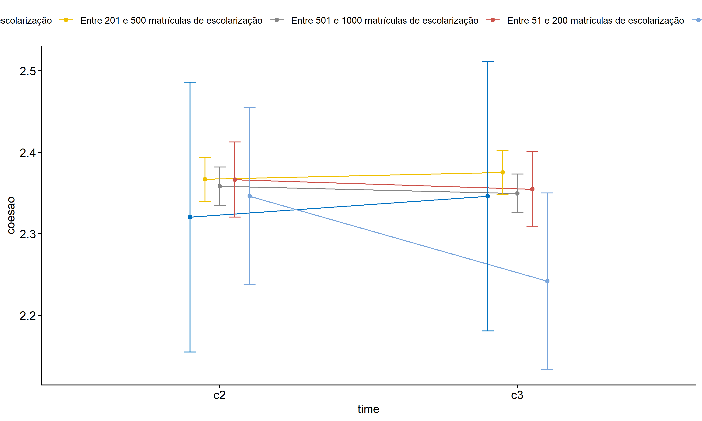<!-- -->

``` r
(pwc <- ldat %>% group_by(porte) %>%
    emmeans_test(coesao ~ time, detailed = T, p.adjust.method = "bonferroni"))
```

    ## # A tibble: 5 × 15
    ##   porte      term  .y.   group1 group2 null.value estimate     se    df conf.low
    ## * <fct>      <chr> <chr> <chr>  <chr>       <dbl>    <dbl>  <dbl> <dbl>    <dbl>
    ## 1 Até 50 ma… time  coes… c2     c3              0 -0.0256  0.119   8074  -0.260 
    ## 2 Entre 201… time  coes… c2     c3              0 -0.00834 0.0193  8074  -0.0463
    ## 3 Entre 501… time  coes… c2     c3              0  0.00884 0.0170  8074  -0.0245
    ## 4 Entre 51 … time  coes… c2     c3              0  0.0120  0.0333  8074  -0.0533
    ## 5 Mais de 1… time  coes… c2     c3              0  0.104   0.0782  8074  -0.0489
    ## # ℹ 5 more variables: conf.high <dbl>, statistic <dbl>, p <dbl>, p.adj <dbl>,
    ## #   p.adj.signif <chr>

| porte                                        | term | .y.    | group1 | group2 | null.value | estimate |    se |   df | conf.low | conf.high | statistic |     p | p.adj | p.adj.signif |
|:---------------------------------------------|:-----|:-------|:-------|:-------|-----------:|---------:|------:|-----:|---------:|----------:|----------:|------:|------:|:-------------|
| Até 50 matrículas de escolarização           | time | coesao | c2     | c3     |          0 |   -0.026 | 0.119 | 8074 |   -0.260 |     0.209 |    -0.215 | 0.830 | 0.830 | ns           |
| Entre 201 e 500 matrículas de escolarização  | time | coesao | c2     | c3     |          0 |   -0.008 | 0.019 | 8074 |   -0.046 |     0.030 |    -0.432 | 0.666 | 0.666 | ns           |
| Entre 501 e 1000 matrículas de escolarização | time | coesao | c2     | c3     |          0 |    0.009 | 0.017 | 8074 |   -0.025 |     0.042 |     0.520 | 0.603 | 0.603 | ns           |
| Entre 51 e 200 matrículas de escolarização   | time | coesao | c2     | c3     |          0 |    0.012 | 0.033 | 8074 |   -0.053 |     0.077 |     0.359 | 0.720 | 0.720 | ns           |
| Mais de 1000 matrículas de escolarização     | time | coesao | c2     | c3     |          0 |    0.104 | 0.078 | 8074 |   -0.049 |     0.258 |     1.335 | 0.182 | 0.182 | ns           |

``` r
(emms <- get_emmeans(pwc))
```

    ## # A tibble: 10 × 8
    ##    porte                     time  emmean     se    df conf.low conf.high method
    ##    <fct>                     <fct>  <dbl>  <dbl> <dbl>    <dbl>     <dbl> <chr> 
    ##  1 Até 50 matrículas de esc… c2      2.32 0.0845  8074     2.15      2.49 Emmea…
    ##  2 Até 50 matrículas de esc… c3      2.35 0.0845  8074     2.18      2.51 Emmea…
    ##  3 Entre 201 e 500 matrícul… c2      2.37 0.0137  8074     2.34      2.39 Emmea…
    ##  4 Entre 201 e 500 matrícul… c3      2.38 0.0137  8074     2.35      2.40 Emmea…
    ##  5 Entre 501 e 1000 matrícu… c2      2.36 0.0120  8074     2.33      2.38 Emmea…
    ##  6 Entre 501 e 1000 matrícu… c3      2.35 0.0120  8074     2.33      2.37 Emmea…
    ##  7 Entre 51 e 200 matrícula… c2      2.37 0.0235  8074     2.32      2.41 Emmea…
    ##  8 Entre 51 e 200 matrícula… c3      2.35 0.0235  8074     2.31      2.40 Emmea…
    ##  9 Mais de 1000 matrículas … c2      2.35 0.0553  8074     2.24      2.45 Emmea…
    ## 10 Mais de 1000 matrículas … c3      2.24 0.0553  8074     2.13      2.35 Emmea…

| porte                                        | time | emmean |    se |   df | conf.low | conf.high | method       |
|:---------------------------------------------|:-----|-------:|------:|-----:|---------:|----------:|:-------------|
| Até 50 matrículas de escolarização           | c2   |  2.321 | 0.084 | 8074 |    2.155 |     2.486 | Emmeans test |
| Até 50 matrículas de escolarização           | c3   |  2.346 | 0.084 | 8074 |    2.181 |     2.512 | Emmeans test |
| Entre 201 e 500 matrículas de escolarização  | c2   |  2.367 | 0.014 | 8074 |    2.340 |     2.394 | Emmeans test |
| Entre 201 e 500 matrículas de escolarização  | c3   |  2.375 | 0.014 | 8074 |    2.348 |     2.402 | Emmeans test |
| Entre 501 e 1000 matrículas de escolarização | c2   |  2.358 | 0.012 | 8074 |    2.335 |     2.382 | Emmeans test |
| Entre 501 e 1000 matrículas de escolarização | c3   |  2.350 | 0.012 | 8074 |    2.326 |     2.373 | Emmeans test |
| Entre 51 e 200 matrículas de escolarização   | c2   |  2.367 | 0.024 | 8074 |    2.320 |     2.413 | Emmeans test |
| Entre 51 e 200 matrículas de escolarização   | c3   |  2.355 | 0.024 | 8074 |    2.308 |     2.401 | Emmeans test |
| Mais de 1000 matrículas de escolarização     | c2   |  2.346 | 0.055 | 8074 |    2.238 |     2.455 | Emmeans test |
| Mais de 1000 matrículas de escolarização     | c3   |  2.242 | 0.055 | 8074 |    2.133 |     2.350 | Emmeans test |

``` r
emms.gg <- emms[which(emms$porte == "Até 50 matrículas de escolarização"),]
if (nrow(emms.gg) > 0)
  ggline(emms.gg, x = "time", y = "emmean", color = "#0073C2FF", ylab = "coesao") +
    geom_errorbar(aes(ymin = conf.low, ymax = conf.high),
                  width = 0.2, color = "#0073C2FF") +
    stat_pvalue_manual(
      add_xy_position(pwc[which(pwc$porte == "Até 50 matrículas de escolarização"),],
                      x = "time", fun = "mean_se"),
      hide.ns = T, color = "#0073C2FF", tip.length = F) +
    labs(title = "porte: Até 50 matrículas de escolarização")+
    theme(legend.text = element_blank())
```

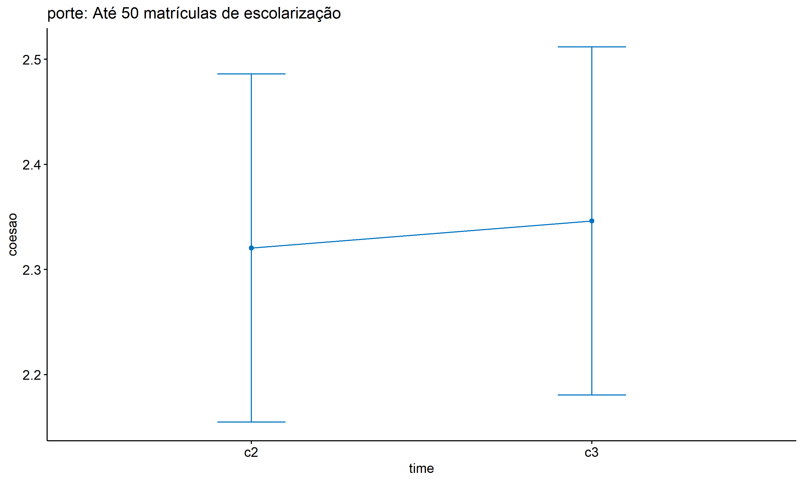<!-- -->

``` r
emms.gg <- emms[which(emms$porte == "Entre 201 e 500 matrículas de escolarização"),]
if (nrow(emms.gg) > 0)
  ggline(emms.gg, x = "time", y = "emmean", color = "#EFC000FF", ylab = "coesao") +
    geom_errorbar(aes(ymin = conf.low, ymax = conf.high),
                  width = 0.2, color = "#EFC000FF") +
    stat_pvalue_manual(
      add_xy_position(pwc[which(pwc$porte == "Entre 201 e 500 matrículas de escolarização"),],
                      x = "time", fun = "mean_se"),
      hide.ns = T, color = "#EFC000FF", tip.length = F) +
    labs(title = "porte: Entre 201 e 500 matrículas de escolarização")+
    theme(legend.text = element_blank())
```

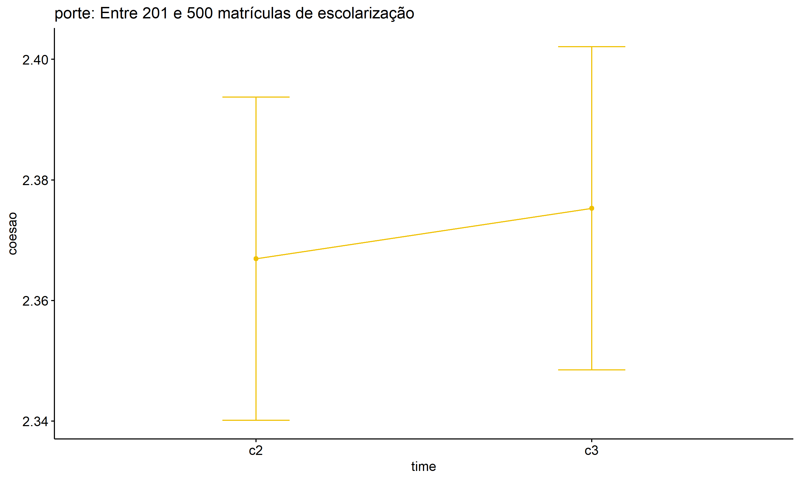<!-- -->

``` r
emms.gg <- emms[which(emms$porte == "Entre 501 e 1000 matrículas de escolarização"),]
if (nrow(emms.gg) > 0)
  ggline(emms.gg, x = "time", y = "emmean", color = "#868686FF", ylab = "coesao") +
    geom_errorbar(aes(ymin = conf.low, ymax = conf.high),
                  width = 0.2, color = "#868686FF") +
    stat_pvalue_manual(
      add_xy_position(pwc[which(pwc$porte == "Entre 501 e 1000 matrículas de escolarização"),],
                      x = "time", fun = "mean_se"),
      hide.ns = T, color = "#868686FF", tip.length = F) +
    labs(title = "porte: Entre 501 e 1000 matrículas de escolarização")+
    theme(legend.text = element_blank())
```

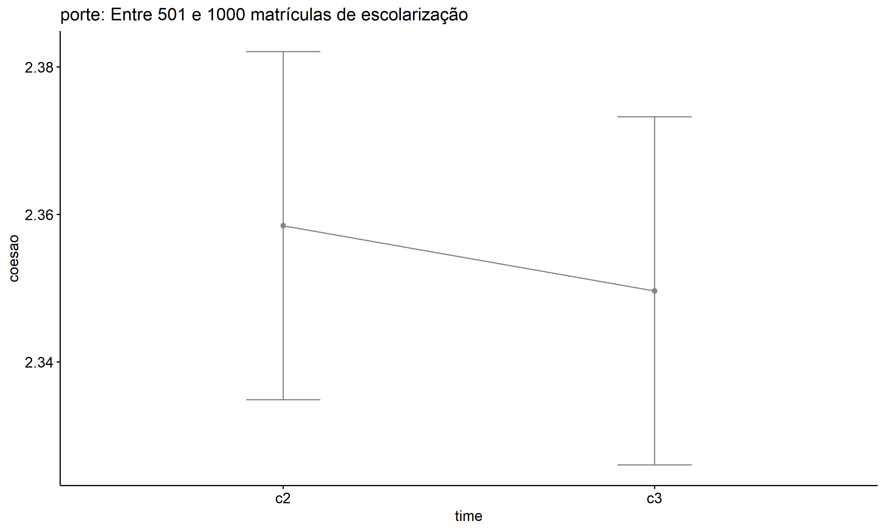<!-- -->

``` r
emms.gg <- emms[which(emms$porte == "Entre 51 e 200 matrículas de escolarização"),]
if (nrow(emms.gg) > 0)
  ggline(emms.gg, x = "time", y = "emmean", color = "#CD534CFF", ylab = "coesao") +
    geom_errorbar(aes(ymin = conf.low, ymax = conf.high),
                  width = 0.2, color = "#CD534CFF") +
    stat_pvalue_manual(
      add_xy_position(pwc[which(pwc$porte == "Entre 51 e 200 matrículas de escolarização"),],
                      x = "time", fun = "mean_se"),
      hide.ns = T, color = "#CD534CFF", tip.length = F) +
    labs(title = "porte: Entre 51 e 200 matrículas de escolarização")+
    theme(legend.text = element_blank())
```

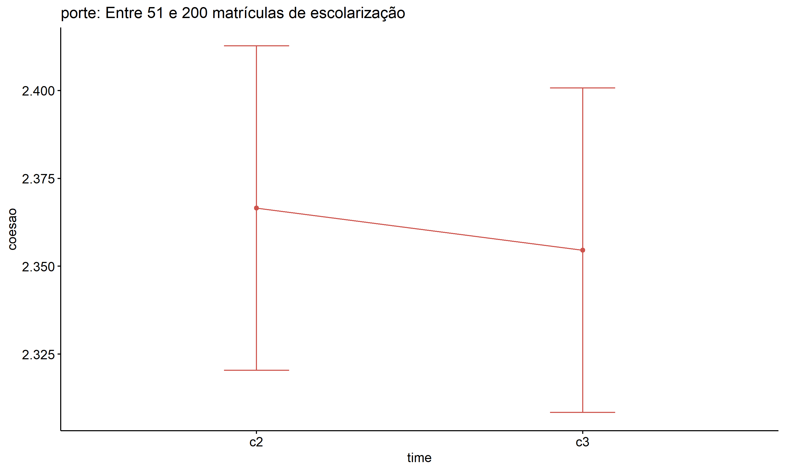<!-- -->

``` r
emms.gg <- emms[which(emms$porte == "Mais de 1000 matrículas de escolarização"),]
if (nrow(emms.gg) > 0)
  ggline(emms.gg, x = "time", y = "emmean", color = "#7AA6DCFF", ylab = "coesao") +
    geom_errorbar(aes(ymin = conf.low, ymax = conf.high),
                  width = 0.2, color = "#7AA6DCFF") +
    stat_pvalue_manual(
      add_xy_position(pwc[which(pwc$porte == "Mais de 1000 matrículas de escolarização"),],
                      x = "time", fun = "mean_se"),
      hide.ns = T, color = "#7AA6DCFF", tip.length = F) +
    labs(title = "porte: Mais de 1000 matrículas de escolarização")+
    theme(legend.text = element_blank())
```

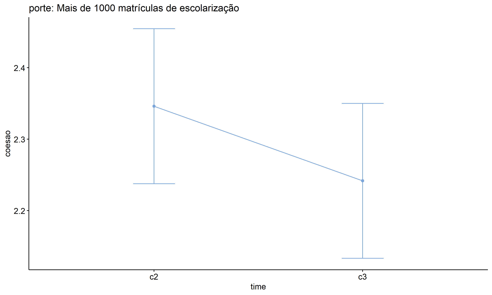<!-- -->

## PairWise Computation after removing non.normal data

``` r
if (length(non.ids) > 0)
  (pwc2 <- ldat2 %>% group_by(time) %>%
     emmeans_test(coesao ~ porte, detailed = T, p.adjust.method = "bonferroni"))
```

    ## # A tibble: 20 × 15
    ##    time  term  .y.    group1    group2 null.value estimate     se    df conf.low
    ##  * <fct> <chr> <chr>  <chr>     <chr>       <dbl>    <dbl>  <dbl> <dbl>    <dbl>
    ##  1 c2    porte coesao Até 50 m… Entre…          0 -3.88e-2 0.0942  8060 -0.223  
    ##  2 c2    porte coesao Até 50 m… Entre…          0 -3.04e-2 0.0940  8060 -0.215  
    ##  3 c2    porte coesao Até 50 m… Entre…          0 -3.84e-2 0.0961  8060 -0.227  
    ##  4 c2    porte coesao Até 50 m… Mais …          0 -1.80e-2 0.108   8060 -0.230  
    ##  5 c2    porte coesao Entre 20… Entre…          0  8.45e-3 0.0182  8060 -0.0272 
    ##  6 c2    porte coesao Entre 20… Entre…          0  4.02e-4 0.0272  8060 -0.0529 
    ##  7 c2    porte coesao Entre 20… Mais …          0  2.08e-2 0.0569  8060 -0.0908 
    ##  8 c2    porte coesao Entre 50… Entre…          0 -8.05e-3 0.0264  8060 -0.0599 
    ##  9 c2    porte coesao Entre 50… Mais …          0  1.23e-2 0.0566  8060 -0.0985 
    ## 10 c2    porte coesao Entre 51… Mais …          0  2.04e-2 0.0601  8060 -0.0974 
    ## 11 c3    porte coesao Até 50 m… Entre…          0 -1.10e-1 0.0942  8060 -0.294  
    ## 12 c3    porte coesao Até 50 m… Entre…          0 -8.40e-2 0.0940  8060 -0.268  
    ## 13 c3    porte coesao Até 50 m… Entre…          0 -8.90e-2 0.0961  8060 -0.277  
    ## 14 c3    porte coesao Até 50 m… Mais …          0  2.39e-2 0.108   8060 -0.189  
    ## 15 c3    porte coesao Entre 20… Entre…          0  2.56e-2 0.0182  8060 -0.0100 
    ## 16 c3    porte coesao Entre 20… Entre…          0  2.07e-2 0.0272  8060 -0.0326 
    ## 17 c3    porte coesao Entre 20… Mais …          0  1.34e-1 0.0569  8060  0.0219 
    ## 18 c3    porte coesao Entre 50… Entre…          0 -4.95e-3 0.0264  8060 -0.0567 
    ## 19 c3    porte coesao Entre 50… Mais …          0  1.08e-1 0.0566  8060 -0.00299
    ## 20 c3    porte coesao Entre 51… Mais …          0  1.13e-1 0.0601  8060 -0.00492
    ## # ℹ 5 more variables: conf.high <dbl>, statistic <dbl>, p <dbl>, p.adj <dbl>,
    ## #   p.adj.signif <chr>

| time | term  | .y.    | group1                                       | group2                                       | null.value | estimate |    se |   df | conf.low | conf.high | statistic |     p | p.adj | p.adj.signif |
|:-----|:------|:-------|:---------------------------------------------|:---------------------------------------------|-----------:|---------:|------:|-----:|---------:|----------:|----------:|------:|------:|:-------------|
| c2   | porte | coesao | Até 50 matrículas de escolarização           | Entre 201 e 500 matrículas de escolarização  |          0 |   -0.039 | 0.094 | 8060 |   -0.223 |     0.146 |    -0.412 | 0.680 | 1.000 | ns           |
| c2   | porte | coesao | Até 50 matrículas de escolarização           | Entre 501 e 1000 matrículas de escolarização |          0 |   -0.030 | 0.094 | 8060 |   -0.215 |     0.154 |    -0.323 | 0.747 | 1.000 | ns           |
| c2   | porte | coesao | Até 50 matrículas de escolarização           | Entre 51 e 200 matrículas de escolarização   |          0 |   -0.038 | 0.096 | 8060 |   -0.227 |     0.150 |    -0.400 | 0.689 | 1.000 | ns           |
| c2   | porte | coesao | Até 50 matrículas de escolarização           | Mais de 1000 matrículas de escolarização     |          0 |   -0.018 | 0.108 | 8060 |   -0.230 |     0.194 |    -0.166 | 0.868 | 1.000 | ns           |
| c2   | porte | coesao | Entre 201 e 500 matrículas de escolarização  | Entre 501 e 1000 matrículas de escolarização |          0 |    0.008 | 0.018 | 8060 |   -0.027 |     0.044 |     0.464 | 0.642 | 1.000 | ns           |
| c2   | porte | coesao | Entre 201 e 500 matrículas de escolarização  | Entre 51 e 200 matrículas de escolarização   |          0 |    0.000 | 0.027 | 8060 |   -0.053 |     0.054 |     0.015 | 0.988 | 1.000 | ns           |
| c2   | porte | coesao | Entre 201 e 500 matrículas de escolarização  | Mais de 1000 matrículas de escolarização     |          0 |    0.021 | 0.057 | 8060 |   -0.091 |     0.132 |     0.365 | 0.715 | 1.000 | ns           |
| c2   | porte | coesao | Entre 501 e 1000 matrículas de escolarização | Entre 51 e 200 matrículas de escolarização   |          0 |   -0.008 | 0.026 | 8060 |   -0.060 |     0.044 |    -0.305 | 0.761 | 1.000 | ns           |
| c2   | porte | coesao | Entre 501 e 1000 matrículas de escolarização | Mais de 1000 matrículas de escolarização     |          0 |    0.012 | 0.057 | 8060 |   -0.099 |     0.123 |     0.218 | 0.827 | 1.000 | ns           |
| c2   | porte | coesao | Entre 51 e 200 matrículas de escolarização   | Mais de 1000 matrículas de escolarização     |          0 |    0.020 | 0.060 | 8060 |   -0.097 |     0.138 |     0.339 | 0.734 | 1.000 | ns           |
| c3   | porte | coesao | Até 50 matrículas de escolarização           | Entre 201 e 500 matrículas de escolarização  |          0 |   -0.110 | 0.094 | 8060 |   -0.294 |     0.075 |    -1.164 | 0.244 | 1.000 | ns           |
| c3   | porte | coesao | Até 50 matrículas de escolarização           | Entre 501 e 1000 matrículas de escolarização |          0 |   -0.084 | 0.094 | 8060 |   -0.268 |     0.100 |    -0.894 | 0.371 | 1.000 | ns           |
| c3   | porte | coesao | Até 50 matrículas de escolarização           | Entre 51 e 200 matrículas de escolarização   |          0 |   -0.089 | 0.096 | 8060 |   -0.277 |     0.099 |    -0.925 | 0.355 | 1.000 | ns           |
| c3   | porte | coesao | Até 50 matrículas de escolarização           | Mais de 1000 matrículas de escolarização     |          0 |    0.024 | 0.108 | 8060 |   -0.189 |     0.236 |     0.220 | 0.826 | 1.000 | ns           |
| c3   | porte | coesao | Entre 201 e 500 matrículas de escolarização  | Entre 501 e 1000 matrículas de escolarização |          0 |    0.026 | 0.018 | 8060 |   -0.010 |     0.061 |     1.409 | 0.159 | 1.000 | ns           |
| c3   | porte | coesao | Entre 201 e 500 matrículas de escolarização  | Entre 51 e 200 matrículas de escolarização   |          0 |    0.021 | 0.027 | 8060 |   -0.033 |     0.074 |     0.761 | 0.447 | 1.000 | ns           |
| c3   | porte | coesao | Entre 201 e 500 matrículas de escolarização  | Mais de 1000 matrículas de escolarização     |          0 |    0.134 | 0.057 | 8060 |    0.022 |     0.245 |     2.345 | 0.019 | 0.190 | ns           |
| c3   | porte | coesao | Entre 501 e 1000 matrículas de escolarização | Entre 51 e 200 matrículas de escolarização   |          0 |   -0.005 | 0.026 | 8060 |   -0.057 |     0.047 |    -0.187 | 0.852 | 1.000 | ns           |
| c3   | porte | coesao | Entre 501 e 1000 matrículas de escolarização | Mais de 1000 matrículas de escolarização     |          0 |    0.108 | 0.057 | 8060 |   -0.003 |     0.219 |     1.907 | 0.057 | 0.565 | ns           |
| c3   | porte | coesao | Entre 51 e 200 matrículas de escolarização   | Mais de 1000 matrículas de escolarização     |          0 |    0.113 | 0.060 | 8060 |   -0.005 |     0.231 |     1.878 | 0.060 | 0.604 | ns           |

``` r
if (length(non.ids) > 0)
  (emms2 <- get_emmeans(pwc2))
```

    ## # A tibble: 10 × 8
    ##    time  porte                     emmean     se    df conf.low conf.high method
    ##    <fct> <fct>                      <dbl>  <dbl> <dbl>    <dbl>     <dbl> <chr> 
    ##  1 c2    Até 50 matrículas de esc…   2.33 0.0932  8060     2.15      2.51 Emmea…
    ##  2 c2    Entre 201 e 500 matrícul…   2.37 0.0137  8060     2.34      2.39 Emmea…
    ##  3 c2    Entre 501 e 1000 matrícu…   2.36 0.0120  8060     2.33      2.38 Emmea…
    ##  4 c2    Entre 51 e 200 matrícula…   2.37 0.0235  8060     2.32      2.41 Emmea…
    ##  5 c2    Mais de 1000 matrículas …   2.35 0.0553  8060     2.24      2.45 Emmea…
    ##  6 c3    Até 50 matrículas de esc…   2.27 0.0932  8060     2.08      2.45 Emmea…
    ##  7 c3    Entre 201 e 500 matrícul…   2.38 0.0137  8060     2.35      2.40 Emmea…
    ##  8 c3    Entre 501 e 1000 matrícu…   2.35 0.0120  8060     2.33      2.37 Emmea…
    ##  9 c3    Entre 51 e 200 matrícula…   2.35 0.0235  8060     2.31      2.40 Emmea…
    ## 10 c3    Mais de 1000 matrículas …   2.24 0.0553  8060     2.13      2.35 Emmea…

| time | porte                                        | emmean |    se |   df | conf.low | conf.high | method       |
|:-----|:---------------------------------------------|-------:|------:|-----:|---------:|----------:|:-------------|
| c2   | Até 50 matrículas de escolarização           |  2.328 | 0.093 | 8060 |    2.145 |     2.511 | Emmeans test |
| c2   | Entre 201 e 500 matrículas de escolarização  |  2.367 | 0.014 | 8060 |    2.340 |     2.394 | Emmeans test |
| c2   | Entre 501 e 1000 matrículas de escolarização |  2.358 | 0.012 | 8060 |    2.335 |     2.382 | Emmeans test |
| c2   | Entre 51 e 200 matrículas de escolarização   |  2.367 | 0.024 | 8060 |    2.320 |     2.413 | Emmeans test |
| c2   | Mais de 1000 matrículas de escolarização     |  2.346 | 0.055 | 8060 |    2.238 |     2.454 | Emmeans test |
| c3   | Até 50 matrículas de escolarização           |  2.266 | 0.093 | 8060 |    2.083 |     2.448 | Emmeans test |
| c3   | Entre 201 e 500 matrículas de escolarização  |  2.375 | 0.014 | 8060 |    2.348 |     2.402 | Emmeans test |
| c3   | Entre 501 e 1000 matrículas de escolarização |  2.350 | 0.012 | 8060 |    2.326 |     2.373 | Emmeans test |
| c3   | Entre 51 e 200 matrículas de escolarização   |  2.355 | 0.024 | 8060 |    2.308 |     2.401 | Emmeans test |
| c3   | Mais de 1000 matrículas de escolarização     |  2.242 | 0.055 | 8060 |    2.133 |     2.350 | Emmeans test |

``` r
if (length(non.ids) > 0) {
  pwc2 <- add_xy_position(pwc2, x = "time", fun = "mean_se", dodge = 0.25)
  pd2 <- position_dodge(width = 0.25)
  
  ggline(emms2, x = "time", y = "emmean", color = "porte",
         palette = c("#0073C2FF","#EFC000FF","#868686FF","#CD534CFF","#7AA6DCFF"),
         position = pd, ylab = "coesao") +
    geom_errorbar(aes(ymin = conf.low, ymax = conf.high, color = porte),
                position = pd, width = 0.2) +
    stat_pvalue_manual(pwc2, hide.ns = T, tip.length = F, linetype = 1)
}
```

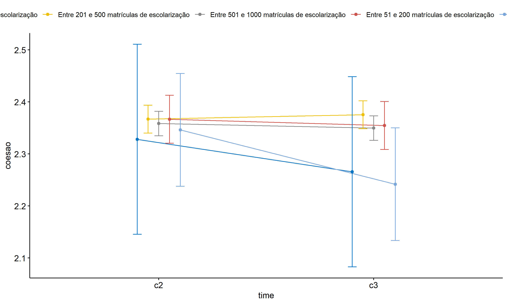<!-- -->

``` r
if (length(non.ids) > 0)
  (pwc2 <- ldat2 %>% group_by(porte) %>%
     emmeans_test(coesao ~ time, detailed = T, p.adjust.method = "bonferroni"))
```

    ## # A tibble: 5 × 15
    ##   porte      term  .y.   group1 group2 null.value estimate     se    df conf.low
    ## * <fct>      <chr> <chr> <chr>  <chr>       <dbl>    <dbl>  <dbl> <dbl>    <dbl>
    ## 1 Até 50 ma… time  coes… c2     c3              0  0.0625  0.132   8060  -0.196 
    ## 2 Entre 201… time  coes… c2     c3              0 -0.00834 0.0193  8060  -0.0462
    ## 3 Entre 501… time  coes… c2     c3              0  0.00884 0.0170  8060  -0.0245
    ## 4 Entre 51 … time  coes… c2     c3              0  0.0120  0.0333  8060  -0.0533
    ## 5 Mais de 1… time  coes… c2     c3              0  0.104   0.0782  8060  -0.0488
    ## # ℹ 5 more variables: conf.high <dbl>, statistic <dbl>, p <dbl>, p.adj <dbl>,
    ## #   p.adj.signif <chr>

| porte                                        | term | .y.    | group1 | group2 | null.value | estimate |    se |   df | conf.low | conf.high | statistic |     p | p.adj | p.adj.signif |
|:---------------------------------------------|:-----|:-------|:-------|:-------|-----------:|---------:|------:|-----:|---------:|----------:|----------:|------:|------:|:-------------|
| Até 50 matrículas de escolarização           | time | coesao | c2     | c3     |          0 |    0.063 | 0.132 | 8060 |   -0.196 |     0.321 |     0.474 | 0.635 | 0.635 | ns           |
| Entre 201 e 500 matrículas de escolarização  | time | coesao | c2     | c3     |          0 |   -0.008 | 0.019 | 8060 |   -0.046 |     0.030 |    -0.432 | 0.666 | 0.666 | ns           |
| Entre 501 e 1000 matrículas de escolarização | time | coesao | c2     | c3     |          0 |    0.009 | 0.017 | 8060 |   -0.024 |     0.042 |     0.520 | 0.603 | 0.603 | ns           |
| Entre 51 e 200 matrículas de escolarização   | time | coesao | c2     | c3     |          0 |    0.012 | 0.033 | 8060 |   -0.053 |     0.077 |     0.359 | 0.719 | 0.719 | ns           |
| Mais de 1000 matrículas de escolarização     | time | coesao | c2     | c3     |          0 |    0.104 | 0.078 | 8060 |   -0.049 |     0.258 |     1.336 | 0.182 | 0.182 | ns           |

``` r
if (length(non.ids) > 0)
  (emms2 <- get_emmeans(pwc2))
```

    ## # A tibble: 10 × 8
    ##    porte                     time  emmean     se    df conf.low conf.high method
    ##    <fct>                     <fct>  <dbl>  <dbl> <dbl>    <dbl>     <dbl> <chr> 
    ##  1 Até 50 matrículas de esc… c2      2.33 0.0932  8060     2.15      2.51 Emmea…
    ##  2 Até 50 matrículas de esc… c3      2.27 0.0932  8060     2.08      2.45 Emmea…
    ##  3 Entre 201 e 500 matrícul… c2      2.37 0.0137  8060     2.34      2.39 Emmea…
    ##  4 Entre 201 e 500 matrícul… c3      2.38 0.0137  8060     2.35      2.40 Emmea…
    ##  5 Entre 501 e 1000 matrícu… c2      2.36 0.0120  8060     2.33      2.38 Emmea…
    ##  6 Entre 501 e 1000 matrícu… c3      2.35 0.0120  8060     2.33      2.37 Emmea…
    ##  7 Entre 51 e 200 matrícula… c2      2.37 0.0235  8060     2.32      2.41 Emmea…
    ##  8 Entre 51 e 200 matrícula… c3      2.35 0.0235  8060     2.31      2.40 Emmea…
    ##  9 Mais de 1000 matrículas … c2      2.35 0.0553  8060     2.24      2.45 Emmea…
    ## 10 Mais de 1000 matrículas … c3      2.24 0.0553  8060     2.13      2.35 Emmea…

| porte                                        | time | emmean |    se |   df | conf.low | conf.high | method       |
|:---------------------------------------------|:-----|-------:|------:|-----:|---------:|----------:|:-------------|
| Até 50 matrículas de escolarização           | c2   |  2.328 | 0.093 | 8060 |    2.145 |     2.511 | Emmeans test |
| Até 50 matrículas de escolarização           | c3   |  2.266 | 0.093 | 8060 |    2.083 |     2.448 | Emmeans test |
| Entre 201 e 500 matrículas de escolarização  | c2   |  2.367 | 0.014 | 8060 |    2.340 |     2.394 | Emmeans test |
| Entre 201 e 500 matrículas de escolarização  | c3   |  2.375 | 0.014 | 8060 |    2.348 |     2.402 | Emmeans test |
| Entre 501 e 1000 matrículas de escolarização | c2   |  2.358 | 0.012 | 8060 |    2.335 |     2.382 | Emmeans test |
| Entre 501 e 1000 matrículas de escolarização | c3   |  2.350 | 0.012 | 8060 |    2.326 |     2.373 | Emmeans test |
| Entre 51 e 200 matrículas de escolarização   | c2   |  2.367 | 0.024 | 8060 |    2.320 |     2.413 | Emmeans test |
| Entre 51 e 200 matrículas de escolarização   | c3   |  2.355 | 0.024 | 8060 |    2.308 |     2.401 | Emmeans test |
| Mais de 1000 matrículas de escolarização     | c2   |  2.346 | 0.055 | 8060 |    2.238 |     2.454 | Emmeans test |
| Mais de 1000 matrículas de escolarização     | c3   |  2.242 | 0.055 | 8060 |    2.133 |     2.350 | Emmeans test |

``` r
if (length(non.ids) > 0) {
  emms.gg <- emms2[which(emms2$porte == "Até 50 matrículas de escolarização"),]
  if (nrow(emms.gg) > 0)
    ggline(emms.gg, x = "time", y = "emmean", color = "#0073C2FF", ylab = "coesao") +
    geom_errorbar(aes(ymin = conf.low, ymax = conf.high),
                  width = 0.2, color = "#0073C2FF") +
    stat_pvalue_manual(
      add_xy_position(pwc[which(pwc$porte == "Até 50 matrículas de escolarização"),],
                      x = "time", fun = "mean_se"),
      hide.ns = T, color = "#0073C2FF", tip.length = F) +
    labs(title = "porte: Até 50 matrículas de escolarização") +
    theme(legend.text = element_blank())
}
```

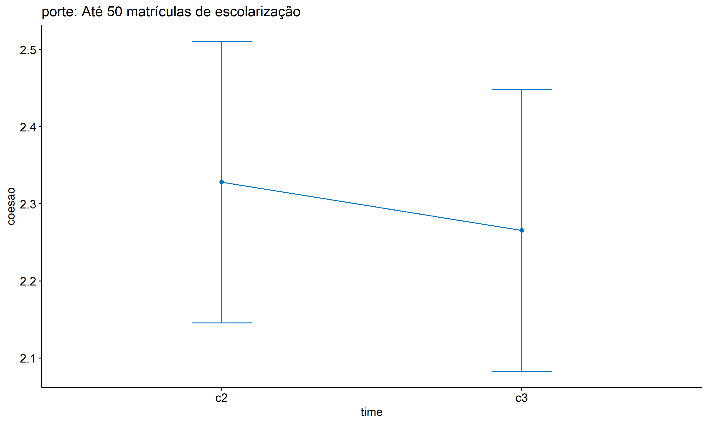<!-- -->

``` r
if (length(non.ids) > 0) {
  emms.gg <- emms2[which(emms2$porte == "Entre 201 e 500 matrículas de escolarização"),]
  if (nrow(emms.gg) > 0)
    ggline(emms.gg, x = "time", y = "emmean", color = "#EFC000FF", ylab = "coesao") +
    geom_errorbar(aes(ymin = conf.low, ymax = conf.high),
                  width = 0.2, color = "#EFC000FF") +
    stat_pvalue_manual(
      add_xy_position(pwc[which(pwc$porte == "Entre 201 e 500 matrículas de escolarização"),],
                      x = "time", fun = "mean_se"),
      hide.ns = T, color = "#EFC000FF", tip.length = F) +
    labs(title = "porte: Entre 201 e 500 matrículas de escolarização") +
    theme(legend.text = element_blank())
}
```

<!-- -->

``` r
if (length(non.ids) > 0) {
  emms.gg <- emms2[which(emms2$porte == "Entre 501 e 1000 matrículas de escolarização"),]
  if (nrow(emms.gg) > 0)
    ggline(emms.gg, x = "time", y = "emmean", color = "#868686FF", ylab = "coesao") +
    geom_errorbar(aes(ymin = conf.low, ymax = conf.high),
                  width = 0.2, color = "#868686FF") +
    stat_pvalue_manual(
      add_xy_position(pwc[which(pwc$porte == "Entre 501 e 1000 matrículas de escolarização"),],
                      x = "time", fun = "mean_se"),
      hide.ns = T, color = "#868686FF", tip.length = F) +
    labs(title = "porte: Entre 501 e 1000 matrículas de escolarização") +
    theme(legend.text = element_blank())
}
```

<!-- -->

``` r
if (length(non.ids) > 0) {
  emms.gg <- emms2[which(emms2$porte == "Entre 51 e 200 matrículas de escolarização"),]
  if (nrow(emms.gg) > 0)
    ggline(emms.gg, x = "time", y = "emmean", color = "#CD534CFF", ylab = "coesao") +
    geom_errorbar(aes(ymin = conf.low, ymax = conf.high),
                  width = 0.2, color = "#CD534CFF") +
    stat_pvalue_manual(
      add_xy_position(pwc[which(pwc$porte == "Entre 51 e 200 matrículas de escolarização"),],
                      x = "time", fun = "mean_se"),
      hide.ns = T, color = "#CD534CFF", tip.length = F) +
    labs(title = "porte: Entre 51 e 200 matrículas de escolarização") +
    theme(legend.text = element_blank())
}
```

<!-- -->

``` r
if (length(non.ids) > 0) {
  emms.gg <- emms2[which(emms2$porte == "Mais de 1000 matrículas de escolarização"),]
  if (nrow(emms.gg) > 0)
    ggline(emms.gg, x = "time", y = "emmean", color = "#7AA6DCFF", ylab = "coesao") +
    geom_errorbar(aes(ymin = conf.low, ymax = conf.high),
                  width = 0.2, color = "#7AA6DCFF") +
    stat_pvalue_manual(
      add_xy_position(pwc[which(pwc$porte == "Mais de 1000 matrículas de escolarização"),],
                      x = "time", fun = "mean_se"),
      hide.ns = T, color = "#7AA6DCFF", tip.length = F) +
    labs(title = "porte: Mais de 1000 matrículas de escolarização") +
    theme(legend.text = element_blank())
}
```

<!-- -->
