ANOVA test for registro_formal
================
Geiser C. Challco <geiser@alumni.usp.br>

- [ANOVA: registro_formal ~ time](#anova-registro_formal--time)
  - [Data Preparation](#data-preparation)
  - [Summary Statistics](#summary-statistics)
  - [ANOVA Computation](#anova-computation)
  - [PairWise Computation](#pairwise-computation)
- [ANOVA: registro_formal ~ time\*gender +
  Error(id/time)](#anova-registro_formal--timegender--erroridtime)
  - [Data Preparation](#data-preparation-1)
    - [Check assumptions: Identifying
      Outliers](#check-assumptions-identifying-outliers)
    - [Check assumptions: Normality
      Test](#check-assumptions-normality-test)
    - [Summary Statistics](#summary-statistics-1)
  - [ANOVA Computation](#anova-computation-1)
  - [ANOVA Computation after removing non.normal
    data](#anova-computation-after-removing-nonnormal-data)
  - [PairWise Computation](#pairwise-computation-1)
  - [PairWise Computation after removing non.normal
    data](#pairwise-computation-after-removing-nonnormal-data)
- [ANOVA: registro_formal ~ time\*regiao +
  Error(id/time)](#anova-registro_formal--timeregiao--erroridtime)
  - [Data Preparation](#data-preparation-2)
    - [Check assumptions: Identifying
      Outliers](#check-assumptions-identifying-outliers-1)
    - [Check assumptions: Normality
      Test](#check-assumptions-normality-test-1)
    - [Summary Statistics](#summary-statistics-2)
  - [ANOVA Computation](#anova-computation-2)
  - [ANOVA Computation after removing non.normal
    data](#anova-computation-after-removing-nonnormal-data-1)
  - [PairWise Computation](#pairwise-computation-2)
  - [PairWise Computation after removing non.normal
    data](#pairwise-computation-after-removing-nonnormal-data-1)

``` r
dat <- read_excel("../data/data.xlsx", sheet = "alunos_ef59")

escolas <- read_excel("../data/data.xlsx", sheet = "escolas")
edat <- merge(dat, escolas, by = "cod_escola", all.x = T)
```

# ANOVA: registro_formal ~ time

## Data Preparation

``` r
data <- edat[,c("aluno_id","ciclo","registro_formal")]
data <- data[data$ciclo %in% c("Primeiro Ciclo","Segundo Ciclo"),]
data$ciclo <- factor(data$ciclo, c("Primeiro Ciclo","Segundo Ciclo"))
data <- unique(data)

wdat <- spread(data, ciclo, registro_formal)
wdat <- wdat[complete.cases(wdat),]
colnames(wdat) <- c("id","c1","c2")

ldat <- gather(wdat, key = time, value = registro_formal, c1,c2) %>%
  convert_as_factor(id, time)
ldat <- rshinystatistics::remove_group_data(ldat, "registro_formal", "time", n.limit = 30)
```

## Summary Statistics

``` r
(sdat <- ldat %>% group_by(time) %>%
   get_summary_stats(registro_formal, type = "mean_sd"))
```

    ## # A tibble: 2 × 5
    ##   time  variable            n  mean    sd
    ##   <fct> <fct>           <dbl> <dbl> <dbl>
    ## 1 c1    registro_formal   200  2.12 0.706
    ## 2 c2    registro_formal   200  1.90 0.756

| time | variable        |   n |  mean |    sd |
|:-----|:----------------|----:|------:|------:|
| c1   | registro_formal | 200 | 2.120 | 0.706 |
| c2   | registro_formal | 200 | 1.898 | 0.756 |

## ANOVA Computation

``` r
(res.aov <- anova_test(ldat, dv = registro_formal, wid = id, within = time))
```

    ## ANOVA Table (type III tests)
    ## 
    ##   Effect DFn DFd      F     p p<.05   ges
    ## 1   time   1 199 10.324 0.002     * 0.023

## PairWise Computation

``` r
(pwc <- ldat %>% emmeans_test(registro_formal ~ time, detailed = T, p.adjust.method = "bonferroni"))
```

    ## # A tibble: 1 × 14
    ##   term  .y.    group1 group2 null.value estimate     se    df conf.low conf.high
    ## * <chr> <chr>  <chr>  <chr>       <dbl>    <dbl>  <dbl> <dbl>    <dbl>     <dbl>
    ## 1 time  regis… c1     c2              0    0.223 0.0731   398   0.0788     0.366
    ## # ℹ 4 more variables: statistic <dbl>, p <dbl>, p.adj <dbl>, p.adj.signif <chr>

| term | .y.             | group1 | group2 | null.value | estimate |    se |  df | conf.low | conf.high | statistic |     p | p.adj | p.adj.signif |
|:-----|:----------------|:-------|:-------|-----------:|---------:|------:|----:|---------:|----------:|----------:|------:|------:|:-------------|
| time | registro_formal | c1     | c2     |          0 |    0.223 | 0.073 | 398 |    0.079 |     0.366 |     3.043 | 0.002 | 0.002 | \*\*         |

``` r
pwc <- add_xy_position(pwc, x = "time", fun = "mean_se")
ggline(get_emmeans(pwc), x = "time", y = "emmean", ylab = "registro_formal") +
  geom_errorbar(aes(ymin = conf.low, ymax = conf.high), width = 0.2) +
  stat_pvalue_manual(pwc, hide.ns = T, tip.length = F)
```

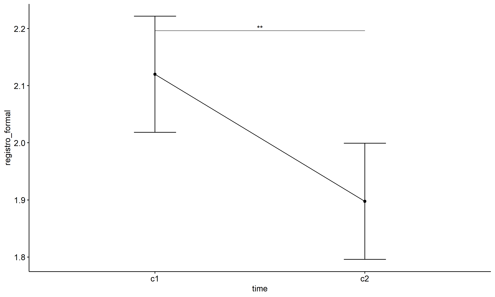<!-- -->

# ANOVA: registro_formal ~ time\*gender + Error(id/time)

## Data Preparation

``` r
data <- edat[,c("aluno_id","gender","ciclo","registro_formal")]
data <- data[data$ciclo %in% c("Primeiro Ciclo","Segundo Ciclo"),]
data$ciclo <- factor(data$ciclo, c("Primeiro Ciclo","Segundo Ciclo"))
data <- unique(data)

wdat <- spread(data, ciclo, registro_formal)
wdat <- wdat[complete.cases(wdat),]
colnames(wdat) <- c("id","gender","c1","c2")

ldat <- gather(wdat, key = time, value = registro_formal, c1,c2) %>%
  convert_as_factor(id, time)
ldat <- remove_group_data(ldat, "registro_formal", c("time", "gender"), n.limit = 30)
ldat$gender <- factor(ldat$gender, sort(unique(ldat$gender)))
```

### Check assumptions: Identifying Outliers

``` r
outliers <- identify_outliers(group_by(ldat, time, gender), registro_formal)
(outliers <- outliers[outliers$is.extreme == T,])
```

    ## # A tibble: 0 × 6
    ## # ℹ 6 variables: gender <fct>, time <fct>, id <fct>, registro_formal <dbl>,
    ## #   is.outlier <lgl>, is.extreme <lgl>

| gender | time | id  | registro_formal | is.outlier | is.extreme |
|:-------|:-----|:----|----------------:|:-----------|:-----------|

### Check assumptions: Normality Test

``` r
(normality.df <- normality.test.per.groups(ldat, "registro_formal", c("time", "gender")))
```

    ##               var        variable time gender  n   skewness   kurtosis symmetry
    ## 1 registro_formal registro_formal   c1 Female 97 0.08393312 -0.3993882      YES
    ## 2 registro_formal registro_formal   c1   Male 93 0.19537229 -0.8377650      YES
    ## 3 registro_formal registro_formal   c2 Female 97 0.34218482 -0.7315050      YES
    ## 4 registro_formal registro_formal   c2   Male 93 0.73786502  0.4512974       NO
    ##   statistic     method           p p.signif normality
    ## 1 0.4397878 D'Agostino 0.802603947       ns       YES
    ## 2 5.7642527 D'Agostino 0.056015529       ns       YES
    ## 3 5.3448755 D'Agostino 0.069083610       ns       YES
    ## 4 9.8792508 D'Agostino 0.007157279       **        NO

| var             | variable        | time | gender |   n | skewness | kurtosis | symmetry | statistic | method     |     p | p.signif | normality |
|:----------------|:----------------|:-----|:-------|----:|---------:|---------:|:---------|----------:|:-----------|------:|:---------|:----------|
| registro_formal | registro_formal | c1   | Female |  97 |    0.084 |   -0.399 | YES      |     0.440 | D’Agostino | 0.803 | ns       | YES       |
| registro_formal | registro_formal | c1   | Male   |  93 |    0.195 |   -0.838 | YES      |     5.764 | D’Agostino | 0.056 | ns       | YES       |
| registro_formal | registro_formal | c2   | Female |  97 |    0.342 |   -0.732 | YES      |     5.345 | D’Agostino | 0.069 | ns       | YES       |
| registro_formal | registro_formal | c2   | Male   |  93 |    0.738 |    0.451 | NO       |     9.879 | D’Agostino | 0.007 | \*\*     | NO        |

``` r
(non.ids <- unique(do.call(
  c, lapply(which(normality.df$normality == 'NO'), FUN = function(i) {
  idx = which(ldat$time == normality.df$time[i] &
                ldat$gender == normality.df$gender[i])
  getNonNormal(ldat$"registro_formal"[idx], ldat$id[idx])
}))))
```

    ## [1] "0Iic8NJjMd0p3tLfnUh4" "2nHewIIcmnbSeyGcl9cc" "3cRsjiyrvPlLivyefAed"
    ## [4] "DKdY1sFkSeqJ5AzNWUmw" "E24JxslKdwF5JyTsLLcZ" "G64rWNL4MHA3GcW27T5b"
    ## [7] "iBRN7cXIkf0UPW9vEs3E"

``` r
if (length(non.ids) > 0)
  ldat2 <- ldat[!ldat$id %in% non.ids,]
```

### Summary Statistics

``` r
(sdat <- ldat %>% group_by(time, gender) %>%
   get_summary_stats(registro_formal, type = "mean_sd"))
```

    ## # A tibble: 4 × 6
    ##   gender time  variable            n  mean    sd
    ##   <fct>  <fct> <fct>           <dbl> <dbl> <dbl>
    ## 1 Female c1    registro_formal    97  2.19 0.705
    ## 2 Male   c1    registro_formal    93  2.09 0.709
    ## 3 Female c2    registro_formal    97  2.02 0.819
    ## 4 Male   c2    registro_formal    93  1.77 0.674

| gender | time | variable        |   n |  mean |    sd |
|:-------|:-----|:----------------|----:|------:|------:|
| Female | c1   | registro_formal |  97 | 2.186 | 0.705 |
| Male   | c1   | registro_formal |  93 | 2.086 | 0.709 |
| Female | c2   | registro_formal |  97 | 2.021 | 0.819 |
| Male   | c2   | registro_formal |  93 | 1.769 | 0.674 |

``` r
if (length(non.ids) > 0)
  (sdat <- ldat2 %>% group_by(time, gender) %>%
      get_summary_stats(registro_formal, type = "mean_sd"))
```

    ## # A tibble: 4 × 6
    ##   gender time  variable            n  mean    sd
    ##   <fct>  <fct> <fct>           <dbl> <dbl> <dbl>
    ## 1 Female c1    registro_formal    97  2.19 0.705
    ## 2 Male   c1    registro_formal    86  2.10 0.702
    ## 3 Female c2    registro_formal    97  2.02 0.819
    ## 4 Male   c2    registro_formal    86  1.80 0.625

| gender | time | variable        |   n |  mean |    sd |
|:-------|:-----|:----------------|----:|------:|------:|
| Female | c1   | registro_formal |  97 | 2.186 | 0.705 |
| Male   | c1   | registro_formal |  86 | 2.099 | 0.702 |
| Female | c2   | registro_formal |  97 | 2.021 | 0.819 |
| Male   | c2   | registro_formal |  86 | 1.797 | 0.625 |

## ANOVA Computation

``` r
(res.aov <- anova_test(ldat, dv = registro_formal, wid = id, between = gender, within = time))
```

    ## ANOVA Table (type III tests)
    ## 
    ##        Effect DFn DFd      F        p p<.05   ges
    ## 1      gender   1 188  5.005 0.026000     * 0.014
    ## 2        time   1 188 11.512 0.000843     * 0.027
    ## 3 gender:time   1 188  1.148 0.285000       0.003

## ANOVA Computation after removing non.normal data

``` r
if (length(non.ids) > 0)
  (res.aov2 <- anova_test(ldat2, dv = registro_formal, wid = id, between = gender , within = time))
```

    ## ANOVA Table (type III tests)
    ## 
    ##        Effect DFn DFd      F     p p<.05   ges
    ## 1      gender   1 181  4.048 0.046     * 0.012
    ## 2        time   1 181 10.149 0.002     * 0.026
    ## 3 gender:time   1 181  0.877 0.350       0.002

## PairWise Computation

``` r
(pwc <- ldat %>% group_by(time) %>%
   emmeans_test(registro_formal ~ gender, detailed = T, p.adjust.method = "bonferroni"))
```

    ## # A tibble: 2 × 15
    ##   time  term   .y.        group1 group2 null.value estimate    se    df conf.low
    ## * <fct> <chr>  <chr>      <chr>  <chr>       <dbl>    <dbl> <dbl> <dbl>    <dbl>
    ## 1 c1    gender registro_… Female Male            0   0.0995 0.106   376  -0.109 
    ## 2 c2    gender registro_… Female Male            0   0.252  0.106   376   0.0436
    ## # ℹ 5 more variables: conf.high <dbl>, statistic <dbl>, p <dbl>, p.adj <dbl>,
    ## #   p.adj.signif <chr>

| time | term   | .y.             | group1 | group2 | null.value | estimate |    se |  df | conf.low | conf.high | statistic |     p | p.adj | p.adj.signif |
|:-----|:-------|:----------------|:-------|:-------|-----------:|---------:|------:|----:|---------:|----------:|----------:|------:|------:|:-------------|
| c1   | gender | registro_formal | Female | Male   |          0 |    0.100 | 0.106 | 376 |   -0.109 |     0.308 |     0.940 | 0.348 | 0.348 | ns           |
| c2   | gender | registro_formal | Female | Male   |          0 |    0.252 | 0.106 | 376 |    0.044 |     0.460 |     2.378 | 0.018 | 0.018 | \*           |

``` r
(emms <- get_emmeans(pwc))
```

    ## # A tibble: 4 × 8
    ##   time  gender emmean     se    df conf.low conf.high method      
    ##   <fct> <fct>   <dbl>  <dbl> <dbl>    <dbl>     <dbl> <chr>       
    ## 1 c1    Female   2.19 0.0741   376     2.04      2.33 Emmeans test
    ## 2 c1    Male     2.09 0.0757   376     1.94      2.23 Emmeans test
    ## 3 c2    Female   2.02 0.0741   376     1.87      2.17 Emmeans test
    ## 4 c2    Male     1.77 0.0757   376     1.62      1.92 Emmeans test

| time | gender | emmean |    se |  df | conf.low | conf.high | method       |
|:-----|:-------|-------:|------:|----:|---------:|----------:|:-------------|
| c1   | Female |  2.186 | 0.074 | 376 |    2.040 |     2.331 | Emmeans test |
| c1   | Male   |  2.086 | 0.076 | 376 |    1.937 |     2.235 | Emmeans test |
| c2   | Female |  2.021 | 0.074 | 376 |    1.875 |     2.166 | Emmeans test |
| c2   | Male   |  1.769 | 0.076 | 376 |    1.620 |     1.918 | Emmeans test |

``` r
pwc <- add_xy_position(pwc, x = "time", fun = "mean_se", dodge = 0.25)
pd <- position_dodge(width = 0.25)
ggline(emms, x = "time", y = "emmean", color = "gender",
       palette = c("#FF007F","#4D4DFF"),
       position = pd, ylab = "registro_formal") +
  geom_errorbar(aes(ymin = conf.low, ymax = conf.high, color = gender),
                position = pd, width = 0.2) +
  stat_pvalue_manual(pwc, hide.ns = T, tip.length = F, linetype = 1)
```

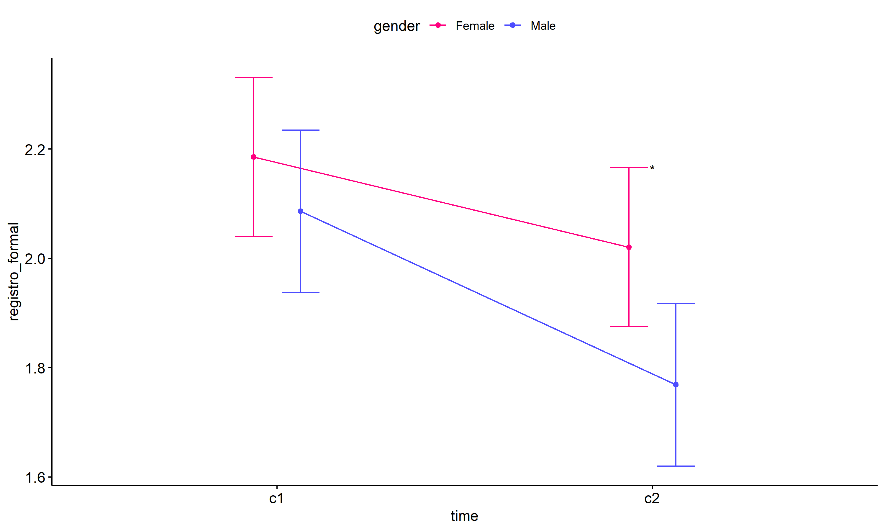<!-- -->

``` r
(pwc <- ldat %>% group_by(gender) %>%
    emmeans_test(registro_formal ~ time, detailed = T, p.adjust.method = "bonferroni"))
```

    ## # A tibble: 2 × 15
    ##   gender term  .y.        group1 group2 null.value estimate    se    df conf.low
    ## * <fct>  <chr> <chr>      <chr>  <chr>       <dbl>    <dbl> <dbl> <dbl>    <dbl>
    ## 1 Female time  registro_… c1     c2              0    0.165 0.105   376  -0.0411
    ## 2 Male   time  registro_… c1     c2              0    0.317 0.107   376   0.107 
    ## # ℹ 5 more variables: conf.high <dbl>, statistic <dbl>, p <dbl>, p.adj <dbl>,
    ## #   p.adj.signif <chr>

| gender | term | .y.             | group1 | group2 | null.value | estimate |    se |  df | conf.low | conf.high | statistic |     p | p.adj | p.adj.signif |
|:-------|:-----|:----------------|:-------|:-------|-----------:|---------:|------:|----:|---------:|----------:|----------:|------:|------:|:-------------|
| Female | time | registro_formal | c1     | c2     |          0 |    0.165 | 0.105 | 376 |   -0.041 |     0.371 |     1.574 | 0.116 | 0.116 | ns           |
| Male   | time | registro_formal | c1     | c2     |          0 |    0.317 | 0.107 | 376 |    0.107 |     0.528 |     2.964 | 0.003 | 0.003 | \*\*         |

``` r
(emms <- get_emmeans(pwc))
```

    ## # A tibble: 4 × 8
    ##   gender time  emmean     se    df conf.low conf.high method      
    ##   <fct>  <fct>  <dbl>  <dbl> <dbl>    <dbl>     <dbl> <chr>       
    ## 1 Female c1      2.19 0.0741   376     2.04      2.33 Emmeans test
    ## 2 Female c2      2.02 0.0741   376     1.87      2.17 Emmeans test
    ## 3 Male   c1      2.09 0.0757   376     1.94      2.23 Emmeans test
    ## 4 Male   c2      1.77 0.0757   376     1.62      1.92 Emmeans test

| gender | time | emmean |    se |  df | conf.low | conf.high | method       |
|:-------|:-----|-------:|------:|----:|---------:|----------:|:-------------|
| Female | c1   |  2.186 | 0.074 | 376 |    2.040 |     2.331 | Emmeans test |
| Female | c2   |  2.021 | 0.074 | 376 |    1.875 |     2.166 | Emmeans test |
| Male   | c1   |  2.086 | 0.076 | 376 |    1.937 |     2.235 | Emmeans test |
| Male   | c2   |  1.769 | 0.076 | 376 |    1.620 |     1.918 | Emmeans test |

``` r
emms.gg <- emms[which(emms$gender == "Female"),]
if (nrow(emms.gg) > 0)
  ggline(emms.gg, x = "time", y = "emmean", color = "#FF007F", ylab = "registro_formal") +
    geom_errorbar(aes(ymin = conf.low, ymax = conf.high),
                  width = 0.2, color = "#FF007F") +
    stat_pvalue_manual(
      add_xy_position(pwc[which(pwc$gender == "Female"),],
                      x = "time", fun = "mean_se"),
      hide.ns = T, color = "#FF007F", tip.length = F) +
    labs(title = "gender: Female")+
    theme(legend.text = element_blank())
```

<!-- -->

``` r
emms.gg <- emms[which(emms$gender == "Male"),]
if (nrow(emms.gg) > 0)
  ggline(emms.gg, x = "time", y = "emmean", color = "#4D4DFF", ylab = "registro_formal") +
    geom_errorbar(aes(ymin = conf.low, ymax = conf.high),
                  width = 0.2, color = "#4D4DFF") +
    stat_pvalue_manual(
      add_xy_position(pwc[which(pwc$gender == "Male"),],
                      x = "time", fun = "mean_se"),
      hide.ns = T, color = "#4D4DFF", tip.length = F) +
    labs(title = "gender: Male")+
    theme(legend.text = element_blank())
```

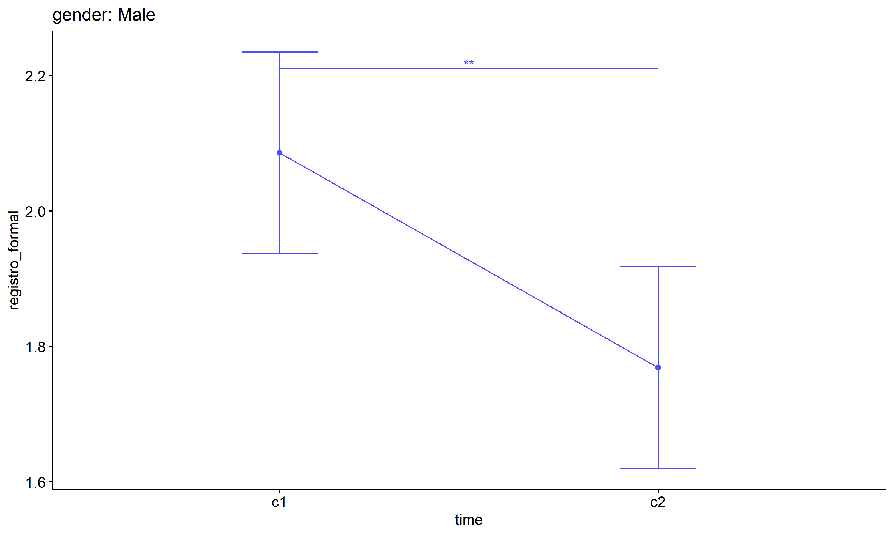<!-- -->

## PairWise Computation after removing non.normal data

``` r
if (length(non.ids) > 0)
  (pwc2 <- ldat2 %>% group_by(time) %>%
     emmeans_test(registro_formal ~ gender, detailed = T, p.adjust.method = "bonferroni"))
```

    ## # A tibble: 2 × 15
    ##   time  term   .y.        group1 group2 null.value estimate    se    df conf.low
    ## * <fct> <chr>  <chr>      <chr>  <chr>       <dbl>    <dbl> <dbl> <dbl>    <dbl>
    ## 1 c1    gender registro_… Female Male            0   0.0867 0.107   362  -0.123 
    ## 2 c2    gender registro_… Female Male            0   0.224  0.107   362   0.0146
    ## # ℹ 5 more variables: conf.high <dbl>, statistic <dbl>, p <dbl>, p.adj <dbl>,
    ## #   p.adj.signif <chr>

| time | term   | .y.             | group1 | group2 | null.value | estimate |    se |  df | conf.low | conf.high | statistic |     p | p.adj | p.adj.signif |
|:-----|:-------|:----------------|:-------|:-------|-----------:|---------:|------:|----:|---------:|----------:|----------:|------:|------:|:-------------|
| c1   | gender | registro_formal | Female | Male   |          0 |    0.087 | 0.107 | 362 |   -0.123 |     0.296 |     0.814 | 0.416 | 0.416 | ns           |
| c2   | gender | registro_formal | Female | Male   |          0 |    0.224 | 0.107 | 362 |    0.015 |     0.434 |     2.104 | 0.036 | 0.036 | \*           |

``` r
if (length(non.ids) > 0)
  (emms2 <- get_emmeans(pwc2))
```

    ## # A tibble: 4 × 8
    ##   time  gender emmean     se    df conf.low conf.high method      
    ##   <fct> <fct>   <dbl>  <dbl> <dbl>    <dbl>     <dbl> <chr>       
    ## 1 c1    Female   2.19 0.0730   362     2.04      2.33 Emmeans test
    ## 2 c1    Male     2.10 0.0775   362     1.95      2.25 Emmeans test
    ## 3 c2    Female   2.02 0.0730   362     1.88      2.16 Emmeans test
    ## 4 c2    Male     1.80 0.0775   362     1.64      1.95 Emmeans test

| time | gender | emmean |    se |  df | conf.low | conf.high | method       |
|:-----|:-------|-------:|------:|----:|---------:|----------:|:-------------|
| c1   | Female |  2.186 | 0.073 | 362 |    2.042 |     2.329 | Emmeans test |
| c1   | Male   |  2.099 | 0.078 | 362 |    1.946 |     2.251 | Emmeans test |
| c2   | Female |  2.021 | 0.073 | 362 |    1.877 |     2.164 | Emmeans test |
| c2   | Male   |  1.797 | 0.078 | 362 |    1.644 |     1.949 | Emmeans test |

``` r
if (length(non.ids) > 0) {
  pwc2 <- add_xy_position(pwc2, x = "time", fun = "mean_se", dodge = 0.25)
  pd2 <- position_dodge(width = 0.25)
  
  ggline(emms2, x = "time", y = "emmean", color = "gender",
         palette = c("#FF007F","#4D4DFF"),
         position = pd, ylab = "registro_formal") +
    geom_errorbar(aes(ymin = conf.low, ymax = conf.high, color = gender),
                position = pd, width = 0.2) +
    stat_pvalue_manual(pwc2, hide.ns = T, tip.length = F, linetype = 1)
}
```

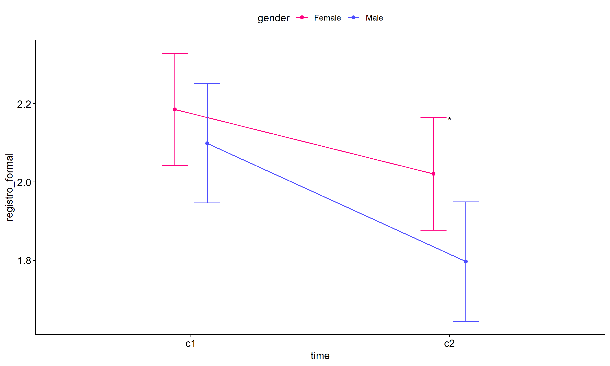<!-- -->

``` r
if (length(non.ids) > 0)
  (pwc2 <- ldat2 %>% group_by(gender) %>%
     emmeans_test(registro_formal ~ time, detailed = T, p.adjust.method = "bonferroni"))
```

    ## # A tibble: 2 × 15
    ##   gender term  .y.        group1 group2 null.value estimate    se    df conf.low
    ## * <fct>  <chr> <chr>      <chr>  <chr>       <dbl>    <dbl> <dbl> <dbl>    <dbl>
    ## 1 Female time  registro_… c1     c2              0    0.165 0.103   362  -0.0381
    ## 2 Male   time  registro_… c1     c2              0    0.302 0.110   362   0.0867
    ## # ℹ 5 more variables: conf.high <dbl>, statistic <dbl>, p <dbl>, p.adj <dbl>,
    ## #   p.adj.signif <chr>

| gender | term | .y.             | group1 | group2 | null.value | estimate |    se |  df | conf.low | conf.high | statistic |     p | p.adj | p.adj.signif |
|:-------|:-----|:----------------|:-------|:-------|-----------:|---------:|------:|----:|---------:|----------:|----------:|------:|------:|:-------------|
| Female | time | registro_formal | c1     | c2     |          0 |    0.165 | 0.103 | 362 |   -0.038 |     0.368 |     1.597 | 0.111 | 0.111 | ns           |
| Male   | time | registro_formal | c1     | c2     |          0 |    0.302 | 0.110 | 362 |    0.087 |     0.518 |     2.757 | 0.006 | 0.006 | \*\*         |

``` r
if (length(non.ids) > 0)
  (emms2 <- get_emmeans(pwc2))
```

    ## # A tibble: 4 × 8
    ##   gender time  emmean     se    df conf.low conf.high method      
    ##   <fct>  <fct>  <dbl>  <dbl> <dbl>    <dbl>     <dbl> <chr>       
    ## 1 Female c1      2.19 0.0730   362     2.04      2.33 Emmeans test
    ## 2 Female c2      2.02 0.0730   362     1.88      2.16 Emmeans test
    ## 3 Male   c1      2.10 0.0775   362     1.95      2.25 Emmeans test
    ## 4 Male   c2      1.80 0.0775   362     1.64      1.95 Emmeans test

| gender | time | emmean |    se |  df | conf.low | conf.high | method       |
|:-------|:-----|-------:|------:|----:|---------:|----------:|:-------------|
| Female | c1   |  2.186 | 0.073 | 362 |    2.042 |     2.329 | Emmeans test |
| Female | c2   |  2.021 | 0.073 | 362 |    1.877 |     2.164 | Emmeans test |
| Male   | c1   |  2.099 | 0.078 | 362 |    1.946 |     2.251 | Emmeans test |
| Male   | c2   |  1.797 | 0.078 | 362 |    1.644 |     1.949 | Emmeans test |

``` r
if (length(non.ids) > 0) {
  emms.gg <- emms2[which(emms2$gender == "Female"),]
  if (nrow(emms.gg) > 0)
    ggline(emms.gg, x = "time", y = "emmean", color = "#FF007F", ylab = "registro_formal") +
    geom_errorbar(aes(ymin = conf.low, ymax = conf.high),
                  width = 0.2, color = "#FF007F") +
    stat_pvalue_manual(
      add_xy_position(pwc[which(pwc$gender == "Female"),],
                      x = "time", fun = "mean_se"),
      hide.ns = T, color = "#FF007F", tip.length = F) +
    labs(title = "gender: Female") +
    theme(legend.text = element_blank())
}
```

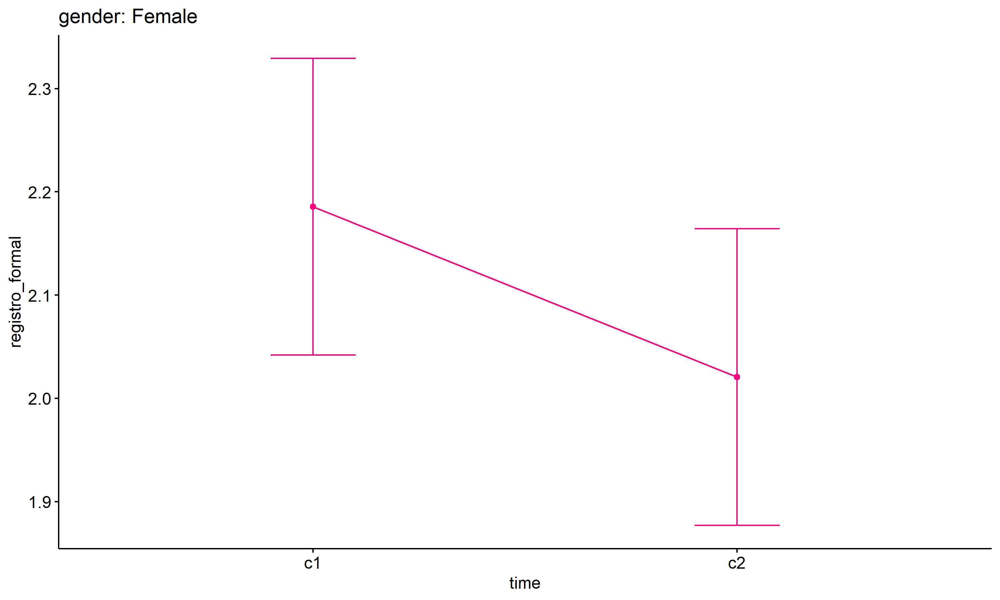<!-- -->

``` r
if (length(non.ids) > 0) {
  emms.gg <- emms2[which(emms2$gender == "Male"),]
  if (nrow(emms.gg) > 0)
    ggline(emms.gg, x = "time", y = "emmean", color = "#4D4DFF", ylab = "registro_formal") +
    geom_errorbar(aes(ymin = conf.low, ymax = conf.high),
                  width = 0.2, color = "#4D4DFF") +
    stat_pvalue_manual(
      add_xy_position(pwc[which(pwc$gender == "Male"),],
                      x = "time", fun = "mean_se"),
      hide.ns = T, color = "#4D4DFF", tip.length = F) +
    labs(title = "gender: Male") +
    theme(legend.text = element_blank())
}
```

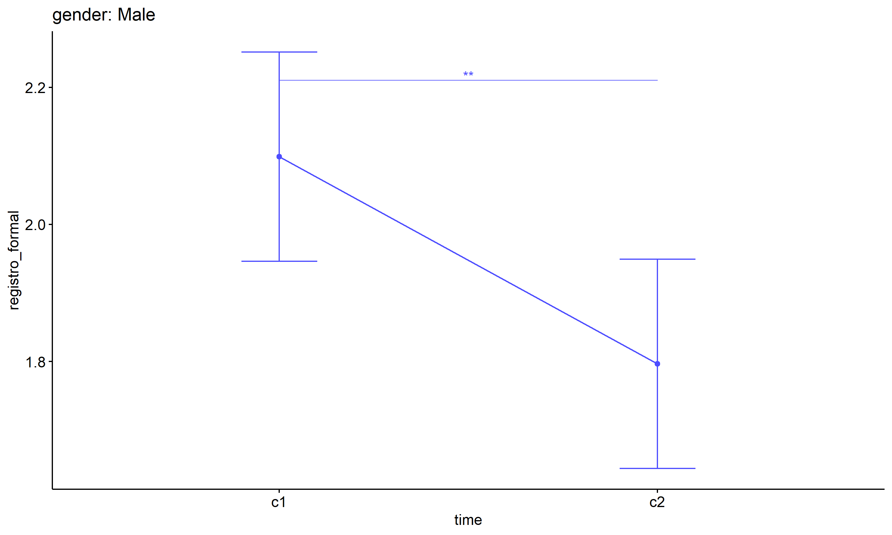<!-- -->

# ANOVA: registro_formal ~ time\*regiao + Error(id/time)

## Data Preparation

``` r
data <- edat[,c("aluno_id","regiao","ciclo","registro_formal")]
data <- data[data$ciclo %in% c("Primeiro Ciclo","Segundo Ciclo"),]
data$ciclo <- factor(data$ciclo, c("Primeiro Ciclo","Segundo Ciclo"))
data <- unique(data)

wdat <- spread(data, ciclo, registro_formal)
wdat <- wdat[complete.cases(wdat),]
colnames(wdat) <- c("id","regiao","c1","c2")

ldat <- gather(wdat, key = time, value = registro_formal, c1,c2) %>%
  convert_as_factor(id, time)
ldat <- remove_group_data(ldat, "registro_formal", c("time", "regiao"), n.limit = 30)
ldat$regiao <- factor(ldat$regiao, sort(unique(ldat$regiao)))
```

### Check assumptions: Identifying Outliers

``` r
outliers <- identify_outliers(group_by(ldat, time, regiao), registro_formal)
(outliers <- outliers[outliers$is.extreme == T,])
```

    ## # A tibble: 0 × 6
    ## # ℹ 6 variables: regiao <fct>, time <fct>, id <fct>, registro_formal <dbl>,
    ## #   is.outlier <lgl>, is.extreme <lgl>

| regiao | time | id  | registro_formal | is.outlier | is.extreme |
|:-------|:-----|:----|----------------:|:-----------|:-----------|

### Check assumptions: Normality Test

``` r
(normality.df <- normality.test.per.groups(ldat, "registro_formal", c("time", "regiao")))
```

    ##               var        variable time   regiao   n    skewness   kurtosis
    ## 1 registro_formal registro_formal   c1 Nordeste  55  0.75826242  0.5269461
    ## 2 registro_formal registro_formal   c1    Norte 134 -0.08498279 -0.9113142
    ## 3 registro_formal registro_formal   c2 Nordeste  55  0.49516539 -0.4342161
    ## 4 registro_formal registro_formal   c2    Norte 134  0.62019872 -0.2413183
    ##   symmetry statistic     method          p p.signif normality
    ## 1       NO  7.471743 D'Agostino 0.02385238        *        NO
    ## 2      YES 12.281136 D'Agostino 0.00215370        *        QQ
    ## 3      YES  2.745183 D'Agostino 0.25344925       ns       YES
    ## 4       NO  8.458614 D'Agostino 0.01456248       ns        QQ

| var             | variable        | time | regiao   |   n | skewness | kurtosis | symmetry | statistic | method     |     p | p.signif | normality |
|:----------------|:----------------|:-----|:---------|----:|---------:|---------:|:---------|----------:|:-----------|------:|:---------|:----------|
| registro_formal | registro_formal | c1   | Nordeste |  55 |    0.758 |    0.527 | NO       |     7.472 | D’Agostino | 0.024 | \*       | NO        |
| registro_formal | registro_formal | c1   | Norte    | 134 |   -0.085 |   -0.911 | YES      |    12.281 | D’Agostino | 0.002 | \*       | QQ        |
| registro_formal | registro_formal | c2   | Nordeste |  55 |    0.495 |   -0.434 | YES      |     2.745 | D’Agostino | 0.253 | ns       | YES       |
| registro_formal | registro_formal | c2   | Norte    | 134 |    0.620 |   -0.241 | NO       |     8.459 | D’Agostino | 0.015 | ns       | QQ        |

``` r
(non.ids <- unique(do.call(
  c, lapply(which(normality.df$normality == 'NO'), FUN = function(i) {
  idx = which(ldat$time == normality.df$time[i] &
                ldat$regiao == normality.df$regiao[i])
  getNonNormal(ldat$"registro_formal"[idx], ldat$id[idx])
}))))
```

    ## [1] "K51cW0FyqHoyFrnTMLLN" "EH2DSG62ki9ejMwSS6lK" "YpnkzyPiMacKwl1V5xUY"

``` r
if (length(non.ids) > 0)
  ldat2 <- ldat[!ldat$id %in% non.ids,]
```

### Summary Statistics

``` r
(sdat <- ldat %>% group_by(time, regiao) %>%
   get_summary_stats(registro_formal, type = "mean_sd"))
```

    ## # A tibble: 4 × 6
    ##   regiao   time  variable            n  mean    sd
    ##   <fct>    <fct> <fct>           <dbl> <dbl> <dbl>
    ## 1 Nordeste c1    registro_formal    55  2.12 0.659
    ## 2 Norte    c1    registro_formal   134  2.17 0.72 
    ## 3 Nordeste c2    registro_formal    55  2.08 0.774
    ## 4 Norte    c2    registro_formal   134  1.81 0.748

| regiao   | time | variable        |   n |  mean |    sd |
|:---------|:-----|:----------------|----:|------:|------:|
| Nordeste | c1   | registro_formal |  55 | 2.118 | 0.659 |
| Norte    | c1   | registro_formal | 134 | 2.168 | 0.720 |
| Nordeste | c2   | registro_formal |  55 | 2.082 | 0.774 |
| Norte    | c2   | registro_formal | 134 | 1.813 | 0.748 |

``` r
if (length(non.ids) > 0)
  (sdat <- ldat2 %>% group_by(time, regiao) %>%
      get_summary_stats(registro_formal, type = "mean_sd"))
```

    ## # A tibble: 4 × 6
    ##   regiao   time  variable            n  mean    sd
    ##   <fct>    <fct> <fct>           <dbl> <dbl> <dbl>
    ## 1 Nordeste c1    registro_formal    52  2.12 0.599
    ## 2 Norte    c1    registro_formal   134  2.17 0.72 
    ## 3 Nordeste c2    registro_formal    52  2.08 0.782
    ## 4 Norte    c2    registro_formal   134  1.81 0.748

| regiao   | time | variable        |   n |  mean |    sd |
|:---------|:-----|:----------------|----:|------:|------:|
| Nordeste | c1   | registro_formal |  52 | 2.115 | 0.599 |
| Norte    | c1   | registro_formal | 134 | 2.168 | 0.720 |
| Nordeste | c2   | registro_formal |  52 | 2.077 | 0.782 |
| Norte    | c2   | registro_formal | 134 | 1.813 | 0.748 |

## ANOVA Computation

``` r
(res.aov <- anova_test(ldat, dv = registro_formal, wid = id, between = regiao, within = time))
```

    ## ANOVA Table (type III tests)
    ## 
    ##        Effect DFn DFd     F     p p<.05   ges
    ## 1      regiao   1 187 1.560 0.213       0.005
    ## 2        time   1 187 6.371 0.012     * 0.015
    ## 3 regiao:time   1 187 4.221 0.041     * 0.010

## ANOVA Computation after removing non.normal data

``` r
if (length(non.ids) > 0)
  (res.aov2 <- anova_test(ldat2, dv = registro_formal, wid = id, between = regiao , within = time))
```

    ## ANOVA Table (type III tests)
    ## 
    ##        Effect DFn DFd     F     p p<.05   ges
    ## 1      regiao   1 184 1.445 0.231       0.004
    ## 2        time   1 184 6.140 0.014     * 0.015
    ## 3 regiao:time   1 184 3.971 0.048     * 0.010

## PairWise Computation

``` r
(pwc <- ldat %>% group_by(time) %>%
   emmeans_test(registro_formal ~ regiao, detailed = T, p.adjust.method = "bonferroni"))
```

    ## # A tibble: 2 × 15
    ##   time  term   .y.        group1 group2 null.value estimate    se    df conf.low
    ## * <fct> <chr>  <chr>      <chr>  <chr>       <dbl>    <dbl> <dbl> <dbl>    <dbl>
    ## 1 c1    regiao registro_… Norde… Norte           0  -0.0497 0.117   374  -0.280 
    ## 2 c2    regiao registro_… Norde… Norte           0   0.268  0.117   374   0.0386
    ## # ℹ 5 more variables: conf.high <dbl>, statistic <dbl>, p <dbl>, p.adj <dbl>,
    ## #   p.adj.signif <chr>

| time | term   | .y.             | group1   | group2 | null.value | estimate |    se |  df | conf.low | conf.high | statistic |     p | p.adj | p.adj.signif |
|:-----|:-------|:----------------|:---------|:-------|-----------:|---------:|------:|----:|---------:|----------:|----------:|------:|------:|:-------------|
| c1   | regiao | registro_formal | Nordeste | Norte  |          0 |   -0.050 | 0.117 | 374 |   -0.280 |     0.180 |    -0.426 | 0.671 | 0.671 | ns           |
| c2   | regiao | registro_formal | Nordeste | Norte  |          0 |    0.268 | 0.117 | 374 |    0.039 |     0.498 |     2.297 | 0.022 | 0.022 | \*           |

``` r
(emms <- get_emmeans(pwc))
```

    ## # A tibble: 4 × 8
    ##   time  regiao   emmean     se    df conf.low conf.high method      
    ##   <fct> <fct>     <dbl>  <dbl> <dbl>    <dbl>     <dbl> <chr>       
    ## 1 c1    Nordeste   2.12 0.0984   374     1.92      2.31 Emmeans test
    ## 2 c1    Norte      2.17 0.0630   374     2.04      2.29 Emmeans test
    ## 3 c2    Nordeste   2.08 0.0984   374     1.89      2.28 Emmeans test
    ## 4 c2    Norte      1.81 0.0630   374     1.69      1.94 Emmeans test

| time | regiao   | emmean |    se |  df | conf.low | conf.high | method       |
|:-----|:---------|-------:|------:|----:|---------:|----------:|:-------------|
| c1   | Nordeste |  2.118 | 0.098 | 374 |    1.925 |     2.312 | Emmeans test |
| c1   | Norte    |  2.168 | 0.063 | 374 |    2.044 |     2.292 | Emmeans test |
| c2   | Nordeste |  2.082 | 0.098 | 374 |    1.888 |     2.275 | Emmeans test |
| c2   | Norte    |  1.813 | 0.063 | 374 |    1.689 |     1.937 | Emmeans test |

``` r
pwc <- add_xy_position(pwc, x = "time", fun = "mean_se", dodge = 0.25)
pd <- position_dodge(width = 0.25)
ggline(emms, x = "time", y = "emmean", color = "regiao",
       palette = c("#0073C2FF","#EFC000FF","#868686FF","#CD534CFF","#7AA6DCFF"),
       position = pd, ylab = "registro_formal") +
  geom_errorbar(aes(ymin = conf.low, ymax = conf.high, color = regiao),
                position = pd, width = 0.2) +
  stat_pvalue_manual(pwc, hide.ns = T, tip.length = F, linetype = 1)
```

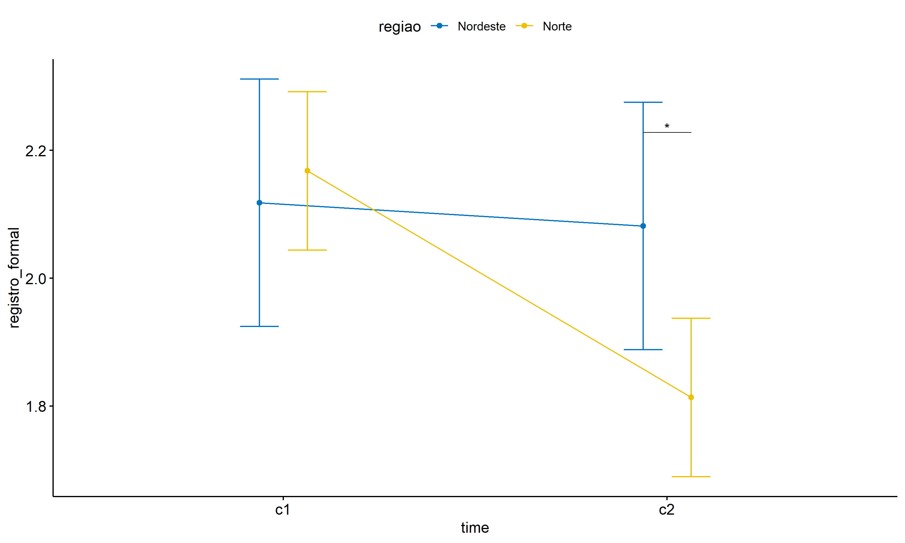<!-- -->

``` r
(pwc <- ldat %>% group_by(regiao) %>%
    emmeans_test(registro_formal ~ time, detailed = T, p.adjust.method = "bonferroni"))
```

    ## # A tibble: 2 × 15
    ##   regiao   term  .y.     group1 group2 null.value estimate     se    df conf.low
    ## * <fct>    <chr> <chr>   <chr>  <chr>       <dbl>    <dbl>  <dbl> <dbl>    <dbl>
    ## 1 Nordeste time  regist… c1     c2              0   0.0364 0.139    374   -0.237
    ## 2 Norte    time  regist… c1     c2              0   0.354  0.0892   374    0.179
    ## # ℹ 5 more variables: conf.high <dbl>, statistic <dbl>, p <dbl>, p.adj <dbl>,
    ## #   p.adj.signif <chr>

| regiao   | term | .y.             | group1 | group2 | null.value | estimate |    se |  df | conf.low | conf.high | statistic |     p | p.adj | p.adj.signif |
|:---------|:-----|:----------------|:-------|:-------|-----------:|---------:|------:|----:|---------:|----------:|----------:|------:|------:|:-------------|
| Nordeste | time | registro_formal | c1     | c2     |          0 |    0.036 | 0.139 | 374 |   -0.237 |      0.31 |     0.261 | 0.794 | 0.794 | ns           |
| Norte    | time | registro_formal | c1     | c2     |          0 |    0.354 | 0.089 | 374 |    0.179 |      0.53 |     3.976 | 0.000 | 0.000 | \*\*\*\*     |

``` r
(emms <- get_emmeans(pwc))
```

    ## # A tibble: 4 × 8
    ##   regiao   time  emmean     se    df conf.low conf.high method      
    ##   <fct>    <fct>  <dbl>  <dbl> <dbl>    <dbl>     <dbl> <chr>       
    ## 1 Nordeste c1      2.12 0.0984   374     1.92      2.31 Emmeans test
    ## 2 Nordeste c2      2.08 0.0984   374     1.89      2.28 Emmeans test
    ## 3 Norte    c1      2.17 0.0630   374     2.04      2.29 Emmeans test
    ## 4 Norte    c2      1.81 0.0630   374     1.69      1.94 Emmeans test

| regiao   | time | emmean |    se |  df | conf.low | conf.high | method       |
|:---------|:-----|-------:|------:|----:|---------:|----------:|:-------------|
| Nordeste | c1   |  2.118 | 0.098 | 374 |    1.925 |     2.312 | Emmeans test |
| Nordeste | c2   |  2.082 | 0.098 | 374 |    1.888 |     2.275 | Emmeans test |
| Norte    | c1   |  2.168 | 0.063 | 374 |    2.044 |     2.292 | Emmeans test |
| Norte    | c2   |  1.813 | 0.063 | 374 |    1.689 |     1.937 | Emmeans test |

``` r
emms.gg <- emms[which(emms$regiao == "Centro-Oeste"),]
if (nrow(emms.gg) > 0)
  ggline(emms.gg, x = "time", y = "emmean", color = "#0073C2FF", ylab = "registro_formal") +
    geom_errorbar(aes(ymin = conf.low, ymax = conf.high),
                  width = 0.2, color = "#0073C2FF") +
    stat_pvalue_manual(
      add_xy_position(pwc[which(pwc$regiao == "Centro-Oeste"),],
                      x = "time", fun = "mean_se"),
      hide.ns = T, color = "#0073C2FF", tip.length = F) +
    labs(title = "regiao: Centro-Oeste")+
    theme(legend.text = element_blank())
```

``` r
emms.gg <- emms[which(emms$regiao == "Nordeste"),]
if (nrow(emms.gg) > 0)
  ggline(emms.gg, x = "time", y = "emmean", color = "#EFC000FF", ylab = "registro_formal") +
    geom_errorbar(aes(ymin = conf.low, ymax = conf.high),
                  width = 0.2, color = "#EFC000FF") +
    stat_pvalue_manual(
      add_xy_position(pwc[which(pwc$regiao == "Nordeste"),],
                      x = "time", fun = "mean_se"),
      hide.ns = T, color = "#EFC000FF", tip.length = F) +
    labs(title = "regiao: Nordeste")+
    theme(legend.text = element_blank())
```

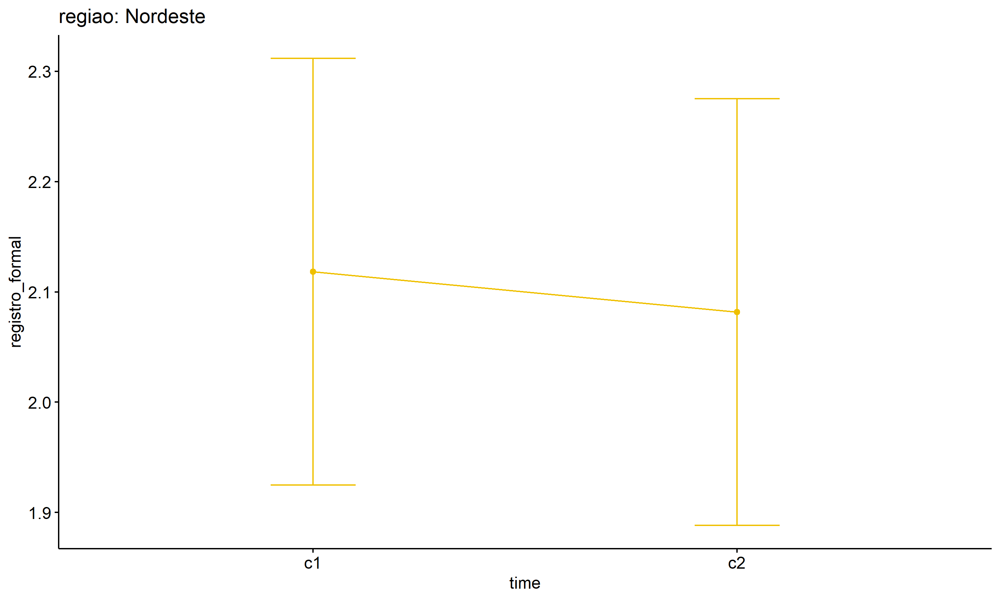<!-- -->

``` r
emms.gg <- emms[which(emms$regiao == "Norte"),]
if (nrow(emms.gg) > 0)
  ggline(emms.gg, x = "time", y = "emmean", color = "#868686FF", ylab = "registro_formal") +
    geom_errorbar(aes(ymin = conf.low, ymax = conf.high),
                  width = 0.2, color = "#868686FF") +
    stat_pvalue_manual(
      add_xy_position(pwc[which(pwc$regiao == "Norte"),],
                      x = "time", fun = "mean_se"),
      hide.ns = T, color = "#868686FF", tip.length = F) +
    labs(title = "regiao: Norte")+
    theme(legend.text = element_blank())
```

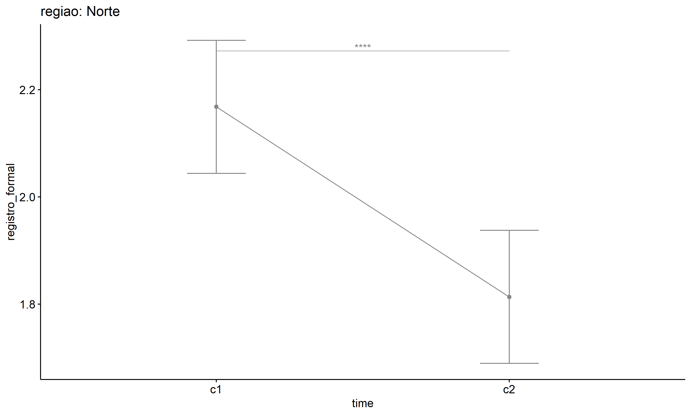<!-- -->

``` r
emms.gg <- emms[which(emms$regiao == "Sudeste"),]
if (nrow(emms.gg) > 0)
  ggline(emms.gg, x = "time", y = "emmean", color = "#CD534CFF", ylab = "registro_formal") +
    geom_errorbar(aes(ymin = conf.low, ymax = conf.high),
                  width = 0.2, color = "#CD534CFF") +
    stat_pvalue_manual(
      add_xy_position(pwc[which(pwc$regiao == "Sudeste"),],
                      x = "time", fun = "mean_se"),
      hide.ns = T, color = "#CD534CFF", tip.length = F) +
    labs(title = "regiao: Sudeste")+
    theme(legend.text = element_blank())
```

``` r
emms.gg <- emms[which(emms$regiao == "Sul"),]
if (nrow(emms.gg) > 0)
  ggline(emms.gg, x = "time", y = "emmean", color = "#7AA6DCFF", ylab = "registro_formal") +
    geom_errorbar(aes(ymin = conf.low, ymax = conf.high),
                  width = 0.2, color = "#7AA6DCFF") +
    stat_pvalue_manual(
      add_xy_position(pwc[which(pwc$regiao == "Sul"),],
                      x = "time", fun = "mean_se"),
      hide.ns = T, color = "#7AA6DCFF", tip.length = F) +
    labs(title = "regiao: Sul")+
    theme(legend.text = element_blank())
```

## PairWise Computation after removing non.normal data

``` r
if (length(non.ids) > 0)
  (pwc2 <- ldat2 %>% group_by(time) %>%
     emmeans_test(registro_formal ~ regiao, detailed = T, p.adjust.method = "bonferroni"))
```

    ## # A tibble: 2 × 15
    ##   time  term   .y.        group1 group2 null.value estimate    se    df conf.low
    ## * <fct> <chr>  <chr>      <chr>  <chr>       <dbl>    <dbl> <dbl> <dbl>    <dbl>
    ## 1 c1    regiao registro_… Norde… Norte           0  -0.0525 0.118   368  -0.285 
    ## 2 c2    regiao registro_… Norde… Norte           0   0.263  0.118   368   0.0309
    ## # ℹ 5 more variables: conf.high <dbl>, statistic <dbl>, p <dbl>, p.adj <dbl>,
    ## #   p.adj.signif <chr>

| time | term   | .y.             | group1   | group2 | null.value | estimate |    se |  df | conf.low | conf.high | statistic |     p | p.adj | p.adj.signif |
|:-----|:-------|:----------------|:---------|:-------|-----------:|---------:|------:|----:|---------:|----------:|----------:|------:|------:|:-------------|
| c1   | regiao | registro_formal | Nordeste | Norte  |          0 |   -0.053 | 0.118 | 368 |   -0.285 |     0.180 |    -0.444 | 0.657 | 0.657 | ns           |
| c2   | regiao | registro_formal | Nordeste | Norte  |          0 |    0.263 | 0.118 | 368 |    0.031 |     0.496 |     2.228 | 0.026 | 0.026 | \*           |

``` r
if (length(non.ids) > 0)
  (emms2 <- get_emmeans(pwc2))
```

    ## # A tibble: 4 × 8
    ##   time  regiao   emmean     se    df conf.low conf.high method      
    ##   <fct> <fct>     <dbl>  <dbl> <dbl>    <dbl>     <dbl> <chr>       
    ## 1 c1    Nordeste   2.12 0.100    368     1.92      2.31 Emmeans test
    ## 2 c1    Norte      2.17 0.0625   368     2.04      2.29 Emmeans test
    ## 3 c2    Nordeste   2.08 0.100    368     1.88      2.27 Emmeans test
    ## 4 c2    Norte      1.81 0.0625   368     1.69      1.94 Emmeans test

| time | regiao   | emmean |    se |  df | conf.low | conf.high | method       |
|:-----|:---------|-------:|------:|----:|---------:|----------:|:-------------|
| c1   | Nordeste |  2.115 | 0.100 | 368 |    1.918 |     2.313 | Emmeans test |
| c1   | Norte    |  2.168 | 0.063 | 368 |    2.045 |     2.291 | Emmeans test |
| c2   | Nordeste |  2.077 | 0.100 | 368 |    1.880 |     2.274 | Emmeans test |
| c2   | Norte    |  1.813 | 0.063 | 368 |    1.690 |     1.936 | Emmeans test |

``` r
if (length(non.ids) > 0) {
  pwc2 <- add_xy_position(pwc2, x = "time", fun = "mean_se", dodge = 0.25)
  pd2 <- position_dodge(width = 0.25)
  
  ggline(emms2, x = "time", y = "emmean", color = "regiao",
         palette = c("#0073C2FF","#EFC000FF","#868686FF","#CD534CFF","#7AA6DCFF"),
         position = pd, ylab = "registro_formal") +
    geom_errorbar(aes(ymin = conf.low, ymax = conf.high, color = regiao),
                position = pd, width = 0.2) +
    stat_pvalue_manual(pwc2, hide.ns = T, tip.length = F, linetype = 1)
}
```

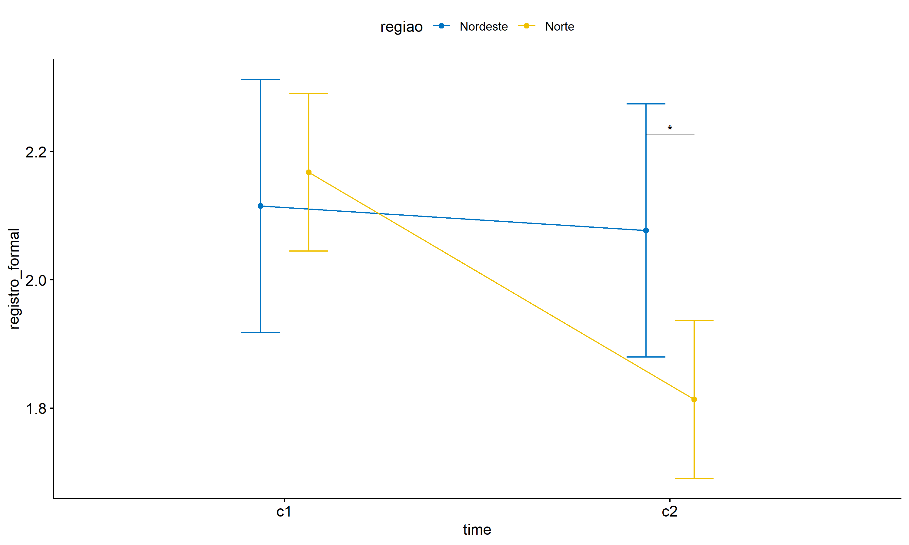<!-- -->

``` r
if (length(non.ids) > 0)
  (pwc2 <- ldat2 %>% group_by(regiao) %>%
     emmeans_test(registro_formal ~ time, detailed = T, p.adjust.method = "bonferroni"))
```

    ## # A tibble: 2 × 15
    ##   regiao   term  .y.     group1 group2 null.value estimate     se    df conf.low
    ## * <fct>    <chr> <chr>   <chr>  <chr>       <dbl>    <dbl>  <dbl> <dbl>    <dbl>
    ## 1 Nordeste time  regist… c1     c2              0   0.0385 0.142    368   -0.241
    ## 2 Norte    time  regist… c1     c2              0   0.354  0.0884   368    0.181
    ## # ℹ 5 more variables: conf.high <dbl>, statistic <dbl>, p <dbl>, p.adj <dbl>,
    ## #   p.adj.signif <chr>

| regiao   | term | .y.             | group1 | group2 | null.value | estimate |    se |  df | conf.low | conf.high | statistic |     p | p.adj | p.adj.signif |
|:---------|:-----|:----------------|:-------|:-------|-----------:|---------:|------:|----:|---------:|----------:|----------:|------:|------:|:-------------|
| Nordeste | time | registro_formal | c1     | c2     |          0 |    0.038 | 0.142 | 368 |   -0.241 |     0.318 |     0.271 | 0.787 | 0.787 | ns           |
| Norte    | time | registro_formal | c1     | c2     |          0 |    0.354 | 0.088 | 368 |    0.181 |     0.528 |     4.009 | 0.000 | 0.000 | \*\*\*\*     |

``` r
if (length(non.ids) > 0)
  (emms2 <- get_emmeans(pwc2))
```

    ## # A tibble: 4 × 8
    ##   regiao   time  emmean     se    df conf.low conf.high method      
    ##   <fct>    <fct>  <dbl>  <dbl> <dbl>    <dbl>     <dbl> <chr>       
    ## 1 Nordeste c1      2.12 0.100    368     1.92      2.31 Emmeans test
    ## 2 Nordeste c2      2.08 0.100    368     1.88      2.27 Emmeans test
    ## 3 Norte    c1      2.17 0.0625   368     2.04      2.29 Emmeans test
    ## 4 Norte    c2      1.81 0.0625   368     1.69      1.94 Emmeans test

| regiao   | time | emmean |    se |  df | conf.low | conf.high | method       |
|:---------|:-----|-------:|------:|----:|---------:|----------:|:-------------|
| Nordeste | c1   |  2.115 | 0.100 | 368 |    1.918 |     2.313 | Emmeans test |
| Nordeste | c2   |  2.077 | 0.100 | 368 |    1.880 |     2.274 | Emmeans test |
| Norte    | c1   |  2.168 | 0.063 | 368 |    2.045 |     2.291 | Emmeans test |
| Norte    | c2   |  1.813 | 0.063 | 368 |    1.690 |     1.936 | Emmeans test |

``` r
if (length(non.ids) > 0) {
  emms.gg <- emms2[which(emms2$regiao == "Centro-Oeste"),]
  if (nrow(emms.gg) > 0)
    ggline(emms.gg, x = "time", y = "emmean", color = "#0073C2FF", ylab = "registro_formal") +
    geom_errorbar(aes(ymin = conf.low, ymax = conf.high),
                  width = 0.2, color = "#0073C2FF") +
    stat_pvalue_manual(
      add_xy_position(pwc[which(pwc$regiao == "Centro-Oeste"),],
                      x = "time", fun = "mean_se"),
      hide.ns = T, color = "#0073C2FF", tip.length = F) +
    labs(title = "regiao: Centro-Oeste") +
    theme(legend.text = element_blank())
}
```

``` r
if (length(non.ids) > 0) {
  emms.gg <- emms2[which(emms2$regiao == "Nordeste"),]
  if (nrow(emms.gg) > 0)
    ggline(emms.gg, x = "time", y = "emmean", color = "#EFC000FF", ylab = "registro_formal") +
    geom_errorbar(aes(ymin = conf.low, ymax = conf.high),
                  width = 0.2, color = "#EFC000FF") +
    stat_pvalue_manual(
      add_xy_position(pwc[which(pwc$regiao == "Nordeste"),],
                      x = "time", fun = "mean_se"),
      hide.ns = T, color = "#EFC000FF", tip.length = F) +
    labs(title = "regiao: Nordeste") +
    theme(legend.text = element_blank())
}
```

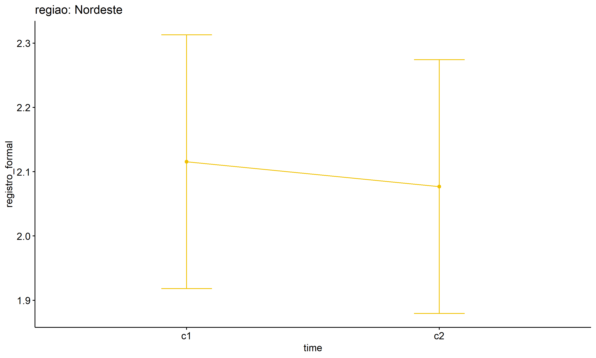<!-- -->

``` r
if (length(non.ids) > 0) {
  emms.gg <- emms2[which(emms2$regiao == "Norte"),]
  if (nrow(emms.gg) > 0)
    ggline(emms.gg, x = "time", y = "emmean", color = "#868686FF", ylab = "registro_formal") +
    geom_errorbar(aes(ymin = conf.low, ymax = conf.high),
                  width = 0.2, color = "#868686FF") +
    stat_pvalue_manual(
      add_xy_position(pwc[which(pwc$regiao == "Norte"),],
                      x = "time", fun = "mean_se"),
      hide.ns = T, color = "#868686FF", tip.length = F) +
    labs(title = "regiao: Norte") +
    theme(legend.text = element_blank())
}
```

<!-- -->

``` r
if (length(non.ids) > 0) {
  emms.gg <- emms2[which(emms2$regiao == "Sudeste"),]
  if (nrow(emms.gg) > 0)
    ggline(emms.gg, x = "time", y = "emmean", color = "#CD534CFF", ylab = "registro_formal") +
    geom_errorbar(aes(ymin = conf.low, ymax = conf.high),
                  width = 0.2, color = "#CD534CFF") +
    stat_pvalue_manual(
      add_xy_position(pwc[which(pwc$regiao == "Sudeste"),],
                      x = "time", fun = "mean_se"),
      hide.ns = T, color = "#CD534CFF", tip.length = F) +
    labs(title = "regiao: Sudeste") +
    theme(legend.text = element_blank())
}
```

``` r
if (length(non.ids) > 0) {
  emms.gg <- emms2[which(emms2$regiao == "Sul"),]
  if (nrow(emms.gg) > 0)
    ggline(emms.gg, x = "time", y = "emmean", color = "#7AA6DCFF", ylab = "registro_formal") +
    geom_errorbar(aes(ymin = conf.low, ymax = conf.high),
                  width = 0.2, color = "#7AA6DCFF") +
    stat_pvalue_manual(
      add_xy_position(pwc[which(pwc$regiao == "Sul"),],
                      x = "time", fun = "mean_se"),
      hide.ns = T, color = "#7AA6DCFF", tip.length = F) +
    labs(title = "regiao: Sul") +
    theme(legend.text = element_blank())
}
```
