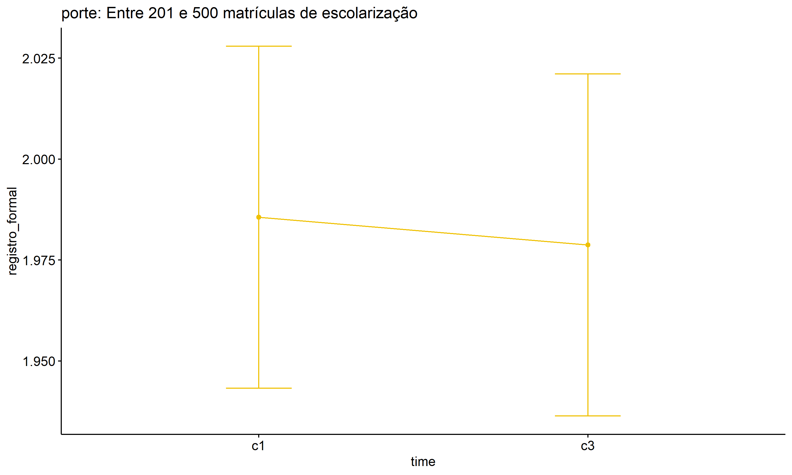

ANOVA test for registro_formal
================
Geiser C. Challco <geiser@alumni.usp.br>

- [ANOVA: registro_formal ~ time](#anova-registro_formal--time)
  - [Data Preparation](#data-preparation)
  - [Summary Statistics](#summary-statistics)
  - [ANOVA Computation](#anova-computation)
  - [PairWise Computation](#pairwise-computation)
- [ANOVA: registro_formal ~ time\*gender +
  Error(id/time)](#anova-registro_formal--timegender--erroridtime)
  - [Data Preparation](#data-preparation-1)
    - [Check assumptions: Identifying
      Outliers](#check-assumptions-identifying-outliers)
    - [Check assumptions: Normality
      Test](#check-assumptions-normality-test)
    - [Summary Statistics](#summary-statistics-1)
  - [ANOVA Computation](#anova-computation-1)
  - [ANOVA Computation after removing non.normal
    data](#anova-computation-after-removing-nonnormal-data)
  - [PairWise Computation](#pairwise-computation-1)
  - [PairWise Computation after removing non.normal
    data](#pairwise-computation-after-removing-nonnormal-data)
- [ANOVA: registro_formal ~ time\*localizacao +
  Error(id/time)](#anova-registro_formal--timelocalizacao--erroridtime)
  - [Data Preparation](#data-preparation-2)
    - [Check assumptions: Identifying
      Outliers](#check-assumptions-identifying-outliers-1)
    - [Check assumptions: Normality
      Test](#check-assumptions-normality-test-1)
    - [Summary Statistics](#summary-statistics-2)
  - [ANOVA Computation](#anova-computation-2)
  - [ANOVA Computation after removing non.normal
    data](#anova-computation-after-removing-nonnormal-data-1)
  - [PairWise Computation](#pairwise-computation-2)
  - [PairWise Computation after removing non.normal
    data](#pairwise-computation-after-removing-nonnormal-data-1)
- [ANOVA: registro_formal ~ time\*regiao +
  Error(id/time)](#anova-registro_formal--timeregiao--erroridtime)
  - [Data Preparation](#data-preparation-3)
    - [Check assumptions: Identifying
      Outliers](#check-assumptions-identifying-outliers-2)
    - [Check assumptions: Normality
      Test](#check-assumptions-normality-test-2)
    - [Summary Statistics](#summary-statistics-3)
  - [ANOVA Computation](#anova-computation-3)
  - [ANOVA Computation after removing non.normal
    data](#anova-computation-after-removing-nonnormal-data-2)
  - [PairWise Computation](#pairwise-computation-3)
  - [PairWise Computation after removing non.normal
    data](#pairwise-computation-after-removing-nonnormal-data-2)
- [ANOVA: registro_formal ~ time\*porte +
  Error(id/time)](#anova-registro_formal--timeporte--erroridtime)
  - [Data Preparation](#data-preparation-4)
    - [Check assumptions: Identifying
      Outliers](#check-assumptions-identifying-outliers-3)
    - [Check assumptions: Normality
      Test](#check-assumptions-normality-test-3)
    - [Summary Statistics](#summary-statistics-4)
  - [ANOVA Computation](#anova-computation-4)
  - [ANOVA Computation after removing non.normal
    data](#anova-computation-after-removing-nonnormal-data-3)
  - [PairWise Computation](#pairwise-computation-4)
  - [PairWise Computation after removing non.normal
    data](#pairwise-computation-after-removing-nonnormal-data-3)

``` r
dat <- read_excel("../data/data.xlsx", sheet = "alunos_ef59")

escolas <- read_excel("../data/data.xlsx", sheet = "escolas")
edat <- merge(dat, escolas, by = "cod_escola", all.x = T)
```

# ANOVA: registro_formal ~ time

## Data Preparation

``` r
data <- edat[,c("aluno_id","ciclo","registro_formal")]
data <- data[data$ciclo %in% c("Primeiro Ciclo","Terceiro Ciclo"),]
data$ciclo <- factor(data$ciclo, c("Primeiro Ciclo","Terceiro Ciclo"))
data <- unique(data)

wdat <- spread(data, ciclo, registro_formal)
wdat <- wdat[complete.cases(wdat),]
colnames(wdat) <- c("id","c1","c3")

ldat <- gather(wdat, key = time, value = registro_formal, c1,c3) %>%
  convert_as_factor(id, time)
ldat <- rshinystatistics::remove_group_data(ldat, "registro_formal", "time", n.limit = 30)
```

## Summary Statistics

``` r
(sdat <- ldat %>% group_by(time) %>%
   get_summary_stats(registro_formal, type = "mean_sd"))
```

    ## # A tibble: 2 × 5
    ##   time  variable            n  mean    sd
    ##   <fct> <fct>           <dbl> <dbl> <dbl>
    ## 1 c1    registro_formal  3997  1.89 0.688
    ## 2 c3    registro_formal  3997  1.82 0.732

| time | variable        |    n |  mean |    sd |
|:-----|:----------------|-----:|------:|------:|
| c1   | registro_formal | 3997 | 1.889 | 0.688 |
| c3   | registro_formal | 3997 | 1.821 | 0.732 |

## ANOVA Computation

``` r
(res.aov <- anova_test(ldat, dv = registro_formal, wid = id, within = time))
```

    ## ANOVA Table (type III tests)
    ## 
    ##   Effect DFn  DFd     F       p p<.05   ges
    ## 1   time   1 3996 20.39 6.5e-06     * 0.002

## PairWise Computation

``` r
(pwc <- ldat %>% emmeans_test(registro_formal ~ time, detailed = T, p.adjust.method = "bonferroni"))
```

    ## # A tibble: 1 × 14
    ##   term  .y.    group1 group2 null.value estimate     se    df conf.low conf.high
    ## * <chr> <chr>  <chr>  <chr>       <dbl>    <dbl>  <dbl> <dbl>    <dbl>     <dbl>
    ## 1 time  regis… c1     c3              0   0.0679 0.0159  7992   0.0368    0.0991
    ## # ℹ 4 more variables: statistic <dbl>, p <dbl>, p.adj <dbl>, p.adj.signif <chr>

| term | .y.             | group1 | group2 | null.value | estimate |    se |   df | conf.low | conf.high | statistic |   p | p.adj | p.adj.signif |
|:-----|:----------------|:-------|:-------|-----------:|---------:|------:|-----:|---------:|----------:|----------:|----:|------:|:-------------|
| time | registro_formal | c1     | c3     |          0 |    0.068 | 0.016 | 7992 |    0.037 |     0.099 |     4.276 |   0 |     0 | \*\*\*\*     |

``` r
pwc <- add_xy_position(pwc, x = "time", fun = "mean_se")
ggline(get_emmeans(pwc), x = "time", y = "emmean", ylab = "registro_formal") +
  geom_errorbar(aes(ymin = conf.low, ymax = conf.high), width = 0.2) +
  stat_pvalue_manual(pwc, hide.ns = T, tip.length = F)
```

<!-- -->

# ANOVA: registro_formal ~ time\*gender + Error(id/time)

## Data Preparation

``` r
data <- edat[,c("aluno_id","gender","ciclo","registro_formal")]
data <- data[data$ciclo %in% c("Primeiro Ciclo","Terceiro Ciclo"),]
data$ciclo <- factor(data$ciclo, c("Primeiro Ciclo","Terceiro Ciclo"))
data <- unique(data)

wdat <- spread(data, ciclo, registro_formal)
wdat <- wdat[complete.cases(wdat),]
colnames(wdat) <- c("id","gender","c1","c3")

ldat <- gather(wdat, key = time, value = registro_formal, c1,c3) %>%
  convert_as_factor(id, time)
ldat <- remove_group_data(ldat, "registro_formal", c("time", "gender"), n.limit = 30)
ldat$gender <- factor(ldat$gender, sort(unique(ldat$gender)))
```

### Check assumptions: Identifying Outliers

``` r
outliers <- identify_outliers(group_by(ldat, time, gender), registro_formal)
(outliers <- outliers[outliers$is.extreme == T,])
```

    ## # A tibble: 20 × 6
    ##    gender time  id                   registro_formal is.outlier is.extreme
    ##    <fct>  <fct> <fct>                          <dbl> <lgl>      <lgl>     
    ##  1 Male   c1    8zkBFEUAFkixLZcY9EP0               4 TRUE       TRUE      
    ##  2 Male   c1    baitWvlruSoQV9MUrIgr               4 TRUE       TRUE      
    ##  3 Male   c1    IS6H8SGCc2Qi3Sc76Hdu               4 TRUE       TRUE      
    ##  4 Male   c1    iyHsVjMJJRSYypImpewF               4 TRUE       TRUE      
    ##  5 Male   c1    K7BVRqiiNsRjisKvt85x               4 TRUE       TRUE      
    ##  6 Male   c1    KaCG3CroQpZookJ14Oed               4 TRUE       TRUE      
    ##  7 Male   c1    kG5EWNlF7iFys7u9NU2S               4 TRUE       TRUE      
    ##  8 Male   c1    kNBsYSydO1Ohmh5OxN1R               4 TRUE       TRUE      
    ##  9 Male   c1    KsNDea9pyWSqZNmzKPcL               4 TRUE       TRUE      
    ## 10 Male   c1    KxutDWOwf7c7zs3WzsVK               4 TRUE       TRUE      
    ## 11 Male   c1    lcQkFKelmfF3AvUDkp2E               4 TRUE       TRUE      
    ## 12 Male   c1    oCdc6ouxkfn0i0Q5NmmU               4 TRUE       TRUE      
    ## 13 Male   c1    sIoy2GB8m7C2p6qtFBB4               4 TRUE       TRUE      
    ## 14 Male   c1    SshX9BXtzAfFlsOTZAid               4 TRUE       TRUE      
    ## 15 Male   c1    tbaJOm2fecWIzyknkmjZ               4 TRUE       TRUE      
    ## 16 Male   c1    UqLUlHER7l3QQ8FNufkX               4 TRUE       TRUE      
    ## 17 Male   c1    VBdctSnsWQ6Xz1eKn53t               4 TRUE       TRUE      
    ## 18 Male   c1    wgVofz459XsBlqQs3fln               4 TRUE       TRUE      
    ## 19 Male   c1    WliDxeLsUXTgNB5sq98e               4 TRUE       TRUE      
    ## 20 Male   c1    YpnkzyPiMacKwl1V5xUY               4 TRUE       TRUE

| gender | time | id                   | registro_formal | is.outlier | is.extreme |
|:-------|:-----|:---------------------|----------------:|:-----------|:-----------|
| Male   | c1   | 8zkBFEUAFkixLZcY9EP0 |               4 | TRUE       | TRUE       |
| Male   | c1   | baitWvlruSoQV9MUrIgr |               4 | TRUE       | TRUE       |
| Male   | c1   | IS6H8SGCc2Qi3Sc76Hdu |               4 | TRUE       | TRUE       |
| Male   | c1   | iyHsVjMJJRSYypImpewF |               4 | TRUE       | TRUE       |
| Male   | c1   | K7BVRqiiNsRjisKvt85x |               4 | TRUE       | TRUE       |
| Male   | c1   | KaCG3CroQpZookJ14Oed |               4 | TRUE       | TRUE       |
| Male   | c1   | kG5EWNlF7iFys7u9NU2S |               4 | TRUE       | TRUE       |
| Male   | c1   | kNBsYSydO1Ohmh5OxN1R |               4 | TRUE       | TRUE       |
| Male   | c1   | KsNDea9pyWSqZNmzKPcL |               4 | TRUE       | TRUE       |
| Male   | c1   | KxutDWOwf7c7zs3WzsVK |               4 | TRUE       | TRUE       |
| Male   | c1   | lcQkFKelmfF3AvUDkp2E |               4 | TRUE       | TRUE       |
| Male   | c1   | oCdc6ouxkfn0i0Q5NmmU |               4 | TRUE       | TRUE       |
| Male   | c1   | sIoy2GB8m7C2p6qtFBB4 |               4 | TRUE       | TRUE       |
| Male   | c1   | SshX9BXtzAfFlsOTZAid |               4 | TRUE       | TRUE       |
| Male   | c1   | tbaJOm2fecWIzyknkmjZ |               4 | TRUE       | TRUE       |
| Male   | c1   | UqLUlHER7l3QQ8FNufkX |               4 | TRUE       | TRUE       |
| Male   | c1   | VBdctSnsWQ6Xz1eKn53t |               4 | TRUE       | TRUE       |
| Male   | c1   | wgVofz459XsBlqQs3fln |               4 | TRUE       | TRUE       |
| Male   | c1   | WliDxeLsUXTgNB5sq98e |               4 | TRUE       | TRUE       |
| Male   | c1   | YpnkzyPiMacKwl1V5xUY |               4 | TRUE       | TRUE       |

### Check assumptions: Normality Test

``` r
(normality.df <- normality.test.per.groups(ldat, "registro_formal", c("time", "gender")))
```

    ##               var        variable time gender    n  skewness    kurtosis
    ## 1 registro_formal registro_formal   c1 Female 1880 0.4434370 -0.35878735
    ## 2 registro_formal registro_formal   c1   Male 1927 0.5718729 -0.03870002
    ## 3 registro_formal registro_formal   c3 Female 1880 0.5313224 -0.18890043
    ## 4 registro_formal registro_formal   c3   Male 1927 0.6208678 -0.18124009
    ##   symmetry statistic     method            p p.signif normality
    ## 1      YES  71.28458 D'Agostino 3.330669e-16     ****         -
    ## 2       NO  92.31754 D'Agostino 0.000000e+00     ****         -
    ## 3       NO  82.06028 D'Agostino 0.000000e+00     ****         -
    ## 4       NO 109.30168 D'Agostino 0.000000e+00     ****         -

| var             | variable        | time | gender |    n | skewness | kurtosis | symmetry | statistic | method     |   p | p.signif | normality |
|:----------------|:----------------|:-----|:-------|-----:|---------:|---------:|:---------|----------:|:-----------|----:|:---------|:----------|
| registro_formal | registro_formal | c1   | Female | 1880 |    0.443 |   -0.359 | YES      |    71.285 | D’Agostino |   0 | \*\*\*\* | \-        |
| registro_formal | registro_formal | c1   | Male   | 1927 |    0.572 |   -0.039 | NO       |    92.318 | D’Agostino |   0 | \*\*\*\* | \-        |
| registro_formal | registro_formal | c3   | Female | 1880 |    0.531 |   -0.189 | NO       |    82.060 | D’Agostino |   0 | \*\*\*\* | \-        |
| registro_formal | registro_formal | c3   | Male   | 1927 |    0.621 |   -0.181 | NO       |   109.302 | D’Agostino |   0 | \*\*\*\* | \-        |

``` r
(non.ids <- unique(do.call(
  c, lapply(which(normality.df$normality == 'NO'), FUN = function(i) {
  idx = which(ldat$time == normality.df$time[i] &
                ldat$gender == normality.df$gender[i])
  getNonNormal(ldat$"registro_formal"[idx], ldat$id[idx])
}))))
```

    ## NULL

``` r
if (length(non.ids) > 0)
  ldat2 <- ldat[!ldat$id %in% non.ids,]
```

### Summary Statistics

``` r
(sdat <- ldat %>% group_by(time, gender) %>%
   get_summary_stats(registro_formal, type = "mean_sd"))
```

    ## # A tibble: 4 × 6
    ##   gender time  variable            n  mean    sd
    ##   <fct>  <fct> <fct>           <dbl> <dbl> <dbl>
    ## 1 Female c1    registro_formal  1880  1.92 0.702
    ## 2 Male   c1    registro_formal  1927  1.86 0.676
    ## 3 Female c3    registro_formal  1880  1.84 0.721
    ## 4 Male   c3    registro_formal  1927  1.80 0.736

| gender | time | variable        |    n |  mean |    sd |
|:-------|:-----|:----------------|-----:|------:|------:|
| Female | c1   | registro_formal | 1880 | 1.917 | 0.702 |
| Male   | c1   | registro_formal | 1927 | 1.862 | 0.676 |
| Female | c3   | registro_formal | 1880 | 1.840 | 0.721 |
| Male   | c3   | registro_formal | 1927 | 1.801 | 0.736 |

``` r
if (length(non.ids) > 0)
  (sdat <- ldat2 %>% group_by(time, gender) %>%
      get_summary_stats(registro_formal, type = "mean_sd"))
```

| gender | time | variable        |    n |  mean |    sd |
|:-------|:-----|:----------------|-----:|------:|------:|
| Female | c1   | registro_formal | 1880 | 1.917 | 0.702 |
| Male   | c1   | registro_formal | 1927 | 1.862 | 0.676 |
| Female | c3   | registro_formal | 1880 | 1.840 | 0.721 |
| Male   | c3   | registro_formal | 1927 | 1.801 | 0.736 |

## ANOVA Computation

``` r
(res.aov <- anova_test(ldat, dv = registro_formal, wid = id, between = gender, within = time))
```

    ## ANOVA Table (type III tests)
    ## 
    ##        Effect DFn  DFd      F        p p<.05      ges
    ## 1      gender   1 3805  7.643 6.00e-03     * 1.00e-03
    ## 2        time   1 3805 20.047 7.78e-06     * 2.00e-03
    ## 3 gender:time   1 3805  0.294 5.88e-01       3.48e-05

## ANOVA Computation after removing non.normal data

``` r
if (length(non.ids) > 0)
  (res.aov2 <- anova_test(ldat2, dv = registro_formal, wid = id, between = gender , within = time))
```

## PairWise Computation

``` r
(pwc <- ldat %>% group_by(time) %>%
   emmeans_test(registro_formal ~ gender, detailed = T, p.adjust.method = "bonferroni"))
```

    ## # A tibble: 2 × 15
    ##   time  term   .y.       group1 group2 null.value estimate     se    df conf.low
    ## * <fct> <chr>  <chr>     <chr>  <chr>       <dbl>    <dbl>  <dbl> <dbl>    <dbl>
    ## 1 c1    gender registro… Female Male            0   0.0555 0.0230  7610  0.0104 
    ## 2 c3    gender registro… Female Male            0   0.0387 0.0230  7610 -0.00632
    ## # ℹ 5 more variables: conf.high <dbl>, statistic <dbl>, p <dbl>, p.adj <dbl>,
    ## #   p.adj.signif <chr>

| time | term   | .y.             | group1 | group2 | null.value | estimate |    se |   df | conf.low | conf.high | statistic |     p | p.adj | p.adj.signif |
|:-----|:-------|:----------------|:-------|:-------|-----------:|---------:|------:|-----:|---------:|----------:|----------:|------:|------:|:-------------|
| c1   | gender | registro_formal | Female | Male   |          0 |    0.055 | 0.023 | 7610 |    0.010 |     0.101 |     2.413 | 0.016 | 0.016 | \*           |
| c3   | gender | registro_formal | Female | Male   |          0 |    0.039 | 0.023 | 7610 |   -0.006 |     0.084 |     1.685 | 0.092 | 0.092 | ns           |

``` r
(emms <- get_emmeans(pwc))
```

    ## # A tibble: 4 × 8
    ##   time  gender emmean     se    df conf.low conf.high method      
    ##   <fct> <fct>   <dbl>  <dbl> <dbl>    <dbl>     <dbl> <chr>       
    ## 1 c1    Female   1.92 0.0164  7610     1.89      1.95 Emmeans test
    ## 2 c1    Male     1.86 0.0161  7610     1.83      1.89 Emmeans test
    ## 3 c3    Female   1.84 0.0164  7610     1.81      1.87 Emmeans test
    ## 4 c3    Male     1.80 0.0161  7610     1.77      1.83 Emmeans test

| time | gender | emmean |    se |   df | conf.low | conf.high | method       |
|:-----|:-------|-------:|------:|-----:|---------:|----------:|:-------------|
| c1   | Female |  1.917 | 0.016 | 7610 |    1.885 |     1.949 | Emmeans test |
| c1   | Male   |  1.862 | 0.016 | 7610 |    1.830 |     1.893 | Emmeans test |
| c3   | Female |  1.840 | 0.016 | 7610 |    1.808 |     1.872 | Emmeans test |
| c3   | Male   |  1.801 | 0.016 | 7610 |    1.769 |     1.833 | Emmeans test |

``` r
pwc <- add_xy_position(pwc, x = "time", fun = "mean_se", dodge = 0.25)
pd <- position_dodge(width = 0.25)
ggline(emms, x = "time", y = "emmean", color = "gender",
       palette = c("#FF007F","#4D4DFF"),
       position = pd, ylab = "registro_formal") +
  geom_errorbar(aes(ymin = conf.low, ymax = conf.high, color = gender),
                position = pd, width = 0.2) +
  stat_pvalue_manual(pwc, hide.ns = T, tip.length = F, linetype = 1)
```

<!-- -->

``` r
(pwc <- ldat %>% group_by(gender) %>%
    emmeans_test(registro_formal ~ time, detailed = T, p.adjust.method = "bonferroni"))
```

    ## # A tibble: 2 × 15
    ##   gender term  .y.       group1 group2 null.value estimate     se    df conf.low
    ## * <fct>  <chr> <chr>     <chr>  <chr>       <dbl>    <dbl>  <dbl> <dbl>    <dbl>
    ## 1 Female time  registro… c1     c3              0   0.0774 0.0231  7610   0.0321
    ## 2 Male   time  registro… c1     c3              0   0.0607 0.0228  7610   0.0159
    ## # ℹ 5 more variables: conf.high <dbl>, statistic <dbl>, p <dbl>, p.adj <dbl>,
    ## #   p.adj.signif <chr>

| gender | term | .y.             | group1 | group2 | null.value | estimate |    se |   df | conf.low | conf.high | statistic |     p | p.adj | p.adj.signif |
|:-------|:-----|:----------------|:-------|:-------|-----------:|---------:|------:|-----:|---------:|----------:|----------:|------:|------:|:-------------|
| Female | time | registro_formal | c1     | c3     |          0 |    0.077 | 0.023 | 7610 |    0.032 |     0.123 |     3.349 | 0.001 | 0.001 | \*\*\*       |
| Male   | time | registro_formal | c1     | c3     |          0 |    0.061 | 0.023 | 7610 |    0.016 |     0.105 |     2.658 | 0.008 | 0.008 | \*\*         |

``` r
(emms <- get_emmeans(pwc))
```

    ## # A tibble: 4 × 8
    ##   gender time  emmean     se    df conf.low conf.high method      
    ##   <fct>  <fct>  <dbl>  <dbl> <dbl>    <dbl>     <dbl> <chr>       
    ## 1 Female c1      1.92 0.0164  7610     1.89      1.95 Emmeans test
    ## 2 Female c3      1.84 0.0164  7610     1.81      1.87 Emmeans test
    ## 3 Male   c1      1.86 0.0161  7610     1.83      1.89 Emmeans test
    ## 4 Male   c3      1.80 0.0161  7610     1.77      1.83 Emmeans test

| gender | time | emmean |    se |   df | conf.low | conf.high | method       |
|:-------|:-----|-------:|------:|-----:|---------:|----------:|:-------------|
| Female | c1   |  1.917 | 0.016 | 7610 |    1.885 |     1.949 | Emmeans test |
| Female | c3   |  1.840 | 0.016 | 7610 |    1.808 |     1.872 | Emmeans test |
| Male   | c1   |  1.862 | 0.016 | 7610 |    1.830 |     1.893 | Emmeans test |
| Male   | c3   |  1.801 | 0.016 | 7610 |    1.769 |     1.833 | Emmeans test |

``` r
emms.gg <- emms[which(emms$gender == "Female"),]
if (nrow(emms.gg) > 0)
  ggline(emms.gg, x = "time", y = "emmean", color = "#FF007F", ylab = "registro_formal") +
    geom_errorbar(aes(ymin = conf.low, ymax = conf.high),
                  width = 0.2, color = "#FF007F") +
    stat_pvalue_manual(
      add_xy_position(pwc[which(pwc$gender == "Female"),],
                      x = "time", fun = "mean_se"),
      hide.ns = T, color = "#FF007F", tip.length = F) +
    labs(title = "gender: Female")+
    theme(legend.text = element_blank())
```

<!-- -->

``` r
emms.gg <- emms[which(emms$gender == "Male"),]
if (nrow(emms.gg) > 0)
  ggline(emms.gg, x = "time", y = "emmean", color = "#4D4DFF", ylab = "registro_formal") +
    geom_errorbar(aes(ymin = conf.low, ymax = conf.high),
                  width = 0.2, color = "#4D4DFF") +
    stat_pvalue_manual(
      add_xy_position(pwc[which(pwc$gender == "Male"),],
                      x = "time", fun = "mean_se"),
      hide.ns = T, color = "#4D4DFF", tip.length = F) +
    labs(title = "gender: Male")+
    theme(legend.text = element_blank())
```

<!-- -->

## PairWise Computation after removing non.normal data

``` r
if (length(non.ids) > 0)
  (pwc2 <- ldat2 %>% group_by(time) %>%
     emmeans_test(registro_formal ~ gender, detailed = T, p.adjust.method = "bonferroni"))
```

``` r
if (length(non.ids) > 0)
  (emms2 <- get_emmeans(pwc2))
```

``` r
if (length(non.ids) > 0) {
  pwc2 <- add_xy_position(pwc2, x = "time", fun = "mean_se", dodge = 0.25)
  pd2 <- position_dodge(width = 0.25)
  
  ggline(emms2, x = "time", y = "emmean", color = "gender",
         palette = c("#FF007F","#4D4DFF"),
         position = pd, ylab = "registro_formal") +
    geom_errorbar(aes(ymin = conf.low, ymax = conf.high, color = gender),
                position = pd, width = 0.2) +
    stat_pvalue_manual(pwc2, hide.ns = T, tip.length = F, linetype = 1)
}
```

``` r
if (length(non.ids) > 0)
  (pwc2 <- ldat2 %>% group_by(gender) %>%
     emmeans_test(registro_formal ~ time, detailed = T, p.adjust.method = "bonferroni"))
```

``` r
if (length(non.ids) > 0)
  (emms2 <- get_emmeans(pwc2))
```

``` r
if (length(non.ids) > 0) {
  emms.gg <- emms2[which(emms2$gender == "Female"),]
  if (nrow(emms.gg) > 0)
    ggline(emms.gg, x = "time", y = "emmean", color = "#FF007F", ylab = "registro_formal") +
    geom_errorbar(aes(ymin = conf.low, ymax = conf.high),
                  width = 0.2, color = "#FF007F") +
    stat_pvalue_manual(
      add_xy_position(pwc[which(pwc$gender == "Female"),],
                      x = "time", fun = "mean_se"),
      hide.ns = T, color = "#FF007F", tip.length = F) +
    labs(title = "gender: Female") +
    theme(legend.text = element_blank())
}
```

``` r
if (length(non.ids) > 0) {
  emms.gg <- emms2[which(emms2$gender == "Male"),]
  if (nrow(emms.gg) > 0)
    ggline(emms.gg, x = "time", y = "emmean", color = "#4D4DFF", ylab = "registro_formal") +
    geom_errorbar(aes(ymin = conf.low, ymax = conf.high),
                  width = 0.2, color = "#4D4DFF") +
    stat_pvalue_manual(
      add_xy_position(pwc[which(pwc$gender == "Male"),],
                      x = "time", fun = "mean_se"),
      hide.ns = T, color = "#4D4DFF", tip.length = F) +
    labs(title = "gender: Male") +
    theme(legend.text = element_blank())
}
```

# ANOVA: registro_formal ~ time\*localizacao + Error(id/time)

## Data Preparation

``` r
data <- edat[,c("aluno_id","localizacao","ciclo","registro_formal")]
data <- data[data$ciclo %in% c("Primeiro Ciclo","Terceiro Ciclo"),]
data$ciclo <- factor(data$ciclo, c("Primeiro Ciclo","Terceiro Ciclo"))
data <- unique(data)

wdat <- spread(data, ciclo, registro_formal)
wdat <- wdat[complete.cases(wdat),]
colnames(wdat) <- c("id","localizacao","c1","c3")

ldat <- gather(wdat, key = time, value = registro_formal, c1,c3) %>%
  convert_as_factor(id, time)
ldat <- remove_group_data(ldat, "registro_formal", c("time", "localizacao"), n.limit = 30)
ldat$localizacao <- factor(ldat$localizacao, sort(unique(ldat$localizacao)))
```

### Check assumptions: Identifying Outliers

``` r
outliers <- identify_outliers(group_by(ldat, time, localizacao), registro_formal)
(outliers <- outliers[outliers$is.extreme == T,])
```

    ## # A tibble: 34 × 6
    ##    localizacao time  id                   registro_formal is.outlier is.extreme
    ##    <fct>       <fct> <fct>                          <dbl> <lgl>      <lgl>     
    ##  1 Urbana      c1    8zkBFEUAFkixLZcY9EP0               4 TRUE       TRUE      
    ##  2 Urbana      c1    baitWvlruSoQV9MUrIgr               4 TRUE       TRUE      
    ##  3 Urbana      c1    cWE83pbQy4poly6i3xSL               4 TRUE       TRUE      
    ##  4 Urbana      c1    eB5aBuW6Xqe2pUkHRfnL               4 TRUE       TRUE      
    ##  5 Urbana      c1    htbyM16UJUtyqr6P6Jfi               4 TRUE       TRUE      
    ##  6 Urbana      c1    IS6H8SGCc2Qi3Sc76Hdu               4 TRUE       TRUE      
    ##  7 Urbana      c1    iyHsVjMJJRSYypImpewF               4 TRUE       TRUE      
    ##  8 Urbana      c1    K7BVRqiiNsRjisKvt85x               4 TRUE       TRUE      
    ##  9 Urbana      c1    KaCG3CroQpZookJ14Oed               4 TRUE       TRUE      
    ## 10 Urbana      c1    kG5EWNlF7iFys7u9NU2S               4 TRUE       TRUE      
    ## # ℹ 24 more rows

| localizacao | time | id                   | registro_formal | is.outlier | is.extreme |
|:------------|:-----|:---------------------|----------------:|:-----------|:-----------|
| Urbana      | c1   | 8zkBFEUAFkixLZcY9EP0 |               4 | TRUE       | TRUE       |
| Urbana      | c1   | baitWvlruSoQV9MUrIgr |               4 | TRUE       | TRUE       |
| Urbana      | c1   | cWE83pbQy4poly6i3xSL |               4 | TRUE       | TRUE       |
| Urbana      | c1   | eB5aBuW6Xqe2pUkHRfnL |               4 | TRUE       | TRUE       |
| Urbana      | c1   | htbyM16UJUtyqr6P6Jfi |               4 | TRUE       | TRUE       |
| Urbana      | c1   | IS6H8SGCc2Qi3Sc76Hdu |               4 | TRUE       | TRUE       |
| Urbana      | c1   | iyHsVjMJJRSYypImpewF |               4 | TRUE       | TRUE       |
| Urbana      | c1   | K7BVRqiiNsRjisKvt85x |               4 | TRUE       | TRUE       |
| Urbana      | c1   | KaCG3CroQpZookJ14Oed |               4 | TRUE       | TRUE       |
| Urbana      | c1   | kG5EWNlF7iFys7u9NU2S |               4 | TRUE       | TRUE       |
| Urbana      | c1   | KsNDea9pyWSqZNmzKPcL |               4 | TRUE       | TRUE       |
| Urbana      | c1   | KVczxDz6q9HPFXqxmy1G |               4 | TRUE       | TRUE       |
| Urbana      | c1   | KxutDWOwf7c7zs3WzsVK |               4 | TRUE       | TRUE       |
| Urbana      | c1   | lcQkFKelmfF3AvUDkp2E |               4 | TRUE       | TRUE       |
| Urbana      | c1   | NfGKElZsj63hOTrB2e5M |               4 | TRUE       | TRUE       |
| Urbana      | c1   | nqxuyy3NvKzRwok1AiGQ |               4 | TRUE       | TRUE       |
| Urbana      | c1   | NXvel6ktXlJ6LeTLisl6 |               4 | TRUE       | TRUE       |
| Urbana      | c1   | oCdc6ouxkfn0i0Q5NmmU |               4 | TRUE       | TRUE       |
| Urbana      | c1   | qapU5TnFRgKOIiu6Mhxr |               4 | TRUE       | TRUE       |
| Urbana      | c1   | sIoy2GB8m7C2p6qtFBB4 |               4 | TRUE       | TRUE       |
| Urbana      | c1   | SshX9BXtzAfFlsOTZAid |               4 | TRUE       | TRUE       |
| Urbana      | c1   | tbaJOm2fecWIzyknkmjZ |               4 | TRUE       | TRUE       |
| Urbana      | c1   | tmFRnwP1EI4qeDkRvZDt |               4 | TRUE       | TRUE       |
| Urbana      | c1   | UqLUlHER7l3QQ8FNufkX |               4 | TRUE       | TRUE       |
| Urbana      | c1   | VBdctSnsWQ6Xz1eKn53t |               4 | TRUE       | TRUE       |
| Urbana      | c1   | wCRkCrxzSKzu3xtWPtn3 |               4 | TRUE       | TRUE       |
| Urbana      | c1   | WliDxeLsUXTgNB5sq98e |               4 | TRUE       | TRUE       |
| Urbana      | c1   | WzqnGmdKqtGjsbTzarNN |               4 | TRUE       | TRUE       |
| Urbana      | c1   | XifeitosHzGsyw8Rt5o3 |               4 | TRUE       | TRUE       |
| Urbana      | c1   | XqDnfcg1NBKmeeKWYgH6 |               4 | TRUE       | TRUE       |
| Urbana      | c1   | z2QmSnbU36Vigu2L11Ma |               4 | TRUE       | TRUE       |
| Urbana      | c1   | Z3wZBU0s09KRxFHiK8eK |               4 | TRUE       | TRUE       |
| Urbana      | c1   | ZdunfmhB62wiMqQtoC6K |               4 | TRUE       | TRUE       |
| Urbana      | c1   | ZQGZhiLTqE3hv9N29HCv |               4 | TRUE       | TRUE       |

### Check assumptions: Normality Test

``` r
(normality.df <- normality.test.per.groups(ldat, "registro_formal", c("time", "localizacao")))
```

    ##               var        variable time localizacao    n  skewness     kurtosis
    ## 1 registro_formal registro_formal   c1       Rural  683 0.3202977 -0.442942579
    ## 2 registro_formal registro_formal   c1      Urbana 3314 0.5385338 -0.160310017
    ## 3 registro_formal registro_formal   c3       Rural  683 0.2770754 -0.680213336
    ## 4 registro_formal registro_formal   c3      Urbana 3314 0.6481270  0.008555855
    ##   symmetry statistic     method            p p.signif normality
    ## 1      YES  19.72797 D'Agostino 5.201470e-05      ***         -
    ## 2       NO 145.92276 D'Agostino 0.000000e+00     ****         -
    ## 3      YES  38.49087 D'Agostino 4.383424e-09     ****         -
    ## 4       NO 196.30928 D'Agostino 0.000000e+00     ****         -

| var             | variable        | time | localizacao |    n | skewness | kurtosis | symmetry | statistic | method     |   p | p.signif | normality |
|:----------------|:----------------|:-----|:------------|-----:|---------:|---------:|:---------|----------:|:-----------|----:|:---------|:----------|
| registro_formal | registro_formal | c1   | Rural       |  683 |    0.320 |   -0.443 | YES      |    19.728 | D’Agostino |   0 | \*\*\*   | \-        |
| registro_formal | registro_formal | c1   | Urbana      | 3314 |    0.539 |   -0.160 | NO       |   145.923 | D’Agostino |   0 | \*\*\*\* | \-        |
| registro_formal | registro_formal | c3   | Rural       |  683 |    0.277 |   -0.680 | YES      |    38.491 | D’Agostino |   0 | \*\*\*\* | \-        |
| registro_formal | registro_formal | c3   | Urbana      | 3314 |    0.648 |    0.009 | NO       |   196.309 | D’Agostino |   0 | \*\*\*\* | \-        |

``` r
(non.ids <- unique(do.call(
  c, lapply(which(normality.df$normality == 'NO'), FUN = function(i) {
  idx = which(ldat$time == normality.df$time[i] &
                ldat$localizacao == normality.df$localizacao[i])
  getNonNormal(ldat$"registro_formal"[idx], ldat$id[idx])
}))))
```

    ## NULL

``` r
if (length(non.ids) > 0)
  ldat2 <- ldat[!ldat$id %in% non.ids,]
```

### Summary Statistics

``` r
(sdat <- ldat %>% group_by(time, localizacao) %>%
   get_summary_stats(registro_formal, type = "mean_sd"))
```

    ## # A tibble: 4 × 6
    ##   localizacao time  variable            n  mean    sd
    ##   <fct>       <fct> <fct>           <dbl> <dbl> <dbl>
    ## 1 Rural       c1    registro_formal   683  2.02 0.695
    ## 2 Urbana      c1    registro_formal  3314  1.86 0.683
    ## 3 Rural       c3    registro_formal   683  2.04 0.789
    ## 4 Urbana      c3    registro_formal  3314  1.78 0.712

| localizacao | time | variable        |    n |  mean |    sd |
|:------------|:-----|:----------------|-----:|------:|------:|
| Rural       | c1   | registro_formal |  683 | 2.022 | 0.695 |
| Urbana      | c1   | registro_formal | 3314 | 1.861 | 0.683 |
| Rural       | c3   | registro_formal |  683 | 2.035 | 0.789 |
| Urbana      | c3   | registro_formal | 3314 | 1.777 | 0.712 |

``` r
if (length(non.ids) > 0)
  (sdat <- ldat2 %>% group_by(time, localizacao) %>%
      get_summary_stats(registro_formal, type = "mean_sd"))
```

| localizacao | time | variable        |    n |  mean |    sd |
|:------------|:-----|:----------------|-----:|------:|------:|
| Rural       | c1   | registro_formal |  683 | 2.022 | 0.695 |
| Urbana      | c1   | registro_formal | 3314 | 1.861 | 0.683 |
| Rural       | c3   | registro_formal |  683 | 2.035 | 0.789 |
| Urbana      | c3   | registro_formal | 3314 | 1.777 | 0.712 |

## ANOVA Computation

``` r
(res.aov <- anova_test(ldat, dv = registro_formal, wid = id, between = localizacao, within = time))
```

    ## ANOVA Table (type III tests)
    ## 
    ##             Effect DFn  DFd      F        p p<.05      ges
    ## 1      localizacao   1 3995 91.043 2.37e-21     * 0.012000
    ## 2             time   1 3995  3.237 7.20e-02       0.000367
    ## 3 localizacao:time   1 3995  5.926 1.50e-02     * 0.000672

## ANOVA Computation after removing non.normal data

``` r
if (length(non.ids) > 0)
  (res.aov2 <- anova_test(ldat2, dv = registro_formal, wid = id, between = localizacao , within = time))
```

## PairWise Computation

``` r
(pwc <- ldat %>% group_by(time) %>%
   emmeans_test(registro_formal ~ localizacao, detailed = T, p.adjust.method = "bonferroni"))
```

    ## # A tibble: 2 × 15
    ##   time  term       .y.   group1 group2 null.value estimate     se    df conf.low
    ## * <fct> <chr>      <chr> <chr>  <chr>       <dbl>    <dbl>  <dbl> <dbl>    <dbl>
    ## 1 c1    localizac… regi… Rural  Urbana          0    0.161 0.0297  7990    0.102
    ## 2 c3    localizac… regi… Rural  Urbana          0    0.258 0.0297  7990    0.200
    ## # ℹ 5 more variables: conf.high <dbl>, statistic <dbl>, p <dbl>, p.adj <dbl>,
    ## #   p.adj.signif <chr>

| time | term        | .y.             | group1 | group2 | null.value | estimate |   se |   df | conf.low | conf.high | statistic |   p | p.adj | p.adj.signif |
|:-----|:------------|:----------------|:-------|:-------|-----------:|---------:|-----:|-----:|---------:|----------:|----------:|----:|------:|:-------------|
| c1   | localizacao | registro_formal | Rural  | Urbana |          0 |    0.161 | 0.03 | 7990 |    0.102 |     0.219 |     5.413 |   0 |     0 | \*\*\*\*     |
| c3   | localizacao | registro_formal | Rural  | Urbana |          0 |    0.258 | 0.03 | 7990 |    0.200 |     0.316 |     8.692 |   0 |     0 | \*\*\*\*     |

``` r
(emms <- get_emmeans(pwc))
```

    ## # A tibble: 4 × 8
    ##   time  localizacao emmean     se    df conf.low conf.high method      
    ##   <fct> <fct>        <dbl>  <dbl> <dbl>    <dbl>     <dbl> <chr>       
    ## 1 c1    Rural         2.02 0.0270  7990     1.97      2.07 Emmeans test
    ## 2 c1    Urbana        1.86 0.0123  7990     1.84      1.89 Emmeans test
    ## 3 c3    Rural         2.03 0.0270  7990     1.98      2.09 Emmeans test
    ## 4 c3    Urbana        1.78 0.0123  7990     1.75      1.80 Emmeans test

| time | localizacao | emmean |    se |   df | conf.low | conf.high | method       |
|:-----|:------------|-------:|------:|-----:|---------:|----------:|:-------------|
| c1   | Rural       |  2.022 | 0.027 | 7990 |    1.969 |     2.075 | Emmeans test |
| c1   | Urbana      |  1.861 | 0.012 | 7990 |    1.837 |     1.885 | Emmeans test |
| c3   | Rural       |  2.035 | 0.027 | 7990 |    1.982 |     2.088 | Emmeans test |
| c3   | Urbana      |  1.777 | 0.012 | 7990 |    1.753 |     1.801 | Emmeans test |

``` r
pwc <- add_xy_position(pwc, x = "time", fun = "mean_se", dodge = 0.25)
pd <- position_dodge(width = 0.25)
ggline(emms, x = "time", y = "emmean", color = "localizacao",
       palette = c("#AA00FF","#00CCCC"),
       position = pd, ylab = "registro_formal") +
  geom_errorbar(aes(ymin = conf.low, ymax = conf.high, color = localizacao),
                position = pd, width = 0.2) +
  stat_pvalue_manual(pwc, hide.ns = T, tip.length = F, linetype = 1)
```

<!-- -->

``` r
(pwc <- ldat %>% group_by(localizacao) %>%
    emmeans_test(registro_formal ~ time, detailed = T, p.adjust.method = "bonferroni"))
```

    ## # A tibble: 2 × 15
    ##   localizacao term  .y.           group1 group2 null.value estimate     se    df
    ## * <fct>       <chr> <chr>         <chr>  <chr>       <dbl>    <dbl>  <dbl> <dbl>
    ## 1 Rural       time  registro_for… c1     c3              0  -0.0127 0.0382  7990
    ## 2 Urbana      time  registro_for… c1     c3              0   0.0846 0.0173  7990
    ## # ℹ 6 more variables: conf.low <dbl>, conf.high <dbl>, statistic <dbl>,
    ## #   p <dbl>, p.adj <dbl>, p.adj.signif <chr>

| localizacao | term | .y.             | group1 | group2 | null.value | estimate |    se |   df | conf.low | conf.high | statistic |    p | p.adj | p.adj.signif |
|:------------|:-----|:----------------|:-------|:-------|-----------:|---------:|------:|-----:|---------:|----------:|----------:|-----:|------:|:-------------|
| Rural       | time | registro_formal | c1     | c3     |          0 |   -0.013 | 0.038 | 7990 |   -0.088 |     0.062 |    -0.332 | 0.74 |  0.74 | ns           |
| Urbana      | time | registro_formal | c1     | c3     |          0 |    0.085 | 0.017 | 7990 |    0.051 |     0.119 |     4.877 | 0.00 |  0.00 | \*\*\*\*     |

``` r
(emms <- get_emmeans(pwc))
```

    ## # A tibble: 4 × 8
    ##   localizacao time  emmean     se    df conf.low conf.high method      
    ##   <fct>       <fct>  <dbl>  <dbl> <dbl>    <dbl>     <dbl> <chr>       
    ## 1 Rural       c1      2.02 0.0270  7990     1.97      2.07 Emmeans test
    ## 2 Rural       c3      2.03 0.0270  7990     1.98      2.09 Emmeans test
    ## 3 Urbana      c1      1.86 0.0123  7990     1.84      1.89 Emmeans test
    ## 4 Urbana      c3      1.78 0.0123  7990     1.75      1.80 Emmeans test

| localizacao | time | emmean |    se |   df | conf.low | conf.high | method       |
|:------------|:-----|-------:|------:|-----:|---------:|----------:|:-------------|
| Rural       | c1   |  2.022 | 0.027 | 7990 |    1.969 |     2.075 | Emmeans test |
| Rural       | c3   |  2.035 | 0.027 | 7990 |    1.982 |     2.088 | Emmeans test |
| Urbana      | c1   |  1.861 | 0.012 | 7990 |    1.837 |     1.885 | Emmeans test |
| Urbana      | c3   |  1.777 | 0.012 | 7990 |    1.753 |     1.801 | Emmeans test |

``` r
emms.gg <- emms[which(emms$localizacao == "Rural"),]
if (nrow(emms.gg) > 0)
  ggline(emms.gg, x = "time", y = "emmean", color = "#AA00FF", ylab = "registro_formal") +
    geom_errorbar(aes(ymin = conf.low, ymax = conf.high),
                  width = 0.2, color = "#AA00FF") +
    stat_pvalue_manual(
      add_xy_position(pwc[which(pwc$localizacao == "Rural"),],
                      x = "time", fun = "mean_se"),
      hide.ns = T, color = "#AA00FF", tip.length = F) +
    labs(title = "localizacao: Rural")+
    theme(legend.text = element_blank())
```

<!-- -->

``` r
emms.gg <- emms[which(emms$localizacao == "Urbana"),]
if (nrow(emms.gg) > 0)
  ggline(emms.gg, x = "time", y = "emmean", color = "#00CCCC", ylab = "registro_formal") +
    geom_errorbar(aes(ymin = conf.low, ymax = conf.high),
                  width = 0.2, color = "#00CCCC") +
    stat_pvalue_manual(
      add_xy_position(pwc[which(pwc$localizacao == "Urbana"),],
                      x = "time", fun = "mean_se"),
      hide.ns = T, color = "#00CCCC", tip.length = F) +
    labs(title = "localizacao: Urbana")+
    theme(legend.text = element_blank())
```

<!-- -->

## PairWise Computation after removing non.normal data

``` r
if (length(non.ids) > 0)
  (pwc2 <- ldat2 %>% group_by(time) %>%
     emmeans_test(registro_formal ~ localizacao, detailed = T, p.adjust.method = "bonferroni"))
```

``` r
if (length(non.ids) > 0)
  (emms2 <- get_emmeans(pwc2))
```

``` r
if (length(non.ids) > 0) {
  pwc2 <- add_xy_position(pwc2, x = "time", fun = "mean_se", dodge = 0.25)
  pd2 <- position_dodge(width = 0.25)
  
  ggline(emms2, x = "time", y = "emmean", color = "localizacao",
         palette = c("#AA00FF","#00CCCC"),
         position = pd, ylab = "registro_formal") +
    geom_errorbar(aes(ymin = conf.low, ymax = conf.high, color = localizacao),
                position = pd, width = 0.2) +
    stat_pvalue_manual(pwc2, hide.ns = T, tip.length = F, linetype = 1)
}
```

``` r
if (length(non.ids) > 0)
  (pwc2 <- ldat2 %>% group_by(localizacao) %>%
     emmeans_test(registro_formal ~ time, detailed = T, p.adjust.method = "bonferroni"))
```

``` r
if (length(non.ids) > 0)
  (emms2 <- get_emmeans(pwc2))
```

``` r
if (length(non.ids) > 0) {
  emms.gg <- emms2[which(emms2$localizacao == "Rural"),]
  if (nrow(emms.gg) > 0)
    ggline(emms.gg, x = "time", y = "emmean", color = "#AA00FF", ylab = "registro_formal") +
    geom_errorbar(aes(ymin = conf.low, ymax = conf.high),
                  width = 0.2, color = "#AA00FF") +
    stat_pvalue_manual(
      add_xy_position(pwc[which(pwc$localizacao == "Rural"),],
                      x = "time", fun = "mean_se"),
      hide.ns = T, color = "#AA00FF", tip.length = F) +
    labs(title = "localizacao: Rural") +
    theme(legend.text = element_blank())
}
```

``` r
if (length(non.ids) > 0) {
  emms.gg <- emms2[which(emms2$localizacao == "Urbana"),]
  if (nrow(emms.gg) > 0)
    ggline(emms.gg, x = "time", y = "emmean", color = "#00CCCC", ylab = "registro_formal") +
    geom_errorbar(aes(ymin = conf.low, ymax = conf.high),
                  width = 0.2, color = "#00CCCC") +
    stat_pvalue_manual(
      add_xy_position(pwc[which(pwc$localizacao == "Urbana"),],
                      x = "time", fun = "mean_se"),
      hide.ns = T, color = "#00CCCC", tip.length = F) +
    labs(title = "localizacao: Urbana") +
    theme(legend.text = element_blank())
}
```

# ANOVA: registro_formal ~ time\*regiao + Error(id/time)

## Data Preparation

``` r
data <- edat[,c("aluno_id","regiao","ciclo","registro_formal")]
data <- data[data$ciclo %in% c("Primeiro Ciclo","Terceiro Ciclo"),]
data$ciclo <- factor(data$ciclo, c("Primeiro Ciclo","Terceiro Ciclo"))
data <- unique(data)

wdat <- spread(data, ciclo, registro_formal)
wdat <- wdat[complete.cases(wdat),]
colnames(wdat) <- c("id","regiao","c1","c3")

ldat <- gather(wdat, key = time, value = registro_formal, c1,c3) %>%
  convert_as_factor(id, time)
ldat <- remove_group_data(ldat, "registro_formal", c("time", "regiao"), n.limit = 30)
ldat$regiao <- factor(ldat$regiao, sort(unique(ldat$regiao)))
```

### Check assumptions: Identifying Outliers

``` r
outliers <- identify_outliers(group_by(ldat, time, regiao), registro_formal)
(outliers <- outliers[outliers$is.extreme == T,])
```

    ## # A tibble: 1 × 6
    ##   regiao       time  id                   registro_formal is.outlier is.extreme
    ##   <fct>        <fct> <fct>                          <dbl> <lgl>      <lgl>     
    ## 1 Centro-Oeste c1    qapU5TnFRgKOIiu6Mhxr               4 TRUE       TRUE

| regiao       | time | id                   | registro_formal | is.outlier | is.extreme |
|:-------------|:-----|:---------------------|----------------:|:-----------|:-----------|
| Centro-Oeste | c1   | qapU5TnFRgKOIiu6Mhxr |               4 | TRUE       | TRUE       |

### Check assumptions: Normality Test

``` r
(normality.df <- normality.test.per.groups(ldat, "registro_formal", c("time", "regiao")))
```

    ##                var        variable time       regiao    n  skewness    kurtosis
    ## 1  registro_formal registro_formal   c1 Centro-Oeste  288 0.5308080  0.03759953
    ## 2  registro_formal registro_formal   c1     Nordeste 1287 0.4172834 -0.32743691
    ## 3  registro_formal registro_formal   c1        Norte  249 0.1653443 -0.71131027
    ## 4  registro_formal registro_formal   c1      Sudeste 2097 0.5797407 -0.10452438
    ## 5  registro_formal registro_formal   c1          Sul   76 0.2465728 -0.32897887
    ## 6  registro_formal registro_formal   c3 Centro-Oeste  288 0.3660385 -0.12276607
    ## 7  registro_formal registro_formal   c3     Nordeste 1287 0.5078902 -0.43689570
    ## 8  registro_formal registro_formal   c3        Norte  249 0.6541512  0.15033763
    ## 9  registro_formal registro_formal   c3      Sudeste 2097 0.6279601 -0.11027479
    ## 10 registro_formal registro_formal   c3          Sul   76 0.6161480  0.14610240
    ##    symmetry  statistic     method            p p.signif normality
    ## 1        NO  12.940306 D'Agostino 1.548989e-03        *         -
    ## 2       YES  42.572966 D'Agostino 5.693743e-10     ****         -
    ## 3       YES  11.990686 D'Agostino 2.490323e-03        *         -
    ## 4        NO 103.609194 D'Agostino 0.000000e+00     ****         -
    ## 5       YES   0.957147 D'Agostino 6.196667e-01       ns       YES
    ## 6       YES   6.465030 D'Agostino 3.945813e-02       ns         -
    ## 7        NO  66.164647 D'Agostino 4.329870e-15     ****         -
    ## 8        NO  16.684871 D'Agostino 2.381916e-04       **         -
    ## 9        NO 119.036393 D'Agostino 0.000000e+00     ****         -
    ## 10       NO   5.734172 D'Agostino 5.686440e-02       ns       YES

| var             | variable        | time | regiao       |    n | skewness | kurtosis | symmetry | statistic | method     |     p | p.signif | normality |
|:----------------|:----------------|:-----|:-------------|-----:|---------:|---------:|:---------|----------:|:-----------|------:|:---------|:----------|
| registro_formal | registro_formal | c1   | Centro-Oeste |  288 |    0.531 |    0.038 | NO       |    12.940 | D’Agostino | 0.002 | \*       | \-        |
| registro_formal | registro_formal | c1   | Nordeste     | 1287 |    0.417 |   -0.327 | YES      |    42.573 | D’Agostino | 0.000 | \*\*\*\* | \-        |
| registro_formal | registro_formal | c1   | Norte        |  249 |    0.165 |   -0.711 | YES      |    11.991 | D’Agostino | 0.002 | \*       | \-        |
| registro_formal | registro_formal | c1   | Sudeste      | 2097 |    0.580 |   -0.105 | NO       |   103.609 | D’Agostino | 0.000 | \*\*\*\* | \-        |
| registro_formal | registro_formal | c1   | Sul          |   76 |    0.247 |   -0.329 | YES      |     0.957 | D’Agostino | 0.620 | ns       | YES       |
| registro_formal | registro_formal | c3   | Centro-Oeste |  288 |    0.366 |   -0.123 | YES      |     6.465 | D’Agostino | 0.039 | ns       | \-        |
| registro_formal | registro_formal | c3   | Nordeste     | 1287 |    0.508 |   -0.437 | NO       |    66.165 | D’Agostino | 0.000 | \*\*\*\* | \-        |
| registro_formal | registro_formal | c3   | Norte        |  249 |    0.654 |    0.150 | NO       |    16.685 | D’Agostino | 0.000 | \*\*     | \-        |
| registro_formal | registro_formal | c3   | Sudeste      | 2097 |    0.628 |   -0.110 | NO       |   119.036 | D’Agostino | 0.000 | \*\*\*\* | \-        |
| registro_formal | registro_formal | c3   | Sul          |   76 |    0.616 |    0.146 | NO       |     5.734 | D’Agostino | 0.057 | ns       | YES       |

``` r
(non.ids <- unique(do.call(
  c, lapply(which(normality.df$normality == 'NO'), FUN = function(i) {
  idx = which(ldat$time == normality.df$time[i] &
                ldat$regiao == normality.df$regiao[i])
  getNonNormal(ldat$"registro_formal"[idx], ldat$id[idx])
}))))
```

    ## NULL

``` r
if (length(non.ids) > 0)
  ldat2 <- ldat[!ldat$id %in% non.ids,]
```

### Summary Statistics

``` r
(sdat <- ldat %>% group_by(time, regiao) %>%
   get_summary_stats(registro_formal, type = "mean_sd"))
```

    ## # A tibble: 10 × 6
    ##    regiao       time  variable            n  mean    sd
    ##    <fct>        <fct> <fct>           <dbl> <dbl> <dbl>
    ##  1 Centro-Oeste c1    registro_formal   288  1.81 0.6  
    ##  2 Nordeste     c1    registro_formal  1287  1.97 0.707
    ##  3 Norte        c1    registro_formal   249  2.04 0.724
    ##  4 Sudeste      c1    registro_formal  2097  1.82 0.672
    ##  5 Sul          c1    registro_formal    76  2.16 0.718
    ##  6 Centro-Oeste c3    registro_formal   288  1.78 0.604
    ##  7 Nordeste     c3    registro_formal  1287  1.88 0.768
    ##  8 Norte        c3    registro_formal   249  1.91 0.76 
    ##  9 Sudeste      c3    registro_formal  2097  1.78 0.719
    ## 10 Sul          c3    registro_formal    76  1.86 0.743

| regiao       | time | variable        |    n |  mean |    sd |
|:-------------|:-----|:----------------|-----:|------:|------:|
| Centro-Oeste | c1   | registro_formal |  288 | 1.812 | 0.600 |
| Nordeste     | c1   | registro_formal | 1287 | 1.967 | 0.707 |
| Norte        | c1   | registro_formal |  249 | 2.039 | 0.724 |
| Sudeste      | c1   | registro_formal | 2097 | 1.823 | 0.672 |
| Sul          | c1   | registro_formal |   76 | 2.164 | 0.718 |
| Centro-Oeste | c3   | registro_formal |  288 | 1.783 | 0.604 |
| Nordeste     | c3   | registro_formal | 1287 | 1.879 | 0.768 |
| Norte        | c3   | registro_formal |  249 | 1.910 | 0.760 |
| Sudeste      | c3   | registro_formal | 2097 | 1.778 | 0.719 |
| Sul          | c3   | registro_formal |   76 | 1.855 | 0.743 |

``` r
if (length(non.ids) > 0)
  (sdat <- ldat2 %>% group_by(time, regiao) %>%
      get_summary_stats(registro_formal, type = "mean_sd"))
```

| regiao       | time | variable        |    n |  mean |    sd |
|:-------------|:-----|:----------------|-----:|------:|------:|
| Centro-Oeste | c1   | registro_formal |  288 | 1.812 | 0.600 |
| Nordeste     | c1   | registro_formal | 1287 | 1.967 | 0.707 |
| Norte        | c1   | registro_formal |  249 | 2.039 | 0.724 |
| Sudeste      | c1   | registro_formal | 2097 | 1.823 | 0.672 |
| Sul          | c1   | registro_formal |   76 | 2.164 | 0.718 |
| Centro-Oeste | c3   | registro_formal |  288 | 1.783 | 0.604 |
| Nordeste     | c3   | registro_formal | 1287 | 1.879 | 0.768 |
| Norte        | c3   | registro_formal |  249 | 1.910 | 0.760 |
| Sudeste      | c3   | registro_formal | 2097 | 1.778 | 0.719 |
| Sul          | c3   | registro_formal |   76 | 1.855 | 0.743 |

## ANOVA Computation

``` r
(res.aov <- anova_test(ldat, dv = registro_formal, wid = id, between = regiao, within = time))
```

    ## ANOVA Table (type III tests)
    ## 
    ##        Effect DFn  DFd      F        p p<.05      ges
    ## 1      regiao   4 3992 16.858 1.03e-13     * 0.009000
    ## 2        time   1 3992 18.219 2.02e-05     * 0.002000
    ## 3 regiao:time   4 3992  2.052 8.40e-02       0.000929

## ANOVA Computation after removing non.normal data

``` r
if (length(non.ids) > 0)
  (res.aov2 <- anova_test(ldat2, dv = registro_formal, wid = id, between = regiao , within = time))
```

## PairWise Computation

``` r
(pwc <- ldat %>% group_by(time) %>%
   emmeans_test(registro_formal ~ regiao, detailed = T, p.adjust.method = "bonferroni"))
```

    ## Warning: Expected 2 pieces. Additional pieces discarded in 8 rows [1, 2, 3, 4, 11, 12,
    ## 13, 14].

    ## # A tibble: 20 × 15
    ##    time  term   .y.      group1 group2 null.value estimate     se    df conf.low
    ##  * <fct> <chr>  <chr>    <chr>  <chr>       <dbl>    <dbl>  <dbl> <dbl>    <dbl>
    ##  1 c1    regiao registr… Centro Oeste           0 -0.155   0.0461  7984  -0.245 
    ##  2 c1    regiao registr… Centro Oeste           0 -0.227   0.0612  7984  -0.347 
    ##  3 c1    regiao registr… Centro Oeste           0 -0.0108  0.0444  7984  -0.0979
    ##  4 c1    regiao registr… Centro Oeste           0 -0.352   0.0912  7984  -0.531 
    ##  5 c1    regiao registr… Norde… Norte           0 -0.0718  0.0490  7984  -0.168 
    ##  6 c1    regiao registr… Norde… Sudes…          0  0.144   0.0250  7984   0.0950
    ##  7 c1    regiao registr… Norde… Sul             0 -0.197   0.0835  7984  -0.361 
    ##  8 c1    regiao registr… Norte  Sudes…          0  0.216   0.0474  7984   0.123 
    ##  9 c1    regiao registr… Norte  Sul             0 -0.125   0.0927  7984  -0.307 
    ## 10 c1    regiao registr… Sudes… Sul             0 -0.341   0.0826  7984  -0.503 
    ## 11 c3    regiao registr… Centro Oeste           0 -0.0962  0.0461  7984  -0.187 
    ## 12 c3    regiao registr… Centro Oeste           0 -0.127   0.0612  7984  -0.247 
    ## 13 c3    regiao registr… Centro Oeste           0  0.00449 0.0444  7984  -0.0826
    ## 14 c3    regiao registr… Centro Oeste           0 -0.0723  0.0912  7984  -0.251 
    ## 15 c3    regiao registr… Norde… Norte           0 -0.0311  0.0490  7984  -0.127 
    ## 16 c3    regiao registr… Norde… Sudes…          0  0.101   0.0250  7984   0.0516
    ## 17 c3    regiao registr… Norde… Sul             0  0.0239  0.0835  7984  -0.140 
    ## 18 c3    regiao registr… Norte  Sudes…          0  0.132   0.0474  7984   0.0389
    ## 19 c3    regiao registr… Norte  Sul             0  0.0550  0.0927  7984  -0.127 
    ## 20 c3    regiao registr… Sudes… Sul             0 -0.0768  0.0826  7984  -0.239 
    ## # ℹ 5 more variables: conf.high <dbl>, statistic <dbl>, p <dbl>, p.adj <dbl>,
    ## #   p.adj.signif <chr>

| time | term   | .y.             | group1   | group2  | null.value | estimate |    se |   df | conf.low | conf.high | statistic |     p | p.adj | p.adj.signif |
|:-----|:-------|:----------------|:---------|:--------|-----------:|---------:|------:|-----:|---------:|----------:|----------:|------:|------:|:-------------|
| c1   | regiao | registro_formal | Centro   | Oeste   |          0 |   -0.155 | 0.046 | 7984 |   -0.245 |    -0.065 |    -3.360 | 0.001 | 0.008 | \*\*         |
| c1   | regiao | registro_formal | Centro   | Oeste   |          0 |   -0.227 | 0.061 | 7984 |   -0.347 |    -0.107 |    -3.704 | 0.000 | 0.002 | \*\*         |
| c1   | regiao | registro_formal | Centro   | Oeste   |          0 |   -0.011 | 0.044 | 7984 |   -0.098 |     0.076 |    -0.243 | 0.808 | 1.000 | ns           |
| c1   | regiao | registro_formal | Centro   | Oeste   |          0 |   -0.352 | 0.091 | 7984 |   -0.531 |    -0.173 |    -3.860 | 0.000 | 0.001 | \*\*         |
| c1   | regiao | registro_formal | Nordeste | Norte   |          0 |   -0.072 | 0.049 | 7984 |   -0.168 |     0.024 |    -1.467 | 0.143 | 1.000 | ns           |
| c1   | regiao | registro_formal | Nordeste | Sudeste |          0 |    0.144 | 0.025 | 7984 |    0.095 |     0.193 |     5.753 | 0.000 | 0.000 | \*\*\*\*     |
| c1   | regiao | registro_formal | Nordeste | Sul     |          0 |   -0.197 | 0.083 | 7984 |   -0.361 |    -0.033 |    -2.362 | 0.018 | 0.182 | ns           |
| c1   | regiao | registro_formal | Norte    | Sudeste |          0 |    0.216 | 0.047 | 7984 |    0.123 |     0.309 |     4.554 | 0.000 | 0.000 | \*\*\*\*     |
| c1   | regiao | registro_formal | Norte    | Sul     |          0 |   -0.125 | 0.093 | 7984 |   -0.307 |     0.056 |    -1.352 | 0.176 | 1.000 | ns           |
| c1   | regiao | registro_formal | Sudeste  | Sul     |          0 |   -0.341 | 0.083 | 7984 |   -0.503 |    -0.179 |    -4.132 | 0.000 | 0.000 | \*\*\*       |
| c3   | regiao | registro_formal | Centro   | Oeste   |          0 |   -0.096 | 0.046 | 7984 |   -0.187 |    -0.006 |    -2.087 | 0.037 | 0.369 | ns           |
| c3   | regiao | registro_formal | Centro   | Oeste   |          0 |   -0.127 | 0.061 | 7984 |   -0.247 |    -0.007 |    -2.081 | 0.037 | 0.375 | ns           |
| c3   | regiao | registro_formal | Centro   | Oeste   |          0 |    0.004 | 0.044 | 7984 |   -0.083 |     0.092 |     0.101 | 0.919 | 1.000 | ns           |
| c3   | regiao | registro_formal | Centro   | Oeste   |          0 |   -0.072 | 0.091 | 7984 |   -0.251 |     0.106 |    -0.793 | 0.428 | 1.000 | ns           |
| c3   | regiao | registro_formal | Nordeste | Norte   |          0 |   -0.031 | 0.049 | 7984 |   -0.127 |     0.065 |    -0.636 | 0.525 | 1.000 | ns           |
| c3   | regiao | registro_formal | Nordeste | Sudeste |          0 |    0.101 | 0.025 | 7984 |    0.052 |     0.150 |     4.021 | 0.000 | 0.001 | \*\*\*       |
| c3   | regiao | registro_formal | Nordeste | Sul     |          0 |    0.024 | 0.083 | 7984 |   -0.140 |     0.188 |     0.287 | 0.774 | 1.000 | ns           |
| c3   | regiao | registro_formal | Norte    | Sudeste |          0 |    0.132 | 0.047 | 7984 |    0.039 |     0.225 |     2.781 | 0.005 | 0.054 | ns           |
| c3   | regiao | registro_formal | Norte    | Sul     |          0 |    0.055 | 0.093 | 7984 |   -0.127 |     0.237 |     0.594 | 0.552 | 1.000 | ns           |
| c3   | regiao | registro_formal | Sudeste  | Sul     |          0 |   -0.077 | 0.083 | 7984 |   -0.239 |     0.085 |    -0.930 | 0.352 | 1.000 | ns           |

``` r
(emms <- get_emmeans(pwc))
```

    ## # A tibble: 10 × 8
    ##    time  regiao       emmean     se    df conf.low conf.high method      
    ##    <fct> <fct>         <dbl>  <dbl> <dbl>    <dbl>     <dbl> <chr>       
    ##  1 c1    Centro-Oeste   1.81 0.0417  7984     1.73      1.89 Emmeans test
    ##  2 c1    Nordeste       1.97 0.0197  7984     1.93      2.01 Emmeans test
    ##  3 c1    Norte          2.04 0.0448  7984     1.95      2.13 Emmeans test
    ##  4 c1    Sudeste        1.82 0.0154  7984     1.79      1.85 Emmeans test
    ##  5 c1    Sul            2.16 0.0811  7984     2.01      2.32 Emmeans test
    ##  6 c3    Centro-Oeste   1.78 0.0417  7984     1.70      1.86 Emmeans test
    ##  7 c3    Nordeste       1.88 0.0197  7984     1.84      1.92 Emmeans test
    ##  8 c3    Norte          1.91 0.0448  7984     1.82      2.00 Emmeans test
    ##  9 c3    Sudeste        1.78 0.0154  7984     1.75      1.81 Emmeans test
    ## 10 c3    Sul            1.86 0.0811  7984     1.70      2.01 Emmeans test

| time | regiao       | emmean |    se |   df | conf.low | conf.high | method       |
|:-----|:-------------|-------:|------:|-----:|---------:|----------:|:-------------|
| c1   | Centro-Oeste |  1.813 | 0.042 | 7984 |    1.731 |     1.894 | Emmeans test |
| c1   | Nordeste     |  1.967 | 0.020 | 7984 |    1.929 |     2.006 | Emmeans test |
| c1   | Norte        |  2.039 | 0.045 | 7984 |    1.951 |     2.127 | Emmeans test |
| c1   | Sudeste      |  1.823 | 0.015 | 7984 |    1.793 |     1.854 | Emmeans test |
| c1   | Sul          |  2.164 | 0.081 | 7984 |    2.005 |     2.323 | Emmeans test |
| c3   | Centro-Oeste |  1.783 | 0.042 | 7984 |    1.701 |     1.865 | Emmeans test |
| c3   | Nordeste     |  1.879 | 0.020 | 7984 |    1.841 |     1.918 | Emmeans test |
| c3   | Norte        |  1.910 | 0.045 | 7984 |    1.822 |     1.998 | Emmeans test |
| c3   | Sudeste      |  1.778 | 0.015 | 7984 |    1.748 |     1.809 | Emmeans test |
| c3   | Sul          |  1.855 | 0.081 | 7984 |    1.696 |     2.014 | Emmeans test |

``` r
pwc <- add_xy_position(pwc, x = "time", fun = "mean_se", dodge = 0.25)
pd <- position_dodge(width = 0.25)
ggline(emms, x = "time", y = "emmean", color = "regiao",
       palette = c("#0073C2FF","#EFC000FF","#868686FF","#CD534CFF","#7AA6DCFF"),
       position = pd, ylab = "registro_formal") +
  geom_errorbar(aes(ymin = conf.low, ymax = conf.high, color = regiao),
                position = pd, width = 0.2) +
  stat_pvalue_manual(pwc, hide.ns = T, tip.length = F, linetype = 1)
```

    ## Warning: Removed 3 rows containing non-finite values (`stat_bracket()`).

<!-- -->

``` r
(pwc <- ldat %>% group_by(regiao) %>%
    emmeans_test(registro_formal ~ time, detailed = T, p.adjust.method = "bonferroni"))
```

    ## # A tibble: 5 × 15
    ##   regiao     term  .y.   group1 group2 null.value estimate     se    df conf.low
    ## * <fct>      <chr> <chr> <chr>  <chr>       <dbl>    <dbl>  <dbl> <dbl>    <dbl>
    ## 1 Centro-Oe… time  regi… c1     c3              0   0.0295 0.0589  7984 -0.0860 
    ## 2 Nordeste   time  regi… c1     c3              0   0.0882 0.0279  7984  0.0336 
    ## 3 Norte      time  regi… c1     c3              0   0.129  0.0634  7984  0.00463
    ## 4 Sudeste    time  regi… c1     c3              0   0.0448 0.0218  7984  0.00202
    ## 5 Sul        time  regi… c1     c3              0   0.309  0.115   7984  0.0844 
    ## # ℹ 5 more variables: conf.high <dbl>, statistic <dbl>, p <dbl>, p.adj <dbl>,
    ## #   p.adj.signif <chr>

| regiao       | term | .y.             | group1 | group2 | null.value | estimate |    se |   df | conf.low | conf.high | statistic |     p | p.adj | p.adj.signif |
|:-------------|:-----|:----------------|:-------|:-------|-----------:|---------:|------:|-----:|---------:|----------:|----------:|------:|------:|:-------------|
| Centro-Oeste | time | registro_formal | c1     | c3     |          0 |    0.030 | 0.059 | 7984 |   -0.086 |     0.145 |     0.501 | 0.616 | 0.616 | ns           |
| Nordeste     | time | registro_formal | c1     | c3     |          0 |    0.088 | 0.028 | 7984 |    0.034 |     0.143 |     3.164 | 0.002 | 0.002 | \*\*         |
| Norte        | time | registro_formal | c1     | c3     |          0 |    0.129 | 0.063 | 7984 |    0.005 |     0.253 |     2.033 | 0.042 | 0.042 | \*           |
| Sudeste      | time | registro_formal | c1     | c3     |          0 |    0.045 | 0.022 | 7984 |    0.002 |     0.088 |     2.053 | 0.040 | 0.040 | \*           |
| Sul          | time | registro_formal | c1     | c3     |          0 |    0.309 | 0.115 | 7984 |    0.084 |     0.534 |     2.696 | 0.007 | 0.007 | \*\*         |

``` r
(emms <- get_emmeans(pwc))
```

    ## # A tibble: 10 × 8
    ##    regiao       time  emmean     se    df conf.low conf.high method      
    ##    <fct>        <fct>  <dbl>  <dbl> <dbl>    <dbl>     <dbl> <chr>       
    ##  1 Centro-Oeste c1      1.81 0.0417  7984     1.73      1.89 Emmeans test
    ##  2 Centro-Oeste c3      1.78 0.0417  7984     1.70      1.86 Emmeans test
    ##  3 Nordeste     c1      1.97 0.0197  7984     1.93      2.01 Emmeans test
    ##  4 Nordeste     c3      1.88 0.0197  7984     1.84      1.92 Emmeans test
    ##  5 Norte        c1      2.04 0.0448  7984     1.95      2.13 Emmeans test
    ##  6 Norte        c3      1.91 0.0448  7984     1.82      2.00 Emmeans test
    ##  7 Sudeste      c1      1.82 0.0154  7984     1.79      1.85 Emmeans test
    ##  8 Sudeste      c3      1.78 0.0154  7984     1.75      1.81 Emmeans test
    ##  9 Sul          c1      2.16 0.0811  7984     2.01      2.32 Emmeans test
    ## 10 Sul          c3      1.86 0.0811  7984     1.70      2.01 Emmeans test

| regiao       | time | emmean |    se |   df | conf.low | conf.high | method       |
|:-------------|:-----|-------:|------:|-----:|---------:|----------:|:-------------|
| Centro-Oeste | c1   |  1.813 | 0.042 | 7984 |    1.731 |     1.894 | Emmeans test |
| Centro-Oeste | c3   |  1.783 | 0.042 | 7984 |    1.701 |     1.865 | Emmeans test |
| Nordeste     | c1   |  1.967 | 0.020 | 7984 |    1.929 |     2.006 | Emmeans test |
| Nordeste     | c3   |  1.879 | 0.020 | 7984 |    1.841 |     1.918 | Emmeans test |
| Norte        | c1   |  2.039 | 0.045 | 7984 |    1.951 |     2.127 | Emmeans test |
| Norte        | c3   |  1.910 | 0.045 | 7984 |    1.822 |     1.998 | Emmeans test |
| Sudeste      | c1   |  1.823 | 0.015 | 7984 |    1.793 |     1.854 | Emmeans test |
| Sudeste      | c3   |  1.778 | 0.015 | 7984 |    1.748 |     1.809 | Emmeans test |
| Sul          | c1   |  2.164 | 0.081 | 7984 |    2.005 |     2.323 | Emmeans test |
| Sul          | c3   |  1.855 | 0.081 | 7984 |    1.696 |     2.014 | Emmeans test |

``` r
emms.gg <- emms[which(emms$regiao == "Centro-Oeste"),]
if (nrow(emms.gg) > 0)
  ggline(emms.gg, x = "time", y = "emmean", color = "#0073C2FF", ylab = "registro_formal") +
    geom_errorbar(aes(ymin = conf.low, ymax = conf.high),
                  width = 0.2, color = "#0073C2FF") +
    stat_pvalue_manual(
      add_xy_position(pwc[which(pwc$regiao == "Centro-Oeste"),],
                      x = "time", fun = "mean_se"),
      hide.ns = T, color = "#0073C2FF", tip.length = F) +
    labs(title = "regiao: Centro-Oeste")+
    theme(legend.text = element_blank())
```

<!-- -->

``` r
emms.gg <- emms[which(emms$regiao == "Nordeste"),]
if (nrow(emms.gg) > 0)
  ggline(emms.gg, x = "time", y = "emmean", color = "#EFC000FF", ylab = "registro_formal") +
    geom_errorbar(aes(ymin = conf.low, ymax = conf.high),
                  width = 0.2, color = "#EFC000FF") +
    stat_pvalue_manual(
      add_xy_position(pwc[which(pwc$regiao == "Nordeste"),],
                      x = "time", fun = "mean_se"),
      hide.ns = T, color = "#EFC000FF", tip.length = F) +
    labs(title = "regiao: Nordeste")+
    theme(legend.text = element_blank())
```

<!-- -->

``` r
emms.gg <- emms[which(emms$regiao == "Norte"),]
if (nrow(emms.gg) > 0)
  ggline(emms.gg, x = "time", y = "emmean", color = "#868686FF", ylab = "registro_formal") +
    geom_errorbar(aes(ymin = conf.low, ymax = conf.high),
                  width = 0.2, color = "#868686FF") +
    stat_pvalue_manual(
      add_xy_position(pwc[which(pwc$regiao == "Norte"),],
                      x = "time", fun = "mean_se"),
      hide.ns = T, color = "#868686FF", tip.length = F) +
    labs(title = "regiao: Norte")+
    theme(legend.text = element_blank())
```

<!-- -->

``` r
emms.gg <- emms[which(emms$regiao == "Sudeste"),]
if (nrow(emms.gg) > 0)
  ggline(emms.gg, x = "time", y = "emmean", color = "#CD534CFF", ylab = "registro_formal") +
    geom_errorbar(aes(ymin = conf.low, ymax = conf.high),
                  width = 0.2, color = "#CD534CFF") +
    stat_pvalue_manual(
      add_xy_position(pwc[which(pwc$regiao == "Sudeste"),],
                      x = "time", fun = "mean_se"),
      hide.ns = T, color = "#CD534CFF", tip.length = F) +
    labs(title = "regiao: Sudeste")+
    theme(legend.text = element_blank())
```

<!-- -->

``` r
emms.gg <- emms[which(emms$regiao == "Sul"),]
if (nrow(emms.gg) > 0)
  ggline(emms.gg, x = "time", y = "emmean", color = "#7AA6DCFF", ylab = "registro_formal") +
    geom_errorbar(aes(ymin = conf.low, ymax = conf.high),
                  width = 0.2, color = "#7AA6DCFF") +
    stat_pvalue_manual(
      add_xy_position(pwc[which(pwc$regiao == "Sul"),],
                      x = "time", fun = "mean_se"),
      hide.ns = T, color = "#7AA6DCFF", tip.length = F) +
    labs(title = "regiao: Sul")+
    theme(legend.text = element_blank())
```

<!-- -->

## PairWise Computation after removing non.normal data

``` r
if (length(non.ids) > 0)
  (pwc2 <- ldat2 %>% group_by(time) %>%
     emmeans_test(registro_formal ~ regiao, detailed = T, p.adjust.method = "bonferroni"))
```

``` r
if (length(non.ids) > 0)
  (emms2 <- get_emmeans(pwc2))
```

``` r
if (length(non.ids) > 0) {
  pwc2 <- add_xy_position(pwc2, x = "time", fun = "mean_se", dodge = 0.25)
  pd2 <- position_dodge(width = 0.25)
  
  ggline(emms2, x = "time", y = "emmean", color = "regiao",
         palette = c("#0073C2FF","#EFC000FF","#868686FF","#CD534CFF","#7AA6DCFF"),
         position = pd, ylab = "registro_formal") +
    geom_errorbar(aes(ymin = conf.low, ymax = conf.high, color = regiao),
                position = pd, width = 0.2) +
    stat_pvalue_manual(pwc2, hide.ns = T, tip.length = F, linetype = 1)
}
```

``` r
if (length(non.ids) > 0)
  (pwc2 <- ldat2 %>% group_by(regiao) %>%
     emmeans_test(registro_formal ~ time, detailed = T, p.adjust.method = "bonferroni"))
```

``` r
if (length(non.ids) > 0)
  (emms2 <- get_emmeans(pwc2))
```

``` r
if (length(non.ids) > 0) {
  emms.gg <- emms2[which(emms2$regiao == "Centro-Oeste"),]
  if (nrow(emms.gg) > 0)
    ggline(emms.gg, x = "time", y = "emmean", color = "#0073C2FF", ylab = "registro_formal") +
    geom_errorbar(aes(ymin = conf.low, ymax = conf.high),
                  width = 0.2, color = "#0073C2FF") +
    stat_pvalue_manual(
      add_xy_position(pwc[which(pwc$regiao == "Centro-Oeste"),],
                      x = "time", fun = "mean_se"),
      hide.ns = T, color = "#0073C2FF", tip.length = F) +
    labs(title = "regiao: Centro-Oeste") +
    theme(legend.text = element_blank())
}
```

``` r
if (length(non.ids) > 0) {
  emms.gg <- emms2[which(emms2$regiao == "Nordeste"),]
  if (nrow(emms.gg) > 0)
    ggline(emms.gg, x = "time", y = "emmean", color = "#EFC000FF", ylab = "registro_formal") +
    geom_errorbar(aes(ymin = conf.low, ymax = conf.high),
                  width = 0.2, color = "#EFC000FF") +
    stat_pvalue_manual(
      add_xy_position(pwc[which(pwc$regiao == "Nordeste"),],
                      x = "time", fun = "mean_se"),
      hide.ns = T, color = "#EFC000FF", tip.length = F) +
    labs(title = "regiao: Nordeste") +
    theme(legend.text = element_blank())
}
```

``` r
if (length(non.ids) > 0) {
  emms.gg <- emms2[which(emms2$regiao == "Norte"),]
  if (nrow(emms.gg) > 0)
    ggline(emms.gg, x = "time", y = "emmean", color = "#868686FF", ylab = "registro_formal") +
    geom_errorbar(aes(ymin = conf.low, ymax = conf.high),
                  width = 0.2, color = "#868686FF") +
    stat_pvalue_manual(
      add_xy_position(pwc[which(pwc$regiao == "Norte"),],
                      x = "time", fun = "mean_se"),
      hide.ns = T, color = "#868686FF", tip.length = F) +
    labs(title = "regiao: Norte") +
    theme(legend.text = element_blank())
}
```

``` r
if (length(non.ids) > 0) {
  emms.gg <- emms2[which(emms2$regiao == "Sudeste"),]
  if (nrow(emms.gg) > 0)
    ggline(emms.gg, x = "time", y = "emmean", color = "#CD534CFF", ylab = "registro_formal") +
    geom_errorbar(aes(ymin = conf.low, ymax = conf.high),
                  width = 0.2, color = "#CD534CFF") +
    stat_pvalue_manual(
      add_xy_position(pwc[which(pwc$regiao == "Sudeste"),],
                      x = "time", fun = "mean_se"),
      hide.ns = T, color = "#CD534CFF", tip.length = F) +
    labs(title = "regiao: Sudeste") +
    theme(legend.text = element_blank())
}
```

``` r
if (length(non.ids) > 0) {
  emms.gg <- emms2[which(emms2$regiao == "Sul"),]
  if (nrow(emms.gg) > 0)
    ggline(emms.gg, x = "time", y = "emmean", color = "#7AA6DCFF", ylab = "registro_formal") +
    geom_errorbar(aes(ymin = conf.low, ymax = conf.high),
                  width = 0.2, color = "#7AA6DCFF") +
    stat_pvalue_manual(
      add_xy_position(pwc[which(pwc$regiao == "Sul"),],
                      x = "time", fun = "mean_se"),
      hide.ns = T, color = "#7AA6DCFF", tip.length = F) +
    labs(title = "regiao: Sul") +
    theme(legend.text = element_blank())
}
```

# ANOVA: registro_formal ~ time\*porte + Error(id/time)

## Data Preparation

``` r
data <- edat[,c("aluno_id","porte","ciclo","registro_formal")]
data <- data[data$ciclo %in% c("Primeiro Ciclo","Terceiro Ciclo"),]
data$ciclo <- factor(data$ciclo, c("Primeiro Ciclo","Terceiro Ciclo"))
data <- unique(data)

wdat <- spread(data, ciclo, registro_formal)
wdat <- wdat[complete.cases(wdat),]
colnames(wdat) <- c("id","porte","c1","c3")

ldat <- gather(wdat, key = time, value = registro_formal, c1,c3) %>%
  convert_as_factor(id, time)
ldat <- remove_group_data(ldat, "registro_formal", c("time", "porte"), n.limit = 30)
ldat$porte <- factor(ldat$porte, sort(unique(ldat$porte)))
```

### Check assumptions: Identifying Outliers

``` r
outliers <- identify_outliers(group_by(ldat, time, porte), registro_formal)
(outliers <- outliers[outliers$is.extreme == T,])
```

    ## # A tibble: 22 × 6
    ##    porte                       time  id    registro_formal is.outlier is.extreme
    ##    <fct>                       <fct> <fct>           <dbl> <lgl>      <lgl>     
    ##  1 Entre 501 e 1000 matrícula… c1    bait…               4 TRUE       TRUE      
    ##  2 Entre 501 e 1000 matrícula… c1    cWE8…               4 TRUE       TRUE      
    ##  3 Entre 501 e 1000 matrícula… c1    htby…               4 TRUE       TRUE      
    ##  4 Entre 501 e 1000 matrícula… c1    IS6H…               4 TRUE       TRUE      
    ##  5 Entre 501 e 1000 matrícula… c1    iyHs…               4 TRUE       TRUE      
    ##  6 Entre 501 e 1000 matrícula… c1    K7BV…               4 TRUE       TRUE      
    ##  7 Entre 501 e 1000 matrícula… c1    KaCG…               4 TRUE       TRUE      
    ##  8 Entre 501 e 1000 matrícula… c1    KsND…               4 TRUE       TRUE      
    ##  9 Entre 501 e 1000 matrícula… c1    Kxut…               4 TRUE       TRUE      
    ## 10 Entre 501 e 1000 matrícula… c1    lcQk…               4 TRUE       TRUE      
    ## # ℹ 12 more rows

| porte                                        | time | id                   | registro_formal | is.outlier | is.extreme |
|:---------------------------------------------|:-----|:---------------------|----------------:|:-----------|:-----------|
| Entre 501 e 1000 matrículas de escolarização | c1   | baitWvlruSoQV9MUrIgr |               4 | TRUE       | TRUE       |
| Entre 501 e 1000 matrículas de escolarização | c1   | cWE83pbQy4poly6i3xSL |               4 | TRUE       | TRUE       |
| Entre 501 e 1000 matrículas de escolarização | c1   | htbyM16UJUtyqr6P6Jfi |               4 | TRUE       | TRUE       |
| Entre 501 e 1000 matrículas de escolarização | c1   | IS6H8SGCc2Qi3Sc76Hdu |               4 | TRUE       | TRUE       |
| Entre 501 e 1000 matrículas de escolarização | c1   | iyHsVjMJJRSYypImpewF |               4 | TRUE       | TRUE       |
| Entre 501 e 1000 matrículas de escolarização | c1   | K7BVRqiiNsRjisKvt85x |               4 | TRUE       | TRUE       |
| Entre 501 e 1000 matrículas de escolarização | c1   | KaCG3CroQpZookJ14Oed |               4 | TRUE       | TRUE       |
| Entre 501 e 1000 matrículas de escolarização | c1   | KsNDea9pyWSqZNmzKPcL |               4 | TRUE       | TRUE       |
| Entre 501 e 1000 matrículas de escolarização | c1   | KxutDWOwf7c7zs3WzsVK |               4 | TRUE       | TRUE       |
| Entre 501 e 1000 matrículas de escolarização | c1   | lcQkFKelmfF3AvUDkp2E |               4 | TRUE       | TRUE       |
| Entre 501 e 1000 matrículas de escolarização | c1   | nqxuyy3NvKzRwok1AiGQ |               4 | TRUE       | TRUE       |
| Entre 501 e 1000 matrículas de escolarização | c1   | NXvel6ktXlJ6LeTLisl6 |               4 | TRUE       | TRUE       |
| Entre 501 e 1000 matrículas de escolarização | c1   | qapU5TnFRgKOIiu6Mhxr |               4 | TRUE       | TRUE       |
| Entre 501 e 1000 matrículas de escolarização | c1   | sIoy2GB8m7C2p6qtFBB4 |               4 | TRUE       | TRUE       |
| Entre 501 e 1000 matrículas de escolarização | c1   | tmFRnwP1EI4qeDkRvZDt |               4 | TRUE       | TRUE       |
| Entre 501 e 1000 matrículas de escolarização | c1   | UqLUlHER7l3QQ8FNufkX |               4 | TRUE       | TRUE       |
| Entre 501 e 1000 matrículas de escolarização | c1   | wCRkCrxzSKzu3xtWPtn3 |               4 | TRUE       | TRUE       |
| Entre 501 e 1000 matrículas de escolarização | c1   | WliDxeLsUXTgNB5sq98e |               4 | TRUE       | TRUE       |
| Entre 501 e 1000 matrículas de escolarização | c1   | XifeitosHzGsyw8Rt5o3 |               4 | TRUE       | TRUE       |
| Entre 501 e 1000 matrículas de escolarização | c1   | XqDnfcg1NBKmeeKWYgH6 |               4 | TRUE       | TRUE       |
| Entre 501 e 1000 matrículas de escolarização | c1   | Z3wZBU0s09KRxFHiK8eK |               4 | TRUE       | TRUE       |
| Entre 501 e 1000 matrículas de escolarização | c1   | ZQGZhiLTqE3hv9N29HCv |               4 | TRUE       | TRUE       |

### Check assumptions: Normality Test

``` r
(normality.df <- normality.test.per.groups(ldat, "registro_formal", c("time", "porte")))
```

    ##               var        variable time
    ## 1 registro_formal registro_formal   c1
    ## 2 registro_formal registro_formal   c1
    ## 3 registro_formal registro_formal   c1
    ## 4 registro_formal registro_formal   c1
    ## 5 registro_formal registro_formal   c3
    ## 6 registro_formal registro_formal   c3
    ## 7 registro_formal registro_formal   c3
    ## 8 registro_formal registro_formal   c3
    ##                                          porte    n  skewness     kurtosis
    ## 1  Entre 201 e 500 matrículas de escolarização 1059 0.3279917 -0.338882612
    ## 2 Entre 501 e 1000 matrículas de escolarização 2315 0.6091623  0.028906891
    ## 3   Entre 51 e 200 matrículas de escolarização  259 0.1348769 -0.758935794
    ## 4     Mais de 1000 matrículas de escolarização  344 0.5986510 -0.438786607
    ## 5  Entre 201 e 500 matrículas de escolarização 1059 0.3246562 -0.439721652
    ## 6 Entre 501 e 1000 matrículas de escolarização 2315 0.6902749 -0.009493163
    ## 7   Entre 51 e 200 matrículas de escolarização  259 0.6012544  0.259741759
    ## 8     Mais de 1000 matrículas de escolarização  344 0.8642430  0.264336376
    ##   symmetry statistic     method            p p.signif normality
    ## 1      YES  25.02633 D'Agostino 3.677921e-06     ****         -
    ## 2       NO 123.69529 D'Agostino 0.000000e+00     ****         -
    ## 3      YES  15.05234 D'Agostino 5.387987e-04       **         -
    ## 4       NO  22.25393 D'Agostino 1.471024e-05      ***         -
    ## 5      YES  31.22865 D'Agostino 1.654947e-07     ****         -
    ## 6       NO 152.98960 D'Agostino 0.000000e+00     ****         -
    ## 7       NO  15.58229 D'Agostino 4.133789e-04       **         -
    ## 8       NO  35.91138 D'Agostino 1.591997e-08     ****         -

| var             | variable        | time | porte                                        |    n | skewness | kurtosis | symmetry | statistic | method     |     p | p.signif | normality |
|:----------------|:----------------|:-----|:---------------------------------------------|-----:|---------:|---------:|:---------|----------:|:-----------|------:|:---------|:----------|
| registro_formal | registro_formal | c1   | Entre 201 e 500 matrículas de escolarização  | 1059 |    0.328 |   -0.339 | YES      |    25.026 | D’Agostino | 0.000 | \*\*\*\* | \-        |
| registro_formal | registro_formal | c1   | Entre 501 e 1000 matrículas de escolarização | 2315 |    0.609 |    0.029 | NO       |   123.695 | D’Agostino | 0.000 | \*\*\*\* | \-        |
| registro_formal | registro_formal | c1   | Entre 51 e 200 matrículas de escolarização   |  259 |    0.135 |   -0.759 | YES      |    15.052 | D’Agostino | 0.001 | \*\*     | \-        |
| registro_formal | registro_formal | c1   | Mais de 1000 matrículas de escolarização     |  344 |    0.599 |   -0.439 | NO       |    22.254 | D’Agostino | 0.000 | \*\*\*   | \-        |
| registro_formal | registro_formal | c3   | Entre 201 e 500 matrículas de escolarização  | 1059 |    0.325 |   -0.440 | YES      |    31.229 | D’Agostino | 0.000 | \*\*\*\* | \-        |
| registro_formal | registro_formal | c3   | Entre 501 e 1000 matrículas de escolarização | 2315 |    0.690 |   -0.009 | NO       |   152.990 | D’Agostino | 0.000 | \*\*\*\* | \-        |
| registro_formal | registro_formal | c3   | Entre 51 e 200 matrículas de escolarização   |  259 |    0.601 |    0.260 | NO       |    15.582 | D’Agostino | 0.000 | \*\*     | \-        |
| registro_formal | registro_formal | c3   | Mais de 1000 matrículas de escolarização     |  344 |    0.864 |    0.264 | NO       |    35.911 | D’Agostino | 0.000 | \*\*\*\* | \-        |

``` r
(non.ids <- unique(do.call(
  c, lapply(which(normality.df$normality == 'NO'), FUN = function(i) {
  idx = which(ldat$time == normality.df$time[i] &
                ldat$porte == normality.df$porte[i])
  getNonNormal(ldat$"registro_formal"[idx], ldat$id[idx])
}))))
```

    ## NULL

``` r
if (length(non.ids) > 0)
  ldat2 <- ldat[!ldat$id %in% non.ids,]
```

### Summary Statistics

``` r
(sdat <- ldat %>% group_by(time, porte) %>%
   get_summary_stats(registro_formal, type = "mean_sd"))
```

    ## # A tibble: 8 × 6
    ##   porte                                        time  variable      n  mean    sd
    ##   <fct>                                        <fct> <fct>     <dbl> <dbl> <dbl>
    ## 1 Entre 201 e 500 matrículas de escolarização  c1    registro…  1059  1.99 0.7  
    ## 2 Entre 501 e 1000 matrículas de escolarização c1    registro…  2315  1.84 0.667
    ## 3 Entre 51 e 200 matrículas de escolarização   c1    registro…   259  2.09 0.718
    ## 4 Mais de 1000 matrículas de escolarização     c1    registro…   344  1.78 0.685
    ## 5 Entre 201 e 500 matrículas de escolarização  c3    registro…  1059  1.98 0.737
    ## 6 Entre 501 e 1000 matrículas de escolarização c3    registro…  2315  1.75 0.714
    ## 7 Entre 51 e 200 matrículas de escolarização   c3    registro…   259  1.92 0.739
    ## 8 Mais de 1000 matrículas de escolarização     c3    registro…   344  1.70 0.74

| porte                                        | time | variable        |    n |  mean |    sd |
|:---------------------------------------------|:-----|:----------------|-----:|------:|------:|
| Entre 201 e 500 matrículas de escolarização  | c1   | registro_formal | 1059 | 1.986 | 0.700 |
| Entre 501 e 1000 matrículas de escolarização | c1   | registro_formal | 2315 | 1.835 | 0.667 |
| Entre 51 e 200 matrículas de escolarização   | c1   | registro_formal |  259 | 2.091 | 0.718 |
| Mais de 1000 matrículas de escolarização     | c1   | registro_formal |  344 | 1.783 | 0.685 |
| Entre 201 e 500 matrículas de escolarização  | c3   | registro_formal | 1059 | 1.979 | 0.737 |
| Entre 501 e 1000 matrículas de escolarização | c3   | registro_formal | 2315 | 1.751 | 0.714 |
| Entre 51 e 200 matrículas de escolarização   | c3   | registro_formal |  259 | 1.923 | 0.739 |
| Mais de 1000 matrículas de escolarização     | c3   | registro_formal |  344 | 1.705 | 0.740 |

``` r
if (length(non.ids) > 0)
  (sdat <- ldat2 %>% group_by(time, porte) %>%
      get_summary_stats(registro_formal, type = "mean_sd"))
```

| porte                                        | time | variable        |    n |  mean |    sd |
|:---------------------------------------------|:-----|:----------------|-----:|------:|------:|
| Entre 201 e 500 matrículas de escolarização  | c1   | registro_formal | 1059 | 1.986 | 0.700 |
| Entre 501 e 1000 matrículas de escolarização | c1   | registro_formal | 2315 | 1.835 | 0.667 |
| Entre 51 e 200 matrículas de escolarização   | c1   | registro_formal |  259 | 2.091 | 0.718 |
| Mais de 1000 matrículas de escolarização     | c1   | registro_formal |  344 | 1.783 | 0.685 |
| Entre 201 e 500 matrículas de escolarização  | c3   | registro_formal | 1059 | 1.979 | 0.737 |
| Entre 501 e 1000 matrículas de escolarização | c3   | registro_formal | 2315 | 1.751 | 0.714 |
| Entre 51 e 200 matrículas de escolarização   | c3   | registro_formal |  259 | 1.923 | 0.739 |
| Mais de 1000 matrículas de escolarização     | c3   | registro_formal |  344 | 1.705 | 0.740 |

## ANOVA Computation

``` r
(res.aov <- anova_test(ldat, dv = registro_formal, wid = id, between = porte, within = time))
```

    ## ANOVA Table (type III tests)
    ## 
    ##       Effect DFn  DFd      F        p p<.05      ges
    ## 1      porte   3 3973 45.063 1.25e-28     * 0.018000
    ## 2       time   1 3973 15.447 8.63e-05     * 0.002000
    ## 3 porte:time   3 3973  2.646 4.70e-02     * 0.000912

## ANOVA Computation after removing non.normal data

``` r
if (length(non.ids) > 0)
  (res.aov2 <- anova_test(ldat2, dv = registro_formal, wid = id, between = porte , within = time))
```

## PairWise Computation

``` r
(pwc <- ldat %>% group_by(time) %>%
   emmeans_test(registro_formal ~ porte, detailed = T, p.adjust.method = "bonferroni"))
```

    ## # A tibble: 12 × 15
    ##    time  term  .y.       group1 group2 null.value estimate     se    df conf.low
    ##  * <fct> <chr> <chr>     <chr>  <chr>       <dbl>    <dbl>  <dbl> <dbl>    <dbl>
    ##  1 c1    porte registro… Entre… Entre…          0   0.151  0.0261  7946   0.0995
    ##  2 c1    porte registro… Entre… Entre…          0  -0.105  0.0487  7946  -0.201 
    ##  3 c1    porte registro… Entre… Mais …          0   0.202  0.0436  7946   0.117 
    ##  4 c1    porte registro… Entre… Entre…          0  -0.256  0.0460  7946  -0.346 
    ##  5 c1    porte registro… Entre… Mais …          0   0.0516 0.0406  7946  -0.0280
    ##  6 c1    porte registro… Entre… Mais …          0   0.307  0.0578  7946   0.194 
    ##  7 c3    porte registro… Entre… Entre…          0   0.228  0.0261  7946   0.177 
    ##  8 c3    porte registro… Entre… Entre…          0   0.0553 0.0487  7946  -0.0402
    ##  9 c3    porte registro… Entre… Mais …          0   0.274  0.0436  7946   0.188 
    ## 10 c3    porte registro… Entre… Entre…          0  -0.173  0.0460  7946  -0.263 
    ## 11 c3    porte registro… Entre… Mais …          0   0.0458 0.0406  7946  -0.0338
    ## 12 c3    porte registro… Entre… Mais …          0   0.218  0.0578  7946   0.105 
    ## # ℹ 5 more variables: conf.high <dbl>, statistic <dbl>, p <dbl>, p.adj <dbl>,
    ## #   p.adj.signif <chr>

| time | term  | .y.             | group1                                       | group2                                       | null.value | estimate |    se |   df | conf.low | conf.high | statistic |     p | p.adj | p.adj.signif |
|:-----|:------|:----------------|:---------------------------------------------|:---------------------------------------------|-----------:|---------:|------:|-----:|---------:|----------:|----------:|------:|------:|:-------------|
| c1   | porte | registro_formal | Entre 201 e 500 matrículas de escolarização  | Entre 501 e 1000 matrículas de escolarização |          0 |    0.151 | 0.026 | 7946 |    0.100 |     0.202 |     5.778 | 0.000 | 0.000 | \*\*\*\*     |
| c1   | porte | registro_formal | Entre 201 e 500 matrículas de escolarização  | Entre 51 e 200 matrículas de escolarização   |          0 |   -0.105 | 0.049 | 7946 |   -0.201 |    -0.010 |    -2.158 | 0.031 | 0.186 | ns           |
| c1   | porte | registro_formal | Entre 201 e 500 matrículas de escolarização  | Mais de 1000 matrículas de escolarização     |          0 |    0.202 | 0.044 | 7946 |    0.117 |     0.288 |     4.636 | 0.000 | 0.000 | \*\*\*\*     |
| c1   | porte | registro_formal | Entre 501 e 1000 matrículas de escolarização | Entre 51 e 200 matrículas de escolarização   |          0 |   -0.256 | 0.046 | 7946 |   -0.346 |    -0.165 |    -5.555 | 0.000 | 0.000 | \*\*\*\*     |
| c1   | porte | registro_formal | Entre 501 e 1000 matrículas de escolarização | Mais de 1000 matrículas de escolarização     |          0 |    0.052 | 0.041 | 7946 |   -0.028 |     0.131 |     1.270 | 0.204 | 1.000 | ns           |
| c1   | porte | registro_formal | Entre 51 e 200 matrículas de escolarização   | Mais de 1000 matrículas de escolarização     |          0 |    0.307 | 0.058 | 7946 |    0.194 |     0.421 |     5.316 | 0.000 | 0.000 | \*\*\*\*     |
| c3   | porte | registro_formal | Entre 201 e 500 matrículas de escolarização  | Entre 501 e 1000 matrículas de escolarização |          0 |    0.228 | 0.026 | 7946 |    0.177 |     0.279 |     8.746 | 0.000 | 0.000 | \*\*\*\*     |
| c3   | porte | registro_formal | Entre 201 e 500 matrículas de escolarização  | Entre 51 e 200 matrículas de escolarização   |          0 |    0.055 | 0.049 | 7946 |   -0.040 |     0.151 |     1.136 | 0.256 | 1.000 | ns           |
| c3   | porte | registro_formal | Entre 201 e 500 matrículas de escolarização  | Mais de 1000 matrículas de escolarização     |          0 |    0.274 | 0.044 | 7946 |    0.188 |     0.359 |     6.279 | 0.000 | 0.000 | \*\*\*\*     |
| c3   | porte | registro_formal | Entre 501 e 1000 matrículas de escolarização | Entre 51 e 200 matrículas de escolarização   |          0 |   -0.173 | 0.046 | 7946 |   -0.263 |    -0.082 |    -3.750 | 0.000 | 0.001 | \*\*         |
| c3   | porte | registro_formal | Entre 501 e 1000 matrículas de escolarização | Mais de 1000 matrículas de escolarização     |          0 |    0.046 | 0.041 | 7946 |   -0.034 |     0.125 |     1.128 | 0.259 | 1.000 | ns           |
| c3   | porte | registro_formal | Entre 51 e 200 matrículas de escolarização   | Mais de 1000 matrículas de escolarização     |          0 |    0.218 | 0.058 | 7946 |    0.105 |     0.332 |     3.779 | 0.000 | 0.001 | \*\*\*       |

``` r
(emms <- get_emmeans(pwc))
```

    ## # A tibble: 8 × 8
    ##   time  porte                      emmean     se    df conf.low conf.high method
    ##   <fct> <fct>                       <dbl>  <dbl> <dbl>    <dbl>     <dbl> <chr> 
    ## 1 c1    Entre 201 e 500 matrícula…   1.99 0.0216  7946     1.94      2.03 Emmea…
    ## 2 c1    Entre 501 e 1000 matrícul…   1.83 0.0146  7946     1.81      1.86 Emmea…
    ## 3 c1    Entre 51 e 200 matrículas…   2.09 0.0437  7946     2.01      2.18 Emmea…
    ## 4 c1    Mais de 1000 matrículas d…   1.78 0.0379  7946     1.71      1.86 Emmea…
    ## 5 c3    Entre 201 e 500 matrícula…   1.98 0.0216  7946     1.94      2.02 Emmea…
    ## 6 c3    Entre 501 e 1000 matrícul…   1.75 0.0146  7946     1.72      1.78 Emmea…
    ## 7 c3    Entre 51 e 200 matrículas…   1.92 0.0437  7946     1.84      2.01 Emmea…
    ## 8 c3    Mais de 1000 matrículas d…   1.70 0.0379  7946     1.63      1.78 Emmea…

| time | porte                                        | emmean |    se |   df | conf.low | conf.high | method       |
|:-----|:---------------------------------------------|-------:|------:|-----:|---------:|----------:|:-------------|
| c1   | Entre 201 e 500 matrículas de escolarização  |  1.986 | 0.022 | 7946 |    1.943 |     2.028 | Emmeans test |
| c1   | Entre 501 e 1000 matrículas de escolarização |  1.835 | 0.015 | 7946 |    1.806 |     1.864 | Emmeans test |
| c1   | Entre 51 e 200 matrículas de escolarização   |  2.091 | 0.044 | 7946 |    2.005 |     2.176 | Emmeans test |
| c1   | Mais de 1000 matrículas de escolarização     |  1.783 | 0.038 | 7946 |    1.709 |     1.858 | Emmeans test |
| c3   | Entre 201 e 500 matrículas de escolarização  |  1.979 | 0.022 | 7946 |    1.936 |     2.021 | Emmeans test |
| c3   | Entre 501 e 1000 matrículas de escolarização |  1.751 | 0.015 | 7946 |    1.722 |     1.779 | Emmeans test |
| c3   | Entre 51 e 200 matrículas de escolarização   |  1.923 | 0.044 | 7946 |    1.838 |     2.009 | Emmeans test |
| c3   | Mais de 1000 matrículas de escolarização     |  1.705 | 0.038 | 7946 |    1.631 |     1.779 | Emmeans test |

``` r
pwc <- add_xy_position(pwc, x = "time", fun = "mean_se", dodge = 0.25)
pd <- position_dodge(width = 0.25)
ggline(emms, x = "time", y = "emmean", color = "porte",
       palette = c("#0073C2FF","#EFC000FF","#868686FF","#CD534CFF","#7AA6DCFF"),
       position = pd, ylab = "registro_formal") +
  geom_errorbar(aes(ymin = conf.low, ymax = conf.high, color = porte),
                position = pd, width = 0.2) +
  stat_pvalue_manual(pwc, hide.ns = T, tip.length = F, linetype = 1)
```

<!-- -->

``` r
(pwc <- ldat %>% group_by(porte) %>%
    emmeans_test(registro_formal ~ time, detailed = T, p.adjust.method = "bonferroni"))
```

    ## # A tibble: 4 × 15
    ##   porte      term  .y.   group1 group2 null.value estimate     se    df conf.low
    ## * <fct>      <chr> <chr> <chr>  <chr>       <dbl>    <dbl>  <dbl> <dbl>    <dbl>
    ## 1 Entre 201… time  regi… c1     c3              0  0.00685 0.0305  7946  -0.0530
    ## 2 Entre 501… time  regi… c1     c3              0  0.0842  0.0207  7946   0.0437
    ## 3 Entre 51 … time  regi… c1     c3              0  0.167   0.0617  7946   0.0463
    ## 4 Mais de 1… time  regi… c1     c3              0  0.0785  0.0536  7946  -0.0265
    ## # ℹ 5 more variables: conf.high <dbl>, statistic <dbl>, p <dbl>, p.adj <dbl>,
    ## #   p.adj.signif <chr>

| porte                                        | term | .y.             | group1 | group2 | null.value | estimate |    se |   df | conf.low | conf.high | statistic |     p | p.adj | p.adj.signif |
|:---------------------------------------------|:-----|:----------------|:-------|:-------|-----------:|---------:|------:|-----:|---------:|----------:|----------:|------:|------:|:-------------|
| Entre 201 e 500 matrículas de escolarização  | time | registro_formal | c1     | c3     |          0 |    0.007 | 0.031 | 7946 |   -0.053 |     0.067 |     0.224 | 0.823 | 0.823 | ns           |
| Entre 501 e 1000 matrículas de escolarização | time | registro_formal | c1     | c3     |          0 |    0.084 | 0.021 | 7946 |    0.044 |     0.125 |     4.078 | 0.000 | 0.000 | \*\*\*\*     |
| Entre 51 e 200 matrículas de escolarização   | time | registro_formal | c1     | c3     |          0 |    0.167 | 0.062 | 7946 |    0.046 |     0.288 |     2.710 | 0.007 | 0.007 | \*\*         |
| Mais de 1000 matrículas de escolarização     | time | registro_formal | c1     | c3     |          0 |    0.078 | 0.054 | 7946 |   -0.027 |     0.184 |     1.465 | 0.143 | 0.143 | ns           |

``` r
(emms <- get_emmeans(pwc))
```

    ## # A tibble: 8 × 8
    ##   porte                      time  emmean     se    df conf.low conf.high method
    ##   <fct>                      <fct>  <dbl>  <dbl> <dbl>    <dbl>     <dbl> <chr> 
    ## 1 Entre 201 e 500 matrícula… c1      1.99 0.0216  7946     1.94      2.03 Emmea…
    ## 2 Entre 201 e 500 matrícula… c3      1.98 0.0216  7946     1.94      2.02 Emmea…
    ## 3 Entre 501 e 1000 matrícul… c1      1.83 0.0146  7946     1.81      1.86 Emmea…
    ## 4 Entre 501 e 1000 matrícul… c3      1.75 0.0146  7946     1.72      1.78 Emmea…
    ## 5 Entre 51 e 200 matrículas… c1      2.09 0.0437  7946     2.01      2.18 Emmea…
    ## 6 Entre 51 e 200 matrículas… c3      1.92 0.0437  7946     1.84      2.01 Emmea…
    ## 7 Mais de 1000 matrículas d… c1      1.78 0.0379  7946     1.71      1.86 Emmea…
    ## 8 Mais de 1000 matrículas d… c3      1.70 0.0379  7946     1.63      1.78 Emmea…

| porte                                        | time | emmean |    se |   df | conf.low | conf.high | method       |
|:---------------------------------------------|:-----|-------:|------:|-----:|---------:|----------:|:-------------|
| Entre 201 e 500 matrículas de escolarização  | c1   |  1.986 | 0.022 | 7946 |    1.943 |     2.028 | Emmeans test |
| Entre 201 e 500 matrículas de escolarização  | c3   |  1.979 | 0.022 | 7946 |    1.936 |     2.021 | Emmeans test |
| Entre 501 e 1000 matrículas de escolarização | c1   |  1.835 | 0.015 | 7946 |    1.806 |     1.864 | Emmeans test |
| Entre 501 e 1000 matrículas de escolarização | c3   |  1.751 | 0.015 | 7946 |    1.722 |     1.779 | Emmeans test |
| Entre 51 e 200 matrículas de escolarização   | c1   |  2.091 | 0.044 | 7946 |    2.005 |     2.176 | Emmeans test |
| Entre 51 e 200 matrículas de escolarização   | c3   |  1.923 | 0.044 | 7946 |    1.838 |     2.009 | Emmeans test |
| Mais de 1000 matrículas de escolarização     | c1   |  1.783 | 0.038 | 7946 |    1.709 |     1.858 | Emmeans test |
| Mais de 1000 matrículas de escolarização     | c3   |  1.705 | 0.038 | 7946 |    1.631 |     1.779 | Emmeans test |

``` r
emms.gg <- emms[which(emms$porte == "Até 50 matrículas de escolarização"),]
if (nrow(emms.gg) > 0)
  ggline(emms.gg, x = "time", y = "emmean", color = "#0073C2FF", ylab = "registro_formal") +
    geom_errorbar(aes(ymin = conf.low, ymax = conf.high),
                  width = 0.2, color = "#0073C2FF") +
    stat_pvalue_manual(
      add_xy_position(pwc[which(pwc$porte == "Até 50 matrículas de escolarização"),],
                      x = "time", fun = "mean_se"),
      hide.ns = T, color = "#0073C2FF", tip.length = F) +
    labs(title = "porte: Até 50 matrículas de escolarização")+
    theme(legend.text = element_blank())
```

``` r
emms.gg <- emms[which(emms$porte == "Entre 201 e 500 matrículas de escolarização"),]
if (nrow(emms.gg) > 0)
  ggline(emms.gg, x = "time", y = "emmean", color = "#EFC000FF", ylab = "registro_formal") +
    geom_errorbar(aes(ymin = conf.low, ymax = conf.high),
                  width = 0.2, color = "#EFC000FF") +
    stat_pvalue_manual(
      add_xy_position(pwc[which(pwc$porte == "Entre 201 e 500 matrículas de escolarização"),],
                      x = "time", fun = "mean_se"),
      hide.ns = T, color = "#EFC000FF", tip.length = F) +
    labs(title = "porte: Entre 201 e 500 matrículas de escolarização")+
    theme(legend.text = element_blank())
```

<!-- -->

``` r
emms.gg <- emms[which(emms$porte == "Entre 501 e 1000 matrículas de escolarização"),]
if (nrow(emms.gg) > 0)
  ggline(emms.gg, x = "time", y = "emmean", color = "#868686FF", ylab = "registro_formal") +
    geom_errorbar(aes(ymin = conf.low, ymax = conf.high),
                  width = 0.2, color = "#868686FF") +
    stat_pvalue_manual(
      add_xy_position(pwc[which(pwc$porte == "Entre 501 e 1000 matrículas de escolarização"),],
                      x = "time", fun = "mean_se"),
      hide.ns = T, color = "#868686FF", tip.length = F) +
    labs(title = "porte: Entre 501 e 1000 matrículas de escolarização")+
    theme(legend.text = element_blank())
```

<!-- -->

``` r
emms.gg <- emms[which(emms$porte == "Entre 51 e 200 matrículas de escolarização"),]
if (nrow(emms.gg) > 0)
  ggline(emms.gg, x = "time", y = "emmean", color = "#CD534CFF", ylab = "registro_formal") +
    geom_errorbar(aes(ymin = conf.low, ymax = conf.high),
                  width = 0.2, color = "#CD534CFF") +
    stat_pvalue_manual(
      add_xy_position(pwc[which(pwc$porte == "Entre 51 e 200 matrículas de escolarização"),],
                      x = "time", fun = "mean_se"),
      hide.ns = T, color = "#CD534CFF", tip.length = F) +
    labs(title = "porte: Entre 51 e 200 matrículas de escolarização")+
    theme(legend.text = element_blank())
```

<!-- -->

``` r
emms.gg <- emms[which(emms$porte == "Mais de 1000 matrículas de escolarização"),]
if (nrow(emms.gg) > 0)
  ggline(emms.gg, x = "time", y = "emmean", color = "#7AA6DCFF", ylab = "registro_formal") +
    geom_errorbar(aes(ymin = conf.low, ymax = conf.high),
                  width = 0.2, color = "#7AA6DCFF") +
    stat_pvalue_manual(
      add_xy_position(pwc[which(pwc$porte == "Mais de 1000 matrículas de escolarização"),],
                      x = "time", fun = "mean_se"),
      hide.ns = T, color = "#7AA6DCFF", tip.length = F) +
    labs(title = "porte: Mais de 1000 matrículas de escolarização")+
    theme(legend.text = element_blank())
```

<!-- -->

## PairWise Computation after removing non.normal data

``` r
if (length(non.ids) > 0)
  (pwc2 <- ldat2 %>% group_by(time) %>%
     emmeans_test(registro_formal ~ porte, detailed = T, p.adjust.method = "bonferroni"))
```

``` r
if (length(non.ids) > 0)
  (emms2 <- get_emmeans(pwc2))
```

``` r
if (length(non.ids) > 0) {
  pwc2 <- add_xy_position(pwc2, x = "time", fun = "mean_se", dodge = 0.25)
  pd2 <- position_dodge(width = 0.25)
  
  ggline(emms2, x = "time", y = "emmean", color = "porte",
         palette = c("#0073C2FF","#EFC000FF","#868686FF","#CD534CFF","#7AA6DCFF"),
         position = pd, ylab = "registro_formal") +
    geom_errorbar(aes(ymin = conf.low, ymax = conf.high, color = porte),
                position = pd, width = 0.2) +
    stat_pvalue_manual(pwc2, hide.ns = T, tip.length = F, linetype = 1)
}
```

``` r
if (length(non.ids) > 0)
  (pwc2 <- ldat2 %>% group_by(porte) %>%
     emmeans_test(registro_formal ~ time, detailed = T, p.adjust.method = "bonferroni"))
```

``` r
if (length(non.ids) > 0)
  (emms2 <- get_emmeans(pwc2))
```

``` r
if (length(non.ids) > 0) {
  emms.gg <- emms2[which(emms2$porte == "Até 50 matrículas de escolarização"),]
  if (nrow(emms.gg) > 0)
    ggline(emms.gg, x = "time", y = "emmean", color = "#0073C2FF", ylab = "registro_formal") +
    geom_errorbar(aes(ymin = conf.low, ymax = conf.high),
                  width = 0.2, color = "#0073C2FF") +
    stat_pvalue_manual(
      add_xy_position(pwc[which(pwc$porte == "Até 50 matrículas de escolarização"),],
                      x = "time", fun = "mean_se"),
      hide.ns = T, color = "#0073C2FF", tip.length = F) +
    labs(title = "porte: Até 50 matrículas de escolarização") +
    theme(legend.text = element_blank())
}
```

``` r
if (length(non.ids) > 0) {
  emms.gg <- emms2[which(emms2$porte == "Entre 201 e 500 matrículas de escolarização"),]
  if (nrow(emms.gg) > 0)
    ggline(emms.gg, x = "time", y = "emmean", color = "#EFC000FF", ylab = "registro_formal") +
    geom_errorbar(aes(ymin = conf.low, ymax = conf.high),
                  width = 0.2, color = "#EFC000FF") +
    stat_pvalue_manual(
      add_xy_position(pwc[which(pwc$porte == "Entre 201 e 500 matrículas de escolarização"),],
                      x = "time", fun = "mean_se"),
      hide.ns = T, color = "#EFC000FF", tip.length = F) +
    labs(title = "porte: Entre 201 e 500 matrículas de escolarização") +
    theme(legend.text = element_blank())
}
```

``` r
if (length(non.ids) > 0) {
  emms.gg <- emms2[which(emms2$porte == "Entre 501 e 1000 matrículas de escolarização"),]
  if (nrow(emms.gg) > 0)
    ggline(emms.gg, x = "time", y = "emmean", color = "#868686FF", ylab = "registro_formal") +
    geom_errorbar(aes(ymin = conf.low, ymax = conf.high),
                  width = 0.2, color = "#868686FF") +
    stat_pvalue_manual(
      add_xy_position(pwc[which(pwc$porte == "Entre 501 e 1000 matrículas de escolarização"),],
                      x = "time", fun = "mean_se"),
      hide.ns = T, color = "#868686FF", tip.length = F) +
    labs(title = "porte: Entre 501 e 1000 matrículas de escolarização") +
    theme(legend.text = element_blank())
}
```

``` r
if (length(non.ids) > 0) {
  emms.gg <- emms2[which(emms2$porte == "Entre 51 e 200 matrículas de escolarização"),]
  if (nrow(emms.gg) > 0)
    ggline(emms.gg, x = "time", y = "emmean", color = "#CD534CFF", ylab = "registro_formal") +
    geom_errorbar(aes(ymin = conf.low, ymax = conf.high),
                  width = 0.2, color = "#CD534CFF") +
    stat_pvalue_manual(
      add_xy_position(pwc[which(pwc$porte == "Entre 51 e 200 matrículas de escolarização"),],
                      x = "time", fun = "mean_se"),
      hide.ns = T, color = "#CD534CFF", tip.length = F) +
    labs(title = "porte: Entre 51 e 200 matrículas de escolarização") +
    theme(legend.text = element_blank())
}
```

``` r
if (length(non.ids) > 0) {
  emms.gg <- emms2[which(emms2$porte == "Mais de 1000 matrículas de escolarização"),]
  if (nrow(emms.gg) > 0)
    ggline(emms.gg, x = "time", y = "emmean", color = "#7AA6DCFF", ylab = "registro_formal") +
    geom_errorbar(aes(ymin = conf.low, ymax = conf.high),
                  width = 0.2, color = "#7AA6DCFF") +
    stat_pvalue_manual(
      add_xy_position(pwc[which(pwc$porte == "Mais de 1000 matrículas de escolarização"),],
                      x = "time", fun = "mean_se"),
      hide.ns = T, color = "#7AA6DCFF", tip.length = F) +
    labs(title = "porte: Mais de 1000 matrículas de escolarização") +
    theme(legend.text = element_blank())
}
```
