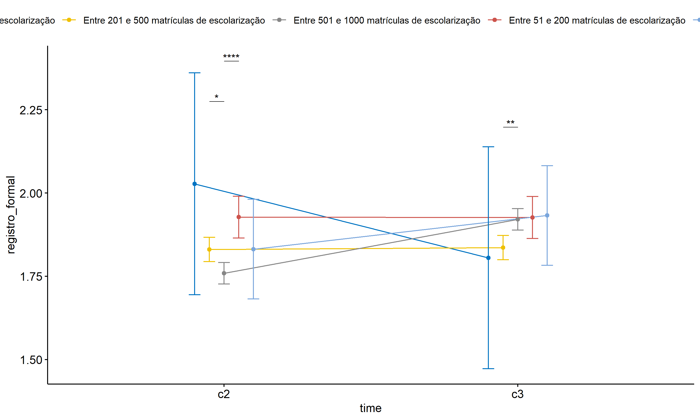

ANOVA test for registro_formal
================
Geiser C. Challco <geiser@alumni.usp.br>

- [ANOVA: registro_formal ~ time](#anova-registro_formal--time)
  - [Data Preparation](#data-preparation)
  - [Summary Statistics](#summary-statistics)
  - [ANOVA Computation](#anova-computation)
  - [PairWise Computation](#pairwise-computation)
- [ANOVA: registro_formal ~ time\*gender +
  Error(id/time)](#anova-registro_formal--timegender--erroridtime)
  - [Data Preparation](#data-preparation-1)
    - [Check assumptions: Identifying
      Outliers](#check-assumptions-identifying-outliers)
    - [Check assumptions: Normality
      Test](#check-assumptions-normality-test)
    - [Summary Statistics](#summary-statistics-1)
  - [ANOVA Computation](#anova-computation-1)
  - [ANOVA Computation after removing non.normal
    data](#anova-computation-after-removing-nonnormal-data)
  - [PairWise Computation](#pairwise-computation-1)
  - [PairWise Computation after removing non.normal
    data](#pairwise-computation-after-removing-nonnormal-data)
- [ANOVA: registro_formal ~ time\*localizacao +
  Error(id/time)](#anova-registro_formal--timelocalizacao--erroridtime)
  - [Data Preparation](#data-preparation-2)
    - [Check assumptions: Identifying
      Outliers](#check-assumptions-identifying-outliers-1)
    - [Check assumptions: Normality
      Test](#check-assumptions-normality-test-1)
    - [Summary Statistics](#summary-statistics-2)
  - [ANOVA Computation](#anova-computation-2)
  - [ANOVA Computation after removing non.normal
    data](#anova-computation-after-removing-nonnormal-data-1)
  - [PairWise Computation](#pairwise-computation-2)
  - [PairWise Computation after removing non.normal
    data](#pairwise-computation-after-removing-nonnormal-data-1)
- [ANOVA: registro_formal ~ time\*regiao +
  Error(id/time)](#anova-registro_formal--timeregiao--erroridtime)
  - [Data Preparation](#data-preparation-3)
    - [Check assumptions: Identifying
      Outliers](#check-assumptions-identifying-outliers-2)
    - [Check assumptions: Normality
      Test](#check-assumptions-normality-test-2)
    - [Summary Statistics](#summary-statistics-3)
  - [ANOVA Computation](#anova-computation-3)
  - [ANOVA Computation after removing non.normal
    data](#anova-computation-after-removing-nonnormal-data-2)
  - [PairWise Computation](#pairwise-computation-3)
  - [PairWise Computation after removing non.normal
    data](#pairwise-computation-after-removing-nonnormal-data-2)
- [ANOVA: registro_formal ~ time\*porte +
  Error(id/time)](#anova-registro_formal--timeporte--erroridtime)
  - [Data Preparation](#data-preparation-4)
    - [Check assumptions: Identifying
      Outliers](#check-assumptions-identifying-outliers-3)
    - [Check assumptions: Normality
      Test](#check-assumptions-normality-test-3)
    - [Summary Statistics](#summary-statistics-4)
  - [ANOVA Computation](#anova-computation-4)
  - [ANOVA Computation after removing non.normal
    data](#anova-computation-after-removing-nonnormal-data-3)
  - [PairWise Computation](#pairwise-computation-4)
  - [PairWise Computation after removing non.normal
    data](#pairwise-computation-after-removing-nonnormal-data-3)

``` r
dat <- read_excel("../data/data.xlsx", sheet = "alunos_ef59")

escolas <- read_excel("../data/data.xlsx", sheet = "escolas")
edat <- merge(dat, escolas, by = "cod_escola", all.x = T)
```

# ANOVA: registro_formal ~ time

## Data Preparation

``` r
data <- edat[,c("aluno_id","ciclo","registro_formal")]
data <- data[data$ciclo %in% c("Segundo Ciclo","Terceiro Ciclo"),]
data$ciclo <- factor(data$ciclo, c("Segundo Ciclo","Terceiro Ciclo"))
data <- unique(data)

wdat <- spread(data, ciclo, registro_formal)
wdat <- wdat[complete.cases(wdat),]
colnames(wdat) <- c("id","c2","c3")

ldat <- gather(wdat, key = time, value = registro_formal, c2,c3) %>%
  convert_as_factor(id, time)
ldat <- rshinystatistics::remove_group_data(ldat, "registro_formal", "time", n.limit = 30)
```

## Summary Statistics

``` r
(sdat <- ldat %>% group_by(time) %>%
   get_summary_stats(registro_formal, type = "mean_sd"))
```

    ## # A tibble: 2 × 5
    ##   time  variable            n  mean    sd
    ##   <fct> <fct>           <dbl> <dbl> <dbl>
    ## 1 c2    registro_formal  4042  1.81 0.676
    ## 2 c3    registro_formal  4042  1.89 0.768

| time | variable        |    n |  mean |    sd |
|:-----|:----------------|-----:|------:|------:|
| c2   | registro_formal | 4042 | 1.811 | 0.676 |
| c3   | registro_formal | 4042 | 1.890 | 0.768 |

## ANOVA Computation

``` r
(res.aov <- anova_test(ldat, dv = registro_formal, wid = id, within = time))
```

    ## ANOVA Table (type III tests)
    ## 
    ##   Effect DFn  DFd      F        p p<.05   ges
    ## 1   time   1 4041 28.551 9.63e-08     * 0.003

## PairWise Computation

``` r
(pwc <- ldat %>% emmeans_test(registro_formal ~ time, detailed = T, p.adjust.method = "bonferroni"))
```

    ## # A tibble: 1 × 14
    ##   term  .y.    group1 group2 null.value estimate     se    df conf.low conf.high
    ## * <chr> <chr>  <chr>  <chr>       <dbl>    <dbl>  <dbl> <dbl>    <dbl>     <dbl>
    ## 1 time  regis… c2     c3              0  -0.0797 0.0161  8082   -0.111   -0.0482
    ## # ℹ 4 more variables: statistic <dbl>, p <dbl>, p.adj <dbl>, p.adj.signif <chr>

| term | .y.             | group1 | group2 | null.value | estimate |    se |   df | conf.low | conf.high | statistic |   p | p.adj | p.adj.signif |
|:-----|:----------------|:-------|:-------|-----------:|---------:|------:|-----:|---------:|----------:|----------:|----:|------:|:-------------|
| time | registro_formal | c2     | c3     |          0 |    -0.08 | 0.016 | 8082 |   -0.111 |    -0.048 |    -4.952 |   0 |     0 | \*\*\*\*     |

``` r
pwc <- add_xy_position(pwc, x = "time", fun = "mean_se")
ggline(get_emmeans(pwc), x = "time", y = "emmean", ylab = "registro_formal") +
  geom_errorbar(aes(ymin = conf.low, ymax = conf.high), width = 0.2) +
  stat_pvalue_manual(pwc, hide.ns = T, tip.length = F)
```

<!-- -->

# ANOVA: registro_formal ~ time\*gender + Error(id/time)

## Data Preparation

``` r
data <- edat[,c("aluno_id","gender","ciclo","registro_formal")]
data <- data[data$ciclo %in% c("Segundo Ciclo","Terceiro Ciclo"),]
data$ciclo <- factor(data$ciclo, c("Segundo Ciclo","Terceiro Ciclo"))
data <- unique(data)

wdat <- spread(data, ciclo, registro_formal)
wdat <- wdat[complete.cases(wdat),]
colnames(wdat) <- c("id","gender","c2","c3")

ldat <- gather(wdat, key = time, value = registro_formal, c2,c3) %>%
  convert_as_factor(id, time)
ldat <- remove_group_data(ldat, "registro_formal", c("time", "gender"), n.limit = 30)
ldat$gender <- factor(ldat$gender, sort(unique(ldat$gender)))
```

### Check assumptions: Identifying Outliers

``` r
outliers <- identify_outliers(group_by(ldat, time, gender), registro_formal)
(outliers <- outliers[outliers$is.extreme == T,])
```

    ## # A tibble: 0 × 6
    ## # ℹ 6 variables: gender <fct>, time <fct>, id <fct>, registro_formal <dbl>,
    ## #   is.outlier <lgl>, is.extreme <lgl>

| gender | time | id  | registro_formal | is.outlier | is.extreme |
|:-------|:-----|:----|----------------:|:-----------|:-----------|

### Check assumptions: Normality Test

``` r
(normality.df <- normality.test.per.groups(ldat, "registro_formal", c("time", "gender")))
```

    ##               var        variable time gender    n  skewness    kurtosis
    ## 1 registro_formal registro_formal   c2 Female 1876 0.5946100  0.18242297
    ## 2 registro_formal registro_formal   c2   Male 1917 0.7191437  0.31946348
    ## 3 registro_formal registro_formal   c3 Female 1876 0.5650589 -0.09377792
    ## 4 registro_formal registro_formal   c3   Male 1917 0.6597560 -0.04995649
    ##   symmetry statistic     method p p.signif normality
    ## 1       NO  98.74899 D'Agostino 0     ****         -
    ## 2       NO 142.66881 D'Agostino 0     ****         -
    ## 3       NO  88.54288 D'Agostino 0     ****         -
    ## 4       NO 117.68648 D'Agostino 0     ****         -

| var             | variable        | time | gender |    n | skewness | kurtosis | symmetry | statistic | method     |   p | p.signif | normality |
|:----------------|:----------------|:-----|:-------|-----:|---------:|---------:|:---------|----------:|:-----------|----:|:---------|:----------|
| registro_formal | registro_formal | c2   | Female | 1876 |    0.595 |    0.182 | NO       |    98.749 | D’Agostino |   0 | \*\*\*\* | \-        |
| registro_formal | registro_formal | c2   | Male   | 1917 |    0.719 |    0.319 | NO       |   142.669 | D’Agostino |   0 | \*\*\*\* | \-        |
| registro_formal | registro_formal | c3   | Female | 1876 |    0.565 |   -0.094 | NO       |    88.543 | D’Agostino |   0 | \*\*\*\* | \-        |
| registro_formal | registro_formal | c3   | Male   | 1917 |    0.660 |   -0.050 | NO       |   117.686 | D’Agostino |   0 | \*\*\*\* | \-        |

``` r
(non.ids <- unique(do.call(
  c, lapply(which(normality.df$normality == 'NO'), FUN = function(i) {
  idx = which(ldat$time == normality.df$time[i] &
                ldat$gender == normality.df$gender[i])
  getNonNormal(ldat$"registro_formal"[idx], ldat$id[idx])
}))))
```

    ## NULL

``` r
if (length(non.ids) > 0)
  ldat2 <- ldat[!ldat$id %in% non.ids,]
```

### Summary Statistics

``` r
(sdat <- ldat %>% group_by(time, gender) %>%
   get_summary_stats(registro_formal, type = "mean_sd"))
```

    ## # A tibble: 4 × 6
    ##   gender time  variable            n  mean    sd
    ##   <fct>  <fct> <fct>           <dbl> <dbl> <dbl>
    ## 1 Female c2    registro_formal  1876  1.85 0.672
    ## 2 Male   c2    registro_formal  1917  1.78 0.679
    ## 3 Female c3    registro_formal  1876  1.94 0.768
    ## 4 Male   c3    registro_formal  1917  1.85 0.766

| gender | time | variable        |    n |  mean |    sd |
|:-------|:-----|:----------------|-----:|------:|------:|
| Female | c2   | registro_formal | 1876 | 1.846 | 0.672 |
| Male   | c2   | registro_formal | 1917 | 1.780 | 0.679 |
| Female | c3   | registro_formal | 1876 | 1.935 | 0.768 |
| Male   | c3   | registro_formal | 1917 | 1.852 | 0.766 |

``` r
if (length(non.ids) > 0)
  (sdat <- ldat2 %>% group_by(time, gender) %>%
      get_summary_stats(registro_formal, type = "mean_sd"))
```

| gender | time | variable        |    n |  mean |    sd |
|:-------|:-----|:----------------|-----:|------:|------:|
| Female | c2   | registro_formal | 1876 | 1.846 | 0.672 |
| Male   | c2   | registro_formal | 1917 | 1.780 | 0.679 |
| Female | c3   | registro_formal | 1876 | 1.935 | 0.768 |
| Male   | c3   | registro_formal | 1917 | 1.852 | 0.766 |

## ANOVA Computation

``` r
(res.aov <- anova_test(ldat, dv = registro_formal, wid = id, between = gender, within = time))
```

    ## ANOVA Table (type III tests)
    ## 
    ##        Effect DFn  DFd      F        p p<.05      ges
    ## 1      gender   1 3791 17.660 2.70e-05     * 3.00e-03
    ## 2        time   1 3791 27.444 1.71e-07     * 3.00e-03
    ## 3 gender:time   1 3791  0.332 5.64e-01       3.76e-05

## ANOVA Computation after removing non.normal data

``` r
if (length(non.ids) > 0)
  (res.aov2 <- anova_test(ldat2, dv = registro_formal, wid = id, between = gender , within = time))
```

## PairWise Computation

``` r
(pwc <- ldat %>% group_by(time) %>%
   emmeans_test(registro_formal ~ gender, detailed = T, p.adjust.method = "bonferroni"))
```

    ## # A tibble: 2 × 15
    ##   time  term   .y.       group1 group2 null.value estimate     se    df conf.low
    ## * <fct> <chr>  <chr>     <chr>  <chr>       <dbl>    <dbl>  <dbl> <dbl>    <dbl>
    ## 1 c2    gender registro… Female Male            0   0.0657 0.0235  7582   0.0197
    ## 2 c3    gender registro… Female Male            0   0.0834 0.0235  7582   0.0374
    ## # ℹ 5 more variables: conf.high <dbl>, statistic <dbl>, p <dbl>, p.adj <dbl>,
    ## #   p.adj.signif <chr>

| time | term   | .y.             | group1 | group2 | null.value | estimate |    se |   df | conf.low | conf.high | statistic |     p | p.adj | p.adj.signif |
|:-----|:-------|:----------------|:-------|:-------|-----------:|---------:|------:|-----:|---------:|----------:|----------:|------:|------:|:-------------|
| c2   | gender | registro_formal | Female | Male   |          0 |    0.066 | 0.023 | 7582 |    0.020 |     0.112 |     2.798 | 0.005 | 0.005 | \*\*         |
| c3   | gender | registro_formal | Female | Male   |          0 |    0.083 | 0.023 | 7582 |    0.037 |     0.129 |     3.553 | 0.000 | 0.000 | \*\*\*       |

``` r
(emms <- get_emmeans(pwc))
```

    ## # A tibble: 4 × 8
    ##   time  gender emmean     se    df conf.low conf.high method      
    ##   <fct> <fct>   <dbl>  <dbl> <dbl>    <dbl>     <dbl> <chr>       
    ## 1 c2    Female   1.85 0.0167  7582     1.81      1.88 Emmeans test
    ## 2 c2    Male     1.78 0.0165  7582     1.75      1.81 Emmeans test
    ## 3 c3    Female   1.94 0.0167  7582     1.90      1.97 Emmeans test
    ## 4 c3    Male     1.85 0.0165  7582     1.82      1.88 Emmeans test

| time | gender | emmean |    se |   df | conf.low | conf.high | method       |
|:-----|:-------|-------:|------:|-----:|---------:|----------:|:-------------|
| c2   | Female |  1.846 | 0.017 | 7582 |    1.813 |     1.879 | Emmeans test |
| c2   | Male   |  1.780 | 0.017 | 7582 |    1.748 |     1.813 | Emmeans test |
| c3   | Female |  1.935 | 0.017 | 7582 |    1.903 |     1.968 | Emmeans test |
| c3   | Male   |  1.852 | 0.017 | 7582 |    1.820 |     1.884 | Emmeans test |

``` r
pwc <- add_xy_position(pwc, x = "time", fun = "mean_se", dodge = 0.25)
pd <- position_dodge(width = 0.25)
ggline(emms, x = "time", y = "emmean", color = "gender",
       palette = c("#FF007F","#4D4DFF"),
       position = pd, ylab = "registro_formal") +
  geom_errorbar(aes(ymin = conf.low, ymax = conf.high, color = gender),
                position = pd, width = 0.2) +
  stat_pvalue_manual(pwc, hide.ns = T, tip.length = F, linetype = 1)
```

<!-- -->

``` r
(pwc <- ldat %>% group_by(gender) %>%
    emmeans_test(registro_formal ~ time, detailed = T, p.adjust.method = "bonferroni"))
```

    ## # A tibble: 2 × 15
    ##   gender term  .y.       group1 group2 null.value estimate     se    df conf.low
    ## * <fct>  <chr> <chr>     <chr>  <chr>       <dbl>    <dbl>  <dbl> <dbl>    <dbl>
    ## 1 Female time  registro… c2     c3              0  -0.0894 0.0236  7582   -0.136
    ## 2 Male   time  registro… c2     c3              0  -0.0717 0.0234  7582   -0.117
    ## # ℹ 5 more variables: conf.high <dbl>, statistic <dbl>, p <dbl>, p.adj <dbl>,
    ## #   p.adj.signif <chr>

| gender | term | .y.             | group1 | group2 | null.value | estimate |    se |   df | conf.low | conf.high | statistic |     p | p.adj | p.adj.signif |
|:-------|:-----|:----------------|:-------|:-------|-----------:|---------:|------:|-----:|---------:|----------:|----------:|------:|------:|:-------------|
| Female | time | registro_formal | c2     | c3     |          0 |   -0.089 | 0.024 | 7582 |   -0.136 |    -0.043 |    -3.789 | 0.000 | 0.000 | \*\*\*       |
| Male   | time | registro_formal | c2     | c3     |          0 |   -0.072 | 0.023 | 7582 |   -0.117 |    -0.026 |    -3.070 | 0.002 | 0.002 | \*\*         |

``` r
(emms <- get_emmeans(pwc))
```

    ## # A tibble: 4 × 8
    ##   gender time  emmean     se    df conf.low conf.high method      
    ##   <fct>  <fct>  <dbl>  <dbl> <dbl>    <dbl>     <dbl> <chr>       
    ## 1 Female c2      1.85 0.0167  7582     1.81      1.88 Emmeans test
    ## 2 Female c3      1.94 0.0167  7582     1.90      1.97 Emmeans test
    ## 3 Male   c2      1.78 0.0165  7582     1.75      1.81 Emmeans test
    ## 4 Male   c3      1.85 0.0165  7582     1.82      1.88 Emmeans test

| gender | time | emmean |    se |   df | conf.low | conf.high | method       |
|:-------|:-----|-------:|------:|-----:|---------:|----------:|:-------------|
| Female | c2   |  1.846 | 0.017 | 7582 |    1.813 |     1.879 | Emmeans test |
| Female | c3   |  1.935 | 0.017 | 7582 |    1.903 |     1.968 | Emmeans test |
| Male   | c2   |  1.780 | 0.017 | 7582 |    1.748 |     1.813 | Emmeans test |
| Male   | c3   |  1.852 | 0.017 | 7582 |    1.820 |     1.884 | Emmeans test |

``` r
emms.gg <- emms[which(emms$gender == "Female"),]
if (nrow(emms.gg) > 0)
  ggline(emms.gg, x = "time", y = "emmean", color = "#FF007F", ylab = "registro_formal") +
    geom_errorbar(aes(ymin = conf.low, ymax = conf.high),
                  width = 0.2, color = "#FF007F") +
    stat_pvalue_manual(
      add_xy_position(pwc[which(pwc$gender == "Female"),],
                      x = "time", fun = "mean_se"),
      hide.ns = T, color = "#FF007F", tip.length = F) +
    labs(title = "gender: Female")+
    theme(legend.text = element_blank())
```

<!-- -->

``` r
emms.gg <- emms[which(emms$gender == "Male"),]
if (nrow(emms.gg) > 0)
  ggline(emms.gg, x = "time", y = "emmean", color = "#4D4DFF", ylab = "registro_formal") +
    geom_errorbar(aes(ymin = conf.low, ymax = conf.high),
                  width = 0.2, color = "#4D4DFF") +
    stat_pvalue_manual(
      add_xy_position(pwc[which(pwc$gender == "Male"),],
                      x = "time", fun = "mean_se"),
      hide.ns = T, color = "#4D4DFF", tip.length = F) +
    labs(title = "gender: Male")+
    theme(legend.text = element_blank())
```

<!-- -->

## PairWise Computation after removing non.normal data

``` r
if (length(non.ids) > 0)
  (pwc2 <- ldat2 %>% group_by(time) %>%
     emmeans_test(registro_formal ~ gender, detailed = T, p.adjust.method = "bonferroni"))
```

``` r
if (length(non.ids) > 0)
  (emms2 <- get_emmeans(pwc2))
```

``` r
if (length(non.ids) > 0) {
  pwc2 <- add_xy_position(pwc2, x = "time", fun = "mean_se", dodge = 0.25)
  pd2 <- position_dodge(width = 0.25)
  
  ggline(emms2, x = "time", y = "emmean", color = "gender",
         palette = c("#FF007F","#4D4DFF"),
         position = pd, ylab = "registro_formal") +
    geom_errorbar(aes(ymin = conf.low, ymax = conf.high, color = gender),
                position = pd, width = 0.2) +
    stat_pvalue_manual(pwc2, hide.ns = T, tip.length = F, linetype = 1)
}
```

``` r
if (length(non.ids) > 0)
  (pwc2 <- ldat2 %>% group_by(gender) %>%
     emmeans_test(registro_formal ~ time, detailed = T, p.adjust.method = "bonferroni"))
```

``` r
if (length(non.ids) > 0)
  (emms2 <- get_emmeans(pwc2))
```

``` r
if (length(non.ids) > 0) {
  emms.gg <- emms2[which(emms2$gender == "Female"),]
  if (nrow(emms.gg) > 0)
    ggline(emms.gg, x = "time", y = "emmean", color = "#FF007F", ylab = "registro_formal") +
    geom_errorbar(aes(ymin = conf.low, ymax = conf.high),
                  width = 0.2, color = "#FF007F") +
    stat_pvalue_manual(
      add_xy_position(pwc[which(pwc$gender == "Female"),],
                      x = "time", fun = "mean_se"),
      hide.ns = T, color = "#FF007F", tip.length = F) +
    labs(title = "gender: Female") +
    theme(legend.text = element_blank())
}
```

``` r
if (length(non.ids) > 0) {
  emms.gg <- emms2[which(emms2$gender == "Male"),]
  if (nrow(emms.gg) > 0)
    ggline(emms.gg, x = "time", y = "emmean", color = "#4D4DFF", ylab = "registro_formal") +
    geom_errorbar(aes(ymin = conf.low, ymax = conf.high),
                  width = 0.2, color = "#4D4DFF") +
    stat_pvalue_manual(
      add_xy_position(pwc[which(pwc$gender == "Male"),],
                      x = "time", fun = "mean_se"),
      hide.ns = T, color = "#4D4DFF", tip.length = F) +
    labs(title = "gender: Male") +
    theme(legend.text = element_blank())
}
```

# ANOVA: registro_formal ~ time\*localizacao + Error(id/time)

## Data Preparation

``` r
data <- edat[,c("aluno_id","localizacao","ciclo","registro_formal")]
data <- data[data$ciclo %in% c("Segundo Ciclo","Terceiro Ciclo"),]
data$ciclo <- factor(data$ciclo, c("Segundo Ciclo","Terceiro Ciclo"))
data <- unique(data)

wdat <- spread(data, ciclo, registro_formal)
wdat <- wdat[complete.cases(wdat),]
colnames(wdat) <- c("id","localizacao","c2","c3")

ldat <- gather(wdat, key = time, value = registro_formal, c2,c3) %>%
  convert_as_factor(id, time)
ldat <- remove_group_data(ldat, "registro_formal", c("time", "localizacao"), n.limit = 30)
ldat$localizacao <- factor(ldat$localizacao, sort(unique(ldat$localizacao)))
```

### Check assumptions: Identifying Outliers

``` r
outliers <- identify_outliers(group_by(ldat, time, localizacao), registro_formal)
(outliers <- outliers[outliers$is.extreme == T,])
```

    ## # A tibble: 0 × 6
    ## # ℹ 6 variables: localizacao <fct>, time <fct>, id <fct>,
    ## #   registro_formal <dbl>, is.outlier <lgl>, is.extreme <lgl>

| localizacao | time | id  | registro_formal | is.outlier | is.extreme |
|:------------|:-----|:----|----------------:|:-----------|:-----------|

### Check assumptions: Normality Test

``` r
(normality.df <- normality.test.per.groups(ldat, "registro_formal", c("time", "localizacao")))
```

    ##               var        variable time localizacao    n  skewness   kurtosis
    ## 1 registro_formal registro_formal   c2       Rural  701 0.6969421  0.1560715
    ## 2 registro_formal registro_formal   c2      Urbana 3341 0.6320367  0.2134097
    ## 3 registro_formal registro_formal   c3       Rural  701 0.6306818  0.0209647
    ## 4 registro_formal registro_formal   c3      Urbana 3341 0.6054661 -0.1161836
    ##   symmetry statistic     method            p p.signif normality
    ## 1       NO  48.99880 D'Agostino 2.291112e-11     ****         -
    ## 2       NO 195.12966 D'Agostino 0.000000e+00     ****         -
    ## 3       NO  40.61319 D'Agostino 1.516903e-09     ****         -
    ## 4       NO 177.84464 D'Agostino 0.000000e+00     ****         -

| var             | variable        | time | localizacao |    n | skewness | kurtosis | symmetry | statistic | method     |   p | p.signif | normality |
|:----------------|:----------------|:-----|:------------|-----:|---------:|---------:|:---------|----------:|:-----------|----:|:---------|:----------|
| registro_formal | registro_formal | c2   | Rural       |  701 |    0.697 |    0.156 | NO       |    48.999 | D’Agostino |   0 | \*\*\*\* | \-        |
| registro_formal | registro_formal | c2   | Urbana      | 3341 |    0.632 |    0.213 | NO       |   195.130 | D’Agostino |   0 | \*\*\*\* | \-        |
| registro_formal | registro_formal | c3   | Rural       |  701 |    0.631 |    0.021 | NO       |    40.613 | D’Agostino |   0 | \*\*\*\* | \-        |
| registro_formal | registro_formal | c3   | Urbana      | 3341 |    0.605 |   -0.116 | NO       |   177.845 | D’Agostino |   0 | \*\*\*\* | \-        |

``` r
(non.ids <- unique(do.call(
  c, lapply(which(normality.df$normality == 'NO'), FUN = function(i) {
  idx = which(ldat$time == normality.df$time[i] &
                ldat$localizacao == normality.df$localizacao[i])
  getNonNormal(ldat$"registro_formal"[idx], ldat$id[idx])
}))))
```

    ## NULL

``` r
if (length(non.ids) > 0)
  ldat2 <- ldat[!ldat$id %in% non.ids,]
```

### Summary Statistics

``` r
(sdat <- ldat %>% group_by(time, localizacao) %>%
   get_summary_stats(registro_formal, type = "mean_sd"))
```

    ## # A tibble: 4 × 6
    ##   localizacao time  variable            n  mean    sd
    ##   <fct>       <fct> <fct>           <dbl> <dbl> <dbl>
    ## 1 Rural       c2    registro_formal   701  1.84 0.72 
    ## 2 Urbana      c2    registro_formal  3341  1.80 0.666
    ## 3 Rural       c3    registro_formal   701  1.89 0.759
    ## 4 Urbana      c3    registro_formal  3341  1.89 0.77

| localizacao | time | variable        |    n |  mean |    sd |
|:------------|:-----|:----------------|-----:|------:|------:|
| Rural       | c2   | registro_formal |  701 | 1.842 | 0.720 |
| Urbana      | c2   | registro_formal | 3341 | 1.804 | 0.666 |
| Rural       | c3   | registro_formal |  701 | 1.894 | 0.759 |
| Urbana      | c3   | registro_formal | 3341 | 1.890 | 0.770 |

``` r
if (length(non.ids) > 0)
  (sdat <- ldat2 %>% group_by(time, localizacao) %>%
      get_summary_stats(registro_formal, type = "mean_sd"))
```

| localizacao | time | variable        |    n |  mean |    sd |
|:------------|:-----|:----------------|-----:|------:|------:|
| Rural       | c2   | registro_formal |  701 | 1.842 | 0.720 |
| Urbana      | c2   | registro_formal | 3341 | 1.804 | 0.666 |
| Rural       | c3   | registro_formal |  701 | 1.894 | 0.759 |
| Urbana      | c3   | registro_formal | 3341 | 1.890 | 0.770 |

## ANOVA Computation

``` r
(res.aov <- anova_test(ldat, dv = registro_formal, wid = id, between = localizacao, within = time))
```

    ## ANOVA Table (type III tests)
    ## 
    ##             Effect DFn  DFd      F        p p<.05      ges
    ## 1      localizacao   1 4040  0.879 0.349000       1.24e-04
    ## 2             time   1 4040 12.259 0.000468     * 1.00e-03
    ## 3 localizacao:time   1 4040  0.695 0.404000       7.39e-05

## ANOVA Computation after removing non.normal data

``` r
if (length(non.ids) > 0)
  (res.aov2 <- anova_test(ldat2, dv = registro_formal, wid = id, between = localizacao , within = time))
```

## PairWise Computation

``` r
(pwc <- ldat %>% group_by(time) %>%
   emmeans_test(registro_formal ~ localizacao, detailed = T, p.adjust.method = "bonferroni"))
```

    ## # A tibble: 2 × 15
    ##   time  term       .y.   group1 group2 null.value estimate     se    df conf.low
    ## * <fct> <chr>      <chr> <chr>  <chr>       <dbl>    <dbl>  <dbl> <dbl>    <dbl>
    ## 1 c2    localizac… regi… Rural  Urbana          0  0.0377  0.0301  8080  -0.0212
    ## 2 c3    localizac… regi… Rural  Urbana          0  0.00486 0.0301  8080  -0.0541
    ## # ℹ 5 more variables: conf.high <dbl>, statistic <dbl>, p <dbl>, p.adj <dbl>,
    ## #   p.adj.signif <chr>

| time | term        | .y.             | group1 | group2 | null.value | estimate |   se |   df | conf.low | conf.high | statistic |     p | p.adj | p.adj.signif |
|:-----|:------------|:----------------|:-------|:-------|-----------:|---------:|-----:|-----:|---------:|----------:|----------:|------:|------:|:-------------|
| c2   | localizacao | registro_formal | Rural  | Urbana |          0 |    0.038 | 0.03 | 8080 |   -0.021 |     0.097 |     1.255 | 0.210 | 0.210 | ns           |
| c3   | localizacao | registro_formal | Rural  | Urbana |          0 |    0.005 | 0.03 | 8080 |   -0.054 |     0.064 |     0.162 | 0.872 | 0.872 | ns           |

``` r
(emms <- get_emmeans(pwc))
```

    ## # A tibble: 4 × 8
    ##   time  localizacao emmean     se    df conf.low conf.high method      
    ##   <fct> <fct>        <dbl>  <dbl> <dbl>    <dbl>     <dbl> <chr>       
    ## 1 c2    Rural         1.84 0.0273  8080     1.79      1.90 Emmeans test
    ## 2 c2    Urbana        1.80 0.0125  8080     1.78      1.83 Emmeans test
    ## 3 c3    Rural         1.89 0.0273  8080     1.84      1.95 Emmeans test
    ## 4 c3    Urbana        1.89 0.0125  8080     1.87      1.91 Emmeans test

| time | localizacao | emmean |    se |   df | conf.low | conf.high | method       |
|:-----|:------------|-------:|------:|-----:|---------:|----------:|:-------------|
| c2   | Rural       |  1.842 | 0.027 | 8080 |    1.788 |     1.895 | Emmeans test |
| c2   | Urbana      |  1.804 | 0.013 | 8080 |    1.780 |     1.829 | Emmeans test |
| c3   | Rural       |  1.894 | 0.027 | 8080 |    1.841 |     1.948 | Emmeans test |
| c3   | Urbana      |  1.890 | 0.013 | 8080 |    1.865 |     1.914 | Emmeans test |

``` r
pwc <- add_xy_position(pwc, x = "time", fun = "mean_se", dodge = 0.25)
pd <- position_dodge(width = 0.25)
ggline(emms, x = "time", y = "emmean", color = "localizacao",
       palette = c("#AA00FF","#00CCCC"),
       position = pd, ylab = "registro_formal") +
  geom_errorbar(aes(ymin = conf.low, ymax = conf.high, color = localizacao),
                position = pd, width = 0.2) +
  stat_pvalue_manual(pwc, hide.ns = T, tip.length = F, linetype = 1)
```

<!-- -->

``` r
(pwc <- ldat %>% group_by(localizacao) %>%
    emmeans_test(registro_formal ~ time, detailed = T, p.adjust.method = "bonferroni"))
```

    ## # A tibble: 2 × 15
    ##   localizacao term  .y.           group1 group2 null.value estimate     se    df
    ## * <fct>       <chr> <chr>         <chr>  <chr>       <dbl>    <dbl>  <dbl> <dbl>
    ## 1 Rural       time  registro_for… c2     c3              0  -0.0525 0.0386  8080
    ## 2 Urbana      time  registro_for… c2     c3              0  -0.0854 0.0177  8080
    ## # ℹ 6 more variables: conf.low <dbl>, conf.high <dbl>, statistic <dbl>,
    ## #   p <dbl>, p.adj <dbl>, p.adj.signif <chr>

| localizacao | term | .y.             | group1 | group2 | null.value | estimate |    se |   df | conf.low | conf.high | statistic |     p | p.adj | p.adj.signif |
|:------------|:-----|:----------------|:-------|:-------|-----------:|---------:|------:|-----:|---------:|----------:|----------:|------:|------:|:-------------|
| Rural       | time | registro_formal | c2     | c3     |          0 |   -0.053 | 0.039 | 8080 |   -0.128 |     0.023 |    -1.360 | 0.174 | 0.174 | ns           |
| Urbana      | time | registro_formal | c2     | c3     |          0 |   -0.085 | 0.018 | 8080 |   -0.120 |    -0.051 |    -4.824 | 0.000 | 0.000 | \*\*\*\*     |

``` r
(emms <- get_emmeans(pwc))
```

    ## # A tibble: 4 × 8
    ##   localizacao time  emmean     se    df conf.low conf.high method      
    ##   <fct>       <fct>  <dbl>  <dbl> <dbl>    <dbl>     <dbl> <chr>       
    ## 1 Rural       c2      1.84 0.0273  8080     1.79      1.90 Emmeans test
    ## 2 Rural       c3      1.89 0.0273  8080     1.84      1.95 Emmeans test
    ## 3 Urbana      c2      1.80 0.0125  8080     1.78      1.83 Emmeans test
    ## 4 Urbana      c3      1.89 0.0125  8080     1.87      1.91 Emmeans test

| localizacao | time | emmean |    se |   df | conf.low | conf.high | method       |
|:------------|:-----|-------:|------:|-----:|---------:|----------:|:-------------|
| Rural       | c2   |  1.842 | 0.027 | 8080 |    1.788 |     1.895 | Emmeans test |
| Rural       | c3   |  1.894 | 0.027 | 8080 |    1.841 |     1.948 | Emmeans test |
| Urbana      | c2   |  1.804 | 0.013 | 8080 |    1.780 |     1.829 | Emmeans test |
| Urbana      | c3   |  1.890 | 0.013 | 8080 |    1.865 |     1.914 | Emmeans test |

``` r
emms.gg <- emms[which(emms$localizacao == "Rural"),]
if (nrow(emms.gg) > 0)
  ggline(emms.gg, x = "time", y = "emmean", color = "#AA00FF", ylab = "registro_formal") +
    geom_errorbar(aes(ymin = conf.low, ymax = conf.high),
                  width = 0.2, color = "#AA00FF") +
    stat_pvalue_manual(
      add_xy_position(pwc[which(pwc$localizacao == "Rural"),],
                      x = "time", fun = "mean_se"),
      hide.ns = T, color = "#AA00FF", tip.length = F) +
    labs(title = "localizacao: Rural")+
    theme(legend.text = element_blank())
```

<!-- -->

``` r
emms.gg <- emms[which(emms$localizacao == "Urbana"),]
if (nrow(emms.gg) > 0)
  ggline(emms.gg, x = "time", y = "emmean", color = "#00CCCC", ylab = "registro_formal") +
    geom_errorbar(aes(ymin = conf.low, ymax = conf.high),
                  width = 0.2, color = "#00CCCC") +
    stat_pvalue_manual(
      add_xy_position(pwc[which(pwc$localizacao == "Urbana"),],
                      x = "time", fun = "mean_se"),
      hide.ns = T, color = "#00CCCC", tip.length = F) +
    labs(title = "localizacao: Urbana")+
    theme(legend.text = element_blank())
```

<!-- -->

## PairWise Computation after removing non.normal data

``` r
if (length(non.ids) > 0)
  (pwc2 <- ldat2 %>% group_by(time) %>%
     emmeans_test(registro_formal ~ localizacao, detailed = T, p.adjust.method = "bonferroni"))
```

``` r
if (length(non.ids) > 0)
  (emms2 <- get_emmeans(pwc2))
```

``` r
if (length(non.ids) > 0) {
  pwc2 <- add_xy_position(pwc2, x = "time", fun = "mean_se", dodge = 0.25)
  pd2 <- position_dodge(width = 0.25)
  
  ggline(emms2, x = "time", y = "emmean", color = "localizacao",
         palette = c("#AA00FF","#00CCCC"),
         position = pd, ylab = "registro_formal") +
    geom_errorbar(aes(ymin = conf.low, ymax = conf.high, color = localizacao),
                position = pd, width = 0.2) +
    stat_pvalue_manual(pwc2, hide.ns = T, tip.length = F, linetype = 1)
}
```

``` r
if (length(non.ids) > 0)
  (pwc2 <- ldat2 %>% group_by(localizacao) %>%
     emmeans_test(registro_formal ~ time, detailed = T, p.adjust.method = "bonferroni"))
```

``` r
if (length(non.ids) > 0)
  (emms2 <- get_emmeans(pwc2))
```

``` r
if (length(non.ids) > 0) {
  emms.gg <- emms2[which(emms2$localizacao == "Rural"),]
  if (nrow(emms.gg) > 0)
    ggline(emms.gg, x = "time", y = "emmean", color = "#AA00FF", ylab = "registro_formal") +
    geom_errorbar(aes(ymin = conf.low, ymax = conf.high),
                  width = 0.2, color = "#AA00FF") +
    stat_pvalue_manual(
      add_xy_position(pwc[which(pwc$localizacao == "Rural"),],
                      x = "time", fun = "mean_se"),
      hide.ns = T, color = "#AA00FF", tip.length = F) +
    labs(title = "localizacao: Rural") +
    theme(legend.text = element_blank())
}
```

``` r
if (length(non.ids) > 0) {
  emms.gg <- emms2[which(emms2$localizacao == "Urbana"),]
  if (nrow(emms.gg) > 0)
    ggline(emms.gg, x = "time", y = "emmean", color = "#00CCCC", ylab = "registro_formal") +
    geom_errorbar(aes(ymin = conf.low, ymax = conf.high),
                  width = 0.2, color = "#00CCCC") +
    stat_pvalue_manual(
      add_xy_position(pwc[which(pwc$localizacao == "Urbana"),],
                      x = "time", fun = "mean_se"),
      hide.ns = T, color = "#00CCCC", tip.length = F) +
    labs(title = "localizacao: Urbana") +
    theme(legend.text = element_blank())
}
```

# ANOVA: registro_formal ~ time\*regiao + Error(id/time)

## Data Preparation

``` r
data <- edat[,c("aluno_id","regiao","ciclo","registro_formal")]
data <- data[data$ciclo %in% c("Segundo Ciclo","Terceiro Ciclo"),]
data$ciclo <- factor(data$ciclo, c("Segundo Ciclo","Terceiro Ciclo"))
data <- unique(data)

wdat <- spread(data, ciclo, registro_formal)
wdat <- wdat[complete.cases(wdat),]
colnames(wdat) <- c("id","regiao","c2","c3")

ldat <- gather(wdat, key = time, value = registro_formal, c2,c3) %>%
  convert_as_factor(id, time)
ldat <- remove_group_data(ldat, "registro_formal", c("time", "regiao"), n.limit = 30)
ldat$regiao <- factor(ldat$regiao, sort(unique(ldat$regiao)))
```

### Check assumptions: Identifying Outliers

``` r
outliers <- identify_outliers(group_by(ldat, time, regiao), registro_formal)
(outliers <- outliers[outliers$is.extreme == T,])
```

    ## # A tibble: 9 × 6
    ##   regiao       time  id                   registro_formal is.outlier is.extreme
    ##   <fct>        <fct> <fct>                          <dbl> <lgl>      <lgl>     
    ## 1 Centro-Oeste c2    r3PujYNAinSR5cUFlfvp               4 TRUE       TRUE      
    ## 2 Centro-Oeste c2    Y2PeRXdBAGLBFeH7y8gi               4 TRUE       TRUE      
    ## 3 Norte        c2    6VpAfRDnPV0NobbSZz6t               4 TRUE       TRUE      
    ## 4 Norte        c2    MMxwyxd4awvO9GeCPT31               4 TRUE       TRUE      
    ## 5 Norte        c2    nlFUxxicgyBUxv5P70b4               4 TRUE       TRUE      
    ## 6 Norte        c2    pE3uZjAhHMt901ywnKaz               4 TRUE       TRUE      
    ## 7 Norte        c2    QbHHWjffOuNc6dkoLs82               4 TRUE       TRUE      
    ## 8 Norte        c2    qfeMJi8RWcj2xT6hr2Ju               4 TRUE       TRUE      
    ## 9 Norte        c2    rMFW9JbLltZ7FvUOlDQd               4 TRUE       TRUE

| regiao       | time | id                   | registro_formal | is.outlier | is.extreme |
|:-------------|:-----|:---------------------|----------------:|:-----------|:-----------|
| Centro-Oeste | c2   | r3PujYNAinSR5cUFlfvp |               4 | TRUE       | TRUE       |
| Centro-Oeste | c2   | Y2PeRXdBAGLBFeH7y8gi |               4 | TRUE       | TRUE       |
| Norte        | c2   | 6VpAfRDnPV0NobbSZz6t |               4 | TRUE       | TRUE       |
| Norte        | c2   | MMxwyxd4awvO9GeCPT31 |               4 | TRUE       | TRUE       |
| Norte        | c2   | nlFUxxicgyBUxv5P70b4 |               4 | TRUE       | TRUE       |
| Norte        | c2   | pE3uZjAhHMt901ywnKaz |               4 | TRUE       | TRUE       |
| Norte        | c2   | QbHHWjffOuNc6dkoLs82 |               4 | TRUE       | TRUE       |
| Norte        | c2   | qfeMJi8RWcj2xT6hr2Ju |               4 | TRUE       | TRUE       |
| Norte        | c2   | rMFW9JbLltZ7FvUOlDQd |               4 | TRUE       | TRUE       |

### Check assumptions: Normality Test

``` r
(normality.df <- normality.test.per.groups(ldat, "registro_formal", c("time", "regiao")))
```

    ##                var        variable time       regiao    n   skewness
    ## 1  registro_formal registro_formal   c2 Centro-Oeste  198 0.48263254
    ## 2  registro_formal registro_formal   c2     Nordeste 1464 0.56066582
    ## 3  registro_formal registro_formal   c2        Norte  435 0.49065231
    ## 4  registro_formal registro_formal   c2      Sudeste 1473 0.82132124
    ## 5  registro_formal registro_formal   c2          Sul  472 0.53742418
    ## 6  registro_formal registro_formal   c3 Centro-Oeste  198 0.08626711
    ## 7  registro_formal registro_formal   c3     Nordeste 1464 0.70719939
    ## 8  registro_formal registro_formal   c3        Norte  435 0.65425655
    ## 9  registro_formal registro_formal   c3      Sudeste 1473 0.62429154
    ## 10 registro_formal registro_formal   c3          Sul  472 0.34250126
    ##       kurtosis symmetry  statistic     method            p p.signif normality
    ## 1  -0.23686677      YES   7.800998 D'Agostino 2.023181e-02       ns        QQ
    ## 2  -0.04702798       NO  67.972388 D'Agostino 1.776357e-15     ****         -
    ## 3   0.11600830      YES  16.881887 D'Agostino 2.158464e-04       **         -
    ## 4   0.79331106       NO 152.181777 D'Agostino 0.000000e+00     ****         -
    ## 5   0.02984952       NO  21.002206 D'Agostino 2.750610e-05      ***         -
    ## 6  -0.51130036      YES   2.980326 D'Agostino 2.253360e-01       ns        QQ
    ## 7   0.08295281       NO 101.858305 D'Agostino 0.000000e+00     ****         -
    ## 8   0.08185968       NO  27.570408 D'Agostino 1.030771e-06     ****         -
    ## 9  -0.21295718       NO  85.490929 D'Agostino 0.000000e+00     ****         -
    ## 10 -0.24632964      YES  10.150675 D'Agostino 6.248978e-03        *         -

| var             | variable        | time | regiao       |    n | skewness | kurtosis | symmetry | statistic | method     |     p | p.signif | normality |
|:----------------|:----------------|:-----|:-------------|-----:|---------:|---------:|:---------|----------:|:-----------|------:|:---------|:----------|
| registro_formal | registro_formal | c2   | Centro-Oeste |  198 |    0.483 |   -0.237 | YES      |     7.801 | D’Agostino | 0.020 | ns       | QQ        |
| registro_formal | registro_formal | c2   | Nordeste     | 1464 |    0.561 |   -0.047 | NO       |    67.972 | D’Agostino | 0.000 | \*\*\*\* | \-        |
| registro_formal | registro_formal | c2   | Norte        |  435 |    0.491 |    0.116 | YES      |    16.882 | D’Agostino | 0.000 | \*\*     | \-        |
| registro_formal | registro_formal | c2   | Sudeste      | 1473 |    0.821 |    0.793 | NO       |   152.182 | D’Agostino | 0.000 | \*\*\*\* | \-        |
| registro_formal | registro_formal | c2   | Sul          |  472 |    0.537 |    0.030 | NO       |    21.002 | D’Agostino | 0.000 | \*\*\*   | \-        |
| registro_formal | registro_formal | c3   | Centro-Oeste |  198 |    0.086 |   -0.511 | YES      |     2.980 | D’Agostino | 0.225 | ns       | QQ        |
| registro_formal | registro_formal | c3   | Nordeste     | 1464 |    0.707 |    0.083 | NO       |   101.858 | D’Agostino | 0.000 | \*\*\*\* | \-        |
| registro_formal | registro_formal | c3   | Norte        |  435 |    0.654 |    0.082 | NO       |    27.570 | D’Agostino | 0.000 | \*\*\*\* | \-        |
| registro_formal | registro_formal | c3   | Sudeste      | 1473 |    0.624 |   -0.213 | NO       |    85.491 | D’Agostino | 0.000 | \*\*\*\* | \-        |
| registro_formal | registro_formal | c3   | Sul          |  472 |    0.343 |   -0.246 | YES      |    10.151 | D’Agostino | 0.006 | \*       | \-        |

``` r
(non.ids <- unique(do.call(
  c, lapply(which(normality.df$normality == 'NO'), FUN = function(i) {
  idx = which(ldat$time == normality.df$time[i] &
                ldat$regiao == normality.df$regiao[i])
  getNonNormal(ldat$"registro_formal"[idx], ldat$id[idx])
}))))
```

    ## NULL

``` r
if (length(non.ids) > 0)
  ldat2 <- ldat[!ldat$id %in% non.ids,]
```

### Summary Statistics

``` r
(sdat <- ldat %>% group_by(time, regiao) %>%
   get_summary_stats(registro_formal, type = "mean_sd"))
```

    ## # A tibble: 10 × 6
    ##    regiao       time  variable            n  mean    sd
    ##    <fct>        <fct> <fct>           <dbl> <dbl> <dbl>
    ##  1 Centro-Oeste c2    registro_formal   198  1.90 0.675
    ##  2 Nordeste     c2    registro_formal  1464  1.85 0.7  
    ##  3 Norte        c2    registro_formal   435  1.91 0.688
    ##  4 Sudeste      c2    registro_formal  1473  1.7  0.616
    ##  5 Sul          c2    registro_formal   472  1.91 0.722
    ##  6 Centro-Oeste c3    registro_formal   198  1.98 0.609
    ##  7 Nordeste     c3    registro_formal  1464  1.80 0.742
    ##  8 Norte        c3    registro_formal   435  1.88 0.757
    ##  9 Sudeste      c3    registro_formal  1473  1.93 0.81 
    ## 10 Sul          c3    registro_formal   472  2.04 0.747

| regiao       | time | variable        |    n |  mean |    sd |
|:-------------|:-----|:----------------|-----:|------:|------:|
| Centro-Oeste | c2   | registro_formal |  198 | 1.905 | 0.675 |
| Nordeste     | c2   | registro_formal | 1464 | 1.849 | 0.700 |
| Norte        | c2   | registro_formal |  435 | 1.907 | 0.688 |
| Sudeste      | c2   | registro_formal | 1473 | 1.700 | 0.616 |
| Sul          | c2   | registro_formal |  472 | 1.911 | 0.722 |
| Centro-Oeste | c3   | registro_formal |  198 | 1.977 | 0.609 |
| Nordeste     | c3   | registro_formal | 1464 | 1.796 | 0.742 |
| Norte        | c3   | registro_formal |  435 | 1.877 | 0.757 |
| Sudeste      | c3   | registro_formal | 1473 | 1.928 | 0.810 |
| Sul          | c3   | registro_formal |  472 | 2.042 | 0.747 |

``` r
if (length(non.ids) > 0)
  (sdat <- ldat2 %>% group_by(time, regiao) %>%
      get_summary_stats(registro_formal, type = "mean_sd"))
```

| regiao       | time | variable        |    n |  mean |    sd |
|:-------------|:-----|:----------------|-----:|------:|------:|
| Centro-Oeste | c2   | registro_formal |  198 | 1.905 | 0.675 |
| Nordeste     | c2   | registro_formal | 1464 | 1.849 | 0.700 |
| Norte        | c2   | registro_formal |  435 | 1.907 | 0.688 |
| Sudeste      | c2   | registro_formal | 1473 | 1.700 | 0.616 |
| Sul          | c2   | registro_formal |  472 | 1.911 | 0.722 |
| Centro-Oeste | c3   | registro_formal |  198 | 1.977 | 0.609 |
| Nordeste     | c3   | registro_formal | 1464 | 1.796 | 0.742 |
| Norte        | c3   | registro_formal |  435 | 1.877 | 0.757 |
| Sudeste      | c3   | registro_formal | 1473 | 1.928 | 0.810 |
| Sul          | c3   | registro_formal |  472 | 2.042 | 0.747 |

## ANOVA Computation

``` r
(res.aov <- anova_test(ldat, dv = registro_formal, wid = id, between = regiao, within = time))
```

    ## ANOVA Table (type III tests)
    ## 
    ##        Effect DFn  DFd      F        p p<.05   ges
    ## 1      regiao   4 4037 10.988 7.32e-09     * 0.006
    ## 2        time   1 4037 12.748 3.60e-04     * 0.001
    ## 3 regiao:time   4 4037 18.252 7.15e-15     * 0.008

## ANOVA Computation after removing non.normal data

``` r
if (length(non.ids) > 0)
  (res.aov2 <- anova_test(ldat2, dv = registro_formal, wid = id, between = regiao , within = time))
```

## PairWise Computation

``` r
(pwc <- ldat %>% group_by(time) %>%
   emmeans_test(registro_formal ~ regiao, detailed = T, p.adjust.method = "bonferroni"))
```

    ## Warning: Expected 2 pieces. Additional pieces discarded in 8 rows [1, 2, 3, 4, 11, 12,
    ## 13, 14].

    ## # A tibble: 20 × 15
    ##    time  term   .y.      group1 group2 null.value estimate     se    df conf.low
    ##  * <fct> <chr>  <chr>    <chr>  <chr>       <dbl>    <dbl>  <dbl> <dbl>    <dbl>
    ##  1 c2    regiao registr… Centro Oeste           0  0.0567  0.0544  8074  -0.0500
    ##  2 c2    regiao registr… Centro Oeste           0 -0.00121 0.0616  8074  -0.122 
    ##  3 c2    regiao registr… Centro Oeste           0  0.205   0.0544  8074   0.0986
    ##  4 c2    regiao registr… Centro Oeste           0 -0.00536 0.0609  8074  -0.125 
    ##  5 c2    regiao registr… Norde… Norte           0 -0.0579  0.0393  8074  -0.135 
    ##  6 c2    regiao registr… Norde… Sudes…          0  0.149   0.0265  8074   0.0965
    ##  7 c2    regiao registr… Norde… Sul             0 -0.0621  0.0381  8074  -0.137 
    ##  8 c2    regiao registr… Norte  Sudes…          0  0.206   0.0392  8074   0.130 
    ##  9 c2    regiao registr… Norte  Sul             0 -0.00415 0.0478  8074  -0.0978
    ## 10 c2    regiao registr… Sudes… Sul             0 -0.211   0.0380  8074  -0.285 
    ## 11 c3    regiao registr… Centro Oeste           0  0.181   0.0544  8074   0.0747
    ## 12 c3    regiao registr… Centro Oeste           0  0.100   0.0616  8074  -0.0205
    ## 13 c3    regiao registr… Centro Oeste           0  0.0492  0.0544  8074  -0.0574
    ## 14 c3    regiao registr… Centro Oeste           0 -0.0651  0.0609  8074  -0.184 
    ## 15 c3    regiao registr… Norde… Norte           0 -0.0812  0.0393  8074  -0.158 
    ## 16 c3    regiao registr… Norde… Sudes…          0 -0.132   0.0265  8074  -0.184 
    ## 17 c3    regiao registr… Norde… Sul             0 -0.247   0.0381  8074  -0.321 
    ## 18 c3    regiao registr… Norte  Sudes…          0 -0.0510  0.0392  8074  -0.128 
    ## 19 c3    regiao registr… Norte  Sul             0 -0.165   0.0478  8074  -0.259 
    ## 20 c3    regiao registr… Sudes… Sul             0 -0.114   0.0380  8074  -0.189 
    ## # ℹ 5 more variables: conf.high <dbl>, statistic <dbl>, p <dbl>, p.adj <dbl>,
    ## #   p.adj.signif <chr>

| time | term   | .y.             | group1   | group2  | null.value | estimate |    se |   df | conf.low | conf.high | statistic |     p | p.adj | p.adj.signif |
|:-----|:-------|:----------------|:---------|:--------|-----------:|---------:|------:|-----:|---------:|----------:|----------:|------:|------:|:-------------|
| c2   | regiao | registro_formal | Centro   | Oeste   |          0 |    0.057 | 0.054 | 8074 |   -0.050 |     0.163 |     1.042 | 0.297 | 1.000 | ns           |
| c2   | regiao | registro_formal | Centro   | Oeste   |          0 |   -0.001 | 0.062 | 8074 |   -0.122 |     0.120 |    -0.020 | 0.984 | 1.000 | ns           |
| c2   | regiao | registro_formal | Centro   | Oeste   |          0 |    0.205 | 0.054 | 8074 |    0.099 |     0.312 |     3.772 | 0.000 | 0.002 | \*\*         |
| c2   | regiao | registro_formal | Centro   | Oeste   |          0 |   -0.005 | 0.061 | 8074 |   -0.125 |     0.114 |    -0.088 | 0.930 | 1.000 | ns           |
| c2   | regiao | registro_formal | Nordeste | Norte   |          0 |   -0.058 | 0.039 | 8074 |   -0.135 |     0.019 |    -1.476 | 0.140 | 1.000 | ns           |
| c2   | regiao | registro_formal | Nordeste | Sudeste |          0 |    0.149 | 0.027 | 8074 |    0.097 |     0.201 |     5.599 | 0.000 | 0.000 | \*\*\*\*     |
| c2   | regiao | registro_formal | Nordeste | Sul     |          0 |   -0.062 | 0.038 | 8074 |   -0.137 |     0.013 |    -1.631 | 0.103 | 1.000 | ns           |
| c2   | regiao | registro_formal | Norte    | Sudeste |          0 |    0.206 | 0.039 | 8074 |    0.130 |     0.283 |     5.263 | 0.000 | 0.000 | \*\*\*\*     |
| c2   | regiao | registro_formal | Norte    | Sul     |          0 |   -0.004 | 0.048 | 8074 |   -0.098 |     0.090 |    -0.087 | 0.931 | 1.000 | ns           |
| c2   | regiao | registro_formal | Sudeste  | Sul     |          0 |   -0.211 | 0.038 | 8074 |   -0.285 |    -0.136 |    -5.539 | 0.000 | 0.000 | \*\*\*\*     |
| c3   | regiao | registro_formal | Centro   | Oeste   |          0 |    0.181 | 0.054 | 8074 |    0.075 |     0.288 |     3.333 | 0.001 | 0.009 | \*\*         |
| c3   | regiao | registro_formal | Centro   | Oeste   |          0 |    0.100 | 0.062 | 8074 |   -0.021 |     0.221 |     1.627 | 0.104 | 1.000 | ns           |
| c3   | regiao | registro_formal | Centro   | Oeste   |          0 |    0.049 | 0.054 | 8074 |   -0.057 |     0.156 |     0.905 | 0.366 | 1.000 | ns           |
| c3   | regiao | registro_formal | Centro   | Oeste   |          0 |   -0.065 | 0.061 | 8074 |   -0.184 |     0.054 |    -1.070 | 0.285 | 1.000 | ns           |
| c3   | regiao | registro_formal | Nordeste | Norte   |          0 |   -0.081 | 0.039 | 8074 |   -0.158 |    -0.004 |    -2.068 | 0.039 | 0.386 | ns           |
| c3   | regiao | registro_formal | Nordeste | Sudeste |          0 |   -0.132 | 0.027 | 8074 |   -0.184 |    -0.080 |    -4.984 | 0.000 | 0.000 | \*\*\*\*     |
| c3   | regiao | registro_formal | Nordeste | Sul     |          0 |   -0.247 | 0.038 | 8074 |   -0.321 |    -0.172 |    -6.480 | 0.000 | 0.000 | \*\*\*\*     |
| c3   | regiao | registro_formal | Norte    | Sudeste |          0 |   -0.051 | 0.039 | 8074 |   -0.128 |     0.026 |    -1.301 | 0.193 | 1.000 | ns           |
| c3   | regiao | registro_formal | Norte    | Sul     |          0 |   -0.165 | 0.048 | 8074 |   -0.259 |    -0.072 |    -3.461 | 0.001 | 0.005 | \*\*         |
| c3   | regiao | registro_formal | Sudeste  | Sul     |          0 |   -0.114 | 0.038 | 8074 |   -0.189 |    -0.040 |    -3.007 | 0.003 | 0.026 | \*           |

``` r
(emms <- get_emmeans(pwc))
```

    ## # A tibble: 10 × 8
    ##    time  regiao       emmean     se    df conf.low conf.high method      
    ##    <fct> <fct>         <dbl>  <dbl> <dbl>    <dbl>     <dbl> <chr>       
    ##  1 c2    Centro-Oeste   1.91 0.0511  8074     1.81      2.01 Emmeans test
    ##  2 c2    Nordeste       1.85 0.0188  8074     1.81      1.89 Emmeans test
    ##  3 c2    Norte          1.91 0.0345  8074     1.84      1.97 Emmeans test
    ##  4 c2    Sudeste        1.70 0.0187  8074     1.66      1.74 Emmeans test
    ##  5 c2    Sul            1.91 0.0331  8074     1.85      1.98 Emmeans test
    ##  6 c3    Centro-Oeste   1.98 0.0511  8074     1.88      2.08 Emmeans test
    ##  7 c3    Nordeste       1.80 0.0188  8074     1.76      1.83 Emmeans test
    ##  8 c3    Norte          1.88 0.0345  8074     1.81      1.94 Emmeans test
    ##  9 c3    Sudeste        1.93 0.0187  8074     1.89      1.96 Emmeans test
    ## 10 c3    Sul            2.04 0.0331  8074     1.98      2.11 Emmeans test

| time | regiao       | emmean |    se |   df | conf.low | conf.high | method       |
|:-----|:-------------|-------:|------:|-----:|---------:|----------:|:-------------|
| c2   | Centro-Oeste |  1.905 | 0.051 | 8074 |    1.805 |     2.005 | Emmeans test |
| c2   | Nordeste     |  1.849 | 0.019 | 8074 |    1.812 |     1.885 | Emmeans test |
| c2   | Norte        |  1.907 | 0.034 | 8074 |    1.839 |     1.974 | Emmeans test |
| c2   | Sudeste      |  1.700 | 0.019 | 8074 |    1.663 |     1.737 | Emmeans test |
| c2   | Sul          |  1.911 | 0.033 | 8074 |    1.846 |     1.976 | Emmeans test |
| c3   | Centro-Oeste |  1.977 | 0.051 | 8074 |    1.877 |     2.077 | Emmeans test |
| c3   | Nordeste     |  1.796 | 0.019 | 8074 |    1.759 |     1.833 | Emmeans test |
| c3   | Norte        |  1.877 | 0.034 | 8074 |    1.809 |     1.945 | Emmeans test |
| c3   | Sudeste      |  1.928 | 0.019 | 8074 |    1.891 |     1.965 | Emmeans test |
| c3   | Sul          |  2.042 | 0.033 | 8074 |    1.978 |     2.107 | Emmeans test |

``` r
pwc <- add_xy_position(pwc, x = "time", fun = "mean_se", dodge = 0.25)
pd <- position_dodge(width = 0.25)
ggline(emms, x = "time", y = "emmean", color = "regiao",
       palette = c("#0073C2FF","#EFC000FF","#868686FF","#CD534CFF","#7AA6DCFF"),
       position = pd, ylab = "registro_formal") +
  geom_errorbar(aes(ymin = conf.low, ymax = conf.high, color = regiao),
                position = pd, width = 0.2) +
  stat_pvalue_manual(pwc, hide.ns = T, tip.length = F, linetype = 1)
```

    ## Warning: Removed 2 rows containing non-finite values (`stat_bracket()`).

<!-- -->

``` r
(pwc <- ldat %>% group_by(regiao) %>%
    emmeans_test(registro_formal ~ time, detailed = T, p.adjust.method = "bonferroni"))
```

    ## # A tibble: 5 × 15
    ##   regiao     term  .y.   group1 group2 null.value estimate     se    df conf.low
    ## * <fct>      <chr> <chr> <chr>  <chr>       <dbl>    <dbl>  <dbl> <dbl>    <dbl>
    ## 1 Centro-Oe… time  regi… c2     c3              0  -0.0720 0.0722  8074 -2.14e-1
    ## 2 Nordeste   time  regi… c2     c3              0   0.0528 0.0266  8074  6.82e-4
    ## 3 Norte      time  regi… c2     c3              0   0.0295 0.0487  8074 -6.60e-2
    ## 4 Sudeste    time  regi… c2     c3              0  -0.228  0.0265  8074 -2.80e-1
    ## 5 Sul        time  regi… c2     c3              0  -0.132  0.0468  8074 -2.23e-1
    ## # ℹ 5 more variables: conf.high <dbl>, statistic <dbl>, p <dbl>, p.adj <dbl>,
    ## #   p.adj.signif <chr>

| regiao       | term | .y.             | group1 | group2 | null.value | estimate |    se |   df | conf.low | conf.high | statistic |     p | p.adj | p.adj.signif |
|:-------------|:-----|:----------------|:-------|:-------|-----------:|---------:|------:|-----:|---------:|----------:|----------:|------:|------:|:-------------|
| Centro-Oeste | time | registro_formal | c2     | c3     |          0 |   -0.072 | 0.072 | 8074 |   -0.214 |     0.070 |    -0.996 | 0.319 | 0.319 | ns           |
| Nordeste     | time | registro_formal | c2     | c3     |          0 |    0.053 | 0.027 | 8074 |    0.001 |     0.105 |     1.986 | 0.047 | 0.047 | \*           |
| Norte        | time | registro_formal | c2     | c3     |          0 |    0.030 | 0.049 | 8074 |   -0.066 |     0.125 |     0.605 | 0.545 | 0.545 | ns           |
| Sudeste      | time | registro_formal | c2     | c3     |          0 |   -0.228 | 0.026 | 8074 |   -0.280 |    -0.176 |    -8.607 | 0.000 | 0.000 | \*\*\*\*     |
| Sul          | time | registro_formal | c2     | c3     |          0 |   -0.132 | 0.047 | 8074 |   -0.223 |    -0.040 |    -2.815 | 0.005 | 0.005 | \*\*         |

``` r
(emms <- get_emmeans(pwc))
```

    ## # A tibble: 10 × 8
    ##    regiao       time  emmean     se    df conf.low conf.high method      
    ##    <fct>        <fct>  <dbl>  <dbl> <dbl>    <dbl>     <dbl> <chr>       
    ##  1 Centro-Oeste c2      1.91 0.0511  8074     1.81      2.01 Emmeans test
    ##  2 Centro-Oeste c3      1.98 0.0511  8074     1.88      2.08 Emmeans test
    ##  3 Nordeste     c2      1.85 0.0188  8074     1.81      1.89 Emmeans test
    ##  4 Nordeste     c3      1.80 0.0188  8074     1.76      1.83 Emmeans test
    ##  5 Norte        c2      1.91 0.0345  8074     1.84      1.97 Emmeans test
    ##  6 Norte        c3      1.88 0.0345  8074     1.81      1.94 Emmeans test
    ##  7 Sudeste      c2      1.70 0.0187  8074     1.66      1.74 Emmeans test
    ##  8 Sudeste      c3      1.93 0.0187  8074     1.89      1.96 Emmeans test
    ##  9 Sul          c2      1.91 0.0331  8074     1.85      1.98 Emmeans test
    ## 10 Sul          c3      2.04 0.0331  8074     1.98      2.11 Emmeans test

| regiao       | time | emmean |    se |   df | conf.low | conf.high | method       |
|:-------------|:-----|-------:|------:|-----:|---------:|----------:|:-------------|
| Centro-Oeste | c2   |  1.905 | 0.051 | 8074 |    1.805 |     2.005 | Emmeans test |
| Centro-Oeste | c3   |  1.977 | 0.051 | 8074 |    1.877 |     2.077 | Emmeans test |
| Nordeste     | c2   |  1.849 | 0.019 | 8074 |    1.812 |     1.885 | Emmeans test |
| Nordeste     | c3   |  1.796 | 0.019 | 8074 |    1.759 |     1.833 | Emmeans test |
| Norte        | c2   |  1.907 | 0.034 | 8074 |    1.839 |     1.974 | Emmeans test |
| Norte        | c3   |  1.877 | 0.034 | 8074 |    1.809 |     1.945 | Emmeans test |
| Sudeste      | c2   |  1.700 | 0.019 | 8074 |    1.663 |     1.737 | Emmeans test |
| Sudeste      | c3   |  1.928 | 0.019 | 8074 |    1.891 |     1.965 | Emmeans test |
| Sul          | c2   |  1.911 | 0.033 | 8074 |    1.846 |     1.976 | Emmeans test |
| Sul          | c3   |  2.042 | 0.033 | 8074 |    1.978 |     2.107 | Emmeans test |

``` r
emms.gg <- emms[which(emms$regiao == "Centro-Oeste"),]
if (nrow(emms.gg) > 0)
  ggline(emms.gg, x = "time", y = "emmean", color = "#0073C2FF", ylab = "registro_formal") +
    geom_errorbar(aes(ymin = conf.low, ymax = conf.high),
                  width = 0.2, color = "#0073C2FF") +
    stat_pvalue_manual(
      add_xy_position(pwc[which(pwc$regiao == "Centro-Oeste"),],
                      x = "time", fun = "mean_se"),
      hide.ns = T, color = "#0073C2FF", tip.length = F) +
    labs(title = "regiao: Centro-Oeste")+
    theme(legend.text = element_blank())
```

<!-- -->

``` r
emms.gg <- emms[which(emms$regiao == "Nordeste"),]
if (nrow(emms.gg) > 0)
  ggline(emms.gg, x = "time", y = "emmean", color = "#EFC000FF", ylab = "registro_formal") +
    geom_errorbar(aes(ymin = conf.low, ymax = conf.high),
                  width = 0.2, color = "#EFC000FF") +
    stat_pvalue_manual(
      add_xy_position(pwc[which(pwc$regiao == "Nordeste"),],
                      x = "time", fun = "mean_se"),
      hide.ns = T, color = "#EFC000FF", tip.length = F) +
    labs(title = "regiao: Nordeste")+
    theme(legend.text = element_blank())
```

<!-- -->

``` r
emms.gg <- emms[which(emms$regiao == "Norte"),]
if (nrow(emms.gg) > 0)
  ggline(emms.gg, x = "time", y = "emmean", color = "#868686FF", ylab = "registro_formal") +
    geom_errorbar(aes(ymin = conf.low, ymax = conf.high),
                  width = 0.2, color = "#868686FF") +
    stat_pvalue_manual(
      add_xy_position(pwc[which(pwc$regiao == "Norte"),],
                      x = "time", fun = "mean_se"),
      hide.ns = T, color = "#868686FF", tip.length = F) +
    labs(title = "regiao: Norte")+
    theme(legend.text = element_blank())
```

<!-- -->

``` r
emms.gg <- emms[which(emms$regiao == "Sudeste"),]
if (nrow(emms.gg) > 0)
  ggline(emms.gg, x = "time", y = "emmean", color = "#CD534CFF", ylab = "registro_formal") +
    geom_errorbar(aes(ymin = conf.low, ymax = conf.high),
                  width = 0.2, color = "#CD534CFF") +
    stat_pvalue_manual(
      add_xy_position(pwc[which(pwc$regiao == "Sudeste"),],
                      x = "time", fun = "mean_se"),
      hide.ns = T, color = "#CD534CFF", tip.length = F) +
    labs(title = "regiao: Sudeste")+
    theme(legend.text = element_blank())
```

<!-- -->

``` r
emms.gg <- emms[which(emms$regiao == "Sul"),]
if (nrow(emms.gg) > 0)
  ggline(emms.gg, x = "time", y = "emmean", color = "#7AA6DCFF", ylab = "registro_formal") +
    geom_errorbar(aes(ymin = conf.low, ymax = conf.high),
                  width = 0.2, color = "#7AA6DCFF") +
    stat_pvalue_manual(
      add_xy_position(pwc[which(pwc$regiao == "Sul"),],
                      x = "time", fun = "mean_se"),
      hide.ns = T, color = "#7AA6DCFF", tip.length = F) +
    labs(title = "regiao: Sul")+
    theme(legend.text = element_blank())
```

<!-- -->

## PairWise Computation after removing non.normal data

``` r
if (length(non.ids) > 0)
  (pwc2 <- ldat2 %>% group_by(time) %>%
     emmeans_test(registro_formal ~ regiao, detailed = T, p.adjust.method = "bonferroni"))
```

``` r
if (length(non.ids) > 0)
  (emms2 <- get_emmeans(pwc2))
```

``` r
if (length(non.ids) > 0) {
  pwc2 <- add_xy_position(pwc2, x = "time", fun = "mean_se", dodge = 0.25)
  pd2 <- position_dodge(width = 0.25)
  
  ggline(emms2, x = "time", y = "emmean", color = "regiao",
         palette = c("#0073C2FF","#EFC000FF","#868686FF","#CD534CFF","#7AA6DCFF"),
         position = pd, ylab = "registro_formal") +
    geom_errorbar(aes(ymin = conf.low, ymax = conf.high, color = regiao),
                position = pd, width = 0.2) +
    stat_pvalue_manual(pwc2, hide.ns = T, tip.length = F, linetype = 1)
}
```

``` r
if (length(non.ids) > 0)
  (pwc2 <- ldat2 %>% group_by(regiao) %>%
     emmeans_test(registro_formal ~ time, detailed = T, p.adjust.method = "bonferroni"))
```

``` r
if (length(non.ids) > 0)
  (emms2 <- get_emmeans(pwc2))
```

``` r
if (length(non.ids) > 0) {
  emms.gg <- emms2[which(emms2$regiao == "Centro-Oeste"),]
  if (nrow(emms.gg) > 0)
    ggline(emms.gg, x = "time", y = "emmean", color = "#0073C2FF", ylab = "registro_formal") +
    geom_errorbar(aes(ymin = conf.low, ymax = conf.high),
                  width = 0.2, color = "#0073C2FF") +
    stat_pvalue_manual(
      add_xy_position(pwc[which(pwc$regiao == "Centro-Oeste"),],
                      x = "time", fun = "mean_se"),
      hide.ns = T, color = "#0073C2FF", tip.length = F) +
    labs(title = "regiao: Centro-Oeste") +
    theme(legend.text = element_blank())
}
```

``` r
if (length(non.ids) > 0) {
  emms.gg <- emms2[which(emms2$regiao == "Nordeste"),]
  if (nrow(emms.gg) > 0)
    ggline(emms.gg, x = "time", y = "emmean", color = "#EFC000FF", ylab = "registro_formal") +
    geom_errorbar(aes(ymin = conf.low, ymax = conf.high),
                  width = 0.2, color = "#EFC000FF") +
    stat_pvalue_manual(
      add_xy_position(pwc[which(pwc$regiao == "Nordeste"),],
                      x = "time", fun = "mean_se"),
      hide.ns = T, color = "#EFC000FF", tip.length = F) +
    labs(title = "regiao: Nordeste") +
    theme(legend.text = element_blank())
}
```

``` r
if (length(non.ids) > 0) {
  emms.gg <- emms2[which(emms2$regiao == "Norte"),]
  if (nrow(emms.gg) > 0)
    ggline(emms.gg, x = "time", y = "emmean", color = "#868686FF", ylab = "registro_formal") +
    geom_errorbar(aes(ymin = conf.low, ymax = conf.high),
                  width = 0.2, color = "#868686FF") +
    stat_pvalue_manual(
      add_xy_position(pwc[which(pwc$regiao == "Norte"),],
                      x = "time", fun = "mean_se"),
      hide.ns = T, color = "#868686FF", tip.length = F) +
    labs(title = "regiao: Norte") +
    theme(legend.text = element_blank())
}
```

``` r
if (length(non.ids) > 0) {
  emms.gg <- emms2[which(emms2$regiao == "Sudeste"),]
  if (nrow(emms.gg) > 0)
    ggline(emms.gg, x = "time", y = "emmean", color = "#CD534CFF", ylab = "registro_formal") +
    geom_errorbar(aes(ymin = conf.low, ymax = conf.high),
                  width = 0.2, color = "#CD534CFF") +
    stat_pvalue_manual(
      add_xy_position(pwc[which(pwc$regiao == "Sudeste"),],
                      x = "time", fun = "mean_se"),
      hide.ns = T, color = "#CD534CFF", tip.length = F) +
    labs(title = "regiao: Sudeste") +
    theme(legend.text = element_blank())
}
```

``` r
if (length(non.ids) > 0) {
  emms.gg <- emms2[which(emms2$regiao == "Sul"),]
  if (nrow(emms.gg) > 0)
    ggline(emms.gg, x = "time", y = "emmean", color = "#7AA6DCFF", ylab = "registro_formal") +
    geom_errorbar(aes(ymin = conf.low, ymax = conf.high),
                  width = 0.2, color = "#7AA6DCFF") +
    stat_pvalue_manual(
      add_xy_position(pwc[which(pwc$regiao == "Sul"),],
                      x = "time", fun = "mean_se"),
      hide.ns = T, color = "#7AA6DCFF", tip.length = F) +
    labs(title = "regiao: Sul") +
    theme(legend.text = element_blank())
}
```

# ANOVA: registro_formal ~ time\*porte + Error(id/time)

## Data Preparation

``` r
data <- edat[,c("aluno_id","porte","ciclo","registro_formal")]
data <- data[data$ciclo %in% c("Segundo Ciclo","Terceiro Ciclo"),]
data$ciclo <- factor(data$ciclo, c("Segundo Ciclo","Terceiro Ciclo"))
data <- unique(data)

wdat <- spread(data, ciclo, registro_formal)
wdat <- wdat[complete.cases(wdat),]
colnames(wdat) <- c("id","porte","c2","c3")

ldat <- gather(wdat, key = time, value = registro_formal, c2,c3) %>%
  convert_as_factor(id, time)
ldat <- remove_group_data(ldat, "registro_formal", c("time", "porte"), n.limit = 30)
ldat$porte <- factor(ldat$porte, sort(unique(ldat$porte)))
```

### Check assumptions: Identifying Outliers

``` r
outliers <- identify_outliers(group_by(ldat, time, porte), registro_formal)
(outliers <- outliers[outliers$is.extreme == T,])
```

    ## # A tibble: 49 × 6
    ##    porte                       time  id    registro_formal is.outlier is.extreme
    ##    <fct>                       <fct> <fct>           <dbl> <lgl>      <lgl>     
    ##  1 Até 50 matrículas de escol… c2    hETN…               3 TRUE       TRUE      
    ##  2 Até 50 matrículas de escol… c2    JKEv…               3 TRUE       TRUE      
    ##  3 Até 50 matrículas de escol… c2    jmQz…               4 TRUE       TRUE      
    ##  4 Até 50 matrículas de escol… c2    LFpk…               3 TRUE       TRUE      
    ##  5 Até 50 matrículas de escol… c2    NNoG…               3 TRUE       TRUE      
    ##  6 Até 50 matrículas de escol… c2    OWGq…               3 TRUE       TRUE      
    ##  7 Até 50 matrículas de escol… c2    tdMF…               3 TRUE       TRUE      
    ##  8 Entre 51 e 200 matrículas … c2    dz2v…               4 TRUE       TRUE      
    ##  9 Entre 51 e 200 matrículas … c2    IjV7…               4 TRUE       TRUE      
    ## 10 Entre 51 e 200 matrículas … c2    LAva…               4 TRUE       TRUE      
    ## # ℹ 39 more rows

| porte                                      | time | id                   | registro_formal | is.outlier | is.extreme |
|:-------------------------------------------|:-----|:---------------------|----------------:|:-----------|:-----------|
| Até 50 matrículas de escolarização         | c2   | hETNz2QTA7yYmwUt1B4l |               3 | TRUE       | TRUE       |
| Até 50 matrículas de escolarização         | c2   | JKEvnqvCpv10PSAycuzr |               3 | TRUE       | TRUE       |
| Até 50 matrículas de escolarização         | c2   | jmQzNTyBvDUbdvkuw8jn |               4 | TRUE       | TRUE       |
| Até 50 matrículas de escolarização         | c2   | LFpk4mdWuO00RqnVLSXb |               3 | TRUE       | TRUE       |
| Até 50 matrículas de escolarização         | c2   | NNoGTAXet281NFr5KivO |               3 | TRUE       | TRUE       |
| Até 50 matrículas de escolarização         | c2   | OWGqzE4ZtIzhgS8Ih5la |               3 | TRUE       | TRUE       |
| Até 50 matrículas de escolarização         | c2   | tdMFFwzyYB32YIKLX7he |               3 | TRUE       | TRUE       |
| Entre 51 e 200 matrículas de escolarização | c2   | dz2vNQdYNwV6Qweriabt |               4 | TRUE       | TRUE       |
| Entre 51 e 200 matrículas de escolarização | c2   | IjV7LYBvMFXc9SPQrjFO |               4 | TRUE       | TRUE       |
| Entre 51 e 200 matrículas de escolarização | c2   | LAvaipwFVCMEmBdAb8oX |               4 | TRUE       | TRUE       |
| Entre 51 e 200 matrículas de escolarização | c2   | nRqHw9vF1mFmFD5lb4XP |               4 | TRUE       | TRUE       |
| Entre 51 e 200 matrículas de escolarização | c2   | qfeMJi8RWcj2xT6hr2Ju |               4 | TRUE       | TRUE       |
| Entre 51 e 200 matrículas de escolarização | c2   | qnlOAJLN9RIrRl8aWgg4 |               4 | TRUE       | TRUE       |
| Entre 51 e 200 matrículas de escolarização | c2   | RnCbotahXqz5byK1YAq3 |               4 | TRUE       | TRUE       |
| Mais de 1000 matrículas de escolarização   | c2   | nlFUxxicgyBUxv5P70b4 |               4 | TRUE       | TRUE       |
| Mais de 1000 matrículas de escolarização   | c3   | 5E3saJzMAltMWcIuFLR6 |               3 | TRUE       | TRUE       |
| Mais de 1000 matrículas de escolarização   | c3   | bjPCLGq8NlKq3fWENX2r |               3 | TRUE       | TRUE       |
| Mais de 1000 matrículas de escolarização   | c3   | cSdQHoJcKTOx1mlztF9a |               1 | TRUE       | TRUE       |
| Mais de 1000 matrículas de escolarização   | c3   | d2onr8IRuQdgnrxrqeI8 |               3 | TRUE       | TRUE       |
| Mais de 1000 matrículas de escolarização   | c3   | ehCduKFNvu3s0NYQcln7 |               1 | TRUE       | TRUE       |
| Mais de 1000 matrículas de escolarização   | c3   | eRz885bPsawEbx4wsMnC |               1 | TRUE       | TRUE       |
| Mais de 1000 matrículas de escolarização   | c3   | evCS56YSkhjiNl0FFlBB |               3 | TRUE       | TRUE       |
| Mais de 1000 matrículas de escolarização   | c3   | fj3C3Bqpv4LGxZqsJRlJ |               1 | TRUE       | TRUE       |
| Mais de 1000 matrículas de escolarização   | c3   | hEgLdPeX8vCc0pZnGyp6 |               1 | TRUE       | TRUE       |
| Mais de 1000 matrículas de escolarização   | c3   | HRYdytqoEGRCEVc3d5Un |               1 | TRUE       | TRUE       |
| Mais de 1000 matrículas de escolarização   | c3   | HTfRMhEO6IhuMys1Hkx1 |               3 | TRUE       | TRUE       |
| Mais de 1000 matrículas de escolarização   | c3   | HZG23idSskiAtx9s5Sim |               1 | TRUE       | TRUE       |
| Mais de 1000 matrículas de escolarização   | c3   | JcCzuOgIB310lyTWDJFZ |               1 | TRUE       | TRUE       |
| Mais de 1000 matrículas de escolarização   | c3   | JyQ2MADfPqIgtaRc54Lf |               1 | TRUE       | TRUE       |
| Mais de 1000 matrículas de escolarização   | c3   | K6OOyO0BsmlBeEV8ZMbW |               1 | TRUE       | TRUE       |
| Mais de 1000 matrículas de escolarização   | c3   | kOYVDpaYtvTgohoW5kfB |               3 | TRUE       | TRUE       |
| Mais de 1000 matrículas de escolarização   | c3   | LKCZpBdte3GeF0TImSD1 |               1 | TRUE       | TRUE       |
| Mais de 1000 matrículas de escolarização   | c3   | MF0rke6CaH6d5lJY5Z6k |               3 | TRUE       | TRUE       |
| Mais de 1000 matrículas de escolarização   | c3   | MH84UcleZiDne3OUSqni |               3 | TRUE       | TRUE       |
| Mais de 1000 matrículas de escolarização   | c3   | MpyEdGPBrKppdhZkIx5M |               3 | TRUE       | TRUE       |
| Mais de 1000 matrículas de escolarização   | c3   | nPc2211qsL98vYpPuDfw |               1 | TRUE       | TRUE       |
| Mais de 1000 matrículas de escolarização   | c3   | NQalozkOTNtTCxxOr1mS |               1 | TRUE       | TRUE       |
| Mais de 1000 matrículas de escolarização   | c3   | nTc9lk2m1vXgOYI1ol0w |               1 | TRUE       | TRUE       |
| Mais de 1000 matrículas de escolarização   | c3   | P2Wlyn0TAx1kCH0kZLqc |               4 | TRUE       | TRUE       |
| Mais de 1000 matrículas de escolarização   | c3   | QuG9FZrOmKerXDWdIRp3 |               1 | TRUE       | TRUE       |
| Mais de 1000 matrículas de escolarização   | c3   | T8DJA2oQtSkNtK38JdBz |               1 | TRUE       | TRUE       |
| Mais de 1000 matrículas de escolarização   | c3   | TdiSHTqAIVIAIXU8RiYj |               1 | TRUE       | TRUE       |
| Mais de 1000 matrículas de escolarização   | c3   | TQsqkOGacyviueX8hDoP |               3 | TRUE       | TRUE       |
| Mais de 1000 matrículas de escolarização   | c3   | VZPlWADKMLuobINfy6cz |               3 | TRUE       | TRUE       |
| Mais de 1000 matrículas de escolarização   | c3   | W75whXwgPtDNTte6zjEq |               1 | TRUE       | TRUE       |
| Mais de 1000 matrículas de escolarização   | c3   | xcIMSFWr01wMpUcb39Nx |               3 | TRUE       | TRUE       |
| Mais de 1000 matrículas de escolarização   | c3   | xfkx53y0HxEODNRV6sW9 |               1 | TRUE       | TRUE       |
| Mais de 1000 matrículas de escolarização   | c3   | xl4uQLPDP2a4exIuCr74 |               1 | TRUE       | TRUE       |
| Mais de 1000 matrículas de escolarização   | c3   | yaZqpVcEcp57Ka28p9x4 |               4 | TRUE       | TRUE       |

### Check assumptions: Normality Test

``` r
(normality.df <- normality.test.per.groups(ldat, "registro_formal", c("time", "porte")))
```

    ##                var        variable time
    ## 1  registro_formal registro_formal   c2
    ## 2  registro_formal registro_formal   c2
    ## 3  registro_formal registro_formal   c2
    ## 4  registro_formal registro_formal   c2
    ## 5  registro_formal registro_formal   c2
    ## 6  registro_formal registro_formal   c3
    ## 7  registro_formal registro_formal   c3
    ## 8  registro_formal registro_formal   c3
    ## 9  registro_formal registro_formal   c3
    ## 10 registro_formal registro_formal   c3
    ##                                           porte    n  skewness    kurtosis
    ## 1            Até 50 matrículas de escolarização   39 0.4351426  0.10256410
    ## 2   Entre 201 e 500 matrículas de escolarização 1488 0.6066068  0.03623490
    ## 3  Entre 501 e 1000 matrículas de escolarização 1922 0.7605966  0.57533649
    ## 4    Entre 51 e 200 matrículas de escolarização  502 0.3958433 -0.23749391
    ## 5      Mais de 1000 matrículas de escolarização   91 0.5803556  0.50830036
    ## 6            Até 50 matrículas de escolarização   39 0.1893236 -0.45302818
    ## 7   Entre 201 e 500 matrículas de escolarização 1488 0.6282982 -0.09227838
    ## 8  Entre 501 e 1000 matrículas de escolarização 1922 0.6179978 -0.18496180
    ## 9    Entre 51 e 200 matrículas de escolarização  502 0.4968993  0.03521699
    ## 10     Mais de 1000 matrículas de escolarização   91 0.4950188  0.69685989
    ##    symmetry   statistic       method            p p.signif normality
    ## 1       YES   0.8618525 Shapiro-Wilk 2.108897e-04      ***        NO
    ## 2        NO  79.3848965   D'Agostino 0.000000e+00     ****         -
    ## 3        NO 166.9163289   D'Agostino 0.000000e+00     ****         -
    ## 4       YES  13.7137499   D'Agostino 1.052197e-03        *         -
    ## 5        NO   7.1599394   D'Agostino 2.787654e-02        *        NO
    ## 6       YES   0.8085199 Shapiro-Wilk 1.265399e-05     ****        NO
    ## 7        NO  84.5927822   D'Agostino 0.000000e+00     ****         -
    ## 8        NO 108.3106461   D'Agostino 0.000000e+00     ****         -
    ## 9       YES  19.3794289   D'Agostino 6.191708e-05      ***         -
    ## 10      YES   6.5763224   D'Agostino 3.732241e-02        *        NO

| var             | variable        | time | porte                                        |    n | skewness | kurtosis | symmetry | statistic | method       |     p | p.signif | normality |
|:----------------|:----------------|:-----|:---------------------------------------------|-----:|---------:|---------:|:---------|----------:|:-------------|------:|:---------|:----------|
| registro_formal | registro_formal | c2   | Até 50 matrículas de escolarização           |   39 |    0.435 |    0.103 | YES      |     0.862 | Shapiro-Wilk | 0.000 | \*\*\*   | NO        |
| registro_formal | registro_formal | c2   | Entre 201 e 500 matrículas de escolarização  | 1488 |    0.607 |    0.036 | NO       |    79.385 | D’Agostino   | 0.000 | \*\*\*\* | \-        |
| registro_formal | registro_formal | c2   | Entre 501 e 1000 matrículas de escolarização | 1922 |    0.761 |    0.575 | NO       |   166.916 | D’Agostino   | 0.000 | \*\*\*\* | \-        |
| registro_formal | registro_formal | c2   | Entre 51 e 200 matrículas de escolarização   |  502 |    0.396 |   -0.237 | YES      |    13.714 | D’Agostino   | 0.001 | \*       | \-        |
| registro_formal | registro_formal | c2   | Mais de 1000 matrículas de escolarização     |   91 |    0.580 |    0.508 | NO       |     7.160 | D’Agostino   | 0.028 | \*       | NO        |
| registro_formal | registro_formal | c3   | Até 50 matrículas de escolarização           |   39 |    0.189 |   -0.453 | YES      |     0.809 | Shapiro-Wilk | 0.000 | \*\*\*\* | NO        |
| registro_formal | registro_formal | c3   | Entre 201 e 500 matrículas de escolarização  | 1488 |    0.628 |   -0.092 | NO       |    84.593 | D’Agostino   | 0.000 | \*\*\*\* | \-        |
| registro_formal | registro_formal | c3   | Entre 501 e 1000 matrículas de escolarização | 1922 |    0.618 |   -0.185 | NO       |   108.311 | D’Agostino   | 0.000 | \*\*\*\* | \-        |
| registro_formal | registro_formal | c3   | Entre 51 e 200 matrículas de escolarização   |  502 |    0.497 |    0.035 | YES      |    19.379 | D’Agostino   | 0.000 | \*\*\*   | \-        |
| registro_formal | registro_formal | c3   | Mais de 1000 matrículas de escolarização     |   91 |    0.495 |    0.697 | YES      |     6.576 | D’Agostino   | 0.037 | \*       | NO        |

``` r
(non.ids <- unique(do.call(
  c, lapply(which(normality.df$normality == 'NO'), FUN = function(i) {
  idx = which(ldat$time == normality.df$time[i] &
                ldat$porte == normality.df$porte[i])
  getNonNormal(ldat$"registro_formal"[idx], ldat$id[idx])
}))))
```

    ##  [1] "jmQzNTyBvDUbdvkuw8jn" "hETNz2QTA7yYmwUt1B4l" "JKEvnqvCpv10PSAycuzr"
    ##  [4] "LFpk4mdWuO00RqnVLSXb" "NNoGTAXet281NFr5KivO" "OWGqzE4ZtIzhgS8Ih5la"
    ##  [7] "xIbOtpjs3DYwYtdjDP3I" "tdMFFwzyYB32YIKLX7he" "o6lY8TqKQe4iwloQR4xT"
    ## [10] "NMVbbMCMMnJqu44vX7PD" "kEOMbjs2x9ykNUE50l4f" "JixOR2xMZqFaAQo3xRTU"
    ## [13] "aEBifgFevJOZTzQ6SGFN" "h5Q3cJJQ41Ym8P7eiYM5" "Ha0PJrtDv3FMjfz2ynNC"
    ## [16] "nlFUxxicgyBUxv5P70b4" "d6TsY8f1gyEW9322Qn9O" "K7q7LXSVGzeIBzYAZZ9R"
    ## [19] "Q20fwNjCOulqbeL8zxzc" "ZFu1gNSlJi6WerbxgitV" "wEcu8jbom5Ui9WLqplNb"
    ## [22] "QBXFRi4iRN3uHcvl4ZTf" "P2Wlyn0TAx1kCH0kZLqc"

``` r
if (length(non.ids) > 0)
  ldat2 <- ldat[!ldat$id %in% non.ids,]
```

### Summary Statistics

``` r
(sdat <- ldat %>% group_by(time, porte) %>%
   get_summary_stats(registro_formal, type = "mean_sd"))
```

    ## # A tibble: 10 × 6
    ##    porte                                        time  variable     n  mean    sd
    ##    <fct>                                        <fct> <fct>    <dbl> <dbl> <dbl>
    ##  1 Até 50 matrículas de escolarização           c2    registr…    39  2    0.707
    ##  2 Entre 201 e 500 matrículas de escolarização  c2    registr…  1488  1.83 0.694
    ##  3 Entre 501 e 1000 matrículas de escolarização c2    registr…  1922  1.76 0.652
    ##  4 Entre 51 e 200 matrículas de escolarização   c2    registr…   502  1.93 0.702
    ##  5 Mais de 1000 matrículas de escolarização     c2    registr…    91  1.86 0.62 
    ##  6 Até 50 matrículas de escolarização           c3    registr…    39  1.86 0.606
    ##  7 Entre 201 e 500 matrículas de escolarização  c3    registr…  1488  1.84 0.75 
    ##  8 Entre 501 e 1000 matrículas de escolarização c3    registr…  1922  1.92 0.797
    ##  9 Entre 51 e 200 matrículas de escolarização   c3    registr…   502  1.93 0.728
    ## 10 Mais de 1000 matrículas de escolarização     c3    registr…    91  1.96 0.665

| porte                                        | time | variable        |    n |  mean |    sd |
|:---------------------------------------------|:-----|:----------------|-----:|------:|------:|
| Até 50 matrículas de escolarização           | c2   | registro_formal |   39 | 2.000 | 0.707 |
| Entre 201 e 500 matrículas de escolarização  | c2   | registro_formal | 1488 | 1.831 | 0.694 |
| Entre 501 e 1000 matrículas de escolarização | c2   | registro_formal | 1922 | 1.759 | 0.652 |
| Entre 51 e 200 matrículas de escolarização   | c2   | registro_formal |  502 | 1.928 | 0.702 |
| Mais de 1000 matrículas de escolarização     | c2   | registro_formal |   91 | 1.857 | 0.620 |
| Até 50 matrículas de escolarização           | c3   | registro_formal |   39 | 1.859 | 0.606 |
| Entre 201 e 500 matrículas de escolarização  | c3   | registro_formal | 1488 | 1.836 | 0.750 |
| Entre 501 e 1000 matrículas de escolarização | c3   | registro_formal | 1922 | 1.921 | 0.797 |
| Entre 51 e 200 matrículas de escolarização   | c3   | registro_formal |  502 | 1.926 | 0.728 |
| Mais de 1000 matrículas de escolarização     | c3   | registro_formal |   91 | 1.956 | 0.665 |

``` r
if (length(non.ids) > 0)
  (sdat <- ldat2 %>% group_by(time, porte) %>%
      get_summary_stats(registro_formal, type = "mean_sd"))
```

    ## # A tibble: 10 × 6
    ##    porte                                        time  variable     n  mean    sd
    ##    <fct>                                        <fct> <fct>    <dbl> <dbl> <dbl>
    ##  1 Até 50 matrículas de escolarização           c2    registr…    18  2.03 0.208
    ##  2 Entre 201 e 500 matrículas de escolarização  c2    registr…  1488  1.83 0.694
    ##  3 Entre 501 e 1000 matrículas de escolarização c2    registr…  1922  1.76 0.652
    ##  4 Entre 51 e 200 matrículas de escolarização   c2    registr…   502  1.93 0.702
    ##  5 Mais de 1000 matrículas de escolarização     c2    registr…    89  1.83 0.584
    ##  6 Até 50 matrículas de escolarização           c3    registr…    18  1.81 0.349
    ##  7 Entre 201 e 500 matrículas de escolarização  c3    registr…  1488  1.84 0.75 
    ##  8 Entre 501 e 1000 matrículas de escolarização c3    registr…  1922  1.92 0.797
    ##  9 Entre 51 e 200 matrículas de escolarização   c3    registr…   502  1.93 0.728
    ## 10 Mais de 1000 matrículas de escolarização     c3    registr…    89  1.93 0.636

| porte                                        | time | variable        |    n |  mean |    sd |
|:---------------------------------------------|:-----|:----------------|-----:|------:|------:|
| Até 50 matrículas de escolarização           | c2   | registro_formal |   18 | 2.028 | 0.208 |
| Entre 201 e 500 matrículas de escolarização  | c2   | registro_formal | 1488 | 1.831 | 0.694 |
| Entre 501 e 1000 matrículas de escolarização | c2   | registro_formal | 1922 | 1.759 | 0.652 |
| Entre 51 e 200 matrículas de escolarização   | c2   | registro_formal |  502 | 1.928 | 0.702 |
| Mais de 1000 matrículas de escolarização     | c2   | registro_formal |   89 | 1.831 | 0.584 |
| Até 50 matrículas de escolarização           | c3   | registro_formal |   18 | 1.806 | 0.349 |
| Entre 201 e 500 matrículas de escolarização  | c3   | registro_formal | 1488 | 1.836 | 0.750 |
| Entre 501 e 1000 matrículas de escolarização | c3   | registro_formal | 1922 | 1.921 | 0.797 |
| Entre 51 e 200 matrículas de escolarização   | c3   | registro_formal |  502 | 1.926 | 0.728 |
| Mais de 1000 matrículas de escolarização     | c3   | registro_formal |   89 | 1.933 | 0.636 |

## ANOVA Computation

``` r
(res.aov <- anova_test(ldat, dv = registro_formal, wid = id, between = porte, within = time))
```

    ## ANOVA Table (type III tests)
    ## 
    ##       Effect DFn  DFd     F        p p<.05      ges
    ## 1      porte   4 4037 3.463 8.00e-03     * 2.00e-03
    ## 2       time   1 4037 0.432 5.11e-01       4.58e-05
    ## 3 porte:time   4 4037 7.380 6.42e-06     * 3.00e-03

## ANOVA Computation after removing non.normal data

``` r
if (length(non.ids) > 0)
  (res.aov2 <- anova_test(ldat2, dv = registro_formal, wid = id, between = porte , within = time))
```

    ## ANOVA Table (type III tests)
    ## 
    ##       Effect DFn  DFd     F        p p<.05      ges
    ## 1      porte   4 4014 3.167 1.30e-02     * 2.00e-03
    ## 2       time   1 4014 0.032 8.57e-01       3.46e-06
    ## 3 porte:time   4 4014 7.335 6.98e-06     * 3.00e-03

## PairWise Computation

``` r
(pwc <- ldat %>% group_by(time) %>%
   emmeans_test(registro_formal ~ porte, detailed = T, p.adjust.method = "bonferroni"))
```

    ## # A tibble: 20 × 15
    ##    time  term  .y.       group1 group2 null.value estimate     se    df conf.low
    ##  * <fct> <chr> <chr>     <chr>  <chr>       <dbl>    <dbl>  <dbl> <dbl>    <dbl>
    ##  1 c2    porte registro… Até 5… Entre…          0  0.169   0.117   8074  -0.0601
    ##  2 c2    porte registro… Até 5… Entre…          0  0.241   0.117   8074   0.0123
    ##  3 c2    porte registro… Até 5… Entre…          0  0.0724  0.120   8074  -0.163 
    ##  4 c2    porte registro… Até 5… Mais …          0  0.143   0.138   8074  -0.128 
    ##  5 c2    porte registro… Entre… Entre…          0  0.0717  0.0249  8074   0.0228
    ##  6 c2    porte registro… Entre… Entre…          0 -0.0971  0.0373  8074  -0.170 
    ##  7 c2    porte registro… Entre… Mais …          0 -0.0266  0.0780  8074  -0.179 
    ##  8 c2    porte registro… Entre… Entre…          0 -0.169   0.0362  8074  -0.240 
    ##  9 c2    porte registro… Entre… Mais …          0 -0.0983  0.0775  8074  -0.250 
    ## 10 c2    porte registro… Entre… Mais …          0  0.0705  0.0823  8074  -0.0908
    ## 11 c3    porte registro… Até 5… Entre…          0  0.0229  0.117   8074  -0.207 
    ## 12 c3    porte registro… Até 5… Entre…          0 -0.0617  0.117   8074  -0.291 
    ## 13 c3    porte registro… Até 5… Entre…          0 -0.0673  0.120   8074  -0.303 
    ## 14 c3    porte registro… Até 5… Mais …          0 -0.0971  0.138   8074  -0.368 
    ## 15 c3    porte registro… Entre… Entre…          0 -0.0846  0.0249  8074  -0.133 
    ## 16 c3    porte registro… Entre… Entre…          0 -0.0902  0.0373  8074  -0.163 
    ## 17 c3    porte registro… Entre… Mais …          0 -0.120   0.0780  8074  -0.273 
    ## 18 c3    porte registro… Entre… Entre…          0 -0.00564 0.0362  8074  -0.0766
    ## 19 c3    porte registro… Entre… Mais …          0 -0.0354  0.0775  8074  -0.187 
    ## 20 c3    porte registro… Entre… Mais …          0 -0.0297  0.0823  8074  -0.191 
    ## # ℹ 5 more variables: conf.high <dbl>, statistic <dbl>, p <dbl>, p.adj <dbl>,
    ## #   p.adj.signif <chr>

| time | term  | .y.             | group1                                       | group2                                       | null.value | estimate |    se |   df | conf.low | conf.high | statistic |     p | p.adj | p.adj.signif |
|:-----|:------|:----------------|:---------------------------------------------|:---------------------------------------------|-----------:|---------:|------:|-----:|---------:|----------:|----------:|------:|------:|:-------------|
| c2   | porte | registro_formal | Até 50 matrículas de escolarização           | Entre 201 e 500 matrículas de escolarização  |          0 |    0.169 | 0.117 | 8074 |   -0.060 |     0.399 |     1.447 | 0.148 | 1.000 | ns           |
| c2   | porte | registro_formal | Até 50 matrículas de escolarização           | Entre 501 e 1000 matrículas de escolarização |          0 |    0.241 | 0.117 | 8074 |    0.012 |     0.470 |     2.065 | 0.039 | 0.389 | ns           |
| c2   | porte | registro_formal | Até 50 matrículas de escolarização           | Entre 51 e 200 matrículas de escolarização   |          0 |    0.072 | 0.120 | 8074 |   -0.163 |     0.308 |     0.603 | 0.547 | 1.000 | ns           |
| c2   | porte | registro_formal | Até 50 matrículas de escolarização           | Mais de 1000 matrículas de escolarização     |          0 |    0.143 | 0.138 | 8074 |   -0.128 |     0.414 |     1.034 | 0.301 | 1.000 | ns           |
| c2   | porte | registro_formal | Entre 201 e 500 matrículas de escolarização  | Entre 501 e 1000 matrículas de escolarização |          0 |    0.072 | 0.025 | 8074 |    0.023 |     0.121 |     2.877 | 0.004 | 0.040 | \*           |
| c2   | porte | registro_formal | Entre 201 e 500 matrículas de escolarização  | Entre 51 e 200 matrículas de escolarização   |          0 |   -0.097 | 0.037 | 8074 |   -0.170 |    -0.024 |    -2.605 | 0.009 | 0.092 | ns           |
| c2   | porte | registro_formal | Entre 201 e 500 matrículas de escolarização  | Mais de 1000 matrículas de escolarização     |          0 |   -0.027 | 0.078 | 8074 |   -0.179 |     0.126 |    -0.341 | 0.733 | 1.000 | ns           |
| c2   | porte | registro_formal | Entre 501 e 1000 matrículas de escolarização | Entre 51 e 200 matrículas de escolarização   |          0 |   -0.169 | 0.036 | 8074 |   -0.240 |    -0.098 |    -4.665 | 0.000 | 0.000 | \*\*\*\*     |
| c2   | porte | registro_formal | Entre 501 e 1000 matrículas de escolarização | Mais de 1000 matrículas de escolarização     |          0 |   -0.098 | 0.077 | 8074 |   -0.250 |     0.054 |    -1.269 | 0.204 | 1.000 | ns           |
| c2   | porte | registro_formal | Entre 51 e 200 matrículas de escolarização   | Mais de 1000 matrículas de escolarização     |          0 |    0.070 | 0.082 | 8074 |   -0.091 |     0.232 |     0.857 | 0.392 | 1.000 | ns           |
| c3   | porte | registro_formal | Até 50 matrículas de escolarização           | Entre 201 e 500 matrículas de escolarização  |          0 |    0.023 | 0.117 | 8074 |   -0.207 |     0.252 |     0.195 | 0.845 | 1.000 | ns           |
| c3   | porte | registro_formal | Até 50 matrículas de escolarização           | Entre 501 e 1000 matrículas de escolarização |          0 |   -0.062 | 0.117 | 8074 |   -0.291 |     0.167 |    -0.528 | 0.597 | 1.000 | ns           |
| c3   | porte | registro_formal | Até 50 matrículas de escolarização           | Entre 51 e 200 matrículas de escolarização   |          0 |   -0.067 | 0.120 | 8074 |   -0.303 |     0.168 |    -0.561 | 0.575 | 1.000 | ns           |
| c3   | porte | registro_formal | Até 50 matrículas de escolarização           | Mais de 1000 matrículas de escolarização     |          0 |   -0.097 | 0.138 | 8074 |   -0.368 |     0.174 |    -0.702 | 0.482 | 1.000 | ns           |
| c3   | porte | registro_formal | Entre 201 e 500 matrículas de escolarização  | Entre 501 e 1000 matrículas de escolarização |          0 |   -0.085 | 0.025 | 8074 |   -0.133 |    -0.036 |    -3.392 | 0.001 | 0.007 | \*\*         |
| c3   | porte | registro_formal | Entre 201 e 500 matrículas de escolarização  | Entre 51 e 200 matrículas de escolarização   |          0 |   -0.090 | 0.037 | 8074 |   -0.163 |    -0.017 |    -2.421 | 0.016 | 0.155 | ns           |
| c3   | porte | registro_formal | Entre 201 e 500 matrículas de escolarização  | Mais de 1000 matrículas de escolarização     |          0 |   -0.120 | 0.078 | 8074 |   -0.273 |     0.033 |    -1.539 | 0.124 | 1.000 | ns           |
| c3   | porte | registro_formal | Entre 501 e 1000 matrículas de escolarização | Entre 51 e 200 matrículas de escolarização   |          0 |   -0.006 | 0.036 | 8074 |   -0.077 |     0.065 |    -0.156 | 0.876 | 1.000 | ns           |
| c3   | porte | registro_formal | Entre 501 e 1000 matrículas de escolarização | Mais de 1000 matrículas de escolarização     |          0 |   -0.035 | 0.077 | 8074 |   -0.187 |     0.116 |    -0.457 | 0.648 | 1.000 | ns           |
| c3   | porte | registro_formal | Entre 51 e 200 matrículas de escolarização   | Mais de 1000 matrículas de escolarização     |          0 |   -0.030 | 0.082 | 8074 |   -0.191 |     0.132 |    -0.362 | 0.718 | 1.000 | ns           |

``` r
(emms <- get_emmeans(pwc))
```

    ## # A tibble: 10 × 8
    ##    time  porte                     emmean     se    df conf.low conf.high method
    ##    <fct> <fct>                      <dbl>  <dbl> <dbl>    <dbl>     <dbl> <chr> 
    ##  1 c2    Até 50 matrículas de esc…   2.00 0.116   8074     1.77      2.23 Emmea…
    ##  2 c2    Entre 201 e 500 matrícul…   1.83 0.0187  8074     1.79      1.87 Emmea…
    ##  3 c2    Entre 501 e 1000 matrícu…   1.76 0.0165  8074     1.73      1.79 Emmea…
    ##  4 c2    Entre 51 e 200 matrícula…   1.93 0.0322  8074     1.86      1.99 Emmea…
    ##  5 c2    Mais de 1000 matrículas …   1.86 0.0757  8074     1.71      2.01 Emmea…
    ##  6 c3    Até 50 matrículas de esc…   1.86 0.116   8074     1.63      2.09 Emmea…
    ##  7 c3    Entre 201 e 500 matrícul…   1.84 0.0187  8074     1.80      1.87 Emmea…
    ##  8 c3    Entre 501 e 1000 matrícu…   1.92 0.0165  8074     1.89      1.95 Emmea…
    ##  9 c3    Entre 51 e 200 matrícula…   1.93 0.0322  8074     1.86      1.99 Emmea…
    ## 10 c3    Mais de 1000 matrículas …   1.96 0.0757  8074     1.81      2.10 Emmea…

| time | porte                                        | emmean |    se |   df | conf.low | conf.high | method       |
|:-----|:---------------------------------------------|-------:|------:|-----:|---------:|----------:|:-------------|
| c2   | Até 50 matrículas de escolarização           |  2.000 | 0.116 | 8074 |    1.773 |     2.227 | Emmeans test |
| c2   | Entre 201 e 500 matrículas de escolarização  |  1.831 | 0.019 | 8074 |    1.794 |     1.867 | Emmeans test |
| c2   | Entre 501 e 1000 matrículas de escolarização |  1.759 | 0.016 | 8074 |    1.727 |     1.791 | Emmeans test |
| c2   | Entre 51 e 200 matrículas de escolarização   |  1.928 | 0.032 | 8074 |    1.864 |     1.991 | Emmeans test |
| c2   | Mais de 1000 matrículas de escolarização     |  1.857 | 0.076 | 8074 |    1.709 |     2.006 | Emmeans test |
| c3   | Até 50 matrículas de escolarização           |  1.859 | 0.116 | 8074 |    1.632 |     2.086 | Emmeans test |
| c3   | Entre 201 e 500 matrículas de escolarização  |  1.836 | 0.019 | 8074 |    1.799 |     1.873 | Emmeans test |
| c3   | Entre 501 e 1000 matrículas de escolarização |  1.921 | 0.016 | 8074 |    1.888 |     1.953 | Emmeans test |
| c3   | Entre 51 e 200 matrículas de escolarização   |  1.926 | 0.032 | 8074 |    1.863 |     1.989 | Emmeans test |
| c3   | Mais de 1000 matrículas de escolarização     |  1.956 | 0.076 | 8074 |    1.808 |     2.104 | Emmeans test |

``` r
pwc <- add_xy_position(pwc, x = "time", fun = "mean_se", dodge = 0.25)
pd <- position_dodge(width = 0.25)
ggline(emms, x = "time", y = "emmean", color = "porte",
       palette = c("#0073C2FF","#EFC000FF","#868686FF","#CD534CFF","#7AA6DCFF"),
       position = pd, ylab = "registro_formal") +
  geom_errorbar(aes(ymin = conf.low, ymax = conf.high, color = porte),
                position = pd, width = 0.2) +
  stat_pvalue_manual(pwc, hide.ns = T, tip.length = F, linetype = 1)
```

<!-- -->

``` r
(pwc <- ldat %>% group_by(porte) %>%
    emmeans_test(registro_formal ~ time, detailed = T, p.adjust.method = "bonferroni"))
```

    ## # A tibble: 5 × 15
    ##   porte      term  .y.   group1 group2 null.value estimate     se    df conf.low
    ## * <fct>      <chr> <chr> <chr>  <chr>       <dbl>    <dbl>  <dbl> <dbl>    <dbl>
    ## 1 Até 50 ma… time  regi… c2     c3              0  0.141   0.164   8074  -0.179 
    ## 2 Entre 201… time  regi… c2     c3              0 -0.00554 0.0265  8074  -0.0574
    ## 3 Entre 501… time  regi… c2     c3              0 -0.162   0.0233  8074  -0.208 
    ## 4 Entre 51 … time  regi… c2     c3              0  0.00133 0.0456  8074  -0.0880
    ## 5 Mais de 1… time  regi… c2     c3              0 -0.0989  0.107   8074  -0.309 
    ## # ℹ 5 more variables: conf.high <dbl>, statistic <dbl>, p <dbl>, p.adj <dbl>,
    ## #   p.adj.signif <chr>

| porte                                        | term | .y.             | group1 | group2 | null.value | estimate |    se |   df | conf.low | conf.high | statistic |     p | p.adj | p.adj.signif |
|:---------------------------------------------|:-----|:----------------|:-------|:-------|-----------:|---------:|------:|-----:|---------:|----------:|----------:|------:|------:|:-------------|
| Até 50 matrículas de escolarização           | time | registro_formal | c2     | c3     |          0 |    0.141 | 0.164 | 8074 |   -0.179 |     0.462 |     0.862 | 0.388 | 0.388 | ns           |
| Entre 201 e 500 matrículas de escolarização  | time | registro_formal | c2     | c3     |          0 |   -0.006 | 0.026 | 8074 |   -0.057 |     0.046 |    -0.209 | 0.834 | 0.834 | ns           |
| Entre 501 e 1000 matrículas de escolarização | time | registro_formal | c2     | c3     |          0 |   -0.162 | 0.023 | 8074 |   -0.208 |    -0.116 |    -6.949 | 0.000 | 0.000 | \*\*\*\*     |
| Entre 51 e 200 matrículas de escolarização   | time | registro_formal | c2     | c3     |          0 |    0.001 | 0.046 | 8074 |   -0.088 |     0.091 |     0.029 | 0.977 | 0.977 | ns           |
| Mais de 1000 matrículas de escolarização     | time | registro_formal | c2     | c3     |          0 |   -0.099 | 0.107 | 8074 |   -0.309 |     0.111 |    -0.924 | 0.356 | 0.356 | ns           |

``` r
(emms <- get_emmeans(pwc))
```

    ## # A tibble: 10 × 8
    ##    porte                     time  emmean     se    df conf.low conf.high method
    ##    <fct>                     <fct>  <dbl>  <dbl> <dbl>    <dbl>     <dbl> <chr> 
    ##  1 Até 50 matrículas de esc… c2      2.00 0.116   8074     1.77      2.23 Emmea…
    ##  2 Até 50 matrículas de esc… c3      1.86 0.116   8074     1.63      2.09 Emmea…
    ##  3 Entre 201 e 500 matrícul… c2      1.83 0.0187  8074     1.79      1.87 Emmea…
    ##  4 Entre 201 e 500 matrícul… c3      1.84 0.0187  8074     1.80      1.87 Emmea…
    ##  5 Entre 501 e 1000 matrícu… c2      1.76 0.0165  8074     1.73      1.79 Emmea…
    ##  6 Entre 501 e 1000 matrícu… c3      1.92 0.0165  8074     1.89      1.95 Emmea…
    ##  7 Entre 51 e 200 matrícula… c2      1.93 0.0322  8074     1.86      1.99 Emmea…
    ##  8 Entre 51 e 200 matrícula… c3      1.93 0.0322  8074     1.86      1.99 Emmea…
    ##  9 Mais de 1000 matrículas … c2      1.86 0.0757  8074     1.71      2.01 Emmea…
    ## 10 Mais de 1000 matrículas … c3      1.96 0.0757  8074     1.81      2.10 Emmea…

| porte                                        | time | emmean |    se |   df | conf.low | conf.high | method       |
|:---------------------------------------------|:-----|-------:|------:|-----:|---------:|----------:|:-------------|
| Até 50 matrículas de escolarização           | c2   |  2.000 | 0.116 | 8074 |    1.773 |     2.227 | Emmeans test |
| Até 50 matrículas de escolarização           | c3   |  1.859 | 0.116 | 8074 |    1.632 |     2.086 | Emmeans test |
| Entre 201 e 500 matrículas de escolarização  | c2   |  1.831 | 0.019 | 8074 |    1.794 |     1.867 | Emmeans test |
| Entre 201 e 500 matrículas de escolarização  | c3   |  1.836 | 0.019 | 8074 |    1.799 |     1.873 | Emmeans test |
| Entre 501 e 1000 matrículas de escolarização | c2   |  1.759 | 0.016 | 8074 |    1.727 |     1.791 | Emmeans test |
| Entre 501 e 1000 matrículas de escolarização | c3   |  1.921 | 0.016 | 8074 |    1.888 |     1.953 | Emmeans test |
| Entre 51 e 200 matrículas de escolarização   | c2   |  1.928 | 0.032 | 8074 |    1.864 |     1.991 | Emmeans test |
| Entre 51 e 200 matrículas de escolarização   | c3   |  1.926 | 0.032 | 8074 |    1.863 |     1.989 | Emmeans test |
| Mais de 1000 matrículas de escolarização     | c2   |  1.857 | 0.076 | 8074 |    1.709 |     2.006 | Emmeans test |
| Mais de 1000 matrículas de escolarização     | c3   |  1.956 | 0.076 | 8074 |    1.808 |     2.104 | Emmeans test |

``` r
emms.gg <- emms[which(emms$porte == "Até 50 matrículas de escolarização"),]
if (nrow(emms.gg) > 0)
  ggline(emms.gg, x = "time", y = "emmean", color = "#0073C2FF", ylab = "registro_formal") +
    geom_errorbar(aes(ymin = conf.low, ymax = conf.high),
                  width = 0.2, color = "#0073C2FF") +
    stat_pvalue_manual(
      add_xy_position(pwc[which(pwc$porte == "Até 50 matrículas de escolarização"),],
                      x = "time", fun = "mean_se"),
      hide.ns = T, color = "#0073C2FF", tip.length = F) +
    labs(title = "porte: Até 50 matrículas de escolarização")+
    theme(legend.text = element_blank())
```

<!-- -->

``` r
emms.gg <- emms[which(emms$porte == "Entre 201 e 500 matrículas de escolarização"),]
if (nrow(emms.gg) > 0)
  ggline(emms.gg, x = "time", y = "emmean", color = "#EFC000FF", ylab = "registro_formal") +
    geom_errorbar(aes(ymin = conf.low, ymax = conf.high),
                  width = 0.2, color = "#EFC000FF") +
    stat_pvalue_manual(
      add_xy_position(pwc[which(pwc$porte == "Entre 201 e 500 matrículas de escolarização"),],
                      x = "time", fun = "mean_se"),
      hide.ns = T, color = "#EFC000FF", tip.length = F) +
    labs(title = "porte: Entre 201 e 500 matrículas de escolarização")+
    theme(legend.text = element_blank())
```

<!-- -->

``` r
emms.gg <- emms[which(emms$porte == "Entre 501 e 1000 matrículas de escolarização"),]
if (nrow(emms.gg) > 0)
  ggline(emms.gg, x = "time", y = "emmean", color = "#868686FF", ylab = "registro_formal") +
    geom_errorbar(aes(ymin = conf.low, ymax = conf.high),
                  width = 0.2, color = "#868686FF") +
    stat_pvalue_manual(
      add_xy_position(pwc[which(pwc$porte == "Entre 501 e 1000 matrículas de escolarização"),],
                      x = "time", fun = "mean_se"),
      hide.ns = T, color = "#868686FF", tip.length = F) +
    labs(title = "porte: Entre 501 e 1000 matrículas de escolarização")+
    theme(legend.text = element_blank())
```

<!-- -->

``` r
emms.gg <- emms[which(emms$porte == "Entre 51 e 200 matrículas de escolarização"),]
if (nrow(emms.gg) > 0)
  ggline(emms.gg, x = "time", y = "emmean", color = "#CD534CFF", ylab = "registro_formal") +
    geom_errorbar(aes(ymin = conf.low, ymax = conf.high),
                  width = 0.2, color = "#CD534CFF") +
    stat_pvalue_manual(
      add_xy_position(pwc[which(pwc$porte == "Entre 51 e 200 matrículas de escolarização"),],
                      x = "time", fun = "mean_se"),
      hide.ns = T, color = "#CD534CFF", tip.length = F) +
    labs(title = "porte: Entre 51 e 200 matrículas de escolarização")+
    theme(legend.text = element_blank())
```

<!-- -->

``` r
emms.gg <- emms[which(emms$porte == "Mais de 1000 matrículas de escolarização"),]
if (nrow(emms.gg) > 0)
  ggline(emms.gg, x = "time", y = "emmean", color = "#7AA6DCFF", ylab = "registro_formal") +
    geom_errorbar(aes(ymin = conf.low, ymax = conf.high),
                  width = 0.2, color = "#7AA6DCFF") +
    stat_pvalue_manual(
      add_xy_position(pwc[which(pwc$porte == "Mais de 1000 matrículas de escolarização"),],
                      x = "time", fun = "mean_se"),
      hide.ns = T, color = "#7AA6DCFF", tip.length = F) +
    labs(title = "porte: Mais de 1000 matrículas de escolarização")+
    theme(legend.text = element_blank())
```

<!-- -->

## PairWise Computation after removing non.normal data

``` r
if (length(non.ids) > 0)
  (pwc2 <- ldat2 %>% group_by(time) %>%
     emmeans_test(registro_formal ~ porte, detailed = T, p.adjust.method = "bonferroni"))
```

    ## # A tibble: 20 × 15
    ##    time  term  .y.       group1 group2 null.value estimate     se    df conf.low
    ##  * <fct> <chr> <chr>     <chr>  <chr>       <dbl>    <dbl>  <dbl> <dbl>    <dbl>
    ##  1 c2    porte registro… Até 5… Entre…          0  1.97e-1 0.171   8028  -0.138 
    ##  2 c2    porte registro… Até 5… Entre…          0  2.69e-1 0.171   8028  -0.0656
    ##  3 c2    porte registro… Até 5… Entre…          0  1.00e-1 0.173   8028  -0.239 
    ##  4 c2    porte registro… Até 5… Mais …          0  1.96e-1 0.186   8028  -0.169 
    ##  5 c2    porte registro… Entre… Entre…          0  7.17e-2 0.0249  8028   0.0229
    ##  6 c2    porte registro… Entre… Entre…          0 -9.71e-2 0.0372  8028  -0.170 
    ##  7 c2    porte registro… Entre… Mais …          0 -9.28e-4 0.0786  8028  -0.155 
    ##  8 c2    porte registro… Entre… Entre…          0 -1.69e-1 0.0361  8028  -0.240 
    ##  9 c2    porte registro… Entre… Mais …          0 -7.27e-2 0.0781  8028  -0.226 
    ## 10 c2    porte registro… Entre… Mais …          0  9.62e-2 0.0829  8028  -0.0663
    ## 11 c3    porte registro… Até 5… Entre…          0 -3.05e-2 0.171   8028  -0.366 
    ## 12 c3    porte registro… Até 5… Entre…          0 -1.15e-1 0.171   8028  -0.450 
    ## 13 c3    porte registro… Até 5… Entre…          0 -1.21e-1 0.173   8028  -0.460 
    ## 14 c3    porte registro… Até 5… Mais …          0 -1.27e-1 0.186   8028  -0.492 
    ## 15 c3    porte registro… Entre… Entre…          0 -8.46e-2 0.0249  8028  -0.133 
    ## 16 c3    porte registro… Entre… Entre…          0 -9.02e-2 0.0372  8028  -0.163 
    ## 17 c3    porte registro… Entre… Mais …          0 -9.65e-2 0.0786  8028  -0.251 
    ## 18 c3    porte registro… Entre… Entre…          0 -5.64e-3 0.0361  8028  -0.0765
    ## 19 c3    porte registro… Entre… Mais …          0 -1.19e-2 0.0781  8028  -0.165 
    ## 20 c3    porte registro… Entre… Mais …          0 -6.29e-3 0.0829  8028  -0.169 
    ## # ℹ 5 more variables: conf.high <dbl>, statistic <dbl>, p <dbl>, p.adj <dbl>,
    ## #   p.adj.signif <chr>

| time | term  | .y.             | group1                                       | group2                                       | null.value | estimate |    se |   df | conf.low | conf.high | statistic |     p | p.adj | p.adj.signif |
|:-----|:------|:----------------|:---------------------------------------------|:---------------------------------------------|-----------:|---------:|------:|-----:|---------:|----------:|----------:|------:|------:|:-------------|
| c2   | porte | registro_formal | Até 50 matrículas de escolarização           | Entre 201 e 500 matrículas de escolarização  |          0 |    0.197 | 0.171 | 8028 |   -0.138 |     0.532 |     1.154 | 0.248 | 1.000 | ns           |
| c2   | porte | registro_formal | Até 50 matrículas de escolarização           | Entre 501 e 1000 matrículas de escolarização |          0 |    0.269 | 0.171 | 8028 |   -0.066 |     0.604 |     1.576 | 0.115 | 1.000 | ns           |
| c2   | porte | registro_formal | Até 50 matrículas de escolarização           | Entre 51 e 200 matrículas de escolarização   |          0 |    0.100 | 0.173 | 8028 |   -0.239 |     0.439 |     0.579 | 0.562 | 1.000 | ns           |
| c2   | porte | registro_formal | Até 50 matrículas de escolarização           | Mais de 1000 matrículas de escolarização     |          0 |    0.196 | 0.186 | 8028 |   -0.169 |     0.561 |     1.054 | 0.292 | 1.000 | ns           |
| c2   | porte | registro_formal | Entre 201 e 500 matrículas de escolarização  | Entre 501 e 1000 matrículas de escolarização |          0 |    0.072 | 0.025 | 8028 |    0.023 |     0.121 |     2.882 | 0.004 | 0.040 | \*           |
| c2   | porte | registro_formal | Entre 201 e 500 matrículas de escolarização  | Entre 51 e 200 matrículas de escolarização   |          0 |   -0.097 | 0.037 | 8028 |   -0.170 |    -0.024 |    -2.610 | 0.009 | 0.091 | ns           |
| c2   | porte | registro_formal | Entre 201 e 500 matrículas de escolarização  | Mais de 1000 matrículas de escolarização     |          0 |   -0.001 | 0.079 | 8028 |   -0.155 |     0.153 |    -0.012 | 0.991 | 1.000 | ns           |
| c2   | porte | registro_formal | Entre 501 e 1000 matrículas de escolarização | Entre 51 e 200 matrículas de escolarização   |          0 |   -0.169 | 0.036 | 8028 |   -0.240 |    -0.098 |    -4.673 | 0.000 | 0.000 | \*\*\*\*     |
| c2   | porte | registro_formal | Entre 501 e 1000 matrículas de escolarização | Mais de 1000 matrículas de escolarização     |          0 |   -0.073 | 0.078 | 8028 |   -0.226 |     0.081 |    -0.930 | 0.353 | 1.000 | ns           |
| c2   | porte | registro_formal | Entre 51 e 200 matrículas de escolarização   | Mais de 1000 matrículas de escolarização     |          0 |    0.096 | 0.083 | 8028 |   -0.066 |     0.259 |     1.160 | 0.246 | 1.000 | ns           |
| c3   | porte | registro_formal | Até 50 matrículas de escolarização           | Entre 201 e 500 matrículas de escolarização  |          0 |   -0.031 | 0.171 | 8028 |   -0.366 |     0.304 |    -0.179 | 0.858 | 1.000 | ns           |
| c3   | porte | registro_formal | Até 50 matrículas de escolarização           | Entre 501 e 1000 matrículas de escolarização |          0 |   -0.115 | 0.171 | 8028 |   -0.450 |     0.219 |    -0.674 | 0.500 | 1.000 | ns           |
| c3   | porte | registro_formal | Até 50 matrículas de escolarização           | Entre 51 e 200 matrículas de escolarização   |          0 |   -0.121 | 0.173 | 8028 |   -0.460 |     0.218 |    -0.698 | 0.485 | 1.000 | ns           |
| c3   | porte | registro_formal | Até 50 matrículas de escolarização           | Mais de 1000 matrículas de escolarização     |          0 |   -0.127 | 0.186 | 8028 |   -0.492 |     0.238 |    -0.682 | 0.495 | 1.000 | ns           |
| c3   | porte | registro_formal | Entre 201 e 500 matrículas de escolarização  | Entre 501 e 1000 matrículas de escolarização |          0 |   -0.085 | 0.025 | 8028 |   -0.133 |    -0.036 |    -3.398 | 0.001 | 0.007 | \*\*         |
| c3   | porte | registro_formal | Entre 201 e 500 matrículas de escolarização  | Entre 51 e 200 matrículas de escolarização   |          0 |   -0.090 | 0.037 | 8028 |   -0.163 |    -0.017 |    -2.425 | 0.015 | 0.153 | ns           |
| c3   | porte | registro_formal | Entre 201 e 500 matrículas de escolarização  | Mais de 1000 matrículas de escolarização     |          0 |   -0.097 | 0.079 | 8028 |   -0.251 |     0.058 |    -1.227 | 0.220 | 1.000 | ns           |
| c3   | porte | registro_formal | Entre 501 e 1000 matrículas de escolarização | Entre 51 e 200 matrículas de escolarização   |          0 |   -0.006 | 0.036 | 8028 |   -0.076 |     0.065 |    -0.156 | 0.876 | 1.000 | ns           |
| c3   | porte | registro_formal | Entre 501 e 1000 matrículas de escolarização | Mais de 1000 matrículas de escolarização     |          0 |   -0.012 | 0.078 | 8028 |   -0.165 |     0.141 |    -0.153 | 0.879 | 1.000 | ns           |
| c3   | porte | registro_formal | Entre 51 e 200 matrículas de escolarização   | Mais de 1000 matrículas de escolarização     |          0 |   -0.006 | 0.083 | 8028 |   -0.169 |     0.156 |    -0.076 | 0.940 | 1.000 | ns           |

``` r
if (length(non.ids) > 0)
  (emms2 <- get_emmeans(pwc2))
```

    ## # A tibble: 10 × 8
    ##    time  porte                     emmean     se    df conf.low conf.high method
    ##    <fct> <fct>                      <dbl>  <dbl> <dbl>    <dbl>     <dbl> <chr> 
    ##  1 c2    Até 50 matrículas de esc…   2.03 0.170   8028     1.69      2.36 Emmea…
    ##  2 c2    Entre 201 e 500 matrícul…   1.83 0.0187  8028     1.79      1.87 Emmea…
    ##  3 c2    Entre 501 e 1000 matrícu…   1.76 0.0164  8028     1.73      1.79 Emmea…
    ##  4 c2    Entre 51 e 200 matrícula…   1.93 0.0322  8028     1.86      1.99 Emmea…
    ##  5 c2    Mais de 1000 matrículas …   1.83 0.0764  8028     1.68      1.98 Emmea…
    ##  6 c3    Até 50 matrículas de esc…   1.81 0.170   8028     1.47      2.14 Emmea…
    ##  7 c3    Entre 201 e 500 matrícul…   1.84 0.0187  8028     1.80      1.87 Emmea…
    ##  8 c3    Entre 501 e 1000 matrícu…   1.92 0.0164  8028     1.89      1.95 Emmea…
    ##  9 c3    Entre 51 e 200 matrícula…   1.93 0.0322  8028     1.86      1.99 Emmea…
    ## 10 c3    Mais de 1000 matrículas …   1.93 0.0764  8028     1.78      2.08 Emmea…

| time | porte                                        | emmean |    se |   df | conf.low | conf.high | method       |
|:-----|:---------------------------------------------|-------:|------:|-----:|---------:|----------:|:-------------|
| c2   | Até 50 matrículas de escolarização           |  2.028 | 0.170 | 8028 |    1.695 |     2.361 | Emmeans test |
| c2   | Entre 201 e 500 matrículas de escolarização  |  1.831 | 0.019 | 8028 |    1.794 |     1.867 | Emmeans test |
| c2   | Entre 501 e 1000 matrículas de escolarização |  1.759 | 0.016 | 8028 |    1.727 |     1.791 | Emmeans test |
| c2   | Entre 51 e 200 matrículas de escolarização   |  1.928 | 0.032 | 8028 |    1.865 |     1.991 | Emmeans test |
| c2   | Mais de 1000 matrículas de escolarização     |  1.831 | 0.076 | 8028 |    1.682 |     1.981 | Emmeans test |
| c3   | Até 50 matrículas de escolarização           |  1.806 | 0.170 | 8028 |    1.473 |     2.139 | Emmeans test |
| c3   | Entre 201 e 500 matrículas de escolarização  |  1.836 | 0.019 | 8028 |    1.799 |     1.873 | Emmeans test |
| c3   | Entre 501 e 1000 matrículas de escolarização |  1.921 | 0.016 | 8028 |    1.888 |     1.953 | Emmeans test |
| c3   | Entre 51 e 200 matrículas de escolarização   |  1.926 | 0.032 | 8028 |    1.863 |     1.989 | Emmeans test |
| c3   | Mais de 1000 matrículas de escolarização     |  1.933 | 0.076 | 8028 |    1.783 |     2.082 | Emmeans test |

``` r
if (length(non.ids) > 0) {
  pwc2 <- add_xy_position(pwc2, x = "time", fun = "mean_se", dodge = 0.25)
  pd2 <- position_dodge(width = 0.25)
  
  ggline(emms2, x = "time", y = "emmean", color = "porte",
         palette = c("#0073C2FF","#EFC000FF","#868686FF","#CD534CFF","#7AA6DCFF"),
         position = pd, ylab = "registro_formal") +
    geom_errorbar(aes(ymin = conf.low, ymax = conf.high, color = porte),
                position = pd, width = 0.2) +
    stat_pvalue_manual(pwc2, hide.ns = T, tip.length = F, linetype = 1)
}
```

<!-- -->

``` r
if (length(non.ids) > 0)
  (pwc2 <- ldat2 %>% group_by(porte) %>%
     emmeans_test(registro_formal ~ time, detailed = T, p.adjust.method = "bonferroni"))
```

    ## # A tibble: 5 × 15
    ##   porte      term  .y.   group1 group2 null.value estimate     se    df conf.low
    ## * <fct>      <chr> <chr> <chr>  <chr>       <dbl>    <dbl>  <dbl> <dbl>    <dbl>
    ## 1 Até 50 ma… time  regi… c2     c3              0  0.222   0.240   8028  -0.249 
    ## 2 Entre 201… time  regi… c2     c3              0 -0.00554 0.0264  8028  -0.0573
    ## 3 Entre 501… time  regi… c2     c3              0 -0.162   0.0232  8028  -0.207 
    ## 4 Entre 51 … time  regi… c2     c3              0  0.00133 0.0455  8028  -0.0878
    ## 5 Mais de 1… time  regi… c2     c3              0 -0.101   0.108   8028  -0.313 
    ## # ℹ 5 more variables: conf.high <dbl>, statistic <dbl>, p <dbl>, p.adj <dbl>,
    ## #   p.adj.signif <chr>

| porte                                        | term | .y.             | group1 | group2 | null.value | estimate |    se |   df | conf.low | conf.high | statistic |     p | p.adj | p.adj.signif |
|:---------------------------------------------|:-----|:----------------|:-------|:-------|-----------:|---------:|------:|-----:|---------:|----------:|----------:|------:|------:|:-------------|
| Até 50 matrículas de escolarização           | time | registro_formal | c2     | c3     |          0 |    0.222 | 0.240 | 8028 |   -0.249 |     0.693 |     0.925 | 0.355 | 0.355 | ns           |
| Entre 201 e 500 matrículas de escolarização  | time | registro_formal | c2     | c3     |          0 |   -0.006 | 0.026 | 8028 |   -0.057 |     0.046 |    -0.210 | 0.834 | 0.834 | ns           |
| Entre 501 e 1000 matrículas de escolarização | time | registro_formal | c2     | c3     |          0 |   -0.162 | 0.023 | 8028 |   -0.207 |    -0.116 |    -6.961 | 0.000 | 0.000 | \*\*\*\*     |
| Entre 51 e 200 matrículas de escolarização   | time | registro_formal | c2     | c3     |          0 |    0.001 | 0.045 | 8028 |   -0.088 |     0.091 |     0.029 | 0.977 | 0.977 | ns           |
| Mais de 1000 matrículas de escolarização     | time | registro_formal | c2     | c3     |          0 |   -0.101 | 0.108 | 8028 |   -0.313 |     0.111 |    -0.936 | 0.349 | 0.349 | ns           |

``` r
if (length(non.ids) > 0)
  (emms2 <- get_emmeans(pwc2))
```

    ## # A tibble: 10 × 8
    ##    porte                     time  emmean     se    df conf.low conf.high method
    ##    <fct>                     <fct>  <dbl>  <dbl> <dbl>    <dbl>     <dbl> <chr> 
    ##  1 Até 50 matrículas de esc… c2      2.03 0.170   8028     1.69      2.36 Emmea…
    ##  2 Até 50 matrículas de esc… c3      1.81 0.170   8028     1.47      2.14 Emmea…
    ##  3 Entre 201 e 500 matrícul… c2      1.83 0.0187  8028     1.79      1.87 Emmea…
    ##  4 Entre 201 e 500 matrícul… c3      1.84 0.0187  8028     1.80      1.87 Emmea…
    ##  5 Entre 501 e 1000 matrícu… c2      1.76 0.0164  8028     1.73      1.79 Emmea…
    ##  6 Entre 501 e 1000 matrícu… c3      1.92 0.0164  8028     1.89      1.95 Emmea…
    ##  7 Entre 51 e 200 matrícula… c2      1.93 0.0322  8028     1.86      1.99 Emmea…
    ##  8 Entre 51 e 200 matrícula… c3      1.93 0.0322  8028     1.86      1.99 Emmea…
    ##  9 Mais de 1000 matrículas … c2      1.83 0.0764  8028     1.68      1.98 Emmea…
    ## 10 Mais de 1000 matrículas … c3      1.93 0.0764  8028     1.78      2.08 Emmea…

| porte                                        | time | emmean |    se |   df | conf.low | conf.high | method       |
|:---------------------------------------------|:-----|-------:|------:|-----:|---------:|----------:|:-------------|
| Até 50 matrículas de escolarização           | c2   |  2.028 | 0.170 | 8028 |    1.695 |     2.361 | Emmeans test |
| Até 50 matrículas de escolarização           | c3   |  1.806 | 0.170 | 8028 |    1.473 |     2.139 | Emmeans test |
| Entre 201 e 500 matrículas de escolarização  | c2   |  1.831 | 0.019 | 8028 |    1.794 |     1.867 | Emmeans test |
| Entre 201 e 500 matrículas de escolarização  | c3   |  1.836 | 0.019 | 8028 |    1.799 |     1.873 | Emmeans test |
| Entre 501 e 1000 matrículas de escolarização | c2   |  1.759 | 0.016 | 8028 |    1.727 |     1.791 | Emmeans test |
| Entre 501 e 1000 matrículas de escolarização | c3   |  1.921 | 0.016 | 8028 |    1.888 |     1.953 | Emmeans test |
| Entre 51 e 200 matrículas de escolarização   | c2   |  1.928 | 0.032 | 8028 |    1.865 |     1.991 | Emmeans test |
| Entre 51 e 200 matrículas de escolarização   | c3   |  1.926 | 0.032 | 8028 |    1.863 |     1.989 | Emmeans test |
| Mais de 1000 matrículas de escolarização     | c2   |  1.831 | 0.076 | 8028 |    1.682 |     1.981 | Emmeans test |
| Mais de 1000 matrículas de escolarização     | c3   |  1.933 | 0.076 | 8028 |    1.783 |     2.082 | Emmeans test |

``` r
if (length(non.ids) > 0) {
  emms.gg <- emms2[which(emms2$porte == "Até 50 matrículas de escolarização"),]
  if (nrow(emms.gg) > 0)
    ggline(emms.gg, x = "time", y = "emmean", color = "#0073C2FF", ylab = "registro_formal") +
    geom_errorbar(aes(ymin = conf.low, ymax = conf.high),
                  width = 0.2, color = "#0073C2FF") +
    stat_pvalue_manual(
      add_xy_position(pwc[which(pwc$porte == "Até 50 matrículas de escolarização"),],
                      x = "time", fun = "mean_se"),
      hide.ns = T, color = "#0073C2FF", tip.length = F) +
    labs(title = "porte: Até 50 matrículas de escolarização") +
    theme(legend.text = element_blank())
}
```

<!-- -->

``` r
if (length(non.ids) > 0) {
  emms.gg <- emms2[which(emms2$porte == "Entre 201 e 500 matrículas de escolarização"),]
  if (nrow(emms.gg) > 0)
    ggline(emms.gg, x = "time", y = "emmean", color = "#EFC000FF", ylab = "registro_formal") +
    geom_errorbar(aes(ymin = conf.low, ymax = conf.high),
                  width = 0.2, color = "#EFC000FF") +
    stat_pvalue_manual(
      add_xy_position(pwc[which(pwc$porte == "Entre 201 e 500 matrículas de escolarização"),],
                      x = "time", fun = "mean_se"),
      hide.ns = T, color = "#EFC000FF", tip.length = F) +
    labs(title = "porte: Entre 201 e 500 matrículas de escolarização") +
    theme(legend.text = element_blank())
}
```

<!-- -->

``` r
if (length(non.ids) > 0) {
  emms.gg <- emms2[which(emms2$porte == "Entre 501 e 1000 matrículas de escolarização"),]
  if (nrow(emms.gg) > 0)
    ggline(emms.gg, x = "time", y = "emmean", color = "#868686FF", ylab = "registro_formal") +
    geom_errorbar(aes(ymin = conf.low, ymax = conf.high),
                  width = 0.2, color = "#868686FF") +
    stat_pvalue_manual(
      add_xy_position(pwc[which(pwc$porte == "Entre 501 e 1000 matrículas de escolarização"),],
                      x = "time", fun = "mean_se"),
      hide.ns = T, color = "#868686FF", tip.length = F) +
    labs(title = "porte: Entre 501 e 1000 matrículas de escolarização") +
    theme(legend.text = element_blank())
}
```

<!-- -->

``` r
if (length(non.ids) > 0) {
  emms.gg <- emms2[which(emms2$porte == "Entre 51 e 200 matrículas de escolarização"),]
  if (nrow(emms.gg) > 0)
    ggline(emms.gg, x = "time", y = "emmean", color = "#CD534CFF", ylab = "registro_formal") +
    geom_errorbar(aes(ymin = conf.low, ymax = conf.high),
                  width = 0.2, color = "#CD534CFF") +
    stat_pvalue_manual(
      add_xy_position(pwc[which(pwc$porte == "Entre 51 e 200 matrículas de escolarização"),],
                      x = "time", fun = "mean_se"),
      hide.ns = T, color = "#CD534CFF", tip.length = F) +
    labs(title = "porte: Entre 51 e 200 matrículas de escolarização") +
    theme(legend.text = element_blank())
}
```

<!-- -->

``` r
if (length(non.ids) > 0) {
  emms.gg <- emms2[which(emms2$porte == "Mais de 1000 matrículas de escolarização"),]
  if (nrow(emms.gg) > 0)
    ggline(emms.gg, x = "time", y = "emmean", color = "#7AA6DCFF", ylab = "registro_formal") +
    geom_errorbar(aes(ymin = conf.low, ymax = conf.high),
                  width = 0.2, color = "#7AA6DCFF") +
    stat_pvalue_manual(
      add_xy_position(pwc[which(pwc$porte == "Mais de 1000 matrículas de escolarização"),],
                      x = "time", fun = "mean_se"),
      hide.ns = T, color = "#7AA6DCFF", tip.length = F) +
    labs(title = "porte: Mais de 1000 matrículas de escolarização") +
    theme(legend.text = element_blank())
}
```

<!-- -->
