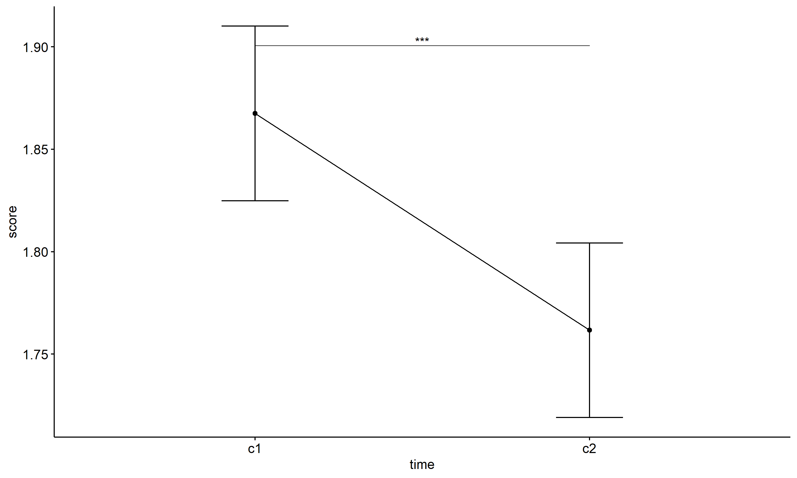
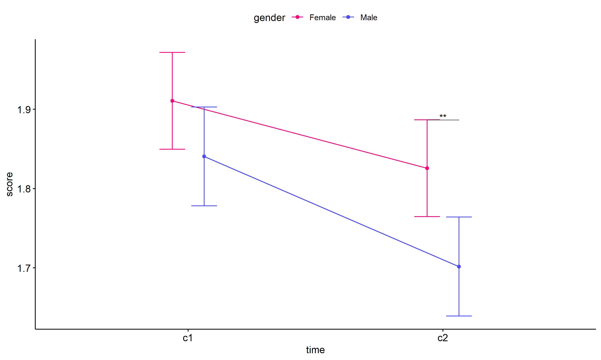
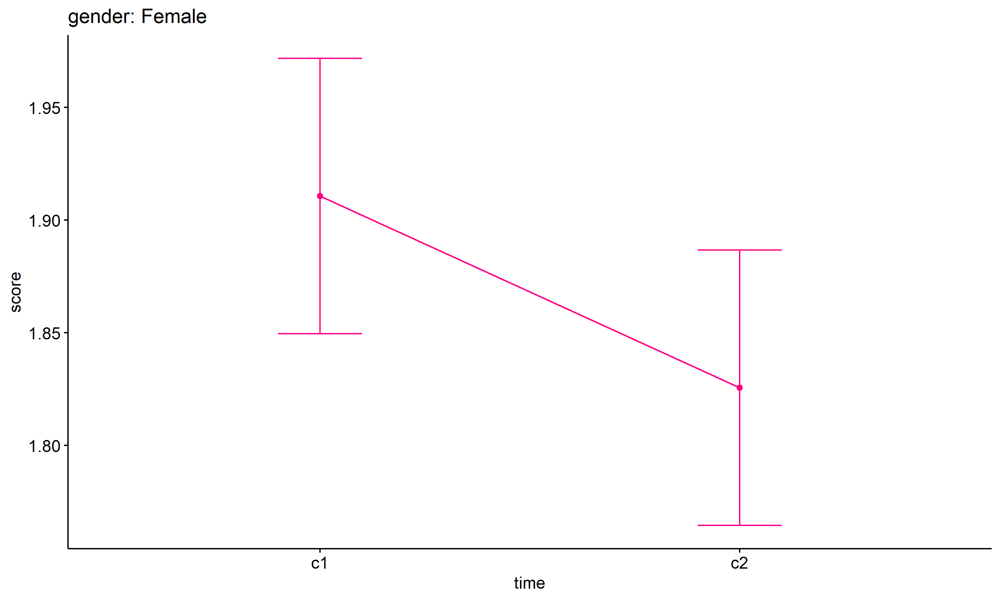
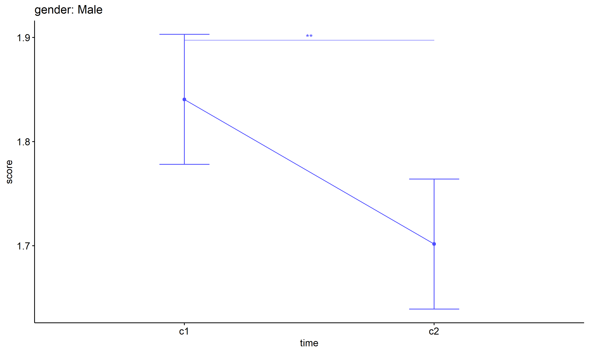
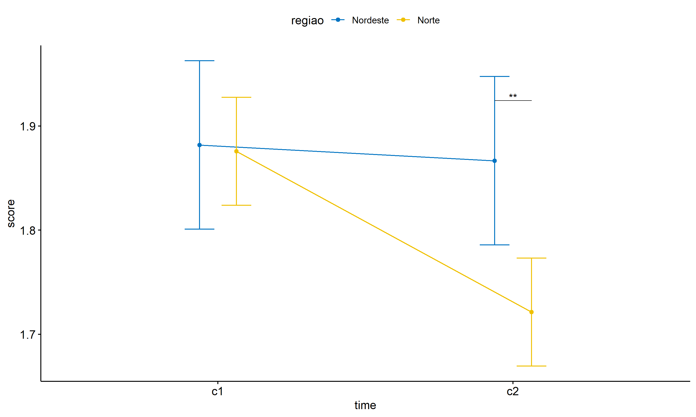
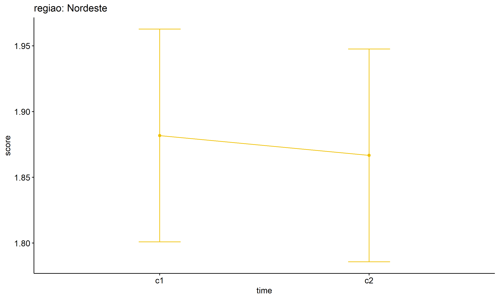
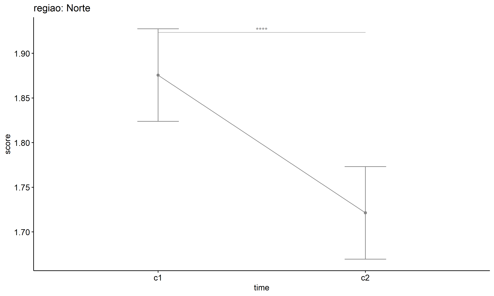
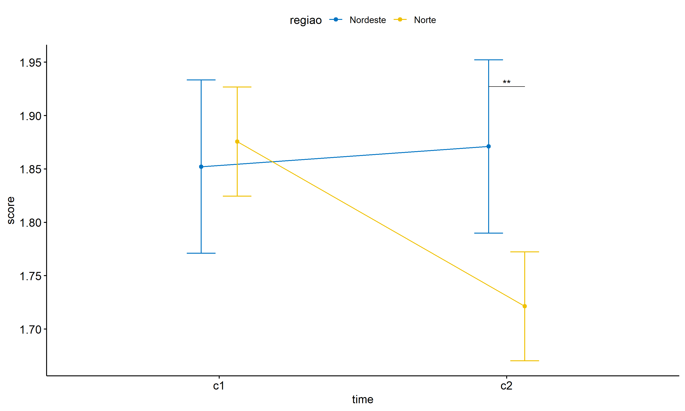
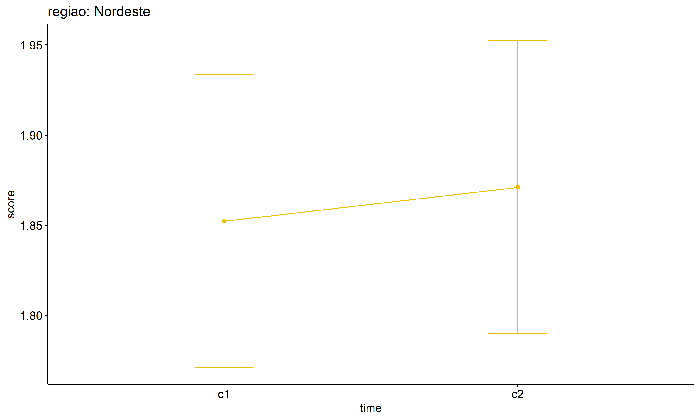

ANOVA test for score
================
Geiser C. Challco <geiser@alumni.usp.br>

- [ANOVA: score ~ time](#anova-score--time)
  - [Data Preparation](#data-preparation)
  - [Summary Statistics](#summary-statistics)
  - [ANOVA Computation](#anova-computation)
  - [PairWise Computation](#pairwise-computation)
- [ANOVA: score ~ time\*gender +
  Error(id/time)](#anova-score--timegender--erroridtime)
  - [Data Preparation](#data-preparation-1)
    - [Check assumptions: Identifying
      Outliers](#check-assumptions-identifying-outliers)
    - [Check assumptions: Normality
      Test](#check-assumptions-normality-test)
    - [Summary Statistics](#summary-statistics-1)
  - [ANOVA Computation](#anova-computation-1)
  - [ANOVA Computation after removing non.normal
    data](#anova-computation-after-removing-nonnormal-data)
  - [PairWise Computation](#pairwise-computation-1)
  - [PairWise Computation after removing non.normal
    data](#pairwise-computation-after-removing-nonnormal-data)
- [ANOVA: score ~ time\*regiao +
  Error(id/time)](#anova-score--timeregiao--erroridtime)
  - [Data Preparation](#data-preparation-2)
    - [Check assumptions: Identifying
      Outliers](#check-assumptions-identifying-outliers-1)
    - [Check assumptions: Normality
      Test](#check-assumptions-normality-test-1)
    - [Summary Statistics](#summary-statistics-2)
  - [ANOVA Computation](#anova-computation-2)
  - [ANOVA Computation after removing non.normal
    data](#anova-computation-after-removing-nonnormal-data-1)
  - [PairWise Computation](#pairwise-computation-2)
  - [PairWise Computation after removing non.normal
    data](#pairwise-computation-after-removing-nonnormal-data-1)

``` r
dat <- read_excel("../data/data.xlsx", sheet = "alunos_ef59")

escolas <- read_excel("../data/data.xlsx", sheet = "escolas")
edat <- merge(dat, escolas, by = "cod_escola", all.x = T)
```

# ANOVA: score ~ time

## Data Preparation

``` r
data <- edat[,c("aluno_id","ciclo","score")]
data <- data[data$ciclo %in% c("Primeiro Ciclo","Segundo Ciclo"),]
data$ciclo <- factor(data$ciclo, c("Primeiro Ciclo","Segundo Ciclo"))
data <- unique(data)

wdat <- spread(data, ciclo, score)
wdat <- wdat[complete.cases(wdat),]
colnames(wdat) <- c("id","c1","c2")

ldat <- gather(wdat, key = time, value = score, c1,c2) %>%
  convert_as_factor(id, time)
ldat <- rshinystatistics::remove_group_data(ldat, "score", "time", n.limit = 30)
```

## Summary Statistics

``` r
(sdat <- ldat %>% group_by(time) %>%
   get_summary_stats(score, type = "mean_sd"))
```

    ## # A tibble: 2 × 5
    ##   time  variable     n  mean    sd
    ##   <fct> <fct>    <dbl> <dbl> <dbl>
    ## 1 c1    score      200  1.87 0.299
    ## 2 c2    score      200  1.76 0.314

| time | variable |   n |  mean |    sd |
|:-----|:---------|----:|------:|------:|
| c1   | score    | 200 | 1.867 | 0.299 |
| c2   | score    | 200 | 1.762 | 0.314 |

## ANOVA Computation

``` r
(res.aov <- anova_test(ldat, dv = score, wid = id, within = time))
```

    ## ANOVA Table (type III tests)
    ## 
    ##   Effect DFn DFd      F        p p<.05   ges
    ## 1   time   1 199 13.431 0.000317     * 0.029

## PairWise Computation

``` r
(pwc <- ldat %>% emmeans_test(score ~ time, detailed = T, p.adjust.method = "bonferroni"))
```

    ## # A tibble: 1 × 14
    ##   term  .y.   group1 group2 null.value estimate     se    df conf.low conf.high
    ## * <chr> <chr> <chr>  <chr>       <dbl>    <dbl>  <dbl> <dbl>    <dbl>     <dbl>
    ## 1 time  score c1     c2              0    0.106 0.0307   398   0.0456     0.166
    ## # ℹ 4 more variables: statistic <dbl>, p <dbl>, p.adj <dbl>, p.adj.signif <chr>

| term | .y.   | group1 | group2 | null.value | estimate |    se |  df | conf.low | conf.high | statistic |     p | p.adj | p.adj.signif |
|:-----|:------|:-------|:-------|-----------:|---------:|------:|----:|---------:|----------:|----------:|------:|------:|:-------------|
| time | score | c1     | c2     |          0 |    0.106 | 0.031 | 398 |    0.046 |     0.166 |     3.453 | 0.001 | 0.001 | \*\*\*       |

``` r
pwc <- add_xy_position(pwc, x = "time", fun = "mean_se")
ggline(get_emmeans(pwc), x = "time", y = "emmean", ylab = "score") +
  geom_errorbar(aes(ymin = conf.low, ymax = conf.high), width = 0.2) +
  stat_pvalue_manual(pwc, hide.ns = T, tip.length = F)
```

<!-- -->

# ANOVA: score ~ time\*gender + Error(id/time)

## Data Preparation

``` r
data <- edat[,c("aluno_id","gender","ciclo","score")]
data <- data[data$ciclo %in% c("Primeiro Ciclo","Segundo Ciclo"),]
data$ciclo <- factor(data$ciclo, c("Primeiro Ciclo","Segundo Ciclo"))
data <- unique(data)

wdat <- spread(data, ciclo, score)
wdat <- wdat[complete.cases(wdat),]
colnames(wdat) <- c("id","gender","c1","c2")

ldat <- gather(wdat, key = time, value = score, c1,c2) %>%
  convert_as_factor(id, time)
ldat <- remove_group_data(ldat, "score", c("time", "gender"), n.limit = 30)
ldat$gender <- factor(ldat$gender, sort(unique(ldat$gender)))
```

### Check assumptions: Identifying Outliers

``` r
outliers <- identify_outliers(group_by(ldat, time, gender), score)
(outliers <- outliers[outliers$is.extreme == T,])
```

    ## # A tibble: 0 × 6
    ## # ℹ 6 variables: gender <fct>, time <fct>, id <fct>, score <dbl>,
    ## #   is.outlier <lgl>, is.extreme <lgl>

| gender | time | id  | score | is.outlier | is.extreme |
|:-------|:-----|:----|------:|:-----------|:-----------|

### Check assumptions: Normality Test

``` r
(normality.df <- normality.test.per.groups(ldat, "score", c("time", "gender")))
```

    ##     var variable time gender  n  skewness   kurtosis symmetry statistic
    ## 1 score    score   c1 Female 97 0.3701963 -0.1424349      YES  2.481260
    ## 2 score    score   c1   Male 93 0.2984629 -0.3833972      YES  1.799406
    ## 3 score    score   c2 Female 97 0.4546005 -0.5509552      YES  4.740732
    ## 4 score    score   c2   Male 93 0.5037621  0.3461313       NO  5.429848
    ##       method          p p.signif normality
    ## 1 D'Agostino 0.28920199       ns       YES
    ## 2 D'Agostino 0.40669046       ns       YES
    ## 3 D'Agostino 0.09344650       ns       YES
    ## 4 D'Agostino 0.06620997       ns       YES

| var   | variable | time | gender |   n | skewness | kurtosis | symmetry | statistic | method     |     p | p.signif | normality |
|:------|:---------|:-----|:-------|----:|---------:|---------:|:---------|----------:|:-----------|------:|:---------|:----------|
| score | score    | c1   | Female |  97 |    0.370 |   -0.142 | YES      |     2.481 | D’Agostino | 0.289 | ns       | YES       |
| score | score    | c1   | Male   |  93 |    0.298 |   -0.383 | YES      |     1.799 | D’Agostino | 0.407 | ns       | YES       |
| score | score    | c2   | Female |  97 |    0.455 |   -0.551 | YES      |     4.741 | D’Agostino | 0.093 | ns       | YES       |
| score | score    | c2   | Male   |  93 |    0.504 |    0.346 | NO       |     5.430 | D’Agostino | 0.066 | ns       | YES       |

``` r
(non.ids <- unique(do.call(
  c, lapply(which(normality.df$normality == 'NO'), FUN = function(i) {
  idx = which(ldat$time == normality.df$time[i] &
                ldat$gender == normality.df$gender[i])
  getNonNormal(ldat$"score"[idx], ldat$id[idx])
}))))
```

    ## NULL

``` r
if (length(non.ids) > 0)
  ldat2 <- ldat[!ldat$id %in% non.ids,]
```

### Summary Statistics

``` r
(sdat <- ldat %>% group_by(time, gender) %>%
   get_summary_stats(score, type = "mean_sd"))
```

    ## # A tibble: 4 × 6
    ##   gender time  variable     n  mean    sd
    ##   <fct>  <fct> <fct>    <dbl> <dbl> <dbl>
    ## 1 Female c1    score       97  1.91 0.299
    ## 2 Male   c1    score       93  1.84 0.301
    ## 3 Female c2    score       97  1.83 0.347
    ## 4 Male   c2    score       93  1.70 0.271

| gender | time | variable |   n |  mean |    sd |
|:-------|:-----|:---------|----:|------:|------:|
| Female | c1   | score    |  97 | 1.911 | 0.299 |
| Male   | c1   | score    |  93 | 1.841 | 0.301 |
| Female | c2   | score    |  97 | 1.826 | 0.347 |
| Male   | c2   | score    |  93 | 1.702 | 0.271 |

``` r
if (length(non.ids) > 0)
  (sdat <- ldat2 %>% group_by(time, gender) %>%
      get_summary_stats(score, type = "mean_sd"))
```

| gender | time | variable |   n |  mean |    sd |
|:-------|:-----|:---------|----:|------:|------:|
| Female | c1   | score    |  97 | 1.911 | 0.299 |
| Male   | c1   | score    |  93 | 1.841 | 0.301 |
| Female | c2   | score    |  97 | 1.826 | 0.347 |
| Male   | c2   | score    |  93 | 1.702 | 0.271 |

## ANOVA Computation

``` r
(res.aov <- anova_test(ldat, dv = score, wid = id, between = gender, within = time))
```

    ## ANOVA Table (type III tests)
    ## 
    ##        Effect DFn DFd      F        p p<.05   ges
    ## 1      gender   1 188  8.722 0.004000     * 0.025
    ## 2        time   1 188 14.091 0.000232     * 0.033
    ## 3 gender:time   1 188  0.814 0.368000       0.002

## ANOVA Computation after removing non.normal data

``` r
if (length(non.ids) > 0)
  (res.aov2 <- anova_test(ldat2, dv = score, wid = id, between = gender , within = time))
```

## PairWise Computation

``` r
(pwc <- ldat %>% group_by(time) %>%
   emmeans_test(score ~ gender, detailed = T, p.adjust.method = "bonferroni"))
```

    ## # A tibble: 2 × 15
    ##   time  term   .y.   group1 group2 null.value estimate     se    df conf.low
    ## * <fct> <chr>  <chr> <chr>  <chr>       <dbl>    <dbl>  <dbl> <dbl>    <dbl>
    ## 1 c1    gender score Female Male            0   0.0702 0.0444   376  -0.0171
    ## 2 c2    gender score Female Male            0   0.124  0.0444   376   0.0367
    ## # ℹ 5 more variables: conf.high <dbl>, statistic <dbl>, p <dbl>, p.adj <dbl>,
    ## #   p.adj.signif <chr>

| time | term   | .y.   | group1 | group2 | null.value | estimate |    se |  df | conf.low | conf.high | statistic |     p | p.adj | p.adj.signif |
|:-----|:-------|:------|:-------|:-------|-----------:|---------:|------:|----:|---------:|----------:|----------:|------:|------:|:-------------|
| c1   | gender | score | Female | Male   |          0 |    0.070 | 0.044 | 376 |   -0.017 |     0.157 |     1.580 | 0.115 | 0.115 | ns           |
| c2   | gender | score | Female | Male   |          0 |    0.124 | 0.044 | 376 |    0.037 |     0.211 |     2.793 | 0.005 | 0.005 | \*\*         |

``` r
(emms <- get_emmeans(pwc))
```

    ## # A tibble: 4 × 8
    ##   time  gender emmean     se    df conf.low conf.high method      
    ##   <fct> <fct>   <dbl>  <dbl> <dbl>    <dbl>     <dbl> <chr>       
    ## 1 c1    Female   1.91 0.0311   376     1.85      1.97 Emmeans test
    ## 2 c1    Male     1.84 0.0317   376     1.78      1.90 Emmeans test
    ## 3 c2    Female   1.83 0.0311   376     1.76      1.89 Emmeans test
    ## 4 c2    Male     1.70 0.0317   376     1.64      1.76 Emmeans test

| time | gender | emmean |    se |  df | conf.low | conf.high | method       |
|:-----|:-------|-------:|------:|----:|---------:|----------:|:-------------|
| c1   | Female |  1.911 | 0.031 | 376 |    1.850 |     1.972 | Emmeans test |
| c1   | Male   |  1.841 | 0.032 | 376 |    1.778 |     1.903 | Emmeans test |
| c2   | Female |  1.826 | 0.031 | 376 |    1.765 |     1.887 | Emmeans test |
| c2   | Male   |  1.702 | 0.032 | 376 |    1.639 |     1.764 | Emmeans test |

``` r
pwc <- add_xy_position(pwc, x = "time", fun = "mean_se", dodge = 0.25)
pd <- position_dodge(width = 0.25)
ggline(emms, x = "time", y = "emmean", color = "gender",
       palette = c("#FF007F","#4D4DFF"),
       position = pd, ylab = "score") +
  geom_errorbar(aes(ymin = conf.low, ymax = conf.high, color = gender),
                position = pd, width = 0.2) +
  stat_pvalue_manual(pwc, hide.ns = T, tip.length = F, linetype = 1)
```

<!-- -->

``` r
(pwc <- ldat %>% group_by(gender) %>%
    emmeans_test(score ~ time, detailed = T, p.adjust.method = "bonferroni"))
```

    ## # A tibble: 2 × 15
    ##   gender term  .y.   group1 group2 null.value estimate     se    df conf.low
    ## * <fct>  <chr> <chr> <chr>  <chr>       <dbl>    <dbl>  <dbl> <dbl>    <dbl>
    ## 1 Female time  score c1     c2              0   0.0851 0.0439   376 -0.00130
    ## 2 Male   time  score c1     c2              0   0.139  0.0449   376  0.0507 
    ## # ℹ 5 more variables: conf.high <dbl>, statistic <dbl>, p <dbl>, p.adj <dbl>,
    ## #   p.adj.signif <chr>

| gender | term | .y.   | group1 | group2 | null.value | estimate |    se |  df | conf.low | conf.high | statistic |     p | p.adj | p.adj.signif |
|:-------|:-----|:------|:-------|:-------|-----------:|---------:|------:|----:|---------:|----------:|----------:|------:|------:|:-------------|
| Female | time | score | c1     | c2     |          0 |    0.085 | 0.044 | 376 |   -0.001 |     0.171 |     1.937 | 0.054 | 0.054 | ns           |
| Male   | time | score | c1     | c2     |          0 |    0.139 | 0.045 | 376 |    0.051 |     0.227 |     3.097 | 0.002 | 0.002 | \*\*         |

``` r
(emms <- get_emmeans(pwc))
```

    ## # A tibble: 4 × 8
    ##   gender time  emmean     se    df conf.low conf.high method      
    ##   <fct>  <fct>  <dbl>  <dbl> <dbl>    <dbl>     <dbl> <chr>       
    ## 1 Female c1      1.91 0.0311   376     1.85      1.97 Emmeans test
    ## 2 Female c2      1.83 0.0311   376     1.76      1.89 Emmeans test
    ## 3 Male   c1      1.84 0.0317   376     1.78      1.90 Emmeans test
    ## 4 Male   c2      1.70 0.0317   376     1.64      1.76 Emmeans test

| gender | time | emmean |    se |  df | conf.low | conf.high | method       |
|:-------|:-----|-------:|------:|----:|---------:|----------:|:-------------|
| Female | c1   |  1.911 | 0.031 | 376 |    1.850 |     1.972 | Emmeans test |
| Female | c2   |  1.826 | 0.031 | 376 |    1.765 |     1.887 | Emmeans test |
| Male   | c1   |  1.841 | 0.032 | 376 |    1.778 |     1.903 | Emmeans test |
| Male   | c2   |  1.702 | 0.032 | 376 |    1.639 |     1.764 | Emmeans test |

``` r
emms.gg <- emms[which(emms$gender == "Female"),]
if (nrow(emms.gg) > 0)
  ggline(emms.gg, x = "time", y = "emmean", color = "#FF007F", ylab = "score") +
    geom_errorbar(aes(ymin = conf.low, ymax = conf.high),
                  width = 0.2, color = "#FF007F") +
    stat_pvalue_manual(
      add_xy_position(pwc[which(pwc$gender == "Female"),],
                      x = "time", fun = "mean_se"),
      hide.ns = T, color = "#FF007F", tip.length = F) +
    labs(title = "gender: Female")+
    theme(legend.text = element_blank())
```

<!-- -->

``` r
emms.gg <- emms[which(emms$gender == "Male"),]
if (nrow(emms.gg) > 0)
  ggline(emms.gg, x = "time", y = "emmean", color = "#4D4DFF", ylab = "score") +
    geom_errorbar(aes(ymin = conf.low, ymax = conf.high),
                  width = 0.2, color = "#4D4DFF") +
    stat_pvalue_manual(
      add_xy_position(pwc[which(pwc$gender == "Male"),],
                      x = "time", fun = "mean_se"),
      hide.ns = T, color = "#4D4DFF", tip.length = F) +
    labs(title = "gender: Male")+
    theme(legend.text = element_blank())
```

<!-- -->

## PairWise Computation after removing non.normal data

``` r
if (length(non.ids) > 0)
  (pwc2 <- ldat2 %>% group_by(time) %>%
     emmeans_test(score ~ gender, detailed = T, p.adjust.method = "bonferroni"))
```

``` r
if (length(non.ids) > 0)
  (emms2 <- get_emmeans(pwc2))
```

``` r
if (length(non.ids) > 0) {
  pwc2 <- add_xy_position(pwc2, x = "time", fun = "mean_se", dodge = 0.25)
  pd2 <- position_dodge(width = 0.25)
  
  ggline(emms2, x = "time", y = "emmean", color = "gender",
         palette = c("#FF007F","#4D4DFF"),
         position = pd, ylab = "score") +
    geom_errorbar(aes(ymin = conf.low, ymax = conf.high, color = gender),
                position = pd, width = 0.2) +
    stat_pvalue_manual(pwc2, hide.ns = T, tip.length = F, linetype = 1)
}
```

``` r
if (length(non.ids) > 0)
  (pwc2 <- ldat2 %>% group_by(gender) %>%
     emmeans_test(score ~ time, detailed = T, p.adjust.method = "bonferroni"))
```

``` r
if (length(non.ids) > 0)
  (emms2 <- get_emmeans(pwc2))
```

``` r
if (length(non.ids) > 0) {
  emms.gg <- emms2[which(emms2$gender == "Female"),]
  if (nrow(emms.gg) > 0)
    ggline(emms.gg, x = "time", y = "emmean", color = "#FF007F", ylab = "score") +
    geom_errorbar(aes(ymin = conf.low, ymax = conf.high),
                  width = 0.2, color = "#FF007F") +
    stat_pvalue_manual(
      add_xy_position(pwc[which(pwc$gender == "Female"),],
                      x = "time", fun = "mean_se"),
      hide.ns = T, color = "#FF007F", tip.length = F) +
    labs(title = "gender: Female") +
    theme(legend.text = element_blank())
}
```

``` r
if (length(non.ids) > 0) {
  emms.gg <- emms2[which(emms2$gender == "Male"),]
  if (nrow(emms.gg) > 0)
    ggline(emms.gg, x = "time", y = "emmean", color = "#4D4DFF", ylab = "score") +
    geom_errorbar(aes(ymin = conf.low, ymax = conf.high),
                  width = 0.2, color = "#4D4DFF") +
    stat_pvalue_manual(
      add_xy_position(pwc[which(pwc$gender == "Male"),],
                      x = "time", fun = "mean_se"),
      hide.ns = T, color = "#4D4DFF", tip.length = F) +
    labs(title = "gender: Male") +
    theme(legend.text = element_blank())
}
```

# ANOVA: score ~ time\*regiao + Error(id/time)

## Data Preparation

``` r
data <- edat[,c("aluno_id","regiao","ciclo","score")]
data <- data[data$ciclo %in% c("Primeiro Ciclo","Segundo Ciclo"),]
data$ciclo <- factor(data$ciclo, c("Primeiro Ciclo","Segundo Ciclo"))
data <- unique(data)

wdat <- spread(data, ciclo, score)
wdat <- wdat[complete.cases(wdat),]
colnames(wdat) <- c("id","regiao","c1","c2")

ldat <- gather(wdat, key = time, value = score, c1,c2) %>%
  convert_as_factor(id, time)
ldat <- remove_group_data(ldat, "score", c("time", "regiao"), n.limit = 30)
ldat$regiao <- factor(ldat$regiao, sort(unique(ldat$regiao)))
```

### Check assumptions: Identifying Outliers

``` r
outliers <- identify_outliers(group_by(ldat, time, regiao), score)
(outliers <- outliers[outliers$is.extreme == T,])
```

    ## # A tibble: 0 × 6
    ## # ℹ 6 variables: regiao <fct>, time <fct>, id <fct>, score <dbl>,
    ## #   is.outlier <lgl>, is.extreme <lgl>

| regiao | time | id  | score | is.outlier | is.extreme |
|:-------|:-----|:----|------:|:-----------|:-----------|

### Check assumptions: Normality Test

``` r
(normality.df <- normality.test.per.groups(ldat, "score", c("time", "regiao")))
```

    ##     var variable time   regiao   n  skewness    kurtosis symmetry statistic
    ## 1 score    score   c1 Nordeste  55 0.9199404  0.73000185       NO 10.293623
    ## 2 score    score   c1    Norte 134 0.1495938 -0.53864919      YES  2.355202
    ## 3 score    score   c2 Nordeste  55 0.3926972  0.08963851      YES  2.271673
    ## 4 score    score   c2    Norte 134 0.8118581  0.29844433       NO 14.351053
    ##       method           p p.signif normality
    ## 1 D'Agostino 0.005817927       **        NO
    ## 2 D'Agostino 0.308016762       ns        QQ
    ## 3 D'Agostino 0.321153421       ns       YES
    ## 4 D'Agostino 0.000765083       **        QQ

| var   | variable | time | regiao   |   n | skewness | kurtosis | symmetry | statistic | method     |     p | p.signif | normality |
|:------|:---------|:-----|:---------|----:|---------:|---------:|:---------|----------:|:-----------|------:|:---------|:----------|
| score | score    | c1   | Nordeste |  55 |    0.920 |    0.730 | NO       |    10.294 | D’Agostino | 0.006 | \*\*     | NO        |
| score | score    | c1   | Norte    | 134 |    0.150 |   -0.539 | YES      |     2.355 | D’Agostino | 0.308 | ns       | QQ        |
| score | score    | c2   | Nordeste |  55 |    0.393 |    0.090 | YES      |     2.272 | D’Agostino | 0.321 | ns       | YES       |
| score | score    | c2   | Norte    | 134 |    0.812 |    0.298 | NO       |    14.351 | D’Agostino | 0.001 | \*\*     | QQ        |

``` r
(non.ids <- unique(do.call(
  c, lapply(which(normality.df$normality == 'NO'), FUN = function(i) {
  idx = which(ldat$time == normality.df$time[i] &
                ldat$regiao == normality.df$regiao[i])
  getNonNormal(ldat$"score"[idx], ldat$id[idx])
}))))
```

    ## [1] "YpnkzyPiMacKwl1V5xUY" "ZdunfmhB62wiMqQtoC6K"

``` r
if (length(non.ids) > 0)
  ldat2 <- ldat[!ldat$id %in% non.ids,]
```

### Summary Statistics

``` r
(sdat <- ldat %>% group_by(time, regiao) %>%
   get_summary_stats(score, type = "mean_sd"))
```

    ## # A tibble: 4 × 6
    ##   regiao   time  variable     n  mean    sd
    ##   <fct>    <fct> <fct>    <dbl> <dbl> <dbl>
    ## 1 Nordeste c1    score       55  1.88 0.275
    ## 2 Norte    c1    score      134  1.88 0.312
    ## 3 Nordeste c2    score       55  1.87 0.271
    ## 4 Norte    c2    score      134  1.72 0.322

| regiao   | time | variable |   n |  mean |    sd |
|:---------|:-----|:---------|----:|------:|------:|
| Nordeste | c1   | score    |  55 | 1.882 | 0.275 |
| Norte    | c1   | score    | 134 | 1.876 | 0.312 |
| Nordeste | c2   | score    |  55 | 1.867 | 0.271 |
| Norte    | c2   | score    | 134 | 1.721 | 0.322 |

``` r
if (length(non.ids) > 0)
  (sdat <- ldat2 %>% group_by(time, regiao) %>%
      get_summary_stats(score, type = "mean_sd"))
```

    ## # A tibble: 4 × 6
    ##   regiao   time  variable     n  mean    sd
    ##   <fct>    <fct> <fct>    <dbl> <dbl> <dbl>
    ## 1 Nordeste c1    score       53  1.85 0.233
    ## 2 Norte    c1    score      134  1.88 0.312
    ## 3 Nordeste c2    score       53  1.87 0.271
    ## 4 Norte    c2    score      134  1.72 0.322

| regiao   | time | variable |   n |  mean |    sd |
|:---------|:-----|:---------|----:|------:|------:|
| Nordeste | c1   | score    |  53 | 1.852 | 0.233 |
| Norte    | c1   | score    | 134 | 1.876 | 0.312 |
| Nordeste | c2   | score    |  53 | 1.871 | 0.271 |
| Norte    | c2   | score    | 134 | 1.721 | 0.322 |

## ANOVA Computation

``` r
(res.aov <- anova_test(ldat, dv = score, wid = id, between = regiao, within = time))
```

    ## ANOVA Table (type III tests)
    ## 
    ##        Effect DFn DFd     F     p p<.05   ges
    ## 1      regiao   1 187 4.281 0.040     * 0.013
    ## 2        time   1 187 6.845 0.010     * 0.016
    ## 3 regiao:time   1 187 4.615 0.033     * 0.011

## ANOVA Computation after removing non.normal data

``` r
if (length(non.ids) > 0)
  (res.aov2 <- anova_test(ldat2, dv = score, wid = id, between = regiao , within = time))
```

    ## ANOVA Table (type III tests)
    ## 
    ##        Effect DFn DFd     F     p p<.05   ges
    ## 1      regiao   1 185 2.945 0.088       0.009
    ## 2        time   1 185 4.477 0.036     * 0.010
    ## 3 regiao:time   1 185 7.322 0.007     * 0.017

## PairWise Computation

``` r
(pwc <- ldat %>% group_by(time) %>%
   emmeans_test(score ~ regiao, detailed = T, p.adjust.method = "bonferroni"))
```

    ## # A tibble: 2 × 15
    ##   time  term   .y.   group1   group2 null.value estimate     se    df conf.low
    ## * <fct> <chr>  <chr> <chr>    <chr>       <dbl>    <dbl>  <dbl> <dbl>    <dbl>
    ## 1 c1    regiao score Nordeste Norte           0  0.00620 0.0489   374  -0.0899
    ## 2 c2    regiao score Nordeste Norte           0  0.145   0.0489   374   0.0492
    ## # ℹ 5 more variables: conf.high <dbl>, statistic <dbl>, p <dbl>, p.adj <dbl>,
    ## #   p.adj.signif <chr>

| time | term   | .y.   | group1   | group2 | null.value | estimate |    se |  df | conf.low | conf.high | statistic |     p | p.adj | p.adj.signif |
|:-----|:-------|:------|:---------|:-------|-----------:|---------:|------:|----:|---------:|----------:|----------:|------:|------:|:-------------|
| c1   | regiao | score | Nordeste | Norte  |          0 |    0.006 | 0.049 | 374 |   -0.090 |     0.102 |     0.127 | 0.899 | 0.899 | ns           |
| c2   | regiao | score | Nordeste | Norte  |          0 |    0.145 | 0.049 | 374 |    0.049 |     0.241 |     2.973 | 0.003 | 0.003 | \*\*         |

``` r
(emms <- get_emmeans(pwc))
```

    ## # A tibble: 4 × 8
    ##   time  regiao   emmean     se    df conf.low conf.high method      
    ##   <fct> <fct>     <dbl>  <dbl> <dbl>    <dbl>     <dbl> <chr>       
    ## 1 c1    Nordeste   1.88 0.0411   374     1.80      1.96 Emmeans test
    ## 2 c1    Norte      1.88 0.0264   374     1.82      1.93 Emmeans test
    ## 3 c2    Nordeste   1.87 0.0411   374     1.79      1.95 Emmeans test
    ## 4 c2    Norte      1.72 0.0264   374     1.67      1.77 Emmeans test

| time | regiao   | emmean |    se |  df | conf.low | conf.high | method       |
|:-----|:---------|-------:|------:|----:|---------:|----------:|:-------------|
| c1   | Nordeste |  1.882 | 0.041 | 374 |    1.801 |     1.963 | Emmeans test |
| c1   | Norte    |  1.876 | 0.026 | 374 |    1.824 |     1.927 | Emmeans test |
| c2   | Nordeste |  1.867 | 0.041 | 374 |    1.786 |     1.948 | Emmeans test |
| c2   | Norte    |  1.721 | 0.026 | 374 |    1.670 |     1.773 | Emmeans test |

``` r
pwc <- add_xy_position(pwc, x = "time", fun = "mean_se", dodge = 0.25)
pd <- position_dodge(width = 0.25)
ggline(emms, x = "time", y = "emmean", color = "regiao",
       palette = c("#0073C2FF","#EFC000FF","#868686FF","#CD534CFF","#7AA6DCFF"),
       position = pd, ylab = "score") +
  geom_errorbar(aes(ymin = conf.low, ymax = conf.high, color = regiao),
                position = pd, width = 0.2) +
  stat_pvalue_manual(pwc, hide.ns = T, tip.length = F, linetype = 1)
```

<!-- -->

``` r
(pwc <- ldat %>% group_by(regiao) %>%
    emmeans_test(score ~ time, detailed = T, p.adjust.method = "bonferroni"))
```

    ## # A tibble: 2 × 15
    ##   regiao   term  .y.   group1 group2 null.value estimate     se    df conf.low
    ## * <fct>    <chr> <chr> <chr>  <chr>       <dbl>    <dbl>  <dbl> <dbl>    <dbl>
    ## 1 Nordeste time  score c1     c2              0   0.0152 0.0582   374  -0.0993
    ## 2 Norte    time  score c1     c2              0   0.154  0.0373   374   0.0809
    ## # ℹ 5 more variables: conf.high <dbl>, statistic <dbl>, p <dbl>, p.adj <dbl>,
    ## #   p.adj.signif <chr>

| regiao   | term | .y.   | group1 | group2 | null.value | estimate |    se |  df | conf.low | conf.high | statistic |     p | p.adj | p.adj.signif |
|:---------|:-----|:------|:-------|:-------|-----------:|---------:|------:|----:|---------:|----------:|----------:|------:|------:|:-------------|
| Nordeste | time | score | c1     | c2     |          0 |    0.015 | 0.058 | 374 |   -0.099 |     0.130 |     0.260 | 0.795 | 0.795 | ns           |
| Norte    | time | score | c1     | c2     |          0 |    0.154 | 0.037 | 374 |    0.081 |     0.228 |     4.137 | 0.000 | 0.000 | \*\*\*\*     |

``` r
(emms <- get_emmeans(pwc))
```

    ## # A tibble: 4 × 8
    ##   regiao   time  emmean     se    df conf.low conf.high method      
    ##   <fct>    <fct>  <dbl>  <dbl> <dbl>    <dbl>     <dbl> <chr>       
    ## 1 Nordeste c1      1.88 0.0411   374     1.80      1.96 Emmeans test
    ## 2 Nordeste c2      1.87 0.0411   374     1.79      1.95 Emmeans test
    ## 3 Norte    c1      1.88 0.0264   374     1.82      1.93 Emmeans test
    ## 4 Norte    c2      1.72 0.0264   374     1.67      1.77 Emmeans test

| regiao   | time | emmean |    se |  df | conf.low | conf.high | method       |
|:---------|:-----|-------:|------:|----:|---------:|----------:|:-------------|
| Nordeste | c1   |  1.882 | 0.041 | 374 |    1.801 |     1.963 | Emmeans test |
| Nordeste | c2   |  1.867 | 0.041 | 374 |    1.786 |     1.948 | Emmeans test |
| Norte    | c1   |  1.876 | 0.026 | 374 |    1.824 |     1.927 | Emmeans test |
| Norte    | c2   |  1.721 | 0.026 | 374 |    1.670 |     1.773 | Emmeans test |

``` r
emms.gg <- emms[which(emms$regiao == "Centro-Oeste"),]
if (nrow(emms.gg) > 0)
  ggline(emms.gg, x = "time", y = "emmean", color = "#0073C2FF", ylab = "score") +
    geom_errorbar(aes(ymin = conf.low, ymax = conf.high),
                  width = 0.2, color = "#0073C2FF") +
    stat_pvalue_manual(
      add_xy_position(pwc[which(pwc$regiao == "Centro-Oeste"),],
                      x = "time", fun = "mean_se"),
      hide.ns = T, color = "#0073C2FF", tip.length = F) +
    labs(title = "regiao: Centro-Oeste")+
    theme(legend.text = element_blank())
```

``` r
emms.gg <- emms[which(emms$regiao == "Nordeste"),]
if (nrow(emms.gg) > 0)
  ggline(emms.gg, x = "time", y = "emmean", color = "#EFC000FF", ylab = "score") +
    geom_errorbar(aes(ymin = conf.low, ymax = conf.high),
                  width = 0.2, color = "#EFC000FF") +
    stat_pvalue_manual(
      add_xy_position(pwc[which(pwc$regiao == "Nordeste"),],
                      x = "time", fun = "mean_se"),
      hide.ns = T, color = "#EFC000FF", tip.length = F) +
    labs(title = "regiao: Nordeste")+
    theme(legend.text = element_blank())
```

<!-- -->

``` r
emms.gg <- emms[which(emms$regiao == "Norte"),]
if (nrow(emms.gg) > 0)
  ggline(emms.gg, x = "time", y = "emmean", color = "#868686FF", ylab = "score") +
    geom_errorbar(aes(ymin = conf.low, ymax = conf.high),
                  width = 0.2, color = "#868686FF") +
    stat_pvalue_manual(
      add_xy_position(pwc[which(pwc$regiao == "Norte"),],
                      x = "time", fun = "mean_se"),
      hide.ns = T, color = "#868686FF", tip.length = F) +
    labs(title = "regiao: Norte")+
    theme(legend.text = element_blank())
```

<!-- -->

``` r
emms.gg <- emms[which(emms$regiao == "Sudeste"),]
if (nrow(emms.gg) > 0)
  ggline(emms.gg, x = "time", y = "emmean", color = "#CD534CFF", ylab = "score") +
    geom_errorbar(aes(ymin = conf.low, ymax = conf.high),
                  width = 0.2, color = "#CD534CFF") +
    stat_pvalue_manual(
      add_xy_position(pwc[which(pwc$regiao == "Sudeste"),],
                      x = "time", fun = "mean_se"),
      hide.ns = T, color = "#CD534CFF", tip.length = F) +
    labs(title = "regiao: Sudeste")+
    theme(legend.text = element_blank())
```

``` r
emms.gg <- emms[which(emms$regiao == "Sul"),]
if (nrow(emms.gg) > 0)
  ggline(emms.gg, x = "time", y = "emmean", color = "#7AA6DCFF", ylab = "score") +
    geom_errorbar(aes(ymin = conf.low, ymax = conf.high),
                  width = 0.2, color = "#7AA6DCFF") +
    stat_pvalue_manual(
      add_xy_position(pwc[which(pwc$regiao == "Sul"),],
                      x = "time", fun = "mean_se"),
      hide.ns = T, color = "#7AA6DCFF", tip.length = F) +
    labs(title = "regiao: Sul")+
    theme(legend.text = element_blank())
```

## PairWise Computation after removing non.normal data

``` r
if (length(non.ids) > 0)
  (pwc2 <- ldat2 %>% group_by(time) %>%
     emmeans_test(score ~ regiao, detailed = T, p.adjust.method = "bonferroni"))
```

    ## # A tibble: 2 × 15
    ##   time  term   .y.   group1   group2 null.value estimate     se    df conf.low
    ## * <fct> <chr>  <chr> <chr>    <chr>       <dbl>    <dbl>  <dbl> <dbl>    <dbl>
    ## 1 c1    regiao score Nordeste Norte           0  -0.0234 0.0487   370  -0.119 
    ## 2 c2    regiao score Nordeste Norte           0   0.150  0.0487   370   0.0538
    ## # ℹ 5 more variables: conf.high <dbl>, statistic <dbl>, p <dbl>, p.adj <dbl>,
    ## #   p.adj.signif <chr>

| time | term   | .y.   | group1   | group2 | null.value | estimate |    se |  df | conf.low | conf.high | statistic |     p | p.adj | p.adj.signif |
|:-----|:-------|:------|:---------|:-------|-----------:|---------:|------:|----:|---------:|----------:|----------:|------:|------:|:-------------|
| c1   | regiao | score | Nordeste | Norte  |          0 |   -0.023 | 0.049 | 370 |   -0.119 |     0.072 |    -0.480 | 0.631 | 0.631 | ns           |
| c2   | regiao | score | Nordeste | Norte  |          0 |    0.150 | 0.049 | 370 |    0.054 |     0.246 |     3.071 | 0.002 | 0.002 | \*\*         |

``` r
if (length(non.ids) > 0)
  (emms2 <- get_emmeans(pwc2))
```

    ## # A tibble: 4 × 8
    ##   time  regiao   emmean     se    df conf.low conf.high method      
    ##   <fct> <fct>     <dbl>  <dbl> <dbl>    <dbl>     <dbl> <chr>       
    ## 1 c1    Nordeste   1.85 0.0413   370     1.77      1.93 Emmeans test
    ## 2 c1    Norte      1.88 0.0260   370     1.82      1.93 Emmeans test
    ## 3 c2    Nordeste   1.87 0.0413   370     1.79      1.95 Emmeans test
    ## 4 c2    Norte      1.72 0.0260   370     1.67      1.77 Emmeans test

| time | regiao   | emmean |    se |  df | conf.low | conf.high | method       |
|:-----|:---------|-------:|------:|----:|---------:|----------:|:-------------|
| c1   | Nordeste |  1.852 | 0.041 | 370 |    1.771 |     1.933 | Emmeans test |
| c1   | Norte    |  1.876 | 0.026 | 370 |    1.825 |     1.927 | Emmeans test |
| c2   | Nordeste |  1.871 | 0.041 | 370 |    1.790 |     1.952 | Emmeans test |
| c2   | Norte    |  1.721 | 0.026 | 370 |    1.670 |     1.772 | Emmeans test |

``` r
if (length(non.ids) > 0) {
  pwc2 <- add_xy_position(pwc2, x = "time", fun = "mean_se", dodge = 0.25)
  pd2 <- position_dodge(width = 0.25)
  
  ggline(emms2, x = "time", y = "emmean", color = "regiao",
         palette = c("#0073C2FF","#EFC000FF","#868686FF","#CD534CFF","#7AA6DCFF"),
         position = pd, ylab = "score") +
    geom_errorbar(aes(ymin = conf.low, ymax = conf.high, color = regiao),
                position = pd, width = 0.2) +
    stat_pvalue_manual(pwc2, hide.ns = T, tip.length = F, linetype = 1)
}
```

<!-- -->

``` r
if (length(non.ids) > 0)
  (pwc2 <- ldat2 %>% group_by(regiao) %>%
     emmeans_test(score ~ time, detailed = T, p.adjust.method = "bonferroni"))
```

    ## # A tibble: 2 × 15
    ##   regiao   term  .y.   group1 group2 null.value estimate     se    df conf.low
    ## * <fct>    <chr> <chr> <chr>  <chr>       <dbl>    <dbl>  <dbl> <dbl>    <dbl>
    ## 1 Nordeste time  score c1     c2              0  -0.0189 0.0584   370  -0.134 
    ## 2 Norte    time  score c1     c2              0   0.154  0.0367   370   0.0821
    ## # ℹ 5 more variables: conf.high <dbl>, statistic <dbl>, p <dbl>, p.adj <dbl>,
    ## #   p.adj.signif <chr>

| regiao   | term | .y.   | group1 | group2 | null.value | estimate |    se |  df | conf.low | conf.high | statistic |     p | p.adj | p.adj.signif |
|:---------|:-----|:------|:-------|:-------|-----------:|---------:|------:|----:|---------:|----------:|----------:|------:|------:|:-------------|
| Nordeste | time | score | c1     | c2     |          0 |   -0.019 | 0.058 | 370 |   -0.134 |     0.096 |    -0.323 | 0.747 | 0.747 | ns           |
| Norte    | time | score | c1     | c2     |          0 |    0.154 | 0.037 | 370 |    0.082 |     0.226 |     4.202 | 0.000 | 0.000 | \*\*\*\*     |

``` r
if (length(non.ids) > 0)
  (emms2 <- get_emmeans(pwc2))
```

    ## # A tibble: 4 × 8
    ##   regiao   time  emmean     se    df conf.low conf.high method      
    ##   <fct>    <fct>  <dbl>  <dbl> <dbl>    <dbl>     <dbl> <chr>       
    ## 1 Nordeste c1      1.85 0.0413   370     1.77      1.93 Emmeans test
    ## 2 Nordeste c2      1.87 0.0413   370     1.79      1.95 Emmeans test
    ## 3 Norte    c1      1.88 0.0260   370     1.82      1.93 Emmeans test
    ## 4 Norte    c2      1.72 0.0260   370     1.67      1.77 Emmeans test

| regiao   | time | emmean |    se |  df | conf.low | conf.high | method       |
|:---------|:-----|-------:|------:|----:|---------:|----------:|:-------------|
| Nordeste | c1   |  1.852 | 0.041 | 370 |    1.771 |     1.933 | Emmeans test |
| Nordeste | c2   |  1.871 | 0.041 | 370 |    1.790 |     1.952 | Emmeans test |
| Norte    | c1   |  1.876 | 0.026 | 370 |    1.825 |     1.927 | Emmeans test |
| Norte    | c2   |  1.721 | 0.026 | 370 |    1.670 |     1.772 | Emmeans test |

``` r
if (length(non.ids) > 0) {
  emms.gg <- emms2[which(emms2$regiao == "Centro-Oeste"),]
  if (nrow(emms.gg) > 0)
    ggline(emms.gg, x = "time", y = "emmean", color = "#0073C2FF", ylab = "score") +
    geom_errorbar(aes(ymin = conf.low, ymax = conf.high),
                  width = 0.2, color = "#0073C2FF") +
    stat_pvalue_manual(
      add_xy_position(pwc[which(pwc$regiao == "Centro-Oeste"),],
                      x = "time", fun = "mean_se"),
      hide.ns = T, color = "#0073C2FF", tip.length = F) +
    labs(title = "regiao: Centro-Oeste") +
    theme(legend.text = element_blank())
}
```

``` r
if (length(non.ids) > 0) {
  emms.gg <- emms2[which(emms2$regiao == "Nordeste"),]
  if (nrow(emms.gg) > 0)
    ggline(emms.gg, x = "time", y = "emmean", color = "#EFC000FF", ylab = "score") +
    geom_errorbar(aes(ymin = conf.low, ymax = conf.high),
                  width = 0.2, color = "#EFC000FF") +
    stat_pvalue_manual(
      add_xy_position(pwc[which(pwc$regiao == "Nordeste"),],
                      x = "time", fun = "mean_se"),
      hide.ns = T, color = "#EFC000FF", tip.length = F) +
    labs(title = "regiao: Nordeste") +
    theme(legend.text = element_blank())
}
```

<!-- -->

``` r
if (length(non.ids) > 0) {
  emms.gg <- emms2[which(emms2$regiao == "Norte"),]
  if (nrow(emms.gg) > 0)
    ggline(emms.gg, x = "time", y = "emmean", color = "#868686FF", ylab = "score") +
    geom_errorbar(aes(ymin = conf.low, ymax = conf.high),
                  width = 0.2, color = "#868686FF") +
    stat_pvalue_manual(
      add_xy_position(pwc[which(pwc$regiao == "Norte"),],
                      x = "time", fun = "mean_se"),
      hide.ns = T, color = "#868686FF", tip.length = F) +
    labs(title = "regiao: Norte") +
    theme(legend.text = element_blank())
}
```

<!-- -->

``` r
if (length(non.ids) > 0) {
  emms.gg <- emms2[which(emms2$regiao == "Sudeste"),]
  if (nrow(emms.gg) > 0)
    ggline(emms.gg, x = "time", y = "emmean", color = "#CD534CFF", ylab = "score") +
    geom_errorbar(aes(ymin = conf.low, ymax = conf.high),
                  width = 0.2, color = "#CD534CFF") +
    stat_pvalue_manual(
      add_xy_position(pwc[which(pwc$regiao == "Sudeste"),],
                      x = "time", fun = "mean_se"),
      hide.ns = T, color = "#CD534CFF", tip.length = F) +
    labs(title = "regiao: Sudeste") +
    theme(legend.text = element_blank())
}
```

``` r
if (length(non.ids) > 0) {
  emms.gg <- emms2[which(emms2$regiao == "Sul"),]
  if (nrow(emms.gg) > 0)
    ggline(emms.gg, x = "time", y = "emmean", color = "#7AA6DCFF", ylab = "score") +
    geom_errorbar(aes(ymin = conf.low, ymax = conf.high),
                  width = 0.2, color = "#7AA6DCFF") +
    stat_pvalue_manual(
      add_xy_position(pwc[which(pwc$regiao == "Sul"),],
                      x = "time", fun = "mean_se"),
      hide.ns = T, color = "#7AA6DCFF", tip.length = F) +
    labs(title = "regiao: Sul") +
    theme(legend.text = element_blank())
}
```
