ANOVA test for score
================
Geiser C. Challco <geiser@alumni.usp.br>

- [ANOVA: score ~ time](#anova-score--time)
  - [Data Preparation](#data-preparation)
  - [Summary Statistics](#summary-statistics)
  - [ANOVA Computation](#anova-computation)
  - [PairWise Computation](#pairwise-computation)
- [ANOVA: score ~ time\*gender +
  Error(id/time)](#anova-score--timegender--erroridtime)
  - [Data Preparation](#data-preparation-1)
    - [Check assumptions: Identifying
      Outliers](#check-assumptions-identifying-outliers)
    - [Check assumptions: Normality
      Test](#check-assumptions-normality-test)
    - [Summary Statistics](#summary-statistics-1)
  - [ANOVA Computation](#anova-computation-1)
  - [ANOVA Computation after removing non.normal
    data](#anova-computation-after-removing-nonnormal-data)
  - [PairWise Computation](#pairwise-computation-1)
  - [PairWise Computation after removing non.normal
    data](#pairwise-computation-after-removing-nonnormal-data)
- [ANOVA: score ~ time\*localizacao +
  Error(id/time)](#anova-score--timelocalizacao--erroridtime)
  - [Data Preparation](#data-preparation-2)
    - [Check assumptions: Identifying
      Outliers](#check-assumptions-identifying-outliers-1)
    - [Check assumptions: Normality
      Test](#check-assumptions-normality-test-1)
    - [Summary Statistics](#summary-statistics-2)
  - [ANOVA Computation](#anova-computation-2)
  - [ANOVA Computation after removing non.normal
    data](#anova-computation-after-removing-nonnormal-data-1)
  - [PairWise Computation](#pairwise-computation-2)
  - [PairWise Computation after removing non.normal
    data](#pairwise-computation-after-removing-nonnormal-data-1)
- [ANOVA: score ~ time\*regiao +
  Error(id/time)](#anova-score--timeregiao--erroridtime)
  - [Data Preparation](#data-preparation-3)
    - [Check assumptions: Identifying
      Outliers](#check-assumptions-identifying-outliers-2)
    - [Check assumptions: Normality
      Test](#check-assumptions-normality-test-2)
    - [Summary Statistics](#summary-statistics-3)
  - [ANOVA Computation](#anova-computation-3)
  - [ANOVA Computation after removing non.normal
    data](#anova-computation-after-removing-nonnormal-data-2)
  - [PairWise Computation](#pairwise-computation-3)
  - [PairWise Computation after removing non.normal
    data](#pairwise-computation-after-removing-nonnormal-data-2)
- [ANOVA: score ~ time\*porte +
  Error(id/time)](#anova-score--timeporte--erroridtime)
  - [Data Preparation](#data-preparation-4)
    - [Check assumptions: Identifying
      Outliers](#check-assumptions-identifying-outliers-3)
    - [Check assumptions: Normality
      Test](#check-assumptions-normality-test-3)
    - [Summary Statistics](#summary-statistics-4)
  - [ANOVA Computation](#anova-computation-4)
  - [ANOVA Computation after removing non.normal
    data](#anova-computation-after-removing-nonnormal-data-3)
  - [PairWise Computation](#pairwise-computation-4)
  - [PairWise Computation after removing non.normal
    data](#pairwise-computation-after-removing-nonnormal-data-3)

``` r
dat <- read_excel("../data/data.xlsx", sheet = "alunos_ef59")

escolas <- read_excel("../data/data.xlsx", sheet = "escolas")
edat <- merge(dat, escolas, by = "cod_escola", all.x = T)
```

# ANOVA: score ~ time

## Data Preparation

``` r
data <- edat[,c("aluno_id","ciclo","score")]
data <- data[data$ciclo %in% c("Primeiro Ciclo","Terceiro Ciclo"),]
data$ciclo <- factor(data$ciclo, c("Primeiro Ciclo","Terceiro Ciclo"))
data <- unique(data)

wdat <- spread(data, ciclo, score)
wdat <- wdat[complete.cases(wdat),]
colnames(wdat) <- c("id","c1","c3")

ldat <- gather(wdat, key = time, value = score, c1,c3) %>%
  convert_as_factor(id, time)
ldat <- rshinystatistics::remove_group_data(ldat, "score", "time", n.limit = 30)
```

## Summary Statistics

``` r
(sdat <- ldat %>% group_by(time) %>%
   get_summary_stats(score, type = "mean_sd"))
```

    ## # A tibble: 2 × 5
    ##   time  variable     n  mean    sd
    ##   <fct> <fct>    <dbl> <dbl> <dbl>
    ## 1 c1    score     3997  1.77 0.304
    ## 2 c3    score     3997  1.73 0.315

| time | variable |    n |  mean |    sd |
|:-----|:---------|-----:|------:|------:|
| c1   | score    | 3997 | 1.772 | 0.304 |
| c3   | score    | 3997 | 1.729 | 0.315 |

## ANOVA Computation

``` r
(res.aov <- anova_test(ldat, dv = score, wid = id, within = time))
```

    ## ANOVA Table (type III tests)
    ## 
    ##   Effect DFn  DFd      F        p p<.05   ges
    ## 1   time   1 3996 44.379 3.07e-11     * 0.005

## PairWise Computation

``` r
(pwc <- ldat %>% emmeans_test(score ~ time, detailed = T, p.adjust.method = "bonferroni"))
```

    ## # A tibble: 1 × 14
    ##   term  .y.   group1 group2 null.value estimate      se    df conf.low conf.high
    ## * <chr> <chr> <chr>  <chr>       <dbl>    <dbl>   <dbl> <dbl>    <dbl>     <dbl>
    ## 1 time  score c1     c3              0   0.0433 0.00693  7992   0.0297    0.0568
    ## # ℹ 4 more variables: statistic <dbl>, p <dbl>, p.adj <dbl>, p.adj.signif <chr>

| term | .y.   | group1 | group2 | null.value | estimate |    se |   df | conf.low | conf.high | statistic |   p | p.adj | p.adj.signif |
|:-----|:------|:-------|:-------|-----------:|---------:|------:|-----:|---------:|----------:|----------:|----:|------:|:-------------|
| time | score | c1     | c3     |          0 |    0.043 | 0.007 | 7992 |     0.03 |     0.057 |     6.248 |   0 |     0 | \*\*\*\*     |

``` r
pwc <- add_xy_position(pwc, x = "time", fun = "mean_se")
ggline(get_emmeans(pwc), x = "time", y = "emmean", ylab = "score") +
  geom_errorbar(aes(ymin = conf.low, ymax = conf.high), width = 0.2) +
  stat_pvalue_manual(pwc, hide.ns = T, tip.length = F)
```

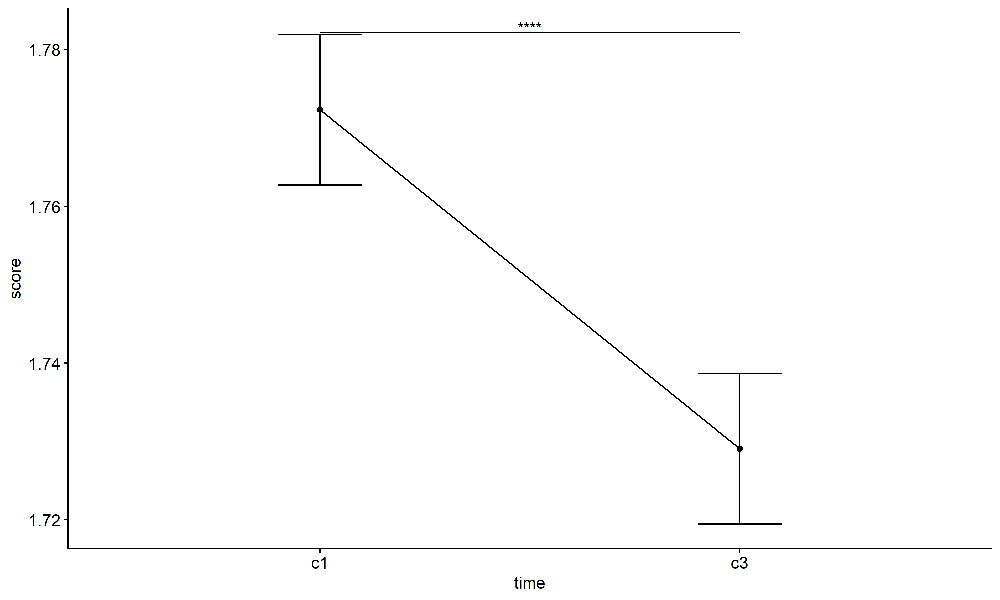<!-- -->

# ANOVA: score ~ time\*gender + Error(id/time)

## Data Preparation

``` r
data <- edat[,c("aluno_id","gender","ciclo","score")]
data <- data[data$ciclo %in% c("Primeiro Ciclo","Terceiro Ciclo"),]
data$ciclo <- factor(data$ciclo, c("Primeiro Ciclo","Terceiro Ciclo"))
data <- unique(data)

wdat <- spread(data, ciclo, score)
wdat <- wdat[complete.cases(wdat),]
colnames(wdat) <- c("id","gender","c1","c3")

ldat <- gather(wdat, key = time, value = score, c1,c3) %>%
  convert_as_factor(id, time)
ldat <- remove_group_data(ldat, "score", c("time", "gender"), n.limit = 30)
ldat$gender <- factor(ldat$gender, sort(unique(ldat$gender)))
```

### Check assumptions: Identifying Outliers

``` r
outliers <- identify_outliers(group_by(ldat, time, gender), score)
(outliers <- outliers[outliers$is.extreme == T,])
```

    ## # A tibble: 3 × 6
    ##   gender time  id                   score is.outlier is.extreme
    ##   <fct>  <fct> <fct>                <dbl> <lgl>      <lgl>     
    ## 1 Female c1    TPobDcLYzJFEXhqR3YD0  3    TRUE       TRUE      
    ## 2 Female c3    PZszZEyf9zurxXNTzPJe  3.67 TRUE       TRUE      
    ## 3 Female c3    utURqHGd1CGfeJMrlUbh  3.67 TRUE       TRUE

| gender | time | id                   | score | is.outlier | is.extreme |
|:-------|:-----|:---------------------|------:|:-----------|:-----------|
| Female | c1   | TPobDcLYzJFEXhqR3YD0 | 3.000 | TRUE       | TRUE       |
| Female | c3   | PZszZEyf9zurxXNTzPJe | 3.667 | TRUE       | TRUE       |
| Female | c3   | utURqHGd1CGfeJMrlUbh | 3.667 | TRUE       | TRUE       |

### Check assumptions: Normality Test

``` r
(normality.df <- normality.test.per.groups(ldat, "score", c("time", "gender")))
```

    ##     var variable time gender    n  skewness   kurtosis symmetry statistic
    ## 1 score    score   c1 Female 1880 0.5133869 0.02977377       NO  74.45724
    ## 2 score    score   c1   Male 1927 0.5999686 0.42074767       NO 110.96296
    ## 3 score    score   c3 Female 1880 0.7554221 1.37896171       NO 203.01120
    ## 4 score    score   c3   Male 1927 0.6693447 0.24374569       NO 125.39596
    ##       method            p p.signif normality
    ## 1 D'Agostino 1.110223e-16     ****         -
    ## 2 D'Agostino 0.000000e+00     ****         -
    ## 3 D'Agostino 0.000000e+00     ****         -
    ## 4 D'Agostino 0.000000e+00     ****         -

| var   | variable | time | gender |    n | skewness | kurtosis | symmetry | statistic | method     |   p | p.signif | normality |
|:------|:---------|:-----|:-------|-----:|---------:|---------:|:---------|----------:|:-----------|----:|:---------|:----------|
| score | score    | c1   | Female | 1880 |    0.513 |    0.030 | NO       |    74.457 | D’Agostino |   0 | \*\*\*\* | \-        |
| score | score    | c1   | Male   | 1927 |    0.600 |    0.421 | NO       |   110.963 | D’Agostino |   0 | \*\*\*\* | \-        |
| score | score    | c3   | Female | 1880 |    0.755 |    1.379 | NO       |   203.011 | D’Agostino |   0 | \*\*\*\* | \-        |
| score | score    | c3   | Male   | 1927 |    0.669 |    0.244 | NO       |   125.396 | D’Agostino |   0 | \*\*\*\* | \-        |

``` r
(non.ids <- unique(do.call(
  c, lapply(which(normality.df$normality == 'NO'), FUN = function(i) {
  idx = which(ldat$time == normality.df$time[i] &
                ldat$gender == normality.df$gender[i])
  getNonNormal(ldat$"score"[idx], ldat$id[idx])
}))))
```

    ## NULL

``` r
if (length(non.ids) > 0)
  ldat2 <- ldat[!ldat$id %in% non.ids,]
```

### Summary Statistics

``` r
(sdat <- ldat %>% group_by(time, gender) %>%
   get_summary_stats(score, type = "mean_sd"))
```

    ## # A tibble: 4 × 6
    ##   gender time  variable     n  mean    sd
    ##   <fct>  <fct> <fct>    <dbl> <dbl> <dbl>
    ## 1 Female c1    score     1880  1.79 0.314
    ## 2 Male   c1    score     1927  1.76 0.294
    ## 3 Female c3    score     1880  1.74 0.318
    ## 4 Male   c3    score     1927  1.72 0.31

| gender | time | variable |    n |  mean |    sd |
|:-------|:-----|:---------|-----:|------:|------:|
| Female | c1   | score    | 1880 | 1.791 | 0.314 |
| Male   | c1   | score    | 1927 | 1.755 | 0.294 |
| Female | c3   | score    | 1880 | 1.738 | 0.318 |
| Male   | c3   | score    | 1927 | 1.719 | 0.310 |

``` r
if (length(non.ids) > 0)
  (sdat <- ldat2 %>% group_by(time, gender) %>%
      get_summary_stats(score, type = "mean_sd"))
```

| gender | time | variable |    n |  mean |    sd |
|:-------|:-----|:---------|-----:|------:|------:|
| Female | c1   | score    | 1880 | 1.791 | 0.314 |
| Male   | c1   | score    | 1927 | 1.755 | 0.294 |
| Female | c3   | score    | 1880 | 1.738 | 0.318 |
| Male   | c3   | score    | 1927 | 1.719 | 0.310 |

## ANOVA Computation

``` r
(res.aov <- anova_test(ldat, dv = score, wid = id, between = gender, within = time))
```

    ## ANOVA Table (type III tests)
    ## 
    ##        Effect DFn  DFd      F        p p<.05      ges
    ## 1      gender   1 3805 13.292 2.70e-04     * 0.002000
    ## 2        time   1 3805 44.432 3.01e-11     * 0.005000
    ## 3 gender:time   1 3805  1.563 2.11e-01       0.000181

## ANOVA Computation after removing non.normal data

``` r
if (length(non.ids) > 0)
  (res.aov2 <- anova_test(ldat2, dv = score, wid = id, between = gender , within = time))
```

## PairWise Computation

``` r
(pwc <- ldat %>% group_by(time) %>%
   emmeans_test(score ~ gender, detailed = T, p.adjust.method = "bonferroni"))
```

    ## # A tibble: 2 × 15
    ##   time  term   .y.   group1 group2 null.value estimate     se    df  conf.low
    ## * <fct> <chr>  <chr> <chr>  <chr>       <dbl>    <dbl>  <dbl> <dbl>     <dbl>
    ## 1 c1    gender score Female Male            0   0.0356 0.0100  7610  0.0160  
    ## 2 c3    gender score Female Male            0   0.0190 0.0100  7610 -0.000668
    ## # ℹ 5 more variables: conf.high <dbl>, statistic <dbl>, p <dbl>, p.adj <dbl>,
    ## #   p.adj.signif <chr>

| time | term   | .y.   | group1 | group2 | null.value | estimate |   se |   df | conf.low | conf.high | statistic |     p | p.adj | p.adj.signif |
|:-----|:-------|:------|:-------|:-------|-----------:|---------:|-----:|-----:|---------:|----------:|----------:|------:|------:|:-------------|
| c1   | gender | score | Female | Male   |          0 |    0.036 | 0.01 | 7610 |    0.016 |     0.055 |     3.555 | 0.000 | 0.000 | \*\*\*       |
| c3   | gender | score | Female | Male   |          0 |    0.019 | 0.01 | 7610 |   -0.001 |     0.039 |     1.894 | 0.058 | 0.058 | ns           |

``` r
(emms <- get_emmeans(pwc))
```

    ## # A tibble: 4 × 8
    ##   time  gender emmean      se    df conf.low conf.high method      
    ##   <fct> <fct>   <dbl>   <dbl> <dbl>    <dbl>     <dbl> <chr>       
    ## 1 c1    Female   1.79 0.00713  7610     1.78      1.80 Emmeans test
    ## 2 c1    Male     1.75 0.00704  7610     1.74      1.77 Emmeans test
    ## 3 c3    Female   1.74 0.00713  7610     1.72      1.75 Emmeans test
    ## 4 c3    Male     1.72 0.00704  7610     1.71      1.73 Emmeans test

| time | gender | emmean |    se |   df | conf.low | conf.high | method       |
|:-----|:-------|-------:|------:|-----:|---------:|----------:|:-------------|
| c1   | Female |  1.791 | 0.007 | 7610 |    1.777 |     1.805 | Emmeans test |
| c1   | Male   |  1.755 | 0.007 | 7610 |    1.741 |     1.769 | Emmeans test |
| c3   | Female |  1.738 | 0.007 | 7610 |    1.724 |     1.752 | Emmeans test |
| c3   | Male   |  1.719 | 0.007 | 7610 |    1.705 |     1.733 | Emmeans test |

``` r
pwc <- add_xy_position(pwc, x = "time", fun = "mean_se", dodge = 0.25)
pd <- position_dodge(width = 0.25)
ggline(emms, x = "time", y = "emmean", color = "gender",
       palette = c("#FF007F","#4D4DFF"),
       position = pd, ylab = "score") +
  geom_errorbar(aes(ymin = conf.low, ymax = conf.high, color = gender),
                position = pd, width = 0.2) +
  stat_pvalue_manual(pwc, hide.ns = T, tip.length = F, linetype = 1)
```

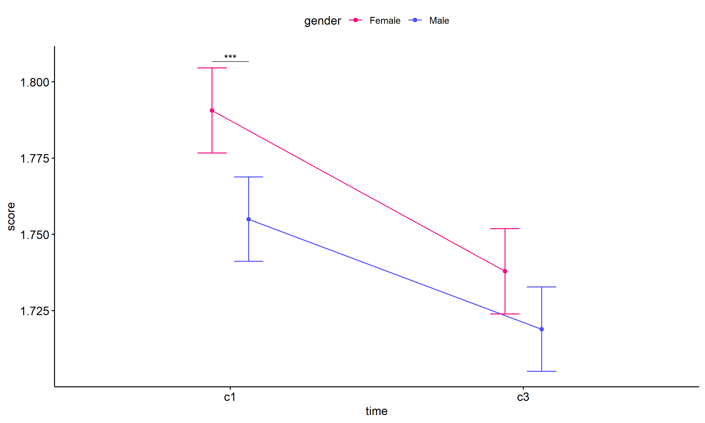<!-- -->

``` r
(pwc <- ldat %>% group_by(gender) %>%
    emmeans_test(score ~ time, detailed = T, p.adjust.method = "bonferroni"))
```

    ## # A tibble: 2 × 15
    ##   gender term  .y.   group1 group2 null.value estimate      se    df conf.low
    ## * <fct>  <chr> <chr> <chr>  <chr>       <dbl>    <dbl>   <dbl> <dbl>    <dbl>
    ## 1 Female time  score c1     c3              0   0.0527 0.0101   7610   0.0330
    ## 2 Male   time  score c1     c3              0   0.0361 0.00996  7610   0.0165
    ## # ℹ 5 more variables: conf.high <dbl>, statistic <dbl>, p <dbl>, p.adj <dbl>,
    ## #   p.adj.signif <chr>

| gender | term | .y.   | group1 | group2 | null.value | estimate |   se |   df | conf.low | conf.high | statistic |   p | p.adj | p.adj.signif |
|:-------|:-----|:------|:-------|:-------|-----------:|---------:|-----:|-----:|---------:|----------:|----------:|----:|------:|:-------------|
| Female | time | score | c1     | c3     |          0 |    0.053 | 0.01 | 7610 |    0.033 |     0.072 |     5.228 |   0 |     0 | \*\*\*\*     |
| Male   | time | score | c1     | c3     |          0 |    0.036 | 0.01 | 7610 |    0.017 |     0.056 |     3.621 |   0 |     0 | \*\*\*       |

``` r
(emms <- get_emmeans(pwc))
```

    ## # A tibble: 4 × 8
    ##   gender time  emmean      se    df conf.low conf.high method      
    ##   <fct>  <fct>  <dbl>   <dbl> <dbl>    <dbl>     <dbl> <chr>       
    ## 1 Female c1      1.79 0.00713  7610     1.78      1.80 Emmeans test
    ## 2 Female c3      1.74 0.00713  7610     1.72      1.75 Emmeans test
    ## 3 Male   c1      1.75 0.00704  7610     1.74      1.77 Emmeans test
    ## 4 Male   c3      1.72 0.00704  7610     1.71      1.73 Emmeans test

| gender | time | emmean |    se |   df | conf.low | conf.high | method       |
|:-------|:-----|-------:|------:|-----:|---------:|----------:|:-------------|
| Female | c1   |  1.791 | 0.007 | 7610 |    1.777 |     1.805 | Emmeans test |
| Female | c3   |  1.738 | 0.007 | 7610 |    1.724 |     1.752 | Emmeans test |
| Male   | c1   |  1.755 | 0.007 | 7610 |    1.741 |     1.769 | Emmeans test |
| Male   | c3   |  1.719 | 0.007 | 7610 |    1.705 |     1.733 | Emmeans test |

``` r
emms.gg <- emms[which(emms$gender == "Female"),]
if (nrow(emms.gg) > 0)
  ggline(emms.gg, x = "time", y = "emmean", color = "#FF007F", ylab = "score") +
    geom_errorbar(aes(ymin = conf.low, ymax = conf.high),
                  width = 0.2, color = "#FF007F") +
    stat_pvalue_manual(
      add_xy_position(pwc[which(pwc$gender == "Female"),],
                      x = "time", fun = "mean_se"),
      hide.ns = T, color = "#FF007F", tip.length = F) +
    labs(title = "gender: Female")+
    theme(legend.text = element_blank())
```

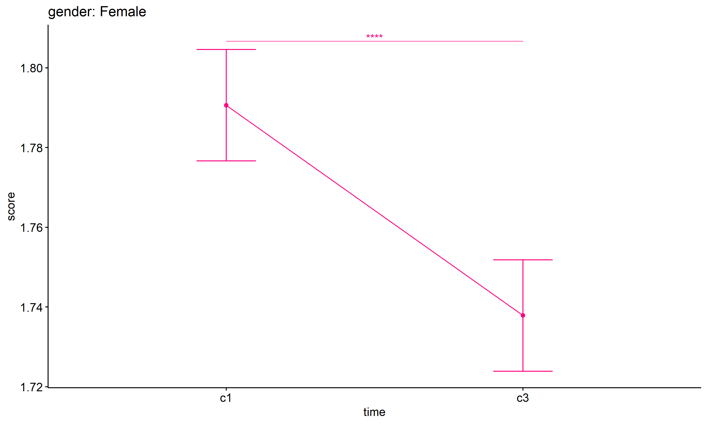<!-- -->

``` r
emms.gg <- emms[which(emms$gender == "Male"),]
if (nrow(emms.gg) > 0)
  ggline(emms.gg, x = "time", y = "emmean", color = "#4D4DFF", ylab = "score") +
    geom_errorbar(aes(ymin = conf.low, ymax = conf.high),
                  width = 0.2, color = "#4D4DFF") +
    stat_pvalue_manual(
      add_xy_position(pwc[which(pwc$gender == "Male"),],
                      x = "time", fun = "mean_se"),
      hide.ns = T, color = "#4D4DFF", tip.length = F) +
    labs(title = "gender: Male")+
    theme(legend.text = element_blank())
```

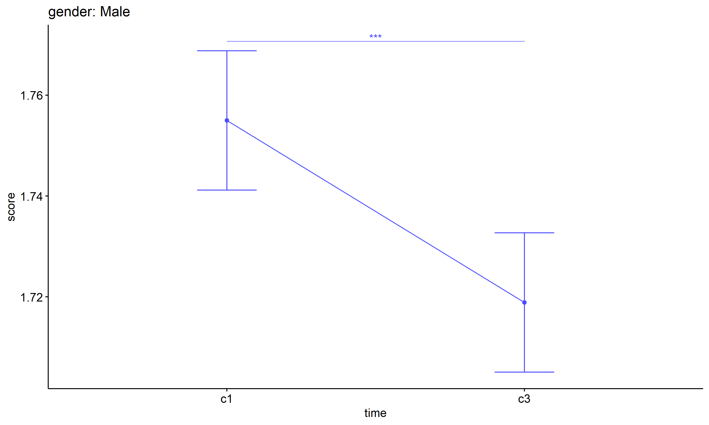<!-- -->

## PairWise Computation after removing non.normal data

``` r
if (length(non.ids) > 0)
  (pwc2 <- ldat2 %>% group_by(time) %>%
     emmeans_test(score ~ gender, detailed = T, p.adjust.method = "bonferroni"))
```

``` r
if (length(non.ids) > 0)
  (emms2 <- get_emmeans(pwc2))
```

``` r
if (length(non.ids) > 0) {
  pwc2 <- add_xy_position(pwc2, x = "time", fun = "mean_se", dodge = 0.25)
  pd2 <- position_dodge(width = 0.25)
  
  ggline(emms2, x = "time", y = "emmean", color = "gender",
         palette = c("#FF007F","#4D4DFF"),
         position = pd, ylab = "score") +
    geom_errorbar(aes(ymin = conf.low, ymax = conf.high, color = gender),
                position = pd, width = 0.2) +
    stat_pvalue_manual(pwc2, hide.ns = T, tip.length = F, linetype = 1)
}
```

``` r
if (length(non.ids) > 0)
  (pwc2 <- ldat2 %>% group_by(gender) %>%
     emmeans_test(score ~ time, detailed = T, p.adjust.method = "bonferroni"))
```

``` r
if (length(non.ids) > 0)
  (emms2 <- get_emmeans(pwc2))
```

``` r
if (length(non.ids) > 0) {
  emms.gg <- emms2[which(emms2$gender == "Female"),]
  if (nrow(emms.gg) > 0)
    ggline(emms.gg, x = "time", y = "emmean", color = "#FF007F", ylab = "score") +
    geom_errorbar(aes(ymin = conf.low, ymax = conf.high),
                  width = 0.2, color = "#FF007F") +
    stat_pvalue_manual(
      add_xy_position(pwc[which(pwc$gender == "Female"),],
                      x = "time", fun = "mean_se"),
      hide.ns = T, color = "#FF007F", tip.length = F) +
    labs(title = "gender: Female") +
    theme(legend.text = element_blank())
}
```

``` r
if (length(non.ids) > 0) {
  emms.gg <- emms2[which(emms2$gender == "Male"),]
  if (nrow(emms.gg) > 0)
    ggline(emms.gg, x = "time", y = "emmean", color = "#4D4DFF", ylab = "score") +
    geom_errorbar(aes(ymin = conf.low, ymax = conf.high),
                  width = 0.2, color = "#4D4DFF") +
    stat_pvalue_manual(
      add_xy_position(pwc[which(pwc$gender == "Male"),],
                      x = "time", fun = "mean_se"),
      hide.ns = T, color = "#4D4DFF", tip.length = F) +
    labs(title = "gender: Male") +
    theme(legend.text = element_blank())
}
```

# ANOVA: score ~ time\*localizacao + Error(id/time)

## Data Preparation

``` r
data <- edat[,c("aluno_id","localizacao","ciclo","score")]
data <- data[data$ciclo %in% c("Primeiro Ciclo","Terceiro Ciclo"),]
data$ciclo <- factor(data$ciclo, c("Primeiro Ciclo","Terceiro Ciclo"))
data <- unique(data)

wdat <- spread(data, ciclo, score)
wdat <- wdat[complete.cases(wdat),]
colnames(wdat) <- c("id","localizacao","c1","c3")

ldat <- gather(wdat, key = time, value = score, c1,c3) %>%
  convert_as_factor(id, time)
ldat <- remove_group_data(ldat, "score", c("time", "localizacao"), n.limit = 30)
ldat$localizacao <- factor(ldat$localizacao, sort(unique(ldat$localizacao)))
```

### Check assumptions: Identifying Outliers

``` r
outliers <- identify_outliers(group_by(ldat, time, localizacao), score)
(outliers <- outliers[outliers$is.extreme == T,])
```

    ## # A tibble: 3 × 6
    ##   localizacao time  id                   score is.outlier is.extreme
    ##   <fct>       <fct> <fct>                <dbl> <lgl>      <lgl>     
    ## 1 Rural       c1    TPobDcLYzJFEXhqR3YD0  3    TRUE       TRUE      
    ## 2 Rural       c3    PZszZEyf9zurxXNTzPJe  3.67 TRUE       TRUE      
    ## 3 Urbana      c3    utURqHGd1CGfeJMrlUbh  3.67 TRUE       TRUE

| localizacao | time | id                   | score | is.outlier | is.extreme |
|:------------|:-----|:---------------------|------:|:-----------|:-----------|
| Rural       | c1   | TPobDcLYzJFEXhqR3YD0 | 3.000 | TRUE       | TRUE       |
| Rural       | c3   | PZszZEyf9zurxXNTzPJe | 3.667 | TRUE       | TRUE       |
| Urbana      | c3   | utURqHGd1CGfeJMrlUbh | 3.667 | TRUE       | TRUE       |

### Check assumptions: Normality Test

``` r
(normality.df <- normality.test.per.groups(ldat, "score", c("time", "localizacao")))
```

    ##     var variable time localizacao    n  skewness   kurtosis symmetry statistic
    ## 1 score    score   c1       Rural  683 0.4094532 0.09418107      YES  18.61357
    ## 2 score    score   c1      Urbana 3314 0.5805862 0.26417298       NO 170.29426
    ## 3 score    score   c3       Rural  683 0.6230676 0.60616631       NO  46.16632
    ## 4 score    score   c3      Urbana 3314 0.7203180 0.81299935       NO 283.70866
    ##       method            p p.signif normality
    ## 1 D'Agostino 9.080605e-05      ***         -
    ## 2 D'Agostino 0.000000e+00     ****         -
    ## 3 D'Agostino 9.443002e-11     ****         -
    ## 4 D'Agostino 0.000000e+00     ****         -

| var   | variable | time | localizacao |    n | skewness | kurtosis | symmetry | statistic | method     |   p | p.signif | normality |
|:------|:---------|:-----|:------------|-----:|---------:|---------:|:---------|----------:|:-----------|----:|:---------|:----------|
| score | score    | c1   | Rural       |  683 |    0.409 |    0.094 | YES      |    18.614 | D’Agostino |   0 | \*\*\*   | \-        |
| score | score    | c1   | Urbana      | 3314 |    0.581 |    0.264 | NO       |   170.294 | D’Agostino |   0 | \*\*\*\* | \-        |
| score | score    | c3   | Rural       |  683 |    0.623 |    0.606 | NO       |    46.166 | D’Agostino |   0 | \*\*\*\* | \-        |
| score | score    | c3   | Urbana      | 3314 |    0.720 |    0.813 | NO       |   283.709 | D’Agostino |   0 | \*\*\*\* | \-        |

``` r
(non.ids <- unique(do.call(
  c, lapply(which(normality.df$normality == 'NO'), FUN = function(i) {
  idx = which(ldat$time == normality.df$time[i] &
                ldat$localizacao == normality.df$localizacao[i])
  getNonNormal(ldat$"score"[idx], ldat$id[idx])
}))))
```

    ## NULL

``` r
if (length(non.ids) > 0)
  ldat2 <- ldat[!ldat$id %in% non.ids,]
```

### Summary Statistics

``` r
(sdat <- ldat %>% group_by(time, localizacao) %>%
   get_summary_stats(score, type = "mean_sd"))
```

    ## # A tibble: 4 × 6
    ##   localizacao time  variable     n  mean    sd
    ##   <fct>       <fct> <fct>    <dbl> <dbl> <dbl>
    ## 1 Rural       c1    score      683  1.83 0.309
    ## 2 Urbana      c1    score     3314  1.76 0.302
    ## 3 Rural       c3    score      683  1.81 0.345
    ## 4 Urbana      c3    score     3314  1.71 0.306

| localizacao | time | variable |    n |  mean |    sd |
|:------------|:-----|:---------|-----:|------:|------:|
| Rural       | c1   | score    |  683 | 1.831 | 0.309 |
| Urbana      | c1   | score    | 3314 | 1.760 | 0.302 |
| Rural       | c3   | score    |  683 | 1.809 | 0.345 |
| Urbana      | c3   | score    | 3314 | 1.713 | 0.306 |

``` r
if (length(non.ids) > 0)
  (sdat <- ldat2 %>% group_by(time, localizacao) %>%
      get_summary_stats(score, type = "mean_sd"))
```

| localizacao | time | variable |    n |  mean |    sd |
|:------------|:-----|:---------|-----:|------:|------:|
| Rural       | c1   | score    |  683 | 1.831 | 0.309 |
| Urbana      | c1   | score    | 3314 | 1.760 | 0.302 |
| Rural       | c3   | score    |  683 | 1.809 | 0.345 |
| Urbana      | c3   | score    | 3314 | 1.713 | 0.306 |

## ANOVA Computation

``` r
(res.aov <- anova_test(ldat, dv = score, wid = id, between = localizacao, within = time))
```

    ## ANOVA Table (type III tests)
    ## 
    ##             Effect DFn  DFd      F        p p<.05      ges
    ## 1      localizacao   1 3995 74.156 1.02e-17     * 0.010000
    ## 2             time   1 3995 16.344 5.38e-05     * 0.002000
    ## 3 localizacao:time   1 3995  2.185 1.39e-01       0.000243

## ANOVA Computation after removing non.normal data

``` r
if (length(non.ids) > 0)
  (res.aov2 <- anova_test(ldat2, dv = score, wid = id, between = localizacao , within = time))
```

## PairWise Computation

``` r
(pwc <- ldat %>% group_by(time) %>%
   emmeans_test(score ~ localizacao, detailed = T, p.adjust.method = "bonferroni"))
```

    ## # A tibble: 2 × 15
    ##   time  term       .y.   group1 group2 null.value estimate     se    df conf.low
    ## * <fct> <chr>      <chr> <chr>  <chr>       <dbl>    <dbl>  <dbl> <dbl>    <dbl>
    ## 1 c1    localizac… score Rural  Urbana          0   0.0703 0.0129  7990   0.0450
    ## 2 c3    localizac… score Rural  Urbana          0   0.0958 0.0129  7990   0.0705
    ## # ℹ 5 more variables: conf.high <dbl>, statistic <dbl>, p <dbl>, p.adj <dbl>,
    ## #   p.adj.signif <chr>

| time | term        | .y.   | group1 | group2 | null.value | estimate |    se |   df | conf.low | conf.high | statistic |   p | p.adj | p.adj.signif |
|:-----|:------------|:------|:-------|:-------|-----------:|---------:|------:|-----:|---------:|----------:|----------:|----:|------:|:-------------|
| c1   | localizacao | score | Rural  | Urbana |          0 |    0.070 | 0.013 | 7990 |    0.045 |     0.096 |     5.435 |   0 |     0 | \*\*\*\*     |
| c3   | localizacao | score | Rural  | Urbana |          0 |    0.096 | 0.013 | 7990 |    0.070 |     0.121 |     7.405 |   0 |     0 | \*\*\*\*     |

``` r
(emms <- get_emmeans(pwc))
```

    ## # A tibble: 4 × 8
    ##   time  localizacao emmean      se    df conf.low conf.high method      
    ##   <fct> <fct>        <dbl>   <dbl> <dbl>    <dbl>     <dbl> <chr>       
    ## 1 c1    Rural         1.83 0.0118   7990     1.81      1.85 Emmeans test
    ## 2 c1    Urbana        1.76 0.00535  7990     1.75      1.77 Emmeans test
    ## 3 c3    Rural         1.81 0.0118   7990     1.79      1.83 Emmeans test
    ## 4 c3    Urbana        1.71 0.00535  7990     1.70      1.72 Emmeans test

| time | localizacao | emmean |    se |   df | conf.low | conf.high | method       |
|:-----|:------------|-------:|------:|-----:|---------:|----------:|:-------------|
| c1   | Rural       |  1.831 | 0.012 | 7990 |    1.808 |     1.854 | Emmeans test |
| c1   | Urbana      |  1.760 | 0.005 | 7990 |    1.750 |     1.771 | Emmeans test |
| c3   | Rural       |  1.809 | 0.012 | 7990 |    1.785 |     1.832 | Emmeans test |
| c3   | Urbana      |  1.713 | 0.005 | 7990 |    1.702 |     1.723 | Emmeans test |

``` r
pwc <- add_xy_position(pwc, x = "time", fun = "mean_se", dodge = 0.25)
pd <- position_dodge(width = 0.25)
ggline(emms, x = "time", y = "emmean", color = "localizacao",
       palette = c("#AA00FF","#00CCCC"),
       position = pd, ylab = "score") +
  geom_errorbar(aes(ymin = conf.low, ymax = conf.high, color = localizacao),
                position = pd, width = 0.2) +
  stat_pvalue_manual(pwc, hide.ns = T, tip.length = F, linetype = 1)
```

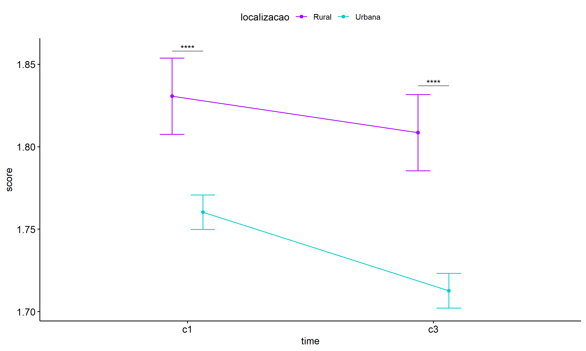<!-- -->

``` r
(pwc <- ldat %>% group_by(localizacao) %>%
    emmeans_test(score ~ time, detailed = T, p.adjust.method = "bonferroni"))
```

    ## # A tibble: 2 × 15
    ##   localizacao term  .y.   group1 group2 null.value estimate      se    df
    ## * <fct>       <chr> <chr> <chr>  <chr>       <dbl>    <dbl>   <dbl> <dbl>
    ## 1 Rural       time  score c1     c3              0   0.0221 0.0167   7990
    ## 2 Urbana      time  score c1     c3              0   0.0476 0.00757  7990
    ## # ℹ 6 more variables: conf.low <dbl>, conf.high <dbl>, statistic <dbl>,
    ## #   p <dbl>, p.adj <dbl>, p.adj.signif <chr>

| localizacao | term | .y.   | group1 | group2 | null.value | estimate |    se |   df | conf.low | conf.high | statistic |     p | p.adj | p.adj.signif |
|:------------|:-----|:------|:-------|:-------|-----------:|---------:|------:|-----:|---------:|----------:|----------:|------:|------:|:-------------|
| Rural       | time | score | c1     | c3     |          0 |    0.022 | 0.017 | 7990 |   -0.011 |     0.055 |     1.327 | 0.184 | 0.184 | ns           |
| Urbana      | time | score | c1     | c3     |          0 |    0.048 | 0.008 | 7990 |    0.033 |     0.062 |     6.294 | 0.000 | 0.000 | \*\*\*\*     |

``` r
(emms <- get_emmeans(pwc))
```

    ## # A tibble: 4 × 8
    ##   localizacao time  emmean      se    df conf.low conf.high method      
    ##   <fct>       <fct>  <dbl>   <dbl> <dbl>    <dbl>     <dbl> <chr>       
    ## 1 Rural       c1      1.83 0.0118   7990     1.81      1.85 Emmeans test
    ## 2 Rural       c3      1.81 0.0118   7990     1.79      1.83 Emmeans test
    ## 3 Urbana      c1      1.76 0.00535  7990     1.75      1.77 Emmeans test
    ## 4 Urbana      c3      1.71 0.00535  7990     1.70      1.72 Emmeans test

| localizacao | time | emmean |    se |   df | conf.low | conf.high | method       |
|:------------|:-----|-------:|------:|-----:|---------:|----------:|:-------------|
| Rural       | c1   |  1.831 | 0.012 | 7990 |    1.808 |     1.854 | Emmeans test |
| Rural       | c3   |  1.809 | 0.012 | 7990 |    1.785 |     1.832 | Emmeans test |
| Urbana      | c1   |  1.760 | 0.005 | 7990 |    1.750 |     1.771 | Emmeans test |
| Urbana      | c3   |  1.713 | 0.005 | 7990 |    1.702 |     1.723 | Emmeans test |

``` r
emms.gg <- emms[which(emms$localizacao == "Rural"),]
if (nrow(emms.gg) > 0)
  ggline(emms.gg, x = "time", y = "emmean", color = "#AA00FF", ylab = "score") +
    geom_errorbar(aes(ymin = conf.low, ymax = conf.high),
                  width = 0.2, color = "#AA00FF") +
    stat_pvalue_manual(
      add_xy_position(pwc[which(pwc$localizacao == "Rural"),],
                      x = "time", fun = "mean_se"),
      hide.ns = T, color = "#AA00FF", tip.length = F) +
    labs(title = "localizacao: Rural")+
    theme(legend.text = element_blank())
```

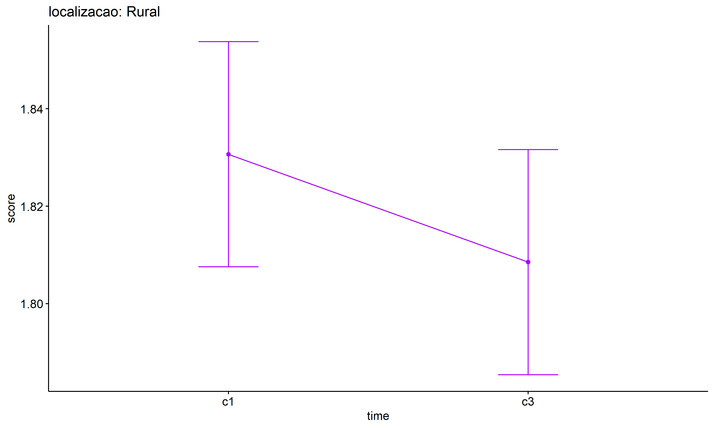<!-- -->

``` r
emms.gg <- emms[which(emms$localizacao == "Urbana"),]
if (nrow(emms.gg) > 0)
  ggline(emms.gg, x = "time", y = "emmean", color = "#00CCCC", ylab = "score") +
    geom_errorbar(aes(ymin = conf.low, ymax = conf.high),
                  width = 0.2, color = "#00CCCC") +
    stat_pvalue_manual(
      add_xy_position(pwc[which(pwc$localizacao == "Urbana"),],
                      x = "time", fun = "mean_se"),
      hide.ns = T, color = "#00CCCC", tip.length = F) +
    labs(title = "localizacao: Urbana")+
    theme(legend.text = element_blank())
```

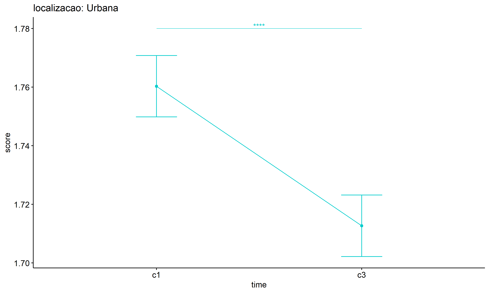<!-- -->

## PairWise Computation after removing non.normal data

``` r
if (length(non.ids) > 0)
  (pwc2 <- ldat2 %>% group_by(time) %>%
     emmeans_test(score ~ localizacao, detailed = T, p.adjust.method = "bonferroni"))
```

``` r
if (length(non.ids) > 0)
  (emms2 <- get_emmeans(pwc2))
```

``` r
if (length(non.ids) > 0) {
  pwc2 <- add_xy_position(pwc2, x = "time", fun = "mean_se", dodge = 0.25)
  pd2 <- position_dodge(width = 0.25)
  
  ggline(emms2, x = "time", y = "emmean", color = "localizacao",
         palette = c("#AA00FF","#00CCCC"),
         position = pd, ylab = "score") +
    geom_errorbar(aes(ymin = conf.low, ymax = conf.high, color = localizacao),
                position = pd, width = 0.2) +
    stat_pvalue_manual(pwc2, hide.ns = T, tip.length = F, linetype = 1)
}
```

``` r
if (length(non.ids) > 0)
  (pwc2 <- ldat2 %>% group_by(localizacao) %>%
     emmeans_test(score ~ time, detailed = T, p.adjust.method = "bonferroni"))
```

``` r
if (length(non.ids) > 0)
  (emms2 <- get_emmeans(pwc2))
```

``` r
if (length(non.ids) > 0) {
  emms.gg <- emms2[which(emms2$localizacao == "Rural"),]
  if (nrow(emms.gg) > 0)
    ggline(emms.gg, x = "time", y = "emmean", color = "#AA00FF", ylab = "score") +
    geom_errorbar(aes(ymin = conf.low, ymax = conf.high),
                  width = 0.2, color = "#AA00FF") +
    stat_pvalue_manual(
      add_xy_position(pwc[which(pwc$localizacao == "Rural"),],
                      x = "time", fun = "mean_se"),
      hide.ns = T, color = "#AA00FF", tip.length = F) +
    labs(title = "localizacao: Rural") +
    theme(legend.text = element_blank())
}
```

``` r
if (length(non.ids) > 0) {
  emms.gg <- emms2[which(emms2$localizacao == "Urbana"),]
  if (nrow(emms.gg) > 0)
    ggline(emms.gg, x = "time", y = "emmean", color = "#00CCCC", ylab = "score") +
    geom_errorbar(aes(ymin = conf.low, ymax = conf.high),
                  width = 0.2, color = "#00CCCC") +
    stat_pvalue_manual(
      add_xy_position(pwc[which(pwc$localizacao == "Urbana"),],
                      x = "time", fun = "mean_se"),
      hide.ns = T, color = "#00CCCC", tip.length = F) +
    labs(title = "localizacao: Urbana") +
    theme(legend.text = element_blank())
}
```

# ANOVA: score ~ time\*regiao + Error(id/time)

## Data Preparation

``` r
data <- edat[,c("aluno_id","regiao","ciclo","score")]
data <- data[data$ciclo %in% c("Primeiro Ciclo","Terceiro Ciclo"),]
data$ciclo <- factor(data$ciclo, c("Primeiro Ciclo","Terceiro Ciclo"))
data <- unique(data)

wdat <- spread(data, ciclo, score)
wdat <- wdat[complete.cases(wdat),]
colnames(wdat) <- c("id","regiao","c1","c3")

ldat <- gather(wdat, key = time, value = score, c1,c3) %>%
  convert_as_factor(id, time)
ldat <- remove_group_data(ldat, "score", c("time", "regiao"), n.limit = 30)
ldat$regiao <- factor(ldat$regiao, sort(unique(ldat$regiao)))
```

### Check assumptions: Identifying Outliers

``` r
outliers <- identify_outliers(group_by(ldat, time, regiao), score)
(outliers <- outliers[outliers$is.extreme == T,])
```

    ## # A tibble: 6 × 6
    ##   regiao   time  id                   score is.outlier is.extreme
    ##   <fct>    <fct> <fct>                <dbl> <lgl>      <lgl>     
    ## 1 Nordeste c1    TPobDcLYzJFEXhqR3YD0  3    TRUE       TRUE      
    ## 2 Norte    c1    aQKm1fE5VWhl7lV4MbTV  3    TRUE       TRUE      
    ## 3 Nordeste c3    K7TMBHPukqALYKzvf7cx  3    TRUE       TRUE      
    ## 4 Nordeste c3    lXWIkEauYtN6dk4nl8YX  3    TRUE       TRUE      
    ## 5 Nordeste c3    PZszZEyf9zurxXNTzPJe  3.67 TRUE       TRUE      
    ## 6 Norte    c3    utURqHGd1CGfeJMrlUbh  3.67 TRUE       TRUE

| regiao   | time | id                   | score | is.outlier | is.extreme |
|:---------|:-----|:---------------------|------:|:-----------|:-----------|
| Nordeste | c1   | TPobDcLYzJFEXhqR3YD0 | 3.000 | TRUE       | TRUE       |
| Norte    | c1   | aQKm1fE5VWhl7lV4MbTV | 3.000 | TRUE       | TRUE       |
| Nordeste | c3   | K7TMBHPukqALYKzvf7cx | 3.000 | TRUE       | TRUE       |
| Nordeste | c3   | lXWIkEauYtN6dk4nl8YX | 3.000 | TRUE       | TRUE       |
| Nordeste | c3   | PZszZEyf9zurxXNTzPJe | 3.667 | TRUE       | TRUE       |
| Norte    | c3   | utURqHGd1CGfeJMrlUbh | 3.667 | TRUE       | TRUE       |

### Check assumptions: Normality Test

``` r
(normality.df <- normality.test.per.groups(ldat, "score", c("time", "regiao")))
```

    ##      var variable time       regiao    n  skewness    kurtosis symmetry
    ## 1  score    score   c1 Centro-Oeste  288 0.6117990  0.19772059       NO
    ## 2  score    score   c1     Nordeste 1287 0.4125896  0.05453840      YES
    ## 3  score    score   c1        Norte  249 0.5210841  0.06808170       NO
    ## 4  score    score   c1      Sudeste 2097 0.6273437  0.41204572       NO
    ## 5  score    score   c1          Sul   76 0.1843028 -0.54477383      YES
    ## 6  score    score   c3 Centro-Oeste  288 0.4249834 -0.08564994      YES
    ## 7  score    score   c3     Nordeste 1287 0.7049191  0.77700533       NO
    ## 8  score    score   c3        Norte  249 1.0730887  2.35628193       NO
    ## 9  score    score   c3      Sudeste 2097 0.6472241  0.26324676       NO
    ## 10 score    score   c3          Sul   76 0.3682045  0.07817064      YES
    ##     statistic     method            p p.signif normality
    ## 1   17.268292 D'Agostino 1.779254e-04       **         -
    ## 2   34.553660 D'Agostino 3.138832e-08     ****         -
    ## 3   11.051960 D'Agostino 3.981965e-03        *         -
    ## 4  128.969207 D'Agostino 0.000000e+00     ****         -
    ## 5    1.171289 D'Agostino 5.567468e-01       ns       YES
    ## 6    8.510055 D'Agostino 1.419270e-02       ns         -
    ## 7  107.529822 D'Agostino 0.000000e+00     ****         -
    ## 8   53.874583 D'Agostino 2.001177e-12     ****         -
    ## 9  129.618236 D'Agostino 0.000000e+00     ****         -
    ## 10   2.415310 D'Agostino 2.988974e-01       ns       YES

| var   | variable | time | regiao       |    n | skewness | kurtosis | symmetry | statistic | method     |     p | p.signif | normality |
|:------|:---------|:-----|:-------------|-----:|---------:|---------:|:---------|----------:|:-----------|------:|:---------|:----------|
| score | score    | c1   | Centro-Oeste |  288 |    0.612 |    0.198 | NO       |    17.268 | D’Agostino | 0.000 | \*\*     | \-        |
| score | score    | c1   | Nordeste     | 1287 |    0.413 |    0.055 | YES      |    34.554 | D’Agostino | 0.000 | \*\*\*\* | \-        |
| score | score    | c1   | Norte        |  249 |    0.521 |    0.068 | NO       |    11.052 | D’Agostino | 0.004 | \*       | \-        |
| score | score    | c1   | Sudeste      | 2097 |    0.627 |    0.412 | NO       |   128.969 | D’Agostino | 0.000 | \*\*\*\* | \-        |
| score | score    | c1   | Sul          |   76 |    0.184 |   -0.545 | YES      |     1.171 | D’Agostino | 0.557 | ns       | YES       |
| score | score    | c3   | Centro-Oeste |  288 |    0.425 |   -0.086 | YES      |     8.510 | D’Agostino | 0.014 | ns       | \-        |
| score | score    | c3   | Nordeste     | 1287 |    0.705 |    0.777 | NO       |   107.530 | D’Agostino | 0.000 | \*\*\*\* | \-        |
| score | score    | c3   | Norte        |  249 |    1.073 |    2.356 | NO       |    53.875 | D’Agostino | 0.000 | \*\*\*\* | \-        |
| score | score    | c3   | Sudeste      | 2097 |    0.647 |    0.263 | NO       |   129.618 | D’Agostino | 0.000 | \*\*\*\* | \-        |
| score | score    | c3   | Sul          |   76 |    0.368 |    0.078 | YES      |     2.415 | D’Agostino | 0.299 | ns       | YES       |

``` r
(non.ids <- unique(do.call(
  c, lapply(which(normality.df$normality == 'NO'), FUN = function(i) {
  idx = which(ldat$time == normality.df$time[i] &
                ldat$regiao == normality.df$regiao[i])
  getNonNormal(ldat$"score"[idx], ldat$id[idx])
}))))
```

    ## NULL

``` r
if (length(non.ids) > 0)
  ldat2 <- ldat[!ldat$id %in% non.ids,]
```

### Summary Statistics

``` r
(sdat <- ldat %>% group_by(time, regiao) %>%
   get_summary_stats(score, type = "mean_sd"))
```

    ## # A tibble: 10 × 6
    ##    regiao       time  variable     n  mean    sd
    ##    <fct>        <fct> <fct>    <dbl> <dbl> <dbl>
    ##  1 Centro-Oeste c1    score      288  1.77 0.28 
    ##  2 Nordeste     c1    score     1287  1.81 0.315
    ##  3 Norte        c1    score      249  1.83 0.319
    ##  4 Sudeste      c1    score     2097  1.74 0.292
    ##  5 Sul          c1    score       76  1.91 0.323
    ##  6 Centro-Oeste c3    score      288  1.74 0.279
    ##  7 Nordeste     c3    score     1287  1.76 0.334
    ##  8 Norte        c3    score      249  1.80 0.357
    ##  9 Sudeste      c3    score     2097  1.70 0.3  
    ## 10 Sul          c3    score       76  1.73 0.312

| regiao       | time | variable |    n |  mean |    sd |
|:-------------|:-----|:---------|-----:|------:|------:|
| Centro-Oeste | c1   | score    |  288 | 1.767 | 0.280 |
| Nordeste     | c1   | score    | 1287 | 1.811 | 0.315 |
| Norte        | c1   | score    |  249 | 1.829 | 0.319 |
| Sudeste      | c1   | score    | 2097 | 1.737 | 0.292 |
| Sul          | c1   | score    |   76 | 1.910 | 0.323 |
| Centro-Oeste | c3   | score    |  288 | 1.737 | 0.279 |
| Nordeste     | c3   | score    | 1287 | 1.760 | 0.334 |
| Norte        | c3   | score    |  249 | 1.796 | 0.357 |
| Sudeste      | c3   | score    | 2097 | 1.701 | 0.300 |
| Sul          | c3   | score    |   76 | 1.732 | 0.312 |

``` r
if (length(non.ids) > 0)
  (sdat <- ldat2 %>% group_by(time, regiao) %>%
      get_summary_stats(score, type = "mean_sd"))
```

| regiao       | time | variable |    n |  mean |    sd |
|:-------------|:-----|:---------|-----:|------:|------:|
| Centro-Oeste | c1   | score    |  288 | 1.767 | 0.280 |
| Nordeste     | c1   | score    | 1287 | 1.811 | 0.315 |
| Norte        | c1   | score    |  249 | 1.829 | 0.319 |
| Sudeste      | c1   | score    | 2097 | 1.737 | 0.292 |
| Sul          | c1   | score    |   76 | 1.910 | 0.323 |
| Centro-Oeste | c3   | score    |  288 | 1.737 | 0.279 |
| Nordeste     | c3   | score    | 1287 | 1.760 | 0.334 |
| Norte        | c3   | score    |  249 | 1.796 | 0.357 |
| Sudeste      | c3   | score    | 2097 | 1.701 | 0.300 |
| Sul          | c3   | score    |   76 | 1.732 | 0.312 |

## ANOVA Computation

``` r
(res.aov <- anova_test(ldat, dv = score, wid = id, between = regiao, within = time))
```

    ## ANOVA Table (type III tests)
    ## 
    ##        Effect DFn  DFd      F        p p<.05   ges
    ## 1      regiao   4 3992 23.931 1.37e-19     * 0.013
    ## 2        time   1 3992 29.394 6.25e-08     * 0.003
    ## 3 regiao:time   4 3992  2.412 4.70e-02     * 0.001

## ANOVA Computation after removing non.normal data

``` r
if (length(non.ids) > 0)
  (res.aov2 <- anova_test(ldat2, dv = score, wid = id, between = regiao , within = time))
```

## PairWise Computation

``` r
(pwc <- ldat %>% group_by(time) %>%
   emmeans_test(score ~ regiao, detailed = T, p.adjust.method = "bonferroni"))
```

    ## Warning: Expected 2 pieces. Additional pieces discarded in 8 rows [1, 2, 3, 4, 11, 12,
    ## 13, 14].

    ## # A tibble: 20 × 15
    ##    time  term   .y.   group1   group2  null.value estimate     se    df conf.low
    ##  * <fct> <chr>  <chr> <chr>    <chr>        <dbl>    <dbl>  <dbl> <dbl>    <dbl>
    ##  1 c1    regiao score Centro   Oeste            0 -0.0441  0.0200  7984 -0.0834 
    ##  2 c1    regiao score Centro   Oeste            0 -0.0620  0.0266  7984 -0.114  
    ##  3 c1    regiao score Centro   Oeste            0  0.0301  0.0193  7984 -0.00777
    ##  4 c1    regiao score Centro   Oeste            0 -0.143   0.0397  7984 -0.220  
    ##  5 c1    regiao score Nordeste Norte            0 -0.0179  0.0213  7984 -0.0596 
    ##  6 c1    regiao score Nordeste Sudeste          0  0.0742  0.0109  7984  0.0529 
    ##  7 c1    regiao score Nordeste Sul              0 -0.0986  0.0363  7984 -0.170  
    ##  8 c1    regiao score Norte    Sudeste          0  0.0921  0.0206  7984  0.0517 
    ##  9 c1    regiao score Norte    Sul              0 -0.0808  0.0403  7984 -0.160  
    ## 10 c1    regiao score Sudeste  Sul              0 -0.173   0.0359  7984 -0.243  
    ## 11 c3    regiao score Centro   Oeste            0 -0.0235  0.0200  7984 -0.0628 
    ## 12 c3    regiao score Centro   Oeste            0 -0.0594  0.0266  7984 -0.112  
    ## 13 c3    regiao score Centro   Oeste            0  0.0358  0.0193  7984 -0.00204
    ## 14 c3    regiao score Centro   Oeste            0  0.00423 0.0397  7984 -0.0735 
    ## 15 c3    regiao score Nordeste Norte            0 -0.0359  0.0213  7984 -0.0776 
    ## 16 c3    regiao score Nordeste Sudeste          0  0.0593  0.0109  7984  0.0380 
    ## 17 c3    regiao score Nordeste Sul              0  0.0277  0.0363  7984 -0.0435 
    ## 18 c3    regiao score Norte    Sudeste          0  0.0952  0.0206  7984  0.0548 
    ## 19 c3    regiao score Norte    Sul              0  0.0636  0.0403  7984 -0.0154 
    ## 20 c3    regiao score Sudeste  Sul              0 -0.0316  0.0359  7984 -0.102  
    ## # ℹ 5 more variables: conf.high <dbl>, statistic <dbl>, p <dbl>, p.adj <dbl>,
    ## #   p.adj.signif <chr>

| time | term   | .y.   | group1   | group2  | null.value | estimate |    se |   df | conf.low | conf.high | statistic |     p | p.adj | p.adj.signif |
|:-----|:-------|:------|:---------|:--------|-----------:|---------:|------:|-----:|---------:|----------:|----------:|------:|------:|:-------------|
| c1   | regiao | score | Centro   | Oeste   |          0 |   -0.044 | 0.020 | 7984 |   -0.083 |    -0.005 |    -2.199 | 0.028 | 0.279 | ns           |
| c1   | regiao | score | Centro   | Oeste   |          0 |   -0.062 | 0.027 | 7984 |   -0.114 |    -0.010 |    -2.328 | 0.020 | 0.199 | ns           |
| c1   | regiao | score | Centro   | Oeste   |          0 |    0.030 | 0.019 | 7984 |   -0.008 |     0.068 |     1.558 | 0.119 | 1.000 | ns           |
| c1   | regiao | score | Centro   | Oeste   |          0 |   -0.143 | 0.040 | 7984 |   -0.220 |    -0.065 |    -3.599 | 0.000 | 0.003 | \*\*         |
| c1   | regiao | score | Nordeste | Norte   |          0 |   -0.018 | 0.021 | 7984 |   -0.060 |     0.024 |    -0.839 | 0.401 | 1.000 | ns           |
| c1   | regiao | score | Nordeste | Sudeste |          0 |    0.074 | 0.011 | 7984 |    0.053 |     0.096 |     6.814 | 0.000 | 0.000 | \*\*\*\*     |
| c1   | regiao | score | Nordeste | Sul     |          0 |   -0.099 | 0.036 | 7984 |   -0.170 |    -0.027 |    -2.717 | 0.007 | 0.066 | ns           |
| c1   | regiao | score | Norte    | Sudeste |          0 |    0.092 | 0.021 | 7984 |    0.052 |     0.132 |     4.467 | 0.000 | 0.000 | \*\*\*\*     |
| c1   | regiao | score | Norte    | Sul     |          0 |   -0.081 | 0.040 | 7984 |   -0.160 |    -0.002 |    -2.004 | 0.045 | 0.451 | ns           |
| c1   | regiao | score | Sudeste  | Sul     |          0 |   -0.173 | 0.036 | 7984 |   -0.243 |    -0.102 |    -4.813 | 0.000 | 0.000 | \*\*\*\*     |
| c3   | regiao | score | Centro   | Oeste   |          0 |   -0.023 | 0.020 | 7984 |   -0.063 |     0.016 |    -1.171 | 0.242 | 1.000 | ns           |
| c3   | regiao | score | Centro   | Oeste   |          0 |   -0.059 | 0.027 | 7984 |   -0.112 |    -0.007 |    -2.231 | 0.026 | 0.257 | ns           |
| c3   | regiao | score | Centro   | Oeste   |          0 |    0.036 | 0.019 | 7984 |   -0.002 |     0.074 |     1.855 | 0.064 | 0.637 | ns           |
| c3   | regiao | score | Centro   | Oeste   |          0 |    0.004 | 0.040 | 7984 |   -0.074 |     0.082 |     0.107 | 0.915 | 1.000 | ns           |
| c3   | regiao | score | Nordeste | Norte   |          0 |   -0.036 | 0.021 | 7984 |   -0.078 |     0.006 |    -1.686 | 0.092 | 0.917 | ns           |
| c3   | regiao | score | Nordeste | Sudeste |          0 |    0.059 | 0.011 | 7984 |    0.038 |     0.081 |     5.448 | 0.000 | 0.000 | \*\*\*\*     |
| c3   | regiao | score | Nordeste | Sul     |          0 |    0.028 | 0.036 | 7984 |   -0.043 |     0.099 |     0.763 | 0.445 | 1.000 | ns           |
| c3   | regiao | score | Norte    | Sudeste |          0 |    0.095 | 0.021 | 7984 |    0.055 |     0.136 |     4.620 | 0.000 | 0.000 | \*\*\*\*     |
| c3   | regiao | score | Norte    | Sul     |          0 |    0.064 | 0.040 | 7984 |   -0.015 |     0.143 |     1.578 | 0.114 | 1.000 | ns           |
| c3   | regiao | score | Sudeste  | Sul     |          0 |   -0.032 | 0.036 | 7984 |   -0.102 |     0.039 |    -0.880 | 0.379 | 1.000 | ns           |

``` r
(emms <- get_emmeans(pwc))
```

    ## # A tibble: 10 × 8
    ##    time  regiao       emmean      se    df conf.low conf.high method      
    ##    <fct> <fct>         <dbl>   <dbl> <dbl>    <dbl>     <dbl> <chr>       
    ##  1 c1    Centro-Oeste   1.77 0.0181   7984     1.73      1.80 Emmeans test
    ##  2 c1    Nordeste       1.81 0.00857  7984     1.79      1.83 Emmeans test
    ##  3 c1    Norte          1.83 0.0195   7984     1.79      1.87 Emmeans test
    ##  4 c1    Sudeste        1.74 0.00672  7984     1.72      1.75 Emmeans test
    ##  5 c1    Sul            1.91 0.0353   7984     1.84      1.98 Emmeans test
    ##  6 c3    Centro-Oeste   1.74 0.0181   7984     1.70      1.77 Emmeans test
    ##  7 c3    Nordeste       1.76 0.00857  7984     1.74      1.78 Emmeans test
    ##  8 c3    Norte          1.80 0.0195   7984     1.76      1.83 Emmeans test
    ##  9 c3    Sudeste        1.70 0.00672  7984     1.69      1.71 Emmeans test
    ## 10 c3    Sul            1.73 0.0353   7984     1.66      1.80 Emmeans test

| time | regiao       | emmean |    se |   df | conf.low | conf.high | method       |
|:-----|:-------------|-------:|------:|-----:|---------:|----------:|:-------------|
| c1   | Centro-Oeste |  1.767 | 0.018 | 7984 |    1.732 |     1.803 | Emmeans test |
| c1   | Nordeste     |  1.811 | 0.009 | 7984 |    1.795 |     1.828 | Emmeans test |
| c1   | Norte        |  1.829 | 0.019 | 7984 |    1.791 |     1.868 | Emmeans test |
| c1   | Sudeste      |  1.737 | 0.007 | 7984 |    1.724 |     1.750 | Emmeans test |
| c1   | Sul          |  1.910 | 0.035 | 7984 |    1.841 |     1.979 | Emmeans test |
| c3   | Centro-Oeste |  1.737 | 0.018 | 7984 |    1.701 |     1.772 | Emmeans test |
| c3   | Nordeste     |  1.760 | 0.009 | 7984 |    1.743 |     1.777 | Emmeans test |
| c3   | Norte        |  1.796 | 0.019 | 7984 |    1.758 |     1.834 | Emmeans test |
| c3   | Sudeste      |  1.701 | 0.007 | 7984 |    1.688 |     1.714 | Emmeans test |
| c3   | Sul          |  1.732 | 0.035 | 7984 |    1.663 |     1.802 | Emmeans test |

``` r
pwc <- add_xy_position(pwc, x = "time", fun = "mean_se", dodge = 0.25)
pd <- position_dodge(width = 0.25)
ggline(emms, x = "time", y = "emmean", color = "regiao",
       palette = c("#0073C2FF","#EFC000FF","#868686FF","#CD534CFF","#7AA6DCFF"),
       position = pd, ylab = "score") +
  geom_errorbar(aes(ymin = conf.low, ymax = conf.high, color = regiao),
                position = pd, width = 0.2) +
  stat_pvalue_manual(pwc, hide.ns = T, tip.length = F, linetype = 1)
```

    ## Warning: Removed 1 rows containing non-finite values (`stat_bracket()`).

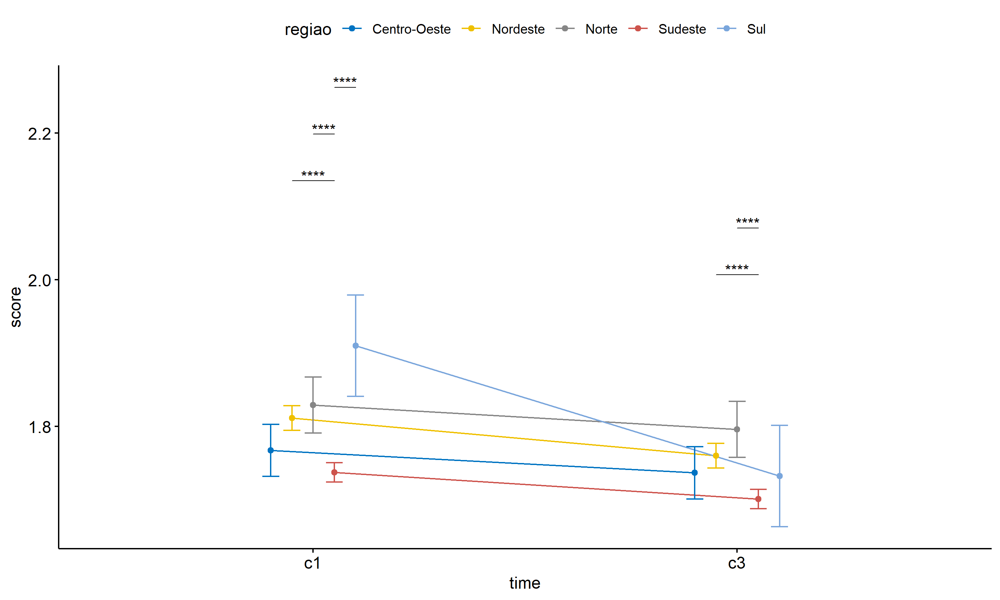<!-- -->

``` r
(pwc <- ldat %>% group_by(regiao) %>%
    emmeans_test(score ~ time, detailed = T, p.adjust.method = "bonferroni"))
```

    ## # A tibble: 5 × 15
    ##   regiao    term  .y.   group1 group2 null.value estimate      se    df conf.low
    ## * <fct>     <chr> <chr> <chr>  <chr>       <dbl>    <dbl>   <dbl> <dbl>    <dbl>
    ## 1 Centro-O… time  score c1     c3              0   0.0307 0.0256   7984  -0.0196
    ## 2 Nordeste  time  score c1     c3              0   0.0513 0.0121   7984   0.0275
    ## 3 Norte     time  score c1     c3              0   0.0332 0.0276   7984  -0.0208
    ## 4 Sudeste   time  score c1     c3              0   0.0364 0.00950  7984   0.0178
    ## 5 Sul       time  score c1     c3              0   0.178  0.0499   7984   0.0798
    ## # ℹ 5 more variables: conf.high <dbl>, statistic <dbl>, p <dbl>, p.adj <dbl>,
    ## #   p.adj.signif <chr>

| regiao       | term | .y.   | group1 | group2 | null.value | estimate |    se |   df | conf.low | conf.high | statistic |     p | p.adj | p.adj.signif |
|:-------------|:-----|:------|:-------|:-------|-----------:|---------:|------:|-----:|---------:|----------:|----------:|------:|------:|:-------------|
| Centro-Oeste | time | score | c1     | c3     |          0 |    0.031 | 0.026 | 7984 |   -0.020 |     0.081 |     1.197 | 0.231 | 0.231 | ns           |
| Nordeste     | time | score | c1     | c3     |          0 |    0.051 | 0.012 | 7984 |    0.028 |     0.075 |     4.230 | 0.000 | 0.000 | \*\*\*\*     |
| Norte        | time | score | c1     | c3     |          0 |    0.033 | 0.028 | 7984 |   -0.021 |     0.087 |     1.206 | 0.228 | 0.228 | ns           |
| Sudeste      | time | score | c1     | c3     |          0 |    0.036 | 0.009 | 7984 |    0.018 |     0.055 |     3.833 | 0.000 | 0.000 | \*\*\*       |
| Sul          | time | score | c1     | c3     |          0 |    0.178 | 0.050 | 7984 |    0.080 |     0.275 |     3.561 | 0.000 | 0.000 | \*\*\*       |

``` r
(emms <- get_emmeans(pwc))
```

    ## # A tibble: 10 × 8
    ##    regiao       time  emmean      se    df conf.low conf.high method      
    ##    <fct>        <fct>  <dbl>   <dbl> <dbl>    <dbl>     <dbl> <chr>       
    ##  1 Centro-Oeste c1      1.77 0.0181   7984     1.73      1.80 Emmeans test
    ##  2 Centro-Oeste c3      1.74 0.0181   7984     1.70      1.77 Emmeans test
    ##  3 Nordeste     c1      1.81 0.00857  7984     1.79      1.83 Emmeans test
    ##  4 Nordeste     c3      1.76 0.00857  7984     1.74      1.78 Emmeans test
    ##  5 Norte        c1      1.83 0.0195   7984     1.79      1.87 Emmeans test
    ##  6 Norte        c3      1.80 0.0195   7984     1.76      1.83 Emmeans test
    ##  7 Sudeste      c1      1.74 0.00672  7984     1.72      1.75 Emmeans test
    ##  8 Sudeste      c3      1.70 0.00672  7984     1.69      1.71 Emmeans test
    ##  9 Sul          c1      1.91 0.0353   7984     1.84      1.98 Emmeans test
    ## 10 Sul          c3      1.73 0.0353   7984     1.66      1.80 Emmeans test

| regiao       | time | emmean |    se |   df | conf.low | conf.high | method       |
|:-------------|:-----|-------:|------:|-----:|---------:|----------:|:-------------|
| Centro-Oeste | c1   |  1.767 | 0.018 | 7984 |    1.732 |     1.803 | Emmeans test |
| Centro-Oeste | c3   |  1.737 | 0.018 | 7984 |    1.701 |     1.772 | Emmeans test |
| Nordeste     | c1   |  1.811 | 0.009 | 7984 |    1.795 |     1.828 | Emmeans test |
| Nordeste     | c3   |  1.760 | 0.009 | 7984 |    1.743 |     1.777 | Emmeans test |
| Norte        | c1   |  1.829 | 0.019 | 7984 |    1.791 |     1.868 | Emmeans test |
| Norte        | c3   |  1.796 | 0.019 | 7984 |    1.758 |     1.834 | Emmeans test |
| Sudeste      | c1   |  1.737 | 0.007 | 7984 |    1.724 |     1.750 | Emmeans test |
| Sudeste      | c3   |  1.701 | 0.007 | 7984 |    1.688 |     1.714 | Emmeans test |
| Sul          | c1   |  1.910 | 0.035 | 7984 |    1.841 |     1.979 | Emmeans test |
| Sul          | c3   |  1.732 | 0.035 | 7984 |    1.663 |     1.802 | Emmeans test |

``` r
emms.gg <- emms[which(emms$regiao == "Centro-Oeste"),]
if (nrow(emms.gg) > 0)
  ggline(emms.gg, x = "time", y = "emmean", color = "#0073C2FF", ylab = "score") +
    geom_errorbar(aes(ymin = conf.low, ymax = conf.high),
                  width = 0.2, color = "#0073C2FF") +
    stat_pvalue_manual(
      add_xy_position(pwc[which(pwc$regiao == "Centro-Oeste"),],
                      x = "time", fun = "mean_se"),
      hide.ns = T, color = "#0073C2FF", tip.length = F) +
    labs(title = "regiao: Centro-Oeste")+
    theme(legend.text = element_blank())
```

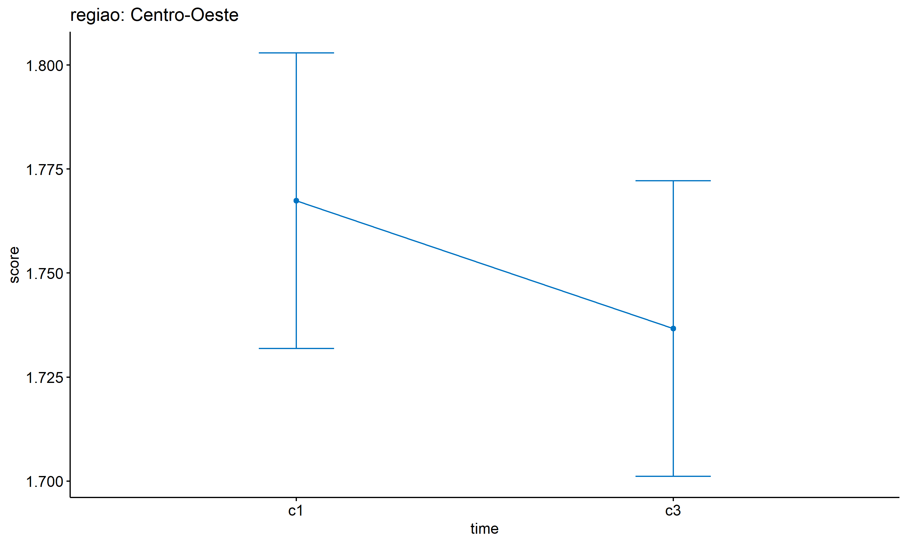<!-- -->

``` r
emms.gg <- emms[which(emms$regiao == "Nordeste"),]
if (nrow(emms.gg) > 0)
  ggline(emms.gg, x = "time", y = "emmean", color = "#EFC000FF", ylab = "score") +
    geom_errorbar(aes(ymin = conf.low, ymax = conf.high),
                  width = 0.2, color = "#EFC000FF") +
    stat_pvalue_manual(
      add_xy_position(pwc[which(pwc$regiao == "Nordeste"),],
                      x = "time", fun = "mean_se"),
      hide.ns = T, color = "#EFC000FF", tip.length = F) +
    labs(title = "regiao: Nordeste")+
    theme(legend.text = element_blank())
```

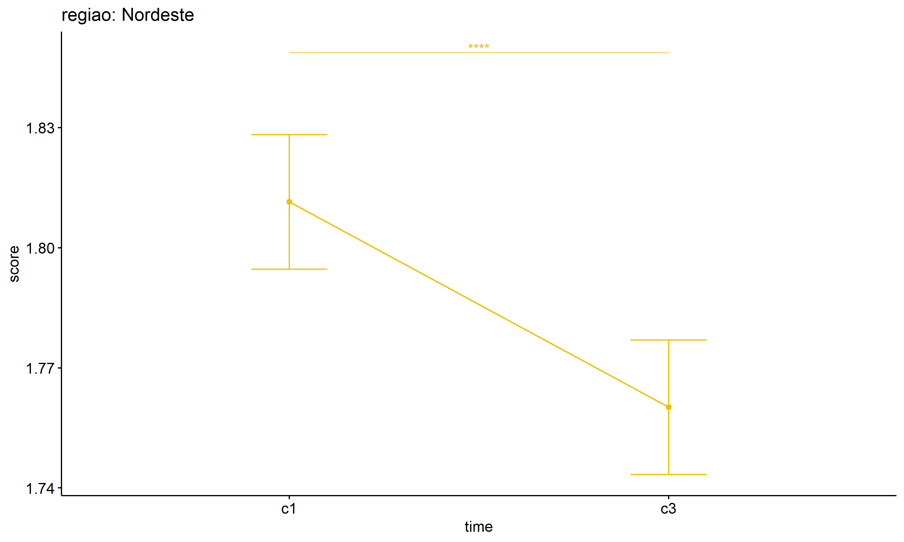<!-- -->

``` r
emms.gg <- emms[which(emms$regiao == "Norte"),]
if (nrow(emms.gg) > 0)
  ggline(emms.gg, x = "time", y = "emmean", color = "#868686FF", ylab = "score") +
    geom_errorbar(aes(ymin = conf.low, ymax = conf.high),
                  width = 0.2, color = "#868686FF") +
    stat_pvalue_manual(
      add_xy_position(pwc[which(pwc$regiao == "Norte"),],
                      x = "time", fun = "mean_se"),
      hide.ns = T, color = "#868686FF", tip.length = F) +
    labs(title = "regiao: Norte")+
    theme(legend.text = element_blank())
```

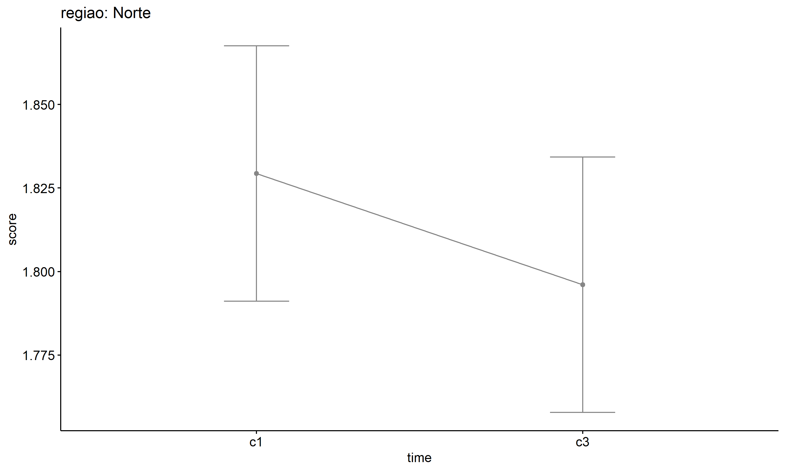<!-- -->

``` r
emms.gg <- emms[which(emms$regiao == "Sudeste"),]
if (nrow(emms.gg) > 0)
  ggline(emms.gg, x = "time", y = "emmean", color = "#CD534CFF", ylab = "score") +
    geom_errorbar(aes(ymin = conf.low, ymax = conf.high),
                  width = 0.2, color = "#CD534CFF") +
    stat_pvalue_manual(
      add_xy_position(pwc[which(pwc$regiao == "Sudeste"),],
                      x = "time", fun = "mean_se"),
      hide.ns = T, color = "#CD534CFF", tip.length = F) +
    labs(title = "regiao: Sudeste")+
    theme(legend.text = element_blank())
```

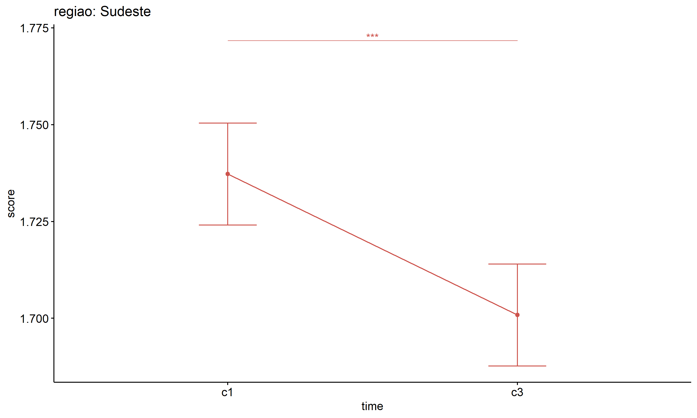<!-- -->

``` r
emms.gg <- emms[which(emms$regiao == "Sul"),]
if (nrow(emms.gg) > 0)
  ggline(emms.gg, x = "time", y = "emmean", color = "#7AA6DCFF", ylab = "score") +
    geom_errorbar(aes(ymin = conf.low, ymax = conf.high),
                  width = 0.2, color = "#7AA6DCFF") +
    stat_pvalue_manual(
      add_xy_position(pwc[which(pwc$regiao == "Sul"),],
                      x = "time", fun = "mean_se"),
      hide.ns = T, color = "#7AA6DCFF", tip.length = F) +
    labs(title = "regiao: Sul")+
    theme(legend.text = element_blank())
```

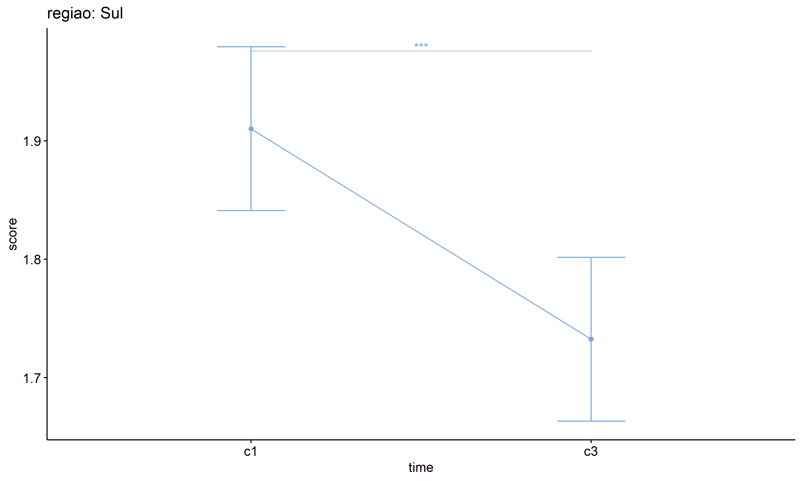<!-- -->

## PairWise Computation after removing non.normal data

``` r
if (length(non.ids) > 0)
  (pwc2 <- ldat2 %>% group_by(time) %>%
     emmeans_test(score ~ regiao, detailed = T, p.adjust.method = "bonferroni"))
```

``` r
if (length(non.ids) > 0)
  (emms2 <- get_emmeans(pwc2))
```

``` r
if (length(non.ids) > 0) {
  pwc2 <- add_xy_position(pwc2, x = "time", fun = "mean_se", dodge = 0.25)
  pd2 <- position_dodge(width = 0.25)
  
  ggline(emms2, x = "time", y = "emmean", color = "regiao",
         palette = c("#0073C2FF","#EFC000FF","#868686FF","#CD534CFF","#7AA6DCFF"),
         position = pd, ylab = "score") +
    geom_errorbar(aes(ymin = conf.low, ymax = conf.high, color = regiao),
                position = pd, width = 0.2) +
    stat_pvalue_manual(pwc2, hide.ns = T, tip.length = F, linetype = 1)
}
```

``` r
if (length(non.ids) > 0)
  (pwc2 <- ldat2 %>% group_by(regiao) %>%
     emmeans_test(score ~ time, detailed = T, p.adjust.method = "bonferroni"))
```

``` r
if (length(non.ids) > 0)
  (emms2 <- get_emmeans(pwc2))
```

``` r
if (length(non.ids) > 0) {
  emms.gg <- emms2[which(emms2$regiao == "Centro-Oeste"),]
  if (nrow(emms.gg) > 0)
    ggline(emms.gg, x = "time", y = "emmean", color = "#0073C2FF", ylab = "score") +
    geom_errorbar(aes(ymin = conf.low, ymax = conf.high),
                  width = 0.2, color = "#0073C2FF") +
    stat_pvalue_manual(
      add_xy_position(pwc[which(pwc$regiao == "Centro-Oeste"),],
                      x = "time", fun = "mean_se"),
      hide.ns = T, color = "#0073C2FF", tip.length = F) +
    labs(title = "regiao: Centro-Oeste") +
    theme(legend.text = element_blank())
}
```

``` r
if (length(non.ids) > 0) {
  emms.gg <- emms2[which(emms2$regiao == "Nordeste"),]
  if (nrow(emms.gg) > 0)
    ggline(emms.gg, x = "time", y = "emmean", color = "#EFC000FF", ylab = "score") +
    geom_errorbar(aes(ymin = conf.low, ymax = conf.high),
                  width = 0.2, color = "#EFC000FF") +
    stat_pvalue_manual(
      add_xy_position(pwc[which(pwc$regiao == "Nordeste"),],
                      x = "time", fun = "mean_se"),
      hide.ns = T, color = "#EFC000FF", tip.length = F) +
    labs(title = "regiao: Nordeste") +
    theme(legend.text = element_blank())
}
```

``` r
if (length(non.ids) > 0) {
  emms.gg <- emms2[which(emms2$regiao == "Norte"),]
  if (nrow(emms.gg) > 0)
    ggline(emms.gg, x = "time", y = "emmean", color = "#868686FF", ylab = "score") +
    geom_errorbar(aes(ymin = conf.low, ymax = conf.high),
                  width = 0.2, color = "#868686FF") +
    stat_pvalue_manual(
      add_xy_position(pwc[which(pwc$regiao == "Norte"),],
                      x = "time", fun = "mean_se"),
      hide.ns = T, color = "#868686FF", tip.length = F) +
    labs(title = "regiao: Norte") +
    theme(legend.text = element_blank())
}
```

``` r
if (length(non.ids) > 0) {
  emms.gg <- emms2[which(emms2$regiao == "Sudeste"),]
  if (nrow(emms.gg) > 0)
    ggline(emms.gg, x = "time", y = "emmean", color = "#CD534CFF", ylab = "score") +
    geom_errorbar(aes(ymin = conf.low, ymax = conf.high),
                  width = 0.2, color = "#CD534CFF") +
    stat_pvalue_manual(
      add_xy_position(pwc[which(pwc$regiao == "Sudeste"),],
                      x = "time", fun = "mean_se"),
      hide.ns = T, color = "#CD534CFF", tip.length = F) +
    labs(title = "regiao: Sudeste") +
    theme(legend.text = element_blank())
}
```

``` r
if (length(non.ids) > 0) {
  emms.gg <- emms2[which(emms2$regiao == "Sul"),]
  if (nrow(emms.gg) > 0)
    ggline(emms.gg, x = "time", y = "emmean", color = "#7AA6DCFF", ylab = "score") +
    geom_errorbar(aes(ymin = conf.low, ymax = conf.high),
                  width = 0.2, color = "#7AA6DCFF") +
    stat_pvalue_manual(
      add_xy_position(pwc[which(pwc$regiao == "Sul"),],
                      x = "time", fun = "mean_se"),
      hide.ns = T, color = "#7AA6DCFF", tip.length = F) +
    labs(title = "regiao: Sul") +
    theme(legend.text = element_blank())
}
```

# ANOVA: score ~ time\*porte + Error(id/time)

## Data Preparation

``` r
data <- edat[,c("aluno_id","porte","ciclo","score")]
data <- data[data$ciclo %in% c("Primeiro Ciclo","Terceiro Ciclo"),]
data$ciclo <- factor(data$ciclo, c("Primeiro Ciclo","Terceiro Ciclo"))
data <- unique(data)

wdat <- spread(data, ciclo, score)
wdat <- wdat[complete.cases(wdat),]
colnames(wdat) <- c("id","porte","c1","c3")

ldat <- gather(wdat, key = time, value = score, c1,c3) %>%
  convert_as_factor(id, time)
ldat <- remove_group_data(ldat, "score", c("time", "porte"), n.limit = 30)
ldat$porte <- factor(ldat$porte, sort(unique(ldat$porte)))
```

### Check assumptions: Identifying Outliers

``` r
outliers <- identify_outliers(group_by(ldat, time, porte), score)
(outliers <- outliers[outliers$is.extreme == T,])
```

    ## # A tibble: 6 × 6
    ##   porte                                  time  id    score is.outlier is.extreme
    ##   <fct>                                  <fct> <fct> <dbl> <lgl>      <lgl>     
    ## 1 Entre 201 e 500 matrículas de escolar… c1    aQKm…  3    TRUE       TRUE      
    ## 2 Entre 201 e 500 matrículas de escolar… c1    Sqyc…  3    TRUE       TRUE      
    ## 3 Entre 51 e 200 matrículas de escolari… c1    TPob…  3    TRUE       TRUE      
    ## 4 Entre 201 e 500 matrículas de escolar… c3    K7TM…  3    TRUE       TRUE      
    ## 5 Entre 201 e 500 matrículas de escolar… c3    utUR…  3.67 TRUE       TRUE      
    ## 6 Entre 51 e 200 matrículas de escolari… c3    PZsz…  3.67 TRUE       TRUE

| porte                                       | time | id                   | score | is.outlier | is.extreme |
|:--------------------------------------------|:-----|:---------------------|------:|:-----------|:-----------|
| Entre 201 e 500 matrículas de escolarização | c1   | aQKm1fE5VWhl7lV4MbTV | 3.000 | TRUE       | TRUE       |
| Entre 201 e 500 matrículas de escolarização | c1   | SqycP86Vzy7VCLeYFXYW | 3.000 | TRUE       | TRUE       |
| Entre 51 e 200 matrículas de escolarização  | c1   | TPobDcLYzJFEXhqR3YD0 | 3.000 | TRUE       | TRUE       |
| Entre 201 e 500 matrículas de escolarização | c3   | K7TMBHPukqALYKzvf7cx | 3.000 | TRUE       | TRUE       |
| Entre 201 e 500 matrículas de escolarização | c3   | utURqHGd1CGfeJMrlUbh | 3.667 | TRUE       | TRUE       |
| Entre 51 e 200 matrículas de escolarização  | c3   | PZszZEyf9zurxXNTzPJe | 3.667 | TRUE       | TRUE       |

### Check assumptions: Normality Test

``` r
(normality.df <- normality.test.per.groups(ldat, "score", c("time", "porte")))
```

    ##     var variable time                                        porte    n
    ## 1 score    score   c1  Entre 201 e 500 matrículas de escolarização 1059
    ## 2 score    score   c1 Entre 501 e 1000 matrículas de escolarização 2315
    ## 3 score    score   c1   Entre 51 e 200 matrículas de escolarização  259
    ## 4 score    score   c1     Mais de 1000 matrículas de escolarização  344
    ## 5 score    score   c3  Entre 201 e 500 matrículas de escolarização 1059
    ## 6 score    score   c3 Entre 501 e 1000 matrículas de escolarização 2315
    ## 7 score    score   c3   Entre 51 e 200 matrículas de escolarização  259
    ## 8 score    score   c3     Mais de 1000 matrículas de escolarização  344
    ##    skewness   kurtosis symmetry  statistic     method            p p.signif
    ## 1 0.4608577  0.1760976      YES  36.219692 D'Agostino 1.364564e-08     ****
    ## 2 0.5518743  0.2452803       NO 109.011909 D'Agostino 0.000000e+00     ****
    ## 3 0.3868816 -0.1557558      YES   6.536524 D'Agostino 3.807254e-02       ns
    ## 4 0.7289696  0.2686084       NO  27.565555 D'Agostino 1.033275e-06     ****
    ## 5 0.7018367  0.8859720       NO  91.681674 D'Agostino 0.000000e+00     ****
    ## 6 0.6090933  0.1983048       NO 127.068499 D'Agostino 0.000000e+00     ****
    ## 7 1.1202673  2.8992011       NO  62.396390 D'Agostino 2.819966e-14     ****
    ## 8 0.8026983  0.5840285       NO  34.842637 D'Agostino 2.716549e-08     ****
    ##   normality
    ## 1         -
    ## 2         -
    ## 3         -
    ## 4         -
    ## 5         -
    ## 6         -
    ## 7         -
    ## 8         -

| var   | variable | time | porte                                        |    n | skewness | kurtosis | symmetry | statistic | method     |     p | p.signif | normality |
|:------|:---------|:-----|:---------------------------------------------|-----:|---------:|---------:|:---------|----------:|:-----------|------:|:---------|:----------|
| score | score    | c1   | Entre 201 e 500 matrículas de escolarização  | 1059 |    0.461 |    0.176 | YES      |    36.220 | D’Agostino | 0.000 | \*\*\*\* | \-        |
| score | score    | c1   | Entre 501 e 1000 matrículas de escolarização | 2315 |    0.552 |    0.245 | NO       |   109.012 | D’Agostino | 0.000 | \*\*\*\* | \-        |
| score | score    | c1   | Entre 51 e 200 matrículas de escolarização   |  259 |    0.387 |   -0.156 | YES      |     6.537 | D’Agostino | 0.038 | ns       | \-        |
| score | score    | c1   | Mais de 1000 matrículas de escolarização     |  344 |    0.729 |    0.269 | NO       |    27.566 | D’Agostino | 0.000 | \*\*\*\* | \-        |
| score | score    | c3   | Entre 201 e 500 matrículas de escolarização  | 1059 |    0.702 |    0.886 | NO       |    91.682 | D’Agostino | 0.000 | \*\*\*\* | \-        |
| score | score    | c3   | Entre 501 e 1000 matrículas de escolarização | 2315 |    0.609 |    0.198 | NO       |   127.068 | D’Agostino | 0.000 | \*\*\*\* | \-        |
| score | score    | c3   | Entre 51 e 200 matrículas de escolarização   |  259 |    1.120 |    2.899 | NO       |    62.396 | D’Agostino | 0.000 | \*\*\*\* | \-        |
| score | score    | c3   | Mais de 1000 matrículas de escolarização     |  344 |    0.803 |    0.584 | NO       |    34.843 | D’Agostino | 0.000 | \*\*\*\* | \-        |

``` r
(non.ids <- unique(do.call(
  c, lapply(which(normality.df$normality == 'NO'), FUN = function(i) {
  idx = which(ldat$time == normality.df$time[i] &
                ldat$porte == normality.df$porte[i])
  getNonNormal(ldat$"score"[idx], ldat$id[idx])
}))))
```

    ## NULL

``` r
if (length(non.ids) > 0)
  ldat2 <- ldat[!ldat$id %in% non.ids,]
```

### Summary Statistics

``` r
(sdat <- ldat %>% group_by(time, porte) %>%
   get_summary_stats(score, type = "mean_sd"))
```

    ## # A tibble: 8 × 6
    ##   porte                                        time  variable     n  mean    sd
    ##   <fct>                                        <fct> <fct>    <dbl> <dbl> <dbl>
    ## 1 Entre 201 e 500 matrículas de escolarização  c1    score     1059  1.80 0.317
    ## 2 Entre 501 e 1000 matrículas de escolarização c1    score     2315  1.76 0.291
    ## 3 Entre 51 e 200 matrículas de escolarização   c1    score      259  1.87 0.34 
    ## 4 Mais de 1000 matrículas de escolarização     c1    score      344  1.69 0.284
    ## 5 Entre 201 e 500 matrículas de escolarização  c3    score     1059  1.78 0.328
    ## 6 Entre 501 e 1000 matrículas de escolarização c3    score     2315  1.71 0.301
    ## 7 Entre 51 e 200 matrículas de escolarização   c3    score      259  1.78 0.351
    ## 8 Mais de 1000 matrículas de escolarização     c3    score      344  1.68 0.307

| porte                                        | time | variable |    n |  mean |    sd |
|:---------------------------------------------|:-----|:---------|-----:|------:|------:|
| Entre 201 e 500 matrículas de escolarização  | c1   | score    | 1059 | 1.804 | 0.317 |
| Entre 501 e 1000 matrículas de escolarização | c1   | score    | 2315 | 1.759 | 0.291 |
| Entre 51 e 200 matrículas de escolarização   | c1   | score    |  259 | 1.866 | 0.340 |
| Mais de 1000 matrículas de escolarização     | c1   | score    |  344 | 1.688 | 0.284 |
| Entre 201 e 500 matrículas de escolarização  | c3   | score    | 1059 | 1.777 | 0.328 |
| Entre 501 e 1000 matrículas de escolarização | c3   | score    | 2315 | 1.709 | 0.301 |
| Entre 51 e 200 matrículas de escolarização   | c3   | score    |  259 | 1.776 | 0.351 |
| Mais de 1000 matrículas de escolarização     | c3   | score    |  344 | 1.675 | 0.307 |

``` r
if (length(non.ids) > 0)
  (sdat <- ldat2 %>% group_by(time, porte) %>%
      get_summary_stats(score, type = "mean_sd"))
```

| porte                                        | time | variable |    n |  mean |    sd |
|:---------------------------------------------|:-----|:---------|-----:|------:|------:|
| Entre 201 e 500 matrículas de escolarização  | c1   | score    | 1059 | 1.804 | 0.317 |
| Entre 501 e 1000 matrículas de escolarização | c1   | score    | 2315 | 1.759 | 0.291 |
| Entre 51 e 200 matrículas de escolarização   | c1   | score    |  259 | 1.866 | 0.340 |
| Mais de 1000 matrículas de escolarização     | c1   | score    |  344 | 1.688 | 0.284 |
| Entre 201 e 500 matrículas de escolarização  | c3   | score    | 1059 | 1.777 | 0.328 |
| Entre 501 e 1000 matrículas de escolarização | c3   | score    | 2315 | 1.709 | 0.301 |
| Entre 51 e 200 matrículas de escolarização   | c3   | score    |  259 | 1.776 | 0.351 |
| Mais de 1000 matrículas de escolarização     | c3   | score    |  344 | 1.675 | 0.307 |

## ANOVA Computation

``` r
(res.aov <- anova_test(ldat, dv = score, wid = id, between = porte, within = time))
```

    ## ANOVA Table (type III tests)
    ## 
    ##       Effect DFn  DFd      F        p p<.05      ges
    ## 1      porte   3 3973 33.719 1.63e-21     * 0.014000
    ## 2       time   1 3973 23.583 1.24e-06     * 0.003000
    ## 3 porte:time   3 3973  2.443 6.20e-02       0.000823

## ANOVA Computation after removing non.normal data

``` r
if (length(non.ids) > 0)
  (res.aov2 <- anova_test(ldat2, dv = score, wid = id, between = porte , within = time))
```

## PairWise Computation

``` r
(pwc <- ldat %>% group_by(time) %>%
   emmeans_test(score ~ porte, detailed = T, p.adjust.method = "bonferroni"))
```

    ## # A tibble: 12 × 15
    ##    time  term  .y.   group1     group2 null.value estimate     se    df conf.low
    ##  * <fct> <chr> <chr> <chr>      <chr>       <dbl>    <dbl>  <dbl> <dbl>    <dbl>
    ##  1 c1    porte score Entre 201… Entre…          0  4.58e-2 0.0114  7946  0.0235 
    ##  2 c1    porte score Entre 201… Entre…          0 -6.11e-2 0.0213  7946 -0.103  
    ##  3 c1    porte score Entre 201… Mais …          0  1.16e-1 0.0190  7946  0.0786 
    ##  4 c1    porte score Entre 501… Entre…          0 -1.07e-1 0.0201  7946 -0.146  
    ##  5 c1    porte score Entre 501… Mais …          0  7.01e-2 0.0177  7946  0.0354 
    ##  6 c1    porte score Entre 51 … Mais …          0  1.77e-1 0.0252  7946  0.128  
    ##  7 c3    porte score Entre 201… Entre…          0  6.84e-2 0.0114  7946  0.0460 
    ##  8 c3    porte score Entre 201… Entre…          0  7.15e-4 0.0213  7946 -0.0410 
    ##  9 c3    porte score Entre 201… Mais …          0  1.02e-1 0.0190  7946  0.0643 
    ## 10 c3    porte score Entre 501… Entre…          0 -6.76e-2 0.0201  7946 -0.107  
    ## 11 c3    porte score Entre 501… Mais …          0  3.33e-2 0.0177  7946 -0.00150
    ## 12 c3    porte score Entre 51 … Mais …          0  1.01e-1 0.0252  7946  0.0514 
    ## # ℹ 5 more variables: conf.high <dbl>, statistic <dbl>, p <dbl>, p.adj <dbl>,
    ## #   p.adj.signif <chr>

| time | term  | .y.   | group1                                       | group2                                       | null.value | estimate |    se |   df | conf.low | conf.high | statistic |     p | p.adj | p.adj.signif |
|:-----|:------|:------|:---------------------------------------------|:---------------------------------------------|-----------:|---------:|------:|-----:|---------:|----------:|----------:|------:|------:|:-------------|
| c1   | porte | score | Entre 201 e 500 matrículas de escolarização  | Entre 501 e 1000 matrículas de escolarização |          0 |    0.046 | 0.011 | 7946 |    0.023 |     0.068 |     4.022 | 0.000 | 0.000 | \*\*\*       |
| c1   | porte | score | Entre 201 e 500 matrículas de escolarização  | Entre 51 e 200 matrículas de escolarização   |          0 |   -0.061 | 0.021 | 7946 |   -0.103 |    -0.019 |    -2.875 | 0.004 | 0.024 | \*           |
| c1   | porte | score | Entre 201 e 500 matrículas de escolarização  | Mais de 1000 matrículas de escolarização     |          0 |    0.116 | 0.019 | 7946 |    0.079 |     0.153 |     6.088 | 0.000 | 0.000 | \*\*\*\*     |
| c1   | porte | score | Entre 501 e 1000 matrículas de escolarização | Entre 51 e 200 matrículas de escolarização   |          0 |   -0.107 | 0.020 | 7946 |   -0.146 |    -0.068 |    -5.319 | 0.000 | 0.000 | \*\*\*\*     |
| c1   | porte | score | Entre 501 e 1000 matrículas de escolarização | Mais de 1000 matrículas de escolarização     |          0 |    0.070 | 0.018 | 7946 |    0.035 |     0.105 |     3.957 | 0.000 | 0.000 | \*\*\*       |
| c1   | porte | score | Entre 51 e 200 matrículas de escolarização   | Mais de 1000 matrículas de escolarização     |          0 |    0.177 | 0.025 | 7946 |    0.128 |     0.227 |     7.015 | 0.000 | 0.000 | \*\*\*\*     |
| c3   | porte | score | Entre 201 e 500 matrículas de escolarização  | Entre 501 e 1000 matrículas de escolarização |          0 |    0.068 | 0.011 | 7946 |    0.046 |     0.091 |     6.006 | 0.000 | 0.000 | \*\*\*\*     |
| c3   | porte | score | Entre 201 e 500 matrículas de escolarização  | Entre 51 e 200 matrículas de escolarização   |          0 |    0.001 | 0.021 | 7946 |   -0.041 |     0.042 |     0.034 | 0.973 | 1.000 | ns           |
| c3   | porte | score | Entre 201 e 500 matrículas de escolarização  | Mais de 1000 matrículas de escolarização     |          0 |    0.102 | 0.019 | 7946 |    0.064 |     0.139 |     5.337 | 0.000 | 0.000 | \*\*\*\*     |
| c3   | porte | score | Entre 501 e 1000 matrículas de escolarização | Entre 51 e 200 matrículas de escolarização   |          0 |   -0.068 | 0.020 | 7946 |   -0.107 |    -0.028 |    -3.365 | 0.001 | 0.005 | \*\*         |
| c3   | porte | score | Entre 501 e 1000 matrículas de escolarização | Mais de 1000 matrículas de escolarização     |          0 |    0.033 | 0.018 | 7946 |   -0.001 |     0.068 |     1.876 | 0.061 | 0.364 | ns           |
| c3   | porte | score | Entre 51 e 200 matrículas de escolarização   | Mais de 1000 matrículas de escolarização     |          0 |    0.101 | 0.025 | 7946 |    0.051 |     0.150 |     3.998 | 0.000 | 0.000 | \*\*\*       |

``` r
(emms <- get_emmeans(pwc))
```

    ## # A tibble: 8 × 8
    ##   time  porte                     emmean      se    df conf.low conf.high method
    ##   <fct> <fct>                      <dbl>   <dbl> <dbl>    <dbl>     <dbl> <chr> 
    ## 1 c1    Entre 201 e 500 matrícul…   1.80 0.00943  7946     1.79      1.82 Emmea…
    ## 2 c1    Entre 501 e 1000 matrícu…   1.76 0.00638  7946     1.75      1.77 Emmea…
    ## 3 c1    Entre 51 e 200 matrícula…   1.87 0.0191   7946     1.83      1.90 Emmea…
    ## 4 c1    Mais de 1000 matrículas …   1.69 0.0165   7946     1.66      1.72 Emmea…
    ## 5 c3    Entre 201 e 500 matrícul…   1.78 0.00943  7946     1.76      1.80 Emmea…
    ## 6 c3    Entre 501 e 1000 matrícu…   1.71 0.00638  7946     1.70      1.72 Emmea…
    ## 7 c3    Entre 51 e 200 matrícula…   1.78 0.0191   7946     1.74      1.81 Emmea…
    ## 8 c3    Mais de 1000 matrículas …   1.68 0.0165   7946     1.64      1.71 Emmea…

| time | porte                                        | emmean |    se |   df | conf.low | conf.high | method       |
|:-----|:---------------------------------------------|-------:|------:|-----:|---------:|----------:|:-------------|
| c1   | Entre 201 e 500 matrículas de escolarização  |  1.804 | 0.009 | 7946 |    1.786 |     1.823 | Emmeans test |
| c1   | Entre 501 e 1000 matrículas de escolarização |  1.759 | 0.006 | 7946 |    1.746 |     1.771 | Emmeans test |
| c1   | Entre 51 e 200 matrículas de escolarização   |  1.866 | 0.019 | 7946 |    1.828 |     1.903 | Emmeans test |
| c1   | Mais de 1000 matrículas de escolarização     |  1.688 | 0.017 | 7946 |    1.656 |     1.721 | Emmeans test |
| c3   | Entre 201 e 500 matrículas de escolarização  |  1.777 | 0.009 | 7946 |    1.759 |     1.795 | Emmeans test |
| c3   | Entre 501 e 1000 matrículas de escolarização |  1.709 | 0.006 | 7946 |    1.696 |     1.721 | Emmeans test |
| c3   | Entre 51 e 200 matrículas de escolarização   |  1.776 | 0.019 | 7946 |    1.739 |     1.814 | Emmeans test |
| c3   | Mais de 1000 matrículas de escolarização     |  1.675 | 0.017 | 7946 |    1.643 |     1.708 | Emmeans test |

``` r
pwc <- add_xy_position(pwc, x = "time", fun = "mean_se", dodge = 0.25)
pd <- position_dodge(width = 0.25)
ggline(emms, x = "time", y = "emmean", color = "porte",
       palette = c("#0073C2FF","#EFC000FF","#868686FF","#CD534CFF","#7AA6DCFF"),
       position = pd, ylab = "score") +
  geom_errorbar(aes(ymin = conf.low, ymax = conf.high, color = porte),
                position = pd, width = 0.2) +
  stat_pvalue_manual(pwc, hide.ns = T, tip.length = F, linetype = 1)
```

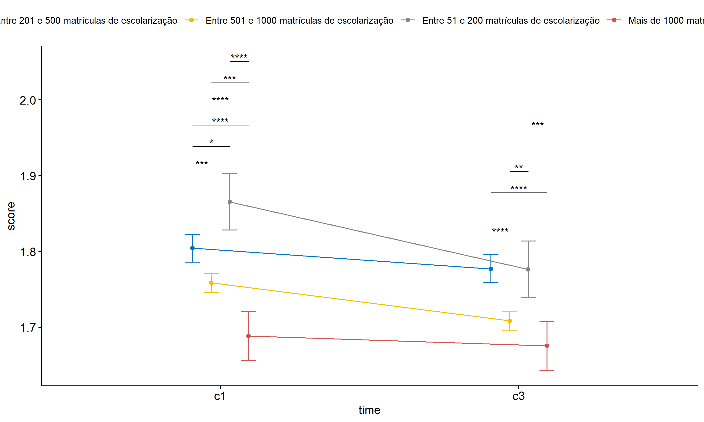<!-- -->

``` r
(pwc <- ldat %>% group_by(porte) %>%
    emmeans_test(score ~ time, detailed = T, p.adjust.method = "bonferroni"))
```

    ## # A tibble: 4 × 15
    ##   porte     term  .y.   group1 group2 null.value estimate      se    df conf.low
    ## * <fct>     <chr> <chr> <chr>  <chr>       <dbl>    <dbl>   <dbl> <dbl>    <dbl>
    ## 1 Entre 20… time  score c1     c3              0   0.0274 0.0133   7946  0.00125
    ## 2 Entre 50… time  score c1     c3              0   0.0500 0.00902  7946  0.0323 
    ## 3 Entre 51… time  score c1     c3              0   0.0892 0.0270   7946  0.0364 
    ## 4 Mais de … time  score c1     c3              0   0.0131 0.0234   7946 -0.0328 
    ## # ℹ 5 more variables: conf.high <dbl>, statistic <dbl>, p <dbl>, p.adj <dbl>,
    ## #   p.adj.signif <chr>

| porte                                        | term | .y.   | group1 | group2 | null.value | estimate |    se |   df | conf.low | conf.high | statistic |     p | p.adj | p.adj.signif |
|:---------------------------------------------|:-----|:------|:-------|:-------|-----------:|---------:|------:|-----:|---------:|----------:|----------:|------:|------:|:-------------|
| Entre 201 e 500 matrículas de escolarização  | time | score | c1     | c3     |          0 |    0.027 | 0.013 | 7946 |    0.001 |     0.054 |     2.054 | 0.040 | 0.040 | \*           |
| Entre 501 e 1000 matrículas de escolarização | time | score | c1     | c3     |          0 |    0.050 | 0.009 | 7946 |    0.032 |     0.068 |     5.541 | 0.000 | 0.000 | \*\*\*\*     |
| Entre 51 e 200 matrículas de escolarização   | time | score | c1     | c3     |          0 |    0.089 | 0.027 | 7946 |    0.036 |     0.142 |     3.310 | 0.001 | 0.001 | \*\*\*       |
| Mais de 1000 matrículas de escolarização     | time | score | c1     | c3     |          0 |    0.013 | 0.023 | 7946 |   -0.033 |     0.059 |     0.559 | 0.576 | 0.576 | ns           |

``` r
(emms <- get_emmeans(pwc))
```

    ## # A tibble: 8 × 8
    ##   porte                     time  emmean      se    df conf.low conf.high method
    ##   <fct>                     <fct>  <dbl>   <dbl> <dbl>    <dbl>     <dbl> <chr> 
    ## 1 Entre 201 e 500 matrícul… c1      1.80 0.00943  7946     1.79      1.82 Emmea…
    ## 2 Entre 201 e 500 matrícul… c3      1.78 0.00943  7946     1.76      1.80 Emmea…
    ## 3 Entre 501 e 1000 matrícu… c1      1.76 0.00638  7946     1.75      1.77 Emmea…
    ## 4 Entre 501 e 1000 matrícu… c3      1.71 0.00638  7946     1.70      1.72 Emmea…
    ## 5 Entre 51 e 200 matrícula… c1      1.87 0.0191   7946     1.83      1.90 Emmea…
    ## 6 Entre 51 e 200 matrícula… c3      1.78 0.0191   7946     1.74      1.81 Emmea…
    ## 7 Mais de 1000 matrículas … c1      1.69 0.0165   7946     1.66      1.72 Emmea…
    ## 8 Mais de 1000 matrículas … c3      1.68 0.0165   7946     1.64      1.71 Emmea…

| porte                                        | time | emmean |    se |   df | conf.low | conf.high | method       |
|:---------------------------------------------|:-----|-------:|------:|-----:|---------:|----------:|:-------------|
| Entre 201 e 500 matrículas de escolarização  | c1   |  1.804 | 0.009 | 7946 |    1.786 |     1.823 | Emmeans test |
| Entre 201 e 500 matrículas de escolarização  | c3   |  1.777 | 0.009 | 7946 |    1.759 |     1.795 | Emmeans test |
| Entre 501 e 1000 matrículas de escolarização | c1   |  1.759 | 0.006 | 7946 |    1.746 |     1.771 | Emmeans test |
| Entre 501 e 1000 matrículas de escolarização | c3   |  1.709 | 0.006 | 7946 |    1.696 |     1.721 | Emmeans test |
| Entre 51 e 200 matrículas de escolarização   | c1   |  1.866 | 0.019 | 7946 |    1.828 |     1.903 | Emmeans test |
| Entre 51 e 200 matrículas de escolarização   | c3   |  1.776 | 0.019 | 7946 |    1.739 |     1.814 | Emmeans test |
| Mais de 1000 matrículas de escolarização     | c1   |  1.688 | 0.017 | 7946 |    1.656 |     1.721 | Emmeans test |
| Mais de 1000 matrículas de escolarização     | c3   |  1.675 | 0.017 | 7946 |    1.643 |     1.708 | Emmeans test |

``` r
emms.gg <- emms[which(emms$porte == "Até 50 matrículas de escolarização"),]
if (nrow(emms.gg) > 0)
  ggline(emms.gg, x = "time", y = "emmean", color = "#0073C2FF", ylab = "score") +
    geom_errorbar(aes(ymin = conf.low, ymax = conf.high),
                  width = 0.2, color = "#0073C2FF") +
    stat_pvalue_manual(
      add_xy_position(pwc[which(pwc$porte == "Até 50 matrículas de escolarização"),],
                      x = "time", fun = "mean_se"),
      hide.ns = T, color = "#0073C2FF", tip.length = F) +
    labs(title = "porte: Até 50 matrículas de escolarização")+
    theme(legend.text = element_blank())
```

``` r
emms.gg <- emms[which(emms$porte == "Entre 201 e 500 matrículas de escolarização"),]
if (nrow(emms.gg) > 0)
  ggline(emms.gg, x = "time", y = "emmean", color = "#EFC000FF", ylab = "score") +
    geom_errorbar(aes(ymin = conf.low, ymax = conf.high),
                  width = 0.2, color = "#EFC000FF") +
    stat_pvalue_manual(
      add_xy_position(pwc[which(pwc$porte == "Entre 201 e 500 matrículas de escolarização"),],
                      x = "time", fun = "mean_se"),
      hide.ns = T, color = "#EFC000FF", tip.length = F) +
    labs(title = "porte: Entre 201 e 500 matrículas de escolarização")+
    theme(legend.text = element_blank())
```

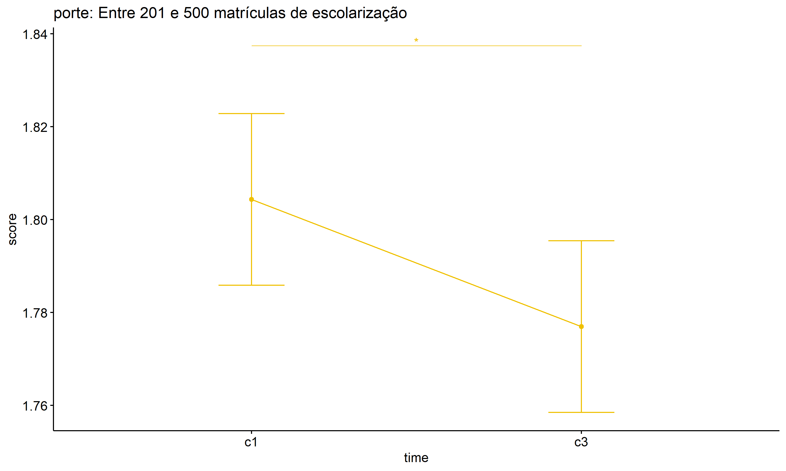<!-- -->

``` r
emms.gg <- emms[which(emms$porte == "Entre 501 e 1000 matrículas de escolarização"),]
if (nrow(emms.gg) > 0)
  ggline(emms.gg, x = "time", y = "emmean", color = "#868686FF", ylab = "score") +
    geom_errorbar(aes(ymin = conf.low, ymax = conf.high),
                  width = 0.2, color = "#868686FF") +
    stat_pvalue_manual(
      add_xy_position(pwc[which(pwc$porte == "Entre 501 e 1000 matrículas de escolarização"),],
                      x = "time", fun = "mean_se"),
      hide.ns = T, color = "#868686FF", tip.length = F) +
    labs(title = "porte: Entre 501 e 1000 matrículas de escolarização")+
    theme(legend.text = element_blank())
```

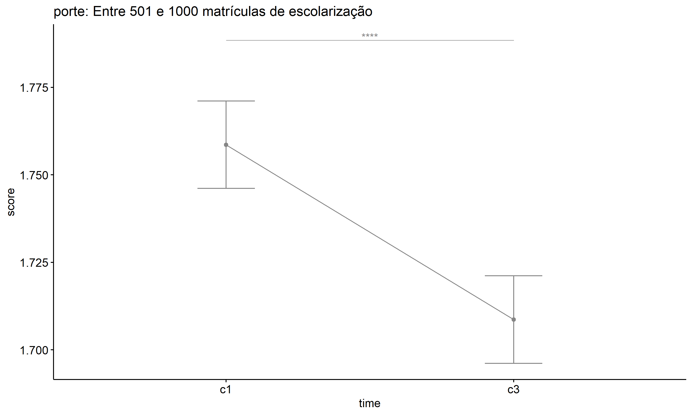<!-- -->

``` r
emms.gg <- emms[which(emms$porte == "Entre 51 e 200 matrículas de escolarização"),]
if (nrow(emms.gg) > 0)
  ggline(emms.gg, x = "time", y = "emmean", color = "#CD534CFF", ylab = "score") +
    geom_errorbar(aes(ymin = conf.low, ymax = conf.high),
                  width = 0.2, color = "#CD534CFF") +
    stat_pvalue_manual(
      add_xy_position(pwc[which(pwc$porte == "Entre 51 e 200 matrículas de escolarização"),],
                      x = "time", fun = "mean_se"),
      hide.ns = T, color = "#CD534CFF", tip.length = F) +
    labs(title = "porte: Entre 51 e 200 matrículas de escolarização")+
    theme(legend.text = element_blank())
```

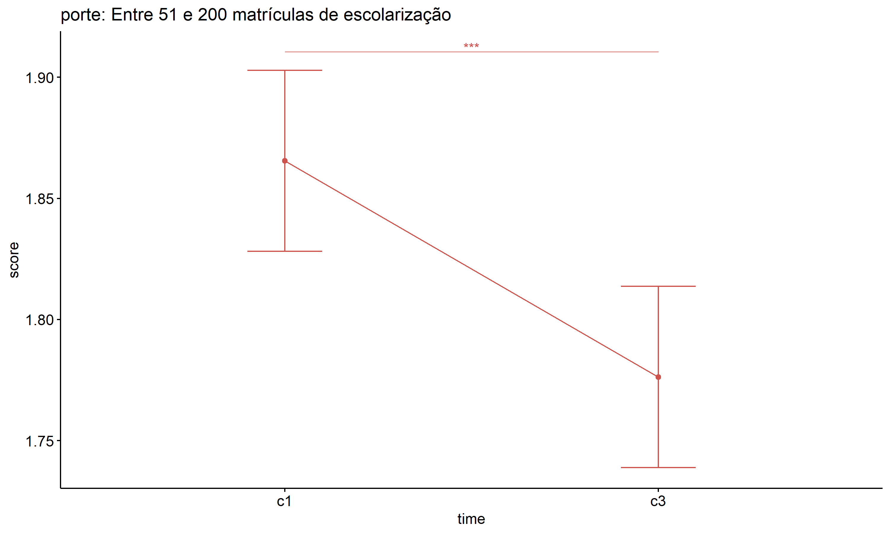<!-- -->

``` r
emms.gg <- emms[which(emms$porte == "Mais de 1000 matrículas de escolarização"),]
if (nrow(emms.gg) > 0)
  ggline(emms.gg, x = "time", y = "emmean", color = "#7AA6DCFF", ylab = "score") +
    geom_errorbar(aes(ymin = conf.low, ymax = conf.high),
                  width = 0.2, color = "#7AA6DCFF") +
    stat_pvalue_manual(
      add_xy_position(pwc[which(pwc$porte == "Mais de 1000 matrículas de escolarização"),],
                      x = "time", fun = "mean_se"),
      hide.ns = T, color = "#7AA6DCFF", tip.length = F) +
    labs(title = "porte: Mais de 1000 matrículas de escolarização")+
    theme(legend.text = element_blank())
```

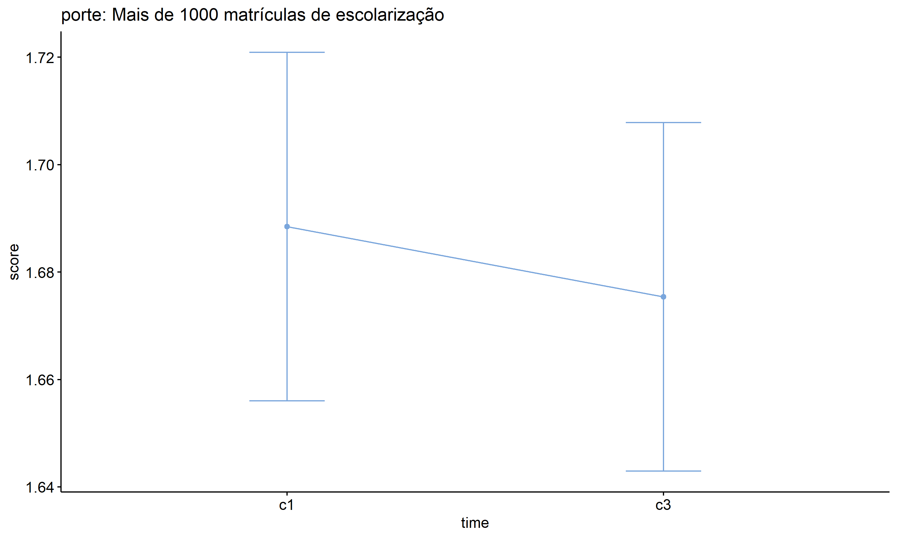<!-- -->

## PairWise Computation after removing non.normal data

``` r
if (length(non.ids) > 0)
  (pwc2 <- ldat2 %>% group_by(time) %>%
     emmeans_test(score ~ porte, detailed = T, p.adjust.method = "bonferroni"))
```

``` r
if (length(non.ids) > 0)
  (emms2 <- get_emmeans(pwc2))
```

``` r
if (length(non.ids) > 0) {
  pwc2 <- add_xy_position(pwc2, x = "time", fun = "mean_se", dodge = 0.25)
  pd2 <- position_dodge(width = 0.25)
  
  ggline(emms2, x = "time", y = "emmean", color = "porte",
         palette = c("#0073C2FF","#EFC000FF","#868686FF","#CD534CFF","#7AA6DCFF"),
         position = pd, ylab = "score") +
    geom_errorbar(aes(ymin = conf.low, ymax = conf.high, color = porte),
                position = pd, width = 0.2) +
    stat_pvalue_manual(pwc2, hide.ns = T, tip.length = F, linetype = 1)
}
```

``` r
if (length(non.ids) > 0)
  (pwc2 <- ldat2 %>% group_by(porte) %>%
     emmeans_test(score ~ time, detailed = T, p.adjust.method = "bonferroni"))
```

``` r
if (length(non.ids) > 0)
  (emms2 <- get_emmeans(pwc2))
```

``` r
if (length(non.ids) > 0) {
  emms.gg <- emms2[which(emms2$porte == "Até 50 matrículas de escolarização"),]
  if (nrow(emms.gg) > 0)
    ggline(emms.gg, x = "time", y = "emmean", color = "#0073C2FF", ylab = "score") +
    geom_errorbar(aes(ymin = conf.low, ymax = conf.high),
                  width = 0.2, color = "#0073C2FF") +
    stat_pvalue_manual(
      add_xy_position(pwc[which(pwc$porte == "Até 50 matrículas de escolarização"),],
                      x = "time", fun = "mean_se"),
      hide.ns = T, color = "#0073C2FF", tip.length = F) +
    labs(title = "porte: Até 50 matrículas de escolarização") +
    theme(legend.text = element_blank())
}
```

``` r
if (length(non.ids) > 0) {
  emms.gg <- emms2[which(emms2$porte == "Entre 201 e 500 matrículas de escolarização"),]
  if (nrow(emms.gg) > 0)
    ggline(emms.gg, x = "time", y = "emmean", color = "#EFC000FF", ylab = "score") +
    geom_errorbar(aes(ymin = conf.low, ymax = conf.high),
                  width = 0.2, color = "#EFC000FF") +
    stat_pvalue_manual(
      add_xy_position(pwc[which(pwc$porte == "Entre 201 e 500 matrículas de escolarização"),],
                      x = "time", fun = "mean_se"),
      hide.ns = T, color = "#EFC000FF", tip.length = F) +
    labs(title = "porte: Entre 201 e 500 matrículas de escolarização") +
    theme(legend.text = element_blank())
}
```

``` r
if (length(non.ids) > 0) {
  emms.gg <- emms2[which(emms2$porte == "Entre 501 e 1000 matrículas de escolarização"),]
  if (nrow(emms.gg) > 0)
    ggline(emms.gg, x = "time", y = "emmean", color = "#868686FF", ylab = "score") +
    geom_errorbar(aes(ymin = conf.low, ymax = conf.high),
                  width = 0.2, color = "#868686FF") +
    stat_pvalue_manual(
      add_xy_position(pwc[which(pwc$porte == "Entre 501 e 1000 matrículas de escolarização"),],
                      x = "time", fun = "mean_se"),
      hide.ns = T, color = "#868686FF", tip.length = F) +
    labs(title = "porte: Entre 501 e 1000 matrículas de escolarização") +
    theme(legend.text = element_blank())
}
```

``` r
if (length(non.ids) > 0) {
  emms.gg <- emms2[which(emms2$porte == "Entre 51 e 200 matrículas de escolarização"),]
  if (nrow(emms.gg) > 0)
    ggline(emms.gg, x = "time", y = "emmean", color = "#CD534CFF", ylab = "score") +
    geom_errorbar(aes(ymin = conf.low, ymax = conf.high),
                  width = 0.2, color = "#CD534CFF") +
    stat_pvalue_manual(
      add_xy_position(pwc[which(pwc$porte == "Entre 51 e 200 matrículas de escolarização"),],
                      x = "time", fun = "mean_se"),
      hide.ns = T, color = "#CD534CFF", tip.length = F) +
    labs(title = "porte: Entre 51 e 200 matrículas de escolarização") +
    theme(legend.text = element_blank())
}
```

``` r
if (length(non.ids) > 0) {
  emms.gg <- emms2[which(emms2$porte == "Mais de 1000 matrículas de escolarização"),]
  if (nrow(emms.gg) > 0)
    ggline(emms.gg, x = "time", y = "emmean", color = "#7AA6DCFF", ylab = "score") +
    geom_errorbar(aes(ymin = conf.low, ymax = conf.high),
                  width = 0.2, color = "#7AA6DCFF") +
    stat_pvalue_manual(
      add_xy_position(pwc[which(pwc$porte == "Mais de 1000 matrículas de escolarização"),],
                      x = "time", fun = "mean_se"),
      hide.ns = T, color = "#7AA6DCFF", tip.length = F) +
    labs(title = "porte: Mais de 1000 matrículas de escolarização") +
    theme(legend.text = element_blank())
}
```
