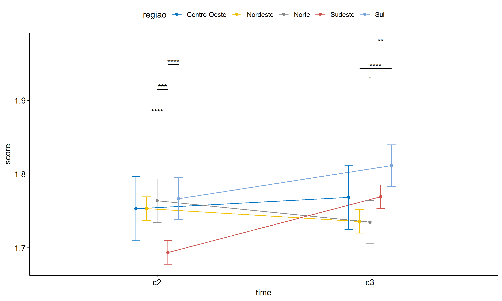

ANOVA test for score
================
Geiser C. Challco <geiser@alumni.usp.br>

- [ANOVA: score ~ time](#anova-score--time)
  - [Data Preparation](#data-preparation)
  - [Summary Statistics](#summary-statistics)
  - [ANOVA Computation](#anova-computation)
  - [PairWise Computation](#pairwise-computation)
- [ANOVA: score ~ time\*gender +
  Error(id/time)](#anova-score--timegender--erroridtime)
  - [Data Preparation](#data-preparation-1)
    - [Check assumptions: Identifying
      Outliers](#check-assumptions-identifying-outliers)
    - [Check assumptions: Normality
      Test](#check-assumptions-normality-test)
    - [Summary Statistics](#summary-statistics-1)
  - [ANOVA Computation](#anova-computation-1)
  - [ANOVA Computation after removing non.normal
    data](#anova-computation-after-removing-nonnormal-data)
  - [PairWise Computation](#pairwise-computation-1)
  - [PairWise Computation after removing non.normal
    data](#pairwise-computation-after-removing-nonnormal-data)
- [ANOVA: score ~ time\*localizacao +
  Error(id/time)](#anova-score--timelocalizacao--erroridtime)
  - [Data Preparation](#data-preparation-2)
    - [Check assumptions: Identifying
      Outliers](#check-assumptions-identifying-outliers-1)
    - [Check assumptions: Normality
      Test](#check-assumptions-normality-test-1)
    - [Summary Statistics](#summary-statistics-2)
  - [ANOVA Computation](#anova-computation-2)
  - [ANOVA Computation after removing non.normal
    data](#anova-computation-after-removing-nonnormal-data-1)
  - [PairWise Computation](#pairwise-computation-2)
  - [PairWise Computation after removing non.normal
    data](#pairwise-computation-after-removing-nonnormal-data-1)
- [ANOVA: score ~ time\*regiao +
  Error(id/time)](#anova-score--timeregiao--erroridtime)
  - [Data Preparation](#data-preparation-3)
    - [Check assumptions: Identifying
      Outliers](#check-assumptions-identifying-outliers-2)
    - [Check assumptions: Normality
      Test](#check-assumptions-normality-test-2)
    - [Summary Statistics](#summary-statistics-3)
  - [ANOVA Computation](#anova-computation-3)
  - [ANOVA Computation after removing non.normal
    data](#anova-computation-after-removing-nonnormal-data-2)
  - [PairWise Computation](#pairwise-computation-3)
  - [PairWise Computation after removing non.normal
    data](#pairwise-computation-after-removing-nonnormal-data-2)
- [ANOVA: score ~ time\*porte +
  Error(id/time)](#anova-score--timeporte--erroridtime)
  - [Data Preparation](#data-preparation-4)
    - [Check assumptions: Identifying
      Outliers](#check-assumptions-identifying-outliers-3)
    - [Check assumptions: Normality
      Test](#check-assumptions-normality-test-3)
    - [Summary Statistics](#summary-statistics-4)
  - [ANOVA Computation](#anova-computation-4)
  - [ANOVA Computation after removing non.normal
    data](#anova-computation-after-removing-nonnormal-data-3)
  - [PairWise Computation](#pairwise-computation-4)
  - [PairWise Computation after removing non.normal
    data](#pairwise-computation-after-removing-nonnormal-data-3)

``` r
dat <- read_excel("../data/data.xlsx", sheet = "alunos_ef59")

escolas <- read_excel("../data/data.xlsx", sheet = "escolas")
edat <- merge(dat, escolas, by = "cod_escola", all.x = T)
```

# ANOVA: score ~ time

## Data Preparation

``` r
data <- edat[,c("aluno_id","ciclo","score")]
data <- data[data$ciclo %in% c("Segundo Ciclo","Terceiro Ciclo"),]
data$ciclo <- factor(data$ciclo, c("Segundo Ciclo","Terceiro Ciclo"))
data <- unique(data)

wdat <- spread(data, ciclo, score)
wdat <- wdat[complete.cases(wdat),]
colnames(wdat) <- c("id","c2","c3")

ldat <- gather(wdat, key = time, value = score, c2,c3) %>%
  convert_as_factor(id, time)
ldat <- rshinystatistics::remove_group_data(ldat, "score", "time", n.limit = 30)
```

## Summary Statistics

``` r
(sdat <- ldat %>% group_by(time) %>%
   get_summary_stats(score, type = "mean_sd"))
```

    ## # A tibble: 2 × 5
    ##   time  variable     n  mean    sd
    ##   <fct> <fct>    <dbl> <dbl> <dbl>
    ## 1 c2    score     4042  1.73 0.299
    ## 2 c3    score     4042  1.76 0.327

| time | variable |    n |  mean |    sd |
|:-----|:---------|-----:|------:|------:|
| c2   | score    | 4042 | 1.734 | 0.299 |
| c3   | score    | 4042 | 1.758 | 0.327 |

## ANOVA Computation

``` r
(res.aov <- anova_test(ldat, dv = score, wid = id, within = time))
```

    ## ANOVA Table (type III tests)
    ## 
    ##   Effect DFn  DFd      F        p p<.05   ges
    ## 1   time   1 4041 14.013 0.000184     * 0.001

## PairWise Computation

``` r
(pwc <- ldat %>% emmeans_test(score ~ time, detailed = T, p.adjust.method = "bonferroni"))
```

    ## # A tibble: 1 × 14
    ##   term  .y.   group1 group2 null.value estimate      se    df conf.low conf.high
    ## * <chr> <chr> <chr>  <chr>       <dbl>    <dbl>   <dbl> <dbl>    <dbl>     <dbl>
    ## 1 time  score c2     c3              0  -0.0241 0.00696  8082  -0.0377   -0.0104
    ## # ℹ 4 more variables: statistic <dbl>, p <dbl>, p.adj <dbl>, p.adj.signif <chr>

| term | .y.   | group1 | group2 | null.value | estimate |    se |   df | conf.low | conf.high | statistic |     p | p.adj | p.adj.signif |
|:-----|:------|:-------|:-------|-----------:|---------:|------:|-----:|---------:|----------:|----------:|------:|------:|:-------------|
| time | score | c2     | c3     |          0 |   -0.024 | 0.007 | 8082 |   -0.038 |     -0.01 |    -3.457 | 0.001 | 0.001 | \*\*\*       |

``` r
pwc <- add_xy_position(pwc, x = "time", fun = "mean_se")
ggline(get_emmeans(pwc), x = "time", y = "emmean", ylab = "score") +
  geom_errorbar(aes(ymin = conf.low, ymax = conf.high), width = 0.2) +
  stat_pvalue_manual(pwc, hide.ns = T, tip.length = F)
```

<!-- -->

# ANOVA: score ~ time\*gender + Error(id/time)

## Data Preparation

``` r
data <- edat[,c("aluno_id","gender","ciclo","score")]
data <- data[data$ciclo %in% c("Segundo Ciclo","Terceiro Ciclo"),]
data$ciclo <- factor(data$ciclo, c("Segundo Ciclo","Terceiro Ciclo"))
data <- unique(data)

wdat <- spread(data, ciclo, score)
wdat <- wdat[complete.cases(wdat),]
colnames(wdat) <- c("id","gender","c2","c3")

ldat <- gather(wdat, key = time, value = score, c2,c3) %>%
  convert_as_factor(id, time)
ldat <- remove_group_data(ldat, "score", c("time", "gender"), n.limit = 30)
ldat$gender <- factor(ldat$gender, sort(unique(ldat$gender)))
```

### Check assumptions: Identifying Outliers

``` r
outliers <- identify_outliers(group_by(ldat, time, gender), score)
(outliers <- outliers[outliers$is.extreme == T,])
```

    ## # A tibble: 3 × 6
    ##   gender time  id                   score is.outlier is.extreme
    ##   <fct>  <fct> <fct>                <dbl> <lgl>      <lgl>     
    ## 1 Female c2    oEDVJwdVHdc8vvUBo2jy     3 TRUE       TRUE      
    ## 2 Female c2    u1zil2OzxQVXB2KwkuTr     3 TRUE       TRUE      
    ## 3 Female c3    ygluKcF3wOKKl3jfvWGo     3 TRUE       TRUE

| gender | time | id                   | score | is.outlier | is.extreme |
|:-------|:-----|:---------------------|------:|:-----------|:-----------|
| Female | c2   | oEDVJwdVHdc8vvUBo2jy |     3 | TRUE       | TRUE       |
| Female | c2   | u1zil2OzxQVXB2KwkuTr |     3 | TRUE       | TRUE       |
| Female | c3   | ygluKcF3wOKKl3jfvWGo |     3 | TRUE       | TRUE       |

### Check assumptions: Normality Test

``` r
(normality.df <- normality.test.per.groups(ldat, "score", c("time", "gender")))
```

    ##     var variable time gender    n  skewness   kurtosis symmetry statistic
    ## 1 score    score   c2 Female 1876 0.6062370 0.40697035       NO 109.31421
    ## 2 score    score   c2   Male 1917 0.6919024 0.48266903       NO 140.60610
    ## 3 score    score   c3 Female 1876 0.5631486 0.02930016       NO  87.57704
    ## 4 score    score   c3   Male 1917 0.6993832 0.22406696       NO 133.45175
    ##       method p p.signif normality
    ## 1 D'Agostino 0     ****         -
    ## 2 D'Agostino 0     ****         -
    ## 3 D'Agostino 0     ****         -
    ## 4 D'Agostino 0     ****         -

| var   | variable | time | gender |    n | skewness | kurtosis | symmetry | statistic | method     |   p | p.signif | normality |
|:------|:---------|:-----|:-------|-----:|---------:|---------:|:---------|----------:|:-----------|----:|:---------|:----------|
| score | score    | c2   | Female | 1876 |    0.606 |    0.407 | NO       |   109.314 | D’Agostino |   0 | \*\*\*\* | \-        |
| score | score    | c2   | Male   | 1917 |    0.692 |    0.483 | NO       |   140.606 | D’Agostino |   0 | \*\*\*\* | \-        |
| score | score    | c3   | Female | 1876 |    0.563 |    0.029 | NO       |    87.577 | D’Agostino |   0 | \*\*\*\* | \-        |
| score | score    | c3   | Male   | 1917 |    0.699 |    0.224 | NO       |   133.452 | D’Agostino |   0 | \*\*\*\* | \-        |

``` r
(non.ids <- unique(do.call(
  c, lapply(which(normality.df$normality == 'NO'), FUN = function(i) {
  idx = which(ldat$time == normality.df$time[i] &
                ldat$gender == normality.df$gender[i])
  getNonNormal(ldat$"score"[idx], ldat$id[idx])
}))))
```

    ## NULL

``` r
if (length(non.ids) > 0)
  ldat2 <- ldat[!ldat$id %in% non.ids,]
```

### Summary Statistics

``` r
(sdat <- ldat %>% group_by(time, gender) %>%
   get_summary_stats(score, type = "mean_sd"))
```

    ## # A tibble: 4 × 6
    ##   gender time  variable     n  mean    sd
    ##   <fct>  <fct> <fct>    <dbl> <dbl> <dbl>
    ## 1 Female c2    score     1876  1.76 0.305
    ## 2 Male   c2    score     1917  1.71 0.294
    ## 3 Female c3    score     1876  1.78 0.33 
    ## 4 Male   c3    score     1917  1.74 0.322

| gender | time | variable |    n |  mean |    sd |
|:-------|:-----|:---------|-----:|------:|------:|
| Female | c2   | score    | 1876 | 1.758 | 0.305 |
| Male   | c2   | score    | 1917 | 1.711 | 0.294 |
| Female | c3   | score    | 1876 | 1.779 | 0.330 |
| Male   | c3   | score    | 1917 | 1.738 | 0.322 |

``` r
if (length(non.ids) > 0)
  (sdat <- ldat2 %>% group_by(time, gender) %>%
      get_summary_stats(score, type = "mean_sd"))
```

| gender | time | variable |    n |  mean |    sd |
|:-------|:-----|:---------|-----:|------:|------:|
| Female | c2   | score    | 1876 | 1.758 | 0.305 |
| Male   | c2   | score    | 1917 | 1.711 | 0.294 |
| Female | c3   | score    | 1876 | 1.779 | 0.330 |
| Male   | c3   | score    | 1917 | 1.738 | 0.322 |

## ANOVA Computation

``` r
(res.aov <- anova_test(ldat, dv = score, wid = id, between = gender, within = time))
```

    ## ANOVA Table (type III tests)
    ## 
    ##        Effect DFn  DFd      F        p p<.05      ges
    ## 1      gender   1 3791 33.383 8.18e-09     * 5.00e-03
    ## 2        time   1 3791 13.257 2.75e-04     * 1.00e-03
    ## 3 gender:time   1 3791  0.171 6.80e-01       1.93e-05

## ANOVA Computation after removing non.normal data

``` r
if (length(non.ids) > 0)
  (res.aov2 <- anova_test(ldat2, dv = score, wid = id, between = gender , within = time))
```

## PairWise Computation

``` r
(pwc <- ldat %>% group_by(time) %>%
   emmeans_test(score ~ gender, detailed = T, p.adjust.method = "bonferroni"))
```

    ## # A tibble: 2 × 15
    ##   time  term   .y.   group1 group2 null.value estimate     se    df conf.low
    ## * <fct> <chr>  <chr> <chr>  <chr>       <dbl>    <dbl>  <dbl> <dbl>    <dbl>
    ## 1 c2    gender score Female Male            0   0.0471 0.0102  7582   0.0272
    ## 2 c3    gender score Female Male            0   0.0416 0.0102  7582   0.0217
    ## # ℹ 5 more variables: conf.high <dbl>, statistic <dbl>, p <dbl>, p.adj <dbl>,
    ## #   p.adj.signif <chr>

| time | term   | .y.   | group1 | group2 | null.value | estimate |   se |   df | conf.low | conf.high | statistic |   p | p.adj | p.adj.signif |
|:-----|:-------|:------|:-------|:-------|-----------:|---------:|-----:|-----:|---------:|----------:|----------:|----:|------:|:-------------|
| c2   | gender | score | Female | Male   |          0 |    0.047 | 0.01 | 7582 |    0.027 |     0.067 |     4.638 |   0 |     0 | \*\*\*\*     |
| c3   | gender | score | Female | Male   |          0 |    0.042 | 0.01 | 7582 |    0.022 |     0.062 |     4.097 |   0 |     0 | \*\*\*\*     |

``` r
(emms <- get_emmeans(pwc))
```

    ## # A tibble: 4 × 8
    ##   time  gender emmean      se    df conf.low conf.high method      
    ##   <fct> <fct>   <dbl>   <dbl> <dbl>    <dbl>     <dbl> <chr>       
    ## 1 c2    Female   1.76 0.00722  7582     1.74      1.77 Emmeans test
    ## 2 c2    Male     1.71 0.00715  7582     1.70      1.72 Emmeans test
    ## 3 c3    Female   1.78 0.00722  7582     1.77      1.79 Emmeans test
    ## 4 c3    Male     1.74 0.00715  7582     1.72      1.75 Emmeans test

| time | gender | emmean |    se |   df | conf.low | conf.high | method       |
|:-----|:-------|-------:|------:|-----:|---------:|----------:|:-------------|
| c2   | Female |  1.758 | 0.007 | 7582 |    1.744 |     1.772 | Emmeans test |
| c2   | Male   |  1.711 | 0.007 | 7582 |    1.697 |     1.725 | Emmeans test |
| c3   | Female |  1.779 | 0.007 | 7582 |    1.765 |     1.794 | Emmeans test |
| c3   | Male   |  1.738 | 0.007 | 7582 |    1.724 |     1.752 | Emmeans test |

``` r
pwc <- add_xy_position(pwc, x = "time", fun = "mean_se", dodge = 0.25)
pd <- position_dodge(width = 0.25)
ggline(emms, x = "time", y = "emmean", color = "gender",
       palette = c("#FF007F","#4D4DFF"),
       position = pd, ylab = "score") +
  geom_errorbar(aes(ymin = conf.low, ymax = conf.high, color = gender),
                position = pd, width = 0.2) +
  stat_pvalue_manual(pwc, hide.ns = T, tip.length = F, linetype = 1)
```

<!-- -->

``` r
(pwc <- ldat %>% group_by(gender) %>%
    emmeans_test(score ~ time, detailed = T, p.adjust.method = "bonferroni"))
```

    ## # A tibble: 2 × 15
    ##   gender term  .y.   group1 group2 null.value estimate     se    df conf.low
    ## * <fct>  <chr> <chr> <chr>  <chr>       <dbl>    <dbl>  <dbl> <dbl>    <dbl>
    ## 1 Female time  score c2     c3              0  -0.0215 0.0102  7582  -0.0415
    ## 2 Male   time  score c2     c3              0  -0.0270 0.0101  7582  -0.0468
    ## # ℹ 5 more variables: conf.high <dbl>, statistic <dbl>, p <dbl>, p.adj <dbl>,
    ## #   p.adj.signif <chr>

| gender | term | .y.   | group1 | group2 | null.value | estimate |   se |   df | conf.low | conf.high | statistic |     p | p.adj | p.adj.signif |
|:-------|:-----|:------|:-------|:-------|-----------:|---------:|-----:|-----:|---------:|----------:|----------:|------:|------:|:-------------|
| Female | time | score | c2     | c3     |          0 |   -0.021 | 0.01 | 7582 |   -0.041 |    -0.001 |    -2.102 | 0.036 | 0.036 | \*           |
| Male   | time | score | c2     | c3     |          0 |   -0.027 | 0.01 | 7582 |   -0.047 |    -0.007 |    -2.669 | 0.008 | 0.008 | \*\*         |

``` r
(emms <- get_emmeans(pwc))
```

    ## # A tibble: 4 × 8
    ##   gender time  emmean      se    df conf.low conf.high method      
    ##   <fct>  <fct>  <dbl>   <dbl> <dbl>    <dbl>     <dbl> <chr>       
    ## 1 Female c2      1.76 0.00722  7582     1.74      1.77 Emmeans test
    ## 2 Female c3      1.78 0.00722  7582     1.77      1.79 Emmeans test
    ## 3 Male   c2      1.71 0.00715  7582     1.70      1.72 Emmeans test
    ## 4 Male   c3      1.74 0.00715  7582     1.72      1.75 Emmeans test

| gender | time | emmean |    se |   df | conf.low | conf.high | method       |
|:-------|:-----|-------:|------:|-----:|---------:|----------:|:-------------|
| Female | c2   |  1.758 | 0.007 | 7582 |    1.744 |     1.772 | Emmeans test |
| Female | c3   |  1.779 | 0.007 | 7582 |    1.765 |     1.794 | Emmeans test |
| Male   | c2   |  1.711 | 0.007 | 7582 |    1.697 |     1.725 | Emmeans test |
| Male   | c3   |  1.738 | 0.007 | 7582 |    1.724 |     1.752 | Emmeans test |

``` r
emms.gg <- emms[which(emms$gender == "Female"),]
if (nrow(emms.gg) > 0)
  ggline(emms.gg, x = "time", y = "emmean", color = "#FF007F", ylab = "score") +
    geom_errorbar(aes(ymin = conf.low, ymax = conf.high),
                  width = 0.2, color = "#FF007F") +
    stat_pvalue_manual(
      add_xy_position(pwc[which(pwc$gender == "Female"),],
                      x = "time", fun = "mean_se"),
      hide.ns = T, color = "#FF007F", tip.length = F) +
    labs(title = "gender: Female")+
    theme(legend.text = element_blank())
```

<!-- -->

``` r
emms.gg <- emms[which(emms$gender == "Male"),]
if (nrow(emms.gg) > 0)
  ggline(emms.gg, x = "time", y = "emmean", color = "#4D4DFF", ylab = "score") +
    geom_errorbar(aes(ymin = conf.low, ymax = conf.high),
                  width = 0.2, color = "#4D4DFF") +
    stat_pvalue_manual(
      add_xy_position(pwc[which(pwc$gender == "Male"),],
                      x = "time", fun = "mean_se"),
      hide.ns = T, color = "#4D4DFF", tip.length = F) +
    labs(title = "gender: Male")+
    theme(legend.text = element_blank())
```

<!-- -->

## PairWise Computation after removing non.normal data

``` r
if (length(non.ids) > 0)
  (pwc2 <- ldat2 %>% group_by(time) %>%
     emmeans_test(score ~ gender, detailed = T, p.adjust.method = "bonferroni"))
```

``` r
if (length(non.ids) > 0)
  (emms2 <- get_emmeans(pwc2))
```

``` r
if (length(non.ids) > 0) {
  pwc2 <- add_xy_position(pwc2, x = "time", fun = "mean_se", dodge = 0.25)
  pd2 <- position_dodge(width = 0.25)
  
  ggline(emms2, x = "time", y = "emmean", color = "gender",
         palette = c("#FF007F","#4D4DFF"),
         position = pd, ylab = "score") +
    geom_errorbar(aes(ymin = conf.low, ymax = conf.high, color = gender),
                position = pd, width = 0.2) +
    stat_pvalue_manual(pwc2, hide.ns = T, tip.length = F, linetype = 1)
}
```

``` r
if (length(non.ids) > 0)
  (pwc2 <- ldat2 %>% group_by(gender) %>%
     emmeans_test(score ~ time, detailed = T, p.adjust.method = "bonferroni"))
```

``` r
if (length(non.ids) > 0)
  (emms2 <- get_emmeans(pwc2))
```

``` r
if (length(non.ids) > 0) {
  emms.gg <- emms2[which(emms2$gender == "Female"),]
  if (nrow(emms.gg) > 0)
    ggline(emms.gg, x = "time", y = "emmean", color = "#FF007F", ylab = "score") +
    geom_errorbar(aes(ymin = conf.low, ymax = conf.high),
                  width = 0.2, color = "#FF007F") +
    stat_pvalue_manual(
      add_xy_position(pwc[which(pwc$gender == "Female"),],
                      x = "time", fun = "mean_se"),
      hide.ns = T, color = "#FF007F", tip.length = F) +
    labs(title = "gender: Female") +
    theme(legend.text = element_blank())
}
```

``` r
if (length(non.ids) > 0) {
  emms.gg <- emms2[which(emms2$gender == "Male"),]
  if (nrow(emms.gg) > 0)
    ggline(emms.gg, x = "time", y = "emmean", color = "#4D4DFF", ylab = "score") +
    geom_errorbar(aes(ymin = conf.low, ymax = conf.high),
                  width = 0.2, color = "#4D4DFF") +
    stat_pvalue_manual(
      add_xy_position(pwc[which(pwc$gender == "Male"),],
                      x = "time", fun = "mean_se"),
      hide.ns = T, color = "#4D4DFF", tip.length = F) +
    labs(title = "gender: Male") +
    theme(legend.text = element_blank())
}
```

# ANOVA: score ~ time\*localizacao + Error(id/time)

## Data Preparation

``` r
data <- edat[,c("aluno_id","localizacao","ciclo","score")]
data <- data[data$ciclo %in% c("Segundo Ciclo","Terceiro Ciclo"),]
data$ciclo <- factor(data$ciclo, c("Segundo Ciclo","Terceiro Ciclo"))
data <- unique(data)

wdat <- spread(data, ciclo, score)
wdat <- wdat[complete.cases(wdat),]
colnames(wdat) <- c("id","localizacao","c2","c3")

ldat <- gather(wdat, key = time, value = score, c2,c3) %>%
  convert_as_factor(id, time)
ldat <- remove_group_data(ldat, "score", c("time", "localizacao"), n.limit = 30)
ldat$localizacao <- factor(ldat$localizacao, sort(unique(ldat$localizacao)))
```

### Check assumptions: Identifying Outliers

``` r
outliers <- identify_outliers(group_by(ldat, time, localizacao), score)
(outliers <- outliers[outliers$is.extreme == T,])
```

    ## # A tibble: 0 × 6
    ## # ℹ 6 variables: localizacao <fct>, time <fct>, id <fct>, score <dbl>,
    ## #   is.outlier <lgl>, is.extreme <lgl>

| localizacao | time | id  | score | is.outlier | is.extreme |
|:------------|:-----|:----|------:|:-----------|:-----------|

### Check assumptions: Normality Test

``` r
(normality.df <- normality.test.per.groups(ldat, "score", c("time", "localizacao")))
```

    ##     var variable time localizacao    n  skewness   kurtosis symmetry statistic
    ## 1 score    score   c2       Rural  701 0.6809330 0.34724634       NO  49.47610
    ## 2 score    score   c2      Urbana 3341 0.6221721 0.40894566       NO 201.45277
    ## 3 score    score   c3       Rural  701 0.6907520 0.24227268       NO  49.20172
    ## 4 score    score   c3      Urbana 3341 0.6198887 0.06104477       NO 183.89690
    ##       method            p p.signif normality
    ## 1 D'Agostino 1.804690e-11     ****         -
    ## 2 D'Agostino 0.000000e+00     ****         -
    ## 3 D'Agostino 2.070055e-11     ****         -
    ## 4 D'Agostino 0.000000e+00     ****         -

| var   | variable | time | localizacao |    n | skewness | kurtosis | symmetry | statistic | method     |   p | p.signif | normality |
|:------|:---------|:-----|:------------|-----:|---------:|---------:|:---------|----------:|:-----------|----:|:---------|:----------|
| score | score    | c2   | Rural       |  701 |    0.681 |    0.347 | NO       |    49.476 | D’Agostino |   0 | \*\*\*\* | \-        |
| score | score    | c2   | Urbana      | 3341 |    0.622 |    0.409 | NO       |   201.453 | D’Agostino |   0 | \*\*\*\* | \-        |
| score | score    | c3   | Rural       |  701 |    0.691 |    0.242 | NO       |    49.202 | D’Agostino |   0 | \*\*\*\* | \-        |
| score | score    | c3   | Urbana      | 3341 |    0.620 |    0.061 | NO       |   183.897 | D’Agostino |   0 | \*\*\*\* | \-        |

``` r
(non.ids <- unique(do.call(
  c, lapply(which(normality.df$normality == 'NO'), FUN = function(i) {
  idx = which(ldat$time == normality.df$time[i] &
                ldat$localizacao == normality.df$localizacao[i])
  getNonNormal(ldat$"score"[idx], ldat$id[idx])
}))))
```

    ## NULL

``` r
if (length(non.ids) > 0)
  ldat2 <- ldat[!ldat$id %in% non.ids,]
```

### Summary Statistics

``` r
(sdat <- ldat %>% group_by(time, localizacao) %>%
   get_summary_stats(score, type = "mean_sd"))
```

    ## # A tibble: 4 × 6
    ##   localizacao time  variable     n  mean    sd
    ##   <fct>       <fct> <fct>    <dbl> <dbl> <dbl>
    ## 1 Rural       c2    score      701  1.75 0.319
    ## 2 Urbana      c2    score     3341  1.73 0.294
    ## 3 Rural       c3    score      701  1.76 0.327
    ## 4 Urbana      c3    score     3341  1.76 0.327

| localizacao | time | variable |    n |  mean |    sd |
|:------------|:-----|:---------|-----:|------:|------:|
| Rural       | c2   | score    |  701 | 1.748 | 0.319 |
| Urbana      | c2   | score    | 3341 | 1.731 | 0.294 |
| Rural       | c3   | score    |  701 | 1.761 | 0.327 |
| Urbana      | c3   | score    | 3341 | 1.758 | 0.327 |

``` r
if (length(non.ids) > 0)
  (sdat <- ldat2 %>% group_by(time, localizacao) %>%
      get_summary_stats(score, type = "mean_sd"))
```

| localizacao | time | variable |    n |  mean |    sd |
|:------------|:-----|:---------|-----:|------:|------:|
| Rural       | c2   | score    |  701 | 1.748 | 0.319 |
| Urbana      | c2   | score    | 3341 | 1.731 | 0.294 |
| Rural       | c3   | score    |  701 | 1.761 | 0.327 |
| Urbana      | c3   | score    | 3341 | 1.758 | 0.327 |

## ANOVA Computation

``` r
(res.aov <- anova_test(ldat, dv = score, wid = id, between = localizacao, within = time))
```

    ## ANOVA Table (type III tests)
    ## 
    ##             Effect DFn  DFd     F     p p<.05      ges
    ## 1      localizacao   1 4040 0.991 0.319       1.41e-04
    ## 2             time   1 4040 5.327 0.021     * 5.62e-04
    ## 3 localizacao:time   1 4040 0.650 0.420       6.86e-05

## ANOVA Computation after removing non.normal data

``` r
if (length(non.ids) > 0)
  (res.aov2 <- anova_test(ldat2, dv = score, wid = id, between = localizacao , within = time))
```

## PairWise Computation

``` r
(pwc <- ldat %>% group_by(time) %>%
   emmeans_test(score ~ localizacao, detailed = T, p.adjust.method = "bonferroni"))
```

    ## # A tibble: 2 × 15
    ##   time  term       .y.   group1 group2 null.value estimate     se    df conf.low
    ## * <fct> <chr>      <chr> <chr>  <chr>       <dbl>    <dbl>  <dbl> <dbl>    <dbl>
    ## 1 c2    localizac… score Rural  Urbana          0  0.0167  0.0130  8080 -0.00884
    ## 2 c3    localizac… score Rural  Urbana          0  0.00296 0.0130  8080 -0.0225 
    ## # ℹ 5 more variables: conf.high <dbl>, statistic <dbl>, p <dbl>, p.adj <dbl>,
    ## #   p.adj.signif <chr>

| time | term        | .y.   | group1 | group2 | null.value | estimate |    se |   df | conf.low | conf.high | statistic |    p | p.adj | p.adj.signif |
|:-----|:------------|:------|:-------|:-------|-----------:|---------:|------:|-----:|---------:|----------:|----------:|-----:|------:|:-------------|
| c2   | localizacao | score | Rural  | Urbana |          0 |    0.017 | 0.013 | 8080 |   -0.009 |     0.042 |     1.280 | 0.20 |  0.20 | ns           |
| c3   | localizacao | score | Rural  | Urbana |          0 |    0.003 | 0.013 | 8080 |   -0.023 |     0.028 |     0.228 | 0.82 |  0.82 | ns           |

``` r
(emms <- get_emmeans(pwc))
```

    ## # A tibble: 4 × 8
    ##   time  localizacao emmean      se    df conf.low conf.high method      
    ##   <fct> <fct>        <dbl>   <dbl> <dbl>    <dbl>     <dbl> <chr>       
    ## 1 c2    Rural         1.75 0.0118   8080     1.72      1.77 Emmeans test
    ## 2 c2    Urbana        1.73 0.00542  8080     1.72      1.74 Emmeans test
    ## 3 c3    Rural         1.76 0.0118   8080     1.74      1.78 Emmeans test
    ## 4 c3    Urbana        1.76 0.00542  8080     1.75      1.77 Emmeans test

| time | localizacao | emmean |    se |   df | conf.low | conf.high | method       |
|:-----|:------------|-------:|------:|-----:|---------:|----------:|:-------------|
| c2   | Rural       |  1.748 | 0.012 | 8080 |    1.725 |     1.771 | Emmeans test |
| c2   | Urbana      |  1.731 | 0.005 | 8080 |    1.721 |     1.742 | Emmeans test |
| c3   | Rural       |  1.761 | 0.012 | 8080 |    1.738 |     1.784 | Emmeans test |
| c3   | Urbana      |  1.758 | 0.005 | 8080 |    1.747 |     1.768 | Emmeans test |

``` r
pwc <- add_xy_position(pwc, x = "time", fun = "mean_se", dodge = 0.25)
pd <- position_dodge(width = 0.25)
ggline(emms, x = "time", y = "emmean", color = "localizacao",
       palette = c("#AA00FF","#00CCCC"),
       position = pd, ylab = "score") +
  geom_errorbar(aes(ymin = conf.low, ymax = conf.high, color = localizacao),
                position = pd, width = 0.2) +
  stat_pvalue_manual(pwc, hide.ns = T, tip.length = F, linetype = 1)
```

<!-- -->

``` r
(pwc <- ldat %>% group_by(localizacao) %>%
    emmeans_test(score ~ time, detailed = T, p.adjust.method = "bonferroni"))
```

    ## # A tibble: 2 × 15
    ##   localizacao term  .y.   group1 group2 null.value estimate      se    df
    ## * <fct>       <chr> <chr> <chr>  <chr>       <dbl>    <dbl>   <dbl> <dbl>
    ## 1 Rural       time  score c2     c3              0  -0.0128 0.0167   8080
    ## 2 Urbana      time  score c2     c3              0  -0.0265 0.00766  8080
    ## # ℹ 6 more variables: conf.low <dbl>, conf.high <dbl>, statistic <dbl>,
    ## #   p <dbl>, p.adj <dbl>, p.adj.signif <chr>

| localizacao | term | .y.   | group1 | group2 | null.value | estimate |    se |   df | conf.low | conf.high | statistic |     p | p.adj | p.adj.signif |
|:------------|:-----|:------|:-------|:-------|-----------:|---------:|------:|-----:|---------:|----------:|----------:|------:|------:|:-------------|
| Rural       | time | score | c2     | c3     |          0 |   -0.013 | 0.017 | 8080 |   -0.046 |     0.020 |    -0.763 | 0.445 | 0.445 | ns           |
| Urbana      | time | score | c2     | c3     |          0 |   -0.026 | 0.008 | 8080 |   -0.041 |    -0.011 |    -3.453 | 0.001 | 0.001 | \*\*\*       |

``` r
(emms <- get_emmeans(pwc))
```

    ## # A tibble: 4 × 8
    ##   localizacao time  emmean      se    df conf.low conf.high method      
    ##   <fct>       <fct>  <dbl>   <dbl> <dbl>    <dbl>     <dbl> <chr>       
    ## 1 Rural       c2      1.75 0.0118   8080     1.72      1.77 Emmeans test
    ## 2 Rural       c3      1.76 0.0118   8080     1.74      1.78 Emmeans test
    ## 3 Urbana      c2      1.73 0.00542  8080     1.72      1.74 Emmeans test
    ## 4 Urbana      c3      1.76 0.00542  8080     1.75      1.77 Emmeans test

| localizacao | time | emmean |    se |   df | conf.low | conf.high | method       |
|:------------|:-----|-------:|------:|-----:|---------:|----------:|:-------------|
| Rural       | c2   |  1.748 | 0.012 | 8080 |    1.725 |     1.771 | Emmeans test |
| Rural       | c3   |  1.761 | 0.012 | 8080 |    1.738 |     1.784 | Emmeans test |
| Urbana      | c2   |  1.731 | 0.005 | 8080 |    1.721 |     1.742 | Emmeans test |
| Urbana      | c3   |  1.758 | 0.005 | 8080 |    1.747 |     1.768 | Emmeans test |

``` r
emms.gg <- emms[which(emms$localizacao == "Rural"),]
if (nrow(emms.gg) > 0)
  ggline(emms.gg, x = "time", y = "emmean", color = "#AA00FF", ylab = "score") +
    geom_errorbar(aes(ymin = conf.low, ymax = conf.high),
                  width = 0.2, color = "#AA00FF") +
    stat_pvalue_manual(
      add_xy_position(pwc[which(pwc$localizacao == "Rural"),],
                      x = "time", fun = "mean_se"),
      hide.ns = T, color = "#AA00FF", tip.length = F) +
    labs(title = "localizacao: Rural")+
    theme(legend.text = element_blank())
```

<!-- -->

``` r
emms.gg <- emms[which(emms$localizacao == "Urbana"),]
if (nrow(emms.gg) > 0)
  ggline(emms.gg, x = "time", y = "emmean", color = "#00CCCC", ylab = "score") +
    geom_errorbar(aes(ymin = conf.low, ymax = conf.high),
                  width = 0.2, color = "#00CCCC") +
    stat_pvalue_manual(
      add_xy_position(pwc[which(pwc$localizacao == "Urbana"),],
                      x = "time", fun = "mean_se"),
      hide.ns = T, color = "#00CCCC", tip.length = F) +
    labs(title = "localizacao: Urbana")+
    theme(legend.text = element_blank())
```

<!-- -->

## PairWise Computation after removing non.normal data

``` r
if (length(non.ids) > 0)
  (pwc2 <- ldat2 %>% group_by(time) %>%
     emmeans_test(score ~ localizacao, detailed = T, p.adjust.method = "bonferroni"))
```

``` r
if (length(non.ids) > 0)
  (emms2 <- get_emmeans(pwc2))
```

``` r
if (length(non.ids) > 0) {
  pwc2 <- add_xy_position(pwc2, x = "time", fun = "mean_se", dodge = 0.25)
  pd2 <- position_dodge(width = 0.25)
  
  ggline(emms2, x = "time", y = "emmean", color = "localizacao",
         palette = c("#AA00FF","#00CCCC"),
         position = pd, ylab = "score") +
    geom_errorbar(aes(ymin = conf.low, ymax = conf.high, color = localizacao),
                position = pd, width = 0.2) +
    stat_pvalue_manual(pwc2, hide.ns = T, tip.length = F, linetype = 1)
}
```

``` r
if (length(non.ids) > 0)
  (pwc2 <- ldat2 %>% group_by(localizacao) %>%
     emmeans_test(score ~ time, detailed = T, p.adjust.method = "bonferroni"))
```

``` r
if (length(non.ids) > 0)
  (emms2 <- get_emmeans(pwc2))
```

``` r
if (length(non.ids) > 0) {
  emms.gg <- emms2[which(emms2$localizacao == "Rural"),]
  if (nrow(emms.gg) > 0)
    ggline(emms.gg, x = "time", y = "emmean", color = "#AA00FF", ylab = "score") +
    geom_errorbar(aes(ymin = conf.low, ymax = conf.high),
                  width = 0.2, color = "#AA00FF") +
    stat_pvalue_manual(
      add_xy_position(pwc[which(pwc$localizacao == "Rural"),],
                      x = "time", fun = "mean_se"),
      hide.ns = T, color = "#AA00FF", tip.length = F) +
    labs(title = "localizacao: Rural") +
    theme(legend.text = element_blank())
}
```

``` r
if (length(non.ids) > 0) {
  emms.gg <- emms2[which(emms2$localizacao == "Urbana"),]
  if (nrow(emms.gg) > 0)
    ggline(emms.gg, x = "time", y = "emmean", color = "#00CCCC", ylab = "score") +
    geom_errorbar(aes(ymin = conf.low, ymax = conf.high),
                  width = 0.2, color = "#00CCCC") +
    stat_pvalue_manual(
      add_xy_position(pwc[which(pwc$localizacao == "Urbana"),],
                      x = "time", fun = "mean_se"),
      hide.ns = T, color = "#00CCCC", tip.length = F) +
    labs(title = "localizacao: Urbana") +
    theme(legend.text = element_blank())
}
```

# ANOVA: score ~ time\*regiao + Error(id/time)

## Data Preparation

``` r
data <- edat[,c("aluno_id","regiao","ciclo","score")]
data <- data[data$ciclo %in% c("Segundo Ciclo","Terceiro Ciclo"),]
data$ciclo <- factor(data$ciclo, c("Segundo Ciclo","Terceiro Ciclo"))
data <- unique(data)

wdat <- spread(data, ciclo, score)
wdat <- wdat[complete.cases(wdat),]
colnames(wdat) <- c("id","regiao","c2","c3")

ldat <- gather(wdat, key = time, value = score, c2,c3) %>%
  convert_as_factor(id, time)
ldat <- remove_group_data(ldat, "score", c("time", "regiao"), n.limit = 30)
ldat$regiao <- factor(ldat$regiao, sort(unique(ldat$regiao)))
```

### Check assumptions: Identifying Outliers

``` r
outliers <- identify_outliers(group_by(ldat, time, regiao), score)
(outliers <- outliers[outliers$is.extreme == T,])
```

    ## # A tibble: 2 × 6
    ##   regiao   time  id                   score is.outlier is.extreme
    ##   <fct>    <fct> <fct>                <dbl> <lgl>      <lgl>     
    ## 1 Nordeste c2    u1zil2OzxQVXB2KwkuTr     3 TRUE       TRUE      
    ## 2 Norte    c2    oEDVJwdVHdc8vvUBo2jy     3 TRUE       TRUE

| regiao   | time | id                   | score | is.outlier | is.extreme |
|:---------|:-----|:---------------------|------:|:-----------|:-----------|
| Nordeste | c2   | u1zil2OzxQVXB2KwkuTr |     3 | TRUE       | TRUE       |
| Norte    | c2   | oEDVJwdVHdc8vvUBo2jy |     3 | TRUE       | TRUE       |

### Check assumptions: Normality Test

``` r
(normality.df <- normality.test.per.groups(ldat, "score", c("time", "regiao")))
```

    ##      var variable time       regiao    n  skewness    kurtosis symmetry
    ## 1  score    score   c2 Centro-Oeste  198 0.2882749 -0.17677965      YES
    ## 2  score    score   c2     Nordeste 1464 0.5612275  0.21085602       NO
    ## 3  score    score   c2        Norte  435 0.5830686  0.54822313       NO
    ## 4  score    score   c2      Sudeste 1473 0.8010351  0.83607016       NO
    ## 5  score    score   c2          Sul  472 0.5070002  0.12024130       NO
    ## 6  score    score   c3 Centro-Oeste  198 0.5778239  0.23610452       NO
    ## 7  score    score   c3     Nordeste 1464 0.6704589  0.17851146       NO
    ## 8  score    score   c3        Norte  435 0.5892682  0.03835845       NO
    ## 9  score    score   c3      Sudeste 1473 0.6591229  0.08349449       NO
    ## 10 score    score   c3          Sul  472 0.4345489 -0.21973290      YES
    ##     statistic     method            p p.signif normality
    ## 1    2.930775 D'Agostino 2.309885e-01       ns        QQ
    ## 2   70.680467 D'Agostino 4.440892e-16     ****         -
    ## 3   26.815566 D'Agostino 1.503397e-06     ****         -
    ## 4  148.755216 D'Agostino 0.000000e+00     ****         -
    ## 5   19.339059 D'Agostino 6.317958e-05      ***         -
    ## 6   11.432507 D'Agostino 3.292022e-03        *        QQ
    ## 7   94.584867 D'Agostino 0.000000e+00     ****         -
    ## 8   22.878902 D'Agostino 1.076241e-05      ***         -
    ## 9   91.053328 D'Agostino 0.000000e+00     ****         -
    ## 10  14.967305 D'Agostino 5.622004e-04       **         -

| var   | variable | time | regiao       |    n | skewness | kurtosis | symmetry | statistic | method     |     p | p.signif | normality |
|:------|:---------|:-----|:-------------|-----:|---------:|---------:|:---------|----------:|:-----------|------:|:---------|:----------|
| score | score    | c2   | Centro-Oeste |  198 |    0.288 |   -0.177 | YES      |     2.931 | D’Agostino | 0.231 | ns       | QQ        |
| score | score    | c2   | Nordeste     | 1464 |    0.561 |    0.211 | NO       |    70.680 | D’Agostino | 0.000 | \*\*\*\* | \-        |
| score | score    | c2   | Norte        |  435 |    0.583 |    0.548 | NO       |    26.816 | D’Agostino | 0.000 | \*\*\*\* | \-        |
| score | score    | c2   | Sudeste      | 1473 |    0.801 |    0.836 | NO       |   148.755 | D’Agostino | 0.000 | \*\*\*\* | \-        |
| score | score    | c2   | Sul          |  472 |    0.507 |    0.120 | NO       |    19.339 | D’Agostino | 0.000 | \*\*\*   | \-        |
| score | score    | c3   | Centro-Oeste |  198 |    0.578 |    0.236 | NO       |    11.433 | D’Agostino | 0.003 | \*       | QQ        |
| score | score    | c3   | Nordeste     | 1464 |    0.670 |    0.179 | NO       |    94.585 | D’Agostino | 0.000 | \*\*\*\* | \-        |
| score | score    | c3   | Norte        |  435 |    0.589 |    0.038 | NO       |    22.879 | D’Agostino | 0.000 | \*\*\*   | \-        |
| score | score    | c3   | Sudeste      | 1473 |    0.659 |    0.083 | NO       |    91.053 | D’Agostino | 0.000 | \*\*\*\* | \-        |
| score | score    | c3   | Sul          |  472 |    0.435 |   -0.220 | YES      |    14.967 | D’Agostino | 0.001 | \*\*     | \-        |

``` r
(non.ids <- unique(do.call(
  c, lapply(which(normality.df$normality == 'NO'), FUN = function(i) {
  idx = which(ldat$time == normality.df$time[i] &
                ldat$regiao == normality.df$regiao[i])
  getNonNormal(ldat$"score"[idx], ldat$id[idx])
}))))
```

    ## NULL

``` r
if (length(non.ids) > 0)
  ldat2 <- ldat[!ldat$id %in% non.ids,]
```

### Summary Statistics

``` r
(sdat <- ldat %>% group_by(time, regiao) %>%
   get_summary_stats(score, type = "mean_sd"))
```

    ## # A tibble: 10 × 6
    ##    regiao       time  variable     n  mean    sd
    ##    <fct>        <fct> <fct>    <dbl> <dbl> <dbl>
    ##  1 Centro-Oeste c2    score      198  1.75 0.288
    ##  2 Nordeste     c2    score     1464  1.75 0.309
    ##  3 Norte        c2    score      435  1.76 0.301
    ##  4 Sudeste      c2    score     1473  1.69 0.276
    ##  5 Sul          c2    score      472  1.77 0.325
    ##  6 Centro-Oeste c3    score      198  1.77 0.293
    ##  7 Nordeste     c3    score     1464  1.74 0.317
    ##  8 Norte        c3    score      435  1.74 0.317
    ##  9 Sudeste      c3    score     1473  1.77 0.338
    ## 10 Sul          c3    score      472  1.81 0.337

| regiao       | time | variable |    n |  mean |    sd |
|:-------------|:-----|:---------|-----:|------:|------:|
| Centro-Oeste | c2   | score    |  198 | 1.753 | 0.288 |
| Nordeste     | c2   | score    | 1464 | 1.753 | 0.309 |
| Norte        | c2   | score    |  435 | 1.764 | 0.301 |
| Sudeste      | c2   | score    | 1473 | 1.694 | 0.276 |
| Sul          | c2   | score    |  472 | 1.767 | 0.325 |
| Centro-Oeste | c3   | score    |  198 | 1.769 | 0.293 |
| Nordeste     | c3   | score    | 1464 | 1.736 | 0.317 |
| Norte        | c3   | score    |  435 | 1.735 | 0.317 |
| Sudeste      | c3   | score    | 1473 | 1.769 | 0.338 |
| Sul          | c3   | score    |  472 | 1.811 | 0.337 |

``` r
if (length(non.ids) > 0)
  (sdat <- ldat2 %>% group_by(time, regiao) %>%
      get_summary_stats(score, type = "mean_sd"))
```

| regiao       | time | variable |    n |  mean |    sd |
|:-------------|:-----|:---------|-----:|------:|------:|
| Centro-Oeste | c2   | score    |  198 | 1.753 | 0.288 |
| Nordeste     | c2   | score    | 1464 | 1.753 | 0.309 |
| Norte        | c2   | score    |  435 | 1.764 | 0.301 |
| Sudeste      | c2   | score    | 1473 | 1.694 | 0.276 |
| Sul          | c2   | score    |  472 | 1.767 | 0.325 |
| Centro-Oeste | c3   | score    |  198 | 1.769 | 0.293 |
| Nordeste     | c3   | score    | 1464 | 1.736 | 0.317 |
| Norte        | c3   | score    |  435 | 1.735 | 0.317 |
| Sudeste      | c3   | score    | 1473 | 1.769 | 0.338 |
| Sul          | c3   | score    |  472 | 1.811 | 0.337 |

## ANOVA Computation

``` r
(res.aov <- anova_test(ldat, dv = score, wid = id, between = regiao, within = time))
```

    ## ANOVA Table (type III tests)
    ## 
    ##        Effect DFn  DFd      F        p p<.05      ges
    ## 1      regiao   4 4037  5.518 1.99e-04     * 0.003000
    ## 2        time   1 4037  4.441 3.50e-02     * 0.000467
    ## 3 regiao:time   4 4037 11.876 1.36e-09     * 0.005000

## ANOVA Computation after removing non.normal data

``` r
if (length(non.ids) > 0)
  (res.aov2 <- anova_test(ldat2, dv = score, wid = id, between = regiao , within = time))
```

## PairWise Computation

``` r
(pwc <- ldat %>% group_by(time) %>%
   emmeans_test(score ~ regiao, detailed = T, p.adjust.method = "bonferroni"))
```

    ## Warning: Expected 2 pieces. Additional pieces discarded in 8 rows [1, 2, 3, 4, 11, 12,
    ## 13, 14].

    ## # A tibble: 20 × 15
    ##    time  term   .y.   group1   group2  null.value estimate     se    df conf.low
    ##  * <fct> <chr>  <chr> <chr>    <chr>        <dbl>    <dbl>  <dbl> <dbl>    <dbl>
    ##  1 c2    regiao score Centro   Oeste            0 -1.58e-4 0.0236  8074  -0.0465
    ##  2 c2    regiao score Centro   Oeste            0 -1.09e-2 0.0267  8074  -0.0633
    ##  3 c2    regiao score Centro   Oeste            0  5.93e-2 0.0236  8074   0.0130
    ##  4 c2    regiao score Centro   Oeste            0 -1.36e-2 0.0264  8074  -0.0654
    ##  5 c2    regiao score Nordeste Norte            0 -1.07e-2 0.0170  8074  -0.0441
    ##  6 c2    regiao score Nordeste Sudeste          0  5.95e-2 0.0115  8074   0.0369
    ##  7 c2    regiao score Nordeste Sul              0 -1.35e-2 0.0165  8074  -0.0458
    ##  8 c2    regiao score Norte    Sudeste          0  7.02e-2 0.0170  8074   0.0368
    ##  9 c2    regiao score Norte    Sul              0 -2.73e-3 0.0207  8074  -0.0434
    ## 10 c2    regiao score Sudeste  Sul              0 -7.29e-2 0.0165  8074  -0.105 
    ## 11 c3    regiao score Centro   Oeste            0  3.26e-2 0.0236  8074  -0.0137
    ## 12 c3    regiao score Centro   Oeste            0  3.37e-2 0.0267  8074  -0.0188
    ## 13 c3    regiao score Centro   Oeste            0 -7.73e-4 0.0236  8074  -0.0471
    ## 14 c3    regiao score Centro   Oeste            0 -4.29e-2 0.0264  8074  -0.0947
    ## 15 c3    regiao score Nordeste Norte            0  1.02e-3 0.0170  8074  -0.0324
    ## 16 c3    regiao score Nordeste Sudeste          0 -3.34e-2 0.0115  8074  -0.0560
    ## 17 c3    regiao score Nordeste Sul              0 -7.56e-2 0.0165  8074  -0.108 
    ## 18 c3    regiao score Norte    Sudeste          0 -3.44e-2 0.0170  8074  -0.0678
    ## 19 c3    regiao score Norte    Sul              0 -7.66e-2 0.0207  8074  -0.117 
    ## 20 c3    regiao score Sudeste  Sul              0 -4.21e-2 0.0165  8074  -0.0745
    ## # ℹ 5 more variables: conf.high <dbl>, statistic <dbl>, p <dbl>, p.adj <dbl>,
    ## #   p.adj.signif <chr>

| time | term   | .y.   | group1   | group2  | null.value | estimate |    se |   df | conf.low | conf.high | statistic |     p | p.adj | p.adj.signif |
|:-----|:-------|:------|:---------|:--------|-----------:|---------:|------:|-----:|---------:|----------:|----------:|------:|------:|:-------------|
| c2   | regiao | score | Centro   | Oeste   |          0 |    0.000 | 0.024 | 8074 |   -0.046 |     0.046 |    -0.007 | 0.995 | 1.000 | ns           |
| c2   | regiao | score | Centro   | Oeste   |          0 |   -0.011 | 0.027 | 8074 |   -0.063 |     0.042 |    -0.408 | 0.684 | 1.000 | ns           |
| c2   | regiao | score | Centro   | Oeste   |          0 |    0.059 | 0.024 | 8074 |    0.013 |     0.106 |     2.512 | 0.012 | 0.120 | ns           |
| c2   | regiao | score | Centro   | Oeste   |          0 |   -0.014 | 0.026 | 8074 |   -0.065 |     0.038 |    -0.516 | 0.606 | 1.000 | ns           |
| c2   | regiao | score | Nordeste | Norte   |          0 |   -0.011 | 0.017 | 8074 |   -0.044 |     0.023 |    -0.630 | 0.528 | 1.000 | ns           |
| c2   | regiao | score | Nordeste | Sudeste |          0 |    0.059 | 0.012 | 8074 |    0.037 |     0.082 |     5.165 | 0.000 | 0.000 | \*\*\*\*     |
| c2   | regiao | score | Nordeste | Sul     |          0 |   -0.013 | 0.017 | 8074 |   -0.046 |     0.019 |    -0.816 | 0.415 | 1.000 | ns           |
| c2   | regiao | score | Norte    | Sudeste |          0 |    0.070 | 0.017 | 8074 |    0.037 |     0.104 |     4.124 | 0.000 | 0.000 | \*\*\*       |
| c2   | regiao | score | Norte    | Sul     |          0 |   -0.003 | 0.021 | 8074 |   -0.043 |     0.038 |    -0.132 | 0.895 | 1.000 | ns           |
| c2   | regiao | score | Sudeste  | Sul     |          0 |   -0.073 | 0.016 | 8074 |   -0.105 |    -0.041 |    -4.420 | 0.000 | 0.000 | \*\*\*\*     |
| c3   | regiao | score | Centro   | Oeste   |          0 |    0.033 | 0.024 | 8074 |   -0.014 |     0.079 |     1.382 | 0.167 | 1.000 | ns           |
| c3   | regiao | score | Centro   | Oeste   |          0 |    0.034 | 0.027 | 8074 |   -0.019 |     0.086 |     1.258 | 0.208 | 1.000 | ns           |
| c3   | regiao | score | Centro   | Oeste   |          0 |   -0.001 | 0.024 | 8074 |   -0.047 |     0.046 |    -0.033 | 0.974 | 1.000 | ns           |
| c3   | regiao | score | Centro   | Oeste   |          0 |   -0.043 | 0.026 | 8074 |   -0.095 |     0.009 |    -1.625 | 0.104 | 1.000 | ns           |
| c3   | regiao | score | Nordeste | Norte   |          0 |    0.001 | 0.017 | 8074 |   -0.032 |     0.034 |     0.060 | 0.952 | 1.000 | ns           |
| c3   | regiao | score | Nordeste | Sudeste |          0 |   -0.033 | 0.012 | 8074 |   -0.056 |    -0.011 |    -2.902 | 0.004 | 0.037 | \*           |
| c3   | regiao | score | Nordeste | Sul     |          0 |   -0.076 | 0.017 | 8074 |   -0.108 |    -0.043 |    -4.576 | 0.000 | 0.000 | \*\*\*\*     |
| c3   | regiao | score | Norte    | Sudeste |          0 |   -0.034 | 0.017 | 8074 |   -0.068 |    -0.001 |    -2.022 | 0.043 | 0.432 | ns           |
| c3   | regiao | score | Norte    | Sul     |          0 |   -0.077 | 0.021 | 8074 |   -0.117 |    -0.036 |    -3.693 | 0.000 | 0.002 | \*\*         |
| c3   | regiao | score | Sudeste  | Sul     |          0 |   -0.042 | 0.016 | 8074 |   -0.074 |    -0.010 |    -2.555 | 0.011 | 0.107 | ns           |

``` r
(emms <- get_emmeans(pwc))
```

    ## # A tibble: 10 × 8
    ##    time  regiao       emmean      se    df conf.low conf.high method      
    ##    <fct> <fct>         <dbl>   <dbl> <dbl>    <dbl>     <dbl> <chr>       
    ##  1 c2    Centro-Oeste   1.75 0.0222   8074     1.71      1.80 Emmeans test
    ##  2 c2    Nordeste       1.75 0.00815  8074     1.74      1.77 Emmeans test
    ##  3 c2    Norte          1.76 0.0150   8074     1.73      1.79 Emmeans test
    ##  4 c2    Sudeste        1.69 0.00813  8074     1.68      1.71 Emmeans test
    ##  5 c2    Sul            1.77 0.0144   8074     1.74      1.79 Emmeans test
    ##  6 c3    Centro-Oeste   1.77 0.0222   8074     1.73      1.81 Emmeans test
    ##  7 c3    Nordeste       1.74 0.00815  8074     1.72      1.75 Emmeans test
    ##  8 c3    Norte          1.73 0.0150   8074     1.71      1.76 Emmeans test
    ##  9 c3    Sudeste        1.77 0.00813  8074     1.75      1.79 Emmeans test
    ## 10 c3    Sul            1.81 0.0144   8074     1.78      1.84 Emmeans test

| time | regiao       | emmean |    se |   df | conf.low | conf.high | method       |
|:-----|:-------------|-------:|------:|-----:|---------:|----------:|:-------------|
| c2   | Centro-Oeste |  1.753 | 0.022 | 8074 |    1.710 |     1.797 | Emmeans test |
| c2   | Nordeste     |  1.753 | 0.008 | 8074 |    1.737 |     1.769 | Emmeans test |
| c2   | Norte        |  1.764 | 0.015 | 8074 |    1.735 |     1.793 | Emmeans test |
| c2   | Sudeste      |  1.694 | 0.008 | 8074 |    1.678 |     1.710 | Emmeans test |
| c2   | Sul          |  1.767 | 0.014 | 8074 |    1.739 |     1.795 | Emmeans test |
| c3   | Centro-Oeste |  1.769 | 0.022 | 8074 |    1.725 |     1.812 | Emmeans test |
| c3   | Nordeste     |  1.736 | 0.008 | 8074 |    1.720 |     1.752 | Emmeans test |
| c3   | Norte        |  1.735 | 0.015 | 8074 |    1.706 |     1.764 | Emmeans test |
| c3   | Sudeste      |  1.769 | 0.008 | 8074 |    1.753 |     1.785 | Emmeans test |
| c3   | Sul          |  1.811 | 0.014 | 8074 |    1.783 |     1.840 | Emmeans test |

``` r
pwc <- add_xy_position(pwc, x = "time", fun = "mean_se", dodge = 0.25)
pd <- position_dodge(width = 0.25)
ggline(emms, x = "time", y = "emmean", color = "regiao",
       palette = c("#0073C2FF","#EFC000FF","#868686FF","#CD534CFF","#7AA6DCFF"),
       position = pd, ylab = "score") +
  geom_errorbar(aes(ymin = conf.low, ymax = conf.high, color = regiao),
                position = pd, width = 0.2) +
  stat_pvalue_manual(pwc, hide.ns = T, tip.length = F, linetype = 1)
```

<!-- -->

``` r
(pwc <- ldat %>% group_by(regiao) %>%
    emmeans_test(score ~ time, detailed = T, p.adjust.method = "bonferroni"))
```

    ## # A tibble: 5 × 15
    ##   regiao     term  .y.   group1 group2 null.value estimate     se    df conf.low
    ## * <fct>      <chr> <chr> <chr>  <chr>       <dbl>    <dbl>  <dbl> <dbl>    <dbl>
    ## 1 Centro-Oe… time  score c2     c3              0  -0.0154 0.0314  8074 -0.0769 
    ## 2 Nordeste   time  score c2     c3              0   0.0174 0.0115  8074 -0.00524
    ## 3 Norte      time  score c2     c3              0   0.0291 0.0212  8074 -0.0123 
    ## 4 Sudeste    time  score c2     c3              0  -0.0755 0.0115  8074 -0.0980 
    ## 5 Sul        time  score c2     c3              0  -0.0447 0.0203  8074 -0.0845 
    ## # ℹ 5 more variables: conf.high <dbl>, statistic <dbl>, p <dbl>, p.adj <dbl>,
    ## #   p.adj.signif <chr>

| regiao       | term | .y.   | group1 | group2 | null.value | estimate |    se |   df | conf.low | conf.high | statistic |     p | p.adj | p.adj.signif |
|:-------------|:-----|:------|:-------|:-------|-----------:|---------:|------:|-----:|---------:|----------:|----------:|------:|------:|:-------------|
| Centro-Oeste | time | score | c2     | c3     |          0 |   -0.015 | 0.031 | 8074 |   -0.077 |     0.046 |    -0.492 | 0.623 | 0.623 | ns           |
| Nordeste     | time | score | c2     | c3     |          0 |    0.017 | 0.012 | 8074 |   -0.005 |     0.040 |     1.506 | 0.132 | 0.132 | ns           |
| Norte        | time | score | c2     | c3     |          0 |    0.029 | 0.021 | 8074 |   -0.012 |     0.071 |     1.377 | 0.169 | 0.169 | ns           |
| Sudeste      | time | score | c2     | c3     |          0 |   -0.076 | 0.011 | 8074 |   -0.098 |    -0.053 |    -6.569 | 0.000 | 0.000 | \*\*\*\*     |
| Sul          | time | score | c2     | c3     |          0 |   -0.045 | 0.020 | 8074 |   -0.085 |    -0.005 |    -2.203 | 0.028 | 0.028 | \*           |

``` r
(emms <- get_emmeans(pwc))
```

    ## # A tibble: 10 × 8
    ##    regiao       time  emmean      se    df conf.low conf.high method      
    ##    <fct>        <fct>  <dbl>   <dbl> <dbl>    <dbl>     <dbl> <chr>       
    ##  1 Centro-Oeste c2      1.75 0.0222   8074     1.71      1.80 Emmeans test
    ##  2 Centro-Oeste c3      1.77 0.0222   8074     1.73      1.81 Emmeans test
    ##  3 Nordeste     c2      1.75 0.00815  8074     1.74      1.77 Emmeans test
    ##  4 Nordeste     c3      1.74 0.00815  8074     1.72      1.75 Emmeans test
    ##  5 Norte        c2      1.76 0.0150   8074     1.73      1.79 Emmeans test
    ##  6 Norte        c3      1.73 0.0150   8074     1.71      1.76 Emmeans test
    ##  7 Sudeste      c2      1.69 0.00813  8074     1.68      1.71 Emmeans test
    ##  8 Sudeste      c3      1.77 0.00813  8074     1.75      1.79 Emmeans test
    ##  9 Sul          c2      1.77 0.0144   8074     1.74      1.79 Emmeans test
    ## 10 Sul          c3      1.81 0.0144   8074     1.78      1.84 Emmeans test

| regiao       | time | emmean |    se |   df | conf.low | conf.high | method       |
|:-------------|:-----|-------:|------:|-----:|---------:|----------:|:-------------|
| Centro-Oeste | c2   |  1.753 | 0.022 | 8074 |    1.710 |     1.797 | Emmeans test |
| Centro-Oeste | c3   |  1.769 | 0.022 | 8074 |    1.725 |     1.812 | Emmeans test |
| Nordeste     | c2   |  1.753 | 0.008 | 8074 |    1.737 |     1.769 | Emmeans test |
| Nordeste     | c3   |  1.736 | 0.008 | 8074 |    1.720 |     1.752 | Emmeans test |
| Norte        | c2   |  1.764 | 0.015 | 8074 |    1.735 |     1.793 | Emmeans test |
| Norte        | c3   |  1.735 | 0.015 | 8074 |    1.706 |     1.764 | Emmeans test |
| Sudeste      | c2   |  1.694 | 0.008 | 8074 |    1.678 |     1.710 | Emmeans test |
| Sudeste      | c3   |  1.769 | 0.008 | 8074 |    1.753 |     1.785 | Emmeans test |
| Sul          | c2   |  1.767 | 0.014 | 8074 |    1.739 |     1.795 | Emmeans test |
| Sul          | c3   |  1.811 | 0.014 | 8074 |    1.783 |     1.840 | Emmeans test |

``` r
emms.gg <- emms[which(emms$regiao == "Centro-Oeste"),]
if (nrow(emms.gg) > 0)
  ggline(emms.gg, x = "time", y = "emmean", color = "#0073C2FF", ylab = "score") +
    geom_errorbar(aes(ymin = conf.low, ymax = conf.high),
                  width = 0.2, color = "#0073C2FF") +
    stat_pvalue_manual(
      add_xy_position(pwc[which(pwc$regiao == "Centro-Oeste"),],
                      x = "time", fun = "mean_se"),
      hide.ns = T, color = "#0073C2FF", tip.length = F) +
    labs(title = "regiao: Centro-Oeste")+
    theme(legend.text = element_blank())
```

<!-- -->

``` r
emms.gg <- emms[which(emms$regiao == "Nordeste"),]
if (nrow(emms.gg) > 0)
  ggline(emms.gg, x = "time", y = "emmean", color = "#EFC000FF", ylab = "score") +
    geom_errorbar(aes(ymin = conf.low, ymax = conf.high),
                  width = 0.2, color = "#EFC000FF") +
    stat_pvalue_manual(
      add_xy_position(pwc[which(pwc$regiao == "Nordeste"),],
                      x = "time", fun = "mean_se"),
      hide.ns = T, color = "#EFC000FF", tip.length = F) +
    labs(title = "regiao: Nordeste")+
    theme(legend.text = element_blank())
```

<!-- -->

``` r
emms.gg <- emms[which(emms$regiao == "Norte"),]
if (nrow(emms.gg) > 0)
  ggline(emms.gg, x = "time", y = "emmean", color = "#868686FF", ylab = "score") +
    geom_errorbar(aes(ymin = conf.low, ymax = conf.high),
                  width = 0.2, color = "#868686FF") +
    stat_pvalue_manual(
      add_xy_position(pwc[which(pwc$regiao == "Norte"),],
                      x = "time", fun = "mean_se"),
      hide.ns = T, color = "#868686FF", tip.length = F) +
    labs(title = "regiao: Norte")+
    theme(legend.text = element_blank())
```

<!-- -->

``` r
emms.gg <- emms[which(emms$regiao == "Sudeste"),]
if (nrow(emms.gg) > 0)
  ggline(emms.gg, x = "time", y = "emmean", color = "#CD534CFF", ylab = "score") +
    geom_errorbar(aes(ymin = conf.low, ymax = conf.high),
                  width = 0.2, color = "#CD534CFF") +
    stat_pvalue_manual(
      add_xy_position(pwc[which(pwc$regiao == "Sudeste"),],
                      x = "time", fun = "mean_se"),
      hide.ns = T, color = "#CD534CFF", tip.length = F) +
    labs(title = "regiao: Sudeste")+
    theme(legend.text = element_blank())
```

<!-- -->

``` r
emms.gg <- emms[which(emms$regiao == "Sul"),]
if (nrow(emms.gg) > 0)
  ggline(emms.gg, x = "time", y = "emmean", color = "#7AA6DCFF", ylab = "score") +
    geom_errorbar(aes(ymin = conf.low, ymax = conf.high),
                  width = 0.2, color = "#7AA6DCFF") +
    stat_pvalue_manual(
      add_xy_position(pwc[which(pwc$regiao == "Sul"),],
                      x = "time", fun = "mean_se"),
      hide.ns = T, color = "#7AA6DCFF", tip.length = F) +
    labs(title = "regiao: Sul")+
    theme(legend.text = element_blank())
```

<!-- -->

## PairWise Computation after removing non.normal data

``` r
if (length(non.ids) > 0)
  (pwc2 <- ldat2 %>% group_by(time) %>%
     emmeans_test(score ~ regiao, detailed = T, p.adjust.method = "bonferroni"))
```

``` r
if (length(non.ids) > 0)
  (emms2 <- get_emmeans(pwc2))
```

``` r
if (length(non.ids) > 0) {
  pwc2 <- add_xy_position(pwc2, x = "time", fun = "mean_se", dodge = 0.25)
  pd2 <- position_dodge(width = 0.25)
  
  ggline(emms2, x = "time", y = "emmean", color = "regiao",
         palette = c("#0073C2FF","#EFC000FF","#868686FF","#CD534CFF","#7AA6DCFF"),
         position = pd, ylab = "score") +
    geom_errorbar(aes(ymin = conf.low, ymax = conf.high, color = regiao),
                position = pd, width = 0.2) +
    stat_pvalue_manual(pwc2, hide.ns = T, tip.length = F, linetype = 1)
}
```

``` r
if (length(non.ids) > 0)
  (pwc2 <- ldat2 %>% group_by(regiao) %>%
     emmeans_test(score ~ time, detailed = T, p.adjust.method = "bonferroni"))
```

``` r
if (length(non.ids) > 0)
  (emms2 <- get_emmeans(pwc2))
```

``` r
if (length(non.ids) > 0) {
  emms.gg <- emms2[which(emms2$regiao == "Centro-Oeste"),]
  if (nrow(emms.gg) > 0)
    ggline(emms.gg, x = "time", y = "emmean", color = "#0073C2FF", ylab = "score") +
    geom_errorbar(aes(ymin = conf.low, ymax = conf.high),
                  width = 0.2, color = "#0073C2FF") +
    stat_pvalue_manual(
      add_xy_position(pwc[which(pwc$regiao == "Centro-Oeste"),],
                      x = "time", fun = "mean_se"),
      hide.ns = T, color = "#0073C2FF", tip.length = F) +
    labs(title = "regiao: Centro-Oeste") +
    theme(legend.text = element_blank())
}
```

``` r
if (length(non.ids) > 0) {
  emms.gg <- emms2[which(emms2$regiao == "Nordeste"),]
  if (nrow(emms.gg) > 0)
    ggline(emms.gg, x = "time", y = "emmean", color = "#EFC000FF", ylab = "score") +
    geom_errorbar(aes(ymin = conf.low, ymax = conf.high),
                  width = 0.2, color = "#EFC000FF") +
    stat_pvalue_manual(
      add_xy_position(pwc[which(pwc$regiao == "Nordeste"),],
                      x = "time", fun = "mean_se"),
      hide.ns = T, color = "#EFC000FF", tip.length = F) +
    labs(title = "regiao: Nordeste") +
    theme(legend.text = element_blank())
}
```

``` r
if (length(non.ids) > 0) {
  emms.gg <- emms2[which(emms2$regiao == "Norte"),]
  if (nrow(emms.gg) > 0)
    ggline(emms.gg, x = "time", y = "emmean", color = "#868686FF", ylab = "score") +
    geom_errorbar(aes(ymin = conf.low, ymax = conf.high),
                  width = 0.2, color = "#868686FF") +
    stat_pvalue_manual(
      add_xy_position(pwc[which(pwc$regiao == "Norte"),],
                      x = "time", fun = "mean_se"),
      hide.ns = T, color = "#868686FF", tip.length = F) +
    labs(title = "regiao: Norte") +
    theme(legend.text = element_blank())
}
```

``` r
if (length(non.ids) > 0) {
  emms.gg <- emms2[which(emms2$regiao == "Sudeste"),]
  if (nrow(emms.gg) > 0)
    ggline(emms.gg, x = "time", y = "emmean", color = "#CD534CFF", ylab = "score") +
    geom_errorbar(aes(ymin = conf.low, ymax = conf.high),
                  width = 0.2, color = "#CD534CFF") +
    stat_pvalue_manual(
      add_xy_position(pwc[which(pwc$regiao == "Sudeste"),],
                      x = "time", fun = "mean_se"),
      hide.ns = T, color = "#CD534CFF", tip.length = F) +
    labs(title = "regiao: Sudeste") +
    theme(legend.text = element_blank())
}
```

``` r
if (length(non.ids) > 0) {
  emms.gg <- emms2[which(emms2$regiao == "Sul"),]
  if (nrow(emms.gg) > 0)
    ggline(emms.gg, x = "time", y = "emmean", color = "#7AA6DCFF", ylab = "score") +
    geom_errorbar(aes(ymin = conf.low, ymax = conf.high),
                  width = 0.2, color = "#7AA6DCFF") +
    stat_pvalue_manual(
      add_xy_position(pwc[which(pwc$regiao == "Sul"),],
                      x = "time", fun = "mean_se"),
      hide.ns = T, color = "#7AA6DCFF", tip.length = F) +
    labs(title = "regiao: Sul") +
    theme(legend.text = element_blank())
}
```

# ANOVA: score ~ time\*porte + Error(id/time)

## Data Preparation

``` r
data <- edat[,c("aluno_id","porte","ciclo","score")]
data <- data[data$ciclo %in% c("Segundo Ciclo","Terceiro Ciclo"),]
data$ciclo <- factor(data$ciclo, c("Segundo Ciclo","Terceiro Ciclo"))
data <- unique(data)

wdat <- spread(data, ciclo, score)
wdat <- wdat[complete.cases(wdat),]
colnames(wdat) <- c("id","porte","c2","c3")

ldat <- gather(wdat, key = time, value = score, c2,c3) %>%
  convert_as_factor(id, time)
ldat <- remove_group_data(ldat, "score", c("time", "porte"), n.limit = 30)
ldat$porte <- factor(ldat$porte, sort(unique(ldat$porte)))
```

### Check assumptions: Identifying Outliers

``` r
outliers <- identify_outliers(group_by(ldat, time, porte), score)
(outliers <- outliers[outliers$is.extreme == T,])
```

    ## # A tibble: 1 × 6
    ##   porte                                  time  id    score is.outlier is.extreme
    ##   <fct>                                  <fct> <fct> <dbl> <lgl>      <lgl>     
    ## 1 Entre 51 e 200 matrículas de escolari… c2    oEDV…     3 TRUE       TRUE

| porte                                      | time | id                   | score | is.outlier | is.extreme |
|:-------------------------------------------|:-----|:---------------------|------:|:-----------|:-----------|
| Entre 51 e 200 matrículas de escolarização | c2   | oEDVJwdVHdc8vvUBo2jy |     3 | TRUE       | TRUE       |

### Check assumptions: Normality Test

``` r
(normality.df <- normality.test.per.groups(ldat, "score", c("time", "porte")))
```

    ##      var variable time                                        porte    n
    ## 1  score    score   c2           Até 50 matrículas de escolarização   39
    ## 2  score    score   c2  Entre 201 e 500 matrículas de escolarização 1488
    ## 3  score    score   c2 Entre 501 e 1000 matrículas de escolarização 1922
    ## 4  score    score   c2   Entre 51 e 200 matrículas de escolarização  502
    ## 5  score    score   c2     Mais de 1000 matrículas de escolarização   91
    ## 6  score    score   c3           Até 50 matrículas de escolarização   39
    ## 7  score    score   c3  Entre 201 e 500 matrículas de escolarização 1488
    ## 8  score    score   c3 Entre 501 e 1000 matrículas de escolarização 1922
    ## 9  score    score   c3   Entre 51 e 200 matrículas de escolarização  502
    ## 10 score    score   c3     Mais de 1000 matrículas de escolarização   91
    ##     skewness    kurtosis symmetry   statistic       method            p
    ## 1  0.7684263  0.04182431       NO   0.8920037 Shapiro-Wilk 1.311859e-03
    ## 2  0.5948673  0.28416721       NO  80.9912355   D'Agostino 0.000000e+00
    ## 3  0.6929806  0.60819204       NO 147.0342720   D'Agostino 0.000000e+00
    ## 4  0.5035640  0.11916022       NO  20.2504907   D'Agostino 4.005547e-05
    ## 5  0.4624640 -0.24560696      YES   3.5491043   D'Agostino 1.695594e-01
    ## 6  0.4641084 -0.07900923      YES   0.8493106 Shapiro-Wilk 1.041788e-04
    ## 7  0.6480634  0.20089990       NO  91.2619208   D'Agostino 0.000000e+00
    ## 8  0.6352033  0.05882636       NO 110.8529481   D'Agostino 0.000000e+00
    ## 9  0.5646167 -0.16076426       NO  24.5340588   D'Agostino 4.704320e-06
    ## 10 0.4892906 -0.17984646      YES   3.9350148   D'Agostino 1.398049e-01
    ##    p.signif normality
    ## 1        **        NO
    ## 2      ****         -
    ## 3      ****         -
    ## 4       ***         -
    ## 5        ns       YES
    ## 6       ***        NO
    ## 7      ****         -
    ## 8      ****         -
    ## 9      ****         -
    ## 10       ns       YES

| var   | variable | time | porte                                        |    n | skewness | kurtosis | symmetry | statistic | method       |     p | p.signif | normality |
|:------|:---------|:-----|:---------------------------------------------|-----:|---------:|---------:|:---------|----------:|:-------------|------:|:---------|:----------|
| score | score    | c2   | Até 50 matrículas de escolarização           |   39 |    0.768 |    0.042 | NO       |     0.892 | Shapiro-Wilk | 0.001 | \*\*     | NO        |
| score | score    | c2   | Entre 201 e 500 matrículas de escolarização  | 1488 |    0.595 |    0.284 | NO       |    80.991 | D’Agostino   | 0.000 | \*\*\*\* | \-        |
| score | score    | c2   | Entre 501 e 1000 matrículas de escolarização | 1922 |    0.693 |    0.608 | NO       |   147.034 | D’Agostino   | 0.000 | \*\*\*\* | \-        |
| score | score    | c2   | Entre 51 e 200 matrículas de escolarização   |  502 |    0.504 |    0.119 | NO       |    20.250 | D’Agostino   | 0.000 | \*\*\*   | \-        |
| score | score    | c2   | Mais de 1000 matrículas de escolarização     |   91 |    0.462 |   -0.246 | YES      |     3.549 | D’Agostino   | 0.170 | ns       | YES       |
| score | score    | c3   | Até 50 matrículas de escolarização           |   39 |    0.464 |   -0.079 | YES      |     0.849 | Shapiro-Wilk | 0.000 | \*\*\*   | NO        |
| score | score    | c3   | Entre 201 e 500 matrículas de escolarização  | 1488 |    0.648 |    0.201 | NO       |    91.262 | D’Agostino   | 0.000 | \*\*\*\* | \-        |
| score | score    | c3   | Entre 501 e 1000 matrículas de escolarização | 1922 |    0.635 |    0.059 | NO       |   110.853 | D’Agostino   | 0.000 | \*\*\*\* | \-        |
| score | score    | c3   | Entre 51 e 200 matrículas de escolarização   |  502 |    0.565 |   -0.161 | NO       |    24.534 | D’Agostino   | 0.000 | \*\*\*\* | \-        |
| score | score    | c3   | Mais de 1000 matrículas de escolarização     |   91 |    0.489 |   -0.180 | YES      |     3.935 | D’Agostino   | 0.140 | ns       | YES       |

``` r
(non.ids <- unique(do.call(
  c, lapply(which(normality.df$normality == 'NO'), FUN = function(i) {
  idx = which(ldat$time == normality.df$time[i] &
                ldat$porte == normality.df$porte[i])
  getNonNormal(ldat$"score"[idx], ldat$id[idx])
}))))
```

    ##  [1] "JKEvnqvCpv10PSAycuzr" "jmQzNTyBvDUbdvkuw8jn" "xIbOtpjs3DYwYtdjDP3I"
    ##  [4] "o6lY8TqKQe4iwloQR4xT" "ZLMQovpttvwheGbGVGgD" "ZFu1gNSlJi6WerbxgitV"
    ##  [7] "NMVbbMCMMnJqu44vX7PD" "x1mc3liCVyASikuju4tm" "tNXwXm3gSuhYYg0Zi6Jt"
    ## [10] "kEOMbjs2x9ykNUE50l4f" "Q20fwNjCOulqbeL8zxzc" "pURonQfq0IqWOeSSc60L"
    ## [13] "wEcu8jbom5Ui9WLqplNb" "UPhWAzsPiUaMEPrU6QNA" "pPT18qVe3Dm7qXdm2Hta"
    ## [16] "PcC5fOMivLm7NNMwQOjR" "OWGqzE4ZtIzhgS8Ih5la" "MqmsPo8CcZiXbjHViNOu"
    ## [19] "NNoGTAXet281NFr5KivO" "lVkuYCExq2m5gkeiPjq8" "mArPBVXkChx4lhdupeWs"
    ## [22] "LFpk4mdWuO00RqnVLSXb" "KvCdPigPFrWJKsOUM12q"

``` r
if (length(non.ids) > 0)
  ldat2 <- ldat[!ldat$id %in% non.ids,]
```

### Summary Statistics

``` r
(sdat <- ldat %>% group_by(time, porte) %>%
   get_summary_stats(score, type = "mean_sd"))
```

    ## # A tibble: 10 × 6
    ##    porte                                        time  variable     n  mean    sd
    ##    <fct>                                        <fct> <fct>    <dbl> <dbl> <dbl>
    ##  1 Até 50 matrículas de escolarização           c2    score       39  1.78 0.353
    ##  2 Entre 201 e 500 matrículas de escolarização  c2    score     1488  1.74 0.303
    ##  3 Entre 501 e 1000 matrículas de escolarização c2    score     1922  1.72 0.288
    ##  4 Entre 51 e 200 matrículas de escolarização   c2    score      502  1.77 0.323
    ##  5 Mais de 1000 matrículas de escolarização     c2    score       91  1.74 0.258
    ##  6 Até 50 matrículas de escolarização           c3    score       39  1.74 0.244
    ##  7 Entre 201 e 500 matrículas de escolarização  c3    score     1488  1.75 0.313
    ##  8 Entre 501 e 1000 matrículas de escolarização c3    score     1922  1.76 0.334
    ##  9 Entre 51 e 200 matrículas de escolarização   c3    score      502  1.77 0.341
    ## 10 Mais de 1000 matrículas de escolarização     c3    score       91  1.75 0.342

| porte                                        | time | variable |    n |  mean |    sd |
|:---------------------------------------------|:-----|:---------|-----:|------:|------:|
| Até 50 matrículas de escolarização           | c2   | score    |   39 | 1.782 | 0.353 |
| Entre 201 e 500 matrículas de escolarização  | c2   | score    | 1488 | 1.745 | 0.303 |
| Entre 501 e 1000 matrículas de escolarização | c2   | score    | 1922 | 1.715 | 0.288 |
| Entre 51 e 200 matrículas de escolarização   | c2   | score    |  502 | 1.774 | 0.323 |
| Mais de 1000 matrículas de escolarização     | c2   | score    |   91 | 1.736 | 0.258 |
| Até 50 matrículas de escolarização           | c3   | score    |   39 | 1.744 | 0.244 |
| Entre 201 e 500 matrículas de escolarização  | c3   | score    | 1488 | 1.748 | 0.313 |
| Entre 501 e 1000 matrículas de escolarização | c3   | score    | 1922 | 1.764 | 0.334 |
| Entre 51 e 200 matrículas de escolarização   | c3   | score    |  502 | 1.772 | 0.341 |
| Mais de 1000 matrículas de escolarização     | c3   | score    |   91 | 1.747 | 0.342 |

``` r
if (length(non.ids) > 0)
  (sdat <- ldat2 %>% group_by(time, porte) %>%
      get_summary_stats(score, type = "mean_sd"))
```

    ## # A tibble: 10 × 6
    ##    porte                                        time  variable     n  mean    sd
    ##    <fct>                                        <fct> <fct>    <dbl> <dbl> <dbl>
    ##  1 Até 50 matrículas de escolarização           c2    score       16  1.79 0.301
    ##  2 Entre 201 e 500 matrículas de escolarização  c2    score     1488  1.74 0.303
    ##  3 Entre 501 e 1000 matrículas de escolarização c2    score     1922  1.72 0.288
    ##  4 Entre 51 e 200 matrículas de escolarização   c2    score      502  1.77 0.323
    ##  5 Mais de 1000 matrículas de escolarização     c2    score       91  1.74 0.258
    ##  6 Até 50 matrículas de escolarização           c3    score       16  1.83 0.292
    ##  7 Entre 201 e 500 matrículas de escolarização  c3    score     1488  1.75 0.313
    ##  8 Entre 501 e 1000 matrículas de escolarização c3    score     1922  1.76 0.334
    ##  9 Entre 51 e 200 matrículas de escolarização   c3    score      502  1.77 0.341
    ## 10 Mais de 1000 matrículas de escolarização     c3    score       91  1.75 0.342

| porte                                        | time | variable |    n |  mean |    sd |
|:---------------------------------------------|:-----|:---------|-----:|------:|------:|
| Até 50 matrículas de escolarização           | c2   | score    |   16 | 1.792 | 0.301 |
| Entre 201 e 500 matrículas de escolarização  | c2   | score    | 1488 | 1.745 | 0.303 |
| Entre 501 e 1000 matrículas de escolarização | c2   | score    | 1922 | 1.715 | 0.288 |
| Entre 51 e 200 matrículas de escolarização   | c2   | score    |  502 | 1.774 | 0.323 |
| Mais de 1000 matrículas de escolarização     | c2   | score    |   91 | 1.736 | 0.258 |
| Até 50 matrículas de escolarização           | c3   | score    |   16 | 1.833 | 0.292 |
| Entre 201 e 500 matrículas de escolarização  | c3   | score    | 1488 | 1.748 | 0.313 |
| Entre 501 e 1000 matrículas de escolarização | c3   | score    | 1922 | 1.764 | 0.334 |
| Entre 51 e 200 matrículas de escolarização   | c3   | score    |  502 | 1.772 | 0.341 |
| Mais de 1000 matrículas de escolarização     | c3   | score    |   91 | 1.747 | 0.342 |

## ANOVA Computation

``` r
(res.aov <- anova_test(ldat, dv = score, wid = id, between = porte, within = time))
```

    ## ANOVA Table (type III tests)
    ## 
    ##       Effect DFn  DFd     F     p p<.05      ges
    ## 1      porte   4 4037 2.054 0.084       1.00e-03
    ## 2       time   1 4037 0.073 0.787       7.69e-06
    ## 3 porte:time   4 4037 3.674 0.005     * 2.00e-03

## ANOVA Computation after removing non.normal data

``` r
if (length(non.ids) > 0)
  (res.aov2 <- anova_test(ldat2, dv = score, wid = id, between = porte , within = time))
```

    ## ANOVA Table (type III tests)
    ## 
    ##       Effect DFn  DFd     F     p p<.05      ges
    ## 1      porte   4 4014 2.319 0.055       1.00e-03
    ## 2       time   1 4014 0.815 0.367       8.66e-05
    ## 3 porte:time   4 4014 3.449 0.008     * 1.00e-03

## PairWise Computation

``` r
(pwc <- ldat %>% group_by(time) %>%
   emmeans_test(score ~ porte, detailed = T, p.adjust.method = "bonferroni"))
```

    ## # A tibble: 20 × 15
    ##    time  term  .y.   group1     group2 null.value estimate     se    df conf.low
    ##  * <fct> <chr> <chr> <chr>      <chr>       <dbl>    <dbl>  <dbl> <dbl>    <dbl>
    ##  1 c2    porte score Até 50 ma… Entre…          0  3.72e-2 0.0507  8074 -0.0622 
    ##  2 c2    porte score Até 50 ma… Entre…          0  6.74e-2 0.0506  8074 -0.0318 
    ##  3 c2    porte score Até 50 ma… Entre…          0  7.70e-3 0.0520  8074 -0.0942 
    ##  4 c2    porte score Até 50 ma… Mais …          0  4.58e-2 0.0599  8074 -0.0716 
    ##  5 c2    porte score Entre 201… Entre…          0  3.02e-2 0.0108  8074  0.00901
    ##  6 c2    porte score Entre 201… Entre…          0 -2.95e-2 0.0161  8074 -0.0612 
    ##  7 c2    porte score Entre 201… Mais …          0  8.55e-3 0.0338  8074 -0.0577 
    ##  8 c2    porte score Entre 501… Entre…          0 -5.97e-2 0.0157  8074 -0.0905 
    ##  9 c2    porte score Entre 501… Mais …          0 -2.16e-2 0.0336  8074 -0.0874 
    ## 10 c2    porte score Entre 51 … Mais …          0  3.81e-2 0.0356  8074 -0.0318 
    ## 11 c3    porte score Até 50 ma… Entre…          0 -3.95e-3 0.0507  8074 -0.103  
    ## 12 c3    porte score Até 50 ma… Entre…          0 -2.05e-2 0.0506  8074 -0.120  
    ## 13 c3    porte score Até 50 ma… Entre…          0 -2.80e-2 0.0520  8074 -0.130  
    ## 14 c3    porte score Até 50 ma… Mais …          0 -3.66e-3 0.0599  8074 -0.121  
    ## 15 c3    porte score Entre 201… Entre…          0 -1.66e-2 0.0108  8074 -0.0378 
    ## 16 c3    porte score Entre 201… Entre…          0 -2.40e-2 0.0161  8074 -0.0557 
    ## 17 c3    porte score Entre 201… Mais …          0  2.83e-4 0.0338  8074 -0.0659 
    ## 18 c3    porte score Entre 501… Entre…          0 -7.45e-3 0.0157  8074 -0.0382 
    ## 19 c3    porte score Entre 501… Mais …          0  1.69e-2 0.0336  8074 -0.0489 
    ## 20 c3    porte score Entre 51 … Mais …          0  2.43e-2 0.0356  8074 -0.0455 
    ## # ℹ 5 more variables: conf.high <dbl>, statistic <dbl>, p <dbl>, p.adj <dbl>,
    ## #   p.adj.signif <chr>

| time | term  | .y.   | group1                                       | group2                                       | null.value | estimate |    se |   df | conf.low | conf.high | statistic |     p | p.adj | p.adj.signif |
|:-----|:------|:------|:---------------------------------------------|:---------------------------------------------|-----------:|---------:|------:|-----:|---------:|----------:|----------:|------:|------:|:-------------|
| c2   | porte | score | Até 50 matrículas de escolarização           | Entre 201 e 500 matrículas de escolarização  |          0 |    0.037 | 0.051 | 8074 |   -0.062 |     0.137 |     0.734 | 0.463 | 1.000 | ns           |
| c2   | porte | score | Até 50 matrículas de escolarização           | Entre 501 e 1000 matrículas de escolarização |          0 |    0.067 | 0.051 | 8074 |   -0.032 |     0.167 |     1.333 | 0.183 | 1.000 | ns           |
| c2   | porte | score | Até 50 matrículas de escolarização           | Entre 51 e 200 matrículas de escolarização   |          0 |    0.008 | 0.052 | 8074 |   -0.094 |     0.110 |     0.148 | 0.882 | 1.000 | ns           |
| c2   | porte | score | Até 50 matrículas de escolarização           | Mais de 1000 matrículas de escolarização     |          0 |    0.046 | 0.060 | 8074 |   -0.072 |     0.163 |     0.765 | 0.444 | 1.000 | ns           |
| c2   | porte | score | Entre 201 e 500 matrículas de escolarização  | Entre 501 e 1000 matrículas de escolarização |          0 |    0.030 | 0.011 | 8074 |    0.009 |     0.051 |     2.794 | 0.005 | 0.052 | ns           |
| c2   | porte | score | Entre 201 e 500 matrículas de escolarização  | Entre 51 e 200 matrículas de escolarização   |          0 |   -0.030 | 0.016 | 8074 |   -0.061 |     0.002 |    -1.829 | 0.067 | 0.674 | ns           |
| c2   | porte | score | Entre 201 e 500 matrículas de escolarização  | Mais de 1000 matrículas de escolarização     |          0 |    0.009 | 0.034 | 8074 |   -0.058 |     0.075 |     0.253 | 0.800 | 1.000 | ns           |
| c2   | porte | score | Entre 501 e 1000 matrículas de escolarização | Entre 51 e 200 matrículas de escolarização   |          0 |   -0.060 | 0.016 | 8074 |   -0.090 |    -0.029 |    -3.809 | 0.000 | 0.001 | \*\*         |
| c2   | porte | score | Entre 501 e 1000 matrículas de escolarização | Mais de 1000 matrículas de escolarização     |          0 |   -0.022 | 0.034 | 8074 |   -0.087 |     0.044 |    -0.645 | 0.519 | 1.000 | ns           |
| c2   | porte | score | Entre 51 e 200 matrículas de escolarização   | Mais de 1000 matrículas de escolarização     |          0 |    0.038 | 0.036 | 8074 |   -0.032 |     0.108 |     1.069 | 0.285 | 1.000 | ns           |
| c3   | porte | score | Até 50 matrículas de escolarização           | Entre 201 e 500 matrículas de escolarização  |          0 |   -0.004 | 0.051 | 8074 |   -0.103 |     0.096 |    -0.078 | 0.938 | 1.000 | ns           |
| c3   | porte | score | Até 50 matrículas de escolarização           | Entre 501 e 1000 matrículas de escolarização |          0 |   -0.021 | 0.051 | 8074 |   -0.120 |     0.079 |    -0.406 | 0.685 | 1.000 | ns           |
| c3   | porte | score | Até 50 matrículas de escolarização           | Entre 51 e 200 matrículas de escolarização   |          0 |   -0.028 | 0.052 | 8074 |   -0.130 |     0.074 |    -0.538 | 0.590 | 1.000 | ns           |
| c3   | porte | score | Até 50 matrículas de escolarização           | Mais de 1000 matrículas de escolarização     |          0 |   -0.004 | 0.060 | 8074 |   -0.121 |     0.114 |    -0.061 | 0.951 | 1.000 | ns           |
| c3   | porte | score | Entre 201 e 500 matrículas de escolarização  | Entre 501 e 1000 matrículas de escolarização |          0 |   -0.017 | 0.011 | 8074 |   -0.038 |     0.005 |    -1.537 | 0.124 | 1.000 | ns           |
| c3   | porte | score | Entre 201 e 500 matrículas de escolarização  | Entre 51 e 200 matrículas de escolarização   |          0 |   -0.024 | 0.016 | 8074 |   -0.056 |     0.008 |    -1.489 | 0.136 | 1.000 | ns           |
| c3   | porte | score | Entre 201 e 500 matrículas de escolarização  | Mais de 1000 matrículas de escolarização     |          0 |    0.000 | 0.034 | 8074 |   -0.066 |     0.066 |     0.008 | 0.993 | 1.000 | ns           |
| c3   | porte | score | Entre 501 e 1000 matrículas de escolarização | Entre 51 e 200 matrículas de escolarização   |          0 |   -0.007 | 0.016 | 8074 |   -0.038 |     0.023 |    -0.475 | 0.635 | 1.000 | ns           |
| c3   | porte | score | Entre 501 e 1000 matrículas de escolarização | Mais de 1000 matrículas de escolarização     |          0 |    0.017 | 0.034 | 8074 |   -0.049 |     0.083 |     0.503 | 0.615 | 1.000 | ns           |
| c3   | porte | score | Entre 51 e 200 matrículas de escolarização   | Mais de 1000 matrículas de escolarização     |          0 |    0.024 | 0.036 | 8074 |   -0.046 |     0.094 |     0.683 | 0.495 | 1.000 | ns           |

``` r
(emms <- get_emmeans(pwc))
```

    ## # A tibble: 10 × 8
    ##    time  porte                    emmean      se    df conf.low conf.high method
    ##    <fct> <fct>                     <dbl>   <dbl> <dbl>    <dbl>     <dbl> <chr> 
    ##  1 c2    Até 50 matrículas de es…   1.78 0.0501   8074     1.68      1.88 Emmea…
    ##  2 c2    Entre 201 e 500 matrícu…   1.74 0.00811  8074     1.73      1.76 Emmea…
    ##  3 c2    Entre 501 e 1000 matríc…   1.71 0.00713  8074     1.70      1.73 Emmea…
    ##  4 c2    Entre 51 e 200 matrícul…   1.77 0.0140   8074     1.75      1.80 Emmea…
    ##  5 c2    Mais de 1000 matrículas…   1.74 0.0328   8074     1.67      1.80 Emmea…
    ##  6 c3    Até 50 matrículas de es…   1.74 0.0501   8074     1.65      1.84 Emmea…
    ##  7 c3    Entre 201 e 500 matrícu…   1.75 0.00811  8074     1.73      1.76 Emmea…
    ##  8 c3    Entre 501 e 1000 matríc…   1.76 0.00713  8074     1.75      1.78 Emmea…
    ##  9 c3    Entre 51 e 200 matrícul…   1.77 0.0140   8074     1.74      1.80 Emmea…
    ## 10 c3    Mais de 1000 matrículas…   1.75 0.0328   8074     1.68      1.81 Emmea…

| time | porte                                        | emmean |    se |   df | conf.low | conf.high | method       |
|:-----|:---------------------------------------------|-------:|------:|-----:|---------:|----------:|:-------------|
| c2   | Até 50 matrículas de escolarização           |  1.782 | 0.050 | 8074 |    1.684 |     1.880 | Emmeans test |
| c2   | Entre 201 e 500 matrículas de escolarização  |  1.745 | 0.008 | 8074 |    1.729 |     1.761 | Emmeans test |
| c2   | Entre 501 e 1000 matrículas de escolarização |  1.715 | 0.007 | 8074 |    1.701 |     1.729 | Emmeans test |
| c2   | Entre 51 e 200 matrículas de escolarização   |  1.774 | 0.014 | 8074 |    1.747 |     1.802 | Emmeans test |
| c2   | Mais de 1000 matrículas de escolarização     |  1.736 | 0.033 | 8074 |    1.672 |     1.801 | Emmeans test |
| c3   | Até 50 matrículas de escolarização           |  1.744 | 0.050 | 8074 |    1.645 |     1.842 | Emmeans test |
| c3   | Entre 201 e 500 matrículas de escolarização  |  1.748 | 0.008 | 8074 |    1.732 |     1.763 | Emmeans test |
| c3   | Entre 501 e 1000 matrículas de escolarização |  1.764 | 0.007 | 8074 |    1.750 |     1.778 | Emmeans test |
| c3   | Entre 51 e 200 matrículas de escolarização   |  1.772 | 0.014 | 8074 |    1.744 |     1.799 | Emmeans test |
| c3   | Mais de 1000 matrículas de escolarização     |  1.747 | 0.033 | 8074 |    1.683 |     1.812 | Emmeans test |

``` r
pwc <- add_xy_position(pwc, x = "time", fun = "mean_se", dodge = 0.25)
pd <- position_dodge(width = 0.25)
ggline(emms, x = "time", y = "emmean", color = "porte",
       palette = c("#0073C2FF","#EFC000FF","#868686FF","#CD534CFF","#7AA6DCFF"),
       position = pd, ylab = "score") +
  geom_errorbar(aes(ymin = conf.low, ymax = conf.high, color = porte),
                position = pd, width = 0.2) +
  stat_pvalue_manual(pwc, hide.ns = T, tip.length = F, linetype = 1)
```

<!-- -->

``` r
(pwc <- ldat %>% group_by(porte) %>%
    emmeans_test(score ~ time, detailed = T, p.adjust.method = "bonferroni"))
```

    ## # A tibble: 5 × 15
    ##   porte      term  .y.   group1 group2 null.value estimate     se    df conf.low
    ## * <fct>      <chr> <chr> <chr>  <chr>       <dbl>    <dbl>  <dbl> <dbl>    <dbl>
    ## 1 Até 50 ma… time  score c2     c3              0  0.0385  0.0708  8074  -0.100 
    ## 2 Entre 201… time  score c2     c3              0 -0.00273 0.0115  8074  -0.0252
    ## 3 Entre 501… time  score c2     c3              0 -0.0495  0.0101  8074  -0.0693
    ## 4 Entre 51 … time  score c2     c3              0  0.00277 0.0197  8074  -0.0359
    ## 5 Mais de 1… time  score c2     c3              0 -0.0110  0.0464  8074  -0.102 
    ## # ℹ 5 more variables: conf.high <dbl>, statistic <dbl>, p <dbl>, p.adj <dbl>,
    ## #   p.adj.signif <chr>

| porte                                        | term | .y.   | group1 | group2 | null.value | estimate |    se |   df | conf.low | conf.high | statistic |     p | p.adj | p.adj.signif |
|:---------------------------------------------|:-----|:------|:-------|:-------|-----------:|---------:|------:|-----:|---------:|----------:|----------:|------:|------:|:-------------|
| Até 50 matrículas de escolarização           | time | score | c2     | c3     |          0 |    0.038 | 0.071 | 8074 |   -0.100 |     0.177 |     0.543 | 0.587 | 0.587 | ns           |
| Entre 201 e 500 matrículas de escolarização  | time | score | c2     | c3     |          0 |   -0.003 | 0.011 | 8074 |   -0.025 |     0.020 |    -0.238 | 0.812 | 0.812 | ns           |
| Entre 501 e 1000 matrículas de escolarização | time | score | c2     | c3     |          0 |   -0.050 | 0.010 | 8074 |   -0.069 |    -0.030 |    -4.906 | 0.000 | 0.000 | \*\*\*\*     |
| Entre 51 e 200 matrículas de escolarização   | time | score | c2     | c3     |          0 |    0.003 | 0.020 | 8074 |   -0.036 |     0.041 |     0.140 | 0.889 | 0.889 | ns           |
| Mais de 1000 matrículas de escolarização     | time | score | c2     | c3     |          0 |   -0.011 | 0.046 | 8074 |   -0.102 |     0.080 |    -0.237 | 0.813 | 0.813 | ns           |

``` r
(emms <- get_emmeans(pwc))
```

    ## # A tibble: 10 × 8
    ##    porte                    time  emmean      se    df conf.low conf.high method
    ##    <fct>                    <fct>  <dbl>   <dbl> <dbl>    <dbl>     <dbl> <chr> 
    ##  1 Até 50 matrículas de es… c2      1.78 0.0501   8074     1.68      1.88 Emmea…
    ##  2 Até 50 matrículas de es… c3      1.74 0.0501   8074     1.65      1.84 Emmea…
    ##  3 Entre 201 e 500 matrícu… c2      1.74 0.00811  8074     1.73      1.76 Emmea…
    ##  4 Entre 201 e 500 matrícu… c3      1.75 0.00811  8074     1.73      1.76 Emmea…
    ##  5 Entre 501 e 1000 matríc… c2      1.71 0.00713  8074     1.70      1.73 Emmea…
    ##  6 Entre 501 e 1000 matríc… c3      1.76 0.00713  8074     1.75      1.78 Emmea…
    ##  7 Entre 51 e 200 matrícul… c2      1.77 0.0140   8074     1.75      1.80 Emmea…
    ##  8 Entre 51 e 200 matrícul… c3      1.77 0.0140   8074     1.74      1.80 Emmea…
    ##  9 Mais de 1000 matrículas… c2      1.74 0.0328   8074     1.67      1.80 Emmea…
    ## 10 Mais de 1000 matrículas… c3      1.75 0.0328   8074     1.68      1.81 Emmea…

| porte                                        | time | emmean |    se |   df | conf.low | conf.high | method       |
|:---------------------------------------------|:-----|-------:|------:|-----:|---------:|----------:|:-------------|
| Até 50 matrículas de escolarização           | c2   |  1.782 | 0.050 | 8074 |    1.684 |     1.880 | Emmeans test |
| Até 50 matrículas de escolarização           | c3   |  1.744 | 0.050 | 8074 |    1.645 |     1.842 | Emmeans test |
| Entre 201 e 500 matrículas de escolarização  | c2   |  1.745 | 0.008 | 8074 |    1.729 |     1.761 | Emmeans test |
| Entre 201 e 500 matrículas de escolarização  | c3   |  1.748 | 0.008 | 8074 |    1.732 |     1.763 | Emmeans test |
| Entre 501 e 1000 matrículas de escolarização | c2   |  1.715 | 0.007 | 8074 |    1.701 |     1.729 | Emmeans test |
| Entre 501 e 1000 matrículas de escolarização | c3   |  1.764 | 0.007 | 8074 |    1.750 |     1.778 | Emmeans test |
| Entre 51 e 200 matrículas de escolarização   | c2   |  1.774 | 0.014 | 8074 |    1.747 |     1.802 | Emmeans test |
| Entre 51 e 200 matrículas de escolarização   | c3   |  1.772 | 0.014 | 8074 |    1.744 |     1.799 | Emmeans test |
| Mais de 1000 matrículas de escolarização     | c2   |  1.736 | 0.033 | 8074 |    1.672 |     1.801 | Emmeans test |
| Mais de 1000 matrículas de escolarização     | c3   |  1.747 | 0.033 | 8074 |    1.683 |     1.812 | Emmeans test |

``` r
emms.gg <- emms[which(emms$porte == "Até 50 matrículas de escolarização"),]
if (nrow(emms.gg) > 0)
  ggline(emms.gg, x = "time", y = "emmean", color = "#0073C2FF", ylab = "score") +
    geom_errorbar(aes(ymin = conf.low, ymax = conf.high),
                  width = 0.2, color = "#0073C2FF") +
    stat_pvalue_manual(
      add_xy_position(pwc[which(pwc$porte == "Até 50 matrículas de escolarização"),],
                      x = "time", fun = "mean_se"),
      hide.ns = T, color = "#0073C2FF", tip.length = F) +
    labs(title = "porte: Até 50 matrículas de escolarização")+
    theme(legend.text = element_blank())
```

<!-- -->

``` r
emms.gg <- emms[which(emms$porte == "Entre 201 e 500 matrículas de escolarização"),]
if (nrow(emms.gg) > 0)
  ggline(emms.gg, x = "time", y = "emmean", color = "#EFC000FF", ylab = "score") +
    geom_errorbar(aes(ymin = conf.low, ymax = conf.high),
                  width = 0.2, color = "#EFC000FF") +
    stat_pvalue_manual(
      add_xy_position(pwc[which(pwc$porte == "Entre 201 e 500 matrículas de escolarização"),],
                      x = "time", fun = "mean_se"),
      hide.ns = T, color = "#EFC000FF", tip.length = F) +
    labs(title = "porte: Entre 201 e 500 matrículas de escolarização")+
    theme(legend.text = element_blank())
```

<!-- -->

``` r
emms.gg <- emms[which(emms$porte == "Entre 501 e 1000 matrículas de escolarização"),]
if (nrow(emms.gg) > 0)
  ggline(emms.gg, x = "time", y = "emmean", color = "#868686FF", ylab = "score") +
    geom_errorbar(aes(ymin = conf.low, ymax = conf.high),
                  width = 0.2, color = "#868686FF") +
    stat_pvalue_manual(
      add_xy_position(pwc[which(pwc$porte == "Entre 501 e 1000 matrículas de escolarização"),],
                      x = "time", fun = "mean_se"),
      hide.ns = T, color = "#868686FF", tip.length = F) +
    labs(title = "porte: Entre 501 e 1000 matrículas de escolarização")+
    theme(legend.text = element_blank())
```

<!-- -->

``` r
emms.gg <- emms[which(emms$porte == "Entre 51 e 200 matrículas de escolarização"),]
if (nrow(emms.gg) > 0)
  ggline(emms.gg, x = "time", y = "emmean", color = "#CD534CFF", ylab = "score") +
    geom_errorbar(aes(ymin = conf.low, ymax = conf.high),
                  width = 0.2, color = "#CD534CFF") +
    stat_pvalue_manual(
      add_xy_position(pwc[which(pwc$porte == "Entre 51 e 200 matrículas de escolarização"),],
                      x = "time", fun = "mean_se"),
      hide.ns = T, color = "#CD534CFF", tip.length = F) +
    labs(title = "porte: Entre 51 e 200 matrículas de escolarização")+
    theme(legend.text = element_blank())
```

<!-- -->

``` r
emms.gg <- emms[which(emms$porte == "Mais de 1000 matrículas de escolarização"),]
if (nrow(emms.gg) > 0)
  ggline(emms.gg, x = "time", y = "emmean", color = "#7AA6DCFF", ylab = "score") +
    geom_errorbar(aes(ymin = conf.low, ymax = conf.high),
                  width = 0.2, color = "#7AA6DCFF") +
    stat_pvalue_manual(
      add_xy_position(pwc[which(pwc$porte == "Mais de 1000 matrículas de escolarização"),],
                      x = "time", fun = "mean_se"),
      hide.ns = T, color = "#7AA6DCFF", tip.length = F) +
    labs(title = "porte: Mais de 1000 matrículas de escolarização")+
    theme(legend.text = element_blank())
```

<!-- -->

## PairWise Computation after removing non.normal data

``` r
if (length(non.ids) > 0)
  (pwc2 <- ldat2 %>% group_by(time) %>%
     emmeans_test(score ~ porte, detailed = T, p.adjust.method = "bonferroni"))
```

    ## # A tibble: 20 × 15
    ##    time  term  .y.   group1     group2 null.value estimate     se    df conf.low
    ##  * <fct> <chr> <chr> <chr>      <chr>       <dbl>    <dbl>  <dbl> <dbl>    <dbl>
    ##  1 c2    porte score Até 50 ma… Entre…          0  4.69e-2 0.0786  8028 -0.107  
    ##  2 c2    porte score Até 50 ma… Entre…          0  7.70e-2 0.0785  8028 -0.0769 
    ##  3 c2    porte score Até 50 ma… Entre…          0  1.73e-2 0.0794  8028 -0.138  
    ##  4 c2    porte score Até 50 ma… Mais …          0  5.54e-2 0.0848  8028 -0.111  
    ##  5 c2    porte score Entre 201… Entre…          0  3.02e-2 0.0108  8028  0.00901
    ##  6 c2    porte score Entre 201… Entre…          0 -2.95e-2 0.0161  8028 -0.0612 
    ##  7 c2    porte score Entre 201… Mais …          0  8.55e-3 0.0338  8028 -0.0577 
    ##  8 c2    porte score Entre 501… Entre…          0 -5.97e-2 0.0157  8028 -0.0905 
    ##  9 c2    porte score Entre 501… Mais …          0 -2.16e-2 0.0336  8028 -0.0874 
    ## 10 c2    porte score Entre 51 … Mais …          0  3.81e-2 0.0356  8028 -0.0318 
    ## 11 c3    porte score Até 50 ma… Entre…          0  8.58e-2 0.0786  8028 -0.0683 
    ## 12 c3    porte score Até 50 ma… Entre…          0  6.92e-2 0.0785  8028 -0.0847 
    ## 13 c3    porte score Até 50 ma… Entre…          0  6.18e-2 0.0794  8028 -0.0940 
    ## 14 c3    porte score Até 50 ma… Mais …          0  8.61e-2 0.0848  8028 -0.0802 
    ## 15 c3    porte score Entre 201… Entre…          0 -1.66e-2 0.0108  8028 -0.0378 
    ## 16 c3    porte score Entre 201… Entre…          0 -2.40e-2 0.0161  8028 -0.0557 
    ## 17 c3    porte score Entre 201… Mais …          0  2.83e-4 0.0338  8028 -0.0659 
    ## 18 c3    porte score Entre 501… Entre…          0 -7.45e-3 0.0157  8028 -0.0382 
    ## 19 c3    porte score Entre 501… Mais …          0  1.69e-2 0.0336  8028 -0.0489 
    ## 20 c3    porte score Entre 51 … Mais …          0  2.43e-2 0.0356  8028 -0.0455 
    ## # ℹ 5 more variables: conf.high <dbl>, statistic <dbl>, p <dbl>, p.adj <dbl>,
    ## #   p.adj.signif <chr>

| time | term  | .y.   | group1                                       | group2                                       | null.value | estimate |    se |   df | conf.low | conf.high | statistic |     p | p.adj | p.adj.signif |
|:-----|:------|:------|:---------------------------------------------|:---------------------------------------------|-----------:|---------:|------:|-----:|---------:|----------:|----------:|------:|------:|:-------------|
| c2   | porte | score | Até 50 matrículas de escolarização           | Entre 201 e 500 matrículas de escolarização  |          0 |    0.047 | 0.079 | 8028 |   -0.107 |     0.201 |     0.596 | 0.551 | 1.000 | ns           |
| c2   | porte | score | Até 50 matrículas de escolarização           | Entre 501 e 1000 matrículas de escolarização |          0 |    0.077 | 0.079 | 8028 |   -0.077 |     0.231 |     0.981 | 0.327 | 1.000 | ns           |
| c2   | porte | score | Até 50 matrículas de escolarização           | Entre 51 e 200 matrículas de escolarização   |          0 |    0.017 | 0.079 | 8028 |   -0.138 |     0.173 |     0.218 | 0.827 | 1.000 | ns           |
| c2   | porte | score | Até 50 matrículas de escolarização           | Mais de 1000 matrículas de escolarização     |          0 |    0.055 | 0.085 | 8028 |   -0.111 |     0.222 |     0.653 | 0.514 | 1.000 | ns           |
| c2   | porte | score | Entre 201 e 500 matrículas de escolarização  | Entre 501 e 1000 matrículas de escolarização |          0 |    0.030 | 0.011 | 8028 |    0.009 |     0.051 |     2.794 | 0.005 | 0.052 | ns           |
| c2   | porte | score | Entre 201 e 500 matrículas de escolarização  | Entre 51 e 200 matrículas de escolarização   |          0 |   -0.030 | 0.016 | 8028 |   -0.061 |     0.002 |    -1.829 | 0.067 | 0.674 | ns           |
| c2   | porte | score | Entre 201 e 500 matrículas de escolarização  | Mais de 1000 matrículas de escolarização     |          0 |    0.009 | 0.034 | 8028 |   -0.058 |     0.075 |     0.253 | 0.800 | 1.000 | ns           |
| c2   | porte | score | Entre 501 e 1000 matrículas de escolarização | Entre 51 e 200 matrículas de escolarização   |          0 |   -0.060 | 0.016 | 8028 |   -0.090 |    -0.029 |    -3.809 | 0.000 | 0.001 | \*\*         |
| c2   | porte | score | Entre 501 e 1000 matrículas de escolarização | Mais de 1000 matrículas de escolarização     |          0 |   -0.022 | 0.034 | 8028 |   -0.087 |     0.044 |    -0.645 | 0.519 | 1.000 | ns           |
| c2   | porte | score | Entre 51 e 200 matrículas de escolarização   | Mais de 1000 matrículas de escolarização     |          0 |    0.038 | 0.036 | 8028 |   -0.032 |     0.108 |     1.069 | 0.285 | 1.000 | ns           |
| c3   | porte | score | Até 50 matrículas de escolarização           | Entre 201 e 500 matrículas de escolarização  |          0 |    0.086 | 0.079 | 8028 |   -0.068 |     0.240 |     1.091 | 0.275 | 1.000 | ns           |
| c3   | porte | score | Até 50 matrículas de escolarização           | Entre 501 e 1000 matrículas de escolarização |          0 |    0.069 | 0.079 | 8028 |   -0.085 |     0.223 |     0.881 | 0.378 | 1.000 | ns           |
| c3   | porte | score | Até 50 matrículas de escolarização           | Entre 51 e 200 matrículas de escolarização   |          0 |    0.062 | 0.079 | 8028 |   -0.094 |     0.217 |     0.777 | 0.437 | 1.000 | ns           |
| c3   | porte | score | Até 50 matrículas de escolarização           | Mais de 1000 matrículas de escolarização     |          0 |    0.086 | 0.085 | 8028 |   -0.080 |     0.252 |     1.015 | 0.310 | 1.000 | ns           |
| c3   | porte | score | Entre 201 e 500 matrículas de escolarização  | Entre 501 e 1000 matrículas de escolarização |          0 |   -0.017 | 0.011 | 8028 |   -0.038 |     0.005 |    -1.537 | 0.124 | 1.000 | ns           |
| c3   | porte | score | Entre 201 e 500 matrículas de escolarização  | Entre 51 e 200 matrículas de escolarização   |          0 |   -0.024 | 0.016 | 8028 |   -0.056 |     0.008 |    -1.489 | 0.136 | 1.000 | ns           |
| c3   | porte | score | Entre 201 e 500 matrículas de escolarização  | Mais de 1000 matrículas de escolarização     |          0 |    0.000 | 0.034 | 8028 |   -0.066 |     0.067 |     0.008 | 0.993 | 1.000 | ns           |
| c3   | porte | score | Entre 501 e 1000 matrículas de escolarização | Entre 51 e 200 matrículas de escolarização   |          0 |   -0.007 | 0.016 | 8028 |   -0.038 |     0.023 |    -0.475 | 0.635 | 1.000 | ns           |
| c3   | porte | score | Entre 501 e 1000 matrículas de escolarização | Mais de 1000 matrículas de escolarização     |          0 |    0.017 | 0.034 | 8028 |   -0.049 |     0.083 |     0.503 | 0.615 | 1.000 | ns           |
| c3   | porte | score | Entre 51 e 200 matrículas de escolarização   | Mais de 1000 matrículas de escolarização     |          0 |    0.024 | 0.036 | 8028 |   -0.046 |     0.094 |     0.683 | 0.495 | 1.000 | ns           |

``` r
if (length(non.ids) > 0)
  (emms2 <- get_emmeans(pwc2))
```

    ## # A tibble: 10 × 8
    ##    time  porte                    emmean      se    df conf.low conf.high method
    ##    <fct> <fct>                     <dbl>   <dbl> <dbl>    <dbl>     <dbl> <chr> 
    ##  1 c2    Até 50 matrículas de es…   1.79 0.0782   8028     1.64      1.94 Emmea…
    ##  2 c2    Entre 201 e 500 matrícu…   1.74 0.00811  8028     1.73      1.76 Emmea…
    ##  3 c2    Entre 501 e 1000 matríc…   1.71 0.00714  8028     1.70      1.73 Emmea…
    ##  4 c2    Entre 51 e 200 matrícul…   1.77 0.0140   8028     1.75      1.80 Emmea…
    ##  5 c2    Mais de 1000 matrículas…   1.74 0.0328   8028     1.67      1.80 Emmea…
    ##  6 c3    Até 50 matrículas de es…   1.83 0.0782   8028     1.68      1.99 Emmea…
    ##  7 c3    Entre 201 e 500 matrícu…   1.75 0.00811  8028     1.73      1.76 Emmea…
    ##  8 c3    Entre 501 e 1000 matríc…   1.76 0.00714  8028     1.75      1.78 Emmea…
    ##  9 c3    Entre 51 e 200 matrícul…   1.77 0.0140   8028     1.74      1.80 Emmea…
    ## 10 c3    Mais de 1000 matrículas…   1.75 0.0328   8028     1.68      1.81 Emmea…

| time | porte                                        | emmean |    se |   df | conf.low | conf.high | method       |
|:-----|:---------------------------------------------|-------:|------:|-----:|---------:|----------:|:-------------|
| c2   | Até 50 matrículas de escolarização           |  1.792 | 0.078 | 8028 |    1.638 |     1.945 | Emmeans test |
| c2   | Entre 201 e 500 matrículas de escolarização  |  1.745 | 0.008 | 8028 |    1.729 |     1.761 | Emmeans test |
| c2   | Entre 501 e 1000 matrículas de escolarização |  1.715 | 0.007 | 8028 |    1.701 |     1.729 | Emmeans test |
| c2   | Entre 51 e 200 matrículas de escolarização   |  1.774 | 0.014 | 8028 |    1.747 |     1.802 | Emmeans test |
| c2   | Mais de 1000 matrículas de escolarização     |  1.736 | 0.033 | 8028 |    1.672 |     1.801 | Emmeans test |
| c3   | Até 50 matrículas de escolarização           |  1.833 | 0.078 | 8028 |    1.680 |     1.987 | Emmeans test |
| c3   | Entre 201 e 500 matrículas de escolarização  |  1.748 | 0.008 | 8028 |    1.732 |     1.763 | Emmeans test |
| c3   | Entre 501 e 1000 matrículas de escolarização |  1.764 | 0.007 | 8028 |    1.750 |     1.778 | Emmeans test |
| c3   | Entre 51 e 200 matrículas de escolarização   |  1.772 | 0.014 | 8028 |    1.744 |     1.799 | Emmeans test |
| c3   | Mais de 1000 matrículas de escolarização     |  1.747 | 0.033 | 8028 |    1.683 |     1.812 | Emmeans test |

``` r
if (length(non.ids) > 0) {
  pwc2 <- add_xy_position(pwc2, x = "time", fun = "mean_se", dodge = 0.25)
  pd2 <- position_dodge(width = 0.25)
  
  ggline(emms2, x = "time", y = "emmean", color = "porte",
         palette = c("#0073C2FF","#EFC000FF","#868686FF","#CD534CFF","#7AA6DCFF"),
         position = pd, ylab = "score") +
    geom_errorbar(aes(ymin = conf.low, ymax = conf.high, color = porte),
                position = pd, width = 0.2) +
    stat_pvalue_manual(pwc2, hide.ns = T, tip.length = F, linetype = 1)
}
```

<!-- -->

``` r
if (length(non.ids) > 0)
  (pwc2 <- ldat2 %>% group_by(porte) %>%
     emmeans_test(score ~ time, detailed = T, p.adjust.method = "bonferroni"))
```

    ## # A tibble: 5 × 15
    ##   porte      term  .y.   group1 group2 null.value estimate     se    df conf.low
    ## * <fct>      <chr> <chr> <chr>  <chr>       <dbl>    <dbl>  <dbl> <dbl>    <dbl>
    ## 1 Até 50 ma… time  score c2     c3              0 -0.0417  0.111   8028  -0.258 
    ## 2 Entre 201… time  score c2     c3              0 -0.00273 0.0115  8028  -0.0252
    ## 3 Entre 501… time  score c2     c3              0 -0.0495  0.0101  8028  -0.0693
    ## 4 Entre 51 … time  score c2     c3              0  0.00277 0.0197  8028  -0.0359
    ## 5 Mais de 1… time  score c2     c3              0 -0.0110  0.0464  8028  -0.102 
    ## # ℹ 5 more variables: conf.high <dbl>, statistic <dbl>, p <dbl>, p.adj <dbl>,
    ## #   p.adj.signif <chr>

| porte                                        | term | .y.   | group1 | group2 | null.value | estimate |    se |   df | conf.low | conf.high | statistic |     p | p.adj | p.adj.signif |
|:---------------------------------------------|:-----|:------|:-------|:-------|-----------:|---------:|------:|-----:|---------:|----------:|----------:|------:|------:|:-------------|
| Até 50 matrículas de escolarização           | time | score | c2     | c3     |          0 |   -0.042 | 0.111 | 8028 |   -0.258 |     0.175 |    -0.377 | 0.706 | 0.706 | ns           |
| Entre 201 e 500 matrículas de escolarização  | time | score | c2     | c3     |          0 |   -0.003 | 0.011 | 8028 |   -0.025 |     0.020 |    -0.238 | 0.812 | 0.812 | ns           |
| Entre 501 e 1000 matrículas de escolarização | time | score | c2     | c3     |          0 |   -0.050 | 0.010 | 8028 |   -0.069 |    -0.030 |    -4.906 | 0.000 | 0.000 | \*\*\*\*     |
| Entre 51 e 200 matrículas de escolarização   | time | score | c2     | c3     |          0 |    0.003 | 0.020 | 8028 |   -0.036 |     0.041 |     0.140 | 0.889 | 0.889 | ns           |
| Mais de 1000 matrículas de escolarização     | time | score | c2     | c3     |          0 |   -0.011 | 0.046 | 8028 |   -0.102 |     0.080 |    -0.237 | 0.813 | 0.813 | ns           |

``` r
if (length(non.ids) > 0)
  (emms2 <- get_emmeans(pwc2))
```

    ## # A tibble: 10 × 8
    ##    porte                    time  emmean      se    df conf.low conf.high method
    ##    <fct>                    <fct>  <dbl>   <dbl> <dbl>    <dbl>     <dbl> <chr> 
    ##  1 Até 50 matrículas de es… c2      1.79 0.0782   8028     1.64      1.94 Emmea…
    ##  2 Até 50 matrículas de es… c3      1.83 0.0782   8028     1.68      1.99 Emmea…
    ##  3 Entre 201 e 500 matrícu… c2      1.74 0.00811  8028     1.73      1.76 Emmea…
    ##  4 Entre 201 e 500 matrícu… c3      1.75 0.00811  8028     1.73      1.76 Emmea…
    ##  5 Entre 501 e 1000 matríc… c2      1.71 0.00714  8028     1.70      1.73 Emmea…
    ##  6 Entre 501 e 1000 matríc… c3      1.76 0.00714  8028     1.75      1.78 Emmea…
    ##  7 Entre 51 e 200 matrícul… c2      1.77 0.0140   8028     1.75      1.80 Emmea…
    ##  8 Entre 51 e 200 matrícul… c3      1.77 0.0140   8028     1.74      1.80 Emmea…
    ##  9 Mais de 1000 matrículas… c2      1.74 0.0328   8028     1.67      1.80 Emmea…
    ## 10 Mais de 1000 matrículas… c3      1.75 0.0328   8028     1.68      1.81 Emmea…

| porte                                        | time | emmean |    se |   df | conf.low | conf.high | method       |
|:---------------------------------------------|:-----|-------:|------:|-----:|---------:|----------:|:-------------|
| Até 50 matrículas de escolarização           | c2   |  1.792 | 0.078 | 8028 |    1.638 |     1.945 | Emmeans test |
| Até 50 matrículas de escolarização           | c3   |  1.833 | 0.078 | 8028 |    1.680 |     1.987 | Emmeans test |
| Entre 201 e 500 matrículas de escolarização  | c2   |  1.745 | 0.008 | 8028 |    1.729 |     1.761 | Emmeans test |
| Entre 201 e 500 matrículas de escolarização  | c3   |  1.748 | 0.008 | 8028 |    1.732 |     1.763 | Emmeans test |
| Entre 501 e 1000 matrículas de escolarização | c2   |  1.715 | 0.007 | 8028 |    1.701 |     1.729 | Emmeans test |
| Entre 501 e 1000 matrículas de escolarização | c3   |  1.764 | 0.007 | 8028 |    1.750 |     1.778 | Emmeans test |
| Entre 51 e 200 matrículas de escolarização   | c2   |  1.774 | 0.014 | 8028 |    1.747 |     1.802 | Emmeans test |
| Entre 51 e 200 matrículas de escolarização   | c3   |  1.772 | 0.014 | 8028 |    1.744 |     1.799 | Emmeans test |
| Mais de 1000 matrículas de escolarização     | c2   |  1.736 | 0.033 | 8028 |    1.672 |     1.801 | Emmeans test |
| Mais de 1000 matrículas de escolarização     | c3   |  1.747 | 0.033 | 8028 |    1.683 |     1.812 | Emmeans test |

``` r
if (length(non.ids) > 0) {
  emms.gg <- emms2[which(emms2$porte == "Até 50 matrículas de escolarização"),]
  if (nrow(emms.gg) > 0)
    ggline(emms.gg, x = "time", y = "emmean", color = "#0073C2FF", ylab = "score") +
    geom_errorbar(aes(ymin = conf.low, ymax = conf.high),
                  width = 0.2, color = "#0073C2FF") +
    stat_pvalue_manual(
      add_xy_position(pwc[which(pwc$porte == "Até 50 matrículas de escolarização"),],
                      x = "time", fun = "mean_se"),
      hide.ns = T, color = "#0073C2FF", tip.length = F) +
    labs(title = "porte: Até 50 matrículas de escolarização") +
    theme(legend.text = element_blank())
}
```

<!-- -->

``` r
if (length(non.ids) > 0) {
  emms.gg <- emms2[which(emms2$porte == "Entre 201 e 500 matrículas de escolarização"),]
  if (nrow(emms.gg) > 0)
    ggline(emms.gg, x = "time", y = "emmean", color = "#EFC000FF", ylab = "score") +
    geom_errorbar(aes(ymin = conf.low, ymax = conf.high),
                  width = 0.2, color = "#EFC000FF") +
    stat_pvalue_manual(
      add_xy_position(pwc[which(pwc$porte == "Entre 201 e 500 matrículas de escolarização"),],
                      x = "time", fun = "mean_se"),
      hide.ns = T, color = "#EFC000FF", tip.length = F) +
    labs(title = "porte: Entre 201 e 500 matrículas de escolarização") +
    theme(legend.text = element_blank())
}
```

<!-- -->

``` r
if (length(non.ids) > 0) {
  emms.gg <- emms2[which(emms2$porte == "Entre 501 e 1000 matrículas de escolarização"),]
  if (nrow(emms.gg) > 0)
    ggline(emms.gg, x = "time", y = "emmean", color = "#868686FF", ylab = "score") +
    geom_errorbar(aes(ymin = conf.low, ymax = conf.high),
                  width = 0.2, color = "#868686FF") +
    stat_pvalue_manual(
      add_xy_position(pwc[which(pwc$porte == "Entre 501 e 1000 matrículas de escolarização"),],
                      x = "time", fun = "mean_se"),
      hide.ns = T, color = "#868686FF", tip.length = F) +
    labs(title = "porte: Entre 501 e 1000 matrículas de escolarização") +
    theme(legend.text = element_blank())
}
```

<!-- -->

``` r
if (length(non.ids) > 0) {
  emms.gg <- emms2[which(emms2$porte == "Entre 51 e 200 matrículas de escolarização"),]
  if (nrow(emms.gg) > 0)
    ggline(emms.gg, x = "time", y = "emmean", color = "#CD534CFF", ylab = "score") +
    geom_errorbar(aes(ymin = conf.low, ymax = conf.high),
                  width = 0.2, color = "#CD534CFF") +
    stat_pvalue_manual(
      add_xy_position(pwc[which(pwc$porte == "Entre 51 e 200 matrículas de escolarização"),],
                      x = "time", fun = "mean_se"),
      hide.ns = T, color = "#CD534CFF", tip.length = F) +
    labs(title = "porte: Entre 51 e 200 matrículas de escolarização") +
    theme(legend.text = element_blank())
}
```

<!-- -->

``` r
if (length(non.ids) > 0) {
  emms.gg <- emms2[which(emms2$porte == "Mais de 1000 matrículas de escolarização"),]
  if (nrow(emms.gg) > 0)
    ggline(emms.gg, x = "time", y = "emmean", color = "#7AA6DCFF", ylab = "score") +
    geom_errorbar(aes(ymin = conf.low, ymax = conf.high),
                  width = 0.2, color = "#7AA6DCFF") +
    stat_pvalue_manual(
      add_xy_position(pwc[which(pwc$porte == "Mais de 1000 matrículas de escolarização"),],
                      x = "time", fun = "mean_se"),
      hide.ns = T, color = "#7AA6DCFF", tip.length = F) +
    labs(title = "porte: Mais de 1000 matrículas de escolarização") +
    theme(legend.text = element_blank())
}
```

<!-- -->
